# English Animated — A1.1 · Starting Out

*Escola Monte, Lisbon*

## About this volume

**English Animated A1.1 · *Starting Out*** — Escola Monte, Lisbon.

This volume contains **10 of 10 units**, written in full: every text, every task, every
figure drawn. Units are 20 pages each at B-level and 22 at A-level, which is the extent specified
in the series plan.

# A1.1 · Unit 1 · The Yellow Building

> **English Animated** · *Starting Out* · Escola Monte, Lisbon
> Student's Book pages 6–27 · 22 pp · ~9 hours
> *This is the first unit of the first book. Nothing is assumed.*

---

## Part 0 · The Big Picture ◆ **A · THE WORLD**

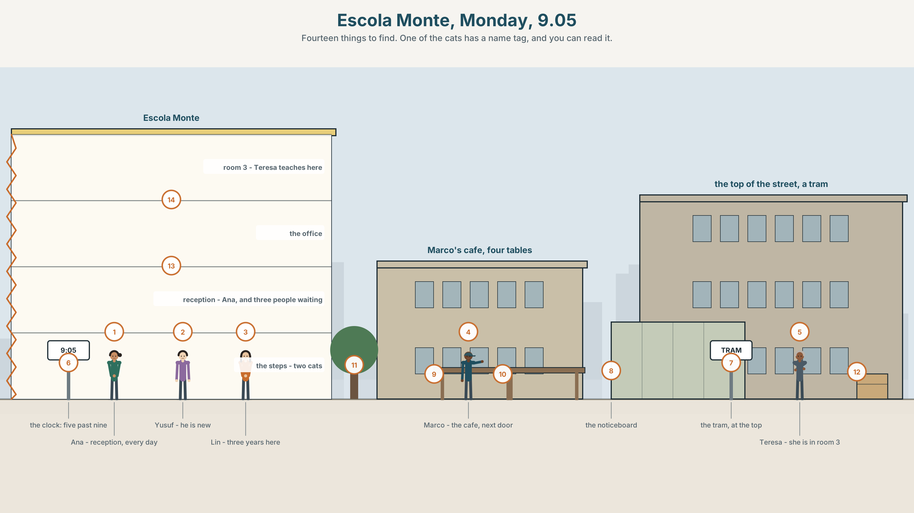{width=6.6in}

*Escola Monte, Monday, 9.05 — Fourteen things to find. One of the cats has a name tag, and you can read it.*

# Who is in this room?

**By the end of this unit you can introduce yourself and one other person to a group.**

| ◆ **A · THE WORLD** | The people in a new place, and how they say who they are |
|---|---|
| ◆ **B · THE SYSTEM** | *am · is · are* · I, you, he, she, it, we, they · 22 words for people and places · numbers 0–100 · the sounds /ɪ/ and /iː/ |
| ◆ **C · THE PERFORMANCE** | You stand up and introduce yourself and one other person |

---

### 0A · Find it — fourteen things

Find these in the picture. Write the number.

> ☐ a teacher ☐ a student ☐ a desk ☐ a door ☐ a window ☐ a clock ☐ a cat ☐ a café
> ☐ a table ☐ a chair ☐ a bag ☐ a phone ☐ a tram ☐ a street

**Four of these words are not in the picture. Which four?**

> a car · a dog · a bus · a book · a tree · a bicycle

### 0B · Guess it

Look at the people in reception. **Who is new here today?** How do you know?
Say one thing. You can use these words:

> *bag · map · looking · he · she*

### 0C · Say it ⏺

**Record. Thirty seconds. Do not prepare.**

> **Who is in this room?**

Say the names you know. Say "I don't know" for the others. That is fine — it is Monday.
You will listen to this again on the last page of this unit.

---

## Part 1 · Vocabulary Lab 1 ◆ **B · THE SYSTEM**

### 1A · Meet — people

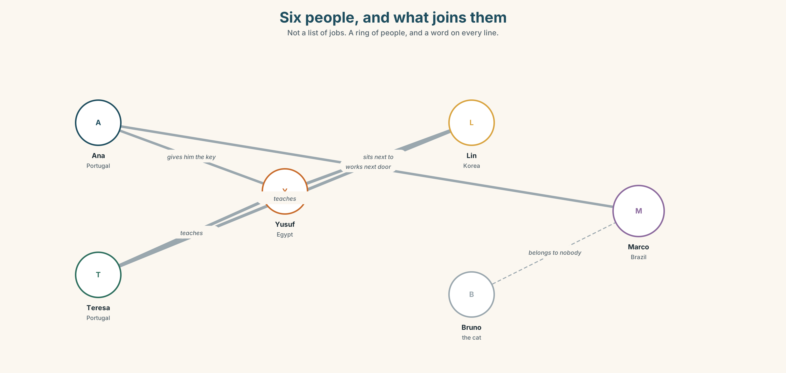{width=6.6in}

*Six people, and what joins them — Not a list of jobs. A ring of people, and a word on every line.*

| | | |
|---|---|---|
| **Ana** · Portugal | reception | She is here every day. |
| **Teresa** · Portugal | teacher | She is in room 3. |
| **Yusuf** · Egypt | student | He is new. |
| **Lin** · Korea | student | She is here for three years. |
| **Marco** · Brazil | café | He is next door. |
| **Bruno** · ? | cat | He is on the step. |

### 1B · Meet — the words

> **name · country · city · student · teacher · class · friend · man · woman · people ·
> address · email**

Write each word under the right picture.

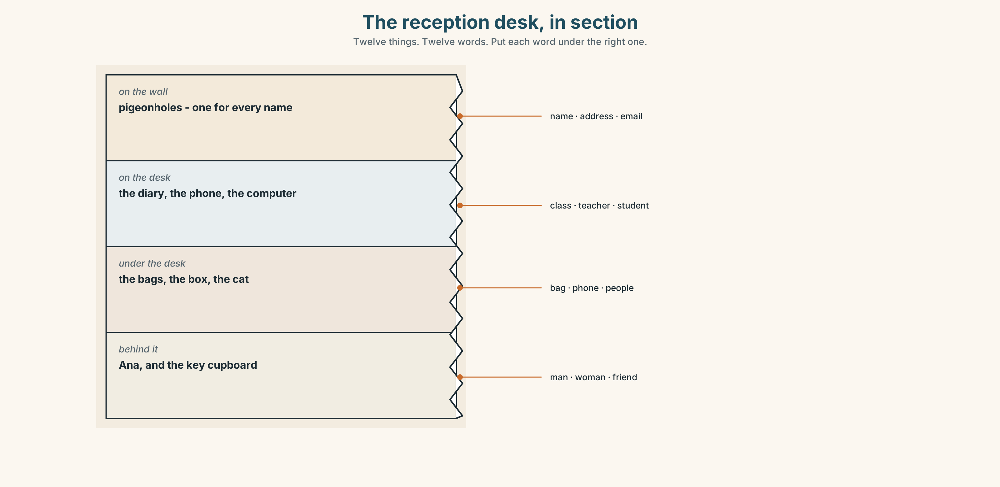{width=6.6in}

*The reception desk, in section — Twelve things. Twelve words. Put each word under the right one.*

### 1C · Sort — people or places?

Put each word in the right box. **Two of them are neither. Which two, and what are they?**

> country · woman · class · city · name · friend · address · teacher · school · student

| **PEOPLE** | **PLACES** | **NEITHER** |
|---|---|---|
| | | |

### 1D · Countries and people

| country | person |
|---|---|
| Portugal | Portuguese |
| Brazil | ______ |
| Egypt | ______ |
| Korea | ______ |
| Nigeria | ______ |
| Poland | ______ |

**Now say them.** Where is the strong part of the word? Mark it.

> Por-tu-GUESE · Bra-ZIL-ian · E-GYP-tian · Ko-RE-an · Ni-GER-ian · PO-lish

**One of these six is different from the other five. Which one?**

### 1E · Stretch — the phrases you will need today

> **first name** · **family name** · **Where are you from?** · **This is my friend.**

Match each phrase to the moment you need it.

1. Somebody asks you to fill in a form. → ______
2. You meet somebody for the first time. → ______
3. You are with a friend and you meet your teacher. → ______
4. Somebody says a long name and you only need the short part. → ______

### 1F · The hard one

> **f** **How do you spell it?**

Practise it three times. You will use it in Part 9 and you will use it for the rest of your life.

### 1G · Own it

Write four things on a card. Do not write your name.

> a city · a number · a country · a word you like

Give the card to your teacher. The class guesses whose card it is.

---

## Part 2 · Listening ◆ **A · THE WORLD**

### 2A · Monday morning, nine o'clock 🔊 Track 1.1

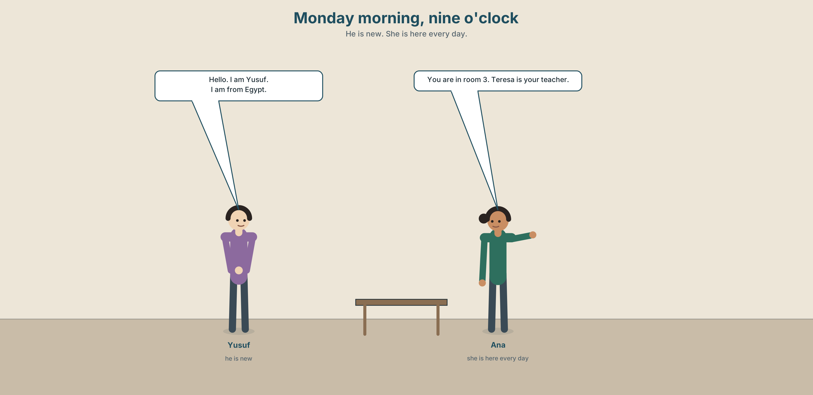{width=6.6in}

*Monday morning, nine o'clock — He is new. She is here every day.*

**Before you listen.** Look at the picture. **What does Yusuf want?** Choose one.

> ☐ a coffee ☐ a classroom ☐ a taxi ☐ a cat

**Listen once. Answer one question.**

> **What is Yusuf's room number?**

**Listen again. Complete the table.**

| | |
|---|---|
| First name | |
| Family name | |
| Country | |
| Room | |

**Listen again. True or false?**

1. Ana knows Yusuf's name. ☐ T ☐ F
2. Yusuf spells his name for her. ☐ T ☐ F
3. Yusuf is in room 2. ☐ T ☐ F
4. The grey cat has the name tag. ☐ T ☐ F

**Notice.** Here are four sentences from the recording.

> *I **am** Yusuf.* · *She **is** in room 3.* · *You **are** in room 3 too.* · *They **are** always there.*

**One word changes four times. Which word?** Write the four forms.

### 2B · Decoding clinic 🔊 Track 1.2

Twenty seconds of the same conversation, at full speed. **Four times, four jobs.**

1. How many words in Ana's first sentence?
2. Catch the two numbers.
3. *I'm* — how many words is that really?
4. Say the alphabet with Ana. She goes fast. Keep up.

> Transcripts are on page 148. Not before you finish.

---

## Part 3 · Grammar Lab 1 ◆ **B · THE SYSTEM**

### *am · is · are* — and who they belong to

### 3A · Notice

Look at the four sentences in Part 2 again.

1. Which word goes with **I**?
2. Which word goes with **she**, **he** and **it**?
3. Which word goes with **you**, **we** and **they**?
4. One of these three groups has **three** words in it. Which?

### 3B · See

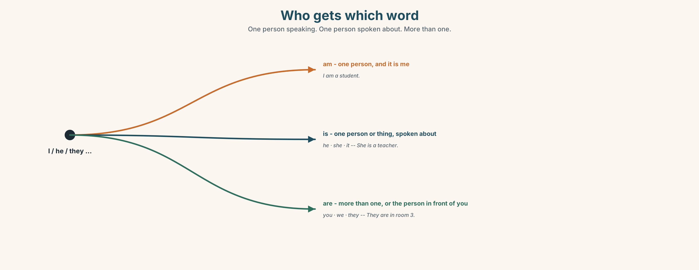{width=6.6in}

*Who gets which word — One person speaking. One person spoken about. More than one.*

### 3C · Know

| | | |
|---|---|---|
| **I** | **am** | I am a student. |
| **he · she · it** | **is** | She is a teacher. |
| **you · we · they** | **are** | They are in room 3. |

**Short forms — what people actually say.**

> I'm · you're · he's · she's · it's · we're · they're

> **Watch out.** *You* is one person **and** more than one person. It is always **are**.
> *You are my teacher.* *You are my class.*

> **Why it matters.** This is the most common verb in English. You will say it a hundred times
> today.

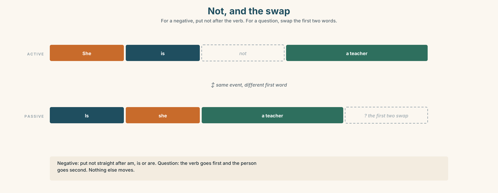{width=6.6in}

*Not, and the swap — For a negative, put not after the verb. For a question, swap the first two words.*

| | |
|---|---|
| **–** | I **am not** / I'm not · she **is not** / she isn't · they **are not** / they aren't |
| **?** | **Am** I…? · **Is** she…? · **Are** you…? |

### 3D · Use — controlled

Complete with **am**, **is** or **are**.

> Ana (1) ______ at the desk. She (2) ______ Portuguese. Yusuf and Lin (3) ______ students.
> Yusuf (4) ______ from Egypt and Lin (5) ______ from Korea. I (6) ______ in room 3.
> You (7) ______ in room 3 too. We (8) ______ in the same class. The cats (9) ______ on the step.
> They (10) ______ always there.

### 3E · Use — guided

Make the sentences negative, then make them questions.

1. She is a teacher. → ______________ → ______________
2. They are in the café. → ______________ → ______________
3. I am late. → ______________ → ______________
4. You are Brazilian. → ______________ → ______________

### 3F · Use — open

**Find three people in the room.** For each one, find out and write down:

> their name · their country · one more thing

Then tell the class about **one** of them. Start: *This is ______. She is…*

### 3G · Check — six items, mark your own

> 1. I ______ a student. 2. Marco ______ from Brazil. 3. We ______ in the same class.
> 4. ______ you Teresa? 5. The cats ______ not in the café. 6. She ______ not my teacher.

**0–3 →** Workbook pp. 4–6. **4–5 →** Part 6 will fix it. **6 →** the extension on p. 21.

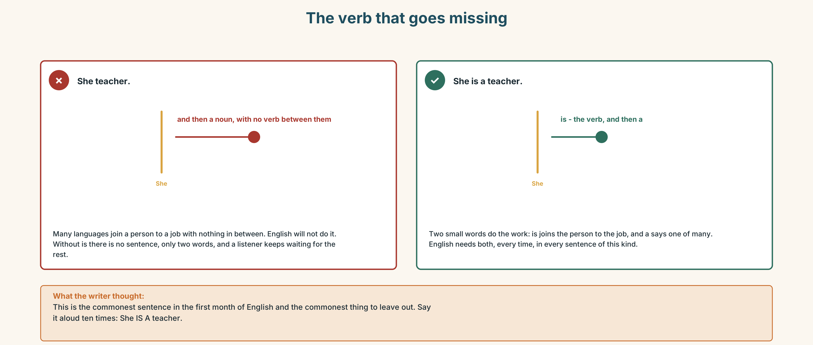{width=6.6in}

*The verb that goes missing — The verb that goes missing*

---

## Part 4 · Speaking ◆ **C · THE PERFORMANCE**

### 4A · Fluency starter — the circle

Stand in a circle. Say **three things** about yourself. Ten seconds.
Move one place to the left. Say the **same** three things to a new person. Eight seconds.
Move again. **Six seconds.**

Same words. Faster every time. That is the whole exercise.

### 4B · The functional core — saying who you are, and who somebody else is

**Language Bank**

| | |
|---|---|
| **you** | I'm ______ . · I'm from ______ . · I'm a ______ . |
| **somebody else** | This is ______ . · He's from ______ . · She's a ______ . |
| **asking** | What's your name? · Where are you from? · Sorry — how do you spell it? |
| **answering a mistake** | Not quite — it's ______ . · Almost! · That's it. |

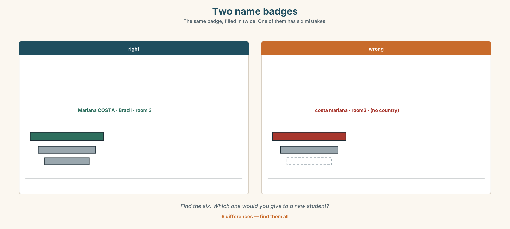{width=6.6in}

*Two name badges — The same badge, filled in twice. One of them has six mistakes.*

**Information gap.** Learner A has a sign-in sheet with six names and three gaps.
Learner B has the same sheet with the **other** three gaps. Complete it. **You may only speak.**

### 4C · The performance — the introduction ⏺

Stand up. **Twenty to thirty seconds.** Introduce **yourself and one other person** to the class.

> *Hello. I'm ______ . I'm from ______ . And this is ______ . He's / She's from ______ , and
> he's / she's a ______ .*

**Record it.** You will need it on the last page.

### 4D · Observer

One person in each group does not speak. You listen for **one thing only**:

> **Did everybody get their name said correctly?**

### 4E · Two criteria

> ☐ Did I say my name clearly enough for a stranger to write it down?
> ☐ Did I say something about the other person that was not just their name?

---

## Part 5 · Reading ◆ **A · THE WORLD**

### 5A · Predict

The title of the text is **"The cats on the step."**
**What do you think the text is about?** Choose one.

> ☐ a pet shop ☐ a school ☐ a problem with cats ☐ a café

### 5B · Read — sixty seconds

---

**The cats on the step**

Escola Monte is a yellow building on a very steep street in Lisbon. There are four floors and
sixteen classrooms. Ana is at the desk. She knows every student's name, and she knows every
student's name **before** they arrive, because she reads the list on Sunday.

There are two cats on the step. They are not Ana's cats. They are not anybody's cats. One is grey
and one is orange, and the orange one has a name tag. The tag says **Bruno**.

Nobody knows who put the tag on the cat.

---

### 5C · Answer

1. What colour is the building?
2. How many classrooms are there?
3. What is Ana's job?
4. Why does Ana know the names on Monday?
5. How many cats are there?
6. **What is the question at the end of the text?**

### 5D · Vocabulary in context

Find these in the text. **Do not use a dictionary yet.** Write what you think each one means, then
check with a partner.

> steep · floor · tag · nobody

### 5E · The counter-text

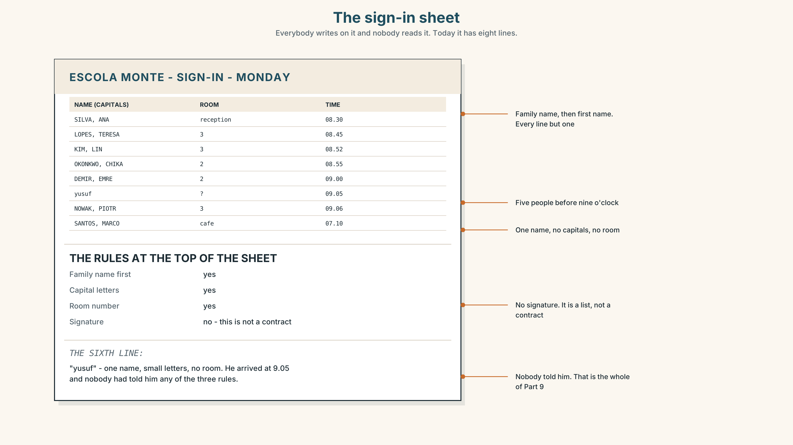{width=6.6in}

*The sign-in sheet — Everybody writes on it and nobody reads it. Today it has eight lines.*

**Read the sheet.**

1. How many people signed in before nine o'clock?
2. Who signed in first, and where do they work?
3. The rules at the top ask for three things. **Which of the three does the sixth line have?**
4. One line is different from all the others. **What would you do about it?**

### 5F · Two texts

The story says Ana **knows every name**. The sign-in sheet shows one name she could not read.

**Which one is true?** Talk about it. There is more than one answer.

---

## Part 6 · Vocabulary Lab 2 ◆ **B · THE SYSTEM**

### Numbers 0–100

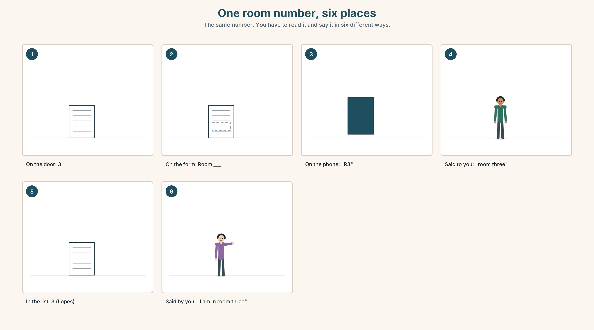{width=6.6in}

*One room number, six places — The same number. You have to read it and say it in six different ways.*

### 6A · The ones that catch everybody

| | | |
|---|---|---|
| **13** thir-TEEN | **30** THIR-ty | *The stress moves. The meaning moves with it.* |
| **14** four-TEEN | **40** FOR-ty | |
| **15** fif-TEEN | **50** FIF-ty | |

**Listen 🔊 Track 1.3. Which do you hear?** Ten items.

### 6B · Say the number

> a room · a phone number · an age · a price · a floor · a date

Your teacher says one. You say which it is. Then swap.

### 6C · Chunk

> **phone number** · **room number** · **How old are you?** · **How do you spell it?**

Complete.

1. What's your ______ ______ ? — It's 2-1-4-9-0-3-3-7.
2. ______ ______ are you? — I'm twenty-two.
3. I'm in ______ ______ 3.
4. My name is Yusuf. — Sorry, ______ do you ______ it?

### 6D · Contrast Clinic

Six items. Each one has **a number and a form of *be***. Both must be right.

1. I ______ (be) twenty. 2. She ______ (be) in room ______ (13 / 30)?
3. They ______ (be) fifteen and seventeen. 4. We ______ (be) on floor ______ (4).
5. ______ (be) you forty? 6. The class ______ (be) at ______ (9.15).

---

## Part 7 · Pronunciation & Fluency Lab ◆ **B · THE SYSTEM**

### /ɪ/ and /iː/ — a short sound and a long one

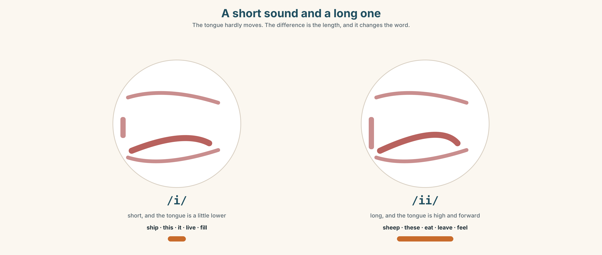{width=6.6in}

*A short sound and a long one — The tongue hardly moves. The difference is the length, and it changes the word.*

### 7A · Hear

| /ɪ/ | /iː/ |
|---|---|
| **i**t | **ea**t |
| s**i**t | s**ea**t |
| th**i**s | th**e**se |
| l**i**ve | l**ea**ve |
| f**i**ll | f**ee**l |

🔊 **Track 1.4.** Which do you hear? Ten items.

### 7B · Say

Say each pair. Then say these sentences.

> *This is it.* *These are the seats.* *Please sit here.* *I live in Lisbon. I leave at six.*

### 7C · Make it mean something

Two sentences. **One letter different. Completely different meaning.**

> *I'd like to **live** here.* · *I'd like to **leave** here.*

Say each one to a partner. Your partner says which one you said. If they get it wrong, say it
again — do not explain.

### 7D · Fluency 20 ⏺

Twenty seconds: **your name, your country, your city, and one thing you like.**
Three times. Faster each time. Record the first and the third.

---

## Part 8 · Writing ◆ **C · THE PERFORMANCE**

### Introduce yourself · 40–60 words

### 8A · Read the model

> My name is Mariana Costa. **Mariana** is my first name and **Costa** is my family name.
> I am from Recife, a city in Brazil. `[says where, then says where that is — the reader may not
> know]` I am twenty-four and I am a nurse. I am in room 3. My friend Lin is in room 3 too.
> She is Korean.

**Questions about the writer's choices:**

1. Why does she explain which part is her first name?
2. She says *from Recife, a city in Brazil*. Why does she add the second part?
3. The last two sentences are about somebody else. Why are they there?

### 8B · The anti-model

> My name is Mariana. I am from Brazil. I am twenty-four. I am a nurse. I am in room 3. My friend
> is Lin. She is from Korea.

This is correct English. **Why is the first one better?** Say one thing.

### 8C · Plan

> my name → which part is which → my country → my city → my age or my job → one other person

### 8D · Write — 40 to 60 words

### 8E · Peer review — two things only

Swap with a partner. Read once. Tick, then sign your name.

> ☐ Can I write your name correctly from this?
> ☐ Is there one other person in it?

### 8F · Publish

Your text goes on the wall by the door, with your photo. **The wall is how the school learns your
name.**

---

## Part 9 · The File ◆ **A · THE WORLD + C · THE PERFORMANCE**

# WORK FILE · The front desk

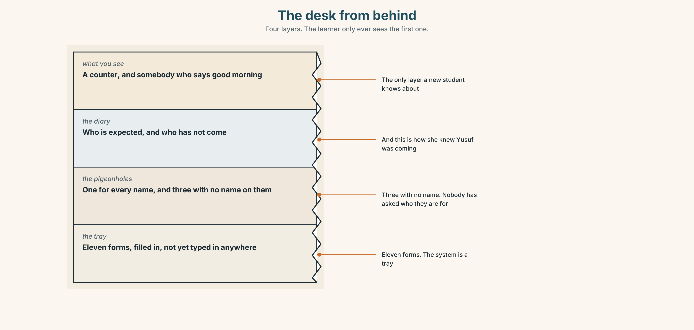{width=6.6in}

*The desk from behind — Four layers. The learner only ever sees the first one.*

### 9A · The form

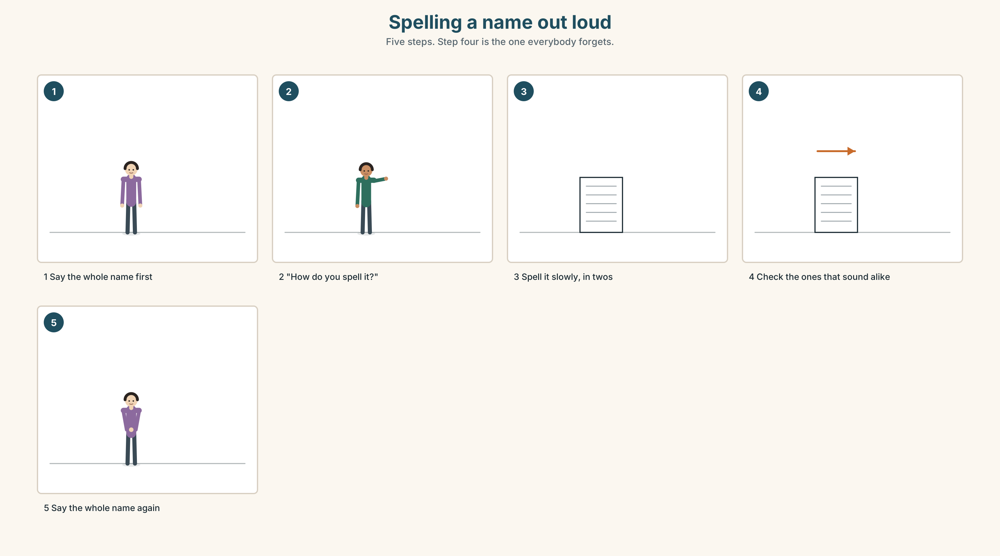{width=6.6in}

*Spelling a name out loud — Five steps. Step four is the one everybody forgets.*

Complete the form for yourself.

| | |
|---|---|
| FAMILY NAME (block capitals) | |
| First name | |
| Country | |
| City | |
| Email | |
| Phone | |

### 9B · Spelling out loud

🔊 **Track 1.5.** The alphabet, twice: slowly, then at normal speed.

**The eight that cause trouble.** Say them. Then say them to a partner with your eyes closed.

> **A · E · I** · **G · J** · **M · N** · **Y**

Now spell these: your family name · your city · your street.

### 9C · Role play — the front desk

**Card A — you arrive.** It is your first day. Nobody is expecting you, because your name was
written down wrong. You have to fix it without being rude.

**Card B — you are at the desk.** You have a list. The name on the list is close to the name you
are hearing, but not the same. You have four people waiting.

Run it. Then **swap cards and run it again.**

### 9D · The thing that always happens

Somebody says your name wrong.

**Choose a reply.** There are no wrong answers, but they are not the same.

> ☐ *That's fine.*
> ☐ *Almost — it's ______ .*
> ☐ *Not quite. Can I show you?*
> ☐ *Sorry — it's ______ . With the stress on the second part.*

When would you use each one?

### 9E · Transfer — before next week

**Find out how to say one person's name correctly** — a classmate, a colleague, a neighbour. Not
from a list. Ask them. Come back and say it.

---

## Part 10 · Mediation & Interaction ◆ **C · THE PERFORMANCE**

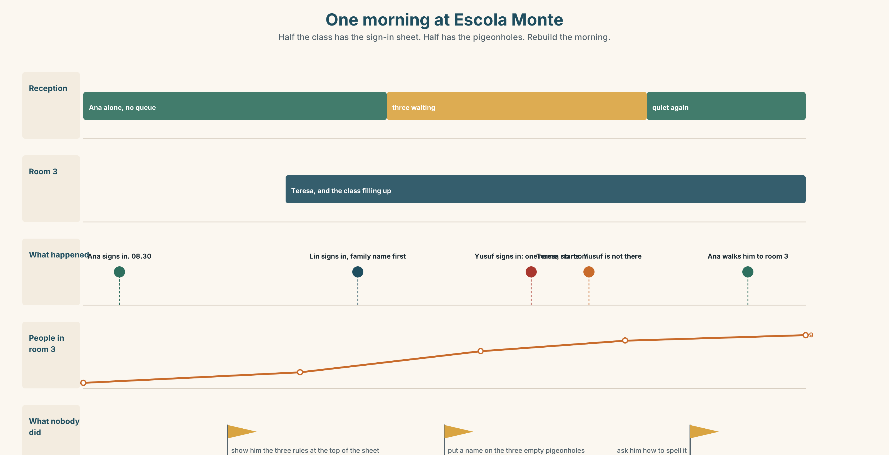{width=6.6in}

*One morning at Escola Monte — Half the class has the sign-in sheet. Half has the pigeonholes. Rebuild the morning.*

### 10A · Relay

Half the class sees the **left** side. Half sees the **right**. You cannot show each other.

**Build the whole picture by speaking.** Ten minutes.
You may say: *Who is in room ______ ?* · *Where is ______ from?* · *How do you spell it?*

### 10B · Simplify — for one person

A new student arrives tomorrow. **She speaks no Portuguese and very little English.**

Write her **four sentences**. Only four. Which four does she actually need?

### 10C · Online

Write **one message** for the class group chat:

> *Hi everyone — I'm ______ …*

It will be read by twenty people you have not met. **Keep it to twenty-five words.**

### 10D · Your language

How do you say *"What's your name?"* in your language?
Teach it to one other person. Then **write both versions** side by side.

> English: ______________________
> My language: ______________________

**Is one of them longer? Is one of them more polite?**

---

## Part 11 · The Decision ◆ **C · THE PERFORMANCE**

# Yusuf, or Joseph?

Yusuf is from Cairo. His name is **Yusuf**.

At the café next door, Marco calls him **Joseph**. In the first week, Yusuf corrected him twice.
Marco said sorry twice. Now it is week three and Marco still says **Joseph**, and he says it in a
friendly way, every morning, in front of other people.

Yusuf has two choices. Neither one is free.

### 11A · The evidence

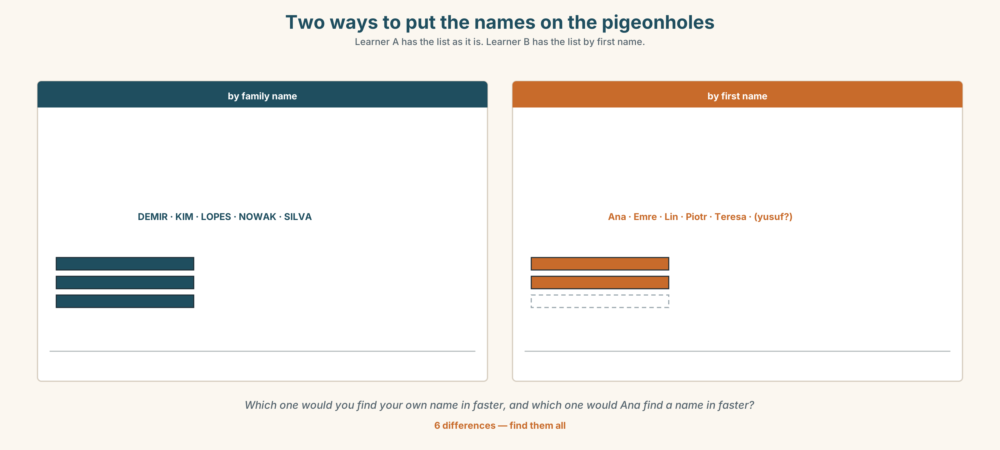{width=6.6in}

*Two ways to put the names on the pigeonholes — Learner A has the list as it is. Learner B has the list by first name.*

🔊 **Track 1.6.** Lin, 25 seconds: *"I changed mine in my first month here. It was easier. Now
nobody at work knows my real name and I don't know how to start."*

### 11B · Talk about it

In threes. Use the frame. Everybody says one.

> *I think Yusuf should ______ , because ______ .*

**Words you can use:** *easy · difficult · polite · his name · every day · in front of people ·
friendly · tired*

### 11C · Decide

Write **two sentences**. Choose, and say why.

> I think Yusuf should ______________________ ,
> because ______________________ .

### 11D · Model decision

> I think Yusuf should say it one more time, but differently. Two corrections did not work, and
> Marco is not unkind — he is friendly, and that makes it harder. So: say it when nobody is
> waiting, and write it down. People remember a name they have seen.

### 11E · The Reveal

> **What happened.** Yusuf wrote his name on a napkin and gave it to Marco on a quiet afternoon.
> Marco kept it. He now says **Yusuf**, and he says it slightly too carefully, which Yusuf finds
> funny.
>
> Lin never went back to her name. She says she does not mind. **She also says she minds.**

**One question. You do not have to answer it out loud.**

> Yusuf's reasoning was good **and** it worked. Would it still have been good reasoning if Marco
> had not kept the napkin?

---

## Part 12 · Landing ◆ **all three lines**

### 12A · Recycle — twelve items

**This is Unit 1 of Book 1. There is nothing before it. So everything here is from this unit —
and from Unit 2 onwards, four items will come from earlier in this book and two from the book
before.**

> 1. She ______ a teacher. 2. They ______ from Korea. 3. I ______ not late.
> 4. ______ you in room 3? 5. Marco is from Brazil. He is ______ .
> 6. What's your ______ name — Yusuf or Hassan?
> 7. Sorry, how do you ______ it?
> 8. Thirteen or thirty? *(listen)* ______
> 9. I am twenty-two. = I ______ twenty-two years old.
> 10. ______ is my friend Lin.
> 11. The cats ______ on the step.
> 12. Ana is at the ______ .

### 12B · Consolidate — one task, everything in it

**Write six sentences about the people in your class.** Use **am**, **is** and **are** — all three.
Use **two numbers**. Use **two countries**. Name **three people**.

### 12C · Can-do, with evidence

| I can… | My evidence | Sure? |
|---|---|---|
| say my name and spell it so a stranger can write it down | your Part 9C role play | ◯ ◑ ● |
| introduce myself and one other person to a group | your Part 4C recording | ◯ ◑ ● |
| use *am*, *is* and *are* correctly | your Part 3G score | ◯ ◑ ● |
| understand and say numbers 0–100 | your Part 6A score | ◯ ◑ ● |

### 12D · Replay ⏺

Find your thirty seconds from **Part 0C**. Listen.
Now record it again: **Who is in this room?**

Listen to both. **Count the names.** The first time, how many? Now?

### 12E · Glossary — thirty-five words, as a map

> **PEOPLE** · student · teacher · friend · man · woman · people · class
> **WHERE FROM** · country · city · address · Portuguese · Brazilian · Egyptian · Korean ·
> Nigerian · Polish
> **NAMES** · name · first name · family name · How do you spell it? · What's your name?
> **CONTACT** · email · phone number
> **NUMBERS** · zero · one · two · three · ten · twelve · twenty · thirty · forty · fifty ·
> a hundred
> **MEETING** · Where are you from? · This is my friend.

### 12F · Next

> **Unit 2 · What does your body do all day?**
> You can say who you are. Next: what you do.

# A1.1 · Unit 2 · The Six O'Clock Class

> **English Animated** · *Starting Out* · Escola Monte, Lisbon
> Student's Book pages 28–49 · 22 pp · ~9 hours

---

## Part 0 · The Big Picture ◆ **A · THE WORLD**

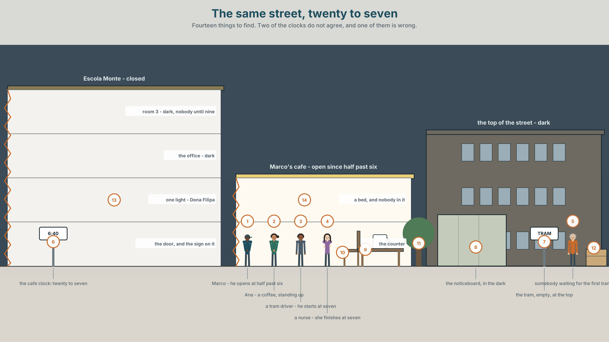{width=6.6in}

*The same street, twenty to seven — Fourteen things to find. Two of the clocks do not agree, and one of them is wrong.*

# What does your body do all day?

**By the end of this unit you can say what you do every day, and when you do it.**

| ◆ **A · THE WORLD** | A street at twenty to seven, and four people who are already working |
|---|---|
| ◆ **B · THE SYSTEM** | present simple: I, you, we, they · 22 words for the day and the body · days, times, *o'clock*, *half past* · the sounds /s/ /z/ /ɪz/ |
| ◆ **C · THE PERFORMANCE** | You tell the class about one day, from waking up to going to bed |

---

### 0A · Find it — fourteen things

Find these in the picture. Write the number.

> ☐ a clock ☐ a cup ☐ a bed ☐ a light ☐ a door ☐ a window ☐ a hand ☐ a head
> ☐ a cat ☐ a tram ☐ a chair ☐ a bag ☐ a street ☐ a café

**Three of these words are not in the picture. Which three?**

> a teacher · a student · a desk · a phone · a book

### 0B · Guess it

Look at the four people. **Who gets up first?** How do you know?
Say one thing. You can use these words:

> *work · open · early · tired · six*

### 0C · Say it ⏺

**Record. Thirty seconds. Do not prepare.**

> **What do you do every morning?**

Say three things. Use *I*. It does not have to be interesting.
You will listen to this again on the last page.

---

## Part 1 · Vocabulary Lab 1 ◆ **B · THE SYSTEM**

### 1A · Meet — the day

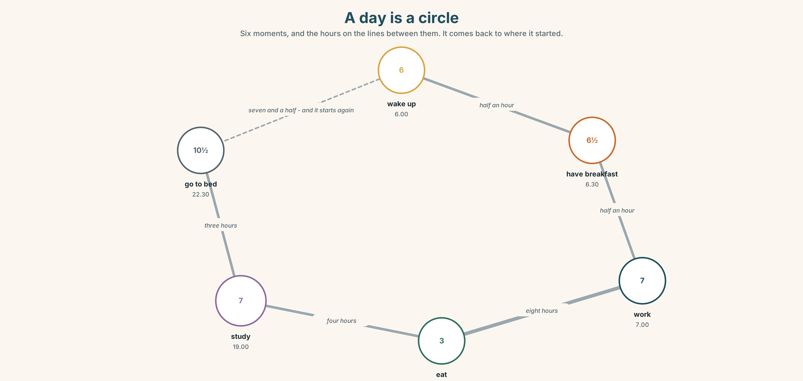{width=6.6in}

*A day is a circle — Six moments, and the hours on the lines between them. It comes back to where it started.*

| | | |
|---|---|---|
| **wake up** | 6.00 | Marco wakes up at six. |
| **get up** | 6.05 | Five minutes later. |
| **have breakfast** | 6.30 | At the café. He makes it. |
| **work** | 7.00–15.00 | Eight hours. |
| **study** | 19.00 | Two evenings a week. |
| **go to bed** | 22.30 | Early, for a city. |

### 1B · Meet — the words

> **wash · brush · eat · drink · work · study · sleep · tired · hungry · thirsty · happy**

Write each word under the right picture.

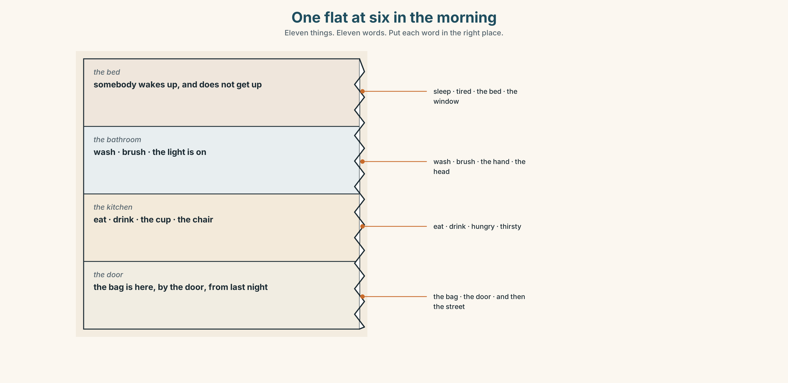{width=6.6in}

*One flat at six in the morning — Eleven things. Eleven words. Put each word in the right place.*

### 1C · Sort — a thing you do, or a way you feel?

Put each word in the right box. **One word can go in both. Which, and why?**

> sleep · drink · happy · tired · wash · hungry · work · study · eat · thirsty

| **YOU DO IT** | **YOU FEEL IT** | **BOTH** |
|---|---|---|
| | | |

### 1D · The body

| | |
|---|---|
| **head** | I wash my head. |
| **hand** | I wash my hands. |
| **arm** | My arms are tired. |
| **leg** | My legs are tired. |
| **back** | My back is tired. |
| **eye** | My eyes are tired. |

**Now say them.** Five of these six are usually said in the plural. **Which one is not, and why?**

### 1E · Stretch — the phrases you will need today

> **have breakfast** · **go to bed** · **feel well** · **wake up** · **get up**

Match each phrase to the moment you need it.

1. The alarm makes a noise. → ______
2. You put your feet on the floor. → ______
3. You eat at seven in the morning. → ______
4. The doctor asks you a question. → ______
5. It is half past ten at night. → ______

### 1F · The hard one

> **f** **What time is it?**

Practise it three times. **It is four words and people say it as two.**

### 1G · Own it

Write three times on a card. Do not write your name.

> the time you get up · the time you eat · the time you go to bed

Give the card to your teacher. The class guesses whose card it is.

---

## Part 2 · Listening ◆ **A · THE WORLD**

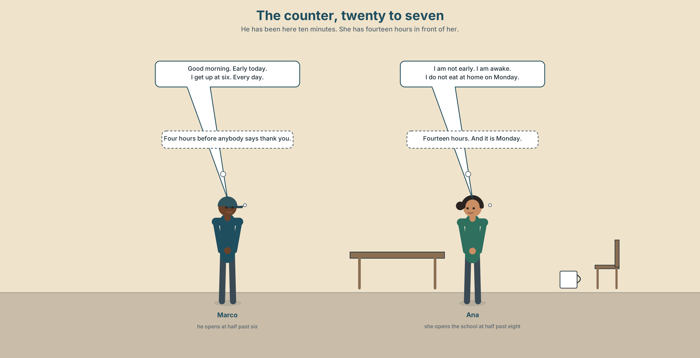{width=6.6in}

*The counter, twenty to seven — He has been here ten minutes. She has fourteen hours in front of her.*

### 2A · Twenty to seven 🔊 Track 2.1

**Before you listen.** Marco opens the café. Ana opens the school.
**Guess: who starts work first?**

**Listen once. One question.** What time does Marco get up?

**Listen again. Complete the table.**

| | Gets up | Starts work | Goes to bed |
|---|---|---|---|
| Marco | | | |
| Ana | | | |
| the cleaner | | | |

**Listen again. True or false?**

1. Marco gets up at six. ☐ T ☐ F
2. Ana works on Saturday. ☐ T ☐ F
3. The cleaner starts at five. ☐ T ☐ F
4. Marco goes to bed late. ☐ T ☐ F

**Noticing.** Four sentences from the recording.

1. *I get up at six.*
2. *We open at half past six.*
3. *They start at five.*
4. *You work on Saturday.*

**All four use the same shape. What is after *I*, *we*, *they* and *you*?**

### 2B · Decoding clinic 🔊 Track 2.2

Twenty seconds of Marco at speed. Three jobs.

1. Count the times he says a number.
2. Which word does he say twice — *work* or *open*?
3. He says *half past six* very quickly. How many sounds do you hear?

> Transcripts, page 148.

---

## Part 3 · Grammar Lab 1 ◆ **B · THE SYSTEM**

### What you do every day

### 3A · Notice

Look at the four sentences in Part 2 again.

1. Is the verb different after *I*, *we*, *they* and *you*?
2. Where is the time — at the start of the sentence, or at the end?
3. Can the time go in the other place?
4. One of the four sentences is about more than one person. Which?

### 3B · See

{width=6.6in}

*Four people, one verb — Look at the four boxes. They are the same colour because they are the same word.*

### 3C · Know

| | | |
|---|---|---|
| **I** | **work** | I work at six. |
| **you** | **work** | You work on Saturday. |
| **we** | **work** | We work together. |
| **they** | **work** | They work at night. |

> **The verb does not change.** Not yet. In Unit 3 it changes for *he*, *she* and *it*, and that
> is the only place it changes in the whole language.

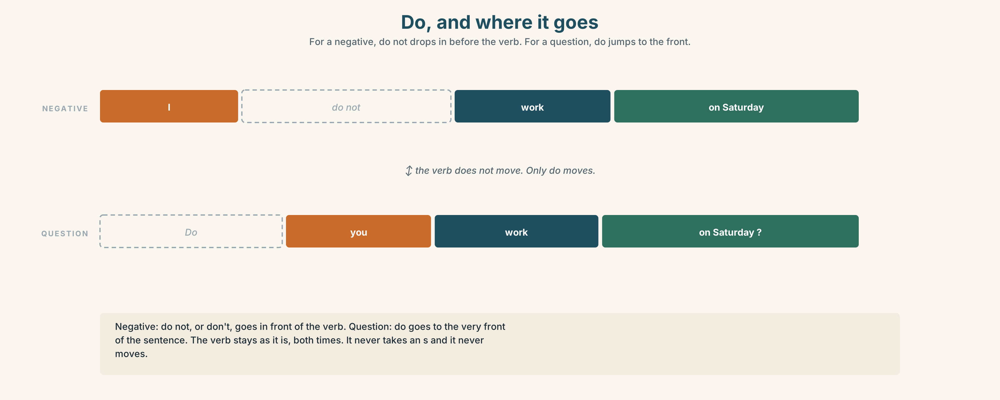{width=6.6in}

*Do, and where it goes — For a negative, do not drops in before the verb. For a question, do jumps to the front.*

| | |
|---|---|
| **–** | I **do not** work / I **don't** work · They **don't** open on Sunday |
| **?** | **Do** you work on Saturday? · **Do** they open early? |

> **Where the time goes.** *I get up at six.* · *At six I get up.* Both are English. The first one
> is normal. The second one puts the time first because the time is the news.

> **Why it matters.** This is how you say anything that is true every day, and most of what you
> say about your life is true every day.

### 3D · Use — controlled

Complete with **work**, **don't work**, **get up**, **open** or **don't open**.

> Marco (1) ______ at six. He (2) ______ the café at half past six.
> Ana and the cleaner (3) ______ in the same building. They (4) ______ on Sunday.
> I (5) ______ on Saturday — I study. (6) ______ you work on Saturday?

### 3E · Use — guided

Make each one negative, then make it a question.

1. They open at six.
2. I eat breakfast at home.
3. We study on Tuesday.
4. You work at night.
5. They go to bed early.

### 3F · Use — open

**In pairs.** Say five true things about your day. Your partner says **the same** or
**not the same**.

### 3G · Check — six items, mark your own

> 1. I ______ (get up) at seven.
> 2. They ______ (not open) on Sunday.
> 3. ______ you ______ (work) on Saturday?
> 4. We ______ (study) on Tuesday and Thursday.
> 5. ✗ *I am get up at six.* → correct it.
> 6. ✗ *Do you works on Saturday?* → correct it.

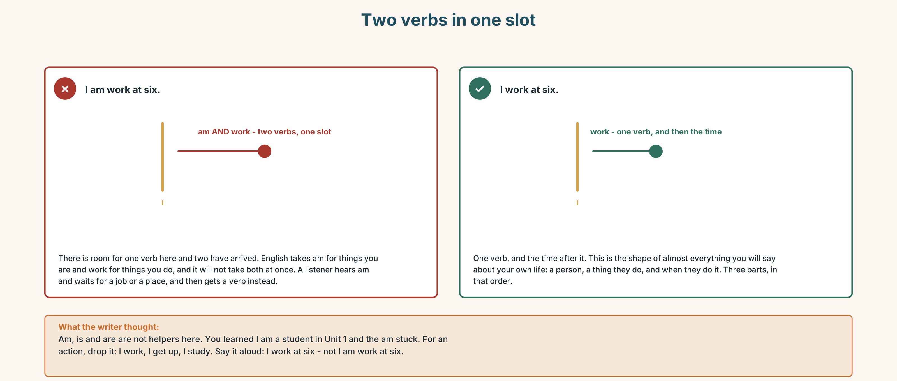{width=6.6in}

*Two verbs in one slot — Two verbs in one slot*

**0–3 →** Workbook pp. 8–11. **4–5 →** Part 6. **6 →** page 47.

---

## Part 4 · Speaking ◆ **C · THE PERFORMANCE**

### 4A · Fluency starter — the clock round

Everybody says one thing they do and the time. The next person repeats it and adds theirs.
**Stop when somebody forgets.**

### 4B · The functional core — saying when

{width=6.6in}

*Two timetables for the same week — The same template, filled in twice. One of them you can meet somebody with.*

**Language Bank**

| | |
|---|---|
| **the time** | *at six · at half past six · at seven o'clock* |
| **the day** | *on Monday · on Saturday · every day* |
| **the part of the day** | *in the morning · in the afternoon · in the evening · at night* |
| **how often** | *every day · two days a week* |

**Information gap.** Learner A has Marco's week. Learner B has Ana's week.
**Find one hour when they are both free.**

### 4C · The performance — one day ⏺

Tell the class about **one day**. **One minute.** You must say:

> what time you get up · two things you do in the morning · one thing you do in the evening ·
> what time you go to bed

**Record it.**

### 4D · Observer

One person listens for **one thing**: did every sentence have a time in it?

### 4E · Two criteria

> ☐ Did I use *at*, *on* and *in* correctly?
> ☐ Did I say six sentences without stopping?

---

## Part 5 · Reading ◆ **A · THE WORLD**

### 5A · Predict

The title is **"Four people, one street, one morning."**
**What time do you think the first person gets up?**

### 5B · Read — sixty seconds

---

**Four people, one street, one morning**

**Marco** gets up at six. He opens the café at half past six. He does not have breakfast at home —
he makes it at work and eats it standing up. He goes to bed at half past ten.

**Dona Filipa** cleans the school. She starts at five. She finishes at eight, and then she goes to
another building and starts again. She sleeps in the afternoon, from one to four.

**Ana** gets up at seven. She opens the school at half past eight. She has breakfast at home with
the radio on, and she says this is the best half hour of her day.

**Yusuf** gets up at eleven on Saturday and he is not sorry about it. On Monday to Friday he gets
up at seven, and on Saturday he sleeps.

Four people. One street. Nobody is in the same place at the same time, and they all think the
street is quiet.

---

### 5C · Answer

1. What time does Marco open the café?
2. Where does Marco eat breakfast?
3. What time does Dona Filipa start?
4. What does she do in the afternoon?
5. **Why does Ana say the half hour is the best of her day?**
6. **The last sentence says they all think the street is quiet. Why do they all think that?**

### 5D · Vocabulary in context

Guess from the text. Then check.

> standing up · finishes · another building · with the radio on · he is not sorry about it

### 5E · The counter-text

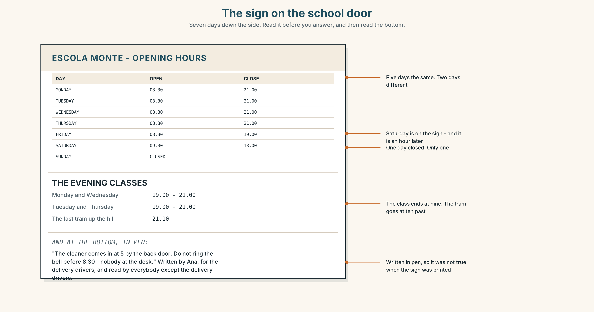{width=6.6in}

*The sign on the school door — Seven days down the side. Read it before you answer, and then read the bottom.*

**Read the sign and answer.**

1. What time does the school open on Monday?
2. **What time does it open on Saturday, and is that on the sign?**
3. Which day is it closed?
4. What does the handwritten note say, and who is it for?

### 5F · Two texts

The sign says the school opens at **half past eight**.
The text says Dona Filipa starts at **five**.

**Is the sign wrong?** Say one sentence.

---

## Part 6 · Vocabulary Lab 2 ◆ **B · THE SYSTEM**

### Days, hours and half hours

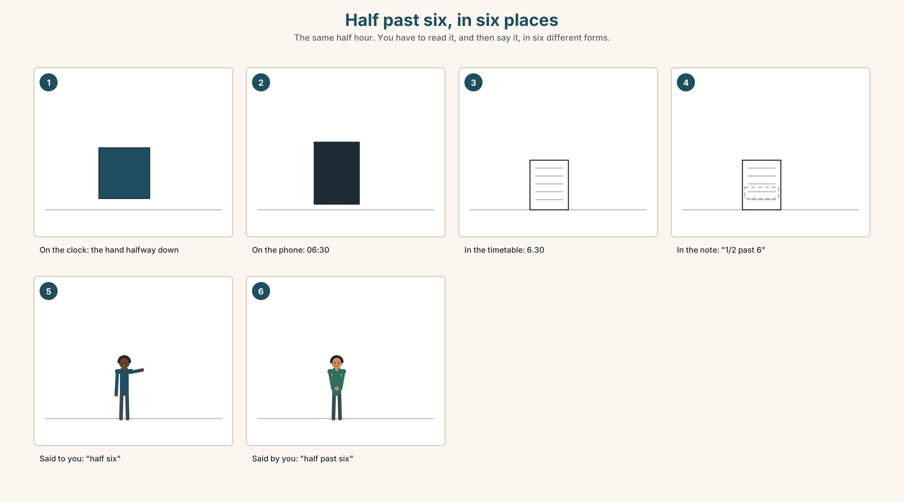{width=6.6in}

*Half past six, in six places — The same half hour. You have to read it, and then say it, in six different forms.*

### 6A · The ones that catch everybody

| | |
|---|---|
| **Wednesday** | three syllables are written, two are said: *WENZ-day* |
| **half past six** | not *half to seven* |
| **at night** | not *in the night* |
| **on Monday** | not *in Monday* |

### 6B · Say the time

> 6.00 · 6.30 · 7.00 · 7.30 · 9.00 · 9.30 · 10.30 · 11.00

### 6C · Chunk

1. **______ past** seven
2. **______ o'clock**
3. **______ day** — Monday to Sunday, all of them
4. **in the ______** — before twelve
5. **at ______** — when it is dark
6. **______ Saturday** — one day a week

### 6D · Contrast Clinic

Six items. ***at***, ***on*** or ***in***?

1. ______ night
2. ______ Monday
3. ______ Saturday afternoon
4. ______ six o'clock
5. ______ the morning
6. ______ half past eight

---

## Part 7 · Pronunciation & Fluency Lab ◆ **B · THE SYSTEM**

### /s/ /z/ and /ɪz/ — one letter, three sounds

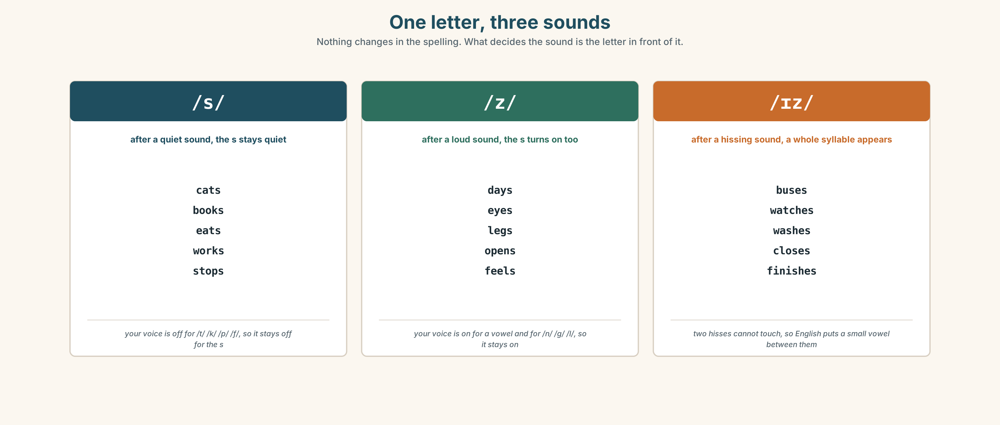{width=6.6in}

*One letter, three sounds — Nothing changes in the spelling. What decides the sound is the letter in front of it.*

### 7A · Hear

> **/s/** after a quiet sound: *cats · books · eats · works*
> **/z/** after a loud sound: *days · eyes · legs · opens*
> **/ɪz/** after a hissing sound: *buses · watches · washes · closes*

### 7B · Say

Say each group three times. Then say this:

> *He washes, he works, he opens.* — three endings, one sentence.

### 7C · Make it mean something

Say these two:

> *My eyes.* */z/*
> *My eye's tired.* */z/ too — and it is not a plural at all.*

**One sound, two jobs.** Which is which?

### 7D · Fluency 20 ⏺

Twenty seconds: **six things you do every day, with the time.** Three times, faster.

---

## Part 8 · Writing ◆ **C · THE PERFORMANCE**

### My day · 40–60 words

### 8A · Read the model

> I get up at half past six. `[a time, in the first sentence]`
>
> I wash and I have breakfast. I drink coffee, not tea. `[two ordinary things, and one small
> true detail]`
>
> I start work at eight. I work until four. `[the long part of the day, in one sentence]`
>
> In the evening I study English on Tuesday and Thursday. I go to bed at eleven. `[the days, and
> the last time]`

**Questions about the writer's choices:**

1. The first sentence is a time. **Why not a name?**
2. *I drink coffee, not tea.* **What does that one small detail do?**
3. Work is eight hours and it is one sentence. **Is that right?**

### 8B · The anti-model

> I get up. I wash. I have breakfast. I go to work. I work. I come home. I eat. I go to bed.

Correct English, and it could be anybody. **Add four words to it and make it one person.**

### 8C · Plan

> the time you get up → two things in the morning → work or school, with the hours →
> the evening, and the time you go to bed

### 8D · Write — 40 to 60 words
### 8E · Peer review — two things only

> ☐ Is there a time in the first sentence?
> ☐ Is there one small thing that is only true about this person?

### 8F · Publish

On the wall, with no names. **The class matches the day to the person.**

---

## Part 9 · The File ◆ **A · THE WORLD + C · THE PERFORMANCE**

# STUDY FILE · When do you actually study?

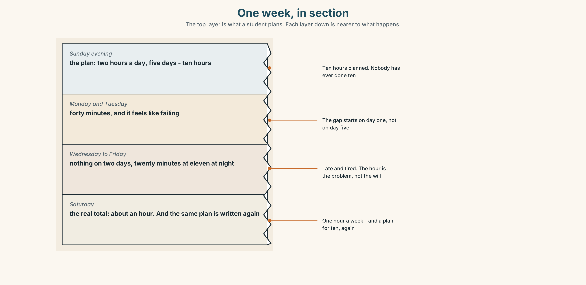{width=6.6in}

*One week, in section — The top layer is what a student plans. Each layer down is nearer to what happens.*

### 9A · The week

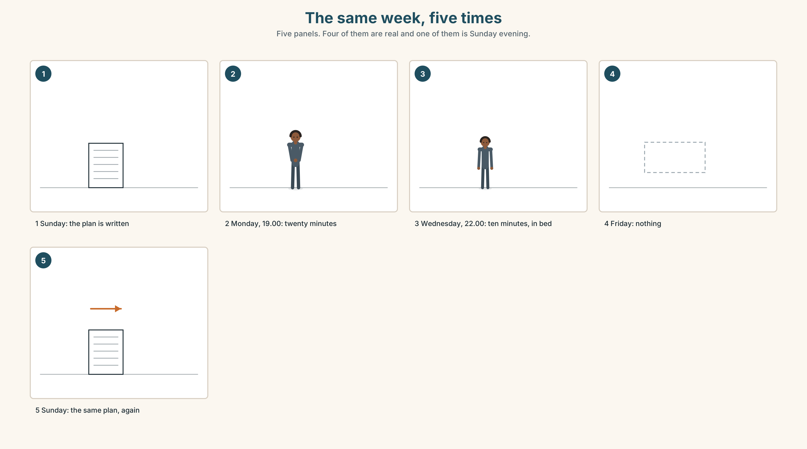{width=6.6in}

*The same week, five times — Five panels. Four of them are real and one of them is Sunday evening.*

| | |
|---|---|
| **What people plan** | two hours, five days a week |
| **What people do** | twenty minutes, three days a week |
| **When they do it** | late, and tired |
| **What they say** | *I don't have time.* |

### 9B · Twenty minutes

Twenty minutes every day is more than two hours on Sunday. **Not because twenty is more —
because Sunday does not always happen.**

**When in your day is there twenty minutes that always happens?** Write the time.

### 9C · Role play — the honest timetable

In pairs. One of you plans a week out loud. The other asks, after every line:

> *And what do you do now at that time?*

### 9D · The thing that always happens

Everybody has one: a bus, a queue, a kettle, a lift. **Find yours.** That is where the twenty
minutes is.

### 9E · Transfer — before next week

**Write down what time you actually studied, for seven days.** Do not change anything.
Bring the seven times.

---

## Part 10 · Mediation & Interaction ◆ **C · THE PERFORMANCE**

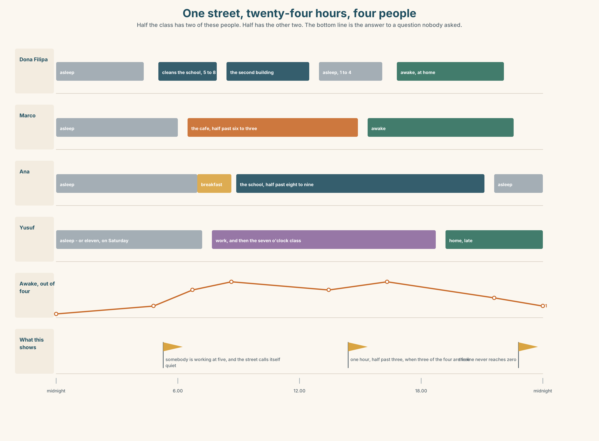{width=6.6in}

*One street, twenty-four hours, four people — Half the class has two of these people. Half has the other two. The bottom line is the answer to a question nobody asked.*

### 10A · Relay

Half the class has Marco's day. Half has Dona Filipa's.
**Rebuild the street's twenty-four hours by speaking.** Ten minutes.

### 10B · Simplify — for one person

A new student asks: *What time is the school open?*
**Answer in three sentences.** No lists.

### 10C · Online

Write **one message** to a classmate: say when you are free this week, and ask when they are.
**Two sentences.**

### 10D · Your language

Does your language say *at six* and *on Monday* with different words? **Say both in your
language.** How many words do you need?

---

## Part 11 · The Decision ◆ **C · THE PERFORMANCE**

# The six o'clock class

Escola Monte has an evening class at seven. Eleven students come.

Four of them work until seven and arrive late, every week. They miss the first fifteen minutes.
Teresa starts again for them, every week, and the seven students who came on time wait.

The school can move the class to **half past seven**. Then nobody is late. But the class finishes
at nine, and the last tram is at ten past nine, and three students walk home.

### 11A · The evidence

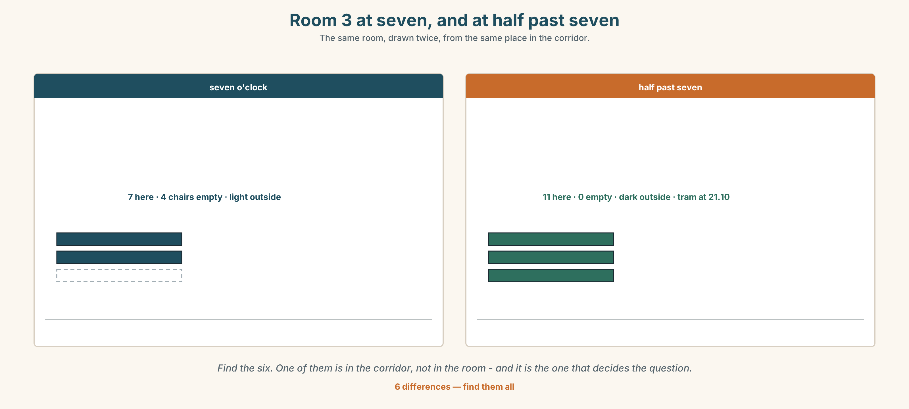{width=6.6in}

*Room 3 at seven, and at half past seven — The same room, drawn twice, from the same place in the corridor.*

🔊 **Track 2.6.** Lin, 20 seconds: *"I come at seven. I wait. I am not angry. But I get up at
six and now I go home at half past nine."*

### 11B · Talk about it

In threes. Use the frame. Everybody says one.

> *I think the class should start at ______ , because ______ .*

**Words you can use:** *work · late · tired · tram · wait · early · every week*

### 11C · Decide

Write **two sentences**. Choose, and say why.

> I think the class should start at ______________________ ,
> because ______________________ .

### 11D · Model decision

> Keep it at seven and do not start again. The first fifteen minutes is speaking practice, and
> you can walk into speaking practice late. Put the new grammar at half past. Nobody waits and
> nobody misses anything.

### 11E · The Reveal

> **What happened.** Teresa moved the grammar to half past seven and left the first fifteen
> minutes for speaking. The four late students still came late. The seven others stopped waiting.
>
> Then something she did not expect: two of the seven started coming at twenty past instead of
> seven, because they had worked out what the first fifteen minutes was.

**One question. You do not have to answer it out loud.**

> Teresa solved the problem for the four. Did she make a new one for the seven?

---

## Part 12 · Landing ◆ **all three lines**

### 12A · Recycle — twelve items

> 1. I ______ (get up) at six.
> 2. They ______ (not open) on Sunday.
> 3. ______ you ______ (work) on Saturday?
> 4. ______ six o'clock
> 5. ______ Monday
> 6. ______ the morning
> 7. ______ night
> 8. It is half ______ seven.
> 9. I have ______ at seven. *(the first meal)*
> 10. I go ______ bed at eleven.
> 11. My legs are ______ .
> 12. *(Unit 1)* She ______ a teacher.

### 12B · Consolidate — one task, everything in it

**Write six sentences about one person in your family.** Use *they*. Put a time in every
sentence. Use one negative and one question.

### 12C · Can-do, with evidence

> ☐ I can say what I do every day. **Evidence:** 4C, 8D
> ☐ I can use *at*, *on* and *in* with times and days. **Evidence:** 6D
> ☐ I can make a negative and a question with *do*. **Evidence:** 3G
> ☐ I can hear and say /s/, /z/ and /ɪz/. **Evidence:** 7D

### 12D · Replay ⏺

Record 0C again. **Listen to both.** What is different?

### 12E · Glossary — thirty-five words, as a map

> **THE DAY** · wake up · get up · have breakfast · work · study · go to bed · sleep
> **THE BODY** · head · hand · arm · leg · back · eye
> **DOING** · wash · brush · eat · drink
> **FEELING** · tired · hungry · thirsty · happy · feel well
> **THE DAYS** · Monday · Tuesday · Wednesday · Saturday · Sunday · every day
> **THE TIME** · morning · afternoon · evening · night · o'clock · half past · What time is it?

### 12F · Next

> **Unit 3 · What is on your screen?**

# A1.1 · Unit 3 · Eleven Screens

> **English Animated** · *Starting Out* · Escola Monte, Lisbon
> Student's Book pages 50–71 · 22 pp · ~9 hours

---

## Part 0 · The Big Picture ◆ **A · THE WORLD**

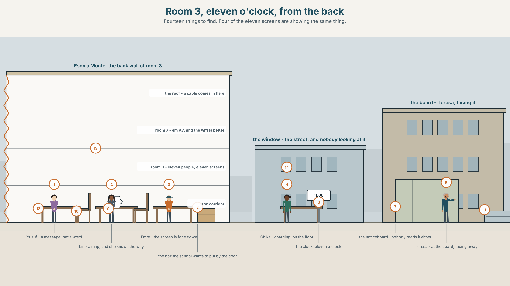{width=6.6in}

*Room 3, eleven o'clock, from the back — Fourteen things to find. Four of the eleven screens are showing the same thing.*

# What is on your screen?

**By the end of this unit you can ask somebody what they do, and how often they do it.**

| ◆ **A · THE WORLD** | A classroom where eleven people are in two places at once |
|---|---|
| ◆ **B · THE SYSTEM** | present simple *he / she / it* · *do* and *does* questions · 22 words for screens · the seven question words · question tunes, up and down |
| ◆ **C · THE PERFORMANCE** | You interview a classmate about one habit and report it to the class |

---

### 0A · Find it — fourteen things

Find these in the picture. Write the number.

> ☐ a phone ☐ a screen ☐ an app ☐ a message ☐ a photo ☐ a video ☐ a battery
> ☐ a charger ☐ a map ☐ a camera ☐ a cable ☐ a desk ☐ a clock ☐ a window

**Three of these words are not in the picture. Which three?**

> a password · a notification · the internet

### 0B · Guess it

Look at the eleven screens. **Who is working and who is not?** How do you know?
Say one thing. You can use these words:

> *look · message · photo · map · online*

### 0C · Say it ⏺

**Record. Thirty seconds. Do not prepare.**

> **What is the first thing you look at in the morning?**

Say three things. You will listen to this again on the last page.

---

## Part 1 · Vocabulary Lab 1 ◆ **B · THE SYSTEM**

### 1A · Meet — what a phone is made of

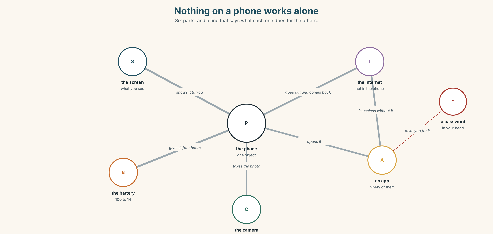{width=6.6in}

*Nothing on a phone works alone — Six parts, and a line that says what each one does for the others.*

| | |
|---|---|
| **screen** | You look at it. It is the part that is broken. |
| **battery** | It goes from 100 to 14 in a day. |
| **charger** | Everybody has two and nobody has one. |
| **password** | The one thing on the phone that is not on the phone. |
| **camera** | Two of them, and you only use one. |
| **app** | There are ninety. You open four. |

### 1B · Meet — the words

> **phone · screen · app · message · photo · video · internet · online · notification · map · camera**

Write each word under the right picture.

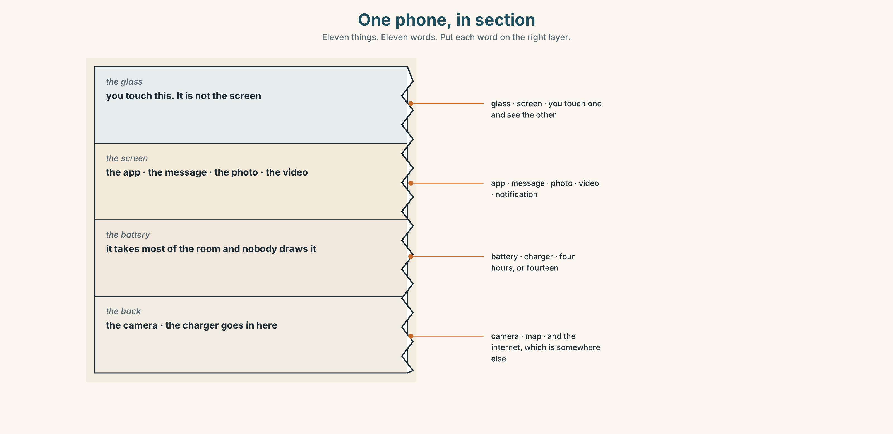{width=6.6in}

*One phone, in section — Eleven things. Eleven words. Put each word on the right layer.*

### 1C · Sort — where does it live?

Put each word in the right box. **Two of them are not things at all. Which two?**

> internet · message · photo · notification · map · camera · screen · app · video ·
> online

| **YOU CAN TOUCH IT** | **IT IS ON THE SCREEN** | **NEITHER** |
|---|---|---|
| | | |

### 1D · The verbs that go with it

| | |
|---|---|
| **turn on** | I turn on my phone at seven. |
| **turn off** | I turn off my phone at eleven. Nobody believes me. |
| **log in** | You log in once a year and then you forget the password. |
| **send a message** | Four words. It takes two seconds. |
| **take a photo** | Not *make* a photo. English takes it. |
| **check your phone** | Eighty times a day, and you remember four. |
| **open an app** | Not *start*. Not *put on*. Open. |
| **charge the battery** | The battery is charged. You charge it. |

**Now say them.** Three of these eight have a word in the middle that can move.
**Which three?** *(Try: I turn the phone on.)*

### 1E · Stretch — the phrases you will need today

> **turn on** · **log in** · **take a photo** · **check your phone** · **charge the battery**

Match each phrase to the moment you need it.

1. The screen is black and it is not broken. → ______
2. It says 4% and you are going out. → ______
3. The website asks you for your name twice. → ______
4. Your friend does something funny and you have two seconds. → ______
5. You are in a lesson and nothing is happening in your hand. → ______

### 1F · The hard one

> **f** **I don't understand.**

Practise it three times. **It is the most useful sentence in this book and most people never say
it, because they think it is impolite. It is not.**

### 1G · Own it

Write on a card: **the app you open first** and **the app you open most**.
Do not write your name. The class guesses whose card it is.

---

## Part 2 · Listening ◆ **A · THE WORLD**

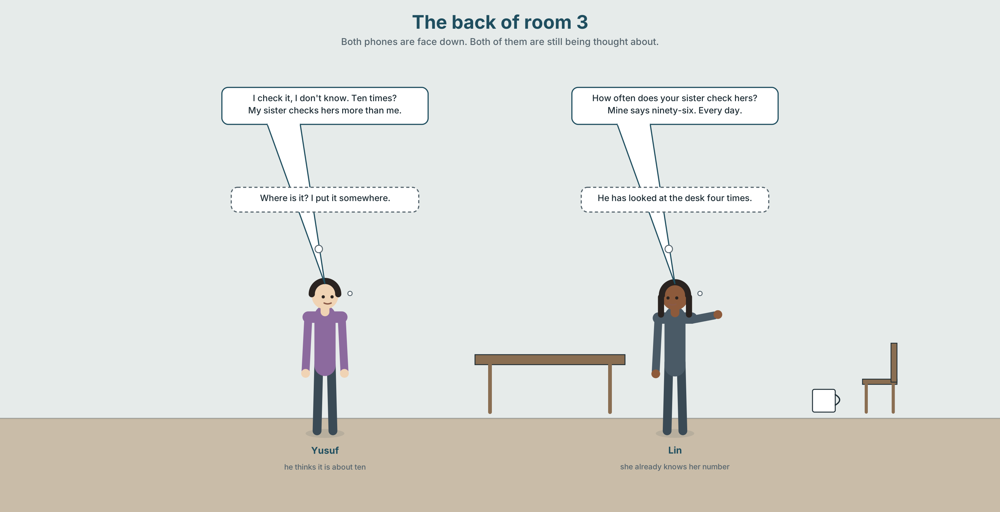{width=6.6in}

*The back of room 3 — Both phones are face down. Both of them are still being thought about.*

### 2A · Eleven o'clock, at the back 🔊 Track 3.1

**Before you listen.** Lin asks Yusuf about his phone.
**Guess: does he know how often he checks it?**

**Listen once. One question.** How many times a day does Yusuf think he checks his phone?

**Listen again. Complete the table.**

| | Thinks | The phone says | First app |
|---|---|---|---|
| Yusuf | | | |
| Lin | | | |

**Listen again. True or false?**

1. Yusuf turns off his phone at night. ☐ T ☐ F
2. Lin checks her phone before she gets up. ☐ T ☐ F
3. Yusuf's battery lasts all day. ☐ T ☐ F
4. Lin knows her own password. ☐ T ☐ F

**Noticing.** Four questions from the recording.

1. *How often do you check it?*
2. *How often does your sister check hers?*
3. *What does it say?*
4. *Where do you put it at night?*

**Two of these four have *does* and two have *do*. Why?**

### 2B · Decoding clinic 🔊 Track 3.2

Twenty seconds of Lin at speed. Three jobs.

1. Count the question words you hear.
2. Her voice goes up at the end of two questions and down at the end of two. Which two go up?
3. She says *how often do you* as one word. Write what you hear.

> Transcripts, page 149.

---

## Part 3 · Grammar Lab 1 ◆ **B · THE SYSTEM**

### One letter, and the question word in front

### 3A · Notice

Look at the four questions in Part 2 again.

1. Which two have *do*, and who are they about?
2. Which two have *does*, and who are they about?
3. After *does*, does the verb have an **s** on it?
4. Where is the question word — at the front, or in the middle?

### 3B · See

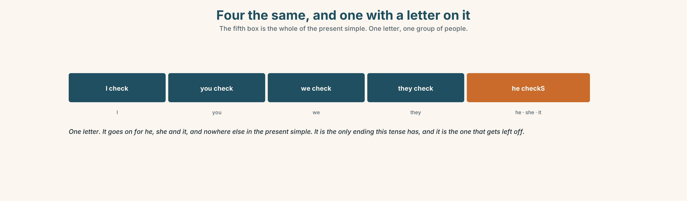{width=6.6in}

*Four the same, and one with a letter on it — The fifth box is the whole of the present simple. One letter, one group of people.*

### 3C · Know

| | | |
|---|---|---|
| **I / you / we / they** | **check** | They check their phones at night. |
| **he / she / it** | **checks** | She checks her phone before she gets up. |

> **One letter, one person.** The **s** goes on for *he*, *she* and *it* and nowhere else. It is
> the only ending the present simple has, and it is the one everybody forgets.

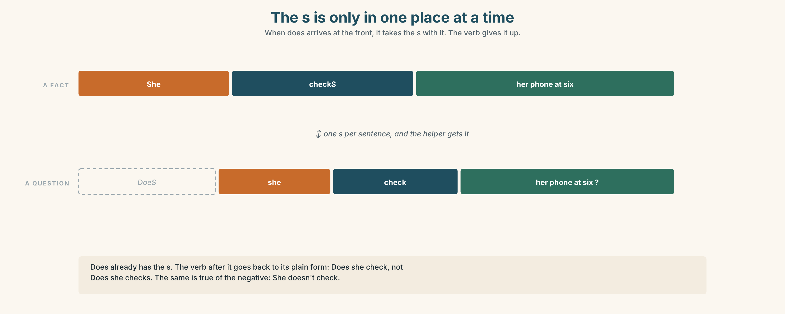{width=6.6in}

*The s is only in one place at a time — When does arrives at the front, it takes the s with it. The verb gives it up.*

| | |
|---|---|
| **?** | **Do** you check your phone at night? · **Does** she check her phone at night? |
| **–** | I **don't** check it. · He **doesn't** check it. |
| **? + word** | **Where** do you put it? · **How often** does he look at it? |

> **The s is only in one place at a time.** *Does she checks?* is wrong because the **s** has
> already gone onto *does*. One **s** per question, and the helper gets it.

> **Why it matters.** Every question you will ever ask about somebody else's life has this shape.
> It is the whole of asking about habits.

### 3D · Use — controlled

Complete with **do**, **does**, **don't**, **doesn't**, **check** or **checks**.

> Lin (1) ______ her phone before she gets up. Yusuf (2) ______ not know how often he looks.
> (3) ______ you turn off your phone at night? Teresa (4) ______ . She (5) ______ it in a drawer.
> Her students (6) ______ believe her.

### 3E · Use — guided

Make a question with the word in brackets.

1. She opens the camera first. *(which app)*
2. He checks his phone forty times a day. *(how often)*
3. They charge the battery at night. *(when)*
4. Teresa puts her phone in a drawer. *(where)*
5. Lin uses a map every morning. *(why)*

### 3F · Use — open

**In pairs.** Ask your partner five questions about one other person — a brother, a friend, a
neighbour. Every question must have a question word in front.

### 3G · Check — six items, mark your own

> 1. She ______ (check) her phone at six.
> 2. ______ he ______ (turn off) his phone at night?
> 3. They ______ (not use) the school internet.
> 4. How often ______ your sister ______ (take) a photo?
> 5. ✗ *Does she checks her phone?* → correct it.
> 6. ✗ *How often he checks it?* → correct it.

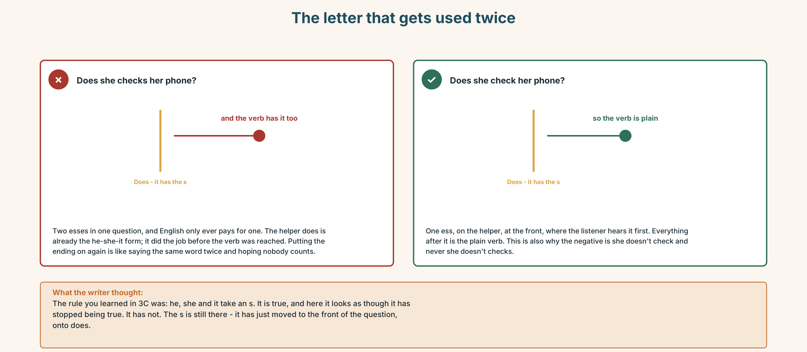{width=6.6in}

*The letter that gets used twice — The letter that gets used twice*

**0–3 →** Workbook pp. 12–15. **4–5 →** Part 6. **6 →** page 68.

---

## Part 4 · Speaking ◆ **C · THE PERFORMANCE**

### 4A · Fluency starter — the chain question

One person asks a question with a question word. The next person answers **and** asks the next
one. **No question word may be used twice.** Seven words, so the chain is seven long.

### 4B · The functional core — asking about habits

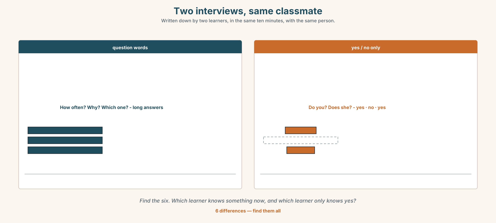{width=6.6in}

*Two interviews, same classmate — Written down by two learners, in the same ten minutes, with the same person.*

**Language Bank**

| | |
|---|---|
| **the seven words** | *what · where · when · who · why · how · which* |
| **how + a word** | *how many · how much · how often* |
| **asking again** | *How do you say…? · What does it mean? · I don't understand.* |
| **soft openers** | *Can I ask you something? · And you?* |

**Information gap.** Learner A has Lin's week. Learner B has Yusuf's week.
**Find out which of the two spends more time online, without saying a number.**

### 4C · The performance — the interview ⏺

Interview one classmate about **one habit**. **Two minutes.** You must ask:

> one *how often* question · one *what* question · one *why* question · one question you did not
> plan

Then tell the class in three sentences, using *he* or *she*. **Record it.**

### 4D · Observer

One person listens for **one thing**: did every *he* and *she* sentence have the **s**?

### 4E · Two criteria

> ☐ Did I ask four questions and not read them?
> ☐ Did my voice go down at the end of the question-word questions?

---

## Part 5 · Reading ◆ **A · THE WORLD**

### 5A · Predict

The title is **"The phone in the drawer."**
**Whose drawer do you think it is?**

### 5B · Read — sixty seconds

---

**The phone in the drawer**

**Teresa** teaches in room 3. She puts her phone in a drawer at nine o'clock and she takes it out
at one. She says she does not miss it. Her students do not believe her.

**Yusuf** checks his phone about forty times a day. He thinks it is about ten. The phone knows the
real number and it tells him on Sunday, and on Sunday he is surprised, every week.

**Lin** uses a map every morning. She lives in the city and she knows the way, but she turns it on
anyway. She says the map is not for the way. It is for the time.

**Dona Filipa** has a phone with a long battery and no apps on it. She takes a photo of her
grandson every week and she sends it to nobody. The photos stay on the phone.

Four phones. Four different machines, and they all have the same name.

---

### 5C · Answer

1. Where does Teresa put her phone?
2. How often does Yusuf check his phone?
3. Why does Lin turn on the map?
4. What does Dona Filipa do with her photos?
5. **Why is Yusuf surprised every week and not only once?**
6. **The last line says four different machines. What makes them different — the phone, or the person?**

### 5D · Vocabulary in context

Guess from the text. Then check.

> she does not miss it · the real number · anyway · a long battery · they stay on the phone

### 5E · The counter-text

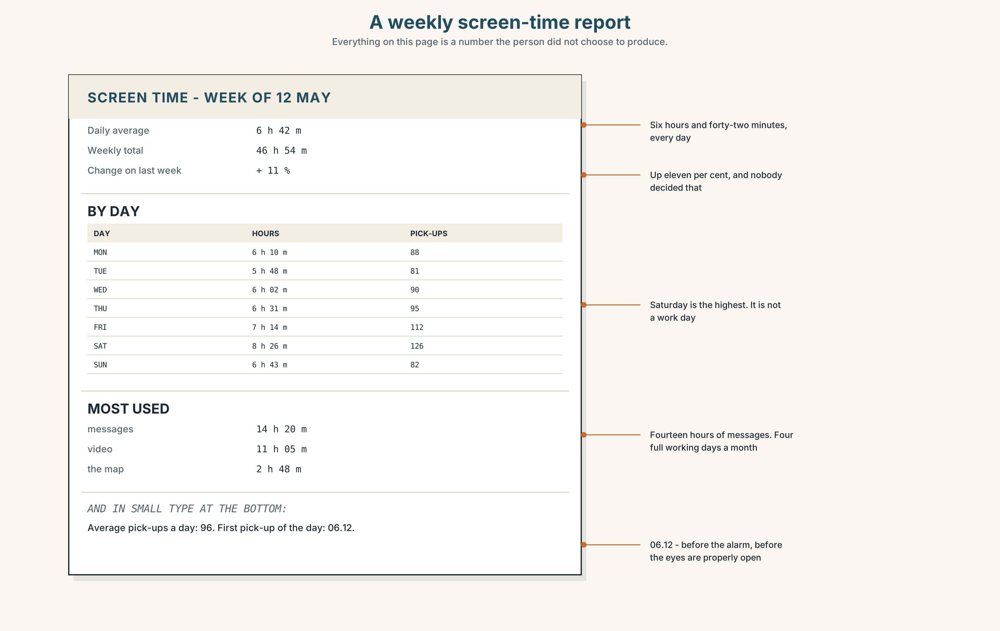{width=6.6in}

*A weekly screen-time report — Everything on this page is a number the person did not choose to produce.*

**Read the report and answer.**

1. How many hours is the weekly total?
2. **Which day is the highest, and is it a weekday or the weekend?**
3. How many times a day is the phone picked up?
4. **What is at 06.12, and why is that the most interesting number on the page?**

### 5F · Two texts

The text says Yusuf thinks he checks his phone about ten times.
The report says the phone is picked up ninety-six times a day.

**Is one of them wrong?** Say one sentence.

---

## Part 6 · Vocabulary Lab 2 ◆ **B · THE SYSTEM**

### The seven words that open a question

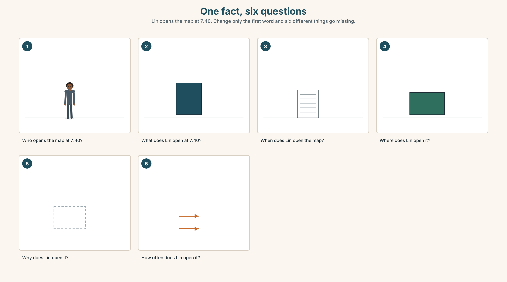{width=6.6in}

*One fact, six questions — Lin opens the map at 7.40. Change only the first word and six different things go missing.*

### 6A · The ones that catch everybody

| | |
|---|---|
| **how much** | for things you cannot count: *how much time* |
| **how many** | for things you can count: *how many photos* |
| **which** | when there is a short list: *which app* |
| **how often** | the answer is a frequency, not a time |

### 6B · Say the questions

> what · where · when · who · why · how · which

### 6C · Chunk

1. **______ many** photos?
2. **______ much** time?
3. **______ often** do you check it?
4. **How do you ______ …?** — when you do not have the word
5. **What does it ______ ?** — when you have the word and not the meaning
6. **I don't ______ .** — when you have neither

### 6D · Contrast Clinic

Six items. ***do*** or ***does***?

1. Where ______ Teresa put her phone?
2. How often ______ he charge the battery?
3. Which app ______ your brother open first?
4. ______ you turn off your phone?
5. ______ she take photos?
6. ______ they log in every day?

---

## Part 7 · Pronunciation & Fluency Lab ◆ **B · THE SYSTEM**

### Two tunes, and the question decides

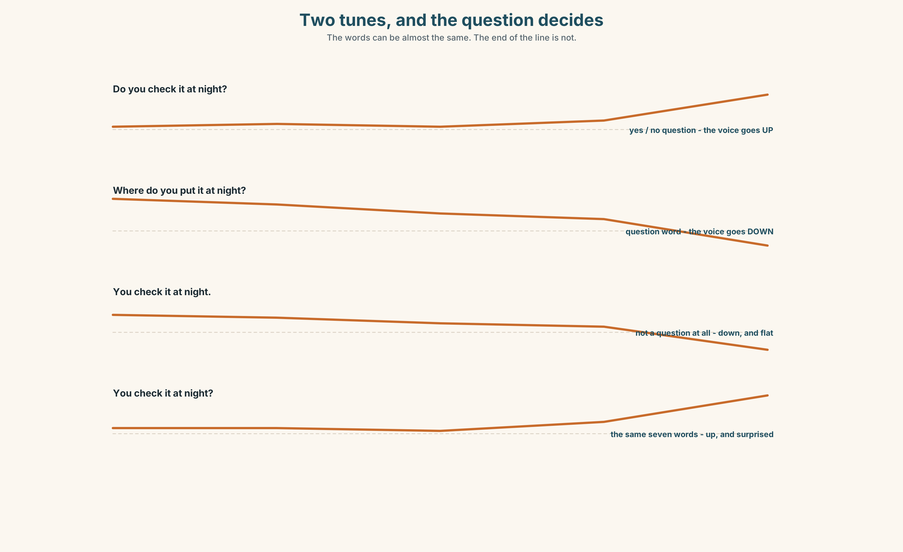{width=6.6in}

*Two tunes, and the question decides — The words can be almost the same. The end of the line is not.*

### 7A · Hear

> **up at the end** — a yes/no question: *Do you check it?* ↗ *Does she know?* ↗
> **down at the end** — a question with a question word: *Where do you put it?* ↘ *How often does he look?* ↘

### 7B · Say

Say each one three times. Then say this pair:

> *Do you have a charger?* ↗
> *Where is the charger?* ↘

**Same room, same person, two tunes.**

### 7C · Make it mean something

Say these two:

> *You check your phone at night.* ↘ — *this is a fact, and I know it*
> *You check your phone at night?* ↗ — *this is a question, and I am surprised*

**Same seven words. The tune is the only difference.** Which one is a question?

### 7D · Fluency 20 ⏺

Twenty seconds: **six questions about one person, each with a different question word.**
Three times, faster.

---

## Part 8 · Writing ◆ **C · THE PERFORMANCE**

### A profile · 40–60 words

### 8A · Read the model

> My brother checks his phone before he opens his eyes. `[one strong first sentence, with the s]`
>
> He has ninety apps and he opens four. He does not use the camera. `[a number, and a negative]`
>
> He charges the battery twice a day. He says the phone is old. The phone is one year old. `[the
> gap between what he says and what is true]`
>
> He turns it off on Sunday morning, for two hours. `[the exception, at the end]`

**Questions about the writer's choices:**

1. The first sentence is about something that happens before he is awake. **Why start there?**
2. *The phone is one year old.* **Why is that one short sentence and not part of the one before?**
3. The last sentence is the only good news. **Why is it last?**

### 8B · The anti-model

> My brother has a phone. He uses it a lot. He has many apps. He likes his phone. It is a good phone.

Correct English, and it could be anybody. **Add two numbers and one negative, and make it one person.**

### 8C · Plan

> one habit nobody chooses → a number → something he or she does not do →
> the exception, at the end

### 8D · Write — 40 to 60 words
### 8E · Peer review — two things only

> ☐ Does every *he* and *she* verb have the **s**?
> ☐ Is there one number that is true about this person and nobody else?

### 8F · Publish

On the wall, with no names. **The class matches the profile to the writer's partner.**

---

## Part 9 · The File ◆ **A · THE WORLD + C · THE PERFORMANCE**

# STUDY FILE · Your phone is a vocabulary book

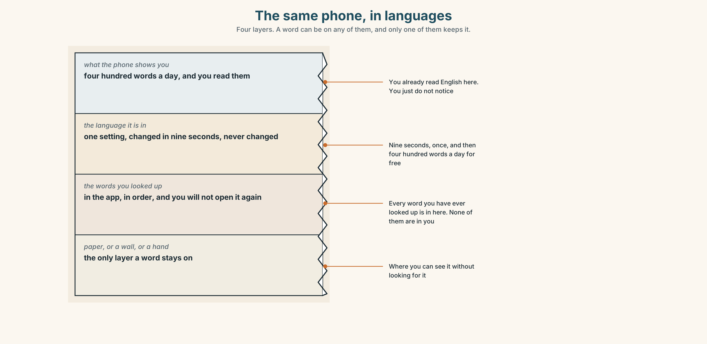{width=6.6in}

*The same phone, in languages — Four layers. A word can be on any of them, and only one of them keeps it.*

### 9A · Four minutes a day

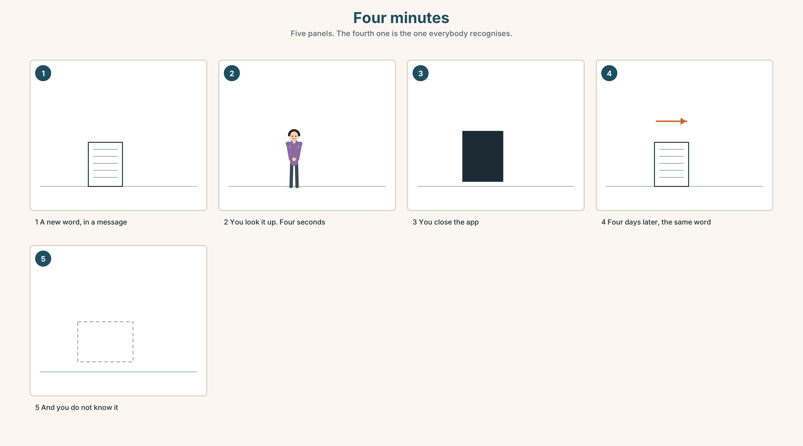{width=6.6in}

*Four minutes — Five panels. The fourth one is the one everybody recognises.*

| | |
|---|---|
| **What people do** | look a word up, read it, close the app |
| **What happens** | the word is gone in four minutes |
| **What they say** | *I have a bad memory.* |
| **What is true** | the word was never written down anywhere |

### 9B · Change the phone, not yourself

Put your phone in English for one week. **You will not learn the words.** You will learn where
they are, which is more useful and takes no time at all.

**Which three words would you see every day?** Write them.

### 9C · Role play — the help desk

In pairs. One of you has a phone in a language you cannot read. The other is a helper.
Use only these:

> *How do you say…?* · *What does it mean?* · *I don't understand.* · *Which one?* · *Where?*

### 9D · The one place a word stays

A word stays where you can see it without looking for it. **Where, in your day, is that place?**
Not the app. The place.

### 9E · Transfer — before next week

**Write down every English word you look up for seven days, on paper.** Do not revise it.
Bring the list. The list is the lesson.

---

## Part 10 · Mediation & Interaction ◆ **C · THE PERFORMANCE**

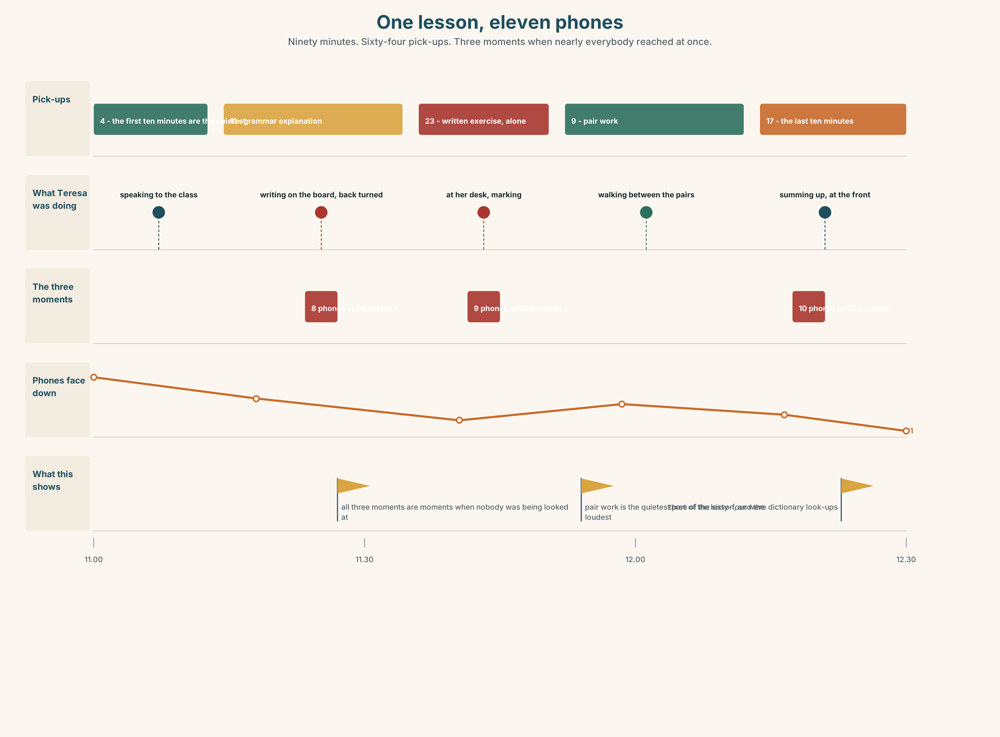{width=6.6in}

*One lesson, eleven phones — Ninety minutes. Sixty-four pick-ups. Three moments when nearly everybody reached at once.*

### 10A · Relay

Half the class has the screen-time report. Half has the four people from Part 5.
**Rebuild the whole picture by speaking.** Ten minutes.

### 10B · Simplify — for one person

A classmate asks: *How do I put my phone in English?*
**Answer in four sentences.** No lists, no screenshots.

### 10C · Online

Write **one message** to a classmate: ask two questions about their phone.
**Two sentences.** One question must start with a question word.

### 10D · Your language

Does your language have a different word for *how much* and *how many*?
**Say both in your language.** Does the difference exist at all?

---

## Part 11 · The Decision ◆ **C · THE PERFORMANCE**

# The box by the door

Escola Monte wants to put a box by the door of room 3. You put your phone in it at the start of
the lesson and take it out at the end.

Teresa counted. In one ninety-minute lesson, eleven students picked up a phone sixty-four times.
Nobody noticed they were doing it.

But three students use the phone as a dictionary, every lesson. One student has a child at a
school that telephones. And the box has no lock.

### 11A · The evidence

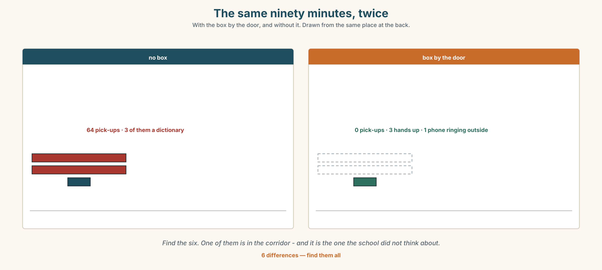{width=6.6in}

*The same ninety minutes, twice — With the box by the door, and without it. Drawn from the same place at the back.*

🔊 **Track 3.6.** Yusuf, 20 seconds: *"I don't want the box. But I check my phone and I don't
know why. I don't even read it. How often? I don't want to know."*

### 11B · Talk about it

In threes. Use the frame. Everybody says one.

> *I think the phones should ______ , because ______ .*

**Words you can use:** *box · dictionary · message · child · lesson · nobody · notification*

### 11C · Decide

Write **two sentences**. Choose, and say why.

> I think the phones should ______________________ ,
> because ______________________ .

### 11D · Model decision

> No box. Put one phone on the desk at the front, on a stand, as the class dictionary, and leave
> the other ten where they are. The problem is not the phone. The problem is that looking a word
> up and leaving the room look exactly the same from the front.

### 11E · The Reveal

> **What happened.** Teresa did not use a box. She put one phone at the front as the dictionary
> and asked everybody to put their own phone face down. Pick-ups fell from sixty-four to nineteen
> in a week.
>
> Then something she did not expect: the nineteen were almost all the same two students, and both
> of them were the ones who answered most questions. They were not leaving the room. They were
> checking a word and coming straight back.

**One question. You do not have to answer it out loud.**

> Teresa counted pick-ups. Was she counting the right thing?

---

## Part 12 · Landing ◆ **all three lines**

### 12A · Recycle — twelve items

> 1. She ______ (check) her phone at six.
> 2. ______ he ______ (turn off) his phone at night?
> 3. How ______ photos do you take? *(you can count them)*
> 4. How ______ time do you spend online? *(you cannot count it)*
> 5. ______ app do you open first? *(there is a short list)*
> 6. ______ do you charge the battery? *(the answer is a place)*
> 7. ______ does she use a map? *(the answer is a reason)*
> 8. I need to ______ in, and I do not have the password.
> 9. I want to ______ a photo of this.
> 10. My battery is at four per cent. I have to ______ it.
> 11. *(Unit 2)* I ______ up at six every day.
> 12. *(Unit 1)* They ______ from Korea and Egypt.

### 12B · Consolidate — one task, everything in it

**Write six sentences about one person who is not in this room.** Use *he* or *she*. Put a number
in two of them. Use one negative and one question.

### 12C · Can-do, with evidence

> ☐ I can ask somebody about a habit. **Evidence:** 4C, 9C
> ☐ I can use the **s** on *he*, *she* and *it*. **Evidence:** 3G, 8D
> ☐ I can use *do* and *does* in questions. **Evidence:** 6D
> ☐ I can hear the difference between a question and a statement. **Evidence:** 7C

### 12D · Replay ⏺

Record 0C again. **Listen to both.** What is different?

### 12E · Glossary — thirty-five words, as a map

> **THE OBJECT** · phone · screen · battery · charger · camera · map
> **WHAT IS ON IT** · app · message · photo · video · notification · password
> **WHERE IT IS** · internet · online
> **WHAT YOU DO** · turn on · turn off · log in · send a message · take a photo · check your phone · open an app · charge the battery
> **THE SEVEN WORDS** · what · where · when · who · why · how · which
> **HOW + ONE WORD** · how many · how much · how often
> **WHEN YOU ARE LOST** · How do you say…? · What does it mean? · I don't understand.

### 12F · Next

> **Unit 4 · Who decides the rules here?**

# A1.1 · Unit 4 · Eleven Signs, One Building

> **English Animated** · *Starting Out* · Escola Monte, Lisbon
> Student's Book pages 72–93 · 22 pp · ~9 hours

---

## Part 0 · The Big Picture ◆ **A · THE WORLD**

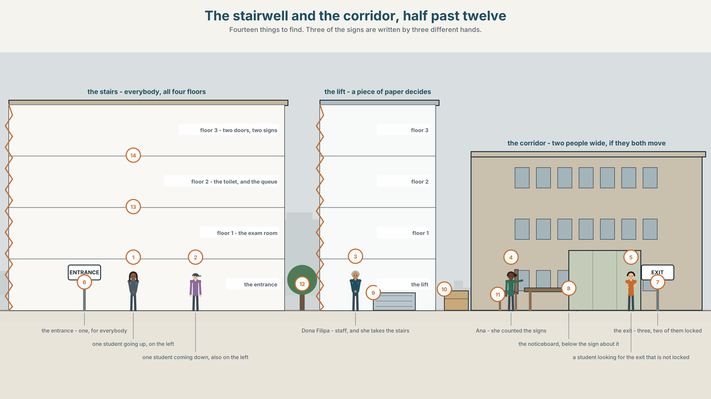{width=6.6in}

*The stairwell and the corridor, half past twelve — Fourteen things to find. Three of the signs are written by three different hands.*

# Who decides the rules here?

**By the end of this unit you can ask for permission, give it, and refuse it politely.**

| ◆ **A · THE WORLD** | A building with eleven signs on it and nobody's name under any of them |
|---|---|
| ◆ **B · THE SYSTEM** | *can* and *can't* for ability, permission and prohibition · 22 words for rules and signs · the words that make a request polite · /æ/ and /ʌ/, and the weak *can* |
| ◆ **C · THE PERFORMANCE** | You ask for three things you are not sure you are allowed to have |

---

### 0A · Find it — fourteen things

Find these in the picture. Write the number.

> ☐ a sign ☐ a lift ☐ the stairs ☐ a corridor ☐ a toilet ☐ an entrance ☐ an exit
> ☐ a door ☐ a step ☐ a trolley ☐ a notice ☐ a clock ☐ a window ☐ a bag

**Three of these words are not in the picture. Which three?**

> a rule · a password · a camera

### 0B · Guess it

Look at the signs. **Which one is the newest?** How do you know?
Say one thing. You can use these words:

> *sign · door · open · closed · quiet*

### 0C · Say it ⏺

**Record. Thirty seconds. Do not prepare.**

> **What is one rule in this building, and who made it?**

You will listen to this again on the last page.

---

## Part 1 · Vocabulary Lab 1 ◆ **B · THE SYSTEM**

### 1A · Meet — the building, in signs

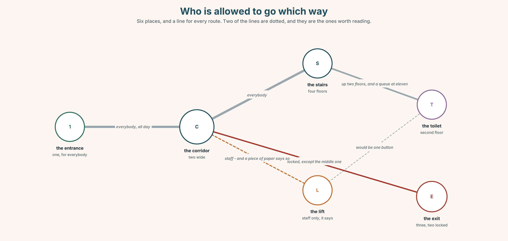{width=6.6in}

*Who is allowed to go which way — Six places, and a line for every route. Two of the lines are dotted, and they are the ones worth reading.*

| | |
|---|---|
| **entrance** | One. Everybody comes through it. |
| **exit** | Three. Two of them are locked. |
| **stairs** | Four floors. Everybody. |
| **lift** | Four floors. Staff only, says a piece of paper. |
| **corridor** | Narrow. Two people fit, if they both move. |
| **toilet** | Second floor. There is a queue at eleven. |

### 1B · Meet — the words

> **rule · sign · open · closed · quiet · allowed · forbidden · entrance · exit · lift · stairs · toilet · smoking · corridor**

Write each word under the right picture.

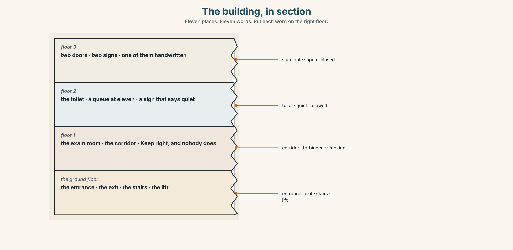{width=6.6in}

*The building, in section — Eleven places. Eleven words. Put each word on the right floor.*

### 1C · Sort — a thing, or a rule about a thing?

Put each word in the right box. **Two of them can go in both. Which, and why?**

> toilet · quiet · open · forbidden · sign · exit · allowed · closed · stairs · lift

| **A PLACE OR A THING** | **A RULE** | **BOTH** |
|---|---|---|
| | | |

### 1D · What signs actually say

| | |
|---|---|
| **No smoking** | Two words. It is on nine doors in this building. |
| **Please be quiet** | *Please* does not make it a request. It is still a rule. |
| **Keep right** | In the corridor. Nobody does it. |
| **Out of order** | On the lift, twice this year. |
| **Push / Pull** | The commonest wrong guess in any building anywhere. |
| **Mind the step** | There is one step. It is where the old building meets the new one. |

**Now say them.** Five of these six are orders with no person in them.
**Which one is a warning and not an order?**

### 1E · Stretch — the phrases you will need today

> **put away** · **take off** · **Out of order** · **Mind the step** · **Keep right**

Match each phrase to the moment you need it.

1. You come in from the rain with a wet coat. → ______
2. The lesson is finished and your books are everywhere. → ______
3. Somebody is walking straight at you in a narrow corridor. → ______
4. You press the button and nothing happens. → ______
5. There is a small change in the floor and nobody expects it. → ______

### 1F · The hard one

> **f** **No problem.**

Practise it three times. **Two words, and in most of the world it means yes.**

### 1G · Own it

Write one sign that exists in your home and one that does not exist but should.
Do not write your name. The class guesses whose home it is.

---

## Part 2 · Listening ◆ **A · THE WORLD**

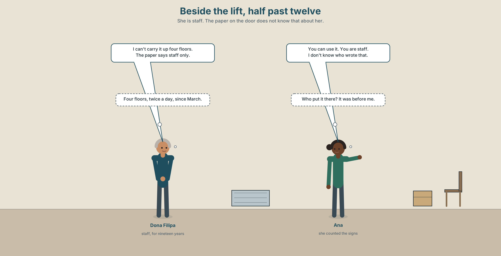{width=6.6in}

*Beside the lift, half past twelve — She is staff. The paper on the door does not know that about her.*

### 2A · Beside the lift 🔊 Track 4.1

**Before you listen.** The lift says *Staff only*. Dona Filipa is staff.
**Guess: is this going to be a short conversation?**

**Listen once. One question.** Can Dona Filipa use the lift?

**Listen again. Complete the table.**

| | Can | Can't | Doesn't know |
|---|---|---|---|
| use the lift | | | |
| use the back exit | | | |
| leave the trolley in the corridor | | | |

**Listen again. True or false?**

1. Ana wrote the notice on the lift. ☐ T ☐ F
2. Dona Filipa carries the trolley up the stairs. ☐ T ☐ F
3. Students can use the lift with a teacher. ☐ T ☐ F
4. Nobody knows who made the rule. ☐ T ☐ F

**Noticing.** Four sentences from the recording.

1. *You can use it.*
2. *Students can't use it.*
3. *Can I leave this here?*
4. *I can't carry it up four floors.*

**Two of these are about a rule and two are about a body. Which are which?**

### 2B · Decoding clinic 🔊 Track 4.2

Twenty seconds of Ana at speed. Three jobs.

1. Count how many times she says *can*.
2. In two of them the word is very short and quiet. In two it is loud. Which two are loud?
3. She says *can't* once. What is the difference you hear — the vowel, or the *t*?

> Transcripts, page 150.

---

## Part 3 · Grammar Lab 1 ◆ **B · THE SYSTEM**

### One word, three jobs

### 3A · Notice

Look at the four sentences in Part 2 again.

1. Does *can* change after *I*, *you*, *she* or *they*?
2. What is the form of the verb straight after *can*?
3. How do you make a question with *can*?
4. One sentence is about something a body cannot do. Which?

### 3B · See

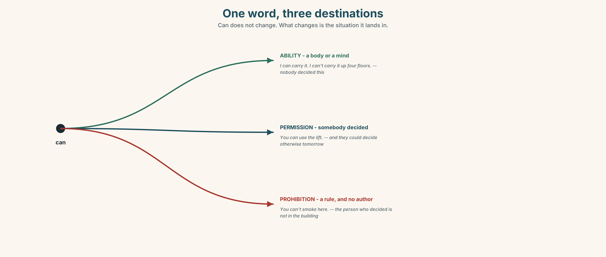{width=6.6in}

*One word, three destinations — Can does not change. What changes is the situation it lands in.*

### 3C · Know

| | | |
|---|---|---|
| **ability** | what a body or a mind does | *I can carry it. I can't carry it up four floors.* |
| **permission** | somebody decided, and they could decide otherwise | *You can use the lift. Students can't.* |
| **prohibition** | a rule, and the person who made it is gone | *You can't smoke here.* |

> **Can never changes.** No **s** for *he* and *she*. No *do* in the question. The verb after it is
> always plain: *can go*, never *can goes* and never *can to go*.

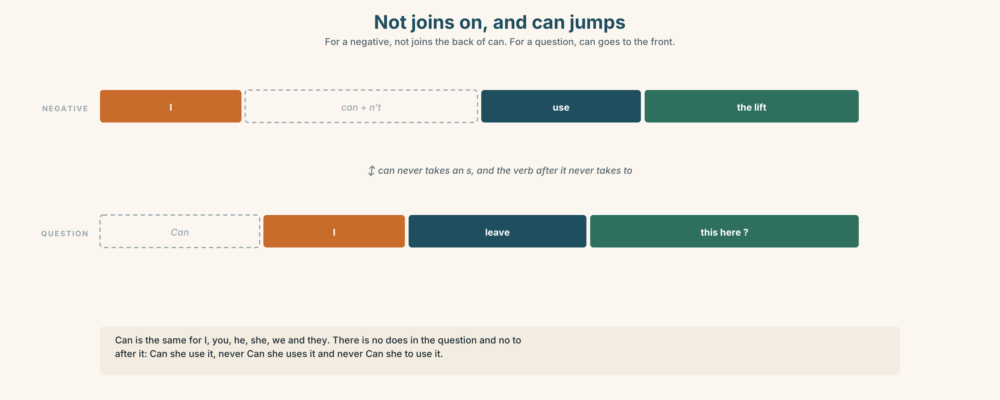{width=6.6in}

*Not joins on, and can jumps — For a negative, not joins the back of can. For a question, can goes to the front.*

| | |
|---|---|
| **–** | I **cannot** use it · I **can't** use it · She **can't** come today |
| **?** | **Can** I leave this here? · **Can** you help me? · **Can** she use the lift? |
| **short answers** | *Yes, you can.* · *No, I'm sorry, I can't.* |

> **The polite layer sits on top.** *Can I…?* is a question. *Could you…?* is the same question
> with the sharp edge taken off. *Is it OK if…?* asks whether the rule allows it rather than
> whether you allow it.

> **Why it matters.** Half of what you need in a building you do not own is permission, and the
> other half is finding out who gives it.

### 3D · Use — controlled

Complete with **can**, **can't**, **Can I** or **Could you**.

> Dona Filipa (1) ______ use the lift. Students (2) ______ use it.
> (3) ______ leave my bag here? — Yes, of course.
> (4) ______ open the window? It is very warm.
> I (5) ______ carry this up four floors. I (6) ______ carry it up one.

### 3E · Use — guided

Make each one a question with *can*, then make it more polite.

1. You want to open the window.
2. You want to leave early.
3. You want to use somebody's charger.
4. You want somebody to say it again.
5. You want to sit at this desk.

### 3F · Use — open

**In pairs.** Ask for five things in this room. Your partner says yes, no, or *just a moment*.
**Nobody may say no twice in a row.**

### 3G · Check — six items, mark your own

> 1. She ______ (not use) the lift.
> 2. ______ I leave my bag here?
> 3. He ______ (carry) it, but not up four floors.
> 4. ______ you open the window, please? *(the polite one)*
> 5. ✗ *She cans use the lift.* → correct it.
> 6. ✗ *Can you to help me?* → correct it.

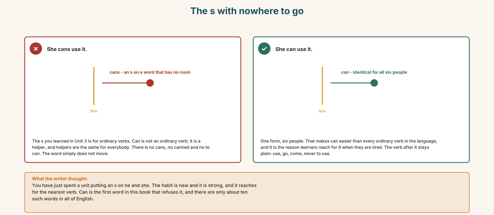{width=6.6in}

*The s with nowhere to go — The s with nowhere to go*

**0–3 →** Workbook pp. 16–19. **4–5 →** Part 6. **6 →** page 90.

---

## Part 4 · Speaking ◆ **C · THE PERFORMANCE**

### 4A · Fluency starter — the asking round

Everybody asks the person on their left for one thing. The answer must be yes.
**Go round twice. The second time the answer must be no, politely.**

### 4B · The functional core — asking, giving and refusing

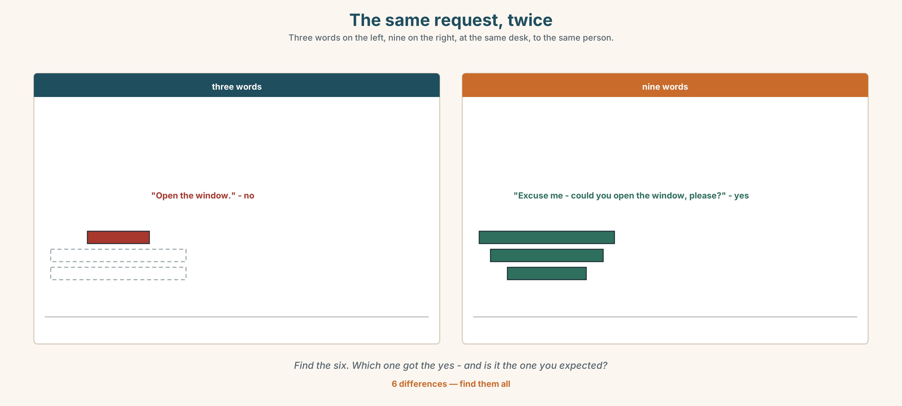{width=6.6in}

*The same request, twice — Three words on the left, nine on the right, at the same desk, to the same person.*

**Language Bank**

| | |
|---|---|
| **asking** | *Can I…? · Could you…? · Is it OK if…?* |
| **the small words** | *please · sorry · excuse me · thank you* |
| **saying yes** | *Of course. · Here you are. · No problem.* |
| **saying wait** | *Just a moment.* |
| **saying no** | *I'm sorry, I can't.* |
| **afterwards** | *Thanks a lot.* |

**Information gap.** Learner A has the list of what is allowed. Learner B has the list of what
happens anyway. **Find the two rules that nobody follows and nobody minds.**

### 4C · The performance — three requests ⏺

Ask three people in this room for three things. **Three minutes.** One request must be:

> something easy · something you expect a no to · something you are genuinely not sure about

Then report: who said yes, who said no, and **who said something that was neither**.
**Record it.**

### 4D · Observer

One person listens for **one thing**: did anybody say no without the word *sorry*?

### 4E · Two criteria

> ☐ Did I use a different form for each of the three requests?
> ☐ Did I say thank you after the no as well as after the yes?

---

## Part 5 · Reading ◆ **A · THE WORLD**

### 5A · Predict

The title is **"Who put that there?"**
**How many of the signs in your school do you think have a name on them?**

### 5B · Read — sixty seconds

---

**Who put that there?**

Escola Monte has eleven signs. Ana counted them.

Four of them are printed and screwed to the wall. They are about fire and about the law, and the
city put them there. Nobody argues with those four.

Four more are printed and taped. They are about the lift, the toilet and the corridor. The school
put them there, four years ago, and three of the four people who decided are not here now.

Three are handwritten. One says *Out of order*, and the lift has worked since March. One says
*Please be quiet* on a door nobody opens. One says *Keep right*, and the corridor is too narrow
for anybody to keep anything.

Eleven signs. Four of them have a reason you can still find. The other seven are rules that are
nobody's rules now, and everybody follows them anyway.

---

### 5C · Answer

1. How many signs are there?
2. Who put the first four up?
3. What does the handwritten sign on the lift say?
4. How many signs have a reason you can still find?
5. **Why does the writer say "nobody's rules"?**
6. **The last sentence says everybody follows them anyway. Why would people follow a rule that belongs to nobody?**

### 5D · Vocabulary in context

Guess from the text. Then check.

> screwed to the wall · taped · argues with · since March · too narrow

### 5E · The counter-text

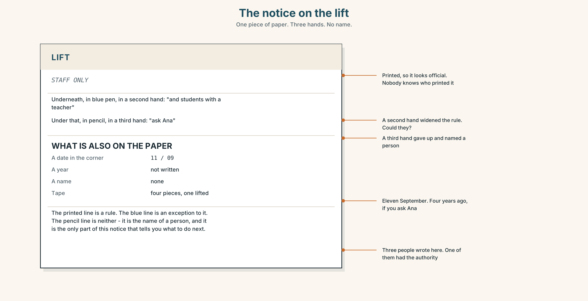{width=6.6in}

*The notice on the lift — One piece of paper. Three hands. No name.*

**Read the notice and answer.**

1. What does the printed line say?
2. **What does the handwritten line add, and does it agree with the printed line?**
3. What is the date in the corner?
4. **Three people wrote on this notice. Which one of the three had the authority to?**

### 5F · Two texts

The text says the lift has worked since March.
The notice says *Out of order*.

**Which one is the rule?** Say one sentence.

---

## Part 6 · Vocabulary Lab 2 ◆ **B · THE SYSTEM**

### The small words that do all the work

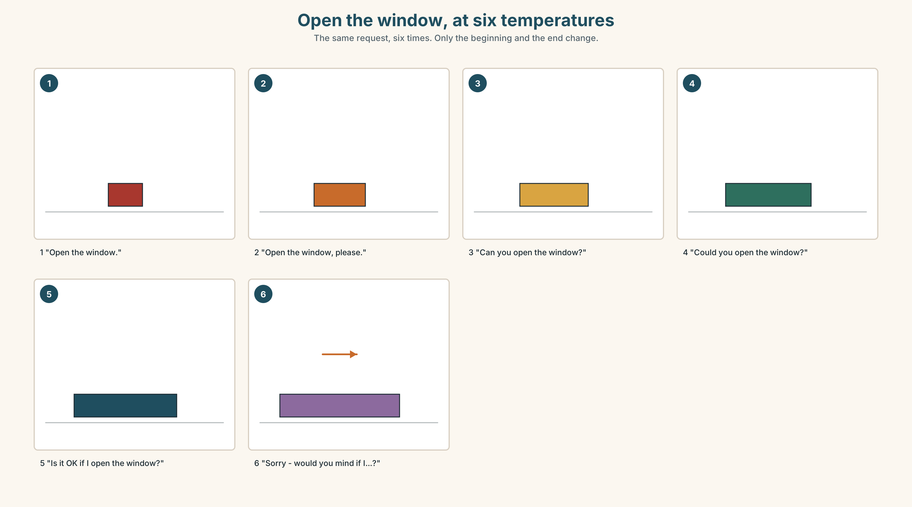{width=6.6in}

*Open the window, at six temperatures — The same request, six times. Only the beginning and the end change.*

### 6A · The ones that catch everybody

| | |
|---|---|
| **excuse me** | before you speak to somebody |
| **sorry** | after you have done something, or when the answer is no |
| **please** | inside the request, not at the beginning of the conversation |
| **thank you** | after a yes **and** after a no |

### 6B · Say them

> please · sorry · excuse me · thank you · Of course. · Here you are. · Just a moment.

### 6C · Chunk

1. **______ me** — you want somebody's attention
2. **Can ______ …?** — you want to do something
3. **Could ______ …?** — you want somebody else to do something
4. **Is it ______ if…?** — you want to know whether the rule allows it
5. **Here ______ are.** — you are handing something over
6. **Thanks a ______ .** — warmer than thank you, and shorter

### 6D · Contrast Clinic

Six items. ***excuse me*** or ***sorry***?

1. You cannot lend somebody your charger. ______
2. You want to ask a stranger a question. ______
3. You want to get past somebody in the corridor. ______
4. You arrive ten minutes late. ______
5. You need to interrupt two people talking. ______
6. You stand on somebody's foot. ______

---

## Part 7 · Pronunciation & Fluency Lab ◆ **B · THE SYSTEM**

### /æ/ and /ʌ/, and the *can* you can hardly hear

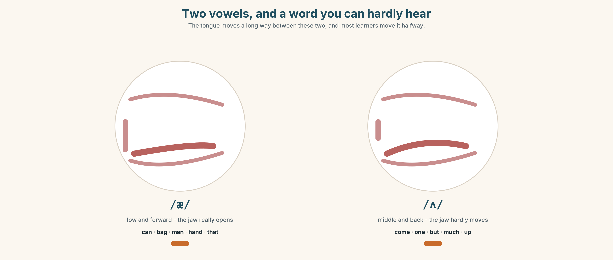{width=6.6in}

*Two vowels, and a word you can hardly hear — The tongue moves a long way between these two, and most learners move it halfway.*

### 7A · Hear

> **/æ/** — *can · bag · man · hand · that*
> **/ʌ/** — *come · one · but · much · up*

### 7B · Say

Say each group three times. Then say this:

> *I can come, but I can't come up.* — both vowels, twice each, in one sentence.

### 7C · Make it mean something

Say these two:

> *I can go.* — *can* is short and quiet. You hardly hear it.
> *I can't go.* — *can't* is long and loud, and it is the stressed word in the sentence.

**The negative is louder than the positive.** If you cannot hear the *t*, listen to the length
instead. Which one is which?

### 7D · Fluency 20 ⏺

Twenty seconds: **three things you can do and three things you can't do in this building.**
Three times, faster.

---

## Part 8 · Writing ◆ **C · THE PERFORMANCE**

### The rules of a place · 40–60 words

### 8A · Read the model

> You can come in before nine. The door is open from eight. `[what you can do, first]`
>
> You can't smoke anywhere, including the yard. `[the one hard rule, with the gap closed]`
>
> Please be quiet in the corridor on the second floor. There is an exam room. `[the rule, and
> then the reason]`
>
> If you need the lift, ask at reception. Somebody will say yes. `[the rule that is really a
> door, not a wall]`

**Questions about the writer's choices:**

1. The first sentence is about what you **can** do. **Why not start with the hard rule?**
2. *There is an exam room.* **What does giving the reason do to the rule?**
3. The last rule tells you who to ask. **Why is that more useful than the rule itself?**

### 8B · The anti-model

> No smoking. No food. No phones. Be quiet. Keep right. No bags in the corridor. Students can't use the lift.

Correct English, and nobody will read past the third line. **Rewrite it so that two of the seven
are things you can do, and one of them gives a reason.**

### 8C · Plan

> what you can do → the one real prohibition → one rule with a reason → who to ask

### 8D · Write — 40 to 60 words
### 8E · Peer review — two things only

> ☐ Is there at least one sentence with *can* and not *can't*?
> ☐ Is there one reason anywhere in it?

### 8F · Publish

On the door of the classroom. **Keep them up for a week and see which one people actually follow.**

---

## Part 9 · The File ◆ **A · THE WORLD + C · THE PERFORMANCE**

# STUDY FILE · The rules you have made for yourself

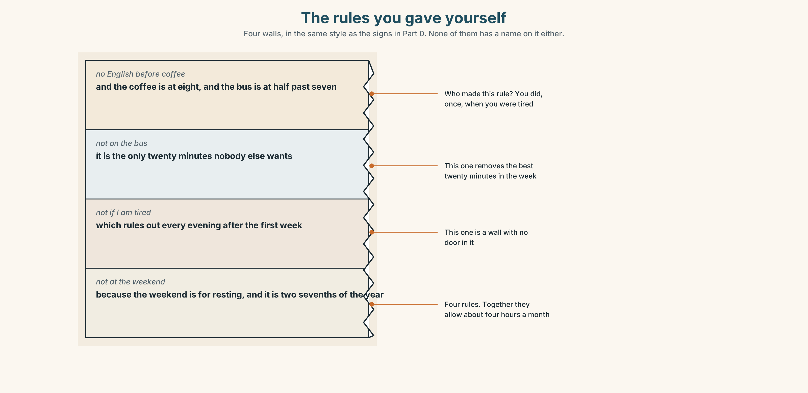{width=6.6in}

*The rules you gave yourself — Four walls, in the same style as the signs in Part 0. None of them has a name on it either.*

### 9A · Four walls

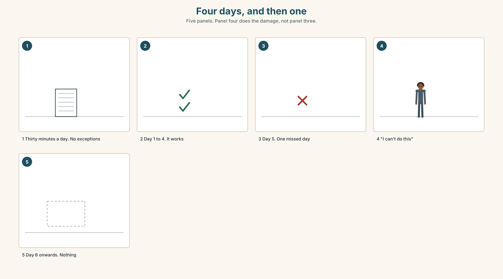{width=6.6in}

*Four days, and then one — Five panels. Panel four does the damage, not panel three.*

| | |
|---|---|
| **What people decide** | thirty minutes, every day, no exceptions |
| **What happens on day five** | one missed day |
| **What people conclude** | *I can't do this.* |
| **What is actually true** | they did four days, which is four more than before |

### 9B · A rule you can break

A rule you can break and keep is a rule. A rule you cannot break is a wall, and you will walk
away from it. **Write one rule for your English this week that has a way out in it.**

> *Example:* twenty minutes a day, and on a bad day, two minutes.

### 9C · Role play — asking yourself for permission

In pairs. One of you wants to skip today. The other is the part of you that made the rule.
Use *Can I…?*, *Is it OK if…?* and *I'm sorry, I can't.* **Swap after two minutes.**

### 9D · Who made that rule?

Find one rule you follow about your own learning that somebody else made — a teacher, a parent,
an app. **Is it still a good rule? Is the person still here?**

### 9E · Transfer — before next week

**Write down every time you nearly studied and did not, for seven days.** Write the reason.
Do not judge it. Bring the list.

---

## Part 10 · Mediation & Interaction ◆ **C · THE PERFORMANCE**

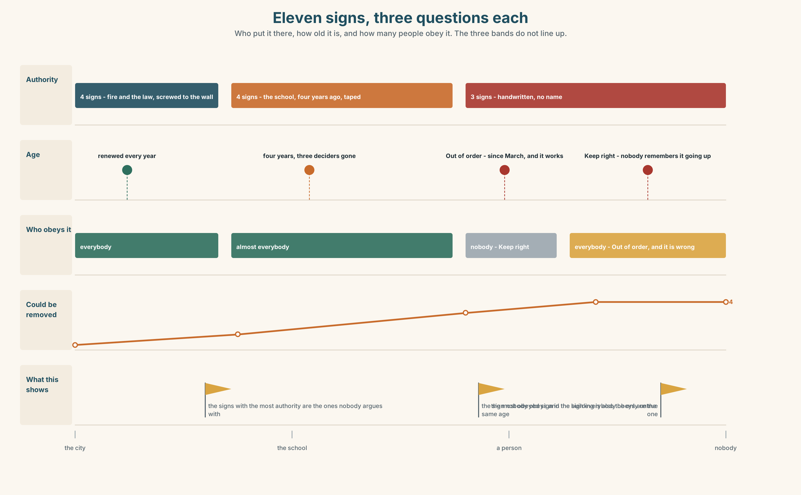{width=6.6in}

*Eleven signs, three questions each — Who put it there, how old it is, and how many people obey it. The three bands do not line up.*

### 10A · Relay

Half the class has who wrote each sign. Half has whether people follow it.
**Rebuild the whole building by speaking.** Ten minutes.

### 10B · Simplify — for one person

A new student asks: *Can I use the lift?*
**Answer in three sentences.** The true answer is complicated. Say it anyway.

### 10C · Online

Write **one message** asking a classmate for something you need.
**Two sentences.** One of them must give a reason.

### 10D · Your language

Does your language have a polite form for asking? **Ask for a pen in your language, twice:**
once to a friend and once to a stranger. How many words change?

---

## Part 11 · The Decision ◆ **C · THE PERFORMANCE**

# The lift

Escola Monte has one lift. The notice says *Staff only*. It has said that for four years.

A student broke the door of the lift in the first year, and that is why the notice is there. That
student finished the course in the same year and left.

Dona Filipa carries a trolley up four floors twice a day. One student this term cannot use the
stairs at all. The school can leave the notice, take it down, or put a key on the lift and give
the key to reception.

### 11A · The evidence

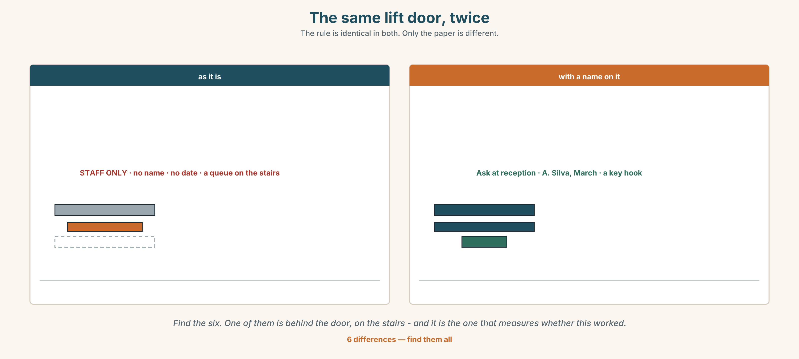{width=6.6in}

*The same lift door, twice — The rule is identical in both. Only the paper is different.*

🔊 **Track 4.6.** Dona Filipa, 20 seconds: *"I can use the lift. Nobody told me I can. I read the
paper on the door every morning for four years and I take the stairs."*

### 11B · Talk about it

In threes. Use the frame. Everybody says one.

> *I think the lift should be ______ , because ______ .*

**Words you can use:** *staff · student · key · stairs · trolley · broken · allowed*

### 11C · Decide

Write **two sentences**. Choose, and say why.

> I think the lift should be ______________________ ,
> because ______________________ .

### 11D · Model decision

> Take the old notice down and put up a new one with a name and a date on it. The rule can stay
> exactly the same. What changes is that there is now somebody to ask, and a rule you can ask
> about is a different kind of rule.

### 11E · The Reveal

> **What happened.** Ana printed a new notice: *Lift: ask at reception. A. Silva, March.* The rule
> did not change. In the first week eleven people asked, and she said yes to all eleven.
>
> Then something she did not expect: the asking stopped after two weeks, and people simply used
> the lift. Nobody broke it. Ana left the notice up anyway, because the name on it was doing
> something the rule was not.

**One question. You do not have to answer it out loud.**

> The rule did not change and the behaviour did. So what was the rule actually doing before?

---

## Part 12 · Landing ◆ **all three lines**

### 12A · Recycle — twelve items

> 1. She ______ (not use) the lift.
> 2. ______ I leave my bag here?
> 3. ______ you say that again, please? *(the polite one)*
> 4. Is it ______ if I open the window?
> 5. ______ me — where is the toilet?
> 6. I'm ______ , I can't.
> 7. Here you ______ .
> 8. Just a ______ .
> 9. The lift is out of ______ .
> 10. Please ______ your books away.
> 11. *(Unit 3)* How ______ does he check his phone?
> 12. *(Unit 2)* They ______ at half past six.

### 12B · Consolidate — one task, everything in it

**Write the rules of a place you know well, in six sentences.** Two must use *can*, one must use
*can't*, and one must say who to ask.

### 12C · Can-do, with evidence

> ☐ I can ask for permission in three different ways. **Evidence:** 4C
> ☐ I can refuse politely. **Evidence:** 3F, 6D
> ☐ I can use *can* and *can't* for ability and for rules. **Evidence:** 3G
> ☐ I can hear the difference between *can* and *can't*. **Evidence:** 7C

### 12D · Replay ⏺

Record 0C again. **Listen to both.** What is different?

### 12E · Glossary — thirty-five words, as a map

> **THE PLACES** · entrance · exit · stairs · lift · corridor · toilet
> **THE RULE WORDS** · rule · sign · open · closed · quiet · allowed · forbidden · smoking
> **WHAT SIGNS SAY** · No smoking · Please be quiet · Keep right · Out of order · Push / Pull · Mind the step
> **WHAT YOU DO** · put away · take off
> **ASKING** · Can I…? · Could you…? · Is it OK if…?
> **THE SMALL WORDS** · please · sorry · excuse me · thank you
> **ANSWERING** · Here you are. · Of course. · Just a moment. · No problem. · I'm sorry, I can't. · Thanks a lot.

### 12F · Next

> **Unit 5 · How do you learn a word?**

# A1.1 · Unit 5 · One Dictionary, Eleven People

> **English Animated** · *Starting Out* · Escola Monte, Lisbon
> Student's Book pages 94–115 · 22 pp · ~9 hours

---

## Part 0 · The Big Picture ◆ **A · THE WORLD**

{width=6.6in}

*Room 3 at ten past nine, from the front — Fourteen things to find. One of them has not moved since Tuesday.*

# How do you learn a word?

**By the end of this unit you can describe a room and say exactly what is in it.**

| ◆ **A · THE WORLD** | A room with eleven people in it and one of most things |
|---|---|
| ◆ **B · THE SYSTEM** | *there is* and *there are* · *a*, *an*, *some* and *any* · 22 words for the classroom · how English makes a plural, including the eleven ways it does not · the two *th* sounds |
| ◆ **C · THE PERFORMANCE** | You give a one-minute tour of a room and somebody draws it from your words |

---

### 0A · Find it — fourteen things

Find these in the picture. Write the number.

> ☐ a desk ☐ a chair ☐ a board ☐ a pen ☐ a pencil ☐ a notebook ☐ a dictionary
> ☐ a page ☐ a cupboard ☐ a shelf ☐ a window ☐ a door ☐ a bag ☐ a clock

**Three of these words are not in the picture. Which three?**

> homework · an exercise · an answer

### 0B · Guess it

Look at the cupboard. **How many students can use this room at the same time?**
Say one thing. You can use these words:

> *desk · chair · pen · one · eleven*

### 0C · Say it ⏺

**Record. Thirty seconds. Do not prepare.**

> **What is in the room where you study at home?**

You will listen to this again on the last page.

---

## Part 1 · Vocabulary Lab 1 ◆ **B · THE SYSTEM**

### 1A · Meet — the room and the work

{width=6.6in}

*What moves between the things in a room — Six objects, and a line for every journey a word can make. One line leaves the room.*

| | |
|---|---|
| **board** | Yesterday is still on it. Nobody wiped it. |
| **desk** | Eleven, and three of them wobble. |
| **cupboard** | One shelf. Everything the school owns for this room is on it. |
| **notebook** | Four spare ones. Eleven students. |
| **dictionary** | One. Open, face down, at the back, since Tuesday. |
| **homework** | The only thing in the room that leaves the room. |

### 1B · Meet — the words

> **classroom · desk · chair · board · pen · pencil · notebook · dictionary · page · word · sentence · question · answer · homework · exercise**

Write each word under the right picture.

{width=6.6in}

*The cupboard, shelf by shelf — Eleven things. Eleven words. Everything the school owns for this room is here.*

### 1C · Sort — one, or more than one?

Put each word in the right box. **One of them belongs in both. Which, and why?**

> page · pen · word · notebook · desk · homework · chair · exercise · paper · answer

| **YOU CAN COUNT IT** | **YOU CANNOT COUNT IT** | **BOTH** |
|---|---|---|
| | | |

### 1D · The four verbs of a lesson

| | |
|---|---|
| **listen** | to the teacher, to the recording, to each other. Three different things. |
| **repeat** | after the teacher. The one everybody does badly and nobody notices. |
| **read** | with your eyes, or out loud. Two different skills with one name. |
| **write** | the only one that leaves a record of what you understood. |

**Now say them.** Three of these four can be done with a phone instead.
**Which one cannot, and why not?**

### 1E · Stretch — the phrases you will need today

> **look up a word** · **do your homework** · **ask a question** · **a lot of** · **How many are there?**

Match each phrase to the moment you need it.

1. There is a word on the board and you have never seen it. → ______
2. The teacher says something and nobody understands. → ______
3. You are counting the chairs for a visitor. → ______
4. It is Thursday evening and the lesson is Friday morning. → ______
5. You want to say that there are more than you can count. → ______

### 1F · The hard one

> **f** **How many are there?**

Practise it three times. **Four words, and three of them are tiny.**

### 1G · Own it

Write down three things that are in your bag right now and one thing that is not.
Do not write your name. The class guesses whose bag it is.

---

## Part 2 · Listening ◆ **A · THE WORLD**

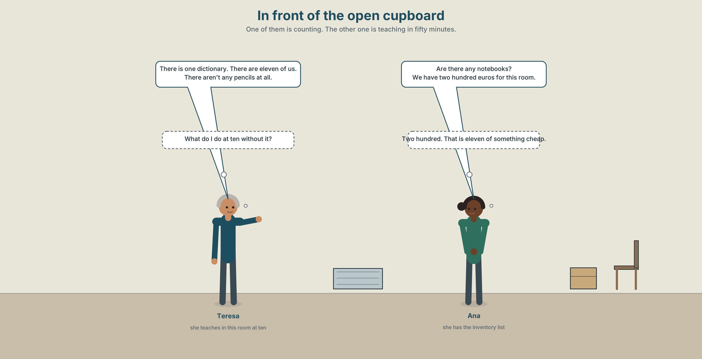{width=6.6in}

*In front of the open cupboard — One of them is counting. The other one is teaching in fifty minutes.*

### 2A · In front of the cupboard 🔊 Track 5.1

**Before you listen.** Ana is counting what is in the cupboard. Teresa is teaching at ten.
**Guess: how many dictionaries are there?**

**Listen once. One question.** How much money does the school have for this room?

**Listen again. Complete the table.**

| | How many | Enough? |
|---|---|---|
| desks | | |
| notebooks | | |
| dictionaries | | |

**Listen again. True or false?**

1. There are eleven chairs in the room. ☐ T ☐ F
2. There aren't any pencils. ☐ T ☐ F
3. There are twelve desks. ☐ T ☐ F
4. There are some notebooks, but not enough. ☐ T ☐ F

**Noticing.** Four sentences from the recording.

1. *There is one dictionary.*
2. *There are eleven desks.*
3. *There aren't any pencils.*
4. *Are there any notebooks?*

**One of these uses *is* and three use *are*. What decides?**

### 2B · Decoding clinic 🔊 Track 5.2

Twenty seconds of Ana counting at speed. Three jobs.

1. Count how many times she says *there*.
2. She says *there are* as one short word. Write what you hear.
3. One plural ending in her list sounds different from all the others. Which word?

> Transcripts, page 151.

---

## Part 3 · Grammar Lab 1 ◆ **B · THE SYSTEM**

### Saying that something exists

### 3A · Notice

Look at the four sentences in Part 2 again.

1. What comes after *there is* — one thing, or more than one?
2. What comes after *there are*?
3. In sentence 3, which word tells you it is a negative?
4. Where does *any* appear — in the positive, the negative, or the question?

### 3B · See

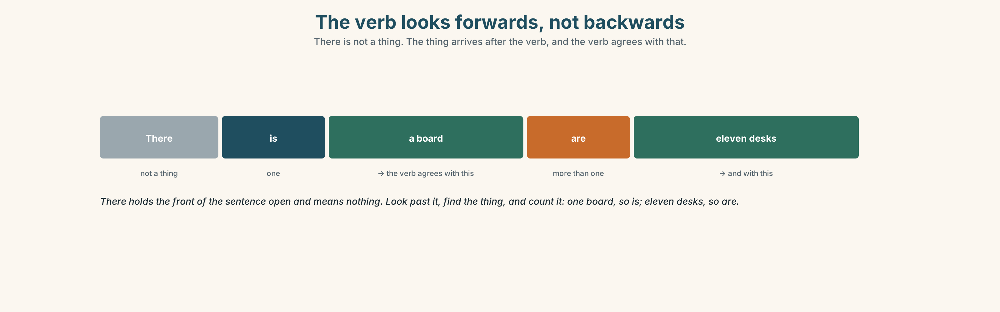{width=6.6in}

*The verb looks forwards, not backwards — There is not a thing. The thing arrives after the verb, and the verb agrees with that.*

### 3C · Know

| | | |
|---|---|---|
| **one** | **there is** | There is a board. There is some paper. |
| **more than one** | **there are** | There are eleven desks. There are some pens. |
| **none** | **there isn't / there aren't** | There isn't a dictionary. There aren't any pencils. |
| **asking** | **is there / are there** | Is there a board? Are there any notebooks? |

> **There is not a place.** It does not mean *in that place over there*. It is an empty word that
> holds the front of the sentence open while the real subject arrives behind the verb.

{width=6.6in}

*a, an, some and any — Three roads out of one question: how many, and what kind of sentence is this?*

| | |
|---|---|
| **a / an** | one thing, countable: *a desk · an exercise · an answer* |
| **some** | more than one, or an amount: *some pens · some paper* |
| **any** | in negatives and questions: *There aren't any pens. Are there any pens?* |

> **An before a vowel sound, not a vowel letter.** *an exercise*, *an answer*, *an hour* — but
> *a university*, because that word begins with a *y* sound when you say it.

> **Why it matters.** This is how you describe anything that is not a person: a room, a street, a
> town, a photograph, a problem.

### 3D · Use — controlled

Complete with **there is**, **there are**, **there isn't**, **there aren't**, **a**, **an** or
**any**.

> In room 3 (1) ______ eleven desks and (2) ______ board. (3) ______ one dictionary.
> (4) ______ enough notebooks for everybody. There aren't (5) ______ pencils at all.
> Is there (6) ______ exercise book for the new student?

### 3E · Use — guided

Make each one negative, then make it a question.

1. There are some chairs in the corridor.
2. There is a clock on the wall.
3. There are eleven students in this class.
4. There is some paper in the cupboard.
5. There are some questions on page nine.

### 3F · Use — open

**In pairs, back to back.** One of you describes this room. The other draws it.
**Compare the drawing with the room.** What did the words leave out?

### 3G · Check — six items, mark your own

> 1. ______ eleven desks in this room.
> 2. ______ a dictionary on the shelf.
> 3. There aren't ______ pencils.
> 4. Is there ______ exercise on page ten?
> 5. ✗ *There is eleven desks.* → correct it.
> 6. ✗ *There are some pens? * → correct it.

{width=6.6in}

*The verb that agreed with the wrong word — The verb that agreed with the wrong word*

**0–3 →** Workbook pp. 20–23. **4–5 →** Part 6. **6 →** page 112.

---

## Part 4 · Speaking ◆ **C · THE PERFORMANCE**

### 4A · Fluency starter — add one thing

The first person says one thing that is in this room. The next repeats it and adds one.
**Stop when somebody forgets, or when somebody says something that is not there.**

### 4B · The functional core — describing a place

{width=6.6in}

*Two drawings of the same room — Both learners listened to a one-minute description. Both drew what they heard.*

**Language Bank**

| | |
|---|---|
| **how many** | *There is one… · There are eleven… · There are a lot of…* |
| **how few** | *There aren't any… · There is only one…* |
| **where** | *on the wall · in the cupboard · at the back · by the window* |
| **asking** | *How many are there? · Is there…? · Are there any…?* |

**Information gap.** Learner A has the room as it is. Learner B has the room as the school's
inventory list says it is. **Find the four things that are on one list and not the other.**

### 4C · The performance — the one-minute tour ⏺

Describe one room **you know and nobody here has seen**. **One minute.** You must say:

> how many of two different things · one thing there isn't · where two things are ·
> one thing that should not be in that room at all

Your partner draws it. **Record it.**

### 4D · Observer

One person listens for **one thing**: did the speaker ever say *there is* with a plural?

### 4E · Two criteria

> ☐ Did my partner's drawing have the right number of the main thing?
> ☐ Did I say where at least two things were?

---

## Part 5 · Reading ◆ **A · THE WORLD**

### 5A · Predict

The title is **"The word you looked up twice."**
**How many times do you think you have looked up the same word?**

### 5B · Read — sixty seconds

---

**The word you looked up twice**

There is one dictionary in room 3. It is open, face down, on a desk at the back, and it has been
there since Tuesday.

On Tuesday, Lin looked up a word. She read it, she understood it, she closed nothing and she went
home. On Thursday she met the same word in a different sentence and she did not know it.

This is normal and it is not a memory problem. A word you meet once is a word you have seen. A
word you meet seven times, in seven different sentences, over three weeks, is a word you have.
There is no way round the seven. There are only ways to make the seven happen faster.

The dictionary is not the problem. The dictionary is excellent. The problem is that everything
between looking a word up and meeting it again is left to chance, and chance is slow.

---

### 5C · Answer

1. How many dictionaries are there in room 3?
2. Where is it?
3. What happened on Thursday?
4. How many times does the text say you need to meet a word?
5. **Why does the writer say this is not a memory problem?**
6. **The last line says chance is slow. What would be faster, and who would have to do it?**

### 5D · Vocabulary in context

Guess from the text. Then check.

> face down · there is no way round it · left to chance · a word you have · over three weeks

### 5E · The counter-text

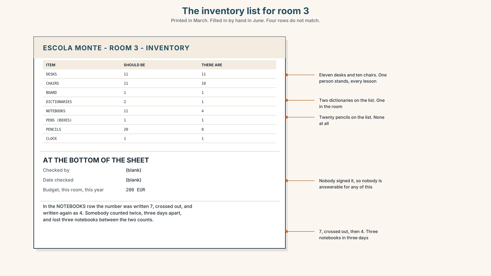{width=6.6in}

*The inventory list for room 3 — Printed in March. Filled in by hand in June. Four rows do not match.*

**Read the list and answer.**

1. How many desks should there be?
2. **How many chairs are there, and does that match the desks?**
3. Which item is on the list but not in the room?
4. **One row has a number written, crossed out and written again. Which, and what does that tell you?**

### 5F · Two texts

The inventory says there are eleven notebooks.
The text in 5B says there are four.

**Which one is right?** Say one sentence.

---

## Part 6 · Vocabulary Lab 2 ◆ **B · THE SYSTEM**

### Making more than one

{width=6.6in}

*One rule, five exceptions — The rule is add s. Everything interesting is in the other five panels.*

### 6A · The ones that catch everybody

| | |
|---|---|
| **boxes · classes · watches** | after a hissing sound you can hear the extra syllable |
| **countries · cities** | the **y** goes, and **ies** arrives |
| **knives · shelves** | the **f** turns into a **v** before it takes the **s** |
| **men · women · children** | no **s** at all. Three of the commonest words in English |

### 6B · Say them

> books · boxes · children · men · women · countries · classes · watches · cities · knives · shelves

### 6C · Chunk

1. one box, two **______**
2. one country, two **______**
3. one knife, two **______**
4. one shelf, two **______**
5. one child, two **______**
6. **a ______ of** people — more than you are going to count

### 6D · Contrast Clinic

Six items. ***is*** or ***are***?

1. There ______ one dictionary.
2. There ______ eleven desks.
3. There ______ three children in the corridor.
4. There ______ some water in the bottle.
5. There ______ a lot of paper in the cupboard.
6. There ______ two shelves and both of them are empty.

---

## Part 7 · Pronunciation & Fluency Lab ◆ **B · THE SYSTEM**

### The sound that lives between your teeth

{width=6.6in}

*The sound that lives between your teeth — Two millimetres of tongue. It is the difference between there and dare.*

### 7A · Hear

> **/ð/** loud, and the commonest one: *there · the · this · they · that · with*
> **/θ/** quiet: *think · thing · three · thank · month*
> **not /d/ or /z/**: *there* is not *dare*. *this* is not *dis*.

### 7B · Say

Put your tongue between your teeth. It feels wrong. **It is right.** Then say:

> *There are three things on the shelf.* — both *th* sounds, four times, in one sentence.

### 7C · Make it mean something

Say these two:

> *There are a lot of books.* — the *th* is loud and your voice is on
> *I think there are thirty.* — the *th* in *think* is quiet and your voice is off

**One tongue position, two settings.** Which is which?

### 7D · Fluency 20 ⏺

Twenty seconds: **six things that are in this room, with how many.** Three times, faster.

---

## Part 8 · Writing ◆ **C · THE PERFORMANCE**

### A room · 40–60 words

### 8A · Read the model

> There are eleven desks in my classroom and ten chairs. `[the numbers first, and they do not match]`
>
> There is a board, and there is a cupboard with one shelf in it. `[the big things]`
>
> There aren't any pencils. There is one dictionary and nobody uses it. `[what is missing, and
> what is there and unused]`
>
> There is a plant on the window. It belongs to nobody and somebody waters it. `[the one odd
> thing, at the end]`

**Questions about the writer's choices:**

1. Eleven desks and ten chairs. **Why put the numbers that do not match first?**
2. *and nobody uses it.* **What does that add that the number did not?**
3. The last sentence is about a plant. **Why is the least important object the most interesting one?**

### 8B · The anti-model

> There is a board. There are desks. There are chairs. There is a cupboard. There is a window. There is a door.

Correct English, and it is every classroom on earth. **Add three numbers and one thing that is
missing, and make it this room.**

### 8C · Plan

> two numbers that do not match → the big things → one thing there isn't →
> the odd thing, last

### 8D · Write — 40 to 60 words
### 8E · Peer review — two things only

> ☐ Is there at least one *there aren't any* sentence?
> ☐ Could you draw this room from these words alone?

### 8F · Publish

On the wall, with no names. **The class matches the description to the room.**

---

## Part 9 · The File ◆ **A · THE WORLD + C · THE PERFORMANCE**

# STUDY FILE · Seven meetings

{width=6.6in}

*One word, in layers — Four meetings, four depths. Only the bottom one is yours.*

### 9A · The gap between meetings

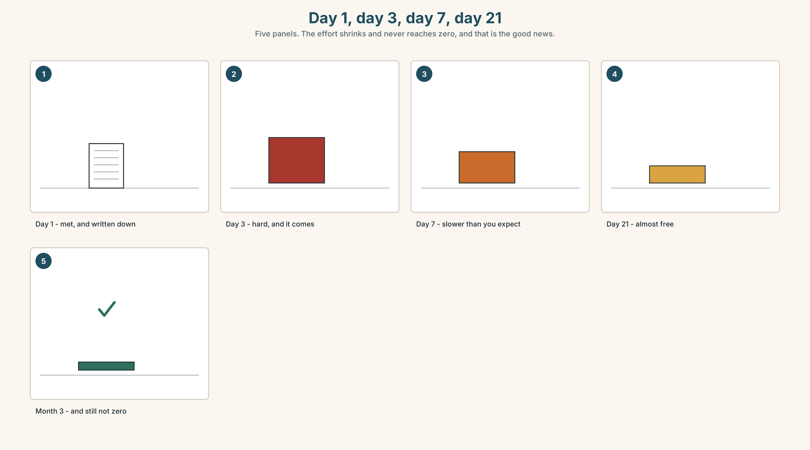{width=6.6in}

*Day 1, day 3, day 7, day 21 — Five panels. The effort shrinks and never reaches zero, and that is the good news.*

| | |
|---|---|
| **What people do** | meet a word once, write it in a list, read the list |
| **What the list does** | puts all the meetings on the same day |
| **What is needed** | the same word, far apart, in different sentences |
| **The cheapest version** | one card, one word, met on day 1, 3, 7, 21 |

### 9B · Different sentences, not more repetitions

Twenty repetitions of one sentence teaches you one sentence. Four meetings in four different
sentences teaches you a word. **Take one word from this unit and write it in three sentences that
have nothing to do with each other.**

### 9C · Role play — the seventh meeting

In pairs. Each of you chooses three words from this unit without telling the other.
**For ten minutes, use your three words as often as you can without being caught.**
At the end, guess your partner's three.

### 9D · Where your meetings happen

A word you only meet in a notebook has one place to live. **Name two places in your week where
an English word could meet you without you arranging it.**

### 9E · Transfer — before next week

**Take five words from this unit. Write each one on a separate card. Meet each card on day 1,
day 3 and day 7.** Bring the five cards and say which one was hardest on day 7.

---

## Part 10 · Mediation & Interaction ◆ **C · THE PERFORMANCE**

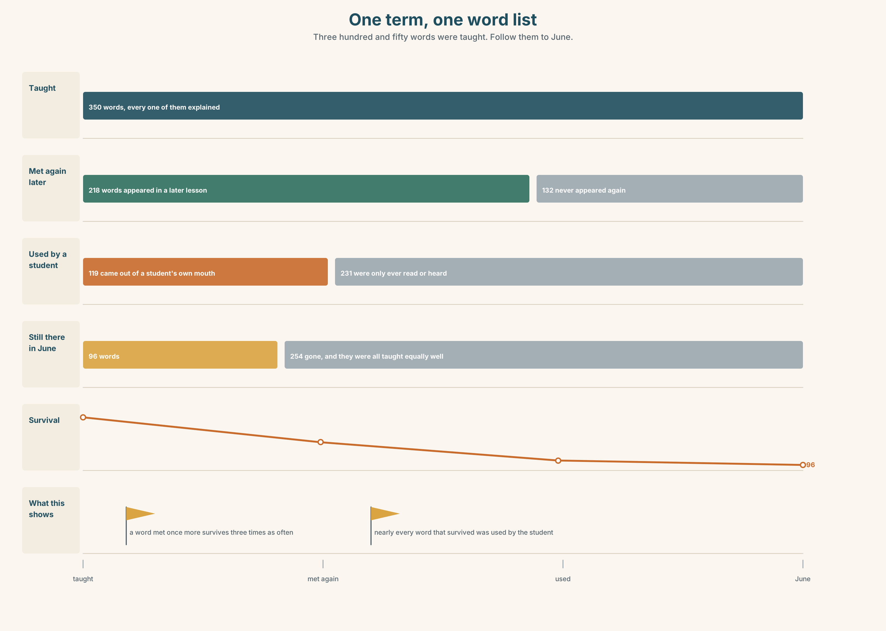{width=6.6in}

*One term, one word list — Three hundred and fifty words were taught. Follow them to June.*

### 10A · Relay

Half the class has the inventory list. Half has the room as it is.
**Rebuild the true contents of room 3 by speaking.** Ten minutes.

### 10B · Simplify — for one person

A classmate asks: *How do I remember new words?*
**Answer in three sentences.** No app names.

### 10C · Online

Write **one message** to a classmate: say what is in your study space at home and ask what is in
theirs. **Two sentences.**

### 10D · Your language

Does your language make plurals with an ending? **Say *one book* and *two books* in your
language.** What changes, and does anything else in the sentence have to change with it?

---

## Part 11 · The Decision ◆ **C · THE PERFORMANCE**

# Two hundred euros

The school has two hundred euros for room 3 this year. There is one shelf and it is nearly empty.

**Option one:** eleven paper dictionaries. Everybody has one in the lesson, and nobody takes one
home.

**Option two:** a shelf of twenty short readers, graded, that students borrow for a week.

**Option three:** nothing. There are eleven phones in the room and every one of them has a
dictionary in it already.

### 11A · The evidence

{width=6.6in}

*The same shelf in June — Two hundred euros, spent two ways, nine months earlier.*

🔊 **Track 5.6.** Yusuf, 20 seconds: *"I have a dictionary in my phone. It is a good dictionary.
But when I open my phone I don't look up the word. I look at something else. Every time."*

### 11B · Talk about it

In threes. Use the frame. Everybody says one.

> *I think the school should buy ______ , because ______ .*

**Words you can use:** *dictionary · book · page · read · phone · a lot of · shelf*

### 11C · Decide

Write **two sentences**. Choose, and say why.

> I think the school should buy ______________________ ,
> because ______________________ .

### 11D · Model decision

> The readers. A dictionary answers a question you already have. A reader gives you the seven
> meetings without you arranging any of them, and it does it while you are enjoying yourself,
> which is the only study method that survives a bad week.

### 11E · The Reveal

> **What happened.** The school bought the readers. By June, fourteen of the twenty had been
> borrowed at least once, and three had been borrowed more than ten times.
>
> Then something nobody expected: the three most-borrowed were the three easiest ones, well below
> the level of the class. Students were not stretching. They were reading things they could
> finish, and those were the students whose speaking improved most.

**One question. You do not have to answer it out loud.**

> If the easy books worked best, what was the hard book for?

---

## Part 12 · Landing ◆ **all three lines**

### 12A · Recycle — twelve items

> 1. ______ eleven desks in this room.
> 2. ______ a dictionary on the shelf.
> 3. There aren't ______ pencils.
> 4. one box, two ______
> 5. one city, two ______
> 6. one knife, two ______
> 7. one child, two ______
> 8. one woman, two ______
> 9. I need to ______ this word ______ . *(two words, one on each side)*
> 10. Please ______ your homework for Friday.
> 11. *(Unit 4)* ______ I ask a question?
> 12. *(Unit 3)* How ______ books are there?

### 12B · Consolidate — one task, everything in it

**Describe a room in your home in six sentences.** Use *there is* twice, *there are* twice, one
negative with *any*, and one plural that does not end in **s**.

### 12C · Can-do, with evidence

> ☐ I can say what is in a room and how many. **Evidence:** 4C, 8D
> ☐ I can use *there is* and *there are* correctly. **Evidence:** 3G, 6D
> ☐ I can make plurals, including the irregular ones. **Evidence:** 6C
> ☐ I can say the two *th* sounds. **Evidence:** 7C

### 12D · Replay ⏺

Record 0C again. **Listen to both.** What is different?

### 12E · Glossary — thirty-five words, as a map

> **THE ROOM** · classroom · desk · chair · board · cupboard · page
> **WHAT YOU HOLD** · pen · pencil · notebook · dictionary
> **WHAT YOU MAKE** · word · sentence · question · answer · homework · exercise
> **WHAT YOU DO** · listen · repeat · write · read · look up a word · do your homework · ask a question
> **MORE THAN ONE** · books · boxes · children · men · women · countries · classes · watches · cities · knives · shelves
> **COUNTING** · a lot of · How many are there?

### 12F · Next

> **Unit 6 · Where does breakfast come from?**

# A1.1 · Unit 6 · Two Streets from the Café

> **English Animated** · *Starting Out* · Escola Monte, Lisbon
> Student's Book pages 116–137 · 22 pp · ~9 hours

---

## Part 0 · The Big Picture ◆ **A · THE WORLD**

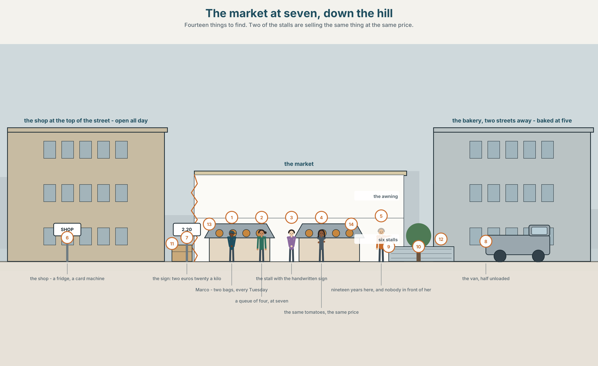{width=6.6in}

*The market at seven, down the hill — Fourteen things to find. Two of the stalls are selling the same thing at the same price.*

# Where does breakfast come from?

**By the end of this unit you can buy food, ask the price, and say how much you want.**

| ◆ **A · THE WORLD** | A market at seven, two streets from a café that opens at half past six |
|---|---|
| ◆ **B · THE SYSTEM** | countable and uncountable · *how much* and *how many* · 22 words for food and shops · the words for containers and amounts · /iː/ and /e/, and joining words together |
| ◆ **C · THE PERFORMANCE** | You run a stall, and you buy from somebody else's |

---

### 0A · Find it — fourteen things

Find these in the picture. Write the number.

> ☐ bread ☐ rice ☐ cheese ☐ milk ☐ an egg ☐ an apple ☐ a tomato
> ☐ a fish ☐ water ☐ a box ☐ a crate ☐ a bag ☐ a van ☐ a sign

**Three of these words are not in the picture. Which three?**

> sugar · salt · tea

### 0B · Guess it

Look at the two stalls selling the same thing. **Why is there a queue at one and nobody at the
other?** Say one thing. You can use these words:

> *sign · price · cheap · people · know*

### 0C · Say it ⏺

**Record. Thirty seconds. Do not prepare.**

> **What did you eat this morning, and where did it come from?**

You will listen to this again on the last page.

---

## Part 1 · Vocabulary Lab 1 ◆ **B · THE SYSTEM**

### 1A · Meet — one breakfast, backwards

{width=6.6in}

*One breakfast, backwards — Six things in a cup and on a plate, and how far each of them came. One line leaves the page.*

| | |
|---|---|
| **bread** | Two streets. Four hours old. |
| **milk** | Eleven kilometres. Yesterday evening. |
| **coffee** | Six thousand kilometres. Three weeks on a ship. |
| **egg** | Forty kilometres. Tuesday. |
| **sugar** | Nobody at the café knows. Nobody has ever asked. |
| **water** | Under the street. It is the only one that did not travel. |

### 1B · Meet — the words

> **bread · rice · cheese · milk · egg · apple · tomato · chicken · fish · water · tea · coffee · sugar · salt**

Write each word under the right picture.

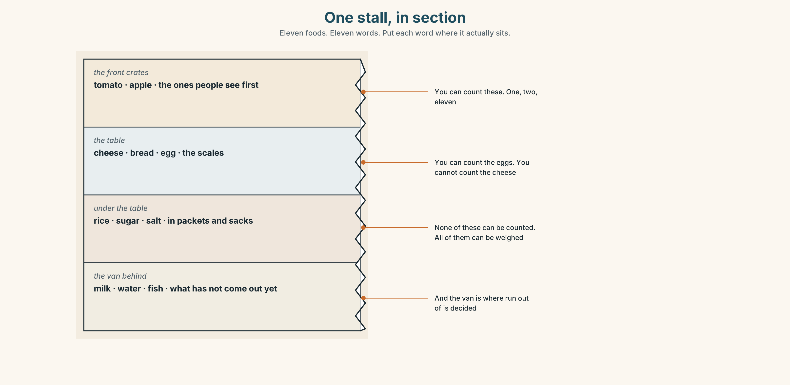{width=6.6in}

*One stall, in section — Eleven foods. Eleven words. Put each word where it actually sits.*

### 1C · Sort — can you count it?

Put each word in the right box. **Two of them can go in both. Which, and why?**

> chicken · water · cheese · apple · tomato · fish · milk · rice · egg · bread

| **ONE, TWO, THREE** | **YOU CANNOT COUNT IT** | **BOTH** |
|---|---|---|
| | | |

### 1D · The two shops

| | |
|---|---|
| **market** | Six stalls. Open at six. Closed by two. Cash. |
| **shop** | Open all day. A fridge. A card machine. Twenty per cent more. |
| **How much is it?** | The question you need in both. |
| **a bit of** | When you do not want a number and you do not want a lot. |
| **run out of** | What happens at half past eleven on a Saturday. |

**Now say them.** One of these five is a question and one is a problem.
**Which is which, and which two are places?**

### 1E · Stretch — the phrases you will need today

> **a loaf of bread** · **a bottle of water** · **a kilo of rice** · **a bit of** · **run out of**

Match each phrase to the moment you need it.

1. You are thirsty and there is a shop. → ______
2. You are cooking for six people. → ______
3. You want cheese but not much cheese. → ______
4. It is Sunday and the café has no milk. → ______
5. You want the whole thing, not slices. → ______

### 1F · The hard one

> **f** **That's all, thanks.**

Practise it three times. **It is how you end every transaction in English, and without it the
other person keeps offering.**

### 1G · Own it

Write down three things you bought this week and where. Do not write your name.
The class guesses whose week it is.

---

## Part 2 · Listening ◆ **A · THE WORLD**

{width=6.6in}

*Seven o'clock at the stall — He buys for a cafe. She has sold here for nineteen years. Neither says the real question.*

### 2A · Seven o'clock at the stall 🔊 Track 6.1

**Before you listen.** Marco buys for the café every Tuesday.
**Guess: does he know the price before he asks?**

**Listen once. One question.** How much does a kilo of tomatoes cost?

**Listen again. Complete the table.**

| | How much / how many | Price |
|---|---|---|
| tomatoes | | |
| eggs | | |
| bread | | |

**Listen again. True or false?**

1. Marco buys two kilos of tomatoes. ☐ T ☐ F
2. There aren't any eggs left. ☐ T ☐ F
3. He pays with a card. ☐ T ☐ F
4. He asks the price before he chooses. ☐ T ☐ F

**Noticing.** Four questions from the recording.

1. *How much is it?*
2. *How many do you want?*
3. *How much rice do you need?*
4. *How many eggs are there?*

**Two use *much* and two use *many*. What decides?**

### 2B · Decoding clinic 🔊 Track 6.2

Twenty seconds of the stallholder at speed. Three jobs.

1. Count how many prices she says.
2. She says *a kilo of* as one word. Write what you hear.
3. *How much is it* has four words and two sounds in the middle. Where do the words join?

> Transcripts, page 152.

---

## Part 3 · Grammar Lab 1 ◆ **B · THE SYSTEM**

### Things you count and things you weigh

### 3A · Notice

Look at the four questions in Part 2 again.

1. What kind of word comes after *how many*?
2. What kind of word comes after *how much*?
3. Can you say *two breads*? What do you say instead?
4. One word in the list can be counted in a shop and not in a kitchen. Which?

### 3B · See

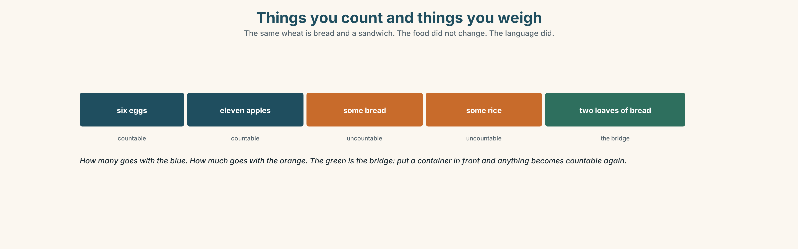{width=6.6in}

*Things you count and things you weigh — The same wheat is bread and a sandwich. The food did not change. The language did.*

### 3C · Know

| | | |
|---|---|---|
| **countable** | you can put a number in front | *an egg · two eggs · eleven apples* |
| **uncountable** | no number, no plural | *bread · water · rice · cheese · coffee* |
| **asking** | **how many** + countable · **how much** + uncountable | *How many eggs? How much rice?* |
| **the bridge** | a container makes anything countable | *two loaves of bread · three bottles of water* |

> **It is not about the food.** It is about how the language decided to look at it. *Bread* is
> uncountable and *a sandwich* is countable, and they are the same wheat.

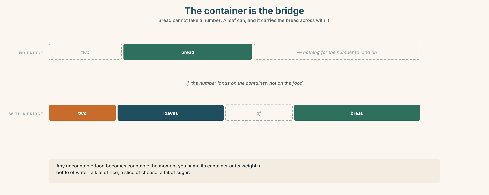{width=6.6in}

*The container is the bridge — Bread cannot take a number. A loaf can, and it carries the bread across with it.*

| | |
|---|---|
| **some / any** | *some bread · some eggs* · *Is there any rice? There isn't any milk.* |
| **a lot of** | works with both: *a lot of bread · a lot of eggs* |
| **a bit of** | only uncountable: *a bit of cheese*, never *a bit of eggs* |

> **Why it matters.** Every time you buy food, order in a café or follow a recipe, you have to
> choose between these two shapes, and the choice is in the first two words.

### 3D · Use — controlled

Complete with **how much**, **how many**, **a bit of**, **a lot of** or **any**.

> (1) ______ eggs do you want? — Six, please.
> (2) ______ rice do you need? — Half a kilo.
> There isn't (3) ______ milk left. We need (4) ______ milk for the morning.
> Just (5) ______ cheese, please. Not much.

### 3E · Use — guided

Make a question with *how much* or *how many*.

1. He wants four apples.
2. She needs two litres of water.
3. They buy a kilo of rice every week.
4. There are twelve eggs in the box.
5. The café uses three loaves of bread a day.

### 3F · Use — open

**In pairs.** One of you has a kitchen with six things in it. The other is cooking tonight.
**Find out what there is, and how much, in six questions.**

### 3G · Check — six items, mark your own

> 1. ______ bread do you want?
> 2. ______ apples are there?
> 3. There isn't ______ water in the bottle.
> 4. I only want ______ bit of cheese.
> 5. ✗ *How many rice do you need?* → correct it.
> 6. ✗ *I bought two breads.* → correct it.

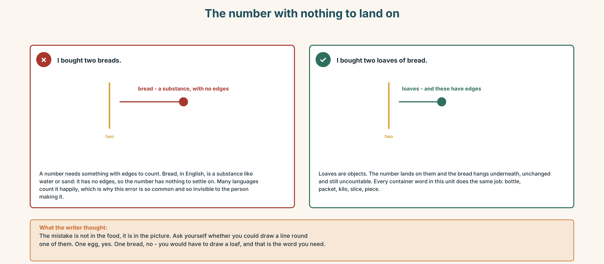{width=6.6in}

*The number with nothing to land on — The number with nothing to land on*

**0–3 →** Workbook pp. 24–27. **4–5 →** Part 6. **6 →** page 134.

---

## Part 4 · Speaking ◆ **C · THE PERFORMANCE**

### 4A · Fluency starter — the shopping chain

The first person says one thing they need and how much. The next repeats it and adds theirs.
**Nobody may use the same container twice.**

### 4B · The functional core — buying and selling

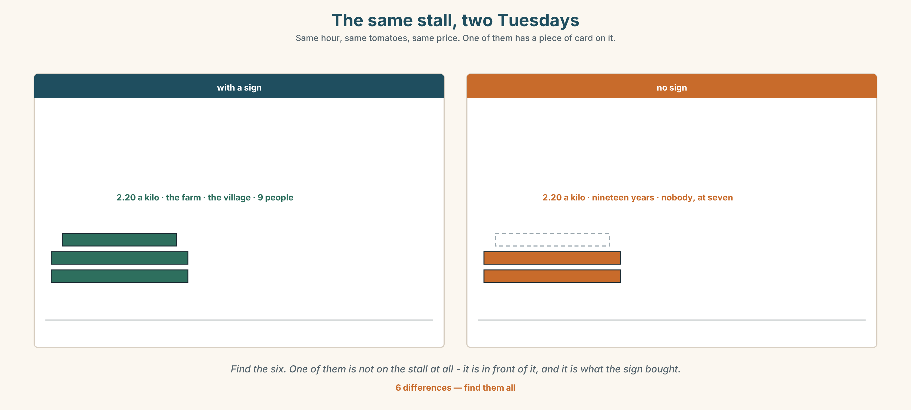{width=6.6in}

*The same stall, two Tuesdays — Same hour, same tomatoes, same price. One of them has a piece of card on it.*

**Language Bank**

| | |
|---|---|
| **asking the price** | *How much is it? · How much are they? · How much is a kilo?* |
| **saying the amount** | *a loaf of bread · a bottle of water · a kilo of rice · half a kilo* |
| **softening it** | *just a bit of… · about two hundred grams* |
| **ending it** | *That's all, thanks.* |

**Information gap.** Learner A has a shopping list with amounts. Learner B has a stall with
prices and three things missing. **Buy the whole list, or find out what you cannot have.**

### 4C · The performance — the market ⏺

Half the class sets up a stall. Half buys. **Ten minutes, then swap.** As a seller you must:

> give a price without being asked once · run out of one thing · offer something instead

As a buyer you must buy four things and **spend less than ten euros**. **Record it.**

### 4D · Observer

One person listens for **one thing**: did any buyer walk away without saying *That's all, thanks.*?

### 4E · Two criteria

> ☐ Did I use a container word for at least two things?
> ☐ Did I ask the price before I chose, at least once?

---

## Part 5 · Reading ◆ **A · THE WORLD**

### 5A · Predict

The title is **"The stall with nobody at it."**
**Why would two identical stalls have different queues?**

### 5B · Read — sixty seconds

---

**The stall with nobody at it**

There are two tomato stalls at the market, side by side. The tomatoes are the same. The price is
the same: two euros twenty a kilo.

At seven in the morning there are nine people at the first stall and nobody at the second.

The first stall has a small handwritten sign. It says the name of the farm and the name of the
village. It does not say the tomatoes are better, because they are not better.

The second stall has no sign at all. The woman behind it has sold tomatoes here for nineteen
years. Everybody who knows her buys from her, and there are not many of those left, because the
people who knew her are old now and they come at nine, not at seven.

Nine people at seven. Four people at nine. The same number by the end of the day, and only one of
the two stalls thinks it is winning.

---

### 5C · Answer

1. How much is a kilo of tomatoes?
2. How many people are at the first stall at seven?
3. What does the sign say?
4. How long has the second woman sold tomatoes here?
5. **Why do her customers come at nine and not at seven?**
6. **The last line says only one of them thinks it is winning. Which one, and is it right?**

### 5D · Vocabulary in context

Guess from the text. Then check.

> side by side · a handwritten sign · there are not many of those left · by the end of the day · thinks it is winning

### 5E · The counter-text

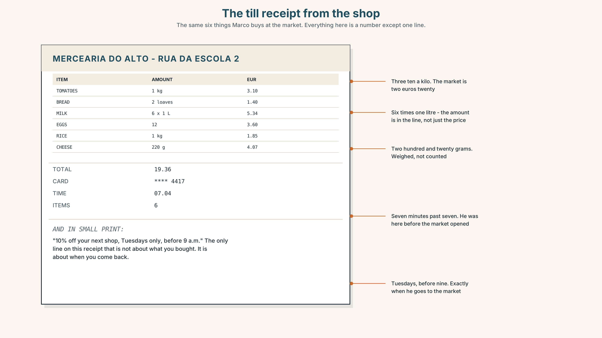{width=6.6in}

*The till receipt from the shop — The same six things Marco buys at the market. Everything here is a number except one line.*

**Read the receipt and answer.**

1. How much is the milk?
2. **How many litres of milk are there, and how do you know?**
3. What is the total?
4. **What is the offer at the bottom, and what does it want you to do?**

### 5F · Two texts

The market sells tomatoes at two euros twenty a kilo.
The receipt says three euros ten.

**Is the shop expensive?** Say one sentence. **Then say what the receipt does not tell you.**

---

## Part 6 · Vocabulary Lab 2 ◆ **B · THE SYSTEM**

### The words that make things countable

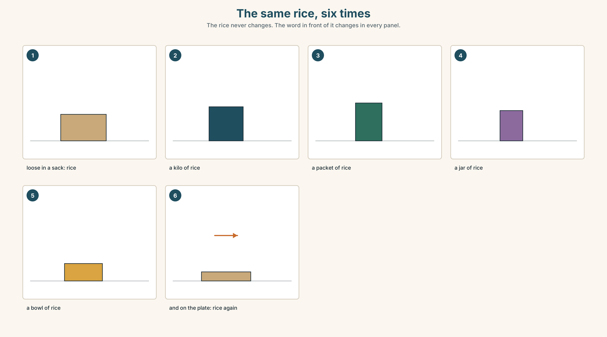{width=6.6in}

*The same rice, six times — The rice never changes. The word in front of it changes in every panel.*

### 6A · The ones that catch everybody

| | |
|---|---|
| **a packet of / a bag of** | the packet is sealed; the bag is what you carry it home in |
| **a tin of / a jar of** | metal, and glass. English has a different word for each |
| **a piece of / a slice of** | a slice is cut flat off something bigger |
| **half a kilo** | not *a half kilo*. The *a* moves |

### 6B · Say them

> bag · box · bottle · packet · tin · jar · kilo · gram · litre · half · piece · slice

### 6C · Chunk

1. a **______** of bread *(the whole one)*
2. a **______** of water *(you can carry it)*
3. a **______** of rice *(one thousand grams)*
4. a **______** of cheese *(cut flat)*
5. a **______** of tomatoes *(metal, and it opens with a ring)*
6. **______** a kilo *(five hundred grams)*

### 6D · Contrast Clinic

Six items. ***much*** or ***many***?

1. How ______ eggs do you want?
2. How ______ bread is there?
3. How ______ apples are in the box?
4. How ______ is a kilo of rice?
5. How ______ bottles are there?
6. How ______ water do we need?

---

## Part 7 · Pronunciation & Fluency Lab ◆ **B · THE SYSTEM**

### /iː/ and /e/, and words that join

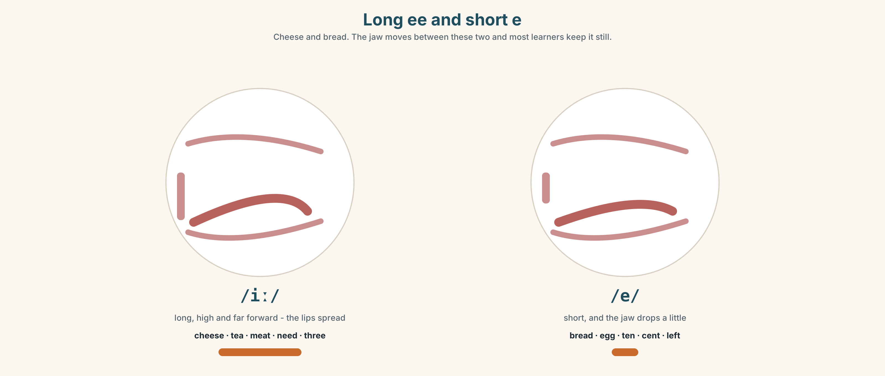{width=6.6in}

*Long ee and short e — Cheese and bread. The jaw moves between these two and most learners keep it still.*

### 7A · Hear

> **/iː/** long: *cheese · tea · meat · need · three*
> **/e/** short: *bread · egg · ten · cent · left*
> **the joins**: *a kilo of* → *a KEE-lo-vuh* · *How much is it?* → *How-mu-chi-zit*

### 7B · Say

Say each group three times. Then say this:

> *Three eggs and a bit of cheese.* — both vowels, three times each, in one sentence.

### 7C · Make it mean something

Say these two:

> *a bit of cheese* — four words, and you hear two
> *How much is it?* — four words, and you hear two

**English joins the end of one word to the start of the next.** This is why you cannot hear
words you already know. Which words have disappeared into which?

### 7D · Fluency 20 ⏺

Twenty seconds: **six things you need from a shop, with the amount.** Three times, faster.

---

## Part 8 · Writing ◆ **C · THE PERFORMANCE**

### A shopping list that somebody else can use · 40–60 words

### 8A · Read the model

> **For the café, Tuesday.** `[who and when, first]`
>
> Four kilos of tomatoes — the stall on the left, not the one with the sign. `[the amount, and
> where]`
>
> Two loaves of bread. If there isn't any brown, white is fine. `[the amount, and what to do if
> it is not there]`
>
> Six litres of milk. Don't buy the cheap one — it is cheap because it is two days old. `[the
> amount, and the reason]`

**Questions about the writer's choices:**

1. Every line has an amount. **What happens to the person shopping if one line does not?**
2. *If there isn't any brown, white is fine.* **What does that one sentence save?**
3. The last line gives a reason. **Why is a reason more useful than an instruction?**

### 8B · The anti-model

> tomatoes, bread, milk, eggs, cheese, rice

Correct English, and the person who takes it to the market will come back with the wrong thing
six times. **Add an amount to every line and one instruction for when something is missing.**

### 8C · Plan

> who and when → the amounts → what to do if something is missing → one reason

### 8D · Write — 40 to 60 words
### 8E · Peer review — two things only

> ☐ Does every item have an amount with a container or a weight?
> ☐ Could a stranger shop from this list without telephoning you?

### 8F · Publish

Swap lists. **Your partner shops from your list, on paper, and tells you where they got stuck.**

---

## Part 9 · The File ◆ **A · THE WORLD + C · THE PERFORMANCE**

# STUDY FILE · How much English, and how often?

{width=6.6in}

*One jar, or seven bottles — The same four hours, in two shapes. The drawing shows why only one of them fits.*

### 9A · The jar and the bottles

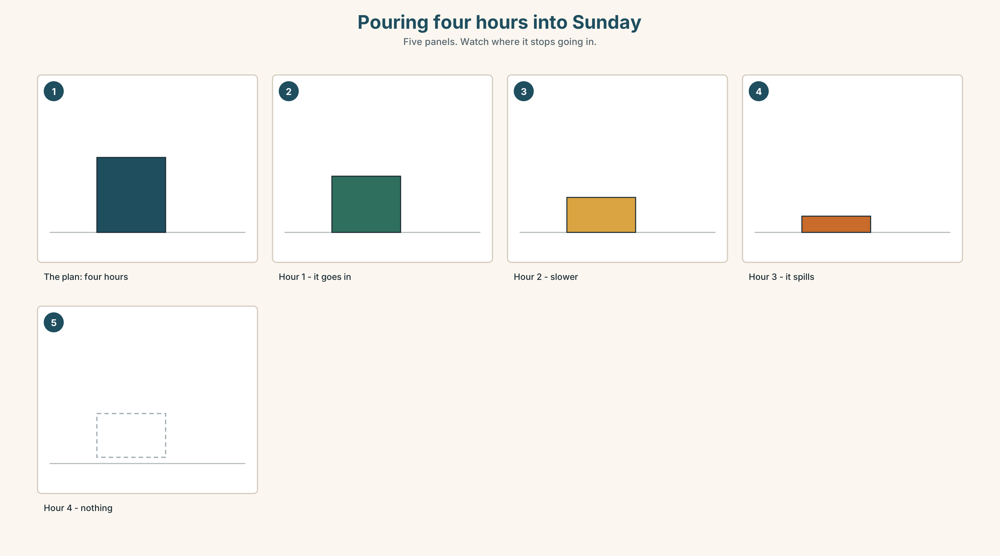{width=6.6in}

*Pouring four hours into Sunday — Five panels. Watch where it stops going in.*

| | |
|---|---|
| **What people plan** | four hours on Sunday |
| **What goes in** | about seventy minutes |
| **What they conclude** | *I need a longer Sunday.* |
| **What is true** | the container is the wrong shape, not too small |

### 9B · How much, not how long

An hour of English in which you say nothing is not an hour of English.
**Count what you produced, not how long you sat there.** Write down one number from last week:
how many sentences did you actually say out loud?

### 9C · Role play — the study stall

In pairs. One of you is selling study time by the hour. The other is buying with four hours a
week. **Negotiate. The seller must offer at least one package the buyer has not thought of.**

### 9D · The container you already have

You have a container that is exactly the right shape and you are not using it: the journey, the
queue, the kettle, the walk. **Name yours, and say how much it holds.**

### 9E · Transfer — before next week

**Write down, for seven days, how many English sentences you said out loud.** One number a day.
Bring the seven numbers.

---

## Part 10 · Mediation & Interaction ◆ **C · THE PERFORMANCE**

{width=6.6in}

*One breakfast, as distance and time — The cheapest thing on the plate travelled furthest and was touched by the most people.*

### 10A · Relay

Half the class has the market prices. Half has the shop receipt.
**Build the cheapest possible breakfast by speaking.** Ten minutes.

### 10B · Simplify — for one person

A new student asks: *Where do I buy food around here?*
**Answer in four sentences.** Include one thing that is not about price.

### 10C · Online

Write **one message** to a classmate: ask them to buy you two things and say the amounts.
**Two sentences.**

### 10D · Your language

Does your language count bread? **Say *two breads* in your language.** Is it strange? Which foods
does your language count that English does not?

---

## Part 11 · The Decision ◆ **C · THE PERFORMANCE**

# Bread, two streets away

Marco's café uses three loaves of bread a day.

The bakery two streets away sells him bread at one euro ten a loaf. It is baked at five in the
morning, four hours before he needs it. He walks there and back and it takes him twenty-two
minutes.

The supermarket at the top of the street sells bread at seventy cents. It is delivered at six. It
is forty seconds from his door.

Three loaves a day, six days a week. The difference is about fifty euros a year, and twenty-two
minutes a day.

### 11A · The evidence

{width=6.6in}

*The same counter at half past nine — Bakery bread on the left, supermarket bread on the right. Three customers in both.*

🔊 **Track 6.6.** Marco, 20 seconds: *"It's fifty euros. Fifty euros is nothing. But it's
twenty-two minutes, and at seven in the morning twenty-two minutes is not nothing."*

### 11B · Talk about it

In threes. Use the frame. Everybody says one.

> *I think Marco should buy the bread from ______ , because ______ .*

**Words you can use:** *bread · shop · market · cheap · expensive · minute · customer*

### 11C · Decide

Write **two sentences**. Choose, and say why.

> I think Marco should buy the bread from ______________________ ,
> because ______________________ .

### 11D · Model decision

> The bakery, but not for the bread. The twenty-two minutes is the only time in Marco's day when
> he is outside and nobody is asking him for anything, and he has been calling it a cost. It is
> the most useful fifty euros he spends.

### 11E · The Reveal

> **What happened.** Marco kept the bakery. He did not do it for any of the reasons on this page.
> He did it because the baker tells him what is selling in the street, and he changes what he
> makes on the strength of it.
>
> Then something he did not expect: when the bakery was closed for two weeks in August, his
> takings fell by more than the bread was worth, and it took him until October to work out why.

**One question. You do not have to answer it out loud.**

> Marco was comparing two prices. What was he actually buying?

---

## Part 12 · Landing ◆ **all three lines**

### 12A · Recycle — twelve items

> 1. How ______ bread do you want?
> 2. How ______ eggs are there?
> 3. There isn't ______ milk left.
> 4. I want just a ______ of cheese.
> 5. a ______ of bread *(the whole one)*
> 6. a ______ of water *(you can carry it)*
> 7. a ______ of rice *(one thousand grams)*
> 8. a ______ of cheese *(cut flat)*
> 9. We have ______ ______ of sugar. *(two words — there is none left)*
> 10. That's ______ , thanks.
> 11. *(Unit 5)* There ______ eleven desks in the room.
> 12. *(Unit 4)* ______ I have a receipt, please?

### 12B · Consolidate — one task, everything in it

**Write a shopping list for six people eating together, in six lines.** Every line must have an
amount. Two must use a container word, one must use a weight, and one must say what to do if the
thing is not there.

### 12C · Can-do, with evidence

> ☐ I can buy food and ask the price. **Evidence:** 4C
> ☐ I can use *how much* and *how many* correctly. **Evidence:** 3G, 6D
> ☐ I can say an amount with a container or a weight. **Evidence:** 6C, 8D
> ☐ I can hear where English joins words together. **Evidence:** 7C

### 12D · Replay ⏺

Record 0C again. **Listen to both.** What is different?

### 12E · Glossary — thirty-five words, as a map

> **YOU CAN COUNT THEM** · egg · apple · tomato
> **YOU CANNOT** · bread · rice · cheese · milk · chicken · fish · water · tea · coffee · sugar · salt
> **WHERE** · market · shop
> **CONTAINERS** · bag · box · bottle · packet · tin · jar
> **AMOUNTS** · kilo · gram · litre · half · piece · slice
> **BUYING** · a loaf of bread · a bottle of water · a kilo of rice · How much is it? · a bit of · run out of · That's all, thanks.

### 12F · Next

> **Unit 7 · What do you do for fun?**

# A1.1 · Unit 7 · Friday at Six

> **English Animated** · *Starting Out* · Escola Monte, Lisbon
> Student's Book pages 138–159 · 22 pp · ~9 hours

---

## Part 0 · The Big Picture ◆ **A · THE WORLD**

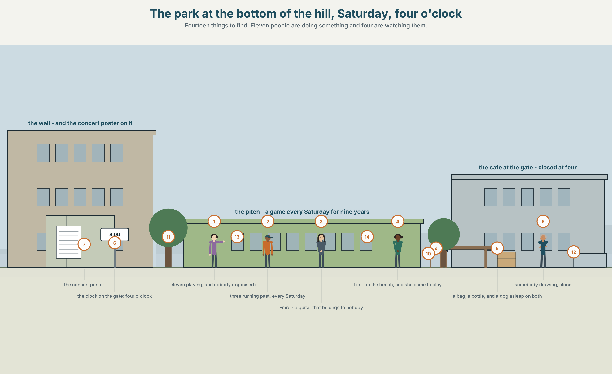{width=6.6in}

*The park at the bottom of the hill, Saturday, four o'clock — Fourteen things to find. Eleven people are doing something and four are watching them.*

# What do you do for fun?

**By the end of this unit you can say what you like doing and how often you do it.**

| ◆ **A · THE WORLD** | A park on a Saturday, where some people are doing and some are watching |
|---|---|
| ◆ **B · THE SYSTEM** | *like*, *love* and *hate* + *-ing* · adverbs of frequency and where they stand · 22 words for free time · the *-ing* sound · which word in the sentence gets the push |
| ◆ **C · THE PERFORMANCE** | You recommend one free activity to somebody who would not choose it |

---

### 0A · Find it — fourteen things

Find these in the picture. Write the number.

> ☐ football ☐ a guitar ☐ a book ☐ a game ☐ a park ☐ a bench ☐ a poster
> ☐ a tree ☐ a phone ☐ a bag ☐ a dog ☐ a bottle ☐ a bicycle ☐ a child

**Three of these words are not in the picture. Which three?**

> the beach · a concert · a film

### 0B · Guess it

Look at the four people who are watching. **Which one is enjoying it most?**
Say one thing. You can use these words:

> *watch · play · look · phone · game*

### 0C · Say it ⏺

**Record. Thirty seconds. Do not prepare.**

> **What do you do when you have two free hours and no plan?**

You will listen to this again on the last page.

---

## Part 1 · Vocabulary Lab 1 ◆ **B · THE SYSTEM**

### 1A · Meet — what people do with a Saturday

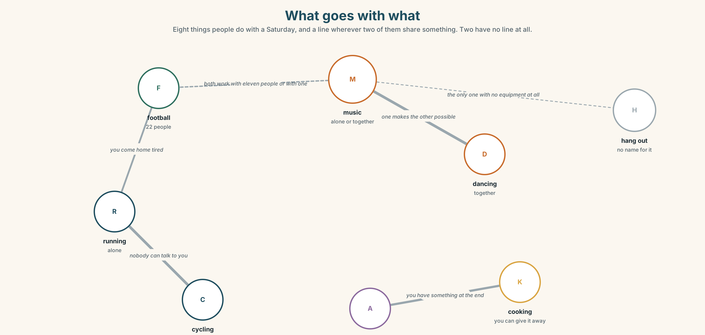{width=6.6in}

*What goes with what — Eight things people do with a Saturday, and a line wherever two of them share something. Two have no line at all.*

| | |
|---|---|
| **football** | Twenty-two people, and you cannot do it alone. |
| **swimming** | One person, and nobody can talk to you. |
| **music** | Alone or together, and it is the only one that works in both. |
| **cooking** | The only one that produces something you can give away. |
| **drawing** | Cheap, quiet, and almost nobody does it after the age of twelve. |
| **hang out** | No equipment, no cost, no name for what you did. |

### 1B · Meet — the words

> **football · swimming · running · cycling · music · guitar · film · series · book · game · park · beach · concert · dancing · cooking · drawing**

Write each word under the right picture.

{width=6.6in}

*One Saturday, in section — Eleven activities. Eleven words. Put each one in the hour where it actually happened.*

### 1C · Sort — alone, or with people?

Put each word in the right box. **Two of them can go in both. Which, and why?**

> a book · drawing · football · cooking · music · a film · a game · running · dancing ·
> swimming

| **ALONE** | **WITH PEOPLE** | **BOTH** |
|---|---|---|
| | | |

### 1D · The verbs that go with them

| | |
|---|---|
| **go swimming** | *go* + *-ing*, for things you travel to do |
| **play football** | *play*, for games with rules and sides |
| **listen to music** | *listen to*, and the *to* is not optional |
| **watch a film** | *watch*, not *see* and not *look* |
| **hang out** | the only one with no object, and the most used of the five |

**Now say them.** Four of these five take a word after them.
**Which one does not, and what does that tell you about it?**

### 1E · Stretch — the phrases you will need today

> **go swimming** · **play football** · **listen to music** · **watch a film** · **It's not my thing.**

Match each phrase to the moment you need it.

1. Somebody invites you to something you do not want to do. → ______
2. It is thirty degrees and there is a pool. → ______
3. You have two hours and no energy. → ______
4. There are ten of you and a ball. → ______
5. You are on a bus for forty minutes. → ______

### 1F · The hard one

> **f** **It's not my thing.**

Practise it three times. **Four words that refuse something without insulting it.**

### 1G · Own it

Write down one thing you love doing and one thing everybody thinks you love doing and you do not.
Do not write your name. The class guesses whose card it is.

---

## Part 2 · Listening ◆ **A · THE WORLD**

{width=6.6in}

*On the bench, four o'clock — There is a guitar between them and it belongs to neither of them.*

### 2A · On the bench 🔊 Track 7.1

**Before you listen.** Emre plays the guitar. Lin does not play anything.
**Guess: does she say so?**

**Listen once. One question.** How often does Emre play?

**Listen again. Complete the table.**

| | Loves | Likes | Hates |
|---|---|---|---|
| Emre | | | |
| Lin | | | |

**Listen again. True or false?**

1. Emre plays the guitar every day. ☐ T ☐ F
2. Lin hates running. ☐ T ☐ F
3. Emre never goes swimming. ☐ T ☐ F
4. Lin sometimes watches a film in English. ☐ T ☐ F

**Noticing.** Four sentences from the recording.

1. *I love playing.*
2. *I usually play in the evening.*
3. *She hardly ever watches films.*
4. *I don't like running.*

**In sentence 2, where is the frequency word — before the verb or after it? And in sentence 1?**

### 2B · Decoding clinic 🔊 Track 7.2

Twenty seconds of Emre at speed. Three jobs.

1. Count the frequency words you hear.
2. In *playing* and *running*, the last sound is one sound, not two. What do you hear at the end?
3. One word in every sentence is louder than the rest. Write the louder word in each.

> Transcripts, page 153.

---

## Part 3 · Grammar Lab 1 ◆ **B · THE SYSTEM**

### Liking a thing, and liking doing a thing

### 3A · Notice

Look at the four sentences in Part 2 again.

1. What comes after *love*, *like* and *hate* here — a noun or a verb?
2. What is on the end of that verb?
3. In sentence 2, is *usually* before or after the verb?
4. In *She hardly ever watches*, where is the frequency phrase?

### 3B · See

{width=6.6in}

*Where the frequency word stands — Before an ordinary verb. After am, is and are. The verb decides, not the word.*

### 3C · Know

| | | |
|---|---|---|
| **like / love / hate + -ing** | the activity, as an activity | *I love playing. I hate running.* |
| **like / love / hate + a noun** | the thing itself | *I love music. I hate football.* |
| **frequency, before the verb** | always, usually, often, sometimes, never, hardly ever | *I usually play in the evening.* |
| **frequency, after *be*** | the same words, the other side | *I am always late.* |

> **Never is already negative.** *I never play* — and not *I don't never play*. One negative is
> all English allows in a sentence.

{width=6.6in}

*From always down to never — Six words on the ladder, and the longer phrases beside them at the height they mean.*

| | |
|---|---|
| **short words, before the verb** | *always · usually · often · sometimes · hardly ever · never* |
| **longer phrases, at the end** | *every week · once a week · twice a month · at the weekend · most days · in my free time* |

> **Why it matters.** Saying what you like is a sentence. Saying how often you do it is the thing
> that makes somebody believe you.

### 3D · Use — controlled

Complete with **always**, **usually**, **sometimes**, **never**, **hardly ever** or the *-ing*
form.

> Emre loves (1) ______ (play) the guitar. He (2) ______ plays in the evening — about five days
> a week. Lin (3) ______ watches a film in English; she says once a month is not often.
> I (4) ______ go swimming. I hate it. I (5) ______ listen to music on the bus — every day.

### 3E · Use — guided

Put the frequency word in the right place.

1. I play football at the weekend. *(sometimes)*
2. She is late for the Friday class. *(always)*
3. They go to a concert. *(hardly ever)*
4. We watch a film in English. *(often)*
5. He is tired on Monday morning. *(usually)*

### 3F · Use — open

**In pairs.** Say five things you do in your free time with a frequency word in every sentence.
Your partner says whether they believe the frequency word.

### 3G · Check — six items, mark your own

> 1. I love ______ (cook).
> 2. She ______ goes to a concert. *(very rarely — two words)*
> 3. They are ______ late. *(100% — and watch where it goes)*
> 4. I don't like ______ (run).
> 5. ✗ *I don't never play football.* → correct it.
> 6. ✗ *I like play the guitar.* → correct it.

{width=6.6in}

*Two plain verbs with nothing between them — Two plain verbs with nothing between them*

**0–3 →** Workbook pp. 28–31. **4–5 →** Part 6. **6 →** page 156.

---

## Part 4 · Speaking ◆ **C · THE PERFORMANCE**

### 4A · Fluency starter — the frequency round

Everybody says one thing they do and how often. **Nobody may use a frequency word that has
already been used.** There are thirteen of them in this unit, so the round can go round thirteen
people.

### 4B · The functional core — saying what you prefer

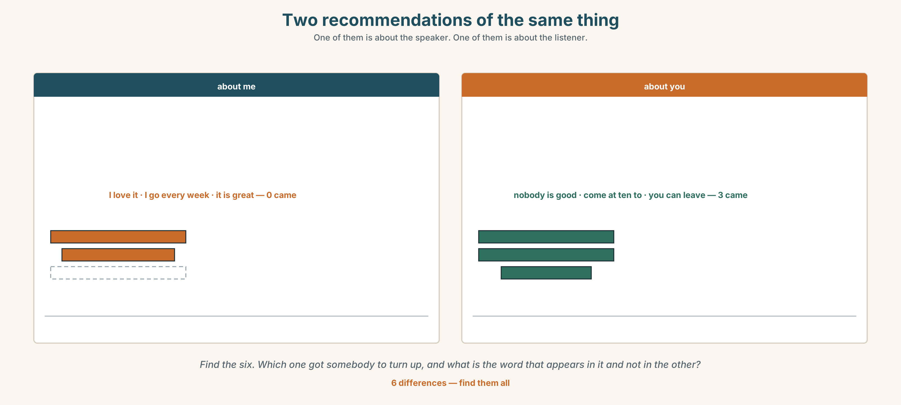{width=6.6in}

*Two recommendations of the same thing — One of them is about the speaker. One of them is about the listener.*

**Language Bank**

| | |
|---|---|
| **strong yes** | *I love… · It's the best part of my week.* |
| **mild yes** | *I quite like… · I don't mind…* |
| **no, politely** | *It's not my thing. · I'm not very good at it.* |
| **how often** | *every week · once a week · twice a month · most days · at the weekend · in my free time* |

**Information gap.** Learner A has what the class says it likes. Learner B has what the class
actually did last month. **Find the two activities where the two lists disagree.**

### 4C · The performance — the recommendation ⏺

Recommend **one free activity** to somebody who would not choose it. **Two minutes.** You must:

> say how often you do it · say one thing that is bad about it · say why **they** would like it,
> not why you do

**Record it.**

### 4D · Observer

One person listens for **one thing**: did the speaker ever say *you* instead of *I*?

### 4E · Two criteria

> ☐ Did I use *-ing* after *like*, *love* or *hate* every time?
> ☐ Did I give a frequency for the thing I recommended?

---

## Part 5 · Reading ◆ **A · THE WORLD**

### 5A · Predict

The title is **"Eleven playing, four watching."**
**Which group do you think goes home happier?**

### 5B · Read — sixty seconds

---

**Eleven playing, four watching**

There is a football game in the park every Saturday at four. It has been there for nine years.
Nobody organises it. People come, and if there are enough of them, they play.

Eleven people are playing today. Four people are sitting on the bench watching. Three of the four
are looking at their phones.

Ana walks past the park every Saturday. She likes watching for a few minutes. She never plays,
and she says she is not very good, which is true, and she also says she is too old, which is not.

Here is the thing nobody says out loud. Of the four people on the bench, two of them came to
play. They arrived, they saw the game had already started, and they sat down. They have been
sitting down for forty minutes.

Nobody would have minded. Nobody even knows they are there.

---

### 5C · Answer

1. How often is there a game?
2. How many people are playing?
3. What does Ana say about herself?
4. How long have the two people been sitting on the bench?
5. **Why did the two people sit down instead of joining?**
6. **The writer says one of Ana's reasons is true and one is not. Why mention both?**

### 5D · Vocabulary in context

Guess from the text. Then check.

> nobody organises it · if there are enough of them · out loud · had already started · nobody would have minded

### 5E · The counter-text

{width=6.6in}

*The poster on the noticeboard — Four activities, four lines for names. Read the names, not the activities.*

**Read the poster and answer.**

1. What time does the club start?
2. **Which activity has the most names, and how many?**
3. Which activity has no names at all?
4. **Who wrote the line at the bottom, and why is it in a different pen?**

### 5F · Two texts

The poster has four activities on it.
The reading says nobody organises the football game and it has run for nine years.

**Which one is more likely to still be running next year?** Say one sentence.

---

## Part 6 · Vocabulary Lab 2 ◆ **B · THE SYSTEM**

### How often, exactly

{width=6.6in}

*Going swimming, at six frequencies — The same activity, six times. What each frequency actually looks like on a calendar.*

### 6A · The ones that catch everybody

| | |
|---|---|
| **hardly ever** | two words, and it means almost never |
| **once a week** | not *one time in a week* |
| **twice a month** | English has a special word for two and none for three |
| **at the weekend** | *at*, not *in* and not *on* |

### 6B · Say them

> always · usually · often · sometimes · hardly ever · never · every week · once a week · twice a month · most days

### 6C · Chunk

1. **______ a week** — seven days, one time
2. **______ a month** — two times in a month
3. **at the ______** — Saturday and Sunday
4. **in my ______ time** — when nobody needs me
5. **most ______** — more than half of them
6. **______ ever** — almost never, two words

### 6D · Contrast Clinic

Six items. Where does the word in brackets go — ***before*** the verb or ***after*** it?

1. She is late. *(always)*
2. They go swimming. *(never)*
3. I play football. *(sometimes)*
4. He watches films in English. *(hardly ever)*
5. We are tired on Friday. *(usually)*
6. You are right. *(often)*

---

## Part 7 · Pronunciation & Fluency Lab ◆ **B · THE SYSTEM**

### The *-ing* sound, and the word that gets the push

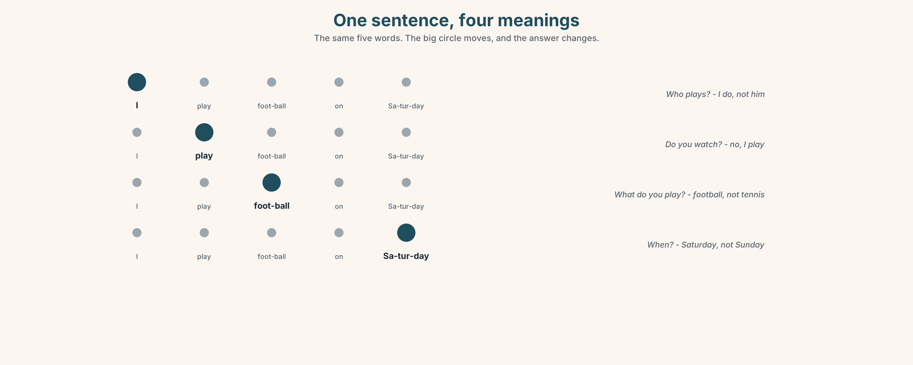{width=6.6in}

*One sentence, four meanings — The same five words. The big circle moves, and the answer changes.*

### 7A · Hear

> **/ŋ/** at the end: *playing · running · swimming · cooking · drawing*
> It is **one** sound, made at the back. Not *n* + *g*. Nothing after it.

### 7B · Say

Say each one three times. Then say this:

> *I love cooking, but I hate washing.* — four *-ing* endings, and only one of them is stressed.

### 7C · Make it mean something

Say this sentence four times, pushing a different word each time:

> *I play football on Saturday.*
> **I** play — not him · **play** — I don't watch · **football** — not tennis · **Saturday** — not Sunday

**One sentence, four meanings, and not a single word changed.** Which push answers which question?

### 7D · Fluency 20 ⏺

Twenty seconds: **six things you do in your free time, each with a frequency word.**
Three times, faster.

---

## Part 8 · Writing ◆ **C · THE PERFORMANCE**

### A recommendation · 40–60 words

### 8A · Read the model

> There is a football game in the park every Saturday at four. `[when and where, first]`
>
> Nobody organises it and nobody is good. I am not good. `[the barrier, removed before it is
> raised]`
>
> I go most Saturdays. Sometimes there are twenty people and sometimes there are six. `[how
> often, and what it is actually like]`
>
> If you come, come at ten to four. After four it feels like joining something. `[the one
> practical thing nobody tells you]`

**Questions about the writer's choices:**

1. *I am not good.* **Why admit that in the second line?**
2. *Sometimes six.* **Why not only say twenty?**
3. The last line is about ten minutes. **Why is the most useful sentence the smallest one?**

### 8B · The anti-model

> I love football. It is a great sport. You should try it. It is very fun and good exercise. Everybody likes it.

Correct English, and nobody has ever gone to anything because of a sentence like this.
**Rewrite it with one time, one place and one honest problem.**

### 8C · Plan

> when and where → the barrier, removed → how often, honestly → the one practical detail

### 8D · Write — 40 to 60 words
### 8E · Peer review — two things only

> ☐ Is there a frequency word or phrase in it?
> ☐ Is there one sentence that is about the reader and not about the writer?

### 8F · Publish

On the noticeboard, with the writer's name. **Count who actually turns up.**

---

## Part 9 · The File ◆ **A · THE WORLD + C · THE PERFORMANCE**

# STUDY FILE · The English you would do anyway

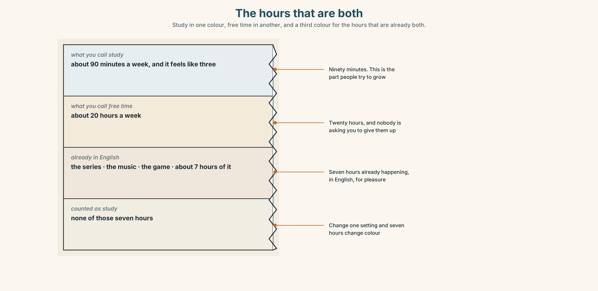{width=6.6in}

*The hours that are both — Study in one colour, free time in another, and a third colour for the hours that are already both.*

### 9A · The hours that are both

{width=6.6in}

*One hour of a series, five ways — Five panels. Only the second panel costs anything, and it costs four seconds.*

| | |
|---|---|
| **What people think** | study time and free time are different time |
| **What is true** | the series, the music and the game are already in English |
| **What is missing** | not more hours. One small change inside the hours you have |
| **The change** | subtitles in English, not in your language |

### 9B · One line, out loud

Watching is input. **Saying one line out loud turns an hour of watching into an hour of
practice**, and it costs four seconds. Choose one line from anything you watched this week and
say it to the person next to you.

### 9C · Role play — recommend it in English

In pairs. Recommend a series, a song or a game to your partner **in English, for two minutes**,
and then listen to theirs. **You must both end by agreeing to try the other one.**

### 9D · The thing you already do

Name one thing you do every week for pleasure that could be in English with no extra time at all.
**What is the one change?**

### 9E · Transfer — before next week

**Change the subtitles on one thing to English and watch it.** Bring two lines you heard and
understood, and one you heard and did not.

---

## Part 10 · Mediation & Interaction ◆ **C · THE PERFORMANCE**

{width=6.6in}

*What the class says, and what the class did — Two bands that ought to be the same shape. They are, except in two places.*

### 10A · Relay

Half the class has what people say they like. Half has what people did last month.
**Find the two activities where the lists disagree, by speaking only.** Ten minutes.

### 10B · Simplify — for one person

A new student asks: *What can I do here at the weekend for no money?*
**Answer in four sentences.** One of them must say how often.

### 10C · Online

Write **one message** to a classmate inviting them to something.
**Two sentences.** One must say when and one must remove a barrier.

### 10D · Your language

Does your language put the frequency word in the same place as English?
**Say *I sometimes play football* in your language.** Where does *sometimes* go?

---

## Part 11 · The Decision ◆ **C · THE PERFORMANCE**

# Friday at six

Escola Monte has a free room on Friday evening and a teacher who will stay for an hour. The
poster went up with four options and eleven names on one of them.

**Film club.** Eleven names. One film a month, with English subtitles. Easy to run. Nobody speaks.

**Football.** Three names. Free, outdoors, and it already exists in the park on Saturdays.

**Conversation hour.** Two names. The thing that would help the most, and the thing almost nobody
chooses.

**Or we can just hang out.** Written at the bottom in a different pen, with no line for names.

### 11A · The evidence

{width=6.6in}

*Room 3 at seven on a Friday — The film club on the left, the conversation hour on the right. Same room, same hour.*

🔊 **Track 7.6.** Lin, 20 seconds: *"I put my name on the film club. I know the conversation
hour is better for me. I know it. I still put my name on the film club."*

### 11B · Talk about it

In threes. Use the frame. Everybody says one.

> *I think the school should run ______ , because ______ .*

**Words you can use:** *film · game · music · hang out · speak · free time · every week*

### 11C · Decide

Write **two sentences**. Choose, and say why.

> I think the school should run ______________________ ,
> because ______________________ .

### 11D · Model decision

> The film club, and then twenty minutes of talking about it afterwards with the lights on. Eleven
> people chose the film and two chose the conversation. Put the conversation on the end of the
> thing eleven people chose, and eleven people get it.

### 11E · The Reveal

> **What happened.** The school ran the film club with twenty minutes afterwards. In November
> eleven came. By February nine were coming, and the twenty minutes had become forty because
> nobody wanted to leave.
>
> Then something nobody expected: four of the nine stopped watching the film and started arriving
> at eight, for the talking. They had chosen the film club and what they wanted was the room.

**One question. You do not have to answer it out loud.**

> Eleven people chose a film. What were they actually choosing?

---

## Part 12 · Landing ◆ **all three lines**

### 12A · Recycle — twelve items

> 1. I love ______ (cook) for other people.
> 2. She ______ goes to a concert. *(almost never — two words)*
> 3. They are ______ late on Friday. *(100%)*
> 4. ______ a week — seven days, one time
> 5. ______ a month — two times
> 6. at the ______ — Saturday and Sunday
> 7. in my ______ time
> 8. ______ days — more than half of them
> 9. I ______ to music on the bus. *(two words)*
> 10. It's not my ______ .
> 11. *(Unit 6)* How ______ eggs do you want?
> 12. *(Unit 5)* There ______ a lot of people in the park.

### 12B · Consolidate — one task, everything in it

**Write six sentences about your free time.** Three must use *like*, *love* or *hate* with
*-ing*. Three must have a frequency word or phrase. One must be something you do not enjoy.

### 12C · Can-do, with evidence

> ☐ I can say what I like doing. **Evidence:** 4C, 8D
> ☐ I can use *-ing* after *like*, *love* and *hate*. **Evidence:** 3G
> ☐ I can put a frequency word in the right place. **Evidence:** 6D
> ☐ I can push the right word in a sentence. **Evidence:** 7C

### 12D · Replay ⏺

Record 0C again. **Listen to both.** What is different?

### 12E · Glossary — thirty-five words, as a map

> **SPORT** · football · swimming · running · cycling
> **MUSIC AND MAKING** · music · guitar · dancing · cooking · drawing
> **WATCHING AND READING** · film · series · book · game
> **PLACES** · park · beach · concert
> **WHAT YOU SAY** · go swimming · play football · listen to music · watch a film · hang out · It's not my thing.
> **HOW OFTEN** · always · usually · often · sometimes · hardly ever · never
> **HOW OFTEN, IN WORDS** · every week · once a week · twice a month · at the weekend · in my free time · most days · How often do you…?

### 12F · Next

> **Unit 8 · What is a job, really?**

# A1.1 · Unit 8 · What Dona Filipa Actually Does

> **English Animated** · *Starting Out* · Escola Monte, Lisbon
> Student's Book pages 160–181 · 22 pp · ~9 hours

---

## Part 0 · The Big Picture ◆ **A · THE WORLD**

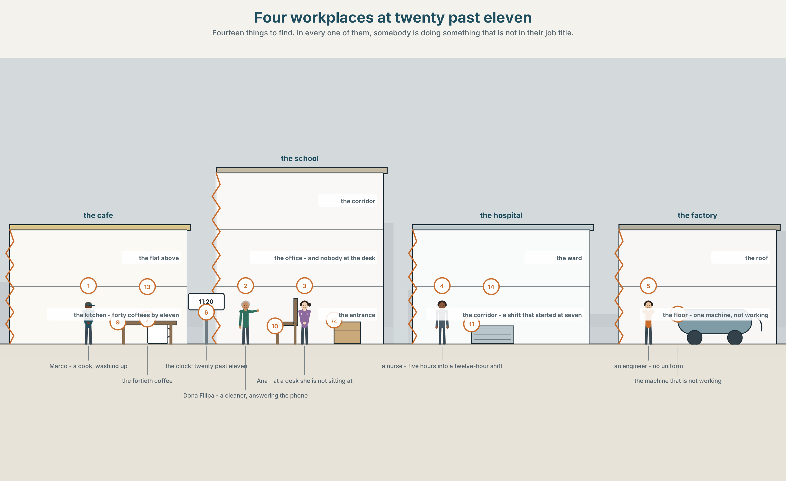{width=6.6in}

*Four workplaces at twenty past eleven — Fourteen things to find. In every one of them, somebody is doing something that is not in their job title.*

# What is a job, really?

**By the end of this unit you can say what somebody is doing right now, and what they usually do.**

| ◆ **A · THE WORLD** | Four workplaces at the same minute, and what is actually happening in them |
|---|---|
| ◆ **B · THE SYSTEM** | present continuous, against the present simple · 22 words for jobs and workplaces · *a* and *an* with job names · the short forms of *be* · the long *er* sound |
| ◆ **C · THE PERFORMANCE** | You interview somebody about their job and report what they really do |

---

### 0A · Find it — fourteen things

Find these in the picture. Write the number.

> ☐ a kitchen ☐ an office ☐ a hospital ☐ a factory ☐ a uniform ☐ a customer
> ☐ a machine ☐ a phone ☐ a floor ☐ a coffee ☐ a clock ☐ a door ☐ a box ☐ a chair

**Three of these words are not in the picture. Which three?**

> a shift · a team · a manager

### 0B · Guess it

Look at the four people in a uniform. **Which of them has the most difficult job?**
Say one thing. You can use these words:

> *work · uniform · customer · clean · phone*

### 0C · Say it ⏺

**Record. Thirty seconds. Do not prepare.**

> **What are you doing right now, and what do you usually do at this hour?**

You will listen to this again on the last page.

---

## Part 1 · Vocabulary Lab 1 ◆ **B · THE SYSTEM**

### 1A · Meet — the job, and the work

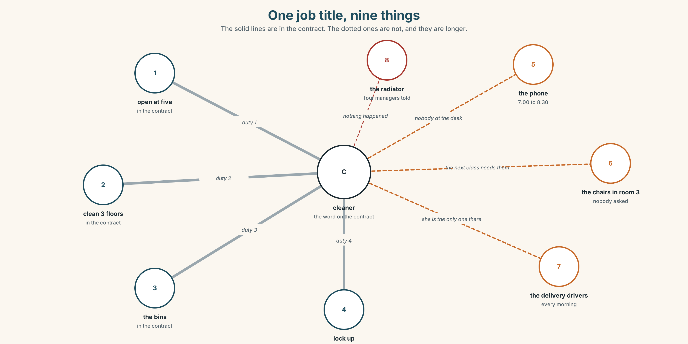{width=6.6in}

*One job title, nine things — The solid lines are in the contract. The dotted ones are not, and they are longer.*

| | |
|---|---|
| **job** | The word on the contract. |
| **shift** | The hours. Not the same thing as the job. |
| **team** | The people. Also not the same thing as the job. |
| **uniform** | What makes strangers treat you differently. |
| **customer** | The person who decides whether the job was done. |
| **manager** | The person who decides whether it was done well. |

### 1B · Meet — the words

> **job · team · office · factory · kitchen · hospital · school · nurse · driver · waiter · cook · cleaner · engineer · manager · uniform · shift · customer**

Write each word under the right picture.

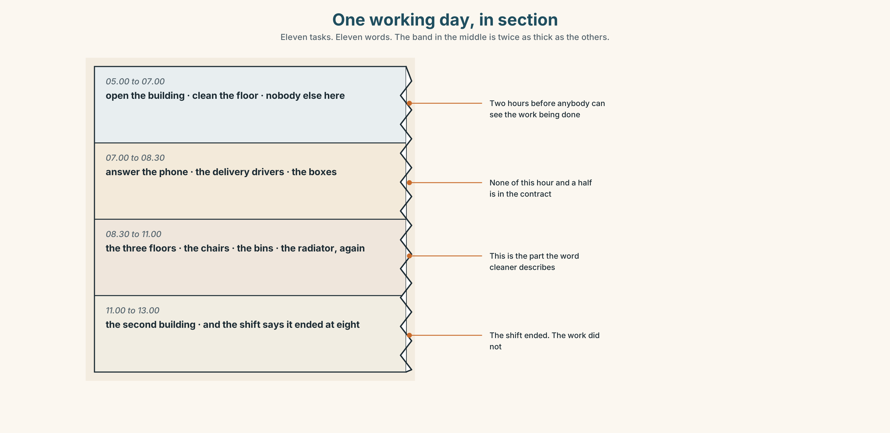{width=6.6in}

*One working day, in section — Eleven tasks. Eleven words. The band in the middle is twice as thick as the others.*

### 1C · Sort — a person, or a place?

Put each word in the right box. **Two of them can go in both. Which, and why?**

> hospital · kitchen · cook · nurse · office · factory · cleaner · manager · school ·
> driver

| **A PERSON** | **A PLACE** | **BOTH** |
|---|---|---|
| | | |

### 1D · What people actually do all day

| | |
|---|---|
| **answer the phone** | Eleven times an hour, and none of it is in the job description. |
| **serve customers** | The visible part. About a quarter of the time. |
| **clean the floor** | Twice a day, and everybody notices only when it is not done. |
| **make coffee** | Forty times a morning in a café. Twice a morning in an office, and it is somebody's unpaid job. |
| **fix a machine** | Four minutes, if you know which machine. Forty, if you do not. |
| **look after** | The widest verb on this page. It covers people, machines and buildings. |

**Now say them.** Five of these six have an object after them.
**Which one changes its meaning completely if you take the little word away?**

### 1E · Stretch — the phrases you will need today

> **work in a…** · **start work** · **finish work** · **take a break** · **What do you do?**

Match each phrase to the moment you need it.

1. Somebody at a party asks about your life. → ______
2. You are telling somebody where you spend your mornings. → ______
3. It is twenty past eleven and you have been standing since six. → ______
4. The shift begins. → ______
5. The shift ends, and the shift ending is not the same as the work ending. → ______

### 1F · The hard one

> **f** **I'm on my break.**

Practise it three times. **Four words that stop a conversation politely, and almost nobody at A1
knows them.**

### 1G · Own it

Write down one job you would like and one job you would be good at. Do not write your name.
The class guesses whose card it is. **They are often not the same job.**

---

## Part 2 · Listening ◆ **A · THE WORLD**

{width=6.6in}

*The corridor, twenty past eleven — One of them is writing a job description. The other one is doing the job.*

### 2A · Twenty past eleven 🔊 Track 8.1

**Before you listen.** Ana is writing a new job description for the cleaner.
**Guess: how many things will Dona Filipa say she does?**

**Listen once. One question.** What is Dona Filipa doing at this moment?

**Listen again. Complete the table.**

| | Right now | Usually, at this hour |
|---|---|---|
| Dona Filipa | | |
| Ana | | |
| Marco | | |

**Listen again. True or false?**

1. Dona Filipa is cleaning the floor right now. ☐ T ☐ F
2. She usually answers the phone in the morning. ☐ T ☐ F
3. Ana is writing the job description now. ☐ T ☐ F
4. Dona Filipa works in a hospital as well. ☐ T ☐ F

**Noticing.** Four sentences from the recording.

1. *I'm cleaning the office.*
2. *I clean the office every morning.*
3. *She's answering the phone.*
4. *She answers the phone about eleven times an hour.*

**Two are about right now and two are about every day. How can you tell, in the first two words?**

### 2B · Decoding clinic 🔊 Track 8.2

Twenty seconds of Dona Filipa at speed. Three jobs.

1. Count how many *-ing* verbs you hear.
2. *I'm* and *she's* are very short. How many sounds are in each?
3. She says *work* and *worker* and *working*. Which one has the longest vowel?

> Transcripts, page 154.

---

## Part 3 · Grammar Lab 1 ◆ **B · THE SYSTEM**

### Right now, and every day

### 3A · Notice

Look at the four sentences in Part 2 again.

1. Which two words make the *right now* form?
2. What is on the end of the verb in those two?
3. In the *every day* sentences, is there a form of *be*?
4. Which pair would you use to describe a photograph?

### 3B · See

{width=6.6in}

*A wide lens and a narrow one — The same verb, twice. What changes is how much of the week you can see.*

### 3C · Know

| | | |
|---|---|---|
| **right now** | am / is / are + **-ing** | *I'm cleaning the office. She's answering the phone.* |
| **every day** | the plain verb (+ **s**) | *I clean the office every morning. She answers the phone.* |
| **negative** | am not / isn't / aren't + **-ing** | *He isn't working today.* |
| **question** | *be* to the front | *What are you doing? Is she working?* |

> **Two tenses, two kinds of truth.** *She answers the phone* is true about her job. *She's
> answering the phone* is true about this second. Both can be true at once, and both can be false
> at once.

{width=6.6in}

*The same verb, two widths — One of these is true about the week. The other is true about this minute.*

| | |
|---|---|
| **a / an with jobs** | *She's a nurse. He's an engineer. I'm a cleaner.* |
| **never without it** | *She's nurse* is not English. Every job takes *a* or *an*. |
| **an before a vowel sound** | *an engineer · an artist · an office worker* |

> **Why it matters.** This is how you describe a photograph, a video, a street, a room, or
> anything at all that is happening while you are speaking.

### 3D · Use — controlled

Complete with the present simple or the present continuous.

> Dona Filipa (1) ______ (clean) the office every morning. Right now she (2) ______ (answer)
> the phone, because Ana is not at the desk.
> Marco (3) ______ (make) about forty coffees every morning. At this moment he (4) ______ (sit)
> down, and he (5) ______ (not work).
> What (6) ______ you ______ (do)?

### 3E · Use — guided

Change each sentence from *every day* to *right now*.

1. She cleans the floor.
2. He makes coffee.
3. They serve customers.
4. I answer the phone.
5. We fix the machine.

### 3F · Use — open

**In pairs.** Describe a photograph on your phone without showing it. Your partner asks five
questions. **Every question must be in the present continuous.**

### 3G · Check — six items, mark your own

> 1. She ______ (clean) the office at this moment.
> 2. He ______ (start) work at six every day.
> 3. They ______ (not work) today.
> 4. What ______ you ______ (do) right now?
> 5. ✗ *She is nurse.* → correct it.
> 6. ✗ *I am work at the moment.* → correct it.

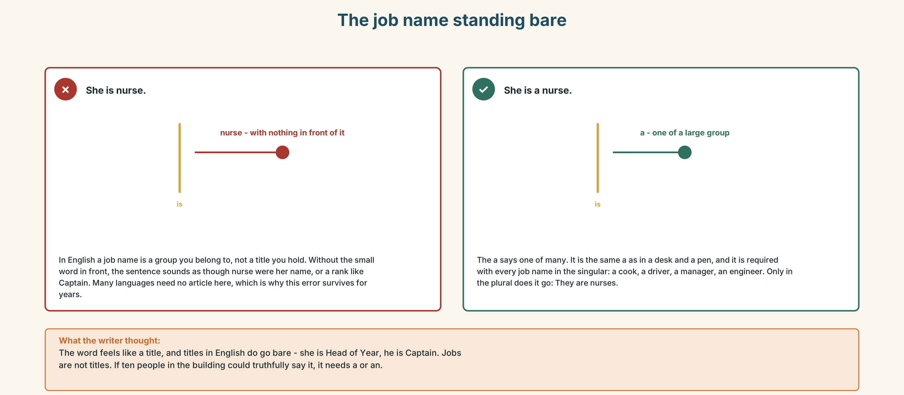{width=6.6in}

*The job name standing bare — The job name standing bare*

**0–3 →** Workbook pp. 32–35. **4–5 →** Part 6. **6 →** page 178.

---

## Part 4 · Speaking ◆ **C · THE PERFORMANCE**

### 4A · Fluency starter — what am I doing?

One person mimes. The class asks *Are you…?* questions. **Only present continuous questions are
allowed, and only ten of them.**

### 4B · The functional core — talking about work

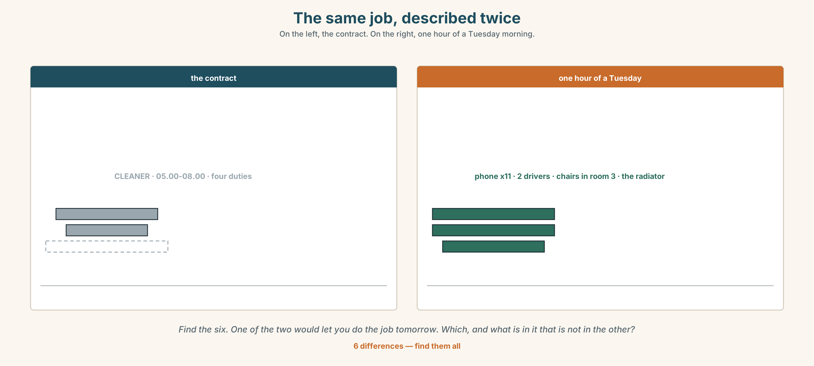{width=6.6in}

*The same job, described twice — On the left, the contract. On the right, one hour of a Tuesday morning.*

**Language Bank**

| | |
|---|---|
| **asking** | *What do you do? · Where do you work? · What are you doing now?* |
| **the title** | *I'm a cook. I'm an engineer. I work in a hospital.* |
| **the hours** | *I start work at six. I finish work at three. I'm on my break.* |
| **the reality** | *I usually… but today I'm…* |

**Information gap.** Learner A has four job titles. Learner B has four lists of what those people
actually did yesterday. **Match them, and find the one that cannot be matched.**

### 4C · The performance — the job interview, reversed ⏺

Interview a classmate about a job somebody in their family does. **Three minutes.** You must ask:

> what they do · where they work · what they are doing at this moment, probably ·
> one thing they do that is not in the job title

Report in three sentences. **Record it.**

### 4D · Observer

One person listens for **one thing**: did anybody say a job name without *a* or *an*?

### 4E · Two criteria

> ☐ Did I use both tenses, and for the right kind of truth?
> ☐ Did I find one thing that is not in the job title?

---

## Part 5 · Reading ◆ **A · THE WORLD**

### 5A · Predict

The title is **"Nine things, and four of them are in the contract."**
**Whose job do you think this is?**

### 5B · Read — sixty seconds

---

**Nine things, and four of them are in the contract**

Dona Filipa is a cleaner. That is the word on her contract and it is the word she uses when
somebody asks.

Here is her morning. She opens the building at five. She cleans the three floors. She puts the
chairs back in room 3, which nobody asks her to do. She answers the phone between seven and half
past eight, because there is nobody at the desk. She tells the delivery drivers where to leave
the boxes. She knows which radiator does not work and she has told four managers.

At twenty past eleven she is standing in the corridor answering the phone, and a visitor walks
past her without seeing her, because she is wearing a uniform and the visitor is looking for
somebody in an office.

Four of those nine things are in her contract. The school would stop working on a Tuesday if she
did only those four.

---

### 5C · Answer

1. What is the word on her contract?
2. What time does she open the building?
3. Why does she answer the phone?
4. How many of the nine things are in her contract?
5. **Why does the visitor not see her?**
6. **The last line says the school would stop working. Which of the five extra things do you think matters most, and why?**

### 5D · Vocabulary in context

Guess from the text. Then check.

> the word on her contract · nobody asks her to · without seeing her · looking for somebody · would stop working

### 5E · The counter-text

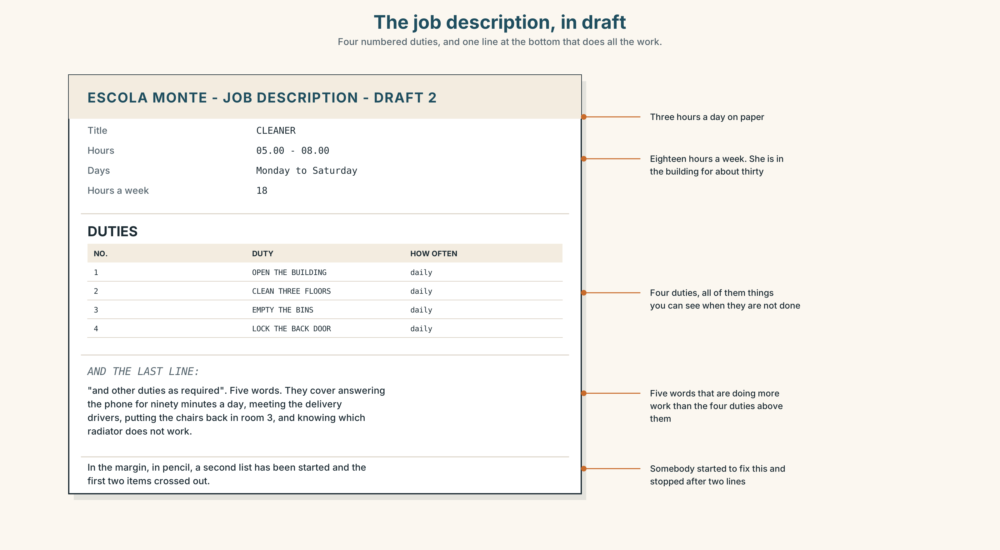{width=6.6in}

*The job description, in draft — Four numbered duties, and one line at the bottom that does all the work.*

**Read the job description and answer.**

1. What is the job title?
2. **What hours is the shift, and how many hours is that a week?**
3. How many duties are listed?
4. **What does *and other duties as required* mean, and who decides what they are?**

### 5F · Two texts

The job description lists four duties.
The reading lists nine things she does.

**Which document is more useful to the school, and which is more useful to Dona Filipa?**
Say one sentence.

---

## Part 6 · Vocabulary Lab 2 ◆ **B · THE SYSTEM**

### Job names, and the small word in front

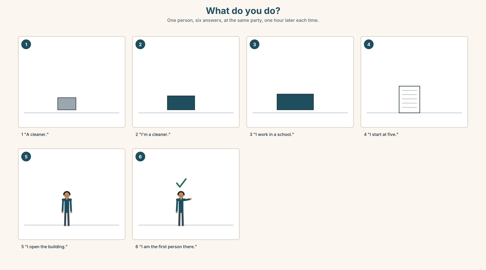{width=6.6in}

*What do you do? — One person, six answers, at the same party, one hour later each time.*

### 6A · The ones that catch everybody

| | |
|---|---|
| **a doctor** | never *I am doctor* |
| **an engineer** | *an*, because of the sound at the start, not the letter |
| **an artist** | same reason |
| **a nurse** | *a*, because *n* is a consonant sound |

### 6B · Say them

> a doctor · an engineer · an artist · a nurse · a waiter · a cleaner · a manager

### 6C · Chunk

1. I **______ in a** hospital.
2. I **______ work** at six.
3. I **______ work** at three.
4. I need to **take a ______ .**
5. **______ do you do?**
6. I'm **on my ______ .**

### 6D · Contrast Clinic

Six items. Present ***simple*** or present ***continuous***?

1. He ______ coffee at this moment. *(make)*
2. They ______ customers all day on Saturday. *(serve)*
3. Listen — somebody ______ the phone. *(answer)*
4. He ______ coffee about forty times a morning. *(make)*
5. She ______ the floor every evening. *(clean)*
6. Look — she ______ the floor now. *(clean)*

---

## Part 7 · Pronunciation & Fluency Lab ◆ **B · THE SYSTEM**

### The long *er*, and the words that shrink

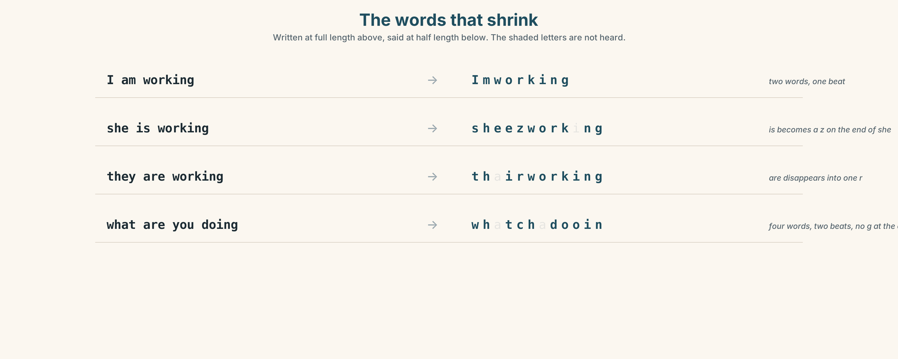{width=6.6in}

*The words that shrink — Written at full length above, said at half length below. The shaded letters are not heard.*

### 7A · Hear

> **/ɜː/** long, and the mouth is almost closed: *work · nurse · her · first · shirt*
> **the short forms**: *I'm · she's · he's · they're · we're · isn't · aren't*

### 7B · Say

Say each group three times. Then say this:

> *She's a nurse and she's working.* — two short forms and the long *er*, twice.

### 7C · Make it mean something

Say these two:

> *She is a nurse.* — four words, four beats, and it sounds like a correction
> *She's a nurse.* — three beats, and it sounds like ordinary speech

**The full form is not more polite. It is more emphatic.** Which one would you say to a friend?

### 7D · Fluency 20 ⏺

Twenty seconds: **six things people in this building are doing right now.** Three times, faster.

---

## Part 8 · Writing ◆ **C · THE PERFORMANCE**

### What somebody really does · 40–60 words

### 8A · Read the model

> My aunt is a nurse. She works in a hospital in Porto. `[the title and the place, first]`
>
> She starts work at seven and finishes at seven. Three days, then four days off. `[the hours,
> and the shift pattern, which the title does not tell you]`
>
> She says the job is mostly talking. She answers questions from families all day. `[what it
> actually is]`
>
> Right now she is probably asleep. It is four o'clock in the afternoon. `[one sentence in the
> other tense, at the end]`

**Questions about the writer's choices:**

1. The hours come second, before the work. **Why are the hours that important?**
2. *mostly talking.* **Why is that more informative than a list of duties?**
3. The last sentence is a guess. **Why end with something the writer does not know?**

### 8B · The anti-model

> My aunt is a nurse. She works in a hospital. It is a difficult job. She helps people. She is very tired.

Correct English, and it is every nurse who has ever lived. **Add the hours, one real task, and
one sentence about right now.**

### 8C · Plan

> title and place → hours and pattern → what it actually is → one sentence about now

### 8D · Write — 40 to 60 words
### 8E · Peer review — two things only

> ☐ Is there one sentence in the present continuous?
> ☐ Is there one thing in it that is not in the job title?

### 8F · Publish

On the wall, with no names. **The class matches the description to the job title.**

---

## Part 9 · The File ◆ **A · THE WORLD + C · THE PERFORMANCE**

# STUDY FILE · The work that is not on the timetable

{width=6.6in}

*The week that gets counted, and the week that does not — The lesson is the thin band. Everything thicker than it is invisible to everybody.*

### 9A · Four hours, and the one that is visible

{width=6.6in}

*One sentence, five stages — Five panels. The third one is the one everybody wants to skip.*

| | |
|---|---|
| **What is counted** | the ninety minutes in the room |
| **What is not counted** | rehearsing a sentence on the stairs |
| **What actually builds fluency** | the rehearsal, every time |
| **What it costs** | nothing, and it is already happening |

### 9B · Say it before you need it

The sentence you will need tomorrow can be built today, while you are walking.
**Choose one sentence you will have to say this week. Build it now, out loud, three times.**

### 9C · Role play — the job you do not have

In pairs. One of you is doing a job you have never done. The other asks what you are doing.
**Three minutes. Everything in the present continuous. Nobody may say *I don't know*.**

### 9D · The invisible hour

Find one hour in your week when your mind is free and your hands are busy.
**That hour is where the rehearsal goes.** Name it.

### 9E · Transfer — before next week

**Rehearse one English sentence out loud every day for seven days, before you need it.**
Bring the seven sentences and say which one you actually used.

---

## Part 10 · Mediation & Interaction ◆ **C · THE PERFORMANCE**

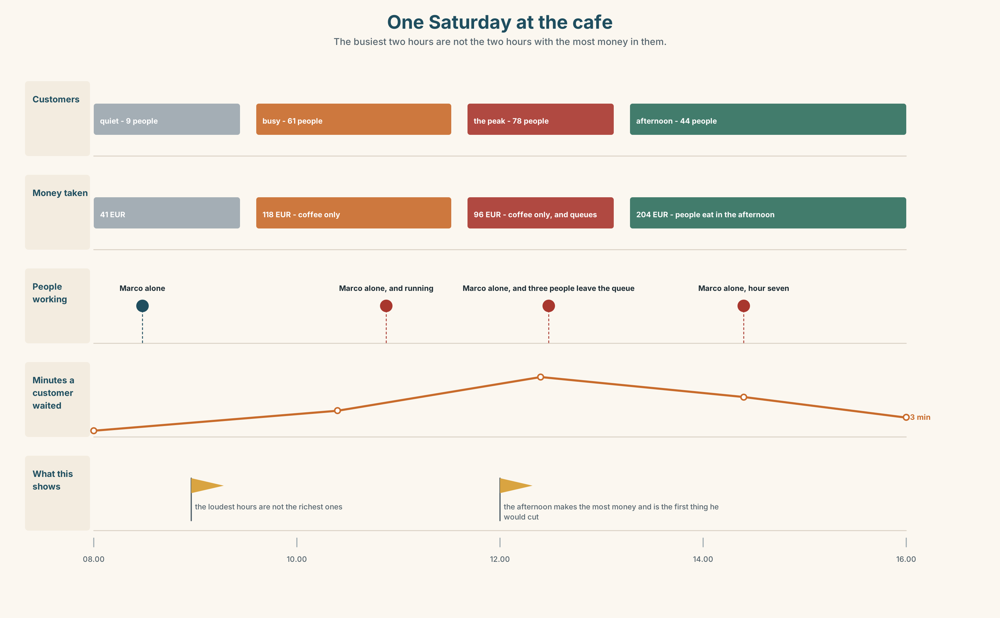{width=6.6in}

*One Saturday at the cafe — The busiest two hours are not the two hours with the most money in them.*

### 10A · Relay

Half the class has the job description. Half has the nine things.
**Rebuild the real job by speaking.** Ten minutes.

### 10B · Simplify — for one person

A new student asks: *What jobs can I do here with my English?*
**Answer in four sentences.** Be honest and be useful.

### 10C · Online

Write **one message** to a classmate: say what you are doing right now and ask what they are
doing. **Two sentences.**

### 10D · Your language

Does your language have a separate form for *right now*?
**Say *I work* and *I am working* in your language.** Is it the same sentence?

---

## Part 11 · The Decision ◆ **C · THE PERFORMANCE**

# Saturday at the café

Marco's café is open eight hours on Saturday. He cannot do eight hours alone any more.

**One person, eight hours.** One wage, one person who learns the job properly, one person who is
exhausted by two.

**Two people, four hours each.** Two wages for the same money, nobody exhausted, and twice as much
training. The handover at twelve is twenty minutes of nobody serving anybody.

**Nobody.** He closes at two. He loses the afternoon, which is a third of Saturday's money and
the only part he enjoys.

### 11A · The evidence

{width=6.6in}

*The counter at half past two — One person eight hours in, and the second of two people two hours in.*

🔊 **Track 8.6.** Marco, 20 seconds: *"Eight hours is not the problem. Hour seven is the problem.
In hour seven I am still working and I am not working well, and the customer can see it."*

### 11B · Talk about it

In threes. Use the frame. Everybody says one.

> *I think Marco should ______ , because ______ .*

**Words you can use:** *job · shift · customer · break · work · team · uniform*

### 11C · Decide

Write **two sentences**. Choose, and say why.

> I think Marco should ______________________ ,
> because ______________________ .

### 11D · Model decision

> Two people, with the handover at eleven and not at twelve. The twenty minutes of nobody serving
> is the whole argument against two people, and it disappears if you move it to the quietest hour
> instead of the busiest one.

### 11E · The Reveal

> **What happened.** Marco hired two people and moved the handover to eleven. The twenty minutes
> cost him almost nothing, because at eleven there are four customers and at twelve there are
> twenty-six.
>
> Then something he did not expect: the two of them overlapped for twenty minutes every week, and
> they started telling each other things about the customers. By March they knew more about his
> regulars than he did.

**One question. You do not have to answer it out loud.**

> Marco was buying hours. What did the twenty minutes of overlap turn out to be worth?

---

## Part 12 · Landing ◆ **all three lines**

### 12A · Recycle — twelve items

> 1. She ______ (clean) the office at this moment.
> 2. He ______ (start) work at six every day.
> 3. They ______ (not work) today.
> 4. She's ______ nurse.
> 5. He's ______ engineer.
> 6. I ______ in a hospital. *(the phrase for where you spend your working hours)*
> 7. I need to take a ______ .
> 8. What ______ you ______ ? *(the question about a job)*
> 9. I'm on my ______ .
> 10. Somebody has to ______ the phone.
> 11. *(Unit 7)* I love ______ (cook).
> 12. *(Unit 6)* How ______ coffees do you make?

### 12B · Consolidate — one task, everything in it

**Write six sentences about one person's working day.** Four in the present simple, two in the
present continuous, one job name with *a* or *an*, and one thing that is not in the job title.

### 12C · Can-do, with evidence

> ☐ I can say what somebody is doing now. **Evidence:** 4C, 8D
> ☐ I can choose between the two present tenses. **Evidence:** 3G, 6D
> ☐ I can name a job correctly with *a* or *an*. **Evidence:** 6B
> ☐ I can use the short forms of *be*. **Evidence:** 7C

### 12D · Replay ⏺

Record 0C again. **Listen to both.** What is different?

### 12E · Glossary — thirty-five words, as a map

> **THE PEOPLE** · nurse · driver · waiter · cook · cleaner · engineer · manager · customer
> **THE PLACES** · office · factory · kitchen · hospital · school
> **THE WORDS AROUND IT** · job · team · uniform · shift
> **WHAT YOU SAY** · work in a… · start work · finish work · take a break · What do you do? · I'm on my break.
> **WITH A OR AN** · a doctor · an engineer · an artist · a nurse
> **WHAT PEOPLE DO** · answer the phone · serve customers · clean the floor · make coffee · fix a machine · look after · come in · go out

### 12F · Next

> **Unit 9 · How do you find your way?**

# A1.1 · Unit 9 · Five Minutes from the Metro

> **English Animated** · *Starting Out* · Escola Monte, Lisbon
> Student's Book pages 182–203 · 22 pp · ~9 hours

---

## Part 0 · The Big Picture ◆ **A · THE WORLD**

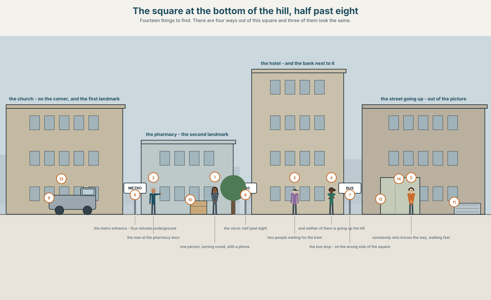{width=6.6in}

*The square at the bottom of the hill, half past eight — Fourteen things to find. There are four ways out of this square and three of them look the same.*

# How do you find your way?

**By the end of this unit you can give directions that somebody can actually follow.**

| ◆ **A · THE WORLD** | A square with four ways out of it and one person turning round in the middle |
|---|---|
| ◆ **B · THE SYSTEM** | prepositions of place and movement · the imperative · 22 words for the city · *on*, *in* and *at* for time · where the stress goes in a compound word |
| ◆ **C · THE PERFORMANCE** | You direct somebody who cannot see what you can see |

---

### 0A · Find it — fourteen things

Find these in the picture. Write the number.

> ☐ a street ☐ a square ☐ a corner ☐ a station ☐ a church ☐ a bank ☐ a hotel
> ☐ a pharmacy ☐ a hill ☐ a bus stop ☐ traffic lights ☐ a tram ☐ a taxi ☐ a bridge

**Three of these words are not in the picture. Which three?**

> a museum · a library · a train

### 0B · Guess it

Look at the person in the middle. **Which way are they going to go?**
Say one thing. You can use these words:

> *left · right · up · hill · corner*

### 0C · Say it ⏺

**Record. Thirty seconds. Do not prepare.**

> **How do you get from your home to this building?**

You will listen to this again on the last page.

---

## Part 1 · Vocabulary Lab 1 ◆ **B · THE SYSTEM**

### 1A · Meet — the square and the ways out

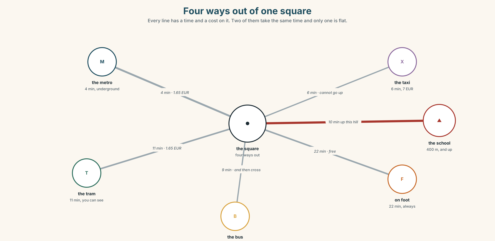{width=6.6in}

*Four ways out of one square — Every line has a time and a cost on it. Two of them take the same time and only one is flat.*

| | |
|---|---|
| **metro** | Four minutes underground, and you arrive with no idea which way you are facing. |
| **tram** | Eleven minutes, and you can see where you are the whole way. |
| **bus** | Nine minutes, and it stops on the wrong side of the square. |
| **on foot** | Twenty-two minutes, and it is the only one that is always the same length. |
| **taxi** | Six minutes, and it cannot get up the hill. |

### 1B · Meet — the words

> **street · square · corner · bridge · station · church · museum · library · bank · hotel · pharmacy · hill**

Write each word under the right picture.

{width=6.6in}

*The hill, in section — Eleven places. Eleven words. The gradient is the whole problem and you can see it here.*

### 1C · Sort — a place, or a direction?

Put each word in the right box. **Two of them can go in both. Which, and why?**

> hill · left · right · station · behind · square · between · church · opposite · corner

| **A PLACE** | **A DIRECTION** | **BOTH** |
|---|---|---|
| | | |

### 1D · Where exactly

| | |
|---|---|
| **next to** | touching, or nearly |
| **opposite** | across something — a street, a square, a room |
| **behind** | you cannot see it from here |
| **between** | two things, one on each side, and you have to name both |
| **in front of** | not the same as *before*. *Before* is time |
| **on the corner** | the building that two streets share |

**Now say them.** One of these six needs two nouns after it and the others need one.
**Which one, and what happens if you only give it one?**

### 1E · Stretch — the phrases you will need today

> **bus stop** · **traffic lights** · **straight on** · **get on** · **get off**

Match each phrase to the moment you need it.

1. The driver opens the doors and you are at your stop. → ______
2. You are telling somebody not to turn. → ______
3. You are waiting, and there is a shelter and a number on a pole. → ______
4. You are telling somebody where to turn, and there is a red light there. → ______
5. The doors open and you are not at your stop yet. → ______

### 1F · The hard one

> **f** **It's about ten minutes.**

Practise it three times. **The most useful lie in any language, and nobody minds it.**

### 1G · Own it

Write directions from this room to the nearest place where you can buy water, in **three
sentences**. Do not write your name. The class decides whose directions would work.

---

## Part 2 · Listening ◆ **A · THE WORLD**

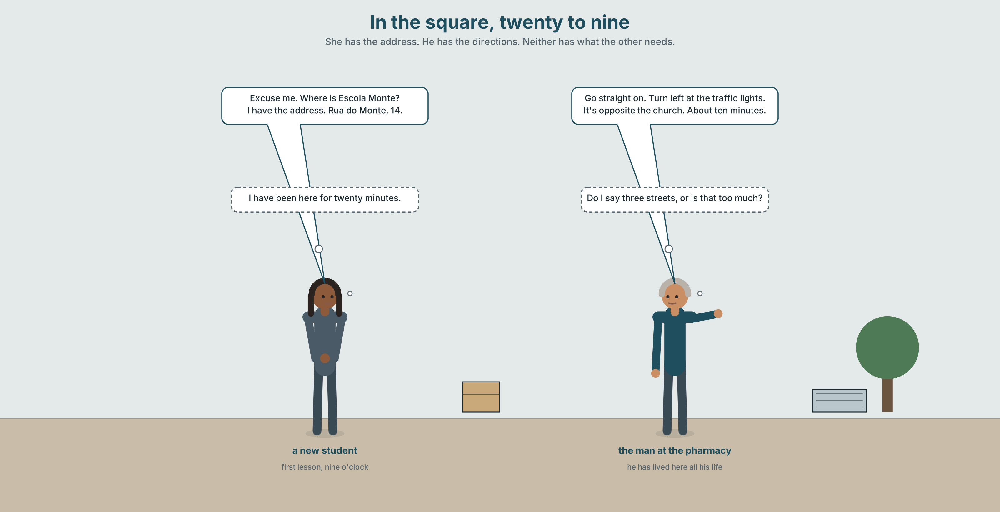{width=6.6in}

*In the square, twenty to nine — She has the address. He has the directions. Neither has what the other needs.*

### 2A · In the square 🔊 Track 9.1

**Before you listen.** The school is four hundred metres away and six storeys up.
**Guess: how many turns are there?**

**Listen once. One question.** How long does the man say it takes?

**Listen again. Complete the table.**

| | Turn | Landmark |
|---|---|---|
| first | | |
| second | | |
| third | | |

**Listen again. True or false?**

1. The school is opposite the church. ☐ T ☐ F
2. You go straight on at the traffic lights. ☐ T ☐ F
3. The school is next to a pharmacy. ☐ T ☐ F
4. It takes about ten minutes. ☐ T ☐ F

**Noticing.** Four sentences from the recording.

1. *Go straight on.*
2. *Turn left at the traffic lights.*
3. *It's opposite the church.*
4. *Don't go up the hill.*

**Sentences 1, 2 and 4 have no *you* in them. Why not, and what are they?**

### 2B · Decoding clinic 🔊 Track 9.2

Twenty seconds of the man at speed. Three jobs.

1. Count the directions he gives.
2. In *bus stop* and *traffic lights*, which word is louder — the first or the second?
3. He says one landmark twice. Which, and why do you think he repeats it?

> Transcripts, page 155.

---

## Part 3 · Grammar Lab 1 ◆ **B · THE SYSTEM**

### Telling somebody where, and telling them to go

### 3A · Notice

Look at the four sentences in Part 2 again.

1. What is the first word in sentences 1, 2 and 4?
2. Is there a subject in those three?
3. How do you make the negative one?
4. In sentence 3, is *opposite* about where something is, or about going somewhere?

### 3B · See

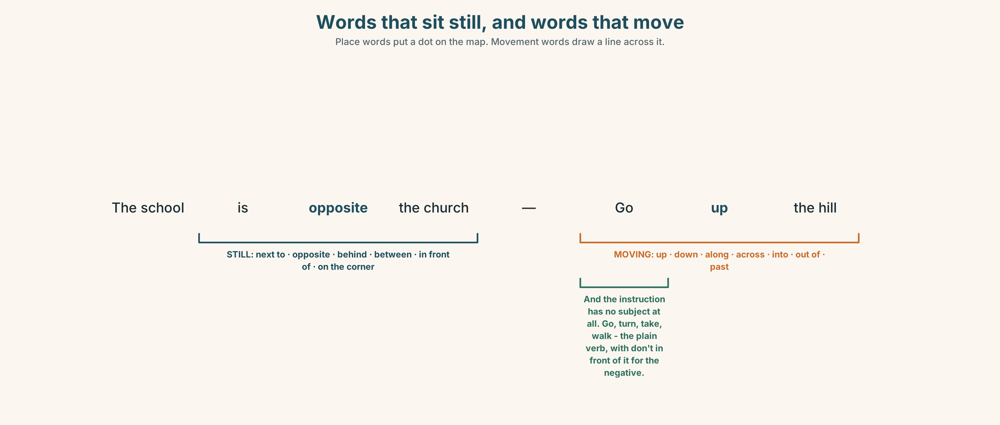{width=6.6in}

*Words that sit still, and words that move — Place words put a dot on the map. Movement words draw a line across it.*

### 3C · Know

| | | |
|---|---|---|
| **where it is** | *next to · opposite · behind · between … and … · in front of · on the corner* | *The school is opposite the church.* |
| **where you go** | *up · down · along · across · into · out of · past* | *Go up the hill. Walk past the bank.* |
| **the imperative** | the plain verb, and no subject | *Go straight on. Turn left. Take the second street.* |
| **the negative imperative** | *don't* + the plain verb | *Don't go up the hill. Don't turn at the first corner.* |

> **The imperative is not rude.** In directions, in recipes and on signs, it is the normal and
> polite form. The rudeness, when there is any, is in the voice, not in the grammar.

{width=6.6in}

*at, on and in - three sizes of container — The same three words you use for places, reused for time, and the shapes match.*

| | |
|---|---|
| **at** | a point: *at six o'clock · at night · at the weekend* |
| **on** | a named day: *on Monday · on the first of May* |
| **in** | a long stretch: *in the morning · in May · in 2026* |

> **Why it matters.** Directions are the first thing you give a stranger and the first thing a
> stranger gives you, and both of you are in a hurry.

### 3D · Use — controlled

Complete with **on**, **in**, **at**, **opposite**, **next to** or **between**.

> The school is (1) ______ the church, across the square. The pharmacy is (2) ______ the bank —
> there is one on each side of it.
> Come (3) ______ Monday, (4) ______ the morning. The class starts (5) ______ nine o'clock.
> The bus stop is (6) ______ the hotel, almost touching it.

### 3E · Use — guided

Make each one an instruction, then make it negative.

1. You turn left at the traffic lights.
2. You go straight on.
3. You take the second street.
4. You get off at the square.
5. You walk up the hill.

### 3F · Use — open

**In pairs, back to back.** One of you has a map. The other has the same map with four things
missing. **Fill the gaps by speaking only.**

### 3G · Check — six items, mark your own

> 1. ______ left at the traffic lights. *(the instruction)*
> 2. ______ go up the hill. *(the negative instruction)*
> 3. The school is ______ the church, across the square.
> 4. Come ______ Monday, ______ the morning. *(two words)*
> 5. ✗ *You turn left at the lights.* → make it an instruction.
> 6. ✗ *The bank is between the pharmacy.* → correct it.

{width=6.6in}

*The bracket with nothing to close on — The bracket with nothing to close on*

**0–3 →** Workbook pp. 36–39. **4–5 →** Part 6. **6 →** page 200.

---

## Part 4 · Speaking ◆ **C · THE PERFORMANCE**

### 4A · Fluency starter — the blind route

One person closes their eyes. The class directs them from their chair to the door.
**One instruction per person. Nobody may touch them.**

### 4B · The functional core — giving directions

{width=6.6in}

*The same route, written twice — Landmarks on the left. Metres on the right. Both of them are accurate.*

**Language Bank**

| | |
|---|---|
| **the instruction** | *Go straight on. Turn left. Take the second street. Walk past the bank.* |
| **the landmark** | *at the traffic lights · opposite the church · on the corner · next to the pharmacy* |
| **the transport** | *get on at the square · get off at the second stop · by bus · on foot* |
| **the time** | *It's about ten minutes.* |

**Information gap.** Learner A has the route from the metro. Learner B has the route from the
tram. **Find the one place where the two routes meet.**

### 4C · The performance — direct somebody who cannot see ⏺

Your partner closes their eyes and you direct them from the square to the school. **Two minutes.**
You must:

> use three landmarks · give one negative instruction · say how long it takes · warn them about
> one thing before they reach it

**Record it.**

### 4D · Observer

One person listens for **one thing**: did the speaker ever say *left* or *right* without a
landmark?

### 4E · Two criteria

> ☐ Did every turn have something you can see attached to it?
> ☐ Did I say the hard part before it happened, not after?

---

## Part 5 · Reading ◆ **A · THE WORLD**

### 5A · Predict

The title is **"One in four never arrives."**
**What do you think goes wrong?**

### 5B · Read — sixty seconds

---

**One in four never arrives**

The school's website says: *Escola Monte. Five minutes from Alto metro station.*

That is true. It is four hundred metres. Four hundred metres on flat ground is five minutes.

The four hundred metres are up a hill with a gradient of one in eight, and there are four ways out
of the square at the bottom, and three of them look the same.

Last September, twenty-eight people came for the first lesson of the beginners' course. Ana booked
thirty-seven. Seven of the nine who did not come telephoned, and six of those seven telephoned
from somewhere in the square.

Ana walked down to the square and brought them up, one at a time, over forty minutes. She did it
again in January. Nobody has changed the website.

---

### 5C · Answer

1. How far is the school from the metro?
2. How many ways out of the square are there?
3. How many people came in September?
4. How many of the missing seven telephoned from the square?
5. **Why is the website not wrong, and why is it still the problem?**
6. **Ana solved it twice by walking down. Why is that not a solution?**

### 5D · Vocabulary in context

Guess from the text. Then check.

> flat ground · a gradient of one in eight · look the same · one at a time · nobody has changed it

### 5E · The counter-text

{width=6.6in}

*The How to find us page — Everything on it is true. The biggest thing on the page is a telephone number.*

**Read the page and answer.**

1. What is the address?
2. **How many minutes does it say from the metro, and from the bus stop?**
3. What is missing from the map?
4. **Why is the telephone number the biggest thing on the page, and what does that tell you?**

### 5F · Two texts

The website says five minutes.
The reading says one in four never arrives.

**Which number should the school change?** Say one sentence.

---

## Part 6 · Vocabulary Lab 2 ◆ **B · THE SYSTEM**

### Getting there

{width=6.6in}

*Six decisions between the square and the door — In four of the six, the obvious choice is the wrong one.*

### 6A · The ones that catch everybody

| | |
|---|---|
| **get on / get off** | for buses, trams, trains and the metro |
| **by bus / on foot** | *by* for vehicles, and *on foot* is the odd one out |
| **in the morning / at night** | the one pair that does not follow the shape |
| **on Monday** | never *in Monday* |

### 6B · Say them

> bus · tram · train · metro · taxi · on foot · by bus · get on · get off

### 6C · Chunk

1. **______ Monday** — a named day
2. **______ the morning** — a long stretch
3. **______ six o'clock** — a point
4. **______ foot** — the one that is not *by*
5. **______ bus** — a vehicle
6. **get ______** — the doors open and you are there

### 6D · Contrast Clinic

Six items. ***on***, ***in*** or ***at***?

1. ______ the first of May
2. ______ six o'clock
3. ______ Monday
4. ______ the weekend
5. ______ the morning
6. ______ night

---

## Part 7 · Pronunciation & Fluency Lab ◆ **B · THE SYSTEM**

### Two words, one stress

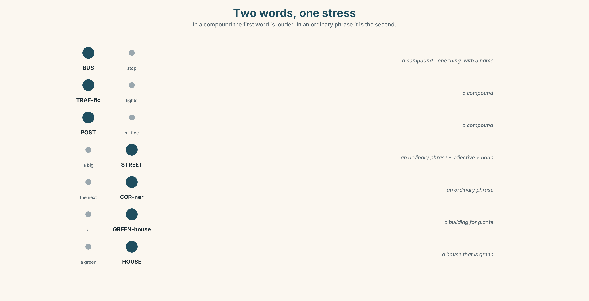{width=6.6in}

*Two words, one stress — In a compound the first word is louder. In an ordinary phrase it is the second.*

### 7A · Hear

> **compounds — the FIRST word is louder**: *BUS stop · TRAFfic lights · POST office · RAILway station*
> **phrases — the SECOND word is louder**: *a big STREET · the next CORner · a long HILL*

### 7B · Say

Say each group three times. Then say this:

> *The BUS stop is on a big STREET.* — one compound, one phrase, opposite stresses.

### 7C · Make it mean something

Say these two:

> *a GREENhouse* — a glass building for plants
> *a green HOUSE* — a house that is green

**Same four syllables. The stress is the only difference, and it changes the thing.** Which is
which?

### 7D · Fluency 20 ⏺

Twenty seconds: **direct somebody from this room to the street, in six instructions.**
Three times, faster.

---

## Part 8 · Writing ◆ **C · THE PERFORMANCE**

### Directions somebody can follow · 40–60 words

### 8A · Read the model

> **From Alto metro.** Come out and turn right. `[where you start, and the first move]`
>
> You will see a church and a pharmacy. Walk between them, up the hill. It is steep. `[the
> landmark, the move, and the warning before it happens]`
>
> Walk for four minutes. Don't turn. There are three streets on the left — ignore all three.
> `[the part where people get it wrong, said in advance]`
>
> We are the yellow building on the right. Ring the bell. `[what you will see, and what to do]`

**Questions about the writer's choices:**

1. *It is steep.* **Why is that in the directions at all?**
2. *ignore all three.* **Why name the wrong turnings instead of only the right one?**
3. The last line says *ring the bell.* **Why does that matter?**

### 8B · The anti-model

> We are at number 14, Rua do Monte, 1200 Lisbon. Five minutes from Alto metro station. Telephone 21 333 4455.

Correct English, true, and one in four people never arrive. **Rewrite it with two landmarks, one
warning and one instruction about what to do when you get there.**

### 8C · Plan

> where you start → landmark and move → the wrong turnings, named → what you will see, and what
> to do

### 8D · Write — 40 to 60 words
### 8E · Peer review — two things only

> ☐ Is there a landmark attached to every turn?
> ☐ Is there one warning about something before it happens?

### 8F · Publish

Swap with someone who does not know your route. **They follow it on a map and mark where they
got lost.**

---

## Part 9 · The File ◆ **A · THE WORLD + C · THE PERFORMANCE**

# STUDY FILE · Knowing where you are

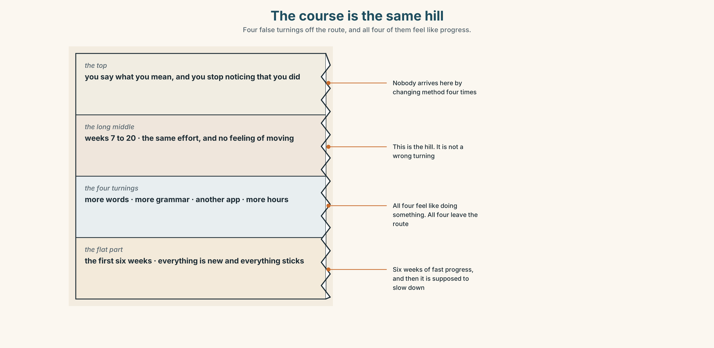{width=6.6in}

*The course is the same hill — Four false turnings off the route, and all four of them feel like progress.*

### 9A · Four turnings

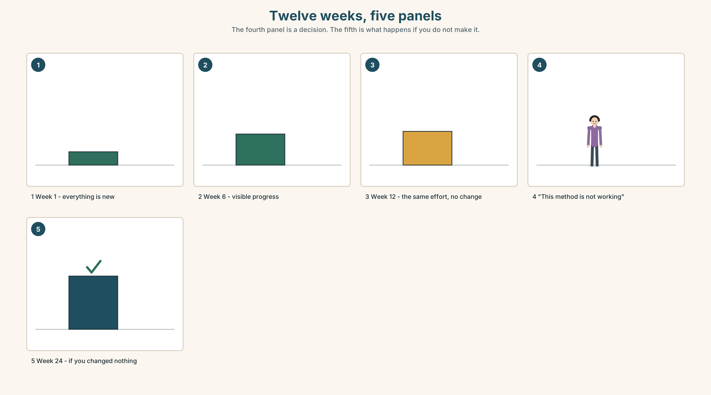{width=6.6in}

*Twelve weeks, five panels — The fourth panel is a decision. The fifth is what happens if you do not make it.*

| | |
|---|---|
| **The flat part** | the first six weeks. Everything is new and everything sticks |
| **The hill** | weeks seven to twenty. The same effort, and it feels like nothing |
| **What people do** | change method, because the hill feels like a wrong turning |
| **What the hill is** | the normal shape of learning anything |

### 9B · A landmark, not a feeling

You cannot feel progress at A1, because the thing you measure with is the thing that is changing.
**Pick a landmark instead.** Record yourself today. Record the same thirty seconds in eight weeks.

### 9C · Role play — directing a beginner

In pairs. One of you started three months after the other. **Give them directions through the next
three months.** Use the imperative. Name one wrong turning.

### 9D · Where are you, exactly?

Not *good* or *bad*. **Name one thing you could not do in September and can do now.** That is
your position. It is the only honest one.

### 9E · Transfer — before next week

**Record thirty seconds answering the question from 0C. Label it with today's date and put it
somewhere you will not lose it.** You will listen to it in Unit 10 of the next book.

---

## Part 10 · Mediation & Interaction ◆ **C · THE PERFORMANCE**

{width=6.6in}

*Four ways out of the square, as data — The route most people take is the worst on three of the four measures.*

### 10A · Relay

Half the class has the route from the metro. Half has the route from the tram.
**Build one set of directions that works from both, by speaking.** Ten minutes.

### 10B · Simplify — for one person

A visitor telephones from the square and says: *I can see a church.*
**Direct them in three sentences.** You cannot see what they see.

### 10C · Online

Write **one message** giving a classmate directions to a place near here.
**Two sentences.** One must contain a warning.

### 10D · Your language

Does your language say *left* and *right*, or does it use north and south, or uphill and downhill?
**Give directions from the square to the school in your language.** What do you use?

---

## Part 11 · The Decision ◆ **C · THE PERFORMANCE**

# Five minutes from the metro

One in four new students does not arrive at the first lesson. Six out of seven of those who
telephone are standing in the square at the bottom of the hill.

**Option one:** rewrite the website. Two landmarks, one warning about the hill, and the three
streets to ignore. Free, and it takes twenty minutes.

**Option two:** put a sign in the square. The city charges one hundred and forty euros a year for
a sign on a pole, and it has to be approved.

**Option three:** meet every new student at the metro for the first week of each term. It works
perfectly, it costs Ana four hours a term, and it stops the moment she is busy.

### 11A · The evidence

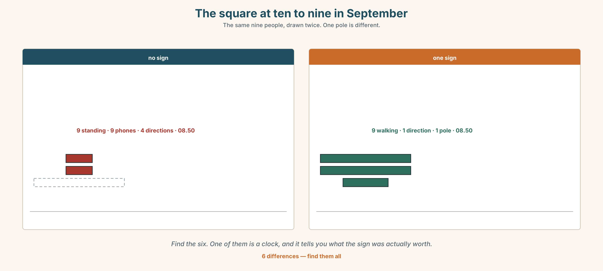{width=6.6in}

*The square at ten to nine in September — The same nine people, drawn twice. One pole is different.*

🔊 **Track 9.6.** A new student, 20 seconds: *"I was in the square for twenty minutes. I had the
address. I had the map on my phone. The map says you are here, and I was here. I didn't know which
street."*

### 11B · Talk about it

In threes. Use the frame. Everybody says one.

> *I think the school should ______ , because ______ .*

**Words you can use:** *street · square · corner · hill · sign · metro · bus stop*

### 11C · Decide

Write **two sentences**. Choose, and say why.

> I think the school should ______________________ ,
> because ______________________ .

### 11D · Model decision

> Rewrite the website, and name the three streets you should not take. The sign and the walking
> both fix the square. The website is where the student is standing two weeks before they are ever
> in the square, and it is the only one of the three that is free.

### 11E · The Reveal

> **What happened.** Ana rewrote the page. She added two landmarks, one line that said *it is a
> steep hill, allow ten minutes*, and the sentence *there are three streets on the left — ignore
> all three*. In January, twenty-six of twenty-seven arrived.
>
> Then something she did not expect: the students who arrived were less nervous than previous
> years, not only less lost. The line about the hill had told them that the school knew what the
> walk was like.

**One question. You do not have to answer it out loud.**

> Twenty minutes of writing fixed something two hundred euros could not. What was actually broken?

---

## Part 12 · Landing ◆ **all three lines**

### 12A · Recycle — twelve items

> 1. ______ left at the traffic lights. *(the instruction)*
> 2. ______ go up the hill. *(the negative instruction)*
> 3. The school is ______ the church, across the square.
> 4. The pharmacy is ______ the bank and the hotel. *(two things, one on each side)*
> 5. ______ Monday
> 6. ______ the morning
> 7. ______ six o'clock
> 8. ______ foot
> 9. ______ bus
> 10. Where do I ______ ______ ? *(two words — the doors open and you leave)*
> 11. *(Unit 8)* She's ______ engineer.
> 12. *(Unit 7)* I ______ go to concerts. *(almost never, two words)*

### 12B · Consolidate — one task, everything in it

**Write directions from the nearest station to your home, in six sentences.** Three must be
instructions, one must be negative, two must contain a landmark, and one must say how long it
takes.

### 12C · Can-do, with evidence

> ☐ I can give directions somebody can follow. **Evidence:** 4C, 8D
> ☐ I can say where something is. **Evidence:** 3G
> ☐ I can use *on*, *in* and *at* for time. **Evidence:** 6D
> ☐ I can stress a compound word correctly. **Evidence:** 7C

### 12D · Replay ⏺

Record 0C again. **Listen to both.** What is different?

### 12E · Glossary — thirty-five words, as a map

> **THE PLACES** · street · square · corner · bridge · station · church · museum · library · bank · hotel · pharmacy · hill
> **WHERE** · left · right · opposite · behind · between · next to · in front of
> **WHAT YOU SAY** · bus stop · traffic lights · straight on
> **HOW YOU GET THERE** · bus · tram · train · metro · taxi · on foot · by bus · get on · get off
> **WHEN** · on Monday · in the morning · at six o'clock
> **HOW LONG** · It's about ten minutes.

### 12F · Next

> **Unit 10 · What is this worth?**

# A1.1 · Unit 10 · Thirty-Nine Euros

> **English Animated** · *Starting Out* · Escola Monte, Lisbon
> Student's Book pages 204–225 · 22 pp · ~9 hours

---

## Part 0 · The Big Picture ◆ **A · THE WORLD**

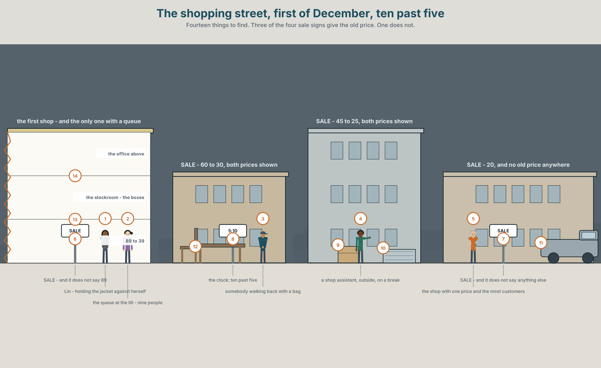{width=6.6in}

*The shopping street, first of December, ten past five — Fourteen things to find. Three of the four sale signs give the old price. One does not.*

# What is this worth?

**By the end of this unit you can say what you bought, when, and what happened.**

| ◆ **A · THE WORLD** | A shopping street in December, where the price on the sign is not the price |
|---|---|
| ◆ **B · THE SYSTEM** | *was* and *were* · the past simple of regular verbs · 22 words for money and shopping · ordinals and dates · the three sounds of *-ed* |
| ◆ **C · THE PERFORMANCE** | You report something you bought and what went wrong with it |

---

### 0A · Find it — fourteen things

Find these in the picture. Write the number.

> ☐ money ☐ a price ☐ a card ☐ cash ☐ a receipt ☐ a sale ☐ a jacket
> ☐ a shirt ☐ shoes ☐ a bag ☐ a queue ☐ a till ☐ a window ☐ a door

**Three of these words are not in the picture. Which three?**

> change · a size · a colour

### 0B · Guess it

Look at the four sale signs. **Which shop is the busiest, and why?**
Say one thing. You can use these words:

> *price · cheap · expensive · sale · buy*

### 0C · Say it ⏺

**Record. Thirty seconds. Do not prepare.**

> **What is the last thing you bought, and was it worth it?**

You will listen to this again on the last page.

---

## Part 1 · Vocabulary Lab 1 ◆ **B · THE SYSTEM**

### 1A · Meet — one jacket, four prices

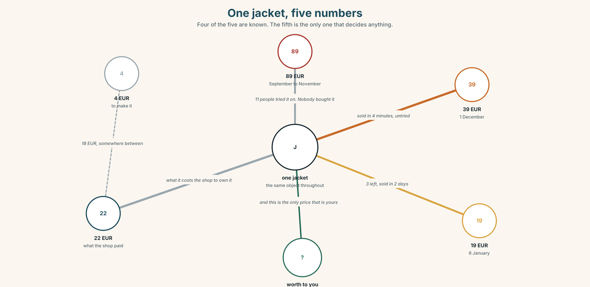{width=6.6in}

*One jacket, five numbers — Four of the five are known. The fifth is the only one that decides anything.*

| | |
|---|---|
| **price** | The number on the label. It changes four times a year. |
| **cost** | What it cost somebody to make. Nobody in the shop knows it. |
| **sale** | A different price, with a date on it. |
| **change** | What comes back if you pay in cash. |
| **receipt** | The only proof that any of this happened. |
| **card** | No change, no receipt unless you ask, and a record somewhere else. |

### 1B · Meet — the words

> **money · price · cost · cheap · expensive · change · receipt · card · cash · sale · size · colour · shoes · shirt · jacket**

Write each word under the right picture.

{width=6.6in}

*One shop, in section — Eleven things. Eleven words. The most expensive thing is at the front and the cheapest is at the back.*

### 1C · Sort — the thing, or the money?

Put each word in the right box. **Two of them can go in both. Which, and why?**

> change · cost · cash · colour · price · shirt · size · receipt · shoes · jacket

| **THE THING** | **THE MONEY** | **BOTH** |
|---|---|---|
| | | |

### 1D · What you say in a shop

| | |
|---|---|
| **How much does it cost?** | The full question. Four words of it are almost silent. |
| **pay by card** | *by*, like *by bus*. Not *with card*. |
| **try it on** | And the little word can move: *try the jacket on*. |
| **take back** | What you do with it on the second of December. |
| **pay back** | What the shop may or may not do. |
| **Can I have a receipt?** | Ask before they close the till, not after. |

**Now say them.** Two of these six are about the moment before you buy and two are about the
days afterwards. **Which are which?**

### 1E · Stretch — the phrases you will need today

> **How much does it cost?** · **pay by card** · **try it on** · **take back** · **It's too expensive.**

Match each phrase to the moment you need it.

1. You like it and you have not looked at the label. → ______
2. It is the right colour and you do not know the size. → ______
3. You have no cash and there is a machine on the counter. → ______
4. You have looked at the label. → ______
5. It is the second of December and the bag has not been opened. → ______

### 1F · The hard one

> **f** **It's too expensive.**

Practise it three times. **Three words that end a conversation without offending anybody, and
they work in every shop in the world.**

### 1G · Own it

Write down the last three things you bought and what each one cost. Do not write your name.
The class guesses whose list it is.

---

## Part 2 · Listening ◆ **A · THE WORLD**

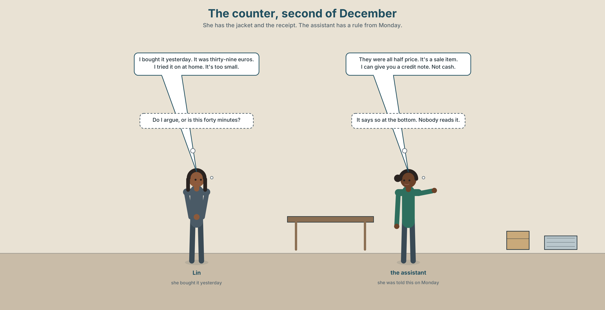{width=6.6in}

*The counter, second of December — She has the jacket and the receipt. The assistant has a rule from Monday.*

### 2A · The second of December 🔊 Track 10.1

**Before you listen.** Lin bought a jacket yesterday in a sale.
**Guess: will she get her money back?**

**Listen once. One question.** How much was the jacket?

**Listen again. Complete the table.**

| | Before the sale | In the sale | What she gets |
|---|---|---|---|
| the jacket | | | |

**Listen again. True or false?**

1. She bought it on the first of December. ☐ T ☐ F
2. She paid by card. ☐ T ☐ F
3. She tried it on in the shop. ☐ T ☐ F
4. The shop gives her the money back. ☐ T ☐ F

**Noticing.** Four sentences from the recording.

1. *I bought it yesterday.*
2. *It was thirty-nine euros.*
3. *They were all half price.*
4. *I tried it on at home.*

**Two of these have *was* or *were*. What decides which one?**

### 2B · Decoding clinic 🔊 Track 10.2

Twenty seconds of the assistant at speed. Three jobs.

1. Count the past verbs you hear.
2. *Tried*, *asked* and *wanted* all end in the same two letters. Do they end in the same sound?
3. She says a date. Write it the way she says it, not the way it is written.

> Transcripts, page 156.

---

## Part 3 · Grammar Lab 1 ◆ **B · THE SYSTEM**

### Yesterday

### 3A · Notice

Look at the four sentences in Part 2 again.

1. Which word is the past of *is*? Which is the past of *are*?
2. In sentence 4, what is on the end of the verb?
3. Is that ending the same for *I*, *he* and *they*?
4. How would you make sentence 4 negative?

### 3B · See

{width=6.6in}

*The box behind now — Everything inside the box wears -ed. Am, is and are become two words only.*

### 3C · Know

| | | |
|---|---|---|
| **was** | I, he, she, it | *It was thirty-nine euros. I was in the shop at five.* |
| **were** | you, we, they | *They were all half price. You were right.* |
| **regular past** | add **-ed**, and it is the same for everybody | *I tried. She asked. They wanted.* |
| **negative** | *didn't* + the plain verb | *I didn't try it on. She didn't ask.* |
| **question** | *did* + the plain verb | *Did you try it on? When did you buy it?* |

> **The -ed goes, exactly like the s did.** Once *did* or *didn't* arrives, the verb loses its
> ending: *Did you tried?* is wrong for the same reason *Does she checks?* was wrong in Unit 3.

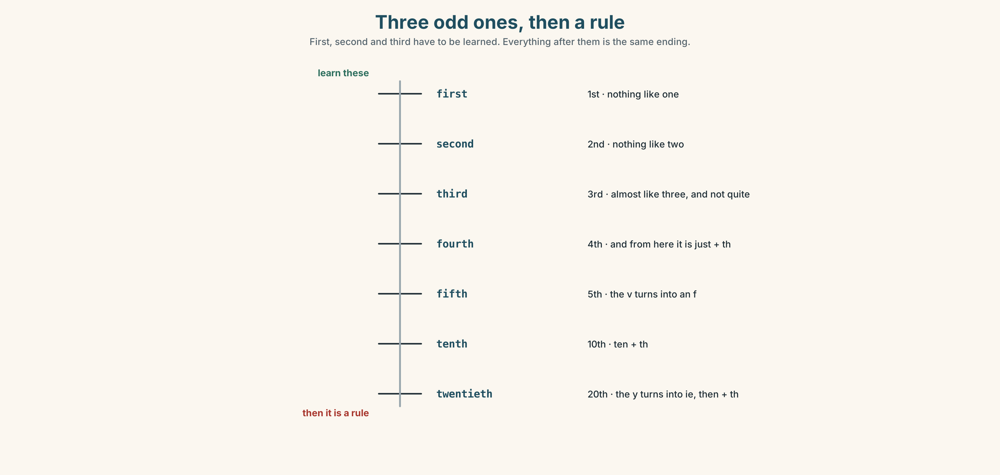{width=6.6in}

*Three odd ones, then a rule — First, second and third have to be learned. Everything after them is the same ending.*

| | |
|---|---|
| **the odd three** | *first · second · third* |
| **then a pattern** | *fourth · fifth · sixth · tenth · twentieth* |
| **the date, said** | *on the first of May · on the twentieth of March* |
| **the months here** | *January · March · July · December* |

> **Why it matters.** Every story you will ever tell is in the past, and this is the half of it
> that follows a rule.

### 3D · Use — controlled

Complete with **was**, **were**, **didn't** or the past of the verb.

> The jacket (1) ______ thirty-nine euros. They (2) ______ all half price on the first of
> December.
> I (3) ______ (try) it on at home. I (4) ______ try it on in the shop.
> (5) ______ you pay by card? — Yes. I (6) ______ (ask) for a receipt.

### 3E · Use — guided

Put each sentence into the past.

1. I pay by card.
2. She tries it on.
3. They are half price.
4. He asks for a receipt.
5. It is too expensive.

### 3F · Use — open

**In pairs.** Tell your partner about something you bought that went wrong.
**Five sentences, all in the past. Your partner asks three questions, all with *did*.**

### 3G · Check — six items, mark your own

> 1. The jacket ______ thirty-nine euros.
> 2. They ______ all half price.
> 3. I ______ (try) it on at home.
> 4. ______ you pay by card?
> 5. ✗ *Did you tried it on?* → correct it.
> 6. ✗ *They was half price.* → correct it.

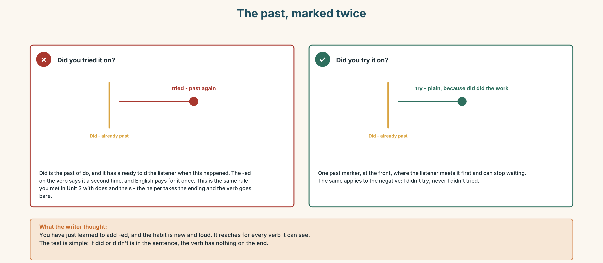{width=6.6in}

*The past, marked twice — The past, marked twice*

**0–3 →** Workbook pp. 40–43. **4–5 →** Part 6. **6 →** page 222.

---

## Part 4 · Speaking ◆ **C · THE PERFORMANCE**

### 4A · Fluency starter — yesterday, in a chain

The first person says one thing they did yesterday. The next repeats it and adds theirs.
**Every verb must be regular. Stop when somebody uses an irregular one.**

### 4B · The functional core — reporting a purchase

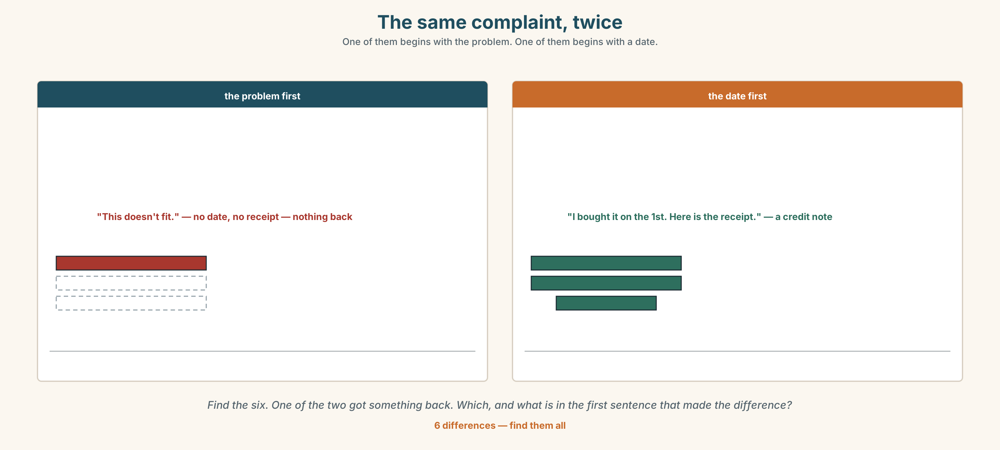{width=6.6in}

*The same complaint, twice — One of them begins with the problem. One of them begins with a date.*

**Language Bank**

| | |
|---|---|
| **what happened** | *I bought it on the first of December. It was thirty-nine euros.* |
| **the problem** | *It's the wrong size. It doesn't fit. I tried it on at home.* |
| **what you want** | *Can I take it back? Can you pay me back?* |
| **the paper** | *Can I have a receipt? I paid by card.* |

**Information gap.** Learner A has the shop's returns policy. Learner B has what the assistant
said. **Find the two things the assistant said that are not in the policy.**

### 4C · The performance — the complaint ⏺

Report something you bought that was wrong. **Two minutes.** You must say:

> when you bought it · how much it was · what happened · what you want

Your partner is the shop and must say no once before saying anything else. **Record it.**

### 4D · Observer

One person listens for **one thing**: did the speaker give the date before the problem?

### 4E · Two criteria

> ☐ Were all my verbs in the past?
> ☐ Did I say what I wanted, in one sentence, without being asked?

---

## Part 5 · Reading ◆ **A · THE WORLD**

### 5A · Predict

The title is **"Eighty-nine, thirty-nine, nineteen."**
**What do you think the three numbers are?**

### 5B · Read — sixty seconds

---

**Eighty-nine, thirty-nine, nineteen**

The jacket arrived in the shop in September at eighty-nine euros. Eleven people tried it on.
Nobody bought it.

On the first of December it was thirty-nine euros. Lin bought it in four minutes. She did not try
it on. The sign in the window said SALE and it did not say what the old price was, and she did not
ask.

On the sixth of January it was nineteen euros. The three that were left were sold in two days.

The shop paid twenty-two euros for each one. All three prices made money. The question the shop
asks itself is not whether thirty-nine was fair. It is why eleven people tried it on at
eighty-nine and nobody bought it, because those eleven people are the ones who wanted it.

---

### 5C · Answer

1. How much was the jacket in September?
2. How many people tried it on then?
3. What was the price on the first of December?
4. How much did the shop pay for each jacket?
5. **Why does the writer say all three prices made money?**
6. **The shop is interested in the eleven people. Why those eleven and not Lin?**

### 5D · Vocabulary in context

Guess from the text. Then check.

> arrived in the shop · she did not ask · the three that were left · made money · whether it was fair

### 5E · The counter-text

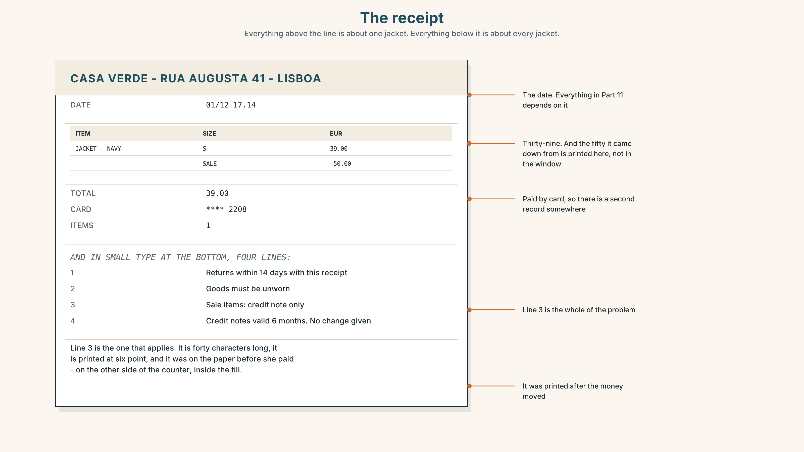{width=6.6in}

*The receipt — Everything above the line is about one jacket. Everything below it is about every jacket.*

**Read the receipt and answer.**

1. What is the date on the receipt?
2. **How much did she pay, and how was it paid?**
3. What does the receipt say about returns?
4. **Which of the four lines applies to this jacket, and would Lin have read it before she paid?**

### 5F · Two texts

The window said SALE.
The receipt says *sale items: credit note only*.

**Which of the two did Lin read?** Say one sentence.

---

## Part 6 · Vocabulary Lab 2 ◆ **B · THE SYSTEM**

### Dates, and the three odd numbers

{width=6.6in}

*One jacket, six dates — Six panels, six prices. Watch the eleven people in panel two.*

### 6A · The ones that catch everybody

| | |
|---|---|
| **first, second, third** | three irregular ones, and then the pattern starts |
| **fifth** | the *v* turns into an *f* |
| **twentieth** | the *y* turns into an *ie* |
| **on the first of May** | *on the* … *of* …, and both small words are needed |

### 6B · Say them

> first · second · third · fourth · fifth · tenth · twentieth · January · March · July · December

### 6C · Chunk

1. the **______** of December *(1)*
2. the **______** of January *(2)*
3. the **______** of March *(3)*
4. the **______** of July *(5)*
5. the **______** of May *(20)*
6. **______ your birthday?** *(the question, two words)*

### 6D · Contrast Clinic

Six items. ***was*** or ***were***?

1. They ______ all half price.
2. I ______ in the shop at five.
3. The jacket ______ thirty-nine euros.
4. You ______ right about the size.
5. The three that ______ left sold in two days.
6. It ______ too expensive in September.

---

## Part 7 · Pronunciation & Fluency Lab ◆ **B · THE SYSTEM**

### One ending, three sounds

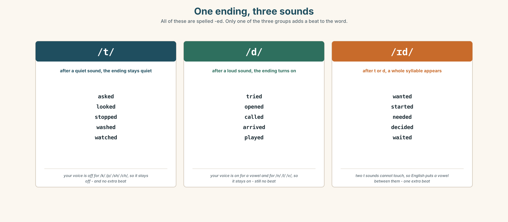{width=6.6in}

*One ending, three sounds — All of these are spelled -ed. Only one of the three groups adds a beat to the word.*

### 7A · Hear

> **/t/** after a quiet sound: *asked · looked · stopped · washed*
> **/d/** after a loud sound: *tried · opened · called · arrived*
> **/ɪd/** after *t* or *d*: *wanted · started · needed · decided*

### 7B · Say

Say each group three times. Then say this:

> *I asked, I tried, I waited.* — three endings, one sentence, and they are all spelled the same.

### 7C · Make it mean something

Say these two:

> *I want it.* — two syllables in the verb? No. One.
> *I wanted it.* — and now there are two, because the ending became a syllable.

**Only the third group adds a syllable.** The other two add a sound and no beat. Which group does
*washed* belong to?

### 7D · Fluency 20 ⏺

Twenty seconds: **six things you did yesterday, all regular verbs.** Three times, faster.

---

## Part 8 · Writing ◆ **C · THE PERFORMANCE**

### What I bought · 40–60 words

### 8A · Read the model

> I bought a jacket on the first of December. It was thirty-nine euros. `[the date and the
> number, first]`
>
> The sign said SALE. It didn't say what the old price was. `[the thing that mattered and did
> not look as if it did]`
>
> I didn't try it on. I tried it on at home and it was too small. `[what I did not do, before
> what I did]`
>
> The shop gave me a credit note. I am not angry. I am annoyed with myself. `[what happened, and
> then the honest sentence]`

**Questions about the writer's choices:**

1. The date and the price are in the first two sentences. **Why not the problem?**
2. *It didn't say what the old price was.* **Why is that the most important sentence in the piece?**
3. The last sentence is about the writer, not the shop. **What does it do to the whole thing?**

### 8B · The anti-model

> I bought a jacket. It was cheap. It was too small. The shop was not helpful. I was very angry. It was a bad experience.

Correct English, and it could be any shop and any jacket. **Add a date, two numbers, and one
thing you did wrong.**

### 8C · Plan

> the date and the price → the detail that mattered → what you did not do → what happened,
> and one honest sentence

### 8D · Write — 40 to 60 words
### 8E · Peer review — two things only

> ☐ Is there a date and at least one number?
> ☐ Is every verb in the past?

### 8F · Publish

On the wall, with no names. **The class votes on which shop behaved worst — and then checks
whether the writer actually said so.**

---

## Part 9 · The File ◆ **A · THE WORLD + C · THE PERFORMANCE**

# STUDY FILE · What a year of this was worth

{width=6.6in}

*A year, in section — The hours are the thickest layer. The bottom layer is the only one anybody will ever see.*

### 9A · The September recording

{width=6.6in}

*Two recordings, one year — Five panels. The fifth one is the only measurement in this book that cannot lie.*

| | |
|---|---|
| **What you remember** | the lessons you missed and the words you forgot |
| **What you cannot remember** | not being able to do this |
| **Why** | the thing you measure with is the thing that changed |
| **The only honest measure** | a recording you made before you changed |

### 9B · Listen to 0C from Unit 1

You recorded thirty seconds in Unit 1 of this book and thirty seconds again in Unit 9.
**Listen to both now.** Write down three differences. Be specific: not *better*, but *what*.

### 9C · Role play — the interview, one year on

In pairs. One of you is yourself in September. The other is yourself now.
**Ask your September self five questions. Answer as they would have answered.**

### 9D · What it cost

A year of this cost you about one hundred and forty hours. **Was it worth it?**
You now have enough English to answer that question in English, which is itself the answer.

### 9E · Transfer — before the next book

**Record thirty seconds answering: *What can you do in English now that you could not do in
September?* Keep it.** You will need it at the end of A1.2.

---

## Part 10 · Mediation & Interaction ◆ **C · THE PERFORMANCE**

{width=6.6in}

*One jacket, five months — The month with the most sales is not the month with the most money in it.*

### 10A · Relay

Half the class has the prices by month. Half has the number sold by month.
**Work out which month made the shop the most money, by speaking.** Ten minutes.

### 10B · Simplify — for one person

A classmate asks: *What do I say if I want to take something back?*
**Answer in four sentences.** Include the one thing they must bring with them.

### 10C · Online

Write **one message** to a shop about something you bought.
**Two sentences.** One must have a date and a number in it.

### 10D · Your language

Does your language say the date in the same order as English? **Say the first of December in your
language.** Which comes first, the day or the month?

---

## Part 11 · The Decision ◆ **C · THE PERFORMANCE**

# Thirty-nine euros

Lin bought a jacket on the first of December for thirty-nine euros. It was eighty-nine in
November. She did not try it on. At home it was too small.

The shop will give her a credit note for thirty-nine euros, valid for six months. It will not give
her cash, and the receipt says so in small type at the bottom.

She can keep the jacket and give it to somebody. She can take the credit note and buy something
else from a shop she now does not trust. Or she can argue, which will take forty minutes and
probably fail.

### 11A · The evidence

{width=6.6in}

*The same window, five weeks apart — First of December on the left, sixth of January on the right. Both of them say SALE.*

🔊 **Track 10.6.** Lin, 20 seconds: *"Thirty-nine euros is not a lot of money. I am not angry
about thirty-nine euros. I am angry because I was in a hurry and the sign knew I was in a hurry."*

### 11B · Talk about it

In threes. Use the frame. Everybody says one.

> *I think Lin should ______ , because ______ .*

**Words you can use:** *money · price · receipt · sale · expensive · size · take back*

### 11C · Decide

Write **two sentences**. Choose, and say why.

> I think Lin should ______________________ ,
> because ______________________ .

### 11D · Model decision

> Take the credit note and spend it the same day, on something she would have bought anyway. The
> forty minutes of arguing is worth more than thirty-nine euros, and a credit note she keeps for
> six months is a credit note the shop expects her to lose.

### 11E · The Reveal

> **What happened.** Lin took the credit note and spent it that afternoon on a pair of shoes she
> had wanted since October. The shoes were nineteen euros and she lost twenty euros of the credit
> note, because the shop does not give change on a credit note.
>
> Then something she did not expect: she read the small print on the second receipt before she
> paid. It took eleven seconds. She has read it in every shop since.

**One question. You do not have to answer it out loud.**

> The jacket cost her thirty-nine euros and taught her something in eleven seconds. What was the
> actual price?

---

## Part 12 · Landing ◆ **all three lines**

### 12A · Recycle — twelve items

> 1. The jacket ______ thirty-nine euros.
> 2. They ______ all half price.
> 3. I ______ (try) it on at home.
> 4. ______ you pay by card?
> 5. the ______ of December *(1)*
> 6. the ______ of January *(2)*
> 7. the ______ of March *(3)*
> 8. the ______ of May *(20)*
> 9. Can I have a ______ , please?
> 10. It's too ______ .
> 11. *(Unit 9)* ______ left at the traffic lights.
> 12. *(Unit 8)* She ______ (work) in a hospital. *(every day)*

### 12B · Consolidate — one task, everything in it

**Write about something you bought, in six sentences.** All six in the past. One with *was* or
*were*, one negative with *didn't*, one date, and two numbers.

### 12C · Can-do, with evidence

> ☐ I can say what I bought and when. **Evidence:** 4C, 8D
> ☐ I can use *was* and *were*. **Evidence:** 6D
> ☐ I can make the past of a regular verb, and the negative. **Evidence:** 3G
> ☐ I can say the three *-ed* endings. **Evidence:** 7C

### 12D · Replay ⏺

Record 0C again. **Listen to this one, the one from Unit 1 and the one from Unit 9.**
**Three recordings, one year.** What is different?

### 12E · Glossary — thirty-five words, as a map

> **THE MONEY** · money · price · cost · change · cash · card · receipt · sale
> **CHEAP OR NOT** · cheap · expensive
> **THE THINGS** · shoes · shirt · jacket · size · colour
> **WHAT YOU SAY** · How much does it cost? · pay by card · try it on · take back · pay back · It's too expensive. · Can I have a receipt?
> **THE NUMBERS IN ORDER** · first · second · third · fourth · fifth · tenth · twentieth
> **THE MONTHS** · January · March · July · December
> **THE DATE** · on the first of May · When's your birthday?

### 12F · Next

> **A1.2 · *Getting Around* · Unit 1 · What happened at work yesterday?**

# Answer Key

> Open tasks — speaking, writing, discussion — are not keyed. Their
> success criteria are in the unit, at 4E and 8E.

## A1.1 · Unit 1 · The Yellow Building

**0B** · Guess it
The man with the bag still on his shoulder and a piece of paper in his hand. Everybody else has put something down. He has not, because he does not yet know where anything goes.

**1C** · Sort — people or places?
> **PLACES** — country · city · school
> **PEOPLE** — woman · class · friend · teacher · student
> **NEITHER** — name · address
**The two that are neither:** *name* and *address*. They are not people and they are not places — they are the words we use to **find** a person or a place. Accept *class* and *school* in two columns if the learner can say why: a class is a group of people and a room, and a school is a building and everybody in it.

**2A** · Monday morning, nine o'clock 🔊 Track 1.1
**1** T · **2** T · **3** F · **4** F
**Listen once** — room 3.

**Table** — First name: Yusuf · Family name: HASSAN · Country: Egypt · Room: 3.

**Notice** — the word is *be*. Four forms: **am** (I) · **is** (she, he, it) · **are** (you, we, they) — and the fourth is the one most people miss: there is no fourth. Three forms do all six persons, which is why the verb feels so strange.

**3D** · Use — controlled
1 is · 2 is · 3 are · 4 is · 5 is · 6 am · 7 are · 8 are · 9 are · 10 are

**3E** · Use — guided
1 She is not a teacher. → Is she a teacher?  
2 They are not in the café. → Are they in the café?  
3 I am not late. → Am I late?  
4 You are not Brazilian. → Are you Brazilian?

The negative puts *not* straight after the verb. The question swaps the first two words and moves nothing else.

**5C** · Answer
1 Yellow.  
2 Sixteen.  
3 She is at the desk — reception.  
4 Because she reads the list on Sunday, before anybody arrives.  
5 Two.  
6 Who put the tag on the cat. The text does not answer it, and that is the point: a name tells you somebody decided, and it does not tell you who.

**5D** · Vocabulary in context
**steep** — the street goes up sharply · **floor** — a level of a building, not the thing you walk on here · **tag** — a small label tied to something · **nobody** — not one person

**5E** · The counter-text
1 Five — Marco at 07.10, Ana at 08.30, Teresa at 08.45, Lin at 08.52 and Chika at 08.55. (Emre signed in **at** nine, not before it.)  
2 Marco, at 07.10, and he works at the café next door.  
3 None of the three. The sixth line has no capitals, no family name first and no room number.  
4 Open answers. The useful ones ask him rather than guess: a name written wrongly on day one is written wrongly on every list for a year.

**6C** · Chunk
1 phone number · 2 How old · 3 room number · 4 how … spell

**6D** · Contrast Clinic
> **1** I **am** twenty.
> **2** They **are** fifteen and seventeen.
> **3** **Are** you **forty**? *(FOR-ty, not four-TEEN)*

**12A** · Recycle — twelve items
1 is · 2 are · 3 am · 4 Are · 5 Brazilian · 6 family · 7 spell · 8 *(whichever the teacher says — the test is the stress, not the number)* · 9 am · 10 This · 11 are · 12 desk

---

## A1.1 · Unit 2 · The Six O'Clock Class

**0B** · Guess it
Marco. The cafe lights are on, three people are already at his counter and the cafe clock says twenty to seven — so he was here before any of them. The school is still dark.

**1C** · Sort — a thing you do, or a way you feel?
> **BOTH** — sleep
> **YOU DO IT** — drink · wash · work · study · eat
> **YOU FEEL IT** — happy · tired · hungry · thirsty
**The one in both:** *sleep*. You do it — *I sleep eight hours* — and you need it, which is a feeling: *I need sleep*. It is the only word on the list that works as an action and as a state.

**2A** · Twenty to seven 🔊 Track 2.1
**1** T · **2** F · **3** T · **4** F
**Listen once** — six o'clock.

**Table** — Marco: gets up 6.00 · starts work 6.30 · goes to bed 22.30. Ana: gets up 7.00 · starts work 8.30 · goes to bed 23.00. The cleaner: gets up 4.00 · starts work 5.00 · sleeps in the afternoon, 1 to 4.

**4 is false** because half past ten is early, not late — the text says so.

**Noticing** — after *I*, *we*, *they* and *you* the verb is the plain form, with nothing on the end. It does not change at all. (In Unit 3 it changes once, for *he*, *she* and *it*.)

**3D** · Use — controlled
1 gets up · 2 opens · 3 work · 4 don't work · 5 don't work · 6 Do

**3E** · Use — guided
1 They don't open at six. → Do they open at six?  
2 I don't eat breakfast at home. → Do I eat breakfast at home?  
3 We don't study on Tuesday. → Do we study on Tuesday?  
4 You don't work at night. → Do you work at night?  
5 They don't go to bed early. → Do they go to bed early?

In every one the verb itself does not move and does not change. Only *do* arrives.

**3G** · Check — six items, mark your own
1 get up · 2 don't open · 3 Do … work · 4 study · 5 *I get up at six.* — there is no *am* with an action verb · 6 *Do you work on Saturday?* — once *do* is there, the verb loses its ending

**5C** · Answer
1 At half past six.  
2 At work — he makes it there and eats it standing up.  
3 At five.  
4 She sleeps, from one to four.  
5 Because it is the only half hour of her day that nobody else is in. The radio is company she chose.  
6 Because none of them is ever in the street at the same time as the others. Each of them sees an empty street and calls it quiet, and four empty streets at four different hours add up to a busy one.

**5D** · Vocabulary in context
**standing up** — not sitting down to it · **finishes** — stops work · **another building** — a second one, not the same · **with the radio on** — while it is playing · **he is not sorry about it** — he does not apologise for it

**5E** · The counter-text
1 Half past eight.  
2 Half past nine — an hour later than the weekdays, and yes, it is on the sign.  
3 Sunday.  
4 "The cleaner comes in at 5 by the back door. Do not ring the bell before 8.30 — nobody at the desk." It is for the delivery drivers, and it is written in pen because it was not true when the sign was printed.

**5F** · Two texts
No. The sign says when the school is **open to the public**. Dona Filipa is not the public; she is the person who makes it possible to be open at half past eight. Opening hours and working hours are two different things, and no sign ever shows the second one.

**6C** · Chunk
1 half · 2 seven o'clock *(or any hour)* · 3 every · 4 morning · 5 night · 6 on

**6D** · Contrast Clinic
> **1** **at** night *(not* in *the night)*
> **2** **on** Monday
> **3** **on** Saturday afternoon *(a named day wins over* in the afternoon*)*
> **4** **at** six o'clock
> **5** **in** the morning
> **6** **at** half past eight

**12A** · Recycle — twelve items
1 get up · 2 don't open · 3 Do … work · 4 at · 5 on · 6 in · 7 at · 8 past · 9 breakfast · 10 to · 11 tired · 12 is

---

## A1.1 · Unit 3 · Eleven Screens

**0B** · Guess it
The one with the map open is working out how to get somewhere; the one whose phone is face down has decided not to be interrupted. Neither of those is "not working". The three looking at the same thing at the same moment are the ones who are somewhere else.

**1C** · Sort — where does it live?
> **NEITHER** — internet · online
> **IT IS ON THE SCREEN** — message · photo · notification · map · app · video
> **YOU CAN TOUCH IT** — camera · screen
**The two that are neither:** *internet* and *online*. The internet is not in the phone and you cannot touch it; *online* is not a thing at all, it is a place you are. Everything in the middle column exists only while the screen is on.

**2A** · Eleven o'clock, at the back 🔊 Track 3.1
**1** F · **2** T · **3** F · **4** T
**Listen once** — about ten.

**Table** — Yusuf: thinks 10 · the phone says 96 · first app: messages. Lin: thinks 90 · the phone says 96 · first app: the map.

**Noticing** — questions 1 and 4 are about *you* and *they*, so they take **do**; questions 2 and 3 are about *your sister* and *it*, one person or thing, so they take **does** — and the verb after *does* has no **s** on it.

**3D** · Use — controlled
1 checks · 2 does · 3 Do · 4 doesn't · 5 puts · 6 don't

**3E** · Use — guided
1 Which app does she open first?  
2 How often does he check his phone?  
3 When do they charge the battery?  
4 Where does Teresa put her phone?  
5 Why does Lin use a map every morning?

In every one: question word, then *do* or *does*, then the person, then the plain verb.

**3G** · Check — six items, mark your own
1 checks · 2 Does … turn off · 3 don't use · 4 does … take · 5 *Does she check her phone?* — *does* already has the s · 6 *How often does he check it?* — a question word still needs *does* after it

**5C** · Answer
1 In a drawer, from nine until one.  
2 About forty times a day.  
3 Not for the way — she knows the way. For the time: it tells her whether she is late.  
4 Nothing. She takes a photo of her grandson every week and sends it to nobody; the photos stay on the phone.  
5 Because the number arrives once a week and he never does anything with it. Surprise without a decision after it is just a feeling, and feelings reset.  
6 The person. All four phones can do all four things. What differs is what each person has decided the phone is for — and three of the four have not decided anything.

**5D** · Vocabulary in context
**she does not miss it** — she does not feel the absence · **the real number** — the measured one, not the remembered one · **anyway** — even though there is no need · **a long battery** — one that lasts · **they stay on the phone** — they go nowhere else

**5E** · The counter-text
1 Forty-six hours and fifty-four minutes.  
2 Saturday, at eight hours twenty-six — and it is the weekend, not a work day.  
3 Ninety-six times.  
4 It is the first pick-up of the day: twelve minutes past six. It is the most interesting number because it is the only one that happens before the day starts — before any decision has been made, before the eyes are properly open.

**5F** · Two texts
Neither is wrong. Yusuf is counting the times he **decided** to look, and that is about ten. The phone is counting every time it was picked up, decided or not. The gap between the two numbers is the whole of this unit.

**6C** · Chunk
1 How · 2 How · 3 How · 4 say · 5 mean · 6 understand

**6D** · Contrast Clinic
> **1** **does** — one person
> **2** **does** — one person
> **3** **does** — one person
> **4** **Do** — you
> **5** **Does** — one person, and *take*, not *takes*
> **6** **Do** — more than one

**12A** · Recycle — twelve items
1 checks · 2 Does … turn off · 3 many · 4 much · 5 Which · 6 Where · 7 Why · 8 log · 9 take · 10 charge · 11 get · 12 are

---

## A1.1 · Unit 4 · Eleven Signs, One Building

**0B** · Guess it
The handwritten one. A printed sign screwed to the wall was ordered, paid for and fixed; a handwritten one taped up was written by somebody who needed it said today. The newest sign in any building is always the one in pen.

**1C** · Sort — a thing, or a rule about a thing?
> **A PLACE OR A THING** — toilet · sign · exit · stairs · lift
> **A RULE** — quiet · forbidden · allowed
> **BOTH** — open · closed
**The two in both:** *open* and *closed*. A door is open — that is a fact about a thing. The school is closed — that is a rule about people. The same two words do both jobs, which is why a sign saying CLOSED is never only a description.

**2A** · Beside the lift 🔊 Track 4.1
**1** F · **2** T · **3** F · **4** T
**Listen once** — yes. She is staff, and the notice says staff only.

**Table** — use the lift: she **can**, and she did not know it. Use the back exit: she **can**. Leave the trolley in the corridor: **doesn't know** — nobody has ever said.

**3 is false:** the line about students with a teacher was added in blue pen by somebody with no authority to add it.

**Noticing** — 1 and 2 are about a rule (permission and prohibition); 3 is a request for permission; 4 is about a body — four floors with a trolley is not something she is forbidden to do, it is something she cannot do.

**3D** · Use — controlled
1 can · 2 can't · 3 Can I · 4 Could you · 5 can't · 6 can

**3E** · Use — guided
1 Can I open the window? → Could you open the window, please?  
2 Can I leave early? → Is it OK if I leave early?  
3 Can I use your charger? → Could I use your charger for a moment?  
4 Can you say that again? → Could you say that again, please?  
5 Can I sit here? → Is it OK if I sit here?

*Can I…?* asks about me. *Could you…?* asks somebody else to act. *Is it OK if…?* asks about the rule rather than about the person.

**3G** · Check — six items, mark your own
1 can't use · 2 Can · 3 can carry · 4 Could · 5 *She can use the lift.* — *can* never takes an s · 6 *Can you help me?* — no *to* after *can*

**5C** · Answer
1 Eleven.  
2 The city.  
3 Out of order.  
4 Four.  
5 Because the people who made seven of them have left, and nobody now in the building chose them or could change them. A rule with no author is a rule nobody can argue with, which is not the same as a good rule.  
6 Open answers. The strongest ones notice that a rule nobody owns is also a rule nobody defends — so it survives by being unopposed, not by being right.

**5D** · Vocabulary in context
**screwed to the wall** — fixed with screws, meant to stay · **taped** — stuck up with tape, meant to be temporary · **argues with** — questions, disputes · **since March** — from March until now · **too narrow** — not wide enough

**5E** · The counter-text
1 STAFF ONLY.  
2 "and students with a teacher" — it widens the rule, so it does not agree with the printed line; it contradicts it politely.  
3 Eleven September — with no year on it.  
4 Only the first. The printed line is the school's rule. The blue line changed the rule without authority, and the pencil line did not change the rule at all — it named a person to ask, which is the only one of the three that is actually useful.

**5F** · Two texts
The notice is the rule, and it is wrong. A rule that is out of date is still the rule until somebody takes it down, which is exactly why taking it down is the whole of Part 11.

**6C** · Chunk
1 Excuse · 2 I · 3 you · 4 OK · 5 you · 6 lot

**6D** · Contrast Clinic
> **1** **sorry** — the answer is no
> **2** **excuse me** — before you speak
> **3** **excuse me** — before you move
> **4** **sorry** — it has already happened
> **5** **excuse me** — before you speak
> **6** **sorry** — it has already happened

**12A** · Recycle — twelve items
1 can't use · 2 Can · 3 Could · 4 OK · 5 Excuse · 6 sorry · 7 are · 8 moment · 9 order · 10 put · 11 often · 12 open

---

## A1.1 · Unit 5 · One Dictionary, Eleven People

**0B** · Guess it
Eleven can sit — there are eleven desks. Ten can sit down comfortably, because there are only ten chairs. And one can look a word up, because there is one dictionary. The number depends entirely on what you think the room is for.

**1C** · Sort — one, or more than one?
> **YOU CAN COUNT IT** — page · pen · word · notebook · desk · chair · exercise · answer
> **YOU CANNOT COUNT IT** — homework
> **BOTH** — paper
**The one in both:** *paper*. As a material it cannot be counted — *some paper*. As a sheet or a document it can — *two papers*. Note that *homework* never can, however much of it there is: it is one of the commonest uncountable traps in English.

**2A** · In front of the cupboard 🔊 Track 5.1
**1** F · **2** T · **3** F · **4** T
**Listen once** — two hundred euros.

**Table** — desks: eleven, enough. notebooks: four, not enough. dictionaries: one, not enough.

**1 is false:** eleven desks and ten chairs. **3 is false:** there are twelve on the list and eleven in the room.

**Noticing** — what decides is the word **after** the verb, not the word *there*. One dictionary, so *is*; eleven desks, pencils and notebooks, so *are*.

**3D** · Use — controlled
1 there are · 2 a · 3 There is · 4 There aren't · 5 any · 6 an

**3E** · Use — guided
1 There aren't any chairs in the corridor. → Are there any chairs in the corridor?  
2 There isn't a clock on the wall. → Is there a clock on the wall?  
3 There aren't eleven students in this class. → Are there eleven students in this class?  
4 There isn't any paper in the cupboard. → Is there any paper in the cupboard?  
5 There aren't any questions on page nine. → Are there any questions on page nine?

Notice what happens to *some*: it becomes **any** in both the negative and the question.

**3G** · Check — six items, mark your own
1 There are · 2 There is · 3 any · 4 an · 5 *There are eleven desks.* — the verb agrees with the desks · 6 *Are there any pens?* — a question needs the verb first, and *some* becomes *any*

**5C** · Answer
1 One.  
2 Open, face down, on a desk at the back, since Tuesday.  
3 She met the same word in a different sentence and did not know it.  
4 Seven.  
5 Because one meeting never produces a word you can use, in anybody. What she did on Tuesday was normal and complete; what was missing was meetings two to seven.  
6 Anything that makes the same word arrive again, far apart and in different sentences: a card, a reader, the word written where she will see it. Somebody has to arrange it, and the person who meets the word is the only one who can.

**5D** · Vocabulary in context
**face down** — turned over, screen or page to the table · **there is no way round it** — it cannot be avoided · **left to chance** — nobody arranged it · **a word you have** — one you can use, not just recognise · **over three weeks** — spread across three weeks

**5E** · The counter-text
1 Eleven.  
2 Ten — and no, it does not match. One person stands every lesson, and nobody has written that down anywhere except here.  
3 A second dictionary. Two are listed; one is in the room. (Twenty pencils are also listed and there are none at all.)  
4 NOTEBOOKS: written 7, crossed out, written again as 4. It tells you the room was counted twice, three days apart, and that three notebooks left the room between the two counts — which is a bigger finding than either number.

**5F** · Two texts
The handwritten column is right and the printed one is a wish. The inventory records what the school believes it owns; the text records what is on the shelf. Four rows disagree, and nobody has signed the sheet, so nobody has to explain any of them.

**6C** · Chunk
1 boxes · 2 countries · 3 knives · 4 shelves · 5 children · 6 lot

**6D** · Contrast Clinic
> **1** **is** — one
> **2** **are** — eleven
> **3** **are** — three
> **4** **is** — water cannot be counted
> **5** **is** — paper cannot be counted, however much of it there is
> **6** **are** — two

**12A** · Recycle — twelve items
1 There are · 2 There is · 3 any · 4 boxes · 5 cities · 6 knives · 7 children · 8 women · 9 look … up · 10 do · 11 Can · 12 many

---

## A1.1 · Unit 6 · Two Streets from the Café

**0B** · Guess it
Because one of them has a small handwritten sign on it and the other has nothing. The tomatoes and the price are identical, so the sign is the only difference — and at seven in the morning a sign is the only thing a stranger has to go on.

**1C** · Sort — can you count it?
> **BOTH** — chicken · fish
> **YOU CANNOT COUNT IT** — water · cheese · milk · rice · bread
> **ONE, TWO, THREE** — apple · tomato · egg
**The two in both:** *chicken* and *fish*. Alive in a field or a river they are countable — *two chickens*, *three fish*. On a plate they are a substance — *some chicken*, *a bit of fish*. English counts the animal and weighs the meat, and the word does not change.

**2A** · Seven o'clock at the stall 🔊 Track 6.1
**1** T · **2** T · **3** F · **4** T
**Listen once** — two euros twenty.

**Table** — tomatoes: two kilos, 2.20 a kilo. eggs: six — but there aren't any left. bread: two loaves, 1.10 each.

**3 is false:** he pays in cash. The market does not take cards.

**Noticing** — *many* goes with things you can count (eggs, photos, bottles); *much* goes with things you can only weigh or measure (rice, time, water). The word after it decides, and nothing else does.

**3D** · Use — controlled
1 How many · 2 How much · 3 any · 4 a lot of · 5 a bit of

**3E** · Use — guided
1 How many apples does he want?  
2 How much water does she need?  
3 How much rice do they buy every week?  
4 How many eggs are there in the box?  
5 How much bread does the café use a day?

In 3 and 5 the container makes it countable if you want it to: *how many kilos*, *how many loaves*.

**3G** · Check — six items, mark your own
1 How much · 2 How many · 3 any · 4 a · 5 *How much rice do you need?* — rice cannot be counted · 6 *I bought two loaves of bread.* — the number lands on the container

**5C** · Answer
1 Two euros twenty.  
2 Nine.  
3 The name of the farm and the name of the village.  
4 Nineteen years.  
5 Because they are old now and they do not need to be anywhere at seven. The stall did not lose its customers; the customers changed their hour.  
6 The first one, and no. By the end of the day both stalls sell about the same amount. What the sign bought was not more customers but earlier ones — and the first stall has mistaken the time of day for a victory.

**5D** · Vocabulary in context
**side by side** — next to each other · **a handwritten sign** — written by hand, not printed · **there are not many of those left** — few remain · **by the end of the day** — when the day finishes · **thinks it is winning** — believes it is doing better

**5E** · The counter-text
1 Five euros thirty-four.  
2 Six litres — the line says 6 x 1 L, so the amount is in the line, not only the price.  
3 Nineteen euros thirty-six.  
4 Ten per cent off the next shop, Tuesdays only, before nine. It wants him to come back on the one morning of the week he goes to the market, at the one hour he would be there.

**5F** · Two texts
Yes — about forty per cent more on the tomatoes. But the receipt does not tell you that the shop is open at seven in the evening, takes a card, and is forty seconds from his door, and the market is none of those things. A price is only half a comparison.

**6C** · Chunk
1 loaf · 2 bottle · 3 kilo · 4 slice · 5 tin · 6 Half

**6D** · Contrast Clinic
> **1** **many** — you can count eggs
> **2** **much** — bread is a substance
> **3** **many** — you can count apples
> **4** **much** — this one is about money, and money is always *much*
> **5** **many** — the container is countable even when its contents are not
> **6** **much** — water is a substance

**12A** · Recycle — twelve items
1 much · 2 many · 3 any · 4 bit · 5 loaf · 6 bottle · 7 kilo · 8 slice · 9 run out · 10 all · 11 are · 12 Can

---

## A1.1 · Unit 7 · Friday at Six

**0B** · Guess it
The one watching the game. Three of the four are looking at a phone, which means the park is where they are and not what they are doing. The fourth has chosen to be there, and that is the whole difference between watching and sitting.

**1C** · Sort — alone, or with people?
> **ALONE** — a book · drawing · a film · running · swimming
> **WITH PEOPLE** — football · a game · dancing
> **BOTH** — cooking · music
**The two in both:** *cooking* and *music*. Both work completely alone and completely in company, and they are the only two on the list that change their nature when you add people rather than just becoming louder. Accept *a film* in either column with a reason — the point is that most film-watching is now solitary and did not used to be.

**2A** · On the bench 🔊 Track 7.1
**1** F · **2** F · **3** T · **4** F
**Listen once** — most evenings, about five days a week.

**Table** — Emre: loves playing the guitar · likes cycling · hates swimming. Lin: loves cycling · likes watching films · hates running.

**1 is false:** most evenings is not every day. **4 is false:** she hardly ever does — about once a month.

**Noticing** — in sentence 2 the frequency word is **before** the verb. In sentence 1 there is no frequency word at all; what follows *love* is a verb with **-ing** on it, which is a different question entirely.

**3D** · Use — controlled
1 playing · 2 usually · 3 hardly ever · 4 never · 5 always

**3E** · Use — guided
1 I sometimes play football at the weekend.  
2 She is always late for the Friday class.  
3 They hardly ever go to a concert.  
4 We often watch a film in English.  
5 He is usually tired on Monday morning.

In 2 and 5 the word goes **after** *is*. Everywhere else it goes **before** the verb.

**3G** · Check — six items, mark your own
1 cooking · 2 hardly ever · 3 always · 4 running · 5 *I never play football.* — *never* is already negative · 6 *I like playing the guitar.* — *like* needs **-ing** after it

**5C** · Answer
1 Every Saturday at four.  
2 Eleven.  
3 That she is not very good, which is true, and that she is too old, which is not.  
4 Forty minutes.  
5 Because the game had already started. Joining something that is running feels like interrupting it, and sitting down costs nothing in the first ten seconds.  
6 Because separating them is the point. One of her reasons is a fact and the other is a story, and only the story is stopping her. If she only ever said the true one, nobody could help.

**5D** · Vocabulary in context
**nobody organises it** — there is no person in charge · **if there are enough of them** — only when the number is sufficient · **out loud** — so that others can hear · **had already started** — it began before they arrived · **nobody would have minded** — no one would have objected

**5E** · The counter-text
1 Six o'clock.  
2 The film club, with eleven.  
3 The book group — nought, and there is no line drawn under it either.  
4 Somebody who was not organising the club and did not want to sign a line — the four ticks beside it say four other people felt the same. It is in a different pen because it was added after the poster was finished, which is exactly what makes it honest.

**5F** · Two texts
The football game. It has run for nine years with no organiser, no poster and no names, which means nothing has to keep happening for it to continue. The club needs a room, a teacher and a list, and any one of the three can fail.

**6C** · Chunk
1 once · 2 twice · 3 weekend · 4 free · 5 days · 6 hardly

**6D** · Contrast Clinic
> **1** **after** — *She is always late.* (after *is*)
> **2** **before** — *They never go swimming.*
> **3** **before** — *I sometimes play football.*
> **4** **before** — *He hardly ever watches films in English.*
> **5** **after** — *We are usually tired on Friday.* (after *are*)
> **6** **after** — *You are often right.* (after *are*)

**12A** · Recycle — twelve items
1 cooking · 2 hardly ever · 3 always · 4 once · 5 twice · 6 weekend · 7 free · 8 Most · 9 listen · 10 thing · 11 many · 12 are

---

## A1.1 · Unit 8 · What Dona Filipa Actually Does

**0B** · Guess it
The engineer, who is not wearing one. The four uniforms tell you what those people are for, which makes the work visible and easy to judge. The hardest job on the page has nothing to look at — and that is also why nobody thanks the person doing it.

**1C** · Sort — a person, or a place?
> **A PLACE** — hospital · factory · school
> **BOTH** — kitchen · office
> **A PERSON** — cook · nurse · cleaner · manager · driver
**The two in both:** *office* and *kitchen*. Both are rooms, and both are also the people in them — *ask the office*, *the kitchen is busy tonight*. English does this with almost every workplace, which is why *the school decided* makes sense even though a building cannot decide anything.

**2A** · Twenty past eleven 🔊 Track 8.1
**1** F · **2** T · **3** T · **4** F
**Listen once** — she is answering the phone.

**Table** — Dona Filipa: right now, answering the phone; usually at this hour, cleaning the second building. Ana: right now, writing the job description; usually, at the desk. Marco: right now, washing up; usually, making coffee.

**1 is false:** she cleans the office at six, not now. **4 is false:** her second building is not a hospital.

**Noticing** — the first two words. *I'm* and *she's* carry a form of **be**, and a form of *be* in front of an *-ing* verb always means this minute. Without it you are describing the week.

**3D** · Use — controlled
1 cleans · 2 is answering · 3 makes · 4 is sitting · 5 isn't working · 6 are … doing

**3E** · Use — guided
1 She is cleaning the floor.  
2 He is making coffee.  
3 They are serving customers.  
4 I am answering the phone.  
5 We are fixing the machine.

Two pieces arrive in every one: a form of *be*, and *-ing* on the verb. Nothing else changes.

**3G** · Check — six items, mark your own
1 is cleaning · 2 starts · 3 aren't working · 4 are … doing · 5 *She is a nurse.* — a job name needs *a* or *an* · 6 *I am working at the moment.* — *am* needs the *-ing* form after it

**5C** · Answer
1 Cleaner.  
2 Five.  
3 Because there is nobody at the desk between seven and half past eight.  
4 Four of the nine.  
5 Because she is wearing a uniform and the visitor is looking for somebody in an office. A uniform tells you what somebody does, and then it stops you seeing them.  
6 Open answers. The strongest ones pick the phone: it is the one that touches everybody else's work, and it is ninety minutes a day that appears nowhere.

**5D** · Vocabulary in context
**the word on her contract** — her official job title · **nobody asks her to** — it is not required of her · **without seeing her** — not noticing her at all · **looking for somebody** — trying to find a person · **would stop working** — would cease to function

**5E** · The counter-text
1 Cleaner.  
2 Five to eight, Monday to Saturday — eighteen hours a week on paper.  
3 Four.  
4 It means anything else the school needs, and the person who decides is whoever asks. It is five words standing in for ninety minutes of telephone, the delivery drivers, the chairs in room 3 and the radiator — all of it unnamed, and therefore unpaid and unarguable.

**5F** · Two texts
The job description is more useful to the school, because four duties can be checked and advertised. The nine things are more useful to Dona Filipa, because they are the only record that the job she does is not the job she is paid for.

**6C** · Chunk
1 work · 2 start · 3 finish · 4 break · 5 What · 6 break

**6D** · Contrast Clinic
> **1** **is making** — this minute
> **2** **serve** — every Saturday
> **3** **is answering** — this minute
> **4** **makes** — every morning
> **5** **cleans** — every evening
> **6** **is cleaning** — this minute

**12A** · Recycle — twelve items
1 is cleaning · 2 starts · 3 aren't working · 4 a · 5 an · 6 work · 7 break · 8 do … do · 9 break · 10 answer · 11 cooking · 12 many

---

## A1.1 · Unit 9 · Five Minutes from the Metro

**0B** · Guess it
Open answers. The useful observation is that nothing in the square tells them: three of the four ways out look the same, and the one piece of information that would decide it — which street goes up — is the one the phone map flattens.

**1C** · Sort — a place, or a direction?
> **A PLACE** — hill · station · square · church
> **A DIRECTION** — left · right · behind · between
> **BOTH** — opposite · corner
**The two in both:** *corner* and *opposite*. You can stand on a corner — a place — and you can go round the corner — a direction. *Opposite* tells you where something is, and *the shop opposite* is itself a place. Accept *left* and *right* in both columns if the learner offers *on your left*.

**2A** · In the square 🔊 Track 9.1
**1** T · **2** F · **3** F · **4** T
**Listen once** — about ten minutes.

**Table** — first: straight on, past the church. second: left, at the traffic lights. third: no turn — keep going, past three streets on the left.

**2 is false:** you turn left there. **3 is false:** the pharmacy is in the square, at the bottom.

**Noticing** — they are instructions. An English instruction uses the plain verb with no subject at all, and *don't* in front of it for the negative. It is not rude: in directions, recipes and signs it is the normal form.

**3D** · Use — controlled
1 opposite · 2 between · 3 on · 4 in · 5 at · 6 next to

**3E** · Use — guided
1 Turn left at the traffic lights. → Don't turn left at the traffic lights.  
2 Go straight on. → Don't go straight on.  
3 Take the second street. → Don't take the second street.  
4 Get off at the square. → Don't get off at the square.  
5 Walk up the hill. → Don't walk up the hill.

The subject disappears and the verb does not change. *Don't* is the only thing added.

**3G** · Check — six items, mark your own
1 Turn · 2 Don't · 3 opposite · 4 on … in · 5 *Turn left at the lights.* — drop the *you* · 6 *The bank is between the pharmacy and the hotel.* — *between* needs two

**5C** · Answer
1 Four hundred metres.  
2 Four.  
3 Twenty-eight, of thirty-seven booked.  
4 Six of the seven.  
5 Because five minutes is the time for four hundred flat metres, and these four hundred go up a one-in-eight hill. The sentence is true and useless, which is the worst kind of sentence to put on a website.  
6 Because it depends on Ana being free. It fixed September and January and nothing else, and the next time she is busy the problem comes back exactly as it was.

**5D** · Vocabulary in context
**flat ground** — level, not sloping · **a gradient of one in eight** — it rises one metre in every eight · **look the same** — are hard to tell apart · **one at a time** — individually, not together · **nobody has changed it** — it is still as it was

**5E** · The counter-text
1 Rua do Monte 14, 1200 Lisboa.  
2 Five minutes from the metro, three from the bus stop in the square.  
3 Street names and landmarks — and the hill, because the map is drawn flat.  
4 Because somebody already knew people were getting lost and solved it with a telephone number instead of with two more sentences. The size of that number is a measurement of the problem.

**5F** · Two texts
Neither. The number that should change is the number of sentences: five minutes is accurate, and what is missing is the hill, the three streets and the yellow building.

**6C** · Chunk
1 on · 2 in · 3 at · 4 on · 5 by · 6 off

**6D** · Contrast Clinic
> **1** **on** — a named day
> **2** **at** — a point
> **3** **on** — a named day
> **4** **at** — one of the two that break the pattern
> **5** **in** — a long stretch
> **6** **at** — the other one that breaks the pattern

**12A** · Recycle — twelve items
1 Turn · 2 Don't · 3 opposite · 4 between · 5 on · 6 in · 7 at · 8 on · 9 by · 10 get off · 11 an · 12 hardly ever

---

## A1.1 · Unit 10 · Thirty-Nine Euros

**0B** · Guess it
The one whose sign gives only the new price. Without the old price there is nothing to compare the new one with, so twenty looks like a decision somebody else has already made for you. The three honest signs invite arithmetic; the fourth does not.

**1C** · Sort — the thing, or the money?
> **BOTH** — change · receipt
> **THE MONEY** — cost · cash · price
> **THE THING** — colour · shirt · size · shoes · jacket
**The two in both:** *change* and *receipt*. Change is money, and it is also a handful of coins you can drop. A receipt is a piece of paper you can hold, and it is also the only record that the money moved. Both of them are objects whose whole purpose is financial.

**2A** · The second of December 🔊 Track 10.1
**1** T · **2** T · **3** F · **4** F
**Listen once** — thirty-nine euros.

**Table** — the jacket: before the sale, eighty-nine; in the sale, thirty-nine; what she gets, a credit note for thirty-nine.

**3 is false:** she tried it on at home, not in the shop. **4 is false:** a credit note, not cash.

**Noticing** — the same thing that decides *is* and *are*. **Was** goes with I, he, she and it; **were** goes with you, we and they. One jacket was; all of them were.

**3D** · Use — controlled
1 was · 2 were · 3 tried · 4 didn't · 5 Did · 6 asked

**3E** · Use — guided
1 I paid by card.  
2 She tried it on.  
3 They were half price.  
4 He asked for a receipt.  
5 It was too expensive.

Sentences 3 and 5 use *was* and *were*; the other three take **-ed**. Note *paid* is irregular — it is the one word here that does not follow the rule, and the next book is full of them.

**3G** · Check — six items, mark your own
1 was · 2 were · 3 tried · 4 Did · 5 *Did you try it on?* — *did* already carries the past · 6 *They were half price.* — *they* takes *were*

**5C** · Answer
1 Eighty-nine euros.  
2 Eleven.  
3 Thirty-nine euros.  
4 Twenty-two euros.  
5 Because the shop paid twenty-two, and eighty-nine, thirty-nine and nineteen are all more than twenty-two. Every price in the story was profitable; the sale was never a rescue.  
6 Because the eleven wanted the jacket. Lin bought it in four minutes without trying it on, which tells the shop nothing about the jacket and everything about the word SALE. The eleven are the only real information in the story.

**5D** · Vocabulary in context
**arrived in the shop** — was delivered, came in · **she did not ask** — she chose not to find out · **the three that were left** — the three remaining · **made money** — produced a profit · **whether it was fair** — if it was reasonable

**5E** · The counter-text
1 The first of December, at 17.14.  
2 Thirty-nine euros, by card — the last four digits are printed on it.  
3 Four lines: returns within fourteen days with the receipt; goods must be unworn; sale items, credit note only; credit notes valid six months with no change given.  
4 Line 3 — sale items, credit note only. And no: it is printed at six point on a receipt that did not exist until after she had paid. It was inside the till the whole time she was deciding.

**5F** · Two texts
The window. She read the only one of the two that was large, visible and available before the money moved — and the shop printed the other one afterwards.

**6C** · Chunk
1 first · 2 second · 3 third · 4 fifth · 5 twentieth · 6 When's

**6D** · Contrast Clinic
> **1** **were** — they
> **2** **was** — I
> **3** **was** — it
> **4** **were** — you
> **5** **were** — three
> **6** **was** — it

**12A** · Recycle — twelve items
1 was · 2 were · 3 tried · 4 Did · 5 first · 6 second · 7 third · 8 twentieth · 9 receipt · 10 expensive · 11 Turn · 12 works

