# A1.1 · Unit 5 · One Dictionary, Eleven People

> **English Animated** · *Starting Out* · Escola Monte, Lisbon
> Student's Book pages 94–115 · 22 pp · ~9 hours

---

## Part 0 · The Big Picture ◆ **A · THE WORLD**

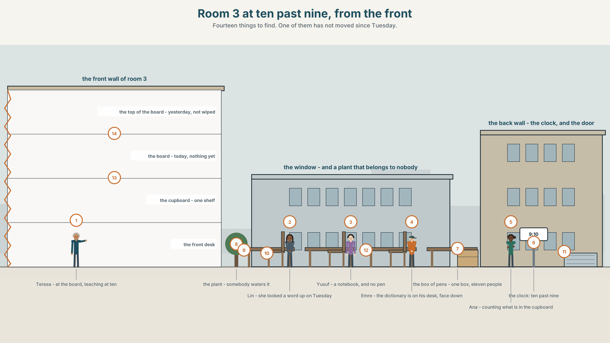{width=6.6in}

*Room 3 at ten past nine, from the front — Fourteen things to find. One of them has not moved since Tuesday.*

# How do you learn a word?

**By the end of this unit you can describe a room and say exactly what is in it.**

| ◆ **A · THE WORLD** | A room with eleven people in it and one of most things |
|---|---|
| ◆ **B · THE SYSTEM** | *there is* and *there are* · *a*, *an*, *some* and *any* · 22 words for the classroom · how English makes a plural, including the eleven ways it does not · the two *th* sounds |
| ◆ **C · THE PERFORMANCE** | You give a one-minute tour of a room and somebody draws it from your words |

---

### 0A · Find it — fourteen things

Find these in the picture. Write the number.

> ☐ a desk ☐ a chair ☐ a board ☐ a pen ☐ a pencil ☐ a notebook ☐ a dictionary
> ☐ a page ☐ a cupboard ☐ a shelf ☐ a window ☐ a door ☐ a bag ☐ a clock

**Three of these words are not in the picture. Which three?**

> homework · an exercise · an answer

### 0B · Guess it

Look at the cupboard. **How many students can use this room at the same time?**
Say one thing. You can use these words:

> *desk · chair · pen · one · eleven*

### 0C · Say it ⏺

**Record. Thirty seconds. Do not prepare.**

> **What is in the room where you study at home?**

You will listen to this again on the last page.

---

## Part 1 · Vocabulary Lab 1 ◆ **B · THE SYSTEM**

### 1A · Meet — the room and the work

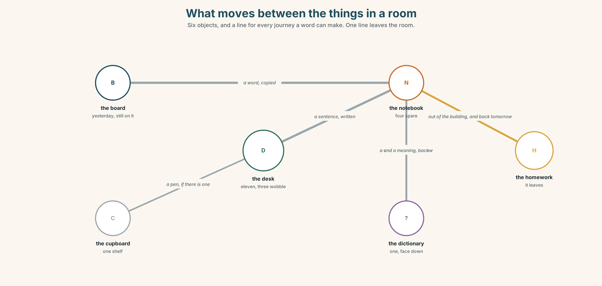{width=6.6in}

*What moves between the things in a room — Six objects, and a line for every journey a word can make. One line leaves the room.*

| | |
|---|---|
| **board** | Yesterday is still on it. Nobody wiped it. |
| **desk** | Eleven, and three of them wobble. |
| **cupboard** | One shelf. Everything the school owns for this room is on it. |
| **notebook** | Four spare ones. Eleven students. |
| **dictionary** | One. Open, face down, at the back, since Tuesday. |
| **homework** | The only thing in the room that leaves the room. |

### 1B · Meet — the words

> **classroom · desk · chair · board · pen · pencil · notebook · dictionary · page · word · sentence · question · answer · homework · exercise**

Write each word under the right picture.

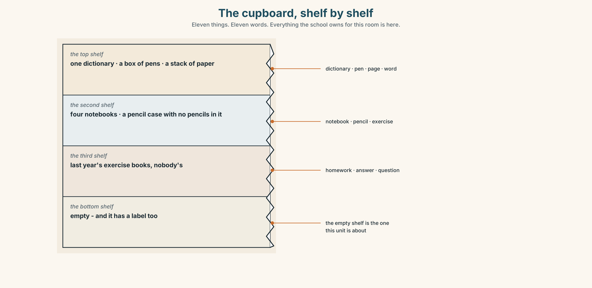{width=6.6in}

*The cupboard, shelf by shelf — Eleven things. Eleven words. Everything the school owns for this room is here.*

### 1C · Sort — one, or more than one?

Put each word in the right box. **One of them belongs in both. Which, and why?**

> desk · homework · pen · paper · chair · exercise · notebook · word · page · answer

| **YOU CAN COUNT IT** | **YOU CANNOT COUNT IT** | **BOTH** |
|---|---|---|
| | | |

### 1D · The four verbs of a lesson

| | |
|---|---|
| **listen** | to the teacher, to the recording, to each other. Three different things. |
| **repeat** | after the teacher. The one everybody does badly and nobody notices. |
| **read** | with your eyes, or out loud. Two different skills with one name. |
| **write** | the only one that leaves a record of what you understood. |

**Now say them.** Three of these four can be done with a phone instead.
**Which one cannot, and why not?**

### 1E · Stretch — the phrases you will need today

> **look up a word** · **do your homework** · **ask a question** · **a lot of** · **How many are there?**

Match each phrase to the moment you need it.

1. There is a word on the board and you have never seen it. → ______
2. The teacher says something and nobody understands. → ______
3. You are counting the chairs for a visitor. → ______
4. It is Thursday evening and the lesson is Friday morning. → ______
5. You want to say that there are more than you can count. → ______

### 1F · The hard one

> **f** **How many are there?**

Practise it three times. **Four words, and three of them are tiny.**

### 1G · Own it

Write down three things that are in your bag right now and one thing that is not.
Do not write your name. The class guesses whose bag it is.

---

## Part 2 · Listening ◆ **A · THE WORLD**

{width=6.6in}

*In front of the open cupboard — One of them is counting. The other one is teaching in fifty minutes.*

### 2A · In front of the cupboard 🔊 Track 5.1

**Before you listen.** Ana is counting what is in the cupboard. Teresa is teaching at ten.
**Guess: how many dictionaries are there?**

**Listen once. One question.** How much money does the school have for this room?

**Listen again. Complete the table.**

| | How many | Enough? |
|---|---|---|
| desks | | |
| notebooks | | |
| dictionaries | | |

**Listen again. True or false?**

1. There are eleven chairs in the room. ☐ T ☐ F
2. There aren't any pencils. ☐ T ☐ F
3. There is a lot of paper. ☐ T ☐ F
4. There are some notebooks, but not enough. ☐ T ☐ F

**Noticing.** Four sentences from the recording.

1. *There is one dictionary.*
2. *There are eleven desks.*
3. *There aren't any pencils.*
4. *Are there any notebooks?*

**One of these uses *is* and three use *are*. What decides?**

### 2B · Decoding clinic 🔊 Track 5.2

Twenty seconds of Ana counting at speed. Three jobs.

1. Count how many times she says *there*.
2. She says *there are* as one short word. Write what you hear.
3. One plural ending in her list sounds different from all the others. Which word?

> Transcripts, page 151.

---

## Part 3 · Grammar Lab 1 ◆ **B · THE SYSTEM**

### Saying that something exists

### 3A · Notice

Look at the four sentences in Part 2 again.

1. What comes after *there is* — one thing, or more than one?
2. What comes after *there are*?
3. In sentence 3, which word tells you it is a negative?
4. Where does *any* appear — in the positive, the negative, or the question?

### 3B · See

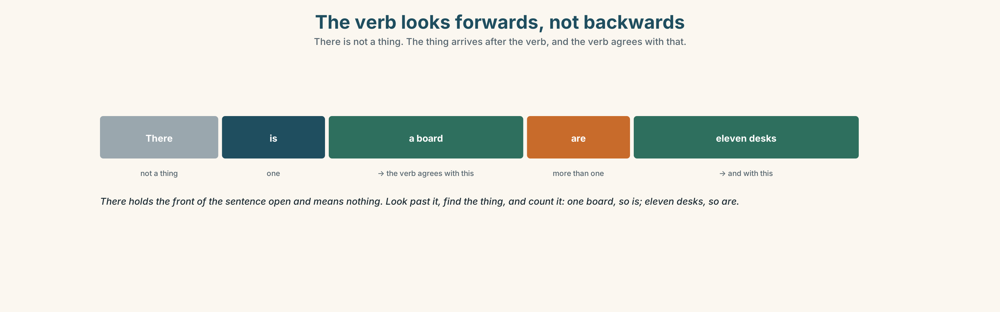{width=6.6in}

*The verb looks forwards, not backwards — There is not a thing. The thing arrives after the verb, and the verb agrees with that.*

### 3C · Know

| | | |
|---|---|---|
| **one** | **there is** | There is a board. There is some paper. |
| **more than one** | **there are** | There are eleven desks. There are some pens. |
| **none** | **there isn't / there aren't** | There isn't a dictionary. There aren't any pencils. |
| **asking** | **is there / are there** | Is there a board? Are there any notebooks? |

> **There is not a place.** It does not mean *in that place over there*. It is an empty word that
> holds the front of the sentence open while the real subject arrives behind the verb.

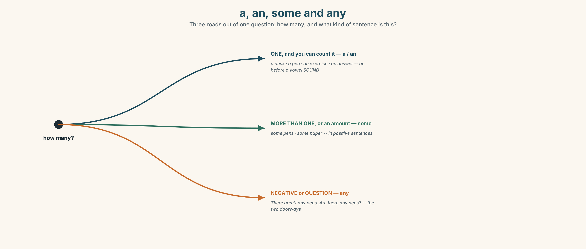{width=6.6in}

*a, an, some and any — Three roads out of one question: how many, and what kind of sentence is this?*

| | |
|---|---|
| **a / an** | one thing, countable: *a desk · an exercise · an answer* |
| **some** | more than one, or an amount: *some pens · some paper* |
| **any** | in negatives and questions: *There aren't any pens. Are there any pens?* |

> **An before a vowel sound, not a vowel letter.** *an exercise*, *an answer*, *an hour* — but
> *a university*, because that word begins with a *y* sound when you say it.

> **Why it matters.** This is how you describe anything that is not a person: a room, a street, a
> town, a photograph, a problem.

### 3D · Use — controlled

Complete with **there is**, **there are**, **there isn't**, **there aren't**, **a**, **an** or
**any**.

> In room 3 (1) ______ eleven desks and (2) ______ board. (3) ______ one dictionary.
> (4) ______ enough notebooks for everybody. There aren't (5) ______ pencils at all.
> Is there (6) ______ exercise book for the new student?

### 3E · Use — guided

Make each one negative, then make it a question.

1. There are some chairs in the corridor.
2. There is a clock on the wall.
3. There are eleven students in this class.
4. There is some paper in the cupboard.
5. There are some questions on page nine.

### 3F · Use — open

**In pairs, back to back.** One of you describes this room. The other draws it.
**Compare the drawing with the room.** What did the words leave out?

### 3G · Check — six items, mark your own

> 1. ______ eleven desks in this room.
> 2. ______ a dictionary on the shelf.
> 3. There aren't ______ pencils.
> 4. Is there ______ exercise on page ten?
> 5. ✗ *There is eleven desks.* → correct it.
> 6. ✗ *There are some pens? * → correct it.

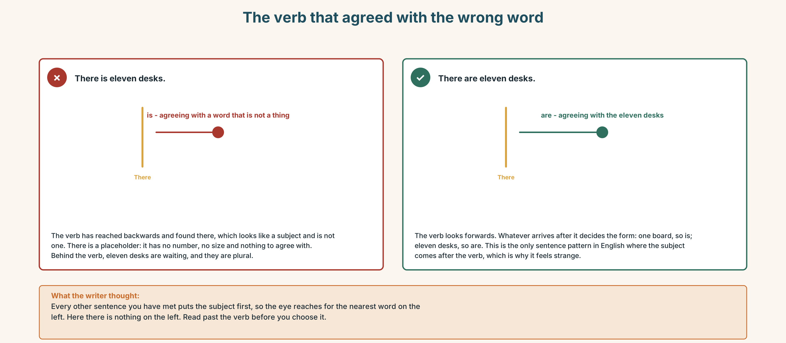{width=6.6in}

*The verb that agreed with the wrong word — The verb that agreed with the wrong word*

**0–3 →** Workbook pp. 20–23. **4–5 →** Part 6. **6 →** page 112.

---

## Part 4 · Speaking ◆ **C · THE PERFORMANCE**

### 4A · Fluency starter — add one thing

The first person says one thing that is in this room. The next repeats it and adds one.
**Stop when somebody forgets, or when somebody says something that is not there.**

### 4B · The functional core — describing a place

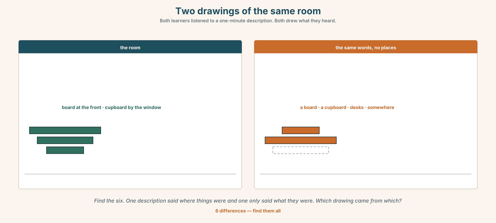{width=6.6in}

*Two drawings of the same room — Both learners listened to a one-minute description. Both drew what they heard.*

**Language Bank**

| | |
|---|---|
| **how many** | *There is one… · There are eleven… · There are a lot of…* |
| **how few** | *There aren't any… · There is only one…* |
| **where** | *on the wall · in the cupboard · at the back · by the window* |
| **asking** | *How many are there? · Is there…? · Are there any…?* |

**Information gap.** Learner A has the room as it is. Learner B has the room as the school's
inventory list says it is. **Find the four things that are on one list and not the other.**

### 4C · The performance — the one-minute tour ⏺

Describe one room **you know and nobody here has seen**. **One minute.** You must say:

> how many of two different things · one thing there isn't · where two things are ·
> one thing that should not be in that room at all

Your partner draws it. **Record it.**

### 4D · Observer

One person listens for **one thing**: did the speaker ever say *there is* with a plural?

### 4E · Two criteria

> ☐ Did my partner's drawing have the right number of the main thing?
> ☐ Did I say where at least two things were?

---

## Part 5 · Reading ◆ **A · THE WORLD**

### 5A · Predict

The title is **"The word you looked up twice."**
**How many times do you think you have looked up the same word?**

### 5B · Read — sixty seconds

---

**The word you looked up twice**

There is one dictionary in room 3. It is open, face down, on a desk at the back, and it has been
there since Tuesday.

On Tuesday, Lin looked up a word. She read it, she understood it, she closed nothing and she went
home. On Thursday she met the same word in a different sentence and she did not know it.

This is normal and it is not a memory problem. A word you meet once is a word you have seen. A
word you meet seven times, in seven different sentences, over three weeks, is a word you have.
There is no way round the seven. There are only ways to make the seven happen faster.

The dictionary is not the problem. The dictionary is excellent. The problem is that everything
between looking a word up and meeting it again is left to chance, and chance is slow.

---

### 5C · Answer

1. How many dictionaries are there in room 3?
2. Where is it?
3. What happened on Thursday?
4. How many times does the text say you need to meet a word?
5. **Why does the writer say this is not a memory problem?**
6. **The last line says chance is slow. What would be faster, and who would have to do it?**

### 5D · Vocabulary in context

Guess from the text. Then check.

> face down · there is no way round it · left to chance · a word you have · over three weeks

### 5E · The counter-text

{width=6.6in}

*The inventory list for room 3 — Printed in March. Filled in by hand in June. Four rows do not match.*

**Read the list and answer.**

1. How many desks should there be?
2. **How many chairs are there, and does that match the desks?**
3. Which item is on the list but not in the room?
4. **One row has a number written, crossed out and written again. Which, and what does that tell you?**

### 5F · Two texts

The inventory says there are eleven notebooks.
The text in 5B says there are four.

**Which one is right?** Say one sentence.

---

## Part 6 · Vocabulary Lab 2 ◆ **B · THE SYSTEM**

### Making more than one

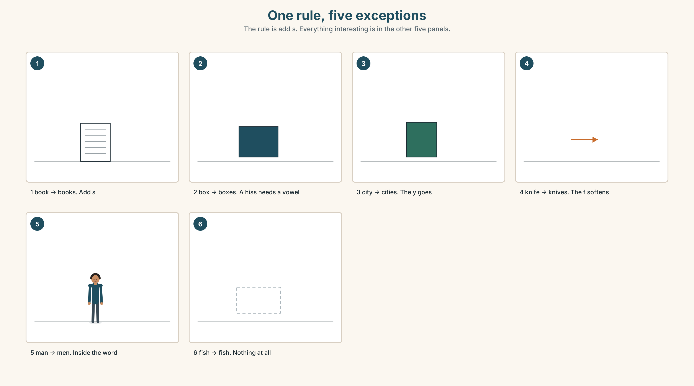{width=6.6in}

*One rule, five exceptions — The rule is add s. Everything interesting is in the other five panels.*

### 6A · The ones that catch everybody

| | |
|---|---|
| **boxes · classes · watches** | after a hissing sound you can hear the extra syllable |
| **countries · cities** | the **y** goes, and **ies** arrives |
| **knives · shelves** | the **f** turns into a **v** before it takes the **s** |
| **men · women · children** | no **s** at all. Three of the commonest words in English |

### 6B · Say them

> books · boxes · children · men · women · countries · classes · watches · cities · knives · shelves

### 6C · Chunk

1. one box, two **______**
2. one country, two **______**
3. one knife, two **______**
4. one shelf, two **______**
5. one child, two **______**
6. **a ______ of** people — more than you are going to count

### 6D · Contrast Clinic

Six items. ***is*** or ***are***?

1. There ______ a lot of paper in the cupboard.
2. There ______ eleven desks.
3. There ______ some water in the bottle.
4. There ______ three children in the corridor.
5. There ______ one dictionary.
6. There ______ two shelves and both of them are empty.

---

## Part 7 · Pronunciation & Fluency Lab ◆ **B · THE SYSTEM**

### The sound that lives between your teeth

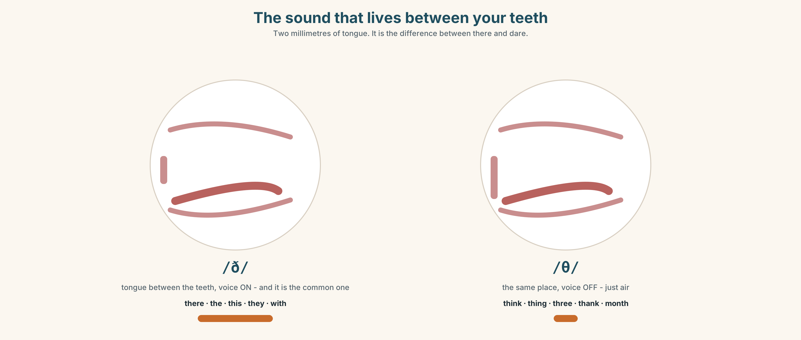{width=6.6in}

*The sound that lives between your teeth — Two millimetres of tongue. It is the difference between there and dare.*

### 7A · Hear

> **/ð/** loud, and the commonest one: *there · the · this · they · that · with*
> **/θ/** quiet: *think · thing · three · thank · month*
> **not /d/ or /z/**: *there* is not *dare*. *this* is not *dis*.

### 7B · Say

Put your tongue between your teeth. It feels wrong. **It is right.** Then say:

> *There are three things on the shelf.* — both *th* sounds, four times, in one sentence.

### 7C · Make it mean something

Say these two:

> *There are a lot of books.* — the *th* is loud and your voice is on
> *I think there are thirty.* — the *th* in *think* is quiet and your voice is off

**One tongue position, two settings.** Which is which?

### 7D · Fluency 20 ⏺

Twenty seconds: **six things that are in this room, with how many.** Three times, faster.

---

## Part 8 · Writing ◆ **C · THE PERFORMANCE**

### A room · 40–60 words

### 8A · Read the model

> There are eleven desks in my classroom and ten chairs. `[the numbers first, and they do not match]`
>
> There is a board, and there is a cupboard with one shelf in it. `[the big things]`
>
> There aren't any pencils. There is one dictionary and nobody uses it. `[what is missing, and
> what is there and unused]`
>
> There is a plant on the window. It belongs to nobody and somebody waters it. `[the one odd
> thing, at the end]`

**Questions about the writer's choices:**

1. Eleven desks and ten chairs. **Why put the numbers that do not match first?**
2. *and nobody uses it.* **What does that add that the number did not?**
3. The last sentence is about a plant. **Why is the least important object the most interesting one?**

### 8B · The anti-model

> There is a board. There are desks. There are chairs. There is a cupboard. There is a window. There is a door.

Correct English, and it is every classroom on earth. **Add three numbers and one thing that is
missing, and make it this room.**

### 8C · Plan

> two numbers that do not match → the big things → one thing there isn't →
> the odd thing, last

### 8D · Write — 40 to 60 words
### 8E · Peer review — two things only

> ☐ Is there at least one *there aren't any* sentence?
> ☐ Could you draw this room from these words alone?

### 8F · Publish

On the wall, with no names. **The class matches the description to the room.**

---

## Part 9 · The File ◆ **A · THE WORLD + C · THE PERFORMANCE**

# STUDY FILE · Seven meetings

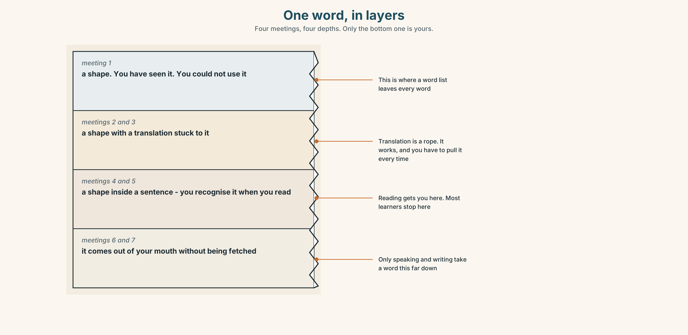{width=6.6in}

*One word, in layers — Four meetings, four depths. Only the bottom one is yours.*

### 9A · The gap between meetings

{width=6.6in}

*Day 1, day 3, day 7, day 21 — Five panels. The effort shrinks and never reaches zero, and that is the good news.*

| | |
|---|---|
| **What people do** | meet a word once, write it in a list, read the list |
| **What the list does** | puts all the meetings on the same day |
| **What is needed** | the same word, far apart, in different sentences |
| **The cheapest version** | one card, one word, met on day 1, 3, 7, 21 |

### 9B · Different sentences, not more repetitions

Twenty repetitions of one sentence teaches you one sentence. Four meetings in four different
sentences teaches you a word. **Take one word from this unit and write it in three sentences that
have nothing to do with each other.**

### 9C · Role play — the seventh meeting

In pairs. Each of you chooses three words from this unit without telling the other.
**For ten minutes, use your three words as often as you can without being caught.**
At the end, guess your partner's three.

### 9D · Where your meetings happen

A word you only meet in a notebook has one place to live. **Name two places in your week where
an English word could meet you without you arranging it.**

### 9E · Transfer — before next week

**Take five words from this unit. Write each one on a separate card. Meet each card on day 1,
day 3 and day 7.** Bring the five cards and say which one was hardest on day 7.

---

## Part 10 · Mediation & Interaction ◆ **C · THE PERFORMANCE**

{width=6.6in}

*One term, one word list — Three hundred and fifty words were taught. Follow them to June.*

### 10A · Relay

Half the class has the inventory list. Half has the room as it is.
**Rebuild the true contents of room 3 by speaking.** Ten minutes.

### 10B · Simplify — for one person

A classmate asks: *How do I remember new words?*
**Answer in three sentences.** No app names.

### 10C · Online

Write **one message** to a classmate: say what is in your study space at home and ask what is in
theirs. **Two sentences.**

### 10D · Your language

Does your language make plurals with an ending? **Say *one book* and *two books* in your
language.** What changes, and does anything else in the sentence have to change with it?

---

## Part 11 · The Decision ◆ **C · THE PERFORMANCE**

# Two hundred euros

The school has two hundred euros for room 3 this year. There is one shelf and it is nearly empty.

**Option one:** eleven paper dictionaries. Everybody has one in the lesson, and nobody takes one
home.

**Option two:** a shelf of twenty short readers, graded, that students borrow for a week.

**Option three:** nothing. There are eleven phones in the room and every one of them has a
dictionary in it already.

### 11A · The evidence

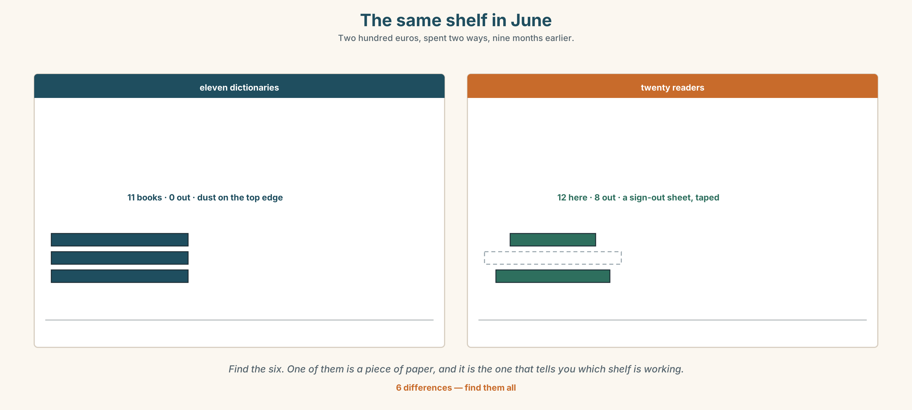{width=6.6in}

*The same shelf in June — Two hundred euros, spent two ways, nine months earlier.*

🔊 **Track 5.6.** Yusuf, 20 seconds: *"I have a dictionary in my phone. It is a good dictionary.
But when I open my phone I don't look up the word. I look at something else. Every time."*

### 11B · Talk about it

In threes. Use the frame. Everybody says one.

> *I think the school should buy ______ , because ______ .*

**Words you can use:** *dictionary · book · page · read · phone · a lot of · shelf*

### 11C · Decide

Write **two sentences**. Choose, and say why.

> I think the school should buy ______________________ ,
> because ______________________ .

### 11D · Model decision

> The readers. A dictionary answers a question you already have. A reader gives you the seven
> meetings without you arranging any of them, and it does it while you are enjoying yourself,
> which is the only study method that survives a bad week.

### 11E · The Reveal

> **What happened.** The school bought the readers. By June, fourteen of the twenty had been
> borrowed at least once, and three had been borrowed more than ten times.
>
> Then something nobody expected: the three most-borrowed were the three easiest ones, well below
> the level of the class. Students were not stretching. They were reading things they could
> finish, and those were the students whose speaking improved most.

**One question. You do not have to answer it out loud.**

> If the easy books worked best, what was the hard book for?

---

## Part 12 · Landing ◆ **all three lines**

### 12A · Recycle — twelve items

> 1. ______ eleven desks in this room.
> 2. ______ a dictionary on the shelf.
> 3. There aren't ______ pencils.
> 4. one box, two ______
> 5. one city, two ______
> 6. one knife, two ______
> 7. one child, two ______
> 8. one woman, two ______
> 9. I need to ______ this word ______ . *(two words, one on each side)*
> 10. Please ______ your homework for Friday.
> 11. *(Unit 4)* ______ I ask a question?
> 12. *(Unit 3)* How ______ books are there?

### 12B · Consolidate — one task, everything in it

**Describe a room in your home in six sentences.** Use *there is* twice, *there are* twice, one
negative with *any*, and one plural that does not end in **s**.

### 12C · Can-do, with evidence

> ☐ I can say what is in a room and how many. **Evidence:** 4C, 8D
> ☐ I can use *there is* and *there are* correctly. **Evidence:** 3G, 6D
> ☐ I can make plurals, including the irregular ones. **Evidence:** 6C
> ☐ I can say the two *th* sounds. **Evidence:** 7C

### 12D · Replay ⏺

Record 0C again. **Listen to both.** What is different?

### 12E · Glossary — thirty-five words, as a map

> **THE ROOM** · classroom · desk · chair · board · cupboard · page
> **WHAT YOU HOLD** · pen · pencil · notebook · dictionary
> **WHAT YOU MAKE** · word · sentence · question · answer · homework · exercise
> **WHAT YOU DO** · listen · repeat · write · read · look up a word · do your homework · ask a question
> **MORE THAN ONE** · books · boxes · children · men · women · countries · classes · watches · cities · knives · shelves
> **COUNTING** · a lot of · How many are there?

### 12F · Next

> **Unit 6 · Where does breakfast come from?**
