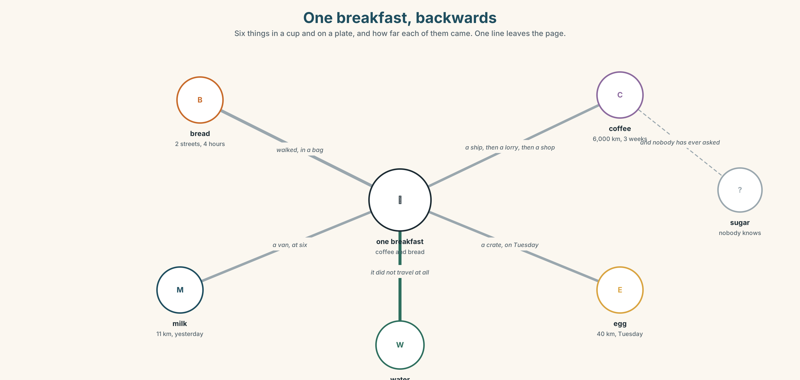
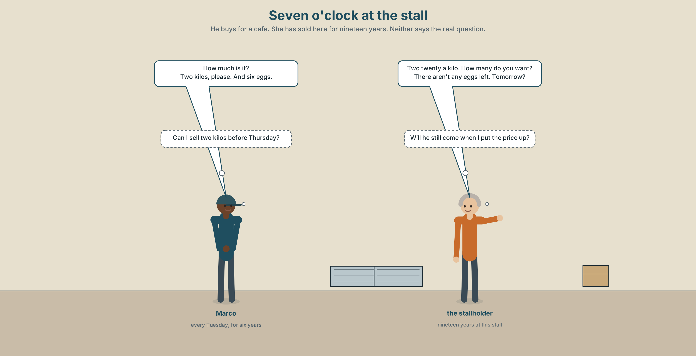
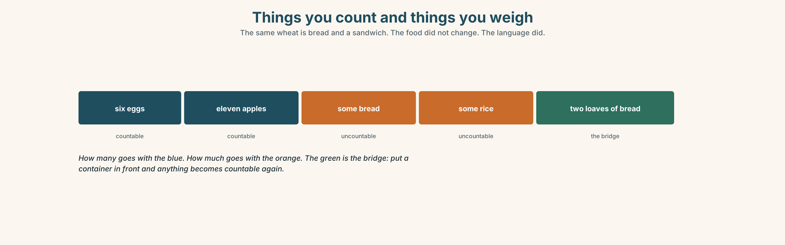
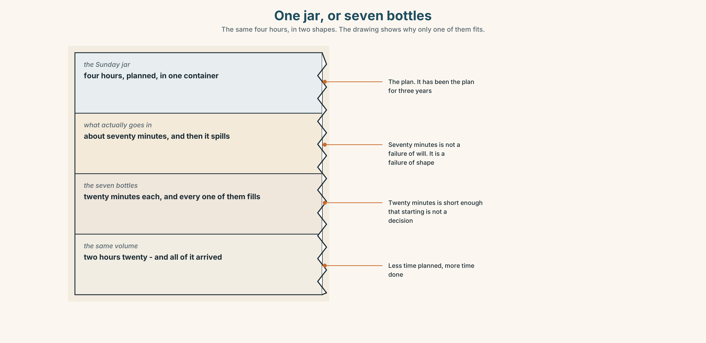
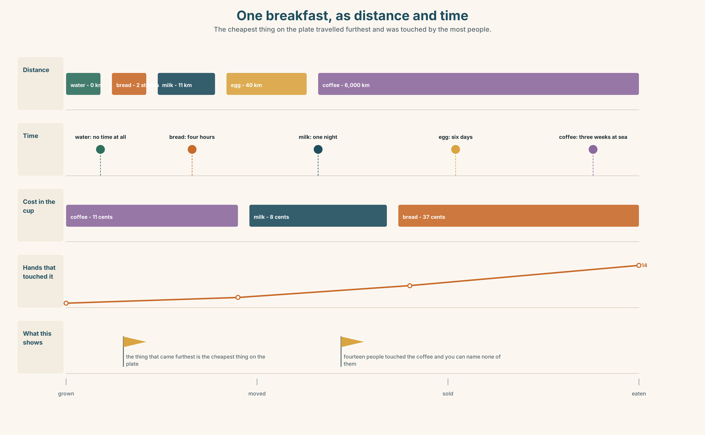
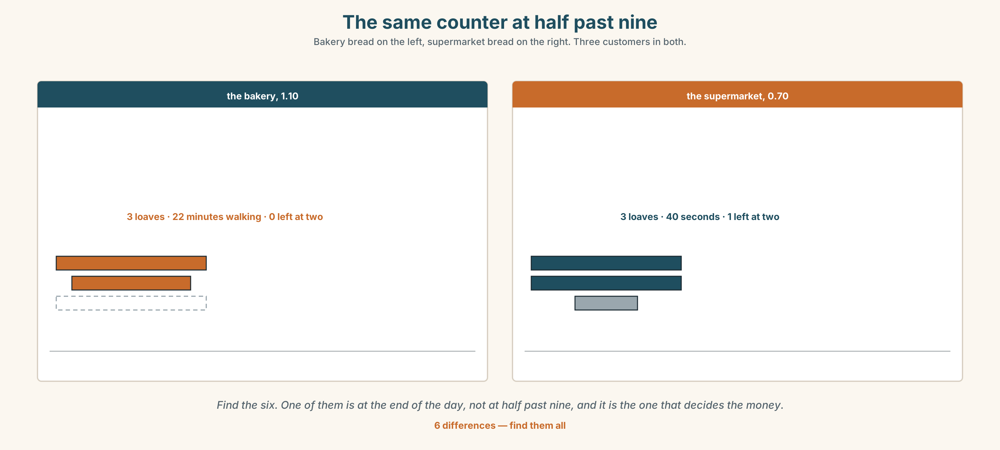

# A1.1 · Unit 6 · Two Streets from the Café

> **English Animated** · *Starting Out* · Escola Monte, Lisbon
> Student's Book pages 116–137 · 22 pp · ~9 hours

---

## Part 0 · The Big Picture ◆ **A · THE WORLD**

{width=6.6in}

*The market at seven, down the hill — Fourteen things to find. Two of the stalls are selling the same thing at the same price.*

# Where does breakfast come from?

**By the end of this unit you can buy food, ask the price, and say how much you want.**

| ◆ **A · THE WORLD** | A market at seven, two streets from a café that opens at half past six |
|---|---|
| ◆ **B · THE SYSTEM** | countable and uncountable · *how much* and *how many* · 22 words for food and shops · the words for containers and amounts · /iː/ and /e/, and joining words together |
| ◆ **C · THE PERFORMANCE** | You run a stall, and you buy from somebody else's |

---

### 0A · Find it — fourteen things

Find these in the picture. Write the number.

> ☐ bread ☐ rice ☐ cheese ☐ milk ☐ an egg ☐ an apple ☐ a tomato
> ☐ a fish ☐ water ☐ a box ☐ a crate ☐ a bag ☐ a van ☐ a sign

**Three of these words are not in the picture. Which three?**

> sugar · salt · tea

### 0B · Guess it

Look at the two stalls selling the same thing. **Why is there a queue at one and nobody at the
other?** Say one thing. You can use these words:

> *sign · price · cheap · people · know*

### 0C · Say it ⏺

**Record. Thirty seconds. Do not prepare.**

> **What did you eat this morning, and where did it come from?**

You will listen to this again on the last page.

---

## Part 1 · Vocabulary Lab 1 ◆ **B · THE SYSTEM**

### 1A · Meet — one breakfast, backwards

{width=6.6in}

*One breakfast, backwards — Six things in a cup and on a plate, and how far each of them came. One line leaves the page.*

| | |
|---|---|
| **bread** | Two streets. Four hours old. |
| **milk** | Eleven kilometres. Yesterday evening. |
| **coffee** | Six thousand kilometres. Three weeks on a ship. |
| **egg** | Forty kilometres. Tuesday. |
| **sugar** | Nobody at the café knows. Nobody has ever asked. |
| **water** | Under the street. It is the only one that did not travel. |

### 1B · Meet — the words

> **bread · rice · cheese · milk · egg · apple · tomato · chicken · fish · water · tea · coffee · sugar · salt**

Write each word under the right picture.

{width=6.6in}

*One stall, in section — Eleven foods. Eleven words. Put each word where it actually sits.*

### 1C · Sort — can you count it?

Put each word in the right box. **Two of them can go in both. Which, and why?**

> chicken · water · cheese · apple · tomato · fish · milk · rice · egg · bread

| **ONE, TWO, THREE** | **YOU CANNOT COUNT IT** | **BOTH** |
|---|---|---|
| | | |

### 1D · The two shops

| | |
|---|---|
| **market** | Six stalls. Open at six. Closed by two. Cash. |
| **shop** | Open all day. A fridge. A card machine. Twenty per cent more. |
| **How much is it?** | The question you need in both. |
| **a bit of** | When you do not want a number and you do not want a lot. |
| **run out of** | What happens at half past eleven on a Saturday. |

**Now say them.** One of these five is a question and one is a problem.
**Which is which, and which two are places?**

### 1E · Stretch — the phrases you will need today

> **a loaf of bread** · **a bottle of water** · **a kilo of rice** · **a bit of** · **run out of**

Match each phrase to the moment you need it.

1. You are thirsty and there is a shop. → ______
2. You are cooking for six people. → ______
3. You want cheese but not much cheese. → ______
4. It is Sunday and the café has no milk. → ______
5. You want the whole thing, not slices. → ______

### 1F · The hard one

> **f** **That's all, thanks.**

Practise it three times. **It is how you end every transaction in English, and without it the
other person keeps offering.**

### 1G · Own it

Write down three things you bought this week and where. Do not write your name.
The class guesses whose week it is.

---

## Part 2 · Listening ◆ **A · THE WORLD**

{width=6.6in}

*Seven o'clock at the stall — He buys for a cafe. She has sold here for nineteen years. Neither says the real question.*

### 2A · Seven o'clock at the stall 🔊 Track 6.1

**Before you listen.** Marco buys for the café every Tuesday.
**Guess: does he know the price before he asks?**

**Listen once. One question.** How much does a kilo of tomatoes cost?

**Listen again. Complete the table.**

| | How much / how many | Price |
|---|---|---|
| tomatoes | | |
| eggs | | |
| bread | | |

**Listen again. True or false?**

1. Marco buys two kilos of tomatoes. ☐ T ☐ F
2. There aren't any eggs left. ☐ T ☐ F
3. He pays with a card. ☐ T ☐ F
4. He asks the price before he chooses. ☐ T ☐ F

**Noticing.** Four questions from the recording.

1. *How much is it?*
2. *How many do you want?*
3. *How much rice do you need?*
4. *How many eggs are there?*

**Two use *much* and two use *many*. What decides?**

### 2B · Decoding clinic 🔊 Track 6.2

Twenty seconds of the stallholder at speed. Three jobs.

1. Count how many prices she says.
2. She says *a kilo of* as one word. Write what you hear.
3. *How much is it* has four words and two sounds in the middle. Where do the words join?

> Transcripts, page 152.

---

## Part 3 · Grammar Lab 1 ◆ **B · THE SYSTEM**

### Things you count and things you weigh

### 3A · Notice

Look at the four questions in Part 2 again.

1. What kind of word comes after *how many*?
2. What kind of word comes after *how much*?
3. Can you say *two breads*? What do you say instead?
4. One word in the list can be counted in a shop and not in a kitchen. Which?

### 3B · See

{width=6.6in}

*Things you count and things you weigh — The same wheat is bread and a sandwich. The food did not change. The language did.*

### 3C · Know

| | | |
|---|---|---|
| **countable** | you can put a number in front | *an egg · two eggs · eleven apples* |
| **uncountable** | no number, no plural | *bread · water · rice · cheese · coffee* |
| **asking** | **how many** + countable · **how much** + uncountable | *How many eggs? How much rice?* |
| **the bridge** | a container makes anything countable | *two loaves of bread · three bottles of water* |

> **It is not about the food.** It is about how the language decided to look at it. *Bread* is
> uncountable and *a sandwich* is countable, and they are the same wheat.

{width=6.6in}

*The container is the bridge — Bread cannot take a number. A loaf can, and it carries the bread across with it.*

| | |
|---|---|
| **some / any** | *some bread · some eggs* · *Is there any rice? There isn't any milk.* |
| **a lot of** | works with both: *a lot of bread · a lot of eggs* |
| **a bit of** | only uncountable: *a bit of cheese*, never *a bit of eggs* |

> **Why it matters.** Every time you buy food, order in a café or follow a recipe, you have to
> choose between these two shapes, and the choice is in the first two words.

### 3D · Use — controlled

Complete with **how much**, **how many**, **a bit of**, **a lot of** or **any**.

> (1) ______ eggs do you want? — Six, please.
> (2) ______ rice do you need? — Half a kilo.
> There isn't (3) ______ milk left. We need (4) ______ milk for the morning.
> Just (5) ______ cheese, please. Not much.

### 3E · Use — guided

Make a question with *how much* or *how many*.

1. He wants four apples.
2. She needs two litres of water.
3. They buy a kilo of rice every week.
4. There are twelve eggs in the box.
5. The café uses three loaves of bread a day.

### 3F · Use — open

**In pairs.** One of you has a kitchen with six things in it. The other is cooking tonight.
**Find out what there is, and how much, in six questions.**

### 3G · Check — six items, mark your own

> 1. ______ bread do you want?
> 2. ______ apples are there?
> 3. There isn't ______ water in the bottle.
> 4. I only want ______ bit of cheese.
> 5. ✗ *How many rice do you need?* → correct it.
> 6. ✗ *I bought two breads.* → correct it.

{width=6.6in}

*The number with nothing to land on — The number with nothing to land on*

**0–3 →** Workbook pp. 24–27. **4–5 →** Part 6. **6 →** page 134.

---

## Part 4 · Speaking ◆ **C · THE PERFORMANCE**

### 4A · Fluency starter — the shopping chain

The first person says one thing they need and how much. The next repeats it and adds theirs.
**Nobody may use the same container twice.**

### 4B · The functional core — buying and selling

{width=6.6in}

*The same stall, two Tuesdays — Same hour, same tomatoes, same price. One of them has a piece of card on it.*

**Language Bank**

| | |
|---|---|
| **asking the price** | *How much is it? · How much are they? · How much is a kilo?* |
| **saying the amount** | *a loaf of bread · a bottle of water · a kilo of rice · half a kilo* |
| **softening it** | *just a bit of… · about two hundred grams* |
| **ending it** | *That's all, thanks.* |

**Information gap.** Learner A has a shopping list with amounts. Learner B has a stall with
prices and three things missing. **Buy the whole list, or find out what you cannot have.**

### 4C · The performance — the market ⏺

Half the class sets up a stall. Half buys. **Ten minutes, then swap.** As a seller you must:

> give a price without being asked once · run out of one thing · offer something instead

As a buyer you must buy four things and **spend less than ten euros**. **Record it.**

### 4D · Observer

One person listens for **one thing**: did any buyer walk away without saying *That's all, thanks.*?

### 4E · Two criteria

> ☐ Did I use a container word for at least two things?
> ☐ Did I ask the price before I chose, at least once?

---

## Part 5 · Reading ◆ **A · THE WORLD**

### 5A · Predict

The title is **"The stall with nobody at it."**
**Why would two identical stalls have different queues?**

### 5B · Read — sixty seconds

---

**The stall with nobody at it**

There are two tomato stalls at the market, side by side. The tomatoes are the same. The price is
the same: two euros twenty a kilo.

At seven in the morning there are nine people at the first stall and nobody at the second.

The first stall has a small handwritten sign. It says the name of the farm and the name of the
village. It does not say the tomatoes are better, because they are not better.

The second stall has no sign at all. The woman behind it has sold tomatoes here for nineteen
years. Everybody who knows her buys from her, and there are not many of those left, because the
people who knew her are old now and they come at nine, not at seven.

Nine people at seven. Four people at nine. The same number by the end of the day, and only one of
the two stalls thinks it is winning.

---

### 5C · Answer

1. How much is a kilo of tomatoes?
2. How many people are at the first stall at seven?
3. What does the sign say?
4. How long has the second woman sold tomatoes here?
5. **Why do her customers come at nine and not at seven?**
6. **The last line says only one of them thinks it is winning. Which one, and is it right?**

### 5D · Vocabulary in context

Guess from the text. Then check.

> side by side · a handwritten sign · there are not many of those left · by the end of the day · thinks it is winning

### 5E · The counter-text

{width=6.6in}

*The till receipt from the shop — The same six things Marco buys at the market. Everything here is a number except one line.*

**Read the receipt and answer.**

1. How much is the milk?
2. **How many litres of milk are there, and how do you know?**
3. What is the total?
4. **What is the offer at the bottom, and what does it want you to do?**

### 5F · Two texts

The market sells tomatoes at two euros twenty a kilo.
The receipt says three euros ten.

**Is the shop expensive?** Say one sentence. **Then say what the receipt does not tell you.**

---

## Part 6 · Vocabulary Lab 2 ◆ **B · THE SYSTEM**

### The words that make things countable

{width=6.6in}

*The same rice, six times — The rice never changes. The word in front of it changes in every panel.*

### 6A · The ones that catch everybody

| | |
|---|---|
| **a packet of / a bag of** | the packet is sealed; the bag is what you carry it home in |
| **a tin of / a jar of** | metal, and glass. English has a different word for each |
| **a piece of / a slice of** | a slice is cut flat off something bigger |
| **half a kilo** | not *a half kilo*. The *a* moves |

### 6B · Say them

> bag · box · bottle · packet · tin · jar · kilo · gram · litre · half · piece · slice

### 6C · Chunk

1. a **______** of bread *(the whole one)*
2. a **______** of water *(you can carry it)*
3. a **______** of rice *(one thousand grams)*
4. a **______** of cheese *(cut flat)*
5. a **______** of tomatoes *(metal, and it opens with a ring)*
6. **______** a kilo *(five hundred grams)*

### 6D · Contrast Clinic

Six items. ***much*** or ***many***?

1. How ______ eggs do you want?
2. How ______ bread is there?
3. How ______ apples are in the box?
4. How ______ is a kilo of rice?
5. How ______ bottles are there?
6. How ______ water do we need?

---

## Part 7 · Pronunciation & Fluency Lab ◆ **B · THE SYSTEM**

### /iː/ and /e/, and words that join

{width=6.6in}

*Long ee and short e — Cheese and bread. The jaw moves between these two and most learners keep it still.*

### 7A · Hear

> **/iː/** long: *cheese · tea · meat · need · three*
> **/e/** short: *bread · egg · ten · cent · left*
> **the joins**: *a kilo of* → *a KEE-lo-vuh* · *How much is it?* → *How-mu-chi-zit*

### 7B · Say

Say each group three times. Then say this:

> *Three eggs and a bit of cheese.* — both vowels, three times each, in one sentence.

### 7C · Make it mean something

Say these two:

> *a bit of cheese* — four words, and you hear two
> *How much is it?* — four words, and you hear two

**English joins the end of one word to the start of the next.** This is why you cannot hear
words you already know. Which words have disappeared into which?

### 7D · Fluency 20 ⏺

Twenty seconds: **six things you need from a shop, with the amount.** Three times, faster.

---

## Part 8 · Writing ◆ **C · THE PERFORMANCE**

### A shopping list that somebody else can use · 40–60 words

### 8A · Read the model

> **For the café, Tuesday.** `[who and when, first]`
>
> Four kilos of tomatoes — the stall on the left, not the one with the sign. `[the amount, and
> where]`
>
> Two loaves of bread. If there isn't any brown, white is fine. `[the amount, and what to do if
> it is not there]`
>
> Six litres of milk. Don't buy the cheap one — it is cheap because it is two days old. `[the
> amount, and the reason]`

**Questions about the writer's choices:**

1. Every line has an amount. **What happens to the person shopping if one line does not?**
2. *If there isn't any brown, white is fine.* **What does that one sentence save?**
3. The last line gives a reason. **Why is a reason more useful than an instruction?**

### 8B · The anti-model

> tomatoes, bread, milk, eggs, cheese, rice

Correct English, and the person who takes it to the market will come back with the wrong thing
six times. **Add an amount to every line and one instruction for when something is missing.**

### 8C · Plan

> who and when → the amounts → what to do if something is missing → one reason

### 8D · Write — 40 to 60 words
### 8E · Peer review — two things only

> ☐ Does every item have an amount with a container or a weight?
> ☐ Could a stranger shop from this list without telephoning you?

### 8F · Publish

Swap lists. **Your partner shops from your list, on paper, and tells you where they got stuck.**

---

## Part 9 · The File ◆ **A · THE WORLD + C · THE PERFORMANCE**

# STUDY FILE · How much English, and how often?

{width=6.6in}

*One jar, or seven bottles — The same four hours, in two shapes. The drawing shows why only one of them fits.*

### 9A · The jar and the bottles

{width=6.6in}

*Pouring four hours into Sunday — Five panels. Watch where it stops going in.*

| | |
|---|---|
| **What people plan** | four hours on Sunday |
| **What goes in** | about seventy minutes |
| **What they conclude** | *I need a longer Sunday.* |
| **What is true** | the container is the wrong shape, not too small |

### 9B · How much, not how long

An hour of English in which you say nothing is not an hour of English.
**Count what you produced, not how long you sat there.** Write down one number from last week:
how many sentences did you actually say out loud?

### 9C · Role play — the study stall

In pairs. One of you is selling study time by the hour. The other is buying with four hours a
week. **Negotiate. The seller must offer at least one package the buyer has not thought of.**

### 9D · The container you already have

You have a container that is exactly the right shape and you are not using it: the journey, the
queue, the kettle, the walk. **Name yours, and say how much it holds.**

### 9E · Transfer — before next week

**Write down, for seven days, how many English sentences you said out loud.** One number a day.
Bring the seven numbers.

---

## Part 10 · Mediation & Interaction ◆ **C · THE PERFORMANCE**

{width=6.6in}

*One breakfast, as distance and time — The cheapest thing on the plate travelled furthest and was touched by the most people.*

### 10A · Relay

Half the class has the market prices. Half has the shop receipt.
**Build the cheapest possible breakfast by speaking.** Ten minutes.

### 10B · Simplify — for one person

A new student asks: *Where do I buy food around here?*
**Answer in four sentences.** Include one thing that is not about price.

### 10C · Online

Write **one message** to a classmate: ask them to buy you two things and say the amounts.
**Two sentences.**

### 10D · Your language

Does your language count bread? **Say *two breads* in your language.** Is it strange? Which foods
does your language count that English does not?

---

## Part 11 · The Decision ◆ **C · THE PERFORMANCE**

# Bread, two streets away

Marco's café uses three loaves of bread a day.

The bakery two streets away sells him bread at one euro ten a loaf. It is baked at five in the
morning, four hours before he needs it. He walks there and back and it takes him twenty-two
minutes.

The supermarket at the top of the street sells bread at seventy cents. It is delivered at six. It
is forty seconds from his door.

Three loaves a day, six days a week. The difference is about fifty euros a year, and twenty-two
minutes a day.

### 11A · The evidence

{width=6.6in}

*The same counter at half past nine — Bakery bread on the left, supermarket bread on the right. Three customers in both.*

🔊 **Track 6.6.** Marco, 20 seconds: *"It's fifty euros. Fifty euros is nothing. But it's
twenty-two minutes, and at seven in the morning twenty-two minutes is not nothing."*

### 11B · Talk about it

In threes. Use the frame. Everybody says one.

> *I think Marco should buy the bread from ______ , because ______ .*

**Words you can use:** *bread · shop · market · cheap · expensive · minute · customer*

### 11C · Decide

Write **two sentences**. Choose, and say why.

> I think Marco should buy the bread from ______________________ ,
> because ______________________ .

### 11D · Model decision

> The bakery, but not for the bread. The twenty-two minutes is the only time in Marco's day when
> he is outside and nobody is asking him for anything, and he has been calling it a cost. It is
> the most useful fifty euros he spends.

### 11E · The Reveal

> **What happened.** Marco kept the bakery. He did not do it for any of the reasons on this page.
> He did it because the baker tells him what is selling in the street, and he changes what he
> makes on the strength of it.
>
> Then something he did not expect: when the bakery was closed for two weeks in August, his
> takings fell by more than the bread was worth, and it took him until October to work out why.

**One question. You do not have to answer it out loud.**

> Marco was comparing two prices. What was he actually buying?

---

## Part 12 · Landing ◆ **all three lines**

### 12A · Recycle — twelve items

> 1. How ______ bread do you want?
> 2. How ______ eggs are there?
> 3. There isn't ______ milk left.
> 4. I want just a ______ of cheese.
> 5. a ______ of bread *(the whole one)*
> 6. a ______ of water *(you can carry it)*
> 7. a ______ of rice *(one thousand grams)*
> 8. a ______ of cheese *(cut flat)*
> 9. We have ______ ______ of sugar. *(two words — there is none left)*
> 10. That's ______ , thanks.
> 11. *(Unit 5)* There ______ eleven desks in the room.
> 12. *(Unit 4)* ______ I have a receipt, please?

### 12B · Consolidate — one task, everything in it

**Write a shopping list for six people eating together, in six lines.** Every line must have an
amount. Two must use a container word, one must use a weight, and one must say what to do if the
thing is not there.

### 12C · Can-do, with evidence

> ☐ I can buy food and ask the price. **Evidence:** 4C
> ☐ I can use *how much* and *how many* correctly. **Evidence:** 3G, 6D
> ☐ I can say an amount with a container or a weight. **Evidence:** 6C, 8D
> ☐ I can hear where English joins words together. **Evidence:** 7C

### 12D · Replay ⏺

Record 0C again. **Listen to both.** What is different?

### 12E · Glossary — thirty-five words, as a map

> **YOU CAN COUNT THEM** · egg · apple · tomato
> **YOU CANNOT** · bread · rice · cheese · milk · chicken · fish · water · tea · coffee · sugar · salt
> **WHERE** · market · shop
> **CONTAINERS** · bag · box · bottle · packet · tin · jar
> **AMOUNTS** · kilo · gram · litre · half · piece · slice
> **BUYING** · a loaf of bread · a bottle of water · a kilo of rice · How much is it? · a bit of · run out of · That's all, thanks.

### 12F · Next

> **Unit 7 · What do you do for fun?**
