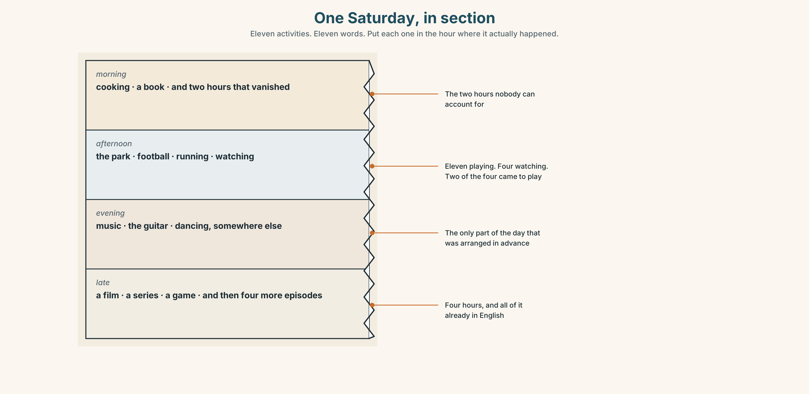
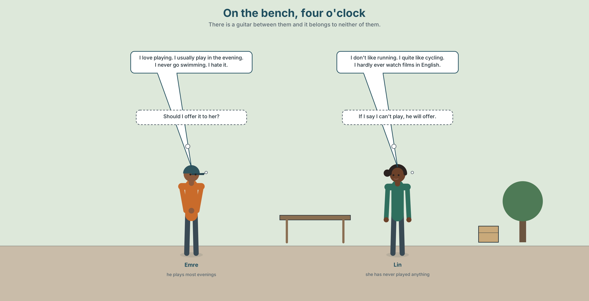
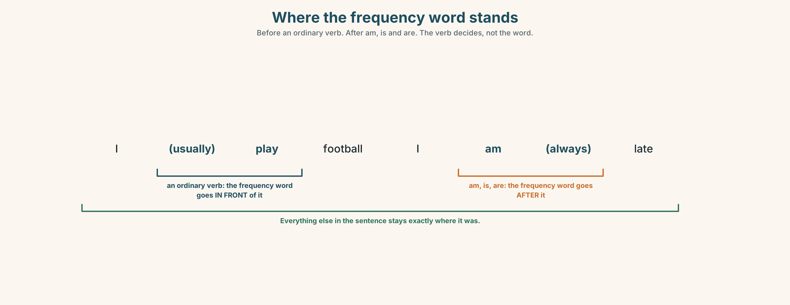
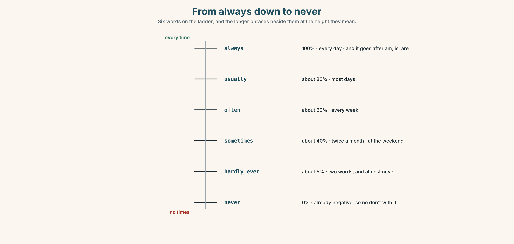
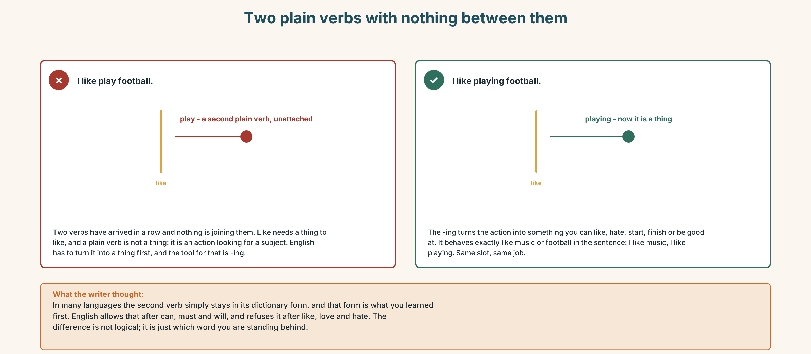
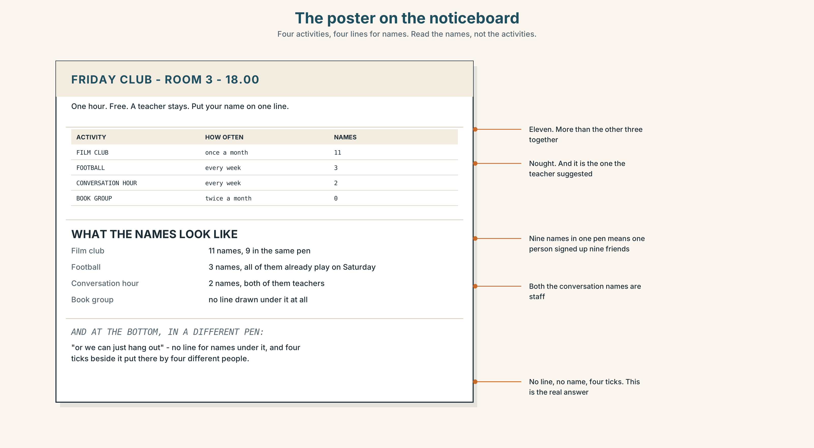
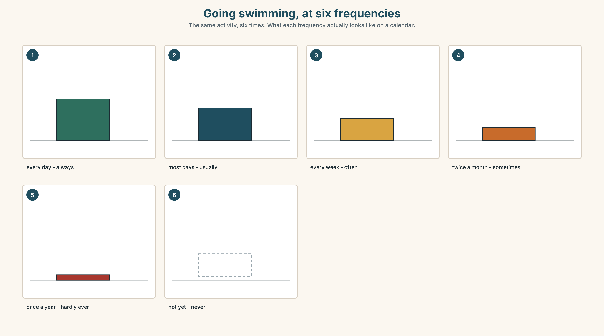
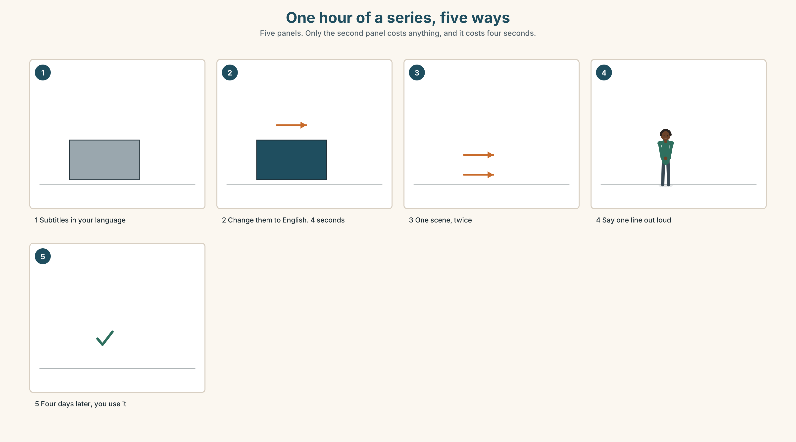
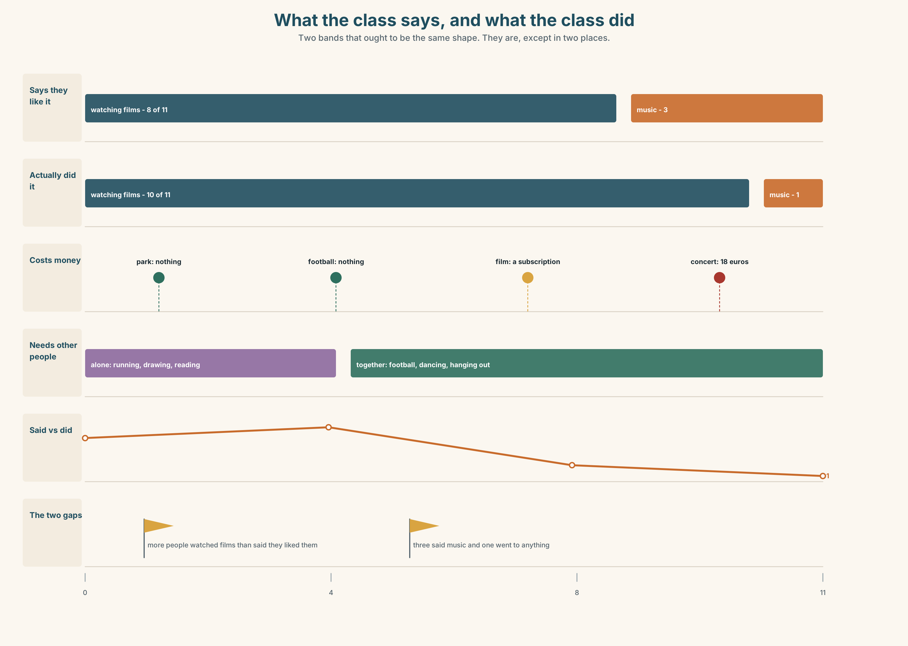
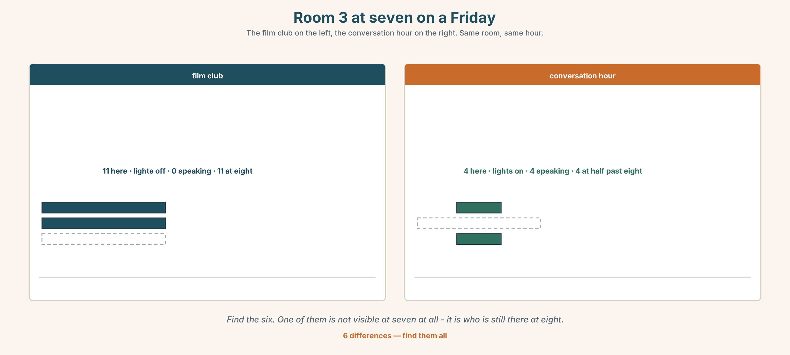

# A1.1 · Unit 7 · Friday at Six

> **English Animated** · *Starting Out* · Escola Monte, Lisbon
> Student's Book pages 138–159 · 22 pp · ~9 hours

---

## Part 0 · The Big Picture ◆ **A · THE WORLD**

{width=6.6in}

*The park at the bottom of the hill, Saturday, four o'clock — Fourteen things to find. Eleven people are doing something and four are watching them.*

# What do you do for fun?

**By the end of this unit you can say what you like doing and how often you do it.**

| ◆ **A · THE WORLD** | A park on a Saturday, where some people are doing and some are watching |
|---|---|
| ◆ **B · THE SYSTEM** | *like*, *love* and *hate* + *-ing* · adverbs of frequency and where they stand · 22 words for free time · the *-ing* sound · which word in the sentence gets the push |
| ◆ **C · THE PERFORMANCE** | You recommend one free activity to somebody who would not choose it |

---

### 0A · Find it — fourteen things

Find these in the picture. Write the number.

> ☐ football ☐ a guitar ☐ a book ☐ a game ☐ a park ☐ a bench ☐ a poster
> ☐ a tree ☐ a phone ☐ a bag ☐ a dog ☐ a bottle ☐ a bicycle ☐ a child

**Three of these words are not in the picture. Which three?**

> the beach · a concert · a film

### 0B · Guess it

Look at the four people who are watching. **Which one is enjoying it most?**
Say one thing. You can use these words:

> *watch · play · look · phone · game*

### 0C · Say it ⏺

**Record. Thirty seconds. Do not prepare.**

> **What do you do when you have two free hours and no plan?**

You will listen to this again on the last page.

---

## Part 1 · Vocabulary Lab 1 ◆ **B · THE SYSTEM**

### 1A · Meet — what people do with a Saturday

{width=6.6in}

*What goes with what — Eight things people do with a Saturday, and a line wherever two of them share something. Two have no line at all.*

| | |
|---|---|
| **football** | Twenty-two people, and you cannot do it alone. |
| **swimming** | One person, and nobody can talk to you. |
| **music** | Alone or together, and it is the only one that works in both. |
| **cooking** | The only one that produces something you can give away. |
| **drawing** | Cheap, quiet, and almost nobody does it after the age of twelve. |
| **hang out** | No equipment, no cost, no name for what you did. |

### 1B · Meet — the words

> **football · swimming · running · cycling · music · guitar · film · series · book · game · park · beach · concert · dancing · cooking · drawing**

Write each word under the right picture.

{width=6.6in}

*One Saturday, in section — Eleven activities. Eleven words. Put each one in the hour where it actually happened.*

### 1C · Sort — alone, or with people?

Put each word in the right box. **Two of them can go in both. Which, and why?**

> football · swimming · music · cooking · dancing · drawing · running · a game · a film · a book

| **ALONE** | **WITH PEOPLE** | **BOTH** |
|---|---|---|
| | | |

### 1D · The verbs that go with them

| | |
|---|---|
| **go swimming** | *go* + *-ing*, for things you travel to do |
| **play football** | *play*, for games with rules and sides |
| **listen to music** | *listen to*, and the *to* is not optional |
| **watch a film** | *watch*, not *see* and not *look* |
| **hang out** | the only one with no object, and the most used of the five |

**Now say them.** Four of these five take a word after them.
**Which one does not, and what does that tell you about it?**

### 1E · Stretch — the phrases you will need today

> **go swimming** · **play football** · **listen to music** · **watch a film** · **It's not my thing.**

Match each phrase to the moment you need it.

1. Somebody invites you to something you do not want to do. → ______
2. It is thirty degrees and there is a pool. → ______
3. You have two hours and no energy. → ______
4. There are ten of you and a ball. → ______
5. You are on a bus for forty minutes. → ______

### 1F · The hard one

> **f** **It's not my thing.**

Practise it three times. **Four words that refuse something without insulting it.**

### 1G · Own it

Write down one thing you love doing and one thing everybody thinks you love doing and you do not.
Do not write your name. The class guesses whose card it is.

---

## Part 2 · Listening ◆ **A · THE WORLD**

{width=6.6in}

*On the bench, four o'clock — There is a guitar between them and it belongs to neither of them.*

### 2A · On the bench 🔊 Track 7.1

**Before you listen.** Emre plays the guitar. Lin does not play anything.
**Guess: does she say so?**

**Listen once. One question.** How often does Emre play?

**Listen again. Complete the table.**

| | Loves | Likes | Hates |
|---|---|---|---|
| Emre | | | |
| Lin | | | |

**Listen again. True or false?**

1. Emre plays the guitar every day. ☐ T ☐ F
2. Lin hates running. ☐ T ☐ F
3. Emre never goes swimming. ☐ T ☐ F
4. Lin sometimes watches a film in English. ☐ T ☐ F

**Noticing.** Four sentences from the recording.

1. *I love playing.*
2. *I usually play in the evening.*
3. *She hardly ever watches films.*
4. *I don't like running.*

**In sentence 2, where is the frequency word — before the verb or after it? And in sentence 1?**

### 2B · Decoding clinic 🔊 Track 7.2

Twenty seconds of Emre at speed. Three jobs.

1. Count the frequency words you hear.
2. In *playing* and *running*, the last sound is one sound, not two. What do you hear at the end?
3. One word in every sentence is louder than the rest. Write the louder word in each.

> Transcripts, page 153.

---

## Part 3 · Grammar Lab 1 ◆ **B · THE SYSTEM**

### Liking a thing, and liking doing a thing

### 3A · Notice

Look at the four sentences in Part 2 again.

1. What comes after *love*, *like* and *hate* here — a noun or a verb?
2. What is on the end of that verb?
3. In sentence 2, is *usually* before or after the verb?
4. In *She hardly ever watches*, where is the frequency phrase?

### 3B · See

{width=6.6in}

*Where the frequency word stands — Before an ordinary verb. After am, is and are. The verb decides, not the word.*

### 3C · Know

| | | |
|---|---|---|
| **like / love / hate + -ing** | the activity, as an activity | *I love playing. I hate running.* |
| **like / love / hate + a noun** | the thing itself | *I love music. I hate football.* |
| **frequency, before the verb** | always, usually, often, sometimes, never, hardly ever | *I usually play in the evening.* |
| **frequency, after *be*** | the same words, the other side | *I am always late.* |

> **Never is already negative.** *I never play* — and not *I don't never play*. One negative is
> all English allows in a sentence.

{width=6.6in}

*From always down to never — Six words on the ladder, and the longer phrases beside them at the height they mean.*

| | |
|---|---|
| **short words, before the verb** | *always · usually · often · sometimes · hardly ever · never* |
| **longer phrases, at the end** | *every week · once a week · twice a month · at the weekend · most days · in my free time* |

> **Why it matters.** Saying what you like is a sentence. Saying how often you do it is the thing
> that makes somebody believe you.

### 3D · Use — controlled

Complete with **always**, **usually**, **sometimes**, **never**, **hardly ever** or the *-ing*
form.

> Emre loves (1) ______ (play) the guitar. He (2) ______ plays in the evening — about five days
> a week. Lin (3) ______ watches a film in English; she says once a month is not often.
> I (4) ______ go swimming. I hate it. I (5) ______ listen to music on the bus — every day.

### 3E · Use — guided

Put the frequency word in the right place.

1. I play football at the weekend. *(sometimes)*
2. She is late for the Friday class. *(always)*
3. They go to a concert. *(hardly ever)*
4. We watch a film in English. *(often)*
5. He is tired on Monday morning. *(usually)*

### 3F · Use — open

**In pairs.** Say five things you do in your free time with a frequency word in every sentence.
Your partner says whether they believe the frequency word.

### 3G · Check — six items, mark your own

> 1. I love ______ (cook).
> 2. She ______ goes to a concert. *(very rarely — two words)*
> 3. They are ______ late. *(100% — and watch where it goes)*
> 4. I don't like ______ (run).
> 5. ✗ *I don't never play football.* → correct it.
> 6. ✗ *I like play the guitar.* → correct it.

{width=6.6in}

*Two plain verbs with nothing between them — Two plain verbs with nothing between them*

**0–3 →** Workbook pp. 28–31. **4–5 →** Part 6. **6 →** page 156.

---

## Part 4 · Speaking ◆ **C · THE PERFORMANCE**

### 4A · Fluency starter — the frequency round

Everybody says one thing they do and how often. **Nobody may use a frequency word that has
already been used.** There are thirteen of them in this unit, so the round can go round thirteen
people.

### 4B · The functional core — saying what you prefer

{width=6.6in}

*Two recommendations of the same thing — One of them is about the speaker. One of them is about the listener.*

**Language Bank**

| | |
|---|---|
| **strong yes** | *I love… · It's the best part of my week.* |
| **mild yes** | *I quite like… · I don't mind…* |
| **no, politely** | *It's not my thing. · I'm not very good at it.* |
| **how often** | *every week · once a week · twice a month · most days · at the weekend · in my free time* |

**Information gap.** Learner A has what the class says it likes. Learner B has what the class
actually did last month. **Find the two activities where the two lists disagree.**

### 4C · The performance — the recommendation ⏺

Recommend **one free activity** to somebody who would not choose it. **Two minutes.** You must:

> say how often you do it · say one thing that is bad about it · say why **they** would like it,
> not why you do

**Record it.**

### 4D · Observer

One person listens for **one thing**: did the speaker ever say *you* instead of *I*?

### 4E · Two criteria

> ☐ Did I use *-ing* after *like*, *love* or *hate* every time?
> ☐ Did I give a frequency for the thing I recommended?

---

## Part 5 · Reading ◆ **A · THE WORLD**

### 5A · Predict

The title is **"Eleven playing, four watching."**
**Which group do you think goes home happier?**

### 5B · Read — sixty seconds

---

**Eleven playing, four watching**

There is a football game in the park every Saturday at four. It has been there for nine years.
Nobody organises it. People come, and if there are enough of them, they play.

Eleven people are playing today. Four people are sitting on the bench watching. Three of the four
are looking at their phones.

Ana walks past the park every Saturday. She likes watching for a few minutes. She never plays,
and she says she is not very good, which is true, and she also says she is too old, which is not.

Here is the thing nobody says out loud. Of the four people on the bench, two of them came to
play. They arrived, they saw the game had already started, and they sat down. They have been
sitting down for forty minutes.

Nobody would have minded. Nobody even knows they are there.

---

### 5C · Answer

1. How often is there a game?
2. How many people are playing?
3. What does Ana say about herself?
4. How long have the two people been sitting on the bench?
5. **Why did the two people sit down instead of joining?**
6. **The writer says one of Ana's reasons is true and one is not. Why mention both?**

### 5D · Vocabulary in context

Guess from the text. Then check.

> nobody organises it · if there are enough of them · out loud · had already started · nobody would have minded

### 5E · The counter-text

{width=6.6in}

*The poster on the noticeboard — Four activities, four lines for names. Read the names, not the activities.*

**Read the poster and answer.**

1. What time does the club start?
2. **Which activity has the most names, and how many?**
3. Which activity has no names at all?
4. **Who wrote the line at the bottom, and why is it in a different pen?**

### 5F · Two texts

The poster has four activities on it.
The reading says nobody organises the football game and it has run for nine years.

**Which one is more likely to still be running next year?** Say one sentence.

---

## Part 6 · Vocabulary Lab 2 ◆ **B · THE SYSTEM**

### How often, exactly

{width=6.6in}

*Going swimming, at six frequencies — The same activity, six times. What each frequency actually looks like on a calendar.*

### 6A · The ones that catch everybody

| | |
|---|---|
| **hardly ever** | two words, and it means almost never |
| **once a week** | not *one time in a week* |
| **twice a month** | English has a special word for two and none for three |
| **at the weekend** | *at*, not *in* and not *on* |

### 6B · Say them

> always · usually · often · sometimes · hardly ever · never · every week · once a week · twice a month · most days

### 6C · Chunk

1. **______ a week** — seven days, one time
2. **______ a month** — two times in a month
3. **at the ______** — Saturday and Sunday
4. **in my ______ time** — when nobody needs me
5. **most ______** — more than half of them
6. **______ ever** — almost never, two words

### 6D · Contrast Clinic

Six items. Where does the word in brackets go — ***before*** the verb or ***after*** it?

1. I play football. *(sometimes)*
2. She is late. *(always)*
3. They go swimming. *(never)*
4. We are tired on Friday. *(usually)*
5. He watches films in English. *(hardly ever)*
6. You are right. *(often)*

---

## Part 7 · Pronunciation & Fluency Lab ◆ **B · THE SYSTEM**

### The *-ing* sound, and the word that gets the push

{width=6.6in}

*One sentence, four meanings — The same five words. The big circle moves, and the answer changes.*

### 7A · Hear

> **/ŋ/** at the end: *playing · running · swimming · cooking · drawing*
> It is **one** sound, made at the back. Not *n* + *g*. Nothing after it.

### 7B · Say

Say each one three times. Then say this:

> *I love cooking, but I hate washing.* — four *-ing* endings, and only one of them is stressed.

### 7C · Make it mean something

Say this sentence four times, pushing a different word each time:

> *I play football on Saturday.*
> **I** play — not him · **play** — I don't watch · **football** — not tennis · **Saturday** — not Sunday

**One sentence, four meanings, and not a single word changed.** Which push answers which question?

### 7D · Fluency 20 ⏺

Twenty seconds: **six things you do in your free time, each with a frequency word.**
Three times, faster.

---

## Part 8 · Writing ◆ **C · THE PERFORMANCE**

### A recommendation · 40–60 words

### 8A · Read the model

> There is a football game in the park every Saturday at four. `[when and where, first]`
>
> Nobody organises it and nobody is good. I am not good. `[the barrier, removed before it is
> raised]`
>
> I go most Saturdays. Sometimes there are twenty people and sometimes there are six. `[how
> often, and what it is actually like]`
>
> If you come, come at ten to four. After four it feels like joining something. `[the one
> practical thing nobody tells you]`

**Questions about the writer's choices:**

1. *I am not good.* **Why admit that in the second line?**
2. *Sometimes six.* **Why not only say twenty?**
3. The last line is about ten minutes. **Why is the most useful sentence the smallest one?**

### 8B · The anti-model

> I love football. It is a great sport. You should try it. It is very fun and good exercise. Everybody likes it.

Correct English, and nobody has ever gone to anything because of a sentence like this.
**Rewrite it with one time, one place and one honest problem.**

### 8C · Plan

> when and where → the barrier, removed → how often, honestly → the one practical detail

### 8D · Write — 40 to 60 words
### 8E · Peer review — two things only

> ☐ Is there a frequency word or phrase in it?
> ☐ Is there one sentence that is about the reader and not about the writer?

### 8F · Publish

On the noticeboard, with the writer's name. **Count who actually turns up.**

---

## Part 9 · The File ◆ **A · THE WORLD + C · THE PERFORMANCE**

# STUDY FILE · The English you would do anyway

{width=6.6in}

*The hours that are both — Study in one colour, free time in another, and a third colour for the hours that are already both.*

### 9A · The hours that are both

{width=6.6in}

*One hour of a series, five ways — Five panels. Only the second panel costs anything, and it costs four seconds.*

| | |
|---|---|
| **What people think** | study time and free time are different time |
| **What is true** | the series, the music and the game are already in English |
| **What is missing** | not more hours. One small change inside the hours you have |
| **The change** | subtitles in English, not in your language |

### 9B · One line, out loud

Watching is input. **Saying one line out loud turns an hour of watching into an hour of
practice**, and it costs four seconds. Choose one line from anything you watched this week and
say it to the person next to you.

### 9C · Role play — recommend it in English

In pairs. Recommend a series, a song or a game to your partner **in English, for two minutes**,
and then listen to theirs. **You must both end by agreeing to try the other one.**

### 9D · The thing you already do

Name one thing you do every week for pleasure that could be in English with no extra time at all.
**What is the one change?**

### 9E · Transfer — before next week

**Change the subtitles on one thing to English and watch it.** Bring two lines you heard and
understood, and one you heard and did not.

---

## Part 10 · Mediation & Interaction ◆ **C · THE PERFORMANCE**

{width=6.6in}

*What the class says, and what the class did — Two bands that ought to be the same shape. They are, except in two places.*

### 10A · Relay

Half the class has what people say they like. Half has what people did last month.
**Find the two activities where the lists disagree, by speaking only.** Ten minutes.

### 10B · Simplify — for one person

A new student asks: *What can I do here at the weekend for no money?*
**Answer in four sentences.** One of them must say how often.

### 10C · Online

Write **one message** to a classmate inviting them to something.
**Two sentences.** One must say when and one must remove a barrier.

### 10D · Your language

Does your language put the frequency word in the same place as English?
**Say *I sometimes play football* in your language.** Where does *sometimes* go?

---

## Part 11 · The Decision ◆ **C · THE PERFORMANCE**

# Friday at six

Escola Monte has a free room on Friday evening and a teacher who will stay for an hour. The
poster went up with four options and eleven names on one of them.

**Film club.** Eleven names. One film a month, with English subtitles. Easy to run. Nobody speaks.

**Football.** Three names. Free, outdoors, and it already exists in the park on Saturdays.

**Conversation hour.** Two names. The thing that would help the most, and the thing almost nobody
chooses.

**Or we can just hang out.** Written at the bottom in a different pen, with no line for names.

### 11A · The evidence

{width=6.6in}

*Room 3 at seven on a Friday — The film club on the left, the conversation hour on the right. Same room, same hour.*

🔊 **Track 7.6.** Lin, 20 seconds: *"I put my name on the film club. I know the conversation
hour is better for me. I know it. I still put my name on the film club."*

### 11B · Talk about it

In threes. Use the frame. Everybody says one.

> *I think the school should run ______ , because ______ .*

**Words you can use:** *film · game · music · hang out · speak · free time · every week*

### 11C · Decide

Write **two sentences**. Choose, and say why.

> I think the school should run ______________________ ,
> because ______________________ .

### 11D · Model decision

> The film club, and then twenty minutes of talking about it afterwards with the lights on. Eleven
> people chose the film and two chose the conversation. Put the conversation on the end of the
> thing eleven people chose, and eleven people get it.

### 11E · The Reveal

> **What happened.** The school ran the film club with twenty minutes afterwards. In November
> eleven came. By February nine were coming, and the twenty minutes had become forty because
> nobody wanted to leave.
>
> Then something nobody expected: four of the nine stopped watching the film and started arriving
> at eight, for the talking. They had chosen the film club and what they wanted was the room.

**One question. You do not have to answer it out loud.**

> Eleven people chose a film. What were they actually choosing?

---

## Part 12 · Landing ◆ **all three lines**

### 12A · Recycle — twelve items

> 1. I love ______ (cook) for other people.
> 2. She ______ goes to a concert. *(almost never — two words)*
> 3. They are ______ late on Friday. *(100%)*
> 4. ______ a week — seven days, one time
> 5. ______ a month — two times
> 6. at the ______ — Saturday and Sunday
> 7. in my ______ time
> 8. ______ days — more than half of them
> 9. I ______ to music on the bus. *(two words)*
> 10. It's not my ______ .
> 11. *(Unit 6)* How ______ eggs do you want?
> 12. *(Unit 5)* There ______ a lot of people in the park.

### 12B · Consolidate — one task, everything in it

**Write six sentences about your free time.** Three must use *like*, *love* or *hate* with
*-ing*. Three must have a frequency word or phrase. One must be something you do not enjoy.

### 12C · Can-do, with evidence

> ☐ I can say what I like doing. **Evidence:** 4C, 8D
> ☐ I can use *-ing* after *like*, *love* and *hate*. **Evidence:** 3G
> ☐ I can put a frequency word in the right place. **Evidence:** 6D
> ☐ I can push the right word in a sentence. **Evidence:** 7C

### 12D · Replay ⏺

Record 0C again. **Listen to both.** What is different?

### 12E · Glossary — thirty-five words, as a map

> **SPORT** · football · swimming · running · cycling
> **MUSIC AND MAKING** · music · guitar · dancing · cooking · drawing
> **WATCHING AND READING** · film · series · book · game
> **PLACES** · park · beach · concert
> **WHAT YOU SAY** · go swimming · play football · listen to music · watch a film · hang out · It's not my thing.
> **HOW OFTEN** · always · usually · often · sometimes · hardly ever · never
> **HOW OFTEN, IN WORDS** · every week · once a week · twice a month · at the weekend · in my free time · most days · How often do you…?

### 12F · Next

> **Unit 8 · What is a job, really?**
