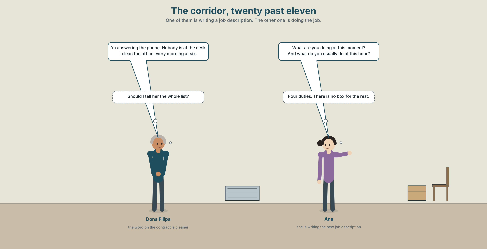
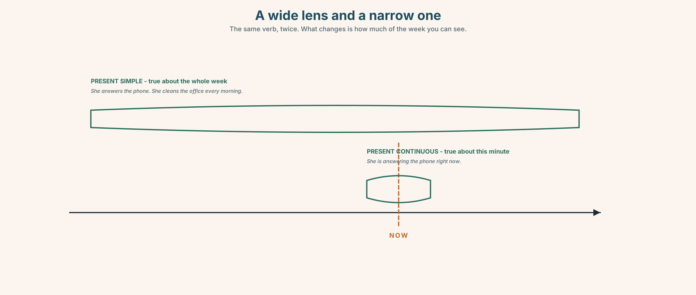
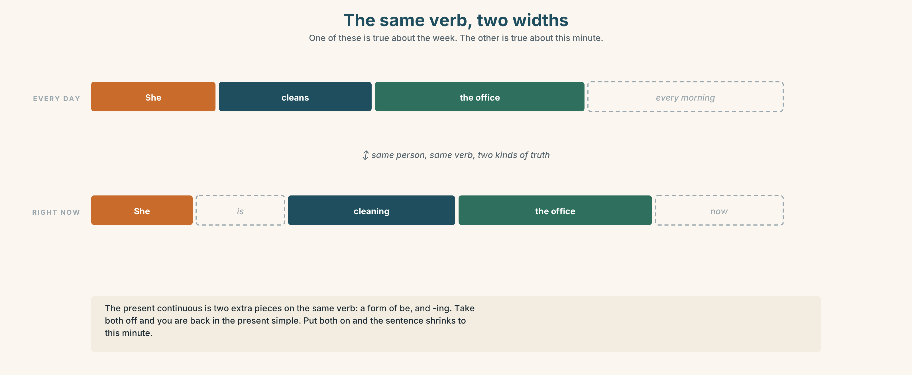
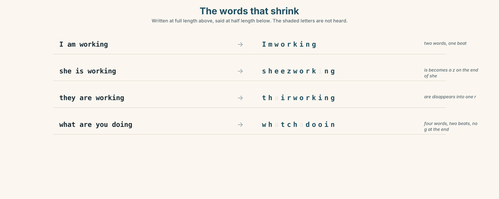
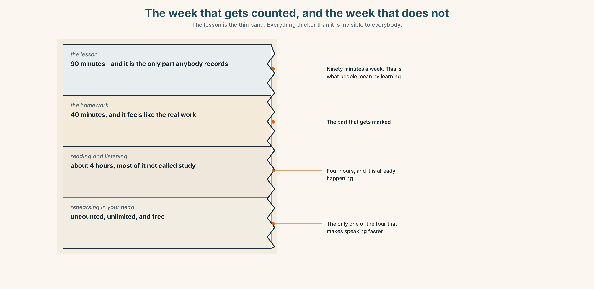
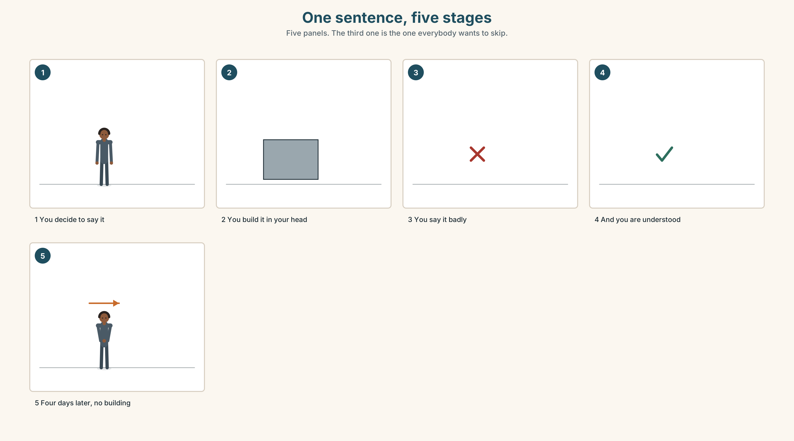
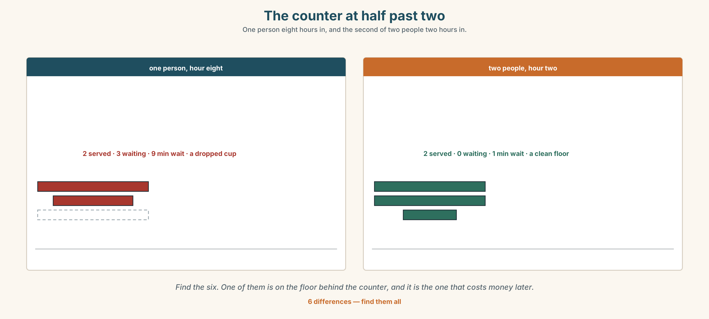

# A1.1 · Unit 8 · What Dona Filipa Actually Does

> **English Animated** · *Starting Out* · Escola Monte, Lisbon
> Student's Book pages 160–181 · 22 pp · ~9 hours

---

## Part 0 · The Big Picture ◆ **A · THE WORLD**

{width=6.6in}

*Four workplaces at twenty past eleven — Fourteen things to find. In every one of them, somebody is doing something that is not in their job title.*

# What is a job, really?

**By the end of this unit you can say what somebody is doing right now, and what they usually do.**

| ◆ **A · THE WORLD** | Four workplaces at the same minute, and what is actually happening in them |
|---|---|
| ◆ **B · THE SYSTEM** | present continuous, against the present simple · 22 words for jobs and workplaces · *a* and *an* with job names · the short forms of *be* · the long *er* sound |
| ◆ **C · THE PERFORMANCE** | You interview somebody about their job and report what they really do |

---

### 0A · Find it — fourteen things

Find these in the picture. Write the number.

> ☐ a kitchen ☐ an office ☐ a hospital ☐ a factory ☐ a uniform ☐ a customer
> ☐ a machine ☐ a phone ☐ a floor ☐ a coffee ☐ a clock ☐ a door ☐ a box ☐ a chair

**Three of these words are not in the picture. Which three?**

> a shift · a team · a manager

### 0B · Guess it

Look at the four people in a uniform. **Which of them has the most difficult job?**
Say one thing. You can use these words:

> *work · uniform · customer · clean · phone*

### 0C · Say it ⏺

**Record. Thirty seconds. Do not prepare.**

> **What are you doing right now, and what do you usually do at this hour?**

You will listen to this again on the last page.

---

## Part 1 · Vocabulary Lab 1 ◆ **B · THE SYSTEM**

### 1A · Meet — the job, and the work

{width=6.6in}

*One job title, nine things — The solid lines are in the contract. The dotted ones are not, and they are longer.*

| | |
|---|---|
| **job** | The word on the contract. |
| **shift** | The hours. Not the same thing as the job. |
| **team** | The people. Also not the same thing as the job. |
| **uniform** | What makes strangers treat you differently. |
| **customer** | The person who decides whether the job was done. |
| **manager** | The person who decides whether it was done well. |

### 1B · Meet — the words

> **job · team · office · factory · kitchen · hospital · school · nurse · driver · waiter · cook · cleaner · engineer · manager · uniform · shift · customer**

Write each word under the right picture.

{width=6.6in}

*One working day, in section — Eleven tasks. Eleven words. The band in the middle is twice as thick as the others.*

### 1C · Sort — a person, or a place?

Put each word in the right box. **Two of them can go in both. Which, and why?**

> hospital · kitchen · cook · nurse · office · factory · cleaner · manager · school ·
> driver

| **A PERSON** | **A PLACE** | **BOTH** |
|---|---|---|
| | | |

### 1D · What people actually do all day

| | |
|---|---|
| **answer the phone** | Eleven times an hour, and none of it is in the job description. |
| **serve customers** | The visible part. About a quarter of the time. |
| **clean the floor** | Twice a day, and everybody notices only when it is not done. |
| **make coffee** | Forty times a morning in a café. Twice a morning in an office, and it is somebody's unpaid job. |
| **fix a machine** | Four minutes, if you know which machine. Forty, if you do not. |
| **look after** | The widest verb on this page. It covers people, machines and buildings. |

**Now say them.** Five of these six have an object after them.
**Which one changes its meaning completely if you take the little word away?**

### 1E · Stretch — the phrases you will need today

> **work in a…** · **start work** · **finish work** · **take a break** · **What do you do?**

Match each phrase to the moment you need it.

1. Somebody at a party asks about your life. → ______
2. You are telling somebody where you spend your mornings. → ______
3. It is twenty past eleven and you have been standing since six. → ______
4. The shift begins. → ______
5. The shift ends, and the shift ending is not the same as the work ending. → ______

### 1F · The hard one

> **f** **I'm on my break.**

Practise it three times. **Four words that stop a conversation politely, and almost nobody at A1
knows them.**

### 1G · Own it

Write down one job you would like and one job you would be good at. Do not write your name.
The class guesses whose card it is. **They are often not the same job.**

---

## Part 2 · Listening ◆ **A · THE WORLD**

{width=6.6in}

*The corridor, twenty past eleven — One of them is writing a job description. The other one is doing the job.*

### 2A · Twenty past eleven 🔊 Track 8.1

**Before you listen.** Ana is writing a new job description for the cleaner.
**Guess: how many things will Dona Filipa say she does?**

**Listen once. One question.** What is Dona Filipa doing at this moment?

**Listen again. Complete the table.**

| | Right now | Usually, at this hour |
|---|---|---|
| Dona Filipa | | |
| Ana | | |
| Marco | | |

**Listen again. True or false?**

1. Dona Filipa is cleaning the floor right now. ☐ T ☐ F
2. She usually answers the phone in the morning. ☐ T ☐ F
3. Ana is writing the job description now. ☐ T ☐ F
4. Dona Filipa works in a hospital as well. ☐ T ☐ F

**Noticing.** Four sentences from the recording.

1. *I'm cleaning the office.*
2. *I clean the office every morning.*
3. *She's answering the phone.*
4. *She answers the phone about eleven times an hour.*

**Two are about right now and two are about every day. How can you tell, in the first two words?**

### 2B · Decoding clinic 🔊 Track 8.2

Twenty seconds of Dona Filipa at speed. Three jobs.

1. Count how many *-ing* verbs you hear.
2. *I'm* and *she's* are very short. How many sounds are in each?
3. She says *work* and *worker* and *working*. Which one has the longest vowel?

> Transcripts, page 154.

---

## Part 3 · Grammar Lab 1 ◆ **B · THE SYSTEM**

### Right now, and every day

### 3A · Notice

Look at the four sentences in Part 2 again.

1. Which two words make the *right now* form?
2. What is on the end of the verb in those two?
3. In the *every day* sentences, is there a form of *be*?
4. Which pair would you use to describe a photograph?

### 3B · See

{width=6.6in}

*A wide lens and a narrow one — The same verb, twice. What changes is how much of the week you can see.*

### 3C · Know

| | | |
|---|---|---|
| **right now** | am / is / are + **-ing** | *I'm cleaning the office. She's answering the phone.* |
| **every day** | the plain verb (+ **s**) | *I clean the office every morning. She answers the phone.* |
| **negative** | am not / isn't / aren't + **-ing** | *He isn't working today.* |
| **question** | *be* to the front | *What are you doing? Is she working?* |

> **Two tenses, two kinds of truth.** *She answers the phone* is true about her job. *She's
> answering the phone* is true about this second. Both can be true at once, and both can be false
> at once.

{width=6.6in}

*The same verb, two widths — One of these is true about the week. The other is true about this minute.*

| | |
|---|---|
| **a / an with jobs** | *She's a nurse. He's an engineer. I'm a cleaner.* |
| **never without it** | *She's nurse* is not English. Every job takes *a* or *an*. |
| **an before a vowel sound** | *an engineer · an artist · an office worker* |

> **Why it matters.** This is how you describe a photograph, a video, a street, a room, or
> anything at all that is happening while you are speaking.

### 3D · Use — controlled

Complete with the present simple or the present continuous.

> Dona Filipa (1) ______ (clean) the office every morning. Right now she (2) ______ (answer)
> the phone, because Ana is not at the desk.
> Marco (3) ______ (make) about forty coffees every morning. At this moment he (4) ______ (sit)
> down, and he (5) ______ (not work).
> What (6) ______ you ______ (do)?

### 3E · Use — guided

Change each sentence from *every day* to *right now*.

1. She cleans the floor.
2. He makes coffee.
3. They serve customers.
4. I answer the phone.
5. We fix the machine.

### 3F · Use — open

**In pairs.** Describe a photograph on your phone without showing it. Your partner asks five
questions. **Every question must be in the present continuous.**

### 3G · Check — six items, mark your own

> 1. She ______ (clean) the office at this moment.
> 2. He ______ (start) work at six every day.
> 3. They ______ (not work) today.
> 4. What ______ you ______ (do) right now?
> 5. ✗ *She is nurse.* → correct it.
> 6. ✗ *I am work at the moment.* → correct it.

{width=6.6in}

*The job name standing bare — The job name standing bare*

**0–3 →** Workbook pp. 32–35. **4–5 →** Part 6. **6 →** page 178.

---

## Part 4 · Speaking ◆ **C · THE PERFORMANCE**

### 4A · Fluency starter — what am I doing?

One person mimes. The class asks *Are you…?* questions. **Only present continuous questions are
allowed, and only ten of them.**

### 4B · The functional core — talking about work

{width=6.6in}

*The same job, described twice — On the left, the contract. On the right, one hour of a Tuesday morning.*

**Language Bank**

| | |
|---|---|
| **asking** | *What do you do? · Where do you work? · What are you doing now?* |
| **the title** | *I'm a cook. I'm an engineer. I work in a hospital.* |
| **the hours** | *I start work at six. I finish work at three. I'm on my break.* |
| **the reality** | *I usually… but today I'm…* |

**Information gap.** Learner A has four job titles. Learner B has four lists of what those people
actually did yesterday. **Match them, and find the one that cannot be matched.**

### 4C · The performance — the job interview, reversed ⏺

Interview a classmate about a job somebody in their family does. **Three minutes.** You must ask:

> what they do · where they work · what they are doing at this moment, probably ·
> one thing they do that is not in the job title

Report in three sentences. **Record it.**

### 4D · Observer

One person listens for **one thing**: did anybody say a job name without *a* or *an*?

### 4E · Two criteria

> ☐ Did I use both tenses, and for the right kind of truth?
> ☐ Did I find one thing that is not in the job title?

---

## Part 5 · Reading ◆ **A · THE WORLD**

### 5A · Predict

The title is **"Nine things, and four of them are in the contract."**
**Whose job do you think this is?**

### 5B · Read — sixty seconds

---

**Nine things, and four of them are in the contract**

Dona Filipa is a cleaner. That is the word on her contract and it is the word she uses when
somebody asks.

Here is her morning. She opens the building at five. She cleans the three floors. She puts the
chairs back in room 3, which nobody asks her to do. She answers the phone between seven and half
past eight, because there is nobody at the desk. She tells the delivery drivers where to leave
the boxes. She knows which radiator does not work and she has told four managers.

At twenty past eleven she is standing in the corridor answering the phone, and a visitor walks
past her without seeing her, because she is wearing a uniform and the visitor is looking for
somebody in an office.

Four of those nine things are in her contract. The school would stop working on a Tuesday if she
did only those four.

---

### 5C · Answer

1. What is the word on her contract?
2. What time does she open the building?
3. Why does she answer the phone?
4. How many of the nine things are in her contract?
5. **Why does the visitor not see her?**
6. **The last line says the school would stop working. Which of the five extra things do you think matters most, and why?**

### 5D · Vocabulary in context

Guess from the text. Then check.

> the word on her contract · nobody asks her to · without seeing her · looking for somebody · would stop working

### 5E · The counter-text

{width=6.6in}

*The job description, in draft — Four numbered duties, and one line at the bottom that does all the work.*

**Read the job description and answer.**

1. What is the job title?
2. **What hours is the shift, and how many hours is that a week?**
3. How many duties are listed?
4. **What does *and other duties as required* mean, and who decides what they are?**

### 5F · Two texts

The job description lists four duties.
The reading lists nine things she does.

**Which document is more useful to the school, and which is more useful to Dona Filipa?**
Say one sentence.

---

## Part 6 · Vocabulary Lab 2 ◆ **B · THE SYSTEM**

### Job names, and the small word in front

{width=6.6in}

*What do you do? — One person, six answers, at the same party, one hour later each time.*

### 6A · The ones that catch everybody

| | |
|---|---|
| **a doctor** | never *I am doctor* |
| **an engineer** | *an*, because of the sound at the start, not the letter |
| **an artist** | same reason |
| **a nurse** | *a*, because *n* is a consonant sound |

### 6B · Say them

> a doctor · an engineer · an artist · a nurse · a waiter · a cleaner · a manager

### 6C · Chunk

1. I **______ in a** hospital.
2. I **______ work** at six.
3. I **______ work** at three.
4. I need to **take a ______ .**
5. **______ do you do?**
6. I'm **on my ______ .**

### 6D · Contrast Clinic

Six items. Present ***simple*** or present ***continuous***?

1. He ______ coffee at this moment. *(make)*
2. They ______ customers all day on Saturday. *(serve)*
3. Listen — somebody ______ the phone. *(answer)*
4. He ______ coffee about forty times a morning. *(make)*
5. She ______ the floor every evening. *(clean)*
6. Look — she ______ the floor now. *(clean)*

---

## Part 7 · Pronunciation & Fluency Lab ◆ **B · THE SYSTEM**

### The long *er*, and the words that shrink

{width=6.6in}

*The words that shrink — Written at full length above, said at half length below. The shaded letters are not heard.*

### 7A · Hear

> **/ɜː/** long, and the mouth is almost closed: *work · nurse · her · first · shirt*
> **the short forms**: *I'm · she's · he's · they're · we're · isn't · aren't*

### 7B · Say

Say each group three times. Then say this:

> *She's a nurse and she's working.* — two short forms and the long *er*, twice.

### 7C · Make it mean something

Say these two:

> *She is a nurse.* — four words, four beats, and it sounds like a correction
> *She's a nurse.* — three beats, and it sounds like ordinary speech

**The full form is not more polite. It is more emphatic.** Which one would you say to a friend?

### 7D · Fluency 20 ⏺

Twenty seconds: **six things people in this building are doing right now.** Three times, faster.

---

## Part 8 · Writing ◆ **C · THE PERFORMANCE**

### What somebody really does · 40–60 words

### 8A · Read the model

> My aunt is a nurse. She works in a hospital in Porto. `[the title and the place, first]`
>
> She starts work at seven and finishes at seven. Three days, then four days off. `[the hours,
> and the shift pattern, which the title does not tell you]`
>
> She says the job is mostly talking. She answers questions from families all day. `[what it
> actually is]`
>
> Right now she is probably asleep. It is four o'clock in the afternoon. `[one sentence in the
> other tense, at the end]`

**Questions about the writer's choices:**

1. The hours come second, before the work. **Why are the hours that important?**
2. *mostly talking.* **Why is that more informative than a list of duties?**
3. The last sentence is a guess. **Why end with something the writer does not know?**

### 8B · The anti-model

> My aunt is a nurse. She works in a hospital. It is a difficult job. She helps people. She is very tired.

Correct English, and it is every nurse who has ever lived. **Add the hours, one real task, and
one sentence about right now.**

### 8C · Plan

> title and place → hours and pattern → what it actually is → one sentence about now

### 8D · Write — 40 to 60 words
### 8E · Peer review — two things only

> ☐ Is there one sentence in the present continuous?
> ☐ Is there one thing in it that is not in the job title?

### 8F · Publish

On the wall, with no names. **The class matches the description to the job title.**

---

## Part 9 · The File ◆ **A · THE WORLD + C · THE PERFORMANCE**

# STUDY FILE · The work that is not on the timetable

{width=6.6in}

*The week that gets counted, and the week that does not — The lesson is the thin band. Everything thicker than it is invisible to everybody.*

### 9A · Four hours, and the one that is visible

{width=6.6in}

*One sentence, five stages — Five panels. The third one is the one everybody wants to skip.*

| | |
|---|---|
| **What is counted** | the ninety minutes in the room |
| **What is not counted** | rehearsing a sentence on the stairs |
| **What actually builds fluency** | the rehearsal, every time |
| **What it costs** | nothing, and it is already happening |

### 9B · Say it before you need it

The sentence you will need tomorrow can be built today, while you are walking.
**Choose one sentence you will have to say this week. Build it now, out loud, three times.**

### 9C · Role play — the job you do not have

In pairs. One of you is doing a job you have never done. The other asks what you are doing.
**Three minutes. Everything in the present continuous. Nobody may say *I don't know*.**

### 9D · The invisible hour

Find one hour in your week when your mind is free and your hands are busy.
**That hour is where the rehearsal goes.** Name it.

### 9E · Transfer — before next week

**Rehearse one English sentence out loud every day for seven days, before you need it.**
Bring the seven sentences and say which one you actually used.

---

## Part 10 · Mediation & Interaction ◆ **C · THE PERFORMANCE**

{width=6.6in}

*One Saturday at the cafe — The busiest two hours are not the two hours with the most money in them.*

### 10A · Relay

Half the class has the job description. Half has the nine things.
**Rebuild the real job by speaking.** Ten minutes.

### 10B · Simplify — for one person

A new student asks: *What jobs can I do here with my English?*
**Answer in four sentences.** Be honest and be useful.

### 10C · Online

Write **one message** to a classmate: say what you are doing right now and ask what they are
doing. **Two sentences.**

### 10D · Your language

Does your language have a separate form for *right now*?
**Say *I work* and *I am working* in your language.** Is it the same sentence?

---

## Part 11 · The Decision ◆ **C · THE PERFORMANCE**

# Saturday at the café

Marco's café is open eight hours on Saturday. He cannot do eight hours alone any more.

**One person, eight hours.** One wage, one person who learns the job properly, one person who is
exhausted by two.

**Two people, four hours each.** Two wages for the same money, nobody exhausted, and twice as much
training. The handover at twelve is twenty minutes of nobody serving anybody.

**Nobody.** He closes at two. He loses the afternoon, which is a third of Saturday's money and
the only part he enjoys.

### 11A · The evidence

{width=6.6in}

*The counter at half past two — One person eight hours in, and the second of two people two hours in.*

🔊 **Track 8.6.** Marco, 20 seconds: *"Eight hours is not the problem. Hour seven is the problem.
In hour seven I am still working and I am not working well, and the customer can see it."*

### 11B · Talk about it

In threes. Use the frame. Everybody says one.

> *I think Marco should ______ , because ______ .*

**Words you can use:** *job · shift · customer · break · work · team · uniform*

### 11C · Decide

Write **two sentences**. Choose, and say why.

> I think Marco should ______________________ ,
> because ______________________ .

### 11D · Model decision

> Two people, with the handover at eleven and not at twelve. The twenty minutes of nobody serving
> is the whole argument against two people, and it disappears if you move it to the quietest hour
> instead of the busiest one.

### 11E · The Reveal

> **What happened.** Marco hired two people and moved the handover to eleven. The twenty minutes
> cost him almost nothing, because at eleven there are four customers and at twelve there are
> twenty-six.
>
> Then something he did not expect: the two of them overlapped for twenty minutes every week, and
> they started telling each other things about the customers. By March they knew more about his
> regulars than he did.

**One question. You do not have to answer it out loud.**

> Marco was buying hours. What did the twenty minutes of overlap turn out to be worth?

---

## Part 12 · Landing ◆ **all three lines**

### 12A · Recycle — twelve items

> 1. She ______ (clean) the office at this moment.
> 2. He ______ (start) work at six every day.
> 3. They ______ (not work) today.
> 4. She's ______ nurse.
> 5. He's ______ engineer.
> 6. I ______ in a hospital. *(the phrase for where you spend your working hours)*
> 7. I need to take a ______ .
> 8. What ______ you ______ ? *(the question about a job)*
> 9. I'm on my ______ .
> 10. Somebody has to ______ the phone.
> 11. *(Unit 7)* I love ______ (cook).
> 12. *(Unit 6)* How ______ coffees do you make?

### 12B · Consolidate — one task, everything in it

**Write six sentences about one person's working day.** Four in the present simple, two in the
present continuous, one job name with *a* or *an*, and one thing that is not in the job title.

### 12C · Can-do, with evidence

> ☐ I can say what somebody is doing now. **Evidence:** 4C, 8D
> ☐ I can choose between the two present tenses. **Evidence:** 3G, 6D
> ☐ I can name a job correctly with *a* or *an*. **Evidence:** 6B
> ☐ I can use the short forms of *be*. **Evidence:** 7C

### 12D · Replay ⏺

Record 0C again. **Listen to both.** What is different?

### 12E · Glossary — thirty-five words, as a map

> **THE PEOPLE** · nurse · driver · waiter · cook · cleaner · engineer · manager · customer
> **THE PLACES** · office · factory · kitchen · hospital · school
> **THE WORDS AROUND IT** · job · team · uniform · shift
> **WHAT YOU SAY** · work in a… · start work · finish work · take a break · What do you do? · I'm on my break.
> **WITH A OR AN** · a doctor · an engineer · an artist · a nurse
> **WHAT PEOPLE DO** · answer the phone · serve customers · clean the floor · make coffee · fix a machine · look after · come in · go out

### 12F · Next

> **Unit 9 · How do you find your way?**
