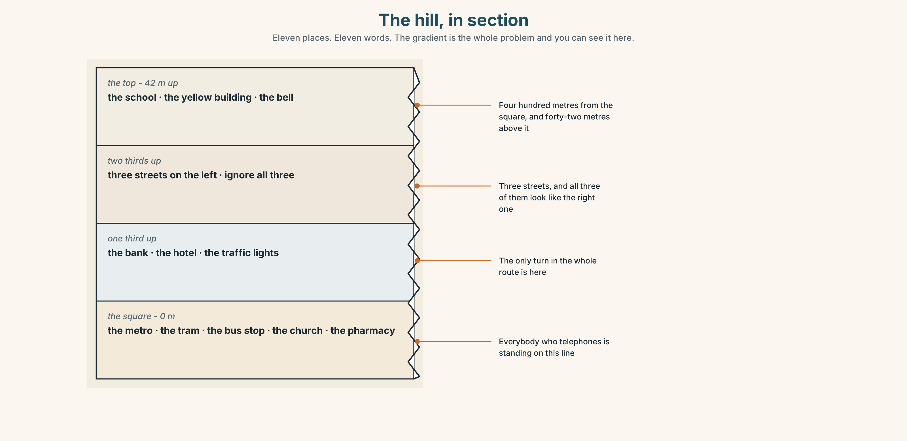
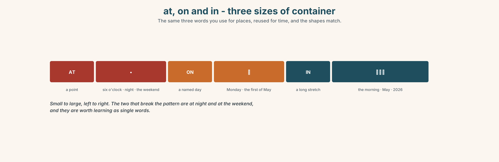
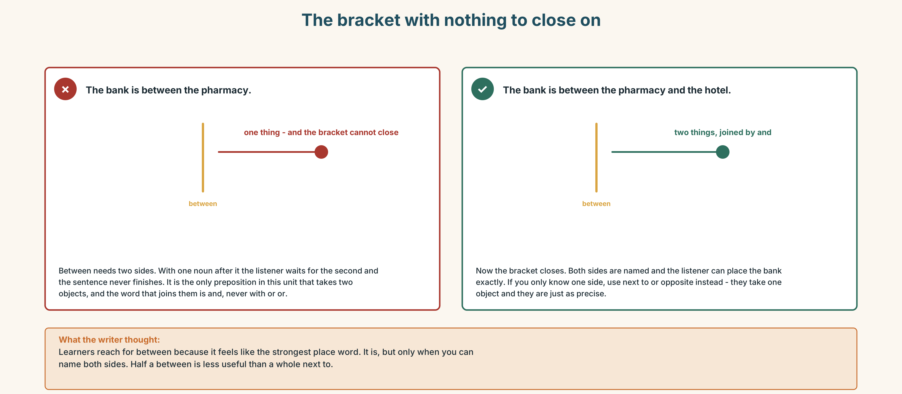
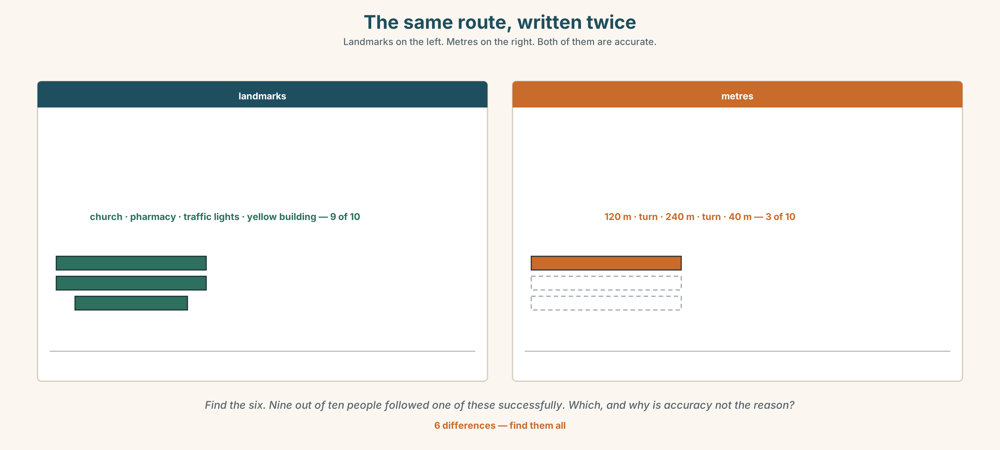
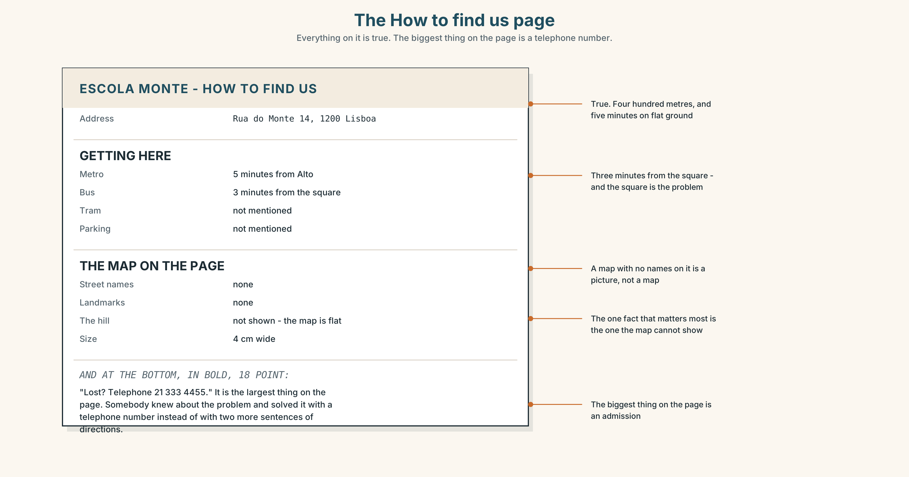
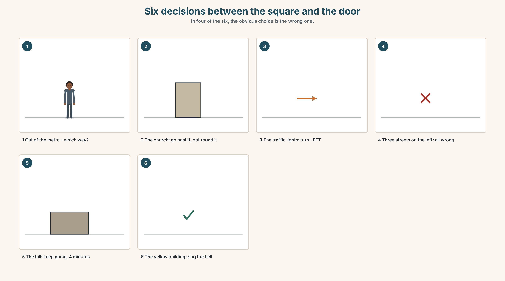
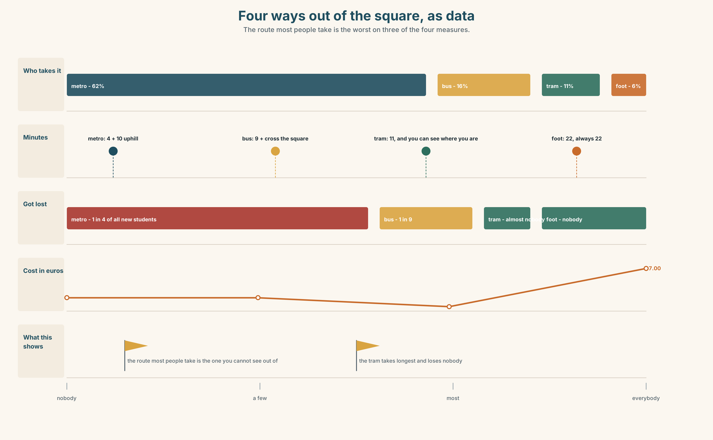

# A1.1 · Unit 9 · Five Minutes from the Metro

> **English Animated** · *Starting Out* · Escola Monte, Lisbon
> Student's Book pages 182–203 · 22 pp · ~9 hours

---

## Part 0 · The Big Picture ◆ **A · THE WORLD**

{width=6.6in}

*The square at the bottom of the hill, half past eight — Fourteen things to find. There are four ways out of this square and three of them look the same.*

# How do you find your way?

**By the end of this unit you can give directions that somebody can actually follow.**

| ◆ **A · THE WORLD** | A square with four ways out of it and one person turning round in the middle |
|---|---|
| ◆ **B · THE SYSTEM** | prepositions of place and movement · the imperative · 22 words for the city · *on*, *in* and *at* for time · where the stress goes in a compound word |
| ◆ **C · THE PERFORMANCE** | You direct somebody who cannot see what you can see |

---

### 0A · Find it — fourteen things

Find these in the picture. Write the number.

> ☐ a street ☐ a square ☐ a corner ☐ a station ☐ a church ☐ a bank ☐ a hotel
> ☐ a pharmacy ☐ a hill ☐ a bus stop ☐ traffic lights ☐ a tram ☐ a taxi ☐ a bridge

**Three of these words are not in the picture. Which three?**

> a museum · a library · a train

### 0B · Guess it

Look at the person in the middle. **Which way are they going to go?**
Say one thing. You can use these words:

> *left · right · up · hill · corner*

### 0C · Say it ⏺

**Record. Thirty seconds. Do not prepare.**

> **How do you get from your home to this building?**

You will listen to this again on the last page.

---

## Part 1 · Vocabulary Lab 1 ◆ **B · THE SYSTEM**

### 1A · Meet — the square and the ways out

{width=6.6in}

*Four ways out of one square — Every line has a time and a cost on it. Two of them take the same time and only one is flat.*

| | |
|---|---|
| **metro** | Four minutes underground, and you arrive with no idea which way you are facing. |
| **tram** | Eleven minutes, and you can see where you are the whole way. |
| **bus** | Nine minutes, and it stops on the wrong side of the square. |
| **on foot** | Twenty-two minutes, and it is the only one that is always the same length. |
| **taxi** | Six minutes, and it cannot get up the hill. |

### 1B · Meet — the words

> **street · square · corner · bridge · station · church · museum · library · bank · hotel · pharmacy · hill**

Write each word under the right picture.

{width=6.6in}

*The hill, in section — Eleven places. Eleven words. The gradient is the whole problem and you can see it here.*

### 1C · Sort — a place, or a direction?

Put each word in the right box. **Two of them can go in both. Which, and why?**

> hill · left · right · station · behind · square · between · church · opposite · corner

| **A PLACE** | **A DIRECTION** | **BOTH** |
|---|---|---|
| | | |

### 1D · Where exactly

| | |
|---|---|
| **next to** | touching, or nearly |
| **opposite** | across something — a street, a square, a room |
| **behind** | you cannot see it from here |
| **between** | two things, one on each side, and you have to name both |
| **in front of** | not the same as *before*. *Before* is time |
| **on the corner** | the building that two streets share |

**Now say them.** One of these six needs two nouns after it and the others need one.
**Which one, and what happens if you only give it one?**

### 1E · Stretch — the phrases you will need today

> **bus stop** · **traffic lights** · **straight on** · **get on** · **get off**

Match each phrase to the moment you need it.

1. The driver opens the doors and you are at your stop. → ______
2. You are telling somebody not to turn. → ______
3. You are waiting, and there is a shelter and a number on a pole. → ______
4. You are telling somebody where to turn, and there is a red light there. → ______
5. The doors open and you are not at your stop yet. → ______

### 1F · The hard one

> **f** **It's about ten minutes.**

Practise it three times. **The most useful lie in any language, and nobody minds it.**

### 1G · Own it

Write directions from this room to the nearest place where you can buy water, in **three
sentences**. Do not write your name. The class decides whose directions would work.

---

## Part 2 · Listening ◆ **A · THE WORLD**

{width=6.6in}

*In the square, twenty to nine — She has the address. He has the directions. Neither has what the other needs.*

### 2A · In the square 🔊 Track 9.1

**Before you listen.** The school is four hundred metres away and six storeys up.
**Guess: how many turns are there?**

**Listen once. One question.** How long does the man say it takes?

**Listen again. Complete the table.**

| | Turn | Landmark |
|---|---|---|
| first | | |
| second | | |
| third | | |

**Listen again. True or false?**

1. The school is opposite the church. ☐ T ☐ F
2. You go straight on at the traffic lights. ☐ T ☐ F
3. The school is next to a pharmacy. ☐ T ☐ F
4. It takes about ten minutes. ☐ T ☐ F

**Noticing.** Four sentences from the recording.

1. *Go straight on.*
2. *Turn left at the traffic lights.*
3. *It's opposite the church.*
4. *Don't go up the hill.*

**Sentences 1, 2 and 4 have no *you* in them. Why not, and what are they?**

### 2B · Decoding clinic 🔊 Track 9.2

Twenty seconds of the man at speed. Three jobs.

1. Count the directions he gives.
2. In *bus stop* and *traffic lights*, which word is louder — the first or the second?
3. He says one landmark twice. Which, and why do you think he repeats it?

> Transcripts, page 155.

---

## Part 3 · Grammar Lab 1 ◆ **B · THE SYSTEM**

### Telling somebody where, and telling them to go

### 3A · Notice

Look at the four sentences in Part 2 again.

1. What is the first word in sentences 1, 2 and 4?
2. Is there a subject in those three?
3. How do you make the negative one?
4. In sentence 3, is *opposite* about where something is, or about going somewhere?

### 3B · See

{width=6.6in}

*Words that sit still, and words that move — Place words put a dot on the map. Movement words draw a line across it.*

### 3C · Know

| | | |
|---|---|---|
| **where it is** | *next to · opposite · behind · between … and … · in front of · on the corner* | *The school is opposite the church.* |
| **where you go** | *up · down · along · across · into · out of · past* | *Go up the hill. Walk past the bank.* |
| **the imperative** | the plain verb, and no subject | *Go straight on. Turn left. Take the second street.* |
| **the negative imperative** | *don't* + the plain verb | *Don't go up the hill. Don't turn at the first corner.* |

> **The imperative is not rude.** In directions, in recipes and on signs, it is the normal and
> polite form. The rudeness, when there is any, is in the voice, not in the grammar.

{width=6.6in}

*at, on and in - three sizes of container — The same three words you use for places, reused for time, and the shapes match.*

| | |
|---|---|
| **at** | a point: *at six o'clock · at night · at the weekend* |
| **on** | a named day: *on Monday · on the first of May* |
| **in** | a long stretch: *in the morning · in May · in 2026* |

> **Why it matters.** Directions are the first thing you give a stranger and the first thing a
> stranger gives you, and both of you are in a hurry.

### 3D · Use — controlled

Complete with **on**, **in**, **at**, **opposite**, **next to** or **between**.

> The school is (1) ______ the church, across the square. The pharmacy is (2) ______ the bank —
> there is one on each side of it.
> Come (3) ______ Monday, (4) ______ the morning. The class starts (5) ______ nine o'clock.
> The bus stop is (6) ______ the hotel, almost touching it.

### 3E · Use — guided

Make each one an instruction, then make it negative.

1. You turn left at the traffic lights.
2. You go straight on.
3. You take the second street.
4. You get off at the square.
5. You walk up the hill.

### 3F · Use — open

**In pairs, back to back.** One of you has a map. The other has the same map with four things
missing. **Fill the gaps by speaking only.**

### 3G · Check — six items, mark your own

> 1. ______ left at the traffic lights. *(the instruction)*
> 2. ______ go up the hill. *(the negative instruction)*
> 3. The school is ______ the church, across the square.
> 4. Come ______ Monday, ______ the morning. *(two words)*
> 5. ✗ *You turn left at the lights.* → make it an instruction.
> 6. ✗ *The bank is between the pharmacy.* → correct it.

{width=6.6in}

*The bracket with nothing to close on — The bracket with nothing to close on*

**0–3 →** Workbook pp. 36–39. **4–5 →** Part 6. **6 →** page 200.

---

## Part 4 · Speaking ◆ **C · THE PERFORMANCE**

### 4A · Fluency starter — the blind route

One person closes their eyes. The class directs them from their chair to the door.
**One instruction per person. Nobody may touch them.**

### 4B · The functional core — giving directions

{width=6.6in}

*The same route, written twice — Landmarks on the left. Metres on the right. Both of them are accurate.*

**Language Bank**

| | |
|---|---|
| **the instruction** | *Go straight on. Turn left. Take the second street. Walk past the bank.* |
| **the landmark** | *at the traffic lights · opposite the church · on the corner · next to the pharmacy* |
| **the transport** | *get on at the square · get off at the second stop · by bus · on foot* |
| **the time** | *It's about ten minutes.* |

**Information gap.** Learner A has the route from the metro. Learner B has the route from the
tram. **Find the one place where the two routes meet.**

### 4C · The performance — direct somebody who cannot see ⏺

Your partner closes their eyes and you direct them from the square to the school. **Two minutes.**
You must:

> use three landmarks · give one negative instruction · say how long it takes · warn them about
> one thing before they reach it

**Record it.**

### 4D · Observer

One person listens for **one thing**: did the speaker ever say *left* or *right* without a
landmark?

### 4E · Two criteria

> ☐ Did every turn have something you can see attached to it?
> ☐ Did I say the hard part before it happened, not after?

---

## Part 5 · Reading ◆ **A · THE WORLD**

### 5A · Predict

The title is **"One in four never arrives."**
**What do you think goes wrong?**

### 5B · Read — sixty seconds

---

**One in four never arrives**

The school's website says: *Escola Monte. Five minutes from Alto metro station.*

That is true. It is four hundred metres. Four hundred metres on flat ground is five minutes.

The four hundred metres are up a hill with a gradient of one in eight, and there are four ways out
of the square at the bottom, and three of them look the same.

Last September, twenty-eight people came for the first lesson of the beginners' course. Ana booked
thirty-seven. Seven of the nine who did not come telephoned, and six of those seven telephoned
from somewhere in the square.

Ana walked down to the square and brought them up, one at a time, over forty minutes. She did it
again in January. Nobody has changed the website.

---

### 5C · Answer

1. How far is the school from the metro?
2. How many ways out of the square are there?
3. How many people came in September?
4. How many of the missing seven telephoned from the square?
5. **Why is the website not wrong, and why is it still the problem?**
6. **Ana solved it twice by walking down. Why is that not a solution?**

### 5D · Vocabulary in context

Guess from the text. Then check.

> flat ground · a gradient of one in eight · look the same · one at a time · nobody has changed it

### 5E · The counter-text

{width=6.6in}

*The How to find us page — Everything on it is true. The biggest thing on the page is a telephone number.*

**Read the page and answer.**

1. What is the address?
2. **How many minutes does it say from the metro, and from the bus stop?**
3. What is missing from the map?
4. **Why is the telephone number the biggest thing on the page, and what does that tell you?**

### 5F · Two texts

The website says five minutes.
The reading says one in four never arrives.

**Which number should the school change?** Say one sentence.

---

## Part 6 · Vocabulary Lab 2 ◆ **B · THE SYSTEM**

### Getting there

{width=6.6in}

*Six decisions between the square and the door — In four of the six, the obvious choice is the wrong one.*

### 6A · The ones that catch everybody

| | |
|---|---|
| **get on / get off** | for buses, trams, trains and the metro |
| **by bus / on foot** | *by* for vehicles, and *on foot* is the odd one out |
| **in the morning / at night** | the one pair that does not follow the shape |
| **on Monday** | never *in Monday* |

### 6B · Say them

> bus · tram · train · metro · taxi · on foot · by bus · get on · get off

### 6C · Chunk

1. **______ Monday** — a named day
2. **______ the morning** — a long stretch
3. **______ six o'clock** — a point
4. **______ foot** — the one that is not *by*
5. **______ bus** — a vehicle
6. **get ______** — the doors open and you are there

### 6D · Contrast Clinic

Six items. ***on***, ***in*** or ***at***?

1. ______ the first of May
2. ______ six o'clock
3. ______ Monday
4. ______ the weekend
5. ______ the morning
6. ______ night

---

## Part 7 · Pronunciation & Fluency Lab ◆ **B · THE SYSTEM**

### Two words, one stress

{width=6.6in}

*Two words, one stress — In a compound the first word is louder. In an ordinary phrase it is the second.*

### 7A · Hear

> **compounds — the FIRST word is louder**: *BUS stop · TRAFfic lights · POST office · RAILway station*
> **phrases — the SECOND word is louder**: *a big STREET · the next CORner · a long HILL*

### 7B · Say

Say each group three times. Then say this:

> *The BUS stop is on a big STREET.* — one compound, one phrase, opposite stresses.

### 7C · Make it mean something

Say these two:

> *a GREENhouse* — a glass building for plants
> *a green HOUSE* — a house that is green

**Same four syllables. The stress is the only difference, and it changes the thing.** Which is
which?

### 7D · Fluency 20 ⏺

Twenty seconds: **direct somebody from this room to the street, in six instructions.**
Three times, faster.

---

## Part 8 · Writing ◆ **C · THE PERFORMANCE**

### Directions somebody can follow · 40–60 words

### 8A · Read the model

> **From Alto metro.** Come out and turn right. `[where you start, and the first move]`
>
> You will see a church and a pharmacy. Walk between them, up the hill. It is steep. `[the
> landmark, the move, and the warning before it happens]`
>
> Walk for four minutes. Don't turn. There are three streets on the left — ignore all three.
> `[the part where people get it wrong, said in advance]`
>
> We are the yellow building on the right. Ring the bell. `[what you will see, and what to do]`

**Questions about the writer's choices:**

1. *It is steep.* **Why is that in the directions at all?**
2. *ignore all three.* **Why name the wrong turnings instead of only the right one?**
3. The last line says *ring the bell.* **Why does that matter?**

### 8B · The anti-model

> We are at number 14, Rua do Monte, 1200 Lisbon. Five minutes from Alto metro station. Telephone 21 333 4455.

Correct English, true, and one in four people never arrive. **Rewrite it with two landmarks, one
warning and one instruction about what to do when you get there.**

### 8C · Plan

> where you start → landmark and move → the wrong turnings, named → what you will see, and what
> to do

### 8D · Write — 40 to 60 words
### 8E · Peer review — two things only

> ☐ Is there a landmark attached to every turn?
> ☐ Is there one warning about something before it happens?

### 8F · Publish

Swap with someone who does not know your route. **They follow it on a map and mark where they
got lost.**

---

## Part 9 · The File ◆ **A · THE WORLD + C · THE PERFORMANCE**

# STUDY FILE · Knowing where you are

{width=6.6in}

*The course is the same hill — Four false turnings off the route, and all four of them feel like progress.*

### 9A · Four turnings

{width=6.6in}

*Twelve weeks, five panels — The fourth panel is a decision. The fifth is what happens if you do not make it.*

| | |
|---|---|
| **The flat part** | the first six weeks. Everything is new and everything sticks |
| **The hill** | weeks seven to twenty. The same effort, and it feels like nothing |
| **What people do** | change method, because the hill feels like a wrong turning |
| **What the hill is** | the normal shape of learning anything |

### 9B · A landmark, not a feeling

You cannot feel progress at A1, because the thing you measure with is the thing that is changing.
**Pick a landmark instead.** Record yourself today. Record the same thirty seconds in eight weeks.

### 9C · Role play — directing a beginner

In pairs. One of you started three months after the other. **Give them directions through the next
three months.** Use the imperative. Name one wrong turning.

### 9D · Where are you, exactly?

Not *good* or *bad*. **Name one thing you could not do in September and can do now.** That is
your position. It is the only honest one.

### 9E · Transfer — before next week

**Record thirty seconds answering the question from 0C. Label it with today's date and put it
somewhere you will not lose it.** You will listen to it in Unit 10 of the next book.

---

## Part 10 · Mediation & Interaction ◆ **C · THE PERFORMANCE**

{width=6.6in}

*Four ways out of the square, as data — The route most people take is the worst on three of the four measures.*

### 10A · Relay

Half the class has the route from the metro. Half has the route from the tram.
**Build one set of directions that works from both, by speaking.** Ten minutes.

### 10B · Simplify — for one person

A visitor telephones from the square and says: *I can see a church.*
**Direct them in three sentences.** You cannot see what they see.

### 10C · Online

Write **one message** giving a classmate directions to a place near here.
**Two sentences.** One must contain a warning.

### 10D · Your language

Does your language say *left* and *right*, or does it use north and south, or uphill and downhill?
**Give directions from the square to the school in your language.** What do you use?

---

## Part 11 · The Decision ◆ **C · THE PERFORMANCE**

# Five minutes from the metro

One in four new students does not arrive at the first lesson. Six out of seven of those who
telephone are standing in the square at the bottom of the hill.

**Option one:** rewrite the website. Two landmarks, one warning about the hill, and the three
streets to ignore. Free, and it takes twenty minutes.

**Option two:** put a sign in the square. The city charges one hundred and forty euros a year for
a sign on a pole, and it has to be approved.

**Option three:** meet every new student at the metro for the first week of each term. It works
perfectly, it costs Ana four hours a term, and it stops the moment she is busy.

### 11A · The evidence

{width=6.6in}

*The square at ten to nine in September — The same nine people, drawn twice. One pole is different.*

🔊 **Track 9.6.** A new student, 20 seconds: *"I was in the square for twenty minutes. I had the
address. I had the map on my phone. The map says you are here, and I was here. I didn't know which
street."*

### 11B · Talk about it

In threes. Use the frame. Everybody says one.

> *I think the school should ______ , because ______ .*

**Words you can use:** *street · square · corner · hill · sign · metro · bus stop*

### 11C · Decide

Write **two sentences**. Choose, and say why.

> I think the school should ______________________ ,
> because ______________________ .

### 11D · Model decision

> Rewrite the website, and name the three streets you should not take. The sign and the walking
> both fix the square. The website is where the student is standing two weeks before they are ever
> in the square, and it is the only one of the three that is free.

### 11E · The Reveal

> **What happened.** Ana rewrote the page. She added two landmarks, one line that said *it is a
> steep hill, allow ten minutes*, and the sentence *there are three streets on the left — ignore
> all three*. In January, twenty-six of twenty-seven arrived.
>
> Then something she did not expect: the students who arrived were less nervous than previous
> years, not only less lost. The line about the hill had told them that the school knew what the
> walk was like.

**One question. You do not have to answer it out loud.**

> Twenty minutes of writing fixed something two hundred euros could not. What was actually broken?

---

## Part 12 · Landing ◆ **all three lines**

### 12A · Recycle — twelve items

> 1. ______ left at the traffic lights. *(the instruction)*
> 2. ______ go up the hill. *(the negative instruction)*
> 3. The school is ______ the church, across the square.
> 4. The pharmacy is ______ the bank and the hotel. *(two things, one on each side)*
> 5. ______ Monday
> 6. ______ the morning
> 7. ______ six o'clock
> 8. ______ foot
> 9. ______ bus
> 10. Where do I ______ ______ ? *(two words — the doors open and you leave)*
> 11. *(Unit 8)* She's ______ engineer.
> 12. *(Unit 7)* I ______ go to concerts. *(almost never, two words)*

### 12B · Consolidate — one task, everything in it

**Write directions from the nearest station to your home, in six sentences.** Three must be
instructions, one must be negative, two must contain a landmark, and one must say how long it
takes.

### 12C · Can-do, with evidence

> ☐ I can give directions somebody can follow. **Evidence:** 4C, 8D
> ☐ I can say where something is. **Evidence:** 3G
> ☐ I can use *on*, *in* and *at* for time. **Evidence:** 6D
> ☐ I can stress a compound word correctly. **Evidence:** 7C

### 12D · Replay ⏺

Record 0C again. **Listen to both.** What is different?

### 12E · Glossary — thirty-five words, as a map

> **THE PLACES** · street · square · corner · bridge · station · church · museum · library · bank · hotel · pharmacy · hill
> **WHERE** · left · right · opposite · behind · between · next to · in front of
> **WHAT YOU SAY** · bus stop · traffic lights · straight on
> **HOW YOU GET THERE** · bus · tram · train · metro · taxi · on foot · by bus · get on · get off
> **WHEN** · on Monday · in the morning · at six o'clock
> **HOW LONG** · It's about ten minutes.

### 12F · Next

> **Unit 10 · What is this worth?**
