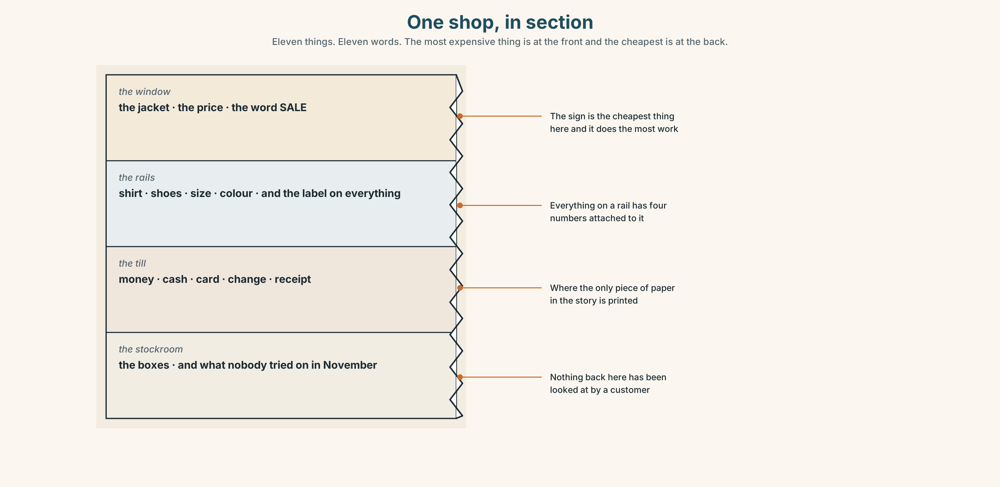
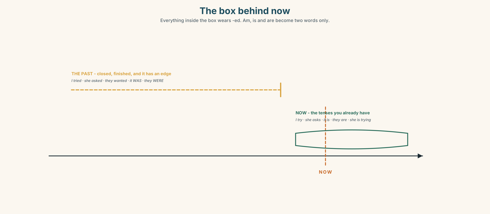
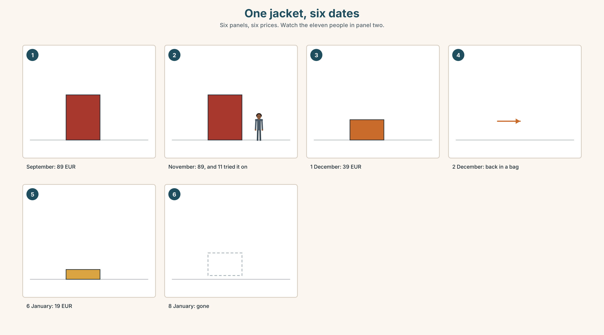
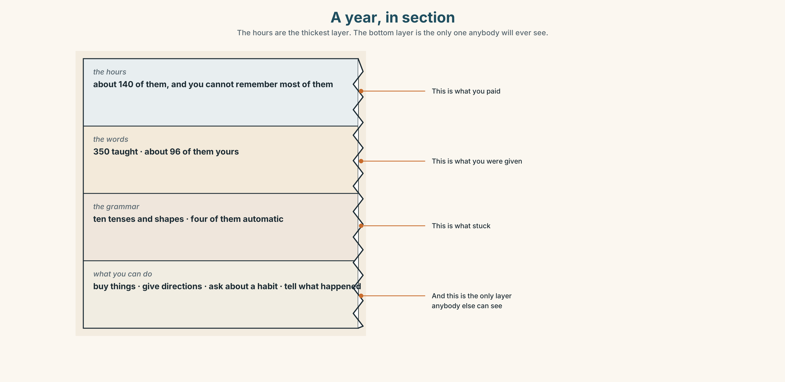
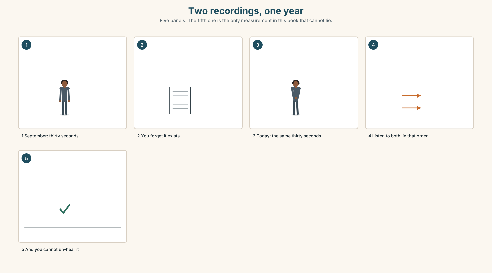
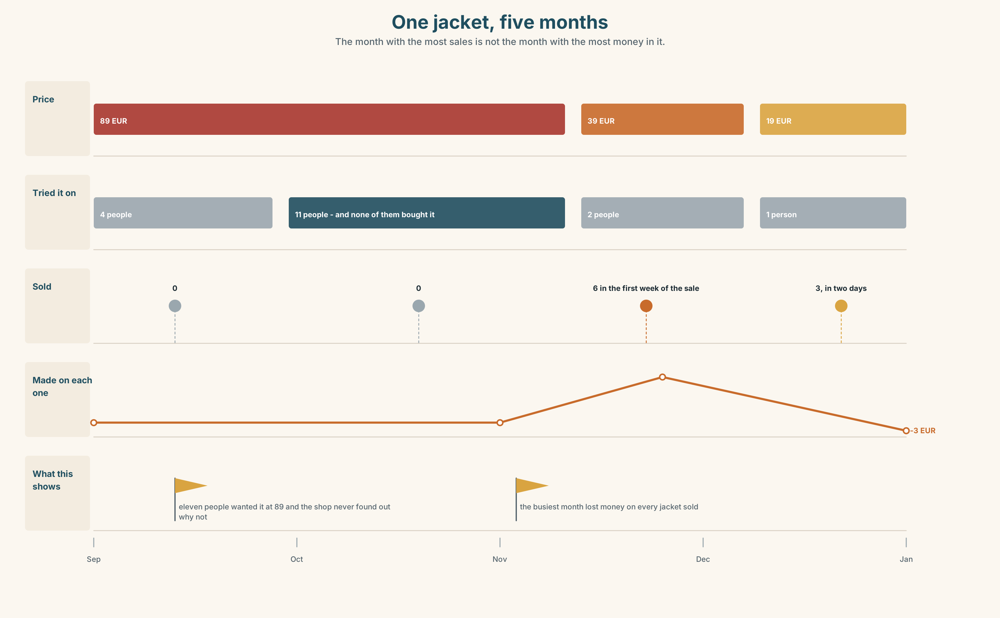
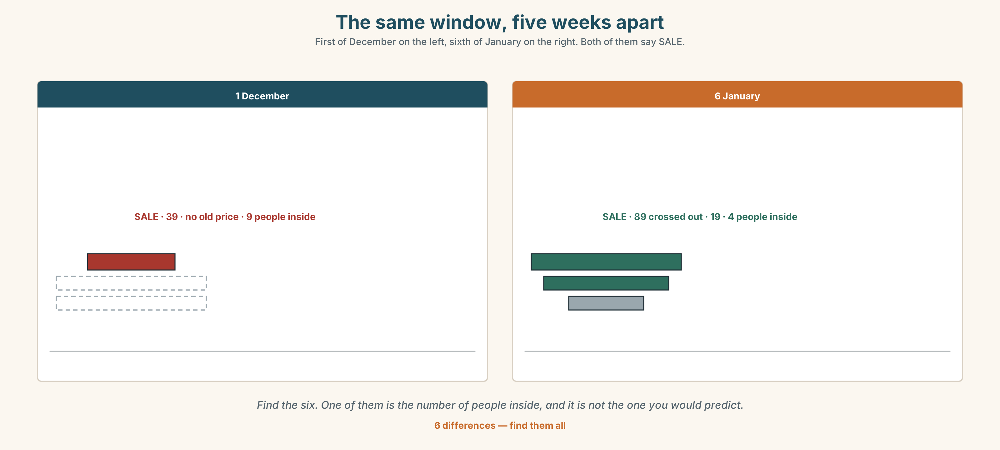

# A1.1 · Unit 10 · Thirty-Nine Euros

> **English Animated** · *Starting Out* · Escola Monte, Lisbon
> Student's Book pages 204–225 · 22 pp · ~9 hours

---

## Part 0 · The Big Picture ◆ **A · THE WORLD**

{width=6.6in}

*The shopping street, first of December, ten past five — Fourteen things to find. Three of the four sale signs give the old price. One does not.*

# What is this worth?

**By the end of this unit you can say what you bought, when, and what happened.**

| ◆ **A · THE WORLD** | A shopping street in December, where the price on the sign is not the price |
|---|---|
| ◆ **B · THE SYSTEM** | *was* and *were* · the past simple of regular verbs · 22 words for money and shopping · ordinals and dates · the three sounds of *-ed* |
| ◆ **C · THE PERFORMANCE** | You report something you bought and what went wrong with it |

---

### 0A · Find it — fourteen things

Find these in the picture. Write the number.

> ☐ money ☐ a price ☐ a card ☐ cash ☐ a receipt ☐ a sale ☐ a jacket
> ☐ a shirt ☐ shoes ☐ a bag ☐ a queue ☐ a till ☐ a window ☐ a door

**Three of these words are not in the picture. Which three?**

> change · a size · a colour

### 0B · Guess it

Look at the four sale signs. **Which shop is the busiest, and why?**
Say one thing. You can use these words:

> *price · cheap · expensive · sale · buy*

### 0C · Say it ⏺

**Record. Thirty seconds. Do not prepare.**

> **What is the last thing you bought, and was it worth it?**

You will listen to this again on the last page.

---

## Part 1 · Vocabulary Lab 1 ◆ **B · THE SYSTEM**

### 1A · Meet — one jacket, four prices

{width=6.6in}

*One jacket, five numbers — Four of the five are known. The fifth is the only one that decides anything.*

| | |
|---|---|
| **price** | The number on the label. It changes four times a year. |
| **cost** | What it cost somebody to make. Nobody in the shop knows it. |
| **sale** | A different price, with a date on it. |
| **change** | What comes back if you pay in cash. |
| **receipt** | The only proof that any of this happened. |
| **card** | No change, no receipt unless you ask, and a record somewhere else. |

### 1B · Meet — the words

> **money · price · cost · cheap · expensive · change · receipt · card · cash · sale · size · colour · shoes · shirt · jacket**

Write each word under the right picture.

{width=6.6in}

*One shop, in section — Eleven things. Eleven words. The most expensive thing is at the front and the cheapest is at the back.*

### 1C · Sort — the thing, or the money?

Put each word in the right box. **Two of them can go in both. Which, and why?**

> change · cost · cash · colour · price · shirt · size · receipt · shoes · jacket

| **THE THING** | **THE MONEY** | **BOTH** |
|---|---|---|
| | | |

### 1D · What you say in a shop

| | |
|---|---|
| **How much does it cost?** | The full question. Four words of it are almost silent. |
| **pay by card** | *by*, like *by bus*. Not *with card*. |
| **try it on** | And the little word can move: *try the jacket on*. |
| **take back** | What you do with it on the second of December. |
| **pay back** | What the shop may or may not do. |
| **Can I have a receipt?** | Ask before they close the till, not after. |

**Now say them.** Two of these six are about the moment before you buy and two are about the
days afterwards. **Which are which?**

### 1E · Stretch — the phrases you will need today

> **How much does it cost?** · **pay by card** · **try it on** · **take back** · **It's too expensive.**

Match each phrase to the moment you need it.

1. You like it and you have not looked at the label. → ______
2. It is the right colour and you do not know the size. → ______
3. You have no cash and there is a machine on the counter. → ______
4. You have looked at the label. → ______
5. It is the second of December and the bag has not been opened. → ______

### 1F · The hard one

> **f** **It's too expensive.**

Practise it three times. **Three words that end a conversation without offending anybody, and
they work in every shop in the world.**

### 1G · Own it

Write down the last three things you bought and what each one cost. Do not write your name.
The class guesses whose list it is.

---

## Part 2 · Listening ◆ **A · THE WORLD**

{width=6.6in}

*The counter, second of December — She has the jacket and the receipt. The assistant has a rule from Monday.*

### 2A · The second of December 🔊 Track 10.1

**Before you listen.** Lin bought a jacket yesterday in a sale.
**Guess: will she get her money back?**

**Listen once. One question.** How much was the jacket?

**Listen again. Complete the table.**

| | Before the sale | In the sale | What she gets |
|---|---|---|---|
| the jacket | | | |

**Listen again. True or false?**

1. She bought it on the first of December. ☐ T ☐ F
2. She paid by card. ☐ T ☐ F
3. She tried it on in the shop. ☐ T ☐ F
4. The shop gives her the money back. ☐ T ☐ F

**Noticing.** Four sentences from the recording.

1. *I bought it yesterday.*
2. *It was thirty-nine euros.*
3. *They were all half price.*
4. *I tried it on at home.*

**Two of these have *was* or *were*. What decides which one?**

### 2B · Decoding clinic 🔊 Track 10.2

Twenty seconds of the assistant at speed. Three jobs.

1. Count the past verbs you hear.
2. *Tried*, *asked* and *wanted* all end in the same two letters. Do they end in the same sound?
3. She says a date. Write it the way she says it, not the way it is written.

> Transcripts, page 156.

---

## Part 3 · Grammar Lab 1 ◆ **B · THE SYSTEM**

### Yesterday

### 3A · Notice

Look at the four sentences in Part 2 again.

1. Which word is the past of *is*? Which is the past of *are*?
2. In sentence 4, what is on the end of the verb?
3. Is that ending the same for *I*, *he* and *they*?
4. How would you make sentence 4 negative?

### 3B · See

{width=6.6in}

*The box behind now — Everything inside the box wears -ed. Am, is and are become two words only.*

### 3C · Know

| | | |
|---|---|---|
| **was** | I, he, she, it | *It was thirty-nine euros. I was in the shop at five.* |
| **were** | you, we, they | *They were all half price. You were right.* |
| **regular past** | add **-ed**, and it is the same for everybody | *I tried. She asked. They wanted.* |
| **negative** | *didn't* + the plain verb | *I didn't try it on. She didn't ask.* |
| **question** | *did* + the plain verb | *Did you try it on? When did you buy it?* |

> **The -ed goes, exactly like the s did.** Once *did* or *didn't* arrives, the verb loses its
> ending: *Did you tried?* is wrong for the same reason *Does she checks?* was wrong in Unit 3.

{width=6.6in}

*Three odd ones, then a rule — First, second and third have to be learned. Everything after them is the same ending.*

| | |
|---|---|
| **the odd three** | *first · second · third* |
| **then a pattern** | *fourth · fifth · sixth · tenth · twentieth* |
| **the date, said** | *on the first of May · on the twentieth of March* |
| **the months here** | *January · March · July · December* |

> **Why it matters.** Every story you will ever tell is in the past, and this is the half of it
> that follows a rule.

### 3D · Use — controlled

Complete with **was**, **were**, **didn't** or the past of the verb.

> The jacket (1) ______ thirty-nine euros. They (2) ______ all half price on the first of
> December.
> I (3) ______ (try) it on at home. I (4) ______ try it on in the shop.
> (5) ______ you pay by card? — Yes. I (6) ______ (ask) for a receipt.

### 3E · Use — guided

Put each sentence into the past.

1. I pay by card.
2. She tries it on.
3. They are half price.
4. He asks for a receipt.
5. It is too expensive.

### 3F · Use — open

**In pairs.** Tell your partner about something you bought that went wrong.
**Five sentences, all in the past. Your partner asks three questions, all with *did*.**

### 3G · Check — six items, mark your own

> 1. The jacket ______ thirty-nine euros.
> 2. They ______ all half price.
> 3. I ______ (try) it on at home.
> 4. ______ you pay by card?
> 5. ✗ *Did you tried it on?* → correct it.
> 6. ✗ *They was half price.* → correct it.

{width=6.6in}

*The past, marked twice — The past, marked twice*

**0–3 →** Workbook pp. 40–43. **4–5 →** Part 6. **6 →** page 222.

---

## Part 4 · Speaking ◆ **C · THE PERFORMANCE**

### 4A · Fluency starter — yesterday, in a chain

The first person says one thing they did yesterday. The next repeats it and adds theirs.
**Every verb must be regular. Stop when somebody uses an irregular one.**

### 4B · The functional core — reporting a purchase

{width=6.6in}

*The same complaint, twice — One of them begins with the problem. One of them begins with a date.*

**Language Bank**

| | |
|---|---|
| **what happened** | *I bought it on the first of December. It was thirty-nine euros.* |
| **the problem** | *It's the wrong size. It doesn't fit. I tried it on at home.* |
| **what you want** | *Can I take it back? Can you pay me back?* |
| **the paper** | *Can I have a receipt? I paid by card.* |

**Information gap.** Learner A has the shop's returns policy. Learner B has what the assistant
said. **Find the two things the assistant said that are not in the policy.**

### 4C · The performance — the complaint ⏺

Report something you bought that was wrong. **Two minutes.** You must say:

> when you bought it · how much it was · what happened · what you want

Your partner is the shop and must say no once before saying anything else. **Record it.**

### 4D · Observer

One person listens for **one thing**: did the speaker give the date before the problem?

### 4E · Two criteria

> ☐ Were all my verbs in the past?
> ☐ Did I say what I wanted, in one sentence, without being asked?

---

## Part 5 · Reading ◆ **A · THE WORLD**

### 5A · Predict

The title is **"Eighty-nine, thirty-nine, nineteen."**
**What do you think the three numbers are?**

### 5B · Read — sixty seconds

---

**Eighty-nine, thirty-nine, nineteen**

The jacket arrived in the shop in September at eighty-nine euros. Eleven people tried it on.
Nobody bought it.

On the first of December it was thirty-nine euros. Lin bought it in four minutes. She did not try
it on. The sign in the window said SALE and it did not say what the old price was, and she did not
ask.

On the sixth of January it was nineteen euros. The three that were left were sold in two days.

The shop paid twenty-two euros for each one. All three prices made money. The question the shop
asks itself is not whether thirty-nine was fair. It is why eleven people tried it on at
eighty-nine and nobody bought it, because those eleven people are the ones who wanted it.

---

### 5C · Answer

1. How much was the jacket in September?
2. How many people tried it on then?
3. What was the price on the first of December?
4. How much did the shop pay for each jacket?
5. **Why does the writer say all three prices made money?**
6. **The shop is interested in the eleven people. Why those eleven and not Lin?**

### 5D · Vocabulary in context

Guess from the text. Then check.

> arrived in the shop · she did not ask · the three that were left · made money · whether it was fair

### 5E · The counter-text

{width=6.6in}

*The receipt — Everything above the line is about one jacket. Everything below it is about every jacket.*

**Read the receipt and answer.**

1. What is the date on the receipt?
2. **How much did she pay, and how was it paid?**
3. What does the receipt say about returns?
4. **Which of the four lines applies to this jacket, and would Lin have read it before she paid?**

### 5F · Two texts

The window said SALE.
The receipt says *sale items: credit note only*.

**Which of the two did Lin read?** Say one sentence.

---

## Part 6 · Vocabulary Lab 2 ◆ **B · THE SYSTEM**

### Dates, and the three odd numbers

{width=6.6in}

*One jacket, six dates — Six panels, six prices. Watch the eleven people in panel two.*

### 6A · The ones that catch everybody

| | |
|---|---|
| **first, second, third** | three irregular ones, and then the pattern starts |
| **fifth** | the *v* turns into an *f* |
| **twentieth** | the *y* turns into an *ie* |
| **on the first of May** | *on the* … *of* …, and both small words are needed |

### 6B · Say them

> first · second · third · fourth · fifth · tenth · twentieth · January · March · July · December

### 6C · Chunk

1. the **______** of December *(1)*
2. the **______** of January *(2)*
3. the **______** of March *(3)*
4. the **______** of July *(5)*
5. the **______** of May *(20)*
6. **______ your birthday?** *(the question, two words)*

### 6D · Contrast Clinic

Six items. ***was*** or ***were***?

1. They ______ all half price.
2. I ______ in the shop at five.
3. The jacket ______ thirty-nine euros.
4. You ______ right about the size.
5. The three that ______ left sold in two days.
6. It ______ too expensive in September.

---

## Part 7 · Pronunciation & Fluency Lab ◆ **B · THE SYSTEM**

### One ending, three sounds

{width=6.6in}

*One ending, three sounds — All of these are spelled -ed. Only one of the three groups adds a beat to the word.*

### 7A · Hear

> **/t/** after a quiet sound: *asked · looked · stopped · washed*
> **/d/** after a loud sound: *tried · opened · called · arrived*
> **/ɪd/** after *t* or *d*: *wanted · started · needed · decided*

### 7B · Say

Say each group three times. Then say this:

> *I asked, I tried, I waited.* — three endings, one sentence, and they are all spelled the same.

### 7C · Make it mean something

Say these two:

> *I want it.* — two syllables in the verb? No. One.
> *I wanted it.* — and now there are two, because the ending became a syllable.

**Only the third group adds a syllable.** The other two add a sound and no beat. Which group does
*washed* belong to?

### 7D · Fluency 20 ⏺

Twenty seconds: **six things you did yesterday, all regular verbs.** Three times, faster.

---

## Part 8 · Writing ◆ **C · THE PERFORMANCE**

### What I bought · 40–60 words

### 8A · Read the model

> I bought a jacket on the first of December. It was thirty-nine euros. `[the date and the
> number, first]`
>
> The sign said SALE. It didn't say what the old price was. `[the thing that mattered and did
> not look as if it did]`
>
> I didn't try it on. I tried it on at home and it was too small. `[what I did not do, before
> what I did]`
>
> The shop gave me a credit note. I am not angry. I am annoyed with myself. `[what happened, and
> then the honest sentence]`

**Questions about the writer's choices:**

1. The date and the price are in the first two sentences. **Why not the problem?**
2. *It didn't say what the old price was.* **Why is that the most important sentence in the piece?**
3. The last sentence is about the writer, not the shop. **What does it do to the whole thing?**

### 8B · The anti-model

> I bought a jacket. It was cheap. It was too small. The shop was not helpful. I was very angry. It was a bad experience.

Correct English, and it could be any shop and any jacket. **Add a date, two numbers, and one
thing you did wrong.**

### 8C · Plan

> the date and the price → the detail that mattered → what you did not do → what happened,
> and one honest sentence

### 8D · Write — 40 to 60 words
### 8E · Peer review — two things only

> ☐ Is there a date and at least one number?
> ☐ Is every verb in the past?

### 8F · Publish

On the wall, with no names. **The class votes on which shop behaved worst — and then checks
whether the writer actually said so.**

---

## Part 9 · The File ◆ **A · THE WORLD + C · THE PERFORMANCE**

# STUDY FILE · What a year of this was worth

{width=6.6in}

*A year, in section — The hours are the thickest layer. The bottom layer is the only one anybody will ever see.*

### 9A · The September recording

{width=6.6in}

*Two recordings, one year — Five panels. The fifth one is the only measurement in this book that cannot lie.*

| | |
|---|---|
| **What you remember** | the lessons you missed and the words you forgot |
| **What you cannot remember** | not being able to do this |
| **Why** | the thing you measure with is the thing that changed |
| **The only honest measure** | a recording you made before you changed |

### 9B · Listen to 0C from Unit 1

You recorded thirty seconds in Unit 1 of this book and thirty seconds again in Unit 9.
**Listen to both now.** Write down three differences. Be specific: not *better*, but *what*.

### 9C · Role play — the interview, one year on

In pairs. One of you is yourself in September. The other is yourself now.
**Ask your September self five questions. Answer as they would have answered.**

### 9D · What it cost

A year of this cost you about one hundred and forty hours. **Was it worth it?**
You now have enough English to answer that question in English, which is itself the answer.

### 9E · Transfer — before the next book

**Record thirty seconds answering: *What can you do in English now that you could not do in
September?* Keep it.** You will need it at the end of A1.2.

---

## Part 10 · Mediation & Interaction ◆ **C · THE PERFORMANCE**

{width=6.6in}

*One jacket, five months — The month with the most sales is not the month with the most money in it.*

### 10A · Relay

Half the class has the prices by month. Half has the number sold by month.
**Work out which month made the shop the most money, by speaking.** Ten minutes.

### 10B · Simplify — for one person

A classmate asks: *What do I say if I want to take something back?*
**Answer in four sentences.** Include the one thing they must bring with them.

### 10C · Online

Write **one message** to a shop about something you bought.
**Two sentences.** One must have a date and a number in it.

### 10D · Your language

Does your language say the date in the same order as English? **Say the first of December in your
language.** Which comes first, the day or the month?

---

## Part 11 · The Decision ◆ **C · THE PERFORMANCE**

# Thirty-nine euros

Lin bought a jacket on the first of December for thirty-nine euros. It was eighty-nine in
November. She did not try it on. At home it was too small.

The shop will give her a credit note for thirty-nine euros, valid for six months. It will not give
her cash, and the receipt says so in small type at the bottom.

She can keep the jacket and give it to somebody. She can take the credit note and buy something
else from a shop she now does not trust. Or she can argue, which will take forty minutes and
probably fail.

### 11A · The evidence

{width=6.6in}

*The same window, five weeks apart — First of December on the left, sixth of January on the right. Both of them say SALE.*

🔊 **Track 10.6.** Lin, 20 seconds: *"Thirty-nine euros is not a lot of money. I am not angry
about thirty-nine euros. I am angry because I was in a hurry and the sign knew I was in a hurry."*

### 11B · Talk about it

In threes. Use the frame. Everybody says one.

> *I think Lin should ______ , because ______ .*

**Words you can use:** *money · price · receipt · sale · expensive · size · take back*

### 11C · Decide

Write **two sentences**. Choose, and say why.

> I think Lin should ______________________ ,
> because ______________________ .

### 11D · Model decision

> Take the credit note and spend it the same day, on something she would have bought anyway. The
> forty minutes of arguing is worth more than thirty-nine euros, and a credit note she keeps for
> six months is a credit note the shop expects her to lose.

### 11E · The Reveal

> **What happened.** Lin took the credit note and spent it that afternoon on a pair of shoes she
> had wanted since October. The shoes were nineteen euros and she lost twenty euros of the credit
> note, because the shop does not give change on a credit note.
>
> Then something she did not expect: she read the small print on the second receipt before she
> paid. It took eleven seconds. She has read it in every shop since.

**One question. You do not have to answer it out loud.**

> The jacket cost her thirty-nine euros and taught her something in eleven seconds. What was the
> actual price?

---

## Part 12 · Landing ◆ **all three lines**

### 12A · Recycle — twelve items

> 1. The jacket ______ thirty-nine euros.
> 2. They ______ all half price.
> 3. I ______ (try) it on at home.
> 4. ______ you pay by card?
> 5. the ______ of December *(1)*
> 6. the ______ of January *(2)*
> 7. the ______ of March *(3)*
> 8. the ______ of May *(20)*
> 9. Can I have a ______ , please?
> 10. It's too ______ .
> 11. *(Unit 9)* ______ left at the traffic lights.
> 12. *(Unit 8)* She ______ (work) in a hospital. *(every day)*

### 12B · Consolidate — one task, everything in it

**Write about something you bought, in six sentences.** All six in the past. One with *was* or
*were*, one negative with *didn't*, one date, and two numbers.

### 12C · Can-do, with evidence

> ☐ I can say what I bought and when. **Evidence:** 4C, 8D
> ☐ I can use *was* and *were*. **Evidence:** 6D
> ☐ I can make the past of a regular verb, and the negative. **Evidence:** 3G
> ☐ I can say the three *-ed* endings. **Evidence:** 7C

### 12D · Replay ⏺

Record 0C again. **Listen to this one, the one from Unit 1 and the one from Unit 9.**
**Three recordings, one year.** What is different?

### 12E · Glossary — thirty-five words, as a map

> **THE MONEY** · money · price · cost · change · cash · card · receipt · sale
> **CHEAP OR NOT** · cheap · expensive
> **THE THINGS** · shoes · shirt · jacket · size · colour
> **WHAT YOU SAY** · How much does it cost? · pay by card · try it on · take back · pay back · It's too expensive. · Can I have a receipt?
> **THE NUMBERS IN ORDER** · first · second · third · fourth · fifth · tenth · twentieth
> **THE MONTHS** · January · March · July · December
> **THE DATE** · on the first of May · When's your birthday?

### 12F · Next

> **A1.2 · *Getting Around* · Unit 1 · What happened at work yesterday?**
