# English Animated — A1.2 · Getting Around

*an intercity train line, Canada*

## About this volume

**English Animated A1.2 · *Getting Around*** — an intercity train line, Canada.

This volume contains **10 of 10 units**, written in full: every text, every task, every
figure drawn. Units are 20 pages each at B-level and 22 at A-level, which is the extent specified
in the series plan.

# A1.2 · Unit 1 · Nine Days In

> **English Animated** · *Getting Around* · The Prairie Line, Toronto to Vancouver
> Student's Book pages 6–27 · 22 pp · ~9 hours

---

## Part 0 · The Big Picture ◆ **A · THE WORLD**

{width=6.6in}

*Four cars, ten past two in the morning — Fourteen things to find. One berth has a bag in it and nobody in it.*

# What happened at work yesterday?

**By the end of this unit you can tell somebody what happened, in order.**

| ◆ **A · THE WORLD** | A train crossing a continent, where nobody on board can go home at the end of a shift |
|---|---|
| ◆ **B · THE SYSTEM** | the past simple of irregular verbs · 22 words for work on a train · the words that put a story in order · the vowel that changes inside an irregular verb |
| ◆ **C · THE PERFORMANCE** | You tell the story of one shift that went wrong, in sixty seconds |

---

### 0A · Find it — fourteen things

Find these in the picture. Write the number.

> ☐ a passenger ☐ a seat ☐ a ticket ☐ a window ☐ a bag ☐ a door ☐ a table
> ☐ a light ☐ a kitchen ☐ a clock ☐ a bed ☐ a corridor ☐ a cup ☐ a notebook

**Three of these words are not in the picture. Which three?**

> the crew · a delay · a report

### 0B · Guess it

Look at the person doing paperwork at two in the morning. **Why is he not asleep?**
Say one thing. You can use these words:

> *work · late · busy · problem · write*

### 0C · Say it ⏺

**Record. Thirty seconds. Do not prepare.**

> **Tell me about yesterday. What happened?**

You will listen to this again on the last page.

---

## Part 1 · Vocabulary Lab 1 ◆ **B · THE SYSTEM**

### 1A · Meet — a shift on the Prairie Line

{width=6.6in}

*Who tells whom — Five people on one train. Two of the lines only go one way, and that is where the trouble starts.*

| | |
|---|---|
| **shift** | Twelve hours, and you cannot leave the building, because the building is moving. |
| **crew** | Six people. Four of them never see the passengers. |
| **passenger** | A hundred and ninety-two. Eleven of them will ask the same question. |
| **delay** | Four hours. It was nobody's fault and it is somebody's problem. |
| **report** | One page. It has a box for what went wrong and no box for anything else. |
| **mistake** | The only thing on this list that gets written down every time. |

### 1B · Meet — the words

> **arrive · leave · begin · happen · passenger · crew · ticket · seat · delay · shift · report · mistake · lucky · awful · busy · calm**

Write each word under the right picture.

{width=6.6in}

*One shift, in section — Eleven events. Eleven words. The thickest band is between midnight and two.*

### 1C · Sort — the job, or how it felt?

Put each word in the right box. **Two of them can go in both. Which two, and why?**

> awful · calm · crew · lucky · ticket · report · shift · busy · delay · mistake

| **PART OF THE JOB** | **HOW IT FELT** | **BOTH** |
|---|---|---|
| | | |

### 1D · What a crew actually does

| | |
|---|---|
| **start the shift** | At six. The train leaves at seven, and the hour between is the whole job. |
| **check the tickets** | Twice. Once for the company and once to find out who is where. |
| **serve the meals** | Three sittings. The third one is where you learn things. |
| **make an announcement** | Thirty seconds, to a hundred and ninety-two people, with no second chance. |
| **turn up** | The single most important thing anybody on this list does. |
| **sort out** | What the report calls *resolution* and what everybody else calls Tuesday. |

**Now say them.** Four of these six have a word in the middle you could remove.
**Which two cannot lose anything, and why not?**

### 1E · Stretch — the phrases you will need today

> **start the shift** · **make an announcement** · **turn up** · **sort out** · **What happened?**

Match each phrase to the moment you need it.

1. A hundred and ninety-two people need to know something now. → ______
2. Somebody comes back to work after being ill. → ______
3. It is six in the evening and you put your jacket on. → ______
4. Two passengers have the same seat number. → ______
5. Your colleague looks terrible and you want to know why. → ______

### 1F · The hard one

> **f** **You'll never believe it.**

Practise it three times. **Four words that tell the listener a story is coming and they should
stop doing whatever they are doing.**

### 1G · Own it

Write down three things that happened at your work or your school yesterday. Do not write your
name. The class guesses whose day it is.

---

## Part 2 · Listening ◆ **A · THE WORLD**

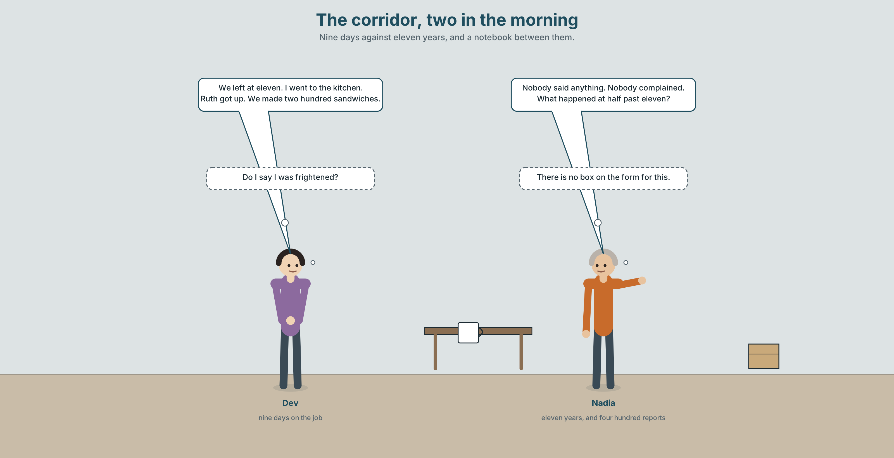{width=6.6in}

*The corridor, two in the morning — Nine days against eleven years, and a notebook between them.*

### 2A · Two in the morning 🔊 Track 1.1

**Before you listen.** Dev has worked here for nine days. The train was four hours late.
**Guess: whose fault was it?**

**Listen once. One question.** What time did the train leave?

**Listen again. Put the events in order.**

| | Event |
|---|---|
| 1 | |
| 2 | |
| 3 | |
| 4 | |

**Listen again. True or false?**

1. The train left on time. ☐ T ☐ F
2. Dev made an announcement. ☐ T ☐ F
3. The dining car closed at nine. ☐ T ☐ F
4. Nobody complained. ☐ T ☐ F

**Noticing.** Four sentences from the recording.

1. *We left at eleven.*
2. *I went to the kitchen.*
3. *She came back with Ruth.*
4. *Nobody said anything.*

**None of these four verbs has *-ed* on it. What happened to them instead?**

### 2B · Decoding clinic 🔊 Track 1.2

Twenty seconds of Dev at speed. Three jobs.

1. Count the past verbs you hear.
2. *Went*, *came* and *said* are all one syllable. Which vowel is longest?
3. He says one sequence word four times. Which one, and what is he using it for?

> Transcripts, page 148.

---

## Part 3 · Grammar Lab 1 ◆ **B · THE SYSTEM**

### The verbs that change inside

### 3A · Notice

Look at the four sentences in Part 2 again.

1. What is the present form of each of the four verbs?
2. What changed — the beginning, the middle or the end?
3. Is the form the same after *I*, *she* and *they*?
4. Which of the four would you guess wrongly if you had never seen it?

### 3B · See

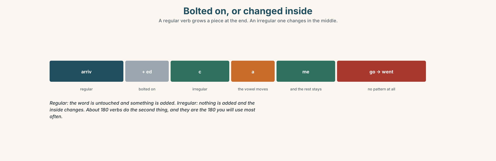{width=6.6in}

*Bolted on, or changed inside — A regular verb grows a piece at the end. An irregular one changes in the middle.*

### 3C · Know

| | | |
|---|---|---|
| **regular** | add **-ed**, nothing moves | *arrive → arrived · happen → happened* |
| **the vowel changes** | the middle of the word | *come → came · begin → began · sit → sat* |
| **the whole word changes** | no pattern at all | *go → went · be → was/were* |
| **nothing changes** | the commonest trap | *put → put · cut → cut · let → let* |

> **One form for all six persons.** *I went, you went, she went, we went, they went.* The past
> simple is the only tense in English with no person endings at all, which makes it easier than
> the present and harder to believe.

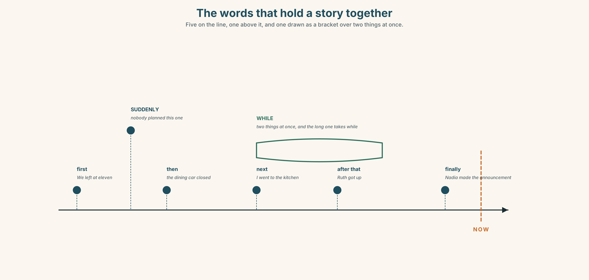{width=6.6in}

*The words that hold a story together — Five on the line, one above it, and one drawn as a bracket over two things at once.*

| | |
|---|---|
| **in order** | *first · then · next · after that · finally* |
| **at the same time** | *while* |
| **out of order** | *suddenly · at first · in the end · the next day* |

> **Why it matters.** Half of everything anybody says to anybody is a story about yesterday, and
> the listener is building a line while you speak. Give them the order or they build it wrong.

### 3D · Use — controlled

Complete with the past of the verb.

> We (1) ______ (leave) at eleven, four hours late. I (2) ______ (go) to the kitchen and Ruth
> (3) ______ (be) already awake.
> Nadia (4) ______ (come) back with two sandwiches. Nobody (5) ______ (say) anything.
> It (6) ______ (begin) as a bad night and it (7) ______ (become) a good one.

### 3E · Use — guided

Put each sentence into the past.

1. The train leaves at seven.
2. I go to the kitchen.
3. She comes back with Ruth.
4. We begin the shift at six.
5. Nobody says anything.

### 3F · Use — open

**In pairs.** Tell your partner about one day last week, in six sentences.
**Use a sequence word in every sentence. Your partner draws the line as you speak.**

### 3G · Check — six items, mark your own

> 1. We ______ (leave) at eleven.
> 2. I ______ (go) to the kitchen.
> 3. She ______ (come) back at two.
> 4. Nobody ______ (say) anything.
> 5. ✗ *We leaved at eleven.* → correct it.
> 6. ✗ *He goed to the kitchen.* → correct it.

{width=6.6in}

*The ending on a word that had already changed — The ending on a word that had already changed*

**0–3 →** Workbook pp. 4–7. **4–5 →** Part 6. **6 →** page 24.

---

## Part 4 · Speaking ◆ **C · THE PERFORMANCE**

### 4A · Fluency starter — the chain story

The first person says one sentence in the past. The next adds one, starting with a sequence word.
**No sequence word twice. Stop when somebody uses a regular verb.**

### 4B · The functional core — telling what happened

{width=6.6in}

*The same four hours, told twice — On the left, the order things happened. On the right, the order they were remembered.*

**Language Bank**

| | |
|---|---|
| **opening it** | *You'll never believe it. · So, yesterday…* |
| **in order** | *first · then · next · after that · finally* |
| **the interruption** | *and then suddenly…* |
| **closing it** | *in the end · and that was it* |

**Information gap.** Learner A has what the crew did. Learner B has what the passengers saw.
**Build one timeline of the four hours.**

### 4C · The performance — one shift ⏺

Tell the story of **one hour that went wrong** — at work, at school, anywhere. **One minute.**
You must:

> use four sequence words · use three irregular past verbs · say one thing you felt ·
> end with what happened in the end

**Record it.**

### 4D · Observer

One person listens for **one thing**: did the story stay in order?

### 4E · Two criteria

> ☐ Did I use at least three irregular past verbs correctly?
> ☐ Could somebody who was not there draw my timeline?

---

## Part 5 · Reading ◆ **A · THE WORLD**

### 5A · Predict

The title is **"Four hours, and one line in the log."**
**What do you think the one line says?**

### 5B · Read — sixty seconds

---

**Four hours, and one line in the log**

The train left Toronto four hours late. A freight train broke down eighty kilometres ahead and
nobody could go anywhere until it moved.

Dev had been on the job for nine days. At eleven at night a hundred and ninety-two people had
been sitting in a stationary train since seven, and the dining car had closed at nine.

He went to the kitchen and woke Ruth. She was not pleased. Then she got up, and between them they
made two hundred sandwiches in ninety minutes. Nadia made an announcement at half past eleven and
told everybody exactly what she knew, which was not much, and said it anyway.

Nobody complained. Three people wrote to the company to say so.

The company log for that night says: **DELAY 4H — FREIGHT. NO INCIDENTS.**

---

### 5C · Answer

1. How late was the train?
2. Why was it late?
3. How long had Dev worked there?
4. How many sandwiches did they make?
5. **Why did Nadia make the announcement when she did not have much to tell them?**
6. **The log says NO INCIDENTS. Is that true, and what is it missing?**

### 5D · Vocabulary in context

Guess from the text. Then check.

> broke down · stationary · she was not pleased · between them · said it anyway

### 5E · The counter-text

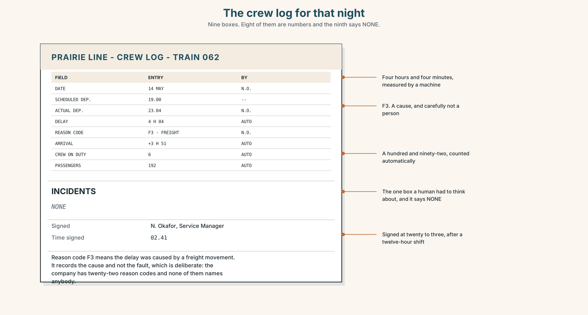{width=6.6in}

*The crew log for that night — Nine boxes. Eight of them are numbers and the ninth says NONE.*

**Read the log and answer.**

1. What time did the train leave, and what time was it supposed to leave?
2. **What is the reason code, and does it say whose fault it was?**
3. What is written in the INCIDENTS box?
4. **Three people wrote to the company. Where on this page would that appear?**

### 5F · Two texts

The reading describes two hundred sandwiches and one announcement.
The log describes a four-hour delay and no incidents.

**Which one will still exist in ten years?** Say one sentence.

---

## Part 6 · Vocabulary Lab 2 ◆ **B · THE SYSTEM**

### Putting a story in order

{width=6.6in}

*Four hours, six panels — Each panel carries its own sequence word. Only one of them was planned by nobody.*

### 6A · The ones that catch everybody

| | |
|---|---|
| **then / after that** | both work; *after that* is slower and gives the listener a rest |
| **at first** | sets up a change that is coming. Never use it unless one is |
| **in the end** | the result, not the last event |
| **while** | two things at once, and the verb after it is usually the long one |

### 6B · Say them

> first · then · next · after that · finally · before · while · suddenly

### 6C · Chunk

1. **______ that** — the slow version of *then*
2. **At ______** — and something is going to change
3. **In the ______** — the result
4. **______ I was making the sandwiches…** — two things at once
5. **The ______ day** — and the story continues
6. **______ ______ ?** — the two words that ask for the whole story

### 6D · Contrast Clinic

Six items. ***while*** or ***when***?

1. ______ the passengers were sleeping, the crew was working.
2. ______ we were making sandwiches, Nadia made the announcement.
3. ______ Ruth was cooking, Dev was checking the tickets.
4. ______ I arrived, the dining car was already closed.
5. ______ the freight train moved, we left.
6. ______ the train stopped, everybody looked up.

---

## Part 7 · Pronunciation & Fluency Lab ◆ **B · THE SYSTEM**

### The vowel in the middle

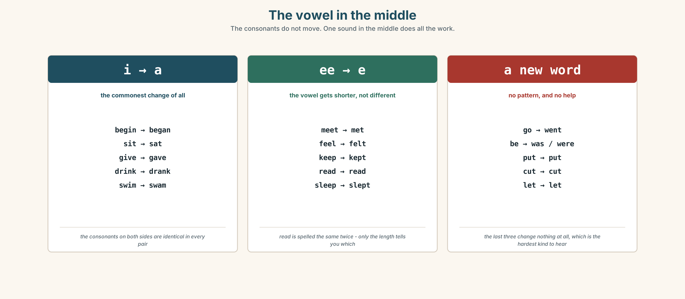{width=6.6in}

*The vowel in the middle — The consonants do not move. One sound in the middle does all the work.*

### 7A · Hear

> **i → a**: *begin → began · sit → sat · give → gave*
> **ee → e**: *meet → met · read → read · feel → felt*
> **o → e**: *come → came · become → became* — the spelling lies; listen to the sound

### 7B · Say

Say each pair three times. Then say this:

> *I came, I sat, I began.* — three vowels, three verbs, no endings at all.

### 7C · Make it mean something

Say these two:

> *I read it.* — present. The vowel is long: *reed*.
> *I read it.* — past. The vowel is short: *red*.

**Same five letters, same spelling, two tenses.** The only thing that tells your listener which
one you mean is a vowel that lasts a tenth of a second. Which is which?

### 7D · Fluency 20 ⏺

Twenty seconds: **six things that happened to you yesterday, all irregular verbs.**
Three times, faster.

---

## Part 8 · Writing ◆ **C · THE PERFORMANCE**

### What happened · 50–70 words

### 8A · Read the model

> On Tuesday we left Toronto four hours late. `[the fact, with a day and a number]`
>
> At first nobody minded. Then the dining car closed and people began to ask questions.
> `[*at first*, and the change it promised]`
>
> I went to the kitchen and woke the cook. She wasn't pleased, but she got up. `[two irregular
> verbs, and one honest detail]`
>
> In the end we made two hundred sandwiches. Nobody complained. `[the result, and the proof]`

**Questions about the writer's choices:**

1. *At first nobody minded.* **What does that tell the reader is coming?**
2. *She wasn't pleased, but she got up.* **Why keep the first half?**
3. The last two sentences are six words long. **Why so short at the end?**

### 8B · The anti-model

> On Tuesday the train was late. It was a difficult night. Everybody worked very hard. We did our best. In the end it was fine.

Correct English, and it could be any night on any train. **Add two numbers, one irregular verb
and one thing that somebody actually said.**

### 8C · Plan

> the fact, with a number → *at first*, and the change → what you did, with two irregular verbs →
> the result, short

### 8D · Write — 50 to 70 words
### 8E · Peer review — two things only

> ☐ Is the story in order, and can you draw it?
> ☐ Are there at least three irregular past verbs, all correct?

### 8F · Publish

On the wall, with no names. **The class puts them in order of how badly the night went.**

---

## Part 9 · The File ◆ **A · THE WORLD + C · THE PERFORMANCE**

# STUDY FILE · The log of what went right

{width=6.6in}

*What a notebook records — Four layers. The thickest one is the one nobody writes down.*

### 9A · What gets written down

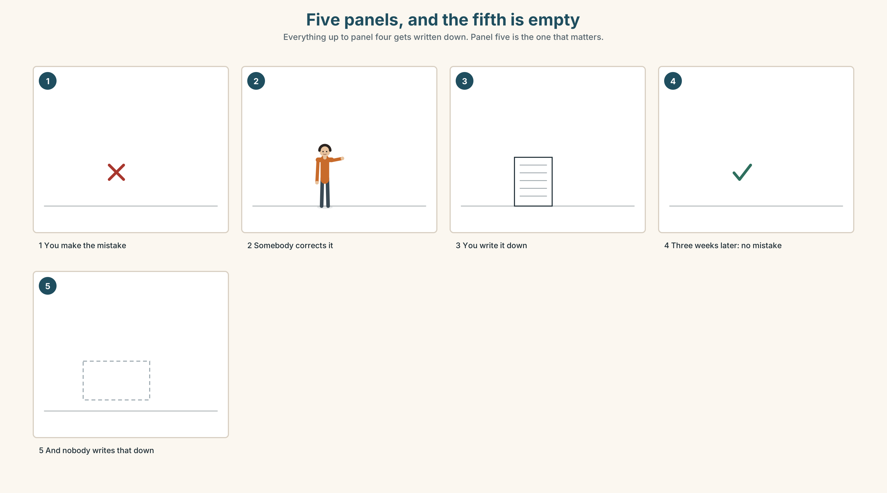{width=6.6in}

*Five panels, and the fifth is empty — Everything up to panel four gets written down. Panel five is the one that matters.*

| | |
|---|---|
| **What gets recorded** | every error, in red, in the margin |
| **What does not** | every error you no longer make |
| **What that does** | a notebook full of things you are bad at |
| **The fix** | one line a week: *this week I stopped…* |

### 9B · Your own log

At the end of each week, write **one sentence** in the past about something you could not do
before and can do now. Not *better*. What, exactly.

> *Last week I didn't understand the announcements. On Thursday I understood one.*

### 9C · Role play — the debrief

In pairs. One of you had a bad week. The other asks: *What happened?* and then, four times,
*And then?* **The point is the sequence, not the sympathy.**

### 9D · The thing nobody wrote down

Think of one thing in your English that was hard in September and is not hard now.
**Nobody recorded it. Record it.**

### 9E · Transfer — before next week

**Write one sentence a day, in the past, about one English thing that happened.** Seven
sentences. Bring them.

---

## Part 10 · Mediation & Interaction ◆ **C · THE PERFORMANCE**

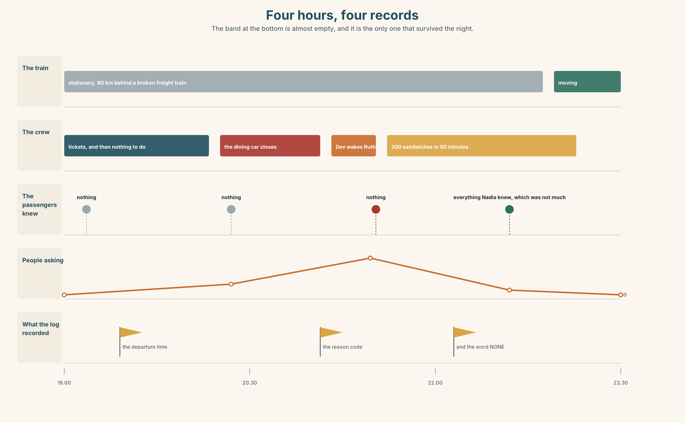{width=6.6in}

*Four hours, four records — The band at the bottom is almost empty, and it is the only one that survived the night.*

### 10A · Relay

Half the class has what the crew did. Half has what the passengers knew.
**Build the four hours by speaking.** Ten minutes.

### 10B · Simplify — for one person

A new crew member asks: *What happened on Tuesday?*
**Tell them in four sentences.** They need to be able to act on it, not enjoy it.

### 10C · Online

Write **one message** to a friend about something that happened to you this week.
**Three sentences.** Two sequence words, one irregular verb.

### 10D · Your language

Does your language have irregular past verbs? **Say *I went* and *I arrived* in your language.**
Do they change in the same place?

---

## Part 11 · The Decision ◆ **C · THE PERFORMANCE**

# No incidents

The company's crew log has one box for what went wrong and no box for anything else.

On Tuesday the train was four hours late. Two people made two hundred sandwiches at midnight and
one person told a hundred and ninety-two passengers the truth. The log says NO INCIDENTS, which
is correct.

**Option one:** leave it. A log is for problems. Everything else is just the job.

**Option two:** add a box. Three lines, headed *what the crew did*. It takes ninety seconds to
fill in at the end of a twelve-hour shift.

**Option three:** add the box and make it compulsory. Then it gets filled in, and then it gets
filled in badly.

### 11A · The evidence

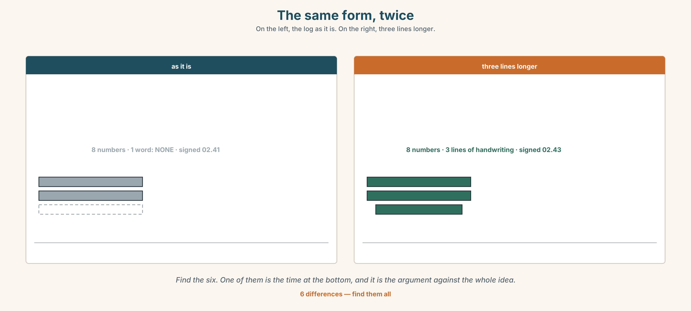{width=6.6in}

*The same form, twice — On the left, the log as it is. On the right, three lines longer.*

🔊 **Track 1.6.** Nadia, 20 seconds: *"I've written four hundred of these. The box says incidents.
Nothing went wrong, so I wrote none. Everything that happened that night was not an incident."*

### 11B · Talk about it

In threes. Use the frame. Everybody says one.

> *I think the company should ______ , because ______ .*

**Words you can use:** *report · crew · shift · delay · mistake · passenger · lucky*

### 11C · Decide

Write **two sentences**. Choose, and say why.

> I think the company should ______________________ ,
> because ______________________ .

### 11D · Model decision

> Add the box and leave it optional. A compulsory box produces four hundred identical sentences.
> An optional one gets filled in on the nights when there is something to say, and those are
> exactly the nights you want to read about.

### 11E · The Reveal

> **What happened.** The company added three optional lines. In the first six months the box was
> filled in on about one night in nine, which the company thought was a failure.
>
> Then something nobody expected: when a new crew member joined, the first thing they were given
> was the last twenty filled-in boxes. It had stopped being a record and become the only training
> document on the line.

**One question. You do not have to answer it out loud.**

> The company wanted a record. What did it build instead?

---

## Part 12 · Landing ◆ **all three lines**

### 12A · Recycle — twelve items

> 1. We ______ (leave) at eleven.
> 2. I ______ (go) to the kitchen.
> 3. She ______ (come) back at two.
> 4. Nobody ______ (say) anything.
> 5. It ______ (begin) at seven.
> 6. ______ that, everything was quiet. *(the slow version of *then*)*
> 7. ______ first, nobody minded.
> 8. In the ______ , nobody complained.
> 9. ______ I was in the kitchen, Nadia made the announcement.
> 10. The ______ day, three people wrote to the company.
> 11. I need to ______ this ______ . *(two words — fix a problem)*
> 12. ______ ______ ? *(the two words that ask for a story)*

### 12B · Consolidate — one task, everything in it

**Write six sentences about one hour of one day last week.** Four irregular past verbs, four
sequence words, one thing you felt, and the result at the end.

### 12C · Can-do, with evidence

> ☐ I can tell what happened, in order. **Evidence:** 4C, 8D
> ☐ I can use irregular past verbs. **Evidence:** 3G
> ☐ I can use sequence words. **Evidence:** 6C
> ☐ I can hear the vowel that changes inside a verb. **Evidence:** 7C

### 12D · Replay ⏺

Record 0C again. **Listen to both.** What is different?

### 12E · Glossary — thirty-five words, as a map

> **THE PEOPLE** · passenger · crew
> **THE THINGS** · ticket · seat · report · shift · delay
> **WHAT HAPPENS** · arrive · leave · begin · happen · mistake
> **HOW IT FELT** · lucky · awful · busy · calm
> **WHAT THE CREW DOES** · start the shift · check the tickets · serve the meals · make an announcement · turn up · sort out
> **THE ORDER** · first · then · next · after that · finally · before · while · suddenly
> **OUT OF ORDER** · at first · in the end · the next day
> **ASKING AND OPENING** · What happened? · You'll never believe it.

### 12F · Next

> **Unit 2 · Why do people leave a place?**

# A1.2 · Unit 2 · Forty Seconds at Mirror Lake

> **English Animated** · *Getting Around* · The Prairie Line, Toronto to Vancouver
> Student's Book pages 28–49 · 22 pp · ~9 hours

---

## Part 0 · The Big Picture ◆ **A · THE WORLD**

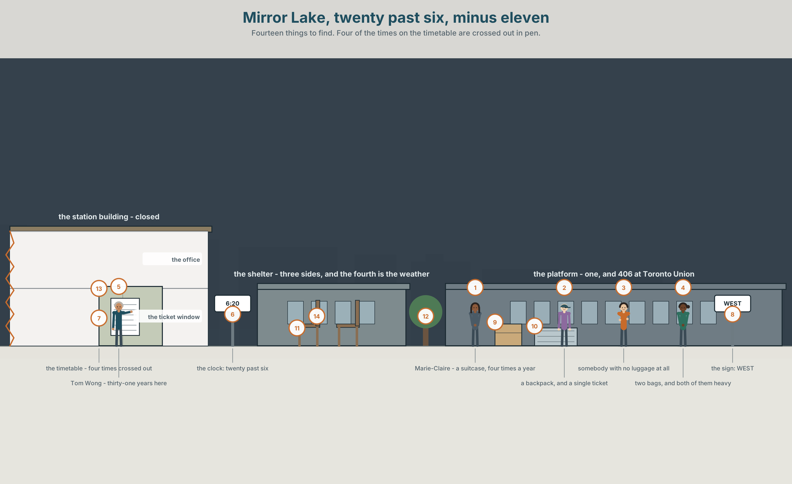{width=6.6in}

*Mirror Lake, twenty past six, minus eleven — Fourteen things to find. Four of the times on the timetable are crossed out in pen.*

# Why do people leave a place?

**By the end of this unit you can ask somebody about a journey they made, and say what did not
happen.**

| ◆ **A · THE WORLD** | A station where the train stops for forty seconds and the town has lost two thirds of itself |
|---|---|
| ◆ **B · THE SYSTEM** | past simple negatives and questions · 22 words for journeys and stations · *ago* and the words that place a story in time · *did you* as one sound |
| ◆ **C · THE PERFORMANCE** | You interview somebody about a journey and find the part they left out |

---

### 0A · Find it — fourteen things

Find these in the picture. Write the number.

> ☐ a platform ☐ a suitcase ☐ a backpack ☐ a timetable ☐ a window ☐ a lamp ☐ a bench
> ☐ a shelter ☐ a door ☐ a clock ☐ a sign ☐ a bag ☐ a rail ☐ a light

**Three of these words are not in the picture. Which three?**

> an aisle · a ticket · the guard

### 0B · Guess it

Look at the four people waiting. **Which of them is coming back?**
Say one thing. You can use these words:

> *bag · heavy · wait · far · single*

### 0C · Say it ⏺

**Record. Thirty seconds. Do not prepare.**

> **Tell me about a journey you made. Where did you go, and when?**

You will listen to this again on the last page.

---

## Part 1 · Vocabulary Lab 1 ◆ **B · THE SYSTEM**

### 1A · Meet — the line, and the places on it

{width=6.6in}

*Five stops, thirty-five years — The distance and the time on every leg, and under each stop the population then and now.*

| | |
|---|---|
| **journey** | Four nights. Four thousand four hundred kilometres. |
| **platform** | One, at Mirror Lake. Four hundred and six at Toronto Union. |
| **timetable** | Two columns: one going west, one going east. Four times crossed out in pen. |
| **single** | Cheaper, and it says something about you. |
| **return** | Dearer, and it says something else. |
| **guard** | The person who decides whether the train waits for you. |

### 1B · Meet — the words

> **journey · trip · platform · luggage · suitcase · backpack · timetable · return · single · window · aisle · heavy · far · wait · slow · guard**

Write each word under the right picture.

{width=6.6in}

*One station, in section — Eleven things. Eleven words. Only two of the four layers are ever used now.*

### 1C · Sort — the place, or the thing you carry?

Put each word in the right box. **Two of them can go in both. Which two, and why?**

> aisle · suitcase · shelter · platform · luggage · window · seat · backpack · timetable ·
> ticket

| **PART OF THE STATION OR TRAIN** | **SOMETHING YOU CARRY** | **BOTH** |
|---|---|---|
| | | |

### 1D · What happens on a journey

| | |
|---|---|
| **miss the train** | Forty seconds is the difference between this and not this. |
| **change trains** | Twice on this route, and the second one is the one people get wrong. |
| **book a ticket** | Three weeks ahead it is sixty dollars. On the day it is two hundred. |
| **a return ticket** | Two journeys, one piece of paper, and a date you have to guess. |
| **set off** | Not the same as *leave*. You set off on a journey; you leave a place. |
| **pick up** | What the train does at Mirror Lake, in forty seconds. |

**Now say them.** Two of these six could be done without going anywhere.
**Which two, and what does that tell you about where the work is?**

### 1E · Stretch — the phrases you will need today

> **miss the train** · **change trains** · **book a ticket** · **set off** · **pick up**

Match each phrase to the moment you need it.

1. It is three weeks before the journey and you are at a screen. → ______
2. You are on the platform and the lights are going away from you. → ______
3. It is twenty past six and you close your front door. → ______
4. The train stops for forty seconds and you are the reason. → ______
5. You arrive at Winnipeg and this is not your train. → ______

### 1F · The hard one

> **f** **It was ages ago.**

Practise it three times. **Four words that refuse to give a date, politely.**

### 1G · Own it

Write down one journey you made and three things about it: when, how long, and one thing that
went wrong. Do not write your name. The class guesses whose journey it is.

---

## Part 2 · Listening ◆ **A · THE WORLD**

{width=6.6in}

*Through the glass — The window is closed. They have had this conversation about forty times.*

### 2A · The ticket window 🔊 Track 2.1

**Before you listen.** Marie-Claire takes this train four times a year.
**Guess: is she buying a single or a return?**

**Listen once. One question.** How long ago did she last travel?

**Listen again. Complete the table.**

| | Last journey | This journey |
|---|---|---|
| where to | | |
| single or return | | |
| how long ago | | |

**Listen again. True or false?**

1. She bought a return ticket. ☐ T ☐ F
2. She didn't book in advance. ☐ T ☐ F
3. She travelled last summer. ☐ T ☐ F
4. She bought the ticket this morning. ☐ T ☐ F

**Noticing.** Four sentences from the recording.

1. *I didn't book it.*
2. *Did you travel last summer?*
3. *She didn't come back.*
4. *When did you buy it?*

**Every verb after *did* and *didn't* is plain. What has happened to the past?**

### 2B · Decoding clinic 🔊 Track 2.2

Twenty seconds of Tom at speed. Three jobs.

1. Count how many questions he asks.
2. *Did you* is two words and he says it as one. Write what you hear.
3. He says one time marker three times. Which one, and is it a date?

> Transcripts, page 149.

---

## Part 3 · Grammar Lab 1 ◆ **B · THE SYSTEM**

### Saying it did not happen, and asking whether it did

### 3A · Notice

Look at the four sentences in Part 2 again.

1. What word carries the past in sentences 1 and 3?
2. What is the form of the verb after it?
3. In sentences 2 and 4, where does *did* stand?
4. What happens to a question word, if there is one?

### 3B · See

{width=6.6in}

*One weight, and it moves to the front — In the positive the past sits on the verb. In a question it has moved onto did.*

### 3C · Know

| | | |
|---|---|---|
| **positive** | the past is on the verb | *I booked it. She came back.* |
| **negative** | *didn't* + the plain verb | *I didn't book it. She didn't come back.* |
| **question** | *did* at the front, plain verb | *Did you book it? Did she come back?* |
| **question word first** | *when · where · why · how long* | *When did you buy it? Why did she leave?* |

> **Did is the same for everybody.** No *s*, no *was*, no change at all: *did I, did you, did she,
> did they*. It is the simplest helper in the language and it is doing all the work.

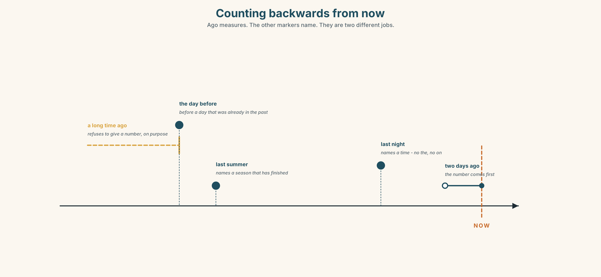{width=6.6in}

*Counting backwards from now — Ago measures. The other markers name. They are two different jobs.*

| | |
|---|---|
| **counting back from now** | *two days ago · a long time ago · How long ago?* |
| **naming a past time** | *last night · last summer · yesterday* |
| **before a past time** | *the day before* |
| **vague on purpose** | *recently · earlier · later · It was ages ago.* |

> **Why it matters.** Almost every question anybody asks about the past is one of these four
> shapes, and the answer is almost always a time marker.

### 3D · Use — controlled

Complete with **did**, **didn't**, or the past of the verb.

> I (1) ______ (buy) the ticket three weeks ago. I (2) ______ book the return — I only wanted a
> single.
> (3) ______ you travel last summer? — No, I (4) ______ . I (5) ______ (come) in March.
> Why (6) ______ she leave?

### 3E · Use — guided

Make each sentence negative, then make it a question.

1. She booked a return ticket.
2. They set off at six.
3. He missed the train.
4. We changed at Winnipeg.
5. The guard waited.

### 3F · Use — open

**In pairs.** Ask your partner about a journey. **Eight questions, all with *did*, and four of
them must start with a question word.**

### 3G · Check — six items, mark your own

> 1. I ______ book the return. *(negative)*
> 2. ______ you travel last summer?
> 3. When ______ you buy it?
> 4. She ______ come back. *(negative)*
> 5. ✗ *Did you bought it?* → correct it.
> 6. ✗ *I didn't went.* → correct it.

{width=6.6in}

*The past marked twice, again — The past marked twice, again*

**0–3 →** Workbook pp. 8–11. **4–5 →** Part 6. **6 →** page 46.

---

## Part 4 · Speaking ◆ **C · THE PERFORMANCE**

### 4A · Fluency starter — twenty questions, all past

One person thinks of a journey. The class asks questions with *did*.
**No question may be repeated, and nobody may ask the same question word twice in a row.**

### 4B · The functional core — asking about a past trip

{width=6.6in}

*Two interviews, one traveller — Four questions each. One of the two found out why she was going.*

**Language Bank**

| | |
|---|---|
| **opening** | *Did you travel this year? · Have you been far?* |
| **the facts** | *When did you go? Where did you go? How long did it take?* |
| **the story** | *Why did you go? What did you do there? Did you want to come back?* |
| **the time marker** | *two days ago · last summer · a long time ago · How long ago?* |

**Information gap.** Learner A has the timetable as printed. Learner B has the timetable as it
actually runs. **Find the four times that no longer exist.**

### 4C · The performance — the interview ⏺

Interview a classmate about a journey they made. **Three minutes.** You must:

> ask six questions with *did* · ask one that starts with *why* · find out one thing they did
> **not** do · end with a time marker

Then report it in three sentences. **Record it.**

### 4D · Observer

One person listens for **one thing**: did anybody put a past verb after *did*?

### 4E · Two criteria

> ☐ Were all my verbs after *did* and *didn't* plain?
> ☐ Did I find out something that was not in the first answer?

---

## Part 5 · Reading ◆ **A · THE WORLD**

### 5A · Predict

The title is **"One thousand one hundred, and three hundred and ten."**
**What do you think the two numbers are?**

### 5B · Read — sixty seconds

---

**One thousand one hundred, and three hundred and ten**

In 1991 Mirror Lake had one thousand one hundred people, a school with four classes, two shops
and a grain elevator.

It has three hundred and ten people now. The school closed in 2009. One shop is left and it
opens four days a week.

Nobody made a decision. There was no closing, no announcement and no day on which the town got
smaller. Children finished school and did not come back, and nobody who left said they were
leaving for good. They said they were going to Winnipeg for a year.

Tom Wong has been the station agent for thirty-one years. He did not leave. He says he never
decided to stay either, and that in a place like this those are the same thing.

The train stops for forty seconds. Last year it picked up five hundred and eleven people and put
down four hundred and ninety-six.

---

### 5C · Answer

1. How many people lived in Mirror Lake in 1991?
2. When did the school close?
3. How long has Tom been the station agent?
4. How long does the train stop for?
5. **Why does the writer say nobody made a decision?**
6. **The train picked up fifteen more people than it put down. What does that number mean?**

### 5D · Vocabulary in context

Guess from the text. Then check.

> a grain elevator · for good · in a place like this · put down · the same thing

### 5E · The counter-text

{width=6.6in}

*The timetable on the station wall — Two columns, seven days, and four times crossed out in pen.*

**Read the timetable and answer.**

1. How many trains a week stop at Mirror Lake going west?
2. **How many used to, and how do you know?**
3. What is the date written beside one of the crossings-out?
4. **The line at the bottom is printed. What does that tell you about when it was decided?**

### 5F · Two texts

The reading says nobody made a decision.
The timetable has four times crossed out and one printed line about winter.

**Was a decision made?** Say one sentence.

---

## Part 6 · Vocabulary Lab 2 ◆ **B · THE SYSTEM**

### Putting a story in time

{width=6.6in}

*One view, six times — The same view from the platform. Each panel has one thing fewer in it.*

### 6A · The ones that catch everybody

| | |
|---|---|
| **ago** | counts backwards from now, and it goes **after** the number: *two days ago* |
| **last night** | no *the*, and no *on* |
| **the day before** | before a moment that is already in the past, not before now |
| **recently** | near to now, and deliberately vague |

### 6B · Say them

> ago · last · yesterday · recently · earlier · later · two days ago · last night · last summer

### 6C · Chunk

1. two days **______** — counting back from now
2. **______** night — and no *the*
3. **______** summer — a season that has finished
4. the day **______** — before a day that was already in the past
5. a long time **______** — and you are not going to say how long
6. **How long ______ ?** — the question that asks for a number

### 6D · Contrast Clinic

Six items. ***ago*** or ***last***?

1. three years ______
2. ______ summer
3. ______ night
4. a long time ______
5. two days ______
6. ______ week

---

## Part 7 · Pronunciation & Fluency Lab ◆ **B · THE SYSTEM**

### Two words that became one

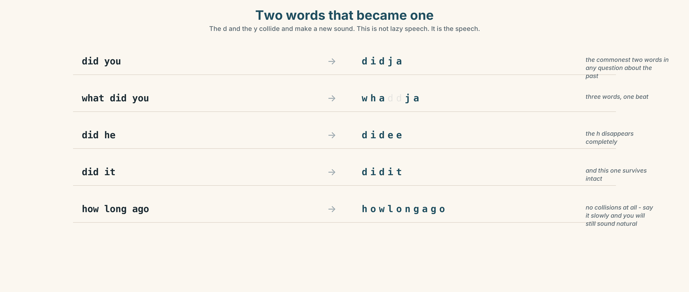{width=6.6in}

*Two words that became one — The d and the y collide and make a new sound. This is not lazy speech. It is the speech.*

### 7A · Hear

> **did you** → *didja* · **what did you** → *whaddja* · **did he** → *didee* · **did it** → *didit*
> The *d* and the *y* collide and make a new sound. This is not lazy speech. It is the speech.

### 7B · Say

Say each one three times. Then say this:

> *What did you do, and why didn't you tell me?* — nine words, four beats.

### 7C · Make it mean something

Say these two:

> *Did you go?* — *didja go* · a real question
> *You went?* — *you went* · surprise, and you already know the answer

**Same information, two different jobs.** Which one is asking and which one is reacting?

### 7D · Fluency 20 ⏺

Twenty seconds: **six questions about one journey, all with *did*.** Three times, faster.

---

## Part 8 · Writing ◆ **C · THE PERFORMANCE**

### A journey · 50–70 words

### 8A · Read the model

> I went to Winnipeg three years ago, for a year. `[where, when, and how long — all in nine
> words]`
>
> I didn't want to go. I didn't have a job here. `[two negatives, and they are the reason]`
>
> I stayed for seven years. I came back last summer, for a week, and then I didn't leave.
> `[the number that contradicts the plan]`
>
> Nobody asked me why I came back. That is why I stayed. `[the sentence that is actually about
> the town]`

**Questions about the writer's choices:**

1. The second line is two negatives. **Why are they more informative than a positive?**
2. *I stayed for seven years.* **What does that do to the word *a year* in line one?**
3. The last line is about other people. **Why end there?**

### 8B · The anti-model

> I went to Winnipeg. I lived there for seven years. Then I came back. It is a nice town. I am happy here.

Correct English, and it could be anybody. **Add two negatives, one number that contradicts a
plan, and one thing somebody else did.**

### 8C · Plan

> where, when, how long → two things you did not do → the number that broke the plan →
> one sentence about somebody else

### 8D · Write — 50 to 70 words
### 8E · Peer review — two things only

> ☐ Are there at least two negatives, and are the verbs after *didn't* plain?
> ☐ Is there a time marker in the first sentence?

### 8F · Publish

On the wall, with no names. **The class guesses which journeys were planned and which were not.**

---

## Part 9 · The File ◆ **A · THE WORLD + C · THE PERFORMANCE**

# STUDY FILE · The things you did not do

{width=6.6in}

*Four starts and one habit — Three of the four layers are courses. The bottom one is not, and it is the only one still running.*

### 9A · Four starts and one habit

{width=6.6in}

*Eleven days, twice — Five panels. The fifth is identical to the second, and that is the finding.*

| | |
|---|---|
| **What people count** | the courses they bought |
| **What counts** | the eleven days, four times over — which is forty-four days |
| **What they say** | *I never finish anything.* |
| **What is true** | they did forty-four days and gave themselves credit for none of them |

### 9B · Count the days, not the finishes

**Write down every English thing you started this year and how many days you did it.** Add the
days up. That number is yours and nobody has ever told you it exists.

### 9C · Role play — the interview about last year

In pairs. Ask your partner eight questions about their English last year, all with *did*.
**Four of them must be negative questions: *Didn't you…?*** Find one thing they did and have
forgotten.

### 9D · The thing you did not stop

Everybody has one: a podcast, a song, a game, a person they message. **Name yours.**
It has probably been running longer than any course you ever bought.

### 9E · Transfer — before next week

**Write down, for seven days, one English thing you did and one you did not do.**
Bring both lists. The second one is the more interesting.

---

## Part 10 · Mediation & Interaction ◆ **C · THE PERFORMANCE**

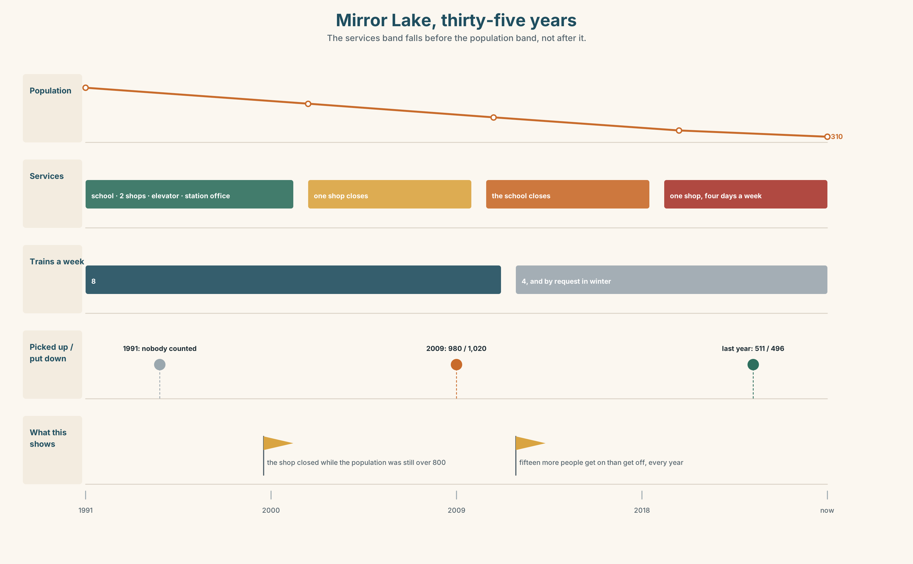{width=6.6in}

*Mirror Lake, thirty-five years — The services band falls before the population band, not after it.*

### 10A · Relay

Half the class has the population figures. Half has the timetable.
**Build the thirty-five years by speaking.** Ten minutes.

### 10B · Simplify — for one person

Somebody is thinking of moving to a small town. They ask: *What happened to Mirror Lake?*
**Answer in four sentences.** Do not make it sad and do not make it a warning.

### 10C · Online

Write **one message** asking a friend about a trip they made.
**Three sentences.** Two questions with *did*, one with a question word.

### 10D · Your language

Does your language have a word like *ago*? **Say *two days ago* in your language.**
Does the number come before or after it?

---

## Part 11 · The Decision ◆ **C · THE PERFORMANCE**

# Forty seconds

The train stops at Mirror Lake for forty seconds, twice a week each way.

Last year it picked up five hundred and eleven people and put down four hundred and ninety-six.
That is about one and a half people per stop. The stop costs the company about eleven thousand
dollars a year in fuel and time.

**Option one:** keep it. One and a half people is one and a half people, and three hundred and
ten of them have no other way out.

**Option two:** make it request-only all year. The train stops if somebody books. In winter this
is already the rule, and in winter about a third of the requests are not seen in time.

**Option three:** close it. The nearest other stop is a hundred and forty kilometres away.

### 11A · The evidence

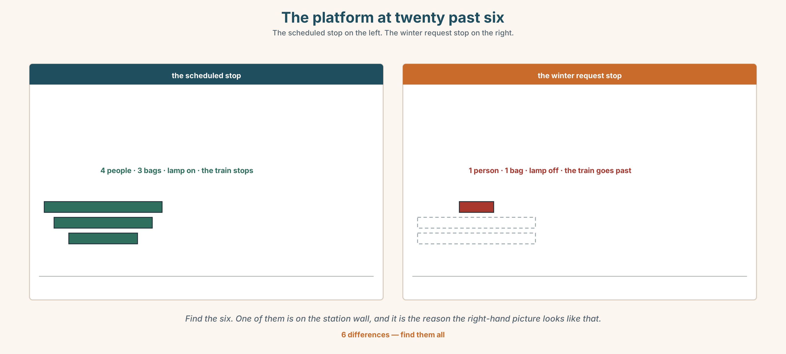{width=6.6in}

*The platform at twenty past six — The scheduled stop on the left. The winter request stop on the right.*

🔊 **Track 2.6.** Tom Wong, 20 seconds: *"Forty seconds. I know what it costs them. I also know
that the day it stops, nobody will come here who didn't already live here, ever again."*

### 11B · Talk about it

In threes. Use the frame. Everybody says one.

> *I think the company should ______ , because ______ .*

**Words you can use:** *journey · platform · timetable · far · wait · slow · return*

### 11C · Decide

Write **two sentences**. Choose, and say why.

> I think the company should ______________________ ,
> because ______________________ .

### 11D · Model decision

> Keep the scheduled stop and fix the request system, which is the part that is actually broken.
> A third of winter requests are not seen in time, and that is a number about a piece of software,
> not about a town.

### 11E · The Reveal

> **What happened.** The company kept the stop and moved the request system to a telephone number
> that rings in the guard's van. Missed requests fell from a third to almost none.
>
> Then something nobody expected: the number of people getting on rose by eleven per cent in the
> first year, because people who had assumed the train no longer stopped found out that it did.

**One question. You do not have to answer it out loud.**

> The stop had not changed for four years. What had?

---

## Part 12 · Landing ◆ **all three lines**

### 12A · Recycle — twelve items

> 1. I ______ book the return. *(negative)*
> 2. ______ you travel last summer?
> 3. When ______ you buy it?
> 4. two days ______
> 5. ______ night
> 6. ______ summer
> 7. the day ______
> 8. a long time ______
> 9. I need to ______ ______ at Winnipeg. *(two words — leave one train for another)*
> 10. We ______ ______ at six in the morning. *(two words — begin a journey)*
> 11. *(Unit 1)* We ______ (leave) at eleven.
> 12. *(Unit 1)* ______ that, nobody said anything.

### 12B · Consolidate — one task, everything in it

**Write about a journey somebody else made, in six sentences.** Two negatives, one question you
asked them, one time marker in the first sentence, and one thing that did not go to plan.

### 12C · Can-do, with evidence

> ☐ I can ask about a past journey. **Evidence:** 4C
> ☐ I can say what did not happen. **Evidence:** 3G, 8D
> ☐ I can use *ago* and the other time markers. **Evidence:** 6D
> ☐ I can hear and say *did you* as one sound. **Evidence:** 7C

### 12D · Replay ⏺

Record 0C again. **Listen to both.** What is different?

### 12E · Glossary — thirty-five words, as a map

> **THE JOURNEY** · journey · trip · far · slow · wait
> **THE PLACE** · platform · timetable · window · aisle · guard
> **WHAT YOU CARRY** · luggage · suitcase · backpack · heavy
> **THE TICKET** · return · single · book a ticket · a return ticket
> **WHAT HAPPENS** · miss the train · change trains · set off · pick up
> **WHEN** · ago · last · yesterday · recently · earlier · later
> **WHEN, IN WORDS** · two days ago · last night · last summer · the day before · a long time ago
> **ASKING** · How long ago? · It was ages ago.

### 12F · Next

> **Unit 3 · Is cheaper always better?**

# A1.2 · Unit 3 · One Thousand Four Hundred Seats

> **English Animated** · *Getting Around* · The Prairie Line, Toronto to Vancouver
> Student's Book pages 50–71 · 22 pp · ~9 hours

---

## Part 0 · The Big Picture ◆ **A · THE WORLD**

{width=6.6in}

*The maintenance shed at Winnipeg, half past four — Fourteen things to find. One of the new seats is already torn, and it has never been sat on.*

# Is cheaper always better?

**By the end of this unit you can compare two things and say why you would choose one.**

| ◆ **A · THE WORLD** | A shed with two rows of seats in it and a decision worth half a million dollars |
|---|---|
| ◆ **B · THE SYSTEM** | comparative adjectives · 22 words for price, quality and materials · *than* and *as … as* · the weak *than*, and the sound that lives in half the words in English |
| ◆ **C · THE PERFORMANCE** | You compare two things nobody can tell apart and make the difference matter |

---

### 0A · Find it — fourteen things

Find these in the picture. Write the number.

> ☐ a seat ☐ cloth ☐ plastic ☐ metal ☐ wood ☐ a label ☐ a box
> ☐ a tear ☐ a repair ☐ a light ☐ a door ☐ a floor ☐ a bag ☐ a clock

**Three of these words are not in the picture. Which three?**

> a price · the quality · a receipt

### 0B · Guess it

Look at the two rows. **Which row has been on a train?**
Say one thing. You can use these words:

> *old · new · strong · same · different*

### 0C · Say it ⏺

**Record. Thirty seconds. Do not prepare.**

> **Think of two things you own that do the same job. Which is better, and why?**

You will listen to this again on the last page.

---

## Part 1 · Vocabulary Lab 1 ◆ **B · THE SYSTEM**

### 1A · Meet — what a seat is made of

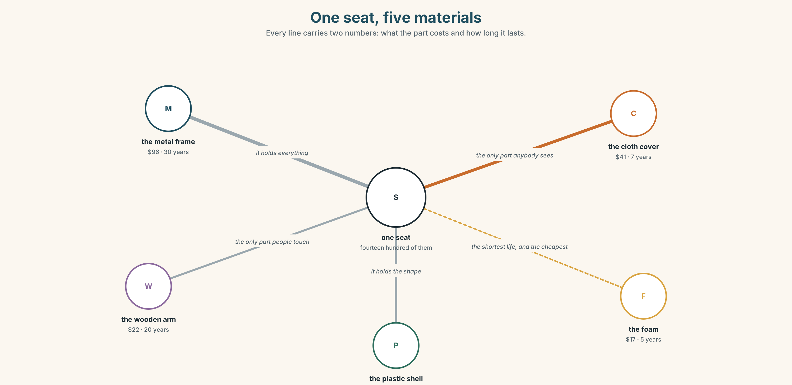{width=6.6in}

*One seat, five materials — Every line carries two numbers: what the part costs and how long it lasts.*

| | |
|---|---|
| **price** | What it says on the invoice. |
| **cost** | Price, plus everything that happens afterwards. |
| **quality** | The word people use when they cannot say which number they mean. |
| **good value** | Not cheap. Cheap for what you get. |
| **break down** | What a machine does. Also what an argument does. |
| **throw away** | The decision that is made at the moment of buying, not at the moment of throwing. |

### 1B · Meet — the words

> **price · quality · cheap · expensive · better · worse · strong · weak · plastic · metal · wood · cloth · new · old · same · different**

Write each word under the right picture.

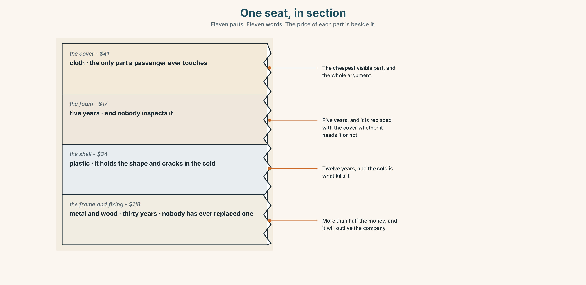{width=6.6in}

*One seat, in section — Eleven parts. Eleven words. The price of each part is beside it.*

### 1C · Sort — the thing, or what you think of it?

Put each word in the right box. **Two of them can go in both. Which two, and why?**

> metal · plastic · weak · cloth · quality · cheap · new · price · strong · wood

| **WHAT IT IS MADE OF** | **WHAT YOU THINK OF IT** | **BOTH** |
|---|---|---|
| | | |

### 1D · Two words for the same money

| | |
|---|---|
| **cheap** | a judgement, and usually not a kind one |
| **good value** | the same money, and a compliment |
| **expensive** | a judgement about the price |
| **cost more** | a fact about the price |
| **last longer** | the only one of these five that is a measurement |
| **the same as** | the comparison that says there is no comparison |

**Now say them.** Three of these six are opinions and two are facts.
**Which is the sixth, and why is it neither?**

### 1E · Stretch — the phrases you will need today

> **good value** · **last longer** · **cost more** · **break down** · **throw away**

Match each phrase to the moment you need it.

1. You are explaining why you paid twice as much. → ______
2. The machine stops working in the middle of a shift. → ______
3. Somebody says the cheap one is the same. → ______
4. It cannot be repaired and it is three years old. → ______
5. You are comparing two invoices. → ______

### 1F · The hard one

> **f** **It depends.**

Practise it three times. **Two words that are the honest answer to almost every question in this
unit, and the most annoying thing you can say to somebody who wants a number.**

### 1G · Own it

Write down two things you own that do the same job, and one sentence saying which is better.
Do not write your name. The class guesses whose things they are.

---

## Part 2 · Listening ◆ **A · THE WORLD**

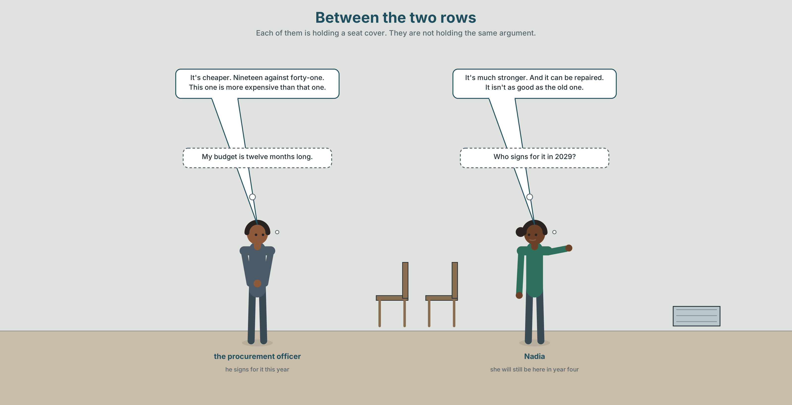{width=6.6in}

*Between the two rows — Each of them is holding a seat cover. They are not holding the same argument.*

### 2A · In the shed 🔊 Track 3.1

**Before you listen.** The company must replace one thousand four hundred seat covers.
**Guess: which one will they choose?**

**Listen once. One question.** How much is the cheaper cover?

**Listen again. Complete the table.**

| | Cloth | Synthetic |
|---|---|---|
| price each | | |
| how long it lasts | | |
| can it be repaired | | |

**Listen again. True or false?**

1. The synthetic cover is cheaper. ☐ T ☐ F
2. The cloth cover is the cheaper of the two. ☐ T ☐ F
3. The synthetic one can be repaired. ☐ T ☐ F
4. They cost the same over ten years. ☐ T ☐ F

**Noticing.** Four sentences from the recording.

1. *It's cheaper.*
2. *It's much stronger.*
3. *It isn't as good as the old one.*
4. *This one is more expensive than that one.*

**Two of these add something to the end of the adjective and two put a word in front. What
decides?**

### 2B · Decoding clinic 🔊 Track 3.2

Twenty seconds of the procurement officer at speed. Three jobs.

1. Count the comparisons you hear.
2. *Than* is in four of them. Is it loud or quiet?
3. He says *more expensive than that* as three beats, not five words. Where did the other two go?

> Transcripts, page 150.

---

## Part 3 · Grammar Lab 1 ◆ **B · THE SYSTEM**

### Putting two things next to each other

### 3A · Notice

Look at the four sentences in Part 2 again.

1. In sentences 1 and 2, what is on the end of the adjective?
2. In sentence 4, what word is in front of it instead?
3. Count the syllables in *cheap*, *strong* and *expensive*. What do you notice?
4. What word joins the two things being compared?

### 3B · See

{width=6.6in}

*How long is the adjective? — The length of the word decides the method. Nothing else does.*

### 3C · Know

| | | |
|---|---|---|
| **one syllable** | add **-er** | *cheap → cheaper · strong → stronger · new → newer* |
| **two syllables** | usually **more**, but **-er** after *y* | *heavy → heavier · useful → more useful* |
| **three or more** | **more** in front | *expensive → more expensive · difficult → more difficult* |
| **the odd ones** | no rule at all | *good → better · bad → worse · far → further* |

> **Than joins the two things.** *Cheaper than that one.* Without *than* the sentence is a
> comparison with something the listener has to guess, which is sometimes exactly what an
> advertisement wants.

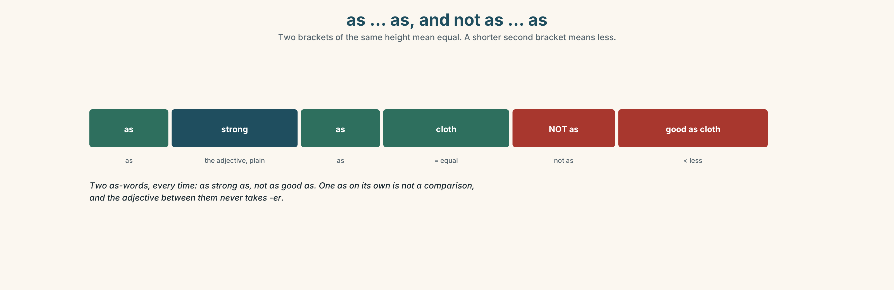{width=6.6in}

*as … as, and not as … as — Two brackets of the same height mean equal. A shorter second bracket means less.*

| | |
|---|---|
| **the same** | *as strong as · as cheap as · the same as* |
| **less** | *not as good as · not as strong as* |
| **by how much** | *a bit cheaper · much better · far more expensive* |
| **asking** | *What's the difference? · It depends.* |

> **Why it matters.** Every decision anybody makes about money is a comparison, and the person
> who can say the comparison out loud is the person who wins the argument.

### 3D · Use — controlled

Complete with the comparative, **than**, **as** or **more**.

> The synthetic cover is (1) ______ (cheap) than the cloth one. The cloth one is (2) ______
> (strong).
> Synthetic is not (3) ______ good (4) ______ cloth, but it costs less.
> This one is (5) ______ expensive (6) ______ that one, and it lasts twice as long.

### 3E · Use — guided

Compare the two things in each pair, in one sentence.

1. cloth ($41, 7 years) / synthetic ($19, 3 years)
2. metal (heavy, 30 years) / plastic (light, 8 years)
3. the old seat (repaired four times) / the new seat (torn already)
4. the train (four nights) / the plane (five hours)
5. a single ticket / a return ticket

### 3F · Use — open

**In pairs.** Choose two things in this room. **Compare them in five sentences without using the
words *good* or *bad*.**

### 3G · Check — six items, mark your own

> 1. Synthetic is ______ (cheap) than cloth.
> 2. Cloth is ______ (strong).
> 3. It isn't ______ good ______ the old one. *(two words)*
> 4. This is ______ expensive than that.
> 5. ✗ *It is more cheaper than cloth.* → correct it.
> 6. ✗ *It is cheaper that cloth.* → correct it.

{width=6.6in}

*The comparison marked twice — The comparison marked twice*

**0–3 →** Workbook pp. 12–15. **4–5 →** Part 6. **6 →** page 68.

---

## Part 4 · Speaking ◆ **C · THE PERFORMANCE**

### 4A · Fluency starter — the comparison round

Everybody compares two things in the room, in one sentence.
**No adjective may be used twice. Stop when somebody repeats one.**

### 4B · The functional core — comparing two things

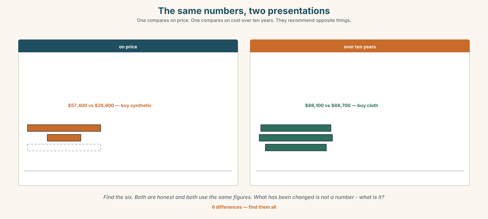{width=6.6in}

*The same numbers, two presentations — One compares on price. One compares on cost over ten years. They recommend opposite things.*

**Language Bank**

| | |
|---|---|
| **more of something** | *cheaper than · stronger than · more expensive than* |
| **the same** | *as strong as · the same as* |
| **less** | *not as good as* |
| **by how much** | *a bit cheaper · much better · far more expensive* |
| **refusing to choose** | *It depends. · What's the difference?* |

**Information gap.** Learner A has the price list. Learner B has the repair records.
**Work out which cover is cheaper over ten years.**

### 4C · The performance — the recommendation ⏺

Compare **two things that look the same to everybody else**. **Two minutes.** You must:

> use three comparatives · use one *as … as* · say by how much, with a number ·
> end by recommending one, and say what would change your mind

**Record it.**

### 4D · Observer

One person listens for **one thing**: did anybody say *more* and *-er* on the same adjective?

### 4E · Two criteria

> ☐ Did I say *than* every time I compared two things?
> ☐ Did I give one number, and was it the right kind of number?

---

## Part 5 · Reading ◆ **A · THE WORLD**

### 5A · Predict

The title is **"Nineteen dollars and forty-one dollars."**
**Which one do you think the company bought?**

### 5B · Read — sixty seconds

---

**Nineteen dollars and forty-one dollars**

A cloth seat cover costs forty-one dollars. It lasts about seven years and it can be repaired,
usually three or four times. A synthetic cover costs nineteen dollars. It lasts about three years
and it cannot be repaired at all.

Fourteen hundred seats. Cloth is fifty-seven thousand dollars and synthetic is twenty-seven.

Over ten years, cloth needs to be bought once and a half. Synthetic needs to be bought three and
a third times. Cloth is eighty-six thousand over ten years and synthetic is eighty-nine.

The two numbers are almost the same. The difference is that the cloth money leaves in one year
and the synthetic money leaves in four pieces, and the person who signs for it is not the same
person each time.

That is not an argument about seats. It is an argument about who is still here in four years.

---

### 5C · Answer

1. How much is a cloth cover?
2. How long does a synthetic cover last?
3. How many seats are there?
4. What is the ten-year cost of each?
5. **Why does the writer say the two numbers are almost the same?**
6. **The last line says it is an argument about who is still here. What does that mean for the decision?**

### 5D · Vocabulary in context

Guess from the text. Then check.

> it can be repaired · once and a half · leaves in one year · in four pieces · signs for it

### 5E · The counter-text

{width=6.6in}

*The supplier's comparison sheet — Eight rows. Six of them favour one column. Two of them are blank, and both blanks are in the same column.*

**Read the sheet and answer.**

1. What is the price of each cover?
2. **How many rows favour the synthetic cover, and which rows are they?**
3. Which two rows are blank?
4. **Both blanks are in one column. What are the two missing numbers, and why do you think they are missing?**

### 5F · Two texts

The reading says the ten-year costs are eighty-six and eighty-nine thousand.
The comparison sheet says synthetic saves thirty thousand dollars.

**Are both true?** Say one sentence.

---

## Part 6 · Vocabulary Lab 2 ◆ **B · THE SYSTEM**

### Saying by how much

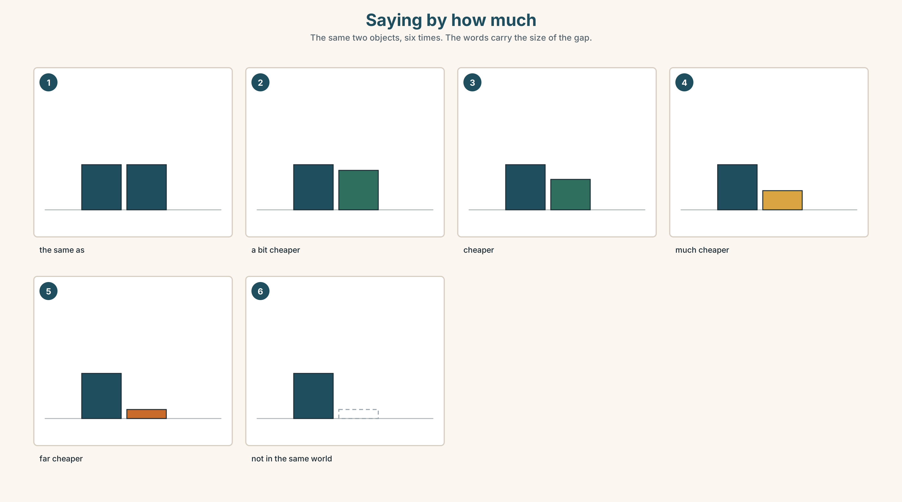{width=6.6in}

*Saying by how much — The same two objects, six times. The words carry the size of the gap.*

### 6A · The ones that catch everybody

| | |
|---|---|
| **than** | never *that*, and almost never stressed |
| **a bit** | small, and it sounds honest |
| **much / far** | big, and *far* is bigger than *much* |
| **as … as** | two of them, every time. One *as* is not a comparison |

### 6B · Say them

> than · more · less · much · quite · really · a bit · as big as · not as good as

### 6C · Chunk

1. **a ______ cheaper** — a small difference
2. **______ better** — a big difference
3. **as big ______** — the two things are equal
4. **not as good ______** — the second one is less
5. **more expensive ______** — the word that joins two things
6. **What's the ______ ?** — the question that asks for the comparison

### 6D · Contrast Clinic

Six items. ***-er*** or ***more***?

1. heavy → ______
2. useful → ______
3. difficult → ______
4. expensive → ______
5. cheap → ______
6. strong → ______

---

## Part 7 · Pronunciation & Fluency Lab ◆ **B · THE SYSTEM**

### The sound in the middle of everything

{width=6.6in}

*The small words stay small — Than, as, a and the are never the loud word. Six phrases, and the pattern never breaks.*

### 7A · Hear

> **than** → *thun* · **as** → *uz* · **a** → *uh* · **the** → *thuh*
> These four words are almost never said in full. The sound they all collapse to is the
> commonest sound in English and it does not have a letter of its own.

### 7B · Say

Say each one three times. Then say this:

> *It's cheaper than that one, and not as good as this one.* — eleven words, five beats.

### 7C · Make it mean something

Say these two:

> *It's cheaper THAN that one.* — you are correcting somebody
> *It's CHEAPER than that one.* — you are telling them something new

**Same words.** The weak word becomes strong only when you are arguing. Which one sounds like a
quarrel?

### 7D · Fluency 20 ⏺

Twenty seconds: **six comparisons of things in this room, all with *than*.** Three times, faster.

---

## Part 8 · Writing ◆ **C · THE PERFORMANCE**

### A recommendation · 50–70 words

### 8A · Read the model

> There are two covers. One is forty-one dollars and one is nineteen. `[the two numbers, with
> nothing else in the sentence]`
>
> The cheap one is not as strong, and it can't be repaired. `[the difference that is not about
> price]`
>
> Over ten years they cost almost the same: eighty-six and eighty-nine thousand. `[the number
> that changes the argument]`
>
> I would buy the cloth. If the budget were annual, I would buy the other one, and I would be
> wrong in year four. `[the recommendation, and the condition]`

**Questions about the writer's choices:**

1. The first sentence is two numbers and nothing else. **Why no adjective?**
2. *over ten years.* **Why is that phrase the whole argument?**
3. The last sentence admits the other choice. **Does that weaken the recommendation?**

### 8B · The anti-model

> The cloth covers are better. They are stronger and they last longer. The synthetic ones are cheaper but they are not as good. I recommend the cloth ones.

Correct English, correct opinion, and no finance officer will read past line two.
**Add three numbers and one condition under which you would choose the other one.**

### 8C · Plan

> the two numbers → the difference that is not price → the number over time →
> the recommendation, and what would change it

### 8D · Write — 50 to 70 words
### 8E · Peer review — two things only

> ☐ Are there at least three numbers?
> ☐ Is there one sentence saying what would change the writer's mind?

### 8F · Publish

On the wall, with no names. **The class sorts them into *decided by price* and *decided by
something else*.**

---

## Part 9 · The File ◆ **A · THE WORLD + C · THE PERFORMANCE**

# STUDY FILE · Cheap practice and expensive practice

{width=6.6in}

*Cheap practice and expensive practice — The time each one costs on the left, and what it produces on the right.*

### 9A · The cost of being right

{width=6.6in}

*One uncertain sentence — Panel three is the expensive one. Panel five is what it bought.*

| | |
|---|---|
| **Cheap** | rereading, highlighting, watching. Comfortable, and almost free |
| **Expensive** | producing something that might be wrong, in front of somebody |
| **What cheap buys** | the feeling of having studied |
| **What expensive buys** | the thing itself |

### 9B · Pay once

A mistake you make out loud costs you four seconds of embarrassment and buys you the correction.
A mistake you avoid costs you nothing and buys you nothing. **Which did you do more of this week?**

### 9C · Role play — the cheapest possible lesson

In pairs. One of you has ten minutes and wants the most English for it. The other is the teacher
and may only offer things that cost effort. **Negotiate. Nobody may say *watch a video*.**

### 9D · Your most expensive five minutes

Find the five minutes of your week in which you produce the most English with the least
preparation. **That is the most valuable thing in your routine.** Name it.

### 9E · Transfer — before next week

**Say one sentence a day that you are not sure about, out loud, to a person.** Seven sentences.
Write down what happened to each one.

---

## Part 10 · Mediation & Interaction ◆ **C · THE PERFORMANCE**

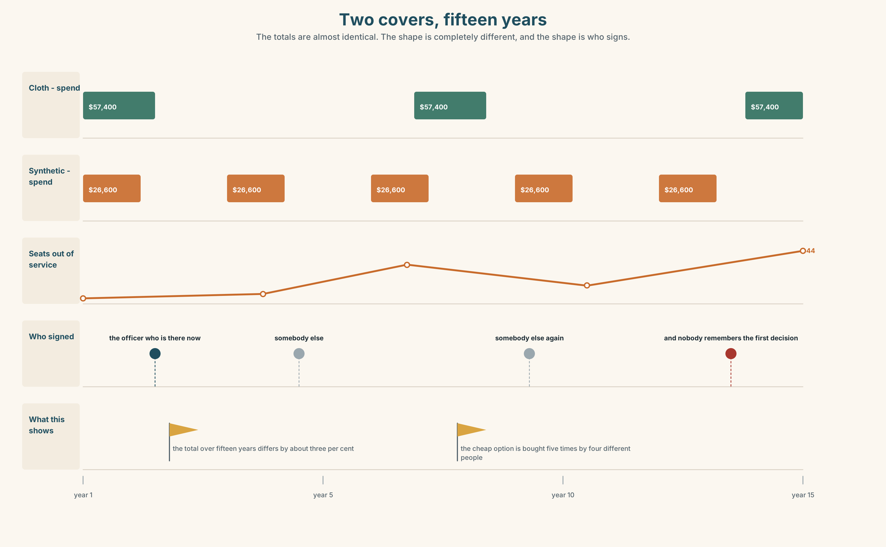{width=6.6in}

*Two covers, fifteen years — The totals are almost identical. The shape is completely different, and the shape is who signs.*

### 10A · Relay

Half the class has the price list. Half has the repair records.
**Work out the fifteen-year cost of each by speaking.** Ten minutes.

### 10B · Simplify — for one person

A colleague asks: *Why did we pay twice as much?*
**Answer in four sentences.** Use one number and one comparison.

### 10C · Online

Write **one message** comparing two things a classmate is choosing between.
**Three sentences.** Two comparatives and one *as … as*.

### 10D · Your language

Does your language add something to the adjective, or put a word in front?
**Say *cheaper* and *more expensive* in your language.** Is it the same method for both?

---

## Part 11 · The Decision ◆ **C · THE PERFORMANCE**

# One thousand four hundred seats

The company must replace fourteen hundred seat covers this year.

**Cloth.** Forty-one dollars each. Fifty-seven thousand now. Seven years, and repairable three or
four times.

**Synthetic.** Nineteen dollars each. Twenty-seven thousand now. Three years, and when it tears it
is finished.

**Repair the old ones.** Eleven dollars each and about nine months, and the people who can do the
repair are four, and three of them retire within five years.

### 11A · The evidence

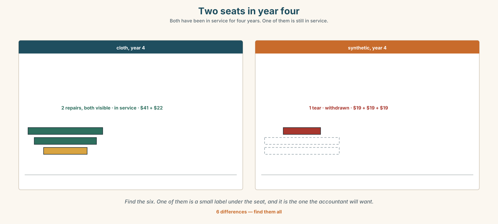{width=6.6in}

*Two seats in year four — Both have been in service for four years. One of them is still in service.*

🔊 **Track 3.6.** Ruth, 20 seconds: *"They asked me which seat is better. I've sat on both for
nine hours. That's not the question. The question is which one is still here when I am."*

### 11B · Talk about it

In threes. Use the frame. Everybody says one.

> *I think the company should buy ______ , because ______ .*

**Words you can use:** *price · quality · cheap · expensive · strong · weak · last longer*

### 11C · Decide

Write **two sentences**. Choose, and say why.

> I think the company should buy ______________________ ,
> because ______________________ .

### 11D · Model decision

> Cloth, and write down why. The ten-year numbers are three thousand dollars apart on a half
> million dollar decision, which means the money is not deciding this. Something else is, and if
> nobody writes down what, the same argument will be had again in three years by people who do
> not know it was already had.

### 11E · The Reveal

> **What happened.** The company bought cloth and nobody wrote down why. Three years later a new
> officer opened the file, saw fifty-seven thousand against twenty-seven, and ordered synthetic
> for the next batch.
>
> Then something nobody expected: the two kinds of cover are now mixed through the fleet, and
> the maintenance team can see both ageing side by side. In 2031 they will have the first real
> data anybody has ever had, by accident.

**One question. You do not have to answer it out loud.**

> The company made the right decision and lost it. Which was the actual mistake?

---

## Part 12 · Landing ◆ **all three lines**

### 12A · Recycle — twelve items

> 1. Synthetic is ______ (cheap) than cloth.
> 2. Cloth is ______ (strong).
> 3. It isn't as good ______ the old one.
> 4. This is ______ expensive than that.
> 5. a ______ cheaper — a small difference
> 6. ______ better — a big difference
> 7. It is the same ______ the other one.
> 8. These covers ______ ______ than the old ones. *(two words — they stay usable for more years)*
> 9. The machine will ______ ______ in year four. *(two words — stop working)*
> 10. What's the ______ ?
> 11. *(Unit 2)* ______ you buy it last summer?
> 12. *(Unit 1)* We ______ (go) to the shed at four.

### 12B · Consolidate — one task, everything in it

**Compare two things somebody you know had to choose between, in six sentences.** Three
comparatives, one *as … as*, two numbers, and one sentence saying what would have changed the
decision.

### 12C · Can-do, with evidence

> ☐ I can compare two things. **Evidence:** 4C, 8D
> ☐ I can choose between *-er* and *more*. **Evidence:** 3G, 6D
> ☐ I can say by how much. **Evidence:** 6C
> ☐ I can hear the weak words in a comparison. **Evidence:** 7C

### 12D · Replay ⏺

Record 0C again. **Listen to both.** What is different?

### 12E · Glossary — thirty-five words, as a map

> **THE MONEY** · price · cheap · expensive · cost more · good value
> **THE JUDGEMENT** · quality · better · worse · strong · weak
> **THE MATERIAL** · plastic · metal · wood · cloth
> **THE STATE** · new · old · same · different · the same as
> **OVER TIME** · last longer · break down · throw away
> **COMPARING** · than · more · less · much · quite · really · a bit
> **COMPARING, IN WORDS** · as big as · not as good as · more expensive than · much better
> **ASKING** · What's the difference? · It depends.

### 12F · Next

> **Unit 4 · What makes a family?**

# A1.2 · Unit 4 · Two Adults and Three Children

> **English Animated** · *Getting Around* · The Prairie Line, Toronto to Vancouver
> Student's Book pages 72–93 · 22 pp · ~9 hours

---

## Part 0 · The Big Picture ◆ **A · THE WORLD**

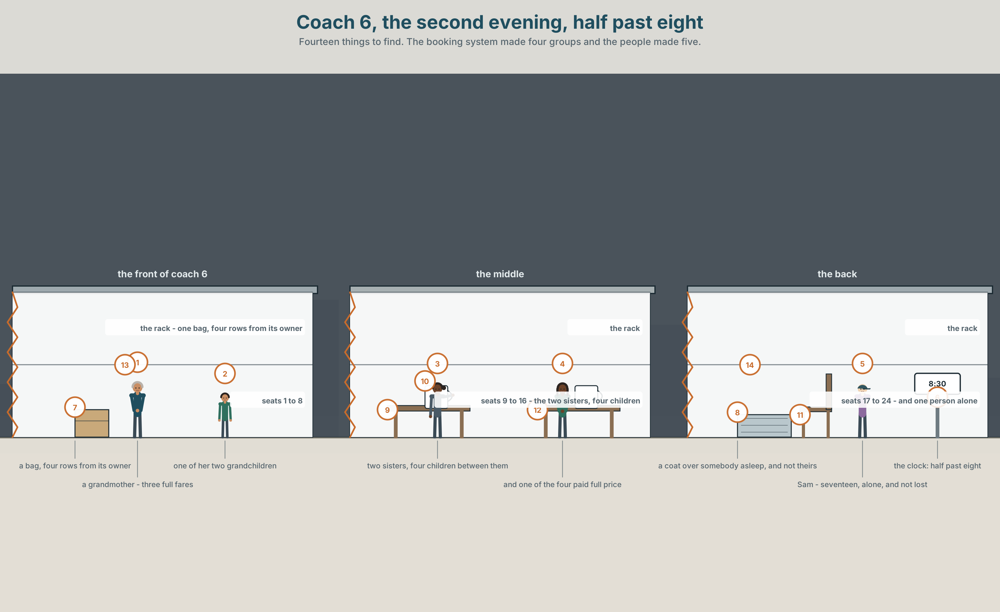{width=6.6in}

*Coach 6, the second evening, half past eight — Fourteen things to find. The booking system made four groups and the people made five.*

# What makes a family?

**By the end of this unit you can say who somebody is to somebody else, and whose things are
whose.**

| ◆ **A · THE WORLD** | A coach where the booking system made four groups and the people made five |
|---|---|
| ◆ **B · THE SYSTEM** | possessive *'s* · possessive adjectives and pronouns · 22 words for family and home · *whose* · the three sounds of possessive *s* |
| ◆ **C · THE PERFORMANCE** | You describe the people in one photograph without naming anybody |

---

### 0A · Find it — fourteen things

Find these in the picture. Write the number.

> ☐ a seat ☐ a bag ☐ a coat ☐ a window ☐ a child ☐ a table ☐ a book
> ☐ a rack ☐ a cup ☐ a light ☐ a door ☐ a blanket ☐ a phone ☐ a clock

**Three of these words are not in the picture. Which three?**

> a cousin · a grandmother · a home

### 0B · Guess it

Look at the four groups. **Which two people in this picture are related?**
Say one thing. You can use these words:

> *look like · together · alone · sister · old*

### 0C · Say it ⏺

**Record. Thirty seconds. Do not prepare.**

> **Who is in your family? Not a list — tell me about two of them.**

You will listen to this again on the last page.

---

## Part 1 · Vocabulary Lab 1 ◆ **B · THE SYSTEM**

### 1A · Meet — who is who

{width=6.6in}

*Eleven people, and what each is to each — Four of the lines are dotted. Those are the ones the booking system does not know about.*

| | |
|---|---|
| **family** | The word the fare policy uses and does not define. |
| **together** | Eleven people. Five groups. Four bookings. |
| **alone** | One person, and he is seventeen, and he is not lost. |
| **a big family** | Six on this train, and three of them have met twice. |
| **bring up** | The verb that does not require any of the nouns in this unit. |
| **grow up** | The only one of them that nobody else can do for you. |

### 1B · Meet — the words

> **family · mother · father · sister · brother · son · daughter · wife · husband · grandmother · cousin · uncle · aunt · married · alone · together**

Write each word under the right picture.

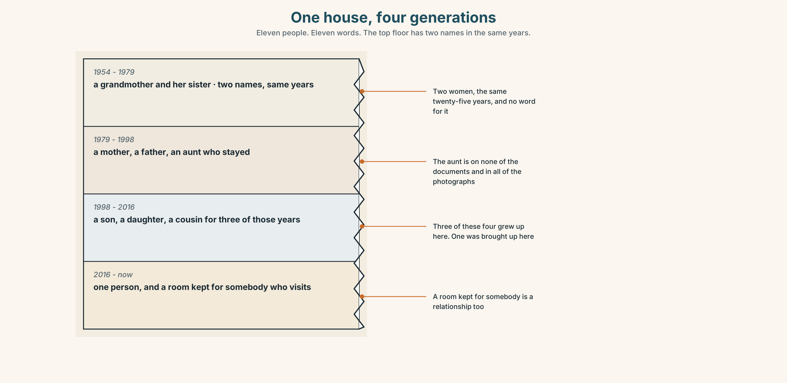{width=6.6in}

*One house, four generations — Eleven people. Eleven words. The top floor has two names in the same years.*

### 1C · Sort — the person, or the connection?

Put each word in the right box. **Two of them can go in both. Which two, and why?**

> cousin · alone · mother · husband · married · brother · family · aunt · daughter ·
> together

| **A PERSON** | **A SITUATION** | **BOTH** |
|---|---|---|
| | | |

### 1D · The verbs families use

| | |
|---|---|
| **get married** | One day. Everything else in this unit is years. |
| **look like** | The only one strangers can see. |
| **live with** | The one the fare policy actually ought to use. |
| **bring up** | Years, and it does not need a mother or a father in the sentence. |
| **grow up** | What the child does while the first one is happening. |
| **a big family** | Six people, or three, depending entirely on who is counting. |

**Now say them.** Two of these six describe something somebody does **to** somebody else.
**Which two, and who is doing it?**

### 1E · Stretch — the phrases you will need today

> **get married** · **look like** · **live with** · **bring up** · **grow up**

Match each phrase to the moment you need it.

1. Two people are in a photograph and you can see it immediately. → ______
2. Somebody is seventeen and wants to be treated as an adult. → ______
3. You are filling in a form that asks about your household. → ______
4. Somebody spent twenty years doing it and is not on the birth certificate. → ______
5. There is a date, and people remember it every year. → ______

### 1F · The hard one

> **f** **It's not mine.**

Practise it three times. **Three words, and it is almost always said about a bag.**

### 1G · Own it

Draw your family as a network, not a tree. **Put a word on every line.** Do not write any names.
The class guesses which lines are the oldest.

---

## Part 2 · Listening ◆ **A · THE WORLD**

{width=6.6in}

*The corridor of coach 6 — There is a bag on the floor and it belongs to neither of them.*

### 2A · Coach 6, half past eight 🔊 Track 4.1

**Before you listen.** Sam is seventeen and travelling alone. There is a bag with no owner.
**Guess: is it his?**

**Listen once. One question.** Whose bag is it?

**Listen again. Complete the table.**

| | Who | Relationship to Sam |
|---|---|---|
| the woman in seat 14 | | |
| the man with the coat | | |
| the person he is going to | | |

**Listen again. True or false?**

1. The bag is Sam's. ☐ T ☐ F
2. He's going to his aunt's. ☐ T ☐ F
3. His aunt brought him up. ☐ T ☐ F
4. He's travelling with his cousin. ☐ T ☐ F

**Noticing.** Four sentences from the recording.

1. *It's not mine.*
2. *It's my sister's.*
3. *Whose coat is that?*
4. *That one's ours.*

**Two of these have an apostrophe and two do not. What is the difference between *my* and
*mine*?**

### 2B · Decoding clinic 🔊 Track 4.2

Twenty seconds of Dev at speed. Three jobs.

1. Count the possessives you hear.
2. *Sam's*, *Dev's* and *Ruth's* all end in *s*. Do they end in the same sound?
3. He says one name with two *s* sounds at the end. Which, and what happens to it?

> Transcripts, page 151.

---

## Part 3 · Grammar Lab 1 ◆ **B · THE SYSTEM**

### Whose is whose

### 3A · Notice

Look at the four sentences in Part 2 again.

1. In sentence 2, what comes after *sister's* — a noun, or nothing?
2. In sentence 1, could you say *It's not my*? Why not?
3. What is the question word in sentence 3?
4. Which of the four would you use if you were holding the thing?

### 3B · See

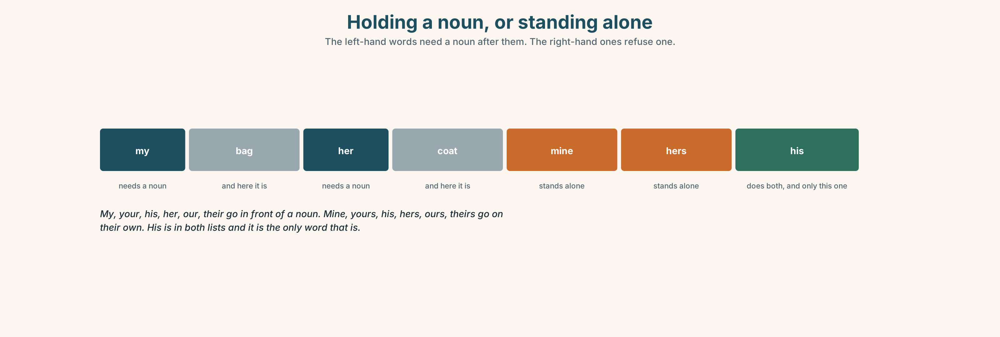{width=6.6in}

*Holding a noun, or standing alone — The left-hand words need a noun after them. The right-hand ones refuse one.*

### 3C · Know

| | | |
|---|---|---|
| **before a noun** | my · your · his · her · our · their | *my bag · her coat · their seats* |
| **standing alone** | mine · yours · his · hers · ours · theirs | *It's mine. That one's ours.* |
| **a person's thing** | name + **'s** | *Sam's bag · my sister's coat* |
| **asking** | **whose** | *Whose is this? Whose bag is it?* |

> **The apostrophe is not a plural.** *Sam's bag* is one Sam. *The Smiths* is a lot of Smiths.
> *The Smiths' bags* is both at once, and the apostrophe has moved.

{width=6.6in}

*The hook attaches to the owner — 's goes on the person who owns, never on the thing owned. Of does the same job backwards.*

| | |
|---|---|
| **people take 's** | *my sister's coat · the guard's keys* |
| **things usually take of** | *the door of the coach · the end of the line* |
| **belong to** | *That bag belongs to Sam.* |
| **one of a group** | *a friend of mine · a cousin of hers* |

> **Why it matters.** Half of all arguments on a train are about whose something is, and all of
> them are settled in four words.

### 3D · Use — controlled

Complete with **my**, **mine**, **his**, **her**, **hers**, **their**, **theirs** or **'s**.

> That bag isn't (1) ______ . It's Sam (2) ______ sister (3) ______ bag.
> This coat is (4) ______ — the man in seat 9. That one over there is (5) ______ , the two
> children.
> Whose seats are these? — They're (6) ______ . We booked them in March.

### 3E · Use — guided

Rewrite each one with **'s** or with a pronoun.

1. The bag that belongs to Sam.
2. The coat that belongs to me.
3. The seats that belong to us.
4. The keys that belong to the guard.
5. The children that belong to my sister.

### 3F · Use — open

**In pairs.** Put four objects on the table. **Your partner must find out whose each one is,
using only *Whose…?* and *Is this yours?***

### 3G · Check — six items, mark your own

> 1. That bag isn't ______ . *(belonging to me, standing alone)*
> 2. It's Sam ______ sister's bag.
> 3. This coat is ______ . *(belonging to her, standing alone)*
> 4. ______ seats are these?
> 5. ✗ *It's not my.* → correct it.
> 6. ✗ *That is the bag of Sam.* → correct it.

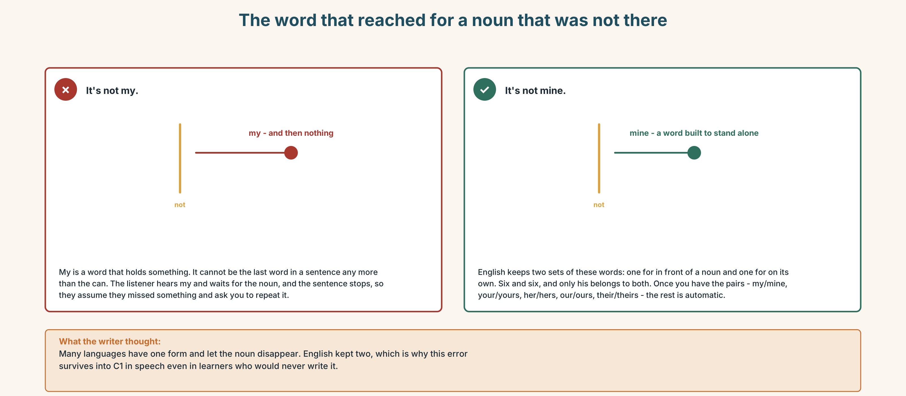{width=6.6in}

*The word that reached for a noun that was not there — The word that reached for a noun that was not there*

**0–3 →** Workbook pp. 16–19. **4–5 →** Part 6. **6 →** page 90.

---

## Part 4 · Speaking ◆ **C · THE PERFORMANCE**

### 4A · Fluency starter — whose is it?

Everybody puts one object in the middle. **Find out whose each one is in under three minutes,
and nobody may point.**

### 4B · The functional core — saying who people are

{width=6.6in}

*One photograph, two descriptions — The left names relationships. The right names what people are doing.*

**Language Bank**

| | |
|---|---|
| **the relationship** | *my sister's son · her husband · a cousin of mine* |
| **the connection** | *they live with · she brought him up · they got married in March* |
| **whose** | *Whose is this? · It's not mine. · That one's ours.* |
| **belonging** | *It belongs to him. · a friend of mine* |

**Information gap.** Learner A has the booking list. Learner B has who is actually sitting where.
**Find the two groups the system does not know about.**

### 4C · The performance — one photograph ⏺

Describe **one photograph with at least four people in it**, without naming anybody.
**Two minutes.** You must:

> say who each person is to each other person · use three possessive forms · say one thing
> nobody could guess from looking

Your partner draws the network. **Record it.**

### 4D · Observer

One person listens for **one thing**: did anybody use a possessive adjective with no noun after it?

### 4E · Two criteria

> ☐ Could my partner draw the network correctly?
> ☐ Did I use both *'s* and a standing-alone pronoun?

---

## Part 5 · Reading ◆ **A · THE WORLD**

### 5A · Predict

The title is **"Two adults and up to three children."**
**What do you think this is a definition of?**

### 5B · Read — sixty seconds

---

**Two adults and up to three children**

The family fare says: two adults and up to three children, travelling together, for the price of
two adults.

In coach 6 last Tuesday there were eleven people. One was a grandmother travelling with two
grandchildren: three people, one adult, and she paid full fare for all three.

Two were sisters with four children between them: six people, and the fare covers five, so one
child paid full price. They could not decide which child, so they split it.

One was a man travelling with his wife's mother, who is eighty-one and cannot travel alone. Two
adults, no children, no discount.

And one was Sam, who is seventeen, which the policy counts as an adult, travelling alone to the
aunt who brought him up.

Four bookings. One of them got the family fare, and it was the only one in which nobody was
looking after anybody.

---

### 5C · Answer

1. What does the family fare say?
2. How many people were in coach 6?
3. Why did one child pay full price?
4. How old is Sam?
5. **Why did the grandmother pay full fare for three people?**
6. **The last line says the only booking that got the discount was the one in which nobody was looking after anybody. What is the policy actually paying for?**

### 5D · Vocabulary in context

Guess from the text. Then check.

> travelling together · between them · they split it · cannot travel alone · looking after

### 5E · The counter-text

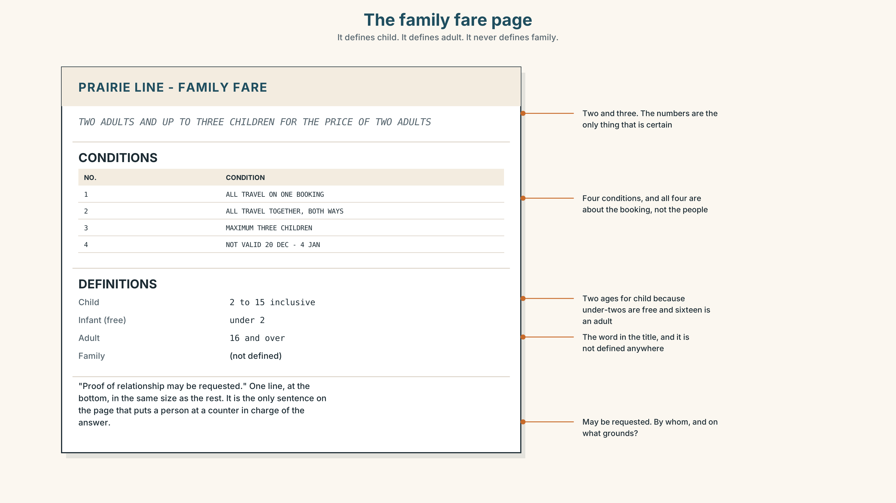{width=6.6in}

*The family fare page — It defines child. It defines adult. It never defines family.*

**Read the page and answer.**

1. How many adults and how many children does the fare cover?
2. **What are the two ages in the definition of *child*, and why are there two?**
3. What does the last line say?
4. **The page defines *child* and *adult* and never defines *family*. Why not, and what does that leave to whoever is at the counter?**

### 5F · Two texts

The reading describes four bookings and one discount.
The web page describes an offer for families.

**Which of the four bookings is a family?** Say one sentence.

---

## Part 6 · Vocabulary Lab 2 ◆ **B · THE SYSTEM**

### Whose, and the words that answer it

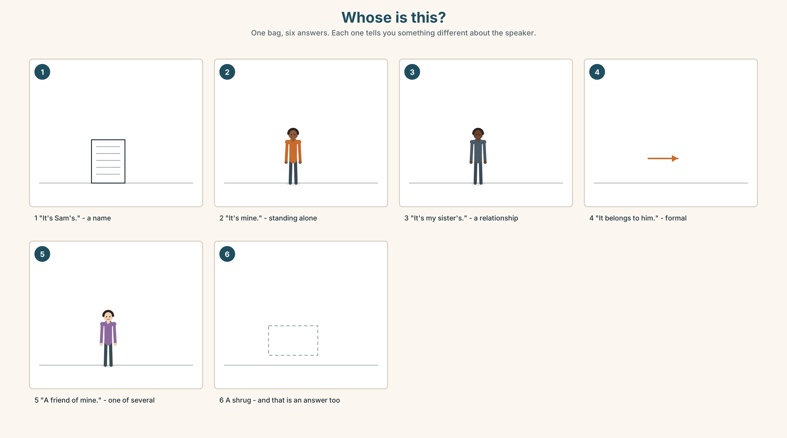{width=6.6in}

*Whose is this? — One bag, six answers. Each one tells you something different about the speaker.*

### 6A · The ones that catch everybody

| | |
|---|---|
| **its / it's** | *its* is possessive; *it's* is *it is*. The apostrophe means the opposite of what you expect |
| **his** | the only word that is both an adjective and a pronoun |
| **hers / theirs / ours** | no apostrophe, ever |
| **a friend of mine** | not *a my friend*, and not *a friend of me* |

### 6B · Say them

> whose · my · your · his · her · our · their · mine · yours

### 6C · Chunk

1. **______ is this?** — the question
2. It's not **______ .** — standing alone, belonging to me
3. That one's **______ .** — standing alone, belonging to us
4. It **______ to** Sam. — two words, and a formal one
5. a friend **______ ______** — one of my friends
6. my sister **______** coat — the hook that joins two nouns

### 6D · Contrast Clinic

Six items. ***my*** or ***mine***?

1. That bag isn't ______ .
2. The blue one is ______ .
3. ______ sister lives in Jasper.
4. ______ seat is 14.
5. Is this coat ______ ?
6. ______ aunt brought me up.

---

## Part 7 · Pronunciation & Fluency Lab ◆ **B · THE SYSTEM**

### One apostrophe, three sounds

{width=6.6in}

*One apostrophe, three sounds — Exactly the rule you learned for plurals, and for he-she-it. The third time it is free.*

### 7A · Hear

> **/s/** after a quiet sound: *Dev's · Kate's · the guard's · my aunt's*
> **/z/** after a loud sound: *Sam's · Ruth's · my brother's · the children's*
> **/ɪz/** after a hissing sound: *Ross's · the nurse's · George's · my niece's*

### 7B · Say

Say each group three times. Then say this:

> *Dev's coat, Sam's bag, and Ross's seat.* — three endings, one sentence, all spelled the same.

### 7C · Make it mean something

Say these two:

> *my sister's children* — one sister
> *my sisters' children* — more than one sister

**You cannot hear the difference and the reader can see it.** This is the only place in English
where the apostrophe carries meaning that the voice does not. Which is which, when you are
speaking?

### 7D · Fluency 20 ⏺

Twenty seconds: **six things in this room and whose they are.** Three times, faster.

---

## Part 8 · Writing ◆ **C · THE PERFORMANCE**

### Who they are to each other · 50–70 words

### 8A · Read the model

> There are four people in the photograph. `[the number, and nothing else]`
>
> The woman on the left is my mother. The man beside her is her brother, not my father.
> `[the correction before the reader makes the mistake]`
>
> The boy is my cousin's son. My cousin isn't in the picture — she took it. `[the person who is
> absent and present at once]`
>
> The old woman at the back brought all three of them up. She isn't related to any of them.
> `[the sentence the photograph cannot show]`

**Questions about the writer's choices:**

1. *not my father.* **Why correct something the reader has not said yet?**
2. *she took it.* **How does that make the writer's cousin part of the picture?**
3. The last line is the only one that could not be guessed. **Why is it last?**

### 8B · The anti-model

> This is a photo of my family. There are four people. On the left is my mother. Next to her is my uncle. The boy is my cousin's son. The old woman is a family friend.

Correct English, and you could not pick it out of six photographs. **Add one correction, one
person who is not in the picture, and one fact the camera cannot see.**

### 8C · Plan

> the number → the relationship, with one correction → the person who is absent →
> the fact the photograph cannot show

### 8D · Write — 50 to 70 words
### 8E · Peer review — two things only

> ☐ Is there at least one *'s* and one standing-alone pronoun?
> ☐ Is there one fact that is not visible in the photograph?

### 8F · Publish

On the wall, with no names and no photographs. **The class draws the networks and compares them.**

---

## Part 9 · The File ◆ **A · THE WORLD + C · THE PERFORMANCE**

# STUDY FILE · Whose English is it?

{width=6.6in}

*Where your English came from — Four layers. The thin one at the bottom is the only one that is yours.*

### 9A · Four sources

{width=6.6in}

*One phrase, five meetings — Nobody taught it. By panel five the learner owns it.*

| | |
|---|---|
| **What a course gives you** | the shape, and permission to be wrong |
| **What a song gives you** | the rhythm, and about forty words you will never forget |
| **What one person gives you** | everything you will actually say |
| **What you make yourself** | the sentences nobody said to you first |

### 9B · Your one person

Almost everybody who learns a language well has one person they speak it to more than anybody
else. **Name yours.** If you do not have one, that is this term's most useful problem.

### 9C · Role play — whose phrase is that?

In pairs. Say five English phrases you use often. **For each one, say where you got it.**
At least one must be from a song and one from a person.

### 9D · The sentence nobody gave you

Think of one sentence you have said in English that you did not learn from anywhere — you built
it. **Write it down.** That one is yours.

### 9E · Transfer — before next week

**Write down five phrases you heard this week and where each came from.**
Bring the list, and mark the one you have already used.

---

## Part 10 · Mediation & Interaction ◆ **C · THE PERFORMANCE**

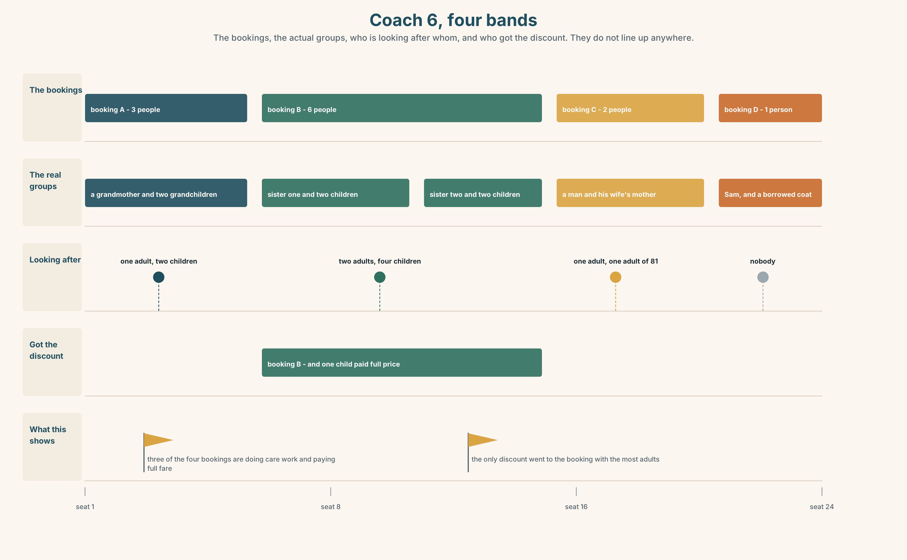{width=6.6in}

*Coach 6, four bands — The bookings, the actual groups, who is looking after whom, and who got the discount. They do not line up anywhere.*

### 10A · Relay

Half the class has the booking list. Half has who is actually sitting where.
**Rebuild coach 6 by speaking.** Ten minutes.

### 10B · Simplify — for one person

Somebody at the ticket counter asks: *Do we count as a family?*
**Answer in four sentences.** Be accurate and be kind; the two are not the same here.

### 10C · Online

Write **one message** to a classmate about two people in your family and how they are related.
**Three sentences.** One *'s*, one possessive adjective, one pronoun standing alone.

### 10D · Your language

Does your language have one word for your mother's brother and your father's brother?
**Say *uncle* in your language.** How many words did you need?

---

## Part 11 · The Decision ◆ **C · THE PERFORMANCE**

# Who counts

The family fare covers two adults and up to three children travelling together. Last year it was
claimed on nineteen thousand bookings and refused on about four hundred.

**Option one:** leave it. The rule is clear, it is cheap to administer, and four hundred refusals
is two per cent.

**Option two:** define family by household. Anybody who lives at the same address. Clear, fair,
and it needs an address check at the counter, which takes ninety seconds and a document.

**Option three:** drop the definition. Any four people travelling together on one booking. Simple,
generous, and it costs about nine hundred thousand dollars a year.

### 11A · The evidence

{width=6.6in}

*The same ticket counter, two rules — The current rule on the left, the household rule on the right. The same three people.*

🔊 **Track 4.6.** Sam, 20 seconds: *"My aunt brought me up. On the form she's not my mother and
she's not my guardian any more, because I'm seventeen. There's no box for her. There's no box for
most people."*

### 11B · Talk about it

In threes. Use the frame. Everybody says one.

> *I think the company should ______ , because ______ .*

**Words you can use:** *family · together · alone · aunt · cousin · bring up · live with*

### 11C · Decide

Write **two sentences**. Choose, and say why.

> I think the company should ______________________ ,
> because ______________________ .

### 11D · Model decision

> Any four people on one booking, and stop calling it the family fare. The company is not selling
> a definition of family; it is selling empty seats. Every minute spent deciding whether a
> grandmother counts is a minute spent making the product worse.

### 11E · The Reveal

> **What happened.** The company renamed it the Group Fare and dropped the definition. The cost
> was six hundred thousand, not nine hundred, because a third of the new claims were people who
> would not have travelled at all.
>
> Then something nobody expected: complaints at ticket counters fell by a quarter, and almost all
> of the drop was in complaints that had nothing to do with fares. The clerks had stopped being
> the people who decide who is a family.

**One question. You do not have to answer it out loud.**

> The rule cost the company four hundred refusals a year. What was it costing the clerks?

---

## Part 12 · Landing ◆ **all three lines**

### 12A · Recycle — twelve items

> 1. That bag isn't ______ . *(belonging to me, standing alone)*
> 2. It's Sam ______ sister's bag.
> 3. This coat is ______ . *(belonging to her, standing alone)*
> 4. ______ seats are these?
> 5. It ______ to Sam. *(two words — the formal way)*
> 6. a friend ______ mine
> 7. They ______ ______ in March. *(two words — one day, and a date)*
> 8. She ______ him ______ . *(two words — twenty years, and she is not on the certificate)*
> 9. I ______ ______ my aunt. *(two words — the same address)*
> 10. They ______ ______ in Jasper. *(two words — what the child does)*
> 11. *(Unit 3)* It isn't as good ______ the old one.
> 12. *(Unit 2)* ______ you travel last summer?

### 12B · Consolidate — one task, everything in it

**Describe four people who are connected to each other, in six sentences.** Two *'s* forms, two
possessive adjectives, one pronoun standing alone, and one relationship that is not a blood
relationship.

### 12C · Can-do, with evidence

> ☐ I can say who people are to each other. **Evidence:** 4C, 8D
> ☐ I can use *'s* and the possessive pronouns. **Evidence:** 3G, 6D
> ☐ I can ask and answer *Whose…?* **Evidence:** 4A
> ☐ I can say the three sounds of possessive *s*. **Evidence:** 7C

### 12D · Replay ⏺

Record 0C again. **Listen to both.** What is different?

### 12E · Glossary — thirty-five words, as a map

> **THE OLDER ONES** · mother · father · grandmother · uncle · aunt
> **THE SAME GENERATION** · sister · brother · cousin · wife · husband
> **THE YOUNGER ONES** · son · daughter
> **THE WORD ITSELF** · family · a big family
> **THE SITUATION** · married · alone · together · get married · live with
> **WHAT PEOPLE DO** · look like · bring up · grow up
> **WHOSE** · whose · my · your · his · her · our · their · mine · yours
> **SAYING IT** · belong to · a friend of mine · Whose is this? · It's not mine.

### 12F · Next

> **Unit 5 · What does a body need?**

# A1.2 · Unit 5 · Is There a Doctor on Board?

> **English Animated** · *Getting Around* · The Prairie Line, Toronto to Vancouver
> Student's Book pages 94–115 · 22 pp · ~9 hours

---

## Part 0 · The Big Picture ◆ **A · THE WORLD**

{width=6.6in}

*The kitchen car, the third morning, quarter past five — Fourteen things to find. The floor under the mat is worn in the shape of two feet.*

# What does a body need?

**By the end of this unit you can give somebody advice, and take it.**

| ◆ **A · THE WORLD** | A kitchen two metres wide, four nights from a hospital |
|---|---|
| ◆ **B · THE SYSTEM** | *should* and *shouldn't* · *Why don't you…?* · 22 words for health and advice · the verbs a body does · */ʊ/* and */uː/*, and the *should* you cannot hear |
| ◆ **C · THE PERFORMANCE** | You give advice to somebody who has already decided not to take it |

---

### 0A · Find it — fourteen things

Find these in the picture. Write the number.

> ☐ a stove ☐ a sink ☐ a mat ☐ a rail ☐ a cupboard ☐ a cross ☐ a lock
> ☐ a window ☐ a clock ☐ a cup ☐ a door ☐ a floor ☐ a light ☐ a box

**Three of these words are not in the picture. Which three?**

> a doctor · medicine · a pain

### 0B · Guess it

Look at the floor under the mat. **How long has somebody stood in that spot?**
Say one thing. You can use these words:

> *stand · work · old · same · year*

### 0C · Say it ⏺

**Record. Thirty seconds. Do not prepare.**

> **Somebody says they are tired all the time. What do you tell them?**

You will listen to this again on the last page.

---

## Part 1 · Vocabulary Lab 1 ◆ **B · THE SYSTEM**

### 1A · Meet — what a body does in a kitchen

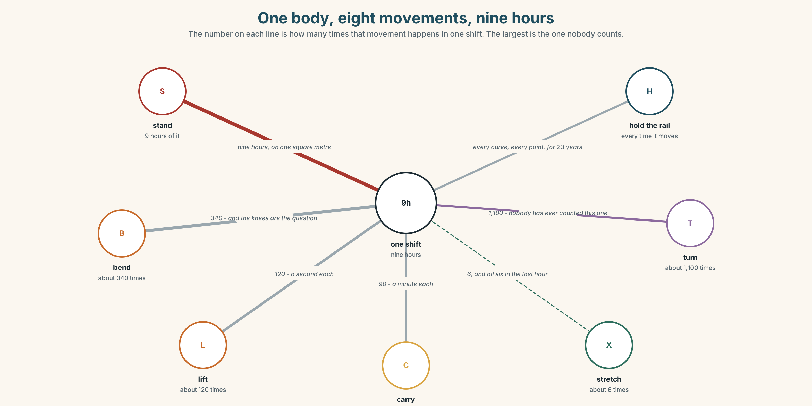{width=6.6in}

*One body, eight movements, nine hours — The number on each line is how many times that movement happens in one shift. The largest is the one nobody counts.*

| | |
|---|---|
| **health** | A word people use about other people. |
| **pain** | The only word on this list that is never an opinion. |
| **rest** | Not sleep. The company has a word for sleep and no word for this. |
| **stress** | Measured in nobody, recorded nowhere, and the commonest reason people leave. |
| **exercise** | Nine hours of standing is not this, and everybody thinks it is. |
| **well** | The answer everybody gives, and the one word in this unit that is almost always a lie. |

### 1B · Meet — the words

> **health · doctor · medicine · pain · headache · cold · cough · ill · sick · well · rest · water · exercise · stress · hungry · warm**

Write each word under the right picture.

{width=6.6in}

*Nine hours, in section — Eleven movements. Eleven words. Hour six has two minutes in it that are not like the rest.*

### 1C · Sort — the body, or the advice?

Put each word in the right box. **Two of them can go in both. Which two, and why?**

> exercise · cold · sick · rest · pain · medicine · headache · cough · water · stress

| **SOMETHING THE BODY HAS** | **SOMETHING YOU DO ABOUT IT** | **BOTH** |
|---|---|---|
| | | |

### 1D · What people say about a body

| | |
|---|---|
| **take medicine** | *take*, not *eat* and not *drink*. English treats it as a task. |
| **see a doctor** | *see*, not *visit* and not *meet*. Also a task. |
| **have a cold** | *have*, and it lasts days. *I am cold* lasts a minute and is different. |
| **feel better** | The only measurement anybody takes. |
| **lie down** | Two minutes. In a galley there is nowhere to do it. |
| **give up** | The one piece of advice in this unit that nobody can do on somebody else's behalf. |

**Now say them.** Two of these six are things you do and four are things that happen to you.
**Which two, and which of the six is somewhere in between?**

### 1E · Stretch — the phrases you will need today

> **take medicine** · **see a doctor** · **have a cold** · **feel better** · **lie down**

Match each phrase to the moment you need it.

1. It is day four and it is not going away. → ______
2. You have a box and a glass of water in your hand. → ______
3. Somebody asks how you are, three days after. → ______
4. It started on Tuesday and you are still working. → ______
5. There is a bench and you have four minutes. → ______

### 1F · The hard one

> **f** **Take it easy.**

Practise it three times. **Three words. It is advice and a goodbye at the same time, and nobody
ever does it.**

### 1G · Own it

Write down one piece of advice somebody gave you that you did not take, and whether you should
have. Do not write your name. The class guesses whose it is.

---

## Part 2 · Listening ◆ **A · THE WORLD**

{width=6.6in}

*The galley doorway — One of them is in the kitchen. The other cannot come further in than the door.*

### 2A · Quarter past five 🔊 Track 5.1

**Before you listen.** Ruth has worked in this kitchen for twenty-three years.
**Guess: will she say she is well?**

**Listen once. One question.** What hurts?

**Listen again. Complete the table.**

| | What Ruth says | What Nadia advises |
|---|---|---|
| the pain | | |
| the hours | | |
| the doctor | | |

**Listen again. True or false?**

1. Ruth has seen a doctor. ☐ T ☐ F
2. Nadia tells her to sit down. ☐ T ☐ F
3. There is a doctor on the train. ☐ T ☐ F
4. Ruth says she is fine. ☐ T ☐ F

**Noticing.** Four sentences from the recording.

1. *You should sit down.*
2. *You shouldn't lift that.*
3. *Why don't you see a doctor?*
4. *You'll feel better.*

**Three of these are advice and one is a promise. Which, and which is the hardest to say?**

### 2B · Decoding clinic 🔊 Track 5.2

Twenty seconds of Nadia at speed. Three jobs.

1. Count how many pieces of advice she gives.
2. *Should* has five letters and one of them is silent and two more almost are. How many sounds?
3. She says *shouldn't* once. What happens to the *t*?

> Transcripts, page 152.

---

## Part 3 · Grammar Lab 1 ◆ **B · THE SYSTEM**

### Telling somebody what to do, without telling them

### 3A · Notice

Look at the four sentences in Part 2 again.

1. What is the form of the verb after *should*?
2. Does *should* change for *he*, *she* or *they*?
3. In sentence 3, what is the shape of the question?
4. Which of the four is the gentlest, and why?

### 3B · See

{width=6.6in}

*Five rungs of the same advice — The advice does not change. The rung decides whether it is taken.*

### 3C · Know

| | | |
|---|---|---|
| **advice** | *should* + the plain verb | *You should sit down. She should rest.* |
| **advice against** | *shouldn't* + the plain verb | *You shouldn't lift that.* |
| **a suggestion** | *Why don't you…?* | *Why don't you see a doctor?* |
| **a promise, not advice** | *will* | *You'll feel better.* |

> **Should never changes.** No *s*, no *to*, no *do* in the question: *should I, should she, should
> they.* It is the third helper of this kind you have met, after *can* and *must*, and they all
> behave identically.

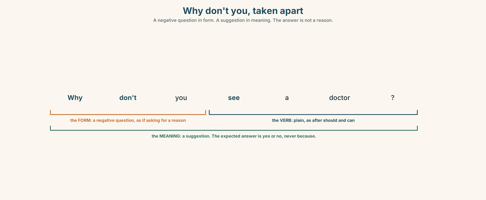{width=6.6in}

*Why don't you, taken apart — A negative question in form. A suggestion in meaning. The answer is not a reason.*

| | |
|---|---|
| **softer than should** | *Why don't you see a doctor?* |
| **about yourself** | *I should rest. I shouldn't work tonight.* |
| **asking for advice** | *What should I do? Should I see a doctor?* |
| **the closing phrases** | *You'll feel better. Take it easy.* |

> **Why it matters.** Advice is the commonest kind of help anybody gives, and the difference
> between advice that is taken and advice that is resented is almost entirely in the first two
> words.

### 3D · Use — controlled

Complete with **should**, **shouldn't**, **Why don't you** or the plain verb.

> You (1) ______ sit down for five minutes. You (2) ______ lift that box on your own.
> (3) ______ see a doctor in Winnipeg?
> I (4) ______ (not work) tonight, but there is nobody else. What (5) ______ I do?
> She (6) ______ (rest) for two days.

### 3E · Use — guided

Turn each one into advice, twice: once with *should* and once with *Why don't you*.

1. Somebody has a headache every afternoon.
2. Somebody has had a cough for three weeks.
3. Somebody never drinks any water at work.
4. Somebody carries boxes alone.
5. Somebody has not had a day off for nine weeks.

### 3F · Use — open

**In pairs.** One of you describes a problem. The other gives three pieces of advice, each
softer than the last. **The first person must refuse all three, politely.**

### 3G · Check — six items, mark your own

> 1. You ______ sit down. *(advice)*
> 2. You ______ lift that. *(advice against)*
> 3. ______ see a doctor? *(three words — the gentle one)*
> 4. What ______ I do?
> 5. ✗ *You should to sit down.* → correct it.
> 6. ✗ *She shoulds rest.* → correct it.

{width=6.6in}

*The to with nowhere to stand — The to with nowhere to stand*

**0–3 →** Workbook pp. 20–23. **4–5 →** Part 6. **6 →** page 112.

---

## Part 4 · Speaking ◆ **C · THE PERFORMANCE**

### 4A · Fluency starter — the advice chain

One person says a problem. Everybody gives one piece of advice.
**No two people may use the same opening, and there are only four openings.**

### 4B · The functional core — giving advice

{width=6.6in}

*The same advice, two openings — Left: You should. Right: a question. Everything after the first three words is identical.*

**Language Bank**

| | |
|---|---|
| **direct** | *You should… · You shouldn't…* |
| **a suggestion** | *Why don't you…?* |
| **about yourself first** | *When that happened to me, I…* |
| **closing** | *You'll feel better. · Take it easy.* |

**Information gap.** Learner A has what the crew says about their health. Learner B has the
company's sickness record. **Find the three things that are in one and not the other.**

### 4C · The performance — advice that is refused ⏺

Give advice to somebody who has already decided not to take it. **Two minutes.** You must:

> give three pieces of advice, each gentler than the last · use *should* once and *Why don't
> you* once · end without repeating yourself

Your partner must refuse all three and give a reason each time. **Record it.**

### 4D · Observer

One person listens for **one thing**: did anybody put *to* after *should*?

### 4E · Two criteria

> ☐ Did my three pieces of advice get softer, not louder?
> ☐ Did I say one thing about myself before I said anything about them?

---

## Part 5 · Reading ◆ **A · THE WORLD**

### 5A · Predict

The title is **"Four nights from a hospital."**
**What do you think happens when somebody is ill on this train?**

### 5B · Read — sixty seconds

---

**Four nights from a hospital**

The train is four nights long. At its furthest point it is eleven hours from a town with a
hospital.

There is a cupboard with a green cross on it in the kitchen car. It has a padlock. Inside there
are bandages, a blanket, and a list of telephone numbers.

When somebody is ill, the crew make an announcement and ask whether there is a doctor on board.
Last year this happened forty-one times. A doctor or a nurse answered thirty of those times.

Eleven times, nobody answered.

Nadia has done this fourteen times in eleven years. She says the worst part is not the eleven. It
is that the announcement tells a hundred and ninety-two people that there is something wrong, and
she has to say it in a voice that does not frighten them, and she has never been trained to do
either of those things.

---

### 5C · Answer

1. How long is the train journey?
2. How far is the furthest point from a hospital?
3. What is inside the cupboard?
4. How many times did somebody answer the announcement last year?
5. **Why does Nadia say the worst part is not the eleven times nobody answered?**
6. **What two things has she never been trained to do, and which of the two is harder?**

### 5D · Vocabulary in context

Guess from the text. Then check.

> at its furthest point · a padlock · answered · the worst part · in a voice that

### 5E · The counter-text

{width=6.6in}

*Inside the cupboard door — Nine items, a date, a signature, and a telephone number.*

**Read the list and answer.**

1. How many items should be in the cupboard?
2. **Which two items have been crossed off, and what were they for?**
3. When was the cupboard last checked?
4. **The last line is a telephone number. On a train eleven hours from a town, what does a telephone number get you?**

### 5F · Two texts

The reading says the crew ask whether there is a doctor on board.
The contents list says *telephone for medical advice*.

**Which of the two is the real system?** Say one sentence.

---

## Part 6 · Vocabulary Lab 2 ◆ **B · THE SYSTEM**

### What a body does

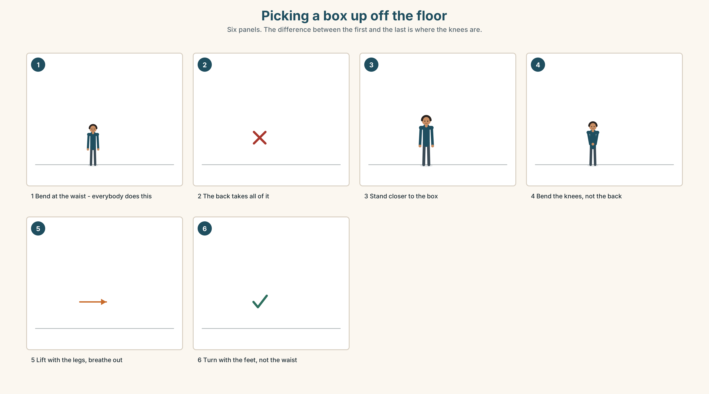{width=6.6in}

*Picking a box up off the floor — Six panels. The difference between the first and the last is where the knees are.*

### 6A · The ones that catch everybody

| | |
|---|---|
| **hurt** | the same word for what you feel and what you do: *my back hurts* / *you'll hurt your back* |
| **lift / carry** | lifting is a second; carrying is a minute. Different verbs, different injuries |
| **stretch / bend** | opposite directions, and people confuse them constantly |
| **breathe** | the verb. *Breath* is the noun, and it has no *e* |

### 6B · Say them

> breathe · stretch · bend · lift · stand · carry · hurt · should · shouldn't

### 6C · Chunk

1. You **______** take some medicine. *(advice)*
2. You **______** lift that alone. *(advice against)*
3. **______ ______ you** see a doctor? *(three words)*
4. You'll **______ ______ .** *(two words, and it is a promise)*
5. **______ it easy.** *(two words, and it is a goodbye)*
6. My back **______ .** *(the body, not the action)*

### 6D · Contrast Clinic

Six items. ***should*** or ***shouldn't***?

1. You ______ lift that on your own.
2. We ______ take a break.
3. She ______ see a doctor.
4. You ______ drink more water.
5. They ______ carry it up the stairs.
6. He ______ work tonight.

---

## Part 7 · Pronunciation & Fluency Lab ◆ **B · THE SYSTEM**

### Two *oo* sounds, and the *should* you cannot hear

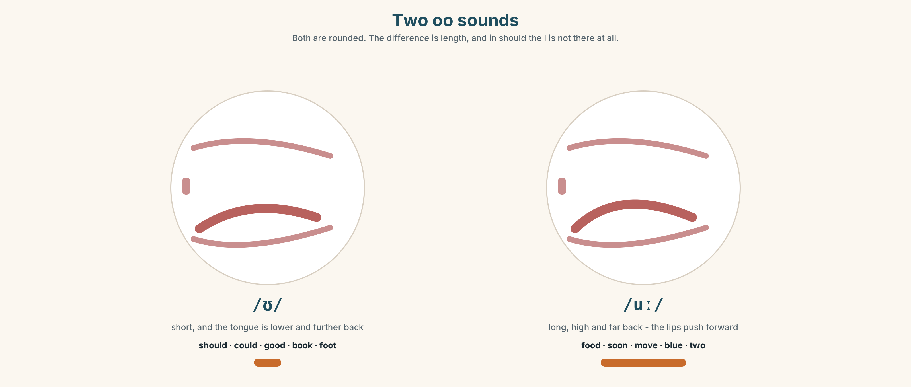{width=6.6in}

*Two oo sounds — Both are rounded. The difference is length, and in should the l is not there at all.*

### 7A · Hear

> **/ʊ/** short: *should · could · would · good · book · foot*
> **/uː/** long: *food · soon · move · blue · two · you*
> The *l* in *should*, *could* and *would* is silent. There is no *l* sound in any of them.

### 7B · Say

Say each group three times. Then say this:

> *You should look at your foot soon.* — both vowels, three times each, in one sentence.

### 7C · Make it mean something

Say these two:

> *You should sit down.* — *should* is short, quiet, and almost disappears
> *You SHOULD sit down.* — *should* is long and loud, and you are arguing

**Advice that is heard is quiet.** When *should* becomes the loudest word in the sentence, it has
stopped being advice. Which one would you say to a colleague?

### 7D · Fluency 20 ⏺

Twenty seconds: **six pieces of advice for somebody who stands all day.** Three times, faster.

---

## Part 8 · Writing ◆ **C · THE PERFORMANCE**

### Advice · 50–70 words

### 8A · Read the model

> You've had the cough for three weeks. That's not a cold any more. `[the fact, and the thing
> they already know]`
>
> When mine went on that long, I left it another month and then lost a week of work.
> `[the writer's own mistake, before any advice]`
>
> Why don't you see somebody in Winnipeg? You're there for four hours on Thursday. `[the
> suggestion, with the obstacle already removed]`
>
> I know you won't. Take it easy anyway. `[the sentence that admits the advice will be refused]`

**Questions about the writer's choices:**

1. The first line tells them something they know. **Why is that useful?**
2. *When mine went on that long…* **Why put the writer's own mistake before the advice?**
3. *I know you won't.* **Does that make the advice weaker or stronger?**

### 8B · The anti-model

> You should see a doctor. You shouldn't work when you are ill. You should rest more. You should drink more water. You should take care of yourself.

Correct English, correct advice, and it will be ignored completely. **Rewrite it with one fact,
one thing about yourself, and one obstacle removed.**

### 8C · Plan

> the fact they already know → your own mistake → the suggestion, with the obstacle removed →
> the honest last line

### 8D · Write — 50 to 70 words
### 8E · Peer review — two things only

> ☐ Is there one sentence about the writer before any advice?
> ☐ Is there an obstacle removed, not just an instruction given?

### 8F · Publish

Swap with a partner. **They mark the one sentence they would actually act on.**

---

## Part 9 · The File ◆ **A · THE WORLD + C · THE PERFORMANCE**

# STUDY FILE · Advice you give yourself

{width=6.6in}

*Four kinds of advice, and one behaviour — The bottom layer matches none of the three above it, and it is the one that is working.*

### 9A · Four sources, one behaviour

{width=6.6in}

*What advice actually costs — Five panels. Panel four costs more than panels one to three together.*

| | |
|---|---|
| **What people are told** | study every day, make cards, read aloud, speak to natives |
| **What people do** | one of those, badly, three days a week |
| **What they feel** | that they are failing at the other three |
| **What is true** | one habit done badly beats four habits described well |

### 9B · Stop paying for advice you will not take

The cost of advice you do not take is not zero. It is the guilt, and the guilt is what stops
people doing the one thing that was working. **Name one piece of study advice you are going to
stop feeling bad about.**

### 9C · Role play — the honest adviser

In pairs. One of you asks for study advice. The other may give **only one** piece, and must first
ask three questions. **The one piece must be something the person is already nearly doing.**

### 9D · What you actually do

Write down what you actually did for English this week. Not what you meant to.
**That list is your method.** It is working better than you think.

### 9E · Transfer — before next week

**Choose one piece of advice from this unit and do it for seven days. Choose one and ignore
everything else.** Bring the seven days.

---

## Part 10 · Mediation & Interaction ◆ **C · THE PERFORMANCE**

{width=6.6in}

*Forty-one events, one year — The band with the most activity in it is the one with no training behind it.*

### 10A · Relay

Half the class has what the crew says. Half has the company's sickness record.
**Build the real picture by speaking.** Ten minutes.

### 10B · Simplify — for one person

A new crew member asks: *What do I do if somebody is ill?*
**Answer in four sentences.** The first one must be what to do in the first ten seconds.

### 10C · Online

Write **one message** giving a classmate advice about something they told you.
**Three sentences.** One *should*, one *Why don't you*, and one about yourself.

### 10D · Your language

Does your language have a soft way of giving advice? **Give somebody advice in your language,
twice:** once to a friend and once to your boss. How many words change?

---

## Part 11 · The Decision ◆ **C · THE PERFORMANCE**

# Is there a doctor on board?

Forty-one medical events last year. A doctor or nurse answered thirty times. Eleven times nobody
did.

**Option one:** leave it. Thirty out of forty-one, and in eleven years nobody has died.

**Option two:** train two crew per train as first responders. Four days of training each, about
two hundred thousand dollars a year across the fleet, and it does not make anybody a doctor.

**Option three:** carry a nurse on every train. About one and a half million a year, and on most
nights they would have nothing at all to do.

### 11A · The evidence

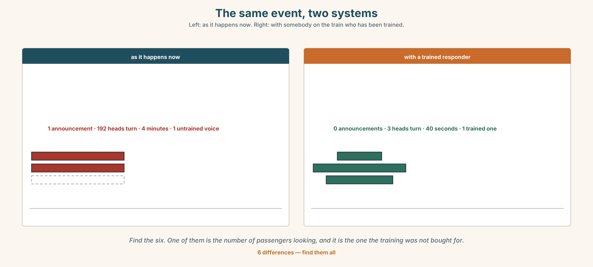{width=6.6in}

*The same event, two systems — Left: as it happens now. Right: with somebody on the train who has been trained.*

🔊 **Track 5.6.** Nadia, 20 seconds: *"They ask why we don't just call. We do call. The call takes
nine seconds and then there are eleven hours, and the person on the phone is in Toronto and I am
the one in the corridor."*

### 11B · Talk about it

In threes. Use the frame. Everybody says one.

> *I think the company should ______ , because ______ .*

**Words you can use:** *doctor · health · pain · ill · rest · medicine · lie down*

### 11C · Decide

Write **two sentences**. Choose, and say why.

> I think the company should ______________________ ,
> because ______________________ .

### 11D · Model decision

> Train two per train, and train them in the announcement as well as in the bandages. The clinical
> gap is real and it is small. The gap that happens forty-one times a year, every time, is that
> somebody has to speak to a hundred and ninety-two frightened people, and nobody has ever been
> shown how.

### 11E · The Reveal

> **What happened.** The company trained two crew per train. In the first year the number of
> events was almost the same and the time to first response fell from four minutes to under one.
>
> Then something nobody expected: the number of announcements fell by two thirds. The trained
> crew could tell which events needed a doctor and which needed a chair and a glass of water, and
> most of them needed the second thing.

**One question. You do not have to answer it out loud.**

> The training was bought to find doctors. What did it actually buy?

---

## Part 12 · Landing ◆ **all three lines**

### 12A · Recycle — twelve items

> 1. You ______ sit down. *(advice)*
> 2. You ______ lift that. *(advice against)*
> 3. ______ ______ you see a doctor? *(three words)*
> 4. You'll ______ ______ . *(two words — the promise)*
> 5. ______ it easy.
> 6. My back ______ .
> 7. I need to ______ ______ for ten minutes. *(two words — flat, on your back)*
> 8. You should ______ ______ . *(two words — stop doing the thing that hurts)*
> 9. I ______ ______ ______ . *(three words — it started on Tuesday)*
> 10. You should ______ ______ ______ . *(three words — the appointment)*
> 11. *(Unit 4)* It's not ______ . *(standing alone, belonging to me)*
> 12. *(Unit 3)* It isn't ______ good ______ the old one. *(two words)*

### 12B · Consolidate — one task, everything in it

**Write advice for somebody with a problem you actually know about, in six sentences.** One
*should*, one *shouldn't*, one *Why don't you*, one fact, one thing about yourself, and one
obstacle removed.

### 12C · Can-do, with evidence

> ☐ I can give advice in three different strengths. **Evidence:** 4C, 8D
> ☐ I can use *should* and *shouldn't*. **Evidence:** 3G, 6D
> ☐ I can describe what a body is doing. **Evidence:** 6B
> ☐ I can hear the short and long *oo*. **Evidence:** 7C

### 12D · Replay ⏺

Record 0C again. **Listen to both.** What is different?

### 12E · Glossary — thirty-five words, as a map

> **THE STATE** · health · ill · sick · well · warm · hungry
> **WHAT YOU HAVE** · pain · headache · cold · cough · stress
> **WHAT HELPS** · doctor · medicine · rest · water · exercise
> **WHAT YOU SAY** · take medicine · see a doctor · have a cold · feel better · lie down · give up
> **WHAT THE BODY DOES** · breathe · stretch · bend · lift · stand · carry · hurt
> **ADVICE** · should · shouldn't · Why don't you…? · You should…
> **CLOSING** · You'll feel better. · Take it easy.

### 12F · Next

> **Unit 6 · What will the next ten years bring?**

# A1.2 · Unit 6 · The Dining Car in 2035

> **English Animated** · *Getting Around* · The Prairie Line, Toronto to Vancouver
> Student's Book pages 116–137 · 22 pp · ~9 hours

---

## Part 0 · The Big Picture ◆ **A · THE WORLD**

{width=6.6in}

*The dining car, seven in the evening, second sitting — Fourteen things to find. Four tables have people at them who did not arrive together.*

# What will the next ten years bring?

**By the end of this unit you can predict, offer and decide, all with one word.**

| ◆ **A · THE WORLD** | A dining car that loses money and is the only reason anybody books this train |
|---|---|
| ◆ **B · THE SYSTEM** | *will* for prediction, for an offer and for a decision made this second · 22 words for change · *maybe* and *probably* · the *'ll* you cannot hear |
| ◆ **C · THE PERFORMANCE** | You predict one thing about ten years from now and say how sure you are |

---

### 0A · Find it — fourteen things

Find these in the picture. Write the number.

> ☐ a table ☐ a hatch ☐ a window ☐ a chair ☐ a cup ☐ a light ☐ a door
> ☐ a machine ☐ a phone ☐ a clock ☐ a plate ☐ a menu ☐ a bottle ☐ a bag

**Three of these words are not in the picture. Which three?**

> a robot · a city · energy

### 0B · Guess it

Look at the four tables where the people did not arrive together.
**Which table has been talking the longest?** Say one thing. You can use these words:

> *table · together · phone · look · talk*

### 0C · Say it ⏺

**Record. Thirty seconds. Do not prepare.**

> **What will be different in ten years about the way you travel?**

You will listen to this again on the last page.

---

## Part 1 · Vocabulary Lab 1 ◆ **B · THE SYSTEM**

### 1A · Meet — what changes and what does not

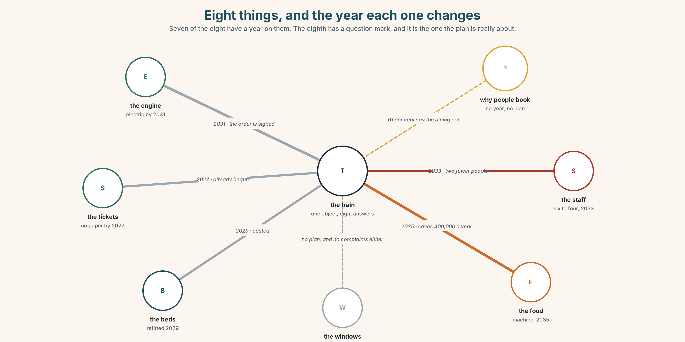{width=6.6in}

*Eight things, and the year each one changes — Seven of the eight have a year on them. The eighth has a question mark, and it is the one the plan is really about.*

| | |
|---|---|
| **future** | A word people use when they mean next year. |
| **change** | The only thing on this list that is a noun and a verb with no difference. |
| **replace** | What happens to a machine. |
| **improve** | What is promised when something is replaced. |
| **disappear** | What actually happens to about a third of them. |
| **work out** | The verb for finding the answer when nobody has told you. |

### 1B · Meet — the words

> **future · change · machine · robot · energy · electric · car · city · job · world · year · soon · grow · disappear · improve · replace**

Write each word under the right picture.

{width=6.6in}

*One dining car, four versions — Eleven features. Eleven words. The 2035 drawing has the fewest objects and the most text.*

### 1C · Sort — the thing, or what happens to it?

Put each word in the right box. **Two of them can go in both. Which two, and why?**

> machine · car · robot · disappear · replace · change · city · energy · grow · improve

| **A THING** | **SOMETHING THAT HAPPENS** | **BOTH** |
|---|---|---|
| | | |

### 1D · The verbs of ten years

| | |
|---|---|
| **in ten years** | Far enough away that nobody who decides will still be there. |
| **get better** | Two words, and almost always about a thing. |
| **get worse** | Two words, and almost always about a system. |
| **a lot of people** | The phrase that arrives when nobody has counted. |
| **find out** | Somebody tells you, or you look. |
| **work out** | Nobody tells you. You do it yourself, from what you have. |

**Now say them.** Two of these six are about information and two are about direction.
**Which is which, and what are the other two?**

### 1E · Stretch — the phrases you will need today

> **in ten years** · **get better** · **get worse** · **find out** · **work out**

Match each phrase to the moment you need it.

1. You telephone somebody who has the answer. → ______
2. You have four numbers and no answer, and nobody is going to give you one. → ______
3. You are talking about something nobody can check. → ______
4. The new machine is faster and quieter. → ______
5. The new system is faster and nobody can use it. → ______

### 1F · The hard one

> **f** **We'll see.**

Practise it three times. **Two words. It is not agreement and it is not disagreement, and
everybody uses it to end a conversation they are losing.**

### 1G · Own it

Write down one thing you think will be different in ten years and one thing you think will be
exactly the same. Do not write your name. The class guesses whose card it is.

---

## Part 2 · Listening ◆ **A · THE WORLD**

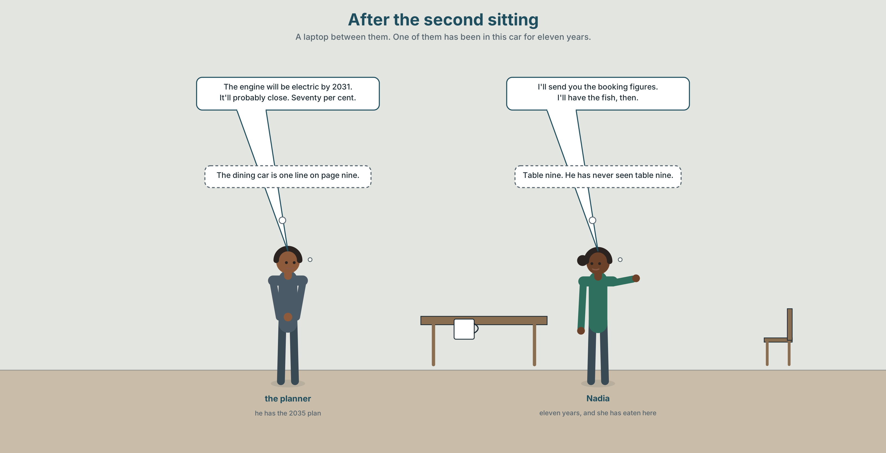{width=6.6in}

*After the second sitting — A laptop between them. One of them has been in this car for eleven years.*

### 2A · After the second sitting 🔊 Track 6.1

**Before you listen.** The dining car loses about four hundred thousand dollars a year.
**Guess: will the company keep it?**

**Listen once. One question.** What year does the plan talk about?

**Listen again. Complete the table.**

| | What will change | How sure |
|---|---|---|
| the engine | | |
| the dining car | | |
| the crew | | |

**Listen again. True or false?**

1. The engine will be electric by 2031. ☐ T ☐ F
2. He says the dining car will definitely close. ☐ T ☐ F
3. She offers to send him the booking figures. ☐ T ☐ F
4. They agree. ☐ T ☐ F

**Noticing.** Four sentences from the recording.

1. *The engine will be electric.*
2. *I'll send you the figures.*
3. *I'll have the fish, then.*
4. *It'll probably close.*

**All four use *will*. One is a prediction, one is an offer, one is a decision made at that
second, and one is a prediction with a doubt in it. Which is which?**

### 2B · Decoding clinic 🔊 Track 6.2

Twenty seconds of the planner at speed. Three jobs.

1. Count how many times he says *will* or *'ll*.
2. In *I'll* and *it'll*, how many sounds does *will* contribute?
3. He says *probably* twice and *definitely* once. Which one is he less sure about?

> Transcripts, page 153.

---

## Part 3 · Grammar Lab 1 ◆ **B · THE SYSTEM**

### One word, three jobs again

### 3A · Notice

Look at the four sentences in Part 2 again.

1. What is the form of the verb after *will*?
2. Does *will* change for *he*, *she* or *they*?
3. In sentence 3, when did the speaker decide?
4. In sentence 4, which word carries the doubt?

### 3B · See

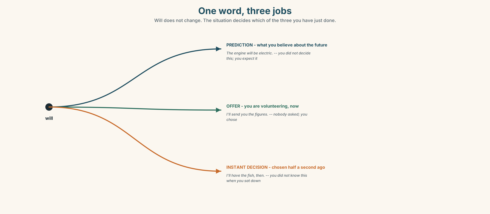{width=6.6in}

*One word, three jobs — Will does not change. The situation decides which of the three you have just done.*

### 3C · Know

| | | |
|---|---|---|
| **prediction** | what you think will happen | *The engine will be electric.* |
| **offer** | you are volunteering | *I'll send you the figures.* |
| **instant decision** | decided as you speak | *I'll have the fish, then.* |
| **negative** | *won't* | *It won't close. They won't agree.* |

> **Will never changes.** No *s*, no *to*, no *do* in the question: *will I, will she, will they.*
> This is the fourth helper of its kind and the family is now closed: *can, should, must, will.*

{width=6.6in}

*How sure, and where the word stands — Two of these go at the front of the sentence and the rest go after will.*

| | |
|---|---|
| **very sure** | *definitely · certainly · sure* |
| **fairly sure** | *probably · I think…* |
| **not sure** | *maybe · perhaps · possible* |
| **refusing to say** | *We'll see. · Who knows?* |

> **Where they stand.** *Maybe* and *perhaps* go at the front of the sentence. *Probably* and
> *definitely* go after *will* and before the verb: *It will probably close.*

> **Why it matters.** Nobody can predict anything. What people can do is say how sure they are,
> and the whole value of a prediction is in that second piece of information.

### 3D · Use — controlled

Complete with **will**, **won't**, **'ll**, **probably** or **maybe**.

> The engine (1) ______ be electric by 2035. The dining car (2) ______ ______ close — about
> seventy per cent, he says.
> I (3) ______ send you the booking figures this evening.
> (4) ______ they'll change their minds. (5) ______ you be here in ten years? — No, I (6) ______ .

### 3E · Use — guided

Turn each one into a prediction with *will*, and add a word that says how sure you are.

1. The dining car closes.
2. The crew gets smaller.
3. Trains get faster.
4. The route stays the same.
5. People stop booking.

### 3F · Use — open

**In pairs.** Make five predictions about this town in ten years. **Your partner must say how
sure they think you are, and you must say whether they are right.**

### 3G · Check — six items, mark your own

> 1. The engine ______ be electric. *(prediction)*
> 2. I ______ send you the figures. *(an offer, contracted)*
> 3. It ______ close. *(negative)*
> 4. It will ______ close. *(about seventy per cent sure)*
> 5. ✗ *The engine will to be electric.* → correct it.
> 6. ✗ *She wills come tomorrow.* → correct it.

{width=6.6in}

*To, in the same gap, a second time — To, in the same gap, a second time*

**0–3 →** Workbook pp. 24–27. **4–5 →** Part 6. **6 →** page 134.

---

## Part 4 · Speaking ◆ **C · THE PERFORMANCE**

### 4A · Fluency starter — the prediction round

Everybody makes one prediction about next week. **Each one must have a different certainty word,
and there are eight of them.**

### 4B · The functional core — predicting and offering

{width=6.6in}

*The same forecast, twice — The left one has a certainty word on every line. The right one has none.*

**Language Bank**

| | |
|---|---|
| **predicting** | *It will… · It won't… · It'll probably…* |
| **how sure** | *definitely · probably · maybe · perhaps · certainly* |
| **offering** | *I'll send it. · I'll do that.* |
| **refusing to predict** | *We'll see. · Who knows? · It depends.* |

**Information gap.** Learner A has the company's plan for 2035. Learner B has the booking
figures. **Find the one prediction in the plan that the figures contradict.**

### 4C · The performance — ten years ⏺

Make **three predictions about ten years from now** — about your town, your work or your life.
**Two minutes.** You must:

> give a different certainty word to each one · offer to do one thing · say one thing you are
> certain about and one you have no idea about

**Record it.**

### 4D · Observer

One person listens for **one thing**: did any prediction arrive without a certainty word?

### 4E · Two criteria

> ☐ Did each of my three predictions have a different level of certainty?
> ☐ Did I use *'ll* rather than *will* at least once?

---

## Part 5 · Reading ◆ **A · THE WORLD**

### 5A · Predict

The title is **"Four hundred thousand dollars a year."**
**What do you think loses that much money?**

### 5B · Read — sixty seconds

---

**Four hundred thousand dollars a year**

The dining car loses about four hundred thousand dollars a year. Everybody at head office knows
this number. It is in every plan.

The company also surveys passengers. The survey asks why people chose this train instead of
flying, which takes five hours instead of four nights. Sixty-one per cent say the dining car.
Nobody at head office quotes that number, because it is in a different document.

In the 2035 plan, the dining car is replaced by a machine that sells sandwiches. The plan says
this will improve the service, and it probably will — the sandwiches will be fresher and they will
always be available, and nobody will wait forty minutes for a table.

What the plan does not say is what will happen at table nine, where four strangers have been
talking for an hour and a half, and where two of them will exchange addresses before the train
reaches Jasper.

---

### 5C · Answer

1. How much does the dining car lose?
2. What does the survey ask?
3. What percentage say the dining car?
4. What does the 2035 plan replace it with?
5. **Why does the writer say the plan probably will improve the service?**
6. **The last paragraph is about one table. Why end a finance argument there?**

### 5D · Vocabulary in context

Guess from the text. Then check.

> head office · surveys passengers · a different document · always be available · exchange addresses

### 5E · The counter-text

{width=6.6in}

*One page of the 2035 plan — Five predictions, five confidence figures, one saving column, and a risks line with one word in it.*

**Read the page and answer.**

1. How many predictions are on the page?
2. **Which prediction has the lowest confidence, and what is the percentage?**
3. What is the total saving?
4. **The risks line has one word in it. What would you put there instead, and why is one word not enough?**

### 5F · Two texts

The plan says the dining car will be replaced and the service will improve.
The survey says sixty-one per cent chose this train because of the dining car.

**Can both be true?** Say one sentence.

---

## Part 6 · Vocabulary Lab 2 ◆ **B · THE SYSTEM**

### Saying how sure you are

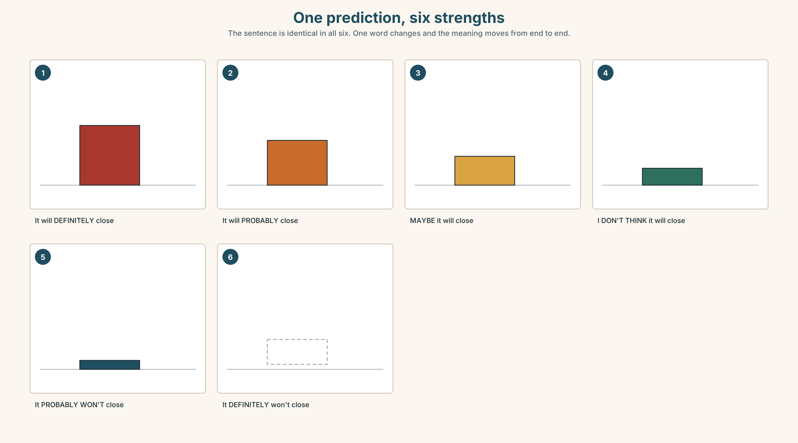{width=6.6in}

*One prediction, six strengths — The sentence is identical in all six. One word changes and the meaning moves from end to end.*

### 6A · The ones that catch everybody

| | |
|---|---|
| **maybe / perhaps** | at the front of the sentence |
| **probably / definitely** | after *will* and before the verb |
| **I don't think it will** | English puts the negative on *think*, not on *will* |
| **sure / certain** | adjectives, so they need *am*, *is* or *are* in front |

### 6B · Say them

> maybe · probably · perhaps · certainly · sure · definitely · possible · impossible · hope

### 6C · Chunk

1. It will **______** close. *(about seventy per cent)*
2. **______** they'll change their minds. *(at the front, and not sure)*
3. I **______** it'll stay. *(the positive one)*
4. I **______ ______** it'll close. *(the negative goes here, not on *will*)*
5. **______ ______ .** *(two words, and you are ending the conversation)*
6. **______ ______ ?** *(two words, and you are refusing to guess)*

### 6D · Contrast Clinic

Six items. ***maybe*** or ***probably***?

1. It will ______ close. *(after will, fairly sure)*
2. ______ it will close. *(at the front, not sure)*
3. ______ they'll agree. *(at the front)*
4. ______ he'll be there. *(at the front)*
5. They'll ______ agree. *(after will)*
6. He'll ______ be there. *(after will)*

---

## Part 7 · Pronunciation & Fluency Lab ◆ **B · THE SYSTEM**

### The word that shrank to one sound

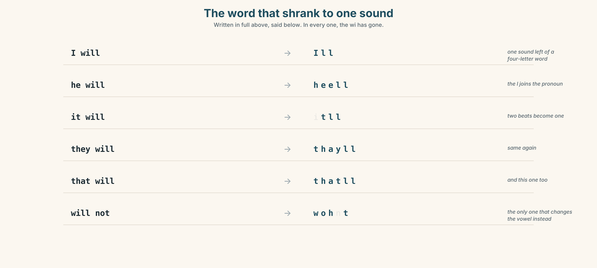{width=6.6in}

*The word that shrank to one sound — Written in full above, said below. In every one, the wi has gone.*

### 7A · Hear

> **I will** → *I'll* · **he will** → *he'll* · **it will** → *it'll* · **they will** → *they'll*
> **will not** → *won't* — and this one changes the vowel, not just the length.

### 7B · Say

Say each one three times. Then say this:

> *I'll ask and they'll probably say no, but it'll be quick.* — three contractions, one sentence.

### 7C · Make it mean something

Say these two:

> *I'll do it.* — an offer, and it sounds like nothing at all
> *I WILL do it.* — a promise, or an argument, and the full form is the whole difference

**The contraction is the normal form.** Using the full form is not more correct; it is more
emphatic, and sometimes more angry. Which is which?

### 7D · Fluency 20 ⏺

Twenty seconds: **six predictions about next year, each with a different certainty word.**
Three times, faster.

---

## Part 8 · Writing ◆ **C · THE PERFORMANCE**

### A prediction · 50–70 words

### 8A · Read the model

> In ten years the engine will be electric. That one is certain — the order is signed. `[the
> prediction, and the evidence]`
>
> The dining car will probably close. I'd say seventy per cent. `[a prediction with a number
> attached to the doubt]`
>
> I don't think the route will change. There is nowhere else to put it. `[the negative in the
> English place, with a reason]`
>
> What I can't predict is whether anybody will still want four nights. We'll see. `[the honest
> admission, last]`

**Questions about the writer's choices:**

1. *the order is signed.* **Why put the evidence immediately after the prediction?**
2. *I'd say seventy per cent.* **What does a number do that *probably* does not?**
3. The last line admits the writer does not know. **Does that make the first three weaker?**

### 8B · The anti-model

> In ten years everything will be different. Technology will improve. Trains will be faster and better. People will travel more. The future will be interesting.

Correct English, and it is true of every decade since 1850. **Rewrite it with two dates, one
number for your confidence, and one thing you cannot predict.**

### 8C · Plan

> the certain one, with evidence → the likely one, with a number → the one you doubt, with a
> reason → what you cannot predict

### 8D · Write — 50 to 70 words
### 8E · Peer review — two things only

> ☐ Does every prediction carry a level of certainty?
> ☐ Is there one thing the writer admits not knowing?

### 8F · Publish

On the wall, with no names and **with the date**. **Keep them. Read them again in a year.**

---

## Part 9 · The File ◆ **A · THE WORLD + C · THE PERFORMANCE**

# STUDY FILE · What you will be able to do

{width=6.6in}

*Three years, in section — Three of these layers are measured. The bottom one is a guess, and it is the furthest away.*

### 9A · The curve nobody draws

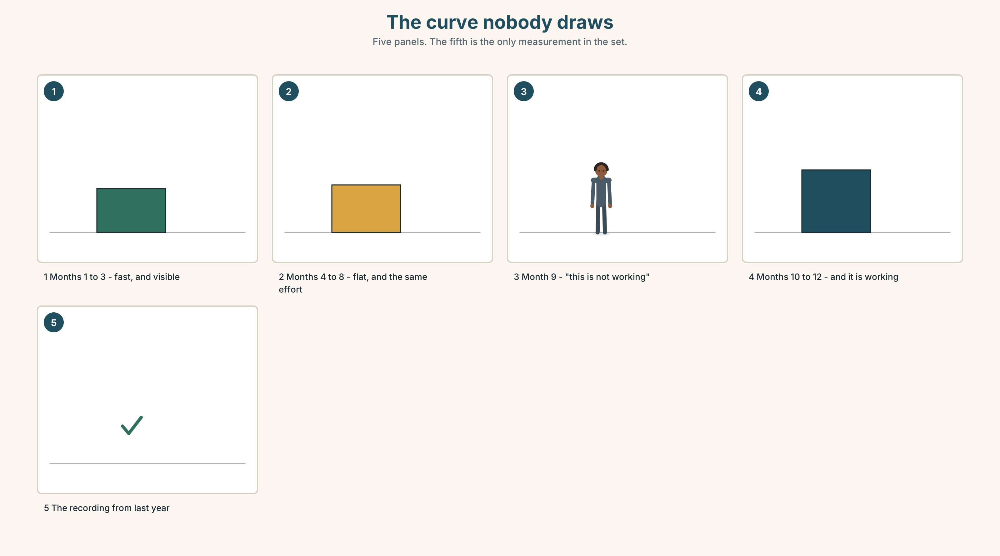{width=6.6in}

*The curve nobody draws — Five panels. The fifth is the only measurement in the set.*

| | |
|---|---|
| **What people predict** | fluent in a year |
| **What happens** | about one level in a year, with four months that feel like nothing |
| **What that is worth** | at this rate, B1 in two years and B2 in four |
| **Why nobody believes it** | because the only evidence is a recording nobody made |

### 9B · Predict your own year

Write three sentences about where your English will be in twelve months.
**Put a percentage on each one.** Keep the paper. You will be surprised, and not in the
direction you expect.

### 9C · Role play — the planner and the person

In pairs. One of you has a spreadsheet of hours. The other has a life. **Plan the next twelve
months of study. Nobody may say *every day*.**

### 9D · The thing you could not do last year

Name one thing you can do in English now that you could not do twelve months ago.
**Then predict the equivalent thing for next year.** That prediction is the useful one.

### 9E · Transfer — before next week

**Write five predictions about your own English, each with a percentage, and seal them.**
Open them at the end of A1.2.

---

## Part 10 · Mediation & Interaction ◆ **C · THE PERFORMANCE**

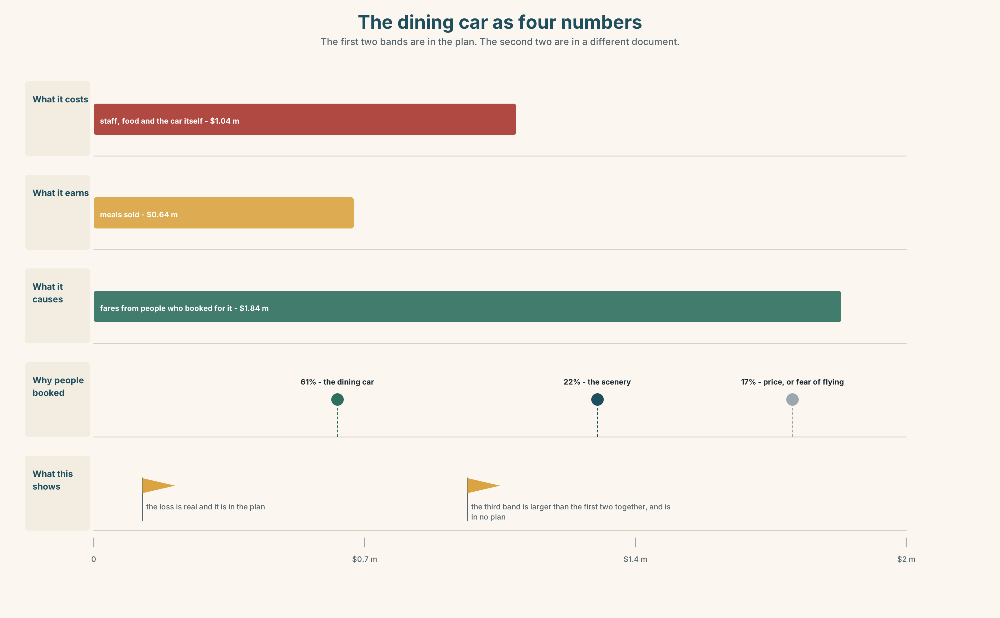{width=6.6in}

*The dining car as four numbers — The first two bands are in the plan. The second two are in a different document.*

### 10A · Relay

Half the class has the 2035 plan. Half has the booking survey.
**Build the whole picture by speaking.** Ten minutes.

### 10B · Simplify — for one person

Somebody asks: *Why does the company want to close the dining car?*
**Answer in four sentences.** Be fair to the company.

### 10C · Online

Write **one message** to a classmate predicting two things about next year.
**Three sentences.** Two certainty words and one offer.

### 10D · Your language

Does your language have one word for the future, like *will*?
**Say *it will rain tomorrow* in your language.** How many words, and where is the future marked?

---

## Part 11 · The Decision ◆ **C · THE PERFORMANCE**

# The dining car in 2035

The dining car loses four hundred thousand dollars a year. Sixty-one per cent of passengers say
it is why they chose the train.

**Option one:** close it. Replace it with a machine. Saves four hundred thousand, and the
sandwiches will be fresher.

**Option two:** keep it exactly as it is. Nothing improves, nothing gets worse, and in 2035
somebody will have this argument again with worse numbers.

**Option three:** make it the product. Advertise the train as four nights of dinner with
strangers. Costs about two hundred thousand to try and will either work completely or not at all.

### 11A · The evidence

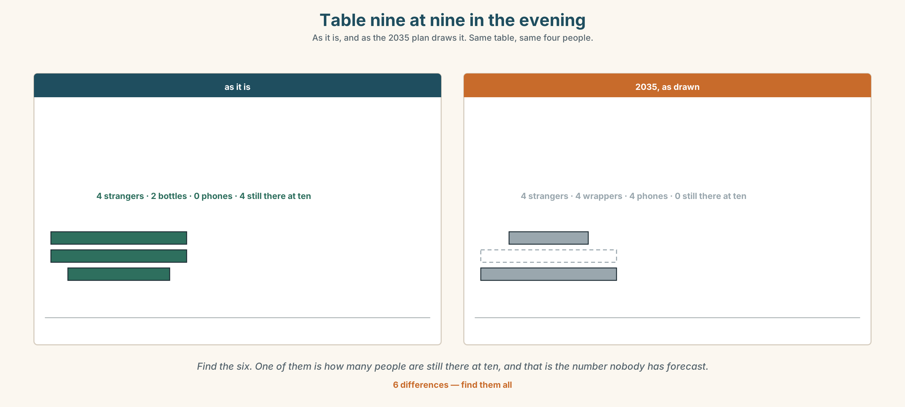{width=6.6in}

*Table nine at nine in the evening — As it is, and as the 2035 plan draws it. Same table, same four people.*

🔊 **Track 6.6.** Ruth, 20 seconds: *"They'll close it. I know they'll close it. Nobody will decide
to close it — it'll just cost too much one year and then it'll be gone, and the people who decide
will never have eaten in it."*

### 11B · Talk about it

In threes. Use the frame. Everybody says one.

> *I think the company will ______ , because ______ .*

**Words you can use:** *future · change · machine · improve · disappear · replace · in ten years*

### 11C · Decide

Write **two sentences**. Choose, and say why.

> I think the company should ______________________ ,
> because ______________________ .

### 11D · Model decision

> Try option three for two years and measure the right thing. The four hundred thousand is real
> and so is the sixty-one per cent, and the company has never once put them in the same document.
> Two hundred thousand to find out is cheap compared with being wrong for twenty years.

### 11E · The Reveal

> **What happened.** The company tried it on two services. Bookings on those two rose eleven per
> cent and the dining car still lost money — about three hundred thousand instead of four.
>
> Then something nobody expected: the eleven per cent were almost all people travelling alone,
> and the company had spent nine years designing everything for families.

**One question. You do not have to answer it out loud.**

> They measured the dining car for twenty years. What had they never measured?

---

## Part 12 · Landing ◆ **all three lines**

### 12A · Recycle — twelve items

> 1. The engine ______ be electric. *(prediction)*
> 2. I ______ send you the figures. *(an offer, contracted)*
> 3. It ______ close. *(negative)*
> 4. It will ______ close. *(seventy per cent)*
> 5. ______ they'll agree. *(at the front, not sure)*
> 6. I don't ______ it'll close.
> 7. ______ ______ . *(two words — ending the conversation)*
> 8. ______ ______ ? *(two words — refusing to guess)*
> 9. I need to ______ ______ what it costs. *(two words — nobody will tell me)*
> 10. Things will ______ ______ before they get better. *(two words)*
> 11. *(Unit 5)* You ______ sit down. *(advice)*
> 12. *(Unit 4)* It's not ______ . *(standing alone, belonging to me)*

### 12B · Consolidate — one task, everything in it

**Write five predictions about the place where you live, ten years from now.** Each with a
different level of certainty, one negative, one offer, and one thing you cannot predict.

### 12C · Can-do, with evidence

> ☐ I can predict, offer and decide with *will*. **Evidence:** 4C, 8D
> ☐ I can say how sure I am. **Evidence:** 6D
> ☐ I can put the certainty word in the right place. **Evidence:** 6C
> ☐ I can hear and say *'ll*. **Evidence:** 7C

### 12D · Replay ⏺

Record 0C again. **Listen to both.** What is different?

### 12E · Glossary — thirty-five words, as a map

> **THE WORD** · future · year · soon · in ten years
> **THE THINGS** · machine · robot · energy · electric · car · city · job · world
> **WHAT HAPPENS** · change · grow · disappear · improve · replace · get better · get worse
> **FINDING OUT** · find out · work out · a lot of people
> **HOW SURE** · maybe · probably · perhaps · certainly · sure · definitely · possible · impossible · hope
> **SAYING IT** · I think… · I don't think…
> **REFUSING TO SAY** · We'll see. · Who knows?

### 12F · Next

> **Unit 7 · What must everyone do?**

# A1.2 · Unit 7 · Twenty-Two Red Handles

> **English Animated** · *Getting Around* · The Prairie Line, Toronto to Vancouver
> Student's Book pages 138–159 · 22 pp · ~9 hours

---

## Part 0 · The Big Picture ◆ **A · THE WORLD**

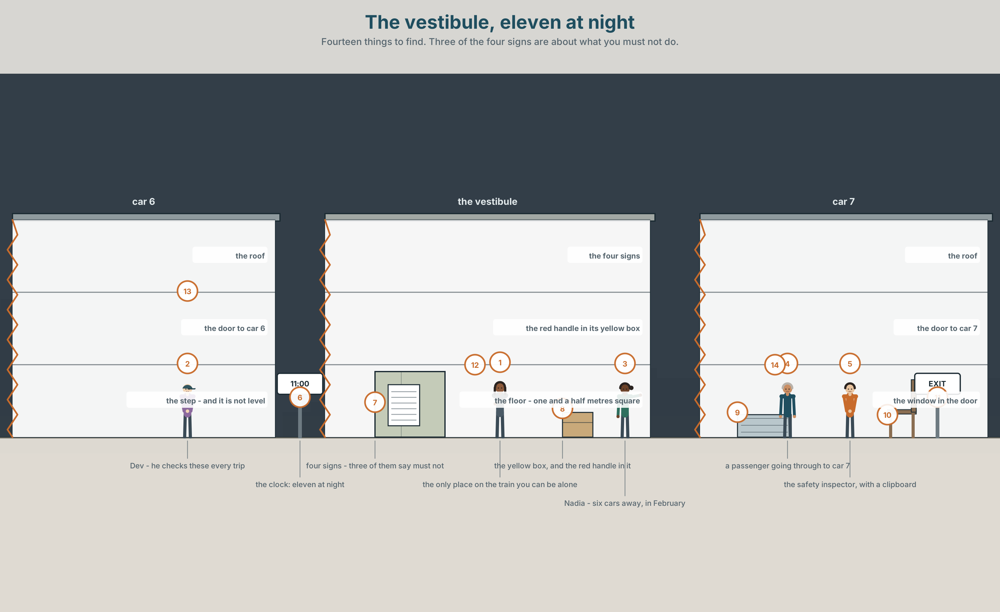{width=6.6in}

*The vestibule, eleven at night — Fourteen things to find. Three of the four signs are about what you must not do.*

# What must everyone do?

**By the end of this unit you can say what is compulsory, what is forbidden, and what is neither.**

| ◆ **A · THE WORLD** | A space one and a half metres square with four rules in it |
|---|---|
| ◆ **B · THE SYSTEM** | *must* and *mustn't* · *have to* and *don't have to* · 22 words for law and safety · *have to* as one word · the difference between a rule and a need |
| ◆ **C · THE PERFORMANCE** | You write the rules for a place and defend the one nobody will follow |

---

### 0A · Find it — fourteen things

Find these in the picture. Write the number.

> ☐ a door ☐ a handle ☐ a sign ☐ a box ☐ a warning ☐ a window ☐ a light
> ☐ a floor ☐ a step ☐ a notice ☐ a bag ☐ a rail ☐ a lock ☐ a clock

**Three of these words are not in the picture. Which three?**

> a seatbelt · a helmet · a licence

### 0B · Guess it

Look at the four signs. **Which one has been there longest?**
Say one thing. You can use these words:

> *sign · old · law · danger · warning*

### 0C · Say it ⏺

**Record. Thirty seconds. Do not prepare.**

> **Name one rule where you live that everybody breaks. Why does nobody enforce it?**

You will listen to this again on the last page.

---

## Part 1 · Vocabulary Lab 1 ◆ **B · THE SYSTEM**

### 1A · Meet — four kinds of rule

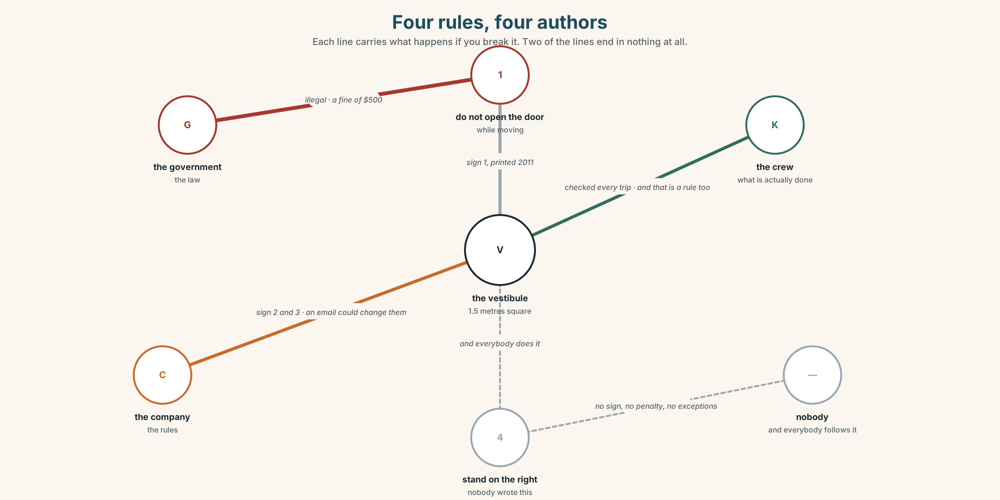{width=6.6in}

*Four rules, four authors — Each line carries what happens if you break it. Two of the lines end in nothing at all.*

| | |
|---|---|
| **law** | Made by a government. The only one with a fine on the end. |
| **rule** | Made by a company. It can be changed by an email. |
| **safety** | The word that is used to end an argument. |
| **danger** | The thing the word *safety* is about, and it is measured in almost none of the signs. |
| **emergency** | About four times a year, and the whole design is for those four. |
| **warning** | A sign that tells you something, rather than telling you to do something. |

### 1B · Meet — the words

> **law · rule · safety · danger · warning · emergency · exit · seatbelt · helmet · speed · fine · licence · permit · allowed · illegal · legal**

Write each word under the right picture.

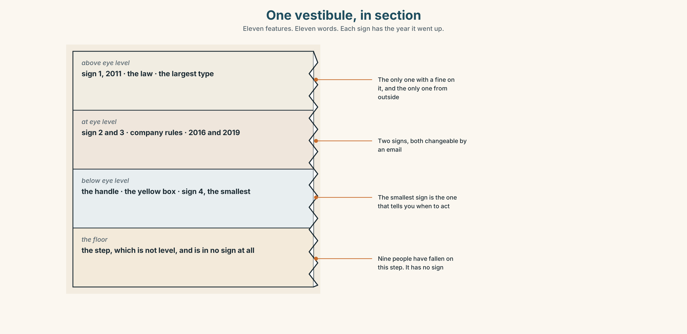{width=6.6in}

*One vestibule, in section — Eleven features. Eleven words. Each sign has the year it went up.*

### 1C · Sort — the thing, or the rule about it?

Put each word in the right box. **Two of them can go in both. Which two, and why?**

> illegal · warning · exit · seatbelt · safety · legal · helmet · speed · allowed ·
> licence

| **A THING YOU CAN SEE** | **A RULE OR A STATUS** | **BOTH** |
|---|---|---|
| | | |

### 1D · What people do with rules

| | |
|---|---|
| **wear a seatbelt** | *wear*, like clothes. English treats it as something you put on. |
| **pay a fine** | The only consequence in this unit that has a number. |
| **break the law** | *break*, as if it were an object. Most languages do something similar. |
| **follow the rules** | *follow*, as if they were a path. Also an object metaphor. |
| **fill in** | A form. What a rule looks like when it meets a person. |
| **hand over** | A document, a key, a licence. The moment a rule becomes real. |

**Now say them.** Four of these six are about paper and two are about the body.
**Which two, and which of the four is the one that can send you to a court?**

### 1E · Stretch — the phrases you will need today

> **wear a seatbelt** · **pay a fine** · **break the law** · **follow the rules** · **fill in**

Match each phrase to the moment you need it.

1. There is a form and a pen and somebody waiting. → ______
2. You are forty kilometres an hour over the limit. → ______
3. The letter arrives three weeks later with a number on it. → ______
4. You are doing exactly what the sign says and it feels wrong. → ______
5. You get into a car. → ______

### 1F · The hard one

> **f** **It's not allowed.**

Practise it three times. **Three words that answer a question without saying who decided, and
that is exactly why people use them.**

### 1G · Own it

Write down one rule you must follow, one you have to follow, and one you don't have to follow
but do anyway. Do not write your name. The class guesses which is which.

---

## Part 2 · Listening ◆ **A · THE WORLD**

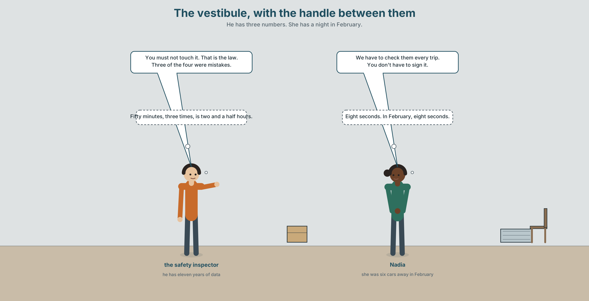{width=6.6in}

*The vestibule, with the handle between them — He has three numbers. She has a night in February.*

### 2A · In the vestibule 🔊 Track 7.1

**Before you listen.** There are twenty-two emergency handles on this train. Four have been used
in eleven years.
**Guess: how many of the four were real?**

**Listen once. One question.** What does the company want to put over the handles?

**Listen again. Complete the table.**

| | Must | Mustn't | Doesn't have to |
|---|---|---|---|
| the crew | | | |
| the passengers | | | |

**Listen again. True or false?**

1. Passengers must not use the handle. ☐ T ☐ F
2. The crew have to check the handles every trip. ☐ T ☐ F
3. Three of the four uses were mistakes. ☐ T ☐ F
4. The cover is already compulsory. ☐ T ☐ F

**Noticing.** Four sentences from the recording.

1. *You must not touch it.*
2. *We have to check them every trip.*
3. *You don't have to sign it.*
4. *It mustn't be locked.*

**Sentences 1 and 4 forbid. Sentence 3 does not forbid anything. What does it actually say?**

### 2B · Decoding clinic 🔊 Track 7.2

Twenty seconds of the inspector at speed. Three jobs.

1. Count how many obligations he states.
2. *Have to* is two words and he says it as one. Write what you hear.
3. He says *mustn't* once. Can you hear the *t* in the middle?

> Transcripts, page 154.

---

## Part 3 · Grammar Lab 1 ◆ **B · THE SYSTEM**

### Compulsory, forbidden, and neither

### 3A · Notice

Look at the four sentences in Part 2 again.

1. Which two mean *this is forbidden*?
2. What does sentence 3 mean — forbidden, or not necessary?
3. What is the form of the verb after *must* and after *have to*?
4. Does *have to* change for *he* and *she*?

### 3B · See

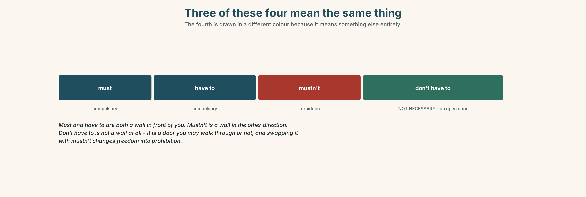{width=6.6in}

*Three of these four mean the same thing — The fourth is drawn in a different colour because it means something else entirely.*

### 3C · Know

| | | |
|---|---|---|
| **compulsory** | *must* / *have to* | *You must wear a seatbelt. We have to check them.* |
| **forbidden** | *mustn't* | *You mustn't touch it. It mustn't be locked.* |
| **not necessary** | *don't have to* | *You don't have to sign it.* |
| **the difference** | *must* is the speaker's rule; *have to* is somebody else's | *I must stop smoking* / *I have to wear this.* |

> **Mustn't and don't have to are not opposites of each other.** *Mustn't* is a wall.
> *Don't have to* is an open door that you may walk through or not. Getting these two the wrong
> way round is the commonest serious error in this unit and it changes the meaning completely.

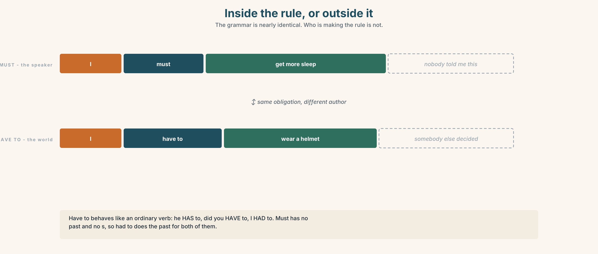{width=6.6in}

*Inside the rule, or outside it — The grammar is nearly identical. Who is making the rule is not.*

| | |
|---|---|
| **must — from the speaker** | *I must get more sleep. You must come and see us.* |
| **have to — from outside** | *I have to wear a helmet. She has to fill in the form.* |
| **has to** | the only one of the four that changes for *he* and *she* |
| **no past for must** | *I had to* does the work of both |

> **Why it matters.** Every job, every country and every building you enter has a set of these,
> and knowing which of the four you are being given tells you whether to argue.

### 3D · Use — controlled

Complete with **must**, **mustn't**, **have to**, **has to** or **don't have to**.

> You (1) ______ touch the handle. It is for an emergency only.
> We (2) ______ check them every trip — the inspector requires it.
> You (3) ______ sign the form. It is optional.
> She (4) ______ fill in a report every time one is used.
> I (5) ______ remember to tell the crew about this. *(the speaker's own rule)*

### 3E · Use — guided

Say whether each one is compulsory, forbidden or not necessary, then write it with the right
form.

1. Wearing a seatbelt in a car.
2. Touching the emergency handle.
3. Signing the visitor book at this school.
4. Carrying a licence when you drive.
5. Arriving an hour early for a train.

### 3F · Use — open

**In pairs.** Describe the rules of a place you know. **Five rules, and at least one of each of
the three kinds.** Your partner must say which kind each one is.

### 3G · Check — six items, mark your own

> 1. You ______ touch it. *(forbidden)*
> 2. We ______ ______ check them every trip. *(compulsory, from outside)*
> 3. You ______ ______ ______ sign it. *(not necessary)*
> 4. She ______ ______ fill in a report. *(compulsory, and watch the form)*
> 5. ✗ *You don't must touch it.* → correct it.
> 6. ✗ *She must to wear a helmet.* → correct it.

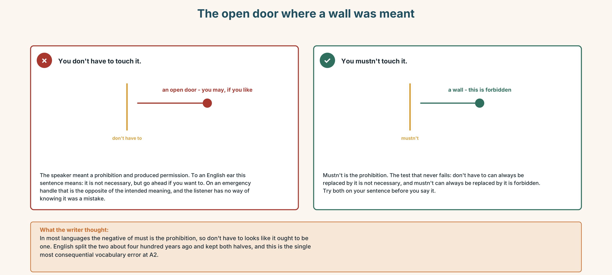{width=6.6in}

*The open door where a wall was meant — The open door where a wall was meant*

**0–3 →** Workbook pp. 28–31. **4–5 →** Part 6. **6 →** page 156.

---

## Part 4 · Speaking ◆ **C · THE PERFORMANCE**

### 4A · Fluency starter — three columns

Everybody names one rule from their life and puts it in one of three columns: **must**,
**mustn't**, **don't have to**. **Nobody may use a column that has already been used twice in a row.**

### 4B · The functional core — stating obligation

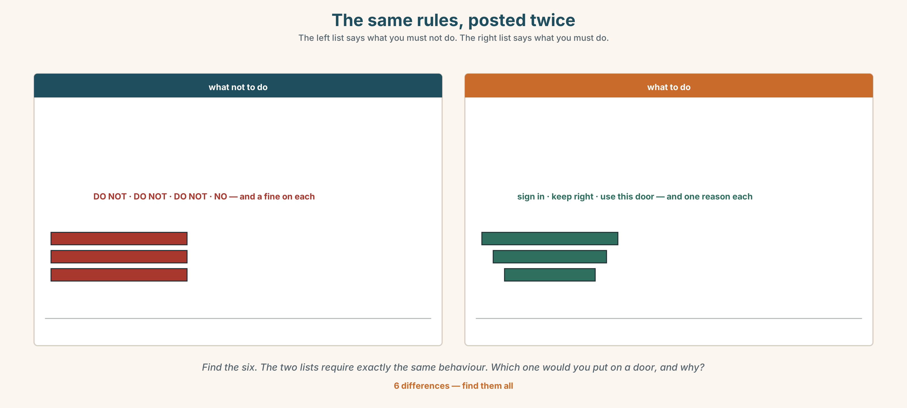{width=6.6in}

*The same rules, posted twice — The left list says what you must not do. The right list says what you must do.*

**Language Bank**

| | |
|---|---|
| **compulsory** | *You must… · You have to… · It's compulsory.* |
| **forbidden** | *You mustn't… · It's not allowed. · It's illegal.* |
| **not necessary** | *You don't have to… · It's not compulsory.* |
| **softening it** | *I'm afraid you have to… · Everybody has to.* |

**Information gap.** Learner A has the company's safety rules. Learner B has what the crew
actually does. **Find the two rules nobody follows and the one thing everybody does that is in no
rule.**

### 4C · The performance — the rules of a place ⏺

State the rules of a place you know well. **Two minutes.** You must:

> give one *must*, one *mustn't* and one *don't have to* · say who made each rule ·
> defend the one nobody follows

**Record it.**

### 4D · Observer

One person listens for **one thing**: did anybody use *don't have to* when they meant *mustn't*?

### 4E · Two criteria

> ☐ Did I use all three kinds, and correctly?
> ☐ Did I say who made at least two of the rules?

---

## Part 5 · Reading ◆ **A · THE WORLD**

### 5A · Predict

The title is **"Four times in eleven years."**
**What do you think has happened four times?**

### 5B · Read — sixty seconds

---

**Four times in eleven years**

There are twenty-two emergency door handles on this train. In eleven years, four have been
pulled.

Three of the four were mistakes. Somebody leaned on one. A child reached one. A passenger thought
it was the light switch. Each time, the train stopped, the crew walked the length of it, and
about fifty minutes were lost.

The fourth was in February, at two in the morning, when a man in car 7 had a seizure and the
nearest crew member was six cars away. A passenger pulled the handle. The train stopped. The crew
came. He is alive.

The company wants to put breakable covers over all twenty-two handles. The covers will stop the
three. They will also cost about eight seconds, and in February eight seconds would probably not
have mattered.

Probably.

---

### 5C · Answer

1. How many handles are there?
2. How many have been pulled?
3. How long is lost each time one is pulled by mistake?
4. What happened in February?
5. **Why does the writer end with the word *probably* on its own?**
6. **The covers stop three problems and create a possible fourth. How would you decide?**

### 5D · Vocabulary in context

Guess from the text. Then check.

> leaned on one · the length of it · the nearest crew member · breakable covers · would not have mattered

### 5E · The counter-text

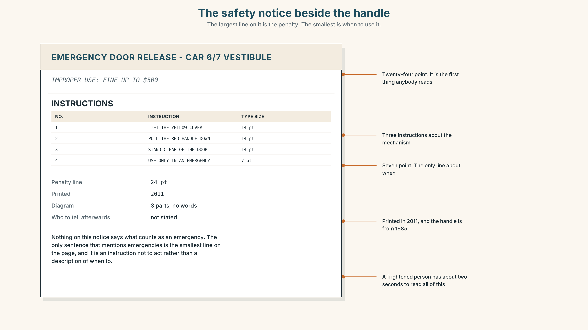{width=6.6in}

*The safety notice beside the handle — The largest line on it is the penalty. The smallest is when to use it.*

**Read the notice and answer.**

1. How many instructions are there?
2. **What is the penalty for improper use, and how big is that line?**
3. What year was the notice printed?
4. **The largest line is the penalty and the smallest is when to use it. What does that tell you about who the notice was written for?**

### 5F · Two texts

The reading says a passenger pulled the handle in February and a man is alive.
The notice says improper use carries a fine of five hundred dollars.

**Would the passenger in February have read the notice first?** Say one sentence.

---

## Part 6 · Vocabulary Lab 2 ◆ **B · THE SYSTEM**

### Who made the rule

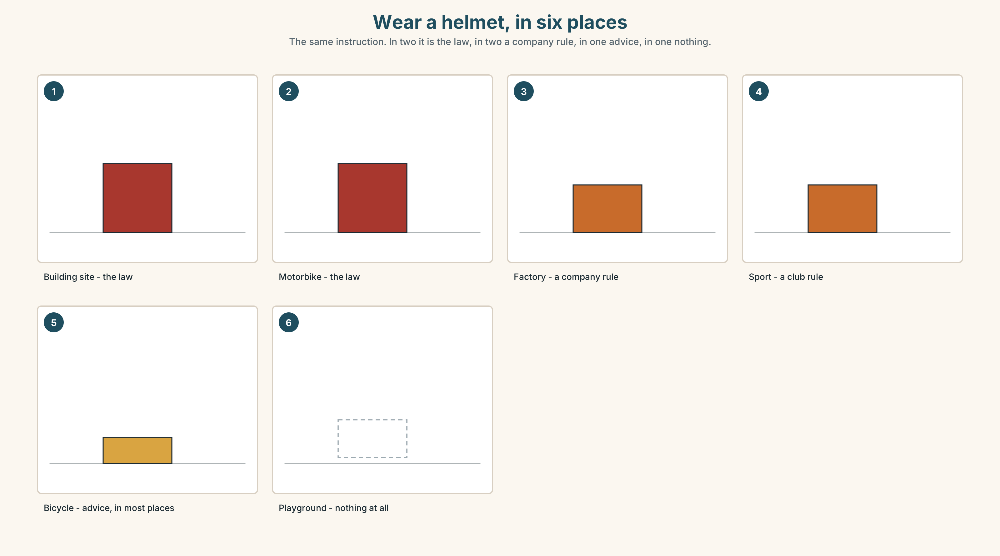{width=6.6in}

*Wear a helmet, in six places — The same instruction. In two it is the law, in two a company rule, in one advice, in one nothing.*

### 6A · The ones that catch everybody

| | |
|---|---|
| **must / have to** | almost the same; *must* is the speaker, *have to* is the world |
| **mustn't / don't have to** | opposite meanings, and this is the trap |
| **has to** | the only form here that changes for *he* and *she* |
| **had to** | the past of both *must* and *have to* |

### 6B · Say them

> must · mustn't · have to · don't have to · obey · necessary · compulsory · duty · responsible

### 6C · Chunk

1. You **______** touch it. *(forbidden)*
2. We **______ ______** check them. *(compulsory, from outside)*
3. You **______ ______ ______** sign it. *(not necessary)*
4. It's not **______ .** *(three words with* it's*, and nobody says who decided)*
5. It's **______ .** *(one word — the law says no)*
6. Who is **______** for this? *(the person who answers for it)*

### 6D · Contrast Clinic

Six items. ***mustn't*** or ***don't have to***?

1. You ______ arrive an hour early.
2. You ______ open the door while the train is moving.
3. You ______ smoke anywhere on the train.
4. You ______ sign the visitor book — it's optional.
5. You ______ touch the emergency handle.
6. You ______ bring your own food, but you can.

---

## Part 7 · Pronunciation & Fluency Lab ◆ **B · THE SYSTEM**

### Two words that became one, again

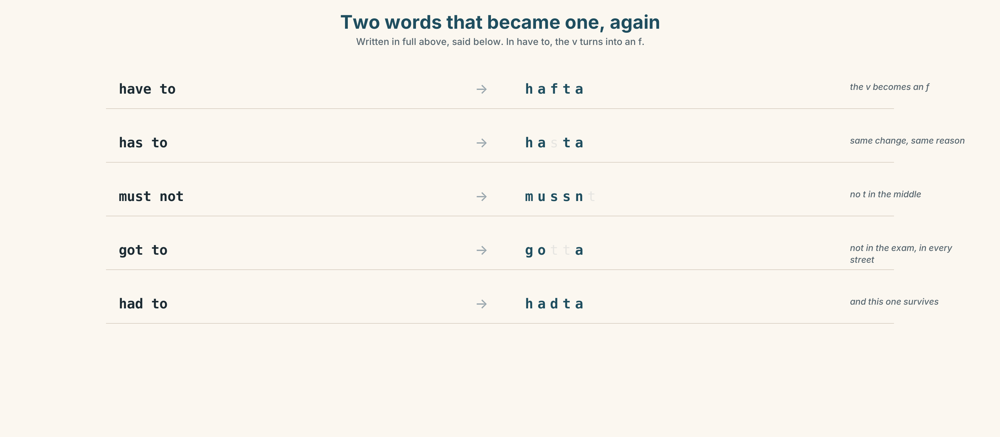{width=6.6in}

*Two words that became one, again — Written in full above, said below. In have to, the v turns into an f.*

### 7A · Hear

> **have to** → *hafta* — and the *v* becomes an *f*
> **has to** → *hasta* · **mustn't** → *mussnt*, with no *t* in the middle at all
> **got to** → *gotta* — not in the exam, and in every conversation

### 7B · Say

Say each one three times. Then say this:

> *You have to fill it in, but you mustn't sign it.* — two obligations, four beats.

### 7C · Make it mean something

Say these two:

> *You don't have to come.* — you are free, and you are welcome
> *You mustn't come.* — you are forbidden, and somebody will be upset

**One is kindness and one is a wall.** Learners who swap them do not sound less fluent; they
sound rude. Which is which?

### 7D · Fluency 20 ⏺

Twenty seconds: **six rules of this building — two must, two mustn't, two don't have to.**
Three times, faster.

---

## Part 8 · Writing ◆ **C · THE PERFORMANCE**

### The rules of a place · 50–70 words

### 8A · Read the model

> You have to sign in at the desk. That one is the fire service, not us. `[the rule, and who
> made it]`
>
> You mustn't prop the back door open. It looks harmless and it is the one that matters.
> `[the prohibition, with the reason]`
>
> You don't have to wear the badge upstairs. Nobody does. `[the rule that exists and is not
> enforced, said plainly]`
>
> If you are going to break one of these, break the third. `[the sentence no official notice
> ever contains]`

**Questions about the writer's choices:**

1. *That one is the fire service, not us.* **Why name the source?**
2. *It looks harmless.* **Why admit that about a rule you are enforcing?**
3. The last line tells the reader which rule to break. **Does that undermine the other two?**

### 8B · The anti-model

> You must sign in. You must wear your badge at all times. You must not prop open any door. You must follow all safety instructions. Thank you for your cooperation.

Correct English, correct rules, and it is on the wall of every building on earth and read by
nobody. **Rewrite it so that each rule has a source, and one of them admits it is not enforced.**

### 8C · Plan

> the rule and who made it → the prohibition and the reason → the one nobody follows →
> the honest sentence

### 8D · Write — 50 to 70 words
### 8E · Peer review — two things only

> ☐ Is there one *must*, one *mustn't* and one *don't have to*?
> ☐ Does at least one rule say who made it?

### 8F · Publish

On the door. **Keep it up for a week and mark which rules were followed.**

---

## Part 9 · The File ◆ **A · THE WORLD + C · THE PERFORMANCE**

# STUDY FILE · The rules you did not choose

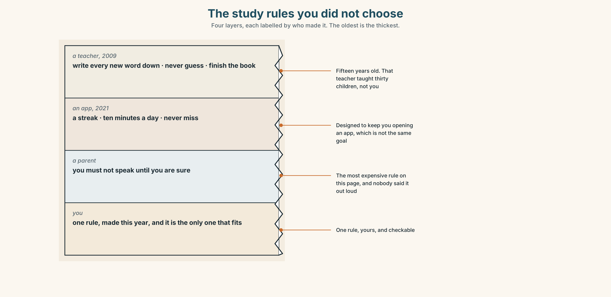{width=6.6in}

*The study rules you did not choose — Four layers, each labelled by who made it. The oldest is the thickest.*

### 9A · Four sources, one set of rules

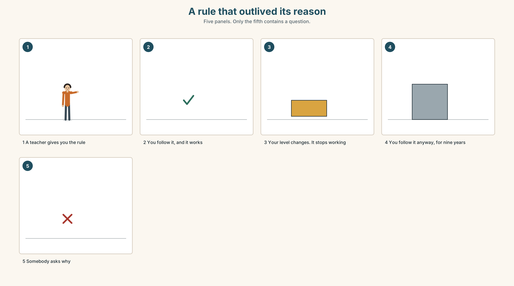{width=6.6in}

*A rule that outlived its reason — Five panels. Only the fifth contains a question.*

| | |
|---|---|
| **What people say** | I must write every new word down |
| **Where it came from** | a teacher, usually in childhood |
| **Whether it works** | sometimes, for some people, for some kinds of word |
| **Who checks** | nobody, ever |

### 9B · Must, have to, or nothing at all

Take three of your own study rules and sort them. **Which are *must* — your own? Which are *have
to* — somebody else's? Which are *don't have to* and you are doing them anyway?**

### 9C · Role play — the inspector

In pairs. One of you inspects the other's study habits and asks *Why?* after every answer, four
times. **The point is to reach a rule whose source nobody can name.**

### 9D · The rule you can drop

Find one study rule you follow that nobody made and nobody checks and that is not working.
**Drop it this week.** Write down what you did with the time.

### 9E · Transfer — before next week

**Write down every English rule you followed this week and who made it.**
Bring the list. Mark the ones with no name against them.

---

## Part 10 · Mediation & Interaction ◆ **C · THE PERFORMANCE**

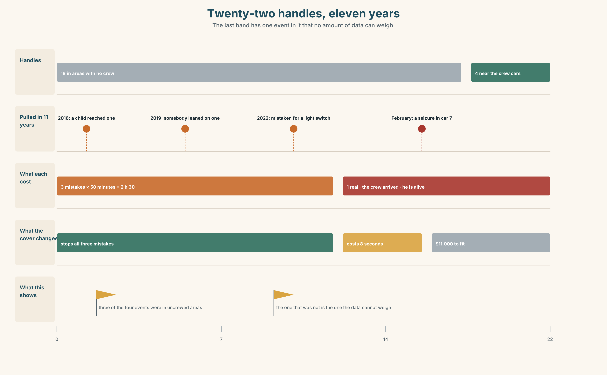{width=6.6in}

*Twenty-two handles, eleven years — The last band has one event in it that no amount of data can weigh.*

### 10A · Relay

Half the class has the safety rules. Half has what the crew actually does.
**Build the real picture by speaking.** Ten minutes.

### 10B · Simplify — for one person

A passenger asks: *When am I allowed to pull that handle?*
**Answer in three sentences.** They are frightened, and they are asking because of the sign.

### 10C · Online

Write **one message** to a classmate about three rules where you work or study.
**Three sentences.** One *must*, one *mustn't*, one *don't have to*.

### 10D · Your language

Does your language use one word for *must* and *have to*?
**Say *I have to work tomorrow* and *I must stop smoking* in your language.** Is it the same word?

---

## Part 11 · The Decision ◆ **C · THE PERFORMANCE**

# Twenty-two red handles

Four pulls in eleven years. Three mistakes, costing about fifty minutes each. One real, in
February, and a man is alive.

**Option one:** fit breakable covers on all twenty-two. Stops the three. Costs about eight
seconds in a real emergency and eleven thousand dollars to fit.

**Option two:** leave them. Three false alarms in eleven years is one every four years, and
fifty minutes is fifty minutes.

**Option three:** fit covers on the eighteen handles in areas with no crew presence, and leave
the four near the crew cars uncovered.

### 11A · The evidence

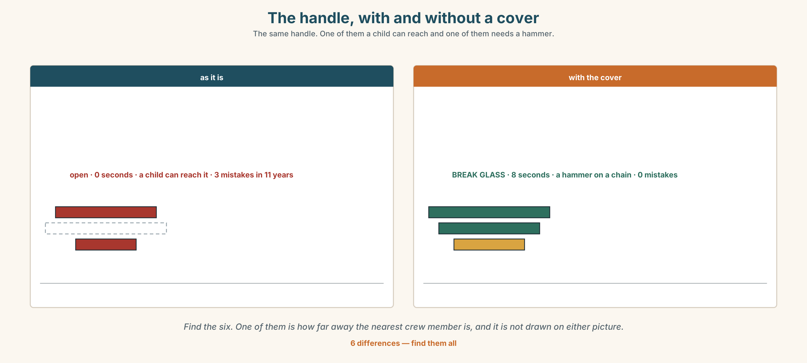{width=6.6in}

*The handle, with and without a cover — The same handle. One of them a child can reach and one of them needs a hammer.*

🔊 **Track 7.6.** Nadia, 20 seconds: *"In February I was six cars away. Somebody I have never met
decided in two seconds to do something that would cost them five hundred dollars if they were
wrong. I would like them to be able to keep doing that."*

### 11B · Talk about it

In threes. Use the frame. Everybody says one.

> *I think the company should ______ , because ______ .*

**Words you can use:** *safety · danger · emergency · rule · law · warning · allowed*

### 11C · Decide

Write **two sentences**. Choose, and say why.

> I think the company should ______________________ ,
> because ______________________ .

### 11D · Model decision

> Option three, and take the fine off the notice. The covers belong where nobody is watching. The
> five-hundred-dollar line belongs nowhere: it is the only part of this system that makes a
> stranger hesitate for two seconds, and two seconds is the entire thing we are trying to buy.

### 11E · The Reveal

> **What happened.** The company fitted covers to eighteen handles and reprinted the notice with
> the penalty line in the smallest type instead of the largest.
>
> Then something nobody expected: in the next four years there were two pulls, both real, and
> both at covered handles. The eight seconds were spent and nobody noticed them. What had changed
> was that passengers now believed they were allowed.

**One question. You do not have to answer it out loud.**

> The covers were fitted to stop mistakes. What actually changed the numbers?

---

## Part 12 · Landing ◆ **all three lines**

### 12A · Recycle — twelve items

> 1. You ______ touch it. *(forbidden)*
> 2. We ______ ______ check them every trip. *(compulsory, from outside)*
> 3. You ______ ______ ______ sign it. *(not necessary)*
> 4. She ______ ______ fill in a report. *(and watch the form)*
> 5. It's not ______ .
> 6. It's ______ . *(the law says no)*
> 7. Who is ______ for this?
> 8. You have to ______ the rules.
> 9. If you drive too fast you will ______ ______ ______ . *(three words)*
> 10. Please ______ ______ this form. *(two words)*
> 11. *(Unit 6)* It will ______ close. *(seventy per cent)*
> 12. *(Unit 5)* You ______ lift that. *(advice against)*

### 12B · Consolidate — one task, everything in it

**Write the rules of a place you know, in six sentences.** Two *must* or *have to*, two
*mustn't*, one *don't have to*, and one sentence saying who made a rule.

### 12C · Can-do, with evidence

> ☐ I can say what is compulsory and what is forbidden. **Evidence:** 4C, 8D
> ☐ I can tell *mustn't* and *don't have to* apart. **Evidence:** 6D
> ☐ I can say who made a rule. **Evidence:** 4C
> ☐ I can hear and say *have to* as one word. **Evidence:** 7C

### 12D · Replay ⏺

Record 0C again. **Listen to both.** What is different?

### 12E · Glossary — thirty-five words, as a map

> **WHO DECIDES** · law · rule · permit · licence
> **THE SUBJECT** · safety · danger · warning · emergency · exit · speed
> **THE EQUIPMENT** · seatbelt · helmet
> **THE STATUS** · allowed · illegal · legal · compulsory · necessary
> **THE CONSEQUENCE** · fine · pay a fine · break the law
> **WHAT YOU DO** · wear a seatbelt · follow the rules · fill in · hand over · obey
> **THE GRAMMAR** · must · mustn't · have to · don't have to · need
> **THE PEOPLE** · duty · right · responsible
> **SAYING IT** · You must not… · It's not allowed.

### 12F · Next

> **Unit 8 · What have you tried?**

# A1.2 · Unit 8 · Twenty-Three Years and Two

> **English Animated** · *Getting Around* · The Prairie Line, Toronto to Vancouver
> Student's Book pages 160–181 · 22 pp · ~9 hours

---

## Part 0 · The Big Picture ◆ **A · THE WORLD**

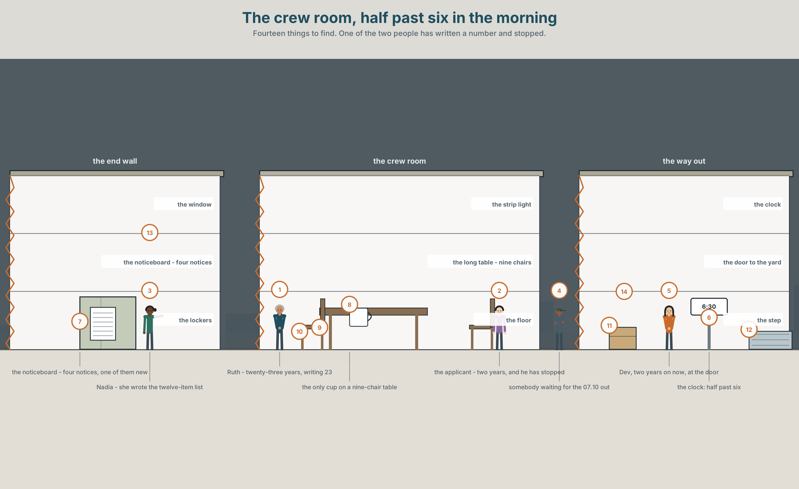{width=6.6in}

*The crew room, half past six in the morning — Fourteen things to find. One of the two people has written a number and stopped.*

# What have you tried?

**By the end of this unit you can say what you have done in your life, without saying when.**

| ◆ **A · THE WORLD** | A form with one box on it, and two people who cannot both be measured by it |
|---|---|
| ◆ **B · THE SYSTEM** | the present perfect for experience · *ever* and *never* · 22 words for skills and firsts · past participles · the *have* you cannot hear |
| ◆ **C · THE PERFORMANCE** | You find out three things about somebody that are not on their form |

---

### 0A · Find it — fourteen things

Find these in the picture. Write the number.

> ☐ a table ☐ a chair ☐ a form ☐ a pen ☐ a notice ☐ a board ☐ a cup
> ☐ a bag ☐ a window ☐ a clock ☐ a door ☐ a box ☐ a light ☐ a coat

**Three of these words are not in the picture. Which three?**

> an adventure · a prize · a language

### 0B · Guess it

Look at the two people filling in the form. **Which one has stopped writing?**
Say one thing. You can use these words:

> *year · form · write · number · experience*

### 0C · Say it ⏺

**Record. Thirty seconds. Do not prepare.**

> **Name three things you have done that are not on any form you have ever filled in.**

You will listen to this again on the last page.

---

## Part 1 · Vocabulary Lab 1 ◆ **B · THE SYSTEM**

### 1A · Meet — what a form asks and what it misses

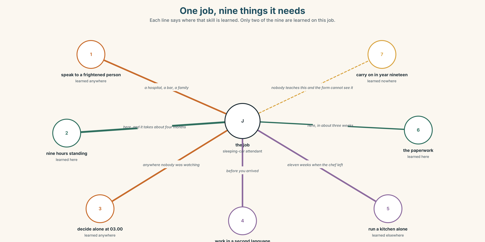{width=6.6in}

*One job, nine things it needs — Each line says where that skill is learned. Only two of the nine are learned on this job.*

| | |
|---|---|
| **experience** | Measured in years, which measures time and not skill. |
| **skill** | The thing the years were supposed to stand for. |
| **moment** | The unit experience is actually made of. |
| **learn a skill** | Something that can be dated. Experience cannot. |
| **try something new** | The one activity that produces experience fastest and is nowhere on the form. |
| **carry on** | What twenty-three years is made of, and it is not nothing. |

### 1B · Meet — the words

> **experience · skill · moment · adventure · abroad · foreign · language · swim · drive · cook · fly · climb · sing · ride · win · lose**

Write each word under the right picture.

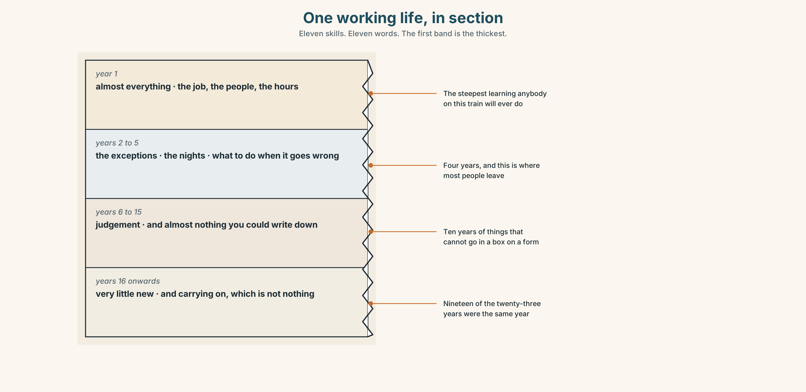{width=6.6in}

*One working life, in section — Eleven skills. Eleven words. The first band is the thickest.*

### 1C · Sort — the thing, or the doing of it?

Put each word in the right box. **Two of them can go in both. Which two, and why?**

> cook · adventure · climb · experience · language · moment · skill · win · drive · swim

| **A THING YOU HAVE** | **A THING YOU DO** | **BOTH** |
|---|---|---|
| | | |

### 1D · What people put on forms

| | |
|---|---|
| **learn a skill** | Has a start and an end. You can name the week. |
| **pass a test** | Has a date, a number and a certificate. |
| **try something new** | Has none of those, and it is the best predictor of the other three. |
| **win a prize** | Goes on a form. Means almost nothing about a job. |
| **take up** | Begin something and keep doing it. |
| **carry on** | Keep doing something after the reason has gone. |

**Now say them.** Three of these six produce a piece of paper and three do not.
**Which three, and which of the other three would you most want to know about somebody?**

### 1E · Stretch — the phrases you will need today

> **learn a skill** · **pass a test** · **try something new** · **take up** · **carry on**

Match each phrase to the moment you need it.

1. You begin something in January and you are still doing it in June. → ______
2. There is a certificate on the wall with a date on it. → ______
3. It is week three and you are bad at it and you do not stop. → ______
4. You have never done it before and you do it anyway. → ______
5. Six weeks, a teacher and a thing you can now do. → ______

### 1F · The hard one

> **f** **Not yet.**

Practise it three times. **Two words, and they are the difference between *no* and *not so far*.**

### 1G · Own it

Write down three things you have done that most people in this room have not.
Do not write your name. The class guesses whose they are.

---

## Part 2 · Listening ◆ **A · THE WORLD**

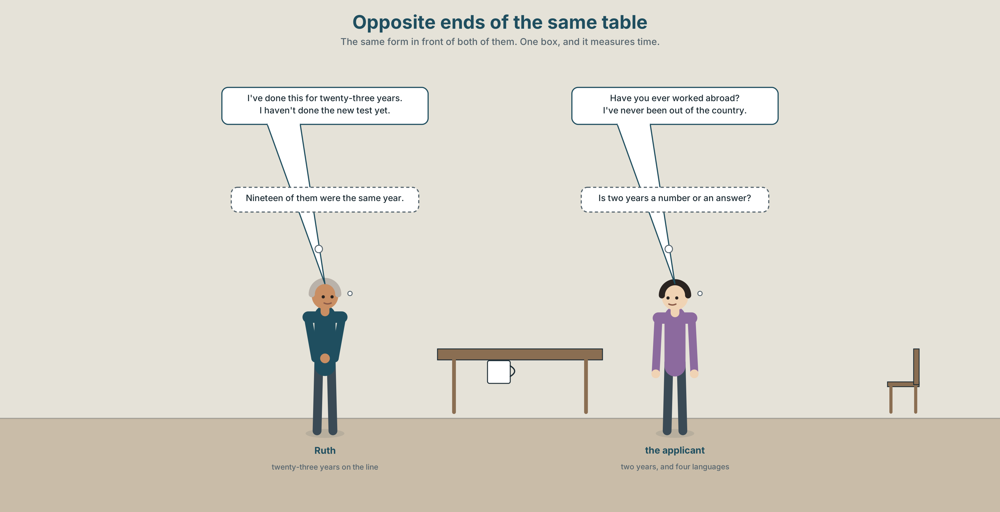{width=6.6in}

*Opposite ends of the same table — The same form in front of both of them. One box, and it measures time.*

### 2A · The crew room 🔊 Track 8.1

**Before you listen.** Both of them are applying for the same promotion.
**Guess: which box is the biggest on the form?**

**Listen once. One question.** How many years has Ruth been on the line?

**Listen again. Complete the table.**

| | Ruth | the applicant |
|---|---|---|
| years | | |
| lived abroad | | |
| worked nights | | |

**Listen again. True or false?**

1. The applicant has worked abroad. ☐ T ☐ F
2. Ruth has never worked nights. ☐ T ☐ F
3. The applicant has worked in four languages. ☐ T ☐ F
4. Ruth has done this job for twenty-three years. ☐ T ☐ F

**Noticing.** Four sentences from the recording.

1. *Have you ever worked abroad?*
2. *I've never been out of the country.*
3. *I haven't done the test yet.*
4. *She's done this for twenty-three years.*

**None of these four says when. Why would you choose a tense that leaves the date out?**

### 2B · Decoding clinic 🔊 Track 8.2

Twenty seconds of the applicant at speed. Three jobs.

1. Count how many times you hear *have*, *has* or *'ve*.
2. In *I've* and *she's*, how long is the *have* or *has* sound?
3. He says *been* and *gone*. Is the person back, in each one?

> Transcripts, page 155.

---

## Part 3 · Grammar Lab 1 ◆ **B · THE SYSTEM**

### Saying it happened without saying when

### 3A · Notice

Look at the four sentences in Part 2 again.

1. What two parts make this form of the verb?
2. Does any of the four say when it happened?
3. Where does *ever* go? Where does *never* go?
4. What is the difference between *I haven't done it* and *I didn't do it*?

### 3B · See

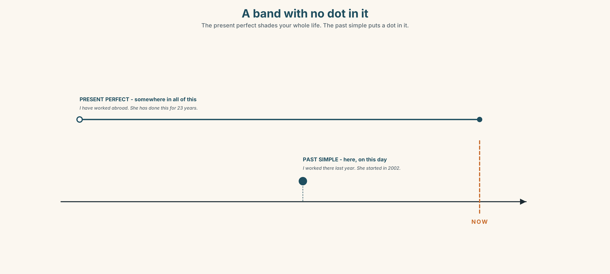{width=6.6in}

*A band with no dot in it — The present perfect shades your whole life. The past simple puts a dot in it.*

### 3C · Know

| | | |
|---|---|---|
| **experience** | *have / has* + past participle | *I have worked abroad. She has done this for 23 years.* |
| **the question** | *Have you ever…?* | *Have you ever worked nights?* |
| **never** | one negative, already | *I have never been out of the country.* |
| **not yet** | it has not happened **so far** | *I haven't done the test yet.* |

> **No date, ever.** The moment you add a date — *last year*, *in 2019*, *when I was twenty* — you
> must change to the past simple. The present perfect and a date cannot stand in the same
> sentence.

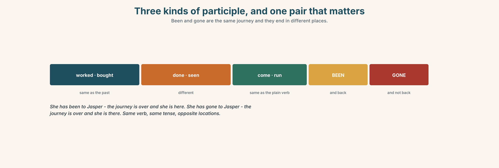{width=6.6in}

*Three kinds of participle, and one pair that matters — Been and gone are the same journey and they end in different places.*

| | |
|---|---|
| **same as the past** | *worked · lived · made · bought · had* |
| **different** | *do → did → done · see → saw → seen · go → went → gone* |
| **been or gone** | *She's been to Jasper* — she is back · *She's gone to Jasper* — she is not |
| **already / yet** | *already* in positives, *yet* in negatives and questions |

> **Why it matters.** Every interview, every introduction and every conversation with somebody
> you have just met runs on this tense, and it is the first tense in this book that has no
> equivalent in most languages.

### 3D · Use — controlled

Complete with the present perfect, **ever**, **never**, **already** or **yet**.

> (1) ______ you ______ (work) abroad? — No, I (2) ______ (be) out of the country.
> I (3) ______ (not do) the test ______ .
> She (4) ______ (do) this job for twenty-three years.
> He (5) ______ (pass) the test — last month, in fact.

### 3E · Use — guided

Turn each one into a question with *Have you ever…?*, then answer it two ways.

1. work nights
2. drive a truck
3. live abroad
4. sing in front of people
5. lose something important

### 3F · Use — open

**In pairs.** Find **five things your partner has done and you have not.** Only *Have you
ever…?* questions. **You may not ask when.**

### 3G · Check — six items, mark your own

> 1. ______ you ever ______ (work) abroad?
> 2. I've ______ been out of the country.
> 3. I ______ ______ (not do) the test yet.
> 4. She ______ ______ (do) this for twenty-three years.
> 5. ✗ *I have worked there last year.* → correct it.
> 6. ✗ *Have you ever went to Jasper?* → correct it.

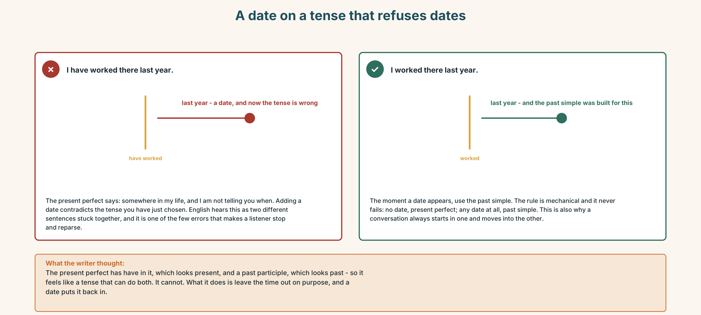{width=6.6in}

*A date on a tense that refuses dates — A date on a tense that refuses dates*

**0–3 →** Workbook pp. 32–35. **4–5 →** Part 6. **6 →** page 178.

---

## Part 4 · Speaking ◆ **C · THE PERFORMANCE**

### 4A · Fluency starter — find somebody who

Everybody writes one *Have you ever…?* question. **Ask until you find somebody who says yes.
You may not ask the same person twice.**

### 4B · The functional core — talking about experience

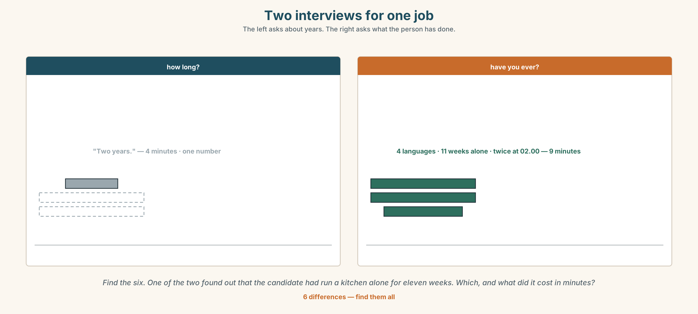{width=6.6in}

*Two interviews for one job — The left asks about years. The right asks what the person has done.*

**Language Bank**

| | |
|---|---|
| **asking** | *Have you ever…? · How long have you…?* |
| **saying yes** | *Yes, once. · Yes, a few times. · Only once.* |
| **saying no** | *No, never. · Not yet. · I've never…* |
| **following up** | *What happened? · When was that?* — and now you are in the past simple |

**Information gap.** Learner A has what the application form asks. Learner B has what the job
actually requires. **Find the three requirements the form cannot see.**

### 4C · The performance — three things not on the form ⏺

Interview a classmate and find **three things they have done that no form would ask about**.
**Three minutes.** You must:

> ask six *Have you ever…?* questions · follow one of them into the past simple · find one
> thing nobody else in the room has done

Report in three sentences. **Record it.**

### 4D · Observer

One person listens for **one thing**: did anybody put a date in a present perfect sentence?

### 4E · Two criteria

> ☐ Were all my experience questions in the present perfect?
> ☐ Did I switch to the past simple the moment I asked *when*?

---

## Part 5 · Reading ◆ **A · THE WORLD**

### 5A · Predict

The title is **"Years of experience: ___"**
**Why do you think there is a blank in the title?**

### 5B · Read — sixty seconds

---

**Years of experience: ___**

The application form has one box about experience. It says: YEARS OF EXPERIENCE. There is a line
after it.

Ruth has written 23. The other applicant has written 2 and then stopped writing.

He has worked two years on this line. He has also run a kitchen alone for eleven weeks when the
chef left without notice, and he has worked in four languages, and he has twice talked somebody
out of getting off a train in the middle of a prairie at two in the morning.

None of that is on the form. There is nowhere to put it. The form does not ask whether you have
ever done anything; it asks how long you have been near it.

Ruth has twenty-three years and she has also done all three of those things, more than once. The
form cannot tell the difference between them either.

---

### 5C · Answer

1. What does the box on the form say?
2. What has Ruth written?
3. What did the other applicant do when the chef left?
4. How many languages has he worked in?
5. **Why did he stop writing?**
6. **The last line says the form cannot tell the difference between them either. What is the form actually measuring?**

### 5D · Vocabulary in context

Guess from the text. Then check.

> without notice · talked somebody out of · nowhere to put it · how long you have been near it · more than once

### 5E · The counter-text

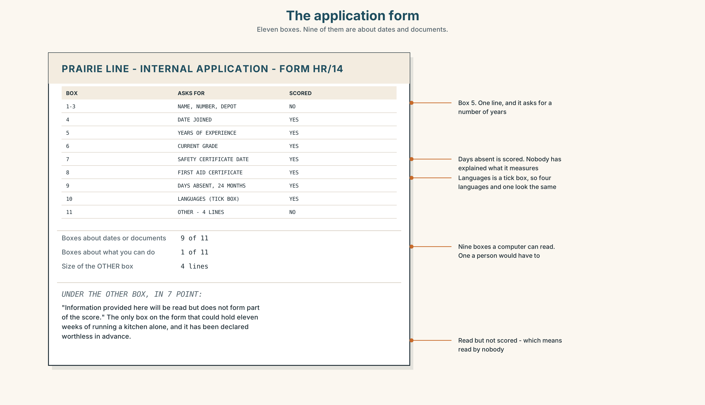{width=6.6in}

*The application form — Eleven boxes. Nine of them are about dates and documents.*

**Read the form and answer.**

1. How many boxes are there?
2. **How many are about dates or documents, and how many about what somebody can do?**
3. How big is the OTHER box?
4. **What does the line under the OTHER box say, and what does that do to the box above it?**

### 5F · Two texts

The reading says one applicant has run a kitchen alone for eleven weeks.
The form has four unscored lines for anything that is not a date.

**Where would that go?** Say one sentence.

---

## Part 6 · Vocabulary Lab 2 ◆ **B · THE SYSTEM**

### Been, gone, done, seen

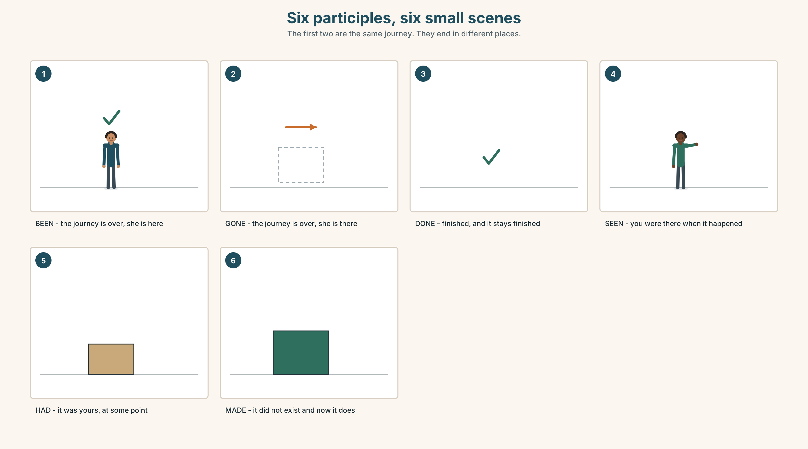{width=6.6in}

*Six participles, six small scenes — The first two are the same journey. They end in different places.*

### 6A · The ones that catch everybody

| | |
|---|---|
| **been / gone** | *been* means you came back; *gone* means you are still there |
| **already / yet** | *already* in positives; *yet* at the end of negatives and questions |
| **ever** | only in questions: *Have you ever…?* — never in a statement |
| **never** | already negative, so no *haven't* with it |

### 6B · Say them

> ever · never · always · already · yet · been · gone · done · seen

### 6C · Chunk

1. **______** you ever been abroad?
2. I've **______** been abroad.
3. I haven't done it **______ .**
4. I've **______** done it. *(and before you asked)*
5. **______ ______ .** *(two words — it has not happened so far)*
6. **______ ______ .** *(two words — it happened exactly one time)*

### 6D · Contrast Clinic

Six items. ***been*** or ***gone***?

1. She's ______ to Jasper — she came back last week.
2. Have you ever ______ to Winnipeg?
3. They've ______ home. The room is empty.
4. He's ______ out. He'll be back at six.
5. I've ______ to Vancouver three times.
6. She's ______ to Jasper — she'll be back on Friday.

---

## Part 7 · Pronunciation & Fluency Lab ◆ **B · THE SYSTEM**

### The *have* that is almost not there

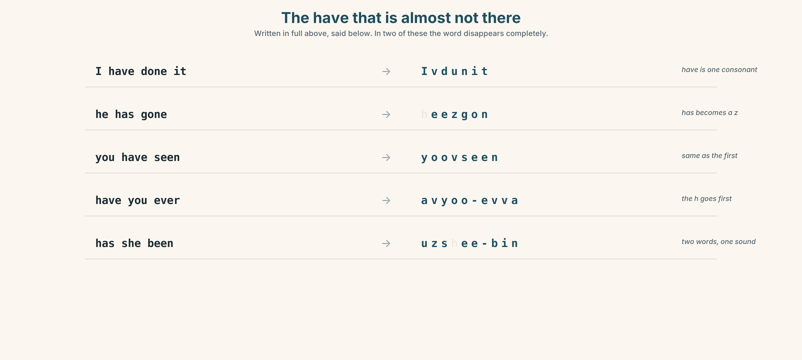{width=6.6in}

*The have that is almost not there — Written in full above, said below. In two of these the word disappears completely.*

### 7A · Hear

> **I have** → *I've*, one sound · **he has** → *he's* · **you have** → *you've*
> **have you** → *hav-yuh*, and the *h* almost goes · **has she** → *uz-shee*
> In a statement, *have* is never stressed. If it is, you are arguing.

### 7B · Say

Say each one three times. Then say this:

> *I've never been there, and he's already gone.* — two perfects, four beats.

### 7C · Make it mean something

Say these two:

> *I've done it.* — ordinary. *Have* has almost no sound at all.
> *I HAVE done it.* — you are contradicting somebody who said you had not.

**The full form is an argument.** Learners who always use the full form sound permanently
defensive. Which one would you use to answer a friendly question?

### 7D · Fluency 20 ⏺

Twenty seconds: **six things you have done in your life, no dates.** Three times, faster.

---

## Part 8 · Writing ◆ **C · THE PERFORMANCE**

### What you have done · 50–70 words

### 8A · Read the model

> I have worked on this line for two years. `[the number the form asks for, got out of the way]`
>
> I have also run a kitchen alone for eleven weeks, when the chef left without notice.
> `[the thing the form does not ask about, with the reason it happened]`
>
> I have worked in four languages and I have twice talked somebody out of getting off a train at
> two in the morning. `[two more, and the second one is specific]`
>
> I have never managed anybody. That is the only thing on this list I have not done. `[the
> honest gap, volunteered]`

**Questions about the writer's choices:**

1. The first line gives the number. **Why get it out of the way first?**
2. *at two in the morning.* **Why is the detail the whole sentence?**
3. The last line admits a gap nobody asked about. **What does that buy?**

### 8B · The anti-model

> I have two years of experience on this line. I am hard-working and reliable. I have good communication skills. I work well in a team. I am looking for a new challenge.

Correct English, and it is on nine million applications. **Rewrite it with three things that have
actually happened and one thing you have never done.**

### 8C · Plan

> the number they asked for → the thing they did not ask about → two more, one of them
> specific → the honest gap

### 8D · Write — 50 to 70 words
### 8E · Peer review — two things only

> ☐ Is every sentence in the present perfect, with no dates?
> ☐ Is there one thing in it nobody else in this room could write?

### 8F · Publish

On the wall, with no names. **The class reads them and marks the one line in each that could not
be on a form.**

---

## Part 9 · The File ◆ **A · THE WORLD + C · THE PERFORMANCE**

# STUDY FILE · What you have already done

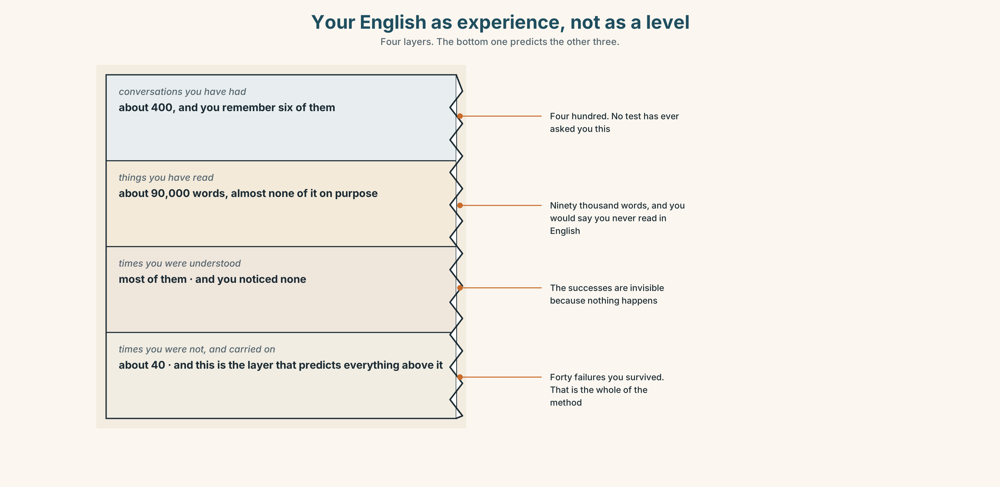{width=6.6in}

*Your English as experience, not as a level — Four layers. The bottom one predicts the other three.*

### 9A · The list nobody keeps

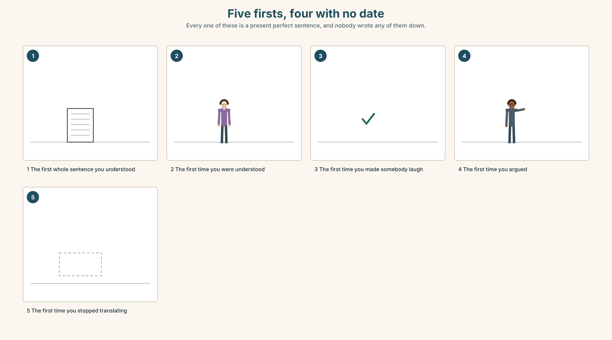{width=6.6in}

*Five firsts, four with no date — Every one of these is a present perfect sentence, and nobody wrote any of them down.*

| | |
|---|---|
| **What people measure** | level, score, hours |
| **What they remember** | four or five moments |
| **What the moments are** | firsts — and every one of them is a present perfect sentence |
| **What is missing** | a list, because nobody ever told anyone to keep one |

### 9B · Your firsts

Write five sentences beginning *I have…* about English. **No dates.** First time you understood
a film, were understood by a stranger, read a page without stopping, made somebody laugh, had an
argument.

### 9C · Role play — the interview nobody gives

In pairs. Interview your partner about their English with ten *Have you ever…?* questions.
**No question may be about a course, a level or a score.**

### 9D · The one you have not done yet

Look at your list of firsts. **Name the next one.** Write it as *I haven't … yet.*
That sentence is a plan with a date you have not set.

### 9E · Transfer — before next week

**Keep a list of English firsts for seven days.** However small. Bring it.
Most people find three or four and are surprised by all of them.

---

## Part 10 · Mediation & Interaction ◆ **C · THE PERFORMANCE**

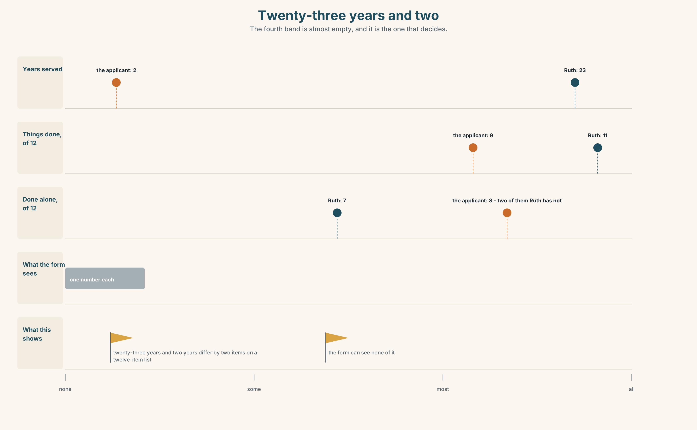{width=6.6in}

*Twenty-three years and two — The fourth band is almost empty, and it is the one that decides.*

### 10A · Relay

Half the class has the form. Half has what the job actually needs.
**Build the real requirement list by speaking.** Ten minutes.

### 10B · Simplify — for one person

Somebody is filling in a form with one experience box and they have done a great deal.
**Advise them in four sentences.** Be practical, not encouraging.

### 10C · Online

Write **one message** to a classmate asking about three experiences.
**Three sentences.** Three *Have you ever…?* questions, and no dates.

### 10D · Your language

Does your language have a tense for experience without a date?
**Say *I have been to Canada* in your language.** Does it sound like the past, or like now?

---

## Part 11 · The Decision ◆ **C · THE PERFORMANCE**

# One box on a form

The company promotes about nine sleeping-car attendants a year. The form has one experience box
and it asks for years.

**Option one:** keep it. Years are cheap to check and impossible to argue with.

**Option two:** replace it with a checklist of twelve things — *have you ever run a service alone,
have you ever dealt with a medical event, have you ever worked in a language that is not your
first*. Takes four minutes to fill in and two hours a year to score.

**Option three:** a day's trial on a real train. Expensive, accurate, and it cannot be done for
more than about thirty people a year.

### 11A · The evidence

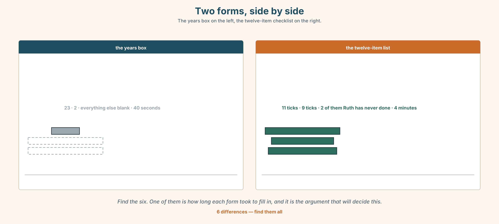{width=6.6in}

*Two forms, side by side — The years box on the left, the twelve-item checklist on the right.*

🔊 **Track 8.6.** Ruth, 20 seconds: *"I've been here twenty-three years. Nineteen of them were the
same year. I'd rather be asked what I've done than how long I've been standing here."*

### 11B · Talk about it

In threes. Use the frame. Everybody says one.

> *I think the company should ______ , because ______ .*

**Words you can use:** *experience · skill · moment · learn a skill · try something new · win · lose*

### 11C · Decide

Write **two sentences**. Choose, and say why.

> I think the company should ______________________ ,
> because ______________________ .

### 11D · Model decision

> The checklist. Two hours a year is nothing and years of experience is not a measurement, it is
> a proxy for one. The trial is better and it does not scale, and the thing that does not scale
> is the thing that gets quietly dropped in a bad year.

### 11E · The Reveal

> **What happened.** The company introduced the twelve-item checklist. In the first year the
> promotions went to almost the same nine people.
>
> Then something nobody expected: the checklist was being read by the people filling it in. Four
> attendants asked to be put on night services specifically because there was a line on the form
> about them, and the company had never once been asked that before.

**One question. You do not have to answer it out loud.**

> The checklist did not change who was promoted. What did it change?

---

## Part 12 · Landing ◆ **all three lines**

### 12A · Recycle — twelve items

> 1. ______ you ever ______ (work) abroad?
> 2. I've ______ been out of the country.
> 3. I haven't done it ______ .
> 4. I've ______ done it. *(and before you asked)*
> 5. She's ______ to Jasper — she's still there.
> 6. She's ______ to Jasper — she's back.
> 7. ______ ______ . *(two words — it has not happened so far)*
> 8. ______ ______ . *(two words — exactly one time)*
> 9. I'd like to ______ ______ running. *(two words — begin, and keep going)*
> 10. You have to ______ ______ when it gets hard. *(two words)*
> 11. *(Unit 7)* You ______ touch it. *(forbidden)*
> 12. *(Unit 6)* It will ______ close. *(seventy per cent)*

### 12B · Consolidate — one task, everything in it

**Write six sentences about what one person you know has done.** All six in the present perfect,
no dates, one with *never*, one with *yet*, and one that nobody else in this room could write.

### 12C · Can-do, with evidence

> ☐ I can talk about experience without saying when. **Evidence:** 4C, 8D
> ☐ I can ask *Have you ever…?* **Evidence:** 4A, 3F
> ☐ I can use *been*, *gone*, *already* and *yet*. **Evidence:** 6D
> ☐ I can say the weak forms of *have* and *has*. **Evidence:** 7C

### 12D · Replay ⏺

Record 0C again. **Listen to both.** What is different?

### 12E · Glossary — thirty-five words, as a map

> **THE NOUNS** · experience · skill · moment · adventure · language
> **WHERE** · abroad · foreign
> **THE VERBS** · swim · drive · cook · fly · climb · sing · ride · win · lose
> **WHAT GOES ON A FORM** · learn a skill · pass a test · win a prize
> **WHAT DOES NOT** · try something new · take up · carry on
> **THE GRAMMAR** · ever · never · always · already · yet · been · gone · done · seen
> **SAYING IT** · Have you ever…? · I've never… · Not yet. · Only once.

### 12F · Next

> **Unit 9 · How does weather change a day?**

# A1.2 · Unit 9 · Forty Below

> **English Animated** · *Getting Around* · The Prairie Line, Toronto to Vancouver
> Student's Book pages 182–203 · 22 pp · ~9 hours

---

## Part 0 · The Big Picture ◆ **A · THE WORLD**

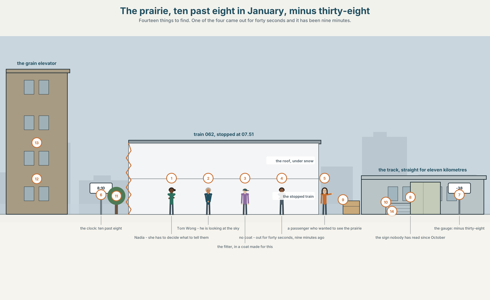{width=6.6in}

*The prairie, ten past eight in January, minus thirty-eight — Fourteen things to find. One of the four came out for forty seconds and it has been nine minutes.*

# How does weather change a day?

**By the end of this unit you can make a plan, change it, and say what it depends on.**

| ◆ **A · THE WORLD** | A place where the weather is not a topic of conversation but a timetable |
|---|---|
| ◆ **B · THE SYSTEM** | *be going to* · the present continuous for arrangements · against *will* · 22 words for weather · *going to* as one word |
| ◆ **C · THE PERFORMANCE** | You make a plan with somebody and change it twice |

---

### 0A · Find it — fourteen things

Find these in the picture. Write the number.

> ☐ snow ☐ ice ☐ the sun ☐ a cloud ☐ the sky ☐ the wind ☐ a track
> ☐ a train ☐ a coat ☐ a window ☐ a door ☐ a light ☐ a bag ☐ a step

**Three of these words are not in the picture. Which three?**

> rain · a storm · spring

### 0B · Guess it

Look at the four people beside the train. **Which one came out for forty seconds?**
Say one thing. You can use these words:

> *cold · coat · wait · stand · nine*

### 0C · Say it ⏺

**Record. Thirty seconds. Do not prepare.**

> **What are you doing at the weekend, and what would change it?**

You will listen to this again on the last page.

---

## Part 1 · Vocabulary Lab 1 ◆ **B · THE SYSTEM**

### 1A · Meet — a year on this line

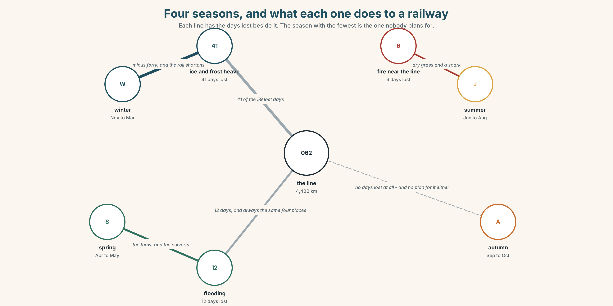{width=6.6in}

*Four seasons, and what each one does to a railway — Each line has the days lost beside it. The season with the fewest is the one nobody plans for.*

| | |
|---|---|
| **weather** | A word for all of it, and nobody here uses it alone. |
| **forty below** | Not a temperature here. A category, with its own rules. |
| **season** | Four names, and on this line there are really two. |
| **check the forecast** | Done by the crew four times a day in winter and never in July. |
| **cancel a plan** | What the weather does to you. |
| **call off** | What you do, before the weather does it for you. |

### 1B · Meet — the words

> **weather · rain · snow · wind · sun · cloud · storm · ice · degrees · cool · wet · dry · season · spring · autumn · sky**

Write each word under the right picture.

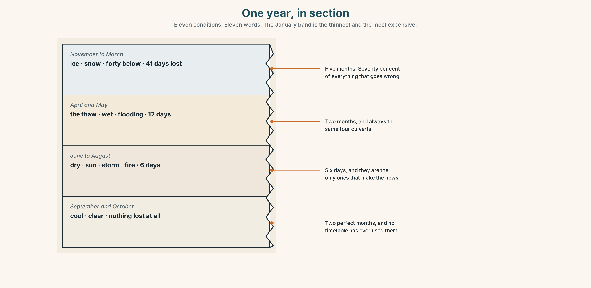{width=6.6in}

*One year, in section — Eleven conditions. Eleven words. The January band is the thinnest and the most expensive.*

### 1C · Sort — the weather, or what it does to you?

Put each word in the right box. **Two of them can go in both. Which two, and why?**

> wet · degrees · ice · sky · cloud · snow · cool · dry · storm · wind

| **SOMETHING IN THE SKY** | **SOMETHING YOU FEEL** | **BOTH** |
|---|---|---|
| | | |

### 1D · What people do about weather

| | |
|---|---|
| **check the forecast** | Four times a day in January. It is right about three times. |
| **cancel a plan** | The plan is gone and nothing replaces it. |
| **call off** | The same thing, said by the person responsible. |
| **put off** | Not gone. Moved. A completely different conversation. |
| **a bit of rain** | Three words that mean *do not change anything*. |
| **forty below** | Two words that mean *change everything*. |

**Now say them.** Two of these six end a plan and one of them moves it.
**Which is which, and which two are not about plans at all?**

### 1E · Stretch — the phrases you will need today

> **check the forecast** · **cancel a plan** · **put off** · **call off** · **a bit of rain**

Match each phrase to the moment you need it.

1. It is Thursday and the thing is on Saturday. → ______
2. Somebody is suggesting you stay at home and you do not want to. → ______
3. The match is not happening and it will not happen later either. → ______
4. The match is not happening today and it is happening next Tuesday. → ______
5. You are the person who has to decide, and forty people are waiting. → ______

### 1F · The hard one

> **f** **It depends on the weather.**

Practise it three times. **Five words that are a refusal, a plan and a weather forecast at the
same time.**

### 1G · Own it

Write down one plan you have for next week and one thing that would stop it.
Do not write your name. The class guesses whose plan it is.

---

## Part 2 · Listening ◆ **A · THE WORLD**

{width=6.6in}

*On the platform, both looking up — He is working out whether it will run. She is working out when to say so.*

### 2A · On the platform 🔊 Track 9.1

**Before you listen.** It is minus thirty-eight and the forecast says minus forty-four tonight.
**Guess: will the train run?**

**Listen once. One question.** What is the forecast for tonight?

**Listen again. Complete the table.**

| | Plan | Changed to |
|---|---|---|
| tonight | | |
| tomorrow morning | | |
| the weekend | | |

**Listen again. True or false?**

1. They are going to cancel the service. ☐ T ☐ F
2. The train is leaving at six tomorrow. ☐ T ☐ F
3. She is going to tell the passengers tonight. ☐ T ☐ F
4. It is going to get colder tonight. ☐ T ☐ F

**Noticing.** Four sentences from the recording.

1. *It's going to get colder.*
2. *We're leaving at six tomorrow.*
3. *I'll tell them.*
4. *I'm going to check again at four.*

**Sentences 1 and 4 both use *going to* and they are doing different jobs. What are they?**

### 2B · Decoding clinic 🔊 Track 9.2

Twenty seconds of Tom at speed. Three jobs.

1. Count how many future forms you hear.
2. *Going to* is three syllables and he says it in one. Write what you hear.
3. He says *we're leaving* about something that has not happened. How can a present tense do that?

> Transcripts, page 156.

---

## Part 3 · Grammar Lab 1 ◆ **B · THE SYSTEM**

### Three futures, and how to choose

### 3A · Notice

Look at the four sentences in Part 2 again.

1. In sentence 1, what is the evidence for the prediction?
2. In sentence 4, when was the decision made?
3. In sentence 2, is there an arrangement, or only an intention?
4. In sentence 3, when was that decision made?

### 3B · See

{width=6.6in}

*Three futures, three starting points — The arrow starts where the decision was made, not where the thing happens.*

### 3C · Know

| | | |
|---|---|---|
| **evidence now** | *be going to* | *It's going to get colder — look at the sky.* |
| **a decision already made** | *be going to* | *I'm going to check again at four.* |
| **an arrangement with others** | present continuous | *We're leaving at six tomorrow.* |
| **decided as you speak** | *will* | *I'll tell them.* |

> **The question is when the future was decided, not when it happens.** All three of these can
> describe the same Saturday. What differs is how long the speaker has known.

{width=6.6in}

*Four questions, four futures — Most learners only ever use the fourth. Ask the first three before you reach it.*

| | |
|---|---|
| **the form** | *am / is / are* + **going to** + the plain verb |
| **the negative** | *It isn't going to rain. We aren't leaving until six.* |
| **the question** | *Is it going to rain? What are you doing at the weekend?* |
| **the conditions** | *It depends on the weather. · if it rains…* |

> **Why it matters.** Almost everything anybody says about tomorrow is one of these three, and
> choosing the wrong one does not make you wrong — it makes you sound as if you decided just now.

### 3D · Use — controlled

Complete with **going to**, the present continuous, or **will**.

> Look at that sky. It (1) ______ (snow).
> We (2) ______ (leave) at six tomorrow — it is on the board and the crew have been told.
> I (3) ______ (check) the forecast again at four. I decided this morning.
> The telephone is ringing. — Don't move, I (4) ______ (get) it.
> What (5) ______ you ______ (do) at the weekend?

### 3E · Use — guided

Choose the right future for each one and write the sentence.

1. There are black clouds and a wind getting up.
2. You and three colleagues have booked a table for Friday.
3. Somebody has just asked you for help with a bag.
4. You decided last week to take a course in the spring.
5. The train leaves at 06.10 and it is in the timetable.

### 3F · Use — open

**In pairs.** Make a plan for Saturday together. **Change it twice: once because of the weather
and once because of a person.** Every sentence must use one of the three futures.

### 3G · Check — six items, mark your own

> 1. Look at that sky. It ______ ______ ______ snow. *(three words)*
> 2. We ______ ______ at six tomorrow. *(arranged, and on the board)*
> 3. I ______ check again at four. *(decided this morning — three words)*
> 4. The phone is ringing — I ______ get it. *(deciding now)*
> 5. ✗ *I will check it again at four, I decided this morning.* → correct it.
> 6. ✗ *It's going to rain, I think — no, look, it's raining already.* → which future was wrong?

{width=6.6in}

*The decision arrow that started too late — The decision arrow that started too late*

**0–3 →** Workbook pp. 36–39. **4–5 →** Part 6. **6 →** page 200.

---

## Part 4 · Speaking ◆ **C · THE PERFORMANCE**

### 4A · Fluency starter — the plan that keeps changing

One person states a plan. The next changes it because of the weather. The next changes it again
because of a person. **Round the room, and nobody may use a future form that has just been used.**

### 4B · The functional core — making and changing plans

{width=6.6in}

*The same Saturday, planned twice — The left plan has a condition on every item. The right has none.*

**Language Bank**

| | |
|---|---|
| **a plan** | *I'm going to… · We're meeting at…* |
| **an arrangement** | *We're leaving at six. · What are you doing at the weekend?* |
| **a condition** | *It depends on the weather. · If it rains, we'll…* |
| **changing it** | *We're going to put it off. · They've called it off.* |

**Information gap.** Learner A has the forecast. Learner B has the plans for the weekend.
**Decide together what to cancel, what to put off and what to leave.**

### 4C · The performance — the plan that changes twice ⏺

Make a plan with your partner for a day, out loud. **Three minutes.** You must:

> use all three futures · attach one condition · change the plan once because of the weather and
> once because of a person · end by agreeing on something

**Record it.**

### 4D · Observer

One person listens for **one thing**: did anybody use *will* for something they had already
decided?

### 4E · Two criteria

> ☐ Did I use *going to*, the present continuous and *will*, each at least once?
> ☐ Did my plan survive both changes?

---

## Part 5 · Reading ◆ **A · THE WORLD**

### 5A · Predict

The title is **"The timetable that tells the truth."**
**What do you think is wrong with the one they have?**

### 5B · Read — sixty seconds

---

**The timetable that tells the truth**

In July this train is late about four times in ten. In January it is late nine times in ten, and
by an average of two hours and forty minutes.

The timetable is the same in both months.

The crew know this. Every winter they tell passengers at Winnipeg that the arrival time on their
ticket is not going to happen, and every winter about a third of those passengers are angry, and
all of that anger lands on a person standing in a corridor who did not write the timetable.

There is a second timetable. The crew have it. It is the real one, and it was made by a planner
in 2011 who worked out the winter times from eleven years of data, and it has never been printed
because printing it would be an admission.

The company is not going to print it. They have said so twice.

---

### 5C · Answer

1. How often is the train late in July?
2. How late is it on average in January?
3. Who tells the passengers?
4. When was the second timetable made?
5. **Why has the real timetable never been printed?**
6. **The last line says the company has said so twice. Why does the writer mention that it was twice?**

### 5D · Vocabulary in context

Guess from the text. Then check.

> by an average of · lands on · did not write it · worked out · an admission

### 5E · The counter-text

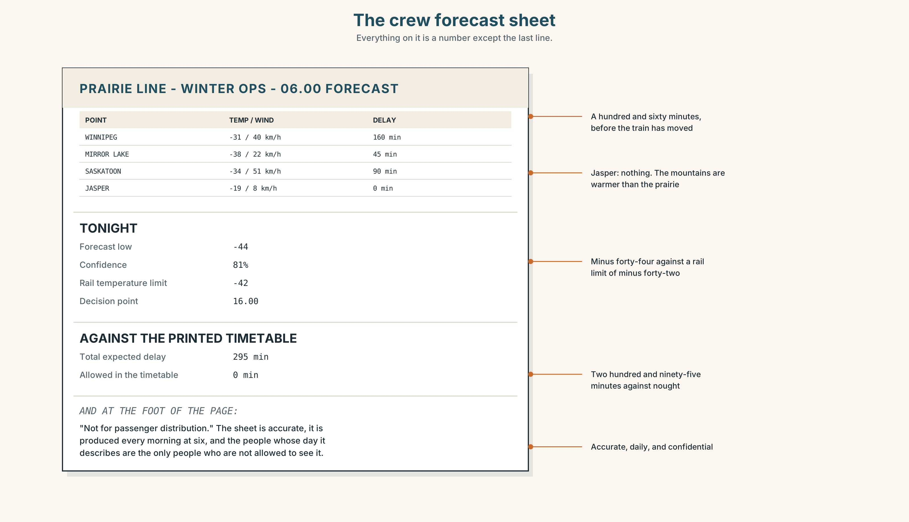{width=6.6in}

*The crew forecast sheet — Everything on it is a number except the last line.*

**Read the sheet and answer.**

1. What is the temperature at Mirror Lake?
2. **What is the expected delay at Winnipeg, and what does the printed timetable allow?**
3. What is the confidence figure for tonight?
4. **What does the line at the bottom say, and who is it protecting?**

### 5F · Two texts

The ticket says the train arrives at 09.40.
The crew sheet says it will arrive at about 12.20.

**Which one is the timetable?** Say one sentence.

---

## Part 6 · Vocabulary Lab 2 ◆ **B · THE SYSTEM**

### Tonight, tomorrow, and this weekend

{width=6.6in}

*One plan, six weathers — In the first four the plan survives. In the fifth it moves. In the sixth it stops being a plan.*

### 6A · The ones that catch everybody

| | |
|---|---|
| **tonight / this evening** | *tonight* is after dark; *this evening* starts earlier |
| **this weekend** | no *on*, no *at*, no *the* |
| **next week** | no *the* either — *next week*, not *the next week* |
| **put off / call off** | moved, or ended. The difference is a whole conversation |

### 6B · Say them

> tonight · tomorrow · this weekend · next week · afternoon · evening · winter · summer

### 6C · Chunk

1. What are you **______** at the weekend? *(the arrangement question)*
2. It **______ ______** rain. *(three words — evidence, in front of you)*
3. We're **______** at six tomorrow. *(arranged with other people)*
4. It **______ ______** the weather. *(three words — the refusal)*
5. They've **______ ______** the match. *(two words — it is not happening at all)*
6. We're going to **______ ______** until Tuesday. *(two words — it has moved)*

### 6D · Contrast Clinic

Six items. ***put off*** or ***call off***?

1. The match is next Tuesday instead. ______
2. The trip is cancelled and there is no new date. ______
3. We'll do it next month instead. ______
4. There will be no concert this year. ______
5. The meeting has moved to Thursday. ______
6. The match is not happening at all. ______

---

## Part 7 · Pronunciation & Fluency Lab ◆ **B · THE SYSTEM**

### Three syllables in one

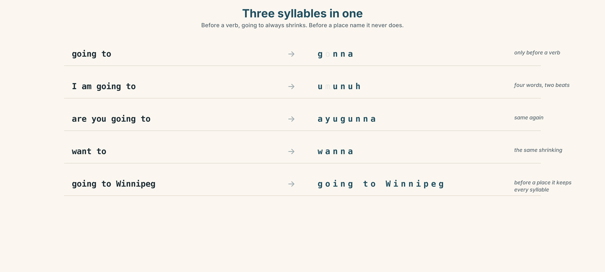{width=6.6in}

*Three syllables in one — Before a verb, going to always shrinks. Before a place name it never does.*

### 7A · Hear

> **going to** → *gonna* — and before a verb it is almost never said in full
> **I'm going to** → *um-uh-nuh* · **are you going to** → *a-yuh-gunnuh*
> Before a **noun** it does not shrink: *I'm going to Winnipeg* keeps all three syllables.

### 7B · Say

Say each one three times. Then say this:

> *I'm going to check the forecast, and then I'm going to Winnipeg.* — one shrinks and one does
> not.

### 7C · Make it mean something

Say these two:

> *I'm gonna go.* — a plan, and it sounds like speech
> *I am going to go.* — the same plan, and now you are being firm about it

**The shrunken form is the normal one.** Saying it in full is not more polite. Which one sounds
like an argument?

### 7D · Fluency 20 ⏺

Twenty seconds: **six things you are going to do this month, with one condition each.**
Three times, faster.

---

## Part 8 · Writing ◆ **C · THE PERFORMANCE**

### A plan with a condition · 50–70 words

### 8A · Read the model

> We're leaving on Saturday at six. The tickets are booked. `[an arrangement, with the proof]`
>
> It's going to be cold — minus thirty on Friday night, and it doesn't warm up. `[a prediction
> with evidence]`
>
> If the road is closed we're going to go on Sunday instead. We're not going to cancel it.
> `[the condition, and what will be done — the difference between moving and cancelling]`
>
> I'll telephone you on Friday either way. `[the decision made as the writer writes]`

**Questions about the writer's choices:**

1. *The tickets are booked.* **Why is the evidence more useful than the plan?**
2. *We're not going to cancel it.* **Why say what will not happen?**
3. The last line uses a different future from the other three. **Why?**

### 8B · The anti-model

> We will go on Saturday. We will leave at six. If the weather is bad we will decide later. I will call you.

Correct English, four futures, and all four are the wrong one. **Rewrite it with one arrangement,
one prediction with evidence, one condition, and one decision made as you write.**

### 8C · Plan

> the arrangement, with proof → the prediction, with evidence → the condition and what you will
> do → the decision made now

### 8D · Write — 50 to 70 words
### 8E · Peer review — two things only

> ☐ Are at least two different futures used, and is each one right?
> ☐ Is there one condition, and does it say what happens if it is met?

### 8F · Publish

Swap with a partner. **They mark the one sentence they would act on without asking you anything.**

---

## Part 9 · The File ◆ **A · THE WORLD + C · THE PERFORMANCE**

# STUDY FILE · The plan and the weather

{width=6.6in}

*One study month, in section — The bottom layer is the only one still standing on the thirtieth.*

### 9A · The week that goes wrong

{width=6.6in}

*The first of next month — Five panels. The fifth is identical to the first, and that is the problem.*

| | |
|---|---|
| **What people plan** | thirty days, no exceptions |
| **What happens** | a bad week, about once a month, for reasons nobody controls |
| **What people do** | stop, and restart on the first of something |
| **What a real plan has** | a bad-week version, written down in advance |

### 9B · Write the bad-week version

Take your study plan and write the version for the week when everything goes wrong.
**It should be about a fifth of the size and it must not be zero.** That version is the plan.

### 9C · Role play — the forecast

In pairs. One of you describes next month. The other asks *What are you going to do if…?* four
times, each time about something going wrong. **No answer may be *I don't know*.**

### 9D · Your forty below

Everybody has a condition under which they do nothing — illness, a deadline, a bad week.
**Name yours, and write the two minutes of English you could still do in it.**

### 9E · Transfer — before next week

**Use the bad-week version for seven days, even if the week is fine.**
Bring it back and say whether you missed the full one.

---

## Part 10 · Mediation & Interaction ◆ **C · THE PERFORMANCE**

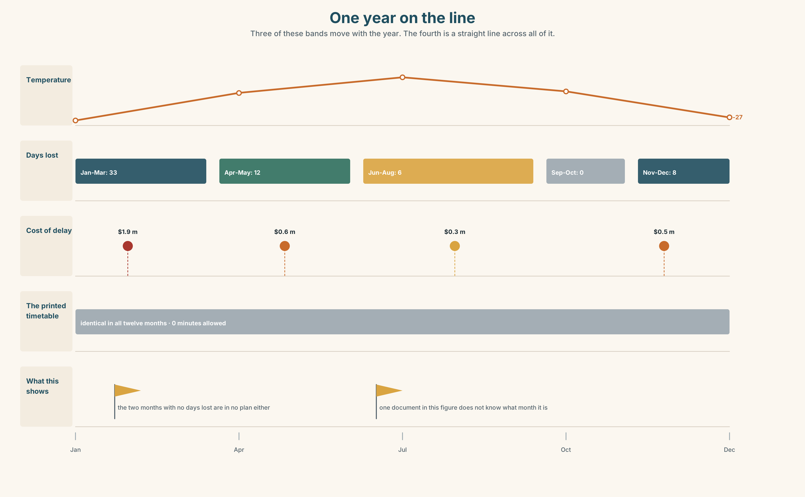{width=6.6in}

*One year on the line — Three of these bands move with the year. The fourth is a straight line across all of it.*

### 10A · Relay

Half the class has the forecast sheet. Half has the printed timetable.
**Build the real winter by speaking.** Ten minutes.

### 10B · Simplify — for one person

A passenger at Winnipeg asks: *Will we arrive at twenty to ten?*
**Answer in three sentences.** They have a connection, and you are standing in a corridor.

### 10C · Online

Write **one message** making a plan with a classmate for next week.
**Three sentences.** One arrangement, one prediction, one condition.

### 10D · Your language

Does your language have different ways of talking about the future depending on when you decided?
**Say *I'm going to call her* and *I'll call her* in your language.** Are they different?

---

## Part 11 · The Decision ◆ **C · THE PERFORMANCE**

# The timetable that tells the truth

In January the train is late nine times in ten, by an average of two hours forty. The printed
timetable allows nothing for it.

**Option one:** print the real winter timetable. Passengers would arrive expecting the true time.
The advertised journey becomes three hours longer and bookings would probably fall.

**Option two:** keep it. Ninety per cent of winter passengers are told at Winnipeg by a crew
member, and about a third of them are angry at that crew member.

**Option three:** print both. Summer times in large type, winter times beneath them in the same
size, and a line saying which months are which.

### 11A · The evidence

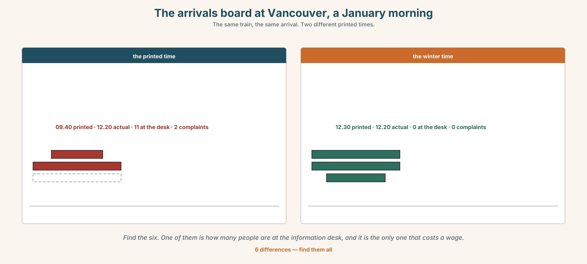{width=6.6in}

*The arrivals board at Vancouver, a January morning — The same train, the same arrival. Two different printed times.*

🔊 **Track 9.6.** Nadia, 20 seconds: *"I tell about ninety people a week in January that their
ticket is wrong. It is not wrong. It just isn't true. Somebody decided that it was better for me
to say it than for the company to print it."*

### 11B · Talk about it

In threes. Use the frame. Everybody says one.

> *I think the company should ______ , because ______ .*

**Words you can use:** *weather · snow · ice · winter · forecast · cancel a plan · put off*

### 11C · Decide

Write **two sentences**. Choose, and say why.

> I think the company should ______________________ ,
> because ______________________ .

### 11D · Model decision

> Print both, in the same size. The honest timetable costs bookings and the dishonest one costs
> a person in a corridor ninety conversations a week. Printing both costs a line of type, and
> it is the only one of the three in which nobody is asked to say something they do not believe.

### 11E · The Reveal

> **What happened.** The company printed both. Winter bookings fell four per cent in the first
> year, which was less than anybody had predicted, and complaints at Vancouver fell by two thirds.
>
> Then something nobody expected: the four per cent came back the following year and brought
> others. People had started booking the winter service on purpose, because a company that prints
> a three-hour delay is a company that tells you things.

**One question. You do not have to answer it out loud.**

> They were protecting the bookings. What had they been spending to protect them?

---

## Part 12 · Landing ◆ **all three lines**

### 12A · Recycle — twelve items

> 1. Look at that sky. It ______ ______ ______ snow. *(three words)*
> 2. We ______ ______ at six tomorrow. *(arranged)*
> 3. The phone is ringing — I ______ get it. *(deciding now)*
> 4. What are you ______ at the weekend?
> 5. It ______ ______ the weather. *(three words)*
> 6. We're going to ______ ______ the match until Tuesday. *(two words)*
> 7. They've ______ ______ the concert. *(two words — it is not happening)*
> 8. I ______ ______ ______ every morning in winter. *(three words — the crew do it four times a day)*
> 9. It's only ______ ______ ______ . *(three words — do not change anything)*
> 10. It's ______ ______ tonight. *(two words — minus forty)*
> 11. *(Unit 8)* ______ you ever worked abroad?
> 12. *(Unit 7)* You ______ touch it. *(forbidden)*

### 12B · Consolidate — one task, everything in it

**Write a plan for one day next month, in six sentences.** One arrangement, one prediction with
evidence, one decision you have already made, one condition, and one thing you will not do.

### 12C · Can-do, with evidence

> ☐ I can make a plan and change it. **Evidence:** 4C, 8D
> ☐ I can choose between the three futures. **Evidence:** 3G
> ☐ I can attach a condition to a plan. **Evidence:** 6C
> ☐ I can say *going to* the way it is actually said. **Evidence:** 7C

### 12D · Replay ⏺

Record 0C again. **Listen to both.** What is different?

### 12E · Glossary — thirty-five words, as a map

> **IN THE SKY** · rain · snow · wind · sun · cloud · storm · ice · sky
> **HOW IT FEELS** · cool · wet · dry · degrees
> **THE YEAR** · season · spring · autumn · winter · summer · weather
> **WHAT YOU DO** · check the forecast · cancel a plan · put off · call off
> **HOW BAD** · a bit of rain · forty below
> **WHEN** · tonight · tomorrow · this · weekend · next week · afternoon · evening · forecast
> **TALKING ABOUT IT** · going to · What are you doing…? · It depends on the weather.

### 12F · Next

> **Unit 10 · What story do you tell twice?**

# A1.2 · Unit 10 · Four Thousand One Hundred Cards

> **English Animated** · *Getting Around* · The Prairie Line, Toronto to Vancouver
> Student's Book pages 204–225 · 22 pp · ~9 hours

---

## Part 0 · The Big Picture ◆ **A · THE WORLD**

{width=6.6in}

*A storeroom at Toronto Union — Fourteen things to find. Eight boxes have a year on them. The ninth has nothing, and it is the fullest.*

# What story do you tell twice?

**By the end of this unit you can say what was the best, the worst and the strangest, and why it
was too much or not enough.**

| ◆ **A · THE WORLD** | Four thousand one hundred handwritten cards that nobody has ever read |
|---|---|
| ◆ **B · THE SYSTEM** | superlative adjectives · *too* and *enough* · 22 words for extremes and opinions · which word to push, and what the push means |
| ◆ **C · THE PERFORMANCE** | You tell a two-minute story that somebody else will retell |

---

### 0A · Find it — fourteen things

Find these in the picture. Write the number.

> ☐ a box ☐ a card ☐ a shelf ☐ a window ☐ a door ☐ a light ☐ a pen
> ☐ a table ☐ a chair ☐ a bag ☐ a clock ☐ a label ☐ a year ☐ a platform

**Three of these words are not in the picture. Which three?**

> a story · a memory · an ending

### 0B · Guess it

Look at the nine boxes. **Which one is the most recent?**
Say one thing. You can use these words:

> *box · year · full · old · write*

### 0C · Say it ⏺

**Record. Thirty seconds. Do not prepare.**

> **Tell me a story you have told more than once. Any story.**

You will listen to this again on the last page.

---

## Part 1 · Vocabulary Lab 1 ◆ **B · THE SYSTEM**

### 1A · Meet — what people write on a card

{width=6.6in}

*Four thousand one hundred cards, seven kinds — The biggest group is not the one the company expected. The smallest is the one it reads.*

| | |
|---|---|
| **story** | Eleven hundred of the four thousand one hundred. |
| **memory** | What a story is made of after about a year. |
| **ending** | The part people change when they tell it the second time. |
| **true** | What people claim and what nobody checks. |
| **the best thing** | The question on the card. |
| **the worst part** | The question nobody asked, and about four hundred people answered it anyway. |

### 1B · Meet — the words

> **best · worst · longest · shortest · hardest · easiest · strangest · favourite · amazing · boring · interesting · funny · true · story · memory · ending**

Write each word under the right picture.

{width=6.6in}

*One story, in four layers — Eleven features. Eleven words. The bottom layer is the shortest and the only one anybody remembers.*

### 1C · Sort — the thing, or your opinion of it?

Put each word in the right box. **Two of them can go in both. Which two, and why?**

> ending · favourite · true · funny · boring · longest · interesting · memory · amazing ·
> story

| **PART OF THE STORY** | **WHAT YOU THINK OF IT** | **BOTH** |
|---|---|---|
| | | |

### 1D · What people say about stories

| | |
|---|---|
| **the best thing** | The question on the card, and the one everybody answers. |
| **the worst part** | Four hundred people wrote this without being asked. |
| **a true story** | Three words that are never said about a story that is only true. |
| **at the end** | Where the second telling changes. |
| **turn out** | The verb for an ending nobody predicted. |
| **end up** | The verb for being somewhere you did not plan to be. |

**Now say them.** Two of these six are about where you finish and two are about what you thought.
**Which is which, and which of the six is a warning?**

### 1E · Stretch — the phrases you will need today

> **the best thing** · **the worst part** · **a true story** · **turn out** · **end up**

Match each phrase to the moment you need it.

1. You are about to tell something nobody will believe. → ______
2. Somebody asks you to sum up a week. → ______
3. The thing you were dreading was not the thing that went wrong. → ______
4. You went out for twenty minutes and came home at two. → ______
5. It was not what anybody expected, including you. → ______

### 1F · The hard one

> **f** **That's the best part.**

Practise it three times. **Four words that tell your listener the story is not over and the next
sentence is the one.**

### 1G · Own it

Write down the best thing and the worst part of this course in one sentence each.
Do not write your name. These will be read.

---

## Part 2 · Listening ◆ **A · THE WORLD**

{width=6.6in}

*In front of the open box — He has eleven minutes. She has been reading the same card for four of them.*

### 2A · In the storeroom 🔊 Track 10.1

**Before you listen.** There are four thousand one hundred cards and nobody has read them.
**Guess: what did most people write about?**

**Listen once. One question.** How many boxes are there?

**Listen again. Complete the table.**

| | What they expected | What is actually there |
|---|---|---|
| complaints | | |
| stories | | |
| nothing at all | | |

**Listen again. True or false?**

1. Most of the cards are complaints. ☐ T ☐ F
2. The newest box has no year on it. ☐ T ☐ F
3. There is enough time to read them all. ☐ T ☐ F
4. Eleven hundred of the cards are stories. ☐ T ☐ F

**Noticing.** Four sentences from the recording.

1. *It's the strangest thing in the box.*
2. *That's the best part.*
3. *There isn't enough time.*
4. *It's too long to read.*

**Sentences 3 and 4 both say there is a problem of amount. What is the difference between *too*
and *not enough*?**

### 2B · Decoding clinic 🔊 Track 10.2

Twenty seconds of Nadia at speed. Three jobs.

1. Count the superlatives you hear.
2. In one sentence she pushes the word *that*. In another she pushes *best*. What changes?
3. She says *the most amazing* and *the best*. Why is one two words and the other one?

> Transcripts, page 157.

---

## Part 3 · Grammar Lab 1 ◆ **B · THE SYSTEM**

### The end of the scale

### 3A · Notice

Look at the four sentences in Part 2 again.

1. In sentence 1, what is on the end of the adjective, and what is in front of it?
2. Why is *best* not *goodest*?
3. In sentence 3, what kind of word comes after *enough*?
4. In sentence 4, what is *too* saying about the amount?

### 3B · See

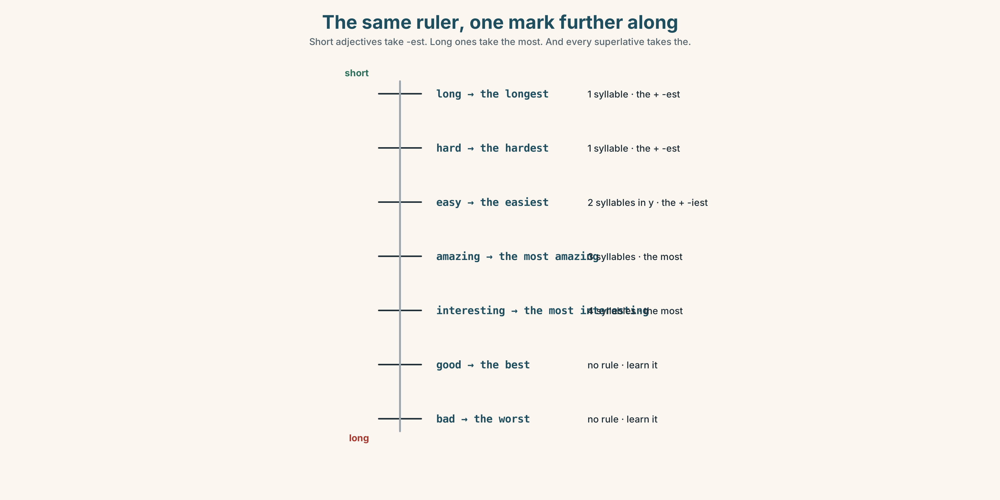{width=6.6in}

*The same ruler, one mark further along — Short adjectives take -est. Long ones take the most. And every superlative takes the.*

### 3C · Know

| | | |
|---|---|---|
| **one syllable** | **the** + **-est** | *the longest · the shortest · the hardest* |
| **three or more** | **the most** | *the most interesting · the most amazing* |
| **the odd ones** | no rule | *good → the best · bad → the worst · far → the furthest* |
| **always the** | one end, one thing | *the strangest thing in the box* |

> **Too and enough are not opposites.** *Too* means more than you want. *Not enough* means less
> than you need. Both describe a mismatch, from opposite sides, and *enough* goes **after** an
> adjective and **before** a noun: *long enough*, *enough time*.

{width=6.6in}

*Too much, enough, and not enough — Enough goes after an adjective and before a noun. Nothing else in English does this.*

| | |
|---|---|
| **before a noun** | *enough time · enough cards · not enough people* |
| **after an adjective** | *long enough · good enough · old enough* |
| **too + adjective** | *too long · too expensive · too late* |
| **softening a superlative** | *one of the best · almost the longest · nearly the worst* |

> **Why it matters.** Every opinion anybody gives about anything lands somewhere on this scale,
> and the two most common sentences in any review are *it was the best* and *it was too long*.

### 3D · Use — controlled

Complete with the superlative, **too** or **enough**.

> It's (1) ______ (strange) thing in the box. That's (2) ______ (good) part.
> There isn't (3) ______ time to read them all. It's (4) ______ long — four thousand cards.
> It is (5) ______ (interesting) document the company owns and nobody has opened it.

### 3E · Use — guided

Make a superlative sentence, then say why with *too* or *enough*.

1. the longest journey you have made
2. the worst weather you have been out in
3. the most interesting place you have been
4. the hardest thing about English
5. the strangest thing you have kept

### 3F · Use — open

**In pairs.** Agree on the best, the worst and the strangest thing about this course.
**You must agree on all three. Use *too* or *enough* at least twice.**

### 3G · Check — six items, mark your own

> 1. It's ______ ______ thing in the box. *(two words — strange)*
> 2. That's ______ ______ part. *(two words — good)*
> 3. There isn't ______ time.
> 4. It's ______ long to read.
> 5. ✗ *It's the most strangest thing.* → correct it.
> 6. ✗ *It isn't enough long.* → correct it.

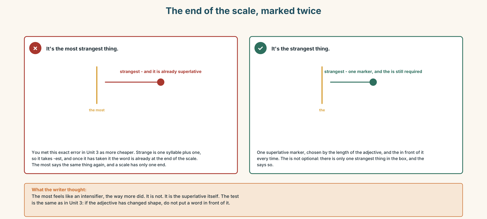{width=6.6in}

*The end of the scale, marked twice — The end of the scale, marked twice*

**0–3 →** Workbook pp. 40–43. **4–5 →** Part 6. **6 →** page 222.

---

## Part 4 · Speaking ◆ **C · THE PERFORMANCE**

### 4A · Fluency starter — the superlative round

Everybody says one superlative about their week. **No adjective twice, and every sentence must
have *the* in it.**

### 4B · The functional core — telling a story that gets retold

{width=6.6in}

*The same story, two cards — The left card has a number, a place and an ending. The right has three adjectives.*

**Language Bank**

| | |
|---|---|
| **the extreme** | *the best · the worst · the strangest · the most amazing* |
| **the amount** | *too long · not enough time · long enough* |
| **the softening** | *one of the best · almost the longest* |
| **the story** | *a true story · at the end · it turned out that… · we ended up…* |

**Information gap.** Learner A has what the company expected to find on the cards. Learner B has
what is actually on them. **Find the three biggest differences.**

### 4C · The performance — the story that gets retold ⏺

Tell a story in **two minutes** that your partner will have to retell to somebody else. You must:

> use two superlatives · use *too* or *enough* once · have an ending nobody predicts ·
> say one number

Your partner retells it in thirty seconds. **Record both.**

### 4D · Observer

One person listens for **one thing**: what survived into the retelling, and what did not?

### 4E · Two criteria

> ☐ Did my partner's retelling keep the ending?
> ☐ Did it keep the number?

---

## Part 5 · Reading ◆ **A · THE WORLD**

### 5A · Predict

The title is **"Eleven hundred of them are stories."**
**What were the cards supposed to collect?**

### 5B · Read — sixty seconds

---

**Eleven hundred of them are stories**

For eleven years the company has put a card on every table in the dining car. It says: *The best
thing about your journey?* and gives four lines.

Four thousand one hundred cards have come back. They are in nine boxes in a storeroom at Toronto
Union. Nobody has read them.

The company expected complaints. It planned for complaints; there is a process for a complaint and
a person whose job it is. There are two hundred and ten complaints in the boxes, and all two
hundred and ten were answered, because they arrived by another route as well.

Eleven hundred of the cards are stories. People wrote about the person they sat next to. About
nine hundred mention another passenger by description, and about four hundred mention one by name.

The company sells seats on a train. For eleven years its customers have been writing to it about
each other.

---

### 5C · Answer

1. What does the card ask?
2. How many cards have come back?
3. How many of them are complaints?
4. How many mention another passenger by name?
5. **Why were all two hundred and ten complaints answered?**
6. **The last line says customers have been writing about each other. What does that suggest the company is actually selling?**

### 5D · Vocabulary in context

Guess from the text. Then check.

> four lines · came back · by another route · by description · for eleven years

### 5E · The counter-text

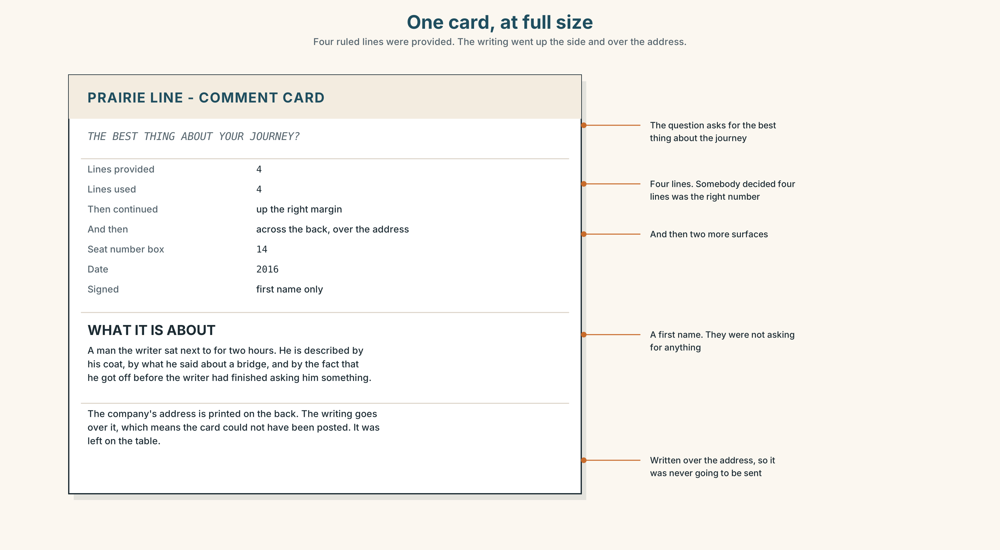{width=6.6in}

*One card, at full size — Four ruled lines were provided. The writing went up the side and over the address.*

**Read the card and answer.**

1. What is the printed question?
2. **How many lines were provided, and how much did this person write?**
3. What year is on it?
4. **The writing goes over the company's address. What does that tell you about who the writer thought they were writing to?**

### 5F · Two texts

The card asks for the best thing about the journey.
Eleven hundred people wrote about another passenger.

**Did they answer the question?** Say one sentence.

---

## Part 6 · Vocabulary Lab 2 ◆ **B · THE SYSTEM**

### Too much, and not enough

{width=6.6in}

*One story, six lengths — At two minutes other people retell it. At half an hour nobody does.*

### 6A · The ones that catch everybody

| | |
|---|---|
| **enough time** | before a noun |
| **long enough** | after an adjective. This is the one everybody reverses |
| **too / very** | *very long* is a description; *too long* is a complaint |
| **the most / the -est** | the same rule as Unit 3, with *the* in front |

### 6B · Say them

> too · enough · most · least · very · so · absolutely · almost · nearly

### 6C · Chunk

1. There isn't **______** time. *(before a noun)*
2. It isn't long **______ .** *(after an adjective)*
3. It's **______** long. *(a complaint)*
4. It's **______** long. *(a description, not a complaint)*
5. It's **______ ______ ______** story I've heard. *(three words — amazing)*
6. **______** the longest. *(one word — not quite)*

### 6D · Contrast Clinic

Six items. ***too*** or ***enough***?

1. The card isn't big ______ .
2. It's ______ expensive for what it is.
3. It's ______ long — I stopped reading.
4. Four lines isn't ______ .
5. It's ______ late to start now.
6. There isn't ______ time to read them all.

---

## Part 7 · Pronunciation & Fluency Lab ◆ **B · THE SYSTEM**

### Which word you push

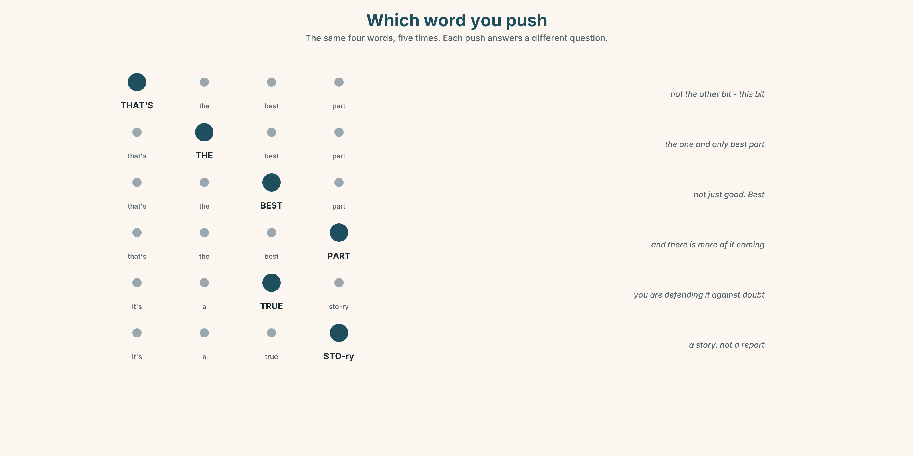{width=6.6in}

*Which word you push — The same four words, five times. Each push answers a different question.*

### 7A · Hear

> *That's the best part.* — push **that's**: not the other bit, this bit
> push **best**: not just good — best
> push **part**: and there is more of it coming

### 7B · Say

Say the sentence five times, pushing a different word each time. Then say this:

> *It's not the longest story in the box — it's the strangest.* — two pushes, and the second one
> is the point.

### 7C · Make it mean something

Say these two:

> *It's a TRUE story.* — and you are defending it against doubt
> *It's a true STORY.* — and you are saying it is a story, not a report

**Same four words.** The push decides which word is being argued about. Which one would you say
to somebody who did not believe you?

### 7D · Fluency 20 ⏺

Twenty seconds: **six superlatives about this year, each with a reason.** Three times, faster.

---

## Part 8 · Writing ◆ **C · THE PERFORMANCE**

### A story on four lines · 50–70 words

### 8A · Read the model

> The best thing was the man in seat 14. `[the answer to the question, in nine words]`
>
> He got on at Winnipeg and he talked for six hours, and I had wanted to read. `[the fact, and
> the honest resistance]`
>
> He had worked on this line for thirty-one years. He knew the name of every bridge. `[the
> reason it turned out differently]`
>
> I didn't read any of my book. That is the best part. `[the ending, and it contradicts the
> second line]`

**Questions about the writer's choices:**

1. *I had wanted to read.* **Why admit resistance in a card about the best thing?**
2. *He knew the name of every bridge.* **Why that detail and not *he was interesting*?**
3. The last line repeats the phrase from the card. **What does that do?**

### 8B · The anti-model

> The best thing was the scenery. It was amazing. The staff were very friendly and helpful. It was the most beautiful journey I have ever made. Thank you.

Correct English, entirely true, and there are nine hundred of these in the boxes and nobody can
tell them apart. **Rewrite it with one person, one number and one thing that went wrong first.**

### 8C · Plan

> the answer, short → the fact and your resistance → the detail that changed it →
> the ending, contradicting the second line

### 8D · Write — 50 to 70 words
### 8E · Peer review — two things only

> ☐ Is there one number and one person in it?
> ☐ Could somebody retell it from memory tomorrow?

### 8F · Publish

On a card, on the wall, with no names. **The class reads them all and chooses three to keep.
Then say what the three have in common.**

---

## Part 9 · The File ◆ **A · THE WORLD + C · THE PERFORMANCE**

# STUDY FILE · The story of this year

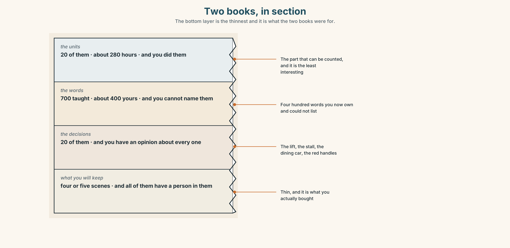{width=6.6in}

*Two books, in section — The bottom layer is the thinnest and it is what the two books were for.*

### 9A · What you will remember

{width=6.6in}

*Five recordings, one year — The fifth panel is the only one with a face in it.*

| | |
|---|---|
| **What you were given** | 700 words, 20 units, about 280 hours |
| **What you can measure** | four recordings, made months apart |
| **What you cannot** | the moment you stopped translating, because nobody was there |
| **What you keep** | about five scenes, and all of them have a person in them |

### 9B · Listen to all four

You recorded thirty seconds in A1.1 Unit 1, Unit 9 and Unit 10, and in Unit 6 of this book.
**Play all four in order, now.** Write down three differences. Not *better*. **What.**

### 9C · Role play — the handover

In pairs. One of you is starting A1.1 tomorrow. The other has just finished A1.2.
**Tell them the three things that are actually true about the next year.** No encouragement.

### 9D · The best part

Write one sentence beginning *The best thing about this year was…*
**It must have a person or a number in it.** Those are the only two things that survive.

### 9E · Transfer — before A2.1

**Record thirty seconds answering: *What can you do in English now?* Keep all five recordings
together in one place.** You will use them again at the end of A2.

---

## Part 10 · Mediation & Interaction ◆ **C · THE PERFORMANCE**

{width=6.6in}

*Four thousand one hundred cards — The last band is almost entirely empty, and that is the finding.*

### 10A · Relay

Half the class has what the company expected. Half has what is in the boxes.
**Build the real picture by speaking.** Ten minutes.

### 10B · Simplify — for one person

The marketing manager asks: *What is actually in those boxes?*
**Answer in four sentences.** He has eleven minutes and a report due on Friday.

### 10C · Online

Write **one message** to a classmate about the best and worst thing in this course.
**Three sentences.** Two superlatives and one *too* or *enough*.

### 10D · Your language

Does your language mark the end of a scale with an ending, or with a separate word?
**Say *the longest* and *the most interesting* in your language.** Is it the same method for both?

---

## Part 11 · The Decision ◆ **C · THE PERFORMANCE**

# Four thousand one hundred cards

Nine boxes. Four thousand one hundred cards. Eleven years. Nobody has read them.

**Option one:** recycle them. They are eleven years old, the oldest are illegible, and nobody has
missed them.

**Option two:** read a sample of four hundred and write a report. Costs about three weeks of one
person's time and produces a document that will be read by six people.

**Option three:** type up the eleven hundred stories and put them on the website, with the
writers' permission where there is a name. Costs about four months and nobody can say in advance
what it is for.

### 11A · The evidence

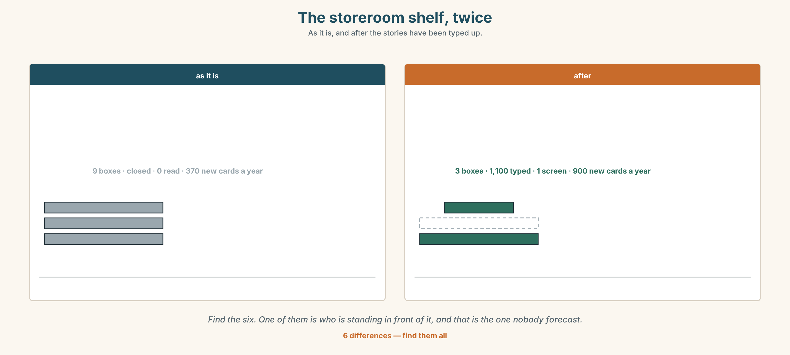{width=6.6in}

*The storeroom shelf, twice — As it is, and after the stories have been typed up.*

🔊 **Track 10.6.** Nadia, 20 seconds: *"I read about forty of them once, waiting for a train. The
best one was from 2016 and it was about a man who talked for six hours. I have told that story
about nine times. I have never told anybody what was in the report."*

### 11B · Talk about it

In threes. Use the frame. Everybody says one.

> *I think the company should ______ , because ______ .*

**Words you can use:** *story · memory · best · worst · amazing · boring · true*

### 11C · Decide

Write **two sentences**. Choose, and say why.

> I think the company should ______________________ ,
> because ______________________ .

### 11D · Model decision

> Type up the eleven hundred stories. The report will tell the company what it already believes.
> The stories will tell it what it is selling, and it has been wrong about that for eleven years.
> Four months is nothing against eleven years of being wrong.

### 11E · The Reveal

> **What happened.** The company typed up eleven hundred stories and put one a day on a screen in
> the dining car. Nothing measurable changed for six months.
>
> Then something nobody expected: passengers began writing cards **about the cards on the screen**.
> The number of cards returned went from about three hundred and seventy a year to nine hundred,
> and the new ones were longer.

**One question. You do not have to answer it out loud.**

> They had four thousand one hundred cards and no idea what to do with them. What had they been
> missing for eleven years?

---

## Part 12 · Landing ◆ **all three lines**

### 12A · Recycle — twelve items

> 1. It's ______ ______ thing in the box. *(two words — strange)*
> 2. That's ______ ______ part. *(two words — good)*
> 3. There isn't ______ time.
> 4. It's ______ long to read.
> 5. It isn't long ______ . *(after the adjective)*
> 6. It's ______ ______ ______ story I've heard. *(three words — amazing)*
> 7. ______ the longest. *(one word — not quite)*
> 8. It ______ ______ that he had worked here for thirty-one years. *(two words)*
> 9. We ______ ______ talking for six hours. *(two words — we did not plan to)*
> 10. It's ______ ______ ______ . *(three words — and nobody checks)*
> 11. *(Unit 9)* It ______ ______ ______ snow. *(three words — look at the sky)*
> 12. *(Unit 8)* ______ you ever worked abroad?

### 12B · Consolidate — one task, everything in it

**Write the story of this year in six sentences.** Two superlatives, one *too*, one *enough*, one
number, one person, and an ending that contradicts the beginning.

### 12C · Can-do, with evidence

> ☐ I can say what was the best, the worst and the strangest. **Evidence:** 4C, 8D
> ☐ I can form superlatives correctly. **Evidence:** 3G
> ☐ I can use *too* and *enough* in the right place. **Evidence:** 6D
> ☐ I can push the right word in a sentence. **Evidence:** 7C

### 12D · Replay ⏺

Record 0C again. **Then listen to all five recordings from both books, in order.**
**One year. Five recordings.** What is different?

### 12E · Glossary — thirty-five words, as a map

> **THE ENDS OF SCALES** · best · worst · longest · shortest · hardest · easiest · strangest
> **WHAT YOU THINK** · favourite · amazing · boring · interesting · funny · true
> **THE PARTS** · story · memory · ending · the best thing · the worst part · at the end
> **WHAT HAPPENS** · turn out · end up · a true story
> **AMOUNT** · too · enough · most · least · very · so · absolutely · almost · nearly
> **SAYING IT** · the most beautiful · not enough time · It's too long. · That's the best part.

### 12F · Next

> **A2.1 · *Making Plans* · Unit 1 · How long have you been at this?**

# Answer Key

> Open tasks — speaking, writing, discussion — are not keyed. Their
> success criteria are in the unit, at 4E and 8E.

## A1.2 · Unit 1 · Nine Days In

**0B** · Guess it
Because the shift has not ended. The train is four hours late, so everything he should have done between seven and eleven is still waiting to be done, and the only quiet place to do it is a dark dining car at two in the morning.

**1C** · Sort — the job, or how it felt?
> **HOW IT FELT** — awful · calm · lucky
> **PART OF THE JOB** — crew · ticket · report · shift · mistake
> **BOTH** — busy · delay
**The two in both:** *busy* and *delay*. A delay is a measured number of minutes and also a feeling in a corridor; *busy* is a description of a shift and of a person. Accept *mistake* in two columns if the learner argues that it is both an event and a judgement.

**2A** · Two in the morning 🔊 Track 1.1
**1** F · **2** F · **3** T · **4** T
**Listen once** — eleven at night, four hours late.

**Order** — 1 the freight train broke down · 2 the dining car closed at nine · 3 Dev woke Ruth and they made the sandwiches · 4 Nadia made the announcement at half past eleven.

**2 is false:** Nadia made it, not Dev.

**Noticing** — nothing was added to the end. The change is inside the word: *leave → left*, *go → went*, *come → came*, *say → said*. These are irregular verbs and the past is made by changing the word, not by adding to it.

**3D** · Use — controlled
1 left · 2 went · 3 was · 4 came · 5 said · 6 began · 7 became

**3E** · Use — guided
1 The train left at seven.  
2 I went to the kitchen.  
3 She came back with Ruth.  
4 We began the shift at six.  
5 Nobody said anything.

The form is the same after *I*, *she*, *we* and *nobody*. The past simple has no person endings at all.

**3G** · Check — six items, mark your own
1 left · 2 went · 3 came · 4 said · 5 *We left at eleven.* — *leave* is irregular · 6 *He went to the kitchen.* — *go* is irregular, and *goed* is not a word

**5C** · Answer
1 Four hours.  
2 A freight train broke down eighty kilometres ahead.  
3 Nine days.  
4 Two hundred, in ninety minutes.  
5 Because people who are told nothing assume the worst, and because the delay was already four hours old. Saying *I do not know much* is information; saying nothing is not.  
6 It is true, and it is missing everything that happened. NO INCIDENTS means nothing went wrong, and the two hundred sandwiches, the announcement and the three letters are all things that went right — for which the form has no box.

**5D** · Vocabulary in context
**broke down** — stopped working · **stationary** — not moving · **she was not pleased** — she was annoyed · **between them** — the two of them together · **said it anyway** — said it despite having little to say

**5E** · The counter-text
1 It left at 23.04 and it was scheduled for 19.00.  
2 F3, meaning a freight movement. It records the cause and not the fault — the company has twenty-two codes and none of them names anybody.  
3 NONE.  
4 Nowhere. There is no field on the form for anything a passenger wrote, and the three letters went to a different department entirely.

**5F** · Two texts
The log. It is in a database and it will be there in ten years; the sandwiches exist only in the memory of about a hundred and ninety-two people, and in nothing the company owns.

**6C** · Chunk
1 After · 2 first · 3 end · 4 While · 5 next · 6 What happened

**6D** · Contrast Clinic
> **1** **While** — two long things at the same time
> **2** **While** — two long things at the same time
> **3** **While** — two long things at the same time
> **4** **When** — one short event
> **5** **When** — one short event
> **6** **When** — one short event

**12A** · Recycle — twelve items
1 left · 2 went · 3 came · 4 said · 5 began · 6 After · 7 At · 8 end · 9 While · 10 next · 11 sort out · 12 What happened

---

## A1.2 · Unit 2 · Forty Seconds at Mirror Lake

**0B** · Guess it
The one with the smallest bag. A return journey is packed for a known number of nights; a single is packed for everything you own that you can carry. The heavy bags are the ones that are not coming back.

**1C** · Sort — the place, or the thing you carry?
> **PART OF THE STATION OR TRAIN** — aisle · shelter · platform · window · seat
> **SOMETHING YOU CARRY** — suitcase · luggage · backpack
> **BOTH** — timetable · ticket
**The two in both:** *timetable* and *ticket*. Both exist on the station wall and in your pocket. They are the only two objects in this unit that have to be in two places at once for the journey to work.

**2A** · The ticket window 🔊 Track 2.1
**1** F · **2** T · **3** F · **4** T
**Listen once** — about seven months. She last travelled in March.

**Table** — last journey: to Winnipeg, a return, seven months ago. This journey: to Vancouver, a single, today.

**1 is false:** a single. **3 is false:** she travelled in March, not last summer.

**Noticing** — the past has moved onto *did* and *didn't*, so the verb goes back to its plain form. One past marker to a sentence, and when *did* is present it takes it.

**3D** · Use — controlled
1 bought · 2 didn't · 3 Did · 4 didn't · 5 came · 6 did

**3E** · Use — guided
1 She didn't book a return ticket. → Did she book a return ticket?  
2 They didn't set off at six. → Did they set off at six?  
3 He didn't miss the train. → Did he miss the train?  
4 We didn't change at Winnipeg. → Did we change at Winnipeg?  
5 The guard didn't wait. → Did the guard wait?

In every one the main verb loses its past form completely, including the irregular ones.

**3G** · Check — six items, mark your own
1 didn't · 2 Did · 3 did · 4 didn't · 5 *Did you buy it?* — *did* already carries the past · 6 *I didn't go.* — same rule, and *go* goes back to its plain form

**5C** · Answer
1 One thousand one hundred.  
2 In 2009.  
3 Thirty-one years.  
4 Forty seconds.  
5 Because nothing was announced and nothing was closed on any particular day. People left one at a time, each for a reason that was not about the town, and the sum of those reasons looks like a decision only afterwards.  
6 Fifteen more people got on than got off, which means the town is still exporting people — and it is the only measurement of the town that anybody actually takes.

**5D** · Vocabulary in context
**a grain elevator** — the tall building where grain is stored · **for good** — permanently · **in a place like this** — in a town of this kind · **put down** — let passengers off · **the same thing** — indistinguishable

**5E** · The counter-text
1 Two — Monday and Thursday.  
2 Four. Two of the four westbound times are crossed out in pen, so the service has halved.  
3 The fourth of November, with no year.  
4 It was decided before the timetable was printed. A printed line is part of the design; a crossing-out in pen is a change made afterwards. So the winter request rule is older than the cuts.

**5F** · Two texts
Several were. The four crossings-out are four decisions and the printed winter line is a fifth; what nobody ever made was a decision about the town, which is a different thing and would have had a name on it.

**6C** · Chunk
1 ago · 2 last · 3 last · 4 before · 5 ago · 6 ago

**6D** · Contrast Clinic
> **1** **ago** — counting back from now, after the number
> **2** **last** — naming a season that has finished
> **3** **last** — naming a time
> **4** **ago** — counting back, and refusing to say how far
> **5** **ago** — counting back
> **6** **last** — naming a week

**12A** · Recycle — twelve items
1 didn't · 2 Did · 3 did · 4 ago · 5 last · 6 last · 7 before · 8 ago · 9 change trains · 10 set off · 11 left · 12 After

---

## A1.2 · Unit 3 · One Thousand Four Hundred Seats

**0B** · Guess it
The row that is not wrapped. Wear is the giveaway: the old row has arms rubbed pale where hands go and the new row is identical seat to seat. A thing that has been used stops being identical to the thing next to it.

**1C** · Sort — the thing, or what you think of it?
> **WHAT IT IS MADE OF** — metal · plastic · cloth · wood
> **WHAT YOU THINK OF IT** — weak · quality · new · strong
> **BOTH** — cheap · price
**The two in both:** *cheap* and *price*. A price is a fact and *cheap* is a judgement about the same number — and a cheap material is also, in ordinary speech, a kind of material. The word does both jobs and the listener has to decide which you meant.

**2A** · In the shed 🔊 Track 3.1
**1** T · **2** F · **3** F · **4** T
**Listen once** — nineteen dollars.

**Table** — cloth: $41, about seven years, repairable three or four times. Synthetic: $19, about three years, not repairable.

**2 is false:** cloth is the dearer of the two. **3 is false:** when it tears it is finished.

**Noticing** — the length of the adjective. One syllable takes **-er**; three or more take **more** in front. Nothing about the meaning decides it.

**3D** · Use — controlled
1 cheaper · 2 stronger · 3 as · 4 as · 5 more · 6 than

**3E** · Use — guided
1 Cloth is more expensive than synthetic, but it lasts more than twice as long.  
2 Metal is heavier than plastic and it lasts nearly four times as long.  
3 The old seat has been repaired four times and the new one is already torn.  
4 The train is much slower than the plane — four nights against five hours.  
5 A return is dearer than a single, and it is not twice the price.

Accept any sentence with one comparative and *than*, as long as the two things are named.

**3G** · Check — six items, mark your own
1 cheaper · 2 stronger · 3 as … as · 4 more · 5 *It is cheaper than cloth.* — not both *more* and *-er* · 6 *It is cheaper than cloth.* — the word is *than*, never *that*

**5C** · Answer
1 Forty-one dollars.  
2 About three years.  
3 Fourteen hundred.  
4 Eighty-six thousand for cloth and eighty-nine for synthetic.  
5 Because three thousand dollars on a decision worth around ninety thousand is about three per cent, which is inside the error of every assumption in the calculation.  
6 It means the decision will be made by whoever is accountable for this year, not by whoever will pay in year four — so the money is not deciding it, the calendar is.

**5D** · Vocabulary in context
**it can be repaired** — it is possible to mend it · **once and a half** — one and a half times · **leaves in one year** — is all spent in a single year · **in four pieces** — in four separate payments · **signs for it** — authorises the spending

**5E** · The counter-text
1 Forty-one dollars for cloth, nineteen for synthetic.  
2 Six of the eight favour synthetic: price, weight, cleaning time, stain resistance, colours and delivery.  
3 SERVICE LIFE and REPAIRABLE.  
4 Three years, and no. They are missing because they are the only two rows on which synthetic loses, and because a blank is not a lie.

**5F** · Two texts
Yes. Thirty thousand is the saving on this order and three thousand is the extra cost over ten years, and the sheet simply stops counting at the moment synthetic is ahead.

**6C** · Chunk
1 bit · 2 much · 3 as · 4 as · 5 than · 6 difference

**6D** · Contrast Clinic
> **1** **heavier** — two syllables ending in y, so -ier
> **2** **more useful** — two syllables, no y
> **3** **more difficult** — three syllables
> **4** **more expensive** — three syllables
> **5** **cheaper** — one syllable
> **6** **stronger** — one syllable

**12A** · Recycle — twelve items
1 cheaper · 2 stronger · 3 as · 4 more · 5 bit · 6 much · 7 as · 8 last longer · 9 break down · 10 difference · 11 Did · 12 went

---

## A1.2 · Unit 4 · Two Adults and Three Children

**0B** · Guess it
Open answers. The strongest ones work from behaviour rather than faces: who has put a coat over whom, who is holding whose bag, who has not spoken since Winnipeg. Two people who look alike may be strangers; two people who share luggage are not.

**1C** · Sort — the person, or the connection?
> **A PERSON** — cousin · mother · husband · brother · aunt · daughter
> **A SITUATION** — alone · married · together
> **BOTH** — family
**Family** is both: a set of people and a situation you are in. Accept *married* in two columns as well if the learner points out that *a married couple* describes people. The useful observation is that six of these ten words are positions in a diagram and the other four are states.

**2A** · Coach 6, half past eight 🔊 Track 4.1
**1** F · **2** T · **3** T · **4** F
**Listen once** — his sister's.

**Table** — the woman in seat 14: a stranger, who lent him a coat. The man with the coat: nobody, and the coat is hers. The person he is going to: his aunt, who brought him up.

**1 is false:** it is his sister's. **4 is false:** he is travelling alone.

**Noticing** — *my* has to hold a noun and *mine* refuses one. *It's not my* stops where the noun should be, and the listener waits for it.

**3D** · Use — controlled
1 mine · 2 's · 3 's · 4 his · 5 theirs · 6 ours

**3E** · Use — guided
1 Sam's bag.  
2 Mine.  
3 Ours.  
4 The guard's keys.  
5 My sister's children.

The apostrophe always attaches to the owner, never to the thing. In 2 and 3 there is no noun at all, so the standing-alone form is the only option.

**3G** · Check — six items, mark your own
1 mine · 2 's · 3 hers · 4 Whose · 5 *It's not mine.* — *my* cannot end a sentence · 6 *That is Sam's bag.* — people take ’s, not *of*

**5C** · Answer
1 Two adults and up to three children travelling together, for the price of two adults.  
2 Eleven.  
3 Because the fare covers five people and there were six.  
4 Seventeen.  
5 Because she is one adult, not two. The fare is written for a shape of family that she is not in, and the children are not the problem — the missing second adult is.  
6 It is paying for a number of bodies in a particular arrangement, and not for care. Three of the four bookings were doing care work and paid full fare; the one that got the discount had the most adults in it.

**5D** · Vocabulary in context
**travelling together** — making the journey as one group · **between them** — the two of them combined · **they split it** — they shared the cost · **cannot travel alone** — needs somebody with her · **looking after** — caring for

**5E** · The counter-text
1 Two adults and up to three children.  
2 Two to fifteen inclusive, because under-twos travel free and sixteen counts as an adult. The two ages are the two places the price changes.  
3 "Proof of relationship may be requested."  
4 Because defining it would mean choosing, in writing, whose household counts — and that choice is then the company's. Leaving it undefined moves the decision to whoever is at the counter, where it is made ninety times a day and never recorded.

**5F** · Two texts
All four are families and only one fits the sentence, which tells you the sentence is a description of a price and not of a family.

**6C** · Chunk
1 Whose · 2 mine · 3 ours · 4 belongs · 5 of mine · 6 's

**6D** · Contrast Clinic
> **1** **mine** — standing alone
> **2** **mine** — standing alone
> **3** **My** — in front of a noun
> **4** **My** — in front of a noun
> **5** **mine** — standing alone
> **6** **My** — in front of a noun

**12A** · Recycle — twelve items
1 mine · 2 's · 3 hers · 4 Whose · 5 belongs · 6 of · 7 got married · 8 brought up · 9 live with · 10 grew up · 11 as · 12 Did

---

## A1.2 · Unit 5 · Is There a Doctor on Board?

**0B** · Guess it
Years. A rubber mat wears in months; the floor under it wears in decades, and it is worn in the shape of two feet because the galley is two metres wide and there is only one place to stand. Twenty-three years, and the floor is the only record of it.

**1C** · Sort — the body, or the advice?
> **SOMETHING YOU DO ABOUT IT** — exercise · medicine · water
> **SOMETHING THE BODY HAS** — cold · sick · pain · headache · cough
> **BOTH** — rest · stress
**The two in both:** *rest* and *stress*. Rest is a thing the body needs and a thing you do; stress is a state the body is in and, in a working life, a thing that is done to it. Both are also nouns and verbs with no change of form.

**2A** · Quarter past five 🔊 Track 5.1
**1** F · **2** T · **3** F · **4** T
**Listen once** — her back.

**Table** — the pain: she says it is nothing; Nadia says sit down. The hours: she says she has four hundred breakfasts; Nadia says do not lift that. The doctor: she has not seen one; Nadia suggests Winnipeg.

**1 is false:** she has not. **3 is false:** there is nobody on board.

**Noticing** — 1, 2 and 3 are advice; 4 is a promise. The hardest to say is 3, because a question invites a refusal and the other two do not.

**3D** · Use — controlled
1 should · 2 shouldn't · 3 Why don't you · 4 shouldn't work · 5 should · 6 should rest

**3E** · Use — guided
1 You should take something for it. / Why don't you take something for it?  
2 You should see a doctor. / Why don't you see a doctor?  
3 You should keep a bottle on the counter. / Why don't you keep a bottle on the counter?  
4 You shouldn't carry those alone. / Why don't you ask somebody to help?  
5 You should take a day. / Why don't you take Thursday?

The *Why don't you* version is gentler every time, and in 4 and 5 it is also more specific, which is what makes it easier to act on.

**3G** · Check — six items, mark your own
1 should · 2 shouldn't · 3 Why don't you · 4 should · 5 *You should sit down.* — nothing comes between a helper and its verb · 6 *She should rest.* — *should* never takes an s

**5C** · Answer
1 Four nights.  
2 Eleven hours.  
3 Bandages, a blanket and a list of telephone numbers.  
4 Thirty times out of forty-one.  
5 Because the eleven are the rare case and the announcement happens every time. The part that is hard forty-one times a year is not the medicine; it is speaking to a hundred and ninety-two frightened people.  
6 Making an announcement that does not frighten people, and dealing with a medical event. The first is harder, because it happens every time and because nobody thinks of it as a skill.

**5D** · Vocabulary in context
**at its furthest point** — where it is most distant · **a padlock** — a lock you put on and take off · **answered** — came forward in response · **the worst part** — the hardest element · **in a voice that** — speaking in a way that

**5E** · The counter-text
1 Nine.  
2 The ice pack and the glucose gel. The ice pack is for an injury; the glucose gel is the one item on the list for a medical emergency rather than a cut.  
3 Nineteen months ago.  
4 Advice. It gets you a person in Toronto telling you what to do, which is worth something — and the train is still eleven hours from anybody who can do it.

**5F** · Two texts
The announcement. The telephone number is the system on paper and the announcement is the system that runs forty-one times a year, and nobody has ever been trained in the second one.

**6C** · Chunk
1 should · 2 shouldn't · 3 Why don't · 4 feel better · 5 Take · 6 hurts

**6D** · Contrast Clinic
> **1** **shouldn't** — advice against
> **2** **should** — advice for
> **3** **should** — advice for
> **4** **should** — advice for
> **5** **shouldn't** — advice against
> **6** **shouldn't** — advice against

**12A** · Recycle — twelve items
1 should · 2 shouldn't · 3 Why don't · 4 feel better · 5 Take · 6 hurts · 7 lie down · 8 give up · 9 have a cold · 10 see a doctor · 11 mine · 12 as … as

---

## A1.2 · Unit 6 · The Dining Car in 2035

**0B** · Guess it
The one where nobody is looking at a phone. Four strangers who arrived separately and are still at the table an hour later have been talking longest, because nothing else is keeping them there.

**1C** · Sort — the thing, or what happens to it?
> **A THING** — machine · car · robot · city · energy
> **SOMETHING THAT HAPPENS** — disappear · replace · grow · improve
> **BOTH** — change
**Change** is both, with no change of form at all: *a change* and *to change*. Accept *energy* in two columns if the learner notices that it is a thing you buy and a property something has. English is unusually willing to let a noun become a verb untouched, and this is why.

**2A** · After the second sitting 🔊 Track 6.1
**1** T · **2** F · **3** T · **4** F
**Listen once** — 2035.

**Table** — the engine: electric, 96 per cent. The dining car: replaced by a machine, 70 per cent. The crew: six to four, 74 per cent.

**2 is false:** he says probably, about seventy per cent. **4 is false:** they do not.

**Noticing** — 1 is a prediction, 2 is an offer, 3 is a decision made at that second, and 4 is a prediction with a doubt in it. The word *will* is identical in all four and only the situation distinguishes them.

**3D** · Use — controlled
1 will · 2 will probably · 3 'll · 4 Maybe · 5 Will · 6 won't

**3E** · Use — guided
1 The dining car will probably close.  
2 The crew will certainly get smaller — the plan is costed.  
3 Trains will definitely get faster.  
4 Maybe the route will stay the same.  
5 I don't think people will stop booking.

Accept any certainty word in the right position: *probably* and *definitely* after *will*, *maybe* and *perhaps* at the front.

**3G** · Check — six items, mark your own
1 will · 2 'll · 3 won't · 4 probably · 5 *The engine will be electric.* — nothing between a helper and its verb · 6 *She will come tomorrow.* — *will* never takes an s

**5C** · Answer
1 About four hundred thousand dollars a year.  
2 Why people chose this train instead of flying.  
3 Sixty-one per cent.  
4 A machine that sells sandwiches.  
5 Because the sandwiches really will be fresher, always available, and nobody will wait forty minutes for a table. The plan is not wrong about what it measures.  
6 Because the thing being removed is not a food service. The finance argument is about a cost centre and table nine is the product, and the two have never been in the same document.

**5D** · Vocabulary in context
**head office** — the company's central administration · **surveys passengers** — asks them questions systematically · **a different document** — not the one being quoted · **always be available** — obtainable at any time · **exchange addresses** — give each other contact details

**5E** · The counter-text
1 Five.  
2 The dining car replacement, at seventy per cent.  
3 One point seven million dollars a year.  
4 "Reputational." Open answers for the replacement: the strongest ones name the sixty-one per cent and say what would happen to bookings. One word is not enough because a risk without a number cannot be weighed against savings that have four.

**5F** · Two texts
Yes, and that is the problem: the service will improve on every measure the plan uses, and the reason people book will not be among them.

**6C** · Chunk
1 probably · 2 Maybe · 3 think · 4 don't think · 5 We'll see · 6 Who knows

**6D** · Contrast Clinic
> **1** **probably** — after *will*
> **2** **Maybe** — at the front
> **3** **Maybe** — at the front
> **4** **Maybe** — at the front
> **5** **probably** — after *will*
> **6** **probably** — after *will*

**12A** · Recycle — twelve items
1 will · 2 'll · 3 won't · 4 probably · 5 Maybe · 6 think · 7 We'll see · 8 Who knows · 9 work out · 10 get worse · 11 should · 12 mine

---

## A1.2 · Unit 7 · Twenty-Two Red Handles

**0B** · Guess it
The one about the law. It is the only one that was not the company's to put up or take down, so nobody has ever had the authority to replace it — which is also why it is the most faded and the highest on the wall.

**1C** · Sort — the thing, or the rule about it?
> **A RULE OR A STATUS** — illegal · safety · legal · allowed
> **BOTH** — warning · speed
> **A THING YOU CAN SEE** — exit · seatbelt · helmet · licence
**The two in both:** *speed* and *warning*. A speed is a number you can read off a dial and also a limit somebody set; a warning is a sign you can see and the act of warning. Both are the thing and the rule about the thing at once.

**2A** · In the vestibule 🔊 Track 7.1
**1** F · **2** T · **3** T · **4** F
**Listen once** — breakable covers.

**Table** — the crew: must check them every trip; mustn't lock the box; don't have to sign the form. The passengers: must not touch it except in an emergency; mustn't block it; don't have to report a near miss.

**1 is false:** they may, in an emergency — that is what it is for. **4 is false:** it is a proposal.

**Noticing** — sentence 3 says it is not necessary. It gives permission not to do something, which is the opposite of forbidding it.

**3D** · Use — controlled
1 mustn't · 2 have to · 3 don't have to · 4 has to · 5 must

**3E** · Use — guided
1 Compulsory — *You have to wear a seatbelt.* (the law, in most countries)  
2 Forbidden — *You mustn't touch the emergency handle*, except in an emergency.  
3 Not necessary — *You don't have to sign the visitor book.*  
4 Compulsory — *You have to carry a licence when you drive.*  
5 Not necessary — *You don't have to arrive an hour early.*

Note that 1 and 4 both come from outside the speaker, which is why *have to* fits them better than *must*.

**3G** · Check — six items, mark your own
1 mustn't · 2 have to · 3 don't have to · 4 has to · 5 *You mustn't touch it.* — *don't must* does not exist · 6 *She must wear a helmet.* — no *to* after *must*

**5C** · Answer
1 Twenty-two.  
2 Four.  
3 About fifty minutes.  
4 A man in car 7 had a seizure and a passenger pulled the handle; the crew came and he is alive.  
5 Because *probably* is the honest word and the writer will not round it up. Eight seconds did not matter that night as far as anybody can tell, and nobody can tell for certain.  
6 Open answers. The strongest ones notice that the three mistakes are cheap and countable and the fourth is neither, and that a decision made only on countable things will always choose the covers.

**5D** · Vocabulary in context
**leaned on one** — rested their weight against it · **the length of it** — from one end to the other · **the nearest crew member** — the closest one · **breakable covers** — covers designed to break · **would not have mattered** — would have made no difference

**5E** · The counter-text
1 Four.  
2 A fine of up to five hundred dollars, in twenty-four point — the largest type on the notice.  
3 2011.  
4 It was written for the company, not for the passenger. The largest line protects the company from improper use and the smallest line is the one a frightened person needs in the two seconds they have.

**5F** · Two texts
No. Nobody reads four numbered instructions and a penalty line while somebody is having a seizure — which is exactly why the one line that matters should not be the smallest one on the page.

**6C** · Chunk
1 mustn't · 2 have to · 3 don't have to · 4 allowed · 5 illegal · 6 responsible

**6D** · Contrast Clinic
> **1** **don't have to** — it is not necessary
> **2** **mustn't** — forbidden, and it is the law
> **3** **mustn't** — forbidden
> **4** **don't have to** — it is optional
> **5** **mustn't** — forbidden, except in an emergency
> **6** **don't have to** — and the sentence says you can

**12A** · Recycle — twelve items
1 mustn't · 2 have to · 3 don't have to · 4 has to · 5 allowed · 6 illegal · 7 responsible · 8 follow · 9 pay a fine · 10 fill in · 11 probably · 12 shouldn't

---

## A1.2 · Unit 8 · Twenty-Three Years and Two

**0B** · Guess it
The one with two years. A small number in a box headed YEARS OF EXPERIENCE looks like an answer that is going to lose, so the pen stops while the person works out whether there is anywhere else on the page to put the rest.

**1C** · Sort — the thing, or the doing of it?
> **BOTH** — cook · win
> **A THING YOU HAVE** — adventure · experience · language · moment · skill
> **A THING YOU DO** — climb · drive · swim
**The two in both:** *win* and *cook*. A cook is a person and to cook is an action; a win is a result and to win is a verb. Note that *experience* is the only word on this list that is uncountable in one sense and countable in another: *she has experience* and *an experience*.

**2A** · The crew room 🔊 Track 8.1
**1** F · **2** F · **3** T · **4** T
**Listen once** — twenty-three.

**Table** — Ruth: 23 years, never abroad, worked nights for most of them. The applicant: 2 years, never been out of the country, has worked nights.

**1 is false:** he has never been out of the country. **2 is false:** she has.

**Noticing** — because the date does not matter and sometimes because you cannot remember it. A tense that leaves the time out lets you say what you have done without having to defend when.

**3D** · Use — controlled
1 Have … worked · 2 have never been · 3 haven't done … yet · 4 has done · 5 passed

**3E** · Use — guided
1 Have you ever worked nights? — Yes, a few times. / No, never.  
2 Have you ever driven a truck? — Yes, once. / No, not yet.  
3 Have you ever lived abroad? — Yes, for a year. / No, I've never been out of the country.  
4 Have you ever sung in front of people? — Yes, only once. / No, and I never will.  
5 Have you ever lost something important? — Yes. / Not yet.

Note that *Yes, for a year* and *Yes, once* both answer without giving a date, which is what keeps the conversation in this tense.

**3G** · Check — six items, mark your own
1 Have … worked · 2 never · 3 haven't done · 4 has done · 5 *I worked there last year.* — a date forces the past simple · 6 *Have you ever been to Jasper?* — the participle is *been*, not *went*

**5C** · Answer
1 YEARS OF EXPERIENCE.  
2 23.  
3 He ran the kitchen alone for eleven weeks.  
4 Four.  
5 Because the number was going to be compared with twenty-three and there was nowhere on the form to put anything else.  
6 Time spent near the job. It cannot distinguish between two people with the same number of years and it cannot distinguish between two people with different numbers either, because what it measures is not what the job needs.

**5D** · Vocabulary in context
**without notice** — leaving suddenly, with no warning · **talked somebody out of** — persuaded them not to · **nowhere to put it** — no space on the form · **how long you have been near it** — proximity over time, not ability · **more than once** — on several occasions

**5E** · The counter-text
1 Eleven.  
2 Nine about dates or documents; one about what somebody can do, and that one asks for a number of years.  
3 Four lines.  
4 "Information provided here will be read but does not form part of the score." It turns the only open box on the form into a courtesy, and anybody who has filled in a form before knows what that means.

**5F** · Two texts
In the OTHER box, which is four lines long and explicitly unscored — so the single most useful fact about the candidate would be recorded in the one place the form has declared worthless.

**6C** · Chunk
1 Have · 2 never · 3 yet · 4 already · 5 Not yet · 6 Only once

**6D** · Contrast Clinic
> **1** **been** — the journey is over and she is here
> **2** **been** — the question is about experience
> **3** **gone** — they are there, not here
> **4** **gone** — he is out now
> **5** **been** — and come back three times
> **6** **gone** — she is still there

**12A** · Recycle — twelve items
1 Have … worked · 2 never · 3 yet · 4 already · 5 gone · 6 been · 7 Not yet · 8 Only once · 9 take up · 10 carry on · 11 mustn't · 12 probably

---

## A1.2 · Unit 9 · Forty Below

**0B** · Guess it
The one with no coat. Nobody stands outside at minus thirty-eight without a coat on purpose; they came out for something that was going to take forty seconds, and the forty seconds became nine minutes because nobody else knows how long this will take either.

**1C** · Sort — the weather, or what it does to you?
> **BOTH** — wet · ice
> **SOMETHING YOU FEEL** — degrees · cool · dry
> **SOMETHING IN THE SKY** — sky · cloud · snow · storm · wind
**The two in both:** *ice* and *wet*. Ice falls out of the sky and forms on a rail; wet describes the weather and the state of your coat. Both are conditions outside you and sensations on you, and English uses one word for each pair.

**2A** · On the platform 🔊 Track 9.1
**1** F · **2** T · **3** F · **4** T
**Listen once** — minus forty-four.

**Table** — tonight: leave at 23.00, changed to not at all. Tomorrow morning: nothing planned, changed to leaving at six. The weekend: unchanged, and it depends on the weather.

**1 is false:** they are putting it off, not cancelling it. **3 is false:** she says *not yet*.

**Noticing** — in 1 the evidence is in front of him: the sky and the forecast. In 4 the decision was made this morning. Both take *going to* and the reason is different: evidence in one, a decision already made in the other.

**3D** · Use — controlled
1 is going to snow · 2 are leaving · 3 am going to check · 4 'll get · 5 are … doing

**3E** · Use — guided
1 It's going to rain — evidence in front of you.  
2 We're meeting on Friday — arranged with other people.  
3 I'll take that for you — decided as you speak.  
4 I'm going to take a course in the spring — decided last week.  
5 The train leaves at 06.10 — a timetable, so the present simple, which is the fourth future and the one this unit does not teach.

**3G** · Check — six items, mark your own
1 is going to · 2 are leaving · 3 am going to · 4 'll · 5 *I'm going to check it again at four.* — the decision was made this morning · 6 the first one — *it's going to rain* was a prediction and it is already raining, so the present continuous was needed: *it's raining*

**5C** · Answer
1 About four times in ten.  
2 Two hours and forty minutes.  
3 A crew member, at Winnipeg.  
4 In 2011.  
5 Because printing it would be an admission that the published times are not the real ones, and an admission is a thing a company can be held to.  
6 Because twice means it was raised, considered and refused, and then raised again. It is the difference between an oversight and a decision.

**5D** · Vocabulary in context
**by an average of** — the mean amount · **lands on** — falls to, as a burden · **did not write it** — was not responsible for it · **worked out** — calculated · **an admission** — an acknowledgement of something you would rather not say

**5E** · The counter-text
1 Minus thirty-eight.  
2 A hundred and sixty minutes, and the printed timetable allows nought.  
3 Eighty-one per cent.  
4 "Not for passenger distribution." It protects the company from having published a figure it would then be held to — and it leaves the crew to say the figure out loud instead.

**5F** · Two texts
The ticket is the timetable and the crew sheet is the forecast, and on nine mornings out of ten in January the forecast is the one that comes true.

**6C** · Chunk
1 doing · 2 is going to · 3 leaving · 4 depends on · 5 called off · 6 put off

**6D** · Contrast Clinic
> **1** **put off** — it has moved
> **2** **call off** — it is not happening
> **3** **put off** — it has moved
> **4** **call off** — it is not happening
> **5** **put off** — it has moved
> **6** **call off** — it is not happening

**12A** · Recycle — twelve items
1 is going to · 2 are leaving · 3 'll · 4 doing · 5 depends on · 6 put off · 7 called off · 8 check the forecast · 9 a bit of rain · 10 forty below · 11 Have · 12 mustn't

---

## A1.2 · Unit 10 · Four Thousand One Hundred Cards

**0B** · Guess it
The one with no year on it, because nobody writes the year on a box that is still being filled. It is also the fullest, which means the cards have not stopped coming — they have only stopped being counted.

**1C** · Sort — the thing, or your opinion of it?
> **PART OF THE STORY** — ending · memory · story
> **BOTH** — favourite · true
> **WHAT YOU THINK OF IT** — funny · boring · longest · interesting · amazing
**The two in both:** *true* and *favourite*. Truth is a property of the story and a claim you are making about it; a favourite is a thing and a judgement at the same time. *Longest* looks factual and is almost always an opinion, which is worth arguing about.

**2A** · In the storeroom 🔊 Track 10.1
**1** F · **2** T · **3** F · **4** T
**Listen once** — nine.

**Table** — complaints: expected most of them, actually 210. Stories: expected almost none, actually 1,100. Nothing at all: expected none, actually 990.

**1 is false:** 210 of 4,100. **3 is false:** there is not.

**Noticing** — *too* means more than you want: too long to read. *Not enough* means less than you need: not enough time. They describe the same mismatch from opposite sides, and the thing that is wrong is different in each.

**3D** · Use — controlled
1 the strangest · 2 the best · 3 enough · 4 too · 5 the most interesting

**3E** · Use — guided
Accept any sentence with a correct superlative and a reason using *too* or *enough*. For example: *The longest journey I have made was four nights, and by the third night it was too long.* · *The hardest thing about English is listening, because people do not leave enough space between words.*

**3G** · Check — six items, mark your own
1 the strangest · 2 the best · 3 enough · 4 too · 5 *It's the strangest thing.* — not both *the most* and *-est* · 6 *It isn't long enough.* — *enough* goes after an adjective

**5C** · Answer
1 "The best thing about your journey?"  
2 Four thousand one hundred.  
3 Two hundred and ten.  
4 About four hundred.  
5 Because every one of them arrived by another route as well — a letter, an email, a complaints process. The card was never the channel for a complaint; it only looked like one.  
6 That it is selling time in a room with strangers. The seat and the journey are what is priced; what people write about afterwards is each other.

**5D** · Vocabulary in context
**four lines** — the space provided · **came back** — were returned · **by another route** — through a different channel · **by description** — identified by what they looked like · **for eleven years** — throughout that period

**5E** · The counter-text
1 "The best thing about your journey?"  
2 Four. The writer used all four, then the right margin, then the back.  
3 2016.  
4 That they were not writing to the company at all. Writing over the address makes the card unpostable, which means it was never meant to be sent — it was written because the writer wanted to write it down.

**5F** · Two texts
Yes. The best thing about the journey was a person, and the question asked for the best thing about the journey — the company simply did not expect the answer to be another passenger.

**6C** · Chunk
1 enough · 2 enough · 3 too · 4 very · 5 the most amazing · 6 Almost

**6D** · Contrast Clinic
> **1** **enough** — after an adjective
> **2** **too** — more than you want
> **3** **too** — more than you want
> **4** **enough** — less than you need, and after a noun phrase it stands alone
> **5** **too** — more than you want
> **6** **enough** — before a noun

**12A** · Recycle — twelve items
1 the strangest · 2 the best · 3 enough · 4 too · 5 enough · 6 the most amazing · 7 Almost · 8 turned out · 9 ended up · 10 a true story · 11 is going to · 12 Have

