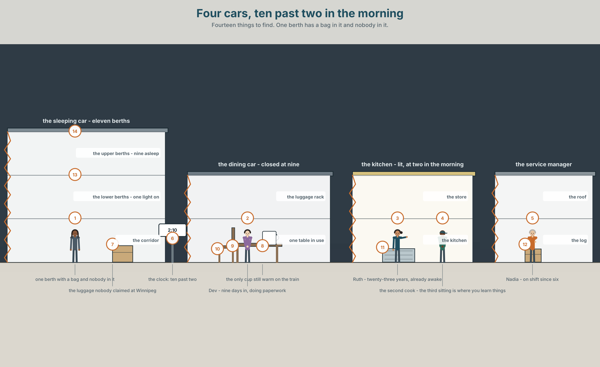
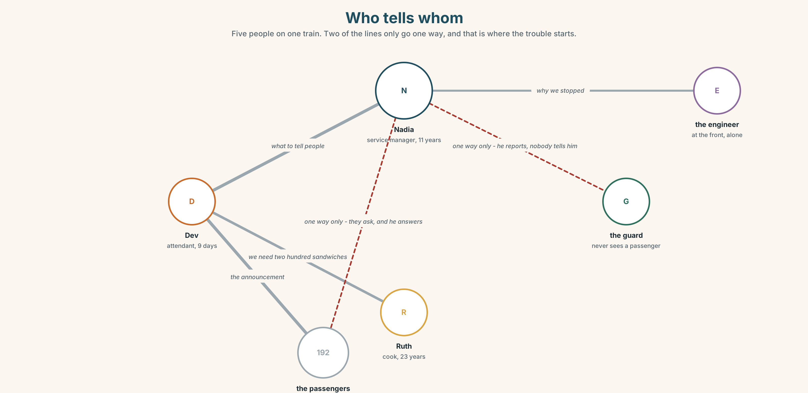
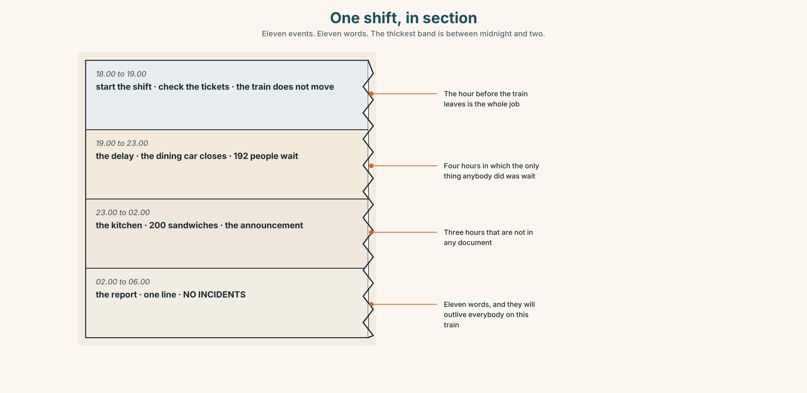
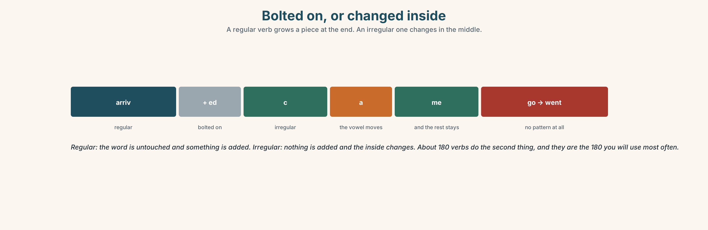
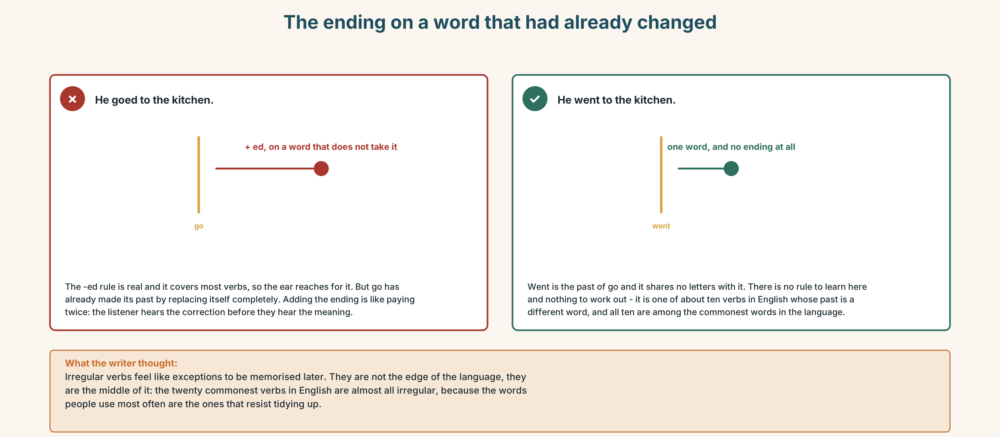
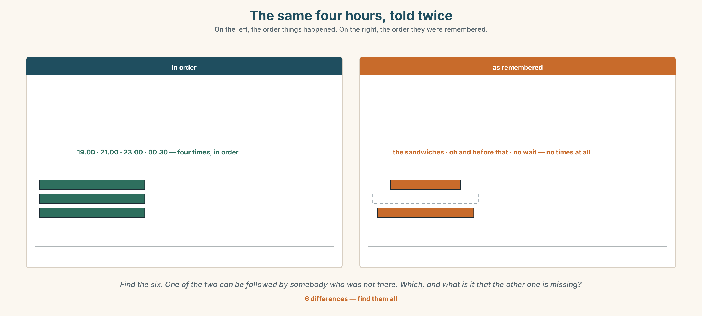
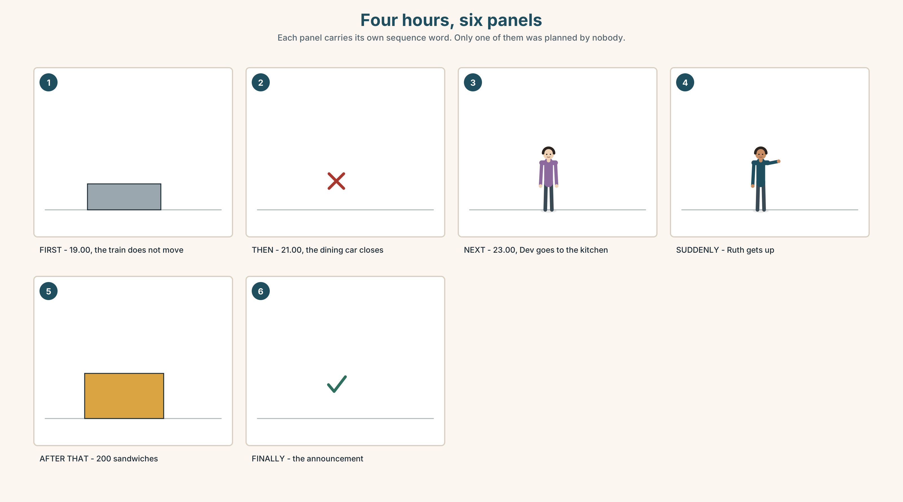
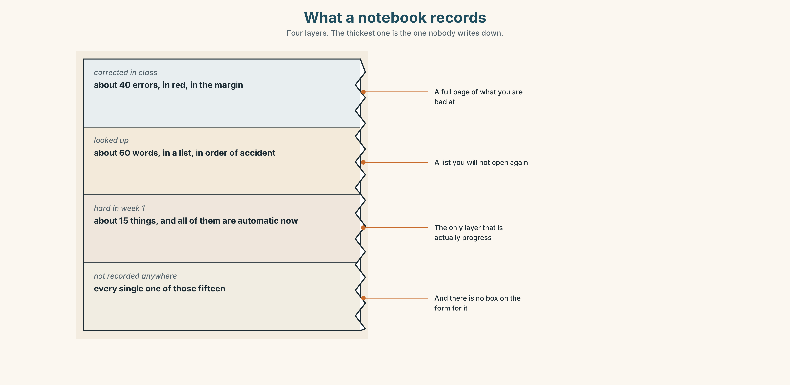

# A1.2 · Unit 1 · Nine Days In

> **English Animated** · *Getting Around* · The Prairie Line, Toronto to Vancouver
> Student's Book pages 6–27 · 22 pp · ~9 hours

---

## Part 0 · The Big Picture ◆ **A · THE WORLD**

{width=6.6in}

*Four cars, ten past two in the morning — Fourteen things to find. One berth has a bag in it and nobody in it.*

# What happened at work yesterday?

**By the end of this unit you can tell somebody what happened, in order.**

| ◆ **A · THE WORLD** | A train crossing a continent, where nobody on board can go home at the end of a shift |
|---|---|
| ◆ **B · THE SYSTEM** | the past simple of irregular verbs · 22 words for work on a train · the words that put a story in order · the vowel that changes inside an irregular verb |
| ◆ **C · THE PERFORMANCE** | You tell the story of one shift that went wrong, in sixty seconds |

---

### 0A · Find it — fourteen things

Find these in the picture. Write the number.

> ☐ a passenger ☐ a seat ☐ a ticket ☐ a window ☐ a bag ☐ a door ☐ a table
> ☐ a light ☐ a kitchen ☐ a clock ☐ a bed ☐ a corridor ☐ a cup ☐ a notebook

**Three of these words are not in the picture. Which three?**

> the crew · a delay · a report

### 0B · Guess it

Look at the person doing paperwork at two in the morning. **Why is he not asleep?**
Say one thing. You can use these words:

> *work · late · busy · problem · write*

### 0C · Say it ⏺

**Record. Thirty seconds. Do not prepare.**

> **Tell me about yesterday. What happened?**

You will listen to this again on the last page.

---

## Part 1 · Vocabulary Lab 1 ◆ **B · THE SYSTEM**

### 1A · Meet — a shift on the Prairie Line

{width=6.6in}

*Who tells whom — Five people on one train. Two of the lines only go one way, and that is where the trouble starts.*

| | |
|---|---|
| **shift** | Twelve hours, and you cannot leave the building, because the building is moving. |
| **crew** | Six people. Four of them never see the passengers. |
| **passenger** | A hundred and ninety-two. Eleven of them will ask the same question. |
| **delay** | Four hours. It was nobody's fault and it is somebody's problem. |
| **report** | One page. It has a box for what went wrong and no box for anything else. |
| **mistake** | The only thing on this list that gets written down every time. |

### 1B · Meet — the words

> **arrive · leave · begin · happen · passenger · crew · ticket · seat · delay · shift · report · mistake · lucky · awful · busy · calm**

Write each word under the right picture.

{width=6.6in}

*One shift, in section — Eleven events. Eleven words. The thickest band is between midnight and two.*

### 1C · Sort — the job, or how it felt?

Put each word in the right box. **Two of them can go in both. Which two, and why?**

> delay · lucky · shift · awful · crew · busy · report · calm · mistake · ticket

| **PART OF THE JOB** | **HOW IT FELT** | **BOTH** |
|---|---|---|
| | | |

### 1D · What a crew actually does

| | |
|---|---|
| **start the shift** | At six. The train leaves at seven, and the hour between is the whole job. |
| **check the tickets** | Twice. Once for the company and once to find out who is where. |
| **serve the meals** | Three sittings. The third one is where you learn things. |
| **make an announcement** | Thirty seconds, to a hundred and ninety-two people, with no second chance. |
| **turn up** | The single most important thing anybody on this list does. |
| **sort out** | What the report calls *resolution* and what everybody else calls Tuesday. |

**Now say them.** Four of these six have a word in the middle you could remove.
**Which two cannot lose anything, and why not?**

### 1E · Stretch — the phrases you will need today

> **start the shift** · **make an announcement** · **turn up** · **sort out** · **What happened?**

Match each phrase to the moment you need it.

1. A hundred and ninety-two people need to know something now. → ______
2. Somebody comes back to work after being ill. → ______
3. It is six in the evening and you put your jacket on. → ______
4. Two passengers have the same seat number. → ______
5. Your colleague looks terrible and you want to know why. → ______

### 1F · The hard one

> **f** **You'll never believe it.**

Practise it three times. **Four words that tell the listener a story is coming and they should
stop doing whatever they are doing.**

### 1G · Own it

Write down three things that happened at your work or your school yesterday. Do not write your
name. The class guesses whose day it is.

---

## Part 2 · Listening ◆ **A · THE WORLD**

{width=6.6in}

*The corridor, two in the morning — Nine days against eleven years, and a notebook between them.*

### 2A · Two in the morning 🔊 Track 1.1

**Before you listen.** Dev has worked here for nine days. The train was four hours late.
**Guess: whose fault was it?**

**Listen once. One question.** What time did the train leave?

**Listen again. Put the events in order.**

| | Event |
|---|---|
| 1 | |
| 2 | |
| 3 | |
| 4 | |

**Listen again. True or false?**

1. The train left on time. ☐ T ☐ F
2. Dev made an announcement. ☐ T ☐ F
3. Nadia was asleep when it happened. ☐ T ☐ F
4. Nobody complained. ☐ T ☐ F

**Noticing.** Four sentences from the recording.

1. *We left at eleven.*
2. *I went to the kitchen.*
3. *She came back with Ruth.*
4. *Nobody said anything.*

**None of these four verbs has *-ed* on it. What happened to them instead?**

### 2B · Decoding clinic 🔊 Track 1.2

Twenty seconds of Dev at speed. Three jobs.

1. Count the past verbs you hear.
2. *Went*, *came* and *said* are all one syllable. Which vowel is longest?
3. He says one sequence word four times. Which one, and what is he using it for?

> Transcripts, page 148.

---

## Part 3 · Grammar Lab 1 ◆ **B · THE SYSTEM**

### The verbs that change inside

### 3A · Notice

Look at the four sentences in Part 2 again.

1. What is the present form of each of the four verbs?
2. What changed — the beginning, the middle or the end?
3. Is the form the same after *I*, *she* and *they*?
4. Which of the four would you guess wrongly if you had never seen it?

### 3B · See

{width=6.6in}

*Bolted on, or changed inside — A regular verb grows a piece at the end. An irregular one changes in the middle.*

### 3C · Know

| | | |
|---|---|---|
| **regular** | add **-ed**, nothing moves | *arrive → arrived · happen → happened* |
| **the vowel changes** | the middle of the word | *come → came · begin → began · sit → sat* |
| **the whole word changes** | no pattern at all | *go → went · be → was/were* |
| **nothing changes** | the commonest trap | *put → put · cut → cut · let → let* |

> **One form for all six persons.** *I went, you went, she went, we went, they went.* The past
> simple is the only tense in English with no person endings at all, which makes it easier than
> the present and harder to believe.

{width=6.6in}

*The words that hold a story together — Five on the line, one above it, and one drawn as a bracket over two things at once.*

| | |
|---|---|
| **in order** | *first · then · next · after that · finally* |
| **at the same time** | *while* |
| **out of order** | *suddenly · at first · in the end · the next day* |

> **Why it matters.** Half of everything anybody says to anybody is a story about yesterday, and
> the listener is building a line while you speak. Give them the order or they build it wrong.

### 3D · Use — controlled

Complete with the past of the verb.

> We (1) ______ (leave) at eleven, four hours late. I (2) ______ (go) to the kitchen and Ruth
> (3) ______ (be) already awake.
> Nadia (4) ______ (come) back with two sandwiches. Nobody (5) ______ (say) anything.
> It (6) ______ (begin) as a bad night and it (7) ______ (become) a good one.

### 3E · Use — guided

Put each sentence into the past.

1. The train leaves at seven.
2. I go to the kitchen.
3. She comes back with Ruth.
4. We begin the shift at six.
5. Nobody says anything.

### 3F · Use — open

**In pairs.** Tell your partner about one day last week, in six sentences.
**Use a sequence word in every sentence. Your partner draws the line as you speak.**

### 3G · Check — six items, mark your own

> 1. We ______ (leave) at eleven.
> 2. I ______ (go) to the kitchen.
> 3. She ______ (come) back at two.
> 4. Nobody ______ (say) anything.
> 5. ✗ *We leaved at eleven.* → correct it.
> 6. ✗ *He goed to the kitchen.* → correct it.

{width=6.6in}

*The ending on a word that had already changed — The ending on a word that had already changed*

**0–3 →** Workbook pp. 4–7. **4–5 →** Part 6. **6 →** page 24.

---

## Part 4 · Speaking ◆ **C · THE PERFORMANCE**

### 4A · Fluency starter — the chain story

The first person says one sentence in the past. The next adds one, starting with a sequence word.
**No sequence word twice. Stop when somebody uses a regular verb.**

### 4B · The functional core — telling what happened

{width=6.6in}

*The same four hours, told twice — On the left, the order things happened. On the right, the order they were remembered.*

**Language Bank**

| | |
|---|---|
| **opening it** | *You'll never believe it. · So, yesterday…* |
| **in order** | *first · then · next · after that · finally* |
| **the interruption** | *and then suddenly…* |
| **closing it** | *in the end · and that was it* |

**Information gap.** Learner A has what the crew did. Learner B has what the passengers saw.
**Build one timeline of the four hours.**

### 4C · The performance — one shift ⏺

Tell the story of **one hour that went wrong** — at work, at school, anywhere. **One minute.**
You must:

> use four sequence words · use three irregular past verbs · say one thing you felt ·
> end with what happened in the end

**Record it.**

### 4D · Observer

One person listens for **one thing**: did the story stay in order?

### 4E · Two criteria

> ☐ Did I use at least three irregular past verbs correctly?
> ☐ Could somebody who was not there draw my timeline?

---

## Part 5 · Reading ◆ **A · THE WORLD**

### 5A · Predict

The title is **"Four hours, and one line in the log."**
**What do you think the one line says?**

### 5B · Read — sixty seconds

---

**Four hours, and one line in the log**

The train left Toronto four hours late. A freight train broke down eighty kilometres ahead and
nobody could go anywhere until it moved.

Dev had been on the job for nine days. At eleven at night a hundred and ninety-two people had
been sitting in a stationary train since seven, and the dining car had closed at nine.

He went to the kitchen and woke Ruth. She was not pleased. Then she got up, and between them they
made two hundred sandwiches in ninety minutes. Nadia made an announcement at half past eleven and
told everybody exactly what she knew, which was not much, and said it anyway.

Nobody complained. Three people wrote to the company to say so.

The company log for that night says: **DELAY 4H — FREIGHT. NO INCIDENTS.**

---

### 5C · Answer

1. How late was the train?
2. Why was it late?
3. How long had Dev worked there?
4. How many sandwiches did they make?
5. **Why did Nadia make the announcement when she did not have much to tell them?**
6. **The log says NO INCIDENTS. Is that true, and what is it missing?**

### 5D · Vocabulary in context

Guess from the text. Then check.

> broke down · stationary · she was not pleased · between them · said it anyway

### 5E · The counter-text

{width=6.6in}

*The crew log for that night — Nine boxes. Eight of them are numbers and the ninth says NONE.*

**Read the log and answer.**

1. What time did the train leave, and what time was it supposed to leave?
2. **What is the reason code, and does it say whose fault it was?**
3. What is written in the INCIDENTS box?
4. **Three people wrote to the company. Where on this page would that appear?**

### 5F · Two texts

The reading describes two hundred sandwiches and one announcement.
The log describes a four-hour delay and no incidents.

**Which one will still exist in ten years?** Say one sentence.

---

## Part 6 · Vocabulary Lab 2 ◆ **B · THE SYSTEM**

### Putting a story in order

{width=6.6in}

*Four hours, six panels — Each panel carries its own sequence word. Only one of them was planned by nobody.*

### 6A · The ones that catch everybody

| | |
|---|---|
| **then / after that** | both work; *after that* is slower and gives the listener a rest |
| **at first** | sets up a change that is coming. Never use it unless one is |
| **in the end** | the result, not the last event |
| **while** | two things at once, and the verb after it is usually the long one |

### 6B · Say them

> first · then · next · after that · finally · before · while · suddenly

### 6C · Chunk

1. **______ that** — the slow version of *then*
2. **At ______** — and something is going to change
3. **In the ______** — the result
4. **______ I was making the sandwiches…** — two things at once
5. **The ______ day** — and the story continues
6. **______ ______ ?** — the two words that ask for the whole story

### 6D · Contrast Clinic

Six items. ***while*** or ***when***?

1. ______ the train stopped, everybody looked up.
2. ______ we were making sandwiches, Nadia made the announcement.
3. ______ I arrived, the dining car was already closed.
4. ______ Ruth was cooking, Dev was checking the tickets.
5. ______ the freight train moved, we left.
6. ______ the passengers were sleeping, the crew was working.

---

## Part 7 · Pronunciation & Fluency Lab ◆ **B · THE SYSTEM**

### The vowel in the middle

{width=6.6in}

*The vowel in the middle — The consonants do not move. One sound in the middle does all the work.*

### 7A · Hear

> **i → a**: *begin → began · sit → sat · give → gave*
> **ee → e**: *meet → met · read → read · feel → felt*
> **o → e**: *come → came · become → became* — the spelling lies; listen to the sound

### 7B · Say

Say each pair three times. Then say this:

> *I came, I sat, I began.* — three vowels, three verbs, no endings at all.

### 7C · Make it mean something

Say these two:

> *I read it.* — present. The vowel is long: *reed*.
> *I read it.* — past. The vowel is short: *red*.

**Same five letters, same spelling, two tenses.** The only thing that tells your listener which
one you mean is a vowel that lasts a tenth of a second. Which is which?

### 7D · Fluency 20 ⏺

Twenty seconds: **six things that happened to you yesterday, all irregular verbs.**
Three times, faster.

---

## Part 8 · Writing ◆ **C · THE PERFORMANCE**

### What happened · 50–70 words

### 8A · Read the model

> On Tuesday we left Toronto four hours late. `[the fact, with a day and a number]`
>
> At first nobody minded. Then the dining car closed and people began to ask questions.
> `[*at first*, and the change it promised]`
>
> I went to the kitchen and woke the cook. She wasn't pleased, but she got up. `[two irregular
> verbs, and one honest detail]`
>
> In the end we made two hundred sandwiches. Nobody complained. `[the result, and the proof]`

**Questions about the writer's choices:**

1. *At first nobody minded.* **What does that tell the reader is coming?**
2. *She wasn't pleased, but she got up.* **Why keep the first half?**
3. The last two sentences are six words long. **Why so short at the end?**

### 8B · The anti-model

> On Tuesday the train was late. It was a difficult night. Everybody worked very hard. We did our best. In the end it was fine.

Correct English, and it could be any night on any train. **Add two numbers, one irregular verb
and one thing that somebody actually said.**

### 8C · Plan

> the fact, with a number → *at first*, and the change → what you did, with two irregular verbs →
> the result, short

### 8D · Write — 50 to 70 words
### 8E · Peer review — two things only

> ☐ Is the story in order, and can you draw it?
> ☐ Are there at least three irregular past verbs, all correct?

### 8F · Publish

On the wall, with no names. **The class puts them in order of how badly the night went.**

---

## Part 9 · The File ◆ **A · THE WORLD + C · THE PERFORMANCE**

# STUDY FILE · The log of what went right

{width=6.6in}

*What a notebook records — Four layers. The thickest one is the one nobody writes down.*

### 9A · What gets written down

{width=6.6in}

*Five panels, and the fifth is empty — Everything up to panel four gets written down. Panel five is the one that matters.*

| | |
|---|---|
| **What gets recorded** | every error, in red, in the margin |
| **What does not** | every error you no longer make |
| **What that does** | a notebook full of things you are bad at |
| **The fix** | one line a week: *this week I stopped…* |

### 9B · Your own log

At the end of each week, write **one sentence** in the past about something you could not do
before and can do now. Not *better*. What, exactly.

> *Last week I didn't understand the announcements. On Thursday I understood one.*

### 9C · Role play — the debrief

In pairs. One of you had a bad week. The other asks: *What happened?* and then, four times,
*And then?* **The point is the sequence, not the sympathy.**

### 9D · The thing nobody wrote down

Think of one thing in your English that was hard in September and is not hard now.
**Nobody recorded it. Record it.**

### 9E · Transfer — before next week

**Write one sentence a day, in the past, about one English thing that happened.** Seven
sentences. Bring them.

---

## Part 10 · Mediation & Interaction ◆ **C · THE PERFORMANCE**

{width=6.6in}

*Four hours, four records — The band at the bottom is almost empty, and it is the only one that survived the night.*

### 10A · Relay

Half the class has what the crew did. Half has what the passengers knew.
**Build the four hours by speaking.** Ten minutes.

### 10B · Simplify — for one person

A new crew member asks: *What happened on Tuesday?*
**Tell them in four sentences.** They need to be able to act on it, not enjoy it.

### 10C · Online

Write **one message** to a friend about something that happened to you this week.
**Three sentences.** Two sequence words, one irregular verb.

### 10D · Your language

Does your language have irregular past verbs? **Say *I went* and *I arrived* in your language.**
Do they change in the same place?

---

## Part 11 · The Decision ◆ **C · THE PERFORMANCE**

# No incidents

The company's crew log has one box for what went wrong and no box for anything else.

On Tuesday the train was four hours late. Two people made two hundred sandwiches at midnight and
one person told a hundred and ninety-two passengers the truth. The log says NO INCIDENTS, which
is correct.

**Option one:** leave it. A log is for problems. Everything else is just the job.

**Option two:** add a box. Three lines, headed *what the crew did*. It takes ninety seconds to
fill in at the end of a twelve-hour shift.

**Option three:** add the box and make it compulsory. Then it gets filled in, and then it gets
filled in badly.

### 11A · The evidence

{width=6.6in}

*The same form, twice — On the left, the log as it is. On the right, three lines longer.*

🔊 **Track 1.6.** Nadia, 20 seconds: *"I've written four hundred of these. The box says incidents.
Nothing went wrong, so I wrote none. Everything that happened that night was not an incident."*

### 11B · Talk about it

In threes. Use the frame. Everybody says one.

> *I think the company should ______ , because ______ .*

**Words you can use:** *report · crew · shift · delay · mistake · passenger · lucky*

### 11C · Decide

Write **two sentences**. Choose, and say why.

> I think the company should ______________________ ,
> because ______________________ .

### 11D · Model decision

> Add the box and leave it optional. A compulsory box produces four hundred identical sentences.
> An optional one gets filled in on the nights when there is something to say, and those are
> exactly the nights you want to read about.

### 11E · The Reveal

> **What happened.** The company added three optional lines. In the first six months the box was
> filled in on about one night in nine, which the company thought was a failure.
>
> Then something nobody expected: when a new crew member joined, the first thing they were given
> was the last twenty filled-in boxes. It had stopped being a record and become the only training
> document on the line.

**One question. You do not have to answer it out loud.**

> The company wanted a record. What did it build instead?

---

## Part 12 · Landing ◆ **all three lines**

### 12A · Recycle — twelve items

> 1. We ______ (leave) at eleven.
> 2. I ______ (go) to the kitchen.
> 3. She ______ (come) back at two.
> 4. Nobody ______ (say) anything.
> 5. It ______ (begin) at seven.
> 6. ______ that, everything was quiet. *(the slow version of *then*)*
> 7. ______ first, nobody minded.
> 8. In the ______ , nobody complained.
> 9. ______ I was in the kitchen, Nadia made the announcement.
> 10. The ______ day, three people wrote to the company.
> 11. I need to ______ this ______ . *(two words — fix a problem)*
> 12. ______ ______ ? *(the two words that ask for a story)*

### 12B · Consolidate — one task, everything in it

**Write six sentences about one hour of one day last week.** Four irregular past verbs, four
sequence words, one thing you felt, and the result at the end.

### 12C · Can-do, with evidence

> ☐ I can tell what happened, in order. **Evidence:** 4C, 8D
> ☐ I can use irregular past verbs. **Evidence:** 3G
> ☐ I can use sequence words. **Evidence:** 6C
> ☐ I can hear the vowel that changes inside a verb. **Evidence:** 7C

### 12D · Replay ⏺

Record 0C again. **Listen to both.** What is different?

### 12E · Glossary — thirty-five words, as a map

> **THE PEOPLE** · passenger · crew
> **THE THINGS** · ticket · seat · report · shift · delay
> **WHAT HAPPENS** · arrive · leave · begin · happen · mistake
> **HOW IT FELT** · lucky · awful · busy · calm
> **WHAT THE CREW DOES** · start the shift · check the tickets · serve the meals · make an announcement · turn up · sort out
> **THE ORDER** · first · then · next · after that · finally · before · while · suddenly
> **OUT OF ORDER** · at first · in the end · the next day
> **ASKING AND OPENING** · What happened? · You'll never believe it.

### 12F · Next

> **Unit 2 · Why do people leave a place?**
