# A1.2 · Unit 2 · Forty Seconds at Mirror Lake

> **English Animated** · *Getting Around* · The Prairie Line, Toronto to Vancouver
> Student's Book pages 28–49 · 22 pp · ~9 hours

---

## Part 0 · The Big Picture ◆ **A · THE WORLD**

{width=6.6in}

*Mirror Lake, twenty past six, minus eleven — Fourteen things to find. Four of the times on the timetable are crossed out in pen.*

# Why do people leave a place?

**By the end of this unit you can ask somebody about a journey they made, and say what did not
happen.**

| ◆ **A · THE WORLD** | A station where the train stops for forty seconds and the town has lost two thirds of itself |
|---|---|
| ◆ **B · THE SYSTEM** | past simple negatives and questions · 22 words for journeys and stations · *ago* and the words that place a story in time · *did you* as one sound |
| ◆ **C · THE PERFORMANCE** | You interview somebody about a journey and find the part they left out |

---

### 0A · Find it — fourteen things

Find these in the picture. Write the number.

> ☐ a platform ☐ a suitcase ☐ a backpack ☐ a timetable ☐ a window ☐ a lamp ☐ a bench
> ☐ a shelter ☐ a door ☐ a clock ☐ a sign ☐ a bag ☐ a rail ☐ a light

**Three of these words are not in the picture. Which three?**

> an aisle · a ticket · the guard

### 0B · Guess it

Look at the four people waiting. **Which of them is coming back?**
Say one thing. You can use these words:

> *bag · heavy · wait · far · single*

### 0C · Say it ⏺

**Record. Thirty seconds. Do not prepare.**

> **Tell me about a journey you made. Where did you go, and when?**

You will listen to this again on the last page.

---

## Part 1 · Vocabulary Lab 1 ◆ **B · THE SYSTEM**

### 1A · Meet — the line, and the places on it

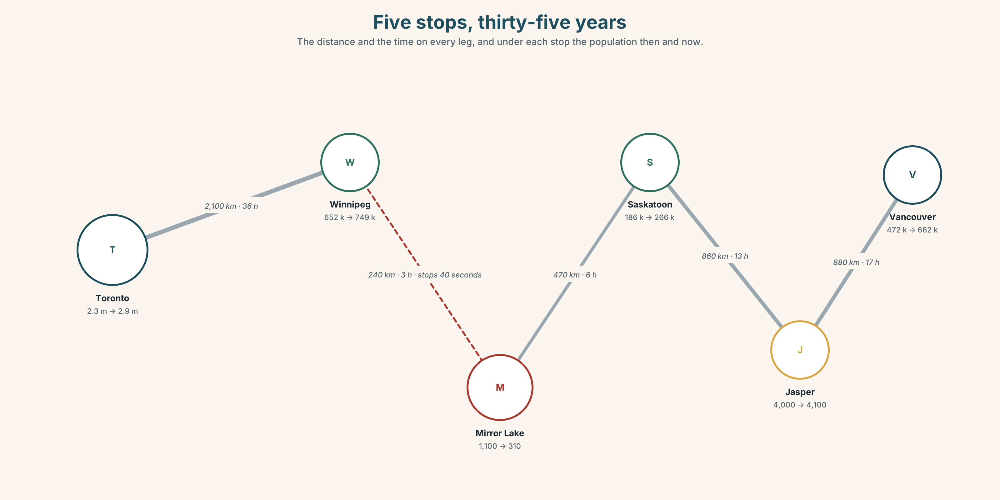{width=6.6in}

*Five stops, thirty-five years — The distance and the time on every leg, and under each stop the population then and now.*

| | |
|---|---|
| **journey** | Four nights. Four thousand four hundred kilometres. |
| **platform** | One, at Mirror Lake. Four hundred and six at Toronto Union. |
| **timetable** | Two columns: one going west, one going east. Four times crossed out in pen. |
| **single** | Cheaper, and it says something about you. |
| **return** | Dearer, and it says something else. |
| **guard** | The person who decides whether the train waits for you. |

### 1B · Meet — the words

> **journey · trip · platform · luggage · suitcase · backpack · timetable · return · single · window · aisle · heavy · far · wait · slow · guard**

Write each word under the right picture.

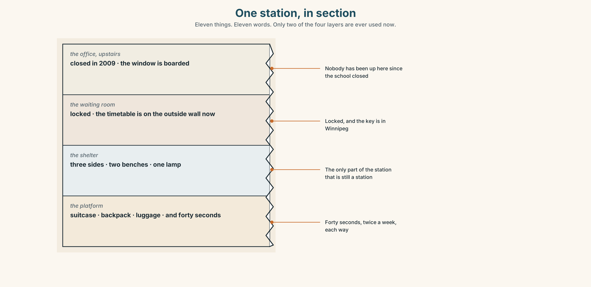{width=6.6in}

*One station, in section — Eleven things. Eleven words. Only two of the four layers are ever used now.*

### 1C · Sort — the place, or the thing you carry?

Put each word in the right box. **Two of them can go in both. Which two, and why?**

> platform · suitcase · timetable · backpack · aisle · luggage · window · ticket · shelter · seat

| **PART OF THE STATION OR TRAIN** | **SOMETHING YOU CARRY** | **BOTH** |
|---|---|---|
| | | |

### 1D · What happens on a journey

| | |
|---|---|
| **miss the train** | Forty seconds is the difference between this and not this. |
| **change trains** | Twice on this route, and the second one is the one people get wrong. |
| **book a ticket** | Three weeks ahead it is sixty dollars. On the day it is two hundred. |
| **a return ticket** | Two journeys, one piece of paper, and a date you have to guess. |
| **set off** | Not the same as *leave*. You set off on a journey; you leave a place. |
| **pick up** | What the train does at Mirror Lake, in forty seconds. |

**Now say them.** Two of these six could be done without going anywhere.
**Which two, and what does that tell you about where the work is?**

### 1E · Stretch — the phrases you will need today

> **miss the train** · **change trains** · **book a ticket** · **set off** · **pick up**

Match each phrase to the moment you need it.

1. It is three weeks before the journey and you are at a screen. → ______
2. You are on the platform and the lights are going away from you. → ______
3. It is twenty past six and you close your front door. → ______
4. The train stops for forty seconds and you are the reason. → ______
5. You arrive at Winnipeg and this is not your train. → ______

### 1F · The hard one

> **f** **It was ages ago.**

Practise it three times. **Four words that refuse to give a date, politely.**

### 1G · Own it

Write down one journey you made and three things about it: when, how long, and one thing that
went wrong. Do not write your name. The class guesses whose journey it is.

---

## Part 2 · Listening ◆ **A · THE WORLD**

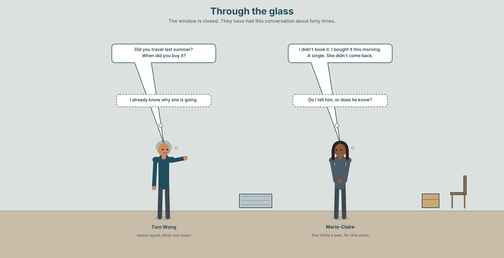{width=6.6in}

*Through the glass — The window is closed. They have had this conversation about forty times.*

### 2A · The ticket window 🔊 Track 2.1

**Before you listen.** Marie-Claire takes this train four times a year.
**Guess: is she buying a single or a return?**

**Listen once. One question.** How long ago did she last travel?

**Listen again. Complete the table.**

| | Last journey | This journey |
|---|---|---|
| where to | | |
| single or return | | |
| how long ago | | |

**Listen again. True or false?**

1. She bought a return ticket. ☐ T ☐ F
2. She didn't book in advance. ☐ T ☐ F
3. She travelled last summer. ☐ T ☐ F
4. Tom didn't know she was coming. ☐ T ☐ F

**Noticing.** Four sentences from the recording.

1. *I didn't book it.*
2. *Did you travel last summer?*
3. *She didn't come back.*
4. *When did you buy it?*

**Every verb after *did* and *didn't* is plain. What has happened to the past?**

### 2B · Decoding clinic 🔊 Track 2.2

Twenty seconds of Tom at speed. Three jobs.

1. Count how many questions he asks.
2. *Did you* is two words and he says it as one. Write what you hear.
3. He says one time marker three times. Which one, and is it a date?

> Transcripts, page 149.

---

## Part 3 · Grammar Lab 1 ◆ **B · THE SYSTEM**

### Saying it did not happen, and asking whether it did

### 3A · Notice

Look at the four sentences in Part 2 again.

1. What word carries the past in sentences 1 and 3?
2. What is the form of the verb after it?
3. In sentences 2 and 4, where does *did* stand?
4. What happens to a question word, if there is one?

### 3B · See

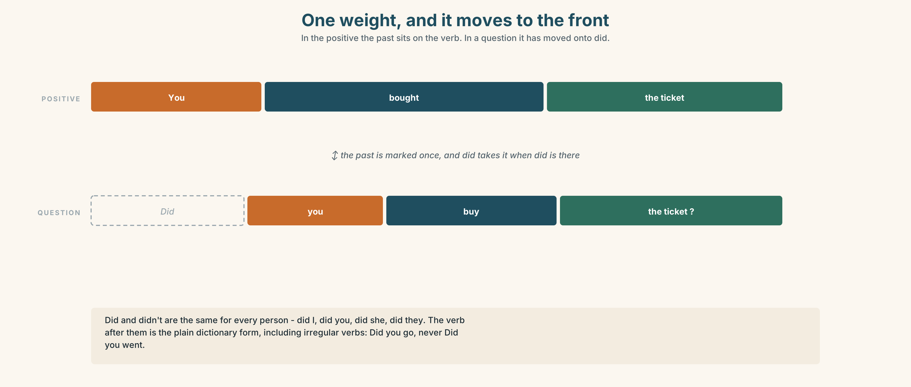{width=6.6in}

*One weight, and it moves to the front — In the positive the past sits on the verb. In a question it has moved onto did.*

### 3C · Know

| | | |
|---|---|---|
| **positive** | the past is on the verb | *I booked it. She came back.* |
| **negative** | *didn't* + the plain verb | *I didn't book it. She didn't come back.* |
| **question** | *did* at the front, plain verb | *Did you book it? Did she come back?* |
| **question word first** | *when · where · why · how long* | *When did you buy it? Why did she leave?* |

> **Did is the same for everybody.** No *s*, no *was*, no change at all: *did I, did you, did she,
> did they*. It is the simplest helper in the language and it is doing all the work.

{width=6.6in}

*Counting backwards from now — Ago measures. The other markers name. They are two different jobs.*

| | |
|---|---|
| **counting back from now** | *two days ago · a long time ago · How long ago?* |
| **naming a past time** | *last night · last summer · yesterday* |
| **before a past time** | *the day before* |
| **vague on purpose** | *recently · earlier · later · It was ages ago.* |

> **Why it matters.** Almost every question anybody asks about the past is one of these four
> shapes, and the answer is almost always a time marker.

### 3D · Use — controlled

Complete with **did**, **didn't**, or the past of the verb.

> I (1) ______ (buy) the ticket three weeks ago. I (2) ______ book the return — I only wanted a
> single.
> (3) ______ you travel last summer? — No, I (4) ______ . I (5) ______ (come) in March.
> Why (6) ______ she leave?

### 3E · Use — guided

Make each sentence negative, then make it a question.

1. She booked a return ticket.
2. They set off at six.
3. He missed the train.
4. We changed at Winnipeg.
5. The guard waited.

### 3F · Use — open

**In pairs.** Ask your partner about a journey. **Eight questions, all with *did*, and four of
them must start with a question word.**

### 3G · Check — six items, mark your own

> 1. I ______ book the return. *(negative)*
> 2. ______ you travel last summer?
> 3. When ______ you buy it?
> 4. She ______ come back. *(negative)*
> 5. ✗ *Did you bought it?* → correct it.
> 6. ✗ *I didn't went.* → correct it.

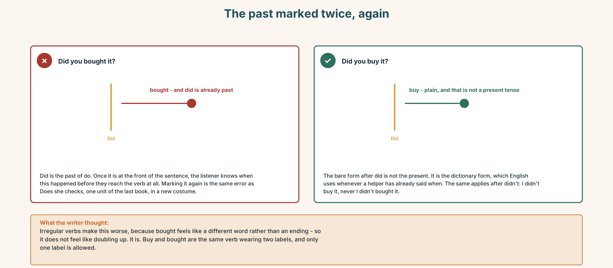{width=6.6in}

*The past marked twice, again — The past marked twice, again*

**0–3 →** Workbook pp. 8–11. **4–5 →** Part 6. **6 →** page 46.

---

## Part 4 · Speaking ◆ **C · THE PERFORMANCE**

### 4A · Fluency starter — twenty questions, all past

One person thinks of a journey. The class asks questions with *did*.
**No question may be repeated, and nobody may ask the same question word twice in a row.**

### 4B · The functional core — asking about a past trip

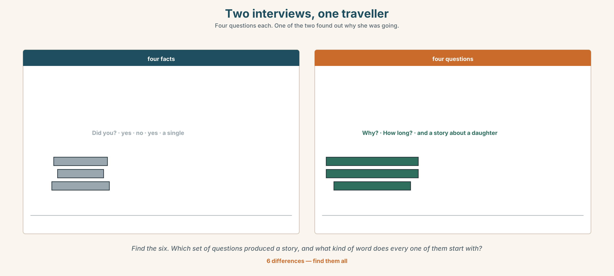{width=6.6in}

*Two interviews, one traveller — Four questions each. One of the two found out why she was going.*

**Language Bank**

| | |
|---|---|
| **opening** | *Did you travel this year? · Have you been far?* |
| **the facts** | *When did you go? Where did you go? How long did it take?* |
| **the story** | *Why did you go? What did you do there? Did you want to come back?* |
| **the time marker** | *two days ago · last summer · a long time ago · How long ago?* |

**Information gap.** Learner A has the timetable as printed. Learner B has the timetable as it
actually runs. **Find the four times that no longer exist.**

### 4C · The performance — the interview ⏺

Interview a classmate about a journey they made. **Three minutes.** You must:

> ask six questions with *did* · ask one that starts with *why* · find out one thing they did
> **not** do · end with a time marker

Then report it in three sentences. **Record it.**

### 4D · Observer

One person listens for **one thing**: did anybody put a past verb after *did*?

### 4E · Two criteria

> ☐ Were all my verbs after *did* and *didn't* plain?
> ☐ Did I find out something that was not in the first answer?

---

## Part 5 · Reading ◆ **A · THE WORLD**

### 5A · Predict

The title is **"One thousand one hundred, and three hundred and ten."**
**What do you think the two numbers are?**

### 5B · Read — sixty seconds

---

**One thousand one hundred, and three hundred and ten**

In 1991 Mirror Lake had one thousand one hundred people, a school with four classes, two shops
and a grain elevator.

It has three hundred and ten people now. The school closed in 2009. One shop is left and it
opens four days a week.

Nobody made a decision. There was no closing, no announcement and no day on which the town got
smaller. Children finished school and did not come back, and nobody who left said they were
leaving for good. They said they were going to Winnipeg for a year.

Tom Wong has been the station agent for thirty-one years. He did not leave. He says he never
decided to stay either, and that in a place like this those are the same thing.

The train stops for forty seconds. Last year it picked up five hundred and eleven people and put
down four hundred and ninety-six.

---

### 5C · Answer

1. How many people lived in Mirror Lake in 1991?
2. When did the school close?
3. How long has Tom been the station agent?
4. How long does the train stop for?
5. **Why does the writer say nobody made a decision?**
6. **The train picked up fifteen more people than it put down. What does that number mean?**

### 5D · Vocabulary in context

Guess from the text. Then check.

> a grain elevator · for good · in a place like this · put down · the same thing

### 5E · The counter-text

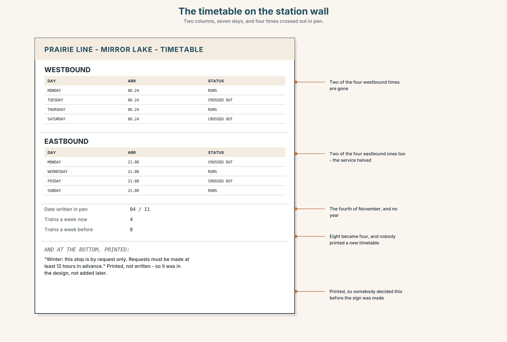{width=6.6in}

*The timetable on the station wall — Two columns, seven days, and four times crossed out in pen.*

**Read the timetable and answer.**

1. How many trains a week stop at Mirror Lake going west?
2. **How many used to, and how do you know?**
3. What is the date written beside one of the crossings-out?
4. **The line at the bottom is printed. What does that tell you about when it was decided?**

### 5F · Two texts

The reading says nobody made a decision.
The timetable has four times crossed out and one printed line about winter.

**Was a decision made?** Say one sentence.

---

## Part 6 · Vocabulary Lab 2 ◆ **B · THE SYSTEM**

### Putting a story in time

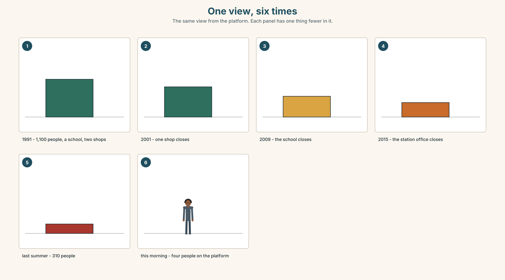{width=6.6in}

*One view, six times — The same view from the platform. Each panel has one thing fewer in it.*

### 6A · The ones that catch everybody

| | |
|---|---|
| **ago** | counts backwards from now, and it goes **after** the number: *two days ago* |
| **last night** | no *the*, and no *on* |
| **the day before** | before a moment that is already in the past, not before now |
| **recently** | near to now, and deliberately vague |

### 6B · Say them

> ago · last · yesterday · recently · earlier · later · two days ago · last night · last summer

### 6C · Chunk

1. two days **______** — counting back from now
2. **______** night — and no *the*
3. **______** summer — a season that has finished
4. the day **______** — before a day that was already in the past
5. a long time **______** — and you are not going to say how long
6. **How long ______ ?** — the question that asks for a number

### 6D · Contrast Clinic

Six items. ***ago*** or ***last***?

1. two days ______
2. ______ night
3. a long time ______
4. ______ summer
5. three years ______
6. ______ week

---

## Part 7 · Pronunciation & Fluency Lab ◆ **B · THE SYSTEM**

### Two words that became one

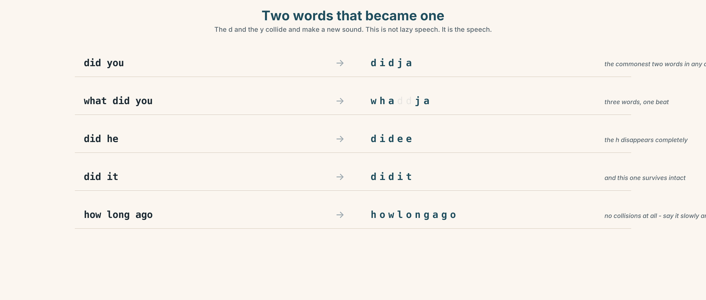{width=6.6in}

*Two words that became one — The d and the y collide and make a new sound. This is not lazy speech. It is the speech.*

### 7A · Hear

> **did you** → *didja* · **what did you** → *whaddja* · **did he** → *didee* · **did it** → *didit*
> The *d* and the *y* collide and make a new sound. This is not lazy speech. It is the speech.

### 7B · Say

Say each one three times. Then say this:

> *What did you do, and why didn't you tell me?* — nine words, four beats.

### 7C · Make it mean something

Say these two:

> *Did you go?* — *didja go* · a real question
> *You went?* — *you went* · surprise, and you already know the answer

**Same information, two different jobs.** Which one is asking and which one is reacting?

### 7D · Fluency 20 ⏺

Twenty seconds: **six questions about one journey, all with *did*.** Three times, faster.

---

## Part 8 · Writing ◆ **C · THE PERFORMANCE**

### A journey · 50–70 words

### 8A · Read the model

> I went to Winnipeg three years ago, for a year. `[where, when, and how long — all in nine
> words]`
>
> I didn't want to go. I didn't have a job here. `[two negatives, and they are the reason]`
>
> I stayed for seven years. I came back last summer, for a week, and then I didn't leave.
> `[the number that contradicts the plan]`
>
> Nobody asked me why I came back. That is why I stayed. `[the sentence that is actually about
> the town]`

**Questions about the writer's choices:**

1. The second line is two negatives. **Why are they more informative than a positive?**
2. *I stayed for seven years.* **What does that do to the word *a year* in line one?**
3. The last line is about other people. **Why end there?**

### 8B · The anti-model

> I went to Winnipeg. I lived there for seven years. Then I came back. It is a nice town. I am happy here.

Correct English, and it could be anybody. **Add two negatives, one number that contradicts a
plan, and one thing somebody else did.**

### 8C · Plan

> where, when, how long → two things you did not do → the number that broke the plan →
> one sentence about somebody else

### 8D · Write — 50 to 70 words
### 8E · Peer review — two things only

> ☐ Are there at least two negatives, and are the verbs after *didn't* plain?
> ☐ Is there a time marker in the first sentence?

### 8F · Publish

On the wall, with no names. **The class guesses which journeys were planned and which were not.**

---

## Part 9 · The File ◆ **A · THE WORLD + C · THE PERFORMANCE**

# STUDY FILE · The things you did not do

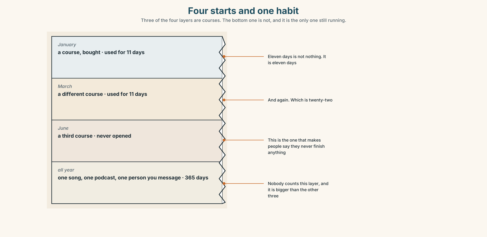{width=6.6in}

*Four starts and one habit — Three of the four layers are courses. The bottom one is not, and it is the only one still running.*

### 9A · Four starts and one habit

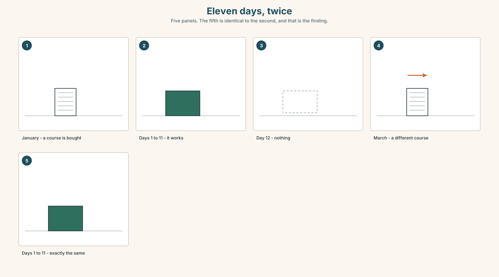{width=6.6in}

*Eleven days, twice — Five panels. The fifth is identical to the second, and that is the finding.*

| | |
|---|---|
| **What people count** | the courses they bought |
| **What counts** | the eleven days, four times over — which is forty-four days |
| **What they say** | *I never finish anything.* |
| **What is true** | they did forty-four days and gave themselves credit for none of them |

### 9B · Count the days, not the finishes

**Write down every English thing you started this year and how many days you did it.** Add the
days up. That number is yours and nobody has ever told you it exists.

### 9C · Role play — the interview about last year

In pairs. Ask your partner eight questions about their English last year, all with *did*.
**Four of them must be negative questions: *Didn't you…?*** Find one thing they did and have
forgotten.

### 9D · The thing you did not stop

Everybody has one: a podcast, a song, a game, a person they message. **Name yours.**
It has probably been running longer than any course you ever bought.

### 9E · Transfer — before next week

**Write down, for seven days, one English thing you did and one you did not do.**
Bring both lists. The second one is the more interesting.

---

## Part 10 · Mediation & Interaction ◆ **C · THE PERFORMANCE**

{width=6.6in}

*Mirror Lake, thirty-five years — The services band falls before the population band, not after it.*

### 10A · Relay

Half the class has the population figures. Half has the timetable.
**Build the thirty-five years by speaking.** Ten minutes.

### 10B · Simplify — for one person

Somebody is thinking of moving to a small town. They ask: *What happened to Mirror Lake?*
**Answer in four sentences.** Do not make it sad and do not make it a warning.

### 10C · Online

Write **one message** asking a friend about a trip they made.
**Three sentences.** Two questions with *did*, one with a question word.

### 10D · Your language

Does your language have a word like *ago*? **Say *two days ago* in your language.**
Does the number come before or after it?

---

## Part 11 · The Decision ◆ **C · THE PERFORMANCE**

# Forty seconds

The train stops at Mirror Lake for forty seconds, twice a week each way.

Last year it picked up five hundred and eleven people and put down four hundred and ninety-six.
That is about one and a half people per stop. The stop costs the company about eleven thousand
dollars a year in fuel and time.

**Option one:** keep it. One and a half people is one and a half people, and three hundred and
ten of them have no other way out.

**Option two:** make it request-only all year. The train stops if somebody books. In winter this
is already the rule, and in winter about a third of the requests are not seen in time.

**Option three:** close it. The nearest other stop is a hundred and forty kilometres away.

### 11A · The evidence

{width=6.6in}

*The platform at twenty past six — The scheduled stop on the left. The winter request stop on the right.*

🔊 **Track 2.6.** Tom Wong, 20 seconds: *"Forty seconds. I know what it costs them. I also know
that the day it stops, nobody will come here who didn't already live here, ever again."*

### 11B · Talk about it

In threes. Use the frame. Everybody says one.

> *I think the company should ______ , because ______ .*

**Words you can use:** *journey · platform · timetable · far · wait · slow · return*

### 11C · Decide

Write **two sentences**. Choose, and say why.

> I think the company should ______________________ ,
> because ______________________ .

### 11D · Model decision

> Keep the scheduled stop and fix the request system, which is the part that is actually broken.
> A third of winter requests are not seen in time, and that is a number about a piece of software,
> not about a town.

### 11E · The Reveal

> **What happened.** The company kept the stop and moved the request system to a telephone number
> that rings in the guard's van. Missed requests fell from a third to almost none.
>
> Then something nobody expected: the number of people getting on rose by eleven per cent in the
> first year, because people who had assumed the train no longer stopped found out that it did.

**One question. You do not have to answer it out loud.**

> The stop had not changed for four years. What had?

---

## Part 12 · Landing ◆ **all three lines**

### 12A · Recycle — twelve items

> 1. I ______ book the return. *(negative)*
> 2. ______ you travel last summer?
> 3. When ______ you buy it?
> 4. two days ______
> 5. ______ night
> 6. ______ summer
> 7. the day ______
> 8. a long time ______
> 9. I need to ______ ______ at Winnipeg. *(two words — leave one train for another)*
> 10. We ______ ______ at six in the morning. *(two words — begin a journey)*
> 11. *(Unit 1)* We ______ (leave) at eleven.
> 12. *(Unit 1)* ______ that, nobody said anything.

### 12B · Consolidate — one task, everything in it

**Write about a journey somebody else made, in six sentences.** Two negatives, one question you
asked them, one time marker in the first sentence, and one thing that did not go to plan.

### 12C · Can-do, with evidence

> ☐ I can ask about a past journey. **Evidence:** 4C
> ☐ I can say what did not happen. **Evidence:** 3G, 8D
> ☐ I can use *ago* and the other time markers. **Evidence:** 6D
> ☐ I can hear and say *did you* as one sound. **Evidence:** 7C

### 12D · Replay ⏺

Record 0C again. **Listen to both.** What is different?

### 12E · Glossary — thirty-five words, as a map

> **THE JOURNEY** · journey · trip · far · slow · wait
> **THE PLACE** · platform · timetable · window · aisle · guard
> **WHAT YOU CARRY** · luggage · suitcase · backpack · heavy
> **THE TICKET** · return · single · book a ticket · a return ticket
> **WHAT HAPPENS** · miss the train · change trains · set off · pick up
> **WHEN** · ago · last · yesterday · recently · earlier · later
> **WHEN, IN WORDS** · two days ago · last night · last summer · the day before · a long time ago
> **ASKING** · How long ago? · It was ages ago.

### 12F · Next

> **Unit 3 · Is cheaper always better?**
