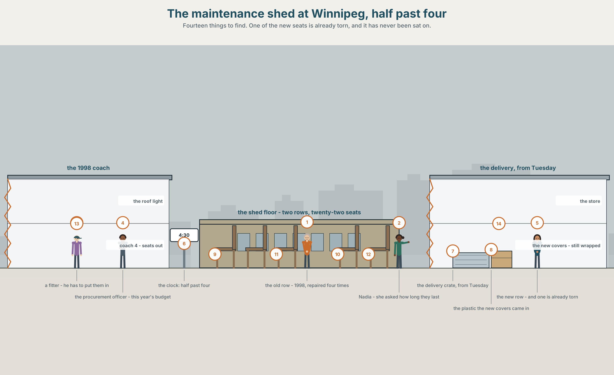
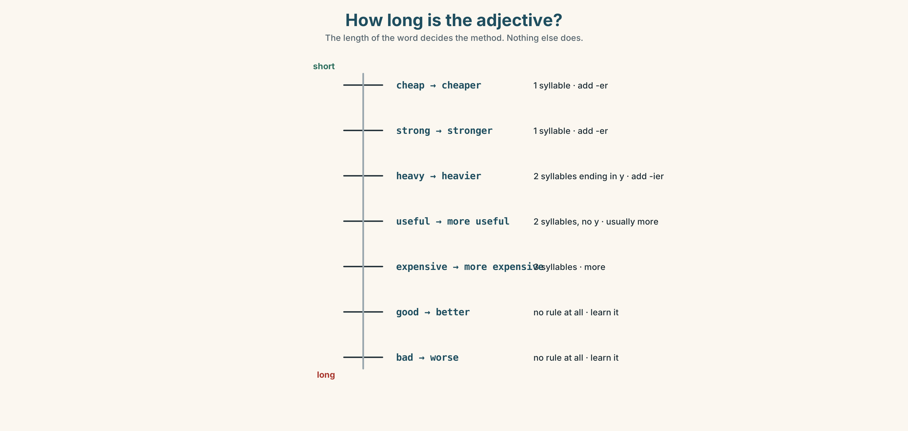
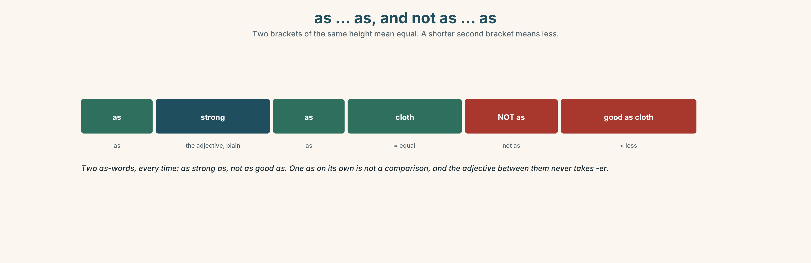
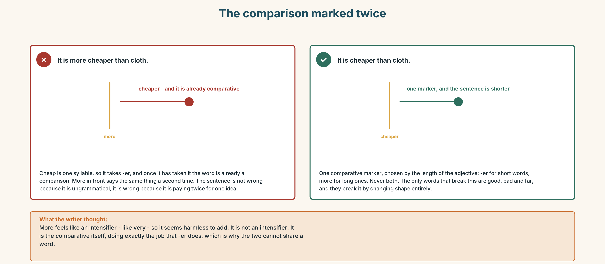
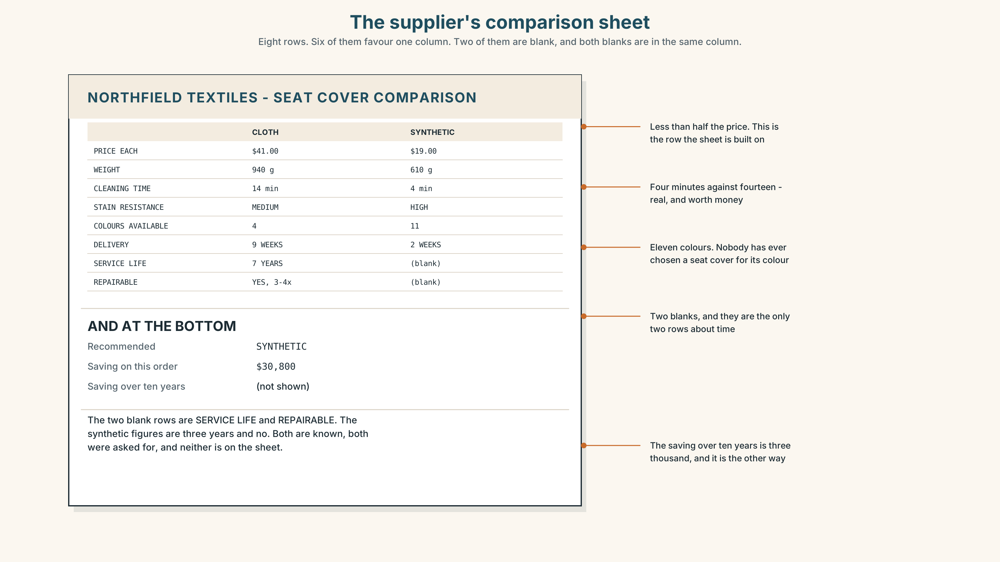
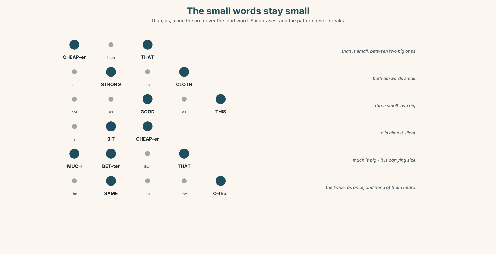
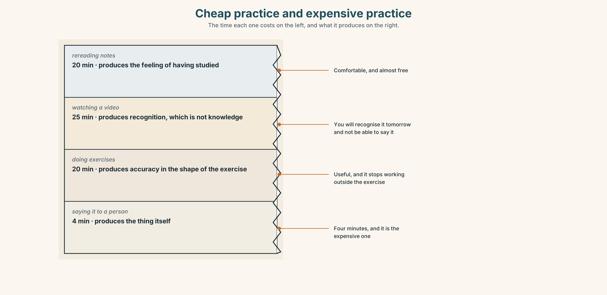
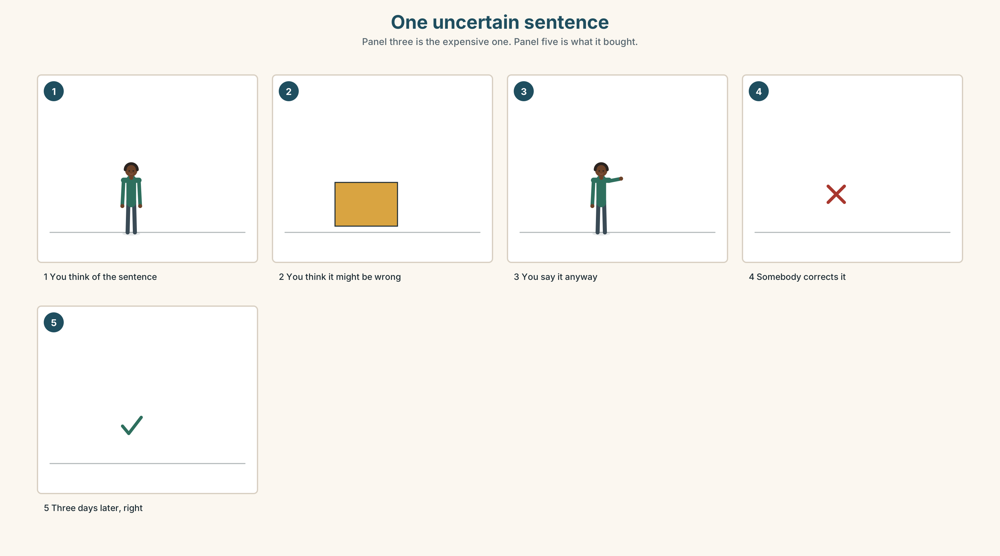

# A1.2 · Unit 3 · One Thousand Four Hundred Seats

> **English Animated** · *Getting Around* · The Prairie Line, Toronto to Vancouver
> Student's Book pages 50–71 · 22 pp · ~9 hours

---

## Part 0 · The Big Picture ◆ **A · THE WORLD**

{width=6.6in}

*The maintenance shed at Winnipeg, half past four — Fourteen things to find. One of the new seats is already torn, and it has never been sat on.*

# Is cheaper always better?

**By the end of this unit you can compare two things and say why you would choose one.**

| ◆ **A · THE WORLD** | A shed with two rows of seats in it and a decision worth half a million dollars |
|---|---|
| ◆ **B · THE SYSTEM** | comparative adjectives · 22 words for price, quality and materials · *than* and *as … as* · the weak *than*, and the sound that lives in half the words in English |
| ◆ **C · THE PERFORMANCE** | You compare two things nobody can tell apart and make the difference matter |

---

### 0A · Find it — fourteen things

Find these in the picture. Write the number.

> ☐ a seat ☐ cloth ☐ plastic ☐ metal ☐ wood ☐ a label ☐ a box
> ☐ a tear ☐ a repair ☐ a light ☐ a door ☐ a floor ☐ a bag ☐ a clock

**Three of these words are not in the picture. Which three?**

> a price · the quality · a receipt

### 0B · Guess it

Look at the two rows. **Which row has been on a train?**
Say one thing. You can use these words:

> *old · new · strong · same · different*

### 0C · Say it ⏺

**Record. Thirty seconds. Do not prepare.**

> **Think of two things you own that do the same job. Which is better, and why?**

You will listen to this again on the last page.

---

## Part 1 · Vocabulary Lab 1 ◆ **B · THE SYSTEM**

### 1A · Meet — what a seat is made of

{width=6.6in}

*One seat, five materials — Every line carries two numbers: what the part costs and how long it lasts.*

| | |
|---|---|
| **price** | What it says on the invoice. |
| **cost** | Price, plus everything that happens afterwards. |
| **quality** | The word people use when they cannot say which number they mean. |
| **good value** | Not cheap. Cheap for what you get. |
| **break down** | What a machine does. Also what an argument does. |
| **throw away** | The decision that is made at the moment of buying, not at the moment of throwing. |

### 1B · Meet — the words

> **price · quality · cheap · expensive · better · worse · strong · weak · plastic · metal · wood · cloth · new · old · same · different**

Write each word under the right picture.

{width=6.6in}

*One seat, in section — Eleven parts. Eleven words. The price of each part is beside it.*

### 1C · Sort — the thing, or what you think of it?

Put each word in the right box. **Two of them can go in both. Which two, and why?**

> metal · cheap · plastic · quality · wood · strong · cloth · price · new · weak

| **WHAT IT IS MADE OF** | **WHAT YOU THINK OF IT** | **BOTH** |
|---|---|---|
| | | |

### 1D · Two words for the same money

| | |
|---|---|
| **cheap** | a judgement, and usually not a kind one |
| **good value** | the same money, and a compliment |
| **expensive** | a judgement about the price |
| **cost more** | a fact about the price |
| **last longer** | the only one of these five that is a measurement |
| **the same as** | the comparison that says there is no comparison |

**Now say them.** Three of these six are opinions and two are facts.
**Which is the sixth, and why is it neither?**

### 1E · Stretch — the phrases you will need today

> **good value** · **last longer** · **cost more** · **break down** · **throw away**

Match each phrase to the moment you need it.

1. You are explaining why you paid twice as much. → ______
2. The machine stops working in the middle of a shift. → ______
3. Somebody says the cheap one is the same. → ______
4. It cannot be repaired and it is three years old. → ______
5. You are comparing two invoices. → ______

### 1F · The hard one

> **f** **It depends.**

Practise it three times. **Two words that are the honest answer to almost every question in this
unit, and the most annoying thing you can say to somebody who wants a number.**

### 1G · Own it

Write down two things you own that do the same job, and one sentence saying which is better.
Do not write your name. The class guesses whose things they are.

---

## Part 2 · Listening ◆ **A · THE WORLD**

{width=6.6in}

*Between the two rows — Each of them is holding a seat cover. They are not holding the same argument.*

### 2A · In the shed 🔊 Track 3.1

**Before you listen.** The company must replace one thousand four hundred seat covers.
**Guess: which one will they choose?**

**Listen once. One question.** How much is the cheaper cover?

**Listen again. Complete the table.**

| | Cloth | Synthetic |
|---|---|---|
| price each | | |
| how long it lasts | | |
| can it be repaired | | |

**Listen again. True or false?**

1. The synthetic cover is cheaper. ☐ T ☐ F
2. The cloth cover lasts longer. ☐ T ☐ F
3. The synthetic one can be repaired. ☐ T ☐ F
4. They cost the same over ten years. ☐ T ☐ F

**Noticing.** Four sentences from the recording.

1. *It's cheaper.*
2. *It's much stronger.*
3. *It isn't as good as the old one.*
4. *This one is more expensive than that one.*

**Two of these add something to the end of the adjective and two put a word in front. What
decides?**

### 2B · Decoding clinic 🔊 Track 3.2

Twenty seconds of the procurement officer at speed. Three jobs.

1. Count the comparisons you hear.
2. *Than* is in four of them. Is it loud or quiet?
3. He says *more expensive than that* as three beats, not five words. Where did the other two go?

> Transcripts, page 150.

---

## Part 3 · Grammar Lab 1 ◆ **B · THE SYSTEM**

### Putting two things next to each other

### 3A · Notice

Look at the four sentences in Part 2 again.

1. In sentences 1 and 2, what is on the end of the adjective?
2. In sentence 4, what word is in front of it instead?
3. Count the syllables in *cheap*, *strong* and *expensive*. What do you notice?
4. What word joins the two things being compared?

### 3B · See

{width=6.6in}

*How long is the adjective? — The length of the word decides the method. Nothing else does.*

### 3C · Know

| | | |
|---|---|---|
| **one syllable** | add **-er** | *cheap → cheaper · strong → stronger · new → newer* |
| **two syllables** | usually **more**, but **-er** after *y* | *heavy → heavier · useful → more useful* |
| **three or more** | **more** in front | *expensive → more expensive · difficult → more difficult* |
| **the odd ones** | no rule at all | *good → better · bad → worse · far → further* |

> **Than joins the two things.** *Cheaper than that one.* Without *than* the sentence is a
> comparison with something the listener has to guess, which is sometimes exactly what an
> advertisement wants.

{width=6.6in}

*as … as, and not as … as — Two brackets of the same height mean equal. A shorter second bracket means less.*

| | |
|---|---|
| **the same** | *as strong as · as cheap as · the same as* |
| **less** | *not as good as · not as strong as* |
| **by how much** | *a bit cheaper · much better · far more expensive* |
| **asking** | *What's the difference? · It depends.* |

> **Why it matters.** Every decision anybody makes about money is a comparison, and the person
> who can say the comparison out loud is the person who wins the argument.

### 3D · Use — controlled

Complete with the comparative, **than**, **as** or **more**.

> The synthetic cover is (1) ______ (cheap) than the cloth one. The cloth one is (2) ______
> (strong).
> Synthetic is not (3) ______ good (4) ______ cloth, but it costs less.
> This one is (5) ______ expensive (6) ______ that one, and it lasts twice as long.

### 3E · Use — guided

Compare the two things in each pair, in one sentence.

1. cloth ($41, 7 years) / synthetic ($19, 3 years)
2. metal (heavy, 30 years) / plastic (light, 8 years)
3. the old seat (repaired four times) / the new seat (torn already)
4. the train (four nights) / the plane (five hours)
5. a single ticket / a return ticket

### 3F · Use — open

**In pairs.** Choose two things in this room. **Compare them in five sentences without using the
words *good* or *bad*.**

### 3G · Check — six items, mark your own

> 1. Synthetic is ______ (cheap) than cloth.
> 2. Cloth is ______ (strong).
> 3. It isn't ______ good ______ the old one. *(two words)*
> 4. This is ______ expensive than that.
> 5. ✗ *It is more cheaper than cloth.* → correct it.
> 6. ✗ *It is cheaper that cloth.* → correct it.

{width=6.6in}

*The comparison marked twice — The comparison marked twice*

**0–3 →** Workbook pp. 12–15. **4–5 →** Part 6. **6 →** page 68.

---

## Part 4 · Speaking ◆ **C · THE PERFORMANCE**

### 4A · Fluency starter — the comparison round

Everybody compares two things in the room, in one sentence.
**No adjective may be used twice. Stop when somebody repeats one.**

### 4B · The functional core — comparing two things

{width=6.6in}

*The same numbers, two presentations — One compares on price. One compares on cost over ten years. They recommend opposite things.*

**Language Bank**

| | |
|---|---|
| **more of something** | *cheaper than · stronger than · more expensive than* |
| **the same** | *as strong as · the same as* |
| **less** | *not as good as* |
| **by how much** | *a bit cheaper · much better · far more expensive* |
| **refusing to choose** | *It depends. · What's the difference?* |

**Information gap.** Learner A has the price list. Learner B has the repair records.
**Work out which cover is cheaper over ten years.**

### 4C · The performance — the recommendation ⏺

Compare **two things that look the same to everybody else**. **Two minutes.** You must:

> use three comparatives · use one *as … as* · say by how much, with a number ·
> end by recommending one, and say what would change your mind

**Record it.**

### 4D · Observer

One person listens for **one thing**: did anybody say *more* and *-er* on the same adjective?

### 4E · Two criteria

> ☐ Did I say *than* every time I compared two things?
> ☐ Did I give one number, and was it the right kind of number?

---

## Part 5 · Reading ◆ **A · THE WORLD**

### 5A · Predict

The title is **"Nineteen dollars and forty-one dollars."**
**Which one do you think the company bought?**

### 5B · Read — sixty seconds

---

**Nineteen dollars and forty-one dollars**

A cloth seat cover costs forty-one dollars. It lasts about seven years and it can be repaired,
usually three or four times. A synthetic cover costs nineteen dollars. It lasts about three years
and it cannot be repaired at all.

Fourteen hundred seats. Cloth is fifty-seven thousand dollars and synthetic is twenty-seven.

Over ten years, cloth needs to be bought once and a half. Synthetic needs to be bought three and
a third times. Cloth is eighty-six thousand over ten years and synthetic is eighty-nine.

The two numbers are almost the same. The difference is that the cloth money leaves in one year
and the synthetic money leaves in four pieces, and the person who signs for it is not the same
person each time.

That is not an argument about seats. It is an argument about who is still here in four years.

---

### 5C · Answer

1. How much is a cloth cover?
2. How long does a synthetic cover last?
3. How many seats are there?
4. What is the ten-year cost of each?
5. **Why does the writer say the two numbers are almost the same?**
6. **The last line says it is an argument about who is still here. What does that mean for the decision?**

### 5D · Vocabulary in context

Guess from the text. Then check.

> it can be repaired · once and a half · leaves in one year · in four pieces · signs for it

### 5E · The counter-text

{width=6.6in}

*The supplier's comparison sheet — Eight rows. Six of them favour one column. Two of them are blank, and both blanks are in the same column.*

**Read the sheet and answer.**

1. What is the price of each cover?
2. **How many rows favour the synthetic cover, and which rows are they?**
3. Which two rows are blank?
4. **Both blanks are in one column. What are the two missing numbers, and why do you think they are missing?**

### 5F · Two texts

The reading says the ten-year costs are eighty-six and eighty-nine thousand.
The comparison sheet says synthetic saves thirty thousand dollars.

**Are both true?** Say one sentence.

---

## Part 6 · Vocabulary Lab 2 ◆ **B · THE SYSTEM**

### Saying by how much

{width=6.6in}

*Saying by how much — The same two objects, six times. The words carry the size of the gap.*

### 6A · The ones that catch everybody

| | |
|---|---|
| **than** | never *that*, and almost never stressed |
| **a bit** | small, and it sounds honest |
| **much / far** | big, and *far* is bigger than *much* |
| **as … as** | two of them, every time. One *as* is not a comparison |

### 6B · Say them

> than · more · less · much · quite · really · a bit · as big as · not as good as

### 6C · Chunk

1. **a ______ cheaper** — a small difference
2. **______ better** — a big difference
3. **as big ______** — the two things are equal
4. **not as good ______** — the second one is less
5. **more expensive ______** — the word that joins two things
6. **What's the ______ ?** — the question that asks for the comparison

### 6D · Contrast Clinic

Six items. ***-er*** or ***more***?

1. cheap → ______
2. expensive → ______
3. strong → ______
4. difficult → ______
5. heavy → ______
6. useful → ______

---

## Part 7 · Pronunciation & Fluency Lab ◆ **B · THE SYSTEM**

### The sound in the middle of everything

{width=6.6in}

*The small words stay small — Than, as, a and the are never the loud word. Six phrases, and the pattern never breaks.*

### 7A · Hear

> **than** → *thun* · **as** → *uz* · **a** → *uh* · **the** → *thuh*
> These four words are almost never said in full. The sound they all collapse to is the
> commonest sound in English and it does not have a letter of its own.

### 7B · Say

Say each one three times. Then say this:

> *It's cheaper than that one, and not as good as this one.* — eleven words, five beats.

### 7C · Make it mean something

Say these two:

> *It's cheaper THAN that one.* — you are correcting somebody
> *It's CHEAPER than that one.* — you are telling them something new

**Same words.** The weak word becomes strong only when you are arguing. Which one sounds like a
quarrel?

### 7D · Fluency 20 ⏺

Twenty seconds: **six comparisons of things in this room, all with *than*.** Three times, faster.

---

## Part 8 · Writing ◆ **C · THE PERFORMANCE**

### A recommendation · 50–70 words

### 8A · Read the model

> There are two covers. One is forty-one dollars and one is nineteen. `[the two numbers, with
> nothing else in the sentence]`
>
> The cheap one is not as strong, and it can't be repaired. `[the difference that is not about
> price]`
>
> Over ten years they cost almost the same: eighty-six and eighty-nine thousand. `[the number
> that changes the argument]`
>
> I would buy the cloth. If the budget were annual, I would buy the other one, and I would be
> wrong in year four. `[the recommendation, and the condition]`

**Questions about the writer's choices:**

1. The first sentence is two numbers and nothing else. **Why no adjective?**
2. *over ten years.* **Why is that phrase the whole argument?**
3. The last sentence admits the other choice. **Does that weaken the recommendation?**

### 8B · The anti-model

> The cloth covers are better. They are stronger and they last longer. The synthetic ones are cheaper but they are not as good. I recommend the cloth ones.

Correct English, correct opinion, and no finance officer will read past line two.
**Add three numbers and one condition under which you would choose the other one.**

### 8C · Plan

> the two numbers → the difference that is not price → the number over time →
> the recommendation, and what would change it

### 8D · Write — 50 to 70 words
### 8E · Peer review — two things only

> ☐ Are there at least three numbers?
> ☐ Is there one sentence saying what would change the writer's mind?

### 8F · Publish

On the wall, with no names. **The class sorts them into *decided by price* and *decided by
something else*.**

---

## Part 9 · The File ◆ **A · THE WORLD + C · THE PERFORMANCE**

# STUDY FILE · Cheap practice and expensive practice

{width=6.6in}

*Cheap practice and expensive practice — The time each one costs on the left, and what it produces on the right.*

### 9A · The cost of being right

{width=6.6in}

*One uncertain sentence — Panel three is the expensive one. Panel five is what it bought.*

| | |
|---|---|
| **Cheap** | rereading, highlighting, watching. Comfortable, and almost free |
| **Expensive** | producing something that might be wrong, in front of somebody |
| **What cheap buys** | the feeling of having studied |
| **What expensive buys** | the thing itself |

### 9B · Pay once

A mistake you make out loud costs you four seconds of embarrassment and buys you the correction.
A mistake you avoid costs you nothing and buys you nothing. **Which did you do more of this week?**

### 9C · Role play — the cheapest possible lesson

In pairs. One of you has ten minutes and wants the most English for it. The other is the teacher
and may only offer things that cost effort. **Negotiate. Nobody may say *watch a video*.**

### 9D · Your most expensive five minutes

Find the five minutes of your week in which you produce the most English with the least
preparation. **That is the most valuable thing in your routine.** Name it.

### 9E · Transfer — before next week

**Say one sentence a day that you are not sure about, out loud, to a person.** Seven sentences.
Write down what happened to each one.

---

## Part 10 · Mediation & Interaction ◆ **C · THE PERFORMANCE**

{width=6.6in}

*Two covers, fifteen years — The totals are almost identical. The shape is completely different, and the shape is who signs.*

### 10A · Relay

Half the class has the price list. Half has the repair records.
**Work out the fifteen-year cost of each by speaking.** Ten minutes.

### 10B · Simplify — for one person

A colleague asks: *Why did we pay twice as much?*
**Answer in four sentences.** Use one number and one comparison.

### 10C · Online

Write **one message** comparing two things a classmate is choosing between.
**Three sentences.** Two comparatives and one *as … as*.

### 10D · Your language

Does your language add something to the adjective, or put a word in front?
**Say *cheaper* and *more expensive* in your language.** Is it the same method for both?

---

## Part 11 · The Decision ◆ **C · THE PERFORMANCE**

# One thousand four hundred seats

The company must replace fourteen hundred seat covers this year.

**Cloth.** Forty-one dollars each. Fifty-seven thousand now. Seven years, and repairable three or
four times.

**Synthetic.** Nineteen dollars each. Twenty-seven thousand now. Three years, and when it tears it
is finished.

**Repair the old ones.** Eleven dollars each and about nine months, and the people who can do the
repair are four, and three of them retire within five years.

### 11A · The evidence

{width=6.6in}

*Two seats in year four — Both have been in service for four years. One of them is still in service.*

🔊 **Track 3.6.** Ruth, 20 seconds: *"They asked me which seat is better. I've sat on both for
nine hours. That's not the question. The question is which one is still here when I am."*

### 11B · Talk about it

In threes. Use the frame. Everybody says one.

> *I think the company should buy ______ , because ______ .*

**Words you can use:** *price · quality · cheap · expensive · strong · weak · last longer*

### 11C · Decide

Write **two sentences**. Choose, and say why.

> I think the company should buy ______________________ ,
> because ______________________ .

### 11D · Model decision

> Cloth, and write down why. The ten-year numbers are three thousand dollars apart on a half
> million dollar decision, which means the money is not deciding this. Something else is, and if
> nobody writes down what, the same argument will be had again in three years by people who do
> not know it was already had.

### 11E · The Reveal

> **What happened.** The company bought cloth and nobody wrote down why. Three years later a new
> officer opened the file, saw fifty-seven thousand against twenty-seven, and ordered synthetic
> for the next batch.
>
> Then something nobody expected: the two kinds of cover are now mixed through the fleet, and
> the maintenance team can see both ageing side by side. In 2031 they will have the first real
> data anybody has ever had, by accident.

**One question. You do not have to answer it out loud.**

> The company made the right decision and lost it. Which was the actual mistake?

---

## Part 12 · Landing ◆ **all three lines**

### 12A · Recycle — twelve items

> 1. Synthetic is ______ (cheap) than cloth.
> 2. Cloth is ______ (strong).
> 3. It isn't as good ______ the old one.
> 4. This is ______ expensive than that.
> 5. a ______ cheaper — a small difference
> 6. ______ better — a big difference
> 7. It is the same ______ the other one.
> 8. These covers ______ ______ than the old ones. *(two words — they stay usable for more years)*
> 9. The machine will ______ ______ in year four. *(two words — stop working)*
> 10. What's the ______ ?
> 11. *(Unit 2)* ______ you buy it last summer?
> 12. *(Unit 1)* We ______ (go) to the shed at four.

### 12B · Consolidate — one task, everything in it

**Compare two things somebody you know had to choose between, in six sentences.** Three
comparatives, one *as … as*, two numbers, and one sentence saying what would have changed the
decision.

### 12C · Can-do, with evidence

> ☐ I can compare two things. **Evidence:** 4C, 8D
> ☐ I can choose between *-er* and *more*. **Evidence:** 3G, 6D
> ☐ I can say by how much. **Evidence:** 6C
> ☐ I can hear the weak words in a comparison. **Evidence:** 7C

### 12D · Replay ⏺

Record 0C again. **Listen to both.** What is different?

### 12E · Glossary — thirty-five words, as a map

> **THE MONEY** · price · cheap · expensive · cost more · good value
> **THE JUDGEMENT** · quality · better · worse · strong · weak
> **THE MATERIAL** · plastic · metal · wood · cloth
> **THE STATE** · new · old · same · different · the same as
> **OVER TIME** · last longer · break down · throw away
> **COMPARING** · than · more · less · much · quite · really · a bit
> **COMPARING, IN WORDS** · as big as · not as good as · more expensive than · much better
> **ASKING** · What's the difference? · It depends.

### 12F · Next

> **Unit 4 · What makes a family?**
