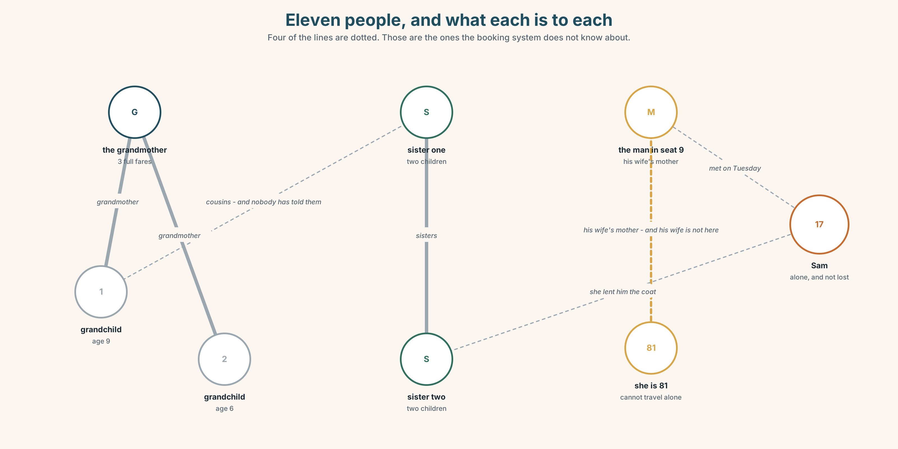
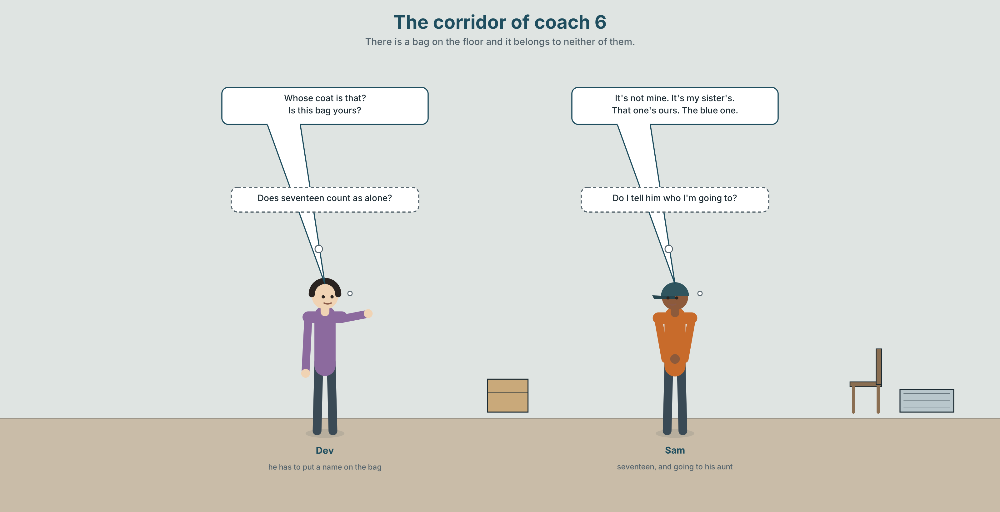
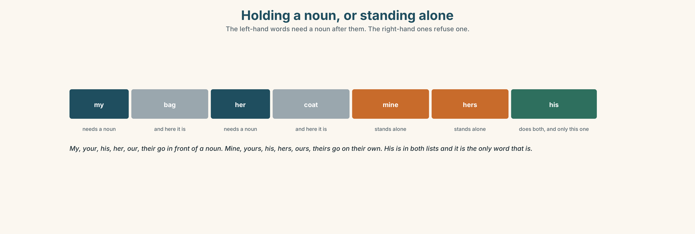
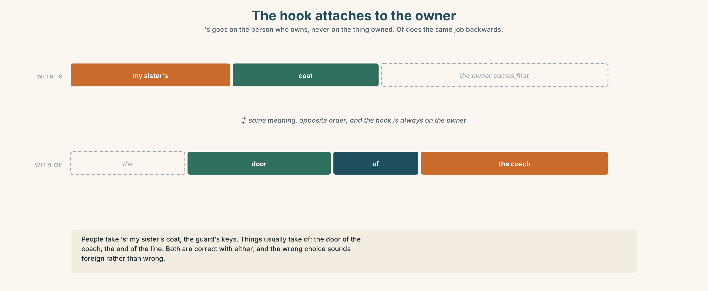
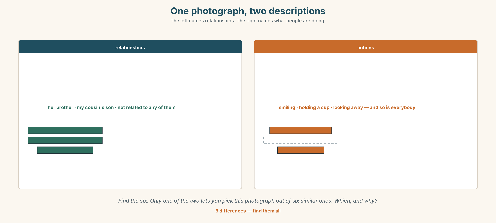
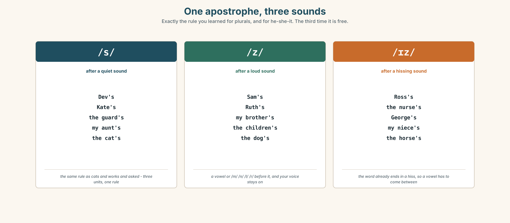
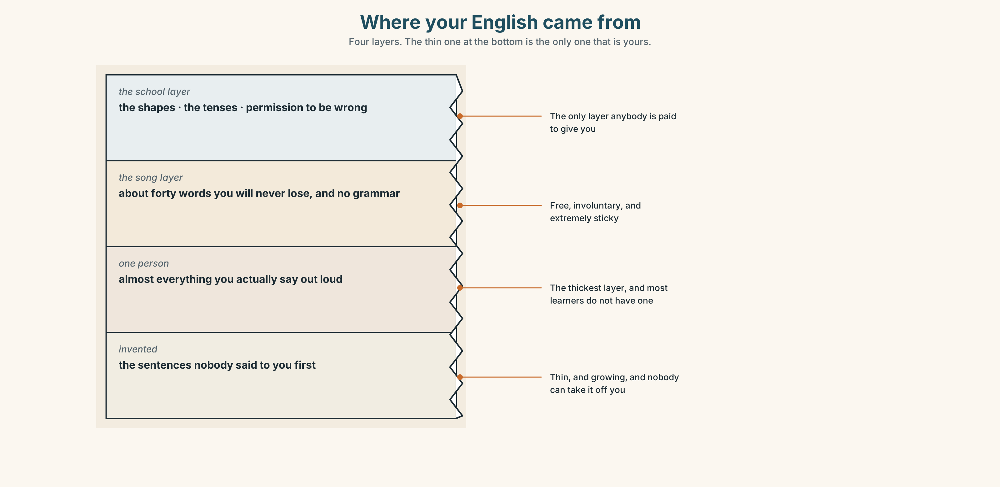
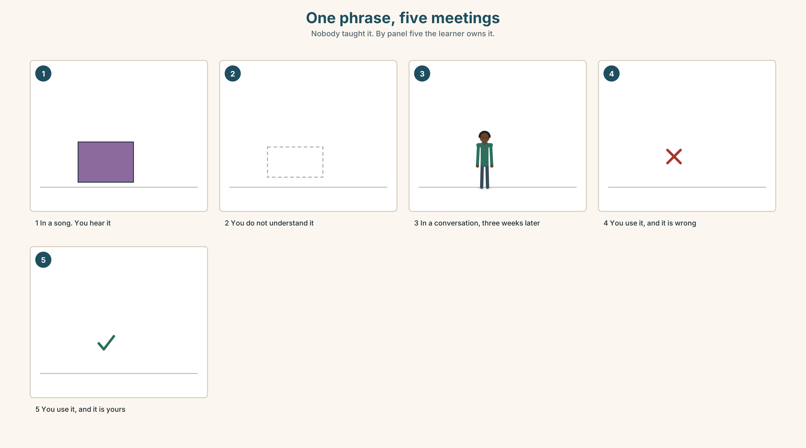
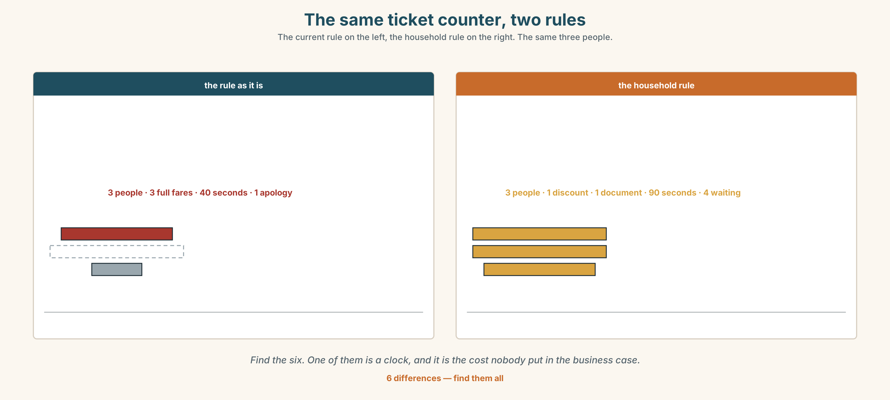

# A1.2 · Unit 4 · Two Adults and Three Children

> **English Animated** · *Getting Around* · The Prairie Line, Toronto to Vancouver
> Student's Book pages 72–93 · 22 pp · ~9 hours

---

## Part 0 · The Big Picture ◆ **A · THE WORLD**

{width=6.6in}

*Coach 6, the second evening, half past eight — Fourteen things to find. The booking system made four groups and the people made five.*

# What makes a family?

**By the end of this unit you can say who somebody is to somebody else, and whose things are
whose.**

| ◆ **A · THE WORLD** | A coach where the booking system made four groups and the people made five |
|---|---|
| ◆ **B · THE SYSTEM** | possessive *'s* · possessive adjectives and pronouns · 22 words for family and home · *whose* · the three sounds of possessive *s* |
| ◆ **C · THE PERFORMANCE** | You describe the people in one photograph without naming anybody |

---

### 0A · Find it — fourteen things

Find these in the picture. Write the number.

> ☐ a seat ☐ a bag ☐ a coat ☐ a window ☐ a child ☐ a table ☐ a book
> ☐ a rack ☐ a cup ☐ a light ☐ a door ☐ a blanket ☐ a phone ☐ a clock

**Three of these words are not in the picture. Which three?**

> a cousin · a grandmother · a home

### 0B · Guess it

Look at the four groups. **Which two people in this picture are related?**
Say one thing. You can use these words:

> *look like · together · alone · sister · old*

### 0C · Say it ⏺

**Record. Thirty seconds. Do not prepare.**

> **Who is in your family? Not a list — tell me about two of them.**

You will listen to this again on the last page.

---

## Part 1 · Vocabulary Lab 1 ◆ **B · THE SYSTEM**

### 1A · Meet — who is who

{width=6.6in}

*Eleven people, and what each is to each — Four of the lines are dotted. Those are the ones the booking system does not know about.*

| | |
|---|---|
| **family** | The word the fare policy uses and does not define. |
| **together** | Eleven people. Five groups. Four bookings. |
| **alone** | One person, and he is seventeen, and he is not lost. |
| **a big family** | Six on this train, and three of them have met twice. |
| **bring up** | The verb that does not require any of the nouns in this unit. |
| **grow up** | The only one of them that nobody else can do for you. |

### 1B · Meet — the words

> **family · mother · father · sister · brother · son · daughter · wife · husband · grandmother · cousin · uncle · aunt · married · alone · together**

Write each word under the right picture.

{width=6.6in}

*One house, four generations — Eleven people. Eleven words. The top floor has two names in the same years.*

### 1C · Sort — the person, or the connection?

Put each word in the right box. **Two of them can go in both. Which two, and why?**

> mother · married · cousin · together · aunt · alone · brother · family · daughter · husband

| **A PERSON** | **A SITUATION** | **BOTH** |
|---|---|---|
| | | |

### 1D · The verbs families use

| | |
|---|---|
| **get married** | One day. Everything else in this unit is years. |
| **look like** | The only one strangers can see. |
| **live with** | The one the fare policy actually ought to use. |
| **bring up** | Years, and it does not need a mother or a father in the sentence. |
| **grow up** | What the child does while the first one is happening. |
| **a big family** | Six people, or three, depending entirely on who is counting. |

**Now say them.** Two of these six describe something somebody does **to** somebody else.
**Which two, and who is doing it?**

### 1E · Stretch — the phrases you will need today

> **get married** · **look like** · **live with** · **bring up** · **grow up**

Match each phrase to the moment you need it.

1. Two people are in a photograph and you can see it immediately. → ______
2. Somebody is seventeen and wants to be treated as an adult. → ______
3. You are filling in a form that asks about your household. → ______
4. Somebody spent twenty years doing it and is not on the birth certificate. → ______
5. There is a date, and people remember it every year. → ______

### 1F · The hard one

> **f** **It's not mine.**

Practise it three times. **Three words, and it is almost always said about a bag.**

### 1G · Own it

Draw your family as a network, not a tree. **Put a word on every line.** Do not write any names.
The class guesses which lines are the oldest.

---

## Part 2 · Listening ◆ **A · THE WORLD**

{width=6.6in}

*The corridor of coach 6 — There is a bag on the floor and it belongs to neither of them.*

### 2A · Coach 6, half past eight 🔊 Track 4.1

**Before you listen.** Sam is seventeen and travelling alone. There is a bag with no owner.
**Guess: is it his?**

**Listen once. One question.** Whose bag is it?

**Listen again. Complete the table.**

| | Who | Relationship to Sam |
|---|---|---|
| the woman in seat 14 | | |
| the man with the coat | | |
| the person he is going to | | |

**Listen again. True or false?**

1. The bag is Sam's. ☐ T ☐ F
2. He's going to his aunt's. ☐ T ☐ F
3. His aunt brought him up. ☐ T ☐ F
4. He's travelling with his cousin. ☐ T ☐ F

**Noticing.** Four sentences from the recording.

1. *It's not mine.*
2. *It's my sister's.*
3. *Whose coat is that?*
4. *That one's ours.*

**Two of these have an apostrophe and two do not. What is the difference between *my* and
*mine*?**

### 2B · Decoding clinic 🔊 Track 4.2

Twenty seconds of Dev at speed. Three jobs.

1. Count the possessives you hear.
2. *Sam's*, *Dev's* and *Ruth's* all end in *s*. Do they end in the same sound?
3. He says one name with two *s* sounds at the end. Which, and what happens to it?

> Transcripts, page 151.

---

## Part 3 · Grammar Lab 1 ◆ **B · THE SYSTEM**

### Whose is whose

### 3A · Notice

Look at the four sentences in Part 2 again.

1. In sentence 2, what comes after *sister's* — a noun, or nothing?
2. In sentence 1, could you say *It's not my*? Why not?
3. What is the question word in sentence 3?
4. Which of the four would you use if you were holding the thing?

### 3B · See

{width=6.6in}

*Holding a noun, or standing alone — The left-hand words need a noun after them. The right-hand ones refuse one.*

### 3C · Know

| | | |
|---|---|---|
| **before a noun** | my · your · his · her · our · their | *my bag · her coat · their seats* |
| **standing alone** | mine · yours · his · hers · ours · theirs | *It's mine. That one's ours.* |
| **a person's thing** | name + **'s** | *Sam's bag · my sister's coat* |
| **asking** | **whose** | *Whose is this? Whose bag is it?* |

> **The apostrophe is not a plural.** *Sam's bag* is one Sam. *The Smiths* is a lot of Smiths.
> *The Smiths' bags* is both at once, and the apostrophe has moved.

{width=6.6in}

*The hook attaches to the owner — 's goes on the person who owns, never on the thing owned. Of does the same job backwards.*

| | |
|---|---|
| **people take 's** | *my sister's coat · the guard's keys* |
| **things usually take of** | *the door of the coach · the end of the line* |
| **belong to** | *That bag belongs to Sam.* |
| **one of a group** | *a friend of mine · a cousin of hers* |

> **Why it matters.** Half of all arguments on a train are about whose something is, and all of
> them are settled in four words.

### 3D · Use — controlled

Complete with **my**, **mine**, **his**, **her**, **hers**, **their**, **theirs** or **'s**.

> That bag isn't (1) ______ . It's Sam (2) ______ sister (3) ______ bag.
> This coat is (4) ______ — the man in seat 9. That one over there is (5) ______ , the two
> children.
> Whose seats are these? — They're (6) ______ . We booked them in March.

### 3E · Use — guided

Rewrite each one with **'s** or with a pronoun.

1. The bag that belongs to Sam.
2. The coat that belongs to me.
3. The seats that belong to us.
4. The keys that belong to the guard.
5. The children that belong to my sister.

### 3F · Use — open

**In pairs.** Put four objects on the table. **Your partner must find out whose each one is,
using only *Whose…?* and *Is this yours?***

### 3G · Check — six items, mark your own

> 1. That bag isn't ______ . *(belonging to me, standing alone)*
> 2. It's Sam ______ sister's bag.
> 3. This coat is ______ . *(belonging to her, standing alone)*
> 4. ______ seats are these?
> 5. ✗ *It's not my.* → correct it.
> 6. ✗ *That is the bag of Sam.* → correct it.

{width=6.6in}

*The word that reached for a noun that was not there — The word that reached for a noun that was not there*

**0–3 →** Workbook pp. 16–19. **4–5 →** Part 6. **6 →** page 90.

---

## Part 4 · Speaking ◆ **C · THE PERFORMANCE**

### 4A · Fluency starter — whose is it?

Everybody puts one object in the middle. **Find out whose each one is in under three minutes,
and nobody may point.**

### 4B · The functional core — saying who people are

{width=6.6in}

*One photograph, two descriptions — The left names relationships. The right names what people are doing.*

**Language Bank**

| | |
|---|---|
| **the relationship** | *my sister's son · her husband · a cousin of mine* |
| **the connection** | *they live with · she brought him up · they got married in March* |
| **whose** | *Whose is this? · It's not mine. · That one's ours.* |
| **belonging** | *It belongs to him. · a friend of mine* |

**Information gap.** Learner A has the booking list. Learner B has who is actually sitting where.
**Find the two groups the system does not know about.**

### 4C · The performance — one photograph ⏺

Describe **one photograph with at least four people in it**, without naming anybody.
**Two minutes.** You must:

> say who each person is to each other person · use three possessive forms · say one thing
> nobody could guess from looking

Your partner draws the network. **Record it.**

### 4D · Observer

One person listens for **one thing**: did anybody use a possessive adjective with no noun after it?

### 4E · Two criteria

> ☐ Could my partner draw the network correctly?
> ☐ Did I use both *'s* and a standing-alone pronoun?

---

## Part 5 · Reading ◆ **A · THE WORLD**

### 5A · Predict

The title is **"Two adults and up to three children."**
**What do you think this is a definition of?**

### 5B · Read — sixty seconds

---

**Two adults and up to three children**

The family fare says: two adults and up to three children, travelling together, for the price of
two adults.

In coach 6 last Tuesday there were eleven people. One was a grandmother travelling with two
grandchildren: three people, one adult, and she paid full fare for all three.

Two were sisters with four children between them: six people, and the fare covers five, so one
child paid full price. They could not decide which child, so they split it.

One was a man travelling with his wife's mother, who is eighty-one and cannot travel alone. Two
adults, no children, no discount.

And one was Sam, who is seventeen, which the policy counts as an adult, travelling alone to the
aunt who brought him up.

Four bookings. One of them got the family fare, and it was the only one in which nobody was
looking after anybody.

---

### 5C · Answer

1. What does the family fare say?
2. How many people were in coach 6?
3. Why did one child pay full price?
4. How old is Sam?
5. **Why did the grandmother pay full fare for three people?**
6. **The last line says the only booking that got the discount was the one in which nobody was looking after anybody. What is the policy actually paying for?**

### 5D · Vocabulary in context

Guess from the text. Then check.

> travelling together · between them · they split it · cannot travel alone · looking after

### 5E · The counter-text

{width=6.6in}

*The family fare page — It defines child. It defines adult. It never defines family.*

**Read the page and answer.**

1. How many adults and how many children does the fare cover?
2. **What are the two ages in the definition of *child*, and why are there two?**
3. What does the last line say?
4. **The page defines *child* and *adult* and never defines *family*. Why not, and what does that leave to whoever is at the counter?**

### 5F · Two texts

The reading describes four bookings and one discount.
The web page describes an offer for families.

**Which of the four bookings is a family?** Say one sentence.

---

## Part 6 · Vocabulary Lab 2 ◆ **B · THE SYSTEM**

### Whose, and the words that answer it

{width=6.6in}

*Whose is this? — One bag, six answers. Each one tells you something different about the speaker.*

### 6A · The ones that catch everybody

| | |
|---|---|
| **its / it's** | *its* is possessive; *it's* is *it is*. The apostrophe means the opposite of what you expect |
| **his** | the only word that is both an adjective and a pronoun |
| **hers / theirs / ours** | no apostrophe, ever |
| **a friend of mine** | not *a my friend*, and not *a friend of me* |

### 6B · Say them

> whose · my · your · his · her · our · their · mine · yours

### 6C · Chunk

1. **______ is this?** — the question
2. It's not **______ .** — standing alone, belonging to me
3. That one's **______ .** — standing alone, belonging to us
4. It **______ to** Sam. — two words, and a formal one
5. a friend **______ ______** — one of my friends
6. my sister **______** coat — the hook that joins two nouns

### 6D · Contrast Clinic

Six items. ***my*** or ***mine***?

1. That bag isn't ______ .
2. ______ sister lives in Jasper.
3. Is this coat ______ ?
4. ______ seat is 14.
5. The blue one is ______ .
6. ______ aunt brought me up.

---

## Part 7 · Pronunciation & Fluency Lab ◆ **B · THE SYSTEM**

### One apostrophe, three sounds

{width=6.6in}

*One apostrophe, three sounds — Exactly the rule you learned for plurals, and for he-she-it. The third time it is free.*

### 7A · Hear

> **/s/** after a quiet sound: *Dev's · Kate's · the guard's · my aunt's*
> **/z/** after a loud sound: *Sam's · Ruth's · my brother's · the children's*
> **/ɪz/** after a hissing sound: *Ross's · the nurse's · George's · my niece's*

### 7B · Say

Say each group three times. Then say this:

> *Dev's coat, Sam's bag, and Ross's seat.* — three endings, one sentence, all spelled the same.

### 7C · Make it mean something

Say these two:

> *my sister's children* — one sister
> *my sisters' children* — more than one sister

**You cannot hear the difference and the reader can see it.** This is the only place in English
where the apostrophe carries meaning that the voice does not. Which is which, when you are
speaking?

### 7D · Fluency 20 ⏺

Twenty seconds: **six things in this room and whose they are.** Three times, faster.

---

## Part 8 · Writing ◆ **C · THE PERFORMANCE**

### Who they are to each other · 50–70 words

### 8A · Read the model

> There are four people in the photograph. `[the number, and nothing else]`
>
> The woman on the left is my mother. The man beside her is her brother, not my father.
> `[the correction before the reader makes the mistake]`
>
> The boy is my cousin's son. My cousin isn't in the picture — she took it. `[the person who is
> absent and present at once]`
>
> The old woman at the back brought all three of them up. She isn't related to any of them.
> `[the sentence the photograph cannot show]`

**Questions about the writer's choices:**

1. *not my father.* **Why correct something the reader has not said yet?**
2. *she took it.* **How does that make the writer's cousin part of the picture?**
3. The last line is the only one that could not be guessed. **Why is it last?**

### 8B · The anti-model

> This is a photo of my family. There are four people. On the left is my mother. Next to her is my uncle. The boy is my cousin's son. The old woman is a family friend.

Correct English, and you could not pick it out of six photographs. **Add one correction, one
person who is not in the picture, and one fact the camera cannot see.**

### 8C · Plan

> the number → the relationship, with one correction → the person who is absent →
> the fact the photograph cannot show

### 8D · Write — 50 to 70 words
### 8E · Peer review — two things only

> ☐ Is there at least one *'s* and one standing-alone pronoun?
> ☐ Is there one fact that is not visible in the photograph?

### 8F · Publish

On the wall, with no names and no photographs. **The class draws the networks and compares them.**

---

## Part 9 · The File ◆ **A · THE WORLD + C · THE PERFORMANCE**

# STUDY FILE · Whose English is it?

{width=6.6in}

*Where your English came from — Four layers. The thin one at the bottom is the only one that is yours.*

### 9A · Four sources

{width=6.6in}

*One phrase, five meetings — Nobody taught it. By panel five the learner owns it.*

| | |
|---|---|
| **What a course gives you** | the shape, and permission to be wrong |
| **What a song gives you** | the rhythm, and about forty words you will never forget |
| **What one person gives you** | everything you will actually say |
| **What you make yourself** | the sentences nobody said to you first |

### 9B · Your one person

Almost everybody who learns a language well has one person they speak it to more than anybody
else. **Name yours.** If you do not have one, that is this term's most useful problem.

### 9C · Role play — whose phrase is that?

In pairs. Say five English phrases you use often. **For each one, say where you got it.**
At least one must be from a song and one from a person.

### 9D · The sentence nobody gave you

Think of one sentence you have said in English that you did not learn from anywhere — you built
it. **Write it down.** That one is yours.

### 9E · Transfer — before next week

**Write down five phrases you heard this week and where each came from.**
Bring the list, and mark the one you have already used.

---

## Part 10 · Mediation & Interaction ◆ **C · THE PERFORMANCE**

{width=6.6in}

*Coach 6, four bands — The bookings, the actual groups, who is looking after whom, and who got the discount. They do not line up anywhere.*

### 10A · Relay

Half the class has the booking list. Half has who is actually sitting where.
**Rebuild coach 6 by speaking.** Ten minutes.

### 10B · Simplify — for one person

Somebody at the ticket counter asks: *Do we count as a family?*
**Answer in four sentences.** Be accurate and be kind; the two are not the same here.

### 10C · Online

Write **one message** to a classmate about two people in your family and how they are related.
**Three sentences.** One *'s*, one possessive adjective, one pronoun standing alone.

### 10D · Your language

Does your language have one word for your mother's brother and your father's brother?
**Say *uncle* in your language.** How many words did you need?

---

## Part 11 · The Decision ◆ **C · THE PERFORMANCE**

# Who counts

The family fare covers two adults and up to three children travelling together. Last year it was
claimed on nineteen thousand bookings and refused on about four hundred.

**Option one:** leave it. The rule is clear, it is cheap to administer, and four hundred refusals
is two per cent.

**Option two:** define family by household. Anybody who lives at the same address. Clear, fair,
and it needs an address check at the counter, which takes ninety seconds and a document.

**Option three:** drop the definition. Any four people travelling together on one booking. Simple,
generous, and it costs about nine hundred thousand dollars a year.

### 11A · The evidence

{width=6.6in}

*The same ticket counter, two rules — The current rule on the left, the household rule on the right. The same three people.*

🔊 **Track 4.6.** Sam, 20 seconds: *"My aunt brought me up. On the form she's not my mother and
she's not my guardian any more, because I'm seventeen. There's no box for her. There's no box for
most people."*

### 11B · Talk about it

In threes. Use the frame. Everybody says one.

> *I think the company should ______ , because ______ .*

**Words you can use:** *family · together · alone · aunt · cousin · bring up · live with*

### 11C · Decide

Write **two sentences**. Choose, and say why.

> I think the company should ______________________ ,
> because ______________________ .

### 11D · Model decision

> Any four people on one booking, and stop calling it the family fare. The company is not selling
> a definition of family; it is selling empty seats. Every minute spent deciding whether a
> grandmother counts is a minute spent making the product worse.

### 11E · The Reveal

> **What happened.** The company renamed it the Group Fare and dropped the definition. The cost
> was six hundred thousand, not nine hundred, because a third of the new claims were people who
> would not have travelled at all.
>
> Then something nobody expected: complaints at ticket counters fell by a quarter, and almost all
> of the drop was in complaints that had nothing to do with fares. The clerks had stopped being
> the people who decide who is a family.

**One question. You do not have to answer it out loud.**

> The rule cost the company four hundred refusals a year. What was it costing the clerks?

---

## Part 12 · Landing ◆ **all three lines**

### 12A · Recycle — twelve items

> 1. That bag isn't ______ . *(belonging to me, standing alone)*
> 2. It's Sam ______ sister's bag.
> 3. This coat is ______ . *(belonging to her, standing alone)*
> 4. ______ seats are these?
> 5. It ______ to Sam. *(two words — the formal way)*
> 6. a friend ______ mine
> 7. They ______ ______ in March. *(two words — one day, and a date)*
> 8. She ______ him ______ . *(two words — twenty years, and she is not on the certificate)*
> 9. I ______ ______ my aunt. *(two words — the same address)*
> 10. They ______ ______ in Jasper. *(two words — what the child does)*
> 11. *(Unit 3)* It isn't as good ______ the old one.
> 12. *(Unit 2)* ______ you travel last summer?

### 12B · Consolidate — one task, everything in it

**Describe four people who are connected to each other, in six sentences.** Two *'s* forms, two
possessive adjectives, one pronoun standing alone, and one relationship that is not a blood
relationship.

### 12C · Can-do, with evidence

> ☐ I can say who people are to each other. **Evidence:** 4C, 8D
> ☐ I can use *'s* and the possessive pronouns. **Evidence:** 3G, 6D
> ☐ I can ask and answer *Whose…?* **Evidence:** 4A
> ☐ I can say the three sounds of possessive *s*. **Evidence:** 7C

### 12D · Replay ⏺

Record 0C again. **Listen to both.** What is different?

### 12E · Glossary — thirty-five words, as a map

> **THE OLDER ONES** · mother · father · grandmother · uncle · aunt
> **THE SAME GENERATION** · sister · brother · cousin · wife · husband
> **THE YOUNGER ONES** · son · daughter
> **THE WORD ITSELF** · family · a big family
> **THE SITUATION** · married · alone · together · get married · live with
> **WHAT PEOPLE DO** · look like · bring up · grow up
> **WHOSE** · whose · my · your · his · her · our · their · mine · yours
> **SAYING IT** · belong to · a friend of mine · Whose is this? · It's not mine.

### 12F · Next

> **Unit 5 · What does a body need?**
