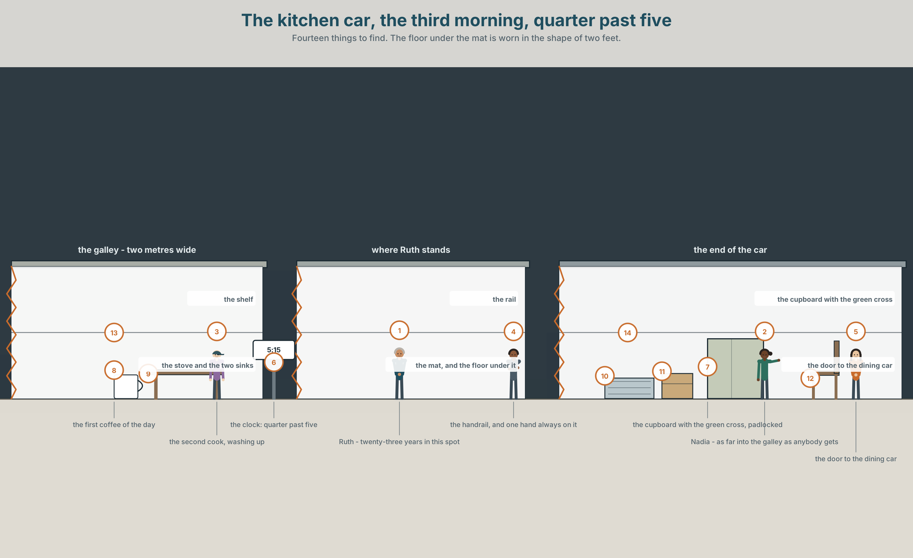
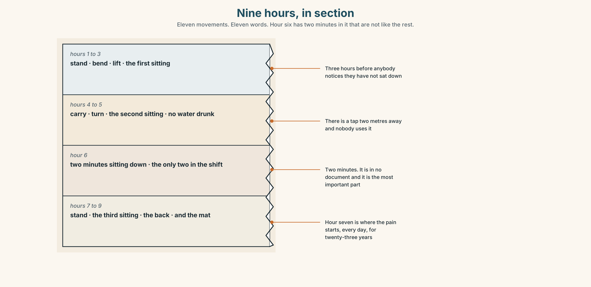
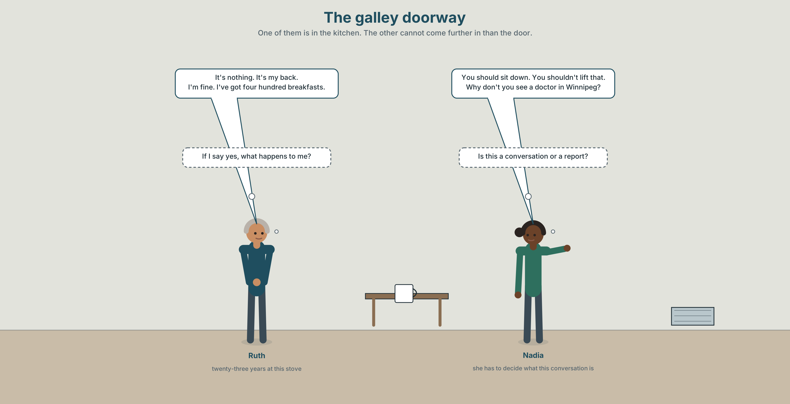
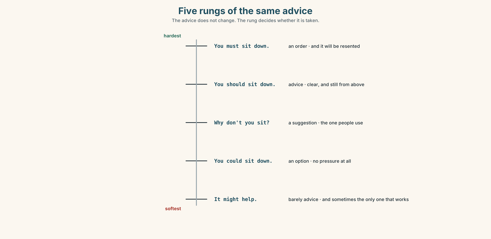
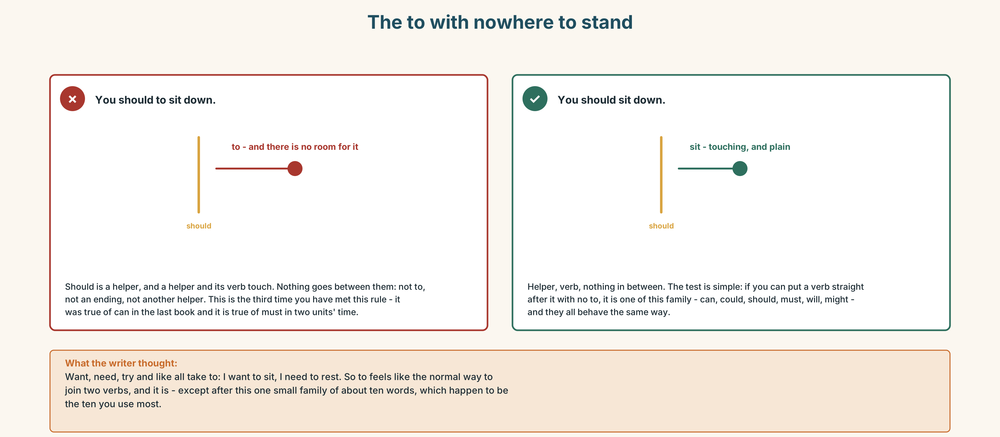
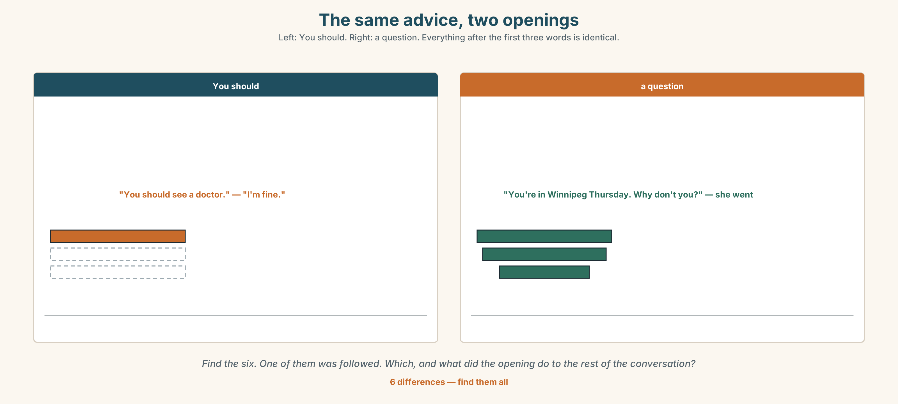
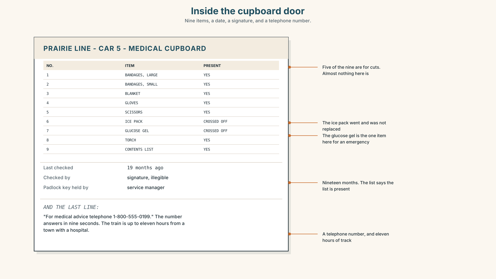
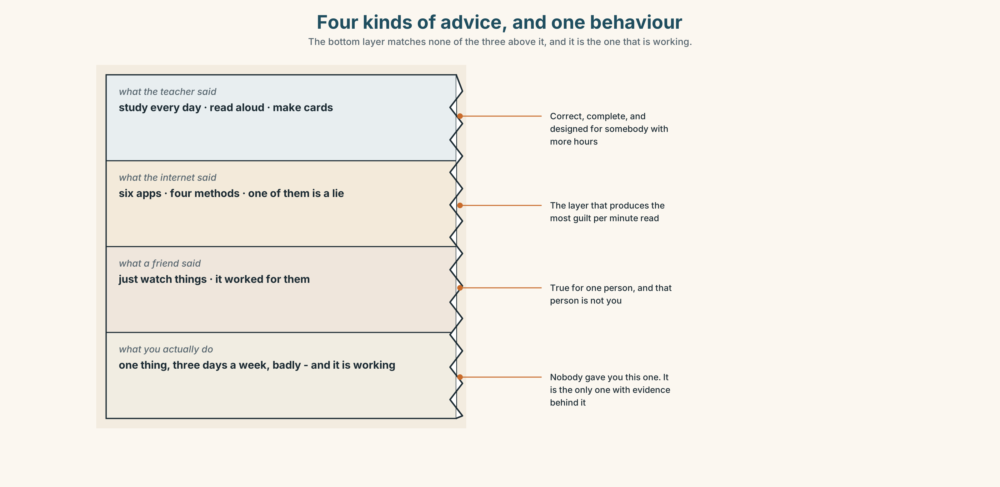
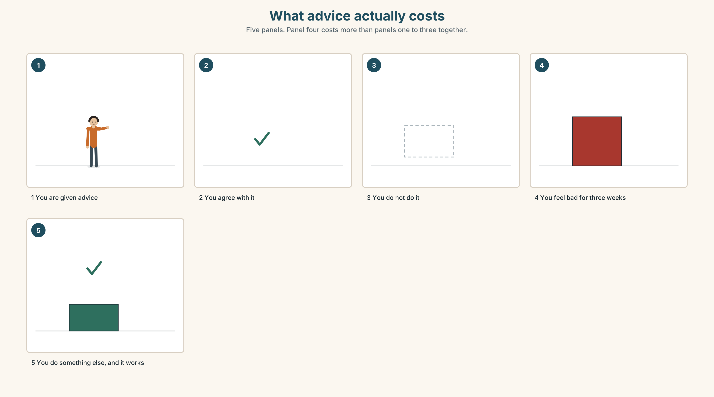
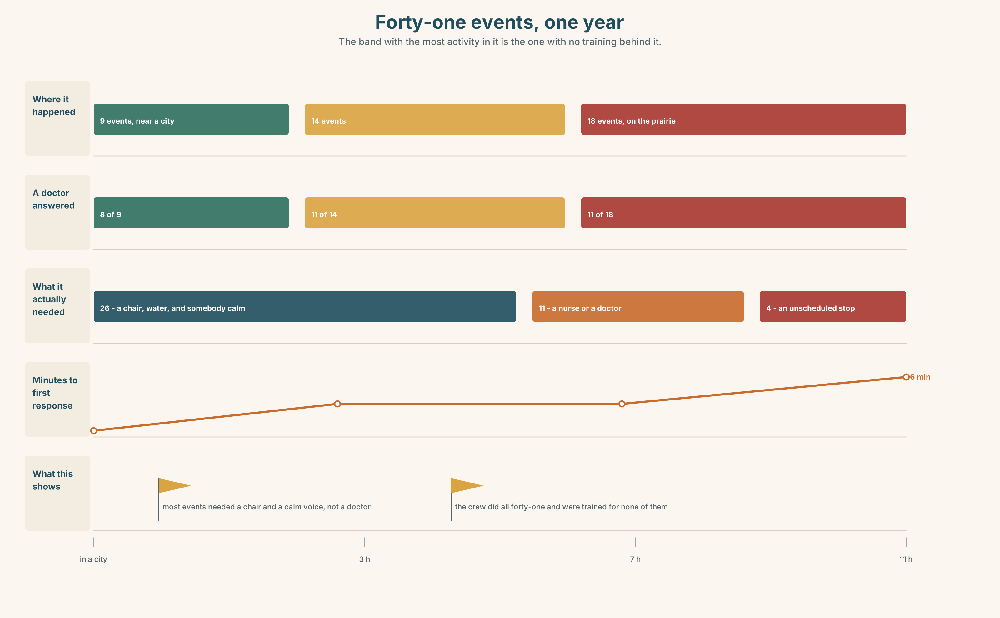

# A1.2 · Unit 5 · Is There a Doctor on Board?

> **English Animated** · *Getting Around* · The Prairie Line, Toronto to Vancouver
> Student's Book pages 94–115 · 22 pp · ~9 hours

---

## Part 0 · The Big Picture ◆ **A · THE WORLD**

{width=6.6in}

*The kitchen car, the third morning, quarter past five — Fourteen things to find. The floor under the mat is worn in the shape of two feet.*

# What does a body need?

**By the end of this unit you can give somebody advice, and take it.**

| ◆ **A · THE WORLD** | A kitchen two metres wide, four nights from a hospital |
|---|---|
| ◆ **B · THE SYSTEM** | *should* and *shouldn't* · *Why don't you…?* · 22 words for health and advice · the verbs a body does · */ʊ/* and */uː/*, and the *should* you cannot hear |
| ◆ **C · THE PERFORMANCE** | You give advice to somebody who has already decided not to take it |

---

### 0A · Find it — fourteen things

Find these in the picture. Write the number.

> ☐ a stove ☐ a sink ☐ a mat ☐ a rail ☐ a cupboard ☐ a cross ☐ a lock
> ☐ a window ☐ a clock ☐ a cup ☐ a door ☐ a floor ☐ a light ☐ a box

**Three of these words are not in the picture. Which three?**

> a doctor · medicine · a pain

### 0B · Guess it

Look at the floor under the mat. **How long has somebody stood in that spot?**
Say one thing. You can use these words:

> *stand · work · old · same · year*

### 0C · Say it ⏺

**Record. Thirty seconds. Do not prepare.**

> **Somebody says they are tired all the time. What do you tell them?**

You will listen to this again on the last page.

---

## Part 1 · Vocabulary Lab 1 ◆ **B · THE SYSTEM**

### 1A · Meet — what a body does in a kitchen

{width=6.6in}

*One body, eight movements, nine hours — The number on each line is how many times that movement happens in one shift. The largest is the one nobody counts.*

| | |
|---|---|
| **health** | A word people use about other people. |
| **pain** | The only word on this list that is never an opinion. |
| **rest** | Not sleep. The company has a word for sleep and no word for this. |
| **stress** | Measured in nobody, recorded nowhere, and the commonest reason people leave. |
| **exercise** | Nine hours of standing is not this, and everybody thinks it is. |
| **well** | The answer everybody gives, and the one word in this unit that is almost always a lie. |

### 1B · Meet — the words

> **health · doctor · medicine · pain · headache · cold · cough · ill · sick · well · rest · water · exercise · stress · hungry · warm**

Write each word under the right picture.

{width=6.6in}

*Nine hours, in section — Eleven movements. Eleven words. Hour six has two minutes in it that are not like the rest.*

### 1C · Sort — the body, or the advice?

Put each word in the right box. **Two of them can go in both. Which two, and why?**

> pain · rest · headache · exercise · cough · water · cold · stress · medicine · sick

| **SOMETHING THE BODY HAS** | **SOMETHING YOU DO ABOUT IT** | **BOTH** |
|---|---|---|
| | | |

### 1D · What people say about a body

| | |
|---|---|
| **take medicine** | *take*, not *eat* and not *drink*. English treats it as a task. |
| **see a doctor** | *see*, not *visit* and not *meet*. Also a task. |
| **have a cold** | *have*, and it lasts days. *I am cold* lasts a minute and is different. |
| **feel better** | The only measurement anybody takes. |
| **lie down** | Two minutes. In a galley there is nowhere to do it. |
| **give up** | The one piece of advice in this unit that nobody can do on somebody else's behalf. |

**Now say them.** Two of these six are things you do and four are things that happen to you.
**Which two, and which of the six is somewhere in between?**

### 1E · Stretch — the phrases you will need today

> **take medicine** · **see a doctor** · **have a cold** · **feel better** · **lie down**

Match each phrase to the moment you need it.

1. It is day four and it is not going away. → ______
2. You have a box and a glass of water in your hand. → ______
3. Somebody asks how you are, three days after. → ______
4. It started on Tuesday and you are still working. → ______
5. There is a bench and you have four minutes. → ______

### 1F · The hard one

> **f** **Take it easy.**

Practise it three times. **Three words. It is advice and a goodbye at the same time, and nobody
ever does it.**

### 1G · Own it

Write down one piece of advice somebody gave you that you did not take, and whether you should
have. Do not write your name. The class guesses whose it is.

---

## Part 2 · Listening ◆ **A · THE WORLD**

{width=6.6in}

*The galley doorway — One of them is in the kitchen. The other cannot come further in than the door.*

### 2A · Quarter past five 🔊 Track 5.1

**Before you listen.** Ruth has worked in this kitchen for twenty-three years.
**Guess: will she say she is well?**

**Listen once. One question.** What hurts?

**Listen again. Complete the table.**

| | What Ruth says | What Nadia advises |
|---|---|---|
| the pain | | |
| the hours | | |
| the doctor | | |

**Listen again. True or false?**

1. Ruth has seen a doctor. ☐ T ☐ F
2. Nadia tells her to sit down. ☐ T ☐ F
3. There is a doctor on the train. ☐ T ☐ F
4. Ruth says she is fine. ☐ T ☐ F

**Noticing.** Four sentences from the recording.

1. *You should sit down.*
2. *You shouldn't lift that.*
3. *Why don't you see a doctor?*
4. *You'll feel better.*

**Three of these are advice and one is a promise. Which, and which is the hardest to say?**

### 2B · Decoding clinic 🔊 Track 5.2

Twenty seconds of Nadia at speed. Three jobs.

1. Count how many pieces of advice she gives.
2. *Should* has five letters and one of them is silent and two more almost are. How many sounds?
3. She says *shouldn't* once. What happens to the *t*?

> Transcripts, page 152.

---

## Part 3 · Grammar Lab 1 ◆ **B · THE SYSTEM**

### Telling somebody what to do, without telling them

### 3A · Notice

Look at the four sentences in Part 2 again.

1. What is the form of the verb after *should*?
2. Does *should* change for *he*, *she* or *they*?
3. In sentence 3, what is the shape of the question?
4. Which of the four is the gentlest, and why?

### 3B · See

{width=6.6in}

*Five rungs of the same advice — The advice does not change. The rung decides whether it is taken.*

### 3C · Know

| | | |
|---|---|---|
| **advice** | *should* + the plain verb | *You should sit down. She should rest.* |
| **advice against** | *shouldn't* + the plain verb | *You shouldn't lift that.* |
| **a suggestion** | *Why don't you…?* | *Why don't you see a doctor?* |
| **a promise, not advice** | *will* | *You'll feel better.* |

> **Should never changes.** No *s*, no *to*, no *do* in the question: *should I, should she, should
> they.* It is the third helper of this kind you have met, after *can* and *must*, and they all
> behave identically.

{width=6.6in}

*Why don't you, taken apart — A negative question in form. A suggestion in meaning. The answer is not a reason.*

| | |
|---|---|
| **softer than should** | *Why don't you see a doctor?* |
| **about yourself** | *I should rest. I shouldn't work tonight.* |
| **asking for advice** | *What should I do? Should I see a doctor?* |
| **the closing phrases** | *You'll feel better. Take it easy.* |

> **Why it matters.** Advice is the commonest kind of help anybody gives, and the difference
> between advice that is taken and advice that is resented is almost entirely in the first two
> words.

### 3D · Use — controlled

Complete with **should**, **shouldn't**, **Why don't you** or the plain verb.

> You (1) ______ sit down for five minutes. You (2) ______ lift that box on your own.
> (3) ______ see a doctor in Winnipeg?
> I (4) ______ (not work) tonight, but there is nobody else. What (5) ______ I do?
> She (6) ______ (rest) for two days.

### 3E · Use — guided

Turn each one into advice, twice: once with *should* and once with *Why don't you*.

1. Somebody has a headache every afternoon.
2. Somebody has had a cough for three weeks.
3. Somebody never drinks any water at work.
4. Somebody carries boxes alone.
5. Somebody has not had a day off for nine weeks.

### 3F · Use — open

**In pairs.** One of you describes a problem. The other gives three pieces of advice, each
softer than the last. **The first person must refuse all three, politely.**

### 3G · Check — six items, mark your own

> 1. You ______ sit down. *(advice)*
> 2. You ______ lift that. *(advice against)*
> 3. ______ see a doctor? *(three words — the gentle one)*
> 4. What ______ I do?
> 5. ✗ *You should to sit down.* → correct it.
> 6. ✗ *She shoulds rest.* → correct it.

{width=6.6in}

*The to with nowhere to stand — The to with nowhere to stand*

**0–3 →** Workbook pp. 20–23. **4–5 →** Part 6. **6 →** page 112.

---

## Part 4 · Speaking ◆ **C · THE PERFORMANCE**

### 4A · Fluency starter — the advice chain

One person says a problem. Everybody gives one piece of advice.
**No two people may use the same opening, and there are only four openings.**

### 4B · The functional core — giving advice

{width=6.6in}

*The same advice, two openings — Left: You should. Right: a question. Everything after the first three words is identical.*

**Language Bank**

| | |
|---|---|
| **direct** | *You should… · You shouldn't…* |
| **a suggestion** | *Why don't you…?* |
| **about yourself first** | *When that happened to me, I…* |
| **closing** | *You'll feel better. · Take it easy.* |

**Information gap.** Learner A has what the crew says about their health. Learner B has the
company's sickness record. **Find the three things that are in one and not the other.**

### 4C · The performance — advice that is refused ⏺

Give advice to somebody who has already decided not to take it. **Two minutes.** You must:

> give three pieces of advice, each gentler than the last · use *should* once and *Why don't
> you* once · end without repeating yourself

Your partner must refuse all three and give a reason each time. **Record it.**

### 4D · Observer

One person listens for **one thing**: did anybody put *to* after *should*?

### 4E · Two criteria

> ☐ Did my three pieces of advice get softer, not louder?
> ☐ Did I say one thing about myself before I said anything about them?

---

## Part 5 · Reading ◆ **A · THE WORLD**

### 5A · Predict

The title is **"Four nights from a hospital."**
**What do you think happens when somebody is ill on this train?**

### 5B · Read — sixty seconds

---

**Four nights from a hospital**

The train is four nights long. At its furthest point it is eleven hours from a town with a
hospital.

There is a cupboard with a green cross on it in the kitchen car. It has a padlock. Inside there
are bandages, a blanket, and a list of telephone numbers.

When somebody is ill, the crew make an announcement and ask whether there is a doctor on board.
Last year this happened forty-one times. A doctor or a nurse answered thirty of those times.

Eleven times, nobody answered.

Nadia has done this fourteen times in eleven years. She says the worst part is not the eleven. It
is that the announcement tells a hundred and ninety-two people that there is something wrong, and
she has to say it in a voice that does not frighten them, and she has never been trained to do
either of those things.

---

### 5C · Answer

1. How long is the train journey?
2. How far is the furthest point from a hospital?
3. What is inside the cupboard?
4. How many times did somebody answer the announcement last year?
5. **Why does Nadia say the worst part is not the eleven times nobody answered?**
6. **What two things has she never been trained to do, and which of the two is harder?**

### 5D · Vocabulary in context

Guess from the text. Then check.

> at its furthest point · a padlock · answered · the worst part · in a voice that

### 5E · The counter-text

{width=6.6in}

*Inside the cupboard door — Nine items, a date, a signature, and a telephone number.*

**Read the list and answer.**

1. How many items should be in the cupboard?
2. **Which two items have been crossed off, and what were they for?**
3. When was the cupboard last checked?
4. **The last line is a telephone number. On a train eleven hours from a town, what does a telephone number get you?**

### 5F · Two texts

The reading says the crew ask whether there is a doctor on board.
The contents list says *telephone for medical advice*.

**Which of the two is the real system?** Say one sentence.

---

## Part 6 · Vocabulary Lab 2 ◆ **B · THE SYSTEM**

### What a body does

{width=6.6in}

*Picking a box up off the floor — Six panels. The difference between the first and the last is where the knees are.*

### 6A · The ones that catch everybody

| | |
|---|---|
| **hurt** | the same word for what you feel and what you do: *my back hurts* / *you'll hurt your back* |
| **lift / carry** | lifting is a second; carrying is a minute. Different verbs, different injuries |
| **stretch / bend** | opposite directions, and people confuse them constantly |
| **breathe** | the verb. *Breath* is the noun, and it has no *e* |

### 6B · Say them

> breathe · stretch · bend · lift · stand · carry · hurt · should · shouldn't

### 6C · Chunk

1. You **______** take some medicine. *(advice)*
2. You **______** lift that alone. *(advice against)*
3. **______ ______ you** see a doctor? *(three words)*
4. You'll **______ ______ .** *(two words, and it is a promise)*
5. **______ it easy.** *(two words, and it is a goodbye)*
6. My back **______ .** *(the body, not the action)*

### 6D · Contrast Clinic

Six items. ***should*** or ***shouldn't***?

1. You ______ drink more water.
2. You ______ lift that on your own.
3. She ______ see a doctor.
4. He ______ work tonight.
5. We ______ take a break.
6. They ______ carry it up the stairs.

---

## Part 7 · Pronunciation & Fluency Lab ◆ **B · THE SYSTEM**

### Two *oo* sounds, and the *should* you cannot hear

{width=6.6in}

*Two oo sounds — Both are rounded. The difference is length, and in should the l is not there at all.*

### 7A · Hear

> **/ʊ/** short: *should · could · would · good · book · foot*
> **/uː/** long: *food · soon · move · blue · two · you*
> The *l* in *should*, *could* and *would* is silent. There is no *l* sound in any of them.

### 7B · Say

Say each group three times. Then say this:

> *You should look at your foot soon.* — both vowels, three times each, in one sentence.

### 7C · Make it mean something

Say these two:

> *You should sit down.* — *should* is short, quiet, and almost disappears
> *You SHOULD sit down.* — *should* is long and loud, and you are arguing

**Advice that is heard is quiet.** When *should* becomes the loudest word in the sentence, it has
stopped being advice. Which one would you say to a colleague?

### 7D · Fluency 20 ⏺

Twenty seconds: **six pieces of advice for somebody who stands all day.** Three times, faster.

---

## Part 8 · Writing ◆ **C · THE PERFORMANCE**

### Advice · 50–70 words

### 8A · Read the model

> You've had the cough for three weeks. That's not a cold any more. `[the fact, and the thing
> they already know]`
>
> When mine went on that long, I left it another month and then lost a week of work.
> `[the writer's own mistake, before any advice]`
>
> Why don't you see somebody in Winnipeg? You're there for four hours on Thursday. `[the
> suggestion, with the obstacle already removed]`
>
> I know you won't. Take it easy anyway. `[the sentence that admits the advice will be refused]`

**Questions about the writer's choices:**

1. The first line tells them something they know. **Why is that useful?**
2. *When mine went on that long…* **Why put the writer's own mistake before the advice?**
3. *I know you won't.* **Does that make the advice weaker or stronger?**

### 8B · The anti-model

> You should see a doctor. You shouldn't work when you are ill. You should rest more. You should drink more water. You should take care of yourself.

Correct English, correct advice, and it will be ignored completely. **Rewrite it with one fact,
one thing about yourself, and one obstacle removed.**

### 8C · Plan

> the fact they already know → your own mistake → the suggestion, with the obstacle removed →
> the honest last line

### 8D · Write — 50 to 70 words
### 8E · Peer review — two things only

> ☐ Is there one sentence about the writer before any advice?
> ☐ Is there an obstacle removed, not just an instruction given?

### 8F · Publish

Swap with a partner. **They mark the one sentence they would actually act on.**

---

## Part 9 · The File ◆ **A · THE WORLD + C · THE PERFORMANCE**

# STUDY FILE · Advice you give yourself

{width=6.6in}

*Four kinds of advice, and one behaviour — The bottom layer matches none of the three above it, and it is the one that is working.*

### 9A · Four sources, one behaviour

{width=6.6in}

*What advice actually costs — Five panels. Panel four costs more than panels one to three together.*

| | |
|---|---|
| **What people are told** | study every day, make cards, read aloud, speak to natives |
| **What people do** | one of those, badly, three days a week |
| **What they feel** | that they are failing at the other three |
| **What is true** | one habit done badly beats four habits described well |

### 9B · Stop paying for advice you will not take

The cost of advice you do not take is not zero. It is the guilt, and the guilt is what stops
people doing the one thing that was working. **Name one piece of study advice you are going to
stop feeling bad about.**

### 9C · Role play — the honest adviser

In pairs. One of you asks for study advice. The other may give **only one** piece, and must first
ask three questions. **The one piece must be something the person is already nearly doing.**

### 9D · What you actually do

Write down what you actually did for English this week. Not what you meant to.
**That list is your method.** It is working better than you think.

### 9E · Transfer — before next week

**Choose one piece of advice from this unit and do it for seven days. Choose one and ignore
everything else.** Bring the seven days.

---

## Part 10 · Mediation & Interaction ◆ **C · THE PERFORMANCE**

{width=6.6in}

*Forty-one events, one year — The band with the most activity in it is the one with no training behind it.*

### 10A · Relay

Half the class has what the crew says. Half has the company's sickness record.
**Build the real picture by speaking.** Ten minutes.

### 10B · Simplify — for one person

A new crew member asks: *What do I do if somebody is ill?*
**Answer in four sentences.** The first one must be what to do in the first ten seconds.

### 10C · Online

Write **one message** giving a classmate advice about something they told you.
**Three sentences.** One *should*, one *Why don't you*, and one about yourself.

### 10D · Your language

Does your language have a soft way of giving advice? **Give somebody advice in your language,
twice:** once to a friend and once to your boss. How many words change?

---

## Part 11 · The Decision ◆ **C · THE PERFORMANCE**

# Is there a doctor on board?

Forty-one medical events last year. A doctor or nurse answered thirty times. Eleven times nobody
did.

**Option one:** leave it. Thirty out of forty-one, and in eleven years nobody has died.

**Option two:** train two crew per train as first responders. Four days of training each, about
two hundred thousand dollars a year across the fleet, and it does not make anybody a doctor.

**Option three:** carry a nurse on every train. About one and a half million a year, and on most
nights they would have nothing at all to do.

### 11A · The evidence

{width=6.6in}

*The same event, two systems — Left: as it happens now. Right: with somebody on the train who has been trained.*

🔊 **Track 5.6.** Nadia, 20 seconds: *"They ask why we don't just call. We do call. The call takes
nine seconds and then there are eleven hours, and the person on the phone is in Toronto and I am
the one in the corridor."*

### 11B · Talk about it

In threes. Use the frame. Everybody says one.

> *I think the company should ______ , because ______ .*

**Words you can use:** *doctor · health · pain · ill · rest · medicine · lie down*

### 11C · Decide

Write **two sentences**. Choose, and say why.

> I think the company should ______________________ ,
> because ______________________ .

### 11D · Model decision

> Train two per train, and train them in the announcement as well as in the bandages. The clinical
> gap is real and it is small. The gap that happens forty-one times a year, every time, is that
> somebody has to speak to a hundred and ninety-two frightened people, and nobody has ever been
> shown how.

### 11E · The Reveal

> **What happened.** The company trained two crew per train. In the first year the number of
> events was almost the same and the time to first response fell from four minutes to under one.
>
> Then something nobody expected: the number of announcements fell by two thirds. The trained
> crew could tell which events needed a doctor and which needed a chair and a glass of water, and
> most of them needed the second thing.

**One question. You do not have to answer it out loud.**

> The training was bought to find doctors. What did it actually buy?

---

## Part 12 · Landing ◆ **all three lines**

### 12A · Recycle — twelve items

> 1. You ______ sit down. *(advice)*
> 2. You ______ lift that. *(advice against)*
> 3. ______ ______ you see a doctor? *(three words)*
> 4. You'll ______ ______ . *(two words — the promise)*
> 5. ______ it easy.
> 6. My back ______ .
> 7. I need to ______ ______ for ten minutes. *(two words — flat, on your back)*
> 8. You should ______ ______ . *(two words — stop doing the thing that hurts)*
> 9. I ______ ______ ______ . *(three words — it started on Tuesday)*
> 10. You should ______ ______ ______ . *(three words — the appointment)*
> 11. *(Unit 4)* It's not ______ . *(standing alone, belonging to me)*
> 12. *(Unit 3)* It isn't ______ good ______ the old one. *(two words)*

### 12B · Consolidate — one task, everything in it

**Write advice for somebody with a problem you actually know about, in six sentences.** One
*should*, one *shouldn't*, one *Why don't you*, one fact, one thing about yourself, and one
obstacle removed.

### 12C · Can-do, with evidence

> ☐ I can give advice in three different strengths. **Evidence:** 4C, 8D
> ☐ I can use *should* and *shouldn't*. **Evidence:** 3G, 6D
> ☐ I can describe what a body is doing. **Evidence:** 6B
> ☐ I can hear the short and long *oo*. **Evidence:** 7C

### 12D · Replay ⏺

Record 0C again. **Listen to both.** What is different?

### 12E · Glossary — thirty-five words, as a map

> **THE STATE** · health · ill · sick · well · warm · hungry
> **WHAT YOU HAVE** · pain · headache · cold · cough · stress
> **WHAT HELPS** · doctor · medicine · rest · water · exercise
> **WHAT YOU SAY** · take medicine · see a doctor · have a cold · feel better · lie down · give up
> **WHAT THE BODY DOES** · breathe · stretch · bend · lift · stand · carry · hurt
> **ADVICE** · should · shouldn't · Why don't you…? · You should…
> **CLOSING** · You'll feel better. · Take it easy.

### 12F · Next

> **Unit 6 · What will the next ten years bring?**
