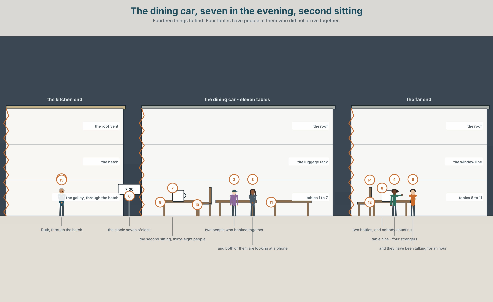
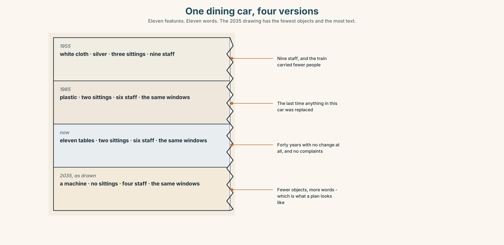
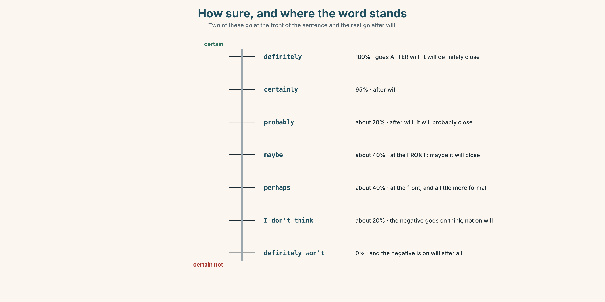
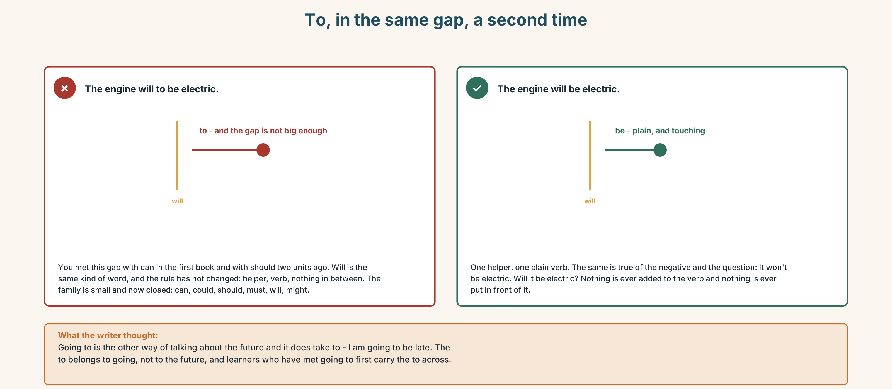
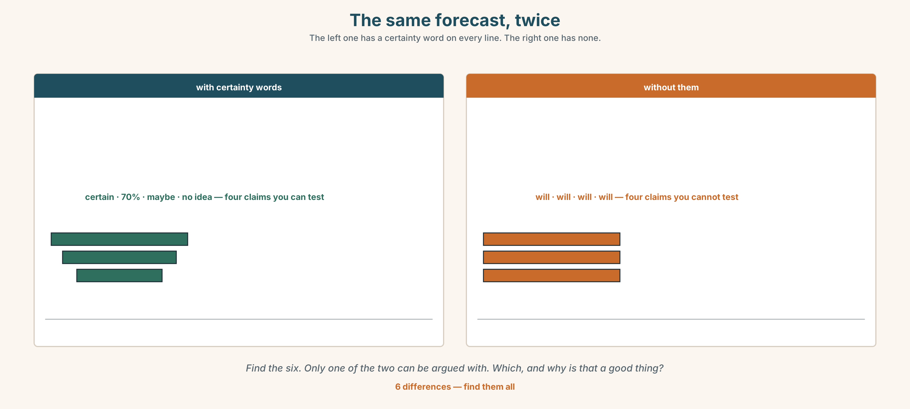
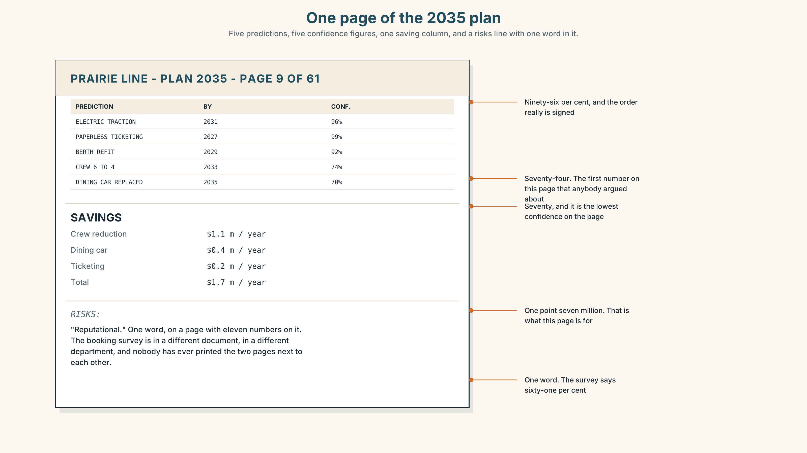
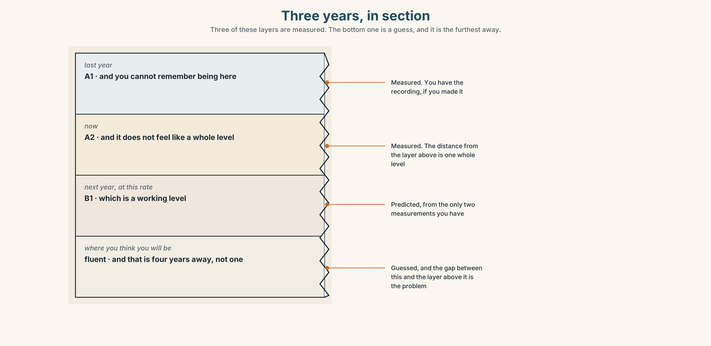

# A1.2 · Unit 6 · The Dining Car in 2035

> **English Animated** · *Getting Around* · The Prairie Line, Toronto to Vancouver
> Student's Book pages 116–137 · 22 pp · ~9 hours

---

## Part 0 · The Big Picture ◆ **A · THE WORLD**

{width=6.6in}

*The dining car, seven in the evening, second sitting — Fourteen things to find. Four tables have people at them who did not arrive together.*

# What will the next ten years bring?

**By the end of this unit you can predict, offer and decide, all with one word.**

| ◆ **A · THE WORLD** | A dining car that loses money and is the only reason anybody books this train |
|---|---|
| ◆ **B · THE SYSTEM** | *will* for prediction, for an offer and for a decision made this second · 22 words for change · *maybe* and *probably* · the *'ll* you cannot hear |
| ◆ **C · THE PERFORMANCE** | You predict one thing about ten years from now and say how sure you are |

---

### 0A · Find it — fourteen things

Find these in the picture. Write the number.

> ☐ a table ☐ a hatch ☐ a window ☐ a chair ☐ a cup ☐ a light ☐ a door
> ☐ a machine ☐ a phone ☐ a clock ☐ a plate ☐ a menu ☐ a bottle ☐ a bag

**Three of these words are not in the picture. Which three?**

> a robot · a city · energy

### 0B · Guess it

Look at the four tables where the people did not arrive together.
**Which table has been talking the longest?** Say one thing. You can use these words:

> *table · together · phone · look · talk*

### 0C · Say it ⏺

**Record. Thirty seconds. Do not prepare.**

> **What will be different in ten years about the way you travel?**

You will listen to this again on the last page.

---

## Part 1 · Vocabulary Lab 1 ◆ **B · THE SYSTEM**

### 1A · Meet — what changes and what does not

{width=6.6in}

*Eight things, and the year each one changes — Seven of the eight have a year on them. The eighth has a question mark, and it is the one the plan is really about.*

| | |
|---|---|
| **future** | A word people use when they mean next year. |
| **change** | The only thing on this list that is a noun and a verb with no difference. |
| **replace** | What happens to a machine. |
| **improve** | What is promised when something is replaced. |
| **disappear** | What actually happens to about a third of them. |
| **work out** | The verb for finding the answer when nobody has told you. |

### 1B · Meet — the words

> **future · change · machine · robot · energy · electric · car · city · job · world · year · soon · grow · disappear · improve · replace**

Write each word under the right picture.

{width=6.6in}

*One dining car, four versions — Eleven features. Eleven words. The 2035 drawing has the fewest objects and the most text.*

### 1C · Sort — the thing, or what happens to it?

Put each word in the right box. **Two of them can go in both. Which two, and why?**

> machine · improve · robot · disappear · energy · replace · car · grow · city · change

| **A THING** | **SOMETHING THAT HAPPENS** | **BOTH** |
|---|---|---|
| | | |

### 1D · The verbs of ten years

| | |
|---|---|
| **in ten years** | Far enough away that nobody who decides will still be there. |
| **get better** | Two words, and almost always about a thing. |
| **get worse** | Two words, and almost always about a system. |
| **a lot of people** | The phrase that arrives when nobody has counted. |
| **find out** | Somebody tells you, or you look. |
| **work out** | Nobody tells you. You do it yourself, from what you have. |

**Now say them.** Two of these six are about information and two are about direction.
**Which is which, and what are the other two?**

### 1E · Stretch — the phrases you will need today

> **in ten years** · **get better** · **get worse** · **find out** · **work out**

Match each phrase to the moment you need it.

1. You telephone somebody who has the answer. → ______
2. You have four numbers and no answer, and nobody is going to give you one. → ______
3. You are talking about something nobody can check. → ______
4. The new machine is faster and quieter. → ______
5. The new system is faster and nobody can use it. → ______

### 1F · The hard one

> **f** **We'll see.**

Practise it three times. **Two words. It is not agreement and it is not disagreement, and
everybody uses it to end a conversation they are losing.**

### 1G · Own it

Write down one thing you think will be different in ten years and one thing you think will be
exactly the same. Do not write your name. The class guesses whose card it is.

---

## Part 2 · Listening ◆ **A · THE WORLD**

{width=6.6in}

*After the second sitting — A laptop between them. One of them has been in this car for eleven years.*

### 2A · After the second sitting 🔊 Track 6.1

**Before you listen.** The dining car loses about four hundred thousand dollars a year.
**Guess: will the company keep it?**

**Listen once. One question.** What year does the plan talk about?

**Listen again. Complete the table.**

| | What will change | How sure |
|---|---|---|
| the engine | | |
| the dining car | | |
| the crew | | |

**Listen again. True or false?**

1. The engine will be electric by 2035. ☐ T ☐ F
2. He says the dining car will definitely close. ☐ T ☐ F
3. She offers to send him the booking figures. ☐ T ☐ F
4. They agree. ☐ T ☐ F

**Noticing.** Four sentences from the recording.

1. *The engine will be electric.*
2. *I'll send you the figures.*
3. *I'll have the fish, then.*
4. *It'll probably close.*

**All four use *will*. One is a prediction, one is an offer, one is a decision made at that
second, and one is a prediction with a doubt in it. Which is which?**

### 2B · Decoding clinic 🔊 Track 6.2

Twenty seconds of the planner at speed. Three jobs.

1. Count how many times he says *will* or *'ll*.
2. In *I'll* and *it'll*, how many sounds does *will* contribute?
3. He says *probably* twice and *definitely* once. Which one is he less sure about?

> Transcripts, page 153.

---

## Part 3 · Grammar Lab 1 ◆ **B · THE SYSTEM**

### One word, three jobs again

### 3A · Notice

Look at the four sentences in Part 2 again.

1. What is the form of the verb after *will*?
2. Does *will* change for *he*, *she* or *they*?
3. In sentence 3, when did the speaker decide?
4. In sentence 4, which word carries the doubt?

### 3B · See

{width=6.6in}

*One word, three jobs — Will does not change. The situation decides which of the three you have just done.*

### 3C · Know

| | | |
|---|---|---|
| **prediction** | what you think will happen | *The engine will be electric.* |
| **offer** | you are volunteering | *I'll send you the figures.* |
| **instant decision** | decided as you speak | *I'll have the fish, then.* |
| **negative** | *won't* | *It won't close. They won't agree.* |

> **Will never changes.** No *s*, no *to*, no *do* in the question: *will I, will she, will they.*
> This is the fourth helper of its kind and the family is now closed: *can, should, must, will.*

{width=6.6in}

*How sure, and where the word stands — Two of these go at the front of the sentence and the rest go after will.*

| | |
|---|---|
| **very sure** | *definitely · certainly · sure* |
| **fairly sure** | *probably · I think…* |
| **not sure** | *maybe · perhaps · possible* |
| **refusing to say** | *We'll see. · Who knows?* |

> **Where they stand.** *Maybe* and *perhaps* go at the front of the sentence. *Probably* and
> *definitely* go after *will* and before the verb: *It will probably close.*

> **Why it matters.** Nobody can predict anything. What people can do is say how sure they are,
> and the whole value of a prediction is in that second piece of information.

### 3D · Use — controlled

Complete with **will**, **won't**, **'ll**, **probably** or **maybe**.

> The engine (1) ______ be electric by 2035. The dining car (2) ______ ______ close — about
> seventy per cent, he says.
> I (3) ______ send you the booking figures this evening.
> (4) ______ they'll change their minds. (5) ______ you be here in ten years? — No, I (6) ______ .

### 3E · Use — guided

Turn each one into a prediction with *will*, and add a word that says how sure you are.

1. The dining car closes.
2. The crew gets smaller.
3. Trains get faster.
4. The route stays the same.
5. People stop booking.

### 3F · Use — open

**In pairs.** Make five predictions about this town in ten years. **Your partner must say how
sure they think you are, and you must say whether they are right.**

### 3G · Check — six items, mark your own

> 1. The engine ______ be electric. *(prediction)*
> 2. I ______ send you the figures. *(an offer, contracted)*
> 3. It ______ close. *(negative)*
> 4. It will ______ close. *(about seventy per cent sure)*
> 5. ✗ *The engine will to be electric.* → correct it.
> 6. ✗ *She wills come tomorrow.* → correct it.

{width=6.6in}

*To, in the same gap, a second time — To, in the same gap, a second time*

**0–3 →** Workbook pp. 24–27. **4–5 →** Part 6. **6 →** page 134.

---

## Part 4 · Speaking ◆ **C · THE PERFORMANCE**

### 4A · Fluency starter — the prediction round

Everybody makes one prediction about next week. **Each one must have a different certainty word,
and there are eight of them.**

### 4B · The functional core — predicting and offering

{width=6.6in}

*The same forecast, twice — The left one has a certainty word on every line. The right one has none.*

**Language Bank**

| | |
|---|---|
| **predicting** | *It will… · It won't… · It'll probably…* |
| **how sure** | *definitely · probably · maybe · perhaps · certainly* |
| **offering** | *I'll send it. · I'll do that.* |
| **refusing to predict** | *We'll see. · Who knows? · It depends.* |

**Information gap.** Learner A has the company's plan for 2035. Learner B has the booking
figures. **Find the one prediction in the plan that the figures contradict.**

### 4C · The performance — ten years ⏺

Make **three predictions about ten years from now** — about your town, your work or your life.
**Two minutes.** You must:

> give a different certainty word to each one · offer to do one thing · say one thing you are
> certain about and one you have no idea about

**Record it.**

### 4D · Observer

One person listens for **one thing**: did any prediction arrive without a certainty word?

### 4E · Two criteria

> ☐ Did each of my three predictions have a different level of certainty?
> ☐ Did I use *'ll* rather than *will* at least once?

---

## Part 5 · Reading ◆ **A · THE WORLD**

### 5A · Predict

The title is **"Four hundred thousand dollars a year."**
**What do you think loses that much money?**

### 5B · Read — sixty seconds

---

**Four hundred thousand dollars a year**

The dining car loses about four hundred thousand dollars a year. Everybody at head office knows
this number. It is in every plan.

The company also surveys passengers. The survey asks why people chose this train instead of
flying, which takes five hours instead of four nights. Sixty-one per cent say the dining car.
Nobody at head office quotes that number, because it is in a different document.

In the 2035 plan, the dining car is replaced by a machine that sells sandwiches. The plan says
this will improve the service, and it probably will — the sandwiches will be fresher and they will
always be available, and nobody will wait forty minutes for a table.

What the plan does not say is what will happen at table nine, where four strangers have been
talking for an hour and a half, and where two of them will exchange addresses before the train
reaches Jasper.

---

### 5C · Answer

1. How much does the dining car lose?
2. What does the survey ask?
3. What percentage say the dining car?
4. What does the 2035 plan replace it with?
5. **Why does the writer say the plan probably will improve the service?**
6. **The last paragraph is about one table. Why end a finance argument there?**

### 5D · Vocabulary in context

Guess from the text. Then check.

> head office · surveys passengers · a different document · always be available · exchange addresses

### 5E · The counter-text

{width=6.6in}

*One page of the 2035 plan — Five predictions, five confidence figures, one saving column, and a risks line with one word in it.*

**Read the page and answer.**

1. How many predictions are on the page?
2. **Which prediction has the lowest confidence, and what is the percentage?**
3. What is the total saving?
4. **The risks line has one word in it. What would you put there instead, and why is one word not enough?**

### 5F · Two texts

The plan says the dining car will be replaced and the service will improve.
The survey says sixty-one per cent chose this train because of the dining car.

**Can both be true?** Say one sentence.

---

## Part 6 · Vocabulary Lab 2 ◆ **B · THE SYSTEM**

### Saying how sure you are

{width=6.6in}

*One prediction, six strengths — The sentence is identical in all six. One word changes and the meaning moves from end to end.*

### 6A · The ones that catch everybody

| | |
|---|---|
| **maybe / perhaps** | at the front of the sentence |
| **probably / definitely** | after *will* and before the verb |
| **I don't think it will** | English puts the negative on *think*, not on *will* |
| **sure / certain** | adjectives, so they need *am*, *is* or *are* in front |

### 6B · Say them

> maybe · probably · perhaps · certainly · sure · definitely · possible · impossible · hope

### 6C · Chunk

1. It will **______** close. *(about seventy per cent)*
2. **______** they'll change their minds. *(at the front, and not sure)*
3. I **______** it'll stay. *(the positive one)*
4. I **______ ______** it'll close. *(the negative goes here, not on *will*)*
5. **______ ______ .** *(two words, and you are ending the conversation)*
6. **______ ______ ?** *(two words, and you are refusing to guess)*

### 6D · Contrast Clinic

Six items. ***maybe*** or ***probably***?

1. ______ it will close. *(at the front, not sure)*
2. It will ______ close. *(after will, fairly sure)*
3. ______ they'll agree. *(at the front)*
4. They'll ______ agree. *(after will)*
5. ______ he'll be there. *(at the front)*
6. He'll ______ be there. *(after will)*

---

## Part 7 · Pronunciation & Fluency Lab ◆ **B · THE SYSTEM**

### The word that shrank to one sound

{width=6.6in}

*The word that shrank to one sound — Written in full above, said below. In every one, the wi has gone.*

### 7A · Hear

> **I will** → *I'll* · **he will** → *he'll* · **it will** → *it'll* · **they will** → *they'll*
> **will not** → *won't* — and this one changes the vowel, not just the length.

### 7B · Say

Say each one three times. Then say this:

> *I'll ask and they'll probably say no, but it'll be quick.* — three contractions, one sentence.

### 7C · Make it mean something

Say these two:

> *I'll do it.* — an offer, and it sounds like nothing at all
> *I WILL do it.* — a promise, or an argument, and the full form is the whole difference

**The contraction is the normal form.** Using the full form is not more correct; it is more
emphatic, and sometimes more angry. Which is which?

### 7D · Fluency 20 ⏺

Twenty seconds: **six predictions about next year, each with a different certainty word.**
Three times, faster.

---

## Part 8 · Writing ◆ **C · THE PERFORMANCE**

### A prediction · 50–70 words

### 8A · Read the model

> In ten years the engine will be electric. That one is certain — the order is signed. `[the
> prediction, and the evidence]`
>
> The dining car will probably close. I'd say seventy per cent. `[a prediction with a number
> attached to the doubt]`
>
> I don't think the route will change. There is nowhere else to put it. `[the negative in the
> English place, with a reason]`
>
> What I can't predict is whether anybody will still want four nights. We'll see. `[the honest
> admission, last]`

**Questions about the writer's choices:**

1. *the order is signed.* **Why put the evidence immediately after the prediction?**
2. *I'd say seventy per cent.* **What does a number do that *probably* does not?**
3. The last line admits the writer does not know. **Does that make the first three weaker?**

### 8B · The anti-model

> In ten years everything will be different. Technology will improve. Trains will be faster and better. People will travel more. The future will be interesting.

Correct English, and it is true of every decade since 1850. **Rewrite it with two dates, one
number for your confidence, and one thing you cannot predict.**

### 8C · Plan

> the certain one, with evidence → the likely one, with a number → the one you doubt, with a
> reason → what you cannot predict

### 8D · Write — 50 to 70 words
### 8E · Peer review — two things only

> ☐ Does every prediction carry a level of certainty?
> ☐ Is there one thing the writer admits not knowing?

### 8F · Publish

On the wall, with no names and **with the date**. **Keep them. Read them again in a year.**

---

## Part 9 · The File ◆ **A · THE WORLD + C · THE PERFORMANCE**

# STUDY FILE · What you will be able to do

{width=6.6in}

*Three years, in section — Three of these layers are measured. The bottom one is a guess, and it is the furthest away.*

### 9A · The curve nobody draws

{width=6.6in}

*The curve nobody draws — Five panels. The fifth is the only measurement in the set.*

| | |
|---|---|
| **What people predict** | fluent in a year |
| **What happens** | about one level in a year, with four months that feel like nothing |
| **What that is worth** | at this rate, B1 in two years and B2 in four |
| **Why nobody believes it** | because the only evidence is a recording nobody made |

### 9B · Predict your own year

Write three sentences about where your English will be in twelve months.
**Put a percentage on each one.** Keep the paper. You will be surprised, and not in the
direction you expect.

### 9C · Role play — the planner and the person

In pairs. One of you has a spreadsheet of hours. The other has a life. **Plan the next twelve
months of study. Nobody may say *every day*.**

### 9D · The thing you could not do last year

Name one thing you can do in English now that you could not do twelve months ago.
**Then predict the equivalent thing for next year.** That prediction is the useful one.

### 9E · Transfer — before next week

**Write five predictions about your own English, each with a percentage, and seal them.**
Open them at the end of A1.2.

---

## Part 10 · Mediation & Interaction ◆ **C · THE PERFORMANCE**

{width=6.6in}

*The dining car as four numbers — The first two bands are in the plan. The second two are in a different document.*

### 10A · Relay

Half the class has the 2035 plan. Half has the booking survey.
**Build the whole picture by speaking.** Ten minutes.

### 10B · Simplify — for one person

Somebody asks: *Why does the company want to close the dining car?*
**Answer in four sentences.** Be fair to the company.

### 10C · Online

Write **one message** to a classmate predicting two things about next year.
**Three sentences.** Two certainty words and one offer.

### 10D · Your language

Does your language have one word for the future, like *will*?
**Say *it will rain tomorrow* in your language.** How many words, and where is the future marked?

---

## Part 11 · The Decision ◆ **C · THE PERFORMANCE**

# The dining car in 2035

The dining car loses four hundred thousand dollars a year. Sixty-one per cent of passengers say
it is why they chose the train.

**Option one:** close it. Replace it with a machine. Saves four hundred thousand, and the
sandwiches will be fresher.

**Option two:** keep it exactly as it is. Nothing improves, nothing gets worse, and in 2035
somebody will have this argument again with worse numbers.

**Option three:** make it the product. Advertise the train as four nights of dinner with
strangers. Costs about two hundred thousand to try and will either work completely or not at all.

### 11A · The evidence

{width=6.6in}

*Table nine at nine in the evening — As it is, and as the 2035 plan draws it. Same table, same four people.*

🔊 **Track 6.6.** Ruth, 20 seconds: *"They'll close it. I know they'll close it. Nobody will decide
to close it — it'll just cost too much one year and then it'll be gone, and the people who decide
will never have eaten in it."*

### 11B · Talk about it

In threes. Use the frame. Everybody says one.

> *I think the company will ______ , because ______ .*

**Words you can use:** *future · change · machine · improve · disappear · replace · in ten years*

### 11C · Decide

Write **two sentences**. Choose, and say why.

> I think the company should ______________________ ,
> because ______________________ .

### 11D · Model decision

> Try option three for two years and measure the right thing. The four hundred thousand is real
> and so is the sixty-one per cent, and the company has never once put them in the same document.
> Two hundred thousand to find out is cheap compared with being wrong for twenty years.

### 11E · The Reveal

> **What happened.** The company tried it on two services. Bookings on those two rose eleven per
> cent and the dining car still lost money — about three hundred thousand instead of four.
>
> Then something nobody expected: the eleven per cent were almost all people travelling alone,
> and the company had spent nine years designing everything for families.

**One question. You do not have to answer it out loud.**

> They measured the dining car for twenty years. What had they never measured?

---

## Part 12 · Landing ◆ **all three lines**

### 12A · Recycle — twelve items

> 1. The engine ______ be electric. *(prediction)*
> 2. I ______ send you the figures. *(an offer, contracted)*
> 3. It ______ close. *(negative)*
> 4. It will ______ close. *(seventy per cent)*
> 5. ______ they'll agree. *(at the front, not sure)*
> 6. I don't ______ it'll close.
> 7. ______ ______ . *(two words — ending the conversation)*
> 8. ______ ______ ? *(two words — refusing to guess)*
> 9. I need to ______ ______ what it costs. *(two words — nobody will tell me)*
> 10. Things will ______ ______ before they get better. *(two words)*
> 11. *(Unit 5)* You ______ sit down. *(advice)*
> 12. *(Unit 4)* It's not ______ . *(standing alone, belonging to me)*

### 12B · Consolidate — one task, everything in it

**Write five predictions about the place where you live, ten years from now.** Each with a
different level of certainty, one negative, one offer, and one thing you cannot predict.

### 12C · Can-do, with evidence

> ☐ I can predict, offer and decide with *will*. **Evidence:** 4C, 8D
> ☐ I can say how sure I am. **Evidence:** 6D
> ☐ I can put the certainty word in the right place. **Evidence:** 6C
> ☐ I can hear and say *'ll*. **Evidence:** 7C

### 12D · Replay ⏺

Record 0C again. **Listen to both.** What is different?

### 12E · Glossary — thirty-five words, as a map

> **THE WORD** · future · year · soon · in ten years
> **THE THINGS** · machine · robot · energy · electric · car · city · job · world
> **WHAT HAPPENS** · change · grow · disappear · improve · replace · get better · get worse
> **FINDING OUT** · find out · work out · a lot of people
> **HOW SURE** · maybe · probably · perhaps · certainly · sure · definitely · possible · impossible · hope
> **SAYING IT** · I think… · I don't think…
> **REFUSING TO SAY** · We'll see. · Who knows?

### 12F · Next

> **Unit 7 · What must everyone do?**
