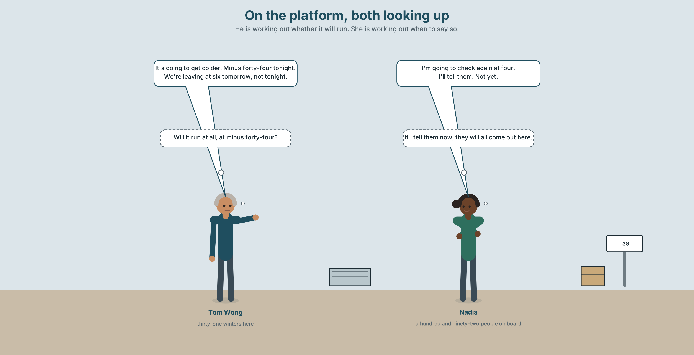
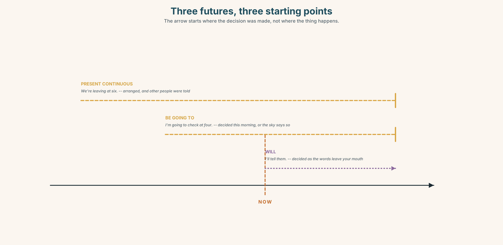
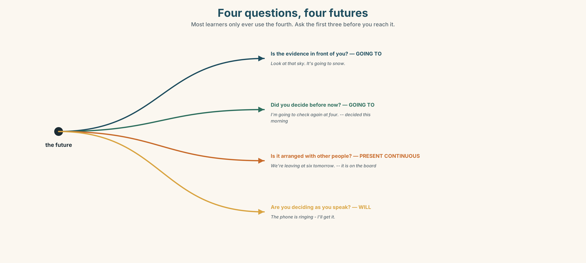
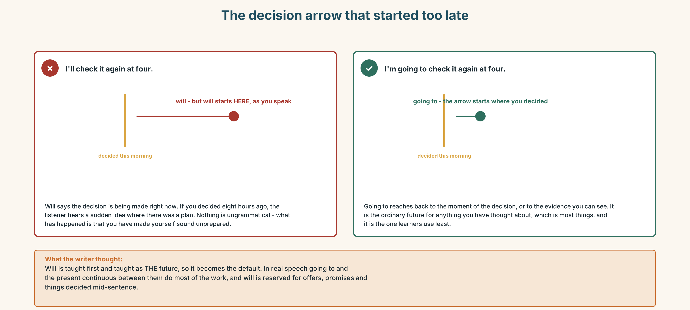
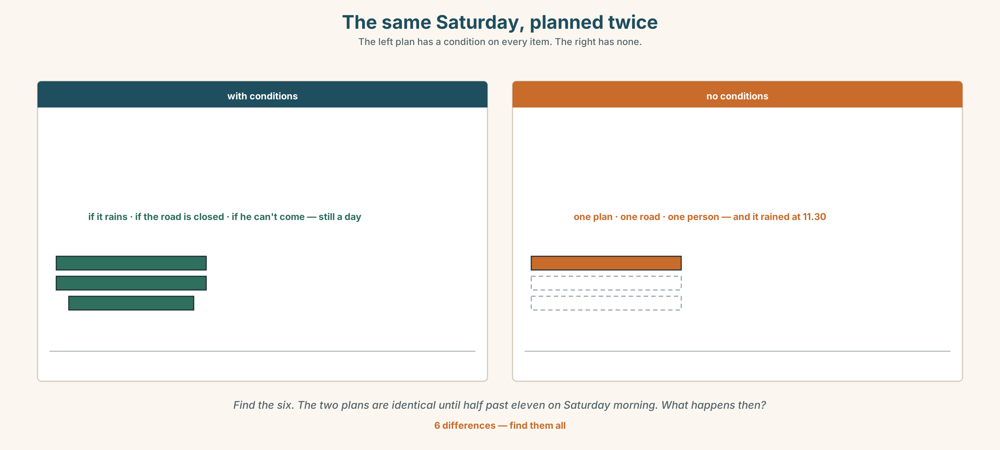
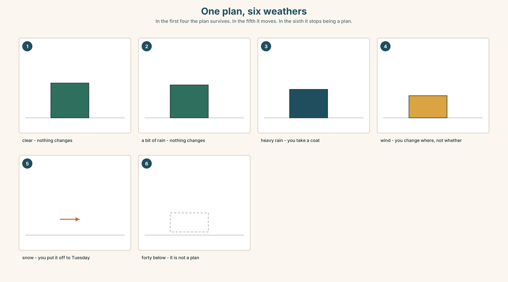
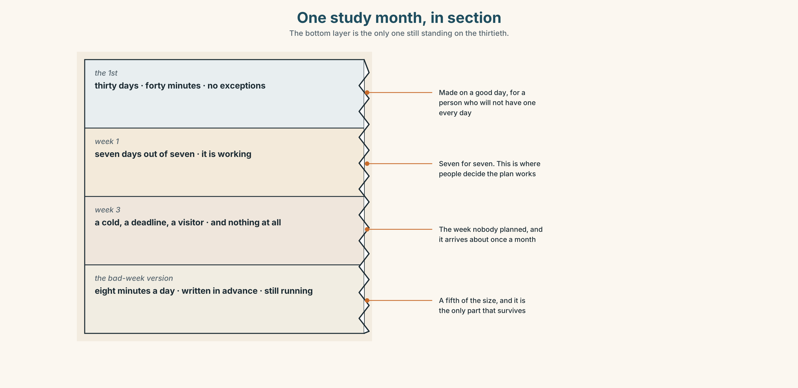
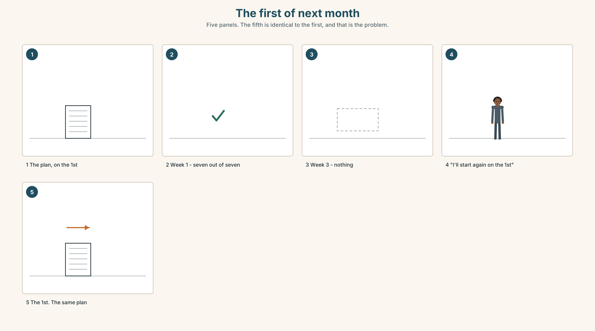

# A1.2 · Unit 9 · Forty Below

> **English Animated** · *Getting Around* · The Prairie Line, Toronto to Vancouver
> Student's Book pages 182–203 · 22 pp · ~9 hours

---

## Part 0 · The Big Picture ◆ **A · THE WORLD**

{width=6.6in}

*The prairie, ten past eight in January, minus thirty-eight — Fourteen things to find. One of the four came out for forty seconds and it has been nine minutes.*

# How does weather change a day?

**By the end of this unit you can make a plan, change it, and say what it depends on.**

| ◆ **A · THE WORLD** | A place where the weather is not a topic of conversation but a timetable |
|---|---|
| ◆ **B · THE SYSTEM** | *be going to* · the present continuous for arrangements · against *will* · 22 words for weather · *going to* as one word |
| ◆ **C · THE PERFORMANCE** | You make a plan with somebody and change it twice |

---

### 0A · Find it — fourteen things

Find these in the picture. Write the number.

> ☐ snow ☐ ice ☐ the sun ☐ a cloud ☐ the sky ☐ the wind ☐ a track
> ☐ a train ☐ a coat ☐ a window ☐ a door ☐ a light ☐ a bag ☐ a step

**Three of these words are not in the picture. Which three?**

> rain · a storm · spring

### 0B · Guess it

Look at the four people beside the train. **Which one came out for forty seconds?**
Say one thing. You can use these words:

> *cold · coat · wait · stand · nine*

### 0C · Say it ⏺

**Record. Thirty seconds. Do not prepare.**

> **What are you doing at the weekend, and what would change it?**

You will listen to this again on the last page.

---

## Part 1 · Vocabulary Lab 1 ◆ **B · THE SYSTEM**

### 1A · Meet — a year on this line

{width=6.6in}

*Four seasons, and what each one does to a railway — Each line has the days lost beside it. The season with the fewest is the one nobody plans for.*

| | |
|---|---|
| **weather** | A word for all of it, and nobody here uses it alone. |
| **forty below** | Not a temperature here. A category, with its own rules. |
| **season** | Four names, and on this line there are really two. |
| **check the forecast** | Done by the crew four times a day in winter and never in July. |
| **cancel a plan** | What the weather does to you. |
| **call off** | What you do, before the weather does it for you. |

### 1B · Meet — the words

> **weather · rain · snow · wind · sun · cloud · storm · ice · degrees · cool · wet · dry · season · spring · autumn · sky**

Write each word under the right picture.

{width=6.6in}

*One year, in section — Eleven conditions. Eleven words. The January band is the thinnest and the most expensive.*

### 1C · Sort — the weather, or what it does to you?

Put each word in the right box. **Two of them can go in both. Which two, and why?**

> snow · cool · storm · wet · ice · dry · wind · degrees · cloud · sky

| **SOMETHING IN THE SKY** | **SOMETHING YOU FEEL** | **BOTH** |
|---|---|---|
| | | |

### 1D · What people do about weather

| | |
|---|---|
| **check the forecast** | Four times a day in January. It is right about three times. |
| **cancel a plan** | The plan is gone and nothing replaces it. |
| **call off** | The same thing, said by the person responsible. |
| **put off** | Not gone. Moved. A completely different conversation. |
| **a bit of rain** | Three words that mean *do not change anything*. |
| **forty below** | Two words that mean *change everything*. |

**Now say them.** Two of these six end a plan and one of them moves it.
**Which is which, and which two are not about plans at all?**

### 1E · Stretch — the phrases you will need today

> **check the forecast** · **cancel a plan** · **put off** · **call off** · **a bit of rain**

Match each phrase to the moment you need it.

1. It is Thursday and the thing is on Saturday. → ______
2. Somebody is suggesting you stay at home and you do not want to. → ______
3. The match is not happening and it will not happen later either. → ______
4. The match is not happening today and it is happening next Tuesday. → ______
5. You are the person who has to decide, and forty people are waiting. → ______

### 1F · The hard one

> **f** **It depends on the weather.**

Practise it three times. **Five words that are a refusal, a plan and a weather forecast at the
same time.**

### 1G · Own it

Write down one plan you have for next week and one thing that would stop it.
Do not write your name. The class guesses whose plan it is.

---

## Part 2 · Listening ◆ **A · THE WORLD**

{width=6.6in}

*On the platform, both looking up — He is working out whether it will run. She is working out when to say so.*

### 2A · On the platform 🔊 Track 9.1

**Before you listen.** It is minus thirty-eight and the forecast says minus forty-four tonight.
**Guess: will the train run?**

**Listen once. One question.** What is the forecast for tonight?

**Listen again. Complete the table.**

| | Plan | Changed to |
|---|---|---|
| tonight | | |
| tomorrow morning | | |
| the weekend | | |

**Listen again. True or false?**

1. They are going to cancel the service. ☐ T ☐ F
2. The train is leaving at six tomorrow. ☐ T ☐ F
3. She is going to tell the passengers tonight. ☐ T ☐ F
4. It is going to snow. ☐ T ☐ F

**Noticing.** Four sentences from the recording.

1. *It's going to get colder.*
2. *We're leaving at six tomorrow.*
3. *I'll tell them.*
4. *I'm going to check again at four.*

**Sentences 1 and 4 both use *going to* and they are doing different jobs. What are they?**

### 2B · Decoding clinic 🔊 Track 9.2

Twenty seconds of Tom at speed. Three jobs.

1. Count how many future forms you hear.
2. *Going to* is three syllables and he says it in one. Write what you hear.
3. He says *we're leaving* about something that has not happened. How can a present tense do that?

> Transcripts, page 156.

---

## Part 3 · Grammar Lab 1 ◆ **B · THE SYSTEM**

### Three futures, and how to choose

### 3A · Notice

Look at the four sentences in Part 2 again.

1. In sentence 1, what is the evidence for the prediction?
2. In sentence 4, when was the decision made?
3. In sentence 2, is there an arrangement, or only an intention?
4. In sentence 3, when was that decision made?

### 3B · See

{width=6.6in}

*Three futures, three starting points — The arrow starts where the decision was made, not where the thing happens.*

### 3C · Know

| | | |
|---|---|---|
| **evidence now** | *be going to* | *It's going to get colder — look at the sky.* |
| **a decision already made** | *be going to* | *I'm going to check again at four.* |
| **an arrangement with others** | present continuous | *We're leaving at six tomorrow.* |
| **decided as you speak** | *will* | *I'll tell them.* |

> **The question is when the future was decided, not when it happens.** All three of these can
> describe the same Saturday. What differs is how long the speaker has known.

{width=6.6in}

*Four questions, four futures — Most learners only ever use the fourth. Ask the first three before you reach it.*

| | |
|---|---|
| **the form** | *am / is / are* + **going to** + the plain verb |
| **the negative** | *It isn't going to rain. We aren't leaving until six.* |
| **the question** | *Is it going to rain? What are you doing at the weekend?* |
| **the conditions** | *It depends on the weather. · if it rains…* |

> **Why it matters.** Almost everything anybody says about tomorrow is one of these three, and
> choosing the wrong one does not make you wrong — it makes you sound as if you decided just now.

### 3D · Use — controlled

Complete with **going to**, the present continuous, or **will**.

> Look at that sky. It (1) ______ (snow).
> We (2) ______ (leave) at six tomorrow — it is on the board and the crew have been told.
> I (3) ______ (check) the forecast again at four. I decided this morning.
> The telephone is ringing. — Don't move, I (4) ______ (get) it.
> What (5) ______ you ______ (do) at the weekend?

### 3E · Use — guided

Choose the right future for each one and write the sentence.

1. There are black clouds and a wind getting up.
2. You and three colleagues have booked a table for Friday.
3. Somebody has just asked you for help with a bag.
4. You decided last week to take a course in the spring.
5. The train leaves at 06.10 and it is in the timetable.

### 3F · Use — open

**In pairs.** Make a plan for Saturday together. **Change it twice: once because of the weather
and once because of a person.** Every sentence must use one of the three futures.

### 3G · Check — six items, mark your own

> 1. Look at that sky. It ______ ______ ______ snow. *(three words)*
> 2. We ______ ______ at six tomorrow. *(arranged, and on the board)*
> 3. I ______ check again at four. *(decided this morning — three words)*
> 4. The phone is ringing — I ______ get it. *(deciding now)*
> 5. ✗ *I will check it again at four, I decided this morning.* → correct it.
> 6. ✗ *It's going to rain, I think — no, look, it's raining already.* → which future was wrong?

{width=6.6in}

*The decision arrow that started too late — The decision arrow that started too late*

**0–3 →** Workbook pp. 36–39. **4–5 →** Part 6. **6 →** page 200.

---

## Part 4 · Speaking ◆ **C · THE PERFORMANCE**

### 4A · Fluency starter — the plan that keeps changing

One person states a plan. The next changes it because of the weather. The next changes it again
because of a person. **Round the room, and nobody may use a future form that has just been used.**

### 4B · The functional core — making and changing plans

{width=6.6in}

*The same Saturday, planned twice — The left plan has a condition on every item. The right has none.*

**Language Bank**

| | |
|---|---|
| **a plan** | *I'm going to… · We're meeting at…* |
| **an arrangement** | *We're leaving at six. · What are you doing at the weekend?* |
| **a condition** | *It depends on the weather. · If it rains, we'll…* |
| **changing it** | *We're going to put it off. · They've called it off.* |

**Information gap.** Learner A has the forecast. Learner B has the plans for the weekend.
**Decide together what to cancel, what to put off and what to leave.**

### 4C · The performance — the plan that changes twice ⏺

Make a plan with your partner for a day, out loud. **Three minutes.** You must:

> use all three futures · attach one condition · change the plan once because of the weather and
> once because of a person · end by agreeing on something

**Record it.**

### 4D · Observer

One person listens for **one thing**: did anybody use *will* for something they had already
decided?

### 4E · Two criteria

> ☐ Did I use *going to*, the present continuous and *will*, each at least once?
> ☐ Did my plan survive both changes?

---

## Part 5 · Reading ◆ **A · THE WORLD**

### 5A · Predict

The title is **"The timetable that tells the truth."**
**What do you think is wrong with the one they have?**

### 5B · Read — sixty seconds

---

**The timetable that tells the truth**

In July this train is late about four times in ten. In January it is late nine times in ten, and
by an average of two hours and forty minutes.

The timetable is the same in both months.

The crew know this. Every winter they tell passengers at Winnipeg that the arrival time on their
ticket is not going to happen, and every winter about a third of those passengers are angry, and
all of that anger lands on a person standing in a corridor who did not write the timetable.

There is a second timetable. The crew have it. It is the real one, and it was made by a planner
in 2011 who worked out the winter times from eleven years of data, and it has never been printed
because printing it would be an admission.

The company is not going to print it. They have said so twice.

---

### 5C · Answer

1. How often is the train late in July?
2. How late is it on average in January?
3. Who tells the passengers?
4. When was the second timetable made?
5. **Why has the real timetable never been printed?**
6. **The last line says the company has said so twice. Why does the writer mention that it was twice?**

### 5D · Vocabulary in context

Guess from the text. Then check.

> by an average of · lands on · did not write it · worked out · an admission

### 5E · The counter-text

{width=6.6in}

*The crew forecast sheet — Everything on it is a number except the last line.*

**Read the sheet and answer.**

1. What is the temperature at Mirror Lake?
2. **What is the expected delay at Winnipeg, and what does the printed timetable allow?**
3. What is the confidence figure for tonight?
4. **What does the line at the bottom say, and who is it protecting?**

### 5F · Two texts

The ticket says the train arrives at 09.40.
The crew sheet says it will arrive at about 12.20.

**Which one is the timetable?** Say one sentence.

---

## Part 6 · Vocabulary Lab 2 ◆ **B · THE SYSTEM**

### Tonight, tomorrow, and this weekend

{width=6.6in}

*One plan, six weathers — In the first four the plan survives. In the fifth it moves. In the sixth it stops being a plan.*

### 6A · The ones that catch everybody

| | |
|---|---|
| **tonight / this evening** | *tonight* is after dark; *this evening* starts earlier |
| **this weekend** | no *on*, no *at*, no *the* |
| **next week** | no *the* either — *next week*, not *the next week* |
| **put off / call off** | moved, or ended. The difference is a whole conversation |

### 6B · Say them

> tonight · tomorrow · this weekend · next week · afternoon · evening · winter · summer

### 6C · Chunk

1. What are you **______** at the weekend? *(the arrangement question)*
2. It **______ ______** rain. *(three words — evidence, in front of you)*
3. We're **______** at six tomorrow. *(arranged with other people)*
4. It **______ ______** the weather. *(three words — the refusal)*
5. They've **______ ______** the match. *(two words — it is not happening at all)*
6. We're going to **______ ______** until Tuesday. *(two words — it has moved)*

### 6D · Contrast Clinic

Six items. ***put off*** or ***call off***?

1. The match is next Tuesday instead. ______
2. The match is not happening at all. ______
3. The meeting has moved to Thursday. ______
4. The trip is cancelled and there is no new date. ______
5. We'll do it next month instead. ______
6. There will be no concert this year. ______

---

## Part 7 · Pronunciation & Fluency Lab ◆ **B · THE SYSTEM**

### Three syllables in one

{width=6.6in}

*Three syllables in one — Before a verb, going to always shrinks. Before a place name it never does.*

### 7A · Hear

> **going to** → *gonna* — and before a verb it is almost never said in full
> **I'm going to** → *um-uh-nuh* · **are you going to** → *a-yuh-gunnuh*
> Before a **noun** it does not shrink: *I'm going to Winnipeg* keeps all three syllables.

### 7B · Say

Say each one three times. Then say this:

> *I'm going to check the forecast, and then I'm going to Winnipeg.* — one shrinks and one does
> not.

### 7C · Make it mean something

Say these two:

> *I'm gonna go.* — a plan, and it sounds like speech
> *I am going to go.* — the same plan, and now you are being firm about it

**The shrunken form is the normal one.** Saying it in full is not more polite. Which one sounds
like an argument?

### 7D · Fluency 20 ⏺

Twenty seconds: **six things you are going to do this month, with one condition each.**
Three times, faster.

---

## Part 8 · Writing ◆ **C · THE PERFORMANCE**

### A plan with a condition · 50–70 words

### 8A · Read the model

> We're leaving on Saturday at six. The tickets are booked. `[an arrangement, with the proof]`
>
> It's going to be cold — minus thirty on Friday night, and it doesn't warm up. `[a prediction
> with evidence]`
>
> If the road is closed we're going to go on Sunday instead. We're not going to cancel it.
> `[the condition, and what will be done — the difference between moving and cancelling]`
>
> I'll telephone you on Friday either way. `[the decision made as the writer writes]`

**Questions about the writer's choices:**

1. *The tickets are booked.* **Why is the evidence more useful than the plan?**
2. *We're not going to cancel it.* **Why say what will not happen?**
3. The last line uses a different future from the other three. **Why?**

### 8B · The anti-model

> We will go on Saturday. We will leave at six. If the weather is bad we will decide later. I will call you.

Correct English, four futures, and all four are the wrong one. **Rewrite it with one arrangement,
one prediction with evidence, one condition, and one decision made as you write.**

### 8C · Plan

> the arrangement, with proof → the prediction, with evidence → the condition and what you will
> do → the decision made now

### 8D · Write — 50 to 70 words
### 8E · Peer review — two things only

> ☐ Are at least two different futures used, and is each one right?
> ☐ Is there one condition, and does it say what happens if it is met?

### 8F · Publish

Swap with a partner. **They mark the one sentence they would act on without asking you anything.**

---

## Part 9 · The File ◆ **A · THE WORLD + C · THE PERFORMANCE**

# STUDY FILE · The plan and the weather

{width=6.6in}

*One study month, in section — The bottom layer is the only one still standing on the thirtieth.*

### 9A · The week that goes wrong

{width=6.6in}

*The first of next month — Five panels. The fifth is identical to the first, and that is the problem.*

| | |
|---|---|
| **What people plan** | thirty days, no exceptions |
| **What happens** | a bad week, about once a month, for reasons nobody controls |
| **What people do** | stop, and restart on the first of something |
| **What a real plan has** | a bad-week version, written down in advance |

### 9B · Write the bad-week version

Take your study plan and write the version for the week when everything goes wrong.
**It should be about a fifth of the size and it must not be zero.** That version is the plan.

### 9C · Role play — the forecast

In pairs. One of you describes next month. The other asks *What are you going to do if…?* four
times, each time about something going wrong. **No answer may be *I don't know*.**

### 9D · Your forty below

Everybody has a condition under which they do nothing — illness, a deadline, a bad week.
**Name yours, and write the two minutes of English you could still do in it.**

### 9E · Transfer — before next week

**Use the bad-week version for seven days, even if the week is fine.**
Bring it back and say whether you missed the full one.

---

## Part 10 · Mediation & Interaction ◆ **C · THE PERFORMANCE**

{width=6.6in}

*One year on the line — Three of these bands move with the year. The fourth is a straight line across all of it.*

### 10A · Relay

Half the class has the forecast sheet. Half has the printed timetable.
**Build the real winter by speaking.** Ten minutes.

### 10B · Simplify — for one person

A passenger at Winnipeg asks: *Will we arrive at twenty to ten?*
**Answer in three sentences.** They have a connection, and you are standing in a corridor.

### 10C · Online

Write **one message** making a plan with a classmate for next week.
**Three sentences.** One arrangement, one prediction, one condition.

### 10D · Your language

Does your language have different ways of talking about the future depending on when you decided?
**Say *I'm going to call her* and *I'll call her* in your language.** Are they different?

---

## Part 11 · The Decision ◆ **C · THE PERFORMANCE**

# The timetable that tells the truth

In January the train is late nine times in ten, by an average of two hours forty. The printed
timetable allows nothing for it.

**Option one:** print the real winter timetable. Passengers would arrive expecting the true time.
The advertised journey becomes three hours longer and bookings would probably fall.

**Option two:** keep it. Ninety per cent of winter passengers are told at Winnipeg by a crew
member, and about a third of them are angry at that crew member.

**Option three:** print both. Summer times in large type, winter times beneath them in the same
size, and a line saying which months are which.

### 11A · The evidence

{width=6.6in}

*The arrivals board at Vancouver, a January morning — The same train, the same arrival. Two different printed times.*

🔊 **Track 9.6.** Nadia, 20 seconds: *"I tell about ninety people a week in January that their
ticket is wrong. It is not wrong. It just isn't true. Somebody decided that it was better for me
to say it than for the company to print it."*

### 11B · Talk about it

In threes. Use the frame. Everybody says one.

> *I think the company should ______ , because ______ .*

**Words you can use:** *weather · snow · ice · winter · forecast · cancel a plan · put off*

### 11C · Decide

Write **two sentences**. Choose, and say why.

> I think the company should ______________________ ,
> because ______________________ .

### 11D · Model decision

> Print both, in the same size. The honest timetable costs bookings and the dishonest one costs
> a person in a corridor ninety conversations a week. Printing both costs a line of type, and
> it is the only one of the three in which nobody is asked to say something they do not believe.

### 11E · The Reveal

> **What happened.** The company printed both. Winter bookings fell four per cent in the first
> year, which was less than anybody had predicted, and complaints at Vancouver fell by two thirds.
>
> Then something nobody expected: the four per cent came back the following year and brought
> others. People had started booking the winter service on purpose, because a company that prints
> a three-hour delay is a company that tells you things.

**One question. You do not have to answer it out loud.**

> They were protecting the bookings. What had they been spending to protect them?

---

## Part 12 · Landing ◆ **all three lines**

### 12A · Recycle — twelve items

> 1. Look at that sky. It ______ ______ ______ snow. *(three words)*
> 2. We ______ ______ at six tomorrow. *(arranged)*
> 3. The phone is ringing — I ______ get it. *(deciding now)*
> 4. What are you ______ at the weekend?
> 5. It ______ ______ the weather. *(three words)*
> 6. We're going to ______ ______ the match until Tuesday. *(two words)*
> 7. They've ______ ______ the concert. *(two words — it is not happening)*
> 8. I ______ ______ ______ every morning in winter. *(three words — the crew do it four times a day)*
> 9. It's only ______ ______ ______ . *(three words — do not change anything)*
> 10. It's ______ ______ tonight. *(two words — minus forty)*
> 11. *(Unit 8)* ______ you ever worked abroad?
> 12. *(Unit 7)* You ______ touch it. *(forbidden)*

### 12B · Consolidate — one task, everything in it

**Write a plan for one day next month, in six sentences.** One arrangement, one prediction with
evidence, one decision you have already made, one condition, and one thing you will not do.

### 12C · Can-do, with evidence

> ☐ I can make a plan and change it. **Evidence:** 4C, 8D
> ☐ I can choose between the three futures. **Evidence:** 3G
> ☐ I can attach a condition to a plan. **Evidence:** 6C
> ☐ I can say *going to* the way it is actually said. **Evidence:** 7C

### 12D · Replay ⏺

Record 0C again. **Listen to both.** What is different?

### 12E · Glossary — thirty-five words, as a map

> **IN THE SKY** · rain · snow · wind · sun · cloud · storm · ice · sky
> **HOW IT FEELS** · cool · wet · dry · degrees
> **THE YEAR** · season · spring · autumn · winter · summer · weather
> **WHAT YOU DO** · check the forecast · cancel a plan · put off · call off
> **HOW BAD** · a bit of rain · forty below
> **WHEN** · tonight · tomorrow · this · weekend · next week · afternoon · evening · forecast
> **TALKING ABOUT IT** · going to · What are you doing…? · It depends on the weather.

### 12F · Next

> **Unit 10 · What story do you tell twice?**
