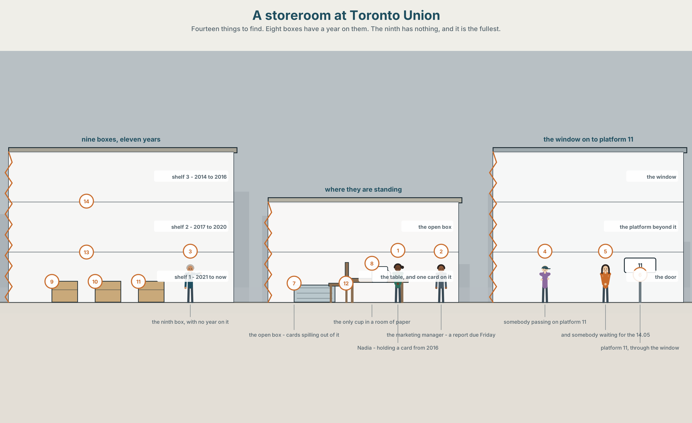
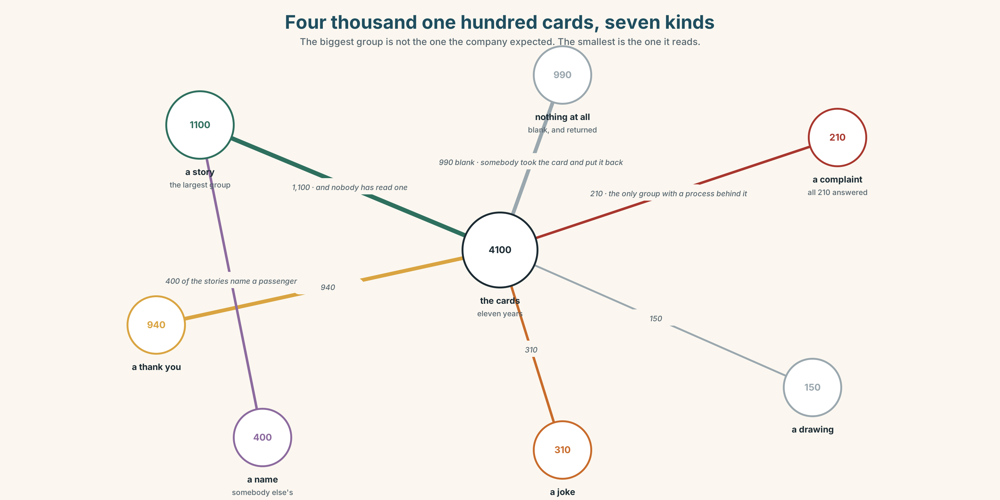
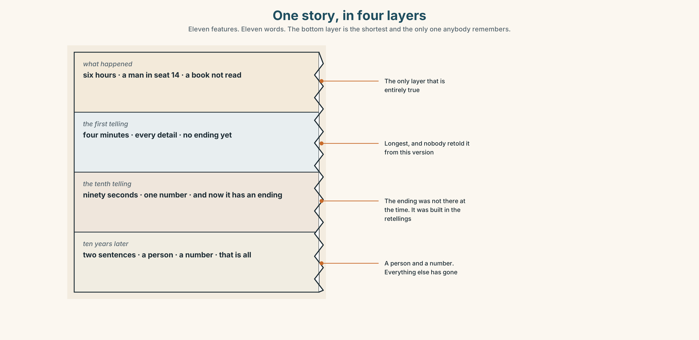
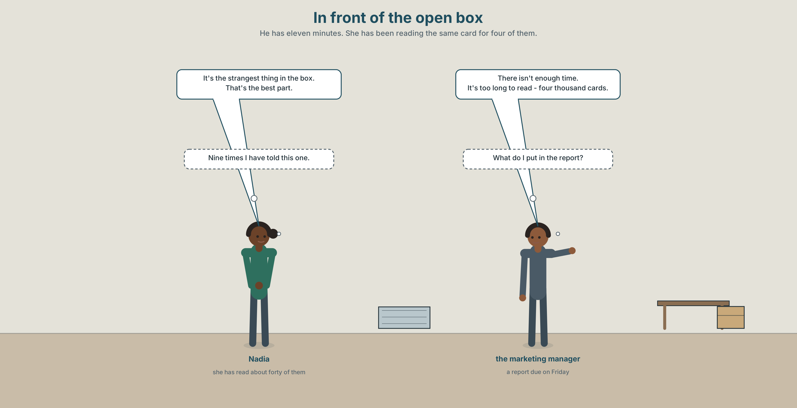
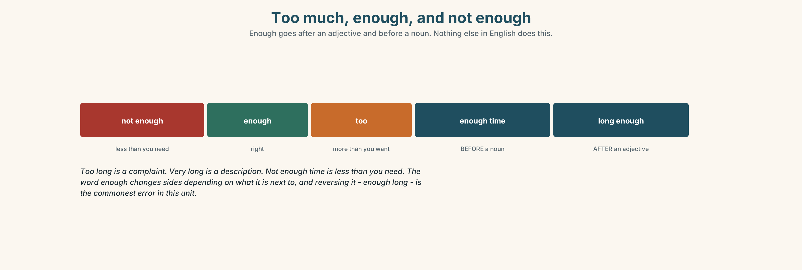
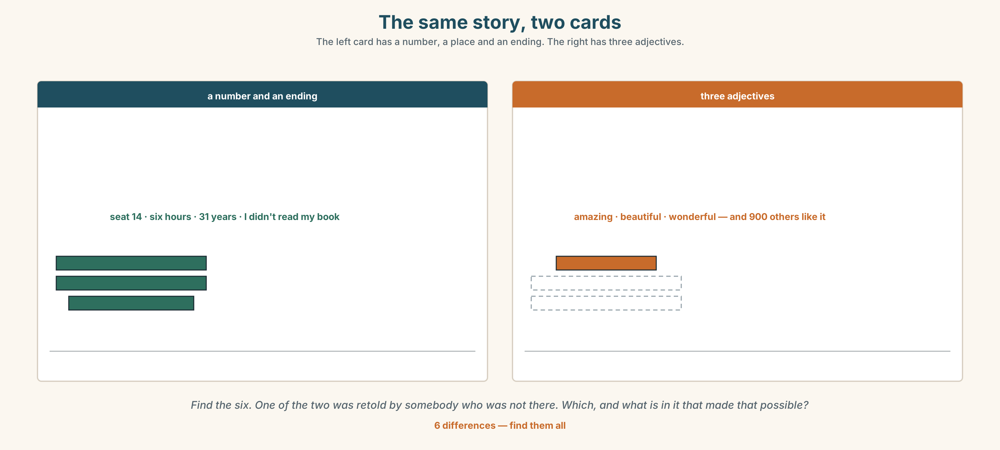
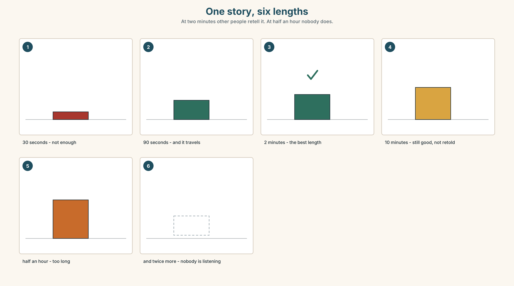
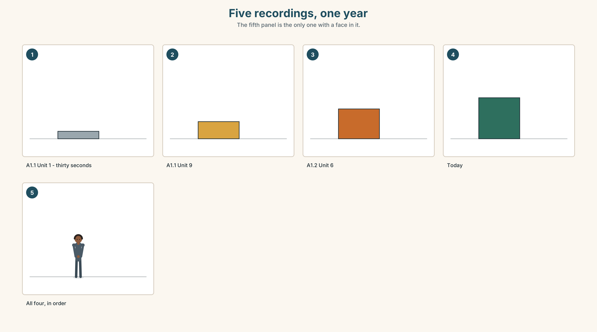
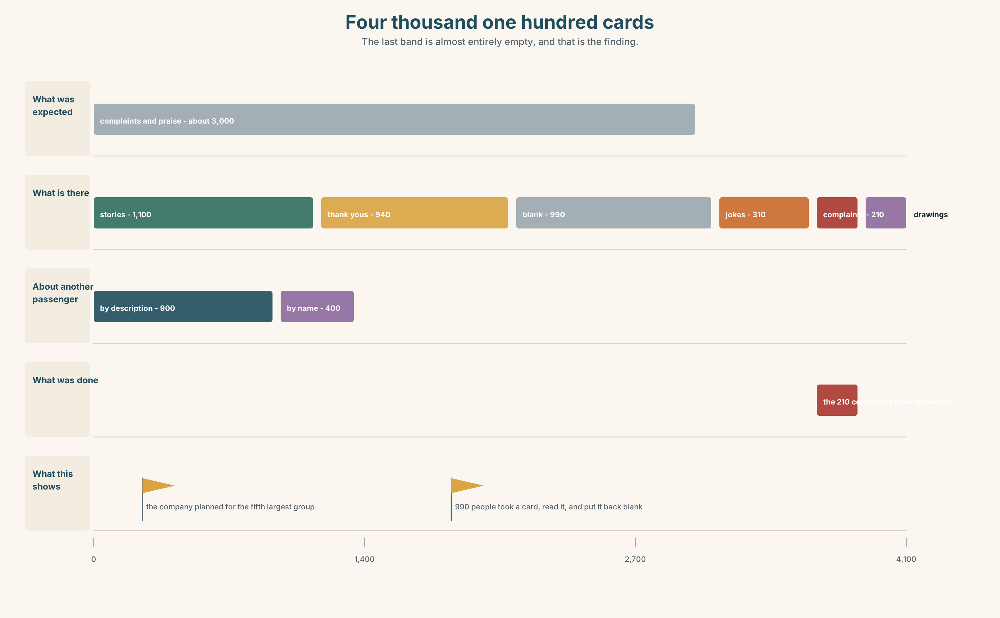

# A1.2 · Unit 10 · Four Thousand One Hundred Cards

> **English Animated** · *Getting Around* · The Prairie Line, Toronto to Vancouver
> Student's Book pages 204–225 · 22 pp · ~9 hours

---

## Part 0 · The Big Picture ◆ **A · THE WORLD**

{width=6.6in}

*A storeroom at Toronto Union — Fourteen things to find. Eight boxes have a year on them. The ninth has nothing, and it is the fullest.*

# What story do you tell twice?

**By the end of this unit you can say what was the best, the worst and the strangest, and why it
was too much or not enough.**

| ◆ **A · THE WORLD** | Four thousand one hundred handwritten cards that nobody has ever read |
|---|---|
| ◆ **B · THE SYSTEM** | superlative adjectives · *too* and *enough* · 22 words for extremes and opinions · which word to push, and what the push means |
| ◆ **C · THE PERFORMANCE** | You tell a two-minute story that somebody else will retell |

---

### 0A · Find it — fourteen things

Find these in the picture. Write the number.

> ☐ a box ☐ a card ☐ a shelf ☐ a window ☐ a door ☐ a light ☐ a pen
> ☐ a table ☐ a chair ☐ a bag ☐ a clock ☐ a label ☐ a year ☐ a platform

**Three of these words are not in the picture. Which three?**

> a story · a memory · an ending

### 0B · Guess it

Look at the nine boxes. **Which one is the most recent?**
Say one thing. You can use these words:

> *box · year · full · old · write*

### 0C · Say it ⏺

**Record. Thirty seconds. Do not prepare.**

> **Tell me a story you have told more than once. Any story.**

You will listen to this again on the last page.

---

## Part 1 · Vocabulary Lab 1 ◆ **B · THE SYSTEM**

### 1A · Meet — what people write on a card

{width=6.6in}

*Four thousand one hundred cards, seven kinds — The biggest group is not the one the company expected. The smallest is the one it reads.*

| | |
|---|---|
| **story** | Eleven hundred of the four thousand one hundred. |
| **memory** | What a story is made of after about a year. |
| **ending** | The part people change when they tell it the second time. |
| **true** | What people claim and what nobody checks. |
| **the best thing** | The question on the card. |
| **the worst part** | The question nobody asked, and about four hundred people answered it anyway. |

### 1B · Meet — the words

> **best · worst · longest · shortest · hardest · easiest · strangest · favourite · amazing · boring · interesting · funny · true · story · memory · ending**

Write each word under the right picture.

{width=6.6in}

*One story, in four layers — Eleven features. Eleven words. The bottom layer is the shortest and the only one anybody remembers.*

### 1C · Sort — the thing, or your opinion of it?

Put each word in the right box. **Two of them can go in both. Which two, and why?**

> story · boring · memory · amazing · ending · funny · interesting · true · favourite · longest

| **PART OF THE STORY** | **WHAT YOU THINK OF IT** | **BOTH** |
|---|---|---|
| | | |

### 1D · What people say about stories

| | |
|---|---|
| **the best thing** | The question on the card, and the one everybody answers. |
| **the worst part** | Four hundred people wrote this without being asked. |
| **a true story** | Three words that are never said about a story that is only true. |
| **at the end** | Where the second telling changes. |
| **turn out** | The verb for an ending nobody predicted. |
| **end up** | The verb for being somewhere you did not plan to be. |

**Now say them.** Two of these six are about where you finish and two are about what you thought.
**Which is which, and which of the six is a warning?**

### 1E · Stretch — the phrases you will need today

> **the best thing** · **the worst part** · **a true story** · **turn out** · **end up**

Match each phrase to the moment you need it.

1. You are about to tell something nobody will believe. → ______
2. Somebody asks you to sum up a week. → ______
3. The thing you were dreading was not the thing that went wrong. → ______
4. You went out for twenty minutes and came home at two. → ______
5. It was not what anybody expected, including you. → ______

### 1F · The hard one

> **f** **That's the best part.**

Practise it three times. **Four words that tell your listener the story is not over and the next
sentence is the one.**

### 1G · Own it

Write down the best thing and the worst part of this course in one sentence each.
Do not write your name. These will be read.

---

## Part 2 · Listening ◆ **A · THE WORLD**

{width=6.6in}

*In front of the open box — He has eleven minutes. She has been reading the same card for four of them.*

### 2A · In the storeroom 🔊 Track 10.1

**Before you listen.** There are four thousand one hundred cards and nobody has read them.
**Guess: what did most people write about?**

**Listen once. One question.** How many boxes are there?

**Listen again. Complete the table.**

| | What they expected | What is actually there |
|---|---|---|
| complaints | | |
| stories | | |
| nothing at all | | |

**Listen again. True or false?**

1. Most of the cards are complaints. ☐ T ☐ F
2. The newest box has no year on it. ☐ T ☐ F
3. There is enough time to read them all. ☐ T ☐ F
4. The company has read a sample. ☐ T ☐ F

**Noticing.** Four sentences from the recording.

1. *It's the strangest thing in the box.*
2. *That's the best part.*
3. *There isn't enough time.*
4. *It's too long to read.*

**Sentences 3 and 4 both say there is a problem of amount. What is the difference between *too*
and *not enough*?**

### 2B · Decoding clinic 🔊 Track 10.2

Twenty seconds of Nadia at speed. Three jobs.

1. Count the superlatives you hear.
2. In one sentence she pushes the word *that*. In another she pushes *best*. What changes?
3. She says *the most amazing* and *the best*. Why is one two words and the other one?

> Transcripts, page 157.

---

## Part 3 · Grammar Lab 1 ◆ **B · THE SYSTEM**

### The end of the scale

### 3A · Notice

Look at the four sentences in Part 2 again.

1. In sentence 1, what is on the end of the adjective, and what is in front of it?
2. Why is *best* not *goodest*?
3. In sentence 3, what kind of word comes after *enough*?
4. In sentence 4, what is *too* saying about the amount?

### 3B · See

{width=6.6in}

*The same ruler, one mark further along — Short adjectives take -est. Long ones take the most. And every superlative takes the.*

### 3C · Know

| | | |
|---|---|---|
| **one syllable** | **the** + **-est** | *the longest · the shortest · the hardest* |
| **three or more** | **the most** | *the most interesting · the most amazing* |
| **the odd ones** | no rule | *good → the best · bad → the worst · far → the furthest* |
| **always the** | one end, one thing | *the strangest thing in the box* |

> **Too and enough are not opposites.** *Too* means more than you want. *Not enough* means less
> than you need. Both describe a mismatch, from opposite sides, and *enough* goes **after** an
> adjective and **before** a noun: *long enough*, *enough time*.

{width=6.6in}

*Too much, enough, and not enough — Enough goes after an adjective and before a noun. Nothing else in English does this.*

| | |
|---|---|
| **before a noun** | *enough time · enough cards · not enough people* |
| **after an adjective** | *long enough · good enough · old enough* |
| **too + adjective** | *too long · too expensive · too late* |
| **softening a superlative** | *one of the best · almost the longest · nearly the worst* |

> **Why it matters.** Every opinion anybody gives about anything lands somewhere on this scale,
> and the two most common sentences in any review are *it was the best* and *it was too long*.

### 3D · Use — controlled

Complete with the superlative, **too** or **enough**.

> It's (1) ______ (strange) thing in the box. That's (2) ______ (good) part.
> There isn't (3) ______ time to read them all. It's (4) ______ long — four thousand cards.
> It is (5) ______ (interesting) document the company owns and nobody has opened it.

### 3E · Use — guided

Make a superlative sentence, then say why with *too* or *enough*.

1. the longest journey you have made
2. the worst weather you have been out in
3. the most interesting place you have been
4. the hardest thing about English
5. the strangest thing you have kept

### 3F · Use — open

**In pairs.** Agree on the best, the worst and the strangest thing about this course.
**You must agree on all three. Use *too* or *enough* at least twice.**

### 3G · Check — six items, mark your own

> 1. It's ______ ______ thing in the box. *(two words — strange)*
> 2. That's ______ ______ part. *(two words — good)*
> 3. There isn't ______ time.
> 4. It's ______ long to read.
> 5. ✗ *It's the most strangest thing.* → correct it.
> 6. ✗ *It isn't enough long.* → correct it.

{width=6.6in}

*The end of the scale, marked twice — The end of the scale, marked twice*

**0–3 →** Workbook pp. 40–43. **4–5 →** Part 6. **6 →** page 222.

---

## Part 4 · Speaking ◆ **C · THE PERFORMANCE**

### 4A · Fluency starter — the superlative round

Everybody says one superlative about their week. **No adjective twice, and every sentence must
have *the* in it.**

### 4B · The functional core — telling a story that gets retold

{width=6.6in}

*The same story, two cards — The left card has a number, a place and an ending. The right has three adjectives.*

**Language Bank**

| | |
|---|---|
| **the extreme** | *the best · the worst · the strangest · the most amazing* |
| **the amount** | *too long · not enough time · long enough* |
| **the softening** | *one of the best · almost the longest* |
| **the story** | *a true story · at the end · it turned out that… · we ended up…* |

**Information gap.** Learner A has what the company expected to find on the cards. Learner B has
what is actually on them. **Find the three biggest differences.**

### 4C · The performance — the story that gets retold ⏺

Tell a story in **two minutes** that your partner will have to retell to somebody else. You must:

> use two superlatives · use *too* or *enough* once · have an ending nobody predicts ·
> say one number

Your partner retells it in thirty seconds. **Record both.**

### 4D · Observer

One person listens for **one thing**: what survived into the retelling, and what did not?

### 4E · Two criteria

> ☐ Did my partner's retelling keep the ending?
> ☐ Did it keep the number?

---

## Part 5 · Reading ◆ **A · THE WORLD**

### 5A · Predict

The title is **"Eleven hundred of them are stories."**
**What were the cards supposed to collect?**

### 5B · Read — sixty seconds

---

**Eleven hundred of them are stories**

For eleven years the company has put a card on every table in the dining car. It says: *The best
thing about your journey?* and gives four lines.

Four thousand one hundred cards have come back. They are in nine boxes in a storeroom at Toronto
Union. Nobody has read them.

The company expected complaints. It planned for complaints; there is a process for a complaint and
a person whose job it is. There are two hundred and ten complaints in the boxes, and all two
hundred and ten were answered, because they arrived by another route as well.

Eleven hundred of the cards are stories. People wrote about the person they sat next to. About
nine hundred mention another passenger by description, and about four hundred mention one by name.

The company sells seats on a train. For eleven years its customers have been writing to it about
each other.

---

### 5C · Answer

1. What does the card ask?
2. How many cards have come back?
3. How many of them are complaints?
4. How many mention another passenger by name?
5. **Why were all two hundred and ten complaints answered?**
6. **The last line says customers have been writing about each other. What does that suggest the company is actually selling?**

### 5D · Vocabulary in context

Guess from the text. Then check.

> four lines · came back · by another route · by description · for eleven years

### 5E · The counter-text

{width=6.6in}

*One card, at full size — Four ruled lines were provided. The writing went up the side and over the address.*

**Read the card and answer.**

1. What is the printed question?
2. **How many lines were provided, and how much did this person write?**
3. What year is on it?
4. **The writing goes over the company's address. What does that tell you about who the writer thought they were writing to?**

### 5F · Two texts

The card asks for the best thing about the journey.
Eleven hundred people wrote about another passenger.

**Did they answer the question?** Say one sentence.

---

## Part 6 · Vocabulary Lab 2 ◆ **B · THE SYSTEM**

### Too much, and not enough

{width=6.6in}

*One story, six lengths — At two minutes other people retell it. At half an hour nobody does.*

### 6A · The ones that catch everybody

| | |
|---|---|
| **enough time** | before a noun |
| **long enough** | after an adjective. This is the one everybody reverses |
| **too / very** | *very long* is a description; *too long* is a complaint |
| **the most / the -est** | the same rule as Unit 3, with *the* in front |

### 6B · Say them

> too · enough · most · least · very · so · absolutely · almost · nearly

### 6C · Chunk

1. There isn't **______** time. *(before a noun)*
2. It isn't long **______ .** *(after an adjective)*
3. It's **______** long. *(a complaint)*
4. It's **______** long. *(a description, not a complaint)*
5. It's **______ ______ ______** story I've heard. *(three words — amazing)*
6. **______** the longest. *(one word — not quite)*

### 6D · Contrast Clinic

Six items. ***too*** or ***enough***?

1. It's ______ long — I stopped reading.
2. There isn't ______ time to read them all.
3. The card isn't big ______ .
4. It's ______ expensive for what it is.
5. Four lines isn't ______ .
6. It's ______ late to start now.

---

## Part 7 · Pronunciation & Fluency Lab ◆ **B · THE SYSTEM**

### Which word you push

{width=6.6in}

*Which word you push — The same four words, five times. Each push answers a different question.*

### 7A · Hear

> *That's the best part.* — push **that's**: not the other bit, this bit
> push **best**: not just good — best
> push **part**: and there is more of it coming

### 7B · Say

Say the sentence five times, pushing a different word each time. Then say this:

> *It's not the longest story in the box — it's the strangest.* — two pushes, and the second one
> is the point.

### 7C · Make it mean something

Say these two:

> *It's a TRUE story.* — and you are defending it against doubt
> *It's a true STORY.* — and you are saying it is a story, not a report

**Same four words.** The push decides which word is being argued about. Which one would you say
to somebody who did not believe you?

### 7D · Fluency 20 ⏺

Twenty seconds: **six superlatives about this year, each with a reason.** Three times, faster.

---

## Part 8 · Writing ◆ **C · THE PERFORMANCE**

### A story on four lines · 50–70 words

### 8A · Read the model

> The best thing was the man in seat 14. `[the answer to the question, in nine words]`
>
> He got on at Winnipeg and he talked for six hours, and I had wanted to read. `[the fact, and
> the honest resistance]`
>
> He had worked on this line for thirty-one years. He knew the name of every bridge. `[the
> reason it turned out differently]`
>
> I didn't read any of my book. That is the best part. `[the ending, and it contradicts the
> second line]`

**Questions about the writer's choices:**

1. *I had wanted to read.* **Why admit resistance in a card about the best thing?**
2. *He knew the name of every bridge.* **Why that detail and not *he was interesting*?**
3. The last line repeats the phrase from the card. **What does that do?**

### 8B · The anti-model

> The best thing was the scenery. It was amazing. The staff were very friendly and helpful. It was the most beautiful journey I have ever made. Thank you.

Correct English, entirely true, and there are nine hundred of these in the boxes and nobody can
tell them apart. **Rewrite it with one person, one number and one thing that went wrong first.**

### 8C · Plan

> the answer, short → the fact and your resistance → the detail that changed it →
> the ending, contradicting the second line

### 8D · Write — 50 to 70 words
### 8E · Peer review — two things only

> ☐ Is there one number and one person in it?
> ☐ Could somebody retell it from memory tomorrow?

### 8F · Publish

On a card, on the wall, with no names. **The class reads them all and chooses three to keep.
Then say what the three have in common.**

---

## Part 9 · The File ◆ **A · THE WORLD + C · THE PERFORMANCE**

# STUDY FILE · The story of this year

{width=6.6in}

*Two books, in section — The bottom layer is the thinnest and it is what the two books were for.*

### 9A · What you will remember

{width=6.6in}

*Five recordings, one year — The fifth panel is the only one with a face in it.*

| | |
|---|---|
| **What you were given** | 700 words, 20 units, about 280 hours |
| **What you can measure** | four recordings, made months apart |
| **What you cannot** | the moment you stopped translating, because nobody was there |
| **What you keep** | about five scenes, and all of them have a person in them |

### 9B · Listen to all four

You recorded thirty seconds in A1.1 Unit 1, Unit 9 and Unit 10, and in Unit 6 of this book.
**Play all four in order, now.** Write down three differences. Not *better*. **What.**

### 9C · Role play — the handover

In pairs. One of you is starting A1.1 tomorrow. The other has just finished A1.2.
**Tell them the three things that are actually true about the next year.** No encouragement.

### 9D · The best part

Write one sentence beginning *The best thing about this year was…*
**It must have a person or a number in it.** Those are the only two things that survive.

### 9E · Transfer — before A2.1

**Record thirty seconds answering: *What can you do in English now?* Keep all five recordings
together in one place.** You will use them again at the end of A2.

---

## Part 10 · Mediation & Interaction ◆ **C · THE PERFORMANCE**

{width=6.6in}

*Four thousand one hundred cards — The last band is almost entirely empty, and that is the finding.*

### 10A · Relay

Half the class has what the company expected. Half has what is in the boxes.
**Build the real picture by speaking.** Ten minutes.

### 10B · Simplify — for one person

The marketing manager asks: *What is actually in those boxes?*
**Answer in four sentences.** He has eleven minutes and a report due on Friday.

### 10C · Online

Write **one message** to a classmate about the best and worst thing in this course.
**Three sentences.** Two superlatives and one *too* or *enough*.

### 10D · Your language

Does your language mark the end of a scale with an ending, or with a separate word?
**Say *the longest* and *the most interesting* in your language.** Is it the same method for both?

---

## Part 11 · The Decision ◆ **C · THE PERFORMANCE**

# Four thousand one hundred cards

Nine boxes. Four thousand one hundred cards. Eleven years. Nobody has read them.

**Option one:** recycle them. They are eleven years old, the oldest are illegible, and nobody has
missed them.

**Option two:** read a sample of four hundred and write a report. Costs about three weeks of one
person's time and produces a document that will be read by six people.

**Option three:** type up the eleven hundred stories and put them on the website, with the
writers' permission where there is a name. Costs about four months and nobody can say in advance
what it is for.

### 11A · The evidence

{width=6.6in}

*The storeroom shelf, twice — As it is, and after the stories have been typed up.*

🔊 **Track 10.6.** Nadia, 20 seconds: *"I read about forty of them once, waiting for a train. The
best one was from 2016 and it was about a man who talked for six hours. I have told that story
about nine times. I have never told anybody what was in the report."*

### 11B · Talk about it

In threes. Use the frame. Everybody says one.

> *I think the company should ______ , because ______ .*

**Words you can use:** *story · memory · best · worst · amazing · boring · true*

### 11C · Decide

Write **two sentences**. Choose, and say why.

> I think the company should ______________________ ,
> because ______________________ .

### 11D · Model decision

> Type up the eleven hundred stories. The report will tell the company what it already believes.
> The stories will tell it what it is selling, and it has been wrong about that for eleven years.
> Four months is nothing against eleven years of being wrong.

### 11E · The Reveal

> **What happened.** The company typed up eleven hundred stories and put one a day on a screen in
> the dining car. Nothing measurable changed for six months.
>
> Then something nobody expected: passengers began writing cards **about the cards on the screen**.
> The number of cards returned went from about three hundred and seventy a year to nine hundred,
> and the new ones were longer.

**One question. You do not have to answer it out loud.**

> They had four thousand one hundred cards and no idea what to do with them. What had they been
> missing for eleven years?

---

## Part 12 · Landing ◆ **all three lines**

### 12A · Recycle — twelve items

> 1. It's ______ ______ thing in the box. *(two words — strange)*
> 2. That's ______ ______ part. *(two words — good)*
> 3. There isn't ______ time.
> 4. It's ______ long to read.
> 5. It isn't long ______ . *(after the adjective)*
> 6. It's ______ ______ ______ story I've heard. *(three words — amazing)*
> 7. ______ the longest. *(one word — not quite)*
> 8. It ______ ______ that he had worked here for thirty-one years. *(two words)*
> 9. We ______ ______ talking for six hours. *(two words — we did not plan to)*
> 10. It's ______ ______ ______ . *(three words — and nobody checks)*
> 11. *(Unit 9)* It ______ ______ ______ snow. *(three words — look at the sky)*
> 12. *(Unit 8)* ______ you ever worked abroad?

### 12B · Consolidate — one task, everything in it

**Write the story of this year in six sentences.** Two superlatives, one *too*, one *enough*, one
number, one person, and an ending that contradicts the beginning.

### 12C · Can-do, with evidence

> ☐ I can say what was the best, the worst and the strangest. **Evidence:** 4C, 8D
> ☐ I can form superlatives correctly. **Evidence:** 3G
> ☐ I can use *too* and *enough* in the right place. **Evidence:** 6D
> ☐ I can push the right word in a sentence. **Evidence:** 7C

### 12D · Replay ⏺

Record 0C again. **Then listen to all five recordings from both books, in order.**
**One year. Five recordings.** What is different?

### 12E · Glossary — thirty-five words, as a map

> **THE ENDS OF SCALES** · best · worst · longest · shortest · hardest · easiest · strangest
> **WHAT YOU THINK** · favourite · amazing · boring · interesting · funny · true
> **THE PARTS** · story · memory · ending · the best thing · the worst part · at the end
> **WHAT HAPPENS** · turn out · end up · a true story
> **AMOUNT** · too · enough · most · least · very · so · absolutely · almost · nearly
> **SAYING IT** · the most beautiful · not enough time · It's too long. · That's the best part.

### 12F · Next

> **A2.1 · *Making Plans* · Unit 1 · How long have you been at this?**
