# English Animated — A2.1 · Making Plans

*Pasar Chow Kit, Kuala Lumpur*

## About this volume

**English Animated A2.1 · *Making Plans*** — Pasar Chow Kit, Kuala Lumpur.

This volume contains **10 of 10 units**, written in full: every text, every task, every
figure drawn. Units are 20 pages each at B-level and 22 at A-level, which is the extent specified
in the series plan.

# A2.1 · Unit 1 · Three Years at the Stall

> **English Animated** · *Making Plans* · Pasar Chow Kit, Kuala Lumpur
> Student's Book pages 6–27 · 22 pp · ~10 hours

---

## Part 0 · The Big Picture ◆ **A · THE WORLD**

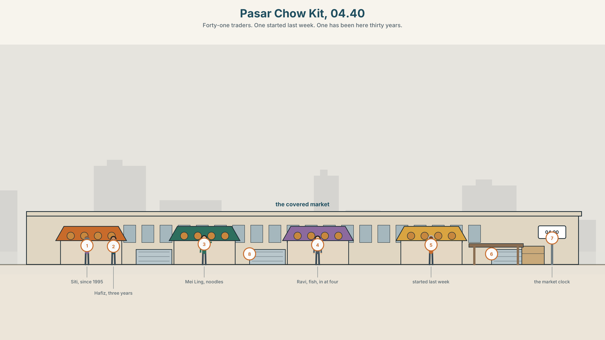{width=6.6in}

*Pasar Chow Kit, 04.40 — Forty-one traders. One started last week. One has been here thirty years.*

# How long have you been at this?

**By the end of this unit you can tell the story of a skill you have — when you started, how long,
and what you can do now. Sixty seconds.**

| ◆ **A · THE WORLD** | How people get good at things, and how long it takes |
|---|---|
| ◆ **B · THE SYSTEM** | *have you ever* and *did you* · *for* and *since* · 22 words for learning · 18 words for time · weak forms in the present perfect |
| ◆ **C · THE PERFORMANCE** | A 60-second account of something you can do |

---

### 0A · Find it

Find twelve things in the market. Four of these sixteen are not in the picture.

> stall · scales · crate · ice · awning · price card · cash box · apron · knife · basket ·
> bucket · trolley · ladder · umbrella · fan · clock

### 0B · Guess it

**One person in this picture started last week. One has been here thirty years.** Which is which?
Give one reason for each.

### 0C · Say it ⏺

**Record thirty seconds.** *What can you do that you could not do three years ago?*
Do not prepare. You will record it again at the end of this unit.

---

## Part 1 · Vocabulary Lab 1 ◆ **B · THE SYSTEM**

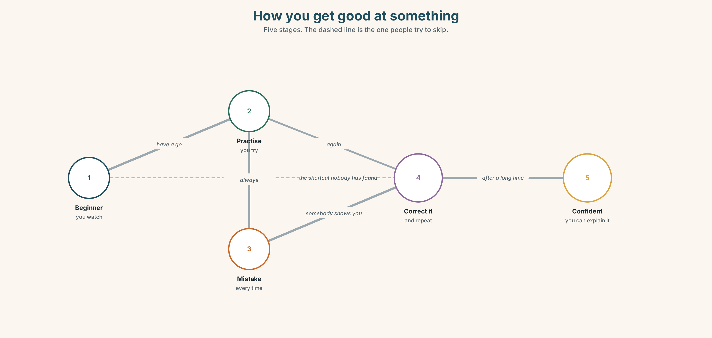{width=6.6in}

*How you get good at something — Five stages. The dashed line is the one people try to skip.*

### 1A · Meet — getting better at something

Match each word to the right place on the picture.

> **learn** · **practise** · **improve** · **progress** · **beginner** · **mistake** ·
> **correct** · **repeat** · **revise** · **forget**

### 1B · Sort — a good day or a bad day?

Put these in two columns.

> I had to repeat it. · I made a mistake. · I forgot it. · I got better at it. ·
> I explained it to somebody. · I understood it.

**One of them could go in both columns.** Which, and why?

### 1C · Sort — odd one out

1. learn · practise · revise · forget
2. beginner · confident · proud · quick
3. mistake · correct · repeat · explain

{width=6.6in}

*Inside Siti's stall — Everything on this table has a place, and she put it there in 1995.*

**Look at the stall in section.** Find one thing Siti **has done every morning since 1995**, and one
thing she **has changed twice** in thirty years. Say each one in a full sentence.

### 1D · Stretch — the phrases

Complete each one with one word.

1. I'm not good yet, but I'm **getting ______ at** it.
2. Try it. **Have a ______.**
3. She's **good ______** numbers.
4. Everybody **______ a mistake** on the first day.
5. He didn't study it. He **picked it ______** from his mother.

### 1E · The saying

> **f** **I'm getting there.**

When do people say this? **Is it good news or bad news?** Both, say three people in every class.

### 1F · Own it

Think of one thing you can do. Tell a partner **three sentences**: when you started, how you
learned, and one mistake you still make.

---

## Part 2 · Listening ◆ **A · THE WORLD**

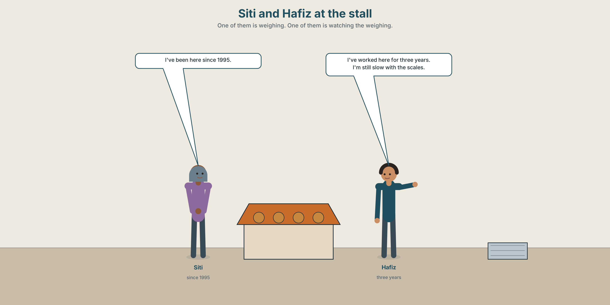{width=6.6in}

*Siti and Hafiz at the stall — One of them is weighing. One of them is watching the weighing.*

### 2A · How long have you been doing this? 🔊 Track 1.1

**Before you listen.** Siti is at the stall. Hafiz is her nephew. **Who is older?**

**Listen once. One question.** How long has Siti been at this stall?

**Listen again. Complete the table.**

| | Started when? | Learned from whom? | Still finds hard? |
|---|---|---|---|
| Siti | | | |
| Hafiz | | | |

**Listen again. True or false?**

1. Siti started in 1995. ☐ T ☐ F
2. Hafiz has worked here for two years. ☐ T ☐ F
3. Siti learned from her mother. ☐ T ☐ F
4. Hafiz still finds the weighing difficult. ☐ T ☐ F

**Noticing.** Four sentences from the recording.

1. *I started in 1995.*
2. *I've been here since 1995.*
3. *I worked at the fish stall for two years.*
4. *I've worked here for three years.*

**Two of these are finished. Two come up to now. Which are which?**

### 2B · Decoding clinic 🔊 Track 1.2

Twenty-five seconds of Siti. Four times, four jobs.

1. How many times does she say *I've*?
2. *I've been* — how many sounds is that?
3. Catch the three years.
4. What happens to *have* in *How long have you*?

> Transcripts, page 150.

---

## Part 3 · Grammar Lab 1 ◆ **B · THE SYSTEM**

### Finished, or still going

### 3A · Notice

Look at the four sentences in Part 2.

1. In sentence 1, is Siti still at the stall in 1995, or was that the beginning?
2. In sentence 3, does Hafiz work at the fish stall now?
3. Sentences 2 and 4 both come up to today. **Which word tells you — *since* or *for*?**
4. *since 1995* and *for three years*. **One is a point. One is a length.** Which?
5. Try *"I've been here since three years."* **What is wrong?**

### 3B · See

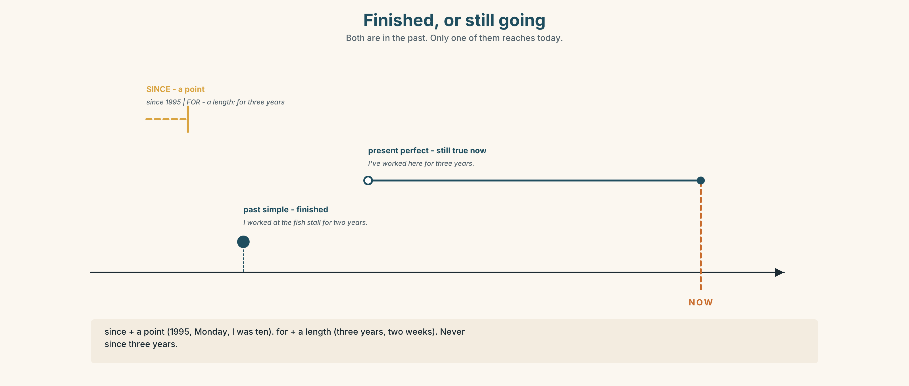{width=6.6in}

*Finished, or still going — Both are in the past. Only one of them reaches today.*

Now read the ladder from the bottom up. **Which rung is the only closed box?**

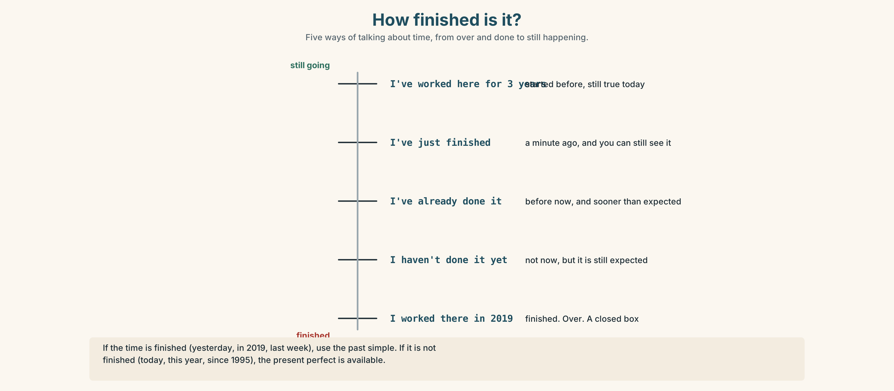{width=6.6in}

*How finished is it? — Five ways of talking about time, from over and done to still happening.*

### 3C · Know

| | Use it for | Example |
|---|---|---|
| **past simple** | finished. It is over. | *I **worked** at the fish stall for two years.* |
| **present perfect** | started before, still true now | *I **have worked** here for three years.* |

> **since** + a **point** in time → *since 1995, since 2019, since Monday, since I was ten*
> **for** + a **length** of time → *for three years, for two weeks, for a long time, for ages*

> **Watch out.** *since three years* ✗. Use *for three years* ✓ — or *since 2023* ✓.

> **Why it matters.** *I worked here* and *I have worked here* both say you worked.
> Only one of them says you still do.

### 3D · Use — controlled

> Siti (1) __________ (start) at the stall in 1995. She (2) __________ (be) here ever
> __________. Before that she (3) __________ (work) at a fish stall for two years. Hafiz
> (4) __________ (work) with her ______ three years. He (5) __________ (not learn) to weigh
> quickly yet, but he (6) __________ (get) much better.

### 3E · Use — guided

Write **for** or **since**.

1. ______ Monday 2. ______ six months 3. ______ 2019 4. ______ a long time
5. ______ I was a child 6. ______ breakfast 7. ______ two hours 8. ______ last week

### 3F · Use — open

**Ask three people in the room:** *How long have you been…?* Write down the answers with *for* or
*since*. **Then report one answer to the class.**

### 3G · Check — six items

> 1. I ______ (live) here since 2020.
> 2. She ______ (work) at the fish stall from 2012 to 2014.
> 3. We ______ (know) each other ______ ten years.
> 4. ______ you ever ______ (be) to this market?
> 5. He ______ (not finish) yet.
> 6. They ______ (move) here ______ March.

**0–3 →** Workbook pp. 4–6. **4–5 →** Part 6. **6 →** page 19.

---

## Part 4 · Speaking ◆ **C · THE PERFORMANCE**

### 4A · Fluency starter — the line

Stand in two lines facing each other. **Ask the person opposite:** *How long have you been
learning English?* Sixty seconds. Then everybody moves one place to the left.

**Three rounds. The same question. Shorter answer each time.**

### 4B · The functional core — asking how long

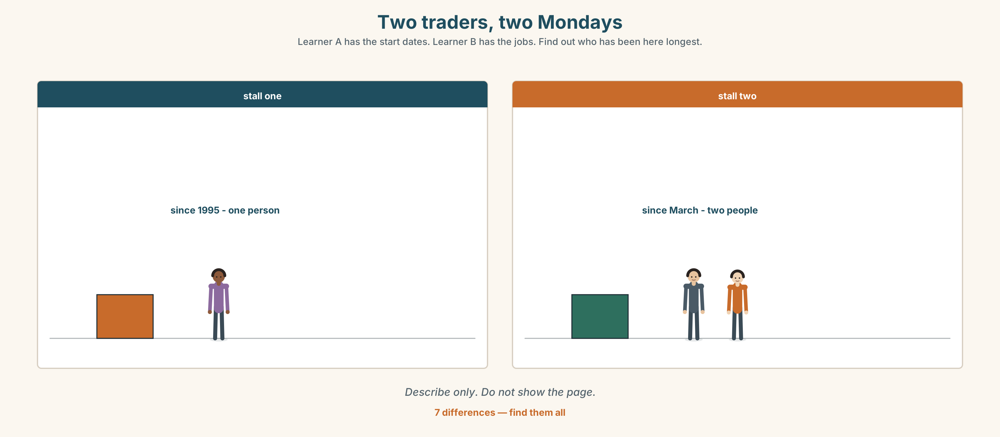{width=6.6in}

*Two traders, two Mondays — Learner A has the start dates. Learner B has the jobs. Find out who has been here longest.*

**Language Bank**

| | |
|---|---|
| **asking** | *How long have you…?* · *When did you start?* · *Who taught you?* |
| **answering** | *For about…* · *Since…* · *I started when I was…* |
| **not sure** | *I'm not sure — maybe five years?* · *A long time.* |
| **the hard part** | *I'm still not good at…* · *I still make mistakes with…* |

**Information gap.** Learner A has the stallholders' start dates. Learner B has their jobs.
Neither sees the other. **Find out who has been here longest.**

### 4C · The performance — sixty seconds ⏺

Tell the group about something you can do. **Sixty seconds.** You must say:

> when you started · how long · who taught you · one thing you still find difficult

**Record it.**

### 4D · Observer

One person listens for **one thing**: did the speaker say *for* and *since* correctly?

### 4E · Two criteria

> ☐ Did I say how long, with *for* or *since*?
> ☐ Did I say one thing I am still not good at?

---

## Part 5 · Reading ◆ **A · THE WORLD**

### 5A · Predict

A report about market traders. The title is **"Thirty years at the same table."**
**What do you expect it to say?** One sentence.

### 5B · Read — ninety seconds

---

**Thirty years at the same table**

Pasar Chow Kit opens at four in the morning. Siti Rahman has had the same table since 1995. She
has sold vegetables there for thirty years and she has never once been late.

She learned from her aunt, who had the table before her. "I watched her for two years before she
let me take the money," she says. "Two years. Now people think they can learn it in a week."

Her nephew Hafiz has worked with her for three years. He is nineteen. He is quick with the
customers and slow with the scales, and Siti says this is the right way round — the scales are
easy and people are not.

Of the forty-one traders in this part of the market, eleven have been here more than twenty years.
Nine started in the last two years. Almost nobody stays for five.

---

### 5C · Answer

1. What time does the market open?
2. How long has Siti had the same table?
3. Who taught her, and how long did she watch?
4. What is Hafiz good at, and what is he slow at?
5. **Siti says this is "the right way round". Why?**
6. How many traders have been here more than twenty years?

### 5D · Vocabulary in context

Guess the meaning from the text. Then check.

> trader · take the money · quick with · the right way round · almost nobody

### 5E · The counter-text

{width=6.6in}

*The market noticeboard — Three printed notices and one written by hand. The handwritten one is the useful one.*

**Read the market noticeboard and answer.**

1. How much is a monthly licence?
2. **How long must you have traded before you can apply for a permanent table?**
3. What happens if you miss two months?
4. Which notice is handwritten, and what does it say?

### 5F · Two texts

The report says *"almost nobody stays for five years."*
The noticeboard says you need **three years** before you can apply for a permanent table.

**Put those two facts together. What does it mean for a new trader?** Two sentences.

---

## Part 6 · Vocabulary Lab 2 ◆ **B · THE SYSTEM**

### Words that tell you when

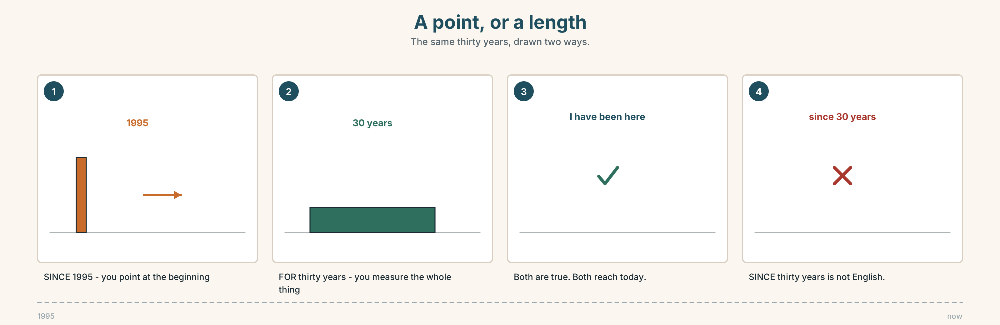{width=6.6in}

*A point, or a length — The same thirty years, drawn two ways.*

### 6A · Sort — point, or length?

Put each one in the right column.

> Monday · ages · three years · breakfast · I was ten · a long time · 2019 · six months

| **a POINT** (use *since*) | **a LENGTH** (use *for*) |
|---|---|
| | |

### 6B · Chunk completion

1. I've been learning English ______ five years.
2. I haven't seen her ______ Tuesday.
3. She's lived here ______ all her life.
4. We've been waiting ______ two hours.
5. Nothing has changed ______ 2019.

### 6C · The other time words

Put each word in the right sentence: **already · yet · still · recently · lately · ago**

1. Have you finished ______ ?
2. I've ______ done it — this morning.
3. She started three years ______ .
4. I'm ______ learning. I haven't finished.
5. I've seen him twice ______ .
6. How have you been ______ ?

{width=6.6in}

*Two sentences, one difference — The same trader. One of these says she is still there.*

**Six differences.** Find them, then answer the question under the picture.

### 6D · Contrast Clinic — finished or not

Six items. Past simple or present perfect?

1. She ______ (live) in three countries. *(in her life)*
2. ______ you ever ______ (try) it?
3. ______ you ______ (try) it yesterday?
4. I ______ (work) here since March.
5. I ______ (work) there in 2019.
6. She ______ (live) in Penang from 2015 to 2018.

---

## Part 7 · Pronunciation & Fluency Lab ◆ **B · THE SYSTEM**

### Three words that become one

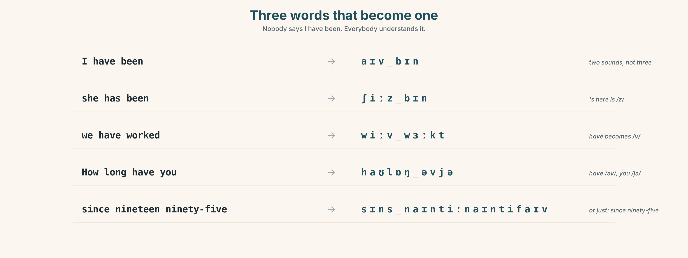{width=6.6in}

*Three words that become one — Nobody says I have been. Everybody understands it.*

### 7A · Hear 🔊 Track 1.3

> I have been → *I've been* → /aɪvbɪn/
> How long have you → *How long've you* → /haʊlɒŋəvjə/
> She has been → *She's been* → /ʃiːzbɪn/

### 7B · Say

Say each one. Then say the question three times, faster:

> *How long have you been learning English?*

### 7C · Make it mean something

Say these two:

> *I have been here since 1995.* *(every word, slowly)*
> *I've been here since '95.* *(normally)*

**Which one sounds like a person talking?** When would you use the other one?

### 7D · Fluency 20 ⏺

Twenty seconds: **three things you have done, and how long for.** Three times, faster.

---

## Part 8 · Writing ◆ **C · THE PERFORMANCE**

### Something I can do · 80 words

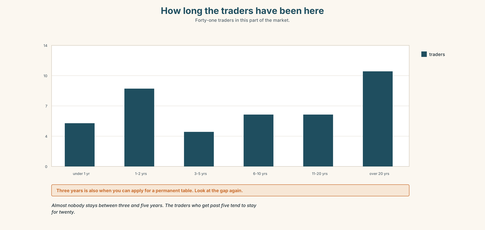{width=6.6in}

*How long the traders have been here — Forty-one traders in this part of the market.*

### 8A · Read the model

> I can cook my grandmother's chicken rice. I have been cooking it since I was twelve, so that is
> about fourteen years. `[says how long two ways — a point and a length]`
>
> My grandmother taught me. I watched her for a long time before she let me do it alone, and the
> first time I did it alone I burnt the rice.
>
> I am still not good at the ginger. She used her hands and I use a spoon, and it is not the same.
> `[one honest difficulty — and it is specific]`

**Questions about the writer's choices:**

1. Why say the length two ways?
2. The last line names one small thing. **Why is that better than "I am still learning"?**

### 8B · The anti-model

> I can cook very well. I have been cooking for many years. My grandmother taught me everything.
> I love cooking and I think it is a very important skill.

Correct English. **Name two things you still do not know.**

### 8C · Plan

> what you can do → when you started → how long → who taught you → one thing you still find hard

### 8D · Write — 80 words
### 8E · Peer review — two criteria

> ☐ Can I tell how long, exactly?
> ☐ Is there one real difficulty in it?

### 8F · Write it again · 8G · Publish

On the wall, with your recording from Part 4C beside it.

---

## Part 9 · The File ◆ **A · THE WORLD + C · THE PERFORMANCE**

# WORK FILE · The Meeting

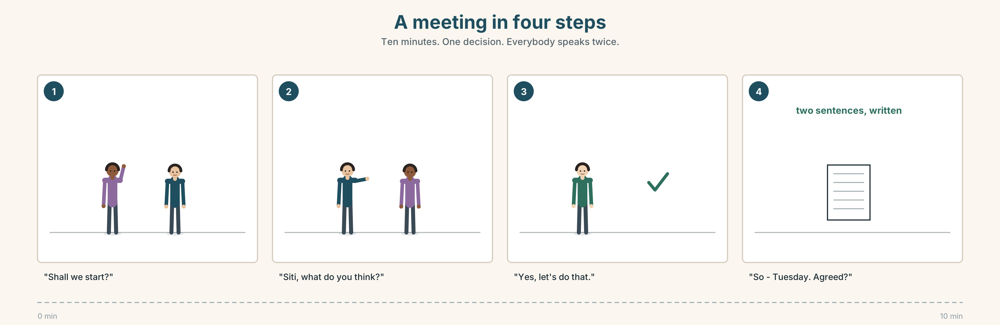{width=6.6in}

*A meeting in four steps — Ten minutes. One decision. Everybody speaks twice.*

### 9A · A meeting with four people

The traders meet once a month. **Read the four-line agenda.** Then listen 🔊 Track 1.4.

1. How long was the meeting?
2. How many items did they finish?
3. **Which item took longest, and was it the most important?**

### 9B · Four jobs in a meeting

> starting · asking somebody · agreeing · finishing

Match each to one phrase.

> *"Shall we start?"* · *"Siti, what do you think?"* · *"Yes, let's do that."* ·
> *"So — Tuesday. Agreed?"*

### 9C · Your turn

In groups of four. **Ten minutes. One decision.** Each person must speak at least twice.

> **The problem:** the market opens at four. One trader wants it to open at five.

### 9D · Write it down

**Two sentences.** What did you decide, and who is doing what?

### 9E · Transfer

**Go to any meeting this week** — at work, at home, anywhere. Count how many people spoke.
Bring the number.

---

## Part 10 · Mediation & Interaction ◆ **C · THE PERFORMANCE**

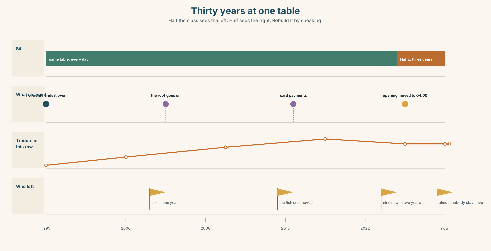{width=6.6in}

*Thirty years at one table — Half the class sees the left. Half sees the right. Rebuild it by speaking.*

### 10A · Relay

Half the class sees the left of the picture. Half sees the right. **Rebuild it by speaking.**
Ten minutes.

### 10B · Simplify

Explain the market noticeboard to a trader who starts on Monday. **Four sentences only.**

> **Plan:** what it costs → when you pay → what happens if you miss → what you can apply for later

### 10C · Compress

The report in Part 5 into **thirty words**, for a poster.

### 10D · Online

Write **one message** for the traders' group chat: you will be two hours late tomorrow and
somebody needs to open your stall.

### 10E · Your language

How do you ask *"How long have you been doing this?"* in your language?
**Does your language use a point or a length?** Show a partner both.

---

## Part 11 · The Decision ◆ **C · THE PERFORMANCE**

# The course on Tuesday mornings

Siti has been offered a free business course. It is six Tuesday mornings — the busiest morning of
the week.

If she goes, Hafiz runs the stall alone. He has been there three years and has never done a
Tuesday by himself.

- **Go.** Six mornings. Hafiz learns fast or he does not.
- **Don't go.** Thirty years without a bad Tuesday. Why start now?
- **Go, and ask her cousin to help Hafiz.** Her cousin has a stall of her own and would have to
  close it.

### 11A · The evidence

1. **The noticeboard** from Part 5 — what you need for a permanent table.
2. **The chart** — what Siti takes on a Tuesday, and on the other days.
3. **The voice.** Hafiz, twenty seconds: *"I'd be fine. I think I'd be fine. I've watched her do
   it three hundred times."*

### 11B · Talk about it

In threes. Everybody says one. Use the frame.

> *I think Siti should ______ , because ______ .*

**Words you can use:** *busy · alone · learn · money · mistake · trust · three years · never*

### 11C · Decide

Write **two sentences**. Choose, and say why.

> I think Siti should ______________________ ,
> because ______________________ .

### 11D · Model decision

> I think she should go, and tell Hafiz on Monday, not Tuesday morning. Three years is long enough
> to watch. If he cannot do one Tuesday now, he will not be able to do one in five years either,
> and she will find that out when she is ill and has no choice.

### 11E · The Reveal

> **What happened.** She went. On the first Tuesday Hafiz sold everything by eleven and priced two
> things wrong, losing about thirty ringgit.
>
> On the fourth Tuesday a regular customer asked for Siti and left when she was not there.
>
> Siti finished the course. She says the most useful thing in it was a sentence about pricing that
> she already knew and had never said out loud.

**He was fine. They lost one customer. And the course taught her something she already knew.**

> **Was it the right decision?** Say why — and say what it cost.

---

## Part 12 · Landing ◆ **all three lines**

### 12A · Recycle — ten items

**This is Unit 1, so everything is from this unit. From Unit 2 onwards, four items come from
earlier in this book and two from *Starting Out*.**

> 1. I ______ (live) here since 2020.
> 2. She ______ (work) there in 2019.
> 3. We've known each other ______ ten years.
> 4. Nothing has changed ______ 2019.
> 5. Have you finished ______ ?
> 6. I'm not good yet, but I'm getting ______ at it.
> 7. Everybody ______ a mistake on the first day.
> 8. He didn't study it — he picked it ______ .
> 9. How long ______ you ______ (be) here?
> 10. I'm still learning. ______ getting there.

### 12B · Consolidate

**Eighty words, one paragraph.** Three things you can do, how long you have been doing each, and
which one you are still a beginner at. Use *for* three times and *since* twice.

### 12C · Can-do, with evidence

| I can… | My evidence | Sure? |
|---|---|---|
| say how long I have been doing something, with *for* and *since* | Part 3G score | ◯ ◑ ● |
| tell the story of a skill in sixty seconds | Part 4C recording | ◯ ◑ ● |
| write eighty words about what I can do | Part 8 draft 2 | ◯ ◑ ● |
| say what I think somebody should do, and why | Part 11C | ◯ ◑ ● |

### 12D · Replay ⏺

Find your thirty seconds from Part 0C. Listen. **Record it again.**
Listen to both. One sentence: what is different?

### 12E · Glossary — forty items, as a map

> **LEARNING** · learn · practise · improve · progress · revise · repeat · understand · explain
> **GETTING IT WRONG** · mistake · correct · forget · beginner · slow
> **GETTING IT RIGHT** · quick · confident · proud · get better at · be good at · have a go · pick up
> **SAYING IT** · make a mistake · I'm getting there
> **A POINT** · since · 2019 · Monday · since I was ten · since breakfast · every day since
> **A LENGTH** · for · for three years · a long time · all my life · up to now · how long
> **WHEN** · ago · already · yet · still · recently · lately · keep on · not yet, but soon

### 12F · Next

> **Unit 2 · Who grew this?**

# A2.1 · Unit 2 · The Van at Half Past Four

> **English Animated** · *Making Plans* · Pasar Chow Kit, Kuala Lumpur
> Student's Book pages 28–49 · 22 pp · ~10 hours

---

## Part 0 · The Big Picture ◆ **A · THE WORLD**

{width=6.6in}

*The loading bay, 04.30 — Three of these people had already been working for an hour when the van came in.*

# Who grew this?

**By the end of this unit you can describe a morning at a workplace — what was already happening
before anything happened. Eighty words.**

| ◆ **A · THE WORLD** | Where food comes from, and who was awake while you were asleep |
|---|---|
| ◆ **B · THE SYSTEM** | *was doing* and *did* · *while* and *when* · 23 words for growing and supply · 17 words for telling a story in order · weak *was* and *were* |
| ◆ **C · THE PERFORMANCE** | Eighty words that set a scene before the event |

---

### 0A · Find it

Nine of these are somewhere in the picture. **Find them.**

> van · crate · pallet · ice · scales · awning · hose · bucket · clipboard · forklift ·
> chalkboard · sack

### 0B · Guess it

**It is half past four.** Three things in this picture had already been happening for an hour when
the van arrived. Which three, and how can you tell?

### 0C · Say it ⏺

**Record thirty seconds.** *What was happening in your street at six o'clock this morning?*
Guess if you were asleep. You will record it again at the end of the unit.

---

## Part 1 · Vocabulary Lab 1 ◆ **B · THE SYSTEM**

{width=6.6in}

*From the soil to your bag — Six stages. The dashed line is the one the label on the stall pretends happens.*

### 1A · Meet — from the soil to the table

Match each word to one place on the map.

> **grow** · **plant** · **seed** · **soil** · **water** · **sun** · **rain** · **farm** ·
> **farmer** · **market**

### 1B · Sort — what the plant needs, what the trader needs

Two columns.

> a van · ice · a licence · rain · a price card · scales · seed · water · soil · sun

**One of them is in both columns.** Which one, and why?

### 1C · Meet — the words for how it looks

> **fresh** · **ripe** · **heavy** · **dry** · **wet**

Which two are good news on a vegetable stall? Which one is good news on a *weighing* stall?

{width=6.6in}

*The cold room, in section — Cold falls. That is the whole reason the shelves are arranged like this.*

**Look at the cold room in section.** Which shelf is coldest? **Where does the stock that will
go off first sit, and why there?**

### 1D · Stretch — the phrases

Complete each one with one word.

1. Mangoes are cheap now. They're **______ season**.
2. Nothing grows in **the ______ season** without a hose.
3. In April the whole village **brings ______ the harvest**.
4. This came **______ from the farm** — nobody touched it in between.
5. Keep it cold or it will **go ______** by Thursday.
6. Zul **______ up** the stall every morning at four.

### 1E · The saying

> **f** **It depends on the rain.**

A farmer says this when you ask about the price. **What is the farmer telling you?**
Say it in your own words. Then say when *you* would use it.

### 1F · Own it

Think of one food you eat often. Tell a partner **three sentences**: where it grows, which season
it is best in, and how it reaches your kitchen.

---

## Part 2 · Listening ◆ **A · THE WORLD**

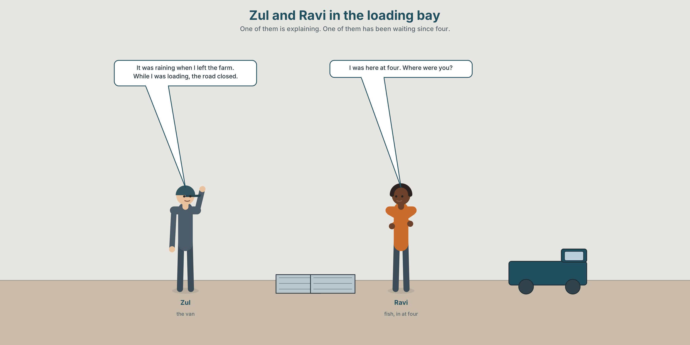{width=6.6in}

*Zul and Ravi in the loading bay — One of them is explaining. One of them has been waiting since four.*

### 2A · The van was late again 🔊 Track 2.1

**Before you listen.** Zul drives the van. Ravi sells fish. **Who is worried, and who is
apologising?**

**Listen once. One question.** What time did the van actually arrive?

**Listen again. Complete the table.**

| | Where was this person at 04:00? | What were they doing? | What went wrong? |
|---|---|---|---|
| Zul | | | |
| Ravi | | | |
| Mei Ling | | | |

**Listen again. Choose.**

1. Zul left the farm at **03:10 / 03:40 / 04:10**.
2. It was raining **when he left / while he was loading / all morning**.
3. Ravi had been waiting **ten / twenty / forty** minutes.
4. Mei Ling's broth was **still cooking / cold / finished**.

**Noticing.** Four sentences from the recording.

1. *It started raining at three.*
2. *It was raining when I left the farm.*
3. *I loaded the van.*
4. *While I was loading, the road closed.*

**Two of these are a background. Two are an event.** Which are which?

### 2B · Decoding clinic 🔊 Track 2.2

Twenty-five seconds of Zul. Four jobs.

1. How many times does he say *was*?
2. In *it was raining*, is *was* loud or quiet?
3. Catch the time he gives.
4. He says one word twice because he is annoyed. Which word?

> Transcripts, page 151.

---

## Part 3 · Grammar Lab 1 ◆ **B · THE SYSTEM**

### The background and the event

### 3A · Notice

Look at the four sentences in Part 2.

1. In sentence 2, which came first — the rain, or leaving the farm?
2. In sentence 4, which one interrupted the other?
3. One sentence uses *while*. One uses *when*. **Swap them. Does either one break?**
4. *I was loading* and *I loaded*. **Only one of them is unfinished.** Which?
5. Try *"While I loaded, the road was closing."* **Why does it sound wrong?**

### 3B · See

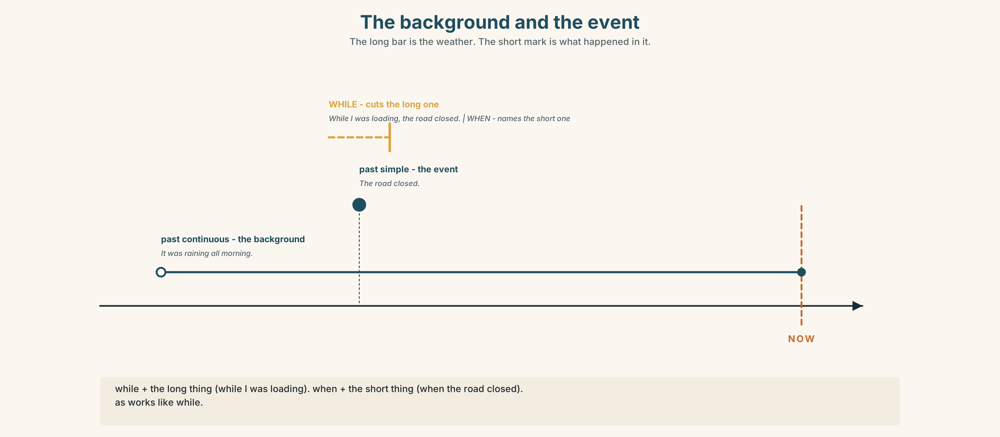{width=6.6in}

*The background and the event — The long bar is the weather. The short mark is what happened in it.*

Now look at the second picture. **The long line is the background. Where does the short line
cut it?**

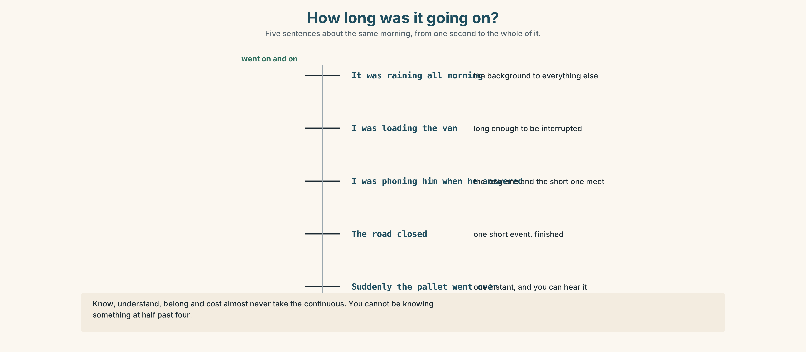{width=6.6in}

*How long was it going on? — Five sentences about the same morning, from one second to the whole of it.*

### 3C · Know

| | Use it for | Example |
|---|---|---|
| **past continuous** | the longer thing. The background. | *It **was raining** at four o'clock.* |
| **past simple** | the shorter thing. The event. | *The road **closed**.* |

> **while** + the long thing → *While I **was loading**, the road closed.*
> **when** + the short thing → *I was loading **when** the road closed.*
> **as** works like *while*, and sounds a little more formal.

> **Watch out.** *While the road closed* ✗ — *while* wants the long one.
> Some verbs almost never take the continuous: *know, understand, belong, cost*.

> **Why it matters.** The background tells your listener where to stand. Without it, every
> sentence is a surprise.

### 3D · Use — controlled

> At four o'clock it (1) __________ (rain) hard. Zul (2) __________ (load) the last crates
> when the road (3) __________ (close). He (4) __________ (wait) twenty minutes, and
> **while** he (5) __________ (wait) he (6) __________ (phone) Ravi twice. Ravi
> (7) __________ (not answer) — he (8) __________ (serve) a customer.

### 3E · Use — guided

Join each pair with **while** or **when**.

1. I was walking to the market. / It started to rain.
2. She was cooking. / The power went off.
3. We were talking about him. / He walked in.
4. He was loading the van. / The phone rang.
5. They were closing the stall. / Nurul arrived.

### 3F · Use — open

**Think of one morning that went wrong.** Tell a partner. Begin with the background:
*"It was ______ and I was ______ ."* Then give the event.

### 3G · Check — six items

> 1. It ______ (rain) when I ______ (leave) the house.
> 2. While she ______ (cook), the phone ______ (ring).
> 3. We ______ (wait) for an hour, and then the van ______ (arrive).
> 4. What ______ you ______ (do) at six this morning?
> 5. He ______ (not hear) me because he ______ (listen) to the radio.
> 6. ______ I was loading, the road ______ (close).

**0–3 →** Workbook pp. 10–12. **4–5 →** Part 6. **6 →** page 41.

---

## Part 4 · Speaking ◆ **C · THE PERFORMANCE**

### 4A · Fluency starter — the frozen moment

Your teacher says a time: *half past four*. **Freeze.** Everybody says one sentence beginning
*"I was…"* Nobody may repeat a verb already used.

**Three rounds. Three times of day.**

### 4B · The functional core — setting the scene

{width=6.6in}

*Two mornings, one moment — Learner A has the van. Learner B has the stall. Find the moment the two mornings met.*

**Language Bank**

| | |
|---|---|
| **the background** | *It was ______ .* · *Everybody was ______ .* · *Nothing was ______ yet.* |
| **the event** | *Then ______ .* · *Suddenly ______ .* · *That was when ______ .* |
| **joining them** | *while* · *when* · *just as* · *at that moment* |
| **ordering them** | *earlier* · *later* · *afterwards* · *meanwhile* |

**Information gap.** Learner A has the van's morning. Learner B has the stall's morning.
Neither sees the other. **Work out at what moment the two mornings met.**

### 4C · The performance — eighty seconds ⏺

Describe **one morning** at a place you know. **Eighty seconds.** You must give:

> two things that were already happening · one thing that then happened · what you did about it

**Record it.**

### 4D · Observer

One person listens for **one thing**: did the speaker set the background *before* the event?

### 4E · Two criteria

> ☐ Did I use *was/were doing* at least twice?
> ☐ Was the event clearly one short thing?

---

## Part 5 · Reading ◆ **A · THE WORLD**

### 5A · Predict

An explainer about how vegetables get to a city market. The title is
**"Six hours you were asleep for."**
**What do you expect to be in it?** One sentence.

### 5B · Read — one hundred seconds

---

**Six hours you were asleep for**

The tomatoes on Siti's table at eight in the morning were in the soil in Cameron Highlands on
Tuesday. This is what happened in between.

**Tuesday, 15:00.** Two women were picking in the rain. Nobody picks in the middle of the day
unless the rain has already started, because wet leaves hide the ripe fruit and the sun makes the
skin split. They filled forty crates.

**Tuesday, 21:00.** The crates went into a cold room at 12°C. Not colder. Tomatoes stop ripening
below ten degrees and then never start again.

**Wednesday, 01:20.** Zul's van left the highlands. It was still raining. The road down is
fifty-eight kilometres and takes two hours when it is dry.

**Wednesday, 04:40.** The van reached Pasar Chow Kit forty minutes late. While Zul was unloading,
Siti was already writing her price cards — and she wrote them before she saw the tomatoes, because
she has been buying from the same farm since 2011 and she knew what was coming.

**Wednesday, 08:00.** You bought three.

Nothing in that chain is unusual. It happens six days a week, and on the seventh the market
opens anyway with Tuesday's stock, which is why Sunday is the cheapest and the worst day to buy
tomatoes.

---

### 5C · Answer

1. When were the tomatoes still in the soil?
2. Why do the pickers wait for rain?
3. What temperature is the cold room, and what happens below ten degrees?
4. How long does the road take when it is dry?
5. **Why had Siti written her price cards before she saw the stock?**
6. Why is Sunday the cheapest day — and why is it also the worst?

### 5D · Vocabulary in context

Guess from the text. Then check.

> the highlands · split · ripen · unload · the chain

### 5E · The counter-text

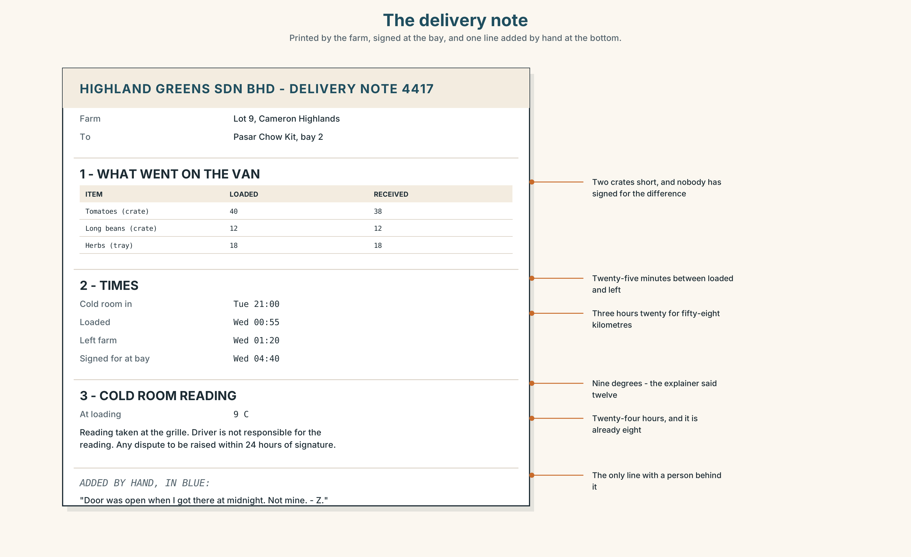{width=6.6in}

*The delivery note — Printed by the farm, signed at the bay, and one line added by hand at the bottom.*

**Read the delivery note and answer.**

1. How many crates left the farm, and how many arrived?
2. What time was the van loaded, and what time was it signed for?
3. **Who wrote the line at the bottom, and what does it accuse somebody of?**
4. Two numbers on this note disagree with the explainer in 5B. Find them.

### 5F · Two texts

The explainer says the crates went into a cold room **at 12°C**.
The delivery note says the cold room reading was **9°C**.

**Put those two facts together. What will the tomatoes be like on Friday?** Two sentences.

---

## Part 6 · Vocabulary Lab 2 ◆ **B · THE SYSTEM**

### Words that put things in order

{width=6.6in}

*Before, during, after — The same forty minutes, told three ways.*

### 6A · Sort — before, during, or after?

Put each one in the right column.

> at the same time · afterwards · while · earlier · meanwhile · later · then · just as

| **BEFORE** | **DURING** | **AFTER** |
|---|---|---|
| | | |

### 6B · Chunk completion

1. The van arrived ______ five o'clock.
2. ______ , Mei Ling was still cooking.
3. He phoned ______ as I was closing.
4. It rained ______ morning — it never stopped.
5. She stood there ______ whole time and said nothing.
6. ______ that moment, the lights went out.

### 6C · The sudden word

**suddenly** is strong. Use it once in a story, not four times.

Read these four. **In which one is *suddenly* doing real work?**

1. Suddenly it was Tuesday.
2. We were loading the last crate and suddenly the whole pallet went over.
3. Suddenly the market opens at four.
4. Suddenly I was quite tired.

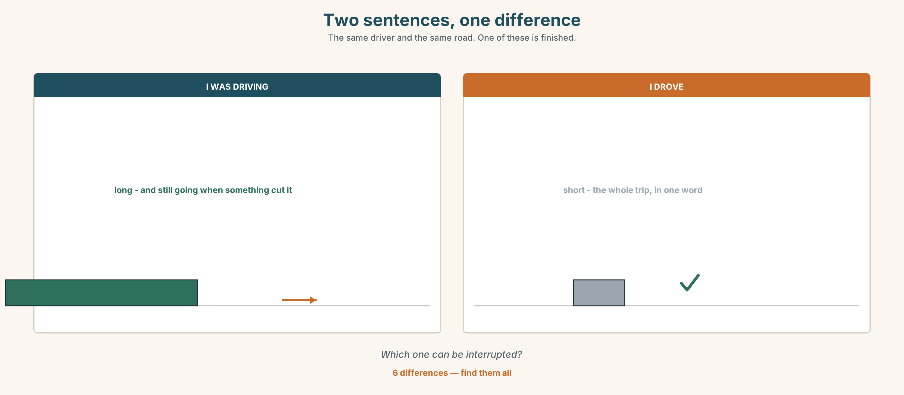{width=6.6in}

*Two sentences, one difference — The same driver and the same road. One of these is finished.*

**Six differences.** Find them, then answer the question under the picture.

### 6D · Contrast Clinic — long or short

Six items. Past simple or past continuous?

1. At six o'clock I ______ (drive) to the market.
2. While we ______ (unload), it ______ (start) to rain.
3. At six o'clock I ______ (arrive) at the market.
4. What ______ you ______ (do) when the power ______ (go) off?
5. She ______ (carry on) working while everybody else ______ (stop).
6. It ______ (rain) all morning. *(and that is the whole story)*

---

## Part 7 · Pronunciation & Fluency Lab ◆ **B · THE SYSTEM**

### The word you nearly cannot hear

{width=6.6in}

*The word you nearly cannot hear — Was and were are grammar, not news. English hides them.*

### 7A · Hear 🔊 Track 2.3

> it was raining → /ɪtwəzˈreɪnɪŋ/
> they were loading → /ðeɪwəˈləʊdɪŋ/
> what were you doing → /wɒtwəjəˈduːɪŋ/

### 7B · Say

Say each one. Then say the whole question three times, faster:

> *What were you doing when it started?*

### 7C · Make it mean something

Say these two:

> *It WAS raining.* *(loud was — you are arguing with somebody)*
> *It was raining.* *(quiet was — you are just telling them)*

**When would a trader use the first one?** Give the situation.

### 7D · Fluency 20 ⏺

Twenty seconds: **three things that were happening in your house at seven this morning.**
Three times, faster.

---

## Part 8 · Writing ◆ **C · THE PERFORMANCE**

### A morning at work · 80 words

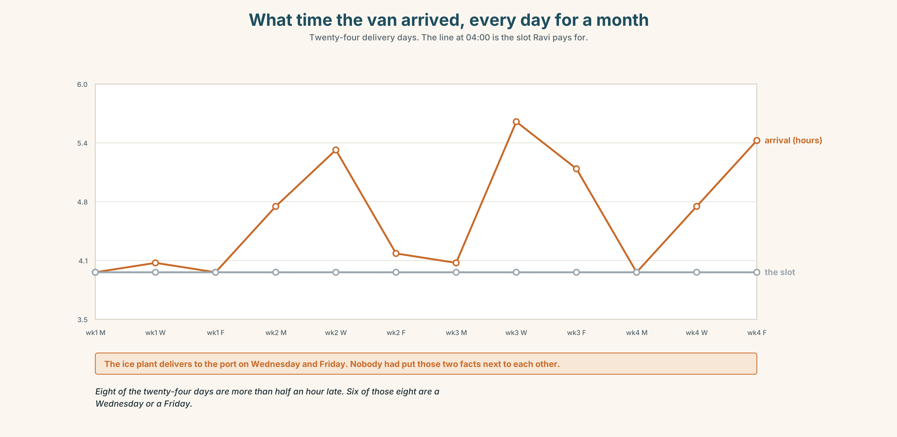{width=6.6in}

*What time the van arrived, every day for a month — Twenty-four delivery days. The line at 04:00 is the slot Ravi pays for.*

### 8A · Read the model

> At half past four the market was already loud. Ravi was washing the ice down, Mei Ling was
> watching her pot, and nothing was open yet. `[three backgrounds, and one of them is a negative]`
>
> Then the van came in through the wrong gate and stopped. Zul got out and said one word.
> `[the event — short, and we are not told the word]`
>
> Afterwards everybody carried on. By five o'clock the crates were on the table and nobody
> mentioned it again. `[the order words do the work: afterwards, by five o'clock]`

**Questions about the writer's choices:**

1. Three background sentences, then one event. **What would happen if you swapped them?**
2. We never learn the word Zul said. **Is that a mistake?**

### 8B · The anti-model

> It was a busy morning. Everybody was working hard. The van was late. Then it arrived and we
> unloaded it. It was a difficult day but we finished everything.

Correct English, and you can see nothing. **Name two things that are missing.**

### 8C · Plan

> the time → two things already happening → one thing not happening yet → the event → afterwards

### 8D · Write — 80 words
### 8E · Peer review — two criteria

> ☐ Can I see the place before the event happens?
> ☐ Is there exactly one event, not four?

### 8F · Write it again · 8G · Publish

On the wall, next to the delivery note from Part 5E.

---

## Part 9 · The File ◆ **A · THE WORLD + C · THE PERFORMANCE**

# STUDY FILE · The Lecture

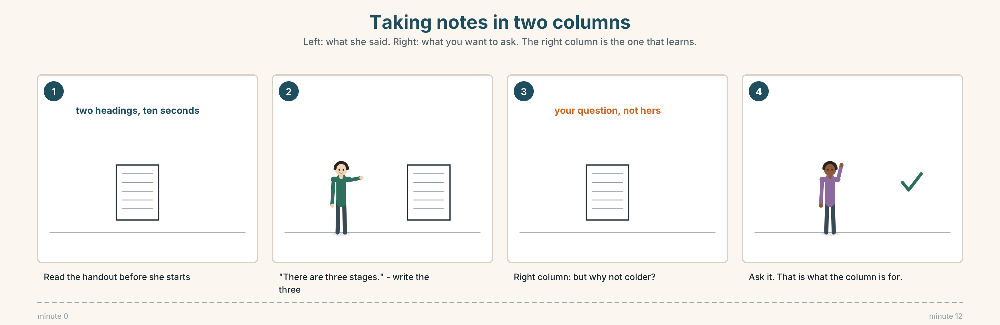{width=6.6in}

*Taking notes in two columns — Left: what she said. Right: what you want to ask. The right column is the one that learns.*

### 9A · Twelve minutes on cold chains 🔊 Track 2.4

A short lecture at the city agriculture college. **Before you listen, read the two headings on the
handout.** Then listen.

1. How many stages does the speaker describe?
2. Which stage does she say is the one that fails?
3. **She gives one number twice. Which, and why do you think she repeats it?**

### 9B · Notes in two columns

Your page has one line down the middle. **Left: what she says. Right: your own question about it.**

> Listen again. **Five lines on the left. At least two on the right.**

### 9C · The signposts

A lecturer tells you what is coming. Match each phrase to its job.

> *"There are three stages."* · *"Now, the second one."* · *"And this is the important part."* ·
> *"So, to go back for a moment."*

> coming up · moving on · pay attention · going back

### 9D · Your turn

**Two minutes, standing up.** Explain one stage of the cold chain to the group, using one
signpost phrase and one background sentence in the past continuous.

### 9E · Transfer

**Find one thing in your kitchen with a temperature on the label.** Bring the number and say
what it is protecting.

---

## Part 10 · Mediation & Interaction ◆ **C · THE PERFORMANCE**

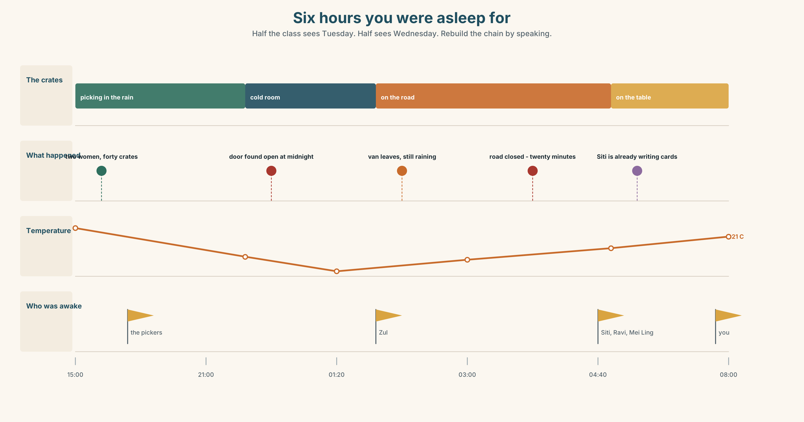{width=6.6in}

*Six hours you were asleep for — Half the class sees Tuesday. Half sees Wednesday. Rebuild the chain by speaking.*

### 10A · Relay

Half the class sees Tuesday. Half sees Wednesday. **Rebuild the whole chain by speaking.**
Ten minutes. Nobody may show their page.

### 10B · Simplify

Explain the delivery note from Part 5E to a farmer who does not read English.
**Four sentences only.**

> **Plan:** what left → what arrived → what the temperature was → what you want done

### 10C · Compress

The explainer in Part 5 into **thirty-five words**, as a label for the stall.

### 10D · Online

Write **one message** to the farm's group chat: the crates arrived warm, you are not blaming
anybody yet, and you need to know who closed the cold room door.

### 10E · Your language

How does your language join a background to an event? **Does it have two different words for
*while* and *when*, or one?** Show a partner both sentences.

---

## Part 11 · The Decision ◆ **C · THE PERFORMANCE**

# The cheaper boat

Ravi's fish has arrived late twice a week for a month. He has used the same supplier for nine
years. There is a cheaper supplier who is always on time and whom he has never met.

- **Stay.** Nine years. One bad month. Fish he can judge with his eyes shut.
- **Switch.** On time, and eleven per cent cheaper. Nobody knows where it has been.
- **Split it.** Half from each for two months, and watch.

### 11A · The evidence

1. **The delivery note** from Part 5E — and whose handwriting is at the bottom.
2. **The chart** — Ravi's eight o'clock sales on the days the fish was late.
3. **The voice.** The old supplier, fifteen seconds: *"I was at the port at three. I'm always at
   the port at three. The ice came late and I'm not going to send you fish on warm ice."*

### 11B · Talk about it

In threes. Everybody says one. Use the frame.

> *I think Ravi should ______ , because ______ .*

**Words you can use:** *fresh · trust · nine years · cheaper · on time · ice · risk · go off*

### 11C · Decide

Write **two sentences**. Choose, and say why.

> I think Ravi should ______________________ ,
> because ______________________ .

### 11D · Model decision

> He should split it for two months. Nine years of a man turning up at three in the morning is
> worth something, but it is not worth four late mornings a month, and the only way to find out
> whether the cheap fish is any good is to put it next to fish he already trusts and look at both
> at eight o'clock.

### 11E · The Reveal

> **What happened.** He split it. The cheap fish was good for five weeks and then arrived on a
> Friday smelling of diesel, and he could not sell any of it.
>
> The old supplier's deliveries went back to normal in week two, because the problem had been the
> ice plant and not the boat. Nobody had told Ravi that, because nobody had asked.
>
> He went back to one supplier. He now phones the ice plant on Thursdays.

**He was right to look. He was wrong about where the problem was.**

> **Was splitting it the right decision?** Say why — and say what he learned that he could not
> have learned by staying.

---

## Part 12 · Landing ◆ **all three lines**

### 12A · Recycle — ten items

> 1. It ______ (rain) when the van ______ (arrive).
> 2. ______ he was loading, the road closed.
> 3. Mangoes are cheap — they're ______ season.
> 4. Keep it cold or it will ______ off.
> 5. This came ______ from the farm.
> 6. *(Unit 1)* I've worked here ______ three years.
> 7. *(Unit 1)* She started in 1995 and has been here ever ______ .
> 8. *(Unit 1)* I'm not good yet, but I'm getting ______ at it.
> 9. *(Starting Out)* There ______ forty-one traders in this row.
> 10. *(Starting Out)* The market ______ (open) at four every day.

### 12B · Consolidate

**Eighty words, one paragraph.** One morning that did not go to plan. Two things in the past
continuous, one event in the past simple, and at least two order words from Part 6A.

### 12C · Can-do, with evidence

| I can… | My evidence | Sure? |
|---|---|---|
| set a background with *was/were doing* | Part 3G score | ◯ ◑ ● |
| describe a morning in eighty seconds | Part 4C recording | ◯ ◑ ● |
| write eighty words with a scene and an event | Part 8 draft 2 | ◯ ◑ ● |
| take notes from a short lecture | Part 9B page | ◯ ◑ ● |

### 12D · Replay ⏺

Find your thirty seconds from Part 0C. Listen. **Record it again.**
One sentence: what is different?

### 12E · Glossary — forty items, as a map

> **THE GROUND** · soil · seed · plant · grow · water · sun · rain · farm · farmer
> **THE SEASON** · season · dry · wet · in season · the dry season · it depends on the rain
> **THE HARVEST** · bring in the harvest · ripe · fresh · heavy · go off · straight from the farm
> **THE TRADE** · market · set up
> **BEFORE** · earlier · just as · all morning
> **DURING** · while · when · as · meanwhile · at the same time · at that moment · the whole time · carry on
> **AFTER** · then · later · afterwards · suddenly · by five o'clock · and then it started

### 12F · Next

> **Unit 3 · What did you used to love?**

# A2.1 · Unit 3 · Forty Minutes of Broth

> **English Animated** · *Making Plans* · Pasar Chow Kit, Kuala Lumpur
> Student's Book pages 50–71 · 22 pp · ~10 hours

---

## Part 0 · The Big Picture ◆ **A · THE WORLD**

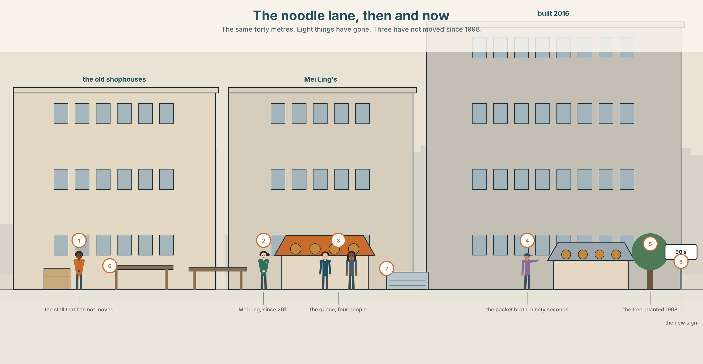{width=6.6in}

*The noodle lane, then and now — The same forty metres. Eight things have gone. Three have not moved since 1998.*

# What did you used to love?

**By the end of this unit you can compare something you loved as a child with what it is now.
Sixty seconds.**

| ◆ **A · THE WORLD** | What changes in a place, and what people decide to keep |
|---|---|
| ◆ **B · THE SYSTEM** | *used to* · *anymore* and *still* · 25 words for childhood and change · 15 words for then and now · *used to* said as one word |
| ◆ **C · THE PERFORMANCE** | Sixty seconds on a thing that is not what it was |

---

### 0A · Find it

The same corner, photographed twice: 1998 on the left, now on the right.
**Find eight things that are in one picture and not in the other.**

### 0B · Guess it

**Three things in the old picture are still there today.** Which three?
Give one reason for each.

### 0C · Say it ⏺

**Record thirty seconds.** *What did you love when you were eight?*
You will record it again at the end of this unit.

---

## Part 1 · Vocabulary Lab 1 ◆ **B · THE SYSTEM**

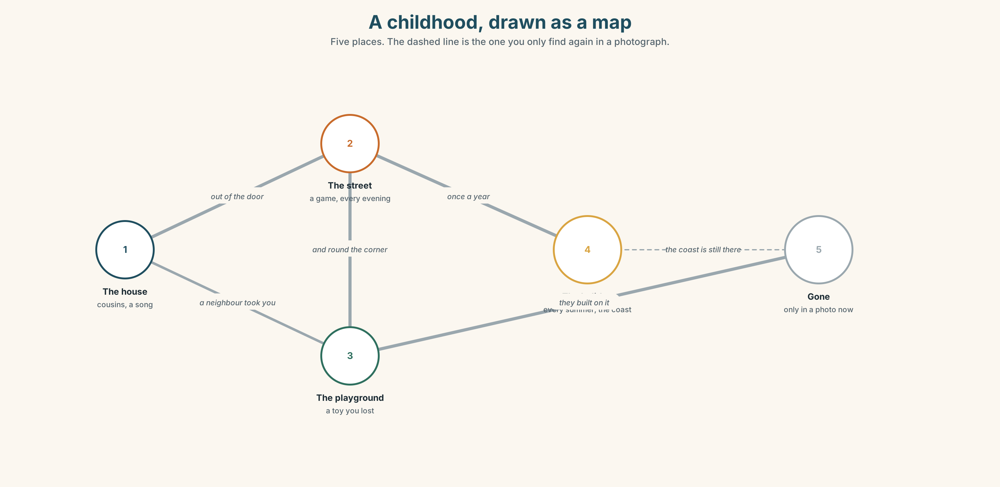{width=6.6in}

*A childhood, drawn as a map — Five places. The dashed line is the one you only find again in a photograph.*

### 1A · Meet — the words of a childhood

Match each word to one place on the map.

> **childhood** · **memory** · **photo** · **toy** · **game** · **song** · **cartoon** ·
> **playground** · **street** · **cousin**

### 1B · Sort — a thing, a person, or a feeling?

Three columns.

> neighbour · holiday · song · childhood · photo · memory · playground · game · toy ·
> cousin

**One of them belongs in two columns.** Which, and why?

### 1C · Meet — the words for what happened to it

> **change** · **different** · **same** · **old** · **young** · **favourite** · **remember**

Which two are opposites? Which one can describe both a person and a pair of shoes?

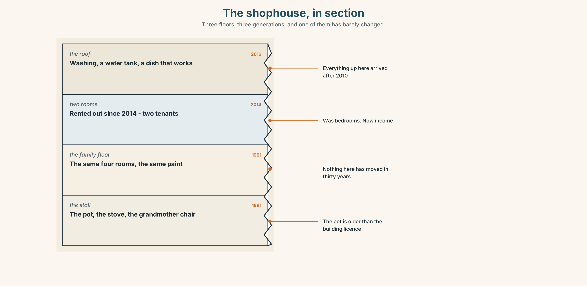{width=6.6in}

*The shophouse, in section — Three floors, three generations, and one of them has barely changed.*

**Look at the shophouse in section.** Three floors, three families, three decades.
**Which floor has changed least, and how can you tell from the drawing?**

### 1D · Stretch — the phrases

Complete each one with one word.

1. **When I was ______** , the whole street was open on a Sunday.
2. **In those ______** nobody locked anything.
3. The recipe is **my ______ 's** — I did not write it.
4. We went to the coast **every ______** until I was fourteen.
5. I try not to **look ______ on it** too often.

### 1E · The saying

> **f** **I don't anymore.**

Three words, and a whole story behind them. **Finish this exchange:**

> *"Do you still make it the long way?"* — *"I don't anymore."* — *"______ ?"*

### 1F · Own it

Think of one thing you used to do and do not do now. Tell a partner **three sentences**:
what it was, when you stopped, and whether you miss it.

---

## Part 2 · Listening ◆ **A · THE WORLD**

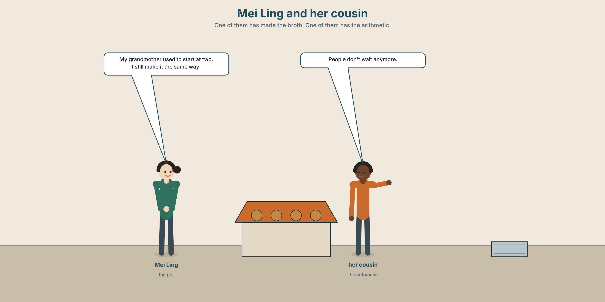{width=6.6in}

*Mei Ling and her cousin — One of them has made the broth. One of them has the arithmetic.*

### 2A · The broth takes forty minutes 🔊 Track 3.1

**Before you listen.** Mei Ling sells noodles. Her grandmother taught her the broth.
**Guess: is the grandmother alive?**

**Listen once. One question.** How long has the recipe been in the family?

**Listen again. Complete the table.**

| | Then | Now |
|---|---|---|
| How long the broth takes | | |
| How many bowls an hour | | |
| Who waits | | |

**Listen again. True or false?**

1. Her grandmother used to start the broth at two in the morning. ☐ T ☐ F
2. Mei Ling still starts at two. ☐ T ☐ F
3. The queue used to be longer. ☐ T ☐ F
4. She has already changed the recipe once. ☐ T ☐ F

**Noticing.** Four sentences from the recording.

1. *My grandmother used to start at two.*
2. *She started at two every day for thirty years.*
3. *People don't wait anymore.*
4. *I still make it the same way.*

**Two of these are about a habit that stopped. Two are about now.** Which are which?

### 2B · Decoding clinic 🔊 Track 3.2

Twenty-five seconds of Mei Ling. Four jobs.

1. How many times does she say *used to*?
2. In *used to*, can you hear the **d**?
3. Catch the two numbers she gives.
4. She corrects herself once. What does she change?

> Transcripts, page 152.

---

## Part 3 · Grammar Lab 1 ◆ **B · THE SYSTEM**

### The habit that stopped

### 3A · Notice

Look at the four sentences in Part 2.

1. Sentence 1 and sentence 2 say nearly the same thing. **What does sentence 1 add?**
2. Does sentence 1 tell you she still does it?
3. In sentence 3, which word carries the whole meaning?
4. *used to* and *still*. **One looks back. One reaches now.** Which is which?
5. Try *"I used to make it yesterday."* **Why is that wrong?**

### 3B · See

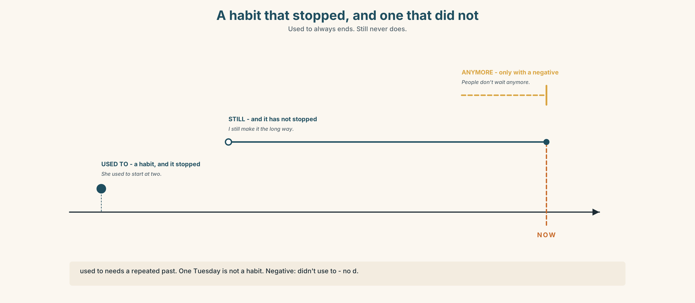{width=6.6in}

*A habit that stopped, and one that did not — Used to always ends. Still never does.*

Now read the second picture from the bottom up.
**Which rung says the habit has not stopped?**

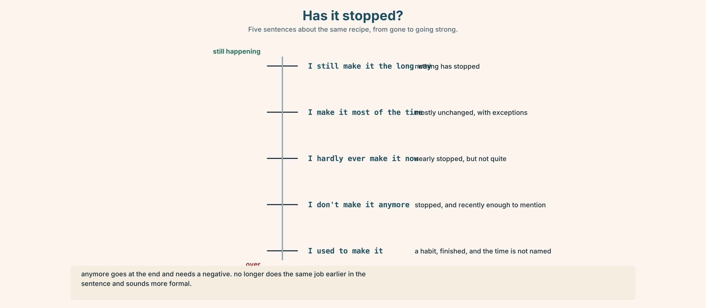{width=6.6in}

*Has it stopped? — Five sentences about the same recipe, from gone to going strong.*

### 3C · Know

| | Use it for | Example |
|---|---|---|
| **used to + verb** | a habit or a state that has stopped | *She **used to start** at two.* |
| **past simple** | one finished action, or a habit with a number | *She **started** at two every day for thirty years.* |

> **negative** → *didn't use to* (no **d**) · **question** → *Did you use to…?*
> **anymore** goes at the end, and only with a negative → *I don't make it that way **anymore**.*
> **no longer** does the same job, earlier in the sentence, and sounds more formal.
> **still** says the opposite: it has not stopped → *I **still** make it the long way.*

> **Watch out.** *used to* needs a repeated past. **One Tuesday is not a habit.**
> ✗ *I used to go there last week.* ✓ *I used to go there every week.*

> **Why it matters.** *I made it the long way* tells me about one pot of soup.
> *I used to make it the long way* tells me about a life that changed.

### 3D · Use — controlled

> My grandmother (1) __________ (start) the broth at two in the morning, and she never
> (2) __________ (use) a clock. People (3) __________ (wait) forty minutes and nobody
> complained. They don't wait (4) __________ . I (5) __________ (still / make) it the same way,
> but I (6) __________ (not / sell) as many bowls as she did.

### 3E · Use — guided

Rewrite each one with **used to**, **didn't use to** or **still**.

1. I played in that street every evening. *(and I don't now)*
2. I don't like coriander. *(and I never did)*
3. I go there every Friday. *(and I have not stopped)*
4. We had a television with four channels. *(and we don't now)*
5. She wasn't shy as a child. *(she is now)*

### 3F · Use — open

**Ask three people:** *What did you use to do at the weekend when you were ten?*
Write one answer with *used to* and one with *still*.

### 3G · Check — six items

> 1. I ______ (use) to live on this street.
> 2. We ______ (not use) to lock the door.
> 3. ______ you ______ (use) to walk to school?
> 4. I don't eat it ______ .
> 5. She ______ works here. She has never left.
> 6. In those days we ______ (go) to the coast every summer.

**0–3 →** Workbook pp. 16–18. **4–5 →** Part 6. **6 →** page 63.

---

## Part 4 · Speaking ◆ **C · THE PERFORMANCE**

### 4A · Fluency starter — then and now

Stand in two lines. Your teacher says a word: *school*. **Each pair has thirty seconds:**
*"It used to be ______ . Now it's ______ ."*

**Four rounds. Four words. Nobody may repeat an adjective.**

### 4B · The functional core — comparing then and now

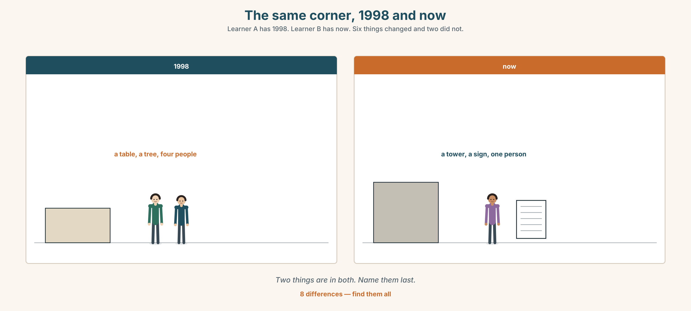{width=6.6in}

*The same corner, 1998 and now — Learner A has 1998. Learner B has now. Six things changed and two did not.*

**Language Bank**

| | |
|---|---|
| **then** | *It used to…* · *Back then…* · *In those days…* · *When I was little…* |
| **now** | *These days…* · *Nowadays…* · *Not like before.* |
| **what stopped** | *I don't ______ anymore.* · *Hardly ever.* · *Rarely.* |
| **what didn't** | *I still…* · *Most of the time, yes.* |

**Information gap.** Learner A has the street in 1998. Learner B has it now.
Neither sees the other. **Find six things that changed and two that did not.**

### 4C · The performance — sixty seconds ⏺

Talk about one thing you loved as a child. **Sixty seconds.** You must say:

> what it was · what you used to do with it · what it is like now · whether you miss it

**Record it.**

### 4D · Observer

One person listens for **one thing**: did the speaker say clearly what has stopped?

### 4E · Two criteria

> ☐ Did I use *used to* at least twice?
> ☐ Did I say one thing that has **not** changed?

---

## Part 5 · Reading ◆ **A · THE WORLD**

### 5A · Predict

A short story. The title is **"The pot."**
**Two sentences. What do you expect a story with that title to be about?**

### 5B · Read — one hundred seconds

---

**The pot**

When my grandmother was alive the broth took forty minutes and nobody thought that was long.
People used to stand in the lane and talk while they waited. The waiting was part of it. I was
eight, and my job was to carry the bowls out and bring them back, and I did it every summer until
I was fifteen.

She died in 2011. I kept the pot.

Last year a man came and stood in the queue for six minutes and then left. He wasn't rude about
it. He just looked at his phone twice and went to the stall at the end, which does a broth in
ninety seconds out of a packet, and it is not bad.

I still make it the long way. I start at two in the morning and I do not use a clock, because she
never used one and I have never needed one either. But I sell forty bowls on a Tuesday and she
used to sell a hundred and ten.

My cousin says I should change it. He says nobody is coming back for the forty minutes, they are
coming back for the taste, and the taste is in the bones and not in the time.

He may be right. He has never made it.

---

### 5C · Answer

1. How old was the writer when she carried the bowls?
2. What used to happen in the lane while people waited?
3. What did the man in the queue do, and how long did he wait?
4. Why does the writer not use a clock?
5. **How many bowls each, then and now?**
6. What is the cousin's argument, and what is the writer's answer to it?

### 5D · Vocabulary in context

Guess from the text. Then check.

> the lane · out of a packet · the bones · come back for · he may be right

### 5E · The counter-text

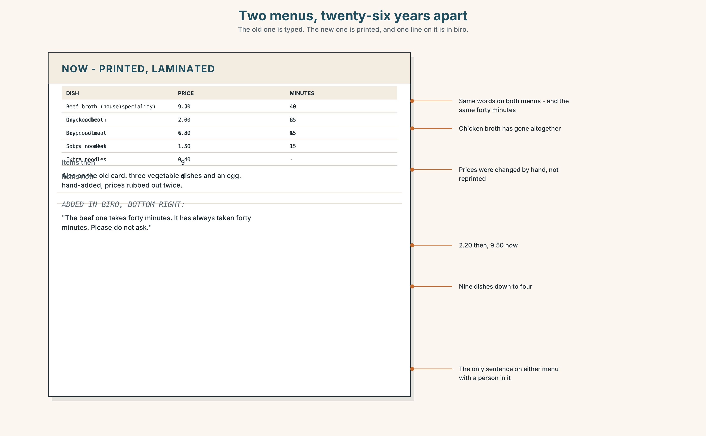{width=6.6in}

*Two menus, twenty-six years apart — The old one is typed. The new one is printed, and one line on it is in biro.*

**Read the two menus — 1998 and now — and answer.**

1. How many items were on the old menu, and how many are on the new one?
2. What was the old price of the broth, and what is it now?
3. **Which dish is on both menus with the same words, and what has changed about it?**
4. One line on the new menu was added by hand. What does it say?

### 5F · Two texts

The story says she sells **forty bowls** on a Tuesday.
The new menu says the broth is **the house speciality** and is first on the list.

**Put those two facts together. What is the menu doing?** Two sentences.

---

## Part 6 · Vocabulary Lab 2 ◆ **B · THE SYSTEM**

### Then, now, and how often

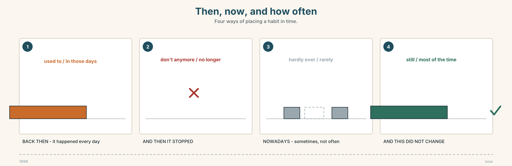{width=6.6in}

*Then, now, and how often — Four ways of placing a habit in time.*

### 6A · Sort — then, now, or how often?

Three columns.

> in those days · ever · nowadays · most of the time · never · rarely · back then ·
> these days · hardly ever

| **THEN** | **NOW** | **HOW OFTEN** |
|---|---|---|
| | | |

### 6B · Chunk completion

1. I don't go there ______ .
2. ______ , everybody cooks it in a packet.
3. It isn't ______ before — the lane is quieter.
4. He is ______ longer at that stall.
5. I remember it ______ it was, not as it is.
6. She's right ______ of the time.

### 6C · The strong words and the quiet ones

**never** is absolute. **hardly ever** is nearly. **rarely** is written more than spoken.

Put one of the three in each sentence, and say why the other two are worse.

1. I ______ eat out. *(maybe twice a year)*
2. I ______ eat out. *(not once in my life)*
3. The word ______ appears in a formal report.

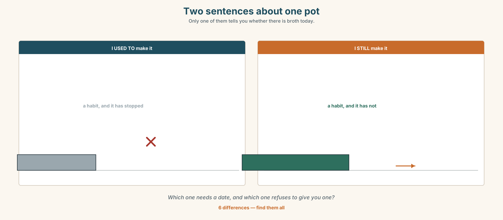{width=6.6in}

*Two sentences about one pot — Only one of them tells you whether there is broth today.*

**Six differences.** Find them, then answer the question under the picture.

### 6D · Contrast Clinic — stopped or not

Six items. *used to*, *still*, or *anymore*?

1. I ______ live in that street. *(I moved in 2015)*
2. She ______ to be very quiet.
3. I ______ live in that street. *(I have never moved)*
4. We don't speak ______ .
5. Do they ______ open on Sundays?
6. Nobody waits forty minutes ______ .

---

## Part 7 · Pronunciation & Fluency Lab ◆ **B · THE SYSTEM**

### Two words that became one

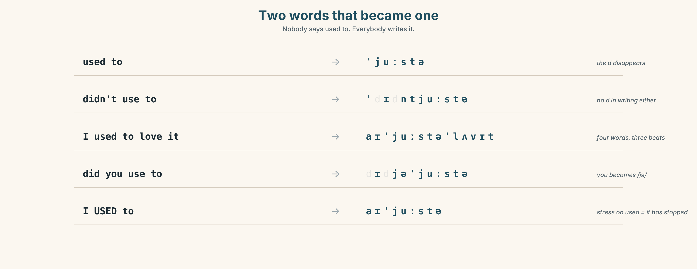{width=6.6in}

*Two words that became one — Nobody says used to. Everybody writes it.*

### 7A · Hear 🔊 Track 3.3

> used to → /ˈjuːstə/ — **no d, and the two words join**
> didn't use to → /ˈdɪdntjuːstə/
> I used to love it → /aɪˈjuːstəˈlʌvɪt/

### 7B · Say

Say each one. Then say the sentence three times, faster:

> *I used to walk to school every day.*

### 7C · Make it mean something

Say these two:

> *I USED to.* *(stress on used — and you are telling somebody it has stopped)*
> *I used to WALK.* *(stress on walk — and you are telling them how, not whether)*

**Which one answers the question "Do you still?"**

### 7D · Fluency 20 ⏺

Twenty seconds: **three things you used to do and one you still do.**
Three times, faster.

---

## Part 8 · Writing ◆ **C · THE PERFORMANCE**

### Then and now · 80 words

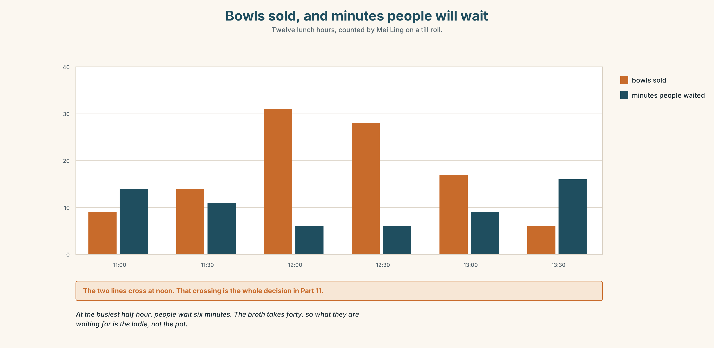{width=6.6in}

*Bowls sold, and minutes people will wait — Twelve lunch hours, counted by Mei Ling on a till roll.*

### 8A · Read the model

> We used to walk to the river every Sunday, all of us, and my cousin always carried the bag
> because he was the oldest. `[one habit, one detail, and the detail does the work]`
>
> Nobody walks it now. There is a road across the path and the water is lower than it was.
>
> I still go twice a year, on my own, and I take the same bag. `[what did not change — and it is
> one small object, not a feeling]`

**Questions about the writer's choices:**

1. The first sentence names who carried the bag. **Why is that better than "we were happy"?**
2. The last line is about a bag. **What is it really about?**

### 8B · The anti-model

> When I was a child everything was better. We used to play outside and we were very happy.
> Nowadays children only look at screens. Life has changed a lot and not in a good way.

Correct English. **Name two things that are missing** — and say why a reader does not believe it.

### 8C · Plan

> one habit → one detail that proves it → what stopped → what is still there

### 8D · Write — 80 words
### 8E · Peer review — two criteria

> ☐ Is there one detail only this writer could know?
> ☐ Is there one thing that did **not** change?

### 8F · Write it again · 8G · Publish

On the wall, beside the two menus from Part 5E.

---

## Part 9 · The File ◆ **A · THE WORLD + C · THE PERFORMANCE**

# CULTURE FILE · The Misunderstanding

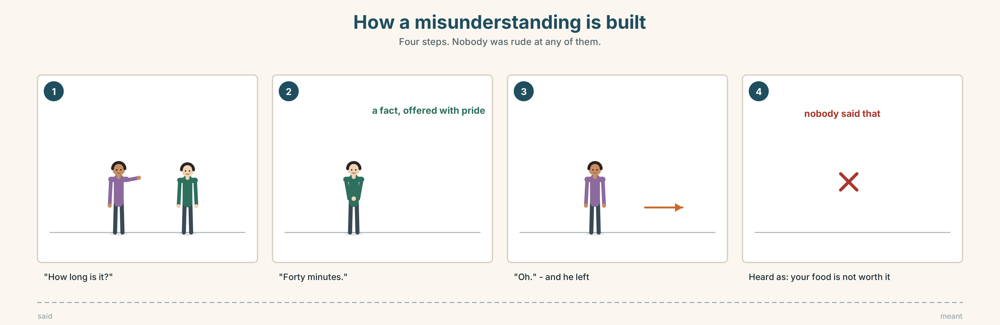{width=6.6in}

*How a misunderstanding is built — Four steps. Nobody was rude at any of them.*

### 9A · Nobody was rude 🔊 Track 3.4

A visitor waits six minutes and leaves. Mei Ling says nothing and is offended.
The visitor has no idea. **Listen to both of them talking about it afterwards.**

1. What does the visitor think happened?
2. What does Mei Ling think happened?
3. **Which one of them thinks waiting is part of the food?**

### 9B · Where it went wrong

> **the thing that was said** · **the thing that was heard** · **the thing that was meant**

Three columns. Put these four lines in the right place.

> *"How long is it?"* · *"Forty minutes."* · *"Oh."* · *(and he left)*

### 9C · Repair phrases

Match each to its job.

> *"Sorry — I didn't realise."* · *"Can I ask why…?"* · *"Ah, I see."* ·
> *"That's not what I meant."*

> apologising · checking · understanding · correcting

### 9D · Your turn

In pairs. **One of you is in a hurry. One of you is proud of taking time.**
Play it twice: once badly, once with a repair phrase. **Two minutes each.**

### 9E · Transfer

**Think of one thing in your country that takes a long time on purpose.**
Explain to the group why the time is part of it.

---

## Part 10 · Mediation & Interaction ◆ **C · THE PERFORMANCE**

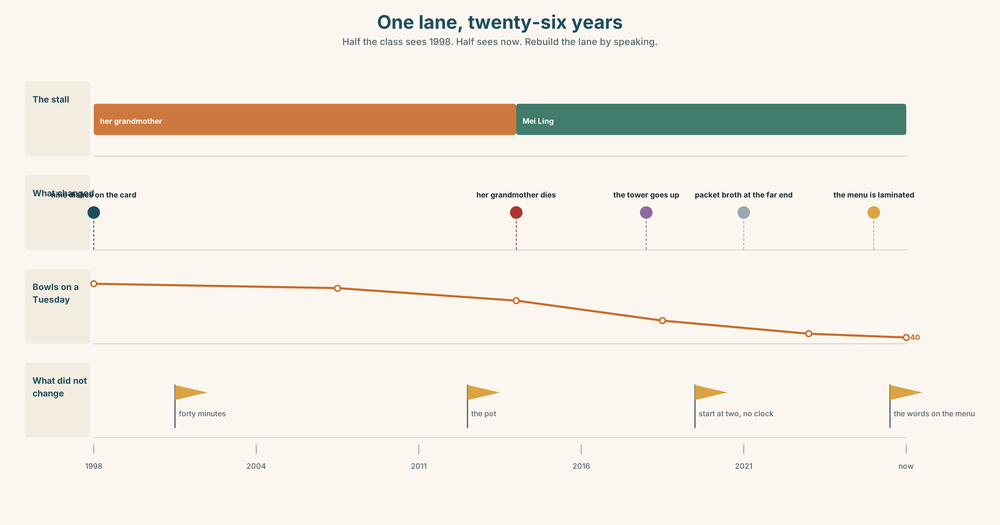{width=6.6in}

*One lane, twenty-six years — Half the class sees 1998. Half sees now. Rebuild the lane by speaking.*

### 10A · Relay

Half the class sees 1998. Half sees now. **Rebuild the whole street by speaking.** Ten minutes.

### 10B · Simplify

Explain the old menu from Part 5E to somebody who has never eaten here. **Four sentences only.**

> **Plan:** what it is → how long it takes → why → what to order first

### 10C · Compress

The story in Part 5 into **thirty words**, as a label to put next to the pot.

### 10D · Online

Write **one message** for the market's page: the broth takes forty minutes, you are not going to
change that, and you want people to know before they queue.

### 10E · Your language

How does your language say *used to*? **Is it one word, two, or a different tense altogether?**
Show a partner, then say one sentence about your own childhood in both languages.

---

## Part 11 · The Decision ◆ **C · THE PERFORMANCE**

# Forty minutes, or ninety seconds

The broth takes forty minutes. The lunch queue is twenty-five minutes long at its worst and people
leave. The stall at the end does a packet broth in ninety seconds and sells three times as much.

- **Keep it.** Forty minutes. Fewer bowls, and the thing stays what it is.
- **Change it.** Make the base the night before. Eight minutes a bowl. Nobody will know.
- **Both.** The long one until it runs out, the quick one after. Two prices.

### 11A · The evidence

1. **The two menus** from Part 5E — and what the handwritten line says.
2. **The chart** — bowls sold per hour, against how long people are willing to wait.
3. **The voice.** Her cousin, twenty seconds: *"They're not coming back for the forty minutes.
   Nobody has ever come back for the forty minutes."*

### 11B · Talk about it

In threes. Everybody says one. Use the frame.

> *I think Mei Ling should ______ , because ______ .*

**Words you can use:** *memory · queue · taste · her grandmother's · change · the same · money*

### 11C · Decide

Write **two sentences**. Choose, and say why.

> I think Mei Ling should ______________________ ,
> because ______________________ .

### 11D · Model decision

> She should make the base the night before and keep everything else. The forty minutes was never
> the point — her grandmother started at two in the morning precisely so that nobody would have to
> wait, and doing the slow thing at the wrong end of the day is not loyalty to her, it is just
> doing it in the hardest order.

### 11E · The Reveal

> **What happened.** She made the base the night before. Service came down to nine minutes and
> sales went up by half in three weeks.
>
> Four regulars said it tasted different. She could not taste any difference and neither could her
> cousin, and two of the four were back within a month.
>
> She did not tell anybody she had changed it. She has told one person since: the man who waited
> six minutes and left, who came back and is now there on Tuesdays.

**Sales up by half. Four complaints. One secret she is not comfortable with.**

> **Was it the right decision?** Say why — and say what you think of the secret.

---

## Part 12 · Landing ◆ **all three lines**

### 12A · Recycle — ten items

> 1. I ______ (use) to live here.
> 2. Nobody waits ______ .
> 3. She ______ makes it the long way.
> 4. ______ those days the street was open on Sundays.
> 5. We went to the coast ______ summer.
> 6. *(Unit 2)* ______ he was loading, the road closed.
> 7. *(Unit 2)* It ______ (rain) all morning.
> 8. *(Unit 1)* I've worked here ______ three years.
> 9. *(Starting Out)* My grandmother ______ (teach) me.
> 10. *(Starting Out)* There ______ four of us in the house.

### 12B · Consolidate

**Eighty words, one paragraph.** A place you knew as a child. Two sentences with *used to*,
one with *anymore*, one with *still*.

### 12C · Can-do, with evidence

| I can… | My evidence | Sure? |
|---|---|---|
| say what I used to do and no longer do | Part 3G score | ◯ ◑ ● |
| compare then and now in sixty seconds | Part 4C recording | ◯ ◑ ● |
| write eighty words about a change | Part 8 draft 2 | ◯ ◑ ● |
| repair a misunderstanding politely | Part 9D role play | ◯ ◑ ● |

### 12D · Replay ⏺

Find your thirty seconds from Part 0C. Listen. **Record it again.**
One sentence: what is different?

### 12E · Glossary — forty items, as a map

> **THE CHILDHOOD** · childhood · memory · remember · photo · toy · game · song · cartoon · playground
> **THE PEOPLE** · cousin · neighbour · my grandmother's
> **THE PLACE** · street · holiday · every summer · when I was little · in those days
> **WHAT HAPPENED TO IT** · change · different · same · old · young · favourite · look back on
> **IT STOPPED** · used to · anymore · no longer · not like before · I don't anymore · things have changed · miss out on
> **IT DIDN'T** · nowadays · these days · back then · the way it was · most of the time
> **HOW OFTEN** · rarely · ever · never · hardly ever

### 12F · Next

> **Unit 4 · Who is the person who…?**

# A2.1 · Unit 4 · The Corner Pitch

> **English Animated** · *Making Plans* · Pasar Chow Kit, Kuala Lumpur
> Student's Book pages 72–93 · 22 pp · ~10 hours

---

## Part 0 · The Big Picture ◆ **A · THE WORLD**

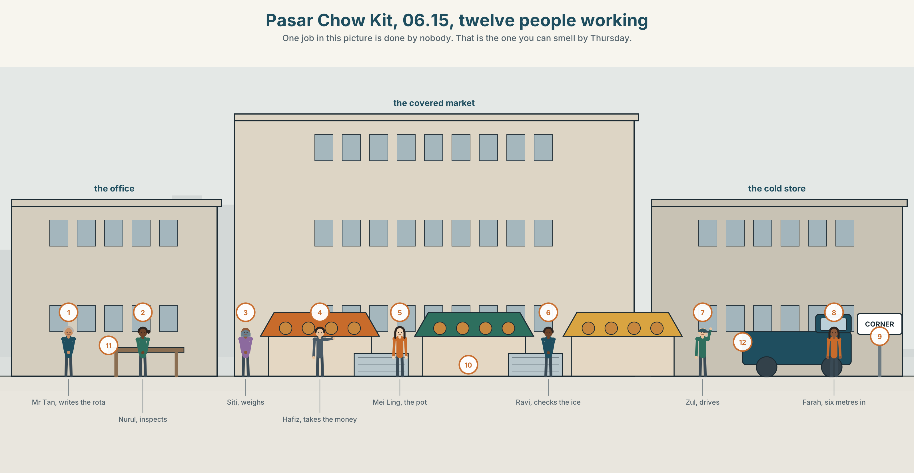{width=6.6in}

*Pasar Chow Kit, 06.15, twelve people working — One job in this picture is done by nobody. That is the one you can smell by Thursday.*

# Who is the person who…?

**By the end of this unit you can describe three jobs in one workplace, so that somebody on their
first day knows who to ask for what.**

| ◆ **A · THE WORLD** | How a workplace divides itself up, and who ends up with the gaps |
|---|---|
| ◆ **B · THE SYSTEM** | *who, which, that, where* · 24 words for teams and roles · 16 words for describing a job · where to pause in a long sentence |
| ◆ **C · THE PERFORMANCE** | Three jobs, described so a stranger can use them |

---

### 0A · Find it

**Twelve people are working in this picture.** Find the person who:

> opens the gate · weighs · takes the money · writes the rota · checks the ice ·
> cleans the drain · drives · inspects · unlocks the cold store · answers the phone ·
> fixes the lights · decides who gets the corner

### 0B · Guess it

**One job in this picture is done by nobody.** Which, and what happens as a result?

### 0C · Say it ⏺

**Record thirty seconds.** *Think of a place you know. Who is the person you ask when something
goes wrong?* You will record it again at the end of the unit.

---

## Part 1 · Vocabulary Lab 1 ◆ **B · THE SYSTEM**

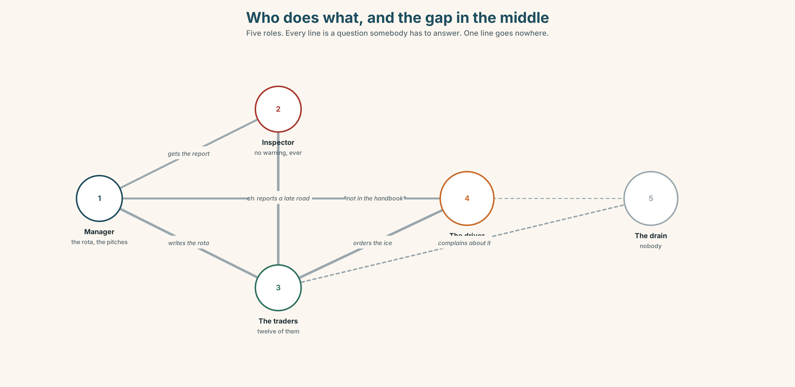{width=6.6in}

*Who does what, and the gap in the middle — Five roles. Every line is a question somebody has to answer. One line goes nowhere.*

### 1A · Meet — the people and the work

Match each word to one place on the map.

> **team** · **role** · **job** · **task** · **boss** · **manager** · **colleague** ·
> **staff** · **shift**

### 1B · Sort — a person, a piece of work, or a time?

Three columns.

> staff · team · shift · manager · boss · role · colleague · job · task

**Two of them can go in two columns.** Which, and why?

### 1C · Meet — what you say about somebody good

> **responsible** · **thorough** · **reliable** · **honest** · **hard-working** · **calm** ·
> **friendly**

Which one would you want in a person who counts money? Which in a person who opens at four?

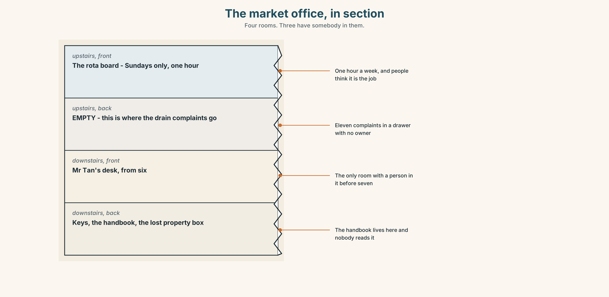{width=6.6in}

*The market office, in section — Four rooms. Three have somebody in them.*

**Look at the market office in section.** Four rooms, four jobs.
**Which room has nobody in it, and whose job has fallen into it?**

### 1D · Stretch — the phrases

Complete each one with one word.

1. Nurul is **in ______ of** food safety for the whole market.
2. Could you **______ after** the stall for ten minutes?
3. He's **the ______ who** has the key to the cold store.
4. Four of us **work ______** on a Saturday.
5. When she is ill, Hafiz **______ over**.

### 1E · The saying

> **f** **That's not my job.**

Four words that can be fair or lazy. **Write one situation where it is fair, and one where it
is not.** Read both to a partner. Can they tell which is which?

### 1F · Own it

Think of a place you have worked, studied or lived in. Tell a partner **three sentences** about
**three different people** — using *who* in each one.

---

## Part 2 · Listening ◆ **A · THE WORLD**

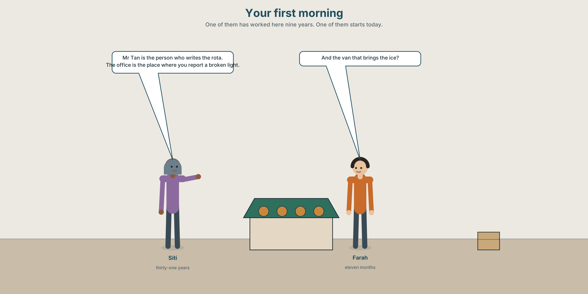{width=6.6in}

*Your first morning — One of them has worked here nine years. One of them starts today.*

### 2A · Your first morning 🔊 Track 4.1

**Before you listen.** Somebody is starting work at the market today.
**Who would explain the place to them — the manager, or another trader?**

**Listen once. One question.** How many people does the speaker name?

**Listen again. Complete the table.**

| Name | What they do | When to go to them |
|---|---|---|
| Mr Tan | | |
| Nurul | | |
| Zul | | |

**Listen again. Choose.**

1. The person who has the cold store key is **Nurul / a trader / Mr Tan**.
2. Nurul arrives **every Monday / without warning / on a rota**.
3. The place where you report a broken light is **the gate / the office / nowhere**.
4. The thing nobody is responsible for is **the drain / the ice / the rota**.

**Noticing.** Four sentences from the recording.

1. *Mr Tan is the person who writes the rota.*
2. *Nurul is the inspector who comes without warning.*
3. *The office is the place where you report a broken light.*
4. *The van that brings the ice is Zul's.*

**Three of these describe a person. One describes a place.** Find it.

### 2B · Decoding clinic 🔊 Track 4.2

Twenty-five seconds. Four jobs.

1. How many times does the speaker say *who*?
2. Where does she pause in sentence 1 — before *who* or after it?
3. Catch the two names she says twice.
4. One sentence has no pause at all. Which, and why is it still clear?

> Transcripts, page 153.

---

## Part 3 · Grammar Lab 1 ◆ **B · THE SYSTEM**

### Saying which one you mean

### 3A · Notice

Look at the four sentences in Part 2.

1. In sentence 1, could you take out *who writes the rota*? **What would be left?**
2. In sentence 3, why *where* and not *who*?
3. Sentences 1 and 4 both pick one thing out of several. **Out of what, in each case?**
4. *who*, *which*, *where*. **Which one is for people, which for things, which for places?**
5. Try *"Mr Tan is the person which writes the rota."* **What is wrong?**

### 3B · See

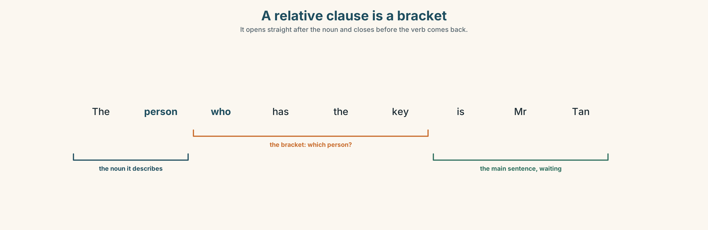{width=6.6in}

*A relative clause is a bracket — It opens straight after the noun and closes before the verb comes back.*

Now look at the second picture. **A relative clause is a bracket. Where does it open and
where does it close?**

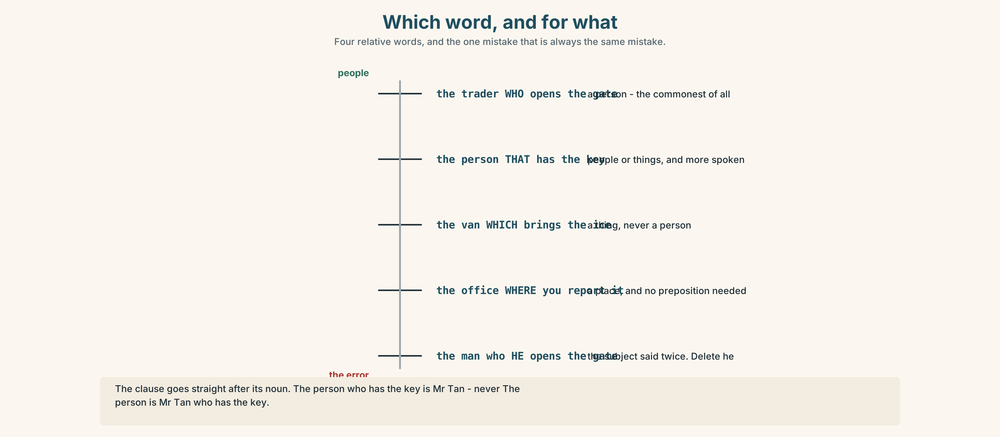{width=6.6in}

*Which word, and for what — Four relative words, and the one mistake that is always the same mistake.*

### 3C · Know

| | Use it for | Example |
|---|---|---|
| **who** | people | *the trader **who** opens the gate* |
| **which** | things | *the van **which** brings the ice* |
| **that** | people or things, and more common in speech | *the person **that** has the key* |
| **where** | places | *the office **where** you report it* |

> **The clause comes straight after the noun it describes.**
> ✓ *The person **who has the key** is Mr Tan.*
> ✗ *The person is Mr Tan who has the key.*

> **Watch out.** Do not say the subject twice.
> ✗ *the man who **he** opens the gate* ✓ *the man who opens the gate*

> **Why it matters.** There are twelve people in this market. *The man* tells me nothing.
> *The man who has the cold store key* tells me exactly one.

### 3D · Use — controlled

> Mr Tan is the manager (1) __________ writes the rota. The office (2) __________ he works is
> next to the gate. Nurul is the inspector (3) __________ arrives without warning, and the van
> (4) __________ brings the ice belongs to Zul. The one job (5) __________ nobody does is the
> drain, (6) __________ is why it smells by Thursday.

### 3E · Use — guided

Join each pair into one sentence.

1. That's the trader. She opens the gate at four.
2. This is the room. We keep the scales here.
3. He's the colleague. I trust him with the money.
4. That's the van. It broke down on Tuesday.
5. She's the person. Her name is on the rota every Sunday.

### 3F · Use — open

**Describe three people in this room** without using their names. Your partner must guess.
Use *who* in all three.

### 3G · Check — six items

> 1. The person ______ has the key is Mr Tan.
> 2. This is the place ______ we weigh everything.
> 3. The van ______ brings the ice is late again.
> 4. She's the one ______ I asked on Monday.
> 5. Is that the manager ______ wrote the rota?
> 6. The job ______ nobody wants is the drain.

**0–3 →** Workbook pp. 22–24. **4–5 →** Part 6. **6 →** page 85.

---

## Part 4 · Speaking ◆ **C · THE PERFORMANCE**

### 4A · Fluency starter — guess the job

One learner thinks of a job in this building. The others ask **only** questions beginning
*"Is it the person who…?"* **Six questions maximum.**

**Three rounds. Three learners.**

### 4B · The functional core — telling somebody who to ask

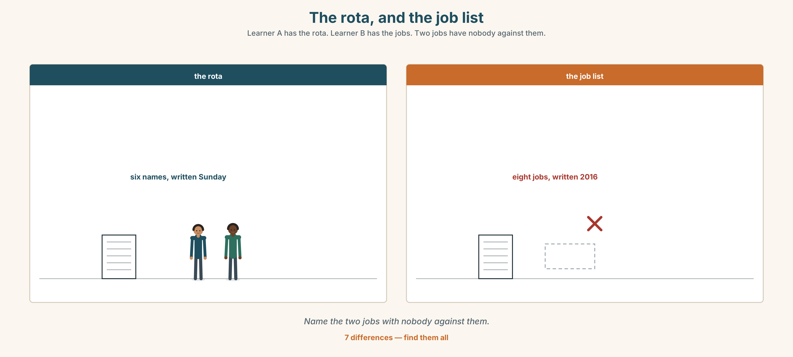{width=6.6in}

*The rota, and the job list — Learner A has the rota. Learner B has the jobs. Two jobs have nobody against them.*

**Language Bank**

| | |
|---|---|
| **naming the role** | *She's the one who…* · *He's in charge of…* · *That's the person that…* |
| **naming the place** | *The office where…* · *Round the back, where…* |
| **saying when** | *Go to her if…* · *Only ask him when…* · *Don't ask on a Friday.* |
| **the honest warning** | *Nobody really does that one.* · *That's not anybody's job.* |

**Information gap.** Learner A has the rota. Learner B has the job list.
Neither sees the other. **Work out which two jobs have nobody's name against them.**

### 4C · The performance — eighty seconds ⏺

Describe **three jobs in one workplace** to somebody arriving on Monday.
**Eighty seconds.** You must give:

> who each person is · what each one decides · one thing you would not ask them

**Record it.**

### 4D · Observer

One person listens for **one thing**: could a stranger now go to the right person?

### 4E · Two criteria

> ☐ Did I use *who*, *which* or *where* in each of the three?
> ☐ Did I say one thing **not** to ask?

---

## Part 5 · Reading ◆ **A · THE WORLD**

### 5A · Predict

A personal essay by a market manager. The title is **"Twelve stalls and one corner."**
**What problem do you expect him to describe?** One sentence.

### 5B · Read — one hundred seconds

---

**Twelve stalls and one corner**

I have been the manager here for nine years. People think the job is the rota. It is not. The
rota takes an hour on a Sunday. The job is the corner.

There is one corner pitch. It is the pitch that everybody who walks in from the car park sees
first, and the trader who has it takes about forty per cent more than the trader who is six metres
further in. It came free in March.

Three people want it. One is the trader who has been here longest and has never asked me for
anything. One is the trader who pays the most and is, if I am honest, the most reliable person in
this market. One is a woman who started eleven months ago, who is on her own with two children,
and who is six metres further in.

My predecessor had a rule: longest serving. It is a good rule because it cannot be argued with
and a bad rule because it rewards nothing except staying.

I have read the handbook. The handbook says the manager decides. That is the sentence that tells
you the handbook was written by somebody who has never had to.

---

### 5C · Answer

1. How long has the writer been the manager?
2. What does he say the job really is?
3. How much more does the corner pitch take?
4. **Describe the three people who want it, in one sentence each.**
5. What was his predecessor's rule, and what does he say is wrong with it?
6. What is his complaint about the handbook?

### 5D · Vocabulary in context

Guess from the text. Then check.

> a pitch · six metres further in · my predecessor · rewards nothing except · if I am honest

### 5E · The counter-text

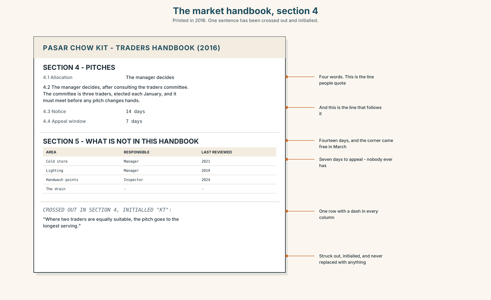{width=6.6in}

*The market handbook, section 4 — Printed in 2016. One sentence has been crossed out and initialled.*

**Read the market handbook extract and answer.**

1. Which section covers pitch allocation?
2. **What exactly does the handbook say the manager must do before deciding?**
3. How many days' notice must traders be given?
4. One sentence has been crossed out and initialled. What did it say?

### 5F · Two texts

The essay says *"the handbook says the manager decides."*
The handbook says the manager decides **after consulting the traders' committee**.

**Put those two facts together. What has the writer left out, and why might he have?**
Two sentences.

---

## Part 6 · Vocabulary Lab 2 ◆ **B · THE SYSTEM**

### Describing the work itself

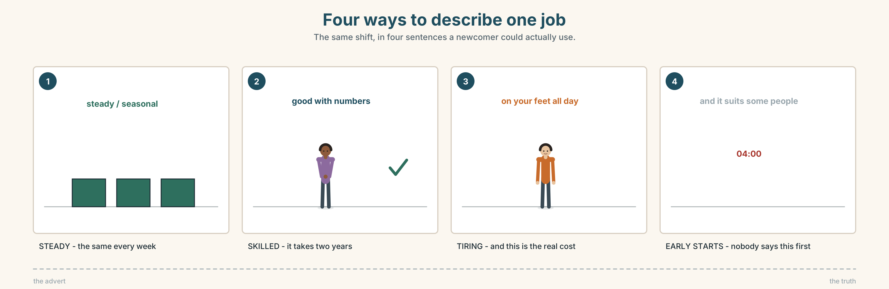{width=6.6in}

*Four ways to describe one job — The same shift, in four sentences a newcomer could actually use.*

### 6A · Sort — would you want it?

Two columns, and be honest.

> stressful · steady · helpful · interesting · badly-paid · difficult · skilled · boring ·
> useful · seasonal · well-paid · tiring

| **I'd take it** | **I wouldn't** |
|---|---|
| | |

**Two of these are in both columns for most people.** Which?

### 6B · Chunk completion

1. She's **a people ______** — she remembers everybody.
2. He's **good with ______** , so he counts the takings.
3. It's **on your ______ all day** , and that is the real cost of it.
4. The **early ______** are the part nobody tells you about.
5. I **get ______ with** everybody here except one person.
6. The hours are long, but **it ______ me**.

### 6C · Two words that look the same

**helpful** and **useful** are not the same. **A person is helpful. A thing is useful.**

Put the right one in each.

1. The new scales are very ______ .
2. Hafiz was extremely ______ on Tuesday.
3. That's a ______ piece of advice.
4. Thank you — you've been very ______ .

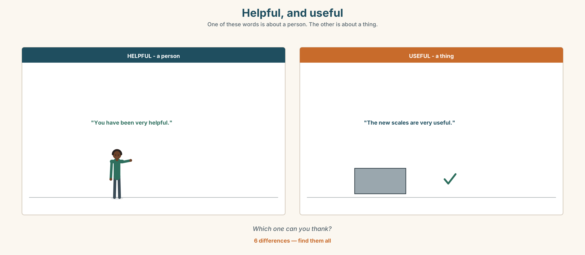{width=6.6in}

*Helpful, and useful — One of these words is about a person. The other is about a thing.*

**Six differences.** Find them, then answer the question under the picture.

### 6D · Contrast Clinic — who, which, where or that

Six items.

1. The market ______ I have worked for nine years.
2. The room ______ we keep the ice.
3. The job ______ nobody wants.
4. The van ______ broke down.
5. The person ______ opens the gate.
6. The inspector ______ came on Thursday.

---

## Part 7 · Pronunciation & Fluency Lab ◆ **B · THE SYSTEM**

### Where to breathe in a long sentence

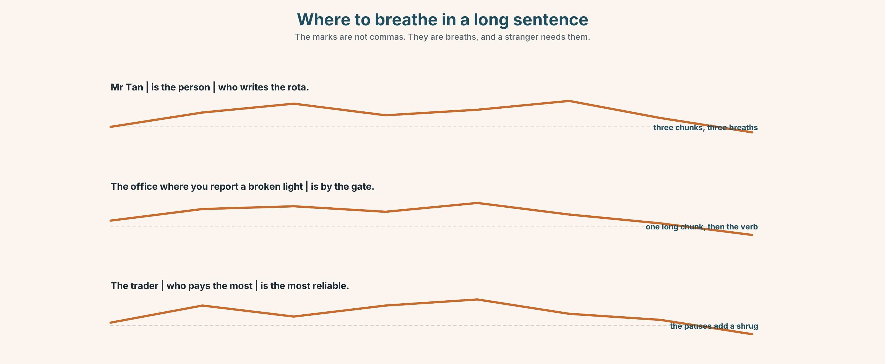{width=6.6in}

*Where to breathe in a long sentence — The marks are not commas. They are breaths, and a stranger needs them.*

### 7A · Hear 🔊 Track 4.3

> *Mr Tan* | *is the person* | *who writes the rota.*
> *The office* | *where you report a broken light* | *is next to the gate.*

**The marks are not commas. They are breaths.**

### 7B · Say

Say each one with the breaths. Then say it again with no breath at all.
**Which version can a stranger follow?**

### 7C · Make it mean something

Say this sentence twice:

> *The trader who pays the most | is the most reliable.*
> *The trader | who pays the most | is the most reliable.*

**The second one adds something the first does not.** What?

### 7D · Fluency 20 ⏺

Twenty seconds: **three people in your life, each described with *who*.**
Three times, faster — but keep the breath before *who*.

---

## Part 8 · Writing ◆ **C · THE PERFORMANCE**

### Who to ask · 90 words

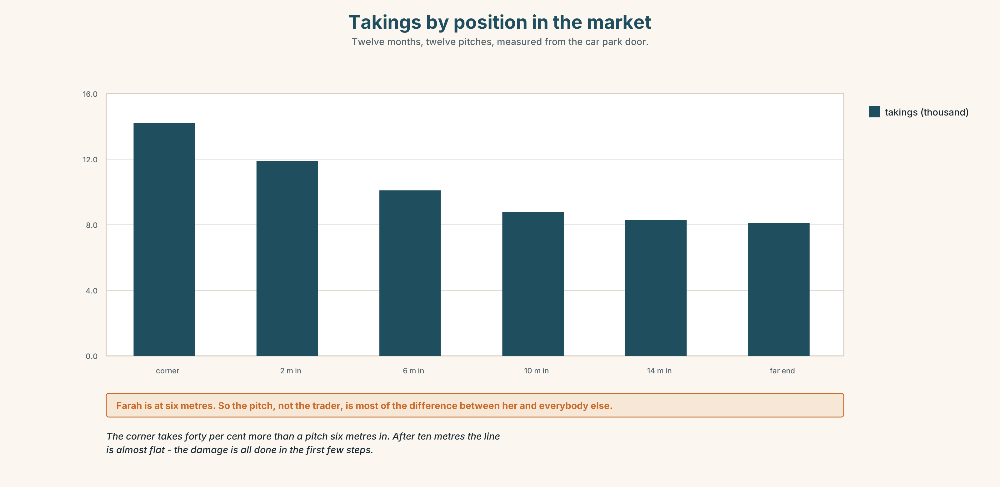{width=6.6in}

*Takings by position in the market — Twelve months, twelve pitches, measured from the car park door.*

### 8A · Read the model

> Mr Tan is the manager who writes the rota and decides who gets which pitch. He is in the office
> by the gate from six. `[the role, then where and when — a newcomer can act on this]`
>
> Nurul is the inspector who arrives without warning. Do not try to be friendly with her; she is
> not here for that, and she is honest about it. `[one thing not to do, and why]`
>
> Zul drives the van which brings the ice. If the ice is late, it is almost never Zul.
> `[a warning about blame, not about the person]`

**Questions about the writer's choices:**

1. Each paragraph gives one thing you **should not** do. Why is that more useful than praise?
2. The last line defends somebody who was not accused. **Why?**

### 8B · The anti-model

> There are many people working here. Mr Tan is the manager and he is very nice. Nurul is the
> inspector. Zul drives the van. Everybody is friendly and works very hard as a team.

Correct English, and useless on a first morning. **Name two questions it does not answer.**

### 8C · Plan

> name → the role, with *who* or *which* → where and when to find them → one thing not to ask

### 8D · Write — 90 words
### 8E · Peer review — two criteria

> ☐ Could a stranger use this on Monday morning?
> ☐ Is there one honest warning in it?

### 8F · Write it again · 8G · Publish

On the wall, with the handbook extract from Part 5E beside it.

---

## Part 9 · The File ◆ **A · THE WORLD + C · THE PERFORMANCE**

# WORK FILE · The Review

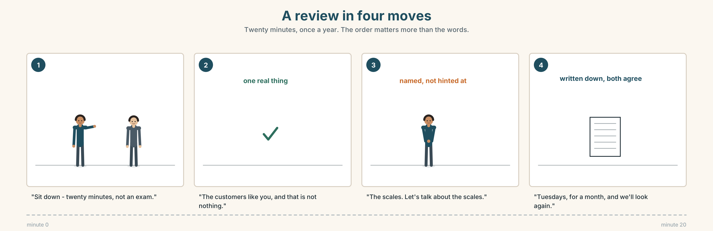{width=6.6in}

*A review in four moves — Twenty minutes, once a year. The order matters more than the words.*

### 9A · Twenty minutes, once a year 🔊 Track 4.4

Mr Tan reviews Hafiz's first year. **Listen.**

1. How does Mr Tan open it, and how long does the small talk last?
2. What does he praise, and what does he raise?
3. **He asks one question he does not know the answer to. Which?**

### 9B · The four moves

> opening · praising · raising something · agreeing what happens next

Match each to one phrase.

> *"Sit down — this is twenty minutes, not an exam."* · *"The customers like you, and that is
> not nothing."* · *"The scales. Let's talk about the scales."* · *"So: Tuesdays, for a month,
> and we'll look again."*

### 9C · Receiving it

What do you say when somebody raises something true? Put these in order, best first.

> *"I know. I'm working on it."* · *"That's not fair."* · *"Yes. What would help?"* ·
> *"Sorry."*

### 9D · Your turn

In pairs. **Ten minutes.** One reviews, one is reviewed. The reviewer must praise one real thing
and raise one real thing. **Then swap.**

### 9E · Transfer

**Write the one sentence you would want said about your work this year.** Keep it.
You will look at it again at the end of the book.

---

## Part 10 · Mediation & Interaction ◆ **C · THE PERFORMANCE**

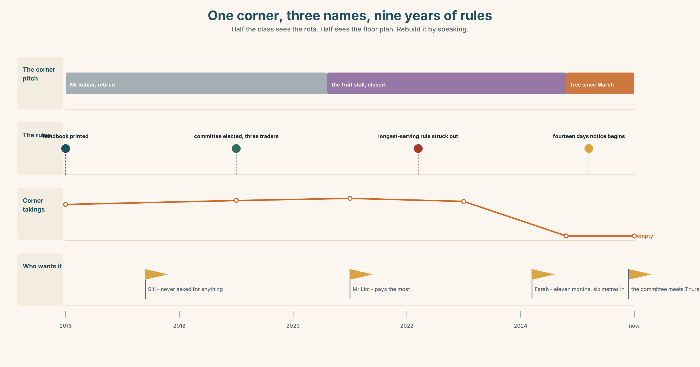{width=6.6in}

*One corner, three names, nine years of rules — Half the class sees the rota. Half sees the floor plan. Rebuild it by speaking.*

### 10A · Relay

Half the class sees the rota. Half sees the floor plan. **Rebuild who does what, and where,
by speaking.** Ten minutes.

### 10B · Simplify

Explain the handbook extract from Part 5E to a trader who has never read it.
**Four sentences only.**

> **Plan:** who decides → who must be asked first → how much notice → what you can do if you disagree

### 10C · Compress

The essay in Part 5 into **thirty-five words**, for the traders' noticeboard.

### 10D · Online

Write **one message** to the traders' group: the corner pitch is free, three people want it,
and you want the committee to meet on Thursday.

### 10E · Your language

How does your language join *the person* to *who opens the gate*?
**Does the clause come before or after the noun?** Show a partner both orders.

---

## Part 11 · The Decision ◆ **C · THE PERFORMANCE**

# One corner, three names

The corner pitch takes forty per cent more than the pitches six metres in. Three traders want it.

- **Siti.** Thirty-one years. Has never asked for anything. Would not ask now if you did not offer.
- **Mr Lim.** Pays the most, never late, the most reliable trader in the market. Also already
  does well.
- **Nurul's cousin Farah.** Eleven months. On her own with two children. Six metres in, and that
  six metres is most of what is wrong with her takings.

### 11A · The evidence

1. **The handbook extract** from Part 5E — and the sentence that was crossed out.
2. **The chart** — takings by position in the market, over twelve months.
3. **The voice.** Siti, fifteen seconds: *"Give it to the girl. I've had thirty-one years of
   people walking past me and I've done all right."*

### 11B · Talk about it

In threes. Everybody says one. Use the frame.

> *I think the pitch should go to ______ , because ______ .*

**Words you can use:** *fair · longest · reliable · needs it · rewards · rule · honest · team*

### 11C · Decide

Write **two sentences**. Choose, and say why.

> I think the pitch should go to ______________________ ,
> because ______________________ .

### 11D · Model decision

> It should go to Farah, and Mr Tan should say out loud, at the committee, that he is not using
> the longest-serving rule and why. A rule you break quietly is worse than no rule. If he says it
> in the room, the next manager has something to argue with; if he does not, the next three
> corners go to whoever shouts.

### 11E · The Reveal

> **What happened.** It went to Farah. The committee agreed in eleven minutes because Siti spoke
> first and nobody wanted to speak after her.
>
> Mr Lim did not complain and has not spoken to Mr Tan about anything except deliveries since.
>
> Farah's takings went up thirty-one per cent and she now opens at four, which she could not
> afford to do before because she was not taking enough to pay somebody to watch the children.

**It worked. And it cost him the trader who pays the most.**

> **Was it the right decision?** Say why — and say what you would have said to Mr Lim.

---

## Part 12 · Landing ◆ **all three lines**

### 12A · Recycle — ten items

> 1. The person ______ has the key is Mr Tan.
> 2. The office ______ he works is by the gate.
> 3. The van ______ brings the ice is late.
> 4. Nurul is **in ______ of** food safety.
> 5. When Siti is ill, Hafiz **______ over**.
> 6. *(Unit 3)* I ______ (use) to live on this street.
> 7. *(Unit 3)* Nobody waits ______ .
> 8. *(Unit 2)* ______ he was loading, the road closed.
> 9. *(Starting Out)* She ______ (work) here every Saturday.
> 10. *(Starting Out)* There ______ twelve stalls in this row.

### 12B · Consolidate

**Ninety words, one paragraph.** Three people in a place you know. One sentence each with
*who*, *which* or *where*, and one honest warning.

### 12C · Can-do, with evidence

| I can… | My evidence | Sure? |
|---|---|---|
| say exactly which person or thing I mean | Part 3G score | ◯ ◑ ● |
| describe three jobs in eighty seconds | Part 4C recording | ◯ ◑ ● |
| write ninety words a newcomer could use | Part 8 draft 2 | ◯ ◑ ● |
| take part in a short review, both sides | Part 9D role play | ◯ ◑ ● |

### 12D · Replay ⏺

Find your thirty seconds from Part 0C. Listen. **Record it again.**
One sentence: what is different?

### 12E · Glossary — forty items, as a map

> **THE PEOPLE** · team · staff · colleague · boss · manager · the one who · work together
> **THE WORK** · job · role · task · shift · in charge of · look after · take over · that's not my job
> **WHAT YOU WANT IN SOMEBODY** · responsible · thorough · reliable · honest · hard-working · friendly · calm
> **WHAT THE WORK IS LIKE** · helpful · useful · difficult · boring · interesting · stressful · tiring · steady · seasonal · skilled
> **THE MONEY** · well-paid · badly-paid
> **THE REAL COST** · on your feet all day · early starts · a people person · good with numbers · get on with · it suits me

### 12F · Next

> **Unit 5 · What happens if you miss it?**

# A2.1 · Unit 5 · If the Van Comes at Six

> **English Animated** · *Making Plans* · Pasar Chow Kit, Kuala Lumpur
> Student's Book pages 94–115 · 22 pp · ~10 hours

---

## Part 0 · The Big Picture ◆ **A · THE WORLD**

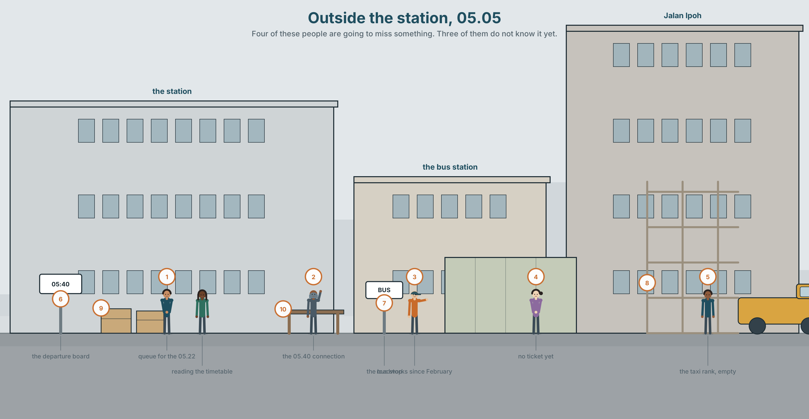{width=6.6in}

*Outside the station, 05.05 — Four of these people are going to miss something. Three of them do not know it yet.*

# What happens if you miss it?

**By the end of this unit you can explain a plan and what happens if each part of it fails —
out loud, and in seventy words.**

| ◆ **A · THE WORLD** | Getting somewhere on time, and what people do when they cannot |
|---|---|
| ◆ **B · THE SYSTEM** | *if* + present, *will* · *unless* · *as soon as*, *until*, *by the time* · 24 words for travel and delay · 16 words for planning around it · the voice that goes up and then down |
| ◆ **C · THE PERFORMANCE** | A plan with two fallbacks, said and written |

---

### 0A · Find it

**Find ten things in the station and the street outside.**

> platform · gate · ticket machine · timetable · queue · barrier · roadworks · bus stop ·
> departure board · luggage · taxi rank · clock

### 0B · Guess it

**Four people in this picture are going to miss something.** Which four, and what?

### 0C · Say it ⏺

**Record thirty seconds.** *What is your plan tomorrow morning, and what will you do if it goes
wrong?* You will record it again at the end of this unit.

---

## Part 1 · Vocabulary Lab 1 ◆ **B · THE SYSTEM**

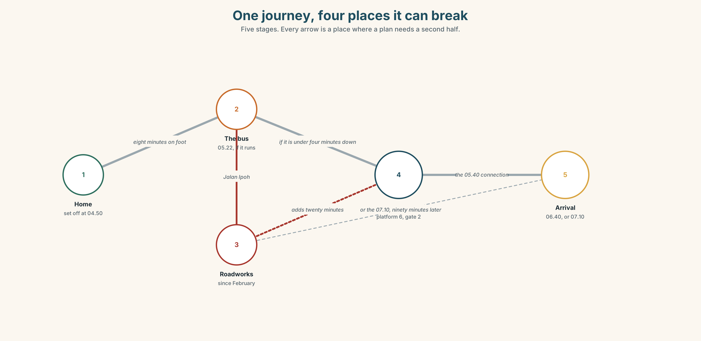{width=6.6in}

*One journey, four places it can break — Five stages. Every arrow is a place where a plan needs a second half.*

### 1A · Meet — the words of a journey

Match each word to one place on the map.

> **ticket** · **fare** · **seat** · **platform** · **gate** · **board** · **connection** ·
> **timetable** · **journey** · **queue**

### 1B · Sort — whose fault is it?

Three columns: **the traveller · the operator · nobody**.

> a cancelled train · breakdown · roadworks · traffic · arriving early · delay ·
> missing the connection · late

**Put *delay* in one column. Then argue for a different one.**

### 1C · Meet — what you get, and what you do not

> **cancel** · **refund** · **early** · **late**

Which of these four do you have a legal right to in your country? **Check with a partner.**

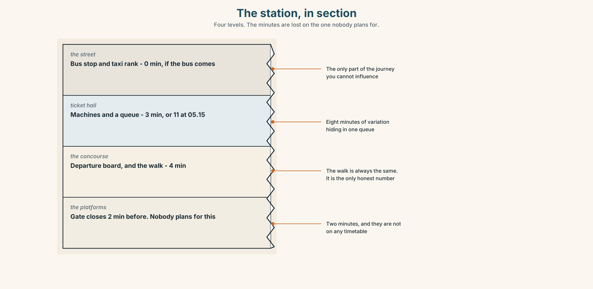{width=6.6in}

*The station, in section — Four levels. The minutes are lost on the one nobody plans for.*

**Look at the station in section.** Four levels, four ways of being late.
**Which level costs the most minutes, and why does nobody plan for it?**

### 1D · Stretch — the phrases

Complete each one with one word.

1. We're going to **run ______** — there is no way round it now.
2. If the bus is twenty minutes down, I'll **miss the ______** at Sentral.
3. That one has gone. **The ______ one** is at 06.40.
4. He's been **stuck in ______** since half past four.
5. We'd better **set ______** now if we want the four o'clock slot.

### 1E · The saying

> **f** **There's nothing we can do.**

Sometimes true. Often not. **Write two situations:** one where it is honest, and one where it is
an excuse. **Read both. Can a partner tell which is which?**

### 1F · Own it

Think of the last time you were late for something. Tell a partner **three sentences**:
what went wrong, what you did, and what you would do differently.

---

## Part 2 · Listening ◆ **A · THE WORLD**

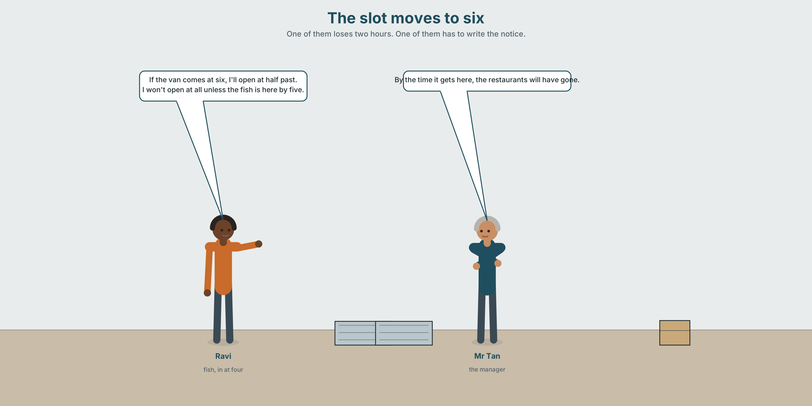{width=6.6in}

*The slot moves to six — One of them loses two hours. One of them has to write the notice.*

### 2A · The slot moves to six 🔊 Track 5.1

**Before you listen.** The market's delivery slot is at four. It is moving to six.
**Guess: who is most affected — Siti, Ravi or Mei Ling?**

**Listen once. One question.** When does the change start?

**Listen again. Complete the table.**

| | What they will do | What happens if that fails |
|---|---|---|
| Siti | | |
| Ravi | | |
| Mr Tan | | |

**Listen again. True or false?**

1. The change starts next month. ☐ T ☐ F
2. Ravi will lose his best two hours. ☐ T ☐ F
3. Siti can open late without losing much. ☐ T ☐ F
4. A private van would cost more than the lost trade. ☐ T ☐ F

**Noticing.** Four sentences from the recording.

1. *If the van comes at six, I'll open at half past.*
2. *I won't open at all unless the fish is here by five.*
3. *As soon as it arrives, I'll start.*
4. *By the time it gets here, the restaurants will have gone.*

**Two of these say what will happen. Two say when.** Which are which?

### 2B · Decoding clinic 🔊 Track 5.2

Twenty-five seconds of Ravi. Four jobs.

1. How many times does he say *if*?
2. In *if the van comes*, does his voice go up or down at the end of *comes*?
3. Catch the two times he gives.
4. He says one sentence with no *if* in it at all, and it is still a condition. Which?

> Transcripts, page 154.

---

## Part 3 · Grammar Lab 1 ◆ **B · THE SYSTEM**

### If it happens, this happens

### 3A · Notice

Look at the four sentences in Part 2.

1. In sentence 1, which half is the condition and which is the result?
2. Sentence 1 has *comes*, not *will come*. **Why not?**
3. Sentence 2 uses *unless*. **Rewrite it with *if… not*.** Is anything lost?
4. In sentences 3 and 4, nothing is uncertain. **What are *as soon as* and *by the time* doing?**
5. Try *"If the van will come at six, I'll open at half past."* **What is wrong?**

### 3B · See

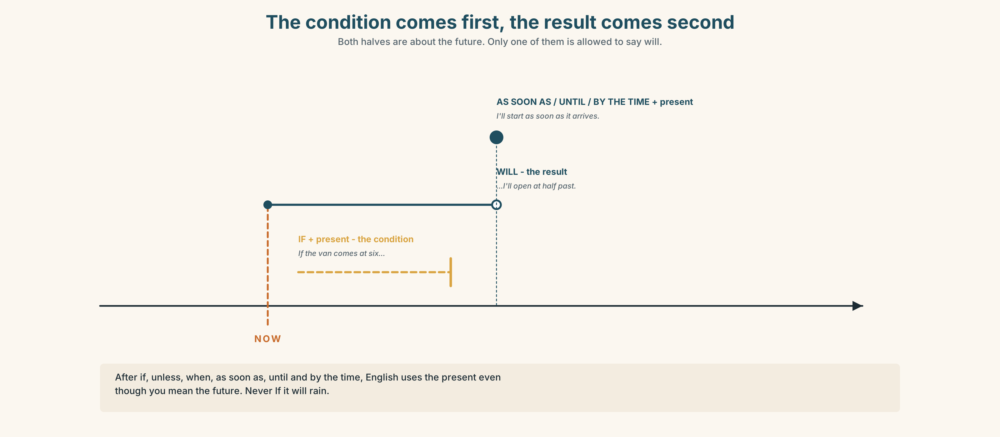{width=6.6in}

*The condition comes first, the result comes second — Both halves are about the future. Only one of them is allowed to say will.*

Now look at the second picture. **The road forks. What is at the end of each branch?**

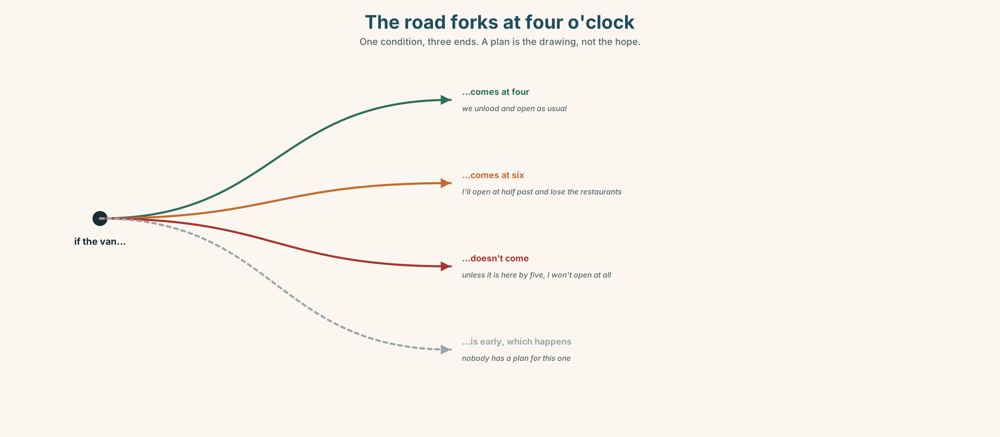{width=6.6in}

*The road forks at four o'clock — One condition, three ends. A plan is the drawing, not the hope.*

### 3C · Know

| | Shape | Example |
|---|---|---|
| **first conditional** | *if* + present , *will* + verb | *If the van **comes** at six, I **'ll open** at half past.* |
| **unless** | = *if … not* | *I **won't open unless** the fish is here by five.* |
| **time clauses** | *as soon as / until / by the time / whenever* + **present** | *I'll start **as soon as** it **arrives**.* |

> **The rule under all three.** After *if*, *unless*, *when*, *as soon as*, *until* and
> *by the time*, English uses the **present**, even though you are talking about the future.

> **Watch out.** ✗ *If it will rain…* ✓ *If it rains…*
> **unless** is already negative. ✗ *unless it doesn't rain* for *if it rains*.

> **Why it matters.** A plan with no *if* in it is not a plan. It is a hope.

### 3D · Use — controlled

> If the van (1) __________ (arrive) at six, Ravi (2) __________ (not open) at all. He
> (3) __________ (start) as soon as the ice (4) __________ (come), but by the time he
> (5) __________ (be) ready, the restaurant buyers (6) __________ (go). Unless Mr Tan
> (7) __________ (find) a second slot, somebody (8) __________ (lose) two hours every day.

### 3E · Use — guided

Join each pair with **if**, **unless**, **as soon as**, **until** or **by the time**.

1. The ice arrives. / I'll start.
2. It doesn't rain. / We won't cancel.
3. You wait here. / I come back.
4. The traffic clears. / The market will be closed.
5. You don't leave now. / You'll miss the connection.

### 3F · Use — open

**Your morning tomorrow.** Tell a partner three things that could go wrong, and what you will do
about each. Use *if* twice and *unless* once.

### 3G · Check — six items

> 1. If it ______ (rain), we ______ (not go).
> 2. I'll call you as soon as I ______ (arrive).
> 3. ______ you leave now, you'll miss it.
> 4. We'll wait here until the bus ______ (come).
> 5. By the time we ______ (get) there, it ______ (close).
> 6. I ______ (not buy) it ______ it's on offer.

**0–3 →** Workbook pp. 28–30. **4–5 →** Part 6. **6 →** page 107.

---

## Part 4 · Speaking ◆ **C · THE PERFORMANCE**

### 4A · Fluency starter — the chain

One learner says a condition. The next turns the result into a new condition.

> *"If it rains, I'll take the bus."* → *"If you take the bus, you'll be late."* → …

**Keep it going. The chain breaks when somebody uses *will* after *if*.**

### 4B · The functional core — a plan with fallbacks

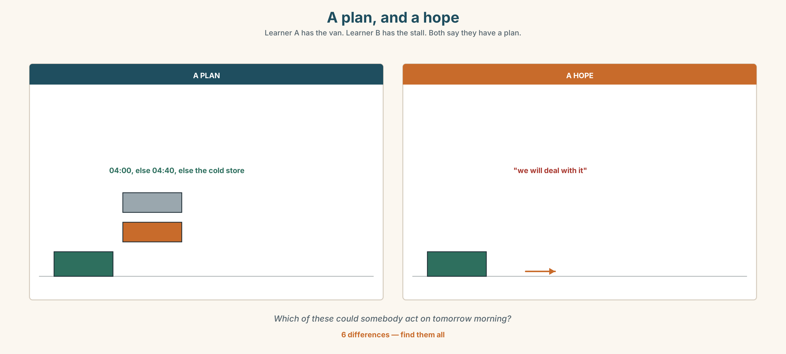{width=6.6in}

*A plan, and a hope — Learner A has the van. Learner B has the stall. Both say they have a plan.*

**Language Bank**

| | |
|---|---|
| **the plan** | *The plan is to…* · *We'll set off at…* · *I'll be there by…* |
| **the fallback** | *If that doesn't work, I'll…* · *In that case…* · *Otherwise…* |
| **the deadline** | *At the latest.* · *No later than…* · *In time for…* |
| **the insurance** | *Just in case.* · *In case it rains.* · *Straight away, not later.* |

**Role play.** Learner A runs a stall. Learner B drives a van. The slot has moved to six.
**Agree a plan with two fallbacks. Six minutes.**

### 4C · The performance — seventy seconds ⏺

Explain **one plan and two fallbacks** to the group. **Seventy seconds.** You must give:

> the plan · what happens if the first part fails · what happens if the second does ·
> the one thing you will not do

**Record it.**

### 4D · Observer

One person listens for **one thing**: was there a real fallback, or just a wish?

### 4E · Two criteria

> ☐ Did I use the present after *if*, *unless* and *as soon as*?
> ☐ Are both fallbacks things I could actually do?

---

## Part 5 · Reading ◆ **A · THE WORLD**

### 5A · Predict

A review of a travel app. The title is **"It told me I would make it."**
**What do you expect the reviewer to be angry about?** One sentence.

### 5B · Read — one hundred seconds

---

**It told me I would make it ★★☆☆☆**

The app does one thing well. If you put in where you are and where you want to be, it gives you a
route, a fare and a time, and the time is usually right.

The problem is what it does not do. It will not tell you what happens if any part of that route
fails. I used it for a 05.40 connection at Sentral. It said I would arrive at 05.22. It did not
say that the 05.22 is the only bus that makes that connection, and that if it runs four minutes
late — which it did, because of roadworks on Jalan Ipoh that have been there since February — the
next option is 07.10.

Eighteen minutes of margin, and no warning that all eighteen were in one place.

A better app would say: *you will make this unless the bus is more than three minutes down*. That
is one sentence. It is also the only sentence I needed.

Two stars, and one of them is for the fare calculator, which is honest about what a refund is
worth and how long it takes.

---

### 5C · Answer

1. What three things does the app give you?
2. What time did it say the writer would arrive, and what connection was she making?
3. Why was the bus late?
4. **What is the next option after the 05.40, and how much later is it?**
5. What one sentence does the writer say the app should have given her?
6. What is the second star for?

### 5D · Vocabulary in context

Guess from the text. Then check.

> a route · margin · down *(as in "four minutes down")* · the only option · honest about

### 5E · The counter-text

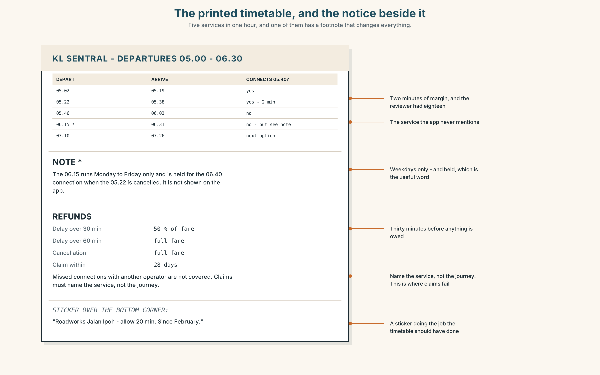{width=6.6in}

*The printed timetable, and the notice beside it — Five services in one hour, and one of them has a footnote that changes everything.*

**Read the printed timetable and the notice beside it, and answer.**

1. How many services run between 05.00 and 06.00?
2. **If the 05.22 is cancelled, what is the next service that makes the 05.40 connection?**
3. What does the notice say about refunds, and in what circumstances?
4. One line of the timetable has a footnote mark. What does the footnote say?

### 5F · Two texts

The review says the next option after a missed 05.40 is **07.10**.
The timetable shows a 06.15 service — with a footnote.

**Put those two facts together. Was the reviewer wrong?** Two sentences.

---

## Part 6 · Vocabulary Lab 2 ◆ **B · THE SYSTEM**

### Words that fix a plan in time

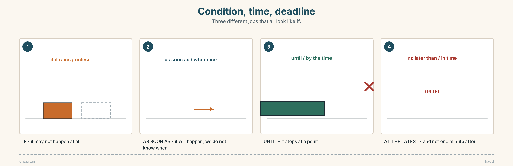{width=6.6in}

*Condition, time, deadline — Three different jobs that all look like if.*

### 6A · Sort — a condition, a time, or a deadline?

Three columns.

> in case · at the latest · until · unless · by the time · in time · if it rains ·
> no later than · whenever · as soon as

| **CONDITION** | **TIME** | **DEADLINE** |
|---|---|---|
| | | |

### 6B · Chunk completion

1. Take an umbrella **just ______ ** .
2. Be there by six **at the ______** .
3. I need it **no ______ than** Thursday.
4. We left early, so we arrived **______ time**.
5. The van is late. **In that ______ , we open at seven.**
6. Pay now, **______ they'll cancel it.**

### 6C · Three ways of saying now

**straight away · as soon as possible · whenever you can**

Put one in each, and say what each one tells the other person about how urgent it is.

1. Send it ______ . *(the building is on fire)*
2. Send it ______ . *(this week would be good)*
3. Send it ______ . *(I am not in a hurry and I want you to know that)*

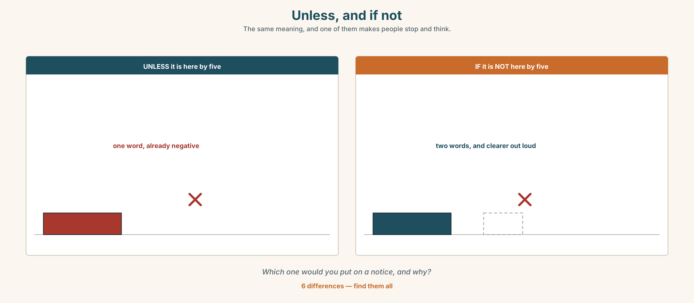{width=6.6in}

*Unless, and if not — The same meaning, and one of them makes people stop and think.*

**Six differences.** Find them, then answer the question under the picture.

### 6D · Contrast Clinic — if, unless, when or until

Six items.

1. ______ it rains, we'll stay in.
2. I'll phone ______ I land.
3. Wait here ______ I get back.
4. You'll miss it ______ you leave now.
5. ______ the time we arrive, they'll have closed.
6. ______ it rains, we'll go. *(we only go in dry weather)*

---

## Part 7 · Pronunciation & Fluency Lab ◆ **B · THE SYSTEM**

### Up, then down

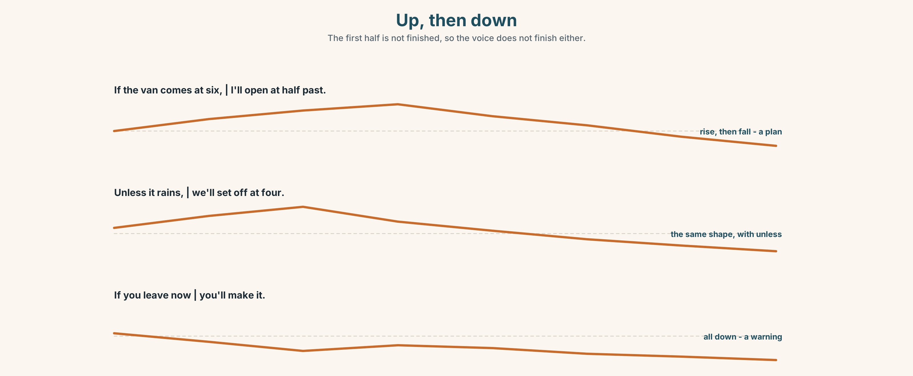{width=6.6in}

*Up, then down — The first half is not finished, so the voice does not finish either.*

### 7A · Hear 🔊 Track 5.3

> *If the van comes at six* ↗ | *I'll open at half past* ↘
> *Unless it rains* ↗ | *we'll set off at four* ↘

**The first half goes up because it is not finished. The second half goes down because it is.**

### 7B · Say

Say both. Then say them with the halves the other way round:

> *I'll open at half past* ↗ | *if the van comes at six* ↘

### 7C · Make it mean something

Say this twice:

> *If you leave now* ↗ *you'll make it.* ↘ *(a plan)*
> *If you leave now* ↘ *you'll make it.* ↘ *(a warning — and almost a threat)*

**Which one would you rather be told?**

### 7D · Fluency 20 ⏺

Twenty seconds: **three conditions and three results.** Three times, faster — keeping the rise.

---

## Part 8 · Writing ◆ **C · THE PERFORMANCE**

### The plan and what could go wrong · 70 words

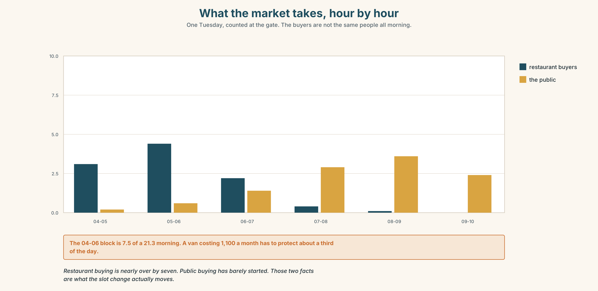{width=6.6in}

*What the market takes, hour by hour — One Tuesday, counted at the gate. The buyers are not the same people all morning.*

### 8A · Read the model

> We'll set off at four. If the road is closed again we'll go round by Jalan Ipoh, which adds
> twenty minutes, so I'll leave at twenty to in that case. `[the fallback has a cost, and the
> cost is named]`
>
> If we're not at the market by five we won't unload at all — we'll go straight to the cold
> store and bring it at eight. `[the second fallback is a different plan, not the same plan
> slower]`
>
> What I won't do is unload warm fish in a queue. `[one line saying what is not on the table]`

**Questions about the writer's choices:**

1. The first fallback names twenty minutes. **Why does a number help here?**
2. The last line is a refusal. **What does it do for the reader?**

### 8B · The anti-model

> We will set off at four and arrive at five. If there is a problem we will deal with it.
> We will do our best to be on time and we hope everything will be fine.

Correct English, and nobody can act on it. **Name two things the reader still does not know.**

### 8C · Plan

> the plan, with a time → fallback 1, with its cost → fallback 2, which is different →
> one thing you will not do

### 8D · Write — 70 words
### 8E · Peer review — two criteria

> ☐ Is each fallback something you could actually do tomorrow?
> ☐ Does one of them have a number in it?

### 8F · Write it again · 8G · Publish

On the wall, with the timetable from Part 5E beside it.

---

## Part 9 · The File ◆ **A · THE WORLD + C · THE PERFORMANCE**

# STUDY FILE · Source Check

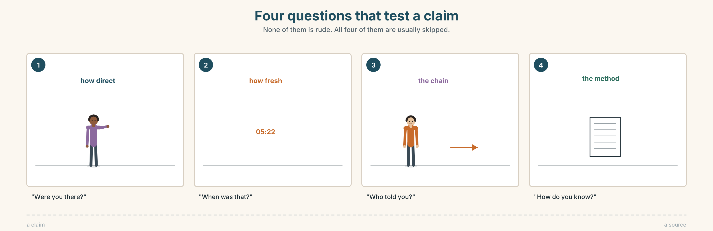{width=6.6in}

*Four questions that test a claim — None of them is rude. All four of them are usually skipped.*

### 9A · Four claims about one delay 🔊 Track 5.4

Four people say why the 05.22 was late. **Listen.**

1. Who was actually on the bus?
2. Who read it somewhere?
3. **Which claim has a number in it, and does that make it more reliable?**

### 9B · Rank the sources

Put these four in order, most reliable first. **Then argue about your order.**

> the operator's own notice · a passenger who was there · a news app · somebody's cousin

### 9C · The questions that test a claim

Match each question to what it tests.

> *"Were you there?"* · *"When was that?"* · *"Who told you?"* · *"How do you know?"*

> how fresh · how direct · the chain · the method

### 9D · Your turn

In pairs. **One of you makes a claim about the delay. The other asks three of the four questions
above.** Then swap. **Four minutes.**

### 9E · Transfer

**Find one claim this week** — on a sign, in a message, on a screen. Ask yourself the four
questions. Bring the claim and your answer.

---

## Part 10 · Mediation & Interaction ◆ **C · THE PERFORMANCE**

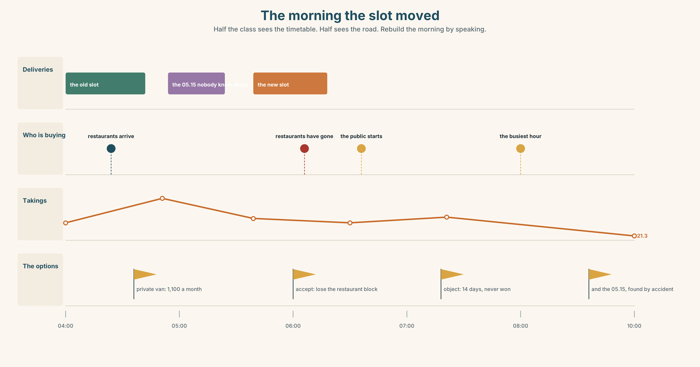{width=6.6in}

*The morning the slot moved — Half the class sees the timetable. Half sees the road. Rebuild the morning by speaking.*

### 10A · Relay

Half the class sees the timetable. Half sees the road closures. **Rebuild the whole morning by
speaking.** Ten minutes.

### 10B · Simplify

Explain the timetable notice from Part 5E to a traveller who has just missed a connection.
**Four sentences only.**

> **Plan:** what you are owed → when → what you have to do first → what will not be refunded

### 10C · Compress

The review in Part 5 into **thirty words**, as a one-star-to-five-star summary line.

### 10D · Online

Write **one message** to the market group: the slot moves to six on the first, you have a plan,
and you need two people to say by Friday whether they can take an early key.

### 10E · Your language

How does your language mark a condition? **Is there a word like *unless*, or do you have to say
*if not*?** Show a partner both.

---

## Part 11 · The Decision ◆ **C · THE PERFORMANCE**

# Two hours, every day

From the first of next month the market's delivery slot moves from four o'clock to six. The
restaurant buyers come between five and seven and they will not wait.

- **Accept it.** Start two hours later. Lose the restaurant trade, keep the costs where they are.
- **Pay for a private van.** Keep the four o'clock arrival. It costs 1,100 a month, shared between
  however many traders sign up.
- **Fight it.** The committee can object within fourteen days. It has never won an objection.

### 11A · The evidence

1. **The timetable and the notice** from Part 5E — and the footnote.
2. **The chart** — what the market takes hour by hour, and who is buying.
3. **The voice.** Mr Tan, twenty seconds: *"If six traders sign, it's a hundred and eighty each
   and it is obviously worth it. If three sign, it's three hundred and sixty and it obviously
   isn't. I can't tell you which it is until people decide."*

### 11B · Talk about it

In threes. Everybody says one. Use the frame.

> *If the market ______ , then ______ . So I think they should ______ .*

**Words you can use:** *slot · restaurants · cost · share · refund · delay · in time · otherwise*

### 11C · Decide

Write **two sentences**. Choose, and say why.

> I think the market should ______________________ ,
> because ______________________ .

### 11D · Model decision

> They should take the private van for three months and make the committee object at the same
> time. The objection will probably fail, but it is free, and it is the only way of finding out
> whether the slot was ever negotiable. Paying for the van answers the question the objection
> cannot: whether the four o'clock trade is worth 1,100 a month, and nobody in that market
> actually knows.

### 11E · The Reveal

> **What happened.** Nine traders signed, so it was 122 each. The van kept the four o'clock
> arrival and the restaurant trade held up.
>
> The objection failed in eleven days, as everybody expected, but the reply named a second slot
> at 05.15 that nobody had known existed, and four traders moved to it in the second month and
> stopped paying for the van.
>
> By month four, five traders were paying 220 each and two of them were thinking about stopping.

**The van worked. The objection, which failed, found the better answer.**

> **Was it the right decision?** Say why — and say what the five who stayed should do now.

---

## Part 12 · Landing ◆ **all three lines**

### 12A · Recycle — ten items

> 1. If it ______ (rain), we'll stay.
> 2. I'll start as soon as it ______ (arrive).
> 3. You'll miss it ______ you leave now.
> 4. We'll wait ______ the bus comes.
> 5. Take it just in ______ .
> 6. *(Unit 4)* The person ______ has the key is Mr Tan.
> 7. *(Unit 4)* Nurul is ______ charge of food safety.
> 8. *(Unit 3)* I ______ (use) to live here.
> 9. *(Unit 2)* It was raining ______ he left.
> 10. *(Starting Out)* The train ______ (leave) at six every day.

### 12B · Consolidate

**Seventy words, one paragraph.** A journey you have to make. The plan, two things that could go
wrong, and what you will do about each. Use *if* twice, *unless* once, *as soon as* once.

### 12C · Can-do, with evidence

| I can… | My evidence | Sure? |
|---|---|---|
| say what will happen if something does or does not happen | Part 3G score | ◯ ◑ ● |
| explain a plan and two fallbacks in seventy seconds | Part 4C recording | ◯ ◑ ● |
| write seventy words a colleague could act on | Part 8 draft 2 | ◯ ◑ ● |
| test where a claim came from | Part 9D pair work | ◯ ◑ ● |

### 12D · Replay ⏺

Find your thirty seconds from Part 0C. Listen. **Record it again.**
One sentence: what is different?

### 12E · Glossary — forty items, as a map

> **THE JOURNEY** · ticket · fare · seat · board · platform · gate · connection · timetable · journey · queue
> **WHAT GOES WRONG** · delay · cancel · late · traffic · roadworks · breakdown · run late · miss the connection · stuck in traffic
> **WHAT YOU DO** · early · refund · the next one · set off · turn up · there's nothing we can do
> **THE CONDITION** · if it rains · unless · in case · just in case · whenever · otherwise
> **THE TIME** · as soon as · until · by the time · straight away · in time
> **THE DEADLINE** · at the latest · no later than · in that case · we'll see

### 12F · Next

> **Unit 6 · What are you willing to pay for?**

# A2.1 · Unit 6 · The Chiller or the Phone

> **English Animated** · *Making Plans* · Pasar Chow Kit, Kuala Lumpur
> Student's Book pages 116–137 · 22 pp · ~10 hours

---

## Part 0 · The Big Picture ◆ **A · THE WORLD**

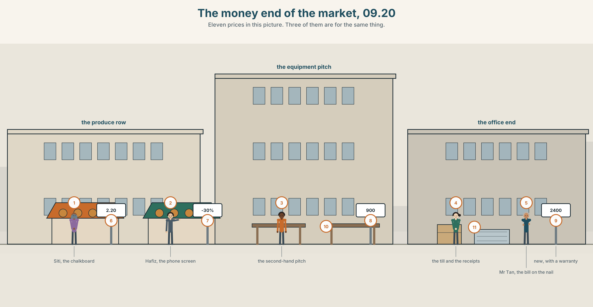{width=6.6in}

*The money end of the market, 09.20 — Eleven prices in this picture. Three of them are for the same thing.*

# What are you willing to pay for?

**By the end of this unit you can argue for one thing that is worth paying more for.
Ninety words.**

| ◆ **A · THE WORLD** | What things cost, what they are worth, and why those are different numbers |
|---|---|
| ◆ **B · THE SYSTEM** | verb + **-ing** or verb + **to** · verb + preposition · 21 words for money and value · 19 words for what people decide · where the stress falls in a two-verb phrase |
| ◆ **C · THE PERFORMANCE** | Ninety words arguing for one expensive thing |

---

### 0A · Find it

**Find eleven prices in this picture.** Three of them are for the same thing.

> the chalkboard · the handwritten card · the receipt · the discount sticker ·
> the second-hand sign · the phone screen · the till · the bill on the nail

### 0B · Guess it

**One thing in this picture is cheap and bad value. One is expensive and good value.**
Which, and how can you tell?

### 0C · Say it ⏺

**Record thirty seconds.** *What is the last thing you paid too much for, and would you do it
again?* You will record it again at the end of this unit.

---

## Part 1 · Vocabulary Lab 1 ◆ **B · THE SYSTEM**

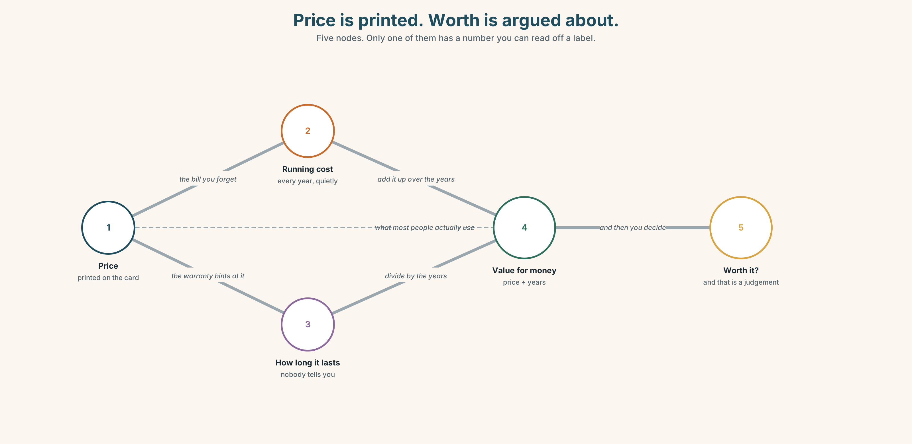{width=6.6in}

*Price is printed. Worth is argued about. — Five nodes. Only one of them has a number you can read off a label.*

### 1A · Meet — money in and money out

Match each word to one place on the map.

> **spend** · **save** · **cost** · **price** · **bill** · **receipt** · **budget** ·
> **afford** · **waste** · **discount**

### 1B · Sort — the number, or the judgement?

Two columns.

> expensive · bargain · value · price · cheap · worth · cost · discount

**A *price* is printed. *Worth* is argued about.** Which column is bigger, and why?

### 1C · Meet — three words that are not the same

> **cheap** · **expensive** · **second-hand**

A second-hand chiller costs 900. A new one costs 2,400.
**Is the second-hand one cheap?** You cannot answer that yet. **What do you need to know first?**

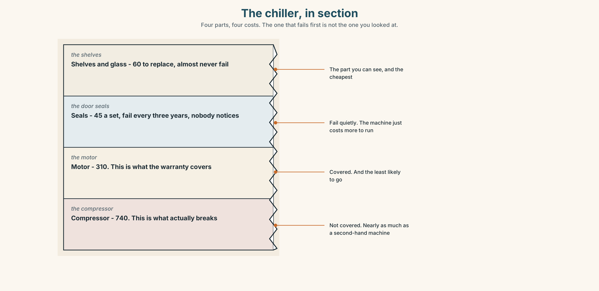{width=6.6in}

*The chiller, in section — Four parts, four costs. The one that fails first is not the one you looked at.*

**Look at the chiller in section.** Four parts, four costs.
**Which part fails first, and what does replacing it cost compared with the whole machine?**

### 1D · Stretch — the phrases

Complete each one with one word.

1. Six years for 900. That is **value for ______** .
2. We used it twice. It was **a waste of ______** .
3. Every Friday she **puts money ______** , before anything else.
4. He is **saving ______** for a van.
5. Forty ringgit to repair a thirty-ringgit fan. **It's not ______ it.**

### 1E · The saying

> **f** **It's not worth it.**

Four words that end a conversation. **Finish each exchange with them — and then, for one of
them, argue back.**

> *"It's only forty ringgit."* — *"______"*
> *"You'd have to queue for an hour."* — *"______"*

### 1F · Own it

Think of one thing you own that was expensive. Tell a partner **three sentences**:
what it cost, how long you have had it, and whether it was worth it.

---

## Part 2 · Listening ◆ **A · THE WORLD**

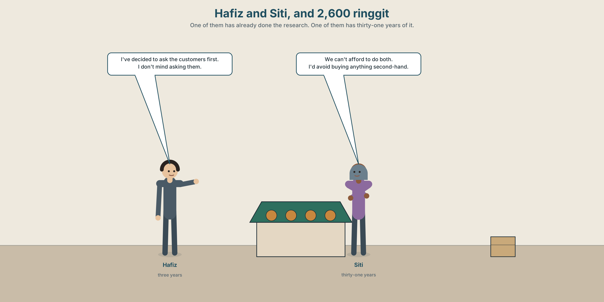{width=6.6in}

*Hafiz and Siti, and 2,600 ringgit — One of them has already done the research. One of them has thirty-one years of it.*

### 2A · One machine or one system 🔊 Track 6.1

**Before you listen.** The stall has 2,600 saved. Hafiz wants one thing, Siti wants another.
**Guess which of them wants the newer idea.**

**Listen once. One question.** How much is in the savings?

**Listen again. Complete the table.**

| | What they want | What it costs | What it would save |
|---|---|---|---|
| Hafiz | | | |
| Siti | | | |

**Listen again. Choose.**

1. Hafiz wants to spend the money on **a chiller / a phone system / a van**.
2. Siti says the stall loses produce **twice a week / in the hot months / every day**.
3. Hafiz has already **asked customers / tried it / read about it**.
4. Siti refuses **to decide today / to let him do it / to talk about it**.

**Noticing.** Four sentences from the recording.

1. *I've decided to ask the customers first.*
2. *I don't mind asking them.*
3. *We can't afford to do both.*
4. *I'd avoid buying anything second-hand.*

**Two of these take *to*. Two take *-ing*.** Which are which?

### 2B · Decoding clinic 🔊 Track 6.2

Twenty-five seconds of Hafiz. Four jobs.

1. How many numbers does he say?
2. In *decided to ask*, which of the three words is loudest?
3. Catch the word he uses instead of *expensive*.
4. He says one sentence that is a question but does not sound like one. Which?

> Transcripts, page 155.

---

## Part 3 · Grammar Lab 1 ◆ **B · THE SYSTEM**

### Two verbs in a row

### 3A · Notice

Look at the four sentences in Part 2.

1. In sentence 1, which is the first verb and which is the second?
2. Sentence 2 has *mind*. **Try *to ask* after it. Does it work?**
3. Sentence 3 has *afford*. **Try *doing* after it. Does that work?**
4. **Is there a rule you can hear, or do you have to learn the list?** Be honest.
5. Try *"I enjoy to cook."* **What is wrong?**

### 3B · See

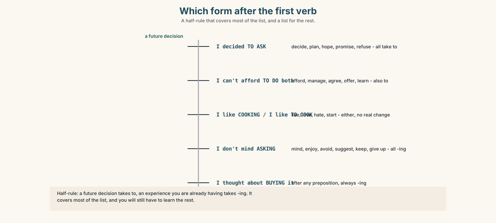{width=6.6in}

*Which form after the first verb — A half-rule that covers most of the list, and a list for the rest.*

Now look at the second picture. **Two sentences, same verbs, different pattern.
Which one is about a plan and which about a habit?**

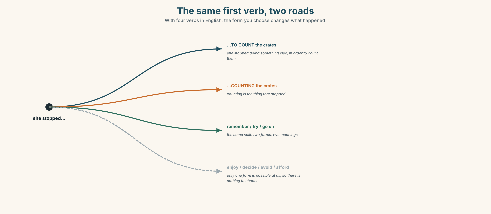{width=6.6in}

*The same first verb, two roads — With four verbs in English, the form you choose changes what happened.*

### 3C · Know

| First verb | Then | Example |
|---|---|---|
| **decide, plan, hope, offer, promise, refuse, manage, afford, learn, agree** | **to** + verb | *I've **decided to ask** them.* |
| **enjoy, avoid, mind, suggest, finish, keep, give up, practise** | verb + **-ing** | *I **don't mind asking** them.* |
| **like, love, hate, start, begin, continue** | **either**, with almost no change | *I **like cooking** / I **like to cook**.* |

> **The useful half-rule.** Verbs about a **future decision** usually take **to**:
> *decide to, plan to, hope to, promise to, refuse to*.
> Verbs about an **experience you are already having** usually take **-ing**:
> *enjoy -ing, avoid -ing, mind -ing, keep -ing*.
> It is a half-rule. It covers most of the list and you will still have to learn the rest.

> **After a preposition, always -ing.** *think **about buying*** · *good **at counting*** ·
> *instead **of waiting***

> **Watch out.** ✗ *I enjoy to cook.* ✓ *I enjoy cooking.*
> ✗ *We can't afford doing both.* ✓ *We can't afford to do both.*

### 3D · Use — controlled

> Hafiz has decided (1) __________ (ask) the customers first. He doesn't mind
> (2) __________ (spend) a week on it. Siti refuses (3) __________ (decide) before Friday
> and suggests (4) __________ (wait) until the hot months are over. They have both agreed
> (5) __________ (look) at the figures, and neither of them enjoys (6) __________ (argue)
> about money.

### 3E · Use — guided

Put each verb in the right form.

1. I can't afford ______ (buy) it this month.
2. Do you mind ______ (wait) ten minutes?
3. She's given up ______ (try) to fix it.
4. We've decided ______ (sell) the old one.
5. He's good at ______ (find) a bargain.
6. They promised ______ (deliver) it on Thursday.
7. She refused ______ (accept) the discount.
8. Would you accept ______ (wait) another week?

### 3F · Use — open

**Ask three people:** *What have you given up doing? What have you decided to do this year?*
Report one of each to the class.

### 3G · Check — six items

> 1. I enjoy ______ (cook) at the weekend.
> 2. We've decided ______ (wait).
> 3. She avoids ______ (buy) anything second-hand.
> 4. Do you mind ______ (open) the window?
> 5. He can't afford ______ (take) a day off.
> 6. I'm thinking about ______ (change) the price.

**0–3 →** Workbook pp. 34–36. **4–5 →** Part 6. **6 →** page 129.

---

## Part 4 · Speaking ◆ **C · THE PERFORMANCE**

### 4A · Fluency starter — would you pay more?

Your teacher names a thing: *coffee*. **Everybody answers in one sentence:**
*"I'd pay more for ______ , but I wouldn't pay more for ______ ."*

**Five rounds, five things. No repeating a reason.**

### 4B · The functional core — arguing for the expensive one

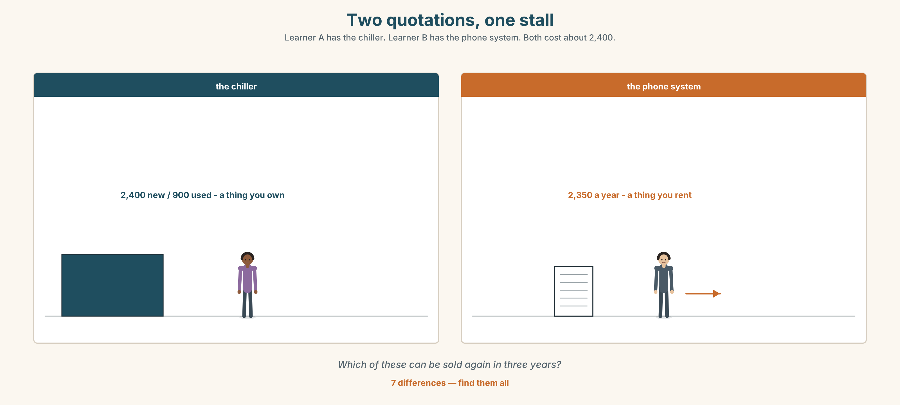{width=6.6in}

*Two quotations, one stall — Learner A has the chiller. Learner B has the phone system. Both cost about 2,400.*

**Language Bank**

| | |
|---|---|
| **the claim** | *It's worth it because…* · *You get it back in…* · *It pays for itself.* |
| **the concession** | *Yes, it's expensive, but…* · *I know it's a lot.* |
| **the comparison** | *Compared with…* · *The cheap one costs more in the end.* |
| **the refusal** | *I'd rather not.* · *Not at that price.* · *That's a waste of money.* |

**Role play.** Learner A wants the chiller. Learner B wants the phone system.
**Six minutes. You must each make one concession.**

### 4C · The performance — ninety seconds ⏺

Argue for **one expensive thing** that is worth the money. **Ninety seconds.** You must give:

> what it costs · what the cheap version costs · what you get back · one honest disadvantage

**Record it.**

### 4D · Observer

One person listens for **one thing**: did the speaker admit a real disadvantage?

### 4E · Two criteria

> ☐ Did I use three verb-plus-verb patterns correctly?
> ☐ Is there a number in my argument?

---

## Part 5 · Reading ◆ **A · THE WORLD**

### 5A · Predict

An opinion column. The title is **"The cheapest thing in the shop is never the cheapest."**
**What do you expect the argument to be?** One sentence.

### 5B · Read — one hundred seconds

---

**The cheapest thing in the shop is never the cheapest**

I bought a kettle for nineteen ringgit. It lasted five months. Then I bought one for ninety and I
have had it eleven years, which means the expensive kettle has cost me about eight ringgit a year
and the cheap one cost me forty-five.

Everybody knows this argument. Almost nobody acts on it, and I think I know why. The expensive
kettle asks you for ninety ringgit **today**. The cheap one asks for nineteen today and the rest
later, in instalments you do not notice because they arrive as inconvenience rather than as bills.

So the real question is not *what does it cost* but *what does it cost per year, and who pays the
difference*. If you have ninety ringgit, the expensive kettle is obviously right. If you have
thirty, the argument is not just wrong, it is insulting — you cannot buy the cheap-in-the-long-run
option with money you do not have.

Which is why I distrust this advice when it is given by people who have never had to choose.
The arithmetic is correct. It is also a description of how much easier everything is when you can
pay in advance.

---

### 5C · Answer

1. What did each kettle cost, and how long did each last?
2. What is the cost per year of each one?
3. **Why does the writer say almost nobody acts on the argument?**
4. What does the writer mean by *"instalments you do not notice"*?
5. In what situation does the writer say the argument is insulting?
6. What is the writer's final point about who gives this advice?

### 5D · Vocabulary in context

Guess from the text. Then check.

> last *(as a verb)* · in instalments · in the long run · distrust · pay in advance

### 5E · The counter-text

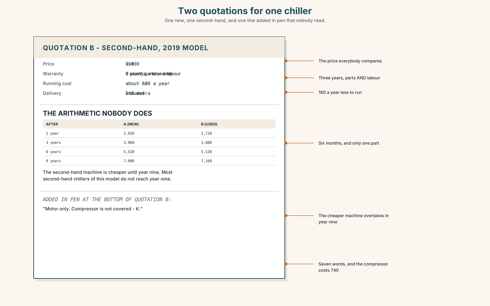{width=6.6in}

*Two quotations for one chiller — One new, one second-hand, and one line added in pen that nobody read.*

**Read the two quotations for a chiller and answer.**

1. What is the price of each one, and what is the warranty on each?
2. **What is the annual running cost of each, and after how many years does that reverse the
   price difference?**
3. What is excluded from the second-hand quotation?
4. One line has been added by the seller in pen. What does it say?

### 5F · Two texts

The column says the expensive kettle cost **eight ringgit a year**.
The quotations show the new chiller costing **more per year to run** than the second-hand one.

**Put those two facts together. Does the column's argument hold here?** Two sentences.

---

## Part 6 · Vocabulary Lab 2 ◆ **B · THE SYSTEM**

### Verbs that decide, and verbs that avoid

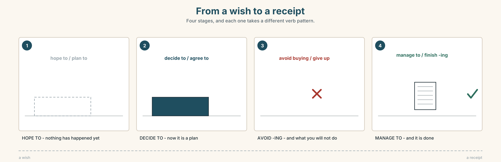{width=6.6in}

*From a wish to a receipt — Four stages, and each one takes a different verb pattern.*

### 6A · Sort — to, or -ing?

Two columns. Put each verb where it belongs.

> avoid · suggest · enjoy · refuse · manage · offer · mind · decide · hope · plan ·
> promise

| **+ to** | **+ -ing** |
|---|---|
| | |

**One of them is in neither list and changes meaning.** Which?

### 6B · Chunk completion

1. I've **decided ______** sell it.
2. She **offered ______** lend me the money.
3. I'd **avoid ______** anything with no warranty.
4. He **enjoys ______** for the whole family on a Sunday.
5. I'll **think ______** it and tell you Friday.

### 6C · The verbs that need a preposition

**think about · good at · instead of · spend on · save for**

Fill each gap. **Remember what follows a preposition.**

1. I've been thinking ______ ______ (buy) a second-hand one.
2. She's very good ______ ______ (find) things like this.
3. We walked ______ ______ (take) a taxi.
4. How much do you spend ______ food?
5. He's saving ______ a van.

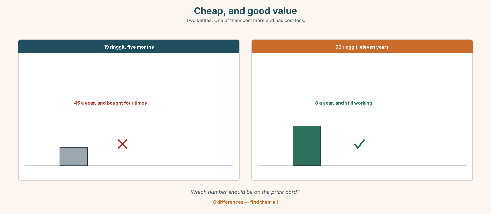{width=6.6in}

*Cheap, and good value — Two kettles. One of them cost more and has cost less.*

**Six differences.** Find them, then answer the question under the picture.

### 6D · Contrast Clinic — which form

Six items.

1. They refused ______ (pay) the difference.
2. I can't afford ______ (replace) it.
3. Do you mind ______ (hold) this?
4. We've given up ______ (wait) for him.
5. I managed ______ (get) a discount.
6. She suggested ______ (sell) it second-hand.

---

## Part 7 · Pronunciation & Fluency Lab ◆ **B · THE SYSTEM**

### Which of the three words is loud

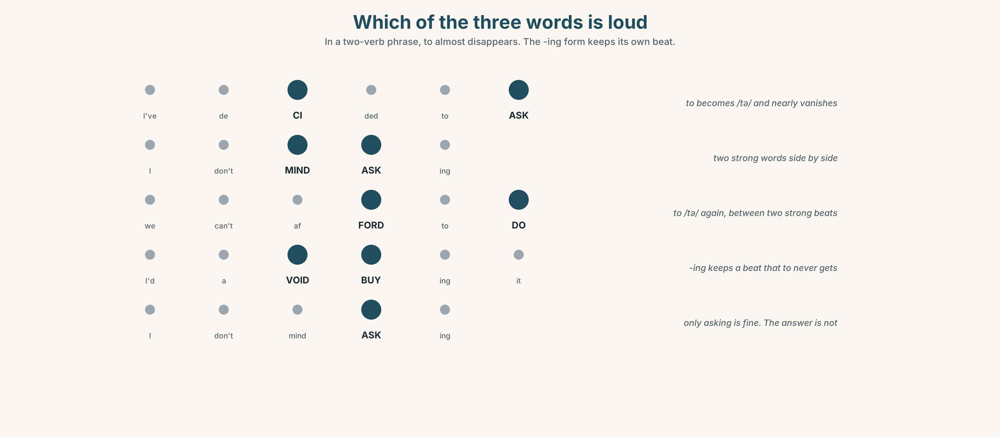{width=6.6in}

*Which of the three words is loud — In a two-verb phrase, to almost disappears. The -ing form keeps its own beat.*

### 7A · Hear 🔊 Track 6.3

> I've de**ci**ded to **ask** — *to* almost disappears
> I don't **mind** **ask**ing — two strong words in a row
> We can't af**ford** to **do** both — *to* becomes /tə/

### 7B · Say

Say each one. Then say the whole sentence three times, faster:

> *I've decided to ask the customers first.*

### 7C · Make it mean something

Say these two:

> *I don't MIND asking.* *(you asked whether it bothers me)*
> *I don't mind ASKING.* *(asking is fine — it is the answer I am worried about)*

**Which one is the honest version?**

### 7D · Fluency 20 ⏺

Twenty seconds: **three things you have decided to do and three you have given up doing.**
Three times, faster.

---

## Part 8 · Writing ◆ **C · THE PERFORMANCE**

### Worth paying more for · 90 words

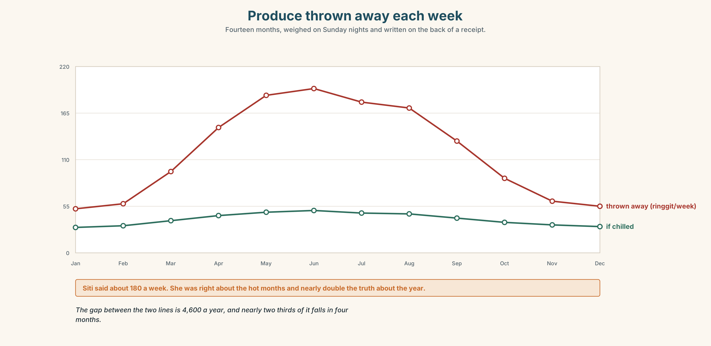{width=6.6in}

*Produce thrown away each week — Fourteen months, weighed on Sunday nights and written on the back of a receipt.*

### 8A · Read the model

> A good knife costs 180 and a bad one costs 25. I have had mine nine years, so it has cost me
> twenty ringgit a year. `[the number is doing the arguing, not the adjective]`
>
> That is not the real reason, though. The real reason is that I stopped dreading the preparation,
> and I now cook four times a week instead of once. `[the honest reason, which is not financial]`
>
> I would not buy an expensive pan. The cheap pan does the same job and I can see no difference
> at all. `[one thing the writer will not defend — which makes the rest believable]`

**Questions about the writer's choices:**

1. The second paragraph abandons the money argument. **Does that weaken it or strengthen it?**
2. Why name a thing the writer will **not** spend money on?

### 8B · The anti-model

> I think quality is very important. If you buy cheap things you will have to buy them again.
> It is better to spend more money and get something good. This is true for everything.

Correct English, and it argues nothing. **Name two things it is missing.**

### 8C · Plan

> the thing, with both prices → the cost per year → the real reason → one thing you would not
> pay more for

### 8D · Write — 90 words
### 8E · Peer review — two criteria

> ☐ Is there at least one number?
> ☐ Is there one thing the writer refuses to defend?

### 8F · Write it again · 8G · Publish

On the wall, with the two quotations from Part 5E beside it.

---

## Part 9 · The File ◆ **A · THE WORLD + C · THE PERFORMANCE**

# CULTURE FILE · What's Funny Here?

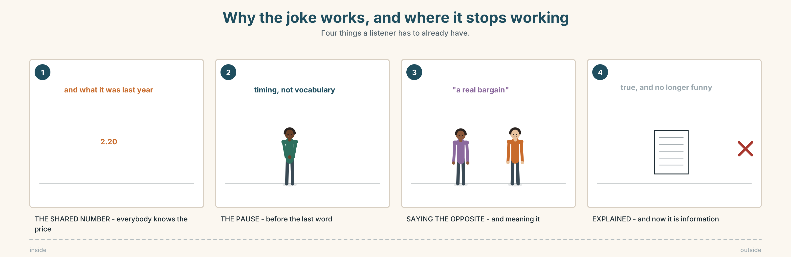{width=6.6in}

*Why the joke works, and where it stops working — Four things a listener has to already have.*

### 9A · Three jokes about money 🔊 Track 6.4

Three short exchanges from the market. **Listen to each one twice.**

1. Which one is a complaint that everybody laughs at?
2. Which one would be rude in some places and friendly here?
3. **Which one is funny only if you know the price of fish?**

### 9B · What makes it work

> exaggeration · the shared number · saying the opposite · the pause before the last word

Match each to one of the three exchanges. **One exchange uses two of them.**

### 9C · When it does not travel

A joke that needs a price, a place, or a person does not cross a border.

> **Take one of the three exchanges.** Rewrite it for somebody who has never been to this market.
> **What do you have to add, and what do you lose by adding it?**

### 9D · Your turn

In pairs. **Tell one short funny thing about money from your own place.**
Your partner's job: **say what a stranger would need to know first.**

### 9E · Transfer

**Listen for one joke this week** — anywhere, any language. Write down what the listener had to
already know. Bring it.

---

## Part 10 · Mediation & Interaction ◆ **C · THE PERFORMANCE**

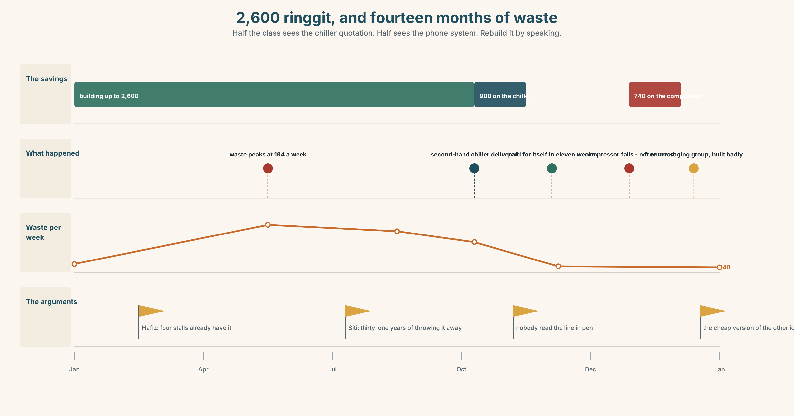{width=6.6in}

*2,600 ringgit, and fourteen months of waste — Half the class sees the chiller quotation. Half sees the phone system. Rebuild it by speaking.*

### 10A · Relay

Half the class sees the chiller quotation. Half sees the phone system quotation.
**Rebuild the whole decision by speaking.** Ten minutes.

### 10B · Simplify

Explain the second-hand quotation from Part 5E to somebody who has never bought equipment.
**Four sentences only.**

> **Plan:** the price → what is covered → what is not → the one question to ask before signing

### 10C · Compress

The column in Part 5 into **thirty words**, keeping its sting.

### 10D · Online

Write **one message** to a seller: you are interested in the second-hand chiller, you want to
know three things, and you are not going to decide this week.

### 10E · Your language

How does your language say *it's not worth it*? **Is the word in it about money, or about
effort?** Show a partner, and say which your language reaches for first.

---

## Part 11 · The Decision ◆ **C · THE PERFORMANCE**

# One machine, or one system

The stall has 2,600 saved. There is enough for one of these.

- **The chiller.** 2,400 new, 900 second-hand. Siti says they throw away about 180 a week in the
  hot months.
- **The phone-order system.** 2,350 for the first year. Hafiz says four nearby stalls have one
  and take orders the night before.
- **Neither, yet.** Wait six months. Measure the waste properly. Decide in January.

### 11A · The evidence

1. **The two quotations** from Part 5E — and the line the seller added in pen.
2. **The chart** — produce thrown away each week, over fourteen months.
3. **The voice.** Siti, twenty seconds: *"I've been throwing vegetables away for thirty-one
   years. I don't need a chart to tell me what that costs. I would like to know why I never
   counted it."*

### 11B · Talk about it

In threes. Everybody says one. Use the frame.

> *I think they should spend it on ______ , because ______ .*

**Words you can use:** *waste · worth · afford · save · value for money · second-hand · bargain*

### 11C · Decide

Write **two sentences**. Choose, and say why.

> I think they should ______________________ ,
> because ______________________ .

### 11D · Model decision

> They should buy the second-hand chiller for 900 and spend four months counting what they throw
> away, properly, on paper. That leaves 1,700 and an actual number. If the waste turns out to be
> 180 a week, the chiller pays for itself before Christmas and they can argue about the phone
> system with something other than opinions.

### 11E · The Reveal

> **What happened.** They bought the second-hand chiller. The waste fell from about 180 a week
> to 40, which is more than anybody expected, and the machine paid for itself in eleven weeks.
>
> In March the compressor failed. The repair was 740 — nearly as much again — and the warranty
> covered the motor but not the compressor, which is the line the seller had added in pen and
> nobody had read.
>
> Hafiz set up phone orders himself, on a free messaging group, badly, and it now brings in about
> a tenth of what the paid system promised and costs nothing.

**The chiller worked, and then it broke. The cheap version of the other idea worked too.**

> **Was it the right decision?** Say why — and say what they should do about the compressor.

---

## Part 12 · Landing ◆ **all three lines**

### 12A · Recycle — ten items

> 1. I can't afford ______ (buy) it.
> 2. Do you mind ______ (wait) ?
> 3. We've decided ______ (sell) the old one.
> 4. It was a ______ of money.
> 5. Six years for 900 — that's value for ______ .
> 6. *(Unit 5)* If it ______ (rain), we'll stay.
> 7. *(Unit 5)* I'll start as soon as it ______ (arrive).
> 8. *(Unit 4)* The person ______ has the key is Mr Tan.
> 9. *(Unit 2)* It was raining ______ he left the farm.
> 10. *(Starting Out)* How much ______ it cost?

### 12B · Consolidate

**Ninety words, one paragraph.** One thing worth paying more for and one thing that is not.
Use three verb-plus-verb patterns and at least two numbers.

### 12C · Can-do, with evidence

| I can… | My evidence | Sure? |
|---|---|---|
| put the right form after a second verb | Part 3G score | ◯ ◑ ● |
| argue for an expensive choice in ninety seconds | Part 4C recording | ◯ ◑ ● |
| write ninety words with a number in them | Part 8 draft 2 | ◯ ◑ ● |
| say what a stranger needs to know before a joke | Part 9D pair work | ◯ ◑ ● |

### 12D · Replay ⏺

Find your thirty seconds from Part 0C. Listen. **Record it again.**
One sentence: what is different?

### 12E · Glossary — forty items, as a map

> **MONEY OUT** · spend · cost · price · bill · expensive · afford · waste · a waste of money
> **MONEY IN** · save · save up · discount · bargain · cheap · second-hand · put money aside
> **THE JUDGEMENT** · worth · value · value for money · budget · receipt · it's not worth it
> **DECIDING** · decide · decide to · plan · hope · offer · offer to · promise · accept · manage
> **NOT DECIDING** · refuse · avoid · avoid buying · give up · I'd rather not
> **LIVING WITH IT** · enjoy · enjoy cooking · mind · suggest · think about

### 12F · Next

> **Unit 7 · Where are you from, really?**

# A2.1 · Unit 7 · Four Hundred Kilometres

> **English Animated** · *Making Plans* · Pasar Chow Kit, Kuala Lumpur
> Student's Book pages 138–159 · 22 pp · ~10 hours

---

## Part 0 · The Big Picture ◆ **A · THE WORLD**

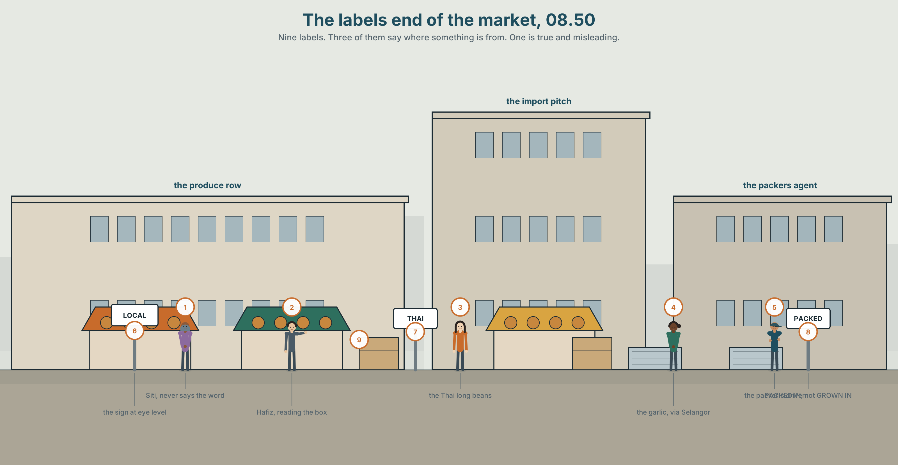{width=6.6in}

*The labels end of the market, 08.50 — Nine labels. Three of them say where something is from. One is true and misleading.*

# Where are you from, really?

**By the end of this unit you can describe where something comes from and how it reaches the
person who buys it. Ninety words.**

| ◆ **A · THE WORLD** | Where things and people come from, and who gets asked the question twice |
|---|---|
| ◆ **B · THE SYSTEM** | the passive, present and past · *by* and agent phrases · 23 words for origin and belonging · 17 words for how things are made · the *-ed* you can and cannot hear |
| ◆ **C · THE PERFORMANCE** | Ninety words tracing one thing back to where it started |

---

### 0A · Find it

**Find nine labels in this picture.** Three of them say where something is from.

> LOCAL · GROWN IN CAMERON · PRODUCT OF THAILAND · FARM FRESH · IMPORTED ·
> PACKED IN SELANGOR · NO ORIGIN GIVEN

### 0B · Guess it

**One label in this picture is true but misleading.** Which, and what does it leave out?

### 0C · Say it ⏺

**Record thirty seconds.** *Where are you from, and how many sentences does it take to answer
that honestly?* You will record it again at the end of this unit.

---

## Part 1 · Vocabulary Lab 1 ◆ **B · THE SYSTEM**

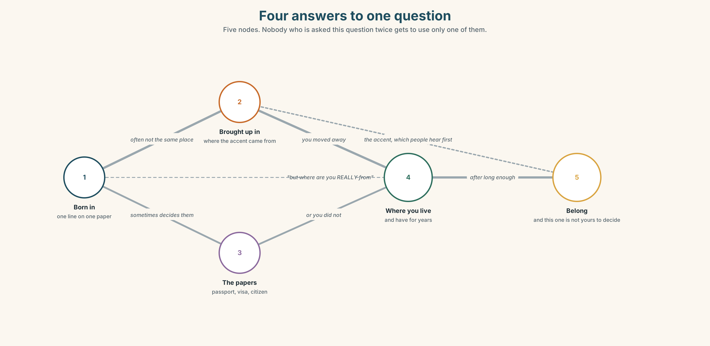{width=6.6in}

*Four answers to one question — Five nodes. Nobody who is asked this question twice gets to use only one of them.*

### 1A · Meet — where people come from

Match each word to one place on the map.

> **born** · **raise** · **move** · **family** · **home** · **village** · **town** ·
> **country** · **roots** · **settle**

### 1B · Sort — a place, a paper, or a feeling?

Three columns.

> country · passport · belong · citizen · accent · village · home · roots · visa · town

**One of them changes column depending on who is asking.** Which?

### 1C · Meet — the ones people notice first

> **accent** · **language** · **foreign**

An accent tells people where you learned to speak. **It does not tell them where you are from.**
**Give one example from your own country.**

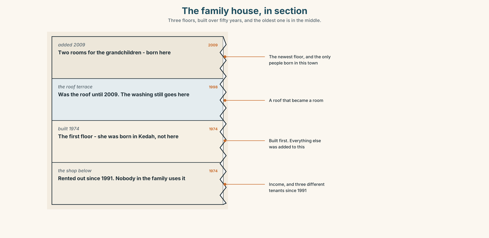{width=6.6in}

*The family house, in section — Three floors, built over fifty years, and the oldest one is in the middle.*

**Look at the family house in section.** Three generations, three floors.
**Which floor was built first, and who was born in a different country?**

### 1D · Stretch — the phrases

Complete each one with one word.

1. She **was ______ in** Penang but has never lived there.
2. He **was brought ______** by his grandmother in a village of two hundred people.
3. They **moved ______** in 1998 and have been back twice.
4. Every year in April she **goes ______** for a week.
5. I **grew ______** two streets from here.

### 1E · The saying

> **f** **It's complicated.**

Two words people use when the real answer takes four sentences.

> *"Where are you from?"* — *"It's complicated."*

**What are the four sentences?** Write them for somebody you know, real or invented.

### 1F · Own it

Tell a partner **three sentences** about where you are from: one with a place, one with a date,
and one that complicates the first two.

---

## Part 2 · Listening ◆ **A · THE WORLD**

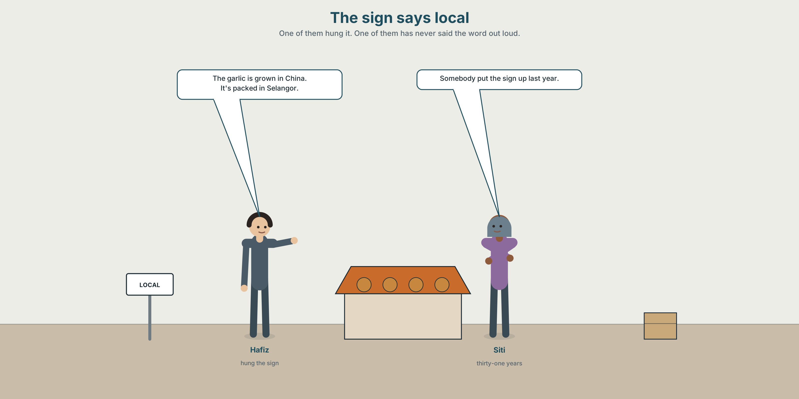{width=6.6in}

*The sign says local — One of them hung it. One of them has never said the word out loud.*

### 2A · The sign says local 🔊 Track 7.1

**Before you listen.** The stall has a sign saying LOCAL. Half the produce comes from 400 km away.
**Guess: does Siti know?**

**Listen once. One question.** Who put the sign up?

**Listen again. Complete the table.**

| | Where is it grown? | How far? | What the label says |
|---|---|---|---|
| tomatoes | | | |
| long beans | | | |
| garlic | | | |

**Listen again. True or false?**

1. The garlic is grown in Malaysia. ☐ T ☐ F
2. The sign was put up by Hafiz. ☐ T ☐ F
3. Nobody has ever asked about it. ☐ T ☐ F
4. The tomatoes travel further than the beans. ☐ T ☐ F

**Noticing.** Four sentences from the recording.

1. *Somebody put the sign up last year.*
2. *The sign was put up last year.*
3. *They grow the garlic in China.*
4. *The garlic is grown in China.*

**Two of these name the person. Two do not.** Which, and **which pair sounds more like a label?**

### 2B · Decoding clinic 🔊 Track 7.2

Twenty-five seconds of Hafiz. Four jobs.

1. How many times does he say *is grown* or *are grown*?
2. In *packed*, can you hear a *d*, a *t*, or neither?
3. Catch the two distances he gives.
4. He says one thing twice, in two different ways. What?

> Transcripts, page 156.

---

## Part 3 · Grammar Lab 1 ◆ **B · THE SYSTEM**

### When nobody is named

### 3A · Notice

Look at the four sentences in Part 2.

1. Sentences 1 and 2 describe the same event. **What is in one and missing from the other?**
2. In sentence 4, where has *they* gone?
3. Why would a label use sentence 4 rather than sentence 3?
4. **Is leaving the person out always dishonest?** Give one example where it is not.
5. Try *"The garlic is grow in China."* **What is missing?**

### 3B · See

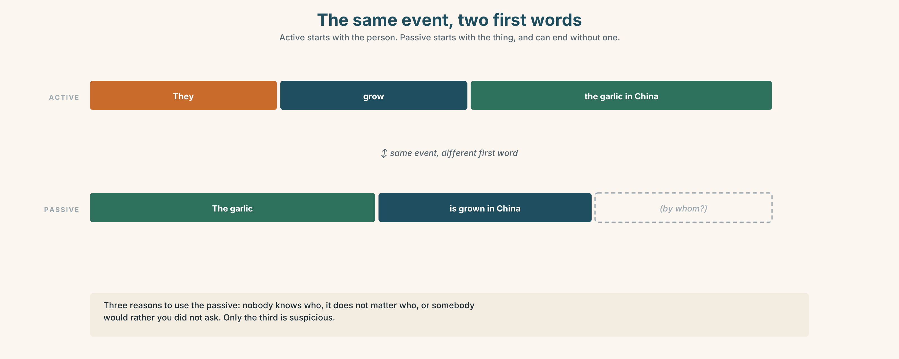{width=6.6in}

*The same event, two first words — Active starts with the person. Passive starts with the thing, and can end without one.*

Now look at the second picture. **The sentence has three slots. Which one can be deleted?**

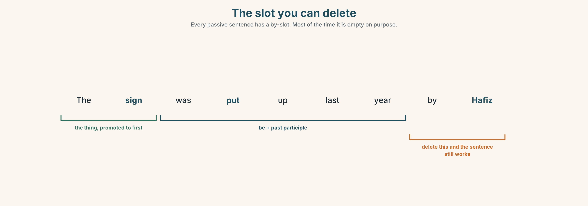{width=6.6in}

*The slot you can delete — Every passive sentence has a by-slot. Most of the time it is empty on purpose.*

### 3C · Know

| | Shape | Example |
|---|---|---|
| **present passive** | *am / is / are* + past participle | *The garlic **is grown** in China.* |
| **past passive** | *was / were* + past participle | *The sign **was put up** last year.* |
| **naming the agent** | **by** + who or what | *It was built **by** my grandfather.* |

> **Three reasons to use the passive, and only one of them is suspicious:**
> 1. Nobody knows who → *The sign was put up last year.*
> 2. It does not matter who → *The garlic is grown in China.*
> 3. Somebody would rather you did not ask → *Mistakes were made.*

> **Watch out.** The participle is not the infinitive.
> ✗ *is grow* ✓ *is grown* · ✗ *was build* ✓ *was built*

> **Why it matters.** The passive lets you put the important thing first and the person last —
> or nowhere. On a food label, that is a decision, not a grammar choice.

### 3D · Use — controlled

> The tomatoes (1) __________ (grow) in Cameron Highlands and (2) __________ (bring) down
> overnight. The garlic (3) __________ (not grow) here at all; it (4) __________ (import)
> from China and (5) __________ (pack) in Selangor. The sign (6) __________ (put up) last year
> by a man nobody can now name.

### 3E · Use — guided

Make each one passive. **Leave out the agent if it adds nothing.**

1. They grow the beans in Johor.
2. Somebody stole the scales on Tuesday.
3. My grandfather built this house.
4. They pack the garlic in Selangor.
5. Somebody has moved the noticeboard.

### 3F · Use — open

**Choose one thing in this room.** Tell a partner three passive sentences about it:
where it was made, what it is made of, and who it was bought by.

### 3G · Check — six items

> 1. The rice ______ (grow) in Kedah.
> 2. This house ______ (build) in 1961.
> 3. The crates ______ (bring) down every night.
> 4. The sign ______ (put up) by Hafiz last year.
> 5. Garlic ______ (not grow) in Malaysia.
> 6. Where ______ these ______ (make) ?

**0–3 →** Workbook pp. 40–42. **4–5 →** Part 6. **6 →** page 151.

---

## Part 4 · Speaking ◆ **C · THE PERFORMANCE**

### 4A · Fluency starter — where is it from?

One learner holds up any object. The others must give **three passive sentences** about it in
thirty seconds. **No guessing allowed to be challenged.**

**Five objects. Five rounds.**

### 4B · The functional core — tracing something back

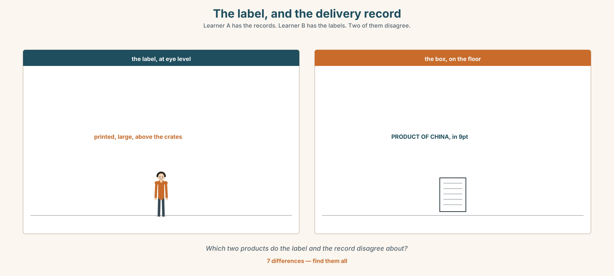{width=6.6in}

*The label, and the delivery record — Learner A has the records. Learner B has the labels. Two of them disagree.*

**Language Bank**

| | |
|---|---|
| **the origin** | *It's grown in…* · *It was made in…* · *It comes from…* |
| **the journey** | *It's brought down overnight.* · *It's sent by road.* · *Then it's packed in…* |
| **the method** | *by hand* · *by machine* · *at the factory* |
| **the honest gap** | *Nobody knows who…* · *The label doesn't say.* · *It's complicated.* |

**Information gap.** Learner A has the delivery records. Learner B has the labels.
Neither sees the other. **Find the two products whose labels and records disagree.**

### 4C · The performance — eighty seconds ⏺

Trace **one everyday thing** back to where it started. **Eighty seconds.** You must give:

> where it is grown or made · how it travels · what is done to it on the way · one thing you
> cannot find out

**Record it.**

### 4D · Observer

One person listens for **one thing**: did the speaker admit what they could not find out?

### 4E · Two criteria

> ☐ Did I use at least four passive forms?
> ☐ Did I name an agent where it mattered, and leave it out where it did not?

---

## Part 5 · Reading ◆ **A · THE WORLD**

### 5A · Predict

A feature article. The title is **"The word *local* is not regulated."**
**What do you expect the article to find?** One sentence.

### 5B · Read — one hundred and ten seconds

---

**The word *local* is not regulated**

There is no law in this country about the word *local*. It is not defined anywhere. A sign saying
LOCAL PRODUCE can be hung above vegetables grown four hundred kilometres away and nothing has
been broken.

We looked at forty-one stalls in one market. Twenty-nine had a sign using the word. Of those
twenty-nine, eleven were selling at least one item that had been imported from another country,
and all eleven were doing it openly: the boxes were stacked behind the stall with the country of
origin printed on the side.

Nobody was hiding anything. That is the interesting part.

When we asked traders what *local* meant, we were given four answers. It meant *grown in
Malaysia*. It meant *not from a supermarket*. It meant *I know the man who brings it*. And, from
one trader who had been there thirty-one years, it meant *you are buying it from me and not from
somebody in an office*.

That last answer is the one the sign is really making. It is not a claim about geography. It is a
claim about who you are handing your money to, and on that measure every one of the twenty-nine
signs was telling the truth.

The boxes, however, are still behind the stall. Somebody chose to put the sign at eye level and
the boxes on the floor, and that choice was made by a person, even if nobody can now remember
which one.

---

### 5C · Answer

1. Is the word *local* defined in law?
2. How many of the forty-one stalls used the word, and how many of those sold imported items?
3. **Why does the writer say "nobody was hiding anything" is the interesting part?**
4. What were the four meanings traders gave?
5. Which meaning does the writer think the sign is really making?
6. What is the writer's last point about the boxes?

### 5D · Vocabulary in context

Guess from the text. Then check.

> regulated · defined · at eye level · on that measure · openly

### 5E · The counter-text

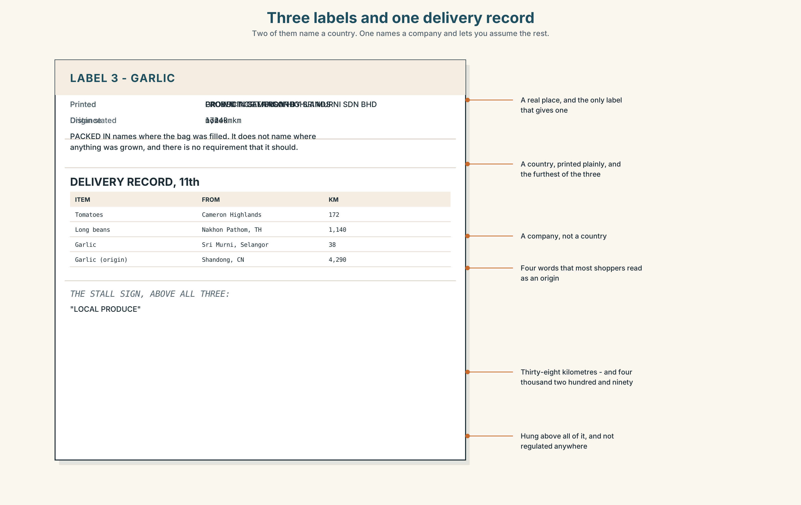{width=6.6in}

*Three labels and one delivery record — Two of them name a country. One names a company and lets you assume the rest.*

**Read the three product labels and the delivery record, and answer.**

1. Which label gives a country, and which gives only a company?
2. **Which product travels furthest, and does its label say so?**
3. What does *PACKED IN* mean, and what does it not mean?
4. One label has no origin at all. Is that legal?

### 5F · Two texts

The feature says eleven stalls sold **imported items**.
The delivery record shows garlic arriving from a **Selangor packer**, not from abroad.

**Put those two facts together. Where is the garlic from?** Two sentences.

---

## Part 6 · Vocabulary Lab 2 ◆ **B · THE SYSTEM**

### How things are made and moved

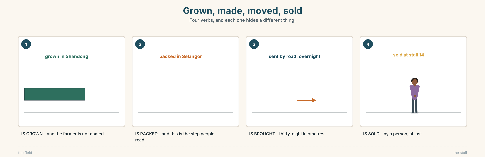{width=6.6in}

*Grown, made, moved, sold — Four verbs, and each one hides a different thing.*

### 6A · Sort — grown, made, or moved?

Three columns.

> taken · sold · built · grown · sent · made · given · brought

**Two of them could be in two columns.** Which, and with what?

### 6B · Chunk completion

1. These are **made ______** Vietnam.
2. The beans are **grown ______** Johor.
3. The house was **built ______** my grandfather.
4. It's **sold ______** the far end, not here.
5. Each one is finished **by ______** — you can see the marks.
6. The rest are cut **by ______** , four hundred an hour.

### 6C · Three words that hide a step

**packed · processed · distributed**

Each of these tells you something was done — and hides where the thing started.

**Write one sentence with each**, and then **rewrite it naming the country of origin.**

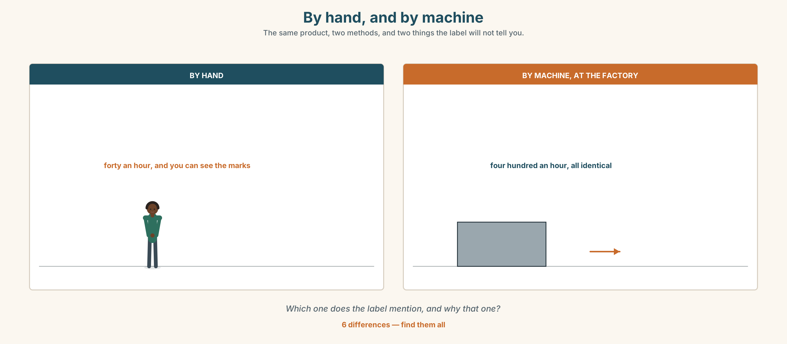{width=6.6in}

*By hand, and by machine — The same product, two methods, and two things the label will not tell you.*

**Six differences.** Find them, then answer the question under the picture.

### 6D · Contrast Clinic — active or passive

Six items. Choose the better one, and say why.

1. Somebody stole the scales. / The scales were stolen.
2. Mistakes were made. / We made a mistake.
3. My grandfather built this house. / This house was built by my grandfather.
4. The sign was put up last year. / Somebody put the sign up last year.
5. They grow garlic in China. / Garlic is grown in China.
6. The crates are brought down overnight. / They bring the crates down overnight.

---

## Part 7 · Pronunciation & Fluency Lab ◆ **B · THE SYSTEM**

### The *-ed* you cannot hear

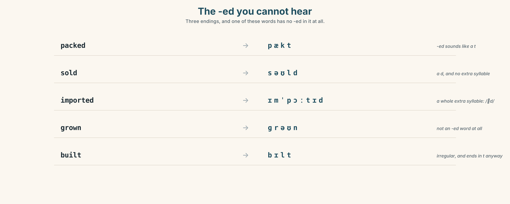{width=6.6in}

*The -ed you cannot hear — Three endings, and one of these words has no -ed in it at all.*

### 7A · Hear 🔊 Track 7.3

> packed → /pækt/ — a **t**
> grown → /ɡrəʊn/ — not an *-ed* word at all
> imported → /ɪmˈpɔːtɪd/ — a whole extra syllable
> sold → /səʊld/ — a **d**

### 7B · Say

Say each one. Then say the sentence three times, faster:

> *It's grown in China, packed in Selangor and sold here.*

### 7C · Make it mean something

Say these two:

> *It's PACKED in Selangor.* *(and that is all that happens there)*
> *It's packed in SELANGOR.* *(not here, whatever the sign says)*

**Which one is an accusation?**

### 7D · Fluency 20 ⏺

Twenty seconds: **three things in this room, and where each was made.**
Three times, faster.

---

## Part 8 · Writing ◆ **C · THE PERFORMANCE**

### Where it comes from · 90 words

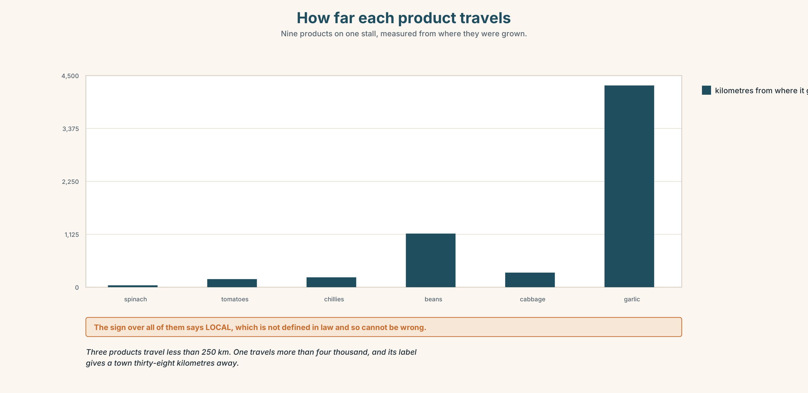{width=6.6in}

*How far each product travels — Nine products on one stall, measured from where they were grown.*

### 8A · Read the model

> The coffee is grown in Aceh, about 1,400 km from here, on farms of two or three hectares.
> `[a number, and it is the distance — which is the fact the label leaves out]`
>
> It is picked by hand, dried on concrete beside the road, and sold to a buyer who comes up the
> valley twice a month. Then it is sent to Medan and roasted there.
> `[four passives, no agents, because none of them would help]`
>
> I do not know who the buyer is. Nobody I asked knew his name, and he has been coming for
> eleven years. `[the honest gap, and it is specific]`

**Questions about the writer's choices:**

1. Four passives in one paragraph and no agent in any of them. **Is that evasive here?**
2. The last paragraph admits ignorance. **What does that do to the first two?**

### 8B · The anti-model

> This product comes from a beautiful region with a long tradition. It is produced using
> traditional methods by local farmers who care about quality. It is then exported all over
> the world.

Correct English, and it could be about anything. **Name three facts it is missing.**

### 8C · Plan

> where it starts, with a distance → what is done to it, in order → where it is sold →
> one thing you could not find out

### 8D · Write — 90 words
### 8E · Peer review — two criteria

> ☐ Is there a distance or a date?
> ☐ Is there one honest gap?

### 8F · Write it again · 8G · Publish

On the wall, with the three labels from Part 5E beside it.

---

## Part 9 · The File ◆ **A · THE WORLD + C · THE PERFORMANCE**

# WORK FILE · The Remote Problem

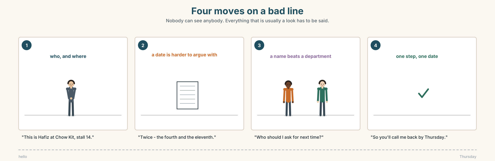{width=6.6in}

*Four moves on a bad line — Nobody can see anybody. Everything that is usually a look has to be said.*

### 9A · A problem nobody is in the room for 🔊 Track 7.4

The Selangor packer has sent the wrong garlic twice. Nobody at the market has met anybody there.
**Listen to the call.**

1. How many people are on the call, and who has the authority to fix it?
2. What has been agreed by the end?
3. **One person says something that stops the call going round in circles. What?**

### 9B · The four moves on a bad line

> saying who you are · stating the problem with a date · asking for one named person ·
> agreeing what happens by when

Match each to one phrase.

> *"This is Hafiz at Chow Kit, stall 14."* · *"Twice — the fourth and the eleventh."* ·
> *"Who should I ask for next time?"* · *"So you'll call me back by Thursday."*

### 9C · When you cannot see each other

Being unable to see somebody changes what you have to say out loud.
**Which three of these do you have to say on a call that you would not say face to face?**

> *"I'm still here."* · *"Sorry, go ahead."* · *"Can I just check I've understood?"* ·
> *"Yes."* · *"I'm writing this down."*

### 9D · Your turn

In pairs, back to back. **Six minutes.** One of you has a problem with an order.
The other works for the supplier and does not have the authority to fix it.
**You must both leave with one named next step.**

### 9E · Transfer

**Make one real call or message this week** where you ask for a named person and a date.
Bring what you got.

---

## Part 10 · Mediation & Interaction ◆ **C · THE PERFORMANCE**

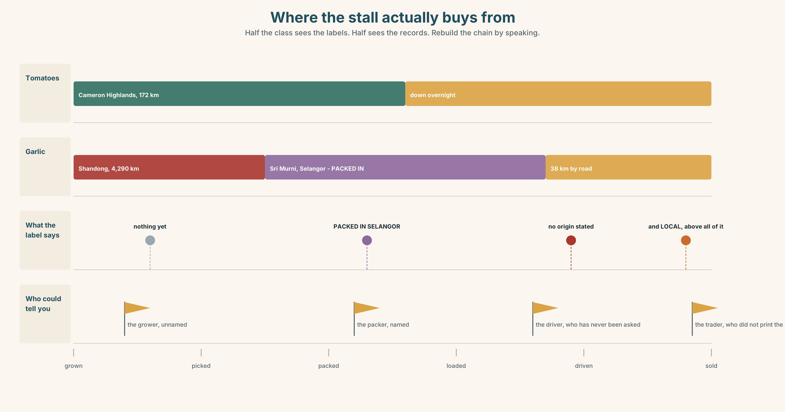{width=6.6in}

*Where the stall actually buys from — Half the class sees the labels. Half sees the records. Rebuild the chain by speaking.*

### 10A · Relay

Half the class sees the labels. Half sees the delivery records. **Rebuild the whole supply chain
by speaking.** Ten minutes.

### 10B · Simplify

Explain the three labels from Part 5E to a shopper who wants to buy only Malaysian produce.
**Four sentences only.**

> **Plan:** which one is → which one is not → which one you cannot tell → what to ask the trader

### 10C · Compress

The feature in Part 5 into **thirty-five words**, as a card to pin beside the sign.

### 10D · Online

Write **one message** to the packer: two deliveries were wrong, you want a named contact, and
you want a reply by Thursday.

### 10E · Your language

How does your language make a passive? **Does it have one at all, or does it use *people say*
or *one does*?** Show a partner the label *grown in China* in both languages.

---

## Part 11 · The Decision ◆ **C · THE PERFORMANCE**

# The sign, or the sourcing

The sign above the stall says LOCAL. Half the produce under it travels four hundred kilometres,
and the garlic comes from China by way of a packer in Selangor. Nothing illegal is happening.

- **Change the sign.** Take the word down. Lose whatever it was bringing in.
- **Change the sourcing.** Buy only Malaysian. Prices go up between nine and fourteen per cent
  and three products disappear for four months of the year.
- **Change what the sign says.** Keep it, and add the distances underneath, in small print.

### 11A · The evidence

1. **The three labels and the delivery record** from Part 5E.
2. **The chart** — where each product is grown, and how far it travels.
3. **The voice.** Siti, twenty seconds: *"I have never said the word local to a customer in
   thirty-one years. Somebody printed it and I let them hang it, which I suppose is the same
   thing."*

### 11B · Talk about it

In threes. Everybody says one. Use the frame.

> *I think they should ______ , because ______ .*

**Words you can use:** *honest · grown · imported · price · belong · roots · foreign · trust*

### 11C · Decide

Write **two sentences**. Choose, and say why.

> I think they should ______________________ ,
> because ______________________ .

### 11D · Model decision

> They should put the distances up. The feature is right that the sign is a claim about who you
> hand your money to, and that claim is true — but it is being made with a word that sounds like
> geography, and the fix is not to argue about the word. It is to put the four hundred kilometres
> next to it and let the customer decide what *local* meant all along.

### 11E · The Reveal

> **What happened.** They printed the distances on small cards and put one in front of each
> crate. It took an afternoon.
>
> For three weeks almost nobody read them. Then a food writer photographed the cards and the
> photograph was shared about nine thousand times, mostly by people who had never been to the
> market, and for a month the stall was busier than it had ever been.
>
> Two other traders copied the cards. Four were angry about it, because customers had started
> asking them for distances they did not know.

**It worked, and then it worked too well, and it made four people's lives harder.**

> **Was it the right decision?** Say why — and say what you would say to the four.

---

## Part 12 · Landing ◆ **all three lines**

### 12A · Recycle — ten items

> 1. The rice ______ (grow) in Kedah.
> 2. This house ______ (build) in 1961.
> 3. It's made ______ Vietnam.
> 4. She was ______ in Penang.
> 5. I grew ______ two streets from here.
> 6. *(Unit 6)* I can't afford ______ (buy) it.
> 7. *(Unit 6)* Do you mind ______ (wait) ?
> 8. *(Unit 5)* If it ______ (rain), we'll stay.
> 9. *(Unit 3)* I ______ (use) to live here.
> 10. *(Starting Out)* Where ______ you from?

### 12B · Consolidate

**Ninety words, one paragraph.** One thing in your home and where it came from. At least four
passives, one *by* phrase, and one thing you do not know.

### 12C · Can-do, with evidence

| I can… | My evidence | Sure? |
|---|---|---|
| say what is done to something without naming who | Part 3G score | ◯ ◑ ● |
| trace one thing back in eighty seconds | Part 4C recording | ◯ ◑ ● |
| write ninety words with a distance and a gap | Part 8 draft 2 | ◯ ◑ ● |
| get a named contact and a date on a call | Part 9D role play | ◯ ◑ ● |

### 12D · Replay ⏺

Find your thirty seconds from Part 0C. Listen. **Record it again.**
One sentence: what is different?

### 12E · Glossary — forty items, as a map

> **WHERE YOU STARTED** · born · be born in · raise · be brought up · grow up · family · roots
> **THE PLACE** · home · village · town · country · move · move away · go back · settle · settle in
> **THE PAPERS** · passport · visa · citizen · foreign · language · accent · belong · it's complicated
> **MADE** · made · be made in · built · be built by · by hand · by machine · at the factory
> **GROWN** · grown · be grown in
> **MOVED** · sold · be sold at · sent · brought · taken · given · nobody knows who

### 12F · Next

> **Unit 8 · What are you allowed to do?**

# A2.1 · Unit 8 · Two Metres From the Stall

> **English Animated** · *Making Plans* · Pasar Chow Kit, Kuala Lumpur
> Student's Book pages 160–181 · 22 pp · ~10 hours

---

## Part 0 · The Big Picture ◆ **A · THE WORLD**

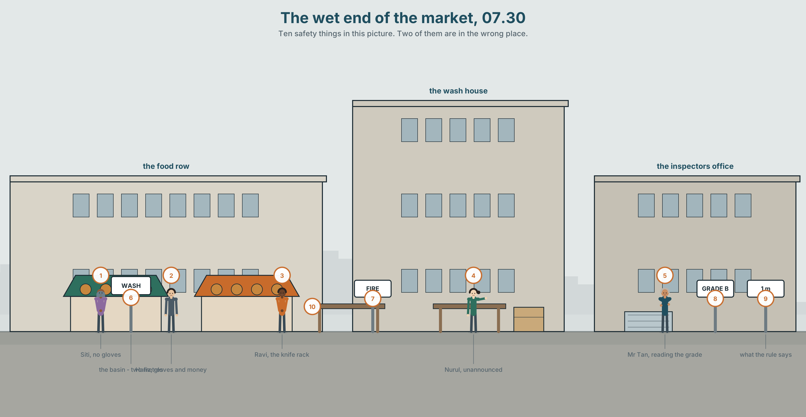{width=6.6in}

*The wet end of the market, 07.30 — Ten safety things in this picture. Two of them are in the wrong place.*

# What are you allowed to do?

**By the end of this unit you can explain the rules of a workplace to somebody on their first
day — the ones that matter, and the ones everybody ignores.**

| ◆ **A · THE WORLD** | Rules written for a reason, and what happens to the reason |
|---|---|
| ◆ **B · THE SYSTEM** | *have to · allowed to · supposed to · must · should · don't have to* · 25 words for safety and rules · 15 ways of saying the same obligation differently · *supposed to* said as two syllables |
| ◆ **C · THE PERFORMANCE** | The rules of a place, explained to a stranger in ninety seconds |

---

### 0A · Find it

**Find ten safety things in this picture.** Two of them are in the wrong place.

> handwash · soap · gloves · mask · helmet · fire point · first aid box · warning sign ·
> bin · drain cover · licence on the wall · knife rack

### 0B · Guess it

**Three of the rules in this picture are broken right now.** Which, and would any of them
actually hurt somebody?

### 0C · Say it ⏺

**Record thirty seconds.** *Name one rule where you work or study that nobody follows.
Why doesn't anybody follow it?* You will record it again at the end of this unit.

---

## Part 1 · Vocabulary Lab 1 ◆ **B · THE SYSTEM**

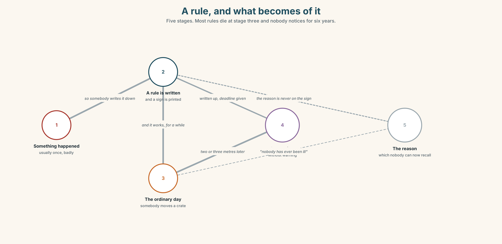{width=6.6in}

*A rule, and what becomes of it — Five stages. Most rules die at stage three and nobody notices for six years.*

### 1A · Meet — the words on the wall

Match each word to one place on the map.

> **rule** · **safety** · **hygiene** · **inspection** · **licence** · **warning** · **sign** ·
> **fine** · **permission** · **forbidden**

### 1B · Sort — a thing, a rule, or a consequence?

Three columns.

> forbidden · warning · fine · gloves · licence · soap · helmet · knife · inspection ·
> mask

**One of them is in two columns at once.** Which, and why?

### 1C · Meet — the words for how you do it

> **careful** · **dangerous** · **clean**

A knife is dangerous. A dirty knife is more dangerous, and it does not look it.
**Give one more example from your own work or home.**

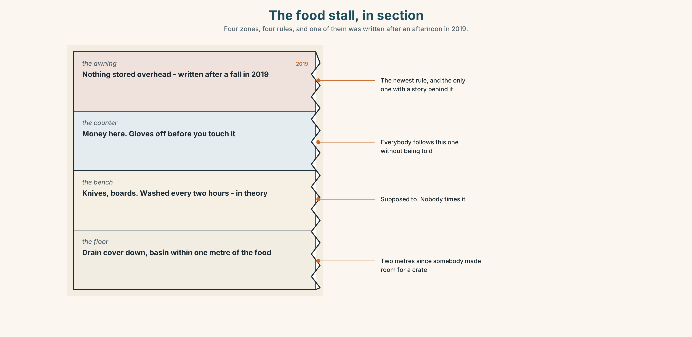{width=6.6in}

*The food stall, in section — Four zones, four rules, and one of them was written after an afternoon in 2019.*

**Look at the food stall in section.** Four zones, four rules.
**Which zone has the rule that was written last, and what happened to make somebody write it?**

### 1D · Stretch — the phrases

Complete each one with one word.

1. You're **______ to** wash your hands before you touch the fish. *(but you often don't)*
2. Leave your bag there **at your own ______** .
3. **______ your hands** — the sign has been there eleven years.
4. **Keep ______** of the shutter when it comes down.
5. **Take ______** your gloves before you handle the money.

### 1E · The saying

> **f** **Rules are rules.**

Three words that end an argument without winning it.

> *"It's two metres, not one. Nobody has ever been ill."* — *"Rules are rules."*

**Write the next line of that conversation — once for somebody who agrees, once for somebody
who does not.**

### 1F · Own it

Think of a place you know well. Tell a partner **three sentences**: one rule that matters,
one rule that does not, and one rule nobody has ever explained to you.

---

## Part 2 · Listening ◆ **A · THE WORLD**

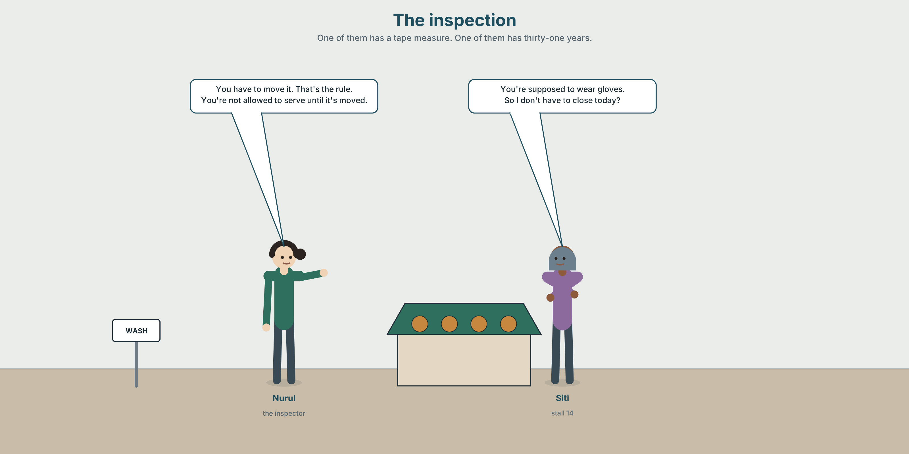{width=6.6in}

*The inspection — One of them has a tape measure. One of them has thirty-one years.*

### 2A · The inspection 🔊 Track 8.1

**Before you listen.** Nurul inspects food stalls. She arrives without warning.
**Guess: does she tell people what she has found straight away?**

**Listen once. One question.** What is the problem she finds?

**Listen again. Complete the table.**

| | What the rule says | What is actually there | What happens now |
|---|---|---|---|
| handwash | | | |
| gloves | | | |
| the drain | | | |

**Listen again. Choose.**

1. The handwash must be within **one / two / three** metres.
2. Siti **has to / doesn't have to / is supposed to** close while it is fixed.
3. The gloves are **required / recommended / forbidden**.
4. The fine is **nothing, this time / 100 / 400**.

**Noticing.** Four sentences from the recording.

1. *You have to move it. That's the rule.*
2. *You're supposed to wear gloves.*
3. *You don't have to close today.*
4. *You're not allowed to serve until it's moved.*

**Two of these are absolute. Two leave you room.** Which are which?

### 2B · Decoding clinic 🔊 Track 8.2

Twenty-five seconds of Nurul. Four jobs.

1. How many times does she say *have to* or *supposed to*?
2. In *supposed to*, how many syllables can you hear?
3. Catch the distance and the fine.
4. She softens one sentence at the end. How?

> Transcripts, page 157.

---

## Part 3 · Grammar Lab 1 ◆ **B · THE SYSTEM**

### Six ways of saying you must

### 3A · Notice

Look at the four sentences in Part 2.

1. Sentence 1 and sentence 2 are both rules. **Which one does she expect you to break?**
2. Sentence 3 has *don't have to*. **Does it mean the same as *mustn't*?**
3. Sentence 4 is a ban. **Which words make it one?**
4. *have to*, *supposed to*, *allowed to*. **Put them in order, strongest first.**
5. Try *"You don't must close today."* **What is wrong?**

### 3B · See

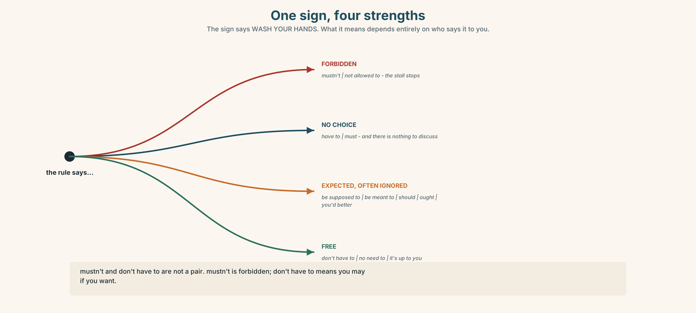{width=6.6in}

*One sign, four strengths — The sign says WASH YOUR HANDS. What it means depends entirely on who says it to you.*

Now look at the second picture. **The ladder runs from forbidden to free. Where does
*supposed to* sit, and why is it the most interesting rung?**

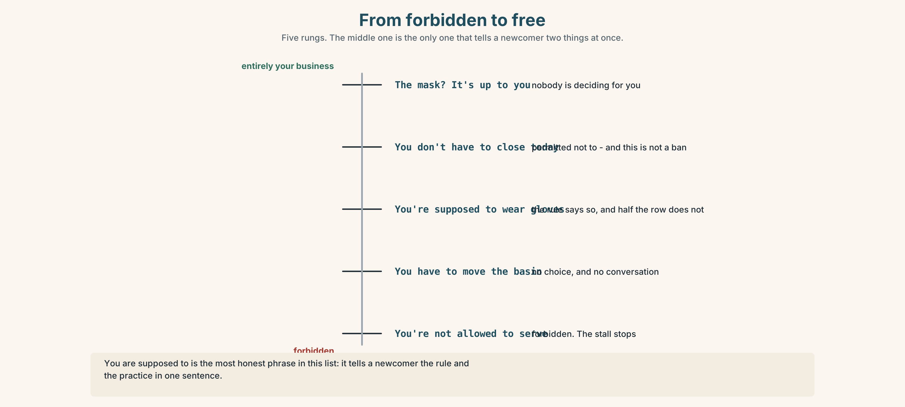{width=6.6in}

*From forbidden to free — Five rungs. The middle one is the only one that tells a newcomer two things at once.*

### 3C · Know

| | Meaning | Example |
|---|---|---|
| **have to / must** | no choice | *You **have to** move it.* |
| **be not allowed to / mustn't** | forbidden | *You**'re not allowed to** serve.* |
| **be supposed to / be meant to** | the rule says so, and people often don't | *You**'re supposed to** wear gloves.* |
| **should / ought to / you'd better** | advice, with weight | *You **should** report it.* |
| **don't have to / no need to** | free to choose | *You **don't have to** close today.* |
| **it's up to you** | nobody is deciding for you | *The mask? **It's up to you**.* |

> **The one everybody gets wrong.**
> *mustn't* = it is forbidden. *don't have to* = you may if you want.
> ✗ *You don't have to smoke here.* (if you mean it is banned)

> **Why it matters.** *You're supposed to* is the most honest phrase in this list. It tells a
> newcomer both what the rule is **and** that people break it, which is exactly what they need to
> know on their first morning.

### 3D · Use — controlled

> You (1) __________ (have to) wash your hands before you touch the fish — that one is not
> negotiable. You (2) __________ (be supposed to) wear gloves, and half the row doesn't. You
> (3) __________ (not be allowed to) serve while the handwash is more than one metre away. You
> (4) __________ (not have to) close the stall today, but you (5) __________ (should) move the
> basin before Thursday. The mask is (6) __________ to you.

### 3E · Use — guided

Rewrite each one so it is **weaker** — still true, but leaving room.

1. You must wear gloves.
2. You are not allowed to park here.
3. You have to report it the same day.
4. Smoking is forbidden.
5. You must not leave the knife out.

### 3F · Use — open

**In pairs. One of you is new.** The other explains four rules: one that matters, one that
nobody follows, one that is advice, and one that is a genuine ban. **Four minutes.**

### 3G · Check — six items

> 1. You ______ (not / allowed) park here.
> 2. You ______ (not / have) come if you're ill — stay at home.
> 3. We're ______ to sign in, but nobody does.
> 4. You ______ wear a helmet on this side. *(it is the law)*
> 5. You ______ report it today. *(my advice)*
> 6. The mask is ______ to you.

**0–3 →** Workbook pp. 46–48. **4–5 →** Part 6. **6 →** page 173.

---

## Part 4 · Speaking ◆ **C · THE PERFORMANCE**

### 4A · Fluency starter — strongest to weakest

Your teacher reads a rule. **Each learner must restate it one step weaker than the last person.**

> *"You must wear gloves."* → *"You're supposed to wear gloves."* → *"You should…"* → …

**The round ends when somebody reaches *it's up to you*.**

### 4B · The functional core — explaining the rules

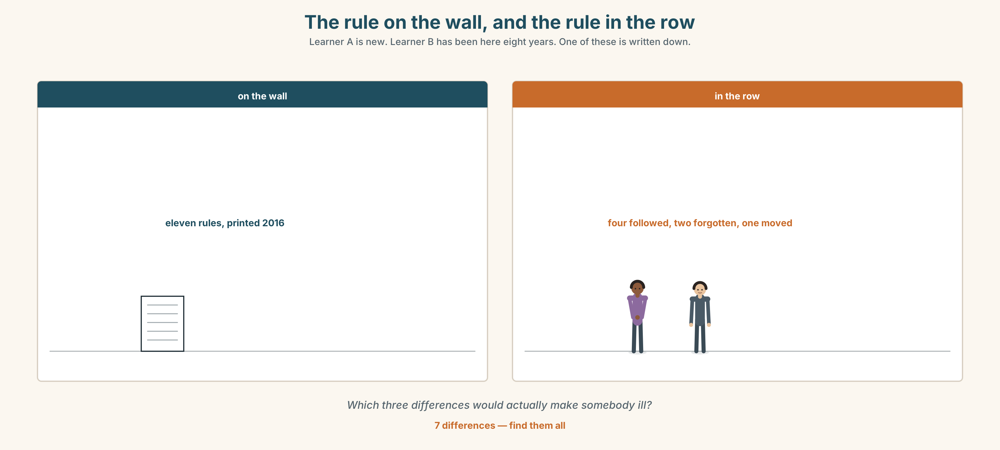{width=6.6in}

*The rule on the wall, and the rule in the row — Learner A is new. Learner B has been here eight years. One of these is written down.*

**Language Bank**

| | |
|---|---|
| **the real rule** | *You have to…* · *You're not allowed to…* · *That one is not negotiable.* |
| **the paper rule** | *You're supposed to…* · *You're meant to…* · *Officially, yes.* |
| **the advice** | *You'd better…* · *I'd report it.* · *There's no need to, but…* |
| **the honest ending** | *It's up to you.* · *Nobody will say anything.* · *Until somebody does.* |

**Role play.** Learner A is on their first morning. Learner B has worked here eight years.
**Eight rules in six minutes.** Learner A must ask about one rule twice.

### 4C · The performance — ninety seconds ⏺

Explain **the rules of one place** to somebody arriving tomorrow. **Ninety seconds.**
You must include:

> one rule that matters · one that nobody follows · one piece of advice · one thing that is
> genuinely up to them

**Record it.**

### 4D · Observer

One person listens for **one thing**: did the speaker make clear which rules are real?

### 4E · Two criteria

> ☐ Did I use at least four different strengths of obligation?
> ☐ Would a newcomer now know which rule to break first?

---

## Part 5 · Reading ◆ **A · THE WORLD**

### 5A · Predict

An interview with a food safety inspector. The title is
**"I am not trying to catch anybody."**
**Do you believe that?** One sentence, before you read.

### 5B · Read — one hundred seconds

---

**"I am not trying to catch anybody"**
*An interview with a market food safety inspector*

**You arrive without warning. Why?**
Because a stall that is clean on Tuesday because I told them I was coming on Tuesday tells me
nothing. I am not trying to catch anybody. I am trying to see the ordinary day.

**What do you find most often?**
Handwash in the wrong place. The rule is one metre. It is almost always two or three, because
somebody moved it to make room for a crate in 2019 and nobody moved it back.

**Does that actually matter?**
Yes, and I will tell you exactly why, because people assume it is paperwork. At one metre you
wash your hands between the money and the food, because the basin is in the way. At three metres
you have to decide to wash them. Nobody decides forty times an hour.

**What do you do when you find it?**
I write it down and I give them until the end of the month. I close a stall perhaps twice a year,
and both times it is something I could smell from the aisle.

**Do traders lie to you?**
Almost never. They tell me the truth and then they tell me why the rule is stupid, and about a
third of the time they are right. I write that down too. Nobody reads it.

---

### 5C · Answer

1. Why does she arrive without warning?
2. What does she find most often, and why is it usually there?
3. **What is her argument for why one metre matters?** Put it in your own words.
4. How long does she usually give traders?
5. How often does she close a stall, and for what?
6. What does she do when a trader says a rule is stupid?

### 5D · Vocabulary in context

Guess from the text. Then check.

> the ordinary day · paperwork · in the way · from the aisle · about a third of the time

### 5E · The counter-text

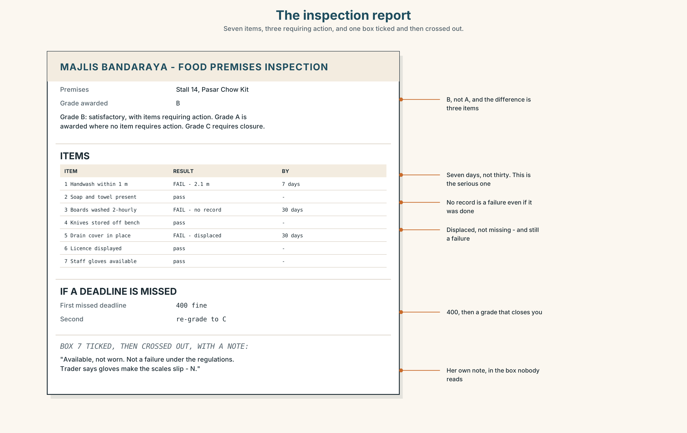{width=6.6in}

*The inspection report — Seven items, three requiring action, and one box ticked and then crossed out.*

**Read the inspection report and answer.**

1. How many items are listed, and how many are marked as requiring action?
2. **What is the deadline for each one, and what happens if it is missed?**
3. What does the grade at the top mean?
4. One box has been ticked and then crossed out. Which, and what was written beside it?

### 5F · Two texts

The interview says she gives traders **until the end of the month**.
The report gives a deadline of **seven days** for one item.

**Put those two facts together. What does that tell you about that item?** Two sentences.

---

## Part 6 · Vocabulary Lab 2 ◆ **B · THE SYSTEM**

### The same rule, said six ways

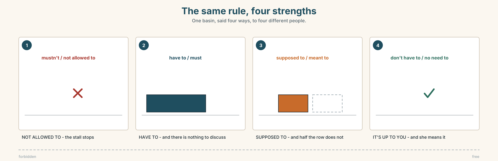{width=6.6in}

*The same rule, four strengths — One basin, said four ways, to four different people.*

### 6A · Sort — how strong?

Put these on a line from strongest to weakest.

> it's up to you · ought · need · should · must · you'd better · be supposed to ·
> be allowed to

### 6B · Chunk completion

1. You **have ______** wash your hands. *(no choice)*
2. You **don't have ______** close today. *(free to decide)*
3. We're **meant ______** sign in, but nobody does.
4. You're **not allowed ______** serve until it's moved.
5. There's **no ______ to** phone — just come.
6. **You'd ______** move it before Thursday.

### 6C · Two that are not opposites

**mustn't** and **don't have to** look like a pair. They are not.

Put the right one in each, and then explain the difference to a partner in one sentence.

1. You ______ touch that — it is wired to the alarm.
2. You ______ come in on Saturday if you don't want to.
3. Visitors ______ go past this line.
4. We ______ book in advance, but it is easier if we do.

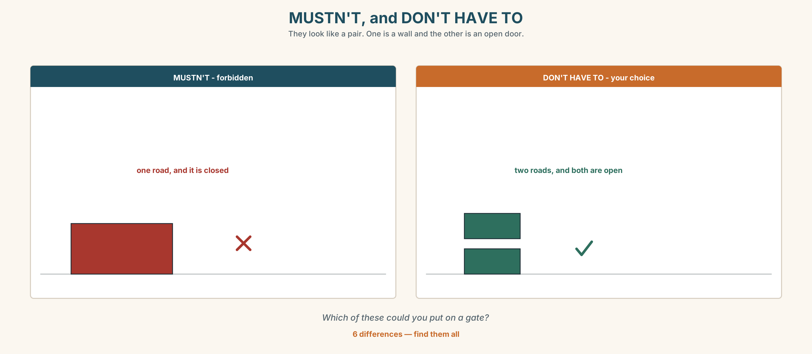{width=6.6in}

*MUSTN'T, and DON'T HAVE TO — They look like a pair. One is a wall and the other is an open door.*

**Six differences.** Find them, then answer the question under the picture.

### 6D · Contrast Clinic — which form

Six items.

1. You ______ wear a mask here. *(your choice)*
2. We ______ to wash the boards every two hours. *(the rule, often ignored)*
3. You ______ bring anything. *(no need)*
4. You ______ wear a helmet here. *(the law)*
5. You ______ park there. *(forbidden)*
6. You ______ tell her today. *(strong advice)*

---

## Part 7 · Pronunciation & Fluency Lab ◆ **B · THE SYSTEM**

### The phrase that lost a syllable

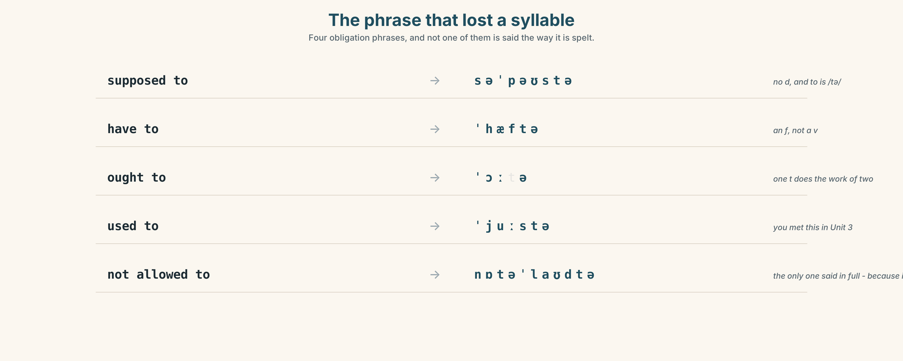{width=6.6in}

*The phrase that lost a syllable — Four obligation phrases, and not one of them is said the way it is spelt.*

### 7A · Hear 🔊 Track 8.3

> supposed to → /səˈpəʊstə/ — **no d, and *to* is /tə/**
> have to → /ˈhæftə/ — **a f, not a v**
> ought to → /ˈɔːtə/
> used to → /ˈjuːstə/ — you met this one in Unit 3

### 7B · Say

Say each one. Then say the sentence three times, faster:

> *You're supposed to wash your hands, and you have to wear gloves.*

### 7C · Make it mean something

Say these two:

> *You're SUPPOSED to.* *(and we both know you don't)*
> *You HAVE to.* *(and there is nothing to discuss)*

**Which one is an inspector's sentence and which one is a colleague's?**

### 7D · Fluency 20 ⏺

Twenty seconds: **three rules where you work or study, each at a different strength.**
Three times, faster.

---

## Part 8 · Writing ◆ **C · THE PERFORMANCE**

### The rules, honestly · 90 words

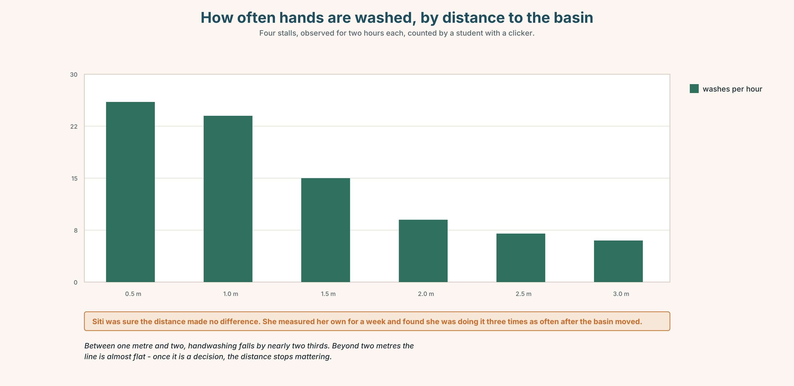{width=6.6in}

*How often hands are washed, by distance to the basin — Four stalls, observed for two hours each, counted by a student with a clicker.*

### 8A · Read the model

> Wash your hands before you touch the fish. That one is not negotiable and nobody will warn you
> twice. `[the real rule, first, and the consequence named]`
>
> You are supposed to wear gloves. About half the row does. If Nurul is in the building, wear
> them; otherwise do what you like, and take them off before you handle money either way.
> `[the paper rule, the actual practice, and one piece of real advice inside it]`
>
> Nobody has ever explained the drain cover rule to me and I have been here nine years.
> `[one honest gap, which makes the rest trustworthy]`

**Questions about the writer's choices:**

1. The second paragraph says what people actually do. **Is that irresponsible?**
2. Why end on something the writer does not know?

### 8B · The anti-model

> Please follow all safety rules at all times. Hygiene is very important and all staff must
> respect the regulations. Failure to comply may result in action being taken.

Correct English, and no newcomer is any wiser. **Name two things it does not tell them.**

### 8C · Plan

> the rule that matters, with its consequence → the rule on paper, and what people do →
> one piece of advice → one thing you do not know

### 8D · Write — 90 words
### 8E · Peer review — two criteria

> ☐ Can the reader tell which rule to take seriously?
> ☐ Is there one honest admission?

### 8F · Write it again · 8G · Publish

On the wall, with the inspection report from Part 5E beside it.

---

## Part 9 · The File ◆ **A · THE WORLD + C · THE PERFORMANCE**

# STUDY FILE · Reading at Speed

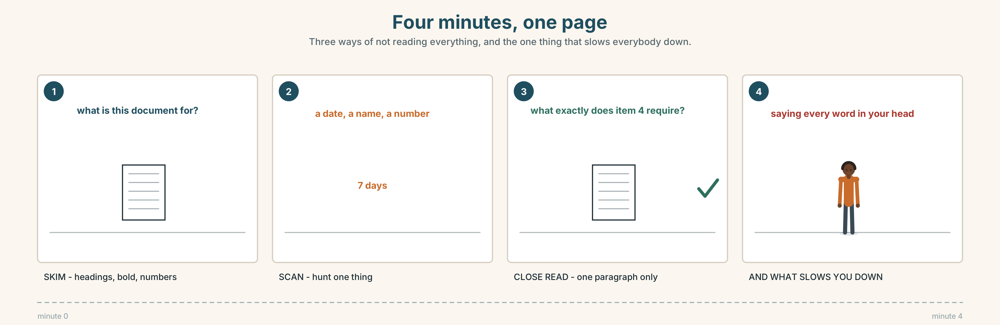{width=6.6in}

*Four minutes, one page — Three ways of not reading everything, and the one thing that slows everybody down.*

### 9A · Four minutes, one page

You have **four minutes** and a two-page inspection report. You need three things from it.

> the grade · the deadline · which items need action

**Do not read it. Find them.** Then compare with a partner: **where did you look first?**

### 9B · Three ways of not reading everything

> **skimming** — the shape of the page: headings, bold, numbers
> **scanning** — hunting one thing: a date, a name, a word
> **close reading** — the one paragraph that decides something

Match each to one of these tasks.

> *Is there a fine?* · *What is this document for?* · *What exactly does item 4 require?*

### 9C · What slows you down

Which of these actually slow a reader? **Mark three.**

> long words · reading every word aloud in your head · an unfamiliar layout ·
> words you half-know · going back · a page with no headings

### 9D · Your turn

A second report, **three minutes**. Six questions. **Then: which question did you answer last,
and why that one?**

### 9E · Transfer

**Take one page of anything this week** — a bill, a notice, an email. Give yourself ninety
seconds and write the three things it wants from you.

---

## Part 10 · Mediation & Interaction ◆ **C · THE PERFORMANCE**

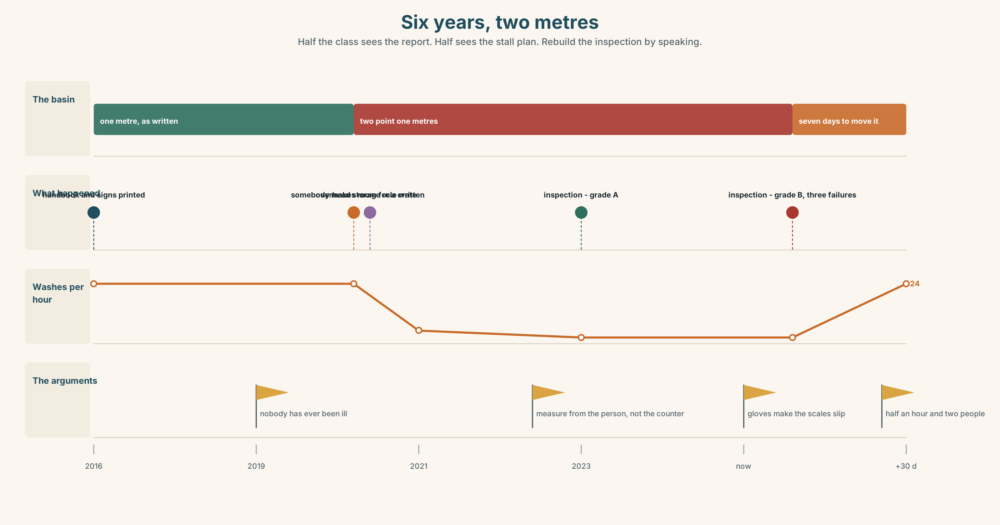{width=6.6in}

*Six years, two metres — Half the class sees the report. Half sees the stall plan. Rebuild the inspection by speaking.*

### 10A · Relay

Half the class sees the inspection report. Half sees the stall plan. **Rebuild the whole
inspection by speaking.** Ten minutes.

### 10B · Simplify

Explain the inspection report from Part 5E to a trader who cannot read it.
**Four sentences only.**

> **Plan:** what the grade means → what must be done → by when → what happens if it is not

### 10C · Compress

The interview in Part 5 into **thirty-five words**, for the traders' noticeboard.

### 10D · Online

Write **one message** to the traders' group: the inspection found one thing, it affects four
stalls, and you want everybody to check their own basin before Thursday.

### 10E · Your language

How does your language say *you're supposed to*? **Is there a phrase that means "the rule says
so, and people don't"?** If not, what do speakers use instead?

---

## Part 11 · The Decision ◆ **C · THE PERFORMANCE**

# One metre, or two

The handwash basin is two metres from the stall. The rule says one. It has been two metres since
2019, when somebody moved it to make room for a crate.

- **Close and fix it now.** One day's trade lost — about 480 — and the plumber can come Thursday.
- **Fix it at month end.** The deadline. Keep trading. If Nurul comes back before then, it is a
  400 fine and a second entry on the record.
- **Argue it.** The basin is two metres from the counter but one metre from where she actually
  stands. Measure it from the person, not the furniture.

### 11A · The evidence

1. **The inspection report** from Part 5E — and the box that was ticked and crossed out.
2. **The chart** — handwashing frequency measured at one, two and three metres.
3. **The voice.** Nurul, twenty seconds: *"I measure from the food. Not from the counter and not
   from where you happen to be standing. If I measured from the person, every basin in this
   market would pass and half of them would still not be used."*

### 11B · Talk about it

In threes. Everybody says one. Use the frame.

> *I think Siti should ______ , because ______ .*

**Words you can use:** *safety · hygiene · fine · careful · clean · rule · warning · inspection*

### 11C · Decide

Write **two sentences**. Choose, and say why.

> I think Siti should ______________________ ,
> because ______________________ .

### 11D · Model decision

> She should move it now and not close. A basin is not a wall; two of them could carry it in
> twenty minutes on a Tuesday afternoon when the row is empty, and the only reason this has been
> open for six years is that everybody has treated it as a plumbing job. The argument about
> measuring from the person is a good argument and it should be made at the committee, next year,
> when nothing is at stake.

### 11E · The Reveal

> **What happened.** Hafiz and Zul moved it on the Tuesday in about half an hour, without a
> plumber, and the stall did not close.
>
> Siti measured her own handwashing for a week afterwards, out of curiosity, and found she was
> doing it roughly three times as often. She had been sure the distance made no difference.
>
> The argument about measuring from the person was made at the committee in January. It lost.
> Nurul had already written it into her own report, four years earlier, under the heading
> *trader comments*, where nobody had read it.

**Half an hour's work. Three times the handwashing. And a good argument that had already lost
once in writing.**

> **Was it the right decision?** Say why — and say what you think of the trader comments box.

---

## Part 12 · Landing ◆ **all three lines**

### 12A · Recycle — ten items

> 1. You ______ (not / allowed) park here.
> 2. We're ______ to sign in, but nobody does.
> 3. You don't ______ to come if you're ill.
> 4. **Wash your ______** — the sign has been there eleven years.
> 5. **Better safe ______ sorry.**
> 6. *(Unit 7)* The garlic ______ (grow) in China.
> 7. *(Unit 7)* This house ______ (build) in 1961.
> 8. *(Unit 6)* I can't afford ______ (replace) it.
> 9. *(Unit 4)* The person ______ has the key is Mr Tan.
> 10. *(Starting Out)* You ______ (must) wear a helmet.

### 12B · Consolidate

**Ninety words, one paragraph.** The rules of a place you know. At least four different
strengths, and one thing you have never had explained.

### 12C · Can-do, with evidence

| I can… | My evidence | Sure? |
|---|---|---|
| say how strong a rule is, six ways | Part 3G score | ◯ ◑ ● |
| explain a workplace's rules in ninety seconds | Part 4C recording | ◯ ◑ ● |
| write ninety words a newcomer can trust | Part 8 draft 2 | ◯ ◑ ● |
| find three things in a document in four minutes | Part 9A times | ◯ ◑ ● |

### 12D · Replay ⏺

Find your thirty seconds from Part 0C. Listen. **Record it again.**
One sentence: what is different?

### 12E · Glossary — forty items, as a map

> **ON THE WALL** · rule · sign · warning · licence · permission · forbidden · fine · inspection · report
> **ON THE BENCH** · soap · knife · gloves · mask · helmet · clean · hygiene · safety
> **HOW YOU DO IT** · careful · dangerous · wash your hands · keep clear · take off · at your own risk
> **NO CHOICE** · must · have to · not allowed to · be meant to
> **ROOM TO MOVE** · be supposed to · be allowed to · should · ought · you'd better · need
> **FREE** · mustn't · don't have to · no need to · it's up to you · get out of
> **THE ENDING** · better safe than sorry · rules are rules

### 12F · Next

> **Unit 9 · Is the machine listening?**

# A2.1 · Unit 9 · Free Wifi, Nine Cameras

> **English Animated** · *Making Plans* · Pasar Chow Kit, Kuala Lumpur
> Student's Book pages 182–203 · 22 pp · ~10 hours

---

## Part 0 · The Big Picture ◆ **A · THE WORLD**

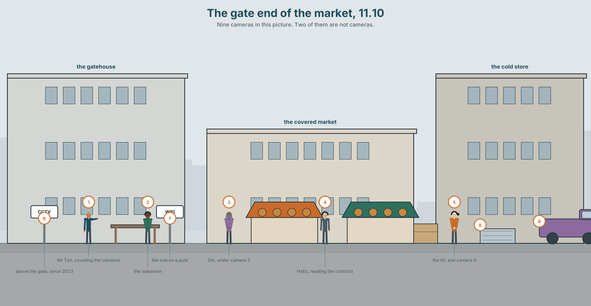{width=6.6in}

*The gate end of the market, 11.10 — Nine cameras in this picture. Two of them are not cameras.*

# Is the machine listening?

**By the end of this unit you can describe how a device is set up and say what is too much.
Ninety words.**

| ◆ **A · THE WORLD** | What is being counted while you are not thinking about it |
|---|---|
| ◆ **B · THE SYSTEM** | *too* and *enough* · *so* and *such* · adverbs of manner · 22 words for screens and privacy · 18 words for saying how much and how |
| ◆ **C · THE PERFORMANCE** | Ninety words on one device, and where you would draw the line |

---

### 0A · Find it

**Find nine cameras in this picture.** Two of them are not cameras.

> above the gate · on the cold store · over the till · the one on a pole · in the office window ·
> the smoke detector · the one pointing at the drain · the doorbell · the fire alarm

### 0B · Guess it

**One of these cameras is pointing at something nobody would expect.** Which, and at what?

### 0C · Say it ⏺

**Record thirty seconds.** *Name one thing on your phone you have never changed the setting of.
Why not?* You will record it again at the end of this unit.

---

## Part 1 · Vocabulary Lab 1 ◆ **B · THE SYSTEM**

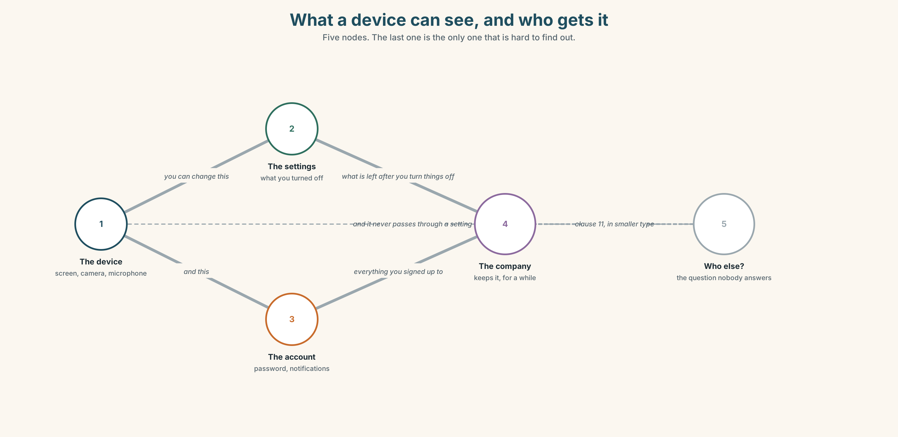{width=6.6in}

*What a device can see, and who gets it — Five nodes. The last one is the only one that is hard to find out.*

### 1A · Meet — the words on the screen

Match each word to one place on the map.

> **screen** · **camera** · **microphone** · **record** · **track** · **data** · **setting** ·
> **account** · **password** · **notification**

### 1B · Sort — something you do, or something done to you?

Two columns.

> data · follow · record · access · privacy · share · sign up · delete · block · track

**Two of them are in both columns depending on who is holding the phone.** Which?

### 1C · Meet — the three you can actually control

> **block** · **delete** · **access**

Blocking stops one person. Deleting stops one thing. **Access is the only one that stops a
system.** Why do apps make the first two easy and the third hard?

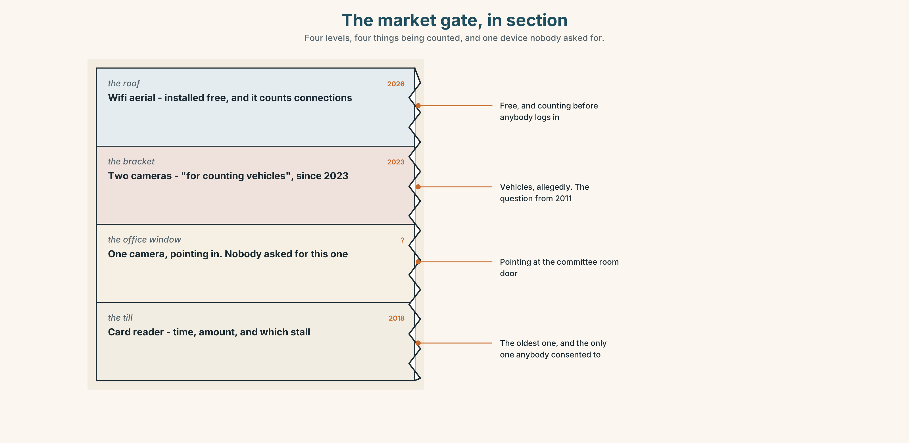{width=6.6in}

*The market gate, in section — Four levels, four things being counted, and one device nobody asked for.*

**Look at the market gate in section.** Four levels, four things being counted.
**Which level has the device nobody at the market asked for?**

### 1D · Stretch — the phrases

Complete each one with one word.

1. **Turn ______ ** the microphone when you are not using it.
2. **Log ______ ** before you hand the phone to anybody.
3. She keeps **a ______ account** and a public one, and posts different things on each.
4. The only question that matters is **______ can see** it.
5. He **signed ______ ** in 2016 and has never looked at the settings since.

### 1E · The saying

> **f** **I never read them.**

The terms and conditions. **Everybody says this.**

**Write the sentence that comes next**, once for somebody who is embarrassed about it and once
for somebody who is not.

### 1F · Own it

Think of one app you use every day. Tell a partner **three sentences**: what it can see,
what you have turned off, and one setting you did not know existed.

---

## Part 2 · Listening ◆ **A · THE WORLD**

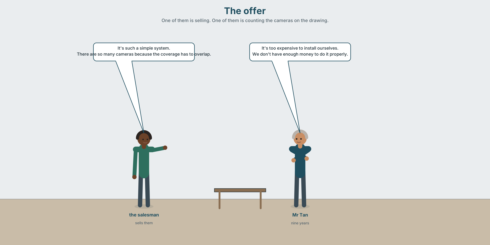{width=6.6in}

*The offer — One of them is selling. One of them is counting the cameras on the drawing.*

### 2A · The offer 🔊 Track 9.1

**Before you listen.** A company offers the market free wifi. There is a condition.
**Guess what the condition is.**

**Listen once. One question.** What does the market have to accept?

**Listen again. Complete the table.**

| | What they say it does | What they do not say |
|---|---|---|
| the cameras | | |
| the wifi | | |
| the data | | |

**Listen again. True or false?**

1. The cameras count people. ☐ T ☐ F
2. The salesman can explain what else they count. ☐ T ☐ F
3. The market would own the data. ☐ T ☐ F
4. Mr Tan asks who else can see it. ☐ T ☐ F

**Noticing.** Four sentences from the recording.

1. *It's too expensive to install ourselves.*
2. *We don't have enough money to do it properly.*
3. *There are so many cameras.*
4. *It's such a simple system.*

**Two of these use *so* or *such*. Two use *too* or *enough*.**
**Which pair is about a limit, and which is about a strong feeling?**

### 2B · Decoding clinic 🔊 Track 9.2

Twenty-five seconds of the salesman. Four jobs.

1. How many times does he say *so* or *such*?
2. Does he say *too* once, or not at all?
3. Catch the number of cameras.
4. He answers a question he was not asked. Which?

> Transcripts, page 158.

---

## Part 3 · Grammar Lab 1 ◆ **B · THE SYSTEM**

### Too much, enough, and far too many

### 3A · Notice

Look at the four sentences in Part 2.

1. In sentence 1, is *too expensive* a fact or a judgement?
2. Sentence 2 says *enough money to do it properly*. **Enough for what?**
3. *so many cameras* and *such a simple system*. **What comes after each one?**
4. **Which of the four is the salesman most likely to have said?**
5. Try *"There are too many cameras to be useful."* and *"There are so many cameras."*
   **What is the difference?**

### 3B · See

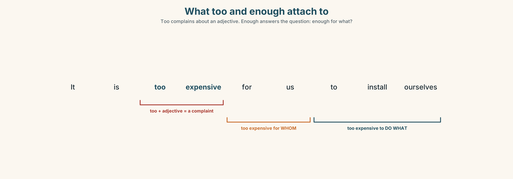{width=6.6in}

*What too and enough attach to — Too complains about an adjective. Enough answers the question: enough for what?*

Now look at the second picture. **It runs from not enough through enough to far too much.
Where would you put nine cameras?**

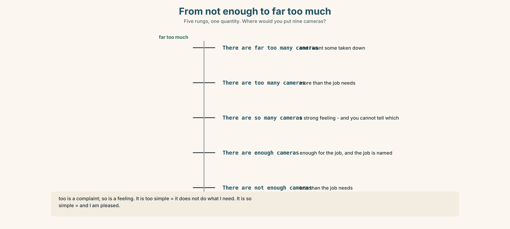{width=6.6in}

*From not enough to far too much — Five rungs, one quantity. Where would you put nine cameras?*

### 3C · Know

| | Shape | Example |
|---|---|---|
| **too** | *too* + adjective (= more than you want) | *It's **too expensive**.* |
| **too much / too many** | + noun | ***too much** data · **too many** cameras* |
| **enough** | adjective + *enough* , *enough* + noun | *big **enough** · **enough** money* |
| **not enough** | less than you need | *We don't have **enough** money.* |
| **so** | *so* + adjective **or** adverb | *It's **so** simple. · He spoke **so** quickly.* |
| **such** | *such* + (a) + adjective + noun | *It's **such** a simple system.* |

> **too is a complaint. so is a feeling.**
> *It's too simple* = it does not do what I need.
> *It's so simple* = and I am pleased about that.

> **Adverbs of manner.** Most add **-ly**: *quick → quickly*, *careful → carefully*.
> Some do not change: *fast → fast*, *hard → hard*. One is irregular: *good → **well***.

> **Watch out.** ✗ *so a simple system* ✓ *such a simple system* ✓ *so simple*
> ✗ *He speaks very good.* ✓ *He speaks very well.*

### 3D · Use — controlled

> The system is (1) __________ expensive for the market to buy, so the company is offering it
> free. There are nine cameras, which is (2) __________ many for a building this size, and
> nobody can explain clearly (3) __________ they count. Mr Tan does not have
> (4) __________ information to decide. He says it is (5) __________ a generous offer that he
> has stopped believing it, and he reads the contract very (6) __________ .

### 3E · Use — guided

Put **too**, **too much**, **too many**, **enough**, **so** or **such** in each.

1. It's ______ late to change it now.
2. There are ______ notifications. I turned them off.
3. The screen isn't bright ______ .
4. It's ______ a long document that nobody reads it.
5. We don't have ______ time.
6. He talks ______ quickly on the phone.

### 3F · Use — open

**Think of one app or device.** Tell a partner three things: one that is *too* something,
one that is not *enough*, and one that is *so* good you would not change it.

### 3G · Check — six items

> 1. It's ______ expensive. We can't afford it.
> 2. There are ______ many cameras.
> 3. The password isn't long ______ .
> 4. It's ______ a simple system.
> 5. She explained it very ______ . *(good)*
> 6. He reads the terms ______ . *(careful)*

**0–3 →** Workbook pp. 52–54. **4–5 →** Part 6. **6 →** page 195.

---

## Part 4 · Speaking ◆ **C · THE PERFORMANCE**

### 4A · Fluency starter — where is the line?

Your teacher names a thing a device could do: *count how many people walk past*.
**Everybody says one sentence:** *"That's fine / That's too much, because ______ ."*

**Six rounds. Each one goes a little further.** Stop when the room disagrees.

### 4B · The functional core — saying what is too much

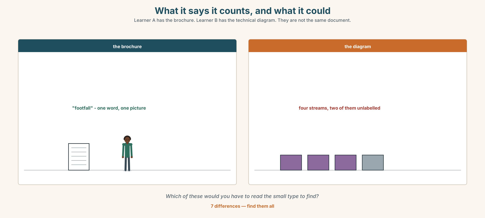{width=6.6in}

*What it says it counts, and what it could — Learner A has the brochure. Learner B has the technical diagram. They are not the same document.*

**Language Bank**

| | |
|---|---|
| **accepting** | *That's fine.* · *I don't mind that.* · *That's useful, actually.* |
| **the limit** | *That's too far.* · *That's where I'd stop.* · *Not without asking.* |
| **the question** | *Who can see it?* · *How long is it kept?* · *Can I turn it off?* |
| **the refusal** | *That's quite enough.* · *Not at that price.* · *I'd want that in writing.* |

**Role play.** Learner A sells the system. Learner B runs the market.
**Six minutes.** Learner B must ask all three questions above and get at least one real answer.

### 4C · The performance — ninety seconds ⏺

Describe **one device** and say where your line is. **Ninety seconds.** You must give:

> what it records · what you have turned off · one thing you accept that others might not ·
> the thing you would refuse

**Record it.**

### 4D · Observer

One person listens for **one thing**: did the speaker name a limit, or only complain?

### 4E · Two criteria

> ☐ Did I use *too*, *enough* and *so* or *such* correctly?
> ☐ Is my line in a specific place, not just "I don't like it"?

---

## Part 5 · Reading ◆ **A · THE WORLD**

### 5A · Predict

An archive document: minutes of a market committee meeting, from 2011.
The title is **"Item 6: the cameras."**
**What do you expect a 2011 meeting to have worried about?** One sentence.

### 5B · Read — one hundred seconds

---

**MINUTES OF THE TRADERS' COMMITTEE — 14 MARCH 2011**
**Item 6: the cameras**

Mr Rahim reported that two cameras had been installed above the gate on 3 March without the
committee being told. He had asked the city office and been told they were for counting vehicles.

Mrs Lau asked whether they were recording. The city office had said no. Mrs Lau asked how a
camera counts vehicles without recording. No answer was given at the meeting.

Mr Rahim proposed that the committee write and ask three questions: what is recorded, how long it
is kept, and who can see it. The proposal was carried, 7 votes to 1.

Mr Chin voted against, saying the committee had more important things to do and that nobody was
interested in a market gate.

**ACTION:** Secretary to write to the city office. Reply to be brought to the May meeting.

---

*Archivist's note, added 2019: no reply was ever recorded in the minutes. The cameras were
removed in 2014 during the roof works and were not reinstalled. The letter is in box 11 and was
never sent.*

---

### 5C · Answer

1. When were the cameras installed, and who was told?
2. What reason was given for them?
3. **What was Mrs Lau's question, and why was it a good one?**
4. What three questions did the committee agree to ask?
5. How did the vote go, and what was Mr Chin's argument?
6. **What does the archivist's note tell you that the minutes do not?**

### 5D · Vocabulary in context

Guess from the text. Then check.

> the proposal was carried · voted against · action · reinstalled · the archivist's note

### 5E · The counter-text

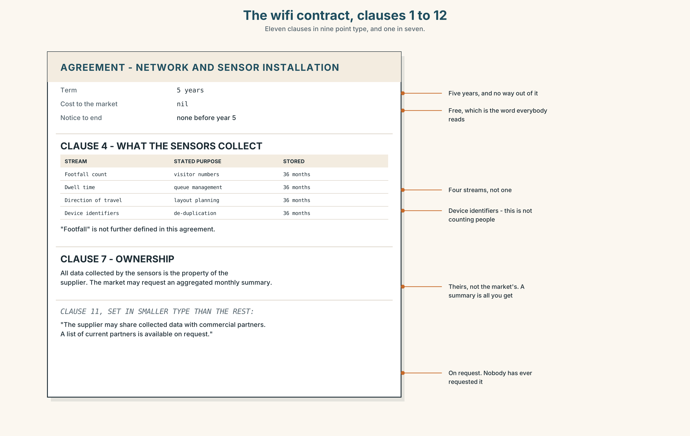{width=6.6in}

*The wifi contract, clauses 1 to 12 — Eleven clauses in nine point type, and one in seven.*

**Read the extract from the wifi contract and answer.**

1. How long is the data kept, and who owns it?
2. **What exactly do the cameras count, according to clause 4?**
3. What does the market get, and what does it give?
4. One clause is in much smaller type than the others. Which, and what does it say?

### 5F · Two texts

The 2011 minutes record three questions: **what is recorded, how long it is kept, who can see it.**
The 2026 contract answers **two** of them.

**Which one is not answered, and where would you look?** Two sentences.

---

## Part 6 · Vocabulary Lab 2 ◆ **B · THE SYSTEM**

### How, and how much

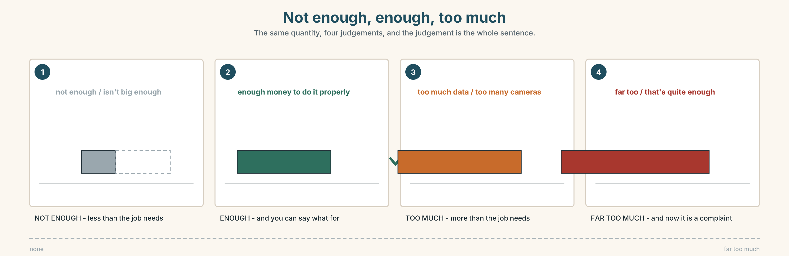{width=6.6in}

*Not enough, enough, too much — The same quantity, four judgements, and the judgement is the whole sentence.*

### 6A · Sort — adjective or adverb?

Two columns. **Two words go in both.**

> hard · loud · quick · well · badly · fast · loudly · quickly · quietly · slowly · slow ·
> bad · clear · good · careful · carefully · quiet · clearly

### 6B · Chunk completion

1. There's **______ much** data and nobody is reading it.
2. We don't have **______ enough** staff to check it.
3. **______ many** notifications and you stop seeing any of them.
4. It is **far ______** generous to be a favour.
5. **That's quite ______ ** — I don't want to hear the rest.
6. Could you **______ down** ? I'm writing it.

### 6C · The adverbs that do not take -ly

**hard** and **fast** do not change. **good** becomes **well**.

Correct each sentence. **One of them is already correct.**

1. She works very hardly.
2. He drives too fastly.
3. The system works very good.
4. They explained it clearly.
5. He answered quick.

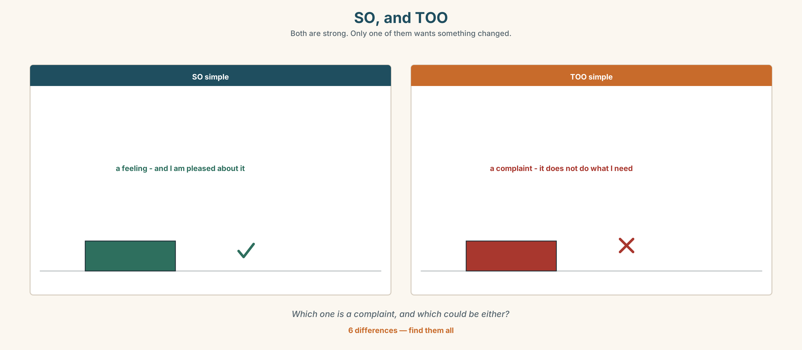{width=6.6in}

*SO, and TOO — Both are strong. Only one of them wants something changed.*

**Six differences.** Find them, then answer the question under the picture.

### 6D · Contrast Clinic — too, so, such or enough

Six items.

1. There are ______ many settings.
2. It isn't cheap ______ .
3. It's ______ expensive that nobody has bought one.
4. We haven't got ______ information.
5. It's ______ expensive for us.
6. It's ______ a good system.

---

## Part 7 · Pronunciation & Fluency Lab ◆ **B · THE SYSTEM**

### The word you lean on

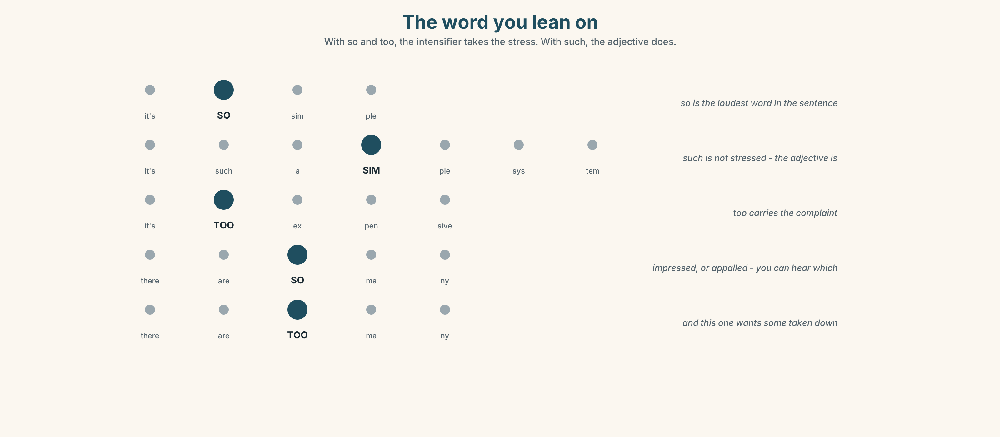{width=6.6in}

*The word you lean on — With so and too, the intensifier takes the stress. With such, the adjective does.*

### 7A · Hear 🔊 Track 9.3

> It's **SO** simple. — *so* is the loudest word in the sentence
> It's such a **SIM**ple system. — *such* is not; the adjective is
> It's **TOO** expensive. — *too* carries the complaint

### 7B · Say

Say each one. Then say all three, faster, keeping the stress where it is.

### 7C · Make it mean something

Say these two:

> *There are SO many cameras.* *(and I am impressed, or appalled — you can hear which)*
> *There are TOO many cameras.* *(and I want some of them taken down)*

**Say the first one twice: once impressed, once appalled.** What changes?

### 7D · Fluency 20 ⏺

Twenty seconds: **three things that are too much, and one that is just enough.**
Three times, faster.

---

## Part 8 · Writing ◆ **C · THE PERFORMANCE**

### Where I draw the line · 90 words

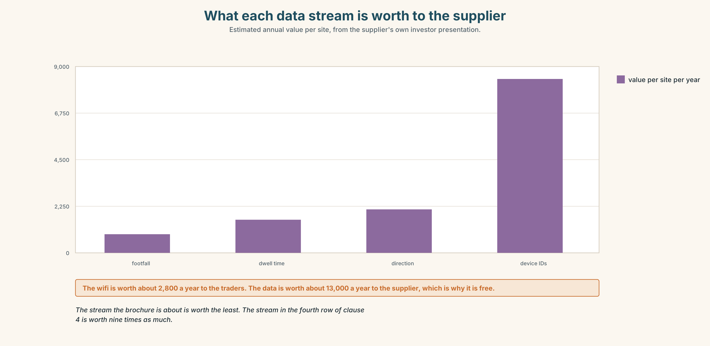{width=6.6in}

*What each data stream is worth to the supplier — Estimated annual value per site, from the supplier's own investor presentation.*

### 8A · Read the model

> My phone knows where I am, and I have left that on, because I use the map four times a week and
> I would rather have it. `[accepting something, with the reason, which makes the refusal
> credible]`
>
> I turned the microphone off for every app except two. It took eleven minutes and I found three
> apps I had signed up to in 2019 and never opened since. `[a number, and a small specific
> discovery]`
>
> Where I stop is anything that keeps the data after I delete the account. That is not a setting.
> You have to read for it. `[the line, in a specific place, and why it is hard to find]`

**Questions about the writer's choices:**

1. The first paragraph accepts something. **Why start there?**
2. The last line says the limit is not a setting. **Why does that matter?**

### 8B · The anti-model

> Technology is watching us all the time. Companies collect our data and we do not know what they
> do with it. We should all be more careful about our privacy and protect our personal
> information.

Correct English, and nobody will do anything after reading it. **Name two things it is missing.**

### 8C · Plan

> one thing you accept, with the reason → what you turned off, with a number →
> where you stop → why that line is hard to see

### 8D · Write — 90 words
### 8E · Peer review — two criteria

> ☐ Is there one thing the writer accepts?
> ☐ Is the line in a specific place?

### 8F · Write it again · 8G · Publish

On the wall, with the contract extract from Part 5E beside it.

---

## Part 9 · The File ◆ **A · THE WORLD + C · THE PERFORMANCE**

# CULTURE FILE · Register Map

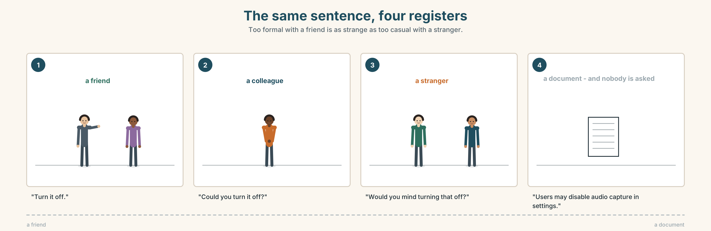{width=6.6in}

*The same sentence, four registers — Too formal with a friend is as strange as too casual with a stranger.*

### 9A · The same thing, four ways 🔊 Track 9.4

One message — *turn the microphone off* — said four times. **Listen.**

1. Which one is to a friend?
2. Which one is in a contract?
3. **Which one is to a stranger you need something from?**

### 9B · Four registers

> *"Turn it off."* · *"Could you turn it off?"* ·
> *"Would you mind turning that off?"* · *"Users may disable audio capture in settings."*

Match each to one: **a friend · a colleague · a stranger · a document**.

### 9C · Getting it wrong in both directions

Being **too formal** with a friend is as strange as being too casual with a stranger.

**Which of these is wrong, and in which direction?**

1. To your closest friend: *"I was wondering whether you might consider turning it off."*
2. To a government officer: *"Turn it off, yeah?"*
3. In a contract: *"Just switch it off, it's easy."*
4. To a colleague you have known a week: *"Could you turn it off?"*

### 9D · Your turn

In pairs. **One sentence, four registers.** Take any request and say it to a friend, a colleague,
a stranger and a document. **Your partner guesses which is which.**

### 9E · Transfer

**Find one sentence this week** that is in the wrong register — too formal or too casual.
Bring it, and say what it should have been.

---

## Part 10 · Mediation & Interaction ◆ **C · THE PERFORMANCE**

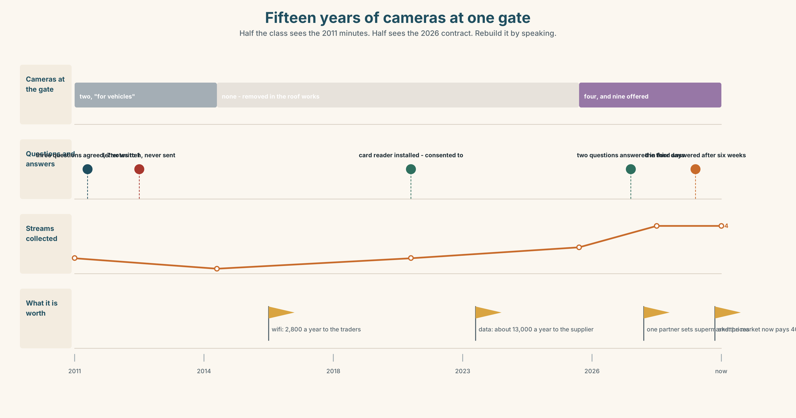{width=6.6in}

*Fifteen years of cameras at one gate — Half the class sees the 2011 minutes. Half sees the 2026 contract. Rebuild it by speaking.*

### 10A · Relay

Half the class sees the 2011 minutes. Half sees the 2026 contract. **Rebuild fifteen years of
cameras by speaking.** Ten minutes.

### 10B · Simplify

Explain the contract extract from Part 5E to a trader who has not read it.
**Four sentences only.**

> **Plan:** what the market gets → what the cameras do → who owns the data → what to ask before
> signing

### 10C · Compress

The 2011 minutes into **thirty words**, as a note to put in front of the current committee.

### 10D · Online

Write **one message** to the committee: the offer is on the table, three questions have not been
answered, and you want them answered in writing before the vote.

### 10E · Your language

How does your language say *too much*? **Is it one word or two, and does it also mean *very*?**
Show a partner *so many* and *too many* in both languages.

---

## Part 11 · The Decision ◆ **C · THE PERFORMANCE**

# Free wifi, nine cameras

A company will install wifi across the whole market, free, for five years. In return it puts up
nine cameras and keeps what they record. Nobody at the company has been able to say clearly what
the cameras count beyond "footfall".

- **Accept.** Free wifi is worth about 2,800 a year to the traders. Nine cameras in a public
  market where there are already four.
- **Refuse.** Pay for wifi, or do without. The market has done without for thirty years.
- **Accept with conditions.** Signed answers to the three 2011 questions, a copy of the data,
  and the right to end it with three months' notice.

### 11A · The evidence

1. **The contract extract** from Part 5E — and the clause in smaller type.
2. **The chart** — what the cameras can count, and what each thing is worth to the company.
3. **The voice.** The salesman, twenty seconds: *"Honestly, I don't know what else it counts. I
   sell them. There's a technical team and I've asked twice and they send me a diagram I don't
   understand either."*

### 11B · Talk about it

In threes. Everybody says one. Use the frame.

> *I think the market should ______ , because ______ .*

**Words you can use:** *privacy · data · track · record · too much · enough · who can see · free*

### 11C · Decide

Write **two sentences**. Choose, and say why.

> I think the market should ______________________ ,
> because ______________________ .

### 11D · Model decision

> Accept with conditions, and make the conditions the three questions from 2011. The committee
> asked them fifteen years ago and never got an answer, and the only thing that has changed is
> that somebody now wants something badly enough to answer. If the company will not put the
> answers in writing, that is itself the answer, and it costs nothing to find out.

### 11E · The Reveal

> **What happened.** The committee asked for the three answers in writing. The company answered
> two of them in four days and did not answer the third.
>
> The third was *who else can see it*. The reply, when it came six weeks later, named two
> partner companies that nobody had heard of, and one of them is a company that sets prices for
> supermarkets.
>
> The market refused. Three months later the same company offered the deal again, without the
> cameras, for a fee of 400 a month, which the market is now paying.

**The question that was never answered in 2011 was the one that mattered. And the wifi now costs
money.**

> **Was it the right decision?** Say why — and say what 400 a month is buying.

---

## Part 12 · Landing ◆ **all three lines**

### 12A · Recycle — ten items

> 1. It's ______ expensive for us.
> 2. There are ______ many cameras.
> 3. It isn't big ______ .
> 4. It's ______ a simple system.
> 5. She explained it very ______ . *(good)*
> 6. *(Unit 8)* We're ______ to sign in, but nobody does.
> 7. *(Unit 8)* You ______ (not / allowed) park here.
> 8. *(Unit 7)* The garlic ______ (grow) in China.
> 9. *(Unit 6)* I can't afford ______ (buy) it.
> 10. *(Starting Out)* This one is ______ (big) than that one.

### 12B · Consolidate

**Ninety words, one paragraph.** One device and where your line is. Use *too*, *enough*,
*so* or *such*, and two adverbs of manner.

### 12C · Can-do, with evidence

| I can… | My evidence | Sure? |
|---|---|---|
| say what is too much and what is enough | Part 3G score | ◯ ◑ ● |
| describe a device and draw a line in ninety seconds | Part 4C recording | ◯ ◑ ● |
| write ninety words with a specific limit | Part 8 draft 2 | ◯ ◑ ● |
| say the same thing in four registers | Part 9D pair work | ◯ ◑ ● |

### 12D · Replay ⏺

Find your thirty seconds from Part 0C. Listen. **Record it again.**
One sentence: what is different?

### 12E · Glossary — forty items, as a map

> **THE DEVICE** · screen · camera · microphone · setting · notification · account · password
> **WHAT IT DOES** · record · track · data · access · share · follow · privacy
> **WHAT YOU DO** · delete · block · turn off · log out · sign up · a private account · who can see · I never read them
> **HOW MUCH** · too · enough · too much · not enough · far too · that's quite enough
> **HOW STRONGLY** · so · such · so many
> **HOW** · quickly · slowly · carefully · badly · well · loudly · quietly · clearly · slow down

### 12F · Next

> **Unit 10 · Who gets to speak?**

# A2.1 · Unit 10 · Three People Who Cannot Read the Notice

> **English Animated** · *Making Plans* · Pasar Chow Kit, Kuala Lumpur
> Student's Book pages 204–225 · 22 pp · ~10 hours

---

## Part 0 · The Big Picture ◆ **A · THE WORLD**

{width=6.6in}

*The committee room, 10.55 — Twelve people. Three of them have not said anything. Two of them will decide.*

# Who gets to speak?

**By the end of this unit you can chair a short meeting and confirm in writing what was
agreed.**

| ◆ **A · THE WORLD** | How a decision gets made in a room, and who is not in the room |
|---|---|
| ◆ **B · THE SYSTEM** | question tags · indirect questions · 24 words for meetings and disagreement · 16 ways of asking without demanding · the tag that rises and the tag that falls |
| ◆ **C · THE PERFORMANCE** | Ten minutes in the chair, and six lines in writing afterwards |

---

### 0A · Find it

**Find twelve people in this picture.** Three of them have not said anything.

> at the table · standing at the back · in the doorway · by the window · taking notes ·
> holding the agenda · looking at a phone · arriving late

### 0B · Guess it

**Two people in this picture will decide what happens.** Which two, and how can you tell?
**Neither of them is the one holding the agenda.**

### 0C · Say it ⏺

**Record thirty seconds.** *Think of the last meeting you were in. Who spoke most, and who had
most at stake?* You will record it again at the end of this unit.

---

## Part 1 · Vocabulary Lab 1 ◆ **B · THE SYSTEM**

{width=6.6in}

*How a decision is made, and where it is actually made — Five stages. The arrow that matters most does not pass through the room.*

### 1A · Meet — the words of a meeting

Match each word to one place on the map.

> **meeting** · **agenda** · **minutes** · **decision** · **vote** · **chair** · **turn** ·
> **opinion** · **suggestion** · **argument**

### 1B · Sort — before, during, or after?

Three columns.

> opinion · agenda · suggestion · minutes · argument · vote · decision · meeting

**One of them happens at all three stages.** Which, and give an example of each.

### 1C · Meet — what people do to each other

> **agree** · **disagree** · **interrupt** · **listen** · **speak up** · **quiet**

Which of these is a kindness, and which is sometimes the only way to be heard?
**Can the same act be both?**

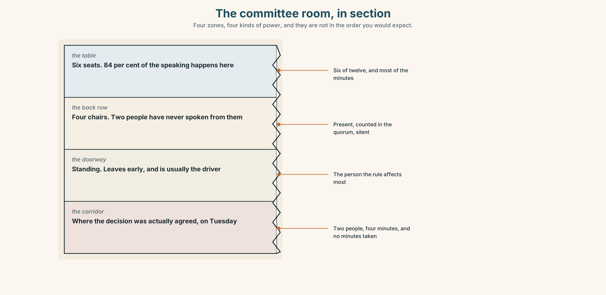{width=6.6in}

*The committee room, in section — Four zones, four kinds of power, and they are not in the order you would expect.*

**Look at the committee room in section.** Four zones, four kinds of power.
**Where does the person who decides actually sit, and where does the person who is affected?**

### 1D · Stretch — the phrases

Complete each one with one word.

1. Everybody on this committee should **have a ______** .
2. Four of you are talking. **Take ______ .**
3. If you want to say something, **put your ______ up**.
4. We haven't **______ from** the fish end at all this morning.
5. She never argues in the room. She **speaks ______** afterwards, to one person.

### 1E · The saying

> **f** **Can I just say**

Four words that interrupt politely — or do not.

> **Say it three times:** apologetically, firmly, and as somebody who has been waiting
> twenty minutes. **Which one would work in your workplace?**

### 1F · Own it

Think of a group you belong to. Tell a partner **three sentences**: who chairs it, who speaks
most, and one person whose opinion you have never heard.

---

## Part 2 · Listening ◆ **A · THE WORLD**

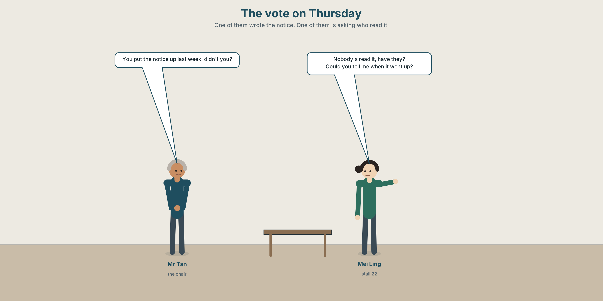{width=6.6in}

*The vote on Thursday — One of them wrote the notice. One of them is asking who read it.*

### 2A · The vote on Thursday 🔊 Track 10.1

**Before you listen.** Twelve traders must vote on a new rule. Three of them cannot read
the notice. **Guess: does anybody mention that before the vote?**

**Listen once. One question.** How many people speak in the first four minutes?

**Listen again. Complete the table.**

| | What they want | What they actually say | Who answers them |
|---|---|---|---|
| Mr Tan | | | |
| Mei Ling | | | |
| Farah | | | |

**Listen again. Choose.**

1. The notice went up **last month / last week / nobody knows**.
2. Farah speaks **last / first / not at all**.
3. Mei Ling raises the reading problem **as a question / directly / not at all**.
4. The vote is **taken / postponed / taken and then re-taken**.

**Noticing.** Four sentences from the recording.

1. *You put the notice up last week, didn't you?*
2. *Nobody's read it, have they?*
3. *Could you tell me when it went up?*
4. *Do you know if everybody can read it?*

**Two of these are tags. Two are indirect questions.**
**Which pair sounds softer, and which pair is actually harder to answer?**

### 2B · Decoding clinic 🔊 Track 10.2

Twenty-five seconds. Four jobs.

1. How many tags can you hear?
2. In *didn't you?*, does the voice go up or down?
3. Catch the date the notice went up.
4. One tag is not really a question. Which, and how do you know?

> Transcripts, page 159.

---

## Part 3 · Grammar Lab 1 ◆ **B · THE SYSTEM**

### Asking without demanding

### 3A · Notice

Look at the four sentences in Part 2.

1. In sentence 1, is the speaker asking or telling?
2. Sentence 2 is negative with a positive tag. **Why that way round?**
3. In sentence 3, what has happened to the word order of *when did it go up*?
4. Sentence 4 starts *Do you know if*. **What does *if* replace?**
5. Try *"Could you tell me when did it go up?"* **What is wrong?**

### 3B · See

{width=6.6in}

*What happens inside an indirect question — The question word stays. The inversion goes. So does do.*

Now look at the second picture. **Two tags, two voices. Which one actually wants an answer?**

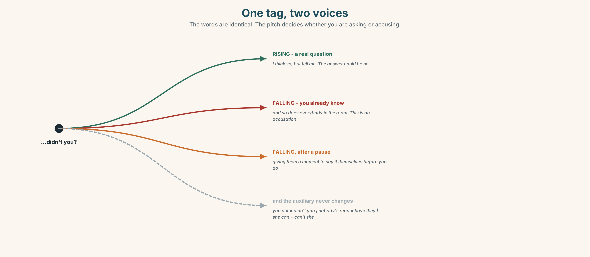{width=6.6in}

*One tag, two voices — The words are identical. The pitch decides whether you are asking or accusing.*

### 3C · Know

| | Shape | Example |
|---|---|---|
| **question tag** | positive sentence → negative tag | *You put it up last week, **didn't you**?* |
| | negative sentence → positive tag | *Nobody's read it, **have they**?* |
| **indirect question** | *Could you tell me / Do you know* + **statement order** | *Could you tell me **when it went up**?* |
| | yes/no question → **if** or **whether** | *Do you know **if** everybody can read it?* |

> **The tag uses the same auxiliary as the sentence.**
> *You **put** it up* → *didn't you?* · *Nobody**'s** read it* → *have they?* ·
> *She **can** read* → *can't she?*

> **Intonation does the work.**
> Tag ↗ = a real question. *You put it up last week, didn't you?* ↗
> Tag ↘ = you already know. *You put it up last week, didn't you?* ↘ — and that is an accusation.

> **Watch out.** Inside an indirect question, **no inversion and no *do***.
> ✗ *Do you know when did it go up?* ✓ *Do you know when it went up?*

### 3D · Use — controlled

> You put the notice up last week, (1) __________ ? Nobody has read it, (2) __________ ?
> Could you tell me (3) __________ (when / it / go up) ? And do you know
> (4) __________ (if / everybody / can read it) ? We should ask them first,
> (5) __________ ? I'm not being difficult, (6) __________ ?

### 3E · Use — guided

Add the right tag.

1. You're on the committee, ______ ?
2. She hasn't seen it, ______ ?
3. They voted last month, ______ ?
4. It isn't fair, ______ ?
5. We can postpone it, ______ ?
6. Nobody asked them, ______ ?

### 3F · Use — open

**Ask four people in this room something you half-know,** using a tag.
Then ask the same thing as an indirect question. **Which got a longer answer?**

### 3G · Check — six items

> 1. You put it up last week, ______ ?
> 2. Nobody has read it, ______ ?
> 3. Could you tell me ______ (where / the office / be) ?
> 4. Do you know ______ she is coming? *(yes/no)*
> 5. She can read it, ______ ?
> 6. I was wondering ______ (what time / the meeting / start) .

**0–3 →** Workbook pp. 58–60. **4–5 →** Part 6. **6 →** page 217.

---

## Part 4 · Speaking ◆ **C · THE PERFORMANCE**

### 4A · Fluency starter — the tag chain

One learner makes a statement. The next adds a tag and answers it. **Thirty seconds each.**

> *"You came by bus."* → *"You came by bus, didn't you? — No, I walked."* → …

**The chain breaks on a wrong auxiliary.**

### 4B · The functional core — chairing

{width=6.6in}

*Who is in the room, and who is affected — Learner A has the attendance list. Learner B has the list of who the rule touches.*

**Language Bank**

| | |
|---|---|
| **opening** | *Shall we start?* · *There are three things.* · *We've got twenty minutes.* |
| **bringing somebody in** | *We haven't heard from…* · *Farah, what do you think?* |
| **holding the floor** | *Can I just say* · *Sorry — let her finish.* · *One at a time.* |
| **closing** | *So we've agreed…* · *Is that everybody?* · *I'll write that up.* |

**Role play.** Groups of five. One chairs, four have different interests.
**Ten minutes, one decision.** The chair must bring in the quietest person by minute six.

### 4C · The performance — chairing, ten minutes ⏺

**Chair the meeting.** You must:

> state the question in one sentence · hear from everybody at least once ·
> name the decision out loud before you end · say who is doing what

**Record the last two minutes.**

### 4D · Observer

One person counts **who spoke, and for how long.** Report the two numbers, not the opinions.

### 4E · Two criteria

> ☐ Did everybody speak at least once?
> ☐ Was the decision said out loud before the meeting ended?

---

## Part 5 · Reading ◆ **A · THE WORLD**

### 5A · Predict

A letter and a reply, from the market's correspondence file. The title is
**"Re: notice of 3 June."**
**What do you expect somebody to be complaining about?** One sentence.

### 5B · Read — one hundred seconds

---

**From: Mei Ling Chan, stall 22**
**To: the Traders' Committee**
**Re: notice of 3 June**

I am writing about Thursday's vote.

The notice went up on 3 June on the board by the office. Three traders in this market cannot read
it. I do not mean they are too busy. I mean that two of them read no English at all and one reads
very little, and all three of them have been here longer than I have.

I know that the rules say fourteen days' notice and the notice was up for fifteen. That is not my
point. The notice was up. It was not read.

I am not asking you to postpone. I am asking whether anybody went and told them.

---

**From: K. Tan, Manager**
**Re: your letter**

Nobody did. I did not think of it and neither did anyone else, and I have been doing this for
nine years.

I have postponed the vote to the 24th. Between now and then I will go to all three personally,
and the secretary will read the notice aloud at the start of the next three meetings, which is
something somebody should have suggested in 2011.

You did not ask me to postpone it. I am aware of that. I am doing it because the alternative is a
vote I would have to defend by saying the paperwork was correct, and I would rather not find out
whether I could.

---

### 5C · Answer

1. When did the notice go up, and for how long?
2. How many traders cannot read it, and how well?
3. **What is Mei Ling's actual question?** It is not the obvious one.
4. What does she specifically say she is **not** asking for?
5. What three things does Mr Tan do in reply?
6. **Why does he say he is postponing it?** Put his reason in your own words.

### 5D · Vocabulary in context

Guess from the text. Then check.

> that is not my point · postpone · personally · the alternative · I would rather not find out

### 5E · The counter-text

{width=6.6in}

*The notice of 3 June — Two hundred and six words, one sentence of forty-one, and a board by the office.*

**Read the notice itself and answer.**

1. What is the new rule, in one sentence?
2. **What does a trader have to do if they want to object, and by when?**
3. How many words are in the notice, and at what reading level?
4. One sentence in it is forty-one words long. Find it, and rewrite it as three.

### 5F · Two texts

The letter says the notice was up for **fifteen days**.
The notice says objections must be **in writing, to the office, within fourteen days of posting**.

**Put those two facts together. How long did a trader actually have?** Two sentences.

---

## Part 6 · Vocabulary Lab 2 ◆ **B · THE SYSTEM**

### Asking carefully

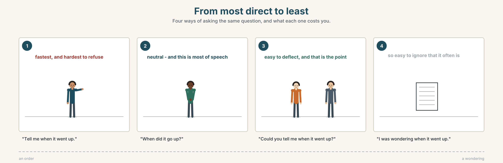{width=6.6in}

*From most direct to least — Four ways of asking the same question, and what each one costs you.*

### 6A · Sort — how direct?

Put these on a line from most direct to least.

> *I was wondering when it went up.* · *Tell me when it went up.* ·
> *Do you know when it went up?* · *Could you tell me when it went up?* ·
> *When did it go up?*

### 6B · Chunk completion

1. **Could you ______ me** where the office is?
2. **Do you know ______** she's coming?
3. **Would you ______** reading it aloud?
4. **I was ______** whether we could postpone it.
5. We should ask them first, **______ it?**
6. They're all coming, **______ they?**

### 6C · The softeners

**perhaps · actually · sorry · could · might**

Each of these makes a sentence easier to refuse. Put one in each, and say what it costs you.

1. ______ , could we come back to that?
2. I ______ disagree, if that's all right.
3. ______ we should ask them first.
4. ______ I just say something?
5. It ______ be worth waiting.

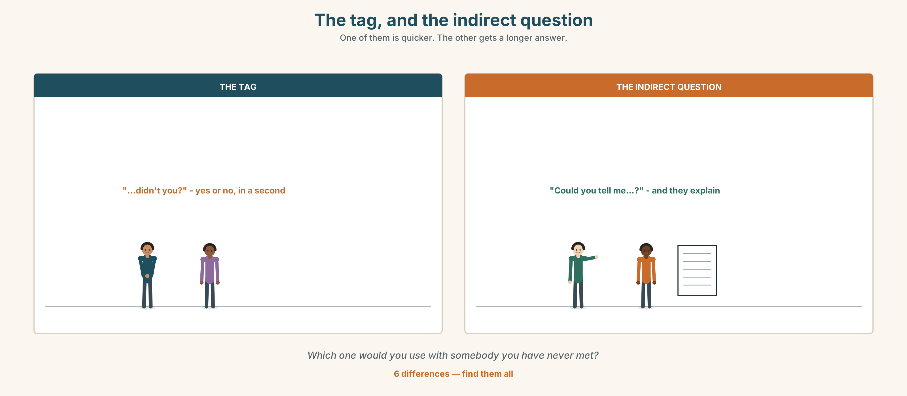{width=6.6in}

*The tag, and the indirect question — One of them is quicker. The other gets a longer answer.*

**Six differences.** Find them, then answer the question under the picture.

### 6D · Contrast Clinic — tag or indirect question

Six items. **Write the better version for the situation given.**

1. You want to disagree without an argument.
2. You want to know whether a meeting is still happening.
3. You want to check a date with a colleague. *(you are fairly sure)*
4. You want a date from a stranger in an office.
5. You want to interrupt four people who are all talking.
6. You suspect somebody forgot, and you want them to admit it.

---

## Part 7 · Pronunciation & Fluency Lab ◆ **B · THE SYSTEM**

### The tag that rises, and the tag that does not

{width=6.6in}

*The tag that rises, and the tag that does not — Identical words. The last three notes decide what kind of sentence it was.*

### 7A · Hear 🔊 Track 10.3

> *You put it up last week, didn't you?* ↗ — *I think so, but tell me*
> *You put it up last week, didn't you?* ↘ — *and we both know you did*

### 7B · Say

Say both. Then say these three with a **rise**, and then with a **fall**:

> *It isn't fair, is it?* · *Nobody asked them, did they?* · *We can postpone it, can't we?*

### 7C · Make it mean something

Say this one three times:

> *Nobody's read it, have they?*

> ↗ a question · ↘ an accusation · ↘ **with a pause before the tag** — something else again.
> **What is the third one doing?**

### 7D · Fluency 20 ⏺

Twenty seconds: **three tags that rise and three that fall.** Three times, faster.

---

## Part 8 · Writing ◆ **C · THE PERFORMANCE**

### What was agreed · 90 words

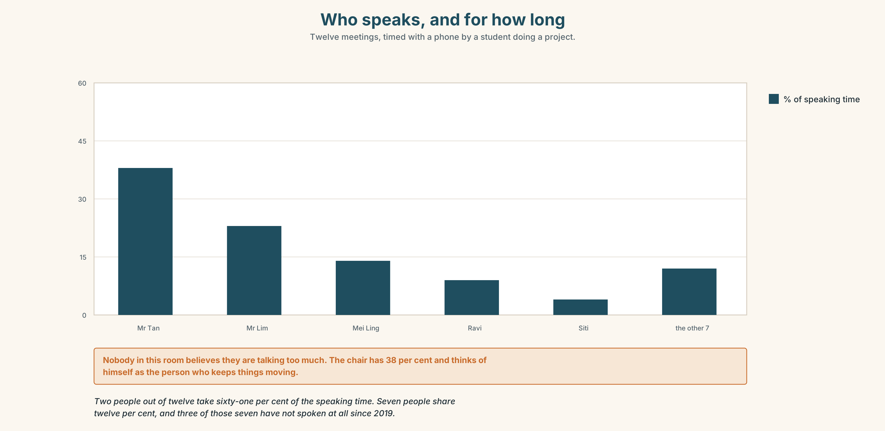{width=6.6in}

*Who speaks, and for how long — Twelve meetings, timed with a phone by a student doing a project.*

### 8A · Read the model

> **Present:** nine of twelve. **Apologies:** Ravi, Zul, Farah.
>
> The vote on the opening-hours rule was postponed to the 24th. `[the decision, first, in one
> sentence]`
>
> It was agreed that the secretary will read each notice aloud at the start of the meeting, and
> that Mr Tan will visit the three traders who cannot read the notice before the 20th.
> `[who does what, and by when — two names, two dates]`
>
> Mei Ling asked whether this should have been raised in 2011. No answer was given.
> `[one thing that was said and not resolved, recorded anyway]`

**Questions about the writer's choices:**

1. The decision comes before the reasons. **Why?**
2. The last line records a question with no answer. **Should minutes do that?**

### 8B · The anti-model

> There was a good discussion about the notice. Various views were expressed and everybody had a
> chance to speak. It was felt that more time was needed. The meeting closed at 11.40.

Correct English, and nobody could act on it tomorrow. **Name three things it does not say.**

### 8C · Plan

> who was there → the decision, in one sentence → who does what, by when →
> one thing that was not resolved

### 8D · Write — 90 words
### 8E · Peer review — two criteria

> ☐ Could somebody who was not there act on this?
> ☐ Is there a name and a date against every action?

### 8F · Write it again · 8G · Publish

On the wall, with the notice from Part 5E beside it.

---

## Part 9 · The File ◆ **A · THE WORLD + C · THE PERFORMANCE**

# WORK FILE · The Negotiation

{width=6.6in}

*Four moves in a negotiation — Nobody says yes or no before minute five. That is not a trick; it is the whole method.*

### 9A · Twenty minutes, two sides 🔊 Track 10.4

The traders want the opening hour unchanged. The city office wants it moved. **Listen.**

1. What does each side say it wants in the first minute?
2. **What does each side actually need?** They are not the same thing.
3. Who makes the first offer, and does that help them?

### 9B · The four moves

> stating your position · finding what is behind theirs · making a conditional offer ·
> writing it down

Match each to one phrase.

> *"We can't open at six."* · *"Can I ask why six?"* ·
> *"If you can give us the 05.15 slot, we could live with six."* ·
> *"So — 05.15, from the first, and we'll confirm in writing."*

### 9C · The word that moves a negotiation

**if**

> *"We'll accept six."* — nothing left to trade.
> *"**If** you give us the early slot, we'll accept six."* — now there are two things on the table.

**Rewrite these three as conditional offers.**

1. We'll pay the extra.
2. We'll drop the objection.
3. We'll take the corner pitch.

### 9D · Your turn

In pairs. **Ten minutes.** One of you wants a change. The other does not.
**Neither of you may say yes or no before minute five.** Both must leave with something written.

### 9E · Transfer

**Find one thing you want this week** and ask for it with *if*. Bring what happened.

---

## Part 10 · Mediation & Interaction ◆ **C · THE PERFORMANCE**

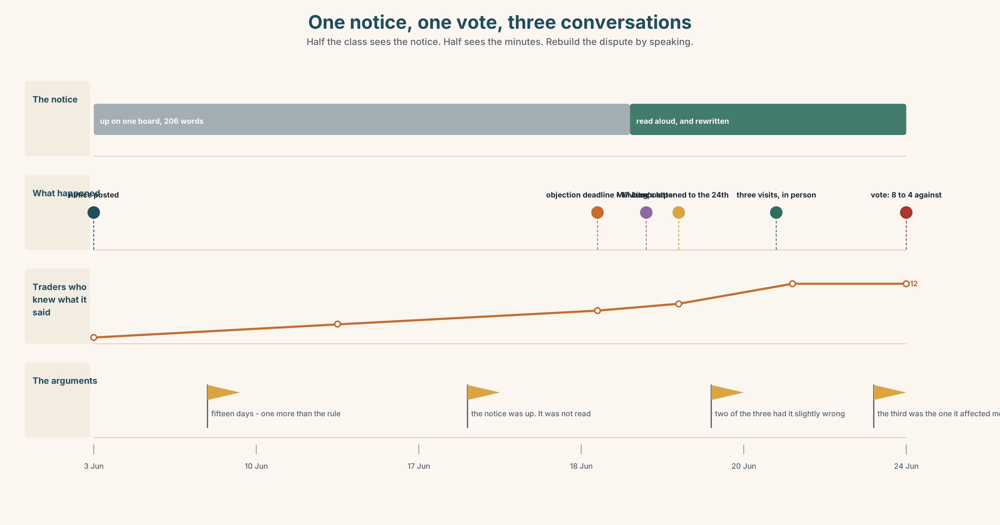{width=6.6in}

*One notice, one vote, three conversations — Half the class sees the notice. Half sees the minutes. Rebuild the dispute by speaking.*

### 10A · Relay

Half the class sees the notice. Half sees the minutes. **Rebuild the whole dispute by speaking.**
Ten minutes.

### 10B · Simplify

Explain the notice from Part 5E to a trader who reads very little English.
**Four sentences only, and no sentence over twelve words.**

> **Plan:** what is changing → from when → what you can do → by when

### 10C · Compress

The two letters in Part 5 into **thirty-five words**, as an entry in the minutes.

### 10D · Online

Write **one message** to the traders' group: the vote is postponed to the 24th, here is why in
one sentence, and here is what you want three people to do before then.

### 10E · Your language

How does your language check something you half-know? **Is there a tag, or a particle,
or do you change the intonation?** Show a partner *you put it up last week, didn't you?*
in both languages, rising and falling.

---

## Part 11 · The Decision ◆ **C · THE PERFORMANCE**

# Before the vote

Twelve traders vote on the 24th. Three of them cannot read the notice. The rules have been
followed exactly.

- **Vote as planned.** Fifteen days' notice, correctly posted. The rules exist so that nobody has
  to make this judgement.
- **Read it aloud and vote.** Five minutes at the start of the meeting. Three people hear it for
  the first time in the room where they must vote on it.
- **Visit all three first, then vote.** Three conversations, a week, and a precedent that the next
  manager may not keep.

### 11A · The evidence

1. **The notice** from Part 5E — its length, and its forty-one-word sentence.
2. **The chart** — who has spoken at the last twelve meetings, and for how long.
3. **The voice.** One of the three, fifteen seconds, through an interpreter: *"I have voted
   thirty-one times. I have never read any of them. Somebody always tells me, and I have always
   wondered what they left out."*

### 11B · Talk about it

In threes. Everybody says one. Use the frame.

> *I think the committee should ______ , because ______ .*

**Words you can use:** *fair · unfair · vote · listen · have a say · quiet · speak out · turn*

### 11C · Decide

Write **two sentences**. Choose, and say why.

> I think the committee should ______________________ ,
> because ______________________ .

### 11D · Model decision

> Visit all three, and then change the notice. The visit fixes this vote; the notice is what
> caused it. Forty-one-word sentences and a board by the office are a system that works for the
> people who already know what the notice says, and the test of a notice is not whether it was
> posted but whether the twelve people who must vote on it know what they are voting on.

### 11E · The Reveal

> **What happened.** Mr Tan visited all three. Two of them had already heard about the rule and
> had it slightly wrong. The third had not heard about it at all and turned out to be the person
> it affected most.
>
> The vote on the 24th went 8–4 against the rule. On the old notice it would almost certainly
> have gone through, because two of the four against were among the three he visited.
>
> The notice is now written in short sentences and read aloud at the start of every meeting.
> Nobody has complained about the five minutes. Four people have said it is the most useful
> five minutes of the meeting.

**Three conversations changed the result. And the quickest fix was the one that cost nothing.**

> **Was it the right decision?** Say why — and say whether a rule should have been needed to
> make it happen.

---

## Part 12 · Landing ◆ **all three lines**

### 12A · Recycle — ten items

> 1. You put it up last week, ______ ?
> 2. Nobody has read it, ______ ?
> 3. Could you tell me ______ the office is?
> 4. Everybody should **have a ______** .
> 5. **Can I ______ say** something?
> 6. *(Unit 9)* It's ______ expensive for us.
> 7. *(Unit 9)* There are ______ many cameras.
> 8. *(Unit 8)* We're ______ to sign in, but nobody does.
> 9. *(Unit 5)* If it ______ (rain), we'll stay.
> 10. *(Starting Out)* What time ______ the meeting start?

### 12B · Consolidate

**Ninety words.** The minutes of a meeting, real or invented. Who was there, the decision in one
sentence, two actions with names and dates, and one thing not resolved.

### 12C · Can-do, with evidence

| I can… | My evidence | Sure? |
|---|---|---|
| check something I half-know, politely | Part 3G score | ◯ ◑ ● |
| chair ten minutes and name the decision | Part 4C recording | ◯ ◑ ● |
| write ninety words somebody absent could act on | Part 8 draft 2 | ◯ ◑ ● |
| make a conditional offer in a negotiation | Part 9D role play | ◯ ◑ ● |

### 12D · Replay ⏺

Find your thirty seconds from Part 0C. Listen. **Record it again.**
One sentence: what is different?

### 12E · Glossary — forty items, as a map

> **THE MEETING** · meeting · agenda · minutes · chair · turn · take turns · vote
> **WHAT COMES OUT OF IT** · decision · suggestion · opinion · argument · agree · disagree
> **WHO SPEAKS** · interrupt · listen · speak up · speak out · quiet · put your hand up · hear from · have a say · can I just say
> **FAIR OR NOT** · fair · unfair
> **ASKING CAREFULLY** · could · would you mind · could you tell me · do you know if · I was wondering · perhaps · actually · sorry · might · go on · if you don't mind
> **CHECKING** · isn't it? · aren't they? · do you? · don't you?

### 12F · Next

> **A2.2 · *Telling the Story*** — Ballinmore, eight months after the storm.

---

## End of A2.1 · *Making Plans*

**Four hundred active items. Sixteen new structures. Ten decisions, none of which had a right
answer, and seven of which cost somebody something.**

> **Look back at your recording from Unit 1, Part 0C.** Listen to it once.
> Then record the same thirty seconds again. **One sentence: what is different?**

# Answer Key

> Open tasks — speaking, writing, discussion — are not keyed. Their
> success criteria are in the unit, at 4E and 8E.

## A2.1 · Unit 1 · Three Years at the Stall

**0B** · Guess it
**Thirty years:** the woman behind the scales. Her table has a worn patch where her hand rests, her apron pocket is shaped by the cash box, and she is not looking at the scales. **Last week:** the young man at the end. His apron is new and still folded at the hem, he is watching the dial, and his crates are stacked where the trolley has to go round them.

**1B** · Sort — a good day or a bad day?
**A good day:** I got better at it · I explained it to somebody · I understood it. **A bad day:** I had to repeat it · I made a mistake · I forgot it.  
**The one that goes in both:** *I made a mistake.* It is a bad day if nothing follows it and a good day if you learned from it — which is the sentence Siti uses about Hafiz.

**2A** · How long have you been doing this? 🔊 Track 1.1
**1** T · **2** F · **3** F · **4** T
**Table** — Siti: started 1995; learned from her aunt; finds nothing hard now. Hafiz: started three years ago; learned from Siti; still finds the weighing slow.

**Noticing** — **Finished:** 1 (*I started in 1995*) and 3 (*I worked at the fish stall for two years* — that job is over). **Up to now:** 2 (*I've been here since 1995*) and 4 (*I've worked here for three years*).

**3D** · Use — controlled
1 started · 2 has been / since · 3 worked · 4 has worked / for · 5 has not learned · 6 is getting

**3E** · Use — guided
1 since Monday · 2 for six months · 3 since 2019 · 4 for a long time · 5 since I was a child · 6 since breakfast · 7 for two hours · 8 since last week

**5C** · Answer
1 Four in the morning.  
2 Since 1995 — thirty years.  
3 Her aunt, who had the table before her. She watched for two years before she was allowed to take the money.  
4 He is quick with the customers and slow with the scales.  
5 Because the scales are easy and people are not. Being good at the hard thing and slow at the easy one is the way round that can be fixed.  
6 Eleven of the forty-one.

**5D** · Vocabulary in context
**trader** — somebody who sells in a market · **take the money** — handle the cash, which is the part you are trusted with last · **quick with** — good and fast at dealing with · **the right way round** — the better of two ways to be wrong · **almost nobody** — very few, and the sentence is about how unusual thirty years is

**5E** · The counter-text
1 340.  
2 Three continuous years of monthly trading.  
3 The continuous period ends and the count begins again.  
4 The one pinned below: "Table 19 free Tuesdays only. Ask Mei Ling. Not the fish end." It is the only notice with a person's name on it.

**6A** · Sort — point, or length?
> **a POINT (since)** — Monday · breakfast · I was ten · 2019
> **a LENGTH (for)** — ages · three years · a long time · six months

**6B** · Chunk completion
1 for · 2 since · 3 for · 4 for · 5 since

**6C** · The other time words
1 yet · 2 already · 3 ago · 4 still · 5 recently · 6 lately

**6D** · Contrast Clinic — finished or not
> **1** has lived — *in her life*, and the life is not over.
> **2** Have … tried — *ever* with no finished time.
> **3** Did … try — *yesterday* is a finished time.
> **4** have worked — *since* runs up to now.
> **5** worked — *in 2019* is finished.
> **6** lived — the period is closed at both ends.

**7C** · Make it mean something
The second — *I've been here since '95* — sounds like a person: the contraction and the shortened year are what ordinary speech does. You would use the first, fully pronounced, when somebody has to write it down: a form, a recorded line, or a conversation in which you are not sure you are being understood.

**12A** · Recycle — ten items
1 have lived / have been living · 2 worked · 3 for · 4 since · 5 yet · 6 better · 7 makes · 8 up · 9 have … been · 10 Still

---

## A2.1 · Unit 2 · The Van at Half Past Four

**0B** · Guess it
The rain, the broth on Mei Ling's stove, and the queue at the fish stall. The rain: the puddles are deep and the gutter is already running. The broth: there is a skin on it and the pot is half down. The queue: the crates beside it are empty and stacked, so they have been selling for an hour before the van arrived.

**1B** · Sort — what the plant needs, what the trader needs
> **what the trader needs** — a van · ice · a licence · a price card · scales
> **what the plant needs** — rain · seed · soil · sun
> **both** — water
**The one in both:** *water*. The plant needs it to grow; the trader needs it to keep the herbs and the leaves from wilting on the table. It is the same word doing two jobs, which is why it is the useful one to argue about.

**2A** · The van was late again 🔊 Track 2.1
**1** b) 03:40 · **2** a) when he left · **3** c) forty · **4** a) still cooking
**Table** — Zul: at the farm, loading the last crates; the road closed. Ravi: at his stall, waiting with an empty ice tray; the fish had nowhere cold to go. Mei Ling: at her stove, cooking broth; nothing went wrong for her, which is why she is the calm one.

**Noticing** — **Background:** 2 (*It was raining when I left*) and 4 (*While I was loading…*). **Event:** 1 (*It started raining at three*) and 3 (*I loaded the van*).

**3D** · Use — controlled
1 was raining · 2 was loading · 3 closed · 4 waited · 5 was waiting · 6 phoned · 7 did not answer · 8 was serving

**3E** · Use — guided
1 While I was walking to the market, it started to rain. *(or* It started to rain when I was walking…*)*  
2 While she was cooking, the power went off.  
3 We were talking about him when he walked in.  
4 He was loading the van when the phone rang.  
5 They were closing the stall when Nurul arrived.

**5C** · Answer
1 On Tuesday — they were picked at three in the afternoon.  
2 Because wet leaves hide the ripe fruit and the sun makes the skin split.  
3 Twelve degrees. Below ten, tomatoes stop ripening and never start again.  
4 Two hours, for fifty-eight kilometres.  
5 Because she has been buying from the same farm since 2011 and knew what was coming.  
6 Because the market opens on Sunday with Tuesday's stock — so it is cheapest, and it is the worst day to buy tomatoes.

**5D** · Vocabulary in context
**the highlands** — the cool hill country where the vegetables are grown · **split** — burst open, so the fruit cannot be sold · **ripen** — become ready to eat, which cold can stop permanently · **unload** — take the crates off the van · **the chain** — every step from the field to the table, each one able to spoil it

**5E** · The counter-text
1 Forty crates of tomatoes loaded; thirty-eight received. *(Beans and herbs match.)*  
2 Loaded Wednesday 00:55; signed for at the bay Wednesday 04:40.  
3 Zul — the initial is Z and it is in blue. "Door was open when I got there at midnight. Not mine." It accuses whoever closed the cold room on Tuesday night of leaving the door open — and by implication explains the nine-degree reading.  
4 **The cold room temperature:** the explainer says 12°C, the note records 9°C at loading. **The journey:** the explainer says the road takes two hours when dry, and the note shows 01:20 to 04:40 — three hours twenty.

**6A** · Sort — before, during, or after?
> **DURING** — at the same time · while · meanwhile · just as
> **AFTER** — afterwards · later · then
> **BEFORE** — earlier

**6B** · Chunk completion
1 at · 2 Meanwhile · 3 just · 4 all · 5 the · 6 At

**6C** · The sudden word
**Sentence 2.** The pallet going over is a single sudden event inside an action that was already running, which is exactly what *suddenly* is for. In 1 and 3 it attaches to a state or a timetable, which cannot be sudden; in 4 it attaches to tiredness, which arrives gradually.

**6D** · Contrast Clinic — long or short
> **1** was driving — at six, in the middle of it.
> **2** were unloading / started — a long action interrupted by a short one.
> **3** arrived — a point, not a stretch.
> **4** were … doing / went — background and event.
> **5** carried on / stopped — two completed actions set against each other.
> **6** rained — the whole morning is the event, and there is nothing to interrupt it.

**7C** · Make it mean something
A trader uses the loud *WAS* when somebody has just blamed them: the buyer says the fish was left out, and *it WAS raining* answers the accusation. The quiet version is for the same fact when nobody is arguing — a reason, not a defence.

**12A** · Recycle — ten items
1 was raining / arrived · 2 While · 3 in · 4 go · 5 straight · 6 for · 7 since · 8 better · 9 are · 10 opens

---

## A2.1 · Unit 3 · Forty Minutes of Broth

**0B** · Guess it
The post the menu is pinned to, the shutter on the building behind, and the drain cover in the middle of the lane. Each is in the same position in both pictures: the post has the same lean, the shutter the same two bent slats, and the drain the same cracked corner.

**1B** · Sort — a thing, a person, or a feeling?
> **a person** — neighbour · cousin
> **a feeling** — holiday · childhood · memory · game
> **a thing** — song · photo · playground · toy
**The one in two columns:** *song*. It is a thing you can play and the feeling it brings back, and the whole unit is about that doubling. *(Accept* holiday *— a period and a feeling — if the learner argues it.)*

**2A** · The broth takes forty minutes 🔊 Track 3.1
**1** T · **2** T · **3** T · **4** F
**Table** — How long the broth takes: forty minutes then, forty minutes now. Bowls an hour: a hundred and ten on a Tuesday then, forty now. Who waits: everybody then, almost nobody now.

**Noticing** — **A habit that stopped:** 1 (*used to start at two*) and 2 (*she started at two every day for thirty years*). **Now:** 3 (*People don't wait anymore*) and 4 (*I still make it the same way*).

**3D** · Use — controlled
1 used to start · 2 used · 3 used to wait · 4 anymore · 5 still make · 6 do not sell

**3E** · Use — guided
1 I used to play in that street every evening.  
2 I never used to like coriander. *(or* I didn't use to like coriander.*)*  
3 I still go there every Friday.  
4 We used to have a television with four channels.  
5 She didn't use to be shy.

**5C** · Answer
1 Eight. She did it every summer until she was fifteen.  
2 People stood in the lane and talked while they waited. The waiting was part of it.  
3 He stood in the queue for six minutes, looked at his phone twice, and left for the stall at the end.  
4 Because her grandmother never used one, and she has never needed one either.  
5 A hundred and ten bowls on a Tuesday then; forty now.  
6 The cousin says nobody comes back for the forty minutes, they come back for the taste, and the taste is in the bones and not in the time. Her answer is three words: *He has never made it.*

**5D** · Vocabulary in context
**the lane** — the narrow street outside the stall, where people waited · **out of a packet** — made from a ready-made mix, in ninety seconds · **the bones** — what the long broth is made from, and what the cousin says the taste is really in · **come back for** — return because of · **he may be right** — a concession, made just before it is taken away

**5E** · The counter-text
1 Nine in 1998 (five printed plus three vegetable dishes and an egg added by hand); four now.  
2 2.20 then; 9.50 now.  
3 The beef broth — *house* then, *house speciality* now. The price has gone from 2.20 to 9.50 and **the time has not changed**: forty minutes on both menus.  
4 "The beef one takes forty minutes. It has always taken forty minutes. Please do not ask."

**6A** · Sort — then, now, or how often?
> **THEN** — in those days · back then
> **HOW OFTEN** — ever · most of the time · never · rarely · hardly ever
> **NOW** — nowadays · these days

**6B** · Chunk completion
1 anymore · 2 Nowadays · 3 as · 4 no · 5 as · 6 most

**6C** · The strong words and the quiet ones
1 **hardly ever** — twice a year is nearly never, and *never* would be false. *Rarely* would be correct and would sound written.  
2 **never** — absolute, and the only one of the three that is. The other two leave the door open.  
3 **rarely** — this sentence is itself about formal writing, which is where *rarely* lives. *Hardly ever* would be too spoken for the claim it is making about itself.

**6D** · Contrast Clinic — stopped or not
> **1** used to
> **2** didn't use *(or* used*)* — *used to be* if she was and is not; *didn't use to be* if she was not and now is.
> **3** still
> **4** anymore
> **5** still
> **6** anymore

**7C** · Make it mean something
The first — stress on **used** — answers *Do you still?* It puts the weight on the change, and the answer is no. The second puts the weight on the activity and answers a different question: not whether, but how you got there.

**12A** · Recycle — ten items
1 used · 2 anymore · 3 still · 4 In · 5 every · 6 While · 7 rained · 8 for · 9 taught · 10 were

---

## A2.1 · Unit 4 · The Corner Pitch

**0B** · Guess it
The drain. It is the one line in the handbook's responsibility table with a dash in both columns. In the picture there is a damp dark patch spreading from the cover, flies above it, and the two nearest traders have moved their crates a metre clear — which is what happens: by Thursday it smells, and everybody works round it.

**1B** · Sort — a person, a piece of work, or a time?
> **a person** — staff · team · manager · boss · colleague
> **a time** — shift
> **a piece of work** — role · job · task
**The two that move:** *team* is a group of people and a unit of work (*the night team*, *the team that does the deliveries*). *job* is a piece of work and a position — *that is my job* means both, and in this unit it means both at once.

**2A** · Your first morning 🔊 Track 4.1
**1** b) a trader · **2** b) without warning · **3** a) the gate · **4** a) the drain
**Table** — Mr Tan: manager, writes the rota; go to him about pitches and the cold store. Nurul: inspector, food safety; she comes to you, without warning. Zul: drives the van, brings the ice; go to him if the ice is short.

**Noticing** — **The place:** sentence 3 (*The office is the place where you report a broken light*). The other three describe people, including sentence 4, which describes a van by naming its owner.

**3D** · Use — controlled
1 who / that · 2 where · 3 who / that · 4 that / which · 5 that / which · 6 which

**3E** · Use — guided
1 That's the trader who opens the gate at four.  
2 This is the room where we keep the scales.  
3 He's the colleague who I trust with the money. *(or* …the colleague I trust…*)*  
4 That's the van that broke down on Tuesday.  
5 She's the person whose name is on the rota every Sunday.

**5C** · Answer
1 Nine years.  
2 Not the rota — the rota takes an hour on a Sunday. The job is the corner.  
3 About forty per cent more than the trader six metres further in.  
4 The trader who has been there longest and has never asked him for anything. The trader who pays the most and is the most reliable person in the market. The woman who started eleven months ago, is on her own with two children, and is six metres further in.  
5 Longest serving. It is good because it cannot be argued with and bad because it rewards nothing except staying.  
6 That it says *the manager decides* — which tells you it was written by somebody who has never had to.

**5D** · Vocabulary in context
**a pitch** — the space a trader rents and sells from · **six metres further in** — the measured distance that costs forty per cent of the takings · **my predecessor** — the manager before him · **rewards nothing except** — recognises only one thing, and that thing is time · **if I am honest** — a marker that the next clause costs the speaker something

**5E** · The counter-text
1 Section 4.  
2 Clause 4.2: he must consult the traders committee — three traders elected each January — and the committee must meet before any pitch changes hands. The extract in 5B quotes only 4.1, *the manager decides*, which is why he thinks he is alone.  
3 Fourteen days, with a seven-day appeal window.  
4 "Where two traders are equally suitable, the pitch goes to the longest serving." It was crossed out and initialled KT — so the predecessor's rule was deliberately removed, and the current manager does not know it ever existed.

**6A** · Sort — would you want it?
**Open — be honest.** The two that are in both columns for most people are **skilled** and **seasonal**: skilled work is satisfying and exposing, and seasonal work is freedom for some people and insecurity for others. *(Accept* difficult *for the same reason if the learner argues it.)*

**6B** · Chunk completion
1 person · 2 numbers · 3 feet · 4 starts · 5 on · 6 suits

**6C** · Two words that look the same
1 useful · 2 helpful · 3 useful · 4 helpful

**6D** · Contrast Clinic — who, which, where or that
> **1** where
> **2** where
> **3** that / which — **and it can be dropped**
> **4** that / which — subject, so it cannot be dropped
> **5** who / that — subject, so it cannot be dropped
> **6** who / that — subject, so it cannot be dropped

**7C** · Make it mean something
The second adds commas, and the commas make the clause non-defining: there is only one trader, and by the way they pay the most. The first identifies which trader is meant out of several. In this market the first is true and the second would be a different and much more awkward claim.

**12A** · Recycle — ten items
1 who / that · 2 where · 3 that / which · 4 charge · 5 takes · 6 used · 7 anymore · 8 While · 9 works · 10 are

---

## A2.1 · Unit 5 · If the Van Comes at Six

**0B** · Guess it
The woman running for the bus that has already closed its doors; the man asleep at the stop with his bag between his feet; the family at the ticket window with a queue of nine in front of them; and the driver reading the roadworks sign, who will miss his slot. Each of them will miss a connection, and three of the four do not know it yet.

**1B** · Sort — whose fault is it?
> **the operator** — a cancelled train · breakdown
> **nobody** — roadworks · traffic · delay
> **the traveller** — arriving early · missing the connection · late
**The argument about *delay*:** it sits in *nobody* because a delay is usually the sum of several things. Argue it into *the operator* — they publish the timetable and chose the margin — or into *the traveller*, who chose the 05.22 with eighteen minutes of margin all in one place. Any of the three is defensible; the reasoning is the task.

**2A** · The slot moves to six 🔊 Track 5.1
**1** F · **2** T · **3** T · **4** T
**Table** — Siti: will open at half past six; if that fails she loses an hour of trade, which she can absorb. Ravi: will not open at all unless the fish is there by five; if that fails he loses the restaurant buyers and the whole day. Mr Tan: will try to find a second slot; if that fails somebody loses two hours every day and he decides who.

**Noticing** — **What will happen:** 1 (*If the van comes at six, I'll open at half past*) and 2 (*I won't open at all unless…*). **When:** 3 (*As soon as it arrives…*) and 4 (*By the time it gets here…*).

**3D** · Use — controlled
1 arrives · 2 will not open · 3 will start · 4 comes · 5 is · 6 will have gone · 7 finds · 8 will lose

**3E** · Use — guided
1 As soon as the ice arrives, I'll start.  
2 Unless it rains, we won't cancel. *(or* We won't cancel unless it rains.*)*  
3 Wait here until I come back.  
4 By the time the traffic clears, the market will be closed.  
5 Unless you leave now, you'll miss the connection.

**5C** · Answer
1 A route, a fare and a time.  
2 05.22, for a 05.40 connection at Sentral.  
3 Roadworks on Jalan Ipoh, which have been there since February.  
4 The 07.10 — an hour and a half later. *(The 05.46 arrives too late to connect.)*  
5 "You will make this unless the bus is more than three minutes down."  
6 The fare calculator, which is honest about what a refund is worth and how long it takes.

**5D** · Vocabulary in context
**a route** — the way from one place to another, with its stages · **margin** — the spare time between arriving and having to leave again · **down** — behind schedule, by the stated number of minutes · **the only option** — the single service that works, which is what the app never says · **honest about** — telling you the unwelcome part as well

**5E** · The counter-text
1 Three: the 05.02, the 05.22 and the 05.46.  
2 **The 06.15** — but it does not make the 05.40. It is held for the 06.40 connection when the 05.22 is cancelled, it runs Monday to Friday only, and it is not shown on the app. If the question is strictly the 05.40, the answer is that nothing makes it and the next option is the 07.10.  
3 Fifty per cent of the fare for a delay over thirty minutes, the full fare over sixty minutes or for a cancellation, claimed within twenty-eight days. Missed connections with another operator are not covered, and a claim must name the service, not the journey.  
4 The 06.15. "The 06.15 runs Monday to Friday only and is held for the 06.40 connection when the 05.22 is cancelled. It is not shown on the app."

**6A** · Sort — a condition, a time, or a deadline?
> **CONDITION** — in case · unless · if it rains
> **DEADLINE** — at the latest · in time · no later than
> **TIME** — until · by the time · whenever · as soon as

**6B** · Chunk completion
1 in case · 2 latest · 3 later · 4 in · 5 case · 6 or

**6C** · Three ways of saying now
1 **straight away** — now, before anything else; it says the matter outranks whatever they are doing.  
2 **as soon as possible** — soon, and they choose when; it says urgent without saying drop everything.  
3 **whenever you can** — no deadline at all; it tells the other person they are not being chased, which is sometimes the whole message.

**6D** · Contrast Clinic — if, unless, when or until
> **1** If
> **2** when / as soon as
> **3** until
> **4** unless
> **5** By
> **6** Unless

**7C** · Make it mean something
The rising version is a plan: the rise on *now* keeps the sentence open and hands the listener the decision. The falling version is a warning — it closes the first half, so the second half arrives as a consequence rather than an offer. Most people would rather be told the first.

**12A** · Recycle — ten items
1 rains · 2 arrives · 3 unless · 4 until · 5 case · 6 who / that · 7 in · 8 used · 9 when · 10 leaves

---

## A2.1 · Unit 6 · The Chiller or the Phone

**0B** · Guess it
**Cheap and bad value:** the plastic crates stacked by the gate. They are thin, three are already split at the corner, and there is a bag of broken ones behind them. **Expensive and good value:** the brass scales on Siti's table. They are the oldest thing in the picture, the pan is worn smooth, and they are still the ones she uses.

**1B** · Sort — the number, or the judgement?
> **the judgement** — expensive · bargain · value · cheap · worth
> **the number** — price · cost · discount
**The judgement column is bigger** — five against three. Only three of the eight words name a number; the rest are opinions about one, and in a market the argument is almost never about the number.

**2A** · One machine or one system 🔊 Track 6.1
**1** b) a phone system · **2** b) in the hot months · **3** a) asked customers · **4** a) to decide today
**Table** — Hafiz: a phone order system; about 1,800 with the first year's fees; it would save the trade they lose when customers cannot get through. Siti: a chiller; 2,400 new; it would save the produce they lose in the hot months.

**Noticing** — **+ to:** 1 (*decided to ask*) and 3 (*can't afford to do*). **+ -ing:** 2 (*don't mind asking*) and 4 (*avoid buying*).

**3D** · Use — controlled
1 to ask · 2 spending · 3 to decide · 4 waiting · 5 to look · 6 arguing

**3E** · Use — guided
1 to buy · 2 waiting · 3 trying · 4 to sell · 5 finding · 6 to deliver · 7 to accept · 8 waiting

**5C** · Answer
1 Nineteen ringgit, five months; ninety ringgit, eleven years.  
2 About forty-five a year for the cheap one; about eight a year for the expensive one.  
3 Because the expensive kettle asks for ninety today, and the cheap one asks for nineteen today and the rest later.  
4 The later cost arrives as inconvenience rather than as bills — a kettle that fails, a morning spent replacing it — so it is never added up.  
5 When you have thirty ringgit. You cannot buy the cheap-in-the-long-run option with money you do not have.  
6 That the arithmetic is correct and the advice is usually given by people who have never had to choose — so it is also a description of how much easier everything is when you can pay in advance.

**5D** · Vocabulary in context
**last** *(verb)* — keep working, for a stated time · **in instalments** — paid in parts over time, here as trouble rather than money · **in the long run** — over years, not this month · **distrust** — not believe, with a reason · **pay in advance** — have the money now, which is the thing the argument quietly assumes

**5E** · The counter-text
1 A: 2,400, three years' warranty on parts and labour. B: 900, six months on the motor only — and delivery is 140 extra.  
2 A: about 520 a year. B: about 680. The second-hand machine is cheaper until **year nine**, when the totals cross at 7,080 against 7,160.  
3 The compressor — the warranty covers the motor only. *(Delivery is also excluded, at 140.)*  
4 "Motor only. Compressor is not covered — K." Seven words, and the compressor costs 740.

**6A** · Sort — to, or -ing?
> **+ -ing** — avoid · suggest · enjoy · mind
> **+ to** — refuse · manage · offer · decide · hope · plan · promise
**The one in neither:** *stop* — but it is not on this list. On this list every verb belongs to one column; the one worth arguing about is *suggest*, which takes *-ing* and a that-clause but never a plain *to*-infinitive, which is the commonest error at this level.

**6B** · Chunk completion
1 to · 2 to · 3 buying · 4 cooking · 5 about

**6C** · The verbs that need a preposition
1 thinking about buying · 2 good at finding · 3 instead of taking · 4 spend on · 5 saving for

**6D** · Contrast Clinic — which form
> **1** to pay
> **2** to replace
> **3** holding
> **4** waiting
> **5** to get
> **6** selling

**7C** · Make it mean something
The second — stress on **ASKING** — is the honest version. It concedes that the asking is easy and admits what is actually worrying the speaker, which is what the answer will be. The first simply denies being bothered, which is what people say when they are.

**12A** · Recycle — ten items
1 to buy · 2 waiting · 3 to sell · 4 waste · 5 money · 6 rains · 7 arrives · 8 who / that · 9 when · 10 does

---

## A2.1 · Unit 7 · Four Hundred Kilometres

**0B** · Guess it
**PACKED IN SELANGOR BY SRI MURNI SDN BHD**, on the garlic. It is true: the bag was filled in Selangor, thirty-eight kilometres away. It leaves out where the garlic was grown — Shandong, four thousand two hundred and ninety kilometres — and there is no requirement that it say so.

**1B** · Sort — a place, a paper, or a feeling?
> **a place** — country · village · town
> **a paper** — passport · citizen · visa
> **a feeling** — belong · accent · home · roots
**The one that moves:** *home*. To an official it is an address — a place. To the person being asked it is a feeling, and often not the same country. *(Accept* citizen *for the same reason: a paper to a border officer and a feeling to the holder.)*

**2A** · The sign says local 🔊 Track 7.1
**1** F · **2** F · **3** F · **4** T
**Table** — Tomatoes: Cameron Highlands, 172 km, "GROWN IN CAMERON HIGHLANDS". Long beans: Nakhon Pathom, Thailand, 1,140 km, "PRODUCT OF THAILAND". Garlic: Shandong, China, 4,290 km, "PACKED IN SELANGOR".

**Noticing** — **Name the person:** 1 (*Somebody put the sign up*) and 3 (*They grow the garlic in China*). **Do not:** 2 and 4. **The passives sound more like a label** — which is exactly why labels use them.

**3D** · Use — controlled
1 are grown · 2 are brought · 3 is not grown · 4 is imported · 5 packed · 6 was put up

**3E** · Use — guided
1 The beans are grown in Johor.  
2 The scales were stolen on Tuesday.  
3 This house was built by my grandfather. *(agent kept — he is the point)*  
4 The garlic is packed in Selangor.  
5 The noticeboard has been moved.

**5C** · Answer
1 No. There is no law about the word and it is not defined anywhere.  
2 Twenty-nine of forty-one used the word; eleven of those twenty-nine sold at least one imported item.  
3 Because the obvious story would be deception, and there was none: all eleven had the boxes stacked behind the stall with the country of origin printed on the side. The behaviour is not hiding, which means something else is going on.  
4 Grown in Malaysia; not from a supermarket; I know the man who brings it; you are buying it from me and not from somebody in an office.  
5 The fourth. It is a claim about who you are handing your money to, not about geography — and on that measure all twenty-nine signs were true.  
6 That the boxes are still on the floor and the sign is at eye level, and that somebody chose that — a person, even if nobody can now remember which one.

**5D** · Vocabulary in context
**regulated** — controlled by law · **defined** — given a fixed meaning somewhere official · **at eye level** — where a customer looks, which is a choice · **on that measure** — judged by that definition rather than another · **openly** — without concealment, which is what makes the finding interesting

**5E** · The counter-text
1 Labels 1 and 2 give a place — Cameron Highlands and Thailand. Label 3 gives a company, Sri Murni Sdn Bhd, and a packing location.  
2 The garlic — 4,290 km from Shandong. **Its label does not say so**; it gives 38 km, the distance from the packer.  
3 It means where the bag was filled. It does **not** mean where anything was grown, and nothing requires it to.  
4 The garlic. **Yes** — there is no law about the word *local* and no requirement to state origin on this label. That is the finding of the whole unit: the misleading label is the legal one.

**6A** · Sort — grown, made, or moved?
> **moved** — taken · sent · brought
> **sold** — sold
> **made** — built · made
> **grown** — grown
> **given** — given
**The two that move:** *taken* is *moved* and also *removed* — taken from a field, taken away. *brought* is *moved* and, with *up*, *grown*: a person is brought up, a crop is brought down. *(The columns in the chapter are grown / made / moved; treat* sold *and* given *as the arguable extras.)*

**6B** · Chunk completion
1 in · 2 in · 3 by · 4 at · 5 hand · 6 machine

**6C** · Three words that hide a step
Model answers, each written twice.  
**packed:** *The garlic is packed in Selangor.* → *The garlic is grown in Shandong and packed in Selangor.*  
**processed:** *The fish is processed in Penang.* → *The fish is caught off Vietnam and processed in Penang.*  
**distributed:** *The rice is distributed from a depot in Klang.* → *The rice is grown in Kedah and distributed from a depot in Klang.*  
In each pair the first sentence is true and tells you nothing about origin.

**6D** · Contrast Clinic — active or passive
> **1** **The scales were stolen** — nobody knows who, so naming a vague *somebody* adds nothing.
> **2** **We made a mistake** — the passive here exists only to remove the person, which is the one use the unit is suspicious of.
> **3** Either, and they are about different things: the first is about him, the second about the house. Choose by what the paragraph is about.
> **4** **The sign was put up last year** — the agent is genuinely unknown, which is the point of the reading.
> **5** **Garlic is grown in China** — *they* names nobody, and the passive is what a label would say.
> **6** **The crates are brought down overnight** — the crates are the topic and the driver is not in the sentence anywhere else.

**7C** · Make it mean something
The second — stress on **SELANGOR** — is the accusation. Contrastive stress on the place sets it against another place, and the implied other place is *here*, which is what the sign above the stall claims. The first simply reports what happens in Selangor.

**12A** · Recycle — ten items
1 is grown · 2 was built · 3 in · 4 born · 5 up · 6 to buy · 7 waiting · 8 rains · 9 used · 10 are

---

## A2.1 · Unit 8 · Two Metres From the Stall

**0B** · Guess it
The handwash basin is two metres away behind a stack of crates; the drain cover is pushed aside; and nobody on the row is wearing gloves. **Would any of them hurt anybody?** The handwash would — the inspector's argument in 5B is that distance turns washing from automatic into a decision. The drain is a smell rather than a risk, and the gloves are the one most people assume matters and the inspector does not.

**1B** · Sort — a thing, a rule, or a consequence?
> **a rule** — forbidden · licence · inspection
> **a consequence** — warning · fine
> **a thing** — gloves · soap · helmet · knife · mask
**The one in two columns:** *warning*. It is a consequence — what happens after a failure — and it is also a rule, in the sense of a notice telling you what not to do. *(Accept* inspection *as a rule and a consequence for the same reason.)*

**2A** · The inspection 🔊 Track 8.1
**1** a) one · **2** b) doesn't have to · **3** b) recommended · **4** a) nothing, this time
**Table** — Handwash: within one metre; it is 2.1 m; seven days to move it. Gloves: available for staff; they are available and nobody wears them; pass, no action. Drain: cover in place; displaced; thirty days.

**Noticing** — **Absolute:** 1 (*You have to move it*) and 4 (*You're not allowed to serve*). **Room:** 2 (*You're supposed to wear gloves*) and 3 (*You don't have to close*).

**3D** · Use — controlled
1 have to wash · 2 are supposed to wear · 3 are not allowed to serve · 4 do not have to close · 5 should move · 6 up

**3E** · Use — guided
1 You're supposed to wear gloves.  
2 You're not really meant to park here.  
3 You ought to report it the same day.  
4 Smoking isn't allowed. *(or* You're not supposed to smoke.*)*  
5 You shouldn't leave the knife out.

**5C** · Answer
1 Because a stall that is clean on Tuesday because she said she was coming on Tuesday tells her nothing. She wants to see the ordinary day.  
2 Handwash in the wrong place — because somebody moved it to make room for a crate in 2019 and nobody moved it back.  
3 At one metre the basin is in the way, so you wash your hands between the money and the food without deciding to. At three metres you have to decide, and nobody decides forty times an hour.  
4 Until the end of the month.  
5 About twice a year, and both times for something she could smell from the aisle.  
6 She writes it down. About a third of the time they are right, and nobody reads it.

**5D** · Vocabulary in context
**the ordinary day** — the stall as it is when nobody is watching · **paperwork** — rules with no purpose behind them, which she is denying · **in the way** — physically between you and what you are doing, which is the whole argument · **from the aisle** — without going in; a measure of how bad it was · **about a third of the time** — the proportion of complaints she thinks are justified

**5E** · The counter-text
1 Seven items; three require action — handwash, boards washed two-hourly, and the drain cover.  
2 Handwash: seven days. Boards and drain: thirty days. A first missed deadline is a 400 fine; a second re-grades the stall to C, which requires closure.  
3 Grade B: satisfactory, with items requiring action. Grade A is where nothing requires action; Grade C requires closure.  
4 Box 7, staff gloves. It was ticked and crossed out, with "Available, not worn" written beside it — so the stall passes the rule and fails the thing the rule was for.

**6A** · Sort — how strong?
**Strongest → weakest:** must · be not allowed to · have to *(implied by *must*)* · need · you'd better · ought · should · be supposed to · it's up to you.  
*The useful argument is where to put **you'd better**: it is weak in form and strong in use, because it carries a consequence the speaker is not stating.*

**6B** · Chunk completion
1 to · 2 to · 3 to · 4 to · 5 need · 6 better

**6C** · Two that are not opposites
1 mustn't · 2 don't have to · 3 mustn't · 4 don't have to  
**The difference in one sentence:** *mustn't* forbids the action; *don't have to* removes the obligation and leaves you free to do it or not.

**6D** · Contrast Clinic — which form
> **1** don't have to *(or* it's up to you*)*
> **2** are supposed
> **3** don't need to *(or* needn't*)*
> **4** must / have to
> **5** mustn't *(or* are not allowed to*)*
> **6** 'd better *(or* should*)*

**7C** · Make it mean something
*You're SUPPOSED to* is a colleague's sentence: the stress on *supposed* concedes that the rule exists and is not being followed, which only somebody inside the row can say. *You HAVE to* is the inspector's: it states an obligation and closes the conversation.

**12A** · Recycle — ten items
1 are not allowed to · 2 supposed · 3 have · 4 hands · 5 than · 6 is grown · 7 was built · 8 to replace · 9 who / that · 10 must

---

## A2.1 · Unit 9 · Free Wifi, Nine Cameras

**0B** · Guess it
The one on the corner of the cold store. It is angled down and inward, at the staff door and the cash tin on the shelf beside it — not at the aisle, not at the gate, and not at anything a customer would walk past. Everybody assumes the cameras watch shoppers; that one watches the people who work there.

**1B** · Sort — something you do, or something done to you?
> **something done to you** — data · record · access · privacy · track
> **something you do** — follow · share · sign up · delete · block
**The two that switch:** *follow* and *share*. You follow somebody and you are followed; you share something and your data is shared. The word does not change and the person holding the phone decides which it is.

**2A** · The offer 🔊 Track 9.1
**1** T · **2** F · **3** F · **4** T
**Table** — The cameras: they say the cameras count people; they do not say they also collect device identifiers, dwell time and direction of travel. The wifi: they say it is free; they do not say the term is five years with no notice before year five. The data: they say the market gets a monthly summary; they do not say the supplier owns all of it and may share it with commercial partners.

**Noticing** — **A limit:** 1 (*too expensive*) and 2 (*not enough money*). **A strong feeling:** 3 (*so many*) and 4 (*such a simple system*).

**3D** · Use — controlled
1 too · 2 too · 3 what · 4 enough · 5 such · 6 carefully

**3E** · Use — guided
1 too · 2 too many · 3 enough · 4 such · 5 enough · 6 too

**5C** · Answer
1 On 3 March 2011, above the gate. Nobody — the committee was not told.  
2 Counting vehicles.  
3 How a camera counts vehicles without recording. It is a good question because it shows the two answers cannot both be true, and it needs no technical knowledge to ask.  
4 What is recorded, how long it is kept, and who can see it.  
5 Carried seven votes to one. Mr Chin voted against, saying the committee had more important things to do and nobody was interested in a market gate.  
6 That no reply was ever recorded; that the cameras were removed in 2014 during the roof works and never reinstalled; and that the letter is in box 11 and **was never sent**. The minutes record a decision that was never carried out.

**5D** · Vocabulary in context
**the proposal was carried** — the vote passed it · **voted against** — was the one vote on the other side · **action** — the item recording who must do what, which is the only part of a minute that does anything · **reinstalled** — put back, which these never were · **the archivist's note** — a later addition saying what actually happened

**5E** · The counter-text
1 Thirty-six months, and the supplier owns it. The market may request an aggregated monthly summary.  
2 Four streams: footfall count, dwell time, direction of travel, and device identifiers. And *footfall* is not further defined in the agreement.  
3 It gets the installation and five years of network at nil cost. It gives all the data, ownership of it, and five years with no notice before year five.  
4 Clause 11, set in smaller type: "The supplier may share collected data with commercial partners. A list of current partners is available on request."

**6A** · Sort — adjective or adverb?
> **both** — hard · well · fast
> **adjective** — loud · quick · slow · bad · clear · good · careful · quiet
> **adverb** — badly · loudly · quickly · quietly · slowly · carefully · clearly
**The ones in both:** *hard* and *fast* keep the same form as adverbs (*work hard*, *drive fast*). *well* is the adverb of *good* and is also an adjective meaning *healthy* (*I am well*), which is the third one most classes miss.

**6B** · Chunk completion
1 too · 2 nearly · 3 Too · 4 too · 5 enough · 6 slow

**6C** · The adverbs that do not take -ly
1 She works very **hard**. · 2 He drives too **fast**. · 3 The system works very **well**. · 4 **Already correct.** · 5 He answered **quickly**.

**6D** · Contrast Clinic — too, so, such or enough
> **1** too
> **2** enough
> **3** so
> **4** enough
> **5** too
> **6** such

**7C** · Make it mean something
Impressed: the vowel in *so* is long and rising, and the sentence ends high — it is close to a compliment. Appalled: *so* is shorter and falls, with a slight pause before *many*, and the sentence ends low. The words are identical, and the market would hear the difference immediately.

**12A** · Recycle — ten items
1 too · 2 too · 3 enough · 4 such · 5 well · 6 supposed · 7 are not allowed to · 8 is grown · 9 to buy · 10 bigger

---

## A2.1 · Unit 10 · Three People Who Cannot Read the Notice

**0B** · Guess it
Mei Ling and Mr Tan. Mei Ling is the one the three traders at the back keep glancing at; Mr Tan is the one with his chair turned slightly out of the circle, which is where the person who will have to decide sits. The one holding the agenda is the secretary, who will write down whatever the other two settle.

**1B** · Sort — before, during, or after?
> **all three** — opinion
> **before** — agenda · suggestion
> **after** — minutes · decision
> **during** — argument · vote · meeting
**The one at all three stages:** *opinion*. **Before:** you arrive with one. **During:** you give one, and it changes. **After:** you have one about what was decided, and that is the one that decides whether the decision holds.

**2A** · The vote on Thursday 🔊 Track 10.1
**1** b) last week · **2** c) not at all · **3** a) as a question · **4** b) postponed
**Table** — Mr Tan wants the vote taken and over; he says the notice was up for fifteen days; nobody answers him, which is the problem. Mei Ling wants somebody to have told the three traders; she asks whether anybody went and told them; Mr Tan answers her. Farah wants the vote postponed; she says nothing at all; nobody answers somebody who has not spoken.

**Noticing** — **Tags:** 1 and 2. **Indirect questions:** 3 and 4. The indirect pair **sounds softer**; the tag pair is **harder to answer**, because a tag asks for agreement and leaves only yes or an argument.

**3D** · Use — controlled
1 didn't you · 2 have they · 3 when it went up · 4 if everybody can read it · 5 shouldn't we · 6 am I

**3E** · Use — guided
1 aren't you · 2 has she · 3 didn't they · 4 is it · 5 can't we · 6 did they

**5C** · Answer
1 On 3 June, on the board by the office, for fifteen days.  
2 Three. Two read no English at all and one reads very little.  
3 Whether anybody went and told them. Not whether the notice was legal, and not whether the vote should be postponed.  
4 She is not asking them to postpone.  
5 He admits nobody did and that he did not think of it; he postpones the vote to the 24th; and he says he will go to all three personally, with the notice read aloud at the start of the next three meetings.  
6 Not because the rule was broken — it was not, the notice was up for fifteen days against fourteen required. He postpones because he does not want to discover afterwards that three people were voted about rather than voted with.

**5D** · Vocabulary in context
**that is not my point** — a refusal to be answered on the wrong question · **postpone** — move to a later date · **personally** — in person, by the manager himself, which is the whole repair · **the alternative** — what happens if you do not · **I would rather not find out** — he does not want to learn afterwards what he could learn now

**5E** · The counter-text
1 From 1 August the market opens at 05.00 instead of 04.00, except the fish and ice bays, which may open at 04.30 if they apply in writing.  
2 Object in writing to the office, within fourteen days of posting — by **17 June**. The vote is on 18 June, so there is one day between the deadline and the vote.  
3 Two hundred and six words, and one sentence of forty-one — which is well above what the notice needs to be and is the sentence carrying the only thing a fish trader has to act on.  
4 The proposed rule. **Rewritten as three:** *From 1 August the market will open at 05.00, not 04.00. The fish and ice bays may open at 04.30. To do that, apply in writing to the office at least fourteen days before you want to start.*

**6A** · Sort — how direct?
**Most direct → least:** *Tell me when it went up.* · *When did it go up?* · *Do you know when it went up?* · *Could you tell me when it went up?* · *I was wondering when it went up.*

**6B** · Chunk completion
1 tell · 2 whether / if · 3 mind · 4 wondering · 5 shouldn't · 6 aren't

**6C** · The softeners
1 **Sorry** — costs you a little standing; you are apologising for taking the floor back.  
2 **actually** — costs you the appearance of agreement you had until that word.  
3 **Perhaps** — costs you authorship of the idea; it becomes a thought in the room rather than yours.  
4 **Could** — costs you the right to simply speak; you have asked permission and can be refused.  
5 **might** — costs you the claim; if it turns out to be wrong you never said it was right.

**6D** · Contrast Clinic — tag or indirect question
> **1** *I was wondering whether we should look at it the other way round.* — an indirect question, because it can be declined without anybody losing.
> **2** *Do you know if the meeting is still going ahead?* — indirect, neutral, no assumption.
> **3** *It's the 24th, isn't it?* — a tag, because you are checking rather than asking.
> **4** *Could you tell me when it was posted?* — the politest indirect form, for somebody who owes you nothing.
> **5** *Sorry — could I just ask something?* — a softener plus a request, because an interruption needs permission.
> **6** *Nobody told them, did they?* — a tag, because it asks for agreement and the only honest answer is no.

**7C** · Make it mean something
The third — falling, with a pause before the tag — is not asking and not accusing. It is giving the other person a moment to say it themselves. In the recording it is the one that works: Mr Tan answers *nobody did* into the pause, before the tag has finished arriving.

**12A** · Recycle — ten items
1 didn't you · 2 have they · 3 where · 4 say · 5 wondering · 6 too · 7 too · 8 supposed · 9 rains · 10 does

