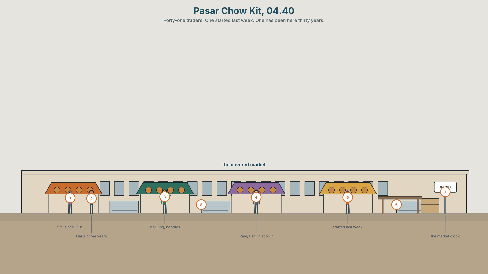
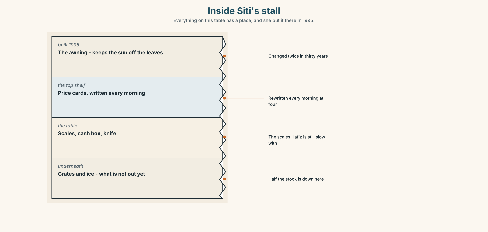
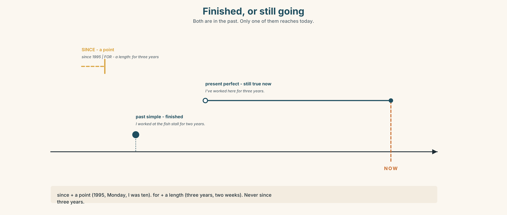
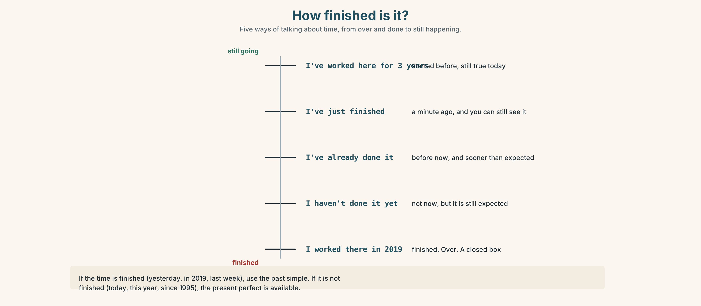
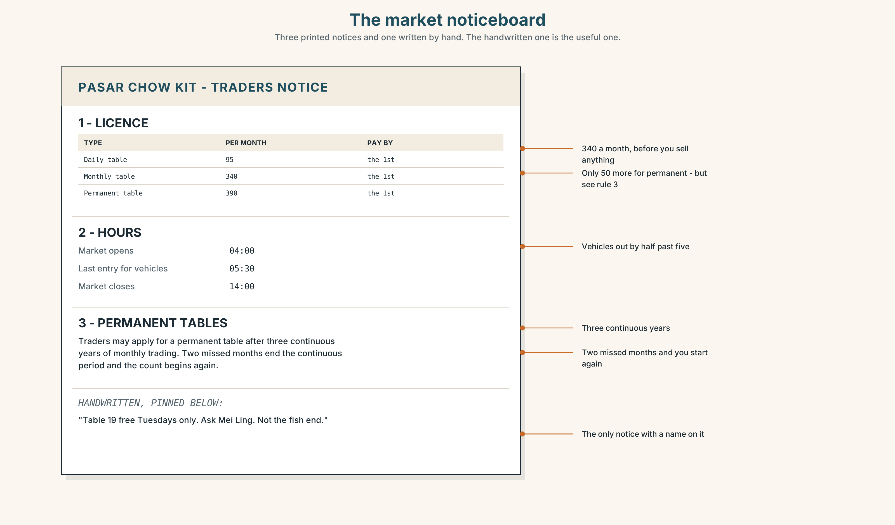
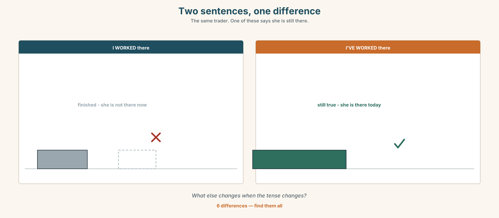

# A2.1 · Unit 1 · Three Years at the Stall

> **English Animated** · *Making Plans* · Pasar Chow Kit, Kuala Lumpur
> Student's Book pages 6–27 · 22 pp · ~10 hours

---

## Part 0 · The Big Picture ◆ **A · THE WORLD**

{width=6.6in}

*Pasar Chow Kit, 04.40 — Forty-one traders. One started last week. One has been here thirty years.*

# How long have you been at this?

**By the end of this unit you can tell the story of a skill you have — when you started, how long,
and what you can do now. Sixty seconds.**

| ◆ **A · THE WORLD** | How people get good at things, and how long it takes |
|---|---|
| ◆ **B · THE SYSTEM** | *have you ever* and *did you* · *for* and *since* · 22 words for learning · 18 words for time · weak forms in the present perfect |
| ◆ **C · THE PERFORMANCE** | A 60-second account of something you can do |

---

### 0A · Find it

Find twelve things in the market. Four of these sixteen are not in the picture.

> stall · scales · crate · ice · awning · price card · cash box · apron · knife · basket ·
> bucket · trolley · ladder · umbrella · fan · clock

### 0B · Guess it

**One person in this picture started last week. One has been here thirty years.** Which is which?
Give one reason for each.

### 0C · Say it ⏺

**Record thirty seconds.** *What can you do that you could not do three years ago?*
Do not prepare. You will record it again at the end of this unit.

---

## Part 1 · Vocabulary Lab 1 ◆ **B · THE SYSTEM**

{width=6.6in}

*How you get good at something — Five stages. The dashed line is the one people try to skip.*

### 1A · Meet — getting better at something

Match each word to the right place on the picture.

> **learn** · **practise** · **improve** · **progress** · **beginner** · **mistake** ·
> **correct** · **repeat** · **revise** · **forget**

### 1B · Sort — a good day or a bad day?

Put these in two columns.

> I understood it. · I forgot it. · I made a mistake. · I explained it to somebody.
> · I had to repeat it. · I got better at it.

**One of them could go in both columns.** Which, and why?

### 1C · Sort — odd one out

1. learn · practise · revise · forget
2. beginner · confident · proud · quick
3. mistake · correct · repeat · explain

{width=6.6in}

*Inside Siti's stall — Everything on this table has a place, and she put it there in 1995.*

**Look at the stall in section.** Find one thing Siti **has done every morning since 1995**, and one
thing she **has changed twice** in thirty years. Say each one in a full sentence.

### 1D · Stretch — the phrases

Complete each one with one word.

1. I'm not good yet, but I'm **getting ______ at** it.
2. Try it. **Have a ______.**
3. She's **good ______** numbers.
4. Everybody **______ a mistake** on the first day.
5. He didn't study it. He **picked it ______** from his mother.

### 1E · The saying

> **f** **I'm getting there.**

When do people say this? **Is it good news or bad news?** Both, say three people in every class.

### 1F · Own it

Think of one thing you can do. Tell a partner **three sentences**: when you started, how you
learned, and one mistake you still make.

---

## Part 2 · Listening ◆ **A · THE WORLD**

{width=6.6in}

*Siti and Hafiz at the stall — One of them is weighing. One of them is watching the weighing.*

### 2A · How long have you been doing this? 🔊 Track 1.1

**Before you listen.** Siti is at the stall. Hafiz is her nephew. **Who is older?**

**Listen once. One question.** How long has Siti been at this stall?

**Listen again. Complete the table.**

| | Started when? | Learned from whom? | Still finds hard? |
|---|---|---|---|
| Siti | | | |
| Hafiz | | | |

**Listen again. True or false?**

1. Siti started in 1995. ☐ T ☐ F
2. Hafiz has worked here for two years. ☐ T ☐ F
3. Siti learned from her mother. ☐ T ☐ F
4. Hafiz still finds the weighing difficult. ☐ T ☐ F

**Noticing.** Four sentences from the recording.

1. *I started in 1995.*
2. *I've been here since 1995.*
3. *I worked at the fish stall for two years.*
4. *I've worked here for three years.*

**Two of these are finished. Two come up to now. Which are which?**

### 2B · Decoding clinic 🔊 Track 1.2

Twenty-five seconds of Siti. Four times, four jobs.

1. How many times does she say *I've*?
2. *I've been* — how many sounds is that?
3. Catch the three years.
4. What happens to *have* in *How long have you*?

> Transcripts, page 150.

---

## Part 3 · Grammar Lab 1 ◆ **B · THE SYSTEM**

### Finished, or still going

### 3A · Notice

Look at the four sentences in Part 2.

1. In sentence 1, is Siti still at the stall in 1995, or was that the beginning?
2. In sentence 3, does Hafiz work at the fish stall now?
3. Sentences 2 and 4 both come up to today. **Which word tells you — *since* or *for*?**
4. *since 1995* and *for three years*. **One is a point. One is a length.** Which?
5. Try *"I've been here since three years."* **What is wrong?**

### 3B · See

{width=6.6in}

*Finished, or still going — Both are in the past. Only one of them reaches today.*

Now read the ladder from the bottom up. **Which rung is the only closed box?**

{width=6.6in}

*How finished is it? — Five ways of talking about time, from over and done to still happening.*

### 3C · Know

| | Use it for | Example |
|---|---|---|
| **past simple** | finished. It is over. | *I **worked** at the fish stall for two years.* |
| **present perfect** | started before, still true now | *I **have worked** here for three years.* |

> **since** + a **point** in time → *since 1995, since 2019, since Monday, since I was ten*
> **for** + a **length** of time → *for three years, for two weeks, for a long time, for ages*

> **Watch out.** *since three years* ✗. Use *for three years* ✓ — or *since 2023* ✓.

> **Why it matters.** *I worked here* and *I have worked here* both say you worked.
> Only one of them says you still do.

### 3D · Use — controlled

> Siti (1) __________ (start) at the stall in 1995. She (2) __________ (be) here ever
> __________. Before that she (3) __________ (work) at a fish stall for two years. Hafiz
> (4) __________ (work) with her ______ three years. He (5) __________ (not learn) to weigh
> quickly yet, but he (6) __________ (get) much better.

### 3E · Use — guided

Write **for** or **since**.

1. ______ Monday 2. ______ six months 3. ______ 2019 4. ______ a long time
5. ______ I was a child 6. ______ breakfast 7. ______ two hours 8. ______ last week

### 3F · Use — open

**Ask three people in the room:** *How long have you been…?* Write down the answers with *for* or
*since*. **Then report one answer to the class.**

### 3G · Check — six items

> 1. I ______ (live) here since 2020.
> 2. She ______ (work) at the fish stall from 2012 to 2014.
> 3. We ______ (know) each other ______ ten years.
> 4. ______ you ever ______ (be) to this market?
> 5. He ______ (not finish) yet.
> 6. They ______ (move) here ______ March.

**0–3 →** Workbook pp. 4–6. **4–5 →** Part 6. **6 →** page 19.

---

## Part 4 · Speaking ◆ **C · THE PERFORMANCE**

### 4A · Fluency starter — the line

Stand in two lines facing each other. **Ask the person opposite:** *How long have you been
learning English?* Sixty seconds. Then everybody moves one place to the left.

**Three rounds. The same question. Shorter answer each time.**

### 4B · The functional core — asking how long

{width=6.6in}

*Two traders, two Mondays — Learner A has the start dates. Learner B has the jobs. Find out who has been here longest.*

**Language Bank**

| | |
|---|---|
| **asking** | *How long have you…?* · *When did you start?* · *Who taught you?* |
| **answering** | *For about…* · *Since…* · *I started when I was…* |
| **not sure** | *I'm not sure — maybe five years?* · *A long time.* |
| **the hard part** | *I'm still not good at…* · *I still make mistakes with…* |

**Information gap.** Learner A has the stallholders' start dates. Learner B has their jobs.
Neither sees the other. **Find out who has been here longest.**

### 4C · The performance — sixty seconds ⏺

Tell the group about something you can do. **Sixty seconds.** You must say:

> when you started · how long · who taught you · one thing you still find difficult

**Record it.**

### 4D · Observer

One person listens for **one thing**: did the speaker say *for* and *since* correctly?

### 4E · Two criteria

> ☐ Did I say how long, with *for* or *since*?
> ☐ Did I say one thing I am still not good at?

---

## Part 5 · Reading ◆ **A · THE WORLD**

### 5A · Predict

A report about market traders. The title is **"Thirty years at the same table."**
**What do you expect it to say?** One sentence.

### 5B · Read — ninety seconds

---

**Thirty years at the same table**

Pasar Chow Kit opens at four in the morning. Siti Rahman has had the same table since 1995. She
has sold vegetables there for thirty years and she has never once been late.

She learned from her aunt, who had the table before her. "I watched her for two years before she
let me take the money," she says. "Two years. Now people think they can learn it in a week."

Her nephew Hafiz has worked with her for three years. He is nineteen. He is quick with the
customers and slow with the scales, and Siti says this is the right way round — the scales are
easy and people are not.

Of the forty-one traders in this part of the market, eleven have been here more than twenty years.
Nine started in the last two years. Almost nobody stays for five.

---

### 5C · Answer

1. What time does the market open?
2. How long has Siti had the same table?
3. Who taught her, and how long did she watch?
4. What is Hafiz good at, and what is he slow at?
5. **Siti says this is "the right way round". Why?**
6. How many traders have been here more than twenty years?

### 5D · Vocabulary in context

Guess the meaning from the text. Then check.

> trader · take the money · quick with · the right way round · almost nobody

### 5E · The counter-text

{width=6.6in}

*The market noticeboard — Three printed notices and one written by hand. The handwritten one is the useful one.*

**Read the market noticeboard and answer.**

1. How much is a monthly licence?
2. **How long must you have traded before you can apply for a permanent table?**
3. What happens if you miss two months?
4. Which notice is handwritten, and what does it say?

### 5F · Two texts

The report says *"almost nobody stays for five years."*
The noticeboard says you need **three years** before you can apply for a permanent table.

**Put those two facts together. What does it mean for a new trader?** Two sentences.

---

## Part 6 · Vocabulary Lab 2 ◆ **B · THE SYSTEM**

### Words that tell you when

{width=6.6in}

*A point, or a length — The same thirty years, drawn two ways.*

### 6A · Sort — point, or length?

Put each one in the right column.

> 2019 · three years · Monday · a long time · breakfast · six months · I was ten · ages

| **a POINT** (use *since*) | **a LENGTH** (use *for*) |
|---|---|
| | |

### 6B · Chunk completion

1. I've been learning English ______ five years.
2. I haven't seen her ______ Tuesday.
3. She's lived here ______ all her life.
4. We've been waiting ______ two hours.
5. Nothing has changed ______ 2019.

### 6C · The other time words

Put each word in the right sentence: **already · yet · still · recently · lately · ago**

1. Have you finished ______ ?
2. I've ______ done it — this morning.
3. She started three years ______ .
4. I'm ______ learning. I haven't finished.
5. I've seen him twice ______ .
6. How have you been ______ ?

{width=6.6in}

*Two sentences, one difference — The same trader. One of these says she is still there.*

**Six differences.** Find them, then answer the question under the picture.

### 6D · Contrast Clinic — finished or not

Six items. Past simple or present perfect?

1. I ______ (work) here since March.
2. I ______ (work) there in 2019.
3. She ______ (live) in three countries. *(in her life)*
4. She ______ (live) in Penang from 2015 to 2018.
5. ______ you ever ______ (try) it?
6. ______ you ______ (try) it yesterday?

---

## Part 7 · Pronunciation & Fluency Lab ◆ **B · THE SYSTEM**

### Three words that become one

{width=6.6in}

*Three words that become one — Nobody says I have been. Everybody understands it.*

### 7A · Hear 🔊 Track 1.3

> I have been → *I've been* → /aɪvbɪn/
> How long have you → *How long've you* → /haʊlɒŋəvjə/
> She has been → *She's been* → /ʃiːzbɪn/

### 7B · Say

Say each one. Then say the question three times, faster:

> *How long have you been learning English?*

### 7C · Make it mean something

Say these two:

> *I have been here since 1995.* *(every word, slowly)*
> *I've been here since '95.* *(normally)*

**Which one sounds like a person talking?** When would you use the other one?

### 7D · Fluency 20 ⏺

Twenty seconds: **three things you have done, and how long for.** Three times, faster.

---

## Part 8 · Writing ◆ **C · THE PERFORMANCE**

### Something I can do · 80 words

{width=6.6in}

*How long the traders have been here — Forty-one traders in this part of the market.*

### 8A · Read the model

> I can cook my grandmother's chicken rice. I have been cooking it since I was twelve, so that is
> about fourteen years. `[says how long two ways — a point and a length]`
>
> My grandmother taught me. I watched her for a long time before she let me do it alone, and the
> first time I did it alone I burnt the rice.
>
> I am still not good at the ginger. She used her hands and I use a spoon, and it is not the same.
> `[one honest difficulty — and it is specific]`

**Questions about the writer's choices:**

1. Why say the length two ways?
2. The last line names one small thing. **Why is that better than "I am still learning"?**

### 8B · The anti-model

> I can cook very well. I have been cooking for many years. My grandmother taught me everything.
> I love cooking and I think it is a very important skill.

Correct English. **Name two things you still do not know.**

### 8C · Plan

> what you can do → when you started → how long → who taught you → one thing you still find hard

### 8D · Write — 80 words
### 8E · Peer review — two criteria

> ☐ Can I tell how long, exactly?
> ☐ Is there one real difficulty in it?

### 8F · Write it again · 8G · Publish

On the wall, with your recording from Part 4C beside it.

---

## Part 9 · The File ◆ **A · THE WORLD + C · THE PERFORMANCE**

# WORK FILE · The Meeting

{width=6.6in}

*A meeting in four steps — Ten minutes. One decision. Everybody speaks twice.*

### 9A · A meeting with four people

The traders meet once a month. **Read the four-line agenda.** Then listen 🔊 Track 1.4.

1. How long was the meeting?
2. How many items did they finish?
3. **Which item took longest, and was it the most important?**

### 9B · Four jobs in a meeting

> starting · asking somebody · agreeing · finishing

Match each to one phrase.

> *"Shall we start?"* · *"Siti, what do you think?"* · *"Yes, let's do that."* ·
> *"So — Tuesday. Agreed?"*

### 9C · Your turn

In groups of four. **Ten minutes. One decision.** Each person must speak at least twice.

> **The problem:** the market opens at four. One trader wants it to open at five.

### 9D · Write it down

**Two sentences.** What did you decide, and who is doing what?

### 9E · Transfer

**Go to any meeting this week** — at work, at home, anywhere. Count how many people spoke.
Bring the number.

---

## Part 10 · Mediation & Interaction ◆ **C · THE PERFORMANCE**

{width=6.6in}

*Thirty years at one table — Half the class sees the left. Half sees the right. Rebuild it by speaking.*

### 10A · Relay

Half the class sees the left of the picture. Half sees the right. **Rebuild it by speaking.**
Ten minutes.

### 10B · Simplify

Explain the market noticeboard to a trader who starts on Monday. **Four sentences only.**

> **Plan:** what it costs → when you pay → what happens if you miss → what you can apply for later

### 10C · Compress

The report in Part 5 into **thirty words**, for a poster.

### 10D · Online

Write **one message** for the traders' group chat: you will be two hours late tomorrow and
somebody needs to open your stall.

### 10E · Your language

How do you ask *"How long have you been doing this?"* in your language?
**Does your language use a point or a length?** Show a partner both.

---

## Part 11 · The Decision ◆ **C · THE PERFORMANCE**

# The course on Tuesday mornings

Siti has been offered a free business course. It is six Tuesday mornings — the busiest morning of
the week.

If she goes, Hafiz runs the stall alone. He has been there three years and has never done a
Tuesday by himself.

- **Go.** Six mornings. Hafiz learns fast or he does not.
- **Don't go.** Thirty years without a bad Tuesday. Why start now?
- **Go, and ask her cousin to help Hafiz.** Her cousin has a stall of her own and would have to
  close it.

### 11A · The evidence

1. **The noticeboard** from Part 5 — what you need for a permanent table.
2. **The chart** — what Siti takes on a Tuesday, and on the other days.
3. **The voice.** Hafiz, twenty seconds: *"I'd be fine. I think I'd be fine. I've watched her do
   it three hundred times."*

### 11B · Talk about it

In threes. Everybody says one. Use the frame.

> *I think Siti should ______ , because ______ .*

**Words you can use:** *busy · alone · learn · money · mistake · trust · three years · never*

### 11C · Decide

Write **two sentences**. Choose, and say why.

> I think Siti should ______________________ ,
> because ______________________ .

### 11D · Model decision

> I think she should go, and tell Hafiz on Monday, not Tuesday morning. Three years is long enough
> to watch. If he cannot do one Tuesday now, he will not be able to do one in five years either,
> and she will find that out when she is ill and has no choice.

### 11E · The Reveal

> **What happened.** She went. On the first Tuesday Hafiz sold everything by eleven and priced two
> things wrong, losing about thirty ringgit.
>
> On the fourth Tuesday a regular customer asked for Siti and left when she was not there.
>
> Siti finished the course. She says the most useful thing in it was a sentence about pricing that
> she already knew and had never said out loud.

**He was fine. They lost one customer. And the course taught her something she already knew.**

> **Was it the right decision?** Say why — and say what it cost.

---

## Part 12 · Landing ◆ **all three lines**

### 12A · Recycle — ten items

**This is Unit 1, so everything is from this unit. From Unit 2 onwards, four items come from
earlier in this book and two from *Starting Out*.**

> 1. I ______ (live) here since 2020.
> 2. She ______ (work) there in 2019.
> 3. We've known each other ______ ten years.
> 4. Nothing has changed ______ 2019.
> 5. Have you finished ______ ?
> 6. I'm not good yet, but I'm getting ______ at it.
> 7. Everybody ______ a mistake on the first day.
> 8. He didn't study it — he picked it ______ .
> 9. How long ______ you ______ (be) here?
> 10. I'm still learning. ______ getting there.

### 12B · Consolidate

**Eighty words, one paragraph.** Three things you can do, how long you have been doing each, and
which one you are still a beginner at. Use *for* three times and *since* twice.

### 12C · Can-do, with evidence

| I can… | My evidence | Sure? |
|---|---|---|
| say how long I have been doing something, with *for* and *since* | Part 3G score | ◯ ◑ ● |
| tell the story of a skill in sixty seconds | Part 4C recording | ◯ ◑ ● |
| write eighty words about what I can do | Part 8 draft 2 | ◯ ◑ ● |
| say what I think somebody should do, and why | Part 11C | ◯ ◑ ● |

### 12D · Replay ⏺

Find your thirty seconds from Part 0C. Listen. **Record it again.**
Listen to both. One sentence: what is different?

### 12E · Glossary — forty items, as a map

> **LEARNING** · learn · practise · improve · progress · revise · repeat · understand · explain
> **GETTING IT WRONG** · mistake · correct · forget · beginner · slow
> **GETTING IT RIGHT** · quick · confident · proud · get better at · be good at · have a go · pick up
> **SAYING IT** · make a mistake · I'm getting there
> **A POINT** · since · 2019 · Monday · since I was ten · since breakfast · every day since
> **A LENGTH** · for · for three years · a long time · all my life · up to now · how long
> **WHEN** · ago · already · yet · still · recently · lately · keep on · not yet, but soon

### 12F · Next

> **Unit 2 · Who grew this?**
