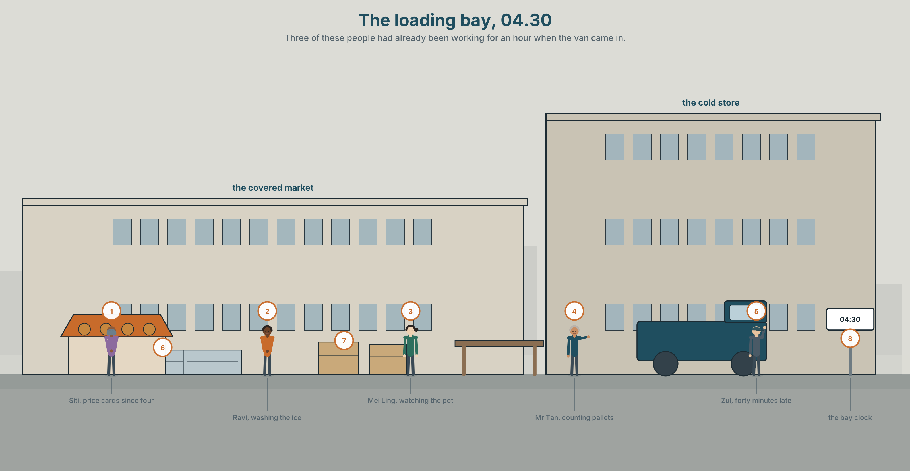
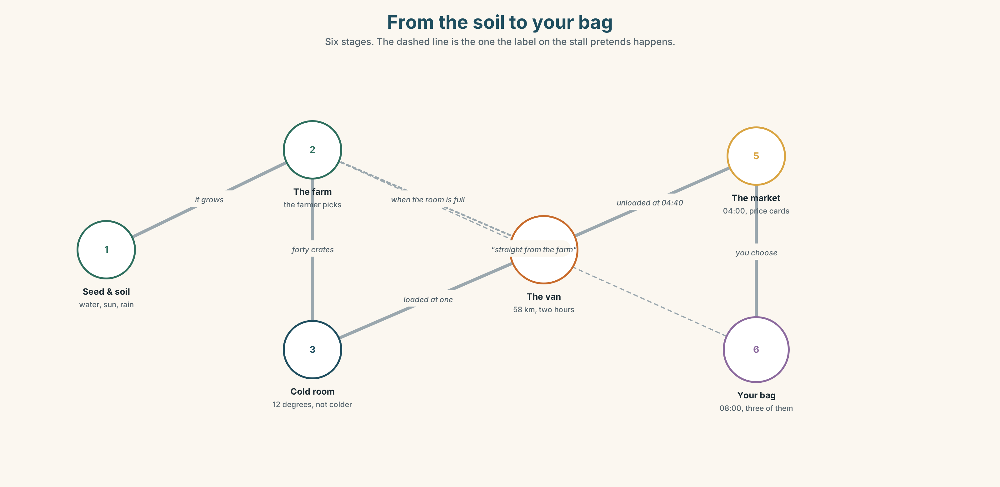
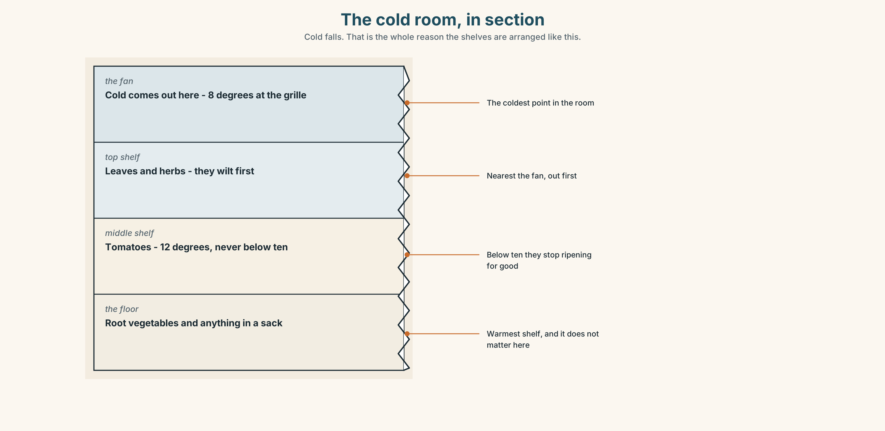
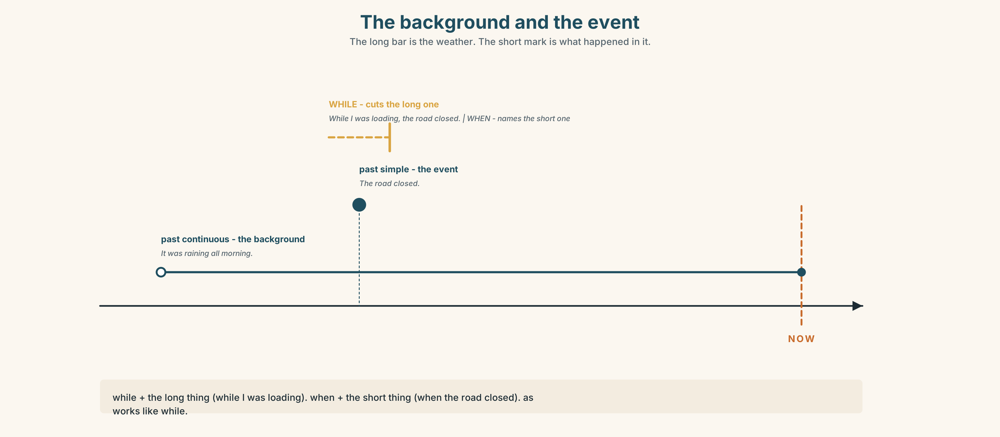
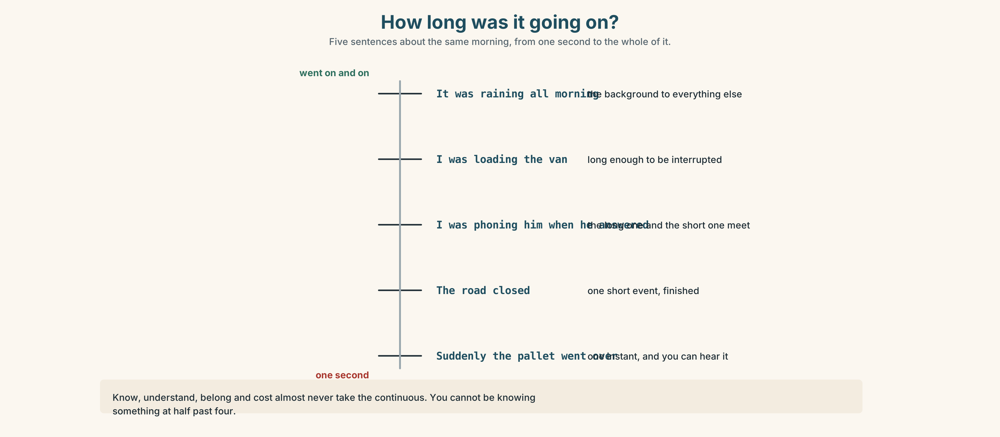
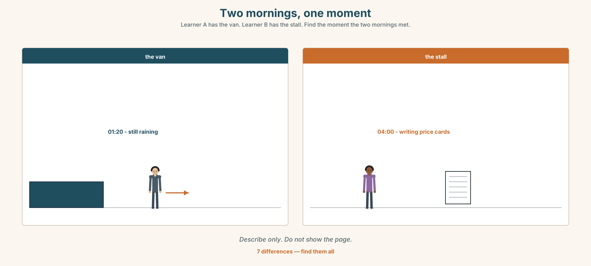
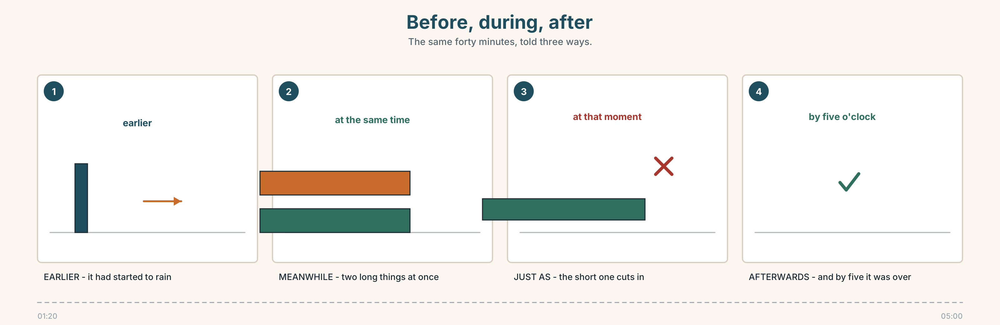
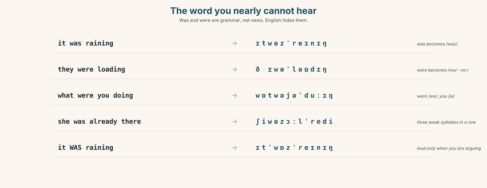

# A2.1 · Unit 2 · The Van at Half Past Four

> **English Animated** · *Making Plans* · Pasar Chow Kit, Kuala Lumpur
> Student's Book pages 28–49 · 22 pp · ~10 hours

---

## Part 0 · The Big Picture ◆ **A · THE WORLD**

{width=6.6in}

*The loading bay, 04.30 — Three of these people had already been working for an hour when the van came in.*

# Who grew this?

**By the end of this unit you can describe a morning at a workplace — what was already happening
before anything happened. Eighty words.**

| ◆ **A · THE WORLD** | Where food comes from, and who was awake while you were asleep |
|---|---|
| ◆ **B · THE SYSTEM** | *was doing* and *did* · *while* and *when* · 23 words for growing and supply · 17 words for telling a story in order · weak *was* and *were* |
| ◆ **C · THE PERFORMANCE** | Eighty words that set a scene before the event |

---

### 0A · Find it

Nine of these are somewhere in the picture. **Find them.**

> van · crate · pallet · ice · scales · awning · hose · bucket · clipboard · forklift ·
> chalkboard · sack

### 0B · Guess it

**It is half past four.** Three things in this picture had already been happening for an hour when
the van arrived. Which three, and how can you tell?

### 0C · Say it ⏺

**Record thirty seconds.** *What was happening in your street at six o'clock this morning?*
Guess if you were asleep. You will record it again at the end of the unit.

---

## Part 1 · Vocabulary Lab 1 ◆ **B · THE SYSTEM**

{width=6.6in}

*From the soil to your bag — Six stages. The dashed line is the one the label on the stall pretends happens.*

### 1A · Meet — from the soil to the table

Match each word to one place on the map.

> **grow** · **plant** · **seed** · **soil** · **water** · **sun** · **rain** · **farm** ·
> **farmer** · **market**

### 1B · Sort — what the plant needs, what the trader needs

Two columns.

> soil · scales · water · a price card · sun · ice · rain · a van · seed · a licence

**One of them is in both columns.** Which one, and why?

### 1C · Meet — the words for how it looks

> **fresh** · **ripe** · **heavy** · **dry** · **wet**

Which two are good news on a vegetable stall? Which one is good news on a *weighing* stall?

{width=6.6in}

*The cold room, in section — Cold falls. That is the whole reason the shelves are arranged like this.*

**Look at the cold room in section.** Which shelf is coldest? **Where does the stock that will
go off first sit, and why there?**

### 1D · Stretch — the phrases

Complete each one with one word.

1. Mangoes are cheap now. They're **______ season**.
2. Nothing grows in **the ______ season** without a hose.
3. In April the whole village **brings ______ the harvest**.
4. This came **______ from the farm** — nobody touched it in between.
5. Keep it cold or it will **go ______** by Thursday.
6. Zul **______ up** the stall every morning at four.

### 1E · The saying

> **f** **It depends on the rain.**

A farmer says this when you ask about the price. **What is the farmer telling you?**
Say it in your own words. Then say when *you* would use it.

### 1F · Own it

Think of one food you eat often. Tell a partner **three sentences**: where it grows, which season
it is best in, and how it reaches your kitchen.

---

## Part 2 · Listening ◆ **A · THE WORLD**

{width=6.6in}

*Zul and Ravi in the loading bay — One of them is explaining. One of them has been waiting since four.*

### 2A · The van was late again 🔊 Track 2.1

**Before you listen.** Zul drives the van. Ravi sells fish. **Who is worried, and who is
apologising?**

**Listen once. One question.** What time did the van actually arrive?

**Listen again. Complete the table.**

| | Where was this person at 04:00? | What were they doing? | What went wrong? |
|---|---|---|---|
| Zul | | | |
| Ravi | | | |
| Mei Ling | | | |

**Listen again. Choose.**

1. Zul left the farm at **03:10 / 03:40 / 04:10**.
2. It was raining **when he left / while he was loading / all morning**.
3. Ravi had been waiting **ten / twenty / forty** minutes.
4. Mei Ling's broth was **finished / still cooking / cold**.

**Noticing.** Four sentences from the recording.

1. *It started raining at three.*
2. *It was raining when I left the farm.*
3. *I loaded the van.*
4. *While I was loading, the road closed.*

**Two of these are a background. Two are an event.** Which are which?

### 2B · Decoding clinic 🔊 Track 2.2

Twenty-five seconds of Zul. Four jobs.

1. How many times does he say *was*?
2. In *it was raining*, is *was* loud or quiet?
3. Catch the time he gives.
4. He says one word twice because he is annoyed. Which word?

> Transcripts, page 151.

---

## Part 3 · Grammar Lab 1 ◆ **B · THE SYSTEM**

### The background and the event

### 3A · Notice

Look at the four sentences in Part 2.

1. In sentence 2, which came first — the rain, or leaving the farm?
2. In sentence 4, which one interrupted the other?
3. One sentence uses *while*. One uses *when*. **Swap them. Does either one break?**
4. *I was loading* and *I loaded*. **Only one of them is unfinished.** Which?
5. Try *"While I loaded, the road was closing."* **Why does it sound wrong?**

### 3B · See

{width=6.6in}

*The background and the event — The long bar is the weather. The short mark is what happened in it.*

Now look at the second picture. **The long line is the background. Where does the short line
cut it?**

{width=6.6in}

*How long was it going on? — Five sentences about the same morning, from one second to the whole of it.*

### 3C · Know

| | Use it for | Example |
|---|---|---|
| **past continuous** | the longer thing. The background. | *It **was raining** at four o'clock.* |
| **past simple** | the shorter thing. The event. | *The road **closed**.* |

> **while** + the long thing → *While I **was loading**, the road closed.*
> **when** + the short thing → *I was loading **when** the road closed.*
> **as** works like *while*, and sounds a little more formal.

> **Watch out.** *While the road closed* ✗ — *while* wants the long one.
> Some verbs almost never take the continuous: *know, understand, belong, cost*.

> **Why it matters.** The background tells your listener where to stand. Without it, every
> sentence is a surprise.

### 3D · Use — controlled

> At four o'clock it (1) __________ (rain) hard. Zul (2) __________ (load) the last crates
> when the road (3) __________ (close). He (4) __________ (wait) twenty minutes, and
> **while** he (5) __________ (wait) he (6) __________ (phone) Ravi twice. Ravi
> (7) __________ (not answer) — he (8) __________ (serve) a customer.

### 3E · Use — guided

Join each pair with **while** or **when**.

1. I was walking to the market. / It started to rain.
2. She was cooking. / The power went off.
3. We were talking about him. / He walked in.
4. He was loading the van. / The phone rang.
5. They were closing the stall. / Nurul arrived.

### 3F · Use — open

**Think of one morning that went wrong.** Tell a partner. Begin with the background:
*"It was ______ and I was ______ ."* Then give the event.

### 3G · Check — six items

> 1. It ______ (rain) when I ______ (leave) the house.
> 2. While she ______ (cook), the phone ______ (ring).
> 3. We ______ (wait) for an hour, and then the van ______ (arrive).
> 4. What ______ you ______ (do) at six this morning?
> 5. He ______ (not hear) me because he ______ (listen) to the radio.
> 6. ______ I was loading, the road ______ (close).

**0–3 →** Workbook pp. 10–12. **4–5 →** Part 6. **6 →** page 41.

---

## Part 4 · Speaking ◆ **C · THE PERFORMANCE**

### 4A · Fluency starter — the frozen moment

Your teacher says a time: *half past four*. **Freeze.** Everybody says one sentence beginning
*"I was…"* Nobody may repeat a verb already used.

**Three rounds. Three times of day.**

### 4B · The functional core — setting the scene

{width=6.6in}

*Two mornings, one moment — Learner A has the van. Learner B has the stall. Find the moment the two mornings met.*

**Language Bank**

| | |
|---|---|
| **the background** | *It was ______ .* · *Everybody was ______ .* · *Nothing was ______ yet.* |
| **the event** | *Then ______ .* · *Suddenly ______ .* · *That was when ______ .* |
| **joining them** | *while* · *when* · *just as* · *at that moment* |
| **ordering them** | *earlier* · *later* · *afterwards* · *meanwhile* |

**Information gap.** Learner A has the van's morning. Learner B has the stall's morning.
Neither sees the other. **Work out at what moment the two mornings met.**

### 4C · The performance — eighty seconds ⏺

Describe **one morning** at a place you know. **Eighty seconds.** You must give:

> two things that were already happening · one thing that then happened · what you did about it

**Record it.**

### 4D · Observer

One person listens for **one thing**: did the speaker set the background *before* the event?

### 4E · Two criteria

> ☐ Did I use *was/were doing* at least twice?
> ☐ Was the event clearly one short thing?

---

## Part 5 · Reading ◆ **A · THE WORLD**

### 5A · Predict

An explainer about how vegetables get to a city market. The title is
**"Six hours you were asleep for."**
**What do you expect to be in it?** One sentence.

### 5B · Read — one hundred seconds

---

**Six hours you were asleep for**

The tomatoes on Siti's table at eight in the morning were in the soil in Cameron Highlands on
Tuesday. This is what happened in between.

**Tuesday, 15:00.** Two women were picking in the rain. Nobody picks in the middle of the day
unless the rain has already started, because wet leaves hide the ripe fruit and the sun makes the
skin split. They filled forty crates.

**Tuesday, 21:00.** The crates went into a cold room at 12°C. Not colder. Tomatoes stop ripening
below ten degrees and then never start again.

**Wednesday, 01:20.** Zul's van left the highlands. It was still raining. The road down is
fifty-eight kilometres and takes two hours when it is dry.

**Wednesday, 04:40.** The van reached Pasar Chow Kit forty minutes late. While Zul was unloading,
Siti was already writing her price cards — and she wrote them before she saw the tomatoes, because
she has been buying from the same farm since 2011 and she knew what was coming.

**Wednesday, 08:00.** You bought three.

Nothing in that chain is unusual. It happens six days a week, and on the seventh the market
opens anyway with Tuesday's stock, which is why Sunday is the cheapest and the worst day to buy
tomatoes.

---

### 5C · Answer

1. When were the tomatoes still in the soil?
2. Why do the pickers wait for rain?
3. What temperature is the cold room, and what happens below ten degrees?
4. How long does the road take when it is dry?
5. **Why had Siti written her price cards before she saw the stock?**
6. Why is Sunday the cheapest day — and why is it also the worst?

### 5D · Vocabulary in context

Guess from the text. Then check.

> the highlands · split · ripen · unload · the chain

### 5E · The counter-text

{width=6.6in}

*The delivery note — Printed by the farm, signed at the bay, and one line added by hand at the bottom.*

**Read the delivery note and answer.**

1. How many crates left the farm, and how many arrived?
2. What time was the van loaded, and what time was it signed for?
3. **Who wrote the line at the bottom, and what does it accuse somebody of?**
4. Two numbers on this note disagree with the explainer in 5B. Find them.

### 5F · Two texts

The explainer says the crates went into a cold room **at 12°C**.
The delivery note says the cold room reading was **9°C**.

**Put those two facts together. What will the tomatoes be like on Friday?** Two sentences.

---

## Part 6 · Vocabulary Lab 2 ◆ **B · THE SYSTEM**

### Words that put things in order

{width=6.6in}

*Before, during, after — The same forty minutes, told three ways.*

### 6A · Sort — before, during, or after?

Put each one in the right column.

> earlier · while · afterwards · meanwhile · later · just as · then · at the same time

| **BEFORE** | **DURING** | **AFTER** |
|---|---|---|
| | | |

### 6B · Chunk completion

1. The van arrived ______ five o'clock.
2. ______ , Mei Ling was still cooking.
3. He phoned ______ as I was closing.
4. It rained ______ morning — it never stopped.
5. She stood there ______ whole time and said nothing.
6. ______ that moment, the lights went out.

### 6C · The sudden word

**suddenly** is strong. Use it once in a story, not four times.

Read these four. **In which one is *suddenly* doing real work?**

1. Suddenly it was Tuesday.
2. We were loading the last crate and suddenly the whole pallet went over.
3. Suddenly the market opens at four.
4. Suddenly I was quite tired.

{width=6.6in}

*Two sentences, one difference — The same driver and the same road. One of these is finished.*

**Six differences.** Find them, then answer the question under the picture.

### 6D · Contrast Clinic — long or short

Six items. Past simple or past continuous?

1. At six o'clock I ______ (drive) to the market.
2. At six o'clock I ______ (arrive) at the market.
3. While we ______ (unload), it ______ (start) to rain.
4. It ______ (rain) all morning. *(and that is the whole story)*
5. She ______ (carry on) working while everybody else ______ (stop).
6. What ______ you ______ (do) when the power ______ (go) off?

---

## Part 7 · Pronunciation & Fluency Lab ◆ **B · THE SYSTEM**

### The word you nearly cannot hear

{width=6.6in}

*The word you nearly cannot hear — Was and were are grammar, not news. English hides them.*

### 7A · Hear 🔊 Track 2.3

> it was raining → /ɪtwəzˈreɪnɪŋ/
> they were loading → /ðeɪwəˈləʊdɪŋ/
> what were you doing → /wɒtwəjəˈduːɪŋ/

### 7B · Say

Say each one. Then say the whole question three times, faster:

> *What were you doing when it started?*

### 7C · Make it mean something

Say these two:

> *It WAS raining.* *(loud was — you are arguing with somebody)*
> *It was raining.* *(quiet was — you are just telling them)*

**When would a trader use the first one?** Give the situation.

### 7D · Fluency 20 ⏺

Twenty seconds: **three things that were happening in your house at seven this morning.**
Three times, faster.

---

## Part 8 · Writing ◆ **C · THE PERFORMANCE**

### A morning at work · 80 words

{width=6.6in}

*What time the van arrived, every day for a month — Twenty-four delivery days. The line at 04:00 is the slot Ravi pays for.*

### 8A · Read the model

> At half past four the market was already loud. Ravi was washing the ice down, Mei Ling was
> watching her pot, and nothing was open yet. `[three backgrounds, and one of them is a negative]`
>
> Then the van came in through the wrong gate and stopped. Zul got out and said one word.
> `[the event — short, and we are not told the word]`
>
> Afterwards everybody carried on. By five o'clock the crates were on the table and nobody
> mentioned it again. `[the order words do the work: afterwards, by five o'clock]`

**Questions about the writer's choices:**

1. Three background sentences, then one event. **What would happen if you swapped them?**
2. We never learn the word Zul said. **Is that a mistake?**

### 8B · The anti-model

> It was a busy morning. Everybody was working hard. The van was late. Then it arrived and we
> unloaded it. It was a difficult day but we finished everything.

Correct English, and you can see nothing. **Name two things that are missing.**

### 8C · Plan

> the time → two things already happening → one thing not happening yet → the event → afterwards

### 8D · Write — 80 words
### 8E · Peer review — two criteria

> ☐ Can I see the place before the event happens?
> ☐ Is there exactly one event, not four?

### 8F · Write it again · 8G · Publish

On the wall, next to the delivery note from Part 5E.

---

## Part 9 · The File ◆ **A · THE WORLD + C · THE PERFORMANCE**

# STUDY FILE · The Lecture

{width=6.6in}

*Taking notes in two columns — Left: what she said. Right: what you want to ask. The right column is the one that learns.*

### 9A · Twelve minutes on cold chains 🔊 Track 2.4

A short lecture at the city agriculture college. **Before you listen, read the two headings on the
handout.** Then listen.

1. How many stages does the speaker describe?
2. Which stage does she say is the one that fails?
3. **She gives one number twice. Which, and why do you think she repeats it?**

### 9B · Notes in two columns

Your page has one line down the middle. **Left: what she says. Right: your own question about it.**

> Listen again. **Five lines on the left. At least two on the right.**

### 9C · The signposts

A lecturer tells you what is coming. Match each phrase to its job.

> *"There are three stages."* · *"Now, the second one."* · *"And this is the important part."* ·
> *"So, to go back for a moment."*

> coming up · moving on · pay attention · going back

### 9D · Your turn

**Two minutes, standing up.** Explain one stage of the cold chain to the group, using one
signpost phrase and one background sentence in the past continuous.

### 9E · Transfer

**Find one thing in your kitchen with a temperature on the label.** Bring the number and say
what it is protecting.

---

## Part 10 · Mediation & Interaction ◆ **C · THE PERFORMANCE**

{width=6.6in}

*Six hours you were asleep for — Half the class sees Tuesday. Half sees Wednesday. Rebuild the chain by speaking.*

### 10A · Relay

Half the class sees Tuesday. Half sees Wednesday. **Rebuild the whole chain by speaking.**
Ten minutes. Nobody may show their page.

### 10B · Simplify

Explain the delivery note from Part 5E to a farmer who does not read English.
**Four sentences only.**

> **Plan:** what left → what arrived → what the temperature was → what you want done

### 10C · Compress

The explainer in Part 5 into **thirty-five words**, as a label for the stall.

### 10D · Online

Write **one message** to the farm's group chat: the crates arrived warm, you are not blaming
anybody yet, and you need to know who closed the cold room door.

### 10E · Your language

How does your language join a background to an event? **Does it have two different words for
*while* and *when*, or one?** Show a partner both sentences.

---

## Part 11 · The Decision ◆ **C · THE PERFORMANCE**

# The cheaper boat

Ravi's fish has arrived late twice a week for a month. He has used the same supplier for nine
years. There is a cheaper supplier who is always on time and whom he has never met.

- **Stay.** Nine years. One bad month. Fish he can judge with his eyes shut.
- **Switch.** On time, and eleven per cent cheaper. Nobody knows where it has been.
- **Split it.** Half from each for two months, and watch.

### 11A · The evidence

1. **The delivery note** from Part 5E — and whose handwriting is at the bottom.
2. **The chart** — Ravi's eight o'clock sales on the days the fish was late.
3. **The voice.** The old supplier, fifteen seconds: *"I was at the port at three. I'm always at
   the port at three. The ice came late and I'm not going to send you fish on warm ice."*

### 11B · Talk about it

In threes. Everybody says one. Use the frame.

> *I think Ravi should ______ , because ______ .*

**Words you can use:** *fresh · trust · nine years · cheaper · on time · ice · risk · go off*

### 11C · Decide

Write **two sentences**. Choose, and say why.

> I think Ravi should ______________________ ,
> because ______________________ .

### 11D · Model decision

> He should split it for two months. Nine years of a man turning up at three in the morning is
> worth something, but it is not worth four late mornings a month, and the only way to find out
> whether the cheap fish is any good is to put it next to fish he already trusts and look at both
> at eight o'clock.

### 11E · The Reveal

> **What happened.** He split it. The cheap fish was good for five weeks and then arrived on a
> Friday smelling of diesel, and he could not sell any of it.
>
> The old supplier's deliveries went back to normal in week two, because the problem had been the
> ice plant and not the boat. Nobody had told Ravi that, because nobody had asked.
>
> He went back to one supplier. He now phones the ice plant on Thursdays.

**He was right to look. He was wrong about where the problem was.**

> **Was splitting it the right decision?** Say why — and say what he learned that he could not
> have learned by staying.

---

## Part 12 · Landing ◆ **all three lines**

### 12A · Recycle — ten items

> 1. It ______ (rain) when the van ______ (arrive).
> 2. ______ he was loading, the road closed.
> 3. Mangoes are cheap — they're ______ season.
> 4. Keep it cold or it will ______ off.
> 5. This came ______ from the farm.
> 6. *(Unit 1)* I've worked here ______ three years.
> 7. *(Unit 1)* She started in 1995 and has been here ever ______ .
> 8. *(Unit 1)* I'm not good yet, but I'm getting ______ at it.
> 9. *(Starting Out)* There ______ forty-one traders in this row.
> 10. *(Starting Out)* The market ______ (open) at four every day.

### 12B · Consolidate

**Eighty words, one paragraph.** One morning that did not go to plan. Two things in the past
continuous, one event in the past simple, and at least two order words from Part 6A.

### 12C · Can-do, with evidence

| I can… | My evidence | Sure? |
|---|---|---|
| set a background with *was/were doing* | Part 3G score | ◯ ◑ ● |
| describe a morning in eighty seconds | Part 4C recording | ◯ ◑ ● |
| write eighty words with a scene and an event | Part 8 draft 2 | ◯ ◑ ● |
| take notes from a short lecture | Part 9B page | ◯ ◑ ● |

### 12D · Replay ⏺

Find your thirty seconds from Part 0C. Listen. **Record it again.**
One sentence: what is different?

### 12E · Glossary — forty items, as a map

> **THE GROUND** · soil · seed · plant · grow · water · sun · rain · farm · farmer
> **THE SEASON** · season · dry · wet · in season · the dry season · it depends on the rain
> **THE HARVEST** · bring in the harvest · ripe · fresh · heavy · go off · straight from the farm
> **THE TRADE** · market · set up
> **BEFORE** · earlier · just as · all morning
> **DURING** · while · when · as · meanwhile · at the same time · at that moment · the whole time · carry on
> **AFTER** · then · later · afterwards · suddenly · by five o'clock · and then it started

### 12F · Next

> **Unit 3 · What did you used to love?**
