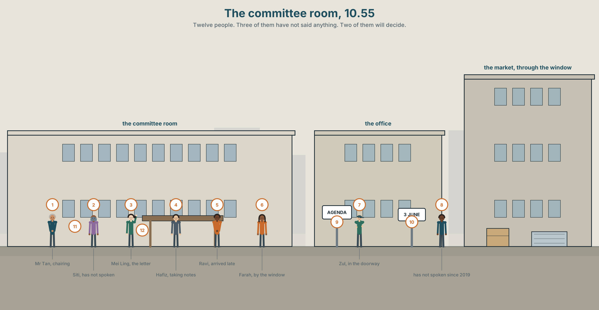
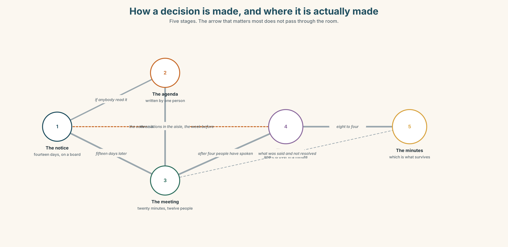
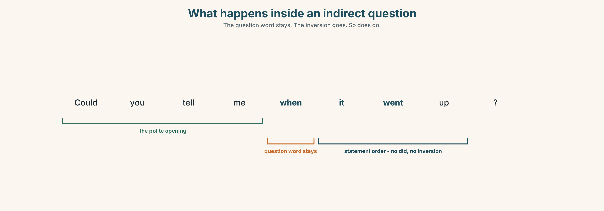
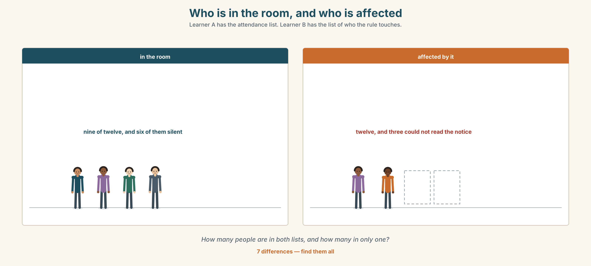
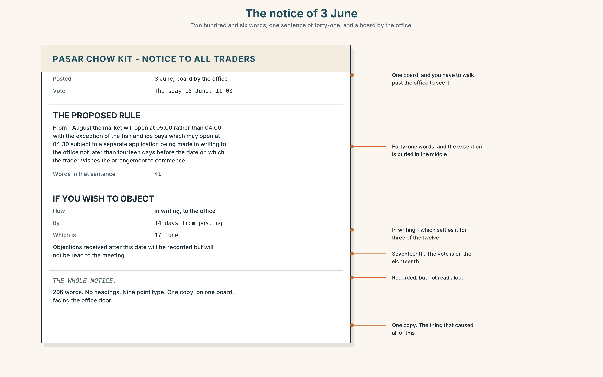
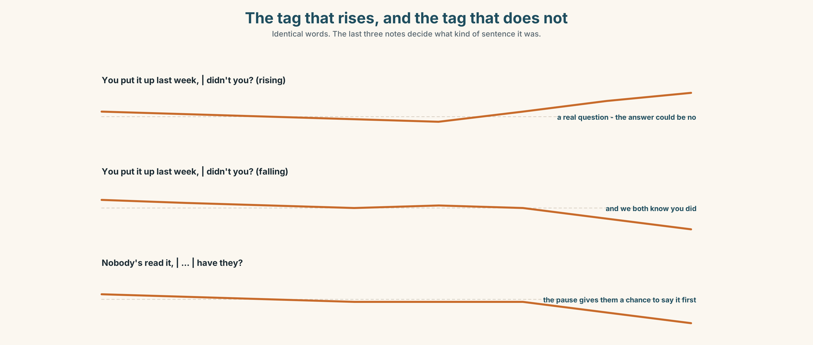
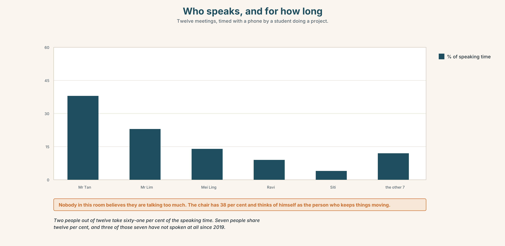
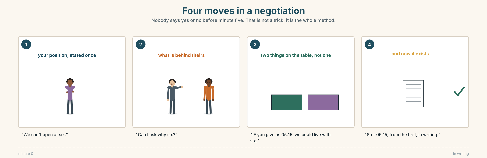

# A2.1 · Unit 10 · Three People Who Cannot Read the Notice

> **English Animated** · *Making Plans* · Pasar Chow Kit, Kuala Lumpur
> Student's Book pages 204–225 · 22 pp · ~10 hours

---

## Part 0 · The Big Picture ◆ **A · THE WORLD**

{width=6.6in}

*The committee room, 10.55 — Twelve people. Three of them have not said anything. Two of them will decide.*

# Who gets to speak?

**By the end of this unit you can chair a short meeting and confirm in writing what was
agreed.**

| ◆ **A · THE WORLD** | How a decision gets made in a room, and who is not in the room |
|---|---|
| ◆ **B · THE SYSTEM** | question tags · indirect questions · 24 words for meetings and disagreement · 16 ways of asking without demanding · the tag that rises and the tag that falls |
| ◆ **C · THE PERFORMANCE** | Ten minutes in the chair, and six lines in writing afterwards |

---

### 0A · Find it

**Find twelve people in this picture.** Three of them have not said anything.

> at the table · standing at the back · in the doorway · by the window · taking notes ·
> holding the agenda · looking at a phone · arriving late

### 0B · Guess it

**Two people in this picture will decide what happens.** Which two, and how can you tell?
**Neither of them is the one holding the agenda.**

### 0C · Say it ⏺

**Record thirty seconds.** *Think of the last meeting you were in. Who spoke most, and who had
most at stake?* You will record it again at the end of this unit.

---

## Part 1 · Vocabulary Lab 1 ◆ **B · THE SYSTEM**

{width=6.6in}

*How a decision is made, and where it is actually made — Five stages. The arrow that matters most does not pass through the room.*

### 1A · Meet — the words of a meeting

Match each word to one place on the map.

> **meeting** · **agenda** · **minutes** · **decision** · **vote** · **chair** · **turn** ·
> **opinion** · **suggestion** · **argument**

### 1B · Sort — before, during, or after?

Three columns.

> agenda · vote · minutes · suggestion · decision · opinion · argument · meeting

**One of them happens at all three stages.** Which, and give an example of each.

### 1C · Meet — what people do to each other

> **agree** · **disagree** · **interrupt** · **listen** · **speak up** · **quiet**

Which of these is a kindness, and which is sometimes the only way to be heard?
**Can the same act be both?**

{width=6.6in}

*The committee room, in section — Four zones, four kinds of power, and they are not in the order you would expect.*

**Look at the committee room in section.** Four zones, four kinds of power.
**Where does the person who decides actually sit, and where does the person who is affected?**

### 1D · Stretch — the phrases

Complete each one with one word.

1. Everybody on this committee should **have a ______** .
2. Four of you are talking. **Take ______ .**
3. If you want to say something, **put your ______ up**.
4. We haven't **______ from** the fish end at all this morning.
5. She never argues in the room. She **speaks ______** afterwards, to one person.

### 1E · The saying

> **f** **Can I just say**

Four words that interrupt politely — or do not.

> **Say it three times:** apologetically, firmly, and as somebody who has been waiting
> twenty minutes. **Which one would work in your workplace?**

### 1F · Own it

Think of a group you belong to. Tell a partner **three sentences**: who chairs it, who speaks
most, and one person whose opinion you have never heard.

---

## Part 2 · Listening ◆ **A · THE WORLD**

{width=6.6in}

*The vote on Thursday — One of them wrote the notice. One of them is asking who read it.*

### 2A · The vote on Thursday 🔊 Track 10.1

**Before you listen.** Twelve traders must vote on a new rule. Three of them cannot read
the notice. **Guess: does anybody mention that before the vote?**

**Listen once. One question.** How many people speak in the first four minutes?

**Listen again. Complete the table.**

| | What they want | What they actually say | Who answers them |
|---|---|---|---|
| Mr Tan | | | |
| Mei Ling | | | |
| Farah | | | |

**Listen again. Choose.**

1. The notice went up **last week / last month / nobody knows**.
2. Farah speaks **first / last / not at all**.
3. Mei Ling raises the reading problem **directly / as a question / not at all**.
4. The vote is **taken / postponed / taken and then re-taken**.

**Noticing.** Four sentences from the recording.

1. *You put the notice up last week, didn't you?*
2. *Nobody's read it, have they?*
3. *Could you tell me when it went up?*
4. *Do you know if everybody can read it?*

**Two of these are tags. Two are indirect questions.**
**Which pair sounds softer, and which pair is actually harder to answer?**

### 2B · Decoding clinic 🔊 Track 10.2

Twenty-five seconds. Four jobs.

1. How many tags can you hear?
2. In *didn't you?*, does the voice go up or down?
3. Catch the date the notice went up.
4. One tag is not really a question. Which, and how do you know?

> Transcripts, page 159.

---

## Part 3 · Grammar Lab 1 ◆ **B · THE SYSTEM**

### Asking without demanding

### 3A · Notice

Look at the four sentences in Part 2.

1. In sentence 1, is the speaker asking or telling?
2. Sentence 2 is negative with a positive tag. **Why that way round?**
3. In sentence 3, what has happened to the word order of *when did it go up*?
4. Sentence 4 starts *Do you know if*. **What does *if* replace?**
5. Try *"Could you tell me when did it go up?"* **What is wrong?**

### 3B · See

{width=6.6in}

*What happens inside an indirect question — The question word stays. The inversion goes. So does do.*

Now look at the second picture. **Two tags, two voices. Which one actually wants an answer?**

{width=6.6in}

*One tag, two voices — The words are identical. The pitch decides whether you are asking or accusing.*

### 3C · Know

| | Shape | Example |
|---|---|---|
| **question tag** | positive sentence → negative tag | *You put it up last week, **didn't you**?* |
| | negative sentence → positive tag | *Nobody's read it, **have they**?* |
| **indirect question** | *Could you tell me / Do you know* + **statement order** | *Could you tell me **when it went up**?* |
| | yes/no question → **if** or **whether** | *Do you know **if** everybody can read it?* |

> **The tag uses the same auxiliary as the sentence.**
> *You **put** it up* → *didn't you?* · *Nobody**'s** read it* → *have they?* ·
> *She **can** read* → *can't she?*

> **Intonation does the work.**
> Tag ↗ = a real question. *You put it up last week, didn't you?* ↗
> Tag ↘ = you already know. *You put it up last week, didn't you?* ↘ — and that is an accusation.

> **Watch out.** Inside an indirect question, **no inversion and no *do***.
> ✗ *Do you know when did it go up?* ✓ *Do you know when it went up?*

### 3D · Use — controlled

> You put the notice up last week, (1) __________ ? Nobody has read it, (2) __________ ?
> Could you tell me (3) __________ (when / it / go up) ? And do you know
> (4) __________ (if / everybody / can read it) ? We should ask them first,
> (5) __________ ? I'm not being difficult, (6) __________ ?

### 3E · Use — guided

Add the right tag.

1. You're on the committee, ______ ?
2. She hasn't seen it, ______ ?
3. They voted last month, ______ ?
4. It isn't fair, ______ ?
5. We can postpone it, ______ ?
6. Nobody asked them, ______ ?

### 3F · Use — open

**Ask four people in this room something you half-know,** using a tag.
Then ask the same thing as an indirect question. **Which got a longer answer?**

### 3G · Check — six items

> 1. You put it up last week, ______ ?
> 2. Nobody has read it, ______ ?
> 3. Could you tell me ______ (where / the office / be) ?
> 4. Do you know ______ she is coming? *(yes/no)*
> 5. She can read it, ______ ?
> 6. I was wondering ______ (what time / the meeting / start) .

**0–3 →** Workbook pp. 58–60. **4–5 →** Part 6. **6 →** page 217.

---

## Part 4 · Speaking ◆ **C · THE PERFORMANCE**

### 4A · Fluency starter — the tag chain

One learner makes a statement. The next adds a tag and answers it. **Thirty seconds each.**

> *"You came by bus."* → *"You came by bus, didn't you? — No, I walked."* → …

**The chain breaks on a wrong auxiliary.**

### 4B · The functional core — chairing

{width=6.6in}

*Who is in the room, and who is affected — Learner A has the attendance list. Learner B has the list of who the rule touches.*

**Language Bank**

| | |
|---|---|
| **opening** | *Shall we start?* · *There are three things.* · *We've got twenty minutes.* |
| **bringing somebody in** | *We haven't heard from…* · *Farah, what do you think?* |
| **holding the floor** | *Can I just say* · *Sorry — let her finish.* · *One at a time.* |
| **closing** | *So we've agreed…* · *Is that everybody?* · *I'll write that up.* |

**Role play.** Groups of five. One chairs, four have different interests.
**Ten minutes, one decision.** The chair must bring in the quietest person by minute six.

### 4C · The performance — chairing, ten minutes ⏺

**Chair the meeting.** You must:

> state the question in one sentence · hear from everybody at least once ·
> name the decision out loud before you end · say who is doing what

**Record the last two minutes.**

### 4D · Observer

One person counts **who spoke, and for how long.** Report the two numbers, not the opinions.

### 4E · Two criteria

> ☐ Did everybody speak at least once?
> ☐ Was the decision said out loud before the meeting ended?

---

## Part 5 · Reading ◆ **A · THE WORLD**

### 5A · Predict

A letter and a reply, from the market's correspondence file. The title is
**"Re: notice of 3 June."**
**What do you expect somebody to be complaining about?** One sentence.

### 5B · Read — one hundred seconds

---

**From: Mei Ling Chan, stall 22**
**To: the Traders' Committee**
**Re: notice of 3 June**

I am writing about Thursday's vote.

The notice went up on 3 June on the board by the office. Three traders in this market cannot read
it. I do not mean they are too busy. I mean that two of them read no English at all and one reads
very little, and all three of them have been here longer than I have.

I know that the rules say fourteen days' notice and the notice was up for fifteen. That is not my
point. The notice was up. It was not read.

I am not asking you to postpone. I am asking whether anybody went and told them.

---

**From: K. Tan, Manager**
**Re: your letter**

Nobody did. I did not think of it and neither did anyone else, and I have been doing this for
nine years.

I have postponed the vote to the 24th. Between now and then I will go to all three personally,
and the secretary will read the notice aloud at the start of the next three meetings, which is
something somebody should have suggested in 2011.

You did not ask me to postpone it. I am aware of that. I am doing it because the alternative is a
vote I would have to defend by saying the paperwork was correct, and I would rather not find out
whether I could.

---

### 5C · Answer

1. When did the notice go up, and for how long?
2. How many traders cannot read it, and how well?
3. **What is Mei Ling's actual question?** It is not the obvious one.
4. What does she specifically say she is **not** asking for?
5. What three things does Mr Tan do in reply?
6. **Why does he say he is postponing it?** Put his reason in your own words.

### 5D · Vocabulary in context

Guess from the text. Then check.

> that is not my point · postpone · personally · the alternative · I would rather not find out

### 5E · The counter-text

{width=6.6in}

*The notice of 3 June — Two hundred and six words, one sentence of forty-one, and a board by the office.*

**Read the notice itself and answer.**

1. What is the new rule, in one sentence?
2. **What does a trader have to do if they want to object, and by when?**
3. How many words are in the notice, and at what reading level?
4. One sentence in it is forty-one words long. Find it, and rewrite it as three.

### 5F · Two texts

The letter says the notice was up for **fifteen days**.
The notice says objections must be **in writing, to the office, within fourteen days of posting**.

**Put those two facts together. How long did a trader actually have?** Two sentences.

---

## Part 6 · Vocabulary Lab 2 ◆ **B · THE SYSTEM**

### Asking carefully

{width=6.6in}

*From most direct to least — Four ways of asking the same question, and what each one costs you.*

### 6A · Sort — how direct?

Put these on a line from most direct to least.

> *When did it go up?* · *Could you tell me when it went up?* · *Do you know when it went up?* ·
> *I was wondering when it went up.* · *Tell me when it went up.*

### 6B · Chunk completion

1. **Could you ______ me** where the office is?
2. **Do you know ______** she's coming?
3. **Would you ______** reading it aloud?
4. **I was ______** whether we could postpone it.
5. We should ask them first, **______ it?**
6. They're all coming, **______ they?**

### 6C · The softeners

**perhaps · actually · sorry · could · might**

Each of these makes a sentence easier to refuse. Put one in each, and say what it costs you.

1. ______ , could we come back to that?
2. I ______ disagree, if that's all right.
3. ______ we should ask them first.
4. ______ I just say something?
5. It ______ be worth waiting.

{width=6.6in}

*The tag, and the indirect question — One of them is quicker. The other gets a longer answer.*

**Six differences.** Find them, then answer the question under the picture.

### 6D · Contrast Clinic — tag or indirect question

Six items. **Write the better version for the situation given.**

1. You want to check a date with a colleague. *(you are fairly sure)*
2. You want a date from a stranger in an office.
3. You suspect somebody forgot, and you want them to admit it.
4. You want to know whether a meeting is still happening.
5. You want to disagree without an argument.
6. You want to interrupt four people who are all talking.

---

## Part 7 · Pronunciation & Fluency Lab ◆ **B · THE SYSTEM**

### The tag that rises, and the tag that does not

{width=6.6in}

*The tag that rises, and the tag that does not — Identical words. The last three notes decide what kind of sentence it was.*

### 7A · Hear 🔊 Track 10.3

> *You put it up last week, didn't you?* ↗ — *I think so, but tell me*
> *You put it up last week, didn't you?* ↘ — *and we both know you did*

### 7B · Say

Say both. Then say these three with a **rise**, and then with a **fall**:

> *It isn't fair, is it?* · *Nobody asked them, did they?* · *We can postpone it, can't we?*

### 7C · Make it mean something

Say this one three times:

> *Nobody's read it, have they?*

> ↗ a question · ↘ an accusation · ↘ **with a pause before the tag** — something else again.
> **What is the third one doing?**

### 7D · Fluency 20 ⏺

Twenty seconds: **three tags that rise and three that fall.** Three times, faster.

---

## Part 8 · Writing ◆ **C · THE PERFORMANCE**

### What was agreed · 90 words

{width=6.6in}

*Who speaks, and for how long — Twelve meetings, timed with a phone by a student doing a project.*

### 8A · Read the model

> **Present:** nine of twelve. **Apologies:** Ravi, Zul, Farah.
>
> The vote on the opening-hours rule was postponed to the 24th. `[the decision, first, in one
> sentence]`
>
> It was agreed that the secretary will read each notice aloud at the start of the meeting, and
> that Mr Tan will visit the three traders who cannot read the notice before the 20th.
> `[who does what, and by when — two names, two dates]`
>
> Mei Ling asked whether this should have been raised in 2011. No answer was given.
> `[one thing that was said and not resolved, recorded anyway]`

**Questions about the writer's choices:**

1. The decision comes before the reasons. **Why?**
2. The last line records a question with no answer. **Should minutes do that?**

### 8B · The anti-model

> There was a good discussion about the notice. Various views were expressed and everybody had a
> chance to speak. It was felt that more time was needed. The meeting closed at 11.40.

Correct English, and nobody could act on it tomorrow. **Name three things it does not say.**

### 8C · Plan

> who was there → the decision, in one sentence → who does what, by when →
> one thing that was not resolved

### 8D · Write — 90 words
### 8E · Peer review — two criteria

> ☐ Could somebody who was not there act on this?
> ☐ Is there a name and a date against every action?

### 8F · Write it again · 8G · Publish

On the wall, with the notice from Part 5E beside it.

---

## Part 9 · The File ◆ **A · THE WORLD + C · THE PERFORMANCE**

# WORK FILE · The Negotiation

{width=6.6in}

*Four moves in a negotiation — Nobody says yes or no before minute five. That is not a trick; it is the whole method.*

### 9A · Twenty minutes, two sides 🔊 Track 10.4

The traders want the opening hour unchanged. The city office wants it moved. **Listen.**

1. What does each side say it wants in the first minute?
2. **What does each side actually need?** They are not the same thing.
3. Who makes the first offer, and does that help them?

### 9B · The four moves

> stating your position · finding what is behind theirs · making a conditional offer ·
> writing it down

Match each to one phrase.

> *"We can't open at six."* · *"Can I ask why six?"* ·
> *"If you can give us the 05.15 slot, we could live with six."* ·
> *"So — 05.15, from the first, and we'll confirm in writing."*

### 9C · The word that moves a negotiation

**if**

> *"We'll accept six."* — nothing left to trade.
> *"**If** you give us the early slot, we'll accept six."* — now there are two things on the table.

**Rewrite these three as conditional offers.**

1. We'll pay the extra.
2. We'll drop the objection.
3. We'll take the corner pitch.

### 9D · Your turn

In pairs. **Ten minutes.** One of you wants a change. The other does not.
**Neither of you may say yes or no before minute five.** Both must leave with something written.

### 9E · Transfer

**Find one thing you want this week** and ask for it with *if*. Bring what happened.

---

## Part 10 · Mediation & Interaction ◆ **C · THE PERFORMANCE**

{width=6.6in}

*One notice, one vote, three conversations — Half the class sees the notice. Half sees the minutes. Rebuild the dispute by speaking.*

### 10A · Relay

Half the class sees the notice. Half sees the minutes. **Rebuild the whole dispute by speaking.**
Ten minutes.

### 10B · Simplify

Explain the notice from Part 5E to a trader who reads very little English.
**Four sentences only, and no sentence over twelve words.**

> **Plan:** what is changing → from when → what you can do → by when

### 10C · Compress

The two letters in Part 5 into **thirty-five words**, as an entry in the minutes.

### 10D · Online

Write **one message** to the traders' group: the vote is postponed to the 24th, here is why in
one sentence, and here is what you want three people to do before then.

### 10E · Your language

How does your language check something you half-know? **Is there a tag, or a particle,
or do you change the intonation?** Show a partner *you put it up last week, didn't you?*
in both languages, rising and falling.

---

## Part 11 · The Decision ◆ **C · THE PERFORMANCE**

# Before the vote

Twelve traders vote on the 24th. Three of them cannot read the notice. The rules have been
followed exactly.

- **Vote as planned.** Fifteen days' notice, correctly posted. The rules exist so that nobody has
  to make this judgement.
- **Read it aloud and vote.** Five minutes at the start of the meeting. Three people hear it for
  the first time in the room where they must vote on it.
- **Visit all three first, then vote.** Three conversations, a week, and a precedent that the next
  manager may not keep.

### 11A · The evidence

1. **The notice** from Part 5E — its length, and its forty-one-word sentence.
2. **The chart** — who has spoken at the last twelve meetings, and for how long.
3. **The voice.** One of the three, fifteen seconds, through an interpreter: *"I have voted
   thirty-one times. I have never read any of them. Somebody always tells me, and I have always
   wondered what they left out."*

### 11B · Talk about it

In threes. Everybody says one. Use the frame.

> *I think the committee should ______ , because ______ .*

**Words you can use:** *fair · unfair · vote · listen · have a say · quiet · speak out · turn*

### 11C · Decide

Write **two sentences**. Choose, and say why.

> I think the committee should ______________________ ,
> because ______________________ .

### 11D · Model decision

> Visit all three, and then change the notice. The visit fixes this vote; the notice is what
> caused it. Forty-one-word sentences and a board by the office are a system that works for the
> people who already know what the notice says, and the test of a notice is not whether it was
> posted but whether the twelve people who must vote on it know what they are voting on.

### 11E · The Reveal

> **What happened.** Mr Tan visited all three. Two of them had already heard about the rule and
> had it slightly wrong. The third had not heard about it at all and turned out to be the person
> it affected most.
>
> The vote on the 24th went 8–4 against the rule. On the old notice it would almost certainly
> have gone through, because two of the four against were among the three he visited.
>
> The notice is now written in short sentences and read aloud at the start of every meeting.
> Nobody has complained about the five minutes. Four people have said it is the most useful
> five minutes of the meeting.

**Three conversations changed the result. And the quickest fix was the one that cost nothing.**

> **Was it the right decision?** Say why — and say whether a rule should have been needed to
> make it happen.

---

## Part 12 · Landing ◆ **all three lines**

### 12A · Recycle — ten items

> 1. You put it up last week, ______ ?
> 2. Nobody has read it, ______ ?
> 3. Could you tell me ______ the office is?
> 4. Everybody should **have a ______** .
> 5. **Can I ______ say** something?
> 6. *(Unit 9)* It's ______ expensive for us.
> 7. *(Unit 9)* There are ______ many cameras.
> 8. *(Unit 8)* We're ______ to sign in, but nobody does.
> 9. *(Unit 5)* If it ______ (rain), we'll stay.
> 10. *(Starting Out)* What time ______ the meeting start?

### 12B · Consolidate

**Ninety words.** The minutes of a meeting, real or invented. Who was there, the decision in one
sentence, two actions with names and dates, and one thing not resolved.

### 12C · Can-do, with evidence

| I can… | My evidence | Sure? |
|---|---|---|
| check something I half-know, politely | Part 3G score | ◯ ◑ ● |
| chair ten minutes and name the decision | Part 4C recording | ◯ ◑ ● |
| write ninety words somebody absent could act on | Part 8 draft 2 | ◯ ◑ ● |
| make a conditional offer in a negotiation | Part 9D role play | ◯ ◑ ● |

### 12D · Replay ⏺

Find your thirty seconds from Part 0C. Listen. **Record it again.**
One sentence: what is different?

### 12E · Glossary — forty items, as a map

> **THE MEETING** · meeting · agenda · minutes · chair · turn · take turns · vote
> **WHAT COMES OUT OF IT** · decision · suggestion · opinion · argument · agree · disagree
> **WHO SPEAKS** · interrupt · listen · speak up · speak out · quiet · put your hand up · hear from · have a say · can I just say
> **FAIR OR NOT** · fair · unfair
> **ASKING CAREFULLY** · could · would you mind · could you tell me · do you know if · I was wondering · perhaps · actually · sorry · might · go on · if you don't mind
> **CHECKING** · isn't it? · aren't they? · do you? · don't you?

### 12F · Next

> **A2.2 · *Telling the Story*** — Ballinmore, eight months after the storm.

---

## End of A2.1 · *Making Plans*

**Four hundred active items. Sixteen new structures. Ten decisions, none of which had a right
answer, and seven of which cost somebody something.**

> **Look back at your recording from Unit 1, Part 0C.** Listen to it once.
> Then record the same thirty seconds again. **One sentence: what is different?**
