# English Animated — A2.2 · Telling the Story

*Ballinmore, west coast of Ireland*

## About this volume

**English Animated A2.2 · *Telling the Story*** — Ballinmore, west coast of Ireland.

This volume contains **10 of 10 units**, written in full: every text, every task, every
figure drawn. Units are 20 pages each at B-level and 22 at A-level, which is the extent specified
in the series plan.

# A2.2 · Unit 1 · Twelve Centimetres

> **English Animated** · *Telling the Story* · Ballinmore, west coast of Ireland
> Student's Book pages 6–27 · 22 pp · ~10 hours

---

## Part 0 · The Big Picture ◆ **A · THE WORLD**

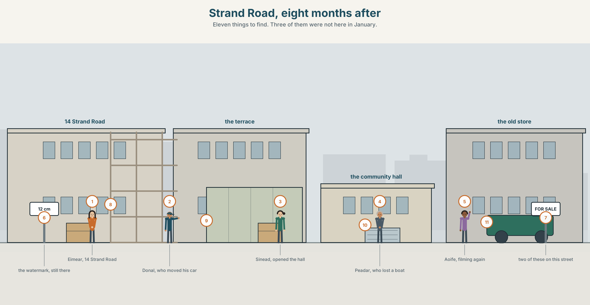{width=6.6in}

*Strand Road, eight months after — Eleven things to find. Three of them were not here in January.*

# What would you do differently?

**By the end of this unit you can say what you would do if it happened again, and what you would
not. Ninety words.**

| ◆ **A · THE WORLD** | A town eight months after the water came, and what it has decided about itself |
|---|---|
| ◆ **B · THE SYSTEM** | the second conditional · *would* collocations · 23 words for risk and recovery · 17 words for saying it differently · *would* as /wəd/ |
| ◆ **C · THE PERFORMANCE** | Ninety words on a different decision |

---

### 0A · Find it

**Find eleven things in this picture.** Three of them are new since January.

> sea wall · slipway · sandbags · the community hall · a skip · a dehumidifier ·
> a watermark on a wall · scaffolding · a boat on a trailer · a new drain · a For Sale sign

### 0B · Guess it

**The water reached a different height in three places on this street.** Where was it worst,
and why there?

### 0C · Say it ⏺

**Record thirty seconds.** *Think of one thing that went wrong in your life. If it happened
again tomorrow, what would you do differently?* You will record it again at the end of this unit.

---

## Part 1 · Vocabulary Lab 1 ◆ **B · THE SYSTEM**

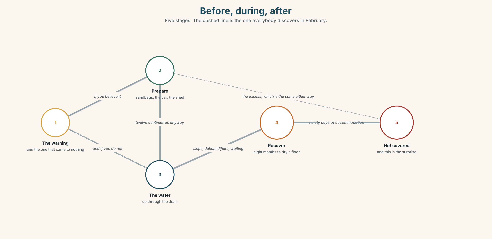{width=6.6in}

*Before, during, after — Five stages. The dashed line is the one everybody discovers in February.*

### 1A · Meet — before, during, after

Match each word to one place on the map.

> **warning** · **prepare** · **protect** · **flood** · **damage** · **recover** ·
> **rubble** · **shelter** · **cost** · **storm**

### 1B · Sort — a thing, an action, or a judgement?

Three columns.

> wall · prepare · lucky · damage · protect · foolish · shelter · safe · recover · rubble

**Two of them are only ever said afterwards.** Which, and why?

### 1C · Meet — the money words

> **cover** · **cost** · **ready**

An insurance policy **covers** some things and not others. The thing people discover in
February is which. **What would you expect a flood policy not to cover?**

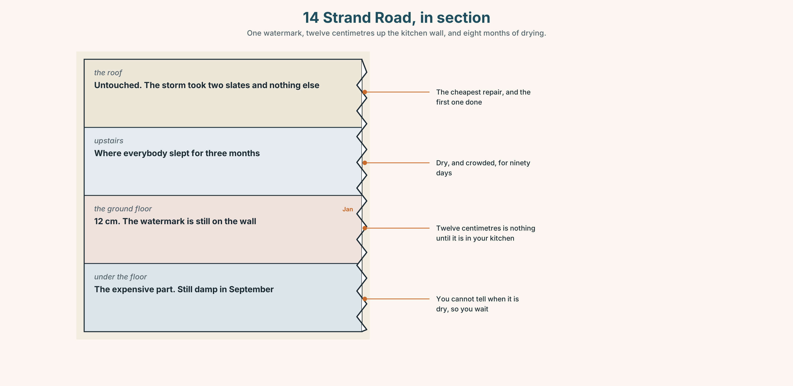{width=6.6in}

*14 Strand Road, in section — One watermark, twelve centimetres up the kitchen wall, and eight months of drying.*

**Look at Eimear's house in section.** Four levels, one watermark.
**Which floor took the water, and which floor is the expensive one to dry?**

### 1D · Stretch — the phrases

Complete each one with one word.

1. Three houses on this road are **at ______** every winter now.
2. He moved the car on Thursday. Everybody said he was **taking a ______** with his reputation.
3. Sinéad opened the hall **in ______** , which is why nobody slept outside.
4. **The ______ of it** was over by two in the morning.
5. They have **______ up with** a dehumidifier in the kitchen since January.

### 1E · The saying

> **f** **We were lucky.**

Three words that almost everybody in this town says, including the ones who lost most.

> **Why?** Write two reasons. One of them should be uncomfortable.

### 1F · Own it

Think of a time something went wrong where you live. Tell a partner **three sentences**:
what happened, what you did, and one thing you would do differently.

---

## Part 2 · Listening ◆ **A · THE WORLD**

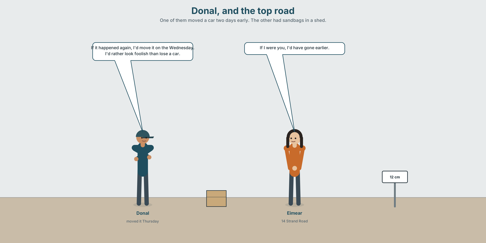{width=6.6in}

*Donal, and the top road — One of them moved a car two days early. The other had sandbags in a shed.*

### 2A · Thursday, and the top road 🔊 Track 1.1

**Before you listen.** Donal moved his car to the top road on the Thursday, two days early,
and people laughed. **Guess: does he bring it up himself?**

**Listen once. One question.** How many cars were lost on this street?

**Listen again. Complete the table.**

| | What they did on the Thursday | What they would do now |
|---|---|---|
| Donal | | |
| Eimear | | |
| Sinéad | | |

**Listen again. True or false?**

1. Donal moved his car because of the forecast. ☐ T ☐ F
2. Eimear had sandbags but did not use them. ☐ T ☐ F
3. Sinéad opened the hall on the Saturday. ☐ T ☐ F
4. Donal says he would do the same again. ☐ T ☐ F

**Noticing.** Four sentences from the recording.

1. *If it happened again, I'd move it on the Wednesday.*
2. *If I were you, I'd have gone earlier.*
3. *I'd rather look foolish than lose a car.*
4. *I wouldn't do anything differently, honestly.*

**All four use *would*. Two are about the future. Two are about the past.**
Which are which?

### 2B · Decoding clinic 🔊 Track 1.2

Twenty-five seconds of Donal. Four jobs.

1. How many times does he say *'d*?
2. In *I'd rather*, can you hear the *would* at all?
3. Catch the two days he names.
4. He says one thing and then takes half of it back. Which?

> Transcripts, page 150.

---

## Part 3 · Grammar Lab 1 ◆ **B · THE SYSTEM**

### If it happened again

### 3A · Notice

Look at the four sentences in Part 2.

1. In sentence 1, has it happened again? **So why is the verb in the past?**
2. Sentence 2 says *if I were you*. **Not *was*. Why?**
3. Sentence 3 compares two bad outcomes. **Which does he prefer, and is that a fact or a value?**
4. **First conditional or second?** *If it rains, we'll move the car.* / *If it flooded again,
   we'd move it.* What is the difference in how likely each one is?
5. Try *"If it would happen again, I'd move it."* **What is wrong?**

### 3B · See

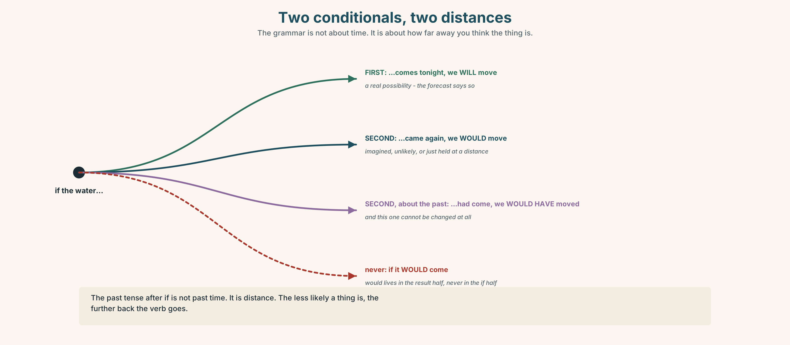{width=6.6in}

*Two conditionals, two distances — The grammar is not about time. It is about how far away you think the thing is.*

Now look at the second picture. **The ladder runs from certain to impossible.
Where does the second conditional sit?**

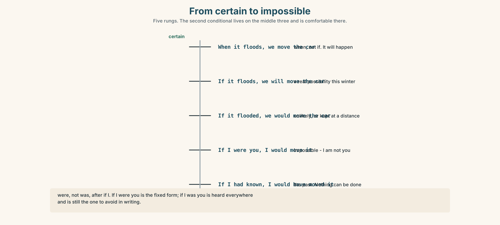{width=6.6in}

*From certain to impossible — Five rungs. The second conditional lives on the middle three and is comfortable there.*

### 3C · Know

| | Shape | Use it for |
|---|---|---|
| **first conditional** | *if* + present , *will* | a real possibility · *If it floods, we'**ll** move.* |
| **second conditional** | *if* + **past** , *would* | unlikely, imagined, or hypothetical · *If it **flooded** again, we'**d** move.* |

> **The past tense is not about time.** It is about distance. The further a thing is from
> happening, the further back the verb goes.

> ***were*, not *was*, after *if I*.** *If I **were** you* is the fixed form. *If I was you*
> is heard everywhere and is still the one to avoid in writing.

> **would in four jobs:** *I'd move it* (result) · *I'd rather* (preference) ·
> *Would you mind* (request) · *I'd have gone* (a past you cannot change)

> **Watch out.** ✗ *If it would happen* ✓ *If it happened*
> *would* lives in the result half, never in the *if* half.

### 3D · Use — controlled

> If it (1) __________ (happen) again, Donal (2) __________ (move) the car on the Wednesday.
> If Eimear (3) __________ (be) ready, she (4) __________ (not lose) the kitchen floor. If I
> (5) __________ (be) you, I (6) __________ (not wait) for the council. And if the wall
> (7) __________ (be) two feet higher, none of us (8) __________ (be) having this conversation.

### 3E · Use — guided

Make each one a second conditional.

1. I don't have the money, so I don't move.
2. We aren't ready, so we worry.
3. He doesn't ask, so nobody helps him.
4. The hall isn't open, so people sleep in cars.
5. I'm not you, so I can't decide.

### 3F · Use — open

**Ask three people:** *If you had to leave your home in an hour, what three things would you
take?* **Then ask them why the third one.**

### 3G · Check — six items

> 1. If it ______ (happen) again, I ______ (move) it earlier.
> 2. If I ______ you, I ______ (not wait).
> 3. We ______ (be) safe if the wall ______ (be) higher.
> 4. I ______ rather look foolish than lose a car.
> 5. What ______ you do if the water ______ (come) tonight?
> 6. If she ______ (have) insurance, she ______ (not be) in that house now.

**0–3 →** Workbook pp. 4–6. **4–5 →** Part 6. **6 →** page 19.

---

## Part 4 · Speaking ◆ **C · THE PERFORMANCE**

### 4A · Fluency starter — one hour

Your teacher says: **"You have one hour and a car."** Each learner names one thing they would
take and one they would leave. **No repeating an object.**

**Three rounds. Each round, the hour gets shorter.**

### 4B · The functional core — saying what you would do

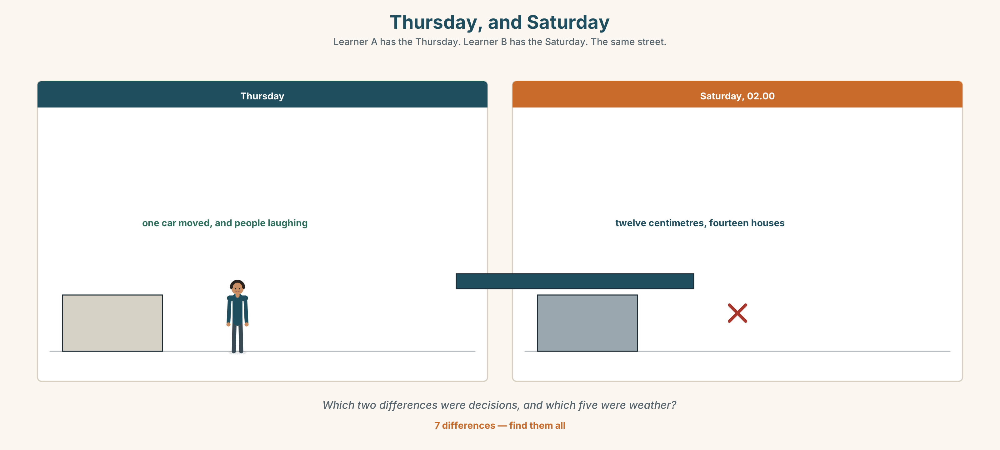{width=6.6in}

*Thursday, and Saturday — Learner A has the Thursday. Learner B has the Saturday. The same street.*

**Language Bank**

| | |
|---|---|
| **the imagined** | *If it happened again, I'd…* · *I'd probably…* · *I'd certainly…* |
| **the preference** | *I'd rather… than…* · *I'd sooner…* |
| **the advice** | *If I were you…* · *In your place, I'd…* |
| **the honest limit** | *Honestly, I'd do the same.* · *I'd like to say I would, but…* |

**Role play.** Learner A lost something in the flood. Learner B did not and was lucky.
**Six minutes.** Neither of you may use the word *should*.

### 4C · The performance — ninety seconds ⏺

Describe **one thing you would do differently** and **one you would not**. **Ninety seconds.**
You must give:

> what happened · what you would change · what you would keep the same · why that one

**Record it.**

### 4D · Observer

One person listens for **one thing**: was there something the speaker would **not** change?

### 4E · Two criteria

> ☐ Did I use *if* + past + *would* at least three times?
> ☐ Is there one thing I would keep exactly as it was?

---

## Part 5 · Reading ◆ **A · THE WORLD**

### 5A · Predict

An interview transcript with a resident. The title is
**"I had sandbags in the shed since 2019."**
**What do you expect her to say about them?** One sentence.

### 5B · Read — one hundred seconds

---

**"I had sandbags in the shed since 2019"**
*Eimear Nolan, 14 Strand Road*

**When did you know it was coming in?**
About ten. The drain in the yard started going the wrong way. That is the thing nobody tells you.
It does not come in the door first.

**You had sandbags.**
I had sandbags. I had had them in the shed since 2019, when there was a warning that came to
nothing, and on the Thursday I thought about putting them out and I did not, because Donal had
moved his car and everyone was being funny about it and I did not want to be the second one.

**Would you do it differently?**
I would put them out. But I want to be careful here, because that is easy to say in September.
If you asked me in January, with a forecast and a shed and everybody watching, I honestly do not
know that I would.

**What would you change, then?**
I would not wait to see what anybody else did. That is the one. Not the sandbags — the waiting.

**And twelve centimetres.**
Twelve centimetres is nothing until it is in your kitchen. It takes eight months to dry a floor.
You cannot put a new one down until it is dry and you cannot tell when it is dry, so you wait,
and then you put one down and sometimes you are wrong.

---

### 5C · Answer

1. How did she know the water was coming in?
2. How long had the sandbags been in the shed, and why had she kept them?
3. **Why did she decide not to put them out on the Thursday?**
4. What does she say she would change, and what does she say she would **not** promise?
5. Why does it take eight months to dry a floor?
6. **What is the difference between "the sandbags" and "the waiting"?**

### 5D · Vocabulary in context

Guess from the text. Then check.

> came to nothing · being funny about it · the second one · in September *(as she uses it)* ·
> you cannot tell when it is dry

### 5E · The counter-text

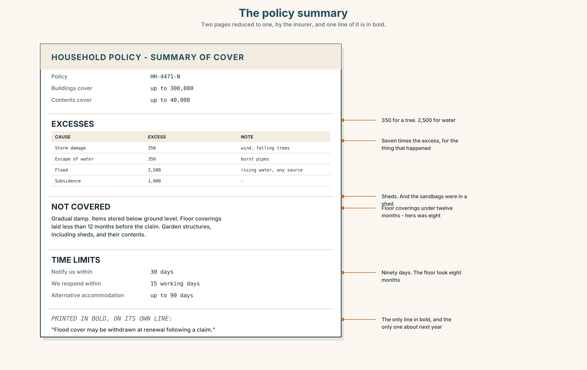{width=6.6in}

*The policy summary — Two pages reduced to one, by the insurer, and one line of it is in bold.*

**Read the insurance policy summary and answer.**

1. What is the excess for flood, and how does it compare with the excess for storm damage?
2. **What exactly is not covered, and which of those three things did Eimear lose?**
3. How long does the insurer have to respond to a claim?
4. One line is printed in bold. What does it say, and why that line?

### 5F · Two texts

The interview says the floor took **eight months** to dry.
The policy covers **alternative accommodation for up to 90 days**.

**Put those two facts together. What happened for the other five months?** Two sentences.

---

## Part 6 · Vocabulary Lab 2 ◆ **B · THE SYSTEM**

### Saying it a different way

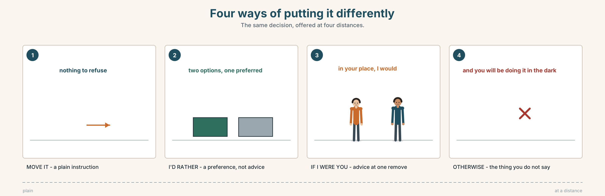{width=6.6in}

*Four ways of putting it differently — The same decision, offered at four distances.*

### 6A · Sort — how sure, and how honest?

Put these on a line from most certain to least.

> certainly · probably · maybe · supposing · honestly · otherwise

**Two of them are not about certainty at all.** Which, and what are they doing?

### 6B · Chunk completion

1. **If I ______ you** , I'd ask for it in writing.
2. **In your ______** , I would have done exactly the same.
3. I **would ______** gone, but the road was closed.
4. **I'd ______** wait than guess.
5. Move it now — **______ you'll be doing it in the dark.**
6. He **______ twice** before he said anything in the hall.

### 6C · Three words that change the whole sentence

**instead · otherwise · differently**

Put one in each, and then say what each one assumes the listener already knows.

1. I didn't wait. I phoned the council ______ .
2. Put them out tonight. ______ you'll be carrying sand at midnight.
3. If it happened now, I'd do it ______ .

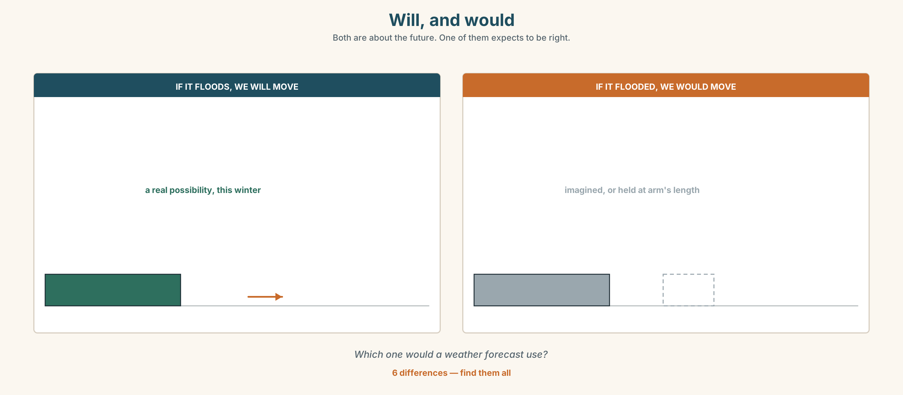{width=6.6in}

*Will, and would — Both are about the future. One of them expects to be right.*

**Six differences.** Find them, then answer the question under the picture.

### 6D · Contrast Clinic — first or second conditional

Six items. Choose the form, and say why that one.

1. If it ______ (rain) tomorrow, we ______ (cancel). *(the forecast says it will)*
2. If it ______ (rain) every day for a month, the wall ______ (not hold). *(it never has)*
3. If I ______ (be) you, I ______ (go) now.
4. If you ______ (leave) now, you ______ (catch) the four o'clock.
5. If the hall ______ (not be) there, where ______ people ______ (go) ?
6. If I ______ (see) him, I ______ (tell) him. *(I probably will see him)*

---

## Part 7 · Pronunciation & Fluency Lab ◆ **B · THE SYSTEM**

### The word that becomes a letter

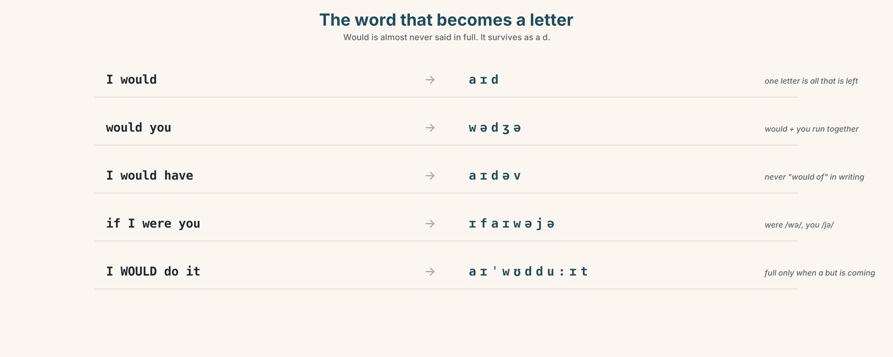{width=6.6in}

*The word that becomes a letter — Would is almost never said in full. It survives as a d.*

### 7A · Hear 🔊 Track 1.3

> I would → *I'd* → /aɪd/
> would you → /wədʒə/
> I would have → *I'd've* → /aɪdəv/
> if I were you → /ɪfaɪwəjə/

### 7B · Say

Say each one. Then say the sentence three times, faster:

> *If I were you, I'd have moved it on the Wednesday.*

### 7C · Make it mean something

Say these two:

> *I WOULD do it.* *(and something is stopping me)*
> *I'd do it.* *(plain — this is what I would do)*

**The first one has a *but* coming.** Say the whole sentence.

### 7D · Fluency 20 ⏺

Twenty seconds: **three things you would do and one you would not.**
Three times, faster, with *'d* every time.

---

## Part 8 · Writing ◆ **C · THE PERFORMANCE**

### What I would do differently · 90 words

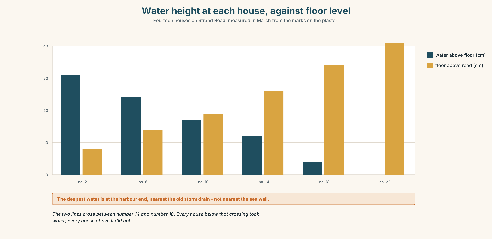{width=6.6in}

*Water height at each house, against floor level — Fourteen houses on Strand Road, measured in March from the marks on the plaster.*

### 8A · Read the model

> If it happened again I would not wait to see what the neighbours did. That is the only thing I
> would change and it is not the thing people expect me to say. `[the change, named, and the
> surprise acknowledged]`
>
> I would still keep the sandbags in the shed rather than by the door, because the shed is dry
> and the door is not, and a wet sandbag is a bag of mud. `[something kept, with a technical
> reason, which proves she has thought about it]`
>
> I would not promise to be braver. I would promise to be two hours earlier. `[the honest
> limit — and it is specific and achievable]`

**Questions about the writer's choices:**

1. The second paragraph defends something she did **right**. **Why include it?**
2. The last line refuses to promise courage. **Is that weakness or precision?**

### 8B · The anti-model

> If it happened again I would be much more prepared. I would act faster and I would not make the
> same mistakes. We have all learned a lot from this experience and we would all do things
> differently next time.

Correct English, and there is nothing in it. **Name two things it does not say.**

### 8C · Plan

> what happened, in one line → the one thing you would change → one thing you would keep,
> with a reason → what you will not promise

### 8D · Write — 90 words
### 8E · Peer review — two criteria

> ☐ Is there one thing kept as well as one thing changed?
> ☐ Is the change specific enough to do?

### 8F · Write it again · 8G · Publish

On the wall, with the policy summary from Part 5E beside it.

---

## Part 9 · The File ◆ **A · THE WORLD + C · THE PERFORMANCE**

# WORK FILE · The Pitch

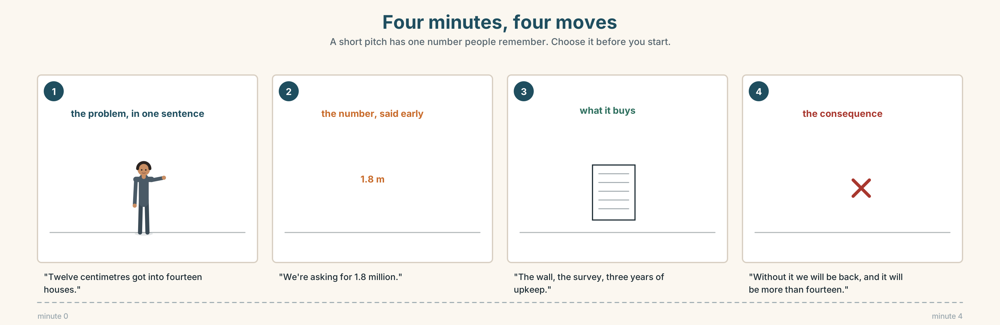{width=6.6in}

*Four minutes, four moves — A short pitch has one number people remember. Choose it before you start.*

### 9A · Four minutes and a committee 🔊 Track 1.4

Tomás has four minutes to ask the county for the sea wall money. **Listen.**

1. How does he open, and how long before he says a number?
2. What does he ask for, and what does he offer in return?
3. **One question from the committee catches him out. Which?**

### 9B · The four moves in a short pitch

> the problem in one sentence · what you want · what it costs · what happens if you do not get it

Match each to one phrase.

> *"Twelve centimetres got into fourteen houses."* · *"We're asking for 1.8 million."* ·
> *"That's the wall, the survey and three years of maintenance."* ·
> *"Without it we will be back here, and it will be more than fourteen."*

### 9C · The number you lead with

A pitch has one number people remember. **Which of these would you lead with, and why?**

> 1.8 million · fourteen houses · twelve centimetres · eight months · three years

### 9D · Your turn

In pairs. **Four minutes each.** Pitch for something real — a change at work, at home, anywhere.
**One sentence of problem, one number, one cost, one consequence.**

### 9E · Transfer

**Find one pitch this week** — an advertisement, a request, a politician. Write down the number
they led with and ask yourself why that one.

---

## Part 10 · Mediation & Interaction ◆ **C · THE PERFORMANCE**

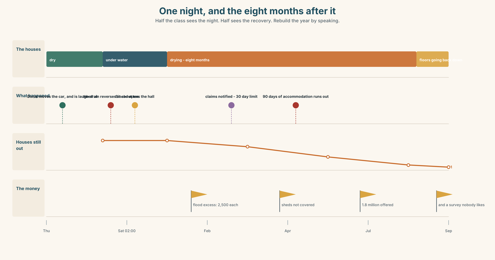{width=6.6in}

*One night, and the eight months after it — Half the class sees the night. Half sees the recovery. Rebuild the year by speaking.*

### 10A · Relay

Half the class sees the night of the storm. Half sees the eight months since.
**Rebuild the whole year by speaking.** Ten minutes.

### 10B · Simplify

Explain the policy summary from Part 5E to somebody who has just been flooded.
**Four sentences only.**

> **Plan:** what you get → what you pay first → what is not covered → what to do today

### 10C · Compress

The interview in Part 5 into **thirty words**, for a county report.

### 10D · Online

Write **one message** to the town group: the council survey is open for two weeks, you think
fourteen households should answer it, and here is the one question that matters.

### 10E · Your language

How does your language say *if I were you*? **Does it use a past tense for an imagined thing,
the way English does?** Show a partner both.

---

## Part 11 · The Decision ◆ **C · THE PERFORMANCE**

# The wall, or the three houses

There is 1.8 million. It is enough to build the sea wall badly along its whole length, or to
move the three nearest houses and do nothing else.

- **The wall.** Protects fourteen houses to the standard that failed in January, plus about
  thirty centimetres.
- **The three houses.** Buys and demolishes them. The three families are rehoused and the gap
  becomes a flood meadow. The other eleven houses are no safer than they were.
- **Neither, yet.** Spend 90,000 on a proper survey and come back in a year with a number that
  means something.

### 11A · The evidence

1. **The policy summary** from Part 5E — and what is not covered.
2. **The chart** — water height at each house on the night, against floor level.
3. **The voice.** One of the three, twenty seconds: *"I would take the money. I want to be clear
   that I would take it, because I think people will say afterwards that we were pushed out, and
   we would not be. We would be glad."*

### 11B · Talk about it

In threes. Everybody says one. Use the frame.

> *If they built ______ , then ______ . So I think they should ______ .*

**Words you can use:** *risk · at risk · damage · protect · recover · cost · safe · in time*

### 11C · Decide

Write **two sentences**. Choose, and say why.

> I think they should ______________________ ,
> because ______________________ .

### 11D · Model decision

> They should do the survey. Both of the other options are being chosen on the basis of one
> night's water, measured afterwards by people wading through it, and a wall built to the wrong
> height is worse than no wall because it is believed. Ninety thousand to find out is cheap
> against 1.8 million to find out you were wrong.

### 11E · The Reveal

> **What happened.** They did the survey. It took fourteen months rather than twelve and cost
> 118,000.
>
> It found that the water in January had not come over the wall at all. It had come **up through
> the old storm drain**, which was built in 1961 and connects to the harbour below the wall line.
> A higher wall would have made no difference to eleven of the fourteen houses.
>
> Fixing the drain is costed at 340,000. There is now an argument about what to do with the rest
> of the money, and two of the three families have said they no longer want to move.

**The survey was right. And it cost fourteen months, during which nothing was built.**

> **Was it the right decision?** Say why — and say what you would do with the remaining 1.34
> million.

---

## Part 12 · Landing ◆ **all three lines**

### 12A · Recycle — ten items

> 1. If it ______ (happen) again, I ______ (move) it earlier.
> 2. If I ______ you, I wouldn't wait.
> 3. I'd ______ look foolish than lose a car.
> 4. Three houses are **at ______** every winter.
> 5. **The worst ______ it** was over by two.
> 6. *(A2.1 U5)* If it ______ (rain), we'll stay in.
> 7. *(A2.1 U8)* You ______ (not / allowed) park here.
> 8. *(A2.1 U7)* The house ______ (build) in 1961.
> 9. *(A2.1 U2)* It was raining ______ he left.
> 10. *(A2.1 U1)* I've lived here ______ 2019.

### 12B · Consolidate

**Ninety words, one paragraph.** One thing you would do differently and one you would keep.
Three second conditionals, one *I'd rather*, one *if I were you*.

### 12C · Can-do, with evidence

| I can… | My evidence | Sure? |
|---|---|---|
| talk about an imagined situation and its result | Part 3G score | ◯ ◑ ● |
| say what I would and would not change, in ninety seconds | Part 4C recording | ◯ ◑ ● |
| write ninety words that keep something as well as change something | Part 8 draft 2 | ◯ ◑ ● |
| make a four-minute pitch with one number | Part 9D pair work | ◯ ◑ ● |

### 12D · Replay ⏺

Find your thirty seconds from Part 0C. Listen. **Record it again.**
One sentence: what is different?

### 12E · Glossary — forty items, as a map

> **BEFORE** · warning · prepare · protect · ready · at risk · take a risk · in time
> **THE NIGHT** · storm · flood · wall · shelter · damage · rubble · the worst of it
> **AFTER** · recover · cost · cover · safe · lucky · foolish · put up with · we were lucky
> **THE IMAGINED** · would · would have · supposing · maybe · unless · otherwise · instead
> **THE PREFERENCE** · rather · I'd rather · if I were you · in your place · think twice
> **HOW SURE** · honestly · probably · certainly · differently · what would you do

### 12F · Next

> **Unit 2 · What has been happening?**

# A2.2 · Unit 2 · Nowhere Near Finished

> **English Animated** · *Telling the Story* · Ballinmore, west coast of Ireland
> Student's Book pages 28–49 · 22 pp · ~10 hours

---

## Part 0 · The Big Picture ◆ **A · THE WORLD**

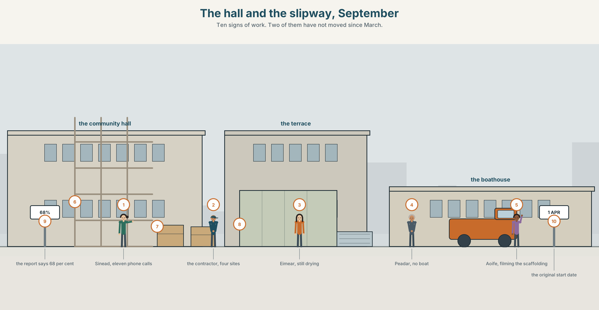{width=6.6in}

*The hall and the slipway, September — Ten signs of work. Two of them have not moved since March.*

# What has been happening?

**By the end of this unit you can report eight months of work: what is finished, what is still
going on, and what has not started. One hundred words.**

| ◆ **A · THE WORLD** | A town in the middle of a repair, which is a longer place than people think |
|---|---|
| ◆ **B · THE SYSTEM** | *have been doing* and *have done* · duration adverbs · 23 words for repair and progress · 17 words for how long and how often · *been* as /bɪn/ |
| ◆ **C · THE PERFORMANCE** | A hundred words of honest progress reporting |

---

### 0A · Find it

**Find ten signs of work in this picture.** Two of them have not moved since March.

> scaffolding · a skip · a contractor's board · a temporary road surface · a generator ·
> a portable toilet · a stack of plasterboard · a dehumidifier cable · a site fence ·
> a planning notice

### 0B · Guess it

**Three of these jobs have been going on longer than the others.** Which, and what tells you?

### 0C · Say it ⏺

**Record thirty seconds.** *What have you been working on for a long time, and is it nearly
finished?* You will record it again at the end of this unit.

---

## Part 1 · Vocabulary Lab 1 ◆ **B · THE SYSTEM**

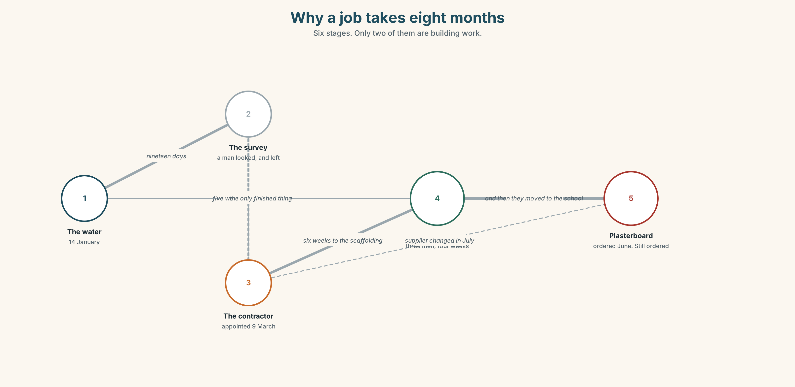{width=6.6in}

*Why a job takes eight months — Six stages. Only two of them are building work.*

### 1A · Meet — the words of a long job

Match each word to one place on the map.

> **repair** · **rebuild** · **clear** · **fix** · **finish** · **progress** · **site** ·
> **scaffolding** · **contractor** · **delay**

### 1B · Sort — finished, going on, or not started?

Three columns, from the picture in Part 0.

> the roof · the kitchen floor · the hall windows · the drain · the sea wall survey ·
> the slipway · the plasterboard · the temporary road

**One of them is in two columns depending on who you ask.** Which?

### 1C · Meet — three words for how it is going

> **ongoing** · **slow** · **steady**

**Slow** is a complaint. **Steady** is a defence. **Ongoing** avoids the question.
**Which would a contractor use, and which would a resident?**

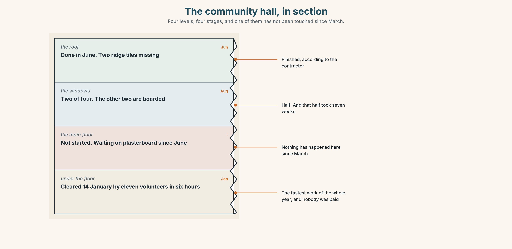{width=6.6in}

*The community hall, in section — Four levels, four stages, and one of them has not been touched since March.*

**Look at the community hall in section.** Four levels, four stages of repair.
**Which level is finished, and which one has not been touched since March?**

### 1D · Stretch — the phrases

Complete each one with one word.

1. They've been **getting ______ with** the back wall since June.
2. It's coming along **bit by ______** .
3. The slipway is **nowhere ______** finished.
4. The hall is four months **behind ______** .
5. The plasterboard has **held them ______** since the supplier changed.

### 1E · The saying

> **f** **It's getting there.**

Three words you will hear forty times in this town.

> **Say it three times:** cheerfully, wearily, and to somebody you do not want to talk to.
> **Which one is true?**

### 1F · Own it

Think of something near you that has been under repair for a long time. Tell a partner
**three sentences**: what it is, how long, and what is actually holding it up.

---

## Part 2 · Listening ◆ **A · THE WORLD**

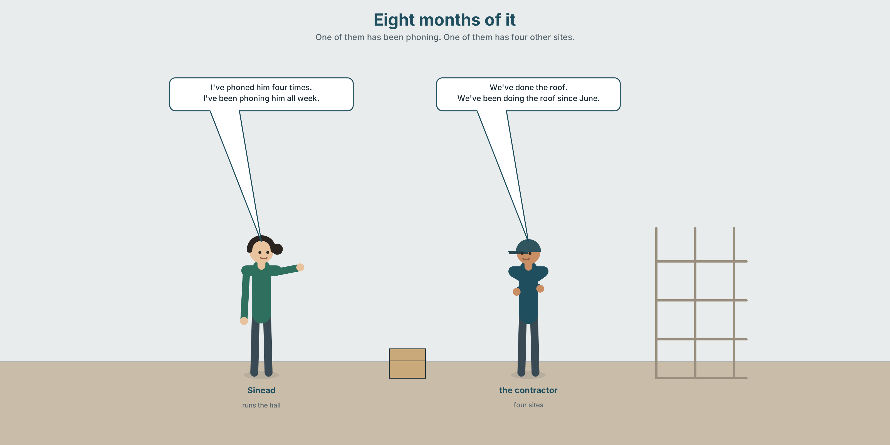{width=6.6in}

*Eight months of it — One of them has been phoning. One of them has four other sites.*

### 2A · Eight months of it 🔊 Track 2.1

**Before you listen.** Sinéad runs the hall. The contractor is four months late.
**Guess: who is more frustrated, and who sounds it?**

**Listen once. One question.** How many of the six jobs are finished?

**Listen again. Complete the table.**

| Job | Started | Finished? | What is holding it up |
|---|---|---|---|
| the roof | | | |
| the windows | | | |
| the floor | | | |

**Listen again. Choose.**

1. The roof took **three weeks / three months / it is not done**.
2. They have been waiting for plasterboard **since June / since August / all year**.
3. The contractor has **two / three / four** other sites.
4. Sinéad has been phoning **daily / weekly / on and off**.

**Noticing.** Four sentences from the recording.

1. *We've done the roof.*
2. *We've been doing the roof since June.*
3. *I've phoned him four times.*
4. *I've been phoning him all week.*

**Two of these are about a result. Two are about the activity.** Which are which?

### 2B · Decoding clinic 🔊 Track 2.2

Twenty-five seconds of Sinéad. Four jobs.

1. How many times does she say *been*?
2. Is *been* loud or quiet? What vowel is in it?
3. Catch the two time expressions she uses.
4. She says one number twice. Which, and why?

> Transcripts, page 151.

---

## Part 3 · Grammar Lab 1 ◆ **B · THE SYSTEM**

### The result, and the activity

### 3A · Notice

Look at the four sentences in Part 2.

1. In sentence 1, is the roof finished? In sentence 2?
2. Sentence 3 gives a number. Sentence 4 does not. **Which form likes numbers?**
3. **Which pair would you use to complain, and which to report?**
4. Try *"I've been phoning him four times."* **Why does it sound wrong?**
5. Try *"I've known him since June"* and *"I've been knowing him since June."*
   **Why does one of these not exist?**

### 3B · See

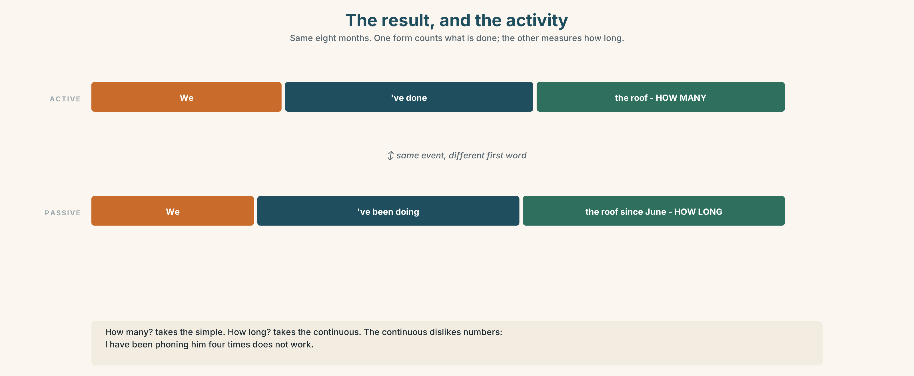{width=6.6in}

*The result, and the activity — Same eight months. One form counts what is done; the other measures how long.*

Now look at the second picture. **The ladder runs from a finished result to an activity with no
end in sight. Where does *for eight months* sit?**

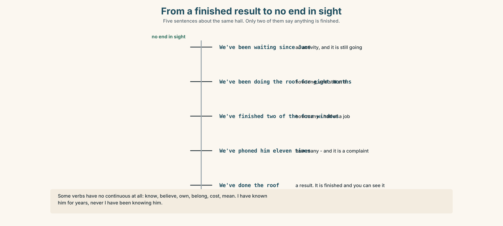{width=6.6in}

*From a finished result to no end in sight — Five sentences about the same hall. Only two of them say anything is finished.*

### 3C · Know

| | Shape | Use it for |
|---|---|---|
| **present perfect simple** | *have* + past participle | the **result**, and how many · *We'**ve done** the roof. I'**ve phoned** four times.* |
| **present perfect continuous** | *have been* + *-ing* | the **activity**, and how long · *We'**ve been doing** the roof since June.* |

> **The question each one answers.**
> *How many?* → simple. *How long?* → continuous.

> **Some verbs have no continuous.** *know, believe, own, belong, cost, mean*.
> ✓ *I've known him for years.* ✗ *I've been knowing him.*

> **Both take *for* and *since*.** *for* + a length, *since* + a point.
> You met this in A2.1 Unit 1 and it has not changed.

> **Watch out.** The continuous dislikes numbers.
> ✗ *I've been phoning him four times.* ✓ *I've phoned him four times.* ·
> ✓ *I've been phoning him all week.*

### 3D · Use — controlled

> They (1) __________ (work) on the hall since January. They
> (2) __________ (finish) the roof and two of the four windows. The floor
> (3) __________ (not start) yet, because they (4) __________ (wait) for plasterboard since
> June. Sinéad (5) __________ (phone) the contractor eleven times. She
> (6) __________ (phone) him constantly all week, and he (7) __________ (not answer) once.

### 3E · Use — guided

Choose the form. **One of them could be either — say why.**

1. I ______ (write) three emails this morning.
2. I ______ (write) emails all morning.
3. She ______ (live) here since 2011.
4. They ______ (fix) the roof. It's finished.
5. They ______ (fix) the roof since June.
6. We ______ (know) each other for years.

### 3F · Use — open

**Ask three people:** *What have you been doing lately that you haven't finished?*
**Then ask: how much of it have you actually done?**

### 3G · Check — six items

> 1. We ______ (wait) since June.
> 2. I ______ (phone) him four times.
> 3. She ______ (work) here all week.
> 4. They ______ (finish) two of the four windows.
> 5. I ______ (know) him for years.
> 6. How long ______ you ______ (live) here?

**0–3 →** Workbook pp. 10–12. **4–5 →** Part 6. **6 →** page 41.

---

## Part 4 · Speaking ◆ **C · THE PERFORMANCE**

### 4A · Fluency starter — how long, how many

In pairs. One asks **How long?**, the other answers. Then one asks **How many?**
**Thirty seconds each, six rounds.** The forms must change with the question.

### 4B · The functional core — reporting progress

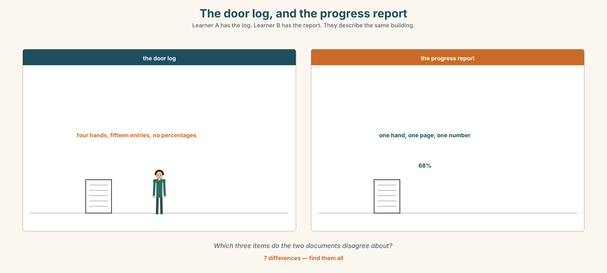{width=6.6in}

*The door log, and the progress report — Learner A has the log. Learner B has the report. They describe the same building.*

**Language Bank**

| | |
|---|---|
| **finished** | *We've done…* · *That's completed.* · *Two of the four are in.* |
| **going on** | *We've been working on…* · *That's ongoing.* · *It's coming along, bit by bit.* |
| **not started** | *We haven't started the…* · *That's waiting on…* |
| **the honest line** | *It's nowhere near finished.* · *We're four months behind schedule.* |

**Role play.** Learner A runs a building. Learner B is the contractor.
**Six minutes.** Learner A must get one date. Learner B must not give a date they cannot keep.

### 4C · The performance — one hundred seconds ⏺

Report **eight months of work** on something. **One hundred seconds.** You must give:

> what is finished, with a number · what is still going on, with a length ·
> what has not started · what is actually holding it up

**Record it.**

### 4D · Observer

One person listens for **one thing**: was there a number **and** a length?

### 4E · Two criteria

> ☐ Did I use both forms, each for its own job?
> ☐ Did I name what is holding it up, not just that it is late?

---

## Part 5 · Reading ◆ **A · THE WORLD**

### 5A · Predict

An archive document: the hall's own repair log, kept by hand on the back of the door.
The title is **"Hall — January to September."**
**What do you expect the handwriting to show?** One sentence.

### 5B · Read — one hundred seconds

---

**HALL — JANUARY TO SEPTEMBER**
*(kept on the back of the kitchen door, in four different hands)*

**14 Jan** Water out. Floor up. 11 volunteers, 6 hrs.
**19 Jan** Electrics isolated. Can't use the kitchen. S.
**2 Feb** Council survey. Man came, looked, left. No paper yet.
**27 Feb** Still no paper.
**9 Mar** Contractor appointed. Start date 1 April. Scaffolding to go up w/c 25 Mar.
**25 Mar** No scaffolding.
**1 Apr** No contractor.
**14 Apr** Scaffolding up. Nobody on it.
**6 May** Roof started. Three men. Good.
**2 Jun** Roof done. They have moved to the school.
**2 Jun** *(different hand)* Roof is NOT done. Two ridge tiles missing, you can see daylight.
**11 Jun** Plasterboard ordered.
**3 Jul** Plasterboard not delivered. Supplier changed.
**1 Aug** Plasterboard not delivered.
**1 Sep** Plasterboard not delivered. Windows 2 of 4. Floor not started.
**1 Sep** *(different hand again)* We have been at this for eight months and the only thing
that is finished is the roof, and the roof is not finished.

---

### 5C · Answer

1. How many volunteers worked on the first day, and for how long?
2. How long was it between the survey and the contractor being appointed?
3. **What happened on 2 June, twice?**
4. How long have they been waiting for plasterboard?
5. What is the state of the windows and the floor on 1 September?
6. **Why is the log in four different hands, and what does that tell you?**

### 5D · Vocabulary in context

Guess from the text. Then check.

> isolated · w/c · appointed · ridge tiles · *2 of 4*

### 5E · The counter-text

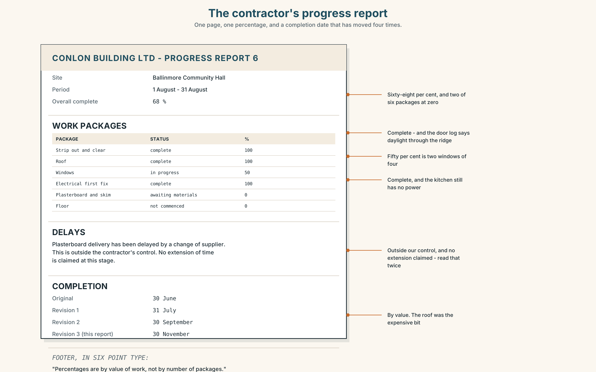{width=6.6in}

*The contractor's progress report — One page, one percentage, and a completion date that has moved four times.*

**Read the contractor's progress report and answer.**

1. What percentage complete does the report claim?
2. **How does it describe the plasterboard delay, and whose fault does it say it is?**
3. Which three items does it mark as "complete" that the door log disputes?
4. One line gives a new completion date. What is it, and how many times has it moved?

### 5F · Two texts

The door log says **the only thing finished is the roof, and the roof is not finished.**
The progress report says **68 per cent complete.**

**Put those two facts together. How could both be honest?** Two sentences.

---

## Part 6 · Vocabulary Lab 2 ◆ **B · THE SYSTEM**

### How long, and how often

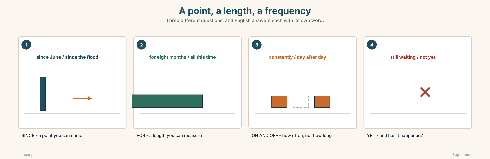{width=6.6in}

*A point, a length, a frequency — Three different questions, and English answers each with its own word.*

### 6A · Sort — a point, a length, or a frequency?

Three columns.

> since · for · all week · lately · constantly · recently · throughout · on and off ·
> day after day · non-stop · still · yet

| **A POINT** | **A LENGTH** | **HOW OFTEN** |
|---|---|---|
| | | |

### 6B · Chunk completion

1. We've been at it **all this ______** .
2. He's been on the phone **______ and off** since Tuesday.
3. They've been promising it **day ______ day** .
4. It's rained **______ the whole month** .
5. She's **______ waiting** — nothing has arrived.
6. Has it come **______ ?**

### 6C · Three that are nearly the same

**lately · recently · still**

Two of these go with the perfect. One of them means something else entirely.

Put one in each, and say why the other two would be wrong.

1. Have you seen him ______ ?
2. I've been very tired ______ .
3. They're ______ waiting for the plasterboard.

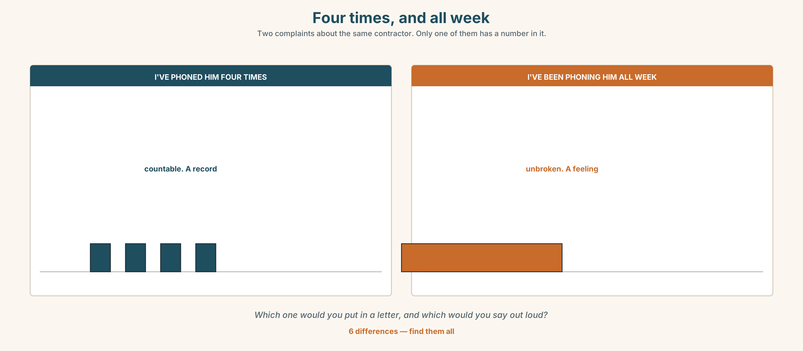{width=6.6in}

*Four times, and all week — Two complaints about the same contractor. Only one of them has a number in it.*

**Six differences.** Find them, then answer the question under the picture.

### 6D · Contrast Clinic — simple or continuous

Six items.

1. I ______ (read) that book three times.
2. I ______ (read) that book all week.
3. They ______ (build) four of the six.
4. They ______ (build) it since January.
5. We ______ (own) this house for twenty years.
6. How many times ______ you ______ (phone) him?

---

## Part 7 · Pronunciation & Fluency Lab ◆ **B · THE SYSTEM**

### The word in the middle

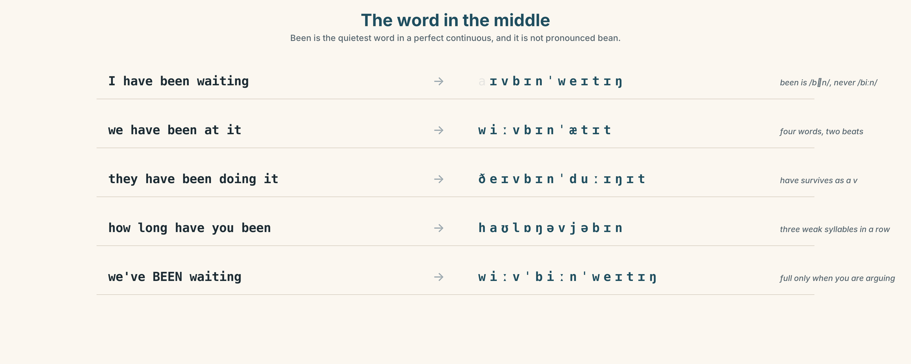{width=6.6in}

*The word in the middle — Been is the quietest word in a perfect continuous, and it is not pronounced bean.*

### 7A · Hear 🔊 Track 2.3

> I have been waiting → *I've been waiting* → /aɪvbɪnˈweɪtɪŋ/
> we have been at it → /wiːvbɪnˈætɪt/
> they have been doing it → /ðeɪvbɪnˈduːɪŋɪt/

**been is /bɪn/, not /biːn/. It is the quietest word in the sentence.**

### 7B · Say

Say each one. Then say the sentence three times, faster:

> *We've been waiting for that plasterboard since June.*

### 7C · Make it mean something

Say these two:

> *We've BEEN waiting.* *(and we are still waiting — you are arguing)*
> *We've been WAITING.* *(and that is all we have done)*

**Which one is a complaint about the other person, and which about the situation?**

### 7D · Fluency 20 ⏺

Twenty seconds: **three things you have been doing and three you have finished.**
Three times, faster.

---

## Part 8 · Writing ◆ **C · THE PERFORMANCE**

### Eight months, honestly · 100 words

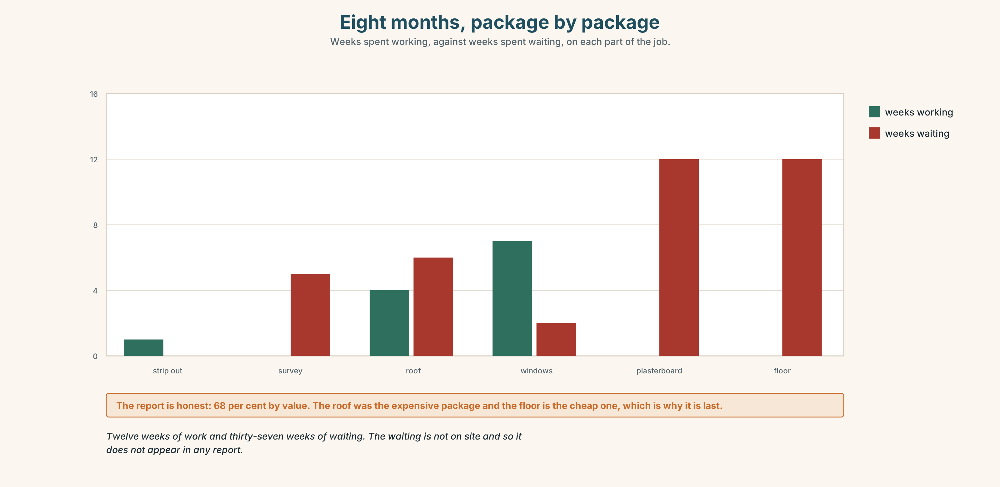{width=6.6in}

*Eight months, package by package — Weeks spent working, against weeks spent waiting, on each part of the job.*

### 8A · Read the model

> The roof is finished. Two of the four windows are in. `[what is done, with numbers — and this
> comes first, because it is the only part the reader can rely on]`
>
> We have been waiting for plasterboard since June, which is twelve weeks. The supplier changed
> in July and the order has been re-placed twice. `[what is ongoing, with a length and the actual
> cause]`
>
> The floor has not started and will not start until the plasterboard arrives, so any date I give
> you for the floor is a date for the plasterboard. `[what has not started, and an unusually
> honest sentence about estimates]`

**Questions about the writer's choices:**

1. The numbers are in the first paragraph and the lengths are in the second. **Why that way?**
2. The last sentence refuses to give a date. **Is that unhelpful?**

### 8B · The anti-model

> Work is progressing well and we are pleased with how things are going. There have been some
> delays due to circumstances beyond our control but we are working hard to get back on track
> and hope to be finished soon.

Correct English, and a reader learns nothing. **Name three things it does not say.**

### 8C · Plan

> what is finished, with numbers → what is ongoing, with a length and a cause →
> what has not started → what any date actually depends on

### 8D · Write — 100 words
### 8E · Peer review — two criteria

> ☐ Is there at least one number and one length?
> ☐ Is the cause of the delay named, not just the delay?

### 8F · Write it again · 8G · Publish

On the wall, with the door log from Part 5B beside it.

---

## Part 9 · The File ◆ **A · THE WORLD + C · THE PERFORMANCE**

# STUDY FILE · Paraphrase & Citation

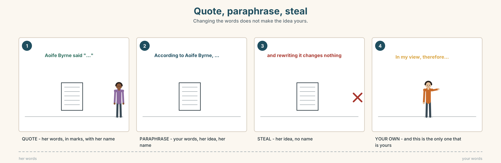{width=6.6in}

*Quote, paraphrase, steal — Changing the words does not make the idea yours.*

### 9A · The same sentence, four ways 🔊 Track 2.4

A national news channel has used Aoife's footage. **Listen to four people describe what happened.**

1. Which one quotes her exactly?
2. Which one changes the meaning while using her words?
3. **Which one is an honest paraphrase, and how can you tell?**

### 9B · Quote, paraphrase, or steal

> **quoting** — her words, in quotation marks, with her name
> **paraphrasing** — your words, her idea, with her name
> **stealing** — her words or her idea, without her name

Match each to one of these.

> *Aoife Byrne said the water "came up out of the drain, not over the wall".* ·
> *According to Aoife Byrne, the water rose from the drain rather than coming over the wall.* ·
> *The water came up out of the drain, not over the wall.*

### 9C · Changing the words is not enough

Rewriting a sentence does not make the idea yours.

**Which of these three still needs a name attached?**

1. The water rose from below rather than over the wall.
2. Water entered the houses through the old storm drain.
3. In my view, a higher wall would therefore have changed nothing.

### 9D · Your turn

Take the door log from Part 5B. **Write three sentences about it:** one quoting, one
paraphrasing, one giving your own conclusion. **Label each.**

### 9E · Transfer

**Find one news story this week** that uses somebody's photograph or video.
**Is the person named?** Bring the story.

---

## Part 10 · Mediation & Interaction ◆ **C · THE PERFORMANCE**

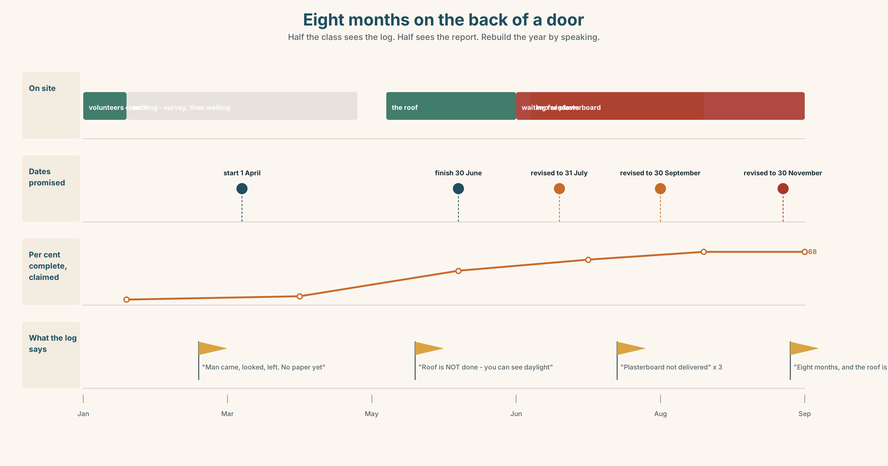{width=6.6in}

*Eight months on the back of a door — Half the class sees the log. Half sees the report. Rebuild the year by speaking.*

### 10A · Relay

Half the class sees the door log. Half sees the progress report. **Rebuild eight months by
speaking.** Ten minutes.

### 10B · Simplify

Explain the contractor's progress report from Part 5E to a volunteer who has been doing the
work. **Four sentences only.**

> **Plan:** what it claims → what is actually done → where the two disagree → what to ask next

### 10C · Compress

The door log into **thirty-five words**, for the council.

### 10D · Online

Write **one message** to the hall committee: here is what is finished, here is what is waiting
on one supplier, and here is the one date you want from the contractor by Friday.

### 10E · Your language

How does your language distinguish *I have done it* from *I have been doing it*?
**Does it, at all?** Show a partner both in your language.

---

## Part 11 · The Decision ◆ **C · THE PERFORMANCE**

# Her footage, their broadcast

A national news channel has been using Aoife's phone footage of the flood for eight months.
Nobody asked her. The coverage has brought in about 90,000 in donations to the town.

- **Say nothing.** The money is real. She is eighteen and does not want a fight.
- **Ask for a credit.** Her name on the footage. No money. It is still her work.
- **Ask to be paid.** The channel has a rate card for user footage. It is about 250 a clip,
  and they have used four.

### 11A · The evidence

1. **The progress report** from Part 5E — what the donations have actually paid for.
2. **The chart** — donations over the eight months, against each broadcast.
3. **The voice.** Aoife, twenty seconds: *"I've been watching it on the television since
   January. I don't mind. What I mind is that my mother is in one of those clips and nobody
   asked her either, and she is not eighteen and she did not film anything."*

### 11B · Talk about it

In threes. Everybody says one. Use the frame.

> *I think Aoife should ______ , because ______ .*

**Words you can use:** *fair · her work · donations · credit · ask · permission · progress · funding*

### 11C · Decide

Write **two sentences**. Choose, and say why.

> I think Aoife should ______________________ ,
> because ______________________ .

### 11D · Model decision

> She should ask for the credit and raise her mother separately, in writing, as a different
> question. Mixing the two makes both easy to refuse: the credit is a small thing a producer can
> grant in an afternoon, and the consent is a thing a lawyer has to look at. Asked together they
> will be answered together, which means slowly.

### 11E · The Reveal

> **What happened.** She asked for the credit by email on a Tuesday and had it by Friday. Her
> name has been on the footage since.
>
> She raised her mother in a separate letter. That took eleven weeks and three people, and ended
> with the clip being edited rather than removed, which her mother says she is fine with and
> Aoife is not sure about.
>
> She has not asked to be paid. She says that if she had asked for money first, she does not
> think she would have got the credit.

**The small ask worked in three days. The important one took eleven weeks and was half met.**

> **Was it the right decision?** Say why — and say whether she should ask for the money now.

---

## Part 12 · Landing ◆ **all three lines**

### 12A · Recycle — ten items

> 1. We ______ (wait) since June.
> 2. I ______ (phone) him four times.
> 3. It's **nowhere ______** finished.
> 4. We're four months **behind ______** .
> 5. They've been at it **day ______ day** .
> 6. *(Unit 1)* If I ______ you, I wouldn't wait.
> 7. *(Unit 1)* I'd ______ look foolish than lose a car.
> 8. *(A2.1 U1)* I've worked here ______ three years.
> 9. *(A2.1 U4)* The person ______ has the key is the caretaker.
> 10. *(A2.1 U7)* The hall ______ (build) in 1961.

### 12B · Consolidate

**One hundred words.** A long job you know about. What is finished, with numbers; what is
ongoing, with a length; what has not started; and what is holding it up.

### 12C · Can-do, with evidence

| I can… | My evidence | Sure? |
|---|---|---|
| use the right perfect form for results and for activity | Part 3G score | ◯ ◑ ● |
| report eight months of work in a hundred seconds | Part 4C recording | ◯ ◑ ● |
| write a hundred words a committee could act on | Part 8 draft 2 | ◯ ◑ ● |
| quote, paraphrase and tell the difference | Part 9D sentences | ◯ ◑ ● |

### 12D · Replay ⏺

Find your thirty seconds from Part 0C. Listen. **Record it again.**
One sentence: what is different?

### 12E · Glossary — forty items, as a map

> **THE JOB** · repair · rebuild · clear · fix · finish · site · scaffolding · contractor · council · funding · volunteer
> **HOW IT IS GOING** · progress · ongoing · slow · steady · temporary · get on with · bit by bit · it's getting there
> **WHEN IT IS NOT** · delay · nowhere near · behind schedule · hold up
> **HOW LONG** · since · for · throughout · all this time · all week · we've been at it
> **HOW OFTEN** · constantly · non-stop · on and off · day after day · ever · carry on
> **WHERE IT STANDS** · lately · recently · still · finally · yet

### 12F · Next

> **Unit 3 · What happened before that?**

# A2.2 · Unit 3 · Who Was Warned, and When

> **English Animated** · *Telling the Story* · Ballinmore, west coast of Ireland
> Student's Book pages 50–71 · 22 pp · ~10 hours

---

## Part 0 · The Big Picture ◆ **A · THE WORLD**

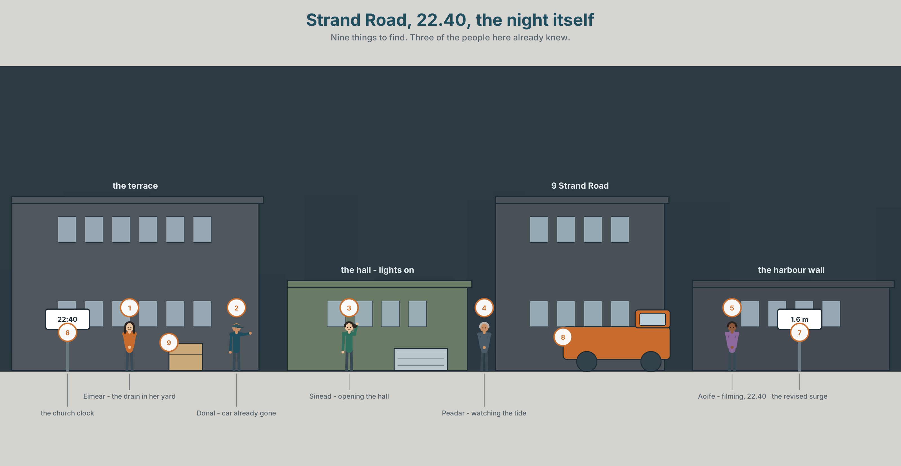{width=6.6in}

*Strand Road, 22.40, the night itself — Nine things to find. Three of the people here already knew.*

# What happened before that?

**By the end of this unit you can give a clear account of one night, with the events in the right
order. One hundred words.**

| ◆ **A · THE WORLD** | An inquiry, and the difference between what happened and what was known |
|---|---|
| ◆ **B · THE SYSTEM** | the past perfect · *by the time*, *already*, *before* · 23 words for cause and blame · 17 words for putting things in order · *had* as /həd/ and /əd/ |
| ◆ **C · THE PERFORMANCE** | A hundred words that put one night in the right order |

---

### 0A · Find it

**Find nine things in this picture.** It is the night, not the morning.

> the top road · a car being moved · the drain in the yard · the hall lights on ·
> a phone screen · a torch · the harbour wall · the tide line · the church clock

### 0B · Guess it

**Three of the people in this picture already knew.** Which three, and how?

### 0C · Say it ⏺

**Record thirty seconds.** *Think of something that went wrong. What had happened before it, that
nobody connected at the time?* You will record it again at the end of this unit.

---

## Part 1 · Vocabulary Lab 1 ◆ **B · THE SYSTEM**

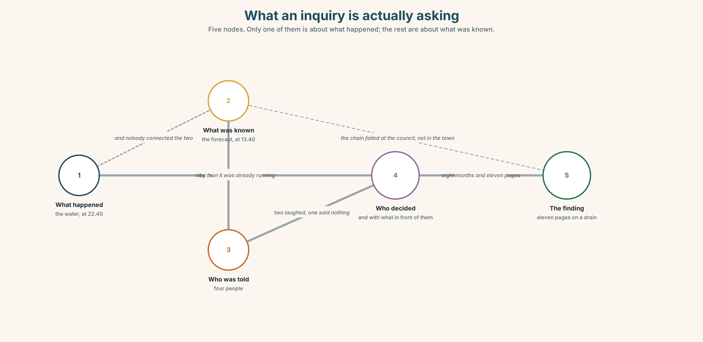{width=6.6in}

*What an inquiry is actually asking — Five nodes. Only one of them is about what happened; the rest are about what was known.*

### 1A · Meet — the words of an inquiry

Match each word to one place on the map.

> **cause** · **blame** · **fault** · **inquiry** · **evidence** · **witness** · **report** ·
> **record** · **official** · **responsible**

### 1B · Sort — a fact, a judgement, or a procedure?

Three columns.

> evidence · blame · inquiry · fault · witness · responsible · record · cause · minute · report

**One of them moves column the moment somebody writes it down.** Which?

### 1C · Meet — what people did and did not do

> **warn** · **ignore** · **decide** · **mistake**

**Warning somebody is not the same as being believed.** Which of the four is about the speaker,
and which about the listener?

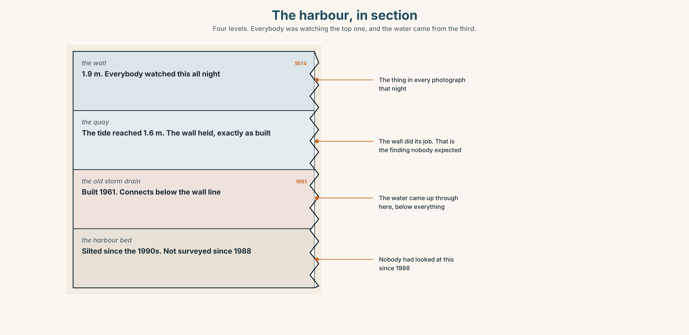{width=6.6in}

*The harbour, in section — Four levels. Everybody was watching the top one, and the water came from the third.*

**Look at the harbour, in section.** Four levels, and the water came from one of them.
**Which one, and which level was everybody watching?**

### 1D · Stretch — the phrases

Complete each one with one word.

1. The council has agreed to **look ______ it**.
2. They **put it ______ to** bad luck, because nobody wanted to say the word *drain*.
3. **At the ______** , it looked like an ordinary high tide.
4. **In ______** , the Thursday forecast was the whole story.
5. It took eleven months to **find ______** what had actually happened.

### 1E · The saying

> **f** **Nobody saw it coming.**

Four words that are almost always false, and almost always said in good faith.

> **Donal saw it coming.** Write the sentence he could say at the inquiry — and then write
> the reason he might not.

### 1F · Own it

Think of something that was predicted and ignored where you live. Tell a partner
**three sentences**: who said it, who did not listen, and what happened.

---

## Part 2 · Listening ◆ **A · THE WORLD**

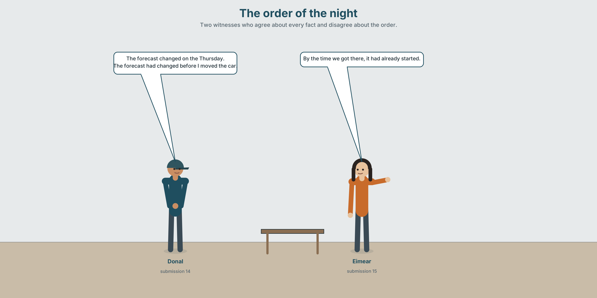{width=6.6in}

*The order of the night — Two witnesses who agree about every fact and disagree about the order.*

### 2A · The order of the night 🔊 Track 3.1

**Before you listen.** The inquiry wants to know who was warned and when.
**Guess: is the disagreement about the facts or about the order?**

**Listen once. One question.** What time did the drain reverse?

**Listen again. Put these in order.** Write 1 to 6.

> ☐ the hall opened · ☐ the drain reversed · ☐ Donal moved his car ·
> ☐ the forecast changed · ☐ the water reached the doors · ☐ Eimear decided not to use the sandbags

**Listen again. True or false?**

1. The forecast had already changed when Donal moved his car. ☐ T ☐ F
2. The hall had opened before the water reached the doors. ☐ T ☐ F
3. Eimear decided about the sandbags after Donal moved his car. ☐ T ☐ F
4. The drain reversed before anybody noticed the tide. ☐ T ☐ F

**Noticing.** Four sentences from the recording.

1. *The forecast changed on the Thursday.*
2. *The forecast had changed before he moved the car.*
3. *By the time we got there, it had already started.*
4. *She decided about the sandbags after he had moved it.*

**One of these is a plain past. Three put one past event before another.** Which is which?

### 2B · Decoding clinic 🔊 Track 3.2

Twenty-five seconds. Four jobs.

1. How many times can you hear *had*?
2. In *it had already started*, is *had* a full word or a sound on the end of *it*?
3. Catch the two times given.
4. One speaker corrects their own order. Where?

> Transcripts, page 152.

---

## Part 3 · Grammar Lab 1 ◆ **B · THE SYSTEM**

### The past before the past

### 3A · Notice

Look at the four sentences in Part 2.

1. Sentence 1 and sentence 2 are about the same forecast. **What does sentence 2 add?**
2. In sentence 3, which happened first — arriving, or starting?
3. In sentence 4, could you use a plain past? **Would anything be lost?**
4. **When do you actually need the past perfect?** Try: *First he moved the car. Then it flooded.*
5. Try *"By the time we got there, it already started."* **What is missing?**

### 3B · See

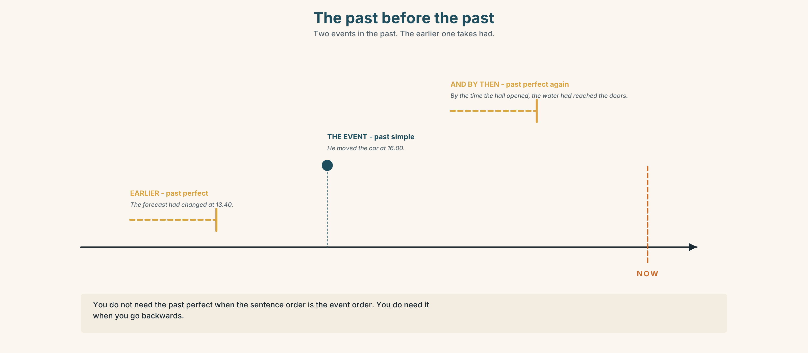{width=6.6in}

*The past before the past — Two events in the past. The earlier one takes had.*

Now look at the second picture. **Two events, one line. Which one gets the *had*?**

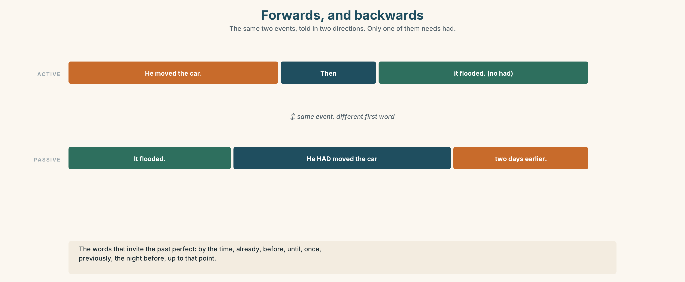{width=6.6in}

*Forwards, and backwards — The same two events, told in two directions. Only one of them needs had.*

### 3C · Know

| | Shape | Use it for |
|---|---|---|
| **past simple** | *moved, changed, decided* | events in the order they happened |
| **past perfect** | *had* + past participle | an event **before** the one you are already talking about |

> **You do not need it when the order is already clear.**
> ✓ *He moved the car. Then it flooded.* — the order is the sentence order.
> **You do need it when you go backwards.**
> ✓ *It flooded. He **had moved** the car two days earlier.*

> **The words that invite it:** *by the time · already · before · until · once · previously ·
> the night before · up to that point*

> **Watch out.** *had* is the auxiliary for everybody. ✗ *he hadded* ✓ *he had moved*
> And in speech it is almost never a full word: *it'd already started*.

> **Why it matters.** An inquiry is not asking what happened. It is asking **what had already
> happened when each person decided.**

### 3D · Use — controlled

> By the time the hall opened, the water (1) __________ (already / reach) the doors. Donal
> (2) __________ (move) his car on the Thursday, two days before, because the forecast
> (3) __________ (change) that morning. Eimear (4) __________ (decide) against the sandbags
> after he (5) __________ (move) it, and she says now that she
> (6) __________ (not know) the forecast (7) __________ (change) at all.

### 3E · Use — guided

Join each pair, putting the **earlier** event in the past perfect.

1. The forecast changed. / He moved the car.
2. The drain reversed. / Anybody noticed the tide.
3. She put the sandbags in the shed in 2019. / The water came in January.
4. The hall opened. / The first family arrived.
5. He warned four people. / Nobody acted.

### 3F · Use — open

**Tell a partner about something that went wrong** — anywhere, any time. Give the event first,
then go **backwards** to what had already happened. **Use *had* three times.**

### 3G · Check — six items

> 1. By the time we arrived, it ______ (already / start).
> 2. He moved the car because the forecast ______ (change).
> 3. She ______ (keep) the sandbags since 2019.
> 4. Up to that point nobody ______ (say) anything.
> 5. Once the drain ______ (reverse), there was nothing to be done.
> 6. The night ______ , he ______ (warn) four people.

**0–3 →** Workbook pp. 16–18. **4–5 →** Part 6. **6 →** page 63.

---

## Part 4 · Speaking ◆ **C · THE PERFORMANCE**

### 4A · Fluency starter — backwards

One learner names an event. The next must say what **had** happened before it.
The next goes one step further back. **Five steps, then stop.**

> *"The hall opened."* → *"The water had already reached the doors."* → *"The drain had
> reversed."* → …

### 4B · The functional core — giving an account

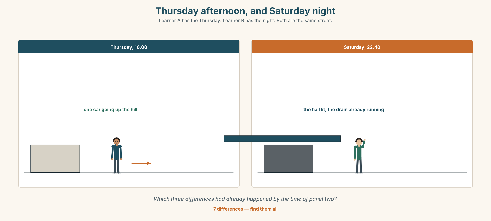{width=6.6in}

*Thursday afternoon, and Saturday night — Learner A has the Thursday. Learner B has the night. Both are the same street.*

**Language Bank**

| | |
|---|---|
| **the event** | *At about ten…* · *That was when…* |
| **before it** | *By then…* · *It had already…* · *The night before…* |
| **the order** | *Before that…* · *Afterwards…* · *Up to that point…* |
| **the honest gap** | *I don't know what had happened by then.* · *I only found out later.* |

**Role play.** Learner A is giving evidence. Learner B is asking the questions.
**Six minutes.** Learner B may only ask **when** and **what had happened by then**.

### 4C · The performance — one hundred seconds ⏺

Give an account of **one night** — real or from the unit. **One hundred seconds.** You must give:

> six events, in order · at least three things that had already happened ·
> one thing you did not know at the time

**Record it.**

### 4D · Observer

One person listens for **one thing**: could they draw the timeline from what they heard?

### 4E · Two criteria

> ☐ Did I use the past perfect at least three times?
> ☐ Is there one thing I did not know at the time, marked as such?

---

## Part 5 · Reading ◆ **A · THE WORLD**

### 5A · Predict

Two letters to the inquiry. The title is
**"Submissions 14 and 15."**
**What do you expect two neighbours to disagree about?** One sentence.

### 5B · Read — one hundred and ten seconds

---

**SUBMISSION 14 — D. Hegarty, 9 Strand Road**

I moved my car to the top road at about four on the Thursday afternoon. I did it because the
forecast had changed that morning — the surge had gone from 1.1 metres to 1.6 — and because the
yard drain had backed up twice in November.

I told four people. I am not going to say which four. Two of them laughed, and I want to be clear
that they laughed kindly and that I would have laughed too.

I am not submitting this to blame anybody. I am submitting it because the inquiry has asked
whether anybody was warned, and the honest answer is that four people were warned by me and at
least eleven were not warned by anybody, and the reason is that I did not want to be the man
knocking on doors about a forecast.

---

**SUBMISSION 15 — E. Nolan, 14 Strand Road**

I was one of the four.

I did not laugh. I thought about the sandbags and decided against them, and I decided against
them partly because of how the other two had reacted.

I want to record that Donal Hegarty was right and was treated as though he were being silly, and
that I joined in by saying nothing. That is the part I would like in the record, and I understand
that it is not evidence of anything.

I would also like to say that if he had knocked on eleven doors, I do not think it would have
made any difference, and I am saying that because I do not want this to become a story about one
man who should have done more.

---

### 5C · Answer

1. Why did Donal move his car? Give both reasons.
2. How many people did he tell, and how did two of them react?
3. **Why does he say he did not knock on more doors?**
4. What does Eimear say she did, and what does she say she did not do?
5. **What does she ask to have put in the record, and why does she say it is not evidence?**
6. What is her last point, and who is it protecting?

### 5D · Vocabulary in context

Guess from the text. Then check.

> surge · backed up · laughed kindly · joined in by saying nothing · would have made any difference

### 5E · The counter-text

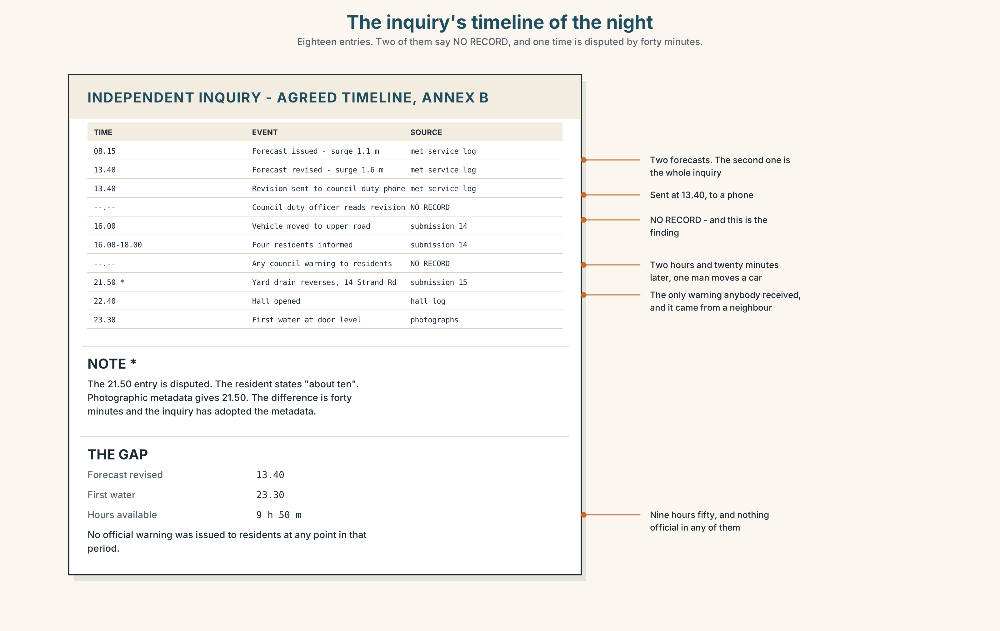{width=6.6in}

*The inquiry's timeline of the night — Eighteen entries. Two of them say NO RECORD, and one time is disputed by forty minutes.*

**Read the inquiry's timeline of the night and answer.**

1. What time did the forecast change, and what time did the drain reverse?
2. **How many hours were there between the forecast change and the first water?**
3. Which two entries are marked "no record"?
4. One entry has a footnote saying the time is disputed. Which, and by how much?

### 5F · Two texts

Donal's submission says the forecast changed **that morning**.
The inquiry timeline records the forecast change at **13.40**.

**Put those two facts together. Does it matter?** Two sentences.

---

## Part 6 · Vocabulary Lab 2 ◆ **B · THE SYSTEM**

### Putting things in order

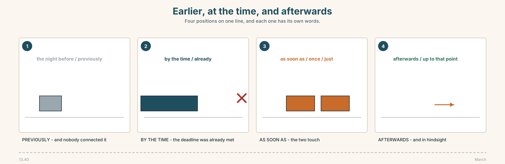{width=6.6in}

*Earlier, at the time, and afterwards — Four positions on one line, and each one has its own words.*

### 6A · Sort — earlier, same time, or later?

Three columns.

> before · after · already · by the time · previously · once · then · afterwards ·
> the night before · until · just · up to that point

### 6B · Chunk completion

1. **By the ______** we got there, it had started.
2. **As ______ as** the drain reversed, he knew.
3. He had moved it **the night ______** .
4. **Up to that ______** , nobody had said anything.
5. They **went back ______** the forecasts for the whole week.
6. **It had ______ started** when the hall opened.

### 6C · Two that look the same

**before** and **by the time** both put one thing earlier. They are not interchangeable.

> *He moved it **before** the forecast changed.* — one thing, then the other.
> ***By the time** the forecast changed, he had moved it.* — the deadline, and it was already met.

**Rewrite these three with *by the time*.**

1. He had already left when she phoned.
2. The hall was full when the last family arrived.
3. Nobody had read the notice when the vote was taken.

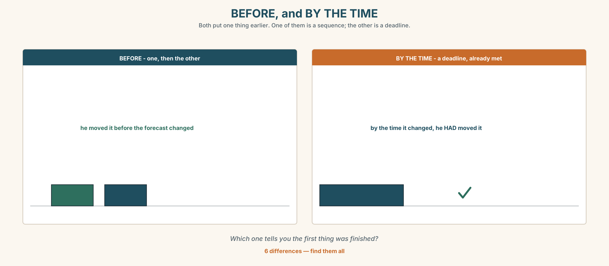{width=6.6in}

*BEFORE, and BY THE TIME — Both put one thing earlier. One of them is a sequence; the other is a deadline.*

**Six differences.** Find them, then answer the question under the picture.

### 6D · Contrast Clinic — past simple or past perfect

Six items. Choose, and say why.

1. He ______ (move) the car on Thursday. Then it ______ (flood).
2. It ______ (flood) on Saturday. He ______ (move) the car two days earlier.
3. By the time we ______ (arrive), they ______ (go).
4. She ______ (keep) the sandbags since 2019 and never ______ (use) them.
5. Once the drain ______ (reverse), it ______ (be) too late.
6. I ______ (not know) the forecast ______ (change).

---

## Part 7 · Pronunciation & Fluency Lab ◆ **B · THE SYSTEM**

### The word that attaches itself

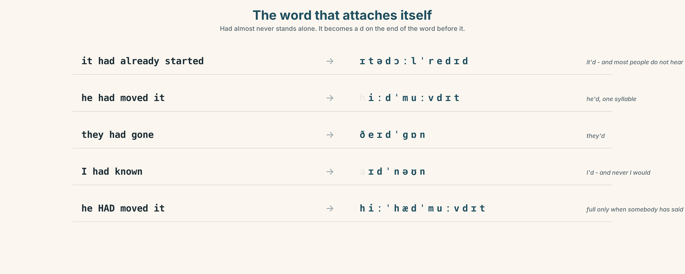{width=6.6in}

*The word that attaches itself — Had almost never stands alone. It becomes a d on the end of the word before it.*

### 7A · Hear 🔊 Track 3.3

> it had already started → *it'd already started* → /ɪtədɔːlˈredi/
> he had moved it → *he'd moved it* → /hiːdˈmuːvdɪt/
> they had gone → *they'd gone* → /ðeɪdˈɡɒn/
> I had known → *I'd known* → /aɪdˈnəʊn/

### 7B · Say

Say each one. Then say the sentence three times, faster:

> *By the time we got there, it had already started.*

### 7C · Make it mean something

Say these two:

> *He HAD moved it.* *(somebody has just said he did not)*
> *He'd moved it.* *(plain — this is just the order of events)*

**The first one is an argument.** Who is it with?

### 7D · Fluency 20 ⏺

Twenty seconds: **three things that had already happened before you got up this morning.**
Three times, faster.

---

## Part 8 · Writing ◆ **C · THE PERFORMANCE**

### An account of one night · 100 words

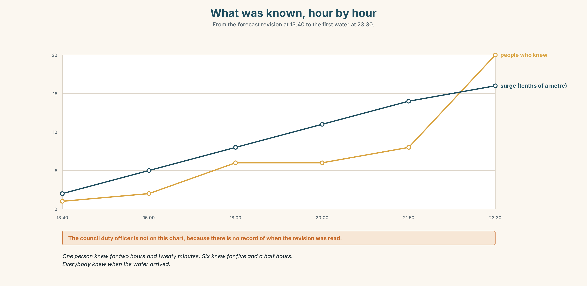{width=6.6in}

*What was known, hour by hour — From the forecast revision at 13.40 to the first water at 23.30.*

### 8A · Read the model

> At about ten the drain in my yard started running the wrong way. By then the tide had been
> rising for two hours and the forecast had been revised twice, though I did not know that until
> March. `[the event, then straight backwards — and one thing marked as learned afterwards]`
>
> I had kept sandbags in the shed since 2019. I did not put them out. Donal had moved his car two
> days earlier and two people had laughed, and I had said nothing.
> `[three past perfects in a row, and they are doing the real work of the paragraph]`
>
> The water reached the floor at about half past eleven. Everything after that is in the record.
> `[the plain past returns for the main line, and the writer stops]`

**Questions about the writer's choices:**

1. The second paragraph is entirely past perfect. **What is it for?**
2. The last line hands the rest over to the record. **Why end there?**

### 8B · The anti-model

> It was a terrible night. The water came in very quickly and everybody was shocked. We did what
> we could but there was nothing anybody could have done. Nobody saw it coming.

Correct English. **Name two things it does not tell an inquiry** — and one thing it quietly
claims.

### 8C · Plan

> the event, with a time → what had already happened by then → what you had and had not done →
> back to the plain past for the end

### 8D · Write — 100 words
### 8E · Peer review — two criteria

> ☐ Could a reader draw the timeline?
> ☐ Is there one thing the writer learned afterwards, marked as such?

### 8F · Write it again · 8G · Publish

On the wall, with the inquiry timeline from Part 5E beside it.

---

## Part 9 · The File ◆ **A · THE WORLD + C · THE PERFORMANCE**

# CULTURE FILE · Hospitality and Obligation

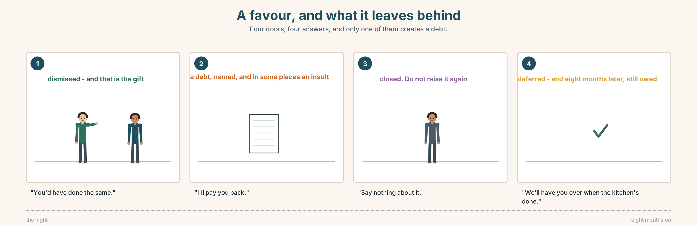{width=6.6in}

*A favour, and what it leaves behind — Four doors, four answers, and only one of them creates a debt.*

### 9A · Four doors 🔊 Track 3.4

On the night, four families took other families in. **Listen to four of them, eight months later.**

1. Which one says it was nothing?
2. Which one is still slightly uncomfortable?
3. **Which one has been thanked too much, and what has that done?**

### 9B · What is owed, and when

In some places a favour creates a debt that must be returned. In others, saying so is the insult.

**Where do these four sit?**

> *"You'd have done the same."* · *"I'll pay you back."* · *"Say nothing about it."* ·
> *"We'll have you over when the kitchen's done."*

### 9C · Refusing help

Refusing help is also a social act, and it is read.

**What does each of these say?**

1. *"We're grand, honestly."*
2. *"There's people worse off."*
3. *"I'd rather not, if you don't mind."*
4. *"Ask Peadar first."*

### 9D · Your turn

In pairs. **One of you offers help. The other does not want it but does need it.**
**Four minutes.** Neither of you may use the word *no*. **Then swap.**

### 9E · Transfer

**In your own culture: how do you thank somebody for something too large to thank them for?**
Write one sentence. Bring it.

---

## Part 10 · Mediation & Interaction ◆ **C · THE PERFORMANCE**

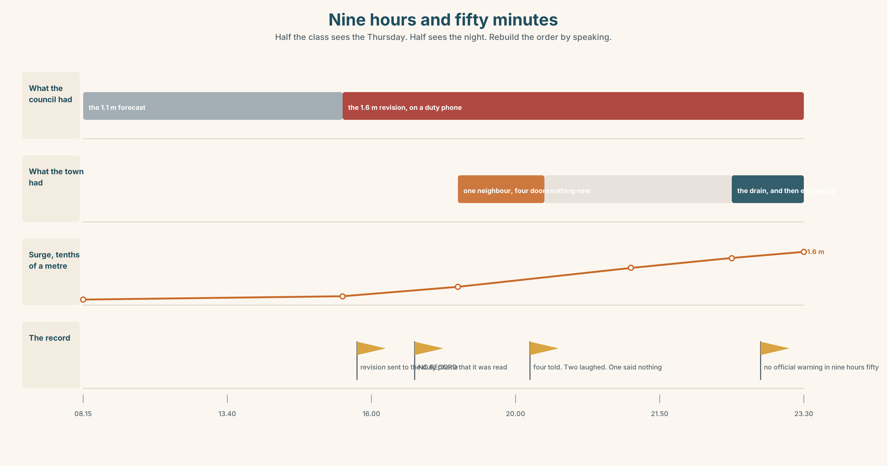{width=6.6in}

*Nine hours and fifty minutes — Half the class sees the Thursday. Half sees the night. Rebuild the order by speaking.*

### 10A · Relay

Half the class sees the Thursday. Half sees the Saturday night. **Rebuild the order by
speaking.** Ten minutes.

### 10B · Simplify

Explain the inquiry timeline from Part 5E to somebody who was not in the town.
**Four sentences only.**

> **Plan:** what changed first → what nobody noticed → when the water came → what is disputed

### 10C · Compress

Donal's submission into **thirty words**, without losing the reason he gives.

### 10D · Online

Write **one message** to the inquiry's public inbox: you were told, you did nothing, and you
want that on the record without it becoming a story about one person.

### 10E · Your language

How does your language go backwards in time? **Is there a tense like the past perfect,
or do you use words like *before* and *already*?** Show a partner both.

---

## Part 11 · The Decision ◆ **C · THE PERFORMANCE**

# Saying it in that room

The inquiry asks: was anybody warned? Donal warned four people. Two of them laughed. The inquiry
sits in the community hall, and those two will be in it.

- **Say it all.** Who he told, and who laughed. It is true and it is what was asked.
- **Say he told people.** No names, no laughing. The answer is still honest.
- **Say nothing.** Let the official record say nobody was warned. He has to live here.

### 11A · The evidence

1. **The inquiry timeline** from Part 5E — and the two entries marked "no record".
2. **The chart** — what was known, by whom, hour by hour.
3. **The voice.** Eimear, twenty seconds: *"If he names them, this becomes a story about two
   people who laughed, and it is not that story. If he names nobody, it becomes a story about
   nobody knowing, and it is not that either."*

### 11B · Talk about it

In threes. Everybody says one. Use the frame.

> *I think Donal should ______ , because ______ .*

**Words you can use:** *evidence · witness · blame · fault · responsible · record · official · in hindsight*

### 11C · Decide

Write **two sentences**. Choose, and say why.

> I think Donal should ______________________ ,
> because ______________________ .

### 11D · Model decision

> He should say that four people were told and that he will not name them, and say out loud, in
> the room, that he is not naming them because the question the inquiry is really asking is not
> about four people. Refusing in public is not the same as hiding. It puts the warning in the
> record and keeps the inquiry pointed at the drain.

### 11E · The Reveal

> **What happened.** He said four people were told and declined to name them. The chair accepted
> it without comment and moved on in under a minute.
>
> One of the two who had laughed stood up at the end and named herself, which nobody had asked
> for and which Donal says he wishes she had not done, because it made the hall go quiet and
> because it turned out to be the only part of the day anybody remembered.
>
> The final report found that the warning chain had failed at the council, not in the town. It
> does not mention Donal. The eleven-page section on the storm drain does not mention anybody.

**He kept the names out. Somebody put one back in. And the report was about a drain.**

> **Was it the right decision?** Say why — and say what you think of what she did.

---

## Part 12 · Landing ◆ **all three lines**

### 12A · Recycle — ten items

> 1. By the time we arrived, it ______ (already / start).
> 2. He moved it because the forecast ______ (change).
> 3. They agreed to **look ______ it** .
> 4. **In ______** , the Thursday forecast was the whole story.
> 5. It took eleven months to **find ______** .
> 6. *(Unit 2)* We ______ (wait) since June.
> 7. *(Unit 2)* I ______ (phone) him four times.
> 8. *(Unit 1)* If I ______ you, I wouldn't wait.
> 9. *(A2.1 U2)* It was raining ______ he left the farm.
> 10. *(A2.1 U3)* I ______ (use) to live on this road.

### 12B · Consolidate

**One hundred words.** One night, in order. Six events, three past perfects, and one thing you
only found out afterwards.

### 12C · Can-do, with evidence

| I can… | My evidence | Sure? |
|---|---|---|
| put one past event before another | Part 3G score | ◯ ◑ ● |
| give a clear account of a night in a hundred seconds | Part 4C recording | ◯ ◑ ● |
| write a hundred words a reader could draw | Part 8 draft 2 | ◯ ◑ ● |
| offer and refuse help without saying no | Part 9D role play | ◯ ◑ ● |

### 12D · Replay ⏺

Find your thirty seconds from Part 0C. Listen. **Record it again.**
One sentence: what is different?

### 12E · Glossary — forty items, as a map

> **THE QUESTION** · cause · blame · fault · responsible · mistake · in hindsight
> **THE PROCESS** · inquiry · evidence · witness · report · record · minute · official · look into · find out
> **WHAT PEOPLE DID** · warn · ignore · decide · at the time · put down to · nobody saw it coming
> **EARLIER** · earlier · previous · previously · before · the night before · already · had · it had already started
> **THE MOMENT** · by · by the time · as soon as · once · just · until · up to that point
> **AFTER** · after · then · afterwards · go back over

### 12F · Next

> **Unit 4 · What did they actually say?**

# A2.2 · Unit 4 · Forty Minutes Apart

> **English Animated** · *Telling the Story* · Ballinmore, west coast of Ireland
> Student's Book pages 72–93 · 22 pp · ~10 hours

---

## Part 0 · The Big Picture ◆ **A · THE WORLD**

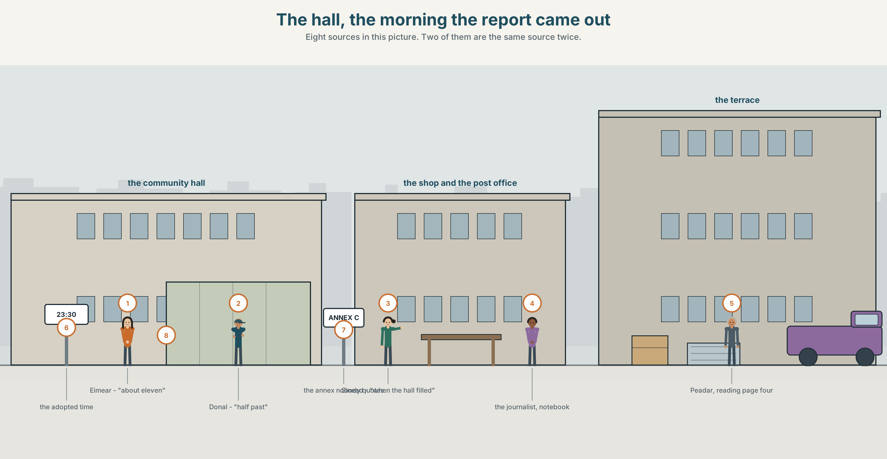{width=6.6in}

*The hall, the morning the report came out — Eight sources in this picture. Two of them are the same source twice.*

# What did they actually say?

**By the end of this unit you can report three people's accounts of the same event, accurately
and without judging any of them.**

| ◆ **A · THE WORLD** | Three honest people, one event, and forty minutes between them |
|---|---|
| ◆ **B · THE SYSTEM** | reported statements · reporting verbs · 23 words for claims and sources · 17 verbs for saying things · where the stress falls when you report |
| ◆ **C · THE PERFORMANCE** | Three accounts, relayed fairly, in writing |

---

### 0A · Find it

**Find eight sources in this picture.** Two of them are the same source twice.

> a notebook · a phone recording · a photograph · a printed statement · a letter ·
> a noticeboard · a person talking · a screen showing a broadcast

### 0B · Guess it

**Two of these sources will agree with each other and still both be wrong.** Which two, and why?

### 0C · Say it ⏺

**Record thirty seconds.** *Think of something you were told recently. Who told you, and how do
you know they knew?* You will record it again at the end of this unit.

---

## Part 1 · Vocabulary Lab 1 ◆ **B · THE SYSTEM**

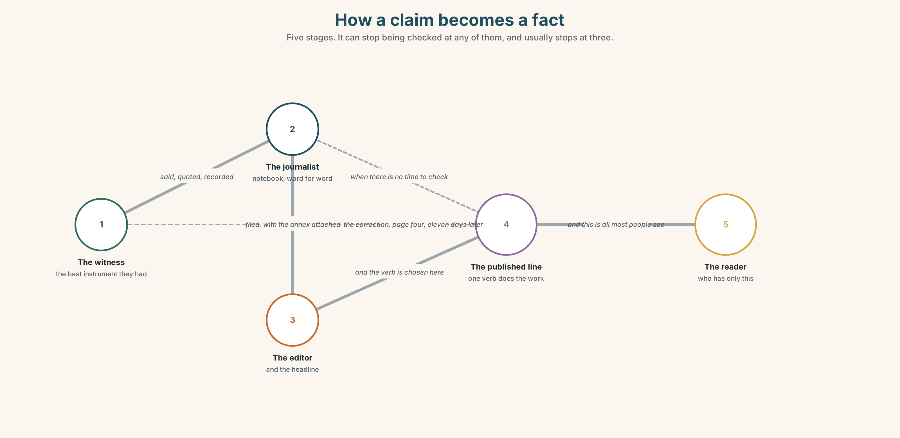{width=6.6in}

*How a claim becomes a fact — Five stages. It can stop being checked at any of them, and usually stops at three.*

### 1A · Meet — the words of a claim

Match each word to one place on the map.

> **claim** · **source** · **quote** · **statement** · **account** · **version** ·
> **evidence** · **footage** · **journalist** · **editor**

### 1B · Sort — the thing said, the person, or the test?

Three columns.

> claim · source · journalist · accurate · account · editor · exact · version · trust · doubt

**One of them is in two columns at once.** Which?

### 1C · Meet — three things you do to a claim

> **deny** · **confirm** · **doubt**

**Denying is not the same as disproving.** Which of the three can be done without any
information at all?

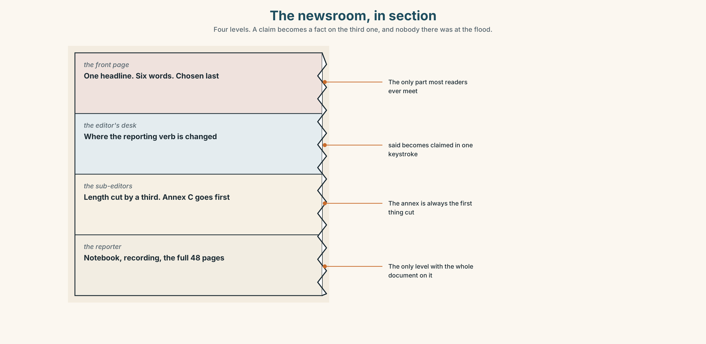{width=6.6in}

*The newsroom, in section — Four levels. A claim becomes a fact on the third one, and nobody there was at the flood.*

**Look at the newsroom, in section.** Four levels, four decisions.
**At which level does a claim become a fact, and who is standing there?**

### 1D · Stretch — the phrases

Complete each one with one word.

1. **According ______** the inquiry, the surge peaked at 1.6 metres.
2. He said it **off the ______** , which means you cannot print it.
3. She wrote it down **word for ______** , and that is why it is useful.
4. Nobody has **the full ______** , and nobody ever will.
5. The paper has printed a **______** and the editor has apologised.

### 1E · The saying

> **f** **That's what she said.**

Five words that pass responsibility along. **Say them twice:** once as an honest report,
once as a way of not being blamed. **What changes?**

### 1F · Own it

Think of something you believe that you have never checked. Tell a partner **three sentences**:
what it is, who told you, and how you would find out.

---

## Part 2 · Listening ◆ **A · THE WORLD**

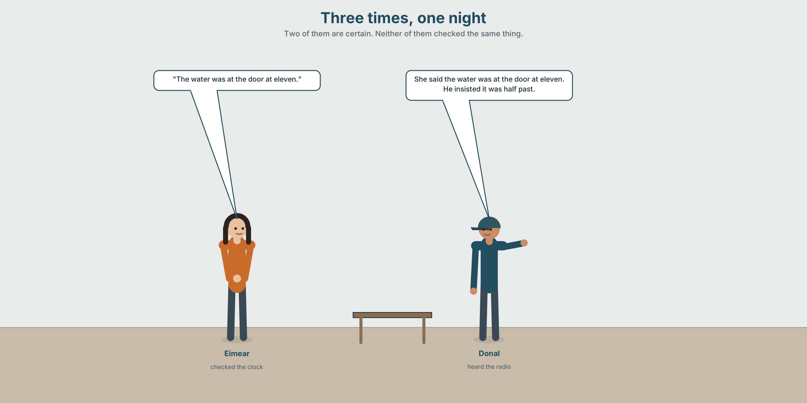{width=6.6in}

*Three times, one night — Two of them are certain. Neither of them checked the same thing.*

### 2A · Three times, one night 🔊 Track 4.1

**Before you listen.** Three people say when the water reached the doors. They are forty minutes
apart. **Guess: does any of them sound uncertain?**

**Listen once. One question.** What three times are given?

**Listen again. Complete the table.**

| | Time they give | What they were doing | How sure they sound |
|---|---|---|---|
| Eimear | | | |
| Donal | | | |
| Sinéad | | | |

**Listen again. True or false?**

1. All three were in different places. ☐ T ☐ F
2. One of them checked a clock. ☐ T ☐ F
3. One of them is reporting what somebody else said. ☐ T ☐ F
4. All three are equally confident. ☐ T ☐ F

**Noticing.** Four sentences from the recording.

1. *"The water was at the door at eleven."*
2. *She said the water was at the door at eleven.*
3. *She said that she had checked the clock.*
4. *He insisted it was half past.*

**Two are the words themselves. Two are somebody reporting them.**
**And one of the reporting verbs is not neutral.** Which?

### 2B · Decoding clinic 🔊 Track 4.2

Twenty-five seconds. Four jobs.

1. How many reporting verbs can you hear?
2. In *she SAID that*, which word is stressed?
3. Catch the three times.
4. One speaker changes a reporting verb halfway through. Which, and to what?

> Transcripts, page 153.

---

## Part 3 · Grammar Lab 1 ◆ **B · THE SYSTEM**

### Moving somebody's words

### 3A · Notice

Look at the four sentences in Part 2.

1. In sentence 1, what tense is *was*? In sentence 2?
2. Sentence 3 has *had checked*. **What did she actually say?**
3. *said* and *insisted* both report. **What does *insisted* add that *said* does not?**
4. **When does the tense not need to move back?** Try: *She said the drain is still blocked.*
5. Try *"She said me that she had checked."* **What is wrong?**

### 3B · See

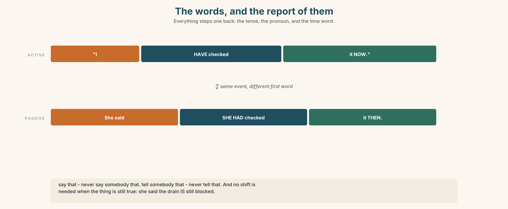{width=6.6in}

*The words, and the report of them — Everything steps one back: the tense, the pronoun, and the time word.*

Now look at the second picture. **The ladder runs from neutral to loaded.
Where would you put *claimed*?**

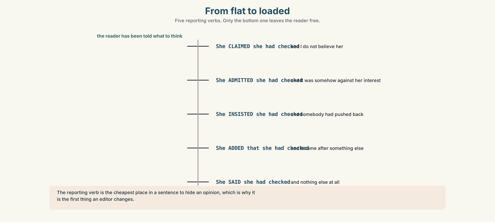{width=6.6in}

*From flat to loaded — Five reporting verbs. Only the bottom one leaves the reader free.*

### 3C · Know

| Direct | Reported |
|---|---|
| *"The water **is** at the door."* | She said the water **was** at the door. |
| *"I **checked** the clock."* | She said she **had checked** the clock. |
| *"I **will** phone you."* | She said she **would** phone me. |
| *"I **can** see it."* | She said she **could** see it. |

> **Everything shifts one step back**, and so do *I/you*, *here/there*, *now/then*,
> *today/that day*.

> **say** and **tell** are not the same shape.
> ✓ *She **said that** she had checked.* ✓ *She **told me that** she had checked.*
> ✗ *She said me…* ✗ *She told that…*

> **You do not have to shift** if the thing is still true.
> ✓ *She said the drain **is** still blocked.* — because it is.

> **The reporting verb is never neutral for long.** *said* is the flat one.
> *insisted*, *claimed*, *admitted* and *revealed* all add a judgement, and a reader hears it.

### 3D · Use — controlled

> Eimear said the water (1) __________ (be) at the door at eleven and that she
> (2) __________ (check) the clock. Donal insisted it (3) __________ (be) half past. Sinéad
> told the inquiry that she (4) __________ (not look) at a clock at all and that she
> (5) __________ (go) by when the hall filled. The report added that the photographs
> (6) __________ (show) 23.30, and went on to say that it (7) __________ (adopt) that time.

### 3E · Use — guided

Report each one. **Use a different reporting verb each time.**

1. *"I checked the clock."* — Eimear
2. *"It was half past, not eleven."* — Donal
3. *"I didn't look at a clock."* — Sinéad
4. *"We have adopted the photographic time."* — the inquiry
5. *"I'm not going to comment on that."* — the council

### 3F · Use — open

**Interview a partner for two minutes** about something they did last week. **Then report
three things they said to a third person**, who checks your report with them.

### 3G · Check — six items

> 1. *"I am tired."* → She said she ______ tired.
> 2. *"I checked it."* → He said he ______ it.
> 3. *"I will phone."* → She said she ______ phone.
> 4. She ______ me that she had seen it. *(said / told)*
> 5. *"The drain is still blocked."* → He said the drain ______ still blocked.
> 6. *"I didn't say that."* → She ______ saying it. *(use *deny*)*

**0–3 →** Workbook pp. 22–24. **4–5 →** Part 6. **6 →** page 85.

---

## Part 4 · Speaking ◆ **C · THE PERFORMANCE**

### 4A · Fluency starter — the relay

Three learners. A tells B something. B reports it to C. C reports it back to A.
**Thirty seconds each.** A says what changed.

**Four rounds, and after each one the group names the verb that did the damage.**

### 4B · The functional core — relaying fairly

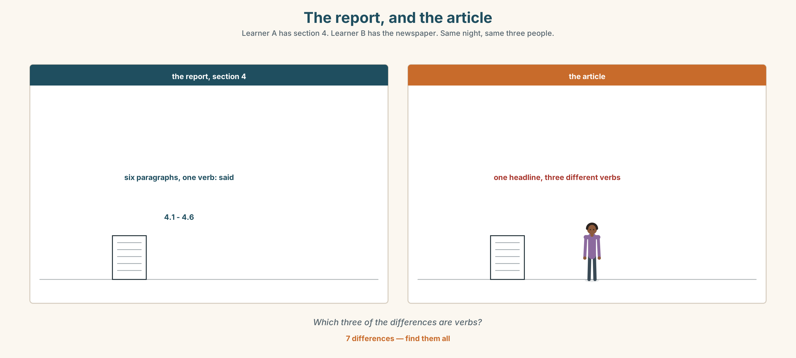{width=6.6in}

*The report, and the article — Learner A has section 4. Learner B has the newspaper. Same night, same three people.*

**Language Bank**

| | |
|---|---|
| **flat reporting** | *She said that…* · *He told me that…* · *According to…* |
| **marking certainty** | *She was sure that…* · *He thought, but wasn't certain, that…* |
| **marking the source** | *She had checked a clock.* · *He was going by the hall filling up.* |
| **refusing to judge** | *Both of them are honest about this.* · *I can't reconcile the two.* |

**Role play.** Learner A interviews. Learner B is a witness who is confident and wrong.
**Six minutes.** Learner A must not say *are you sure?*

### 4C · The performance — one hundred seconds ⏺

Report **three accounts of one event**. **One hundred seconds.** You must give:

> what each person said · how each one knew · where they disagree ·
> which you would put in a report, and why

**Record it.**

### 4D · Observer

One person listens for **one thing**: did any reporting verb take a side?

### 4E · Two criteria

> ☐ Did I shift the tenses where I needed to?
> ☐ Did I report how each person knew, not just what they said?

---

## Part 5 · Reading ◆ **A · THE WORLD**

### 5A · Predict

An extract from the inquiry's report. The title is
**"Section 4: reconciling the accounts."**
**What do you expect an official report to do with three different times?** One sentence.

### 5B · Read — one hundred and ten seconds

---

**SECTION 4: RECONCILING THE ACCOUNTS**

**4.1** Three residents gave times for the first water at door level. The times differ by forty
minutes. All three accounts are accepted as honest.

**4.2** Resident A stated that the water was at her door at eleven. She told the inquiry that she
had checked the kitchen clock. The inquiry notes that this clock was later found to be eleven
minutes fast.

**4.3** Resident B insisted that it was half past eleven. He said that he had not looked at a
clock but that he had been listening to a radio programme which he knew ended at half past. The
programme in fact ended at 23.15.

**4.4** Resident C said that she had not checked the time at all and went by the point at which
the hall was full. Hall records show the hall reached capacity at 23.25.

**4.5** Photographic metadata gives 23.30. The inquiry has adopted this time.

**4.6** The inquiry wishes to record that it does not regard any of the three accounts as
unreliable. Each witness used the best instrument available to them, and in each case the
instrument was wrong by between five and twenty minutes. This is normal. An account that matched
the metadata exactly would be more unusual than these three, and would deserve more scrutiny,
not less.

---

### 5C · Answer

1. How far apart are the three times?
2. **What was wrong with Resident A's clock, and by how much?**
3. How did Resident B know the time, and what was the error there?
4. What did Resident C use instead of a clock?
5. What time has the inquiry adopted, and from what source?
6. **What is the point of paragraph 4.6?** Put it in your own words.

### 5D · Vocabulary in context

Guess from the text. Then check.

> reconciling · capacity · metadata · the best instrument available · deserve more scrutiny

### 5E · The counter-text

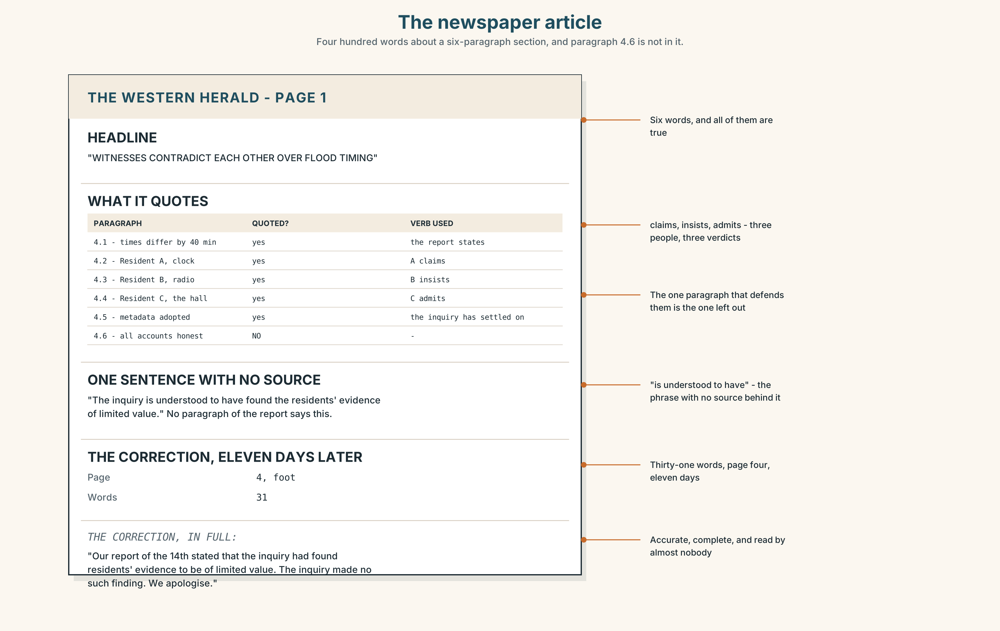{width=6.6in}

*The newspaper article — Four hundred words about a six-paragraph section, and paragraph 4.6 is not in it.*

**Read the newspaper article about the same section and answer.**

1. What is the headline, and what does it imply?
2. **Which paragraph of the report is quoted, and which is left out?**
3. Which reporting verb does the article use for each resident?
4. One sentence attributes a view to "the inquiry" that the report does not contain. Find it.

### 5F · Two texts

The report says all three accounts are **accepted as honest**.
The article's headline says **"Witnesses contradict each other."**

**Put those two facts together. Is the headline false?** Two sentences.

---

## Part 6 · Vocabulary Lab 2 ◆ **B · THE SYSTEM**

### Verbs that report, and what they smuggle in

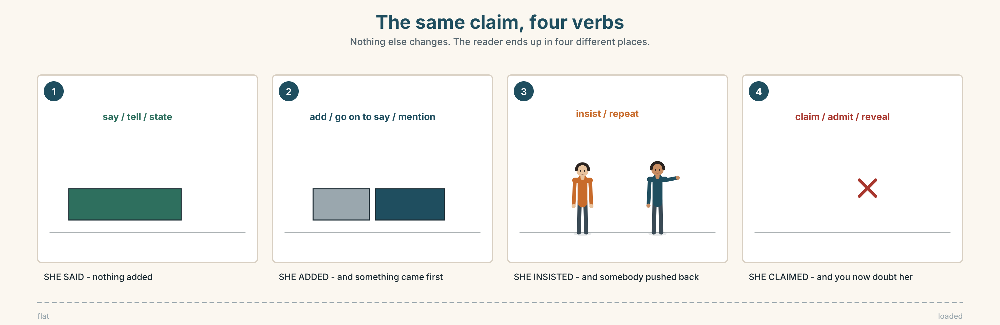{width=6.6in}

*The same claim, four verbs — Nothing else changes. The reader ends up in four different places.*

### 6A · Sort — neutral, or loaded?

Two columns.

> say · tell · state · add · mention · repeat · insist · admit · reveal · reply · announce

**One of them is neutral in a report and loaded in a newspaper.** Which?

### 6B · Chunk completion

1. She **told me ______** she had checked it.
2. He **said ______** he had not looked at a clock.
3. The inquiry **went on ______ say** that it had adopted the metadata.
4. The council **refused to ______** .
5. He **pointed ______** that the programme ended at 23.15.
6. She said it was about eleven, **or words to that ______** .

### 6C · Three that change the reader's mind

**admitted · revealed · claimed**

Each one tells the reader what to think before they have read the content.

**Rewrite each of these three with a neutral verb, and say what is lost — and what is gained.**

1. She admitted that she had checked a clock.
2. He revealed that the programme ended at 23.15.
3. She claimed that the hall was full by then.

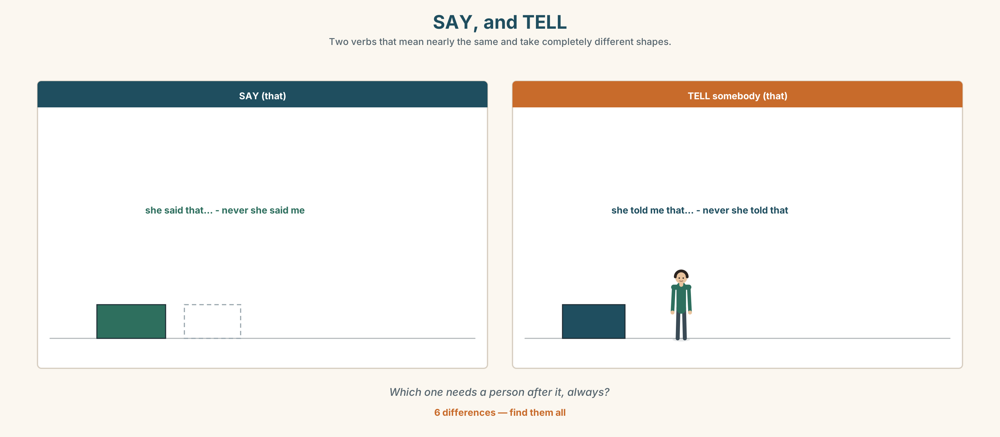{width=6.6in}

*SAY, and TELL — Two verbs that mean nearly the same and take completely different shapes.*

**Six differences.** Find them, then answer the question under the picture.

### 6D · Contrast Clinic — report it

Six items. Report each one, shifting what needs to shift.

1. *"I am at the door."*
2. *"I checked it twice."*
3. *"I will send it tomorrow."*
4. *"I can't remember."*
5. *"The drain is still blocked."* *(and it is)*
6. *"I didn't say that."*

---

## Part 7 · Pronunciation & Fluency Lab ◆ **B · THE SYSTEM**

### Where the stress goes when you report

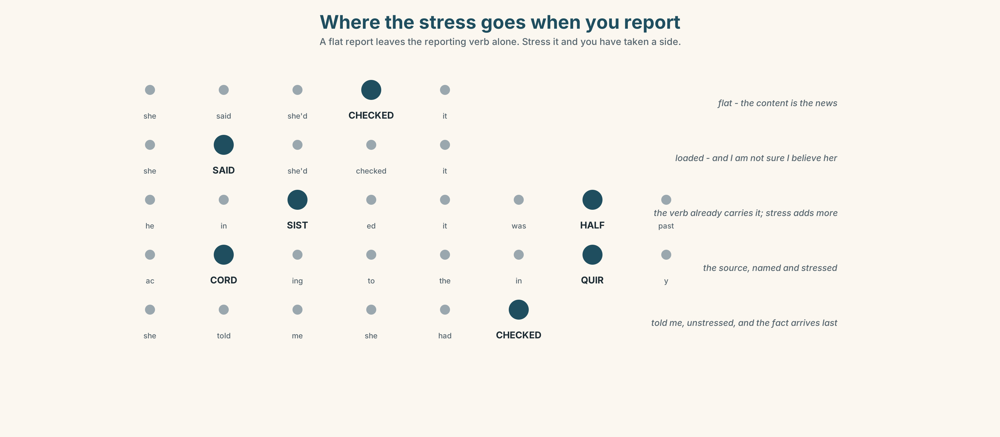{width=6.6in}

*Where the stress goes when you report — A flat report leaves the reporting verb alone. Stress it and you have taken a side.*

### 7A · Hear 🔊 Track 4.3

> She **said** she'd checked it. — flat: this is just a report
> She **SAID** she'd checked it. — loaded: and I am not sure I believe her
> She said she'd **CHECKED** it. — the content is the news

### 7B · Say

Say all three. Then say this one with the stress in three different places:

> *He insisted it was half past.*

### 7C · Make it mean something

Say these two:

> *He SAID it was half past.* *(and we now know it was not)*
> *He said it was HALF PAST.* *(and that is the fact I am passing on)*

**Which one would you use in a report, and which in a conversation afterwards?**

### 7D · Fluency 20 ⏺

Twenty seconds: **three things somebody told you this week, reported flatly.**
Three times, faster, with no stress on the reporting verb.

---

## Part 8 · Writing ◆ **C · THE PERFORMANCE**

### Three accounts · 100 words

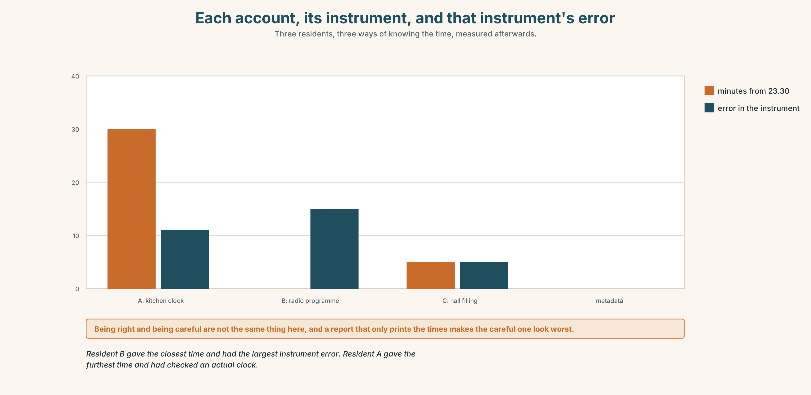{width=6.6in}

*Each account, its instrument, and that instrument's error — Three residents, three ways of knowing the time, measured afterwards.*

### 8A · Read the model

> Three residents gave times for the first water. They differ by forty minutes. `[the
> disagreement is stated first, flatly, before any of the accounts]`
>
> Resident A said she had checked her kitchen clock. Resident B said he had been listening to a
> programme he knew ended at half past. Resident C said she had gone by the hall filling up.
> `[three identical reporting verbs, and the difference is in how each one knew]`
>
> The clock was eleven minutes fast, the programme ended at 23.15, and the hall filled at 23.25.
> All three were using the best instrument they had. `[the corrections, and then a sentence that
> refuses to make any of them the liar]`

**Questions about the writer's choices:**

1. The same verb, *said*, three times. **Is that poor writing?**
2. The last sentence is a judgement. **Is it the right kind?**

### 8B · The anti-model

> There is a lot of confusion about what time the water arrived. One resident claims it was
> eleven, while another insists it was half past. A third admits she did not check. The truth is
> hard to establish.

Correct English, and three people have been quietly convicted. **Find the three verbs that do
it**, and say what each one implies.

### 8C · Plan

> the disagreement, in one line → each account, with the same verb → how each one knew →
> the corrections → one sentence that does not pick a liar

### 8D · Write — 100 words
### 8E · Peer review — two criteria

> ☐ Is every reporting verb carrying the same weight?
> ☐ Does the reader learn how each person knew?

### 8F · Write it again · 8G · Publish

On the wall, with the newspaper article from Part 5E beside it.

---

## Part 9 · The File ◆ **A · THE WORLD + C · THE PERFORMANCE**

# WORK FILE · The Safety Brief

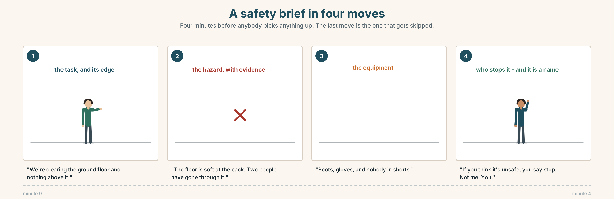{width=6.6in}

*A safety brief in four moves — Four minutes before anybody picks anything up. The last move is the one that gets skipped.*

### 9A · Four minutes before anybody moves 🔊 Track 4.4

Volunteers are about to clear a flooded building. **Listen to the brief.**

1. What are the three hazards named?
2. **What is the one instruction that is not about equipment?**
3. Who is named as the person to stop the work, and why is a name given?

### 9B · The shape of a brief

> what we are doing · what will hurt you · what to wear · who stops the work

Match each to one phrase.

> *"We're clearing the ground floor and nothing above it."* ·
> *"The floor is soft at the back. Two people have gone through it."* ·
> *"Boots, gloves, and nobody in shorts."* ·
> *"If you think it's unsafe, you say stop. Not me. You."*

### 9C · Reporting it to somebody who missed it

A volunteer arrives twenty minutes late. **Report the brief to them in four sentences**,
using reported speech. **You must not leave out the hazard.**

### 9D · Your turn

In pairs. **One of you gives a four-point brief for any task. The other arrives late and is
briefed second-hand by a third person.** Then check: what was lost?

### 9E · Transfer

**Find one set of safety instructions this week** — a label, a sign, a leaflet.
**Report it to somebody in three sentences.** Bring both.

---

## Part 10 · Mediation & Interaction ◆ **C · THE PERFORMANCE**

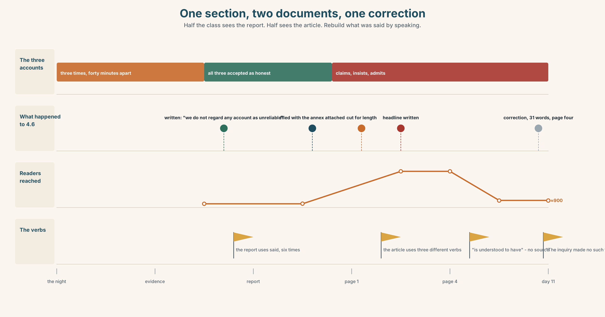{width=6.6in}

*One section, two documents, one correction — Half the class sees the report. Half sees the article. Rebuild what was said by speaking.*

### 10A · Relay

Half the class sees the report section. Half sees the newspaper article.
**Rebuild what was actually said by speaking.** Ten minutes.

### 10B · Simplify

Explain the newspaper article from Part 5E to the three residents it is about.
**Four sentences only.**

> **Plan:** what it says → what the report says → what it left out → what you would ask for

### 10C · Compress

Section 4 of the report into **thirty-five words**, without taking a side.

### 10D · Online

Write **one message** to the newspaper: you are one of the three, the headline is misleading,
and you are asking for one specific thing.

### 10E · Your language

How does your language report speech? **Do the tenses shift back, or do you keep the original
words?** Report *"I checked the clock"* in both languages and compare.

---

## Part 11 · The Decision ◆ **C · THE PERFORMANCE**

# One time goes in the report

Three accounts, forty minutes apart, all honest. The report can carry one time in its summary.

- **23.30, the metadata.** The most accurate instrument. It is also the only one with no person
  behind it.
- **A range: 23.00 to 23.40.** Honest about the uncertainty. Harder to use, and a range in a
  summary tends to be read as its lowest number.
- **All three, named, with their instruments.** Six lines instead of one. Nobody is wrong, and
  nobody can quote it.

### 11A · The evidence

1. **The newspaper article** from Part 5E — and what it quoted.
2. **The chart** — each account, its instrument, and that instrument's error.
3. **The voice.** The inquiry chair, twenty seconds: *"A summary that cannot be quoted is not a
   summary. But a time that nobody in that town recognises is not a finding either, and I have
   written both and I do not like either of them."*

### 11B · Talk about it

In threes. Everybody says one. Use the frame.

> *I think the report should give ______ , because ______ .*

**Words you can use:** *accurate · exact · account · version · source · evidence · trust · doubt*

### 11C · Decide

Write **two sentences**. Choose, and say why.

> I think the report should ______________________ ,
> because ______________________ .

### 11D · Model decision

> It should give 23.30 in the summary and all three accounts in an annex, with the instruments
> and their errors. The summary has to be quotable or it will be replaced by whatever the
> newspaper writes instead, and the annex is where the town can find itself and see that it was
> not called unreliable. One number, and one page that explains why that number is not an
> accusation.

### 11E · The Reveal

> **What happened.** The report gave 23.30 in the summary and the three accounts in Annex C.
>
> Every newspaper used 23.30. Two of them also used Annex C, and one of those ran a long piece
> about the eleven-minute clock that Resident A says was the kindest thing written about her all
> year.
>
> The third newspaper ran the headline about witnesses contradicting each other. It printed a
> correction eleven days later, at the foot of page four, which Resident B says he did not see
> and still has not read.

**One number, quoted everywhere. One annex, read by two. And one correction nobody saw.**

> **Was it the right decision?** Say why — and say what a correction is for.

---

## Part 12 · Landing ◆ **all three lines**

### 12A · Recycle — ten items

> 1. *"I am tired."* → She said she ______ tired.
> 2. She ______ me that she had checked it. *(said / told)*
> 3. **According ______** the inquiry, the surge was 1.6 m.
> 4. He said it **off the ______** .
> 5. The editor has printed a ______ .
> 6. *(Unit 3)* By the time we arrived, it ______ (already / start).
> 7. *(Unit 3)* He moved it because the forecast ______ (change).
> 8. *(Unit 2)* We ______ (wait) since June.
> 9. *(Unit 1)* If I ______ you, I wouldn't wait.
> 10. *(A2.1 U7)* The hall ______ (build) in 1961.

### 12B · Consolidate

**One hundred words.** Three people's accounts of one event. The same reporting verb for all
three, how each one knew, and one sentence that does not pick a liar.

### 12C · Can-do, with evidence

| I can… | My evidence | Sure? |
|---|---|---|
| move somebody's words into a report | Part 3G score | ◯ ◑ ● |
| relay three accounts fairly in a hundred seconds | Part 4C recording | ◯ ◑ ● |
| write a hundred words that judge nobody | Part 8 draft 2 | ◯ ◑ ● |
| pass on a safety brief without losing the hazard | Part 9D pair work | ◯ ◑ ● |

### 12D · Replay ⏺

Find your thirty seconds from Part 0C. Listen. **Record it again.**
One sentence: what is different?

### 12E · Glossary — forty items, as a map

> **THE CLAIM** · claim · statement · account · version · quote · word for word · the full story
> **THE SOURCE** · source · footage · journalist · editor · press · according to · off the record
> **THE TEST** · accurate · exact · trust · doubt · confirm · deny · correction · stand by
> **THE FLAT VERBS** · say · say that · tell · tell somebody that · state · add · mention · repeat · reply
> **THE LOADED ONES** · insist · admit · reveal · announce · claim
> **MOVING ON** · go on to say · point out · refuse to comment · or words to that effect · that's what she said

### 12F · Next

> **Unit 5 · Who asked the right question?**

# A2.2 · Unit 5 · The Wrong Question

> **English Animated** · *Telling the Story* · Ballinmore, west coast of Ireland
> Student's Book pages 94–115 · 22 pp · ~10 hours

---

## Part 0 · The Big Picture ◆ **A · THE WORLD**

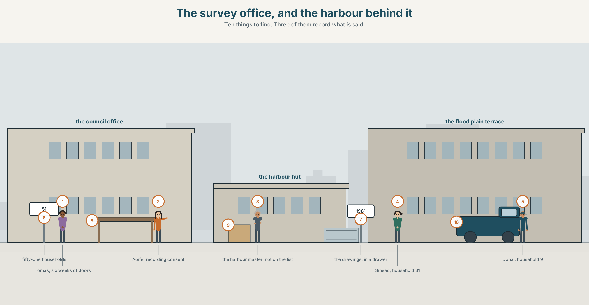{width=6.6in}

*The survey office, and the harbour behind it — Ten things to find. Three of them record what is said.*

# Who asked the right question?

**By the end of this unit you can interview somebody and relay both what you asked and what
they answered.**

| ◆ **A · THE WORLD** | A survey that was done properly and asked the wrong thing |
|---|---|
| ◆ **B · THE SYSTEM** | reported questions and commands · *ask / tell / want* patterns · 23 words for interviews and investigation · 17 verbs for asking · the intonation that survives being reported |
| ◆ **C · THE PERFORMANCE** | An interview, relayed from both sides |

---

### 0A · Find it

**Find ten things in this picture.** Three of them record what is said.

> a notebook · a phone on a table · a recorder · a consent form · a clipboard ·
> a survey sheet · a laptop · a cup gone cold · an empty chair · a door left open

### 0B · Guess it

**Two things in this picture make people answer differently.** Which, and how?

### 0C · Say it ⏺

**Record thirty seconds.** *What is the question nobody has asked you that you would like to be
asked?* You will record it again at the end of this unit.

---

## Part 1 · Vocabulary Lab 1 ◆ **B · THE SYSTEM**

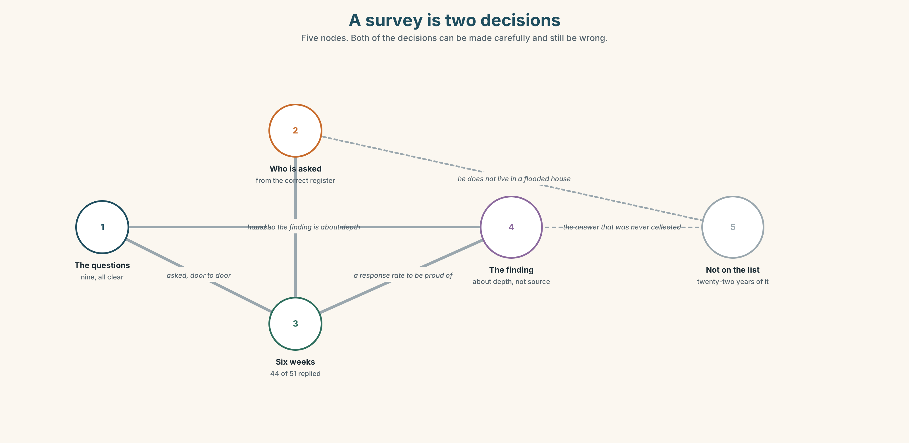{width=6.6in}

*A survey is two decisions — Five nodes. Both of the decisions can be made carefully and still be wrong.*

### 1A · Meet — the words of an interview

Match each word to one place on the map.

> **interview** · **question** · **answer** · **investigation** · **detail** ·
> **follow-up** · **notebook** · **recorder** · **consent** · **permission**

### 1B · Sort — the interviewer, the person, or the room?

Three columns.

> pressure · silence · honest · direct · awkward · notebook · consent · follow-up · anonymous

**One of them belongs to whoever is most frightened.** Which, and why?

### 1C · Meet — what people do instead of answering

> **avoid** · **silence** · **anonymous**

A silence is an answer. **What does it answer, and how would you record it in a notebook?**

{width=6.6in}

*The survey office, in section — Four levels, four stages of a question. The wrong one was written on the top floor.*

**Look at the survey office, in section.** Four levels, four stages of a question.
**At which level was the wrong question written, and who was in the room?**

### 1D · Stretch — the phrases

Complete each one with one word.

1. She **put a ______** to him three times and got three different answers.
2. He never **got an ______** to the second one.
3. If you **press ______** too hard, they stop telling you things.
4. This part is **on the ______** . The rest is not.
5. They have been **digging ______** the 1961 drawings all summer.

### 1E · The saying

> **f** **No comment.**

Two words that are never neutral.

> **Say them three times:** from a council officer, from a neighbour, and from somebody who is
> frightened. **Which one makes you more curious?**

### 1F · Own it

Think of a time you were asked a question you did not want to answer. Tell a partner
**three sentences**: what was asked, what you said, and what you did not say.

---

## Part 2 · Listening ◆ **A · THE WORLD**

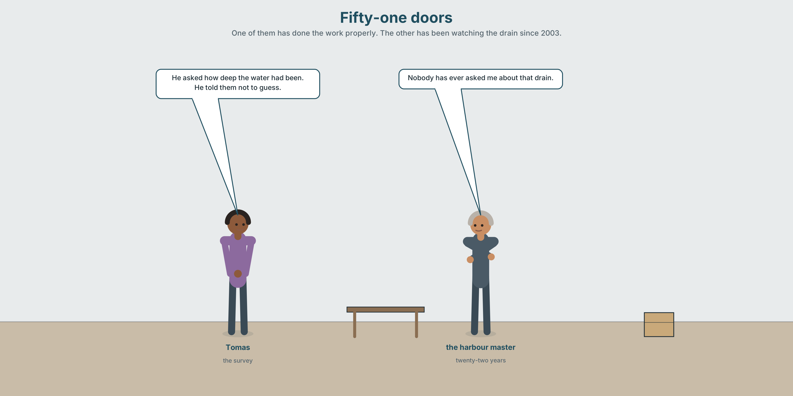{width=6.6in}

*Fifty-one doors — One of them has done the work properly. The other has been watching the drain since 2003.*

### 2A · Fifty-one doors 🔊 Track 5.1

**Before you listen.** Tomás surveyed fifty-one households. The survey took six weeks.
**Guess: what is wrong with it?**

**Listen once. One question.** What did the survey ask?

**Listen again. Complete the table.**

| | What was asked | What people answered | What nobody asked |
|---|---|---|---|
| question 1 | | | |
| question 4 | | | |
| question 9 | | | |

**Listen again. Choose.**

1. The survey asked **where the water came from / how deep it was / whether people felt safe**.
2. Fifty-one households were asked and **all / most / about half** replied.
3. The question about the drain was **not asked / asked badly / asked of the wrong people**.
4. Redoing it would take **two / six / fourteen** weeks.

**Noticing.** Four sentences from the recording.

1. *"How deep was the water in your house?"*
2. *He asked how deep the water had been.*
3. *"Don't guess. Measure it."*
4. *He told them not to guess.*

**Two are the questions and instructions themselves. Two are reports of them.**
**What happened to the word order in sentence 2?**

### 2B · Decoding clinic 🔊 Track 5.2

Twenty-five seconds. Four jobs.

1. How many times does he say *asked* or *told*?
2. In *he asked how deep it had been*, does his voice rise at the end?
3. Catch the two numbers.
4. He reports one question as a statement. Which?

> Transcripts, page 154.

---

## Part 3 · Grammar Lab 1 ◆ **B · THE SYSTEM**

### Reporting a question, and an instruction

### 3A · Notice

Look at the four sentences in Part 2.

1. Sentence 1 is a question. Sentence 2 reports it. **What happened to *was*?**
2. Is there a question mark in sentence 2? **Why not?**
3. Sentence 3 is an instruction. Sentence 4 reports it. **What shape did it take?**
4. **How would you report a yes/no question?** Try: *"Did you measure it?"*
5. Try *"He asked how deep was the water."* **What is wrong?**

### 3B · See

{width=6.6in}

*What happens to a reported question — The question word stays. The inversion goes, the auxiliary goes, and so does the mark.*

Now look at the second picture. **Three shapes: a wh- question, a yes/no question, and an
instruction. Which one needs *if* or *whether*?**

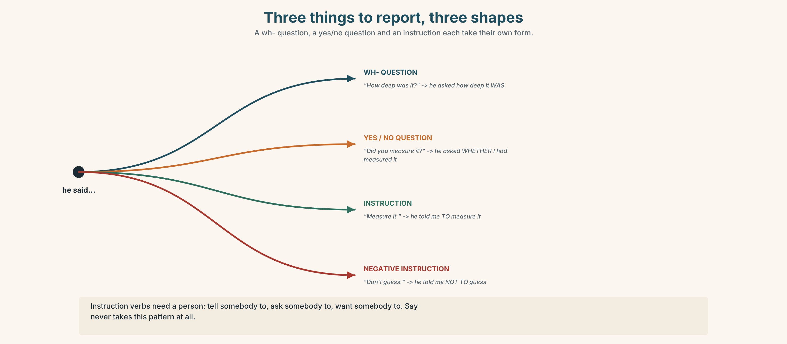{width=6.6in}

*Three things to report, three shapes — A wh- question, a yes/no question and an instruction each take their own form.*

### 3C · Know

| Direct | Reported |
|---|---|
| *"**How deep was** it?"* | He asked **how deep it was**. |
| *"**Did you** measure it?"* | He asked **whether / if I had measured it**. |
| *"**Measure** it."* | He told me **to measure** it. |
| *"**Don't** guess."* | He told me **not to guess**. |

> **Three things happen to a reported question.**
> 1. Statement word order — no inversion. 2. No *do/did*. 3. No question mark.

> **Yes/no questions need *if* or *whether*.** *whether* is the safer one in writing, and the
> only one possible before *or not*.

> **Instructions take *to* + verb**, and the verb that reports them takes a person:
> *tell **somebody** to*, *ask **somebody** to*, *want **somebody** to*, *advise **somebody** to*.
> ✗ *He said me to measure it.* — *say* does not take this pattern at all.

> **Why it matters.** The shape of the question changes the answer. A survey is only ever as
> good as the shape of its questions, and nobody checks the shape afterwards.

### 3D · Use — controlled

> He asked them how deep the water (1) __________ (be) and whether they
> (2) __________ (measure) it. He told them (3) __________ (not / guess). He asked
> (4) __________ they had seen anything unusual in the yard, and he advised them
> (5) __________ (keep) any photographs. Nobody asked (6) __________ the water
> (7) __________ (come) from.

### 3E · Use — guided

Report each one.

1. *"Where did the water come from?"*
2. *"Did you look at the drain?"*
3. *"Keep the photographs."*
4. *"Don't throw anything away."*
5. *"Would you be willing to be named?"*

### 3F · Use — open

**Interview a partner for three minutes** about something they did this year.
**Then report five things to a third person: three questions you asked and two instructions
you gave.**

### 3G · Check — six items

> 1. *"How deep was it?"* → He asked how deep ______ .
> 2. *"Did you measure it?"* → He asked ______ I ______ measured it.
> 3. *"Measure it."* → He told me ______ it.
> 4. *"Don't guess."* → He told me ______ guess.
> 5. *"Where do you live?"* → She asked me where ______ .
> 6. *"Please wait outside."* → He asked us ______ outside.

**0–3 →** Workbook pp. 28–30. **4–5 →** Part 6. **6 →** page 107.

---

## Part 4 · Speaking ◆ **C · THE PERFORMANCE**

### 4A · Fluency starter — the question nobody asked

One learner describes something. The others may only ask **one question each**.
**Then the group names the question that was not asked.**

**Four rounds. Four learners.**

### 4B · The functional core — interviewing

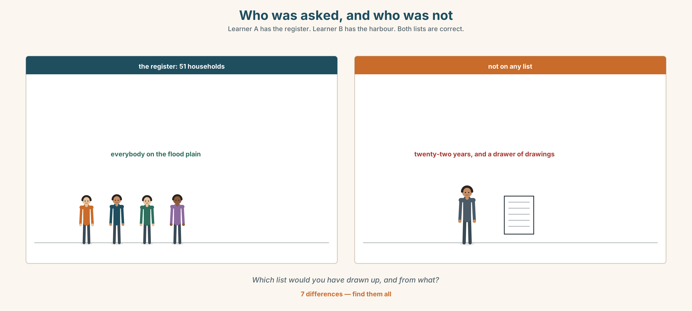{width=6.6in}

*Who was asked, and who was not — Learner A has the register. Learner B has the harbour. Both lists are correct.*

**Language Bank**

| | |
|---|---|
| **opening** | *Can I record this?* · *Is this on the record?* · *Stop me if you'd rather not.* |
| **the follow-up** | *How do you know that?* · *What happened just before?* · *And then?* |
| **leaving silence** | *(say nothing)* · *Mm.* · *Take your time.* |
| **closing** | *Is there anything I didn't ask?* · *Who else should I talk to?* |

**Role play.** Learner A interviews. Learner B is willing but cautious.
**Six minutes.** Learner A must use silence twice and must ask the last question in the bank.

### 4C · The performance — one hundred seconds ⏺

**Interview somebody, then relay it.** **One hundred seconds.** You must give:

> three questions you asked, reported · what they answered · one instruction you gave ·
> the question you should have asked

**Record it.**

### 4D · Observer

One person listens for **one thing**: did the reported questions keep statement word order?

### 4E · Two criteria

> ☐ Did I report questions and instructions in their right shapes?
> ☐ Did I name a question I failed to ask?

---

## Part 5 · Reading ◆ **A · THE WORLD**

### 5A · Predict

An explainer about survey design. The title is
**"Fifty-one doors and the wrong question."**
**What do you think goes wrong most often in a survey?** One sentence.

### 5B · Read — one hundred and ten seconds

---

**Fifty-one doors and the wrong question**

A survey is two things: a list of questions, and a decision about who is asked. Both can be done
carefully and the result can still be useless.

The Ballinmore survey was done carefully. Fifty-one households, six weeks, forty-four responses,
which is a response rate most professional surveys would envy. Every question was clear. Nobody
was led.

It asked how deep the water had been, when it arrived, what was damaged, whether people had
received a warning, and whether they intended to stay. It did not ask where the water came from,
and that was the question the money depended on.

This is the commonest failure in survey design and it has a name: **you cannot find an answer to
a question you did not ask.** The data is not wrong. It is simply about something else.

The second failure is quieter. Everybody asked was a household on the flood plain. Nobody asked
the harbour master, who has watched that drain for twenty-two years, because he does not live in
a flooded house and so was not on the list. The list was drawn up correctly, from the correct
register, and it excluded the one person who could have answered the question that was not asked.

Redoing the survey takes six weeks. Publishing it as it stands takes an afternoon, and it will be
quoted for ten years.

---

### 5C · Answer

1. What two things is a survey, according to the writer?
2. How many households, how many responses, and how long?
3. **Which five things did the survey ask, and which one did it not?**
4. What is the name the writer gives to the first failure?
5. Who was left out, and why was that technically correct?
6. **What is the choice at the end, and which part of it is the warning?**

### 5D · Vocabulary in context

Guess from the text. Then check.

> response rate · nobody was led · the flood plain · drawn up · as it stands

### 5E · The counter-text

{width=6.6in}

*The survey form — Nine questions, two of them open, and one added by hand to four copies.*

**Read the survey form itself and answer.**

1. How many questions are there, and how many are open?
2. **Which question comes closest to asking about the source of the water?**
3. What does the consent box at the top allow, and what does it not?
4. One question has been added by hand to some copies. What does it say?

### 5F · Two texts

The explainer says the survey **did not ask** where the water came from.
The form has a handwritten question on some copies.

**Put those two facts together. What might those copies be worth?** Two sentences.

---

## Part 6 · Vocabulary Lab 2 ◆ **B · THE SYSTEM**

### Verbs that need a person

{width=6.6in}

*Four verbs that need a person — Ask, tell, want and advise all take somebody, then to. Say takes neither.*

### 6A · Sort — does it need a person after it?

Two columns.

> ask · tell · say · want · order · advise · remind · beg · invite · encourage · refuse

**One of them can go in both columns and means two different things.** Which?

### 6B · Chunk completion

1. He **asked me ______** wait outside.
2. She **told them ______ to** throw anything away.
3. They **wanted him ______** sign it.
4. He **asked ______** anybody had measured it.
5. She **backed ______** when he started writing.
6. **She wanted to ______** who had drawn up the list.

### 6C · Three ways of saying no

**refuse · avoid · no comment**

Each one leaves a different impression. Put one in each.

1. He ______ to answer the question about the drain.
2. He ______ the question by talking about the wall for four minutes.
3. He said two words: "______ ______ ."

**Which of the three tells you the most?**

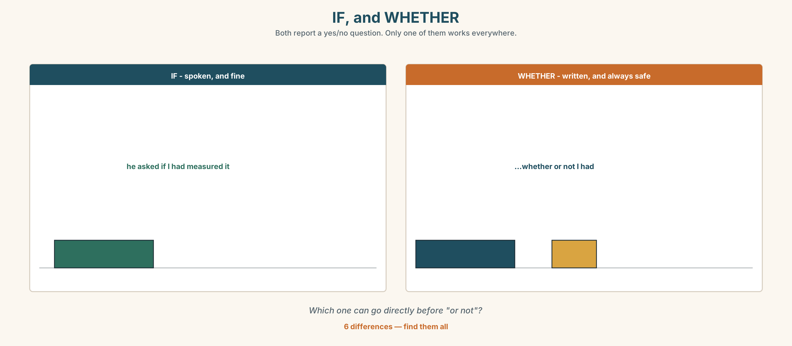{width=6.6in}

*IF, and WHETHER — Both report a yes/no question. Only one of them works everywhere.*

**Six differences.** Find them, then answer the question under the picture.

### 6D · Contrast Clinic — report it

Six items.

1. *"Where do you live?"*
2. *"Have you seen it?"*
3. *"Wait here."*
4. *"Don't move anything."*
5. *"Would you mind signing this?"*
6. *"Why didn't you ask the harbour master?"*

---

## Part 7 · Pronunciation & Fluency Lab ◆ **B · THE SYSTEM**

### The question that stops sounding like one

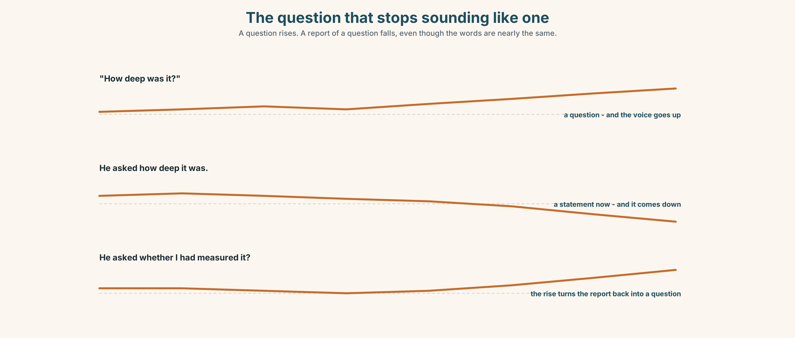{width=6.6in}

*The question that stops sounding like one — A question rises. A report of a question falls, even though the words are nearly the same.*

### 7A · Hear 🔊 Track 5.3

> *"How deep was it?"* ↗ — a question, and the voice goes up
> *He asked how deep it was.* ↘ — a statement now, and it comes down
> *"Did you measure it?"* ↗
> *He asked whether I had measured it.* ↘

### 7B · Say

Say all four. Then say the reported pair twice more, keeping the fall.

### 7C · Make it mean something

Say this one twice:

> *He asked whether I had measured it.* ↘ *(plain report)*
> *He asked whether I had measured it.* ↗ *(and now you are asking me whether he did)*

**The rise turns a report back into a question.** When is that useful?

### 7D · Fluency 20 ⏺

Twenty seconds: **three questions you were asked today, reported with a falling voice.**
Three times, faster.

---

## Part 8 · Writing ◆ **C · THE PERFORMANCE**

### An interview, both sides · 100 words

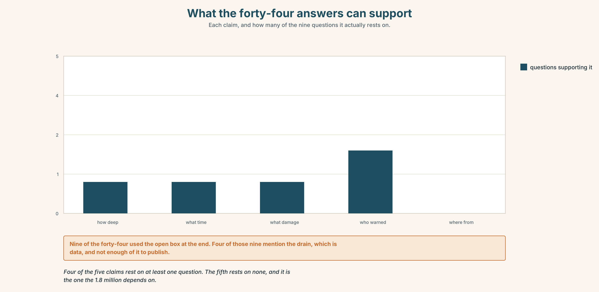{width=6.6in}

*What the forty-four answers can support — Each claim, and how many of the nine questions it actually rests on.*

### 8A · Read the model

> I asked him how long he had watched the drain and he said twenty-two years. I asked whether
> anybody had ever asked him about it before and he said nobody had. `[two questions, two
> answers, and the second question is the one that matters]`
>
> I asked him not to send me the photographs until I had checked whether I could use them.
> `[an instruction, reported, and the reason is in the sentence]`
>
> I should have asked him who drew up the list. I did not think of it until the bus.
> `[the question that was not asked, named, with no excuse]`

**Questions about the writer's choices:**

1. The second question is one sentence long and changes everything. **What makes it work?**
2. Why end on a failure?

### 8B · The anti-model

> I had a very interesting conversation with the harbour master. He has a lot of experience and
> told me many things about the harbour. He was very helpful and I learned a great deal.

Correct English, and the reader learns nothing. **Name three things it does not contain.**

### 8C · Plan

> question one, reported, with the answer → the question that matters, with its answer →
> one instruction you gave → the question you failed to ask

### 8D · Write — 100 words
### 8E · Peer review — two criteria

> ☐ Is every reported question in statement order?
> ☐ Is there a question the writer admits they missed?

### 8F · Write it again · 8G · Publish

On the wall, with the survey form from Part 5E beside it.

---

## Part 9 · The File ◆ **A · THE WORLD + C · THE PERFORMANCE**

# STUDY FILE · Data in an Argument

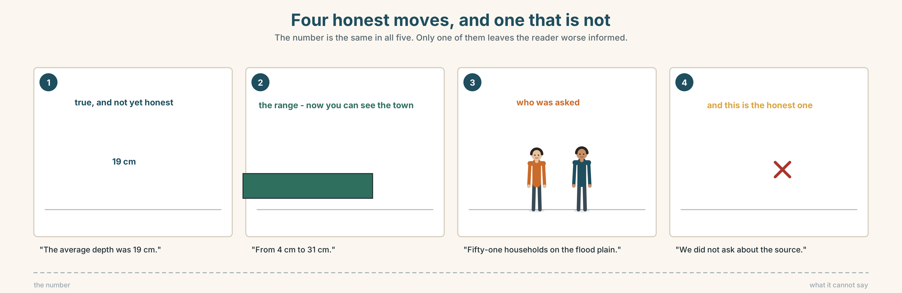{width=6.6in}

*Four honest moves, and one that is not — The number is the same in all five. Only one of them leaves the reader worse informed.*

### 9A · The same forty-four answers 🔊 Track 5.4

Three people use the survey in three arguments. **Listen.**

1. Who uses the average, and what does it hide?
2. Who uses one household, and is that cheating?
3. **Who says what the data cannot tell you, and does that weaken their case?**

### 9B · Four honest moves and one dishonest one

> giving the number · giving the range as well · saying who was asked ·
> saying what was not asked · giving the number without any of the above

Match each to one phrase.

> *"The average depth was 19 cm."* · *"From 4 cm to 31 cm."* ·
> *"Fifty-one households on the flood plain."* · *"We did not ask about the source."* ·
> *"Nineteen centimetres."*

### 9C · The sentence that makes data honest

Almost every honest use of a number has one of these attached.

> *out of…* · *of the people we asked…* · *this does not tell us…*

**Add one to each of these.**

1. Forty-four people said they intended to stay.
2. The average depth was 19 cm.
3. Nobody reported seeing water come over the wall.

### 9D · Your turn

In pairs. **Take the same survey and argue opposite cases for four minutes each.**
Neither of you may invent a number. **Then: which of you was more honest, and how do you know?**

### 9E · Transfer

**Find one number in the news this week.** Write down what it does **not** tell you.

---

## Part 10 · Mediation & Interaction ◆ **C · THE PERFORMANCE**

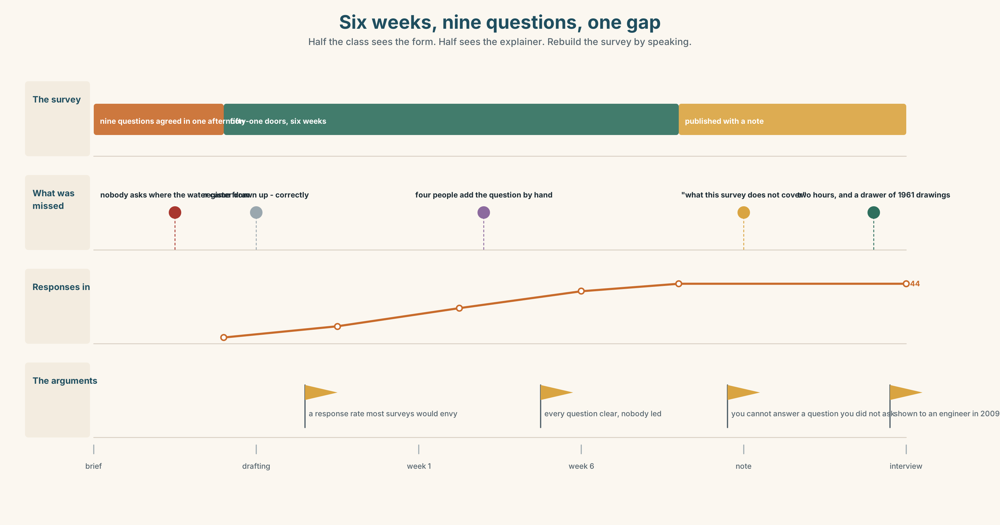{width=6.6in}

*Six weeks, nine questions, one gap — Half the class sees the form. Half sees the explainer. Rebuild the survey by speaking.*

### 10A · Relay

Half the class sees the survey form. Half sees the explainer. **Rebuild what the survey can and
cannot show, by speaking.** Ten minutes.

### 10B · Simplify

Explain the survey form from Part 5E to somebody who is about to fill it in.
**Four sentences only.**

> **Plan:** what it is for → what the consent box means → which question to take time over →
> what to add if you know something it does not ask

### 10C · Compress

The explainer in Part 5 into **thirty-five words**, for the council's agenda.

### 10D · Online

Write **one message** to the harbour master: you have read the survey, he is not in it, and you
want twenty minutes and his permission to record.

### 10E · Your language

How does your language report a yes/no question? **Is there a word like *whether*?**
Report *"Did you measure it?"* in both languages.

---

## Part 11 · The Decision ◆ **C · THE PERFORMANCE**

# Six weeks, or an afternoon

The survey is complete, careful, and does not answer the question the money depends on.

- **Publish it as it stands.** It is good work. Add a note saying what it does not cover.
- **Redo it.** Six weeks, the right questions, and the harbour master on the list. The funding
  committee meets in five.
- **Add one question.** Go back to the forty-four households with a single question about the
  drain. Three weeks, and it is no longer one survey.

### 11A · The evidence

1. **The survey form** from Part 5E — and the question somebody added by hand.
2. **The chart** — what the forty-four answers can and cannot support.
3. **The voice.** Tomás, twenty seconds: *"I have been asked whether the survey is any good.
   It is good. It is the best thing I have done here. It answers a question nobody is asking and
   I did not notice for six weeks."*

### 11B · Talk about it

In threes. Everybody says one. Use the frame.

> *I think Tomás should ______ , because ______ .*

**Words you can use:** *question · answer · investigation · detail · honest · pressure · consent · follow-up*

### 11C · Decide

Write **two sentences**. Choose, and say why.

> I think Tomás should ______________________ ,
> because ______________________ .

### 11D · Model decision

> Publish it with the note, and interview the harbour master separately this week. The survey is
> honest work and withholding it until it is perfect means the committee decides on nothing
> instead of on something incomplete. One long interview with the person who has watched that
> drain for twenty-two years is worth more than forty-four more questionnaires, and it takes an
> afternoon.

### 11E · The Reveal

> **What happened.** He published it with a two-paragraph note headed *what this survey does not
> cover*. The note is the most quoted part of the document.
>
> He interviewed the harbour master for two hours. The harbour master had the 1961 drawings in a
> drawer, had shown them to a council engineer in 2009, and had been told they were superseded.
> They were not.
>
> Four of the handwritten copies of the form were returned. All four mention the drain. All four
> were filled in by people over seventy.

**The note was read. The drawings were in a drawer. And the four people who answered the question
nobody asked were the four oldest.**

> **Was it the right decision?** Say why — and say what the four handwritten copies are evidence of.

---

## Part 12 · Landing ◆ **all three lines**

### 12A · Recycle — ten items

> 1. *"How deep was it?"* → He asked how deep ______ .
> 2. *"Measure it."* → He told me ______ it.
> 3. He asked ______ anybody had seen it. *(yes/no)*
> 4. She **put a ______** to him three times.
> 5. This part is **on the ______** .
> 6. *(Unit 4)* She ______ me that she had checked it. *(said / told)*
> 7. *(Unit 4)* **According ______** the inquiry, the surge was 1.6 m.
> 8. *(Unit 3)* By the time we arrived, it ______ (already / start).
> 9. *(Unit 2)* We ______ (wait) since June.
> 10. *(A2.1 U10)* Could you tell me where the office ______ ?

### 12B · Consolidate

**One hundred words.** An interview, real or invented. Three reported questions, one reported
instruction, and the question you did not ask.

### 12C · Can-do, with evidence

| I can… | My evidence | Sure? |
|---|---|---|
| report a question and an instruction correctly | Part 3G score | ◯ ◑ ● |
| relay an interview from both sides in a hundred seconds | Part 4C recording | ◯ ◑ ● |
| write a hundred words that name what I missed | Part 8 draft 2 | ◯ ◑ ● |
| use a number honestly in an argument | Part 9D pair work | ◯ ◑ ● |

### 12D · Replay ⏺

Find your thirty seconds from Part 0C. Listen. **Record it again.**
One sentence: what is different?

### 12E · Glossary — forty items, as a map

> **THE EVENT** · interview · investigation · question · answer · follow-up · detail
> **THE EQUIPMENT** · notebook · recorder · consent · permission · anonymous · on the record
> **WHAT IT FEELS LIKE** · pressure · silence · awkward · honest · direct · press somebody
> **ASKING** · ask · ask somebody to · ask whether · whether · if · put a question · get an answer
> **TELLING** · tell somebody to · want somebody to · order · advise · remind · beg · invite · encourage
> **NOT ANSWERING** · avoid · refuse · back off · dig into · no comment · she wanted to know

### 12F · Next

> **Unit 6 · What might have happened?**

# A2.2 · Unit 6 · Two Miles Out, and Empty

> **English Animated** · *Telling the Story* · Ballinmore, west coast of Ireland
> Student's Book pages 116–137 · 22 pp · ~10 hours

---

## Part 0 · The Big Picture ◆ **A · THE WORLD**

{width=6.6in}

*The pier, the Tuesday — Nine things to find. Four of them are evidence of something.*

# What might have happened?

**By the end of this unit you can explain three possible causes of something, and say which you
believe and why.**

| ◆ **A · THE WORLD** | A boat found empty, three explanations, and a form with one box |
|---|---|
| ◆ **B · THE SYSTEM** | *must / might / can't* + *be* and *have been* · certainty adverbs · 23 words for mystery and evidence · 17 ways of saying how sure you are · *must've* and *might've* |
| ◆ **C · THE PERFORMANCE** | Three explanations, ranked, with reasons |

---

### 0A · Find it

**Find nine things in this picture.** Four of them are evidence of something.

> a boat on its mooring · an empty mooring · a lifejacket · a coil of rope · a fuel can ·
> a radio · a hatch left open · a weather board · a coastguard notice

### 0B · Guess it

**Three things in this picture do not fit together.** Which three, and what would explain them?

### 0C · Say it ⏺

**Record thirty seconds.** *Think of something unexplained you have seen. Give two explanations
and say which you believe.* You will record it again at the end of this unit.

---

## Part 1 · Vocabulary Lab 1 ◆ **B · THE SYSTEM**

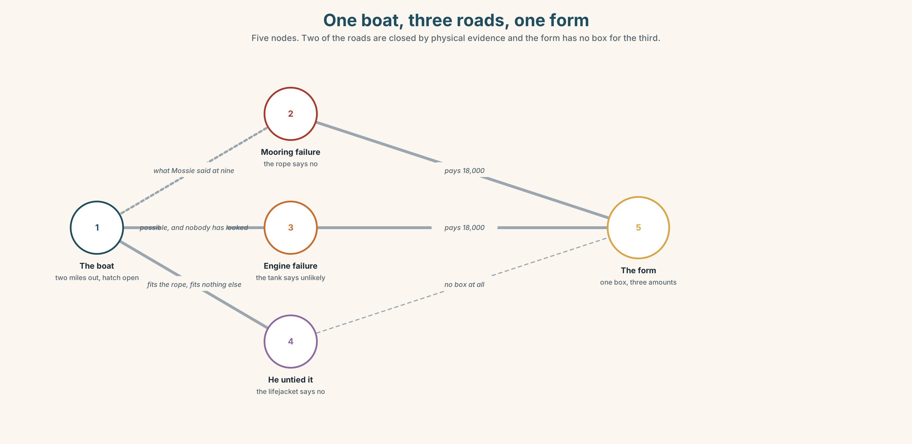{width=6.6in}

*One boat, three roads, one form — Five nodes. Two of the roads are closed by physical evidence and the form has no box for the third.*

### 1A · Meet — the words of an unexplained thing

Match each word to one place on the map.

> **mystery** · **theory** · **clue** · **guess** · **suspect** · **explain** ·
> **evidence** · **wreck** · **tide** · **current**

### 1B · Sort — a fact, a feeling, or a story?

Three columns.

> clue · strange · theory · empty · suspect · obvious · missing · mystery · unlikely

**One of them is a fact that is always described as a feeling.** Which?

### 1C · Meet — the words of the paperwork

> **insurance** · **payout** · **coastguard**

Three nouns that turn a mystery into a form with boxes.
**Which of the three has no interest at all in what happened?**

{width=6.6in}

*The boat, in section — Four levels, four clues, and the one on the third level closes a road.*

**Look at the boat, in section.** Four levels, four clues.
**Which level has the clue that rules out one of the three explanations?**

### 1D · Stretch — the phrases

Complete each one with one word.

1. None of it **makes ______** unless he left the mooring on purpose.
2. The coastguard has **ruled ______** a collision.
3. If the hatch was open, **the only ______** is that he went below.
4. A current is **more ______** than an engine failure in that weather.
5. Nothing of his has **turned ______** since.

### 1E · The saying

> **f** **We may never know.**

Four words that are sometimes honest and sometimes a way of stopping.

> **Write the sentence that should come before it** — the one that makes it honest.

### 1F · Own it

Think of something in your own life that has never been explained. Tell a partner
**three sentences**: what happened, your best theory, and what would prove it.

---

## Part 2 · Listening ◆ **A · THE WORLD**

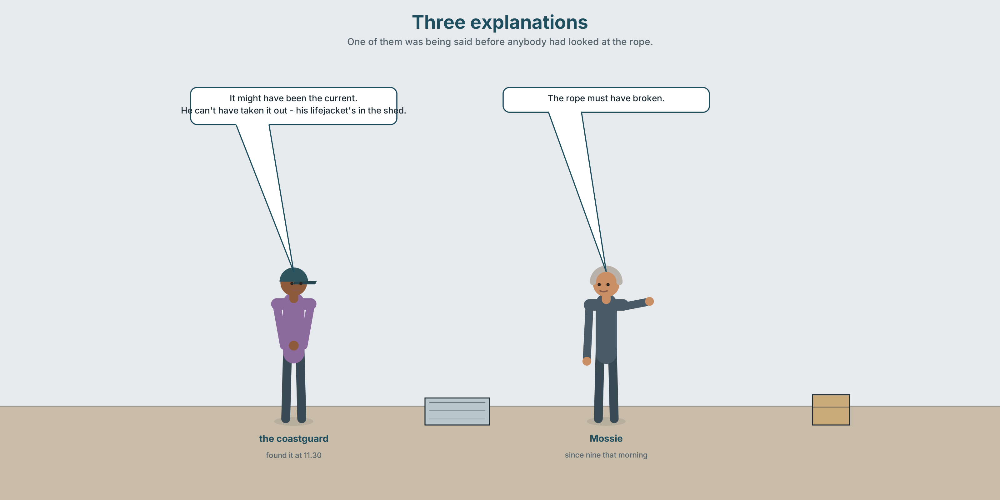{width=6.6in}

*Three explanations — One of them was being said before anybody had looked at the rope.*

### 2A · Three explanations 🔊 Track 6.1

**Before you listen.** Peadar's boat was found two miles out, empty, with the hatch open.
**Guess: does the coastguard have a preferred theory?**

**Listen once. One question.** What three explanations are given?

**Listen again. Complete the table.**

| Theory | What supports it | What is against it |
|---|---|---|
| it broke its mooring | | |
| the engine failed | | |
| he took it out | | |

**Listen again. True or false?**

1. The mooring rope was found cut. ☐ T ☐ F
2. The fuel tank was nearly full. ☐ T ☐ F
3. His lifejacket was still in the shed. ☐ T ☐ F
4. The coastguard says one theory is impossible. ☐ T ☐ F

**Noticing.** Four sentences from the recording.

1. *The rope must have broken.*
2. *It might have been the current.*
3. *He can't have taken it out — his lifejacket's in the shed.*
4. *It's possible that the engine failed.*

**One of these is nearly certain. One is nearly impossible. Two are in between.**
**Put them in order, most sure first.**

### 2B · Decoding clinic 🔊 Track 6.2

Twenty-five seconds. Four jobs.

1. How many times can you hear *must've* or *might've*?
2. In *must have*, can you hear the *h*?
3. Catch the distance and the depth.
4. One speaker says *obviously* about something that is not obvious. Where?

> Transcripts, page 155.

---

## Part 3 · Grammar Lab 1 ◆ **B · THE SYSTEM**

### Saying how sure you are

### 3A · Notice

Look at the four sentences in Part 2.

1. In sentence 1, does the speaker know the rope broke?
2. **What is the difference between *must have* and *did*?**
3. In sentence 3, *can't have* is used, not *mustn't have*. **Why?**
4. **Which is stronger: *can't have been* or *might not have been*?**
5. Try *"It must have been the current, I think."* **Why is that odd?**

### 3B · See

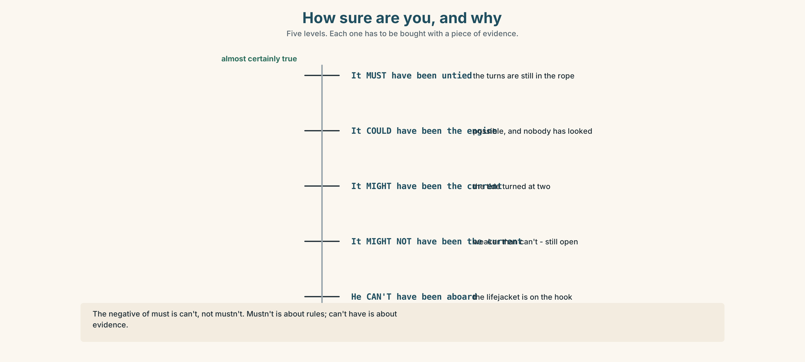{width=6.6in}

*How sure are you, and why — Five levels. Each one has to be bought with a piece of evidence.*

Now look at the second picture. **Three roads from one piece of evidence.
Which road does the lifejacket close?**

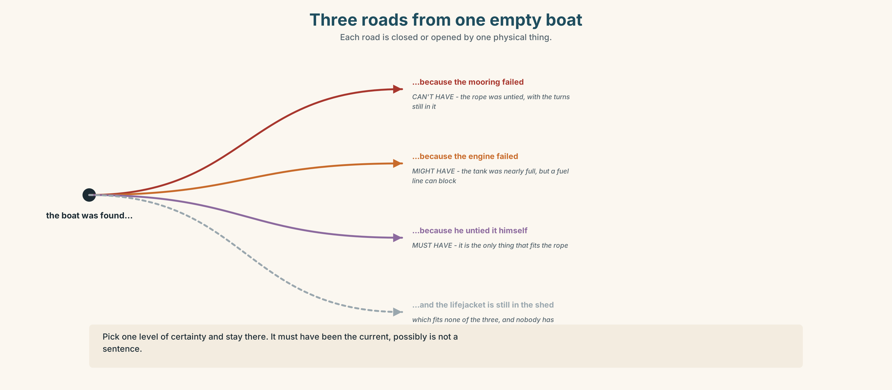{width=6.6in}

*Three roads from one empty boat — Each road is closed or opened by one physical thing.*

### 3C · Know

| | About now | About the past |
|---|---|---|
| **almost certain yes** | *It **must be** the current.* | *It **must have been** the current.* |
| **possible** | *It **might / could be** the engine.* | *It **might / could have been** the engine.* |
| **almost certain no** | *It **can't be** him.* | *It **can't have been** him.* |

> **The negative of *must* is *can't*, not *mustn't*.**
> *mustn't* is about rules. *can't have* is about evidence.

> **These are not about ability or permission.** They are about **how much you know**.
> *He can't swim* is ability. *He can't have swum* is a deduction.

> **Adverbs do the same job and can be stacked — carefully.**
> *definitely · surely · obviously · clearly · presumably · apparently · possibly*
> ✗ *It must have been the current, possibly.* — pick one level and stay there.

> **Watch out.** In speech these are /mʌstəv/ and /maɪtəv/. In writing they are **never**
> *must of* or *might of*.

### 3D · Use — controlled

> The rope (1) __________ (must / break) at some point in the night, because it was found
> frayed and not cut. It (2) __________ (might / be) the current — the tide turned at two.
> He (3) __________ (can't / take) it out himself, because his lifejacket is still in the shed
> and he never went out without it. The engine (4) __________ (could / fail), though the tank
> was almost full, so that is (5) __________ (unlikely). Presumably we
> (6) __________ (never / know).

### 3E · Use — guided

Rewrite each one using *must have*, *might have* or *can't have*.

1. I'm certain the rope broke.
2. Perhaps the current took it.
3. It's impossible that he was on board.
4. I'm fairly sure somebody moved it.
5. It's possible that nobody noticed until morning.

### 3F · Use — open

**In threes.** One of you describes something odd. The others must give one *must have*,
one *might have* and one *can't have*. **Three minutes.**

### 3G · Check — six items

> 1. The rope ______ (must / break) in the night.
> 2. It ______ (might / be) the current.
> 3. He ______ (can't / be) on board — his lifejacket is here.
> 4. Somebody ______ (must / move) it.
> 5. It ______ (could / happen) at any time after two.
> 6. They ______ (can't / see) it in that fog.

**0–3 →** Workbook pp. 34–36. **4–5 →** Part 6. **6 →** page 129.

---

## Part 4 · Speaking ◆ **C · THE PERFORMANCE**

### 4A · Fluency starter — one object

Your teacher puts one object on the table. **Each learner gives one deduction**, and nobody may
repeat a modal. **Thirty seconds each.**

**Three objects. Three rounds.**

### 4B · The functional core — ranking explanations

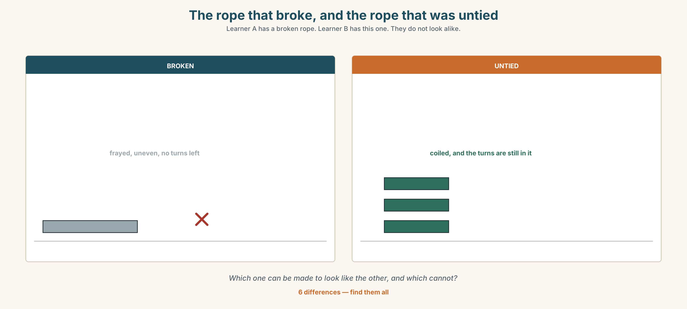{width=6.6in}

*The rope that broke, and the rope that was untied — Learner A has a broken rope. Learner B has this one. They do not look alike.*

**Language Bank**

| | |
|---|---|
| **the strongest** | *It must have been…* · *That's the only explanation.* |
| **the possible** | *It might have been…* · *It's possible that…* |
| **the ruled out** | *It can't have been…, because…* · *We can rule that out.* |
| **the honest end** | *I don't think we'll ever work it out.* · *We may never know.* |

**Role play.** Learner A is the boat's owner. Learner B works for the insurer.
**Six minutes.** Learner B must rule one theory out and must say what would change their mind.

### 4C · The performance — one hundred seconds ⏺

Explain **three possible causes** of something. **One hundred seconds.** You must give:

> each explanation · what supports it · what is against it · which you believe, and why

**Record it.**

### 4D · Observer

One person listens for **one thing**: did the speaker's certainty match their evidence?

### 4E · Two criteria

> ☐ Did I use *must have*, *might have* and *can't have*?
> ☐ Did I give a reason for ruling something out, not just an opinion?

---

## Part 5 · Reading ◆ **A · THE WORLD**

### 5A · Predict

A short story. The title is **"The mooring."**
**What do you expect to be left unexplained at the end?** One sentence.

### 5B · Read — one hundred and ten seconds

---

**The mooring**

They found it at half eleven on the Tuesday, two miles out and drifting east with the hatch open
and nothing aboard but a fuel can and a coil of rope that had been coiled by somebody who knew
how.

Mossie Hegarty said it must have broken its mooring. He had been saying that since nine, before
anybody had looked at the rope, and he kept saying it afterwards, which my father said was the
only interesting thing about the whole business.

The rope had not been cut. It had not been frayed either. It had been untied, and it had been
untied by somebody who tied things for a living, because the turns were still in it.

Peadar's lifejacket was on the hook in the shed where it had been on Sunday and where it is now.
He had not been out without it in forty years. That is not a theory. That is a thing that
everybody on that pier would say, and the insurance man wrote it down and then asked whether
anybody had actually seen him put it on, on any particular day, and nobody had, because why would
you.

So there are three explanations and one of them is impossible and the other two are impossible as
well, and the one they have written on the form is the cheapest of the three to be true.

---

### 5C · Answer

1. Where and when was the boat found, and what was aboard?
2. What was Mossie Hegarty's theory, and when did he start saying it?
3. **What had happened to the rope, and why does that matter?**
4. Where was the lifejacket, and what question did the insurance man ask about it?
5. Why does the narrator say "why would you"?
6. **What does the last sentence accuse the form of?**

### 5D · Vocabulary in context

Guess from the text. Then check.

> drifting east · the turns were still in it · on the hook · that is not a theory ·
> the cheapest of the three to be true

### 5E · The counter-text

{width=6.6in}

*The insurance claim form — Three boxes, one tick, and one box that has been ticked, crossed out and ticked again.*

**Read the insurance claim form and answer.**

1. How many causes can be ticked, and how many may be ticked at once?
2. **What is the payout for each cause, and which is the lowest?**
3. What does the form require as evidence for each cause?
4. One box has been ticked, crossed out, and ticked again. Which?

### 5F · Two texts

The story says the rope was **untied**, by somebody who knew how.
The form has a box for **"mooring failure"** and none for anything else that fits.

**Put those two facts together. What will the form say happened?** Two sentences.

---

## Part 6 · Vocabulary Lab 2 ◆ **B · THE SYSTEM**

### How sure is sure

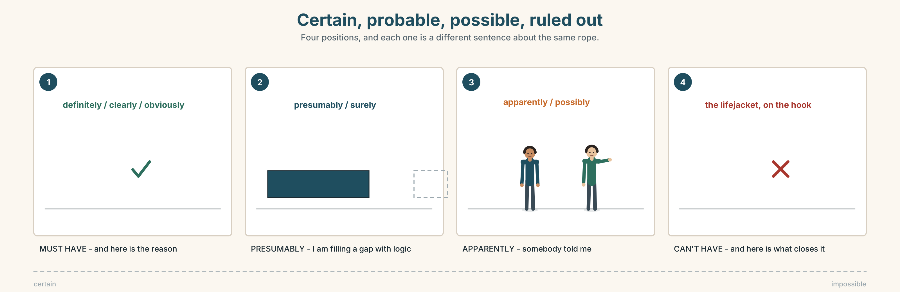{width=6.6in}

*Certain, probable, possible, ruled out — Four positions, and each one is a different sentence about the same rope.*

### 6A · Sort — how certain?

Put these on a line from certain to barely possible.

> definitely · surely · obviously · clearly · presumably · apparently · possibly

**Two of them are about what other people say, not about what you know.** Which?

### 6B · Chunk completion

1. It **must ______** been the tide.
2. It **might ______** been the engine.
3. He **can't ______** been aboard.
4. **It's possible ______** nobody noticed until morning.
5. They never **worked ______** what happened to the radio.
6. The rope was untied. **That ______ it.**

### 6C · Two that sound like certainty and are not

**apparently** and **presumably** both look strong. Neither is.

> *Apparently* = somebody told me. *Presumably* = I am filling a gap with logic.

**Which would you use in each of these?**

1. ______ the tide turned at two. *(it is in the tide table)*
2. ______ he went below for something. *(nobody saw it; the hatch was open)*
3. ______ the coastguard was there by noon. *(the harbour master said so)*

{width=6.6in}

*MUSTN'T, and CAN'T HAVE — One of them is a rule. The other is a conclusion from evidence.*

**Six differences.** Find them, then answer the question under the picture.

### 6D · Contrast Clinic — must, might or can't

Six items.

1. The light is on. Somebody ______ be in.
2. The light is on, but his car is gone. He ______ be in.
3. Perhaps she ______ have forgotten.
4. The rope was untied, so it ______ have broken.
5. There's no fuel in the can. It ______ have run out.
6. He's been at sea forty years. He ______ have made that mistake.

---

## Part 7 · Pronunciation & Fluency Lab ◆ **B · THE SYSTEM**

### The word that disappears and leaves a mistake behind

{width=6.6in}

*The word that disappears and leaves a mistake behind — All four of these sound like of. None of them is.*

### 7A · Hear 🔊 Track 6.3

> must have → *must've* → /ˈmʌstəv/
> might have → *might've* → /ˈmaɪtəv/
> can't have → /ˈkɑːntəv/
> could have been → /ˈkʊdəvbɪn/

**All four sound exactly like *of*. None of them is.**

### 7B · Say

Say each one. Then say the sentence three times, faster:

> *It must have been the current, and he can't have been aboard.*

### 7C · Make it mean something

Say these two:

> *It MUST have been the current.* *(and I am arguing with somebody)*
> *It must've been the current.* *(and I am just thinking aloud)*

**Which one has already been contradicted once?**

### 7D · Fluency 20 ⏺

Twenty seconds: **three deductions about this room.**
One *must've*, one *might've*, one *can't have*. Three times, faster.

---

## Part 8 · Writing ◆ **C · THE PERFORMANCE**

### Three explanations · 100 words

{width=6.6in}

*What each box pays, and what it costs to prove — Three causes, three amounts, and the time each one takes to settle.*

### 8A · Read the model

> It can't have broken its mooring. The rope was untied and the turns were still in it, and rope
> that breaks does not look like that. `[the ruled-out one first, with the physical reason]`
>
> The engine might have failed. The tank was nearly full, which makes it unlikely, but a fuel
> line can block with a full tank and it has happened twice on that pier in ten years.
> `[the possible one, and the writer argues against their own point and then recovers it]`
>
> He must have untied it himself. That is the only explanation that fits the rope, and it is also
> the one that fits nothing else about him. `[the strongest, and an admission that strongest is
> not the same as satisfying]`

**Questions about the writer's choices:**

1. The impossible one comes first. **Why not last?**
2. The last line says the best theory does not fit the man. **Is that a weakness in the writing?**

### 8B · The anti-model

> It is a real mystery and nobody knows what happened. It could have been many things. Maybe the
> rope broke or maybe something else happened. We will probably never find out the truth.

Correct English, and no evidence anywhere in it. **Name two things it does not do.**

### 8C · Plan

> what you can rule out, and the physical reason → what is possible, with its weakness →
> what you believe → what still does not fit

### 8D · Write — 100 words
### 8E · Peer review — two criteria

> ☐ Is every level of certainty earned by a piece of evidence?
> ☐ Is there one thing that still does not fit?

### 8F · Write it again · 8G · Publish

On the wall, with the claim form from Part 5E beside it.

---

## Part 9 · The File ◆ **A · THE WORLD + C · THE PERFORMANCE**

# CULTURE FILE · English as a Lingua Franca

{width=6.6in}

*Four speakers, no native speakers — What makes somebody easy to understand in English is almost never vocabulary.*

### 9A · Four people, no native speakers 🔊 Track 6.4

A Spanish surveyor, a Latvian skipper, a Polish mechanic and a Brazilian insurance assessor
discuss the boat. **In English. Listen.**

1. Who speaks the most, and are they the clearest?
2. **Which speaker checks that they have been understood, and how?**
3. One misunderstanding is repaired without anybody naming it. Where?

### 9B · What makes somebody easy to understand

**Mark the three that matter most**, from the recording.

> a large vocabulary · short sentences · checking back · a particular accent ·
> saying numbers twice · speaking slowly · knowing idioms

### 9C · The repair moves

Match each to its job.

> *"Sorry — the rope was what?"* · *"So you're saying it was untied, not broken."* ·
> *"Let me say that again differently."* · *"Is that the right word?"*

> asking again · checking your own English · confirming their meaning · repairing in advance

### 9D · Your turn

In fours. **Explain one of the three theories to the group** — but you may not use any word of
more than two syllables. **Four minutes.** Then: what did you lose, and what got clearer?

### 9E · Transfer

**Listen to one conversation in English this week** where neither person is a native speaker.
**Write down one thing they did that made it work.**

---

## Part 10 · Mediation & Interaction ◆ **C · THE PERFORMANCE**

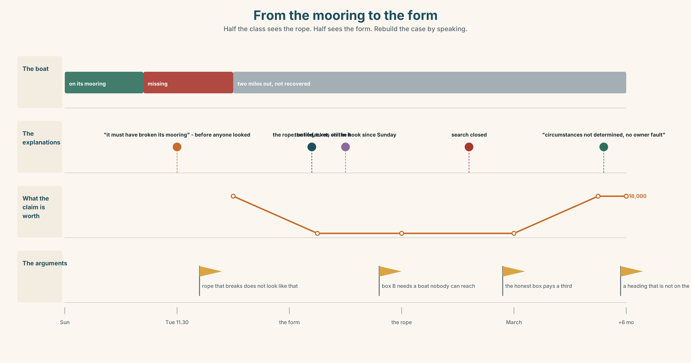{width=6.6in}

*From the mooring to the form — Half the class sees the rope. Half sees the form. Rebuild the case by speaking.*

### 10A · Relay

Half the class sees the boat and the rope. Half sees the claim form.
**Rebuild the whole case by speaking.** Ten minutes.

### 10B · Simplify

Explain the claim form from Part 5E to Peadar, who has to sign it.
**Four sentences only.**

> **Plan:** what the boxes mean → what each one pays → what evidence each needs →
> which one you would not tick

### 10C · Compress

The story in Part 5 into **thirty-five words**, keeping the rope.

### 10D · Online

Write **one message** to the insurer: you are querying one box on the form, here is the physical
evidence, and here is what you are asking them to do.

### 10E · Your language

How does your language say *it must have been*? **Is there a modal verb, or a word like
*surely*?** Show a partner all three levels of certainty in both languages.

---

## Part 11 · The Decision ◆ **C · THE PERFORMANCE**

# One box on the form

The form has three boxes. Only one may be ticked. The rope was untied.

- **Mooring failure.** Pays 18,000. It is what Mossie says and what the form expects, and the
  rope says it is not true.
- **Mechanical failure.** Pays 18,000. Possible, unprovable, and nobody has looked at the fuel
  line because the boat is still out there.
- **Cause unknown.** Pays 6,000. It is the honest box, and it is the one he cannot
  afford.

### 11A · The evidence

1. **The claim form** from Part 5E — and the box that was ticked, crossed out and ticked again.
2. **The chart** — what each cause pays, what it requires, and how long each takes to settle.
3. **The voice.** Peadar, twenty seconds: *"I didn't untie her. I know what that rope looks
   like and I know what I am being asked to sign, and I am aware that the honest box is the one
   that costs me twelve thousand, and I have thought about that."*

### 11B · Talk about it

In threes. Everybody says one. Use the frame.

> *I think Peadar should tick ______ , because ______ .*

**Words you can use:** *evidence · theory · suspect · clue · unlikely · obvious · payout · insurance*

### 11C · Decide

Write **two sentences**. Choose, and say why.

> I think Peadar should tick ______________________ ,
> because ______________________ .

### 11D · Model decision

> He should tick *cause unknown* and attach the rope. The form is asking a question Peadar
> cannot honestly answer, and the rope is the only thing in the whole business that is certainly
> true. Six thousand and a clear conscience is a real cost and I would not pretend otherwise, but
> an eighteen-thousand payout for a cause that the physical evidence contradicts is a sentence
> somebody will have to repeat under oath if anybody ever looks again.

### 11E · The Reveal

> **What happened.** He ticked *cause unknown* and sent the rope. The assessor asked for it to
> be photographed rather than posted and then came and looked at it himself.
>
> He reopened the file. Six months later the payout was 18,000 under a heading that does not
> appear on the form — *circumstances not determined, no evidence of owner fault* — which he says
> existed all along and is simply not printed on the household version.
>
> Nobody has found out who untied her. The coastguard closed the file in March. Mossie Hegarty
> has not been on the pier since the rope was photographed, and Peadar has not asked him why.

**The honest box paid more, eventually, and only because somebody looked at the rope.**

> **Was it the right decision?** Say why — and say what you make of Mossie.

---

## Part 12 · Landing ◆ **all three lines**

### 12A · Recycle — ten items

> 1. The rope ______ (must / break) in the night.
> 2. He ______ (can't / be) aboard.
> 3. It ______ (might / be) the current.
> 4. The coastguard has **ruled ______** a collision.
> 5. Nothing has **turned ______** since.
> 6. *(Unit 5)* *"Measure it."* → He told me ______ it.
> 7. *(Unit 4)* She ______ me that she had checked it. *(said / told)*
> 8. *(Unit 3)* By the time we arrived, it ______ (already / start).
> 9. *(Unit 1)* If I ______ you, I wouldn't wait.
> 10. *(A2.1 U8)* You ______ (not / allowed) go past this line.

### 12B · Consolidate

**One hundred words.** Three explanations of something unexplained. One *must have*, one
*might have*, one *can't have*, and one thing that still does not fit.

### 12C · Can-do, with evidence

| I can… | My evidence | Sure? |
|---|---|---|
| say how sure I am about a past event | Part 3G score | ◯ ◑ ● |
| explain and rank three causes in a hundred seconds | Part 4C recording | ◯ ◑ ● |
| write a hundred words where certainty is earned | Part 8 draft 2 | ◯ ◑ ● |
| make myself understood without idioms | Part 9D group work | ◯ ◑ ● |

### 12D · Replay ⏺

Find your thirty seconds from Part 0C. Listen. **Record it again.**
One sentence: what is different?

### 12E · Glossary — forty items, as a map

> **THE PUZZLE** · mystery · strange · empty · missing · wreck · clue · turn up · we may never know
> **THE THINKING** · theory · guess · suspect · explain · work out · make sense · rule out · that explains it
> **THE SEA** · tide · current · coastguard
> **THE PAPERWORK** · insurance · payout
> **HOW LIKELY** · obvious · unlikely · more likely · the only explanation
> **ALMOST CERTAIN** · must · must have · definitely · surely · obviously · clearly
> **POSSIBLE** · might · might have · could · possibly · it's possible that · presumably · apparently
> **RULED OUT** · can't · can't have

### 12F · Next

> **Unit 7 · What will you be doing in a year?**

# A2.2 · Unit 7 · This Time Next Year

> **English Animated** · *Telling the Story* · Ballinmore, west coast of Ireland
> Student's Book pages 138–159 · 22 pp · ~10 hours

---

## Part 0 · The Big Picture ◆ **A · THE WORLD**

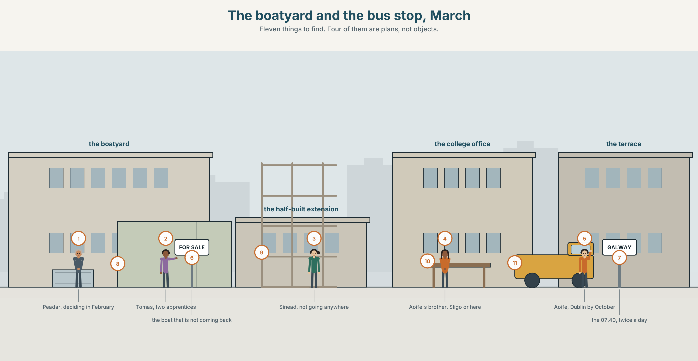{width=6.6in}

*The boatyard and the bus stop, March — Eleven things to find. Four of them are plans, not objects.*

# What will you be doing in a year?

**By the end of this unit you can describe what you will be doing in a year, with real timings.
One hundred words.**

| ◆ **A · THE WORLD** | A town where everybody's plan depends on somebody else's |
|---|---|
| ◆ **B · THE SYSTEM** | the future continuous · future time expressions · 23 words for work and ambition · 17 words for placing things in the future · *'ll be* as one sound |
| ◆ **C · THE PERFORMANCE** | A year ahead, with dates in it |

---

### 0A · Find it

**Find eleven things in this picture.** Four of them are plans, not objects.

> a job advert · a training notice · a timetable on a wall · a boat for sale ·
> a half-built extension · a calendar · a contract on a table · a bus to Galway ·
> a college prospectus · a key on a hook · a van with a new name on it

### 0B · Guess it

**Three of the people in this picture will not be here in a year.** Which three,
and what is the evidence?

### 0C · Say it ⏺

**Record thirty seconds.** *This time next year, what will you be doing on a Tuesday morning?*
Be specific about the Tuesday. You will record it again at the end of this unit.

---

## Part 1 · Vocabulary Lab 1 ◆ **B · THE SYSTEM**

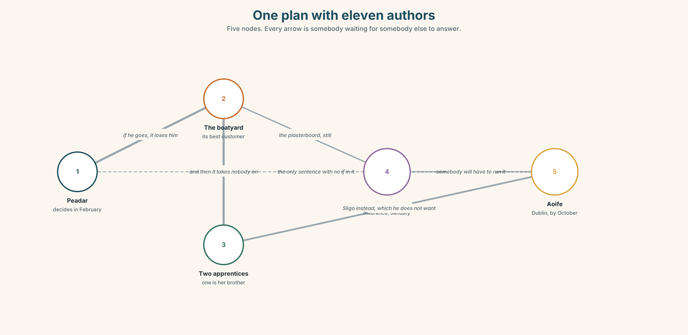{width=6.6in}

*One plan with eleven authors — Five nodes. Every arrow is somebody waiting for somebody else to answer.*

### 1A · Meet — the words of a working year

Match each word to one place on the map.

> **career** · **ambition** · **plan** · **apply** · **qualify** · **training** ·
> **course** · **promotion** · **contract** · **season**

### 1B · Sort — a thing you get, or a thing you do?

Two columns.

> apply · promotion · qualify · contract · training · plan · course · chance

**One of them is both, and that is why people confuse them.** Which?

### 1C · Meet — the words for going and staying

> **leave** · **return** · **settle**

**Leaving is an event. Settling is a judgement, usually made by other people.**
**After how long does somebody stop being new where you live?**

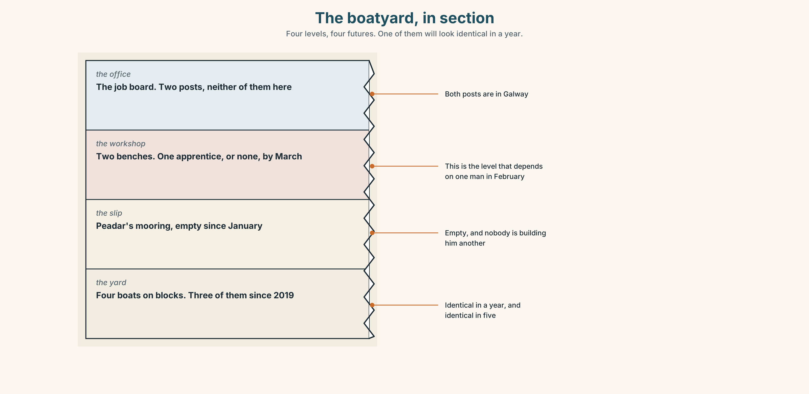{width=6.6in}

*The boatyard, in section — Four levels, four futures. One of them will look identical in a year.*

**Look at the boatyard, in section.** Four levels, four futures.
**Which level will have changed most in a year, and which will look identical?**

### 1D · Stretch — the phrases

Complete each one with one word.

1. **This time next ______** she will be halfway through the course.
2. **By ______** , the extension will be finished or it will be abandoned.
3. He is **looking ______ work** on the bigger boats.
4. For some people it is **a fresh ______** . For others it is leaving.
5. The yard has **taken ______** two apprentices for the season.

### 1E · The saying

> **f** **We'll see where we are.**

Five words that postpone a decision without refusing it.

> **Write what each of these people means by it:** somebody who intends to go,
> somebody who intends to stay, and somebody who has not decided.

### 1F · Own it

Think about this time next year. Tell a partner **three sentences**: where you will be living,
what you will be doing on a weekday morning, and one thing that will decide it.

---

## Part 2 · Listening ◆ **A · THE WORLD**

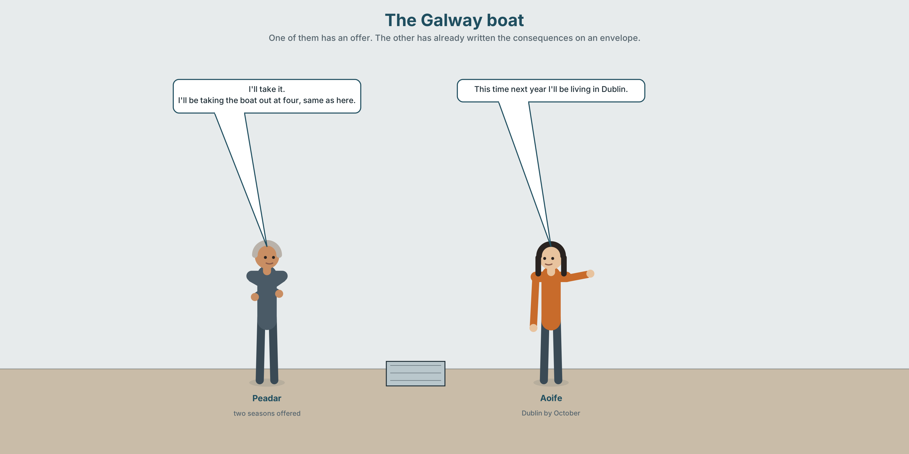{width=6.6in}

*The Galway boat — One of them has an offer. The other has already written the consequences on an envelope.*

### 2A · The Galway boat 🔊 Track 7.1

**Before you listen.** Peadar has been offered work on a bigger boat out of Galway.
**Guess: is the money the main question?**

**Listen once. One question.** When does the contract start?

**Listen again. Complete the table.**

| | This time next year | What has to happen first | What they are not saying |
|---|---|---|---|
| Peadar | | | |
| Aoife | | | |
| Sinéad | | | |

**Listen again. Choose.**

1. The contract is for **one season / two seasons / three years**.
2. Peadar will be away **four nights a week / three weeks at a time / permanently**.
3. Aoife will be **at college / working here / not sure**.
4. The hall will be **finished / still waiting / sold**.

**Noticing.** Four sentences from the recording.

1. *I'll take it.*
2. *I'll be taking the boat out at four, same as here.*
3. *This time next year I'll be living in Galway.*
4. *By then the hall will be finished.*

**One of these is a decision. Three describe a future that is simply going on.**
Which is the decision?

### 2B · Decoding clinic 🔊 Track 7.2

Twenty-five seconds of Peadar. Four jobs.

1. How many times does he say *I'll be*?
2. In *I'll be taking*, how many syllables can you hear in the first two words?
3. Catch the date and the length of the contract.
4. He says one thing about a Tuesday. What?

> Transcripts, page 156.

---

## Part 3 · Grammar Lab 1 ◆ **B · THE SYSTEM**

### A future that is already running

### 3A · Notice

Look at the four sentences in Part 2.

1. Sentence 1 and sentence 2 both use *will*. **What is different about what they do?**
2. Sentence 3 names a time. **Does it name a moment or a period?**
3. **Which of the four would you use to answer "Have you decided?"**
4. *I'll phone you* and *I'll be phoning you*. **Which one sounds like a promise and which like
   a routine?**
5. Try *"This time next year I'll live in Galway."* **It is not wrong. What does it lose?**

### 3B · See

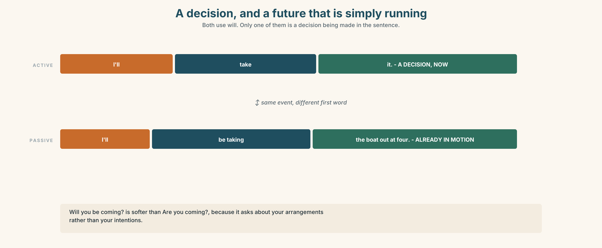{width=6.6in}

*A decision, and a future that is simply running — Both use will. Only one of them is a decision being made in the sentence.*

Now look at the second picture. **It runs from a decision made now to a year that is simply
running. Where does *going to* sit?**

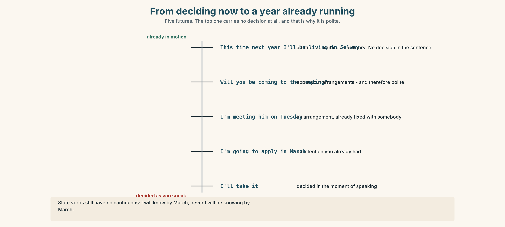{width=6.6in}

*From deciding now to a year already running — Five futures. The top one carries no decision at all, and that is why it is polite.*

### 3C · Know

| | Shape | Use it for |
|---|---|---|
| **will** | *will* + verb | a decision made as you speak · *I'**ll** take it.* |
| **going to** | *am going to* + verb | an intention you already had · *I'**m going to** apply.* |
| **future continuous** | *will be* + *-ing* | a future that will simply be running · *I'**ll be** taking the boat out at four.* |

> **The future continuous is the least dramatic of the three**, and that is its point.
> It describes a future as **ordinary**, as something already in motion, with no decision
> being made in the sentence.

> **It is also the polite one.** *Will you be coming?* is softer than *Are you coming?*,
> because it asks about your arrangements rather than your intentions.

> **The time expressions it likes:** *this time next year · by then · by the end of ·
> in a year's time · eventually · meanwhile*

> **Watch out.** State verbs still have no continuous.
> ✗ *I'll be knowing by March.* ✓ *I'll know by March.*

### 3D · Use — controlled

> This time next year Peadar (1) __________ (live) in Galway and
> (2) __________ (take) a bigger boat out at four. The contract (3) __________ (start) in
> March. By then Aoife (4) __________ (study) in Dublin, and the hall
> (5) __________ (be) finished, or it (6) __________ (still / wait) for plasterboard.
> Sinéad says she (7) __________ (not go) anywhere, and that she
> (8) __________ (do) exactly this on the same Tuesday in five years.

### 3E · Use — guided

Put each one into the future continuous.

1. I start the course in September. *(and in October?)*
2. He takes the boat out at four every day. *(next year, in Galway?)*
3. We are rebuilding the hall. *(this time next year?)*
4. She works in Dublin. *(by then?)*
5. They wait for the plasterboard. *(by Christmas?)*

### 3F · Use — open

**Ask three people:** *What will you be doing at nine o'clock on a Tuesday this time next year?*
**Push for a detail.** Then report the most specific answer to the class.

### 3G · Check — six items

> 1. This time next year I ______ (live) in Galway.
> 2. By then the hall ______ (be) finished.
> 3. ______ you ______ (come) to the meeting? *(polite)*
> 4. I ______ (take) it. *(deciding now)*
> 5. I ______ (apply) in March. *(I decided last week)*
> 6. I ______ (know) by March. *(not continuous)*

**0–3 →** Workbook pp. 40–42. **4–5 →** Part 6. **6 →** page 151.

---

## Part 4 · Speaking ◆ **C · THE PERFORMANCE**

### 4A · Fluency starter — the Tuesday

Your teacher names a time: **nine o'clock, Tuesday, next March.**
Each learner says one sentence beginning *"I'll be…"* **Nobody may say *I don't know*.**

**Four rounds. Four Tuesdays, further and further away.**

### 4B · The functional core — describing a year ahead

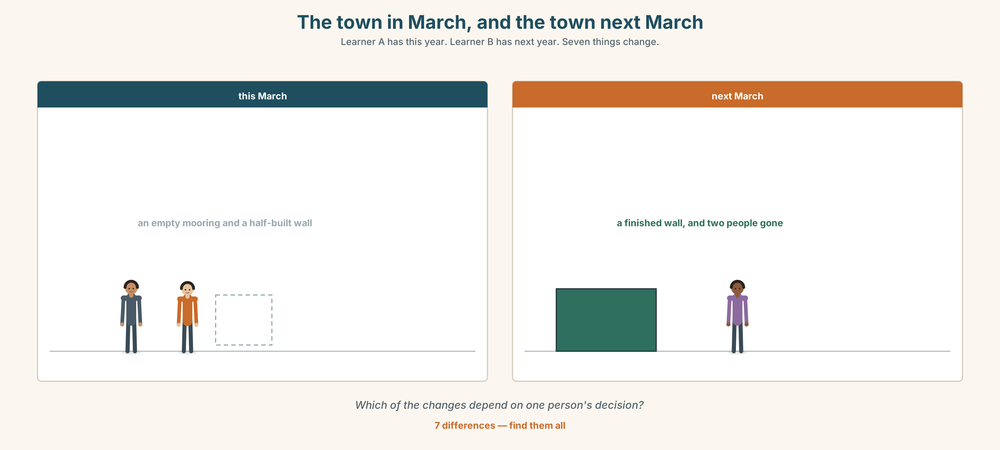{width=6.6in}

*The town in March, and the town next March — Learner A has this year. Learner B has next year. Seven things change.*

**Language Bank**

| | |
|---|---|
| **the running future** | *I'll be…* · *By then I'll be…* · *This time next year…* |
| **the decision** | *I'm going to…* · *I've decided to…* · *I'll take it.* |
| **the condition** | *If it comes off, I'll be…* · *That depends on…* |
| **the honest hedge** | *Hopefully.* · *We'll see where we are.* · *Ask me in March.* |

**Role play.** Learner A has been offered something far away. Learner B wants them to stay.
**Six minutes.** Neither may use the word *should*.

### 4C · The performance — one hundred seconds ⏺

Describe **your year ahead**. **One hundred seconds.** You must give:

> what you will be doing on an ordinary morning · one date · one thing that has to happen first ·
> one thing you will not be doing

**Record it.**

### 4D · Observer

One person listens for **one thing**: was there a real date, or only *soon*?

### 4E · Two criteria

> ☐ Did I use the future continuous at least three times?
> ☐ Is there a specific date or month in it?

---

## Part 5 · Reading ◆ **A · THE WORLD**

### 5A · Predict

A personal essay. The title is **"Everybody here is waiting for somebody else's answer."**
**What do you expect it to describe?** One sentence.

### 5B · Read — one hundred and ten seconds

---

**Everybody here is waiting for somebody else's answer**

I counted it out on the back of an envelope in March and it frightened me.

Peadar will decide about Galway in February. If he goes, the boatyard loses its best customer and
Tomás's cousin does not take on the two apprentices, and one of those apprentices is my brother,
who will then be applying to the college in Sligo instead, which he does not want and which he
will probably get.

Sinéad will not leave. She has said so for eight months and I believe her. But the hall will not
reopen until the plasterboard arrives, and if it is still shut in January the committee will have
to decide whether to keep paying the insurance on a building nobody can use, and if they stop
paying it then Sinéad will be running a community with nowhere to put it.

I will be at college in Dublin by October. That is the only sentence in this piece with no *if*
in it, and I notice that I have put it last, and that it is also the only one that is entirely
about me.

A small town is not a set of individual plans. It is one plan with eleven authors, and nobody has
the whole document.

---

### 5C · Answer

1. When will Peadar decide, and what are the three consequences the writer traces?
2. Where will the writer's brother apply instead, and how does she describe his chances?
3. **What is the chain of events around the hall?**
4. What is the only sentence with no *if* in it?
5. **Why does the writer notice that she put it last?**
6. What does the last sentence claim about small towns?

### 5D · Vocabulary in context

Guess from the text. Then check.

> counted it out · take on · comes down to · which he will probably get · eleven authors

### 5E · The counter-text

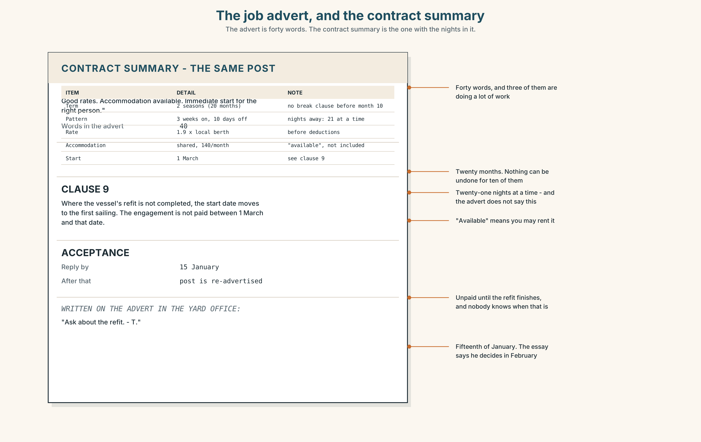{width=6.6in}

*The job advert, and the contract summary — The advert is forty words. The contract summary is the one with the nights in it.*

**Read the job advert and the contract summary, and answer.**

1. What is the post, and how long is the contract?
2. **How many nights a week is the successful applicant away, and where is that stated?**
3. What does the advert say about accommodation, and what does the contract say?
4. One clause changes the start date if something happens. Which, and what?

### 5F · Two texts

The essay says Peadar will decide **in February**.
The contract requires acceptance **by 15 January**.

**Put those two facts together. What has the writer got wrong, and does it matter?**
Two sentences.

---

## Part 6 · Vocabulary Lab 2 ◆ **B · THE SYSTEM**

### Putting things in the future

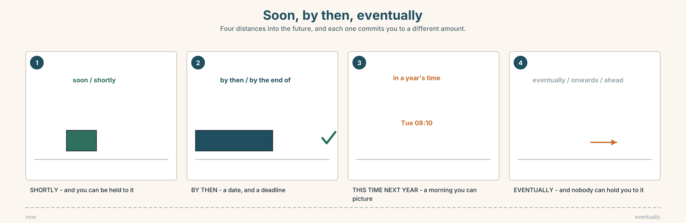{width=6.6in}

*Soon, by then, eventually — Four distances into the future, and each one commits you to a different amount.*

### 6A · Sort — soon, far off, or in between?

Three columns.

> soon · shortly · eventually · by then · this time next · in a year's time · later ·
> onwards · meanwhile · ahead

### 6B · Chunk completion

1. **This time ______** year she will be qualified.
2. **By the ______ of** March we will know.
3. **In a year's ______** nobody will remember this.
4. He is **looking for ______** on the bigger boats.
5. For her it is **a fresh ______** .
6. They always **end ______** coming back.

### 6C · Three that are not as sure as they sound

**hopefully · likely · eventually**

Each of these looks like a prediction and is actually a hedge.

**Rewrite each sentence so the hedge is honest and visible.**

1. Hopefully I'll be finished by March.
2. He's likely to take it.
3. Eventually the hall will reopen.

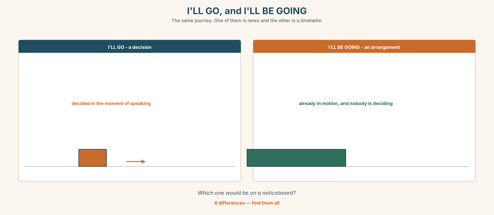{width=6.6in}

*I'LL GO, and I'LL BE GOING — The same journey. One of them is news and the other is a timetable.*

**Six differences.** Find them, then answer the question under the picture.

### 6D · Contrast Clinic — will, going to, or will be -ing

Six items.

1. *(the phone rings)* I ______ get it.
2. I ______ apply in March. *(decided last week)*
3. This time next year I ______ live in Galway.
4. ______ you ______ come to the meeting? *(polite enquiry)*
5. By then we ______ wait eleven months for that plasterboard.
6. I ______ know by March. *(a state)*

---

## Part 7 · Pronunciation & Fluency Lab ◆ **B · THE SYSTEM**

### Three words that become one and a half

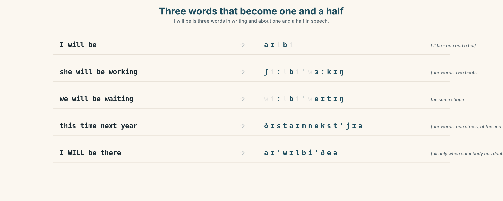{width=6.6in}

*Three words that become one and a half — I will be is three words in writing and about one and a half in speech.*

### 7A · Hear 🔊 Track 7.3

> I will be → *I'll be* → /aɪlbi/
> she will be working → /ʃiːlbiˈwɜːkɪŋ/
> we will be waiting → /wiːlbiˈweɪtɪŋ/
> this time next year → /ðɪstaɪmnekstˈjɪə/

### 7B · Say

Say each one. Then say the sentence three times, faster:

> *This time next year I'll be taking the boat out at four.*

### 7C · Make it mean something

Say these two:

> *I WILL be there.* *(somebody has doubted it)*
> *I'll be there.* *(it is simply an arrangement)*

**Which of the two is a promise, and which is a timetable?**

### 7D · Fluency 20 ⏺

Twenty seconds: **three things you will be doing this time next year.**
Three times, faster, with *'ll be* every time.

---

## Part 8 · Writing ◆ **C · THE PERFORMANCE**

### A year ahead · 100 words

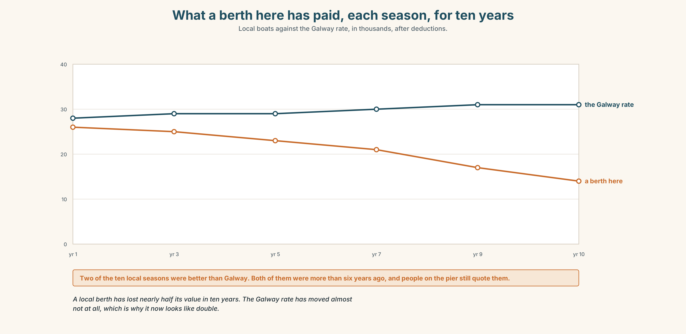{width=6.6in}

*What a berth here has paid, each season, for ten years — Local boats against the Galway rate, in thousands, after deductions.*

### 8A · Read the model

> By October I'll be in Dublin, and on a Tuesday morning I'll be on the 8.10 from Drumcondra with
> a bag that is too heavy, because I have seen the timetable and I know what the walk is like.
> `[a date, a specific morning, and a detail that proves the writer has actually looked]`
>
> I'll still be coming back one weekend in three. That is not sentiment; it is the cheapest train
> and my mother's birthday is in November. `[what continues, and the reason is practical rather
> than emotional]`
>
> I will not be running the hall. Somebody in this town is going to have to, and it is not going
> to be me, and I would rather say that now than in March. `[what the writer will not be doing,
> said plainly, which is the hardest sentence here]`

**Questions about the writer's choices:**

1. The first paragraph names a train. **What does that do that "I'll be studying" does not?**
2. The last paragraph is a refusal. **Why put it in a piece about your own year?**

### 8B · The anti-model

> Next year I hope to be doing something interesting. I would like to study or maybe work, and I
> am keeping my options open. Hopefully things will work out and I will be happy with whatever I
> decide to do.

Correct English, and a year of nothing. **Name three things it does not contain.**

### 8C · Plan

> a date → an ordinary morning, with a detail → what continues, and why →
> one thing you will not be doing

### 8D · Write — 100 words
### 8E · Peer review — two criteria

> ☐ Is there a real date and a real morning?
> ☐ Is there one thing the writer rules out?

### 8F · Write it again · 8G · Publish

On the wall, with the job advert from Part 5E beside it.

---

## Part 9 · The File ◆ **A · THE WORLD + C · THE PERFORMANCE**

# WORK FILE · The Interview

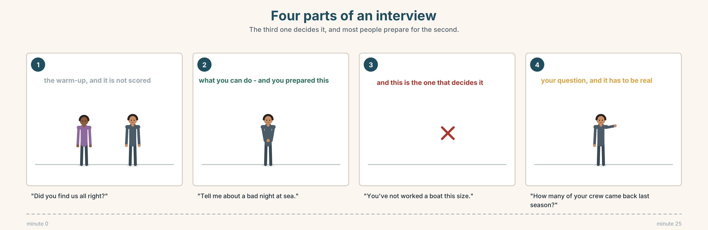{width=6.6in}

*Four parts of an interview — The third one decides it, and most people prepare for the second.*

### 9A · Twenty-five minutes 🔊 Track 7.4

Peadar is interviewed for the Galway post. **Listen.**

1. What is the first real question, and how long does it take to arrive?
2. **Which answer does he give too quickly, and what does it cost him?**
3. What does he ask them, and when?

### 9B · The four parts of an interview

> the warm-up · the thing you can do · the thing you have not done ·
> the questions you ask them

Match each to one phrase.

> *"Did you find us all right?"* · *"Tell me about a bad night at sea."* ·
> *"You've not worked a boat this size."* · *"How many of your crew came back last season?"*

### 9C · The answer to the question about what you cannot do

The worst answer is a denial. The second worst is an apology.

**Which of these four is best, and why?**

1. *"I'd pick it up quickly."*
2. *"No, I haven't. The handling's different and I'd want a fortnight alongside somebody."*
3. *"Size isn't really the issue."*
4. *"I'm sorry, I know that's a problem."*

### 9D · Your turn

In pairs. **Ten minutes.** One interviews, one is interviewed, for anything at all.
The interviewer **must** ask about something the candidate has not done.
**The candidate must ask one real question back.**

### 9E · Transfer

**Write down the question you would ask at the end of an interview this year.**
Not a polite one. A real one. Bring it.

---

## Part 10 · Mediation & Interaction ◆ **C · THE PERFORMANCE**

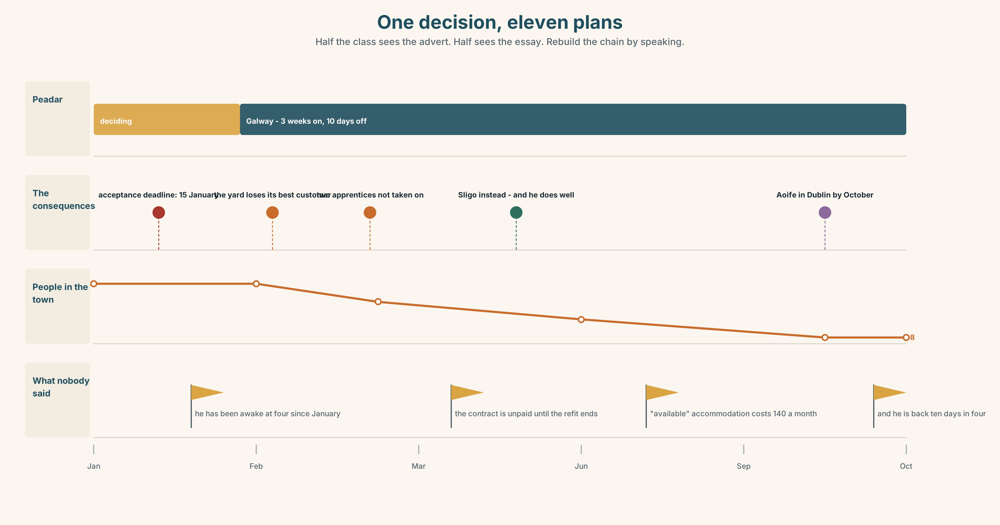{width=6.6in}

*One decision, eleven plans — Half the class sees the advert. Half sees the essay. Rebuild the chain by speaking.*

### 10A · Relay

Half the class sees the job advert. Half sees the essay. **Rebuild the chain of decisions by
speaking.** Ten minutes.

### 10B · Simplify

Explain the contract summary from Part 5E to somebody who has never signed one.
**Four sentences only.**

> **Plan:** how long → what the hours actually are → what is not included →
> the one date that matters

### 10C · Compress

The essay in Part 5 into **thirty-five words**, keeping the last sentence's idea.

### 10D · Online

Write **one message** to the Galway skipper: you are interested, you have one question about
the start date, and you will answer by a date you name.

### 10E · Your language

How does your language talk about a future that is simply running?
**Is there something like *will be doing*, or do you use a present tense?**
Say *this time next year I'll be living in Galway* in both.

---

## Part 11 · The Decision ◆ **C · THE PERFORMANCE**

# Galway, or the season after

Peadar is offered a berth on a bigger boat out of Galway. Two seasons, better money, three weeks
at a time away.

- **Take it.** The money is nearly double. The boat he had is not coming back and nobody is
  building him another.
- **Stay.** Wait a season. The yard thinks there will be a berth here by next spring, and the
  yard has thought that before.
- **Take it for one season.** The contract is for two. Ask for one, and risk being turned down
  for something he has already decided he wants.

### 11A · The evidence

1. **The job advert and the contract** from Part 5E — and the clause about the start date.
2. **The chart** — what a berth here has paid, each season, for ten years.
3. **The voice.** Aoife, twenty seconds: *"Everyone keeps telling him what it would do to the
   town. Nobody has asked him what he will be doing at four o'clock in the morning if he stays,
   because the answer is nothing, and he has been doing nothing at four o'clock in the morning
   since January."*

### 11B · Talk about it

In threes. Everybody says one. Use the frame.

> *This time next year Peadar will be ______ , because ______ .*

**Words you can use:** *career · chance · contract · season · leave · return · settle · future*

### 11C · Decide

Write **two sentences**. Choose, and say why.

> I think Peadar should ______________________ ,
> because ______________________ .

### 11D · Model decision

> He should take it for the two seasons and say so before January, not in February. Asking for
> one season is asking a skipper to carry the cost of his uncertainty, and skippers remember
> that. Two seasons is twenty months, and a man who has been awake at four every morning since
> January with nothing to go out in does not need a smaller version of the thing he wants.

### 11E · The Reveal

> **What happened.** He took the two seasons and started in March.
>
> He is away three weeks at a time and says the work is easier than here and the boat is better
> than anything he will ever own. He has not sold the house. He is back for ten days in four,
> and on those ten days he is on the pier at four in the morning doing nothing, which his sister
> says is the only part of this that has not changed.
>
> The yard did not take on the two apprentices. Aoife's brother went to Sligo and is, by every
> account including his own, doing well.

**He went. The chain in the essay happened almost exactly as she wrote it. And the one person it
was supposed to be worst for is doing fine.**

> **Was it the right decision?** Say why — and say what you make of the ten days in four.

---

## Part 12 · Landing ◆ **all three lines**

### 12A · Recycle — ten items

> 1. This time next year I ______ (live) in Galway.
> 2. By then the hall ______ (be) finished.
> 3. ______ you ______ (come) to the meeting? *(polite)*
> 4. He is **looking ______ work** on the bigger boats.
> 5. They always **end ______** coming back.
> 6. *(Unit 6)* The rope ______ (must / break) in the night.
> 7. *(Unit 5)* *"Measure it."* → He told me ______ it.
> 8. *(Unit 4)* She ______ me that she had checked it. *(said / told)*
> 9. *(Unit 2)* We ______ (wait) since June.
> 10. *(A2.1 U5)* If it ______ (rain), we'll stay.

### 12B · Consolidate

**One hundred words.** Your year ahead. Three future continuous forms, one real date,
and one thing you will not be doing.

### 12C · Can-do, with evidence

| I can… | My evidence | Sure? |
|---|---|---|
| describe a future that is simply running | Part 3G score | ◯ ◑ ● |
| describe a year ahead in a hundred seconds | Part 4C recording | ◯ ◑ ● |
| write a hundred words with a real date in them | Part 8 draft 2 | ◯ ◑ ● |
| answer a question about what I have not done | Part 9D role play | ◯ ◑ ● |

### 12D · Replay ⏺

Find your thirty seconds from Part 0C. Listen. **Record it again.**
One sentence: what is different?

### 12E · Glossary — forty items, as a map

> **THE WORK** · career · ambition · plan · contract · season · crew · boatyard · promotion
> **GETTING IN** · apply · qualify · training · course · chance · look for work · take on
> **GOING AND STAYING** · leave · return · settle · a fresh start · end up · future
> **THE RUNNING FUTURE** · will · going · be doing · this time next · by then · by the end of · in a year's time
> **SOON, AND LATER** · soon · shortly · later · eventually · onwards · meanwhile · ahead
> **THE HEDGE** · hopefully · likely · we'll see where we are · I'll still be here

### 12F · Next

> **Unit 8 · What do you know about this place?**

# A2.2 · Unit 8 · The Only Building Above the Line

> **English Animated** · *Telling the Story* · Ballinmore, west coast of Ireland
> Student's Book pages 160–181 · 22 pp · ~10 hours

---

## Part 0 · The Big Picture ◆ **A · THE WORLD**

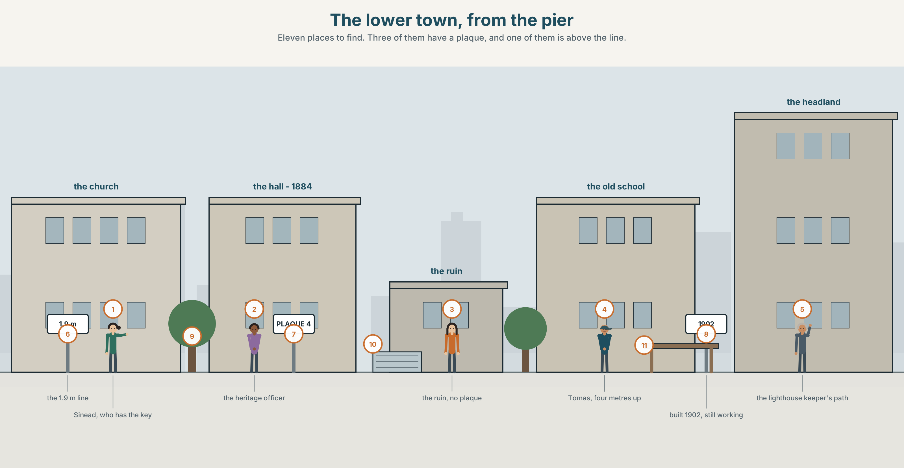{width=6.6in}

*The lower town, from the pier — Eleven places to find. Three of them have a plaque, and one of them is above the line.*

# What do you know about this place?

**By the end of this unit you can give a ninety-second tour of a place, adding the background a
visitor would not know.**

| ◆ **A · THE WORLD** | A town with eleven landmarks and one of them is worth money |
|---|---|
| ◆ **B · THE SYSTEM** | non-defining relative clauses · commas and clause boundaries · 23 words for places and history · 17 words for adding things · the pause, and the pitch reset after it |
| ◆ **C · THE PERFORMANCE** | Ninety seconds that give a visitor what a sign cannot |

---

### 0A · Find it

**Find eleven places in this picture.** Three of them have a plaque.

> the harbour · the pier · the headland · the cliff path · the bay · the lighthouse ·
> the hall · the church · the ruin · the old school · the war memorial

### 0B · Guess it

**One building in this picture is above the flood line and one is barely below it.**
Which, and how can you tell from the drawing?

### 0C · Say it ⏺

**Record thirty seconds.** *Describe one place near you to somebody who has never been.
Give one fact a sign would not tell them.* You will record it again at the end of this unit.

---

## Part 1 · Vocabulary Lab 1 ◆ **B · THE SYSTEM**

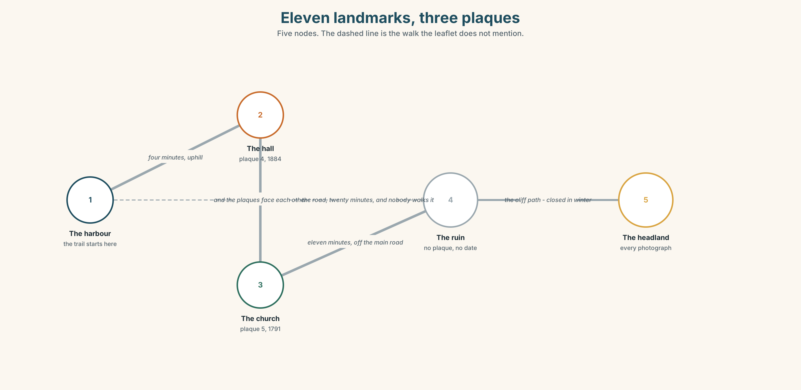{width=6.6in}

*Eleven landmarks, three plaques — Five nodes. The dashed line is the walk the leaflet does not mention.*

### 1A · Meet — the shape of a coast

Match each word to one place on the map.

> **harbour** · **pier** · **headland** · **cliff** · **bay** · **lighthouse** · **ruin** ·
> **church** · **hall** · **landmark**

### 1B · Sort — natural, built, or ruined?

Three columns.

> cliff · pier · ruin · bay · church · headland · lighthouse · hall · harbour

**One of them is in two columns, and the argument about which is three hundred years old.**
Which?

### 1C · Meet — what happened to it

> **founded** · **destroyed** · **restored**

A building can be restored to a date that it never actually looked like.
**Which date would you restore the hall to, and who decides?**

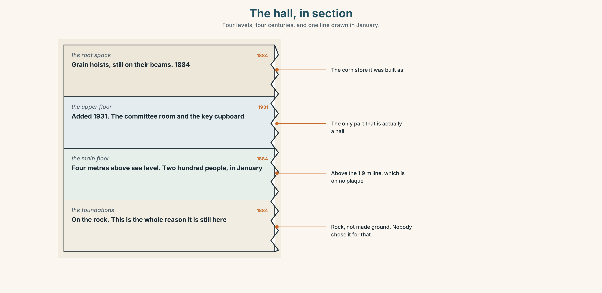{width=6.6in}

*The hall, in section — Four levels, four centuries, and one line drawn in January.*

**Look at the hall, in section.** Four levels, four centuries.
**Which level is the oldest, and which is the only one above the flood line?**

### 1D · Stretch — the phrases

Complete each one with one word.

1. The pier **dates ______** 1886.
2. The headland is **named ______** a family that left in 1912.
3. The ruin is **worth ______** , though there is nothing to read there.
4. It is **off the main ______** , which is why it is still standing.
5. The old school **looks ______ over** the whole bay.

### 1E · The saying

> **f** **You'd never know.**

Three words that a local says and a visitor cannot.

> **Write three facts about a place you know that a visitor would never know.**
> **One of them should be slightly uncomfortable.**

### 1F · Own it

Think of one building near you. Tell a partner **three sentences**: what it is, what it was,
and one thing that is not on any sign.

---

## Part 2 · Listening ◆ **A · THE WORLD**

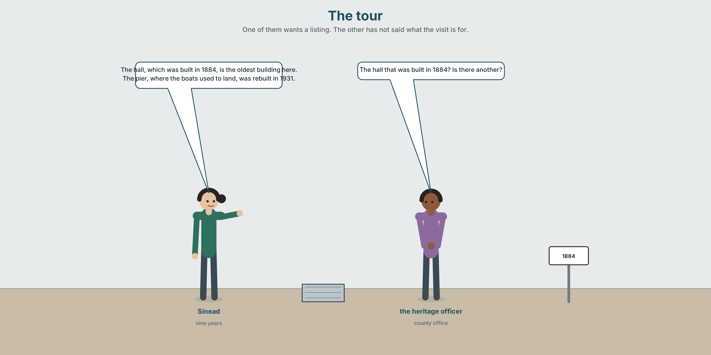{width=6.6in}

*The tour — One of them wants a listing. The other has not said what the visit is for.*

### 2A · The tour 🔊 Track 8.1

**Before you listen.** Sinéad is showing a heritage officer round. There is a reason.
**Guess what she wants.**

**Listen once. One question.** How old is the hall?

**Listen again. Complete the table.**

| Building | Date | What it was | What is not on the plaque |
|---|---|---|---|
| the hall | | | |
| the pier | | | |
| the ruin | | | |

**Listen again. True or false?**

1. The hall was built as a church. ☐ T ☐ F
2. The pier was destroyed twice. ☐ T ☐ F
3. The ruin has a plaque. ☐ T ☐ F
4. The hall is the only building above the flood line. ☐ T ☐ F

**Noticing.** Four sentences from the recording.

1. *The hall, which was built in 1884, is the oldest building here.*
2. *The hall that was built in 1884 is the oldest building here.*
3. *Sinéad, who has run it for nine years, says it should stay.*
4. *The pier, where the boats used to land, was rebuilt in 1931.*

**Sentences 1 and 2 look nearly identical. One of them implies there is another hall.**
Which one, and what does the comma do?

### 2B · Decoding clinic 🔊 Track 8.2

Twenty-five seconds of Sinéad. Four jobs.

1. How many times does she pause in the middle of a sentence?
2. After a pause, does her voice start higher or lower?
3. Catch the three dates.
4. One clause is added as an afterthought. Which, and how do you know?

> Transcripts, page 157.

---

## Part 3 · Grammar Lab 1 ◆ **B · THE SYSTEM**

### Adding something, rather than narrowing it

### 3A · Notice

Look at the four sentences in Part 2.

1. In sentence 2, how many halls are there?
2. In sentence 1, how many?
3. **Take *which was built in 1884* out of sentence 1. Does the sentence still work?**
4. Now take *that was built in 1884* out of sentence 2. **Does it?**
5. Try *"Sinéad, that has run it for nine years, says it should stay."* **What is wrong?**

### 3B · See

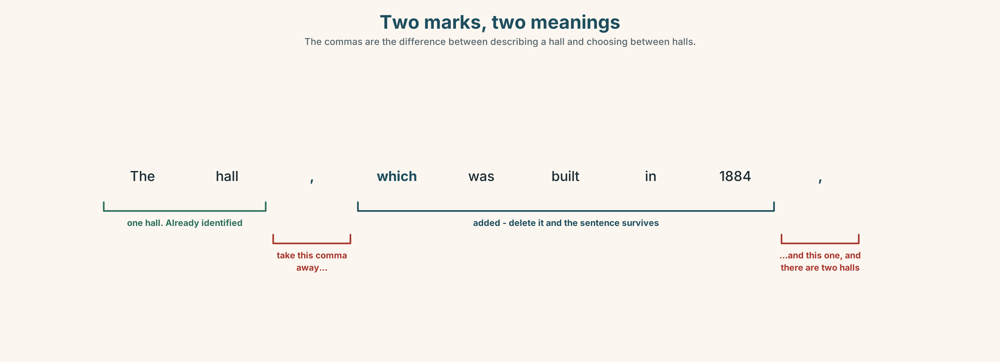{width=6.6in}

*Two marks, two meanings — The commas are the difference between describing a hall and choosing between halls.*

Now look at the second picture. **One sentence, two readings, and the only difference is two
marks.**

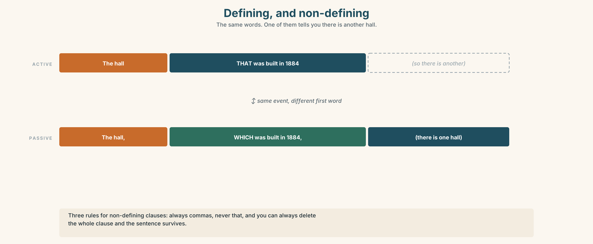{width=6.6in}

*Defining, and non-defining — The same words. One of them tells you there is another hall.*

### 3C · Know

| | | |
|---|---|---|
| **defining** | no commas · tells you **which one** | *The hall **that was built in 1884*** *(so there is another hall)* |
| **non-defining** | commas · **adds** information | *The hall, **which was built in 1884**,* *(there is one hall)* |

> **Three rules for non-defining clauses.**
> 1. Always commas — one before and one after, unless the sentence ends.
> 2. Never ***that***. Use *which*, *who*, *whose*, *where*, *when*.
> 3. You can always delete the whole clause and the sentence survives.

> **With a proper name it is almost always non-defining**, because a name already identifies.
> ✓ *Sinéad, who has run it for nine years, …* ✗ *Sinéad who has run it for nine years …*

> **Quantity phrases take *of which* and *of whom*.**
> *eleven buildings, **most of which** are below the line* ·
> *forty-one traders, **all of whom** were asked*

> **Why it matters.** The comma is the difference between describing a place and
> distinguishing it from another one. On a plaque, that is the whole job.

### 3D · Use — controlled

> The hall, (1) __________ was built in 1884, is the oldest building in the town. Sinéad,
> (2) __________ has run it for nine years, says it should stay. The pier,
> (3) __________ the boats used to land, was rebuilt in 1931. There are eleven listed
> buildings, most (4) __________ are below the flood line. The ruin, the date
> (5) __________ nobody knows, has no plaque. And the headland,
> (6) __________ is named after a family that left in 1912, is where every photograph is taken.

### 3E · Use — guided

Add the information as a non-defining clause. **Remember the commas.**

1. The lighthouse is still working. *(It was built in 1902.)*
2. Tomás has been here four years. *(He wrote the survey.)*
3. The bay fills in forty minutes. *(The tide comes in there fastest.)*
4. There are eleven landmarks. *(Three of them have plaques.)*
5. The old school is empty. *(Its roof was replaced last year.)*

### 3F · Use — open

**Describe four places near you to a partner**, each with one non-defining clause.
**Your partner must spot the one that is actually defining.**

### 3G · Check — six items

> 1. The hall, ______ was built in 1884, is the oldest.
> 2. Sinéad, ______ runs it, says it should stay.
> 3. The pier, ______ the boats landed, was rebuilt.
> 4. Eleven buildings, most ______ ______ are below the line.
> 5. The ruin, the date ______ nobody knows, has no plaque.
> 6. The hall ______ was built in 1884 is the oldest. *(is this right? why / why not)*

**0–3 →** Workbook pp. 46–48. **4–5 →** Part 6. **6 →** page 173.

---

## Part 4 · Speaking ◆ **C · THE PERFORMANCE**

### 4A · Fluency starter — add one thing

One learner names a place. The next adds a non-defining clause. The next adds another to the
new sentence. **The sentence breaks when somebody uses *that*.**

**Four rounds.**

### 4B · The functional core — giving a tour

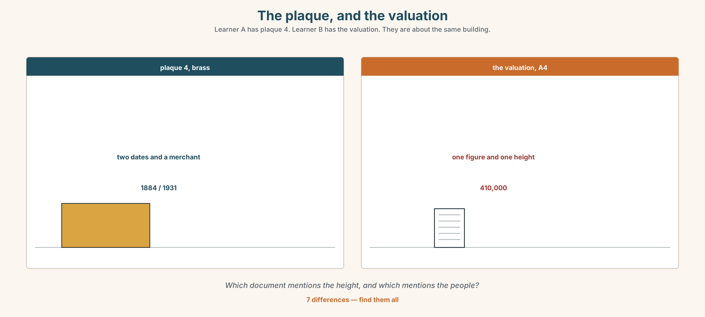{width=6.6in}

*The plaque, and the valuation — Learner A has plaque 4. Learner B has the valuation. They are about the same building.*

**Language Bank**

| | |
|---|---|
| **the fact** | *This is the…* · *It dates from…* · *It was founded in…* |
| **the addition** | *…, which was…* · *…, where they used to…* · *…, who built it.* |
| **the aside** | *By the way…* · *Which is why…* · *Actually…* |
| **the thing no sign says** | *And that's the part nobody mentions.* · *You'd never know.* |

**Role play.** Learner A is showing somebody round. Learner B is a visitor who asks
**"why?"** after every fact. **Six minutes.**

### 4C · The performance — ninety seconds ⏺

Give a **ninety-second tour** of a place you know. You must give:

> three landmarks · one non-defining clause for each · one date · one thing not on any sign

**Record it.**

### 4D · Observer

One person listens for **one thing**: was every added clause separated by a real pause?

### 4E · Two criteria

> ☐ Did I use three non-defining clauses, none of them with *that*?
> ☐ Is there one fact a visitor could not have found alone?

---

## Part 5 · Reading ◆ **A · THE WORLD**

### 5A · Predict

A review of the town's new heritage trail. The title is
**"Eleven plaques and one missing sentence."**
**What do you expect the reviewer to object to?** One sentence.

### 5B · Read — one hundred and ten seconds

---

**Eleven plaques and one missing sentence ★★★☆☆**

Ballinmore's heritage trail, which opened in June, is an hour long, properly signposted, and
better than most things of its kind. The plaques are brass, which will outlast the funding, and
the text on them was written by somebody who has read the parish records rather than the
tourist board's previous leaflet.

It is also, in one respect, a lie by omission, and I want to be careful about how I say that,
because the omission is not the trail's fault.

Plaque 4 is on the hall, which was built in 1884 as a corn store and became a hall in 1931. The
plaque gives both dates and the name of the merchant who paid for it. What it does not say — and
what every person in this town knows — is that the hall is the only building in the lower town
above the 1.9 metre line, that two hundred people were in it on the night of the storm, and that
there is a proposal to sell it.

A heritage plaque is not a news bulletin and nobody expects it to be. But the trail is the only
written account of this place that a visitor will ever read, and it stops in 1931.

Three stars, and the third one is for the brass.

---

### 5C · Answer

1. How long is the trail, and when did it open?
2. **What two things does the reviewer praise about the plaques?**
3. What does plaque 4 say about the hall, and what does it leave out?
4. How many people were in the hall on the night?
5. **Why does the reviewer say the omission is not the trail's fault?**
6. What is the third star for?

### 5D · Vocabulary in context

Guess from the text. Then check.

> signposted · a lie by omission · the parish records · a news bulletin · it stops in 1931

### 5E · The counter-text

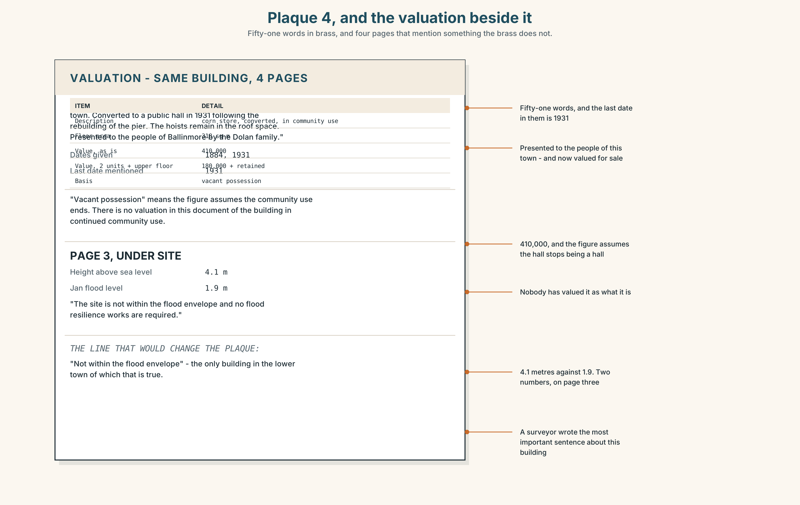{width=6.6in}

*Plaque 4, and the valuation beside it — Fifty-one words in brass, and four pages that mention something the brass does not.*

**Read plaque 4 and the valuation beside it, and answer.**

1. What two dates does the plaque give, and whose name is on it?
2. **What is the building valued at, and on what basis?**
3. What does the valuation say about the building's height above sea level?
4. One line of the valuation would change the plaque if it were on it. Which?

### 5F · Two texts

The plaque says the hall **became a hall in 1931**.
The valuation describes it as **"a corn store, converted, in community use"**.

**Put those two facts together. Which document is a sales document?** Two sentences.

---

## Part 6 · Vocabulary Lab 2 ◆ **B · THE SYSTEM**

### Adding, and adding carefully

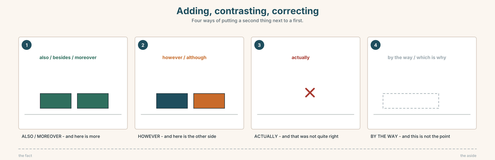{width=6.6in}

*Adding, contrasting, correcting — Four ways of putting a second thing next to a first.*

### 6A · Sort — adds, contrasts, or changes the subject?

Three columns.

> also · besides · moreover · however · although · by the way · actually · which is why

**One of them can do two of the three jobs.** Which?

### 6B · Chunk completion

1. Eleven buildings, most **______ which** are below the line.
2. Forty-one people, all **______ whom** were asked.
3. **By the ______** , the ruin has no plaque at all.
4. The tide comes in fastest there, **which is ______** nobody swims in that bay.
5. I **came ______** the parish records in a drawer in the vestry.
6. **And that's the part nobody ______ .**

### 6C · Three that are not interchangeable

**however · although · actually**

> *however* joins two sentences. *although* joins two clauses. *actually* corrects something.

**Put one in each, and say what the other two would do to the sentence.**

1. The plaque is accurate. ______ , it stops in 1931.
2. ______ the plaque is accurate, it stops in 1931.
3. It stops in 1931 — ______ , in 1931 and not in 1884.

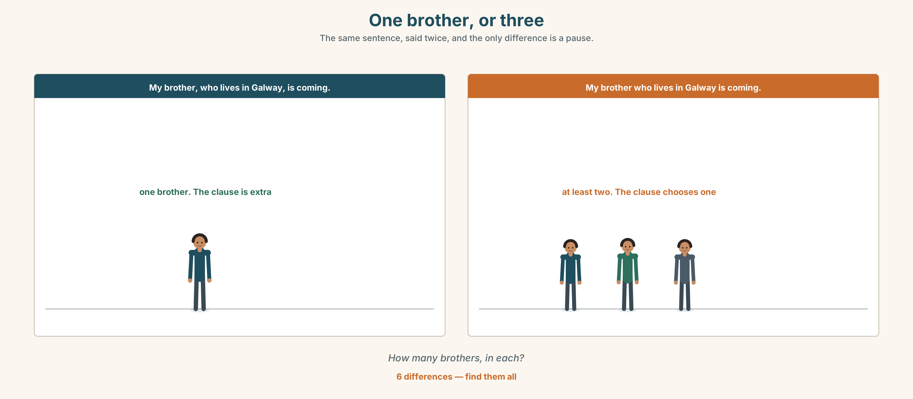{width=6.6in}

*One brother, or three — The same sentence, said twice, and the only difference is a pause.*

**Six differences.** Find them, then answer the question under the picture.

### 6D · Contrast Clinic — commas or no commas

Six items. **Add commas where the clause is non-defining, and say what changes.**

1. The hall which was built in 1884 is the oldest.
2. The woman who runs the hall is called Sinéad.
3. Sinéad who runs the hall has been here nine years.
4. The building where the meeting was held has been sold.
5. The pier which was rebuilt in 1931 is closed again.
6. The only building that is above the line is the hall.

---

## Part 7 · Pronunciation & Fluency Lab ◆ **B · THE SYSTEM**

### The pause, and what happens after it

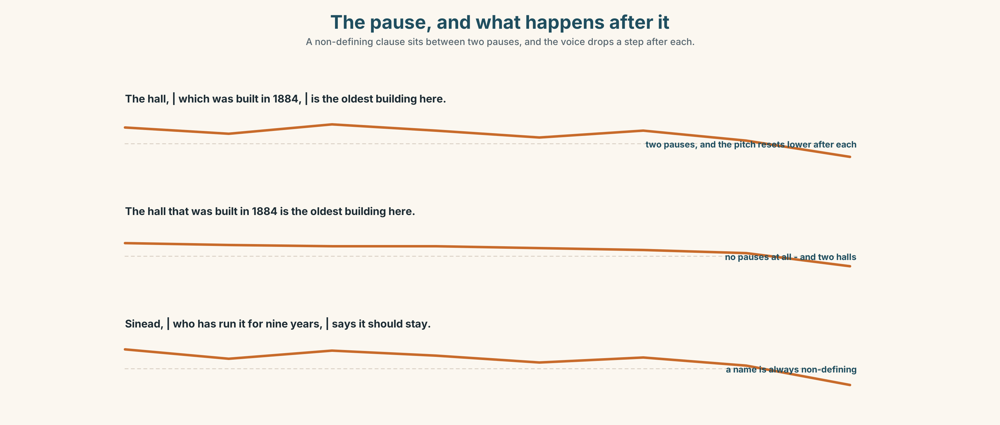{width=6.6in}

*The pause, and what happens after it — A non-defining clause sits between two pauses, and the voice drops a step after each.*

### 7A · Hear 🔊 Track 8.3

> *The hall* | *which was built in 1884* | *is the oldest building here.*
> **Two pauses. And after each one the voice starts a little lower.**

Now hear the defining version, with **no pauses at all**:

> *The hall that was built in 1884 is the oldest building here.*

### 7B · Say

Say both. Then say this one with the pauses and without:

> *Sinéad, who has run it for nine years, says it should stay.*

### 7C · Make it mean something

Say these two:

> *My brother, who lives in Galway, is coming.* *(how many brothers?)*
> *My brother who lives in Galway is coming.* *(how many brothers?)*

**Say both to a partner and have them hold up fingers.** Did they get it from the pause alone?

### 7D · Fluency 20 ⏺

Twenty seconds: **three places, each with a clause between two pauses.**
Three times, faster, keeping the pauses.

---

## Part 8 · Writing ◆ **C · THE PERFORMANCE**

### A place, with what the sign leaves out · 100 words

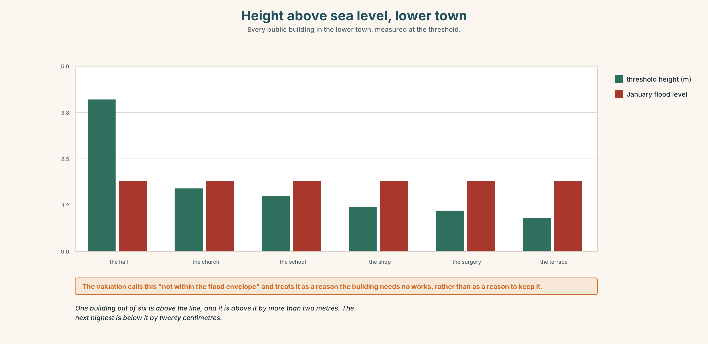{width=6.6in}

*Height above sea level, lower town — Every public building in the lower town, measured at the threshold.*

### 8A · Read the model

> The hall, which was built as a corn store in 1884, stands eleven metres back from the sea and
> four metres above it. `[the added clause, and then the two numbers that turn out to be the
> point]`
>
> It became a hall in 1931, when the pier was rebuilt and the town briefly had money. The plaque
> gives both dates and the merchant's name, which was Dolan. `[a second clause, and one fact
> that the plaque does have]`
>
> It is also the only building in the lower town that the water did not reach, which is why two
> hundred people were in it in January, and which is not on the plaque. `[the defining clause is
> deliberate here — there is only one such building, and the sentence is about which one]`

**Questions about the writer's choices:**

1. The first paragraph gives two measurements before any history. **Why that order?**
2. The last sentence uses *that*, not *which*, and no comma. **Is that a mistake?**

### 8B · The anti-model

> The hall is a lovely old building with a great deal of history. It has been at the centre of the
> community for many years and holds a special place in the hearts of local people. It is well
> worth a visit.

Correct English, and there is no building in it. **Name three things it does not contain.**

### 8C · Plan

> the place, with one added clause → a date and what it was → one number →
> one thing no sign says

### 8D · Write — 100 words
### 8E · Peer review — two criteria

> ☐ Are the non-defining clauses punctuated on both sides?
> ☐ Is there one fact a visitor could not get from a sign?

### 8F · Write it again · 8G · Publish

On the wall, with plaque 4 from Part 5E beside it.

---

## Part 9 · The File ◆ **A · THE WORLD + C · THE PERFORMANCE**

# STUDY FILE · The Seminar

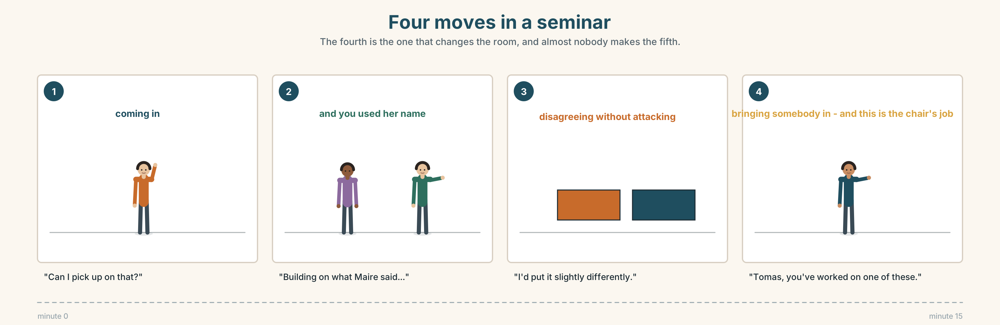{width=6.6in}

*Four moves in a seminar — The fourth is the one that changes the room, and almost nobody makes the fifth.*

### 9A · Eight people and one question 🔊 Track 8.4

A seminar at the county heritage office: *should a building in use be listed?*
**Listen to the first six minutes.**

1. Who speaks first, and does that help them?
2. **What does the chair do when two people start at once?**
3. Which contribution actually changes somebody's mind, and why?

### 9B · Four moves in a seminar

> coming in · building on somebody · disagreeing without attacking · bringing somebody in

Match each to one phrase.

> *"Can I pick up on that?"* · *"Building on what Máire said…"* ·
> *"I'd put it slightly differently."* · *"Tomás, you've worked on one of these."*

### 9C · The move that is almost never made

In most seminars nobody ever says: **"I've changed my mind."**

**Write the sentence that would come before it**, and the sentence that would come after.

### 9D · Your turn

Groups of six. **Fifteen minutes, one question**, from this unit or your own.
**Rule: you must refer to somebody else by name before you make your own point.**
At the end, each person says one thing they heard that they had not thought of.

### 9E · Transfer

**In your next class or meeting, use one of the four moves.** Write down which, and what
happened.

---

## Part 10 · Mediation & Interaction ◆ **C · THE PERFORMANCE**

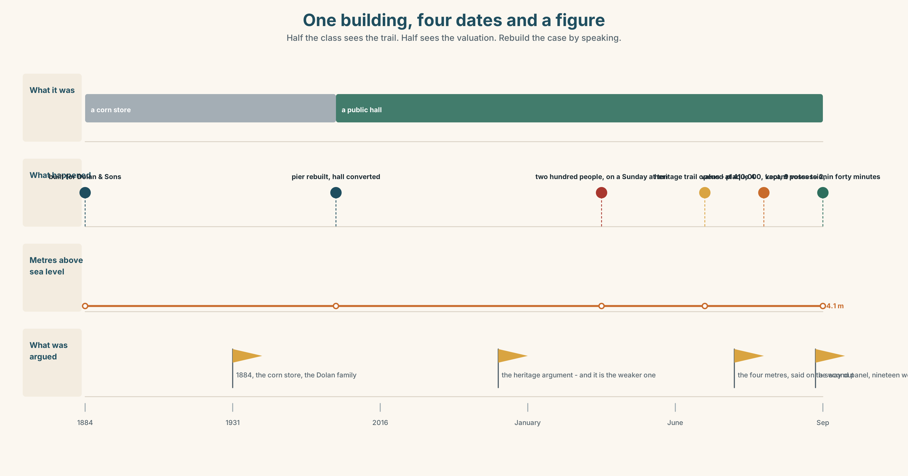{width=6.6in}

*One building, four dates and a figure — Half the class sees the trail. Half sees the valuation. Rebuild the case by speaking.*

### 10A · Relay

Half the class sees the heritage trail. Half sees the valuation. **Rebuild the whole case for
and against selling the hall, by speaking.** Ten minutes.

### 10B · Simplify

Explain the valuation from Part 5E to somebody who has only read the plaque.
**Four sentences only.**

> **Plan:** what the building is → what it is worth → on what basis → what that basis assumes

### 10C · Compress

The review in Part 5 into **thirty-five words**, as a line for the trail's leaflet.

### 10D · Online

Write **one message** to the heritage office: the trail is good, plaque 4 stops in 1931, and
here is the one sentence you want added.

### 10E · Your language

How does your language add information to a noun? **Is there a comma, a pause, or a different
word order?** Say *the hall, which was built in 1884,* in both languages.

---

## Part 11 · The Decision ◆ **C · THE PERFORMANCE**

# The hall, or the wall

The hall is the only building in the lower town above the 1.9 metre line. It is valued at
410,000. The sea wall needs 340,000 that nobody has.

- **Keep it.** It is where two hundred people went in January and the only place they could have
  gone.
- **Sell it.** The wall gets built, and the hall committee gets a room in the new school, which
  is further away and below the line.
- **Sell half.** Split the building: the upper floor stays community, the ground floor is sold
  as two units. It raises about 180,000 and complicates everything.

### 11A · The evidence

1. **Plaque 4 and the valuation** from Part 5E — and the line that would change the plaque.
2. **The chart** — height above sea level of every building in the lower town.
3. **The voice.** Sinéad, twenty seconds: *"I opened it at ten on the Sunday because I had the
   key and it was dry. Nobody asked me to and nobody has thanked me, which is right, because
   anybody with the key would have done it. What I want to know is who will have the key."*

### 11B · Talk about it

In threes. Everybody says one. Use the frame.

> *I think they should ______ , because ______ .*

**Words you can use:** *landmark · heritage · restored · destroyed · visitor · view · community · worth seeing*

### 11C · Decide

Write **two sentences**. Choose, and say why.

> I think they should ______________________ ,
> because ______________________ .

### 11D · Model decision

> They should keep it and find the 340,000 somewhere else, and they should say in public why:
> that the hall is not being kept because it is old but because it is four metres up. The
> heritage argument is the weaker one and it is the one everybody is making, and if the hall is
> ever sold it will be sold by somebody who has only heard the heritage argument and has
> correctly decided that it is sentimental.

### 11E · The Reveal

> **What happened.** They kept it. The decision went 9–2 and took forty minutes, which Sinéad
> says is the fastest the committee has ever done anything.
>
> The argument that was made in the room was about 1884, the corn store and the Dolan family.
> Nobody mentioned the four metres until the vote was over, when Tomás said it on the way out and
> four people stopped walking.
>
> Plaque 4 now has a second brass panel underneath it, added in September. It is nineteen words
> long and it is about the height.

**They made the right decision for the wrong reason, and then somebody fixed the reason.**

> **Was it the right decision?** Say why — and say what the nineteen words should be.

---

## Part 12 · Landing ◆ **all three lines**

### 12A · Recycle — ten items

> 1. The hall, ______ was built in 1884, is the oldest.
> 2. Sinéad, ______ runs it, says it should stay.
> 3. Eleven buildings, most ______ ______ are below the line.
> 4. The pier **dates ______** 1886.
> 5. The headland is **named ______** a family that left.
> 6. *(Unit 7)* This time next year I ______ (live) in Galway.
> 7. *(Unit 6)* The rope ______ (must / break) in the night.
> 8. *(Unit 4)* She ______ me that she had checked it. *(said / told)*
> 9. *(Unit 3)* By the time we arrived, it ______ (already / start).
> 10. *(A2.1 U4)* The person ______ has the key is the caretaker.

### 12B · Consolidate

**One hundred words.** One place. Three non-defining clauses, one date, one number, and one
thing no sign says.

### 12C · Can-do, with evidence

| I can… | My evidence | Sure? |
|---|---|---|
| add information to a noun without narrowing it | Part 3G score | ◯ ◑ ● |
| give a ninety-second tour with real background | Part 4C recording | ◯ ◑ ● |
| write a hundred words a visitor could use | Part 8 draft 2 | ◯ ◑ ● |
| come into a seminar and build on somebody | Part 9D group work | ◯ ◑ ● |

### 12D · Replay ⏺

Find your thirty seconds from Part 0C. Listen. **Record it again.**
One sentence: what is different?

### 12E · Glossary — forty items, as a map

> **THE COAST** · harbour · pier · headland · cliff · bay · lighthouse · view · look out over
> **THE BUILDINGS** · hall · church · ruin · landmark · plaque · heritage
> **WHAT HAPPENED TO IT** · founded · destroyed · restored · dates from · named after
> **FOR A VISITOR** · visitor · worth seeing · off the main road · come across · you'd never know
> **ADDING** · which · who · where · whose · when · most of which · all of whom · also · besides · moreover
> **CHANGING TACK** · however · although · actually · by the way · which is why · and that's the part nobody mentions

### 12F · Next

> **Unit 9 · How much is left?**

# A2.2 · Unit 9 · Four Claims, Enough for Three

> **English Animated** · *Telling the Story* · Ballinmore, west coast of Ireland
> Student's Book pages 182–203 · 22 pp · ~10 hours

---

## Part 0 · The Big Picture ◆ **A · THE WORLD**

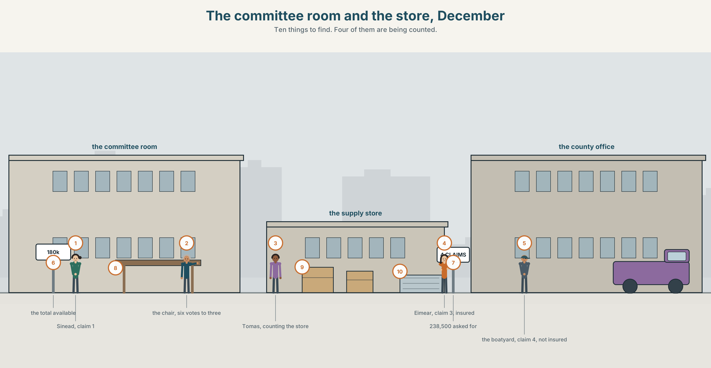{width=6.6in}

*The committee room and the store, December — Ten things to find. Four of them are being counted.*

# How much is left?

**By the end of this unit you can report how a limited resource was shared out, precisely.
One hundred words.**

| ◆ **A · THE WORLD** | A room with four honest claims in it and money for three |
|---|---|
| ◆ **B · THE SYSTEM** | *all · most · both · neither · either · none* · *of* structures · 23 words for resources and fairness · 17 words for quantity · stress used for contrast |
| ◆ **C · THE PERFORMANCE** | An exact account of who got what, and what was left |

---

### 0A · Find it

**Find ten things in this picture.** Four of them are being counted.

> a cheque · a list on a wall · a cash box · a stack of forms · a calculator ·
> a half-empty store room · a queue · a committee table · a locked cupboard · a sign-up sheet

### 0B · Guess it

**Two people in this picture will not ask for anything.** Which two, and why not?

### 0C · Say it ⏺

**Record thirty seconds.** *Think of something limited that you have had to share out.
How did you decide?* You will record it again at the end of this unit.

---

## Part 1 · Vocabulary Lab 1 ◆ **B · THE SYSTEM**

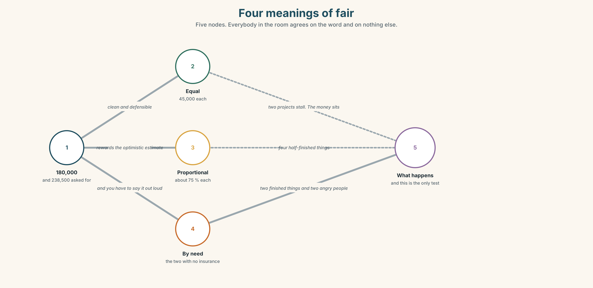{width=6.6in}

*Four meanings of fair — Five nodes. Everybody in the room agrees on the word and on nothing else.*

### 1A · Meet — the words of a limited fund

Match each word to one place on the map.

> **fund** · **relief** · **grant** · **request** · **allocate** · **share** · **priority** ·
> **shortage** · **supply** · **total**

### 1B · Sort — the money, the process, or the judgement?

Three columns.

> fund · allocate · fair · grant · priority · equal · request · relief · limited

**One of them only becomes a judgement when there is not enough.** Which?

### 1C · Meet — three words for what is left

> **remaining** · **spare** · **enough**

**Spare** implies nobody needs it. **Remaining** implies somebody might.
**Which word would a committee use, and which would a claimant?**

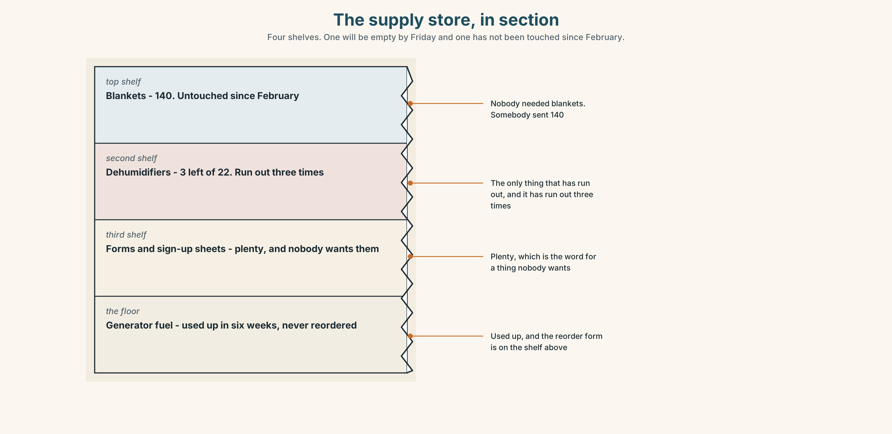{width=6.6in}

*The supply store, in section — Four shelves. One will be empty by Friday and one has not been touched since February.*

**Look at the store room, in section.** Four shelves, four supplies.
**Which shelf will run out first, and which has been untouched since February?**

### 1D · Stretch — the phrases

Complete each one with one word.

1. They have **run ______ of** dehumidifiers for the third time.
2. There are forty and sixty people, so it will not **go ______** .
3. Eight thousand has been **set ______** for emergencies and nobody has touched it.
4. Everybody keeps saying they want **a fair ______** and meaning a different thing by it.
5. The fuel for the generators was **used ______** in six weeks.

### 1E · The saying

> **f** **There isn't enough to go round.**

Seven words that end most conversations about money.

> **They are almost always true.** Write the sentence that should come after them —
> the one that actually decides something.

### 1F · Own it

Think of something limited where you live — parking, time, water, money. Tell a partner
**three sentences**: what is short, who decides, and whether you think it is fair.

---

## Part 2 · Listening ◆ **A · THE WORLD**

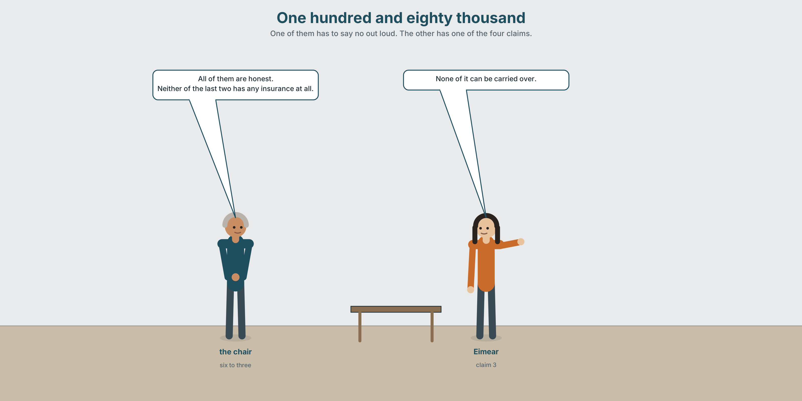{width=6.6in}

*One hundred and eighty thousand — One of them has to say no out loud. The other has one of the four claims.*

### 2A · One hundred and eighty thousand 🔊 Track 9.1

**Before you listen.** There is €180,000 of relief money and four claims.
**Guess: are any of the claims dishonest?**

**Listen once. One question.** How much is each claim for?

**Listen again. Complete the table.**

| Claim | Amount | For what | Why it is strong |
|---|---|---|---|
| 1 | | | |
| 2 | | | |
| 3 | | | |
| 4 | | | |

**Listen again. Choose.**

1. The four claims total **180,000 / 214,000 / 246,000**.
2. **All / Most / None** of the claimants have insurance.
3. **Both / Neither / Either** of the last two claims is for a business.
4. The committee can award **all four partly / three fully / one fully**.

**Noticing.** Four sentences from the recording.

1. *All of them are honest.*
2. *Most of them have been waiting since March.*
3. *Neither of the last two has any insurance at all.*
4. *None of it can be carried over to next year.*

**Three of these are about people. One is about money.**
**Which, and how can you tell from the verb?**

### 2B · Decoding clinic 🔊 Track 9.2

Twenty-five seconds. Four jobs.

1. How many times does the speaker say *of*?
2. In *all of them*, is *of* loud or quiet?
3. Catch the total and the shortfall.
4. One word is said with heavy stress to contrast it with another. Which?

> Transcripts, page 158.

---

## Part 3 · Grammar Lab 1 ◆ **B · THE SYSTEM**

### Saying how many, exactly

### 3A · Notice

Look at the four sentences in Part 2.

1. In sentence 1, could you say *All them are honest*? **Why not?**
2. In sentence 3, *neither* is followed by a singular verb. **Why?**
3. In sentence 4, *none of it* — not *none of them*. **What does that tell you about the money?**
4. **What is the difference between *all the claims* and *all of the claims*?**
5. Try *"Both of the four claims are for businesses."* **What is wrong?**

### 3B · See

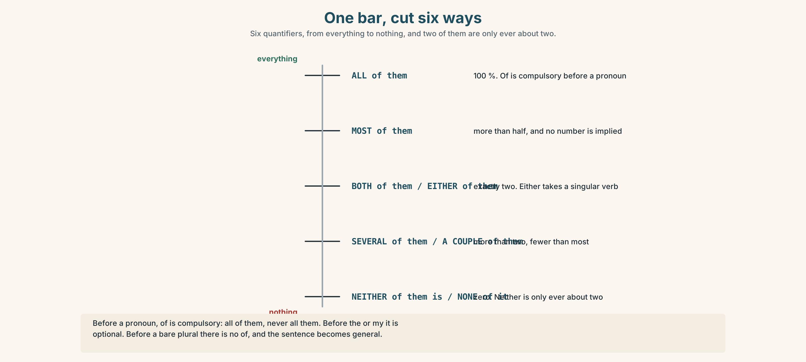{width=6.6in}

*One bar, cut six ways — Six quantifiers, from everything to nothing, and two of them are only ever about two.*

Now look at the second picture. **One bar, cut six ways.
Which cut is *most*, and which is *several*?**

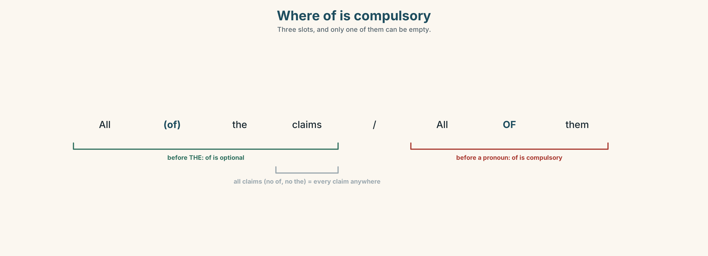{width=6.6in}

*Where of is compulsory — Three slots, and only one of them can be empty.*

### 3C · Know

| | How many | Shape |
|---|---|---|
| **all** | 100 % | *all **the** claims* · *all **of** them* |
| **most** | more than half | *most **of** them* |
| **half / several / a couple of** | in between | *half **of** it* · *several **of** them* |
| **both** | exactly 2 | *both **of** them* — only two |
| **either** | one of 2 | *either **of** them*, singular verb |
| **neither** | 0 of 2 | *neither **of** them* **is** — singular verb |
| **none** | 0 of any number | *none **of** it* / *none **of** them* |

> **The *of* rule.** Before a pronoun, *of* is compulsory: *all **of** them*, never *all them*.
> Before *the* or *my*, *of* is optional: *all (of) the claims*.
> Before a bare plural, there is no *of*: *all claims are honest* — and that is a general
> statement about every claim in the world.

> **Countable or not.** *none of them* (the claims) · *none of it* (the money).
> *few* and *several* go with countables. *little* and *much* go with uncountables.

> **Watch out.** *both*, *either* and *neither* are only ever about **two**.
> ✗ *both of the four claims* ✓ *all four claims*

### 3D · Use — controlled

> (1) __________ of the four claims is dishonest. (2) __________ of them have been waiting
> since March, and (3) __________ of the last two has any insurance.
> (4) __________ of the money can be carried over to next year, so the committee must spend
> (5) __________ of it by December. They can fund three fully and (6) __________ of the
> remaining claim, or (7) __________ four partly.

### 3E · Use — guided

Choose the right word, and say why the others fail.

1. ______ of the four claimants is lying. *(zero out of four)*
2. ______ of the last two has insurance. *(zero out of two)*
3. ______ of them have been waiting since March. *(more than half)*
4. ______ of the money is left. *(a bit, but not much)*
5. ______ of the two is acceptable to the committee. *(one or the other)*

### 3F · Use — open

**Count something in this room.** Tell a partner five facts about it using *all*, *most*,
*both*, *none* and *several*. **One of them must be about something uncountable.**

### 3G · Check — six items

> 1. ______ of them are honest. *(every one)*
> 2. ______ of the last two has insurance. *(zero of two)*
> 3. ______ of it can be carried over. *(zero, uncountable)*
> 4. ______ of them have waited since March. *(more than half)*
> 5. ______ of the two is acceptable. *(one or the other)*
> 6. We spoke to all ______ the claimants.

**0–3 →** Workbook pp. 52–54. **4–5 →** Part 6. **6 →** page 195.

---

## Part 4 · Speaking ◆ **C · THE PERFORMANCE**

### 4A · Fluency starter — the exact fraction

Your teacher makes a statement: **"Everybody here has a phone."**
Each learner must make it more exact: *most of us · about half of us · several of us · none of us*.
**Nobody may repeat a quantifier.**

**Five rounds, five statements.**

### 4B · The functional core — reporting an allocation

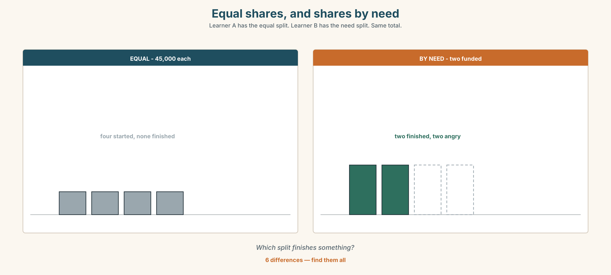{width=6.6in}

*Equal shares, and shares by need — Learner A has the equal split. Learner B has the need split. Same total.*

**Language Bank**

| | |
|---|---|
| **the total** | *There was a total of…* · *Of that, …* |
| **who got what** | *Three of the four received…* · *Neither of the last two…* |
| **what is left** | *None of it can be carried over.* · *The remaining 14,000…* |
| **the honest line** | *It was not enough and we knew that in March.* |

**Role play.** Learner A chairs the committee. Learner B has the fourth claim.
**Six minutes.** Learner A must say the word *no* once, out loud, early.

### 4C · The performance — one hundred seconds ⏺

Report **how something limited was shared out**. **One hundred seconds.** You must give:

> the total · who asked for what · who got what · what was left, and what happened to it

**Record it.**

### 4D · Observer

One person listens for **one thing**: did every quantity have a number or a fraction behind it?

### 4E · Two criteria

> ☐ Did I use *of* correctly every time?
> ☐ Could a listener reconstruct the arithmetic?

---

## Part 5 · Reading ◆ **A · THE WORLD**

### 5A · Predict

An opinion column. The title is **"Everybody wants a fair share and nobody means the same thing."**
**What three meanings of *fair* can you think of before you read?**

### 5B · Read — one hundred and ten seconds

---

**Everybody wants a fair share and nobody means the same thing**

There is €180,000. There are four claims, totalling €246,000. All four are honest. That is the
whole situation and it has no solution, only decisions.

When people in that room say *fair*, they mean one of four things, and the argument is not about
the money. It is about which of the four they are using, and almost nobody says which.

**Equal.** Forty-five thousand each. Clean, defensible, and it leaves two of them with less than
half of what they need, which means neither of those two can start work at all. Equal shares of
an insufficient sum can be the least useful way of spending it.

**Proportional.** Each gets 73 per cent of what they asked for. Slightly worse than equal for the
small claims and slightly better for the large ones, and it rewards whoever estimated most
optimistically in March.

**By need.** The two with no insurance get everything. This is the one most people privately
believe in and the one nobody proposes out loud, because it requires saying that the other two
matter less.

**First come.** It has already partly happened. Two of the four submitted in March and have been
quietly assumed into the budget ever since.

Pick one and defend it. Picking none of them and splitting the difference is also a choice, and
it is the only one that nobody will later be able to explain.

---

### 5C · Answer

1. How much is there, how much was asked for, and how many claims?
2. **What is the writer's objection to equal shares?**
3. What does the proportional method reward?
4. Why does the writer say nobody proposes "by need" out loud?
5. **What has already partly happened, and how?**
6. What does the writer say about splitting the difference?

### 5D · Vocabulary in context

Guess from the text. Then check.

> defensible · an insufficient sum · optimistically · privately believe in · splitting the difference

### 5E · The counter-text

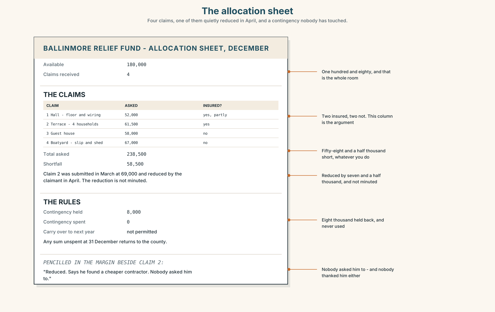{width=6.6in}

*The allocation sheet — Four claims, one of them quietly reduced in April, and a contingency nobody has touched.*

**Read the allocation sheet and answer.**

1. What are the four claims for, and how much is each?
2. **Which claim has been reduced by the committee before the meeting, and by how much?**
3. What is the contingency, and what is the rule on carrying money over?
4. One column is headed "insurance". What does it show?

### 5F · Two texts

The column says the four claims total **€246,000**.
The allocation sheet totals **€238,500**.

**Put those two facts together. What has happened, and who knows?** Two sentences.

---

## Part 6 · Vocabulary Lab 2 ◆ **B · THE SYSTEM**

### Counting what cannot be counted

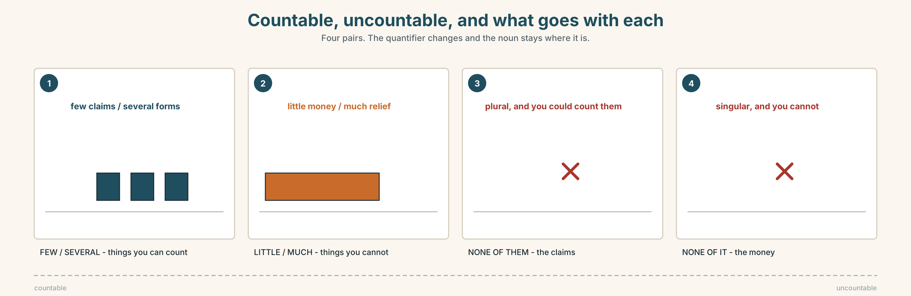{width=6.6in}

*Countable, uncountable, and what goes with each — Four pairs. The quantifier changes and the noun stays where it is.*

### 6A · Sort — countable or uncountable?

Two columns, and write the right quantifier beside each.

> claims · money · people · relief · forms · supply · dehumidifiers · funding · requests ·
> fuel

### 6B · Chunk completion

1. **Most ______ them** have been waiting since March.
2. **None ______ it** can be carried over.
3. **A couple ______** claims came in late.
4. **The rest ______** the money goes to the contingency.
5. The committee **split ______** into two groups to decide.
6. **Some of us, ______ all**, think it should go by need.

### 6C · Three that are only ever about two

**both · either · neither**

**Correct these four sentences.** One of them is already correct.

1. Both of the four claims are from businesses.
2. Neither of the three has insurance.
3. Either of the two options is acceptable.
4. Neither of them have replied.

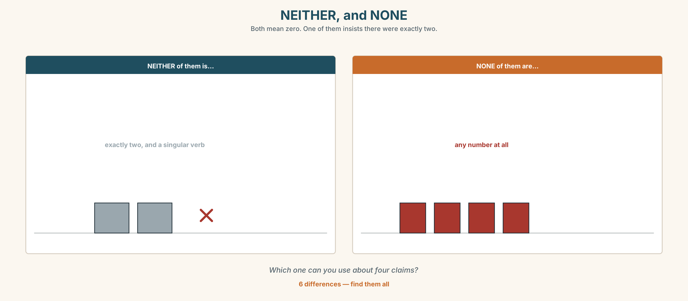{width=6.6in}

*NEITHER, and NONE — Both mean zero. One of them insists there were exactly two.*

**Six differences.** Find them, then answer the question under the picture.

### 6D · Contrast Clinic — which quantifier

Six items.

1. ______ of the money is left. *(zero)*
2. ______ of the claimants is lying. *(zero of four)*
3. ______ of the last two has insurance. *(zero of two)*
4. ______ of them have been waiting. *(more than half)*
5. ______ of the two will do. *(one or the other)*
6. We funded ______ four, partly.

---

## Part 7 · Pronunciation & Fluency Lab ◆ **B · THE SYSTEM**

### Stress as an argument

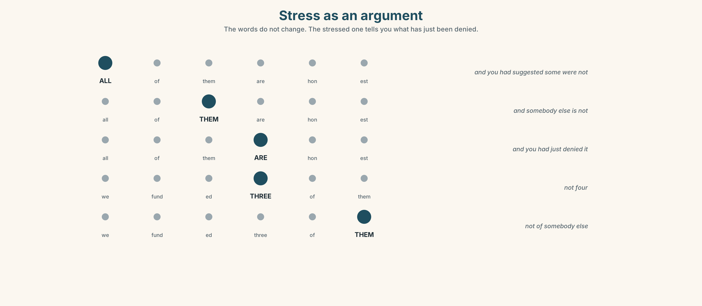{width=6.6in}

*Stress as an argument — The words do not change. The stressed one tells you what has just been denied.*

### 7A · Hear 🔊 Track 9.3

> *ALL of them are honest.* — and you had suggested some were not
> *All of THEM are honest.* — and somebody else is not
> *All of them ARE honest.* — and you had just denied it

### 7B · Say

Say all three. Then do the same with:

> *Neither of the last two has insurance.*

### 7C · Make it mean something

Say these two:

> *We funded THREE of them.* *(not four)*
> *We funded three of THEM.* *(not of somebody else)*

**Which one is answering an accusation?**

### 7D · Fluency 20 ⏺

Twenty seconds: **three facts about this room, each with a different quantifier and a
contrastive stress.** Three times, faster.

---

## Part 8 · Writing ◆ **C · THE PERFORMANCE**

### Who got what · 100 words

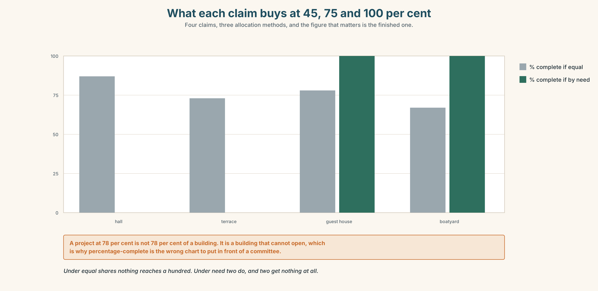{width=6.6in}

*What each claim buys at 45, 75 and 100 per cent — Four claims, three allocation methods, and the figure that matters is the finished one.*

### 8A · Read the model

> There was €180,000. Four claims were received, totalling €238,500 after one was reduced by the
> claimant in April. `[the total first, and the reduction is named so the arithmetic works]`
>
> Three were funded in full. Neither of the remaining two — the guest house and the boatyard —
> had any insurance, and the committee funded 61 per cent of the boatyard's claim and none of the
> guest house's. `[exactly who got what, and one fact that explains why it was hard]`
>
> €4,100 is unspent. It cannot be carried over and will return to the county in December.
> `[what is left, and where it goes, which almost every report leaves out]`

**Questions about the writer's choices:**

1. The second paragraph says *none of the guest house's* rather than *the guest house got
   nothing*. **Is that cowardly?**
2. The last paragraph is about €4,100 out of €180,000. **Why is it here at all?**

### 8B · The anti-model

> The committee considered all the claims very carefully and allocated the available funds as
> fairly as possible. Unfortunately there was not enough for everyone. We would like to thank
> everyone for their patience during a difficult process.

Correct English, and no arithmetic. **Name three numbers it should contain.**

### 8C · Plan

> the total → what was asked for → who got what, exactly → what is left and where it goes

### 8D · Write — 100 words
### 8E · Peer review — two criteria

> ☐ Does the arithmetic work?
> ☐ Is the leftover accounted for?

### 8F · Write it again · 8G · Publish

On the wall, with the allocation sheet from Part 5E beside it.

---

## Part 9 · The File ◆ **A · THE WORLD + C · THE PERFORMANCE**

# CULTURE FILE · Silence, Interruption and Turn-taking

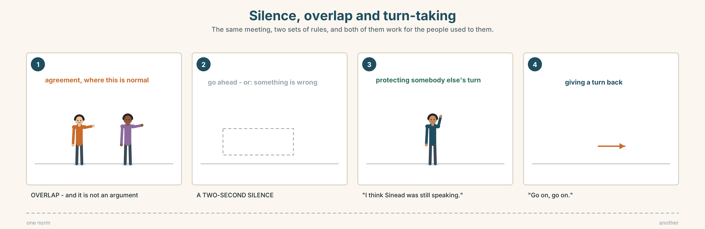{width=6.6in}

*Silence, overlap and turn-taking — The same meeting, two sets of rules, and both of them work for the people used to them.*

### 9A · The same meeting, two norms 🔊 Track 9.4

Two recordings of committees deciding the same thing. **Listen to both.**

1. In which one do people overlap, and does it sound like an argument?
2. **How long is the longest silence in each?**
3. In which one does the quietest person speak, and what made it possible?

### 9B · What a silence means

In some places a pause means *go ahead*. In others it means *I am thinking, wait*.
In others it means *something has gone wrong*.

**Which does a two-second pause mean where you are from?** Compare with three other people.

### 9C · Interrupting without taking over

> *"Sorry — can I just check one thing?"* · *"Go on, go on."* ·
> *"Can I come back to that in a minute?"* · *"I think Sinéad was still speaking."*

Match each to its job.

> taking a turn · giving a turn back · parking something · protecting somebody else's turn

### 9D · Your turn

Groups of five. **Ten minutes, one decision.** One person is the timekeeper and says nothing
except the total speaking time of each person at the end.
**Then do it again with the quietest person as chair.**

### 9E · Transfer

**In your next meeting, count the silences over two seconds.** Bring the number and say what
each one was doing.

---

## Part 10 · Mediation & Interaction ◆ **C · THE PERFORMANCE**

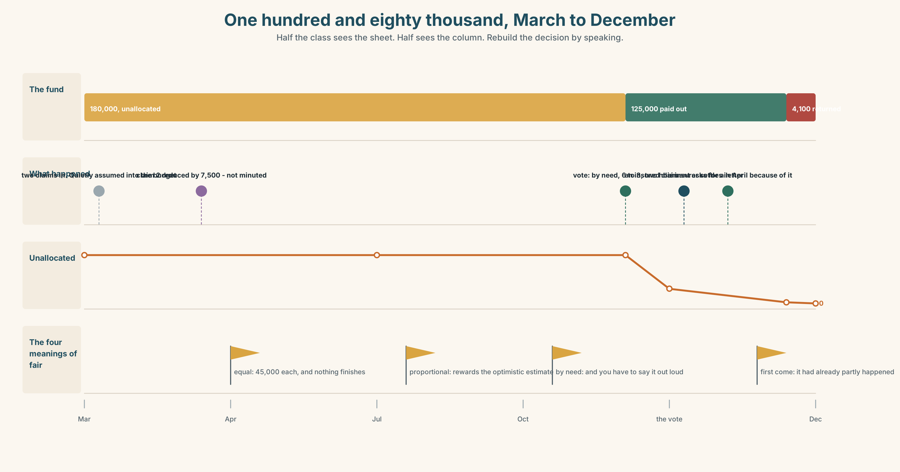{width=6.6in}

*One hundred and eighty thousand, March to December — Half the class sees the sheet. Half sees the column. Rebuild the decision by speaking.*

### 10A · Relay

Half the class sees the allocation sheet. Half sees the column. **Rebuild the decision by
speaking.** Ten minutes.

### 10B · Simplify

Explain the allocation sheet from Part 5E to a claimant who has had nothing.
**Four sentences only.**

> **Plan:** what there was → what was asked → what you got and why → what you can do next

### 10C · Compress

The column in Part 5 into **thirty-five words**, keeping all four meanings of *fair*.

### 10D · Online

Write **one message** to the committee: you are the fourth claim, you accept the decision, and
you are asking for one thing in writing.

### 10E · Your language

How does your language say *none of them*? **Is the verb singular or plural?**
Say *neither of the last two has insurance* in both languages.

---

## Part 11 · The Decision ◆ **C · THE PERFORMANCE**

# One hundred and eighty thousand

Four claims. €238,500 asked for. €180,000 available. All four honest.

- **Equal.** €45,000 each. Two of the four cannot start work with that, so two of the four
  projects do not happen and the money sits.
- **By need.** The two with no insurance get everything they asked for; the two who are insured
  get nothing and wait for their insurers.
- **Proportional.** Everybody gets about 75 per cent. Everybody can start; nobody can finish.

### 11A · The evidence

1. **The allocation sheet** from Part 5E — and the claim that was quietly reduced.
2. **The chart** — what each claim buys at 45, at 75 and at 100 per cent.
3. **The voice.** One of the insured claimants, twenty seconds: *"I'd take nothing. I want that
   on the record because I will be saying it in the room and I do not want anybody saying
   afterwards that I was pushed. But I'd want it written down that I took nothing, because my
   insurer is going to ask me in March whether I was compensated."*

### 11B · Talk about it

In threes. Everybody says one. Use the frame.

> *I think the money should go ______ , because ______ .*

**Words you can use:** *fair · equal · priority · need · shortage · limited · a fair share · go round*

### 11C · Decide

Write **two sentences**. Choose, and say why.

> I think the money should ______________________ ,
> because ______________________ .

### 11D · Model decision

> By need, and the committee should say the word *need* out loud and vote on it by name. Equal
> shares of an insufficient sum produce four stalled projects, and proportional shares produce
> four half-finished ones; need produces two finished things and two angry people, and angry
> people with insurance have somewhere else to go. The important part is not the choice. It is
> that whoever is refused is refused in a sentence that can be repeated.

### 11E · The Reveal

> **What happened.** They went by need. The vote was 6–3 and took two hours, most of which was
> spent on whether *need* could be defined without insulting anybody.
>
> The insured claimant who offered to take nothing did take nothing, and asked for the letter.
> His insurer settled in April, and the letter is the reason: it proved he had not been
> compensated twice.
>
> €4,100 was left over because one of the two funded claims came in under estimate. It was not
> carried over. It went back to the county in December and the committee has been asked about it
> at every meeting since.

**Two things were finished. One man got his insurance because he had asked for a letter. And
four thousand pounds went back.**

> **Was it the right decision?** Say why — and say what should have been done with the €4,100.

---

## Part 12 · Landing ◆ **all three lines**

### 12A · Recycle — ten items

> 1. ______ of them are honest. *(every one)*
> 2. ______ of it can be carried over. *(zero, uncountable)*
> 3. ______ of the last two has insurance. *(zero of two)*
> 4. They have **run ______ of** dehumidifiers.
> 5. It will not **go ______** .
> 6. *(Unit 8)* The hall, ______ was built in 1884, is the oldest.
> 7. *(Unit 7)* This time next year I ______ (live) in Galway.
> 8. *(Unit 6)* The rope ______ (must / break) in the night.
> 9. *(Unit 4)* She ______ me that she had checked it. *(said / told)*
> 10. *(A2.1 U9)* There are ______ many forms and nobody reads them.

### 12B · Consolidate

**One hundred words.** How something limited was shared out. The total, who got what,
four different quantifiers, and what was left.

### 12C · Can-do, with evidence

| I can… | My evidence | Sure? |
|---|---|---|
| say exactly how many, with *of* | Part 3G score | ◯ ◑ ● |
| report an allocation in a hundred seconds | Part 4C recording | ◯ ◑ ● |
| write a hundred words whose arithmetic works | Part 8 draft 2 | ◯ ◑ ● |
| take a turn without taking over | Part 9D group work | ◯ ◑ ● |

### 12D · Replay ⏺

Find your thirty seconds from Part 0C. Listen. **Record it again.**
One sentence: what is different?

### 12E · Glossary — forty items, as a map

> **THE MONEY** · fund · relief · money · grant · total · supply
> **THE PROCESS** · request · allocate · share · priority · set aside · split up
> **WHEN THERE IS NOT ENOUGH** · shortage · limited · run out of · go round · use up · there isn't enough to go round
> **WHAT IS LEFT** · remaining · spare · enough · the rest of
> **THE JUDGEMENT** · fair · equal · a fair share · some of us, not all
> **HOW MANY** · all · most · both · neither · either · none · several · few · plenty · half · each · most of them · none of it · a couple of

### 12F · Next

> **Unit 10 · Who do you become after?**

# A2.2 · Unit 10 · The Town That Came Back

> **English Animated** · *Telling the Story* · Ballinmore, west coast of Ireland
> Student's Book pages 204–225 · 22 pp · ~10 hours

---

## Part 0 · The Big Picture ◆ **A · THE WORLD**

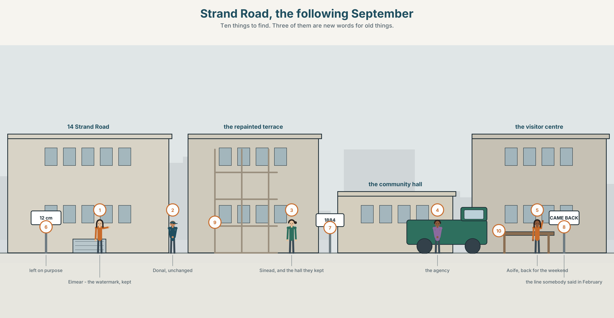{width=6.6in}

*Strand Road, the following September — Ten things to find. Three of them are new words for old things.*

# Who do you become after?

**By the end of this unit you can write a reflective piece about how a place — or a person —
changed. One hundred and ten words.**

| ◆ **A · THE WORLD** | A town being offered a story about itself, and asked to agree to it |
|---|---|
| ◆ **B · THE SYSTEM** | articles and determiners, reviewed · abstract nouns · 23 words for identity and change · 17 determiners · *the* as /ðə/ and /ðiː/ |
| ◆ **C · THE PERFORMANCE** | A hundred and ten words about what a place has become |

---

### 0A · Find it

**Find ten things in this picture.** Three of them are new words for old things.

> a new town sign · a repainted shopfront · a visitor centre leaflet · a watermark left on purpose ·
> a plaque · a bus of visitors · a For Sale sign taken down · a scaffold coming off ·
> a camera · a hand-painted notice in a window

### 0B · Guess it

**One thing in this picture has been kept deliberately.** Which, and who decided?

### 0C · Say it ⏺

**Record thirty seconds.** *Think of a place you know that changed. Is the story people tell
about it true?* You will record it again at the end of this unit.

---

## Part 1 · Vocabulary Lab 1 ◆ **B · THE SYSTEM**

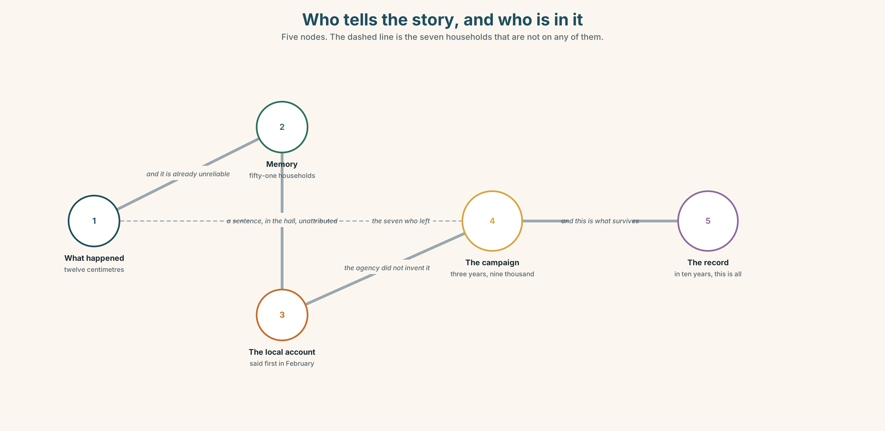{width=6.6in}

*Who tells the story, and who is in it — Five nodes. The dashed line is the seven households that are not on any of them.*

### 1A · Meet — the words of who you are now

Match each word to one place on the map.

> **identity** · **change** · **community** · **memory** · **story** · **reputation** ·
> **local** · **outsider** · **newcomer** · **truth**

### 1B · Sort — about a person, a place, or both?

Three columns.

> identity · reputation · community · local · outsider · memory · belong · newcomer

**One of them is given to you by other people, always.** Which?

### 1C · Meet — three words about the story

> **marketing** · **genuine** · **truth**

**Marketing is not the opposite of truth.** What is the difference between a true story and a
genuine one? **Give an example.**

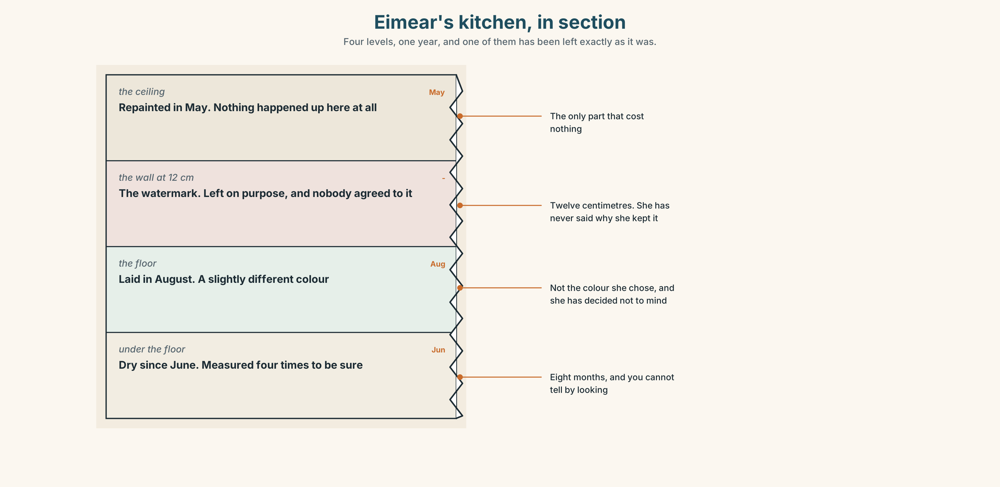{width=6.6in}

*Eimear's kitchen, in section — Four levels, one year, and one of them has been left exactly as it was.*

**Look at Eimear's kitchen, in section.** Four levels, one year.
**Which level has been deliberately left as it was, and why?**

### 1D · Stretch — the phrases

Complete each one with one word.

1. Some of them want to **put it behind ______** and some do not.
2. You cannot **move ______** until somebody has said what happened.
3. The brochure calls it **the town ______ came back**.
4. She said she would rather **tell the ______** and have fewer visitors.
5. It took eight months to **live ______** the photograph of the kitchen.

### 1E · The saying

> **f** **That's not what happened.**

Four words that one person says in every town meeting, and that nobody wants to hear.

> **Write what comes next** — once from somebody who is right, and once from somebody who is
> wrong but sincere.

### 1F · Own it

Think of a story people tell about where you are from. Tell a partner **three sentences**:
what the story is, who tells it, and what it leaves out.

---

## Part 2 · Listening ◆ **A · THE WORLD**

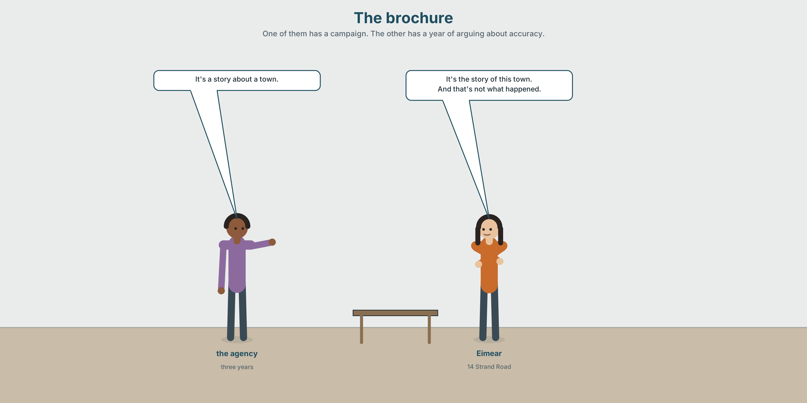{width=6.6in}

*The brochure — One of them has a campaign. The other has a year of arguing about accuracy.*

### 2A · The brochure 🔊 Track 10.1

**Before you listen.** A tourism agency has offered to market the town as *the town that came
back*. **Guess: who objects, and on what grounds?**

**Listen once. One question.** What would the campaign be worth, in visitors?

**Listen again. Complete the table.**

| | What they want | What they are afraid of |
|---|---|---|
| the agency | | |
| Sinéad | | |
| Eimear | | |

**Listen again. Choose.**

1. The campaign would run for **one season / three years / indefinitely**.
2. Eimear objects because the story is **false / incomplete / embarrassing**.
3. The agency offers to **change the words / drop the campaign / add a page**.
4. The decision will be made by **the agency / the committee / a public meeting**.

**Noticing.** Four sentences from the recording.

1. *It's a story about a town.*
2. *It's the story of this town.*
3. *A town came back.*
4. *The town came back.*

**Two of these are about any town. Two are about this one.**
**Which, and what single word does the work?**

### 2B · Decoding clinic 🔊 Track 10.2

Twenty-five seconds of Eimear. Four jobs.

1. How many times does she say *the*?
2. Can you hear the difference between *the town* and *the other*?
3. Catch the number of visitors.
4. She says one word with heavy stress twice. Which?

> Transcripts, page 159.

---

## Part 3 · Grammar Lab 1 ◆ **B · THE SYSTEM**

### The small words that decide what you mean

### 3A · Notice

Look at the four sentences in Part 2.

1. Sentences 3 and 4 differ by one word. **Which town is each about?**
2. In sentence 1, *a story* — why not *the story*?
3. **When do you use no article at all?** Try: *Water came in.* / *The water came in.*
4. *this town*, *that town*, *such a town*. **What does each one add?**
5. Try *"It's story about the town."* **What is missing, and does it matter?**

### 3B · See

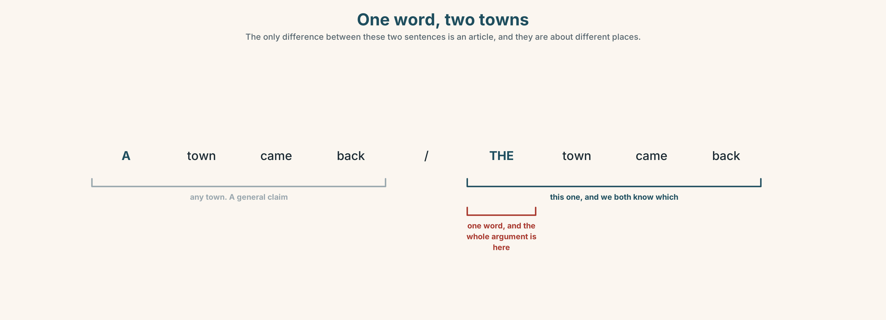{width=6.6in}

*One word, two towns — The only difference between these two sentences is an article, and they are about different places.*

Now look at the second picture. **It runs from no article to *the*.
Where does a thing stop being any example and become **this** one?**

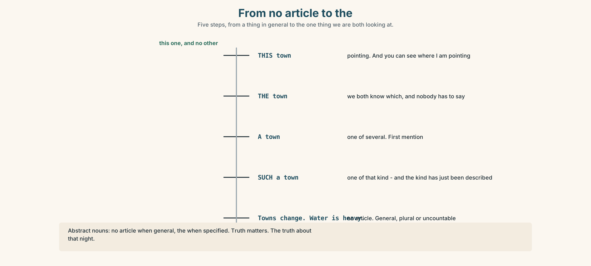{width=6.6in}

*From no article to the — Five steps, from a thing in general to the one thing we are both looking at.*

### 3C · Know

| | Use it when | Example |
|---|---|---|
| **no article** | general, plural or uncountable | *Water came in.* · *Towns change.* |
| **a / an** | one of several, first mention | *It's **a** story about **a** town.* |
| **the** | we both know which one | ***The** water came in.* · ***The** story of this town.* |
| **this / that** | pointing, near or far | ***This** town* · ***that** winter* |
| **such** | of that kind | ***Such** a story.* |
| **own** | emphasising possession | *her **own** kitchen* |

> **Abstract nouns are the hard case.** Usually no article when general, *the* when specified.
> *Truth matters.* · ***The** truth about that night.* · *Memory is unreliable.* ·
> ***The** memory of it.*

> **First mention takes *a*; second mention takes *the*.**
> *They have offered **a** campaign. **The** campaign would run for three years.*

> **Watch out.** Dropping an article is not an informal option in English. It changes the
> meaning or breaks the sentence.
> ✗ *It's story about town.*

### 3D · Use — controlled

> (1) __________ agency has offered (2) __________ campaign.
> (3) __________ campaign would run for three years and would bring about nine thousand
> visitors (4) __________ year. Eimear says (5) __________ story is not true.
> She says (6) __________ truth about that night is more complicated, and that
> (7) __________ truth is the only thing the town actually owns.

### 3E · Use — guided

Put *a*, *an*, *the* or **nothing** in each gap.

1. ______ water came in at about ten.
2. ______ water is heavier than people think.
3. She wrote ______ letter. ______ letter was two pages long.
4. ______ truth matters.
5. ______ truth about the drain took fourteen months.
6. It is ______ story about ______ town, not ______ story of this one.

### 3F · Use — open

**Describe a place to a partner in six sentences.** Your partner's job is to catch any article
that should not be there, and any that is missing.

### 3G · Check — six items

> 1. ______ water came in at ten. *(we know which water)*
> 2. ______ water is heavier than people think. *(in general)*
> 3. They offered ______ campaign. ______ campaign runs for three years.
> 4. ______ truth matters. *(in general)*
> 5. ______ truth about that night is complicated.
> 6. It's ______ story about ______ town. *(any town)*

**0–3 →** Workbook pp. 58–60. **4–5 →** Part 6. **6 →** page 217.

---

## Part 4 · Speaking ◆ **C · THE PERFORMANCE**

### 4A · Fluency starter — a, the, nothing

Your teacher says a noun: *water*. Each learner must use it three times — once with no article,
once with *a*, once with *the* — and all three must be true.

**Six nouns. Six rounds.**

### 4B · The functional core — saying what a place has become

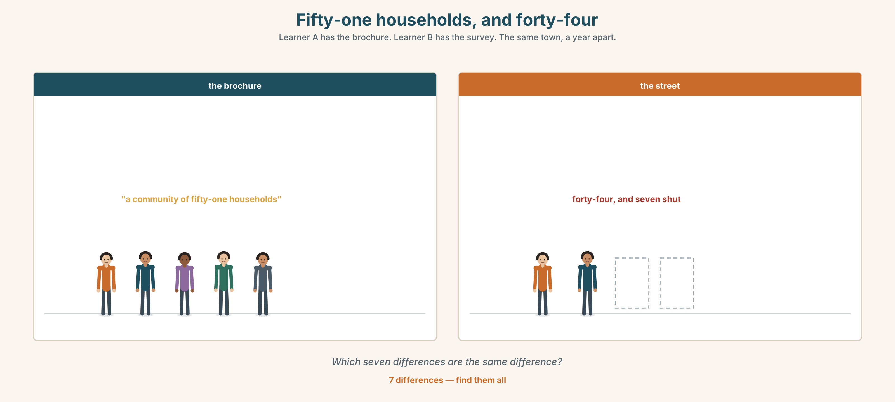{width=6.6in}

*Fifty-one households, and forty-four — Learner A has the brochure. Learner B has the survey. The same town, a year apart.*

**Language Bank**

| | |
|---|---|
| **the change** | *It isn't the place it was.* · *What's changed is…* |
| **the continuity** | *The same people are still…* · *Nothing has changed about…* |
| **the story** | *People say it's the town that…* · *That's the version.* |
| **the correction** | *That's not what happened.* · *It's more complicated than that.* |

**Role play.** Learner A works for the agency. Learner B lives in the town.
**Six minutes.** Neither may say *lie*.

### 4C · The performance — one hundred seconds ⏺

Describe **how a place or a person changed**. **One hundred seconds.** You must give:

> what it was · what it is · what has not changed · the story people tell, and what it leaves out

**Record it.**

### 4D · Observer

One person listens for **one thing**: did the speaker say what had **not** changed?

### 4E · Two criteria

> ☐ Were my articles right where the meaning depended on them?
> ☐ Is there one thing in my account that the official version leaves out?

---

## Part 5 · Reading ◆ **A · THE WORLD**

### 5A · Predict

A feature article. The title is **"The town that came back, and the seven people who did not."**
**What do you expect the writer to be doing?** One sentence.

### 5B · Read — one hundred and twenty seconds

---

**The town that came back, and the seven people who did not**

The campaign is good. I want to begin there, because the easy piece to write about Ballinmore
this autumn is the cynical one and it would also be wrong.

The photographs are of real people doing real things and nobody is pretending the hall is
finished. The line — *the town that came back* — is three years of work by people who were not
paid for most of it, and the agency did not invent it. Somebody in the town said it first, in the
hall, in February, and nobody wrote down who.

Here is what it leaves out. Of the fifty-one households surveyed, seven have gone. Two sold, two
were bought out, and three are simply not here and the houses are shut. Seven out of fifty-one is
fourteen per cent, which is the figure that does not appear in the brochure, and I understand why
it does not: nobody markets a place with a number like that, and the people who left are not
available to be photographed.

The town did come back. It came back smaller, and it is carrying a sea wall decision it has not
made and a hall it has decided to keep without quite saying why.

This is not an objection to the campaign. It is a note that the story is true and the story is
also an edit, and that a place which has spent a year insisting on accurate times and honest
reporting is about to agree to a sentence about itself that it would not have accepted about
anybody else.

---

### 5C · Answer

1. Why does the writer say the cynical piece would be wrong?
2. Where did the campaign line come from?
3. **How many households have gone, and what happened to each group?**
4. What percentage is that, and why does the writer say it is not in the brochure?
5. **What does the writer mean by "it came back smaller"?**
6. What is the writer's last point, and who is it aimed at?

### 5D · Vocabulary in context

Guess from the text. Then check.

> the cynical one · bought out · an edit · insisting on · available to be photographed

### 5E · The counter-text

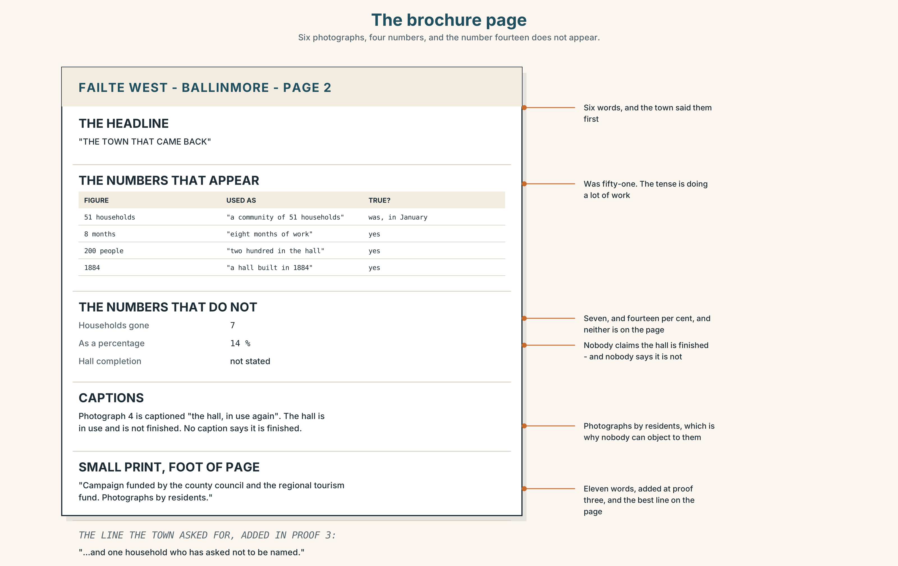{width=6.6in}

*The brochure page — Six photographs, four numbers, and the number fourteen does not appear.*

**Read the brochure page and answer.**

1. What is the headline, and how many photographs are there?
2. **Which numbers appear in the brochure, and which do not?**
3. What does the small print say about who the campaign is funded by?
4. One caption describes something that is still unfinished. Which, and how is it worded?

### 5F · Two texts

The feature says **seven of fifty-one households have gone**.
The brochure says **"a community of fifty-one households"**.

**Put those two facts together. Is the brochure lying?** Two sentences.

---

## Part 6 · Vocabulary Lab 2 ◆ **B · THE SYSTEM**

### The words you cannot point at

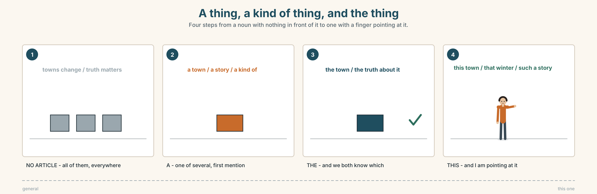{width=6.6in}

*A thing, a kind of thing, and the thing — Four steps from a noun with nothing in front of it to one with a finger pointing at it.*

### 6A · Sort — concrete or abstract?

Two columns, and put the right article beside each.

> hall · memory · boat · truth · community · pier · identity · reputation · wall · change

**Two of the abstract ones can also be concrete.** Which, and in what sentence?

### 6B · Chunk completion

1. **The whole ______** took fourteen months.
2. It is **a kind ______** apology, though nobody calls it that.
3. **The one ______** said it first was never named.
4. **In the ______** they voted to keep it.
5. She can **sum ______** the whole year in one sentence, and does.
6. **It's not ______ simple.**

### 6C · Abstract nouns and the article

> *Truth matters.* — all truth, everywhere.
> *The truth about that night.* — one particular truth.
> *A truth that nobody wants.* — one of several.

**Write the three versions for each of these:** *memory · change · community*.

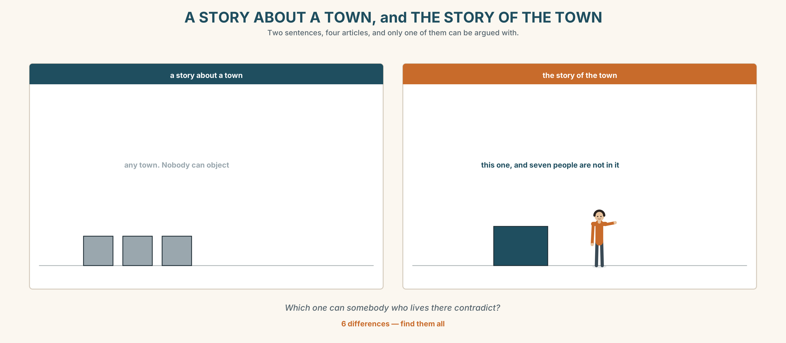{width=6.6in}

*A STORY ABOUT A TOWN, and THE STORY OF THE TOWN — Two sentences, four articles, and only one of them can be argued with.*

**Six differences.** Find them, then answer the question under the picture.

### 6D · Contrast Clinic — a, the, or nothing

Six items.

1. ______ water came in at ten.
2. ______ water is heavier than people think.
3. ______ memory is unreliable.
4. ______ memory of that night is unreliable.
5. It's ______ story about ______ town.
6. It's ______ story of this town.

---

## Part 7 · Pronunciation & Fluency Lab ◆ **B · THE SYSTEM**

### One word, two sounds

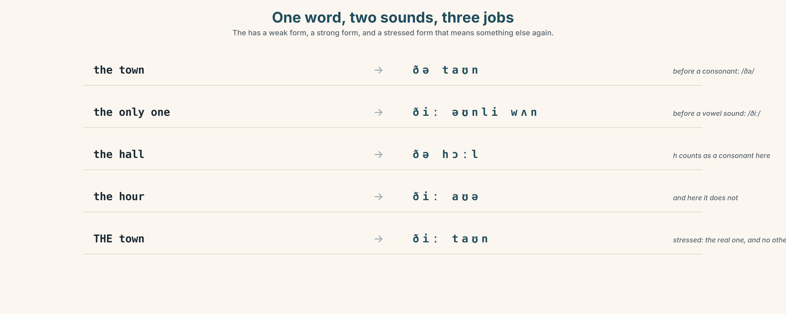{width=6.6in}

*One word, two sounds, three jobs — The has a weak form, a strong form, and a stressed form that means something else again.*

### 7A · Hear 🔊 Track 10.3

> the town → /ðə taʊn/ — before a consonant
> the only one → /ðiː əʊnli wʌn/ — before a vowel
> THE town → /ðiː taʊn/ — **stressed, and it now means *the real one***

### 7B · Say

Say all three. Then say the sentence three times, faster:

> *The truth about the only night that matters.*

### 7C · Make it mean something

Say these two:

> *It's a story about a town.* *(any town)*
> *It's THE story of THE town.* *(this one, and no other)*

**The second one is doing something the first cannot.** What?

### 7D · Fluency 20 ⏺

Twenty seconds: **three nouns, each said with no article, with *a*, and with *the*.**
Three times, faster.

---

## Part 8 · Writing ◆ **C · THE PERFORMANCE**

### How a place changed · 110 words

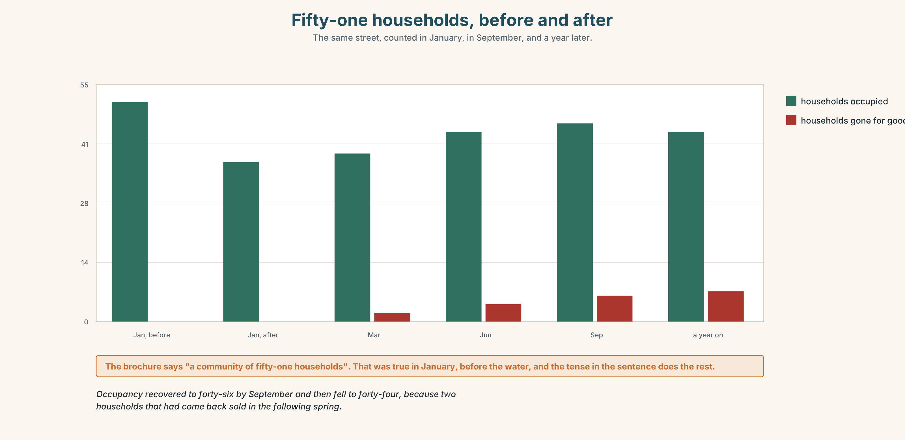{width=6.6in}

*Fifty-one households, before and after — The same street, counted in January, in September, and a year later.*

### 8A · Read the model

> The kitchen is finished. The floor went down in August, eight months after the water, and it is
> a slightly different colour from the one that came up, which I did not choose and have decided
> not to mind. `[a concrete thing, a date, and one small refusal of sentiment]`
>
> What has not changed is that I still look at the yard drain every time it rains hard. I expect
> I will do that for the rest of my life and I am fairly relaxed about it. `[the continuity, and
> it is a habit rather than a feeling]`
>
> People say we are the town that came back. We are a town that came back smaller, and I would
> rather be in a true sentence than a good one. `[the correction, and the whole argument is in
> the difference between *the* and *a*]`

**Questions about the writer's choices:**

1. The first paragraph is about the colour of a floor. **Why not about how she felt?**
2. The last sentence turns on one article. **Point at it, and say what it does.**

### 8B · The anti-model

> Our town has been through a difficult time but we have come back stronger than ever. The
> community spirit here is amazing and everyone has pulled together. We are proof that a town can
> survive anything.

Correct English, and no town in it. **Name three things it does not say** — and the one word in
it that the feature in Part 5 would object to.

### 8C · Plan

> one concrete thing, with a date → one thing that has not changed → the story people tell →
> your own sentence, and make the articles do the work

### 8D · Write — 110 words
### 8E · Peer review — two criteria

> ☐ Is there one concrete object with a date attached?
> ☐ Does one article in the piece carry an argument?

### 8F · Write it again · 8G · Publish

On the wall, with the brochure page from Part 5E beside it.

---

## Part 9 · The File ◆ **A · THE WORLD + C · THE PERFORMANCE**

# WORK FILE · The Client Problem

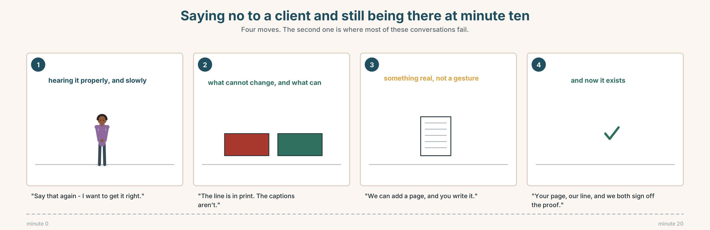{width=6.6in}

*Saying no to a client and still being there at minute ten — Four moves. The second one is where most of these conversations fail.*

### 9A · Twenty minutes and a disagreement 🔊 Track 10.4

The agency's account manager meets the committee. **Listen.**

1. What does the agency say it is willing to change?
2. **What does the committee ask for that the agency cannot give, and why not?**
3. Who proposes the thing that is eventually agreed?

### 9B · The four moves

> hearing the objection properly · separating what you can and cannot change ·
> offering something real · agreeing what is written down

Match each to one phrase.

> *"Say that again — I want to get it right."* ·
> *"The line is in print. The captions aren't."* ·
> *"We can add a page, and you write it."* ·
> *"So: your page, our line, and we both sign off the proof."*

### 9C · Saying no to a client without losing them

**Which of these four is the strongest, and why?**

1. *"I'm afraid that's not possible."*
2. *"We can't change the line. Here's what we can change."*
3. *"I'll see what I can do."*
4. *"That's a fair point and I don't have an answer today."*

### 9D · Your turn

In pairs. **Ten minutes.** One of you is a client who wants something you cannot give.
**You must say no in the first three minutes and still be talking at minute ten.**

### 9E · Transfer

**Find one thing this week that you have to refuse.** Refuse it, and offer one real alternative.
Bring what happened.

---

## Part 10 · Mediation & Interaction ◆ **C · THE PERFORMANCE**

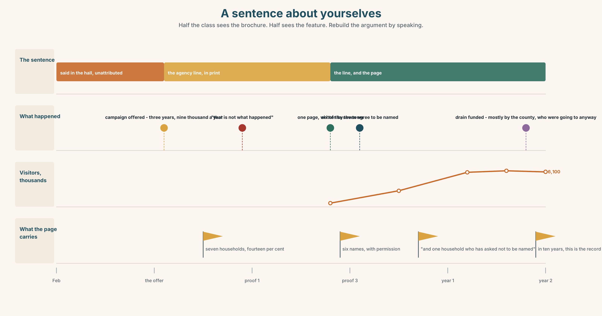{width=6.6in}

*A sentence about yourselves — Half the class sees the brochure. Half sees the feature. Rebuild the argument by speaking.*

### 10A · Relay

Half the class sees the brochure. Half sees the feature. **Rebuild the whole argument by
speaking.** Ten minutes.

### 10B · Simplify

Explain the brochure page from Part 5E to somebody who lived through the flood.
**Four sentences only.**

> **Plan:** what it says → what it does not say → who paid for it → what you can ask for

### 10C · Compress

The feature in Part 5 into **thirty-five words**, keeping the last sentence's point.

### 10D · Online

Write **one message** to the agency: you support the campaign, you are asking for one page,
and here is the sentence you want on it.

### 10E · Your language

Does your language have articles? **If not, how does it say *a town* and *the town*?**
Say *it's the story of the town* in both languages, and explain to a partner what carries the
difference.

---

## Part 11 · The Decision ◆ **C · THE PERFORMANCE**

# A sentence about yourselves

The agency will run *the town that came back* for three years. It would bring about nine thousand
visitors a year. Seven of the fifty-one households have gone.

- **Agree.** It is true. The town did come back, and the money would pay for the drain.
- **Refuse.** Eimear says it is a story about what happened to the town told by people it did not
  happen to, and that the town spent a year insisting on accuracy.
- **Agree, with a page.** The campaign runs. The town writes one page of the brochure, in its own
  words, including the seven.

### 11A · The evidence

1. **The brochure page** from Part 5E — and the numbers that are not on it.
2. **The chart** — households, before, after, and now.
3. **The voice.** One of the seven, by phone, twenty seconds: *"I've no objection at all. I'd
   like to be in it, actually. I'd like somebody to put in writing that we were there, because
   in about ten years the only record of it will be the brochure, and we are not in the
   brochure."*

### 11B · Talk about it

In threes. Everybody says one. Use the frame.

> *I think the town should ______ , because ______ .*

**Words you can use:** *identity · truth · story · reputation · community · belong · outsider · genuine*

### 11C · Decide

Write **two sentences**. Choose, and say why.

> I think the town should ______________________ ,
> because ______________________ .

### 11D · Model decision

> Agree, with the page, and put the seven on it by name with their permission. The line is true
> and refusing it costs the drain; but a town that has spent a year arguing about eleven-minute
> clocks and forty-one-word notices cannot then accept a sentence about itself without a footnote.
> The page is the footnote. It also solves the thing the woman on the phone actually asked for,
> which nobody in that room had thought to ask her about.

### 11E · The Reveal

> **What happened.** They agreed, with the page. The agency accepted in one meeting and was,
> by every account, relieved — it had expected a fight about the line itself.
>
> Six of the seven agreed to be named. The seventh asked not to be, and the page says *and one
> household who has asked not to be named*, which Eimear says is the best sentence on it.
>
> The campaign ran. Visitor numbers were about six thousand in the first year, not nine. The
> drain was funded in the second year, partly from visitor levy and mostly from the county, who
> had been going to fund it anyway and had not said so.

**They got the page. The numbers were two thirds of the promise. And the money was coming
regardless.**

> **Was it the right decision?** Say why — and say what the page is actually for.

---

## Part 12 · Landing ◆ **all three lines**

### 12A · Recycle — ten items

> 1. ______ water came in at ten. *(we know which)*
> 2. ______ truth matters. *(in general)*
> 3. It's ______ story about ______ town. *(any town)*
> 4. Some want to **put it behind ______** .
> 5. **It's not ______ simple.**
> 6. *(Unit 9)* ______ of the last two has insurance. *(zero of two)*
> 7. *(Unit 8)* The hall, ______ was built in 1884, is the oldest.
> 8. *(Unit 6)* The rope ______ (must / break) in the night.
> 9. *(Unit 3)* By the time we arrived, it ______ (already / start).
> 10. *(A2.1 U10)* Could you tell me where the office ______ ?

### 12B · Consolidate

**One hundred and ten words.** How a place or a person you know has changed. One concrete
object with a date, one thing that has not changed, and one sentence where an article carries
the argument.

### 12C · Can-do, with evidence

| I can… | My evidence | Sure? |
|---|---|---|
| use *a*, *the* and no article to mean different things | Part 3G score | ◯ ◑ ● |
| describe how a place changed in a hundred seconds | Part 4C recording | ◯ ◑ ● |
| write a hundred and ten reflective words | Part 8 draft 2 | ◯ ◑ ● |
| refuse something and keep the conversation | Part 9D role play | ◯ ◑ ● |

### 12D · Replay ⏺

Find your thirty seconds from Part 0C. Listen. **Record it again.**
One sentence: what is different?

### 12E · Glossary — forty items, as a map

> **WHO YOU ARE** · identity · belong · local · outsider · newcomer · community · reputation
> **WHAT CHANGED** · change · name · rename · story · memory · truth · genuine · marketing
> **HOW PEOPLE FEEL** · proud · ashamed · visitor
> **MOVING ON** · put it behind us · move on · live down · the town that · tell the truth · that's not what happened
> **THE SMALL WORDS** · the · a · an · some · any · this · that · these · those · such · own
> **PUTTING IT TOGETHER** · the whole thing · a kind of · the one who · in the end · sum up · it's not that simple

### 12F · Next

> **B1.1 · *Taking a Position*** — Jengo House, Nairobi.

---

## End of A2.2 · *Telling the Story*

**Four hundred active items. Eleven new structures. Ten decisions, and in four of them the
honest option cost somebody money.**

> **Look back at your recording from Unit 1, Part 0C.** Listen to it once.
> Then record the same thirty seconds again. **One sentence: what is different?**

