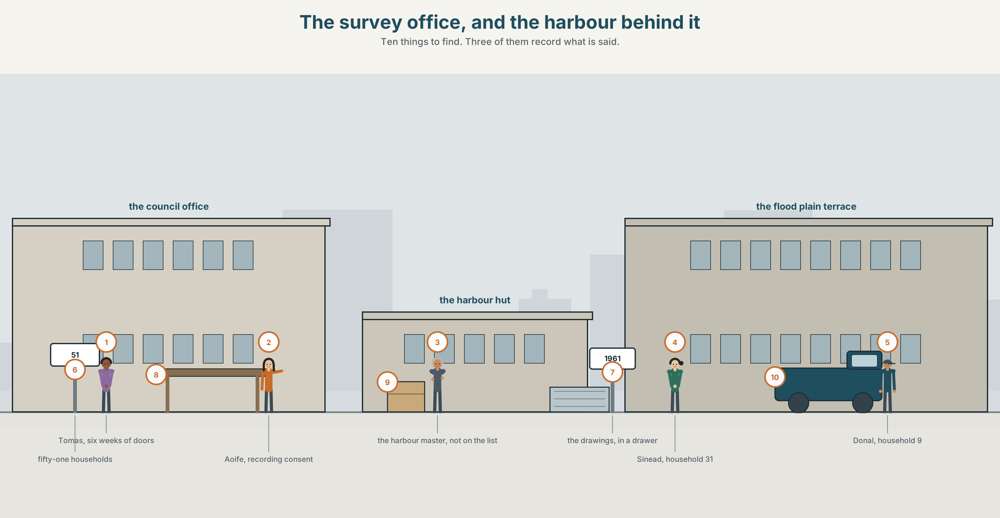
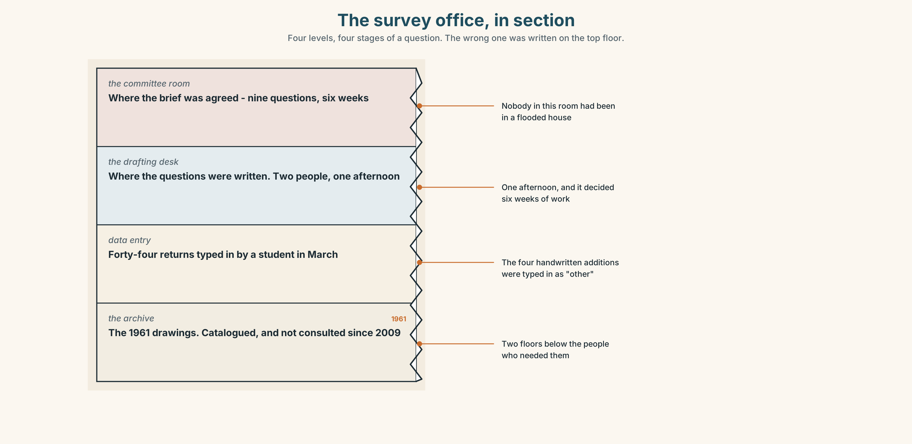
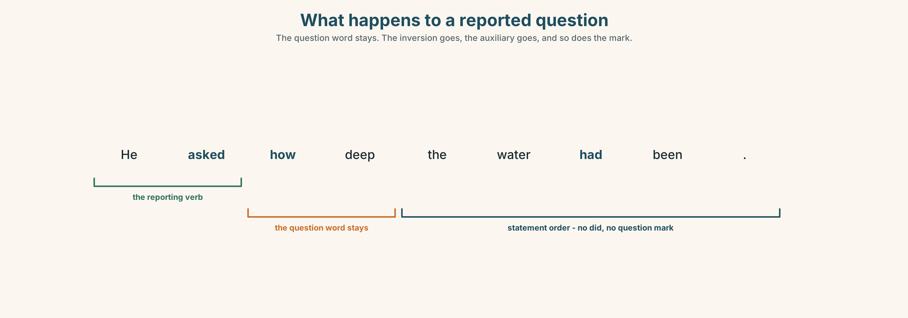
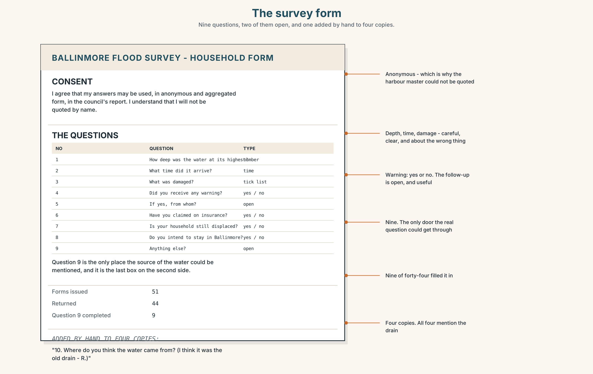
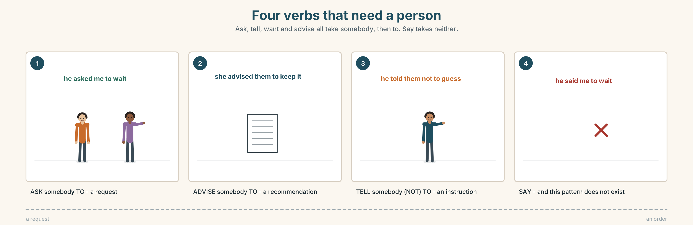
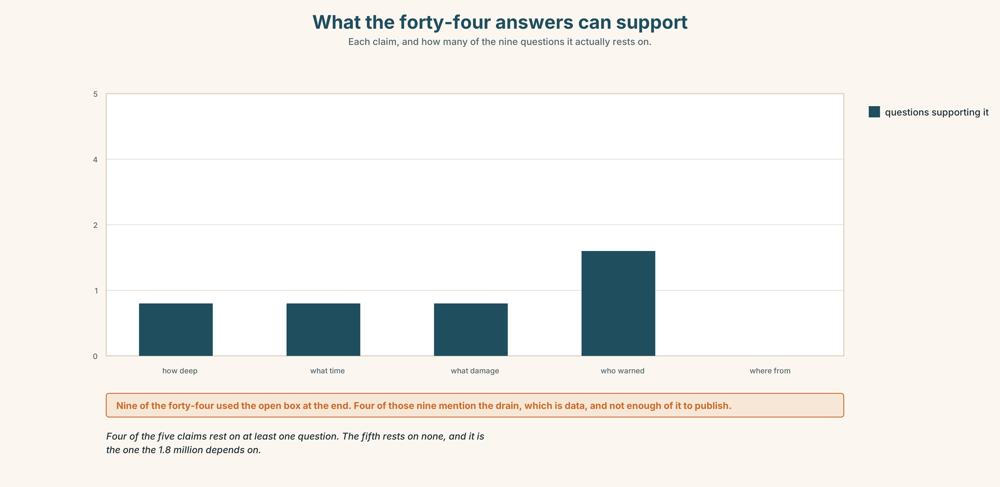

# A2.2 · Unit 5 · The Wrong Question

> **English Animated** · *Telling the Story* · Ballinmore, west coast of Ireland
> Student's Book pages 94–115 · 22 pp · ~10 hours

---

## Part 0 · The Big Picture ◆ **A · THE WORLD**

{width=6.6in}

*The survey office, and the harbour behind it — Ten things to find. Three of them record what is said.*

# Who asked the right question?

**By the end of this unit you can interview somebody and relay both what you asked and what
they answered.**

| ◆ **A · THE WORLD** | A survey that was done properly and asked the wrong thing |
|---|---|
| ◆ **B · THE SYSTEM** | reported questions and commands · *ask / tell / want* patterns · 23 words for interviews and investigation · 17 verbs for asking · the intonation that survives being reported |
| ◆ **C · THE PERFORMANCE** | An interview, relayed from both sides |

---

### 0A · Find it

**Find ten things in this picture.** Three of them record what is said.

> a notebook · a phone on a table · a recorder · a consent form · a clipboard ·
> a survey sheet · a laptop · a cup gone cold · an empty chair · a door left open

### 0B · Guess it

**Two things in this picture make people answer differently.** Which, and how?

### 0C · Say it ⏺

**Record thirty seconds.** *What is the question nobody has asked you that you would like to be
asked?* You will record it again at the end of this unit.

---

## Part 1 · Vocabulary Lab 1 ◆ **B · THE SYSTEM**

{width=6.6in}

*A survey is two decisions — Five nodes. Both of the decisions can be made carefully and still be wrong.*

### 1A · Meet — the words of an interview

Match each word to one place on the map.

> **interview** · **question** · **answer** · **investigation** · **detail** ·
> **follow-up** · **notebook** · **recorder** · **consent** · **permission**

### 1B · Sort — the interviewer, the person, or the room?

Three columns.

> pressure · silence · honest · direct · awkward · notebook · consent · follow-up · anonymous

**One of them belongs to whoever is most frightened.** Which, and why?

### 1C · Meet — what people do instead of answering

> **avoid** · **silence** · **anonymous**

A silence is an answer. **What does it answer, and how would you record it in a notebook?**

{width=6.6in}

*The survey office, in section — Four levels, four stages of a question. The wrong one was written on the top floor.*

**Look at the survey office, in section.** Four levels, four stages of a question.
**At which level was the wrong question written, and who was in the room?**

### 1D · Stretch — the phrases

Complete each one with one word.

1. She **put a ______** to him three times and got three different answers.
2. He never **got an ______** to the second one.
3. If you **press ______** too hard, they stop telling you things.
4. This part is **on the ______** . The rest is not.
5. They have been **digging ______** the 1961 drawings all summer.

### 1E · The saying

> **f** **No comment.**

Two words that are never neutral.

> **Say them three times:** from a council officer, from a neighbour, and from somebody who is
> frightened. **Which one makes you more curious?**

### 1F · Own it

Think of a time you were asked a question you did not want to answer. Tell a partner
**three sentences**: what was asked, what you said, and what you did not say.

---

## Part 2 · Listening ◆ **A · THE WORLD**

{width=6.6in}

*Fifty-one doors — One of them has done the work properly. The other has been watching the drain since 2003.*

### 2A · Fifty-one doors 🔊 Track 5.1

**Before you listen.** Tomás surveyed fifty-one households. The survey took six weeks.
**Guess: what is wrong with it?**

**Listen once. One question.** What did the survey ask?

**Listen again. Complete the table.**

| | What was asked | What people answered | What nobody asked |
|---|---|---|---|
| question 1 | | | |
| question 4 | | | |
| question 9 | | | |

**Listen again. Choose.**

1. The survey asked **where the water came from / how deep it was / whether people felt safe**.
2. Fifty-one households were asked and **all / most / about half** replied.
3. The question about the drain was **not asked / asked badly / asked of the wrong people**.
4. Redoing it would take **two / six / fourteen** weeks.

**Noticing.** Four sentences from the recording.

1. *"How deep was the water in your house?"*
2. *He asked how deep the water had been.*
3. *"Don't guess. Measure it."*
4. *He told them not to guess.*

**Two are the questions and instructions themselves. Two are reports of them.**
**What happened to the word order in sentence 2?**

### 2B · Decoding clinic 🔊 Track 5.2

Twenty-five seconds. Four jobs.

1. How many times does he say *asked* or *told*?
2. In *he asked how deep it had been*, does his voice rise at the end?
3. Catch the two numbers.
4. He reports one question as a statement. Which?

> Transcripts, page 154.

---

## Part 3 · Grammar Lab 1 ◆ **B · THE SYSTEM**

### Reporting a question, and an instruction

### 3A · Notice

Look at the four sentences in Part 2.

1. Sentence 1 is a question. Sentence 2 reports it. **What happened to *was*?**
2. Is there a question mark in sentence 2? **Why not?**
3. Sentence 3 is an instruction. Sentence 4 reports it. **What shape did it take?**
4. **How would you report a yes/no question?** Try: *"Did you measure it?"*
5. Try *"He asked how deep was the water."* **What is wrong?**

### 3B · See

{width=6.6in}

*What happens to a reported question — The question word stays. The inversion goes, the auxiliary goes, and so does the mark.*

Now look at the second picture. **Three shapes: a wh- question, a yes/no question, and an
instruction. Which one needs *if* or *whether*?**

{width=6.6in}

*Three things to report, three shapes — A wh- question, a yes/no question and an instruction each take their own form.*

### 3C · Know

| Direct | Reported |
|---|---|
| *"**How deep was** it?"* | He asked **how deep it was**. |
| *"**Did you** measure it?"* | He asked **whether / if I had measured it**. |
| *"**Measure** it."* | He told me **to measure** it. |
| *"**Don't** guess."* | He told me **not to guess**. |

> **Three things happen to a reported question.**
> 1. Statement word order — no inversion. 2. No *do/did*. 3. No question mark.

> **Yes/no questions need *if* or *whether*.** *whether* is the safer one in writing, and the
> only one possible before *or not*.

> **Instructions take *to* + verb**, and the verb that reports them takes a person:
> *tell **somebody** to*, *ask **somebody** to*, *want **somebody** to*, *advise **somebody** to*.
> ✗ *He said me to measure it.* — *say* does not take this pattern at all.

> **Why it matters.** The shape of the question changes the answer. A survey is only ever as
> good as the shape of its questions, and nobody checks the shape afterwards.

### 3D · Use — controlled

> He asked them how deep the water (1) __________ (be) and whether they
> (2) __________ (measure) it. He told them (3) __________ (not / guess). He asked
> (4) __________ they had seen anything unusual in the yard, and he advised them
> (5) __________ (keep) any photographs. Nobody asked (6) __________ the water
> (7) __________ (come) from.

### 3E · Use — guided

Report each one.

1. *"Where did the water come from?"*
2. *"Did you look at the drain?"*
3. *"Keep the photographs."*
4. *"Don't throw anything away."*
5. *"Would you be willing to be named?"*

### 3F · Use — open

**Interview a partner for three minutes** about something they did this year.
**Then report five things to a third person: three questions you asked and two instructions
you gave.**

### 3G · Check — six items

> 1. *"How deep was it?"* → He asked how deep ______ .
> 2. *"Did you measure it?"* → He asked ______ I ______ measured it.
> 3. *"Measure it."* → He told me ______ it.
> 4. *"Don't guess."* → He told me ______ guess.
> 5. *"Where do you live?"* → She asked me where ______ .
> 6. *"Please wait outside."* → He asked us ______ outside.

**0–3 →** Workbook pp. 28–30. **4–5 →** Part 6. **6 →** page 107.

---

## Part 4 · Speaking ◆ **C · THE PERFORMANCE**

### 4A · Fluency starter — the question nobody asked

One learner describes something. The others may only ask **one question each**.
**Then the group names the question that was not asked.**

**Four rounds. Four learners.**

### 4B · The functional core — interviewing

{width=6.6in}

*Who was asked, and who was not — Learner A has the register. Learner B has the harbour. Both lists are correct.*

**Language Bank**

| | |
|---|---|
| **opening** | *Can I record this?* · *Is this on the record?* · *Stop me if you'd rather not.* |
| **the follow-up** | *How do you know that?* · *What happened just before?* · *And then?* |
| **leaving silence** | *(say nothing)* · *Mm.* · *Take your time.* |
| **closing** | *Is there anything I didn't ask?* · *Who else should I talk to?* |

**Role play.** Learner A interviews. Learner B is willing but cautious.
**Six minutes.** Learner A must use silence twice and must ask the last question in the bank.

### 4C · The performance — one hundred seconds ⏺

**Interview somebody, then relay it.** **One hundred seconds.** You must give:

> three questions you asked, reported · what they answered · one instruction you gave ·
> the question you should have asked

**Record it.**

### 4D · Observer

One person listens for **one thing**: did the reported questions keep statement word order?

### 4E · Two criteria

> ☐ Did I report questions and instructions in their right shapes?
> ☐ Did I name a question I failed to ask?

---

## Part 5 · Reading ◆ **A · THE WORLD**

### 5A · Predict

An explainer about survey design. The title is
**"Fifty-one doors and the wrong question."**
**What do you think goes wrong most often in a survey?** One sentence.

### 5B · Read — one hundred and ten seconds

---

**Fifty-one doors and the wrong question**

A survey is two things: a list of questions, and a decision about who is asked. Both can be done
carefully and the result can still be useless.

The Ballinmore survey was done carefully. Fifty-one households, six weeks, forty-four responses,
which is a response rate most professional surveys would envy. Every question was clear. Nobody
was led.

It asked how deep the water had been, when it arrived, what was damaged, whether people had
received a warning, and whether they intended to stay. It did not ask where the water came from,
and that was the question the money depended on.

This is the commonest failure in survey design and it has a name: **you cannot find an answer to
a question you did not ask.** The data is not wrong. It is simply about something else.

The second failure is quieter. Everybody asked was a household on the flood plain. Nobody asked
the harbour master, who has watched that drain for twenty-two years, because he does not live in
a flooded house and so was not on the list. The list was drawn up correctly, from the correct
register, and it excluded the one person who could have answered the question that was not asked.

Redoing the survey takes six weeks. Publishing it as it stands takes an afternoon, and it will be
quoted for ten years.

---

### 5C · Answer

1. What two things is a survey, according to the writer?
2. How many households, how many responses, and how long?
3. **Which five things did the survey ask, and which one did it not?**
4. What is the name the writer gives to the first failure?
5. Who was left out, and why was that technically correct?
6. **What is the choice at the end, and which part of it is the warning?**

### 5D · Vocabulary in context

Guess from the text. Then check.

> response rate · nobody was led · the flood plain · drawn up · as it stands

### 5E · The counter-text

{width=6.6in}

*The survey form — Nine questions, two of them open, and one added by hand to four copies.*

**Read the survey form itself and answer.**

1. How many questions are there, and how many are open?
2. **Which question comes closest to asking about the source of the water?**
3. What does the consent box at the top allow, and what does it not?
4. One question has been added by hand to some copies. What does it say?

### 5F · Two texts

The explainer says the survey **did not ask** where the water came from.
The form has a handwritten question on some copies.

**Put those two facts together. What might those copies be worth?** Two sentences.

---

## Part 6 · Vocabulary Lab 2 ◆ **B · THE SYSTEM**

### Verbs that need a person

{width=6.6in}

*Four verbs that need a person — Ask, tell, want and advise all take somebody, then to. Say takes neither.*

### 6A · Sort — does it need a person after it?

Two columns.

> ask · tell · say · want · order · advise · remind · beg · invite · encourage · refuse

**One of them can go in both columns and means two different things.** Which?

### 6B · Chunk completion

1. He **asked me ______** wait outside.
2. She **told them ______ to** throw anything away.
3. They **wanted him ______** sign it.
4. He **asked ______** anybody had measured it.
5. She **backed ______** when he started writing.
6. **She wanted to ______** who had drawn up the list.

### 6C · Three ways of saying no

**refuse · avoid · no comment**

Each one leaves a different impression. Put one in each.

1. He ______ to answer the question about the drain.
2. He ______ the question by talking about the wall for four minutes.
3. He said two words: "______ ______ ."

**Which of the three tells you the most?**

{width=6.6in}

*IF, and WHETHER — Both report a yes/no question. Only one of them works everywhere.*

**Six differences.** Find them, then answer the question under the picture.

### 6D · Contrast Clinic — report it

Six items.

1. *"Where do you live?"*
2. *"Have you seen it?"*
3. *"Wait here."*
4. *"Don't move anything."*
5. *"Would you mind signing this?"*
6. *"Why didn't you ask the harbour master?"*

---

## Part 7 · Pronunciation & Fluency Lab ◆ **B · THE SYSTEM**

### The question that stops sounding like one

{width=6.6in}

*The question that stops sounding like one — A question rises. A report of a question falls, even though the words are nearly the same.*

### 7A · Hear 🔊 Track 5.3

> *"How deep was it?"* ↗ — a question, and the voice goes up
> *He asked how deep it was.* ↘ — a statement now, and it comes down
> *"Did you measure it?"* ↗
> *He asked whether I had measured it.* ↘

### 7B · Say

Say all four. Then say the reported pair twice more, keeping the fall.

### 7C · Make it mean something

Say this one twice:

> *He asked whether I had measured it.* ↘ *(plain report)*
> *He asked whether I had measured it.* ↗ *(and now you are asking me whether he did)*

**The rise turns a report back into a question.** When is that useful?

### 7D · Fluency 20 ⏺

Twenty seconds: **three questions you were asked today, reported with a falling voice.**
Three times, faster.

---

## Part 8 · Writing ◆ **C · THE PERFORMANCE**

### An interview, both sides · 100 words

{width=6.6in}

*What the forty-four answers can support — Each claim, and how many of the nine questions it actually rests on.*

### 8A · Read the model

> I asked him how long he had watched the drain and he said twenty-two years. I asked whether
> anybody had ever asked him about it before and he said nobody had. `[two questions, two
> answers, and the second question is the one that matters]`
>
> I asked him not to send me the photographs until I had checked whether I could use them.
> `[an instruction, reported, and the reason is in the sentence]`
>
> I should have asked him who drew up the list. I did not think of it until the bus.
> `[the question that was not asked, named, with no excuse]`

**Questions about the writer's choices:**

1. The second question is one sentence long and changes everything. **What makes it work?**
2. Why end on a failure?

### 8B · The anti-model

> I had a very interesting conversation with the harbour master. He has a lot of experience and
> told me many things about the harbour. He was very helpful and I learned a great deal.

Correct English, and the reader learns nothing. **Name three things it does not contain.**

### 8C · Plan

> question one, reported, with the answer → the question that matters, with its answer →
> one instruction you gave → the question you failed to ask

### 8D · Write — 100 words
### 8E · Peer review — two criteria

> ☐ Is every reported question in statement order?
> ☐ Is there a question the writer admits they missed?

### 8F · Write it again · 8G · Publish

On the wall, with the survey form from Part 5E beside it.

---

## Part 9 · The File ◆ **A · THE WORLD + C · THE PERFORMANCE**

# STUDY FILE · Data in an Argument

{width=6.6in}

*Four honest moves, and one that is not — The number is the same in all five. Only one of them leaves the reader worse informed.*

### 9A · The same forty-four answers 🔊 Track 5.4

Three people use the survey in three arguments. **Listen.**

1. Who uses the average, and what does it hide?
2. Who uses one household, and is that cheating?
3. **Who says what the data cannot tell you, and does that weaken their case?**

### 9B · Four honest moves and one dishonest one

> giving the number · giving the range as well · saying who was asked ·
> saying what was not asked · giving the number without any of the above

Match each to one phrase.

> *"The average depth was 19 cm."* · *"From 4 cm to 31 cm."* ·
> *"Fifty-one households on the flood plain."* · *"We did not ask about the source."* ·
> *"Nineteen centimetres."*

### 9C · The sentence that makes data honest

Almost every honest use of a number has one of these attached.

> *out of…* · *of the people we asked…* · *this does not tell us…*

**Add one to each of these.**

1. Forty-four people said they intended to stay.
2. The average depth was 19 cm.
3. Nobody reported seeing water come over the wall.

### 9D · Your turn

In pairs. **Take the same survey and argue opposite cases for four minutes each.**
Neither of you may invent a number. **Then: which of you was more honest, and how do you know?**

### 9E · Transfer

**Find one number in the news this week.** Write down what it does **not** tell you.

---

## Part 10 · Mediation & Interaction ◆ **C · THE PERFORMANCE**

{width=6.6in}

*Six weeks, nine questions, one gap — Half the class sees the form. Half sees the explainer. Rebuild the survey by speaking.*

### 10A · Relay

Half the class sees the survey form. Half sees the explainer. **Rebuild what the survey can and
cannot show, by speaking.** Ten minutes.

### 10B · Simplify

Explain the survey form from Part 5E to somebody who is about to fill it in.
**Four sentences only.**

> **Plan:** what it is for → what the consent box means → which question to take time over →
> what to add if you know something it does not ask

### 10C · Compress

The explainer in Part 5 into **thirty-five words**, for the council's agenda.

### 10D · Online

Write **one message** to the harbour master: you have read the survey, he is not in it, and you
want twenty minutes and his permission to record.

### 10E · Your language

How does your language report a yes/no question? **Is there a word like *whether*?**
Report *"Did you measure it?"* in both languages.

---

## Part 11 · The Decision ◆ **C · THE PERFORMANCE**

# Six weeks, or an afternoon

The survey is complete, careful, and does not answer the question the money depends on.

- **Publish it as it stands.** It is good work. Add a note saying what it does not cover.
- **Redo it.** Six weeks, the right questions, and the harbour master on the list. The funding
  committee meets in five.
- **Add one question.** Go back to the forty-four households with a single question about the
  drain. Three weeks, and it is no longer one survey.

### 11A · The evidence

1. **The survey form** from Part 5E — and the question somebody added by hand.
2. **The chart** — what the forty-four answers can and cannot support.
3. **The voice.** Tomás, twenty seconds: *"I have been asked whether the survey is any good.
   It is good. It is the best thing I have done here. It answers a question nobody is asking and
   I did not notice for six weeks."*

### 11B · Talk about it

In threes. Everybody says one. Use the frame.

> *I think Tomás should ______ , because ______ .*

**Words you can use:** *question · answer · investigation · detail · honest · pressure · consent · follow-up*

### 11C · Decide

Write **two sentences**. Choose, and say why.

> I think Tomás should ______________________ ,
> because ______________________ .

### 11D · Model decision

> Publish it with the note, and interview the harbour master separately this week. The survey is
> honest work and withholding it until it is perfect means the committee decides on nothing
> instead of on something incomplete. One long interview with the person who has watched that
> drain for twenty-two years is worth more than forty-four more questionnaires, and it takes an
> afternoon.

### 11E · The Reveal

> **What happened.** He published it with a two-paragraph note headed *what this survey does not
> cover*. The note is the most quoted part of the document.
>
> He interviewed the harbour master for two hours. The harbour master had the 1961 drawings in a
> drawer, had shown them to a council engineer in 2009, and had been told they were superseded.
> They were not.
>
> Four of the handwritten copies of the form were returned. All four mention the drain. All four
> were filled in by people over seventy.

**The note was read. The drawings were in a drawer. And the four people who answered the question
nobody asked were the four oldest.**

> **Was it the right decision?** Say why — and say what the four handwritten copies are evidence of.

---

## Part 12 · Landing ◆ **all three lines**

### 12A · Recycle — ten items

> 1. *"How deep was it?"* → He asked how deep ______ .
> 2. *"Measure it."* → He told me ______ it.
> 3. He asked ______ anybody had seen it. *(yes/no)*
> 4. She **put a ______** to him three times.
> 5. This part is **on the ______** .
> 6. *(Unit 4)* She ______ me that she had checked it. *(said / told)*
> 7. *(Unit 4)* **According ______** the inquiry, the surge was 1.6 m.
> 8. *(Unit 3)* By the time we arrived, it ______ (already / start).
> 9. *(Unit 2)* We ______ (wait) since June.
> 10. *(A2.1 U10)* Could you tell me where the office ______ ?

### 12B · Consolidate

**One hundred words.** An interview, real or invented. Three reported questions, one reported
instruction, and the question you did not ask.

### 12C · Can-do, with evidence

| I can… | My evidence | Sure? |
|---|---|---|
| report a question and an instruction correctly | Part 3G score | ◯ ◑ ● |
| relay an interview from both sides in a hundred seconds | Part 4C recording | ◯ ◑ ● |
| write a hundred words that name what I missed | Part 8 draft 2 | ◯ ◑ ● |
| use a number honestly in an argument | Part 9D pair work | ◯ ◑ ● |

### 12D · Replay ⏺

Find your thirty seconds from Part 0C. Listen. **Record it again.**
One sentence: what is different?

### 12E · Glossary — forty items, as a map

> **THE EVENT** · interview · investigation · question · answer · follow-up · detail
> **THE EQUIPMENT** · notebook · recorder · consent · permission · anonymous · on the record
> **WHAT IT FEELS LIKE** · pressure · silence · awkward · honest · direct · press somebody
> **ASKING** · ask · ask somebody to · ask whether · whether · if · put a question · get an answer
> **TELLING** · tell somebody to · want somebody to · order · advise · remind · beg · invite · encourage
> **NOT ANSWERING** · avoid · refuse · back off · dig into · no comment · she wanted to know

### 12F · Next

> **Unit 6 · What might have happened?**
