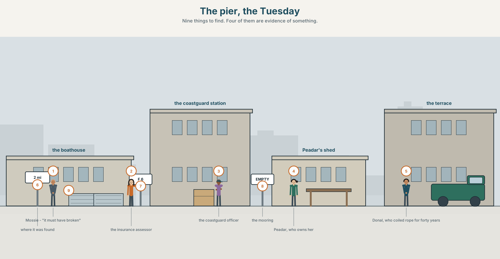
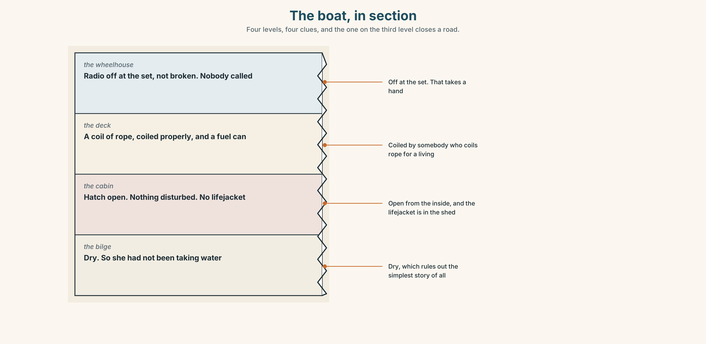
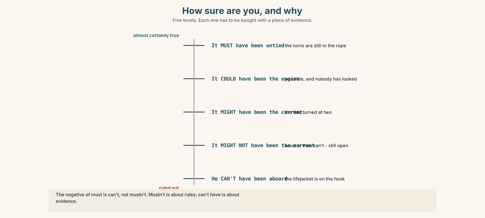
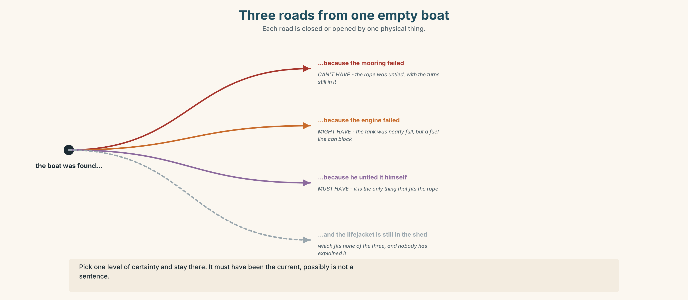
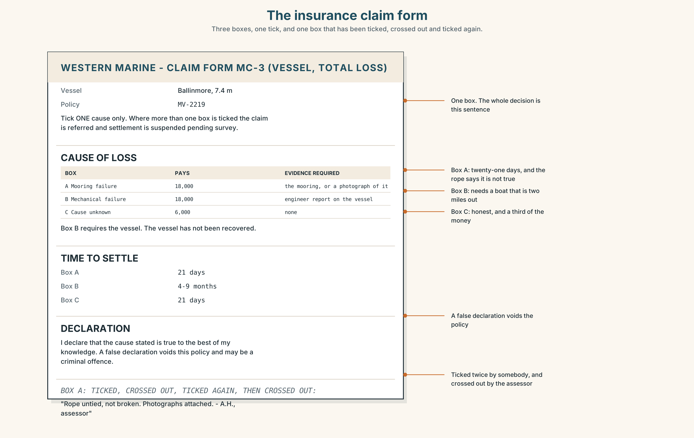
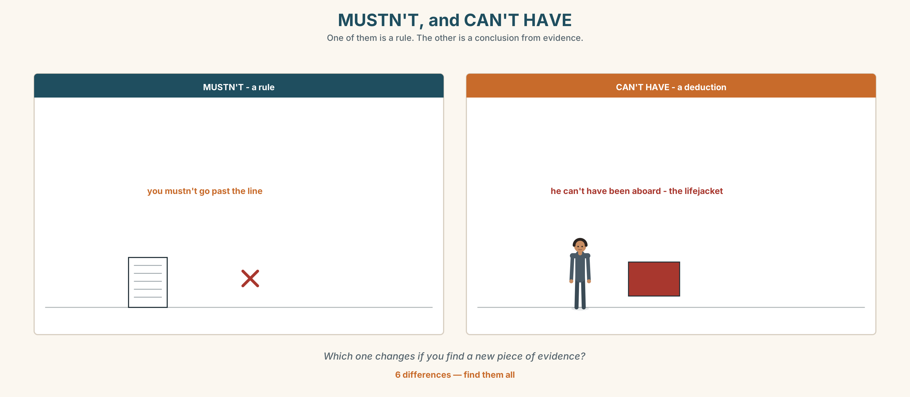
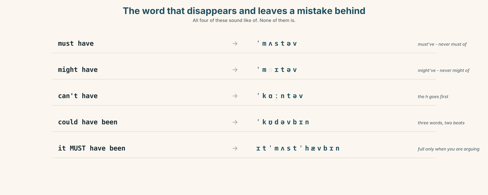
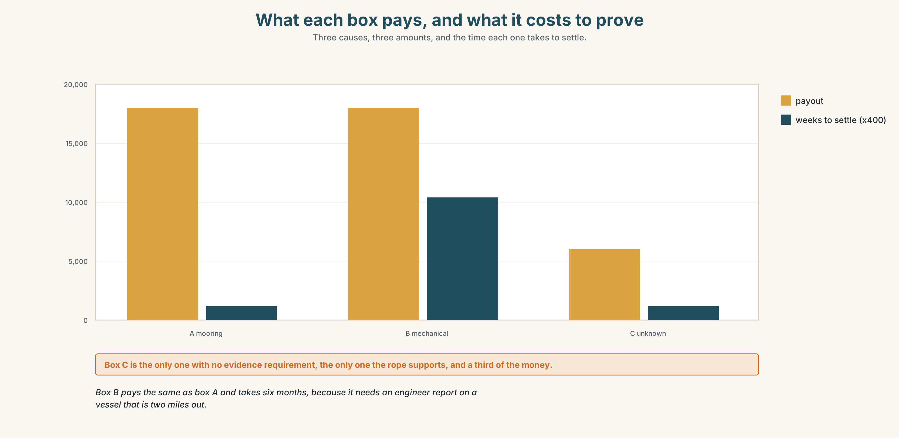
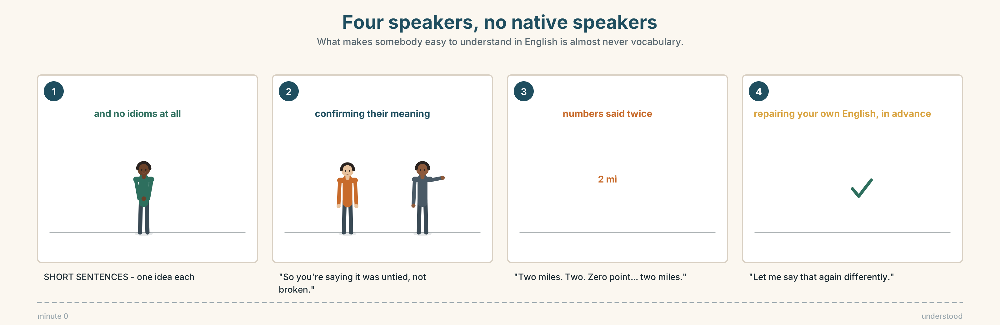

# A2.2 · Unit 6 · Two Miles Out, and Empty

> **English Animated** · *Telling the Story* · Ballinmore, west coast of Ireland
> Student's Book pages 116–137 · 22 pp · ~10 hours

---

## Part 0 · The Big Picture ◆ **A · THE WORLD**

{width=6.6in}

*The pier, the Tuesday — Nine things to find. Four of them are evidence of something.*

# What might have happened?

**By the end of this unit you can explain three possible causes of something, and say which you
believe and why.**

| ◆ **A · THE WORLD** | A boat found empty, three explanations, and a form with one box |
|---|---|
| ◆ **B · THE SYSTEM** | *must / might / can't* + *be* and *have been* · certainty adverbs · 23 words for mystery and evidence · 17 ways of saying how sure you are · *must've* and *might've* |
| ◆ **C · THE PERFORMANCE** | Three explanations, ranked, with reasons |

---

### 0A · Find it

**Find nine things in this picture.** Four of them are evidence of something.

> a boat on its mooring · an empty mooring · a lifejacket · a coil of rope · a fuel can ·
> a radio · a hatch left open · a weather board · a coastguard notice

### 0B · Guess it

**Three things in this picture do not fit together.** Which three, and what would explain them?

### 0C · Say it ⏺

**Record thirty seconds.** *Think of something unexplained you have seen. Give two explanations
and say which you believe.* You will record it again at the end of this unit.

---

## Part 1 · Vocabulary Lab 1 ◆ **B · THE SYSTEM**

{width=6.6in}

*One boat, three roads, one form — Five nodes. Two of the roads are closed by physical evidence and the form has no box for the third.*

### 1A · Meet — the words of an unexplained thing

Match each word to one place on the map.

> **mystery** · **theory** · **clue** · **guess** · **suspect** · **explain** ·
> **evidence** · **wreck** · **tide** · **current**

### 1B · Sort — a fact, a feeling, or a story?

Three columns.

> clue · strange · theory · empty · suspect · obvious · missing · mystery · unlikely

**One of them is a fact that is always described as a feeling.** Which?

### 1C · Meet — the words of the paperwork

> **insurance** · **payout** · **coastguard**

Three nouns that turn a mystery into a form with boxes.
**Which of the three has no interest at all in what happened?**

{width=6.6in}

*The boat, in section — Four levels, four clues, and the one on the third level closes a road.*

**Look at the boat, in section.** Four levels, four clues.
**Which level has the clue that rules out one of the three explanations?**

### 1D · Stretch — the phrases

Complete each one with one word.

1. None of it **makes ______** unless he left the mooring on purpose.
2. The coastguard has **ruled ______** a collision.
3. If the hatch was open, **the only ______** is that he went below.
4. A current is **more ______** than an engine failure in that weather.
5. Nothing of his has **turned ______** since.

### 1E · The saying

> **f** **We may never know.**

Four words that are sometimes honest and sometimes a way of stopping.

> **Write the sentence that should come before it** — the one that makes it honest.

### 1F · Own it

Think of something in your own life that has never been explained. Tell a partner
**three sentences**: what happened, your best theory, and what would prove it.

---

## Part 2 · Listening ◆ **A · THE WORLD**

{width=6.6in}

*Three explanations — One of them was being said before anybody had looked at the rope.*

### 2A · Three explanations 🔊 Track 6.1

**Before you listen.** Peadar's boat was found two miles out, empty, with the hatch open.
**Guess: does the coastguard have a preferred theory?**

**Listen once. One question.** What three explanations are given?

**Listen again. Complete the table.**

| Theory | What supports it | What is against it |
|---|---|---|
| it broke its mooring | | |
| the engine failed | | |
| he took it out | | |

**Listen again. True or false?**

1. The mooring rope was found cut. ☐ T ☐ F
2. The fuel tank was nearly full. ☐ T ☐ F
3. His lifejacket was still in the shed. ☐ T ☐ F
4. The coastguard says one theory is impossible. ☐ T ☐ F

**Noticing.** Four sentences from the recording.

1. *The rope must have broken.*
2. *It might have been the current.*
3. *He can't have taken it out — his lifejacket's in the shed.*
4. *It's possible that the engine failed.*

**One of these is nearly certain. One is nearly impossible. Two are in between.**
**Put them in order, most sure first.**

### 2B · Decoding clinic 🔊 Track 6.2

Twenty-five seconds. Four jobs.

1. How many times can you hear *must've* or *might've*?
2. In *must have*, can you hear the *h*?
3. Catch the distance and the depth.
4. One speaker says *obviously* about something that is not obvious. Where?

> Transcripts, page 155.

---

## Part 3 · Grammar Lab 1 ◆ **B · THE SYSTEM**

### Saying how sure you are

### 3A · Notice

Look at the four sentences in Part 2.

1. In sentence 1, does the speaker know the rope broke?
2. **What is the difference between *must have* and *did*?**
3. In sentence 3, *can't have* is used, not *mustn't have*. **Why?**
4. **Which is stronger: *can't have been* or *might not have been*?**
5. Try *"It must have been the current, I think."* **Why is that odd?**

### 3B · See

{width=6.6in}

*How sure are you, and why — Five levels. Each one has to be bought with a piece of evidence.*

Now look at the second picture. **Three roads from one piece of evidence.
Which road does the lifejacket close?**

{width=6.6in}

*Three roads from one empty boat — Each road is closed or opened by one physical thing.*

### 3C · Know

| | About now | About the past |
|---|---|---|
| **almost certain yes** | *It **must be** the current.* | *It **must have been** the current.* |
| **possible** | *It **might / could be** the engine.* | *It **might / could have been** the engine.* |
| **almost certain no** | *It **can't be** him.* | *It **can't have been** him.* |

> **The negative of *must* is *can't*, not *mustn't*.**
> *mustn't* is about rules. *can't have* is about evidence.

> **These are not about ability or permission.** They are about **how much you know**.
> *He can't swim* is ability. *He can't have swum* is a deduction.

> **Adverbs do the same job and can be stacked — carefully.**
> *definitely · surely · obviously · clearly · presumably · apparently · possibly*
> ✗ *It must have been the current, possibly.* — pick one level and stay there.

> **Watch out.** In speech these are /mʌstəv/ and /maɪtəv/. In writing they are **never**
> *must of* or *might of*.

### 3D · Use — controlled

> The rope (1) __________ (must / break) at some point in the night, because it was found
> frayed and not cut. It (2) __________ (might / be) the current — the tide turned at two.
> He (3) __________ (can't / take) it out himself, because his lifejacket is still in the shed
> and he never went out without it. The engine (4) __________ (could / fail), though the tank
> was almost full, so that is (5) __________ (unlikely). Presumably we
> (6) __________ (never / know).

### 3E · Use — guided

Rewrite each one using *must have*, *might have* or *can't have*.

1. I'm certain the rope broke.
2. Perhaps the current took it.
3. It's impossible that he was on board.
4. I'm fairly sure somebody moved it.
5. It's possible that nobody noticed until morning.

### 3F · Use — open

**In threes.** One of you describes something odd. The others must give one *must have*,
one *might have* and one *can't have*. **Three minutes.**

### 3G · Check — six items

> 1. The rope ______ (must / break) in the night.
> 2. It ______ (might / be) the current.
> 3. He ______ (can't / be) on board — his lifejacket is here.
> 4. Somebody ______ (must / move) it.
> 5. It ______ (could / happen) at any time after two.
> 6. They ______ (can't / see) it in that fog.

**0–3 →** Workbook pp. 34–36. **4–5 →** Part 6. **6 →** page 129.

---

## Part 4 · Speaking ◆ **C · THE PERFORMANCE**

### 4A · Fluency starter — one object

Your teacher puts one object on the table. **Each learner gives one deduction**, and nobody may
repeat a modal. **Thirty seconds each.**

**Three objects. Three rounds.**

### 4B · The functional core — ranking explanations

{width=6.6in}

*The rope that broke, and the rope that was untied — Learner A has a broken rope. Learner B has this one. They do not look alike.*

**Language Bank**

| | |
|---|---|
| **the strongest** | *It must have been…* · *That's the only explanation.* |
| **the possible** | *It might have been…* · *It's possible that…* |
| **the ruled out** | *It can't have been…, because…* · *We can rule that out.* |
| **the honest end** | *I don't think we'll ever work it out.* · *We may never know.* |

**Role play.** Learner A is the boat's owner. Learner B works for the insurer.
**Six minutes.** Learner B must rule one theory out and must say what would change their mind.

### 4C · The performance — one hundred seconds ⏺

Explain **three possible causes** of something. **One hundred seconds.** You must give:

> each explanation · what supports it · what is against it · which you believe, and why

**Record it.**

### 4D · Observer

One person listens for **one thing**: did the speaker's certainty match their evidence?

### 4E · Two criteria

> ☐ Did I use *must have*, *might have* and *can't have*?
> ☐ Did I give a reason for ruling something out, not just an opinion?

---

## Part 5 · Reading ◆ **A · THE WORLD**

### 5A · Predict

A short story. The title is **"The mooring."**
**What do you expect to be left unexplained at the end?** One sentence.

### 5B · Read — one hundred and ten seconds

---

**The mooring**

They found it at half eleven on the Tuesday, two miles out and drifting east with the hatch open
and nothing aboard but a fuel can and a coil of rope that had been coiled by somebody who knew
how.

Mossie Hegarty said it must have broken its mooring. He had been saying that since nine, before
anybody had looked at the rope, and he kept saying it afterwards, which my father said was the
only interesting thing about the whole business.

The rope had not been cut. It had not been frayed either. It had been untied, and it had been
untied by somebody who tied things for a living, because the turns were still in it.

Peadar's lifejacket was on the hook in the shed where it had been on Sunday and where it is now.
He had not been out without it in forty years. That is not a theory. That is a thing that
everybody on that pier would say, and the insurance man wrote it down and then asked whether
anybody had actually seen him put it on, on any particular day, and nobody had, because why would
you.

So there are three explanations and one of them is impossible and the other two are impossible as
well, and the one they have written on the form is the cheapest of the three to be true.

---

### 5C · Answer

1. Where and when was the boat found, and what was aboard?
2. What was Mossie Hegarty's theory, and when did he start saying it?
3. **What had happened to the rope, and why does that matter?**
4. Where was the lifejacket, and what question did the insurance man ask about it?
5. Why does the narrator say "why would you"?
6. **What does the last sentence accuse the form of?**

### 5D · Vocabulary in context

Guess from the text. Then check.

> drifting east · the turns were still in it · on the hook · that is not a theory ·
> the cheapest of the three to be true

### 5E · The counter-text

{width=6.6in}

*The insurance claim form — Three boxes, one tick, and one box that has been ticked, crossed out and ticked again.*

**Read the insurance claim form and answer.**

1. How many causes can be ticked, and how many may be ticked at once?
2. **What is the payout for each cause, and which is the lowest?**
3. What does the form require as evidence for each cause?
4. One box has been ticked, crossed out, and ticked again. Which?

### 5F · Two texts

The story says the rope was **untied**, by somebody who knew how.
The form has a box for **"mooring failure"** and none for anything else that fits.

**Put those two facts together. What will the form say happened?** Two sentences.

---

## Part 6 · Vocabulary Lab 2 ◆ **B · THE SYSTEM**

### How sure is sure

{width=6.6in}

*Certain, probable, possible, ruled out — Four positions, and each one is a different sentence about the same rope.*

### 6A · Sort — how certain?

Put these on a line from certain to barely possible.

> definitely · surely · obviously · clearly · presumably · apparently · possibly

**Two of them are about what other people say, not about what you know.** Which?

### 6B · Chunk completion

1. It **must ______** been the tide.
2. It **might ______** been the engine.
3. He **can't ______** been aboard.
4. **It's possible ______** nobody noticed until morning.
5. They never **worked ______** what happened to the radio.
6. The rope was untied. **That ______ it.**

### 6C · Two that sound like certainty and are not

**apparently** and **presumably** both look strong. Neither is.

> *Apparently* = somebody told me. *Presumably* = I am filling a gap with logic.

**Which would you use in each of these?**

1. ______ the tide turned at two. *(it is in the tide table)*
2. ______ he went below for something. *(nobody saw it; the hatch was open)*
3. ______ the coastguard was there by noon. *(the harbour master said so)*

{width=6.6in}

*MUSTN'T, and CAN'T HAVE — One of them is a rule. The other is a conclusion from evidence.*

**Six differences.** Find them, then answer the question under the picture.

### 6D · Contrast Clinic — must, might or can't

Six items.

1. The light is on. Somebody ______ be in.
2. The light is on, but his car is gone. He ______ be in.
3. Perhaps she ______ have forgotten.
4. The rope was untied, so it ______ have broken.
5. There's no fuel in the can. It ______ have run out.
6. He's been at sea forty years. He ______ have made that mistake.

---

## Part 7 · Pronunciation & Fluency Lab ◆ **B · THE SYSTEM**

### The word that disappears and leaves a mistake behind

{width=6.6in}

*The word that disappears and leaves a mistake behind — All four of these sound like of. None of them is.*

### 7A · Hear 🔊 Track 6.3

> must have → *must've* → /ˈmʌstəv/
> might have → *might've* → /ˈmaɪtəv/
> can't have → /ˈkɑːntəv/
> could have been → /ˈkʊdəvbɪn/

**All four sound exactly like *of*. None of them is.**

### 7B · Say

Say each one. Then say the sentence three times, faster:

> *It must have been the current, and he can't have been aboard.*

### 7C · Make it mean something

Say these two:

> *It MUST have been the current.* *(and I am arguing with somebody)*
> *It must've been the current.* *(and I am just thinking aloud)*

**Which one has already been contradicted once?**

### 7D · Fluency 20 ⏺

Twenty seconds: **three deductions about this room.**
One *must've*, one *might've*, one *can't have*. Three times, faster.

---

## Part 8 · Writing ◆ **C · THE PERFORMANCE**

### Three explanations · 100 words

{width=6.6in}

*What each box pays, and what it costs to prove — Three causes, three amounts, and the time each one takes to settle.*

### 8A · Read the model

> It can't have broken its mooring. The rope was untied and the turns were still in it, and rope
> that breaks does not look like that. `[the ruled-out one first, with the physical reason]`
>
> The engine might have failed. The tank was nearly full, which makes it unlikely, but a fuel
> line can block with a full tank and it has happened twice on that pier in ten years.
> `[the possible one, and the writer argues against their own point and then recovers it]`
>
> He must have untied it himself. That is the only explanation that fits the rope, and it is also
> the one that fits nothing else about him. `[the strongest, and an admission that strongest is
> not the same as satisfying]`

**Questions about the writer's choices:**

1. The impossible one comes first. **Why not last?**
2. The last line says the best theory does not fit the man. **Is that a weakness in the writing?**

### 8B · The anti-model

> It is a real mystery and nobody knows what happened. It could have been many things. Maybe the
> rope broke or maybe something else happened. We will probably never find out the truth.

Correct English, and no evidence anywhere in it. **Name two things it does not do.**

### 8C · Plan

> what you can rule out, and the physical reason → what is possible, with its weakness →
> what you believe → what still does not fit

### 8D · Write — 100 words
### 8E · Peer review — two criteria

> ☐ Is every level of certainty earned by a piece of evidence?
> ☐ Is there one thing that still does not fit?

### 8F · Write it again · 8G · Publish

On the wall, with the claim form from Part 5E beside it.

---

## Part 9 · The File ◆ **A · THE WORLD + C · THE PERFORMANCE**

# CULTURE FILE · English as a Lingua Franca

{width=6.6in}

*Four speakers, no native speakers — What makes somebody easy to understand in English is almost never vocabulary.*

### 9A · Four people, no native speakers 🔊 Track 6.4

A Spanish surveyor, a Latvian skipper, a Polish mechanic and a Brazilian insurance assessor
discuss the boat. **In English. Listen.**

1. Who speaks the most, and are they the clearest?
2. **Which speaker checks that they have been understood, and how?**
3. One misunderstanding is repaired without anybody naming it. Where?

### 9B · What makes somebody easy to understand

**Mark the three that matter most**, from the recording.

> a large vocabulary · short sentences · checking back · a particular accent ·
> saying numbers twice · speaking slowly · knowing idioms

### 9C · The repair moves

Match each to its job.

> *"Sorry — the rope was what?"* · *"So you're saying it was untied, not broken."* ·
> *"Let me say that again differently."* · *"Is that the right word?"*

> asking again · checking your own English · confirming their meaning · repairing in advance

### 9D · Your turn

In fours. **Explain one of the three theories to the group** — but you may not use any word of
more than two syllables. **Four minutes.** Then: what did you lose, and what got clearer?

### 9E · Transfer

**Listen to one conversation in English this week** where neither person is a native speaker.
**Write down one thing they did that made it work.**

---

## Part 10 · Mediation & Interaction ◆ **C · THE PERFORMANCE**

{width=6.6in}

*From the mooring to the form — Half the class sees the rope. Half sees the form. Rebuild the case by speaking.*

### 10A · Relay

Half the class sees the boat and the rope. Half sees the claim form.
**Rebuild the whole case by speaking.** Ten minutes.

### 10B · Simplify

Explain the claim form from Part 5E to Peadar, who has to sign it.
**Four sentences only.**

> **Plan:** what the boxes mean → what each one pays → what evidence each needs →
> which one you would not tick

### 10C · Compress

The story in Part 5 into **thirty-five words**, keeping the rope.

### 10D · Online

Write **one message** to the insurer: you are querying one box on the form, here is the physical
evidence, and here is what you are asking them to do.

### 10E · Your language

How does your language say *it must have been*? **Is there a modal verb, or a word like
*surely*?** Show a partner all three levels of certainty in both languages.

---

## Part 11 · The Decision ◆ **C · THE PERFORMANCE**

# One box on the form

The form has three boxes. Only one may be ticked. The rope was untied.

- **Mooring failure.** Pays 18,000. It is what Mossie says and what the form expects, and the
  rope says it is not true.
- **Mechanical failure.** Pays 18,000. Possible, unprovable, and nobody has looked at the fuel
  line because the boat is still out there.
- **Cause unknown.** Pays 6,000. It is the honest box, and it is the one he cannot
  afford.

### 11A · The evidence

1. **The claim form** from Part 5E — and the box that was ticked, crossed out and ticked again.
2. **The chart** — what each cause pays, what it requires, and how long each takes to settle.
3. **The voice.** Peadar, twenty seconds: *"I didn't untie her. I know what that rope looks
   like and I know what I am being asked to sign, and I am aware that the honest box is the one
   that costs me twelve thousand, and I have thought about that."*

### 11B · Talk about it

In threes. Everybody says one. Use the frame.

> *I think Peadar should tick ______ , because ______ .*

**Words you can use:** *evidence · theory · suspect · clue · unlikely · obvious · payout · insurance*

### 11C · Decide

Write **two sentences**. Choose, and say why.

> I think Peadar should tick ______________________ ,
> because ______________________ .

### 11D · Model decision

> He should tick *cause unknown* and attach the rope. The form is asking a question Peadar
> cannot honestly answer, and the rope is the only thing in the whole business that is certainly
> true. Six thousand and a clear conscience is a real cost and I would not pretend otherwise, but
> an eighteen-thousand payout for a cause that the physical evidence contradicts is a sentence
> somebody will have to repeat under oath if anybody ever looks again.

### 11E · The Reveal

> **What happened.** He ticked *cause unknown* and sent the rope. The assessor asked for it to
> be photographed rather than posted and then came and looked at it himself.
>
> He reopened the file. Six months later the payout was 18,000 under a heading that does not
> appear on the form — *circumstances not determined, no evidence of owner fault* — which he says
> existed all along and is simply not printed on the household version.
>
> Nobody has found out who untied her. The coastguard closed the file in March. Mossie Hegarty
> has not been on the pier since the rope was photographed, and Peadar has not asked him why.

**The honest box paid more, eventually, and only because somebody looked at the rope.**

> **Was it the right decision?** Say why — and say what you make of Mossie.

---

## Part 12 · Landing ◆ **all three lines**

### 12A · Recycle — ten items

> 1. The rope ______ (must / break) in the night.
> 2. He ______ (can't / be) aboard.
> 3. It ______ (might / be) the current.
> 4. The coastguard has **ruled ______** a collision.
> 5. Nothing has **turned ______** since.
> 6. *(Unit 5)* *"Measure it."* → He told me ______ it.
> 7. *(Unit 4)* She ______ me that she had checked it. *(said / told)*
> 8. *(Unit 3)* By the time we arrived, it ______ (already / start).
> 9. *(Unit 1)* If I ______ you, I wouldn't wait.
> 10. *(A2.1 U8)* You ______ (not / allowed) go past this line.

### 12B · Consolidate

**One hundred words.** Three explanations of something unexplained. One *must have*, one
*might have*, one *can't have*, and one thing that still does not fit.

### 12C · Can-do, with evidence

| I can… | My evidence | Sure? |
|---|---|---|
| say how sure I am about a past event | Part 3G score | ◯ ◑ ● |
| explain and rank three causes in a hundred seconds | Part 4C recording | ◯ ◑ ● |
| write a hundred words where certainty is earned | Part 8 draft 2 | ◯ ◑ ● |
| make myself understood without idioms | Part 9D group work | ◯ ◑ ● |

### 12D · Replay ⏺

Find your thirty seconds from Part 0C. Listen. **Record it again.**
One sentence: what is different?

### 12E · Glossary — forty items, as a map

> **THE PUZZLE** · mystery · strange · empty · missing · wreck · clue · turn up · we may never know
> **THE THINKING** · theory · guess · suspect · explain · work out · make sense · rule out · that explains it
> **THE SEA** · tide · current · coastguard
> **THE PAPERWORK** · insurance · payout
> **HOW LIKELY** · obvious · unlikely · more likely · the only explanation
> **ALMOST CERTAIN** · must · must have · definitely · surely · obviously · clearly
> **POSSIBLE** · might · might have · could · possibly · it's possible that · presumably · apparently
> **RULED OUT** · can't · can't have

### 12F · Next

> **Unit 7 · What will you be doing in a year?**
