# English Animated — B1.1 · Taking a Position

*Jengo House, Nairobi*

## About this volume

**English Animated B1.1 · *Taking a Position*** — Jengo House, Nairobi.

This volume contains **10 of 10 units**, written in full: every text, every task, every
figure drawn. Units are 20 pages each at B-level and 22 at A-level, which is the extent specified
in the series plan.

# B1.1 · Unit 1 · Ground Floor

> **English Animated** · *Taking a Position* · Jengo House, Nairobi
> Student's Book pages 8–27 · 20 pp · ~11.5 hours

---

## Part 0 · The Big Picture ◆ **A · THE WORLD**

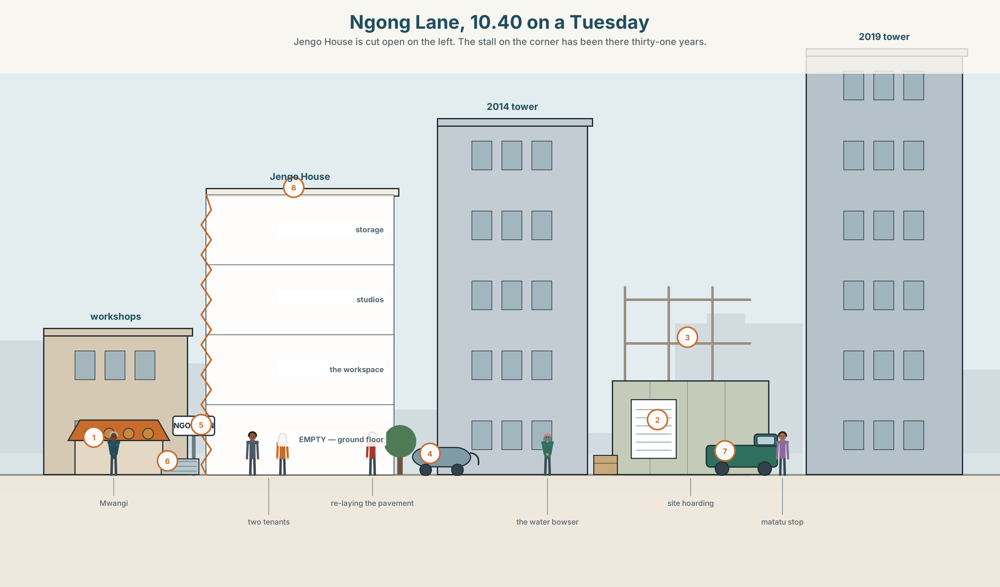{width=6.6in}

*Ngong Lane, 10.40 on a Tuesday — Jengo House is cut open on the left. The stall on the corner has been there thirty-one years.*

# Who is a city built for?

**By the end of this unit you will tell the story of how one street changed, in 90 seconds, to
someone who has never seen it.**

| ◆ **A · THE WORLD** | How a street changes, who changes it, and who is still there afterwards |
|---|---|
| ◆ **B · THE SYSTEM** | Three past tenses working together · the past perfect, returning · 24 words for urban space and change · 21 markers of time and sequence · elision in fast speech |
| ◆ **C · THE PERFORMANCE** | A 90-second spoken account of a changed place, and a 140-word written one |

---

### 0A · Find it

Look at the picture. Find and label these fourteen things. Four of the eighteen words are not in
the picture — which four?

> pavement · kerb · hoarding · scaffolding · awning · bowser · matatu · paving slab · frontage ·
> planning notice · ground floor · roof terrace · fire escape · sewing machine · security grille ·
> satellite dish · skip · cherry picker

### 0B · Guess it

Three things in this picture will not be there in five years. Which three, and what makes you
think so? There is no correct answer — but there is a better and a worse reason.

### 0C · Say it ⏺

**Record thirty seconds.** *Who is this street built for?* Say what you think now. Do not prepare.
You will listen to this again at the end of the unit, and record it a second time.

---

## Part 1 · Vocabulary Lab 1 ◆ **B · THE SYSTEM**

### 1A · Meet — the street, named

Tap or look at the picture in Part 0 and find the thing each word names. Write the word.

> **plot** · **frontage** · **hoarding** · **scaffolding** · **kerb** · **pavement** ·
> **tenant** · **landlord** · **rent** · **derelict** · **demolish** · **redevelop**

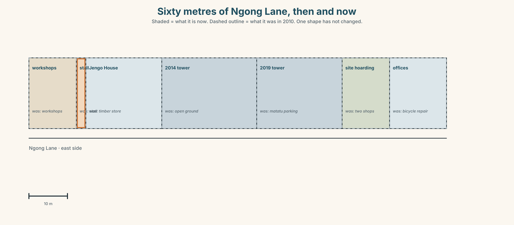{width=6.6in}

*Sixty metres of Ngong Lane, then and now — Shaded = what it is now. Dashed outline = what it was in 2010. One shape has not changed.*

**Use the plan.** Which plot changed most? Which changed least? Put the seven plots in order —
then do 1B with the same seven, and see whether your two orders agree.

### 1B · Sort — how much is destroyed?

Put these seven verbs in order, from the one that changes least to the one that changes most.

> repaint · refit · extend · convert · **do up** · **redevelop** · **demolish**

Compare with a partner. You will not agree about all of them. The useful question is *what are you
measuring* — how much of the building survives, how much it costs, or how long people have to leave?

### 1C · Sort — odd one out, and why

In each group, one word does not belong. Cross it out **and write the reason**. More than one
answer can be defended.

1. tenant · landlord · resident · developer
2. demolish · redevelop · do up · knock down
3. rent · rates · mortgage · deposit
4. hoarding · scaffolding · awning · frontage

### 1D · Stretch — what goes with what?

Tick the combinations that are normal English. Then find the one combination nobody says, and say
what people use instead.

| | rent | permission | a building | a stall | the kerb |
|---|---|---|---|---|---|
| **raise** | | | | | |
| **grant** | | | | | |
| **put up** | | | | | |
| **run** | | | | | |
| **re-lay** | | | | | |

### 1E · Stretch — the phrases

Complete each phrase with one word.

1. The shop is **set back _______ the road**, so people walk past it.
2. The building is **_______ use** — flats above, workshops below.
3. **_______ rents** have pushed out four businesses on this street.
4. There has been **a change of _______** on the ground floor: it was a timber store, now it is
   offices.
5. Three of the old tenants were **_______ out** and moved two miles away.

> **Corpus Note**
> In a 1.2-billion-word corpus, **redevelop** appears beside *site*, *area* and *scheme* almost
> every time. It appears beside **home** fewer than five times in a billion words.
> What is that choice doing?

### 1F · Own it

Describe a street you know, using **six** of this unit's words and one word you had to look up.
Tell a partner. Your partner's job: which word did you look up?

---

## Part 2 · Listening ◆ **A · THE WORLD**

### 2A · Three people on the same street 🔊 Track 1.1

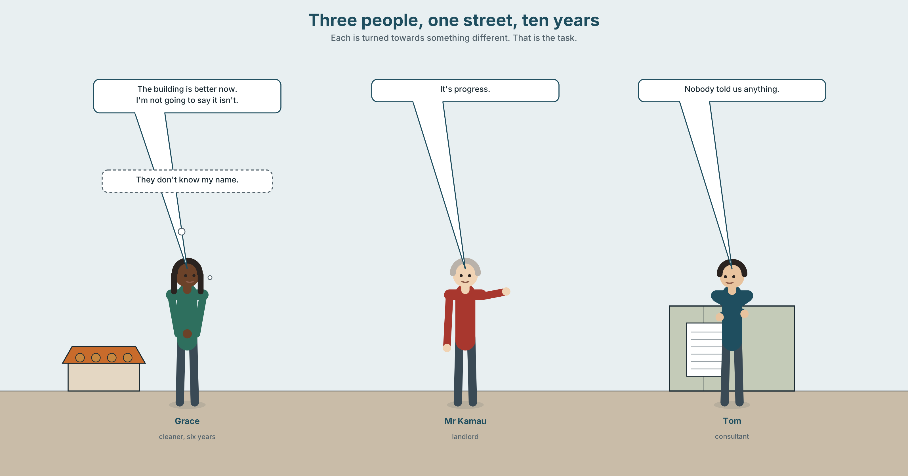{width=6.6in}

*Three people, one street, ten years — Each is turned towards something different. That is the task.*

**Before you listen.** Look at the picture in Part 0 again. Who do you think will be pleased about
the changes to this street, and who will not? Why?

**Gist — one listen, one question, no second chance.**
Which of the three would move away tomorrow if they could?

**Detail — listen again and complete the frame.**

| | The street **was**… | The street **is**… | The street **will be**… |
|---|---|---|---|
| Grace | | | |
| Mr Kamau | | | |
| Tom | | | |

**Inference.** Grace never says she is worried. How do you know she is? Write down the exact words
that told you.

**Attitude.** Mr Kamau says *"it's progress."* Which **sound** tells you how he feels about it —
not which word?

**Noticing.** Here are six sentences from the recording. Sort them into three groups.

1. *The ground floor was still the timber place.*
2. *They took that out.*
3. *Nobody told us anything.*
4. *It was empty for eight months.*
5. *The people who were here then have gone.*
6. *By the time I came back, they had already started.*

> **A.** This happened once and finished. · **B.** This was going on, around the story. ·
> **C.** This was already true before the story started.

*You do not need to name the tenses. You will do that in Part 3.*

### 2B · Decoding clinic 🔊 Track 1.2

Forty-two seconds of Grace at full speed. You will hear it **four times**. A different job each time.

1. How many words are there in her first sentence?
2. Catch the three numbers.
3. Find two places where two words join into a single sound.
4. What disappeared from *didn't know*?

> Transcripts for both tracks are on page 171. Do not look until you have finished.

---

## Part 3 · Grammar Lab 1 ◆ **B · THE SYSTEM**

### Three past tenses, working together

### 3A · Notice

Go back to the six sentences in Part 2. Answer these five questions. Every answer is in the
sentences.

1. Sentence 2 (*They took that out*) — did this take a long time, or was it one event?
2. Sentence 1 (*was still the timber place*) — is this one event, or a situation that lasted?
3. Which of the six sentences describes something that happened **before** the rest of the story?
4. What are the three words in sentence 6 that tell you it came first?
5. Sentence 5 has two parts. Which part is the background, and which is the news?

### 3B · See

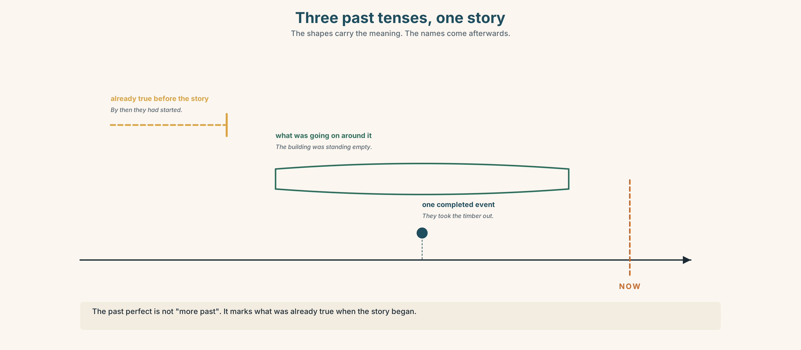{width=6.6in}

*Three past tenses, one story — The shapes carry the meaning. The names come afterwards.*

### 3C · Know

| | Use it for | Example |
|---|---|---|
| **past simple** | one completed event; the spine of the story | *They **took** the timber out.* |
| **past continuous** | what was going on around that event; the background | *The building **was standing** empty.* |
| **past perfect** | what was already true before the story started | *By then they **had** already **started**.* |

> **Watch out.** The past perfect is not "more past". It marks **what was already true when the
> story began**. If every past sentence in your paragraph is a past perfect, none of them is doing
> any work.

> **Why it matters.** Get this wrong and your reader puts the events in the wrong order. *When I
> arrived, they left* and *When I arrived, they had left* describe two different mornings.

### 3D · Use — controlled

Complete the text. Use the past simple, the past continuous or the past perfect.

> Mwangi (1) __________ (open) the stall in 1994. At that time the lane (2) __________ (be) mostly
> workshops, and people (3) __________ (repair) radios and bicycles all day. He (4) __________
> (rent) his two metres of frontage from a man called Otieno, who (5) __________ (die) in 2009.
> By the time the first tower (6) __________ (go) up, Otieno's son (7) __________ already
> __________ (raise) the rent twice. For eleven days Mwangi (8) __________ (work) by lamp, because
> the new building (9) __________ (block) the sun until ten in the morning. He (10) __________
> (not complain). He (11) __________ (buy) a brighter lamp.

### 3E · Use — guided

These six events are in the wrong order. Put them in the right order, then **write the connecting
sentences**. You will need at least one past perfect and one past continuous.

> • the drivers moved three streets away · • the second tower took the open ground ·
> • Mwangi rented the frontage from Otieno · • Otieno died · • the first tower was finished ·
> • Mwangi was working by lamp for eleven days

### 3F · Use — open

**Tell a partner about a place that changed on you.** It can be a street, a building, a shop, a
room. Your partner must be able to say afterwards, without asking, **what was already true before
your story started**. If they cannot, tell it again.

### 3G · Check — six items, mark your own

> 1. When we arrived, the meeting ______ already ______. (start)
> 2. I ______ (walk) past the site every morning that year.
> 3. She ______ (sign) the lease on the Tuesday and ______ (move) in on the Friday.
> 4. By 2016 four of the fourteen businesses ______ (close).
> 5. ______ (you / live) here when they knocked it down?
> 6. He ______ (not realise) the consultation ______ (end).

**0–3 →** Workbook pp. 6–8 before you go on. **4–5 →** the Contrast Clinic in Part 6 will fix it.
**6 →** the extension task on p. 19.

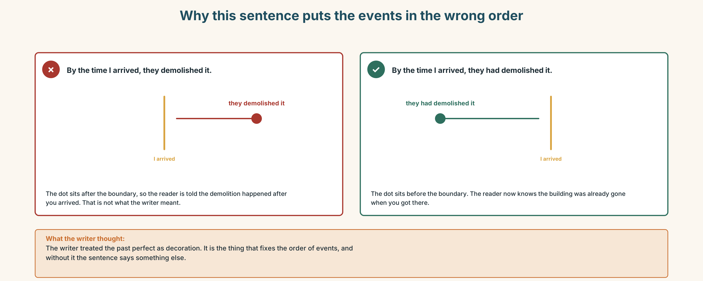{width=6.6in}

*Why this sentence puts the events in the wrong order — Why this sentence puts the events in the wrong order*

---

## Part 4 · Speaking ◆ **C · THE PERFORMANCE**

### 4A · Fluency sprint — 4 / 3 / 2

Describe the street you live on. **Four minutes** to a partner. Then change partner: the same
description in **three minutes**. Then change again: **two minutes**.
Same content every time. Do not add anything. The only thing that changes is you.

### 4B · The functional core — describing change, and saying who did it

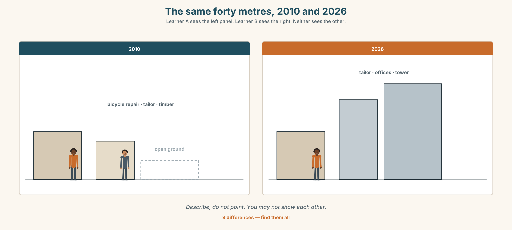{width=6.6in}

*The same forty metres, 2010 and 2026 — Learner A sees the left panel. Learner B sees the right. Neither sees the other.*

**Language Bank** — three levels of formality. Choose, do not mix.

| | | |
|---|---|---|
| **informal** | *it's not what it was* · *they've done the whole lot up* · *it's gone really* |
| **neutral** | *the area has changed a lot* · *they put up two towers* · *most of the old shops have gone* |
| **formal** | *the character of the street has altered considerably* · *the site was redeveloped in 2014* |

**Information gap.** Without showing each other, find all nine differences. You may only describe.
Then decide together: which of the nine would the people who live there actually notice?

### 4C · The performance — the residents' meeting

Six role cards. **Each card has a position everyone can see, and a brief nobody else knows.**
Twenty minutes. No chair — you will have to take and give the floor yourselves.

> **A · Wanjiru** runs the workspace. *Public: wants a decision today.* ·
> **B · Obi** runs a logistics startup. *Public: wants to sell.* ·
> **C · Mariam** is a textile designer. *Public: will not move.* ·
> **D · Tom** consults on data. *Public: wants the numbers first.* ·
> **E · Mr Kamau** is the landlord. *Public: neutral.* ·
> **F · Grace** cleans the building. *Public: has not been asked.*

### 4D · Observer

One person in each group does not take a role. You listen for **two things only**, and report for
thirty seconds at the end:

- Who was interrupted, and by whom?
- Who was never asked a question?

### 4E · Two criteria

Rate yourself on these and nothing else.

> ☐ Did I give a reason **every** time I disagreed?
> ☐ Did I bring in someone who had not spoken?

---

## Part 5 · Reading ◆ **A · THE WORLD**

### 5A · Predict

You will read a feature article called **"The last shop on the corner"**. The first line is:

> *Mwangi Njoroge has been taking in trousers on the same corner of Ngong Lane for thirty-one years.*

What do you expect the article to argue? Write one sentence. You will check it at 5D.

### 5B · Skim — sixty seconds

Read the whole text in one minute. Do not stop at words you do not know. Answer one question:
**where does the article turn?** Mark the paragraph.

---

**The last shop on the corner**

Mwangi Njoroge has been taking in trousers on the same corner of Ngong Lane for thirty-one years.
In that time three buildings have gone up around him and two have come down. His stall has not
moved by a metre.

When he started, the lane was mostly workshops. People repaired things here — radios, shoes,
bicycles, trousers. The building that now houses Jengo House was a timber store, and the plot next
to it was open ground where matatu drivers parked and argued. Mwangi rented his two metres of
frontage from a man called Otieno, who died in 2009, and whose son raised the rent twice and then
forgot about it.

The first tower went up in 2014. Mwangi remembers the week it was finished, because for eleven days
he could not see the sun until after ten in the morning, and he was working by lamp. The second one
took the open ground. The drivers moved three streets down and most of them never came back.

"People ask me if business is worse," he says. "It is not worse. It is different. Before, I repaired
work clothes. Now I take in suits for young people who have just started earning and bought the
wrong size online."

He is not sentimental about it. He points out that the new buildings brought him the customers he
has now, and that the lane had been dangerous after dark for years before anyone built anything.

But he also notes that of the fourteen businesses that were on this stretch when he arrived, his is
the only one still trading. The others did not fail. Their rent went up, and they moved somewhere
cheaper, and then that place got expensive too.

---

### 5C · Close reading

1. What was on the plot next to Jengo House before the second tower?
2. Why did Mwangi work by lamp for eleven days?
3. Mwangi says business is *"not worse — different."* Give two pieces of evidence from the text.
4. What does the article tell you about Otieno's son, and what does that detail do in the piece?
5. **The last paragraph says the other businesses "did not fail". What did happen to them?**
6. Mwangi makes one point in the developers' favour. What is it?

### 5D · Vocabulary in context

Work out what each word means from the sentence around it. **Then rate how sure you are:**
◯ guessing ◑ fairly sure ● certain.

> frontage · stretch (*on this stretch*) · sentimental · trading · take in (*take in trousers*) ·
> the lane had been dangerous

### 5E · The counter-text

{width=6.6in}

*The planning notice on the hoarding — Everything on it is legible. Read the small print before you answer question 5.*

**Read the notice and answer.**

1. What is being proposed?
2. By what date did an objection have to be received?
3. Where would you have had to send it?
4. How many people are named in this document?
5. Look at today's date. What can a resident of Ngong Lane do now?

### 5F · Writer analysis

The article names four people. The planning notice names none.

- What is each document **for**?
- Who is each one written **for**?
- The article never mentions the consultation window. Should it have?

### 5G · Text against text

Both documents are true. **Which one would you put on the hoarding, and why?**
Give your answer in two sentences. The second sentence must begin *"The problem with that is…"*

---

## Part 6 · Vocabulary Lab 2 ◆ **B · THE SYSTEM**

### Time and sequence — the connective tissue

### 6A · Register sort

Which of these would you find in the **planning notice**, and which only in **speech**?
Three belong in both.

> by the time · back then · thereafter · ever since · up to that point · subsequently ·
> from then on · before long · previously · at first · later on · in the meantime

### 6B · Chunk completion

Complete from memory. Then find each one in the Part 5 texts and check.

1. ______ the time the first tower went up, the rent had risen twice.
2. The plot was open ground. ______ then, nobody had built on it.
3. He has had the same pitch ______ since 1994.
4. The drivers left, and ______ long the café closed too.
5. ______ first the lamp was enough. ______ on he bought a brighter one.

### 6C · Semantic map

Put all twenty-one markers into four zones. Some belong in more than one — say which and why.

> **EARLIER** · **AT THE SAME TIME** · **LATER** · **A BOUNDARY** *(a moment that divides before
> from after)*

### 6D · Contrast Clinic — past simple against past perfect

Six items. In each, **only the time marker decides**.

1. When the notice went up, the objection period ______ (already / close).
2. The objection period ______ (close) on the fourteenth.
3. By 2016, four businesses ______ (leave).
4. In 2016, four businesses ______ (leave).
5. She read the notice the day after it ______ (expire).
6. She read the notice on the day it ______ (expire).

**Say in one sentence what the difference is between each pair.** Not the rule — the difference in
what happened.

---

## Part 7 · Pronunciation & Fluency Lab ◆ **B · THE SYSTEM**

### Why Grace was hard to follow

{width=6.6in}

*Why Grace was hard to follow — Nothing is being swallowed carelessly. English does this on purpose, and fast.*

### 7A · Hear

> last place → *las(t) place* · next door → *nex(t) door* · ground floor → *groun(d) floor* ·
> didn't know → *didn(t) know* · used to be → *use(d) to be*

Listen. In each pair, which sound disappears?

### 7B · Say

Choral, then alone, then inside the sentence it came from:
*"The ground floor was still the timber place, so the whole building smelled of wood."*

### 7C · Make it mean something

Say this sentence twice — once with the elisions, once with every consonant pronounced.

> *I don't know what they used to do next door.*

Which one sounds like a person? Which one sounds like a document being read aloud? **When would
you want the second?**

### 7D · Fluency 20 ⏺

Twenty seconds on **the street I grew up on**. Three times, each one faster, same content.
Record the first and the third. Listen to both.

---

## Part 8 · Writing ◆ **C · THE PERFORMANCE**

### How a place changed · 140 words

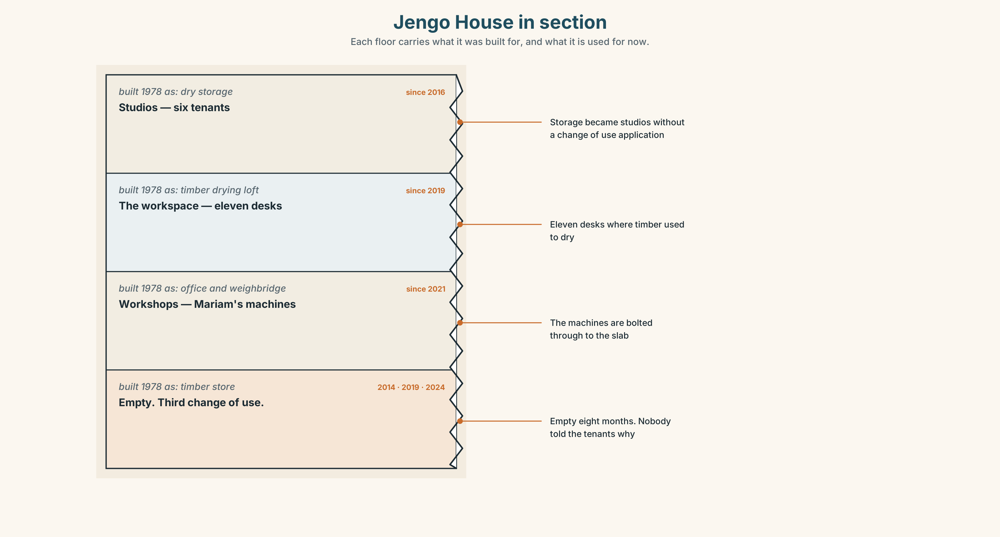{width=6.6in}

*Jengo House in section — Each floor carries what it was built for, and what it is used for now.*

### 8A · Read the model

> The road I grew up on is called Station Road, and there has not been a station on it since 1968.
> `[opens in the present, then goes back — the reader needs the now first]`
>
> When we moved there in 2004 it was mostly houses, with a post office at one end and a garage at
> the other. The garage had already been there for forty years, and the man who ran it had learned
> the trade from his father. `[past perfect — the only one in the text, and it is doing real work]`
>
> Then the bypass opened. Traffic that had come through the village went around it instead, and
> within three years the post office had closed, the garage had closed, and a developer had bought
> both sites.
>
> There are eleven new houses now, and they are good houses. The people in them drive to the
> supermarket. Nobody walks up Station Road any more, because there is nothing on it to walk to.
> `[who gained and who lost — stated, not implied]`

**Questions about the writer's choices, not the rules:**

1. Why does the writer start in the present and then go back?
2. There is one past perfect in paragraph two and three in paragraph three. Why the cluster?
3. The last sentence gives a reason. What would be lost if it were the first sentence?

### 8B · The anti-model

> Station Road was built in 1890. The station closed in 1968. We moved there in 2004. There was a
> post office and a garage. The bypass opened in 2011. The post office closed in 2012. The garage
> closed in 2013. A developer bought both sites. There are eleven new houses now. The people drive
> to the supermarket.

This is grammatically correct. **Why is it worse?** Name three specific things the model does that
this does not.

### 8C · Generate

Five minutes. List every place you can think of that has changed in your lifetime. Do not judge
them. Then choose one — the one you have most to say about, not the most dramatic.

### 8D · Plan

> where it was → what it was like → **the single event that changed it** → what had already been
> true before that → what it is now → who gained, and who lost

### 8E · Draft 1 — 140 words

### 8F · Peer review — two criteria only

Swap. Read once. Answer only these, then sign.

> ☐ Can I tell the order of events **without re-reading**?
> ☐ Do I know **who gained and who lost**?

### 8G · Draft 2

### 8H · Publish

Your redraft goes on the class wall. **One of these will be the source text for Unit 2's mediation
task**, so someone will have to explain yours to a person who has never been there.

---

## Part 9 · The File ◆ **A · THE WORLD + C · THE PERFORMANCE**

# WORK FILE · The Inbox

Six messages reached Jengo House between 8.00 and 11.30 on one Tuesday.

{width=6.6in}

*One Tuesday morning in the inbox — Six messages between 08.02 and 11.26. Two look urgent and are not.*

| | From | Subject | 🕗 |
|---|---|---|---|
| 1 | A. Kamau (landlord) | *Re: Re: Re: the building* | 08.02 |
| 2 | Brightline Contractors | *Confirming Thursday 7am start* | 08.40 |
| 3 | M. Achieng (tenant, 2nd floor) | *Leaving at the end of the month* | 09.15 |
| 4 | Residents' group | *NOISE — again* | 09.50 |
| 5 | Sawa Supplies | *Invoice 4471 — overdue* | 10.33 |
| 6 | A. Kamau (landlord) | *A thought* | 11.26 |

### 9A · Triage

Rank all six by **urgency**. Then rank them again by **importance**. They are not the same list.
Where the two lists disagree, say which one you would act on and why.

### 9B · Decode

Message 6 is ninety words long and says nothing. Read it.

> *Dear all — I hope this finds everyone well. I have been giving some thought to the position of
> the building and to the various conversations we have had over recent months, and I think it may
> be helpful for us all to have a broader discussion at some point about the longer term, in light
> of a number of factors, some of which you will be aware of. Nothing urgent. I will be in on
> Thursday if anyone would like to talk. Best, A.K.*

**What is this message for?** Three questions:
1. What has already happened, that this message is a response to?
2. Why is it ninety words and not nine?
3. If you reply, what are you agreeing to?

### 9C · Write the two that matter

Sixty words each. Not the easy ones.

- **To Brightline Contractors.** Nobody agreed Thursday. Work starts at 7am and there are tenants
  asleep upstairs. You need it moved, and you need to keep the contractor.
- **To M. Achieng.** She is leaving. You would rather she stayed, but you are not going to beg, and
  she has given proper notice. Something useful has to happen in sixty words.

### 9D · Transfer — do this before next week

Look at your own inbox, or your own messages. **Find one message that was written to avoid saying
something.** Bring it. You do not have to say who sent it.

---

## Part 10 · Mediation & Interaction ◆ **C · THE PERFORMANCE**

{width=6.6in}

*Ngong Lane, 2016–2026 — Everything this unit has told you, on one page. Half the class sees the left of it.*

### 10A · Relay

Half the class sees the **left** of the infographic. Half sees the **right**. You may not show each
other. **Rebuild the whole thing by speaking.** Twelve minutes.

### 10B · Simplify — for a named person

Explain the planning notice from Part 5 to **Grace**. She has eleven minutes between floors and no
legal English. She needs to know what she can still do.

> **Plan before you speak:** what it is → what it means for her → what she can still do → by when

### 10C · Compress

The 286-word article into **60 words** for a noticeboard. Then defend three of your cuts to a
partner who disagrees with all three.

### 10D · Online interaction

Now write the same thing as a message in the residents' WhatsApp group.

**It will be screenshotted.** Assume Mr Kamau will see it. Assume the developer's agent is in the
group and nobody remembers adding them.

### 10E · Across languages

Take 10B or 10C. Say it in **your own language**. Then bring it back into English.
**What moved?** Not what was lost — what moved.

---

## Part 11 · The Decision ◆ **C · THE PERFORMANCE**

# The offer on the ground floor

A developer has offered to buy Jengo House. The price is good — better than the building is worth
on any normal valuation, because what they want is the plot.

Six tenants. Three positions.

- **Obi** wants to take it. His share would fund two years of the logistics business, which is
  eleven months from either working or not working.
- **Mariam** will not move. Her industrial machines are bolted through the floor into the slab. The
  nearest unit that could take them is forty minutes away and costs more.
- **Grace** has cleaned the building for six years. There is no contract. Nobody has asked her, and
  she has not raised it.

### 11A · The evidence — three formats, no two agree

1. **The offer letter.** Reproduced in full on page 25.
2. **The figures**, below.
3. **The voice.** Grace, forty seconds, lifted from Track 1.1.

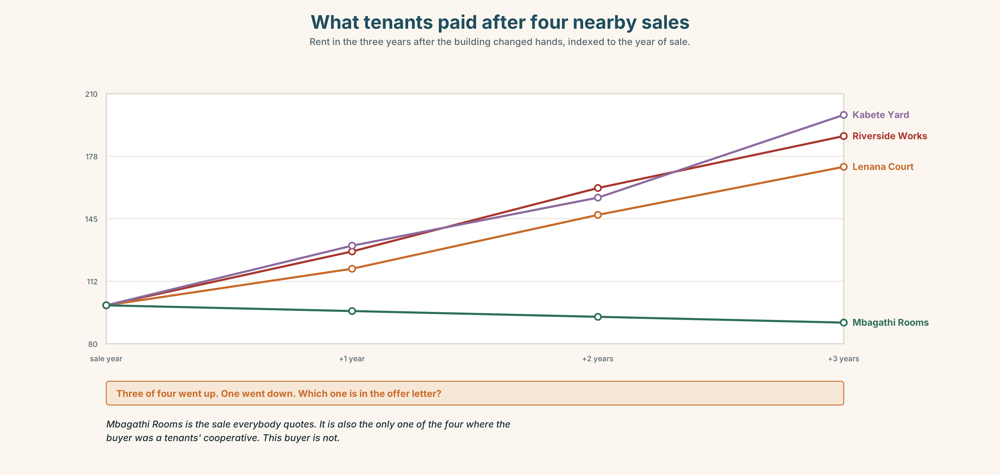{width=6.6in}

*What tenants paid after four nearby sales — Rent in the three years after the building changed hands, indexed to the year of sale.*

### 11B · Steelman — first

Before you argue for your own position, **argue for the one you disagree with**, as well as its
best advocate would. Two minutes. Your partner judges whether you were fair to it.

### 11C · Deliberate

In threes, against this frame:

> *I think they should ______, because ______. The strongest argument against me is ______, and my
> answer to it is ______.*

**Phrase bank:** *the money would* · *the real cost is* · *what nobody has asked is* ·
*I'd rather lose the premium than* · *in three years' time we'd be*

### 11D · Decide

Eighty words. Commit. Two reasons.

### 11E · Model decision

> I think they should refuse, and I think Obi has the strongest case against me, so let me take it
> first. He is eleven months from knowing whether his business works, and a share of this sale buys
> him two years. If it fails because the money came too late, no amount of loyalty to a building
> will have been worth it. That is a real cost and I am not going to pretend otherwise.
>
> But the chart tells us what happens to the tenants afterwards, and in three of the four
> comparable sales the rent they ended up paying was higher within eighteen months. The fourth is
> the one everyone cites, and it is the one where the buyer was a cooperative. This buyer is not.
> Selling converts a problem they can see into a problem they cannot.
>
> And Grace has not been asked. Six years, no contract, and she is not in the room where the
> building she cleans is being sold. Whatever they decide, that part is already wrong.

### 11F · The Reveal

> **What actually happened.** They refused. Obi stayed, and the logistics business did work —
> though he says the eighteen months were worse than they needed to be. Two years later the
> landlord raised the rent by forty per cent anyway, and **Mariam left**, because she could not
> absorb it and the machines were the one thing she could not take cheaply.
> Grace is still there. She now has a contract, which Wanjiru drew up the week after the meeting,
> because the discussion made it impossible not to notice.

**Now answer this, and it is the real question of the unit:**

> The outcome was bad for the person the decision was supposed to protect.
> **Was the reasoning wrong?**

---

## Part 12 · Landing ◆ **all three lines**

### 12A · Recycle — twelve items

**Six from this unit.**

1. By the time the notice went up, the objection period ______ (close).
2. For eleven days he ______ (work) by lamp.
3. The lane ______ (be) mostly workshops when he started.
4. Four businesses were ______ out by rising rents.
5. The ground floor has had a change of ______.
6. ______ then, nobody had built on the open ground.

**Four from *Telling the Story* (A2.2).**

7. She said she ______ (not receive) the letter. *(reported speech)*
8. ______ the time we arrived, they had gone. *(past perfect)*
9. ______ of the fourteen businesses are still trading — only one. *(quantifiers)*
10. He rented it from ______ man called Otieno. *(articles)*

**Two from *Making Plans* (A2.1).**

11. The developer, ______ bought both sites, has not started work. *(relative clause)*
12. If the rent ______ (go) up again, Mariam will have to move. *(first conditional)*

### 12B · Consolidate

**120 words, one piece of continuous writing.** Describe the ten years of Ngong Lane from the
infographic in Part 10. You must use **both** past tense patterns from this unit and **at least six**
of the time and sequence markers from Part 6. One paragraph. No bullet points.

### 12C · Can-do, with evidence

Tick only what you can show.

| I can… | My evidence | Sure? |
|---|---|---|
| tell a story about the past using three tenses together without losing my reader | your Part 4C recording | ◯ ◑ ● |
| describe how a place has changed and say who gained and who lost | your Part 8 draft 2 | ◯ ◑ ● |
| take notes while someone speaks and retell what they said accurately | your Part 10A relay | ◯ ◑ ● |
| state a position on a local decision and give two reasons for it | your Part 11D decision | ◯ ◑ ● |

### 12D · Replay ⏺

Find your thirty seconds from Part 0C. Listen to it.
Now record the same thirty seconds again: **Who is this street built for?**
Listen to both, one after the other. Write one sentence about what changed.

### 12E · Glossary — forty-five items, as a map

> **THE STREET** · pavement · kerb · plot · frontage · the corner · the ground floor · a block of flats
> **THE BUILDING** · hoarding · scaffolding · derelict · mixed use · a change of use · do up
> **THE CHANGE** · demolish · redevelop · knock down · put up · priced out · rising rents · set back from the road
> **THE PEOPLE** · tenant · landlord · rent · planning permission · move out · the way things were · it's not what it was
> **BEFORE** · previously · formerly · originally · initially · up to that point · at first · to begin with · by then · date back
> **DURING** · meanwhile · overnight · in the meantime · at the time · carry on
> **AFTER** · eventually · subsequently · afterwards · thereafter · ever since · from then on · later on · before long · in the end
> **THE BOUNDARY** · by the time · until · no sooner had we…

### 12F · Next

> **Unit 2 · What does a price hide?**
> Someone will have to explain your Part 8 text to a person who has never been there. It might be
> you. It might not.

# B1.1 · Unit 2 · What It Costs To Make

> **English Animated** · *Taking a Position* · Jengo House, Nairobi
> Student's Book pages 28–47 · 20 pp · ~11.5 hours

---

## Part 0 · The Big Picture ◆ **A · THE WORLD**

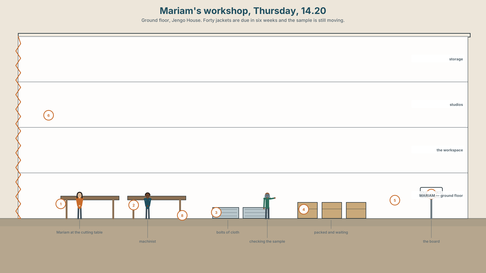{width=6.6in}

*Mariam's workshop, Thursday, 14.20 — Ground floor, Jengo House. Forty jackets are due in six weeks and the sample is still moving.*

# What does a price hide?

**By the end of this unit you will present a true cost breakdown for one product — and defend
every line of it.**

| ◆ **A · THE WORLD** | What a thing costs to make, and who absorbs the difference |
|---|---|
| ◆ **B · THE SYSTEM** | The perfect simple against the perfect continuous · the present perfect, returning · 24 words for cost and margin · 21 ways to say *finished* or *still going* · weak forms in perfect chains |
| ◆ **C · THE PERFORMANCE** | A costed presentation with every line defended, and a 140-word written breakdown |

---

### 0A · Find it

Find and label twelve things in Mariam's workshop. Four of these sixteen are not there.

> bolt of cloth · cutting table · overlocker · industrial iron · pattern · toile · bobbin ·
> thread stand · dye vat · offcuts bin · packing crate · invoice spike · loom · spinning wheel ·
> rail of finished work · tape measure

### 0B · Guess it

The jacket on the rail sells for 4,800. **Write down what you think the cloth cost.**
Keep the number. You will check it in Part 8.

### 0C · Say it ⏺

**Record thirty seconds.** *What does a price hide?* No preparation. You will record it again at
the end of the unit.

---

## Part 1 · Vocabulary Lab 1 ◆ **B · THE SYSTEM**

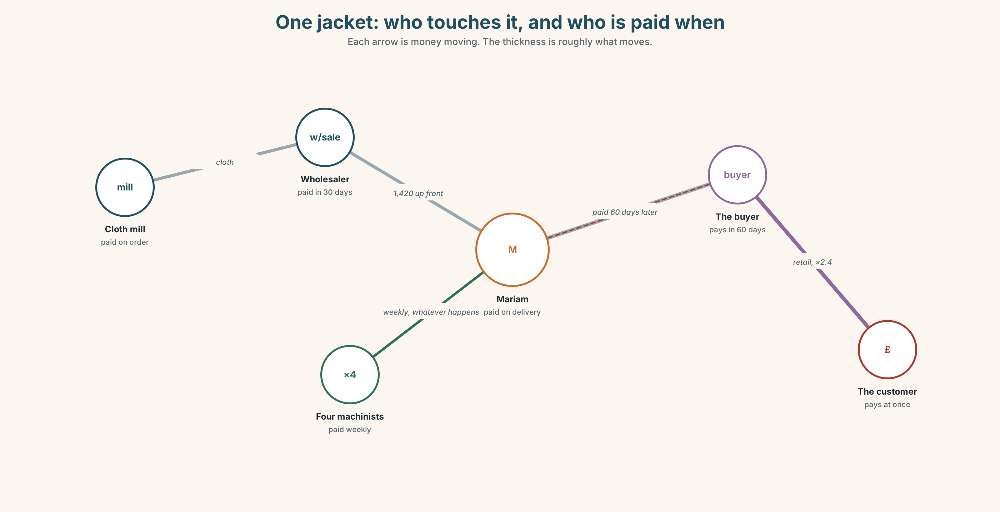{width=6.6in}

*One jacket: who touches it, and who is paid when — Each arrow is money moving. The thickness is roughly what moves.*

### 1A · Meet — follow the money

Use the network. Each arrow is money moving. Name the person or stage at each node.

> **supplier** · **wholesale** · **retail** · **markup** · **margin** · **overheads** ·
> **invoice** · **deposit** · **instalment** · **subsidy** · **undercut** · **cost**

### 1B · Sort — who carries the risk?

Put the six people on the network in order, from **the one who is paid first** to **the one who is
paid last**. Then answer: who carries the risk if nobody buys the jacket?

### 1C · Sort — odd one out, and why

1. margin · markup · profit · overheads
2. wholesale · retail · supplier · invoice
3. deposit · instalment · subsidy · payment
4. undercut · knock off · bump up · mark up

### 1D · Stretch — the phrases

Complete each with one word.

1. Nobody will pay more than **the going ______** for a plain jacket.
2. At 4,800 she does not make money. She **______ even**.
3. The cloth is good and the stitching is good. It is **value for ______**.
4. Her own eleven hours do not appear anywhere. That is **______ work**.
5. If you add it all up honestly, **it doesn't ______ ______**.

### 1E · Stretch — four phrasal verbs that all move a price

> **add up** · **knock off** · **mark up** · **bump up**

Two of these make a price smaller. Two make it bigger. Which, and what is the difference between
the two that make it bigger?

> **Corpus Note**
> *Overheads* is almost never singular. *Margin* is singular five times in six. A learner who says
> *"our overhead is high"* will be understood, and will sound like a translation.

### 1F · Own it

Price something you have made, cooked, repaired or organised. Use six of these words. Include one
cost you would normally forget.

---

## Part 2 · Listening ◆ **A · THE WORLD**

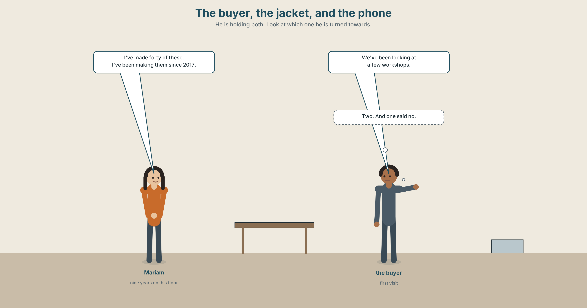{width=6.6in}

*The buyer, the jacket, and the phone — He is holding both. Look at which one he is turned towards.*

### 2A · Forty jackets 🔊 Track 2.1

**Before you listen.** Look at the picture. The buyer is holding a phone and a jacket. **Which is
he looking at?**

**Gist — one listen, one question.** Does Mariam get the order?

**Detail — complete the frame.**

| | What he says | What she hears |
|---|---|---|
| About the price | | |
| About the quantity | | |
| About the timing | | |

**Inference.** He says *"we've been looking at a few workshops."* He has not been looking at a few
workshops. **How can you tell?**

**Attitude.** Mariam says *"I can do that"* twice. The second one means something different.
**Which sound tells you?**

**Noticing.** Six sentences from the recording. Sort them into two groups.

1. *I've made forty of these.*
2. *I've been making these for nine years.*
3. *We've spoken to three other workshops.*
4. *We've been speaking to a few people.*
5. *She's finished the sample.*
6. *She's been finishing samples all week.*

> **A.** The speaker is interested in **the result** — it is done, here is how many.
> **B.** The speaker is interested in **the activity** — it has been going on.

### 2B · Decoding clinic 🔊 Track 2.2

Thirty-eight seconds of the buyer at full speed. Four replays, four jobs.

1. How many times does he say *we've*?
2. Catch the three numbers.
3. *we've been* — how many sounds is that really?
4. What happens to *have* in *what have you*?

> Transcripts, page 172.

---

## Part 3 · Grammar Lab 1 ◆ **B · THE SYSTEM**

### The result, or the activity

### 3A · Notice

Go back to the six sentences in Part 2.

1. Which sentences give you a **number**? What do they all have in common?
2. Which sentences give you a **length of time**?
3. *I've made forty* and *I've been making these for nine years* — which one tells you she is still
   doing it?
4. Try putting a number into sentence 2: *I've been making forty of these for nine years.* What
   goes wrong?
5. So: which form takes **how many**, and which takes **how long**?

### 3B · See

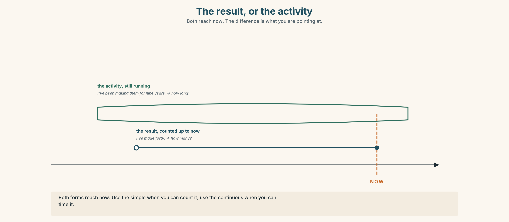{width=6.6in}

*The result, or the activity — Both reach now. The difference is what you are pointing at.*

### 3C · Know

| | What it points at | Takes | Example |
|---|---|---|---|
| **have/has + past participle** | the **result**, counted up to now | *how many*, *how much* | *I've made forty.* |
| **have/has been + -ing** | the **activity**, running up to now | *how long*, *since*, *for* | *I've been making these for nine years.* |

> **Watch out.** Both forms reach now. The difference is not time — it is **what you are pointing
> at**. *I've painted the room* (it is finished) against *I've been painting the room* (there is
> paint on me).

> **Why it matters.** *We've been speaking to a few workshops* and *we've spoken to three
> workshops* are both true. One of them is a negotiating position.

### 3D · Use — controlled

Complete with the perfect simple or the perfect continuous.

> Mariam (1) __________ (work) on the ground floor since 2021. In that time she (2) __________
> (make) more than nine hundred pieces, and she (3) __________ (train) four people. This month
> she (4) __________ (not sleep) much, because the sample (5) __________ (go) back and forth
> three times. "I (6) __________ (do) this for nine years," she says. "I (7) __________ (never
> have) an order cancelled after a deposit — but I (8) __________ (hear) stories all week."

### 3E · Use — guided

Rewrite each sentence so it points at the other thing. Then say what changes.

1. I've written three emails to them. → I've been …
2. We've been looking for a supplier. → We've …
3. She's been cutting cloth all morning. → She's …
4. They've paid two instalments. → They've been …

### 3F · Use — open

**Tell a partner about something you have been doing for a long time, and something you have
finished.** Your partner must be able to say which is which without asking.

### 3G · Check — six items, mark your own

> 1. How long ______ you ______ (work) here?
> 2. I ______ (finish) all four of them.
> 3. She ______ (cut) cloth since seven this morning — look at her hands.
> 4. We ______ (speak) to three suppliers so far.
> 5. It ______ (rain), I think. The floor is wet.
> 6. He ______ (send) the invoice twice already.

**0–3 →** Workbook pp. 14–16. **4–5 →** the Contrast Clinic in Part 6. **6 →** p. 39.

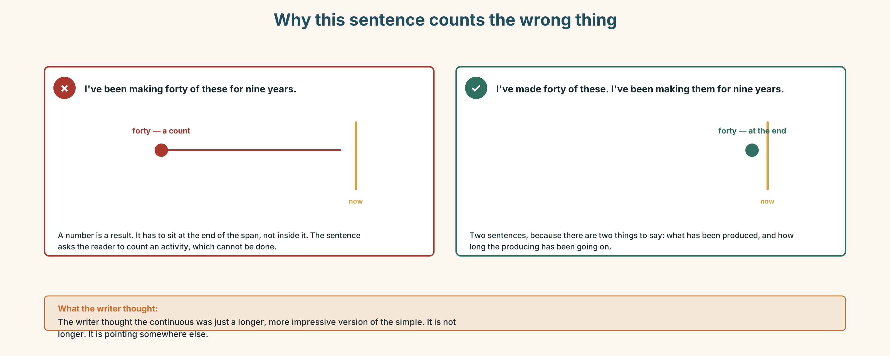{width=6.6in}

*Why this sentence counts the wrong thing — Why this sentence counts the wrong thing*

---

## Part 4 · Speaking ◆ **C · THE PERFORMANCE**

### 4A · Fluency sprint — 4 / 3 / 2

Describe something you own that was expensive. Four minutes, then three, then two, new partner
each time.

### 4B · The functional core — saying what a price is made of

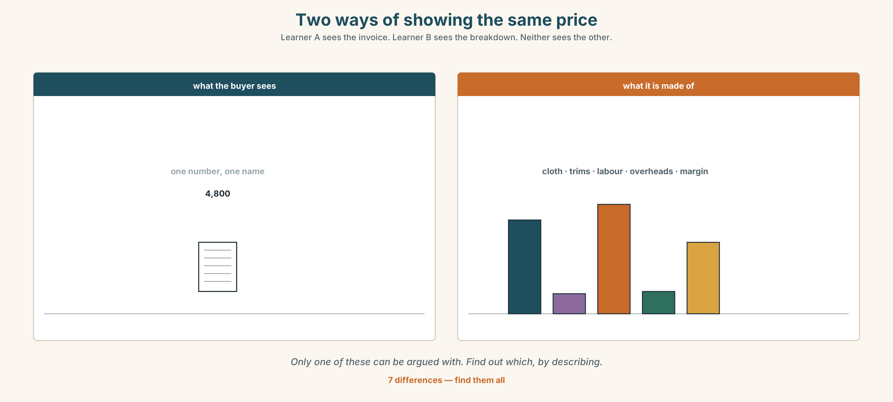{width=6.6in}

*Two ways of showing the same price — Learner A sees the invoice. Learner B sees the breakdown. Neither sees the other.*

**Language Bank**

| | |
|---|---|
| **breaking it down** | *the cloth alone is …* · *that's before overheads* · *if you take off the …* |
| **defending a figure** | *I can show you where that comes from* · *that's eleven hours of work* · *I've priced this honestly* |
| **pushing back** | *I've had it done for less* · *that seems high for …* · *what's your best on forty?* |
| **holding** | *I can do that, but something has to give* · *not at that price, no* |

**Information gap.** Learner A holds Mariam's real costing. Learner B holds the buyer's budget.
Neither sees the other. **Find out whether a deal exists at all.**

### 4C · The performance — the costed pitch

Three minutes. One product. You must show where every figure comes from, and the group must ask
you one question you did not prepare for.

### 4D · Observer

Listen for **one thing**: which figure did the speaker *not* explain?

### 4E · Two criteria

> ☐ Did I say where every number came from?
> ☐ Did I include something people usually leave out?

---

## Part 5 · Reading ◆ **A · THE WORLD**

### 5A · Predict

A report extract called **"The cost of the cheapest option."** The first line is:

> *Procurement teams are rewarded for the price on the invoice, and for nothing else.*

What do you expect it to argue? One sentence.

### 5B · Skim — sixty seconds

Where does the argument turn? Mark the paragraph.

---

**The cost of the cheapest option**

Procurement teams are rewarded for the price on the invoice, and for nothing else. This is not a
criticism of the people in them. It is a description of what their targets measure, and people
hit the targets they are given.

The effect is well documented in manufacturing and almost undocumented in small-scale production,
which is where most of the world's clothing is actually made. A buyer with a unit-price target
will move an order to a workshop that quotes eight per cent lower. On the invoice, the saving is
real. What the invoice does not carry is the four days of rework when the first batch comes back
with the seams wrong, the two weeks of delay while a replacement is cut, or the senior fitter's
time spent on a problem that the cheaper workshop was never equipped to avoid.

None of those costs appear in the procurement figure. All of them appear somewhere else.

The pattern repeats at every scale. A workshop that has been underpricing for years is not
cheaper; it is subsidising its buyers with unpaid hours, deferred maintenance and, eventually,
its own capacity to keep trading. When it closes, the buyer records no loss at all. The cost
shows up as a sourcing problem eighteen months later, and nobody connects the two.

What makes this hard to correct is not that it is unknown. It is that the invoice is a single
number with a name on it, and the other costs are spread across four departments, three quarters
and one person's weekend. A number that can be pointed at will always beat a number that has to
be assembled.

The workshops that survive are not the cheapest. They are the ones that learned to put the
assembled number on the page before anybody asked for it.

---

### 5C · Close reading

1. What are procurement teams rewarded for?
2. Name three costs that do **not** appear on the invoice.
3. What does the writer say happens when an underpriced workshop closes?
4. **What does the writer mean by "a number that can be pointed at"?**
5. The last paragraph is one sentence of advice. What is it?
6. The writer says this is "not a criticism of the people". Why say that at all?

### 5D · Vocabulary in context

Infer first, rate your confidence, then check: ◯ guessing ◑ fairly sure ● certain.

> procurement · rework · underpricing · deferred · assembled (*the assembled number*) · subsidising

### 5E · The counter-text

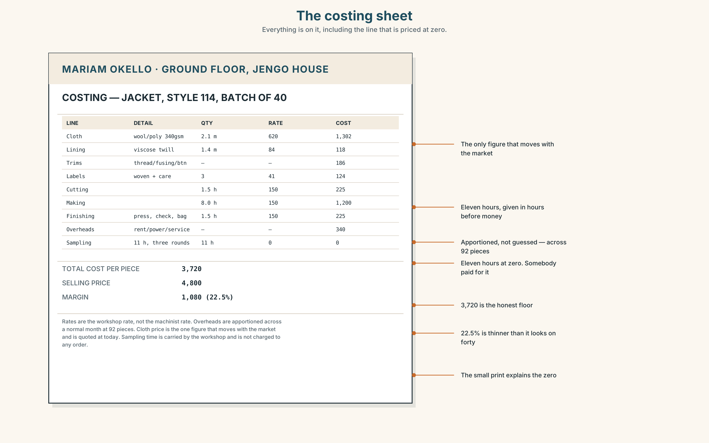{width=6.6in}

*The costing sheet — Everything is on it, including the line that is priced at zero.*

**Read the costing sheet and answer.**

1. What is the total cost of materials?
2. How many hours of labour are costed, and at what rate?
3. **Find the line that is priced at zero. Why is it there at all?**
4. What is the margin on one jacket, as a percentage?
5. The sheet has a figure the article says nobody puts on the page. Which line is it?

### 5F · Writer analysis

The article argues; the costing sheet asserts.

- Which of the two could you disagree with, and how would you do it?
- The article names nobody. The sheet names one person. What does that change?

### 5G · Text against text

**The article says the assembled number should go on the page before anybody asks. The sheet does
exactly that. Would you send it to the buyer?** Two sentences. The second begins *"The risk is…"*

---

## Part 6 · Vocabulary Lab 2 ◆ **B · THE SYSTEM**

### Finished, or still going

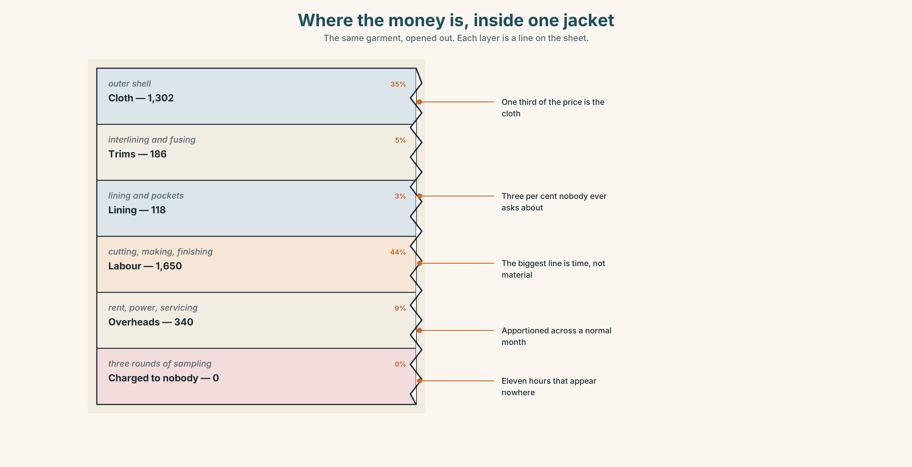{width=6.6in}

*Where the money is, inside one jacket — The same garment, opened out. Each layer is a line on the sheet.*

### 6A · Sort — which group?

Put the twenty-one items into two columns: **this points at a result** · **this points at an
activity**. Three can go in both — say why.

> so far · up to now · ongoing · outstanding · finalised · incomplete · cumulative ·
> intermittent · provisional · repeatedly · gradually · steadily · throughout · all morning ·
> twice already · bit by bit · in one go · for the last six months · keep at · get through ·
> I've been meaning to…

### 6B · Chunk completion

1. We've been at it ______ by ______, for six weeks.
2. I'd rather do it ______ one ______ than come back three times.
3. The invoice is still ______ — she hasn't been paid.
4. Nothing is ______ until the buyer signs.
5. I've ______ ______ to call him since Tuesday.

### 6C · Collocation grid

Which adjectives go with which nouns? Find the one combination nobody says.

| | costs | payment | work | progress |
|---|---|---|---|---|
| **ongoing** | | | | |
| **outstanding** | | | | |
| **cumulative** | | | | |
| **provisional** | | | | |

### 6D · Contrast Clinic — simple against continuous

Six items. Only the time expression decides.

1. She ______ (cut) forty of them.
2. She ______ (cut) cloth since seven.
3. We ______ (speak) to three suppliers.
4. We ______ (speak) to suppliers all week.
5. He ______ (send) the invoice twice.
6. He ______ (chase) that invoice for a month.

**Then, in one sentence each, say what the difference actually is.**

---

## Part 7 · Pronunciation & Fluency Lab ◆ **B · THE SYSTEM**

### Four words that become one

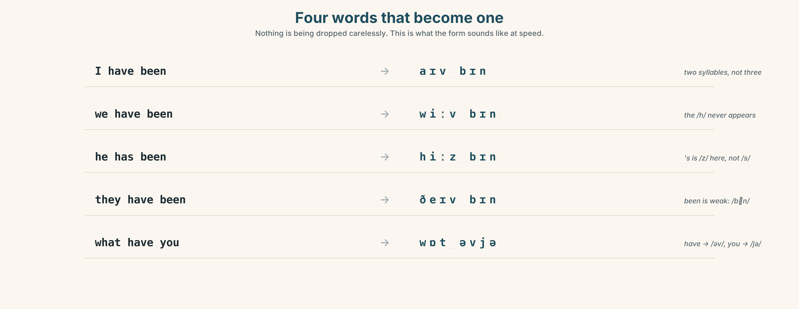{width=6.6in}

*Four words that become one — Nothing is being dropped carelessly. This is what the form sounds like at speed.*

### 7A · Hear 🔊 Track 2.3

> I have been → *I've been* → /aɪvbɪn/
> we have been → *we've been* → /wiːvbɪn/
> he has been → *he's been* → /hiːzbɪn/
> they have been → *they've been* → /ðeɪvbɪn/

### 7B · Say

Choral, then alone, then inside the sentence:
*"I've been making these for nine years and I've never had one come back."*

### 7C · Make it mean something

Say it twice: once naturally, once with every word fully pronounced.
**Which one sounds like somebody defending their work?** Which sounds like a witness statement?

### 7D · Fluency 20 ⏺

Twenty seconds on **something I have been doing for a long time**. Three times, faster each time.
Record the first and the third.

---

## Part 8 · Writing ◆ **C · THE PERFORMANCE**

### A cost breakdown somebody will argue with · 140 words

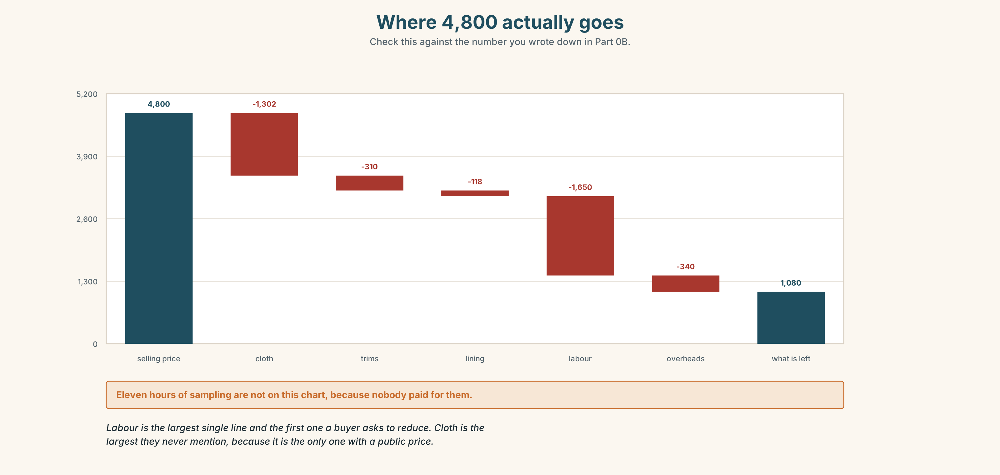{width=6.6in}

*Where 4,800 actually goes — Check this against the number you wrote down in Part 0B.*

**Go back to Part 0B. What did you guess the cloth cost? Look at the chart.**

### 8A · Read the model

> This is what the jacket costs us to make, and I would rather send it than be asked for it.
> `[opens by naming what the document is for — and why it arrived unrequested]`
>
> Cloth and lining are 1,420, and that is the one figure that moves with the market. Thread,
> fusing, buttons and the labels come to 310. Cutting and making is eleven hours; at our rate that
> is 1,650. `[the labour line is given in hours first, then money — it is harder to argue with]`
>
> Overheads — the rent, the power, the machines being serviced — work out at 340 a piece across a
> normal month. That brings us to 3,720.
>
> At 4,800 we are making 1,080 a jacket, and out of that comes the time I have been spending on
> samples, which I have never charged anyone for. I am not asking you to pay for it. I am telling
> you it is there. `[the last line is the whole argument, and it is four words long]`

**Questions about the writer's choices:**

1. Why give the labour in hours before giving it in money?
2. Why is the overheads line explained and the cloth line not?
3. The last sentence gives something away. Why is that stronger than hiding it?

### 8B · The anti-model

> Jacket cost: materials 1,730, labour 1,650, overheads 340, total 3,720. Selling price 4,800.
> Margin 1,080 (22.5%). Please confirm.

Correct, complete, and worse. **Name three things the model does that this does not.**

### 8C · Generate · 8D · Plan

> what it is → the figure that moves → the figure in hours → the figure people forget →
> the total → what is still not in it

### 8E · Draft 1 — 140 words
### 8F · Peer review — two criteria

> ☐ Could I argue with any single line, and know which one?
> ☐ Is there a cost in here that I would have left out?

### 8G · Draft 2 · 8H · Publish

To the class wall. **One of these is the source for Unit 3's mediation task.**

---

## Part 9 · The File ◆ **A · THE WORLD + C · THE PERFORMANCE**

# STUDY FILE · Source Check

Three sources make the same claim: *small workshops are 8–12% cheaper than factories.*

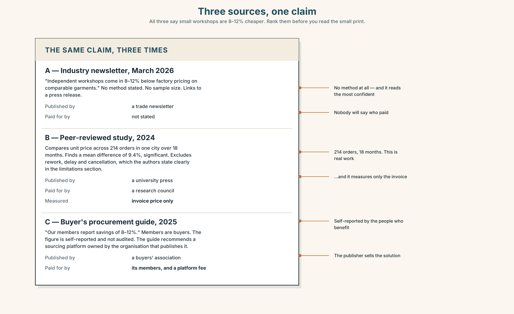{width=6.6in}

*Three sources, one claim — All three say small workshops are 8–12% cheaper. Rank them before you read the small print.*

### 9A · Rank them

Read all three. Rank them from most to least reliable **before** you read 9B.

### 9B · Ask the four questions

For each source: **Who made it? Who paid for it? What did they measure? What would change the
answer?**

### 9C · The one that is hardest

Source B is the most carefully done and the least useful. Say why in one sentence.

### 9D · Write the note

Sixty words to a colleague who has only seen Source A, telling them what they would need to know
before quoting it.

### 9E · Transfer

**Find a number you have repeated to somebody this year.** Where did it come from? Bring it.

---

## Part 10 · Mediation & Interaction ◆ **C · THE PERFORMANCE**

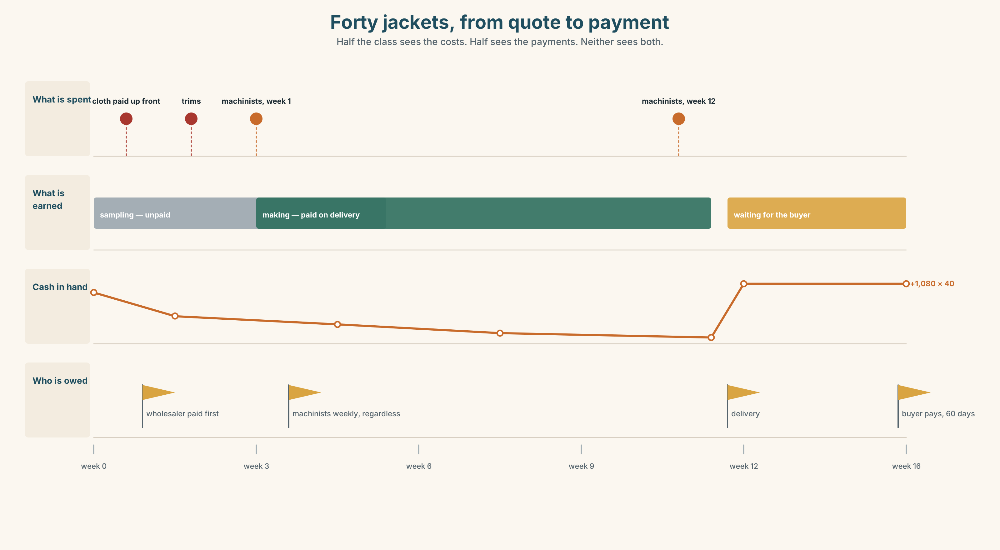{width=6.6in}

*Forty jackets, from quote to payment — Half the class sees the costs. Half sees the payments. Neither sees both.*

### 10A · Relay

Half the class sees the costs band, half sees the payments band. Rebuild the whole picture by
speaking only. Twelve minutes.

### 10B · Simplify

Explain the costing sheet from Part 5 to **Didier**, who makes coffee, has never priced anything,
and has eight minutes.

> **Plan:** what the document is → the three big numbers → where the argument is → what you'd ask

### 10C · Compress

The 300-word article into 60 words for a WhatsApp group of workshop owners. Defend three cuts.

### 10D · Online interaction

Now write it as the message. **It will be forwarded to a buyer.** Write it knowing that.

### 10E · Across languages

Say 10B in your own language, then bring it back. **Which word had no equivalent?**

---

## Part 11 · The Decision ◆ **C · THE PERFORMANCE**

# The order at 4,100

The buyer will take forty jackets at **4,100**. Mariam's honest cost is **3,720**.

At 4,100 she makes 380 a jacket. At that margin, one batch of rework wipes out the order. She has
been quoting 4,800 for two years and has never been asked to justify it until now.

- **Take it.** Forty jackets is six weeks of guaranteed work and the first order of this size.
- **Hold at 4,800.** Defensible, honest, and he has three other workshops on his phone.
- **Take it, and cut something.** Cheaper lining. Nobody would see it for a year.

### 11A · The evidence

1. **The costing sheet** from Part 5.
2. **The chart** from Part 8 — where the money actually goes.
3. **The voice.** The buyer, thirty seconds, from Track 2.1: *"We've been looking at a few workshops."*

### 11B · Steelman

Argue for the option you like least, as well as its best advocate would. Two minutes.

### 11C · Deliberate

> *I think she should ______, because ______. The strongest argument against me is ______, and my
> answer to it is ______.*

### 11D · Decide — eighty words, two reasons

### 11E · Model decision

> I think she should hold at 4,800 and say exactly why, in writing, on one page.
>
> Taking 4,100 is not the disaster it looks like — 380 a jacket on forty jackets is still money,
> and six weeks of booked work has a value that does not appear on the sheet. I understand the
> argument and on a different week I might make it.
>
> But the sheet is the thing that changes this. Two years of quoting 4,800 with nothing behind it
> is a position. A costed page is an argument, and she has never put one in front of a buyer. If
> he walks away from a costed page, he was always going to walk, and she will know that for the
> next buyer. If he does not, she has set the price for every order after this one.
>
> Cutting the lining is the only option I would rule out entirely. It is the one choice that she
> could not put in writing.

### 11F · The Reveal

> **What happened.** He went to another workshop and came back eleven weeks later, because the
> first batch had the seams wrong and the rework ate the saving — which is the article in Part 5,
> happening. He paid 4,650.
>
> Mariam lost eleven weeks of work she had counted on. Two of her four machinists left during it,
> and one did not come back when the order arrived.

**She was right, and it cost her two machinists.**

> Was the reasoning sound?
> And: is "I was right" worth anything, if you could not afford to be?

---

## Part 12 · Landing ◆ **all three lines**

### 12A · Recycle — twelve items

**Six from this unit.**

1. She ______ (make) these for nine years.
2. She ______ (make) forty of them this month.
3. The invoice is still ______ — nobody has paid it.
4. At 3,720 she ______ even.
5. Eleven hours of her time is ______ work.
6. I've ______ ______ to call him since Tuesday.

**Four from Unit 1.**

7. By the time the notice went up, the objection period ______ (close).
8. Four businesses were ______ out by rising rents.
9. ______ then, nobody had built on the open ground.
10. The ground floor has had a change of ______.

**Two from *Telling the Story* (A2.2).**

11. He said he ______ (not receive) the costing. *(reported speech)*
12. ______ of the four suppliers answered — only one. *(quantifiers)*

### 12B · Consolidate

**120 words, one paragraph.** Describe a month of work using **both** perfect forms and **at least
six** items from Part 6. One continuous piece. No lists.

### 12C · Can-do, with evidence

| I can… | My evidence | Sure? |
|---|---|---|
| distinguish a result from an ongoing activity, and choose the right form | Part 3G score |  ◯ ◑ ● |
| break a price down and defend every line of it | Part 4C recording | ◯ ◑ ● |
| judge whether a number I have been given is worth repeating | Part 9D note | ◯ ◑ ● |
| take a position where both options cost something | Part 11D decision | ◯ ◑ ● |

### 12D · Replay ⏺

Listen to Part 0C. Record it again. **Compare.** One sentence on what changed.

### 12E · Glossary — forty-five items, as a map

> **WHAT IT COSTS** · cost · overheads · wholesale · retail · supplier · the going rate · a fair price · break even
> **WHAT YOU ADD** · margin · markup · mark up · bump up · the bottom line · value for money
> **WHAT YOU TAKE OFF** · undercut · knock off · subsidy · a deposit · an instalment
> **WHAT IS HIDDEN** · unpaid work · it doesn't add up · you get what you pay for · add up
> **STILL GOING** · ongoing · intermittent · gradually · steadily · repeatedly · bit by bit · throughout · keep at · all morning
> **FINISHED** · finalised · outstanding · incomplete · cumulative · provisional · in one go · get through · twice already · so far · up to now · for the last six months · I've been meaning to…

### 12F · Next

> **Unit 3 · Is a name a choice?**
> Somebody will have to explain your cost breakdown to a person who has never priced anything.

# B1.1 · Unit 3 · The Name On The Door

> **English Animated** · *Taking a Position* · Jengo House, Nairobi
> Student's Book pages 48–67 · 20 pp · ~11.5 hours

---

## Part 0 · The Big Picture ◆ **A · THE WORLD**

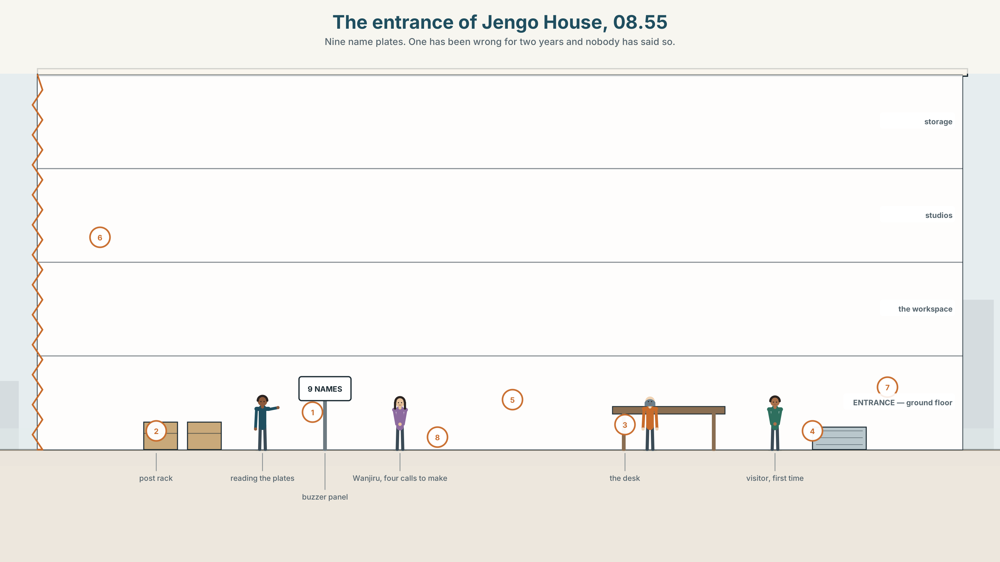{width=6.6in}

*The entrance of Jengo House, 08.55 — Nine name plates. One has been wrong for two years and nobody has said so.*

# Is a name a choice?

**By the end of this unit you will write and record a 150-word professional introduction — the one
that goes in front of people who have never met you.**

| ◆ **A · THE WORLD** | What a name does, who gets to change it, and what it costs either way |
|---|---|
| ◆ **B · THE SYSTEM** | Four futures, chosen not guessed · *going to* and the present continuous, returning · 24 words for identity and documents · 21 ways to commit, or not · contrastive stress |
| ◆ **C · THE PERFORMANCE** | A recorded 150-word profile, and the decision about what name is on it |

---

### 0A · Find it

Twelve things in the entrance of Jengo House. Four of these sixteen are not there.

> buzzer panel · name plates · post rack · visitor book · lanyard · security desk ·
> noticeboard · lift call button · fire plan · parcel shelf · bicycle rack · stair nosing ·
> turnstile · barrier arm · metal detector · reception bell

### 0B · Guess it

Look at the name plates by the door. **One of them is wrong, and has been for two years.**
Which, and how can you tell?

### 0C · Say it ⏺

**Record thirty seconds.** *Is a name a choice?* Unprepared. You will record it again at the end.

---

## Part 1 · Vocabulary Lab 1 ◆ **B · THE SYSTEM**

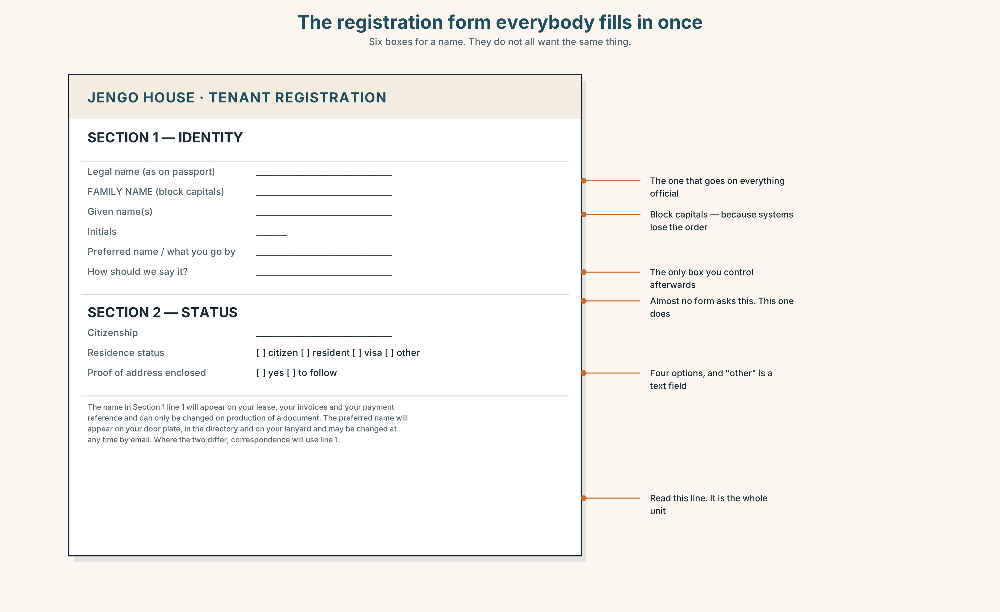{width=6.6in}

*The registration form everybody fills in once — Six boxes for a name. They do not all want the same thing.*

### 1A · Meet — on the form

Find each word on the registration form, and say which box it belongs in.

> **identity** · **passport** · **visa** · **residence** · **citizenship** · **surname** ·
> **initials** · **nickname** · **pronounce** · **spelling** · **transliterate** · **misspell**

### 1B · Sort — cline of permanence

Put these in order, from **easiest to change** to **hardest**.

> nickname · spelling on an email · the name on a lanyard · the name on a payslip ·
> the name on a passport · citizenship

Where exactly does it stop being a choice? Mark the point. People disagree about where it is.

### 1C · Sort — odd one out, and why

1. surname · family name · given name · legal name
2. passport · visa · residence · citizenship
3. misspell · transliterate · pronounce · translate
4. fill out · turn down · go by · sign off

### 1D · Stretch — the phrases

1. On the form it says Oluwafemi. Everyone calls him Femi — he **______ by** Femi.
2. She **is ______ as** M. Achieng professionally and nothing else.
3. The bank wants a **______ of address** before it will change anything.
4. **For the ______**, I have asked three times.
5. Mwangi is **a ______ name** here, and nobody in Lisbon could spell it.

### 1E · Stretch — four phrasal verbs on one form

> **fill out** · **turn down** · **go by** · **sign off**

Which two are things *you* do to a form, and which two are things *somebody else* does to you?

> **Corpus Note**
> *Transliterate* appears in English about once in nine million words. *Spell* appears about once
> in twenty thousand. If you need the first word, the person you are talking to may not have it.

### 1F · Own it

Write your own name three ways: as a form wants it, as a colleague would say it, as you would
introduce yourself at a conference. **Are all three the same? Should they be?**

---

## Part 2 · Listening ◆ **A · THE WORLD**

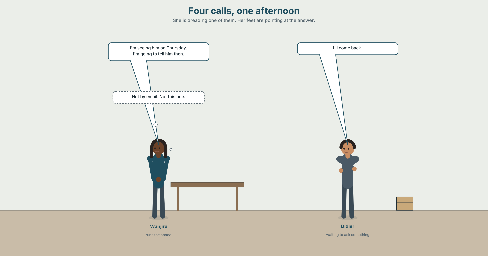{width=6.6in}

*Four calls, one afternoon — She is dreading one of them. Her feet are pointing at the answer.*

### 2A · Three ways to say what happens next 🔊 Track 3.1

**Before you listen.** Wanjiru is making four calls in one afternoon. Look at the picture:
**which call is she dreading?**

**Gist — one listen, one question.** Which of the four things is already arranged?

**Detail — complete the frame.**

| What she says | Is it decided? | Who decided it? |
|---|---|---|
| *"I'm seeing him on Thursday."* | | |
| *"I'm going to tell him."* | | |
| *"I'll call you back."* | | |
| *"The lift goes out of service at six."* | | |

**Inference.** She says *"I'll call you back"* to one person and *"I'm calling you back at four"*
to another. **Which one is she more likely to actually do?**

**Attitude.** She says *"I'm going to have to"* twice. Which sound carries the reluctance?

**Noticing.** Four sentences. Sort them by what the speaker is really doing.

1. *I'm seeing Mr Kamau on Thursday.*
2. *I'm going to ask him about the lease.*
3. *I'll ask him, if you want.*
4. *The lease runs out in March.*

> **A.** arranged with another person · **B.** my intention, decided before now ·
> **C.** decided at this moment, for you · **D.** a fact on a timetable

---

### 2B · Decoding clinic 🔊 Track 3.2

Forty seconds of Wanjiru at speed. Four jobs.

1. Count the contractions in the first sentence.
2. Catch the three times.
3. Where does *going to* become one sound?
4. *I'll* — what happens to the /w/?

> Transcripts, page 173.

---

## Part 3 · Grammar Lab 1 ◆ **B · THE SYSTEM**

### Four futures, and why you would choose each one

### 3A · Notice

Return to the four sentences in Part 2.

1. Which one involves another person who also knows?
2. Which one was decided before the conversation started?
3. Which one was decided *during* the conversation?
4. Which one would still be true if everybody forgot about it?
5. Try swapping 1 and 3. What goes wrong socially — not grammatically?

### 3B · See

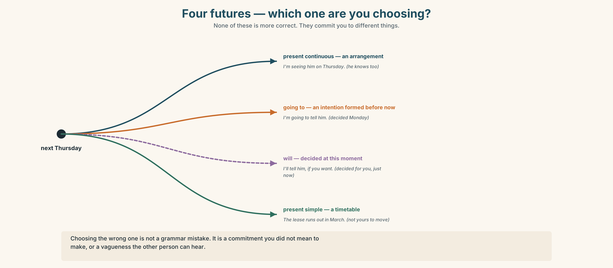{width=6.6in}

*Four futures — which one are you choosing? — None of these is more correct. They commit you to different things.*

### 3C · Know

| Form | What it signals | Example |
|---|---|---|
| **present continuous** | an arrangement — somebody else knows too | *I'm seeing him on Thursday.* |
| **going to** | an intention formed before now | *I'm going to ask about the lease.* |
| **will** | a decision made at this moment, often for someone | *I'll ask him, if you want.* |
| **present simple** | a timetable — not yours to change | *The lease runs out in March.* |

> **Watch out.** *I'll send it* and *I'm sending it* are both correct and they promise different
> things. The first is a decision. The second is a plan that already exists — and is therefore
> harder to get out of.

> **Why it matters.** Choosing the wrong future does not produce a grammar mistake. It produces a
> commitment you did not mean to make, or a vagueness the other person can hear.

### 3D · Use — controlled

> Wanjiru (1) __________ (meet) the landlord on Thursday; it has been in the diary for a week.
> She (2) __________ (tell) him about the lift, because she decided that on Monday and has been
> rehearsing it since. If he refuses, she (3) __________ (take) it to the tenants — she has just
> this second thought of that. The lease (4) __________ (run out) in March whatever anybody does.
> "I (5) __________ (not do) this by email," she says. "I (6) __________ (sit) in front of him."

### 3E · Use — guided

Rewrite each one so it commits **more**, then so it commits **less**. Say what changes socially.

1. I'll look at it.
2. We're going to review the contract.
3. I'm meeting them next week.

### 3F · Use — open

**Tell a partner four things about your next month** — one arrangement, one intention, one thing
you are deciding right now, one timetable. Your partner must be able to say which is which.

### 3G · Check — six items

> 1. — The phone's ringing. — I ______ get it.
> 2. I ______ (see) the dentist at four; it's been booked for weeks.
> 3. The train ______ (leave) at 06:12.
> 4. I've decided — I ______ (tell) her tomorrow.
> 5. — Can somebody help? — I ______.
> 6. We ______ (move) office in March. The lease is signed.

**0–3 →** Workbook pp. 22–24. **4–5 →** Part 6. **6 →** p. 59.

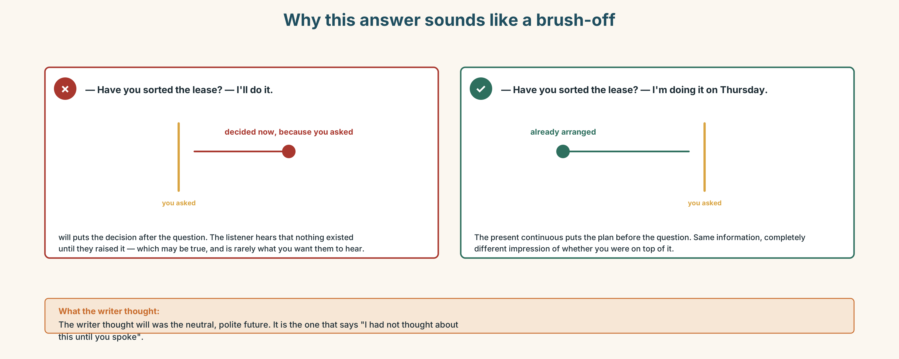{width=6.6in}

*Why this answer sounds like a brush-off — Why this answer sounds like a brush-off*

---

## Part 4 · Speaking ◆ **C · THE PERFORMANCE**

### 4A · Fluency sprint — 4 / 3 / 2

Your next three months. Four minutes, three, two. New partner each time.

### 4B · The functional core — committing, and not committing

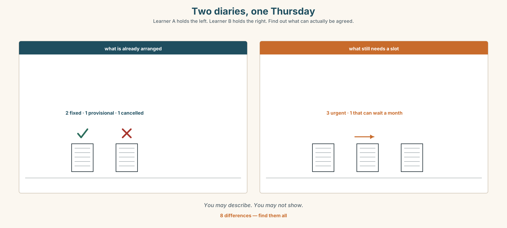{width=6.6in}

*Two diaries, one Thursday — Learner A holds the left. Learner B holds the right. Find out what can actually be agreed.*

**Language Bank**

| | |
|---|---|
| **a firm commitment** | *I'm sending it on Tuesday* · *that's in the diary* · *you have my word on it* |
| **an intention** | *I'm going to* · *I fully intend to* · *that's the plan* |
| **deliberately soft** | *I'll try to* · *I should be able to* · *let me see what I can do* |
| **a refusal that sounds like one** | *I'm not going to be able to* · *that's not something I can commit to* |

**Information gap.** Learner A has a diary with four fixed things. Learner B has four things they
need done. **Find out what can actually be agreed.** Nobody may show the page.

### 4C · The performance — the name conversation

In pairs, three rounds, swapping roles. Somebody says your name wrong for the third time.

> **Card A** — you are the one whose name it is. You have corrected them twice.
> **Card B** — you are friendly, busy, and you genuinely have not noticed.

### 4D · Observer

Listen for **one thing**: at what point does the correction stop being about the name?

### 4E · Two criteria

> ☐ Did I make exactly the commitment I meant to, and no more?
> ☐ Did I leave the other person a way to agree?

---

## Part 5 · Reading ◆ **A · THE WORLD**

### 5A · Predict

A fiction extract called **"The second name."** The first line is:

> *For eleven years my mother called me by a name that is not on any document I own.*

What do you expect? One sentence.

### 5B · Skim — sixty seconds

Where does the narrator change their mind? Mark it.

---

**The second name**

For eleven years my mother called me by a name that is not on any document I own. It is four
letters long and it means nothing in particular. She says she chose it before I was born and then
put something longer on the certificate because the registrar was watching.

At school I used the long one. At home I was the short one. It did not feel like a secret; it
felt like weather — something that changed depending on which room you were in.

The trouble started when the two rooms met. A teacher came to the house and used the long name in
front of my mother, and I watched my mother decide, in about half a second, not to correct her.
That was the first time I understood that one of the names was going to have to win.

I am going to say that I chose the long one, and that is almost true. What actually happened is
that the long one was already on things. It was on the register, the library card, the
inoculation record, the bank account somebody opened for me when I was nine. Choosing the short
one would not have been a choice; it would have been nineteen separate arguments with nineteen
institutions, each of which would have asked me for a document carrying the name I was trying to
leave.

So I did not choose. I let the paperwork choose, which is what most people mean when they say
they chose.

My mother still uses the short one. I am forty-one. When she dies, nobody alive will call me by
it, and I have started to mind about that in a way I did not expect, because for eleven years I
thought the short name was the one that did not count.

---

### 5C · Close reading

1. Why did the long name go on the certificate?
2. What does *"it felt like weather"* describe?
3. What did the narrator understand when the teacher visited?
4. **The narrator says "I am going to say that I chose… and that is almost true." What is the
   gap between those two things?**
5. List the five institutions named. What do they have in common?
6. What changed when the narrator reached forty-one?

### 5D · Vocabulary in context

> registrar · inoculation record · carry (*carrying the name*) · mind (*I have started to mind*) ·
> count (*the one that did not count*)

### 5E · The counter-text

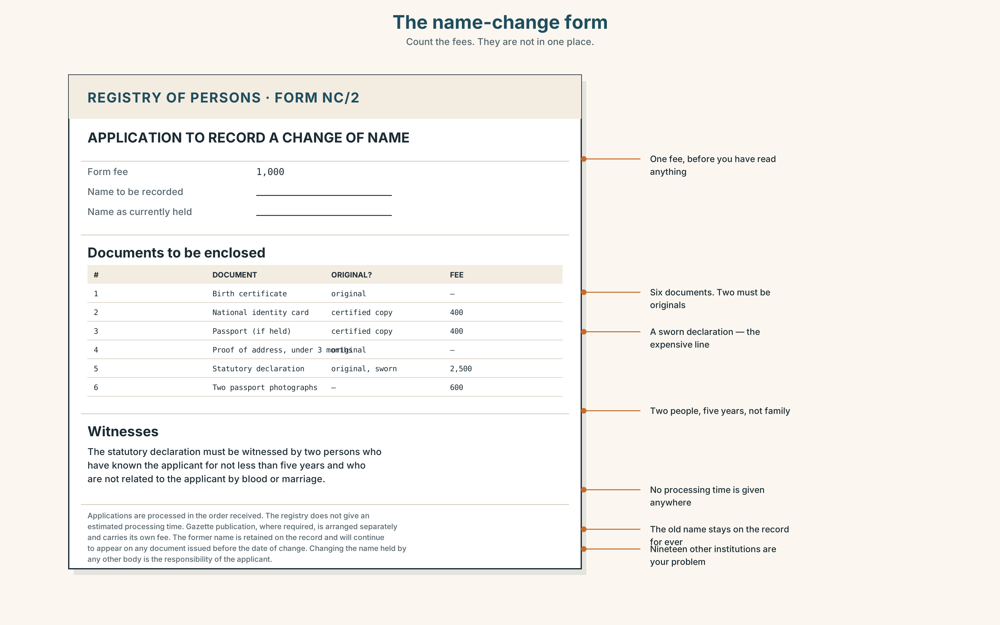{width=6.6in}

*The name-change form — Count the fees. They are not in one place.*

**Read the name-change form and answer.**

1. How many documents must be enclosed?
2. What must the two witnesses be?
3. **How long does the form say the process takes, and where does it say that?**
4. What happens to the old name?
5. **Count the places where a fee is payable.**

### 5F · Writer analysis

The extract is one person's account. The form is nobody's.

- The extract says choosing would have meant "nineteen separate arguments". Does the form support
  that, or contradict it?
- Which document is more honest about what the process costs?

### 5G · Text against text

**Which one would you give to somebody who had just decided to change their name?** Two sentences.
The second begins *"But they would also need…"*

---

## Part 6 · Vocabulary Lab 2 ◆ **B · THE SYSTEM**

### Committing, and getting out of it

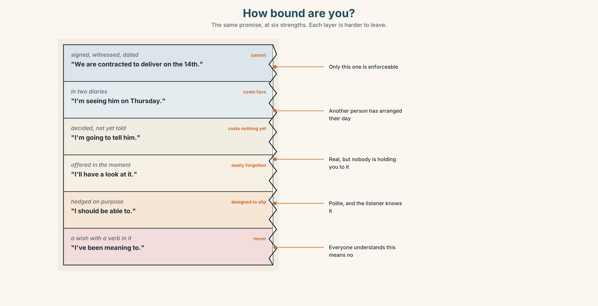{width=6.6in}

*How bound are you? — The same promise, at six strengths. Each layer is harder to leave.*

### 6A · Cline — how bound are you?

Put all twenty-one on a line from **fully committed** to **free to walk away**.

> intend · arrange · promise · commit · expect · aim · anticipate · hesitate · provisionally ·
> imminently · shortly · be due to · be about to · be set to · be thinking of · be likely to ·
> look set to · as things stand · put off · back out of · I was going to…

### 6B · Chunk completion

1. The lease is ______ to expire in March.
2. He was ______ to sign, and then he read clause nine.
3. I'm ______ of asking for an extension.
4. ______ things ______, we have until Friday.
5. She ______ out of it the night before.

### 6C · Register sort

Which of these would you write in a contract, and which only say out loud? Four belong in both.

### 6D · Contrast Clinic — the four futures

Six items. Context decides.

1. — There's someone at the door. — I ______ go.
2. We ______ (announce) it on Monday; the press release is written.
3. The building ______ (close) at seven, every day.
4. I ______ (not sign) that, and I've thought about it for a week.
5. Don't worry, I ______ (sort) it out.
6. She ______ (start) on the fourteenth — contract's signed.

---

## Part 7 · Pronunciation & Fluency Lab ◆ **B · THE SYSTEM**

### Saying which word matters

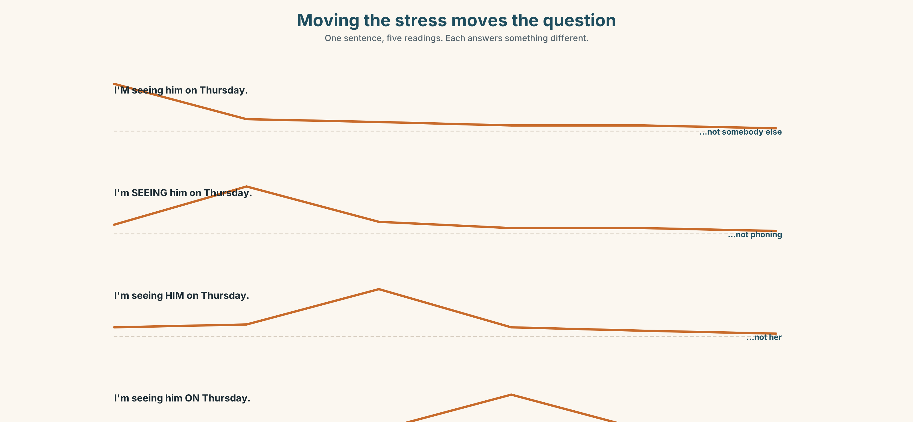{width=6.6in}

*Moving the stress moves the question — One sentence, five readings. Each answers something different.*

### 7A · Hear 🔊 Track 3.3

The same sentence, five times. The stress moves. Each one answers a different question.

> **I'm** seeing him on Thursday. · I'm **seeing** him on Thursday. ·
> I'm seeing **him** on Thursday. · I'm seeing him **on** Thursday. ·
> I'm seeing him on **Thursday**.

**Match each one to the question it answers.**

### 7B · Say

Say each version. Your partner says which question you answered. If they get it wrong, say it
again — do not explain.

### 7C · Make it mean something

> *I didn't say she stole the money.*

Seven words, seven meanings. Say it three ways. Your partner writes down what you accused her of.

### 7D · Fluency 20 ⏺

Twenty seconds: **what I am doing next month, and what I am going to do**. Three times, faster.

---

## Part 8 · Writing ◆ **C · THE PERFORMANCE**

### A professional introduction · 150 words

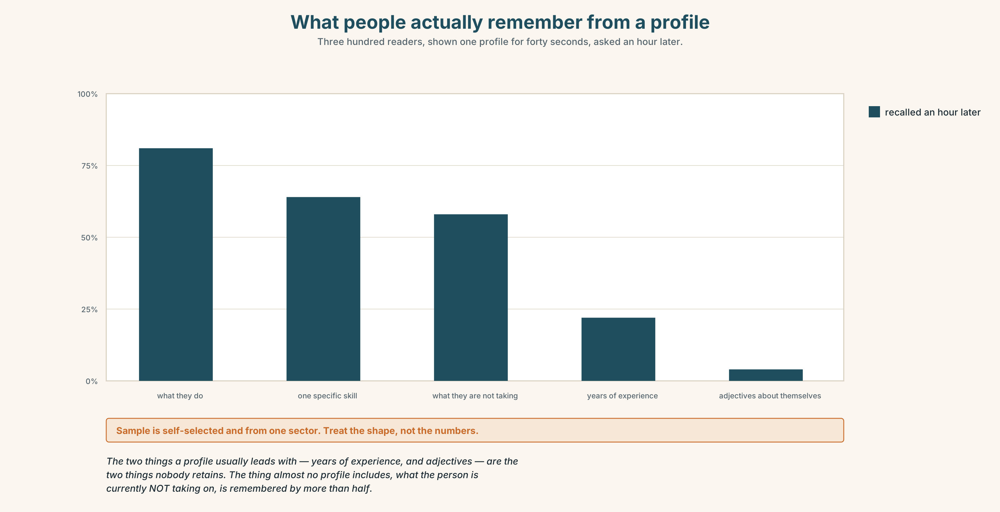{width=6.6in}

*What people actually remember from a profile — Three hundred readers, shown one profile for forty seconds, asked an hour later.*

### 8A · Read the model

> I'm Mariam Okello. Mariam is what I go by; Okello is the family name and the one on anything
> official. `[deals with the name in sentence two, briskly, so nobody has to wonder]`
>
> I make clothes — jackets mostly, in small runs, from a workshop on the ground floor of Jengo
> House in Nairobi. I have been doing it for nine years and I trained four of the people who now
> work with me.
>
> What I am good at is the part most workshops find difficult: taking a design that exists as a
> drawing and turning it into something that can be made forty times without changing.
> `[one specific claim, not three vague ones]`
>
> I am not taking new wholesale orders until March. I am taking sampling work, and I am happy to
> look at anything with a real deadline on it. `[says what is closed before what is open]`
>
> If you want to see the work, come to the building. I would rather show you than send photographs.

**Questions about the writer's choices:**

1. Why handle the name in sentence two rather than leaving it?
2. There are two futures in paragraph four. Why those two and not *will*?
3. The last line refuses something. Why is that a strong ending?

### 8B · The anti-model

> My name is Mariam Okello. I am a passionate and detail-oriented garment professional with 9+
> years of experience delivering high-quality results for a diverse portfolio of clients. I am
> always looking for exciting new opportunities and would love to connect.

Grammatically perfect. **Name three things it does not tell you.**

### 8C · Generate · 8D · Plan

> who you are and what you go by → what you actually do, concretely → the one thing you are good
> at that others find hard → what is closed → what is open → how to see it

### 8E · Draft 1 — 150 words
### 8F · Peer review — two criteria

> ☐ Could I pick this person out of ten similar people?
> ☐ Do I know exactly what to do next if I want to work with them?

### 8G · Draft 2 · 8H · Record it ⏺

Read your own profile aloud, recorded, in under sixty seconds. **It goes next to the text.**

---

## Part 9 · The File ◆ **A · THE WORLD + C · THE PERFORMANCE**

# CULTURE FILE · Translating the Untranslatable

### 9A · Four words with no clean equivalent

Read the four. For each: what does it do that no single English word does?

> **saudade** (Portuguese) · **harambee** (Swahili) · **jugaad** (Hindi) ·
> **Verschlimmbessern** (German)

### 9B · The other direction

Here are four English items that resist translation. Try them in your own language.

> *fair play* · *privacy* · *accountable* · *awkward*

Which was hardest, and was it hard because of the word or because of the idea?

### 9C · Bring one

**Bring one word from your language that English has to explain in a sentence.** Teach it to the
group. Then write the sentence English needs.

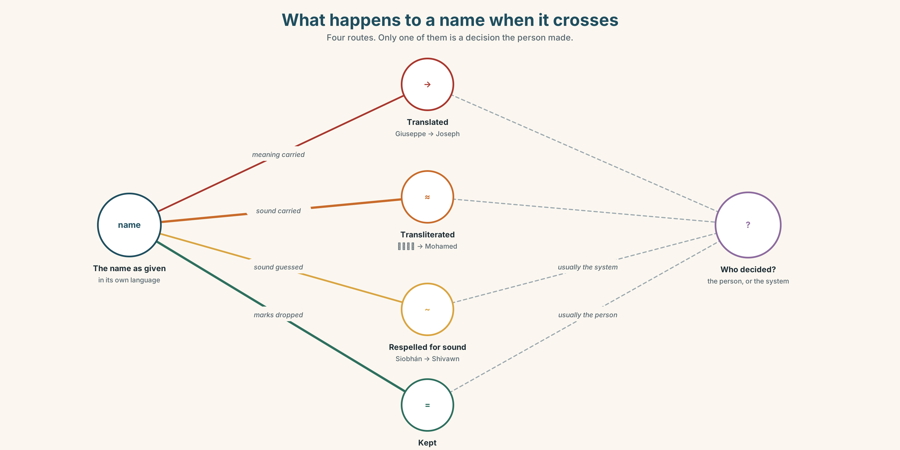{width=6.6in}

*What happens to a name when it crosses — Four routes. Only one of them is a decision the person made.*

### 9D · The name question

Some names translate. Some transliterate. Some do neither.

> Which of these is happening: *Giuseppe → Joseph* · *محمد → Mohamed* · *Nguyễn → Nguyen* ·
> *Siobhán → Shivawn*

**And which of the four is a decision somebody made about themselves?**

### 9E · Transfer

Ask one person this week how their name should be said, and whether the version people use is the
one they chose. **Bring what they said, not what you assumed.**

---

## Part 10 · Mediation & Interaction ◆ **C · THE PERFORMANCE**

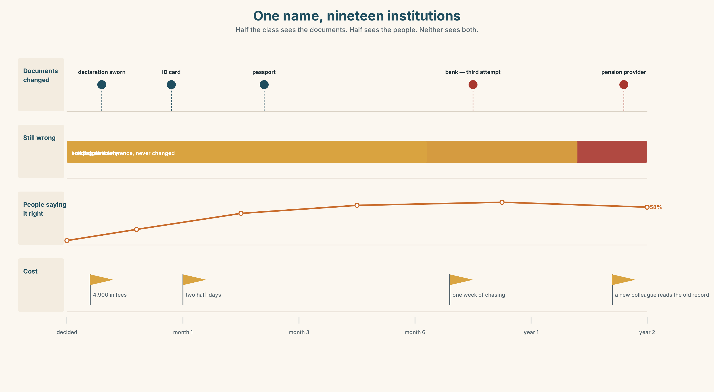{width=6.6in}

*One name, nineteen institutions — Half the class sees the documents. Half sees the people. Neither sees both.*

### 10A · Relay

Half the class sees the documents band; half sees the people band. Rebuild it by speaking.

### 10B · Simplify

Explain the name-change form from Part 5 to somebody who has decided to do it and has an hour
before the office closes. **What do they need to know first?**

> **Plan:** what it is → what they need before they start → what it costs → what takes longest

### 10C · Compress

The 330-word extract into 60 words, for someone deciding. **Three cuts defended.**

### 10D · Online interaction

Write the one message you would send a colleague who has been spelling your name wrong for six
months. It will be read once, quickly, probably on a phone.

### 10E · Across languages

Introduce yourself in your own language, then in English. **What did you have to add in English
that your language leaves out — and what did you have to drop?**

---

## Part 11 · The Decision ◆ **C · THE PERFORMANCE**

# Joseph, or the other thing

Didier runs the café on the ground floor. His full name is Didier Nsengimana. For two years the
biggest account — a company that orders ninety coffees a week — has called him **Dee**.

It began as a shortening. It is now on their internal system, on the standing order, and on the
reference that appears on every payment. Changing it means changing the reference, which means
their finance team reopening the account.

- **Leave it.** It is a nickname, they are friendly, and ninety coffees a week is ninety coffees.
- **Correct it once, properly, in writing.** Make it easy. Accept the risk that it is a nuisance
  to them.
- **Correct it and ask them to change the payment reference too.** The whole thing, done once.

### 11A · The evidence

1. **The standing order record** — the name as their system holds it.
2. **The chart**: how often a correction is actually made, and by whom.
3. **The voice.** Lin, from A1.1, twenty-five seconds: *"I changed mine in my first month here.
   It was easier. Now nobody at work knows my real name and I don't know how to start."*

### 11B · Steelman

Argue the option you like least. Two minutes.

### 11C · Deliberate

> *I think he should ______, because ______. The strongest argument against me is ______, and my
> answer to it is ______.*

### 11D · Decide — eighty words, two reasons

### 11E · Model decision

> I think he should correct it once, in writing, and not ask them to change the payment reference.
>
> The full correction is the one I would want to be right, and I think it is wrong here. The
> payment reference is their system's problem and it is genuinely expensive to change — reopening
> an account is a week of somebody's attention. Asking for it turns a thirty-second courtesy into
> a favour, and favours get remembered as difficulty.
>
> But leaving it entirely is worse, and Lin's recording is why. The cost of saying nothing is not
> felt in the first year. It is felt when the wrong name has been true for so long that
> correcting it would need an explanation, and the explanation is the thing nobody has time for.
>
> So: one line, friendly, with the spelling, and no request attached to it. The reference can stay
> wrong. The person saying it out loud ninety times a week is the one that matters.

### 11F · The Reveal

> **What happened.** He sent one line. Four people started saying Didier within a week. The
> finance system still says **D NSENG** and the payment reference has never changed.
>
> Eight months later a new account manager arrived, read the system, and called him Dee.

**He fixed the people and not the paperwork, and the paperwork refilled the people.**

> Was the reasoning sound? And what, exactly, would the full fix have cost?

---

## Part 12 · Landing ◆ **all three lines**

### 12A · Recycle — twelve items

**Six from this unit.**

1. I ______ (see) him on Thursday — it's in the diary.
2. The lease ______ (expire) in March whatever we do.
3. — There's a call for you. — I ______ take it.
4. She ______ out of it the night before.
5. On the form it is Oluwafemi, but he ______ by Femi.
6. The bank wants ______ of address first.

**Four from Units 1–2.**

7. She ______ (make) these for nine years. *(perfect continuous)*
8. At 3,720 she ______ even. *(Unit 2 lexis)*
9. By the time the notice went up, the period ______ (close). *(past perfect)*
10. Four businesses were ______ out by rising rents. *(Unit 1 lexis)*

**Two from *Telling the Story* (A2.2).**

11. The hall, ______ is the only building above the flood line, is still used. *(non-defining)*
12. He ______ (work) on the wall when the water came. *(past continuous)*

### 12B · Consolidate

**120 words, one paragraph.** Your next three months: one arrangement, one intention, one
timetable, one thing you are refusing. Use at least six items from Part 6.

### 12C · Can-do, with evidence

| I can… | My evidence | Sure? |
|---|---|---|
| choose a future form to make exactly the commitment I mean | Part 3G score | ◯ ◑ ● |
| write and record a professional introduction people remember | Part 8 recording | ◯ ◑ ● |
| explain an official form to somebody who has to act on it today | Part 10B | ◯ ◑ ● |
| take a position on something that is about me | Part 11D decision | ◯ ◑ ● |

### 12D · Replay ⏺

Part 0C, again. Compare. One sentence on what changed.

### 12E · Glossary — forty-five items, as a map

> **WHO YOU ARE** · identity · citizenship · residence · a common name · be known as · go by
> **ON THE DOCUMENT** · passport · visa · surname · initials · legal name · maiden name · given name · birth certificate · proof of address
> **SAYING IT** · pronounce · spelling · transliterate · misspell · for the record · it's a long story
> **ON THE FORM** · fill out · turn down · sign off
> **COMMITTED** · intend · arrange · promise · commit · be due to · be set to · be about to · shortly · imminently
> **NOT QUITE** · expect · aim · anticipate · hesitate · provisionally · be thinking of · be likely to · look set to · as things stand
> **GETTING OUT** · put off · back out of · I was going to…

### 12F · Next

> **Unit 4 · Who is responsible for your health?**

# B1.1 · Unit 4 · Nobody's Job

> **English Animated** · *Taking a Position* · Jengo House, Nairobi
> Student's Book pages 68–87 · 20 pp · ~11.5 hours

---

## Part 0 · The Big Picture ◆ **A · THE WORLD**

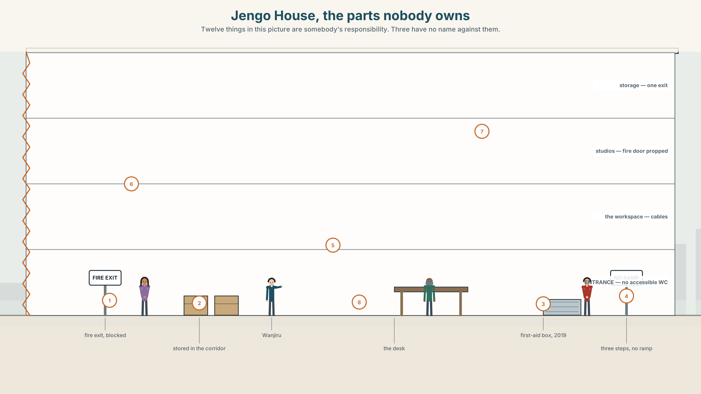{width=6.6in}

*Jengo House, the parts nobody owns — Twelve things in this picture are somebody's responsibility. Three have no name against them.*

# Who is responsible for your health?

**By the end of this unit you will chair a ten-minute meeting on a workplace health policy and
write the three lines that make it real.**

| ◆ **A · THE WORLD** | Duty, consent, and what happens when a responsibility has no name on it |
|---|---|
| ◆ **B · THE SYSTEM** | Obligation, permission and prohibition — now and in the past · *have to* and *must*, returning · 24 words for care and duty · 21 ways to say the same obligation differently · modal weak forms |
| ◆ **C · THE PERFORMANCE** | A chaired meeting, minuted, with one decision somebody can act on |

---

### 0A · Find it

Twelve things in the building that are somebody's responsibility. Four of these sixteen are not
in the picture.

> fire extinguisher · first-aid box · accident book · fire door · exit sign · evacuation plan ·
> trailing cable · blocked corridor · hand sanitiser · signage · stair handrail · spill kit ·
> defibrillator · eyewash station · fire blanket · emergency lighting

### 0B · Guess it

**Three of these have nobody's name against them.** Which three, and how would you find out?

### 0C · Say it ⏺

**Record thirty seconds.** *Who is responsible for your health?* Unprepared.

---

## Part 1 · Vocabulary Lab 1 ◆ **B · THE SYSTEM**

{width=6.6in}

*Who owes what to whom — Each line is a duty. Two of them are drawn dashed, because nobody has ever confirmed them.*

### 1A · Meet — who owes what to whom

Use the network. Each line is a duty. Name the word at each node.

> **consent** · **duty** · **liable** · **entitled** · **carer** · **patient** · **referral** ·
> **treatment** · **prescription** · **insurance** · **waiver** · **exemption**

### 1B · Sort — cline of obligation

Order these from **absolute** to **optional**.

> a right · a duty of care · standard practice · a recommendation · a courtesy · a preference

**Where does it stop being enforceable?** Mark it. Then argue about where you marked it.

### 1C · Sort — odd one out, and why

1. liable · entitled · responsible · accountable
2. consent · waiver · exemption · permission
3. referral · prescription · treatment · diagnosis
4. opt out · look after · sign up for · fall through

### 1D · Stretch — the phrases

1. Every employer has a **duty of ______** to the people in the building.
2. She signed a **______**, which means she cannot claim afterwards.
3. He is **______ to** two weeks' sick leave and does not know it.
4. You can use the equipment, but **at your own ______**.
5. The clinic has a six-month **waiting ______**.
6. They are **under no ______** to tell you.

### 1E · Stretch — four phrasal verbs about responsibility

> **opt out** · **look after** · **sign up for** · **fall through**

Three are chosen. One happens to you. Which?

> **Corpus Note**
> *Liable* and *responsible* look like synonyms and behave differently. *Responsible* takes *for*
> about 70% of the time. *Liable* takes *for* or *to* — and *liable to* usually means *likely to*,
> not *answerable to*.

### 1F · Own it

Name one thing in your workplace, home or course that is everybody's responsibility and therefore
nobody's. Use five of these words.

---

## Part 2 · Listening ◆ **A · THE WORLD**

{width=6.6in}

*Three people, one problem, no name on it — Watch who is facing whom. One of them has not turned round at all.*

### 2A · It's not our building 🔊 Track 4.1

**Before you listen.** Three people, one problem, nobody's name on it. **Who do you think will
speak the most?**

**Gist — one listen, one question.** By the end, has anybody agreed to do anything?

**Detail — complete the frame.**

| | What they say they can't do | What they say somebody else should do |
|---|---|---|
| Wanjiru | | |
| Mr Kamau | | |
| Priya | | |

**Inference.** Mr Kamau says *"we were never required to."* **Required by whom? He does not say.
Why not?**

**Attitude.** Priya says *"fine"* twice. The second one is not agreement. **Which sound?**

**Noticing.** Six sentences. Sort them into three groups.

1. *We have to put a ramp in.*
2. *We had to put a ramp in.*
3. *We don't have to put a ramp in.*
4. *We didn't have to put a ramp in.*
5. *We mustn't block that door.*
6. *We weren't allowed to block it.*

> **A.** obligation · **B.** no obligation · **C.** prohibition
> And then: **which three are about now, and which three are about then?**

### 2B · Decoding clinic 🔊 Track 4.2

Forty seconds of Mr Kamau. Four replays.

1. How many times does he say *have to*?
2. What does *have to* sound like at speed?
3. Catch the two dates.
4. *we were never* — where do the words join?

> Transcripts, page 174.

---

## Part 3 · Grammar Lab 1 ◆ **B · THE SYSTEM**

### Must, have to, and the past that has no *must*

### 3A · Notice

Return to the six sentences.

1. Which two mean "it is forbidden"?
2. Which two mean "it was not necessary"?
3. *We don't have to* and *we mustn't* — one is freedom and one is a ban. Which is which?
4. Write the past of *we must put a ramp in*. **What happened to *must*?**
5. Why do you think English made *have to* do the past of *must*?

### 3B · See

{width=6.6in}

*Obligation, from binding to free — Two of these are opposites that look like variants.*

### 3C · Know

| | Now | Past |
|---|---|---|
| **obligation** | must / have to | **had to** *(must has no past)* |
| **no obligation** | don't have to / needn't | didn't have to / didn't need to |
| **prohibition** | mustn't / can't | wasn't allowed to / couldn't |
| **permission** | can / may / be allowed to | could / was allowed to |

> **Watch out.** *Mustn't* and *don't have to* are opposites, not variants. *You mustn't sign it*
> forbids. *You don't have to sign it* releases.

> **Why it matters.** In a meeting about who is responsible, the difference between *we weren't
> required to* and *we weren't allowed to* is the whole argument.

### 3D · Use — controlled

> Under the 2016 lease the landlord (1) __________ (maintain) the common parts, but he
> (2) __________ (not / provide) accessible facilities, because the building predates the rule.
> Tenants (3) __________ (not / block) the fire doors — that one has never been optional. When the
> studios were converted, the architect (4) __________ (submit) a plan, and because the change of
> use was granted before 2019 she (5) __________ (not / include) a ramp. Today, anybody doing the
> same conversion (6) __________ (include) one.

### 3E · Use — guided

Rewrite each so it means the opposite kind of thing, and say what changed.

1. We don't have to tell the tenants. → *(make it a prohibition)*
2. You mustn't use that door. → *(make it a release)*
3. He had to sign it. → *(make it "it wasn't necessary")*
4. They weren't allowed to park there. → *(make it "they didn't need to")*

### 3F · Use — open

**Describe one rule at your work, school or home that has changed.** What did you have to do
before? What do you have to do now? What are you no longer allowed to do?

### 3G · Check — six items

> 1. You ______ smoke here — it's a hospital. *(prohibition)*
> 2. I ______ come in on Saturday, but I did anyway. *(no obligation, past)*
> 3. Everyone ______ sign the accident book. *(obligation)*
> 4. We ______ use the lift during the works. *(prohibition, past)*
> 5. She ______ pay the fee; students are exempt. *(no obligation)*
> 6. Before 2019 they ______ install a ramp. *(no obligation, past)*

**0–3 →** Workbook pp. 30–32. **4–5 →** Part 6. **6 →** p. 79.

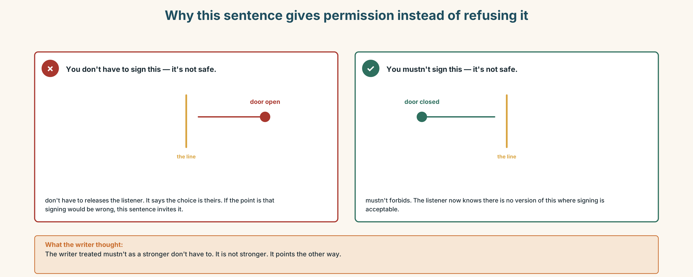{width=6.6in}

*Why this sentence gives permission instead of refusing it — Why this sentence gives permission instead of refusing it*

---

## Part 4 · Speaking ◆ **C · THE PERFORMANCE**

### 4A · Fluency sprint — 4 / 3 / 2

One rule you have to follow and think is wrong. Four minutes, three, two.

### 4B · The functional core — chairing

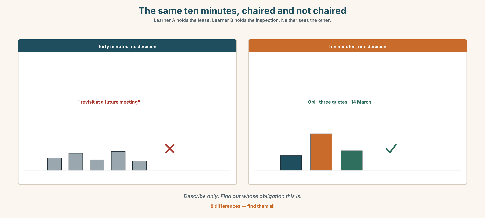{width=6.6in}

*The same ten minutes, chaired and not chaired — Learner A holds the lease. Learner B holds the inspection. Neither sees the other.*

**Language Bank**

| | |
|---|---|
| **opening** | *we're here to decide one thing* · *I want us out of here by …* |
| **bringing in** | *Priya, you've not said anything — what's your read?* · *can I hear from someone who disagrees?* |
| **holding the line** | *we'll come back to that* · *that's a different meeting* · *park it* |
| **landing it** | *so what I'm hearing is …* · *who's doing it, and by when?* · *is anyone unhappy with that?* |

**Information gap.** Learner A has the lease. Learner B has the inspection report. Neither sees
the other. **Find out whose obligation this actually is.**

### 4C · The performance — chair ten minutes

Six people, one problem, one decision. **You are the chair.** You must end with a named person and
a date, or with a written statement of why there isn't one.

### 4D · Observer

Listen for **one thing**: how many times was the decision nearly made before it was made?

### 4E · Two criteria

> ☐ Did the meeting end with a name and a date?
> ☐ Did I bring in the person who had not spoken?

---

## Part 5 · Reading ◆ **A · THE WORLD**

### 5A · Predict

An archive document: an inspection report from 2019. The first line is:

> *The premises were found to be in substantial compliance with the regulations then in force.*

**What do you expect this document to be used for, years later?**

### 5B · Skim — sixty seconds

Find the one sentence that everything since has depended on.

---

{width=6.6in}

*The 2019 inspection report — Nine hundred words. One sentence is the one everything since has depended on.*

### 5C · Close reading

1. What date was the inspection?
2. What does *"substantial compliance"* mean, and what does it not mean?
3. Which three items were marked for attention?
4. **Which of the three was not followed up, and how do you know from the document alone?**
5. What does the final paragraph say about future obligations?
6. **Who signed it, and in what capacity?**

### 5D · Vocabulary in context

> premises · in force · substantial · for attention · in due course · capacity (*in what capacity*)

### 5E · The counter-text

Read the four-line email sent eleven days after the inspection.

> *Thanks — noted. We're not required to action item 3 as the building predates it. Happy to
> revisit if anything changes. Best, A.K.*

1. What does *noted* commit him to?
2. *We're not required to* — by what?
3. *Happy to revisit if anything changes* — what would have to change?
4. **The email is forty-one words. The inspection report is nine hundred. Which one has been
   quoted more often since?**

### 5F · Writer analysis

- The report never says who must act. Is that a flaw or a design?
- The email names one item and ignores two. Which two, and does anybody notice?

### 5G · Text against text

**The report says "for attention". The email says "not required". Both are true.** Write two
sentences on how that is possible. The second begins *"The gap is…"*

---

## Part 6 · Vocabulary Lab 2 ◆ **B · THE SYSTEM**

### Twenty-one ways to say the same obligation

{width=6.6in}

*One obligation, six strengths — The same duty, worded six ways. Each layer is easier to walk away from.*

### 6A · Sort — strength

Put all twenty-one on a line from **binding** to **entirely optional**.

> mandatory · compulsory · obliged · required · binding · permitted · voluntary · optional ·
> exempt · banned · discretionary · be supposed to · be meant to · have no choice but to ·
> be free to · didn't have to · should have · needn't have · get out of · let off · it's up to you

### 6B · Chunk completion

1. Attendance is ______ — you can come or not.
2. He was ______ from the fee because of his age.
3. We had ______ ______ ______ ______ close for the day.
4. You ______ have paid — it was covered.
5. She ______ ______ of it by swapping shifts.

### 6C · Register sort

Which of these appear in a contract, and which only in speech? Five appear in both.

### 6D · Contrast Clinic — *mustn't* against *don't have to*

Six items. Only the meaning decides.

1. You ______ touch that — it's live.
2. You ______ stay late; we've finished.
3. Visitors ______ go past this point.
4. You ______ book; just turn up.
5. We ______ have called a meeting, but it helped.
6. Staff ______ prop that door open under any circumstances.

**Then: say in one sentence what each pair would mean if you got it the wrong way round.**

---

## Part 7 · Pronunciation & Fluency Lab ◆ **B · THE SYSTEM**

### Modals disappear in the middle of a sentence

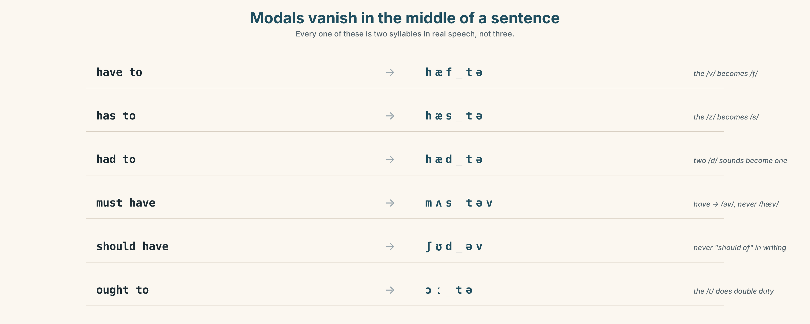{width=6.6in}

*Modals vanish in the middle of a sentence — Every one of these is two syllables in real speech, not three.*

### 7A · Hear 🔊 Track 4.3

> have to → /hæftə/ · has to → /hæstə/ · had to → /hædtə/ ·
> must have → /mʌstəv/ · should have → /ʃʊdəv/ · ought to → /ɔːtə/

### 7B · Say

Inside the sentence: *"We had to do it, and we should have said so."*

### 7C · Make it mean something

Say this twice — once at speed, once with every modal stressed.

> *"You didn't have to come in."*

**One version is kind. One is an accusation.** Which stress makes which?

### 7D · Fluency 20 ⏺

Twenty seconds: **something I had to do that I did not have to do**. Three times, faster.

---

## Part 8 · Writing ◆ **C · THE PERFORMANCE**

### Minutes somebody can act on · 140 words

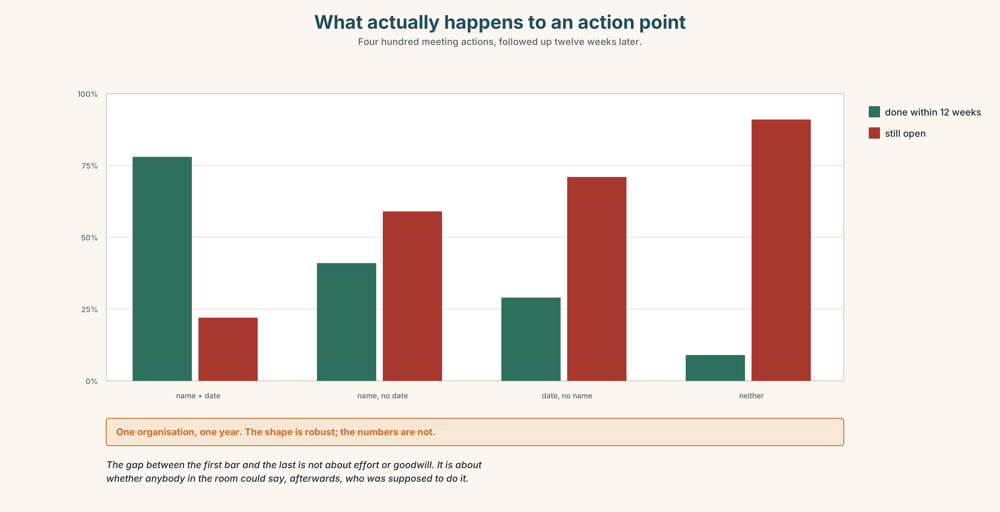{width=6.6in}

*What actually happens to an action point — Four hundred meeting actions, followed up twelve weeks later.*

### 8A · Read the model

> **Present:** Wanjiru (chair), Obi, Mariam, Priya, Tom, Grace. **Apologies:** Mr Kamau.
> `[Grace is listed. In four previous sets of minutes she was not]`
>
> We discussed the absence of an accessible toilet. The 2019 inspection marked it "for attention";
> the landlord's position is that the building predates the requirement. Both are correct.
> `[states the disagreement as fact, not as a complaint]`
>
> We agreed that the tenants will fund a survey, at a cost of up to 40,000, **not** as an
> acceptance of liability. Obi will obtain three quotes by 14 March. Wanjiru will write to the
> landlord setting out what we have done and asking, in writing, whether he will match it.
> `[two names, two dates, one sentence protecting the position]`
>
> Priya recorded that she thinks funding it ourselves weakens us. The meeting noted this and
> proceeded. `[the dissent is minuted, by name]`

**Questions about the writer's choices:**

1. Why record Priya's objection rather than leaving it out?
2. Why does *"not as an acceptance of liability"* appear in bold?
3. Two people are named with dates. What makes that different from "we agreed to look into it"?

### 8B · The anti-model

> The group had a productive discussion around accessibility and agreed to explore options going
> forward. Various views were expressed. It was felt that further information would be helpful
> and the matter will be revisited at a future meeting.

Nothing in it is untrue. **Name three things that cannot be acted on.**

### 8C · Generate · 8D · Plan

> who was there → what was discussed, in one line → what was agreed → who, by when →
> what was protected → who disagreed, by name

### 8E · Draft 1 — 140 words
### 8F · Peer review — two criteria

> ☐ Could somebody who was not there do the right thing on Monday?
> ☐ Is there a name against every action?

### 8G · Draft 2 · 8H · Publish

To the wall, and to the person who was not at the meeting.

---

## Part 9 · The File ◆ **A · THE WORLD + C · THE PERFORMANCE**

# WORK FILE · The Meeting

{width=6.6in}

*Two agendas for the same meeting — One of these takes forty minutes. One takes ten. Nothing else differs.*

### 9A · Before — the agenda that does the work

Here are two agendas for the same meeting. One takes forty minutes; one takes ten.

> **A:** 1. Accessibility 2. The lease 3. AOB
> **B:** 1. Decide whether we fund the survey ourselves (10 min, decision needed) 2. AOB (3 min)

**Name three things B does that A does not.**

Then: in meeting A somebody will eventually say **"whose job is it?"** and somebody else will say
**"that's not on me."** At what point in agenda B does that become impossible?

### 9B · During — the four jobs of a chair

Watch or listen to a five-minute extract. Tally every time the chair does one of these.

> opens · brings somebody in · stops a digression · summarises · tests agreement · closes

**Which one did they do least? What happened because of it?**

### 9C · The hardest moment

Somebody raises a real, important, unrelated point, nine minutes in. **Write the sentence you
would say.** Compare with three other people's.

### 9D · After — the follow-up

Minutes are not the follow-up. Write the **one message** that goes to the person who has an action
and was not at the meeting. Sixty words.

### 9E · Transfer

**Go to a real meeting this week and count.** How many agreements left the room with a name and a
date against them? Bring the number.

---

## Part 10 · Mediation & Interaction ◆ **C · THE PERFORMANCE**

{width=6.6in}

*Seven years of one missing toilet — Half the class sees the obligations. Half sees what happened. Neither sees both.*

### 10A · Relay

Half the class sees the obligations band; half sees the timeline. Rebuild it by speaking only.

### 10B · Simplify

Explain the 2019 inspection report to **Grace**, who is affected by it, has eleven minutes, and
has never seen an inspection report.

> **Plan:** what it is → what it found → what it means for her → what she could ask for

### 10C · Compress

The report into 60 words for the tenants' group. Defend three cuts.

### 10D · Online interaction

Write the message to the landlord. **It may be read by a lawyer later.** Write it knowing that,
and without sounding as though you know it.

### 10E · Across languages

In your own language, how do you say *"that's not my responsibility"* politely? Bring it back into
English. **Is the English version as polite?**

---

## Part 11 · The Decision ◆ **C · THE PERFORMANCE**

# The toilet on the ground floor

Jengo House has no accessible toilet. The building predates the requirement, so nobody has broken
a rule. Priya, who is retraining as a dentist after a spinal injury, has used the café next door
for seven months and has never mentioned it.

- **The landlord pays.** He is not obliged to. Asking costs the relationship and probably fails.
- **The tenants pay.** About 160,000, shared six ways. It is their building for four more years.
- **Nobody pays, and it is minuted.** Honest, cheap, and in writing for ever.

### 11A · The evidence

1. **The inspection report** from Part 5, and the forty-one-word reply.
2. **The chart**: what the survey, the works and the disruption would actually cost.
3. **The voice.** Priya, thirty seconds: *"I didn't say anything because I didn't want it to be
   about me. Now it's been seven months and saying something would be about me."*

### 11B · Steelman

Argue the option you like least. Two minutes.

### 11C · Deliberate

> *I think they should ______, because ______. The strongest argument against me is ______, and my
> answer to it is ______.*

### 11D · Decide — eighty words, two reasons

### 11E · Model decision

> I think the tenants should fund the survey, and only the survey, and should say in writing that
> they are not accepting liability by doing it.
>
> Paying for the works outright is the option that feels right and I think it is wrong. It is
> 160,000 of other people's money for a building they will leave in four years, and it lets the
> landlord establish that this is a tenant cost. Once that is established it stays established.
>
> Minuting it and doing nothing is the cheapest thing and the one Priya would have to live in. She
> has already spent seven months not mentioning it, which tells you what the cost of the honest
> option actually is, and who pays it.
>
> The survey is the only move that changes what anybody knows. A number on a page converts an
> argument about principle into an argument about money, and arguments about money get settled.

### 11F · The Reveal

> **What happened.** The survey came back at 96,000 — considerably less than the 160,000 everyone
> had been assuming, because the ground-floor plumbing was already in the right place.
>
> Mr Kamau paid half, having refused to pay anything for four months, after his insurer asked him
> a question about the 2019 report.
>
> Priya left in November for a practice forty minutes away. The works were finished in January.

**The reasoning worked. The number came down, the landlord moved, the thing got built.
And the person it was for had gone.**

> Was the reasoning sound? And what would it have taken to move faster — and who would have had
> to pay for *that*?

---

## Part 12 · Landing ◆ **all three lines**

### 12A · Recycle — twelve items

**Six from this unit.**

1. You ______ prop that door open. *(prohibition)*
2. We ______ pay; students are exempt. *(no obligation)*
3. Before 2019 they ______ install one. *(no obligation, past)*
4. Every employer has a duty of ______.
5. She signed a ______ and cannot claim now.
6. They are under no ______ to tell you.

**Four from Units 1–3.**

7. I ______ (see) him on Thursday — it's arranged. *(Unit 3)*
8. She ______ (make) these for nine years. *(Unit 2)*
9. By then the objection period ______ (close). *(Unit 1)*
10. At 3,720 she ______ even. *(Unit 2 lexis)*

**Two from *Telling the Story* (A2.2).**

11. He asked whether we ______ received the report. *(reported speech)*
12. ______ of the four items were followed up — only one. *(quantifiers)*

### 12B · Consolidate

**120 words, one paragraph.** A rule where you work or study: what you have to do, what you used
to have to do, what you are not allowed to do, and one thing that is nobody's job. Six items from
Part 6.

### 12C · Can-do, with evidence

| I can… | My evidence | Sure? |
|---|---|---|
| say precisely whether something is required, forbidden or merely unnecessary | Part 3G score | ◯ ◑ ● |
| chair a short meeting and land one decision | Part 4C recording | ◯ ◑ ● |
| write minutes somebody who was absent could act on | Part 8 draft 2 | ◯ ◑ ● |
| argue a case where nobody has broken a rule and something is still wrong | Part 11D | ◯ ◑ ● |

### 12D · Replay ⏺

Part 0C again. Compare. One sentence.

### 12E · Glossary — forty-five items, as a map

> **WHO OWES WHAT** · duty · duty of care · liable · entitled · have a right to · under no obligation · accountable
> **CONSENT** · consent · informed consent · waiver · exemption · at your own risk
> **CARE** · carer · patient · referral · treatment · prescription · insurance · a waiting list
> **DOING IT** · opt out · look after · sign up for · fall through · get out of · let off
> **BINDING** · mandatory · compulsory · obliged · required · binding · have no choice but to
> **NOT BINDING** · optional · voluntary · discretionary · exempt · be free to · it's up to you · didn't have to · needn't have
> **EXPECTED** · be supposed to · be meant to · should have · banned · permitted

### 12F · Next

> **Unit 5 · Should a machine decide?**

# B1.1 · Unit 5 · The Rota

> **English Animated** · *Taking a Position* · Jengo House, Nairobi
> Student's Book pages 88–107 · 20 pp · ~11.5 hours

---

## Part 0 · The Big Picture ◆ **A · THE WORLD**

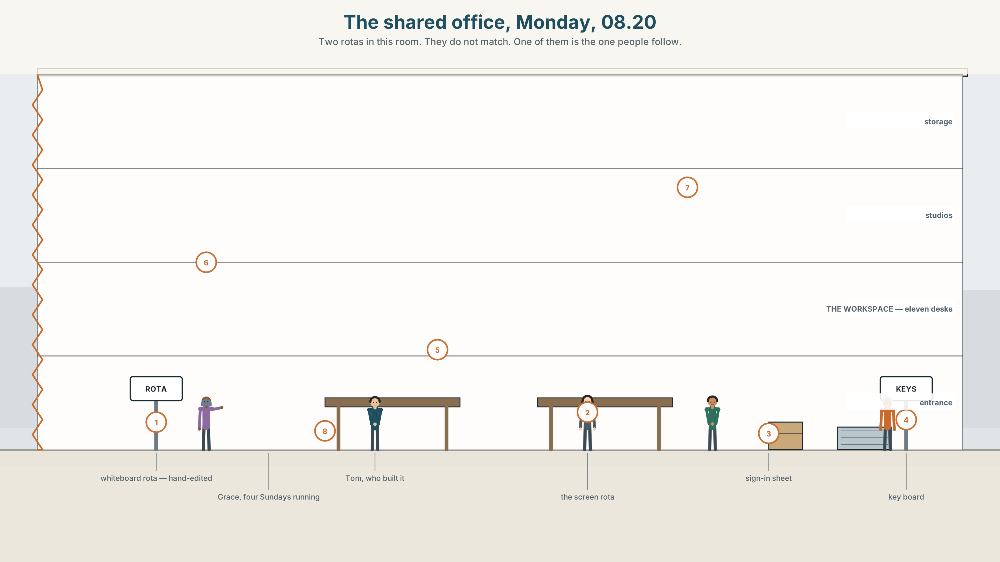{width=6.6in}

*The shared office, Monday, 08.20 — Two rotas in this room. They do not match. One of them is the one people follow.*

# Should a machine decide?

**By the end of this unit you will argue a case for or against automating one decision — and say
what you would do about the cases it gets wrong.**

| ◆ **A · THE WORLD** | What a system is good at, what it cannot see, and who absorbs the difference |
|---|---|
| ◆ **B · THE SYSTEM** | Conditionals 0, 1 and 2, side by side · the second conditional, returning · 24 words for automation and judgement · 21 ways to say *and so* · the tune at the end of an *if* clause |
| ◆ **C · THE PERFORMANCE** | A reasoned case, delivered to people who will push back |

---

### 0A · Find it

Twelve things on the wall of the shared office. Four of these sixteen are not there.

> whiteboard rota · printed timetable · sticky notes · wall planner · key hooks · sign-in sheet ·
> swipe reader · screen showing a dashboard · bookings tablet · noticeboard · laminated rules ·
> wifi password · punch clock · rota app on a phone · cork board · staff photo wall

### 0B · Guess it

The rota on the whiteboard and the rota on the screen **do not match**. Find three differences.
**Which one do you think people actually follow?**

### 0C · Say it ⏺

**Record thirty seconds.** *Should a machine decide?* Unprepared.

---

## Part 1 · Vocabulary Lab 1 ◆ **B · THE SYSTEM**

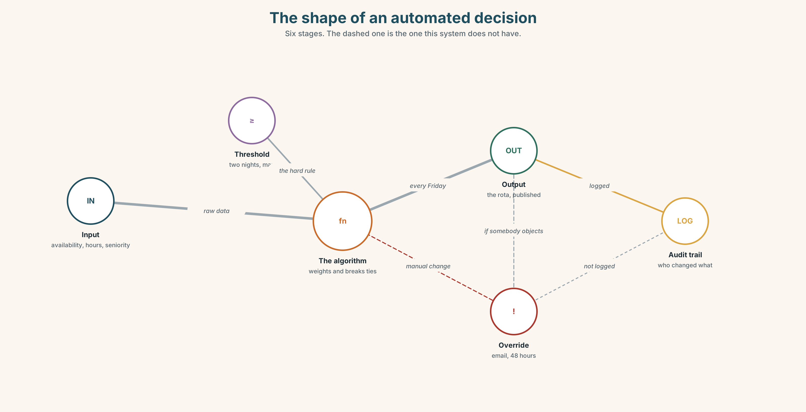{width=6.6in}

*The shape of an automated decision — Six stages. The dashed one is the one this system does not have.*

### 1A · Meet — the shape of a system

Use the network. Name the word at each stage.

> **input** · **threshold** · **output** · **override** · **audit** · **fallback** · **flag** ·
> **bias** · **algorithm** · **automate** · **accountable** · **discretion**

### 1B · Sort — what can be automated?

Put these six decisions in order, from **easiest to automate** to **hardest**.

> who gets the last desk · when the bins go out · who covers a sick shift ·
> who gets a reference · who is let go · who is told first

**Mark the point where you would stop.** Then find somebody who marked it somewhere else.

### 1C · Sort — odd one out, and why

1. algorithm · threshold · bias · rule of thumb
2. override · discretion · a judgement call · output
3. audit · flag · accountable · fallback
4. roll out · rule out · fall back on · flag up

### 1D · Stretch — the phrases

1. It works for ninety per cent and fails on **an ______ case**.
2. The system flagged her and it was wrong — **a ______ positive**.
3. Nobody checked the output for six weeks. There was no **human ______**.
4. Two days off between nights is **a rule of ______**, not a rule.
5. Which shift she can actually do is **a ______ call**, and the system cannot make it.
6. He approved it without reading it, but his name is on it — he **signed ______ on** it.

### 1E · Stretch — four phrasal verbs, one system

> **flag up** · **roll out** · **fall back on** · **rule out**

Which one happens when the system fails? Which one happens before anybody uses it?

### 1F · The two sayings

> **garbage in, garbage out** · **computer says no**

One is about data. One is about power. **Which is which, and who says each of them?**

> **Corpus Note**
> *Algorithm* appeared in general English about four times per million words in 2005 and about
> forty in 2024. *Accountable* has not moved at all.

### 1G · Own it

Describe one decision where you work or study that is made by a system. **Name the edge case it
gets wrong.**

---

## Part 2 · Listening ◆ **A · THE WORLD**

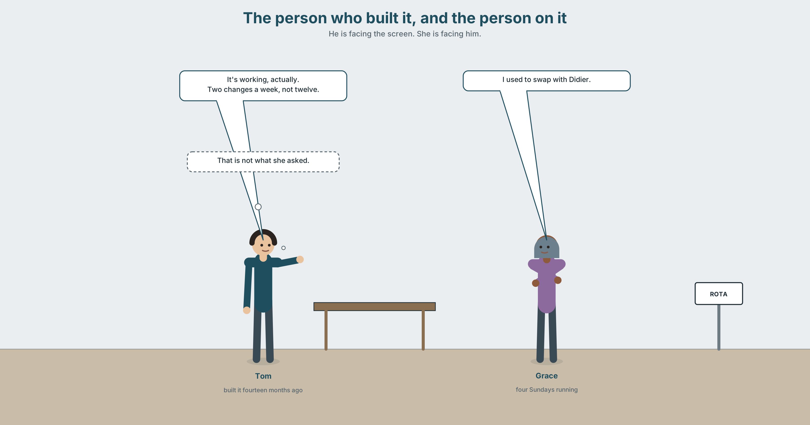{width=6.6in}

*The person who built it, and the person on it — He is facing the screen. She is facing him.*

### 2A · It did what we told it 🔊 Track 5.1

**Before you listen.** Tom built the rota system. Grace is on it. **Who do you think has read the
rules it uses?**

**Gist — one listen, one question.** What did the system do that nobody intended?

**Detail — complete the frame.**

| | What the rule says | What it produced |
|---|---|---|
| fairness rule | | |
| availability rule | | |
| seniority rule | | |

**Inference.** Grace says *"I used to swap with Didier."* **What has the system removed, and does
anybody notice it has gone?**

**Attitude.** Tom says *"it's working, actually"* and he is right. **Which sound tells you he
already knows that is not the point?**

**Noticing.** Six sentences. Sort them.

1. *If you reduce the hours, the system reallocates them.*
2. *If we switch it off, we go back to the whiteboard.*
3. *If I had known, I would have built it differently.*
4. *If you work nights, you get two days off.*
5. *If she asks, I'll explain it to her.*
6. *If it were up to me, I'd let people swap.*

> **A.** always true · **B.** a real possibility, now or soon · **C.** not real — imagined

### 2B · Decoding clinic 🔊 Track 5.2

Forty seconds of Tom at speed. Four jobs.

1. How many times does he say *if*?
2. Where does his voice go **up**, and where does it go **down**?
3. Catch the two percentages.
4. *would have* — how many sounds?

> Transcripts, page 175.

---

## Part 3 · Grammar Lab 1 ◆ **B · THE SYSTEM**

### Three conditionals, side by side

### 3A · Notice

Return to the six sentences.

1. Which one describes something that happens **every time**?
2. Which two describe something that **might really happen**?
3. Which two describe something that is **not true**?
4. In sentence 6, *if it were up to me* — is it up to him?
5. Look at the verbs after *if* in 4, 5 and 6. **Three different forms, and only one of them is
   about the past.** Which?

### 3B · See

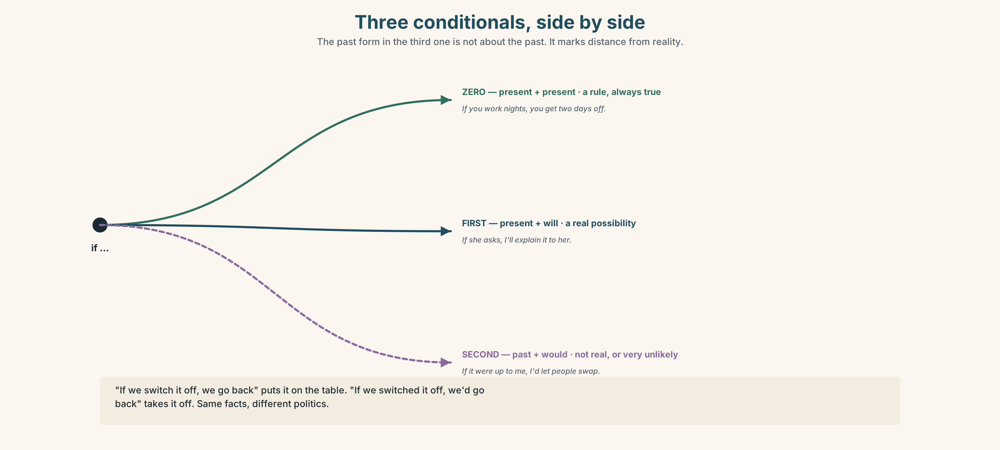{width=6.6in}

*Three conditionals, side by side — The past form in the third one is not about the past. It marks distance from reality.*

### 3C · Know

| | *if* clause | result clause | What it does |
|---|---|---|---|
| **zero** | present simple | present simple | a rule, always true — *If you work nights, you get two days off.* |
| **first** | present simple | will / may / might | a real possibility — *If she asks, I'll explain.* |
| **second** | past simple | would / could | not real, or very unlikely — *If it were up to me, I'd let people swap.* |

> **Watch out.** The past form in the second conditional is **not about the past**. It marks
> distance from reality, not distance in time.

> **Why it matters.** *If we switch it off, we go back to the whiteboard* and *if we switched it
> off, we'd go back to the whiteboard* are the same sentence with two different politics. The
> first treats it as on the table. The second treats it as unthinkable.

### 3D · Use — controlled

> If a shift (1) __________ (go) unfilled for two hours, the system (2) __________ (reallocate) it
> automatically — that is what it does every time. If Grace (3) __________ (ask) to swap tomorrow,
> Tom (4) __________ (have to) do it by hand, which he can. If the rules (5) __________ (be)
> written by the people on the rota, they (6) __________ (look) completely different — but they
> were not.

### 3E · Use — guided

Move each sentence one step further from reality, then one step closer. Say what changes.

1. If we switch it off, we lose the audit trail.
2. If she complained, they would listen.
3. If you press override, it logs who did it.

### 3F · Use — open

**Describe a system where you work.** One rule that is always true. One thing that might really
happen this month. One thing you would change if it were up to you — and it is not.

### 3G · Check — six items

> 1. If you ______ (heat) water to 100°, it ______ (boil).
> 2. If I ______ (be) you, I ______ (say) something.
> 3. If the system ______ (flag) her again, I ______ (override) it.
> 4. If we ______ (have) more people, this ______ (not / be) a problem — but we don't.
> 5. If you ______ (work) a night, you ______ (get) two days off. Always.
> 6. If she ______ (leave), who ______ (cover) Sunday?

**0–3 →** Workbook pp. 38–40. **4–5 →** Part 6. **6 →** p. 99.

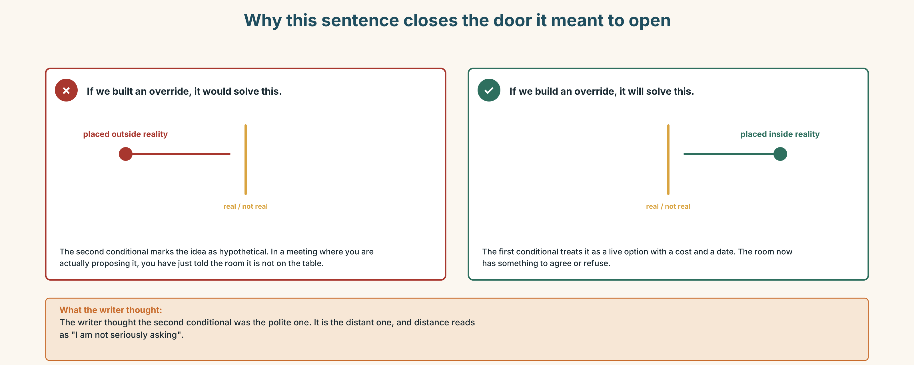{width=6.6in}

*Why this sentence closes the door it meant to open — Why this sentence closes the door it meant to open*

---

## Part 4 · Speaking ◆ **C · THE PERFORMANCE**

### 4A · Fluency sprint — 4 / 3 / 2

One thing you would change about how a decision gets made where you are. Four, three, two minutes.

### 4B · The functional core — arguing about consequences

{width=6.6in}

*Six weeks of rota, before and after — Learner A holds the rules. Learner B holds what happened. Neither sees the other.*

**Language Bank**

| | |
|---|---|
| **laying out a consequence** | *if we do that, what happens is …* · *the upshot is …* · *that means in practice …* |
| **conceding** | *that's fair, as far as it goes* · *I'd accept that if …* |
| **distancing** | *if it were up to me* · *in an ideal world* · *I'm not saying we should* |
| **pinning down** | *under what conditions would you …?* · *what would have to be true for …?* |

**Information gap.** Learner A holds the rota rules. Learner B holds six weeks of what actually
happened. **Find the case the rules did not foresee.**

### 4C · The performance — the case

Three minutes, uninterrupted, then two minutes of questions you have not seen. You are arguing
**for or against automating one named decision**, and you must say what happens to the cases it
gets wrong.

### 4D · Observer

Listen for **one thing**: did the speaker ever say what the system would be *worse* at?

### 4E · Two criteria

> ☐ Did I name a specific case my own position handles badly?
> ☐ Did I say who picks it up when the system is wrong?

---

## Part 5 · Reading ◆ **A · THE WORLD**

### 5A · Predict

An interview transcript. The first exchange is:

> **Q:** So the system was working correctly?
> **A:** It was working exactly as specified. That's a different thing.

What do you expect the rest to be about? One sentence.

### 5B · Skim — sixty seconds

Find the moment the interviewee stops defending the system.

---

**"Exactly as specified"**

**Q:** So the system was working correctly?

**A:** It was working exactly as specified. That's a different thing, and I want to be careful
about it, because people hear "working correctly" and stop asking questions.

**Q:** What's the difference?

**A:** The specification said: allocate shifts so that no one does more than two nights in a row,
weight by availability, and break ties by seniority. It did all three, every time, for fourteen
months. If you audit it against the spec, it passes. The problem is that nobody writing the spec
had ever covered a Sunday.

**Q:** Meaning?

**A:** Meaning the spec had no word for the thing people were actually doing, which was swapping.
Before the system, if you couldn't do a Sunday you found somebody who could, and you owed them
one. That's not in the spec because it isn't a rule — it's a favour economy, and it's how the
place ran. We automated the rota and the favours stopped, because there was nothing to swap.

**Q:** Did anybody raise it?

**A:** One person. Six weeks in. She said it had got harder to change a shift, and I said yes,
that's correct, that's the point — the whole reason we built it was that the old rota got changed
twelve times a week and nobody could plan. And I was right. I was answering a different question
from the one she was asking, and I did it confidently, which is worse.

**Q:** Would you build it again?

**A:** Yes. But I'd build the override first and the allocator second, and I'd make the override
cost somebody thirty seconds instead of an email. If the cheapest thing to do is the thing the
system wanted, you haven't built a tool. You've built a rule and called it a tool.

---

### 5C · Close reading

1. What three things did the specification require?
2. What is the difference between *working correctly* and *working as specified*?
3. **What was the "favour economy", and why was it not in the spec?**
4. What did the one person who raised it actually say?
5. **The interviewee says being right made it worse. Why?**
6. What would he build first next time, and why?

### 5D · Vocabulary in context

> specified · audit (*audit it against the spec*) · weight (*weight by availability*) ·
> break ties · override (noun) · allocator

### 5E · The counter-text

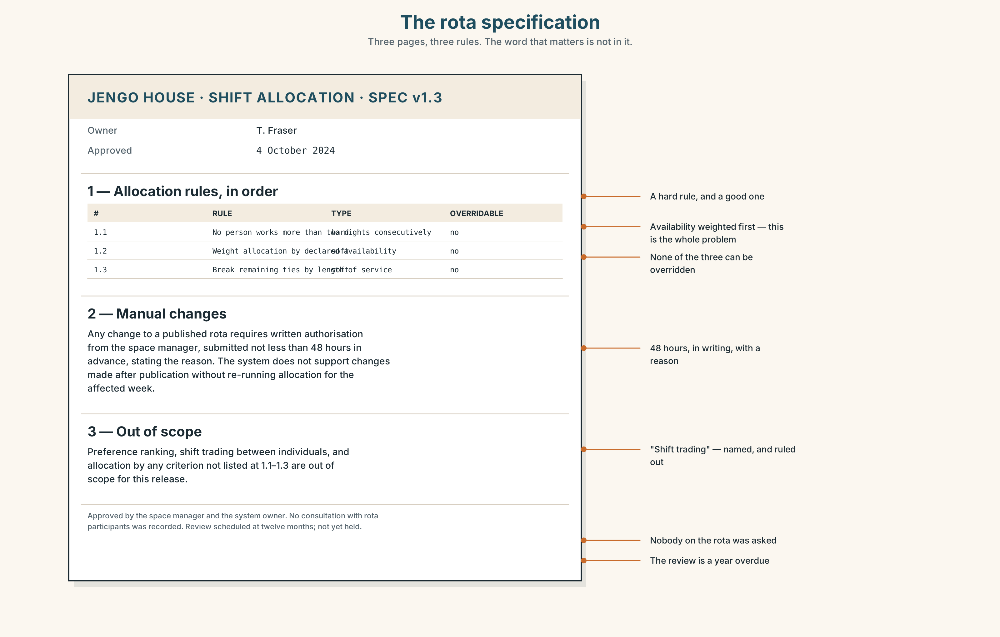{width=6.6in}

*The rota specification — Three pages, three rules. The word that matters is not in it.*

**Read the specification document and answer.**

1. How many rules are there?
2. What is the stated tie-break?
3. **Find the clause about manual changes. How many steps does it require?**
4. What does the document say about swaps?
5. **Who signed it off, and had they ever worked a Sunday?**

### 5F · Writer analysis

- The interview admits a mistake. The spec admits nothing. Which is more useful, and to whom?
- **The spec is three pages and the thing that broke is not in it. Could it have been?**

### 5G · Text against text

**The spec says "manual changes require written authorisation". The interview says the override
should cost thirty seconds.** Two sentences on whether both can be true. The second begins
*"The question is who…"*

---

## Part 6 · Vocabulary Lab 2 ◆ **B · THE SYSTEM**

### Twenty-one ways to say *and so*

{width=6.6in}

*From a direct cause to a shrug — Six strengths of "and so". The lower you go, the less anybody owns it.*

### 6A · Sort — how direct is the link?

Put all twenty-one on a line from **a direct cause** to **a loose association**.

> consequence · outcome · trade-off · repercussion · knock-on · inadvertently · consequently ·
> thereby · otherwise · conversely · hence · as a result · which means that · the upshot is ·
> provided that · as long as · in which case · worst case · end up · result in ·
> one thing leads to another

### 6B · Chunk completion

1. We froze the rota, and **the ______ is** that nobody can swap.
2. He approved it without reading it and ______ became responsible for it.
3. You can override it, ______ ______ you log why.
4. Fix it now; ______ it goes to the whole building on Monday.
5. She might refuse, ______ ______ ______ we are back to the whiteboard.

### 6C · Register sort

Which of these would you write in a report, and which only say out loud? Four belong in both.

### 6D · Contrast Clinic — zero, first, second

Six items. The context decides.

1. If you ______ (press) override, it ______ (log) your name. *(every time)*
2. If she ______ (not come) in tomorrow, I ______ (cover) it. *(real)*
3. If I ______ (be) the landlord, I ______ (fix) it. *(not real)*
4. If we ______ (switch) it off today, we ______ (lose) the audit trail. *(real)*
5. If water ______ (get) in, the board ______ (fail). *(always)*
6. If they ______ (ask) us first, none of this ______ (happen). *(not real)*

---

## Part 7 · Pronunciation & Fluency Lab ◆ **B · THE SYSTEM**

### Where the voice goes at the end of an *if* clause

{width=6.6in}

*The tune at the end of an if clause — Identical words. The pitch tells the listener whether you have finished.*

### 7A · Hear 🔊 Track 5.3

In each pair, the words are identical. **The tune is not.**

> *If she asks,* ↗ *I'll explain.* ↘ — one sentence, two parts
> *If she asks.* ↘ — finished. A threat, or a condition already met.

### 7B · Say

Say each one. Your partner says whether you have finished speaking.

### 7C · Make it mean something

> *If you want.*

Say it three ways: as a genuine offer, as a withdrawal of interest, and as an ultimatum.
Your partner writes down which one they heard.

### 7D · Fluency 20 ⏺

Twenty seconds: **one thing that always happens, one that might, one that never will.**
Three times, faster. Record the first and the third.

---

## Part 8 · Writing ◆ **C · THE PERFORMANCE**

### The case, written down · 140 words

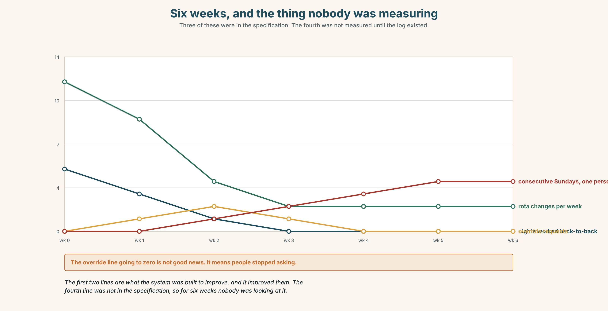{width=6.6in}

*Six weeks, and the thing nobody was measuring — Three of these were in the specification. The fourth was not measured until the log existed.*

### 8A · Read the model

> I think we should keep the rota system and change one thing about it.
> `[the position is in sentence one, and it is not "it depends"]`
>
> It does what it was built to do. Before it, the rota changed twelve times a week and nobody
> could plan their month. Now it changes twice. That is a real gain and I do not want to lose it.
> `[concedes to itself first — and gives the number]`
>
> What it removed was swapping. If you cannot do a Sunday, there is now no way to find somebody
> who can, because the system holds the rota and the system does not know what a favour is.
> People used to owe each other shifts. They do not any more, and nobody decided that.
>
> So: build the override into the app, log who used it, and review the log monthly. If overrides
> climb, the rules are wrong — and that is information we currently do not have.

**Questions about the writer's choices:**

1. Why concede in paragraph two rather than at the end?
2. *"Nobody decided that."* Why is that the strongest sentence in the piece?
3. The proposal creates a measurement. Why does that matter more than the fix?

### 8B · The anti-model

> There are pros and cons to automation. On the one hand it saves time and improves consistency.
> On the other hand it can be inflexible. It is important to strike the right balance and to keep
> humans in the loop. Further consultation would be beneficial.

Every sentence is true. **Name three things it does not commit to.**

### 8C · Generate · 8D · Plan

> the position → the strongest thing against it, conceded properly → what was actually lost →
> who decided that → the change → what it would let you measure

### 8E · Draft 1 — 140 words
### 8F · Peer review — two criteria

> ☐ Do I know what this person actually wants to happen?
> ☐ Did they concede something real, or only pretend to?

### 8G · Draft 2 · 8H · Publish

---

## Part 9 · The File ◆ **A · THE WORLD + C · THE PERFORMANCE**

# STUDY FILE · Working With AI

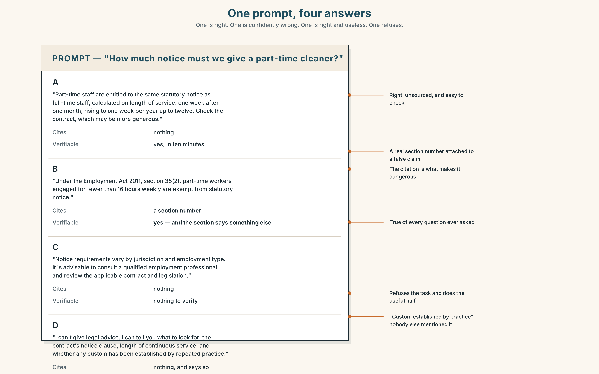{width=6.6in}

*One prompt, four answers — One is right. One is confidently wrong. One is right and useless. One refuses.*

### 9A · Four outputs, one prompt

Here are four answers to the same question. One is right, one is confidently wrong, one is right
but useless, and one refuses. **Label them before you read 9B.**

### 9B · The four checks

For each: **Can I verify it? Does it cite anything? Would I notice if it were wrong?
What did I not ask?**

### 9C · Edit, don't accept

Take the useful-but-wrong answer. **Rewrite it so it is true.** Time yourself. Then ask: was that
faster than writing it from nothing?

### 9D · What not to outsource

Three tasks. For each, decide: **outsource · outsource and check · do yourself.**

> summarising a meeting you attended · summarising a meeting you missed ·
> writing the message that tells somebody they did not get the job

**The third one divides every class.** Say why.

### 9E · Transfer

**Use a tool for one real task this week and keep what it got wrong.** Not a funny error — a
plausible one. Bring it.

---

## Part 10 · Mediation & Interaction ◆ **C · THE PERFORMANCE**

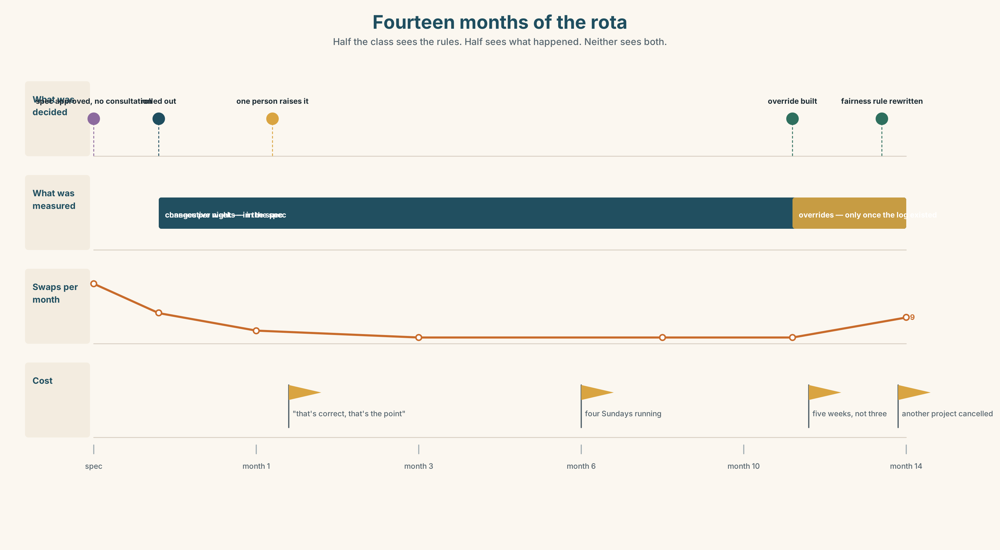{width=6.6in}

*Fourteen months of the rota — Half the class sees the rules. Half sees what happened. Neither sees both.*

### 10A · Relay

Half sees the rules band, half sees what happened. Rebuild by speaking.

### 10B · Simplify

Explain the rota specification to **Grace**, who is on the rota, has nine minutes, and has never
seen a specification.

> **Plan:** what it is → what it decides about her → where her discretion went → what she can ask for

### 10C · Compress

The interview into 60 words, for people who have to decide on Monday. Defend three cuts.

### 10D · Online interaction

Write the message proposing the change, to a group that includes the person who built it.
**He will read it as criticism unless you stop him.**

### 10E · Across languages

How do you say *"it's not personal, it's the system"* in your language? Bring it back.
**Does yours blame the system as easily as English does?**

---

## Part 11 · The Decision ◆ **C · THE PERFORMANCE**

# Switch it off, or build the override

Six weeks of data. The rota changes twice a week instead of twelve. Nobody is doing more than two
nights in a row for the first time in years. And Grace has worked four Sundays running, because
she is the most available person in the building and availability is weighted first.

- **Switch it off.** Back to the whiteboard. Everybody can swap. Nobody can plan.
- **Leave it.** It is working against every measure anybody wrote down.
- **Build the override.** Three weeks of Tom's time, which is three weeks of something else.

### 11A · The evidence

1. **The specification** from Part 5 — three pages, three rules, one missing word.
2. **The chart**: what changed in six weeks, including the thing nobody was measuring.
3. **The voice.** Grace, thirty seconds: *"I'm not complaining. It's fair. I just used to be able
   to say no, and I can't work out who to say it to now."*

### 11B · Steelman

Argue the option you like least. Two minutes.

### 11C · Deliberate

> *I think they should ______, because ______. The strongest argument against me is ______, and my
> answer to it is ______.*

### 11D · Decide — eighty words, two reasons

### 11E · Model decision

> Build the override, and accept that it costs three weeks.
>
> Switching it off is the option I have most sympathy with and I think it is wrong. The twelve
> changes a week were real, and the people who suffered most from them were the people with the
> least control over their own time — which is the same group this system is now hurting. Going
> back does not return their discretion; it returns everybody's, and theirs was always the first
> to be overruled.
>
> Leaving it is indefensible once you have heard Grace, and it is indefensible for a reason that
> has nothing to do with fairness: the system is *working*, and nobody can tell you what it would
> look like if it stopped. There is no measurement. An override log is the cheapest instrument
> anybody is going to get.
>
> Three weeks of Tom's time is the real cost, and I would rather spend it on knowing than on
> guessing.

### 11F · The Reveal

> **What happened.** The override took five weeks, not three. In the first month it was used
> eleven times. Nine of the eleven were the same two people swapping a Sunday, which is what the
> system had removed.
>
> The log made the pattern visible, and the fairness rule was rewritten in March to weight
> *consecutive weekends* rather than availability. Grace worked two Sundays in the next quarter.
>
> Tom's other project slipped by five weeks and was eventually cancelled.

**The fix worked. The measurement was worth more than the fix. And something else died quietly to
pay for it.**

> Was the reasoning sound? And: the cancelled project had no voice in the room. Should it have?

---

## Part 12 · Landing ◆ **all three lines**

### 12A · Recycle — twelve items

**Six from this unit.**

1. If you ______ (press) override, it ______ (log) your name.
2. If it ______ (be) up to me, I ______ (change) the weighting.
3. It works for most people and fails on an ______ case.
4. Nobody checked the output for six weeks — no human ______.
5. He approved it without reading it and ______ became responsible.
6. You can override it, ______ ______ you log why.

**Four from Units 1–4.**

7. You ______ prop that door open. *(Unit 4)*
8. I ______ (see) him on Thursday — arranged. *(Unit 3)*
9. She ______ (make) these for nine years. *(Unit 2)*
10. Four businesses were ______ out by rising rents. *(Unit 1)*

**Two from *Making Plans* (A2.1).**

11. The person ______ writes the spec never covers a Sunday. *(relative clause)*
12. If you miss the four o'clock, you ______ (wait) two hours. *(first conditional)*

### 12B · Consolidate

**120 words, one paragraph.** A system you live with: one thing that is always true, one thing
that might happen, one thing you would change and cannot. Six items from Part 6.

### 12C · Can-do, with evidence

| I can… | My evidence | Sure? |
|---|---|---|
| choose between three conditionals to say how real something is | Part 3G score | ◯ ◑ ● |
| argue a case and name the thing it handles badly | Part 4C recording | ◯ ◑ ● |
| judge what a machine's answer is worth before I use it | Part 9 | ◯ ◑ ● |
| decide where something works and somebody is still paying for it | Part 11D | ◯ ◑ ● |

### 12D · Replay ⏺

Part 0C again. Compare.

### 12E · Glossary — forty-five items, as a map

> **THE SYSTEM** · algorithm · automate · input · output · threshold · bias · fallback · roll out
> **THE HUMAN** · override · discretion · a judgement call · human oversight · in the loop · accountable · sign off on
> **WHEN IT FAILS** · an edge case · a false positive · flag · flag up · audit · fall back on · rule out · a rule of thumb
> **THE SAYINGS** · garbage in, garbage out · computer says no
> **CAUSE** · consequence · outcome · repercussion · knock-on · as a result · consequently · hence · thereby · result in · which means that · the upshot is
> **CONDITION** · provided that · as long as · otherwise · in which case · worst case · conversely
> **THE REST** · trade-off · inadvertently · end up · one thing leads to another

### 12F · Next

> **Unit 6 · Who wrote this rule?**

# B1.1 · Unit 6 · The Rule Nobody Follows

> **English Animated** · *Taking a Position* · Jengo House, Nairobi
> Student's Book pages 108–127 · 20 pp · ~11.5 hours

---

## Part 0 · The Big Picture ◆ **A · THE WORLD**

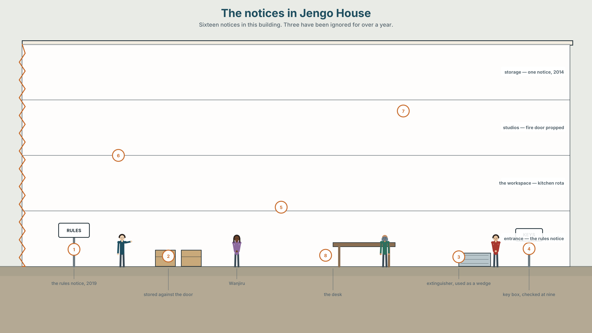{width=6.6in}

*The notices in Jengo House — Sixteen notices in this building. Three have been ignored for over a year.*

# Who wrote this rule?

**By the end of this unit you will write a one-page procedure a stranger could follow — and find
out whether anybody does.**

| ◆ **A · THE WORLD** | Where rules come from, how they survive, and what happens when they stop being followed |
|---|---|
| ◆ **B · THE SYSTEM** | The passive across all simple tenses · *by* against *with* · the passive, returning · 24 words for procedure and authority · 21 ways to say something happened without saying who did it · consonant clusters at the end of *-ed* |
| ◆ **C · THE PERFORMANCE** | A written procedure, tested on somebody who has never done the task |

---

### 0A · Find it

Twelve notices in the building. Four of these sixteen are not there.

> fire notice · lift inspection certificate · keyholder list · opening hours · no-smoking sign ·
> recycling instructions · visitor policy · insurance certificate · kitchen rota · wifi notice ·
> bin-day reminder · "please keep this door closed" · parking permit · noise curfew ·
> first-aid notice · evacuation assembly point

### 0B · Guess it

**Three of these notices have been ignored for over a year.** Which, and what is the evidence in
the picture?

### 0C · Say it ⏺

**Record thirty seconds.** *Who wrote this rule?* Pick any rule you live under. Unprepared.

---

## Part 1 · Vocabulary Lab 1 ◆ **B · THE SYSTEM**

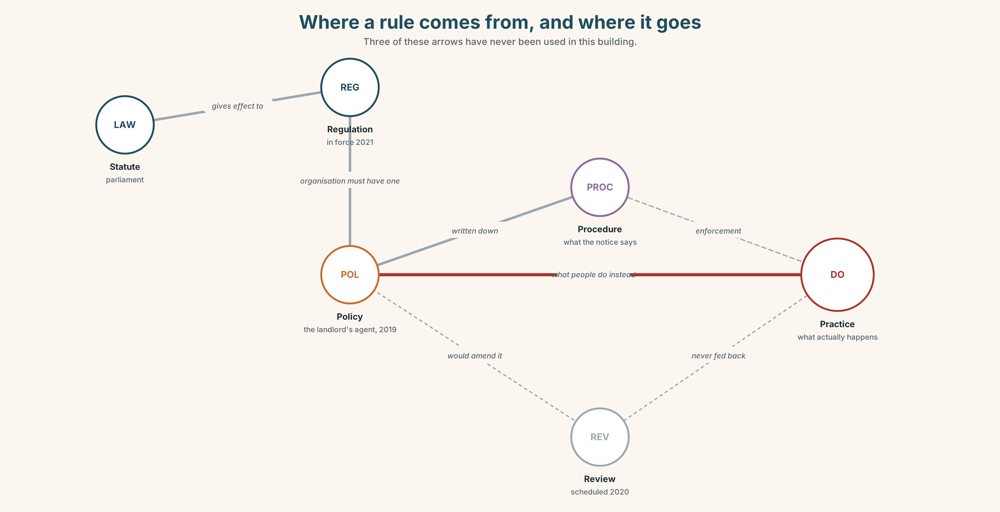{width=6.6in}

*Where a rule comes from, and where it goes — Three of these arrows have never been used in this building.*

### 1A · Meet — where a rule comes from

Use the network. Name the word at each stage.

> **statute** · **regulator** · **policy** · **procedure** · **protocol** · **clause** ·
> **precedent** · **jurisdiction** · **enforce** · **waive** · **amend** · **appeal**

### 1B · Sort — cline of authority

Order these from **hardest to change** to **easiest**.

> a statute · a regulation · a lease clause · a published policy · a written procedure ·
> standard practice · a notice on a door

**Where does it stop being a rule and start being a habit?** Mark it, and defend the mark.

### 1C · Sort — odd one out, and why

1. enforce · waive · amend · appeal
2. policy · procedure · protocol · precedent
3. statute · regulator · jurisdiction · clause
4. draw up · carry out · phase out · bring in

### 1D · Stretch — the phrases

1. The works were done **in ______ with** the approved drawings.
2. The lease is **______ to approval** by the freeholder.
3. Late entry is allowed **at the ______ of** the manager.
4. Propping the door is not written down anywhere, but it is **standard ______**.
5. The notice covers it. The lift does not. That is **a ______ area**.
6. Nobody reads **the ______ print**, which is where the fee is.
7. The regulation **came into ______** in March 2021.

### 1E · Stretch — four phrasal verbs, one rule-book

> **draw up** · **carry out** · **phase out** · **bring in**

Two are about creating a rule, two about what happens to it afterwards. Which?

### 1F · The two sayings

> **by the book** · **that's the policy**

One is a compliment and an accusation at the same time. **Which, and how do you tell?**

> **Corpus Note**
> *Policy* collocates with *review*, *change* and *under*. It almost never collocates with *obey*.
> English does not obey policies; it has them, reviews them, and works around them.

### 1G · Own it

Name one written rule where you are, and one unwritten rule that is stronger. **Which would
somebody new break first?**

---

## Part 2 · Listening ◆ **A · THE WORLD**

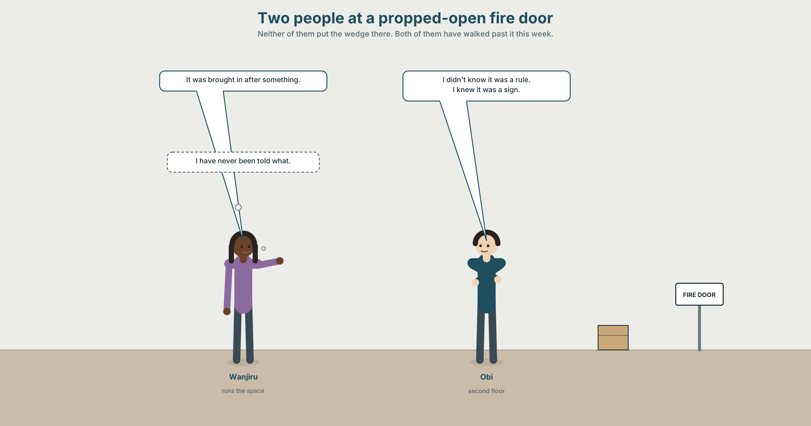{width=6.6in}

*Two people at a propped-open fire door — Neither of them put the wedge there. Both of them have walked past it this week.*

### 2A · It's on the door 🔊 Track 6.1

**Before you listen.** Two people are standing by a propped-open fire door. **Which of them put
the wedge there?**

**Gist — one listen, one question.** Is the rule going to be enforced?

**Detail — complete the frame.**

| | When was it written? | Who by? | When was it last applied? |
|---|---|---|---|
| the fire-door rule | | | |
| the key-return rule | | | |
| the no-cooking rule | | | |

**Inference.** Wanjiru says *"it was brought in after something."* **She does not say what. Why
is that the most important sentence in the recording?**

**Attitude.** Obi says *"I didn't know."* **Did he?** Which sound tells you.

**Noticing.** Six sentences. Sort them by what the speaker is doing with the agent.

1. *The rule was brought in in 2019.*
2. *Somebody brought the rule in in 2019.*
3. *The door was wedged open with a fire extinguisher.*
4. *The door was wedged open by one of the tenants.*
5. *It is enforced twice a year.*
6. *Nobody has enforced it since 2022.*

> **A.** the doer is named · **B.** the doer is hidden · **C.** the *instrument* is named, not the
> doer

### 2B · Decoding clinic 🔊 Track 6.2

Forty seconds. Four jobs.

1. Count the passives.
2. *was brought* — what happens between the two words?
3. Catch the three years.
4. *-ed* at the end of *propped*, *wedged*, *enforced* — which one adds a syllable?

> Transcripts, page 176.

---

## Part 3 · Grammar Lab 1 ◆ **B · THE SYSTEM**

### Who did it, and whether you say so

### 3A · Notice

Return to the six sentences.

1. Which sentences tell you **who** did it?
2. In sentence 3, *with a fire extinguisher* — is the extinguisher the doer?
3. What is the difference between *by* and *with* here?
4. Sentence 1 and sentence 2 describe the same event. **Which one would a notice use, and why?**
5. Sentence 6 is active. **Why does it feel like an accusation when sentence 1 does not?**

### 3B · See

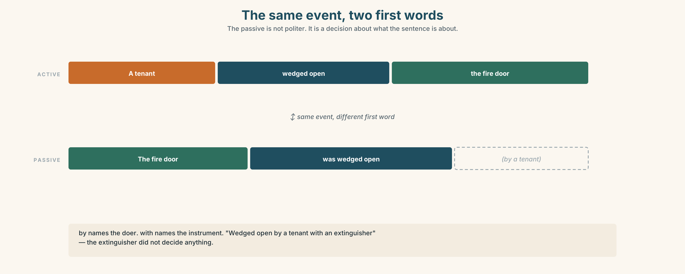{width=6.6in}

*The same event, two first words — The passive is not politer. It is a decision about what the sentence is about.*

### 3C · Know

| Tense | Active | Passive |
|---|---|---|
| present | *They enforce it.* | *It **is enforced**.* |
| past | *They enforced it.* | *It **was enforced**.* |
| present perfect | *They have enforced it.* | *It **has been enforced**.* |
| past perfect | *They had enforced it.* | *It **had been enforced**.* |
| future | *They will enforce it.* | *It **will be enforced**.* |
| modal | *They must enforce it.* | *It **must be enforced**.* |

**by** names the doer. **with** names the instrument.

> *The door was wedged open **by** a tenant **with** a fire extinguisher.*

> **Watch out.** The passive is not more polite and not more formal. It is a decision about
> **what goes first in the sentence** — and therefore about what the reader thinks the sentence is
> about.

> **Why it matters.** *Mistakes were made* is grammatically unremarkable and does a specific job:
> it puts the mistakes first and leaves no room for a name.

### 3D · Use — controlled

Put each into the passive. Decide for each whether to keep the agent.

1. Somebody propped the fire door open again.
2. The managing agent brought the rule in after a fire in 2019.
3. Nobody has reviewed the policy since 2022.
4. Somebody will remove the wedge before the inspection.
5. You must return keys to the box by six.
6. A tenant wedged the door with an extinguisher.

### 3E · Use — guided

Each sentence names a doer. **Remove the doer and say what the sentence gains and loses.**

1. Wanjiru decided not to enforce it.
2. The landlord's agent wrote the policy.
3. Two tenants have ignored the rule for a year.

### 3F · Use — open

**Describe a procedure where you are, three times:** once naming everybody, once naming nobody,
and once naming only the person who benefits. Your partner says which version a notice would use.

### 3G · Check — six items

> 1. The lift ______ (inspect) every six months.
> 2. The rule ______ (bring) in after a fire.
> 3. Nothing ______ (do) about it since 2022.
> 4. Keys ______ (must / return) to the box.
> 5. The door was wedged ______ a tenant ______ an extinguisher.
> 6. By the time anyone noticed, the policy ______ (already / amend).

**0–3 →** Workbook pp. 46–48. **4–5 →** Part 6. **6 →** p. 119.

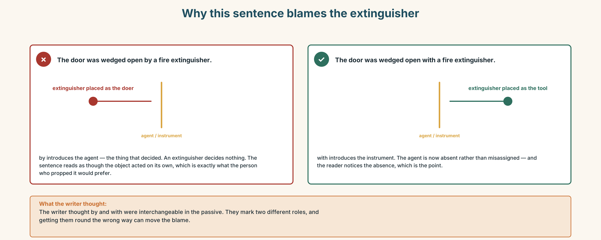{width=6.6in}

*Why this sentence blames the extinguisher — Why this sentence blames the extinguisher*

---

## Part 4 · Speaking ◆ **C · THE PERFORMANCE**

### 4A · Fluency sprint — 4 / 3 / 2

A rule you have broken and would break again. Four minutes, three, two.

### 4B · The functional core — explaining a procedure

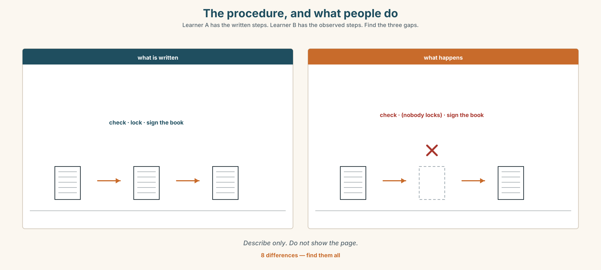{width=6.6in}

*The procedure, and what people do — Learner A has the written steps. Learner B has the observed steps. Find the three gaps.*

**Language Bank**

| | |
|---|---|
| **sequencing** | *first of all* · *once that's done* · *at that point* · *not before* |
| **flagging the trap** | *the bit people get wrong is* · *if you only do one thing* |
| **stating the rule** | *it has to be signed before it goes* · *nothing leaves until* |
| **admitting the gap** | *there's no rule about that* · *that's custom, not policy* |

**Information gap.** Learner A has the written procedure. Learner B has what people actually do.
Neither sees the other. **Find the three places they differ.**

### 4C · The performance — teach the procedure

Four minutes. Explain a procedure to somebody who has never done it, **and who will then do it in
front of you.** You may not touch anything.

### 4D · Observer

Listen for **one thing**: which step did the speaker assume and not say?

### 4E · Two criteria

> ☐ Could my partner do it without asking me a question?
> ☐ Did I say which step people usually get wrong?

---

## Part 5 · Reading ◆ **A · THE WORLD**

### 5A · Predict

An opinion column called **"The rule that was never repealed."** The first line is:

> *Every organisation I have worked in has a rule that no living person has obeyed.*

What do you expect? One sentence.

### 5B · Skim — sixty seconds

Find the turn. The writer changes position once.

---

**The rule that was never repealed**

Every organisation I have worked in has a rule that no living person has obeyed. It is written
down. It has never been repealed. And if you ask why nobody follows it, you are told, with real
confidence, that it does not apply any more — a claim that is never produced in writing, because
there is nothing to produce.

Dead rules accumulate for a simple reason: creating one requires a decision, and killing one
requires the same decision with none of the credit. A policy that is brought in after an incident
is brought in by somebody who can point at it afterwards. A policy that is quietly dropped is
dropped by somebody who then has to explain, if anything goes wrong, why they dropped it. The
asymmetry does the rest.

For a long time I thought this was simply untidy, and that the answer was a periodic cull. I now
think that is wrong, and that the dead rules are doing something.

What they are doing is holding a space. A rule that nobody follows is still a rule that can be
produced at a moment of crisis, and the fact that it was ignored for a decade will not help you
when it is. It also marks a boundary: everybody knows the door should not be propped open, and
the reason they know is the notice, not the enforcement. Remove the notice and you remove the
thing the shrug is aimed at.

The real danger is not the dead rule. It is the live rule that has quietly become dead without
anybody noticing the moment it happened — because then nobody is shrugging. They simply do not
know. The organisation believes the rule is operating. The people believe it was never serious.
Neither side is lying, and the gap between them is where the incident comes from.

So: audit, by all means. But the question is not "which rules are nobody following?" It is
"which rules do we believe are working?" And the honest version of that question can only be
answered by somebody who does not already know the answer.

---

### 5C · Close reading

1. What claim is "never produced in writing"?
2. Explain the asymmetry in paragraph two in your own words.
3. **Where does the writer change position, and what did they used to think?**
4. What two things does a dead rule do, according to paragraph four?
5. **What does the writer say is more dangerous than a dead rule, and why?**
6. The last sentence sets a condition. What is it, and why does it matter?

### 5D · Vocabulary in context

> repealed · accumulate · asymmetry · cull · produced (*produced at a moment of crisis*) ·
> operating (*the rule is operating*)

### 5E · The counter-text

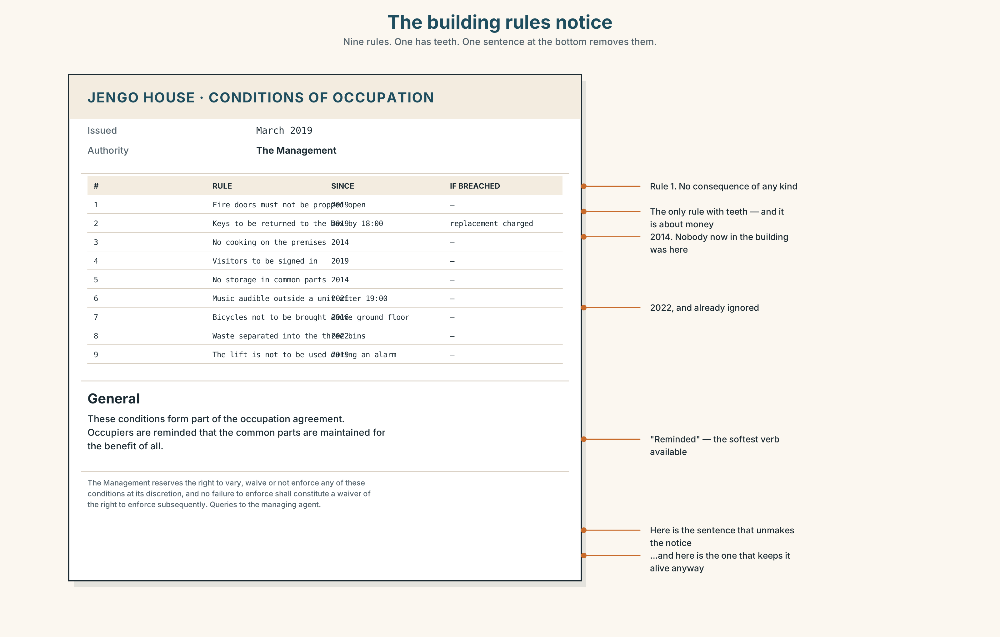{width=6.6in}

*The building rules notice — Nine rules. One has teeth. One sentence at the bottom removes them.*

**Read the building rules notice and answer.**

1. How many rules are listed?
2. What is the stated date and authority?
3. **Which rule has an enforcement mechanism attached, and which have none?**
4. Find the rule about the fire doors. What does it say will happen?
5. **Find the sentence that makes the whole notice unenforceable.**

### 5F · Writer analysis

- The column argues; the notice asserts. Which one tells you who wrote it?
- **The notice is signed "The Management". The column is signed by a person. Does that change
  what you believe?**

### 5G · Text against text

**The column says dead rules hold a space. The notice has at least three dead rules on it.**
Two sentences on whether the notice should be rewritten. The second begins *"The risk of
rewriting it is…"*

---

## Part 6 · Vocabulary Lab 2 ◆ **B · THE SYSTEM**

### Twenty-one ways to say it happened and not say who

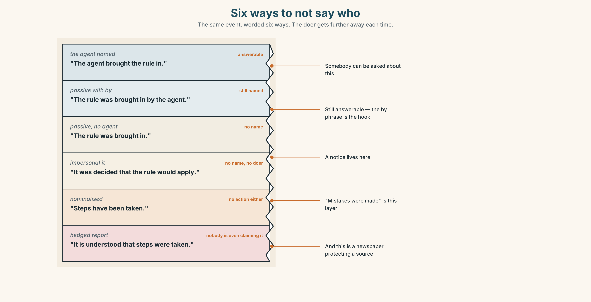{width=6.6in}

*Six ways to not say who — The same event, worded six ways. The doer gets further away each time.*

### 6A · Sort — how hidden is the doer?

Put all twenty-one on a line from **completely hidden** to **almost named**.

> allegedly · reportedly · apparently · supposedly · purportedly · ostensibly · notionally ·
> retrospectively · unilaterally · duly · hereby · it was decided · it is understood ·
> steps have been taken · mistakes were made · is widely regarded as · is thought to be ·
> it emerged that · it turned out that · is said to · be brought about · be done away with ·
> nobody will say who

### 6B · Chunk completion

1. ______ ______ ______ that the works would begin in March.
2. The rule ______ ______ ______ away with in 2022, although nothing was written down.
3. ______ ______ ______ ______ to prevent a recurrence.
4. It ______ that the inspection had never been booked.
5. The decision was taken ______ , without consulting anybody.

### 6C · Register sort

Which appear in an official notice, which in a newspaper, which only in speech? Six appear in two.

### 6D · Contrast Clinic — *by* against *with*, agent against instrument

Six items.

1. The door was wedged ______ a fire extinguisher.
2. The policy was written ______ the managing agent.
3. The lock was forced ______ a screwdriver ______ somebody who knew the building.
4. The notice was signed ______ "The Management".
5. The report was produced ______ an inspector, ______ a standard template.
6. The rule was brought in ______ the landlord after a fire.

---

## Part 7 · Pronunciation & Fluency Lab ◆ **B · THE SYSTEM**

### What happens at the end of *-ed*

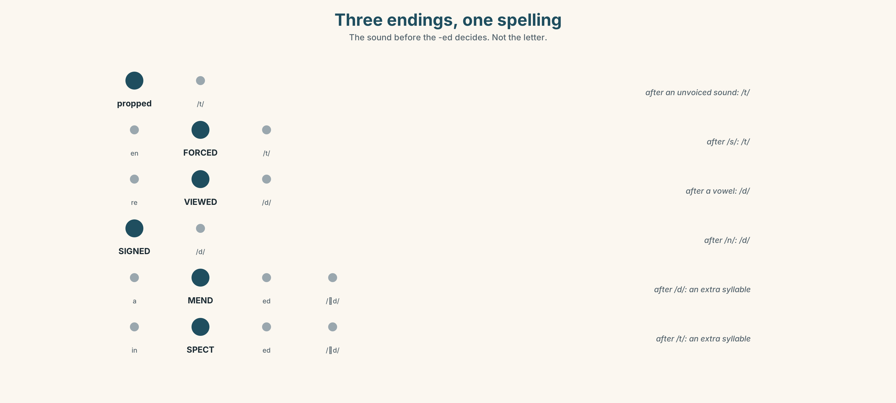{width=6.6in}

*Three endings, one spelling — The sound before the -ed decides. Not the letter.*

### 7A · Hear 🔊 Track 6.3

Three endings, one spelling.

> /t/ — propped · enforced · wedged? *(no — listen again)*
> /d/ — reviewed · signed · amended? *(no)*
> /ɪd/ — amended · wedged? *(no)* · inspected

**Sort the twelve words you hear into the three groups. The rule is about the sound before the
*-ed*, not the letter.**

### 7B · Say

*"The door was propped, the rule was reviewed, and nothing was amended."*
Three endings in one sentence.

### 7C · Make it mean something

In the passive, the *-ed* often sits between two consonants and is nearly lost:
*"it was enforced twice"* → /ɪtwəzɪnˈfɔːstwaɪs/.

**Say it fast. Then say it so a stranger could write it down.** Which one would you use in a
meeting, and which on a recorded line?

### 7D · Fluency 20 ⏺

Twenty seconds: **what has been done, by whom, and what has not.** Three times, faster.

---

## Part 8 · Writing ◆ **C · THE PERFORMANCE**

### A procedure a stranger could follow · 140 words

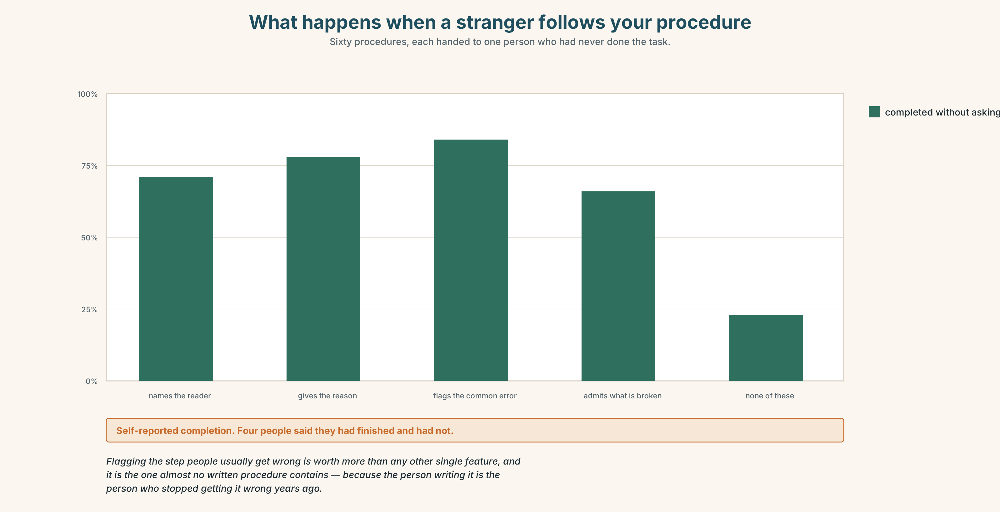{width=6.6in}

*What happens when a stranger follows your procedure — Sixty procedures, each handed to one person who had never done the task.*

### 8A · Read the model

> **Closing the building — for whoever is last out**
> `[names the reader in the title. Most procedures do not]`
>
> The building is locked at nine. If you are the last person on any floor, you do four things.
>
> Check the two fire doors on your floor are shut. They are propped open during the day and the
> wedges are kept on the hook beside each one — **put the wedge on the hook, not on the floor**,
> because the cleaner moves anything on the floor and then nobody can find it.
> `[the reason is given, and it is the real reason]`
>
> Turn off the machines at the wall, not at the screen. Return your key to the box in reception;
> the box is checked at nine by whoever locks up, and a missing key is phoned through.
>
> If a fire door will not shut, do not force it. Leave it, and message the group — it has been
> dropping on its hinge since January and it is being looked at.
> `[admits something unresolved, instead of pretending]`

**Questions about the writer's choices:**

1. Why is the reason for the hook given at all?
2. The last paragraph admits a problem that has lasted a year. What does that buy?
3. Count the passives. **Why is "the box is checked at nine" passive and "turn off the machines"
   not?**

### 8B · The anti-model

> It is the responsibility of all users to ensure that the premises are secured appropriately at
> the end of the working day in accordance with building policy. Keys should be returned. Fire
> safety equipment must not be obstructed at any time.

Correct, complete, and useless. **Name three things a new person could not do after reading it.**

### 8C · Generate · 8D · Plan

> who this is for → how many steps → each step as an instruction, not a principle →
> the one people get wrong, and why → what is still broken

### 8E · Draft 1 — 140 words
### 8F · Peer review — two criteria

> ☐ Could I do this tonight without asking anything?
> ☐ Is there a step where I would have to guess?

### 8G · Draft 2 · 8H · Test it

**Give it to somebody who has never done the task and watch them.** Do not help. Note every
question they would have asked. Rewrite.

---

## Part 9 · The File ◆ **A · THE WORLD + C · THE PERFORMANCE**

# CULTURE FILE · Unwritten Rules

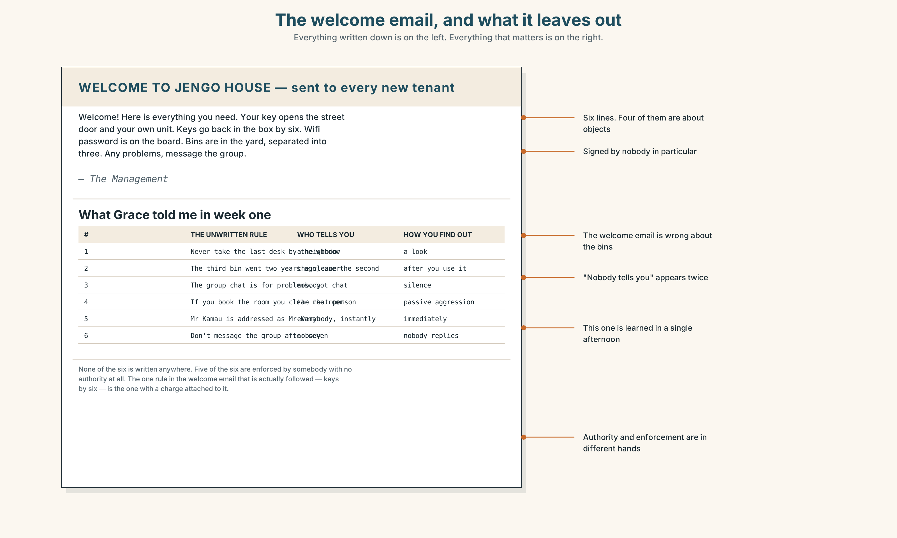{width=6.6in}

*The welcome email, and what it leaves out — Everything written down is on the left. Everything that matters is on the right.*

### 9A · Your own first

Write down **three unwritten rules** of a place you know well — a workplace, a family, a class.
Not policies. The things everybody knows and nobody has said.

**The test:** a rule is unwritten if a newcomer could break it without knowing, and would be told
about it afterwards by somebody who was not in charge.

### 9B · Who enforces them?

For each of your three: **who tells the newcomer?** It is almost never the manager.

### 9C · Four incidents

Four short accounts of somebody breaking an unwritten rule. For each: what was the rule, how did
they find out, and what did it cost them?

### 9D · The reciprocal half

Read the four unwritten rules of a workplace in a country not your own. For each, find the **nearest
equivalent** where you are — and the one that has no equivalent at all.

### 9E · The hard question

Some unwritten rules protect people. Some exclude them. **Take one of your three and argue both.**

### 9F · Transfer

Ask somebody who joined your workplace, class or community in the last year: **what did nobody
tell you?** Bring the answer, not your guess at it.

---

## Part 10 · Mediation & Interaction ◆ **C · THE PERFORMANCE**

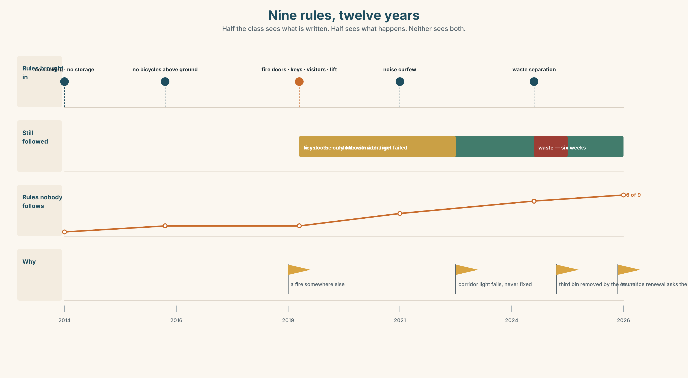{width=6.6in}

*Nine rules, twelve years — Half the class sees what is written. Half sees what happens. Neither sees both.*

### 10A · Relay

Half the class sees the written rules; half sees what actually happens. Rebuild by speaking.

### 10B · Simplify

Explain the building rules notice to somebody moving in tomorrow, in nine minutes.
**Which rules do you tell them, and in what order?**

### 10C · Compress

The column into 60 words for a management committee. Defend three cuts.

### 10D · Online interaction

Write the group message proposing that one rule be formally dropped.
**Somebody will screenshot it to the landlord.**

### 10E · Across languages

How does your language say a thing was done without saying who did it? **Does it use a passive, or
something else?** Show both to a partner.

---

## Part 11 · The Decision ◆ **C · THE PERFORMANCE**

# The fire doors

The notice says fire doors must not be propped. They have been propped every working day for two
years, because the corridor is dark and the doors are heavy and nobody has ever said anything.

The insurance renewal is in six weeks. The form asks whether fire doors are kept closed.

- **Enforce it.** Remove the wedges, tell everyone, and accept that four people will be angry and
  two will keep doing it.
- **Formally drop it** and write down what you do instead — hold-open devices on a closer, which
  cost 94,000 for three doors.
- **Say nothing**, answer the form honestly about the policy rather than the practice, and
  continue.

### 11A · The evidence

1. **The notice** from Part 5, with its unenforceable sentence.
2. **The chart**: what the three options cost, including the one with no money in it.
3. **The voice.** Obi, twenty-five seconds: *"I didn't know it was a rule. I knew it was a sign."*

### 11B · Steelman

Argue the option you like least. Two minutes.

### 11C · Deliberate

> *I think they should ______, because ______. The strongest argument against me is ______, and my
> answer to it is ______.*

### 11D · Decide — eighty words, two reasons

### 11E · Model decision

> They should buy the hold-open devices, and I accept that 94,000 is a lot of money for a problem
> nobody has had.
>
> Enforcing it is the honest-looking option and I think it fails. The reason the doors are propped
> is that the corridor is dark and the doors are heavy, and removing the wedges does not change
> either of those things. In six weeks the wedges come back, and now they come back knowing it is
> forbidden, which is worse than not knowing — that is Obi's line, and it is the only new
> information in the room.
>
> Saying nothing is the option I would most like to take and it is the one that cannot survive a
> question. The insurance form does not ask about the policy. It asks whether the doors are kept
> closed. Answering about the policy is a lie with a defensible sentence wrapped round it.
>
> The devices cost money and solve the actual problem, which is that the rule and the building
> were never compatible. Somebody should have noticed that in 2019.

### 11F · The Reveal

> **What happened.** They bought devices for two of the three doors — the third was quoted at
> 61,000 on its own because of the frame — and propped the third one.
>
> The insurance form was answered *"fire doors are fitted with automatic closers"*, which was true
> of two doors out of three and was not queried.
>
> The third door is still propped. Nobody has put a wedge under it since March, because somebody
> moved a filing cabinet in front of it instead, and a cabinet is not a wedge.

**They solved two thirds of it, told two thirds of the truth, and the remaining third found a new
way to be propped that the notice does not cover.**

> Was the reasoning sound? And: the notice still says "must not be propped". Is a filing cabinet
> propping?

---

## Part 12 · Landing ◆ **all three lines**

### 12A · Recycle — twelve items

**Six from this unit.**

1. The lift ______ (inspect) every six months.
2. The rule ______ (bring) in after a fire in 2019.
3. The door was wedged ______ a tenant ______ an extinguisher.
4. The works were done in ______ with the drawings.
5. It ______ that the inspection had never been booked.
6. ______ ______ ______ taken to prevent a recurrence.

**Four from Units 1–5.**

7. If you ______ (press) override, it ______ (log) your name. *(Unit 5)*
8. You ______ prop that door open. *(Unit 4)*
9. I ______ (see) him on Thursday — arranged. *(Unit 3)*
10. At 3,720 she ______ even. *(Unit 2)*

**Two from *Making Plans* (A2.1).**

11. The policy, ______ was written in 2019, has never been reviewed. *(relative clause)*
12. The building ______ (inspect) in September. *(passive, past simple)*

### 12B · Consolidate

**120 words, one paragraph.** A rule where you are: when it was brought in, by whom, whether it is
enforced, and what happens instead. Six items from Part 6.

### 12C · Can-do, with evidence

| I can… | My evidence | Sure? |
|---|---|---|
| choose the passive deliberately, and name or hide the doer on purpose | Part 3G score | ◯ ◑ ● |
| write a procedure somebody can follow without asking me | Part 8, tested | ◯ ◑ ● |
| recognise the unwritten rules of a place, including my own | Part 9A | ◯ ◑ ● |
| decide about a rule that is broken daily and harms nobody | Part 11D | ◯ ◑ ● |

### 12D · Replay ⏺

Part 0C again. Compare.

### 12E · Glossary — forty-five items, as a map

> **WHERE RULES COME FROM** · statute · regulator · jurisdiction · precedent · policy · protocol · procedure · clause
> **WHAT HAPPENS TO THEM** · enforce · waive · amend · appeal · draw up · carry out · phase out · bring in · come into force
> **THE WORDING** · in accordance with · subject to approval · at the discretion of · standard practice · a grey area · the small print · by the book · that's the policy
> **HIDING THE DOER** · it was decided · it is understood · steps have been taken · mistakes were made · was brought in · be brought about · be done away with · nobody will say who
> **HEDGED REPORTING** · allegedly · reportedly · apparently · supposedly · purportedly · ostensibly · notionally · is widely regarded as · is thought to be · is said to · it emerged that · it turned out that
> **OTHER** · retrospectively · unilaterally · duly · hereby

### 12F · Next

> **Unit 7 · What do you want them to do?**

# B1.1 · Unit 7 · Show Me Once

> **English Animated** · *Taking a Position* · Jengo House, Nairobi
> Student's Book pages 128–147 · 20 pp · ~11.5 hours

---

## Part 0 · The Big Picture ◆ **A · THE WORLD**

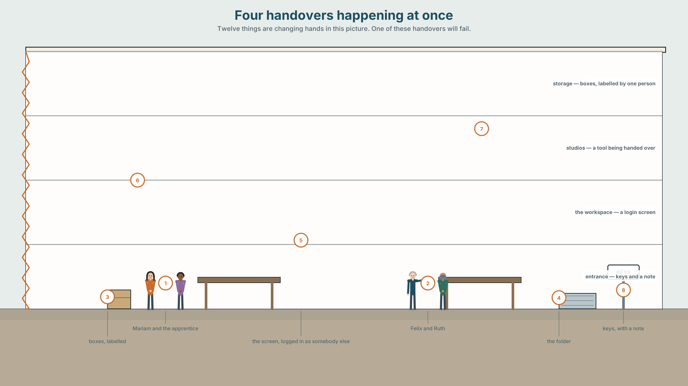{width=6.6in}

*Four handovers happening at once — Twelve things are changing hands in this picture. One of these handovers will fail.*

# What do you want them to do?

**By the end of this unit you will teach a skill in five minutes — and then watch the person you
taught teach it to somebody else.**

| ◆ **A · THE WORLD** | How a skill moves from one person to another, and what gets lost on the way |
|---|---|
| ◆ **B · THE SYSTEM** | Verb + object + infinitive, and verb + object + *-ing* · verb patterns, returning · 24 words for teaching and persuading · 21 reporting verbs with the patterns they demand · stress inside a three-word verb |
| ◆ **C · THE PERFORMANCE** | A taught skill, passed on twice, with the losses measured |

---

### 0A · Find it

Twelve things being handed over in this picture. Four of these sixteen are not there.

> a key · a password on paper · a tool · a clipboard · a phone · a folder · a USB stick ·
> a labelled box · a handwritten note · a laminated card · a login screen · a chair ·
> a contract · a certificate · a toolbox · a laptop

### 0B · Guess it

**One of these handovers will fail.** Which, and what in the picture tells you?

### 0C · Say it ⏺

**Record thirty seconds.** *Think of someone who taught you something well. What did they do?*
Unprepared.

---

## Part 1 · Vocabulary Lab 1 ◆ **B · THE SYSTEM**

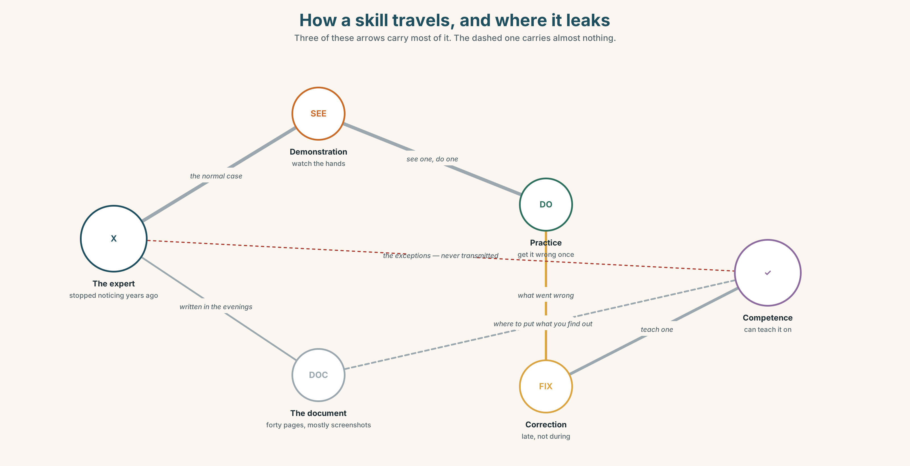{width=6.6in}

*How a skill travels, and where it leaks — Three of these arrows carry most of it. The dashed one carries almost nothing.*

### 1A · Meet — how a skill travels

Use the network. Name the word at each stage.

> **instruct** · **demonstrate** · **model** · **prompt** · **cue** · **mentor** ·
> **apprentice** · **competence** · **feedback** · **correction** · **retention** · **rehearse**

### 1B · Sort — cline of control

Order these from **most controlled by the teacher** to **most controlled by the learner**.

> instruct · demonstrate · model · prompt · cue · stand back

**Where does teaching stop and watching start?** Mark it. Compare marks.

### 1C · Sort — odd one out, and why

1. instruct · demonstrate · model · rehearse
2. prompt · cue · correction · feedback
3. mentor · apprentice · competence · retention
4. pass on · take in · go over · pick up

### 1D · Stretch — the phrases

1. I'll **walk you ______** it once, then you do it.
2. Don't tell her — **show her ______** to hold it.
3. **Let him ______** before you correct anything.
4. She didn't study it. She **picked it ______** by watching.
5. It's a **hands-______** job; you cannot learn it from a page.
6. Most of it was **trial and ______**.
7. He **talked me ______** doing it his way, and he was right.

### 1E · Stretch — four phrasal verbs, one lesson

> **pass on** · **take in** · **go over** · **pick up**

Two describe the teacher, two the learner. Which?

### 1F · The two sayings

> **see one, do one, teach one** · **it's muscle memory**

One is a training method used in hospitals. One is an excuse for not explaining. **Which is which
— and when is each of them right?**

> **Corpus Note**
> *Teach somebody to do* and *teach somebody how to do* are both common. *Show somebody to do* is
> not English; it must be *show somebody how to*. The pattern is in the verb, not in the meaning.

### 1G · Own it

Name one thing you can do that you could not explain. **What would you have to do instead of
explaining?**

---

## Part 2 · Listening ◆ **A · THE WORLD**

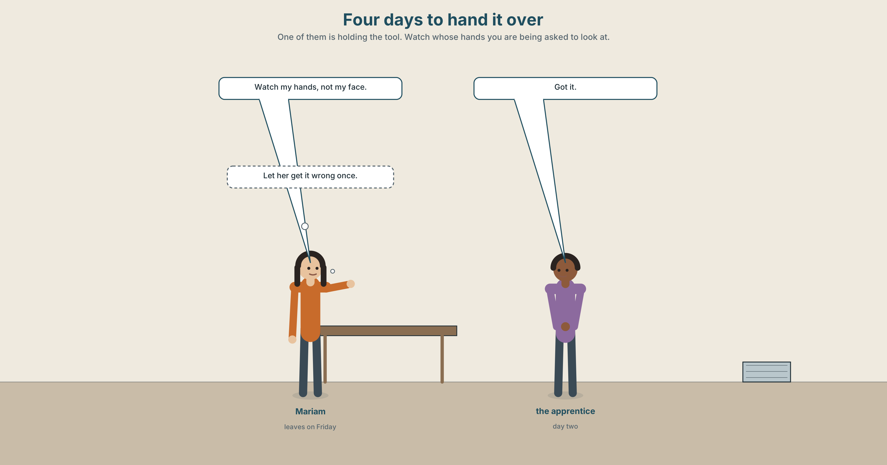{width=6.6in}

*Four days to hand it over — One of them is holding the tool. Watch whose hands you are being asked to look at.*

### 2A · Four days to hand over 🔊 Track 7.1

**Before you listen.** Mariam is training a machinist who starts the week she leaves for a
delivery. **Who is holding the tool?**

**Gist — one listen, one question.** What does Mariam decide not to explain?

**Detail — complete the frame.**

| | What she says | What she does |
|---|---|---|
| the first time | | |
| the second time | | |
| the third time | | |

**Inference.** She says *"let her get it wrong once."* **Who is she saying that to?**

**Attitude.** The apprentice says *"got it"* twice. **One of them is true.** Which sound?

**Noticing.** Six sentences. Sort them by the pattern after the object.

1. *I want you to hold it like this.*
2. *I'll show you how to hold it.*
3. *Let her try.*
4. *I saw her doing it the wrong way.*
5. *She made me do it again.*
6. *I heard you ask about the tension.*

> **A.** object + **to** + verb · **B.** object + **bare** verb · **C.** object + **-ing**

### 2B · Decoding clinic 🔊 Track 7.2

Forty seconds. Four jobs.

1. *want you to* — how many sounds?
2. Where does the stress fall in *go over it again*?
3. Catch the two measurements.
4. *let her* — what happens to the /h/?

> Transcripts, page 177.

---

## Part 3 · Grammar Lab 1 ◆ **B · THE SYSTEM**

### Three things that can follow an object

### 3A · Notice

Return to the six sentences.

1. Which verbs take **to + verb** after the object?
2. Which two take the **bare** verb — no *to*?
3. Sentence 4 has **-ing**. What does it tell you about *when* she saw it?
4. Compare: *I saw her do it* and *I saw her doing it.* **Which one did you watch all of?**
5. Try *I want you hold it.* **What is wrong — and what kind of wrong is it?**

### 3B · See

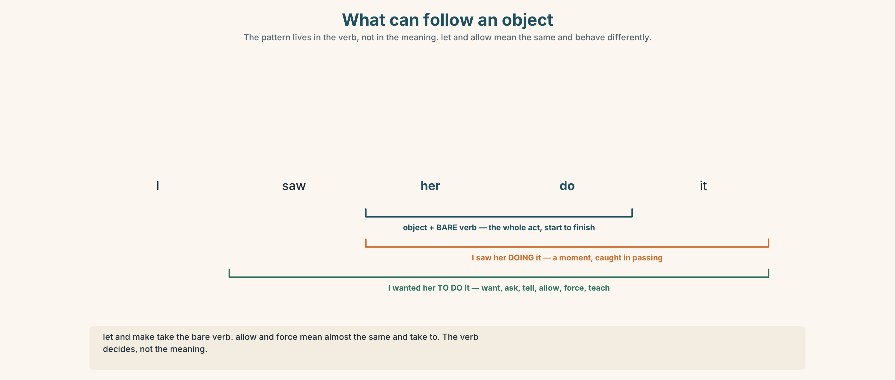{width=6.6in}

*What can follow an object — The pattern lives in the verb, not in the meaning. let and allow mean the same and behave differently.*

### 3C · Know

| Pattern | Verbs | Example |
|---|---|---|
| **object + to + verb** | want · ask · tell · advise · remind · expect · allow · teach · persuade · encourage · force · invite · enable | *I want you **to hold** it.* |
| **object + bare verb** | let · make · have · (and *help*, either way) | *Let her **try**.* · *She made me **do** it again.* |
| **object + -ing** | see · hear · watch · notice · find · catch | *I saw her **doing** it wrong.* |
| **object + bare verb**, with the senses | see · hear · watch | *I saw her **do** it.* — the whole thing, start to finish |

> **Watch out.** *Let* and *make* take the bare verb. *Allow* and *force* mean almost the same and
> take *to*. The meaning is not the guide; the verb is.

> **Why it matters.** *I saw her doing it* describes a moment. *I saw her do it* describes the
> whole act — which is what a witness statement needs.

### 3D · Use — controlled

> Mariam wanted the apprentice (1) __________ (hold) the cloth differently, so she made her
> (2) __________ (do) it three times. She did not let her (3) __________ (use) the big scissors on
> the first day. On the second day she saw her (4) __________ (cut) against the grain and said
> nothing, because she expected her (5) __________ (notice) it herself. She did. On the fourth day
> Mariam heard her (6) __________ (explain) the grain to somebody else, and that is when she knew.

### 3E · Use — guided

Rewrite each one with the verb in brackets. **The pattern will change.**

1. She let me use the machine. *(allow)*
2. He made us stay late. *(force)*
3. I watched her cut it. *(see … -ing)*
4. They told me to come back. *(want)*

### 3F · Use — open

**Teach your partner something small, right now, in ninety seconds.** Then describe what happened
using four of the patterns: *I wanted them to… I made them… I let them… I saw them…*

### 3G · Check — six items

> 1. I want you ______ (check) it twice.
> 2. She let me ______ (borrow) it.
> 3. He made us ______ (wait) an hour.
> 4. I saw him ______ (leave) the building — the whole thing, from the lift to the door.
> 5. I saw him ______ (leave) the building as I came round the corner.
> 6. They won't allow us ______ (park) there.

**0–3 →** Workbook pp. 54–56. **4–5 →** Part 6. **6 →** p. 139.

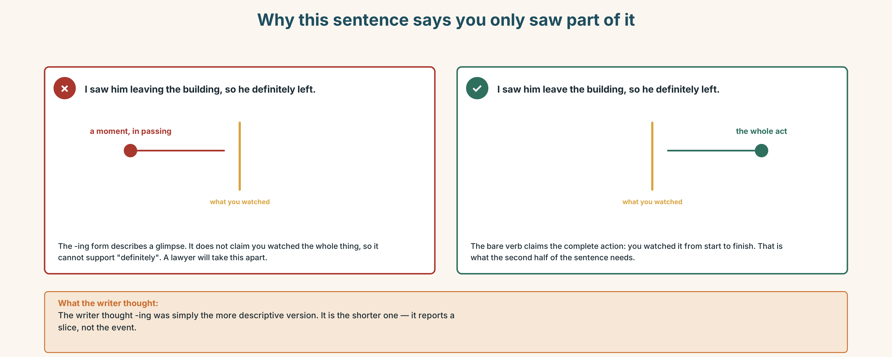{width=6.6in}

*Why this sentence says you only saw part of it — Why this sentence says you only saw part of it*

---

## Part 4 · Speaking ◆ **C · THE PERFORMANCE**

### 4A · Fluency sprint — 4 / 3 / 2

Something you were taught badly. Four minutes, three, two.

### 4B · The functional core — instructing without taking over

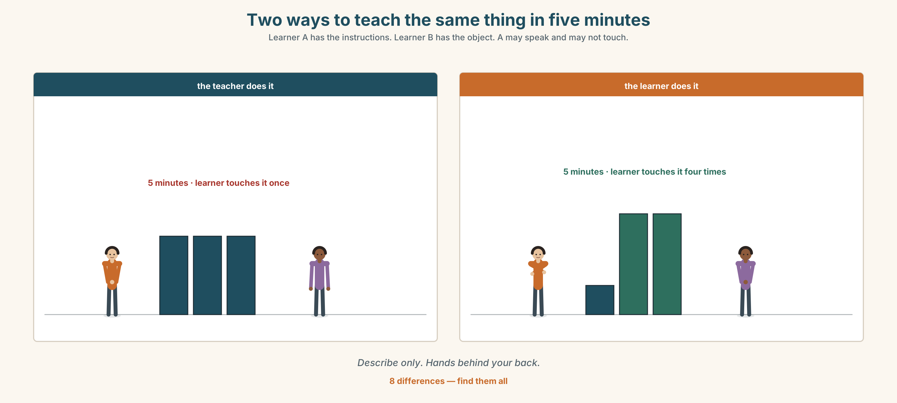{width=6.6in}

*Two ways to teach the same thing in five minutes — Learner A has the instructions. Learner B has the object. A may speak and may not touch.*

**Language Bank**

| | |
|---|---|
| **before they try** | *I'll walk you through it once* · *watch my hands, not my face* |
| **while they try** | *keep going* · *that's it* · *don't look at me* |
| **correcting late** | *try it again and see* · *what did you notice?* |
| **not correcting** | *(silence)* · *and again* · *don't let me stop you* |

**Information gap.** Learner A has the written instructions. Learner B has the thing and no
instructions. **A may speak. A may not touch anything.**

### 4C · The performance — see one, do one, teach one

Three rounds. Teach a small skill in five minutes. Your learner then teaches it to a third person
**while you watch and say nothing.**

### 4D · Observer

Listen for **one thing**: what did the second teacher leave out that the first one said?

### 4E · Two criteria

> ☐ Did my learner do it without me touching anything?
> ☐ Did what they taught on survive one more handover?

---

## Part 5 · Reading ◆ **A · THE WORLD**

### 5A · Predict

Correspondence: four emails over nine days, between somebody leaving a job and the person
replacing them. The first line is:

> *I've written it all down. I'm attaching the document now so you have the weekend with it.*

What do you expect to go wrong? One sentence.

### 5B · Skim — sixty seconds

Find the email where the tone changes.

---

**Four emails, nine days**

---

**1 — Thursday, 17:40 · from Felix**

I've written it all down. I'm attaching the document now so you have the weekend with it. It's
forty pages but most of it is screenshots. Anything that isn't in there, ask me — I'm around until
the 30th and after that I'll still answer, honestly.

---

**2 — Monday, 09:12 · from Ruth**

Thanks — read it twice. Two things. The reconciliation on p.19 says "run the usual check". I don't
know what the usual check is. And on p.31 there's a note that says "ask Felix about the Tuesday
thing" which I think you wrote to yourself?

---

**3 — Monday, 22:50 · from Felix**

Ha — yes, that was a note to me. The Tuesday thing is that the figures come in late on Tuesdays so
you run it Wednesday. The usual check is you compare the two totals and if they're more than about
2% apart you go back to the source file. It's hard to write down because it depends. I've been
doing it for six years so I don't really think about it any more, which I know isn't helpful.

---

**4 — Friday, 16:05 · from Ruth**

I've done it four times now and I think I understand, except I had one this week that was 6% apart
and I went back to the source file and the source file was fine. I asked Priya and she said that
happens when a payment lands between the two pulls and you just wait and run it again Monday.
That's not in the document and I don't think you knew, because you'd have been doing it without
noticing. **I've added it on p.19.** Thank you for the forty pages — the forty pages were the only
reason I knew p.19 was where to put it.

---

### 5C · Close reading

1. How long is Felix's document, and what is most of it?
2. What two problems does Ruth find on Monday morning?
3. What was the note on p.31 actually for?
4. **Felix says "I don't really think about it any more." What has that done to the handover?**
5. What did Ruth learn from Priya, and why was it not in the document?
6. **The last sentence defends the forty pages. On what grounds?**

### 5D · Vocabulary in context

> reconciliation · pull (*between the two pulls*) · land (*a payment lands*) ·
> the usual check · screenshots · source file

### 5E · The counter-text

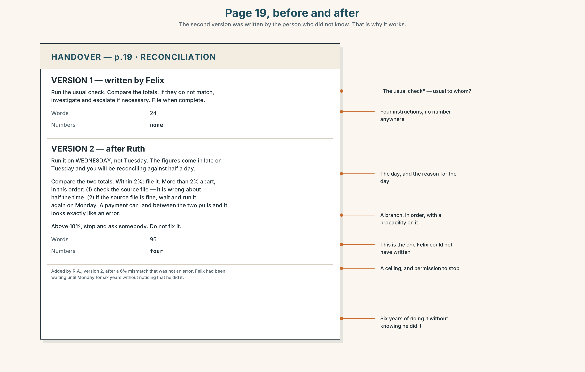{width=6.6in}

*Page 19, before and after — The second version was written by the person who did not know. That is why it works.*

**Read page 19 of the handover document — before and after Ruth's edit.**

1. What did the original page tell you to do?
2. What three things did Ruth add?
3. **Which of her additions could Felix have written, and which could he not?**
4. What is the only instruction on the page with a number in it?
5. **Find the sentence that only makes sense if you already know the answer.**

### 5F · Writer analysis

- Felix writes for somebody who already knows. Ruth writes for somebody who does not.
- **The document got better because the wrong person edited it. Is that a method or an accident?**

### 5G · Text against text

**The emails say the document failed. Page 19 says it worked.** Two sentences on how both are
true. The second begins *"The forty pages did the thing that…"*

---

## Part 6 · Vocabulary Lab 2 ◆ **B · THE SYSTEM**

### Twenty-one verbs that demand a pattern

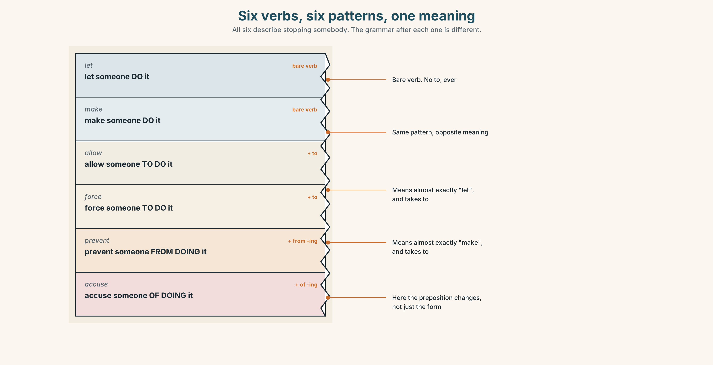{width=6.6in}

*Six verbs, six patterns, one meaning — All six describe stopping somebody. The grammar after each one is different.*

### 6A · Sort — which pattern?

Sort all twenty-one into three columns: **+ to** · **+ from -ing** · **+ of / on / for -ing**.

> persuade someone to · encourage someone to · urge someone to · warn someone against · advise someone to ·
> remind someone to · allow someone to · expect someone to · want someone to · ask someone to ·
> tell someone to · help someone to · teach someone to · force someone to · invite someone to ·
> enable someone to · prevent someone from · stop someone from · accuse someone of ·
> congratulate someone on · blame someone for · warn someone about

### 6B · Chunk completion

1. She ______ me ______ taking the shortcut, and she was right.
2. He ______ me ______ losing the file, which was not fair.
3. They ______ her ______ passing after four attempts.
4. Nothing ______ you ______ asking.
5. The handover document ______ her ______ start on Monday instead of guessing.

### 6C · The three warnings

> **warn someone to** · **warn someone against** · **warn someone about**

Three patterns, three meanings. Write a sentence for each, all about the same machine.

### 6D · Contrast Clinic — *to*, bare, and *-ing*

Six items.

1. She let me ______ (go) early.
2. She allowed me ______ (go) early.
3. I watched him ______ (fit) the whole thing — forty minutes.
4. I watched him ______ (fit) it as I walked past.
5. They made us ______ (sign) it.
6. They forced us ______ (sign) it.

**Then: in pairs 1/2 and 5/6, what changed apart from the grammar?**

---

## Part 7 · Pronunciation & Fluency Lab ◆ **B · THE SYSTEM**

### Where the stress goes in a three-word verb

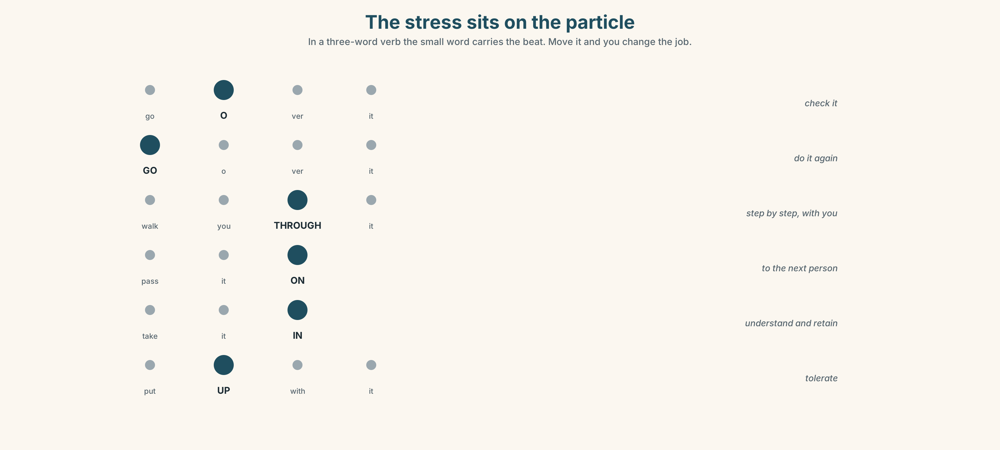{width=6.6in}

*The stress sits on the particle — In a three-word verb the small word carries the beat. Move it and you change the job.*

### 7A · Hear 🔊 Track 7.3

> go **O**ver it · walk you **THROUGH** it · pass it **ON** · take it **IN** ·
> get **ON** with it · put **UP** with it

**The stress is on the particle, not the verb.** Mark it in six more.

### 7B · Say

*"I'll go over it once, walk you through it, and then you pass it on."*

### 7C · Make it mean something

> *"Go over it."* — stress on **go**: do it again.
> *"Go over it."* — stress on **over**: check it.

Say both. Your partner says which job you just gave them.

### 7D · Fluency 20 ⏺

Twenty seconds: **teach something, out loud, to nobody.** Three times, faster.

---

## Part 8 · Writing ◆ **C · THE PERFORMANCE**

### Instructions that survive one handover · 140 words

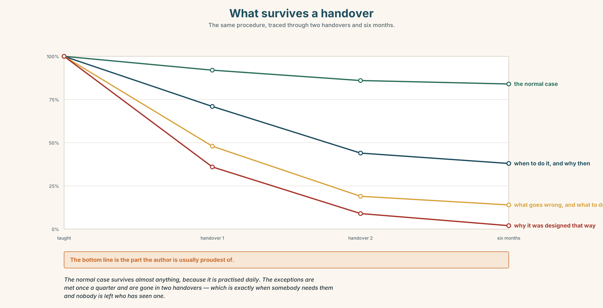{width=6.6in}

*What survives a handover — The same procedure, traced through two handovers and six months.*

### 8A · Read the model

> **Running the Wednesday reconciliation — for whoever does this next**
>
> Run it on Wednesday, not Tuesday. The figures come in late on Tuesday and you will reconcile
> against half a day. `[the reason is the thing Felix had stopped noticing]`
>
> Compare the two totals. If they are within 2%, file it. If they are more than 2% apart, do these
> in order: check the source file first, because that is wrong about half the time. If the source
> file is fine, wait and run it again on Monday — a payment can land between the two pulls, and it
> looks exactly like an error. `[the second branch exists because somebody found it the hard way]`
>
> I have never known it be more than 6% apart. If you see double figures, stop and ask somebody
> rather than fixing it.
>
> The thing I got wrong for two years: I assumed a mismatch meant somebody had made a mistake.
> Usually it means you ran it on the wrong day. `[the author's own error, named]`

**Questions about the writer's choices:**

1. Why does the branch about Monday exist, and who put it there?
2. The last paragraph admits two years of being wrong. What does that do for the reader?
3. **One instruction has a number in it and one has "about half the time". Why keep the vague one?**

### 8B · The anti-model

> Perform the reconciliation in accordance with the standard process. Investigate any discrepancies
> and escalate as appropriate. Ensure all checks are completed prior to filing.

**Name three decisions a new person still has to make after reading this.**

### 8C · Generate · 8D · Plan

> who this is for → when, and why then → the normal case → the branch → the limit, and what to do
> at it → what you got wrong

### 8E · Draft 1 — 140 words
### 8F · Peer review — two criteria

> ☐ Is there a step where I would have to guess?
> ☐ Did the writer admit something they got wrong?

### 8G · Draft 2 · 8H · Test it twice

Give it to somebody. Then give **their** version to a third person. **What survived two
handovers?**

---

## Part 9 · The File ◆ **A · THE WORLD + C · THE PERFORMANCE**

# WORK FILE · The Handover

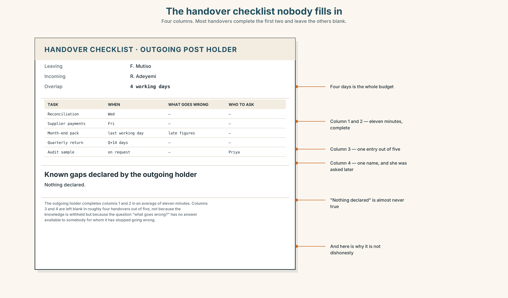{width=6.6in}

*The handover checklist nobody fills in — Four columns. Most handovers complete the first two and leave the others blank.*

### 9A · The four things a handover has to carry

Read the handover checklist. **Rank the four by how often they are missed.**

> what you do · when you do it · what goes wrong · who to ask when it does

### 9B · The invisible knowledge test

List five things you do at work or in your studies **that you have never been told and never told
anybody.** Five minutes. Most people stall at three.

### 9C · Write the hardest one

Take the one from 9B that is hardest to put into words. **Write it in under eighty words**, for
somebody who has never done it.

### 9D · The successor's edit

Swap. Read somebody else's. **Write the question you would have to ask them.** Give it back.
They add the answer. **That is the handover.**

### 9E · Transfer

**Find out one thing this week that nobody told you and that you now do automatically.** Write it
down before you forget that you ever did not know it.

---

## Part 10 · Mediation & Interaction ◆ **C · THE PERFORMANCE**

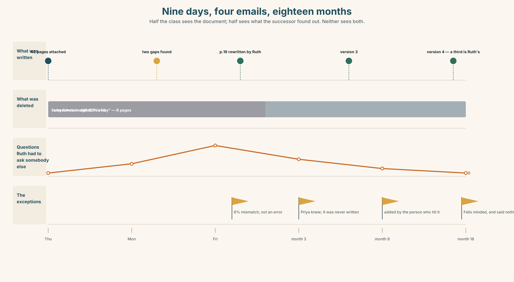{width=6.6in}

*Nine days, four emails, eighteen months — Half the class sees the document; half sees what the successor found out. Neither sees both.*

### 10A · Relay

Half the class sees the written document; half sees what the successor found out. Rebuild.

### 10B · Simplify

Explain the reconciliation to somebody doing it on Wednesday for the first time, **in four
minutes, on the phone, while they do it.**

### 10C · Compress

The four emails into 60 words for a manager who wants to know whether the handover worked.
Defend three cuts.

### 10D · Online interaction

Write the message to Felix telling him that page 19 was wrong. **He wrote forty pages in his own
time.**

### 10E · Across languages

Teach a partner one phrase in your language — **not by translating it.** Only demonstrate.
Then: what did you do when demonstrating failed?

---

## Part 11 · The Decision ◆ **C · THE PERFORMANCE**

# Four days, or forty pages

Felix leaves on the 30th. His replacement starts on the 27th. That is four days of overlap, and
Felix has eleven days of work left that only he can do.

- **Spend the four days teaching.** His eleven days become somebody else's problem, and two of
  them cannot be done by anybody else before March.
- **Spend the four days finishing, and write the forty pages in the evenings.** He has done this
  before. The pages are good and the gaps are the things he has stopped noticing.
- **Ask for the start date to move.** It costs the business three weeks of an empty seat, and he
  has no standing to ask.

### 11A · The evidence

1. **Page 19** from Part 5, before and after.
2. **The chart**: what survives one handover, two handovers, and six months.
3. **The voice.** Ruth, twenty-five seconds: *"The forty pages were the only reason I knew where
   to put the thing I found out."*

### 11B · Steelman

Argue the option you like least. Two minutes.

### 11C · Deliberate

> *I think he should ______, because ______. The strongest argument against me is ______, and my
> answer to it is ______.*

### 11D · Decide — eighty words, two reasons

### 11E · Model decision

> He should write the pages and finish the eleven days, and I think the four days of teaching is
> the romantic answer.
>
> Teaching in person transmits more per hour than any document — that is not in dispute, and if
> he had four weeks I would say spend them. He has four days, and four days of sitting beside
> somebody produces a person who can do the normal case and has met none of the exceptions,
> because the exceptions do not happen to order. In March she will hit the 6% case and he will be
> gone either way.
>
> What the forty pages do is different. They are not a teacher; they are a place to put things.
> Ruth's own sentence is the argument: the pages were why she knew where p.19 was. A document that
> is wrong in a findable place beats a conversation that was right and is now unrecoverable.
>
> He should spend one of the four days on the exceptions only, and let the normal case go in the
> document.

### 11F · The Reveal

> **What happened.** He wrote the pages and worked the eleven days. He gave Ruth one afternoon, not
> four days, and spent all of it on the things that go wrong.
>
> Eighteen months later the document is on version 4 and about a third of it is Ruth's. The
> section Felix was proudest of — a long explanation of why the system was designed that way — was
> deleted in version 2 by Ruth, who said nobody needed it.
>
> He found out, and minded, and said nothing.

**The handover worked. The part he most wanted to pass on was the part that did not survive.**

> Was the reasoning sound? And: was Ruth right to cut it?

---

## Part 12 · Landing ◆ **all three lines**

### 12A · Recycle — twelve items

**Six from this unit.**

1. I want you ______ (check) it twice.
2. She let me ______ (borrow) it.
3. I saw him ______ (leave) — the whole thing.
4. She ______ me ______ taking the shortcut.
5. It's a hands-______ job.
6. He talked me ______ doing it his way.

**Four from Units 1–6.**

7. The rule ______ (bring) in after a fire. *(Unit 6)*
8. If you ______ (press) override, it ______ (log) your name. *(Unit 5)*
9. You ______ prop that door open. *(Unit 4)*
10. I ______ (see) him on Thursday — arranged. *(Unit 3)*

**Two from *Making Plans* (A2.1).**

11. The person ______ wrote it had done it for six years. *(relative clause)*
12. She ______ (not / be allowed) to use the big scissors on day one. *(obligation range)*

### 12B · Consolidate

**120 words, one paragraph.** Somebody teaching you something: what they wanted you to do, what
they let you do, what they made you do, what they saw you doing. Six items from Part 6.

### 12C · Can-do, with evidence

| I can… | My evidence | Sure? |
|---|---|---|
| choose the right pattern after an object without thinking about it | Part 3G score | ◯ ◑ ● |
| teach a skill so that the person I taught can teach it on | Part 4C, round two | ◯ ◑ ● |
| write instructions that survive me leaving | Part 8, tested twice | ◯ ◑ ● |
| decide how to spend time I do not have enough of | Part 11D | ◯ ◑ ● |

### 12D · Replay ⏺

Part 0C again. Compare.

### 12E · Glossary — forty-five items, as a map

> **TEACHING** · instruct · demonstrate · model · rehearse · mentor · walk someone through · show someone how · let someone try
> **LEARNING** · apprentice · competence · retention · pick up · take in · have a go · hands-on · trial and error
> **SHAPING IT** · prompt · cue · feedback · correction · go over · pass on
> **THE SAYINGS** · see one, do one, teach one · it's muscle memory
> **+ TO** · persuade · encourage · advise · remind · allow · expect · want · ask · tell · help · teach · force · invite · enable someone to
> **+ FROM -ING** · prevent · stop someone from
> **+ OF / ON / FOR** · accuse someone of · congratulate someone on · blame someone for
> **+ AGAINST / ABOUT** · warn someone against · warn someone about · talk someone into · put someone off · bring someone round

### 12F · Next

> **Unit 8 · What grows where you are?**

# B1.1 · Unit 8 · Four Hundred Kilometres

> **English Animated** · *Taking a Position* · Jengo House, Nairobi
> Student's Book pages 148–167 · 20 pp · ~11.5 hours

---

## Part 0 · The Big Picture ◆ **A · THE WORLD**

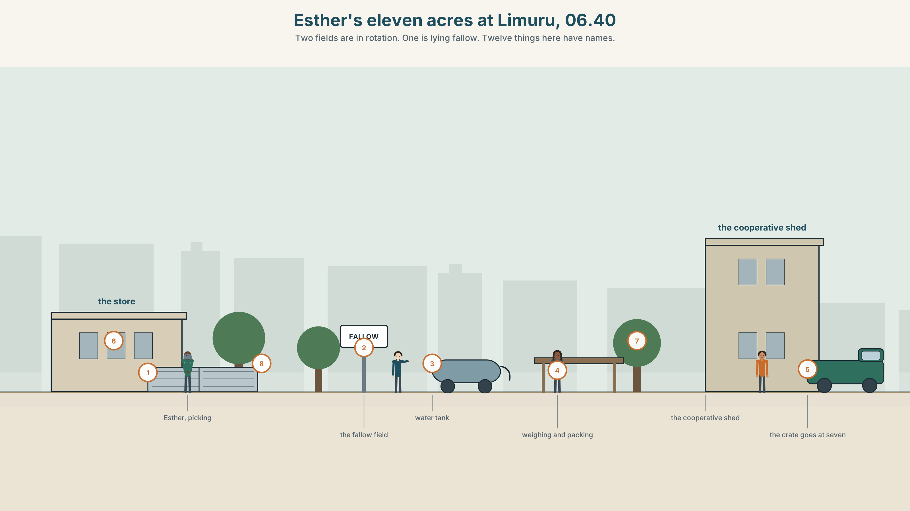{width=6.6in}

*Esther's eleven acres at Limuru, 06.40 — Two fields are in rotation. One is lying fallow. Twelve things here have names.*

# What grows where you are?

**By the end of this unit you will give a two-minute presentation on one crop's journey — from the
ground it came out of to the hand that paid for it.**

| ◆ **A · THE WORLD** | Where food comes from, what the distance costs, and who the word *local* is for |
|---|---|
| ◆ **B · THE SYSTEM** | Relative clauses reduced, and with prepositions · defining and non-defining, returning · 24 words for land and cultivation · 21 relative structures for formal writing · holding a long noun phrase together |
| ◆ **C · THE PERFORMANCE** | A presentation that traces one thing from the soil to the shelf |

---

### 0A · Find it

Twelve things on this smallholding. Four of these sixteen are not there.

> furrow · terrace · irrigation line · drip tape · water tank · shade netting · seedbed ·
> compost heap · drying rack · weighing scale · crate stack · boundary hedge · greenhouse ·
> tractor · beehive · windbreak

### 0B · Guess it

Two of the fields are in rotation and one is lying fallow. **Which is fallow, and what is the
evidence?**

### 0C · Say it ⏺

**Record thirty seconds.** *What grows where you are?* If you do not know, say that. Unprepared.

---

## Part 1 · Vocabulary Lab 1 ◆ **B · THE SYSTEM**

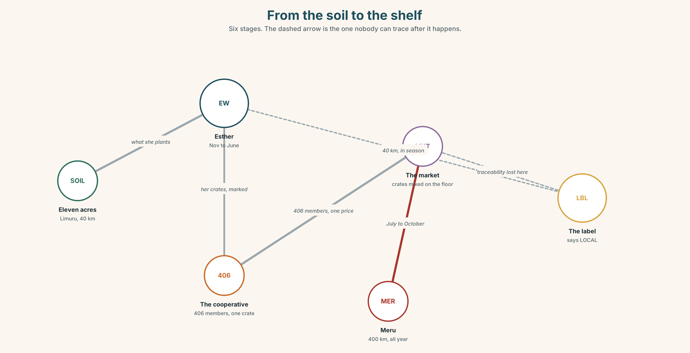{width=6.6in}

*From the soil to the shelf — Six stages. The dashed arrow is the one nobody can trace after it happens.*

### 1A · Meet — from the ground up

Use the network. Name the word at each stage.

> **soil** · **yield** · **irrigation** · **drought** · **crop** · **harvest** ·
> **smallholder** · **cooperative** · **rotation** · **fertiliser** · **erosion** · **perennial**

### 1B · Sort — how fast can you change it?

Order from **changes in a season** to **takes a generation**.

> what you plant · how you irrigate · the soil · who you sell to · the rotation · the terraces

**Mark the point where it stops being this year's decision.**

### 1C · Sort — odd one out, and why

1. yield · harvest · crop · rotation
2. drought · erosion · fertiliser · irrigation
3. smallholder · cooperative · perennial · grower
4. set aside · die back · turn over · plough back

### 1D · Stretch — the phrases

1. Only a third of it is **______ land**; the rest is too steep.
2. Coffee is **a ______ crop** — you cannot eat it and you cannot store it long.
3. Two fields are planted and one is left to **lie ______**.
4. Mangoes are cheap in January and absurd in July: they are **out of ______**.
5. **The growing ______** is shorter every year by about four days.
6. If the rains fail twice, **______ security** stops being an abstraction.

### 1E · Stretch — four phrasal verbs, one field

> **set aside** · **die back** · **turn over** · **plough back**

Two are things a farmer does deliberately. One is something a plant does. One is both.

### 1F · The two sayings

> **a bad year** · **the land knows**

One is an explanation and one refuses to be one. **Which, and who says each?**

> **Corpus Note**
> *Local* collocates with *produce*, *economy* and *supplier*. It does not collocate with any
> distance. English has no agreed number behind the word, which is why it appears on so many labels.

### 1G · Own it

Name one thing you ate this week. **Say how far it travelled, or say that you do not know.** Both
answers are the task.

---

## Part 2 · Listening ◆ **A · THE WORLD**

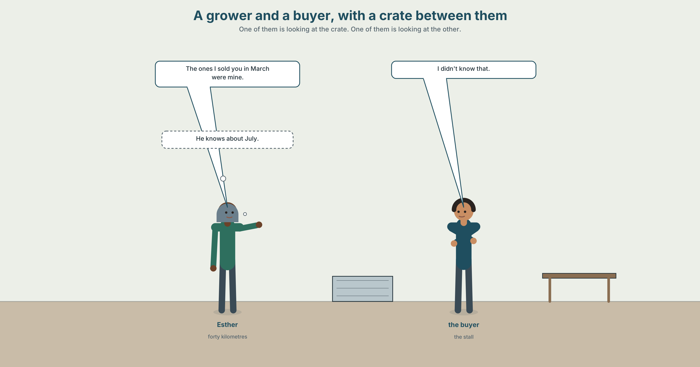{width=6.6in}

*A grower and a buyer, with a crate between them — One of them is looking at the crate. One of them is looking at the other.*

### 2A · It says local on the box 🔊 Track 8.1

**Before you listen.** A grower and a buyer, with a crate between them. **Which one is looking at
the crate?**

**Gist — one listen, one question.** How far has the produce in the crate actually travelled?

**Detail — complete the frame.**

| | Distance | Price | Season |
|---|---|---|---|
| the grower's | | | |
| the other supplier's | | | |

**Inference.** The grower says *"the ones I sold you in March were mine."* **What is she admitting
about the ones in July?**

**Attitude.** The buyer says *"I didn't know that"* — and then does not ask a follow-up.
**Which sound tells you he is not surprised?**

**Noticing.** Six sentences. Sort them.

1. *The farm which supplies us is four hundred kilometres away.*
2. *The farm supplying us is four hundred kilometres away.*
3. *The grower who I buy from has eleven acres.*
4. *The grower I buy from has eleven acres.*
5. *The cooperative, of which she is a member, sets the price.*
6. *The cooperative she's a member of sets the price.*

> **A.** the full relative clause · **B.** the same thing, shorter · **C.** formal, with the
> preposition moved

### 2B · Decoding clinic 🔊 Track 8.2

Forty seconds. Four jobs.

1. Where does she pause inside the long sentence?
2. Catch the three distances.
3. *the farm supplying us* — is there a word missing, and can you hear where?
4. *of which* — what happens to the two words?

> Transcripts, page 178.

---

## Part 3 · Grammar Lab 1 ◆ **B · THE SYSTEM**

### Shortening a relative clause, and moving a preposition

### 3A · Notice

Return to the six sentences.

1. Compare 1 and 2. **Which two words disappeared?**
2. Compare 3 and 4. **Which word disappeared, and why is it allowed to?**
3. In 4, could you also remove the words in sentence 1? Try it. **What is the rule?**
4. Compare 5 and 6. The preposition has moved. **Which version would you say out loud?**
5. In 5, why *of which* and not *of that*?

### 3B · See

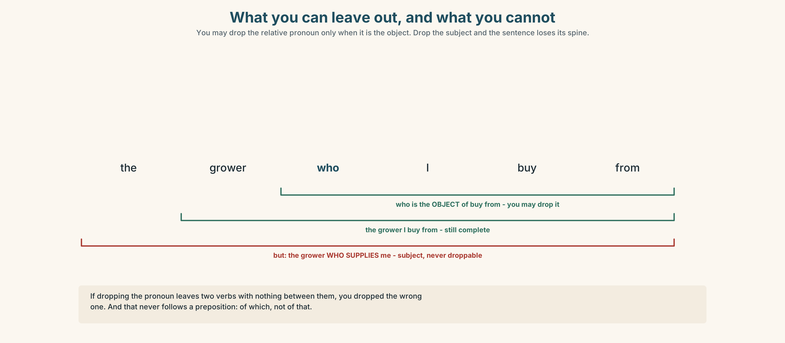{width=6.6in}

*What you can leave out, and what you cannot — You may drop the relative pronoun only when it is the object. Drop the subject and the sentence loses its spine.*

### 3C · Know

**Reducing a relative clause**

| Full | Reduced | When you can |
|---|---|---|
| the farm **which supplies** us | the farm **supplying** us | active verb → *-ing* |
| the crates **which were packed** yesterday | the crates **packed** yesterday | passive → past participle |
| the grower **who I buy** from | the grower **I buy** from | drop *who/which/that* when it is the **object** |
| the grower **who supplies** me | ✗ *the grower supplies me* | **never** when it is the **subject** |

**Moving the preposition**

> *the cooperative **she's a member of*** — normal speech
> *the cooperative **of which she is a member*** — formal writing
> ✗ *the cooperative **of that** she is a member* — *that* never follows a preposition

> **Watch out.** You can drop the relative pronoun only when it is the object of its clause. If
> dropping it leaves two verbs with no subject between them, you have dropped the wrong one.

> **Why it matters.** A reduced clause packs more into a sentence, which is what reports and
> labels do. It also hides things: *produce grown locally* does not say by whom, or how local.

### 3D · Use — controlled

Reduce each clause if you can. **Two of these cannot be reduced — say why.**

1. The farm which supplies the market is in the next county.
2. The crates which were loaded on Tuesday went out first.
3. The grower who I met last year has stopped.
4. The cooperative which sets the price has four hundred members.
5. The variety which they planted in 2019 needs less water.
6. The hedge which was planted to stop erosion is forty years old.

### 3E · Use — guided

Rewrite each in the formal pattern, moving the preposition.

1. The cooperative she's a member of.
2. The season we depend on.
3. The three growers we buy from.
4. The extent to things have changed. *(fix it first)*

### 3F · Use — open

**Describe three people and three places using one reduced clause each.** Your partner's job: say
whether each clause could be put back to its full form.

### 3G · Check — six items

> 1. The woman ______ runs the stall has been there thirty years. *(can you drop it?)*
> 2. The woman ______ I spoke to has been there thirty years. *(can you drop it?)*
> 3. The boxes ______ (pack) on Tuesday are the ones to send.
> 4. The cooperative, ______ ______ she is a member, sets the price. *(formal)*
> 5. The field ______ (lie) fallow this year was planted in 2023.
> 6. The extent ______ ______ the season has shortened is now measurable. *(formal)*

**0–3 →** Workbook pp. 62–64. **4–5 →** Part 6. **6 →** p. 159.

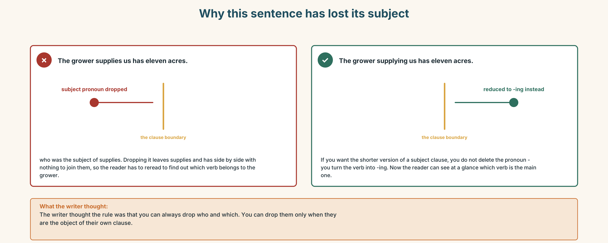{width=6.6in}

*Why this sentence has lost its subject — Why this sentence has lost its subject*

---

## Part 4 · Speaking ◆ **C · THE PERFORMANCE**

### 4A · Fluency sprint — 4 / 3 / 2

Describe a meal, from the shop backwards. Four minutes, three, two.

### 4B · The functional core — tracing something back

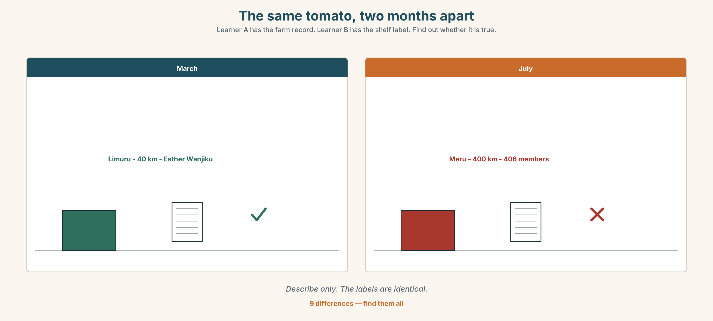{width=6.6in}

*The same tomato, two months apart — Learner A has the farm record. Learner B has the shelf label. Find out whether it is true.*

**Language Bank**

| | |
|---|---|
| **tracing** | *it starts with* · *from there it goes to* · *by the time it reaches us* |
| **hedging a number** | *somewhere around* · *at a rough guess* · *nobody really knows, but* |
| **the gap** | *what the label doesn't say is* · *the part nobody counts is* |
| **landing it** | *so the short answer is* · *which means that when you buy it, you are paying for* |

**Information gap.** Learner A has the farm's records. Learner B has the shelf label. Neither sees
the other. **Find out whether the label is true.**

### 4C · The performance — one crop, two minutes

Trace one thing from soil to shelf. Two minutes, uninterrupted, then two questions you have not
seen. **You must name one number you are not sure about, and say why.**

### 4D · Observer

Listen for **one thing**: where did the speaker's chain of custody break?

### 4E · Two criteria

> ☐ Did I say where my numbers came from?
> ☐ Did I name the step I could not account for?

---

## Part 5 · Reading ◆ **A · THE WORLD**

### 5A · Predict

An explainer called **"What the word local is doing."** The first line is:

> *There is no legal definition of local, which is not an oversight.*

What do you expect? One sentence.

### 5B · Skim — sixty seconds

Find the paragraph that defends the word.

---

**What the word local is doing**

There is no legal definition of local, which is not an oversight. Several have been proposed, and
each has failed for the same reason: any distance you pick is correct somewhere and absurd
somewhere else. Thirty miles is a reasonable radius in a dense country and meaningless in a
sparse one. A rule written for one landscape fails in the next valley.

In the absence of a number, the word is doing something other than measuring. It is signalling.
When a label says local, the claim it is making is not geographic; it is a claim about the kind of
supply chain the buyer is joining — short, visible, and with a person at the end of it who could
in principle be visited.

Most of the time this is roughly honest. The produce travelled a distance the buyer would accept
if they knew it, and the grower is a person the shop could name. The failure cases are specific.
The first is seasonality: a shop that sells a crop twelve months a year is importing for at least
part of it, and the label does not usually change in July. The second is aggregation: a
cooperative, of which the grower is one of four hundred members, can truthfully describe produce
as coming from its members while a given crate has no traceable field at all. The third is
processing: a thing grown four hundred kilometres away and packed ten kilometres away is, under
several voluntary schemes, locally packed, which on a label looks identical.

The defence of the word is worth stating, because the critique is easy and the alternative is
worse. A buyer who knows nothing uses the word as a weak signal and is usually not badly misled by
it. A buyer who insists on a number ends up with a certification scheme, and certification costs
money, and the growers who cannot afford it are precisely the smallholders the word was supposed
to protect. Replace a vague word with a precise one and you have not made the system more honest.
You have made it more expensive to enter.

What would help is not a definition but a habit: printing the distance, printing the month, and
printing the name of the farm the crate came from. None of those requires a scheme. All of them
are harder to write on a label than the word local, which is the actual reason they are not there.

---

### 5C · Close reading

1. Why has no legal definition of *local* succeeded?
2. What does the writer say the word is claiming, if not a distance?
3. **Name the three failure cases and give an example of each.**
4. What is the argument *for* keeping the vague word?
5. **Why would a certification scheme hurt smallholders in particular?**
6. What three things does the writer propose, and what is the stated reason they are absent?

### 5D · Vocabulary in context

> oversight · radius · signalling · aggregation · traceable · voluntary scheme

### 5E · The counter-text

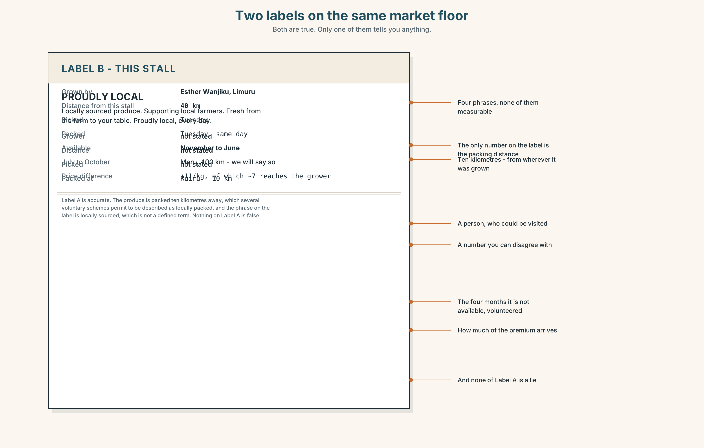{width=6.6in}

*Two labels on the same market floor — Both are true. Only one of them tells you anything.*

**Read the two labels and answer.**

1. What does each label actually claim?
2. **Which of the three failure cases does each one fall into?**
3. One label gives a distance. Is it the distance you would want?
4. What is the packing date, and what is missing next to it?
5. **Which of the two is more honest, and which is more informative? They are not the same label.**

### 5F · Writer analysis

- The explainer concedes before it criticises. Where exactly?
- **The last paragraph blames label size. Is that the real reason? What would the writer say if
  pressed?**

### 5G · Text against text

**The explainer says printing the distance would help. One label prints a distance.** Two
sentences on whether it helped. The second begins *"The number is true, and…"*

---

## Part 6 · Vocabulary Lab 2 ◆ **B · THE SYSTEM**

### Twenty-one ways to attach a clause formally

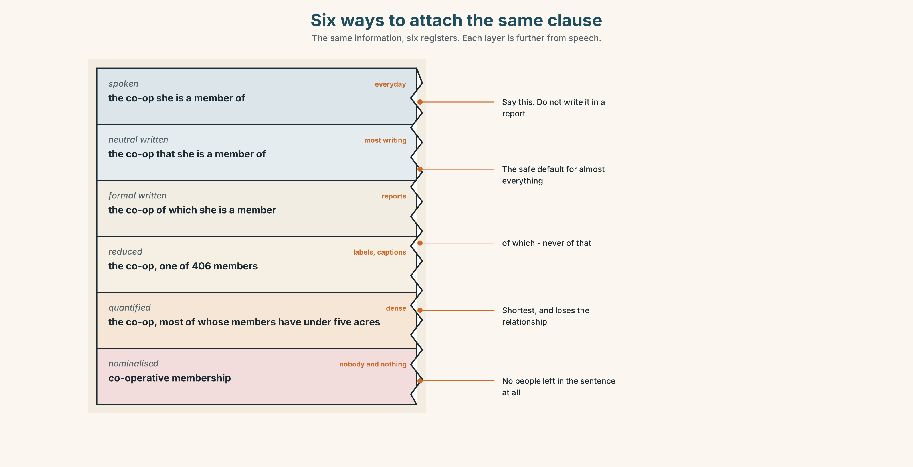{width=6.6in}

*Six ways to attach the same clause — The same information, six registers. Each layer is further from speech.*

### 6A · Sort — speech, writing, or both?

Sort all twenty-one. Six belong in both.

> whereby · wherein · whose · thereof · respectively · namely · notably · chiefly · largely ·
> partly · solely · in which · of which · of whom · at which point · the extent to which ·
> none of which · most of which · stem from · give rise to · all of which is to say

### 6B · Chunk completion

1. A scheme ______ growers certify each other was tried in 2019.
2. The crates, ______ ______ were damaged, were sent back.
3. ______ ______ ______ ______ the season has shortened is now measurable.
4. The erosion ______ ______ the loss of the hedge.
5. Two failures, ______ aggregation and seasonality, account for most of it.

### 6C · Register sort

Which of these would survive in a label? Which only in a report? **Three would appear in neither,
and would still be said out loud.**

### 6D · Contrast Clinic — reduce it, or don't

Six items. Reduce where you can; mark where you cannot and say why.

1. The grower who supplies us has eleven acres.
2. The grower who we buy from has eleven acres.
3. The variety which was planted in 2019 needs less water.
4. The cooperative which sets the price has four hundred members.
5. The hedge which was planted in 1984 is still there.
6. The field which lies fallow this year was planted in 2023.

---

## Part 7 · Pronunciation & Fluency Lab ◆ **B · THE SYSTEM**

### Holding a long noun phrase together

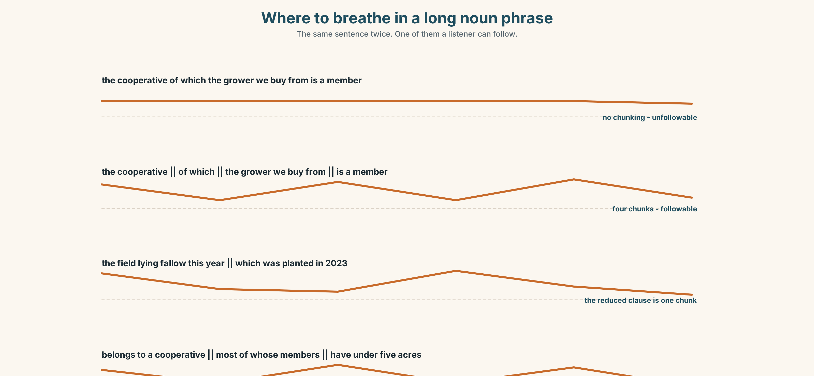{width=6.6in}

*Where to breathe in a long noun phrase — The same sentence twice. One of them a listener can follow.*

### 7A · Hear 🔊 Track 8.3

The same long phrase, said two ways. **One of them you can follow.**

> *the cooperative of which the grower we buy from is a member*

### 7B · Say

Mark the chunks. Say it with a short pause at each boundary, and no pause anywhere else.

> *the cooperative ‖ of which ‖ the grower we buy from ‖ is a member*

### 7C · Make it mean something

Read this aloud so a listener could write it down:

> *The field lying fallow this year, which was planted in 2023 with a variety needing less water,
> belongs to a cooperative most of whose members have under five acres.*

**Where did you breathe?** Mark it. Compare with three other people.

### 7D · Fluency 20 ⏺

Twenty seconds: **one thing, traced back three steps.** Three times, faster.

---

## Part 8 · Writing ◆ **C · THE PERFORMANCE**

### What this is and where it came from · 140 words

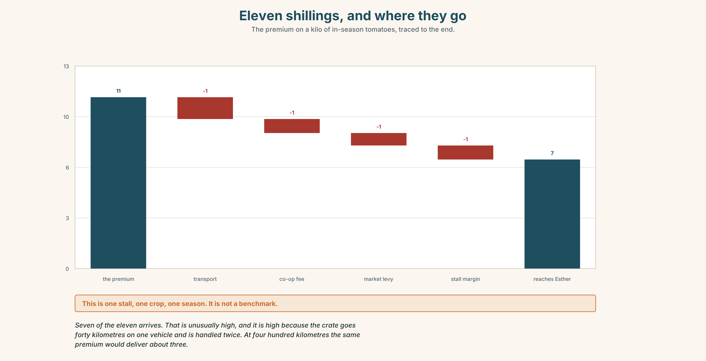{width=6.6in}

*Eleven shillings, and where they go — The premium on a kilo of in-season tomatoes, traced to the end.*

### 8A · Read the model

> These tomatoes were grown by Esther Wanjiku, whose plot is eleven acres at Limuru, forty
> kilometres from this stall. `[the grower is named in sentence one, and the number is specific]`
>
> They were picked on Tuesday and packed the same afternoon in crates belonging to the cooperative
> she is a member of, which has four hundred and six members and sets a floor price.
>
> From July to October we cannot get them from her, because they do not grow here then. In those
> months ours come from Meru, four hundred kilometres away, and we will say so on the board.
> `[the honest sentence, given before anybody asks]`
>
> They cost more than the imported ones on the next stall. The difference is about eleven shillings
> a kilo, and roughly seven of that reaches Esther. `[the premium is stated, and so is how much
> actually arrives]`

**Questions about the writer's choices:**

1. Why name the grower before anything else?
2. The July sentence is volunteered. **What does the writer buy with it?**
3. The last line says how much of the premium reaches the grower. **Most sellers do not. Why not?**

### 8B · The anti-model

> Locally sourced produce. Supporting local farmers. Fresh from the farm to your table. Proudly
> local, every day.

Each phrase is defensible. **Name three things a buyer still does not know.**

### 8C · Generate · 8D · Plan

> what it is → who grew it, named → how far, with a number → when it is not available, and what
> happens then → what it costs, and where the difference goes

### 8E · Draft 1 — 140 words
### 8F · Peer review — two criteria

> ☐ Could I visit the person who grew this?
> ☐ Did the writer tell me something they did not have to?

### 8G · Draft 2 · 8H · Publish

On the stall, at the size a stall can carry.

---

## Part 9 · The File ◆ **A · THE WORLD + C · THE PERFORMANCE**

# STUDY FILE · Note Systems

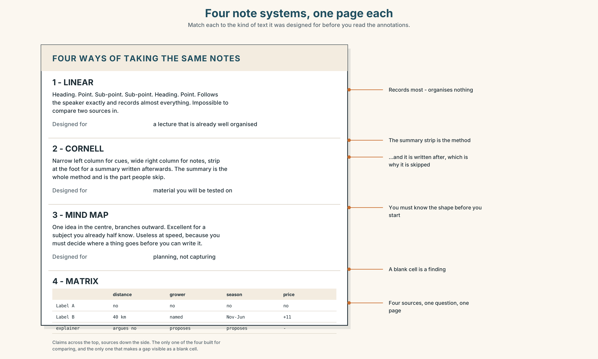{width=6.6in}

*Four note systems, one page each — Match each to the kind of text it was designed for before you read the annotations.*

### 9A · Four methods, four texts

Four note systems. Four kinds of text. **Match them before you read 9B.**

> linear · Cornell · mind map · matrix
> an explainer · a lecture · four sources on one question · a process you have to perform

### 9B · Test it

Take notes on the Part 5 explainer **twice**: once linear, once as a matrix. Four minutes each.

### 9C · The retrieval test

Close the notes. **Write down everything you can remember.** Then open each set and count what
each one recovered.

### 9D · The method nobody uses

The matrix — claims across the top, sources down the side — is the only one of the four designed
for **comparing**. **Which of your four pieces of coursework this term needed comparing?**

### 9E · Transfer

Take notes in a real lecture, meeting or video this week using a method you do not normally use.
**Bring both the notes and your opinion of them.**

---

## Part 10 · Mediation & Interaction ◆ **C · THE PERFORMANCE**

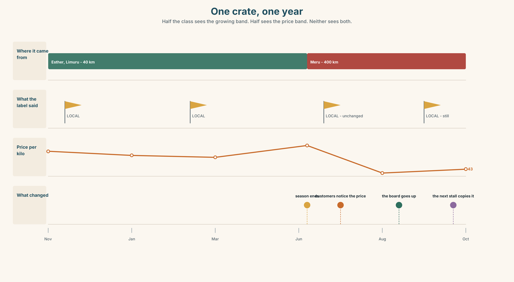{width=6.6in}

*One crate, one year — Half the class sees the growing band. Half sees the price band. Neither sees both.*

### 10A · Relay

Half the class sees the growing band; half sees the price band. Rebuild by speaking.

### 10B · Simplify

Explain the two labels from Part 5 to somebody choosing between them with a queue behind them.
**Nine seconds, then nine more if they ask.**

### 10C · Compress

The explainer into 60 words for a stallholder who has to decide what to print. Defend three cuts.

### 10D · Online interaction

Write the post for the stall's page explaining why the price went up in July.
**The cheaper stall is in the same group.**

### 10E · Across languages

Does your language have a word doing the job of *local*? **Is it as vague? Is the vagueness useful
in the same way?**

---

## Part 11 · The Decision ◆ **C · THE PERFORMANCE**

# Esther, or Meru

The stall's tomatoes come from Esther at Limuru, forty kilometres away, from November to June. For
the other four months she has none, and the stall buys from Meru, four hundred kilometres away, at
about two thirds of the price.

The stall next door sells Meru tomatoes all year and is eleven shillings a kilo cheaper. Customers
have started saying so.

- **Buy from Esther all year** — she can grow under netting, but the cost rises and the quality in
  July is honestly worse.
- **Buy from Meru all year** and stop saying local. Cheaper, consistent, and Esther loses a third
  of her income.
- **Split it, and say so on the board** — Esther in season, Meru out of season, with the distance
  and the month printed.

### 11A · The evidence

1. **The two labels** from Part 5.
2. **The chart**: what the price difference is, and how much of it reaches the grower.
3. **The voice.** Esther, thirty seconds: *"November to June I can plan. July I do other work. If
   you take November to June, I don't do other work — I stop."*

### 11B · Steelman

Argue the option you like least. Two minutes.

### 11C · Deliberate

> *I think they should ______, because ______. The strongest argument against me is ______, and my
> answer to it is ______.*

### 11D · Decide — eighty words, two reasons

### 11E · Model decision

> Split it and print the month and the distance on the board.
>
> Buying from Esther all year is the answer I want and I think it is the sentimental one. Netting
> raises her cost, the July crop is worse, and a stall that sells a bad tomato in July does not
> get the customer back in November. It also quietly makes her dependent on a single buyer, which
> is not a kindness.
>
> Going to Meru all year is coherent and it is the one I would defend if the stall were failing.
> It is not. Eleven shillings a kilo is a real difference and it is not an existential one, and
> Esther's thirty seconds is the whole argument against it: the eight months are what make the
> other four survivable.
>
> Printing the month and the distance costs nothing and it is the only option that makes the
> customer's complaint answerable. "Why is it dearer?" currently has no answer at the stall. It
> should have one, in writing, before anybody asks.

### 11F · The Reveal

> **What happened.** They printed it. In the first month three customers said they had not known,
> and two of them bought the cheaper ones anyway and said so pleasantly.
>
> Takings fell about four per cent over the year. Esther's November-to-June order grew by a fifth,
> because two restaurants saw the board and asked who she was.
>
> The stall next door copied the board in March and now prints the distance too. Theirs says 400 km
> every month of the year, and their takings did not move at all.

**The honest board cost them four per cent and found Esther two restaurants. And the competitor
proved the information changes nothing for people who were never going to pay more.**

> Was the reasoning sound? And: who was the board actually for?

---

## Part 12 · Landing ◆ **all three lines**

### 12A · Recycle — twelve items

**Six from this unit.**

1. The woman ______ I spoke to has been there thirty years. *(can you drop it?)*
2. The boxes ______ (pack) on Tuesday go first.
3. The cooperative, ______ ______ she is a member, sets the price.
4. Only a third is ______ land.
5. One field is left to lie ______.
6. ______ ______ ______ ______ the season has shortened is measurable.

**Four from Units 1–7.**

7. I want you ______ (check) it twice. *(Unit 7)*
8. The rule ______ (bring) in after a fire. *(Unit 6)*
9. If you ______ (press) override, it ______ (log) your name. *(Unit 5)*
10. You ______ prop that door open. *(Unit 4)*

**Two from *Making Plans* (A2.1).**

11. The grower ______ supplies us has eleven acres. *(defining relative)*
12. The crop ______ (grow) in July comes from Meru. *(passive)*

### 12B · Consolidate

**120 words, one paragraph.** Trace one thing you consumed this week back three steps. Use at
least three reduced relative clauses and three items from Part 6.

### 12C · Can-do, with evidence

| I can… | My evidence | Sure? |
|---|---|---|
| shorten a relative clause without breaking the sentence | Part 3G score | ◯ ◑ ● |
| trace something back and say where my chain breaks | Part 4C recording | ◯ ◑ ● |
| take notes in a form that fits the text in front of me | Part 9C retrieval count | ◯ ◑ ● |
| decide between a cheaper option and a person | Part 11D | ◯ ◑ ● |

### 12D · Replay ⏺

Part 0C again. Compare.

### 12E · Glossary — forty-five items, as a map

> **THE GROUND** · soil · erosion · arable land · terraces · lie fallow · rotation · perennial
> **GROWING** · crop · yield · harvest · irrigation · fertiliser · the growing season · in season · out of season · the rains
> **WHO** · smallholder · cooperative · a cash crop · food security
> **DOING** · set aside · die back · turn over · plough back
> **SAYINGS** · a bad year · the land knows
> **ATTACHING A CLAUSE** · in which · of which · of whom · at which point · the extent to which · none of which · most of which · whereby · wherein · whose · thereof
> **NARROWING** · respectively · namely · notably · chiefly · largely · partly · solely
> **CAUSING** · stem from · give rise to · all of which is to say

### 12F · Next

> **Unit 9 · Who gets to tell it?**

# B1.1 · Unit 9 · Whose Story

> **English Animated** · *Taking a Position* · Jengo House, Nairobi
> Student's Book pages 168–187 · 20 pp · ~11.5 hours

---

## Part 0 · The Big Picture ◆ **A · THE WORLD**

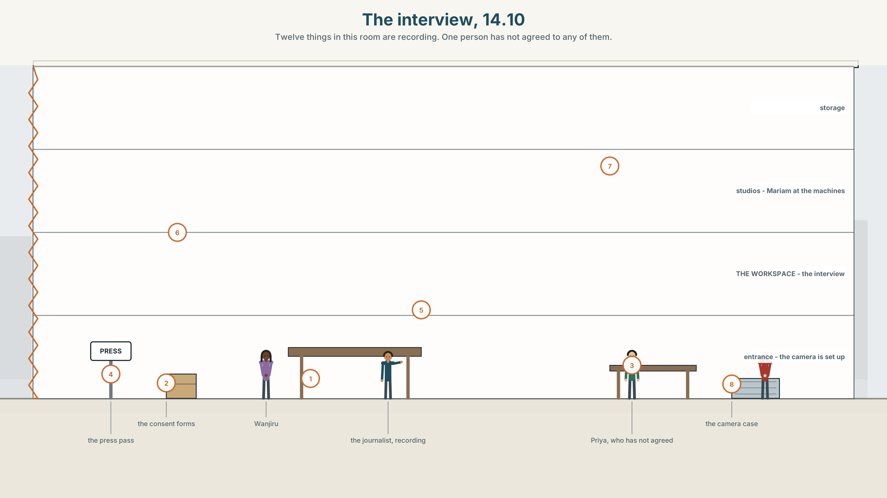{width=6.6in}

*The interview, 14.10 — Twelve things in this room are recording. One person has not agreed to any of them.*

# Who gets to tell it?

**By the end of this unit you will report the same event three times, for three audiences — and
say which of the three you would put your name to.**

| ◆ **A · THE WORLD** | How an account becomes a story, and what is lost at every retelling |
|---|---|
| ◆ **B · THE SYSTEM** | The full range of reporting verbs · reported statements, returning · 24 words for witness and adaptation · 21 verbs that carry a judgement with them · stress on the reporting verb |
| ◆ **C · THE PERFORMANCE** | Three accounts of one event, and a decision about which one is yours |

---

### 0A · Find it

Twelve things being recorded in this picture. Four of these sixteen are not there.

> a phone on a table · a notebook · a lanyard with a press pass · a voice recorder ·
> a consent form · a camera · a tripod · a laptop · a whiteboard with names · a printed list ·
> a signed release · a clip microphone · a boom pole · a lighting stand · a teleprompter ·
> a studio clock

### 0B · Guess it

**One person in this room has not agreed to be recorded.** Which, and what tells you?

### 0C · Say it ⏺

**Record thirty seconds.** *Think of a story that was told about you. Who told it?* Unprepared.

---

## Part 1 · Vocabulary Lab 1 ◆ **B · THE SYSTEM**

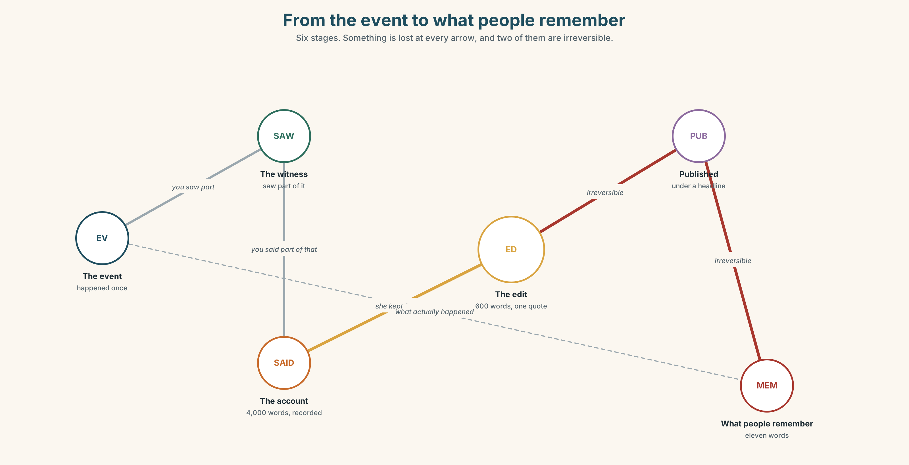{width=6.6in}

*From the event to what people remember — Six stages. Something is lost at every arrow, and two of them are irreversible.*

### 1A · Meet — from event to story

Use the network. Name the word at each stage.

> **witness** · **account** · **testimony** · **version** · **angle** · **source** ·
> **anonymity** · **adapt** · **dramatise** · **composite** · **disclaimer** · **hearsay**

### 1B · Sort — cline of distance from the event

Order from **closest** to **furthest**.

> what happened · what you saw · what you said you saw · what was written down ·
> what was published · what people now remember

**Mark where it stops being evidence.**

### 1C · Sort — odd one out, and why

1. witness · source · testimony · hearsay
2. account · version · angle · composite
3. adapt · dramatise · disclaimer · composite
4. leave out · play down · write up · track down

### 1D · Stretch — the phrases

1. She said it **on the ______**, so it can be printed with her name.
2. He said it **______ the record**, which means you may know it and not use it.
3. **______-hand** evidence is what you saw yourself.
4. The paper gave him a **right of ______** before publishing.
5. The film says it is **based on a ______ story**, which is not a claim about accuracy.
6. The scene never happened; that is **artistic ______**.
7. Her brother owns the building, which is **a ______ of interest**.

### 1E · Stretch — four phrasal verbs, one edit

> **leave out** · **play down** · **write up** · **track down**

Two happen before the story exists. Two happen to it afterwards.

### 1F · The two sayings

> **that's not how it happened** · **whose story is it?**

One is a correction. One is a claim of ownership. **Which does more damage in a meeting?**

> **Corpus Note**
> *Claim* and *say* report the same words. In news writing, *claim* appears beside a following
> denial about four times as often as *say* does. The verb is doing the work before the reader
> reaches the evidence.

### 1G · Own it

Describe something that happened to you in two sentences. **Then describe it as somebody who
dislikes you would.** Change no facts.

---

## Part 2 · Listening ◆ **A · THE WORLD**

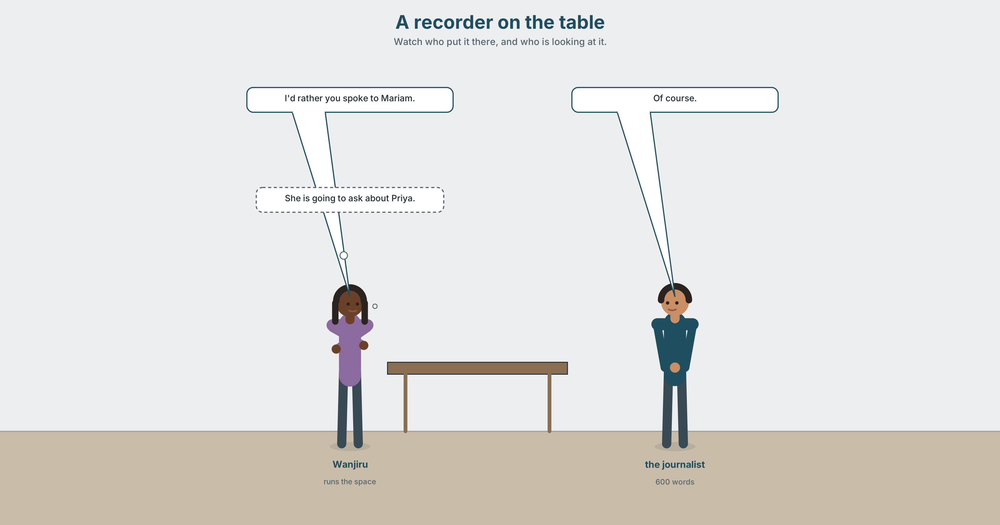{width=6.6in}

*A recorder on the table — Watch who put it there, and who is looking at it.*

### 2A · What she's actually here for 🔊 Track 9.1

**Before you listen.** A journalist and Wanjiru, with a recorder on the table. **Who put it there?**

**Gist — one listen, one question.** What story has the journalist already decided to write?

**Detail — complete the frame.**

| | What she asks about | What she keeps returning to |
|---|---|---|
| the first five minutes | | |
| the last five minutes | | |

**Inference.** Wanjiru says *"I'd rather you spoke to Mariam."* **Why is she saying that, and does
it work?**

**Attitude.** The journalist says *"of course"* three times. **Which one is agreement?**

**Noticing.** Six sentences. Sort them by what the reporting verb does to the claim.

1. *She said the landlord had refused.*
2. *She claimed the landlord had refused.*
3. *She admitted the landlord had refused.*
4. *She insisted the landlord had refused.*
5. *She confirmed the landlord had refused.*
6. *She alleged the landlord had refused.*

> **A.** neutral · **B.** the writer doubts it · **C.** the claim costs the speaker something ·
> **D.** it was already known

### 2B · Decoding clinic 🔊 Track 9.2

Forty seconds. Four jobs.

1. Count the reporting verbs.
2. Which word is stressed in *"she CLAIMED she didn't know"*?
3. Catch the two dates.
4. *said that* — what happens to *that*?

> Transcripts, page 179.

---

## Part 3 · Grammar Lab 1 ◆ **B · THE SYSTEM**

### Choosing the verb that reports

### 3A · Notice

Return to the six sentences. **The reported words are identical in all six.**

1. Which one is neutral?
2. Which two suggest the writer does not believe it?
3. In sentence 3, what does *admitted* tell you about the speaker's position?
4. In sentence 5, what does *confirmed* tell you about what the writer already knew?
5. **A lawyer would object to one of these in a news report. Which, and why?**

### 3B · See

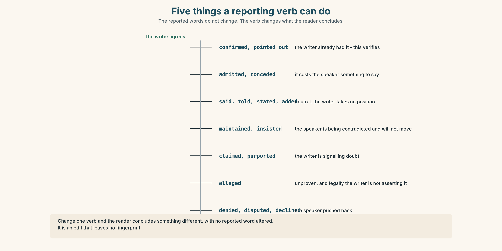{width=6.6in}

*Five things a reporting verb can do — The reported words do not change. The verb changes what the reader concludes.*

### 3C · Know

| Group | Verbs | What the writer is doing |
|---|---|---|
| **neutral** | say · tell · state · report · add · note | reporting, taking no position |
| **doubting** | claim · allege · maintain · purport | signalling distance from the claim |
| **conceding** | admit · concede · acknowledge · accept | the speaker said something against their own interest |
| **confirming** | confirm · recall · point out · stress | the writer already had it |
| **refusing** | deny · refuse · decline to comment · dispute | the speaker pushed back |

**And the pattern each takes:**

> *admit / deny / recall* **+ -ing** or **+ that** · *refuse / claim* **+ to + verb** or **+ that** ·
> *insist / stress / point out* **+ that** only

> **Watch out.** *Admit* makes the speaker's own words costly to them. Using it where *say* would
> do is not neutral reporting — it is an edit with no fingerprint on it.

> **Why it matters.** Change one verb and you have changed what the reader thinks, without
> changing a single reported word. This is the most powerful thing in this book and the hardest to
> see.

### 3D · Use — controlled

Choose the reporting verb. **More than one works in some; say what each would do.**

> Wanjiru (1) __________ that the landlord had refused to pay. He (2) __________ ever having been
> asked. The inspector (3) __________ out that the report had been sent twice. Mariam
> (4) __________ that she had considered leaving, which she had not said publicly before. The
> managing agent (5) __________ to comment. The journalist (6) __________ that two tenants had
> contacted her first.

### 3E · Use — guided

Rewrite each sentence three times, with a neutral, a doubting and a conceding verb.
**Then say which you would publish.**

1. "I didn't know the toilet was an issue."
2. "We offered to pay half."
3. "Nobody raised it with me."

### 3F · Use — open

**Report the same thing to two people:** somebody who will act on it, and somebody who will be
upset by it. Your partner says which reporting verbs you used, and what they gave away.

### 3G · Check — six items

> 1. He ______ (deny) ______ (be) there at all.
> 2. She ______ (admit) that she ______ (not read) it.
> 3. They ______ (refuse) ______ (give) a reason.
> 4. He ______ (point) out that the lease ______ (expire) in March.
> 5. The agent ______ (decline) to comment.
> 6. She ______ (insist) that nobody ______ (tell) her.

**0–3 →** Workbook pp. 70–72. **4–5 →** Part 6. **6 →** p. 179.

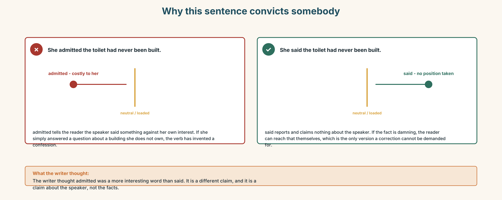{width=6.6in}

*Why this sentence convicts somebody — Why this sentence convicts somebody*

---

## Part 4 · Speaking ◆ **C · THE PERFORMANCE**

### 4A · Fluency sprint — 4 / 3 / 2

A story you have told more than once. Four minutes, three, two. **Notice what you have stopped
saying.**

### 4B · The functional core — attributing and distancing

{width=6.6in}

*Two accounts of one afternoon — Learner A has one account. Learner B has the other. Find the real disagreement.*

**Language Bank**

| | |
|---|---|
| **attributing** | *according to* · *she's quoted as saying* · *in her words* |
| **distancing** | *she claims* · *it's been suggested that* · *I can't verify this, but* |
| **refusing to pass it on** | *that's not mine to repeat* · *you'd have to ask her* |
| **correcting** | *that's not how it happened* · *the order is the other way round* · *I'd stress that nobody refused* |

**Information gap.** Learner A has what one person said. Learner B has what another said. Neither
sees the other. **Find out what they disagree about, and what they only appear to disagree about.**

### 4C · The performance — three tellings

Three audiences, two minutes each: **a friend · a committee · somebody who was there.**
Same event. You may not change a fact.

### 4D · Observer

Listen for **one thing**: what appeared in two versions and not in the third?

### 4E · Two criteria

> ☐ Did I keep every fact the same?
> ☐ Could the person who was there recognise their own part?

---

## Part 5 · Reading ◆ **A · THE WORLD**

### 5A · Predict

A personal essay called **"The quote I gave."** The first line is:

> *I said eleven words to a journalist in 2019 and I have been described by them ever since.*

What do you expect? One sentence.

### 5B · Skim — sixty seconds

Find the paragraph where the writer stops blaming the journalist.

---

**The quote I gave**

I said eleven words to a journalist in 2019 and I have been described by them ever since. The
words were accurate. I said them. They are in my voice on her recording, and if I heard somebody
else say them I would think exactly what everybody thought about me.

What I did not say, in the forty minutes either side of them, was the part that made them make
sense. She did not leave it out to damage me. She left it out because it took two minutes to
explain and the eleven words took four seconds, and she had six hundred words for the whole piece.
I have since written to a length limit myself and I know what it does to you.

For about three years I told this story as something that was done to me. I was good at telling
it. There is a version with a pause in it that gets a reaction.

The version is not honest, and I worked out why in an argument with somebody who had been in the
room. She pointed out that I had chosen the eleven words. Not the edit — the words. I had reached
for a phrase that was sharper than what I actually thought, because I was being recorded and
because sharp phrases get agreed with. The journalist did not put a performance in my mouth. She
printed one I had already given her.

That is a less comfortable story and it has no pause in it.

What I do now is simple and I recommend it without being certain it is right. I say the dull
version first. If it is the only thing I say, it is the only thing that can be used. The cost is
that I am quoted much less often, and that the people who are quoted instead are the people
reaching for the sharp phrase, which is how the sharp phrase became the thing people believe.

---

### 5C · Close reading

1. How many words did the writer say, and how long was the piece?
2. Why does the writer say the journalist left out the context?
3. **What did the person who had been in the room point out?**
4. What does the writer mean by "a version with a pause in it"?
5. **What does the writer do now, and what is the stated cost?**
6. The last clause is an accusation against nobody in particular. **Who is it against?**

### 5D · Vocabulary in context

> accurate · length limit · reach for (*reached for a phrase*) · performance ·
> dull (*the dull version*) · quoted

### 5E · The counter-text

{width=6.6in}

*The transcript, and the six hundred words — Everything printed is in the transcript. The transcript is four thousand words long.*

**Read the published piece and the full transcript extract, side by side.**

1. How many words of the transcript survived into the piece?
2. **Which sentence in the transcript explains the quote, and where would it have gone?**
3. What reporting verb did the journalist use?
4. Find the sentence in the piece that is not in the transcript at all. **Where did it come from?**
5. **Was anything untrue printed?**

### 5F · Writer analysis

- The essay refuses an easy villain. **At what cost to the essay?**
- The piece is 600 words and the transcript is 4,000. **Is the essay's argument an argument against
  length limits, or against something else?**

### 5G · Text against text

**The essay says the journalist printed a performance he had already given. The transcript shows
him giving it.** Two sentences on whether that settles it. The second begins *"What it does not
settle is…"*

---

## Part 6 · Vocabulary Lab 2 ◆ **B · THE SYSTEM**

### Twenty-one verbs that judge while they report

{width=6.6in}

*Six degrees of distance from a claim — The same sentence reported six ways. The writer gets further away each time.*

### 6A · Sort — what does the verb add?

Sort all twenty-one into five groups: **neutral · doubting · conceding · confirming · refusing**.

> admit · deny · claim · insist · allege · concede · maintain · acknowledge · confirm · refuse ·
> recall · stress · point out · go on to say · be quoted as saying · according to ·
> put it another way · back up · stand by · words to that effect · no comment

### 6B · Chunk completion

1. She ______ ______ her original statement under questioning.
2. He ______ it ______, saying the figure was closer to twelve.
3. The agent said *"______ ______"* and put the phone down.
4. ______ ______ the inspector, the report was sent twice.
5. He said he had been misled, or ______ ______ ______ ______.

### 6C · Register sort

Which appear in a news report? Which in a court transcript? Which only in speech?
**Four appear in all three.**

### 6D · Contrast Clinic — one claim, six verbs

Six items. The reported words do not change.

> *"The landlord refused to pay."*

1. She ______ that the landlord refused to pay. *(neutral)*
2. She ______ that the landlord refused to pay. *(you doubt it)*
3. She ______ that the landlord refused to pay. *(it costs her to say so)*
4. She ______ that the landlord refused to pay. *(you already knew)*
5. She ______ that the landlord refused to pay. *(she is being contradicted and will not move)*
6. She ______ that the landlord refused to pay. *(legally unproven)*

**Then: which one would a lawyer insist on, and why?**

---

## Part 7 · Pronunciation & Fluency Lab ◆ **B · THE SYSTEM**

### Stressing the reporting verb

{width=6.6in}

*Which word you lean on — The same seven words. Where the stress lands tells the listener what you think of her.*

### 7A · Hear 🔊 Track 9.3

> She **SAID** she didn't know. — *(she said it; whether it is true is not my problem)*
> She said she **DIDN'T** know. — *(the content is the point)*
> She **CLAIMED** she didn't know. — *(I am telling you something about her)*

### 7B · Say

Say all three. Your partner says what you think of her.

### 7C · Make it mean something

> *"He admitted he'd forgotten."*

Stress **admitted**, then **forgotten**. **One is sympathetic. One is not.**

### 7D · Fluency 20 ⏺

Twenty seconds: **report one thing three ways — neutral, doubting, conceding.** Three times.

---

## Part 8 · Writing ◆ **C · THE PERFORMANCE**

### The same event, for three readers · 140 words

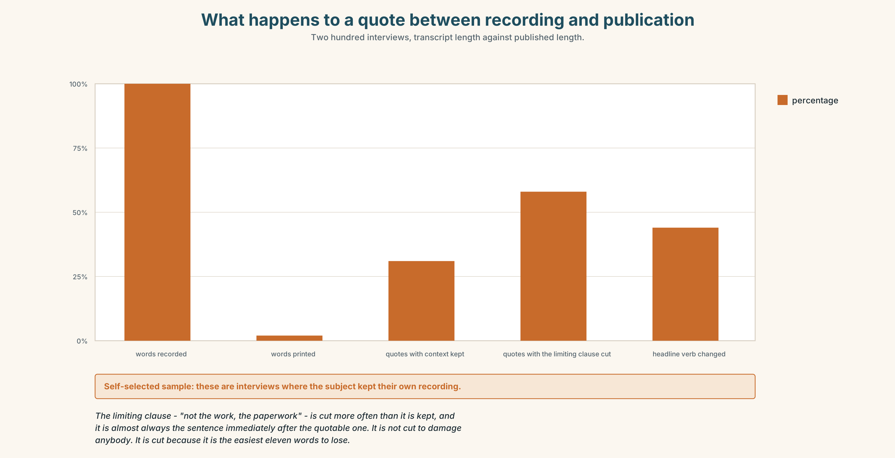{width=6.6in}

*What happens to a quote between recording and publication — Two hundred interviews, transcript length against published length.*

### 8A · Read the model — three versions, one event

> **To a friend:** *The landlord finally paid half. It took four months, an insurance letter and
> Priya leaving, and I'm not going to pretend I feel good about it.*
>
> **To the tenants' meeting:** *The landlord has agreed to fund fifty per cent, following the
> insurer's query about the 2019 report. Works are scheduled for January. Obi obtained the quotes;
> the survey came in at 96,000 against an assumption of 160,000.*
> `[names, numbers, sequence. No feelings, and none implied]`
>
> **To the landlord:** *Thank you for confirming the fifty per cent. I've attached the quotes and
> the survey. Obi will coordinate access with your contractor. We'll keep the invoice separate
> from the service charge, as agreed.*
> `[nothing about the four months. Nothing about the insurer]`

**Questions about the writer's choices:**

1. All three are true. **What is in the first that is in neither of the others?**
2. The second mentions the insurer. The third does not. **Why?**
3. **Which version would you be most comfortable having the other two readers see?**

### 8B · The anti-model

> Following extensive discussions, agreement has been reached regarding the accessibility works.
> All parties have worked constructively and a positive outcome has been achieved for everyone
> involved.

**Who does this version protect, and from what?**

### 8C · Generate · 8D · Plan

> the facts, listed · who each reader is · what each one will do with it · what each one does not
> need · what you would be ashamed to have hidden

### 8E · Draft — all three versions

### 8F · Peer review — two criteria

> ☐ Are all three factually identical?
> ☐ Is there anything in one that the others needed?

### 8G · The third criterion

**Put your name on one of them.** Which, and why that one?

---

## Part 9 · The File ◆ **A · THE WORLD + C · THE PERFORMANCE**

# CULTURE FILE · What's Funny Here?

{width=6.6in}

*Four jokes, four assumptions — Read them before the annotations. Mark the ones you merely understand.*

### 9A · Four jokes

Four short pieces of humour, one from each of four places. **Which do you find funny, and which do
you merely understand?** They are different experiences.

### 9B · What a joke assumes

For each: **what do you have to already know?** A fact, a person, a convention, a frustration?
The ones that travel are rarely the ones with the best jokes in them.

### 9C · Your own

Bring something funny from your own language or context. **Explain what has to be known.**
Then: is it still funny once explained?

### 9D · Humour that is not for you

Some jokes exclude by design. Some exclude by accident. **How do you tell, from inside and from
outside?**

### 9E · The hard one

A story told about somebody gets a laugh in a meeting. **The person is in the room.**
Write the sentence you would say — or defend saying nothing.

### 9F · Transfer

Watch something comic in English this week that you do not fully get. **Write down the exact
moment you lost it.** That is the cultural boundary, located.

---

## Part 10 · Mediation & Interaction ◆ **C · THE PERFORMANCE**

{width=6.6in}

*Four thousand words to eleven — Half the class sees the transcript band. Half sees the publication band. Neither sees both.*

### 10A · Relay

Half the class sees the transcript band; half sees the published band. Rebuild by speaking.

### 10B · Simplify

Explain the difference between *on the record*, *off the record* and *on background* to somebody
about to speak to a journalist in twenty minutes.

### 10C · Compress

The essay into 60 words for somebody who has just been quoted badly. Defend three cuts.

### 10D · Online interaction

Write the reply to a post that has misreported something you said. **It has 400 shares.**

### 10E · Across languages

Report the same sentence in your language with a neutral verb and a doubting one. **Does your
language carry the doubt in the verb, or somewhere else?**

---

## Part 11 · The Decision ◆ **C · THE PERFORMANCE**

# The profile

A journalist wants to write about Jengo House. She is good, the piece will be read, and two of the
six tenants would benefit from it enormously.

The story she wants is about the accessible toilet: four months, an insurer, a landlord who moved
only when his own money was at risk, and a woman who left before it was built.

Priya has not agreed to be named. She has not refused either. She has said *"I'd rather not be the
reason."*

- **Do the piece with the story she wants.** Priya is central whether or not she is named — in a
  building of six people, "a tenant" is not anonymity.
- **Offer a different story** — the workspace, the economics, the survey that came in at 96,000.
  She will probably decline.
- **Refuse.** Keep the relationship, lose the coverage, and the story goes untold.

### 11A · The evidence

1. **The transcript and the published piece** from Part 5.
2. **The chart**: what happens to a quote between recording and publication.
3. **The voice.** Priya, thirty seconds: *"I'd rather not be the reason. I'm not saying don't. I'm
   saying I'd rather not be the reason."*

### 11B · Steelman

Argue the option you like least. Two minutes.

### 11C · Deliberate

> *I think they should ______, because ______. The strongest argument against me is ______, and my
> answer to it is ______.*

### 11D · Decide — eighty words, two reasons

### 11E · Model decision

> Go back to Priya and ask her the actual question, which nobody has asked her.
>
> I am aware this is not one of the three options and that it delays everything by a week. It is
> the only move that does not decide something about her without her.
>
> "I'd rather not be the reason" is not a refusal and treating it as consent is the thing this
> whole unit is about. It is also not an invitation to protect her by deciding for her, which is
> what refusing the piece would be. She is an adult with an interest in the building and in her
> own privacy, and she is the only person who can weigh them.
>
> The question is not "may we name you". It is: "the piece will exist, you will be identifiable
> whether or not you are named, and here are the three versions. Which would you rather read about
> yourself?" That is a harder question and it is the honest one.
>
> If she says no after that, refuse the piece and say why.

### 11F · The Reveal

> **What happened.** They asked her. She thought about it for four days and said yes, named, on
> condition that the piece said she had left for a job and not because of the building — which was
> true, and which she had never said to anybody.
>
> The piece ran. It was fair. Two sentences about her were lifted into a follow-up article
> elsewhere without the condition attached, and that version is the one that comes up when you
> search her name.
>
> She has never mentioned it. Wanjiru found it eight months later.

**They did the honest thing, and it was honest, and a second publication they had no contact with
undid the only condition she asked for.**

> Was the reasoning sound? And: was there a version of this where that could not have happened?

---

## Part 12 · Landing ◆ **all three lines**

### 12A · Recycle — twelve items

**Six from this unit.**

1. He ______ (deny) ______ (be) there at all.
2. She ______ out that the lease expired in March.
3. The agent ______ to comment.
4. She said it ______ the record, so it cannot be printed.
5. The film is based on a ______ story.
6. Her brother owns the building — a ______ of interest.

**Four from Units 1–8.**

7. The grower ______ I buy from has eleven acres. *(Unit 8 — can you drop it?)*
8. I want you ______ (check) it twice. *(Unit 7)*
9. The rule ______ (bring) in after a fire. *(Unit 6)*
10. If it ______ (be) up to me, I ______ (change) it. *(Unit 5)*

**Two from *Making Plans* (A2.1).**

11. She said she ______ (not receive) the letter. *(reported speech)*
12. The piece, ______ ran in March, was fair. *(relative clause)*

### 12B · Consolidate

**120 words, one paragraph.** Report one disputed event using at least six reporting verbs from
Part 6, from at least three of the five groups.

### 12C · Can-do, with evidence

| I can… | My evidence | Sure? |
|---|---|---|
| choose a reporting verb that says what I actually think of the claim | Part 3G score | ◯ ◑ ● |
| tell the same true story three ways for three readers | Part 8, all three | ◯ ◑ ● |
| recognise when humour assumes something I do not have | Part 9B | ◯ ◑ ● |
| decide about a story that is partly somebody else's | Part 11D | ◯ ◑ ● |

### 12D · Replay ⏺

Part 0C again. Compare.

### 12E · Glossary — forty-five items, as a map

> **THE EVENT** · witness · account · testimony · first-hand · hearsay · source
> **THE STORY** · version · angle · adapt · dramatise · composite · based on a true story · artistic licence
> **THE RULES** · on the record · off the record · right of reply · anonymity · a conflict of interest · disclaimer
> **EDITING** · leave out · play down · write up · track down
> **NEUTRAL** · say · tell · add · note · according to · be quoted as saying · go on to say
> **DOUBTING** · claim · allege · maintain
> **CONCEDING** · admit · concede · acknowledge
> **CONFIRMING** · confirm · recall · point out · stress · back up · stand by
> **REFUSING** · deny · refuse · no comment · words to that effect · put it another way
> **SAYINGS** · that's not how it happened · whose story is it?

### 12F · Next

> **Unit 10 · What is a fair day's work?**

# B1.1 · Unit 10 · A Fair Day

> **English Animated** · *Taking a Position* · Jengo House, Nairobi
> Student's Book pages 188–207 · 20 pp · ~11.5 hours

---

## Part 0 · The Big Picture ◆ **A · THE WORLD**

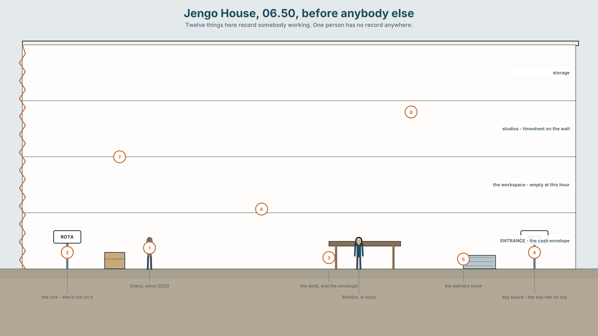{width=6.6in}

*Jengo House, 06.50, before anybody else — Twelve things here record somebody working. One person has no record anywhere.*

# What is a fair day's work?

**By the end of this unit you will negotiate a working agreement and write it up — in a form the
person it is about would sign.**

| ◆ **A · THE WORLD** | What work is worth, who sets that, and what six years of goodwill is |
|---|---|
| ◆ **B · THE SYSTEM** | Degree modifiers · *the more … the more* · comparatives and superlatives, returning · 24 words for pay and conditions · 21 ways to size a difference · stress on the modifier |
| ◆ **C · THE PERFORMANCE** | A negotiated agreement, written up, signed by both sides |

---

### 0A · Find it

Twelve things that record somebody's work. Four of these sixteen are not there.

> a timesheet · a rota · a payslip · a contract on a shelf · a handwritten hours book ·
> a swipe card · a cash envelope · a bank transfer screen · a cleaning schedule ·
> a signed-for delivery book · a key with a tag · a staff photo · a pension statement ·
> a union notice · a P45 · a uniform

### 0B · Guess it

**One person in this picture has no written record of their work anywhere in the building.**
Which, and what is the evidence?

### 0C · Say it ⏺

**Record thirty seconds.** *What is a fair day's work?* Unprepared. This is the last Part 0 of the
book, and the last replay is at the end.

---

## Part 1 · Vocabulary Lab 1 ◆ **B · THE SYSTEM**

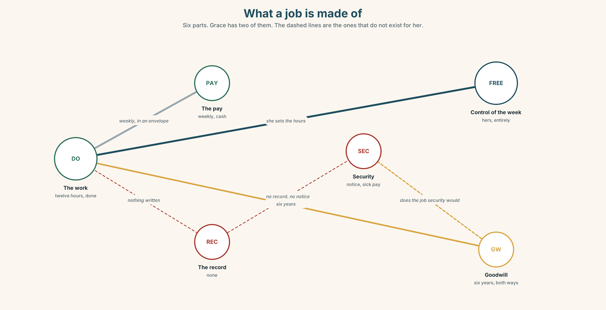{width=6.6in}

*What a job is made of — Six parts. Grace has two of them. The dashed lines are the ones that do not exist for her.*

### 1A · Meet — what a job is made of

Use the network. Name the word at each node.

> **wage** · **salary** · **overtime** · **contract** · **probation** · **notice** ·
> **severance** · **union** · **grievance** · **rota** · **turnover** · **headcount**

### 1B · Sort — cline of security

Order from **most secure** to **least**.

> a permanent contract · a fixed-term contract · a rolling contract · zero-hours ·
> paid in cash · a handshake

**Mark where the law stops helping you.** Then find out whether you marked it in the right place.

### 1C · Sort — odd one out, and why

1. wage · salary · overtime · turnover
2. probation · notice · severance · grievance
3. union · rota · headcount · cover
4. lay off · take on · clock in · cover for

### 1D · Stretch — the phrases

1. She is on a **______-hours** contract, so nothing is guaranteed.
2. A **______ wage** is what you can actually live on, not what the law requires.
3. Saturday is paid at **time and a ______**.
4. He took the hours back as time off **in ______**.
5. She has worked here six years and has never been **on the ______**.
6. Three of the five are paid **cash in ______**.
7. Nights and Sundays are **______ hours**, and they are paid as if they were not.

### 1E · Stretch — four phrasal verbs, one workforce

> **lay off** · **take on** · **clock in** · **cover for**

Two are things the employer does. Two are things the worker does. **Which one is sometimes both?**

### 1F · The two sayings

> **that's the job** · **nobody does it for the money**

Both are used to end a conversation about pay. **Who says each, and which one is harder to argue
with?**

> **Corpus Note**
> *A fair day's work* appears in English about forty times more often than *a fair day's pay*,
> although the full saying contains both. The half that survived is the half about the worker.

### 1G · Own it

Describe one job you have done. **Say what was written down and what was not.**

---

## Part 2 · Listening ◆ **A · THE WORLD**

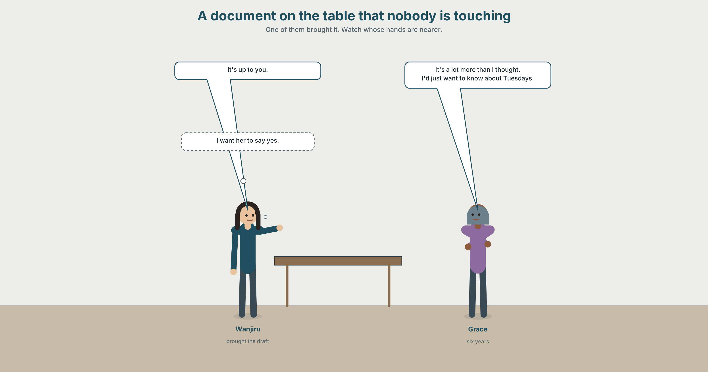{width=6.6in}

*A document on the table that nobody is touching — One of them brought it. Watch whose hands are nearer.*

### 2A · Six years 🔊 Track 10.1

**Before you listen.** Wanjiru and Grace, and a document on the table that nobody is touching.
**Who brought it?**

**Gist — one listen, one question.** Does Grace want the contract?

**Detail — complete the frame.**

| | Now | Under the contract |
|---|---|---|
| hours | | |
| pay | | |
| flexibility | | |

**Inference.** Grace says *"it's a lot more than I thought."* **She is talking about the money.
What else is she talking about?**

**Attitude.** Wanjiru says *"it's up to you"* twice. **One of them is true.** Which sound?

**Noticing.** Six sentences. Sort them by how big the difference is.

1. *It's slightly better than she's on now.*
2. *It's considerably better than she's on now.*
3. *It's nowhere near what she should be on.*
4. *It's not nearly enough.*
5. *It's far more than the going rate.*
6. *The more hours she takes, the less she can choose.*

> **A.** a small difference · **B.** a large one · **C.** a relationship between two things

### 2B · Decoding clinic 🔊 Track 10.2

Forty seconds. Four jobs.

1. Which word in *"a lot more than I thought"* is stressed?
2. Catch the three amounts.
3. *considerably* — how many syllables does she actually say?
4. *far more* — what happens between the two words?

> Transcripts, page 180.

---

## Part 3 · Grammar Lab 1 ◆ **B · THE SYSTEM**

### Saying how much bigger

### 3A · Notice

Return to the six sentences.

1. Which three words make the difference sound **small**?
2. Which three make it sound **large**?
3. In sentence 3, *nowhere near* — is that bigger or smaller than *not nearly*?
4. Sentence 6 has two halves that move together. **What happens to the word order?**
5. Try *"It's very better."* **Why not?**

### 3B · See

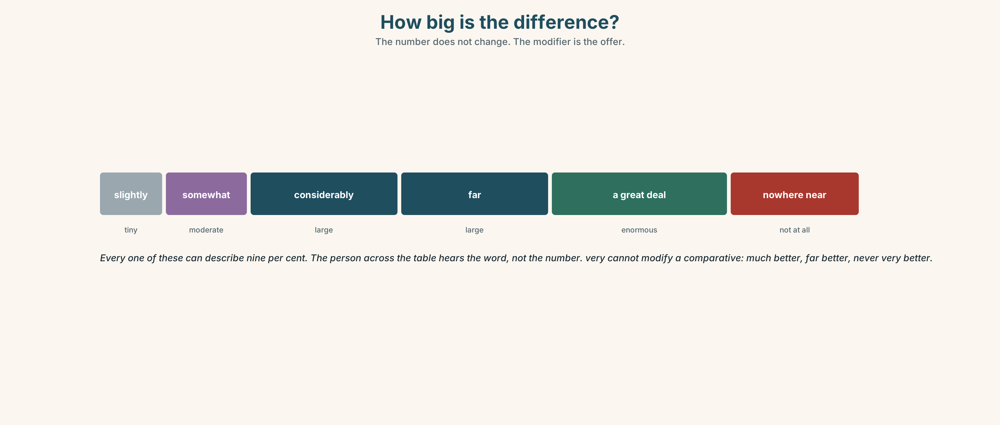{width=6.6in}

*How big is the difference? — The number does not change. The modifier is the offer.*

### 3C · Know

| Size | Modifier | Example |
|---|---|---|
| tiny | slightly · marginally · a little · a bit | *slightly better* |
| moderate | somewhat · rather | *somewhat better* |
| large | much · far · a lot · considerably · substantially · significantly | *far better* |
| enormous | a great deal · infinitely · appreciably | *a great deal better* |
| not at all | nowhere near · not nearly · barely | *nowhere near enough* |
| equal | just as · every bit as | *just as good* |

**The *more … the more* structure**

> **The more** hours she takes, **the less** she can choose.
> **The sooner** we write it down, **the better**.

Comparative first in each half. No *that*. The second half is the consequence.

> **Watch out.** *Very* modifies an adjective; it cannot modify a comparative. *Very good* ✓
> *very better* ✗. Use *much*, *far* or *a lot*.

> **Why it matters.** In a negotiation, the modifier is the offer. *Slightly more* and
> *considerably more* can describe the same number, and the person across the table hears the
> word, not the number.

### 3D · Use — controlled

> The contract is (1) __________ better than her current arrangement on paper, and
> (2) __________ worse on one thing she has not mentioned. The hourly rate is (3) __________
> higher — about nine per cent. The hours, however, are fixed: (4) __________ hours she accepts,
> (5) __________ freedom she has to take the other work she does on Tuesdays. Six years of
> goodwill is (6) __________ near a legal position, which is the argument for signing something.

### 3E · Use — guided

Rewrite each one so the difference sounds **larger**, then **smaller**. The number does not change.

1. It's better than before.
2. There's a difference in the hours.
3. The rate has gone up.

### 3F · Use — open

**Compare two jobs, two places or two years** using four different degree modifiers and one
*the … the …* structure. Your partner says which comparison you were trying to make sound big.

### 3G · Check — six items

> 1. It's ______ better than last year — about two per cent.
> 2. It's ______ better than last year — nearly double.
> 3. That's ______ near enough.
> 4. ______ more I read it, ______ less I like it.
> 5. It's ______ as good as the other one. *(equal)*
> 6. She's ______ better paid than she was. *(not "very")*

**0–3 →** Workbook pp. 78–80. **4–5 →** Part 6. **6 →** p. 199.

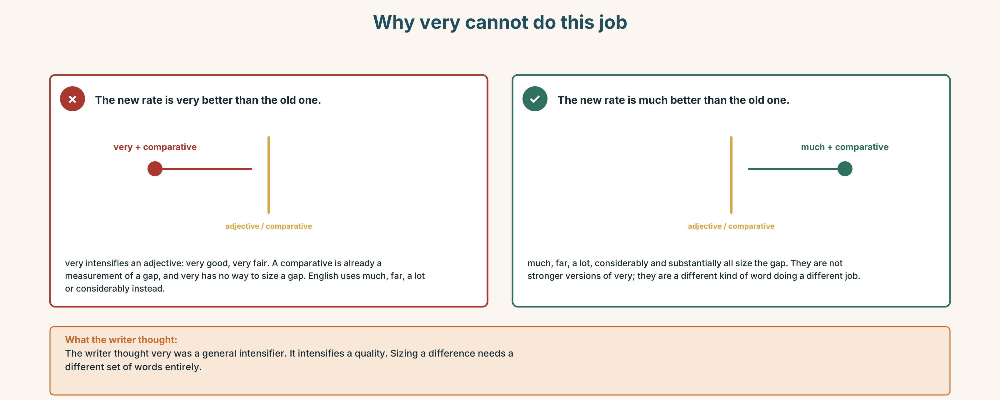{width=6.6in}

*Why very cannot do this job — Why very cannot do this job*

---

## Part 4 · Speaking ◆ **C · THE PERFORMANCE**

### 4A · Fluency sprint — 4 / 3 / 2

The best job you have had, and why. Four minutes, three, two.

### 4B · The functional core — negotiating

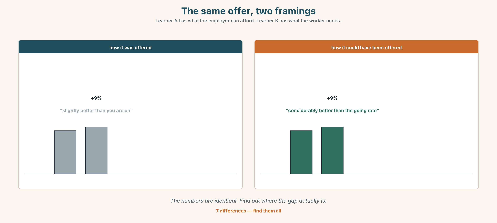{width=6.6in}

*The same offer, two framings — Learner A has what the employer can afford. Learner B has what the worker needs.*

**Language Bank**

| | |
|---|---|
| **opening a position** | *what I'd be looking for is* · *in principle, yes — with one thing* |
| **sizing a gap** | *that's not far off* · *we're nowhere near* · *that's a bigger gap than it looks* |
| **trading** | *I could move on the hours if* · *that works for me provided* |
| **closing** | *so shall we write that down?* · *I'd rather we both signed something* |
| **when it fails** | *they knocked it back* · *not by a long way* · *we could scale it up later* |

**Information gap.** Learner A has what the employer can afford. Learner B has what the worker
needs. Neither sees the other. **Find out whether an agreement exists.**

### 4C · The performance — the agreement

In pairs, twenty minutes. **You must end with something written that both of you sign**, or with a
written statement of exactly where you stopped and why.

### 4D · Observer

Listen for **one thing**: who said a number first, and what happened to it?

### 4E · Two criteria

> ☐ Did we write it down while we were still in the room?
> ☐ Would the other person's version of this conversation match mine?

---

## Part 5 · Reading ◆ **A · THE WORLD**

### 5A · Predict

A review of a book about informal work. The first line is:

> *There is a chapter missing from this otherwise excellent book, and I think I know why.*

What do you expect? One sentence.

### 5B · Skim — sixty seconds

Find the paragraph where the reviewer praises the book most.

---

**The chapter that isn't there**

There is a chapter missing from this otherwise excellent book, and I think I know why.

*Handshakes* is a study of informal work arrangements across four cities, and it is far better
than the literature it joins. The fieldwork is exhaustive — four hundred and eighty interviews
over three years — and the author resists almost every temptation available to her. She does not
romanticise informality, which is the standard failure of the sympathetic account. She does not
treat it as simply exploitation waiting to be formalised, which is the standard failure of the
policy account. She is considerably better than both camps at holding two things at once: that
informal arrangements are often chosen, and that being able to choose them is not the same as
having a choice.

The best chapter is the fourth, on what she calls the goodwill ledger. Her argument is that a
long informal arrangement accumulates a kind of credit on both sides — the worker who has stayed,
the employer who has paid in hard months — and that this credit is real, is valuable, and is
destroyed by formalisation. A contract converts six years of mutual obligation into twelve months'
notice. That is a far worse deal than it looks, and nobody records it as a loss because it was
never recorded as an asset.

What is missing is the chapter on what happens afterwards. The book follows people up to the
moment of formalisation and stops. In the two cases where she does follow through, both workers
end up marginally better paid and substantially less free, and in one of them the arrangement
ends within a year — and the author notes this in a footnote.

A footnote. The most important finding in four hundred and eighty interviews, in a footnote.

I do not think this is carelessness. I think the finding is uncomfortable for everybody who would
otherwise agree with her, including the reviewer, and that she knew it and did not want the book
to be read as an argument against writing things down. It would have been. It would also have
been the honest version, and the book is good enough that it could have carried it.

---

### 5C · Close reading

1. What is the fieldwork base of the book?
2. **What are the two standard failures the reviewer says the author avoids?**
3. Explain *the goodwill ledger* in your own words.
4. What does the reviewer say a contract converts six years into?
5. **What is in the footnote, and why does the reviewer object to its being there?**
6. **The reviewer says the author knew. What does the reviewer think she was protecting?**

### 5D · Vocabulary in context

> exhaustive · romanticise · informality · ledger · accumulate · formalisation

### 5E · The counter-text

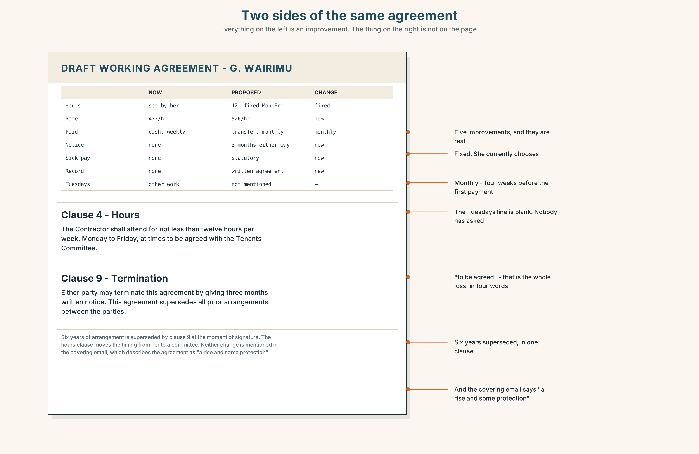{width=6.6in}

*Two sides of the same agreement — Everything on the left is an improvement. The thing on the right is not on the page.*

**Read the two sides of the agreement and answer.**

1. What is the current hourly rate, and what is the proposed one?
2. **How many hours a week does the proposal fix, and what does Grace currently do?**
3. What does the proposal give her that she does not have?
4. **What does it take away that is not written anywhere on the page?**
5. Find the notice period. **Compare it to six years.**

### 5F · Writer analysis

- The review praises the book for holding two things at once. **Does the review do the same?**
- **"A footnote." Two words as a paragraph. What is it doing that a sentence would not?**

### 5G · Text against text

**The review says formalisation destroys the goodwill ledger. The agreement is a page of
improvements.** Two sentences on whether both are true. The second begins *"The improvement is
real, and…"*

---

## Part 6 · Vocabulary Lab 2 ◆ **B · THE SYSTEM**

### Twenty-one ways to size a difference

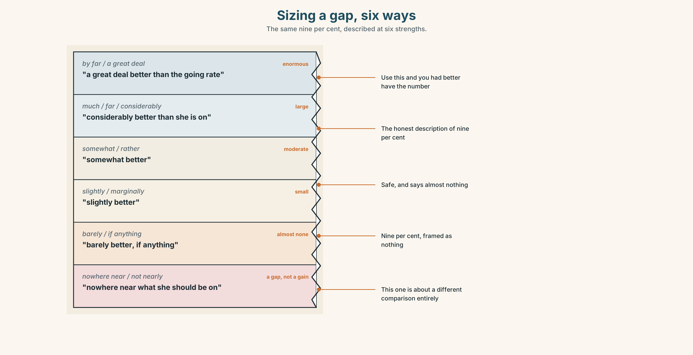{width=6.6in}

*Sizing a gap, six ways — The same nine per cent, described at six strengths.*

### 6A · Sort — the scale

Put all twenty-one on a line from **no difference** to **enormous difference**.

> far · much · slightly · considerably · marginally · substantially · significantly · somewhat ·
> barely · appreciably · infinitely · a great deal · nowhere near · every bit as · just as ·
> not nearly · the more… the more · the sooner… the better · by far · a good deal · if anything
>
> *and three that size a change rather than a gap:* **knock back** · **scale up** ·
> **not by a long way**

### 6B · Chunk completion

1. It is ______ ______ the hardest job in the building.
2. She is ______ ______ as quick as anybody they have hired since.
3. ______ ______ , she does more now than she did in 2020.
4. ______ ______ we write it down, ______ ______ for both of us.
5. It is ______ ______ what she should be on.

### 6C · Register sort

Which of these would you write in a contract? Which say out loud? **Five belong in both, and one
appears only in reviews.**

### 6D · Contrast Clinic — the modifier is the offer

Six items. **The number is identical in each pair. Only the modifier changes.**

1. The rate is ______ higher. / The rate is ______ higher. *(9% — make it sound small, then large)*
2. There are ______ more hours. / There are ______ more hours. *(four hours)*
3. It's ______ better than before. / It's ______ better than before. *(the same offer)*

**Then: in a negotiation, who benefits from each version?**

---

## Part 7 · Pronunciation & Fluency Lab ◆ **B · THE SYSTEM**

### Stressing the modifier

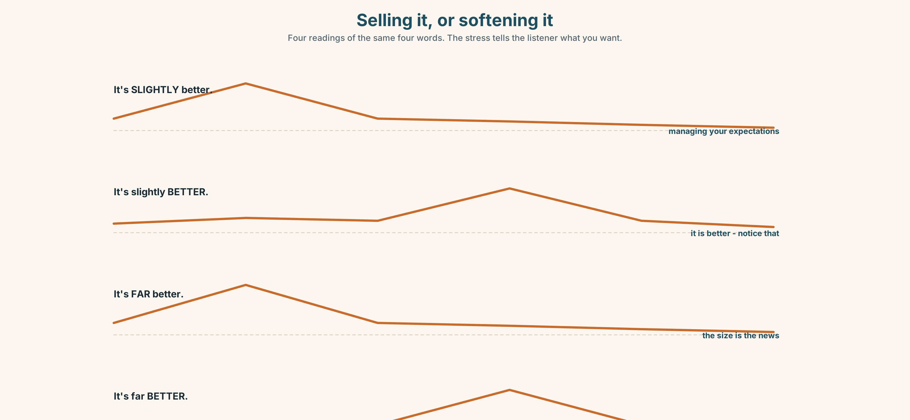{width=6.6in}

*Selling it, or softening it — Four readings of the same four words. The stress tells the listener what you want.*

### 7A · Hear 🔊 Track 10.3

> It's **SLIGHTLY** better. — *(I am managing your expectations)*
> It's slightly **BETTER**. — *(it is better, and I want you to notice)*
> It's **FAR** better. — *(the size is the news)*
> It's far **BETTER**. — *(the improvement is the news)*

### 7B · Say

All four. Your partner says whether you are selling it or softening it.

### 7C · Make it mean something

> *"It's a lot more than I thought."*

Say it as relief. Say it as suspicion. **Same seven words.**

### 7D · Fluency 20 ⏺

Twenty seconds: **two things compared, three different modifiers.** Three times, faster.

---

## Part 8 · Writing ◆ **C · THE PERFORMANCE**

### An agreement the other person would sign · 150 words

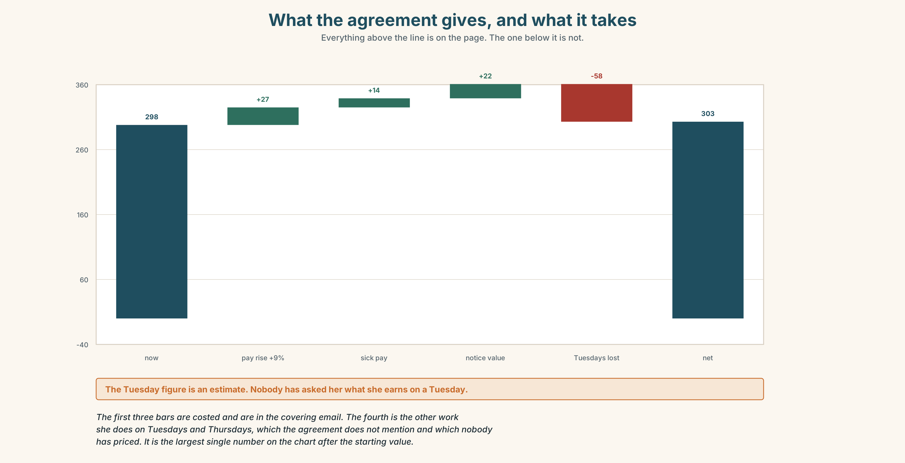{width=6.6in}

*What the agreement gives, and what it takes — Everything above the line is on the page. The one below it is not.*

### 8A · Read the model

> **Working agreement — Grace Wairimu and Jengo House tenants**
>
> Grace has cleaned this building since 2020 under an arrangement neither side wrote down. This
> replaces it. `[says what it replaces, and admits there was something]`
>
> **Hours.** Twelve hours a week, Monday to Friday, worked at times Grace sets. Not fixed by us.
> `[the thing she would lose, protected explicitly]`
>
> **Rate.** 520 an hour, reviewed each January against the cost of living, not against our budget.
> `[names the benchmark, which is the whole argument]`
>
> **Notice.** Three months either way. We know six years of goodwill is worth considerably more
> than three months, and we cannot write six years into a contract. This is the gap, and we are
> naming it rather than pretending it is not there.
>
> **If this is worse for you than what you have, do not sign it.** Tell us which clause and we
> will look at it again.

**Questions about the writer's choices:**

1. Why say *"neither side wrote it down"* rather than nothing?
2. **The notice clause admits the agreement is worse in one respect. Why include that?**
3. The last line invites refusal. **What does that buy, and what does it risk?**

### 8B · The anti-model

> This agreement sets out the terms of engagement between the parties. The Contractor shall provide
> cleaning services as reasonably required. Remuneration shall be as per Schedule 1. Either party
> may terminate on one month's written notice. This agreement supersedes all prior arrangements.

Legally tighter and ethically worse. **Name three things it does to the previous six years.**

### 8C · Generate · 8D · Plan

> what it replaces → the thing the other person would lose, protected first → the benchmark →
> the gap you cannot close, named → permission to refuse

### 8E · Draft 1 — 150 words
### 8F · Peer review — two criteria

> ☐ Would the person this is about sign it?
> ☐ Is there a loss in here that the writer has admitted?

### 8G · Draft 2 · 8H · Publish

**Give it to the person it is about, and do not be in the room while they read it.**

---

## Part 9 · The File ◆ **A · THE WORLD + C · THE PERFORMANCE**

# WORK FILE · The Difficult Message

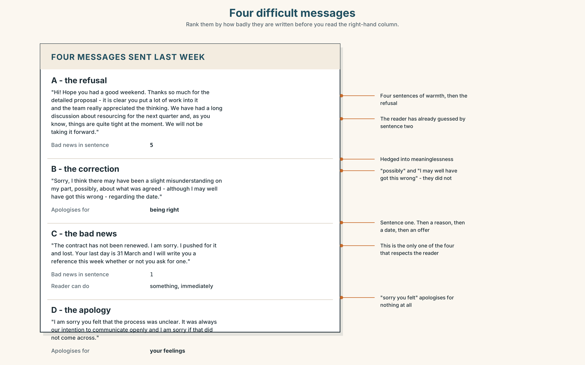{width=6.6in}

*Four difficult messages — Rank them by how badly they are written before you read the right-hand column.*

### 9A · Four messages

Four difficult messages: a refusal, a correction, bad news, and an apology. **Rank them by how
badly each is written**, before you read the annotations.

### 9B · The four failures

Each one fails in a named way: **burying it · over-explaining · apologising for the wrong thing ·
leaving the reader with nothing to do.** Match them.

### 9C · The rule

> Bad news goes in the first or second sentence. Never the third.

Test it: rewrite the worst of the four so the news is in sentence one. **Is it crueller, or just
shorter?**

### 9D · Write one

Pick a real difficult message you have been avoiding. **Write it in under eighty words.** Bad news
by sentence two. One thing the reader can do.

### 9E · Transfer

**Send it.** Then write down what actually happened, and compare it with what you expected.

---

## Part 10 · Mediation & Interaction ◆ **C · THE PERFORMANCE**

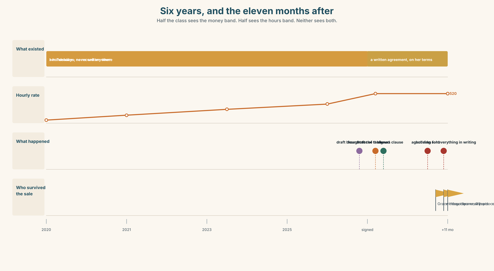{width=6.6in}

*Six years, and the eleven months after — Half the class sees the money band. Half sees the hours band. Neither sees both.*

### 10A · Relay

Half the class sees the money band; half sees the hours band. Rebuild by speaking.

### 10B · Simplify

Explain the proposed agreement to Grace's daughter, who is twenty-two, reads contracts for a
living, and will tell her mother what to do.

### 10C · Compress

The review into 60 words for somebody deciding whether to formalise an arrangement this week.

### 10D · Online interaction

Write the message to the other five tenants explaining why you are proposing to pay more.
**Two of them will read it as a criticism of the last six years.**

### 10E · Across languages

How does your language describe an arrangement that is real and not written down?
**Is there a single word? Is it respectful?**

---

## Part 11 · The Decision ◆ **C · THE PERFORMANCE**

# Grace's contract

Grace has cleaned Jengo House for six years. There is no contract. She is paid weekly in cash,
sets her own hours, and does other work on Tuesdays and Thursdays that nobody has ever asked about.

The tenants want to put her on a written agreement: twelve fixed hours, nine per cent more an
hour, three months' notice, paid by transfer.

- **Formalise it as proposed.** More money, legal protection, and her Tuesdays become a problem
  she has to raise.
- **Leave it.** She has said she is happy. Six years says something. And she has no notice, no
  record, and nothing if she is ill.
- **Formalise it on her terms** — she sets the hours, the rate is benchmarked, and the agreement
  says so in writing. It is harder to administer and two of the six tenants will object.

### 11A · The evidence

1. **The two sides of the agreement** from Part 5.
2. **The chart**: what she earns now, what she would earn, and what she loses.
3. **The voice.** Grace, thirty seconds: *"It's a lot more than I thought. I'd just want to know
   what happens on a Tuesday, and I don't want to have to ask every week."*

### 11B · Steelman

Argue the option you like least. Two minutes.

### 11C · Deliberate

> *I think they should ______, because ______. The strongest argument against me is ______, and my
> answer to it is ______.*

### 11D · Decide — eighty words, two reasons

### 11E · Model decision

> Formalise it on her terms, and accept that it is harder and that two people will object.
>
> Leaving it is the option that respects her stated view and I think it fails her. Six years with
> nothing written down is not an arrangement; it is an arrangement that has not yet been tested.
> The test arrives when somebody is ill, or when the building changes hands, and at that point
> goodwill is held entirely by people who will have moved on.
>
> Formalising it as proposed is worse than leaving it. It takes the one thing she has — control of
> her own week — and converts it into a clause she would have to negotiate for, having just been
> given a rise. Her thirty seconds is explicit about this and it is the only new information
> anybody has: she did not ask about the money.
>
> The third option costs the tenants administrative effort and costs her nothing. That asymmetry
> is the argument. The two who object will be objecting to effort, and it is not their Tuesdays.

### 11F · The Reveal

> **What happened.** They wrote it her way. The hours clause says *at times set by Grace, not less
> than twelve hours weekly*, which took four drafts because nobody had written a clause like it
> before and two of the drafts were worse than no clause at all.
>
> Eleven months later the building changed hands. The new owner's managing agent asked for all
> service arrangements in writing within fourteen days. Grace's was the only one that existed.
>
> She was kept on. Two of the other arrangements in the building — a window cleaner and a man who
> did the gutters — were not.

**The clause nobody knew how to write was the only thing in the building that survived the sale.**

> Was the reasoning sound? And: the window cleaner had been there nine years. Whose job was it to
> write his down?

---

## Part 12 · Landing ◆ **all three lines** · *end of book*

### 12A · Recycle — twelve items

**Six from this unit.**

1. It's ______ better than last year — about two per cent.
2. ______ more hours she takes, ______ less she can choose.
3. That's ______ near enough.
4. Saturday is paid at time and a ______.
5. She has never been on the ______.
6. Nights and Sundays are ______ hours.

**Four from across this book.**

7. She ______ out that the lease expired in March. *(Unit 9)*
8. The grower ______ I buy from has eleven acres. *(Unit 8)*
9. I want you ______ (check) it twice. *(Unit 7)*
10. The rule ______ (bring) in after a fire. *(Unit 6)*

**Two from *Making Plans* (A2.1).**

11. If she ______ (not sign), nothing ______ (change). *(first conditional)*
12. She ______ (work) here since 2020. *(present perfect, for/since)*

### 12B · Consolidate

**150 words, one paragraph.** Compare your work or study now with three years ago. Use **four**
degree modifiers, one *the … the …* structure, and six items from Part 6.

### 12C · Can-do, with evidence

| I can… | My evidence | Sure? |
|---|---|---|
| size a difference deliberately, and hear it when somebody else does | Part 3G score | ◯ ◑ ● |
| negotiate an agreement and write it down before leaving the room | Part 4C, signed | ◯ ◑ ● |
| write a difficult message with the news in the first two sentences | Part 9D, sent | ◯ ◑ ● |
| decide about somebody else's arrangement without deciding for them | Part 11D | ◯ ◑ ● |

### 12D · Replay ⏺ — and the book replay

Listen to your Part 0C from this unit, and record it again.

**Then find your Part 0C from Unit 1** — *Who is a city built for?* — and listen to it.
That was 110 hours ago. **Record an answer to it now.**

Write one sentence about what changed. Not about your English. About what you say.

### 12E · Glossary — forty-five items, as a map

> **WHAT YOU ARE PAID** · wage · salary · overtime · time and a half · a living wage · cash in hand · on the books
> **THE ARRANGEMENT** · contract · probation · notice · severance · zero-hours · a fair day's work
> **THE WORKPLACE** · rota · cover · cover for · turnover · headcount · unsocial hours · union · grievance
> **WHAT HAPPENS** · lay off · take on · clock in · in lieu
> **SAYINGS** · that's the job · nobody does it for the money
> **SMALL** · slightly · marginally · barely · somewhat · a little
> **LARGE** · far · much · considerably · substantially · significantly · appreciably · a great deal · by far · a good deal · infinitely
> **NOT AT ALL** · nowhere near · not nearly
> **EQUAL** · just as · every bit as
> **PAIRED** · the more… the more · the sooner… the better · if anything

### 12F · End of *Taking a Position*

> Ten units. Ten decisions, and not one of them had a right answer.
>
> In six of the ten, the reasoning was sound and something was still lost. In two, the person it
> was about was not in the room when it was decided. In one — Grace's — the thing nobody knew how
> to write was the only thing that survived.
>
> **Next: B1.2 · *Weighing It Up*** — Hospital Regional, Valdivia. Where the decisions are the
> same shape and the cost of getting them wrong is a person.

