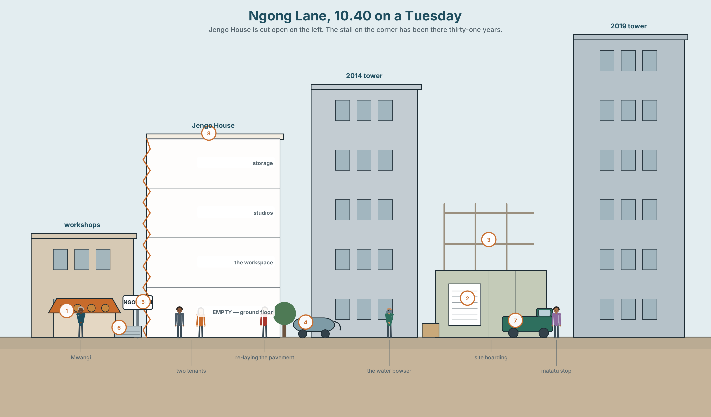
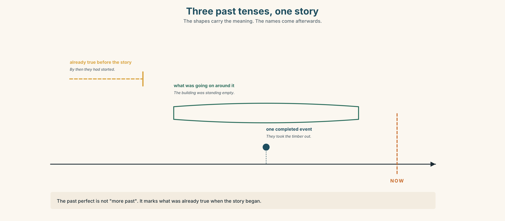
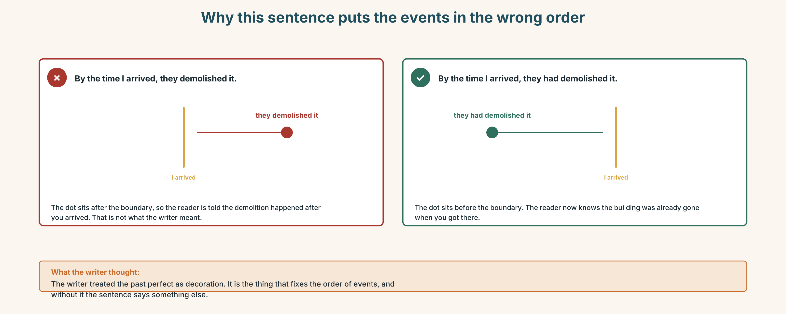
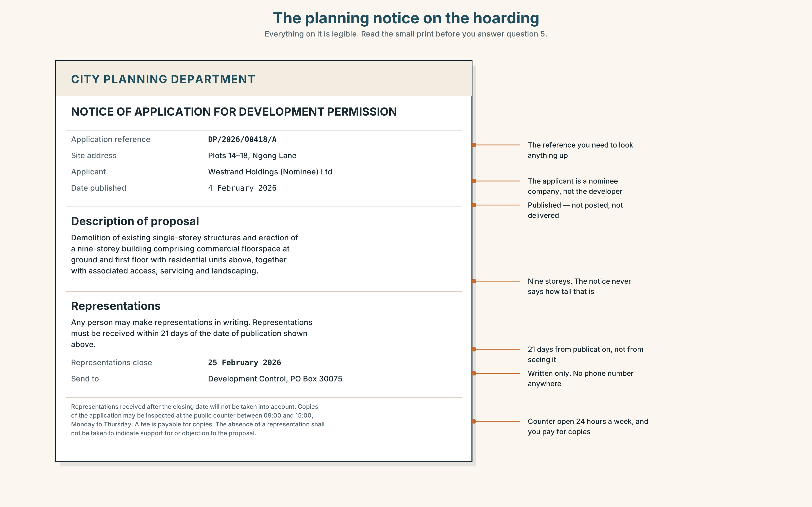
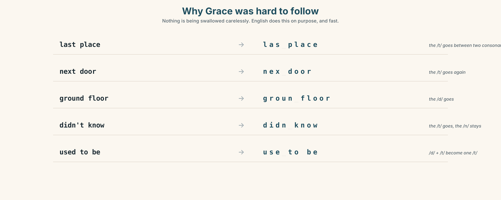
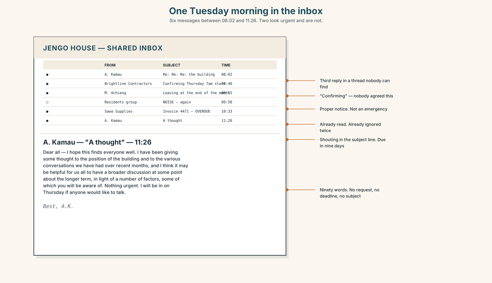
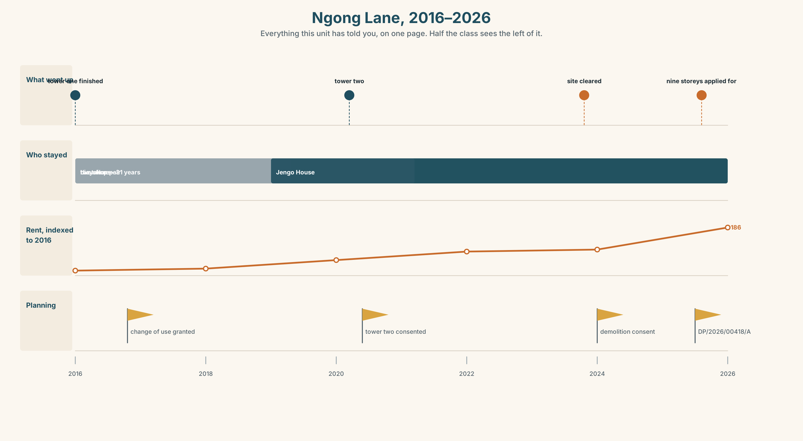
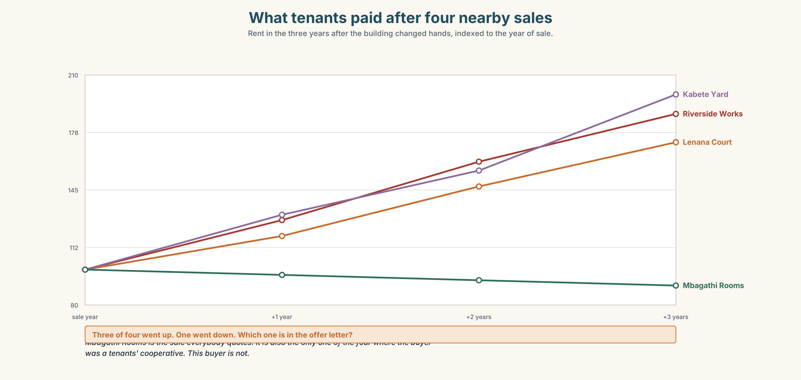

# B1.1 · Unit 1 · Ground Floor

> **English Animated** · *Taking a Position* · Jengo House, Nairobi
> Student's Book pages 8–27 · 20 pp · ~11.5 hours

---

## Part 0 · The Big Picture ◆ **A · THE WORLD**

{width=6.6in}

*Ngong Lane, 10.40 on a Tuesday — Jengo House is cut open on the left. The stall on the corner has been there thirty-one years.*

# Who is a city built for?

**By the end of this unit you will tell the story of how one street changed, in 90 seconds, to
someone who has never seen it.**

| ◆ **A · THE WORLD** | How a street changes, who changes it, and who is still there afterwards |
|---|---|
| ◆ **B · THE SYSTEM** | Three past tenses working together · the past perfect, returning · 24 words for urban space and change · 21 markers of time and sequence · elision in fast speech |
| ◆ **C · THE PERFORMANCE** | A 90-second spoken account of a changed place, and a 140-word written one |

---

### 0A · Find it

Look at the picture. Find and label these fourteen things. Four of the eighteen words are not in
the picture — which four?

> pavement · kerb · hoarding · scaffolding · awning · bowser · matatu · paving slab · frontage ·
> planning notice · ground floor · roof terrace · fire escape · sewing machine · security grille ·
> satellite dish · skip · cherry picker

### 0B · Guess it

Three things in this picture will not be there in five years. Which three, and what makes you
think so? There is no correct answer — but there is a better and a worse reason.

### 0C · Say it ⏺

**Record thirty seconds.** *Who is this street built for?* Say what you think now. Do not prepare.
You will listen to this again at the end of the unit, and record it a second time.

---

## Part 1 · Vocabulary Lab 1 ◆ **B · THE SYSTEM**

### 1A · Meet — the street, named

Tap or look at the picture in Part 0 and find the thing each word names. Write the word.

> **plot** · **frontage** · **hoarding** · **scaffolding** · **kerb** · **pavement** ·
> **tenant** · **landlord** · **rent** · **derelict** · **demolish** · **redevelop**

{width=6.6in}

*Sixty metres of Ngong Lane, then and now — Shaded = what it is now. Dashed outline = what it was in 2010. One shape has not changed.*

**Use the plan.** Which plot changed most? Which changed least? Put the seven plots in order —
then do 1B with the same seven, and see whether your two orders agree.

### 1B · Sort — how much is destroyed?

Put these seven verbs in order, from the one that changes least to the one that changes most.

> repaint · refit · extend · convert · **do up** · **redevelop** · **demolish**

Compare with a partner. You will not agree about all of them. The useful question is *what are you
measuring* — how much of the building survives, how much it costs, or how long people have to leave?

### 1C · Sort — odd one out, and why

In each group, one word does not belong. Cross it out **and write the reason**. More than one
answer can be defended.

1. tenant · landlord · resident · developer
2. demolish · redevelop · do up · knock down
3. rent · rates · mortgage · deposit
4. hoarding · scaffolding · awning · frontage

### 1D · Stretch — what goes with what?

Tick the combinations that are normal English. Then find the one combination nobody says, and say
what people use instead.

| | rent | permission | a building | a stall | the kerb |
|---|---|---|---|---|---|
| **raise** | | | | | |
| **grant** | | | | | |
| **put up** | | | | | |
| **run** | | | | | |
| **re-lay** | | | | | |

### 1E · Stretch — the phrases

Complete each phrase with one word.

1. The shop is **set back _______ the road**, so people walk past it.
2. The building is **_______ use** — flats above, workshops below.
3. **_______ rents** have pushed out four businesses on this street.
4. There has been **a change of _______** on the ground floor: it was a timber store, now it is
   offices.
5. Three of the old tenants were **_______ out** and moved two miles away.

> **Corpus Note**
> In a 1.2-billion-word corpus, **redevelop** appears beside *site*, *area* and *scheme* almost
> every time. It appears beside **home** fewer than five times in a billion words.
> What is that choice doing?

### 1F · Own it

Describe a street you know, using **six** of this unit's words and one word you had to look up.
Tell a partner. Your partner's job: which word did you look up?

---

## Part 2 · Listening ◆ **A · THE WORLD**

### 2A · Three people on the same street 🔊 Track 1.1

{width=6.6in}

*Three people, one street, ten years — Each is turned towards something different. That is the task.*

**Before you listen.** Look at the picture in Part 0 again. Who do you think will be pleased about
the changes to this street, and who will not? Why?

**Gist — one listen, one question, no second chance.**
Which of the three would move away tomorrow if they could?

**Detail — listen again and complete the frame.**

| | The street **was**… | The street **is**… | The street **will be**… |
|---|---|---|---|
| Grace | | | |
| Mr Kamau | | | |
| Tom | | | |

**Inference.** Grace never says she is worried. How do you know she is? Write down the exact words
that told you.

**Attitude.** Mr Kamau says *"it's progress."* Which **sound** tells you how he feels about it —
not which word?

**Noticing.** Here are six sentences from the recording. Sort them into three groups.

1. *The ground floor was still the timber place.*
2. *They took that out.*
3. *Nobody told us anything.*
4. *It was empty for eight months.*
5. *The people who were here then have gone.*
6. *By the time I came back, they had already started.*

> **A.** This happened once and finished. · **B.** This was going on, around the story. ·
> **C.** This was already true before the story started.

*You do not need to name the tenses. You will do that in Part 3.*

### 2B · Decoding clinic 🔊 Track 1.2

Forty-two seconds of Grace at full speed. You will hear it **four times**. A different job each time.

1. How many words are there in her first sentence?
2. Catch the three numbers.
3. Find two places where two words join into a single sound.
4. What disappeared from *didn't know*?

> Transcripts for both tracks are on page 171. Do not look until you have finished.

---

## Part 3 · Grammar Lab 1 ◆ **B · THE SYSTEM**

### Three past tenses, working together

### 3A · Notice

Go back to the six sentences in Part 2. Answer these five questions. Every answer is in the
sentences.

1. Sentence 2 (*They took that out*) — did this take a long time, or was it one event?
2. Sentence 1 (*was still the timber place*) — is this one event, or a situation that lasted?
3. Which of the six sentences describes something that happened **before** the rest of the story?
4. What are the three words in sentence 6 that tell you it came first?
5. Sentence 5 has two parts. Which part is the background, and which is the news?

### 3B · See

{width=6.6in}

*Three past tenses, one story — The shapes carry the meaning. The names come afterwards.*

### 3C · Know

| | Use it for | Example |
|---|---|---|
| **past simple** | one completed event; the spine of the story | *They **took** the timber out.* |
| **past continuous** | what was going on around that event; the background | *The building **was standing** empty.* |
| **past perfect** | what was already true before the story started | *By then they **had** already **started**.* |

> **Watch out.** The past perfect is not "more past". It marks **what was already true when the
> story began**. If every past sentence in your paragraph is a past perfect, none of them is doing
> any work.

> **Why it matters.** Get this wrong and your reader puts the events in the wrong order. *When I
> arrived, they left* and *When I arrived, they had left* describe two different mornings.

### 3D · Use — controlled

Complete the text. Use the past simple, the past continuous or the past perfect.

> Mwangi (1) __________ (open) the stall in 1994. At that time the lane (2) __________ (be) mostly
> workshops, and people (3) __________ (repair) radios and bicycles all day. He (4) __________
> (rent) his two metres of frontage from a man called Otieno, who (5) __________ (die) in 2009.
> By the time the first tower (6) __________ (go) up, Otieno's son (7) __________ already
> __________ (raise) the rent twice. For eleven days Mwangi (8) __________ (work) by lamp, because
> the new building (9) __________ (block) the sun until ten in the morning. He (10) __________
> (not complain). He (11) __________ (buy) a brighter lamp.

### 3E · Use — guided

These six events are in the wrong order. Put them in the right order, then **write the connecting
sentences**. You will need at least one past perfect and one past continuous.

> • the drivers moved three streets away · • the second tower took the open ground ·
> • Mwangi rented the frontage from Otieno · • Otieno died · • the first tower was finished ·
> • Mwangi was working by lamp for eleven days

### 3F · Use — open

**Tell a partner about a place that changed on you.** It can be a street, a building, a shop, a
room. Your partner must be able to say afterwards, without asking, **what was already true before
your story started**. If they cannot, tell it again.

### 3G · Check — six items, mark your own

> 1. When we arrived, the meeting ______ already ______. (start)
> 2. I ______ (walk) past the site every morning that year.
> 3. She ______ (sign) the lease on the Tuesday and ______ (move) in on the Friday.
> 4. By 2016 four of the fourteen businesses ______ (close).
> 5. ______ (you / live) here when they knocked it down?
> 6. He ______ (not realise) the consultation ______ (end).

**0–3 →** Workbook pp. 6–8 before you go on. **4–5 →** the Contrast Clinic in Part 6 will fix it.
**6 →** the extension task on p. 19.

{width=6.6in}

*Why this sentence puts the events in the wrong order — Why this sentence puts the events in the wrong order*

---

## Part 4 · Speaking ◆ **C · THE PERFORMANCE**

### 4A · Fluency sprint — 4 / 3 / 2

Describe the street you live on. **Four minutes** to a partner. Then change partner: the same
description in **three minutes**. Then change again: **two minutes**.
Same content every time. Do not add anything. The only thing that changes is you.

### 4B · The functional core — describing change, and saying who did it

{width=6.6in}

*The same forty metres, 2010 and 2026 — Learner A sees the left panel. Learner B sees the right. Neither sees the other.*

**Language Bank** — three levels of formality. Choose, do not mix.

| | | |
|---|---|---|
| **informal** | *it's not what it was* · *they've done the whole lot up* · *it's gone really* |
| **neutral** | *the area has changed a lot* · *they put up two towers* · *most of the old shops have gone* |
| **formal** | *the character of the street has altered considerably* · *the site was redeveloped in 2014* |

**Information gap.** Without showing each other, find all nine differences. You may only describe.
Then decide together: which of the nine would the people who live there actually notice?

### 4C · The performance — the residents' meeting

Six role cards. **Each card has a position everyone can see, and a brief nobody else knows.**
Twenty minutes. No chair — you will have to take and give the floor yourselves.

> **A · Wanjiru** runs the workspace. *Public: wants a decision today.* ·
> **B · Obi** runs a logistics startup. *Public: wants to sell.* ·
> **C · Mariam** is a textile designer. *Public: will not move.* ·
> **D · Tom** consults on data. *Public: wants the numbers first.* ·
> **E · Mr Kamau** is the landlord. *Public: neutral.* ·
> **F · Grace** cleans the building. *Public: has not been asked.*

### 4D · Observer

One person in each group does not take a role. You listen for **two things only**, and report for
thirty seconds at the end:

- Who was interrupted, and by whom?
- Who was never asked a question?

### 4E · Two criteria

Rate yourself on these and nothing else.

> ☐ Did I give a reason **every** time I disagreed?
> ☐ Did I bring in someone who had not spoken?

---

## Part 5 · Reading ◆ **A · THE WORLD**

### 5A · Predict

You will read a feature article called **"The last shop on the corner"**. The first line is:

> *Mwangi Njoroge has been taking in trousers on the same corner of Ngong Lane for thirty-one years.*

What do you expect the article to argue? Write one sentence. You will check it at 5D.

### 5B · Skim — sixty seconds

Read the whole text in one minute. Do not stop at words you do not know. Answer one question:
**where does the article turn?** Mark the paragraph.

---

**The last shop on the corner**

Mwangi Njoroge has been taking in trousers on the same corner of Ngong Lane for thirty-one years.
In that time three buildings have gone up around him and two have come down. His stall has not
moved by a metre.

When he started, the lane was mostly workshops. People repaired things here — radios, shoes,
bicycles, trousers. The building that now houses Jengo House was a timber store, and the plot next
to it was open ground where matatu drivers parked and argued. Mwangi rented his two metres of
frontage from a man called Otieno, who died in 2009, and whose son raised the rent twice and then
forgot about it.

The first tower went up in 2014. Mwangi remembers the week it was finished, because for eleven days
he could not see the sun until after ten in the morning, and he was working by lamp. The second one
took the open ground. The drivers moved three streets down and most of them never came back.

"People ask me if business is worse," he says. "It is not worse. It is different. Before, I repaired
work clothes. Now I take in suits for young people who have just started earning and bought the
wrong size online."

He is not sentimental about it. He points out that the new buildings brought him the customers he
has now, and that the lane had been dangerous after dark for years before anyone built anything.

But he also notes that of the fourteen businesses that were on this stretch when he arrived, his is
the only one still trading. The others did not fail. Their rent went up, and they moved somewhere
cheaper, and then that place got expensive too.

---

### 5C · Close reading

1. What was on the plot next to Jengo House before the second tower?
2. Why did Mwangi work by lamp for eleven days?
3. Mwangi says business is *"not worse — different."* Give two pieces of evidence from the text.
4. What does the article tell you about Otieno's son, and what does that detail do in the piece?
5. **The last paragraph says the other businesses "did not fail". What did happen to them?**
6. Mwangi makes one point in the developers' favour. What is it?

### 5D · Vocabulary in context

Work out what each word means from the sentence around it. **Then rate how sure you are:**
◯ guessing ◑ fairly sure ● certain.

> frontage · stretch (*on this stretch*) · sentimental · trading · take in (*take in trousers*) ·
> the lane had been dangerous

### 5E · The counter-text

{width=6.6in}

*The planning notice on the hoarding — Everything on it is legible. Read the small print before you answer question 5.*

**Read the notice and answer.**

1. What is being proposed?
2. By what date did an objection have to be received?
3. Where would you have had to send it?
4. How many people are named in this document?
5. Look at today's date. What can a resident of Ngong Lane do now?

### 5F · Writer analysis

The article names four people. The planning notice names none.

- What is each document **for**?
- Who is each one written **for**?
- The article never mentions the consultation window. Should it have?

### 5G · Text against text

Both documents are true. **Which one would you put on the hoarding, and why?**
Give your answer in two sentences. The second sentence must begin *"The problem with that is…"*

---

## Part 6 · Vocabulary Lab 2 ◆ **B · THE SYSTEM**

### Time and sequence — the connective tissue

### 6A · Register sort

Which of these would you find in the **planning notice**, and which only in **speech**?
Three belong in both.

> by the time · back then · thereafter · ever since · up to that point · subsequently ·
> from then on · before long · previously · at first · later on · in the meantime

### 6B · Chunk completion

Complete from memory. Then find each one in the Part 5 texts and check.

1. ______ the time the first tower went up, the rent had risen twice.
2. The plot was open ground. ______ then, nobody had built on it.
3. He has had the same pitch ______ since 1994.
4. The drivers left, and ______ long the café closed too.
5. ______ first the lamp was enough. ______ on he bought a brighter one.

### 6C · Semantic map

Put all twenty-one markers into four zones. Some belong in more than one — say which and why.

> **EARLIER** · **AT THE SAME TIME** · **LATER** · **A BOUNDARY** *(a moment that divides before
> from after)*

### 6D · Contrast Clinic — past simple against past perfect

Six items. In each, **only the time marker decides**.

1. When the notice went up, the objection period ______ (already / close).
2. The objection period ______ (close) on the fourteenth.
3. By 2016, four businesses ______ (leave).
4. In 2016, four businesses ______ (leave).
5. She read the notice the day after it ______ (expire).
6. She read the notice on the day it ______ (expire).

**Say in one sentence what the difference is between each pair.** Not the rule — the difference in
what happened.

---

## Part 7 · Pronunciation & Fluency Lab ◆ **B · THE SYSTEM**

### Why Grace was hard to follow

{width=6.6in}

*Why Grace was hard to follow — Nothing is being swallowed carelessly. English does this on purpose, and fast.*

### 7A · Hear

> last place → *las(t) place* · next door → *nex(t) door* · ground floor → *groun(d) floor* ·
> didn't know → *didn(t) know* · used to be → *use(d) to be*

Listen. In each pair, which sound disappears?

### 7B · Say

Choral, then alone, then inside the sentence it came from:
*"The ground floor was still the timber place, so the whole building smelled of wood."*

### 7C · Make it mean something

Say this sentence twice — once with the elisions, once with every consonant pronounced.

> *I don't know what they used to do next door.*

Which one sounds like a person? Which one sounds like a document being read aloud? **When would
you want the second?**

### 7D · Fluency 20 ⏺

Twenty seconds on **the street I grew up on**. Three times, each one faster, same content.
Record the first and the third. Listen to both.

---

## Part 8 · Writing ◆ **C · THE PERFORMANCE**

### How a place changed · 140 words

{width=6.6in}

*Jengo House in section — Each floor carries what it was built for, and what it is used for now.*

### 8A · Read the model

> The road I grew up on is called Station Road, and there has not been a station on it since 1968.
> `[opens in the present, then goes back — the reader needs the now first]`
>
> When we moved there in 2004 it was mostly houses, with a post office at one end and a garage at
> the other. The garage had already been there for forty years, and the man who ran it had learned
> the trade from his father. `[past perfect — the only one in the text, and it is doing real work]`
>
> Then the bypass opened. Traffic that had come through the village went around it instead, and
> within three years the post office had closed, the garage had closed, and a developer had bought
> both sites.
>
> There are eleven new houses now, and they are good houses. The people in them drive to the
> supermarket. Nobody walks up Station Road any more, because there is nothing on it to walk to.
> `[who gained and who lost — stated, not implied]`

**Questions about the writer's choices, not the rules:**

1. Why does the writer start in the present and then go back?
2. There is one past perfect in paragraph two and three in paragraph three. Why the cluster?
3. The last sentence gives a reason. What would be lost if it were the first sentence?

### 8B · The anti-model

> Station Road was built in 1890. The station closed in 1968. We moved there in 2004. There was a
> post office and a garage. The bypass opened in 2011. The post office closed in 2012. The garage
> closed in 2013. A developer bought both sites. There are eleven new houses now. The people drive
> to the supermarket.

This is grammatically correct. **Why is it worse?** Name three specific things the model does that
this does not.

### 8C · Generate

Five minutes. List every place you can think of that has changed in your lifetime. Do not judge
them. Then choose one — the one you have most to say about, not the most dramatic.

### 8D · Plan

> where it was → what it was like → **the single event that changed it** → what had already been
> true before that → what it is now → who gained, and who lost

### 8E · Draft 1 — 140 words

### 8F · Peer review — two criteria only

Swap. Read once. Answer only these, then sign.

> ☐ Can I tell the order of events **without re-reading**?
> ☐ Do I know **who gained and who lost**?

### 8G · Draft 2

### 8H · Publish

Your redraft goes on the class wall. **One of these will be the source text for Unit 2's mediation
task**, so someone will have to explain yours to a person who has never been there.

---

## Part 9 · The File ◆ **A · THE WORLD + C · THE PERFORMANCE**

# WORK FILE · The Inbox

Six messages reached Jengo House between 8.00 and 11.30 on one Tuesday.

{width=6.6in}

*One Tuesday morning in the inbox — Six messages between 08.02 and 11.26. Two look urgent and are not.*

| | From | Subject | 🕗 |
|---|---|---|---|
| 1 | A. Kamau (landlord) | *Re: Re: Re: the building* | 08.02 |
| 2 | Brightline Contractors | *Confirming Thursday 7am start* | 08.40 |
| 3 | M. Achieng (tenant, 2nd floor) | *Leaving at the end of the month* | 09.15 |
| 4 | Residents' group | *NOISE — again* | 09.50 |
| 5 | Sawa Supplies | *Invoice 4471 — overdue* | 10.33 |
| 6 | A. Kamau (landlord) | *A thought* | 11.26 |

### 9A · Triage

Rank all six by **urgency**. Then rank them again by **importance**. They are not the same list.
Where the two lists disagree, say which one you would act on and why.

### 9B · Decode

Message 6 is ninety words long and says nothing. Read it.

> *Dear all — I hope this finds everyone well. I have been giving some thought to the position of
> the building and to the various conversations we have had over recent months, and I think it may
> be helpful for us all to have a broader discussion at some point about the longer term, in light
> of a number of factors, some of which you will be aware of. Nothing urgent. I will be in on
> Thursday if anyone would like to talk. Best, A.K.*

**What is this message for?** Three questions:
1. What has already happened, that this message is a response to?
2. Why is it ninety words and not nine?
3. If you reply, what are you agreeing to?

### 9C · Write the two that matter

Sixty words each. Not the easy ones.

- **To Brightline Contractors.** Nobody agreed Thursday. Work starts at 7am and there are tenants
  asleep upstairs. You need it moved, and you need to keep the contractor.
- **To M. Achieng.** She is leaving. You would rather she stayed, but you are not going to beg, and
  she has given proper notice. Something useful has to happen in sixty words.

### 9D · Transfer — do this before next week

Look at your own inbox, or your own messages. **Find one message that was written to avoid saying
something.** Bring it. You do not have to say who sent it.

---

## Part 10 · Mediation & Interaction ◆ **C · THE PERFORMANCE**

{width=6.6in}

*Ngong Lane, 2016–2026 — Everything this unit has told you, on one page. Half the class sees the left of it.*

### 10A · Relay

Half the class sees the **left** of the infographic. Half sees the **right**. You may not show each
other. **Rebuild the whole thing by speaking.** Twelve minutes.

### 10B · Simplify — for a named person

Explain the planning notice from Part 5 to **Grace**. She has eleven minutes between floors and no
legal English. She needs to know what she can still do.

> **Plan before you speak:** what it is → what it means for her → what she can still do → by when

### 10C · Compress

The 286-word article into **60 words** for a noticeboard. Then defend three of your cuts to a
partner who disagrees with all three.

### 10D · Online interaction

Now write the same thing as a message in the residents' WhatsApp group.

**It will be screenshotted.** Assume Mr Kamau will see it. Assume the developer's agent is in the
group and nobody remembers adding them.

### 10E · Across languages

Take 10B or 10C. Say it in **your own language**. Then bring it back into English.
**What moved?** Not what was lost — what moved.

---

## Part 11 · The Decision ◆ **C · THE PERFORMANCE**

# The offer on the ground floor

A developer has offered to buy Jengo House. The price is good — better than the building is worth
on any normal valuation, because what they want is the plot.

Six tenants. Three positions.

- **Obi** wants to take it. His share would fund two years of the logistics business, which is
  eleven months from either working or not working.
- **Mariam** will not move. Her industrial machines are bolted through the floor into the slab. The
  nearest unit that could take them is forty minutes away and costs more.
- **Grace** has cleaned the building for six years. There is no contract. Nobody has asked her, and
  she has not raised it.

### 11A · The evidence — three formats, no two agree

1. **The offer letter.** Reproduced in full on page 25.
2. **The figures**, below.
3. **The voice.** Grace, forty seconds, lifted from Track 1.1.

{width=6.6in}

*What tenants paid after four nearby sales — Rent in the three years after the building changed hands, indexed to the year of sale.*

### 11B · Steelman — first

Before you argue for your own position, **argue for the one you disagree with**, as well as its
best advocate would. Two minutes. Your partner judges whether you were fair to it.

### 11C · Deliberate

In threes, against this frame:

> *I think they should ______, because ______. The strongest argument against me is ______, and my
> answer to it is ______.*

**Phrase bank:** *the money would* · *the real cost is* · *what nobody has asked is* ·
*I'd rather lose the premium than* · *in three years' time we'd be*

### 11D · Decide

Eighty words. Commit. Two reasons.

### 11E · Model decision

> I think they should refuse, and I think Obi has the strongest case against me, so let me take it
> first. He is eleven months from knowing whether his business works, and a share of this sale buys
> him two years. If it fails because the money came too late, no amount of loyalty to a building
> will have been worth it. That is a real cost and I am not going to pretend otherwise.
>
> But the chart tells us what happens to the tenants afterwards, and in three of the four
> comparable sales the rent they ended up paying was higher within eighteen months. The fourth is
> the one everyone cites, and it is the one where the buyer was a cooperative. This buyer is not.
> Selling converts a problem they can see into a problem they cannot.
>
> And Grace has not been asked. Six years, no contract, and she is not in the room where the
> building she cleans is being sold. Whatever they decide, that part is already wrong.

### 11F · The Reveal

> **What actually happened.** They refused. Obi stayed, and the logistics business did work —
> though he says the eighteen months were worse than they needed to be. Two years later the
> landlord raised the rent by forty per cent anyway, and **Mariam left**, because she could not
> absorb it and the machines were the one thing she could not take cheaply.
> Grace is still there. She now has a contract, which Wanjiru drew up the week after the meeting,
> because the discussion made it impossible not to notice.

**Now answer this, and it is the real question of the unit:**

> The outcome was bad for the person the decision was supposed to protect.
> **Was the reasoning wrong?**

---

## Part 12 · Landing ◆ **all three lines**

### 12A · Recycle — twelve items

**Six from this unit.**

1. By the time the notice went up, the objection period ______ (close).
2. For eleven days he ______ (work) by lamp.
3. The lane ______ (be) mostly workshops when he started.
4. Four businesses were ______ out by rising rents.
5. The ground floor has had a change of ______.
6. ______ then, nobody had built on the open ground.

**Four from *Telling the Story* (A2.2).**

7. She said she ______ (not receive) the letter. *(reported speech)*
8. ______ the time we arrived, they had gone. *(past perfect)*
9. ______ of the fourteen businesses are still trading — only one. *(quantifiers)*
10. He rented it from ______ man called Otieno. *(articles)*

**Two from *Making Plans* (A2.1).**

11. The developer, ______ bought both sites, has not started work. *(relative clause)*
12. If the rent ______ (go) up again, Mariam will have to move. *(first conditional)*

### 12B · Consolidate

**120 words, one piece of continuous writing.** Describe the ten years of Ngong Lane from the
infographic in Part 10. You must use **both** past tense patterns from this unit and **at least six**
of the time and sequence markers from Part 6. One paragraph. No bullet points.

### 12C · Can-do, with evidence

Tick only what you can show.

| I can… | My evidence | Sure? |
|---|---|---|
| tell a story about the past using three tenses together without losing my reader | your Part 4C recording | ◯ ◑ ● |
| describe how a place has changed and say who gained and who lost | your Part 8 draft 2 | ◯ ◑ ● |
| take notes while someone speaks and retell what they said accurately | your Part 10A relay | ◯ ◑ ● |
| state a position on a local decision and give two reasons for it | your Part 11D decision | ◯ ◑ ● |

### 12D · Replay ⏺

Find your thirty seconds from Part 0C. Listen to it.
Now record the same thirty seconds again: **Who is this street built for?**
Listen to both, one after the other. Write one sentence about what changed.

### 12E · Glossary — forty-five items, as a map

> **THE STREET** · pavement · kerb · plot · frontage · the corner · the ground floor · a block of flats
> **THE BUILDING** · hoarding · scaffolding · derelict · mixed use · a change of use · do up
> **THE CHANGE** · demolish · redevelop · knock down · put up · priced out · rising rents · set back from the road
> **THE PEOPLE** · tenant · landlord · rent · planning permission · move out · the way things were · it's not what it was
> **BEFORE** · previously · formerly · originally · initially · up to that point · at first · to begin with · by then · date back
> **DURING** · meanwhile · overnight · in the meantime · at the time · carry on
> **AFTER** · eventually · subsequently · afterwards · thereafter · ever since · from then on · later on · before long · in the end
> **THE BOUNDARY** · by the time · until · no sooner had we…

### 12F · Next

> **Unit 2 · What does a price hide?**
> Someone will have to explain your Part 8 text to a person who has never been there. It might be
> you. It might not.
