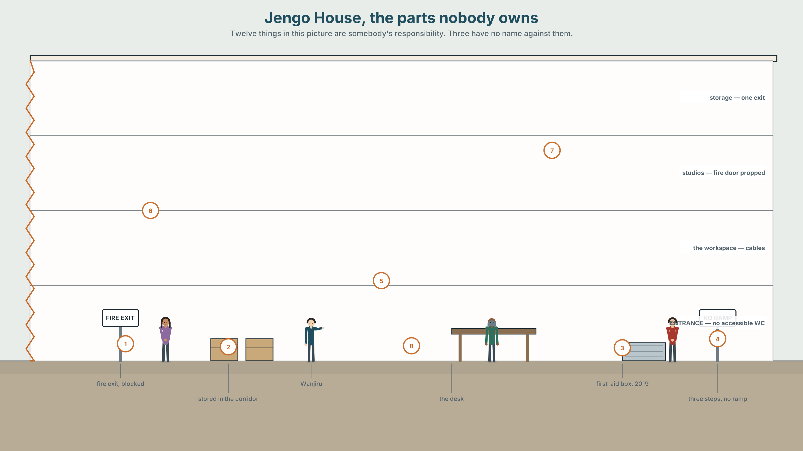
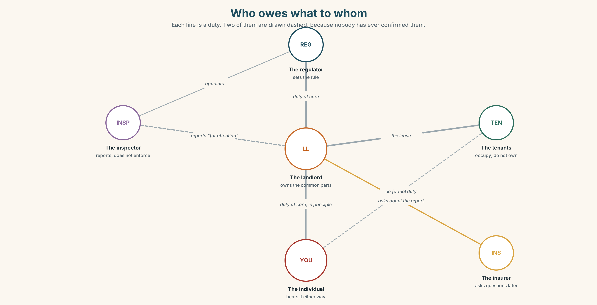
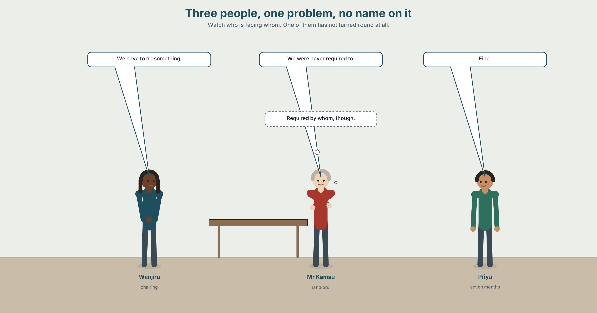
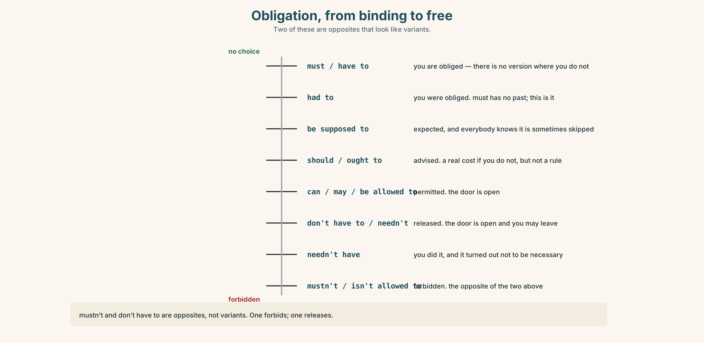
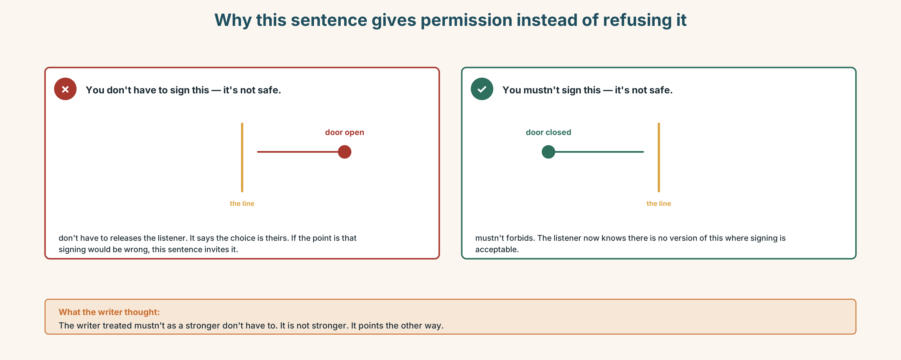
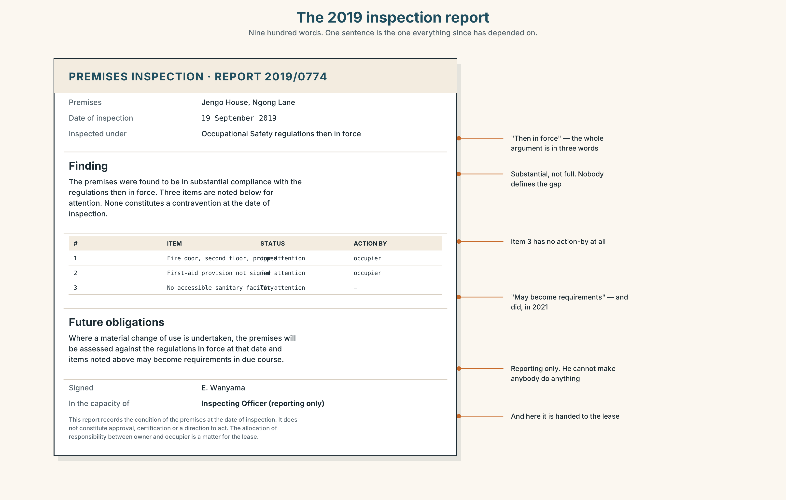
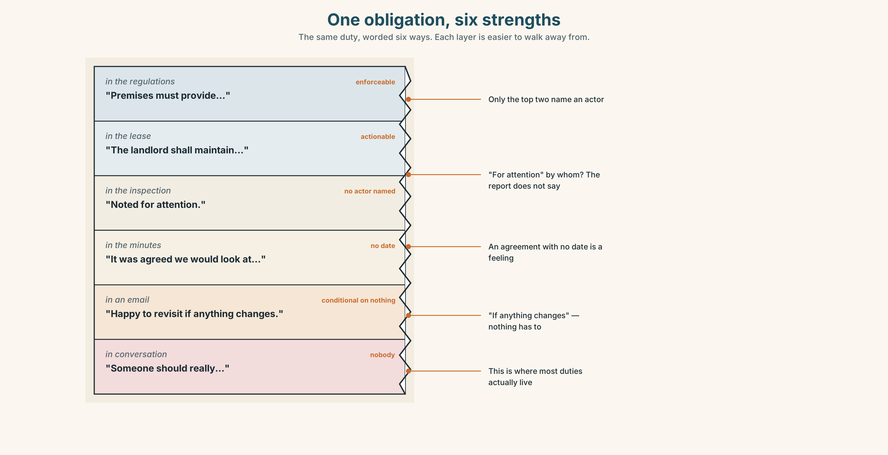
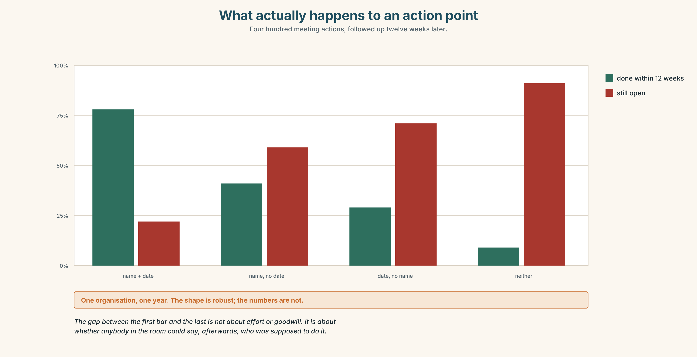
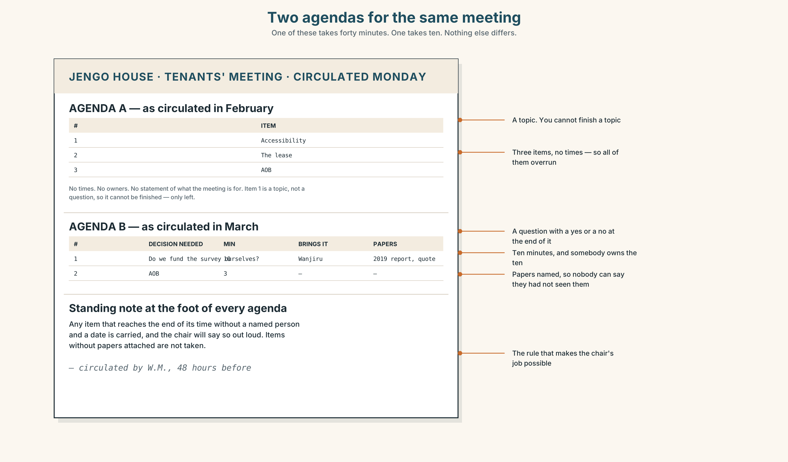
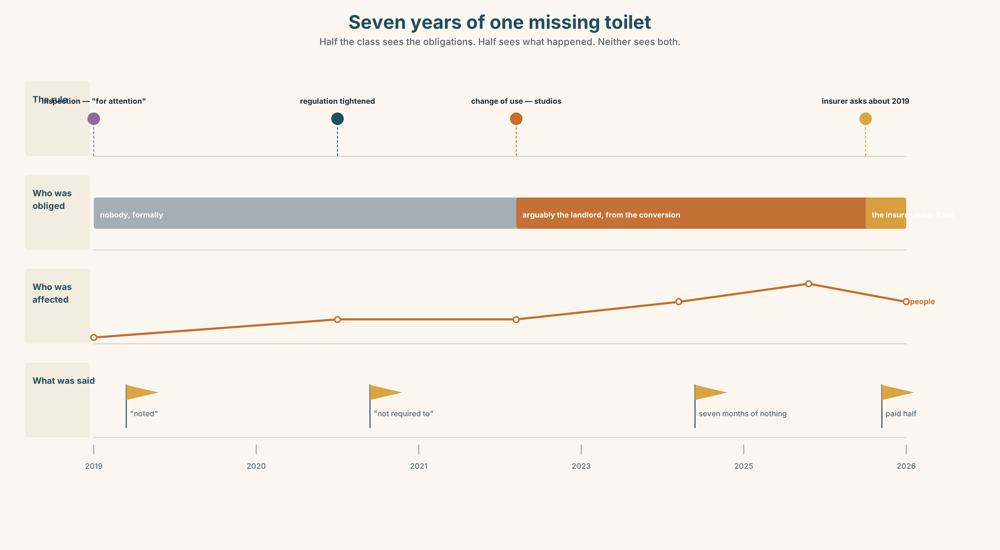

# B1.1 · Unit 4 · Nobody's Job

> **English Animated** · *Taking a Position* · Jengo House, Nairobi
> Student's Book pages 68–87 · 20 pp · ~11.5 hours

---

## Part 0 · The Big Picture ◆ **A · THE WORLD**

{width=6.6in}

*Jengo House, the parts nobody owns — Twelve things in this picture are somebody's responsibility. Three have no name against them.*

# Who is responsible for your health?

**By the end of this unit you will chair a ten-minute meeting on a workplace health policy and
write the three lines that make it real.**

| ◆ **A · THE WORLD** | Duty, consent, and what happens when a responsibility has no name on it |
|---|---|
| ◆ **B · THE SYSTEM** | Obligation, permission and prohibition — now and in the past · *have to* and *must*, returning · 24 words for care and duty · 21 ways to say the same obligation differently · modal weak forms |
| ◆ **C · THE PERFORMANCE** | A chaired meeting, minuted, with one decision somebody can act on |

---

### 0A · Find it

Twelve things in the building that are somebody's responsibility. Four of these sixteen are not
in the picture.

> fire extinguisher · first-aid box · accident book · fire door · exit sign · evacuation plan ·
> trailing cable · blocked corridor · hand sanitiser · signage · stair handrail · spill kit ·
> defibrillator · eyewash station · fire blanket · emergency lighting

### 0B · Guess it

**Three of these have nobody's name against them.** Which three, and how would you find out?

### 0C · Say it ⏺

**Record thirty seconds.** *Who is responsible for your health?* Unprepared.

---

## Part 1 · Vocabulary Lab 1 ◆ **B · THE SYSTEM**

{width=6.6in}

*Who owes what to whom — Each line is a duty. Two of them are drawn dashed, because nobody has ever confirmed them.*

### 1A · Meet — who owes what to whom

Use the network. Each line is a duty. Name the word at each node.

> **consent** · **duty** · **liable** · **entitled** · **carer** · **patient** · **referral** ·
> **treatment** · **prescription** · **insurance** · **waiver** · **exemption**

### 1B · Sort — cline of obligation

Order these from **absolute** to **optional**.

> a right · a duty of care · standard practice · a recommendation · a courtesy · a preference

**Where does it stop being enforceable?** Mark it. Then argue about where you marked it.

### 1C · Sort — odd one out, and why

1. liable · entitled · responsible · accountable
2. consent · waiver · exemption · permission
3. referral · prescription · treatment · diagnosis
4. opt out · look after · sign up for · fall through

### 1D · Stretch — the phrases

1. Every employer has a **duty of ______** to the people in the building.
2. She signed a **______**, which means she cannot claim afterwards.
3. He is **______ to** two weeks' sick leave and does not know it.
4. You can use the equipment, but **at your own ______**.
5. The clinic has a six-month **waiting ______**.
6. They are **under no ______** to tell you.

### 1E · Stretch — four phrasal verbs about responsibility

> **opt out** · **look after** · **sign up for** · **fall through**

Three are chosen. One happens to you. Which?

> **Corpus Note**
> *Liable* and *responsible* look like synonyms and behave differently. *Responsible* takes *for*
> about 70% of the time. *Liable* takes *for* or *to* — and *liable to* usually means *likely to*,
> not *answerable to*.

### 1F · Own it

Name one thing in your workplace, home or course that is everybody's responsibility and therefore
nobody's. Use five of these words.

---

## Part 2 · Listening ◆ **A · THE WORLD**

{width=6.6in}

*Three people, one problem, no name on it — Watch who is facing whom. One of them has not turned round at all.*

### 2A · It's not our building 🔊 Track 4.1

**Before you listen.** Three people, one problem, nobody's name on it. **Who do you think will
speak the most?**

**Gist — one listen, one question.** By the end, has anybody agreed to do anything?

**Detail — complete the frame.**

| | What they say they can't do | What they say somebody else should do |
|---|---|---|
| Wanjiru | | |
| Mr Kamau | | |
| Priya | | |

**Inference.** Mr Kamau says *"we were never required to."* **Required by whom? He does not say.
Why not?**

**Attitude.** Priya says *"fine"* twice. The second one is not agreement. **Which sound?**

**Noticing.** Six sentences. Sort them into three groups.

1. *We have to put a ramp in.*
2. *We had to put a ramp in.*
3. *We don't have to put a ramp in.*
4. *We didn't have to put a ramp in.*
5. *We mustn't block that door.*
6. *We weren't allowed to block it.*

> **A.** obligation · **B.** no obligation · **C.** prohibition
> And then: **which three are about now, and which three are about then?**

### 2B · Decoding clinic 🔊 Track 4.2

Forty seconds of Mr Kamau. Four replays.

1. How many times does he say *have to*?
2. What does *have to* sound like at speed?
3. Catch the two dates.
4. *we were never* — where do the words join?

> Transcripts, page 174.

---

## Part 3 · Grammar Lab 1 ◆ **B · THE SYSTEM**

### Must, have to, and the past that has no *must*

### 3A · Notice

Return to the six sentences.

1. Which two mean "it is forbidden"?
2. Which two mean "it was not necessary"?
3. *We don't have to* and *we mustn't* — one is freedom and one is a ban. Which is which?
4. Write the past of *we must put a ramp in*. **What happened to *must*?**
5. Why do you think English made *have to* do the past of *must*?

### 3B · See

{width=6.6in}

*Obligation, from binding to free — Two of these are opposites that look like variants.*

### 3C · Know

| | Now | Past |
|---|---|---|
| **obligation** | must / have to | **had to** *(must has no past)* |
| **no obligation** | don't have to / needn't | didn't have to / didn't need to |
| **prohibition** | mustn't / can't | wasn't allowed to / couldn't |
| **permission** | can / may / be allowed to | could / was allowed to |

> **Watch out.** *Mustn't* and *don't have to* are opposites, not variants. *You mustn't sign it*
> forbids. *You don't have to sign it* releases.

> **Why it matters.** In a meeting about who is responsible, the difference between *we weren't
> required to* and *we weren't allowed to* is the whole argument.

### 3D · Use — controlled

> Under the 2016 lease the landlord (1) __________ (maintain) the common parts, but he
> (2) __________ (not / provide) accessible facilities, because the building predates the rule.
> Tenants (3) __________ (not / block) the fire doors — that one has never been optional. When the
> studios were converted, the architect (4) __________ (submit) a plan, and because the change of
> use was granted before 2019 she (5) __________ (not / include) a ramp. Today, anybody doing the
> same conversion (6) __________ (include) one.

### 3E · Use — guided

Rewrite each so it means the opposite kind of thing, and say what changed.

1. We don't have to tell the tenants. → *(make it a prohibition)*
2. You mustn't use that door. → *(make it a release)*
3. He had to sign it. → *(make it "it wasn't necessary")*
4. They weren't allowed to park there. → *(make it "they didn't need to")*

### 3F · Use — open

**Describe one rule at your work, school or home that has changed.** What did you have to do
before? What do you have to do now? What are you no longer allowed to do?

### 3G · Check — six items

> 1. You ______ smoke here — it's a hospital. *(prohibition)*
> 2. I ______ come in on Saturday, but I did anyway. *(no obligation, past)*
> 3. Everyone ______ sign the accident book. *(obligation)*
> 4. We ______ use the lift during the works. *(prohibition, past)*
> 5. She ______ pay the fee; students are exempt. *(no obligation)*
> 6. Before 2019 they ______ install a ramp. *(no obligation, past)*

**0–3 →** Workbook pp. 30–32. **4–5 →** Part 6. **6 →** p. 79.

{width=6.6in}

*Why this sentence gives permission instead of refusing it — Why this sentence gives permission instead of refusing it*

---

## Part 4 · Speaking ◆ **C · THE PERFORMANCE**

### 4A · Fluency sprint — 4 / 3 / 2

One rule you have to follow and think is wrong. Four minutes, three, two.

### 4B · The functional core — chairing

{width=6.6in}

*The same ten minutes, chaired and not chaired — Learner A holds the lease. Learner B holds the inspection. Neither sees the other.*

**Language Bank**

| | |
|---|---|
| **opening** | *we're here to decide one thing* · *I want us out of here by …* |
| **bringing in** | *Priya, you've not said anything — what's your read?* · *can I hear from someone who disagrees?* |
| **holding the line** | *we'll come back to that* · *that's a different meeting* · *park it* |
| **landing it** | *so what I'm hearing is …* · *who's doing it, and by when?* · *is anyone unhappy with that?* |

**Information gap.** Learner A has the lease. Learner B has the inspection report. Neither sees
the other. **Find out whose obligation this actually is.**

### 4C · The performance — chair ten minutes

Six people, one problem, one decision. **You are the chair.** You must end with a named person and
a date, or with a written statement of why there isn't one.

### 4D · Observer

Listen for **one thing**: how many times was the decision nearly made before it was made?

### 4E · Two criteria

> ☐ Did the meeting end with a name and a date?
> ☐ Did I bring in the person who had not spoken?

---

## Part 5 · Reading ◆ **A · THE WORLD**

### 5A · Predict

An archive document: an inspection report from 2019. The first line is:

> *The premises were found to be in substantial compliance with the regulations then in force.*

**What do you expect this document to be used for, years later?**

### 5B · Skim — sixty seconds

Find the one sentence that everything since has depended on.

---

{width=6.6in}

*The 2019 inspection report — Nine hundred words. One sentence is the one everything since has depended on.*

### 5C · Close reading

1. What date was the inspection?
2. What does *"substantial compliance"* mean, and what does it not mean?
3. Which three items were marked for attention?
4. **Which of the three was not followed up, and how do you know from the document alone?**
5. What does the final paragraph say about future obligations?
6. **Who signed it, and in what capacity?**

### 5D · Vocabulary in context

> premises · in force · substantial · for attention · in due course · capacity (*in what capacity*)

### 5E · The counter-text

Read the four-line email sent eleven days after the inspection.

> *Thanks — noted. We're not required to action item 3 as the building predates it. Happy to
> revisit if anything changes. Best, A.K.*

1. What does *noted* commit him to?
2. *We're not required to* — by what?
3. *Happy to revisit if anything changes* — what would have to change?
4. **The email is forty-one words. The inspection report is nine hundred. Which one has been
   quoted more often since?**

### 5F · Writer analysis

- The report never says who must act. Is that a flaw or a design?
- The email names one item and ignores two. Which two, and does anybody notice?

### 5G · Text against text

**The report says "for attention". The email says "not required". Both are true.** Write two
sentences on how that is possible. The second begins *"The gap is…"*

---

## Part 6 · Vocabulary Lab 2 ◆ **B · THE SYSTEM**

### Twenty-one ways to say the same obligation

{width=6.6in}

*One obligation, six strengths — The same duty, worded six ways. Each layer is easier to walk away from.*

### 6A · Sort — strength

Put all twenty-one on a line from **binding** to **entirely optional**.

> mandatory · compulsory · obliged · required · binding · permitted · voluntary · optional ·
> exempt · banned · discretionary · be supposed to · be meant to · have no choice but to ·
> be free to · didn't have to · should have · needn't have · get out of · let off · it's up to you

### 6B · Chunk completion

1. Attendance is ______ — you can come or not.
2. He was ______ from the fee because of his age.
3. We had ______ ______ ______ ______ close for the day.
4. You ______ have paid — it was covered.
5. She ______ ______ of it by swapping shifts.

### 6C · Register sort

Which of these appear in a contract, and which only in speech? Five appear in both.

### 6D · Contrast Clinic — *mustn't* against *don't have to*

Six items. Only the meaning decides.

1. You ______ touch that — it's live.
2. You ______ stay late; we've finished.
3. Visitors ______ go past this point.
4. You ______ book; just turn up.
5. We ______ have called a meeting, but it helped.
6. Staff ______ prop that door open under any circumstances.

**Then: say in one sentence what each pair would mean if you got it the wrong way round.**

---

## Part 7 · Pronunciation & Fluency Lab ◆ **B · THE SYSTEM**

### Modals disappear in the middle of a sentence

{width=6.6in}

*Modals vanish in the middle of a sentence — Every one of these is two syllables in real speech, not three.*

### 7A · Hear 🔊 Track 4.3

> have to → /hæftə/ · has to → /hæstə/ · had to → /hædtə/ ·
> must have → /mʌstəv/ · should have → /ʃʊdəv/ · ought to → /ɔːtə/

### 7B · Say

Inside the sentence: *"We had to do it, and we should have said so."*

### 7C · Make it mean something

Say this twice — once at speed, once with every modal stressed.

> *"You didn't have to come in."*

**One version is kind. One is an accusation.** Which stress makes which?

### 7D · Fluency 20 ⏺

Twenty seconds: **something I had to do that I did not have to do**. Three times, faster.

---

## Part 8 · Writing ◆ **C · THE PERFORMANCE**

### Minutes somebody can act on · 140 words

{width=6.6in}

*What actually happens to an action point — Four hundred meeting actions, followed up twelve weeks later.*

### 8A · Read the model

> **Present:** Wanjiru (chair), Obi, Mariam, Priya, Tom, Grace. **Apologies:** Mr Kamau.
> `[Grace is listed. In four previous sets of minutes she was not]`
>
> We discussed the absence of an accessible toilet. The 2019 inspection marked it "for attention";
> the landlord's position is that the building predates the requirement. Both are correct.
> `[states the disagreement as fact, not as a complaint]`
>
> We agreed that the tenants will fund a survey, at a cost of up to 40,000, **not** as an
> acceptance of liability. Obi will obtain three quotes by 14 March. Wanjiru will write to the
> landlord setting out what we have done and asking, in writing, whether he will match it.
> `[two names, two dates, one sentence protecting the position]`
>
> Priya recorded that she thinks funding it ourselves weakens us. The meeting noted this and
> proceeded. `[the dissent is minuted, by name]`

**Questions about the writer's choices:**

1. Why record Priya's objection rather than leaving it out?
2. Why does *"not as an acceptance of liability"* appear in bold?
3. Two people are named with dates. What makes that different from "we agreed to look into it"?

### 8B · The anti-model

> The group had a productive discussion around accessibility and agreed to explore options going
> forward. Various views were expressed. It was felt that further information would be helpful
> and the matter will be revisited at a future meeting.

Nothing in it is untrue. **Name three things that cannot be acted on.**

### 8C · Generate · 8D · Plan

> who was there → what was discussed, in one line → what was agreed → who, by when →
> what was protected → who disagreed, by name

### 8E · Draft 1 — 140 words
### 8F · Peer review — two criteria

> ☐ Could somebody who was not there do the right thing on Monday?
> ☐ Is there a name against every action?

### 8G · Draft 2 · 8H · Publish

To the wall, and to the person who was not at the meeting.

---

## Part 9 · The File ◆ **A · THE WORLD + C · THE PERFORMANCE**

# WORK FILE · The Meeting

{width=6.6in}

*Two agendas for the same meeting — One of these takes forty minutes. One takes ten. Nothing else differs.*

### 9A · Before — the agenda that does the work

Here are two agendas for the same meeting. One takes forty minutes; one takes ten.

> **A:** 1. Accessibility 2. The lease 3. AOB
> **B:** 1. Decide whether we fund the survey ourselves (10 min, decision needed) 2. AOB (3 min)

**Name three things B does that A does not.**

Then: in meeting A somebody will eventually say **"whose job is it?"** and somebody else will say
**"that's not on me."** At what point in agenda B does that become impossible?

### 9B · During — the four jobs of a chair

Watch or listen to a five-minute extract. Tally every time the chair does one of these.

> opens · brings somebody in · stops a digression · summarises · tests agreement · closes

**Which one did they do least? What happened because of it?**

### 9C · The hardest moment

Somebody raises a real, important, unrelated point, nine minutes in. **Write the sentence you
would say.** Compare with three other people's.

### 9D · After — the follow-up

Minutes are not the follow-up. Write the **one message** that goes to the person who has an action
and was not at the meeting. Sixty words.

### 9E · Transfer

**Go to a real meeting this week and count.** How many agreements left the room with a name and a
date against them? Bring the number.

---

## Part 10 · Mediation & Interaction ◆ **C · THE PERFORMANCE**

{width=6.6in}

*Seven years of one missing toilet — Half the class sees the obligations. Half sees what happened. Neither sees both.*

### 10A · Relay

Half the class sees the obligations band; half sees the timeline. Rebuild it by speaking only.

### 10B · Simplify

Explain the 2019 inspection report to **Grace**, who is affected by it, has eleven minutes, and
has never seen an inspection report.

> **Plan:** what it is → what it found → what it means for her → what she could ask for

### 10C · Compress

The report into 60 words for the tenants' group. Defend three cuts.

### 10D · Online interaction

Write the message to the landlord. **It may be read by a lawyer later.** Write it knowing that,
and without sounding as though you know it.

### 10E · Across languages

In your own language, how do you say *"that's not my responsibility"* politely? Bring it back into
English. **Is the English version as polite?**

---

## Part 11 · The Decision ◆ **C · THE PERFORMANCE**

# The toilet on the ground floor

Jengo House has no accessible toilet. The building predates the requirement, so nobody has broken
a rule. Priya, who is retraining as a dentist after a spinal injury, has used the café next door
for seven months and has never mentioned it.

- **The landlord pays.** He is not obliged to. Asking costs the relationship and probably fails.
- **The tenants pay.** About 160,000, shared six ways. It is their building for four more years.
- **Nobody pays, and it is minuted.** Honest, cheap, and in writing for ever.

### 11A · The evidence

1. **The inspection report** from Part 5, and the forty-one-word reply.
2. **The chart**: what the survey, the works and the disruption would actually cost.
3. **The voice.** Priya, thirty seconds: *"I didn't say anything because I didn't want it to be
   about me. Now it's been seven months and saying something would be about me."*

### 11B · Steelman

Argue the option you like least. Two minutes.

### 11C · Deliberate

> *I think they should ______, because ______. The strongest argument against me is ______, and my
> answer to it is ______.*

### 11D · Decide — eighty words, two reasons

### 11E · Model decision

> I think the tenants should fund the survey, and only the survey, and should say in writing that
> they are not accepting liability by doing it.
>
> Paying for the works outright is the option that feels right and I think it is wrong. It is
> 160,000 of other people's money for a building they will leave in four years, and it lets the
> landlord establish that this is a tenant cost. Once that is established it stays established.
>
> Minuting it and doing nothing is the cheapest thing and the one Priya would have to live in. She
> has already spent seven months not mentioning it, which tells you what the cost of the honest
> option actually is, and who pays it.
>
> The survey is the only move that changes what anybody knows. A number on a page converts an
> argument about principle into an argument about money, and arguments about money get settled.

### 11F · The Reveal

> **What happened.** The survey came back at 96,000 — considerably less than the 160,000 everyone
> had been assuming, because the ground-floor plumbing was already in the right place.
>
> Mr Kamau paid half, having refused to pay anything for four months, after his insurer asked him
> a question about the 2019 report.
>
> Priya left in November for a practice forty minutes away. The works were finished in January.

**The reasoning worked. The number came down, the landlord moved, the thing got built.
And the person it was for had gone.**

> Was the reasoning sound? And what would it have taken to move faster — and who would have had
> to pay for *that*?

---

## Part 12 · Landing ◆ **all three lines**

### 12A · Recycle — twelve items

**Six from this unit.**

1. You ______ prop that door open. *(prohibition)*
2. We ______ pay; students are exempt. *(no obligation)*
3. Before 2019 they ______ install one. *(no obligation, past)*
4. Every employer has a duty of ______.
5. She signed a ______ and cannot claim now.
6. They are under no ______ to tell you.

**Four from Units 1–3.**

7. I ______ (see) him on Thursday — it's arranged. *(Unit 3)*
8. She ______ (make) these for nine years. *(Unit 2)*
9. By then the objection period ______ (close). *(Unit 1)*
10. At 3,720 she ______ even. *(Unit 2 lexis)*

**Two from *Telling the Story* (A2.2).**

11. He asked whether we ______ received the report. *(reported speech)*
12. ______ of the four items were followed up — only one. *(quantifiers)*

### 12B · Consolidate

**120 words, one paragraph.** A rule where you work or study: what you have to do, what you used
to have to do, what you are not allowed to do, and one thing that is nobody's job. Six items from
Part 6.

### 12C · Can-do, with evidence

| I can… | My evidence | Sure? |
|---|---|---|
| say precisely whether something is required, forbidden or merely unnecessary | Part 3G score | ◯ ◑ ● |
| chair a short meeting and land one decision | Part 4C recording | ◯ ◑ ● |
| write minutes somebody who was absent could act on | Part 8 draft 2 | ◯ ◑ ● |
| argue a case where nobody has broken a rule and something is still wrong | Part 11D | ◯ ◑ ● |

### 12D · Replay ⏺

Part 0C again. Compare. One sentence.

### 12E · Glossary — forty-five items, as a map

> **WHO OWES WHAT** · duty · duty of care · liable · entitled · have a right to · under no obligation · accountable
> **CONSENT** · consent · informed consent · waiver · exemption · at your own risk
> **CARE** · carer · patient · referral · treatment · prescription · insurance · a waiting list
> **DOING IT** · opt out · look after · sign up for · fall through · get out of · let off
> **BINDING** · mandatory · compulsory · obliged · required · binding · have no choice but to
> **NOT BINDING** · optional · voluntary · discretionary · exempt · be free to · it's up to you · didn't have to · needn't have
> **EXPECTED** · be supposed to · be meant to · should have · banned · permitted

### 12F · Next

> **Unit 5 · Should a machine decide?**
