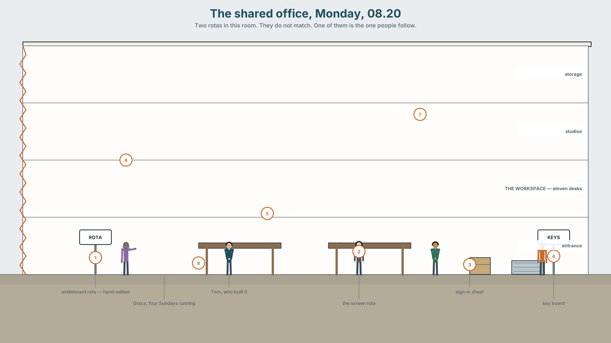
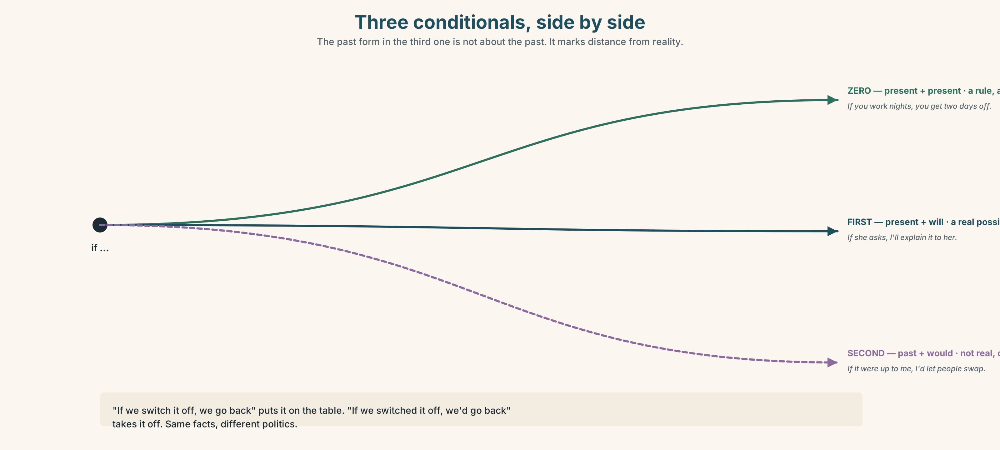
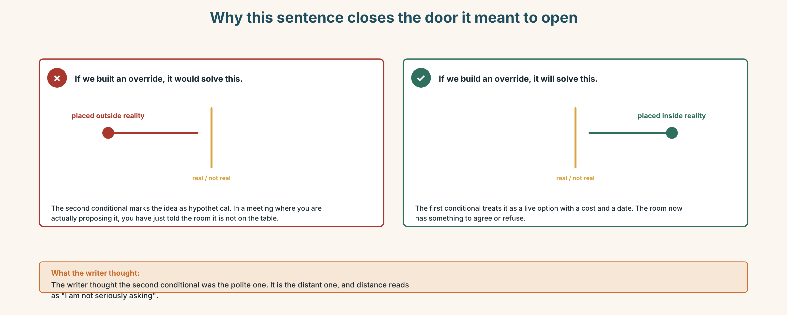
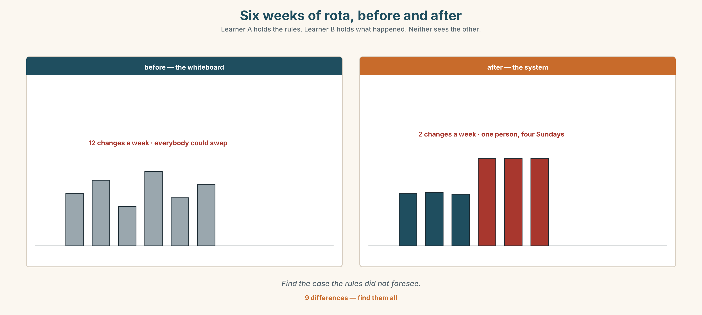
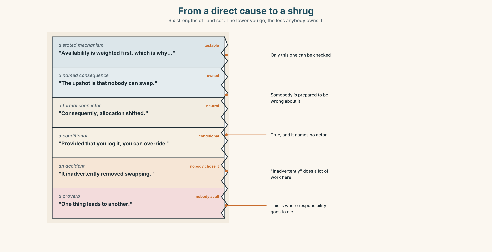
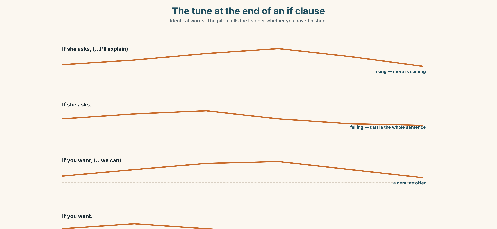
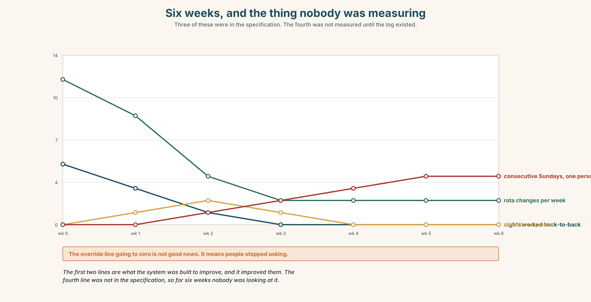

# B1.1 · Unit 5 · The Rota

> **English Animated** · *Taking a Position* · Jengo House, Nairobi
> Student's Book pages 88–107 · 20 pp · ~11.5 hours

---

## Part 0 · The Big Picture ◆ **A · THE WORLD**

{width=6.6in}

*The shared office, Monday, 08.20 — Two rotas in this room. They do not match. One of them is the one people follow.*

# Should a machine decide?

**By the end of this unit you will argue a case for or against automating one decision — and say
what you would do about the cases it gets wrong.**

| ◆ **A · THE WORLD** | What a system is good at, what it cannot see, and who absorbs the difference |
|---|---|
| ◆ **B · THE SYSTEM** | Conditionals 0, 1 and 2, side by side · the second conditional, returning · 24 words for automation and judgement · 21 ways to say *and so* · the tune at the end of an *if* clause |
| ◆ **C · THE PERFORMANCE** | A reasoned case, delivered to people who will push back |

---

### 0A · Find it

Twelve things on the wall of the shared office. Four of these sixteen are not there.

> whiteboard rota · printed timetable · sticky notes · wall planner · key hooks · sign-in sheet ·
> swipe reader · screen showing a dashboard · bookings tablet · noticeboard · laminated rules ·
> wifi password · punch clock · rota app on a phone · cork board · staff photo wall

### 0B · Guess it

The rota on the whiteboard and the rota on the screen **do not match**. Find three differences.
**Which one do you think people actually follow?**

### 0C · Say it ⏺

**Record thirty seconds.** *Should a machine decide?* Unprepared.

---

## Part 1 · Vocabulary Lab 1 ◆ **B · THE SYSTEM**

{width=6.6in}

*The shape of an automated decision — Six stages. The dashed one is the one this system does not have.*

### 1A · Meet — the shape of a system

Use the network. Name the word at each stage.

> **input** · **threshold** · **output** · **override** · **audit** · **fallback** · **flag** ·
> **bias** · **algorithm** · **automate** · **accountable** · **discretion**

### 1B · Sort — what can be automated?

Put these six decisions in order, from **easiest to automate** to **hardest**.

> who gets the last desk · when the bins go out · who covers a sick shift ·
> who gets a reference · who is let go · who is told first

**Mark the point where you would stop.** Then find somebody who marked it somewhere else.

### 1C · Sort — odd one out, and why

1. algorithm · threshold · bias · rule of thumb
2. override · discretion · a judgement call · output
3. audit · flag · accountable · fallback
4. roll out · rule out · fall back on · flag up

### 1D · Stretch — the phrases

1. It works for ninety per cent and fails on **an ______ case**.
2. The system flagged her and it was wrong — **a ______ positive**.
3. Nobody checked the output for six weeks. There was no **human ______**.
4. Two days off between nights is **a rule of ______**, not a rule.
5. Which shift she can actually do is **a ______ call**, and the system cannot make it.
6. He approved it without reading it, but his name is on it — he **signed ______ on** it.

### 1E · Stretch — four phrasal verbs, one system

> **flag up** · **roll out** · **fall back on** · **rule out**

Which one happens when the system fails? Which one happens before anybody uses it?

### 1F · The two sayings

> **garbage in, garbage out** · **computer says no**

One is about data. One is about power. **Which is which, and who says each of them?**

> **Corpus Note**
> *Algorithm* appeared in general English about four times per million words in 2005 and about
> forty in 2024. *Accountable* has not moved at all.

### 1G · Own it

Describe one decision where you work or study that is made by a system. **Name the edge case it
gets wrong.**

---

## Part 2 · Listening ◆ **A · THE WORLD**

{width=6.6in}

*The person who built it, and the person on it — He is facing the screen. She is facing him.*

### 2A · It did what we told it 🔊 Track 5.1

**Before you listen.** Tom built the rota system. Grace is on it. **Who do you think has read the
rules it uses?**

**Gist — one listen, one question.** What did the system do that nobody intended?

**Detail — complete the frame.**

| | What the rule says | What it produced |
|---|---|---|
| fairness rule | | |
| availability rule | | |
| seniority rule | | |

**Inference.** Grace says *"I used to swap with Didier."* **What has the system removed, and does
anybody notice it has gone?**

**Attitude.** Tom says *"it's working, actually"* and he is right. **Which sound tells you he
already knows that is not the point?**

**Noticing.** Six sentences. Sort them.

1. *If you reduce the hours, the system reallocates them.*
2. *If we switch it off, we go back to the whiteboard.*
3. *If I had known, I would have built it differently.*
4. *If you work nights, you get two days off.*
5. *If she asks, I'll explain it to her.*
6. *If it were up to me, I'd let people swap.*

> **A.** always true · **B.** a real possibility, now or soon · **C.** not real — imagined

### 2B · Decoding clinic 🔊 Track 5.2

Forty seconds of Tom at speed. Four jobs.

1. How many times does he say *if*?
2. Where does his voice go **up**, and where does it go **down**?
3. Catch the two percentages.
4. *would have* — how many sounds?

> Transcripts, page 175.

---

## Part 3 · Grammar Lab 1 ◆ **B · THE SYSTEM**

### Three conditionals, side by side

### 3A · Notice

Return to the six sentences.

1. Which one describes something that happens **every time**?
2. Which two describe something that **might really happen**?
3. Which two describe something that is **not true**?
4. In sentence 6, *if it were up to me* — is it up to him?
5. Look at the verbs after *if* in 4, 5 and 6. **Three different forms, and only one of them is
   about the past.** Which?

### 3B · See

{width=6.6in}

*Three conditionals, side by side — The past form in the third one is not about the past. It marks distance from reality.*

### 3C · Know

| | *if* clause | result clause | What it does |
|---|---|---|---|
| **zero** | present simple | present simple | a rule, always true — *If you work nights, you get two days off.* |
| **first** | present simple | will / may / might | a real possibility — *If she asks, I'll explain.* |
| **second** | past simple | would / could | not real, or very unlikely — *If it were up to me, I'd let people swap.* |

> **Watch out.** The past form in the second conditional is **not about the past**. It marks
> distance from reality, not distance in time.

> **Why it matters.** *If we switch it off, we go back to the whiteboard* and *if we switched it
> off, we'd go back to the whiteboard* are the same sentence with two different politics. The
> first treats it as on the table. The second treats it as unthinkable.

### 3D · Use — controlled

> If a shift (1) __________ (go) unfilled for two hours, the system (2) __________ (reallocate) it
> automatically — that is what it does every time. If Grace (3) __________ (ask) to swap tomorrow,
> Tom (4) __________ (have to) do it by hand, which he can. If the rules (5) __________ (be)
> written by the people on the rota, they (6) __________ (look) completely different — but they
> were not.

### 3E · Use — guided

Move each sentence one step further from reality, then one step closer. Say what changes.

1. If we switch it off, we lose the audit trail.
2. If she complained, they would listen.
3. If you press override, it logs who did it.

### 3F · Use — open

**Describe a system where you work.** One rule that is always true. One thing that might really
happen this month. One thing you would change if it were up to you — and it is not.

### 3G · Check — six items

> 1. If you ______ (heat) water to 100°, it ______ (boil).
> 2. If I ______ (be) you, I ______ (say) something.
> 3. If the system ______ (flag) her again, I ______ (override) it.
> 4. If we ______ (have) more people, this ______ (not / be) a problem — but we don't.
> 5. If you ______ (work) a night, you ______ (get) two days off. Always.
> 6. If she ______ (leave), who ______ (cover) Sunday?

**0–3 →** Workbook pp. 38–40. **4–5 →** Part 6. **6 →** p. 99.

{width=6.6in}

*Why this sentence closes the door it meant to open — Why this sentence closes the door it meant to open*

---

## Part 4 · Speaking ◆ **C · THE PERFORMANCE**

### 4A · Fluency sprint — 4 / 3 / 2

One thing you would change about how a decision gets made where you are. Four, three, two minutes.

### 4B · The functional core — arguing about consequences

{width=6.6in}

*Six weeks of rota, before and after — Learner A holds the rules. Learner B holds what happened. Neither sees the other.*

**Language Bank**

| | |
|---|---|
| **laying out a consequence** | *if we do that, what happens is …* · *the upshot is …* · *that means in practice …* |
| **conceding** | *that's fair, as far as it goes* · *I'd accept that if …* |
| **distancing** | *if it were up to me* · *in an ideal world* · *I'm not saying we should* |
| **pinning down** | *under what conditions would you …?* · *what would have to be true for …?* |

**Information gap.** Learner A holds the rota rules. Learner B holds six weeks of what actually
happened. **Find the case the rules did not foresee.**

### 4C · The performance — the case

Three minutes, uninterrupted, then two minutes of questions you have not seen. You are arguing
**for or against automating one named decision**, and you must say what happens to the cases it
gets wrong.

### 4D · Observer

Listen for **one thing**: did the speaker ever say what the system would be *worse* at?

### 4E · Two criteria

> ☐ Did I name a specific case my own position handles badly?
> ☐ Did I say who picks it up when the system is wrong?

---

## Part 5 · Reading ◆ **A · THE WORLD**

### 5A · Predict

An interview transcript. The first exchange is:

> **Q:** So the system was working correctly?
> **A:** It was working exactly as specified. That's a different thing.

What do you expect the rest to be about? One sentence.

### 5B · Skim — sixty seconds

Find the moment the interviewee stops defending the system.

---

**"Exactly as specified"**

**Q:** So the system was working correctly?

**A:** It was working exactly as specified. That's a different thing, and I want to be careful
about it, because people hear "working correctly" and stop asking questions.

**Q:** What's the difference?

**A:** The specification said: allocate shifts so that no one does more than two nights in a row,
weight by availability, and break ties by seniority. It did all three, every time, for fourteen
months. If you audit it against the spec, it passes. The problem is that nobody writing the spec
had ever covered a Sunday.

**Q:** Meaning?

**A:** Meaning the spec had no word for the thing people were actually doing, which was swapping.
Before the system, if you couldn't do a Sunday you found somebody who could, and you owed them
one. That's not in the spec because it isn't a rule — it's a favour economy, and it's how the
place ran. We automated the rota and the favours stopped, because there was nothing to swap.

**Q:** Did anybody raise it?

**A:** One person. Six weeks in. She said it had got harder to change a shift, and I said yes,
that's correct, that's the point — the whole reason we built it was that the old rota got changed
twelve times a week and nobody could plan. And I was right. I was answering a different question
from the one she was asking, and I did it confidently, which is worse.

**Q:** Would you build it again?

**A:** Yes. But I'd build the override first and the allocator second, and I'd make the override
cost somebody thirty seconds instead of an email. If the cheapest thing to do is the thing the
system wanted, you haven't built a tool. You've built a rule and called it a tool.

---

### 5C · Close reading

1. What three things did the specification require?
2. What is the difference between *working correctly* and *working as specified*?
3. **What was the "favour economy", and why was it not in the spec?**
4. What did the one person who raised it actually say?
5. **The interviewee says being right made it worse. Why?**
6. What would he build first next time, and why?

### 5D · Vocabulary in context

> specified · audit (*audit it against the spec*) · weight (*weight by availability*) ·
> break ties · override (noun) · allocator

### 5E · The counter-text

{width=6.6in}

*The rota specification — Three pages, three rules. The word that matters is not in it.*

**Read the specification document and answer.**

1. How many rules are there?
2. What is the stated tie-break?
3. **Find the clause about manual changes. How many steps does it require?**
4. What does the document say about swaps?
5. **Who signed it off, and had they ever worked a Sunday?**

### 5F · Writer analysis

- The interview admits a mistake. The spec admits nothing. Which is more useful, and to whom?
- **The spec is three pages and the thing that broke is not in it. Could it have been?**

### 5G · Text against text

**The spec says "manual changes require written authorisation". The interview says the override
should cost thirty seconds.** Two sentences on whether both can be true. The second begins
*"The question is who…"*

---

## Part 6 · Vocabulary Lab 2 ◆ **B · THE SYSTEM**

### Twenty-one ways to say *and so*

{width=6.6in}

*From a direct cause to a shrug — Six strengths of "and so". The lower you go, the less anybody owns it.*

### 6A · Sort — how direct is the link?

Put all twenty-one on a line from **a direct cause** to **a loose association**.

> consequence · outcome · trade-off · repercussion · knock-on · inadvertently · consequently ·
> thereby · otherwise · conversely · hence · as a result · which means that · the upshot is ·
> provided that · as long as · in which case · worst case · end up · result in ·
> one thing leads to another

### 6B · Chunk completion

1. We froze the rota, and **the ______ is** that nobody can swap.
2. He approved it without reading it and ______ became responsible for it.
3. You can override it, ______ ______ you log why.
4. Fix it now; ______ it goes to the whole building on Monday.
5. She might refuse, ______ ______ ______ we are back to the whiteboard.

### 6C · Register sort

Which of these would you write in a report, and which only say out loud? Four belong in both.

### 6D · Contrast Clinic — zero, first, second

Six items. The context decides.

1. If you ______ (press) override, it ______ (log) your name. *(every time)*
2. If she ______ (not come) in tomorrow, I ______ (cover) it. *(real)*
3. If I ______ (be) the landlord, I ______ (fix) it. *(not real)*
4. If we ______ (switch) it off today, we ______ (lose) the audit trail. *(real)*
5. If water ______ (get) in, the board ______ (fail). *(always)*
6. If they ______ (ask) us first, none of this ______ (happen). *(not real)*

---

## Part 7 · Pronunciation & Fluency Lab ◆ **B · THE SYSTEM**

### Where the voice goes at the end of an *if* clause

{width=6.6in}

*The tune at the end of an if clause — Identical words. The pitch tells the listener whether you have finished.*

### 7A · Hear 🔊 Track 5.3

In each pair, the words are identical. **The tune is not.**

> *If she asks,* ↗ *I'll explain.* ↘ — one sentence, two parts
> *If she asks.* ↘ — finished. A threat, or a condition already met.

### 7B · Say

Say each one. Your partner says whether you have finished speaking.

### 7C · Make it mean something

> *If you want.*

Say it three ways: as a genuine offer, as a withdrawal of interest, and as an ultimatum.
Your partner writes down which one they heard.

### 7D · Fluency 20 ⏺

Twenty seconds: **one thing that always happens, one that might, one that never will.**
Three times, faster. Record the first and the third.

---

## Part 8 · Writing ◆ **C · THE PERFORMANCE**

### The case, written down · 140 words

{width=6.6in}

*Six weeks, and the thing nobody was measuring — Three of these were in the specification. The fourth was not measured until the log existed.*

### 8A · Read the model

> I think we should keep the rota system and change one thing about it.
> `[the position is in sentence one, and it is not "it depends"]`
>
> It does what it was built to do. Before it, the rota changed twelve times a week and nobody
> could plan their month. Now it changes twice. That is a real gain and I do not want to lose it.
> `[concedes to itself first — and gives the number]`
>
> What it removed was swapping. If you cannot do a Sunday, there is now no way to find somebody
> who can, because the system holds the rota and the system does not know what a favour is.
> People used to owe each other shifts. They do not any more, and nobody decided that.
>
> So: build the override into the app, log who used it, and review the log monthly. If overrides
> climb, the rules are wrong — and that is information we currently do not have.

**Questions about the writer's choices:**

1. Why concede in paragraph two rather than at the end?
2. *"Nobody decided that."* Why is that the strongest sentence in the piece?
3. The proposal creates a measurement. Why does that matter more than the fix?

### 8B · The anti-model

> There are pros and cons to automation. On the one hand it saves time and improves consistency.
> On the other hand it can be inflexible. It is important to strike the right balance and to keep
> humans in the loop. Further consultation would be beneficial.

Every sentence is true. **Name three things it does not commit to.**

### 8C · Generate · 8D · Plan

> the position → the strongest thing against it, conceded properly → what was actually lost →
> who decided that → the change → what it would let you measure

### 8E · Draft 1 — 140 words
### 8F · Peer review — two criteria

> ☐ Do I know what this person actually wants to happen?
> ☐ Did they concede something real, or only pretend to?

### 8G · Draft 2 · 8H · Publish

---

## Part 9 · The File ◆ **A · THE WORLD + C · THE PERFORMANCE**

# STUDY FILE · Working With AI

{width=6.6in}

*One prompt, four answers — One is right. One is confidently wrong. One is right and useless. One refuses.*

### 9A · Four outputs, one prompt

Here are four answers to the same question. One is right, one is confidently wrong, one is right
but useless, and one refuses. **Label them before you read 9B.**

### 9B · The four checks

For each: **Can I verify it? Does it cite anything? Would I notice if it were wrong?
What did I not ask?**

### 9C · Edit, don't accept

Take the useful-but-wrong answer. **Rewrite it so it is true.** Time yourself. Then ask: was that
faster than writing it from nothing?

### 9D · What not to outsource

Three tasks. For each, decide: **outsource · outsource and check · do yourself.**

> summarising a meeting you attended · summarising a meeting you missed ·
> writing the message that tells somebody they did not get the job

**The third one divides every class.** Say why.

### 9E · Transfer

**Use a tool for one real task this week and keep what it got wrong.** Not a funny error — a
plausible one. Bring it.

---

## Part 10 · Mediation & Interaction ◆ **C · THE PERFORMANCE**

{width=6.6in}

*Fourteen months of the rota — Half the class sees the rules. Half sees what happened. Neither sees both.*

### 10A · Relay

Half sees the rules band, half sees what happened. Rebuild by speaking.

### 10B · Simplify

Explain the rota specification to **Grace**, who is on the rota, has nine minutes, and has never
seen a specification.

> **Plan:** what it is → what it decides about her → where her discretion went → what she can ask for

### 10C · Compress

The interview into 60 words, for people who have to decide on Monday. Defend three cuts.

### 10D · Online interaction

Write the message proposing the change, to a group that includes the person who built it.
**He will read it as criticism unless you stop him.**

### 10E · Across languages

How do you say *"it's not personal, it's the system"* in your language? Bring it back.
**Does yours blame the system as easily as English does?**

---

## Part 11 · The Decision ◆ **C · THE PERFORMANCE**

# Switch it off, or build the override

Six weeks of data. The rota changes twice a week instead of twelve. Nobody is doing more than two
nights in a row for the first time in years. And Grace has worked four Sundays running, because
she is the most available person in the building and availability is weighted first.

- **Switch it off.** Back to the whiteboard. Everybody can swap. Nobody can plan.
- **Leave it.** It is working against every measure anybody wrote down.
- **Build the override.** Three weeks of Tom's time, which is three weeks of something else.

### 11A · The evidence

1. **The specification** from Part 5 — three pages, three rules, one missing word.
2. **The chart**: what changed in six weeks, including the thing nobody was measuring.
3. **The voice.** Grace, thirty seconds: *"I'm not complaining. It's fair. I just used to be able
   to say no, and I can't work out who to say it to now."*

### 11B · Steelman

Argue the option you like least. Two minutes.

### 11C · Deliberate

> *I think they should ______, because ______. The strongest argument against me is ______, and my
> answer to it is ______.*

### 11D · Decide — eighty words, two reasons

### 11E · Model decision

> Build the override, and accept that it costs three weeks.
>
> Switching it off is the option I have most sympathy with and I think it is wrong. The twelve
> changes a week were real, and the people who suffered most from them were the people with the
> least control over their own time — which is the same group this system is now hurting. Going
> back does not return their discretion; it returns everybody's, and theirs was always the first
> to be overruled.
>
> Leaving it is indefensible once you have heard Grace, and it is indefensible for a reason that
> has nothing to do with fairness: the system is *working*, and nobody can tell you what it would
> look like if it stopped. There is no measurement. An override log is the cheapest instrument
> anybody is going to get.
>
> Three weeks of Tom's time is the real cost, and I would rather spend it on knowing than on
> guessing.

### 11F · The Reveal

> **What happened.** The override took five weeks, not three. In the first month it was used
> eleven times. Nine of the eleven were the same two people swapping a Sunday, which is what the
> system had removed.
>
> The log made the pattern visible, and the fairness rule was rewritten in March to weight
> *consecutive weekends* rather than availability. Grace worked two Sundays in the next quarter.
>
> Tom's other project slipped by five weeks and was eventually cancelled.

**The fix worked. The measurement was worth more than the fix. And something else died quietly to
pay for it.**

> Was the reasoning sound? And: the cancelled project had no voice in the room. Should it have?

---

## Part 12 · Landing ◆ **all three lines**

### 12A · Recycle — twelve items

**Six from this unit.**

1. If you ______ (press) override, it ______ (log) your name.
2. If it ______ (be) up to me, I ______ (change) the weighting.
3. It works for most people and fails on an ______ case.
4. Nobody checked the output for six weeks — no human ______.
5. He approved it without reading it and ______ became responsible.
6. You can override it, ______ ______ you log why.

**Four from Units 1–4.**

7. You ______ prop that door open. *(Unit 4)*
8. I ______ (see) him on Thursday — arranged. *(Unit 3)*
9. She ______ (make) these for nine years. *(Unit 2)*
10. Four businesses were ______ out by rising rents. *(Unit 1)*

**Two from *Making Plans* (A2.1).**

11. The person ______ writes the spec never covers a Sunday. *(relative clause)*
12. If you miss the four o'clock, you ______ (wait) two hours. *(first conditional)*

### 12B · Consolidate

**120 words, one paragraph.** A system you live with: one thing that is always true, one thing
that might happen, one thing you would change and cannot. Six items from Part 6.

### 12C · Can-do, with evidence

| I can… | My evidence | Sure? |
|---|---|---|
| choose between three conditionals to say how real something is | Part 3G score | ◯ ◑ ● |
| argue a case and name the thing it handles badly | Part 4C recording | ◯ ◑ ● |
| judge what a machine's answer is worth before I use it | Part 9 | ◯ ◑ ● |
| decide where something works and somebody is still paying for it | Part 11D | ◯ ◑ ● |

### 12D · Replay ⏺

Part 0C again. Compare.

### 12E · Glossary — forty-five items, as a map

> **THE SYSTEM** · algorithm · automate · input · output · threshold · bias · fallback · roll out
> **THE HUMAN** · override · discretion · a judgement call · human oversight · in the loop · accountable · sign off on
> **WHEN IT FAILS** · an edge case · a false positive · flag · flag up · audit · fall back on · rule out · a rule of thumb
> **THE SAYINGS** · garbage in, garbage out · computer says no
> **CAUSE** · consequence · outcome · repercussion · knock-on · as a result · consequently · hence · thereby · result in · which means that · the upshot is
> **CONDITION** · provided that · as long as · otherwise · in which case · worst case · conversely
> **THE REST** · trade-off · inadvertently · end up · one thing leads to another

### 12F · Next

> **Unit 6 · Who wrote this rule?**
