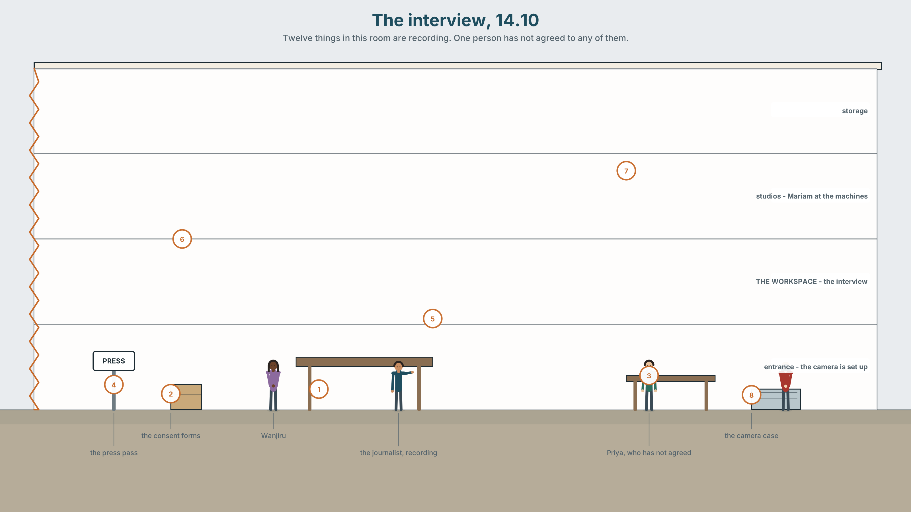
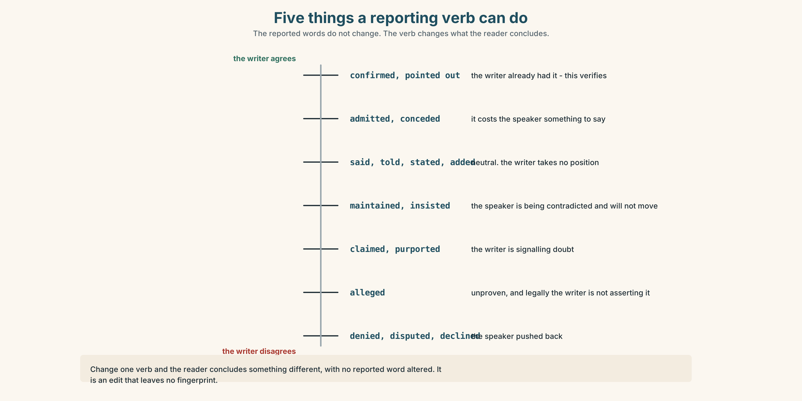
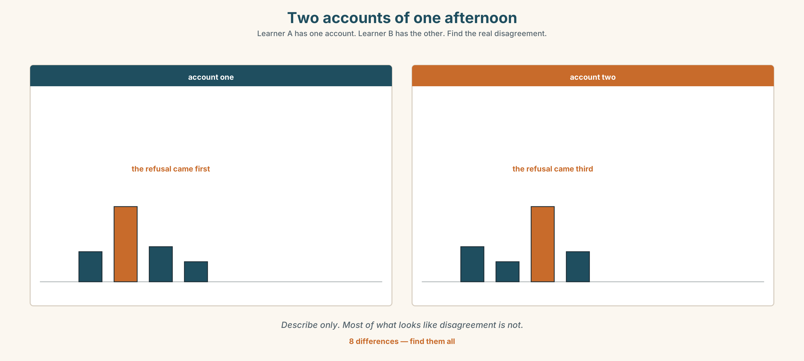
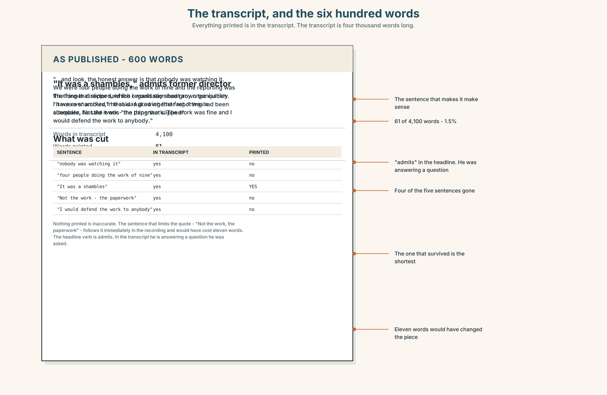
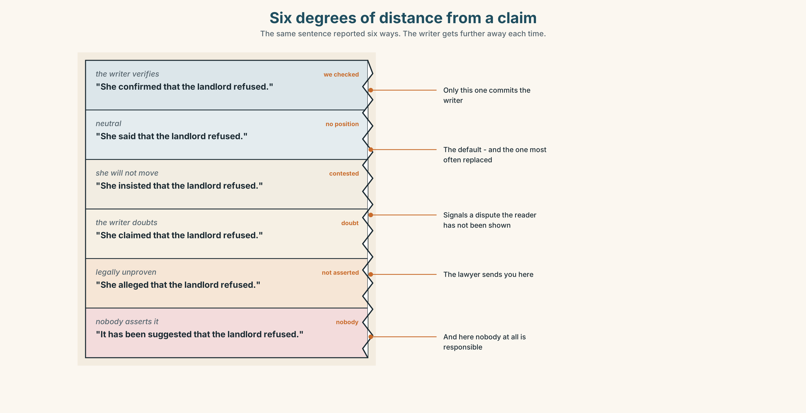
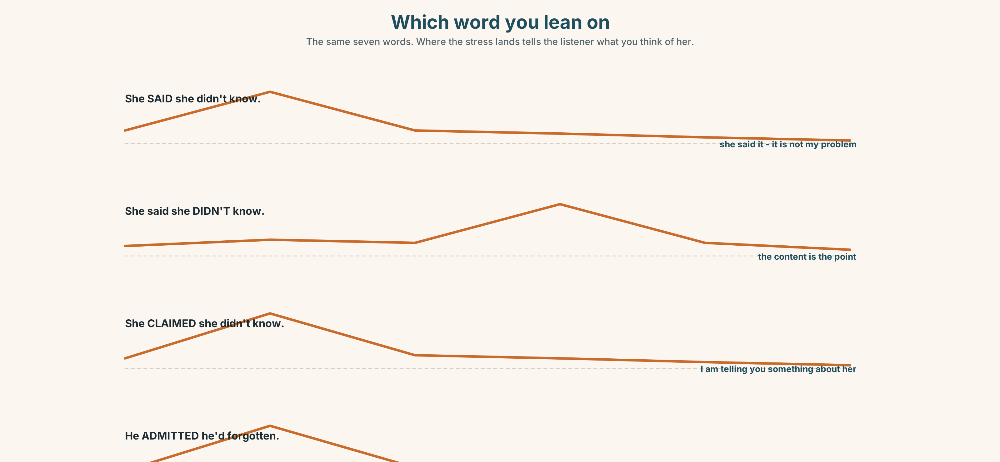
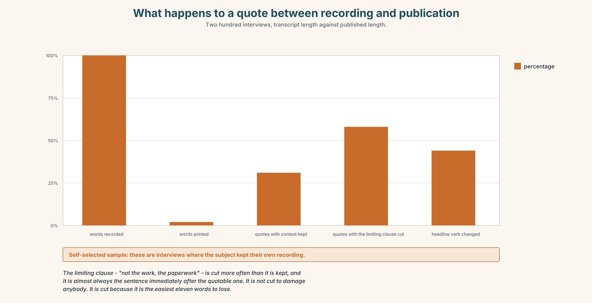
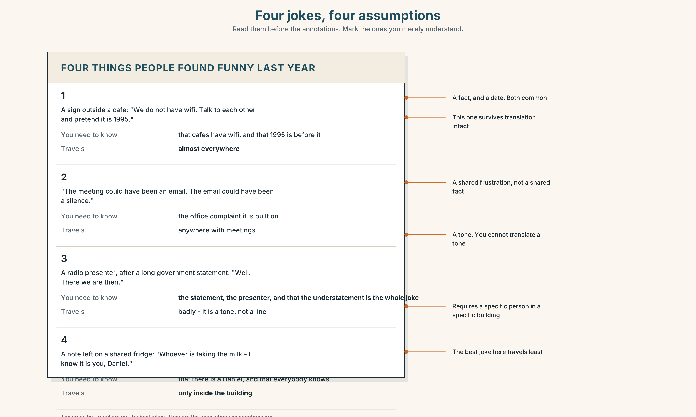
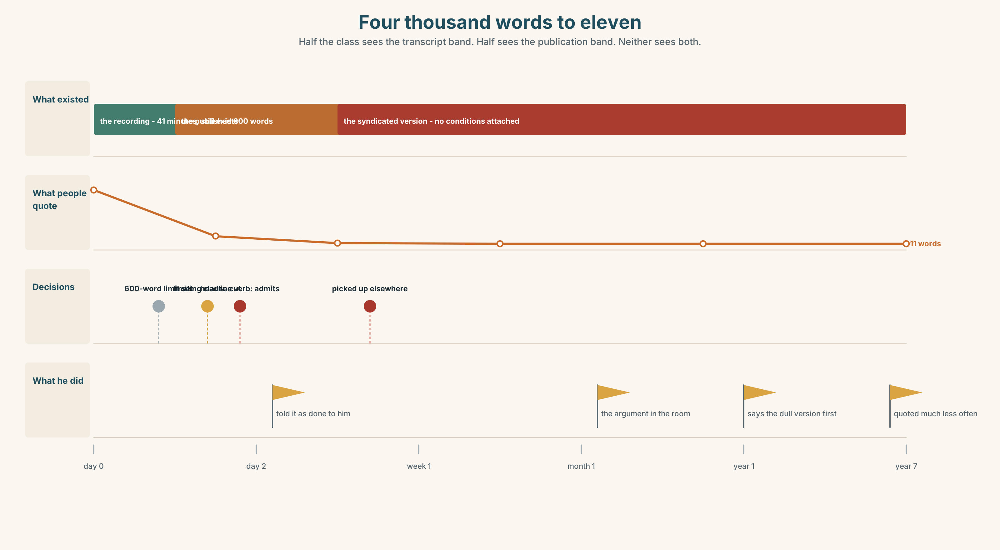

# B1.1 · Unit 9 · Whose Story

> **English Animated** · *Taking a Position* · Jengo House, Nairobi
> Student's Book pages 168–187 · 20 pp · ~11.5 hours

---

## Part 0 · The Big Picture ◆ **A · THE WORLD**

{width=6.6in}

*The interview, 14.10 — Twelve things in this room are recording. One person has not agreed to any of them.*

# Who gets to tell it?

**By the end of this unit you will report the same event three times, for three audiences — and
say which of the three you would put your name to.**

| ◆ **A · THE WORLD** | How an account becomes a story, and what is lost at every retelling |
|---|---|
| ◆ **B · THE SYSTEM** | The full range of reporting verbs · reported statements, returning · 24 words for witness and adaptation · 21 verbs that carry a judgement with them · stress on the reporting verb |
| ◆ **C · THE PERFORMANCE** | Three accounts of one event, and a decision about which one is yours |

---

### 0A · Find it

Twelve things being recorded in this picture. Four of these sixteen are not there.

> a phone on a table · a notebook · a lanyard with a press pass · a voice recorder ·
> a consent form · a camera · a tripod · a laptop · a whiteboard with names · a printed list ·
> a signed release · a clip microphone · a boom pole · a lighting stand · a teleprompter ·
> a studio clock

### 0B · Guess it

**One person in this room has not agreed to be recorded.** Which, and what tells you?

### 0C · Say it ⏺

**Record thirty seconds.** *Think of a story that was told about you. Who told it?* Unprepared.

---

## Part 1 · Vocabulary Lab 1 ◆ **B · THE SYSTEM**

{width=6.6in}

*From the event to what people remember — Six stages. Something is lost at every arrow, and two of them are irreversible.*

### 1A · Meet — from event to story

Use the network. Name the word at each stage.

> **witness** · **account** · **testimony** · **version** · **angle** · **source** ·
> **anonymity** · **adapt** · **dramatise** · **composite** · **disclaimer** · **hearsay**

### 1B · Sort — cline of distance from the event

Order from **closest** to **furthest**.

> what happened · what you saw · what you said you saw · what was written down ·
> what was published · what people now remember

**Mark where it stops being evidence.**

### 1C · Sort — odd one out, and why

1. witness · source · testimony · hearsay
2. account · version · angle · composite
3. adapt · dramatise · disclaimer · composite
4. leave out · play down · write up · track down

### 1D · Stretch — the phrases

1. She said it **on the ______**, so it can be printed with her name.
2. He said it **______ the record**, which means you may know it and not use it.
3. **______-hand** evidence is what you saw yourself.
4. The paper gave him a **right of ______** before publishing.
5. The film says it is **based on a ______ story**, which is not a claim about accuracy.
6. The scene never happened; that is **artistic ______**.
7. Her brother owns the building, which is **a ______ of interest**.

### 1E · Stretch — four phrasal verbs, one edit

> **leave out** · **play down** · **write up** · **track down**

Two happen before the story exists. Two happen to it afterwards.

### 1F · The two sayings

> **that's not how it happened** · **whose story is it?**

One is a correction. One is a claim of ownership. **Which does more damage in a meeting?**

> **Corpus Note**
> *Claim* and *say* report the same words. In news writing, *claim* appears beside a following
> denial about four times as often as *say* does. The verb is doing the work before the reader
> reaches the evidence.

### 1G · Own it

Describe something that happened to you in two sentences. **Then describe it as somebody who
dislikes you would.** Change no facts.

---

## Part 2 · Listening ◆ **A · THE WORLD**

{width=6.6in}

*A recorder on the table — Watch who put it there, and who is looking at it.*

### 2A · What she's actually here for 🔊 Track 9.1

**Before you listen.** A journalist and Wanjiru, with a recorder on the table. **Who put it there?**

**Gist — one listen, one question.** What story has the journalist already decided to write?

**Detail — complete the frame.**

| | What she asks about | What she keeps returning to |
|---|---|---|
| the first five minutes | | |
| the last five minutes | | |

**Inference.** Wanjiru says *"I'd rather you spoke to Mariam."* **Why is she saying that, and does
it work?**

**Attitude.** The journalist says *"of course"* three times. **Which one is agreement?**

**Noticing.** Six sentences. Sort them by what the reporting verb does to the claim.

1. *She said the landlord had refused.*
2. *She claimed the landlord had refused.*
3. *She admitted the landlord had refused.*
4. *She insisted the landlord had refused.*
5. *She confirmed the landlord had refused.*
6. *She alleged the landlord had refused.*

> **A.** neutral · **B.** the writer doubts it · **C.** the claim costs the speaker something ·
> **D.** it was already known

### 2B · Decoding clinic 🔊 Track 9.2

Forty seconds. Four jobs.

1. Count the reporting verbs.
2. Which word is stressed in *"she CLAIMED she didn't know"*?
3. Catch the two dates.
4. *said that* — what happens to *that*?

> Transcripts, page 179.

---

## Part 3 · Grammar Lab 1 ◆ **B · THE SYSTEM**

### Choosing the verb that reports

### 3A · Notice

Return to the six sentences. **The reported words are identical in all six.**

1. Which one is neutral?
2. Which two suggest the writer does not believe it?
3. In sentence 3, what does *admitted* tell you about the speaker's position?
4. In sentence 5, what does *confirmed* tell you about what the writer already knew?
5. **A lawyer would object to one of these in a news report. Which, and why?**

### 3B · See

{width=6.6in}

*Five things a reporting verb can do — The reported words do not change. The verb changes what the reader concludes.*

### 3C · Know

| Group | Verbs | What the writer is doing |
|---|---|---|
| **neutral** | say · tell · state · report · add · note | reporting, taking no position |
| **doubting** | claim · allege · maintain · purport | signalling distance from the claim |
| **conceding** | admit · concede · acknowledge · accept | the speaker said something against their own interest |
| **confirming** | confirm · recall · point out · stress | the writer already had it |
| **refusing** | deny · refuse · decline to comment · dispute | the speaker pushed back |

**And the pattern each takes:**

> *admit / deny / recall* **+ -ing** or **+ that** · *refuse / claim* **+ to + verb** or **+ that** ·
> *insist / stress / point out* **+ that** only

> **Watch out.** *Admit* makes the speaker's own words costly to them. Using it where *say* would
> do is not neutral reporting — it is an edit with no fingerprint on it.

> **Why it matters.** Change one verb and you have changed what the reader thinks, without
> changing a single reported word. This is the most powerful thing in this book and the hardest to
> see.

### 3D · Use — controlled

Choose the reporting verb. **More than one works in some; say what each would do.**

> Wanjiru (1) __________ that the landlord had refused to pay. He (2) __________ ever having been
> asked. The inspector (3) __________ out that the report had been sent twice. Mariam
> (4) __________ that she had considered leaving, which she had not said publicly before. The
> managing agent (5) __________ to comment. The journalist (6) __________ that two tenants had
> contacted her first.

### 3E · Use — guided

Rewrite each sentence three times, with a neutral, a doubting and a conceding verb.
**Then say which you would publish.**

1. "I didn't know the toilet was an issue."
2. "We offered to pay half."
3. "Nobody raised it with me."

### 3F · Use — open

**Report the same thing to two people:** somebody who will act on it, and somebody who will be
upset by it. Your partner says which reporting verbs you used, and what they gave away.

### 3G · Check — six items

> 1. He ______ (deny) ______ (be) there at all.
> 2. She ______ (admit) that she ______ (not read) it.
> 3. They ______ (refuse) ______ (give) a reason.
> 4. He ______ (point) out that the lease ______ (expire) in March.
> 5. The agent ______ (decline) to comment.
> 6. She ______ (insist) that nobody ______ (tell) her.

**0–3 →** Workbook pp. 70–72. **4–5 →** Part 6. **6 →** p. 179.

{width=6.6in}

*Why this sentence convicts somebody — Why this sentence convicts somebody*

---

## Part 4 · Speaking ◆ **C · THE PERFORMANCE**

### 4A · Fluency sprint — 4 / 3 / 2

A story you have told more than once. Four minutes, three, two. **Notice what you have stopped
saying.**

### 4B · The functional core — attributing and distancing

{width=6.6in}

*Two accounts of one afternoon — Learner A has one account. Learner B has the other. Find the real disagreement.*

**Language Bank**

| | |
|---|---|
| **attributing** | *according to* · *she's quoted as saying* · *in her words* |
| **distancing** | *she claims* · *it's been suggested that* · *I can't verify this, but* |
| **refusing to pass it on** | *that's not mine to repeat* · *you'd have to ask her* |
| **correcting** | *that's not how it happened* · *the order is the other way round* · *I'd stress that nobody refused* |

**Information gap.** Learner A has what one person said. Learner B has what another said. Neither
sees the other. **Find out what they disagree about, and what they only appear to disagree about.**

### 4C · The performance — three tellings

Three audiences, two minutes each: **a friend · a committee · somebody who was there.**
Same event. You may not change a fact.

### 4D · Observer

Listen for **one thing**: what appeared in two versions and not in the third?

### 4E · Two criteria

> ☐ Did I keep every fact the same?
> ☐ Could the person who was there recognise their own part?

---

## Part 5 · Reading ◆ **A · THE WORLD**

### 5A · Predict

A personal essay called **"The quote I gave."** The first line is:

> *I said eleven words to a journalist in 2019 and I have been described by them ever since.*

What do you expect? One sentence.

### 5B · Skim — sixty seconds

Find the paragraph where the writer stops blaming the journalist.

---

**The quote I gave**

I said eleven words to a journalist in 2019 and I have been described by them ever since. The
words were accurate. I said them. They are in my voice on her recording, and if I heard somebody
else say them I would think exactly what everybody thought about me.

What I did not say, in the forty minutes either side of them, was the part that made them make
sense. She did not leave it out to damage me. She left it out because it took two minutes to
explain and the eleven words took four seconds, and she had six hundred words for the whole piece.
I have since written to a length limit myself and I know what it does to you.

For about three years I told this story as something that was done to me. I was good at telling
it. There is a version with a pause in it that gets a reaction.

The version is not honest, and I worked out why in an argument with somebody who had been in the
room. She pointed out that I had chosen the eleven words. Not the edit — the words. I had reached
for a phrase that was sharper than what I actually thought, because I was being recorded and
because sharp phrases get agreed with. The journalist did not put a performance in my mouth. She
printed one I had already given her.

That is a less comfortable story and it has no pause in it.

What I do now is simple and I recommend it without being certain it is right. I say the dull
version first. If it is the only thing I say, it is the only thing that can be used. The cost is
that I am quoted much less often, and that the people who are quoted instead are the people
reaching for the sharp phrase, which is how the sharp phrase became the thing people believe.

---

### 5C · Close reading

1. How many words did the writer say, and how long was the piece?
2. Why does the writer say the journalist left out the context?
3. **What did the person who had been in the room point out?**
4. What does the writer mean by "a version with a pause in it"?
5. **What does the writer do now, and what is the stated cost?**
6. The last clause is an accusation against nobody in particular. **Who is it against?**

### 5D · Vocabulary in context

> accurate · length limit · reach for (*reached for a phrase*) · performance ·
> dull (*the dull version*) · quoted

### 5E · The counter-text

{width=6.6in}

*The transcript, and the six hundred words — Everything printed is in the transcript. The transcript is four thousand words long.*

**Read the published piece and the full transcript extract, side by side.**

1. How many words of the transcript survived into the piece?
2. **Which sentence in the transcript explains the quote, and where would it have gone?**
3. What reporting verb did the journalist use?
4. Find the sentence in the piece that is not in the transcript at all. **Where did it come from?**
5. **Was anything untrue printed?**

### 5F · Writer analysis

- The essay refuses an easy villain. **At what cost to the essay?**
- The piece is 600 words and the transcript is 4,000. **Is the essay's argument an argument against
  length limits, or against something else?**

### 5G · Text against text

**The essay says the journalist printed a performance he had already given. The transcript shows
him giving it.** Two sentences on whether that settles it. The second begins *"What it does not
settle is…"*

---

## Part 6 · Vocabulary Lab 2 ◆ **B · THE SYSTEM**

### Twenty-one verbs that judge while they report

{width=6.6in}

*Six degrees of distance from a claim — The same sentence reported six ways. The writer gets further away each time.*

### 6A · Sort — what does the verb add?

Sort all twenty-one into five groups: **neutral · doubting · conceding · confirming · refusing**.

> admit · deny · claim · insist · allege · concede · maintain · acknowledge · confirm · refuse ·
> recall · stress · point out · go on to say · be quoted as saying · according to ·
> put it another way · back up · stand by · words to that effect · no comment

### 6B · Chunk completion

1. She ______ ______ her original statement under questioning.
2. He ______ it ______, saying the figure was closer to twelve.
3. The agent said *"______ ______"* and put the phone down.
4. ______ ______ the inspector, the report was sent twice.
5. He said he had been misled, or ______ ______ ______ ______.

### 6C · Register sort

Which appear in a news report? Which in a court transcript? Which only in speech?
**Four appear in all three.**

### 6D · Contrast Clinic — one claim, six verbs

Six items. The reported words do not change.

> *"The landlord refused to pay."*

1. She ______ that the landlord refused to pay. *(neutral)*
2. She ______ that the landlord refused to pay. *(you doubt it)*
3. She ______ that the landlord refused to pay. *(it costs her to say so)*
4. She ______ that the landlord refused to pay. *(you already knew)*
5. She ______ that the landlord refused to pay. *(she is being contradicted and will not move)*
6. She ______ that the landlord refused to pay. *(legally unproven)*

**Then: which one would a lawyer insist on, and why?**

---

## Part 7 · Pronunciation & Fluency Lab ◆ **B · THE SYSTEM**

### Stressing the reporting verb

{width=6.6in}

*Which word you lean on — The same seven words. Where the stress lands tells the listener what you think of her.*

### 7A · Hear 🔊 Track 9.3

> She **SAID** she didn't know. — *(she said it; whether it is true is not my problem)*
> She said she **DIDN'T** know. — *(the content is the point)*
> She **CLAIMED** she didn't know. — *(I am telling you something about her)*

### 7B · Say

Say all three. Your partner says what you think of her.

### 7C · Make it mean something

> *"He admitted he'd forgotten."*

Stress **admitted**, then **forgotten**. **One is sympathetic. One is not.**

### 7D · Fluency 20 ⏺

Twenty seconds: **report one thing three ways — neutral, doubting, conceding.** Three times.

---

## Part 8 · Writing ◆ **C · THE PERFORMANCE**

### The same event, for three readers · 140 words

{width=6.6in}

*What happens to a quote between recording and publication — Two hundred interviews, transcript length against published length.*

### 8A · Read the model — three versions, one event

> **To a friend:** *The landlord finally paid half. It took four months, an insurance letter and
> Priya leaving, and I'm not going to pretend I feel good about it.*
>
> **To the tenants' meeting:** *The landlord has agreed to fund fifty per cent, following the
> insurer's query about the 2019 report. Works are scheduled for January. Obi obtained the quotes;
> the survey came in at 96,000 against an assumption of 160,000.*
> `[names, numbers, sequence. No feelings, and none implied]`
>
> **To the landlord:** *Thank you for confirming the fifty per cent. I've attached the quotes and
> the survey. Obi will coordinate access with your contractor. We'll keep the invoice separate
> from the service charge, as agreed.*
> `[nothing about the four months. Nothing about the insurer]`

**Questions about the writer's choices:**

1. All three are true. **What is in the first that is in neither of the others?**
2. The second mentions the insurer. The third does not. **Why?**
3. **Which version would you be most comfortable having the other two readers see?**

### 8B · The anti-model

> Following extensive discussions, agreement has been reached regarding the accessibility works.
> All parties have worked constructively and a positive outcome has been achieved for everyone
> involved.

**Who does this version protect, and from what?**

### 8C · Generate · 8D · Plan

> the facts, listed · who each reader is · what each one will do with it · what each one does not
> need · what you would be ashamed to have hidden

### 8E · Draft — all three versions

### 8F · Peer review — two criteria

> ☐ Are all three factually identical?
> ☐ Is there anything in one that the others needed?

### 8G · The third criterion

**Put your name on one of them.** Which, and why that one?

---

## Part 9 · The File ◆ **A · THE WORLD + C · THE PERFORMANCE**

# CULTURE FILE · What's Funny Here?

{width=6.6in}

*Four jokes, four assumptions — Read them before the annotations. Mark the ones you merely understand.*

### 9A · Four jokes

Four short pieces of humour, one from each of four places. **Which do you find funny, and which do
you merely understand?** They are different experiences.

### 9B · What a joke assumes

For each: **what do you have to already know?** A fact, a person, a convention, a frustration?
The ones that travel are rarely the ones with the best jokes in them.

### 9C · Your own

Bring something funny from your own language or context. **Explain what has to be known.**
Then: is it still funny once explained?

### 9D · Humour that is not for you

Some jokes exclude by design. Some exclude by accident. **How do you tell, from inside and from
outside?**

### 9E · The hard one

A story told about somebody gets a laugh in a meeting. **The person is in the room.**
Write the sentence you would say — or defend saying nothing.

### 9F · Transfer

Watch something comic in English this week that you do not fully get. **Write down the exact
moment you lost it.** That is the cultural boundary, located.

---

## Part 10 · Mediation & Interaction ◆ **C · THE PERFORMANCE**

{width=6.6in}

*Four thousand words to eleven — Half the class sees the transcript band. Half sees the publication band. Neither sees both.*

### 10A · Relay

Half the class sees the transcript band; half sees the published band. Rebuild by speaking.

### 10B · Simplify

Explain the difference between *on the record*, *off the record* and *on background* to somebody
about to speak to a journalist in twenty minutes.

### 10C · Compress

The essay into 60 words for somebody who has just been quoted badly. Defend three cuts.

### 10D · Online interaction

Write the reply to a post that has misreported something you said. **It has 400 shares.**

### 10E · Across languages

Report the same sentence in your language with a neutral verb and a doubting one. **Does your
language carry the doubt in the verb, or somewhere else?**

---

## Part 11 · The Decision ◆ **C · THE PERFORMANCE**

# The profile

A journalist wants to write about Jengo House. She is good, the piece will be read, and two of the
six tenants would benefit from it enormously.

The story she wants is about the accessible toilet: four months, an insurer, a landlord who moved
only when his own money was at risk, and a woman who left before it was built.

Priya has not agreed to be named. She has not refused either. She has said *"I'd rather not be the
reason."*

- **Do the piece with the story she wants.** Priya is central whether or not she is named — in a
  building of six people, "a tenant" is not anonymity.
- **Offer a different story** — the workspace, the economics, the survey that came in at 96,000.
  She will probably decline.
- **Refuse.** Keep the relationship, lose the coverage, and the story goes untold.

### 11A · The evidence

1. **The transcript and the published piece** from Part 5.
2. **The chart**: what happens to a quote between recording and publication.
3. **The voice.** Priya, thirty seconds: *"I'd rather not be the reason. I'm not saying don't. I'm
   saying I'd rather not be the reason."*

### 11B · Steelman

Argue the option you like least. Two minutes.

### 11C · Deliberate

> *I think they should ______, because ______. The strongest argument against me is ______, and my
> answer to it is ______.*

### 11D · Decide — eighty words, two reasons

### 11E · Model decision

> Go back to Priya and ask her the actual question, which nobody has asked her.
>
> I am aware this is not one of the three options and that it delays everything by a week. It is
> the only move that does not decide something about her without her.
>
> "I'd rather not be the reason" is not a refusal and treating it as consent is the thing this
> whole unit is about. It is also not an invitation to protect her by deciding for her, which is
> what refusing the piece would be. She is an adult with an interest in the building and in her
> own privacy, and she is the only person who can weigh them.
>
> The question is not "may we name you". It is: "the piece will exist, you will be identifiable
> whether or not you are named, and here are the three versions. Which would you rather read about
> yourself?" That is a harder question and it is the honest one.
>
> If she says no after that, refuse the piece and say why.

### 11F · The Reveal

> **What happened.** They asked her. She thought about it for four days and said yes, named, on
> condition that the piece said she had left for a job and not because of the building — which was
> true, and which she had never said to anybody.
>
> The piece ran. It was fair. Two sentences about her were lifted into a follow-up article
> elsewhere without the condition attached, and that version is the one that comes up when you
> search her name.
>
> She has never mentioned it. Wanjiru found it eight months later.

**They did the honest thing, and it was honest, and a second publication they had no contact with
undid the only condition she asked for.**

> Was the reasoning sound? And: was there a version of this where that could not have happened?

---

## Part 12 · Landing ◆ **all three lines**

### 12A · Recycle — twelve items

**Six from this unit.**

1. He ______ (deny) ______ (be) there at all.
2. She ______ out that the lease expired in March.
3. The agent ______ to comment.
4. She said it ______ the record, so it cannot be printed.
5. The film is based on a ______ story.
6. Her brother owns the building — a ______ of interest.

**Four from Units 1–8.**

7. The grower ______ I buy from has eleven acres. *(Unit 8 — can you drop it?)*
8. I want you ______ (check) it twice. *(Unit 7)*
9. The rule ______ (bring) in after a fire. *(Unit 6)*
10. If it ______ (be) up to me, I ______ (change) it. *(Unit 5)*

**Two from *Making Plans* (A2.1).**

11. She said she ______ (not receive) the letter. *(reported speech)*
12. The piece, ______ ran in March, was fair. *(relative clause)*

### 12B · Consolidate

**120 words, one paragraph.** Report one disputed event using at least six reporting verbs from
Part 6, from at least three of the five groups.

### 12C · Can-do, with evidence

| I can… | My evidence | Sure? |
|---|---|---|
| choose a reporting verb that says what I actually think of the claim | Part 3G score | ◯ ◑ ● |
| tell the same true story three ways for three readers | Part 8, all three | ◯ ◑ ● |
| recognise when humour assumes something I do not have | Part 9B | ◯ ◑ ● |
| decide about a story that is partly somebody else's | Part 11D | ◯ ◑ ● |

### 12D · Replay ⏺

Part 0C again. Compare.

### 12E · Glossary — forty-five items, as a map

> **THE EVENT** · witness · account · testimony · first-hand · hearsay · source
> **THE STORY** · version · angle · adapt · dramatise · composite · based on a true story · artistic licence
> **THE RULES** · on the record · off the record · right of reply · anonymity · a conflict of interest · disclaimer
> **EDITING** · leave out · play down · write up · track down
> **NEUTRAL** · say · tell · add · note · according to · be quoted as saying · go on to say
> **DOUBTING** · claim · allege · maintain
> **CONCEDING** · admit · concede · acknowledge
> **CONFIRMING** · confirm · recall · point out · stress · back up · stand by
> **REFUSING** · deny · refuse · no comment · words to that effect · put it another way
> **SAYINGS** · that's not how it happened · whose story is it?

### 12F · Next

> **Unit 10 · What is a fair day's work?**
