# English Animated — B1.2 · Weighing It Up

*Hospital Regional, Valdivia*

## About this volume

**English Animated B1.2 · *Weighing It Up*** — Hospital Regional, Valdivia.

This volume contains **10 of 10 units**, written in full: every text, every task, every
figure drawn. Units are 20 pages each at B-level and 22 at A-level, which is the extent specified
in the series plan.

# B1.2 · Unit 1 · What the Canteen Buys

> **English Animated** · *Weighing It Up* · Hospital Regional, Valdivia
> Student's Book pages 6–27 · 22 pp · ~11 hours

---

## Part 0 · The Big Picture ◆ **A · THE WORLD**

{width=6.6in}

*The canteen and the service yard, 13.40 — Twelve things to find. Four of them were not in a hospital canteen in 1994.*

# What did we used to eat?

**By the end of this unit you can describe how eating changed in one family or one region across
two generations. One hundred and fifty words.**

| ◆ **A · THE WORLD** | What a hospital feeds four hundred people a day, and who decides |
|---|---|
| ◆ **B · THE SYSTEM** | *used to · would · be used to · get used to* · 23 words for diet and change · 22 words for habit · *used to* against *use to* |
| ◆ **C · THE PERFORMANCE** | A hundred and fifty words on two generations of one kitchen |

---

### 0A · Find it

**Find twelve things in this picture.** Four of them were not in a hospital canteen in 1994.

> a steam counter · a vending machine · a tray rail · a till · a salad bar · a tinned-fruit shelf ·
> a staff notice · a menu board · a wall clock · a recycling point · a water dispenser ·
> a cold cabinet

### 0B · Guess it

**Two things on the menu board cost the hospital almost nothing and two cost it a great deal.**
Which, and does the price on the board tell you which is which?

### 0C · Say it ⏺

**Record forty-five seconds.** *What did your grandparents eat that you do not? Name three
things, and say what replaced each one.* You will record it again at the end of this unit.

---

## Part 1 · Vocabulary Lab 1 ◆ **B · THE SYSTEM**

{width=6.6in}

*Why eleven became three — Six nodes. The one everybody names is not the one that moved most.*

### 1A · Meet — what is on the plate

Match each word to one place on the map.

> **diet** · **portion** · **staple** · **seasonal** · **processed** · **fresh** · **tinned** ·
> **recipe** · **household** · **budget**

### 1B · Sort — the food, the money, or the habit?

Three columns.

> generation · budget · canteen · processed · portion · staple · seasonal · recipe ·
> household

**One of them changes column the moment there is less money.** Which, and why?

### 1C · Meet — the words that sound neutral and are not

> **processed** · **convenience food** · **home cooking**

All three describe how something was made. **Which two carry a judgement, and who is being
judged?**

### 1D · Collocation Lab

Complete each one with one word.

1. The ward meeting has agreed to **cut ______ on** salt across all four menus.
2. Rosa says nobody in her family ever **______ out** until she was nineteen.
3. Potatoes are **a ______ of** this region and always have been.
4. Carla **grew ______ on** tinned fruit and does not think badly of it.
5. He **lives ______** whatever is left at the end of a night shift.
6. They **______ up** on flour in March because the road closes.

### 1E · The fixed expressions

> **f** **We never had that.**
> **f** **Nobody cooked like that.**

Two sentences from the same conversation, and only one of them is a complaint.

> **Which?** Write the three lines that come before each one.

### 1F · Own it

Think of one food that your family ate and does not now. Tell a partner **four sentences**:
what it was, who made it, when it stopped, and what you feel about that.

---

## Part 2 · Listening ◆ **A · THE WORLD**

{width=6.6in}

*The canteen budget — One of them has eaten there every night for twenty-two years. One of them signs it off.*

### 2A · The canteen budget 🔊 Track 1.1

**Before you listen.** The canteen budget has to cover four hundred meals a day, and the staff
eat there too. **Guess: who argues for the cheaper food, and on what grounds?**

**Listen once. One question.** By how much has the budget fallen in real terms?

**Listen again. Complete the table.**

| | What they want | Their reason | What they are not saying |
|---|---|---|---|
| Rosa | | | |
| Dr Herrera | | | |
| Ignacio | | | |

**Listen again. Choose the best answer.**

1. The canteen serves **200 / 400 / 650** meals a day.
2. Staff meals are **full price / free / subsidised**.
3. The cheaper menu would save about **4 / 11 / 19** per cent.
4. Ignacio's objection is about **dignity / taste / cost**.

**Noticing.** Four sentences from the recording.

1. *We used to cook everything here.*
2. *He would always come down at three in the morning.*
3. *I'm used to the new menu now.*
4. *You get used to it faster than you think.*

**All four contain *used* or *would*. Only two of them are about a habit that has stopped.**
**Which two, and what are the other two doing?**

### 2B · Decoding clinic 🔊 Track 1.2

Thirty seconds of Ignacio. Four jobs.

1. How many times does he say *used to*?
2. In *used to*, is there a *d* sound anywhere?
3. Catch the two years he names.
4. He switches from *we* to *they* halfway through. Where, and what changes?

> Transcripts, page 150.

---

## Part 3 · Grammar Lab 1 ◆ **B · THE SYSTEM**

### Four ways of talking about what is normal

### 3A · Notice

Look at the four sentences in Part 2.

1. Sentence 1 and sentence 2 are both about the past. **Which one could describe a state?**
2. In sentence 3, *used to* is followed by a noun. **What has changed about the meaning?**
3. Sentence 4 describes a process. **What is the difference between *be used to* and
   *get used to*?**
4. Try *"He would always be a porter."* **Why does that fail?**
5. Try *"I used to the new menu."* **What is missing?**

### 3B · See

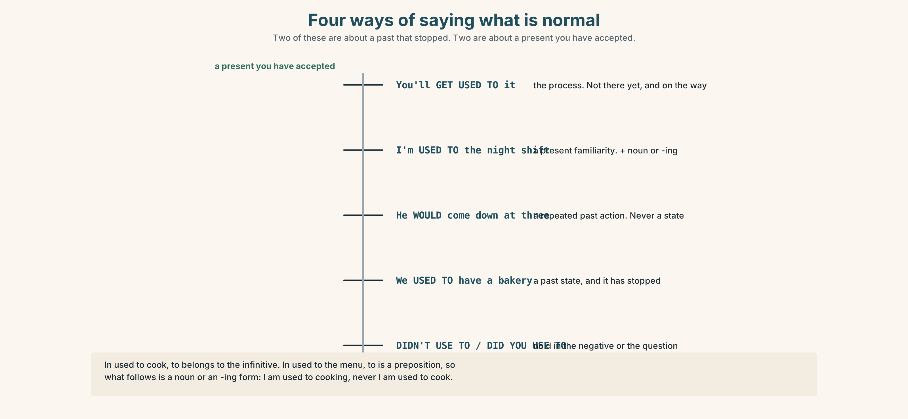{width=6.6in}

*Four ways of saying what is normal — Two of these are about a past that stopped. Two are about a present you have accepted.*

### 3C · Know

| | Shape | Use it for |
|---|---|---|
| **used to + verb** | *She **used to cook** here.* | a past habit **or state** that has stopped |
| **would + verb** | *He **would** come down at three.* | a past **habit only** — never a state |
| **be used to + noun / -ing** | *I**'m used to** the new menu.* | a present familiarity |
| **get used to + noun / -ing** | *You**'ll get used to** it.* | the process of becoming familiar |

> **The *would* trap.** *would* cannot carry a state.
> ✓ *We used to have a bakery.* ✗ *We would have a bakery.*
> ✓ *He would bake on Saturdays.* ✓ *He used to bake on Saturdays.*

> **The *to* trap.** In *used to cook*, *to* belongs to the infinitive.
> In *used to the menu*, *to* is a preposition, so what follows is a noun or an *-ing* form.
> ✓ *I'm used to cooking.* ✗ *I'm used to cook.*

> **The spelling trap.** The negative and the question drop the **d**:
> *didn't **use** to* · *Did you **use** to…?*

> **Why it matters.** Three of these four can describe the same year and tell you different
> things about the speaker: what stopped, what was repeated, and what they have accepted.

### 3D · Use — controlled

> The canteen (1) __________ (cook) everything on site until 2011. On night shifts Ignacio
> (2) __________ (come) down at three and the cook (3) __________ (leave) a plate for him.
> There (4) __________ (be) a bakery in the basement, which closed in 1998. Rosa says she
> (5) __________ (be / not / used to) the tinned fruit at first and that everybody
> (6) __________ (get / used to) it within a month, which she thinks is the part worth
> noticing.

### 3E · Use — guided

Rewrite each one with *used to*, *would*, *be used to* or *get used to*. **Two of them have
only one possible answer.**

1. There was a bakery in the basement. *(there isn't now)*
2. Every Saturday he baked bread. *(he doesn't now)*
3. The night shift does not bother me anymore.
4. At first it was strange. Now it isn't.
5. The hospital had its own garden. *(it doesn't now)*

### 3F · Use — open

**Interview a partner about their first week in any job, school or city.**
Use all four forms. **Then report two of their answers using a different form from the one they
used.**

### 3G · Error autopsy

{width=6.6in}

*Why this sentence says the opposite of what the writer meant — Why this sentence says the opposite of what the writer meant*

**Read the two versions. Then explain, in one sentence, what the first one actually says.**

### 3H · Check — eight items

> 1. There ______ (be) a bakery here. *(not now)*
> 2. He ______ come down at three every night. *(habit only)*
> 3. I'm ______ ______ the new menu now.
> 4. You'll ______ ______ ______ it.
> 5. ______ you ______ to work nights? *(question form)*
> 6. I didn't ______ to like it.
> 7. She's used to ______ (work) twelve-hour shifts.
> 8. We ______ (have) a garden until 2006.

**0–4 →** Workbook pp. 4–7. **5–6 →** Part 6. **7–8 →** page 19.

---

## Part 4 · Speaking ◆ **C · THE PERFORMANCE**

### 4A · Fluency starter — two generations

In pairs. One of you is sixty. One of you is twenty. **Ninety seconds each** on what a normal
Tuesday dinner was. **Then swap ages and do it again.**

### 4B · The functional core — describing a change in habit

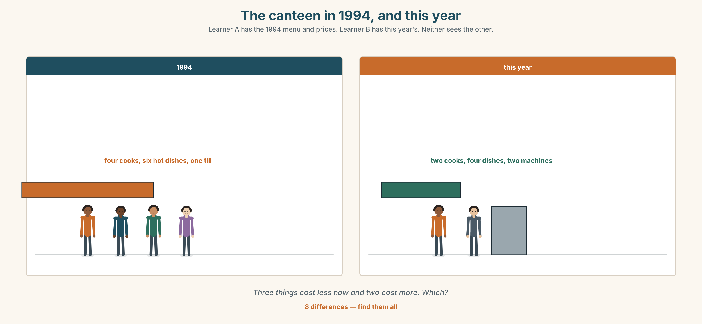{width=6.6in}

*The canteen in 1994, and this year — Learner A has the 1994 menu and prices. Learner B has this year's. Neither sees the other.*

**Language Bank**

| | |
|---|---|
| **what stopped** | *We used to…* · *There used to be…* · *Nobody does that now.* |
| **what was repeated** | *He would always…* · *Every Saturday she'd…* |
| **what you have accepted** | *I'm used to it.* · *You get used to it.* |
| **the honest qualification** | *I'm not sure it was better.* · *That's nostalgia talking.* |

**Information gap.** Learner A has the 1994 canteen menu and prices. Learner B has this
year's. Neither sees the other. **Find three things that cost less now and two that cost more.**

### 4C · The performance — two minutes ⏺

Describe **how eating changed** in one family or one place across two generations.
**Two minutes.** You must include:

> one thing that stopped · one habit that repeated · one thing somebody got used to ·
> one sentence that refuses to be nostalgic

**Record it.**

### 4D · Observer

One person listens for **one thing**: did the speaker claim the past was better without saying so
out loud?

### 4E · Three criteria

> ☐ Did I use all four forms correctly?
> ☐ Is there a date or a decade in it?
> ☐ Did I resist the nostalgia at least once?

---

## Part 5 · Reading ◆ **A · THE WORLD**

### 5A · Predict

An explainer about regional diet change. The title is
**"Nobody chose this, and everybody did."**
**What do you expect the argument to be?** Two sentences.

### 5B · Read — two minutes

---

**Nobody chose this, and everybody did**

In 1990 the average household in this region bought fresh fish eleven times a month. The figure
now is three. Over the same period the number of households buying tinned fish at least weekly
rose from eighteen per cent to sixty-one.

The obvious explanation is price, and the obvious explanation is wrong, or at least incomplete.
Fresh fish here has risen by about forty per cent in real terms. Tinned fish has risen by
thirty-four. The gap between them has widened, but not nearly enough to account for a fall of
eight purchases a month.

What has changed more than the price is the shape of the day. In 1990, forty-one per cent of
households in the region had somebody at home between two and four in the afternoon. That figure
is now eleven per cent. Fresh fish is not expensive; it is **early**. It has to be bought in the
morning, cooked the same day, and eaten by people who are in the house.

Ask anybody over sixty and they will tell you it is because young people cannot cook. Ask anybody
under thirty and they will tell you it is because fish is expensive. Both answers are a way of
describing a schedule without mentioning it.

This matters for the hospital canteen, which buys for four hundred people whose shifts are the
reason the region's afternoons are empty. Whatever the canteen serves, it is serving the thing
that made the change in the first place.

---

### 5C · Comprehension — eight questions

1. What were the 1990 and current figures for fresh fish purchases?
2. What happened to tinned fish over the same period?
3. **Why does the writer say the price explanation is incomplete?** Give the numbers.
4. What has changed about the shape of the day?
5. **What does the writer mean by "fresh fish is not expensive; it is early"?**
6. What explanation do people over sixty give, and what do people under thirty give?
7. What does the writer say both explanations are really describing?
8. **Why does the last paragraph say the canteen is a special case?**

### 5D · Vocabulary in context

Guess from the text. Then check.

> in real terms · account for · the shape of the day · a way of describing · whatever it serves

### 5E · The counter-text

{width=6.6in}

*Two canteen menus, thirty-one years apart — Typed in 1994 and laminated now, and only one of them has a cost note on it.*

**Read the two canteen menus — 1994 and this year — and answer.**

1. How many hot dishes were there in 1994, and how many now?
2. **What has happened to the price of the staff meal, in money and in real terms?**
3. Which three items appear on both menus with the same name?
4. What is on the current menu that did not exist as a category in 1994?
5. One line of the current menu is a cost note for staff only. What does it say?

### 5F · Two texts

The explainer says fresh fish purchases fell because of **the shape of the day**.
The current menu shows fish served **only at lunch**.

**Put those two facts together. Who in this hospital eats fish?** Three sentences.

---

## Part 6 · Vocabulary Lab 2 ◆ **B · THE SYSTEM**

### Words for how often, and how it changed

### 6A · Sort — a habit, a change, or a speed?

Three columns.

> overnight · routine · gradually · steadily · constantly · practice · typically ·
> tradition · custom · increasingly

### 6B · Chunk completion

1. **Over ______** , the fish disappeared from the Tuesday menu.
2. **As a ______** , the kitchen buys nothing that cannot be delivered twice a week.
3. **More and ______** of the staff eat on the ward.
4. She **took ______** cooking at night because the day kitchen was always busy.
5. He **fell ______** the habit of eating at four and has not got out of it.
6. **In those ______** the bakery delivered twice a day.

### 6C · Three adverbs that are not interchangeable

**gradually · steadily · overnight**

> *Gradually* allows for stops and starts. *Steadily* does not. *Overnight* is almost always
> an exaggeration.

**Which fits each sentence, and what would the other two imply?**

1. The number of fresh purchases fell ______ between 1990 and 2010.
2. The canteen changed its supplier ______ , in March, with no notice.
3. People ______ stopped going home in the afternoon.

### 6D · The fixed expression

> **f** **You'd never see that now.**

**Say it three times:** as regret, as relief, and as a simple observation. **Which is hardest?**

### 6E · Contrast Clinic

Eight items. *used to*, *would*, *be used to* or *get used to*.

1. She ______ work in paediatrics.
2. There ______ be a garden here.
3. He isn't ______ being told what to do.
4. Every night he ______ come down at three.
5. We ______ have four cooks. Now there are two.
6. I ______ the smell now. I didn't at first.
7. ______ you ______ to work weekends?
8. You'll ______ the hours.

---

## Part 7 · Pronunciation & Fluency Lab ◆ **B · THE SYSTEM**

### Four phrases, one sound

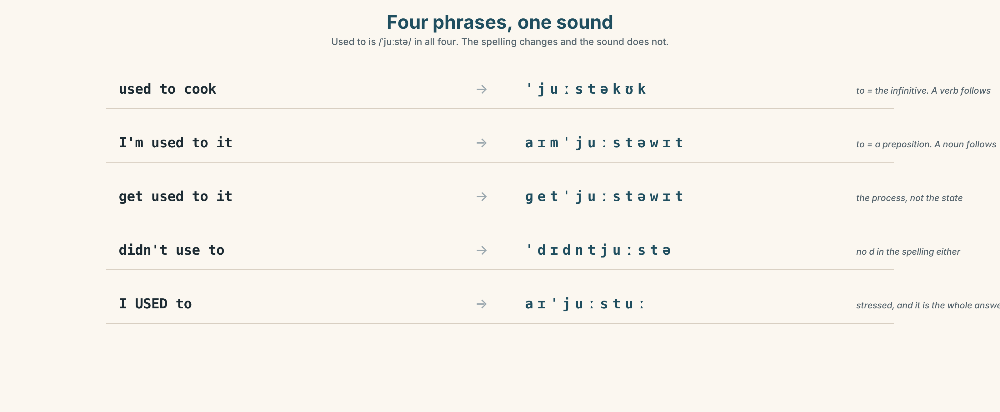{width=6.6in}

*Four phrases, one sound — Used to is /ˈjuːstə/ in all four. The spelling changes and the sound does not.*

### 7A · Hear 🔊 Track 1.3

> used to cook → /ˈjuːstəkʊk/
> I'm used to it → /aɪmˈjuːstəwɪt/
> get used to it → /ɡetˈjuːstəwɪt/
> didn't use to → /ˈdɪdntjuːstə/

**In all four, *used to* is /ˈjuːstə/. The spelling changes; the sound does not.**

### 7B · Say

Say each one. Then say the whole sentence three times, faster:

> *I used to hate it and now I'm used to it, and you get used to it faster than you think.*

### 7C · Make it mean something

Say these two:

> *I USED to.* *(and I do not now — this is the whole answer)*
> *I'm used TO it.* *(and you are asking me whether it still bothers me)*

**Which of the two would you say in reply to "Does the night shift bother you?"**

### 7D · Fluency 30 ⏺

Thirty seconds: **three things you used to do, two you would always do, and one you have got
used to.** Three times, faster.

---

## Part 8 · Writing ◆ **C · THE PERFORMANCE**

### Two generations of a kitchen · 150 words

{width=6.6in}

*The hospital kitchen, in section — Four levels, and the one that closed in 1998 is the one people still mention.*

### 8A · Read the model

> My grandmother bought fish eleven times a month and I have the receipts, because she kept them
> in a tin and nobody threw the tin out. `[the claim is a number, and the source of the number is
> an object]`
>
> She would go at seven, before the market filled, and she used to say that anything still there
> at nine had been there on Monday. I do not know whether that was true. `[one habit with *would*,
> one saying with *used to*, and a refusal to vouch for it]`
>
> I buy fish about twice a month and I buy it on a Saturday, which is the only morning I am in
> the house. That is the whole of the change. It is not about cooking and it is not really about
> money; it is about who is at home at nine in the morning.
> `[the explanation, and it contradicts both of the usual ones]`
>
> I am used to it. I would like to say I mind, and I am not sure I do.
> `[*be used to*, and then an admission that undercuts the nostalgia the reader was expecting]`

**Questions about the writer's choices:**

1. The first paragraph produces a tin of receipts. **What does that do for everything after it?**
2. The last line refuses to feel what the reader expects. **Is that honest, or is it a pose?**
3. The piece never uses the word *tradition*. **Would it be better or worse with it?**

### 8B · The anti-model

> Food was much better in my grandparents' time. Everything was fresh and local and people knew
> how to cook. Nowadays everyone eats processed food and nobody has time for a proper meal. It is
> a great shame and something has been lost.

Correct English, and there is nothing in it that could be checked. **Name three claims that
would need evidence**, and one word that is doing all the emotional work.

### 8C · Plan

> a number, with its source → one habit, with *would* → the explanation that is not the usual one
> → what you have got used to, honestly

### 8D · Write — 150 words
### 8E · Peer review — three criteria

> ☐ Is there one checkable number?
> ☐ Is there one habit described with *would*?
> ☐ Does the piece avoid saying the past was better?

### 8F · Write it again · 8G · Publish

On the wall, with the two menus from Part 5E beside it.

---

## Part 9 · The File ◆ **A · THE WORLD + C · THE PERFORMANCE**

# WORK FILE · The Review

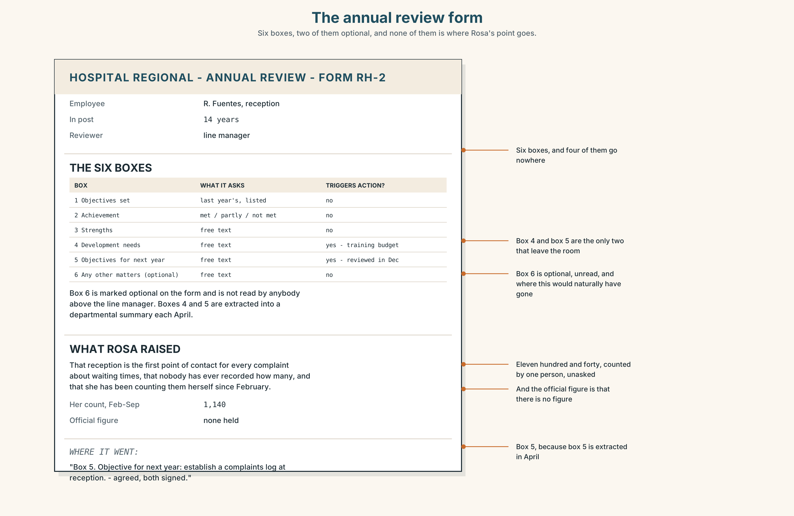{width=6.6in}

*The annual review form — Six boxes, two of them optional, and none of them is where Rosa's point goes.*

### 9A · The annual review 🔊 Track 1.4

Rosa has worked on reception for fourteen years. Her review is twenty minutes.
**Listen to all of it.**

1. How does her manager open, and what is the first real question?
2. **What does Rosa raise that is not on the form?**
3. What is agreed, and who writes it down?

### 9B · The form, and the conversation

**Read the review form in the figure.** It has six boxes.

**Which of the six does the conversation actually fill?** And **which box is where Rosa's point
would have to go, if anywhere?**

### 9C · Raising something that is not on the agenda

> *"Can I add something that isn't on here?"* · *"While we're talking about it…"* ·
> *"This may not be the right place, but…"* · *"I'd like this recorded."*

Match each to its effect. **One of the four changes what has to happen afterwards.** Which?

### 9D · Your turn

In pairs. **Twelve minutes.** One reviews, one is reviewed, using the real form.
**The person being reviewed must raise one thing that is not on it, and must get it written
down.** Then swap.

### 9E · Transfer

**Write the one sentence you would want in your own review this year.**
Keep it. You will look at it again at the end of this book.

---

## Part 10 · Mediation & Interaction ◆ **C · THE PERFORMANCE**

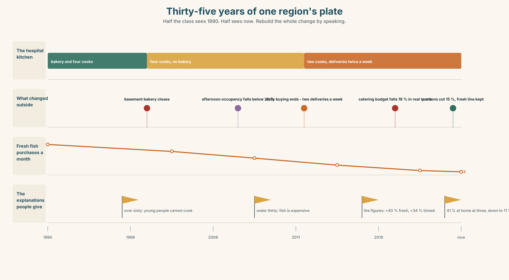{width=6.6in}

*Thirty-five years of one region's plate — Half the class sees 1990. Half sees now. Rebuild the whole change by speaking.*

### 10A · Relay

Half the class sees the 1994 menu and the 1990 purchasing figures. Half sees this year's.
**Rebuild thirty years of one region's diet by speaking.** Twelve minutes.

### 10B · Simplify

Explain the canteen's cost note from Part 5E to a new member of staff on their first day.
**Five sentences only.**

> **Plan:** what a staff meal costs → what it costs the hospital → what the subsidy depends on →
> what changes next year → what to do if you cannot afford it

### 10C · Compress

The explainer in Part 5 into **forty words**, for the canteen noticeboard.

### 10D · Online

Write **one message** to the catering committee: you have read the figures, you accept the
budget cannot stretch, and you are proposing one specific change that costs nothing.

### 10E · Your language

How does your language distinguish a stopped habit from a present familiarity?
**Does it have one form or two?** Say *I used to work nights* and *I'm used to working nights*
in both languages, and tell a partner which was harder.

---

## Part 11 · The Decision ◆ **C · THE PERFORMANCE**

# Cheaper, or better

The canteen budget has fallen nineteen per cent in real terms in six years. It feeds four
hundred people a day, and about a hundred and forty of them are staff on shift, for whom it is
the only hot food available between ten at night and six in the morning.

- **Cheaper.** Move to the processed line. Saves eleven per cent. Nobody goes hungry and nothing
  is nutritionally illegal.
- **Better.** Keep fresh preparation on two of the four menus and cut portion sizes elsewhere.
  Costs nothing extra and reduces what everybody gets.
- **Smaller.** Close the night service. Saves twenty-two per cent. The hundred and forty people
  on nights bring their own or do not eat.

### 11A · The evidence

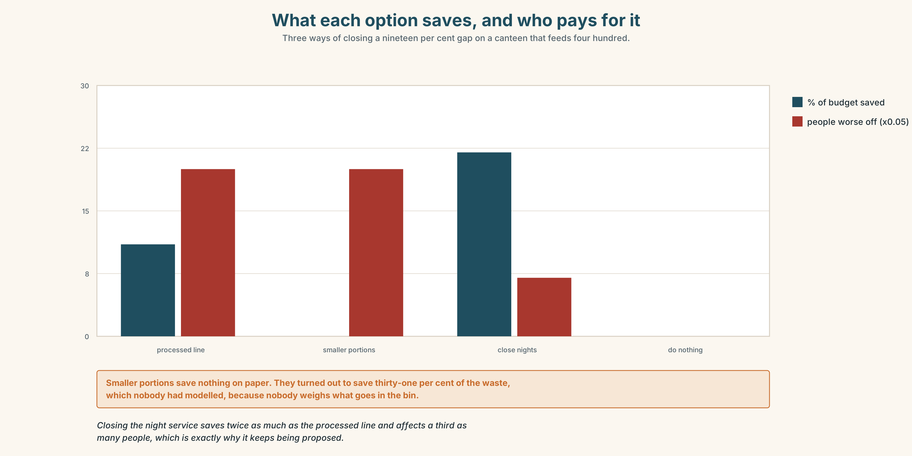{width=6.6in}

*What each option saves, and who pays for it — Three ways of closing a nineteen per cent gap on a canteen that feeds four hundred.*

1. **The two menus** from Part 5E — and the cost note at the bottom of the current one.
2. **The chart** — what each option costs, what it saves, and who it affects.
3. **The voice.** Ignacio, thirty seconds: *"I have been here twenty-two years and I have eaten
   there every night of them. It is not about the food. If you close it at night, the only people
   who lose anything are the ones who are here at four in the morning, and we are already the
   ones who lose things."*

### 11B · Talk about it

In fours. Everybody speaks twice. Use the frame.

> *If they ______ , then ______ . So I think ______ .*

**Words you can use:** *budget · portion · processed · fresh · staple · cut down on · a balanced
diet · convenience food*

### 11C · Decide

Write **three sentences**. Choose, say why, and name what it costs.

> I think the canteen should ______________________ ,
> because ______________________ .
> What this costs is ______________________ .

### 11D · Model decision

> They should cut portion sizes and keep fresh preparation, and they should publish the portion
> change rather than letting people discover it. Every version of this costs somebody something,
> and the two options that look painless — processed food, closing at night — both put the whole
> cost on the hundred and forty people with the least choice about when they eat. A smaller plate
> for four hundred is the only version where the cost is shared, and it is also the only one
> anybody will complain about, which is probably the test.

### 11E · The Reveal

> **What happened.** Portions came down by about fifteen per cent across all four menus and the
> fresh line stayed. The change was announced on a notice that nobody read.
>
> Complaints ran at about four a week for two months and then stopped. In month five the canteen
> manager found that total food waste had fallen by thirty-one per cent, which more than covered
> the eleven per cent the processed line would have saved. Nobody had modelled that and nobody
> had thought to.
>
> The night service stayed open. Ignacio still eats there at three. He says the plate is smaller
> and that he had not noticed until somebody told him, which he thinks is either the best or the
> worst thing about the whole business and he has not decided which.

**Smaller plates saved more than cheaper food would have, because people had been throwing a
third of it away.**

> **Was it the right decision?** Say why — and say what should have been measured first.

---

## Part 12 · Landing ◆ **all three lines**

### 12A · Recycle — twelve items

> 1. There ______ (be) a bakery here. *(not now)*
> 2. He ______ come down at three every night. *(habit only)*
> 3. I'm ______ ______ the new menu now.
> 4. You'll ______ ______ ______ the hours.
> 5. They've agreed to **cut ______ on** salt.
> 6. Potatoes are **a ______ of** this region.
> 7. She **grew ______ on** tinned fruit.
> 8. **Over ______** , the fish disappeared from the menu.
> 9. *(A2.2 U2)* We ______ (wait) for that delivery since June.
> 10. *(A2.2 U8)* The hall, ______ was built in 1884, is the oldest.
> 11. *(A2.1 U3)* I ______ (use) to live on that street.
> 12. *(A2.1 U6)* I can't afford ______ (replace) it.

### 12B · Consolidate

**One hundred and fifty words.** How eating changed in one family or one place. All four forms
from Part 3, one checkable number, and one sentence that refuses to say the past was better.

### 12C · Can-do, with evidence

| I can… | My evidence | Sure? |
|---|---|---|
| distinguish a stopped habit, a repeated action and a present familiarity | Part 3H score | ◯ ◑ ● |
| describe thirty years of change in two minutes | Part 4C recording | ◯ ◑ ● |
| write 150 words with a checkable number in them | Part 8 draft 2 | ◯ ◑ ● |
| raise something in a review that is not on the form | Part 9D role play | ◯ ◑ ● |

### 12D · Replay ⏺

Find your forty-five seconds from Part 0C. Listen. **Record it again.**
**Two sentences:** what is different, and what you would still not be able to say.

### 12E · Glossary — forty-five items, as a map

> **ON THE PLATE** · diet · portion · staple · a staple of · seasonal · fresh · tinned · processed · recipe
> **WHERE IT COMES FROM** · canteen · household · budget · home cooking · convenience food · a balanced diet
> **WHAT PEOPLE DO** · generation · cut down on · eat out · grow up on · live off · give up · stock up
> **AND DO NOT** · we never had that · nobody cooked like that · you'd never see that now
> **HABIT** · practice · routine · custom · tradition · be used to · get used to · would always · take to · fall into · as a rule
> **HOW IT CHANGED** · gradually · constantly · rarely · typically · increasingly · steadily · overnight · in those days · over time · more and more

### 12F · Next

> **Unit 2 · What if it had gone differently?**

# B1.2 · Unit 2 · The Form Nobody Signs

> **English Animated** · *Weighing It Up* · Hospital Regional, Valdivia
> Student's Book pages 28–49 · 22 pp · ~11 hours

---

## Part 0 · The Big Picture ◆ **A · THE WORLD**

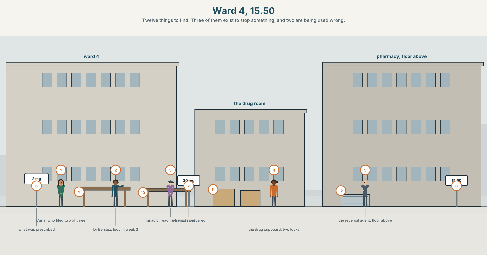{width=6.6in}

*Ward 4, 15.50 — Twelve things to find. Three of them exist to stop something, and two are being used wrong.*

# What if it had gone differently?

**By the end of this unit you can narrate a near miss, and say what would have happened if it had
gone the other way. One hundred and fifty words.**

| ◆ **A · THE WORLD** | A hospital that counts the things that did not happen |
|---|---|
| ◆ **B · THE SYSTEM** | the third conditional · *if only*, *but for*, *had it not been* · 23 words for error and disclosure · 22 words for regret and narrow escapes · *would've* and *hadn't* as consonant clusters |
| ◆ **C · THE PERFORMANCE** | A hundred and fifty words about something that nearly happened |

---

### 0A · Find it

**Find twelve things in this picture.** Three of them exist to stop something.

> a drug cupboard with two locks · a whiteboard with names · a wristband scanner ·
> a red crash trolley · a hand gel dispenser · a pneumatic tube station · a bed brake ·
> a door wedge · a sharps bin · a wall-mounted phone · a near-miss form box · a clock

### 0B · Guess it

**Two of the things in this picture are being used in a way they were not designed for.**
Which, and what has somebody worked around?

### 0C · Say it ⏺

**Record forty-five seconds.** *Think of something that nearly went wrong and did not.
What would have happened if it had?* You will record it again at the end of this unit.

---

## Part 1 · Vocabulary Lab 1 ◆ **B · THE SYSTEM**

{width=6.6in}

*Six things that had to line up — Remove any one of them and nothing reaches the bedside. All six were in place by March.*

### 1A · Meet — the words of a near miss

Match each word to one place on the map.

> **incident** · **error** · **harm** · **prevent** · **report** · **blame** · **culture** ·
> **disclosure** · **anonymous** · **signed**

### 1B · Sort — the event, the response, or the system?

Three columns.

> incident · report · blame · culture · disclosure · harm · error · anonymous · prevent

**One of them belongs in the third column and is always argued about as if it were in the
second.** Which?

### 1C · Meet — three words that are not the same

> **error** · **harm** · **near miss**

An error can cause no harm. Harm can occur with no error. **A near miss is an error that was
stopped — by whom?** That question is the whole of this unit.

### 1D · Collocation Lab

Complete each one with one word.

1. The investigation is supposed to find the **root ______** , not the person nearest to it.
2. She reported it **in good ______** and has regretted it twice since.
3. The report ends with a page headed **______ learned** and nobody can name one.
4. He **owned ______** within an hour, which everybody agrees was the right thing and nobody
   would recommend.
5. Two people **______ it up** in 2019 and the hospital still has not found out who.
6. When you **look ______ on** it, the warning signs were all in the rota.

### 1E · The fixed expressions

> **f** **It could have been worse.**
> **f** **Nobody got hurt.**

Both of these are true, and both of them end an investigation.

> **Write the sentence that should follow each one** so that it does not.

### 1F · Own it

Think of a near miss you know about — anywhere, any job, any kitchen. Tell a partner
**four sentences**: what nearly happened, what stopped it, who knew, and whether it was reported.

---

## Part 2 · Listening ◆ **A · THE WORLD**

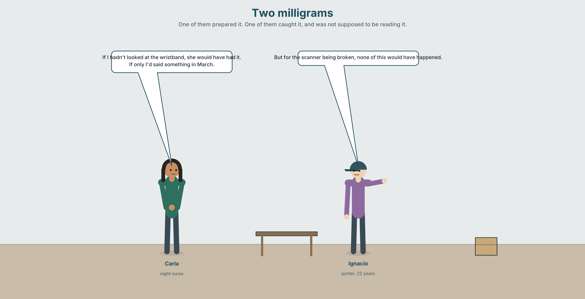{width=6.6in}

*Two milligrams — One of them prepared it. One of them caught it, and was not supposed to be reading it.*

### 2A · Two milligrams 🔊 Track 2.1

**Before you listen.** A drug was prepared at ten times the dose and not given.
**Guess: what stopped it?**

**Listen once. One question.** Who noticed?

**Listen again. Complete the table.**

| | What they did | What they would have done differently | What they are afraid of |
|---|---|---|---|
| Carla | | | |
| Dr Benítez | | | |
| Ignacio | | | |

**Listen again. Choose the best answer.**

1. The error was caught **at the cupboard / after it was given / at the bedside**.
2. The person who caught it was a **porter / nurse / student**.
3. The form was filed **signed / not at all / anonymously**.
4. The last three reports about that cupboard were **lost / filed / acted on**.

**Noticing.** Four sentences from the recording.

1. *If I hadn't looked at the wristband, she would have had it.*
2. *If only I'd said something in March.*
3. *But for the scanner being broken, none of this would have happened.*
4. *Had it not been for Ignacio, we would be having a different conversation.*

**All four describe the same unreal past. Put them in order, most formal last.**

### 2B · Decoding clinic 🔊 Track 2.2

Thirty seconds of Carla. Four jobs.

1. How many times does she say *would have*?
2. In *hadn't*, how many consonant sounds can you hear at the end?
3. Catch the dose and the time.
4. She corrects a pronoun halfway through a sentence. Where, and what does the correction do?

> Transcripts, page 151.

---

## Part 3 · Grammar Lab 1 ◆ **B · THE SYSTEM**

### A past that did not happen

### 3A · Notice

Look at the four sentences in Part 2.

1. In sentence 1, did she look at the wristband? Did the patient have the drug?
2. **The third conditional reverses both halves.** What actually happened in sentence 3?
3. Sentence 4 begins *Had it not been*. **Where has the *if* gone?**
4. **Which of the four blames somebody?** Is it the grammar that does it, or the content?
5. Try *"If I wouldn't have looked, she would have had it."* **What is wrong, and why is it so
   common?**

### 3B · See

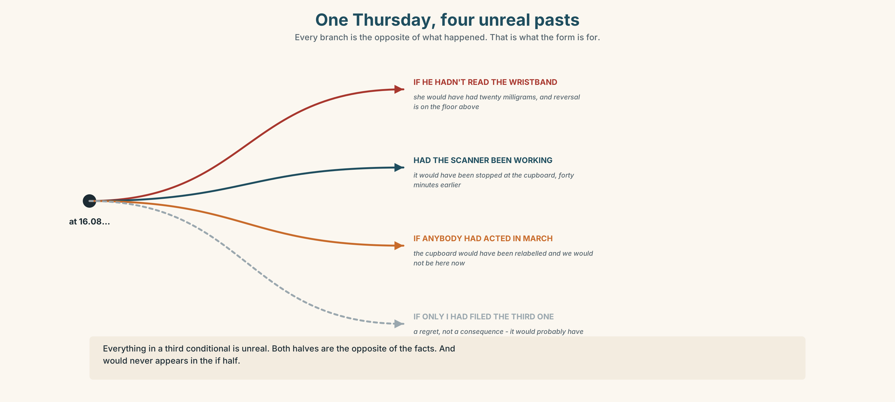{width=6.6in}

*One Thursday, four unreal pasts — Every branch is the opposite of what happened. That is what the form is for.*

### 3C · Know

| | Shape | |
|---|---|---|
| **third conditional** | *If* + **past perfect**, *would have* + past participle | *If I **had looked**, she **wouldn't have had** it.* |
| **inverted** | *Had* + subject + past participle | ***Had I looked**, she wouldn't have had it.* |
| **but for** | *But for* + noun | ***But for** the scanner, it would have happened.* |
| **if only** | regret, not consequence | ***If only** I'd said something.* |

> **Everything in it is unreal.** The *if* half did not happen; the *would* half did not happen.
> Both halves are the opposite of the facts.

> **The commonest error in English, at every level.**
> ✗ *If I wouldn't have looked…* ✓ *If I hadn't looked…*
> ***would* never appears in the *if* half.** It is so common because the two halves feel
> parallel and are not.

> **The inverted form drops *if* and is one register up.** It is normal in writing, reports and
> formal speech, and sounds odd in a kitchen.
> ✓ *Had it not been for Ignacio…* ✗ *Had I known it, if…*

> **Mixed with the present.** If the result is still true now, the second half becomes *would* +
> verb: *If I'd said something in March, we **wouldn't be having** this conversation.*

### 3D · Use — controlled

> If Carla (1) __________ (not / check) the wristband, the patient
> (2) __________ (receive) ten times the dose. The scanner
> (3) __________ (be) broken since March; had it (4) __________ (work), the error
> (5) __________ (not / reach) the bedside at all. If anybody
> (6) __________ (act) on the three previous reports, the cupboard
> (7) __________ (be) relabelled in the spring, and we
> (8) __________ (not / be) having this conversation now.

### 3E · Use — guided

Rewrite each one as a third conditional. **Two of them should use the inverted form.**

1. The scanner was broken, so the error reached the bedside.
2. Ignacio was passing. He noticed.
3. Nobody acted on the March report, so the cupboard was not relabelled.
4. She reported it, so the cupboard has been changed.
5. He did not sign the form, so nothing was investigated.

### 3F · Use — open

**In pairs.** Describe something that went right. Your partner must produce three unreal pasts
in which it went wrong. **Then swap.** Three minutes each.

### 3G · Error autopsy

{width=6.6in}

*The commonest conditional error in English — The commonest conditional error in English*

**Read both versions. Then say, in one sentence, what the wrong one would mean if English
allowed it.**

### 3H · Check — eight items

> 1. If I ______ (not / look), she ______ (have) it.
> 2. ______ it not ______ for Ignacio, we would be having a different conversation.
> 3. But ______ the broken scanner, nothing would have reached the bedside.
> 4. If only I ______ (say) something in March.
> 5. If they ______ (act) on the report, the cupboard ______ (be) relabelled by now.
> 6. ______ I known, I ______ (not / prepare) it at all.
> 7. If she ______ (not / sign) it, nothing ______ (happen).
> 8. If I ______ (study) medicine, I ______ (be) in my fourth year now.

**0–4 →** Workbook pp. 10–13. **5–6 →** Part 6. **7–8 →** page 41.

---

## Part 4 · Speaking ◆ **C · THE PERFORMANCE**

### 4A · Fluency starter — the chain backwards

One learner states a fact: *"The patient was fine."*
The next produces an unreal past: *"If Ignacio hadn't been passing, she wouldn't have been."*
The next goes one further back. **Five links, then stop.**

### 4B · The functional core — narrating a near miss

{width=6.6in}

*The timeline, and the three reports — Learner A has the Thursday. Learner B has March, April and June. Neither sees the other.*

**Language Bank**

| | |
|---|---|
| **what happened** | *At about four…* · *The dose prepared was…* |
| **what stopped it** | *What caught it was…* · *Had it not been for…* |
| **what would have happened** | *She would have…* · *We would be…* |
| **the regret, separately** | *If only…* · *I wish I'd…* |

**Information gap.** Learner A has the incident timeline. Learner B has the three previous
reports about the same cupboard. **Find the point at which this stopped being bad luck.**

### 4C · The performance — two minutes ⏺

Narrate a **near miss**. **Two minutes.** You must include:

> what happened, in order · what stopped it · what would have happened ·
> one *if only* that is about you and not about the system

**Record it.**

### 4D · Observer

One person listens for **one thing**: did the speaker blame anybody, and did they mean to?

### 4E · Three criteria

> ☐ Did I keep *would* out of the *if* half every time?
> ☐ Did I use one inverted form?
> ☐ Is the regret separate from the consequence?

---

## Part 5 · Reading ◆ **A · THE WORLD**

### 5A · Predict

A short story. The title is **"The third form."**
**What do you expect the third form to be?** Two sentences.

### 5B · Read — two minutes

---

**The third form**

The first form she filed was in March and she signed it, because that is what you are told to do
and because she had been in the job eight weeks and had not yet learned which instructions are
real.

The cupboard was relabelled in April. Then it was relabelled back in May, by somebody in
pharmacy who had not been told why it had been changed and who correctly observed that the new
labels did not match the formulary.

The second form she filed in June, and she signed that one too. It went to the same inbox. She
knows this because she has the automatic reply, which is two lines long and arrived at 04.11,
which tells you something about who was awake.

The third one is the one she did not file.

It was a Thursday and she was forty minutes past the end of a shift and she thought — and she has
been honest with me about this — *if I write this one, I will be the person who writes these*.
There is no sentence in any policy about being the person who writes these. There does not have
to be.

Eleven weeks later a bag went up at ten times the dose and was caught at the bedside by a porter
who was not supposed to be reading wristbands and who has never been thanked for it in writing,
because thanking him would mean writing down what he was doing.

If she had filed the third one, it would almost certainly have gone to the same inbox and arrived
at four in the morning and changed nothing. That is the part people get wrong about this story.
The reason to file it was never that it would have worked.

---

### 5C · Comprehension — eight questions

1. When did she file the first form, and why did she sign it?
2. **What happened to the cupboard in April and in May, and why?**
3. How does she know the second form arrived?
4. What was her reason for not filing the third?
5. **What does the narrator mean by "there does not have to be"?**
6. What happened eleven weeks later, and who caught it?
7. Why has the porter never been thanked in writing?
8. **What does the last paragraph say people get wrong about the story?**

### 5D · Vocabulary in context

Guess from the text. Then check.

> which instructions are real · the formulary · the same inbox · past the end of a shift ·
> it would have changed nothing

### 5E · The counter-text

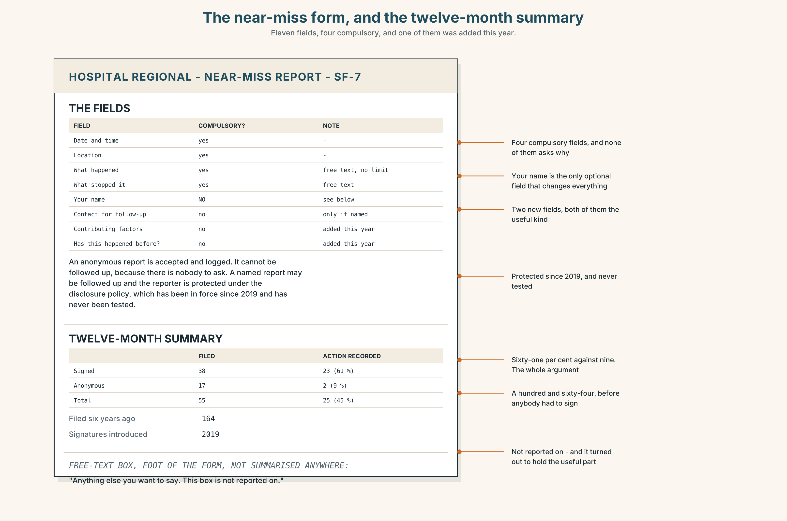{width=6.6in}

*The near-miss form, and the twelve-month summary — Eleven fields, four compulsory, and one of them was added this year.*

**Read the near-miss reporting form and the twelve-month summary, and answer.**

1. How many fields are there, and how many are compulsory?
2. **What is the difference, on the form itself, between an anonymous report and a signed one?**
3. How many reports were filed in the year, and how many were anonymous?
4. What proportion of each kind resulted in a recorded action?
5. One field has been added since last year. Which, and what does it ask?

### 5F · Two texts

The story says the forms **changed nothing**.
The summary shows **signed reports with a 61 per cent action rate**.

**Put those two facts together. Was she wrong?** Three sentences.

---

## Part 6 · Vocabulary Lab 2 ◆ **B · THE SYSTEM**

### Narrow escapes and the words for them

### 6A · Sort — how close, and how lucky?

Three columns: **how close · how lucky · how it looks afterwards**.

> fortunately · nearly · almost · barely · luckily · narrowly · as it turned out ·
> thankfully · hindsight

### 6B · Chunk completion

1. **By a ______** — four minutes later and it would have been given.
2. He noticed **at the last ______** , which is the only reason anybody knows.
3. **As it turned ______** , the scanner had been broken since March.
4. **To make matters ______** , the previous reports were about the same cupboard.
5. It **panned ______** better than anybody deserved.
6. Nobody knows how it would have **turned ______** .

### 6C · Three that look identical

**fortunately · luckily · thankfully**

> *Fortunately* is about the outcome. *Luckily* is about chance. *Thankfully* is about the
> speaker's feelings, and in a report it is the one to avoid.

**Which fits each, and why are the other two worse?**

1. ______ , the porter was passing.
2. ______ , the error was caught before the drug was given.
3. ______ , nobody has to tell a family anything.

### 6D · The fixed expression

> **f** **I wish I'd said something.**

**Say it twice:** once about a system, once about a person. **Which is harder to say out loud,
and which is more useful in a report?**

### 6E · Contrast Clinic

Eight items. Third conditional, inverted form, *but for*, or *if only*.

1. Nobody acted in March. The cupboard is still wrong. *(result now)*
2. Ignacio was passing. He caught it.
3. *(formal, in a report)* Ignacio was there. Nothing happened.
4. He read the wristband. She is alive.
5. She didn't file the third form. *(regret only)*
6. I didn't know. I prepared it.
7. She signed the first two. They were investigated.
8. The scanner was broken. The error reached the bedside.

---

## Part 7 · Pronunciation & Fluency Lab ◆ **B · THE SYSTEM**

### Four consonants in a row

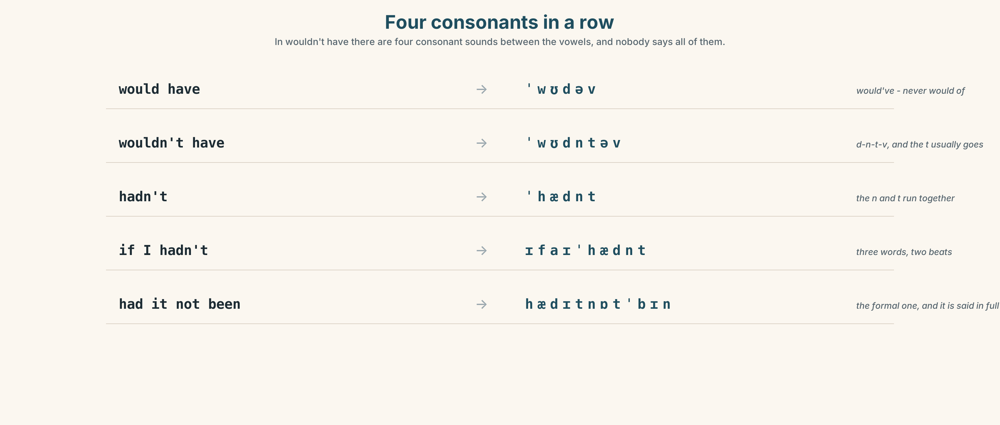{width=6.6in}

*Four consonants in a row — In wouldn't have there are four consonant sounds between the vowels, and nobody says all of them.*

### 7A · Hear 🔊 Track 2.3

> would have → *would've* → /ˈwʊdəv/
> wouldn't have → /ˈwʊdntəv/
> hadn't → /ˈhædnt/
> if I hadn't → /ɪfaɪˈhædnt/
> had it not been → /hædɪtnɒtˈbɪn/

**In *wouldn't have* there are four consonant sounds between the two vowels, and native speakers
do not say all of them.**

### 7B · Say

Say each one. Then say the whole sentence three times, faster:

> *If I hadn't looked at the wristband, she would have had it.*

### 7C · Make it mean something

Say these two:

> *She WOULD have had it.* *(somebody has just said she would not)*
> *She would've had it.* *(and this is simply what follows)*

**One of these belongs in a report and one does not.** Which, and why?

### 7D · Fluency 30 ⏺

Thirty seconds: **three unreal pasts about today.** Three times, faster,
and never let a *would* into the *if* half.

---

## Part 8 · Writing ◆ **C · THE PERFORMANCE**

### A near miss · 150 words

{width=6.6in}

*The drug room, in section — Four levels, and the two that matter are twenty centimetres apart.*

### 8A · Read the model

> At 15.50 a bag was prepared at 20 mg. The prescription was 2 mg. The error was in the
> transcription and the cupboard labelling made it easy to make.
> `[what happened, in the passive, with no person in it — deliberately]`
>
> It was caught at the bedside at 16.08 by a porter who was reading the wristband while he
> waited. Had he not been waiting, it would have been given. `[what stopped it, with a name for
> the role and not the person, and one inverted conditional]`
>
> Twenty milligrams of that drug would have required reversal within four minutes and the
> reversal agent is on the floor above. `[what would have happened, with a number that makes it
> real]`
>
> If only somebody had acted on the March report. I include myself in that: I read it and did
> nothing, because it was not addressed to me. `[the regret, and the writer puts themselves in
> it without making the piece about themselves]`

**Questions about the writer's choices:**

1. The first paragraph has no person in it at all. **Is that evasion or precision?**
2. The porter is described by his job and not his name. **Why might that be protective?**
3. The last paragraph admits something. **Does it weaken the report?**

### 8B · The anti-model

> There was unfortunately a near miss on the ward last Thursday. Luckily it was spotted in time
> and no harm came to the patient. Staff are reminded to check all doses carefully. We are
> grateful to everyone involved for their vigilance.

Correct English. **Name three things an investigator could not do with it**, and one word in it
that quietly assigns the blame.

### 8C · Plan

> what happened, with the numbers → what stopped it → what would have happened, with a number →
> one *if only* that includes you

### 8D · Write — 150 words
### 8E · Peer review — three criteria

> ☐ Could somebody act on this next Thursday?
> ☐ Is there a number in the counterfactual?
> ☐ Does the writer appear in it without the piece being about them?

### 8F · Write it again · 8G · Publish

On the wall, with the reporting form from Part 5E beside it.

---

## Part 9 · The File ◆ **A · THE WORLD + C · THE PERFORMANCE**

# STUDY FILE · The Lecture

{width=6.6in}

*The lecture handout — Three models of error, and the hospital's form is built on the first one.*

### 9A · Fifty minutes on error 🔊 Track 2.4

A teaching session for fifth-year students: *why safe systems fail*. **Listen to the first
twenty minutes.**

1. What are the three models of error she describes?
2. **Which one does she say the hospital's form is built on, and why is that a problem?**
3. She says one sentence twice. Which, and what is it doing?

### 9B · Notes that survive the week

**Three columns:** *what she said · what I will need · what I don't follow*.

> Listen again. **Six lines in the first column. At least two in each of the others.**

### 9C · The signposts of a lecture

Match each to its job.

> *"There are three models and I am going to argue the third one."* ·
> *"Now, I said I would come back to this."* ·
> *"This is the bit that is in the exam, and it is also the bit that is true."* ·
> *"If you remember nothing else…"*

> stating the thesis · returning to a thread · marking importance · the one-line takeaway

### 9D · Your turn

**Four minutes, standing up.** Explain one of the three models of error to the group,
with one signpost phrase and one third conditional.

### 9E · Transfer

**Find one lecture, podcast or talk this week.** Write down its thesis in one sentence.
If you cannot, note what it had instead.

---

## Part 10 · Mediation & Interaction ◆ **C · THE PERFORMANCE**

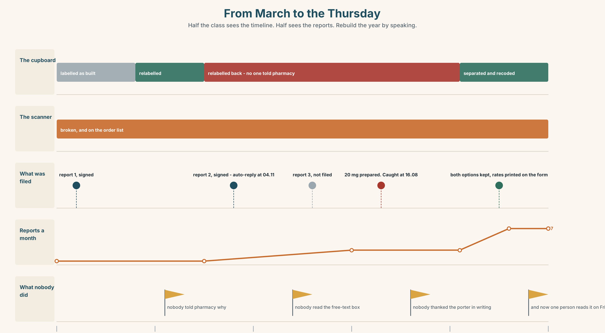{width=6.6in}

*From March to the Thursday — Half the class sees the timeline. Half sees the reports. Rebuild the year by speaking.*

### 10A · Relay

Half the class sees the incident timeline. Half sees the twelve-month report summary.
**Rebuild the whole year by speaking.** Twelve minutes.

### 10B · Simplify

Explain the reporting form from Part 5E to a new member of staff on day one.
**Five sentences only.**

> **Plan:** what it is for → what happens to a signed one → what happens to an anonymous one →
> what will not happen to you → the one field that matters

### 10C · Compress

The story in Part 5 into **forty words**, without losing the last paragraph's point.

### 10D · Online

Write **one message** to the patient safety lead: there have been four reports about one
cupboard, you have the dates, and you are asking for one specific thing by one specific date.

### 10E · Your language

How does your language talk about a past that did not happen?
**Is there a special form, or does it use the ordinary past?** Say *if I hadn't looked, she
would have had it* in both languages and tell a partner which is longer.

---

## Part 11 · The Decision ◆ **C · THE PERFORMANCE**

# Signed, or anonymous

The near-miss form can be filed either way. The hospital is deciding whether to keep both
options.

- **Signed only.** Sixty-one per cent of signed reports result in a recorded action, against
  nine per cent of anonymous ones, because an investigator can ask a follow-up question.
- **Anonymous only.** Reporting rates in the two years before signatures were introduced were
  three times what they are now.
- **Both, as now.** The current position, which produces a small number of useful reports and a
  large number of unusable ones, and which everybody agrees is unsatisfactory.

### 11A · The evidence

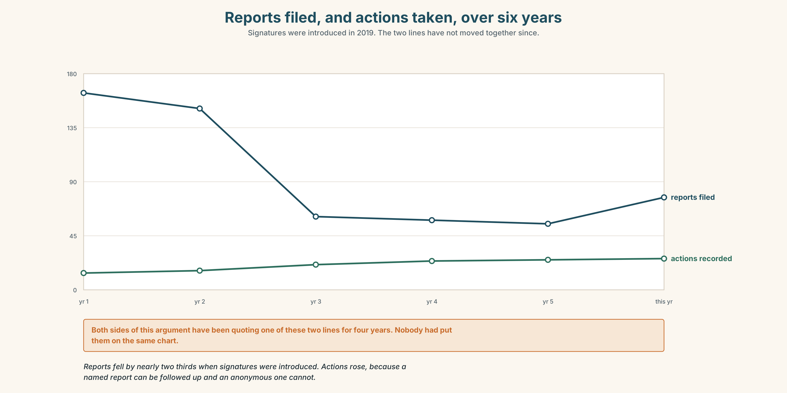{width=6.6in}

*Reports filed, and actions taken, over six years — Signatures were introduced in 2019. The two lines have not moved together since.*

1. **The form and the summary** from Part 5E — and the field that was added this year.
2. **The chart** — reports filed, and actions taken, over six years.
3. **The voice.** Carla, thirty seconds: *"I signed the first two. I would sign again tomorrow
   and I would tell a new nurse to sign, and I am aware that what I am recommending is a thing
   that cost me something. If I had not signed the second one I would not have been in that
   meeting in July, and I would rather have been in the meeting."*

### 11B · Talk about it

In fours. Everybody speaks twice. Use the frame.

> *If they ______ , then ______ . But if they ______ , then ______ .*

**Words you can use:** *incident · error · harm · prevent · report · blame · culture ·
disclosure · in good faith · root cause*

### 11C · Decide

Write **three sentences**. Choose, say why, and name what it costs.

> I think the hospital should ______________________ ,
> because ______________________ .
> What this costs is ______________________ .

### 11D · Model decision

> Keep both, and publish the two action rates on the form itself. The argument has been running
> for four years because each side has one number and neither has both, and a reporter standing
> at a cupboard at four in the morning is entitled to know that signing it triples the chance of
> anything happening and also that nine per cent of anonymous reports do get acted on. Let them
> price their own risk. The hospital cannot promise protection it has not demonstrated.

### 11E · The Reveal

> **What happened.** Both options were kept and the two rates were printed at the top of the
> form in a box.
>
> Total reports rose by about forty per cent in the first year. The anonymous share rose from
> thirty-one per cent to fifty-four, which is the opposite of what the safety lead expected and
> had argued for.
>
> Actions taken rose too, but not proportionally: from nineteen in the previous year to
> twenty-six. The useful information in anonymous reports turned out to be mostly in the free-text
> box, which nobody had been reading, and which one person now reads every Friday.

**More reports, mostly anonymous, and the value was in a box nobody had opened.**

> **Was it the right decision?** Say why — and say what should happen to the Friday reading job.

---

## Part 12 · Landing ◆ **all three lines**

### 12A · Recycle — twelve items

> 1. If I ______ (not / look), she ______ (have) it.
> 2. ______ it not ______ for Ignacio, nothing would have been caught.
> 3. But ______ the broken scanner, it would not have reached the bedside.
> 4. If only I ______ (say) something in March.
> 5. The investigation looks for the **root ______** .
> 6. She reported it **in good ______** .
> 7. **As it turned ______** , the scanner had been broken for months.
> 8. **To make matters ______** , the earlier reports were about the same cupboard.
> 9. *(Unit 1)* There ______ (be) a bakery here. *(not now)*
> 10. *(Unit 1)* I'm ______ ______ the night shift now.
> 11. *(A2.2 U3)* By the time we arrived, it ______ (already / start).
> 12. *(A2.2 U6)* The rope ______ (must / break) in the night.

### 12B · Consolidate

**One hundred and fifty words.** A near miss. What happened, what stopped it, what would have
happened with a number in it, and one *if only* that includes you.

### 12C · Can-do, with evidence

| I can… | My evidence | Sure? |
|---|---|---|
| describe a past that did not happen, without putting *would* in the *if* half | Part 3H score | ◯ ◑ ● |
| narrate a near miss in two minutes | Part 4C recording | ◯ ◑ ● |
| write 150 words an investigator could act on | Part 8 draft 2 | ◯ ◑ ● |
| take notes from a fifty-minute lecture in three columns | Part 9B page | ◯ ◑ ● |

### 12D · Replay ⏺

Find your forty-five seconds from Part 0C. Listen. **Record it again.**
**Two sentences:** what is different, and what you now say that you did not before.

### 12E · Glossary — forty-five items, as a map

> **THE EVENT** · incident · error · harm · a near miss · close call · what went wrong
> **THE RESPONSE** · prevent · avoid · report · disclosure · anonymous · signed · in good faith · root cause · lessons learned
> **THE PEOPLE** · blame · culture · own up · cover up · look back · put down to
> **WHAT PEOPLE SAY** · it could have been worse · nobody got hurt · I wish I'd said something
> **HOW CLOSE** · nearly · almost · barely · narrowly · by a hair · at the last minute
> **HOW LUCKY** · fortunately · luckily · thankfully · as it turned out · pan out · turn out
> **LOOKING BACK** · regret · hindsight · otherwise · instead · had I known · but for · had it not been · to make matters worse

### 12F · Next

> **Unit 3 · Are you where you expected to be?**

# B1.2 · Unit 3 · The Post That Ends on Friday

> **English Animated** · *Weighing It Up* · Hospital Regional, Valdivia
> Student's Book pages 50–71 · 22 pp · ~11 hours

---

## Part 0 · The Big Picture ◆ **A · THE WORLD**

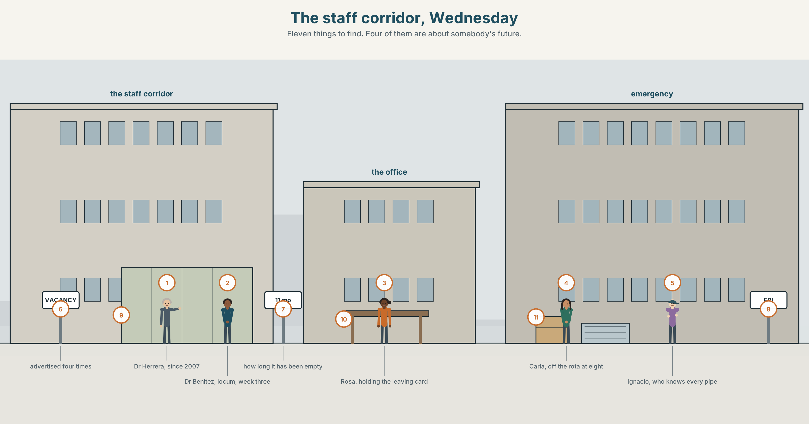{width=6.6in}

*The staff corridor, Wednesday — Eleven things to find. Four of them are about somebody's future.*

# Are you where you expected to be?

**By the end of this unit you can give a two-minute talk about the choice that put you where you
are.**

| ◆ **A · THE WORLD** | Six careers in one building, and not one of them went to plan |
|---|---|
| ◆ **B · THE SYSTEM** | mixed conditionals · consequence chains · 23 words for posts and paths · 22 words for cause and result · how the tune changes when the halves do not match |
| ◆ **C · THE PERFORMANCE** | Two minutes on one decision and everything downstream of it |

---

### 0A · Find it

**Find eleven things in this picture.** Four of them are about somebody's future.

> a vacancy notice · a rota on a wall · a shortlist pinned to a board · a name badge ·
> a locum's temporary pass · a study timetable · a reference request in a tray ·
> a photograph of a 1998 intake · a lanyard with three keys · a coffee machine ·
> a leaving card going round

### 0B · Guess it

**Two people in this picture are doing a job they did not train for.**
Which, and what is the evidence in the drawing?

### 0C · Say it ⏺

**Record forty-five seconds.** *Name one decision that put you where you are.
Now say what you would be doing if you had decided the other way.* You will record it again at
the end of this unit.

---

## Part 1 · Vocabulary Lab 1 ◆ **B · THE SYSTEM**

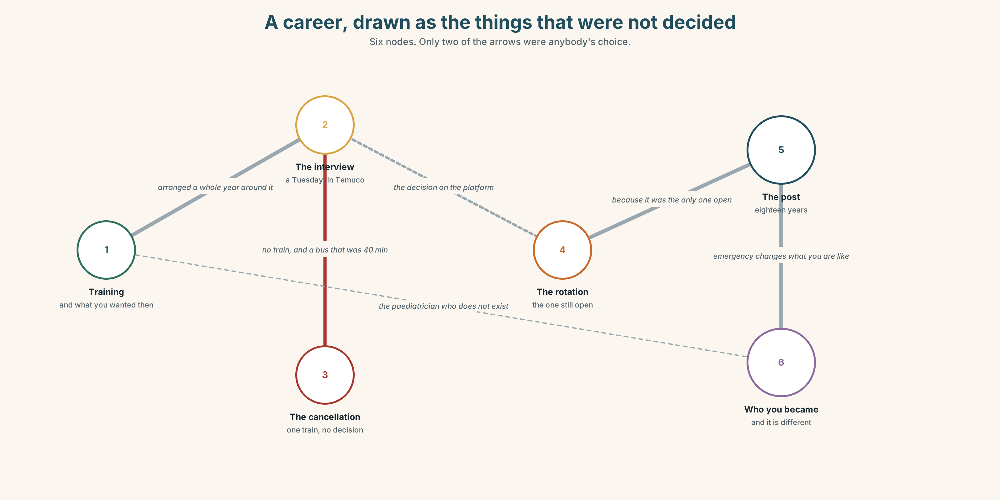{width=6.6in}

*A career, drawn as the things that were not decided — Six nodes. Only two of the arrows were anybody's choice.*

### 1A · Meet — the words of a working life

Match each word to one place on the map.

> **career** · **speciality** · **rotation** · **post** · **vacancy** · **training** ·
> **mentor** · **supervisor** · **shortlist** · **reference**

### 1B · Sort — a thing you apply for, a thing you are given, or a thing you become?

Three columns.

> shortlist · post · appointment · supervisor · vacancy · trajectory · speciality ·
> reference · mentor

**One of them is in the first column for the person and the second column for the institution.**
Which?

### 1C · Meet — three words with a shape in them

> **rotation** · **trajectory** · **career path**

All three describe movement. **Which one is a circle, which is a curve, and which is a line
somebody else drew?**

### 1D · Collocation Lab

Complete each one with one word.

1. She **applied ______** a post in paediatrics and got one in emergency.
2. He **took ______** a post in Valdivia because his sister lived here.
3. **On ______** , the two candidates were identical.
4. Nobody could explain what **the right ______** meant and everybody used the phrase.
5. She **turned ______** the Santiago job twice and does not regret it on most days.
6. He **went ______** medicine because of one teacher and has never told her.

### 1E · The fixed expressions

> **f** **It just happened.**
> **f** **I never planned any of this.**

Two sentences that people say about careers. One of them is modest. One of them is a defence.

> **Write the question that produces each one.**

### 1F · Own it

Think of the job, course or city you are in. Tell a partner **four sentences**: how you got
there, what the alternative was, who decided, and whether you would call it a plan.

---

## Part 2 · Listening ◆ **A · THE WORLD**

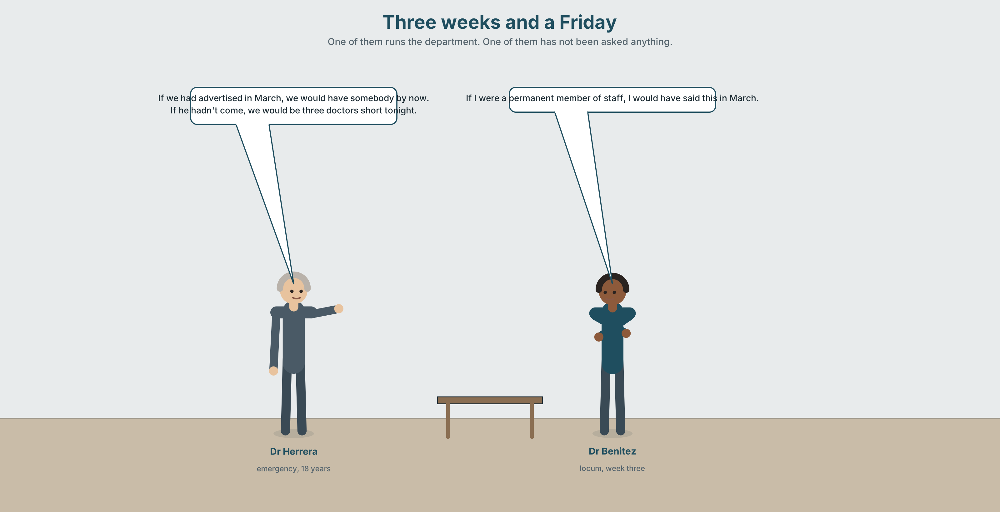{width=6.6in}

*Three weeks and a Friday — One of them runs the department. One of them has not been asked anything.*

### 2A · Three weeks and a Friday 🔊 Track 3.1

**Before you listen.** Dr Benítez is a locum. His contract ends on Friday. Renewing costs twice
what a permanent post would. **Guess: what is stopping them from recruiting?**

**Listen once. One question.** How long has the permanent post been vacant?

**Listen again. Complete the table.**

| | What they want | What it costs | What they are not saying |
|---|---|---|---|
| Dr Herrera | | | |
| the finance office | | | |
| Dr Benítez | | | |

**Listen again. Choose the best answer.**

1. The post has been vacant for **four months / eleven months / two years**.
2. A locum costs about **1.4 / 2.0 / 3.2** times a permanent doctor.
3. Recruitment would take about **three months / a year / six weeks**.
4. He would stay permanently if **he were asked / the rota changed / the money improved**.

**Noticing.** Four sentences from the recording.

1. *If we had advertised in March, we would have somebody by now.*
2. *If I were a permanent member of staff, I would have said this in March.*
3. *If he hadn't come, we would be three doctors short tonight.*
4. *If we advertise now, we will be short for three months.*

**Two of these mix a past condition with a present result.** Which two, and how can you tell?

### 2B · Decoding clinic 🔊 Track 3.2

Thirty seconds of Dr Herrera. Four jobs.

1. How many conditionals can you count?
2. In sentence 1, does her voice rise or fall at *March*?
3. Catch the two costs she gives.
4. She says one sentence that is a conditional with no *if* in it. Find it.

> Transcripts, page 152.

---

## Part 3 · Grammar Lab 1 ◆ **B · THE SYSTEM**

### When the two halves are in different times

### 3A · Notice

Look at the four sentences in Part 2.

1. In sentence 1, which half is about the past and which about now?
2. In sentence 2, which half is about now and which about the past?
3. **Sentences 1 and 2 are mirror images.** Write out which time each half is in.
4. Sentence 3 does the same thing. **What is the real situation behind it?**
5. Try *"If we had advertised in March, we would have had somebody by now."*
   **Is that wrong? What changes?**

### 3B · See

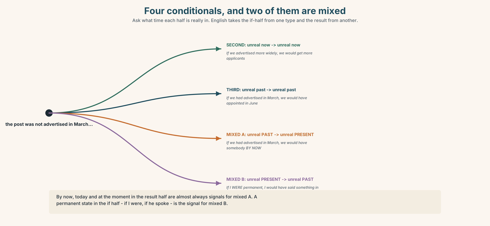{width=6.6in}

*Four conditionals, and two of them are mixed — Ask what time each half is really in. English takes the if-half from one type and the result from another.*

### 3C · Know

| | *if* half | result half | Meaning |
|---|---|---|---|
| **second** | past simple | *would* + verb | unreal now → unreal now |
| **third** | past perfect | *would have* + pp | unreal past → unreal past |
| **mixed A** | **past perfect** | ***would* + verb** | unreal **past** → unreal **present** |
| **mixed B** | **past simple** | ***would have* + pp** | unreal **present state** → unreal **past** |

> **Mixed A** — the past did not happen, and that is why **now** is like this.
> *If we **had advertised** in March, we **would have** somebody by now.*

> **Mixed B** — a permanent condition about **now**, and its effect on the **past**.
> *If I **were** permanent, I **would have said** this in March.*

> **How to choose.** Ask what time each half is really in. English has no special form for a
> mixed conditional; it takes the *if* half from one type and the result half from the other.

> **Watch out.** *by now*, *today*, *at the moment* in the result half are almost always
> signals for mixed A.
> ✗ *If we had advertised in March, we would have had somebody by now* is possible, but it
> means the having happened and finished in the past, which is not what anybody means here.

### 3D · Use — controlled

> If the post (1) __________ (be advertised) in March, we (2) __________ (have) somebody
> by now. If Dr Benítez (3) __________ (not / come) in September, we
> (4) __________ (be) three doctors short tonight. If he (5) __________ (be) a permanent
> member of staff, he (6) __________ (say) something about the rota in his first week. And if
> we (7) __________ (advertise) now, we (8) __________ (be) short until February.

### 3E · Use — guided

Write each one as a mixed conditional. **Say which type.**

1. We didn't advertise in March. We have nobody now.
2. He is not permanent. He said nothing in March.
3. She trained in paediatrics. She is not in paediatrics now.
4. I am not a confident speaker. I did not apply in 2019.
5. They cut the training budget in 2021. There are two supervisors now instead of five.

### 3F · Use — open

**In pairs.** Each of you names one decision from your own life. Your partner produces
**one mixed A** and **one mixed B** about it. **Then swap.** Four minutes each.

### 3G · Error autopsy

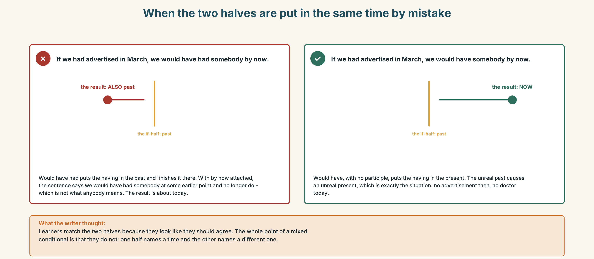{width=6.6in}

*When the two halves are put in the same time by mistake — When the two halves are put in the same time by mistake*

**Read both versions. Then say, in one sentence, when the first one would actually be correct.**

### 3H · Check — eight items

> 1. If we ______ (advertise) in March, we ______ (have) somebody now.
> 2. If I ______ (be) permanent, I ______ (say) something in March.
> 3. If he ______ (not / come), we ______ (be) short tonight.
> 4. If she ______ (not / take) that post, she ______ (work) in Santiago now.
> 5. If I ______ (be) braver, I ______ (apply) two years ago.
> 6. If they ______ (not / cut) the budget, there ______ (be) five supervisors today.
> 7. If we ______ (advertise) now, we ______ (be) short until February. *(real)*
> 8. If he ______ (speak) Spanish, he ______ (get) the job last year.

**0–4 →** Workbook pp. 16–19. **5–6 →** Part 6. **7–8 →** page 63.

---

## Part 4 · Speaking ◆ **C · THE PERFORMANCE**

### 4A · Fluency starter — the fork

One learner names a fork in their life. The others ask **only** questions beginning
*"What would you be doing now if…"*. **Six questions, then swap.**

### 4B · The functional core — the decision and everything after it

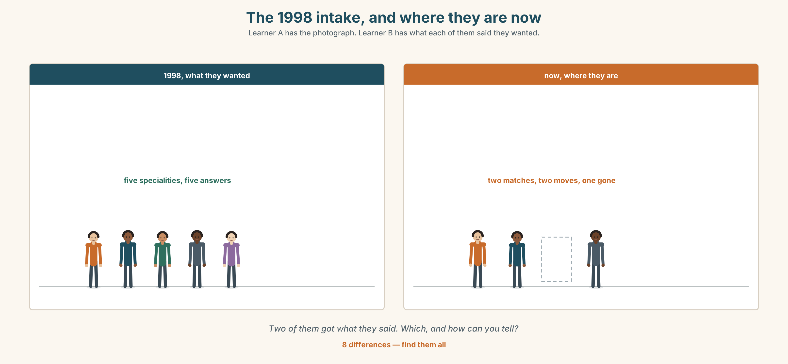{width=6.6in}

*The 1998 intake, and where they are now — Learner A has the photograph. Learner B has what each of them said they wanted.*

**Language Bank**

| | |
|---|---|
| **the decision** | *I took a post in…* · *I applied for…* · *I turned down…* |
| **the chain** | *Which meant that…* · *That led to…* · *One thing led to another.* |
| **the counterfactual now** | *If I hadn't, I'd be…* · *I would probably be…* |
| **the honest ending** | *It just happened.* · *And that is why I am here.* |

**Information gap.** Learner A has the 1998 intake photograph and where each person is now.
Learner B has what each of them said they wanted in 1998. **Find the two who got what they said.**

### 4C · The performance — two minutes ⏺

Give a **two-minute talk** on the choice that put you where you are. You must include:

> the decision, with a date · two things that followed from it · one mixed conditional about now ·
> one thing you did not decide at all

**Record it.**

### 4D · Observer

One person listens for **one thing**: how much of the speaker's path was chosen?

### 4E · Three criteria

> ☐ Did I use a mixed conditional correctly?
> ☐ Is there a date in it?
> ☐ Did I name one thing that was not a decision?

---

## Part 5 · Reading ◆ **A · THE WORLD**

### 5A · Predict

A personal essay by a doctor. The title is
**"I am in emergency medicine because of a train."**
**What do you expect the train to be?** Two sentences.

### 5B · Read — two minutes

---

**I am in emergency medicine because of a train**

In 2007 I was in my final year and I wanted paediatrics. I had wanted paediatrics since I was
nineteen and I had arranged my entire fifth year around it, including an elective I paid for
myself.

The interviews for the paediatric rotations were in Temuco on a Tuesday. There was one train. It
was cancelled, and the replacement bus — which existed, and which I could have taken — would have
got me there forty minutes late, and I decided, standing on a platform at six in the morning,
that arriving forty minutes late to an interview was worse than not arriving.

I now think that was wrong. I think they would have seen me. I was twenty-four and I had never in
my life been late to anything and I did not know that lateness is survivable.

So I took the emergency rotation that was still open, because it was the only one still open, and
I have been in emergency medicine for eighteen years and I am good at it and I would not change
it.

Here is the part that bothers me. If I had taken the bus, I would be a paediatrician now. I would
be a different person: emergency changes what you are like, it genuinely does, and I have watched
it happen to eleven other people. The me that exists is a product of a cancelled train.

And here is the part that bothers me more. Every year I interview fifth-years. Last year a
candidate arrived thirty-five minutes late, apologised once, and was excellent, and two of the
three people on the panel wanted to mark her down for it.

I told them about the train. We appointed her. She starts in March and I have not told her any
of this.

---

### 5C · Comprehension — eight questions

1. What speciality did the writer want, and for how long?
2. **What exactly happened on the Tuesday, and what decision did she make on the platform?**
3. Why does she now think the decision was wrong?
4. How did she end up in emergency medicine?
5. **What does she mean by "the me that exists is a product of a cancelled train"?**
6. What happened at the interview last year?
7. What did she do, and what has she not done?
8. **Why do you think she has not told the new appointee?**

### 5D · Vocabulary in context

Guess from the text. Then check.

> an elective · the replacement bus · lateness is survivable · still open · mark her down

### 5E · The counter-text

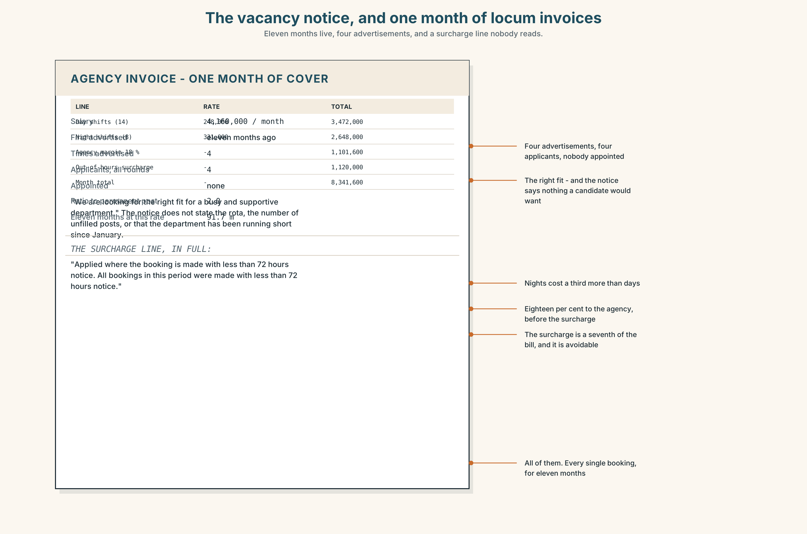{width=6.6in}

*The vacancy notice, and one month of locum invoices — Eleven months live, four advertisements, and a surcharge line nobody reads.*

**Read the vacancy notice and the locum invoice, and answer.**

1. What is the post, and what is the advertised salary?
2. **What does one month of locum cover cost, and how does that compare with the post?**
3. How long has the post been vacant, and how many times has it been advertised?
4. What does the notice say about *the right fit*, and what does it not say?
5. One line of the invoice is a surcharge. What for?

### 5F · Two texts

The essay says the writer would be a paediatrician **if she had taken the bus**.
The vacancy notice has been live for **eleven months** with four applicants.

**Put those two facts together. What does a career actually run on?** Three sentences.

---

## Part 6 · Vocabulary Lab 2 ◆ **B · THE SYSTEM**

### Saying that one thing caused another

### 6A · Sort — how formal, and how certain?

Three columns: **spoken · written · very formal**.

> consequently · hence · therefore · accordingly · so · as a result · thereby ·
> which meant that

**One of them is almost never correct in the way learners use it.** Which, and why?

### 6B · Chunk completion

1. The post was not advertised, **as a ______** there was nobody to appoint.
2. The train was cancelled, **which ______ that** she took the bus or nothing.
3. That decision **______ to** eighteen years in emergency medicine.
4. One cancellation **set ______** a chain nobody could have predicted.
5. The budget cut **brought ______** the loss of three supervisor posts.
6. Each of those **followed ______** from the one before.

### 6C · Three that are not interchangeable

**consequence · outcome · knock-on**

> A *consequence* follows directly. An *outcome* is where the whole thing ended.
> A *knock-on* effect is the one nobody was looking at.

**Which fits each sentence?**

1. The ______ of eleven months of vacancy is a locum bill of forty million.
2. One ______ of the budget cut was that nobody was available to supervise students.
3. The ______ , after four rounds, was that they appointed internally.

### 6D · The fixed expression

> **f** **And that is why I am here.**

**Write the three sentences that come before it**, for somebody whose path was chosen,
and for somebody whose path was not.

### 6E · Contrast Clinic

Eight items. Second, third, mixed A or mixed B.

1. They cut the budget. There are two supervisors now.
2. He speaks no Spanish. He didn't get the job.
3. We didn't advertise. We have nobody now.
4. The train ran. *(it didn't)* Her life is different. *(it isn't)*
5. She took the bus. *(she didn't)* She is a paediatrician. *(she isn't)*
6. I'm not permanent. I didn't say anything in March.
7. I'm not permanent. I don't say anything.
8. We didn't advertise. We had nobody in June.

---

## Part 7 · Pronunciation & Fluency Lab ◆ **B · THE SYSTEM**

### Two halves that do not match

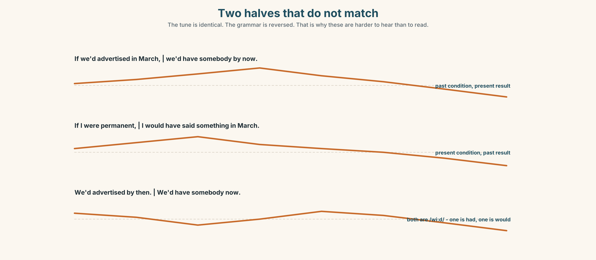{width=6.6in}

*Two halves that do not match — The tune is identical. The grammar is reversed. That is why these are harder to hear than to read.*

### 7A · Hear 🔊 Track 3.3

> *If we'd advertised in March* ↗ | *we'd have somebody by now* ↘
> *If I were permanent* ↗ | *I'd have said something in March* ↘

**The tune is the same in both. The grammar is reversed. That is why mixed conditionals are
harder to hear than to read.**

### 7B · Say

Say both. Then say the first one three times, faster, keeping *we'd* and *we'd* distinct —
one is *we had* and one is *we would*.

### 7C · Make it mean something

Say these two:

> *We'd have somebody by now.* *(= we would have)*
> *We'd advertised by then.* *(= we had advertised)*

**Both are /wiːd/.** What tells a listener which is which?

### 7D · Fluency 30 ⏺

Thirty seconds: **three mixed conditionals about your own life.**
Three times, faster, keeping the rise and the fall.

---

## Part 8 · Writing ◆ **C · THE PERFORMANCE**

### The choice that put you here · 160 words

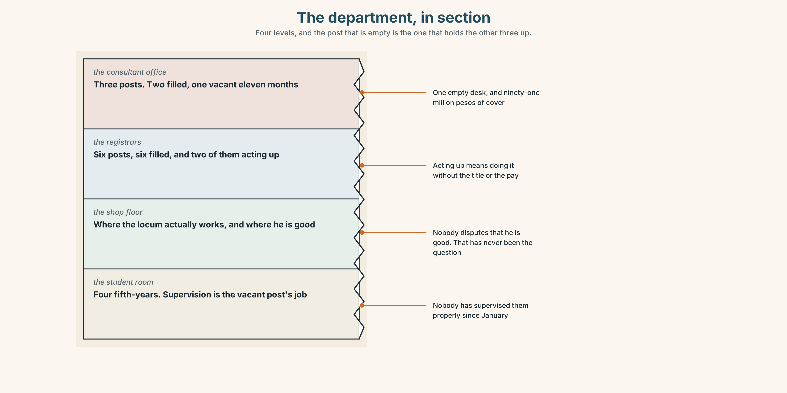{width=6.6in}

*The department, in section — Four levels, and the post that is empty is the one that holds the other three up.*

### 8A · Read the model

> In 2011 I applied for two posts and was shortlisted for one, which was in a town I had never
> been to and which I took because the other one did not call me back.
> `[the decision, with a date, and the honest mechanism: somebody else's silence]`
>
> That meant a supervisor who happened to be interested in rotas, which meant two years of work I
> had not chosen, which is now the only part of my CV anybody asks about.
> `[the chain, three links, and each link is an accident with a consequence]`
>
> If I had not taken it, I would be better at the clinical work and worse at everything else, and
> I would almost certainly still be in Santiago. `[one mixed conditional, and it does not flatter
> the writer]`
>
> I did not decide any of this. I decided one thing, in April, for a bad reason.
> `[the ending, which refuses the shape of a career story]`

**Questions about the writer's choices:**

1. The reason given in the first paragraph is *the other one did not call me back*.
   **What does naming a bad reason do for the reader's trust?**
2. The mixed conditional admits the writer would be better at something. **Why include that?**
3. The last paragraph is two sentences. **What would be lost if it were four?**

### 8B · The anti-model

> I always knew I wanted to work in healthcare. From a young age I was fascinated by medicine and
> I worked hard to achieve my goal. Every step of my career has been a learning experience and I
> am grateful for all the opportunities I have had.

Correct English, and no decision anywhere in it. **Name three things that are missing**,
and one word that is doing the work of an argument.

### 8C · Plan

> the decision, with a date and its real reason → two or three links of the chain →
> one mixed conditional that does not flatter you → what you did not decide

### 8D · Write — 160 words
### 8E · Peer review — three criteria

> ☐ Is there a date and a real reason?
> ☐ Does the mixed conditional cost the writer something?
> ☐ Is there one thing in it that was not a decision?

### 8F · Write it again · 8G · Publish

On the wall, with the vacancy notice from Part 5E beside it.

---

## Part 9 · The File ◆ **A · THE WORLD + C · THE PERFORMANCE**

# CULTURE FILE · Politeness and Directness

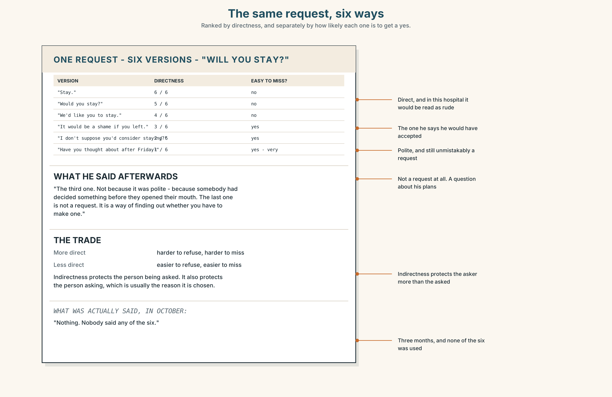{width=6.6in}

*The same request, six ways — Ranked by directness, and separately by how likely each one is to get a yes.*

### 9A · The same request, six ways 🔊 Track 3.4

Dr Benítez has been asked to stay. **Listen to six versions of the asking**, from four
countries' worth of hospital.

1. Which version is the most direct, and does it sound rude?
2. **Which version does he say he would have accepted, and why?**
3. One version is so indirect he did not realise it was a request. Which?

### 9B · Directness is not rudeness

> *"Stay."* · *"Would you stay?"* · *"We'd like you to stay."* ·
> *"I don't suppose there's any chance you'd consider staying?"* ·
> *"It would be a great shame if you were to leave."* ·
> *"Have you thought about what you're doing after Friday?"*

**Rank them from most to least direct.** Then rank them from **most to least likely to get a
yes**, and explain any difference between your two orders.

### 9C · What indirectness costs

An indirect request is easier to refuse — which is the point — but it is also easier to **miss**.

**Which two of the six would a tired person at the end of a shift fail to hear as a request?**

### 9D · Your turn

In pairs. **Eight minutes.** One of you must ask for something significant.
**Round one: as directly as you can without being rude. Round two: so indirectly that your
partner has to ask you what you mean.** Then discuss which was more comfortable and which worked.

### 9E · Transfer

**Find one request made to you this week.** Write down how direct it was, and whether you would
have answered differently if it had been phrased the other way.

---

## Part 10 · Mediation & Interaction ◆ **C · THE PERFORMANCE**

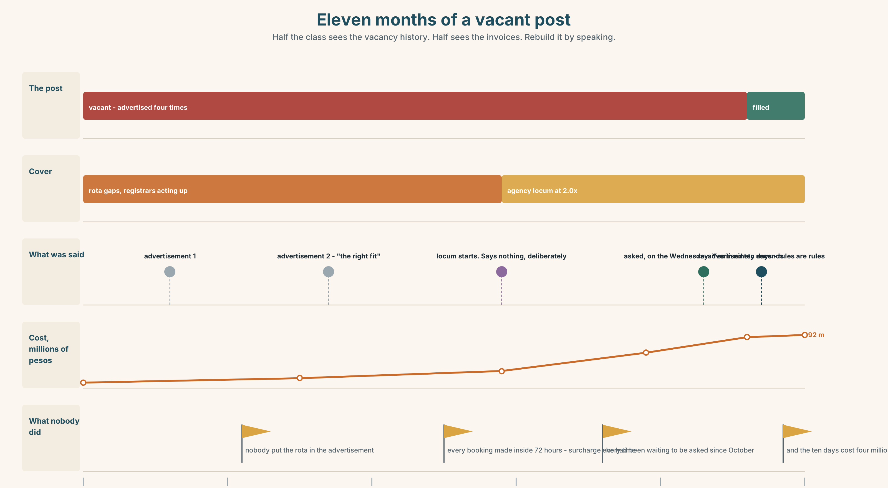{width=6.6in}

*Eleven months of a vacant post — Half the class sees the vacancy history. Half sees the invoices. Rebuild it by speaking.*

### 10A · Relay

Half the class sees the vacancy history. Half sees the locum invoices.
**Rebuild eleven months by speaking.** Twelve minutes.

### 10B · Simplify

Explain the locum invoice from Part 5E to a department head who has never seen one.
**Five sentences only.**

> **Plan:** what a shift costs → what the agency takes → what the surcharge is for →
> what a year of this costs → what it buys that a permanent post does not

### 10C · Compress

The essay in Part 5 into **forty words**, keeping the train.

### 10D · Online

Write **one message** to the finance office: you accept the locum is expensive, you have the
eleven-month figure, and you are asking for one specific permission by one specific date.

### 10E · Your language

How does your language make a request more polite? **Does it lengthen the sentence, change the
verb, or add a particle?** Ask *would you stay?* in both languages, in three degrees of
politeness.

---

## Part 11 · The Decision ◆ **C · THE PERFORMANCE**

# Friday

Dr Benítez's locum contract ends on Friday. The permanent post has been vacant for eleven months
and has been advertised four times.

- **Renew the locum.** Costs about 2.0 times the permanent salary. The department is covered on
  Saturday. It is the fourth renewal.
- **Recruit properly.** Three months to appoint and start. The department runs three doctors
  short through the summer, which is the busiest quarter.
- **Offer him the permanent post.** He has never been asked. He is not on the shortlist because
  he has not applied, and he has not applied because nobody has suggested it.

### 11A · The evidence

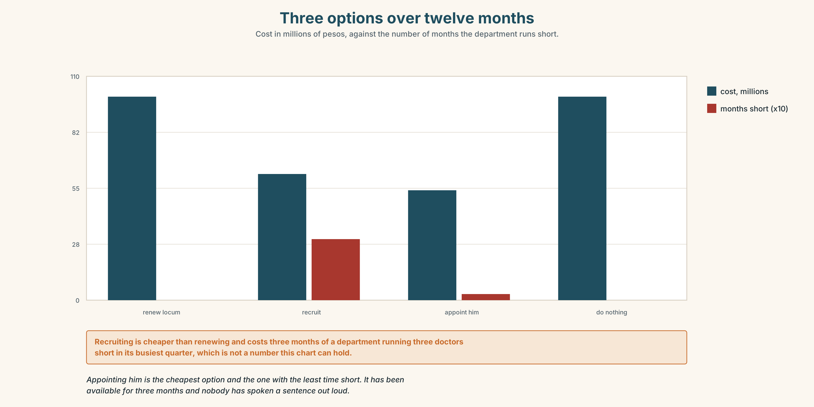{width=6.6in}

*Three options over twelve months — Cost in millions of pesos, against the number of months the department runs short.*

1. **The vacancy notice and the invoice** from Part 5E — and the surcharge line.
2. **The chart** — cost, cover and risk for each of the three options over twelve months.
3. **The voice.** Dr Benítez, thirty seconds: *"Nobody has asked me. I am aware that I could
   have said something, and I have thought about why I have not, and the honest answer is that
   if I were permanent I would have said it in week two, and I am not, so I have spent three
   months being careful instead."*

### 11B · Talk about it

In fours. Everybody speaks twice. Use the frame.

> *If they ______ , then ______ . Which would mean ______ .*

**Words you can use:** *post · vacancy · appointment · shortlist · the right fit · apply for ·
take up a post · knock-on · as a result*

### 11C · Decide

Write **three sentences**. Choose, say why, and name what it costs.

> I think the hospital should ______________________ ,
> because ______________________ .
> What this costs is ______________________ .

### 11D · Model decision

> Ask him, today, before Friday. The entire reason he is not a candidate is that nobody has
> spoken a sentence out loud, and the department is about to spend eleven months and forty
> million pesos solving a problem that one conversation might close. If he says no, nothing is
> lost and the recruitment runs anyway. The thing to notice is that the obvious option has been
> available every day for three months and has not been taken, and that is a fact about the
> department rather than about him.

### 11E · The Reveal

> **What happened.** Dr Herrera asked him on the Wednesday. He said yes within about ninety
> seconds and then said that he had been waiting for somebody to ask since October.
>
> Finance refused the appointment in its first form because the post had been advertised four
> times and the rules require a competitive process. It was re-advertised for ten working days.
> He applied. Two other people applied. He was appointed in January.
>
> The ten days cost one more locum month, at 2.0, which is about four million pesos, and
> everybody involved describes this as the cheapest part of the whole year.

**One sentence, three months late, and then ten days of process because the rules exist for a
reason.**

> **Was it the right decision?** Say why — and say whether the competitive process was worth
> four million.

---

## Part 12 · Landing ◆ **all three lines**

### 12A · Recycle — twelve items

> 1. If we ______ (advertise) in March, we ______ (have) somebody now.
> 2. If I ______ (be) permanent, I ______ (say) something in March.
> 3. She **applied ______** a post in paediatrics.
> 4. He **took ______** a post in Valdivia.
> 5. **On ______** , the two candidates were identical.
> 6. The post was not advertised, **as a ______** there was nobody to appoint.
> 7. That decision **______ to** eighteen years in emergency medicine.
> 8. One cancellation **set ______** a chain nobody predicted.
> 9. *(Unit 2)* If I ______ (not / look), she ______ (have) it.
> 10. *(Unit 1)* There ______ (be) a bakery here. *(not now)*
> 11. *(A2.2 U7)* This time next year I ______ (live) in Galway.
> 12. *(A2.1 U4)* The person ______ has the key is the manager.

### 12B · Consolidate

**One hundred and sixty words.** The choice that put you where you are. A date, a real reason,
a chain of at least two links, and one mixed conditional that costs you something.

### 12C · Can-do, with evidence

| I can… | My evidence | Sure? |
|---|---|---|
| put the two halves of a conditional in different times | Part 3H score | ◯ ◑ ● |
| give a two-minute talk about one decision | Part 4C recording | ◯ ◑ ● |
| write 160 words with a real reason in them | Part 8 draft 2 | ◯ ◑ ● |
| judge how direct a request should be | Part 9D pair work | ◯ ◑ ● |

### 12D · Replay ⏺

Find your forty-five seconds from Part 0C. Listen. **Record it again.**
**Two sentences:** what is different, and what you can now say about the thing you did not decide.

### 12E · Glossary — forty-five items, as a map

> **THE POST** · career · speciality · rotation · post · vacancy · appointment · a career path · trajectory
> **GETTING IT** · apply for · shortlist · reference · take up a post · turn down · on paper · the right fit
> **THE PEOPLE** · mentor · supervisor · training
> **WHAT ACTUALLY HAPPENS** · go into · end up in · stand down · fall through · it just happened · I never planned any of this
> **CAUSE AND EFFECT** · consequence · knock-on · result · chain · outcome · as a result · which meant that · led to · brought about · set off · in turn · one thing led to another · follow on · come about
> **THE FORMAL ONES** · therefore · consequently · hence · accordingly · thereby · inevitably · and that is why I am here

### 12F · Next

> **Unit 4 · What must have happened here?**

# B1.2 · Unit 4 · One Bed, Two Scores

> **English Animated** · *Weighing It Up* · Hospital Regional, Valdivia
> Student's Book pages 72–93 · 22 pp · ~11 hours

---

## Part 0 · The Big Picture ◆ **A · THE WORLD**

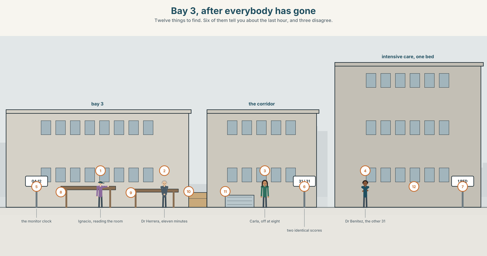{width=6.6in}

*Bay 3, after everybody has gone — Twelve things to find. Six of them tell you about the last hour, and three disagree.*

# What must have happened here?

**By the end of this unit you can reconstruct an event from physical evidence alone.
One hundred and sixty words.**

| ◆ **A · THE WORLD** | A room that has to be read, and a decision that cannot wait for certainty |
|---|---|
| ◆ **B · THE SYSTEM** | modals of deduction, present and past · scales of certainty · 23 words for evidence and inference · 22 words for how sure you are · *must have* as /mʌstəv/ |
| ◆ **C · THE PERFORMANCE** | A hundred and sixty words built only from what is in the room |

---

### 0A · Find it

**Find twelve things in this picture.** Six of them tell you something about the last hour.

> a chair out of position · a dressing pack opened and not used · a cannula wrapper on the floor ·
> a monitor still on · a cup of coffee gone cold · a drawer left open · a phone face down ·
> two sets of gloves in the bin · a curtain half drawn · a trolley at an angle ·
> a door wedged with a shoe · a clock

### 0B · Guess it

**Three of the twelve are inconsistent with each other.** Which three, and what does that
inconsistency rule out?

### 0C · Say it ⏺

**Record forty-five seconds.** *Describe a room you have walked into and read. What did you
conclude, and what was the one thing that told you?* You will record it again at the end of this
unit.

---

## Part 1 · Vocabulary Lab 1 ◆ **B · THE SYSTEM**

{width=6.6in}

*Six objects, and what each one closes — Consistency proves nothing. Only inconsistency removes a story.*

### 1A · Meet — the words of reading a scene

Match each word to one place on the map.

> **evidence** · **trace** · **residue** · **position** · **angle** · **sequence** ·
> **scene** · **reconstruct** · **witness** · **timeline**

### 1B · Sort — a thing, a relation, or a conclusion?

Three columns.

> sequence · inconsistent · residue · evidence · consistent · reconstruct · trace ·
> timeline · angle

**One of them is not evidence until you have two of something else.** Which, and why?

### 1C · Meet — the pair that does the real work

> **consistent** · **inconsistent**

**Consistency proves nothing.** Many stories are consistent with the same room.
**Inconsistency is the only thing that removes one.** Why is that asymmetry so easy to forget?

### 1D · Collocation Lab

Complete each one with one word.

1. The position of the trolley **points ______** somebody leaving in a hurry.
2. Two sets of gloves are **consistent ______** two people, and with one person twice.
3. **At first ______** it looks like a cardiac arrest. It is not.
4. **On closer ______** , the dressing pack was opened and never used.
5. **The most likely ______** is that the second person arrived after the monitor was switched on.
6. Nobody has been able to **account ______** the cold coffee.

### 1E · The fixed expressions

> **f** **None of it adds up.**
> **f** **That explains the rest.**

Two sentences that arrive at opposite ends of the same hour.

> **Write the sentence immediately before each one.**

### 1F · Own it

Think of a room, a car or a desk you have read. Tell a partner **four sentences**: what you saw,
what you concluded, what you ruled out, and what you were wrong about.

---

## Part 2 · Listening ◆ **A · THE WORLD**

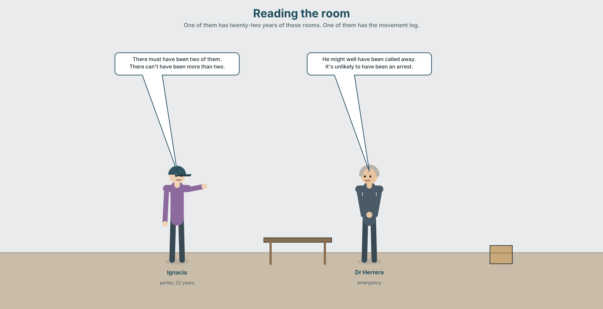{width=6.6in}

*Reading the room — One of them has twenty-two years of these rooms. One of them has the movement log.*

### 2A · Reading the room 🔊 Track 4.1

**Before you listen.** Two people walk into a bay that has been left. Nobody who was in it is
available. **Guess: what will they disagree about?**

**Listen once. One question.** How many people were in the bay?

**Listen again. Complete the table.**

| Observation | What it suggests | What it rules out |
|---|---|---|
| two sets of gloves | | |
| the unused dressing pack | | |
| the trolley angle | | |

**Listen again. Choose the best answer.**

1. They agree that there were **one / two / at least two** people.
2. The dressing pack suggests somebody **finished / started and stopped / never started**.
3. The cold coffee has been there for about **ten minutes / forty minutes / two hours**.
4. The one thing they cannot explain is the **door wedge / phone / monitor**.

**Noticing.** Four sentences from the recording.

1. *There must have been two of them.*
2. *There can't have been more than two.*
3. *He might well have been called away.*
4. *It's unlikely to have been an arrest.*

**All four are deductions about the past. Rank them from most certain to least.**

### 2B · Decoding clinic 🔊 Track 4.2

Thirty seconds of Ignacio. Four jobs.

1. How many times does he say *must have* or *can't have*?
2. In *must have*, is the *h* pronounced?
3. Catch the two times he gives.
4. He changes a deduction from certain to probable mid-sentence. Where?

> Transcripts, page 153.

---

## Part 3 · Grammar Lab 1 ◆ **B · THE SYSTEM**

### How sure, about now and about then

### 3A · Notice

Look at the four sentences in Part 2.

1. Sentence 1 and sentence 2 are both near-certainties. **One is positive and one is negative.
   What are the two forms?**
2. In sentence 3, what does *well* add to *might have*?
3. Sentence 4 avoids a modal altogether. **What does it gain and what does it lose?**
4. **What is the present-time version of each of the four?**
5. Try *"It mustn't have been an arrest."* **What is wrong, and what does it actually mean?**

### 3B · See

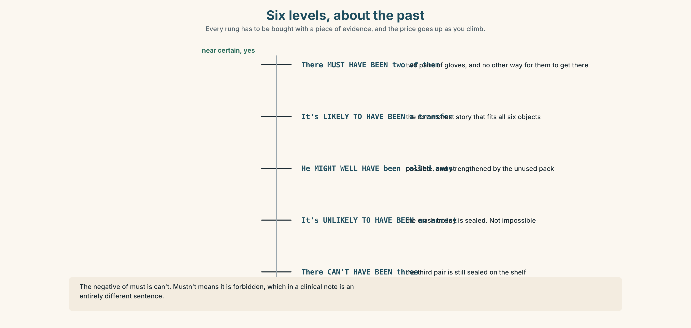{width=6.6in}

*Six levels, about the past — Every rung has to be bought with a piece of evidence, and the price goes up as you climb.*

### 3C · Know

| Certainty | About now | About the past |
|---|---|---|
| **near certain, yes** | *It **must be** two people.* | *There **must have been** two of them.* |
| **probable** | *It**'s likely to be**…* | *It**'s likely to have been**…* |
| **possible** | *It **might / could be**…* | *It **might / could have been**…* |
| **strengthened possible** | *It **might well be**…* | *It **might well have been**…* |
| **improbable** | *It**'s unlikely to be**…* | *It**'s unlikely to have been**…* |
| **near certain, no** | *It **can't be**…* | *It **can't have been**…* |

> **The negative of *must* is *can't*.**
> *mustn't* means *it is forbidden*, which in a clinical note is a very different sentence.

> **Adverbs raise or lower the whole scale**, and only one at a time:
> *certainly · definitely · undoubtedly · doubtless · presumably · plausibly · arguably ·
> conceivably · seemingly · apparently · implausibly*

> ***seemingly* and *apparently* are not about your confidence.** They report somebody else's
> account or an appearance, and in a written reconstruction they are a way of not committing.

> **Why it matters.** A reconstruction that states everything at the same level of certainty is
> useless, because the reader cannot tell which parts to act on.

### 3D · Use — controlled

> There (1) __________ (must / be) at least two people in the bay, because there are two sets
> of gloves. There (2) __________ (can't / be) more than two, because the third pair is still
> sealed. The dressing pack was opened and not used, which (3) __________ (must / mean) that
> somebody started something and stopped. He (4) __________ (might well / be) called away. It
> (5) __________ (be / unlikely) to have been an arrest, because the crash trolley has not been
> opened, and on the balance of probability it (6) __________ (be) a transfer.

### 3E · Use — guided

Rewrite each one at the certainty level in brackets.

1. There were two people. *(near certain)*
2. He was called away. *(possible, strengthened)*
3. It was not an arrest. *(improbable, not impossible)*
4. The coffee was made before the monitor was switched on. *(near certain, negative of the
   opposite)*
5. Somebody came back for the phone. *(possible, weak)*

### 3F · Use — open

**In pairs.** One of you describes a photograph the other cannot see — a room, a street,
a kitchen. The other must produce **six deductions at six different certainty levels.**
Then swap.

### 3G · Error autopsy

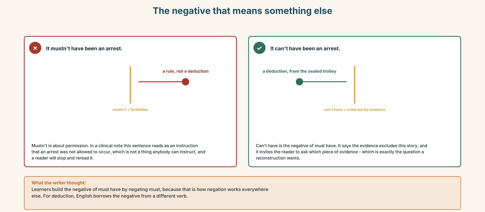{width=6.6in}

*The negative that means something else — The negative that means something else*

**Read both versions. Then say what the wrong one would mean in a hospital note.**

### 3H · Check — eight items

> 1. There ______ (must / be) two of them. *(past)*
> 2. There ______ (can't / be) more than two. *(past)*
> 3. He ______ (might well / be) called away. *(past)*
> 4. It ______ unlikely to ______ been an arrest.
> 5. The monitor is on, so somebody ______ (must / be) here recently. *(past)*
> 6. It ______ (can't / be) him — he was in theatre. *(past)*
> 7. She ______ (must / be) in the building. *(now — her coat is here)*
> 8. On the balance of ______ , it was a transfer.

**0–4 →** Workbook pp. 22–25. **5–6 →** Part 6. **7–8 →** page 85.

---

## Part 4 · Speaking ◆ **C · THE PERFORMANCE**

### 4A · Fluency starter — six levels

Your teacher shows one object. Each learner must make a deduction **one level less certain than
the last.** The round ends when somebody reaches *conceivably*.

**Four objects. Four rounds.**

### 4B · The functional core — reading evidence out loud

{width=6.6in}

*The bay, and the movement log — Learner A has the photographs. Learner B has the log. Two minutes are unaccounted for.*

**Language Bank**

| | |
|---|---|
| **the observation** | *There are two sets of…* · *The trolley is at…* |
| **the inference** | *Which points to…* · *That's consistent with…* |
| **the exclusion** | *That rules out…* · *It can't have been…, because…* |
| **the honest gap** | *I can't account for the…* · *We may never establish that.* |

**Information gap.** Learner A has photographs of the bay. Learner B has the staff movement log
for the hour. **Find the two minutes that nobody can account for.**

### 4C · The performance — two minutes ⏺

Reconstruct **an event from physical evidence alone**. **Two minutes.** You must include:

> four observations · three inferences at three different certainty levels ·
> one thing you can rule out, with the reason · one thing you cannot explain

**Record it.**

### 4D · Observer

One person listens for **one thing**: did any inference get stated more confidently than its
evidence allowed?

### 4E · Three criteria

> ☐ Did I use *must have*, *can't have* and one middle form?
> ☐ Is every inference attached to an observation?
> ☐ Did I name the thing I cannot explain?

---

## Part 5 · Reading ◆ **A · THE WORLD**

### 5A · Predict

A review of a triage scoring system. The title is
**"It is a very good instrument and it cannot do this."**
**What do you expect the reviewer to say it cannot do?** Two sentences.

### 5B · Read — two minutes

---

**It is a very good instrument and it cannot do this ★★★★☆**

The scoring system in use here is well validated, quick, and better than the judgement of most
people most of the time, which is a higher bar than it sounds.

It takes eleven variables, weights them, and produces a number between 0 and 40. Above 28,
intensive care. Below 12, ward. Between the two, clinical judgement, which is the system politely
admitting that it is a sorting tool and not an oracle.

Here is what it cannot do, and the manual says so on page 4 in a sentence nobody reads.

It cannot distinguish between two patients with the same score. It was never designed to. The
score is a prediction of deterioration over the next six hours and it carries a confidence
interval of about four points in either direction, which means two patients scoring 31 and 31 are
indistinguishable to it, and so, for that matter, are two patients scoring 29 and 33.

This matters exactly once in a while and then it matters enormously. There is one intensive-care
bed. Two patients score 31. The instrument has done its job perfectly and has told you nothing,
and the decision has to be made by a person at four in the morning who will have to write
something down afterwards.

What the manual recommends in that situation is that the decision be made on clinical grounds and
documented. What it does not say — and what three of the four consultants I spoke to said
independently — is that in practice the tie is broken by who arrived first, and that nobody
writes that down.

Four stars. The fifth is withheld not from the instrument but from the page of the manual that
should exist and does not.

---

### 5C · Comprehension — eight questions

1. How many variables does the system use, and what is the range of the score?
2. What are the two thresholds, and what happens between them?
3. **What does the reviewer mean by "the system politely admitting it is a sorting tool"?**
4. What is the confidence interval, and what does that imply about two scores of 31?
5. **Why does the reviewer say two patients scoring 29 and 33 are also indistinguishable?**
6. What does the manual recommend for a tie?
7. **What do three of the four consultants say actually happens?**
8. Why is the fifth star withheld?

### 5D · Vocabulary in context

Guess from the text. Then check.

> well validated · a higher bar than it sounds · an oracle · a confidence interval ·
> independently

### 5E · The counter-text

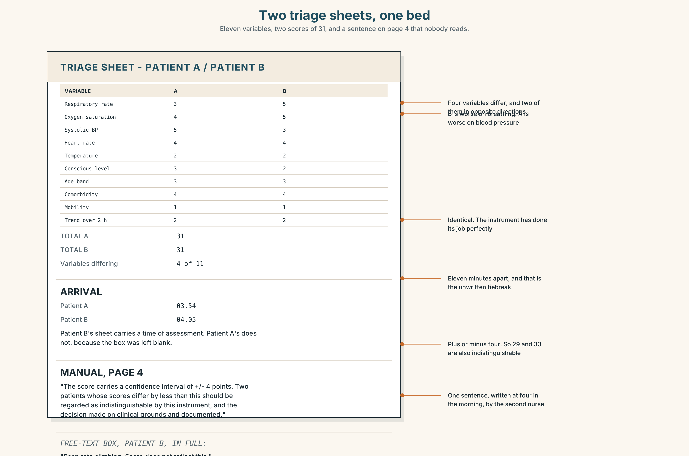{width=6.6in}

*Two triage sheets, one bed — Eleven variables, two scores of 31, and a sentence on page 4 that nobody reads.*

**Read the two triage sheets and answer.**

1. What are the two scores, and on how many of the eleven variables do the patients differ?
2. **Which variables are different, and in which direction?**
3. What does page 4 of the manual say, word for word?
4. What is recorded in the free-text box of each sheet?
5. One sheet has a time on it that the other does not. Which, and what time?

### 5F · Two texts

The review says the tie is broken in practice by **who arrived first**.
The two sheets show arrival times **eleven minutes apart**.

**Put those two facts together. What would the record show, and what would it not show?**
Three sentences.

---

## Part 6 · Vocabulary Lab 2 ◆ **B · THE SYSTEM**

### The adverbs of certainty, and the two that are not

### 6A · Sort — raising, lowering, or reporting?

Three columns.

> apparently · plausibly · doubtless · presumably · certainly · implausibly ·
> conceivably · undoubtedly · seemingly · definitely · arguably

**Two of them belong in the third column and are regularly used as if they belonged in the
first.** Which?

### 6B · Chunk completion

1. **All the evidence ______** that there were two people.
2. **There is no ______** that she was in the building at four.
3. **On the balance of ______** it was a transfer.
4. He **might ______ have** been called away.
5. That version does not **______ up** against the movement log.
6. The timeline does not **______ up** when you add the coffee.

### 6C · Three that weaken what they attach to

**seemingly · apparently · arguably**

> *Seemingly* reports an appearance. *Apparently* reports somebody else. *Arguably* reports that
> somebody could argue it — including you.

**Rewrite each sentence without the adverb, and say what is gained and lost.**

1. The patient was seemingly stable at four.
2. Apparently nobody was called.
3. This is arguably the most important variable.

### 6D · The fixed expression

> **f** **We may never establish that.**

**Say it twice:** as a closing of an investigation, and as a refusal to close one.
**What changes?**

### 6E · Contrast Clinic

Eight items. Give the certainty level asked for, about the past.

1. The monitor was switched on before the gloves were used. *(probable)*
2. He was called away. *(strengthened possible)*
3. It was an arrest. *(improbable)*
4. She made the coffee. *(weak possible)*
5. Nobody else was here. *(near certain, negative)*
6. Two people were here. *(near certain)*
7. The decision was made on arrival order. *(you could argue it)*
8. The door was wedged by the porter. *(you are reporting what somebody else said)*

---

## Part 7 · Pronunciation & Fluency Lab ◆ **B · THE SYSTEM**

### The h that is not there

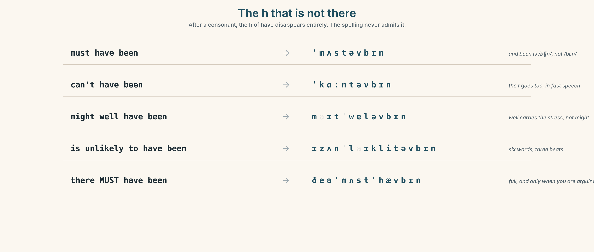{width=6.6in}

*The h that is not there — After a consonant, the h of have disappears entirely. The spelling never admits it.*

### 7A · Hear 🔊 Track 4.3

> must have been → /ˈmʌstəvbɪn/
> can't have been → /ˈkɑːntəvbɪn/
> might well have been → /maɪtˈwelːəvbɪn/
> is unlikely to have been → /ɪzʌnˈlaɪklitəvbɪn/

**The *h* of *have* disappears after a consonant in every one of these.**

### 7B · Say

Say each one. Then say the whole sentence three times, faster:

> *There must have been two of them, and there can't have been more.*

### 7C · Make it mean something

Say these two:

> *There MUST have been two.* *(somebody has just said one)*
> *There must've been two.* *(and this is simply what the gloves tell you)*

**One of these belongs in a reconstruction and one belongs in an argument about it.** Which?

### 7D · Fluency 30 ⏺

Thirty seconds: **six deductions about this room, at six certainty levels.**
Three times, faster.

---

## Part 8 · Writing ◆ **C · THE PERFORMANCE**

### A reconstruction · 160 words

{width=6.6in}

*Bay 3, in section — Four levels, and the evidence on three of them agrees. The fourth is the coffee.*

### 8A · Read the model

> Two pairs of gloves are in the bin and a third is sealed on the shelf. There must have been two
> people, and there can't have been three. `[observation first, then two deductions, and each is
> tied to the same object]`
>
> A dressing pack has been opened and not used. That is consistent with somebody starting a
> procedure and stopping, and it is equally consistent with the wrong pack being opened, which is
> commoner. `[the honest part: the same evidence supports two stories, and the writer names the
> likelier one without pretending to have chosen]`
>
> The crash trolley is sealed, so it is unlikely to have been an arrest. `[an exclusion, with its
> physical reason, at the right strength — unlikely, not impossible]`
>
> I cannot account for the coffee. It has been there longer than any of this. `[one unexplained
> thing, stated plainly and not explained away]`

**Questions about the writer's choices:**

1. The second paragraph gives two readings of one object. **Does that weaken the reconstruction?**
2. *Unlikely*, not *impossible*, for the arrest. **What would be lost by writing *impossible*?**
3. The last paragraph admits a failure. **Why is that the strongest part?**

### 8B · The anti-model

> It appears that there were two staff present and that a procedure was commenced but not
> completed. It seems likely that the patient was transferred. It is possible that staff were
> called away to another emergency. Further information would be required to confirm.

Correct English. **Name three things that are missing**, and say why *appears*, *seems* and
*possible* are all doing the same job here.

### 8C · Plan

> observations, with the objects named → deductions, each tied to an object and graded →
> one exclusion, with its physical reason → one thing you cannot account for

### 8D · Write — 160 words
### 8E · Peer review — three criteria

> ☐ Is every inference attached to a named object?
> ☐ Are the certainty levels different from each other?
> ☐ Is there one unexplained thing left unexplained?

### 8F · Write it again · 8G · Publish

On the wall, with the two triage sheets from Part 5E beside it.

---

## Part 9 · The File ◆ **A · THE WORLD + C · THE PERFORMANCE**

# WORK FILE · The Negotiation

{width=6.6in}

*Eleven minutes, and what was written down — A negotiation about one bed, reduced to its four moves and its one record.*

### 9A · One bed 🔊 Track 4.4

Two consultants, one intensive-care bed, two patients scoring 31. **Listen to all eleven
minutes.**

1. What does each of them open with, and how long before anybody says a number?
2. **What does one of them offer, and what does the other one ask for in return?**
3. What is actually agreed, and what is written down?

### 9B · The four moves

> stating the position · finding what is behind the other position ·
> making a conditional offer · recording what was agreed

Match each to one phrase.

> *"Mine is 31 and she's twenty-six."* · *"What are you actually worried about tonight?"* ·
> *"If you can hold yours on the ward with one-to-one, I'll take the next bed at eight."* ·
> *"So: mine now, yours at eight, and I'm writing that in both sets of notes."*

### 9C · What a negotiation about a bed is not

This is not a negotiation about who is right. Both scores are 31 and the instrument has told
them nothing.

**Which two of these four sentences would make the conversation worse, and why?**

1. *"The score is the score."*
2. *"Mine arrived first."*
3. *"What does yours look like in four hours if we're wrong?"*
4. *"I've been doing this for eighteen years."*

### 9D · Your turn

In pairs. **Twelve minutes.** One resource, two claims, identical merit.
**Neither of you may use seniority or arrival order as an argument.**
Both must leave with something written.

### 9E · Transfer

**Find one decision this week that was made on an unwritten tiebreak.** Write down what the
tiebreak was and whether anybody would defend it out loud.

---

## Part 10 · Mediation & Interaction ◆ **C · THE PERFORMANCE**

{width=6.6in}

*One hour in bay 3 — Half the class sees the photographs. Half sees the log. Rebuild the hour by speaking.*

### 10A · Relay

Half the class sees the photographs of the bay. Half sees the movement log.
**Rebuild the hour by speaking.** Twelve minutes.

### 10B · Simplify

Explain the triage score to a patient's family who have asked why the other patient got the bed.
**Five sentences only.**

> **Plan:** what the score measures → what it does not → what the two scores were →
> what decided it → what you will write down

### 10C · Compress

The review in Part 5 into **forty words**, keeping the point about page 4.

### 10D · Online

Write **one message** to the clinical governance lead: you have two sheets with identical
scores, the tiebreak was not recorded, and you are proposing one specific change to the form.

### 10E · Your language

How does your language grade certainty? **Does it use modal verbs, adverbs, or verb endings?**
Say *there must have been two of them* and *there might well have been two of them* in both
languages.

---

## Part 11 · The Decision ◆ **C · THE PERFORMANCE**

# Two thirty-ones

One intensive-care bed. Two patients. Both score 31. The instrument has done its job and has
told the department nothing.

- **Arrival order.** Patient A arrived eleven minutes earlier. It is what happens now and nobody
  writes it down.
- **Clinical judgement, documented.** What the manual says. It takes ten minutes that neither
  patient has and produces a sentence somebody has to defend.
- **The sickest-in-four-hours question.** Ask which of the two is more likely to deteriorate
  before the next bed. It is a different question from the score and the score cannot answer it.

### 11A · The evidence

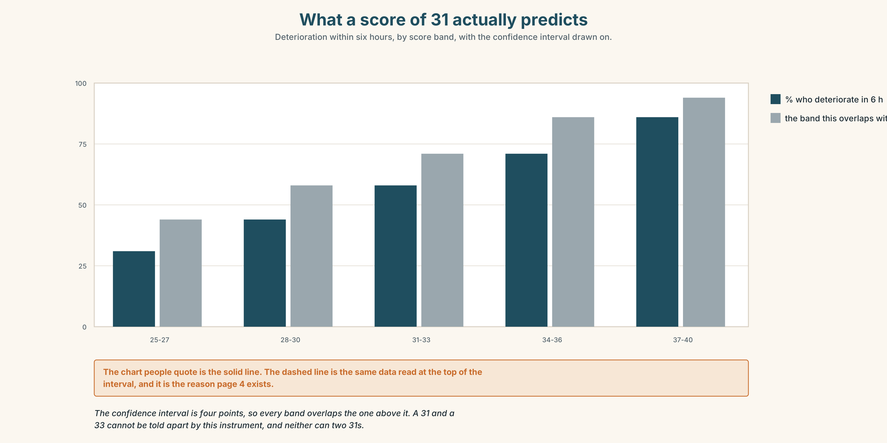{width=6.6in}

*What a score of 31 actually predicts — Deterioration within six hours, by score band, with the confidence interval drawn on.*

1. **The two triage sheets** from Part 5E — and the variables where they differ.
2. **The chart** — what a score of 31 actually predicts, with its confidence interval.
3. **The voice.** Dr Herrera, thirty seconds: *"I have made this decision about nine times. Twice
   I have written down the real reason. Both of those times somebody came back to me about it,
   which I am told is the system working, and which I notice has changed what I write."*

### 11B · Talk about it

In fours. Everybody speaks twice. Use the frame.

> *The evidence points to ______ . But it rules out nothing, so ______ .*

**Words you can use:** *evidence · consistent · inconsistent · the most likely explanation ·
rule out · account for · on the balance of probability · all the evidence suggests*

### 11C · Decide

Write **three sentences**. Choose, say why, and name what it costs.

> I think they should ______________________ ,
> because ______________________ .
> What this costs is ______________________ .

### 11D · Model decision

> Ask the four-hour question, decide on it, and write the answer down in both sets of notes.
> Arrival order is defensible and nobody defends it, which is the worst combination available:
> it produces a decision that is probably fine and a record that cannot be reviewed. Writing the
> real reason costs the person who writes it, and that cost is the only mechanism by which this
> department will ever find out whether its tiebreaks are any good.

### 11E · The Reveal

> **What happened.** They asked the four-hour question. It changed the answer: patient B, who
> had arrived second, had a respiratory variable that the score weights lightly and that both
> consultants independently thought mattered more than its weight.
>
> Patient B went to intensive care. Patient A deteriorated at six and went in at eight on the
> next bed, as planned, and was fine.
>
> The reason was written in both sets of notes. It was reviewed in November as part of an audit
> nobody expected, and the respiratory variable's weighting is now being looked at, which is
> either a vindication or a coincidence and will not be known for two years.

**They wrote it down. Somebody read it. And a variable's weighting is being re-examined because
one person spent ten minutes they did not have.**

> **Was it the right decision?** Say why — and say what the audit proves.

---

## Part 12 · Landing ◆ **all three lines**

### 12A · Recycle — twelve items

> 1. There ______ (must / be) two of them. *(past)*
> 2. There ______ (can't / be) more than two. *(past)*
> 3. He ______ well have been called away.
> 4. It is ______ to have been an arrest.
> 5. **At first ______** it looks like something else.
> 6. Nobody can **account ______** the coffee.
> 7. That version does not **______ up** against the log.
> 8. **On the balance of ______** , it was a transfer.
> 9. *(Unit 3)* If we ______ (advertise) in March, we ______ (have) somebody now.
> 10. *(Unit 2)* If I ______ (not / look), she ______ (have) it.
> 11. *(A2.2 U6)* The rope ______ (must / break) in the night.
> 12. *(A2.1 U7)* The garlic ______ (grow) in China.

### 12B · Consolidate

**One hundred and sixty words.** A reconstruction from physical evidence. Four observations,
three graded inferences, one exclusion with its reason, and one thing you cannot explain.

### 12C · Can-do, with evidence

| I can… | My evidence | Sure? |
|---|---|---|
| grade a deduction about the past to match its evidence | Part 3H score | ◯ ◑ ● |
| reconstruct an event out loud in two minutes | Part 4C recording | ◯ ◑ ● |
| write 160 words where every inference has an object | Part 8 draft 2 | ◯ ◑ ● |
| negotiate a single resource without using seniority | Part 9D role play | ◯ ◑ ● |

### 12D · Replay ⏺

Find your forty-five seconds from Part 0C. Listen. **Record it again.**
**Two sentences:** what is different, and which of your original conclusions you would now grade
lower.

### 12E · Glossary — forty-five items, as a map

> **WHAT IS IN THE ROOM** · evidence · trace · residue · position · angle · scene
> **HOW IT FITS** · sequence · timeline · consistent · inconsistent · be consistent with · point to · point towards
> **WHAT YOU DO WITH IT** · reconstruct · witness · piece together · rule out · narrow down · account for · at first glance · on closer inspection
> **THE CONCLUSION** · the most likely explanation · none of it adds up · that explains the rest
> **NEAR CERTAIN** · certainly · definitely · undoubtedly · doubtless · must have · can't have · there is no way
> **IN BETWEEN** · presumably · plausibly · arguably · conceivably · might well have · is unlikely to have · all the evidence suggests · on the balance of probability
> **REPORTING, NOT JUDGING** · seemingly · apparently · implausibly · stack up · hold up · we may never establish that

### 12F · Next

> **Unit 5 · What will have changed by then?**

# B1.2 · Unit 5 · Four Per Cent

> **English Animated** · *Weighing It Up* · Hospital Regional, Valdivia
> Student's Book pages 94–115 · 22 pp · ~11 hours

---

## Part 0 · The Big Picture ◆ **A · THE WORLD**

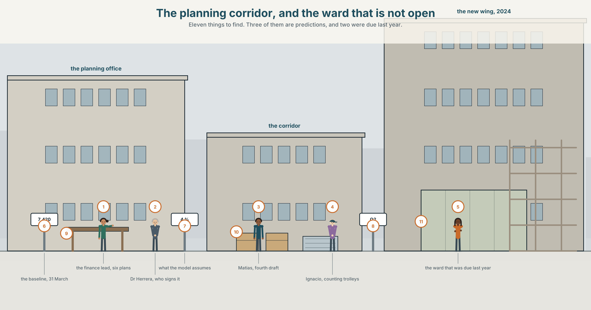{width=6.6in}

*The planning corridor, and the ward that is not open — Eleven things to find. Three of them are predictions, and two were due last year.*

# What will have changed by then?

**By the end of this unit you can present a three-year projection and state its assumptions out
loud.**

| ◆ **A · THE WORLD** | A model that has been wrong in the same direction twice |
|---|---|
| ◆ **B · THE SYSTEM** | the future perfect and the future continuous · *by*, *by the time* · 23 words for projection and capacity · 22 words for placing things ahead · long chains of weak forms |
| ◆ **C · THE PERFORMANCE** | A three-year projection with its assumptions said out loud |

---

### 0A · Find it

**Find eleven things in this picture.** Three of them are predictions.

> a capacity board · a waiting-list number on a whiteboard · a three-year plan on a screen ·
> a trolley count · a staffing rota for next month · a corridor with beds in it ·
> a building site hoarding · a sign for a ward that is not open yet · a printer · a calendar ·
> a chart taped over an older chart

### 0B · Guess it

**Two things in this picture were planned for last year and have not happened.**
Which, and what is the evidence?

### 0C · Say it ⏺

**Record forty-five seconds.** *Where will you be, and what will you have finished, three years
from today? Say one assumption your answer depends on.* You will record it again at the end of
this unit.

---

## Part 1 · Vocabulary Lab 1 ◆ **B · THE SYSTEM**

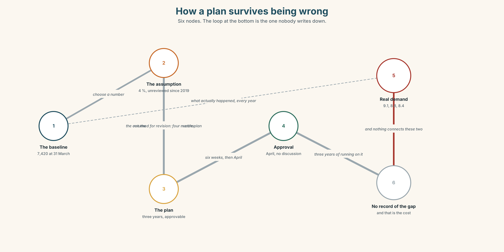{width=6.6in}

*How a plan survives being wrong — Six nodes. The loop at the bottom is the one nobody writes down.*

### 1A · Meet — the words of a plan

Match each word to one place on the map.

> **projection** · **forecast** · **target** · **deadline** · **milestone** · **assumption** ·
> **baseline** · **capacity** · **demand** · **shortfall**

### 1B · Sort — a number, a date, or a belief?

Three columns.

> throughput · target · milestone · deadline · forecast · baseline · variance ·
> assumption · demand

**One of them is a belief that everybody treats as a number.** Which, and what does that cost?

### 1C · Meet — three words that describe the same gap

> **variance** · **shortfall** · **demand**

**Variance** is the difference between plan and reality. **Shortfall** is the same difference
with a tone attached. **Demand** is the thing that caused it.
**Which of the three would you put in a title?**

### 1D · Collocation Lab

Complete each one with one word.

1. **On current ______** , the waiting list reaches eleven thousand by March.
2. **All things being ______** , the new ward opens in the second quarter.
3. That four per cent is **a working ______** and has been since 2019.
4. **Best ______** , the building finishes in April. **Worst ______** , it finishes in November.
5. The model will **run out of ______** some time in the third year.
6. They have had to **scale ______** the original plan twice and **scale ______** the budget once.

### 1E · The fixed expressions

> **f** **That is the number we are planning on.**
> **f** **It has never been four per cent.**

Two sentences from the same meeting. One of them ends the discussion and one of them starts it.

> **Which, and what is the sentence between them?**

### 1F · Own it

Think of a plan you are inside — at work, at home, in your studies. Tell a partner
**four sentences**: what it assumes, what has actually happened, how big the gap is, and who
would have to say so.

---

## Part 2 · Listening ◆ **A · THE WORLD**

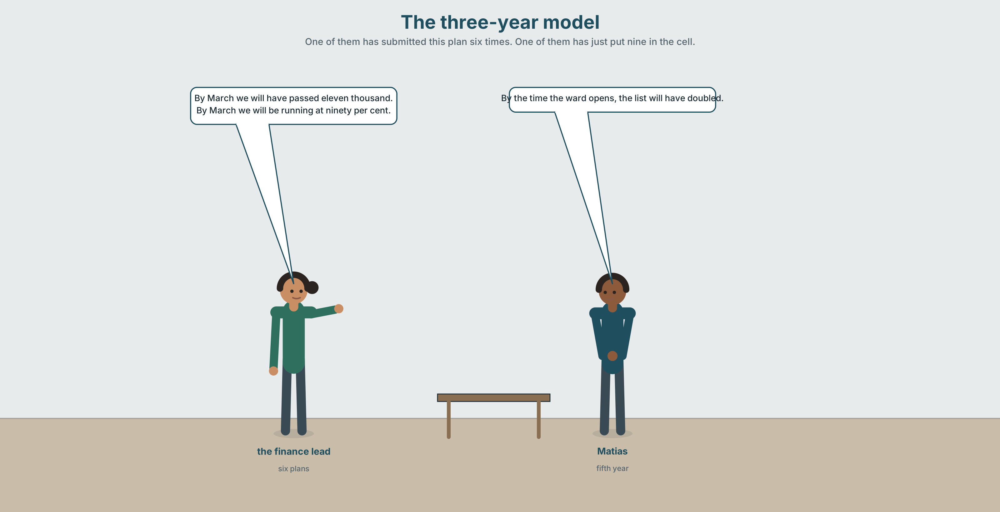{width=6.6in}

*The three-year model — One of them has submitted this plan six times. One of them has just put nine in the cell.*

### 2A · The three-year model 🔊 Track 5.1

**Before you listen.** The hospital's model assumes demand will rise four per cent a year. It has
risen nine per cent for two years running. **Guess: why has nobody changed it?**

**Listen once. One question.** What happens to the plan if you put nine per cent in?

**Listen again. Complete the table.**

| | What they say | What they assume | What happens if the assumption is wrong |
|---|---|---|---|
| the finance lead | | | |
| Dr Herrera | | | |
| Matías | | | |

**Listen again. Choose the best answer.**

1. At four per cent the list reaches **8,000 / 11,000 / 16,000** by year three.
2. At nine per cent it reaches **11,000 / 8,000 / 16,000**.
3. A plan built on nine per cent would be **approved / refused / returned for revision**.
4. The assumption was last reviewed in **never / 2022 / 2019**.

**Noticing.** Four sentences from the recording.

1. *By March we will have passed eleven thousand.*
2. *By March we will be running at ninety per cent.*
3. *By the time the ward opens, the list will have doubled.*
4. *This time next year we will have had three years of nine per cent.*

**Two of these describe a completed thing. Two describe something still running.**
Which are which?

### 2B · Decoding clinic 🔊 Track 5.2

Thirty seconds of the finance lead. Four jobs.

1. How many times does she say *will have*?
2. In *we will have been*, how many of the four words are stressed?
3. Catch the two percentages and the year.
4. She hedges one number and not the other. Which, and why that one?

> Transcripts, page 154.

---

## Part 3 · Grammar Lab 1 ◆ **B · THE SYSTEM**

### Finished by then, or still going then

### 3A · Notice

Look at the four sentences in Part 2.

1. In sentence 1, is the passing of eleven thousand finished by March or happening in March?
2. In sentence 2, what is the state of affairs in March?
3. Sentence 3 has two future points. **Which is the deadline and which is the event?**
4. Sentence 4 uses *will have had*. **How is that different from *will have*?**
5. Try *"By March we will pass eleven thousand."* **Is it wrong? What does it lose?**

### 3B · See

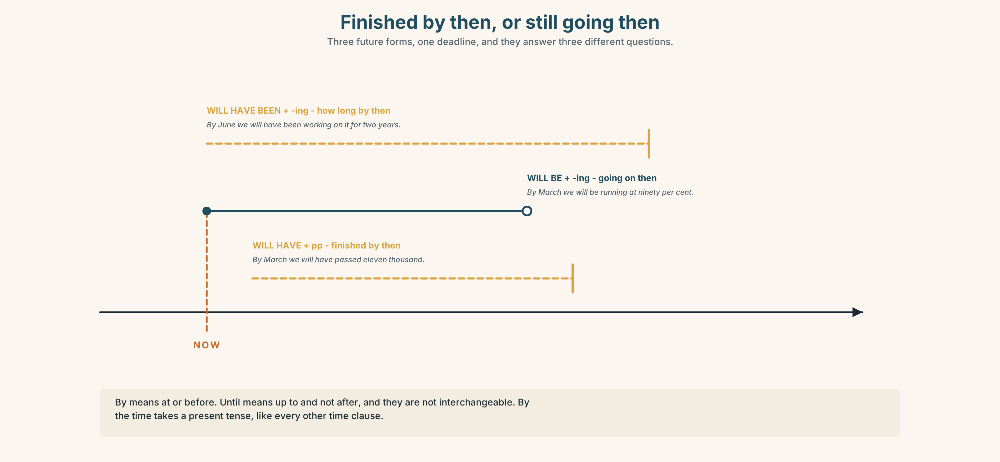{width=6.6in}

*Finished by then, or still going then — Three future forms, one deadline, and they answer three different questions.*

### 3C · Know

| | Shape | Use it for |
|---|---|---|
| **future continuous** | *will be* + *-ing* | what will be **going on** at a future point |
| **future perfect** | *will have* + past participle | what will be **finished** by a future point |
| **future perfect continuous** | *will have been* + *-ing* | how **long** something will have been going by then |

> **The deadline word is *by*.** *by March*, *by the end of the year*, *by then*.
> *By* means at or before. *Until* means up to and not after, and they are not interchangeable.
> ✓ *We'll have finished by March.* ✗ *We'll have finished until March.*

> ***by the time* takes a present tense**, like all time clauses.
> ✓ *By the time the ward **opens**, the list will have doubled.*
> ✗ *By the time the ward will open…*

> **The future perfect is the tense of plans and audits.** It is how you describe a state of the
> world at a date, which is exactly what a projection is.

> **Watch out.** State verbs still resist the continuous.
> ✓ *By then we will know.* ✗ *By then we will be knowing.*

### 3D · Use — controlled

> By March the list (1) __________ (pass) eleven thousand. By the end of the year the
> department (2) __________ (run) at over ninety per cent capacity, which it
> (3) __________ (do) continuously for about eighteen months by that point. By the time the new
> ward (4) __________ (open), the list (5) __________ (double). This time next year we
> (6) __________ (have) three consecutive years of nine per cent growth, and the model
> (7) __________ (still / assume) four. By 2029, on current trends, we
> (8) __________ (run out) of corridor.

### 3E · Use — guided

Choose the right future form, and say why the others fail.

1. At six o'clock tomorrow I ______ (sit) in a meeting about this.
2. By six o'clock tomorrow I ______ (finish) the paper.
3. By the time you read this, I ______ (leave).
4. In June we ______ (work) on this model for two years.
5. By 2027 the department ______ (know) whether the assumption was right.

### 3F · Use — open

**In pairs.** Describe the same future point — *this time in three years* — four times:
once with *will*, once with *will be doing*, once with *will have done*, once with
*will have been doing*. **Then say which was hardest and why.**

### 3G · Error autopsy

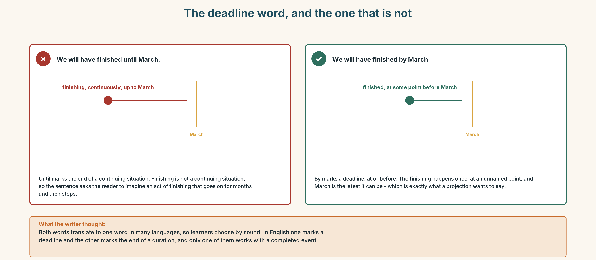{width=6.6in}

*The deadline word, and the one that is not — The deadline word, and the one that is not*

**Read both versions. Then say what the first one commits the writer to that the second does
not.**

### 3H · Check — eight items

> 1. By March we ______ (pass) eleven thousand.
> 2. By March we ______ (run) at ninety per cent.
> 3. By the time the ward ______ (open), the list ______ (double).
> 4. In June we ______ (work) on it for two years.
> 5. By then we ______ (know) the answer.
> 6. We ______ (finish) ______ March. *(deadline)*
> 7. At four tomorrow I ______ (present) this to the board.
> 8. By 2029 we ______ (run out) of corridor.

**0–4 →** Workbook pp. 28–31. **5–6 →** Part 6. **7–8 →** page 107.

---

## Part 4 · Speaking ◆ **C · THE PERFORMANCE**

### 4A · Fluency starter — three years

Your teacher names a date three years out. Each learner says one sentence beginning
*"By then I will have…"* and one beginning *"By then I will be…"*.
**Nobody may use the same verb twice.**

### 4B · The functional core — presenting a projection

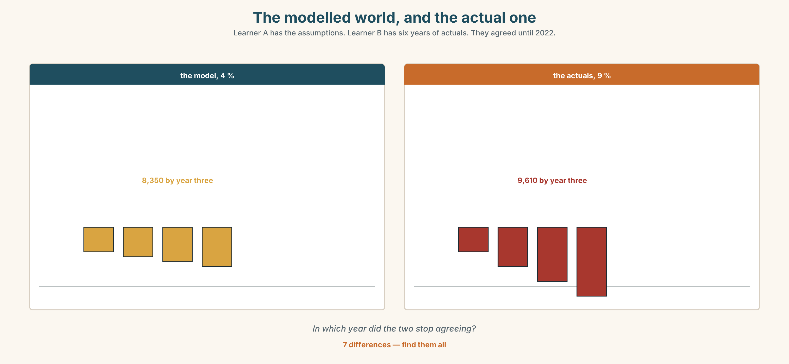{width=6.6in}

*The modelled world, and the actual one — Learner A has the assumptions. Learner B has six years of actuals. They agreed until 2022.*

**Language Bank**

| | |
|---|---|
| **the projection** | *By March we'll have…* · *On current trends…* |
| **the assumption, out loud** | *This assumes…* · *That number is a working assumption.* |
| **the sensitivity** | *If it's nine rather than four, then…* · *Best case… worst case…* |
| **the honest ending** | *It has never been four per cent.* · *I am planning on a number I do not believe.* |

**Information gap.** Learner A has the model's assumptions. Learner B has the last six years of
actual figures. **Find the year in which the two stopped agreeing.**

### 4C · The performance — three minutes ⏺

Present a **three-year projection**. **Three minutes.** You must include:

> the baseline · the projection at your central assumption · the assumption, said out loud ·
> what happens at a different assumption · the point at which the plan breaks

**Record it.**

### 4D · Observer

One person listens for **one thing**: was every number attached to the assumption that produced
it?

### 4E · Three criteria

> ☐ Did I use the future perfect and the future continuous for different jobs?
> ☐ Did I say the assumption out loud, in a sentence of its own?
> ☐ Did I give a second number for a different assumption?

---

## Part 5 · Reading ◆ **A · THE WORLD**

### 5A · Predict

An opinion column. The title is
**"A plan that is refused is not a failure. A plan that is approved and wrong is."**
**What do you expect the argument to be?** Two sentences.

### 5B · Read — two minutes

---

**A plan that is refused is not a failure. A plan that is approved and wrong is**

Every public body I have worked in has had the same quiet arrangement, and nobody has ever
written it down because writing it down would end it.

A department produces a three-year plan. The plan contains an assumption about demand. The
assumption is chosen not because anybody believes it but because it is the number that produces a
plan which can be approved. If you put the real number in, the plan asks for money that does not
exist, and a plan that asks for money that does not exist is returned for revision, which costs
four months.

So the department puts in four per cent. Demand rises nine. In year two somebody notices, and
what they notice is not that the assumption was wrong — everybody knew the assumption was wrong —
but that the department has now been running on an approved plan for two years and has no
document anywhere that says what it actually needs.

That is the real cost, and it is not financial. It is that at the end of three years there will
be no record of the gap. There will be a plan that was met, a service that is failing, and no
piece of paper connecting the two.

I am not arguing that departments should submit plans that will be refused. I am arguing that
they should submit the four per cent plan **and** a one-page annex saying what the nine per cent
world looks like, and that they should do this every year whether anybody reads it or not,
because in four years somebody will ask when this started and somebody ought to be able to
answer.

---

### 5C · Comprehension — eight questions

1. What is the "quiet arrangement" the writer describes?
2. **Why is the assumption chosen, according to the writer?**
3. What happens to a plan that asks for money that does not exist, and what does that cost?
4. What does somebody notice in year two, and what do they **not** notice?
5. **What does the writer say the real cost is?**
6. What are the three things that will exist at the end of three years?
7. What is the writer's actual proposal?
8. **Why does the writer say it should be done "whether anybody reads it or not"?**

### 5D · Vocabulary in context

Guess from the text. Then check.

> a quiet arrangement · returned for revision · running on an approved plan · an annex ·
> connecting the two

### 5E · The counter-text

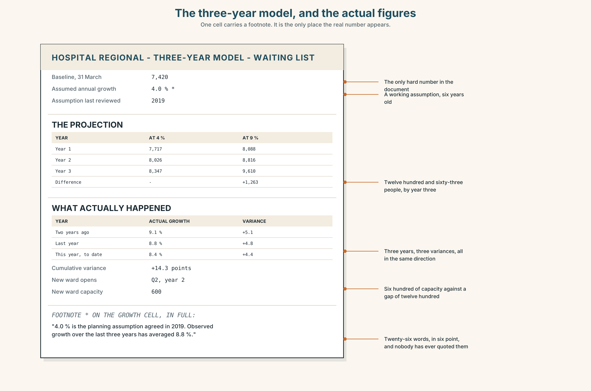{width=6.6in}

*The three-year model, and the actual figures — One cell carries a footnote. It is the only place the real number appears.*

**Read the three-year model and the actual figures beside it, and answer.**

1. What is the baseline, and what growth rate does the model assume?
2. **What are the actual rates for the last three years, and what is the cumulative variance?**
3. What does the model project for year three, and what does nine per cent project?
4. When was the assumption last reviewed, and by whom?
5. One cell has a footnote. Which, and what does it say?

### 5F · Two texts

The column says a department ends up with **no document saying what it needs**.
The model has a cell with a footnote giving the real figure.

**Put those two facts together. Does the footnote count?** Three sentences.

---

## Part 6 · Vocabulary Lab 2 ◆ **B · THE SYSTEM**

### Putting things ahead of you

### 6A · Sort — a point, a period, or a direction?

Three columns.

> meanwhile · thereafter · progressively · ultimately · imminently · eventually ·
> cumulatively · annually · henceforth · by · shortly

### 6B · Chunk completion

1. **By ______** the list will have passed eleven thousand.
2. **Within the ______** the new ward will be open or it will be cancelled.
3. **Over the ______** , demand has risen twenty-nine per cent.
4. **Year ______ year** , the model has been out by five points.
5. **At this ______** , we will run out of corridor in 2029.
6. They have failed to **see ______** a single one of the four milestones.

### 6C · Three that look like timing and are not

**ultimately · eventually · henceforth**

> *Ultimately* is about the end state, not the timing. *Eventually* is about the timing and
> refuses to give one. *Henceforth* is about a rule starting, and is nearly always too formal.

**Rewrite each sentence with a date in it, and say what is gained.**

1. Ultimately the ward will open.
2. The list will eventually come down.
3. Henceforth the assumption will be reviewed annually.

### 6D · The fixed expression

> **f** **This time next year we will have…**

**Complete it three times:** once for something certain, once for something planned,
once for something you do not believe.

### 6E · Contrast Clinic

Eight items. Future simple, continuous, perfect or perfect continuous.

1. By the time it opens, the list ______ (double).
2. By next March we ______ (reach) ninety per cent. *(an event completed)*
3. By four tomorrow I ______ (present) this.
4. At four tomorrow I ______ (present) this.
5. By June we ______ (work) on it for two years.
6. Next March we ______ (run) at ninety per cent. *(a state of affairs)*
7. By then we ______ (know). *(a state)*
8. By 2029 we ______ (run out) of corridor.

---

## Part 7 · Pronunciation & Fluency Lab ◆ **B · THE SYSTEM**

### Four weak forms in a row

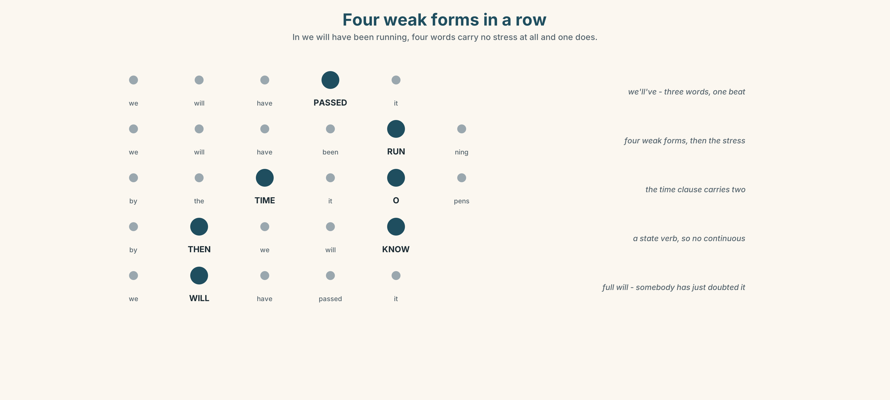{width=6.6in}

*Four weak forms in a row — In we will have been running, four words carry no stress at all and one does.*

### 7A · Hear 🔊 Track 5.3

> we will have passed → /wiːləvˈpɑːst/
> we will have been running → /wiːləvbɪnˈrʌnɪŋ/
> by the time it opens → /baɪðəˈtaɪmɪtˈəʊpənz/

**In *we will have been running*, four words carry no stress at all and one does.**

### 7B · Say

Say each one. Then say the whole sentence three times, faster:

> *By the time the ward opens, we will have been running at ninety per cent for two years.*

### 7C · Make it mean something

Say these two:

> *We WILL have passed it.* *(somebody has just doubted it)*
> *We'll've passed it.* *(and this is just the projection)*

**Which one belongs in a board paper?**

### 7D · Fluency 30 ⏺

Thirty seconds: **three things you will have finished and three you will still be doing, in
three years.** Three times, faster.

---

## Part 8 · Writing ◆ **C · THE PERFORMANCE**

### A three-year projection · 160 words

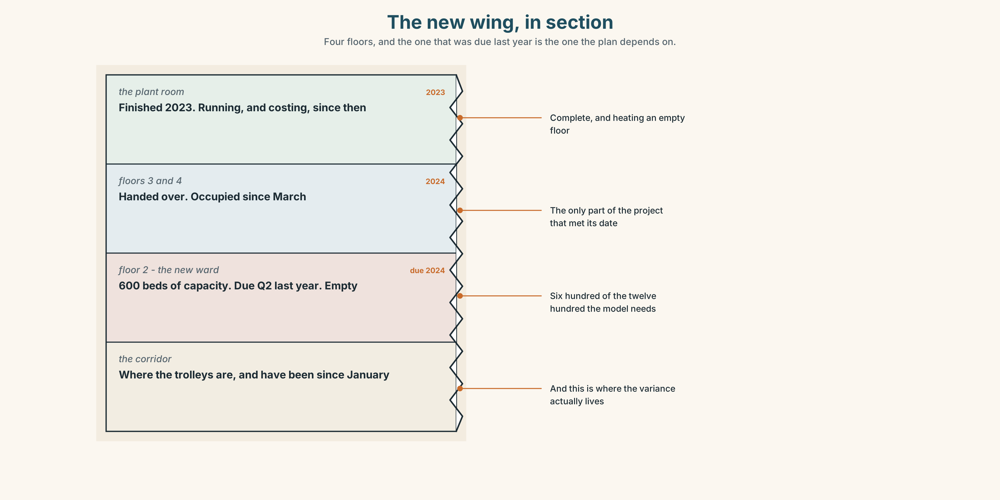{width=6.6in}

*The new wing, in section — Four floors, and the one that was due last year is the one the plan depends on.*

### 8A · Read the model

> The baseline is 7,420 on the list at 31 March. The model assumes four per cent annual growth,
> which gives 8,350 by year three. `[the baseline, the assumption and the result, in that order
> and in one breath]`
>
> That four per cent is a working assumption and has not been reviewed since 2019. Actual growth
> has been 9.1 and 8.8 per cent in the last two years. At nine per cent the year-three figure is
> 9,610. `[the assumption named as an assumption, then the actual figures, then the second
> number]`
>
> By the time the new ward opens in Q2 of year two, the list will have passed nine thousand on
> the real figures and 8,000 on the modelled ones. The ward adds capacity for 600.
> `[the point at which the two worlds separate, and the thing that was supposed to fix it]`
>
> I am presenting the four per cent plan because that is the number we are planning on. I would
> like the nine per cent annex minuted. `[what the writer is doing, and what they are asking for,
> separately]`

**Questions about the writer's choices:**

1. The assumption is named in its own sentence. **Why not in a footnote?**
2. The last paragraph separates what the writer is submitting from what they are asking for.
   **Why does that distinction matter?**
3. There is no adjective anywhere in this piece. **Is that a style choice or an argument?**

### 8B · The anti-model

> The department faces significant challenges in the coming period. Demand is expected to
> continue to grow and capacity will need to be reviewed. We remain committed to meeting our
> targets and will continue to monitor the situation closely.

Correct English, and not one number. **Name three numbers it should contain**, and say what
*monitor the situation closely* is standing in for.

### 8C · Plan

> baseline → central assumption, named as an assumption → the result → the actual figures →
> the second result → the point where the two separate → what you are asking for

### 8D · Write — 160 words
### 8E · Peer review — three criteria

> ☐ Is the assumption in a sentence of its own?
> ☐ Are there two projections, from two assumptions?
> ☐ Is there a named date at which the two worlds separate?

### 8F · Write it again · 8G · Publish

On the wall, with the model and the actual figures from Part 5E beside it.

---

## Part 9 · The File ◆ **A · THE WORLD + C · THE PERFORMANCE**

# STUDY FILE · Feedback and Revision

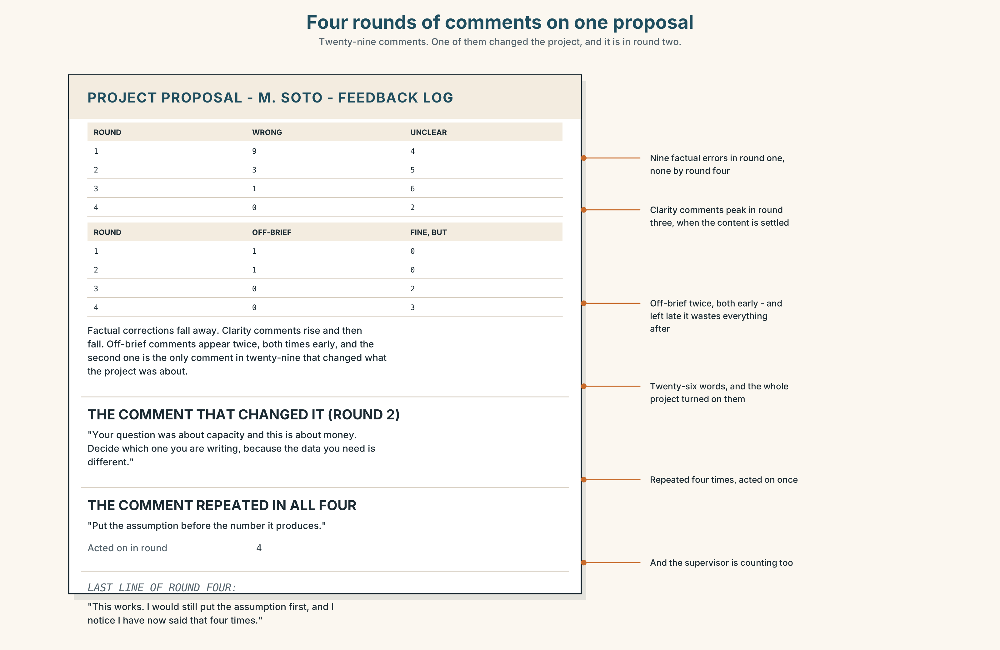{width=6.6in}

*Four rounds of comments on one proposal — Twenty-nine comments. One of them changed the project, and it is in round two.*

### 9A · Four rounds of comments 🔊 Track 5.4

Matías's project proposal has been through four drafts. **Listen to his supervisor's feedback on
each.**

1. What kind of comment dominates round one, and what kind dominates round four?
2. **Which round contains the comment that actually changed the project?**
3. One comment is repeated in all four rounds. Which, and what does that tell you?

### 9B · Four kinds of comment

> *this is wrong* · *this is unclear* · *this is not what you set out to do* ·
> *this is fine and here is what I would do instead*

Match each to one phrase.

> *"The 2019 figure is 7,420, not 7,240."* ·
> *"I cannot tell whether this sentence is your claim or theirs."* ·
> *"Your question was about capacity and this is about money."* ·
> *"This works. I would still put the assumption first."*

### 9C · The comment you should act on last

**Which of the four kinds is it safe to leave until the final draft, and why?**
And **which one, if you leave it, makes all the other work worthless?**

### 9D · Your turn

In pairs. **Twelve minutes.** Swap the 160 words you wrote in Part 8.
**Give one comment of each of the four kinds, in writing.** Then revise, and say which comment
you acted on first.

### 9E · Transfer

**Find one piece of feedback you have received and not acted on.** Write down which of the four
kinds it was, and why you left it.

---

## Part 10 · Mediation & Interaction ◆ **C · THE PERFORMANCE**

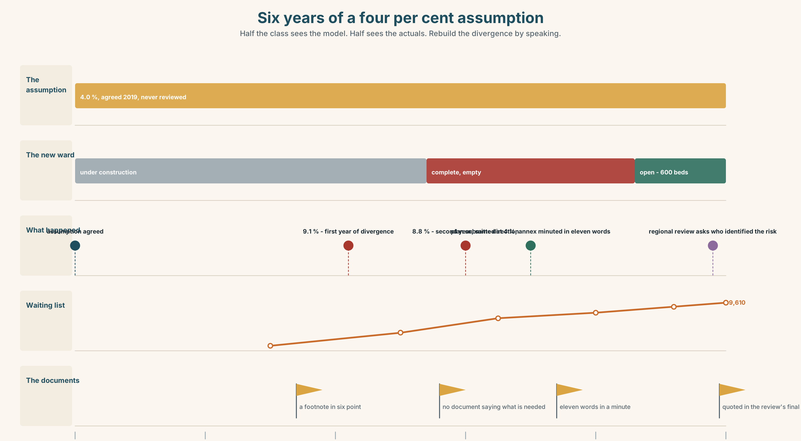{width=6.6in}

*Six years of a four per cent assumption — Half the class sees the model. Half sees the actuals. Rebuild the divergence by speaking.*

### 10A · Relay

Half the class sees the model. Half sees six years of actual figures.
**Rebuild the whole divergence by speaking.** Twelve minutes.

### 10B · Simplify

Explain the three-year model from Part 5E to a ward manager who has to staff for it.
**Five sentences only.**

> **Plan:** what it assumes → what that means for your ward → what the real figure would mean →
> when the two separate → what you should plan for

### 10C · Compress

The column in Part 5 into **forty words**, keeping the proposal.

### 10D · Online

Write **one message** to the finance lead: you will submit the four per cent plan, you want the
nine per cent annex minuted, and you are naming the date you need an answer by.

### 10E · Your language

How does your language say *by the time the ward opens*? **Does the time clause take a future
form or a present one?** Say it in both languages and compare.

---

## Part 11 · The Decision ◆ **C · THE PERFORMANCE**

# Plan honestly, or plan approvably

The three-year plan is due in six weeks. The model assumes four per cent. Demand has risen nine
per cent for two years.

- **Submit at four per cent.** It will be approved. The department will be running on a plan
  that nobody in it believes, for the third year.
- **Submit at nine per cent.** It will be returned for revision, which costs four months, and
  the department will spend those four months on the current plan anyway.
- **Submit at four with a nine per cent annex.** It will be approved and the annex will probably
  not be read, and it will exist.

### 11A · The evidence

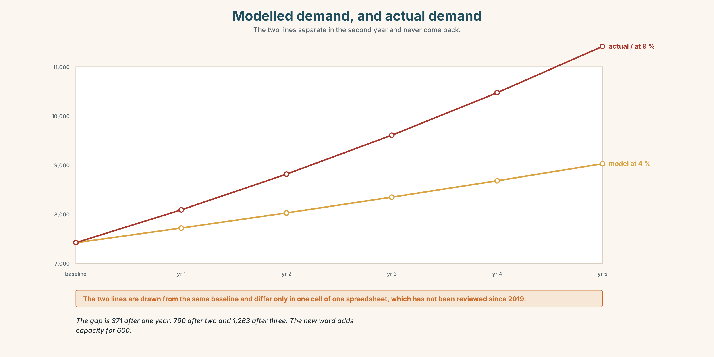{width=6.6in}

*Modelled demand, and actual demand — The two lines separate in the second year and never come back.*

1. **The model and the actuals** from Part 5E — and the footnote on the growth cell.
2. **The chart** — modelled and actual demand, and the point at which they separate.
3. **The voice.** The finance lead, thirty seconds: *"I have submitted the four per cent plan for
   six years. I have never believed it and I have never been criticised for it. If I submit nine
   I will be told to revise it, and when I resubmit at four, which I will, the only thing that
   will have changed is that it will be August."*

### 11B · Talk about it

In fours. Everybody speaks twice. Use the frame.

> *By year three we will have ______ , which assumes ______ . If instead ______ , then ______ .*

**Words you can use:** *projection · forecast · target · assumption · baseline · variance ·
capacity · demand · shortfall · on current trends · best case · worst case*

### 11C · Decide

Write **three sentences**. Choose, say why, and name what it costs.

> I think they should ______________________ ,
> because ______________________ .
> What this costs is ______________________ .

### 11D · Model decision

> Submit at four with the annex, and ask for the annex to be minuted rather than attached.
> An attachment can be lost and a minute cannot. The column is right that the real damage is the
> absence of a record, and the cheapest possible record is one sentence in the minutes of a
> meeting that is going to happen anyway. It costs nothing, it will change nothing this year, and
> in four years it will be the only evidence that anybody knew.

### 11E · The Reveal

> **What happened.** The plan went in at four per cent with a one-page annex. The finance lead
> asked for the annex to be minuted and it was, in eleven words.
>
> The plan was approved in April. Demand in that year rose 8.4 per cent. The annex was not
> discussed at any meeting.
>
> In the third year the regional office began a review of why four hospitals had missed the same
> target. One of its first requests was for any documentation showing that departments had
> identified the risk in advance. Three hospitals had nothing. This one had eleven words in a
> minute, and the review's final report quotes them.

**Nobody read the annex. The eleven words in the minute did the whole job, three years later.**

> **Was it the right decision?** Say why — and say what the other three hospitals should do now.

---

## Part 12 · Landing ◆ **all three lines**

### 12A · Recycle — twelve items

> 1. By March we ______ (pass) eleven thousand.
> 2. By March we ______ (run) at ninety per cent.
> 3. By the time the ward ______ (open), the list ______ (double).
> 4. In June we ______ (work) on it for two years.
> 5. **On current ______** , the list reaches eleven thousand.
> 6. That four per cent is **a working ______** .
> 7. They have had to **scale ______** the plan twice.
> 8. **At this ______** we run out of corridor in 2029.
> 9. *(Unit 4)* There ______ (must / be) two of them. *(past)*
> 10. *(Unit 3)* If we ______ (advertise) in March, we ______ (have) somebody now.
> 11. *(A2.2 U9)* ______ of it can be carried over. *(zero, uncountable)*
> 12. *(A2.1 U5)* We'll start as soon as it ______ (arrive).

### 12B · Consolidate

**One hundred and sixty words.** A three-year projection for anything you know. Baseline,
assumption in its own sentence, two projections, and the date at which they separate.

### 12C · Can-do, with evidence

| I can… | My evidence | Sure? |
|---|---|---|
| say what will be finished and what will still be running at a future date | Part 3H score | ◯ ◑ ● |
| present a three-year projection in three minutes | Part 4C recording | ◯ ◑ ● |
| write 160 words in which every number has an assumption | Part 8 draft 2 | ◯ ◑ ● |
| give and act on four kinds of feedback | Part 9D pair work | ◯ ◑ ● |

### 12D · Replay ⏺

Find your forty-five seconds from Part 0C. Listen. **Record it again.**
**Two sentences:** what is different, and whether your assumption has got more or less honest.

### 12E · Glossary — forty-five items, as a map

> **THE PLAN** · projection · forecast · target · deadline · milestone · baseline · a working assumption
> **THE NUMBERS** · assumption · variance · capacity · demand · throughput · shortfall
> **THE SCENARIOS** · on current trends · all things being equal · best case · worst case · run out of road
> **WHAT YOU DO TO A PLAN** · scale up · scale back · bring in · push back · set out · see through
> **THE DEADLINE** · by · by the time · by then · within the year · no later than · annually
> **AHEAD** · eventually · ultimately · shortly · imminently · meanwhile · henceforth · thereafter · progressively · cumulatively · over the period · year on year · at this rate
> **WHAT PEOPLE SAY** · that is the number we are planning on · it has never been four per cent · this time next year we will have

### 12F · Next

> **Unit 6 · Who does this to you?**

# B1.2 · Unit 6 · Four Hours on the Phone

> **English Animated** · *Weighing It Up* · Hospital Regional, Valdivia
> Student's Book pages 116–137 · 22 pp · ~11 hours

---

## Part 0 · The Big Picture ◆ **A · THE WORLD**

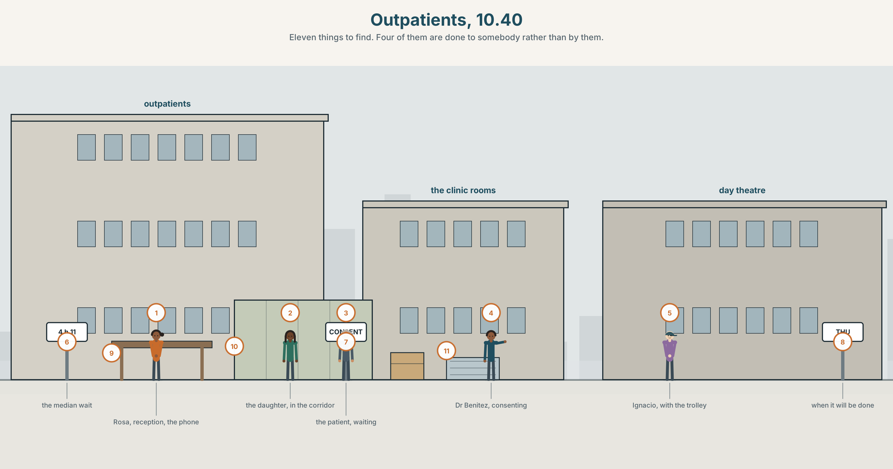{width=6.6in}

*Outpatients, 10.40 — Eleven things to find. Four of them are done to somebody rather than by them.*

# Who does this to you?

**By the end of this unit you can explain a procedure entirely from the patient's side.
One hundred and sixty words.**

| ◆ **A · THE WORLD** | A building in which things are done to people by people they never meet |
|---|---|
| ◆ **B · THE SYSTEM** | modal and perfect passives · *have something done* · 23 words for care and services · 22 verbs of causing and permitting · where the stress goes in *have it done* |
| ◆ **C · THE PERFORMANCE** | A hundred and sixty words with the patient as the subject |

---

### 0A · Find it

**Find eleven things in this picture.** Four of them are things done to somebody rather than by
them.

> a referral letter · a consent form · a wristband · a trolley being pushed · a name on a list ·
> a curtain being drawn · a phone on hold · an interpreter poster · a discharge summary ·
> a bell push · a chair for a relative

### 0B · Guess it

**Two people in this picture are making decisions and three are having decisions made about
them.** Which, and what in the drawing tells you?

### 0C · Say it ⏺

**Record forty-five seconds.** *Describe something that was done to you — medical, official,
anything. Who did it, and did you know their name?* You will record it again at the end of this
unit.

---

## Part 1 · Vocabulary Lab 1 ◆ **B · THE SYSTEM**

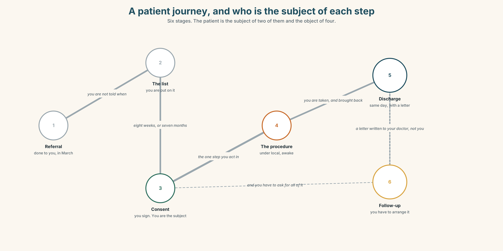{width=6.6in}

*A patient journey, and who is the subject of each step — Six stages. The patient is the subject of two of them and the object of four.*

### 1A · Meet — the words of a patient journey

Match each word to one place on the map.

> **referral** · **admission** · **consultation** · **procedure** · **ward** · **theatre** ·
> **sedation** · **discharge** · **follow-up** · **consent**

### 1B · Sort — a place, an event, or a document?

Three columns.

> theatre · procedure · ward · admission · consent · consultation · discharge ·
> follow-up · referral

**Two of them are an event and a document with the same name.** Which, and how can you tell
which is meant?

### 1C · Meet — two people who are not staff

> **interpreter** · **carer**

Both of them are essential and neither is employed. **Which of the two is on the rota, and
which is in the corridor?**

### 1D · Collocation Lab

Complete each one with one word.

1. She was **referred ______** rheumatology in March and has not been seen.
2. He will **be ______ by** a consultant, not a registrar — that is what the letter says.
3. It is done **under ______** , so you are awake and you feel the pressure and not the pain.
4. You cannot be put **______ a list** without a referral, and you cannot get a referral without
   being on a list.
5. **Written ______** is required for anything that breaks the skin.
6. The operation has been **brought ______** to Thursday and nobody has told the family.

### 1E · The fixed expressions

> **f** **Nobody explained any of it.**
> **f** **They did it while I was asleep.**

Two sentences from the same complaint file. Neither of them is an accusation of harm.

> **What are they actually complaining about?** Write the policy sentence that would answer each.

### 1F · Own it

Think of a service you have used — medical, legal, official. Tell a partner **four sentences**
from the position of the person it was done to: what happened, who did it, what you were asked,
and what you were told.

---

## Part 2 · Listening ◆ **A · THE WORLD**

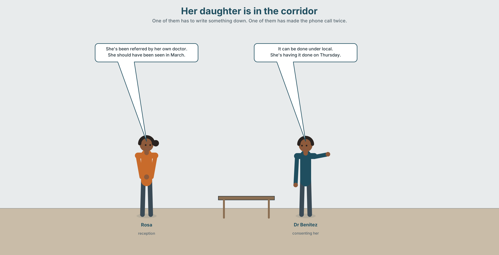{width=6.6in}

*Her daughter is in the corridor — One of them has to write something down. One of them has made the phone call twice.*

### 2A · Her daughter is in the corridor 🔊 Track 6.1

**Before you listen.** A patient wants her daughter to interpret. Policy says the telephone
interpreting service must be used. **Guess: how long is the queue?**

**Listen once. One question.** What is the patient being consented for?

**Listen again. Complete the table.**

| | What they want | What the policy says | What they are worried about |
|---|---|---|---|
| the patient | | | |
| Dr Benítez | | | |
| Rosa | | | |

**Listen again. Choose the best answer.**

1. The telephone service queue is about **two hours / forty minutes / four hours**.
2. The daughter is **sixteen / forty-one / twenty-four**.
3. The policy exists mainly to protect **the hospital / the family / the patient**.
4. The procedure is **today, not urgent / next week / urgent**.

**Noticing.** Four sentences from the recording.

1. *She's been referred by her own doctor.*
2. *It can be done under local.*
3. *She should have been seen in March.*
4. *She's having it done on Thursday.*

**Three of these are passives. One is a causative.** Which, and what is the difference?

### 2B · Decoding clinic 🔊 Track 6.2

Thirty seconds of Rosa. Four jobs.

1. How many passive forms can you count?
2. In *she's having it done*, which word carries the stress?
3. Catch the two times she gives.
4. She uses one phrase that avoids naming who decided. Which?

> Transcripts, page 155.

---

## Part 3 · Grammar Lab 1 ◆ **B · THE SYSTEM**

### Things done to you, and things you arrange

### 3A · Notice

Look at the four sentences in Part 2.

1. In sentence 1, who did the referring? **Is it named?**
2. Sentence 2 is a modal passive. **What is the full shape?**
3. Sentence 3 is a perfect passive with *should*. **What is it criticising?**
4. In sentence 4, who is doing the procedure?
   **And who is the subject of the sentence?**
5. Try *"She's doing it on Thursday."* **How does that change who she is?**

### 3B · See

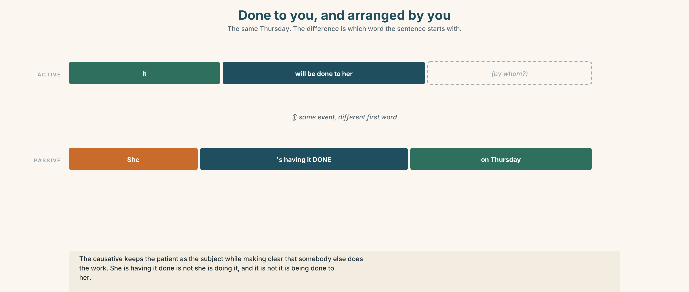{width=6.6in}

*Done to you, and arranged by you — The same Thursday. The difference is which word the sentence starts with.*

### 3C · Know

| | Shape | Example |
|---|---|---|
| **modal passive** | *modal* + *be* + pp | *It **can be done** under local.* |
| **perfect passive** | *have* + *been* + pp | *She **has been referred**.* |
| **modal perfect passive** | *modal* + *have been* + pp | *She **should have been seen** in March.* |
| **causative: have** | *have* + object + pp | *She**'s having it done** on Thursday.* |
| **causative: get** | *get* + object + pp | *I **got my notes sent** to the clinic.* |

> **The causative keeps the patient as the subject** while making it clear that somebody else is
> doing the work. *She is having it done* is not the same as *she is doing it*, and it is not
> the same as *it is being done to her*: it says she arranged it, or that it is happening to her
> as part of her plan.

> ***get* is the informal causative** and carries a faint sense of effort or arrangement:
> *I got it sorted.* *Have* is neutral.

> **The verbs that take an object and a to-infinitive:** *cause, allow, permit, require, oblige,
> entitle, get.* The verbs that take an object and a bare infinitive: *make, let*.
> ✓ *They **made her wait**.* ✓ *They **required her to wait**.* ✗ *They made her to wait.*

> **In the passive, *make* takes *to* again.** ✓ *She **was made to wait**.*

### 3D · Use — controlled

> The patient (1) __________ (refer) by her own doctor in March. She
> (2) __________ (should / see) within eight weeks and was not. The procedure
> (3) __________ (can / do) under local, so she will be awake. She
> (4) __________ (have) it done on Thursday. Her daughter (5) __________ (not / allow) to
> interpret, because the policy (6) __________ (require) a registered interpreter, and she
> (7) __________ (make) to wait four hours for the telephone service on two previous occasions.
> Nothing (8) __________ (explain) to her in a language she speaks.

### 3E · Use — guided

Rewrite each one. **Keep the patient as the subject.**

1. A consultant will see her. *(passive)*
2. Somebody should have told her in March. *(modal perfect passive)*
3. The hospital is arranging her transport. *(causative)*
4. The policy does not permit her daughter to interpret. *(passive, patient as subject)*
5. They forced her to wait four hours. *(passive)*

### 3F · Use — open

**In pairs.** Describe a service you have used **twice**: once with the institution as the
subject, once with yourself. **Three minutes each.** Then say which version you would send as a
complaint, and which as a thank-you.

### 3G · Error autopsy

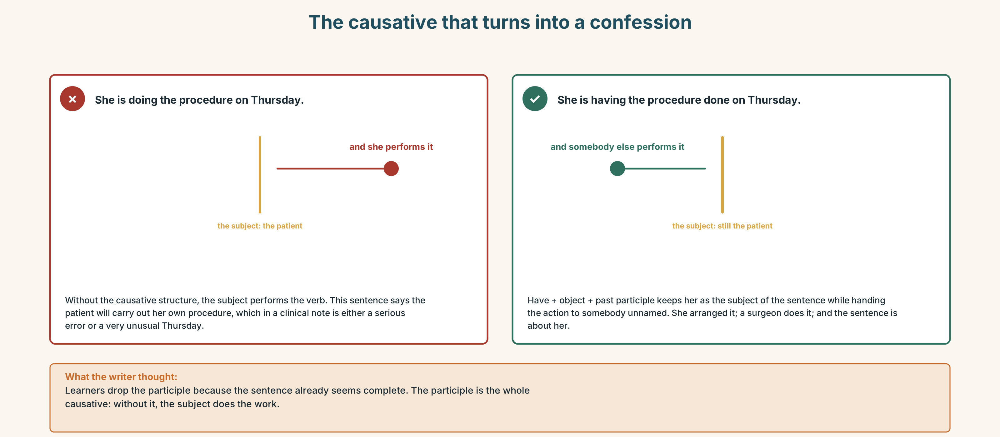{width=6.6in}

*The causative that turns into a confession — The causative that turns into a confession*

**Read both versions. Then say what the first one accidentally says about the patient.**

### 3H · Check — eight items

> 1. She ______ (refer) by her own doctor.
> 2. She ______ (should / see) in March.
> 3. It ______ (can / do) under local.
> 4. She ______ (have) it done on Thursday.
> 5. Her daughter ______ (not / allow) to interpret.
> 6. She ______ (make) to wait four hours.
> 7. The policy ______ (require) a registered interpreter.
> 8. I ______ my notes ______ (send) to the clinic. *(causative, informal)*

**0–4 →** Workbook pp. 34–37. **5–6 →** Part 6. **7–8 →** page 129.

---

## Part 4 · Speaking ◆ **C · THE PERFORMANCE**

### 4A · Fluency starter — two subjects

Your teacher names an everyday service. Each learner describes it twice in thirty seconds:
**once with the institution as the subject, once with the customer.**
**Four services. Four rounds.**

### 4B · The functional core — the patient's side

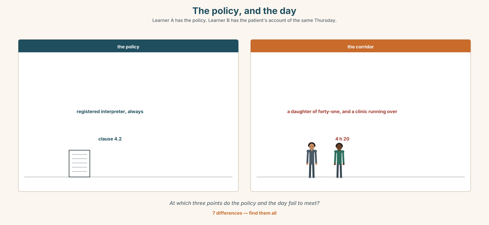{width=6.6in}

*The policy, and the day — Learner A has the policy. Learner B has the patient's account of the same Thursday.*

**Language Bank**

| | |
|---|---|
| **what happens to you** | *You'll be taken to…* · *You'll be seen by…* · *It'll be done under…* |
| **what you arrange** | *You can have it done…* · *Get your notes sent…* |
| **what you are entitled to** | *You're entitled to…* · *You're not required to…* |
| **the honest gap** | *Nobody will tell you…* · *You will have to ask.* |

**Information gap.** Learner A has the policy. Learner B has the patient's account of the same
day. **Find the three points at which the policy and the day do not meet.**

### 4C · The performance — two minutes ⏺

Explain **a procedure entirely from the patient's side**. **Two minutes.** You must include:

> what will be done to you · who will do it, named by role · what you have to arrange yourself ·
> one thing nobody will tell you

**Record it.**

### 4D · Observer

One person listens for **one thing**: was the patient the subject of every sentence?

### 4E · Three criteria

> ☐ Did I use a modal passive and a causative?
> ☐ Is the patient the subject throughout?
> ☐ Did I name one thing the patient has to ask for?

---

## Part 5 · Reading ◆ **A · THE WORLD**

### 5A · Predict

A feature article. The title is
**"The four-hour queue exists to protect her, and she has never used it."**
**What do you expect the argument to be?** Two sentences.

### 5B · Read — two minutes and a quarter

---

**The four-hour queue exists to protect her, and she has never used it**

The policy is correct. I want to establish that before anything else, because the piece that
writes itself here is the one about heartless bureaucracy, and that piece would be wrong.

Family members should not interpret in clinical settings. The reasons are not procedural. A
daughter will soften a prognosis. A son will omit a question about alcohol. A sixteen-year-old
will be asked to say the word *terminal* to her own mother, and will be in a room for the rest of
her life afterwards. Every hospital that has studied this has found the same thing, and the
policy that follows from it is the right policy.

The telephone interpreting service that the policy requires has a median wait of four hours and
eleven minutes.

So here is what actually happens, and it happens in every hospital I have visited in three
countries. The clinician makes a judgement. For anything serious, they wait, and the four hours
are real and the clinic runs over and other patients are seen late and the policy works. For
anything routine — a consent for a minor procedure, a discharge explanation, a follow-up date —
they use the daughter, and they do not write down that they used the daughter, because writing it
down is a breach.

The policy therefore achieves two things. It protects patients in serious conversations, which is
what it was for. And it produces a permanent, undocumented, unmeasurable practice in routine
ones, which is the opposite of what a policy is for.

The queue is not a bureaucratic failure attached to a good policy. The queue **is** the policy,
in the sense that a rule that cannot be followed is a rule about what gets written down.

---

### 5C · Comprehension — eight questions

1. What does the writer establish first, and why?
2. **What three reasons does the writer give for the policy?**
3. What is the median wait for the telephone service?
4. What do clinicians do for serious conversations, and what does that cost?
5. **What do they do for routine ones, and why is it not recorded?**
6. What are the two things the writer says the policy achieves?
7. **What does the writer mean by "the queue is the policy"?**
8. Why does the writer say the obvious article would be wrong?

### 5D · Vocabulary in context

Guess from the text. Then check.

> the piece that writes itself · soften a prognosis · a median wait · the clinic runs over ·
> a breach

### 5E · The counter-text

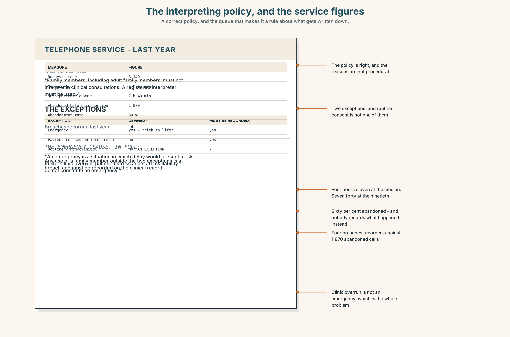{width=6.6in}

*The interpreting policy, and the service figures — A correct policy, and the queue that makes it a rule about what gets written down.*

**Read the interpreting policy and the service's own figures, and answer.**

1. What does the policy forbid, and what two exceptions does it list?
2. **What is the median wait, and what is the ninetieth-percentile wait?**
3. How many requests were made last year, and how many were abandoned?
4. What does the policy say must be recorded when a family member is used?
5. One clause defines an emergency. What does it say, and what does it not cover?

### 5F · Two texts

The feature says routine use of family members is **undocumented**.
The policy requires every such use to be **recorded on the clinical record**.

**Put those two facts together. What does the abandonment figure actually measure?**
Three sentences.

---

## Part 6 · Vocabulary Lab 2 ◆ **B · THE SYSTEM**

### Who made whom do what

### 6A · Sort — bare infinitive, *to*-infinitive, or past participle?

Three columns.

> require · have · allow · permit · make · entitle · cause · let · get · oblige

**Two of them change column when they go into the passive.** Which?

### 6B · Chunk completion

1. She **had it ______** on Thursday.
2. He **got the notes ______** to the clinic himself.
3. She **was made ______ wait** four hours.
4. You **are not ______ to** pay for this.
5. The request was made **on ______ of** the patient by her daughter.
6. Rosa **saw ______** the transport when nobody else would.

### 6C · Three that look like permission and are not

**entitle · oblige · require**

> *Entitle* gives a right. *Oblige* and *require* impose a duty, and *oblige* has a flavour of
> moral pressure that *require* does not.

**Which fits each sentence, and what changes with the others?**

1. You are ______ to an interpreter at every appointment.
2. The clinician is ______ to record the use of a family member.
3. Nobody is ______ to explain why they did not.

### 6D · The fixed expression

> **f** **I had it taken out.**

**Say it twice:** as somebody describing a decision they made, and as somebody describing
something that happened to them. **The words do not change. What does?**

### 6E · Contrast Clinic

Eight items. Passive, modal passive, perfect passive or causative.

1. They can do it under local.
2. They forced her to wait.
3. I arranged for my notes to be sent. *(informal)*
4. Somebody should have seen her in March.
5. She is arranging for somebody to do it on Thursday.
6. Nobody explained it to her.
7. Her doctor referred her.
8. The policy does not permit her daughter to interpret.

---

## Part 7 · Pronunciation & Fluency Lab ◆ **B · THE SYSTEM**

### The word that moves the stress

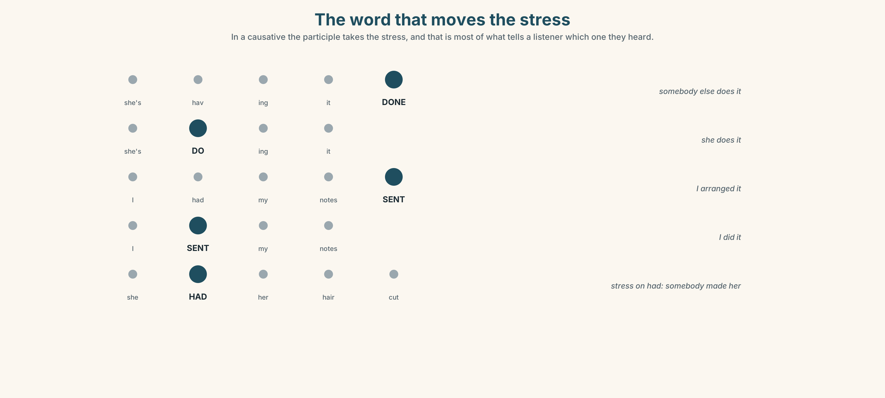{width=6.6in}

*The word that moves the stress — In a causative the participle takes the stress, and that is most of what tells a listener which one they heard.*

### 7A · Hear 🔊 Track 6.3

> She's having it **DONE**. — somebody else does it
> She's **DO**ing it. — she does it
> I had my notes **SENT**. — I arranged it
> I **SENT** my notes. — I did it

**The participle takes the stress in a causative, and that is most of what tells a listener
which one they are hearing.**

### 7B · Say

Say all four. Then say the sentence three times, faster:

> *She's having it done on Thursday and she's having the notes sent on Monday.*

### 7C · Make it mean something

Say these two:

> *She had her hair cut.* *(a hairdresser)*
> *She had her hair cut.* *(said with stress on HAD — somebody made her)*

**English uses the same words for an arrangement and a misfortune.** Which one is which, here?

### 7D · Fluency 30 ⏺

Thirty seconds: **three things you have had done and three things you did.**
Three times, faster, with the stress in the right place.

---

## Part 8 · Writing ◆ **C · THE PERFORMANCE**

### A procedure, from the patient's side · 160 words

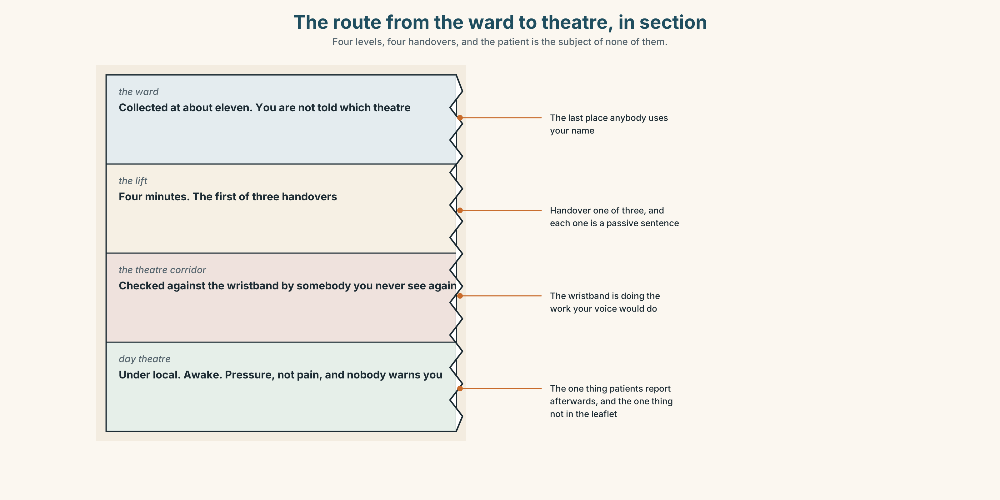{width=6.6in}

*The route from the ward to theatre, in section — Four levels, four handovers, and the patient is the subject of none of them.*

### 8A · Read the model

> You will be collected from the ward at about eleven, by a porter, on a trolley, and you will
> not be told which of the three theatres you are going to. `[everything in the passive, the
> patient as subject, and one thing stated as a known absence]`
>
> It is done under local, which means you will be awake and you will feel pressure and not pain,
> and nobody will warn you about the pressure. `[what the words actually mean, in the patient's
> body]`
>
> You can have a relative with you until the door and not past it. You will have to ask for this.
> `[one entitlement and one causative, and the entitlement comes with a condition]`
>
> You will be sent home the same day with a letter you cannot read, because it is written to your
> own doctor. Ask for the second paragraph to be explained before you leave.
> `[the discharge, and one piece of advice that could only come from somebody who has watched
> this]`

**Questions about the writer's choices:**

1. Every sentence has *you* as the subject. **What does that do that a procedure leaflet does
   not?**
2. Three sentences say what you will **not** be told. **Is that hostile to the hospital?**
3. The last sentence is an instruction to the reader. **Why end there?**

### 8B · The anti-model

> The procedure is performed under local anaesthetic and takes approximately twenty minutes.
> Patients are usually discharged the same day. A discharge summary will be sent to your GP.
> Please contact the department if you have any questions.

Correct English, and the patient appears twice as an object and never as a person.
**Rewrite the first sentence with the patient as the subject**, and name one thing the leaflet
does not say.

### 8C · Plan

> what will be done to you, and by whom → what the technical words mean in your body →
> one thing you have to arrange or ask for → what happens afterwards, and the one question to ask

### 8D · Write — 160 words
### 8E · Peer review — three criteria

> ☐ Is the patient the subject of every sentence?
> ☐ Is there one causative and one modal passive?
> ☐ Is there one thing the reader is told to ask for?

### 8F · Write it again · 8G · Publish

On the wall, with the policy from Part 5E beside it.

---

## Part 9 · The File ◆ **A · THE WORLD + C · THE PERFORMANCE**

# CULTURE FILE · The Misunderstanding

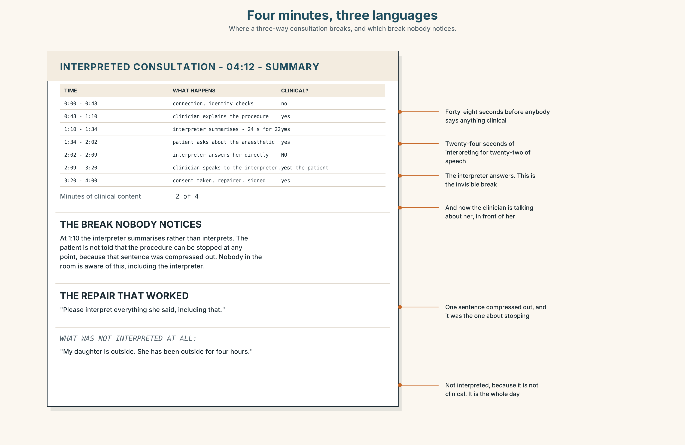{width=6.6in}

*Four minutes, three languages — Where a three-way consultation breaks, and which break nobody notices.*

### 9A · Four minutes, three languages 🔊 Track 6.4

A consultation with a telephone interpreter, a clinician and a patient. **Listen to all of it.**

1. How many of the four minutes are spent on the actual clinical content?
2. **Where does the first misunderstanding happen, and who repairs it?**
3. One thing the patient says is not interpreted at all. What, and why might that be?

### 9B · Where a three-way conversation breaks

> *the clinician speaks to the interpreter instead of the patient* ·
> *the interpreter summarises rather than interprets* ·
> *the patient answers the interpreter rather than the clinician* ·
> *a technical word has no equivalent and is left in English*

**Which of the four happens in the recording?** And **which of the four is the hardest to
notice?**

### 9C · The repairs

Match each to its job.

> *"I'm going to speak to you, and she will say it in your language."* ·
> *"Please interpret everything she said, including that."* ·
> *"Can you tell me what word you used for that?"* ·
> *"I'll say that again more simply."*

> setting up the triangle · asking for completeness · checking a term ·
> repairing your own English

### 9D · Your turn

In threes. **Twelve minutes.** One clinician, one patient, one interpreter — and the
"interpreter" may only use words of two syllables or fewer.
**The clinician must use all four repair moves at least once.**

### 9E · Transfer

**Find one three-way conversation this week** — any language, any setting. Write down who spoke
to whom, and whether anybody was talked about in their presence.

---

## Part 10 · Mediation & Interaction ◆ **C · THE PERFORMANCE**

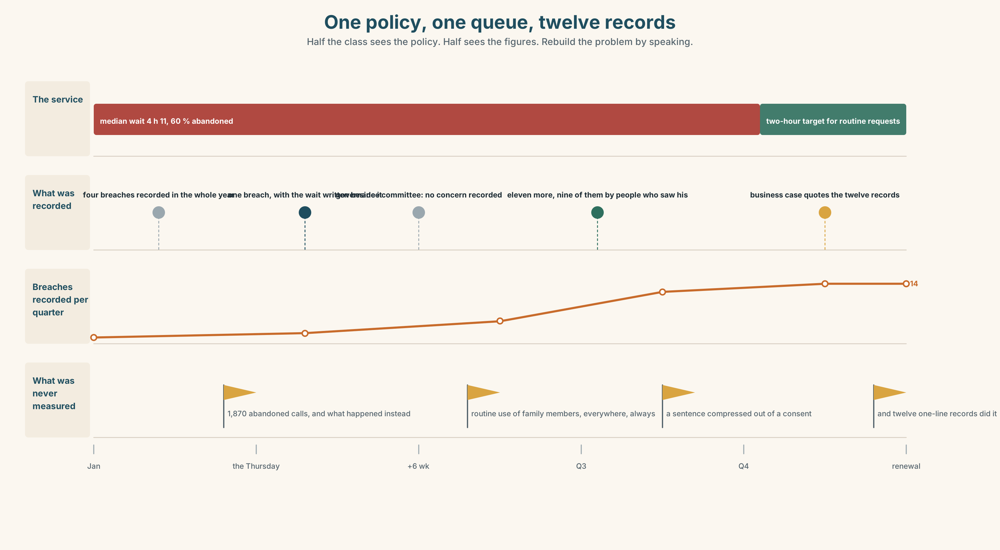{width=6.6in}

*One policy, one queue, twelve records — Half the class sees the policy. Half sees the figures. Rebuild the problem by speaking.*

### 10A · Relay

Half the class sees the policy. Half sees the service's figures. **Rebuild the whole problem by
speaking.** Twelve minutes.

### 10B · Simplify

Explain the interpreting policy from Part 5E to a patient's daughter in the corridor.
**Five sentences only, and not one of them may blame her.**

> **Plan:** what the rule is → why it exists → what it means for today →
> what she can do → what she is entitled to ask for

### 10C · Compress

The feature in Part 5 into **forty words**, keeping the last paragraph's point.

### 10D · Online

Write **one message** to the interpreting service: you have the median wait, you have the
abandonment rate, and you are asking for one specific thing for routine consultations.

### 10E · Your language

Does your language have a causative like *have something done*?
**Say *I had my hair cut* and *I cut my hair* in both languages.** Which one needs more words?

---

## Part 11 · The Decision ◆ **C · THE PERFORMANCE**

# The daughter in the corridor

A patient is being consented for a minor procedure. Her daughter, who is forty-one, is in the
corridor. The policy requires a registered interpreter. The telephone service has a median wait
of four hours and eleven minutes.

- **Follow the policy.** Wait. The clinic runs over by four hours, eleven other patients are
  seen late, and three of them will not be seen today.
- **Use the daughter and record it.** The policy permits this in an emergency only, so recording
  it is recording a breach, which goes to the governance committee and names the clinician.
- **Use the daughter and do not record it.** What happens in practice, everywhere, and the reason
  nobody knows how often.

### 11A · The evidence

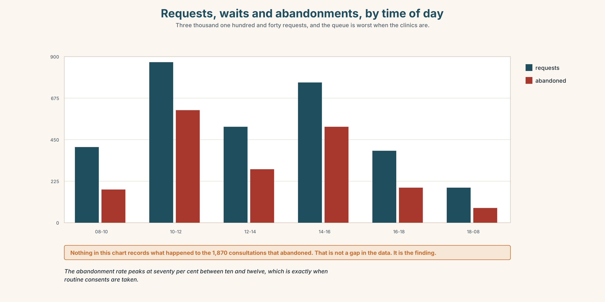{width=6.6in}

*Requests, waits and abandonments, by time of day — Three thousand one hundred and forty requests, and the queue is worst when the clinics are.*

1. **The policy and the service figures** from Part 5E — and the emergency clause.
2. **The chart** — requests, waits and abandonments, by time of day.
3. **The voice.** The patient, through her daughter, thirty seconds: *"I would like my daughter
   to do it. I am aware that she will make it sound better than it is. I have thought about that
   and I would still like my daughter to do it, and nobody has asked me this before, which is the
   part I mind."*

### 11B · Talk about it

In fours. Everybody speaks twice. Use the frame.

> *If the policy is followed, ______ . If it is not, ______ . What is not recorded is ______ .*

**Words you can use:** *consent · procedure · interpreter · carer · be allowed to · be required
to · on behalf of · written consent · nobody explained any of it*

### 11C · Decide

Write **three sentences**. Choose, say why, and name what it costs.

> I think the clinician should ______________________ ,
> because ______________________ .
> What this costs is ______________________ .

### 11D · Model decision

> Use the daughter, record it as a breach, and write one line saying why. The third option is the
> one everybody takes and it is the only one that guarantees nothing will ever change, because an
> unmeasured practice cannot be argued about. A breach that appears eleven times in a quarter,
> each with a four-hour wait beside it, is the only document that will ever get the service
> funded properly. It costs the clinician something. That is what it is for.

### 11E · The Reveal

> **What happened.** Dr Benítez recorded it as a breach, with one line: *telephone service wait
> 4 h 20 min, routine consent, patient's explicit request, daughter aged 41.*
>
> The governance committee reviewed it in six weeks and recorded no concern. Over the following
> quarter, eleven more breaches were recorded with similar lines, nine of them by people who had
> seen his.
>
> The service's contract was renegotiated in the following year with a two-hour target for
> routine requests. The business case quotes the twelve breach records, which are the only
> documentation of the problem that has ever existed in this hospital.

**He took the cost. Nine people copied him. And twelve one-line records did what four years of
complaints had not.**

> **Was it the right decision?** Say why — and say what should happen to the policy now.

---

## Part 12 · Landing ◆ **all three lines**

### 12A · Recycle — twelve items

> 1. She ______ (refer) by her own doctor.
> 2. She ______ (should / see) in March.
> 3. It ______ (can / do) under local.
> 4. She ______ (have) it done on Thursday.
> 5. She ______ (make) to wait four hours.
> 6. **Written ______** is required for anything that breaks the skin.
> 7. The operation has been **brought ______** to Thursday.
> 8. Rosa **saw ______** the transport herself.
> 9. *(Unit 5)* By March we ______ (pass) eleven thousand.
> 10. *(Unit 4)* There ______ (must / be) two of them. *(past)*
> 11. *(A2.1 U7)* The garlic ______ (grow) in China.
> 12. *(A2.2 U4)* She ______ me that she had checked it. *(said / told)*

### 12B · Consolidate

**One hundred and sixty words.** A procedure or a service, entirely from the position of the
person it is done to. One modal passive, one causative, one entitlement, one thing nobody will
tell them.

### 12C · Can-do, with evidence

| I can… | My evidence | Sure? |
|---|---|---|
| use passives and causatives to keep one person as the subject | Part 3H score | ◯ ◑ ● |
| explain a procedure from the patient's side in two minutes | Part 4C recording | ◯ ◑ ● |
| write 160 words in which the reader is the subject | Part 8 draft 2 | ◯ ◑ ● |
| run a three-way conversation through an interpreter | Part 9D role play | ◯ ◑ ● |

### 12D · Replay ⏺

Find your forty-five seconds from Part 0C. Listen. **Record it again.**
**Two sentences:** what is different, and whether you now know who did it.

### 12E · Glossary — forty-five items, as a map

> **THE JOURNEY** · referral · be referred to · admission · consultation · be seen by · ward · theatre · procedure · discharge · follow-up
> **THE PAPERWORK** · consent · written consent · be put on a list · sign off · hand over
> **THE PEOPLE** · interpreter · carer · on behalf of · at the request of
> **THE PROCEDURE** · sedation · under local · have something done · have it done · get it done · I had it taken out
> **WHO DECIDES** · cause · arrange · get · make · let · allow · permit · require · ensure · oblige · entitle
> **WHAT YOU MAY AND MUST** · be made to · be allowed to · be required to · take over · see to
> **WHAT GOES WRONG** · bring forward · hold back · nobody explained any of it · they did it while I was asleep

### 12F · Next

> **Unit 7 · Did you stop to think, or stop thinking?**

# B1.2 · Unit 7 · Eleven Nights

> **English Animated** · *Weighing It Up* · Hospital Regional, Valdivia
> Student's Book pages 138–159 · 22 pp · ~11 hours

---

## Part 0 · The Big Picture ◆ **A · THE WORLD**

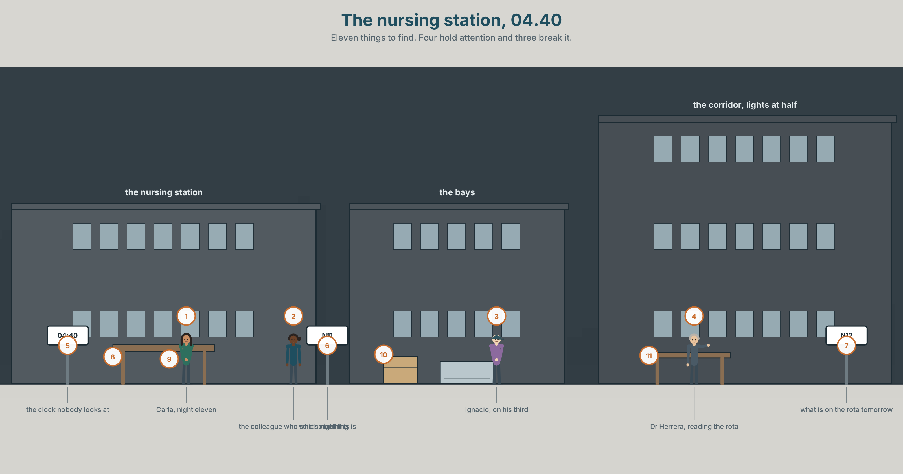{width=6.6in}

*The nursing station, 04.40 — Eleven things to find. Four hold attention and three break it.*

# Did you stop to think, or stop thinking?

**By the end of this unit you can describe a habit you tried to change, and what actually
happened. One hundred and sixty words.**

| ◆ **A · THE WORLD** | A rota that permits something nobody would design |
|---|---|
| ◆ **B · THE SYSTEM** | gerunds and infinitives where the meaning changes · *remember · stop · try · go on* · 23 words for attention and dependence · 22 verbs that take one form or the other · stress used to disambiguate |
| ◆ **C · THE PERFORMANCE** | A hundred and sixty words about something you tried to stop |

---

### 0A · Find it

**Find eleven things in this picture.** Four of them are there to hold somebody's attention and
three are there to break it.

> a nursing station screen · a coffee machine · a drug chart · a phone on silent ·
> a rota printed and amended by hand · a window with the blind down · a clock showing 04.40 ·
> a vending machine · a handover sheet · a chair somebody has slept in · a bell

### 0B · Guess it

**Two things in this picture have been there for eleven nights.** Which, and how can you tell?

### 0C · Say it ⏺

**Record forty-five seconds.** *Name a habit you have tried to change. What happened in the first
week, and what happened after that?* You will record it again at the end of this unit.

---

## Part 1 · Vocabulary Lab 1 ◆ **B · THE SYSTEM**

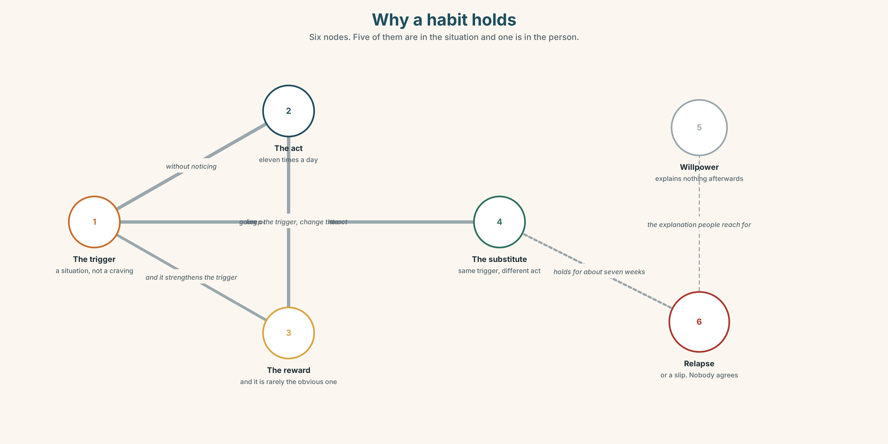{width=6.6in}

*Why a habit holds — Six nodes. Five of them are in the situation and one is in the person.*

### 1A · Meet — the words of trying to stop

Match each word to one place on the map.

> **habit** · **dependence** · **craving** · **trigger** · **relapse** · **willpower** ·
> **abstinence** · **substitute** · **reward** · **focus**

### 1B · Sort — about the body, the mind, or the situation?

Three columns.

> dependence · distraction · trigger · relapse · craving · willpower · attention ·
> substitute · abstinence

**One of them is almost always described as being in the mind and is almost always in the
situation.** Which?

### 1C · Meet — three words people use about themselves

> **willpower** · **relapse** · **trigger**

**Willpower explains success. Relapse explains failure. A trigger explains neither.**
Which of the three is the most useful to somebody trying to change something, and why?

### 1D · Collocation Lab

Complete each one with one word.

1. She has been trying to **cut ______** for about eight months.
2. He stopped **cold ______** and lasted eleven days.
3. One cigarette is **a ______** . Three is a relapse. Nobody agrees where the line is.
4. After that weekend she was **back to ______ one** .
5. **The first ______** is the one everybody warns you about, and it is not the hard one.
6. She did it **______ noticing** , which is the part that frightened her.

### 1E · The fixed expressions

> **f** **I stopped for a bit.**
> **f** **I didn't even realise I'd done it.**

Two sentences people say about habits. One of them is about will and one is about attention.

> **Which is which, and which is harder to do anything about?**

### 1F · Own it

Think of something you have tried to stop or start. Tell a partner **four sentences**: what it
was, what triggered it, what you replaced it with, and what actually happened.

---

## Part 2 · Listening ◆ **A · THE WORLD**

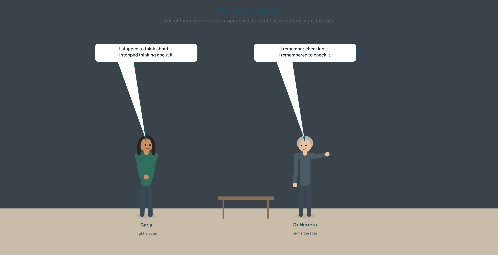{width=6.6in}

*Eleven nights — One of them has not slept properly in a fortnight. One of them signs the rota.*

### 2A · Eleven nights 🔊 Track 7.1

**Before you listen.** Carla has worked eleven nights in a row. She chose to. The rota permits
it. **Guess: what is the argument against it?**

**Listen once. One question.** Why has she done it?

**Listen again. Complete the table.**

| | What they say | What they are actually worried about |
|---|---|---|
| Carla | | |
| Dr Herrera | | |
| the rota policy | | |

**Listen again. Choose the best answer.**

1. The rota permits up to **seven / ten / twelve** consecutive nights.
2. She is doing it because of **money / preference / childcare**.
3. The colleague's objection is about **both / her / the patients**.
4. Her own account of the eleventh night is **confident / vague / detailed**.

**Noticing.** Four sentences from the recording.

1. *I stopped to think about it.*
2. *I stopped thinking about it.*
3. *I remember checking it.*
4. *I remembered to check it.*

**Each pair is the same verb with a different form, and the meanings are not related.**
**Explain each pair in one sentence.**

### 2B · Decoding clinic 🔊 Track 7.2

Thirty seconds of Carla. Four jobs.

1. How many *-ing* forms can you count after a verb?
2. In *I stopped to think*, where is the stress?
3. Catch the two numbers she gives.
4. She says one thing that she then cannot date. Which?

> Transcripts, page 156.

---

## Part 3 · Grammar Lab 1 ◆ **B · THE SYSTEM**

### The same verb, two different sentences

### 3A · Notice

Look at the four sentences in Part 2.

1. In sentence 1, what did she stop? In sentence 2?
2. In sentence 3, which happened first — the remembering or the checking? In sentence 4?
3. **Is there a pattern across the two pairs?** Look at which form points backwards.
4. Try *try doing* and *try to do*. **Which one is an experiment and which is an effort?**
5. Try *"I regret to tell you"* and *"I regret telling you."* **Which one is bad news for the
   listener?**

### 3B · See

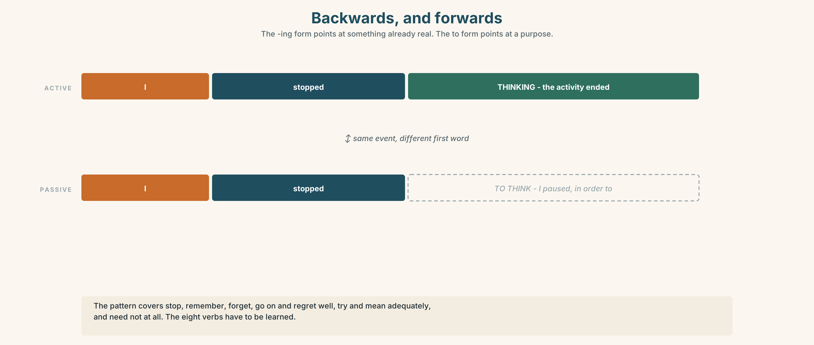{width=6.6in}

*Backwards, and forwards — The -ing form points at something already real. The to form points at a purpose.*

### 3C · Know

| Verb | + *-ing* | + *to* |
|---|---|---|
| **stop** | stop the activity · *I stopped **thinking**.* | stop in order to do · *I stopped **to think**.* |
| **remember** | the memory of doing it · *I remember **checking**.* | the duty, then the act · *I remembered **to check**.* |
| **forget** | *I'll never forget **seeing** it.* | *I forgot **to check**.* |
| **try** | an experiment · *Try **changing** the time.* | an effort · *Try **to change** it.* |
| **go on** | continue the same thing · *He went on **talking**.* | move to a new thing · *He went on **to say** that…* |
| **regret** | about the past · *I regret **saying** it.* | about now · *I regret **to say** that…* |
| **mean** | involve · *It means **leaving** at four.* | intend · *I meant **to leave** at four.* |
| **need** | passive meaning · *It needs **fixing**.* | *I need **to fix** it.* |

> **The pattern, as far as there is one.** The ***-ing* form points backwards or inwards**: to
> something already happening, or already remembered. The ***to* form points forwards**: to a
> purpose, an intention or a duty.

> **It is not a reliable rule.** It covers *stop*, *remember*, *forget*, *go on* and *regret*
> well, *try* and *mean* adequately, and *need* not at all. The eight verbs have to be learned.

> **Why it matters.** *I stopped checking* and *I stopped to check* are opposite accounts of the
> same night, and a hospital record contains both sentences.

### 3D · Use — controlled

> She remembers (1) __________ (check) the chart at about two. She does not remember
> (2) __________ (check) it again after four, and she thinks she forgot
> (3) __________ (do) it. At some point she stopped (4) __________ (think) about whether she
> was tired, which she says is different from (5) __________ (stop / notice). She tried
> (6) __________ (drink) coffee, which did not work, and then she tried
> (7) __________ (stay) on her feet, which did. The rota needs (8) __________ (change), and
> everybody has meant (9) __________ (raise) it for two years.

### 3E · Use — guided

Write both versions, and say what each means.

1. stop + smoke
2. remember + lock the door
3. try + ask somebody else
4. go on + explain
5. regret + tell him

### 3F · Use — open

**In pairs.** Tell the story of one shift, one day or one journey, using **six** of the eight
verbs in Part 3C. Your partner's job is to catch any form that produces the wrong meaning.

### 3G · Error autopsy

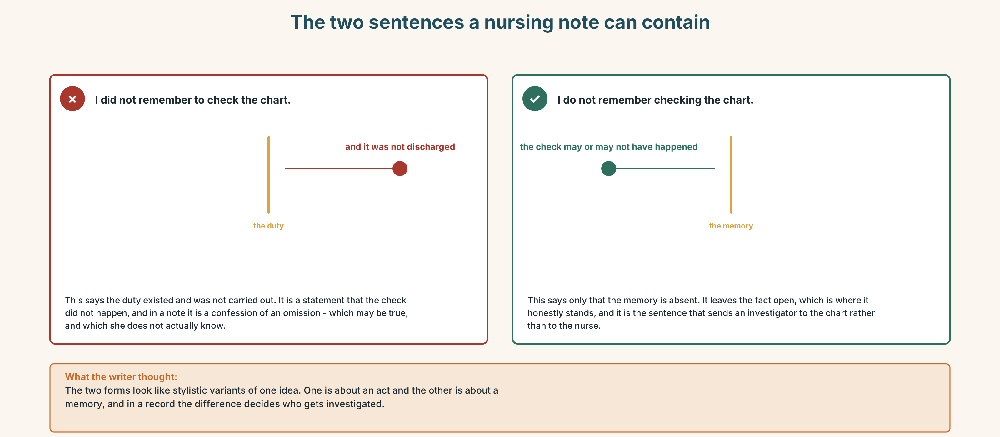{width=6.6in}

*The two sentences a nursing note can contain — The two sentences a nursing note can contain*

**Read both versions. Then say which of the two you would want in a nursing note, and why.**

### 3H · Check — eight items

> 1. I stopped ______ (think) about it. *(the thinking ended)*
> 2. I stopped ______ (think) about it. *(I paused in order to)*
> 3. I remember ______ (check) it. *(the memory)*
> 4. I remembered ______ (check) it. *(the duty)*
> 5. Try ______ (change) the time. *(an experiment)*
> 6. He went on ______ (talk) for an hour. *(the same thing)*
> 7. He went on ______ (say) that it was unsafe. *(a new thing)*
> 8. The rota needs ______ (change).

**0–4 →** Workbook pp. 40–43. **5–6 →** Part 6. **7–8 →** page 151.

---

## Part 4 · Speaking ◆ **C · THE PERFORMANCE**

### 4A · Fluency starter — the pair

Your teacher gives a verb from Part 3C. **Each learner must produce both forms in two sentences
about their own life, in thirty seconds.** Nobody may use the example from the table.

### 4B · The functional core — describing an attempt

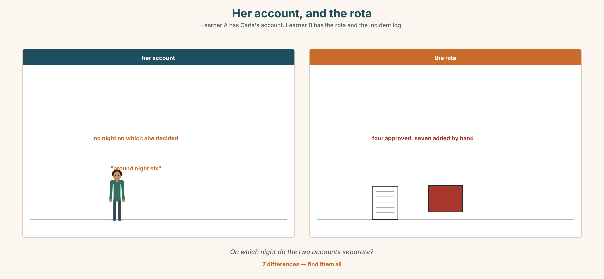{width=6.6in}

*Her account, and the rota — Learner A has Carla's account. Learner B has the rota and the incident log.*

**Language Bank**

| | |
|---|---|
| **the attempt** | *I tried cutting down.* · *I tried to stop completely.* |
| **what it involved** | *It meant leaving at…* · *That meant giving up…* |
| **what happened** | *I kept going for…* · *I went back to it when…* |
| **the honest ending** | *I didn't even realise I'd done it.* · *I stopped for a bit.* |

**Information gap.** Learner A has Carla's account of the eleven nights. Learner B has the rota
and the incident log for the same period. **Find the night on which the two accounts separate.**

### 4C · The performance — two minutes ⏺

Describe **a habit you tried to change**. **Two minutes.** You must include:

> what you tried, in both forms — the experiment and the effort · what it meant giving up ·
> what the trigger turned out to be · what actually happened

**Record it.**

### 4D · Observer

One person listens for **one thing**: did the speaker explain the failure with willpower?

### 4E · Three criteria

> ☐ Did I use three of the eight verbs in both forms?
> ☐ Did I name a trigger rather than a weakness?
> ☐ Is the ending honest rather than tidy?

---

## Part 5 · Reading ◆ **A · THE WORLD**

### 5A · Predict

An interview transcript. The title is
**"I didn't choose the eleventh one. I just didn't stop."**
**What do you expect the difference to be?** Two sentences.

### 5B · Read — two minutes and a quarter

---

**"I didn't choose the eleventh one. I just didn't stop"**
*Interview, night nurse, eleven consecutive nights*

**Why eleven?**
It wasn't eleven at the start. It was four, and then somebody was off, and then I picked up two
because the money is a third more at night and I have a daughter at university in Santiago.

**At what point did it become a decision?**
That is the question, and I have thought about it a lot since, and the honest answer is that it
never did. There is no night on which I decided to do eleven. Around night six I stopped thinking
about it. Not stopped caring — stopped thinking. It went from being a thing I was doing to being
the shape of the week.

**Did anybody say anything?**
Yes. On night eight somebody asked if I was all right and I said I was fine, and I remember
saying it and I remember meaning it.

**And on the eleventh?**
I remember checking a drug chart at about two. I do not remember checking it again, and I
believe I did, and I cannot tell you that I did.

Nothing happened. I want to be clear that nothing happened. That is not a defence, it is the
thing that worries me, because if something had happened there would be a form and a review and
the rota would have been looked at, and because nothing happened there is nothing except this
conversation.

**What would you say to somebody on night six?**
I would say: you are not going to notice night seven. Nobody notices night seven. Get somebody
else to count for you, because the thing that goes first is not your hands and it is not your
judgement, it is your ability to be the person who is counting.

---

### 5C · Comprehension — eight questions

1. How did eleven nights come about?
2. **What does she say happened around night six, and what distinction does she draw?**
3. What happened on night eight?
4. **What is the difference between what she remembers at two and what she remembers after?**
5. Why does she say "nothing happened" is not a defence?
6. What would have existed if something had happened?
7. What is her advice to somebody on night six?
8. **What does she say goes first?**

### 5D · Vocabulary in context

Guess from the text. Then check.

> picked up two · the shape of the week · a defence · looked at · the person who is counting

### 5E · The counter-text

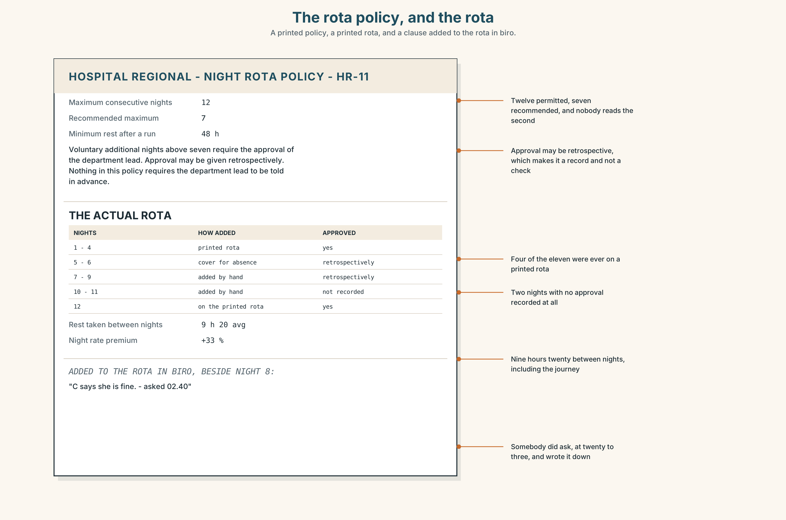{width=6.6in}

*The rota policy, and the rota — A printed policy, a printed rota, and a clause added to the rota in biro.*

**Read the rota policy and the actual rota, and answer.**

1. What is the maximum number of consecutive nights the policy permits?
2. **What does the policy say about voluntary additional shifts, and who has to approve them?**
3. How many of the eleven nights were approved, and by whom?
4. What does the policy say about the rest period, and what rest did she actually have?
5. One clause has been added by hand to the printed rota. What does it say?

### 5F · Two texts

The interview says **nothing happened**.
The incident log for those eleven nights shows **two near misses, neither involving her**.

**Put those two facts together. What does the log actually tell you?** Three sentences.

---

## Part 6 · Vocabulary Lab 2 ◆ **B · THE SYSTEM**

### Verbs that take one form, and verbs that take both

### 6A · Sort — *-ing*, *to*, or both with a change of meaning?

Three columns.

> go on · try · forget · manage · consider · stop · avoid · prefer · decide · remember ·
> need · resent · enjoy

**Two of them take both with almost no change of meaning.** Which?

### 6B · Chunk completion

1. She **carried ______** working because nobody told her to stop.
2. He has **put ______** raising it for two years.
3. **I meant ______** say something on night eight.
4. He went **______ to** say that the rota was the problem.
5. She **gave ______** on the fourth attempt and started again in March.
6. It took three weeks to **keep ______** it completely.

### 6C · The three that are nearly a rule

**stop · remember · forget**

> With all three, the *-ing* form points at something already real, and the *to* form points at
> something intended.

**Write one pair for each, from your own life, and then say whether the rule held.**

### 6D · The fixed expression

> **f** **I meant to.**

Two words that are an apology, an explanation and a refusal of responsibility at once.

> **Write the sentence before it and the sentence after it**, for somebody being honest and for
> somebody who is not.

### 6E · Contrast Clinic

Eight items. Choose the form and explain the meaning you have chosen.

1. I remember ______ (lock) it.
2. Try ______ (finish) by four.
3. He went on ______ (work) all night.
4. I remembered ______ (lock) it.
5. I stopped ______ (smoke) in 2019.
6. Try ______ (move) it to the other side.
7. The window needs ______ (clean).
8. On the way home I stopped ______ (buy) milk.

---

## Part 7 · Pronunciation & Fluency Lab ◆ **B · THE SYSTEM**

### Stress as the disambiguator

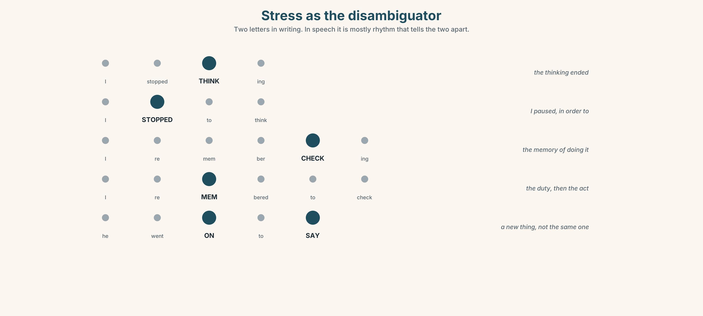{width=6.6in}

*Stress as the disambiguator — Two letters in writing. In speech it is mostly rhythm that tells the two apart.*

### 7A · Hear 🔊 Track 7.3

> I stopped **THINK**ing. — the thinking ended
> I **STOPPED** to think. — I paused, in order to
> I remember **CHECK**ing. — the memory
> I re**MEM**bered to check. — the duty

**The two forms are distinguished in writing by two letters and in speech mostly by rhythm.**

### 7B · Say

Say all four. Then say the pair three times, faster, keeping them distinct:

> *I stopped thinking about it, and then I stopped to think about it.*

### 7C · Make it mean something

Say these two:

> *I didn't remember to check.* *(I failed in a duty)*
> *I don't remember checking.* *(I may have done it)*

**One of these is a confession and one is a gap.** Which would you rather write in a note?

### 7D · Fluency 30 ⏺

Thirty seconds: **four of the eight verbs, in both forms, about last week.**
Three times, faster.

---

## Part 8 · Writing ◆ **C · THE PERFORMANCE**

### Something I tried to change · 160 words

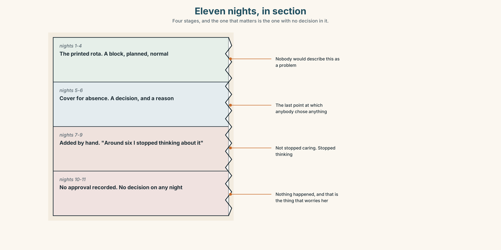{width=6.6in}

*Eleven nights, in section — Four stages, and the one that matters is the one with no decision in it.*

### 8A · Read the model

> I tried to stop completely in January and I lasted nine days. In March I tried cutting down to
> three a day, which worked for about seven weeks. `[the effort and the experiment, both named,
> and both with a number attached]`
>
> What I eventually noticed is that it was never about the cigarette. It was about going outside.
> I had been going outside eleven times a day for six years and I had stopped noticing that I did
> it. `[the trigger, and it is a situation and not a weakness]`
>
> I now go outside eleven times a day and stand in the same place. That is the whole of the
> change and it is not a triumph; it is a substitution and it may not hold.
> `[what actually happened, named accurately, and the writer refuses the ending the reader wants]`
>
> I did not use willpower. I do not think I have any. `[one sentence that disposes of the
> category]`

**Questions about the writer's choices:**

1. Both forms of *try* appear, with different results. **What does that let the writer show?**
2. The trigger is *going outside*, not the cigarette. **Why is that a better explanation?**
3. The last two sentences dismiss willpower. **Is that an excuse?**

### 8B · The anti-model

> I decided to give up and it was very difficult at first. There were times when I wanted to give
> in but I stayed strong and reminded myself why I was doing it. It just takes determination and
> the right mindset. Anyone can do it if they really want to.

Correct English, and useless to anybody trying. **Name three things it does not contain**,
and say what *the right mindset* is standing in for.

### 8C · Plan

> what you tried, in both forms, with numbers → the trigger, as a situation →
> what actually happened → one sentence that refuses the tidy ending

### 8D · Write — 160 words
### 8E · Peer review — three criteria

> ☐ Are both forms of at least one verb used, with different meanings?
> ☐ Is the trigger a situation rather than a character flaw?
> ☐ Does the ending refuse to be a triumph?

### 8F · Write it again · 8G · Publish

On the wall, with the rota from Part 5E beside it.

---

## Part 9 · The File ◆ **A · THE WORLD + C · THE PERFORMANCE**

# WORK FILE · The Process Note

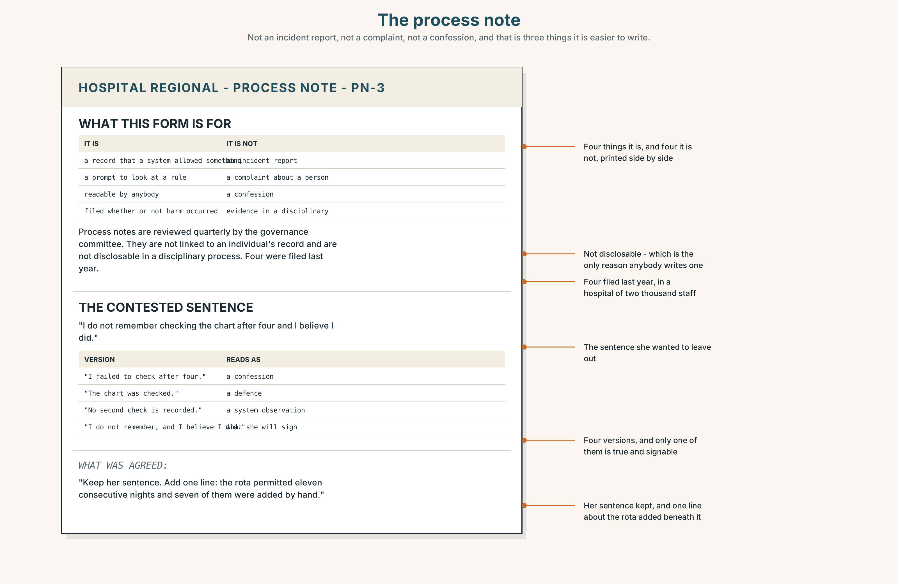{width=6.6in}

*The process note — Not an incident report, not a complaint, not a confession, and that is three things it is easier to write.*

### 9A · Writing it down afterwards 🔊 Track 7.4

Carla is asked to write a process note about the eleven nights. **Listen to her talking it
through with Dr Herrera first.**

1. What does Dr Herrera say the note is for, and what does she say it is not for?
2. **Which sentence does Carla want to leave out, and why?**
3. What is agreed about the sentence in the end?

### 9B · What a process note is

> **not** an incident report — nothing happened
> **not** a complaint — nobody broke a rule
> **not** a confession — she did nothing wrong
> **is** a record that a system permitted something

**Which of the four is hardest to hold on to while writing it?**

### 9C · The sentence that is hard to write

> *"I do not remember checking the chart after four and I believe I did."*

**Rewrite it four ways:** as a confession, as a defence, as a system observation, and as a
sentence you would be willing to sign. **Which of your four is longest?**

### 9D · Your turn

**Write a 120-word process note** about something that went nearly wrong anywhere in your life.
**Nothing may have actually happened.** Then swap, and your partner marks every sentence that is
about a person rather than a system.

### 9E · Transfer

**Find one thing this week that a system permits and nobody would design.**
Write one sentence about it that you would be willing to sign.

---

## Part 10 · Mediation & Interaction ◆ **C · THE PERFORMANCE**

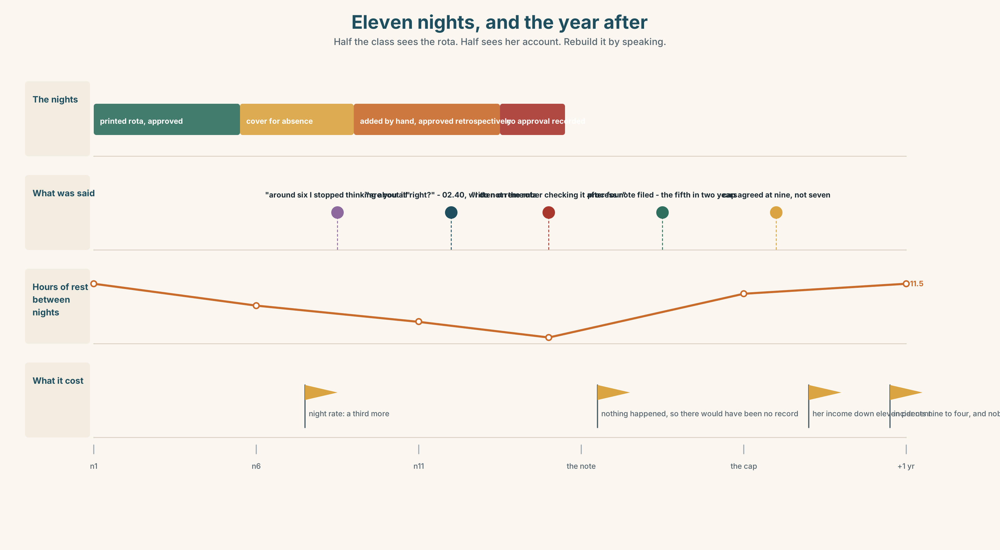{width=6.6in}

*Eleven nights, and the year after — Half the class sees the rota. Half sees her account. Rebuild it by speaking.*

### 10A · Relay

Half the class sees the rota and the policy. Half sees Carla's account.
**Rebuild the eleven nights by speaking.** Twelve minutes.

### 10B · Simplify

Explain the rota policy from Part 5E to somebody who has just been offered three extra nights.
**Five sentences only.**

> **Plan:** what the maximum is → what counts as voluntary → who has to approve it →
> what the rest period is → the one question to ask yourself on night six

### 10C · Compress

The interview in Part 5 into **forty words**, keeping the last answer.

### 10D · Online

Write **one message** to the rota lead: nothing happened, you are raising it anyway, and you are
proposing one specific change that costs nothing.

### 10E · Your language

How does your language distinguish *I stopped smoking* from *I stopped to smoke*?
**Say both in your language.** Does the difference come from the verb, the word order, or
something else?

---

## Part 11 · The Decision ◆ **C · THE PERFORMANCE**

# Night twelve

Carla has worked eleven consecutive nights. She chose to, she needs the money, the rota permits
it, and a colleague has said she thinks it is unsafe. Night twelve is on the rota.

- **Let it run.** She is an adult, the policy permits twelve, nothing has happened, and she needs
  the money more than anybody else needs her to stop.
- **Stop her.** Take her off night twelve. She loses a third of a night's pay, somebody has to
  cover, and she will be the nurse who was taken off.
- **Change the policy.** Cap consecutive nights at seven for everybody. It costs about four
  shifts a month in agency cover and it takes the decision away from the person least able to
  make it at four in the morning.

### 11A · The evidence

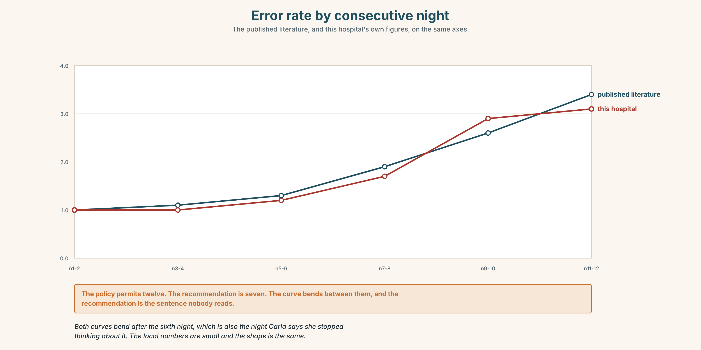{width=6.6in}

*Error rate by consecutive night — The published literature, and this hospital's own figures, on the same axes.*

1. **The policy and the rota** from Part 5E — and the clause added by hand.
2. **The chart** — error rates by consecutive night, from the literature and from this hospital.
3. **The voice.** Carla, thirty seconds: *"If you ask me now, I will tell you I am fine, and the
   reason I will tell you that is that I am the person being asked. I said it on night eight and
   I meant it. I would quite like somebody to stop asking me and decide."*

### 11B · Talk about it

In fours. Everybody speaks twice. Use the frame.

> *She stopped ______ , which is not the same as stopping ______ . So ______ .*

**Words you can use:** *habit · dependence · trigger · relapse · willpower · focus · attention ·
without noticing · the first week*

### 11C · Decide

Write **three sentences**. Choose, say why, and name what it costs.

> I think the hospital should ______________________ ,
> because ______________________ .
> What this costs is ______________________ .

### 11D · Model decision

> Change the policy to seven and pay for the agency cover. Carla is right that she is the worst
> possible person to ask, and so is everybody else at four in the morning on their eleventh
> night; that is not a fact about her character, it is what the research says about everybody's.
> A cap is the only version of this that does not require one tired person to be heroic about
> their own tiredness, and it costs four shifts a month, which is a number the hospital can
> actually decide about.

### 11E · The Reveal

> **What happened.** The cap was proposed at seven and agreed at nine, because seven would have
> required more agency cover than the budget had.
>
> Carla's income fell by about eleven per cent. She has said twice, publicly, that she supports
> the cap, and once, privately, that she has been looking at agency work herself because the
> agency rate for a single night is higher than the hospital's.
>
> Consecutive-night incidents in the following year fell from nine to four. Nobody can say
> whether that is the cap, because nine and four are small numbers and the department also got a
> new consultant in March.

**The cap worked, probably, and it cost one person eleven per cent of her income, definitely.**

> **Was it the right decision?** Say why — and say what should be done about the agency rate.

---

## Part 12 · Landing ◆ **all three lines**

### 12A · Recycle — twelve items

> 1. I stopped ______ (think) about it. *(the thinking ended)*
> 2. I stopped ______ (think). *(I paused in order to)*
> 3. I remember ______ (check) it. *(the memory)*
> 4. I remembered ______ (check) it. *(the duty)*
> 5. She has been trying to **cut ______** .
> 6. He stopped **cold ______** .
> 7. She was **back to ______ one** .
> 8. He has **put ______** raising it for two years.
> 9. *(Unit 6)* She ______ (have) it done on Thursday.
> 10. *(Unit 5)* By March we ______ (pass) eleven thousand.
> 11. *(A2.1 U6)* I can't afford ______ (replace) it.
> 12. *(A2.1 U6)* Do you mind ______ (wait) ?

### 12B · Consolidate

**One hundred and sixty words.** A habit you tried to change. Both forms of at least one verb,
a trigger that is a situation, and an ending that refuses to be tidy.

### 12C · Can-do, with evidence

| I can… | My evidence | Sure? |
|---|---|---|
| choose between *-ing* and *to* where the meaning changes | Part 3H score | ◯ ◑ ● |
| describe an attempt to change something in two minutes | Part 4C recording | ◯ ◑ ● |
| write 160 words that explain a failure without willpower | Part 8 draft 2 | ◯ ◑ ● |
| write a process note about a system, not a person | Part 9D note | ◯ ◑ ● |

### 12D · Replay ⏺

Find your forty-five seconds from Part 0C. Listen. **Record it again.**
**Two sentences:** what is different, and whether you have stopped explaining it with willpower.

### 12E · Glossary — forty-five items, as a map

> **THE HABIT** · habit · dependence · craving · trigger · relapse · abstinence · substitute · reward
> **THE MIND** · attention · focus · distraction · willpower · without noticing
> **TRYING** · cut down · cut out · cold turkey · keep off · the first week · a slip · give in · slip back · back to square one
> **WHAT PEOPLE SAY** · I stopped for a bit · I didn't even realise I'd done it · I meant to
> **BOTH FORMS, DIFFERENT MEANINGS** · remember · forget · stop · try · go on · mean · need · regret
> **ONE FORM ONLY** · resent · like · prefer · consider · carry on · put off
> **THE PAIRS** · stop to think · stop thinking · try doing · try to do · remember doing · remember to do · go on to

### 12F · Next

> **Unit 8 · Which *the* do you mean?**

# B1.2 · Unit 8 · Which Patients, Exactly

> **English Animated** · *Weighing It Up* · Hospital Regional, Valdivia
> Student's Book pages 160–181 · 22 pp · ~11 hours

---

## Part 0 · The Big Picture ◆ **A · THE WORLD**

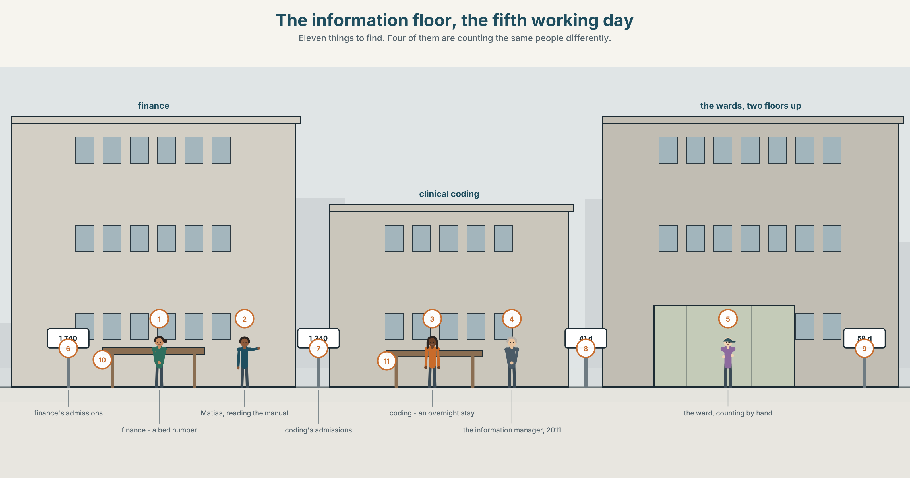{width=6.6in}

*The information floor, the fifth working day — Eleven things to find. Four of them are counting the same people differently.*

# Which *the* do you mean?

**By the end of this unit you can explain a category or a statistic to somebody outside the
field.**

| ◆ **A · THE WORLD** | One phrase in one report, read four ways by four departments |
|---|---|
| ◆ **B · THE SYSTEM** | articles and determiners, advanced · generic reference · 23 words for categories and data · 22 determiners and pointers · /ðə/ /ðiː/ /ə/ /eɪ/ |
| ◆ **C · THE PERFORMANCE** | A category explained to somebody who does not work here |

---

### 0A · Find it

**Find eleven things in this picture.** Four of them are counting the same people differently.

> a ward whiteboard · a monthly return · a screen showing a dashboard · a paper list on a clip ·
> a bed state board · a discharge book · a printout taped to a wall · a coding manual ·
> a sticky note correcting a number · a calculator · a report cover

### 0B · Guess it

**Two of these would give different totals for the same Tuesday.** Which, and why?

### 0C · Say it ⏺

**Record forty-five seconds.** *Name a word your job, course or family uses in a way an outsider
would misunderstand. Define it, and say what it excludes.* You will record it again at the end of
this unit.

---

## Part 1 · Vocabulary Lab 1 ◆ **B · THE SYSTEM**

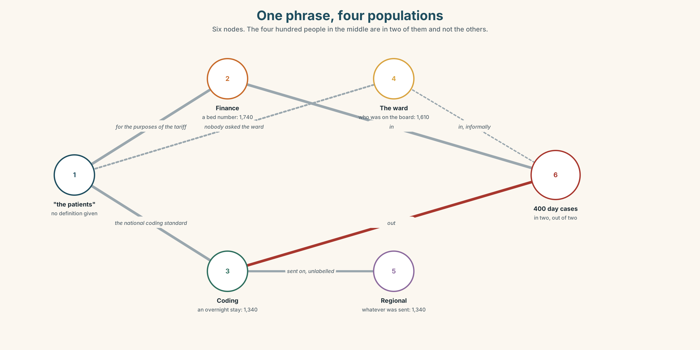{width=6.6in}

*One phrase, four populations — Six nodes. The four hundred people in the middle are in two of them and not the others.*

### 1A · Meet — the words of a definition

Match each word to one place on the map.

> **category** · **definition** · **criterion** · **boundary** · **overlap** · **ambiguity** ·
> **classification** · **data** · **dataset** · **field**

### 1B · Sort — the thing, the rule, or the problem?

Three columns.

> category · dataset · ambiguity · criterion · overlap · classification · record ·
> boundary · abstraction

**One of them only exists because two of the others were drawn carelessly.** Which?

### 1C · Meet — two words that look like each other

> **data** · **dataset**

**Data is what was recorded. A dataset is a decision about which data to keep.**
**Which of the two can be wrong without anybody having made a mistake?**

### 1D · Collocation Lab

Complete each one with one word.

1. **By ______** , a patient who has not been admitted is not an admission.
2. **In ______** the two definitions agree. **In ______** they differ by about four hundred.
3. That is **a working ______** and has never been written down.
4. **For the ______ of** this report, a day case counts as an admission.
5. Day cases **fall ______** admissions in finance and not in clinical coding.
6. If you **break ______** the figure by department, three of the four disagree.

### 1E · The fixed expressions

> **f** **It depends what you mean by.**
> **f** **Four departments, four meanings.**

The first one is said in a meeting. The second one is written in a report, once, by somebody who
has given up.

> **Write the sentence that provokes the first and the sentence that follows the second.**

### 1F · Own it

Think of a number that your workplace, school or household quotes. Tell a partner
**four sentences**: what it counts, what it excludes, who produced it, and whether anybody has
checked the definition.

---

## Part 2 · Listening ◆ **A · THE WORLD**

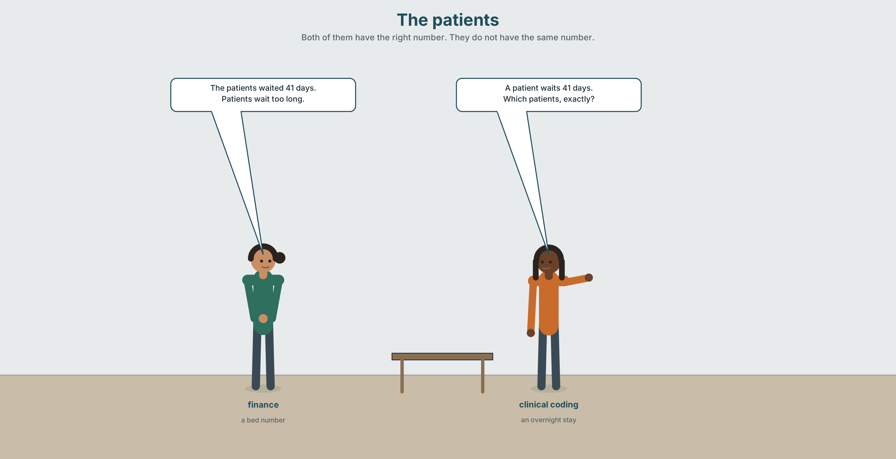{width=6.6in}

*The patients — Both of them have the right number. They do not have the same number.*

### 2A · The patients 🔊 Track 8.1

**Before you listen.** A report says *the patients waited an average of 41 days*. Four
departments read this differently. **Guess: what is the biggest disagreement?**

**Listen once. One question.** What do the four readings have in common?

**Listen again. Complete the table.**

| Department | What they read *the patients* as | Their number |
|---|---|---|
| finance | | |
| clinical coding | | |
| the ward | | |
| the regional office | | |

**Listen again. Choose the best answer.**

1. The four numbers range from **38 to 44 / 38 to 58 / 41 to 41**.
2. The report's own definition is **in a footnote / in the text / nowhere**.
3. The phrase that causes it is **an average / 41 days / the patients**.
4. Nobody has raised it because **nobody noticed / everybody noticed / nobody owns the report**.

**Noticing.** Four sentences from the recording.

1. *Patients wait too long.*
2. *The patients waited 41 days.*
3. *A patient waits 41 days.*
4. *The patient waited 41 days.*

**One of these is about everybody. One is about a group. One is about a type. One is about one
person.** Which is which?

### 2B · Decoding clinic 🔊 Track 8.2

Thirty seconds. Four jobs.

1. How many times is *the* said as /ðiː/ rather than /ðə/?
2. Does the speaker say /ə/ or /eɪ/ for *a*, and when does it change?
3. Catch the four numbers.
4. One speaker stresses *the*. What is she doing?

> Transcripts, page 157.

---

## Part 3 · Grammar Lab 1 ◆ **B · THE SYSTEM**

### Three ways of saying everybody

### 3A · Notice

Look at the four sentences in Part 2.

1. In sentence 1, how many patients?
2. In sentence 3, is there a particular patient?
3. **Sentences 1 and 3 both make a general claim. What is the difference in feel?**
4. Sentence 4 uses *the* with a singular. **Can that ever be generic? Try: *The patient is the
   last person consulted.***
5. Try *"The patients wait too long."* **Who exactly is waiting?**

### 3B · See

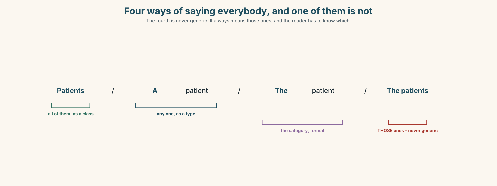{width=6.6in}

*Four ways of saying everybody, and one of them is not — The fourth is never generic. It always means those ones, and the reader has to know which.*

### 3C · Know

| | Shape | Means |
|---|---|---|
| **bare plural** | *Patients wait too long.* | all of them, everywhere, as a class |
| **a / an + singular** | *A patient waits 41 days.* | any one, as a representative type |
| **the + singular** | *The patient is the last to be consulted.* | the category as an institution — formal |
| **the + plural** | *The patients waited 41 days.* | **a specific group**, already identified |

> **The trap is the fourth row.** *The patients* is never generic in ordinary English. It always
> means *those patients*, and if the reader does not already know which ones, the sentence is
> broken.

> **Determiners that narrow further:** *certain patients* (some, unspecified) ·
> *given patients* (specified, in a formula) · *such patients* (of the kind just described) ·
> *the respective departments* (each its own) · *the former / the latter* (of two just named).

> **The phrases that carry a definition:** *by definition · for the purposes of · in principle ·
> in practice · as a whole · in the main*.

> **Why it matters.** A report that says *the patients* without having said which ones is a
> report that four departments will read four ways, and all four will be reading in good faith.

### 3D · Use — controlled

> (1) __________ patients wait too long. That is a general claim and nobody disputes it.
> (2) __________ patients in this report waited 41 days on average — but
> (3) __________ report does not say which patients, and (4) __________ four departments
> reading it each have (5) __________ working definition of their own. For
> (6) __________ purposes of finance, a day case is an admission. In clinical coding it is not.
> (7) __________ latter definition produces a figure four hundred lower, and
> (8) __________ ambiguity has never been raised because nobody owns the report.

### 3E · Use — guided

Rewrite each one so it says what the writer means.

1. *The patients are waiting longer.* *(meaning: all patients, everywhere)*
2. *Patients waited 41 days.* *(meaning: the 1,340 in this report)*
3. *A patient is entitled to an interpreter.* *(meaning: every patient, as a rule)*
4. *The patient is not consulted.* *(meaning: the category, in a formal sentence)*
5. *Such patients are excluded.* *(meaning: the ones described in the previous sentence)*

### 3F · Use — open

**In pairs.** Take any number from your own life — a price, a grade, a waiting time. State it
four times: about everybody, about a type, about a specific group, and about the category as an
institution. **Your partner says which is which.**

### 3G · Error autopsy

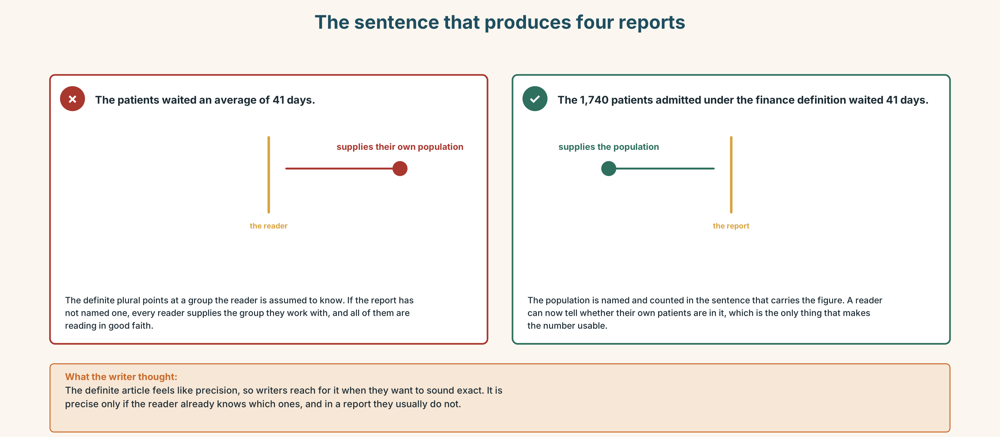{width=6.6in}

*The sentence that produces four reports — The sentence that produces four reports*

**Read both versions. Then say how many different reports the first sentence produces.**

### 3H · Check — eight items

> 1. ______ patients wait too long. *(all, everywhere)*
> 2. ______ patients in this report waited 41 days. *(this group)*
> 3. ______ patient waits 41 days. *(a representative type)*
> 4. ______ patient is the last to be consulted. *(the category, formal)*
> 5. ______ patients are excluded. *(of the kind just described)*
> 6. ______ departments each produced their own figure. *(each its own)*
> 7. Of the two definitions, ______ produces a lower figure. *(the second)*
> 8. ______ the purposes of this report, a day case is an admission.

**0–4 →** Workbook pp. 46–49. **5–6 →** Part 6. **7–8 →** page 173.

---

## Part 4 · Speaking ◆ **C · THE PERFORMANCE**

### 4A · Fluency starter — four generalities

Your teacher names a group: *nurses · students · landlords*. Each learner must produce
**four sentences** about them, one of each kind from Part 3C.
**Four groups. Four rounds.**

### 4B · The functional core — explaining a category

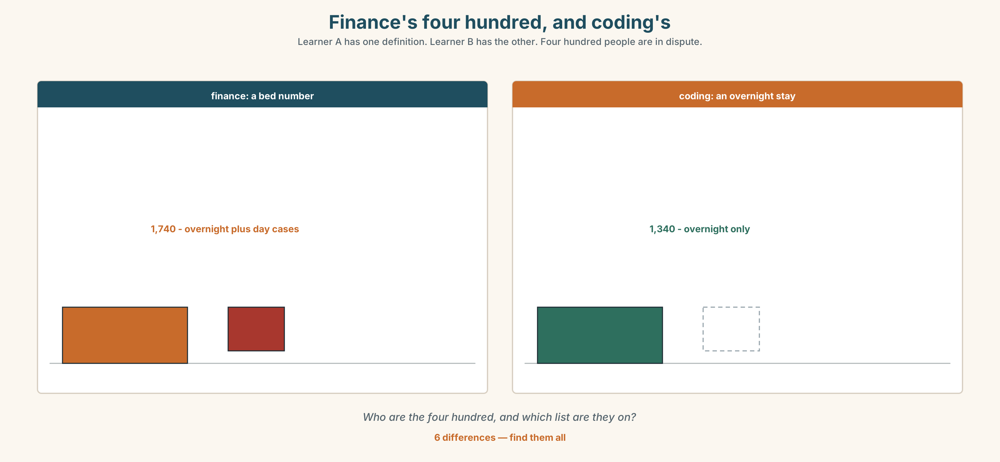{width=6.6in}

*Finance's four hundred, and coding's — Learner A has one definition. Learner B has the other. Four hundred people are in dispute.*

**Language Bank**

| | |
|---|---|
| **the definition** | *By definition…* · *For the purposes of this…* |
| **the boundary** | *What falls under it is…* · *What it excludes is…* |
| **the honest gap** | *In principle… in practice…* · *It depends what you mean by…* |
| **the check** | *Which ones, exactly?* · *Does that include…?* |

**Information gap.** Learner A has finance's definition. Learner B has clinical coding's.
Neither sees the other. **Find the four hundred people who are in one and not the other.**

### 4C · The performance — two minutes ⏺

Explain **a category or a statistic** to somebody outside your field. **Two minutes.**
You must include:

> the definition · one thing it includes that an outsider would not expect ·
> one thing it excludes · the number, and which definition produced it

**Record it.**

### 4D · Observer

One person listens for **one thing**: could the listener now tell whether a given case is in or
out?

### 4E · Three criteria

> ☐ Did I use three of the four generic forms correctly?
> ☐ Did I say what the category excludes?
> ☐ Is every number attached to a definition?

---

## Part 5 · Reading ◆ **A · THE WORLD**

### 5A · Predict

An archive document: the minutes of the meeting at which a definition was set, in 2011.
The title is **"Item 7: what counts as an admission."**
**What do you expect the meeting to have decided?** Two sentences.

### 5B · Read — two minutes

---

**MINUTES OF THE INFORMATION GROUP — 9 NOVEMBER 2011**
**Item 7: what counts as an admission**

**7.1** The group considered whether day cases should be counted as admissions.

**7.2** Finance stated that day cases must be counted as admissions, because the tariff is paid
on an admission basis and a day case that is not counted is a day case that is not paid for.

**7.3** Clinical coding stated that day cases must not be counted as admissions, because the
national coding standard defines an admission as requiring an overnight stay, and that a local
variation would make the hospital's returns incomparable with every other hospital's.

**7.4** Both positions were agreed to be correct.

**7.5** It was agreed that each department would continue to use its own definition for its own
purposes, and that the matter would be reviewed when a single reporting system was introduced.
Mr Vergara noted that this effectively meant the hospital had two admission figures. The chair
noted that it had always had two admission figures and that the meeting had simply written that
down.

**7.6** **ACTION:** Information manager to prepare a note setting out both definitions, for
circulation to all departments.

---

*Archivist's note, added 2024: no note was circulated. The single reporting system was introduced
in 2019 and uses the finance definition without stating that it does so. The clinical coding
definition remains in use for national returns. Item 7 has not been reviewed.*

---

### 5C · Comprehension — eight questions

1. What was the question in front of the group?
2. **What was finance's argument, and what was clinical coding's?**
3. What did the group conclude about the two positions?
4. What was agreed, and what did Mr Vergara point out?
5. **What did the chair say, and what is the force of it?**
6. What action was agreed?
7. What does the archivist's note say happened?
8. **Which definition is now in use, and does the system say so?**

### 5D · Vocabulary in context

Guess from the text. Then check.

> on an admission basis · a local variation · incomparable · effectively meant ·
> without stating that it does so

### 5E · The counter-text

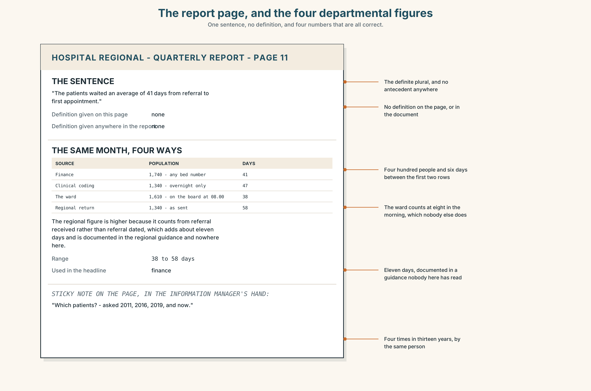{width=6.6in}

*The report page, and the four departmental figures — One sentence, no definition, and four numbers that are all correct.*

**Read the report page and the four departmental figures, and answer.**

1. What does the headline sentence say, and what does it not say?
2. **What are the four figures, and what is the range between them?**
3. Where, if anywhere, is a definition given?
4. Which of the four departments' figures is used in the regional return?
5. One sticky note has been attached to the page. What does it say?

### 5F · Two texts

The 2011 minutes record **an agreed action** to circulate both definitions.
The report has **no definition anywhere on it**.

**Put those two facts together. Whose fault is the report?** Three sentences.

---

## Part 6 · Vocabulary Lab 2 ◆ **B · THE SYSTEM**

### Pointing precisely

### 6A · Sort — narrowing, generalising, or pointing back?

Three columns.

> as a whole · such · the latter · the former · given · any · respective · specific ·
> generic · certain · particular

### 6B · Chunk completion

1. **In the ______** , the two figures agree to within fifty.
2. **A kind ______** working definition has been in use since 2011.
3. **The sort ______** patient this excludes is the one who comes in and goes home.
4. **The one in ______** is the regional return.
5. What does *admission* **stand ______** in this system?
6. The paragraph **refers ______** a definition that is not in the document.

### 6C · Three that look like precision

**certain · given · particular**

> *Certain* means *some, and I am not telling you which*. *Given* means *specified, in a formula*.
> *Particular* means *this one, as opposed to others*.

**Which fits each sentence, and what changes?**

1. ______ patients are excluded from this figure.
2. For a ______ month, the figure is produced on the fifth working day.
3. This ______ figure is the one in the regional return.

### 6D · The fixed expression

> **f** **Which patients, exactly?**

Three words that stop a meeting. **Write the two sentences before it and the sentence after it,**
in a meeting where it is welcome and in one where it is not.

### 6E · Contrast Clinic

Eight items. Choose the article or determiner, and name the meaning.

1. ______ patient waits 41 days. *(a type)*
2. ______ patient is rarely consulted. *(the category, formal)*
3. ______ departments produced their own figures. *(each its own)*
4. Of the two, ______ is lower. *(the second)*
5. For a ______ month, the return is due on the fifth. *(in a formula)*
6. ______ patients waited 41 days. *(this group)*
7. ______ patients wait too long. *(everybody)*
8. ______ patients are excluded. *(the kind just described)*

---

## Part 7 · Pronunciation & Fluency Lab ◆ **B · THE SYSTEM**

### Two words, four sounds

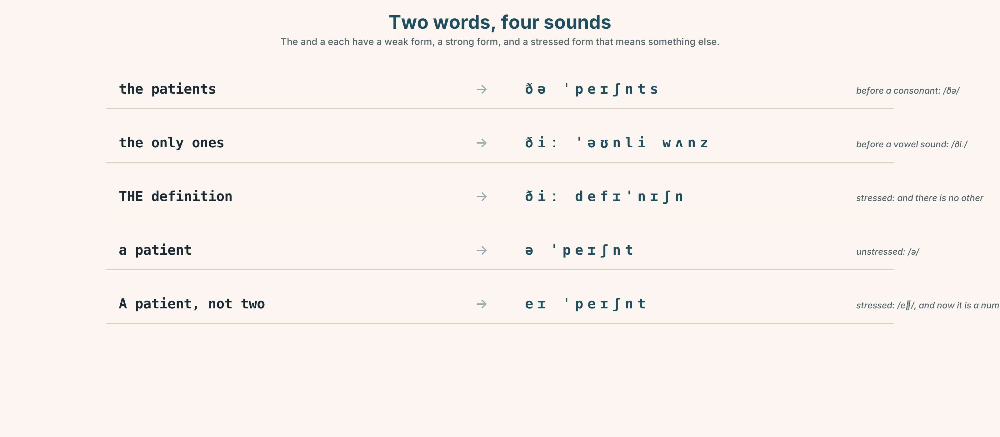{width=6.6in}

*Two words, four sounds — The and a each have a weak form, a strong form, and a stressed form that means something else.*

### 7A · Hear 🔊 Track 8.3

> the patients → /ðə/ — before a consonant
> the only ones → /ðiː/ — before a vowel sound
> **THE** patients → /ðiː/ — stressed, meaning *the real ones*
> a patient → /ə/ · **A** patient, not two → /eɪ/

### 7B · Say

Say all four. Then say the sentence three times, faster:

> *The patients in the appendix are the only ones the definition covers.*

### 7C · Make it mean something

Say these two:

> *It's a definition.* *(one of several)*
> *It's THE definition.* *(and there is no other)*

**In the 2011 minutes, which of the two is true?**

### 7D · Fluency 30 ⏺

Thirty seconds: **four generic statements about any group you like, one of each kind.**
Three times, faster.

---

## Part 8 · Writing ◆ **C · THE PERFORMANCE**

### A category, explained · 160 words

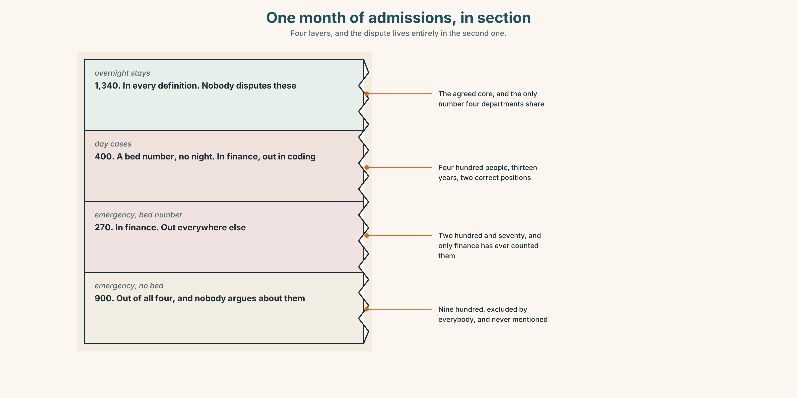{width=6.6in}

*One month of admissions, in section — Four layers, and the dispute lives entirely in the second one.*

### 8A · Read the model

> An admission, in this report, means any patient given a bed number, whether or not they stayed
> overnight. `[the definition, in the first sentence, and it names the test: a bed number]`
>
> That includes day cases, which most people would not call an admission, and about four hundred
> of them a month fall into this figure. It excludes patients seen and discharged from the
> emergency department without a bed number, of whom there are about nine hundred.
> `[one surprising inclusion and one surprising exclusion, both with numbers]`
>
> Clinical coding uses the national standard, which requires an overnight stay. Their figure for
> the same month is 1,340 lower. Neither definition is wrong.
> `[the other definition, the size of the gap, and a refusal to adjudicate]`
>
> If somebody quotes an admission figure at you, the only useful question is whether a day case
> is in it. `[what the reader should do, in one sentence]`

**Questions about the writer's choices:**

1. The definition names a physical test — a bed number. **Why is that better than a principle?**
2. Both the inclusion and the exclusion have numbers. **What would be lost without them?**
3. The last sentence is an instruction. **Who is it for?**

### 8B · The anti-model

> Admissions data is collected in accordance with agreed definitions and is subject to ongoing
> review. Figures may vary between departments due to differing methodologies. Users should
> exercise caution when making comparisons.

Correct English, and it will not help anybody. **Name three things it does not say**,
and say what *differing methodologies* is standing in for.

### 8C · Plan

> the definition, with a physical test → one surprising inclusion, with a number →
> one surprising exclusion, with a number → the other definition and the size of the gap →
> the one question a reader should ask

### 8D · Write — 160 words
### 8E · Peer review — three criteria

> ☐ Can a reader now sort a case into the category or out of it?
> ☐ Is there an inclusion and an exclusion, both with numbers?
> ☐ Does the piece avoid saying one definition is right?

### 8F · Write it again · 8G · Publish

On the wall, with the report page from Part 5E beside it.

---

## Part 9 · The File ◆ **A · THE WORLD + C · THE PERFORMANCE**

# STUDY FILE · Exam Decode

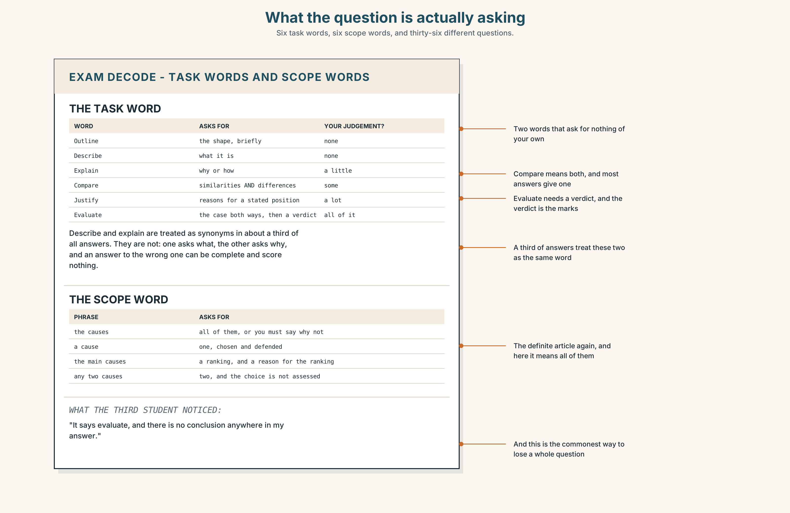{width=6.6in}

*What the question is actually asking — Six task words, six scope words, and thirty-six different questions.*

### 9A · What the question is actually asking 🔊 Track 8.4

Matías and two others are reading past exam questions. **Listen.**

1. Which word in the first question do they spend longest on, and why?
2. **Which question turns out to be asking for something different from what it looks like?**
3. What does the third student notice that the other two have missed?

### 9B · The words that set the task

> **describe · explain · compare · evaluate · justify · outline**

**Rank them by how much of your own judgement each one requires.**
Then say which two are most often treated as synonyms and are not.

### 9C · The words that set the scope

> *the* · *a* · *all* · *any* · *the main* · *one*

**"Describe the causes"** and **"describe a cause"** and **"describe the main causes"** are three
different questions.

**Write what each of the three is asking for**, and say which is hardest to fail.

### 9D · Your turn

**Take one question from your own field.** Underline the task word and the scope word.
**Then write, in one sentence, what a complete answer would contain.**
Swap, and your partner marks whether your sentence answers the question that was asked.

### 9E · Transfer

**Find one question you have been asked this week** — in writing, at work, anywhere.
Identify its task word and its scope word, and say whether you answered both.

---

## Part 10 · Mediation & Interaction ◆ **C · THE PERFORMANCE**

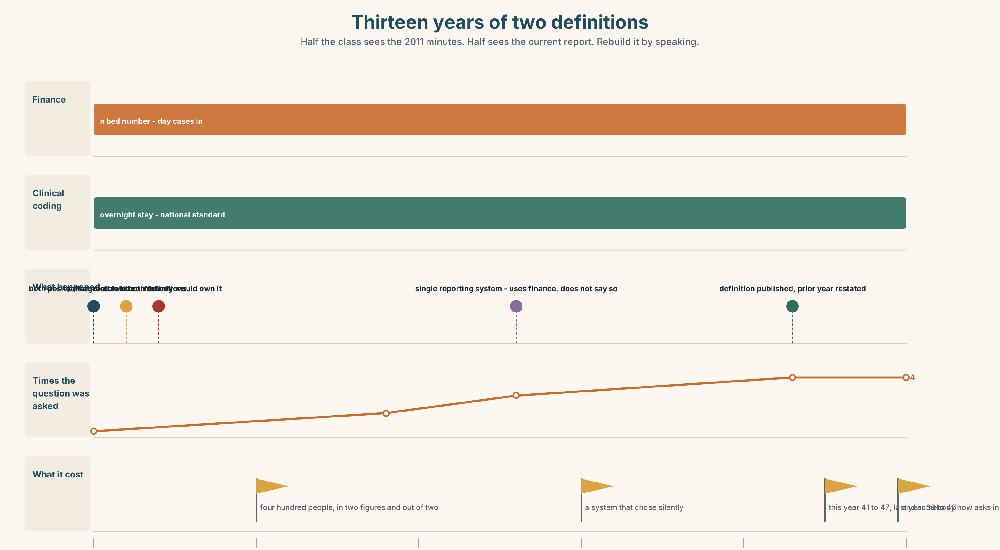{width=6.6in}

*Thirteen years of two definitions — Half the class sees the 2011 minutes. Half sees the current report. Rebuild it by speaking.*

### 10A · Relay

Half the class sees the 2011 minutes. Half sees the current report.
**Rebuild thirteen years by speaking.** Twelve minutes.

### 10B · Simplify

Explain the admission definition from Part 5E to a journalist who has asked for the figure.
**Five sentences only.**

> **Plan:** what the figure counts → what it excludes → what the other figure is →
> why both are honest → which one you are giving them

### 10C · Compress

The 2011 minutes into **forty words**, keeping the chair's remark.

### 10D · Online

Write **one message** to the information manager: you have found two figures for one month, you
have the 2011 minutes, and you are asking for one specific thing by one specific date.

### 10E · Your language

Does your language have articles? **If not, how does it distinguish *patients wait too long*
from *the patients waited 41 days*?** Say both in your language and explain to a partner what
carries the difference.

---

## Part 11 · The Decision ◆ **C · THE PERFORMANCE**

# One figure, four readings

A report says *the patients waited an average of 41 days*. Four departments each read it as their
own population. Their figures range from 31 to 58.

- **Publish a definition.** One sentence at the top of the report. It would make the figure
  comparable and it would make this year's figure look worse than last year's, which was
  produced the other way.
- **Publish all four.** Honest, unusable, and the regional office will pick one.
- **Leave it.** Everybody carries on reading their own number, as they have since 2011, and the
  report continues to be quoted in four meetings a month.

### 11A · The evidence

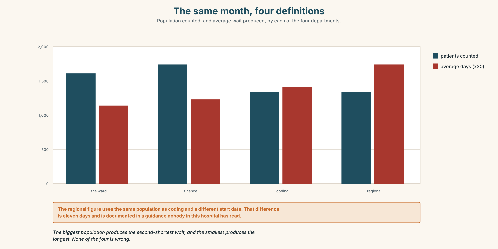{width=6.6in}

*The same month, four definitions — Population counted, and average wait produced, by each of the four departments.*

1. **The report page and the four figures** from Part 5E — and the sticky note.
2. **The chart** — the four populations, their overlaps, and the four hundred people in dispute.
3. **The voice.** The information manager, thirty seconds: *"I was asked to write that note in
   2011. I did write it. I could not find anybody who would own it, because owning it would mean
   choosing, and the two people who would have had to agree had both correctly been told that
   their definition was the right one."*

### 11B · Talk about it

In fours. Everybody speaks twice. Use the frame.

> *By definition ______ . In practice ______ . So the figure means ______ .*

**Words you can use:** *category · definition · criterion · boundary · overlap · ambiguity ·
classification · in principle · for the purposes of · fall under*

### 11C · Decide

Write **three sentences**. Choose, say why, and name what it costs.

> I think the hospital should ______________________ ,
> because ______________________ .
> What this costs is ______________________ .

### 11D · Model decision

> Publish the definition and publish last year's figure recalculated on the same basis, in the
> same table. The reason this has survived thirteen years is that fixing it makes somebody's
> number worse, and the only way to remove that cost is to restate the comparison at the same
> time. One sentence and one recalculated column turn an embarrassment into a correction, and a
> correction is a thing an organisation can survive.

### 11E · The Reveal

> **What happened.** The definition went in, with the recalculated prior year beside it. The
> figure for this year rose from 41 to 47 days and last year's rose from 39 to 46, so the
> direction of travel was unchanged and the headline was *waiting times up by one day*.
>
> Three departments adopted the published definition within a quarter. Clinical coding did not,
> and could not, because the national standard binds them.
>
> The report is still quoted in four meetings a month. In two of them somebody now asks which
> definition, which the information manager describes as the entire return on thirteen years.

**One sentence and one column. Three of four departments. And somebody now asks the question in
half the meetings.**

> **Was it the right decision?** Say why — and say what should be done about clinical coding.

---

## Part 12 · Landing ◆ **all three lines**

### 12A · Recycle — twelve items

> 1. ______ patients wait too long. *(everybody)*
> 2. ______ patients waited 41 days. *(this group)*
> 3. ______ patient waits 41 days. *(a type)*
> 4. **By ______** , a day case is not an overnight stay.
> 5. **For the ______ of** this report, it is an admission.
> 6. Day cases **fall ______** admissions in finance.
> 7. If you **break ______** the figure, three departments disagree.
> 8. **The sort ______** patient this excludes comes in and goes home.
> 9. *(Unit 7)* I stopped ______ (think) about it. *(the thinking ended)*
> 10. *(Unit 6)* She ______ (have) it done on Thursday.
> 11. *(A2.2 U10)* ______ truth matters. *(in general)*
> 12. *(A2.2 U9)* ______ of it can be carried over. *(zero, uncountable)*

### 12B · Consolidate

**One hundred and sixty words.** A category from your own world, explained to an outsider.
A definition with a physical test, one inclusion and one exclusion with numbers, and the one
question a reader should ask.

### 12C · Can-do, with evidence

| I can… | My evidence | Sure? |
|---|---|---|
| choose between four ways of making a general statement | Part 3H score | ◯ ◑ ● |
| explain a category in two minutes | Part 4C recording | ◯ ◑ ● |
| write 160 words a reader could sort cases with | Part 8 draft 2 | ◯ ◑ ● |
| identify the task word and the scope word in a question | Part 9D sentences | ◯ ◑ ● |

### 12D · Replay ⏺

Find your forty-five seconds from Part 0C. Listen. **Record it again.**
**Two sentences:** what is different, and whether your definition now excludes anything.

### 12E · Glossary — forty-five items, as a map

> **THE CATEGORY** · category · abstraction · definition · a working definition · criterion · classification
> **THE EDGES** · boundary · overlap · ambiguity · fall under · rule in · set apart · group together · break down
> **THE NUMBERS** · data · dataset · field · record
> **STATING IT** · by definition · in principle · in practice · for the purposes of · as a whole · in the main · in general
> **POINTING** · the · a · such · any · certain · given · particular · specific · generic · respective · the former · the latter · the one in question · the sort of · a kind of · refer to · stand for
> **WHAT PEOPLE SAY** · it depends what you mean by · four departments, four meanings · which patients, exactly

### 12F · Next

> **Unit 9 · How many is most?**

# B1.2 · Unit 9 · True and Misleading

> **English Animated** · *Weighing It Up* · Hospital Regional, Valdivia
> Student's Book pages 182–203 · 22 pp · ~11 hours

---

## Part 0 · The Big Picture ◆ **A · THE WORLD**

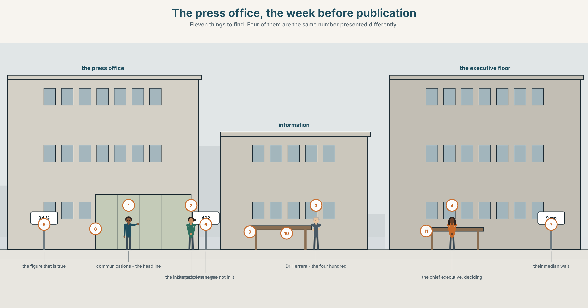{width=6.6in}

*The press office, the week before publication — Eleven things to find. Four of them are the same number presented differently.*

# How many is most?

**By the end of this unit you can present a set of figures and hedge them correctly.**

| ◆ **A · THE WORLD** | A number that is accurate, defensible and will be read wrongly |
|---|---|
| ◆ **B · THE SYSTEM** | advanced quantifiers with *of* · hedged quantity · 23 words for statistics · 22 words for approximation · stress used for contrast |
| ◆ **C · THE PERFORMANCE** | A set of figures, hedged to exactly the strength the data supports |

---

### 0A · Find it

**Find eleven things in this picture.** Four of them are the same number presented differently.

> a chart on a screen · a bar chart taped to a wall · a single figure in large type ·
> a table of raw counts · a press line printed out · a letter from a patients' group ·
> a sticky note with a denominator on it · a calculator · a highlighter ·
> a printout with a line drawn through it · a clock

### 0B · Guess it

**Two of these presentations would lead a reader to opposite conclusions.** Which, and what is
the honest one?

### 0C · Say it ⏺

**Record forty-five seconds.** *Give one number from your own life and hedge it to the strength
you can actually defend.* You will record it again at the end of this unit.

---

## Part 1 · Vocabulary Lab 1 ◆ **B · THE SYSTEM**

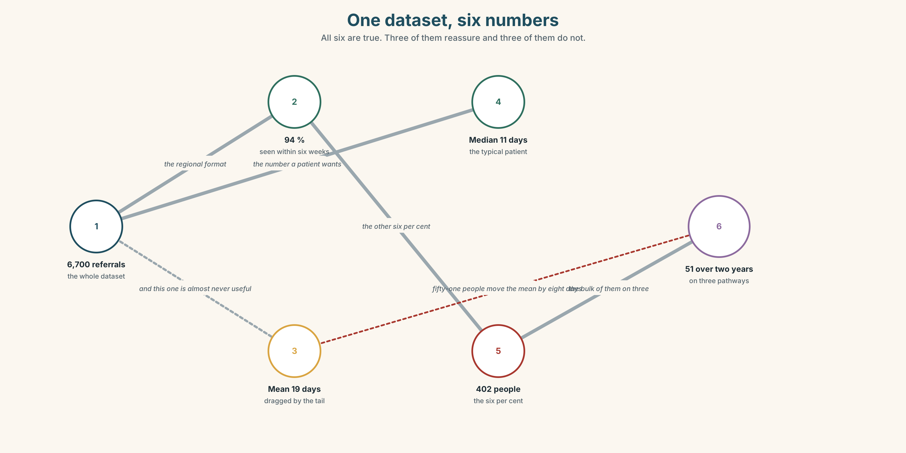{width=6.6in}

*One dataset, six numbers — All six are true. Three of them reassure and three of them do not.*

### 1A · Meet — the words of a figure

Match each word to one place on the map.

> **statistic** · **proportion** · **median** · **average** · **outlier** · **sample** ·
> **trend** · **denominator** · **rate** · **cohort**

### 1B · Sort — a measure, a population, or a shape?

Three columns.

> sample · distribution · outlier · percentile · rate · median · denominator · cohort ·
> trend

**One of them is a measure that is routinely reported without its population.** Which, and what
happens when it is?

### 1C · Meet — the two that are confused daily

> **average** · **median**

A waiting list of nine people, eight of whom wait ten days and one of whom waits four hundred.
**The average is fifty-three. The median is ten.**
**Which is the honest number, and for whom?**

### 1D · Collocation Lab

Complete each one with one word.

1. **The vast ______** of patients are seen within six weeks.
2. **A significant ______** — about one in seven — are not.
3. **Fewer than ______** of the referrals arrive with a complete record.
4. The rate has **more than ______** since 2019.
5. Spending **per ______** is below the regional figure and has been for eleven years.
6. The curve **levels ______** at about forty days and then **tails ______** very slowly.

### 1E · The fixed expressions

> **f** **True and misleading.**
> **f** **It depends on the denominator.**

Two sentences used in the same meeting about the same chart.

> **Write the number that provokes each one.**

### 1F · Own it

Think of a figure that is quoted about you, your work or your country. Tell a partner
**four sentences**: the figure, its denominator, what it hides, and whether it is true.

---

## Part 2 · Listening ◆ **A · THE WORLD**

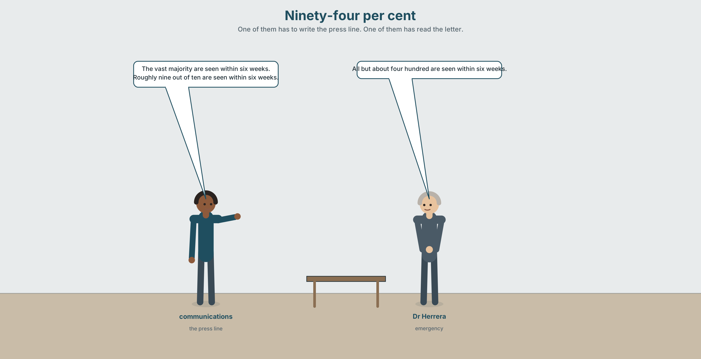{width=6.6in}

*Ninety-four per cent — One of them has to write the press line. One of them has read the letter.*

### 2A · Ninety-four per cent 🔊 Track 9.1

**Before you listen.** The hospital's waiting-list figure is 94 per cent within target. It is
accurate. **Guess: what does it hide?**

**Listen once. One question.** What is the six per cent?

**Listen again. Complete the table.**

| | What they want to publish | Why | What they are afraid of |
|---|---|---|---|
| the communications lead | | | |
| Dr Herrera | | | |
| the information manager | | | |

**Listen again. Choose the best answer.**

1. The six per cent is about **40 / 400 / 4,000** people.
2. Their median wait is **nine months / six weeks / two years**.
3. The 94 per cent figure is **rounded up / wrong / right**.
4. The patients' group has asked for **the median / the distribution / an apology**.

**Noticing.** Four sentences from the recording.

1. *Most of them are seen within six weeks.*
2. *The vast majority are seen within six weeks.*
3. *Roughly nine out of ten are seen within six weeks.*
4. *All but about four hundred are seen within six weeks.*

**All four describe the same data. Rank them from most reassuring to least.**

### 2B · Decoding clinic 🔊 Track 9.2

Thirty seconds. Four jobs.

1. How many hedging words can you count?
2. In *the vast majority*, which word carries the stress?
3. Catch the three numbers.
4. One speaker stresses a word to contrast it with something unsaid. Which?

> Transcripts, page 158.

---

## Part 3 · Grammar Lab 1 ◆ **B · THE SYSTEM**

### Saying how many, and how sure

### 3A · Notice

Look at the four sentences in Part 2.

1. In sentence 1, could you say *Most them*? In sentence 2, could you say *The vast majority of*?
2. Sentence 3 uses *roughly*. **What is it hedging — the count, or the proportion?**
3. Sentence 4 counts the exception instead of the rule. **What does that change for the reader?**
4. **Which of the four would a patients' group object to, and on what grounds?**
5. Try *"The majority of patient is seen within six weeks."* **What is wrong?**

### 3B · See

{width=6.6in}

*Five ways of saying ninety-four per cent — All five are accurate. They do not leave the reader in the same place.*

### 3C · Know

| | Shape | Note |
|---|---|---|
| **most** | *most patients* · *most **of** the patients* | *of* only before *the*, a possessive or a pronoun |
| **the majority** | *the majority **of** patients* | *of* is compulsory |
| **the bulk of** | *the bulk **of** the work* | uncountable or collective |
| **a handful of** | *a handful **of** cases* | countable, small, and slightly dismissive |
| **next to none** | *next to none **of** them* | a hedge on zero |
| **all but** | *all but four hundred* | counts the exception |

> **Verb agreement.** *The majority* and *the bulk* take the verb of what follows:
> *the majority of patients **are*** · *the majority of the work **is***.

> **The hedges, from tightest to loosest:**
> *marginally · slightly · somewhat · broadly · roughly · approximately · in the region of ·
> or so · give or take*

> **Degree words are not hedges.** *substantially*, *considerably*, *notably* and *largely*
> make a claim **bigger**, not vaguer, and a reader will hold you to them.

> **Why it matters.** A hedge that is looser than your data is dishonest in one direction.
> A hedge that is tighter is dishonest in the other, and is the commoner mistake.

### 3D · Use — controlled

> (1) __________ of patients are seen within six weeks. More precisely,
> (2) __________ majority — (3) __________ ninety-four per cent — are. The remaining six per
> cent is (4) __________ four hundred people, and their median wait is nine months.
> (5) __________ but a handful of those four hundred are on three specific pathways. The figure
> has risen (6) __________ since 2019, by about two points, which is not
> (7) __________ a change as the chart makes it look. Spending per head
> (8) __________ out at roughly eleven per cent below the regional average.

### 3E · Use — guided

Rewrite each one with the quantifier in brackets, and say what changes.

1. 94 per cent are seen in six weeks. *(the vast majority)*
2. 94 per cent are seen in six weeks. *(all but about four hundred)*
3. Six per cent are not. *(a significant minority)*
4. Two of the 400 were seen in under a year. *(next to none)*
5. The rise is 2.1 points. *(marginally)*

### 3F · Use — open

**In pairs.** Take one figure. Present it **four times**: to reassure, to alarm, to inform,
and to mislead without lying. **Your partner names which is which**, and then says which of the
four you would sign.

### 3G · Error autopsy

{width=6.6in}

*A hedge that is tighter than the data — A hedge that is tighter than the data*

**Read both versions. Then say which of the two the data actually supports.**

### 3H · Check — eight items

> 1. ______ of the patients are seen in six weeks.
> 2. The ______ of patients ______ seen in six weeks. *(majority + verb)*
> 3. The bulk of the work ______ done at night. *(verb)*
> 4. ______ but four hundred are seen in time.
> 5. ______ to none of them were seen in under a year.
> 6. It has risen ______ — by about two points. *(tightest hedge)*
> 7. Spending per head works ______ at eleven per cent below.
> 8. A ______ of cases account for most of the delay.

**0–4 →** Workbook pp. 52–55. **5–6 →** Part 6. **7–8 →** page 195.

---

## Part 4 · Speaking ◆ **C · THE PERFORMANCE**

### 4A · Fluency starter — the same number, five ways

Your teacher gives a percentage. **Each learner must present it with a different quantifier**,
and the group ranks the five by how reassuring they sound.
**Four percentages. Four rounds.**

### 4B · The functional core — presenting figures honestly

{width=6.6in}

*The percentages, and the counts — Learner A has the per cents. Learner B has the people. One group is 1 per cent and 400.*

**Language Bank**

| | |
|---|---|
| **the headline** | *The vast majority…* · *Roughly nine in ten…* |
| **the exception** | *All but about four hundred…* · *A significant minority…* |
| **the denominator** | *Out of 6,700…* · *That is per head of population.* |
| **the honest qualification** | *The median is a better number here.* · *True and misleading.* |

**Information gap.** Learner A has the percentages. Learner B has the raw counts.
Neither sees the other. **Find the group that is 1 per cent and 400 people.**

### 4C · The performance — three minutes ⏺

Present **a set of figures**. **Three minutes.** You must include:

> the headline figure, hedged correctly · the denominator · the exception, counted in people ·
> the measure you would use instead, and why

**Record it.**

### 4D · Observer

One person listens for **one thing**: was any hedge tighter than the data allowed?

### 4E · Three criteria

> ☐ Did I use *of* correctly every time?
> ☐ Is every percentage attached to a denominator?
> ☐ Did I count the exception in people as well as per cent?

---

## Part 5 · Reading ◆ **A · THE WORLD**

### 5A · Predict

A letter and a reply. The title is **"Re: your figure of 94 per cent."**
**What do you expect the patients' group to be asking for?** Two sentences.

### 5B · Read — two minutes and a quarter

---

**From: Valdivia Patients' Forum**
**To: the Chief Executive**
**Re: your figure of 94 per cent**

We are not writing to say the figure is wrong. We have checked it and it is right.

We are writing because of what happens to the six per cent. There are about four hundred of them.
Their median wait is nine months. Fifty-one of them have waited more than two years. They are not
distributed across the service: they are concentrated on three pathways, and one of those three
is the one with no consultant.

Every time the 94 per cent figure is published, each of those four hundred people reads a
sentence saying that the service is meeting its target, and each of them is one of the people it
is not meeting it for. That is not a complaint about arithmetic. It is a complaint about what a
number is for.

We are asking for one thing: that the figure be published with the median wait of the group who
are outside it, in the same sentence. Not a footnote. The same sentence.

---

**From: the Chief Executive**
**Re: your letter**

You are right and we will do it.

I want to say one thing about why we have not. The 94 per cent figure is the one the regional
office asks for, in that form, and it is the form in which we are compared with eleven other
hospitals. If we publish it with the median of the excluded group beside it, we will be the only
hospital doing so, and we will look worse than hospitals that are performing worse than we are.

I have decided that I would rather look worse than be the hospital whose four hundred longest
waits are not written down anywhere a patient can find them. I am aware this is easy to say in a
letter and that I will be asked about it in March.

---

### 5C · Comprehension — eight questions

1. What does the Forum say first, and why does it matter?
2. **How many people are in the six per cent, and what is their median wait?**
3. How are they distributed, and what is notable about one of the three pathways?
4. What is the Forum's complaint actually about?
5. **What exactly do they ask for, and what do they explicitly refuse?**
6. What is the Chief Executive's explanation for not having done it?
7. **What is the comparison problem, and why is it real?**
8. What does the last sentence of the reply acknowledge?

### 5D · Vocabulary in context

Guess from the text. Then check.

> distributed across · concentrated on · what a number is for · in that form ·
> easy to say in a letter

### 5E · The counter-text

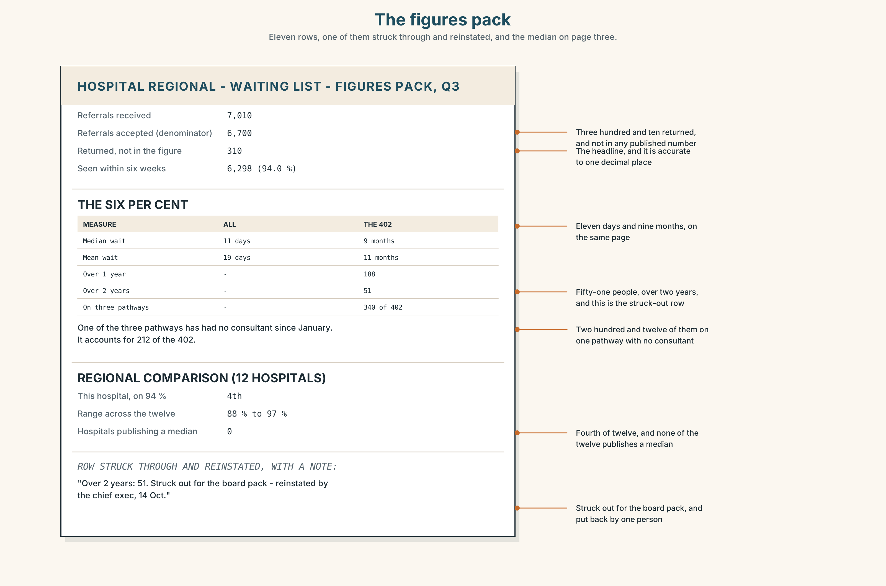{width=6.6in}

*The figures pack — Eleven rows, one of them struck through and reinstated, and the median on page three.*

**Read the figures pack and answer.**

1. What is the headline figure, and what is its denominator?
2. **What is the median wait of the whole list, and of the six per cent?**
3. How many people have waited more than two years, and on which pathways?
4. What does the regional comparison table show about this hospital?
5. One row has been struck through and reinstated. Which, and what does the note say?

### 5F · Two texts

The reply says publishing both numbers will make the hospital **look worse than hospitals
performing worse**.
The comparison table shows this hospital **fourth of twelve**.

**Put those two facts together. Is the Chief Executive right?** Three sentences.

---

## Part 6 · Vocabulary Lab 2 ◆ **B · THE SYSTEM**

### Hedging to exactly the right strength

### 6A · Sort — tighter than, looser than, or bigger than?

Three columns.

> substantially · comparatively · marginally · slightly · notably · broadly ·
> approximately · considerably · largely · roughly · somewhat

**Four of them belong in the third column and are regularly used as if they belonged in the
second.** Which?

### 6B · Chunk completion

1. **In the ______ of** eleven per cent below the regional average.
2. **The best ______ of** a year, for fifty-one of them.
3. **Next to ______** of the four hundred were seen inside twelve months.
4. **The ______ of** the delay sits on three pathways.
5. The totals **come ______** 6,700, **give or ______** forty.
6. The rate **works ______ at** about one in seventeen.

### 6C · Three that are not hedges

**substantially · considerably · largely**

> All three make a claim **bigger**. A reader will ask you to support them, and a hedge is
> supposed to do the opposite.

**Rewrite each sentence with a real hedge, and say what you have given up.**

1. Waits have increased substantially.
2. The figure is considerably better than last year.
3. The delay is largely on three pathways.

### 6D · The fixed expression

> **f** **About a third, give or take.**

**Say it twice:** once where you have counted and once where you have not.
**Can a listener tell?** What would make it honest in the second case?

### 6E · Contrast Clinic

Eight items. Choose the quantifier or hedge, and justify the strength.

1. A rise of 2.1 points. *(tightest honest hedge)*
2. Three pathways out of eleven. *(where the delay sits)*
3. 6,700 ± 40. *(spoken)*
4. 6 per cent. *(as a minority worth noticing)*
5. 2 out of 400. *(a hedge on zero)*
6. 94 per cent. *(counting the exception)*
7. 11 per cent below. *(approximate, spoken)*
8. 94 per cent. *(reassuring)*

---

## Part 7 · Pronunciation & Fluency Lab ◆ **B · THE SYSTEM**

### Stress as the argument

{width=6.6in}

*Stress as the argument — One sentence, four stresses, four different things being denied.*

### 7A · Hear 🔊 Track 9.3

> **NINE**ty-four per cent are seen in time. — and you said ninety
> Ninety-four per cent **ARE** seen in time. — and you implied they were not
> Ninety-four per cent of **PATIENTS** — and not of referrals
> Ninety-four per cent of patients **ARE SEEN** — not treated

### 7B · Say

Say all four. Then say the sentence three times, faster, moving the stress each time.

### 7C · Make it mean something

Say these two:

> *Most of them are seen in six weeks.* *(flat)*
> *MOST of them are seen in six weeks.* *(and some are not, and that is the point)*

**Which one would the patients' group write, and which would the press office?**

### 7D · Fluency 30 ⏺

Thirty seconds: **four figures about this room, each with a different hedge.**
Three times, faster.

---

## Part 8 · Writing ◆ **C · THE PERFORMANCE**

### A set of figures · 160 words

{width=6.6in}

*The waiting list, in section — Four layers. The headline describes the top one and the letter is about the bottom.*

### 8A · Read the model

> Of 6,700 patients referred last year, 94 per cent were seen within six weeks. The denominator
> is referrals accepted, not referrals received; about 310 were returned and are not in this
> figure. `[the headline, the denominator, and the thing the denominator excludes]`
>
> The remaining six per cent is 402 people. Their median wait is nine months and fifty-one of
> them have waited more than two years. `[the exception, in people, with a median rather than an
> average]`
>
> Next to none of those 402 are spread across the service. The bulk of them — about 340 — are on
> three pathways, one of which has had no consultant since January. `[where it sits, with the
> cause named]`
>
> The 94 per cent is accurate. The median of the 402 is the number I would want if I were on one
> of those three pathways. `[a sentence that does not retract the figure and does not defend it
> either]`

**Questions about the writer's choices:**

1. The denominator is named in the first paragraph, with the 310 it excludes.
   **Why not in a footnote?**
2. The exception is given in people and the headline in per cent. **Why that way round?**
3. The last sentence does not choose. **Is that evasion?**

### 8B · The anti-model

> We are pleased to report that the vast majority of patients continue to be seen well within
> target. Waiting times have improved considerably over the period and we remain committed to
> further reductions. A small number of patients experience longer waits.

Correct English, and three of its four claims are unsupportable as written.
**Find them**, and say what *a small number* is doing.

### 8C · Plan

> the headline with its denominator → what the denominator excludes → the exception, in people,
> with a median → where it is concentrated, and why → one sentence that neither retracts nor
> defends

### 8D · Write — 160 words
### 8E · Peer review — three criteria

> ☐ Is every percentage attached to a denominator?
> ☐ Is the exception counted in people?
> ☐ Is every hedge exactly as strong as the data?

### 8F · Write it again · 8G · Publish

On the wall, with the figures pack from Part 5E beside it.

---

## Part 9 · The File ◆ **A · THE WORLD + C · THE PERFORMANCE**

# CULTURE FILE · Naming, Address and Status

{width=6.6in}

*Four letters, four openings — The same request. The form of address and the hedging do most of the work.*

### 9A · Four letters, four openings 🔊 Track 9.4

The same request, written by four people to the same Chief Executive. **Listen to the openings
read aloud.**

1. Which one uses a first name, and what does the writer risk?
2. **Which one is so deferential that the request disappears?**
3. Which one gets the quickest reply, and is that the same as the best one?

### 9B · What a form of address claims

> *Dear Dr Soto* · *Dear María* · *Dear Chief Executive* · *To whom it may concern*

**Each of the four makes a claim about the relationship.** Say what each claims.
Then say which one a patients' group should use, and why it is not obvious.

### 9C · Status in three languages

In some languages the title does the work. In some the verb does. In English a great deal is
carried by **how much hedging you use**, and a reader hears over-hedging as either deference or
evasion.

**Which of these four is most likely to be read as evasion by an English reader?**

1. *I wonder whether it might perhaps be possible to consider publishing the median.*
2. *Please publish the median.*
3. *We are asking for one thing: publish the median in the same sentence.*
4. *It would be appreciated if the median could be published.*

### 9D · Your turn

In pairs. **Write the same two-sentence request four times:** to somebody senior you have never
met, to somebody senior you know well, to a peer, and to an institution with no name.
**Then swap, and your partner says which is which.**

### 9E · Transfer

**Find one email you have sent this week.** Count the hedges in the first sentence, and say what
they were doing.

---

## Part 10 · Mediation & Interaction ◆ **C · THE PERFORMANCE**

{width=6.6in}

*One figure, one letter, fourteen months — Half the class sees the percentages. Half sees the counts. Rebuild it by speaking.*

### 10A · Relay

Half the class sees the percentages. Half sees the raw counts. **Rebuild the whole picture by
speaking.** Twelve minutes.

### 10B · Simplify

Explain the figures pack from Part 5E to a patient who has waited fourteen months.
**Five sentences only.**

> **Plan:** what the headline says → which group you are in → what that group's figures are →
> why you are in it → what is being done

### 10C · Compress

The Forum's letter into **forty words**, keeping the request exactly.

### 10D · Online

Write **one message** to the regional office: you intend to publish an additional figure, you
explain why in one sentence, and you ask one specific question about comparability.

### 10E · Your language

How does your language say *the vast majority*? **Does the verb agree with *majority* or with
what follows it?** Say *the majority of patients are seen in six weeks* in both languages.

---

## Part 11 · The Decision ◆ **C · THE PERFORMANCE**

# Publish, annotate, or hold

The 94 per cent figure is due for publication. It is accurate. Four hundred and two people are
outside it with a median wait of nine months.

- **Publish as it stands.** It is the regional format, it is comparable with eleven other
  hospitals, and it is true.
- **Publish with the median beside it.** What the Forum asked for. This hospital becomes the only
  one doing it and drops from fourth of twelve to ninth on the published comparison.
- **Hold it until the next quarter.** The consultant post on the worst pathway is being filled in
  March. One quarter's delay and the number improves on its own.

### 11A · The evidence

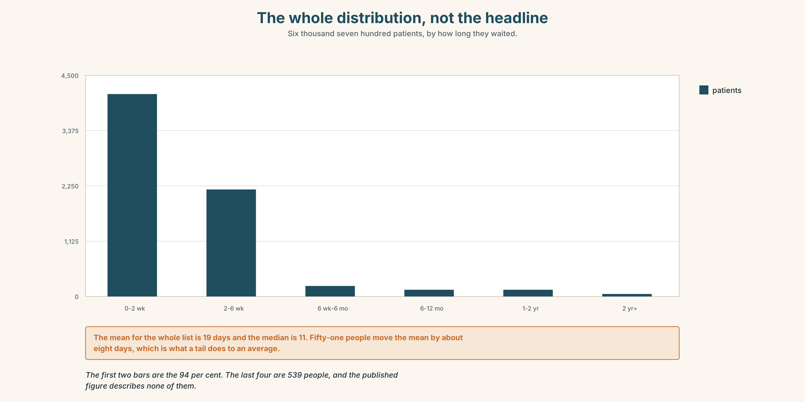{width=6.6in}

*The whole distribution, not the headline — Six thousand seven hundred patients, by how long they waited.*

1. **The figures pack** from Part 5E — and the row that was struck through and reinstated.
2. **The chart** — the whole distribution, not the headline.
3. **The voice.** One of the 402, thirty seconds: *"I am not asking anybody to say the figure is
   wrong. I have read it and it is right. I would like it to be possible for somebody to find
   out, without writing a letter, that there are four hundred of us, because at the moment the
   only way I know is that I wrote a letter."*

### 11B · Talk about it

In fours. Everybody speaks twice. Use the frame.

> *The vast majority ______ . A significant minority ______ . It depends on ______ .*

**Words you can use:** *statistic · proportion · median · average · outlier · denominator ·
cohort · distribution · true and misleading · the bulk of · all but*

### 11C · Decide

Write **three sentences**. Choose, say why, and name what it costs.

> I think the hospital should ______________________ ,
> because ______________________ .
> What this costs is ______________________ .

### 11D · Model decision

> Publish both, in the same sentence, and write to the regional office the same day proposing
> that the second figure become standard. Dropping to ninth is a real cost and it is a cost paid
> by the hospital's reputation, which is the thing that has least claim to be protected here.
> The letter to the region is the part that matters: one hospital publishing an extra number
> looks like an admission, and twelve publishing it is a format.

### 11E · The Reveal

> **What happened.** Both figures were published in the same sentence. The hospital dropped to
> ninth of twelve on the comparison table and was asked about it twice in March, once by a
> journalist and once by the regional office.
>
> The letter proposing the second figure as standard was acknowledged and not answered for
> fourteen months. Two other hospitals adopted it voluntarily in that period, both of them after
> being contacted by their own patients' forums, who had read this one's letter.
>
> The regional format changed in the following year. It now requires the median of the group
> outside the target. Nine of the twelve hospitals got worse on the published table; the ranking
> barely moved.

**They looked worse for fourteen months. Then the format changed and the ranking barely moved,
because everybody had the same four hundred.**

> **Was it the right decision?** Say why — and say what the fourteen months cost.

---

## Part 12 · Landing ◆ **all three lines**

### 12A · Recycle — twelve items

> 1. ______ of the patients are seen in six weeks.
> 2. The majority of patients ______ seen in six weeks. *(verb)*
> 3. ______ but four hundred are seen in time.
> 4. ______ to none were seen in under a year.
> 5. **The vast ______** of patients are seen within six weeks.
> 6. The rate has **more than ______** since 2019.
> 7. The curve **levels ______** at about forty days.
> 8. The totals **come ______** 6,700, give or take forty.
> 9. *(Unit 8)* ______ patients waited 41 days. *(this group)*
> 10. *(Unit 7)* I stopped ______ (think) about it. *(the thinking ended)*
> 11. *(A2.2 U9)* ______ of the last two has insurance. *(zero of two)*
> 12. *(A2.1 U9)* There are ______ many settings and nobody changes them.

### 12B · Consolidate

**One hundred and sixty words.** A set of figures from your own world. A headline with its
denominator, an exception counted in people, a median, and hedges no stronger than the data.

### 12C · Can-do, with evidence

| I can… | My evidence | Sure? |
|---|---|---|
| use quantifiers and *of* correctly | Part 3H score | ◯ ◑ ● |
| present figures honestly in three minutes | Part 4C recording | ◯ ◑ ● |
| write 160 words in which every hedge is earned | Part 8 draft 2 | ◯ ◑ ● |
| choose a form of address and a level of hedging | Part 9D letters | ◯ ◑ ● |

### 12D · Replay ⏺

Find your forty-five seconds from Part 0C. Listen. **Record it again.**
**Two sentences:** what is different, and whether your hedge was too tight or too loose.

### 12E · Glossary — forty-five items, as a map

> **THE MEASURE** · statistic · proportion · median · average · rate · percentile · distribution
> **THE POPULATION** · sample · cohort · denominator · outlier · per head
> **THE SHAPE** · trend · level off · tail off · skew towards · bear out · more than doubled
> **HOW MANY** · the vast majority · a significant minority · fewer than half · all but · the bulk of · a handful of · next to none · on average
> **HOW APPROXIMATE** · roughly · approximately · broadly · slightly · marginally · somewhat · comparatively · or so · give or take · in the region of · the best part of
> **HOW BIG** · substantially · considerably · notably · largely
> **DOING THE SUM** · come to · work out at · about a third, give or take · true and misleading · it depends on the denominator

### 12F · Next

> **Unit 10 · What do you wish you knew?**

# B1.2 · Unit 10 · Where You Are Needed

> **English Animated** · *Weighing It Up* · Hospital Regional, Valdivia
> Student's Book pages 204–225 · 22 pp · ~11 hours

---

## Part 0 · The Big Picture ◆ **A · THE WORLD**

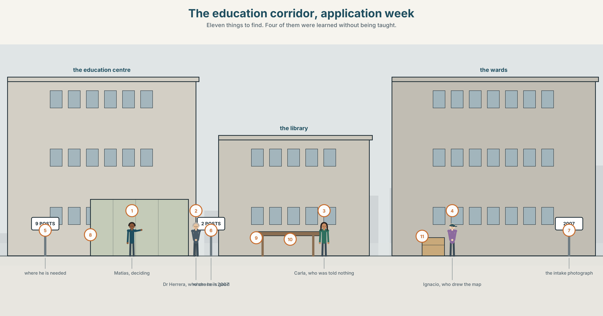{width=6.6in}

*The education corridor, application week — Eleven things to find. Four of them were learned without being taught.*

# What do you wish you knew?

**By the end of this unit you can write a 180-word reflective piece about what you wish somebody
had taught you.**

| ◆ **A · THE WORLD** | A fifth-year choosing between where he is needed and where he is good |
|---|---|
| ◆ **B · THE SYSTEM** | *wish* and *if only*, present and past · *rather*, *suppose* · 23 words for learning and gaps · 22 words for the hypothetical · the intonation of a *wish* clause |
| ◆ **C · THE PERFORMANCE** | A hundred and eighty words on what nobody taught you |

---

### 0A · Find it

**Find eleven things in this picture.** Four of them are things somebody learned without being
taught.

> a rota with a name circled · a specialty application form · a logbook · a reference letter ·
> a noticeboard of vacancies · a coffee cup with a name on it · a handover sheet folded small ·
> a locker with three keys · a lanyard · a map of the building drawn by hand ·
> a photograph of an intake

### 0B · Guess it

**Two of the eleven exist because the official version does not work.** Which, and who made them?

### 0C · Say it ⏺

**Record forty-five seconds.** *Name one thing you wish somebody had taught you, and say what it
cost you to learn it the other way.* You will record it again at the end of this unit, and at the
end of this book.

---

## Part 1 · Vocabulary Lab 1 ◆ **B · THE SYSTEM**

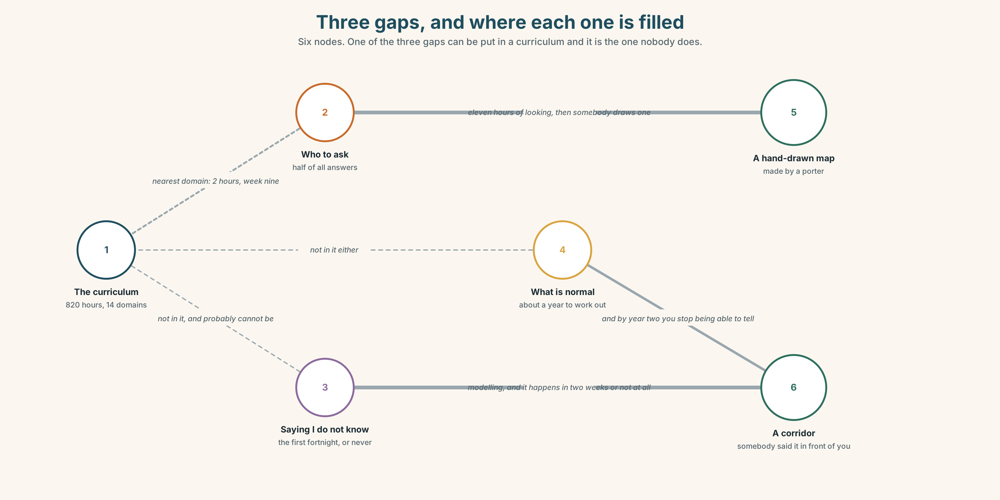{width=6.6in}

*Three gaps, and where each one is filled — Six nodes. One of the three gaps can be put in a curriculum and it is the one nobody does.*

### 1A · Meet — the words of a gap

Match each word to one place on the map.

> **gap** · **insight** · **lesson** · **curriculum** · **apprenticeship** · **competence** ·
> **confidence** · **feedback** · **reflection** · **mentorship**

### 1B · Sort — what you are taught, what you absorb, or what you are left to work out?

Three columns.

> insight · ignorance · blind spot · mentorship · curriculum · competence · feedback ·
> apprenticeship · confidence

**One of them moves column depending entirely on who your supervisor was.** Which?

### 1C · Meet — the two that come apart

> **competence** · **confidence**

They are supposed to rise together. **In which of the two directions is the mismatch dangerous,
and in which is it merely miserable?**

### 1D · Collocation Lab

Complete each one with one word.

1. The first six months were **a steep learning ______** and everybody says so, which is why
   nobody plans for it.
2. He was **out of his ______** for about a year and told nobody.
3. You learn almost all of it **on the ______** , which is a polite way of saying nobody teaches
   it.
4. **With ______** , the signs were in the first week.
5. He learned it **the hard ______** , which is a phrase people use to make a failure sound like
   a method.
6. She has had to **pick ______** most of it and **work ______** the rest.

### 1E · The fixed expressions

> **f** **I wish somebody had said.**
> **f** **You learn that in week one or never.**

Two sentences about the same gap, from two different people.

> **Which one is about teaching and which is about culture?**

### 1F · Own it

Think of something you had to work out for yourself. Tell a partner **four sentences**: what it
was, how long it took, what it cost, and whether it could have been taught.

---

## Part 2 · Listening ◆ **A · THE WORLD**

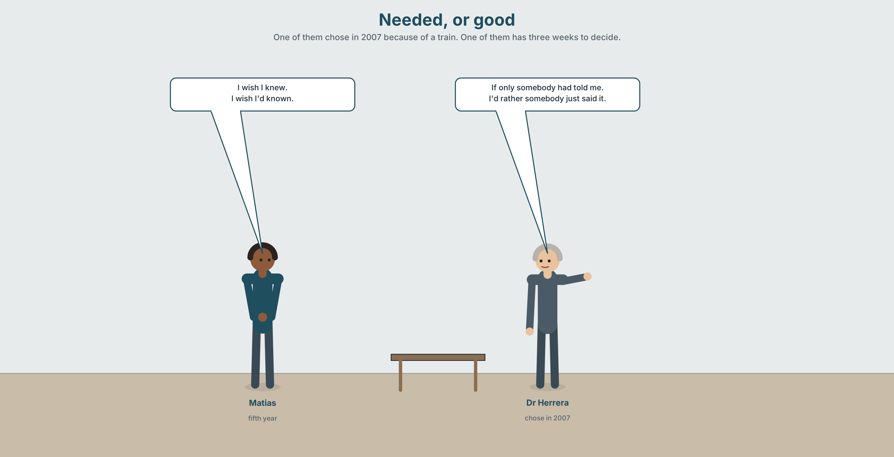{width=6.6in}

*Needed, or good — One of them chose in 2007 because of a train. One of them has three weeks to decide.*

### 2A · Needed, or good 🔊 Track 10.1

**Before you listen.** Matías can specialise in the field where he is needed or the field where
he is good. They are not the same field. **Guess: which does his supervisor recommend?**

**Listen once. One question.** What are the two specialities?

**Listen again. Complete the table.**

| | What they say | What they wish | What they will not say |
|---|---|---|---|
| Matías | | | |
| Dr Herrera | | | |
| Carla | | | |

**Listen again. Choose the best answer.**

1. The shortage speciality has **two / nine / twenty-two** unfilled posts in the region.
2. He is better at the other one by **he does not know / a little / a lot**.
3. His supervisor's advice is **deliberately not clear / about something else / clear**.
4. Carla's contribution is about **what nobody told her / staying / money**.

**Noticing.** Four sentences from the recording.

1. *I wish I knew.*
2. *I wish I'd known.*
3. *If only somebody had told me.*
4. *I'd rather somebody just said it.*

**Two of these are about now and two are about the past. Which, and how does the verb show it?**

### 2B · Decoding clinic 🔊 Track 10.2

Thirty seconds of Carla. Four jobs.

1. How many times does she say *wish*?
2. In *I wish I'd known*, does her voice rise or fall at the end?
3. Catch the two numbers.
4. She says one sentence she immediately qualifies. Which?

> Transcripts, page 159.

---

## Part 3 · Grammar Lab 1 ◆ **B · THE SYSTEM**

### Wishing about now, and about then

### 3A · Notice

Look at the four sentences in Part 2.

1. In sentence 1, does she know? In sentence 2?
2. **Why is the verb in the past in sentence 1 when the wish is about now?**
3. Sentence 3 uses *if only*. **Is it stronger or weaker than *I wish*?**
4. In sentence 4, *I'd rather somebody said it* — why a past tense after *would rather*?
5. Try *"I wish I know."* **Why does English refuse this?**

### 3B · See

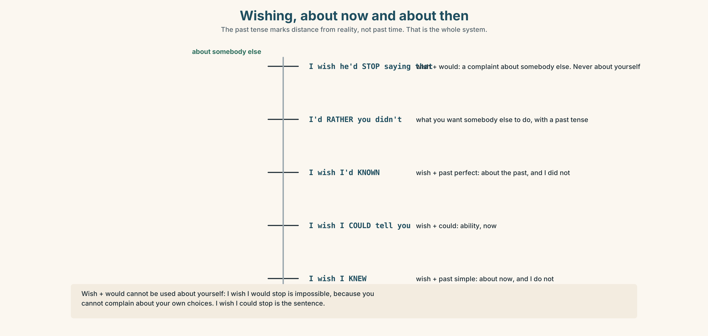{width=6.6in}

*Wishing, about now and about then — The past tense marks distance from reality, not past time. That is the whole system.*

### 3C · Know

| | Shape | About |
|---|---|---|
| **wish + past simple** | *I wish I **knew**.* | now — and I do not |
| **wish + past perfect** | *I wish I**'d known**.* | the past — and I did not |
| **wish + *would*** | *I wish he**'d stop** saying that.* | somebody else's behaviour, now — a complaint |
| **wish + could** | *I wish I **could** tell you.* | ability, now |
| **if only** | same shapes, more force | ***If only** I'd known.* |
| **would rather + past** | *I'd rather you **didn't**.* | what you want somebody else to do |
| **suppose / supposing** | + past, for a hypothesis | ***Suppose** we **asked** him.* |

> **The past tense is doing the same job as in the second conditional:** it marks distance from
> reality, not past time.

> ***wish + would* cannot be used about yourself.**
> ✗ *I wish I would stop.* ✓ *I wish I could stop.* ✓ *I wish he would stop.*
> It is a complaint about somebody else's choices, and you cannot complain about your own.

> **Watch out.** ✗ *I wish I know.* ✗ *I wish I would know.* ✓ *I wish I knew.*

### 3D · Use — controlled

> I wish I (1) __________ (know) which one to choose. I wish somebody
> (2) __________ (tell) me in the first year, when it would have made a difference. If only the
> rota (3) __________ (not / change) every February — I wish they
> (4) __________ (stop) doing that, honestly. I'd rather somebody just
> (5) __________ (say) it to me. Suppose we (6) __________ (ask) the three people who left:
> I wish we (7) __________ (can) do that, and I wish I (8) __________ (think) of it two
> years ago.

### 3E · Use — guided

Rewrite each one as a *wish* or an *if only*.

1. I don't know what I want. *(now)*
2. Nobody told me. *(the past)*
3. He keeps saying that. *(a complaint)*
4. I can't tell you. *(ability, now)*
5. I didn't ask her. *(the past, with force)*

### 3F · Use — open

**In pairs.** Name three things you wish you knew now and three you wish you had known then.
**Your partner's job** is to say which of the six could actually have been taught.

### 3G · Error autopsy

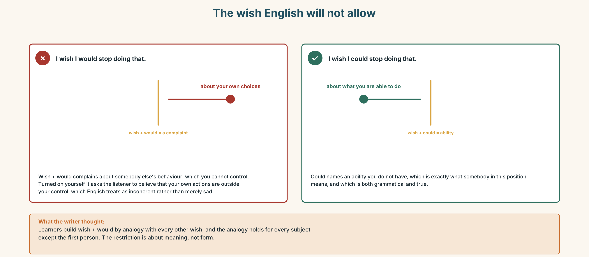{width=6.6in}

*The wish English will not allow — The wish English will not allow*

**Read both versions. Then say why English will not allow the first one.**

### 3H · Check — eight items

> 1. I wish I ______ (know). *(now)*
> 2. I wish somebody ______ (tell) me. *(the past)*
> 3. I wish he ______ (stop) saying that. *(a complaint)*
> 4. I wish I ______ (can) help. *(ability, now)*
> 5. If only I ______ (ask) her. *(the past)*
> 6. I'd rather you ______ (not / say) anything.
> 7. Suppose we ______ (ask) the three who left.
> 8. I wish I ______ (not / be) so sure in my first year.

**0–4 →** Workbook pp. 58–61. **5–6 →** Part 6. **7–8 →** page 217.

---

## Part 4 · Speaking ◆ **C · THE PERFORMANCE**

### 4A · Fluency starter — six wishes

Your teacher names a domain: *your first week · your training · your last job*.
**Each learner gives one wish about now and one about then.**
**Nobody may use the same verb twice.**

### 4B · The functional core — naming a gap

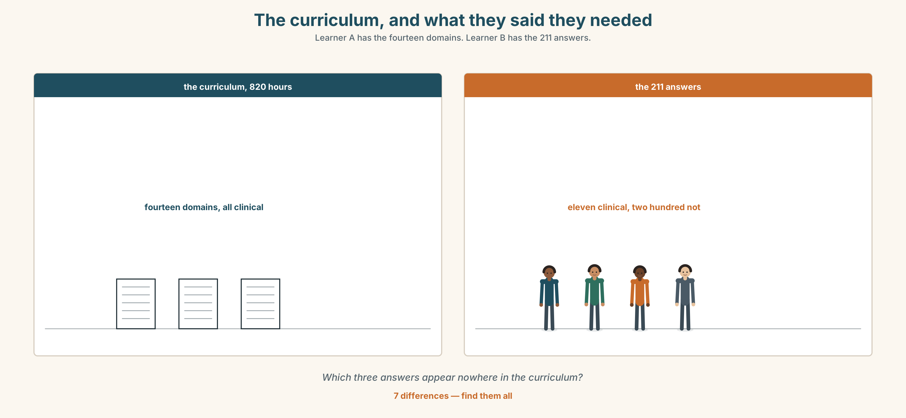{width=6.6in}

*The curriculum, and what they said they needed — Learner A has the fourteen domains. Learner B has the 211 answers.*

**Language Bank**

| | |
|---|---|
| **about now** | *I wish I knew…* · *I wish I could…* |
| **about then** | *I wish I'd known…* · *If only somebody had…* |
| **about somebody else** | *I wish they'd stop…* · *I'd rather they just…* |
| **the honest limit** | *I'm not sure it could have been taught.* · *You learn that in week one or never.* |

**Information gap.** Learner A has what the curriculum covers. Learner B has what the first-year
doctors say they needed. **Find the three things in neither list.**

### 4C · The performance — three minutes ⏺

Describe **a gap in what you were taught**. **Three minutes.** You must include:

> what you wish you had known · what it cost you · what you wish you knew now ·
> one thing you think genuinely could not have been taught

**Record it.**

### 4D · Observer

One person listens for **one thing**: did the speaker blame a person or name a gap?

### 4E · Three criteria

> ☐ Did I use *wish* about now and about then, correctly?
> ☐ Is there a cost attached to the gap?
> ☐ Did I name one thing that could not have been taught?

---

## Part 5 · Reading ◆ **A · THE WORLD**

### 5A · Predict

An extract from a report on first-year doctors. The title is
**"The curriculum is not the problem."**
**What do you expect the report to say the problem is?** Two sentences.

### 5B · Read — two minutes and a half

---

**THE CURRICULUM IS NOT THE PROBLEM**
*Extract from a review of first-year clinical experience*

**4.1** We asked 211 doctors in their first year what they wished they had been taught. We
expected clinical answers. We received eleven.

**4.2** The remaining answers divided into three groups.

**4.3** The first group — about half of all answers — concerned **who to ask**. Not what to do:
who to ask. Several respondents described spending between twenty and fifty minutes locating a
person who could answer a question that took ninety seconds to answer. One wrote: *I wish
somebody had drawn me a map of who knows what.*

**4.4** The second group concerned **how to say that you do not know**. Respondents described
learning this by one of two routes: either a senior colleague said *I don't know* in front of
them in the first fortnight, in which case they could do it from then on, or nobody did, in which
case most of them reported still finding it difficult several years later. It appears to be
almost entirely a matter of modelling, and the modelling either happens in the first two weeks or
does not happen.

**4.5** The third group concerned **what is normal**. Respondents reported being unable to tell,
for about a year, whether a thing that felt wrong was wrong or was simply how hospitals are.
Several said they had stopped reporting things in their second year, not because they had stopped
noticing but because they had stopped being able to tell.

**4.6** None of these three is in any curriculum. Two of the three cannot obviously be put in
one. The first can, costs almost nothing, and is the one nobody does.

**4.7** We note, without comment, that 190 of the 211 responses described something the
institution could have provided and did not, and that the institution has asked us three times
whether the clinical content is adequate.

---

### 5C · Comprehension — eight questions

1. How many doctors were asked, and how many gave clinical answers?
2. **What was the first group of answers about, and what example is given?**
3. What are the two routes by which the second thing is learned?
4. **What does paragraph 4.4 conclude about when this can be learned?**
5. What was the third group about, and what did several respondents say had happened by their
   second year?
6. Which of the three could be put in a curriculum?
7. **What is the force of paragraph 4.7?**
8. Why does the report say "without comment"?

### 5D · Vocabulary in context

Guess from the text. Then check.

> locating a person · a matter of modelling · what is normal · stopped being able to tell ·
> without comment

### 5E · The counter-text

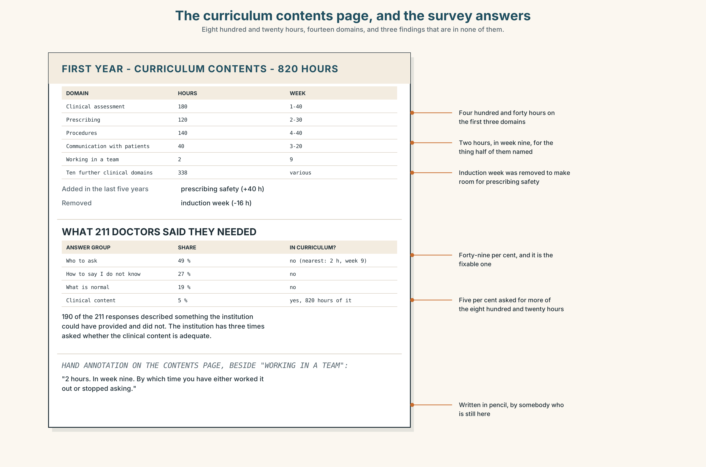{width=6.6in}

*The curriculum contents page, and the survey answers — Eight hundred and twenty hours, fourteen domains, and three findings that are in none of them.*

**Read the curriculum contents page and the survey answers beside it, and answer.**

1. How many hours does the curriculum allocate, and to how many domains?
2. **Which three of the survey's answers appear nowhere in the curriculum?**
3. What does the curriculum call the nearest thing to "who to ask", and how many hours does it
   get?
4. What has been added to the curriculum in the last five years, and what has been removed?
5. One line of the contents page has been annotated by hand. What does it say?

### 5F · Two texts

The report says the first gap **costs almost nothing to fix**.
The curriculum gives the nearest domain **two hours, in week nine**.

**Put those two facts together. What would fixing it actually require?** Three sentences.

---

## Part 6 · Vocabulary Lab 2 ◆ **B · THE SYSTEM**

### Supposing, and preferring

### 6A · Sort — a wish, a preference, or a hypothesis?

Three columns.

> supposedly · frankly · regrettably · wish · ideally · rather · preferably · if only ·
> suppose · hypothetically · admittedly

**Two of them are not about the future at all and are regularly used as if they were.** Which?

### 6B · Chunk completion

1. **If ______** somebody had said it in the first week.
2. **I'd ______** know now than find out in March.
3. **Suppose ______** asked the three people who left.
4. **It would be better ______** the rota changed in June.
5. **In an ideal ______** , somebody would draw the map.
6. He has gone **______ over** his first year four times trying to date it.

### 6C · Three that are not hedges

**supposedly · admittedly · frankly**

> *Supposedly* reports somebody else's claim and doubts it. *Admittedly* concedes a point
> against yourself. *Frankly* announces that what follows is impolite.

**Which fits each sentence, and what would the others do?**

1. ______ , the clinical content is adequate.
2. ______ , I did not ask anybody either.
3. ______ , the review is about something else.

### 6D · The fixed expression

> **f** **If only somebody had told me.**

**Write the sentence that follows it,** once from somebody who would have listened, and once
from somebody who would not.

### 6E · Contrast Clinic

Eight items. Give the *wish*, *if only*, *would rather* or *suppose* form.

1. I don't know. *(now)*
2. Nobody told me. *(the past)*
3. What if we asked them? *(hypothesis)*
4. I can't help. *(ability, now)*
5. I didn't ask. *(with force)*
6. She keeps changing it. *(a complaint)*
7. I was too sure in my first year. *(the past, about yourself)*
8. Please don't say anything. *(preference, politely)*

---

## Part 7 · Pronunciation & Fluency Lab ◆ **B · THE SYSTEM**

### The tune of a wish

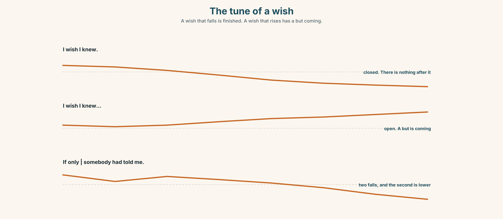{width=6.6in}

*The tune of a wish — A wish that falls is finished. A wish that rises has a but coming.*

### 7A · Hear 🔊 Track 10.3

> *I wish I knew.* ↘ — closed, and there is nothing after it
> *I wish I knew…* ↗ — open, and a *but* is coming
> *If only somebody had told me.* ↘↘ — two falls, and the second is lower

### 7B · Say

Say all three. Then say the sentence twice, once closed and once open:

> *I wish I'd asked her.*

### 7C · Make it mean something

Say these two:

> *I WISH I'd known.* *(and somebody has just implied you did)*
> *I wish I'd KNOWN.* *(and the knowing is the thing that was missing)*

**Which of the two is a defence?**

### 7D · Fluency 30 ⏺

Thirty seconds: **three wishes about now and three about then.**
Three times, faster, with the fall at the end of each.

---

## Part 8 · Writing ◆ **C · THE PERFORMANCE**

### What nobody taught me · 180 words

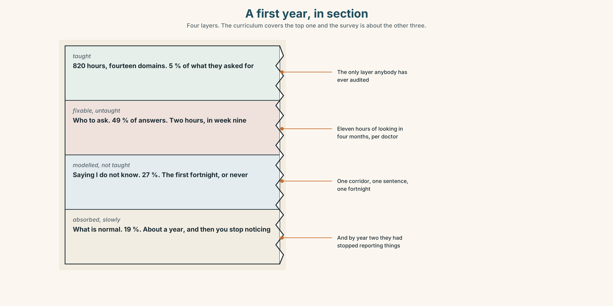{width=6.6in}

*A first year, in section — Four layers. The curriculum covers the top one and the survey is about the other three.*

### 8A · Read the model

> I wish somebody had told me who to ask. Not what to do — I was taught what to do, at length,
> and most of it was right. `[the gap, and a sentence that protects the curriculum so the reader
> knows this is not a complaint about teaching]`
>
> In my first four months I spent, at a conservative estimate, eleven hours looking for people. I
> once took forty minutes to find somebody who answered my question in under two.
> `[the cost, in hours, with one specific instance]`
>
> I wish I knew whether this is normal. I have asked four people and got four answers, and three
> of them began by saying that it was different in their day.
> `[a wish about now, which is unresolved, and a detail that shows why]`
>
> What I do not think could have been taught is how to say I don't know. I learned it in my
> second week, from somebody who said it in front of me in a corridor, and I do not think a
> lecture would have done it. `[the honest limit, with the mechanism named]`
>
> I would rather have been given a map than another lecture. That is the whole of what I have to
> say.

**Questions about the writer's choices:**

1. The second sentence defends the curriculum. **What does that buy the writer?**
2. The cost is given in hours. **Why not in frustration?**
3. The fourth paragraph says something could not have been taught. **Does that weaken the piece?**

### 8B · The anti-model

> Looking back on my first year, it was a steep learning curve and I learned a great deal.
> There were challenges but they made me the clinician I am today. I would say to anyone
> starting out: ask for help, be kind to yourself, and remember that everyone feels like this.

Correct English, and nothing in it could be acted on. **Name three things that are missing**,
and say what *a steep learning curve* is standing in for.

### 8C · Plan

> the gap, named precisely → one sentence that protects what was taught → the cost, with a
> number → a wish about now that is unresolved → one thing that could not have been taught →
> what you would rather have had

### 8D · Write — 180 words
### 8E · Peer review — three criteria

> ☐ Is the gap specific enough for somebody to fix it?
> ☐ Is there a cost with a number in it?
> ☐ Is there one thing the writer admits could not have been taught?

### 8F · Write it again · 8G · Publish

On the wall, with the curriculum contents page from Part 5E beside it.

---

## Part 9 · The File ◆ **A · THE WORLD + C · THE PERFORMANCE**

# WORK FILE · The Career Conversation

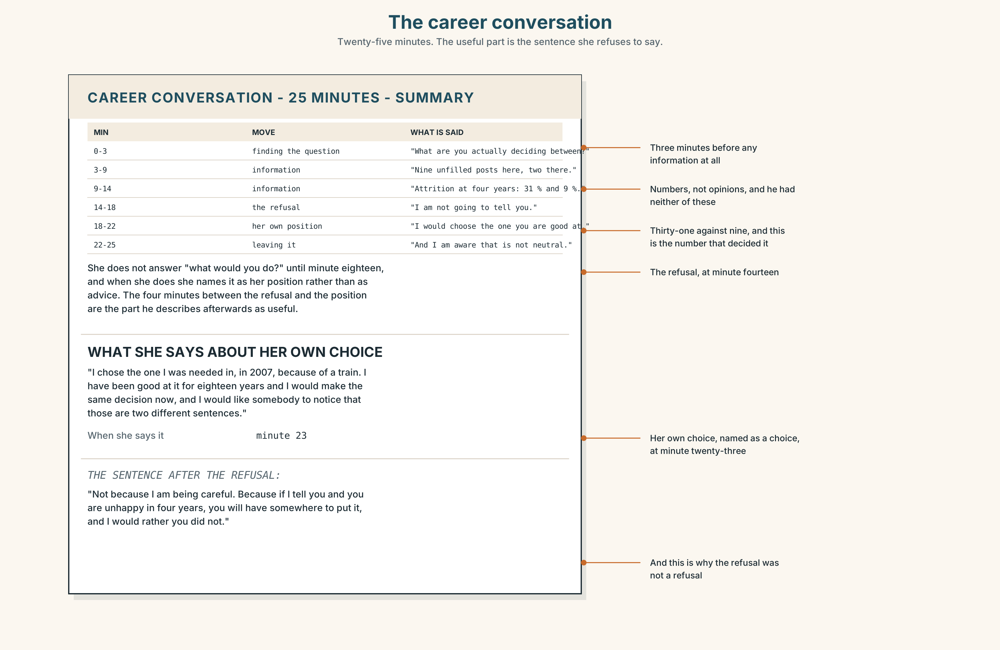{width=6.6in}

*The career conversation — Twenty-five minutes. The useful part is the sentence she refuses to say.*

### 9A · Twenty-five minutes 🔊 Track 10.4

Matías and Dr Herrera, on which speciality. **Listen to all of it.**

1. What does she do in the first three minutes, and why does it matter?
2. **Which question does she refuse to answer, and what does she offer instead?**
3. What does she say about her own choice, and when?

### 9B · The four moves

> finding out what the question actually is · giving information, not advice ·
> naming your own position · leaving the decision where it belongs

Match each to one phrase.

> *"What are you actually deciding between?"* ·
> *"There are nine unfilled posts in the region and two in the other one."* ·
> *"I would choose the one you are good at, and I am aware that is not neutral."* ·
> *"I am not going to tell you, and not because I am being careful."*

### 9C · The sentence that is hard for a senior person to say

> *"I am not going to tell you."*

**Why is it hard?** And **what has to come after it** for it to be useful rather than a refusal?

### 9D · Your turn

In pairs. **Fifteen minutes.** One of you has a real decision. The other may give information and
may name their own position, and **may not give advice.**
**Then swap**, and each of you says what the other did that helped.

### 9E · Transfer

**Find the sentence you wrote in Unit 1, Part 9E** — the one you would want said about your work
this year. Read it. **Write one sentence about whether it has changed.**

---

## Part 10 · Mediation & Interaction ◆ **C · THE PERFORMANCE**

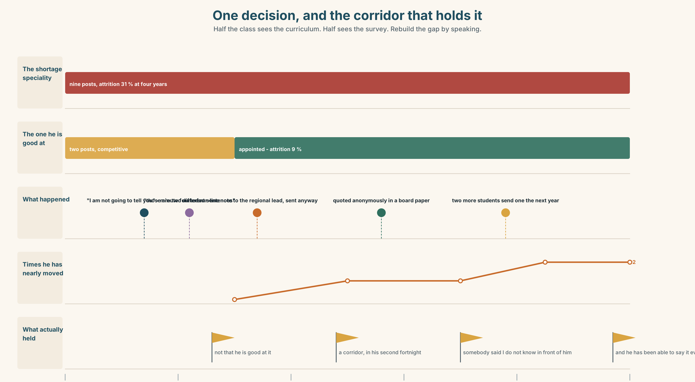{width=6.6in}

*One decision, and the corridor that holds it — Half the class sees the curriculum. Half sees the survey. Rebuild the gap by speaking.*

### 10A · Relay

Half the class sees the curriculum. Half sees the survey answers. **Rebuild the gap by
speaking.** Twelve minutes.

### 10B · Simplify

Explain the survey's three findings to a curriculum committee.
**Five sentences only, and one of them must name a cost.**

> **Plan:** what was asked → what came back → which of the three is fixable →
> what it would cost → what you want decided

### 10C · Compress

The report extract in Part 5 into **forty words**, keeping paragraph 4.7.

### 10D · Online

Write **one message** to the education lead: you have the three findings, you are proposing one
of them be acted on, and you are naming what it needs and by when.

### 10E · Your language

How does your language express a wish about the present? **Does it use a past tense, a special
mood, or a particle?** Say *I wish I knew* and *I wish I had known* in both languages.

---

## Part 11 · The Decision ◆ **C · THE PERFORMANCE**

# Needed, or good

Matías has to choose a speciality. There are nine unfilled posts in the region in one and two in
the other. He is measurably better at the one with two.

- **Where he is needed.** Nine posts, a job anywhere, a shortage that is somebody's emergency,
  and work he is competent at and does not love.
- **Where he is good.** Two posts, a competitive application, and the thing three separate
  supervisors have independently said he has a feel for.
- **Neither yet.** A year in a general post, which delays the decision, costs a year of training,
  and is what about a fifth of his year group does.

### 11A · The evidence

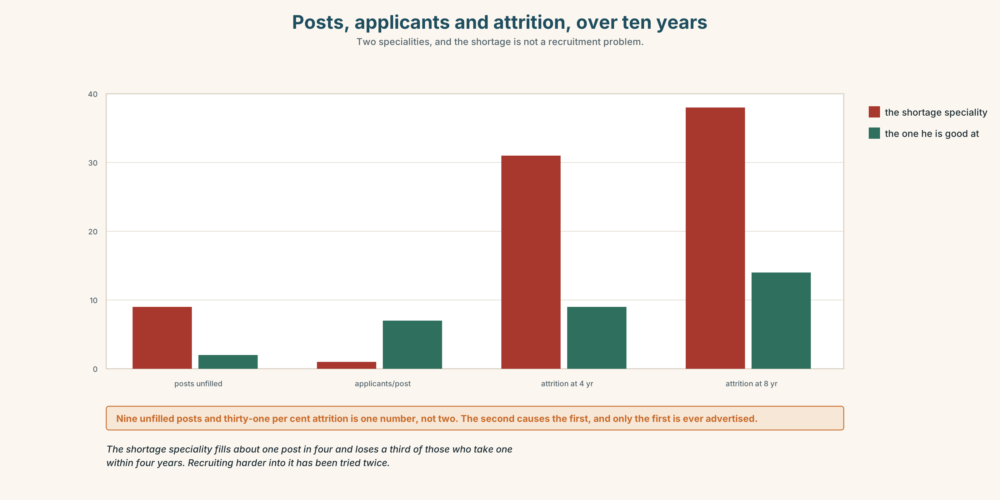{width=6.6in}

*Posts, applicants and attrition, over ten years — Two specialities, and the shortage is not a recruitment problem.*

1. **The curriculum and the survey** from Part 5E — and the hand annotation.
2. **The chart** — posts, applicants and attrition in each speciality over ten years.
3. **The voice.** Dr Herrera, thirty seconds: *"I chose the one I was needed in, in 2007, because
   of a train. I have been good at it for eighteen years and I would make the same decision now
   and I would like somebody to notice that those are two different sentences."*

### 11B · Talk about it

In fours. Everybody speaks twice. Use the frame.

> *I wish ______ . If only ______ . So I think ______ .*

**Words you can use:** *gap · insight · competence · confidence · mentorship · out of my depth ·
on the job · with hindsight · the hard way · a steep learning curve*

### 11C · Decide

Write **three sentences**. Choose, say why, and name what it costs.

> I think Matías should ______________________ ,
> because ______________________ .
> What this costs is ______________________ .

### 11D · Model decision

> He should take the one he is good at and should say out loud, now, that he is doing it, because
> the shortage speciality's nine vacancies are a real emergency and the only honest thing is to
> decline them in public rather than quietly. Shortages are solved by making the work better, not
> by recruiting people who will be adequate at it and leave in four years, and the attrition
> figures say exactly that. He owes the region a clear no, which is more than most people give it.

### 11E · The Reveal

> **What happened.** He took the one he is good at. He wrote a four-line note to the regional
> training lead explaining why he had not applied to the shortage speciality, which he was told
> was unnecessary and which he sent anyway.
>
> The training lead quoted it, anonymously, in a paper to the regional board about why the
> shortage is not a recruitment problem. Two other students sent similar notes the following
> year.
>
> He is in his third year and has twice been close to moving. He says the thing that keeps him is
> not that he is good at it but that in his first fortnight somebody said *I don't know* in front
> of him in a corridor, and that he has been able to say it ever since, and that he does not
> think he would have been able to in the other department.

**He chose the thing he was good at. The reason he has stayed is something that happened in a
corridor in his second week.**

> **Was it the right decision?** Say why — and say what the four-line note was actually for.

---

## Part 12 · Landing ◆ **all three lines**

### 12A · Recycle — twelve items

> 1. I wish I ______ (know). *(now)*
> 2. I wish somebody ______ (tell) me. *(the past)*
> 3. I wish he ______ (stop) saying that. *(a complaint)*
> 4. If only I ______ (ask) her.
> 5. I'd ______ you didn't say anything.
> 6. He was **out of his ______** for a year.
> 7. You learn it **on the ______** .
> 8. **With ______** , the signs were in the first week.
> 9. *(Unit 9)* The majority of patients ______ seen in six weeks. *(verb)*
> 10. *(Unit 3)* If we ______ (advertise) in March, we ______ (have) somebody now.
> 11. *(Unit 2)* If I ______ (not / look), she ______ (have) it.
> 12. *(A2.2 U1)* If I ______ you, I wouldn't wait.

### 12B · Consolidate

**One hundred and eighty words.** What you wish somebody had taught you. A gap named precisely,
a cost with a number, a wish about now that is unresolved, and one thing that could not have been
taught.

### 12C · Can-do, with evidence

| I can… | My evidence | Sure? |
|---|---|---|
| wish about the present and the past, correctly | Part 3H score | ◯ ◑ ● |
| describe a gap in my training in three minutes | Part 4C recording | ◯ ◑ ● |
| write 180 words somebody could act on | Part 8 draft 2 | ◯ ◑ ● |
| have a career conversation without giving advice | Part 9D role play | ◯ ◑ ● |

### 12D · Replay ⏺

Find your forty-five seconds from Part 0C. Listen. **Record it again.**
**Two sentences:** what is different, and whether the thing you wished for could have been taught.

### 12E · Glossary — forty-five items, as a map

> **THE GAP** · gap · ignorance · blind spot · out of my depth · nobody told me
> **WHAT YOU GET** · curriculum · apprenticeship · training · mentorship · feedback · lesson
> **WHAT YOU BUILD** · insight · competence · confidence · reflection · pick up · work out · catch up · fall behind
> **HOW IT FEELS** · a steep learning curve · on the job · the hard way · with hindsight
> **WHAT PEOPLE SAY** · I wish somebody had said · you learn that in week one or never · if only somebody had told me
> **WISHING** · wish · if only · I wish I knew · looking back · think back · go over
> **PREFERRING AND SUPPOSING** · rather · I'd rather · suppose · suppose we · it would be better if · in an ideal world
> **HEDGING AND CONCEDING** · preferably · ideally · hypothetically · regrettably · admittedly · supposedly · frankly · alternatively

### 12F · Next

> **B1.3 · *Making the Case*** — a university campus in Melbourne.

---

## End of B1.2 · *Weighing It Up*

**Four hundred and fifty active items. Twelve new structures. Ten decisions, and in seven of them
the right answer cost somebody something they could not get back.**

> **Look back at your recording from Unit 1, Part 0C**, and at the sentence you wrote in Unit 1,
> Part 9E. Read both.
> Then record the Unit 10 prompt again. **Three sentences: what has changed, what has not, and
> what you now know you will not be taught.**

# Answer Key

> Open tasks — speaking, writing, discussion — are not keyed. Their
> success criteria are in the unit, at 4E and 8E.

## B1.2 · Unit 1 · What the Canteen Buys

**0B** · Guess it
Costing the hospital almost nothing: beans and rice, and tinned fruit — both bought in bulk, stored dry, and priced close to what they cost. Costing it a great deal: the fish of the day and the subsidised staff meal. **No** — the board does not tell you. The staff meal is priced at 45 per cent of a number that is itself below cost, and the only sentence on either menu that mentions what anything costs the hospital is the note at the foot of the staff copy.

**1B** · Sort — the food, the money, or the habit?
> **the habit** — generation · household
> **the money** — budget · portion
> **the food** — canteen · processed · staple · seasonal · recipe
**The one that moves:** *seasonal*. With money it is a description of the food — what is good this month. With less of it, it becomes a budget word: *seasonal* starts meaning *whatever is cheap*, and the menu stops naming the fruit.

**2A** · The canteen budget 🔊 Track 1.1
**1** b) 400 · **2** c) subsidised · **3** b) 11 · **4** a) dignity
**Table** — Rosa wants the cheaper menu; her reason is that the budget has fallen 19 per cent in real terms; what she is not saying is that the saving falls almost entirely on the staff meal. Dr Herrera wants the fish kept; his reason is nutrition; what he is not saying is that he eats at lunch and the night shift does not. Ignacio wants the night service kept as it is; his reason is that people on nights have nowhere else; what he is not saying is that he has eaten at three in the morning for nineteen years and is describing his own life.

**Noticing** — Sentences 1 and 2 are the stopped habits: *used to* for a past state and *would* for a repeated past action. Sentence 3 (*I'm used to*) describes a present state of familiarity; sentence 4 (*get used to*) describes the process of becoming familiar. Neither of the last two is about the past at all.

**3D** · Use — controlled
1 used to cook · 2 would come · 3 would leave · 4 used to be · 5 was not used to · 6 got used to

**3E** · Use — guided
1 There used to be a bakery in the basement. *(only* used to *— a state)*  
2 Every Saturday he would bake bread. *(or* used to bake*)*  
3 I am used to the night shift now.  
4 I got used to it.  
5 The hospital used to have its own garden. *(only* used to *— a state)*

**3H** · Check — eight items
1 used to be · 2 would · 3 used to · 4 get used to · 5 Did … use · 6 use · 7 working · 8 used to have

**5C** · Comprehension — eight questions
1 Eleven times a month in 1990; three now.  
2 Households buying tinned fish at least weekly rose from eighteen per cent to sixty-one.  
3 Because fresh fish has risen about forty per cent in real terms and tinned thirty-four — a gap of six points, which cannot account for a fall of eight purchases a month.  
4 In 1990, forty-one per cent of households had somebody at home between two and four in the afternoon. That figure is now eleven per cent.  
5 That the cost of fresh fish is not money but timing: it has to be bought in the morning, cooked the same day, and eaten by people who are in the house.  
6 Over sixty: young people cannot cook. Under thirty: fish is expensive.  
7 A schedule — both are a way of describing a change in the shape of the day without mentioning it.  
8 Because the canteen buys for four hundred people whose shifts are the reason the region's afternoons are empty: whatever it serves, it is serving the thing that caused the change.

**5D** · Vocabulary in context
**in real terms** — adjusted for inflation, so the comparison is honest · **account for** — explain the whole of · **the shape of the day** — when people are at home, awake and free · **a way of describing** — a description that does not name what it describes · **whatever it serves** — the menu is beside the point; the institution is the cause

**5E** · The counter-text
1 Six in 1994; four now.  
2 In money it has gone from half price to a subsidy of 55 per cent of a much larger number. In real terms the subsidy is worth less: the catering budget funding it has fallen 19 per cent in real terms since 2019, and the subsidy is reviewed each March.  
3 Fish of the day, cazuela, and beans and rice. *(Tinned fruit also appears on both.)*  
4 The salad bar, priced per 100 g — a category that did not exist in 1994.  
5 "A subsidised staff meal costs the hospital 2,180. The subsidy is funded from the catering budget, which has fallen 19 % in real terms since 2019. The subsidy is reviewed each March."

**6A** · Sort — a habit, a change, or a speed?
> **a speed** — overnight · gradually · steadily · constantly
> **a habit** — routine · practice · typically · tradition · custom
> **a change** — increasingly
*Increasingly* is the only one that names a direction without naming a rate, which is why it survives in writing where *gradually* would have to be defended. *Constantly* is a speed in form and a habit in use — accept it in either column with a reason.

**6B** · Chunk completion
1 time · 2 rule · 3 more · 4 up · 5 into · 6 days

**6C** · Three adverbs that are not interchangeable
1 **gradually** (or *steadily*) — twenty years with stops and starts. *Overnight* would be false. 2 **overnight** — in March, with no notice; and here it is literal rather than an exaggeration. *Gradually* would contradict "with no notice". 3 **steadily** — the afternoon figure fell from 41 to 11 per cent without reversing. *Overnight* would be absurd; *gradually* would allow for stops the data does not show.

**6E** · Contrast Clinic
> **1** used to *(a past state or repeated job — and she does not now)*
> **2** used to *(a state; *would* is impossible with* be*)*
> **3** used to *(present familiarity, + -ing)*
> **4** would *(or* used to *— a repeated action)*
> **5** used to *(a state; not* would*)*
> **6** 'm used to *(present familiarity)*
> **7** Did … use *(question form — no* d *on* use*)*
> **8** get used to *(the process of becoming familiar)*

**12A** · Recycle — twelve items
1 used to be · 2 would · 3 used to · 4 get used to · 5 down · 6 staple · 7 up · 8 time · 9 have been waiting · 10 which · 11 used · 12 to replace

---

## B1.2 · Unit 2 · The Form Nobody Signs

**0B** · Guess it
The barcode scanner, which is mounted on the wall as a doorstop because it has been broken since March, and the drug cupboard, whose shelf labels have been written over by hand. Somebody has worked around a scanner that does not scan and a label that does not match the formulary — and both work-arounds held for eleven weeks.

**1B** · Sort — the event, the response, or the system?
> **the event** — incident · harm · error
> **the response** — report · disclosure · anonymous
> **the system** — blame · culture · prevent
**The one argued about in the wrong column:** *blame*. It is a property of the system — what the system does with a report — and it is always discussed as though it were a response one person chooses. That is why the signature field changed the filing rate and no policy did.

**2A** · Two milligrams 🔊 Track 2.1
**1** c) at the bedside · **2** a) porter · **3** b) not at all · **4** b) filed
**Table** — Carla: prepared the dose and did not catch it; would have checked the formulary against the label rather than the shelf; is afraid of being the person who gets named. Dr Benítez: signed the prescription; would have written the dose in words as well as figures; is afraid the investigation stops at Carla. Ignacio: read the wristband and stopped it; would have done nothing differently; is afraid of being asked why a porter was reading a wristband.

**Noticing** — Least to most formal: **2** (*If only I'd said something*) · **1** (*If I hadn't looked…*) · **3** (*But for the scanner being broken…*) · **4** (*Had it not been for Ignacio…*).

**3D** · Use — controlled
1 had not checked · 2 would have received · 3 had been · 4 been working · 5 would not have reached · 6 had acted · 7 would have been · 8 would not be

**3E** · Use — guided
1 If the scanner had not been broken, the error would not have reached the bedside.  
2 Had Ignacio not been passing, he would not have noticed. *(inverted)*  
3 If anybody had acted on the March report, the cupboard would have been relabelled.  
4 Had she not reported it, the cupboard would not have been changed. *(inverted)*  
5 If he had signed the form, it would have been investigated.

**3H** · Check — eight items
1 had not looked / would have had · 2 Had … been · 3 for · 4 had said · 5 had acted / would have been · 6 Had · would not have prepared · 7 had not signed / would have happened · 8 had studied / would be *(mixed — a past condition with a present result)*

**5C** · Comprehension — eight questions
1 In March, and she signed it because that is what you are told to do and because she had been in the job eight weeks and had not yet learned which instructions are real.  
2 It was relabelled in April, then relabelled back in May by somebody in pharmacy who had not been told why it had been changed and who correctly observed that the new labels did not match the formulary.  
3 She has the automatic reply: two lines long, timed 04.11.  
4 She was forty minutes past the end of a shift and thought *if I write this one, I will be the person who writes these*.  
5 That no policy needs to contain a sentence about being the person who writes these for the fear to work. The deterrent is social, and it is stronger for not being written down.  
6 A bag went up at ten times the dose and was caught at the bedside by a porter.  
7 Because thanking him would mean writing down what he was doing — reading a wristband, which is not his job.  
8 That the third form would have gone to the same inbox, arrived at four in the morning, and changed nothing. The reason to file it was never that it would have worked.

**5D** · Vocabulary in context
**which instructions are real** — which written rules are actually enforced · **the formulary** — the official list of drugs and doses · **the same inbox** — an address nobody is rostered to read · **past the end of a shift** — unpaid, and the point at which reporting costs something · **it would have changed nothing** — the honest admission that makes the argument stronger, not weaker

**5E** · The counter-text
1 Eight fields on the form (eleven lines in all); four are compulsory — date and time, location, what happened, what stopped it.  
2 An anonymous report is accepted and logged but cannot be followed up, because there is nobody to ask. A named report may be followed up, and the reporter is protected under the disclosure policy — in force since 2019 and never tested.  
3 55 filed; 17 anonymous.  
4 Signed: 23 of 38, 61 per cent. Anonymous: 2 of 17, 9 per cent. Overall 25 of 55, 45 per cent.  
5 Two were added this year: *Contributing factors* and *Has this happened before?* — both system questions, and both optional.

**6A** · Sort — how close, and how lucky?
> **how lucky** — fortunately · luckily · thankfully
> **how close** — nearly · almost · barely · narrowly
> **how it looks afterwards** — as it turned out · hindsight
*Barely* and *narrowly* both mean the margin was small; *barely* adds that it was nearly not enough. The second column is the one to watch in a report: all three of those words describe the writer's relief rather than the event.

**6B** · Chunk completion
1 whisker · 2 minute · 3 out · 4 worse · 5 out · 6 out

**6C** · Three that look identical
1 **Luckily** — his being there was chance. *Fortunately* would claim it was a good outcome rather than an accident; *thankfully* would make it about the speaker.  
2 **Fortunately** — this is about the outcome. *Luckily* would imply the catch was chance, which insults the porter; *thankfully* is again about feelings.  
3 **Thankfully** — this sentence is openly about relief, which is the one place the word belongs. The other two would understate a family not being told.

**6E** · Contrast Clinic
> **1** If anybody had acted in March, the cupboard would be right now. *(mixed — past condition, present result)*
> **2** If Ignacio had not been passing, he would not have caught it.
> **3** Had Ignacio not been there, nothing would have been caught. *(inverted)*
> **4** But for his reading the wristband, she would not be alive. *(or: Had he not read the wristband, she would not be alive.)*
> **5** If only she had filed the third form. *(regret only — no result clause)*
> **6** Had I known, I would not have prepared it. *(inverted)*
> **7** If she had not signed the first two, they would not have been investigated.
> **8** But for the broken scanner, the error would not have reached the bedside.

**7C** · Make it mean something
The first — a contrastive stress on *would* — belongs in speech, and only when somebody has just denied it; written down it reads as an argument with an absent person. The second is the neutral form and the one for a report: it states the consequence without implying anybody disputes it.

**12A** · Recycle — twelve items
1 had not looked / would have had · 2 Had … been · 3 for · 4 had said · 5 cause · 6 faith · 7 out · 8 worse · 9 used to be · 10 used to · 11 had already started · 12 must have broken

---

## B1.2 · Unit 3 · The Post That Ends on Friday

**0B** · Guess it
The locum, who is covering a consultant post he was not appointed to and is carrying an agency lanyard rather than a hospital one; and the administrator running the recruitment round, who has a finance badge and is holding the vacancy notice — the department has no HR post, so the person who costs the budget is also the person writing the advertisement.

**1B** · Sort — a thing you apply for, a thing you are given, or a thing you become?
> **a thing you apply for** — shortlist · post · vacancy
> **a thing you are given** — appointment · reference
> **a thing you become** — supervisor · trajectory · speciality · mentor
**The one that switches:** *vacancy*. For the person it is a thing to apply for; for the institution it is a thing it is given — an unfilled post arrives, it is not sought — and the whole cost argument in this unit turns on which way round the hospital is reading the word.

**2A** · Three weeks and a Friday 🔊 Track 3.1
**1** b) eleven months · **2** b) 2.0 · **3** a) three months · **4** b) the rota changed
**Table** — Dr Herrera wants Dr Benítez renewed; it costs twice the permanent salary; what she is not saying is that four rounds have produced four applicants and nobody. The finance office wants the locum stopped; it costs three months short-staffed; what it is not saying is that the surcharge on every booking is avoidable. Dr Benítez wants a permanent post with a different rota; it costs him the agency rate; what he is not saying is that nobody has asked him.

**Noticing** — Sentences 1 and 3. Each has a past condition (*had advertised*, *hadn't come*) with a present result (*would have somebody by now*, *would be three doctors short tonight*). The tell is the time adverbial in the result clause: *by now*, *tonight*.

**3D** · Use — controlled
1 had been advertised · 2 would have · 3 had not come · 4 would be · 5 were · 6 would have said · 7 advertise · 8 will be

**3E** · Use — guided
1 If we had advertised in March, we would have somebody now. *(mixed — past condition, present result)*  
2 If he were permanent, he would have said something in March. *(mixed — present condition, past result)*  
3 If she had not trained in paediatrics, she would not be where she is now. *(mixed — past condition, present result)*  
4 If I were a confident speaker, I would have applied in 2019. *(mixed — present condition, past result)*  
5 If they had not cut the training budget in 2021, there would be five supervisors now. *(mixed — past condition, present result)*

**3H** · Check — eight items
1 had advertised / would have · 2 were / would have said · 3 had not come / would be · 4 had not taken / would be working · 5 were / would have applied · 6 had not cut / would be · 7 advertise / will be · 8 had spoken / would have got

**5C** · Comprehension — eight questions
1 Paediatrics, since she was nineteen — she had arranged her entire fifth year around it, including an elective she paid for herself.  
2 The one train to the Temuco interviews was cancelled. Standing on the platform at six in the morning she decided that arriving forty minutes late was worse than not arriving, and did not take the replacement bus.  
3 Because she thinks they would have seen her. She was twenty-four, had never been late to anything, and did not know that lateness is survivable.  
4 She took the emergency rotation that was still open, because it was the only one still open.  
5 That emergency medicine changes what a person is like — she has watched it happen to eleven others — so the person she now is was produced by the cancellation, not chosen.  
6 A candidate arrived thirty-five minutes late, apologised once, and was excellent; two of the three panellists wanted to mark her down for it.  
7 She told them about the train, and they appointed her. She has not told the candidate any of it.  
8 Open — but the strongest reading is that telling her would make the appointment a story about the writer rather than about the candidate, and would hand her a debt she did not incur. *(Accept: because the writer is not sure the story is a lesson rather than a regret.)*

**5D** · Vocabulary in context
**an elective** — a placement a student arranges and often pays for · **the replacement bus** — the option that existed and was refused · **lateness is survivable** — being late does not end things, which a twenty-four-year-old did not know · **still open** — not chosen, merely left · **mark her down** — deduct for the lateness rather than judge the interview

**5E** · The counter-text
1 Consultant, emergency medicine; 4,160,000 a month.  
2 One month of locum cover is 8,341,600 — a ratio of 2.0 to the permanent post. Eleven months at that rate is 91.7 million.  
3 Eleven months; advertised four times, four applicants in all, nobody appointed.  
4 It says they are looking for "the right fit for a busy and supportive department". It does not state the rota, the number of unfilled posts, or that the department has been running short since January.  
5 The out-of-hours surcharge, 1,120,000 — applied where a booking is made with less than 72 hours' notice. All bookings in the period were.

**6A** · Sort — how formal, and how certain?
> **written** — consequently · therefore · as a result
> **very formal** — hence · accordingly · thereby
> **spoken** — so · which meant that
**The one usually got wrong:** *thereby*. It takes an *-ing* clause and attaches to the same subject — *The post was left unadvertised, thereby costing 91 million* — and learners use it as a sentence adverb meaning *therefore*, where it is simply wrong.

**6B** · Chunk completion
1 result · 2 meant · 3 led · 4 off · 5 about · 6 on

**6C** · Three that are not interchangeable
1 **consequence** — it follows directly from the vacancy. 2 **knock-on** — nobody was looking at supervision when the budget was cut. 3 **outcome** — where the whole process ended, after four rounds.

**6E** · Contrast Clinic
> **1** If they had not cut the budget, there would be five supervisors now. **Mixed A** — past condition, present result.
> **2** If he spoke Spanish, he would have got the job. **Mixed B** — present condition, past result.
> **3** If we had advertised, we would have somebody now. **Mixed A.**
> **4** If the train had run, her life would be different now. **Mixed A.**
> **5** If she had taken the bus, she would be a paediatrician now. **Mixed A.**
> **6** If I were permanent, I would have said something in March. **Mixed B.**
> **7** If I were permanent, I would say something. **Second conditional** — both halves present.
> **8** If we had advertised, we would have had somebody in June. **Third conditional** — both halves past.

**7C** · Make it mean something
What follows. *We'd have* is followed by a bare infinitive (*have somebody*), so the next word is an infinitive; *we'd advertised* is followed by a past participle. The contraction is identical and the verb after it carries the whole tense.

**12A** · Recycle — twelve items
1 had advertised / would have · 2 were / would have said · 3 for · 4 up · 5 paper · 6 result · 7 led · 8 off · 9 had not looked / would have had · 10 used to be · 11 will be living · 12 who / that

---

## B1.2 · Unit 4 · One Bed, Two Scores

**0B** · Guess it
The two sets of used gloves, the third pair still sealed, and the unused dressing pack. Two sets of gloves say two people were working; the sealed third pair says there was no third; the opened-but-unused pack says the work stopped before it began. Together they rule out a resuscitation — three or more people and an opened crash trolley — and they rule out a completed procedure.

**1B** · Sort — a thing, a relation, or a conclusion?
> **a relation** — sequence · inconsistent · consistent · angle
> **a thing** — residue · evidence · trace · timeline
> **a conclusion** — reconstruct
**The one that needs two of something else:** *inconsistent*. Nothing is inconsistent on its own — it takes two observations to make the relation, which is why a single trace is never evidence against anything. *(Accept* consistent *for the same reason.)*

**2A** · Reading the room 🔊 Track 4.1
**1** c) at least two · **2** b) started and stopped · **3** b) forty minutes · **4** a) door wedge
**Table** — Two sets of gloves: at least two people were working; rules out one person alone. The unused dressing pack: somebody started something and stopped; rules out a completed procedure, and rules out nothing having been begun. The trolley angle: it was moved from the wall and not put back; rules out an unhurried departure.

**Noticing** — Most to least certain: **2** *can't have been* (excludes absolutely) · **1** *must have been* (near certain) · **4** *unlikely to have been* (improbable, not impossible) · **3** *might well have been* (possible, strengthened).

**3D** · Use — controlled
1 must have been · 2 can't have been · 3 must mean · 4 might well have been · 5 is unlikely · 6 was

**3E** · Use — guided
1 There must have been two people.  
2 He might well have been called away.  
3 It is unlikely to have been an arrest.  
4 The coffee can't have been made after the monitor was switched on.  
5 Somebody might have come back for the phone.

**3H** · Check — eight items
1 must have been · 2 can't have been · 3 might well have been · 4 is / have · 5 must have been · 6 can't have been · 7 must be *(present — her coat is here now)* · 8 probability

**5C** · Comprehension — eight questions
1 Eleven variables; a number between 0 and 40.  
2 Above 28, intensive care; below 12, ward. Between the two, clinical judgement.  
3 That by handing the middle band back to a person, the system is conceding it sorts patients rather than deciding about them — it is a tool, not an oracle.  
4 About four points in either direction. So two patients both scoring 31 are indistinguishable to the instrument.  
5 Because 29 and 33 differ by four, which is inside the interval — so the instrument cannot separate them either.  
6 That the decision be made on clinical grounds and documented.  
7 That in practice the tie is broken by who arrived first, and that nobody writes that down.  
8 Not from the instrument but from the page of the manual that should exist and does not — the page saying what to do when the instrument has told you nothing.

**5D** · Vocabulary in context
**well validated** — tested against outcomes and shown to work · **a higher bar than it sounds** — beating most people most of the time is genuinely hard · **an oracle** — something that answers rather than sorts · **a confidence interval** — the range within which the true value probably sits · **independently** — without having discussed it with each other, which is what makes three of four significant

**5E** · The counter-text
1 Both 31. They differ on four of the eleven variables.  
2 Respiratory rate (B worse, 5 against 3); oxygen saturation (B worse, 5 against 4); systolic BP (A worse, 5 against 3); conscious level (A worse, 3 against 2). Two in each direction.  
3 "The score carries a confidence interval of +/- 4 points. Two patients whose scores differ by less than this should be regarded as indistinguishable by this instrument, and the decision made on clinical grounds and documented."  
4 Patient B: "Resp rate climbing. Score does not reflect this." Patient A: nothing.  
5 Patient B's sheet carries a time of assessment; Patient A's box was left blank. Arrival times are 03.54 (A) and 04.05 (B) — eleven minutes apart, which is the unwritten tiebreak.

**6A** · Sort — raising, lowering, or reporting?
> **reporting** — apparently · presumably · seemingly
> **lowering** — plausibly · implausibly · conceivably · arguably
> **raising** — doubtless · certainly · undoubtedly · definitely
**The two misused:** *apparently* and *seemingly*. Both report — one reports what somebody else said, the other reports an appearance — and both are routinely used as if they raised certainty. *Doubtless* is the third trap: it raises in form and weakens in use.

**6B** · Chunk completion
1 suggests · 2 evidence · 3 probability · 4 well · 5 stand · 6 add

**6C** · Three that weaken what they attach to
1 *The patient was stable at four.* **Gained:** a claim somebody can check. **Lost:** the fact that this is an appearance rather than a measurement.  
2 *Nobody was called.* **Gained:** directness. **Lost:** the attribution — *apparently* was reporting somebody else, and without it the writer owns the claim.  
3 *This is the most important variable.* **Gained:** a position. **Lost:** the admission that it is contestable — and *arguably* was conceding that the writer is the one arguing.

**6E** · Contrast Clinic
> **1** The monitor must have been switched on before the gloves were used.
> **2** He might well have been called away.
> **3** It is unlikely to have been an arrest.
> **4** She might have made the coffee.
> **5** There can't have been anybody else here.
> **6** There must have been two people here.
> **7** The decision was arguably made on arrival order.
> **8** The door was apparently wedged by the porter.

**7C** · Make it mean something
The contrastive *MUST* belongs in the argument about the reconstruction — it answers somebody who has just said one. The weak *must've* belongs in the reconstruction itself: it states what the evidence gives you, with nobody disagreeing in the room.

**12A** · Recycle — twelve items
1 must have been · 2 can't have been · 3 might · 4 unlikely · 5 sight · 6 for · 7 stand · 8 probability · 9 had advertised / would have · 10 had not looked / would have had · 11 must have broken · 12 is grown

---

## B1.2 · Unit 5 · Four Per Cent

**0B** · Guess it
The new ward and the corridor refurbishment. The ward: the hoarding is up, the sign gives a date in the past, and the window frames are still stacked outside. The corridor: the trolleys are parked along a wall that was supposed to have been cleared, and the floor tape marking the works boundary has been walked through and never relaid.

**1B** · Sort — a number, a date, or a belief?
> **a number** — throughput · baseline · variance · demand
> **a date** — target · milestone · deadline
> **a belief** — forecast · assumption
**The belief treated as a number:** *assumption*. The four per cent sits in the model in the same typeface as the baseline, is multiplied like a measurement, and has not been reviewed since 2019. What it costs is twelve hundred and sixty-three people by year three, and no document anywhere recording the gap.

**2A** · The three-year model 🔊 Track 5.1
**1** b) 11,000 · **2** c) 16,000 · **3** c) returned for revision · **4** c) 2019
**Table** — The finance lead says the plan is affordable; assumes four per cent; if wrong, the plan is met and the service fails. Dr Herrera says the number is wrong; assumes nine; if wrong, four months are lost to a revision. Matías says both should be submitted; assumes nothing, which is the point; if he is wrong, a one-page annex is wasted.

**Noticing** — Completed: **1** (*will have passed*) and **3** (*will have doubled*). Still running: **2** (*will be running*) and **4** (*will have had*, which is a state continuing to that point — accept either placing if the learner can say why).

**3D** · Use — controlled
1 will have passed · 2 will be running · 3 will have been doing · 4 opens · 5 will have doubled · 6 will have had · 7 will still be assuming · 8 will have run out

**3E** · Use — guided
1 will be sitting — **future continuous**: at a point inside the meeting. *Will sit* would make it a decision; *will have sat* would put it after the meeting.  
2 will have finished — **future perfect**: completed before six. *Will be finishing* would put the finishing at six.  
3 will have left — **future perfect**: before the reading. *Will leave* would make it simultaneous.  
4 will have been working — **future perfect continuous**: a duration up to June. *Will have worked* loses the continuity the *for two years* needs.  
5 will know — **future simple**: a state beginning at that point. *Will have known* would imply the knowing was over.

**3H** · Check — eight items
1 will have passed · 2 will be running · 3 opens / will have doubled · 4 will have been working · 5 will know · 6 will have finished by · 7 will be presenting · 8 will have run out

**5C** · Comprehension — eight questions
1 That a department's three-year plan contains a demand assumption chosen not because anybody believes it but because it produces a plan that can be approved — and that nobody writes this down, because writing it down would end it.  
2 Because the real number produces a plan asking for money that does not exist.  
3 It is returned for revision, which costs four months.  
4 They notice that the department has been running on an approved plan for two years with no document saying what it actually needs. They do **not** notice that the assumption was wrong — everybody already knew that.  
5 Not financial: that at the end of three years there will be no record of the gap.  
6 A plan that was met, a service that is failing, and no piece of paper connecting the two.  
7 Submit the four per cent plan **and** a one-page annex describing the nine per cent world, every year.  
8 Because in four years somebody will ask when this started, and somebody ought to be able to answer.

**5D** · Vocabulary in context
**a quiet arrangement** — an understanding everybody acts on and nobody records · **returned for revision** — sent back, at a cost of four months · **running on an approved plan** — operating under a document that no longer describes the work · **an annex** — a short attachment that does not require the main plan to change · **connecting the two** — the missing evidence that the failure and the plan are the same story

**5E** · The counter-text
1 Baseline 7,420 at 31 March; assumed annual growth 4.0 per cent.  
2 9.1, 8.8 and 8.4 per cent — variances of +5.1, +4.8 and +4.4. Cumulative variance +14.3 points.  
3 8,347 at four per cent; 9,610 at nine — a difference of 1,263.  
4 2019. The sheet does not say by whom, which is part of the point.  
5 The growth cell: "4.0 % is the planning assumption agreed in 2019. Observed growth over the last three years has averaged 8.8 %." Twenty-six words, in six point, never quoted.

**6A** · Sort — a point, a period, or a direction?
> **a period** — meanwhile · thereafter · annually
> **a direction** — progressively · ultimately · cumulatively
> **a point** — imminently · eventually · henceforth · by · shortly
*Eventually* names a point and refuses to say which, which is why it belongs in the first column and should not survive a board paper. *Henceforth* names the point a rule starts. *Annually* is a period in form and a frequency in use — accept either.

**6B** · Chunk completion
1 March · 2 year · 3 period · 4 on · 5 rate · 6 meet

**6C** · Three that look like timing and are not
1 *The ward will open in Q2 of year two.* **Gained:** a date somebody can be held to. *Ultimately* was describing an end state and promising nothing.  
2 *The list will come down by March 2029 on current trends.* **Gained:** a testable claim. *Eventually* named a time and refused to say which.  
3 *The assumption will be reviewed every March from 2026.* **Gained:** a first date and a frequency. *Henceforth* said a rule had started and left the start unnamed.

**6E** · Contrast Clinic
> **1** will have doubled — **future perfect**, completed before the opening.
> **2** will have reached — **future perfect**, an event completed by a deadline.
> **3** will have presented — **future perfect**, finished before four.
> **4** will be presenting — **future continuous**, in progress at four.
> **5** will have been working — **future perfect continuous**, a duration up to June.
> **6** will be running — **future continuous**, a state of affairs rather than an event.
> **7** will know — **future simple**; a state does not take the perfect here.
> **8** will have run out — **future perfect**, completed by a date.

**7C** · Make it mean something
The weak *we'll've passed it* belongs in a board paper: it states the projection with nobody disputing it. The contrastive *WILL* is an argument with a person, and in a written projection it reads as defensiveness about a number that should be standing on its own.

**12A** · Recycle — twelve items
1 will have passed · 2 will be running · 3 opens / will have doubled · 4 will have been working · 5 trends · 6 assumption · 7 back · 8 rate · 9 must have been · 10 had advertised / would have · 11 None · 12 arrives

---

## B1.2 · Unit 6 · Four Hours on the Phone

**0B** · Guess it
**Deciding:** the clinician, who is holding the consent form and a pen, and the clinic manager, who is standing at the board with the list and the four-hour queue on it. **Being decided about:** the patient, whose chair faces the desk rather than the room; the daughter in the corridor, who is outside the door with a bag on her knees; and the interpreter, who is a telephone on a trolley and has no chair at all.

**1B** · Sort — a place, an event, or a document?
> **a place** — theatre · ward
> **an event** — procedure · admission · consultation · follow-up
> **a document** — consent · discharge · referral
**The two that are both:** *consent* and *discharge*. Each is an event (consent is given; a patient is discharged) and a document (a consent form; a discharge letter). The article usually tells you: *the consent* is the form, *consent* is the act — and *a discharge* is the event while *the discharge* is nearly always the letter. *(referral* behaves the same way and is worth accepting.)*

**2A** · Her daughter is in the corridor 🔊 Track 6.1
**1** c) four hours · **2** a) sixteen · **3** c) the patient · **4** a) today, not urgent
**Table** — The patient wants her daughter to interpret; the policy forbids family members; she is worried about waiting again and losing the slot. Dr Benítez wants to take consent today; the policy requires a registered interpreter; he is worried about taking consent that is not really informed. Rosa wants the telephone service used; the policy is on her side; she is worried that the clinic will overrun and that six other patients will be sent home.

**Noticing** — Passives: **1**, **2**, **3**. Causative: **4** (*She's having it done*). The passive says the subject received the action without saying who did it; the causative says the subject arranged for somebody else to do it — the responsibility stays with her.

**3D** · Use — controlled
1 was referred · 2 should have been seen · 3 can be done · 4 is having · 5 is not allowed · 6 requires · 7 has been made · 8 has been explained

**3E** · Use — guided
1 She will be seen by a consultant.  
2 She should have been told in March.  
3 She is having her transport arranged by the hospital. *(or: She is having her transport arranged.)*  
4 She is not permitted to have her daughter interpret.  
5 She was made to wait four hours.

**3H** · Check — eight items
1 was referred · 2 should have been seen · 3 can be done · 4 is having · 5 is not allowed · 6 was made · 7 requires · 8 got … sent

**5C** · Comprehension — eight questions
1 That the policy is correct — because the piece that writes itself is the one about heartless bureaucracy, and that piece would be wrong.  
2 A daughter will soften a prognosis; a son will omit a question about alcohol; a sixteen-year-old will be asked to say *terminal* to her own mother and will be in that room for the rest of her life.  
3 Four hours and eleven minutes.  
4 For anything serious they wait. It costs four real hours, a clinic that runs over, and other patients seen late.  
5 For routine consultations they use the family member — and they do not record it, because recording it is a breach.  
6 It protects patients in serious conversations, and it produces a permanent, undocumented, unmeasurable practice in routine ones.  
7 That the queue is not a failure attached to a good policy: a rule that cannot be followed is in practice a rule about what gets written down, so the four hours are the policy's real content.  
8 Because the obvious article blames the rule, and the rule is right. The problem is the four hours, which no article about bureaucracy would mention.

**5D** · Vocabulary in context
**the piece that writes itself** — the easy, familiar article nobody has to think to write · **soften a prognosis** — make bad news sound better than it is · **a median wait** — the middle wait, so half of all waits are longer · **the clinic runs over** — appointments slip and later patients are seen late · **a breach** — a recorded failure to follow policy, with consequences for the person who records it

**5E** · The counter-text
1 It forbids any family member, including adults, from interpreting in clinical consultations. Two exceptions: an emergency ("risk to life"), and a patient refusing an interpreter. Both must be recorded.  
2 Median 4 h 11 min; ninetieth percentile 7 h 40 min.  
3 3,140 requests; 1,870 abandoned before connection — an abandonment rate of 60 per cent.  
4 Any use of a family member outside the two exceptions is a breach and must be recorded on the clinical record. *(Four breaches were recorded last year, against 1,870 abandoned calls.)*  
5 "An emergency is a situation in which delay would present a risk to life. Clinic overrun, patient distress and staff availability do not constitute an emergency." It does not cover the routine consultation, which is where the practice actually is.

**6A** · Sort — bare infinitive, *to*-infinitive, or past participle?
> **to-infinitive** — require · allow · permit · entitle · cause · oblige
> **past participle** — have · get
> **bare infinitive** — make · let
**The two that move:** *make* takes a bare infinitive in the active (*made her wait*) and a *to*-infinitive in the passive (*was made to wait*). *have* and *get* take a past participle in the causative and a *to*-infinitive in other senses (*got her to sign*) — so *get* is arguable in two columns.

**6B** · Chunk completion
1 done · 2 sent · 3 to · 4 entitled / required · 5 behalf · 6 to

**6C** · Three that look like permission and are not
1 **entitled** — a right. *Obliged* or *required* would turn her right into her duty, which is the opposite.  
2 **required** (or *obliged*) — a duty imposed by the policy. *Entitled* would make the record optional.  
3 **obliged** — the moral flavour is the point: there is no duty, and no rule, and that is the finding. *Required* would be factually the same and would lose the reproach.

**6D** · The fixed expression
The words do not change; the stress and the context do. Spoken as a decision, the stress falls on *out* and the sentence is about an arrangement the speaker made. Spoken as a misfortune, the stress falls on *had* and the sentence is about something done to them. English leaves the two identical on the page, which is why a clinical record has to say who decided.

**6E** · Contrast Clinic
> **1** It can be done under local. **Modal passive.**
> **2** She was made to wait. **Passive** — and *make* takes *to* in the passive.
> **3** I got my notes sent to the clinic. **Causative with *get*** — informal.
> **4** She should have been seen in March. **Modal perfect passive.**
> **5** She is having it done on Thursday. **Causative with *have*.**
> **6** Nothing was explained to her. **Passive.**
> **7** She was referred by her own doctor. **Passive**, agent kept.
> **8** Her daughter is not permitted to interpret. **Passive.**

**7C** · Make it mean something
Neutral stress — *She had her hair **cut*** — is the arrangement: she went to a hairdresser. Stress on *HAD* is the misfortune: somebody made her, and the stress is the only thing marking it. The ambiguity is real in English and is why the causative needs an agent in writing whenever the difference matters.

**12A** · Recycle — twelve items
1 was referred · 2 should have been seen · 3 can be done · 4 is having · 5 was made · 6 consent · 7 forward · 8 to · 9 will have passed · 10 must have been · 11 is grown · 12 told

---

## B1.2 · Unit 7 · Eleven Nights

**0B** · Guess it
The coat on the back of the same chair and the mug on the window ledge. The coat has not moved through eleven shift changes — the hook beside it is empty every night — and the mug has a ring of eleven tide marks dried inside it. Both say that one person has been coming back to the same square metre without going home properly.

**1B** · Sort — about the body, the mind, or the situation?
> **the body** — dependence · relapse · craving · abstinence
> **the mind** — distraction · willpower · attention
> **the situation** — trigger · substitute
**The one misfiled:** *willpower*. It is described as a quantity in the mind and is almost entirely situational — the same person has plenty of it on night two and none on night nine, and nothing inside them has changed except how many hours they have been awake.

**2A** · Eleven nights 🔊 Track 7.1
**1** c) twelve · **2** a) money · **3** a) both · **4** b) vague
**Table** — Carla says she is fine and chose it; she is actually worried that she cannot remember the second check. Dr Herrera says the rota permits it; she is actually worried that permitting is being read as approving. The rota policy says twelve with a recommended seven; what it is worried about is being blamed, which is why approval may be given retrospectively.

**Noticing** — **1** *stopped to think* = paused in order to think. **2** *stopped thinking* = the thinking ended. **3** *remember checking* = a memory of a past act. **4** *remembered to check* = did not forget a duty.

**3D** · Use — controlled
1 checking · 2 checking · 3 to do · 4 thinking · 5 stopping to notice · 6 drinking · 7 staying · 8 changing · 9 to raise

**3E** · Use — guided
1 *She stopped smoking* (the smoking ended) / *She stopped to smoke* (she paused in order to).  
2 *I remember locking the door* (a memory) / *I remembered to lock the door* (I did not forget the duty).  
3 *Try asking somebody else* (an experiment — it might work) / *Try to ask somebody else* (make the effort — it may be difficult).  
4 *He went on explaining* (continued the same explanation) / *He went on to explain* (moved to a new point).  
5 *I regret telling him* (I did it and wish I had not) / *I regret to tell you* (a formal preface to bad news I am about to give).

**3H** · Check — eight items
1 thinking · 2 to think · 3 checking · 4 to check · 5 changing · 6 talking · 7 to say · 8 changing *(or* to be changed*)*

**5C** · Comprehension — eight questions
1 It was four; somebody was off; she picked up two more because the night rate is a third more and she has a daughter at university in Santiago.  
2 Around night six she stopped thinking about it. The distinction is between stopping caring and stopping thinking — it went from a thing she was doing to the shape of the week.  
3 Somebody asked if she was all right and she said she was fine. She remembers saying it and remembers meaning it.  
4 At two she remembers checking a drug chart — a memory of an act. After that she does not remember checking it again, believes she did, and cannot say that she did.  
5 Because the absence of harm is what prevents the system from looking: if nothing happened there is no form, no review and no change.  
6 A form, a review, and the rota would have been looked at.  
7 You are not going to notice night seven; nobody notices night seven; get somebody else to count for you.  
8 Not your hands and not your judgement — your ability to be the person who is counting.

**5D** · Vocabulary in context
**picked up two** — took two extra shifts that were not hers · **the shape of the week** — the default pattern, no longer a decision · **a defence** — something that would excuse her, which she says this is not · **looked at** — formally reviewed · **the person who is counting** — the one keeping track, which is the capacity that fails first

**5E** · The counter-text
1 Twelve. Seven is the recommended maximum, and the two numbers sit one line apart.  
2 Voluntary additional nights above seven require the approval of the department lead. Approval may be given retrospectively, and nothing requires the lead to be told in advance.  
3 Nights 1–4 and 12 were on the printed rota; 5–6 and 7–9 were approved retrospectively; 10–11 have no approval recorded at all. Only four of the eleven were ever on a printed rota.  
4 A minimum rest of 48 hours after a run. Between nights she averaged 9 h 20 min, including the journey.  
5 Beside night 8, in biro: "C says she is fine. — asked 02.40". Somebody did ask, at twenty to three, and wrote it down.

**6A** · Sort — *-ing*, *to*, or both with a change of meaning?
> **both, with a change** — go on · try · forget · stop · prefer · remember · need
> **to** — manage · decide
> **-ing** — consider · avoid · resent · enjoy
**The two with almost no change:** *prefer* (*prefer walking* / *prefer to walk*) and *need* in its ordinary sense (*need to change it* / *needs changing*, where the second is passive in meaning). Everything else in the first column changes meaning sharply.

**6B** · Chunk completion
1 on · 2 off · 3 to · 4 on · 5 up · 6 off

**6C** · The three that are nearly a rule
The rule: *-ing* points at something already real, *to* at something intended. Model pairs — *I stopped cycling to work* / *I stopped to buy milk*; *I remember posting it* / *I remembered to post it*; *I will never forget meeting her* / *I forgot to meet her*. The rule holds for all three, and the usual objection — *I stopped to think, which was intended* — is actually the rule working: the thinking was intended, and the stopping was for it.

**6D** · The fixed expression
**Honest:** *The rota went past seven and I knew it on night eight. I meant to. I did not, and the reason is that saying it would have left two shifts uncovered.* **Not honest:** *Somebody should have raised the rota two years ago. I meant to. It is really a matter for the department lead.* The second sentence is the same two words doing the opposite job: it converts an intention into a defence.

**6E** · Contrast Clinic
> **1** locking — a memory of having done it.
> **2** to finish — make the effort; it may be difficult.
> **3** working — he continued the same activity.
> **4** to lock — the duty was not forgotten.
> **5** smoking — the smoking ended.
> **6** moving — an experiment; it might work.
> **7** cleaning — passive in meaning (*needs to be cleaned*).
> **8** to buy — she paused in order to.

**7C** · Make it mean something
*I didn't remember to check* is a confession: it says the duty was not done. *I don't remember checking* is a gap: it says only that the memory is missing. In a note the second is the one to write, because it is the one she can be sure is true — and the process note in Part 9 keeps exactly that sentence.

**12A** · Recycle — twelve items
1 thinking · 2 to think · 3 checking · 4 to check · 5 down · 6 turkey · 7 square · 8 off · 9 is having · 10 will have passed · 11 to replace · 12 waiting

---

## B1.2 · Unit 8 · Which Patients, Exactly

**0B** · Guess it
The finance screen and the clinical coding screen. Both are showing the same Tuesday and the totals differ by about four hundred, because finance counts a day case as an admission and coding does not. Each is correct inside its own definition, and neither screen says which definition it is using.

**1B** · Sort — the thing, the rule, or the problem?
> **the thing** — category · dataset · record
> **the problem** — ambiguity · overlap · abstraction
> **the rule** — criterion · classification · boundary
**The one that exists only because of carelessness:** *ambiguity*. A criterion and a boundary drawn precisely leave none; *the patients* is ambiguous because nobody wrote down which patients, and the ambiguity is the residue of two rules that were never reconciled.

**2A** · The patients 🔊 Track 8.1
**1** b) 38 to 58 · **2** c) nowhere · **3** c) the patients · **4** c) nobody owns the report
**Table** — Finance reads *the patients* as everybody with a bed number: 1,740 people, 41 days. Clinical coding reads it as overnight admissions only: 1,340, 47 days. The ward reads it as whoever was on the board at 08.00: 1,610, 38 days. The regional office reads it as the coding population but counts from referral received: 1,340, 58 days.

**Everybody:** sentence 1 (*Patients wait too long* — zero article, generic). **A group:** sentence 2 (*The patients waited 41 days*). **A type:** sentence 3 (*A patient waits 41 days*). **One person:** sentence 4 (*The patient waited 41 days*).

**3D** · Use — controlled
1 — *(zero)* · 2 The · 3 the · 4 the · 5 a · 6 the · 7 The · 8 the

**3E** · Use — guided
1 Patients are waiting longer. *(zero article — generic)*  
2 The 1,340 patients in this report waited 41 days. *(definite, with the population named)*  
3 Every patient is entitled to an interpreter. *(or* A patient is entitled… *as a rule)*  
4 The patient is not consulted. *(definite singular — the category, formal register)*  
5 Such patients are excluded. *(pointing back to the previous sentence)*

**3H** · Check — eight items
1 — *(zero)* · 2 The · 3 A · 4 The · 5 Such · 6 The *(four departments)* — accept *The four* · 7 the latter · 8 For

**5C** · Comprehension — eight questions
1 Whether day cases should be counted as admissions.  
2 Finance: the tariff is paid on an admission basis, so a day case not counted is a day case not paid for. Clinical coding: the national standard defines an admission as requiring an overnight stay, and a local variation would make the hospital's returns incomparable with every other hospital's.  
3 That both positions were correct.  
4 That each department would keep its own definition for its own purposes, to be reviewed when a single reporting system arrived. Mr Vergara pointed out that this effectively meant the hospital had two admission figures.  
5 That it had always had two admission figures and the meeting had simply written that down. The force of it is that the ambiguity predates the decision — the minute records a state of affairs rather than creating one.  
6 The information manager was to prepare a note setting out both definitions for circulation to all departments.  
7 No note was circulated. The single reporting system arrived in 2019 and uses the finance definition without saying so. The coding definition remains in use for national returns. Item 7 has not been reviewed.  
8 Both. The finance definition is in the reporting system; the coding definition is in the national returns. The system does **not** say which it is using.

**5D** · Vocabulary in context
**on an admission basis** — paid per admission, so the count is the money · **a local variation** — a definition used here and nowhere else · **incomparable** — not able to be set beside another hospital's figures · **effectively meant** — the practical consequence, whatever the minute says · **without stating that it does so** — the system makes a choice and does not declare it, which is the whole finding

**5E** · The counter-text
1 "The patients waited an average of 41 days from referral to first appointment." It does not say which patients, how they were counted, or from which referral date.  
2 Finance 41 days (1,740 people); clinical coding 47 (1,340); the ward 38 (1,610); the regional return 58 (1,340). The range is 38 to 58 days.  
3 Nowhere on the page, and nowhere in the report. The regional difference — counting from referral received rather than referral dated, worth about eleven days — is documented in the regional guidance and nowhere here.  
4 Clinical coding's population (1,340), with the regional counting rule, giving 58 days. The headline uses finance.  
5 "Which patients? — asked 2011, 2016, 2019, and now," in the information manager's hand.

**6A** · Sort — narrowing, generalising, or pointing back?
> **generalising** — as a whole · generic
> **pointing back** — such · the latter · the former · respective
> **narrowing** — given · any · specific · certain · particular
*Any* narrows in a formula (*any given month*) and generalises in ordinary use (*any patient may ask*), so expect it in two columns. *Certain* narrows in form and withholds in fact — it is the one 6C is about.

**6B** · Chunk completion
1 aggregate · 2 of · 3 of · 4 question · 5 for · 6 to

**6C** · Three that look like precision
1 **Certain** — some patients, and the sentence is not saying which, which is exactly the fault the unit is about. *Particular* would promise to name them; *given* would make no sense.  
2 **given** — specified, in a formula: for whichever month you specify. *Certain* would mean some months and not others; *particular* would mean one named month.  
3 **particular** — this one as opposed to the other three. *Certain* would be evasive; *given* would be formulaic.

**6D** · The fixed expression
**Welcome:** *The report says the patients waited 41 days. Finance has 41 and coding has 47.* — **Which patients, exactly?** — *Then we should put the population in the sentence before this goes to the board.* **Unwelcome:** *The paper is agreed and we are twenty minutes over. Any final comments?* — **Which patients, exactly?** — *Can we take that offline?*

**6E** · Contrast Clinic
> **1** A — the indefinite singular, meaning a representative type.
> **2** The — the definite singular, meaning the category; formal register.
> **3** The respective — or *The four*; each department its own.
> **4** the latter — the second of two already named.
> **5** given — specified, in a formula.
> **6** The — this group, already identified.
> **7** — *(zero article)* — generic; patients in general.
> **8** Such — of the kind just described.

**7C** · Make it mean something
*It's a definition* — one of several. In the 2011 minutes that is the true one: paragraph 7.4 agrees that both positions are correct, and 7.5 lets both stand. The 2019 reporting system behaves as though the second were true, and says nothing.

**12A** · Recycle — twelve items
1 — *(zero)* · 2 The · 3 A · 4 definition · 5 purposes · 6 under · 7 down · 8 of · 9 thinking · 10 is having · 11 — *(zero)* · 12 None

---

## B1.2 · Unit 9 · True and Misleading

**0B** · Guess it
The bar chart with a truncated axis starting at 85 per cent, and the same data as a histogram of waiting times. The truncated bar makes a two-point rise look like a doubling; the histogram shows the long tail. **The honest one is the histogram**, because it shows the four hundred people the percentage removes.

**1B** · Sort — a measure, a population, or a shape?
> **a population** — sample · denominator · cohort
> **a shape** — distribution · outlier · trend
> **a measure** — percentile · rate · median
**The measure reported without its population:** *rate*. A rate is a fraction and the denominator is half of it; published alone it can be made to say almost anything, which is why 310 returned referrals can leave the headline and nobody notices the number move.

**2A** · Ninety-four per cent 🔊 Track 9.1
**1** b) 400 · **2** a) nine months · **3** c) right · **4** a) the median
**Table** — The communications lead wants the 94 per cent alone; because it is the form the region asks for and the hospital ranks fourth of twelve; afraid of being the only hospital publishing a median and looking worse than hospitals performing worse. Dr Herrera wants the median beside it; because the three pathways are clinical, not statistical; afraid the pathway with no consultant disappears again. The information manager wants the denominator published; because 310 referrals were returned and are in no published number; afraid of being asked in March why nobody said so.

**Most to least reassuring:** **2** *the vast majority* · **1** *most of them* · **3** *roughly nine out of ten* · **4** *all but about four hundred* — which is the only one that makes the reader count the exception.

**3D** · Use — controlled
1 Most · 2 vast · 3 roughly · 4 about · 5 All · 6 marginally · 7 such · 8 works

**3E** · Use — guided
1 The vast majority are seen in six weeks. **Changes:** the number disappears, and *vast* does work no figure is supporting.  
2 All but about four hundred are seen in six weeks. **Changes:** the exception becomes a countable group of people rather than a residue.  
3 A significant minority are not. **Changes:** *significant* asserts importance the sentence has not shown; it is a claim, not a measurement.  
4 Next to none of the four hundred were seen in under a year. **Changes:** the honest hedge on two out of four hundred — it concedes the two without inflating them.  
5 The figure has risen marginally. **Changes:** 2.1 points becomes the tightest honest hedge there is; anything stronger would be a claim.

**3H** · Check — eight items
1 Most · 2 majority … are *(or* is*, with a singular reading)* · 3 is · 4 All · 5 Next · 6 marginally · 7 out · 8 handful / minority

**5C** · Comprehension — eight questions
1 That the figure is not wrong — they have checked it and it is right. It matters because it removes the arithmetic argument and leaves only the real one.  
2 About four hundred; their median wait is nine months.  
3 They are concentrated on three pathways, not spread across the service. One of the three is the pathway with no consultant.  
4 Not about arithmetic — about what a number is for: every publication of 94 per cent tells four hundred people that the service is meeting a target it is not meeting for them.  
5 That the figure be published with the median wait of the excluded group in the same sentence. They explicitly refuse a footnote.  
6 That 94 per cent is the form the regional office asks for and the form in which the hospital is compared with eleven others; publishing a median would make it the only one doing so and it would look worse than hospitals performing worse.  
7 That comparison requires a common form, so a hospital that publishes more looks worse. It is real because the ranking is produced from the common figure and nobody adjusts for candour.  
8 That it is easy to say in a letter, and that he will be asked about it in March.

**5D** · Vocabulary in context
**distributed across** — spread evenly over the whole service · **concentrated on** — bunched into a few places, which is what makes it fixable · **what a number is for** — whether it informs or reassures · **in that form** — in the shape the comparison requires · **easy to say in a letter** — the writer's own hedge on his own promise

**5E** · The counter-text
1 94.0 per cent; the denominator is 6,700 accepted referrals. 7,010 were received and 310 returned, so the returned referrals are in no published number.  
2 The whole list: median 11 days, mean 19. The 402: median 9 months, mean 11 months.  
3 Fifty-one have waited more than two years. 340 of the 402 are on three pathways, and 212 of those are on the single pathway that has had no consultant since January.  
4 The hospital is fourth of twelve on 94 per cent; the range across the twelve is 88 to 97 per cent; none of the twelve publishes a median.  
5 "Over 2 years: 51." Struck out for the board pack and reinstated by the chief executive on 14 October.

**6A** · Sort — tighter than, looser than, or bigger than?
> **bigger than** — substantially · notably · considerably · largely
> **looser than** — comparatively · broadly · approximately · roughly
> **tighter than** — marginally · slightly · somewhat
**The four misused:** *substantially*, *considerably*, *largely* and *notably*. All four are written as though they were hedges and all four make the claim larger, which is why a reader asks for a number immediately after any of them.

**6B** · Chunk completion
1 region · 2 part · 3 none · 4 bulk · 5 to / take · 6 out

**6C** · Three that are not hedges
1 *Waits have increased by 2.1 points.* **Given up:** the sense of alarm — and gained a number a reader can check.  
2 *The figure is marginally better than last year.* **Given up:** the claim of a real improvement, which the two points never supported.  
3 *340 of the 402 are on three pathways.* **Given up:** nothing at all; *largely* was standing in for a figure that is more persuasive than the adverb.

**6D** · The fixed expression
A listener cannot tell: the phrase is identical whether you have counted or not. What makes it honest in the second case is adding the basis — *about a third, give or take; I have not counted, that is from the shape of the list* — which costs one clause and is the whole difference between a hedge and a guess wearing one.

**6E** · Contrast Clinic
> **1** marginally — the tightest honest hedge available.
> **2** the bulk of the delay sits on three pathways — and give the number, 340 of 402.
> **3** 6,700, give or take forty.
> **4** a significant minority — but only if the significance is then shown.
> **5** next to none — the honest hedge on a number that is not zero.
> **6** all but about four hundred — counting the exception.
> **7** roughly eleven per cent below — or *in the region of*.
> **8** all but about four hundred — counting the exception.

**7C** · Make it mean something
The patients' group writes the stressed one: contrastive stress on *MOST* implies a remainder and makes the reader ask how many. The press office writes the flat one, where *most* passes as a quantity rather than a comparison. Same four words.

**12A** · Recycle — twelve items
1 Most · 2 are · 3 All · 4 Next · 5 majority · 6 doubled · 7 off · 8 to · 9 The · 10 thinking · 11 Neither · 12 so

---

## B1.2 · Unit 10 · Where You Are Needed

**0B** · Guess it
The laminated card of extension numbers taped inside a cupboard door, and the handwritten list of who actually answers them, stuck beside it. Both were made by junior staff: the official directory is on the intranet and is two reorganisations out of date, so somebody printed it, and somebody else corrected it in pen.

**1B** · Sort — what you are taught, what you absorb, or what you are left to work out?
> **what you are left to work out** — insight · ignorance · blind spot
> **what you absorb** — mentorship · apprenticeship · confidence
> **what you are taught** — curriculum · competence · feedback
**The one that depends on your supervisor:** *mentorship*. With one supervisor it is something you absorb without noticing; with another it is the thing you are left to work out, because nobody models it — which is exactly the finding in paragraph 4.4 about saying *I don't know*.

**2A** · Needed, or good 🔊 Track 10.1
**1** c) twenty-two · **2** c) a lot · **3** a) deliberately not clear · **4** a) what nobody told her
**Table** — Matías says he will decide by March; wishes somebody would simply tell him; will not say that he already knows which one he wants. Dr Herrera says both are defensible; wishes she had been told something at his age; will not say *take the shortage post*, because she thinks the advice would be heard as an instruction. Carla says nobody drew her a map in her first year; wishes somebody had; will not say that she stopped reporting things in her second year.

**Now:** 1 (*I wish I knew*) and 4 (*I'd rather somebody just said it*) — a past-form verb with present reference. **The past:** 2 (*I wish I'd known*) and 3 (*If only somebody had told me*) — the past perfect, one step further back.

**3D** · Use — controlled
1 knew · 2 had told · 3 did not change · 4 would stop · 5 said · 6 asked · 7 could · 8 had thought

**3E** · Use — guided
1 I wish I knew what I wanted.  
2 I wish somebody had told me. *(or* If only somebody had told me.*)*  
3 I wish he would stop saying that.  
4 I wish I could tell you.  
5 If only I had asked her.

**3H** · Check — eight items
1 knew · 2 had told · 3 would stop · 4 could · 5 had asked · 6 did not say · 7 asked · 8 had not been

**5C** · Comprehension — eight questions
1 211 doctors; eleven gave clinical answers.  
2 **Who to ask** — about half of all answers. Several described spending twenty to fifty minutes locating a person who could answer a question that took ninety seconds to answer. One wrote: *I wish somebody had drawn me a map of who knows what.*  
3 Either a senior colleague says *I don't know* in front of them in the first fortnight, or nobody does.  
4 That it is almost entirely a matter of modelling, and the modelling either happens in the first two weeks or does not happen at all.  
5 **What is normal** — being unable to tell, for about a year, whether a thing that felt wrong was wrong or was simply how hospitals are. Several said they had stopped reporting things in their second year, not because they had stopped noticing but because they had stopped being able to tell.  
6 The first — *who to ask*. It costs almost nothing and is the one nobody does.  
7 190 of 211 responses described something the institution could have provided and did not, while the institution has asked three times whether the clinical content is adequate. The force is that the question being asked is the one the survey has already answered — five per cent of responses were about clinical content.  
8 Because the juxtaposition is the comment. Saying anything further would weaken it, and the phrase marks that the authors know exactly what they have just done.

**5D** · Vocabulary in context
**locating a person** — finding, with difficulty, somebody who knows · **a matter of modelling** — learned by seeing it done, not by instruction · **what is normal** — the baseline against which anything can be judged wrong · **stopped being able to tell** — lost the capacity to judge, which is worse than losing the will · **without comment** — a formal silence that is itself the loudest sentence in the extract

**5E** · The counter-text
1 820 hours across fourteen domains.  
2 *Who to ask* (49 per cent), *how to say I do not know* (27 per cent) and *what is normal* (19 per cent) — 95 per cent of the responses, and none of them is in the curriculum.  
3 "Working in a team" — two hours, in week nine.  
4 Added: prescribing safety, +40 hours. Removed: induction week, −16 hours.  
5 Beside "Working in a team": "2 hours. In week nine. By which time you have either worked it out or stopped asking."

**6A** · Sort — a wish, a preference, or a hypothesis?
> **a hypothesis** — supposedly · suppose · hypothetically · admittedly
> **a preference** — frankly · ideally · rather · preferably
> **a wish** — regrettably · wish · if only
**The two that are not about the future:** *supposedly* and *admittedly*. Both look like hypothesis markers and both point backwards — one at somebody else's claim, the other at a concession the speaker has already made. *frankly* is the third trap: it announces a manner, not a preference.

**6B** · Chunk completion
1 only · 2 rather · 3 we · 4 if · 5 world · 6 back

**6C** · Three that are not hedges
1 **Supposedly** — the sentence reports the institution's claim and doubts it. *Admittedly* would concede it, which is the opposite; *frankly* would be rude about something nobody disputes.  
2 **Admittedly** — a concession against the speaker. *Supposedly* would be absurd about one's own actions; *frankly* would make an admission sound like an attack.  
3 **Frankly** — the sentence is impolite about the review and announces it. *Supposedly* would attribute the claim elsewhere; *admittedly* would make it a concession, which it is not.

**6D** · The fixed expression
**Would have listened:** *If only somebody had told me. I spent fourteen months deciding that the thing I noticed in week three was normal.* **Would not have listened:** *If only somebody had told me. They did, in the first fortnight, and I remember thinking it was the kind of thing people say.* The second is the honest version, and it is the one almost nobody writes.

**6E** · Contrast Clinic
> **1** I wish I knew.
> **2** I wish somebody had told me. *(or* If only somebody had told me.*)*
> **3** Suppose we asked them.
> **4** I wish I could help.
> **5** If only I had asked. *(the* if only *carries the force)*
> **6** I wish she would stop changing it.
> **7** I wish I had not been so sure in my first year.
> **8** I'd rather you didn't say anything.

**7C** · Make it mean something
*I **WISH** I'd known* is the defence: the stress answers an implication that you did know, and the sentence is about the speaker's state rather than the missing information. *I wish I'd **KNOWN*** puts the news on the knowing, which is the version that is actually about the gap.

**12A** · Recycle — twelve items
1 knew · 2 had told · 3 would stop · 4 had asked · 5 rather · 6 depth · 7 job · 8 hindsight · 9 are · 10 had advertised / would have · 11 had not looked / would have had · 12 were

