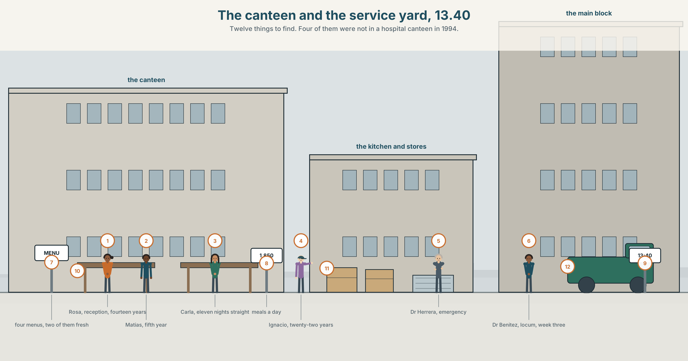
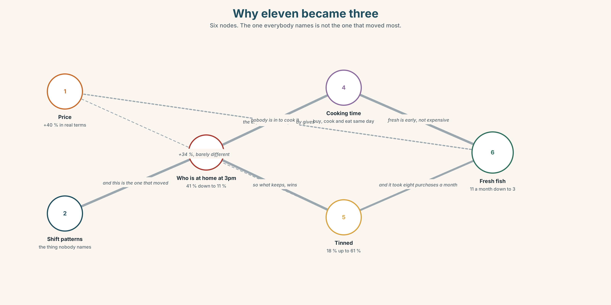
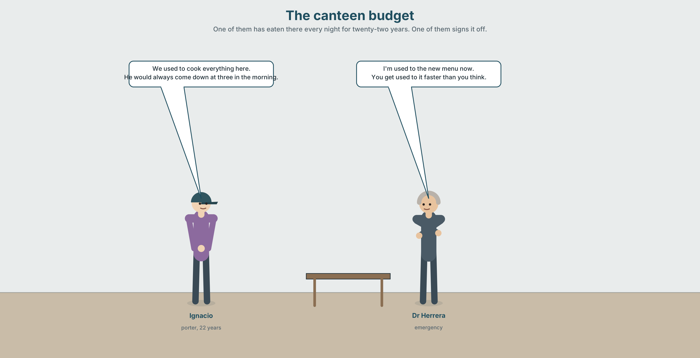
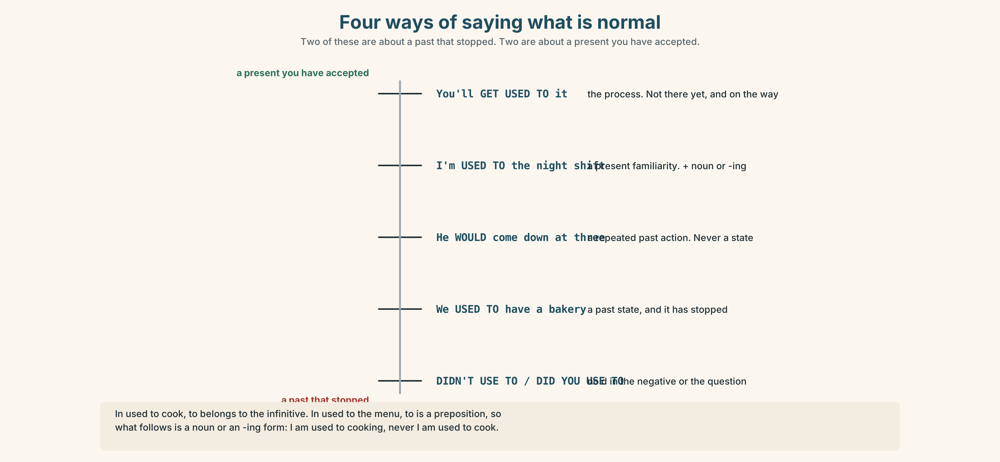
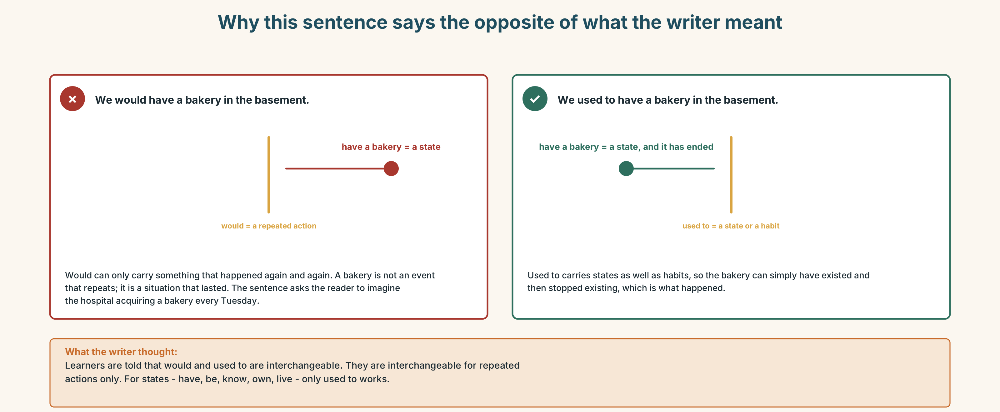
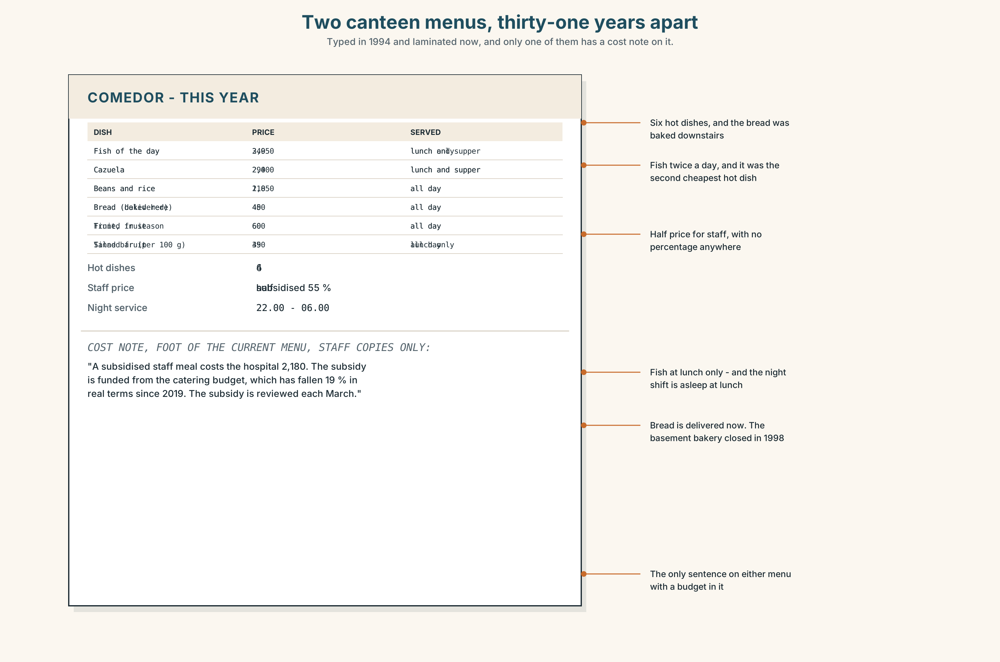
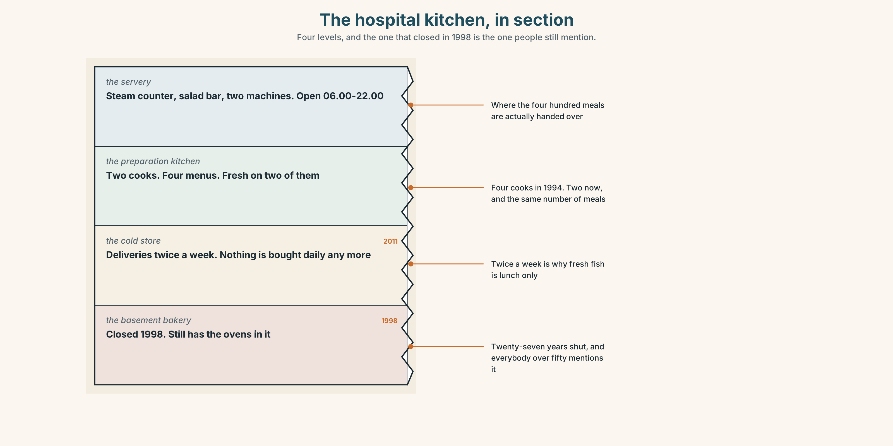
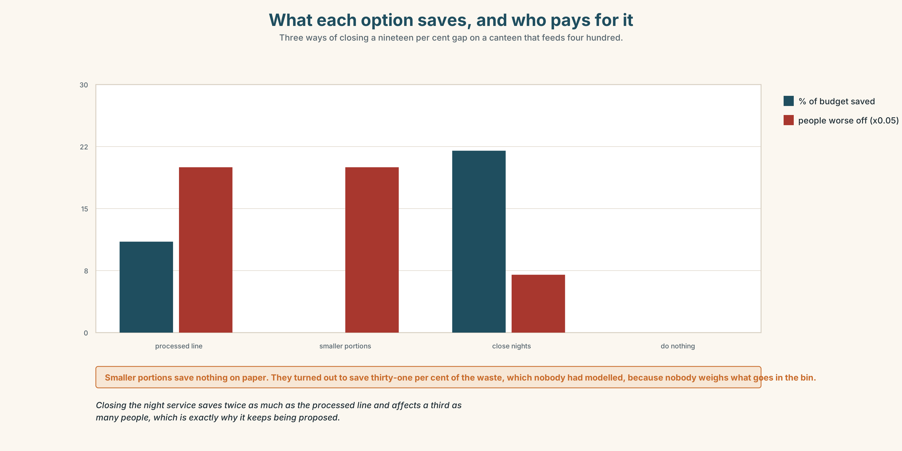

# B1.2 · Unit 1 · What the Canteen Buys

> **English Animated** · *Weighing It Up* · Hospital Regional, Valdivia
> Student's Book pages 6–27 · 22 pp · ~11 hours

---

## Part 0 · The Big Picture ◆ **A · THE WORLD**

{width=6.6in}

*The canteen and the service yard, 13.40 — Twelve things to find. Four of them were not in a hospital canteen in 1994.*

# What did we used to eat?

**By the end of this unit you can describe how eating changed in one family or one region across
two generations. One hundred and fifty words.**

| ◆ **A · THE WORLD** | What a hospital feeds four hundred people a day, and who decides |
|---|---|
| ◆ **B · THE SYSTEM** | *used to · would · be used to · get used to* · 23 words for diet and change · 22 words for habit · *used to* against *use to* |
| ◆ **C · THE PERFORMANCE** | A hundred and fifty words on two generations of one kitchen |

---

### 0A · Find it

**Find twelve things in this picture.** Four of them were not in a hospital canteen in 1994.

> a steam counter · a vending machine · a tray rail · a till · a salad bar · a tinned-fruit shelf ·
> a staff notice · a menu board · a wall clock · a recycling point · a water dispenser ·
> a cold cabinet

### 0B · Guess it

**Two things on the menu board cost the hospital almost nothing and two cost it a great deal.**
Which, and does the price on the board tell you which is which?

### 0C · Say it ⏺

**Record forty-five seconds.** *What did your grandparents eat that you do not? Name three
things, and say what replaced each one.* You will record it again at the end of this unit.

---

## Part 1 · Vocabulary Lab 1 ◆ **B · THE SYSTEM**

{width=6.6in}

*Why eleven became three — Six nodes. The one everybody names is not the one that moved most.*

### 1A · Meet — what is on the plate

Match each word to one place on the map.

> **diet** · **portion** · **staple** · **seasonal** · **processed** · **fresh** · **tinned** ·
> **recipe** · **household** · **budget**

### 1B · Sort — the food, the money, or the habit?

Three columns.

> portion · staple · budget · recipe · processed · canteen · generation · seasonal · household

**One of them changes column the moment there is less money.** Which, and why?

### 1C · Meet — the words that sound neutral and are not

> **processed** · **convenience food** · **home cooking**

All three describe how something was made. **Which two carry a judgement, and who is being
judged?**

### 1D · Collocation Lab

Complete each one with one word.

1. The ward meeting has agreed to **cut ______ on** salt across all four menus.
2. Rosa says nobody in her family ever **______ out** until she was nineteen.
3. Potatoes are **a ______ of** this region and always have been.
4. Carla **grew ______ on** tinned fruit and does not think badly of it.
5. He **lives ______** whatever is left at the end of a night shift.
6. They **______ up** on flour in March because the road closes.

### 1E · The fixed expressions

> **f** **We never had that.**
> **f** **Nobody cooked like that.**

Two sentences from the same conversation, and only one of them is a complaint.

> **Which?** Write the three lines that come before each one.

### 1F · Own it

Think of one food that your family ate and does not now. Tell a partner **four sentences**:
what it was, who made it, when it stopped, and what you feel about that.

---

## Part 2 · Listening ◆ **A · THE WORLD**

{width=6.6in}

*The canteen budget — One of them has eaten there every night for twenty-two years. One of them signs it off.*

### 2A · The canteen budget 🔊 Track 1.1

**Before you listen.** The canteen budget has to cover four hundred meals a day, and the staff
eat there too. **Guess: who argues for the cheaper food, and on what grounds?**

**Listen once. One question.** By how much has the budget fallen in real terms?

**Listen again. Complete the table.**

| | What they want | Their reason | What they are not saying |
|---|---|---|---|
| Rosa | | | |
| Dr Herrera | | | |
| Ignacio | | | |

**Listen again. Choose the best answer.**

1. The canteen serves **200 / 400 / 650** meals a day.
2. Staff meals are **free / subsidised / full price**.
3. The cheaper menu would save about **4 / 11 / 19** per cent.
4. Ignacio's objection is about **taste / dignity / cost**.

**Noticing.** Four sentences from the recording.

1. *We used to cook everything here.*
2. *He would always come down at three in the morning.*
3. *I'm used to the new menu now.*
4. *You get used to it faster than you think.*

**All four contain *used* or *would*. Only two of them are about a habit that has stopped.**
**Which two, and what are the other two doing?**

### 2B · Decoding clinic 🔊 Track 1.2

Thirty seconds of Ignacio. Four jobs.

1. How many times does he say *used to*?
2. In *used to*, is there a *d* sound anywhere?
3. Catch the two years he names.
4. He switches from *we* to *they* halfway through. Where, and what changes?

> Transcripts, page 150.

---

## Part 3 · Grammar Lab 1 ◆ **B · THE SYSTEM**

### Four ways of talking about what is normal

### 3A · Notice

Look at the four sentences in Part 2.

1. Sentence 1 and sentence 2 are both about the past. **Which one could describe a state?**
2. In sentence 3, *used to* is followed by a noun. **What has changed about the meaning?**
3. Sentence 4 describes a process. **What is the difference between *be used to* and
   *get used to*?**
4. Try *"He would always be a porter."* **Why does that fail?**
5. Try *"I used to the new menu."* **What is missing?**

### 3B · See

{width=6.6in}

*Four ways of saying what is normal — Two of these are about a past that stopped. Two are about a present you have accepted.*

### 3C · Know

| | Shape | Use it for |
|---|---|---|
| **used to + verb** | *She **used to cook** here.* | a past habit **or state** that has stopped |
| **would + verb** | *He **would** come down at three.* | a past **habit only** — never a state |
| **be used to + noun / -ing** | *I**'m used to** the new menu.* | a present familiarity |
| **get used to + noun / -ing** | *You**'ll get used to** it.* | the process of becoming familiar |

> **The *would* trap.** *would* cannot carry a state.
> ✓ *We used to have a bakery.* ✗ *We would have a bakery.*
> ✓ *He would bake on Saturdays.* ✓ *He used to bake on Saturdays.*

> **The *to* trap.** In *used to cook*, *to* belongs to the infinitive.
> In *used to the menu*, *to* is a preposition, so what follows is a noun or an *-ing* form.
> ✓ *I'm used to cooking.* ✗ *I'm used to cook.*

> **The spelling trap.** The negative and the question drop the **d**:
> *didn't **use** to* · *Did you **use** to…?*

> **Why it matters.** Three of these four can describe the same year and tell you different
> things about the speaker: what stopped, what was repeated, and what they have accepted.

### 3D · Use — controlled

> The canteen (1) __________ (cook) everything on site until 2011. On night shifts Ignacio
> (2) __________ (come) down at three and the cook (3) __________ (leave) a plate for him.
> There (4) __________ (be) a bakery in the basement, which closed in 1998. Rosa says she
> (5) __________ (be / not / used to) the tinned fruit at first and that everybody
> (6) __________ (get / used to) it within a month, which she thinks is the part worth
> noticing.

### 3E · Use — guided

Rewrite each one with *used to*, *would*, *be used to* or *get used to*. **Two of them have
only one possible answer.**

1. There was a bakery in the basement. *(there isn't now)*
2. Every Saturday he baked bread. *(he doesn't now)*
3. The night shift does not bother me anymore.
4. At first it was strange. Now it isn't.
5. The hospital had its own garden. *(it doesn't now)*

### 3F · Use — open

**Interview a partner about their first week in any job, school or city.**
Use all four forms. **Then report two of their answers using a different form from the one they
used.**

### 3G · Error autopsy

{width=6.6in}

*Why this sentence says the opposite of what the writer meant — Why this sentence says the opposite of what the writer meant*

**Read the two versions. Then explain, in one sentence, what the first one actually says.**

### 3H · Check — eight items

> 1. There ______ (be) a bakery here. *(not now)*
> 2. He ______ come down at three every night. *(habit only)*
> 3. I'm ______ ______ the new menu now.
> 4. You'll ______ ______ ______ it.
> 5. ______ you ______ to work nights? *(question form)*
> 6. I didn't ______ to like it.
> 7. She's used to ______ (work) twelve-hour shifts.
> 8. We ______ (have) a garden until 2006.

**0–4 →** Workbook pp. 4–7. **5–6 →** Part 6. **7–8 →** page 19.

---

## Part 4 · Speaking ◆ **C · THE PERFORMANCE**

### 4A · Fluency starter — two generations

In pairs. One of you is sixty. One of you is twenty. **Ninety seconds each** on what a normal
Tuesday dinner was. **Then swap ages and do it again.**

### 4B · The functional core — describing a change in habit

{width=6.6in}

*The canteen in 1994, and this year — Learner A has the 1994 menu and prices. Learner B has this year's. Neither sees the other.*

**Language Bank**

| | |
|---|---|
| **what stopped** | *We used to…* · *There used to be…* · *Nobody does that now.* |
| **what was repeated** | *He would always…* · *Every Saturday she'd…* |
| **what you have accepted** | *I'm used to it.* · *You get used to it.* |
| **the honest qualification** | *I'm not sure it was better.* · *That's nostalgia talking.* |

**Information gap.** Learner A has the 1994 canteen menu and prices. Learner B has this
year's. Neither sees the other. **Find three things that cost less now and two that cost more.**

### 4C · The performance — two minutes ⏺

Describe **how eating changed** in one family or one place across two generations.
**Two minutes.** You must include:

> one thing that stopped · one habit that repeated · one thing somebody got used to ·
> one sentence that refuses to be nostalgic

**Record it.**

### 4D · Observer

One person listens for **one thing**: did the speaker claim the past was better without saying so
out loud?

### 4E · Three criteria

> ☐ Did I use all four forms correctly?
> ☐ Is there a date or a decade in it?
> ☐ Did I resist the nostalgia at least once?

---

## Part 5 · Reading ◆ **A · THE WORLD**

### 5A · Predict

An explainer about regional diet change. The title is
**"Nobody chose this, and everybody did."**
**What do you expect the argument to be?** Two sentences.

### 5B · Read — two minutes

---

**Nobody chose this, and everybody did**

In 1990 the average household in this region bought fresh fish eleven times a month. The figure
now is three. Over the same period the number of households buying tinned fish at least weekly
rose from eighteen per cent to sixty-one.

The obvious explanation is price, and the obvious explanation is wrong, or at least incomplete.
Fresh fish here has risen by about forty per cent in real terms. Tinned fish has risen by
thirty-four. The gap between them has widened, but not nearly enough to account for a fall of
eight purchases a month.

What has changed more than the price is the shape of the day. In 1990, forty-one per cent of
households in the region had somebody at home between two and four in the afternoon. That figure
is now eleven per cent. Fresh fish is not expensive; it is **early**. It has to be bought in the
morning, cooked the same day, and eaten by people who are in the house.

Ask anybody over sixty and they will tell you it is because young people cannot cook. Ask anybody
under thirty and they will tell you it is because fish is expensive. Both answers are a way of
describing a schedule without mentioning it.

This matters for the hospital canteen, which buys for four hundred people whose shifts are the
reason the region's afternoons are empty. Whatever the canteen serves, it is serving the thing
that made the change in the first place.

---

### 5C · Comprehension — eight questions

1. What were the 1990 and current figures for fresh fish purchases?
2. What happened to tinned fish over the same period?
3. **Why does the writer say the price explanation is incomplete?** Give the numbers.
4. What has changed about the shape of the day?
5. **What does the writer mean by "fresh fish is not expensive; it is early"?**
6. What explanation do people over sixty give, and what do people under thirty give?
7. What does the writer say both explanations are really describing?
8. **Why does the last paragraph say the canteen is a special case?**

### 5D · Vocabulary in context

Guess from the text. Then check.

> in real terms · account for · the shape of the day · a way of describing · whatever it serves

### 5E · The counter-text

{width=6.6in}

*Two canteen menus, thirty-one years apart — Typed in 1994 and laminated now, and only one of them has a cost note on it.*

**Read the two canteen menus — 1994 and this year — and answer.**

1. How many hot dishes were there in 1994, and how many now?
2. **What has happened to the price of the staff meal, in money and in real terms?**
3. Which three items appear on both menus with the same name?
4. What is on the current menu that did not exist as a category in 1994?
5. One line of the current menu is a cost note for staff only. What does it say?

### 5F · Two texts

The explainer says fresh fish purchases fell because of **the shape of the day**.
The current menu shows fish served **only at lunch**.

**Put those two facts together. Who in this hospital eats fish?** Three sentences.

---

## Part 6 · Vocabulary Lab 2 ◆ **B · THE SYSTEM**

### Words for how often, and how it changed

### 6A · Sort — a habit, a change, or a speed?

Three columns.

> routine · gradually · custom · increasingly · tradition · steadily · constantly · overnight ·
> typically · practice

### 6B · Chunk completion

1. **Over ______** , the fish disappeared from the Tuesday menu.
2. **As a ______** , the kitchen buys nothing that cannot be delivered twice a week.
3. **More and ______** of the staff eat on the ward.
4. She **took ______** cooking at night because the day kitchen was always busy.
5. He **fell ______** the habit of eating at four and has not got out of it.
6. **In those ______** the bakery delivered twice a day.

### 6C · Three adverbs that are not interchangeable

**gradually · steadily · overnight**

> *Gradually* allows for stops and starts. *Steadily* does not. *Overnight* is almost always
> an exaggeration.

**Which fits each sentence, and what would the other two imply?**

1. The number of fresh purchases fell ______ between 1990 and 2010.
2. The canteen changed its supplier ______ , in March, with no notice.
3. People ______ stopped going home in the afternoon.

### 6D · The fixed expression

> **f** **You'd never see that now.**

**Say it three times:** as regret, as relief, and as a simple observation. **Which is hardest?**

### 6E · Contrast Clinic

Eight items. *used to*, *would*, *be used to* or *get used to*.

1. There ______ be a garden here.
2. Every night he ______ come down at three.
3. I ______ the smell now. I didn't at first.
4. You'll ______ the hours.
5. She ______ work in paediatrics.
6. ______ you ______ to work weekends?
7. He isn't ______ being told what to do.
8. We ______ have four cooks. Now there are two.

---

## Part 7 · Pronunciation & Fluency Lab ◆ **B · THE SYSTEM**

### Four phrases, one sound

{width=6.6in}

*Four phrases, one sound — Used to is /ˈjuːstə/ in all four. The spelling changes and the sound does not.*

### 7A · Hear 🔊 Track 1.3

> used to cook → /ˈjuːstəkʊk/
> I'm used to it → /aɪmˈjuːstəwɪt/
> get used to it → /ɡetˈjuːstəwɪt/
> didn't use to → /ˈdɪdntjuːstə/

**In all four, *used to* is /ˈjuːstə/. The spelling changes; the sound does not.**

### 7B · Say

Say each one. Then say the whole sentence three times, faster:

> *I used to hate it and now I'm used to it, and you get used to it faster than you think.*

### 7C · Make it mean something

Say these two:

> *I USED to.* *(and I do not now — this is the whole answer)*
> *I'm used TO it.* *(and you are asking me whether it still bothers me)*

**Which of the two would you say in reply to "Does the night shift bother you?"**

### 7D · Fluency 30 ⏺

Thirty seconds: **three things you used to do, two you would always do, and one you have got
used to.** Three times, faster.

---

## Part 8 · Writing ◆ **C · THE PERFORMANCE**

### Two generations of a kitchen · 150 words

{width=6.6in}

*The hospital kitchen, in section — Four levels, and the one that closed in 1998 is the one people still mention.*

### 8A · Read the model

> My grandmother bought fish eleven times a month and I have the receipts, because she kept them
> in a tin and nobody threw the tin out. `[the claim is a number, and the source of the number is
> an object]`
>
> She would go at seven, before the market filled, and she used to say that anything still there
> at nine had been there on Monday. I do not know whether that was true. `[one habit with *would*,
> one saying with *used to*, and a refusal to vouch for it]`
>
> I buy fish about twice a month and I buy it on a Saturday, which is the only morning I am in
> the house. That is the whole of the change. It is not about cooking and it is not really about
> money; it is about who is at home at nine in the morning.
> `[the explanation, and it contradicts both of the usual ones]`
>
> I am used to it. I would like to say I mind, and I am not sure I do.
> `[*be used to*, and then an admission that undercuts the nostalgia the reader was expecting]`

**Questions about the writer's choices:**

1. The first paragraph produces a tin of receipts. **What does that do for everything after it?**
2. The last line refuses to feel what the reader expects. **Is that honest, or is it a pose?**
3. The piece never uses the word *tradition*. **Would it be better or worse with it?**

### 8B · The anti-model

> Food was much better in my grandparents' time. Everything was fresh and local and people knew
> how to cook. Nowadays everyone eats processed food and nobody has time for a proper meal. It is
> a great shame and something has been lost.

Correct English, and there is nothing in it that could be checked. **Name three claims that
would need evidence**, and one word that is doing all the emotional work.

### 8C · Plan

> a number, with its source → one habit, with *would* → the explanation that is not the usual one
> → what you have got used to, honestly

### 8D · Write — 150 words
### 8E · Peer review — three criteria

> ☐ Is there one checkable number?
> ☐ Is there one habit described with *would*?
> ☐ Does the piece avoid saying the past was better?

### 8F · Write it again · 8G · Publish

On the wall, with the two menus from Part 5E beside it.

---

## Part 9 · The File ◆ **A · THE WORLD + C · THE PERFORMANCE**

# WORK FILE · The Review

{width=6.6in}

*The annual review form — Six boxes, two of them optional, and none of them is where Rosa's point goes.*

### 9A · The annual review 🔊 Track 1.4

Rosa has worked on reception for fourteen years. Her review is twenty minutes.
**Listen to all of it.**

1. How does her manager open, and what is the first real question?
2. **What does Rosa raise that is not on the form?**
3. What is agreed, and who writes it down?

### 9B · The form, and the conversation

**Read the review form in the figure.** It has six boxes.

**Which of the six does the conversation actually fill?** And **which box is where Rosa's point
would have to go, if anywhere?**

### 9C · Raising something that is not on the agenda

> *"Can I add something that isn't on here?"* · *"While we're talking about it…"* ·
> *"This may not be the right place, but…"* · *"I'd like this recorded."*

Match each to its effect. **One of the four changes what has to happen afterwards.** Which?

### 9D · Your turn

In pairs. **Twelve minutes.** One reviews, one is reviewed, using the real form.
**The person being reviewed must raise one thing that is not on it, and must get it written
down.** Then swap.

### 9E · Transfer

**Write the one sentence you would want in your own review this year.**
Keep it. You will look at it again at the end of this book.

---

## Part 10 · Mediation & Interaction ◆ **C · THE PERFORMANCE**

{width=6.6in}

*Thirty-five years of one region's plate — Half the class sees 1990. Half sees now. Rebuild the whole change by speaking.*

### 10A · Relay

Half the class sees the 1994 menu and the 1990 purchasing figures. Half sees this year's.
**Rebuild thirty years of one region's diet by speaking.** Twelve minutes.

### 10B · Simplify

Explain the canteen's cost note from Part 5E to a new member of staff on their first day.
**Five sentences only.**

> **Plan:** what a staff meal costs → what it costs the hospital → what the subsidy depends on →
> what changes next year → what to do if you cannot afford it

### 10C · Compress

The explainer in Part 5 into **forty words**, for the canteen noticeboard.

### 10D · Online

Write **one message** to the catering committee: you have read the figures, you accept the
budget cannot stretch, and you are proposing one specific change that costs nothing.

### 10E · Your language

How does your language distinguish a stopped habit from a present familiarity?
**Does it have one form or two?** Say *I used to work nights* and *I'm used to working nights*
in both languages, and tell a partner which was harder.

---

## Part 11 · The Decision ◆ **C · THE PERFORMANCE**

# Cheaper, or better

The canteen budget has fallen nineteen per cent in real terms in six years. It feeds four
hundred people a day, and about a hundred and forty of them are staff on shift, for whom it is
the only hot food available between ten at night and six in the morning.

- **Cheaper.** Move to the processed line. Saves eleven per cent. Nobody goes hungry and nothing
  is nutritionally illegal.
- **Better.** Keep fresh preparation on two of the four menus and cut portion sizes elsewhere.
  Costs nothing extra and reduces what everybody gets.
- **Smaller.** Close the night service. Saves twenty-two per cent. The hundred and forty people
  on nights bring their own or do not eat.

### 11A · The evidence

{width=6.6in}

*What each option saves, and who pays for it — Three ways of closing a nineteen per cent gap on a canteen that feeds four hundred.*

1. **The two menus** from Part 5E — and the cost note at the bottom of the current one.
2. **The chart** — what each option costs, what it saves, and who it affects.
3. **The voice.** Ignacio, thirty seconds: *"I have been here twenty-two years and I have eaten
   there every night of them. It is not about the food. If you close it at night, the only people
   who lose anything are the ones who are here at four in the morning, and we are already the
   ones who lose things."*

### 11B · Talk about it

In fours. Everybody speaks twice. Use the frame.

> *If they ______ , then ______ . So I think ______ .*

**Words you can use:** *budget · portion · processed · fresh · staple · cut down on · a balanced
diet · convenience food*

### 11C · Decide

Write **three sentences**. Choose, say why, and name what it costs.

> I think the canteen should ______________________ ,
> because ______________________ .
> What this costs is ______________________ .

### 11D · Model decision

> They should cut portion sizes and keep fresh preparation, and they should publish the portion
> change rather than letting people discover it. Every version of this costs somebody something,
> and the two options that look painless — processed food, closing at night — both put the whole
> cost on the hundred and forty people with the least choice about when they eat. A smaller plate
> for four hundred is the only version where the cost is shared, and it is also the only one
> anybody will complain about, which is probably the test.

### 11E · The Reveal

> **What happened.** Portions came down by about fifteen per cent across all four menus and the
> fresh line stayed. The change was announced on a notice that nobody read.
>
> Complaints ran at about four a week for two months and then stopped. In month five the canteen
> manager found that total food waste had fallen by thirty-one per cent, which more than covered
> the eleven per cent the processed line would have saved. Nobody had modelled that and nobody
> had thought to.
>
> The night service stayed open. Ignacio still eats there at three. He says the plate is smaller
> and that he had not noticed until somebody told him, which he thinks is either the best or the
> worst thing about the whole business and he has not decided which.

**Smaller plates saved more than cheaper food would have, because people had been throwing a
third of it away.**

> **Was it the right decision?** Say why — and say what should have been measured first.

---

## Part 12 · Landing ◆ **all three lines**

### 12A · Recycle — twelve items

> 1. There ______ (be) a bakery here. *(not now)*
> 2. He ______ come down at three every night. *(habit only)*
> 3. I'm ______ ______ the new menu now.
> 4. You'll ______ ______ ______ the hours.
> 5. They've agreed to **cut ______ on** salt.
> 6. Potatoes are **a ______ of** this region.
> 7. She **grew ______ on** tinned fruit.
> 8. **Over ______** , the fish disappeared from the menu.
> 9. *(A2.2 U2)* We ______ (wait) for that delivery since June.
> 10. *(A2.2 U8)* The hall, ______ was built in 1884, is the oldest.
> 11. *(A2.1 U3)* I ______ (use) to live on that street.
> 12. *(A2.1 U6)* I can't afford ______ (replace) it.

### 12B · Consolidate

**One hundred and fifty words.** How eating changed in one family or one place. All four forms
from Part 3, one checkable number, and one sentence that refuses to say the past was better.

### 12C · Can-do, with evidence

| I can… | My evidence | Sure? |
|---|---|---|
| distinguish a stopped habit, a repeated action and a present familiarity | Part 3H score | ◯ ◑ ● |
| describe thirty years of change in two minutes | Part 4C recording | ◯ ◑ ● |
| write 150 words with a checkable number in them | Part 8 draft 2 | ◯ ◑ ● |
| raise something in a review that is not on the form | Part 9D role play | ◯ ◑ ● |

### 12D · Replay ⏺

Find your forty-five seconds from Part 0C. Listen. **Record it again.**
**Two sentences:** what is different, and what you would still not be able to say.

### 12E · Glossary — forty-five items, as a map

> **ON THE PLATE** · diet · portion · staple · a staple of · seasonal · fresh · tinned · processed · recipe
> **WHERE IT COMES FROM** · canteen · household · budget · home cooking · convenience food · a balanced diet
> **WHAT PEOPLE DO** · generation · cut down on · eat out · grow up on · live off · give up · stock up
> **AND DO NOT** · we never had that · nobody cooked like that · you'd never see that now
> **HABIT** · practice · routine · custom · tradition · be used to · get used to · would always · take to · fall into · as a rule
> **HOW IT CHANGED** · gradually · constantly · rarely · typically · increasingly · steadily · overnight · in those days · over time · more and more

### 12F · Next

> **Unit 2 · What if it had gone differently?**
