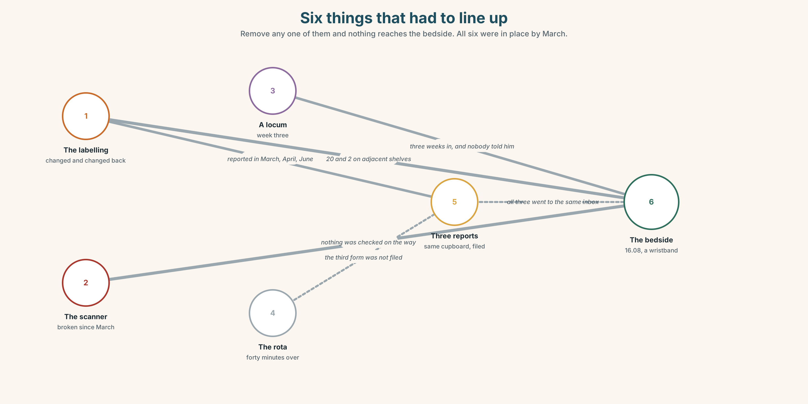
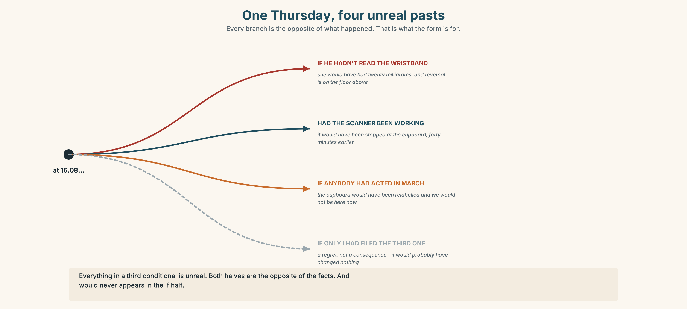
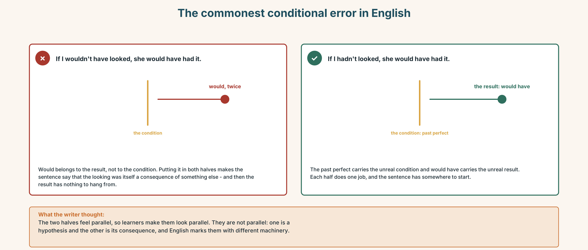
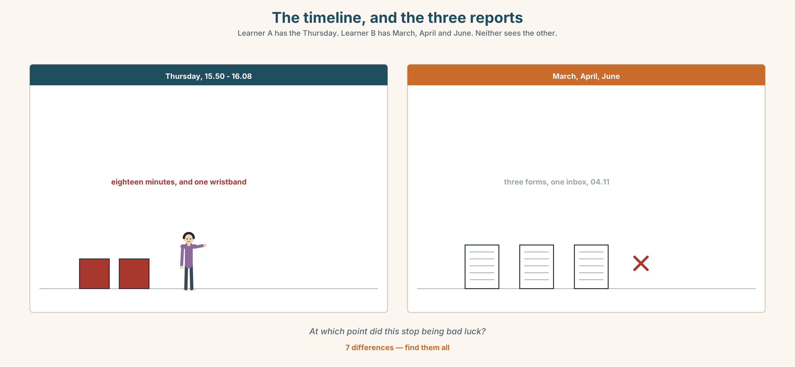
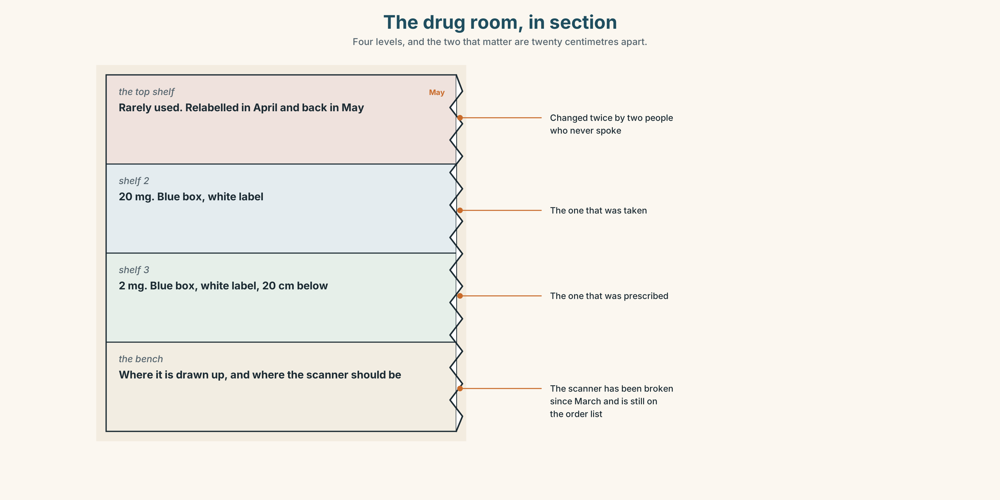
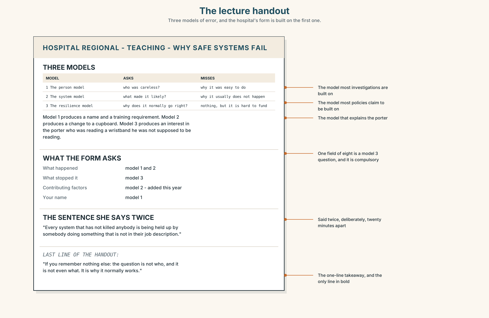
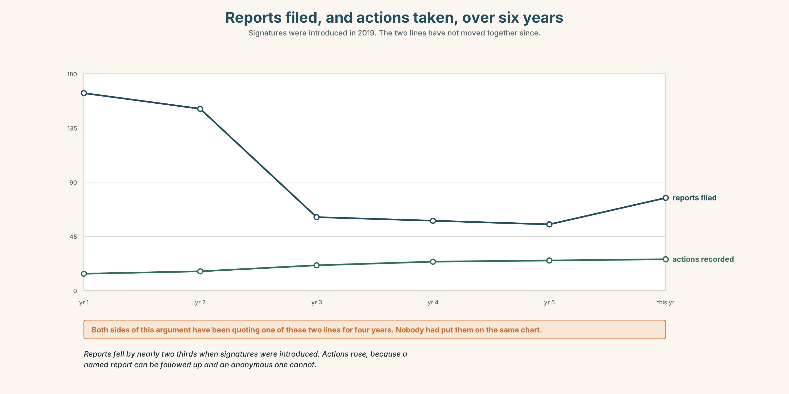

# B1.2 · Unit 2 · The Form Nobody Signs

> **English Animated** · *Weighing It Up* · Hospital Regional, Valdivia
> Student's Book pages 28–49 · 22 pp · ~11 hours

---

## Part 0 · The Big Picture ◆ **A · THE WORLD**

{width=6.6in}

*Ward 4, 15.50 — Twelve things to find. Three of them exist to stop something, and two are being used wrong.*

# What if it had gone differently?

**By the end of this unit you can narrate a near miss, and say what would have happened if it had
gone the other way. One hundred and fifty words.**

| ◆ **A · THE WORLD** | A hospital that counts the things that did not happen |
|---|---|
| ◆ **B · THE SYSTEM** | the third conditional · *if only*, *but for*, *had it not been* · 23 words for error and disclosure · 22 words for regret and narrow escapes · *would've* and *hadn't* as consonant clusters |
| ◆ **C · THE PERFORMANCE** | A hundred and fifty words about something that nearly happened |

---

### 0A · Find it

**Find twelve things in this picture.** Three of them exist to stop something.

> a drug cupboard with two locks · a whiteboard with names · a wristband scanner ·
> a red crash trolley · a hand gel dispenser · a pneumatic tube station · a bed brake ·
> a door wedge · a sharps bin · a wall-mounted phone · a near-miss form box · a clock

### 0B · Guess it

**Two of the things in this picture are being used in a way they were not designed for.**
Which, and what has somebody worked around?

### 0C · Say it ⏺

**Record forty-five seconds.** *Think of something that nearly went wrong and did not.
What would have happened if it had?* You will record it again at the end of this unit.

---

## Part 1 · Vocabulary Lab 1 ◆ **B · THE SYSTEM**

{width=6.6in}

*Six things that had to line up — Remove any one of them and nothing reaches the bedside. All six were in place by March.*

### 1A · Meet — the words of a near miss

Match each word to one place on the map.

> **incident** · **error** · **harm** · **prevent** · **report** · **blame** · **culture** ·
> **disclosure** · **anonymous** · **signed**

### 1B · Sort — the event, the response, or the system?

Three columns.

> error · report · culture · harm · blame · disclosure · incident · prevent · anonymous

**One of them belongs in the third column and is always argued about as if it were in the
second.** Which?

### 1C · Meet — three words that are not the same

> **error** · **harm** · **near miss**

An error can cause no harm. Harm can occur with no error. **A near miss is an error that was
stopped — by whom?** That question is the whole of this unit.

### 1D · Collocation Lab

Complete each one with one word.

1. The investigation is supposed to find the **root ______** , not the person nearest to it.
2. She reported it **in good ______** and has regretted it twice since.
3. The report ends with a page headed **______ learned** and nobody can name one.
4. He **owned ______** within an hour, which everybody agrees was the right thing and nobody
   would recommend.
5. Two people **______ it up** in 2019 and the hospital still has not found out who.
6. When you **look ______ on** it, the warning signs were all in the rota.

### 1E · The fixed expressions

> **f** **It could have been worse.**
> **f** **Nobody got hurt.**

Both of these are true, and both of them end an investigation.

> **Write the sentence that should follow each one** so that it does not.

### 1F · Own it

Think of a near miss you know about — anywhere, any job, any kitchen. Tell a partner
**four sentences**: what nearly happened, what stopped it, who knew, and whether it was reported.

---

## Part 2 · Listening ◆ **A · THE WORLD**

{width=6.6in}

*Two milligrams — One of them prepared it. One of them caught it, and was not supposed to be reading it.*

### 2A · Two milligrams 🔊 Track 2.1

**Before you listen.** A drug was prepared at ten times the dose and not given.
**Guess: what stopped it?**

**Listen once. One question.** Who noticed?

**Listen again. Complete the table.**

| | What they did | What they would have done differently | What they are afraid of |
|---|---|---|---|
| Carla | | | |
| Dr Benítez | | | |
| Ignacio | | | |

**Listen again. Choose the best answer.**

1. The error was caught **at the cupboard / at the bedside / after it was given**.
2. The person who caught it was a **nurse / porter / student**.
3. The form was filed **signed / anonymously / not at all**.
4. The last three reports about that cupboard were **acted on / filed / lost**.

**Noticing.** Four sentences from the recording.

1. *If I hadn't looked at the wristband, she would have had it.*
2. *If only I'd said something in March.*
3. *But for the scanner being broken, none of this would have happened.*
4. *Had it not been for Ignacio, we would be having a different conversation.*

**All four describe the same unreal past. Put them in order, most formal last.**

### 2B · Decoding clinic 🔊 Track 2.2

Thirty seconds of Carla. Four jobs.

1. How many times does she say *would have*?
2. In *hadn't*, how many consonant sounds can you hear at the end?
3. Catch the dose and the time.
4. She corrects a pronoun halfway through a sentence. Where, and what does the correction do?

> Transcripts, page 151.

---

## Part 3 · Grammar Lab 1 ◆ **B · THE SYSTEM**

### A past that did not happen

### 3A · Notice

Look at the four sentences in Part 2.

1. In sentence 1, did she look at the wristband? Did the patient have the drug?
2. **The third conditional reverses both halves.** What actually happened in sentence 3?
3. Sentence 4 begins *Had it not been*. **Where has the *if* gone?**
4. **Which of the four blames somebody?** Is it the grammar that does it, or the content?
5. Try *"If I wouldn't have looked, she would have had it."* **What is wrong, and why is it so
   common?**

### 3B · See

{width=6.6in}

*One Thursday, four unreal pasts — Every branch is the opposite of what happened. That is what the form is for.*

### 3C · Know

| | Shape | |
|---|---|---|
| **third conditional** | *If* + **past perfect**, *would have* + past participle | *If I **had looked**, she **wouldn't have had** it.* |
| **inverted** | *Had* + subject + past participle | ***Had I looked**, she wouldn't have had it.* |
| **but for** | *But for* + noun | ***But for** the scanner, it would have happened.* |
| **if only** | regret, not consequence | ***If only** I'd said something.* |

> **Everything in it is unreal.** The *if* half did not happen; the *would* half did not happen.
> Both halves are the opposite of the facts.

> **The commonest error in English, at every level.**
> ✗ *If I wouldn't have looked…* ✓ *If I hadn't looked…*
> ***would* never appears in the *if* half.** It is so common because the two halves feel
> parallel and are not.

> **The inverted form drops *if* and is one register up.** It is normal in writing, reports and
> formal speech, and sounds odd in a kitchen.
> ✓ *Had it not been for Ignacio…* ✗ *Had I known it, if…*

> **Mixed with the present.** If the result is still true now, the second half becomes *would* +
> verb: *If I'd said something in March, we **wouldn't be having** this conversation.*

### 3D · Use — controlled

> If Carla (1) __________ (not / check) the wristband, the patient
> (2) __________ (receive) ten times the dose. The scanner
> (3) __________ (be) broken since March; had it (4) __________ (work), the error
> (5) __________ (not / reach) the bedside at all. If anybody
> (6) __________ (act) on the three previous reports, the cupboard
> (7) __________ (be) relabelled in the spring, and we
> (8) __________ (not / be) having this conversation now.

### 3E · Use — guided

Rewrite each one as a third conditional. **Two of them should use the inverted form.**

1. The scanner was broken, so the error reached the bedside.
2. Ignacio was passing. He noticed.
3. Nobody acted on the March report, so the cupboard was not relabelled.
4. She reported it, so the cupboard has been changed.
5. He did not sign the form, so nothing was investigated.

### 3F · Use — open

**In pairs.** Describe something that went right. Your partner must produce three unreal pasts
in which it went wrong. **Then swap.** Three minutes each.

### 3G · Error autopsy

{width=6.6in}

*The commonest conditional error in English — The commonest conditional error in English*

**Read both versions. Then say, in one sentence, what the wrong one would mean if English
allowed it.**

### 3H · Check — eight items

> 1. If I ______ (not / look), she ______ (have) it.
> 2. ______ it not ______ for Ignacio, we would be having a different conversation.
> 3. But ______ the broken scanner, nothing would have reached the bedside.
> 4. If only I ______ (say) something in March.
> 5. If they ______ (act) on the report, the cupboard ______ (be) relabelled by now.
> 6. ______ I known, I ______ (not / prepare) it at all.
> 7. If she ______ (not / sign) it, nothing ______ (happen).
> 8. If I ______ (study) medicine, I ______ (be) in my fourth year now.

**0–4 →** Workbook pp. 10–13. **5–6 →** Part 6. **7–8 →** page 41.

---

## Part 4 · Speaking ◆ **C · THE PERFORMANCE**

### 4A · Fluency starter — the chain backwards

One learner states a fact: *"The patient was fine."*
The next produces an unreal past: *"If Ignacio hadn't been passing, she wouldn't have been."*
The next goes one further back. **Five links, then stop.**

### 4B · The functional core — narrating a near miss

{width=6.6in}

*The timeline, and the three reports — Learner A has the Thursday. Learner B has March, April and June. Neither sees the other.*

**Language Bank**

| | |
|---|---|
| **what happened** | *At about four…* · *The dose prepared was…* |
| **what stopped it** | *What caught it was…* · *Had it not been for…* |
| **what would have happened** | *She would have…* · *We would be…* |
| **the regret, separately** | *If only…* · *I wish I'd…* |

**Information gap.** Learner A has the incident timeline. Learner B has the three previous
reports about the same cupboard. **Find the point at which this stopped being bad luck.**

### 4C · The performance — two minutes ⏺

Narrate a **near miss**. **Two minutes.** You must include:

> what happened, in order · what stopped it · what would have happened ·
> one *if only* that is about you and not about the system

**Record it.**

### 4D · Observer

One person listens for **one thing**: did the speaker blame anybody, and did they mean to?

### 4E · Three criteria

> ☐ Did I keep *would* out of the *if* half every time?
> ☐ Did I use one inverted form?
> ☐ Is the regret separate from the consequence?

---

## Part 5 · Reading ◆ **A · THE WORLD**

### 5A · Predict

A short story. The title is **"The third form."**
**What do you expect the third form to be?** Two sentences.

### 5B · Read — two minutes

---

**The third form**

The first form she filed was in March and she signed it, because that is what you are told to do
and because she had been in the job eight weeks and had not yet learned which instructions are
real.

The cupboard was relabelled in April. Then it was relabelled back in May, by somebody in
pharmacy who had not been told why it had been changed and who correctly observed that the new
labels did not match the formulary.

The second form she filed in June, and she signed that one too. It went to the same inbox. She
knows this because she has the automatic reply, which is two lines long and arrived at 04.11,
which tells you something about who was awake.

The third one is the one she did not file.

It was a Thursday and she was forty minutes past the end of a shift and she thought — and she has
been honest with me about this — *if I write this one, I will be the person who writes these*.
There is no sentence in any policy about being the person who writes these. There does not have
to be.

Eleven weeks later a bag went up at ten times the dose and was caught at the bedside by a porter
who was not supposed to be reading wristbands and who has never been thanked for it in writing,
because thanking him would mean writing down what he was doing.

If she had filed the third one, it would almost certainly have gone to the same inbox and arrived
at four in the morning and changed nothing. That is the part people get wrong about this story.
The reason to file it was never that it would have worked.

---

### 5C · Comprehension — eight questions

1. When did she file the first form, and why did she sign it?
2. **What happened to the cupboard in April and in May, and why?**
3. How does she know the second form arrived?
4. What was her reason for not filing the third?
5. **What does the narrator mean by "there does not have to be"?**
6. What happened eleven weeks later, and who caught it?
7. Why has the porter never been thanked in writing?
8. **What does the last paragraph say people get wrong about the story?**

### 5D · Vocabulary in context

Guess from the text. Then check.

> which instructions are real · the formulary · the same inbox · past the end of a shift ·
> it would have changed nothing

### 5E · The counter-text

{width=6.6in}

*The near-miss form, and the twelve-month summary — Eleven fields, four compulsory, and one of them was added this year.*

**Read the near-miss reporting form and the twelve-month summary, and answer.**

1. How many fields are there, and how many are compulsory?
2. **What is the difference, on the form itself, between an anonymous report and a signed one?**
3. How many reports were filed in the year, and how many were anonymous?
4. What proportion of each kind resulted in a recorded action?
5. One field has been added since last year. Which, and what does it ask?

### 5F · Two texts

The story says the forms **changed nothing**.
The summary shows **signed reports with a 61 per cent action rate**.

**Put those two facts together. Was she wrong?** Three sentences.

---

## Part 6 · Vocabulary Lab 2 ◆ **B · THE SYSTEM**

### Narrow escapes and the words for them

### 6A · Sort — how close, and how lucky?

Three columns: **how close · how lucky · how it looks afterwards**.

> nearly · barely · narrowly · fortunately · luckily · thankfully · hindsight · almost ·
> as it turned out

### 6B · Chunk completion

1. **By a ______** — four minutes later and it would have been given.
2. He noticed **at the last ______** , which is the only reason anybody knows.
3. **As it turned ______** , the scanner had been broken since March.
4. **To make matters ______** , the previous reports were about the same cupboard.
5. It **panned ______** better than anybody deserved.
6. Nobody knows how it would have **turned ______** .

### 6C · Three that look identical

**fortunately · luckily · thankfully**

> *Fortunately* is about the outcome. *Luckily* is about chance. *Thankfully* is about the
> speaker's feelings, and in a report it is the one to avoid.

**Which fits each, and why are the other two worse?**

1. ______ , the porter was passing.
2. ______ , the error was caught before the drug was given.
3. ______ , nobody has to tell a family anything.

### 6D · The fixed expression

> **f** **I wish I'd said something.**

**Say it twice:** once about a system, once about a person. **Which is harder to say out loud,
and which is more useful in a report?**

### 6E · Contrast Clinic

Eight items. Third conditional, inverted form, *but for*, or *if only*.

1. The scanner was broken. The error reached the bedside.
2. Ignacio was passing. He caught it.
3. She didn't file the third form. *(regret only)*
4. Nobody acted in March. The cupboard is still wrong. *(result now)*
5. She signed the first two. They were investigated.
6. *(formal, in a report)* Ignacio was there. Nothing happened.
7. I didn't know. I prepared it.
8. He read the wristband. She is alive.

---

## Part 7 · Pronunciation & Fluency Lab ◆ **B · THE SYSTEM**

### Four consonants in a row

{width=6.6in}

*Four consonants in a row — In wouldn't have there are four consonant sounds between the vowels, and nobody says all of them.*

### 7A · Hear 🔊 Track 2.3

> would have → *would've* → /ˈwʊdəv/
> wouldn't have → /ˈwʊdntəv/
> hadn't → /ˈhædnt/
> if I hadn't → /ɪfaɪˈhædnt/
> had it not been → /hædɪtnɒtˈbɪn/

**In *wouldn't have* there are four consonant sounds between the two vowels, and native speakers
do not say all of them.**

### 7B · Say

Say each one. Then say the whole sentence three times, faster:

> *If I hadn't looked at the wristband, she would have had it.*

### 7C · Make it mean something

Say these two:

> *She WOULD have had it.* *(somebody has just said she would not)*
> *She would've had it.* *(and this is simply what follows)*

**One of these belongs in a report and one does not.** Which, and why?

### 7D · Fluency 30 ⏺

Thirty seconds: **three unreal pasts about today.** Three times, faster,
and never let a *would* into the *if* half.

---

## Part 8 · Writing ◆ **C · THE PERFORMANCE**

### A near miss · 150 words

{width=6.6in}

*The drug room, in section — Four levels, and the two that matter are twenty centimetres apart.*

### 8A · Read the model

> At 15.50 a bag was prepared at 20 mg. The prescription was 2 mg. The error was in the
> transcription and the cupboard labelling made it easy to make.
> `[what happened, in the passive, with no person in it — deliberately]`
>
> It was caught at the bedside at 16.08 by a porter who was reading the wristband while he
> waited. Had he not been waiting, it would have been given. `[what stopped it, with a name for
> the role and not the person, and one inverted conditional]`
>
> Twenty milligrams of that drug would have required reversal within four minutes and the
> reversal agent is on the floor above. `[what would have happened, with a number that makes it
> real]`
>
> If only somebody had acted on the March report. I include myself in that: I read it and did
> nothing, because it was not addressed to me. `[the regret, and the writer puts themselves in
> it without making the piece about themselves]`

**Questions about the writer's choices:**

1. The first paragraph has no person in it at all. **Is that evasion or precision?**
2. The porter is described by his job and not his name. **Why might that be protective?**
3. The last paragraph admits something. **Does it weaken the report?**

### 8B · The anti-model

> There was unfortunately a near miss on the ward last Thursday. Luckily it was spotted in time
> and no harm came to the patient. Staff are reminded to check all doses carefully. We are
> grateful to everyone involved for their vigilance.

Correct English. **Name three things an investigator could not do with it**, and one word in it
that quietly assigns the blame.

### 8C · Plan

> what happened, with the numbers → what stopped it → what would have happened, with a number →
> one *if only* that includes you

### 8D · Write — 150 words
### 8E · Peer review — three criteria

> ☐ Could somebody act on this next Thursday?
> ☐ Is there a number in the counterfactual?
> ☐ Does the writer appear in it without the piece being about them?

### 8F · Write it again · 8G · Publish

On the wall, with the reporting form from Part 5E beside it.

---

## Part 9 · The File ◆ **A · THE WORLD + C · THE PERFORMANCE**

# STUDY FILE · The Lecture

{width=6.6in}

*The lecture handout — Three models of error, and the hospital's form is built on the first one.*

### 9A · Fifty minutes on error 🔊 Track 2.4

A teaching session for fifth-year students: *why safe systems fail*. **Listen to the first
twenty minutes.**

1. What are the three models of error she describes?
2. **Which one does she say the hospital's form is built on, and why is that a problem?**
3. She says one sentence twice. Which, and what is it doing?

### 9B · Notes that survive the week

**Three columns:** *what she said · what I will need · what I don't follow*.

> Listen again. **Six lines in the first column. At least two in each of the others.**

### 9C · The signposts of a lecture

Match each to its job.

> *"There are three models and I am going to argue the third one."* ·
> *"Now, I said I would come back to this."* ·
> *"This is the bit that is in the exam, and it is also the bit that is true."* ·
> *"If you remember nothing else…"*

> stating the thesis · returning to a thread · marking importance · the one-line takeaway

### 9D · Your turn

**Four minutes, standing up.** Explain one of the three models of error to the group,
with one signpost phrase and one third conditional.

### 9E · Transfer

**Find one lecture, podcast or talk this week.** Write down its thesis in one sentence.
If you cannot, note what it had instead.

---

## Part 10 · Mediation & Interaction ◆ **C · THE PERFORMANCE**

{width=6.6in}

*From March to the Thursday — Half the class sees the timeline. Half sees the reports. Rebuild the year by speaking.*

### 10A · Relay

Half the class sees the incident timeline. Half sees the twelve-month report summary.
**Rebuild the whole year by speaking.** Twelve minutes.

### 10B · Simplify

Explain the reporting form from Part 5E to a new member of staff on day one.
**Five sentences only.**

> **Plan:** what it is for → what happens to a signed one → what happens to an anonymous one →
> what will not happen to you → the one field that matters

### 10C · Compress

The story in Part 5 into **forty words**, without losing the last paragraph's point.

### 10D · Online

Write **one message** to the patient safety lead: there have been four reports about one
cupboard, you have the dates, and you are asking for one specific thing by one specific date.

### 10E · Your language

How does your language talk about a past that did not happen?
**Is there a special form, or does it use the ordinary past?** Say *if I hadn't looked, she
would have had it* in both languages and tell a partner which is longer.

---

## Part 11 · The Decision ◆ **C · THE PERFORMANCE**

# Signed, or anonymous

The near-miss form can be filed either way. The hospital is deciding whether to keep both
options.

- **Signed only.** Sixty-one per cent of signed reports result in a recorded action, against
  nine per cent of anonymous ones, because an investigator can ask a follow-up question.
- **Anonymous only.** Reporting rates in the two years before signatures were introduced were
  three times what they are now.
- **Both, as now.** The current position, which produces a small number of useful reports and a
  large number of unusable ones, and which everybody agrees is unsatisfactory.

### 11A · The evidence

{width=6.6in}

*Reports filed, and actions taken, over six years — Signatures were introduced in 2019. The two lines have not moved together since.*

1. **The form and the summary** from Part 5E — and the field that was added this year.
2. **The chart** — reports filed, and actions taken, over six years.
3. **The voice.** Carla, thirty seconds: *"I signed the first two. I would sign again tomorrow
   and I would tell a new nurse to sign, and I am aware that what I am recommending is a thing
   that cost me something. If I had not signed the second one I would not have been in that
   meeting in July, and I would rather have been in the meeting."*

### 11B · Talk about it

In fours. Everybody speaks twice. Use the frame.

> *If they ______ , then ______ . But if they ______ , then ______ .*

**Words you can use:** *incident · error · harm · prevent · report · blame · culture ·
disclosure · in good faith · root cause*

### 11C · Decide

Write **three sentences**. Choose, say why, and name what it costs.

> I think the hospital should ______________________ ,
> because ______________________ .
> What this costs is ______________________ .

### 11D · Model decision

> Keep both, and publish the two action rates on the form itself. The argument has been running
> for four years because each side has one number and neither has both, and a reporter standing
> at a cupboard at four in the morning is entitled to know that signing it triples the chance of
> anything happening and also that nine per cent of anonymous reports do get acted on. Let them
> price their own risk. The hospital cannot promise protection it has not demonstrated.

### 11E · The Reveal

> **What happened.** Both options were kept and the two rates were printed at the top of the
> form in a box.
>
> Total reports rose by about forty per cent in the first year. The anonymous share rose from
> thirty-one per cent to fifty-four, which is the opposite of what the safety lead expected and
> had argued for.
>
> Actions taken rose too, but not proportionally: from nineteen in the previous year to
> twenty-six. The useful information in anonymous reports turned out to be mostly in the free-text
> box, which nobody had been reading, and which one person now reads every Friday.

**More reports, mostly anonymous, and the value was in a box nobody had opened.**

> **Was it the right decision?** Say why — and say what should happen to the Friday reading job.

---

## Part 12 · Landing ◆ **all three lines**

### 12A · Recycle — twelve items

> 1. If I ______ (not / look), she ______ (have) it.
> 2. ______ it not ______ for Ignacio, nothing would have been caught.
> 3. But ______ the broken scanner, it would not have reached the bedside.
> 4. If only I ______ (say) something in March.
> 5. The investigation looks for the **root ______** .
> 6. She reported it **in good ______** .
> 7. **As it turned ______** , the scanner had been broken for months.
> 8. **To make matters ______** , the earlier reports were about the same cupboard.
> 9. *(Unit 1)* There ______ (be) a bakery here. *(not now)*
> 10. *(Unit 1)* I'm ______ ______ the night shift now.
> 11. *(A2.2 U3)* By the time we arrived, it ______ (already / start).
> 12. *(A2.2 U6)* The rope ______ (must / break) in the night.

### 12B · Consolidate

**One hundred and fifty words.** A near miss. What happened, what stopped it, what would have
happened with a number in it, and one *if only* that includes you.

### 12C · Can-do, with evidence

| I can… | My evidence | Sure? |
|---|---|---|
| describe a past that did not happen, without putting *would* in the *if* half | Part 3H score | ◯ ◑ ● |
| narrate a near miss in two minutes | Part 4C recording | ◯ ◑ ● |
| write 150 words an investigator could act on | Part 8 draft 2 | ◯ ◑ ● |
| take notes from a fifty-minute lecture in three columns | Part 9B page | ◯ ◑ ● |

### 12D · Replay ⏺

Find your forty-five seconds from Part 0C. Listen. **Record it again.**
**Two sentences:** what is different, and what you now say that you did not before.

### 12E · Glossary — forty-five items, as a map

> **THE EVENT** · incident · error · harm · a near miss · close call · what went wrong
> **THE RESPONSE** · prevent · avoid · report · disclosure · anonymous · signed · in good faith · root cause · lessons learned
> **THE PEOPLE** · blame · culture · own up · cover up · look back · put down to
> **WHAT PEOPLE SAY** · it could have been worse · nobody got hurt · I wish I'd said something
> **HOW CLOSE** · nearly · almost · barely · narrowly · by a hair · at the last minute
> **HOW LUCKY** · fortunately · luckily · thankfully · as it turned out · pan out · turn out
> **LOOKING BACK** · regret · hindsight · otherwise · instead · had I known · but for · had it not been · to make matters worse

### 12F · Next

> **Unit 3 · Are you where you expected to be?**
