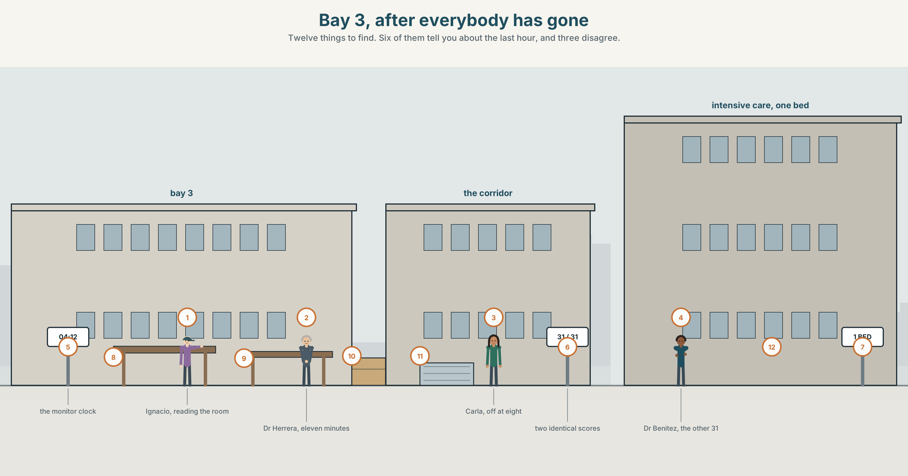
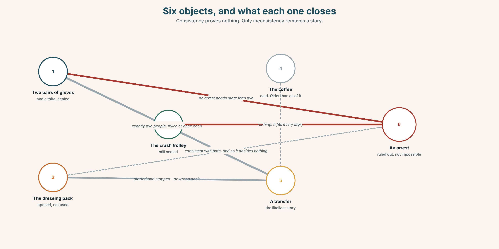
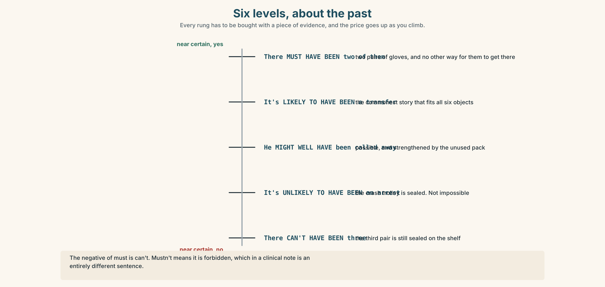
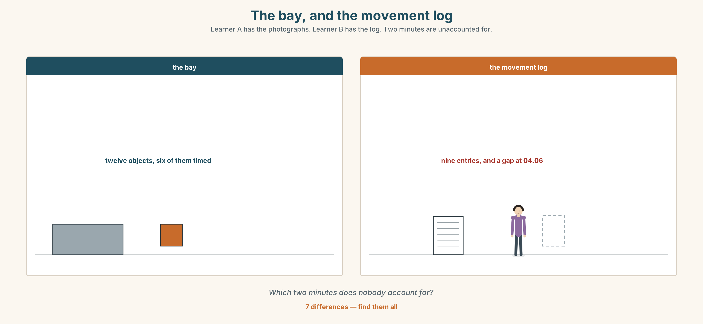
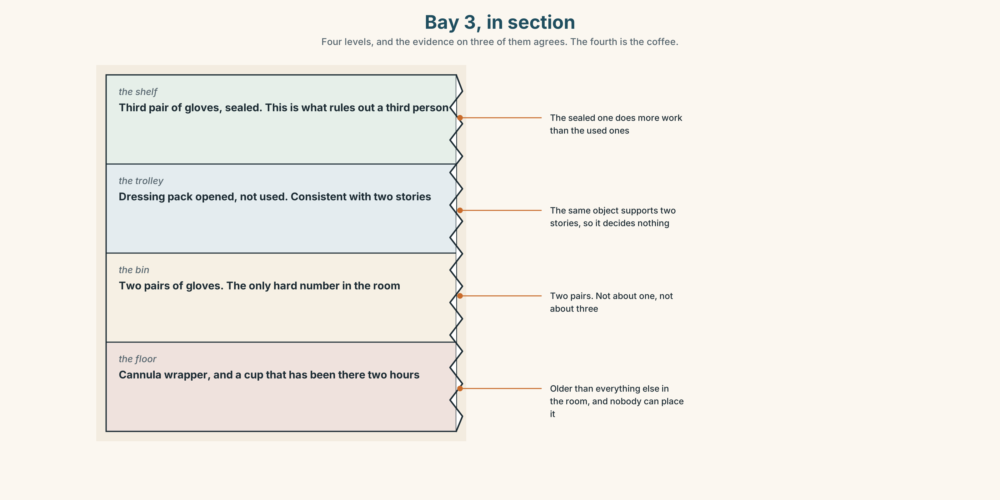
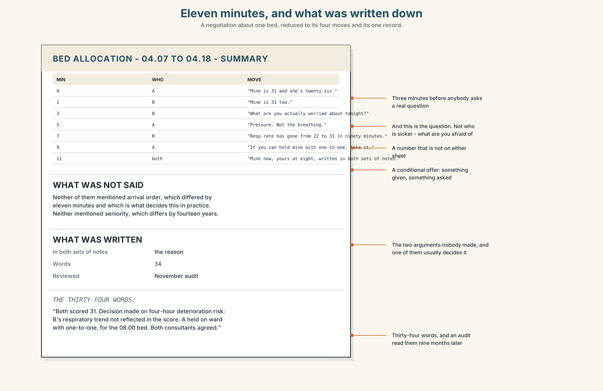
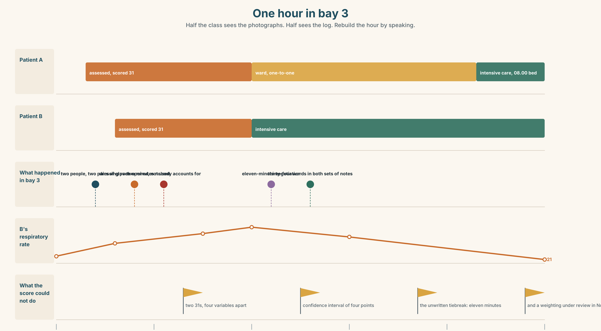
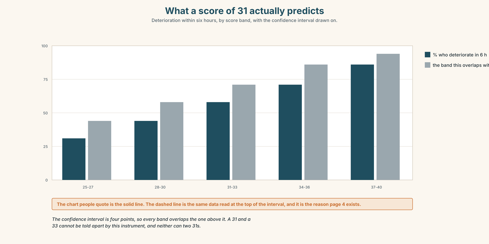

# B1.2 · Unit 4 · One Bed, Two Scores

> **English Animated** · *Weighing It Up* · Hospital Regional, Valdivia
> Student's Book pages 72–93 · 22 pp · ~11 hours

---

## Part 0 · The Big Picture ◆ **A · THE WORLD**

{width=6.6in}

*Bay 3, after everybody has gone — Twelve things to find. Six of them tell you about the last hour, and three disagree.*

# What must have happened here?

**By the end of this unit you can reconstruct an event from physical evidence alone.
One hundred and sixty words.**

| ◆ **A · THE WORLD** | A room that has to be read, and a decision that cannot wait for certainty |
|---|---|
| ◆ **B · THE SYSTEM** | modals of deduction, present and past · scales of certainty · 23 words for evidence and inference · 22 words for how sure you are · *must have* as /mʌstəv/ |
| ◆ **C · THE PERFORMANCE** | A hundred and sixty words built only from what is in the room |

---

### 0A · Find it

**Find twelve things in this picture.** Six of them tell you something about the last hour.

> a chair out of position · a dressing pack opened and not used · a cannula wrapper on the floor ·
> a monitor still on · a cup of coffee gone cold · a drawer left open · a phone face down ·
> two sets of gloves in the bin · a curtain half drawn · a trolley at an angle ·
> a door wedged with a shoe · a clock

### 0B · Guess it

**Three of the twelve are inconsistent with each other.** Which three, and what does that
inconsistency rule out?

### 0C · Say it ⏺

**Record forty-five seconds.** *Describe a room you have walked into and read. What did you
conclude, and what was the one thing that told you?* You will record it again at the end of this
unit.

---

## Part 1 · Vocabulary Lab 1 ◆ **B · THE SYSTEM**

{width=6.6in}

*Six objects, and what each one closes — Consistency proves nothing. Only inconsistency removes a story.*

### 1A · Meet — the words of reading a scene

Match each word to one place on the map.

> **evidence** · **trace** · **residue** · **position** · **angle** · **sequence** ·
> **scene** · **reconstruct** · **witness** · **timeline**

### 1B · Sort — a thing, a relation, or a conclusion?

Three columns.

> trace · consistent · sequence · residue · inconsistent · timeline · angle · reconstruct ·
> evidence

**One of them is not evidence until you have two of something else.** Which, and why?

### 1C · Meet — the pair that does the real work

> **consistent** · **inconsistent**

**Consistency proves nothing.** Many stories are consistent with the same room.
**Inconsistency is the only thing that removes one.** Why is that asymmetry so easy to forget?

### 1D · Collocation Lab

Complete each one with one word.

1. The position of the trolley **points ______** somebody leaving in a hurry.
2. Two sets of gloves are **consistent ______** two people, and with one person twice.
3. **At first ______** it looks like a cardiac arrest. It is not.
4. **On closer ______** , the dressing pack was opened and never used.
5. **The most likely ______** is that the second person arrived after the monitor was switched on.
6. Nobody has been able to **account ______** the cold coffee.

### 1E · The fixed expressions

> **f** **None of it adds up.**
> **f** **That explains the rest.**

Two sentences that arrive at opposite ends of the same hour.

> **Write the sentence immediately before each one.**

### 1F · Own it

Think of a room, a car or a desk you have read. Tell a partner **four sentences**: what you saw,
what you concluded, what you ruled out, and what you were wrong about.

---

## Part 2 · Listening ◆ **A · THE WORLD**

{width=6.6in}

*Reading the room — One of them has twenty-two years of these rooms. One of them has the movement log.*

### 2A · Reading the room 🔊 Track 4.1

**Before you listen.** Two people walk into a bay that has been left. Nobody who was in it is
available. **Guess: what will they disagree about?**

**Listen once. One question.** How many people were in the bay?

**Listen again. Complete the table.**

| Observation | What it suggests | What it rules out |
|---|---|---|
| two sets of gloves | | |
| the unused dressing pack | | |
| the trolley angle | | |

**Listen again. Choose the best answer.**

1. They agree that there were **one / two / at least two** people.
2. The dressing pack suggests somebody **started and stopped / never started / finished**.
3. The cold coffee has been there for about **ten minutes / forty minutes / two hours**.
4. The one thing they cannot explain is the **phone / door wedge / monitor**.

**Noticing.** Four sentences from the recording.

1. *There must have been two of them.*
2. *There can't have been more than two.*
3. *He might well have been called away.*
4. *It's unlikely to have been an arrest.*

**All four are deductions about the past. Rank them from most certain to least.**

### 2B · Decoding clinic 🔊 Track 4.2

Thirty seconds of Ignacio. Four jobs.

1. How many times does he say *must have* or *can't have*?
2. In *must have*, is the *h* pronounced?
3. Catch the two times he gives.
4. He changes a deduction from certain to probable mid-sentence. Where?

> Transcripts, page 153.

---

## Part 3 · Grammar Lab 1 ◆ **B · THE SYSTEM**

### How sure, about now and about then

### 3A · Notice

Look at the four sentences in Part 2.

1. Sentence 1 and sentence 2 are both near-certainties. **One is positive and one is negative.
   What are the two forms?**
2. In sentence 3, what does *well* add to *might have*?
3. Sentence 4 avoids a modal altogether. **What does it gain and what does it lose?**
4. **What is the present-time version of each of the four?**
5. Try *"It mustn't have been an arrest."* **What is wrong, and what does it actually mean?**

### 3B · See

{width=6.6in}

*Six levels, about the past — Every rung has to be bought with a piece of evidence, and the price goes up as you climb.*

### 3C · Know

| Certainty | About now | About the past |
|---|---|---|
| **near certain, yes** | *It **must be** two people.* | *There **must have been** two of them.* |
| **probable** | *It**'s likely to be**…* | *It**'s likely to have been**…* |
| **possible** | *It **might / could be**…* | *It **might / could have been**…* |
| **strengthened possible** | *It **might well be**…* | *It **might well have been**…* |
| **improbable** | *It**'s unlikely to be**…* | *It**'s unlikely to have been**…* |
| **near certain, no** | *It **can't be**…* | *It **can't have been**…* |

> **The negative of *must* is *can't*.**
> *mustn't* means *it is forbidden*, which in a clinical note is a very different sentence.

> **Adverbs raise or lower the whole scale**, and only one at a time:
> *certainly · definitely · undoubtedly · doubtless · presumably · plausibly · arguably ·
> conceivably · seemingly · apparently · implausibly*

> ***seemingly* and *apparently* are not about your confidence.** They report somebody else's
> account or an appearance, and in a written reconstruction they are a way of not committing.

> **Why it matters.** A reconstruction that states everything at the same level of certainty is
> useless, because the reader cannot tell which parts to act on.

### 3D · Use — controlled

> There (1) __________ (must / be) at least two people in the bay, because there are two sets
> of gloves. There (2) __________ (can't / be) more than two, because the third pair is still
> sealed. The dressing pack was opened and not used, which (3) __________ (must / mean) that
> somebody started something and stopped. He (4) __________ (might well / be) called away. It
> (5) __________ (be / unlikely) to have been an arrest, because the crash trolley has not been
> opened, and on the balance of probability it (6) __________ (be) a transfer.

### 3E · Use — guided

Rewrite each one at the certainty level in brackets.

1. There were two people. *(near certain)*
2. He was called away. *(possible, strengthened)*
3. It was not an arrest. *(improbable, not impossible)*
4. The coffee was made before the monitor was switched on. *(near certain, negative of the
   opposite)*
5. Somebody came back for the phone. *(possible, weak)*

### 3F · Use — open

**In pairs.** One of you describes a photograph the other cannot see — a room, a street,
a kitchen. The other must produce **six deductions at six different certainty levels.**
Then swap.

### 3G · Error autopsy

{width=6.6in}

*The negative that means something else — The negative that means something else*

**Read both versions. Then say what the wrong one would mean in a hospital note.**

### 3H · Check — eight items

> 1. There ______ (must / be) two of them. *(past)*
> 2. There ______ (can't / be) more than two. *(past)*
> 3. He ______ (might well / be) called away. *(past)*
> 4. It ______ unlikely to ______ been an arrest.
> 5. The monitor is on, so somebody ______ (must / be) here recently. *(past)*
> 6. It ______ (can't / be) him — he was in theatre. *(past)*
> 7. She ______ (must / be) in the building. *(now — her coat is here)*
> 8. On the balance of ______ , it was a transfer.

**0–4 →** Workbook pp. 22–25. **5–6 →** Part 6. **7–8 →** page 85.

---

## Part 4 · Speaking ◆ **C · THE PERFORMANCE**

### 4A · Fluency starter — six levels

Your teacher shows one object. Each learner must make a deduction **one level less certain than
the last.** The round ends when somebody reaches *conceivably*.

**Four objects. Four rounds.**

### 4B · The functional core — reading evidence out loud

{width=6.6in}

*The bay, and the movement log — Learner A has the photographs. Learner B has the log. Two minutes are unaccounted for.*

**Language Bank**

| | |
|---|---|
| **the observation** | *There are two sets of…* · *The trolley is at…* |
| **the inference** | *Which points to…* · *That's consistent with…* |
| **the exclusion** | *That rules out…* · *It can't have been…, because…* |
| **the honest gap** | *I can't account for the…* · *We may never establish that.* |

**Information gap.** Learner A has photographs of the bay. Learner B has the staff movement log
for the hour. **Find the two minutes that nobody can account for.**

### 4C · The performance — two minutes ⏺

Reconstruct **an event from physical evidence alone**. **Two minutes.** You must include:

> four observations · three inferences at three different certainty levels ·
> one thing you can rule out, with the reason · one thing you cannot explain

**Record it.**

### 4D · Observer

One person listens for **one thing**: did any inference get stated more confidently than its
evidence allowed?

### 4E · Three criteria

> ☐ Did I use *must have*, *can't have* and one middle form?
> ☐ Is every inference attached to an observation?
> ☐ Did I name the thing I cannot explain?

---

## Part 5 · Reading ◆ **A · THE WORLD**

### 5A · Predict

A review of a triage scoring system. The title is
**"It is a very good instrument and it cannot do this."**
**What do you expect the reviewer to say it cannot do?** Two sentences.

### 5B · Read — two minutes

---

**It is a very good instrument and it cannot do this ★★★★☆**

The scoring system in use here is well validated, quick, and better than the judgement of most
people most of the time, which is a higher bar than it sounds.

It takes eleven variables, weights them, and produces a number between 0 and 40. Above 28,
intensive care. Below 12, ward. Between the two, clinical judgement, which is the system politely
admitting that it is a sorting tool and not an oracle.

Here is what it cannot do, and the manual says so on page 4 in a sentence nobody reads.

It cannot distinguish between two patients with the same score. It was never designed to. The
score is a prediction of deterioration over the next six hours and it carries a confidence
interval of about four points in either direction, which means two patients scoring 31 and 31 are
indistinguishable to it, and so, for that matter, are two patients scoring 29 and 33.

This matters exactly once in a while and then it matters enormously. There is one intensive-care
bed. Two patients score 31. The instrument has done its job perfectly and has told you nothing,
and the decision has to be made by a person at four in the morning who will have to write
something down afterwards.

What the manual recommends in that situation is that the decision be made on clinical grounds and
documented. What it does not say — and what three of the four consultants I spoke to said
independently — is that in practice the tie is broken by who arrived first, and that nobody
writes that down.

Four stars. The fifth is withheld not from the instrument but from the page of the manual that
should exist and does not.

---

### 5C · Comprehension — eight questions

1. How many variables does the system use, and what is the range of the score?
2. What are the two thresholds, and what happens between them?
3. **What does the reviewer mean by "the system politely admitting it is a sorting tool"?**
4. What is the confidence interval, and what does that imply about two scores of 31?
5. **Why does the reviewer say two patients scoring 29 and 33 are also indistinguishable?**
6. What does the manual recommend for a tie?
7. **What do three of the four consultants say actually happens?**
8. Why is the fifth star withheld?

### 5D · Vocabulary in context

Guess from the text. Then check.

> well validated · a higher bar than it sounds · an oracle · a confidence interval ·
> independently

### 5E · The counter-text

{width=6.6in}

*Two triage sheets, one bed — Eleven variables, two scores of 31, and a sentence on page 4 that nobody reads.*

**Read the two triage sheets and answer.**

1. What are the two scores, and on how many of the eleven variables do the patients differ?
2. **Which variables are different, and in which direction?**
3. What does page 4 of the manual say, word for word?
4. What is recorded in the free-text box of each sheet?
5. One sheet has a time on it that the other does not. Which, and what time?

### 5F · Two texts

The review says the tie is broken in practice by **who arrived first**.
The two sheets show arrival times **eleven minutes apart**.

**Put those two facts together. What would the record show, and what would it not show?**
Three sentences.

---

## Part 6 · Vocabulary Lab 2 ◆ **B · THE SYSTEM**

### The adverbs of certainty, and the two that are not

### 6A · Sort — raising, lowering, or reporting?

Three columns.

> certainly · definitely · undoubtedly · doubtless · presumably · plausibly · arguably ·
> conceivably · seemingly · apparently · implausibly

**Two of them belong in the third column and are regularly used as if they belonged in the
first.** Which?

### 6B · Chunk completion

1. **All the evidence ______** that there were two people.
2. **There is no ______** that she was in the building at four.
3. **On the balance of ______** it was a transfer.
4. He **might ______ have** been called away.
5. That version does not **______ up** against the movement log.
6. The timeline does not **______ up** when you add the coffee.

### 6C · Three that weaken what they attach to

**seemingly · apparently · arguably**

> *Seemingly* reports an appearance. *Apparently* reports somebody else. *Arguably* reports that
> somebody could argue it — including you.

**Rewrite each sentence without the adverb, and say what is gained and lost.**

1. The patient was seemingly stable at four.
2. Apparently nobody was called.
3. This is arguably the most important variable.

### 6D · The fixed expression

> **f** **We may never establish that.**

**Say it twice:** as a closing of an investigation, and as a refusal to close one.
**What changes?**

### 6E · Contrast Clinic

Eight items. Give the certainty level asked for, about the past.

1. Two people were here. *(near certain)*
2. Nobody else was here. *(near certain, negative)*
3. He was called away. *(strengthened possible)*
4. It was an arrest. *(improbable)*
5. She made the coffee. *(weak possible)*
6. The monitor was switched on before the gloves were used. *(probable)*
7. The door was wedged by the porter. *(you are reporting what somebody else said)*
8. The decision was made on arrival order. *(you could argue it)*

---

## Part 7 · Pronunciation & Fluency Lab ◆ **B · THE SYSTEM**

### The h that is not there

{width=6.6in}

*The h that is not there — After a consonant, the h of have disappears entirely. The spelling never admits it.*

### 7A · Hear 🔊 Track 4.3

> must have been → /ˈmʌstəvbɪn/
> can't have been → /ˈkɑːntəvbɪn/
> might well have been → /maɪtˈwelːəvbɪn/
> is unlikely to have been → /ɪzʌnˈlaɪklitəvbɪn/

**The *h* of *have* disappears after a consonant in every one of these.**

### 7B · Say

Say each one. Then say the whole sentence three times, faster:

> *There must have been two of them, and there can't have been more.*

### 7C · Make it mean something

Say these two:

> *There MUST have been two.* *(somebody has just said one)*
> *There must've been two.* *(and this is simply what the gloves tell you)*

**One of these belongs in a reconstruction and one belongs in an argument about it.** Which?

### 7D · Fluency 30 ⏺

Thirty seconds: **six deductions about this room, at six certainty levels.**
Three times, faster.

---

## Part 8 · Writing ◆ **C · THE PERFORMANCE**

### A reconstruction · 160 words

{width=6.6in}

*Bay 3, in section — Four levels, and the evidence on three of them agrees. The fourth is the coffee.*

### 8A · Read the model

> Two pairs of gloves are in the bin and a third is sealed on the shelf. There must have been two
> people, and there can't have been three. `[observation first, then two deductions, and each is
> tied to the same object]`
>
> A dressing pack has been opened and not used. That is consistent with somebody starting a
> procedure and stopping, and it is equally consistent with the wrong pack being opened, which is
> commoner. `[the honest part: the same evidence supports two stories, and the writer names the
> likelier one without pretending to have chosen]`
>
> The crash trolley is sealed, so it is unlikely to have been an arrest. `[an exclusion, with its
> physical reason, at the right strength — unlikely, not impossible]`
>
> I cannot account for the coffee. It has been there longer than any of this. `[one unexplained
> thing, stated plainly and not explained away]`

**Questions about the writer's choices:**

1. The second paragraph gives two readings of one object. **Does that weaken the reconstruction?**
2. *Unlikely*, not *impossible*, for the arrest. **What would be lost by writing *impossible*?**
3. The last paragraph admits a failure. **Why is that the strongest part?**

### 8B · The anti-model

> It appears that there were two staff present and that a procedure was commenced but not
> completed. It seems likely that the patient was transferred. It is possible that staff were
> called away to another emergency. Further information would be required to confirm.

Correct English. **Name three things that are missing**, and say why *appears*, *seems* and
*possible* are all doing the same job here.

### 8C · Plan

> observations, with the objects named → deductions, each tied to an object and graded →
> one exclusion, with its physical reason → one thing you cannot account for

### 8D · Write — 160 words
### 8E · Peer review — three criteria

> ☐ Is every inference attached to a named object?
> ☐ Are the certainty levels different from each other?
> ☐ Is there one unexplained thing left unexplained?

### 8F · Write it again · 8G · Publish

On the wall, with the two triage sheets from Part 5E beside it.

---

## Part 9 · The File ◆ **A · THE WORLD + C · THE PERFORMANCE**

# WORK FILE · The Negotiation

{width=6.6in}

*Eleven minutes, and what was written down — A negotiation about one bed, reduced to its four moves and its one record.*

### 9A · One bed 🔊 Track 4.4

Two consultants, one intensive-care bed, two patients scoring 31. **Listen to all eleven
minutes.**

1. What does each of them open with, and how long before anybody says a number?
2. **What does one of them offer, and what does the other one ask for in return?**
3. What is actually agreed, and what is written down?

### 9B · The four moves

> stating the position · finding what is behind the other position ·
> making a conditional offer · recording what was agreed

Match each to one phrase.

> *"Mine is 31 and she's twenty-six."* · *"What are you actually worried about tonight?"* ·
> *"If you can hold yours on the ward with one-to-one, I'll take the next bed at eight."* ·
> *"So: mine now, yours at eight, and I'm writing that in both sets of notes."*

### 9C · What a negotiation about a bed is not

This is not a negotiation about who is right. Both scores are 31 and the instrument has told
them nothing.

**Which two of these four sentences would make the conversation worse, and why?**

1. *"The score is the score."*
2. *"Mine arrived first."*
3. *"What does yours look like in four hours if we're wrong?"*
4. *"I've been doing this for eighteen years."*

### 9D · Your turn

In pairs. **Twelve minutes.** One resource, two claims, identical merit.
**Neither of you may use seniority or arrival order as an argument.**
Both must leave with something written.

### 9E · Transfer

**Find one decision this week that was made on an unwritten tiebreak.** Write down what the
tiebreak was and whether anybody would defend it out loud.

---

## Part 10 · Mediation & Interaction ◆ **C · THE PERFORMANCE**

{width=6.6in}

*One hour in bay 3 — Half the class sees the photographs. Half sees the log. Rebuild the hour by speaking.*

### 10A · Relay

Half the class sees the photographs of the bay. Half sees the movement log.
**Rebuild the hour by speaking.** Twelve minutes.

### 10B · Simplify

Explain the triage score to a patient's family who have asked why the other patient got the bed.
**Five sentences only.**

> **Plan:** what the score measures → what it does not → what the two scores were →
> what decided it → what you will write down

### 10C · Compress

The review in Part 5 into **forty words**, keeping the point about page 4.

### 10D · Online

Write **one message** to the clinical governance lead: you have two sheets with identical
scores, the tiebreak was not recorded, and you are proposing one specific change to the form.

### 10E · Your language

How does your language grade certainty? **Does it use modal verbs, adverbs, or verb endings?**
Say *there must have been two of them* and *there might well have been two of them* in both
languages.

---

## Part 11 · The Decision ◆ **C · THE PERFORMANCE**

# Two thirty-ones

One intensive-care bed. Two patients. Both score 31. The instrument has done its job and has
told the department nothing.

- **Arrival order.** Patient A arrived eleven minutes earlier. It is what happens now and nobody
  writes it down.
- **Clinical judgement, documented.** What the manual says. It takes ten minutes that neither
  patient has and produces a sentence somebody has to defend.
- **The sickest-in-four-hours question.** Ask which of the two is more likely to deteriorate
  before the next bed. It is a different question from the score and the score cannot answer it.

### 11A · The evidence

{width=6.6in}

*What a score of 31 actually predicts — Deterioration within six hours, by score band, with the confidence interval drawn on.*

1. **The two triage sheets** from Part 5E — and the variables where they differ.
2. **The chart** — what a score of 31 actually predicts, with its confidence interval.
3. **The voice.** Dr Herrera, thirty seconds: *"I have made this decision about nine times. Twice
   I have written down the real reason. Both of those times somebody came back to me about it,
   which I am told is the system working, and which I notice has changed what I write."*

### 11B · Talk about it

In fours. Everybody speaks twice. Use the frame.

> *The evidence points to ______ . But it rules out nothing, so ______ .*

**Words you can use:** *evidence · consistent · inconsistent · the most likely explanation ·
rule out · account for · on the balance of probability · all the evidence suggests*

### 11C · Decide

Write **three sentences**. Choose, say why, and name what it costs.

> I think they should ______________________ ,
> because ______________________ .
> What this costs is ______________________ .

### 11D · Model decision

> Ask the four-hour question, decide on it, and write the answer down in both sets of notes.
> Arrival order is defensible and nobody defends it, which is the worst combination available:
> it produces a decision that is probably fine and a record that cannot be reviewed. Writing the
> real reason costs the person who writes it, and that cost is the only mechanism by which this
> department will ever find out whether its tiebreaks are any good.

### 11E · The Reveal

> **What happened.** They asked the four-hour question. It changed the answer: patient B, who
> had arrived second, had a respiratory variable that the score weights lightly and that both
> consultants independently thought mattered more than its weight.
>
> Patient B went to intensive care. Patient A deteriorated at six and went in at eight on the
> next bed, as planned, and was fine.
>
> The reason was written in both sets of notes. It was reviewed in November as part of an audit
> nobody expected, and the respiratory variable's weighting is now being looked at, which is
> either a vindication or a coincidence and will not be known for two years.

**They wrote it down. Somebody read it. And a variable's weighting is being re-examined because
one person spent ten minutes they did not have.**

> **Was it the right decision?** Say why — and say what the audit proves.

---

## Part 12 · Landing ◆ **all three lines**

### 12A · Recycle — twelve items

> 1. There ______ (must / be) two of them. *(past)*
> 2. There ______ (can't / be) more than two. *(past)*
> 3. He ______ well have been called away.
> 4. It is ______ to have been an arrest.
> 5. **At first ______** it looks like something else.
> 6. Nobody can **account ______** the coffee.
> 7. That version does not **______ up** against the log.
> 8. **On the balance of ______** , it was a transfer.
> 9. *(Unit 3)* If we ______ (advertise) in March, we ______ (have) somebody now.
> 10. *(Unit 2)* If I ______ (not / look), she ______ (have) it.
> 11. *(A2.2 U6)* The rope ______ (must / break) in the night.
> 12. *(A2.1 U7)* The garlic ______ (grow) in China.

### 12B · Consolidate

**One hundred and sixty words.** A reconstruction from physical evidence. Four observations,
three graded inferences, one exclusion with its reason, and one thing you cannot explain.

### 12C · Can-do, with evidence

| I can… | My evidence | Sure? |
|---|---|---|
| grade a deduction about the past to match its evidence | Part 3H score | ◯ ◑ ● |
| reconstruct an event out loud in two minutes | Part 4C recording | ◯ ◑ ● |
| write 160 words where every inference has an object | Part 8 draft 2 | ◯ ◑ ● |
| negotiate a single resource without using seniority | Part 9D role play | ◯ ◑ ● |

### 12D · Replay ⏺

Find your forty-five seconds from Part 0C. Listen. **Record it again.**
**Two sentences:** what is different, and which of your original conclusions you would now grade
lower.

### 12E · Glossary — forty-five items, as a map

> **WHAT IS IN THE ROOM** · evidence · trace · residue · position · angle · scene
> **HOW IT FITS** · sequence · timeline · consistent · inconsistent · be consistent with · point to · point towards
> **WHAT YOU DO WITH IT** · reconstruct · witness · piece together · rule out · narrow down · account for · at first glance · on closer inspection
> **THE CONCLUSION** · the most likely explanation · none of it adds up · that explains the rest
> **NEAR CERTAIN** · certainly · definitely · undoubtedly · doubtless · must have · can't have · there is no way
> **IN BETWEEN** · presumably · plausibly · arguably · conceivably · might well have · is unlikely to have · all the evidence suggests · on the balance of probability
> **REPORTING, NOT JUDGING** · seemingly · apparently · implausibly · stack up · hold up · we may never establish that

### 12F · Next

> **Unit 5 · What will have changed by then?**
