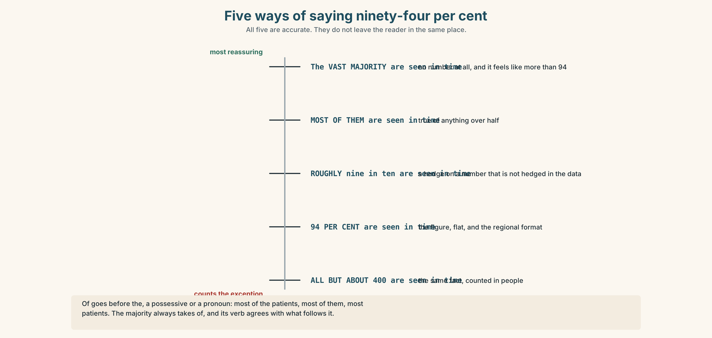
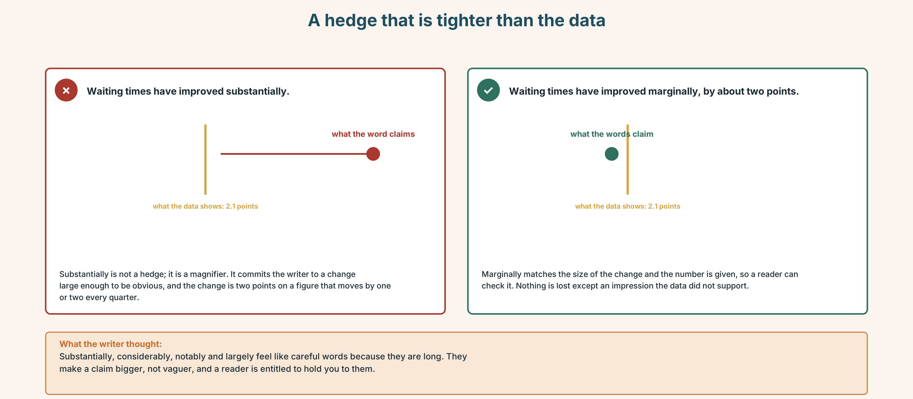
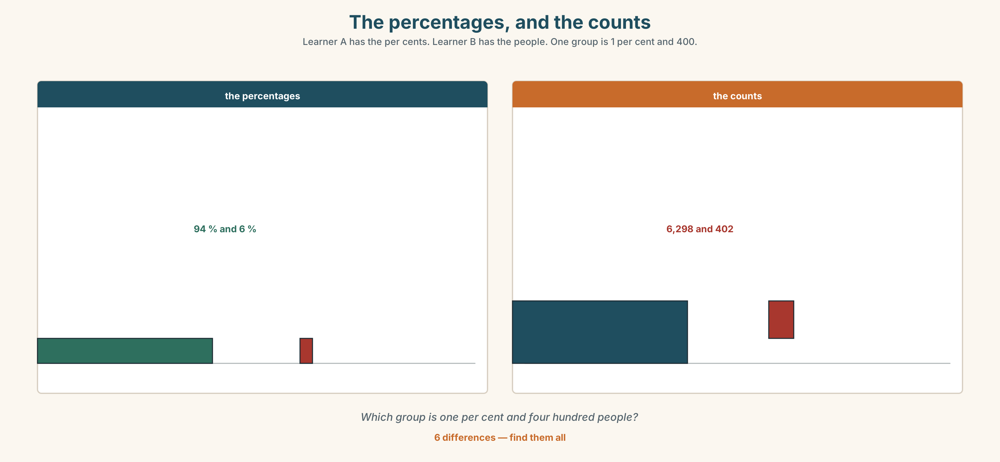
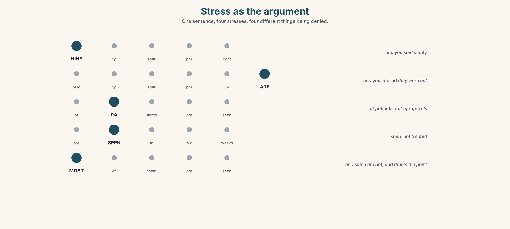
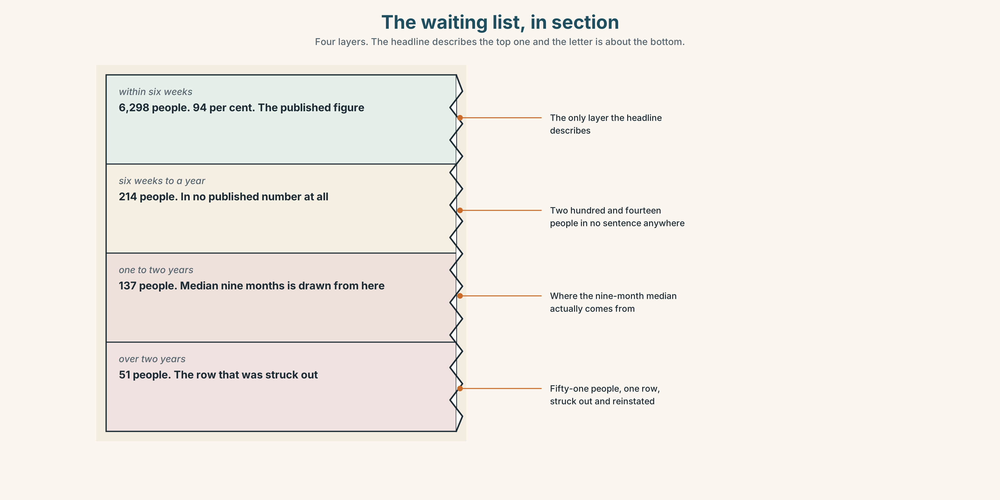
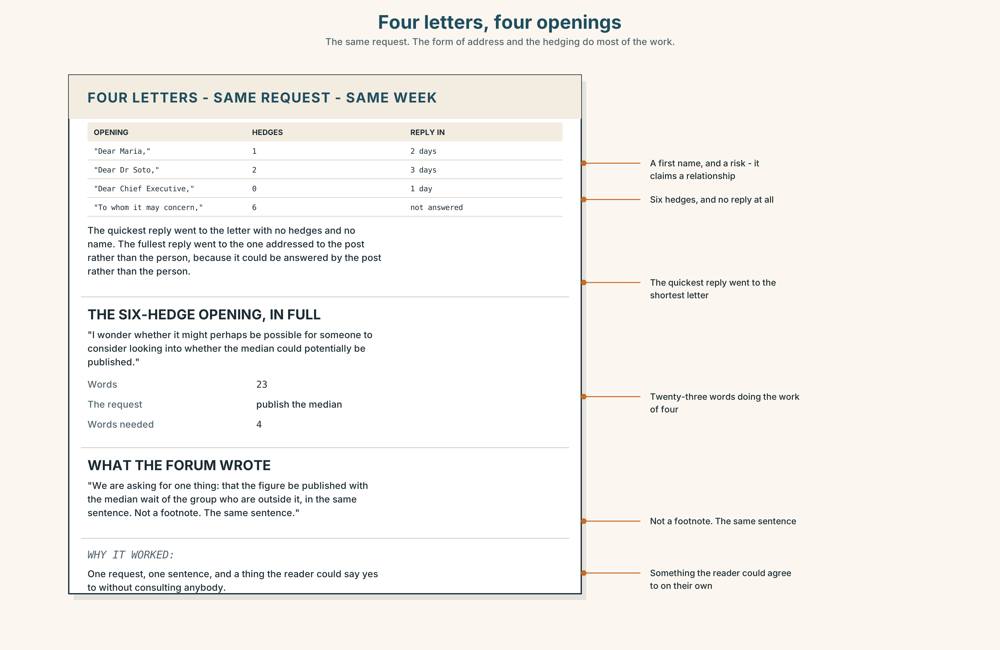
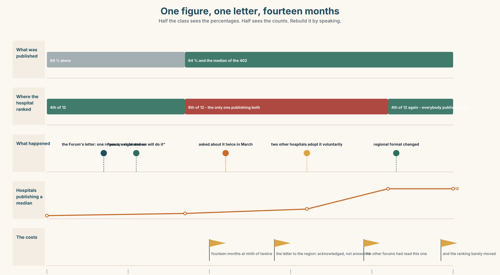
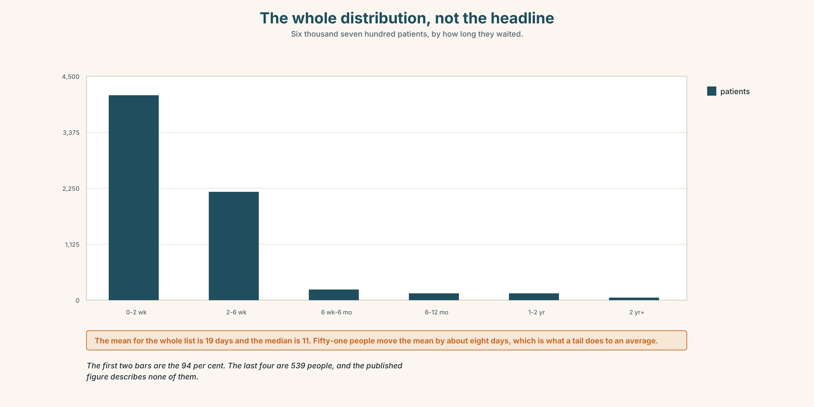

# B1.2 · Unit 9 · True and Misleading

> **English Animated** · *Weighing It Up* · Hospital Regional, Valdivia
> Student's Book pages 182–203 · 22 pp · ~11 hours

---

## Part 0 · The Big Picture ◆ **A · THE WORLD**

{width=6.6in}

*The press office, the week before publication — Eleven things to find. Four of them are the same number presented differently.*

# How many is most?

**By the end of this unit you can present a set of figures and hedge them correctly.**

| ◆ **A · THE WORLD** | A number that is accurate, defensible and will be read wrongly |
|---|---|
| ◆ **B · THE SYSTEM** | advanced quantifiers with *of* · hedged quantity · 23 words for statistics · 22 words for approximation · stress used for contrast |
| ◆ **C · THE PERFORMANCE** | A set of figures, hedged to exactly the strength the data supports |

---

### 0A · Find it

**Find eleven things in this picture.** Four of them are the same number presented differently.

> a chart on a screen · a bar chart taped to a wall · a single figure in large type ·
> a table of raw counts · a press line printed out · a letter from a patients' group ·
> a sticky note with a denominator on it · a calculator · a highlighter ·
> a printout with a line drawn through it · a clock

### 0B · Guess it

**Two of these presentations would lead a reader to opposite conclusions.** Which, and what is
the honest one?

### 0C · Say it ⏺

**Record forty-five seconds.** *Give one number from your own life and hedge it to the strength
you can actually defend.* You will record it again at the end of this unit.

---

## Part 1 · Vocabulary Lab 1 ◆ **B · THE SYSTEM**

{width=6.6in}

*One dataset, six numbers — All six are true. Three of them reassure and three of them do not.*

### 1A · Meet — the words of a figure

Match each word to one place on the map.

> **statistic** · **proportion** · **median** · **average** · **outlier** · **sample** ·
> **trend** · **denominator** · **rate** · **cohort**

### 1B · Sort — a measure, a population, or a shape?

Three columns.

> median · cohort · trend · outlier · sample · distribution · percentile · rate · denominator

**One of them is a measure that is routinely reported without its population.** Which, and what
happens when it is?

### 1C · Meet — the two that are confused daily

> **average** · **median**

A waiting list of nine people, eight of whom wait ten days and one of whom waits four hundred.
**The average is fifty-three. The median is ten.**
**Which is the honest number, and for whom?**

### 1D · Collocation Lab

Complete each one with one word.

1. **The vast ______** of patients are seen within six weeks.
2. **A significant ______** — about one in seven — are not.
3. **Fewer than ______** of the referrals arrive with a complete record.
4. The rate has **more than ______** since 2019.
5. Spending **per ______** is below the regional figure and has been for eleven years.
6. The curve **levels ______** at about forty days and then **tails ______** very slowly.

### 1E · The fixed expressions

> **f** **True and misleading.**
> **f** **It depends on the denominator.**

Two sentences used in the same meeting about the same chart.

> **Write the number that provokes each one.**

### 1F · Own it

Think of a figure that is quoted about you, your work or your country. Tell a partner
**four sentences**: the figure, its denominator, what it hides, and whether it is true.

---

## Part 2 · Listening ◆ **A · THE WORLD**

{width=6.6in}

*Ninety-four per cent — One of them has to write the press line. One of them has read the letter.*

### 2A · Ninety-four per cent 🔊 Track 9.1

**Before you listen.** The hospital's waiting-list figure is 94 per cent within target. It is
accurate. **Guess: what does it hide?**

**Listen once. One question.** What is the six per cent?

**Listen again. Complete the table.**

| | What they want to publish | Why | What they are afraid of |
|---|---|---|---|
| the communications lead | | | |
| Dr Herrera | | | |
| the information manager | | | |

**Listen again. Choose the best answer.**

1. The six per cent is about **40 / 400 / 4,000** people.
2. Their median wait is **six weeks / nine months / two years**.
3. The 94 per cent figure is **wrong / right / rounded up**.
4. The patients' group has asked for **the median / the distribution / an apology**.

**Noticing.** Four sentences from the recording.

1. *Most of them are seen within six weeks.*
2. *The vast majority are seen within six weeks.*
3. *Roughly nine out of ten are seen within six weeks.*
4. *All but about four hundred are seen within six weeks.*

**All four describe the same data. Rank them from most reassuring to least.**

### 2B · Decoding clinic 🔊 Track 9.2

Thirty seconds. Four jobs.

1. How many hedging words can you count?
2. In *the vast majority*, which word carries the stress?
3. Catch the three numbers.
4. One speaker stresses a word to contrast it with something unsaid. Which?

> Transcripts, page 158.

---

## Part 3 · Grammar Lab 1 ◆ **B · THE SYSTEM**

### Saying how many, and how sure

### 3A · Notice

Look at the four sentences in Part 2.

1. In sentence 1, could you say *Most them*? In sentence 2, could you say *The vast majority of*?
2. Sentence 3 uses *roughly*. **What is it hedging — the count, or the proportion?**
3. Sentence 4 counts the exception instead of the rule. **What does that change for the reader?**
4. **Which of the four would a patients' group object to, and on what grounds?**
5. Try *"The majority of patient is seen within six weeks."* **What is wrong?**

### 3B · See

{width=6.6in}

*Five ways of saying ninety-four per cent — All five are accurate. They do not leave the reader in the same place.*

### 3C · Know

| | Shape | Note |
|---|---|---|
| **most** | *most patients* · *most **of** the patients* | *of* only before *the*, a possessive or a pronoun |
| **the majority** | *the majority **of** patients* | *of* is compulsory |
| **the bulk of** | *the bulk **of** the work* | uncountable or collective |
| **a handful of** | *a handful **of** cases* | countable, small, and slightly dismissive |
| **next to none** | *next to none **of** them* | a hedge on zero |
| **all but** | *all but four hundred* | counts the exception |

> **Verb agreement.** *The majority* and *the bulk* take the verb of what follows:
> *the majority of patients **are*** · *the majority of the work **is***.

> **The hedges, from tightest to loosest:**
> *marginally · slightly · somewhat · broadly · roughly · approximately · in the region of ·
> or so · give or take*

> **Degree words are not hedges.** *substantially*, *considerably*, *notably* and *largely*
> make a claim **bigger**, not vaguer, and a reader will hold you to them.

> **Why it matters.** A hedge that is looser than your data is dishonest in one direction.
> A hedge that is tighter is dishonest in the other, and is the commoner mistake.

### 3D · Use — controlled

> (1) __________ of patients are seen within six weeks. More precisely,
> (2) __________ majority — (3) __________ ninety-four per cent — are. The remaining six per
> cent is (4) __________ four hundred people, and their median wait is nine months.
> (5) __________ but a handful of those four hundred are on three specific pathways. The figure
> has risen (6) __________ since 2019, by about two points, which is not
> (7) __________ a change as the chart makes it look. Spending per head
> (8) __________ out at roughly eleven per cent below the regional average.

### 3E · Use — guided

Rewrite each one with the quantifier in brackets, and say what changes.

1. 94 per cent are seen in six weeks. *(the vast majority)*
2. 94 per cent are seen in six weeks. *(all but about four hundred)*
3. Six per cent are not. *(a significant minority)*
4. Two of the 400 were seen in under a year. *(next to none)*
5. The rise is 2.1 points. *(marginally)*

### 3F · Use — open

**In pairs.** Take one figure. Present it **four times**: to reassure, to alarm, to inform,
and to mislead without lying. **Your partner names which is which**, and then says which of the
four you would sign.

### 3G · Error autopsy

{width=6.6in}

*A hedge that is tighter than the data — A hedge that is tighter than the data*

**Read both versions. Then say which of the two the data actually supports.**

### 3H · Check — eight items

> 1. ______ of the patients are seen in six weeks.
> 2. The ______ of patients ______ seen in six weeks. *(majority + verb)*
> 3. The bulk of the work ______ done at night. *(verb)*
> 4. ______ but four hundred are seen in time.
> 5. ______ to none of them were seen in under a year.
> 6. It has risen ______ — by about two points. *(tightest hedge)*
> 7. Spending per head works ______ at eleven per cent below.
> 8. A ______ of cases account for most of the delay.

**0–4 →** Workbook pp. 52–55. **5–6 →** Part 6. **7–8 →** page 195.

---

## Part 4 · Speaking ◆ **C · THE PERFORMANCE**

### 4A · Fluency starter — the same number, five ways

Your teacher gives a percentage. **Each learner must present it with a different quantifier**,
and the group ranks the five by how reassuring they sound.
**Four percentages. Four rounds.**

### 4B · The functional core — presenting figures honestly

{width=6.6in}

*The percentages, and the counts — Learner A has the per cents. Learner B has the people. One group is 1 per cent and 400.*

**Language Bank**

| | |
|---|---|
| **the headline** | *The vast majority…* · *Roughly nine in ten…* |
| **the exception** | *All but about four hundred…* · *A significant minority…* |
| **the denominator** | *Out of 6,700…* · *That is per head of population.* |
| **the honest qualification** | *The median is a better number here.* · *True and misleading.* |

**Information gap.** Learner A has the percentages. Learner B has the raw counts.
Neither sees the other. **Find the group that is 1 per cent and 400 people.**

### 4C · The performance — three minutes ⏺

Present **a set of figures**. **Three minutes.** You must include:

> the headline figure, hedged correctly · the denominator · the exception, counted in people ·
> the measure you would use instead, and why

**Record it.**

### 4D · Observer

One person listens for **one thing**: was any hedge tighter than the data allowed?

### 4E · Three criteria

> ☐ Did I use *of* correctly every time?
> ☐ Is every percentage attached to a denominator?
> ☐ Did I count the exception in people as well as per cent?

---

## Part 5 · Reading ◆ **A · THE WORLD**

### 5A · Predict

A letter and a reply. The title is **"Re: your figure of 94 per cent."**
**What do you expect the patients' group to be asking for?** Two sentences.

### 5B · Read — two minutes and a quarter

---

**From: Valdivia Patients' Forum**
**To: the Chief Executive**
**Re: your figure of 94 per cent**

We are not writing to say the figure is wrong. We have checked it and it is right.

We are writing because of what happens to the six per cent. There are about four hundred of them.
Their median wait is nine months. Fifty-one of them have waited more than two years. They are not
distributed across the service: they are concentrated on three pathways, and one of those three
is the one with no consultant.

Every time the 94 per cent figure is published, each of those four hundred people reads a
sentence saying that the service is meeting its target, and each of them is one of the people it
is not meeting it for. That is not a complaint about arithmetic. It is a complaint about what a
number is for.

We are asking for one thing: that the figure be published with the median wait of the group who
are outside it, in the same sentence. Not a footnote. The same sentence.

---

**From: the Chief Executive**
**Re: your letter**

You are right and we will do it.

I want to say one thing about why we have not. The 94 per cent figure is the one the regional
office asks for, in that form, and it is the form in which we are compared with eleven other
hospitals. If we publish it with the median of the excluded group beside it, we will be the only
hospital doing so, and we will look worse than hospitals that are performing worse than we are.

I have decided that I would rather look worse than be the hospital whose four hundred longest
waits are not written down anywhere a patient can find them. I am aware this is easy to say in a
letter and that I will be asked about it in March.

---

### 5C · Comprehension — eight questions

1. What does the Forum say first, and why does it matter?
2. **How many people are in the six per cent, and what is their median wait?**
3. How are they distributed, and what is notable about one of the three pathways?
4. What is the Forum's complaint actually about?
5. **What exactly do they ask for, and what do they explicitly refuse?**
6. What is the Chief Executive's explanation for not having done it?
7. **What is the comparison problem, and why is it real?**
8. What does the last sentence of the reply acknowledge?

### 5D · Vocabulary in context

Guess from the text. Then check.

> distributed across · concentrated on · what a number is for · in that form ·
> easy to say in a letter

### 5E · The counter-text

{width=6.6in}

*The figures pack — Eleven rows, one of them struck through and reinstated, and the median on page three.*

**Read the figures pack and answer.**

1. What is the headline figure, and what is its denominator?
2. **What is the median wait of the whole list, and of the six per cent?**
3. How many people have waited more than two years, and on which pathways?
4. What does the regional comparison table show about this hospital?
5. One row has been struck through and reinstated. Which, and what does the note say?

### 5F · Two texts

The reply says publishing both numbers will make the hospital **look worse than hospitals
performing worse**.
The comparison table shows this hospital **fourth of twelve**.

**Put those two facts together. Is the Chief Executive right?** Three sentences.

---

## Part 6 · Vocabulary Lab 2 ◆ **B · THE SYSTEM**

### Hedging to exactly the right strength

### 6A · Sort — tighter than, looser than, or bigger than?

Three columns.

> marginally · slightly · somewhat · broadly · roughly · approximately · substantially ·
> considerably · notably · largely · comparatively

**Four of them belong in the third column and are regularly used as if they belonged in the
second.** Which?

### 6B · Chunk completion

1. **In the ______ of** eleven per cent below the regional average.
2. **The best ______ of** a year, for fifty-one of them.
3. **Next to ______** of the four hundred were seen inside twelve months.
4. **The ______ of** the delay sits on three pathways.
5. The totals **come ______** 6,700, **give or ______** forty.
6. The rate **works ______ at** about one in seventeen.

### 6C · Three that are not hedges

**substantially · considerably · largely**

> All three make a claim **bigger**. A reader will ask you to support them, and a hedge is
> supposed to do the opposite.

**Rewrite each sentence with a real hedge, and say what you have given up.**

1. Waits have increased substantially.
2. The figure is considerably better than last year.
3. The delay is largely on three pathways.

### 6D · The fixed expression

> **f** **About a third, give or take.**

**Say it twice:** once where you have counted and once where you have not.
**Can a listener tell?** What would make it honest in the second case?

### 6E · Contrast Clinic

Eight items. Choose the quantifier or hedge, and justify the strength.

1. 94 per cent. *(reassuring)*
2. 94 per cent. *(counting the exception)*
3. 6 per cent. *(as a minority worth noticing)*
4. 2 out of 400. *(a hedge on zero)*
5. A rise of 2.1 points. *(tightest honest hedge)*
6. 6,700 ± 40. *(spoken)*
7. 11 per cent below. *(approximate, spoken)*
8. Three pathways out of eleven. *(where the delay sits)*

---

## Part 7 · Pronunciation & Fluency Lab ◆ **B · THE SYSTEM**

### Stress as the argument

{width=6.6in}

*Stress as the argument — One sentence, four stresses, four different things being denied.*

### 7A · Hear 🔊 Track 9.3

> **NINE**ty-four per cent are seen in time. — and you said ninety
> Ninety-four per cent **ARE** seen in time. — and you implied they were not
> Ninety-four per cent of **PATIENTS** — and not of referrals
> Ninety-four per cent of patients **ARE SEEN** — not treated

### 7B · Say

Say all four. Then say the sentence three times, faster, moving the stress each time.

### 7C · Make it mean something

Say these two:

> *Most of them are seen in six weeks.* *(flat)*
> *MOST of them are seen in six weeks.* *(and some are not, and that is the point)*

**Which one would the patients' group write, and which would the press office?**

### 7D · Fluency 30 ⏺

Thirty seconds: **four figures about this room, each with a different hedge.**
Three times, faster.

---

## Part 8 · Writing ◆ **C · THE PERFORMANCE**

### A set of figures · 160 words

{width=6.6in}

*The waiting list, in section — Four layers. The headline describes the top one and the letter is about the bottom.*

### 8A · Read the model

> Of 6,700 patients referred last year, 94 per cent were seen within six weeks. The denominator
> is referrals accepted, not referrals received; about 310 were returned and are not in this
> figure. `[the headline, the denominator, and the thing the denominator excludes]`
>
> The remaining six per cent is 402 people. Their median wait is nine months and fifty-one of
> them have waited more than two years. `[the exception, in people, with a median rather than an
> average]`
>
> Next to none of those 402 are spread across the service. The bulk of them — about 340 — are on
> three pathways, one of which has had no consultant since January. `[where it sits, with the
> cause named]`
>
> The 94 per cent is accurate. The median of the 402 is the number I would want if I were on one
> of those three pathways. `[a sentence that does not retract the figure and does not defend it
> either]`

**Questions about the writer's choices:**

1. The denominator is named in the first paragraph, with the 310 it excludes.
   **Why not in a footnote?**
2. The exception is given in people and the headline in per cent. **Why that way round?**
3. The last sentence does not choose. **Is that evasion?**

### 8B · The anti-model

> We are pleased to report that the vast majority of patients continue to be seen well within
> target. Waiting times have improved considerably over the period and we remain committed to
> further reductions. A small number of patients experience longer waits.

Correct English, and three of its four claims are unsupportable as written.
**Find them**, and say what *a small number* is doing.

### 8C · Plan

> the headline with its denominator → what the denominator excludes → the exception, in people,
> with a median → where it is concentrated, and why → one sentence that neither retracts nor
> defends

### 8D · Write — 160 words
### 8E · Peer review — three criteria

> ☐ Is every percentage attached to a denominator?
> ☐ Is the exception counted in people?
> ☐ Is every hedge exactly as strong as the data?

### 8F · Write it again · 8G · Publish

On the wall, with the figures pack from Part 5E beside it.

---

## Part 9 · The File ◆ **A · THE WORLD + C · THE PERFORMANCE**

# CULTURE FILE · Naming, Address and Status

{width=6.6in}

*Four letters, four openings — The same request. The form of address and the hedging do most of the work.*

### 9A · Four letters, four openings 🔊 Track 9.4

The same request, written by four people to the same Chief Executive. **Listen to the openings
read aloud.**

1. Which one uses a first name, and what does the writer risk?
2. **Which one is so deferential that the request disappears?**
3. Which one gets the quickest reply, and is that the same as the best one?

### 9B · What a form of address claims

> *Dear Dr Soto* · *Dear María* · *Dear Chief Executive* · *To whom it may concern*

**Each of the four makes a claim about the relationship.** Say what each claims.
Then say which one a patients' group should use, and why it is not obvious.

### 9C · Status in three languages

In some languages the title does the work. In some the verb does. In English a great deal is
carried by **how much hedging you use**, and a reader hears over-hedging as either deference or
evasion.

**Which of these four is most likely to be read as evasion by an English reader?**

1. *I wonder whether it might perhaps be possible to consider publishing the median.*
2. *Please publish the median.*
3. *We are asking for one thing: publish the median in the same sentence.*
4. *It would be appreciated if the median could be published.*

### 9D · Your turn

In pairs. **Write the same two-sentence request four times:** to somebody senior you have never
met, to somebody senior you know well, to a peer, and to an institution with no name.
**Then swap, and your partner says which is which.**

### 9E · Transfer

**Find one email you have sent this week.** Count the hedges in the first sentence, and say what
they were doing.

---

## Part 10 · Mediation & Interaction ◆ **C · THE PERFORMANCE**

{width=6.6in}

*One figure, one letter, fourteen months — Half the class sees the percentages. Half sees the counts. Rebuild it by speaking.*

### 10A · Relay

Half the class sees the percentages. Half sees the raw counts. **Rebuild the whole picture by
speaking.** Twelve minutes.

### 10B · Simplify

Explain the figures pack from Part 5E to a patient who has waited fourteen months.
**Five sentences only.**

> **Plan:** what the headline says → which group you are in → what that group's figures are →
> why you are in it → what is being done

### 10C · Compress

The Forum's letter into **forty words**, keeping the request exactly.

### 10D · Online

Write **one message** to the regional office: you intend to publish an additional figure, you
explain why in one sentence, and you ask one specific question about comparability.

### 10E · Your language

How does your language say *the vast majority*? **Does the verb agree with *majority* or with
what follows it?** Say *the majority of patients are seen in six weeks* in both languages.

---

## Part 11 · The Decision ◆ **C · THE PERFORMANCE**

# Publish, annotate, or hold

The 94 per cent figure is due for publication. It is accurate. Four hundred and two people are
outside it with a median wait of nine months.

- **Publish as it stands.** It is the regional format, it is comparable with eleven other
  hospitals, and it is true.
- **Publish with the median beside it.** What the Forum asked for. This hospital becomes the only
  one doing it and drops from fourth of twelve to ninth on the published comparison.
- **Hold it until the next quarter.** The consultant post on the worst pathway is being filled in
  March. One quarter's delay and the number improves on its own.

### 11A · The evidence

{width=6.6in}

*The whole distribution, not the headline — Six thousand seven hundred patients, by how long they waited.*

1. **The figures pack** from Part 5E — and the row that was struck through and reinstated.
2. **The chart** — the whole distribution, not the headline.
3. **The voice.** One of the 402, thirty seconds: *"I am not asking anybody to say the figure is
   wrong. I have read it and it is right. I would like it to be possible for somebody to find
   out, without writing a letter, that there are four hundred of us, because at the moment the
   only way I know is that I wrote a letter."*

### 11B · Talk about it

In fours. Everybody speaks twice. Use the frame.

> *The vast majority ______ . A significant minority ______ . It depends on ______ .*

**Words you can use:** *statistic · proportion · median · average · outlier · denominator ·
cohort · distribution · true and misleading · the bulk of · all but*

### 11C · Decide

Write **three sentences**. Choose, say why, and name what it costs.

> I think the hospital should ______________________ ,
> because ______________________ .
> What this costs is ______________________ .

### 11D · Model decision

> Publish both, in the same sentence, and write to the regional office the same day proposing
> that the second figure become standard. Dropping to ninth is a real cost and it is a cost paid
> by the hospital's reputation, which is the thing that has least claim to be protected here.
> The letter to the region is the part that matters: one hospital publishing an extra number
> looks like an admission, and twelve publishing it is a format.

### 11E · The Reveal

> **What happened.** Both figures were published in the same sentence. The hospital dropped to
> ninth of twelve on the comparison table and was asked about it twice in March, once by a
> journalist and once by the regional office.
>
> The letter proposing the second figure as standard was acknowledged and not answered for
> fourteen months. Two other hospitals adopted it voluntarily in that period, both of them after
> being contacted by their own patients' forums, who had read this one's letter.
>
> The regional format changed in the following year. It now requires the median of the group
> outside the target. Nine of the twelve hospitals got worse on the published table; the ranking
> barely moved.

**They looked worse for fourteen months. Then the format changed and the ranking barely moved,
because everybody had the same four hundred.**

> **Was it the right decision?** Say why — and say what the fourteen months cost.

---

## Part 12 · Landing ◆ **all three lines**

### 12A · Recycle — twelve items

> 1. ______ of the patients are seen in six weeks.
> 2. The majority of patients ______ seen in six weeks. *(verb)*
> 3. ______ but four hundred are seen in time.
> 4. ______ to none were seen in under a year.
> 5. **The vast ______** of patients are seen within six weeks.
> 6. The rate has **more than ______** since 2019.
> 7. The curve **levels ______** at about forty days.
> 8. The totals **come ______** 6,700, give or take forty.
> 9. *(Unit 8)* ______ patients waited 41 days. *(this group)*
> 10. *(Unit 7)* I stopped ______ (think) about it. *(the thinking ended)*
> 11. *(A2.2 U9)* ______ of the last two has insurance. *(zero of two)*
> 12. *(A2.1 U9)* There are ______ many settings and nobody changes them.

### 12B · Consolidate

**One hundred and sixty words.** A set of figures from your own world. A headline with its
denominator, an exception counted in people, a median, and hedges no stronger than the data.

### 12C · Can-do, with evidence

| I can… | My evidence | Sure? |
|---|---|---|
| use quantifiers and *of* correctly | Part 3H score | ◯ ◑ ● |
| present figures honestly in three minutes | Part 4C recording | ◯ ◑ ● |
| write 160 words in which every hedge is earned | Part 8 draft 2 | ◯ ◑ ● |
| choose a form of address and a level of hedging | Part 9D letters | ◯ ◑ ● |

### 12D · Replay ⏺

Find your forty-five seconds from Part 0C. Listen. **Record it again.**
**Two sentences:** what is different, and whether your hedge was too tight or too loose.

### 12E · Glossary — forty-five items, as a map

> **THE MEASURE** · statistic · proportion · median · average · rate · percentile · distribution
> **THE POPULATION** · sample · cohort · denominator · outlier · per head
> **THE SHAPE** · trend · level off · tail off · skew towards · bear out · more than doubled
> **HOW MANY** · the vast majority · a significant minority · fewer than half · all but · the bulk of · a handful of · next to none · on average
> **HOW APPROXIMATE** · roughly · approximately · broadly · slightly · marginally · somewhat · comparatively · or so · give or take · in the region of · the best part of
> **HOW BIG** · substantially · considerably · notably · largely
> **DOING THE SUM** · come to · work out at · about a third, give or take · true and misleading · it depends on the denominator

### 12F · Next

> **Unit 10 · What do you wish you knew?**
