# English Animated — B1.3 · Making the Case

*a university campus, Melbourne*

## About this volume

**English Animated B1.3 · *Making the Case*** — a university campus, Melbourne.

This volume contains **10 of 10 units**, written in full: every text, every task, every
figure drawn. Units are 20 pages each at B-level and 22 at A-level, which is the extent specified
in the series plan.

# B1.3 · Unit 1 · The Next Video

> **English Animated** · *Making the Case* · a university campus, Melbourne
> Student's Book pages 6–27 · 22 pp · ~11 hours

---

## Part 0 · The Big Picture ◆ **A · THE WORLD**

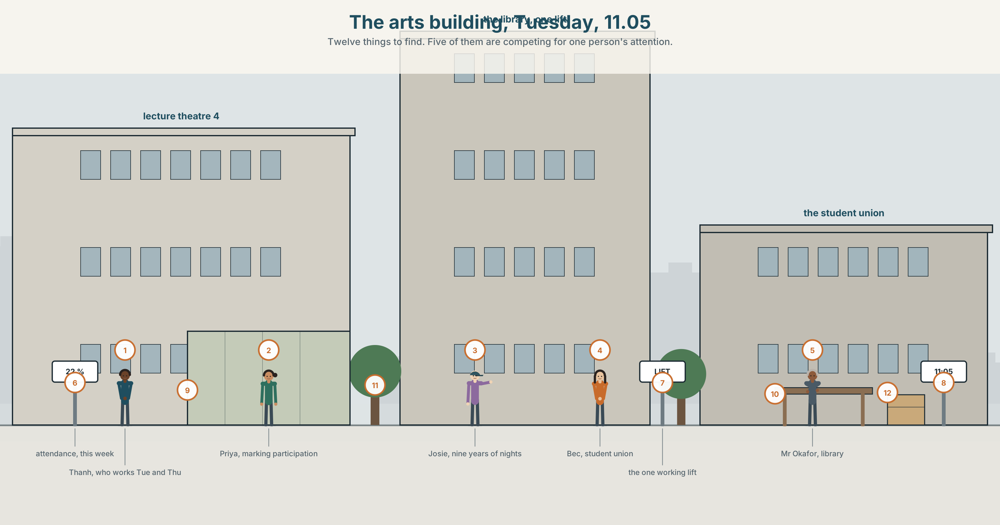{width=6.6in}

*The arts building, Tuesday, 11.05 — Twelve things to find. Five of them are competing for one person's attention.*

# What is attention worth?

**By the end of this unit you can analyse how one interface is designed to hold you, and show
your evidence. One hundred and eighty words.**

| ◆ **A · THE WORLD** | A lecture theatre that is half empty, and a recording that is not |
|---|---|
| ◆ **B · THE SYSTEM** | non-defining relative clauses · *of which* and *of whom* · 23 words for attention and design · 22 connectors and relatives · the pitch reset at the clause break |
| ◆ **C · THE PERFORMANCE** | A hundred and eighty words with the evidence in them |

---

### 0A · Find it

**Find twelve things in this picture.** Five of them are competing for the same person's
attention.

> a lecture theatre half full · a laptop with eleven tabs · a phone face up ·
> a recording light on the ceiling · a screen showing a playlist · a notice about attendance ·
> a library window · a queue for coffee · a bicycle against a rail · a pass rate on a poster ·
> a clock · a lift with a sign on it

### 0B · Guess it

**Two of the twelve exist because of the other ten.** Which, and what is the causal chain?

### 0C · Say it ⏺

**Record forty-five seconds.** *Name one interface you use every day. What is it measuring, and
what does it want you to do next?* You will record it again at the end of this unit.

---

## Part 1 · Vocabulary Lab 1 ◆ **B · THE SYSTEM**

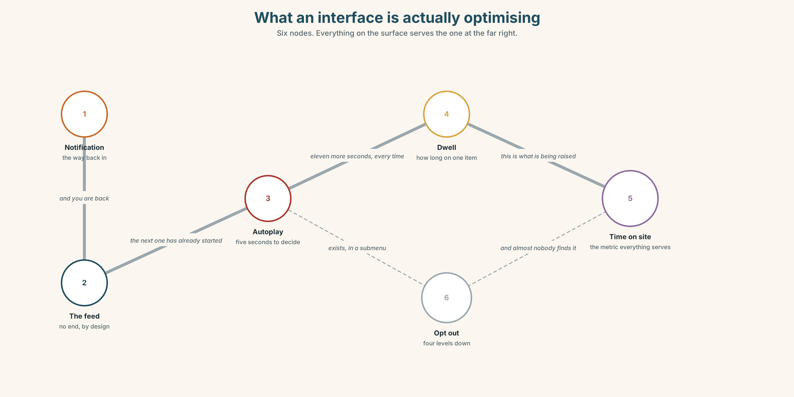{width=6.6in}

*What an interface is actually optimising — Six nodes. Everything on the surface serves the one at the far right.*

### 1A · Meet — the words of a designed surface

Match each word to one place on the map.

> **interface** · **notification** · **engagement** · **retention** · **feed** · **metric** ·
> **dwell** · **prompt** · **autoplay** · **scroll**

### 1B · Sort — what you do, what it does, or what it counts?

Three columns.

> autoplay · engagement · notification · retention · feed · scroll · prompt · metric ·
> dwell

**Two of them are the same event described from opposite sides.** Which pair?

### 1C · Meet — the word that hides a decision

> **by default**

Everything an interface does without being asked is a decision somebody made and did not
announce. **Name three defaults on a device you own**, and say which of the three you have ever
changed.

### 1D · Collocation Lab

Complete each one with one word.

1. The whole thing is engineered to **hold your ______** for eleven more seconds.
2. Autoplay is on **by ______** , and it is the single most effective thing on the page.
3. You can **______ out** , in a submenu, in two taps that nobody finds.
4. **The next ______** starts before you have decided whether you wanted it.
5. **Time on ______** is the metric everything else is built to raise.
6. He has learned to **______ off** at about eleven and it took him two years.

### 1E · The fixed expressions

> **f** **I only came on to check one thing.**
> **f** **It is designed to do that.**

The first sentence is said by a user. The second is said by somebody who has read the
documentation.

> **Write the three sentences between them.**

### 1F · Own it

Think of one application you use. Tell a partner **four sentences**: what it measures, what it
does without asking, what you have turned off, and how long it took you to find the setting.

---

## Part 2 · Listening ◆ **A · THE WORLD**

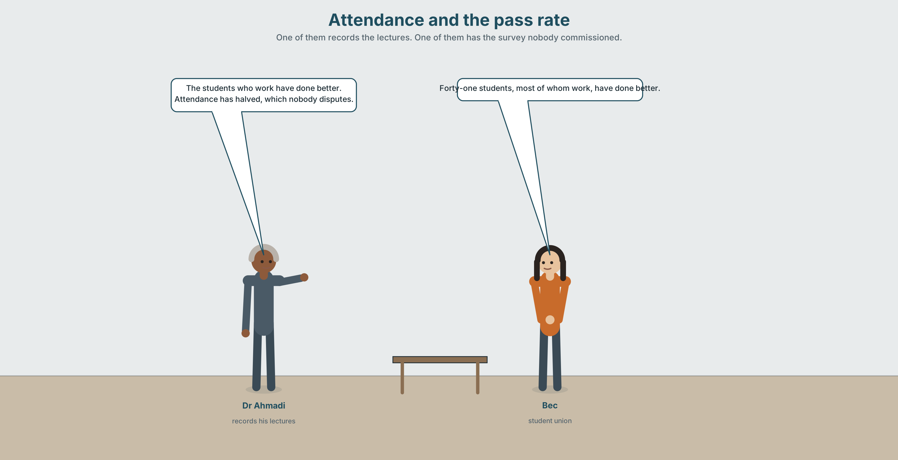{width=6.6in}

*Attendance and the pass rate — One of them records the lectures. One of them has the survey nobody commissioned.*

### 2A · Attendance and the pass rate 🔊 Track 1.1

**Before you listen.** Dr Ahmadi records his lectures. Attendance has halved. The pass rate for
students who work has risen. **Guess: what is he going to be asked to do?**

**Listen once. One question.** What is the committee's concern?

**Listen again. Complete the table.**

| | What they have measured | What they conclude | What they have not measured |
|---|---|---|---|
| Dr Ahmadi | | | |
| the committee | | | |
| Bec | | | |

**Listen again. Choose the best answer.**

1. Attendance has fallen from **80 to 40 / 60 to 30 / 45 to 22** per cent.
2. The pass rate for students in paid work has risen by **4 / 11 / 19** points.
3. The recordings are watched **at two in the morning / live / within a week**.
4. The committee's objection is about **learning / the look of the room / money**.

**Noticing.** Four sentences from the recording.

1. *The students who work have done better.*
2. *The students, who work, have done better.*
3. *Forty-one students, most of whom work, have done better.*
4. *Attendance has halved, which nobody disputes.*

**Sentences 1 and 2 differ by two commas and describe different groups.**
**How many students are there in each?**

### 2B · Decoding clinic 🔊 Track 1.2

Thirty seconds of Dr Ahmadi. Four jobs.

1. How many non-defining clauses can you hear?
2. After each pause, does his pitch start higher or lower?
3. Catch the three percentages.
4. He uses one clause that refers back to a whole sentence rather than a noun. Which?

> Transcripts, page 150.

---

## Part 3 · Grammar Lab 1 ◆ **B · THE SYSTEM**

### Adding a clause without narrowing the noun

### 3A · Notice

Look at the four sentences in Part 2.

1. In sentence 1, how many students are being described? In sentence 2?
2. In sentence 3, what does *most of whom* refer to?
3. In sentence 4, what is the antecedent of *which*? **It is not a noun.**
4. **Try putting *that* into sentence 2.** What happens?
5. Try *"Forty-one students, most of them work, have done better."* **What is wrong?**

### 3B · See

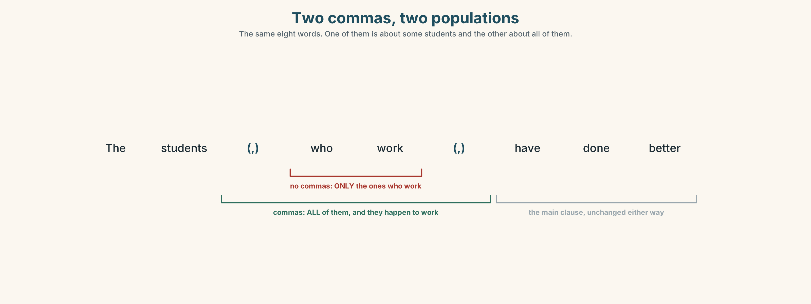{width=6.6in}

*Two commas, two populations — The same eight words. One of them is about some students and the other about all of them.*

### 3C · Know

| | Shape | |
|---|---|---|
| **defining** | no commas, *that* allowed | *The students **who work** have done better.* — only those ones |
| **non-defining** | commas, never *that* | *The students, **who work**, have done better.* — all of them, and by the way they work |
| **quantifier + *of which / of whom*** | *most of whom*, *all of which* | *41 students, **most of whom** work* |
| **sentential *which*** | refers to the whole clause | *Attendance has halved, **which** nobody disputes.* |

> **Of whom and of which take a verb of their own.**
> ✗ *41 students, most of them work* — that is two sentences joined by a comma.
> ✓ *41 students, most of whom work* · ✓ *41 students, and most of them work*

> **Sentential *which* is the only relative that can point at a whole clause.**
> It cannot be *what*. ✗ *Attendance has halved, what nobody disputes.*

> **In writing, a non-defining clause needs both commas.** One is an error that changes the
> meaning of everything after it.

> **Why it matters.** An audit sentence with the commas in the wrong place reports a different
> population from the one that was studied, and nobody will notice.

### 3D · Use — controlled

> Forty-one students, most (1) __________ whom are in paid work, completed the unit.
> The recordings, (2) __________ are watched mainly between eleven at night and two in the
> morning, have been available since March. Attendance has fallen by half,
> (3) __________ nobody disputes. The students (4) __________ attend in person are slightly
> younger, (5) __________ is the only demographic difference anybody has found. There are
> eleven lectures, four (6) __________ which were not recorded, and the pass rate for those four
> is the figure (7) __________ the committee has not seen.

### 3E · Use — guided

Join each pair. **Use a non-defining clause, *of whom / of which*, or sentential *which*.**

1. Forty-one students completed the unit. Thirty-one of them work.
2. The recordings have been available since March. They are watched at night.
3. Attendance has halved. Nobody disputes it.
4. There are eleven lectures. Four were not recorded.
5. The pass rate rose eleven points. That is the figure in dispute.

### 3F · Use — open

**In pairs.** Describe a group you belong to in five sentences, each with a non-defining clause.
**Your partner's job** is to catch any sentence where the commas have changed who you mean.

### 3G · Error autopsy

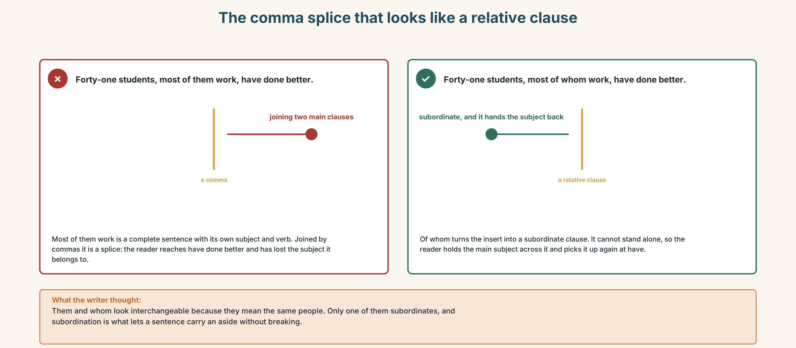{width=6.6in}

*The comma splice that looks like a relative clause — The comma splice that looks like a relative clause*

**Read both versions. Then say how many students each one is about.**

### 3H · Check — eight items

> 1. Forty-one students, most ______ ______ work, passed.
> 2. The recordings, ______ are watched at night, went up in March.
> 3. Attendance has halved, ______ nobody disputes.
> 4. The students ______ attend in person are younger. *(only those ones)*
> 5. Eleven lectures, four ______ ______ were not recorded.
> 6. Thirty-one students, ______ ______ ______ are in paid work. *(all)*
> 7. ✗ *The students, that work, passed.* → correct it.
> 8. ✗ *41 students, most of them work, passed.* → correct it two ways.

**0–4 →** Workbook pp. 4–7. **5–6 →** Part 6. **7–8 →** page 19.

---

## Part 4 · Speaking ◆ **C · THE PERFORMANCE**

### 4A · Fluency starter — the added clause

One learner makes a statement. The next adds a non-defining clause. The next adds a
*which* referring to the whole thing. **The chain breaks on a *that*.**

### 4B · The functional core — showing your evidence

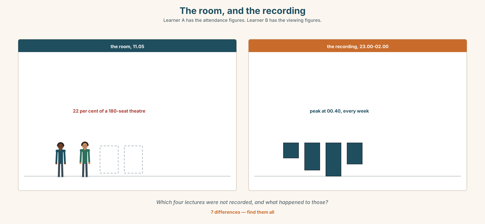{width=6.6in}

*The room, and the recording — Learner A has the attendance figures. Learner B has the viewing figures.*

**Language Bank**

| | |
|---|---|
| **the claim** | *The interface is built to…* · *What it optimises for is…* |
| **the evidence** | *You can see this in…* · *The default is…, which means…* |
| **the measurement** | *I counted…* · *Over two weeks, …* |
| **the honest limit** | *I cannot tell whether…* · *That is an inference, not an observation.* |

**Information gap.** Learner A has the attendance figures. Learner B has the viewing figures.
**Find the four lectures that were not recorded, and what happened to them.**

### 4C · The performance — three minutes ⏺

Analyse **one interface**. **Three minutes.** You must include:

> what it measures · one default that you can demonstrate · what you counted, with a number ·
> one thing you are inferring rather than observing

**Record it.**

### 4D · Observer

One person listens for **one thing**: was any inference presented as an observation?

### 4E · Three criteria

> ☐ Did I use three non-defining clauses, none with *that*?
> ☐ Is there a number I collected myself?
> ☐ Did I mark my one inference as an inference?

---

## Part 5 · Reading ◆ **A · THE WORLD**

### 5A · Predict

An archive document: the minutes of the committee that approved lecture recording, in 2019.
The title is **"Item 9: lecture capture."**
**What do you expect the 2019 committee to have worried about?** Two sentences.

### 5B · Read — two minutes

---

**MINUTES OF THE TEACHING COMMITTEE — 4 MARCH 2019**
**Item 9: lecture capture**

**9.1** The committee considered a proposal to record all lectures and make the recordings
available to enrolled students.

**9.2** Dr Ahmadi, who had piloted recording in two units, reported that attendance in those
units had fallen by about a third and that assessment outcomes had been unchanged.

**9.3** Professor Lindqvist said that she would not support a measure which reduced attendance,
on the grounds that attendance was itself a form of engagement. Asked whether there was evidence
that attendance caused attainment rather than accompanying it, she said that she did not think
the question could be answered.

**9.4** Ms Oyelaran, the student representative, said that of the eleven students she had
consulted, nine were in paid employment, most of whom had at some point missed a lecture for a
shift. She asked the committee to record that none of them had chosen between a lecture and
leisure.

**9.5** The committee approved recording for a two-year trial, subject to review, and agreed
that attendance would be monitored.

**9.6** **ACTION:** Review in March 2021. Attendance data to be collected. Ms Oyelaran asked
whether employment data would also be collected. The chair said this would be difficult.

---

*Archivist's note, added 2025: the review did not take place in 2021. Attendance data has been
collected continuously since 2019. Employment data has never been collected. Recording was made
permanent in 2022 by a decision of the Dean, without reference to the committee.*

---

### 5C · Comprehension — eight questions

1. What did Dr Ahmadi report from his pilot?
2. **What was Professor Lindqvist's objection, and what did she concede when questioned?**
3. What did Ms Oyelaran report, and what did she ask to have recorded?
4. **Why does her last sentence matter?**
5. What was approved, and on what conditions?
6. What two kinds of data were discussed in the action?
7. **What does the archivist's note say happened to each?**
8. What does the note say about the 2022 decision?

### 5D · Vocabulary in context

Guess from the text. Then check.

> piloted · accompanying it · subject to review · would be difficult ·
> without reference to the committee

### 5E · The counter-text

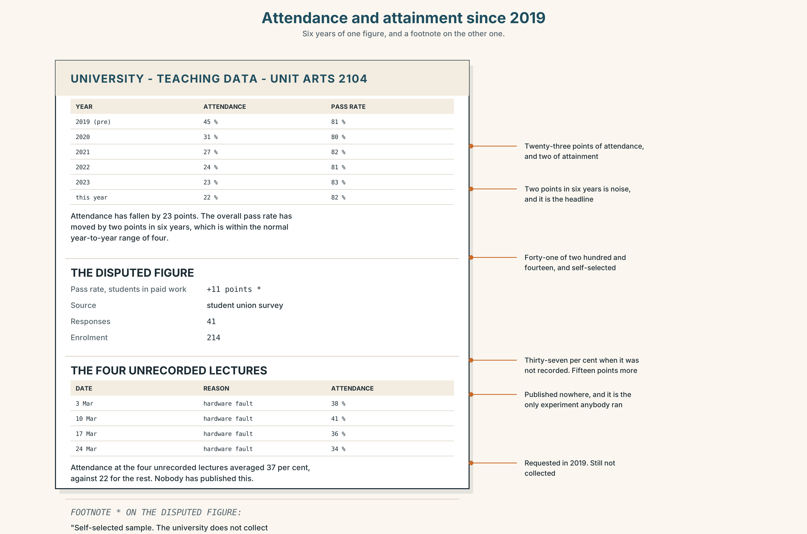{width=6.6in}

*Attendance and attainment since 2019 — Six years of one figure, and a footnote on the other one.*

**Read the current attendance and attainment data, and answer.**

1. What has happened to attendance since 2019, and over what period?
2. **What has happened to the pass rate, and what has happened to it for students in paid work?**
3. How many lectures were not recorded, and what happened to attendance at those?
4. What does the data not record?
5. One figure has a footnote. Which, and what does the footnote say?

### 5F · Two texts

The 2019 minutes record a request for **employment data**.
The current pack shows a pass-rate rise **concentrated in one group that cannot be identified**.

**Put those two facts together. What has six years of data collection produced?**
Three sentences.

---

## Part 6 · Vocabulary Lab 2 ◆ **B · THE SYSTEM**

### Connecting without a comma splice

### 6A · Sort — adds, contrasts, names, or points back?

Four columns.

> namely · likewise · moreover · at which point · conversely · additionally ·
> the latter of which · of which · incidentally · respectively

### 6B · Chunk completion

1. Eleven lectures, four **______ which** were not recorded.
2. Forty-one students, most **______ whom** are in work.
3. The figure rose in March, **at which ______** the trial was extended.
4. Two cohorts, **the latter ______ which** had recordings from week one.
5. The report **refers ______** to a 2019 decision it does not quote.
6. The two tables **cross-______** and neither of them says so.

### 6C · Three that are not interchangeable

**namely · respectively · incidentally**

> *Namely* introduces the list you have just promised. *Respectively* maps two lists onto each
> other in order. *Incidentally* announces that what follows is beside the point — and it
> usually is not.

**Which fits each sentence?**

1. Two groups were compared, ______ those in work and those not.
2. The two groups scored 61 and 72 ______ .
3. ______ , nobody has looked at the four unrecorded lectures.

### 6D · The fixed expression

> **f** **None of which was mentioned.**

A sentence that is only ever written after a list.

> **Write the list that precedes it**, for a meeting you have been in.

### 6E · Contrast Clinic

Eight items. Defining, non-defining, *of which / of whom*, or sentential *which*.

1. Two cohorts. The second had recordings from week one.
2. The pass rate rose. That is the disputed figure.
3. The recordings are watched at night. There are eleven of them.
4. Only the students in work did better.
5. Attendance halved. Nobody disputes this.
6. All the students did better, and all of them are in work.
7. 41 students. 31 of them work.
8. Eleven lectures. Four were not recorded.

---

## Part 7 · Pronunciation & Fluency Lab ◆ **B · THE SYSTEM**

### The reset after the comma

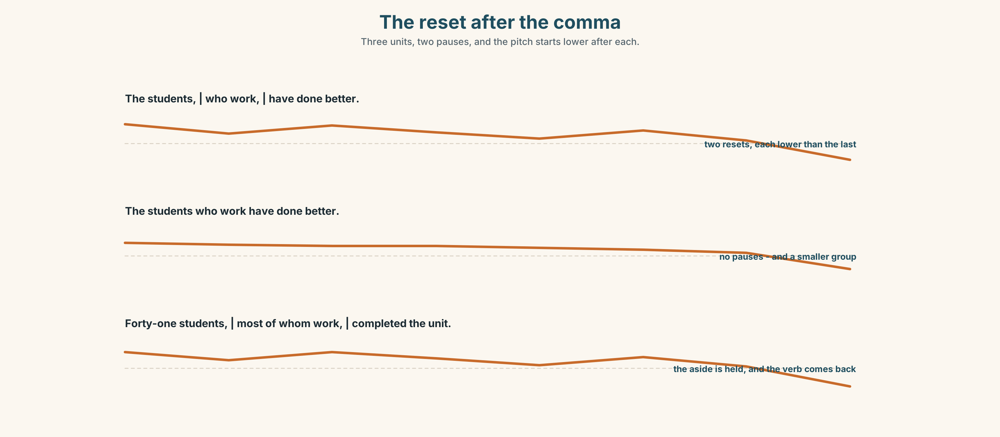{width=6.6in}

*The reset after the comma — Three units, two pauses, and the pitch starts lower after each.*

### 7A · Hear 🔊 Track 1.3

> *The students,* | *who work,* | *have done better.*
> **Three units. After each pause the pitch resets lower, and the last one carries the verb.**

Now the defining version, run together:

> *The students who work have done better.*

### 7B · Say

Say both. Then say this one with the pauses and without:

> *Forty-one students, most of whom are in paid work, completed the unit.*

### 7C · Make it mean something

Say these two to a partner who is holding up fingers:

> *My lecturers, who record their lectures, are popular.* *(how many lecturers?)*
> *My lecturers who record their lectures are popular.* *(how many?)*

**Did they get it from the pause alone?**

### 7D · Fluency 30 ⏺

Thirty seconds: **three sentences, each with a clause between two pauses.**
Three times, faster, keeping the reset.

---

## Part 8 · Writing ◆ **C · THE PERFORMANCE**

### How an interface holds you · 180 words

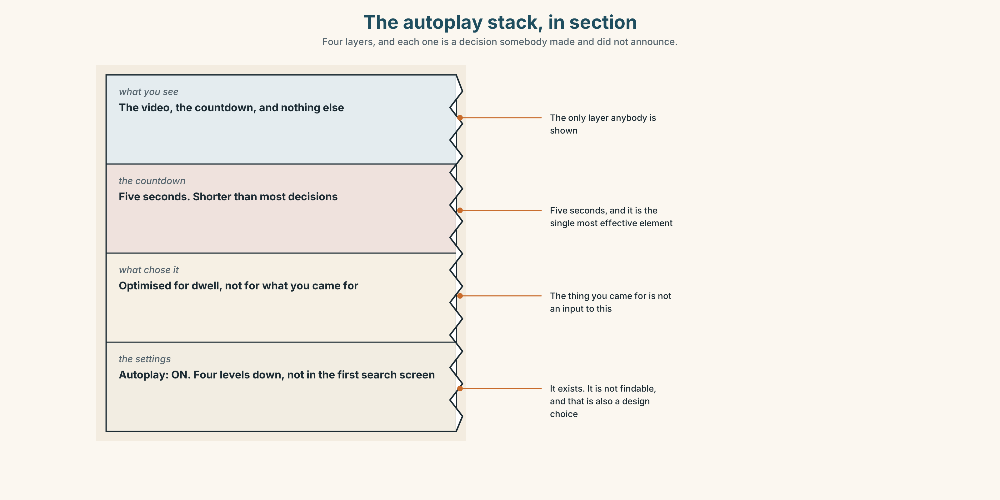{width=6.6in}

*The autoplay stack, in section — Four layers, and each one is a decision somebody made and did not announce.*

### 8A · Read the model

> The autoplay countdown is five seconds, which is shorter than the time it takes most people to
> decide anything. `[the design feature, with its number, and a non-defining clause doing the
> argument]`
>
> I counted my own sessions for two weeks. Of nineteen sessions, fourteen of which I began with a
> specific thing to look for, eleven ended more than twenty minutes after I had found it.
> `[evidence the writer collected, with *of which* holding the qualification inside the sentence]`
>
> The setting that turns it off exists. It is four levels down and it is not in the first screen
> of the search, which I take to be deliberate, though I cannot demonstrate that.
> `[one inference, and it is marked as one]`
>
> None of this is a complaint about users. It is a description of a surface which is optimised
> for time on site and does that extremely well.
> `[the conclusion, which refuses the moral framing the reader expects]`

**Questions about the writer's choices:**

1. The evidence is nineteen sessions the writer counted. **Why is that stronger than a study?**
2. One sentence says *I cannot demonstrate that*. **What does admitting it buy?**
3. The last paragraph refuses to blame users. **Is that an evasion?**

### 8B · The anti-model

> Social media is designed to be addictive. Companies use psychological tricks to keep us hooked
> and we are all spending far too much time staring at screens. We need to take back control of
> our attention before it is too late.

Correct English, and no evidence of any kind. **Name three things that would make it checkable**,
and say what *psychological tricks* is standing in for.

### 8C · Plan

> the feature, with its number → what you counted, with *of which* → one inference, marked →
> the conclusion, without the moral framing

### 8D · Write — 180 words
### 8E · Peer review — three criteria

> ☐ Is there a number the writer collected themselves?
> ☐ Is every inference marked as an inference?
> ☐ Are the non-defining clauses punctuated on both sides?

### 8F · Write it again · 8G · Publish

On the wall, with the 2019 minutes from Part 5B beside it.

---

## Part 9 · The File ◆ **A · THE WORLD + C · THE PERFORMANCE**

# WORK FILE · The Remote Problem

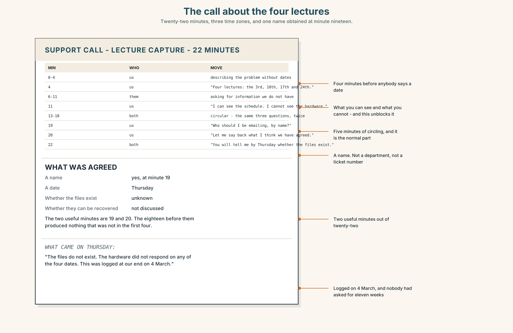{width=6.6in}

*The call about the four lectures — Twenty-two minutes, three time zones, and one name obtained at minute nineteen.*

### 9A · A problem nobody is in the room for 🔊 Track 1.4

The recording system has failed on four lectures. The supplier is in another country.
**Listen to the call.**

1. How long before anybody states the problem with a date?
2. **What does the supplier need that nobody on the call has, and who eventually gets it?**
3. What is agreed, and what is not?

### 9B · The four moves on a call you cannot escalate

> stating the problem with dates · establishing what you can and cannot see ·
> asking for a named person · agreeing what happens by when

Match each to one phrase.

> *"Four lectures, the 3rd, the 10th, the 17th and the 24th."* ·
> *"I can see the schedule. I cannot see whether the hardware responded."* ·
> *"Who should I be emailing about this, by name?"* ·
> *"So you will tell me by Thursday whether the files exist."*

### 9C · The sentence that ends a circular call

> *"Let me say back to you what I think we have agreed."*

**Why does it work?** And **what has to follow it** for it to be more than a stalling move?

### 9D · Your turn

In pairs, back to back. **Twelve minutes.** One has a problem; the other works for a supplier
and cannot fix it. **Both must leave with one named person and one date.**

### 9E · Transfer

**Find one unresolved problem you have with an organisation.** Write the four sentences from 9B
for it. Send one of them.

---

## Part 10 · Mediation & Interaction ◆ **C · THE PERFORMANCE**

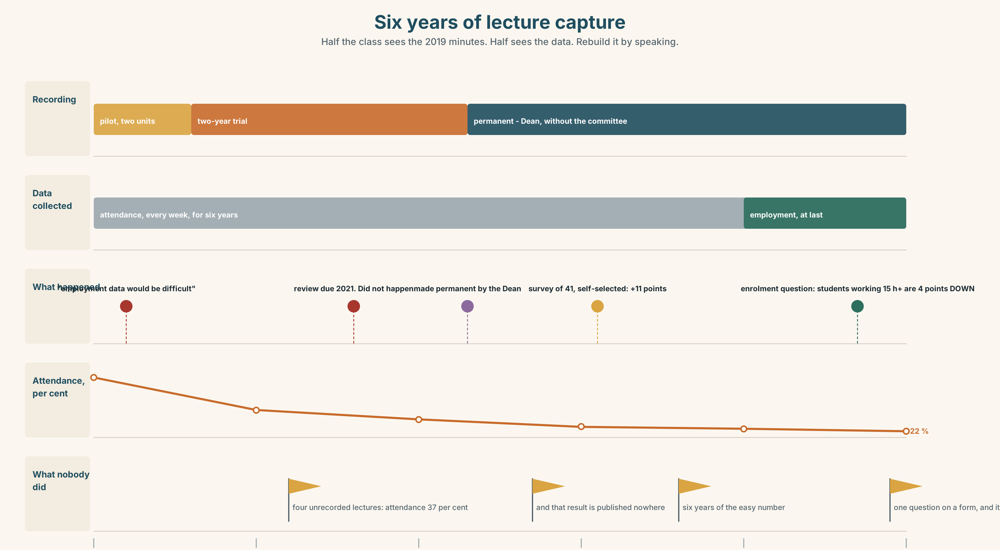{width=6.6in}

*Six years of lecture capture — Half the class sees the 2019 minutes. Half sees the data. Rebuild it by speaking.*

### 10A · Relay

Half the class sees the 2019 minutes. Half sees the current data.
**Rebuild six years by speaking.** Twelve minutes.

### 10B · Simplify

Explain the attendance and attainment data from Part 5E to a student who is deciding whether to
come to lectures. **Five sentences only.**

> **Plan:** what has happened to attendance → what has happened to results →
> what the data cannot tell you → which group you might be in → what you should actually decide on

### 10C · Compress

The 2019 minutes into **forty words**, keeping Ms Oyelaran's last sentence.

### 10D · Online

Write **one message** to the teaching committee: you have the attendance data, you have the 2019
action, and you are asking for one specific thing that was agreed in 2019 and never done.

### 10E · Your language

How does your language add a clause to a noun without narrowing it? **Is there a comma, a
pause, a different word, or a different position?** Say *the students, who work, did better* in
both languages.

---

## Part 11 · The Decision ◆ **C · THE PERFORMANCE**

# Keep recording, or stop

Attendance has halved since 2019. The pass rate overall is unchanged. The pass rate for students
in paid employment has risen eleven points — but the university has never collected employment
data, so that figure comes from a student survey with 41 responses.

- **Keep recording.** The evidence that it helps working students is weak and is the only
  evidence anybody has. The evidence that it harms anybody is weaker.
- **Stop recording.** Attendance returns, the room looks like a university, and the committee
  can stop having this argument. Students in work lose the only accommodation they have.
- **Keep recording and finally collect the employment data.** Two years and a question on
  enrolment. It would settle it, and it would mean admitting that six years of data were the
  wrong data.

### 11A · The evidence

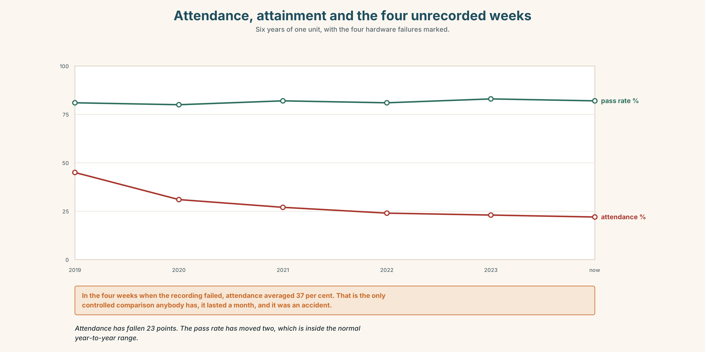{width=6.6in}

*Attendance, attainment and the four unrecorded weeks — Six years of one unit, with the four hardware failures marked.*

1. **The 2019 minutes and the current pack** from Part 5 — and the footnote.
2. **The chart** — attendance, attainment and the four unrecorded lectures.
3. **The voice.** Thanh, thirty seconds: *"I work Tuesday and Thursday nights, which are the two
   nights this unit is taught, and which I did not choose. I have never been to a lecture in this
   subject. I got a seventy-eight. I do not know what that proves and I would like somebody to
   stop telling me it proves I should have come."*

### 11B · Talk about it

In fours. Everybody speaks twice. Use the frame.

> *The students, most of whom ______ , have ______ , which ______ .*

**Words you can use:** *engagement · retention · metric · by default · design · attention ·
opt out · dwell*

### 11C · Decide

Write **three sentences**. Choose, say why, and name what it costs.

> I think the university should ______________________ ,
> because ______________________ .
> What this costs is ______________________ .

### 11D · Model decision

> Keep recording and collect the employment data, and say in the minutes that six years of
> attendance figures were collected because they were easy and the figure that mattered was not
> collected because it was difficult. The committee's 2019 chair was right that it would be
> difficult. It was also the only question. An institution that can count a room every week for
> six years can ask one question on an enrolment form.

### 11E · The Reveal

> **What happened.** The question went on the enrolment form in the following year: *do you
> undertake paid work during term? If so, how many hours?* It is optional and about seventy per
> cent answer it.

> In the first full year the data showed that students working more than fifteen hours a week had
> a pass rate four points **below** the cohort, not eleven points above. The eleven-point figure
> had come from a survey answered mostly by students who were doing well, which is what surveys
> do.
>
> Recording was kept. The argument for it changed completely: it is now defended as a reasonable
> adjustment for a group that is doing worse, rather than as something that was working.

**They got the number. It said the opposite of what everybody had been arguing. And the
recordings stayed.**

> **Was it the right decision?** Say why — and say what the first eleven-point figure was
> actually measuring.

---

## Part 12 · Landing ◆ **all three lines**

### 12A · Recycle — twelve items

> 1. Forty-one students, most ______ ______ work, passed.
> 2. The recordings, ______ are watched at night, went up in March.
> 3. Attendance has halved, ______ nobody disputes.
> 4. Autoplay is on **by ______** .
> 5. You can **______ out** , in a submenu.
> 6. **Time on ______** is the metric everything else serves.
> 7. He has learned to **______ off** at about eleven.
> 8. Eleven lectures, four ______ ______ were not recorded.
> 9. *(B1.2 U8)* ______ patients waited 41 days. *(this group)*
> 10. *(B1.2 U9)* The majority of patients ______ seen in six weeks. *(verb)*
> 11. *(A2.2 U8)* The hall, ______ was built in 1884, is the oldest.
> 12. *(A2.1 U4)* The person ______ has the key is the manager.

### 12B · Consolidate

**One hundred and eighty words.** One interface, analysed. A number you collected, three
non-defining clauses, one *of which*, and one inference marked as an inference.

### 12C · Can-do, with evidence

| I can… | My evidence | Sure? |
|---|---|---|
| add a clause to a noun without narrowing it | Part 3H score | ◯ ◑ ● |
| analyse an interface in three minutes, with evidence | Part 4C recording | ◯ ◑ ● |
| write 180 words in which inferences are marked | Part 8 draft 2 | ◯ ◑ ● |
| get a name and a date out of a remote supplier | Part 9D role play | ◯ ◑ ● |

### 12D · Replay ⏺

Find your forty-five seconds from Part 0C. Listen. **Record it again.**
**Two sentences:** what is different, and what you now know that interface is counting.

### 12E · Glossary — forty-five items, as a map

> **THE SURFACE** · interface · feed · scroll · prompt · autoplay · notification · design · a design choice
> **WHAT IT COUNTS** · metric · engagement · retention · dwell · time on site · attention · hold your attention
> **WHAT IT DOES WITHOUT ASKING** · by default · the next video · opt out
> **WHAT YOU DO** · log off · switch off · zone out · put down · I only came on to check one thing · it is designed to do that
> **ADDING A CLAUSE** · which · whom · whose · where · of which · of whom · most of which · all of whom · the former of which · the latter of which · at which point
> **CONNECTING** · likewise · moreover · namely · incidentally · respectively · additionally · conversely · refer back · cross-refer · none of which was mentioned

### 12F · Next

> **Unit 2 · Who is left out?**

# B1.3 · Unit 2 · One Lift, Two Buildings

> **English Animated** · *Making the Case* · a university campus, Melbourne
> Student's Book pages 28–49 · 22 pp · ~11 hours

---

## Part 0 · The Big Picture ◆ **A · THE WORLD**

{width=6.6in}

*Two buildings, one budget, Thursday, 09.40 — Twelve things to find. Four are the official provision. Four are what people actually do.*

# Who is left out?

**By the end of this unit you can audit a space or a process for who it excludes, and report
what you find.**

| ◆ **A · THE WORLD** | A campus that works for almost everybody, and the budget for one lift |
|---|---|
| ◆ **B · THE SYSTEM** | participle clauses, present and past · reduced relatives · 23 words for access and exclusion · 22 participle and linking forms · the rhythm of a reduced clause |
| ◆ **C · THE PERFORMANCE** | An audit, written so that somebody can act on it |

---

### 0A · Find it

**Find twelve things in this picture.** Four of them are the official provision and four are
what people actually do.

> a ramp · a lift with a notice on it · six steps and a handrail · a propped fire door ·
> a long way round marked in worn grass · a sign pointing to an entrance ·
> a bell with a sign saying ring for assistance · a desk with nobody at it ·
> a lecture theatre with one flat row · a bike left across a kerb cut ·
> a map on a post · an accessible toilet being used as a store

### 0B · Guess it

**Two of the twelve exist because another one does not work.** Which, and who made them?

### 0C · Say it ⏺

**Record forty-five seconds.** *Think of a place you use daily. Name one person who could not
use it the way you do, and say exactly where they would stop.* You will record it again at the
end of this unit.

---

## Part 1 · Vocabulary Lab 1 ◆ **B · THE SYSTEM**

{width=6.6in}

*Where provision and use come apart — Six nodes. Three are on paper and three are what somebody does on a Thursday morning.*

### 1A · Meet — the words of getting in

Match each word to one place on the map.

> **access** · **barrier** · **ramp** · **lift** · **step** · **signage** · **provision** ·
> **accommodation** · **exemption** · **survey**

### 1B · Sort — the building, the policy, or the person?

Three columns.

> ramp · disability · accommodation · provision · barrier · signage · access · exemption ·
> inclusion

**One of them is routinely treated as a property of the person and is a property of the
building.** Which?

### 1C · Meet — the phrase that does most of the work

> **reasonable adjustment**

Two words, both of which are arguable. **Who decides what is reasonable**, and what happens when
the person who decides is the person paying?

### 1D · Collocation Lab

Complete each one with one word.

1. There is a **step-______** route, and it adds about four hundred metres.
2. The lift has been **out of ______** for nine days, twice this term.
3. **On ______** , the building is fully accessible.
4. The ramp at the north door is **the only ______** if you cannot do six steps.
5. Nobody can get a room changed **at short ______** , which is when it is always needed.
6. She has learned to **work ______** it, and she should not have to.

### 1E · The fixed expressions

> **f** **Nobody asked us.**
> **f** **It has been like that for years.**

Two sentences about the same building, said by two different people.

> **One is a complaint and one is a defence. Write the sentence that would answer each.**

### 1F · Own it

Think of a process rather than a place — enrolling, applying, booking something. Tell a partner
**four sentences**: the official route, the actual route, who falls out, and at which step.

---

## Part 2 · Listening ◆ **A · THE WORLD**

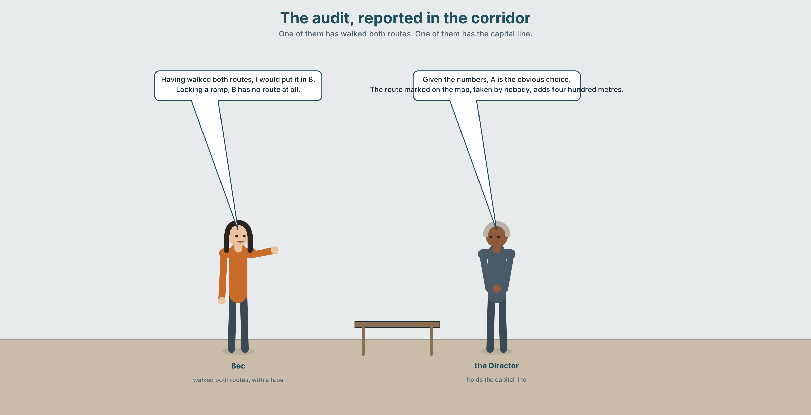{width=6.6in}

*The audit, reported in the corridor — One of them has walked both routes. One of them has the capital line.*

### 2A · The audit 🔊 Track 2.1

**Before you listen.** Bec has walked both buildings with a measuring tape. There is money for
one lift. **Guess: which building has the stronger case on paper?**

**Listen once. One question.** How many people does each building affect?

**Listen again. Complete the table.**

| | Building A | Building B |
|---|---|---|
| people per week | | |
| existing provision | | |
| the alternative route | | |

**Listen again. Choose the best answer.**

1. Building A has **neither / a ramp / a lift**.
2. Building B has **a ramp / a lift / neither**.
3. The busier building is **B / they are the same / A**.
4. The cheaper installation is **A / they are the same / B**.

**Noticing.** Four sentences from the recording.

1. *Having walked both routes, I would put it in B.*
2. *Given the numbers, A is the obvious choice.*
3. *The route marked on the map, taken by nobody, adds four hundred metres.*
4. *Lacking a ramp, B has no route at all.*

**All four begin with a reduced clause. Which of the four has a different subject from its main
clause?**

### 2B · Decoding clinic 🔊 Track 2.2

Thirty seconds of Bec. Four jobs.

1. How many participle clauses can you count?
2. In *having walked both routes*, how many words are stressed?
3. Catch the two distances.
4. She uses one reduced clause that could be read two ways. Which?

> Transcripts, page 151.

---

## Part 3 · Grammar Lab 1 ◆ **B · THE SYSTEM**

### Clauses with the subject taken out

### 3A · Notice

Look at the four sentences in Part 2.

1. In sentence 1, who walked the routes?
2. In sentence 3, who took the route? **And who is the subject of the main clause?**
3. **Rewrite sentence 4 in full.** What word did the reduction remove?
4. *Having walked* and *walking*. **What does the perfect participle add?**
5. Try *"Lacking a ramp, the route is impossible."* **Who lacks the ramp?**

### 3B · See

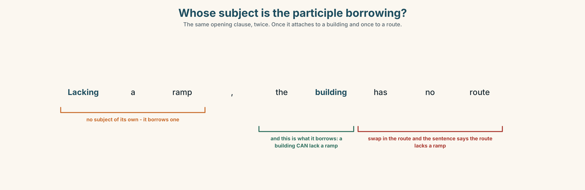{width=6.6in}

*Whose subject is the participle borrowing? — The same opening clause, twice. Once it attaches to a building and once to a route.*

### 3C · Know

| | Shape | Replaces |
|---|---|---|
| **present participle** | *Lacking a ramp, B has no route.* | *Because it lacks…* |
| **perfect participle** | *Having walked both, I would choose B.* | *After I had walked…* |
| **past participle** | *Taken together, the figures show…* | *If they are taken…* |
| **reduced relative** | *the route marked on the map* | *the route **which is** marked* |
| ***given* / *considering*** | *Given the numbers…* | prepositional, and no subject needed |

> **The hanging participle.** A participle clause takes its subject from the **main clause**.
> If they do not match, the sentence says something absurd.
> ✗ *Lacking a ramp, the route is impossible.* — the route does not lack a ramp.
> ✓ *Lacking a ramp, the building has no route.*

> ***Given*, *considering*, *owing to* and *due to* are not participles any more.** They have
> become prepositions and do not need to agree with anything, which is why they are safe.

> **A reduced relative drops *which is* / *who are*.**
> *the route **which is** marked* → *the route marked* ·
> *the students **who are** waiting* → *the students waiting*

> **Why it matters.** An audit written in participle clauses is half the length and twice as
> likely to attach a finding to the wrong thing.

### 3D · Use — controlled

> (1) __________ (walk) both routes with a tape, I would put the lift in B.
> (2) __________ the numbers, A is the obvious choice: it takes 2,100 people a week against
> B's 400. The route (3) __________ (mark) on the campus map, (4) __________ (take) by
> almost nobody, adds four hundred metres. (5) __________ (lack) any step-free entrance at
> all, B excludes people completely rather than inconveniencing them.
> (6) __________ (take) together, the two facts do not point the same way, and
> (7) __________ said that, one of them is about numbers and the other is about whether a
> person can enter a building.

### 3E · Use — guided

Reduce each one to a participle clause. **Two of them cannot be reduced safely — say why.**

1. Because B lacks a ramp, it has no step-free route.
2. After I had measured both, I changed my mind.
3. The route which is marked on the map is not the one people use.
4. Because the lift was out of order, the lecture was moved.
5. If the figures are taken together, they do not agree.

### 3F · Use — open

**In pairs.** Describe a building you both know, in six sentences, four of which must begin with
a participle clause. **Your partner's job** is to catch any hanging participle.

### 3G · Error autopsy

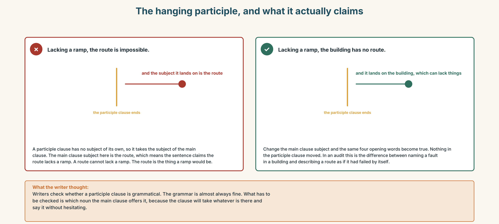{width=6.6in}

*The hanging participle, and what it actually claims — The hanging participle, and what it actually claims*

**Read both versions. Then say what the first one claims about the route.**

### 3H · Check — eight items

> 1. ______ (walk) both routes, I would choose B.
> 2. ______ the numbers, A is the obvious choice.
> 3. The route ______ (mark) on the map adds 400 m.
> 4. ______ (lack) a ramp, the building has no route at all.
> 5. ______ (take) together, the figures disagree.
> 6. ✗ *Lacking a ramp, the route is impossible.* → correct it.
> 7. ______ (have) said that, the numbers are not the only question.
> 8. ______ to the lift being out, the class was moved. *(preposition)*

**0–4 →** Workbook pp. 10–13. **5–6 →** Part 6. **7–8 →** page 41.

---

## Part 4 · Speaking ◆ **C · THE PERFORMANCE**

### 4A · Fluency starter — reduce it

One learner gives a two-clause sentence. The next reduces it to a participle clause.
The next says whether the subjects match. **The chain breaks on a hanging participle.**

### 4B · The functional core — reporting an audit

{width=6.6in}

*The access statement, and the tape measure — Learner A has the statement. Learner B has the audit. Four claims do not survive.*

**Language Bank**

| | |
|---|---|
| **the method** | *Walking both routes with a tape…* · *Over two weeks I counted…* |
| **the finding** | *Lacking a ramp, B…* · *The route marked on the map…* |
| **the exclusion, named** | *A person using a wheelchair cannot…* · *At step four, they stop.* |
| **the honest limit** | *I did not test…* · *Given the circumstances, this is an estimate.* |

**Information gap.** Learner A has the official access statement. Learner B has the audit.
**Find the four claims in the statement that the audit contradicts.**

### 4C · The performance — three minutes ⏺

Report **an audit of a space or a process**. **Three minutes.** You must include:

> your method, with a number · who is excluded, named by what they cannot do ·
> the exact step at which they stop · one thing you did not test

**Record it.**

### 4D · Observer

One person listens for **one thing**: was the exclusion described as a property of the building
or of the person?

### 4E · Three criteria

> ☐ Did I use four participle clauses, none of them hanging?
> ☐ Is the exclusion located at a specific step?
> ☐ Did I say what I did not test?

---

## Part 5 · Reading ◆ **A · THE WORLD**

### 5A · Predict

Two letters. The title is **"Re: the lift in the Menzies building."**
**What do you expect the second letter to concede?** Two sentences.

### 5B · Read — two minutes and a quarter

---

**From: Bec Tran, Student Union**
**To: the Director of Estates**
**Re: the lift in the Menzies building**

I have walked both buildings with a tape measure and I am going to argue against our own
submission.

We asked for the lift in Menzies because Menzies is busier. It takes about 2,100 people a week
against Harcourt's 400. On every measure of volume, Menzies wins, and that is the case we made.

Menzies has a ramp. It is a bad ramp — it is 1:11 where it should be 1:14, and it ends at a door
that is heavier than the standard allows — but a person using a wheelchair can get into Menzies,
tired and annoyed.

Harcourt has six steps and no ramp and no lift. There is no route. The access statement describes
a step-free entrance at the rear; there is a rear entrance, it is step-free, and it opens into a
plant room.

So the honest sentence is this: in Menzies we would be improving access for people who have it
badly. In Harcourt we would be creating it for people who do not have it at all.

I am aware that 400 is a smaller number than 2,100 and I am not going to pretend otherwise.

---

**From: the Director of Estates**
**Re: your letter**

You are right about Harcourt and I did not know about the plant room, which I have now seen.

I want to put one thing on the record, not as a counter-argument but because it will come up.
There is a reason the budget goes to the busier building and it is not laziness: lifts are
funded from a capital line that is assessed on usage, and a lift serving 400 people a week will
score below the threshold and will be queried every year for fifteen years by somebody who has
not read your letter.

I am going to fund Harcourt. I am also going to write the paragraph you have just written into
the capital submission, because in four years I will not remember it and neither will anybody
else.

---

### 5C · Comprehension — eight questions

1. What does Bec say she is going to do in her first sentence?
2. **What are the two volume figures, and what case did they originally support?**
3. What is wrong with the Menzies ramp? Give both faults.
4. **What does the access statement claim about Harcourt, and what is actually there?**
5. What is Bec's "honest sentence"?
6. What does the Director concede, and what does he say he did not know?
7. **What is the funding problem he puts on the record, and why does he raise it?**
8. What two things does he say he is going to do?

### 5D · Vocabulary in context

Guess from the text. Then check.

> argue against our own submission · on every measure of volume · the standard allows ·
> a capital line · will be queried

### 5E · The counter-text

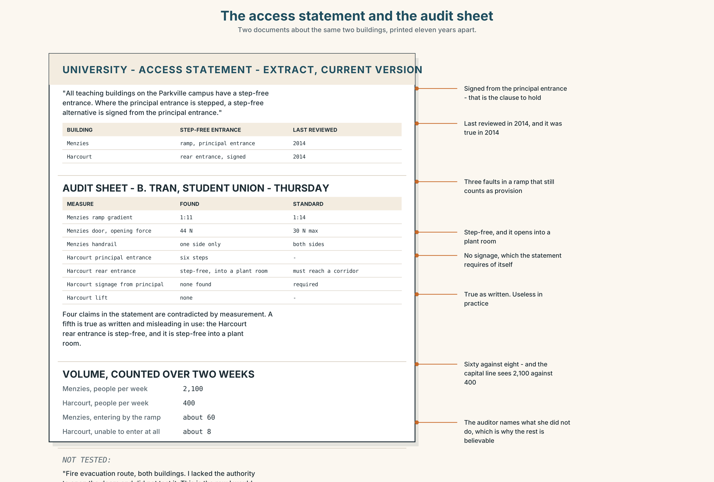{width=6.6in}

*The access statement and the audit sheet — Two documents about the same two buildings, printed eleven years apart.*

**Read the access statement and the audit sheet, and answer.**

1. What does the access statement say about each of the two buildings?
2. **Which four of its claims does the audit contradict, and how?**
3. What is the gradient of the Menzies ramp, and what should it be?
4. How long has the Harcourt rear entrance been described as step-free?
5. One row of the audit has a note about something the auditor did not test. Which?

### 5F · Two texts

The access statement says Harcourt has a **step-free rear entrance**.
The audit says that entrance **opens into a plant room**.

**Put those two facts together. Is the statement false?** Three sentences.

---

## Part 6 · Vocabulary Lab 2 ◆ **B · THE SYSTEM**

### Reduced clauses and the words that replace them

### 6A · Sort — present participle, past participle, or preposition?

Three columns.

> given · due · based · followed · taken · lacking · surrounded · facing · having ·
> considering · seen

### 6B · Chunk completion

1. **Having ______ that** , four hundred is still four hundred.
2. **Given the ______** , the estimate is as good as it is going to get.
3. **______ to** the lift being out, two classes were moved.
4. The figures, **______ together** , do not point the same way.
5. **All things ______** , Harcourt is the stronger case.
6. The audit does not **______ for** the days the lift was out.

### 6C · Three that are not participles any more

**given · considering · due to**

> All three began as participles and have become prepositions. That is why they cannot hang:
> they are not looking for a subject.

**Rewrite each sentence as a full clause, and say what is lost.**

1. Given the numbers, A is the obvious choice.
2. Considering the gradient, the ramp is unusable in the wet.
3. Due to the lift being out, the class was moved.

### 6D · Two that need a preposition to finish

Some past participles will not stand alone in front of a noun. They need a small word
behind them, and the small word is not optional.

> **c** The estimate is **based on** the 2022 survey.
> **c** Each claim in the audit is **followed by** a photograph.

**Not:** *~~The estimate is based the 2022 survey.~~* · *~~Each claim is followed a photograph.~~*

**Complete each one with the right half of the pair.**

1. The exemption was granted on a statement ______ ______ one visit in 2019.
2. The site visit was ______ ______ a letter nobody answered.
3. A figure ______ ______ a single measurement is a figure worth checking.

### 6E · The fixed expression

> **f** **That being the case.**

A formal connector that is itself a participle clause.

> **Write the sentence before it and the sentence after it**, in a letter you might have to send.

### 6F · Contrast Clinic

Eight items. Reduce each one, or say why it cannot be reduced.

1. Because the lift was out, the class was moved. *(watch the subject)*
2. Since nobody asked the students, the statement went unchallenged.
3. Because I had walked it, I knew the map was wrong.
4. The students who are waiting at the rear door cannot get in.
5. If the figures are taken together, they disagree.
6. After she had measured both, she changed her mind.
7. The route which is marked on the map adds 400 m.
8. Because it lacks a ramp, the building excludes people.

---

## Part 7 · Pronunciation & Fluency Lab ◆ **B · THE SYSTEM**

### The rhythm of a clause with no subject

{width=6.6in}

*A reduced clause keeps the beats and drops the syllables — Three stresses before the pause, whichever version you say.*

### 7A · Hear 🔊 Track 2.3

> *Having walked both routes,* | *I would choose B.*
> **Three stresses in the first unit, three in the second, and a clear pause between them.**

Now the full version:

> *After I had walked both routes, I would choose B.*
> **Same number of stresses. Four more syllables, all of them weak.**

### 7B · Say

Say both. Then say this one three times, faster:

> *Lacking a ramp and lacking a lift, the building has no route at all.*

### 7C · Make it mean something

Say these two:

> *Having said that, four hundred is still four hundred.* *(a concession is coming)*
> *Having said that four hundred is still four hundred…* *(no pause — and it is a report)*

**One pause, and the sentence changes job.** Which is which?

### 7D · Fluency 30 ⏺

Thirty seconds: **four sentences beginning with a participle clause.**
Three times, faster, keeping the pause.

---

## Part 8 · Writing ◆ **C · THE PERFORMANCE**

### An access audit · 180 words

{width=6.6in}

*The Harcourt rear entrance, in section — Four layers. Each one was true when it was written.*

### 8A · Read the model

> Walking both routes with a tape, I measured the Menzies ramp at 1:11 against a standard of
> 1:14, and the entrance door at 44 newtons against a maximum of 30.
> `[the method and two measurements, both against a published standard]`
>
> Harcourt has six steps, no ramp and no lift. The rear entrance, described in the access
> statement as step-free, opens into a plant room. `[the finding, with a reduced relative carrying
> the contradiction inside the sentence]`
>
> A person using a wheelchair can enter Menzies, with difficulty. They stop at step one in
> Harcourt and there is no further step to describe.
> `[the exclusion, located exactly, and the second sentence is the whole argument]`
>
> I did not test the fire evacuation route in either building, lacking the authority to open the
> doors. `[what was not tested, and why — and the participle agrees]`

**Questions about the writer's choices:**

1. Both measurements are given against a standard. **What would a measurement alone be worth?**
2. The exclusion is *at step one*. **Why does locating it matter more than describing it?**
3. The last paragraph names something untested. **Does that weaken the audit?**

### 8B · The anti-model

> Accessibility across the campus is variable and some buildings present more challenges than
> others. Students with mobility needs may find certain routes difficult. The university is
> committed to improving access and welcomes feedback from all members of the community.

Correct English, and nobody could act on it. **Name three things that are missing**,
and say what *present more challenges* is doing.

### 8C · Plan

> the method, with a number → the finding, against a standard → the exclusion, located at a step
> → what you did not test, and why

### 8D · Write — 180 words
### 8E · Peer review — three criteria

> ☐ Is every measurement given against a standard?
> ☐ Is the exclusion located at a specific step?
> ☐ Does every participle clause agree with its main subject?

### 8F · Write it again · 8G · Publish

On the wall, with the access statement from Part 5E beside it.

---

## Part 9 · The File ◆ **A · THE WORLD + C · THE PERFORMANCE**

# STUDY FILE · The Question

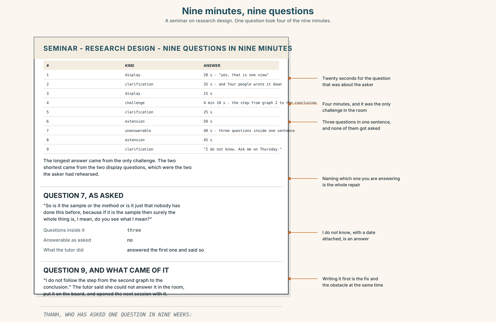{width=6.6in}

*Nine minutes, nine questions — A seminar on research design. One question took four of the nine minutes.*

### 9A · Nine minutes of questions 🔊 Track 2.4

A seminar on research design. The tutor takes nine questions. **Listen.**

1. Which question gets the longest answer, and is it the best question?
2. **Which question does the tutor say she cannot answer, and what does she do instead?**
3. One question is asked in a way that makes it impossible to answer. What is wrong with it?

### 9B · Four kinds of question

> **the clarification** — I did not follow something
> **the extension** — I followed it and want more
> **the challenge** — I followed it and I am not convinced
> **the display** — I want you to know that I know something

**Which of the four is hardest to ask, and which is easiest to disguise as another?**

### 9C · Asking a question you are afraid of

Thanh writes better than he speaks. In nine weeks he has asked one question.

**Which of these would you advise him to use, and why?**

1. *"Sorry, could you say that again?"*
2. *"Can I check I've understood: are you saying that…?"*
3. *"I don't follow the step from the second graph to the conclusion."*
4. *"This might be a stupid question, but…"*

### 9D · Your turn

In fours. **Twelve minutes.** One person presents anything for two minutes.
**Everybody else must ask one question of each of the four kinds**, in writing first, then aloud.
Then: which was hardest to write?

### 9E · Transfer

**Count the questions asked in your next class or meeting**, and sort them into the four kinds.
Bring the four numbers.

---

## Part 10 · Mediation & Interaction ◆ **C · THE PERFORMANCE**

{width=6.6in}

*Eleven years of one sentence — Half the class sees the statement. Half sees the audit. Rebuild it by speaking.*

### 10A · Relay

Half the class sees the access statement. Half sees the audit.
**Rebuild both buildings by speaking.** Twelve minutes.

### 10B · Simplify

Explain the audit from Part 5E to a student who is about to be timetabled into Harcourt.
**Five sentences only.**

> **Plan:** what is there → what is not → what the statement says → what you should do →
> who to write to

### 10C · Compress

Bec's letter into **forty words**, keeping the honest sentence.

### 10D · Online

Write **one message** to the Director of Estates: you accept the funding constraint, you have
the audit, and you are asking for one specific paragraph in one specific document.

### 10E · Your language

Does your language reduce clauses the way English does? **Say *lacking a ramp, the building has
no route* in both languages.** Which needs more words, and which is more likely to be ambiguous?

---

## Part 11 · The Decision ◆ **C · THE PERFORMANCE**

# The busier building, or the one with no route

There is money for one lift. Menzies takes 2,100 people a week and has a bad ramp. Harcourt
takes 400 and has nothing.

- **Menzies.** The volume case, the capital-line case, and about sixty people a week who
  currently enter by a 1:11 ramp and a door they cannot open alone.
- **Harcourt.** Four hundred people a week, of whom perhaps eight cannot enter at all, and a
  building that will be queried every year for fifteen years as under-used.
- **Neither yet.** Fix the Menzies ramp and the door for a fifth of the cost, and bid again for
  Harcourt next year with the audit attached.

### 11A · The evidence

{width=6.6in}

*Users, exclusions and cost for each option — Three options, and the two columns the capital line reads are not the same column.*

1. **The access statement and the audit** from Part 5E — and the untested row.
2. **The chart** — users, exclusions and cost for each option.
3. **The voice.** A student, thirty seconds: *"I have been told four times that Harcourt has a
   step-free entrance. I have been to it. It is a step-free entrance into a plant room. I would
   like somebody to explain how a sentence like that survives for eleven years, because I do not
   think anybody lied."*

### 11B · Talk about it

In fours. Everybody speaks twice. Use the frame.

> *______ (participle clause), the building ______ . That being the case, ______ .*

**Words you can use:** *access · barrier · provision · step-free · reasonable adjustment ·
the only route · shut out · work around · on paper*

### 11C · Decide

Write **three sentences**. Choose, say why, and name what it costs.

> I think the university should ______________________ ,
> because ______________________ .
> What this costs is ______________________ .

### 11D · Model decision

> Fund Harcourt, and fix the Menzies ramp from maintenance rather than capital, which is where a
> gradient fault belongs anyway. The real problem in this decision is that one of the two options
> is counted and the other is not: 2,100 is a number the capital line understands and *eight
> people who cannot enter a building* is not. Writing the audit into the submission is the only
> part of this that will still be working in four years.

### 11E · The Reveal

> **What happened.** Harcourt got the lift. The Menzies ramp was regraded from the maintenance
> budget in the same year, at about a fifth of the cost, which nobody had previously suggested
> because the two budgets are held by different people who meet twice a year.
>
> The access statement was corrected. It took eleven months, because the statement is generated
> from a database field, and the field had been correct in 2014 when the rear entrance was still
> an entrance.
>
> The Harcourt lift has been queried in each of the three capital reviews since. The Director's
> paragraph has been read out at two of them.

**The lift went in. The ramp was a maintenance job all along. And a sentence stayed wrong for
eleven years because the room behind it changed and the field did not.**

> **Was it the right decision?** Say why — and say what should happen to the database field.

---

## Part 12 · Landing ◆ **all three lines**

### 12A · Recycle — twelve items

> 1. ______ (walk) both routes, I would choose B.
> 2. ______ the numbers, A is the obvious choice.
> 3. The route ______ (mark) on the map adds 400 m.
> 4. ______ (lack) a ramp, the building has no route.
> 5. There is a **step-______** route, and it adds 400 m.
> 6. The lift has been **out of ______** for nine days.
> 7. **On ______** , the building is fully accessible.
> 8. She has learned to **work ______** it.
> 9. *(Unit 1)* Forty-one students, most ______ ______ work, passed.
> 10. *(Unit 1)* Attendance has halved, ______ nobody disputes.
> 11. *(B1.2 U6)* She ______ (have) it done on Thursday.
> 12. *(A2.2 U8)* The hall, ______ was built in 1884, is the oldest.

### 12B · Consolidate

**One hundred and eighty words.** An audit of a space or a process. Your method with a number,
a measurement against a standard, an exclusion located at a step, and one thing you did not test.

### 12C · Can-do, with evidence

| I can… | My evidence | Sure? |
|---|---|---|
| reduce a clause without leaving the participle hanging | Part 3H score | ◯ ◑ ● |
| report an audit in three minutes | Part 4C recording | ◯ ◑ ● |
| write 180 words somebody could act on | Part 8 draft 2 | ◯ ◑ ● |
| ask a clarification, an extension and a challenge | Part 9D questions | ◯ ◑ ● |

### 12D · Replay ⏺

Find your forty-five seconds from Part 0C. Listen. **Record it again.**
**Two sentences:** what is different, and whether you can now name the step.

### 12E · Glossary — forty-five items, as a map

> **THE BUILDING** · access · barrier · ramp · lift · step · signage · step-free · the only route · out of order
> **THE POLICY** · provision · accommodation · exemption · survey · inclusion · reasonable adjustment · on paper · at short notice
> **THE PERSON** · disability · shut out · work around · get by · point out
> **WHAT PEOPLE SAY** · nobody asked us · it has been like that for years
> **REDUCED CLAUSES** · having · lacking · facing · seen · taken · left · based on · followed by · surrounded · having said that · taken together
> **PREPOSITIONS NOW** · given · considering · due to · given the circumstances · all things considered · that being the case · allow for · rule out

### 12F · Next

> **Unit 3 · Is disagreement useful?**

# B1.3 · Unit 3 · The Best Voice in the Room

> **English Animated** · *Making the Case* · a university campus, Melbourne
> Student's Book pages 50–71 · 22 pp · ~11 hours

---

## Part 0 · The Big Picture ◆ **A · THE WORLD**

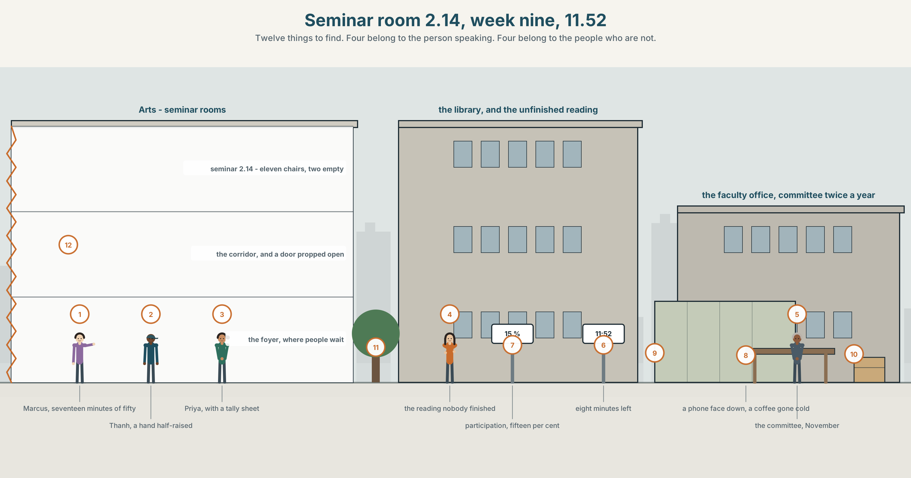{width=6.6in}

*Seminar room 2.14, week nine, 11.52 — Twelve things to find. Four belong to the person speaking. Four belong to the people who are not.*

# Is disagreement useful?

**By the end of this unit you can write and speak an argument that concedes properly before it
disagrees.**

| ◆ **A · THE WORLD** | A seminar room where one person is right more often than anybody else |
|---|---|
| ◆ **B · THE SYSTEM** | contrast and concession: *although · despite · however · whereas* · 24 words for argument and dissent · 21 concession forms · the intonation of a concession |
| ◆ **C · THE PERFORMANCE** | An argument that gives the other side its best version first |

---

### 0A · Find it

**Find twelve things in this picture.** Four of them belong to the person speaking. Four belong
to the people who are not.

> a hand half-raised and lowered again · a clock at 11.52 · a laptop with nothing typed since
> 11.20 · a seminar table with two empty chairs on one side · a whiteboard with one word on it ·
> a reading nobody finished · a phone face down · a tutor's tally sheet · a door propped open ·
> a coffee gone cold · a person leaning back out of the circle · a notebook with a question
> written and crossed out

### 0B · Guess it

**Two of the twelve are the same person's silence, shown twice.** Which, and what is the
difference between the two silences?

### 0C · Say it ⏺

**Record forty-five seconds.** *Describe a conversation where somebody was right and you stopped
arguing anyway. Say why you stopped.* You will record it again at the end of this unit.

---

## Part 1 · Vocabulary Lab 1 ◆ **B · THE SYSTEM**

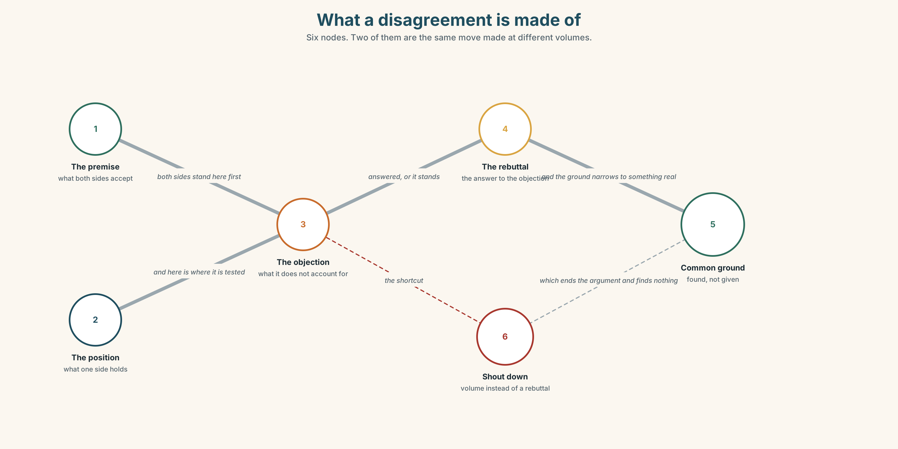{width=6.6in}

*What a disagreement is made of — Six nodes. Two of them are the same move made at different volumes.*

### 1A · Meet — the words of a disagreement

> **argument** · **debate** · **dissent** · **objection** · **position** · **premise** ·
> **rebuttal** · **compromise** · **agreement**

1. Which two of these can be a thing you *hold* rather than a thing you *make*?
2. **A *rebuttal* answers something. What?**
3. *Dissent* and *objection*: which one is usually about a decision, and which about a direction?
4. **What is the difference between a *premise* and a *position*?**

> **An *argument* in this unit is not a row.** It is a set of reasons arranged so that somebody
> else can follow them, and the ordinary English word carries both meanings without warning you.

### 1B · Sort — the room, the argument, or the person?

> play devil's advocate · defer · take a position · dominate · common ground ·
> concede the point · silence · the floor · talk over

**Three columns. Two of them belong in more than one.** Say which and why.

### 1C · Meet — the phrase that does most of the work

> **c** **common ground**

Not agreement. The part of the ground you are both standing on *before* the disagreement starts.

1. **Why is naming it first a stronger move than naming it last?**
2. Find the common ground between: *we should ban cars from campus* and *we should build a
   second car park*.

### 1D · Collocation Lab

| | |
|---|---|
| **take** | a **position** · a view · the point |
| **concede** | the **point** · a round · ground |
| **the floor** | hold ~ · give up ~ · take ~ |
| **common ground** | find ~ · establish ~ · lose ~ |

**Which of these can you do to somebody, and which only with them?**

### 1E · The fixed expressions

> **f** **I take your point.** — I have understood it and I am about to disagree.
> **f** **That is not what I said.** — the sentence that stops a misquotation, and it has to be
> said calmly or it sounds like the thing it is denying.

**Where would each one fall in a four-turn exchange?**

### 1F · Own it

The four phrasal verbs of a disagreement.

> **back down** · **hold back** · **shout down** · **come round**

1. Which two are about volume, and which two about time?
2. **Who does *shout down* describe — the loud one, or the room?**
3. *Hold back* has two meanings here. Give both.
4. Write one sentence in which somebody does **come round** without ever saying they were wrong.

---

## Part 2 · Listening ◆ **A · THE WORLD**

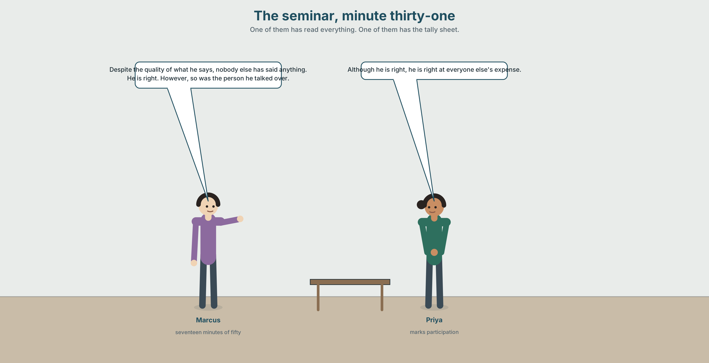{width=6.6in}

*The seminar, minute thirty-one — One of them has read everything. One of them has the tally sheet.*

### 2A · Fifty minutes, one voice 🔊 Track 3.1

**Before you listen.** Priya tutors a first-year seminar and marks participation.
**Guess: how many of the eleven students speak in a fifty-minute class?**

**Listen once. One question.** What is the seminar about, and who decides?

**Listen again. Complete the table.**

| | Minutes spoken | Times interrupted | Times they interrupted |
|---|---|---|---|
| Marcus | | | |
| Thanh | | | |
| the rest | | | |

**Listen again. Choose the best answer.**

1. Marcus is **hard to say / usually wrong / usually right**.
2. Priya intervenes **not at all / once / twice**.
3. Thanh **speaks once / speaks twice / does not speak**.
4. The seminar reaches **neither / a compromise / a conclusion**.

**Noticing.** Four sentences from the recording.

1. *Although he is right, he is right at everyone else's expense.*
2. *Despite the quality of what he says, nobody else has said anything.*
3. *He is right. However, so was the person he talked over.*
4. *Marcus argues; Thanh writes. Whereas one of those is graded, the other is not.*

**All four concede something before they disagree. Which of the four concedes the most?**

### 2B · Decoding clinic 🔊 Track 3.2

Thirty seconds of Priya. Four jobs.

1. How many concession words can you count?
2. In *although he is right*, which word carries the stress?
3. Catch the two numbers.
4. She says one thing twice with different intonation. What changes?

> Transcripts, page 152.

---

## Part 3 · Grammar Lab 1 ◆ **B · THE SYSTEM**

### Conceding before you disagree

### 3A · Notice

Look at the four sentences in Part 2.

1. In sentence 1, which half is the concession and which is the point?
2. **In sentence 2, what follows *despite* — a clause or a noun phrase?**
3. **Rewrite sentence 3 as one sentence** using *although*. What punctuation changes?
4. Sentence 4 uses *whereas*. **Could you use *although* instead? What would be lost?**
5. Try *"Although he is right, but he is loud."* **What is wrong with it?**

### 3B · See

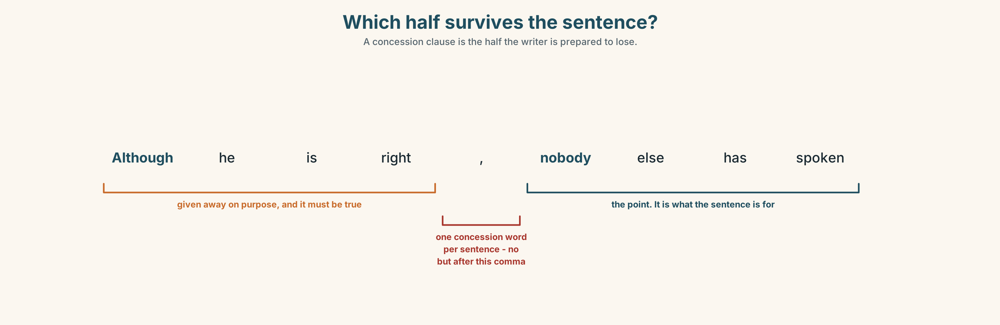{width=6.6in}

*Which half survives the sentence? — A concession clause is the half the writer is prepared to lose.*

### 3C · Know

| | Followed by | Example |
|---|---|---|
| ***although* / *though*** | a clause | *Although he is right, nobody else spoke.* |
| ***despite* / *in spite of*** | a noun or *-ing* | *Despite being right, he lost the room.* |
| ***however* / *nevertheless***| a new sentence | *He is right. However, so was Thanh.* |
| ***whereas*** | a clause, for a parallel | *Marcus argues, whereas Thanh writes.* |
| ***yet* / *still*** | a clause, joined | *He is right, yet nobody agrees.* |

> **One concession word per sentence.** English does not allow *although… but…* or
> *despite… however…*. The second one is the one to delete.
> ✗ *Although he is right, but he is loud.* ✓ *Although he is right, he is loud.*

> ***Though* goes where *although* goes, and in one more place: the end.**
> *He is right. He is loud, though.* — informal, and extremely common in speech.

> ***Whereas* is not a concession at all.** It sets two things side by side without saying
> either is a problem. *Although* says the first one is in the way of the second.

> **Why it matters.** An argument that concedes nothing reads as if it has not understood the
> other side. An argument that concedes in the wrong clause gives away the thing it meant to keep.

### 3D · Use — controlled

> (1) __________ Marcus is right more often than anybody in the room, the room has stopped
> talking. (2) __________ his accuracy, the seminar has eleven people in it and two of them
> have spoken since week three. He prepares, he reads, and he is not rude.
> (3) __________ , an argument is not only a set of true statements. Priya marks participation,
> (4) __________ the department marks essays, and the two numbers have stopped agreeing.
> (5) __________ of the grade, Thanh has not spoken since week two. He is right too, on paper,
> (6) __________ nobody in the room has heard him be right.
> (7) __________ , somebody has to decide whether that is a problem with Marcus or with the
> format.

### 3E · Use — guided

Join each pair with the word in brackets. **Two of them need a change of word class.**

1. He is right. Nobody else has spoken. *(although)*
2. The quality of his argument. The room has gone quiet. *(despite)*
3. Marcus speaks for nineteen minutes. Thanh speaks for forty seconds. *(whereas)*
4. She knows it is a problem. She has not intervened. *(yet)*
5. He prepares properly. He takes the whole hour. *(in spite of)*

### 3F · Use — open

**In pairs.** Defend a position you do not hold, in six sentences, three of which must concede
something real before they disagree. **Your partner's job** is to catch any concession that is
not a real one.

### 3G · Error autopsy

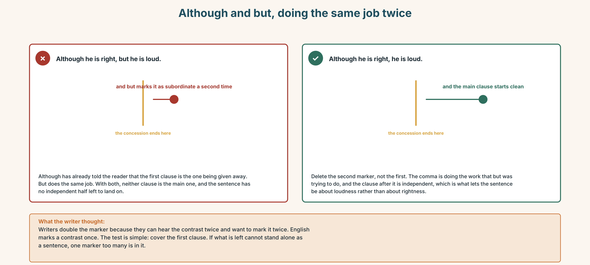{width=6.6in}

*Although and but, doing the same job twice — Although and but, doing the same job twice*

**Read both versions. Then say which clause the writer actually meant to keep.**

### 3H · Check — eight items

> 1. ______ he is right, nobody else has spoken. *(clause)*
> 2. ______ being right, he lost the room. *(-ing)*
> 3. He is right. ______ , so was Thanh. *(new sentence)*
> 4. Marcus argues, ______ Thanh writes. *(parallel)*
> 5. ______ of the grade, Thanh has not spoken. *(noun phrase)*
> 6. ✗ *Although he is right, but he is loud.* → correct it.
> 7. He is right, ______ nobody agrees. *(joined clause)*
> 8. He is loud, ______ . *(end position, informal)*

**0–4 →** Workbook pp. 14–17. **5–6 →** Part 6. **7–8 →** page 63.

---

## Part 4 · Speaking ◆ **C · THE PERFORMANCE**

### 4A · Fluency starter — concede it

One learner states a position. The next must say the strongest thing they can **for** it, then
disagree. **The chain breaks on a concession that is not real.**

### 4B · The functional core — disagreeing well

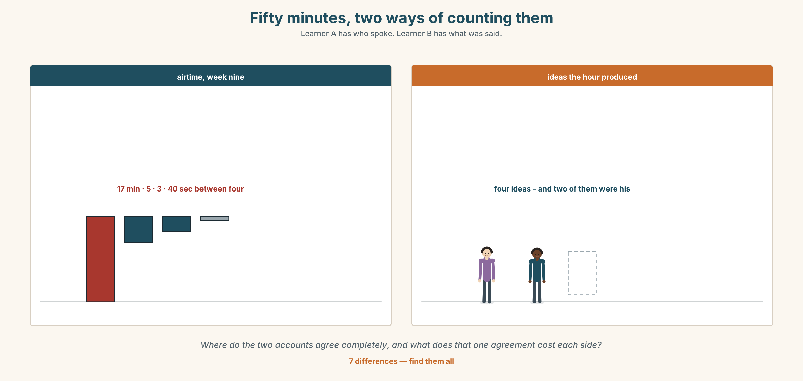{width=6.6in}

*Fifty minutes, two ways of counting them — Learner A has who spoke. Learner B has what was said.*

**Language Bank**

| | |
|---|---|
| **the real concession** | *To be fair, …* · *Admittedly, …* · *Granted, …* · *Up to a point, yes.* |
| **the limit of it** | *That said, …* · *Even so, …* · *All the same, …* · *And yet …* |
| **the point** | *The thing it does not account for is…* · *On the other hand, …* |
| **the repair** | *I take your point.* · *That is not what I said.* |

**Information gap.** Learner A has Marcus's three best arguments. Learner B has the three
objections nobody got to make. **Find the one place where they agree completely.**

### 4C · The performance — three minutes ⏺

Argue **a position you do not hold**. **Three minutes.** You must include:

> the strongest version of the other side, stated first · one real concession ·
> the exact point where you stop agreeing · what would change your mind

**Record it.**

### 4D · Observer

One person listens for **one thing**: was the concession a real one, or a sentence shaped like
one?

### 4E · Three criteria

> ☐ Did I state the other side at its strongest before I disagreed?
> ☐ Is there exactly one concession word per sentence?
> ☐ Did I name what would change my mind?

---

## Part 5 · Reading ◆ **A · THE WORLD**

### 5A · Predict

A report extract, titled **"Participation: a note on measurement."**
**What do you expect it to recommend?** Two sentences.

### 5B · Read — two minutes and a quarter

---

**FACULTY OF ARTS · TEACHING QUALITY REVIEW · EXTRACT 4 OF 11**
**Participation: a note on measurement**

Participation is worth fifteen per cent of the mark in sixty-one of our units. In fifty-eight of
those, the published criterion is some version of *contributes regularly to seminar discussion*.
We asked eleven tutors what they record. Nine record nothing during the class and reconstruct a
figure in week twelve.

We then recorded airtime in nine seminars. The distribution is not unusual and it is not
defensible. In a seminar of eleven students over fifty minutes, the top speaker took a median of
17 minutes and the bottom four took a median of 40 seconds between them. The top speaker was
the same person in all nine weeks in seven of the nine groups.

Admittedly, airtime is a crude measure and nobody has proposed grading it directly. Still, it
is the only measure we have of a thing that carries fifteen per cent of a mark, and it says that
in most of our seminars the grade is being distributed on a quantity that four students in
eleven have almost no access to.

The obvious objection is that the quiet students could speak and choose not to. That is true up
to a point. It is also true that in every group we observed, the gap between the top speaker and
the rest widened between week three and week nine, which is not what a free choice usually does.

We are not recommending that tutors intervene. Intervention in a seminar is a blunt instrument
and the tutors who do it most are not the ones with the best participation spread. We are
recommending that the criterion be rewritten, because *contributes regularly to seminar
discussion* is a description of a behaviour and what we say we are assessing is a capacity.

One tutor, asked what she would do, said: "I would mark the question they ask, not the number of
times they open their mouth. And yet I know exactly who would lose by that too."

---

### 5C · Comprehension — eight questions

1. How many units carry a participation mark, and what is it worth?
2. **What do nine of the eleven tutors actually record, and when?**
3. Give the two airtime medians.
4. **What does the report concede about airtime as a measure, and what does it say anyway?**
5. What is "the obvious objection", and how is it answered?
6. **What happens between week three and week nine, and why is that significant?**
7. Why does the report *not* recommend intervention?
8. What does the last tutor say she would do, and what does she immediately admit?

### 5D · Vocabulary in context

Guess from the text. Then check.

> not defensible · a crude measure · a blunt instrument · the participation spread ·
> a capacity rather than a behaviour

### 5E · The counter-text

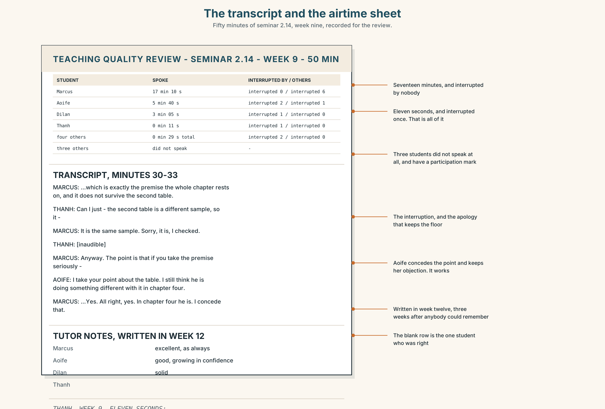{width=6.6in}

*The transcript and the airtime sheet — Fifty minutes of seminar 2.14, week nine, recorded for the review.*

**Read the seminar transcript extract and the airtime sheet, and answer.**

1. How long does each of the four named students speak?
2. **Where does Marcus interrupt, and where is he interrupted?**
3. One student speaks once, for eleven seconds. What does she say, and what happens next?
4. Find the one moment where somebody concedes the point properly.
5. The sheet has a row the tutor left blank. Which, and why might she have?

### 5F · Two texts

The report says the gap **widens** between week three and week nine.
The transcript shows one student being talked over **twice** in week nine.

**Do the two facts explain each other?** Three sentences.

---

## Part 6 · Vocabulary Lab 2 ◆ **B · THE SYSTEM**

### The words that buy you the right to disagree

### 6A · Sort — how much does each one concede?

Three columns: **a lot · a little · none at all**.

> even so · and yet · nevertheless · admittedly · still · granted · all the same ·
> up to a point · nonetheless · that said · to be fair · on the other hand

### 6B · Chunk completion

1. **______ be fair** , he had read the whole thing and nobody else had.
2. **Up to a ______** , yes — and then it stops being true.
3. **That ______** , the room has eleven people in it.
4. **Even ______** , somebody has to go first.
5. **All the ______** , I would rather be right than quiet.
6. **On the ______ hand** , the quiet students are not being stopped.

### 6C · Two that are almost the same

**nevertheless · nonetheless**

> Interchangeable in almost every context. *Nonetheless* is very slightly more formal and
> slightly more common in writing. If you can only learn one, learn *nevertheless*.

**Use each one once, in a sentence about the report in Part 5.**

### 6D · Two verbs that concede

> **p** **allow that** · **p** **grant that**

> *I allow that he prepares properly.* · *I grant that the measure is crude.*

Both are formal, both take a clause, and both are the written equivalent of *fair enough*.

**Rewrite three sentences from Part 5B using one of them.**

### 6E · The fixed expression

> **f** **And yet.**

It can be a whole sentence. Say the strongest case for something, stop, and write it.

> **Write the sentence before it and the sentence after it.**

### 6F · Contrast Clinic

Eight items. **Four are wrong. Correct them and say what the rule is.**

1. He is right, however nobody agrees.
2. In spite of being right, he lost the room.
3. Marcus speaks a lot, whereas Thanh is quiet.
4. Nevertheless of the evidence, she did nothing.
5. Although he is right, but nobody agrees.
6. Though, he is right.
7. He is loud. He is right, though.
8. Despite he is right, nobody agrees.

---

## Part 7 · Pronunciation & Fluency Lab ◆ **B · THE SYSTEM**

### The intonation of a concession

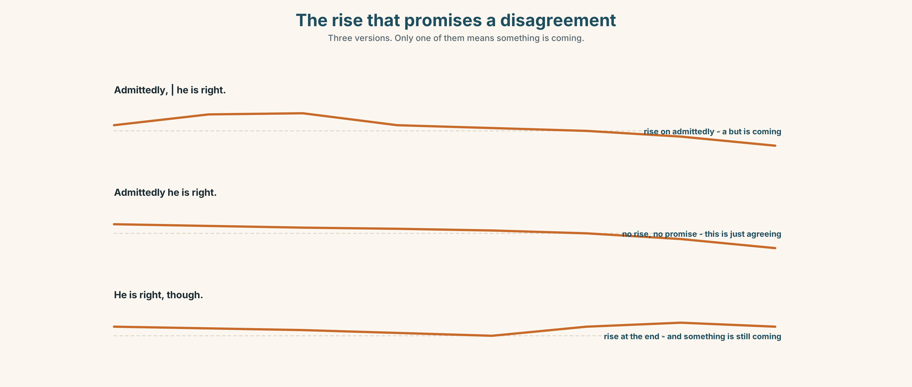{width=6.6in}

*The rise that promises a disagreement — Three versions. Only one of them means something is coming.*

### 7A · Hear 🔊 Track 3.3

> *Admittedly,* ↗ | *he is right.* ↘
> **The rise on *admittedly* is a promise. Something is coming.**

Now the same words with no rise:

> *Admittedly he is right.* ↘
> **Nothing is coming. It is just an agreement, and it sounds like giving up.**

### 7B · Say

Say both. Then say this one three times, faster:

> *Granted, up to a point, and even so — no.*

### 7C · Make it mean something

Say these two:

> *He is right, though.* *(and that is the end of it)*
> *He is right, though…* *(and something is coming)*

**One word, two jobs.** Which is which?

### 7D · Fluency 30 ⏺

Thirty seconds: **four concessions, each with the rise, each followed by a disagreement.**
Three times, faster, keeping the rise.

---

## Part 8 · Writing ◆ **C · THE PERFORMANCE**

### An argument that concedes · 180 words

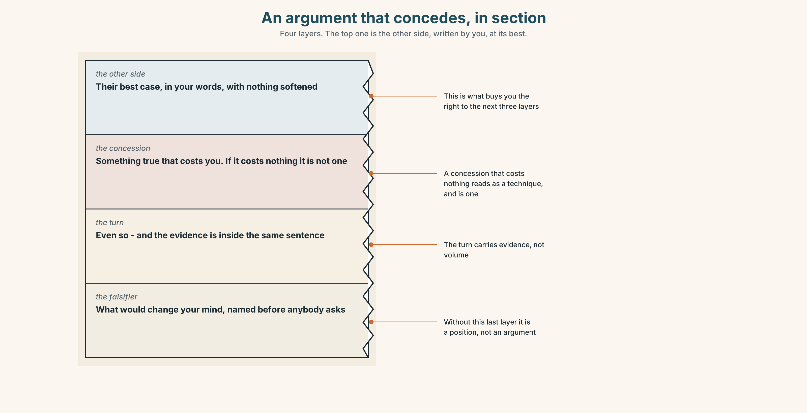{width=6.6in}

*An argument that concedes, in section — Four layers. The top one is the other side, written by you, at its best.*

### 8A · Read the model

> Marcus has read every text and he is right more often than I am. That is not in dispute and
> I am not going to pretend it is. `[the other side at its strongest, in the writer's own voice]`
>
> Admittedly, nobody is stopping the rest of us. The door is not locked and there is no rule
> about who speaks. `[the concession, and it is a real one — it costs the writer something]`
>
> Even so, the gap between him and the rest widened every week from week three, and a gap that
> widens is not a gap people are choosing. `[the turn, with the evidence inside the sentence]`
>
> What would change my mind is a group where the gap stayed flat. I have not seen one, and I
> have been in four. `[the falsifier — what evidence would move the writer]`

**Questions about the writer's choices:**

1. The first paragraph gives Marcus his best case. **What does the writer buy with it?**
2. The concession in paragraph two is true. **Why is it not enough on its own?**
3. The last paragraph names what would change the writer's mind. **What would an argument
   without that line be?**

### 8B · The anti-model

> While it is of course true that all students should feel able to contribute, it is also the
> case that some students are naturally more vocal than others. There are arguments on both
> sides and the issue is a complex one that deserves further consideration by all stakeholders.

Correct English, and it concedes nothing because it claims nothing. **Name the three moves it
is using to avoid taking a position.**

### 8C · Plan

> the other side at its strongest → a real concession → the turn, with evidence →
> what would change your mind

### 8D · Write — 180 words
### 8E · Peer review — three criteria

> ☐ Is the other side stated at its strongest, before any disagreement?
> ☐ Does the concession cost the writer something?
> ☐ Is there a falsifier — something that would change the writer's mind?

### 8F · Write it again · 8G · Publish

On the wall, beside the one it is arguing with.

---

## Part 9 · The File ◆ **A · THE WORLD + C · THE PERFORMANCE**

# CULTURE FILE · Time, Lateness and Waiting

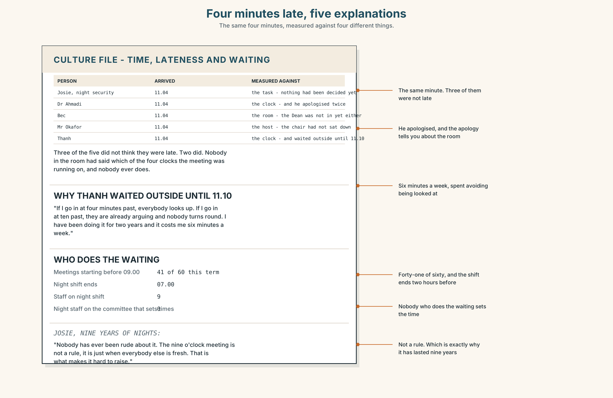{width=6.6in}

*Four minutes late, five explanations — The same four minutes, measured against four different things.*

### 9A · Four minutes late 🔊 Track 3.4

Five people describe arriving four minutes after a meeting started. **Listen.**

1. Which two think they are on time?
2. **Which one apologises, and what does the apology tell you about the room, not the person?**
3. One of them was waiting outside for six minutes before going in. Why?

### 9B · What lateness is measured against

> **the clock** — the meeting starts at eleven
> **the room** — the meeting starts when the people who matter are in it
> **the task** — the meeting starts when there is something to decide
> **the host** — the meeting starts when the host says so

**Which of the four is your default? Which was your parents'?**

### 9C · Waiting is not neutral

Josie has worked nights for nine years. She has been in nine o'clock meetings after a shift
that ended at seven.

**Who in an organisation does the waiting, and is it the same people who set the time?**

### 9D · Your turn

In fours. **Twelve minutes.** Each person describes a time they waited for somebody and what
they decided it meant. Then: **were you right?**

### 9E · Transfer

**Time the first four minutes of your next class or meeting.** What happens in them, and who
is not there for it? Bring one sentence.

---

## Part 10 · Mediation & Interaction ◆ **C · THE PERFORMANCE**

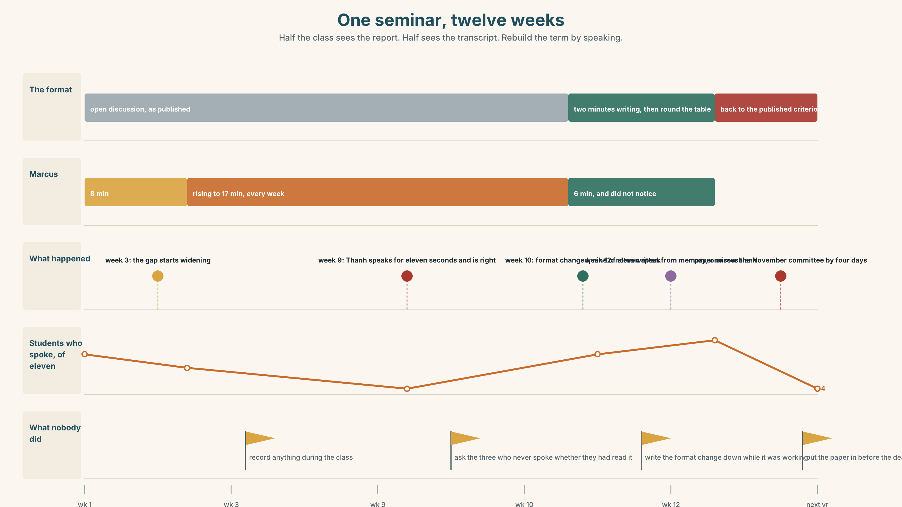{width=6.6in}

*One seminar, twelve weeks — Half the class sees the report. Half sees the transcript. Rebuild the term by speaking.*

### 10A · Relay

Half the class sees the report. Half sees the transcript.
**Rebuild the seminar by speaking.** Twelve minutes.

### 10B · Simplify

Explain the airtime finding to a first-year who has just been told they will be graded on
participation. **Five sentences only.**

> **Plan:** what is measured → what it actually records → what happened over nine weeks →
> what it means for them → what they can do on Tuesday

### 10C · Compress

The report extract into **forty words**, keeping the concession.

### 10D · Online

Write **one message** to Priya: you agree the format is the problem, you do not think Marcus
should be silenced, and you are proposing one specific change to one seminar.

### 10E · Your language

Does your language concede with a word, or with a tone? **Say *admittedly, he is right, but* in
both languages.** Which needs more words, and which can do it with intonation alone?

---

## Part 11 · The Decision ◆ **C · THE PERFORMANCE**

# The best voice in the room, or the ten who are not using theirs

Marcus speaks for seventeen of fifty minutes and is usually right. Four students have spoken
for forty seconds in total across nine weeks. Priya has to mark all eleven on participation.

- **Intervene.** Cap contributions, go round the table, direct a question by name. It works
  immediately and it takes something from the person who prepared.
- **Let it run.** Mark what is said, not how often. Marcus earns his mark and the four get
  what the format gave them.
- **Change the format.** Written first, spoken second — everyone writes two minutes, then reads
  theirs aloud. Nobody is capped and nobody starts from nothing.

### 11A · The evidence

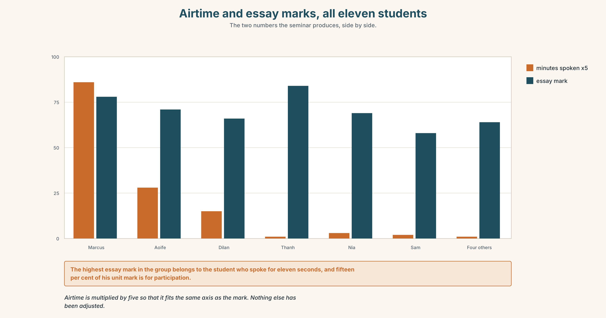{width=6.6in}

*Airtime and essay marks, all eleven students — The two numbers the seminar produces, side by side.*

1. **The report and the transcript** from Part 5 — and the row the tutor left blank.
2. **The chart** — airtime and essay marks for all eleven students.
3. **The voice.** Thanh, thirty seconds: *"I have the answer about forty seconds after the
   moment has gone. I am not nervous and I am not unprepared. I am slow in the way that writing
   is slow, and the seminar is the one part of this degree that is not."*

### 11B · Talk about it

In fours. Everybody speaks twice. Use the frame.

> *______ (concession), ______ . And yet ______ .*

**Words you can use:** *argument · dissent · objection · position · premise · compromise ·
common ground · dominate · defer · the floor*

### 11C · Decide

Write **three sentences**. Choose, say why, and name what it costs.

> I think Priya should ______________________ ,
> because ______________________ .
> What this costs is ______________________ .

### 11D · Model decision

> Change the format. Two minutes of writing before any discussion, then round the table once,
> reading what you wrote. It is the only one of the three options that does not require Priya to
> make a judgement about a person in front of the room, and the only one that gives the slow
> students the thing they are actually short of, which is not courage but time. Marcus loses
> four minutes of the hour. He will not notice.

### 11E · The Reveal

> **What happened.** Priya changed the format in week ten. In the two remaining seminars, the
> number of students who spoke went from four to nine and from four to eleven. The median
> contribution was shorter and, on her own marking, better.
>
> Marcus's airtime fell from seventeen minutes to six. He came round to it in the second week,
> having spent the first one visibly annoyed, and said afterwards that he had not known most of
> the group had read the text.
>
> The faculty did not adopt it. The criterion still says *contributes regularly to seminar
> discussion*, because changing it requires a committee that meets twice a year and the paper
> missed the November meeting by four days.

**The format change worked in two weeks. The sentence that caused the problem is still there,
and it will be there next year, because of a deadline nobody argued about.**

> **Was it the right decision?** Say why — and say what should happen to the criterion.

---

## Part 12 · Landing ◆ **all three lines**

### 12A · Recycle — twelve items

> 1. ______ he is right, nobody else has spoken.
> 2. ______ being right, he lost the room.
> 3. He is right. ______ , so was Thanh.
> 4. Marcus argues, ______ Thanh writes.
> 5. ______ of the grade, Thanh has not spoken.
> 6. He is right, ______ nobody agrees.
> 7. He is loud, ______ . *(end position)*
> 8. I ______ your point.
> 9. That is not what I ______ .
> 10. She finally ______ round.
> 11. He will not ______ down.
> 12. We found some common ______ .

### 12B · Consolidate

**Three columns, from memory:** concession words taking a clause · concession words taking a
noun · concession words starting a new sentence.

### 12C · Can-do, with evidence

> ☐ I can state the other side at its strongest before disagreeing. **Evidence:** 4C, 8D
> ☐ I can use *although*, *despite*, *however* and *whereas* without doubling up. **Evidence:** 3H, 6F
> ☐ I can hear and produce the rise that marks a concession. **Evidence:** 7D
> ☐ I can name what would change my mind. **Evidence:** 8D, 11C

### 12D · Replay ⏺

Record 0C again. **Listen to both.** What have you got that you did not have in week one?

### 12E · Glossary — forty-five items, as a map

> **THE ARGUMENT** · argument · debate · dissent · objection · position · premise · rebuttal · compromise · agreement
> **THE ROOM** · dominate · defer · silence · the floor · talk over · shout down · hold back
> **THE MOVES** · take a position · concede the point · play devil's advocate · common ground · back down · come round
> **WHAT PEOPLE SAY** · I take your point · that is not what I said
> **CONCEDING, ONE CLAUSE** · although · though · whereas · yet · still · and yet · nevertheless · nonetheless
> **CONCEDING, A NOUN** · despite · in spite of
> **CONCEDING, A SENTENCE** · however · admittedly · granted · even so · all the same · that said · up to a point · to be fair · on the other hand
> **CONCEDING, A VERB** · allow that · grant that

### 12F · Next

> **Unit 4 · Why is it done this way?**

# B1.3 · Unit 4 · The Garden That Has Two Jobs

> **English Animated** · *Making the Case* · a university campus, Melbourne
> Student's Book pages 72–93 · 22 pp · ~11 hours

---

## Part 0 · The Big Picture ◆ **A · THE WORLD**

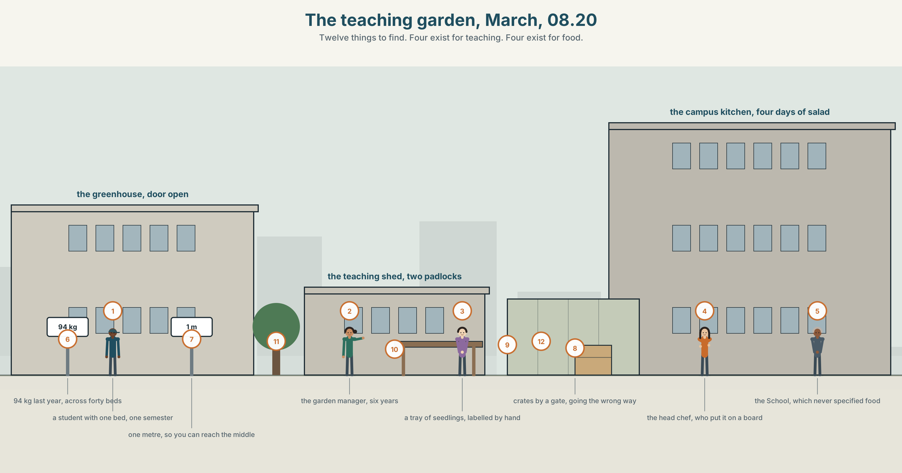{width=6.6in}

*The teaching garden, March, 08.20 — Twelve things to find. Four exist for teaching. Four exist for food.*

# Why is it done this way?

**By the end of this unit you can explain a design decision and the reasoning behind it.**

| ◆ **A · THE WORLD** | A garden that two departments both believe they own, for two different reasons |
|---|---|
| ◆ **B · THE SYSTEM** | purpose, reason and result: *so that · in order to · such … that* · 24 words for process, design and intention · 21 causal forms · stress on the purpose clause |
| ◆ **C · THE PERFORMANCE** | An explanation that gives the reason, not only the rule |

---

### 0A · Find it

**Find twelve things in this picture.** Four of them exist for teaching. Four exist for food.

> a bed divided into twelve small squares · a bed of one crop, forty metres long ·
> a sign with twelve latin names on it · a water butt with a tap at the wrong height ·
> a compost bay built from pallets · a path worn where there is no path ·
> a greenhouse with the door open · a tray of seedlings labelled by hand ·
> a stack of crates by a gate · a bench facing the wrong way · a hose running to nowhere ·
> a shed with two padlocks on it

### 0B · Guess it

**One of the twelve was built for one purpose and is used for the other.** Which, and how
can you tell?

### 0C · Say it ⏺

**Record forty-five seconds.** *Describe something near you that was designed for one job and
is used for another. Say what was lost in the swap.* You will record it again at the end of
this unit.

---

## Part 1 · Vocabulary Lab 1 ◆ **B · THE SYSTEM**

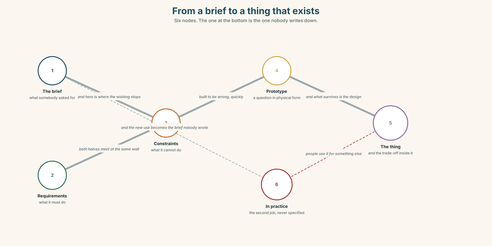{width=6.6in}

*From a brief to a thing that exists — Six nodes. The one at the bottom is the one nobody writes down.*

### 1A · Meet — the words of a design decision

> **purpose** · **intention** · **rationale** · **specification** · **requirement** ·
> **constraint** · **trade-off** · **prototype**

1. Which two of these are written down before anything is built?
2. **What is the difference between a *purpose* and a *rationale*?**
3. *Constraint* and *requirement*: which one says what it must do, and which what it cannot?
4. **Why is a *trade-off* not a failure?**

> **A *prototype* is not a small version of the thing.** It is a question asked in physical
> form, built to be wrong, and the whole value of it is how fast you find out.

### 1B · Sort — the garden, the document, or the decision?

> yield · a design brief · plot · curriculum · in practice · the whole point · by design ·
> at the expense of · harvest

**Three columns. Two of them belong in more than one.** Say which and why.

### 1C · Meet — the phrase that does most of the work

> **c** **a trade-off**

Two things you want, and a quantity of one that can only be bought with the other.

1. **Name the trade-off in a bus timetable.**
2. Why is *there is no trade-off here* almost always a sign that somebody has not measured
   one of the two sides?

### 1D · Collocation Lab

| | |
|---|---|
| **serve** | a **purpose** · a function · a need |
| **by design** | not by accident · ~ rather than by habit |
| **the whole point** | ~ of it · miss ~ |
| **at the expense of** | gained ~ · built ~ |

**Which two of these are usually said about somebody else's decision?**

### 1E · The fixed expressions

> **f** **That was never the idea.** — said when a thing is being judged against a purpose it
> never had.
> **f** **It does one of them well.** — the most useful sentence in this unit, and the hardest
> to say about your own work.

**Which one is a defence and which is a concession?**

### 1F · Own it

The four phrasal verbs of making something.

> **set out to** · **end up** · **scale down** · **build in**

1. Which two describe the gap between the plan and the result?
2. **What do you *build in* that you cannot add later?**
3. *Scale down* and *make smaller*: what does *scale down* add?
4. Write one sentence in which somebody **set out to** do one thing and **end up** doing another.

---

## Part 2 · Listening ◆ **A · THE WORLD**

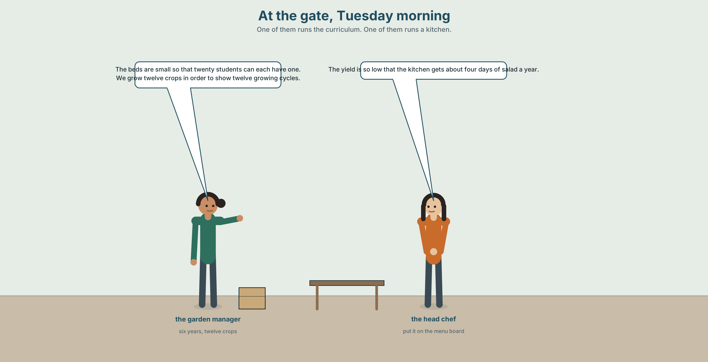{width=6.6in}

*At the gate, Tuesday morning — One of them runs the curriculum. One of them runs a kitchen.*

### 2A · Two beds, two reasons 🔊 Track 4.1

**Before you listen.** The garden has been run by the School of Agriculture for six years. The
campus kitchen has started taking from it. **Guess: what is the argument about?**

**Listen once. One question.** What does each side want the garden to produce?

**Listen again. Complete the table.**

| | Teaching garden | Food garden |
|---|---|---|
| bed size | | |
| number of crops | | |
| kilos per year | | |

**Listen again. Choose the best answer.**

1. The twelve small squares exist **for teaching / for both / for yield**.
2. The kitchen wants **the same crops / fewer crops / more crops**.
3. The two uses are **compatible / incompatible / compatible at a small scale**.
4. Somebody has already **scaled down / changed nothing / scaled up**.

**Noticing.** Four sentences from the recording.

1. *The beds are small so that twenty students can each have one.*
2. *We grow twelve crops in order to show twelve growing cycles.*
3. *The yield is so low that the kitchen gets about four days of salad a year.*
4. *It was built as a classroom, and owing to that, it feeds nobody.*

**All four give a reason. Which of the four gives a result instead of a purpose?**

### 2B · Decoding clinic 🔊 Track 4.2

Thirty seconds of the garden manager. Four jobs.

1. How many purpose clauses can you count?
2. In *so that twenty students can each have one*, which word is stressed?
3. Catch the two quantities.
4. She says *so* twice, meaning two different things. Which two?

> Transcripts, page 153.

---

## Part 3 · Grammar Lab 1 ◆ **B · THE SYSTEM**

### Purpose, reason and result

### 3A · Notice

Look at the four sentences in Part 2.

1. In sentence 1, does *so that* give a purpose or a result?
2. **In sentence 3, does *so … that* give a purpose or a result?** How do you know?
3. **Rewrite sentence 2 with *so as to*.** What changes, and what cannot change?
4. Sentence 4 uses *owing to*. **Rewrite it with *because*.** Which is more formal?
5. Try *"The beds are small in order to students can have one."* **What is wrong with it?**

### 3B · See

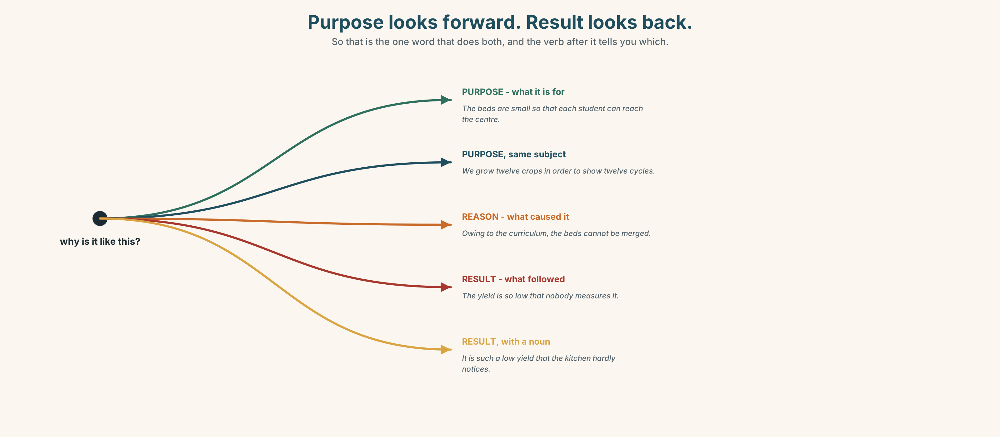{width=6.6in}

*Purpose looks forward. Result looks back. — So that is the one word that does both, and the verb after it tells you which.*

### 3C · Know

| | Takes | Example |
|---|---|---|
| ***so that*** | a clause, usually with *can / will / would* | *The beds are small so that each student has one.* |
| ***in order to* / *so as to*** | an infinitive, same subject | *We grow twelve crops in order to show twelve cycles.* |
| ***so … that* / *such … that*** | adjective / noun + result | *The yield is so low that nobody notices.* |
| ***because* / *since* / *as*** | a clause, giving a reason | *Since the beds are small, the yield is low.* |
| ***owing to* / *due to*** | a noun phrase | *Owing to the bed size, the yield is low.* |

> **Purpose looks forward. Result looks back.** *So that* is the one that can do either, and
> the verb tells you which: *so that students can learn* is a purpose, *so that nobody noticed*
> is a result.

> ***In order to* needs the same subject in both halves.**
> ✗ *The beds are small in order to students can have one.*
> ✓ *The beds are small so that students can have one.*
> ✓ *We made the beds small in order to give each student one.*

> ***so* + adjective, *such* + noun.**
> *so low that…* · *such a low yield that…* — the article moves, and that is the whole
> difference.

> **Why it matters.** An explanation that gives the rule and not the reason cannot be argued
> with, improved, or applied anywhere else.

### 3D · Use — controlled

> The twelve squares were laid out (1) __________ each student could manage a plot alone.
> Twelve crops were chosen (2) __________ demonstrate twelve different growing cycles within one
> academic year. The result is a garden with (3) __________ a small bed for each crop
> (4) __________ no crop reaches the quantity a kitchen can use. The total harvest last year
> was (5) __________ small (6) __________ the campus kitchen recorded it as four days of salad.
> (7) __________ to the curriculum, the beds cannot be merged, and that is not an oversight.

### 3E · Use — guided

Rewrite each one with the structure in brackets. **Two of them need a new subject.**

1. The beds are small. Each student can have one. *(so that)*
2. We planted twelve crops. We wanted to show twelve cycles. *(in order to)*
3. The yield is very low. The kitchen hardly notices it. *(so … that)*
4. The yield is very low. The kitchen hardly notices it. *(such … that)*
5. The curriculum requires twelve crops. The beds cannot be merged. *(owing to)*

### 3F · Use — open

**In pairs.** Explain a design decision in something you both use, in six sentences, three of
which must give a purpose and one a result. **Your partner's job** is to ask *why* once more
than you have an answer for.

### 3G · Error autopsy

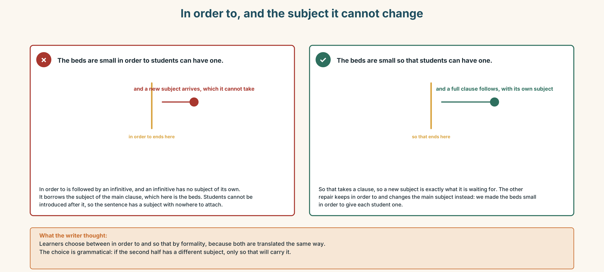{width=6.6in}

*In order to, and the subject it cannot change — In order to, and the subject it cannot change*

**Read both versions. Then say which one could appear in a design brief.**

### 3H · Check — eight items

> 1. The beds are small ______ each student can have one. *(purpose, clause)*
> 2. We planted twelve crops ______ show twelve cycles. *(purpose, infinitive)*
> 3. The yield is ______ low ______ nobody notices. *(result, adjective)*
> 4. It is ______ a low yield ______ nobody notices. *(result, noun)*
> 5. ______ to the curriculum, the beds cannot be merged. *(noun phrase)*
> 6. ✗ *The beds are small in order to students can have one.* → correct it.
> 7. We built it ______ as to test one thing at a time. *(purpose, infinitive)*
> 8. The beds are small; ______ , the yield is low. *(result, formal)*

**0–4 →** Workbook pp. 18–21. **5–6 →** Part 6. **7–8 →** page 85.

---

## Part 4 · Speaking ◆ **C · THE PERFORMANCE**

### 4A · Fluency starter — one more why

One learner states a design decision. The next asks *why*. **Five levels, and the chain breaks
when somebody says *that is just how it is done*.**

### 4B · The functional core — explaining a decision

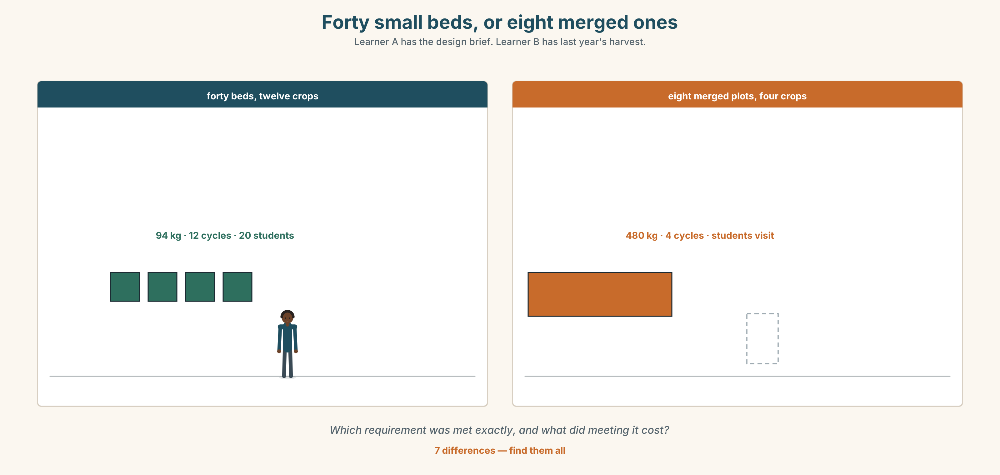{width=6.6in}

*Forty small beds, or eight merged ones — Learner A has the design brief. Learner B has last year's harvest.*

**Language Bank**

| | |
|---|---|
| **the purpose** | *It is there so that…* · *with a view to…* · *for the sake of…* |
| **the constraint** | *We had to work with…* · *The specification said…* |
| **the trade-off** | *…at the expense of…* · *We gained X and lost Y.* |
| **the result** | *The result being…* · *which is why it is there* · *and that led to…* |

**Information gap.** Learner A has the original design brief. Learner B has last year's harvest
figures. **Find the one requirement that was met exactly and still produced the wrong outcome.**

### 4C · The performance — three minutes ⏺

Explain **a design decision**, in anything. **Three minutes.** You must include:

> what it was for · what constrained it · the trade-off, named as a trade-off ·
> one thing you would do differently and why

**Record it.**

### 4D · Observer

One person listens for **one thing**: was a reason given, or only a rule restated?

### 4E · Three criteria

> ☐ Did I give the purpose before the rule?
> ☐ Did I name a trade-off, with both sides of it?
> ☐ Could somebody apply my reasoning to a different problem?

---

## Part 5 · Reading ◆ **A · THE WORLD**

### 5A · Predict

An explainer, titled **"Why the beds are a metre square."**
**What do you expect the last paragraph to concede?** Two sentences.

### 5B · Read — two minutes and a quarter

---

**SCHOOL OF AGRICULTURE · TEACHING GARDEN · NOTE FOR NEW STAFF**
**Why the beds are a metre square**

Every bed in the teaching garden is one metre by one metre. New staff ask about this roughly
once a semester, usually in the form of a suggestion that we merge them.

The beds are a metre square so that one student can reach the centre of a bed from any edge
without stepping on the soil. That is the whole rationale, and it is not about yield. A student
who steps on a bed compacts it, and a compacted bed teaches the wrong lesson for the rest of the
year because everything planted in it does slightly worse for a reason the student cannot see.

Twelve crops are grown in order to show twelve growing cycles inside one academic year. Three
of the twelve are chosen specifically because they fail reliably in Melbourne. A student who has
only grown things that work has not learned to read a plant.

The consequence of both decisions is a yield so low that it is not worth measuring. Last year
the garden produced 94 kilograms of food. The campus kitchen uses that in about four days. We
know this and it has never been a problem, because the garden was never specified as a food
source.

It has become one. The kitchen started taking from the garden two years ago, without a decision
being made anywhere, in the way that these things start. It is now on a menu board. The kitchen
has asked whether we could grow "more of the things people actually eat", which is a reasonable
question with an unreasonable answer: we could, and the garden would stop doing what it was
built for within one season.

The honest position is this. At the scale of a teaching garden the two purposes are compatible
because the food is incidental. At any scale the kitchen would find useful, they are not. It
does one of them well.

---

### 5C · Comprehension — eight questions

1. What question do new staff ask, and in what form?
2. **Why are the beds a metre square? Give the reason, not the rule.**
3. What does a compacted bed teach, and why is it hard to see?
4. **Why are three of the twelve crops chosen because they fail?**
5. What was the yield last year, and how long does the kitchen use that in?
6. **How did the kitchen start taking from the garden?**
7. What is "a reasonable question with an unreasonable answer"?
8. What exactly is the honest position in the last paragraph?

### 5D · Vocabulary in context

Guess from the text. Then check.

> compacts it · reliably · incidental · never specified as · within one season

### 5E · The counter-text

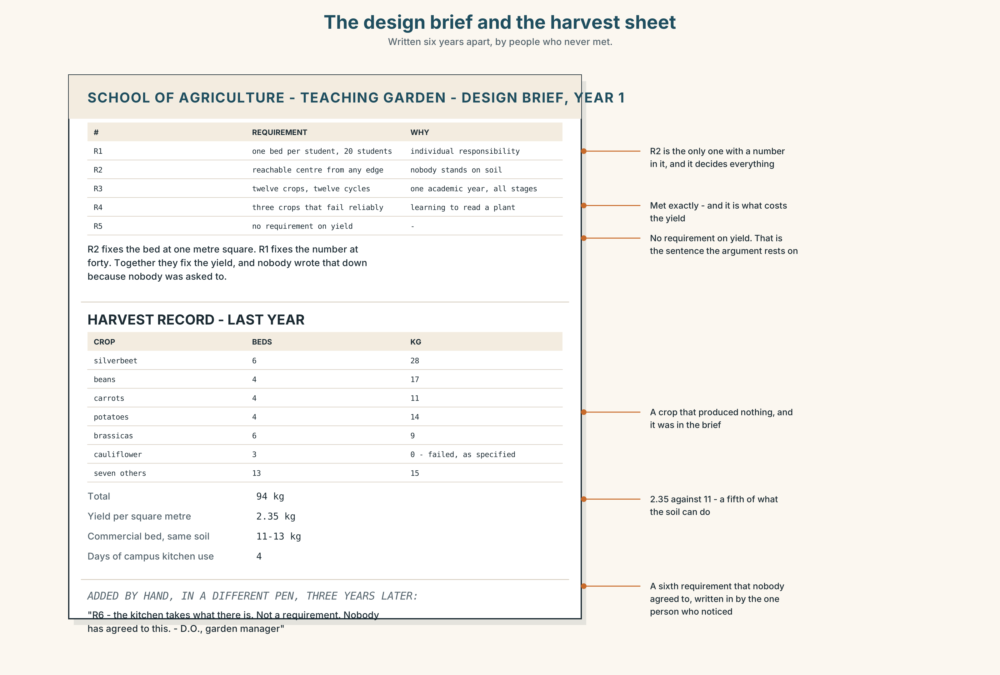{width=6.6in}

*The design brief and the harvest sheet — Written six years apart, by people who never met.*

**Read the design brief and the harvest figures, and answer.**

1. What were the five original requirements?
2. **Which requirement was met exactly, and what did meeting it cost?**
3. What is the yield per square metre, and how does it compare with a commercial bed?
4. Which crop failed, and was that a failure?
5. One line of the brief has been added by hand, later. Which, and by whom?

### 5F · Two texts

The brief says the garden must **demonstrate twelve growing cycles**.
The kitchen wants **more of the things people actually eat**.

**Is there a version of the garden that does both?** Three sentences.

---

## Part 6 · Vocabulary Lab 2 ◆ **B · THE SYSTEM**

### The words that carry a reason

### 6A · Sort — purpose, reason, or result?

Three columns.

> consequently · so as to · so that · such that · therefore · whereby · because ·
> owing to · as · hence · in order to · thus · since

### 6B · Chunk completion

1. **With a ______ to** merging them next year, we measured every bed.
2. **For the ______ of** the argument, assume the kitchen is right.
3. **The result ______** , nobody measures the harvest at all.
4. **So ______ to** test one variable, we planted three beds identically.
5. **Such ______** no crop reaches a usable quantity.
6. **In ______ to** show twelve cycles, we need twelve crops.

### 6C · Three that mean *therefore*

**therefore · thus · hence**

> All three are formal and all three are results. *Thus* is the most literary, *hence* the most
> compressed — it can take a noun phrase alone: *hence the twelve beds*.

**Write one sentence with each, about the garden.**

### 6D · The one that joins a rule to its reason

> **c** **whereby**

> *A system whereby each student manages one bed.*

Formal, and it introduces the mechanism rather than the purpose. **Rewrite two sentences from
Part 5B using it.**

### 6E · The fixed expression

> **f** **Which is why it is there.**

The sentence that closes an explanation. It only works if what came before it was a reason.

> **Write the two sentences before it.**

### 6F · Contrast Clinic

Eight items. **Four are wrong. Correct them and say what the rule is.**

1. It is such a low yield that nobody notices.
2. The beds cannot be merged; hence the twelve crops.
3. Owing to the yield is low, the kitchen looked elsewhere.
4. The yield is such low that nobody notices.
5. The beds are small so that students can reach the middle.
6. Owing to the low yield, the kitchen looked elsewhere.
7. We planted twelve crops so as to showing twelve cycles.
8. The beds are small in order to students can reach the middle.

---

## Part 7 · Pronunciation & Fluency Lab ◆ **B · THE SYSTEM**

### Where the stress falls in a purpose clause

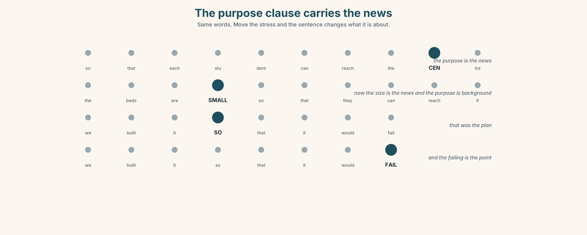{width=6.6in}

*The purpose clause carries the news — Same words. Move the stress and the sentence changes what it is about.*

### 7A · Hear 🔊 Track 4.3

> *The beds are small* | *so that each student can reach the* **CENTRE** *.*
> **The purpose clause carries the new information, and the stress is at the end of it.**

Now with the stress moved:

> *The beds are* **SMALL** *so that each student can reach the centre.*
> **Now the size is the news, and the purpose has become background.**

### 7B · Say

Say both. Then say this one three times, faster:

> *We planted twelve crops in order to show twelve cycles.*

### 7C · Make it mean something

Say these two:

> *We built it* **SO** *that it would fail.* *(that was the plan)*
> *We built it so that it would* **FAIL** *.* *(and the failure is the point being made)*

**One sentence, two jobs.** Which is which?

### 7D · Fluency 30 ⏺

Thirty seconds: **four sentences, each with a purpose clause, each stressed at the end.**
Three times, faster, keeping the stress where it belongs.

---

## Part 8 · Writing ◆ **C · THE PERFORMANCE**

### A design rationale · 180 words

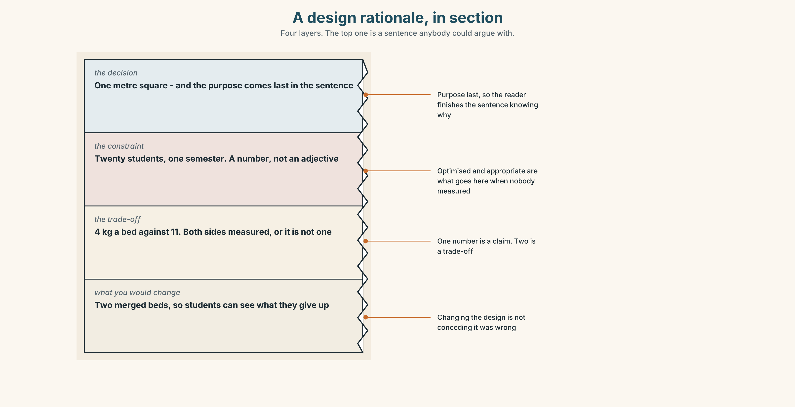{width=6.6in}

*A design rationale, in section — Four layers. The top one is a sentence anybody could argue with.*

### 8A · Read the model

> Every bed is one metre square so that a student can reach the centre from any edge without
> standing on the soil. `[the decision and its purpose, in one sentence, with the purpose last]`
>
> The constraint was the number of students, not the amount of land: twenty students, one bed
> each, one semester. `[the constraint, named as a number]`
>
> This was bought at the expense of yield. A metre-square bed produces about four kilograms a
> year, which is roughly a fifth of what the same soil would produce in a merged plot.
> `[the trade-off, with both sides measured]`
>
> If I were specifying it again I would build two merged beds at the far end, so that students
> could see what they are giving up. `[what would change, and the reason is a teaching reason]`

**Questions about the writer's choices:**

1. The purpose comes at the end of the first sentence. **Why not at the beginning?**
2. The trade-off is given with both numbers. **What would one number alone be worth?**
3. The last paragraph changes the design. **Is it conceding that the original was wrong?**

### 8B · The anti-model

> The teaching garden has been designed in accordance with pedagogical best practice and
> reflects the School's commitment to experiential learning. Bed dimensions have been optimised
> to deliver an effective student experience while maintaining appropriate sustainability
> outcomes.

Correct English, and nobody could rebuild the garden from it. **Name the three things it has
replaced with adjectives**, and say what *optimised* is hiding.

### 8C · Plan

> the decision, with its purpose → the constraint, as a number → the trade-off, both sides
> measured → what you would change and why

### 8D · Write — 180 words
### 8E · Peer review — three criteria

> ☐ Is there a purpose, not only a rule?
> ☐ Is the trade-off given with both sides measured?
> ☐ Could a stranger rebuild the thing from this?

### 8F · Write it again · 8G · Publish

On the wall, beside the thing it describes.

---

## Part 9 · The File ◆ **A · THE WORLD + C · THE PERFORMANCE**

# WORK FILE · The Client Problem

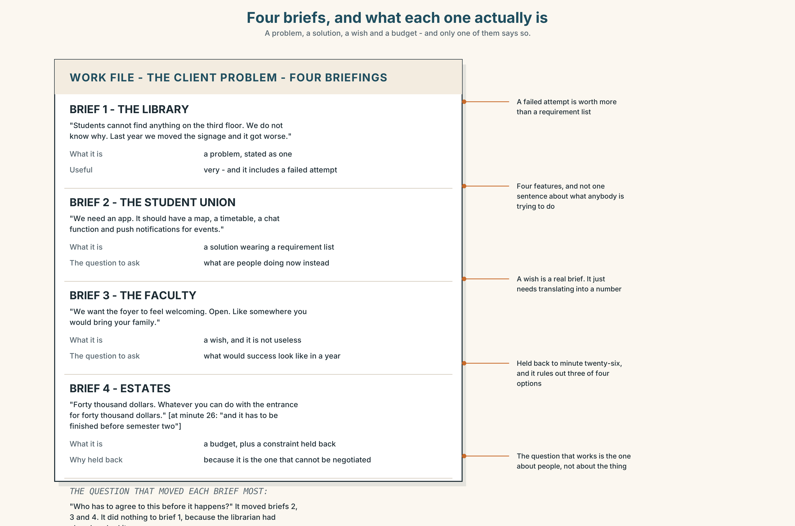{width=6.6in}

*Four briefs, and what each one actually is — A problem, a solution, a wish and a budget - and only one of them says so.*

### 9A · What the client asked for 🔊 Track 4.4

Four short briefings. **Listen.**

1. Which client knows what they want, and which knows what they do not want?
2. **Which of the four briefs contains a solution disguised as a requirement?**
3. One brief has a constraint the client did not mention until the end. Which, and why then?

### 9B · Four things a brief can be

> **a problem** — here is what is wrong; you tell us what to build
> **a solution** — here is what to build; we have already decided
> **a wish** — here is what we want it to feel like
> **a budget** — here is what we can spend; work backwards

**Which of the four is most often disguised as another, and which is hardest to argue with?**

### 9C · Asking the question that annoys the client

**Which of these would you use, and when?**

1. *"What would success look like in a year?"*
2. *"What have you already tried?"*
3. *"If you could only have one of these five, which?"*
4. *"Who has to agree to this before it happens?"*

### 9D · Your turn

In fours. **Twelve minutes.** One person is the client and briefs a change to something on your
campus. **Everybody else must ask one of the four questions and nothing else.** Then: which
question moved the brief most?

### 9E · Transfer

**Find a sign, a form or a rule near you and ask what it was for.** Bring the answer, or the
fact that nobody knows.

---

## Part 10 · Mediation & Interaction ◆ **C · THE PERFORMANCE**

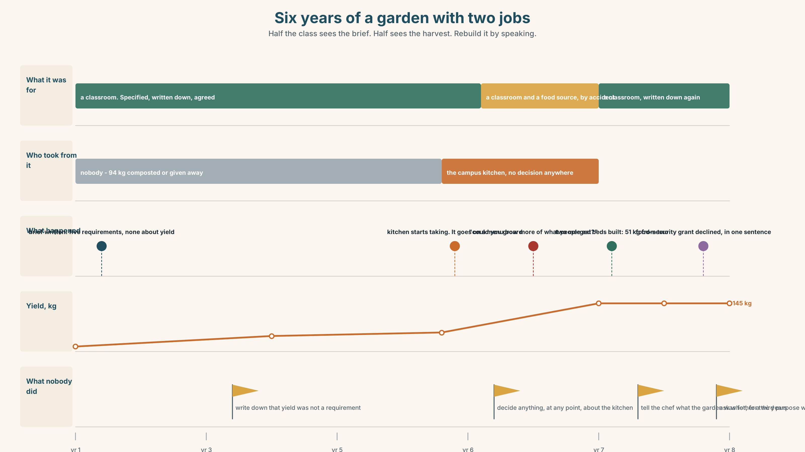{width=6.6in}

*Six years of a garden with two jobs — Half the class sees the brief. Half sees the harvest. Rebuild it by speaking.*

### 10A · Relay

Half the class sees the design brief. Half sees the harvest figures.
**Rebuild the garden by speaking.** Twelve minutes.

### 10B · Simplify

Explain the metre-square decision to somebody who has just asked why you do not merge the beds.
**Five sentences only.**

> **Plan:** what the bed is for → what a student does in it → what happens if it is bigger →
> what that costs in food → what the garden is not

### 10C · Compress

The explainer in Part 5B into **forty words**, keeping the trade-off.

### 10D · Online

Write **one message** to the campus kitchen: you understand the request, you can name exactly
what it would cost, and you are proposing one specific experiment for one season.

### 10E · Your language

Does your language separate purpose from result the way English does? **Say *so that nobody
would notice* and *so that nobody noticed* in both languages.** Which distinction survives?

---

## Part 11 · The Decision ◆ **C · THE PERFORMANCE**

# A classroom, or a market garden

The garden produced 94 kg last year across 40 metre-square beds. A merged plot on the same land
would produce about 480 kg. The kitchen uses 94 kg in four days and 480 kg in nineteen.

- **Keep it as a classroom.** Twelve crops, forty beds, twenty students a semester. The kitchen
  takes what there is and nobody calls it a food source.
- **Convert it.** Four crops, merged plots, five times the yield. Students visit it rather than
  run it, and three of the twelve growing cycles disappear from the curriculum.
- **Split it.** Half classroom, half production. Half the beds, half the yield, and a boundary
  that will move every year in whichever direction has the louder advocate.

### 11A · The evidence

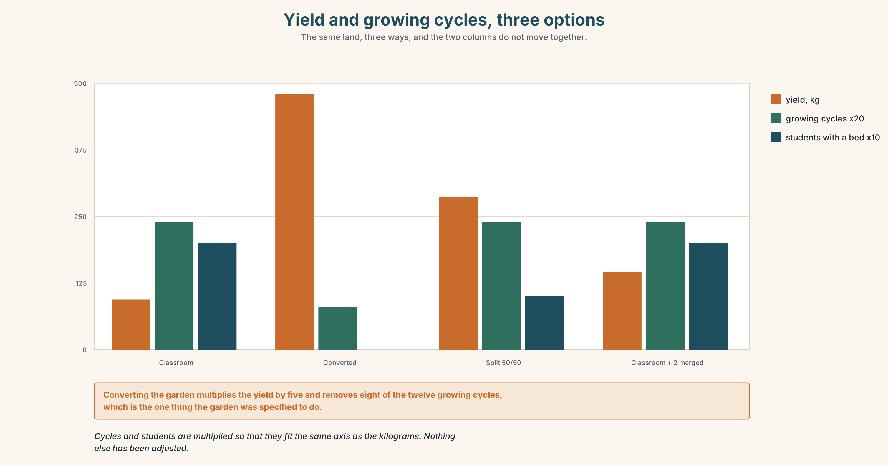{width=6.6in}

*Yield and growing cycles, three options — The same land, three ways, and the two columns do not move together.*

1. **The brief and the harvest sheet** from Part 5E — and the line added by hand.
2. **The chart** — yield per square metre, and growing cycles taught, for each option.
3. **The voice.** A third-year, thirty seconds: *"I killed a bed of brassicas in second year by
   standing on it in March. Nobody told me I had. I worked it out in September from the yield,
   and I have never stood on soil since. You cannot teach that in a merged plot, because in a
   merged plot nobody would ever have known it was me."*

### 11B · Talk about it

In fours. Everybody speaks twice. Use the frame.

> *It was built so that ______ . In practice ______ , which is why ______ .*

**Words you can use:** *purpose · rationale · constraint · trade-off · specification ·
yield · plot · harvest · curriculum · by design*

### 11C · Decide

Write **three sentences**. Choose, say why, and name what it costs.

> I think the School should ______________________ ,
> because ______________________ .
> What this costs is ______________________ .

### 11D · Model decision

> Keep it as a classroom and build two merged beds at the far end, as the model in 8A suggests.
> The merged beds are not a compromise between the two purposes; they are part of the first one.
> A student who has managed a metre square and then seen what the same soil does at scale has
> learned the trade-off rather than been told it. The kitchen gets about twelve extra kilos,
> which is nothing, and that is also part of the lesson.

### 11E · The Reveal

> **What happened.** The two merged beds went in. They produced 51 kilograms between them, which
> is more than half of what the other forty beds produced together, and the figure is now on the
> wall of the teaching shed where every student sees it in week one.
>
> The kitchen stopped taking from the garden the following year, not because anybody asked but
> because the head chef read the explainer and said she had not realised the garden was a
> classroom. The menu board was changed in an afternoon.
>
> Two years later the School was asked to double the garden for a food-security grant. They
> said no, and the sentence they used in the application was *it does one of them well*, which
> the funder quoted back approvingly in a rejection letter.

**The two beds taught the thing the garden could not say. The chef changed a menu board because
somebody finally wrote down what the garden was for.**

> **Was it the right decision?** Say why — and say what the School should do about the grant.

---

## Part 12 · Landing ◆ **all three lines**

### 12A · Recycle — twelve items

> 1. The beds are small ______ each student can reach the middle.
> 2. We planted twelve crops ______ show twelve cycles.
> 3. The yield is ______ low ______ nobody notices.
> 4. It is ______ a low yield ______ nobody notices.
> 5. ______ to the curriculum, the beds cannot be merged.
> 6. We built it ______ as to test one thing.
> 7. The beds are small; ______ , the yield is low.
> 8. A system ______ each student manages one bed.
> 9. We ______ out to build a classroom.
> 10. We ______ up with a market garden.
> 11. They ______ it down to twenty beds.
> 12. You have to ______ that in at the start.

### 12B · Consolidate

**Three columns, from memory:** purpose forms · reason forms · result forms.

### 12C · Can-do, with evidence

> ☐ I can explain a decision by its purpose, not its rule. **Evidence:** 4C, 8D
> ☐ I can use *so that*, *in order to* and *so … that* correctly. **Evidence:** 3H, 6F
> ☐ I can name a trade-off with both sides measured. **Evidence:** 8D, 11C
> ☐ I can stress a purpose clause where the new information is. **Evidence:** 7D

### 12D · Replay ⏺

Record 0C again. **Listen to both.** What have you got that you did not have in week one?

### 12E · Glossary — forty-five items, as a map

> **THE DESIGN** · purpose · intention · rationale · specification · requirement · constraint · trade-off · prototype · a design brief
> **THE GARDEN** · yield · plot · harvest · curriculum
> **THE MOVES** · set out to · end up · scale down · build in · by design · in practice · the whole point · serve a purpose · at the expense of
> **WHAT PEOPLE SAY** · that was never the idea · it does one of them well
> **PURPOSE** · so that · in order to · so as to · with a view to · for the sake of
> **REASON** · because · since · as · owing to · whereby
> **RESULT** · so · such · such that · therefore · thus · hence · consequently · the result being · lead to · bring about · which is why it is there

### 12F · Next

> **Unit 5 · What is the point exactly?**

# B1.3 · Unit 5 · The Essay Nobody Heard

> **English Animated** · *Making the Case* · a university campus, Melbourne
> Student's Book pages 94–115 · 22 pp · ~11 hours

---

## Part 0 · The Big Picture ◆ **A · THE WORLD**

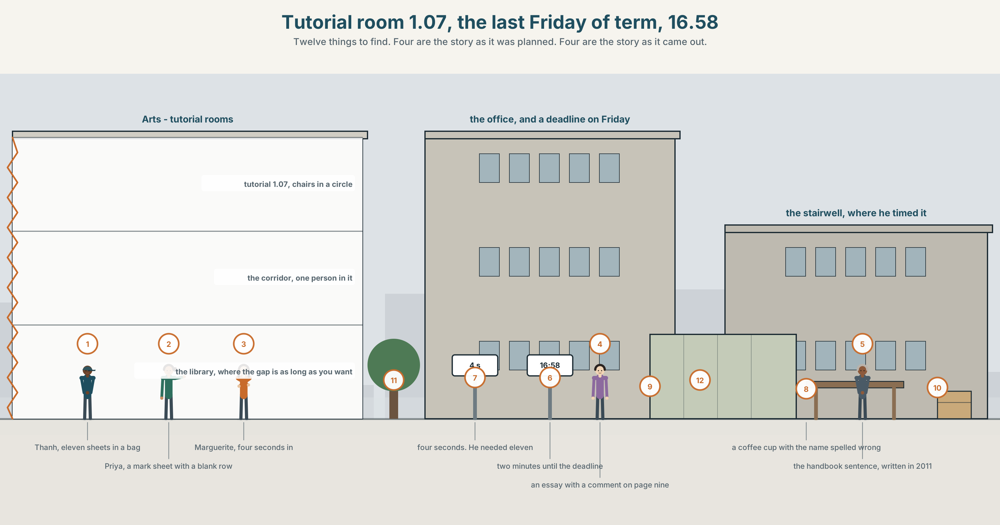{width=6.6in}

*Tutorial room 1.07, the last Friday of term, 16.58 — Twelve things to find. Four are the story as it was planned. Four are the story as it came out.*

# What is the point exactly?

**By the end of this unit you can tell a story with a deliberate reveal, and land it.**

| ◆ **A · THE WORLD** | A tutorial where the best writing in the group has never been said aloud |
|---|---|
| ◆ **B · THE SYSTEM** | cleft sentences: *It was… · What I…* · 24 words for storytelling and emphasis · 21 focus forms · nuclear stress placement |
| ◆ **C · THE PERFORMANCE** | A two-minute story that arrives somewhere the listener did not expect |

---

### 0A · Find it

**Find twelve things in this picture.** Four of them are the story as it was planned. Four are
the story as it came out.

> a mark sheet with one blank row · an essay with a comment in the margin ·
> a tutorial room with the chairs in a circle · a laptop open at page nine of eleven ·
> a clock at 16.58 · a window with the blind half down · a printed essay with a corner folded ·
> a corridor with one person in it · a noticeboard with a deadline on it ·
> a coffee cup with a name spelled wrong · a bag with a book in it, unopened ·
> a door with a nameplate and a timetable taped under it

### 0B · Guess it

**Two of the twelve are the same thing at two different moments.** Which, and what changed
between them?

### 0C · Say it ⏺

**Record forty-five seconds.** *Tell something that happened to you, and keep one fact back
until the last sentence.* You will record it again at the end of this unit.

---

## Part 1 · Vocabulary Lab 1 ◆ **B · THE SYSTEM**

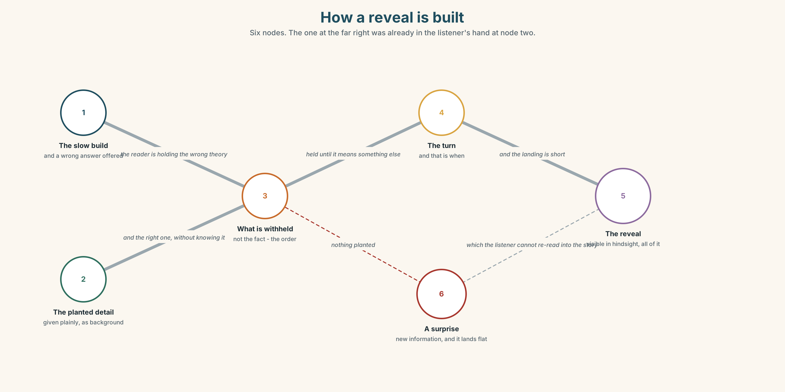{width=6.6in}

*How a reveal is built — Six nodes. The one at the far right was already in the listener's hand at node two.*

### 1A · Meet — the words of a told story

> **anecdote** · **pacing** · **detail** · **climax** · **reveal** · **twist** ·
> **punchline** · **payoff**

1. Which two of these are the end, and what is the difference between them?
2. **A *twist* and a *reveal*: which one changes what you already heard?**
3. *Pacing* is a quantity of what?
4. **Why does a story with too much detail have no detail at all?**

> **A *reveal* is not new information.** It is information the listener already had, arriving
> in the one order that makes it mean something else.

### 1B · Sort — before, during, or after the reveal?

> the thing nobody saw · foreshadow · withhold · and that is when · it turns out · focus ·
> a slow build · emphasis · save it for

**Three columns. Two of them belong in more than one.** Say which and why.

### 1C · Meet — the phrase that does most of the work

> **c** **the thing nobody saw**

Not the thing nobody knew. The thing that was in front of everybody for the whole story.

1. **Why is the second kind harder to write and better to hear?**
2. Think of a story you know where the reveal was visible from the first minute.

### 1D · Collocation Lab

| | |
|---|---|
| **the point** | **the point is** · miss ~ · get to ~ |
| **what matters** | **what matters is** · ~ here · ~ most |
| **save** | ~ **it for** the end · ~ it for later |
| **a slow build** | ~ to the reveal · too slow ~ |

**Which two of these can be said about somebody else's story while they are telling it?**

### 1E · The fixed expressions

> **f** **And that is when.** — the three words that mark the turn, and they work because the
> sentence after them is short.
> **f** **I will come back to that.** — a promise. If you do not keep it, the listener remembers.

**Which one is a storyteller's tool and which is a speaker's debt?**

### 1F · Own it

The four phrasal verbs of a reveal.

> **give away** · **hold off** · **lead up to** · **land it**

1. Which two are about timing, and which about effect?
2. **What exactly do you *give away* — the ending, or the fact that there is one?**
3. *Hold off* and *withhold*: which is a decision and which is a technique?
4. Write one sentence in which somebody fails to **land it** despite everything else being right.

---

## Part 2 · Listening ◆ **A · THE WORLD**

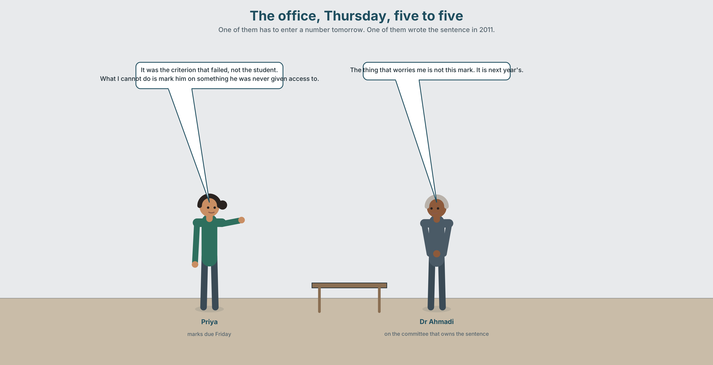{width=6.6in}

*The office, Thursday, five to five — One of them has to enter a number tomorrow. One of them wrote the sentence in 2011.*

### 2A · The mark that is due on Friday 🔊 Track 5.1

**Before you listen.** Priya has to submit participation marks. One student has spoken twice in
eleven weeks and written the best essays in the group. **Guess: what does she do?**

**Listen once. One question.** What is the published criterion, and who wrote it?

**Listen again. Complete the table.**

| | Thanh | Group median |
|---|---|---|
| times spoken | | |
| essay mark | | |
| participation mark as the rule gives it | | |

**Listen again. Choose the best answer.**

1. Priya thinks the criterion is **unenforceable / wrong / right**.
2. Dr Ahmadi says the mark is **the department's / nobody's / hers**.
3. Thanh **asked in week two / has not asked / has asked about it**.
4. The deadline is **Monday / already past / Friday**.

**Noticing.** Four sentences from the recording.

1. *It was the criterion that failed, not the student.*
2. *What I cannot do is mark him on something he was never given access to.*
3. *All I did was read eleven essays and put them in order.*
4. *The thing that worries me is not this mark. It is next year's.*

**All four put one part of the sentence in a spotlight. Which part, in each?**

### 2B · Decoding clinic 🔊 Track 5.2

Thirty seconds of Priya. Four jobs.

1. How many cleft sentences can you count?
2. In *it was the criterion that failed*, which word is loudest?
3. Catch the two marks out of fifteen.
4. She repeats one word three times. Which, and why?

> Transcripts, page 154.

---

## Part 3 · Grammar Lab 1 ◆ **B · THE SYSTEM**

### Putting one part of a sentence in a spotlight

### 3A · Notice

Look at the four sentences in Part 2.

1. In sentence 1, what is being emphasised, and what is it being contrasted with?
2. **In sentence 2, which half of the sentence is the new information?**
3. **Rewrite sentence 3 as an ordinary sentence.** What is lost?
4. Sentence 4 splits one idea across two sentences. **Why not one?**
5. Try *"It was failed the criterion."* **What is missing?**

### 3B · See

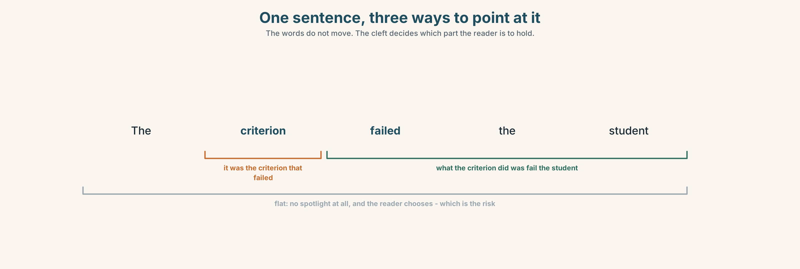{width=6.6in}

*One sentence, three ways to point at it — The words do not move. The cleft decides which part the reader is to hold.*

### 3C · Know

| | Shape | Spotlights |
|---|---|---|
| ***it*-cleft** | *it was X who / that…* | a noun — a person, a thing, a time |
| ***wh*-cleft** | *What I did was read them.* | an action, or a whole clause |
| **the one / the thing** | *The thing that worries me is…* | a noun, more conversationally |
| **the reason** | *The reason why he said nothing is…* | a cause |
| **all-cleft** | *All I did was read eleven essays.* | and it means *only that, nothing more* |

> **A cleft takes one sentence and makes it two clauses, so that one part can be made
> prominent.** *He failed the criterion* becomes *It was the criterion that he failed* — and
> now the sentence is about the criterion.

> **The *all*-cleft always carries a defence or a minimisation.** *All I did was ask* means
> *and look what happened*. Native speakers hear the implication even when it was not meant.

> **The cleft needs both halves.**
> ✗ *It was failed the criterion.* ✓ *It was the criterion that failed.*

> **Why it matters.** Word order in English is fixed; emphasis in speech is carried by stress.
> In writing, a cleft is how you make somebody read the stress you meant.

### 3D · Use — controlled

> (1) __________ was not the essay that was the problem. (2) __________ worried Priya was the
> sentence in the handbook, which had been written in 2011 and had never been read by anybody
> who had to use it. (3) __________ thing that made it unusable was not its wording but its
> verb: *contributes*. (4) __________ reason why she could not simply ignore it is that marks
> are audited. (5) __________ I did was put eleven essays in order, she said, and then look at
> the mark the rule gave the person at the top. (6) __________ not until then that she saw how
> far apart the two numbers were. (7) __________ one thing she was certain of was that she was
> not going to be the only tutor in this position on Friday.

### 3E · Use — guided

Rewrite each one as a cleft, using the structure in brackets.

1. The criterion failed, not the student. *(it-cleft)*
2. She read eleven essays. That is all. *(all-cleft)*
3. She wants the rule changed, not the mark. *(wh-cleft)*
4. He said nothing because the moment had always gone. *(the reason)*
5. The audit worries her most. *(the thing)*

### 3F · Use — open

**In pairs.** Describe a decision somebody else made badly, in six sentences, three of which
must be clefts. **Your partner's job** is to say what each cleft is contrasting with.

### 3G · Error autopsy

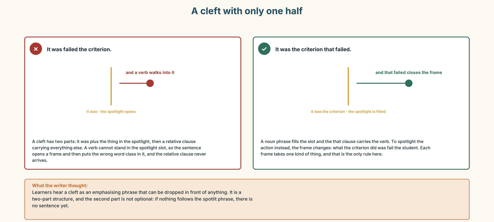{width=6.6in}

*A cleft with only one half — A cleft with only one half*

**Read both versions. Then say what the first one accidentally emphasises.**

### 3H · Check — eight items

> 1. ______ was the criterion that failed. *(it-cleft)*
> 2. ______ worries me is the audit. *(wh-cleft)*
> 3. ______ I did was read them in order. *(all-cleft)*
> 4. The ______ why he said nothing is simple. *(cause)*
> 5. The ______ that worries me is next year. *(noun)*
> 6. ✗ *It was failed the criterion.* → correct it.
> 7. It was ______ then that she saw it. *(not + time)*
> 8. The ______ thing he asked for was a deadline. *(single)*

**0–4 →** Workbook pp. 22–25. **5–6 →** Part 6. **7–8 →** page 107.

---

## Part 4 · Speaking ◆ **C · THE PERFORMANCE**

### 4A · Fluency starter — move the spotlight

One learner gives a flat sentence. The next says it as a cleft. The next moves the spotlight to
a different part. **The chain breaks when there is nothing left to emphasise.**

### 4B · The functional core — telling it so it lands

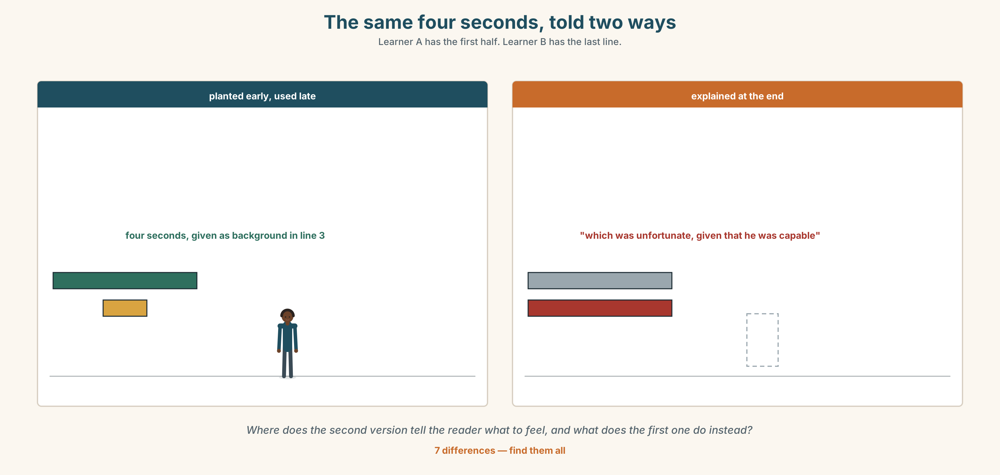{width=6.6in}

*The same four seconds, told two ways — Learner A has the first half. Learner B has the last line.*

**Language Bank**

| | |
|---|---|
| **the slow build** | *This was the third week.* · *Nothing had happened yet.* |
| **the detail you keep** | *I will come back to that.* · *There was one other thing.* |
| **the turn** | *And that is when…* · *It turns out…* · *Not until then did I…* |
| **the landing** | *The point is…* · *What matters is…* · one short sentence, and stop |

**Information gap.** Learner A has the first half of a story. Learner B has the last line.
**Build the middle so that the last line is a reveal and not a surprise.**

### 4C · The performance — two minutes ⏺

Tell **a true story with a deliberate reveal**. **Two minutes.** You must include:

> a slow build · one detail planted early and used late · a turn, marked ·
> a landing of one short sentence

**Record it.**

### 4D · Observer

One person listens for **one thing**: was the reveal visible in hindsight, or did it come from
nowhere?

### 4E · Three criteria

> ☐ Was the planted detail there before it mattered?
> ☐ Did I mark the turn, out loud?
> ☐ Was the last sentence shorter than the one before it?

---

## Part 5 · Reading ◆ **A · THE WORLD**

### 5A · Predict

A fiction extract, titled **"The Quiet Room."**
**What do you expect the last line to do to the first paragraph?** Two sentences.

### 5B · Read — two minutes and a quarter

---

**THE QUIET ROOM**
*from a collection of short fiction*

For eleven weeks Vinh sat in the same chair, third from the window, and did not speak. He had a
reason, and the reason was not nerves.

He had worked out in the second week that the gap between a question and an answer in that room
was about four seconds. He had timed it, once, with the stopwatch on his phone, under the table.
Four seconds, and then Marguerite would be speaking. He needed eleven. He had measured that too,
writing his answer down and then reading it aloud at the speed people talked, in a stairwell,
twice.

So he wrote. He wrote the answers to every question that was asked and most of the ones that
were not, and at the end of each session he put the sheet in his bag and went to the library,
where the gap between a question and an answer was as long as he wanted it to be.

In week nine the tutor asked a question nobody answered. The silence went on. Vinh counted it:
six seconds, seven, nine. At eleven he opened his mouth, and at eleven and a half Marguerite,
who had been looking at her phone, said something that was almost but not quite what he had been
going to say.

He wrote that down too.

At the end of term the tutor returned the essays. His had a comment on the last page that said:
*This is the best piece of writing I have had from this group in four years. Why have I never
heard any of this?*

He read it twice. Then he took out the eleven sheets of paper from eleven weeks, squared the
edges, and put them on her desk on his way out, without saying anything, which was, he realised
on the stairs, exactly the problem she had just asked him about.

---

### 5C · Comprehension — eight questions

1. Where does Vinh sit, and for how long?
2. **What is the four seconds, and how does he know?**
3. Why does he need eleven, and how did he measure that?
4. **What does he do with the written answers?**
5. What happens in week nine, second by second?
6. **What does Marguerite say, and why is "almost but not quite" the point?**
7. What does the tutor's comment say, and what does it ask?
8. What does Vinh do with the eleven sheets, and what does he realise on the stairs?

### 5D · Vocabulary in context

Guess from the text. Then check.

> under the table · at the speed people talked · squared the edges · on his way out ·
> which was, he realised

### 5E · The counter-text

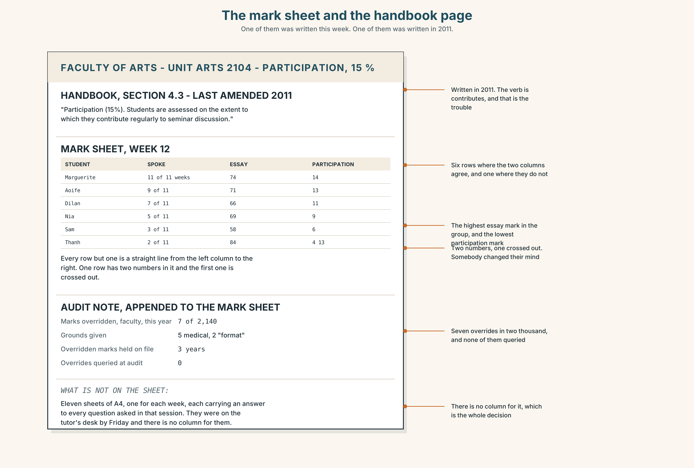{width=6.6in}

*The mark sheet and the handbook page — One of them was written this week. One of them was written in 2011.*

**Read the mark sheet and the handbook page, and answer.**

1. What exactly does the published criterion say, and when was it written?
2. **What mark does the criterion give Thanh, and what mark does the essay give him?**
3. How many tutors have overridden the criterion this year, and on what grounds?
4. What does the audit note say happens to an overridden mark?
5. One row of the sheet has two marks in it, one crossed out. Which, and what does that tell you?

### 5F · Two texts

The story says the gap was **four seconds** and Vinh needed **eleven**.
The handbook says participation means **contributing regularly to seminar discussion**.

**Does the criterion measure a capacity or a speed?** Three sentences.

---

## Part 6 · Vocabulary Lab 2 ◆ **B · THE SYSTEM**

### The words that point

### 6A · Sort — what does each one spotlight?

Three columns: **a person or thing · an action · a degree**.

> specifically · the one · what · particularly · all · merely · precisely · the thing ·
> exactly · it · the reason

### 6B · Chunk completion

1. **It was Marguerite ______** answered, four seconds in.
2. **What I ______ is** that he had timed it.
3. **All I ______ was** read eleven essays.
4. **The ______ that** worries me is the audit.
5. **The reason ______** he said nothing is on the sheet.
6. **The ______ thing** he wanted was eleven seconds.

### 6C · Four adverbs that narrow

**precisely · exactly · specifically · particularly**

> Three of them narrow to a point. One of them narrows to a degree. **Which, and what happens
> if you swap them?**

**Write four sentences about the story, one with each.**

### 6D · Two verbs that point at something

> **p** **point up** · **p** **zero in on**

> *The comment points up the problem with the criterion.*
> *She zeroed in on the one sentence that mattered.*

**Point up** makes something visible. **Zero in on** means everything else stops mattering.

**Rewrite two sentences from Part 5B using one of them.**

### 6E · The fixed expressions

> **f** **What happened was this.** — a frame. Everything after it is the story, and the
> listener knows to stop interrupting.
> **c** **not until then** — *It was not until then that she saw it.* The delay is the point.

> **Use one of them to open a story and the other to turn it.**

### 6F · Contrast Clinic

Eight items. **Four are wrong. Correct them and say what the rule is.**

1. What I did was reading them in order.
2. All I did was ask a question.
3. It was failed the criterion.
4. The reason why he said nothing is simple.
5. It was not until then she saw it.
6. It was the criterion that failed.
7. What I did was read them in order.
8. All I did was asked a question.

---

## Part 7 · Pronunciation & Fluency Lab ◆ **B · THE SYSTEM**

### Where the loudest word goes

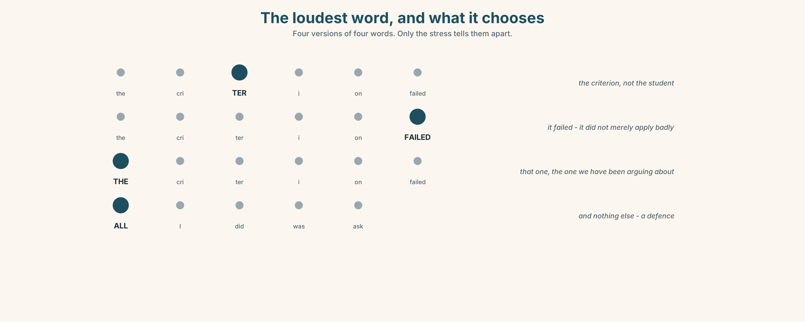{width=6.6in}

*The loudest word, and what it chooses — Four versions of four words. Only the stress tells them apart.*

### 7A · Hear 🔊 Track 5.3

> *It was the* **CRITERION** *that failed.*
> **The cleft has already chosen the word. The stress just confirms it.**

Now listen to the flat version, three times:

> *The* **CRITERION** *failed.* · *The criterion* **FAILED** *.* · **THE** *criterion failed.*
> **Three meanings, one word order, and only the stress tells them apart.**

### 7B · Say

Say all four. Then say this one three times, faster:

> *It was not until then that she saw how far apart the two numbers were.*

### 7C · Make it mean something

Say these two:

> *All I did was* **ASK** *.* *(and look what happened)*
> **ALL** *I did was ask.* *(and nothing else — I am defending myself)*

**One sentence, two defences.** Which is which?

### 7D · Fluency 30 ⏺

Thirty seconds: **four clefts, each with the stress on the spotlit word.**
Three times, faster, keeping the stress.

---

## Part 8 · Writing ◆ **C · THE PERFORMANCE**

### A story with a reveal · 180 words

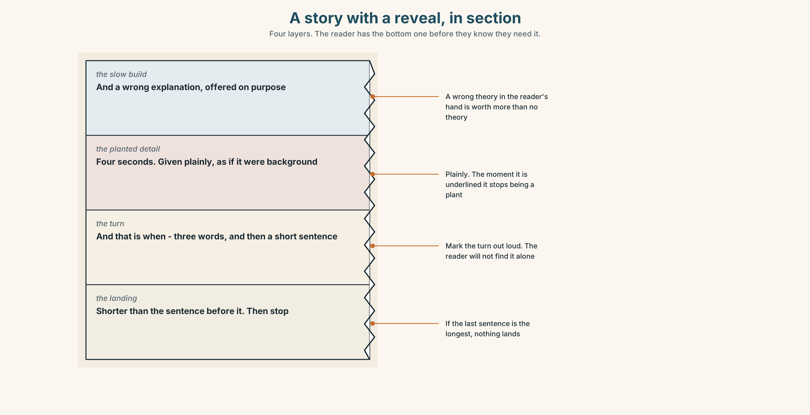{width=6.6in}

*A story with a reveal, in section — Four layers. The reader has the bottom one before they know they need it.*

### 8A · Read the model

> For eleven weeks he sat in the same chair and said nothing, and everyone in the room had a
> theory about why. `[the slow build, and it gives the reader a wrong answer to hold]`
>
> It was not shyness. He had timed the gap between a question and an answer in that room, with
> a stopwatch, and it was four seconds. `[the planted detail, given plainly, as if it were
> background]`
>
> He needed eleven. `[three words, and the reader now has everything — the reveal is already
> theirs]`
>
> And that is when the tutor's comment on his essay stopped being a compliment and became a
> question he could not answer out loud, which was the whole problem, and was on the page in
> front of her. `[the turn, and the landing is the shape of the story itself]`

**Questions about the writer's choices:**

1. The first paragraph offers a wrong explanation. **What does that buy?**
2. The third paragraph is three words. **Why is it a paragraph?**
3. The reveal is a number the reader already had. **Why is it still a reveal?**

### 8B · The anti-model

> He was a quiet student who struggled to contribute in class, which was unfortunate given
> that he was clearly very capable. In the end his tutor realised that he had a lot to offer
> and that the seminar format was not working for him, which was a shame for everyone involved.

Correct English, and nothing in it lands. **Name the three things it explains that it should
have shown**, and say what *in the end* is doing.

### 8C · Plan

> the slow build, with a wrong answer offered → the detail, planted plainly →
> the turn, marked → the landing, shorter than the sentence before it

### 8D · Write — 180 words
### 8E · Peer review — three criteria

> ☐ Was the reveal visible in hindsight?
> ☐ Is the planted detail given before it matters, and given plainly?
> ☐ Is the last sentence the shortest?

### 8F · Write it again · 8G · Publish

Read aloud, not handed round. **Watch the faces for where it lands.**

---

## Part 9 · The File ◆ **A · THE WORLD + C · THE PERFORMANCE**

# STUDY FILE · Reading at Speed

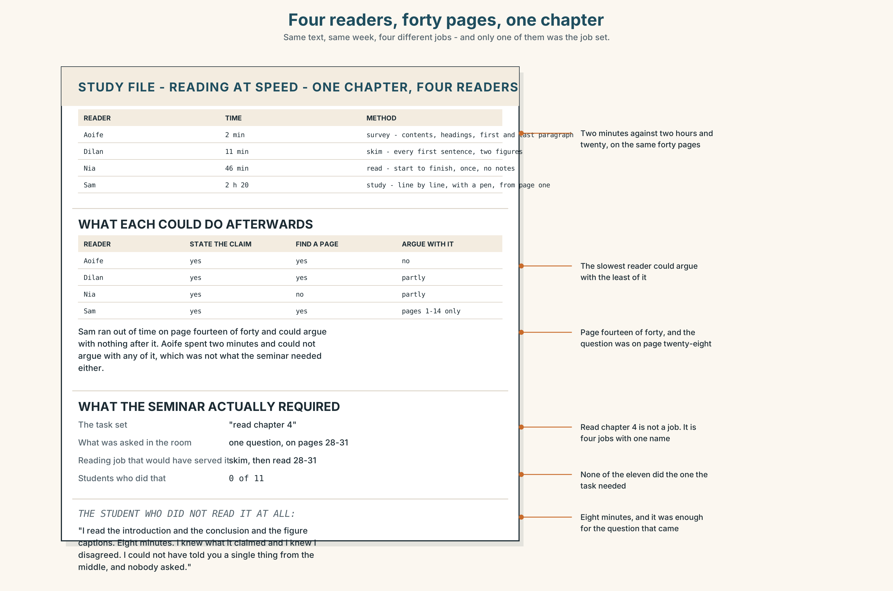{width=6.6in}

*Four readers, forty pages, one chapter — Same text, same week, four different jobs - and only one of them was the job set.*

### 9A · Four readers, one chapter 🔊 Track 5.4

Four students describe reading the same forty pages. **Listen.**

1. Which one read it fastest, and what do they remember?
2. **Which one read it slowest, and did they understand more?**
3. One of them did not read it at all and could still discuss it. How?

### 9B · Four speeds, four jobs

> **survey** — what is this, and do I need it? — two minutes for forty pages
> **skim** — what does it claim? — ten minutes
> **read** — what is the argument, exactly? — forty minutes
> **study** — could I reconstruct this? — two hours, with a pen

**Which of the four are you doing by default, and is it the one the task needs?**

### 9C · The thing nobody teaches

Most reading failures are not speed failures. They are **not knowing which of the four you are
supposed to be doing**, and doing the slowest one on everything until the time runs out.

**Look at this week's reading list. Mark each item with one of the four.**

### 9D · Your turn

In fours. **Twelve minutes.** Everybody surveys the same chapter for two minutes, then writes
three sentences on what it claims. **Compare.** How much of it did two minutes get?

### 9E · Transfer

**Time yourself on the next thing you read for a class.** Which of the four were you doing, and
which did the task actually need?

---

## Part 10 · Mediation & Interaction ◆ **C · THE PERFORMANCE**

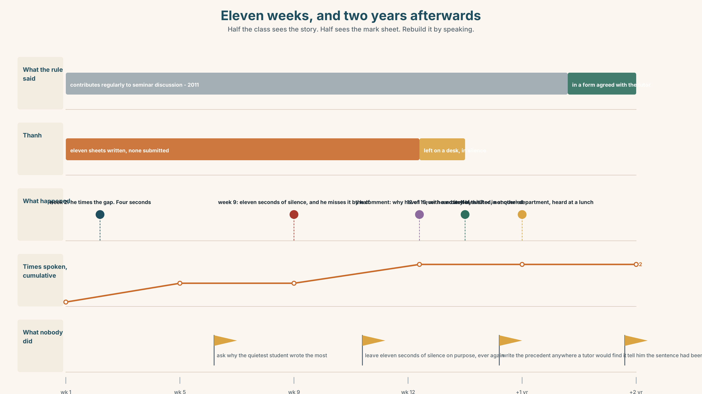{width=6.6in}

*Eleven weeks, and two years afterwards — Half the class sees the story. Half sees the mark sheet. Rebuild it by speaking.*

### 10A · Relay

Half the class sees the story. Half sees the mark sheet.
**Rebuild the term by speaking.** Twelve minutes.

### 10B · Simplify

Explain the participation criterion to a student who has just received a mark they do not
understand. **Five sentences only.**

> **Plan:** what the rule says → what it measures → what it does not → what their mark is →
> what they can ask for, and by when

### 10C · Compress

The story in Part 5B into **forty words**, keeping the reveal.

### 10D · Online

Write **one message** from Thanh to Priya: you have read the comment, you want to answer the
question in it, and you are proposing one specific thing for next semester.

### 10E · Your language

Does your language have clefts? **Say *it was the criterion that failed* in both languages.**
Which uses word order, and which uses a particle or a case ending?

---

## Part 11 · The Decision ◆ **C · THE PERFORMANCE**

# A mark that is due on Friday

Participation is fifteen per cent. The criterion says *contributes regularly to seminar
discussion*. Thanh has spoken twice in eleven weeks and has the highest essay mark in the group.

- **Apply the rule.** 4 out of 15. It is defensible at audit, it is what the handbook says, and
  it drops his unit mark by seven points.
- **Override it.** 13 out of 15, with a written justification. The mark stands unless the audit
  pulls it, and an overridden mark is flagged for three years.
- **Mark the eleven sheets.** He wrote an answer to every question asked and never submitted
  them. Nothing in the criterion says contribution has to be spoken. Nothing says it can be
  written either.

### 11A · The evidence

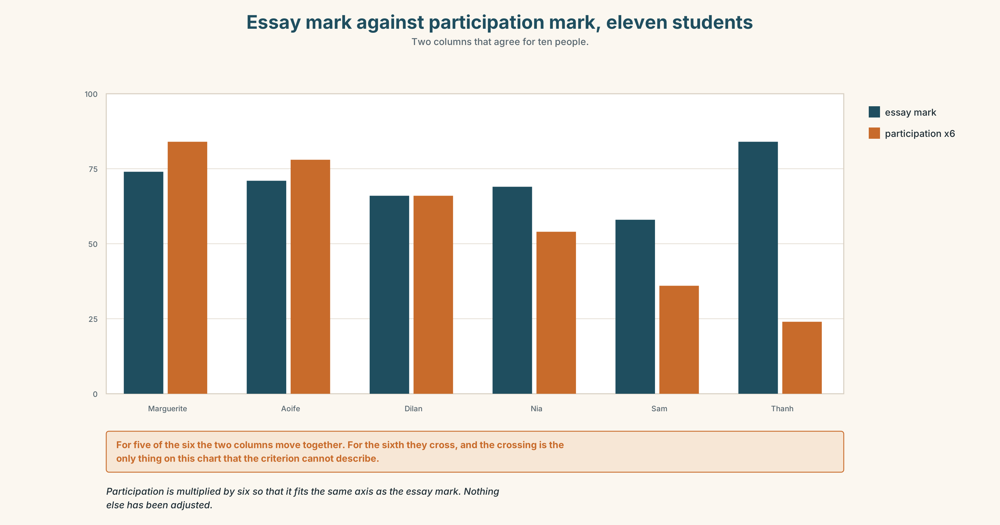{width=6.6in}

*Essay mark against participation mark, eleven students — Two columns that agree for ten people.*

1. **The mark sheet and the handbook page** from Part 5E — and the row with two marks in it.
2. **The chart** — essay mark against participation mark, for every student in the group.
3. **The voice.** Thanh, thirty seconds: *"I am not asking her to change the rule. I know she
   cannot. What I want is for somebody to write down that the rule and the thing it is supposed
   to measure came apart, because if nobody writes it down, next year there is another one of
   me and she starts from nothing."*

### 11B · Talk about it

In fours. Everybody speaks twice. Use the frame.

> *It was ______ that ______ . What ______ is ______ .*

**Words you can use:** *reveal · emphasis · focus · detail · withhold · pacing · payoff ·
the point is · what matters is · it turns out*

### 11C · Decide

Write **three sentences**. Choose, say why, and name what it costs.

> I think Priya should ______________________ ,
> because ______________________ .
> What this costs is ______________________ .

### 11D · Model decision

> Mark the sheets, and write down why. The third option is the only one that does not require
> pretending: it does not pretend the rule is right and it does not pretend she has the power to
> rewrite it on a Friday. It also produces a document. An overridden mark disappears into an
> audit file; a marked set of eleven written contributions is a precedent with a date on it,
> and the next tutor in this position has something to point at.

### 11E · The Reveal

> **What happened.** Priya marked the eleven sheets and gave 12 out of 15, with a note that the
> contributions were written because the format made spoken ones impossible for this student at
> this speed. The mark was not audited. Nobody queried it.
>
> In March the following year a different tutor, in a different department, cited it. She had
> heard about it from Priya at a teaching lunch, which is the only route by which anything in a
> university travels in under four years.
>
> The handbook sentence was finally changed two years later. The new version says *contributes
> to seminar discussion in a form agreed with the tutor*, and the person who drafted it has
> never met Thanh and does not know the sentence exists because of him.

**One mark, one note, and a sentence in a handbook that two thousand students will read and
nobody will trace back. It turns out the thing nobody saw was the eleven sheets of paper in
his bag, every week, for a whole semester.**

> **Was it the right decision?** Say why — and say what Priya should have done in week three.

---

## Part 12 · Landing ◆ **all three lines**

### 12A · Recycle — twelve items

> 1. ______ was the criterion that failed.
> 2. ______ worries me is the audit.
> 3. ______ I did was read them in order.
> 4. The ______ why he said nothing is simple.
> 5. The ______ that worries me is next year.
> 6. It was not ______ then that she saw it.
> 7. The ______ thing he asked for was time.
> 8. She ______ in on the one sentence that mattered.
> 9. The comment ______ up the problem.
> 10. He did not ______ away the ending.
> 11. She ______ off until the last line.
> 12. He could not ______ it, and the room stayed quiet.

### 12B · Consolidate

**Three columns, from memory:** *it*-clefts · *wh*-clefts · the noun clefts (*the thing*, *the
reason*, *the one*).

### 12C · Can-do, with evidence

> ☐ I can tell a two-minute story with a reveal that is visible in hindsight. **Evidence:** 4C, 8D
> ☐ I can build *it*-clefts and *wh*-clefts correctly. **Evidence:** 3H, 6F
> ☐ I can put the nuclear stress on the word the cleft chose. **Evidence:** 7D
> ☐ I can plant a detail early and use it late. **Evidence:** 8D

### 12D · Replay ⏺

Record 0C again. **Listen to both.** What have you got that you did not have in week one?

### 12E · Glossary — forty-five items, as a map

> **THE STORY** · anecdote · pacing · detail · climax · reveal · twist · punchline · payoff
> **THE CRAFT** · foreshadow · withhold · emphasis · focus · a slow build · save it for · lead up to · hold off · give away · land it
> **THE MOMENT** · it turns out · the thing nobody saw · the point is · what matters is
> **WHAT PEOPLE SAY** · and that is when · I will come back to that · what happened was this
> **THE SPOTLIGHT** · it · what · all · the thing · the reason · the one · it was X who · what I mean is · all I did was · the thing that · the reason why · the one thing · not until then
> **NARROWING** · merely · precisely · exactly · specifically · particularly · point up · zero in on

### 12F · Next

> **Unit 6 · What are they really claiming?**

# B1.3 · Unit 6 · The Clause on Page Nine

> **English Animated** · *Making the Case* · a university campus, Melbourne
> Student's Book pages 116–137 · 22 pp · ~11 hours

---

## Part 0 · The Big Picture ◆ **A · THE WORLD**

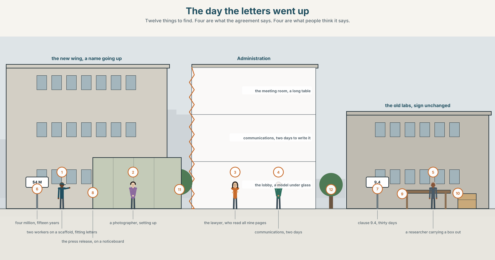{width=6.6in}

*The day the letters went up — Twelve things to find. Four are what the agreement says. Four are what people think it says.*

# What are they really claiming?

**By the end of this unit you can report a negotiation accurately, attributing every claim to
whoever made it.**

| ◆ **A · THE WORLD** | Four million dollars, a name on a building, and a paragraph about publishing |
|---|---|
| ◆ **B · THE SYSTEM** | reporting verbs and their patterns: *accuse of · persuade to · insist on* · 24 words for claims, PR and negotiation · 21 verb patterns · stress on the reporting verb |
| ◆ **C · THE PERFORMANCE** | A report of a meeting in which every claim has a name on it |

---

### 0A · Find it

**Find twelve things in this picture.** Four of them are what the agreement says. Four are what
people think it says.

> a building with a name going up in letters · a scaffold with two workers on it ·
> a press release on a noticeboard · a meeting room with a long table ·
> a nine-page document with a corner turned down · a model of a new wing under glass ·
> a photographer setting up · a researcher carrying a box out of a lab ·
> a cheque the size of a door · a lanyard with a sponsor's logo ·
> a lecture theatre with a new name on the door · a sign that still says the old name

### 0B · Guess it

**Two of the twelve contradict each other.** Which, and which one is older?

### 0C · Say it ⏺

**Record forty-five seconds.** *Describe an agreement you have made where one part turned out to
matter much more than it looked.* You will record it again at the end of this unit.

---

## Part 1 · Vocabulary Lab 1 ◆ **B · THE SYSTEM**

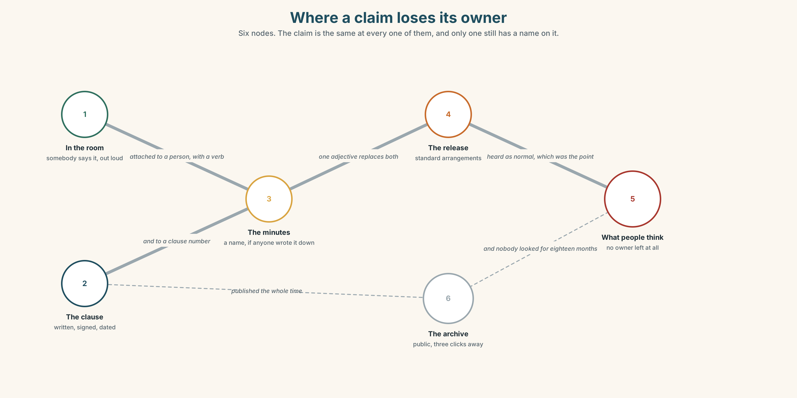{width=6.6in}

*Where a claim loses its owner — Six nodes. The claim is the same at every one of them, and only one still has a name on it.*

### 1A · Meet — the words of a negotiation

> **claim** · **sponsor** · **clause** · **negotiation** · **concession** · **leverage** ·
> **undertaking** · **stakeholder**

1. Which two of these are things you *give*, and which two are things you *have*?
2. **What is the difference between a *clause* and an *undertaking*?**
3. *Leverage*: where does it come from, and can both sides have it at once?
4. **Why is *stakeholder* a word that usually arrives when somebody is about to be ignored?**

> **A *claim* in this unit is not a lie.** It is a statement somebody is responsible for, and
> the whole job of a report is to keep the statement attached to the person.

### 1B · Sort — the money, the document, or the story?

> naming rights · in exchange for · the small print · retraction · spin · briefing ·
> a sticking point · on the record · strings attached

**Three columns. Two of them belong in more than one.** Say which and why.

### 1C · Meet — the phrase that does most of the work

> **c** **a sticking point**

The one item on which an agreement is currently not happening. There is usually exactly one,
and it is usually not the one being discussed.

1. **Why does naming the sticking point out loud speed a negotiation up?**
2. In a flat-share argument about washing up, what is the sticking point likely to be?

### 1D · Collocation Lab

| | |
|---|---|
| **on the record** | say something ~ · put it ~ · off ~ |
| **in exchange for** | given ~ · agreed ~ |
| **the small print** | read ~ · hidden in ~ |
| **strings attached** | with ~ · no ~ |

**Which two of these are almost always said by the side with less power?**

### 1E · The fixed expressions

> **f** **That is not what was agreed.** — the sentence that needs a document behind it, or it
> is just a louder opinion.
> **f** **We are not going to say that.** — a refusal that gives no reason, and in a negotiation
> it is often the most informative thing anybody says.

**Which one needs evidence, and which one *is* the evidence?**

### 1F · Own it

The four phrasal verbs of a deal.

> **water down** · **push back** · **sign up to** · **hold out**

1. Which two describe resistance, and how do they differ?
2. **What exactly gets *watered down* — the words, or the obligation?**
3. *Sign up to* and *sign*: what does the particle add?
4. Write one sentence in which somebody **holds out** and gets less than if they had not.

---

## Part 2 · Listening ◆ **A · THE WORLD**

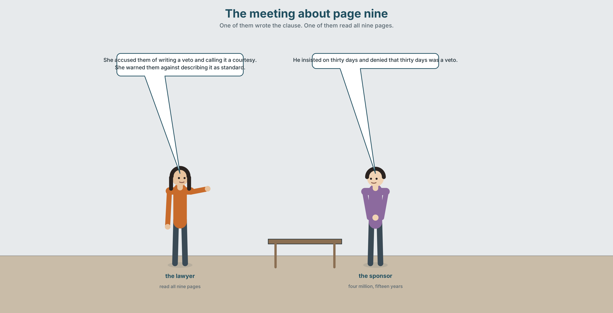{width=6.6in}

*The meeting about page nine — One of them wrote the clause. One of them read all nine pages.*

### 2A · The meeting about page nine 🔊 Track 6.1

**Before you listen.** A company has offered four million dollars for a new research wing. The
agreement runs to nine pages. **Guess: which page is the problem?**

**Listen once. One question.** What does the sponsor want, and what does the university want?

**Listen again. Complete the table.**

| | The sponsor | The university |
|---|---|---|
| on the name | | |
| on publication | | |
| on the deadline | | |

**Listen again. Choose the best answer.**

1. The sticking point is **the name / the money / clause 9.4**.
2. The sponsor says the clause is **standard / negotiable / new**.
3. The Dean has **signed / refused / asked for time**.
4. Somebody uses the word *stakeholder* **four times / once / twice**.

**Noticing.** Four sentences from the recording.

1. *She accused them of writing a veto and calling it a courtesy.*
2. *They persuaded the Dean to take it to the committee rather than decide alone.*
3. *He insisted on thirty days and denied that thirty days was a veto.*
4. *She warned them against describing it as standard, because it is not.*

**All four report a claim and attach it to somebody. Which one reports two claims at once?**

### 2B · Decoding clinic 🔊 Track 6.2

Thirty seconds of the negotiation. Four jobs.

1. How many reporting verbs can you count?
2. In *accused them of writing*, which word is stressed?
3. Catch the two numbers.
4. One speaker says *we are not going to say that*. What were they asked to say?

> Transcripts, page 155.

---

## Part 3 · Grammar Lab 1 ◆ **B · THE SYSTEM**

### Reporting verbs, and the patterns they insist on

### 3A · Notice

Look at the four sentences in Part 2.

1. In sentence 1, what follows *accused them*?
2. **In sentence 2, what follows *persuaded the Dean*?** Is it the same shape?
3. **Rewrite sentence 3 without *insisted on*.** What changes?
4. Sentence 4 uses *warn against*. **What would *warn to* mean, and is it English?**
5. Try *"They accused them to write a veto."* **What is wrong with it?**

### 3B · See

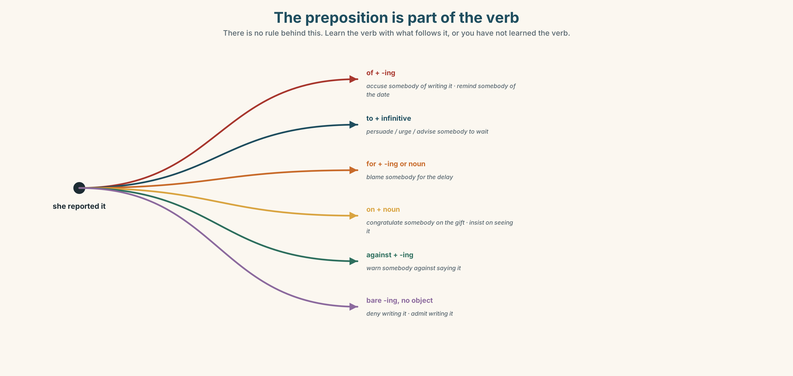{width=6.6in}

*The preposition is part of the verb — There is no rule behind this. Learn the verb with what follows it, or you have not learned the verb.*

### 3C · Know

| Pattern | Verbs | Example |
|---|---|---|
| **verb + sb + *of* + -ing** | accuse · remind | *She accused them of writing a veto.* |
| **verb + sb + *to* + infinitive** | persuade · urge · advise · warn · remind | *They persuaded the Dean to wait.* |
| **verb + sb + *for* + -ing** | blame · congratulate | *He blamed them for the delay.* |
| **verb + sb + *on* + noun** | congratulate | *She congratulated them on the gift.* |
| **verb + sb + *against* + -ing** | warn · advise | *She warned them against saying it.* |
| **verb + *on* + -ing** | insist | *He insisted on seeing the draft.* |
| **verb + -ing** | deny · admit | *He denied writing it.* |
| **verb + *that* + clause** | insist · deny · admit · warn · remind | *He insisted that thirty days was normal.* |

> **The pattern is part of the word.** *Accuse* takes *of*; *blame* takes *for*; *congratulate*
> takes *on*. There is no rule behind this and no shortcut: learn the verb with its preposition
> or you have not learned the verb.

> **Four of them take two patterns**, and the meaning does not change: *insist on / insist
> that*, *deny doing / deny that*, *warn against / warn that*, *remind to / remind that*.

> **A preview of Unit 7.** *He is said to have written it* reports a claim without saying whose
> it is. That is the whole of next unit, and it is what this unit's grammar exists to make
> unnecessary.

> **Why it matters.** A report that loses the pattern loses the person, and a claim with no
> person attached is the most dangerous sentence in any document.

### 3D · Use — controlled

> The university's lawyer (1) __________ the company __________ writing a veto and calling it
> a courtesy. The company's representative (2) __________ that it was a veto, and
> (3) __________ on the word *review*. He then (4) __________ the Dean __________ take it to
> the committee rather than decide alone, which was good advice and was also a delay.
> The Dean (5) __________ him __________ the November deadline, and he
> (6) __________ her __________ assuming it was movable. Nobody (7) __________ anybody
> __________ anything, which in a negotiation of this size is itself worth noting.

### 3E · Use — guided

Report each one with the verb in brackets.

1. "You have written a veto and called it a courtesy." *(accuse)*
2. "Take it to the committee." *(persuade)*
3. "Thirty days is standard, whatever you say." *(insist)*
4. "I did not write that paragraph." *(deny)*
5. "Do not call it standard in the press release." *(warn)*

### 3F · Use — open

**In pairs.** Report a disagreement you have both seen, in six sentences, four of which must use
a different reporting verb with its pattern. **Your partner's job** is to catch any claim that
has lost its owner.

### 3G · Error autopsy

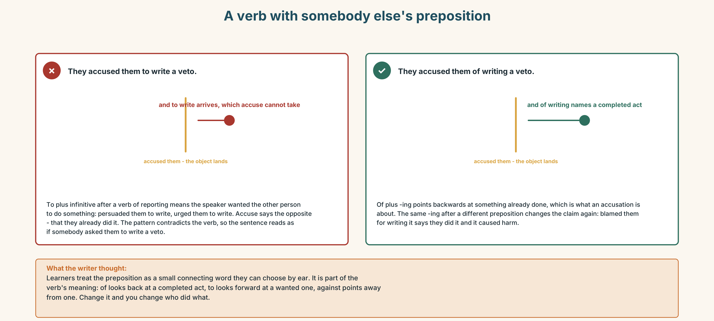{width=6.6in}

*A verb with somebody else's preposition — A verb with somebody else's preposition*

**Read both versions. Then say who, in the first one, is responsible for the claim.**

### 3H · Check — eight items

> 1. She accused them ______ writing a veto.
> 2. They persuaded the Dean ______ wait.
> 3. He blamed them ______ the delay.
> 4. She congratulated them ______ the gift.
> 5. She warned them ______ saying it.
> 6. He insisted ______ seeing the draft.
> 7. He denied ______ (write) it.
> 8. ✗ *They accused them to write a veto.* → correct it.

**0–4 →** Workbook pp. 26–29. **5–6 →** Part 6. **7–8 →** page 129.

---

## Part 4 · Speaking ◆ **C · THE PERFORMANCE**

### 4A · Fluency starter — attach it

One learner gives a claim with no owner. The next attaches it to somebody with a reporting verb.
**The chain breaks on a wrong preposition.**

### 4B · The functional core — reporting a negotiation

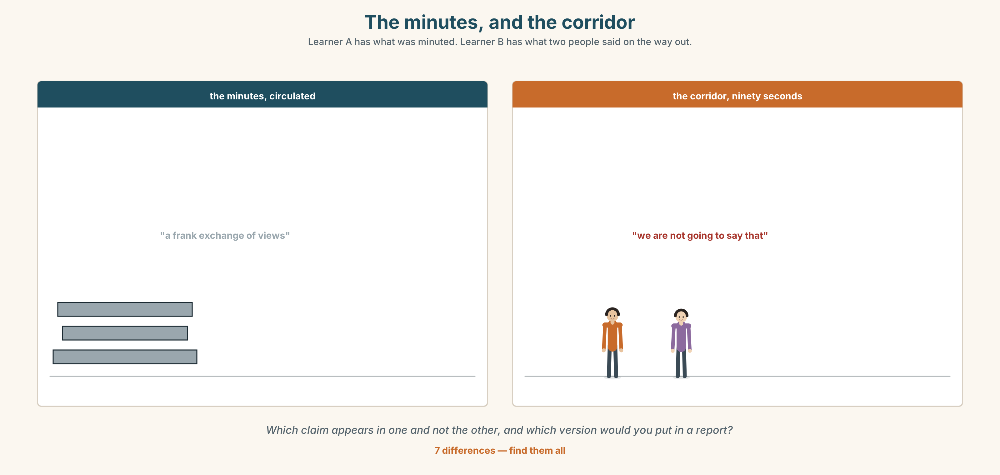{width=6.6in}

*The minutes, and the corridor — Learner A has what was minuted. Learner B has what two people said on the way out.*

**Language Bank**

| | |
|---|---|
| **what was said** | *X insisted on…* · *Y denied…* · *Z admitted…* |
| **what was offered** | *…in exchange for…* · *The concession was…* |
| **the sticking point** | *The one thing they would not move on was…* |
| **what was not said** | *Nobody mentioned…* · *It was not put on the record.* |

**Information gap.** Learner A has the minutes. Learner B has what two people said in the
corridor afterwards. **Find the claim that appears in one and not the other.**

### 4C · The performance — three minutes ⏺

Report **a negotiation**, real or from the unit. **Three minutes.** You must include:

> every claim attached to a named person · what each side gave up · the sticking point ·
> one thing nobody said out loud

**Record it.**

### 4D · Observer

One person listens for **one thing**: did any claim arrive without an owner?

### 4E · Three criteria

> ☐ Does every claim have a name on it?
> ☐ Did I use four different reporting verbs with the right pattern?
> ☐ Did I separate what was agreed from what was assumed?

---

## Part 5 · Reading ◆ **A · THE WORLD**

### 5A · Predict

A personal essay, titled **"I wrote the press release."**
**What do you expect the writer to admit?** Two sentences.

### 5B · Read — two minutes and a quarter

---

**I WROTE THE PRESS RELEASE**
*a personal essay*

I have worked in university communications for eleven years and I have written somewhere around
nine hundred press releases. I am going to describe one paragraph of one of them, because it is
the only thing I have written that I still think about.

The gift was four million dollars for a research wing. The agreement had nine pages. Clause 9.4
said that the sponsor would be given thirty days' sight of any publication arising from work
done in the wing, and could request amendments. Not require. Request.

I was given the agreement on a Tuesday and asked for a release by Thursday. I read all nine
pages, which I want on the record, because the thing people assume about my job is that we do
not read them.

I wrote: *The partnership includes standard arrangements for the review of research outputs
prior to publication.*

Every word in that sentence is true. *Standard* is doing the most work. The arrangement is not
standard — I checked four comparable agreements and three had no review clause at all — but the
sentence does not say it is common. It says it is standard, which is a word that means *of a
known type* and is heard as *normal*. I knew that when I wrote it. That is the craft, and I am
not going to pretend it was an accident.

What I did not do was lie, and what I also did not do was put the clause in the release, which
would have taken eleven words.

A researcher found it eighteen months later, in the agreement, which had been public the whole
time on a page three clicks from the homepage. She accused the university of hiding it. She was
wrong about hiding and right about everything else, and the thing I have not been able to get
past is that if she had been wrong about everything, I would have been fine.

---

### 5C · Comprehension — eight questions

1. How long has the writer worked in communications, and how many releases?
2. **What exactly does clause 9.4 allow the sponsor to do?** Give both verbs.
3. What does the writer want on the record, and why?
4. **Which word in the written sentence is "doing the most work", and how?**
5. What did the writer check, and what did they find?
6. **What two things does the writer say they did not do?**
7. How was the clause found, and how long had it been public?
8. What is the writer "not able to get past"?

### 5D · Vocabulary in context

Guess from the text. Then check.

> arising from · doing the most work · of a known type · three clicks from the homepage ·
> right about everything else

### 5E · The counter-text

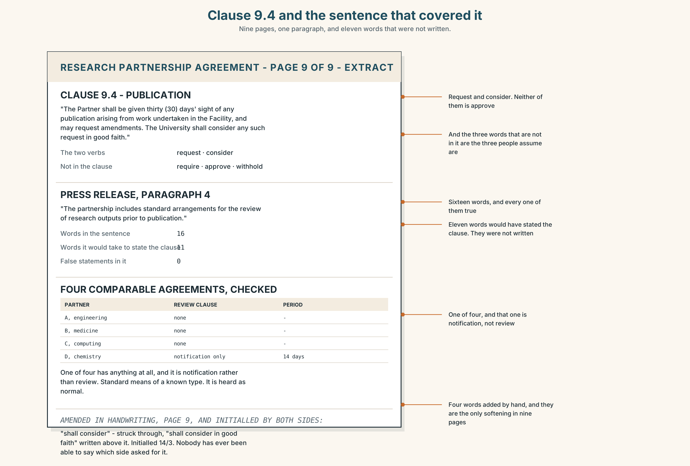{width=6.6in}

*Clause 9.4 and the sentence that covered it — Nine pages, one paragraph, and eleven words that were not written.*

**Read clause 9.4 and the press release, and answer.**

1. What exactly does 9.4 say? Quote the two verbs.
2. **Which sentence of the release covers 9.4, and what does it leave out?**
3. How many comparable agreements were checked, and what did they contain?
4. What does the sponsor's internal briefing note say the clause is for?
5. One line of the agreement has been amended in handwriting and initialled. Which?

### 5F · Two texts

The release says the arrangements are **standard**.
Three of four comparable agreements have **no review clause at all**.

**Is the release false?** Three sentences.

---

## Part 6 · Vocabulary Lab 2 ◆ **B · THE SYSTEM**

### Learning the preposition with the verb

### 6A · Sort — which preposition?

Four columns: ***of* · *for* · *on* · *against***.

> insist · congratulate somebody · advise somebody · warn somebody · accuse somebody ·
> blame somebody · remind somebody

### 6B · Chunk completion

1. **accuse somebody ______** writing it
2. **persuade somebody ______** take it to committee
3. **blame somebody ______** the delay
4. **congratulate somebody ______** the gift
5. **warn somebody ______** saying it
6. **insist ______** seeing the draft

### 6C · Two that change meaning with the pattern

**remind · warn**

> *He reminded her to read it.* — she was going to forget.
> *He reminded her that she had read it.* — she had forgotten that she already knew.
> *She warned them against saying it.* — do not.
> *She warned them that it was not standard.* — information, not instruction.

**Write four sentences about the essay in Part 5, one of each.**

### 6D · The two that persuade

> **p** **talk into** · **p** **talk out of**

> *They talked her into signing.* · *He talked them out of using the word.*

Both take *-ing*, both imply the other person did not want to, and both are warmer and less
formal than *persuade*.

**Rewrite two sentences from Part 2 using them.**

### 6E · Deny, admit, and the one that has no object

> **deny doing** · **admit doing** · and *insist* which takes no object at all.

He **denied doing** it. He **admitted** writing the first draft. He **insisted on** both.

> **Write three sentences about the writer of the essay.**

### 6F · Contrast Clinic

Eight items. **Four are wrong. Correct them and say what the rule is.**

1. They accused them of writing a veto.
2. She warned them against saying it.
3. She congratulated them for the gift.
4. He insisted to see the draft.
5. He denied to write it.
6. He reminded her to read it.
7. They accused them to write a veto.
8. He insisted on seeing the draft.

---

## Part 7 · Pronunciation & Fluency Lab ◆ **B · THE SYSTEM**

### The reporting verb carries the weight

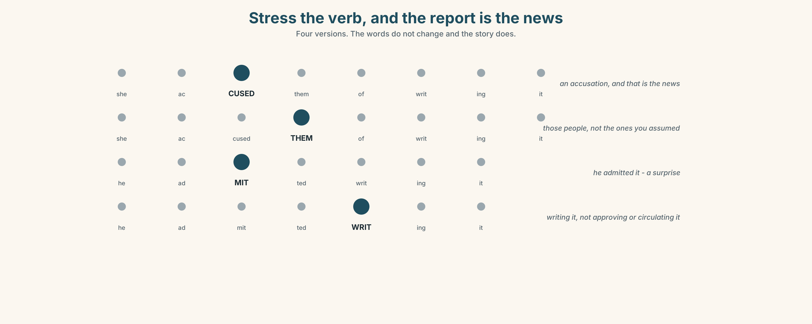{width=6.6in}

*Stress the verb, and the report is the news — Four versions. The words do not change and the story does.*

### 7A · Hear 🔊 Track 6.3

> *She* **ACCUSED** *them of writing a veto.*
> **The verb is the news. Everything after it is the content of the accusation.**

Now with the stress moved:

> *She accused* **THEM** *of writing a veto.*
> **Now the news is who, and the accusation is old information.**

### 7B · Say

Say both. Then say this one three times, faster:

> *He insisted on thirty days and denied that thirty days was a veto.*

### 7C · Make it mean something

Say these two:

> *He* **ADMITTED** *writing it.* *(and that is a surprise)*
> *He admitted* **WRITING** *it.* *(as opposed to approving it, or circulating it)*

**One sentence, two stories.** Which is which?

### 7D · Fluency 30 ⏺

Thirty seconds: **four reports, four different verbs, the stress on the verb each time.**
Three times, faster.

---

## Part 8 · Writing ◆ **C · THE PERFORMANCE**

### A report of a meeting · 190 words

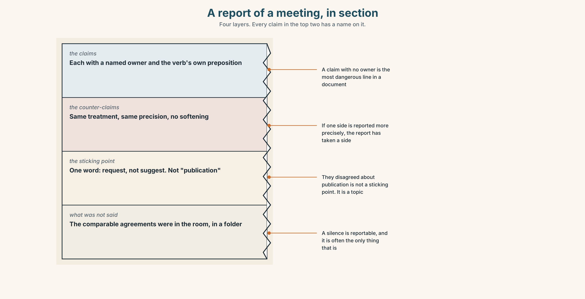{width=6.6in}

*A report of a meeting, in section — Four layers. Every claim in the top two has a name on it.*

### 8A · Read the model

> The sponsor's representative insisted on retaining clause 9.4 and denied that a thirty-day
> review amounted to a veto. `[two claims, one sentence, both attached to the same named person]`
>
> The university's lawyer accused the company of writing a veto and calling it a courtesy. She
> warned them against describing the clause as standard in any public document.
> `[the opposing claims, with their patterns intact]`
>
> The sticking point was not the money or the name. It was the word *request*, which the sponsor
> would not change to *suggest* and the university would not accept as it stood.
> `[the sticking point, named, and it is a single word]`
>
> Nobody raised the comparable agreements. They were in the room, in a folder, and they were not
> mentioned. `[what was not said, which a report should carry]`

**Questions about the writer's choices:**

1. Every claim has a name. **What would the report be worth without them?**
2. The sticking point is one word. **Why is that more useful than "they disagreed about
   publication"?**
3. The last paragraph reports a silence. **Can a report do that fairly?**

### 8B · The anti-model

> There was a frank exchange of views regarding the publication provisions. Both parties
> expressed their positions and it was felt that further discussion would be beneficial. A
> number of concerns were raised and will be taken forward.

Correct English, and nobody in it did anything. **Find the three passives that have deleted a
person**, and say who *it was felt* belongs to.

### 8C · Plan

> the claims, each with its owner → the opposing claims, same treatment → the sticking point,
> named as precisely as you can → what was not said

### 8D · Write — 190 words
### 8E · Peer review — three criteria

> ☐ Does every claim have a named owner?
> ☐ Is the sticking point as precise as the evidence allows?
> ☐ Have I reported what was not said as well as what was?

### 8F · Write it again · 8G · Publish

Circulate to the people you reported. **That is the test.**

---

## Part 9 · The File ◆ **A · THE WORLD + C · THE PERFORMANCE**

# CULTURE FILE · Silence, Interruption and Turn-taking

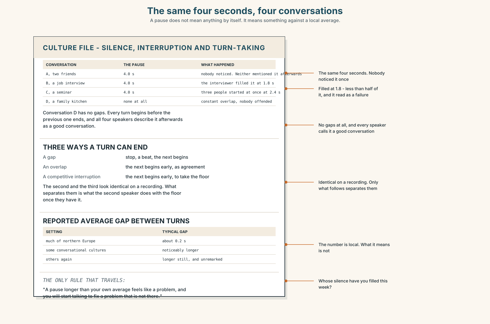{width=6.6in}

*The same four seconds, four conversations — A pause does not mean anything by itself. It means something against a local average.*

### 9A · Four seconds of nothing 🔊 Track 6.4

The same pause, in four conversations. **Listen.**

1. In which one is the pause comfortable?
2. **In which one does somebody fill it, and what does filling it do?**
3. One of the four has no pauses at all, and nobody is being rude. How does that work?

### 9B · Three ways a turn can end

> **a gap** — one speaker stops, a beat, the next begins
> **an overlap** — the next begins slightly early, as agreement
> **a competitive interruption** — the next begins early, to take the floor

**Which two are easily mistaken for each other, and by whom?**

### 9C · The length of a comfortable silence

Reported averages: around **0.2 seconds** between turns in much of northern Europe; longer in
some conversational cultures, and noticeably longer in others again. The number matters less
than this: **whatever yours is, a pause longer than it feels like a problem**, and you will
start talking to fix a problem that is not there.

**Whose silence have you filled this week?**

### 9D · Your turn

In fours. **Twelve minutes.** Discuss anything, with one rule: **three seconds of silence after
every turn, timed.** Then: who found it hardest, and what got said that would not have?

### 9E · Transfer

**Count the interruptions in your next meeting**, and sort them into the three kinds. Bring
the three numbers.

---

## Part 10 · Mediation & Interaction ◆ **C · THE PERFORMANCE**

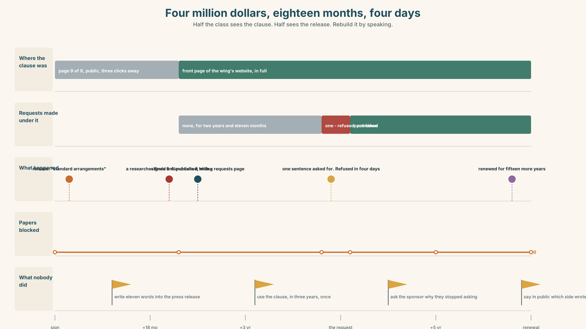{width=6.6in}

*Four million dollars, eighteen months, four days — Half the class sees the clause. Half sees the release. Rebuild it by speaking.*

### 10A · Relay

Half the class sees clause 9.4. Half sees the press release.
**Rebuild the agreement by speaking.** Twelve minutes.

### 10B · Simplify

Explain clause 9.4 to a PhD student about to start work in the new wing. **Five sentences only.**

> **Plan:** what it says → what it does not say → what it would feel like →
> what they can do before signing → who to ask

### 10C · Compress

The essay in Part 5B into **forty words**, keeping the admission.

### 10D · Online

Write **one message** to the communications office: you are not accusing anybody of lying, you
have one specific question about one word, and you want an answer in writing.

### 10E · Your language

Does your language attach claims to people the way English does? **Say *she accused them of
writing it* in both languages.** Which marks the accusation on the verb, and which on a particle?

---

## Part 11 · The Decision ◆ **C · THE PERFORMANCE**

# Four million dollars, and a paragraph about publishing

The gift funds a research wing for fifteen years. Clause 9.4 gives the sponsor thirty days'
sight of any publication and the right to request amendments. The sponsor will not remove it.
The Dean has until November.

- **Sign it.** Four million, a wing, forty researchers. The clause says *request*, not *require*,
  and no comparable agreement has ever been used to block anything.
- **Refuse the clause.** The sponsor has said it is not negotiable. They have said that about
  two other things already and moved on both.
- **Sign it and publish it.** Take the clause, and put it, in full, on the front page of the
  wing's website, alongside every request ever made under it.

### 11A · The evidence

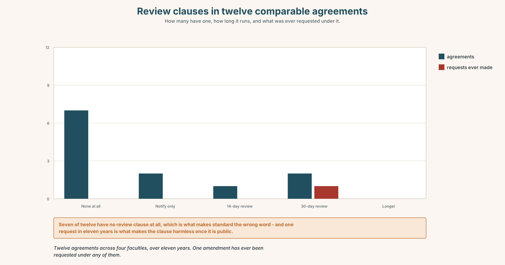{width=6.6in}

*Review clauses in twelve comparable agreements — How many have one, how long it runs, and what was ever requested under it.*

1. **Clause 9.4 and the press release** from Part 5E — and the handwritten amendment.
2. **The chart** — review clauses in twelve comparable agreements, and what was requested under
   each.
3. **The voice.** A postdoctoral researcher, thirty seconds: *"Nobody will ever block a paper.
   They will not need to. I will know on the day I start what the thirty days are for, and in
   four years nobody will be able to point at a single thing I did not write, including me."*

### 11B · Talk about it

In fours. Everybody speaks twice. Use the frame.

> *They ______ us of ______ . We ______ on ______ . The sticking point is ______ .*

**Words you can use:** *claim · clause · leverage · concession · undertaking · stakeholder ·
spin · retraction · the small print · strings attached*

### 11C · Decide

Write **three sentences**. Choose, say why, and name what it costs.

> I think the university should ______________________ ,
> because ______________________ .
> What this costs is ______________________ .

### 11D · Model decision

> Sign it and publish it. The clause is not the danger; the clause plus silence is. A review
> right that everybody can see is a review right nobody can use quietly, and publishing every
> request made under it turns the sponsor's leverage into a public record of how little they
> use it — or into evidence, if they use it a lot. The cost is that the sponsor will read this
> decision as hostile, and they will be partly right.

### 11E · The Reveal

> **What happened.** The university signed and published. The clause went on the wing's website
> in week one, with a page beside it headed *Requests made under clause 9.4*, which stayed empty
> for two years and eleven months.
>
> Then one request was made, on a paper about a competitor's product. It asked for the removal
> of one sentence. The university refused, published the request and the refusal on the same
> page, and the paper went out unchanged four days later.
>
> The sponsor renewed for a second fifteen years. Their head of partnerships said in a
> conference talk, without mentioning the university by name, that the published-requests page
> was the single most useful thing any partner had ever done for them, because it meant nobody
> internally ever asked them to make a request again.

**The clause was never the problem. Writing it down where everybody could see it was what made
it harmless, and it took four days and one refusal to prove it.**

> **Was it the right decision?** Say why — and say what the researcher in 11A would say now.

---

## Part 12 · Landing ◆ **all three lines**

### 12A · Recycle — twelve items

> 1. She accused them ______ writing it.
> 2. They persuaded the Dean ______ wait.
> 3. He blamed them ______ the delay.
> 4. She congratulated them ______ the gift.
> 5. She warned them ______ saying it.
> 6. He insisted ______ seeing the draft.
> 7. He denied ______ (write) it.
> 8. They ______ her into signing.
> 9. He ______ them out of using the word.
> 10. The clause was ______ down to one sentence.
> 11. They ______ back on the deadline.
> 12. Nobody would ______ up to it in writing.

### 12B · Consolidate

**Four columns, from memory:** verbs taking *of* · taking *for* · taking *on* · taking *to* +
infinitive.

### 12C · Can-do, with evidence

> ☐ I can report a negotiation with every claim attached to a person. **Evidence:** 4C, 8D
> ☐ I can use reporting verbs with the correct pattern. **Evidence:** 3H, 6F
> ☐ I can stress a reporting verb to make the report, not the content, the news. **Evidence:** 7D
> ☐ I can report what was *not* said. **Evidence:** 8D

### 12D · Replay ⏺

Record 0C again. **Listen to both.** What have you got that you did not have in week one?

### 12E · Glossary — forty-five items, as a map

> **THE DEAL** · claim · sponsor · clause · naming rights · negotiation · concession · leverage · undertaking · stakeholder
> **THE STORY** · spin · briefing · retraction · on the record
> **THE MOVES** · in exchange for · a sticking point · walk away · the small print · strings attached · water down · push back · sign up to · hold out
> **WHAT PEOPLE SAY** · that is not what was agreed · we are not going to say that · he is said to have
> **REPORTING VERBS** · accuse · persuade · blame · congratulate · warn · remind · insist · deny · admit · urge · advise
> **THE PATTERNS** · accuse somebody of · persuade somebody to · blame somebody for · congratulate somebody on · warn somebody against · insist on · deny doing · talk into · talk out of

### 12F · Next

> **Unit 7 · Who says so?**

# B1.3 · Unit 7 · Somebody Told Somebody

> **English Animated** · *Making the Case* · a university campus, Melbourne
> Student's Book pages 138–159 · 22 pp · ~11 hours

---

## Part 0 · The Big Picture ◆ **A · THE WORLD**

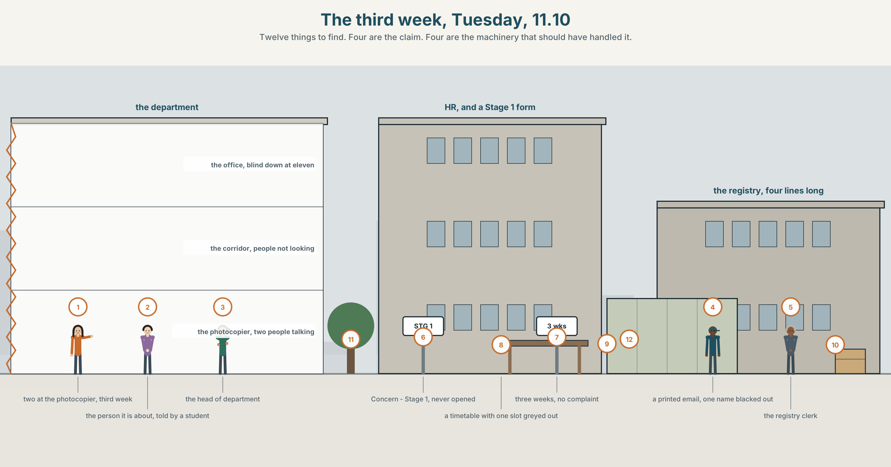{width=6.6in}

*The third week, Tuesday, 11.10 — Twelve things to find. Four are the claim. Four are the machinery that should have handled it.*

# Who says so?

**By the end of this unit you can write 190 words that report unverified claims without
endorsing them.**

| ◆ **A · THE WORLD** | Something is going round the department, and nobody can say where it started |
|---|---|
| ◆ **B · THE SYSTEM** | passive reporting: *it is said that · is thought to* · 24 words for rumour and evidence · 21 distancing forms · weak forms in passive chains |
| ◆ **C · THE PERFORMANCE** | A piece of writing that reports a claim and takes no position on it |

---

### 0A · Find it

**Find twelve things in this picture.** Four of them are the claim. Four are the machinery that
should have handled it.

> two people talking at a photocopier · a staff pigeonhole with one envelope in it ·
> a door with the nameplate removed · a timetable with one slot greyed out ·
> a group chat open on a phone · a noticeboard with a procedure pinned to it ·
> an office with the blind down at eleven in the morning · a corridor with people not looking ·
> a meeting room with four chairs and five people · a lanyard on a desk ·
> a form headed *Concern — Stage 1* · a printed email with a name blacked out

### 0B · Guess it

**One of the twelve was put there by the procedure, and eleven were not.** Which, and what does
that tell you?

### 0C · Say it ⏺

**Record forty-five seconds.** *Describe something you were told about somebody, that you never
checked, and that you still half believe.* You will record it again at the end of this unit.

---

## Part 1 · Vocabulary Lab 1 ◆ **B · THE SYSTEM**

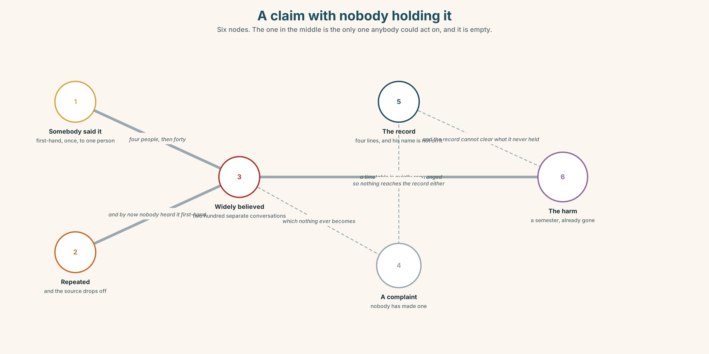{width=6.6in}

*A claim with nobody holding it — Six nodes. The one in the middle is the only one anybody could act on, and it is empty.*

### 1A · Meet — the words of an unverified claim

> **rumour** · **hearsay** · **allegation** · **consensus** · **corroboration** ·
> **anonymity** · **due process** · **harm**

1. Which two of these are about *who else says it*?
2. **What is the difference between a *rumour* and an *allegation*?**
3. *Anonymity* protects somebody. **Who, and at whose cost?**
4. **Why is *due process* slow on purpose?**

> **A *rumour* has no author.** That is not a detail about it; it is the definition. The moment
> somebody will put their name to it, it becomes an allegation and a different set of machinery
> applies.

### 1B · Sort — the claim, the checking, or the damage?

> substantiate · take it seriously · no evidence that · it is said that · credible ·
> circulate · a matter of record · widely believed · unverified

**Three columns. Two of them belong in more than one.** Say which and why.

### 1C · Meet — the phrase that does most of the work

> **c** **no evidence that**

Not *evidence that it is false*. The absence of the one and the presence of the other get
reported in the same sentence shape, and almost nobody notices.

1. **Say the difference out loud, in two sentences.**
2. Which of the two can a one-week investigation produce?

### 1D · Collocation Lab

| | |
|---|---|
| **take it seriously** | ~ without believing it · be seen to ~ |
| **look into it** | we will ~ · nobody ever did ~ |
| **a matter of record** | now ~ · not ~ |
| **widely believed** | ~ and never checked · ~ to be |

**Which two of these can be true of something false?**

### 1E · The fixed expressions

> **f** **There is no smoke without fire.** — a proverb that does the work of an investigation
> without doing any of it. **Why is it so hard to answer?**
> **f** **Somebody told somebody.** — the whole evidential chain, said out loud, and it collapses
> the moment you write it down.

**Which one would you be ashamed to write in a report, and why is that useful?**

### 1F · Own it

The four phrasal verbs of a rumour.

> **go round** · **die down** · **come forward** · **hush up**

1. Which two describe what the claim does, and which what people do?
2. **What is the difference between a rumour that *dies down* and one that is resolved?**
3. *Come forward* implies a direction. Towards what?
4. Write one sentence in which somebody tries to **hush up** something that is true and harmless.

---

## Part 2 · Listening ◆ **A · THE WORLD**

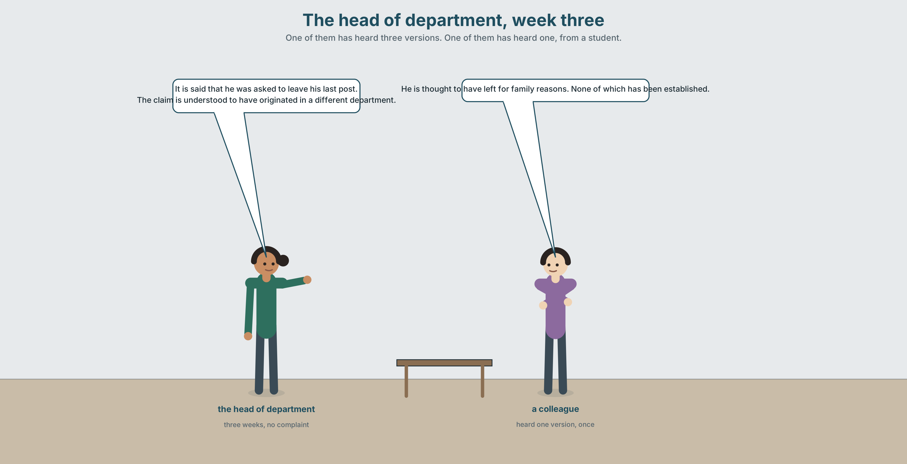{width=6.6in}

*The head of department, week three — One of them has heard three versions. One of them has heard one, from a student.*

### 2A · Three weeks in 🔊 Track 7.1

**Before you listen.** Something has been circulating about a member of staff for three weeks.
Nobody has made a complaint. **Guess: what does the head of department do?**

**Listen once. One question.** What exactly has been said, and who heard it first?

**Listen again. Complete the table.**

| | What is claimed | Who says so | Checkable? |
|---|---|---|---|
| version 1 | | | |
| version 2 | | | |
| version 3 | | | |

**Listen again. Choose the best answer.**

1. The three versions are **the same / related / unconnected**.
2. A formal complaint has been made **by one person / by the department / by nobody**.
3. The head of department wants to **find the source / act now / wait**.
4. Somebody says the phrase *due process* **twice / dismissively / approvingly**.

**Noticing.** Four sentences from the recording.

1. *It is said that he was asked to leave his last post.*
2. *He is thought to have left for family reasons.*
3. *The claim is understood to have originated in a different department.*
4. *None of which has been established.*

**All four report without endorsing. Which one does it most completely?**

### 2B · Decoding clinic 🔊 Track 7.2

Thirty seconds of the head of department. Four jobs.

1. How many passive reporting structures can you count?
2. In *is thought to have left*, how many of the words are weak?
3. Catch the two time periods.
4. She says one thing that she would not write down. Which?

> Transcripts, page 156.

---

## Part 3 · Grammar Lab 1 ◆ **B · THE SYSTEM**

### Reporting without taking responsibility for it

### 3A · Notice

Look at the four sentences in Part 2.

1. In sentence 1, who says it? **Can you tell from the sentence?**
2. **In sentence 2, what is the subject, and where did the claimers go?**
3. **Rewrite sentence 3 starting with *It*.** What is gained and what is lost?
4. Sentence 4 is not a sentence. **What is it attached to?**
5. Try *"He is said that he left."* **What is wrong with it?**

### 3B · See

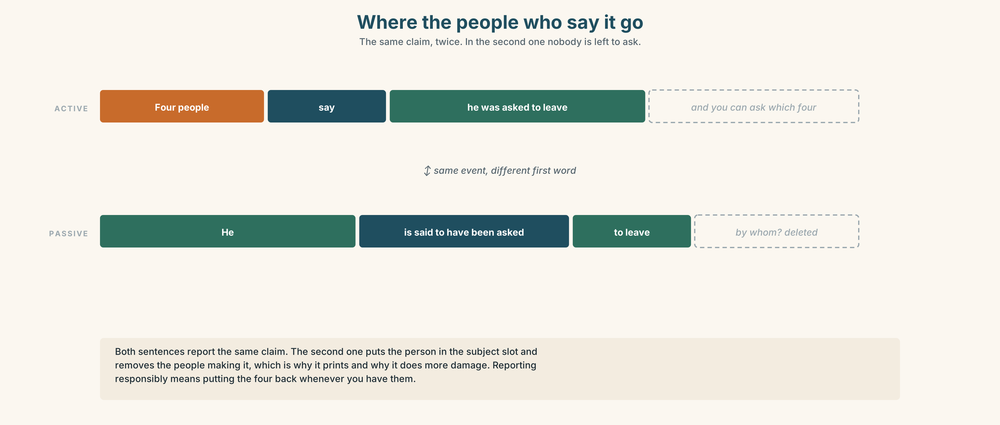{width=6.6in}

*Where the people who say it go — The same claim, twice. In the second one nobody is left to ask.*

### 3C · Know

| Shape | Example | Where the claimer went |
|---|---|---|
| ***It* + passive + *that*** | *It is said that he left.* | deleted, and the claim is foregrounded |
| **subject + passive + *to*** | *He is said to have left.* | deleted, and the person is foregrounded |
| **verbs that do this** | *say · think · believe · understand · allege · report · expect* | |
| **present** | *is thought to be* | now |
| **past** | *is thought to have been* | then — and the reporting is still now |

> **Two shapes, one meaning, different first words.** *It is thought that he left* and *He is
> thought to have left* report the same claim. The second one puts the person in the subject
> slot, which is why newspapers prefer it and why it does more damage.

> ***to have* + past participle moves the claim backwards, not the reporting.**
> *is said to be* = he is, now. *is said to have been* = he was, then. The *is said* stays in
> the present in both, because the saying is happening now.

> **The claimer is deleted, and that is the point.** These structures exist so that a claim can
> be printed when nobody will attach their name to it. **Reporting responsibly means putting the
> name back when you have one.**

> **Why it matters.** This is the grammar of every sentence you will ever read about something
> nobody has proved. Learn to see it and you can read a newspaper twice.

### 3D · Use — controlled

> (1) __________ is said that the appointment was rushed. He (2) __________ thought
> __________ have been interviewed by two people rather than the usual four, although the panel
> record shows three. He is also (3) __________ to have left his previous post at short notice,
> which is (4) __________ believed in this department and is (5) __________ a matter of record
> anywhere. (6) __________ to sources, a complaint was made in 2019. The complaints register
> for 2019 is three lines long and contains no such entry, (7) __________ of which has been
> established, and all of which has been repeated.

### 3E · Use — guided

Rewrite each one as a passive report. **Use the shape in brackets.**

1. People say he was asked to leave. *(It…)*
2. People say he was asked to leave. *(He…)*
3. Everyone believes the appointment was rushed. *(It…)*
4. They understand the claim started elsewhere. *(The claim…)*
5. Nobody has proved any of it. *(none of which…)*

### 3F · Use — open

**In pairs.** Report something going round your institution, in six sentences, four of which must
use a passive report. **Your partner's job** is to ask, after each one, *who says so* — and to
note how many times you cannot answer.

### 3G · Error autopsy

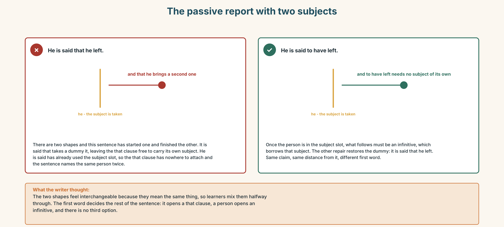{width=6.6in}

*The passive report with two subjects — The passive report with two subjects*

**Read both versions. Then say what the first one claims that the writer did not mean.**

### 3H · Check — eight items

> 1. ______ is said that he left. *(It-shape)*
> 2. He ______ said ______ have left. *(subject-shape, past)*
> 3. He is thought ______ be fifty. *(present)*
> 4. The claim is ______ to have started elsewhere. *(understand)*
> 5. It is ______ that a complaint was made. *(allege)*
> 6. ✗ *He is said that he left.* → correct it.
> 7. ______ to sources, nobody has complained. *(preposition phrase)*
> 8. ______ of which has been established. *(relative)*

**0–4 →** Workbook pp. 30–33. **5–6 →** Part 6. **7–8 →** page 151.

---

## Part 4 · Speaking ◆ **C · THE PERFORMANCE**

### 4A · Fluency starter — who says so

One learner reports a claim passively. The next asks *who says so*. **The chain breaks when
somebody can actually answer.**

### 4B · The functional core — reporting what you cannot verify

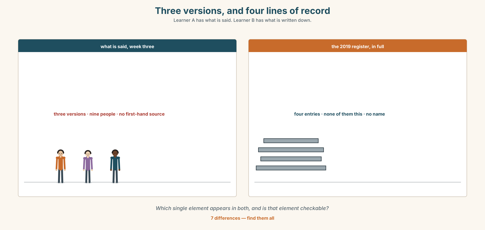{width=6.6in}

*Three versions, and four lines of record — Learner A has what is said. Learner B has what is written down.*

**Language Bank**

| | |
|---|---|
| **the claim** | *It is alleged that…* · *He is said to have…* · *Reportedly, …* |
| **the status** | *This is unverified.* · *None of which has been established.* |
| **what is checkable** | *What is a matter of record is…* · *As far as we know, …* |
| **the harm** | *Repeating it costs…* · *The question is who is damaged while we wait.* |

**Information gap.** Learner A has the three versions of the rumour. Learner B has the
documentary record. **Find the one element that appears in both.**

### 4C · The performance — three minutes ⏺

Report **something unverified**, from your own life or the unit. **Three minutes.** You must
include:

> the claim, reported and not endorsed · its status, said plainly ·
> one thing that is checkable, and what the record says · who is harmed while nobody checks

**Record it.**

### 4D · Observer

One person listens for **one thing**: did the speaker ever slip from reporting into endorsing?

### 4E · Three criteria

> ☐ Is every unverified claim marked as unverified?
> ☐ Did I separate what is a matter of record from what is said?
> ☐ Did I name who is harmed by the delay, and by the repetition?

---

## Part 5 · Reading ◆ **A · THE WORLD**

### 5A · Predict

A review, titled **"Four Weeks, at the Malthouse."**
**What do you expect the reviewer to say about the ending?** Two sentences.

### 5B · Read — two minutes and a quarter

---

**FOUR WEEKS**
*Malthouse Theatre · a review*

*Four Weeks* is built entirely from documents. There is no invented dialogue in it, which the
programme tells you twice, and which you stop noticing about ten minutes in, and then notice
again very sharply at the end.

The subject is a school teacher in a regional town, about whom something began to circulate in
2017. The play never tells us what. This is its one structural decision and everything else
follows from it: we hear eleven people describe a claim none of them can state, in the form
*it is said that*, *apparently*, *I was told*, and, nine times across ninety minutes, *there is
no smoke without fire*.

What the documents establish is this. No complaint was ever made. The teacher was moved to a
non-teaching role for what the letter calls *a period of review*, which lasted four weeks and
was then extended twice. He resigned in the eleventh week. The claim was never put to him in
writing, because there was nothing to put, and the play's most uncomfortable scene is a
nineteen-minute reconstruction of a meeting in which three senior people try to find a form of
words for a thing none of them has heard first-hand.

The second act is the town. It is also the weakest part, because the writer cannot resist the
chorus, and a chorus implies a collective that in a rumour does not exist — what exists is two
hundred separate conversations, each of which thought it was the only one.

The ending is a projection of the complaints register for that year. It is four lines long. It
is on screen for ninety seconds, which is far too long and exactly right, and the man's name is
not on it.

Go. Then notice, on the way out, how much of what you now believe about him came from a play
that was careful to tell you nothing.

---

### 5C · Comprehension — eight questions

1. What is the play built from, and what does the programme say twice?
2. **What is the play's "one structural decision"?**
3. How many people describe the claim, and in what forms?
4. **What do the documents establish? Give four facts.**
5. How long was the review period, and when did he resign?
6. **Why was the claim never put to him in writing?**
7. What is the reviewer's objection to the second act?
8. What is on screen at the end, for how long, and what is not on it?

### 5D · Vocabulary in context

Guess from the text. Then check.

> began to circulate · a period of review · put to him in writing · the writer cannot resist ·
> far too long and exactly right

### 5E · The counter-text

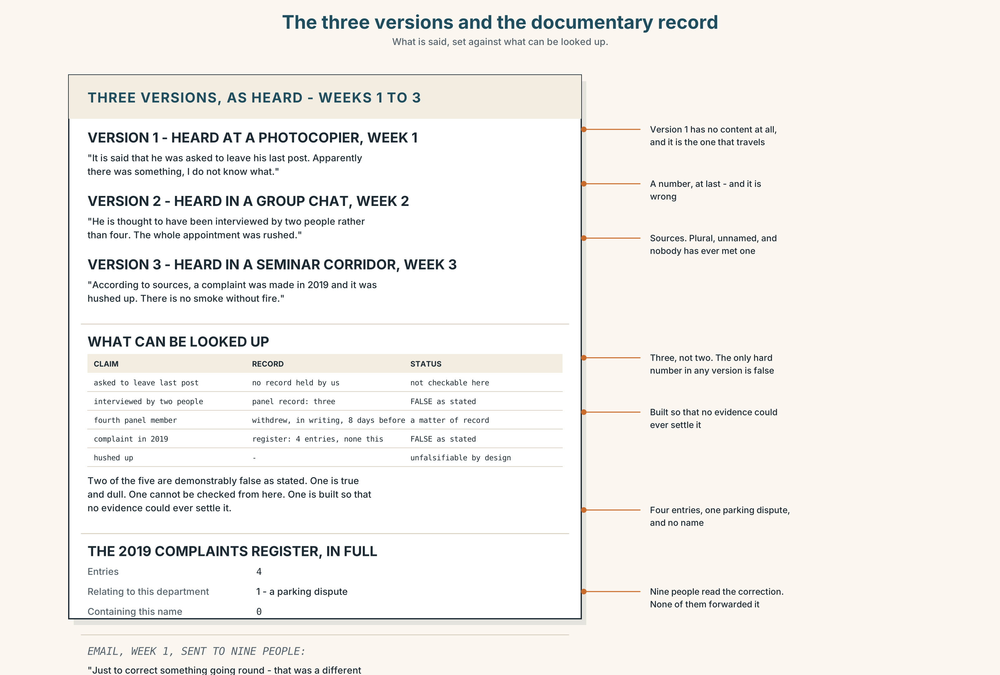{width=6.6in}

*The three versions and the documentary record — What is said, set against what can be looked up.*

**Read the three versions of the claim and the documentary record, and answer.**

1. What does each of the three versions say?
2. **Which element appears in all three, and is it checkable?**
3. What does the panel record show about the interview?
4. How many entries are in the 2019 complaints register, and what are they?
5. One version contains a detail that is demonstrably false. Which, and how do we know?

### 5F · Two texts

The rumour says the appointment was **rushed**.
The panel record shows **three interviewers** where the usual number is four.

**Does the record support the rumour?** Three sentences.

---

## Part 6 · Vocabulary Lab 2 ◆ **B · THE SYSTEM**

### The adverbs that put a claim at arm's length

### 6A · Sort — how far away does each one hold it?

Three columns: **neutral · doubtful · openly sceptical**.

> reportedly · ostensibly · apparently · supposedly · purportedly · allegedly ·
> seemingly · presumably · arguably

### 6B · Chunk completion

1. **is ______ to** have left at short notice *(think)*
2. **is ______ to** be fifty *(say)*
3. **is ______ to** have been interviewed twice *(believe)*
4. **is ______ to** have started elsewhere *(understand)*
5. **it is ______ that** a complaint was made *(allege)*
6. **______ to sources** , nobody has complained

### 6C · Three that are not neutral at all

**supposedly · ostensibly · purportedly**

> All three signal that the writer does not believe it. *Ostensibly* adds that the stated
> reason is a cover for another one. **Using any of them is taking a position**, which is
> exactly what the other six do not do.

**Write three sentences about the play in Part 5, one with each.**

### 6D · Two verbs for what a claim does

> **p** **put about** · **p** **stand up**

> *A story was put about that he had been asked to leave.*
> *None of it stood up.*

**Put about** names a deliberate act with no named actor. **Stand up** is what a claim does
under checking, and it is almost always negative: *did not stand up*.

**Rewrite two sentences from Part 5B using them.**

### 6E · The fixed expressions

> **f** **None of which has been established.**

A whole sentence, attached to everything before it. It is the single most useful six words in
this unit and the one most often left out.

> **Write the three sentences it is attached to.**

### 6F · Contrast Clinic

Eight items. **Four are wrong. Correct them and say what the rule is.**

1. He is believed to be fifty.
2. It is thought him to be fifty.
3. He is said that he left.
4. None of which have been established.
5. It is said that he left.
6. He is said to have left.
7. He is thought to have been interviewed by two people.
8. According to sources, nobody has complained.

---

## Part 7 · Pronunciation & Fluency Lab ◆ **B · THE SYSTEM**

### Weak forms in a passive chain

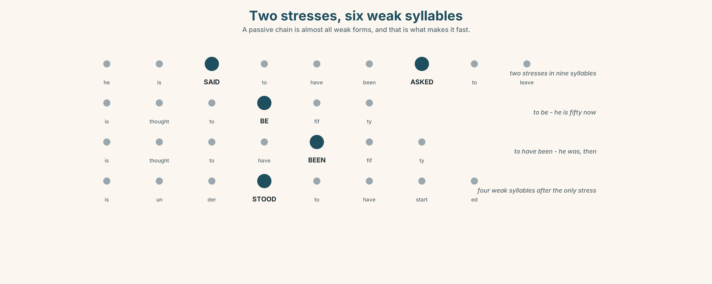{width=6.6in}

*Two stresses, six weak syllables — A passive chain is almost all weak forms, and that is what makes it fast.*

### 7A · Hear 🔊 Track 7.3

> *He is* **SAID** *to have been* **ASKED** *to leave.*
> **Eight words. Two of them are stressed. *to have been* is one blurred syllable and a half.**

Listen again for the shape of it:

> /hiz **sed** təv bin **ɑːskt** tə liːv/

### 7B · Say

Say it slowly, then at speed. Then say this one three times, faster:

> *The claim is understood to have originated in a different department.*

### 7C · Make it mean something

Say these two:

> *He is said to* **BE** *fifty.* *(now)*
> *He is said to have* **BEEN** *fifty.* *(then — and he is older now)*

**One syllable, twenty years.** Which is which?

### 7D · Fluency 30 ⏺

Thirty seconds: **four passive reports, each with the weak forms properly weak.**
Three times, faster, keeping the two stresses.

---

## Part 8 · Writing ◆ **C · THE PERFORMANCE**

### A report of an unverified claim · 190 words

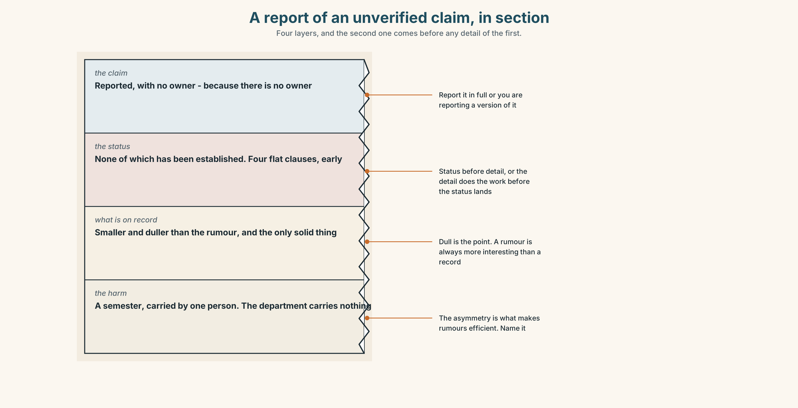{width=6.6in}

*A report of an unverified claim, in section — Four layers, and the second one comes before any detail of the first.*

### 8A · Read the model

> It is said in the department that the appointment was rushed, and that the person appointed
> was asked to leave a previous post. `[the claim, reported, with no owner — because there is no
> owner]`
>
> None of which has been established. No complaint has been made, no date has been given, and
> no person has yet repeated it to me who heard it first-hand. `[the status, in four flat
> clauses, before anything else]`
>
> What is a matter of record is that the appointment panel had three members rather than the
> usual four, and that the fourth withdrew eight days before, in writing, citing workload.
> `[the checkable fact, which is smaller and duller than the rumour and is the only solid thing
> here]`
>
> Three weeks of this have cost one person their teaching allocation for the semester and have
> cost the department nothing, which is the asymmetry that makes rumours efficient.
> `[the harm, named, with the asymmetry stated]`

**Questions about the writer's choices:**

1. The status comes before the evidence. **Why not after?**
2. The checkable fact is "smaller and duller". **Why include it at all?**
3. The last paragraph names an asymmetry. **What would the report be without it?**

### 8B · The anti-model

> There have been some concerns raised about the recent appointment and a number of people have
> expressed disquiet. While nothing has been proven, it is felt that the matter should be looked
> into, and it is understood that steps are being taken. Further information will be provided
> in due course.

Correct English, and it repeats the claim while appearing not to. **Find the four structures
that have deleted a person**, and say what *it is felt* achieves that *I think* would not.

### 8C · Plan

> the claim, reported → the status, flat and early → what is a matter of record →
> the harm, and who carries it

### 8D · Write — 190 words
### 8E · Peer review — three criteria

> ☐ Is the status of the claim given before any detail of it?
> ☐ Is every checkable fact separated from every reported one?
> ☐ Is the harm named, with the person who carries it?

### 8F · Write it again · 8G · Publish

**Do not publish this one on the wall.** Hand it to one person and ask them one question: would
you be comfortable if the subject read it?

---

## Part 9 · The File ◆ **A · THE WORLD + C · THE PERFORMANCE**

# WORK FILE · The Safety Brief

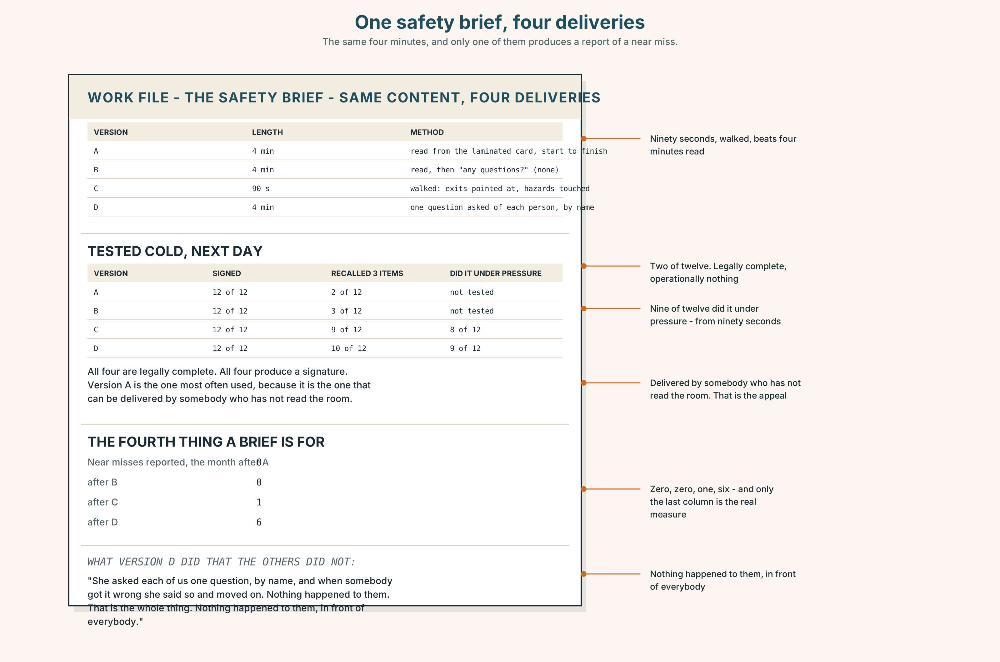{width=6.6in}

*One safety brief, four deliveries — The same four minutes, and only one of them produces a report of a near miss.*

### 9A · Four minutes that nobody listens to 🔊 Track 7.4

The same safety brief, delivered four ways. **Listen.**

1. Which one do people remember afterwards, and why?
2. **Which one is legally complete and operationally useless?**
3. One of the four asks a question. What does that change?

### 9B · What a brief is actually for

> **compliance** — it was delivered, and there is a signature
> **recall** — people can repeat it tomorrow
> **behaviour** — people do the thing, under pressure, without thinking
> **reporting** — people tell you when something goes wrong

**Which of the four does your institution measure, and which does it need?**

### 9C · The fourth one is the hard one

A brief that produces **reporting** is a brief after which somebody will tell you about a near
miss. That requires people to believe nothing bad happens to the person who comes forward, and
no form has ever achieved that.

**What would convince you, in a new job, that it was safe to report something?**

### 9D · Your turn

In fours. **Twelve minutes.** Deliver a sixty-second safety brief for this room: exits, hazards,
what to do, who to tell. **Then test each other on it from memory, cold.**

### 9E · Transfer

**Find the safety notice nearest to where you are sitting.** When was it last changed, and can
anybody in the room say what it says?

---

## Part 10 · Mediation & Interaction ◆ **C · THE PERFORMANCE**

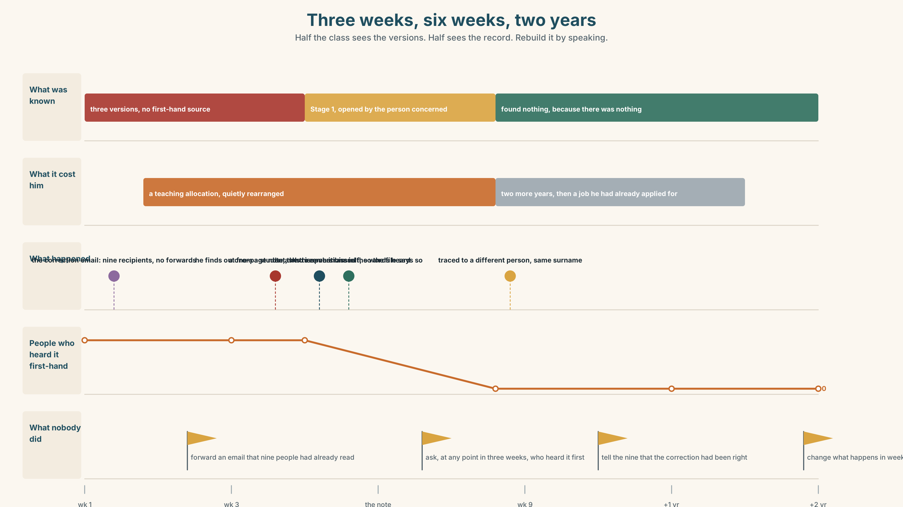{width=6.6in}

*Three weeks, six weeks, two years — Half the class sees the versions. Half sees the record. Rebuild it by speaking.*

### 10A · Relay

Half the class sees the three versions. Half sees the documentary record.
**Rebuild the three weeks by speaking.** Twelve minutes.

### 10B · Simplify

Explain to a new colleague what is known and what is not. **Five sentences only.**

> **Plan:** what is said → what is on record → what has been established →
> what has happened to the person → what you would advise them to do

### 10C · Compress

The review in Part 5B into **forty words**, keeping the last paragraph's point.

### 10D · Online

Write **one message** in a group chat where the rumour has just been repeated. You are not
defending anybody, you are asking one question, and you are not going to send a second message.

### 10E · Your language

Does your language have a reportative form — a verb ending or particle meaning *they say*?
**Say *he is said to have left* in both languages.** Which marks it on the verb, and which needs
a whole clause?

---

## Part 11 · The Decision ◆ **C · THE PERFORMANCE**

# Three weeks, three versions, no complaint

Something has been going round for three weeks. No complaint has been made. The person has
already lost a teaching allocation because a timetable was quietly rearranged. The head of
department has to do something or decide not to.

- **Investigate.** Open a Stage 1 concern, interview the people who have repeated it, and make
  it a matter of record. It becomes real, with a file, and a file does not close.
- **Do nothing formal.** Rumours die down. This one has no source and no complainant, and
  opening a process creates a document where there is currently only talk.
- **Go to the person.** Tell them exactly what is being said, in writing, today — before any
  process, so they are not the last to know and can decide for themselves what happens next.

### 11A · The evidence

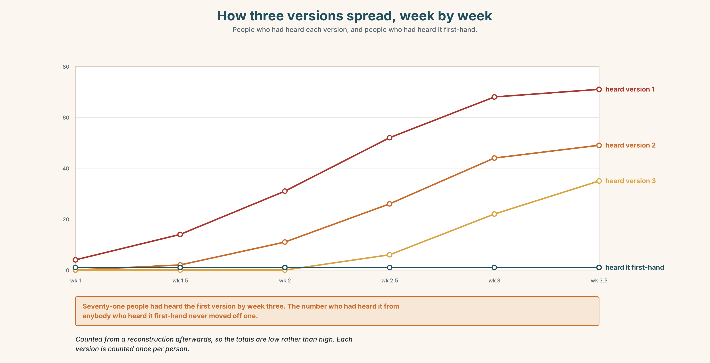{width=6.6in}

*How three versions spread, week by week — People who had heard each version, and people who had heard it first-hand.*

1. **The three versions and the record** from Part 5E — and the detail that is demonstrably
   false.
2. **The chart** — how the three versions spread, week by week, and how many people heard each
   one first-hand.
3. **The voice.** The person concerned, thirty seconds: *"I found out in week three from a
   student. Not a colleague — a student, who was embarrassed. I would have preferred almost any
   process to that, including one that found against me, because at least I would have been in
   the room."*

### 11B · Talk about it

In fours. Everybody speaks twice. Use the frame.

> *It is ______ that ______ , none of which ______ . What is a matter of record is ______ .*

**Words you can use:** *rumour · hearsay · allegation · corroboration · anonymity · due
process · harm · unverified · credible · substantiate*

### 11C · Decide

Write **three sentences**. Choose, say why, and name what it costs.

> I think the head of department should ______________________ ,
> because ______________________ .
> What this costs is ______________________ .

### 11D · Model decision

> Go to the person, today, in writing, before anything else. Every version of this problem that
> begins with an investigation ends with the subject learning about it from somebody who is
> enjoying it. Telling them first costs the department its control of the timing and gives the
> person the one thing nobody in a rumour ever has, which is the ability to ask a question of
> somebody who has to answer. The investigation may still follow. It should not come first.

### 11E · The Reveal

> **What happened.** She went to him on the Thursday with a one-page note listing the three
> versions in the words she had heard them. He read it, asked for an hour, and came back with a
> request: open the Stage 1 himself, as the person concerned, so that the file would say he had
> asked for it.
>
> The process took six weeks and found nothing, because there was nothing. One of the three
> versions was traced to a confusion with a different person of the same surname at a different
> university, which had been corrected in an email in week one — an email that nine people
> received and none of them forwarded.
>
> He stayed two more years and then left, for a job he had applied for before any of this.
> Asked afterwards what had helped, he named the note, and said the thing that still bothered
> him was the nine people, none of whom had done anything wrong, and all of whom had read the
> correction.

**Nobody lied, nobody acted maliciously, and a correction that nine people read reached nobody.
The whole thing cost one person a semester and the department a sentence in a file.**

> **Was it the right decision?** Say why — and say what should have happened in week one.

---

## Part 12 · Landing ◆ **all three lines**

### 12A · Recycle — twelve items

> 1. ______ is said that he left.
> 2. He is said ______ have left.
> 3. He is thought ______ be fifty.
> 4. The claim is ______ to have started elsewhere.
> 5. It is ______ that a complaint was made.
> 6. ______ to sources, nobody has complained.
> 7. ______ of which has been established.
> 8. A story was ______ about.
> 9. None of it ______ up.
> 10. Nobody would ______ forward.
> 11. It did not ______ down for three weeks.
> 12. They tried to ______ it up.

### 12B · Consolidate

**Three columns, from memory:** *It* + passive + *that* · subject + passive + *to* · the
single-word adverbs.

### 12C · Can-do, with evidence

> ☐ I can report an unverified claim without endorsing it. **Evidence:** 4C, 8D
> ☐ I can build both passive reporting shapes, present and past. **Evidence:** 3H, 6F
> ☐ I can hear and produce the weak forms in a passive chain. **Evidence:** 7D
> ☐ I can separate what is on record from what is said. **Evidence:** 8D, 11C

### 12D · Replay ⏺

Record 0C again. **Listen to both.** What have you got that you did not have in week one?

### 12E · Glossary — forty-five items, as a map

> **THE CLAIM** · rumour · hearsay · allegation · unverified · credible · circulate · go round · put about
> **THE CHECKING** · consensus · corroboration · substantiate · stand up · no evidence that · a matter of record · look into it · take it seriously
> **THE PEOPLE** · anonymity · due process · harm · come forward · hush up · die down
> **WHAT PEOPLE SAY** · it is said that · widely believed · there is no smoke without fire · somebody told somebody
> **AT ARM'S LENGTH** · reportedly · allegedly · apparently · supposedly · ostensibly · purportedly · seemingly · arguably · presumably
> **THE STRUCTURES** · understood · thought · is thought to · is said to · is believed to · is understood to · it is alleged that · according to sources · as far as we know · none of which has been established

### 12F · Next

> **Unit 8 · What should you have done?**

# B1.3 · Unit 8 · Three People, Three Emails

> **English Animated** · *Making the Case* · a university campus, Melbourne
> Student's Book pages 160–181 · 22 pp · ~11 hours

---

## Part 0 · The Big Picture ◆ **A · THE WORLD**

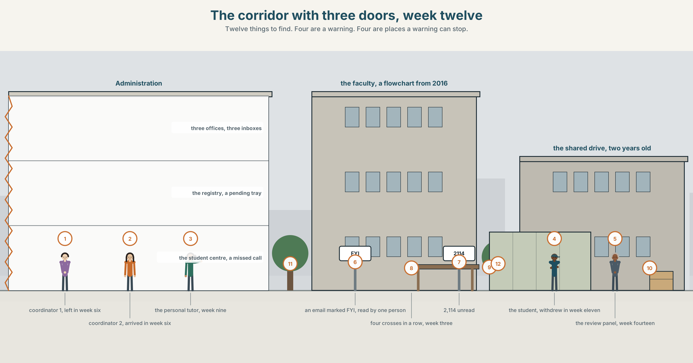{width=6.6in}

*The corridor with three doors, week twelve — Twelve things to find. Four are a warning. Four are places a warning can stop.*

# What should you have done?

**By the end of this unit you can write a post-mortem of a decision that went wrong.**

| ◆ **A · THE WORLD** | A student who failed, and three warnings that each reached one person |
|---|---|
| ◆ **B · THE SYSTEM** | the hypothetical past: *should / could / would / ought to have* · 24 words for decisions, hindsight and audit · 21 criticism forms · *should've* /ʃʊdəv/ |
| ◆ **C · THE PERFORMANCE** | A post-mortem that finds a system fault, not a person to blame |

---

### 0A · Find it

**Find twelve things in this picture.** Four of them are a warning. Four are the places a
warning can stop.

> an inbox with 2,114 unread · a corridor with three office doors · a form half filled in ·
> a shared drive folder dated two years ago · a desk with a tray marked *pending* ·
> a noticeboard with a flowchart on it · a phone with a missed call ·
> a printed attendance list with four crosses in a row · a whiteboard with a name and a date ·
> a handover note under a keyboard · a meeting that four people are in and five were invited to ·
> an email marked *FYI*

### 0B · Guess it

**Three of the twelve are the same warning, in three different places.** Which, and which of the
three was anybody responsible for reading?

### 0C · Say it ⏺

**Record forty-five seconds.** *Describe something that went wrong around you where everybody
did their own job correctly.* You will record it again at the end of this unit.

---

## Part 1 · Vocabulary Lab 1 ◆ **B · THE SYSTEM**

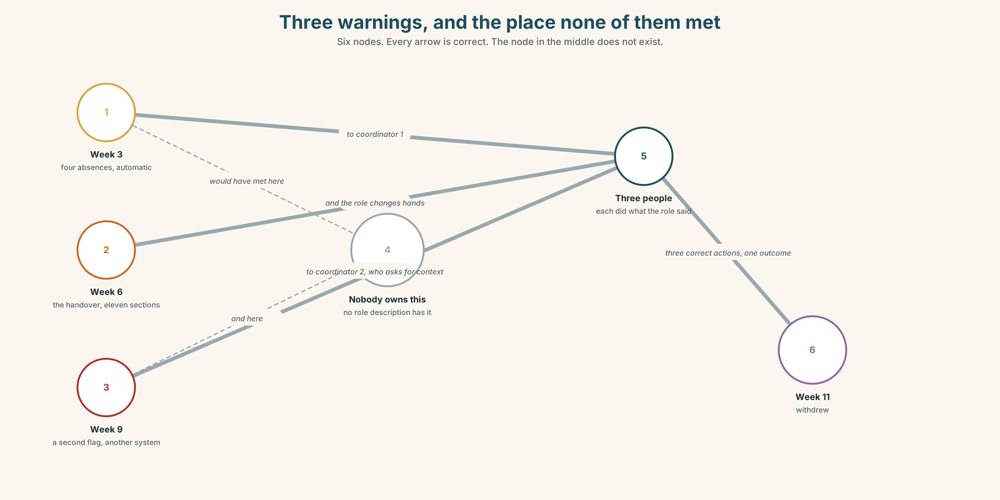{width=6.6in}

*Three warnings, and the place none of them met — Six nodes. Every arrow is correct. The node in the middle does not exist.*

### 1A · Meet — the words of a post-mortem

> **decision** · **hindsight** · **audit** · **threshold** · **handover** · **oversight** ·
> **accountability** · **omission**

1. Which two of these are moments, and which two are states?
2. ***Oversight* means two opposite things.** Give both, and say how you tell them apart.
3. What is a *threshold*, and why does every automatic warning need one?
4. **Why is a *handover* the most dangerous five minutes in any process?**

> **An *omission* is not the same as a mistake.** A mistake is a thing done wrongly. An omission
> is a thing not done, and no log anywhere records it.

### 1B · Sort — the system, the person, or the aftermath?

> with hindsight · in retrospect · nobody owned it · the duty of care · warning ·
> fall through the cracks · flag it up · escalate · trigger · review

**Three columns. Two of them belong in more than one.** Say which and why.

### 1C · Meet — the phrase that does most of the work

> **c** **nobody owned it**

Not *nobody did it*. Everybody did a piece of it, correctly, and no single person was
responsible for the whole.

1. **Why is this harder to fix than somebody doing something wrong?**
2. Name one thing in your own life that nobody owns.

### 1D · Collocation Lab

| | |
|---|---|
| **flag it up** | ~ early · ~ to somebody |
| **with hindsight** | ~ it was obvious · ~ , we would have |
| **the duty of care** | owe ~ · breach ~ |
| **fall through the cracks** | ~ between two teams · let somebody ~ |

**Which two of these can only be said afterwards?**

### 1E · The fixed expressions

> **f** **Three people, three emails.** — the shape of the most common institutional failure
> there is, and it fits in four words.
> **f** **Somebody should have.** — a sentence with no subject, and that is the diagnosis as
> well as the complaint.

**Which one names the fault, and which one performs it?**

### 1F · Own it

The four phrasal verbs of a warning.

> **pass on** · **follow up** · **sign off** · **take up**

1. Which two end somebody's responsibility, and which two extend it?
2. **What exactly do you *sign off* — the work, or the risk?**
3. *Follow up* and *check*: what does *follow up* assume that *check* does not?
4. Write one sentence in which somebody **passes on** a warning and makes it weaker.

---

## Part 2 · Listening ◆ **A · THE WORLD**

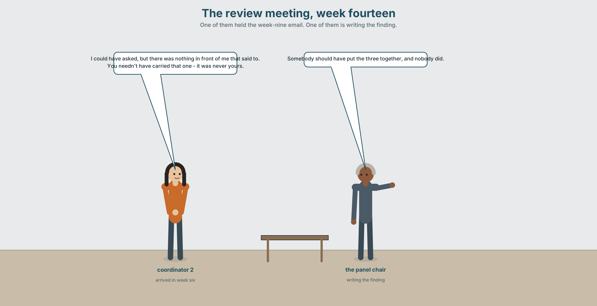{width=6.6in}

*The review meeting, week fourteen — One of them held the week-nine email. One of them is writing the finding.*

### 2A · The review meeting 🔊 Track 8.1

**Before you listen.** A second-year student has failed three units and withdrawn. Three
separate warnings were generated in the twelve weeks before. **Guess: how many people saw all
three?**

**Listen once. One question.** Who generated each warning, and who received it?

**Listen again. Complete the table.**

| | Warning 1 | Warning 2 | Warning 3 |
|---|---|---|---|
| week | | | |
| triggered by | | | |
| went to | | | |
| action taken | | | |

**Listen again. Choose the best answer.**

1. The three warnings went to **two people / one person / three people**.
2. The threshold for an automatic alert is **six / four / three absences**.
3. *It was not my responsibility* is said **and is wrong / and nobody answers / and is right**.
4. The handover happened in **week 2 / week 9 / week 6**.

**Noticing.** Four sentences from the recording.

1. *Somebody should have put the three together, and nobody did.*
2. *I could have asked, but there was nothing in front of me that said to.*
3. *With hindsight the handover ought to have included the open cases.*
4. *You needn't have carried that one — it was never yours.*

**All four judge a past action. Which one withdraws a criticism?**

### 2B · Decoding clinic 🔊 Track 8.2

Thirty seconds of the review. Four jobs.

1. How many *have* forms can you count?
2. In *should have put*, how is *have* pronounced?
3. Catch the two week numbers.
4. One speaker says *I could have* and means something different from *I should have*. What?

> Transcripts, page 157.

---

## Part 3 · Grammar Lab 1 ◆ **B · THE SYSTEM**

### Judging the past you cannot change

### 3A · Notice

Look at the four sentences in Part 2.

1. In sentence 1, did anybody put them together?
2. **In sentence 2, was the speaker able to ask?** Did they?
3. **Rewrite sentence 3 with *should*.** Does the meaning change?
4. Sentence 4 uses *needn't have*. **Did the person do it or not?**
5. Try *"Somebody should have put the three together, and nobody didn't."* **What is wrong?**

### 3B · See

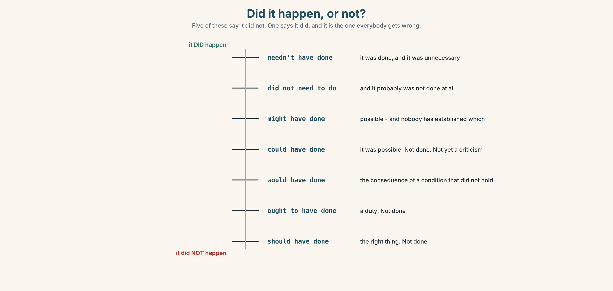{width=6.6in}

*Did it happen, or not? — Five of these say it did not. One says it did, and it is the one everybody gets wrong.*

### 3C · Know

| Form | Means | Did it happen? |
|---|---|---|
| ***should have* + pp** | it was the right thing and it did not happen | no |
| ***ought to have* + pp** | the same, slightly more formal, often about duty | no |
| ***could have* + pp** | it was possible and it did not happen | no |
| ***would have* + pp** | it was the consequence of a condition that did not hold | no |
| ***might have* + pp** | it was possible, and we do not know | unknown |
| ***needn't have* + pp** | it happened, and it was unnecessary | **yes** |

> **The one that catches everybody.** *Needn't have done* means it was done. *Did not need to
> do* means it was not. *She needn't have come in* — she came. *She did not need to come in* —
> and probably stayed at home.

> ***could have* is not a criticism by itself.** *I could have asked* says it was possible.
> Whether it is an accusation depends entirely on what follows: *I could have asked, but nothing
> told me to* is a defence.

> **Use *otherwise* to carry the condition.** *The threshold should have been four. Otherwise
> nothing fires until it is too late.*

> **Why it matters.** A post-mortem written in *should have* is a list of accusations. One
> written in *could have* and *would have* is a description of a system, and only the second
> kind changes anything.

### 3D · Use — controlled

> Three separate warnings were generated. Each one went to one person, and each of those people
> did exactly what the procedure asked. Somebody (1) __________ have put the three together, and
> (2) __________ . The tutor (3) __________ have asked, but nothing in front of her said to.
> With hindsight the handover in week six (4) __________ to have included the open cases.
> The threshold (5) __________ have been four absences rather than six; (6) __________ nothing
> fires until the student has already missed a third of the semester. The registry
> (7) __________ have chased the second form at all — it had already been superseded, and
> chasing it cost two days that nobody had.

### 3E · Use — guided

Rewrite each one with the form in brackets.

1. It was the right thing to do and nobody did it. *(should have)*
2. It was possible and she did not do it. *(could have)*
3. She did it and it was unnecessary. *(needn't have)*
4. It was her duty and it did not happen. *(ought to have)*
5. If the threshold had been four, it would have fired in week three. *(would have)*

### 3F · Use — open

**In pairs.** Describe something that went wrong, in six sentences, three of which must use a
hypothetical past. **Your partner's job** is to say, after each one, whether it describes a
person or a system.

### 3G · Error autopsy

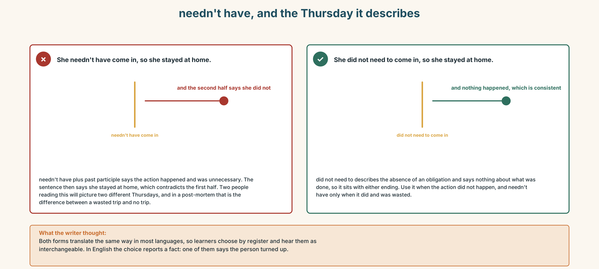{width=6.6in}

*needn't have, and the Thursday it describes — needn't have, and the Thursday it describes*

**Read both versions. Then say whether the person came in or not.**

### 3H · Check — eight items

> 1. Somebody ______ have put the three together. *(right thing, did not happen)*
> 2. She ______ have asked, but nothing told her to. *(possible)*
> 3. The handover ______ to have included the open cases. *(duty)*
> 4. You ______ have carried that one — it was never yours. *(it happened, unnecessarily)*
> 5. If the threshold had been four, it ______ have fired in week three. *(consequence)*
> 6. ✗ *Somebody should have put them together, and nobody didn't.* → correct it.
> 7. The threshold should have been four; ______ , nothing fires in time. *(condition carried)*
> 8. It ______ well have been missed twice. *(possible, unknown)*

**0–4 →** Workbook pp. 34–37. **5–6 →** Part 6. **7–8 →** page 173.

---

## Part 4 · Speaking ◆ **C · THE PERFORMANCE**

### 4A · Fluency starter — person or system

One learner gives a *should have* sentence. The next rewrites it so that it describes a system
rather than a person. **The chain breaks when the system version still has a name in it.**

### 4B · The functional core — running a post-mortem

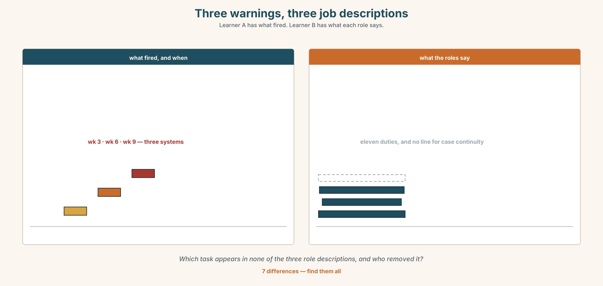{width=6.6in}

*Three warnings, three job descriptions — Learner A has what fired. Learner B has what each role says.*

**Language Bank**

| | |
|---|---|
| **the sequence** | *In week three… · By week six… · Not until week nine…* |
| **what was possible** | *X could have…, but nothing in front of them said to.* |
| **the system fault** | *Nobody owned it.* · *The threshold was set at six.* |
| **the withdrawal** | *You needn't have…* · *That one was never yours.* |

**Information gap.** Learner A has the three warnings. Learner B has the three job descriptions.
**Find the task that appears in none of the three.**

### 4C · The performance — three minutes ⏺

Run **a post-mortem** on something that went wrong. **Three minutes.** You must include:

> the sequence, with dates · what each person could have done and why they did not ·
> the system fault, named without a person in it · one thing you are withdrawing

**Record it.**

### 4D · Observer

One person listens for **one thing**: did any sentence turn a system fault back into a person?

### 4E · Three criteria

> ☐ Is the sequence dated?
> ☐ Is the main fault stated without a name in it?
> ☐ Did I withdraw at least one criticism that does not survive the evidence?

---

## Part 5 · Reading ◆ **A · THE WORLD**

### 5A · Predict

An opinion column, titled **"Stop asking who."**
**What do you expect it to propose instead?** Two sentences.

### 5B · Read — two minutes and a quarter

---

**STOP ASKING WHO**
*opinion*

Every institutional failure I have read about in twenty years ends the same way: a report, a
name, and a sentence beginning *should have*. And every one of them produces the same two
results, which are that one person's career is damaged and the thing happens again within four
years.

I want to be careful here, because there is a version of what I am saying that is an excuse for
everybody, and that is not it. People are responsible for what they do. The question is whether
*who* is the most useful question to ask first, and I think the evidence is that it is not.

Take the case everybody in this sector knows. A student missed four consecutive classes in week
three. An automatic alert fired, because the threshold is four, and it went to the unit
coordinator. In week six the coordinator changed, as coordinators do, and the handover document
had a section for assessment deadlines and no section for open student cases. In week nine the
student's personal tutor received a separate flag, from a different system, and emailed the
coordinator — the new one — who replied the same day asking for context she did not have.

Three people. Three emails. Each of them did what their role described. The student withdrew in
week eleven.

The report named the second coordinator. With hindsight, it said, she ought to have asked a
follow-up question. She ought to have. She also ought to have, in the same week, prepared two
hundred and ten exam scripts and run a staff recruitment panel, and if we are listing the things
that a reasonable person ought to have done in week nine we are going to be here for some time.

What nobody asked was why a handover template that runs to four pages has no line on it for
open cases. That is a fixable sentence in a Word document. It does not require anybody to be
braver, or more diligent, or to have more hours in the day, and it would have worked in week
six without anybody noticing it had.

Ask *who* second. Ask it properly, and name people when they have earned it. But ask *what*
first, because *what* is the only one of the two questions that has an answer you can act on
next Tuesday.

---

### 5C · Comprehension — eight questions

1. What does the writer say every institutional failure report ends with?
2. **What are the "two results", and what is the time frame on the second?**
3. What is the version of the argument the writer is careful to reject?
4. **Describe the three warnings: when, from where, and to whom?**
5. What was missing from the handover document?
6. **What does the writer say about "she ought to have asked a follow-up question"?**
7. What does the writer say nobody asked, and why is it fixable?
8. What is the final recommendation, in the writer's own order?

### 5D · Vocabulary in context

Guess from the text. Then check.

> as coordinators do · a separate flag · context she did not have · earned it ·
> act on next Tuesday

### 5E · The counter-text

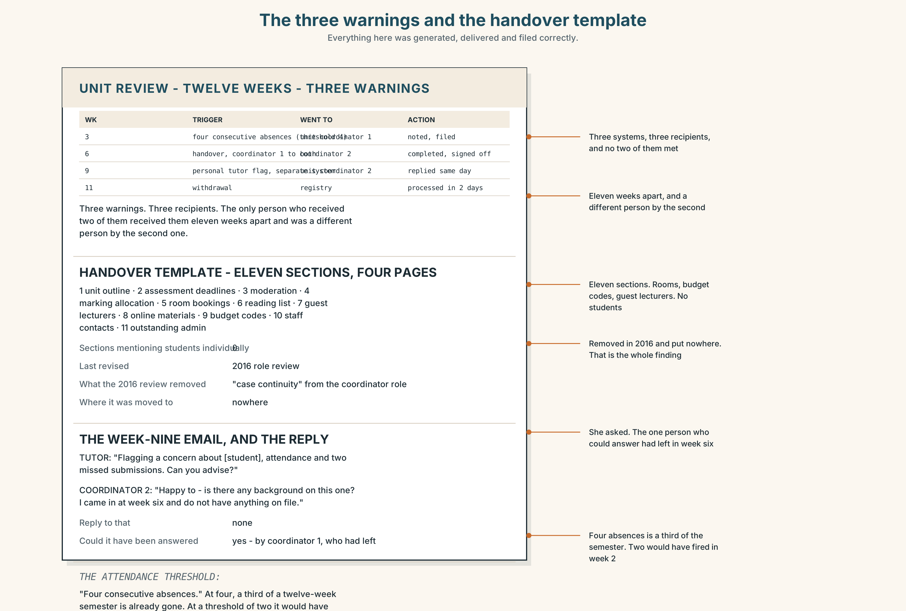{width=6.6in}

*The three warnings and the handover template — Everything here was generated, delivered and filed correctly.*

**Read the three warnings and the handover template, and answer.**

1. What triggered each of the three warnings, and when?
2. **Which of the three reached somebody who had seen either of the others?**
3. What are the eleven sections of the handover template?
4. What is the attendance threshold, and what would four have changed?
5. One of the three emails has a reply. What does it ask for, and could it have been answered?

### 5F · Two texts

The column says the handover template has **no line for open cases**.
The template has **eleven sections** and runs to **four pages**.

**Is that an oversight or a design decision?** Three sentences.

---

## Part 6 · Vocabulary Lab 2 ◆ **B · THE SYSTEM**

### Criticising the past precisely

### 6A · Sort — how certain is each one?

Three columns: **certain · probable · possible**.

> clearly · should have · conceivably · foreseeably · could have · ought to have ·
> demonstrably · might well have

### 6B · Chunk completion

1. **______ have** put the three together *(right thing, undone)*
2. **______ have** asked, but nothing said to *(possible)*
3. **______ to have** included the open cases *(duty)*
4. **______ have** carried that one *(done, and unnecessary)*
5. **might ______ have** been missed twice *(possible, unknown)*
6. **in ______ case** , the threshold is the fault

### 6C · Two that sound like evidence

**clearly · demonstrably**

> *Clearly* is a claim about how obvious something is, and it is often used when nothing has
> been shown. *Demonstrably* says somebody has shown it. **Only one of them should survive a
> careful edit of a post-mortem.** Which, and why?

**Write two sentences about the column in Part 5, one with each.**

### 6D · Two that carry a consequence

> **c** **otherwise** · **c** **all the more so**

> *The threshold should have been four. Otherwise nothing fires in time.*
> *A handover is hard. With two hundred scripts to mark, all the more so.*

**Otherwise** carries the unstated condition. **All the more so** intensifies a point already
made. **Write one sentence with each, about week six.**

### 6E · The fixed expressions

> **f** **And nobody did.**

Three words, placed after a *should have*, and they turn an accusation into a finding.

> **Write the sentence before it, twice — once naming a person and once not.** Which one works?

### 6F · Contrast Clinic

Eight items. **Four are wrong. Correct them and say what the rule is.**

1. He should have asked, and he didn't.
2. She needn't have come in, but she did.
3. She needn't have come in — so she stayed at home.
4. He could have asked, and nothing told him to, so it is his fault.
5. He might well have been missed twice.
6. It ought to have included the open cases.
7. It ought have included the open cases.
8. He should asked.

---

## Part 7 · Pronunciation & Fluency Lab ◆ **B · THE SYSTEM**

### *should've*, and why it is not *should of*

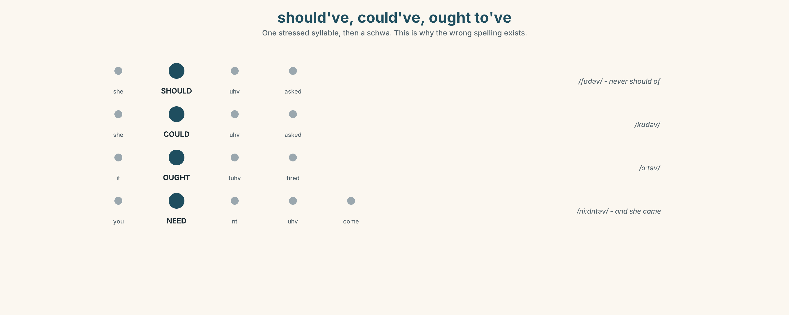{width=6.6in}

*should've, could've, ought to've — One stressed syllable, then a schwa. This is why the wrong spelling exists.*

### 7A · Hear 🔊 Track 8.3

> *She should've asked.* /ʃʊdəv/
> **One weak syllable. It sounds exactly like *should of*, which is why that spelling exists
> and why it is wrong.**

Listen to the set:

> /ʃʊdəv/ · /kʊdəv/ · /wʊdəv/ · /ɔːtəv/ · /maɪtəv/

### 7B · Say

Say all five. Then say this one three times, faster:

> *Somebody should've put the three together, and nobody did.*

### 7C · Make it mean something

Say these two:

> *She needn't have* **COME** *in.* *(she came — and it was wasted)*
> *She didn't need to come in.* *(and she probably did not)*

**One structure, two Thursdays.** Which is which?

### 7D · Fluency 30 ⏺

Thirty seconds: **four hypothetical pasts, all with weak *have*.**
Three times, faster, keeping the schwa.

---

## Part 8 · Writing ◆ **C · THE PERFORMANCE**

### A post-mortem · 200 words

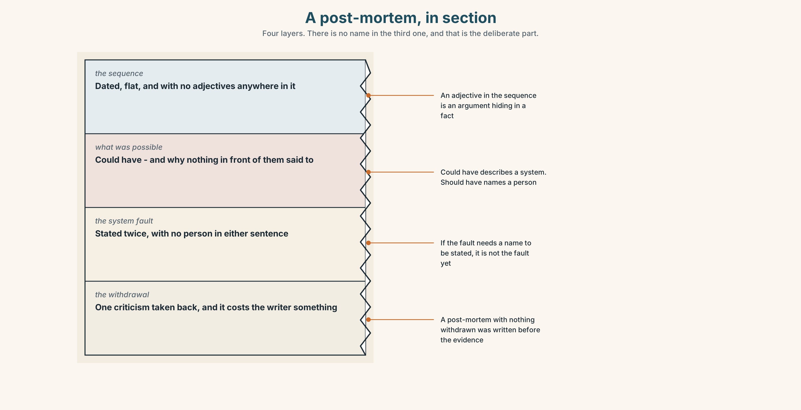{width=6.6in}

*A post-mortem, in section — Four layers. There is no name in the third one, and that is the deliberate part.*

### 8A · Read the model

> In week three an automatic alert fired after four consecutive absences and went to the unit
> coordinator. In week six the coordinator changed. In week nine a second flag, from a different
> system, reached the new coordinator, who asked for context and received none.
> `[the sequence, dated, with no adjectives in it at all]`
>
> Each of the three people did what their role described. The second coordinator could have
> asked a follow-up question, and nothing in front of her indicated that one was outstanding.
> `[what was possible, and why it was not obvious — and this is where could have belongs]`
>
> The handover template has eleven sections and none of them is open student cases. Nobody owned
> the sequence, because no role description contains it. `[the system fault, stated twice, with
> no name in either sentence]`
>
> The first coordinator needn't have been named in the draft report. She had left the role
> eleven weeks before the withdrawal. `[the withdrawal, and it costs the writer something]`

**Questions about the writer's choices:**

1. The first paragraph has no adjectives. **Why not?**
2. *Could have* appears once and *should have* not at all. **What does that do?**
3. The last paragraph withdraws something. **What does a post-mortem without one look like?**

### 8B · The anti-model

> Unfortunately there was a breakdown in communication and the student fell through the cracks.
> Lessons have been learned and procedures will be reviewed to ensure that this does not happen
> again. All staff are reminded of the importance of following up on student welfare concerns.

Correct English, and nothing in it will stop this happening again. **Name the three things it
has turned into weather**, and say what *all staff are reminded* is a substitute for.

### 8C · Plan

> the sequence, dated and flat → what was possible, and why it was not obvious →
> the system fault, with no name in it → one withdrawal

### 8D · Write — 200 words
### 8E · Peer review — three criteria

> ☐ Is the sequence dated and free of adjectives?
> ☐ Is the main fault stated without a person in it?
> ☐ Is there a withdrawal, and does it cost the writer something?

### 8F · Write it again · 8G · Publish

Send it to the people named in it, before anybody else. **That is the test.**

---

## Part 9 · The File ◆ **A · THE WORLD + C · THE PERFORMANCE**

# STUDY FILE · The Literature Review

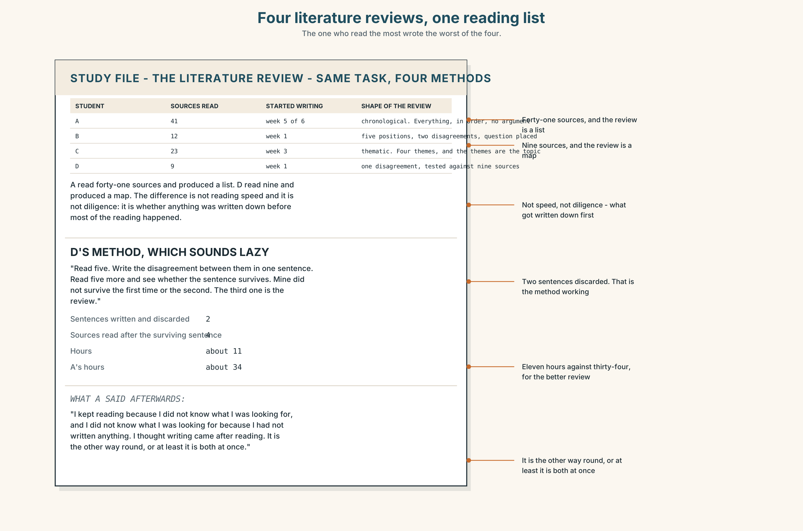{width=6.6in}

*Four literature reviews, one reading list — The one who read the most wrote the worst of the four.*

### 9A · Four people describe the same task 🔊 Track 8.4

Four students describe writing a literature review. **Listen.**

1. Which one read the most and wrote the worst one?
2. **Which one started writing first, and did that help?**
3. One of them describes a method that sounds lazy and is not. Which?

### 9B · What a literature review is not

> **not** a list of what everybody said
> **not** a chronology
> **not** a demonstration that you have read a lot
> **it is** a map of where the disagreements are, and where your question sits on it

**Which of the three *nots* is hardest to give up, and why?**

### 9C · The method that sounds lazy

Read five. **Then write the disagreement between them in one sentence.** Then read five more and
see whether the sentence survives. Most do not, and the ones that do are the structure of your
review.

**Try it with anything you are reading this week.**

### 9D · Your turn

In fours. **Twelve minutes.** Take any five sources you all know — news articles will do — and
write the one-sentence disagreement. **Compare the four sentences.** Which is a disagreement and
which is a topic?

### 9E · Transfer

**Find the literature review in any paper you have to read**, and mark the sentence where the
writer's own question first appears. How many pages in is it?

---

## Part 10 · Mediation & Interaction ◆ **C · THE PERFORMANCE**

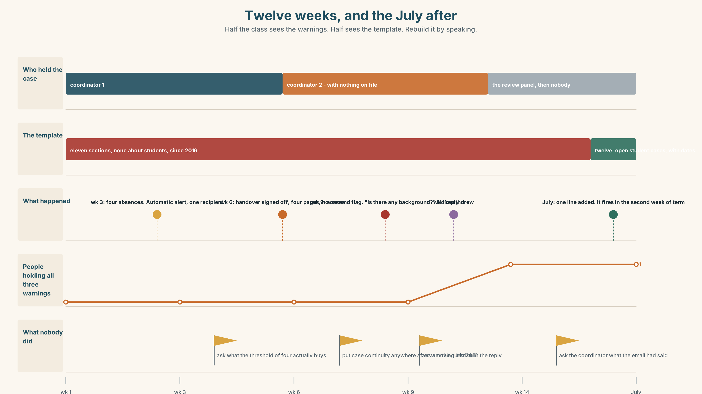{width=6.6in}

*Twelve weeks, and the July after — Half the class sees the warnings. Half sees the template. Rebuild it by speaking.*

### 10A · Relay

Half the class sees the three warnings. Half sees the handover template.
**Rebuild the twelve weeks by speaking.** Twelve minutes.

### 10B · Simplify

Explain the failure to a new coordinator taking over next semester. **Five sentences only.**

> **Plan:** what fired → where it went → what the handover did not carry → what the threshold is
> → the one thing to add to the template

### 10C · Compress

The column in Part 5B into **forty words**, keeping the recommendation.

### 10D · Online

Write **one message** proposing the change to the handover template. One sentence of problem,
one of evidence, one of proposal, and the name of the person who has to approve it.

### 10E · Your language

Does your language separate *should have* from *needn't have* the way English does? **Say *she
needn't have come in* in both languages.** Is it clear in yours whether she came?

---

## Part 11 · The Decision ◆ **C · THE PERFORMANCE**

# Three warnings, three people, one student

A student withdrew in week eleven after failing three units. Three warnings were generated.
Each reached one person. Each of those people followed their role description. The review
panel has to write a finding.

- **Name the second coordinator.** She received the week-nine email, asked for context and did
  not chase it. It is the only point in twelve weeks where one person held enough to act.
- **Find no individual fault.** Three people, three roles, three correct actions. Record it as a
  process failure and recommend a template change.
- **Name the process and the gap.** No individual fault, and a specific, named omission: nobody
  owns the sequence, because no role description contains it, and that is a decision somebody
  made in 2016.

### 11A · The evidence

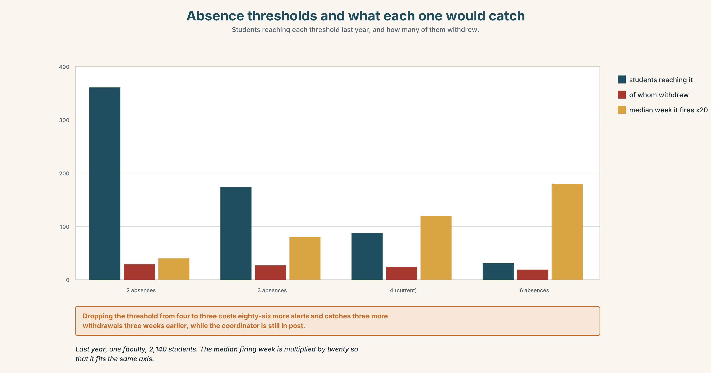{width=6.6in}

*Absence thresholds and what each one would catch — Students reaching each threshold last year, and how many of them withdrew.*

1. **The three warnings and the handover template** from Part 5E — and the reply that asks for
   context.
2. **The chart** — how many students hit each attendance threshold, and how many withdrew.
3. **The voice.** The second coordinator, thirty seconds: *"I am not going to say I did nothing
   wrong, because a student withdrew. What I will say is that I asked for context and the system
   that sent me the flag could have attached it, and in the eleven weeks since, nobody has asked
   me what the email actually said."*

### 11B · Talk about it

In fours. Everybody speaks twice. Use the frame.

> *______ should have ______ , and nobody did. ______ could have ______ , but ______ .*

**Words you can use:** *threshold · handover · escalate · oversight · accountability ·
omission · with hindsight · in retrospect · nobody owned it · the duty of care*

### 11C · Decide

Write **three sentences**. Choose, say why, and name what it costs.

> I think the panel should ______________________ ,
> because ______________________ .
> What this costs is ______________________ .

### 11D · Model decision

> Name the process and the gap, and date the gap. A finding of no individual fault reads as a
> cover unless it says precisely what was missing and when it went missing, and *nobody owned
> the sequence* is only useful if it is followed by *because the 2016 role review removed case
> continuity from the coordinator description and did not put it anywhere else*. That sentence
> has a year in it and a document behind it. It is also the only version of this finding that
> somebody can act on without waiting for anybody to be braver.

### 11E · The Reveal

> **What happened.** The panel found no individual fault and recommended a line be added to the
> handover template. The line was added in the following July: *Open student cases, with dates*.
>
> It fired for the first time in the second week of the new semester, when a coordinator
> changing mid-unit listed two open cases, one of which had been open since the previous
> October. Nobody had done anything wrong about that one either.
>
> The second coordinator was not named in the final report. She left the university eighteen
> months later and said in her exit interview that the thing which had stayed with her was not
> the review but the eleven weeks before it, during which four people asked her what had
> happened and none of them asked to see the email.

**One line in a Word document, added in July, found a case that had been open since October.
And the only person who was nearly named is the only person anybody remembers.**

> **Was it the right decision?** Say why — and say what the panel owed the second coordinator.

---

## Part 12 · Landing ◆ **all three lines**

### 12A · Recycle — twelve items

> 1. Somebody ______ have put the three together.
> 2. She ______ have asked, but nothing told her to.
> 3. It ______ to have included the open cases.
> 4. You ______ have carried that one.
> 5. It ______ have fired in week three.
> 6. It ______ well have been missed twice.
> 7. The threshold should have been four; ______ , nothing fires.
> 8. In ______ case, the template is the fault.
> 9. Nobody ______ it up in week three.
> 10. She did not ______ up the second flag.
> 11. He ______ off the handover without reading it.
> 12. Nobody would ______ it up as their own.

### 12B · Consolidate

**Three columns, from memory:** forms meaning *it did not happen* · the one meaning *it did* ·
the adverbs of certainty.

### 12C · Can-do, with evidence

> ☐ I can write a post-mortem that finds a system fault. **Evidence:** 4C, 8D
> ☐ I can use *should / could / ought to / needn't have* correctly. **Evidence:** 3H, 6F
> ☐ I can pronounce *should've* as one weak syllable. **Evidence:** 7D
> ☐ I can withdraw a criticism that does not survive the evidence. **Evidence:** 8D, 11C

### 12D · Replay ⏺

Record 0C again. **Listen to both.** What have you got that you did not have in week one?

### 12E · Glossary — forty-five items, as a map

> **THE PROCESS** · decision · threshold · handover · trigger · warning · review · audit · escalate
> **THE FAILURE** · oversight · omission · accountability · fall through the cracks · nobody owned it · the duty of care
> **AFTERWARDS** · hindsight · with hindsight · in retrospect · flag it up · pass on · follow up · sign off · take up
> **WHAT PEOPLE SAY** · three people, three emails · somebody should have · and nobody did
> **JUDGING THE PAST** · should · could · would · ought · might · needn't · should have · could have · ought to have · needn't have · might well have
> **CERTAINTY** · clearly · demonstrably · foreseeably · conceivably
> **CARRYING THE CONDITION** · otherwise · in which case · all the more so · see through · act on

### 12F · Next

> **Unit 9 · Can you put that another way?**

# B1.3 · Unit 9 · Perfectly Clear

> **English Animated** · *Making the Case* · a university campus, Melbourne
> Student's Book pages 182–203 · 22 pp · ~11 hours

---

## Part 0 · The Big Picture ◆ **A · THE WORLD**

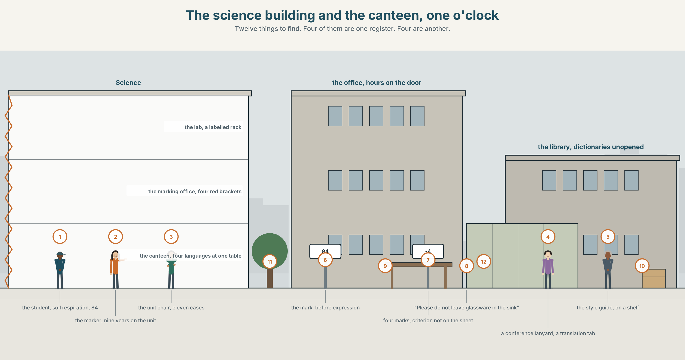{width=6.6in}

*The science building and the canteen, one o'clock — Twelve things to find. Four of them are one register. Four are another.*

# Can you put that another way?

**By the end of this unit you can say the same thing three ways, for three audiences.**

| ◆ **A · THE WORLD** | A lab report that is factually perfect and has lost four marks for its English |
|---|---|
| ◆ **B · THE SYSTEM** | phrasal verbs: separable, inseparable, three-part · 24 words for register and identity · 21 particles and combinations · stress on the particle |
| ◆ **C · THE PERFORMANCE** | One idea, said three ways, with nothing lost in any of them |

---

### 0A · Find it

**Find twelve things in this picture.** Four of them are one register. Four are another.

> a lab bench with a labelled rack · a marked report with four red brackets in the margin ·
> a style guide on a shelf · a whiteboard with a diagram and no words ·
> a poster for a research talk · a canteen table with six people and four languages ·
> a sign saying *Please do not leave glassware in the sink* ·
> a handwritten note saying *don't put glass in here* · a lanyard from a conference ·
> a laptop with a translation tab open · a door with office hours on it ·
> a shelf of dictionaries nobody has opened this year

### 0B · Guess it

**Two of the twelve say exactly the same thing.** Which, and which one works better where it is?

### 0C · Say it ⏺

**Record forty-five seconds.** *Explain something you know well, twice: once to a colleague and
once to a twelve-year-old.* You will record it again at the end of this unit.

---

## Part 1 · Vocabulary Lab 1 ◆ **B · THE SYSTEM**

{width=6.6in}

*Four ways English can exclude somebody — Six nodes. Two of them are the same mechanism with different social standing.*

### 1A · Meet — the words of how we sound

> **register** · **idiom** · **colloquial** · **formal** · **jargon** · **slang** ·
> **accent** · **code-switch**

1. Which two of these are about a group rather than a situation?
2. **What is the difference between *jargon* and *slang*?** Both exclude people. How?
3. *Register* is a choice. **What is it a choice between?**
4. **Why is *code-switch* a skill rather than an inconsistency?**

> ***Formal* is not better.** It is one register of several, and using it where it does not
> belong is exactly the same kind of error as using slang in a thesis — it is just the one
> nobody is marked down for.

### 1B · Sort — the writing, the marking, or the speaker?

> native-like · the house style · fluency · penalty · marking · vocabulary ·
> plain English · mark down · in your own words

**Three columns. Two of them belong in more than one.** Say which and why.

### 1C · Meet — the phrase that does most of the work

> **c** **plain English**

Not simple English. English in which the structure of the sentence matches the structure of the
idea, so the reader does not have to hold anything while they wait.

1. **Rewrite this in plain English:** *It is not unlikely that a reduction in the frequency of
   sampling would not be without consequence for the reliability of the result.*
2. How many negatives did you remove?

### 1D · Collocation Lab

| | |
|---|---|
| **mark down** | ~ for grammar · be ~ed · ~ heavily |
| **get across** | ~ an idea · it did not ~ |
| **come across** | ~ as rude · how you ~ |
| **a turn of phrase** | an unusual ~ · a nice ~ |

**Which two of these are about the writer, and which two about the reader?**

### 1E · The fixed expressions

> **f** **It is perfectly clear.** — a sentence that settles an argument about meaning by
> refusing to have it.
> **f** **Unidiomatic is not a fault.** — the claim this unit is built on. **Do you agree?**

**Which one is a position and which one is a move?**

### 1F · Own it

The four phrasal verbs of making yourself understood.

> **get across** · **put across** · **come across** · **pick up on**

1. Three of them are about the message and one is about the listener. Which?
2. **What is the difference between *get across* and *put across*?**
3. *Come across* has two meanings. Give both.
4. Write one sentence in which somebody **picks up on** something that was not said.

---

## Part 2 · Listening ◆ **A · THE WORLD**

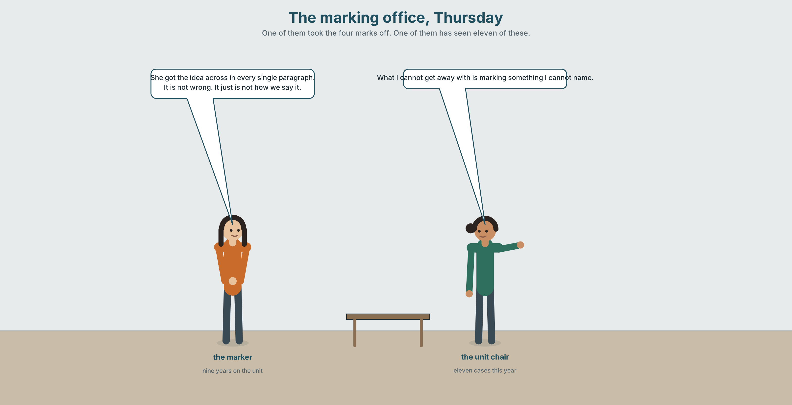{width=6.6in}

*The marking office, Thursday — One of them took the four marks off. One of them has seen eleven of these.*

### 2A · Four marks 🔊 Track 9.1

**Before you listen.** A lab report has lost four marks out of a hundred. The science is
correct. **Guess: what is the marker's reason?**

**Listen once. One question.** What exactly is the criterion the four marks came off?

**Listen again. Complete the table.**

| | The marker | The student | The unit chair |
|---|---|---|---|
| what the report does well | | | |
| what the four marks are for | | | |
| what should change | | | |

**Listen again. Choose the best answer.**

1. The marker thinks the English is **wrong / unclear / unidiomatic**.
2. The student has **asked what the rule is / accepted it / asked for a remark**.
3. The criterion mentions **expression / nothing about language / grammar**.
4. The unit chair has seen this **eleven times this year / before / for the first time**.

**Noticing.** Four sentences from the recording.

1. *I could not put up with it for another semester.*
2. *Nobody has ever been able to say what we are marking them down for.*
3. *She got the idea across in every single paragraph.*
4. *What I cannot get away with is marking something I cannot name.*

**All four contain a phrasal verb. Which of them could be split by an object?**

### 2B · Decoding clinic 🔊 Track 9.2

Thirty seconds of the unit chair. Four jobs.

1. How many phrasal verbs can you count?
2. In *put up with*, which of the three words is stressed?
3. Catch the two numbers.
4. She uses one phrasal verb and then the formal single word for it. Which pair?

> Transcripts, page 158.

---

## Part 3 · Grammar Lab 1 ◆ **B · THE SYSTEM**

### Phrasal verbs, and where the object can go

### 3A · Notice

Look at the four sentences in Part 2.

1. In sentence 1, can you say *put it up with*?
2. **In sentence 3, can you say *got across the idea*?** Can you say *got it across*?
3. **Put a pronoun object into each of the four.** Which ones force you to split the verb?
4. Sentence 4 has a three-part verb. **How many of the three can move?**
5. Try *"She got across it."* **What is wrong with it?**

### 3B · See

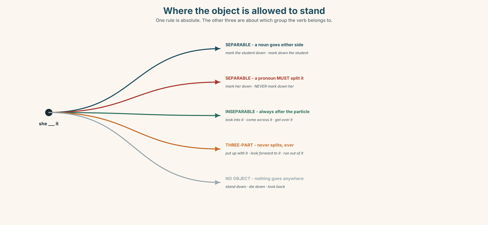{width=6.6in}

*Where the object is allowed to stand — One rule is absolute. The other three are about which group the verb belongs to.*

### 3C · Know

| Type | Example | Where the object goes |
|---|---|---|
| **separable** | *mark down · bring up · take on* | either side of the particle — **but a pronoun must split it** |
| **inseparable** | *get over · come across · look into* | always after the particle |
| **three-part** | *put up with · look forward to · run out of* | always after both particles |
| **no object at all** | *stand down · die down · look back* | nothing goes anywhere |

> **The pronoun rule is the only rule here that is absolute.** With a separable verb,
> *mark the student down* and *mark down the student* are both English. ***Mark down her* is
> not.** It must be *mark her down*.

> **Three-part verbs never split.** *Put up with it*, never *put it up with*. There are no
> exceptions, which makes them the easiest group of the four.

> **The particle carries the meaning, and often the stress.** *Look up* a word, *look into* a
> claim, *look over* a draft, *look after* a child. The verb is the same. The particle is the
> whole word.

> **Why it matters.** A phrasal verb is not informal English. *Put up with* is not slang; it is
> the ordinary way to say *tolerate*, and refusing them does not make writing more formal — it
> makes it foreign.

### 3D · Use — controlled

> She got the idea (1) __________ in every paragraph, which is what the criterion asks for, and
> she was marked (2) __________ four points for expression. The chair looked (3) __________ it
> and found eleven similar cases this year. "What I cannot get (4) __________ with," she said,
> "is penalising something nobody can name." She is not going to put (5) __________
> __________ it for another semester. She has brought it (6) __________ at three meetings and is
> running (7) __________ of ways to raise it politely.

### 3E · Use — guided

Put a pronoun object into each one. **Two of them must split.**

1. The marker marked down the student.
2. She got across the idea.
3. He could not put up with the criterion.
4. The chair looked into the eleven cases.
5. They brought up the question at a meeting.

### 3F · Use — open

**In pairs.** Describe a rule you think is unfair, in six sentences, four of which must use
phrasal verbs of three different types. **Your partner's job** is to try to split each one.

### 3G · Error autopsy

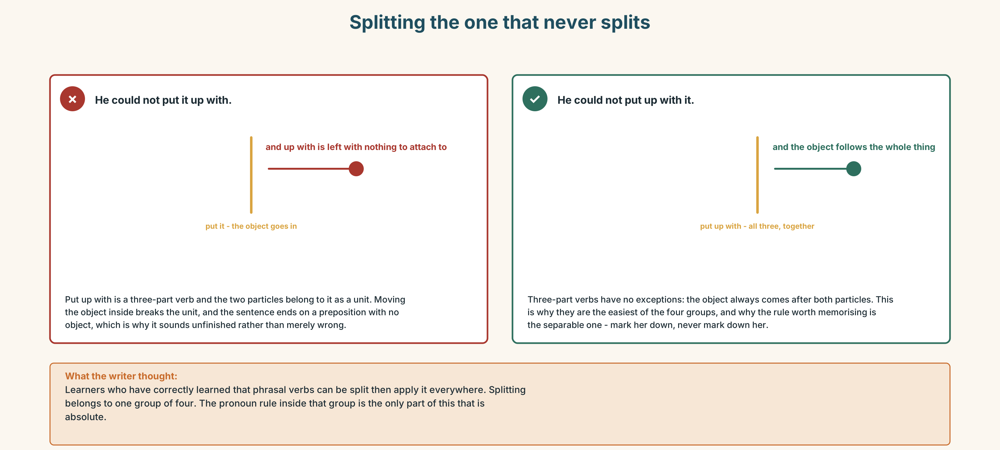{width=6.6in}

*Splitting the one that never splits — Splitting the one that never splits*

**Read both versions. Then say which group of verbs the writer has applied the wrong rule to.**

### 3H · Check — eight items

> 1. She got the idea ______ . *(separable, noun object)*
> 2. She got ______ ______ . *(separable, pronoun object)*
> 3. He could not put ______ ______ it. *(three-part)*
> 4. ✗ *He could not put it up with.* → correct it.
> 5. The chair looked ______ it. *(inseparable)*
> 6. They brought ______ ______ at the meeting. *(separable, pronoun)*
> 7. We are running ______ ______ time. *(three-part)*
> 8. He is looking ______ ______ it. *(three-part, positive)*

**0–4 →** Workbook pp. 38–41. **5–6 →** Part 6. **7–8 →** page 195.

---

## Part 4 · Speaking ◆ **C · THE PERFORMANCE**

### 4A · Fluency starter — three registers

One learner says a sentence. The next says it formally. The next says it to a child.
**The chain breaks when something is lost.**

### 4B · The functional core — one idea, three audiences

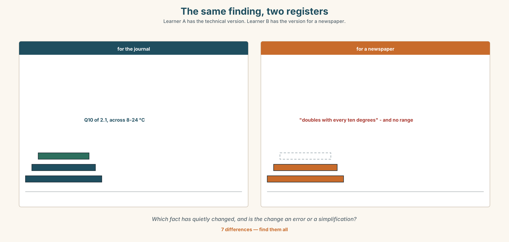{width=6.6in}

*The same finding, two registers — Learner A has the technical version. Learner B has the version for a newspaper.*

**Language Bank**

| | |
|---|---|
| **to a specialist** | *The sampling interval was reduced to…* |
| **to a colleague elsewhere** | *We took fewer readings, which means…* |
| **to a non-specialist** | *We checked less often. Here is what that costs.* |
| **the thing that must survive** | *…and the number is the same in all three.* |

**Information gap.** Learner A has the technical version. Learner B has the version for a
newspaper. **Find the one fact that has quietly changed between them.**

### 4C · The performance — three minutes ⏺

Explain **one idea three times**. **Three minutes.** You must include:

> a specialist version · a version for an educated non-specialist · a version for a
> twelve-year-old · and the same number, unchanged, in all three

**Record it.**

### 4D · Observer

One person listens for **one thing**: did anything become false on the way to being simpler?

### 4E · Three criteria

> ☐ Is the key fact identical in all three versions?
> ☐ Did the simplest version avoid becoming inaccurate?
> ☐ Did I change register without changing content?

---

## Part 5 · Reading ◆ **A · THE WORLD**

### 5A · Predict

A feature, titled **"The four marks."**
**What do you expect the marker to say when asked to explain?** Two sentences.

### 5B · Read — two minutes and a quarter

---

**THE FOUR MARKS**
*a feature*

The report is on soil respiration and it is, by the standards of a second-year unit, extremely
good. The method is reproducible. The two graphs are correctly labelled. The discussion
identifies a confound the student was not taught to look for. It was marked 84, and the sheet
says: *expression — 4*.

I asked to see what the four marks came off. There are eleven criteria on the rubric and none
of them mentions language. The marker, who has taught the unit for nine years and is one of the
best teachers in the faculty, said this: "It reads as though it was translated. It is not
wrong. I could not point at a sentence and tell you it was wrong. It just is not how we say it."

I asked for an example. She found one in twenty seconds, which tells you she had noticed it
properly: *The data permits us to affirm that the respiration rate augments with temperature.*

Every word in that sentence is an English word used with its dictionary meaning. *Permits*,
*affirm*, *augments*. A chemist in 1890 would have written something close to it. What makes it
read as foreign is that current scientific English prefers *allow*, *conclude* and *increase* —
a preference, not a rule, which nobody teaches and everybody enforces.

The student is from a Francophone education system in which *augmenter* is the unmarked word.
She has not made an error. She has made a different, defensible choice in a language whose
conventions she was never shown, and she has lost four marks for it in a unit whose rubric does
not mention language at all.

Here is what makes this hard rather than simple. The marker is not wrong that it matters. A
paper written like that will be read differently by reviewers, and pretending otherwise would
not help the student. The question is not whether to tell her. It is whether to tell her in a
comment or in a number, and whether the number is allowed to exist in a rubric that does not
mention it.

Eleven reports this year have lost marks under a criterion that is not on the sheet. Nobody has
been able to name it, and everybody can recognise it in twenty seconds.

---

### 5C · Comprehension — eight questions

1. What is the report about, and what three things does the writer praise?
2. **What was the mark, and what does the sheet say?**
3. How many criteria are on the rubric, and how many mention language?
4. **Quote the marker's explanation. What does she say she cannot do?**
5. What is the example sentence, and what is wrong with it?
6. **Why is the student's choice described as "defensible"?**
7. What does the writer say makes this "hard rather than simple"?
8. What is the final pair of numbers, and what do they show together?

### 5D · Vocabulary in context

Guess from the text. Then check.

> a confound · the unmarked word · a preference, not a rule · read differently by reviewers ·
> in a comment or in a number

### 5E · The counter-text

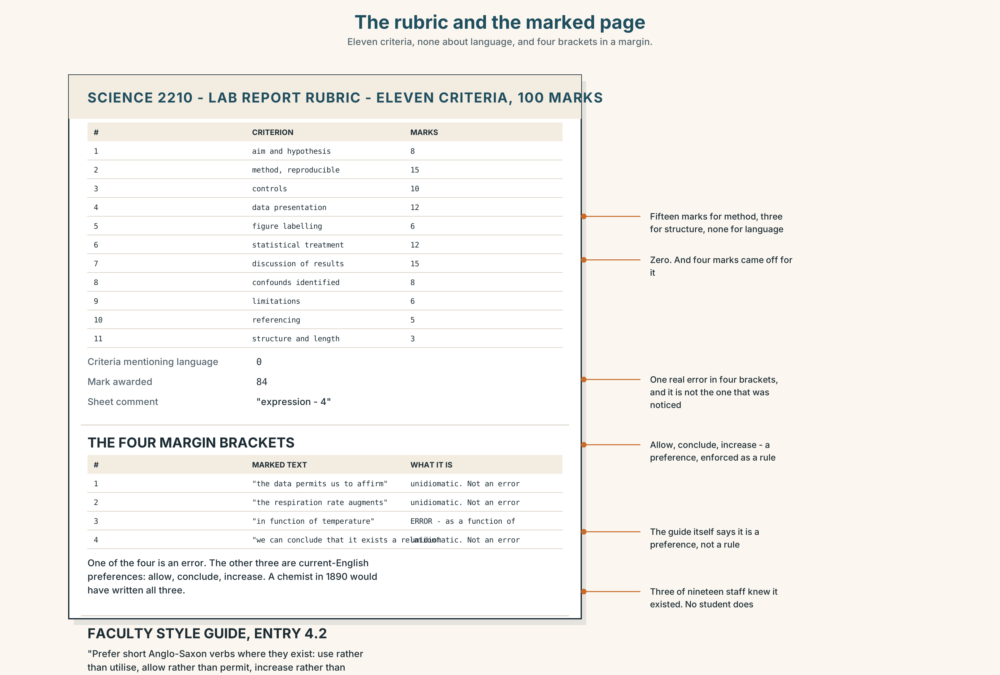{width=6.6in}

*The rubric and the marked page — Eleven criteria, none about language, and four brackets in a margin.*

**Read the rubric and the marked page, and answer.**

1. What are the eleven criteria, and what is each worth?
2. **Where on the rubric could four marks for expression legitimately come from?**
3. What do the four margin brackets mark, in each case?
4. What does the faculty style guide say about *augment*?
5. One of the four brackets marks something that *is* an error. Which?

### 5F · Two texts

The rubric has **eleven criteria** and none of them mentions language.
Eleven reports have **lost marks** for language this year.

**Is the marking wrong, or is the rubric?** Three sentences.

---

## Part 6 · Vocabulary Lab 2 ◆ **B · THE SYSTEM**

### What the particle is doing

### 6A · Sort — what does each particle add?

Four columns: **completely · continuing · away from · towards**.

> down · off · back · on · over · around · up · into · away · through · out

### 6B · Chunk completion

1. **put ______ ______** the noise for another year
2. **get ______ ______** saying nothing
3. **look ______ ______** the summer
4. **run ______ ______** time
5. **go ______ ______** the decision
6. **catch ______ ______** the reading

### 6C · Two that do the same job in different registers

**do away with · abolish**

> Identical in meaning. One of them is three words and ordinary; the other is one word and
> formal. **Neither is better.** The choice is about the reader, and in a report for a committee
> the one-word version is usually right — not because it is more correct but because it is
> shorter in a document people skim.

**Write two sentences about the rubric, one with each.**

### 6D · Two that are separable, and one trap

> **p** **take over** · **p** **bring up**

> *She took the unit over.* · *She took it over.* · *She took over the unit.*
> *He brought the question up.* · *He brought it up.* · *He brought up the question.*

**All three positions work with a noun. Only one works with a pronoun. Which, and why is that
the only rule you have to remember?**

### 6E · The fixed expression

> **f** **Say that again in writing.**

Four words that change what a claim costs. It is the move the unit chair makes at the end of
Part 2, and it is also what the student should have been told in week one.

> **Write the exchange around it.**

### 6F · Contrast Clinic

Eight items. **Four are wrong. Correct them and say what the rule is.**

1. He could not put it up with.
2. She marked her down.
3. He could not put up with it.
4. She got across it.
5. She got across the idea.
6. She marked down her.
7. We are looking it forward to.
8. We are looking forward to it.

---

## Part 7 · Pronunciation & Fluency Lab ◆ **B · THE SYSTEM**

### The particle takes the stress

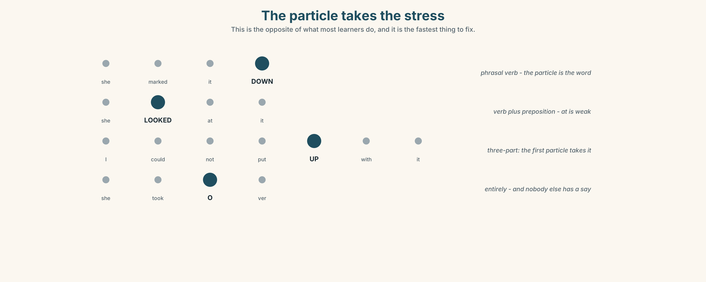{width=6.6in}

*The particle takes the stress — This is the opposite of what most learners do, and it is the fastest thing to fix.*

### 7A · Hear 🔊 Track 9.3

> *She marked it* **DOWN** *.*
> **In a phrasal verb the particle carries the stress, not the verb. This is the opposite of
> what most learners do.**

Compare with an ordinary verb plus preposition:

> *She* **LOOKED** *at it.* — here the verb is stressed and *at* is weak.

### 7B · Say

Say both. Then say this one three times, faster:

> *I could not put* **UP** *with it, so I brought it* **UP** *.*

### 7C · Make it mean something

Say these two:

> *She* **TOOK** *over.* *(from somebody — and the handover is the point)*
> *She took* **OVER** *.* *(entirely — and nobody else has a say now)*

**One verb, two takeovers.** Which is which?

### 7D · Fluency 30 ⏺

Thirty seconds: **four phrasal verbs, the stress on the particle each time.**
Three times, faster.

---

## Part 8 · Writing ◆ **C · THE PERFORMANCE**

### The same paragraph, three ways · 180 words total

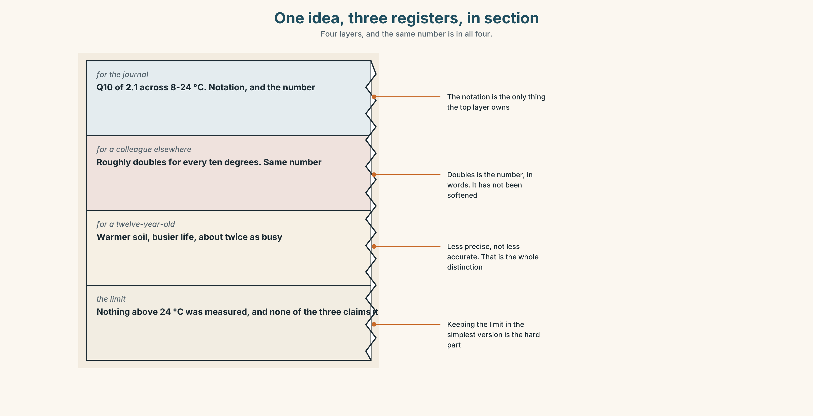{width=6.6in}

*One idea, three registers, in section — Four layers, and the same number is in all four.*

### 8A · Read the model

> **For the journal.** Respiration rate increased approximately linearly with soil temperature
> across the sampled range (8–24 °C), with a *Q*₁₀ of 2.1. `[the specialist version — and the
> number is here]`
>
> **For a colleague in another field.** Warmer soil breathes out more carbon dioxide, and over
> the range we measured it roughly doubles for every ten degrees. `[same claim, no notation, and
> the number survives as "doubles"]`
>
> **For a twelve-year-old.** Soil is full of things that are alive, and when it gets warmer they
> get busier and give off more gas. Ten degrees warmer, about twice as busy. `[same number, and
> nothing in it has become false]`
>
> **What did not change.** The range. Nothing above 24 °C was measured, and none of the three
> versions claims anything about it. `[the honest limit, which is the hardest thing to keep]`

**Questions about the writer's choices:**

1. The number appears in all three. **What would the third version be worth without it?**
2. The third version says "things that are alive". **Is that less accurate or less precise?**
3. The fourth paragraph states a limit. **Why is that the hardest part to keep simple?**

### 8B · The anti-model

> It is not unlikely that a reduction in the frequency of sampling would not be without
> consequence for the reliability of the result, and it may therefore be considered that a more
> frequent sampling regime might in certain circumstances be preferable.

Correct English, and it takes three readings. **Count the negatives and the hedges**, and say
how many words the sentence actually needs.

### 8C · Plan

> the specialist version, with the number → the educated non-specialist, same number →
> the twelve-year-old, same number → the limit, kept in all three

### 8D · Write — 180 words total
### 8E · Peer review — three criteria

> ☐ Is the key number identical in all three?
> ☐ Has anything become false on the way to being simpler?
> ☐ Does the limit survive into the simplest version?

### 8F · Write it again · 8G · Publish

Read the third version aloud to somebody outside your subject. **Watch where they stop you.**

---

## Part 9 · The File ◆ **A · THE WORLD + C · THE PERFORMANCE**

# CULTURE FILE · English as a Lingua Franca

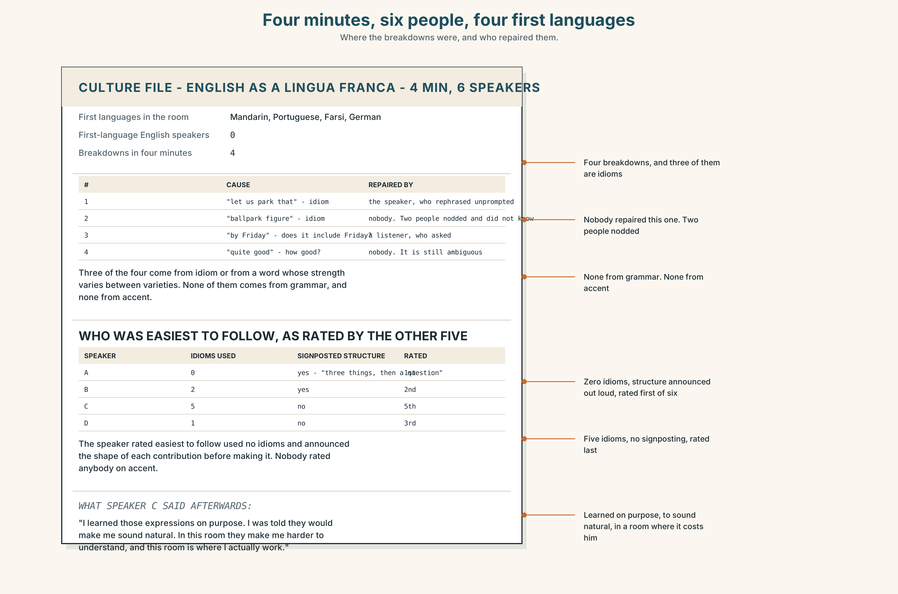{width=6.6in}

*Four minutes, six people, four first languages — Where the breakdowns were, and who repaired them.*

### 9A · Six people, four first languages 🔊 Track 9.4

A research meeting in which nobody is a first-language speaker of English. **Listen.**

1. How many misunderstandings are there in four minutes?
2. **Which one is repaired, and who repairs it?**
3. One speaker uses an idiom and it fails. What do they do next?

### 9B · What the research keeps finding

In meetings where English is everybody's second language, **idioms are the main source of
breakdown**, and the speakers who are most easily understood are not the ones closest to a
first-language model. They are the ones who **avoid idiom, signal structure out loud, and check**.

**Does that match your experience?**

### 9C · The uncomfortable part

If *native-like* is not the target, what is? **Intelligibility to the people in the room** is
one answer, and it has a problem: the room changes. A paper is read by people you will never
meet.

**Where do you personally draw the line?**

### 9D · Your turn

In fours. **Twelve minutes.** Discuss anything, with one rule: **no idioms**. Then: what did you
reach for and have to replace, and was the replacement worse?

### 9E · Transfer

**Count the idioms in the next thing you read for your subject.** How many would you have to
explain to somebody three years into English?

---

## Part 10 · Mediation & Interaction ◆ **C · THE PERFORMANCE**

{width=6.6in}

*Four marks, eleven reports, two years — Half the class sees the rubric. Half sees the marked page. Rebuild it by speaking.*

### 10A · Relay

Half the class sees the rubric. Half sees the marked page.
**Rebuild the four marks by speaking.** Twelve minutes.

### 10B · Simplify

Explain to the student what happened and what to do. **Five sentences only.**

> **Plan:** what is good → what the four marks are for → why it is not on the rubric →
> what you would change in the sentence → what to ask for, and from whom

### 10C · Compress

The feature in Part 5B into **forty words**, keeping the last two numbers.

### 10D · Online

Write **one message** to the unit chair. You are not asking for the marks back. You are asking
for the criterion to be written down, one way or the other, before next semester.

### 10E · Your language

Does your language have phrasal verbs? **Say *put up with* and *tolerate* in both languages.**
Which register does each one belong to, and do they line up the way the English pair does?

---

## Part 11 · The Decision ◆ **C · THE PERFORMANCE**

# Four marks, eleven reports, and a criterion that is not on the sheet

The science is correct. The English is unidiomatic and not wrong. Eleven reports have lost marks
this year under a criterion the rubric does not contain. The unit chair has to decide before
marks are released on Friday.

- **Return the marks.** The rubric does not mention language, so marks cannot be taken for it.
  Eleven students go up by between two and five points and nobody is told why.
- **Keep the marks, add the criterion.** Write *expression* into the rubric for next year, with
  a definition, and let this year stand. Honest about the future and not about the past.
- **Return the marks and write the comment.** Give the four back, and give every one of the
  eleven a written note naming exactly what was noticed and why it will matter to a reviewer.

### 11A · The evidence

{width=6.6in}

*Marks lost for expression this year — Eleven reports, by the writer's first language and by what was actually marked.*

1. **The rubric and the marked page** from Part 5E — and the bracket that marks a real error.
2. **The chart** — marks lost for expression this year, by first language of the writer.
3. **The voice.** The student, thirty seconds: *"I would rather have the comment than the four
   marks. I am going to write in English for thirty years. Nobody has ever told me what the
   difference is between a sentence that is right and a sentence that is right and reads like
   somebody else's."*

### 11B · Talk about it

In fours. Everybody speaks twice. Use the frame.

> *She got ______ across. She was marked ______ for ______ , which ______ .*

**Words you can use:** *register · idiom · colloquial · jargon · code-switch · fluency ·
penalty · plain English · native-like · the house style*

### 11C · Decide

Write **three sentences**. Choose, say why, and name what it costs.

> I think the unit chair should ______________________ ,
> because ______________________ .
> What this costs is ______________________ .

### 11D · Model decision

> Return the marks and write the comment. The marks are indefensible — there is no criterion —
> and the observation is correct, which means the only honest move is to separate them: give
> back what cannot be justified and give the student what is actually useful, which was never
> the four points. The cost is that the markers will feel overruled on the one part of this
> where they were right, and the chair has to say so out loud when she tells them.

### 11E · The Reveal

> **What happened.** The marks went back. All eleven students received a comment, written by the
> original marker, naming the specific choices and what a reviewer would do with them. Eight of
> the eleven replied; four asked follow-up questions; one asked for a meeting and came with a
> list of nineteen words she had been using that she now wanted checked.
>
> *Expression* went onto the rubric for the following year, with a definition that took four
> drafts and ended up at thirty-one words. In its first year it was used eleven times, and
> every one of the eleven came with a comment, because the definition requires one.
>
> The sentence about soil respiration appeared, unchanged, in a paper two years later. One
> reviewer queried *augments*. The student had the comment, and changed it, and wrote in the
> response letter that it was a preference rather than an error, which the reviewer accepted.

**The four marks were never the useful thing. What the student wanted was the twenty seconds
it took the marker to find the sentence, written down.**

> **Was it the right decision?** Say why — and say what should happen in week one of next
> semester.

---

## Part 12 · Landing ◆ **all three lines**

### 12A · Recycle — twelve items

> 1. She got the idea ______ .
> 2. She got ______ ______ . *(pronoun)*
> 3. He could not put ______ ______ it.
> 4. The chair looked ______ it.
> 5. They brought ______ ______ at the meeting. *(pronoun)*
> 6. We are running ______ ______ time.
> 7. He is looking ______ ______ it.
> 8. You cannot get ______ ______ saying nothing.
> 9. She went ______ ______ the decision.
> 10. He needs to catch ______ ______ the reading.
> 11. They want to do ______ ______ the criterion.
> 12. She ______ over the unit in March.

### 12B · Consolidate

**Four columns, from memory:** separable · inseparable · three-part · no object.

### 12C · Can-do, with evidence

> ☐ I can say one idea three ways without losing the number. **Evidence:** 4C, 8D
> ☐ I can place an object correctly with all four types of phrasal verb. **Evidence:** 3H, 6F
> ☐ I can stress the particle rather than the verb. **Evidence:** 7D
> ☐ I can keep a limit intact in the simplest version. **Evidence:** 8D

### 12D · Replay ⏺

Record 0C again. **Listen to both.** What have you got that you did not have in week one?

### 12E · Glossary — forty-five items, as a map

> **HOW WE SOUND** · register · slang · idiom · colloquial · formal · jargon · accent · code-switch
> **THE MARKING** · fluency · vocabulary · marking · penalty · mark down · the house style
> **THE TARGET** · native-like · plain English · in your own words · a turn of phrase
> **GETTING IT ACROSS** · get across · put across · come across · pick up on
> **WHAT PEOPLE SAY** · it is perfectly clear · unidiomatic is not a fault · say that again in writing
> **THE PARTICLES** · up · out · off · over · through · down · on · away · back · into · around
> **THE COMBINATIONS** · put up with · get away with · look forward to · run out of · go along with · catch up on · do away with · take over · bring up

### 12F · Next

> **Unit 10 · Never have I been so…**

# B1.3 · Unit 10 · Never Have I Been So

> **English Animated** · *Making the Case* · a university campus, Melbourne
> Student's Book pages 204–225 · 22 pp · ~11 hours

---

## Part 0 · The Big Picture ◆ **A · THE WORLD**

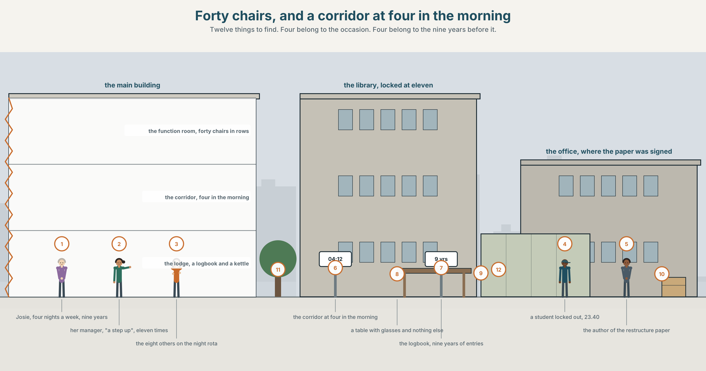{width=6.6in}

*Forty chairs, and a corridor at four in the morning — Twelve things to find. Four belong to the occasion. Four belong to the nine years before it.*

# Never have I been so…

**By the end of this unit you can deliver a three-minute formal address.**

| ◆ **A · THE WORLD** | A promotion that nobody asked whether anybody wanted |
|---|---|
| ◆ **B · THE SYSTEM** | inversion after negative adverbials · 24 words for rhetoric and occasion · 21 fronting forms · emphatic stress |
| ◆ **C · THE PERFORMANCE** | Three minutes, standing up, in front of people who know you |

---

### 0A · Find it

**Find twelve things in this picture.** Four of them belong to the occasion. Four belong to the
nine years before it.

> a room set out with forty chairs · a small podium with a microphone taped to it ·
> a printed programme with one name on it · a table with glasses and nothing else ·
> a card signed by thirty people · a corridor at four in the morning ·
> a set of keys on a ring, worn smooth · a logbook with nine years of entries ·
> a staff photograph from 2016 with one person at the edge ·
> a window showing a sky that is not dark · a lanyard being handed over ·
> a chair at the back, nearest the door

### 0B · Guess it

**Two of the twelve are nine years apart and show the same thing.** Which, and what has changed?

### 0C · Say it ⏺

**Record forty-five seconds.** *Describe a time you were given something you had not asked for.
Say what it was supposed to mean and what it actually meant.* You will record it again at the
end of this unit.

---

## Part 1 · Vocabulary Lab 1 ◆ **B · THE SYSTEM**

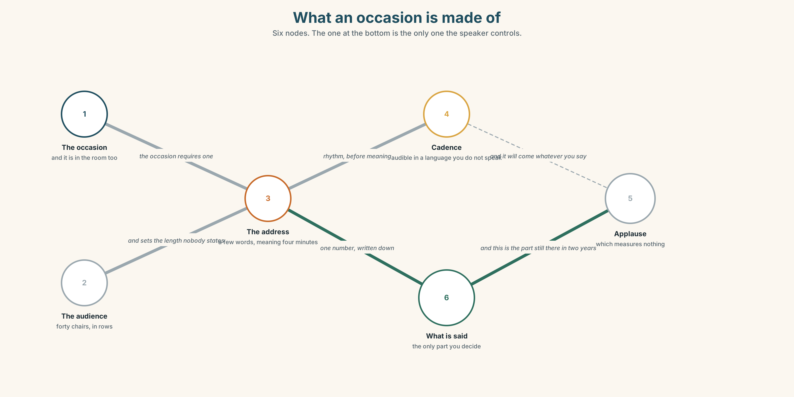{width=6.6in}

*What an occasion is made of — Six nodes. The one at the bottom is the only one the speaker controls.*

### 1A · Meet — the words of an occasion

> **address** · **audience** · **rhetoric** · **cadence** · **pause** · **podium** ·
> **applause** · **gravity**

1. Which two of these belong to the room rather than the speaker?
2. **What is *cadence*, and why can you hear it in a speech you cannot understand?**
3. *Rhetoric* has a neutral meaning and an insulting one. Give both.
4. **What exactly does *gravity* mean here, and can a short speech have it?**

> **An *address* is not a speech.** It is a speech given because an occasion requires one,
> which means the occasion is also in the room, and some of what is said is said to it rather
> than to the people.

### 1B · Sort — before, during, or after?

> acknowledgement · on this occasion · promotion · take the floor · occasion · a step up ·
> in all my years · tribute · a few words

**Three columns. Two of them belong in more than one.** Say which and why.

### 1C · Meet — the phrase that does most of the work

> **c** **a few words**

Never a few. It is a request for a short formal speech, and the person asking knows exactly how
long they mean and will not say.

1. **How long is *a few words*, in your experience?**
2. What is the difference between being asked for them in advance and being asked in the room?

### 1D · Collocation Lab

| | |
|---|---|
| **take the floor** | ~ for a moment · she took ~ |
| **on this occasion** | ~ , I would like to · not ~ |
| **in all my years** | ~ I have never · ~ here |
| **a step up** | ~ in pay · ~ , on paper |

**Which two of these can be said without any warmth at all?**

### 1E · The fixed expressions

> **f** **Never have I been so.** — the shape of a hundred toasts, and it only works if what
> follows is unexpected.
> **f** **I did not ask for this.** — eight syllables that can be gratitude, refusal or grief,
> and only the delivery decides.

**Say the second one three ways. How many did the room hear differently?**

### 1F · Own it

The four phrasal verbs of taking a job or not.

> **stand down** · **take on** · **turn down** · **rise to**

1. Which two are about leaving, and which two about accepting?
2. **What is the difference between *taking on* a role and *being given* one?**
3. *Rise to* what — the occasion, the challenge, or the bait?
4. Write one sentence in which somebody **turns down** something and is not believed.

---

## Part 2 · Listening ◆ **A · THE WORLD**

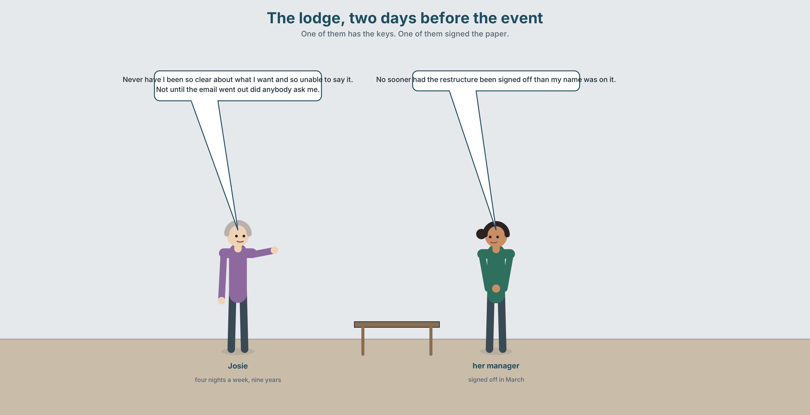{width=6.6in}

*The lodge, two days before the event — One of them has the keys. One of them signed the paper.*

### 2A · A step up 🔊 Track 10.1

**Before you listen.** Josie has worked nights for nine years. She is being moved to days, with
more money and a title. **Guess: has anybody asked her?**

**Listen once. One question.** Who decided, and when was Josie told?

**Listen again. Complete the table.**

| | The night job | The day job |
|---|---|---|
| hours | | |
| pay | | |
| people she works with | | |
| what she decides herself | | |

**Listen again. Choose the best answer.**

1. The move is **a restructure / a promotion / both**.
2. Josie was told **before / after / at the same time as** the announcement.
3. Her manager thinks she is **pleased / difficult / reluctant**.
4. The leaving event has **been cancelled / already been booked / not been booked**.

**Noticing.** Four sentences from the recording.

1. *Never have I been so clear about what I want and so unable to say it.*
2. *Not until the email went out did anybody ask me.*
3. *No sooner had the restructure been signed off than my name was on it.*
4. *At no point was there a conversation.*

**All four begin with a negative and invert the verb. Which one would be unremarkable if you
put it back in order?**

### 2B · Decoding clinic 🔊 Track 10.2

Thirty seconds of Josie. Four jobs.

1. How many inverted sentences can you count?
2. In *never have I been so*, which word is loudest?
3. Catch the two numbers.
4. She says one thing in ordinary order and then again inverted. Which, and what changes?

> Transcripts, page 159.

---

## Part 3 · Grammar Lab 1 ◆ **B · THE SYSTEM**

### Putting the negative first, and paying for it

### 3A · Notice

Look at the four sentences in Part 2.

1. In sentence 1, where would *I have* be in ordinary order?
2. **In sentence 2, what is the auxiliary, and where did it come from?**
3. **Rewrite sentence 3 in ordinary order.** How many words change position?
4. Sentence 4 inverts a *be* verb. **Is that the same operation?**
5. Try *"Never I have been so clear."* **What is missing?**

### 3B · See

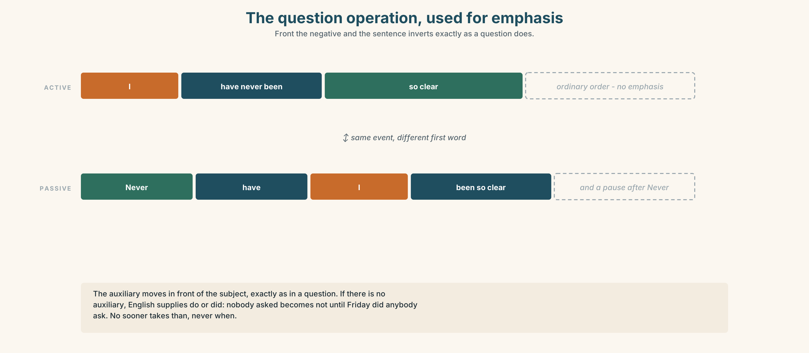{width=6.6in}

*The question operation, used for emphasis — Front the negative and the sentence inverts exactly as a question does.*

### 3C · Know

| Fronted element | Example | What moves |
|---|---|---|
| ***never · rarely · seldom*** | *Never have I been so sure.* | auxiliary before subject |
| ***hardly · scarcely · no sooner*** | *No sooner had it been signed than…* | and *than*, not *when* |
| ***not until · at no point*** | *Not until Friday did anybody ask.* | *do / did* appears if there is no auxiliary |
| ***little*** | *Little did we know.* | fixed, and almost always ironic |
| ***only then · only when*** | *Only then did she answer.* | the inversion comes after the whole clause |
| ***nor · neither*** | *Nor was there any warning.* | joins to a previous negative |

> **The operation is the question operation.** *I have never been* → *Have I been?* → *Never
> have I been*. If there is no auxiliary, English supplies *do*, exactly as in a question:
> *Nobody asked* → *Not until Friday did anybody ask*.

> ***no sooner* takes *than*, not *when*.** *No sooner had it been signed than my name was on
> it.* This is the single most common error with this structure.

> **Inversion is formal and it is emphatic, and it costs something.** Used twice in a speech it
> is powerful. Used six times it is a parody of a speech, and the audience will hear the
> structure instead of the content.

> **Why it matters.** This is the grammar of occasions: toasts, tributes, resignations,
> verdicts. You will not need it often and when you need it nothing else will do.

### 3D · Use — controlled

> (1) __________ have I been so clear about what I want and so unable to say it.
> (2) __________ until the email went out __________ anybody ask me. (3) __________ sooner had
> the restructure been signed off (4) __________ my name was on it, in a list, between two
> people I have never met. (5) __________ no point was there a conversation.
> (6) __________ did I imagine, nine years ago, that the thing I would have to defend would be
> the shift nobody else wants. And (7) __________ then, standing in a room with forty chairs in
> it, did I understand that the promotion was not for me.

### 3E · Use — guided

Invert each one. **Two of them need *do* or *did*.**

1. I have never been so sure.
2. Nobody asked until Friday.
3. It had no sooner been signed than my name was on it.
4. She answered only then.
5. We little knew what it would mean.

### 3F · Use — open

**In pairs.** Give a sixty-second tribute to something ordinary — a bus route, a kettle, a shift
pattern — using **exactly two** inversions. **Your partner's job** is to say whether a third
would have helped.

### 3G · Error autopsy

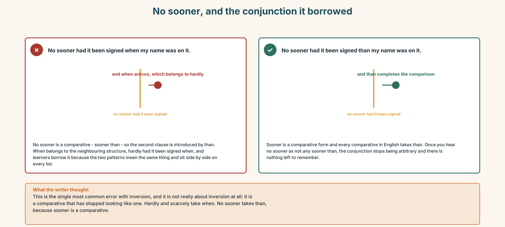{width=6.6in}

*No sooner, and the conjunction it borrowed — No sooner, and the conjunction it borrowed*

**Read both versions. Then say which word the first one borrowed from a different structure.**

### 3H · Check — eight items

> 1. ______ have I been so sure. *(negative adverb)*
> 2. ______ until Friday ______ anybody ask. *(no auxiliary present)*
> 3. No sooner had it been signed ______ my name was on it. *(correct conjunction)*
> 4. ______ then did she answer. *(after a clause)*
> 5. ______ did we know. *(fixed, ironic)*
> 6. ✗ *Never I have been so clear.* → correct it.
> 7. ______ was there any warning. *(joining a previous negative)*
> 8. ______ no circumstances will I be moved. *(prepositional phrase)*

**0–4 →** Workbook pp. 42–45. **5–6 →** Part 6. **7–8 →** page 217.

---

## Part 4 · Speaking ◆ **C · THE PERFORMANCE**

### 4A · Fluency starter — front it

One learner gives an ordinary sentence with a negative in it. The next fronts the negative and
inverts. **The chain breaks on a missing auxiliary.**

### 4B · The functional core — a formal address

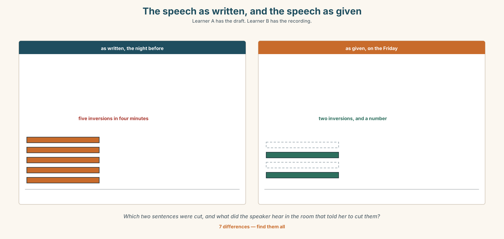{width=6.6in}

*The speech as written, and the speech as given — Learner A has the draft. Learner B has the recording.*

**Language Bank**

| | |
|---|---|
| **the opening** | *On this occasion…* · *I have been asked to say a few words.* |
| **the acknowledgement** | *In all my years here…* · *Not once has anybody…* |
| **the turn** | *Never have I…* · *No sooner had… than…* · *Only then did I…* |
| **the landing** | one short sentence, in ordinary word order, and stop |

**Information gap.** Learner A has the speech as written. Learner B has what was actually said.
**Find the two sentences that were cut in the room, and say why.**

### 4C · The performance — three minutes ⏺

Deliver **a formal address**. **Three minutes, standing.** You must include:

> an opening that names the occasion · an acknowledgement of somebody specific ·
> exactly two inversions · a landing of one short sentence in ordinary order

**Record it.**

### 4D · Observer

One person listens for **one thing**: did the structure start to be more audible than the
content?

### 4E · Three criteria

> ☐ Did I use exactly two inversions, and were they in the right places?
> ☐ Is the acknowledgement about a specific person doing a specific thing?
> ☐ Is the last sentence short and in ordinary order?

---

## Part 5 · Reading ◆ **A · THE WORLD**

### 5A · Predict

An interview transcript, titled **"Nine years of nights."**
**What do you expect her to say she will miss?** Two sentences.

### 5B · Read — two minutes and a quarter

---

**NINE YEARS OF NIGHTS**
*interview transcript, lightly edited*

**Q: You have been offered a day role with a promotion. You have not accepted it.**

I have not turned it down either. I want to be careful about that, because the version going
round is that I am being difficult, and I am not being difficult. I have asked two questions and
neither has been answered.

**Q: What are the two questions?**

What happens to the building between eleven at night and six in the morning, and who does it.
That is one question really. The other is why nobody asked me before my name went on a list.

**Q: Tell me about the nights.**

There are nine of us across the week and I have done four of them for nine years. In that time
I have let three hundred and sixty people into buildings they were locked out of, most of them
at a point in the evening where they had decided the whole degree was a mistake. You do not
read about that in a restructure document. It is not a duty. It is what happens when the person
who has the keys is also the only person awake.

**Q: What will the day role involve?**

Supervision. A team of four. More money, which I am not going to pretend does not matter, and a
title. It is a step up. Everybody has said *a step up* to me eleven times in a fortnight and
nobody has said what is at the top of the step.

**Q: Would you have said yes if they had asked first?**

Probably. That is the part people find hard to believe. If somebody had come to me in March and
said we need you on days, here is why, here is what happens to the nights — I would almost
certainly have said yes, and I would have helped them work out the handover.

Not until the email went out did anybody ask me. By then I was in a list, and once you are in a
list you are either grateful or you are difficult. There is no third thing you are allowed to be.

**Q: Is there anything you want to say to the people organising the event?**

Move the chairs. Forty chairs in rows is a thing you do to an audience. We are nine people and a
kettle. Nobody who works nights wants to be looked at.

---

### 5C · Comprehension — eight questions

1. What has she not done, and what is she careful to distinguish it from?
2. **What are her two questions, and why does she say they are "really one"?**
3. How many night staff are there, and how many nights does she work?
4. **What is the three hundred and sixty, and why does she say it is "not a duty"?**
5. What does the day role involve? Give four things.
6. **What has been said eleven times in a fortnight, and what has not been said?**
7. Would she have said yes, and under what condition?
8. What does she ask the organisers to do, and what is her reason?

### 5D · Vocabulary in context

Guess from the text. Then check.

> the version going round · a restructure document · at the top of the step ·
> once you are in a list · a thing you do to an audience

### 5E · The counter-text

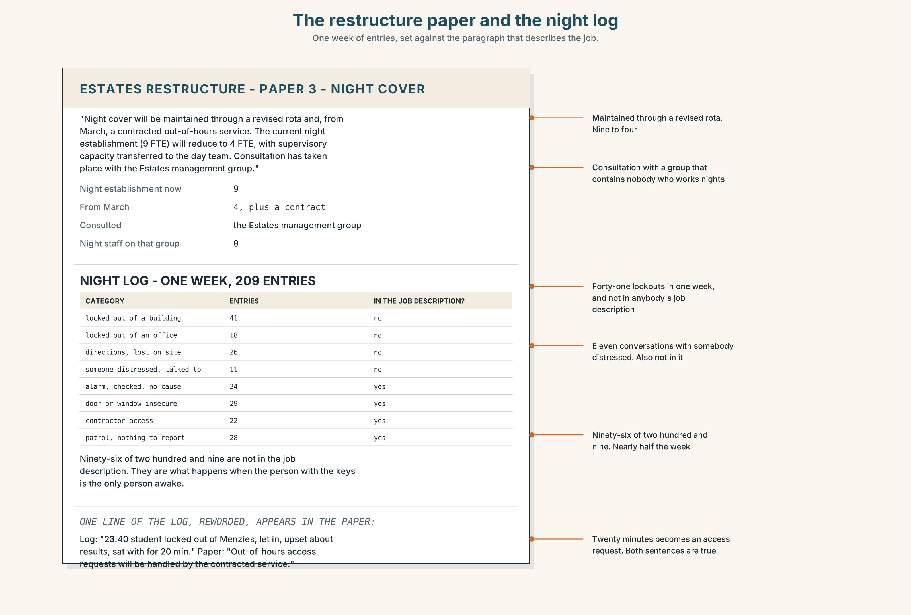{width=6.6in}

*The restructure paper and the night log — One week of entries, set against the paragraph that describes the job.*

**Read the restructure paper and the night log, and answer.**

1. What does the restructure paper say about night cover?
2. **How many entries are in the night log for one week, and what are they?**
3. What is the proposed night establishment after the change?
4. What does the paper say about consultation, and with whom?
5. One line of the log appears in the restructure paper, reworded. Which?

### 5F · Two texts

The paper says night cover will be **maintained through a revised rota**.
The log shows **two hundred and nine entries in one week**, of which most are not security.

**Does the paper describe the job?** Three sentences.

---

## Part 6 · Vocabulary Lab 2 ◆ **B · THE SYSTEM**

### What can go first, and what has to follow it

### 6A · Sort — which take *do / did*?

Three columns: **needs *do / did* · uses an existing auxiliary · uses *be***.

> scarcely · no sooner · nor · little · only · neither · never · hardly · rarely ·
> nowhere · seldom

### 6B · Chunk completion

1. **not ______** the email went out
2. **at ______ point** was there a conversation
3. **under no ______** will I be moved
4. **only ______** did I understand it
5. **no sooner ______** it been signed
6. **little did we ______**

### 6C · Two that are not negative at all

**only · not until**

> Neither contains a negative word, and both invert. *Only then did she answer.* *Not until
> Friday did anybody ask.* **What they share is that they restrict**, and restriction is what
> triggers the inversion, not negation.

**Write two sentences about the interview in Part 5, one with each.**

### 6D · Three phrasal verbs for a career

> **p** **set out** · **p** **look back** · **p** **rise to**

> *When I set out, nine years ago…* · *Looking back, the nights were the job.* ·
> *She rose to it, and nobody noticed that she had.*

**Write one sentence with each, in a tribute to somebody you know.**

### 6E · The fixed expressions

> **f** **Not for one moment.** — a whole-sentence denial, and it inverts whatever follows it.
> **c** **not once** — *Not once has anybody asked.*

> **Use both in the same short paragraph.**

### 6F · Contrast Clinic

Eight items. **Four are wrong. Correct them and say what the rule is.**

1. Only then she answered.
2. Nor was there any warning.
3. Not until Friday anybody asked.
4. No sooner had it been signed when my name was on it.
5. Never I have been so sure.
6. Not until Friday did anybody ask.
7. Never have I been so sure.
8. No sooner had it been signed than my name was on it.

---

## Part 7 · Pronunciation & Fluency Lab ◆ **B · THE SYSTEM**

### Emphatic stress, and the pause before it

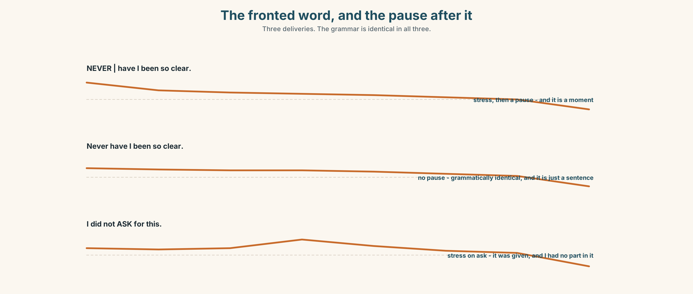{width=6.6in}

*The fronted word, and the pause after it — Three deliveries. The grammar is identical in all three.*

### 7A · Hear 🔊 Track 10.3

> **NEVER** | *have I been so clear.*
> **The fronted word takes the stress, and then there is a pause, and the pause is the whole
> effect.**

Now without the pause:

> *Never have I been so clear.*
> **Grammatically identical. It has become a sentence rather than a moment.**

### 7B · Say

Say both. Then say this one three times, with the pause in a different place each time:

> *No sooner had the restructure been signed off than my name was on it.*

### 7C · Make it mean something

Say these two:

> *I did not ask for* **THIS** *.* *(I asked for something else)*
> *I did not* **ASK** *for this.* *(it was given to me, and I had no part in it)*

**One sentence, two complaints.** Which is which?

### 7D · Fluency 30 ⏺

Thirty seconds: **two inversions, each with a pause after the fronted element, and nothing else
inverted.** Three times. **Count how many you want to add, and do not.**

---

## Part 8 · Writing ◆ **C · THE PERFORMANCE**

### An address · 200 words

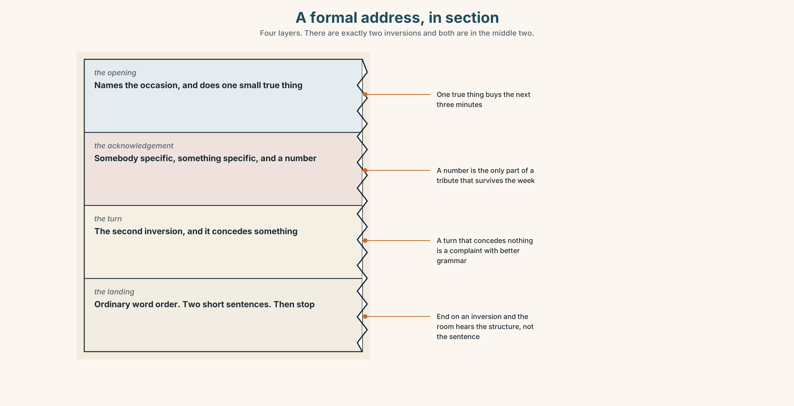{width=6.6in}

*A formal address, in section — Four layers. There are exactly two inversions and both are in the middle two.*

### 8A · Read the model

> I have been asked to say a few words, and I have been told that a few words means four
> minutes, which is the first honest thing anybody has said to me about this event.
> `[the opening — it names the occasion and does one small true thing]`
>
> In all my years here, the part of this job I would defend is not on any document. Between
> eleven and six, three hundred and sixty people have been let back into buildings they were
> locked out of. Not once has that appeared in a restructure paper.
> `[the acknowledgement, with a number — and the first inversion]`
>
> No sooner had the paper been signed than my name was on a list, and I want to say clearly that
> I would probably have said yes. `[the turn, the second inversion, and it concedes]`
>
> Move the chairs. We are nine people and a kettle. `[the landing — ordinary word order, two
> short sentences, and it is an instruction]`

**Questions about the writer's choices:**

1. The opening does "one small true thing". **Why does an address need one?**
2. There are exactly two inversions. **Where would a third have gone, and what would it cost?**
3. The last two sentences are ordinary. **Why not end on an inversion?**

### 8B · The anti-model

> Never before have I been so honoured, and seldom have I felt such gratitude. Not only has this
> institution given me a career, but rarely does one find such colleagues. Little did I imagine,
> when I started, that never would I wish to be anywhere else.

Grammatically perfect. **Count the inversions**, and say at which one you stopped listening to
the content.

### 8C · Plan

> the opening, naming the occasion and doing one true thing → the acknowledgement, with a number
> → the turn, with the second inversion → the landing, ordinary and short

### 8D · Write — 200 words
### 8E · Peer review — three criteria

> ☐ Exactly two inversions?
> ☐ Is there a number in the acknowledgement?
> ☐ Is the last sentence in ordinary word order?

### 8F · Write it again · 8G · Publish

**Stand up and deliver it.** That is the only version of this task that counts.

---

## Part 9 · The File ◆ **A · THE WORLD + C · THE PERFORMANCE**

# WORK FILE · The Meeting

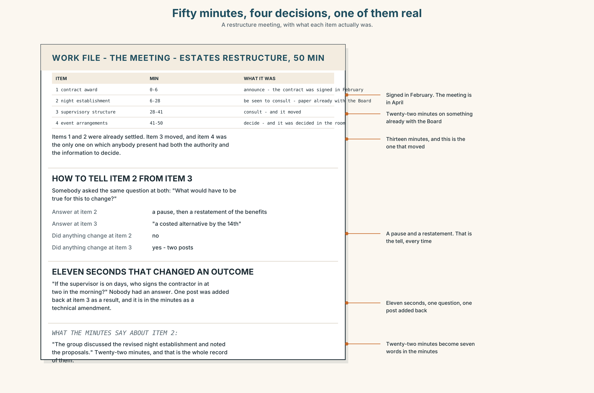{width=6.6in}

*Fifty minutes, four decisions, one of them real — A restructure meeting, with what each item actually was.*

### 9A · Fifty minutes, four decisions 🔊 Track 10.4

A restructure meeting. **Listen.**

1. How many of the four decisions were made in the room?
2. **Which one was already made, and how can you tell?**
3. One person speaks for eleven seconds and changes an outcome. What do they say?

### 9B · What a meeting is for

> **to decide** — and the decision is not made before it
> **to announce** — and the decision was
> **to consult** — and the decision can still move
> **to be seen to consult** — and it cannot

**Which of the four is hardest to tell apart from which, and who can tell?**

### 9C · The question that reveals it

> *"What would have to be true for this to change?"*

If there is an answer, it is a consultation. If the answer is a pause and then a restatement of
the benefits, it is not.

**Where would you have asked it in the meeting in 9A?**

### 9D · Your turn

In fours. **Twelve minutes.** One person chairs a meeting about something real on your campus.
**Everybody else must work out, without asking directly, which of the four kinds it is.**

### 9E · Transfer

**In the next meeting you attend, write down at the start which of the four you think it is.**
Check at the end. Were you right?

---

## Part 10 · Mediation & Interaction ◆ **C · THE PERFORMANCE**

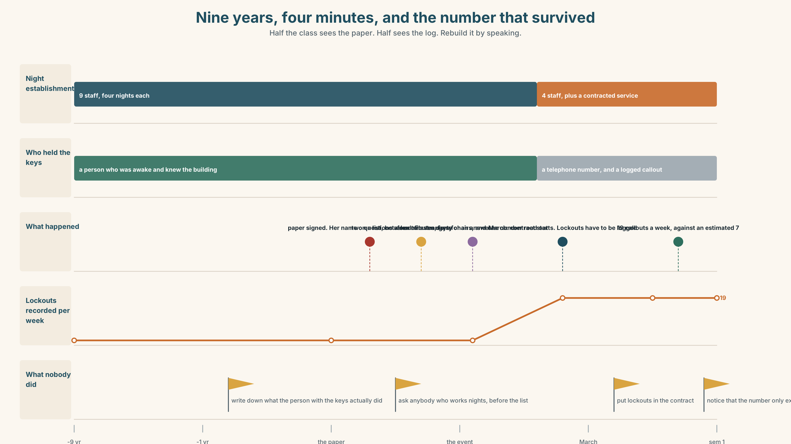{width=6.6in}

*Nine years, four minutes, and the number that survived — Half the class sees the paper. Half sees the log. Rebuild it by speaking.*

### 10A · Relay

Half the class sees the restructure paper. Half sees the night log.
**Rebuild the nine years by speaking.** Twelve minutes.

### 10B · Simplify

Explain the restructure to a first-year who has been locked out of a building at midnight.
**Five sentences only.**

> **Plan:** what the night job is → what the paper says → what changes → what it means at
> midnight → who to tell

### 10C · Compress

The interview in Part 5B into **forty words**, keeping the last answer.

### 10D · Online

Write **one message** to the organisers of the event. You are not refusing to attend. You are
asking for one specific change to the room, and giving the reason in one sentence.

### 10E · Your language

Does your language invert for emphasis? **Say *never have I been so sure* in both languages.**
Which moves the verb, and which uses a particle or a different word order entirely?

---

## Part 11 · The Decision ◆ **C · THE PERFORMANCE**

# A promotion nobody asked about

Josie has worked four nights a week for nine years. She has been named in a restructure paper as
moving to a day supervisory role, with more money and a title. The paper is signed. The event is
booked for Friday. She has asked two questions and neither has been answered.

- **Take it.** More money, a team, and the night rota will be covered by somebody. Nine years is
  a long time on nights and nobody stays for ever.
- **Turn it down.** Stay on nights, decline the title, and accept that she will be the person
  who said no to a promotion, which is a sentence that follows people.
- **Answer the two questions first.** Refuse to decide until somebody puts in writing what
  happens to the building between eleven and six, and who does it.

### 11A · The evidence

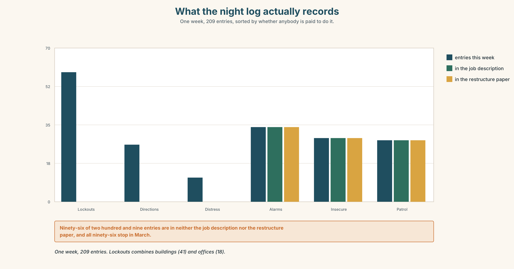{width=6.6in}

*What the night log actually records — One week, 209 entries, sorted by whether anybody is paid to do it.*

1. **The restructure paper and the night log** from Part 5E — and the line that appears in both.
2. **The chart** — what the night log actually records, by category, across one week.
3. **The voice.** Josie, thirty seconds: *"Three hundred and sixty people. I am not saying that
   to be thanked for it. I am saying it because it is going to stop happening in March and
   nobody has written it down anywhere, and in two years somebody will ask why the complaints
   went up and there will be no document to find."*

### 11B · Talk about it

In fours. Everybody speaks twice. Use the frame.

> *Never ______ . Not until ______ did ______ . Only then ______ .*

**Words you can use:** *address · audience · occasion · tribute · acknowledgement · promotion ·
gravity · a step up · take the floor · in all my years*

### 11C · Decide

Write **three sentences**. Choose, say why, and name what it costs.

> I think Josie should ______________________ ,
> because ______________________ .
> What this costs is ______________________ .

### 11D · Model decision

> Answer the two questions first, in writing, and then take it. The questions are not a
> negotiating position and they are not reluctance; they are the only part of nine years that
> cannot be handed over in a conversation, and once she has moved to days nobody will ever ask
> them again. The cost is a fortnight of being called difficult by people who have not read the
> log, and a fortnight is cheap for a document that will still exist in two years.

### 11E · The Reveal

> **What happened.** She asked for the two answers in writing. It took eleven days. The written
> answer said night cover would be provided by a contracted service from March, which was true,
> and did not mention lockouts, because lockouts are not in the contract.
>
> She took the job. In her four minutes on the Friday she read out the number — three hundred
> and sixty — and said that from March there would be a telephone number instead, and that the
> telephone number was fine, and that somebody should write down what it did not do. The room
> was quiet and then clapped for slightly too long.
>
> Lockout callouts went from an average of seven a week to nineteen in the first semester under
> the contract, because a contracted callout has to be logged and a person with keys does not.
> The nineteen is the first number anybody has ever had. It is in a report now, and the report
> exists because of four minutes in a room with forty chairs in it.

**She was right that it would stop happening and wrong about why it mattered. The thing that
survived was not the service. It was the number.**

> **Was it the right decision?** Say why — and say what should be in the contract.

---

## Part 12 · Landing ◆ **all three lines**

### 12A · Recycle — twelve items

> 1. ______ have I been so sure.
> 2. ______ until Friday ______ anybody ask.
> 3. No sooner had it been signed ______ my name was on it.
> 4. ______ then did she answer.
> 5. ______ did we know.
> 6. ______ was there any warning.
> 7. Under no ______ will I be moved.
> 8. At no ______ was there a conversation.
> 9. ______ once has anybody asked.
> 10. When I ______ out, nine years ago…
> 11. ______ back, the nights were the job.
> 12. She ______ to it, and nobody noticed.

### 12B · Consolidate

**Three columns, from memory:** fronted elements needing *do / did* · those using an existing
auxiliary · those using *be*.

### 12C · Can-do, with evidence

> ☐ I can deliver a three-minute formal address. **Evidence:** 4C, 8D
> ☐ I can invert correctly after negative and restrictive adverbials. **Evidence:** 3H, 6F
> ☐ I can place emphatic stress and the pause that goes with it. **Evidence:** 7D
> ☐ I can stop at two inversions. **Evidence:** 8D, 4D

### 12D · Replay ⏺

Record 0C again. **Listen to both.** What have you got that you did not have in week one?
**And listen to 0C from Unit 1 of this book.** That one is ten units ago.

### 12E · Glossary — forty-five items, as a map

> **THE OCCASION** · address · audience · occasion · podium · applause · gravity · tribute · acknowledgement
> **THE SPEAKING** · rhetoric · cadence · pause · take the floor · a few words · on this occasion · in all my years
> **THE JOB** · promotion · a step up · the night shift · stand down · take on · turn down · rise to · set out · look back
> **WHAT PEOPLE SAY** · never have I been so · I did not ask for this · not for one moment
> **FRONTING** · never · rarely · seldom · little · hardly · scarcely · nowhere · nor · neither · only · no sooner
> **THE PHRASES** · not until · at no point · under no circumstances · only then · no sooner had · little did we know · not once

### 12F · Next

> **You have finished *Making the Case*, and with it level B1.**
> **Next: B2.1 · *The Long Argument*.**

# Answer Key

> Open tasks — speaking, writing, discussion — are not keyed. Their
> success criteria are in the unit, at 4E and 8E.

## B1.3 · Unit 1 · The Next Video

**0B** · Guess it
The poster showing a 22 per cent pass rate and the half-empty lecture theatre. One is the published figure, the other is the room it describes, and the two are eleven weeks apart.

**1B** · Sort — what you do, what it does, or what it counts?
> **what it does** — autoplay · notification · feed · prompt
> **what it counts** — engagement · retention · metric · dwell
> **what you do** — scroll
**The pair:** *engagement* and *dwell*. Dwell is the seconds a reader spends; engagement is the same seconds named from the platform's side, with approval built in. *(scroll* also belongs in two columns — it is a thing you do and a thing that is counted.)

**2A** · Attendance and the pass rate 🔊 Track 1.1
**1** c) 45 to 22 · **2** b) 11 · **3** a) at two in the morning · **4** b) the look of the room
**Table** — Dr Ahmadi: has measured attendance and outcomes; concludes the recordings do no harm; has not measured who the non-attenders are. The committee: has measured attendance; concludes engagement has fallen; has not measured attainment by group. Bec: has surveyed 41 students; concludes the gain is concentrated among students in paid work; has not measured anything representative (self-selected sample).

**Noticing** — Sentence 1 is defining: *some* of the students, only the ones who work. Sentence 2 is non-defining: *all* of them, and they happen to work. There is no way to say how many from sentence 1 alone; sentence 2 means the whole group.

**3D** · Use — controlled
1 of · 2 which · 3 which · 4 who / that · 5 which · 6 of · 7 which

**3E** · Use — guided
1 Forty-one students, thirty-one of whom work, completed the unit. · 2 The recordings, which are watched at night, have been available since March. · 3 Attendance has halved, which nobody disputes. · 4 There are eleven lectures, four of which were not recorded. · 5 The pass rate rose eleven points, which is the figure in dispute.

**3H** · Check — eight items
1 of whom · 2 which · 3 which · 4 who / that · 5 of which · 6 all of whom · 7 *The students who work passed* (defining — no commas, no *that* after a comma) · 8 *41 students, most of whom work, passed* **or** *41 students passed; most of them work.*

**5C** · Comprehension — eight questions
1 That attendance in the two piloted units had fallen by about a third and that assessment outcomes were unchanged.  
2 That she would not support a measure which reduced attendance, attendance being itself a form of engagement. Asked for evidence that attendance *caused* attainment rather than merely accompanying it, she conceded that she did not think the question could be answered.  
3 That of eleven students consulted, nine were in paid employment, most of whom had missed a lecture for a shift. She asked the committee to record that none of them had chosen between a lecture and leisure.  
4 Because it pre-empts the inference the committee would otherwise draw — that non-attendance is a preference rather than a constraint.  
5 Recording for a two-year trial, subject to review, with attendance monitored.  
6 Attendance data and employment data.  
7 Attendance data has been collected continuously since 2019; employment data has never been collected.  
8 That recording was made permanent in 2022 by a decision of the Dean, without reference to the committee — and that the 2021 review never took place.

**5D** · Vocabulary in context
**piloted** — ran as a limited trial first · **accompanying it** — occurring alongside, without causing · **subject to review** — approved only until somebody looks again · **would be difficult** — a refusal with no reason attached · **without reference to the committee** — without asking the body that had authorised it

**5E** · The counter-text
1 Attendance 45 → 22 per cent over six years; the overall pass rate moves two points, inside the normal four-point range.  
2 The +11 points for students in paid work: 41 responses out of 214 enrolled, self-selected, from a student union survey the university did not commission.  
3 Four — 3, 10, 17 and 24 March, all recorded as hardware faults.  
4 Attendance at those four averaged 37 per cent against 22 for the rest: fifteen points higher, which is the only controlled comparison in the file.  
5 The footnote: the university does not collect employment data and has not done so since it was requested in 2019.

**6A** · Sort — adds, contrasts, names, or points back?
> **names** — namely · incidentally · respectively
> **adds** — likewise · moreover · additionally
> **points back** — at which point · the latter of which · of which
> **contrasts** — conversely
*Likewise* adds by analogy rather than by accumulation; accept it in either of the first two columns if the learner can say why. *Incidentally* names in the weak sense — it labels what follows as an aside.

**6B** · Chunk completion
1 of · 2 of · 3 point · 4 of · 5 back · 6 refer

**6C** · Three that are not interchangeable
1 namely · 2 respectively · 3 Incidentally

**6E** · Contrast Clinic
> **1** Two cohorts, **the latter of which** had recordings from week one.
> **2** The pass rate rose, **which** is the disputed figure. *(sentential)*
> **3** The recordings, **of which there are eleven**, are watched at night. *(or: There are eleven recordings, all of which are watched at night.)*
> **4** Only the students **who** are in work did better. *(defining — no commas)*
> **5** Attendance halved, **which** nobody disputes. *(sentential)*
> **6** All the students, **who** are in work, did better. *(non-defining — the clause describes the whole group)*
> **7** 41 students, **31 of whom** work.
> **8** Eleven lectures, **four of which** were not recorded.

**12A** · Recycle — twelve items
1 of whom · 2 which · 3 which · 4 default · 5 opt · 6 site · 7 switch · 8 of which · 9 Those · 10 are · 11 which · 12 who / that

---

## B1.3 · Unit 2 · One Lift, Two Buildings

**0B** · Guess it
The worn path across the grass and the propped fire door. Both exist because the lift is out of order, and neither was made by anybody with authority — they were made by the people who had to get in.

**1B** · Sort — the building, the policy, or the person?
> **the building** — ramp · barrier · signage · access
> **the person** — disability
> **the policy** — accommodation · provision · exemption · inclusion
**The one that moves:** *disability*. It is filed under the person and is produced by the building: a step is a step for everybody, and it only becomes a disability where there is no second route. *access* also sits in two columns — a property of a building and a thing a person does or cannot do.

**2A** · The audit 🔊 Track 2.1
**1** b) a ramp · **2** c) neither · **3** c) A · **4** c) B
**Table** — Building A (Menzies): 2,100 people a week; a ramp at 1:11 with a 44 N door; the alternative route is the ramp itself. Building B (Harcourt): 400 a week; nothing; the rear entrance named in the access statement, which opens into a plant room.

**Noticing** — Sentence 3. *Taken by nobody* attaches to *the route*, while the main clause subject is also *the route*, so it is sound; but the opening participle in sentence 3 (*marked on the map*) is a reduced relative, not a hanging participle. The one to watch is sentence 3 against sentence 1: in 1 the subject of *having walked* is *I*, and in 3 there is no first-person subject anywhere.

**3D** · Use — controlled
1 Having walked · 2 Given · 3 marked · 4 taken · 5 Lacking · 6 Taken · 7 having

**3E** · Use — guided
1 Lacking a ramp, B has no step-free route.  
2 Having measured both, I changed my mind.  
3 The route marked on the map is not the one people use.  
4 **Cannot be reduced safely.** The subjects differ — the lift was out, the lecture was moved — so *Being out of order, the lecture was moved* says the lecture was out of order.  
5 Taken together, the figures do not agree.  
*(Item 4 is the first of the two. The second is a trap only if a learner tries to reduce item 2 to* After measuring both*, which is fine, or to* Measuring both*, which loses the sequence.)*

**3H** · Check — eight items
1 Having walked · 2 Given · 3 marked · 4 Lacking · 5 Taken · 6 *Lacking a ramp, the building has no route* — the route cannot lack a ramp · 7 Having · 8 Due / Owing

**5C** · Comprehension — eight questions
1 Argue against her own union's submission.  
2 2,100 a week for Menzies against 400 for Harcourt. They supported the case for putting the lift in Menzies, which is the case the union made.  
3 The gradient is 1:11 where it should be 1:14, and it ends at a door heavier than the standard allows.  
4 It describes a step-free rear entrance. There is a rear entrance, it is step-free, and it opens into a plant room.  
5 In Menzies we would be improving access for people who have it badly; in Harcourt we would be creating it for people who do not have it at all.  
6 He concedes she is right about Harcourt, and says he did not know about the plant room.  
7 Lifts are funded from a capital line assessed on usage, so a lift serving 400 people a week scores below the threshold and will be queried every year for fifteen years. He raises it not as a counter-argument but because it will come up, and because he will not remember it in four years.  
8 Fund Harcourt, and write her paragraph into the capital submission.

**5D** · Vocabulary in context
**argue against our own submission** — contradict the case her own side made · **on every measure of volume** — by any count of how many people · **the standard allows** — the published maximum · **a capital line** — a budget for building work, separate from maintenance · **will be queried** — will be challenged every year by someone reading only the usage figure

**5E** · The counter-text
1 That all teaching buildings have a step-free entrance, and that where the principal entrance is stepped a step-free alternative is signed from it. Menzies: ramp at the principal entrance. Harcourt: rear entrance, signed. Both last reviewed 2014.  
2 (i) Menzies ramp gradient 1:11 against a standard of 1:14. (ii) Menzies door 44 N against a 30 N maximum. (iii) Harcourt signage from the principal entrance: none found, and the statement requires it. (iv) Harcourt rear entrance must reach a corridor and reaches a plant room.  
3 1:11; it should be 1:14.  
4 Since 2014 — eleven years, and it was true in 2014.  
5 The fire evacuation route, both buildings: the auditor lacked the authority to open the doors and says so.

**6A** · Sort — present participle, past participle, or preposition?
> **preposition** — given · due · considering
> **past participle** — based · followed · taken · surrounded · seen
> **present participle** — lacking · facing · having
*Given* and *considering* are past and present participles by form and prepositions by behaviour — they take no subject and cannot hang. That is the point of the column.

**6B** · Chunk completion
1 said · 2 circumstances · 3 Due · 4 taken · 5 considered · 6 allow

**6C** · Three that are not participles any more
1 *If you take the numbers into account, A is the obvious choice.* Lost: the compression, and the sense that the numbers are agreed rather than being argued for.  
2 *If you consider the gradient, the ramp is unusable in the wet.* Lost: the impersonality — *considering* makes the gradient the reason, not the reader.  
3 *Because the lift was out, the class was moved.* Lost: nothing much, which is why *due to* survives in formal writing — it buys brevity at no cost.

**6D** · Two that need a preposition to finish
1 based on · 2 followed by · 3 based on

**6F** · Contrast Clinic
> **1** **Cannot be reduced.** The subjects differ — the lift was out, the class was moved. *Being out of order, the class was moved* makes the class out of order.
> **2** **Cannot be reduced.** The subject of the first clause is *nobody*, the subject of the second is *the statement*.
> **3** Having walked it, I knew the map was wrong.
> **4** The students waiting at the rear door cannot get in. *(reduced relative)*
> **5** Taken together, the figures disagree.
> **6** Having measured both, she changed her mind.
> **7** The route marked on the map adds 400 m. *(reduced relative)*
> **8** Lacking a ramp, the building excludes people.

**7C** · Make it mean something
The first is the concession: the pause after *that* closes the participle clause, and *four hundred is still four hundred* is the main clause. The second runs on, so *that four hundred is still four hundred* becomes the object of *said* — a report of what somebody said, with no concession in it at all.

**12A** · Recycle — twelve items
1 Having walked · 2 Given · 3 marked · 4 Lacking · 5 free · 6 order · 7 paper · 8 around · 9 of whom · 10 which · 11 is having · 12 which

---

## B1.3 · Unit 3 · The Best Voice in the Room

**0B** · Guess it
The hand half-raised and lowered again, and the notebook with a question written and crossed out. Both are Thanh. The first silence is a decision taken in the room and lost to timing; the second is taken before the room, and is the one nobody can see.

**1B** · Sort — the room, the argument, or the person?
> **the argument** — play devil's advocate · take a position · common ground · concede the point
> **the person** — defer
> **the room** — dominate · silence · the floor · talk over
**The two that move:** *silence* belongs to the room and to the person — a property of the discussion and a thing somebody is doing. *defer* is a move in the argument and a habit of the person, and the whole unit turns on telling those two apart.

**2A** · Fifty minutes, one voice 🔊 Track 3.1
**1** c) usually right · **2** a) not at all · **3** a) speaks once · **4** a) neither
**Table** — Marcus: 17 min 10 s; interrupted 0 times; interrupted others 6 times. Thanh: 11 seconds; interrupted once; interrupted nobody. The rest: 9 min 14 s between eight people, of whom three did not speak at all.

**Noticing** — Sentence 2. *Despite the quality of what he says* concedes the strongest thing the other side has, in the other side's own terms, and concedes it before saying anything else. Sentence 1 concedes the same fact more cheaply; 3 concedes and then withdraws; 4 concedes nothing — *whereas* sets two things side by side without granting either.

**3D** · Use — controlled
1 Although · 2 Despite · 3 However / Nevertheless · 4 whereas · 5 In spite · 6 yet / but · 7 Admittedly / That said

**3E** · Use — guided
1 Although he is right, nobody else has spoken.  
2 Despite the quality of his argument, the room has gone quiet. *(word class: a noun phrase, not a clause)*  
3 Marcus speaks for nineteen minutes, whereas Thanh speaks for forty seconds.  
4 She knows it is a problem, yet she has not intervened.  
5 In spite of preparing properly, he takes the whole hour. *(word class: -ing, not a clause)*

**3H** · Check — eight items
1 Although / Though · 2 Despite / In spite of · 3 However / Nevertheless / Nonetheless · 4 whereas · 5 In spite · 6 *Although he is right, he is loud* — one concession marker per sentence, so delete *but* · 7 yet · 8 though

**5C** · Comprehension — eight questions
1 Sixty-one units; fifteen per cent of the mark.  
2 Nothing during the class. They reconstruct a figure in week twelve.  
3 The top speaker took a median of 17 minutes; the bottom four took a median of 40 seconds between them.  
4 It concedes that airtime is a crude measure and that nobody has proposed grading it directly. It says anyway that it is the only measure available of something carrying fifteen per cent of a mark.  
5 That the quiet students could speak and choose not to. It is answered by the fact that the gap widened between weeks three and nine — which is not what a free choice usually does.  
6 The gap between the top speaker and the rest widens. It is significant because a widening gap suggests the format is producing the silence rather than merely permitting it.  
7 Because intervention is a blunt instrument, and the tutors who intervene most do not have the best participation spread.  
8 She would mark the question asked rather than the number of times somebody speaks — and she immediately admits she knows exactly who would lose by that too.

**5D** · Vocabulary in context
**not defensible** — it could not be justified if anybody asked · **a crude measure** — it measures the right thing badly · **a blunt instrument** — it works by force and damages what it touches · **the participation spread** — how widely contribution is distributed across a group · **a capacity rather than a behaviour** — what a student is able to do, not what they happen to do

**5E** · The counter-text
1 Marcus 17 min 10 s; Aoife 5 min 40 s; Dilan 3 min 05 s; Thanh 11 seconds. (Four others: 29 seconds in total; three did not speak.)  
2 He interrupts six times and is interrupted none. In the transcript he interrupts Thanh at minute 31 — "It is the same sample. Sorry, it is, I checked."  
3 Thanh: "Can I just — the second table is a different sample, so it —". Marcus talks over him, apologises while keeping the floor, and Thanh's next turn is marked [inaudible].  
4 Aoife: "I take your point about the table. I still think he is doing something different with it in chapter four." She concedes and keeps the objection, and Marcus concedes back.  
5 Thanh's row in the tutor notes. The notes were written in week twelve, three weeks after anybody could remember — and he is the one student there was nothing to remember.

**6A** · Sort — how much does each one concede?
> **a little** — even so · all the same · that said · on the other hand
> **none at all** — and yet · nevertheless · still · nonetheless
> **a lot** — admittedly · granted · up to a point · to be fair
The first group names the other side's point and agrees with part of it. The second acknowledges it and moves on. The third marks a contrast without conceding anything — which is why a paragraph built only from the third group reads as if it has not listened.

**6B** · Chunk completion
1 To · 2 point · 3 said · 4 so · 5 same · 6 other

**6C** · Two that are almost the same
Model answers. **Nevertheless:** *Airtime is a crude measure. Nevertheless, it is the only measure the report has.* **Nonetheless:** *The report declines to recommend intervention; it nonetheless recommends that the criterion be rewritten.* Either word works in either sentence — the difference is register, not meaning.

**6D** · Two verbs that concede
Model answers. *I allow that airtime is a crude measure.* · *I grant that nobody has proposed grading it directly.* · *I allow that the quiet students could speak and choose not to.* Both verbs take a that-clause and both concede a point the writer is about to limit.

**6F** · Contrast Clinic
> **1** **Wrong.** *However* starts a new sentence or follows a semicolon: *He is right. However, nobody agrees.* A comma leaves two main clauses spliced.
> **2** **Right.** *In spite of* takes a noun or -ing.
> **3** **Right.** *Whereas* joins two parallel clauses and concedes nothing.
> **4** **Wrong.** *Nevertheless* takes no object: *In spite of the evidence, she did nothing* or *The evidence was clear. Nevertheless, she did nothing.*
> **5** **Wrong.** One concession marker per sentence: *Although he is right, nobody agrees.*
> **6** **Wrong.** *Though* goes at the front of its own clause or at the end of the sentence, never alone before a comma: *Though he is right, nobody agrees* or *He is right, though.*
> **7** **Right.** End-position *though*, informal and very common.
> **8** **Wrong.** *Despite* takes a noun or -ing: *Despite being right* or *Despite the quality of his argument*.

**7C** · Make it mean something
The first is final: a falling tone on *though* closes the sentence and the concession is the last word. The second rises and holds, so *though* becomes a hinge — the speaker has more to say and the listener waits for it.

**12A** · Recycle — twelve items
1 Although / Though · 2 Despite · 3 However · 4 whereas · 5 In spite · 6 yet · 7 though · 8 take · 9 said · 10 came · 11 back · 12 ground

---

## B1.3 · Unit 4 · The Garden That Has Two Jobs

**0B** · Guess it
The stack of crates by the gate. They were bought for moving seedling trays between the beds and the greenhouse, and they are being used to carry harvested food out to the kitchen — you can tell because they are stacked at the gate rather than at the greenhouse door, and they are facing out.

**1B** · Sort — the garden, the document, or the decision?
> **the garden** — yield · plot · harvest
> **the document** — a design brief · curriculum
> **the decision** — in practice · the whole point · by design · at the expense of
**The two that move:** *curriculum* is a document and a decision — it is written down and it is the thing that fixes the bed size. *yield* is a fact about the garden and, once the brief declines to set a requirement on it, a decision as well.

**2A** · Two beds, two reasons 🔊 Track 4.1
**1** a) for teaching · **2** b) fewer crops · **3** c) compatible at a small scale · **4** a) scaled down
**Table** — Teaching garden: beds 1 m × 1 m; twelve crops; 94 kg a year. Food garden (merged): plots about 5 m × 1.2 m; four crops; about 480 kg on the same land.

**Noticing** — Sentence 3. *So low that the kitchen gets about four days of salad* is a result: it reports what followed. Sentences 1 and 2 give purposes, and sentence 4 gives a reason followed by a result, which is why it is the one learners most often misfile.

**3D** · Use — controlled
1 so that · 2 in order to / so as to · 3 such · 4 that · 5 so · 6 that · 7 Owing / Due

**3E** · Use — guided
1 The beds are small so that each student can have one.  
2 We planted twelve crops in order to show twelve cycles.  
3 The yield is so low that the kitchen hardly notices it.  
4 It is such a low yield that the kitchen hardly notices it.  
5 Owing to the curriculum's requirement of twelve crops, the beds cannot be merged.  
*(The two needing a new subject are 2 — the infinitive takes* we *from the main clause — and 5, where the clause must become a noun phrase.)*

**3H** · Check — eight items
1 so that · 2 in order to / so as to · 3 so … that · 4 such … that · 5 Owing / Due · 6 *The beds are small so that students can have one* **or** *We made the beds small in order to give each student one* · 7 so · 8 therefore / thus / hence / consequently

**5C** · Comprehension — eight questions
1 Why the beds are a metre square — usually in the form of a suggestion that they be merged, about once a semester.  
2 So that one student can reach the centre of a bed from any edge without stepping on the soil. It is not about yield.  
3 It teaches the wrong lesson for the rest of the year: everything planted in it does slightly worse, for a reason the student cannot see.  
4 Because a student who has only grown things that work has not learned to read a plant.  
5 94 kilograms; the campus kitchen uses that in about four days.  
6 Two years ago, without a decision being made anywhere — in the way these things start. It is now on a menu board.  
7 Whether they could grow more of the things people actually eat. They could, and the garden would stop doing what it was built for within one season.  
8 At the scale of a teaching garden the two purposes are compatible because the food is incidental; at any scale the kitchen would find useful they are not. It does one of them well.

**5D** · Vocabulary in context
**compacts it** — presses the soil so air and water cannot move through it · **reliably** — every time, predictably — here a virtue rather than a fault · **incidental** — produced as a side effect, not aimed at · **never specified as** — never written into the brief as a requirement · **within one season** — inside a single growing year

**5E** · The counter-text
1 R1 one bed per student for 20 students; R2 a reachable centre from any edge; R3 twelve crops showing twelve cycles; R4 three crops that fail reliably; R5 no requirement on yield.  
2 R2. Meeting it fixes the bed at one metre square, which with R1 fixes the number at forty, which fixes the yield at about a fifth of what the soil can do — and nobody wrote that down, because nobody was asked to.  
3 2.35 kg per square metre, against 11–13 kg for a commercial bed in the same soil.  
4 Cauliflower, three beds, 0 kg. It is not a failure: R4 specifies three crops that fail reliably, so it is the brief working.  
5 "R6 — the kitchen takes what there is. Not a requirement. Nobody has agreed to this," added in a different pen, three years later, by D.O., the garden manager.

**6A** · Sort — purpose, reason, or result?
> **result** — consequently · such that · therefore · hence · thus
> **purpose** — so as to · so that · in order to
> **reason** — whereby · because · owing to · as · since
*So that* can give either a purpose or a result, and the verb decides: *so that students can learn* looks forward, *so that nobody noticed* looks back. *Whereby* introduces a mechanism rather than a cause, so accept it in a fourth column if a learner argues for one.

**6B** · Chunk completion
1 view · 2 sake · 3 being · 4 as · 5 that · 6 order

**6C** · Three that mean *therefore*
Model answers. **Therefore:** *The beds are a metre square; the yield is therefore about a fifth of what the soil can do.* **Thus:** *No crop reaches a usable quantity, and the garden thus feeds nobody.* **Hence:** *Twelve cycles had to be shown in one year — hence the twelve beds.* Note that *hence* alone takes the noun phrase.

**6D** · The one that joins a rule to its reason
Model answers. *The brief set out a system whereby each student manages one bed for a semester.* · *R2 fixes an arrangement whereby no one ever has to stand on the soil.* *Whereby* names the mechanism; it does not say what the mechanism is for, which is why it cannot replace *so that* in the explainer.

**6F** · Contrast Clinic
> **1** **Right.** *Such* + article + adjective + noun.
> **2** **Right.** *Hence* takes a bare noun phrase.
> **3** **Wrong.** *Owing to* takes a noun phrase: *Owing to the low yield, the kitchen looked elsewhere.*
> **4** **Wrong.** *So* + adjective, *such* + noun: *The yield is so low that nobody notices.*
> **5** **Right.** *So that* + clause, with its own subject.
> **6** **Right.** A noun phrase follows *owing to*.
> **7** **Wrong.** *So as to* takes an infinitive: *so as to show twelve cycles*.
> **8** **Wrong.** *In order to* takes an infinitive and borrows the main subject, so it cannot introduce a new one: *so that students can reach the middle*, or *We made the beds small in order to let students reach the middle.*

**7C** · Make it mean something
The first stresses *so*, which marks the clause as a purpose: building it to fail was the plan. The second stresses *fail*, which puts the new information at the end of the purpose clause — the speaker is making a point about the failing itself, usually in answer to somebody who assumed success was the aim.

**12A** · Recycle — twelve items
1 so that · 2 in order to / so as to · 3 so … that · 4 such … that · 5 Owing / Due · 6 so · 7 therefore / thus · 8 whereby · 9 set · 10 ended · 11 scaled · 12 build

---

## B1.3 · Unit 5 · The Essay Nobody Heard

**0B** · Guess it
The mark sheet with one blank row and the essay with a comment in the margin. They are the same student, hours apart: the blank row is written before the essay is read, and the comment is written after. Nothing about Thanh changed between them.

**1B** · Sort — before, during, or after the reveal?
> **after** — the thing nobody saw · and that is when · it turns out
> **before** — foreshadow · withhold · a slow build · save it for
> **during** — focus · emphasis
**The two that move:** *withhold* is a decision taken before and sustained during — it is the only one of these a storyteller does continuously. *and that is when* marks the turn, so it sits on the boundary between during and after, which is exactly its job.

**2A** · The mark that is due on Friday 🔊 Track 5.1
**1** a) unenforceable · **2** c) hers · **3** b) has not asked · **4** c) Friday
**Table** — Thanh: spoke twice in eleven weeks; essay mark 84, the highest in the group; the rule gives him 4 out of 15. Group median: spoke in 7 of 11 weeks; essay 69; participation 11.

**Noticing** — 1 spotlights *the criterion* (an it-cleft, contrasted with *the student*); 2 spotlights the action *mark him on something he was never given access to* (a wh-cleft); 3 spotlights the smallness of what was done (*all* means *only that*); 4 spotlights *next year's* by first naming and then dismissing this one.

**3D** · Use — controlled
1 It · 2 What · 3 The · 4 The · 5 All · 6 It was · 7 The

**3E** · Use — guided
1 It was the criterion that failed, not the student.  
2 All she did was read eleven essays.  
3 What she wants is the rule changed, not the mark.  
4 The reason why he said nothing is that the moment had always gone.  
5 The thing that worries her most is the audit.

**3H** · Check — eight items
1 It · 2 What · 3 All · 4 reason · 5 thing · 6 *It was the criterion that failed* — the slot after *it was* takes a noun phrase, not a verb · 7 not until · 8 one

**5C** · Comprehension — eight questions
1 In the same chair, third from the window, for eleven weeks.  
2 The gap between a question and an answer in that room. He timed it once with the stopwatch on his phone, under the table.  
3 Because that is how long it takes him to produce an answer. He measured it by writing an answer down and reading it aloud at the speed people talked, in a stairwell, twice.  
4 He puts the sheet in his bag at the end of each session and goes to the library, where the gap between a question and an answer is as long as he wants it to be.  
5 The tutor asks a question nobody answers. The silence runs six seconds, seven, nine. At eleven he opens his mouth; at eleven and a half Marguerite speaks.  
6 Something almost but not quite what he had been going to say. The *not quite* is the point: the room has not lost a repetition, it has lost a better version, and nobody in it will ever know.  
7 "This is the best piece of writing I have had from this group in four years. Why have I never heard any of this?"  
8 He squares the edges of the eleven sheets and puts them on her desk on his way out without saying anything — which, he realises on the stairs, is exactly the problem she has just asked him about.

**5D** · Vocabulary in context
**under the table** — out of sight, so nobody knew he was timing them · **at the speed people talked** — at conversational pace, not reading pace · **squared the edges** — tapped the stack straight, a gesture of care · **on his way out** — without stopping, so that no exchange could follow · **which was, he realised** — a sentential relative carrying the whole preceding action

**5E** · The counter-text
1 "Participation (15%). Students are assessed on the extent to which they contribute regularly to seminar discussion." Last amended 2011.  
2 The criterion gives him 4 out of 15. The essay gives him 84, the highest mark in the group.  
3 Seven across the faculty this year, out of 2,140 marks — five on medical grounds and two for "format".  
4 It is held on file for three years. None has ever been queried at audit.  
5 Thanh's row: 4 crossed out, 13 written beside it. Somebody applied the rule, looked at the essay, and changed their mind — and the sheet is the only record that the two numbers were ever both in play.

**6A** · Sort — what does each one spotlight?
> **a degree** — specifically · particularly · merely · precisely · exactly
> **a person or thing** — the one · the thing · it · the reason
> **an action** — what · all
*The reason* spotlights a cause, which is a thing rather than an action — accept a fourth column for it if a learner argues the case. *All* is the odd one: it spotlights an action and simultaneously limits it, which is why it always carries a defence.

**6B** · Chunk completion
1 who · 2 mean · 3 did · 4 thing · 5 why · 6 one

**6C** · Four adverbs that narrow
*Merely* narrows to a degree — it says *no more than that*. The other three narrow to a point. Model sentences: *The reveal is precisely the number the reader already had.* · *Vinh needed exactly eleven seconds.* · *He timed one thing specifically: the gap.* · *The last paragraph is particularly short.* Swap *merely* for any of the others and the sentence stops limiting and starts pointing.

**6D** · Two verbs that point at something
Model answers. *The tutor's comment points up the gap between what Vinh wrote and what the room heard.* · *On the stairs he zeroed in on the one thing the comment had actually asked.* **Point up** makes something visible; **zero in on** means everything else has stopped mattering.

**6F** · Contrast Clinic
> **1** **Wrong.** A wh-cleft takes a bare infinitive after *was*: *What I did was read them in order.*
> **2** **Right.** Bare infinitive after *was*, and the *all* carries the defence.
> **3** **Wrong.** The slot after *it was* takes a noun phrase: *It was the criterion that failed.*
> **4** **Right.** *The reason why* + clause + *is*.
> **5** **Wrong.** The cleft needs its second half: *It was not until then **that** she saw it.*
> **6** **Right.** A standard it-cleft.
> **7** **Right.** Bare infinitive, correctly.
> **8** **Wrong.** Bare infinitive, not a past form: *All I did was ask a question.*

**7C** · Make it mean something
The first stresses *ask*: the speaker is minimising the action and inviting you to look at the consequence — *and look what happened*. The second stresses *all*: the speaker is minimising the extent and defending themselves — *and nothing else*. Same words, and only the first one is pointing away from itself.

**12A** · Recycle — twelve items
1 It · 2 What · 3 All · 4 reason · 5 thing · 6 until · 7 one · 8 zeroed · 9 points · 10 give · 11 held · 12 land

---

## B1.3 · Unit 6 · The Clause on Page Nine

**0B** · Guess it
The lecture theatre with the new name on the door and the sign that still says the old name. The old sign is older, obviously — the point is that both are current, and a visitor reading only one of them gets a different answer about what the building is called and who paid for it.

**1B** · Sort — the money, the document, or the story?
> **the money** — naming rights · in exchange for · strings attached
> **the document** — the small print · a sticking point · on the record
> **the story** — retraction · spin · briefing
**The two that move:** *on the record* is a property of a document and a move in the story — saying something on the record is a decision about publicity, not about filing. *strings attached* is about the money and about the small print, which is where the strings actually are.

**2A** · The meeting about page nine 🔊 Track 6.1
**1** c) clause 9.4 · **2** a) standard · **3** c) asked for time · **4** a) four times
**Table** — The sponsor wants: the building named; clause 9.4 retained with thirty days; signature before the end of the financial year. The university wants: the name accepted; the review right removed or reduced to notification; time to take it to committee.

**Noticing** — Sentence 3. *He insisted on thirty days and denied that thirty days was a veto* reports two separate claims by the same person, with two different patterns (*insist on* + noun, *deny* + that-clause), and the second one contradicts the obvious reading of the first.

**3D** · Use — controlled
1 accused … of · 2 denied · 3 insisted · 4 persuaded … to · 5 reminded … of · 6 warned … against · 7 congratulated … on  
*(Item 7 reads "Nobody congratulated anybody on anything", which is the point of the sentence.)*

**3E** · Use — guided
1 She accused them of writing a veto and calling it a courtesy.  
2 They persuaded him to take it to the committee.  
3 He insisted that thirty days was standard. *(or: He insisted on thirty days.)*  
4 He denied writing that paragraph. *(or: He denied that he had written it.)*  
5 She warned them against calling it standard in the press release.

**3H** · Check — eight items
1 of · 2 to · 3 for · 4 on · 5 against · 6 on · 7 writing · 8 *They accused them of writing a veto* — *accuse* takes *of* + -ing, and *to* + infinitive would mean somebody wanted them to write it

**5C** · Comprehension — eight questions
1 Eleven years; somewhere around nine hundred press releases.  
2 The sponsor is given thirty days' sight of any publication arising from work done in the wing, and may **request** amendments. The university shall **consider** any such request in good faith. Not require; not approve.  
3 That they read all nine pages — because the thing people assume about the job is that they do not.  
4 *Standard*. It means *of a known type* and is heard as *normal*; the sentence never claims the arrangement is common, and the writer knew that when they wrote it.  
5 Four comparable agreements. Three had no review clause at all.  
6 They did not lie, and they did not put the clause in the release — which would have taken eleven words.  
7 A researcher found it eighteen months later, in the agreement, which had been public the whole time, three clicks from the homepage.  
8 That if the researcher had been wrong about everything rather than only about *hiding*, the writer would have been fine.

**5D** · Vocabulary in context
**arising from** — produced by, as a consequence of · **doing the most work** — carrying most of the sentence's effect · **of a known type** — belonging to a recognised category, which is not the same as common · **three clicks from the homepage** — public but not findable · **right about everything else** — the accusation was wrong in its word and correct in its substance

**5E** · The counter-text
1 The Partner shall be given thirty days' sight of any publication arising from work undertaken in the Facility, and may **request** amendments; the University shall **consider** any such request in good faith.  
2 Paragraph 4: "The partnership includes standard arrangements for the review of research outputs prior to publication." It leaves out the thirty days, the right to request amendments, and the fact that three of four comparable agreements have no such clause.  
3 Four. Three had no review clause at all; one (chemistry) had notification only, fourteen days.  
4 It is not in the extract — which is the point of the question. Nothing in the file says what the clause is for; the only statement of purpose anywhere is the word *standard*.  
5 "shall consider" struck through and "shall consider in good faith" written above it, initialled 14/3 by both sides. Nobody has been able to say which side asked for it.

**6A** · Sort — which preposition?
> **on** — insist · congratulate somebody
> **against** — advise somebody · warn somebody
> **of** — accuse somebody · remind somebody
> **for** — blame somebody
*Remind*, *warn* and *advise* each take a second pattern as well — *remind somebody to*, *warn somebody that*, *advise somebody to* — so expect them to be argued into two columns. *Insist* is the only one here that takes no object at all.

**6B** · Chunk completion
1 of · 2 to · 3 for · 4 on · 5 against · 6 on

**6C** · Two that change meaning with the pattern
**He reminded her to read it.** — she was going to forget. **He reminded her that she had read it.** — she had forgotten that she already knew. **She warned them against describing it as standard.** — an instruction not to. **She warned them that it was not standard.** — information, with no instruction in it.

**6D** · The two that persuade
Model answers. *They talked the Dean into taking it to the committee.* · *She talked them out of calling the clause standard.* Both take -ing, both imply the other person did not want to, and both are warmer and less formal than *persuade* and *dissuade*.

**6E** · Deny, admit, and the one that has no object
Model answers. *He denied writing the paragraph.* · *He admitted approving it.* · *He insisted on seeing the final text before it went out.* Note that *insist* takes no object: not *he insisted them*.

**6F** · Contrast Clinic
> **1** **Right.** *Accuse* + object + *of* + -ing.
> **2** **Right.** *Warn* + object + *against* + -ing.
> **3** **Wrong.** *Congratulate* takes *on*: *She congratulated them on the gift.*
> **4** **Wrong.** *Insist* takes *on* + -ing or a that-clause: *He insisted on seeing the draft.*
> **5** **Wrong.** *Deny* takes a bare -ing or a that-clause: *He denied writing it.*
> **6** **Right.** *Remind* + object + *to* + infinitive.
> **7** **Wrong.** *To* + infinitive after a reporting verb means somebody wanted the action: *They accused them of writing a veto.*
> **8** **Right.** *Insist on* + -ing.

**7C** · Make it mean something
The first stresses *admitted*: the admission itself is the news, and the implication is that it was not expected. The second stresses *writing*: the admission is old news and the contrast is with the other things he might have done — approving it, circulating it, signing it off.

**12A** · Recycle — twelve items
1 of · 2 to · 3 for · 4 on · 5 against · 6 on · 7 writing · 8 talked · 9 talked · 10 watered · 11 pushed · 12 sign

---

## B1.3 · Unit 7 · Somebody Told Somebody

**0B** · Guess it
The form headed *Concern — Stage 1*. It is the only one of the twelve that the procedure put there. The other eleven — the photocopier conversation, the group chat, the blind down, the greyed-out timetable slot — are what happens in the absence of the procedure, and the form is blank.

**1B** · Sort — the claim, the checking, or the damage?
> **the checking** — substantiate · no evidence that · a matter of record
> **the damage** — take it seriously · credible
> **the claim** — it is said that · circulate · widely believed · unverified
**The two that move:** *credible* belongs to the claim and to the checking — it describes the claim and is also the verdict a check returns. *take it seriously* is a checking move and a damage move: taking it seriously is what stops harm and is also what begins it, which is the whole difficulty of the unit.

**2A** · Three weeks in 🔊 Track 7.1
**1** c) unconnected · **2** c) by nobody · **3** c) wait · **4** a) twice
**Table** — Version 1: he was asked to leave his last post; nobody, "it is said"; not checkable from here. Version 2: he was interviewed by two people rather than four; "he is thought to"; checkable — and false, the panel record shows three. Version 3: a complaint was made in 2019 and hushed up; "according to sources"; checkable — and false, the register has four entries and none is this.

**Noticing** — Sentence 4. *None of which has been established* reports nothing and endorses nothing; the other three report a claim while leaving its status unstated, which is precisely what makes them repeatable.

**3D** · Use — controlled
1 It · 2 is … to · 3 said / believed · 4 widely · 5 not · 6 According · 7 none

**3E** · Use — guided
1 It is said that he was asked to leave.  
2 He is said to have been asked to leave.  
3 It is believed that the appointment was rushed.  
4 The claim is understood to have started elsewhere.  
5 …none of which has been established.

**3H** · Check — eight items
1 It · 2 is said to · 3 to · 4 understood · 5 alleged · 6 *It is said that he left* **or** *He is said to have left* — one shape or the other, not half of each · 7 According · 8 None

**5C** · Comprehension — eight questions
1 Documents. That there is no invented dialogue in it.  
2 That it never tells us what the claim was — and everything else follows from that.  
3 Eleven people, in the forms *it is said that*, *apparently*, *I was told*, and, nine times across ninety minutes, *there is no smoke without fire*.  
4 No complaint was ever made; he was moved to a non-teaching role for "a period of review"; the review lasted four weeks and was extended twice; he resigned in the eleventh week.  
5 Four weeks, extended twice. He resigned in the eleventh week.  
6 Because there was nothing to put — no complaint, and no statement of what was alleged.  
7 The writer cannot resist a chorus, and a chorus implies a collective that in a rumour does not exist: what exists is two hundred separate conversations, each of which thought it was the only one.  
8 The complaints register for that year, four lines long, on screen for ninety seconds. His name is not on it.

**5D** · Vocabulary in context
**began to circulate** — started being repeated, with no first act named · **a period of review** — a suspension that is not called one · **put to him in writing** — stated formally so that he could answer it · **the writer cannot resist** — the dramatist yields to an effect against the logic of the play · **far too long and exactly right** — uncomfortable on purpose

**5E** · The counter-text
1 V1: he was asked to leave his last post, "apparently there was something". V2: he was interviewed by two people rather than four, and the appointment was rushed. V3: a complaint was made in 2019 and hushed up.  
2 Nothing appears in all three. The only element shared by any two is the suggestion of a previous problem, and it is not checkable from inside this institution.  
3 Three interviewers, not two, where the usual number is four; the fourth withdrew in writing eight days before, citing workload.  
4 Four. One relates to this department and it is a parking dispute. None contains his name.  
5 "Interviewed by two people" — the panel record shows three. *(The 2019 complaint is also false as stated: the register has no such entry.)*

**6A** · Sort — how far away does each one hold it?
> **neutral** — reportedly · apparently · allegedly
> **openly sceptical** — ostensibly · supposedly · purportedly
> **doubtful** — seemingly · presumably · arguably
*Allegedly* is neutral in law and doubtful in ordinary use, so expect it to be argued into the second column. The last three all signal that the writer does not believe it, and *ostensibly* adds that the stated reason is a cover for another one.

**6B** · Chunk completion
1 thought · 2 said · 3 believed · 4 understood · 5 alleged · 6 According

**6C** · Three that are not neutral at all
Model answers. **Supposedly:** *The play is supposedly built entirely from documents.* **Ostensibly:** *He was moved to a non-teaching role, ostensibly for a period of review.* **Purportedly:** *The second act purportedly speaks for the town.* Each one takes a position, which is exactly what *reportedly* and *allegedly* do not.

**6D** · Two verbs for what a claim does
Model answers. *A story was put about that he had been asked to leave his last post.* · *None of the three versions stood up.* **Put about** names a deliberate act with no named actor; **stand up** is what a claim does under checking, and it is almost always used in the negative.

**6E** · The fixed expressions
Model answer. *It is said that he was asked to leave his last post. He is thought to have been interviewed by two people rather than four. According to sources, a complaint was made in 2019. None of which has been established.*

**6F** · Contrast Clinic
> **1** **Right.** Subject + passive + *to* + infinitive.
> **2** **Wrong.** The *it* shape takes a that-clause: *It is thought that he is fifty* — or use the other shape, *He is thought to be fifty.*
> **3** **Wrong.** Half of one shape and half of the other: *It is said that he left* or *He is said to have left.*
> **4** **Wrong.** *None* takes a singular verb in careful written English: *none of which **has** been established.*
> **5** **Right.** Dummy *it* + passive + that-clause.
> **6** **Right.** The past is carried by *to have*, and the reporting stays in the present.
> **7** **Right.** A passive inside a passive report, which is where the weak forms pile up.
> **8** **Right.** No inversion, no that-clause — *according to* is a preposition phrase.

**7C** · Make it mean something
*He is said to **be** fifty* reports a claim about now: he is fifty today. *He is said to have **been** fifty* moves the claim backwards — he was fifty at some past point, and is older now. In both the *is said* stays present, because the saying is happening now.

**12A** · Recycle — twelve items
1 It · 2 to · 3 to · 4 understood · 5 alleged · 6 According · 7 None · 8 put · 9 stood · 10 come · 11 die · 12 hush

---

## B1.3 · Unit 8 · Three People, Three Emails

**0B** · Guess it
The printed attendance list with four crosses in a row, the email marked *FYI*, and the whiteboard with a name and a date. The same student, three systems, three weeks apart. Only the first had anybody responsible for reading it, and that person had left the role by the time the second arrived.

**1B** · Sort — the system, the person, or the aftermath?
> **the aftermath** — with hindsight · in retrospect · nobody owned it · fall through the cracks
> **the person** — the duty of care · flag it up
> **the system** — warning · escalate · trigger · review
**The two that move:** *review* is a step in the system and a thing that happens afterwards, and the unit turns on which one it was. *fall through the cracks* describes the aftermath and names a property of the system — the cracks are between roles, and they were there before anybody fell.

**2A** · The review meeting 🔊 Track 8.1
**1** c) three people · **2** b) four · **3** b) and nobody answers · **4** c) week 6
**Table** — W1: week 3, four consecutive absences, automatic, to unit coordinator 1, noted and filed. W2: week 6, the handover itself, to both coordinators, completed and signed off. W3: week 9, a personal tutor flag from a separate system, to unit coordinator 2, replied to the same day.

**Noticing** — Sentence 4. *You needn't have carried that one — it was never yours* withdraws a criticism: it says the thing was done and did not need to be. The other three all judge something that did not happen.

**3D** · Use — controlled
1 should · 2 nobody did · 3 could · 4 ought · 5 should · 6 otherwise · 7 needn't

**3E** · Use — guided
1 It should have been done, and nobody did it.  
2 She could have done it, and she did not.  
3 She needn't have done it.  
4 It ought to have happened.  
5 If the threshold had been four, it would have fired in week three.

**3H** · Check — eight items
1 should · 2 could · 3 ought · 4 needn't · 5 would · 6 *Somebody should have put them together, and nobody did* — the second clause is already negative, so *didn't* makes it a double negative · 7 otherwise · 8 might

**5C** · Comprehension — eight questions
1 A report, a name, and a sentence beginning *should have*.  
2 One person's career is damaged, and the thing happens again within four years.  
3 That it is an excuse for everybody. People are responsible for what they do — the question is only whether *who* is the most useful question to ask first.  
4 Week 3: an automatic alert after four consecutive absences, to the unit coordinator. Week 6: the coordinator changed. Week 9: a separate flag from a different system to the personal tutor, who emailed the new coordinator, who replied the same day asking for context she did not have.  
5 A section for open student cases. It has a section for assessment deadlines and nothing for cases.  
6 That she also ought to have prepared two hundred and ten exam scripts and run a staff recruitment panel in the same week — and that if we are listing what a reasonable person ought to have done in week nine, we are going to be here for some time.  
7 Why a four-page handover template has no line for open cases. It is fixable because it is a sentence in a Word document: it needs nobody to be braver or more diligent, and it would have worked in week six without anybody noticing.  
8 Ask *what* first, because it is the only one of the two questions with an answer you can act on next Tuesday — then ask *who*, properly, and name people when they have earned it.

**5D** · Vocabulary in context
**as coordinators do** — routinely, as a known feature of the system · **a separate flag** — a warning from a second system that does not talk to the first · **context she did not have** — the history, which left with her predecessor · **earned it** — deserved to be named, by what they actually did · **act on next Tuesday** — a change somebody can make immediately, without a culture shift

**5E** · The counter-text
1 Week 3: four consecutive absences, threshold four, to unit coordinator 1. Week 6: the handover from coordinator 1 to coordinator 2, to both. Week 9: a personal tutor flag from a separate system, to coordinator 2.  
2 None. The only person who received two of them received them eleven weeks apart and was a different person by the second.  
3 Unit outline; assessment deadlines; moderation; marking allocation; room bookings; reading list; guest lecturers; online materials; budget codes; staff contacts; outstanding admin.  
4 Four consecutive absences — by which point a third of a twelve-week semester is gone. At two it would have fired in week two, while coordinator 1 was still in post.  
5 Coordinator 2 asks: "Happy to — is there any background on this one? I came in at week six and do not have anything on file." It could have been answered, by coordinator 1, who had left.

**6A** · Sort — how certain is each one?
> **certain** — clearly · demonstrably
> **probable** — should have · foreseeably · ought to have
> **possible** — conceivably · could have · might well have
*Clearly* claims certainty and often supplies none, which is why 6C asks which of the two should survive an edit. *Should have* and *ought to have* are certain about the duty and silent about the outcome — they belong in the middle column for that reason.

**6B** · Chunk completion
1 should · 2 could · 3 ought · 4 needn't · 5 well · 6 which

**6C** · Two that sound like evidence
*Demonstrably* should survive: it says somebody has shown it, and in a post-mortem that is a claim the reader can check. *Clearly* claims only that the writer found it obvious. Model sentences: *The handover template demonstrably contains no line for open cases.* · *Clearly, somebody should have noticed* — which is the sentence the column is arguing against.

**6D** · Two that carry a consequence
Model answers. *The threshold should have been two. Otherwise nothing fires until a third of the semester has gone.* · *A handover in week six is hard. With two hundred and ten scripts to mark, all the more so.*

**6E** · The fixed expressions
**Naming a person:** *The second coordinator should have asked a follow-up question, and nobody did.* — this does not work; *nobody* contradicts the named subject. **Not naming one:** *Somebody should have put the three warnings together, and nobody did.* — this works, and it is a finding rather than an accusation, because the missing subject is the fault being described.

**6F** · Contrast Clinic
> **1** **Right.** The second clause is a plain negative.
> **2** **Right.** *Needn't have* means it was done and was unnecessary, and *but she did* agrees with that.
> **3** **Wrong.** *Needn't have come in* says she came. Use *She didn't need to come in, so she stayed at home.*
> **4** **Wrong** — not grammatically but logically. *Could have* states a possibility; the second clause removes the ground for blame, so the conclusion does not follow.
> **5** **Right.** Possible, and nobody has established it.
> **6** **Right.** *Ought* keeps its *to*.
> **7** **Wrong.** *Ought* is the one modal that keeps *to*: *ought to have included*.
> **8** **Wrong.** A modal takes *have* + past participle for the hypothetical past: *He should have asked.*

**7C** · Make it mean something
*She needn't have come in* says she came in and the journey was wasted. *She didn't need to come in* says there was no obligation and, by implication, that she stayed at home. Two different Thursdays, and in a post-mortem the difference is whether somebody's time was spent.

**12A** · Recycle — twelve items
1 should · 2 could · 3 ought · 4 needn't · 5 would · 6 might · 7 otherwise · 8 which · 9 flagged · 10 follow · 11 signed · 12 take

---

## B1.3 · Unit 9 · Perfectly Clear

**0B** · Guess it
The sign saying *Please do not leave glassware in the sink* and the handwritten note saying *don't put glass in here*. The handwritten one works better where it is — taped to the sink, read in two seconds by somebody holding a beaker. The printed one is on a wall and is addressed to an inspector.

**1B** · Sort — the writing, the marking, or the speaker?
> **the speaker** — native-like · fluency · vocabulary
> **the writing** — the house style · plain English · in your own words
> **the marking** — penalty · marking · mark down
**The two that move:** *vocabulary* is a property of the speaker and a line on a marking sheet, and the unit is about what happens when the second is used to measure the first. *in your own words* is an instruction about writing and a judgement about the speaker — it assumes there is a set of words that are yours.

**2A** · Four marks 🔊 Track 9.1
**1** c) unidiomatic · **2** a) asked what the rule is · **3** b) nothing about language · **4** a) eleven times this year
**Table** — The marker: the report is reproducible, correctly labelled, and identifies a confound; the four marks are for expression; nothing should change, because a reviewer will react the same way. The student: the science is correct; she does not know what the four marks are for; she wants the rule written down. The unit chair: the report is excellent; the four marks are for a criterion that is not on the rubric; the rubric must change or the marking must stop.

**Noticing** — 1 *put up with* (three-part, never splits); 2 *mark down* (separable); 3 *get across* (separable); 4 *get away with* (three-part). **Only 2 and 3 can be split by an object.**

**3D** · Use — controlled
1 across · 2 down · 3 into · 4 away · 5 up with · 6 up · 7 out

**3E** · Use — guided
1 The marker marked **her** down. *(separable — a pronoun must split it)*  
2 She got **it** across. *(separable — a pronoun must split it)*  
3 He could not put up with **it**. *(three-part — never splits)*  
4 The chair looked into **them**. *(inseparable)*  
5 They brought **it** up at a meeting. *(separable — a pronoun must split it)*

**3H** · Check — eight items
1 across · 2 it across · 3 up with · 4 *He could not put up with it* — a three-part verb never splits · 5 into · 6 it up · 7 out of · 8 forward to

**5C** · Comprehension — eight questions
1 Soil respiration. The method is reproducible, the two graphs are correctly labelled, and the discussion identifies a confound the student was not taught to look for.  
2 84, and the sheet says "expression — 4".  
3 Eleven criteria; none of them mentions language.  
4 "It reads as though it was translated. It is not wrong. I could not point at a sentence and tell you it was wrong. It just is not how we say it." She says she cannot point at a sentence and call it wrong.  
5 *The data permits us to affirm that the respiration rate augments with temperature.* Nothing is wrong with it — every word is an English word used with its dictionary meaning. Current scientific English prefers *allow*, *conclude* and *increase*.  
6 Because *augmenter* is the unmarked word in the Francophone system she was educated in, and the English preference is a preference rather than a rule — one nobody teaches and everybody enforces.  
7 That the marker is not wrong that it matters: a paper written like that will be read differently by reviewers, and pretending otherwise would not help the student.  
8 Eleven reports have lost marks under a criterion that is not on the sheet; nobody has been able to name it, and everybody can recognise it in twenty seconds. Together they show that the thing is real and unwritten, which is the worst combination.

**5D** · Vocabulary in context
**a confound** — a variable that could explain the result instead · **the unmarked word** — the ordinary, default choice in that language · **a preference, not a rule** — a convention with no authority behind it · **read differently by reviewers** — judged, not merely understood · **in a comment or in a number** — as feedback, or as a deduction

**5E** · The counter-text
1 Aim and hypothesis 8; method 15; controls 10; data presentation 12; figure labelling 6; statistical treatment 12; discussion 15; confounds 8; limitations 6; referencing 5; structure and length 3.  
2 Nowhere. Only *structure and length* (3 marks) touches the writing at all, and it is about shape, not idiom — and the deduction was four, which is more than that criterion carries.  
3 Brackets 1, 2 and 4 mark unidiomatic but correct English (*permits us to affirm*; *augments*; *it exists a relation*). Bracket 3 marks *in function of temperature*.  
4 "Prefer short Anglo-Saxon verbs where they exist: use rather than utilise, allow rather than permit, increase rather than augment. This is a preference, not a rule."  
5 Bracket 3: *in function of temperature* should be *as a function of temperature*. It is the one real error and it is not the one that was noticed.

**6A** · Sort — what does each particle add?
> **away from** — down · off · away
> **towards** — back · over · into
> **continuing** — on · around
> **completely** — up · through · out
Every one of these has other senses — *up* is also upward and *out* also outward — so the column is about the metaphorical sense that produces phrasal verbs: *drink up*, *see through*, *run out*. Expect arguments, and accept any placement a learner can illustrate.

**6B** · Chunk completion
1 up with · 2 away with · 3 forward to · 4 out of · 5 along with · 6 up on

**6C** · Two that do the same job in different registers
Model answers. *The faculty should do away with the criterion until it is written down.* · *The faculty should abolish the criterion until it is written down.* Identical in meaning; the one-word version is usually right in a committee paper, because it is shorter in a document people skim — not because it is more correct.

**6D** · Two that are separable, and one trap
**Only *She took it over* and *He brought it up*.** A pronoun object must come between the verb and the particle in a separable phrasal verb. That is the only rule here that is absolute: with a noun object all three positions work, so there is nothing to remember until a pronoun arrives.

**6E** · The fixed expression
Model exchange. — *It reads as though it was translated. I could not point at a sentence and tell you it was wrong.* — **Say that again in writing.** — *…* The move works because an observation that cannot survive being written down is not a criterion, and the chair is making exactly that point without saying so.

**6F** · Contrast Clinic
> **1** **Wrong.** A three-part verb never splits: *He could not put up with it.*
> **2** **Right.** Separable, with a pronoun object — so it must split.
> **3** **Right.** Object after both particles.
> **4** **Wrong.** *Get across* is separable and takes its object before or after the particle with a noun: *She got the idea across* / *She got across the idea*. With a pronoun it must split: *She got it across.*
> **5** **Right.** A noun object may follow the particle.
> **6** **Wrong.** A pronoun object must split a separable verb: *She marked her down.*
> **7** **Wrong.** *Look forward to* is three-part and never splits: *We are looking forward to it.*
> **8** **Right.** Object after all three parts.

**7C** · Make it mean something
*She **TOOK** over* stresses the verb, which makes it a handover: somebody else had it and now she does. *She took **OVER*** stresses the particle, which makes it total: she took the whole thing, and nobody else has a say. In a phrasal verb the particle normally carries the stress, so the first version is the marked one.

**12A** · Recycle — twelve items
1 across · 2 it across · 3 up with · 4 into · 5 it up · 6 out of · 7 forward to · 8 away with · 9 along with · 10 up on · 11 away with · 12 took

---

## B1.3 · Unit 10 · Never Have I Been So

**0B** · Guess it
The staff photograph from 2016 with one person at the edge, and the lanyard being handed over. Nine years apart, same person. What has changed is that in the first she is at the edge because nobody arranged the photograph around the night shift, and in the second she is at the centre of a room arranged entirely around her — and neither picture was her idea.

**1B** · Sort — before, during, or after?
> **after** — acknowledgement · tribute
> **during** — on this occasion · take the floor · in all my years
> **before** — promotion · occasion · a step up · a few words
**The two that move:** *tribute* is the thing being given during the address and the thing the room remembers afterwards. *a step up* is said before, during and after, by different people meaning different things — eleven times in a fortnight, as the interview has it.

**2A** · A step up 🔊 Track 10.1
**1** c) both · **2** c) at the same time as · **3** b) difficult · **4** b) already been booked
**Table** — The night job: four nights a week; nine staff across the week; the eight others on the rota, and whoever is in the building; everything between eleven and six. The day job: Monday to Friday; more money and a title; a team of four; a supervisory structure that reports upward.

**Noticing** — Sentence 4. *At no point was there a conversation* becomes, in ordinary order, *There was no conversation at any point* — which is a plain sentence. The other three lose most of their force: *I have never been so clear*, *Nobody asked me until the email went out*, *It had no sooner been signed than my name was on it*.

**3D** · Use — controlled
1 Never · 2 Not … did · 3 No · 4 than · 5 At · 6 Little · 7 only

**3E** · Use — guided
1 Never have I been so sure.  
2 Not until Friday did anybody ask. *(needs* did*)*  
3 No sooner had it been signed than my name was on it.  
4 Only then did she answer. *(needs* did*)*  
5 Little did we know what it would mean.

**3H** · Check — eight items
1 Never · 2 Not … did · 3 than · 4 Only · 5 Little · 6 *Never have I been so clear* — the auxiliary moves in front of the subject, exactly as in a question · 7 Nor / Neither · 8 Under

**5C** · Comprehension — eight questions
1 She has not accepted it; she is careful to distinguish that from turning it down.  
2 What happens to the building between eleven at night and six in the morning, and who does it. They are really one question because the second is the answer to the first — the job is whoever is awake with the keys.  
3 Nine across the week; she does four of them.  
4 Three hundred and sixty people let into buildings they were locked out of, over nine years. It is not a duty because it is not in any document: it is what happens when the person who has the keys is also the only person awake.  
5 Supervision; a team of four; more money; a title.  
6 *A step up*, eleven times in a fortnight. Nobody has said what is at the top of the step.  
7 Probably yes — if somebody had come to her in March and said *we need you on days, here is why, here is what happens to the nights*, she would almost certainly have agreed and helped work out the handover.  
8 Move the chairs: forty chairs in rows is a thing you do to an audience, and they are nine people and a kettle. Nobody who works nights wants to be looked at.

**5D** · Vocabulary in context
**the version going round** — the account circulating, with no named source · **a restructure document** — a paper describing posts rather than work · **at the top of the step** — what the promotion leads to · **once you are in a list** — once a decision has been published about you · **a thing you do to an audience** — an arrangement that makes people watched rather than present

**5E** · The counter-text
1 That night cover will be maintained through a revised rota and, from March, a contracted out-of-hours service; that the establishment reduces from 9 FTE to 4, with supervisory capacity transferred to the day team; and that consultation has taken place with the Estates management group.  
2 209. Lockouts from buildings 41; from offices 18; directions 26; somebody distressed 11; alarms checked 34; door or window insecure 29; contractor access 22; patrol 28.  
3 4 FTE, plus a contracted service.  
4 That consultation has taken place with the Estates management group — which contains no night staff.  
5 "23.40 student locked out of Menzies, let in, upset about results, sat with for 20 min," which appears in the paper as "Out-of-hours access requests will be handled by the contracted service." Both sentences are true.

**6A** · Sort — which take *do / did*?
> **uses an existing auxiliary** — scarcely · no sooner · never · hardly · rarely · seldom
> **uses be** — nor · neither
> **needs do / did** — little · only · nowhere
The real rule is one rule: whatever a question would do, the inversion does. If the sentence already has an auxiliary or *be*, that word moves; if it has neither, English supplies *do*. So every item in the first column can land in the second whenever the sentence it fronts happens to carry an auxiliary — which is why the column to argue over is the third.

**6B** · Chunk completion
1 until · 2 no · 3 circumstances · 4 then · 5 had · 6 know

**6C** · Two that are not negative at all
Model answers. **Only:** *Only after eleven days did she get the two answers in writing.* **Not until:** *Not until the email went out did anybody ask her.* Neither word is negative; both restrict, and restriction is what triggers the inversion.

**6D** · Three phrasal verbs for a career
Model answers. *When she set out, nine years ago, the night rota had eleven people on it.* · *Looking back, the lockouts were the job and the patrols were the job description.* · *She rose to it, and the only record that she did is a number nobody collected until it became a cost.*

**6E** · The fixed expressions
Model paragraph. *Not once has anybody asked what happens in the building between eleven and six. Not for one moment do I think that was deliberate. It is simply that the people who set the times are never the people who do the waiting.*

**6F** · Contrast Clinic
> **1** **Wrong.** *Only* + a fronted element inverts: *Only then did she answer.*
> **2** **Right.** *Nor* inverts and joins a previous negative.
> **3** **Wrong.** With no auxiliary present, English supplies *did*: *Not until Friday did anybody ask.*
> **4** **Wrong.** *Sooner* is a comparative, so it takes *than*: *No sooner had it been signed than my name was on it.* (*Hardly* and *scarcely* take *when*.)
> **5** **Wrong.** The auxiliary moves in front of the subject: *Never have I been so sure.*
> **6** **Right.** *Did* supplied, subject after it.
> **7** **Right.** Auxiliary before subject.
> **8** **Right.** The comparative takes *than*.

**7C** · Make it mean something
*I did not ask for **THIS*** contrasts the thing with some other thing: she asked for something and was given this instead. *I did not **ASK** for this* contrasts the asking with its absence: she had no part in it at all, which is the complaint the whole unit is built on.

**12A** · Recycle — twelve items
1 Never · 2 Not … did · 3 than · 4 Only · 5 Little · 6 Nor / Neither · 7 circumstances · 8 point · 9 Not · 10 set · 11 Looking · 12 rose

