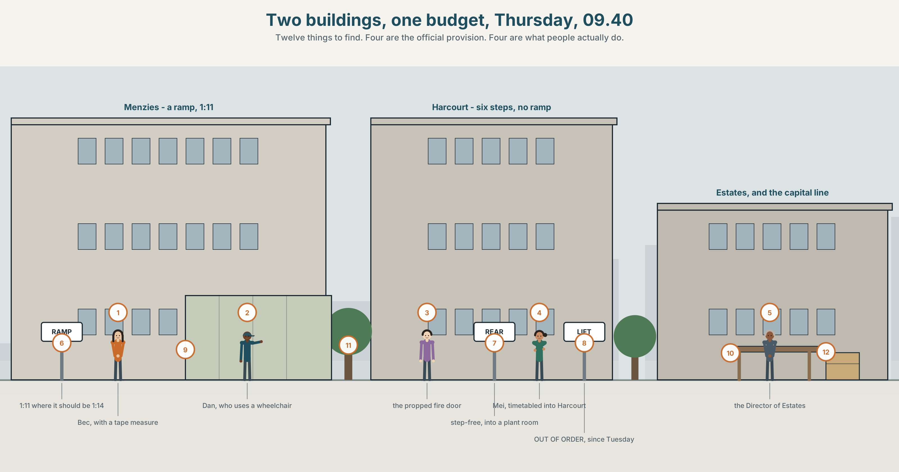
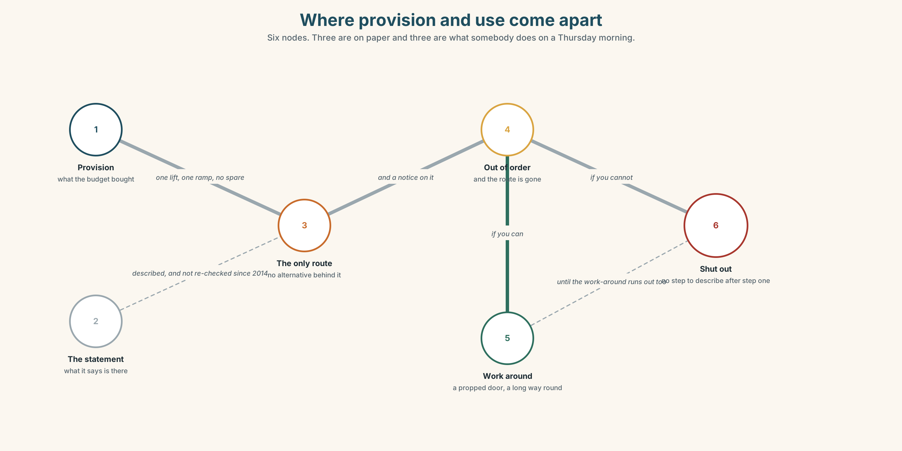
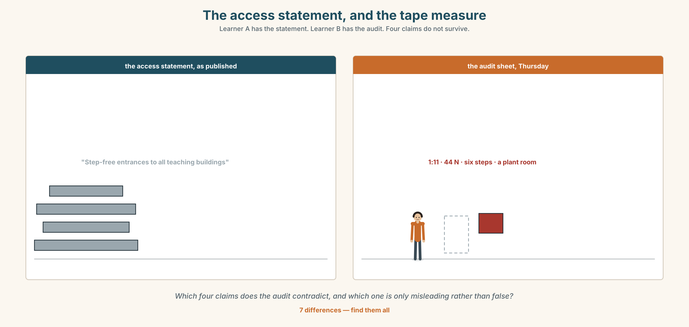
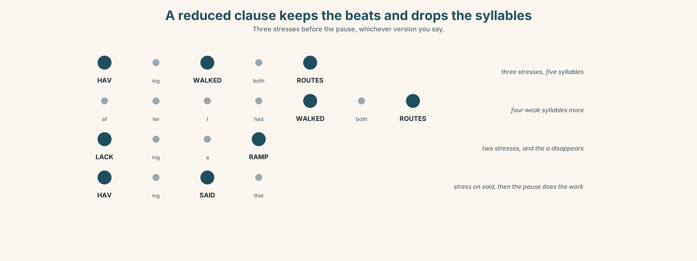
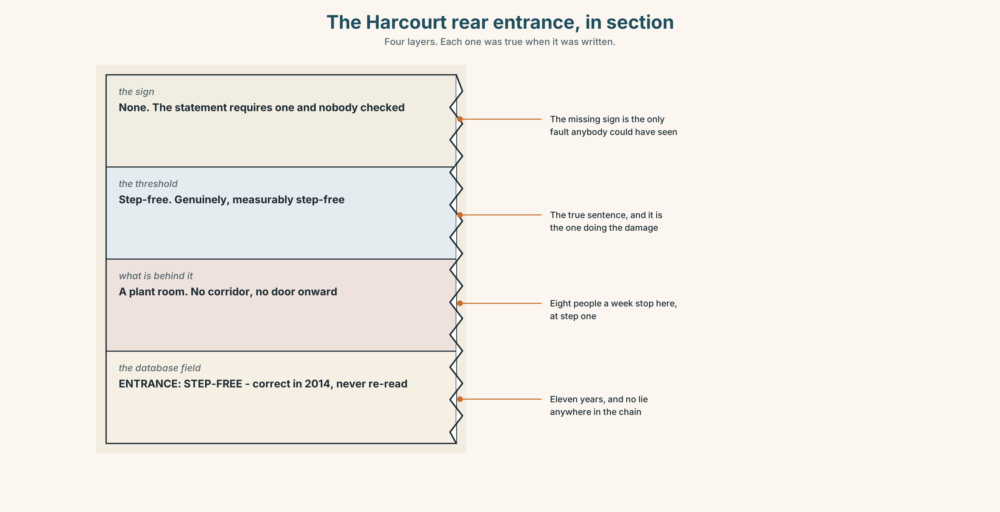
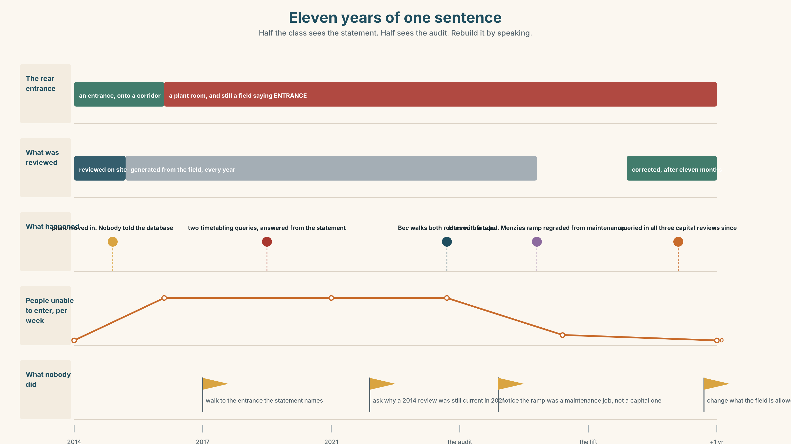
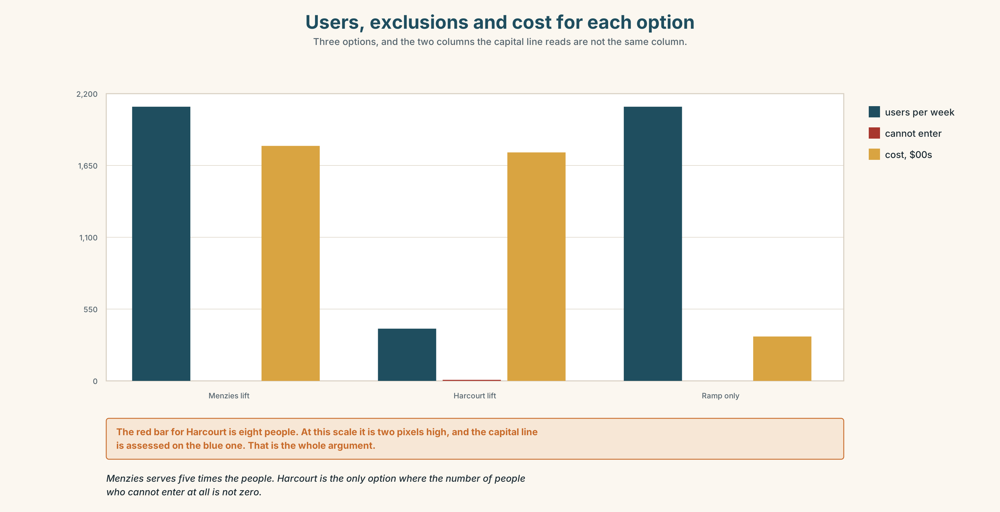

# B1.3 · Unit 2 · One Lift, Two Buildings

> **English Animated** · *Making the Case* · a university campus, Melbourne
> Student's Book pages 28–49 · 22 pp · ~11 hours

---

## Part 0 · The Big Picture ◆ **A · THE WORLD**

{width=6.6in}

*Two buildings, one budget, Thursday, 09.40 — Twelve things to find. Four are the official provision. Four are what people actually do.*

# Who is left out?

**By the end of this unit you can audit a space or a process for who it excludes, and report
what you find.**

| ◆ **A · THE WORLD** | A campus that works for almost everybody, and the budget for one lift |
|---|---|
| ◆ **B · THE SYSTEM** | participle clauses, present and past · reduced relatives · 23 words for access and exclusion · 22 participle and linking forms · the rhythm of a reduced clause |
| ◆ **C · THE PERFORMANCE** | An audit, written so that somebody can act on it |

---

### 0A · Find it

**Find twelve things in this picture.** Four of them are the official provision and four are
what people actually do.

> a ramp · a lift with a notice on it · six steps and a handrail · a propped fire door ·
> a long way round marked in worn grass · a sign pointing to an entrance ·
> a bell with a sign saying ring for assistance · a desk with nobody at it ·
> a lecture theatre with one flat row · a bike left across a kerb cut ·
> a map on a post · an accessible toilet being used as a store

### 0B · Guess it

**Two of the twelve exist because another one does not work.** Which, and who made them?

### 0C · Say it ⏺

**Record forty-five seconds.** *Think of a place you use daily. Name one person who could not
use it the way you do, and say exactly where they would stop.* You will record it again at the
end of this unit.

---

## Part 1 · Vocabulary Lab 1 ◆ **B · THE SYSTEM**

{width=6.6in}

*Where provision and use come apart — Six nodes. Three are on paper and three are what somebody does on a Thursday morning.*

### 1A · Meet — the words of getting in

Match each word to one place on the map.

> **access** · **barrier** · **ramp** · **lift** · **step** · **signage** · **provision** ·
> **accommodation** · **exemption** · **survey**

### 1B · Sort — the building, the policy, or the person?

Three columns.

> ramp · exemption · barrier · provision · disability · signage · accommodation · access ·
> inclusion

**One of them is routinely treated as a property of the person and is a property of the
building.** Which?

### 1C · Meet — the phrase that does most of the work

> **reasonable adjustment**

Two words, both of which are arguable. **Who decides what is reasonable**, and what happens when
the person who decides is the person paying?

### 1D · Collocation Lab

Complete each one with one word.

1. There is a **step-______** route, and it adds about four hundred metres.
2. The lift has been **out of ______** for nine days, twice this term.
3. **On ______** , the building is fully accessible.
4. The ramp at the north door is **the only ______** if you cannot do six steps.
5. Nobody can get a room changed **at short ______** , which is when it is always needed.
6. She has learned to **work ______** it, and she should not have to.

### 1E · The fixed expressions

> **f** **Nobody asked us.**
> **f** **It has been like that for years.**

Two sentences about the same building, said by two different people.

> **One is a complaint and one is a defence. Write the sentence that would answer each.**

### 1F · Own it

Think of a process rather than a place — enrolling, applying, booking something. Tell a partner
**four sentences**: the official route, the actual route, who falls out, and at which step.

---

## Part 2 · Listening ◆ **A · THE WORLD**

{width=6.6in}

*The audit, reported in the corridor — One of them has walked both routes. One of them has the capital line.*

### 2A · The audit 🔊 Track 2.1

**Before you listen.** Bec has walked both buildings with a measuring tape. There is money for
one lift. **Guess: which building has the stronger case on paper?**

**Listen once. One question.** How many people does each building affect?

**Listen again. Complete the table.**

| | Building A | Building B |
|---|---|---|
| people per week | | |
| existing provision | | |
| the alternative route | | |

**Listen again. Choose the best answer.**

1. Building A has **a ramp / a lift / neither**.
2. Building B has **a ramp / a lift / neither**.
3. The busier building is **A / B / they are the same**.
4. The cheaper installation is **A / B / they are the same**.

**Noticing.** Four sentences from the recording.

1. *Having walked both routes, I would put it in B.*
2. *Given the numbers, A is the obvious choice.*
3. *The route marked on the map, taken by nobody, adds four hundred metres.*
4. *Lacking a ramp, B has no route at all.*

**All four begin with a reduced clause. Which of the four has a different subject from its main
clause?**

### 2B · Decoding clinic 🔊 Track 2.2

Thirty seconds of Bec. Four jobs.

1. How many participle clauses can you count?
2. In *having walked both routes*, how many words are stressed?
3. Catch the two distances.
4. She uses one reduced clause that could be read two ways. Which?

> Transcripts, page 151.

---

## Part 3 · Grammar Lab 1 ◆ **B · THE SYSTEM**

### Clauses with the subject taken out

### 3A · Notice

Look at the four sentences in Part 2.

1. In sentence 1, who walked the routes?
2. In sentence 3, who took the route? **And who is the subject of the main clause?**
3. **Rewrite sentence 4 in full.** What word did the reduction remove?
4. *Having walked* and *walking*. **What does the perfect participle add?**
5. Try *"Lacking a ramp, the route is impossible."* **Who lacks the ramp?**

### 3B · See

{width=6.6in}

*Whose subject is the participle borrowing? — The same opening clause, twice. Once it attaches to a building and once to a route.*

### 3C · Know

| | Shape | Replaces |
|---|---|---|
| **present participle** | *Lacking a ramp, B has no route.* | *Because it lacks…* |
| **perfect participle** | *Having walked both, I would choose B.* | *After I had walked…* |
| **past participle** | *Taken together, the figures show…* | *If they are taken…* |
| **reduced relative** | *the route marked on the map* | *the route **which is** marked* |
| ***given* / *considering*** | *Given the numbers…* | prepositional, and no subject needed |

> **The hanging participle.** A participle clause takes its subject from the **main clause**.
> If they do not match, the sentence says something absurd.
> ✗ *Lacking a ramp, the route is impossible.* — the route does not lack a ramp.
> ✓ *Lacking a ramp, the building has no route.*

> ***Given*, *considering*, *owing to* and *due to* are not participles any more.** They have
> become prepositions and do not need to agree with anything, which is why they are safe.

> **A reduced relative drops *which is* / *who are*.**
> *the route **which is** marked* → *the route marked* ·
> *the students **who are** waiting* → *the students waiting*

> **Why it matters.** An audit written in participle clauses is half the length and twice as
> likely to attach a finding to the wrong thing.

### 3D · Use — controlled

> (1) __________ (walk) both routes with a tape, I would put the lift in B.
> (2) __________ the numbers, A is the obvious choice: it takes 2,100 people a week against
> B's 400. The route (3) __________ (mark) on the campus map, (4) __________ (take) by
> almost nobody, adds four hundred metres. (5) __________ (lack) any step-free entrance at
> all, B excludes people completely rather than inconveniencing them.
> (6) __________ (take) together, the two facts do not point the same way, and
> (7) __________ said that, one of them is about numbers and the other is about whether a
> person can enter a building.

### 3E · Use — guided

Reduce each one to a participle clause. **Two of them cannot be reduced safely — say why.**

1. Because B lacks a ramp, it has no step-free route.
2. After I had measured both, I changed my mind.
3. The route which is marked on the map is not the one people use.
4. Because the lift was out of order, the lecture was moved.
5. If the figures are taken together, they do not agree.

### 3F · Use — open

**In pairs.** Describe a building you both know, in six sentences, four of which must begin with
a participle clause. **Your partner's job** is to catch any hanging participle.

### 3G · Error autopsy

{width=6.6in}

*The hanging participle, and what it actually claims — The hanging participle, and what it actually claims*

**Read both versions. Then say what the first one claims about the route.**

### 3H · Check — eight items

> 1. ______ (walk) both routes, I would choose B.
> 2. ______ the numbers, A is the obvious choice.
> 3. The route ______ (mark) on the map adds 400 m.
> 4. ______ (lack) a ramp, the building has no route at all.
> 5. ______ (take) together, the figures disagree.
> 6. ✗ *Lacking a ramp, the route is impossible.* → correct it.
> 7. ______ (have) said that, the numbers are not the only question.
> 8. ______ to the lift being out, the class was moved. *(preposition)*

**0–4 →** Workbook pp. 10–13. **5–6 →** Part 6. **7–8 →** page 41.

---

## Part 4 · Speaking ◆ **C · THE PERFORMANCE**

### 4A · Fluency starter — reduce it

One learner gives a two-clause sentence. The next reduces it to a participle clause.
The next says whether the subjects match. **The chain breaks on a hanging participle.**

### 4B · The functional core — reporting an audit

{width=6.6in}

*The access statement, and the tape measure — Learner A has the statement. Learner B has the audit. Four claims do not survive.*

**Language Bank**

| | |
|---|---|
| **the method** | *Walking both routes with a tape…* · *Over two weeks I counted…* |
| **the finding** | *Lacking a ramp, B…* · *The route marked on the map…* |
| **the exclusion, named** | *A person using a wheelchair cannot…* · *At step four, they stop.* |
| **the honest limit** | *I did not test…* · *Given the circumstances, this is an estimate.* |

**Information gap.** Learner A has the official access statement. Learner B has the audit.
**Find the four claims in the statement that the audit contradicts.**

### 4C · The performance — three minutes ⏺

Report **an audit of a space or a process**. **Three minutes.** You must include:

> your method, with a number · who is excluded, named by what they cannot do ·
> the exact step at which they stop · one thing you did not test

**Record it.**

### 4D · Observer

One person listens for **one thing**: was the exclusion described as a property of the building
or of the person?

### 4E · Three criteria

> ☐ Did I use four participle clauses, none of them hanging?
> ☐ Is the exclusion located at a specific step?
> ☐ Did I say what I did not test?

---

## Part 5 · Reading ◆ **A · THE WORLD**

### 5A · Predict

Two letters. The title is **"Re: the lift in the Menzies building."**
**What do you expect the second letter to concede?** Two sentences.

### 5B · Read — two minutes and a quarter

---

**From: Bec Tran, Student Union**
**To: the Director of Estates**
**Re: the lift in the Menzies building**

I have walked both buildings with a tape measure and I am going to argue against our own
submission.

We asked for the lift in Menzies because Menzies is busier. It takes about 2,100 people a week
against Harcourt's 400. On every measure of volume, Menzies wins, and that is the case we made.

Menzies has a ramp. It is a bad ramp — it is 1:11 where it should be 1:14, and it ends at a door
that is heavier than the standard allows — but a person using a wheelchair can get into Menzies,
tired and annoyed.

Harcourt has six steps and no ramp and no lift. There is no route. The access statement describes
a step-free entrance at the rear; there is a rear entrance, it is step-free, and it opens into a
plant room.

So the honest sentence is this: in Menzies we would be improving access for people who have it
badly. In Harcourt we would be creating it for people who do not have it at all.

I am aware that 400 is a smaller number than 2,100 and I am not going to pretend otherwise.

---

**From: the Director of Estates**
**Re: your letter**

You are right about Harcourt and I did not know about the plant room, which I have now seen.

I want to put one thing on the record, not as a counter-argument but because it will come up.
There is a reason the budget goes to the busier building and it is not laziness: lifts are
funded from a capital line that is assessed on usage, and a lift serving 400 people a week will
score below the threshold and will be queried every year for fifteen years by somebody who has
not read your letter.

I am going to fund Harcourt. I am also going to write the paragraph you have just written into
the capital submission, because in four years I will not remember it and neither will anybody
else.

---

### 5C · Comprehension — eight questions

1. What does Bec say she is going to do in her first sentence?
2. **What are the two volume figures, and what case did they originally support?**
3. What is wrong with the Menzies ramp? Give both faults.
4. **What does the access statement claim about Harcourt, and what is actually there?**
5. What is Bec's "honest sentence"?
6. What does the Director concede, and what does he say he did not know?
7. **What is the funding problem he puts on the record, and why does he raise it?**
8. What two things does he say he is going to do?

### 5D · Vocabulary in context

Guess from the text. Then check.

> argue against our own submission · on every measure of volume · the standard allows ·
> a capital line · will be queried

### 5E · The counter-text

{width=6.6in}

*The access statement and the audit sheet — Two documents about the same two buildings, printed eleven years apart.*

**Read the access statement and the audit sheet, and answer.**

1. What does the access statement say about each of the two buildings?
2. **Which four of its claims does the audit contradict, and how?**
3. What is the gradient of the Menzies ramp, and what should it be?
4. How long has the Harcourt rear entrance been described as step-free?
5. One row of the audit has a note about something the auditor did not test. Which?

### 5F · Two texts

The access statement says Harcourt has a **step-free rear entrance**.
The audit says that entrance **opens into a plant room**.

**Put those two facts together. Is the statement false?** Three sentences.

---

## Part 6 · Vocabulary Lab 2 ◆ **B · THE SYSTEM**

### Reduced clauses and the words that replace them

### 6A · Sort — present participle, past participle, or preposition?

Three columns.

> having · lacking · facing · given · taken · seen · considering · based · followed ·
> surrounded · due

### 6B · Chunk completion

1. **Having ______ that** , four hundred is still four hundred.
2. **Given the ______** , the estimate is as good as it is going to get.
3. **______ to** the lift being out, two classes were moved.
4. The figures, **______ together** , do not point the same way.
5. **All things ______** , Harcourt is the stronger case.
6. The audit does not **______ for** the days the lift was out.

### 6C · Three that are not participles any more

**given · considering · due to**

> All three began as participles and have become prepositions. That is why they cannot hang:
> they are not looking for a subject.

**Rewrite each sentence as a full clause, and say what is lost.**

1. Given the numbers, A is the obvious choice.
2. Considering the gradient, the ramp is unusable in the wet.
3. Due to the lift being out, the class was moved.

### 6D · Two that need a preposition to finish

Some past participles will not stand alone in front of a noun. They need a small word
behind them, and the small word is not optional.

> **c** The estimate is **based on** the 2022 survey.
> **c** Each claim in the audit is **followed by** a photograph.

**Not:** *~~The estimate is based the 2022 survey.~~* · *~~Each claim is followed a photograph.~~*

**Complete each one with the right half of the pair.**

1. The exemption was granted on a statement ______ ______ one visit in 2019.
2. The site visit was ______ ______ a letter nobody answered.
3. A figure ______ ______ a single measurement is a figure worth checking.

### 6E · The fixed expression

> **f** **That being the case.**

A formal connector that is itself a participle clause.

> **Write the sentence before it and the sentence after it**, in a letter you might have to send.

### 6F · Contrast Clinic

Eight items. Reduce each one, or say why it cannot be reduced.

1. Because it lacks a ramp, the building excludes people.
2. After she had measured both, she changed her mind.
3. The route which is marked on the map adds 400 m.
4. Because the lift was out, the class was moved. *(watch the subject)*
5. If the figures are taken together, they disagree.
6. Since nobody asked the students, the statement went unchallenged.
7. The students who are waiting at the rear door cannot get in.
8. Because I had walked it, I knew the map was wrong.

---

## Part 7 · Pronunciation & Fluency Lab ◆ **B · THE SYSTEM**

### The rhythm of a clause with no subject

{width=6.6in}

*A reduced clause keeps the beats and drops the syllables — Three stresses before the pause, whichever version you say.*

### 7A · Hear 🔊 Track 2.3

> *Having walked both routes,* | *I would choose B.*
> **Three stresses in the first unit, three in the second, and a clear pause between them.**

Now the full version:

> *After I had walked both routes, I would choose B.*
> **Same number of stresses. Four more syllables, all of them weak.**

### 7B · Say

Say both. Then say this one three times, faster:

> *Lacking a ramp and lacking a lift, the building has no route at all.*

### 7C · Make it mean something

Say these two:

> *Having said that, four hundred is still four hundred.* *(a concession is coming)*
> *Having said that four hundred is still four hundred…* *(no pause — and it is a report)*

**One pause, and the sentence changes job.** Which is which?

### 7D · Fluency 30 ⏺

Thirty seconds: **four sentences beginning with a participle clause.**
Three times, faster, keeping the pause.

---

## Part 8 · Writing ◆ **C · THE PERFORMANCE**

### An access audit · 180 words

{width=6.6in}

*The Harcourt rear entrance, in section — Four layers. Each one was true when it was written.*

### 8A · Read the model

> Walking both routes with a tape, I measured the Menzies ramp at 1:11 against a standard of
> 1:14, and the entrance door at 44 newtons against a maximum of 30.
> `[the method and two measurements, both against a published standard]`
>
> Harcourt has six steps, no ramp and no lift. The rear entrance, described in the access
> statement as step-free, opens into a plant room. `[the finding, with a reduced relative carrying
> the contradiction inside the sentence]`
>
> A person using a wheelchair can enter Menzies, with difficulty. They stop at step one in
> Harcourt and there is no further step to describe.
> `[the exclusion, located exactly, and the second sentence is the whole argument]`
>
> I did not test the fire evacuation route in either building, lacking the authority to open the
> doors. `[what was not tested, and why — and the participle agrees]`

**Questions about the writer's choices:**

1. Both measurements are given against a standard. **What would a measurement alone be worth?**
2. The exclusion is *at step one*. **Why does locating it matter more than describing it?**
3. The last paragraph names something untested. **Does that weaken the audit?**

### 8B · The anti-model

> Accessibility across the campus is variable and some buildings present more challenges than
> others. Students with mobility needs may find certain routes difficult. The university is
> committed to improving access and welcomes feedback from all members of the community.

Correct English, and nobody could act on it. **Name three things that are missing**,
and say what *present more challenges* is doing.

### 8C · Plan

> the method, with a number → the finding, against a standard → the exclusion, located at a step
> → what you did not test, and why

### 8D · Write — 180 words
### 8E · Peer review — three criteria

> ☐ Is every measurement given against a standard?
> ☐ Is the exclusion located at a specific step?
> ☐ Does every participle clause agree with its main subject?

### 8F · Write it again · 8G · Publish

On the wall, with the access statement from Part 5E beside it.

---

## Part 9 · The File ◆ **A · THE WORLD + C · THE PERFORMANCE**

# STUDY FILE · The Question

{width=6.6in}

*Nine minutes, nine questions — A seminar on research design. One question took four of the nine minutes.*

### 9A · Nine minutes of questions 🔊 Track 2.4

A seminar on research design. The tutor takes nine questions. **Listen.**

1. Which question gets the longest answer, and is it the best question?
2. **Which question does the tutor say she cannot answer, and what does she do instead?**
3. One question is asked in a way that makes it impossible to answer. What is wrong with it?

### 9B · Four kinds of question

> **the clarification** — I did not follow something
> **the extension** — I followed it and want more
> **the challenge** — I followed it and I am not convinced
> **the display** — I want you to know that I know something

**Which of the four is hardest to ask, and which is easiest to disguise as another?**

### 9C · Asking a question you are afraid of

Thanh writes better than he speaks. In nine weeks he has asked one question.

**Which of these would you advise him to use, and why?**

1. *"Sorry, could you say that again?"*
2. *"Can I check I've understood: are you saying that…?"*
3. *"I don't follow the step from the second graph to the conclusion."*
4. *"This might be a stupid question, but…"*

### 9D · Your turn

In fours. **Twelve minutes.** One person presents anything for two minutes.
**Everybody else must ask one question of each of the four kinds**, in writing first, then aloud.
Then: which was hardest to write?

### 9E · Transfer

**Count the questions asked in your next class or meeting**, and sort them into the four kinds.
Bring the four numbers.

---

## Part 10 · Mediation & Interaction ◆ **C · THE PERFORMANCE**

{width=6.6in}

*Eleven years of one sentence — Half the class sees the statement. Half sees the audit. Rebuild it by speaking.*

### 10A · Relay

Half the class sees the access statement. Half sees the audit.
**Rebuild both buildings by speaking.** Twelve minutes.

### 10B · Simplify

Explain the audit from Part 5E to a student who is about to be timetabled into Harcourt.
**Five sentences only.**

> **Plan:** what is there → what is not → what the statement says → what you should do →
> who to write to

### 10C · Compress

Bec's letter into **forty words**, keeping the honest sentence.

### 10D · Online

Write **one message** to the Director of Estates: you accept the funding constraint, you have
the audit, and you are asking for one specific paragraph in one specific document.

### 10E · Your language

Does your language reduce clauses the way English does? **Say *lacking a ramp, the building has
no route* in both languages.** Which needs more words, and which is more likely to be ambiguous?

---

## Part 11 · The Decision ◆ **C · THE PERFORMANCE**

# The busier building, or the one with no route

There is money for one lift. Menzies takes 2,100 people a week and has a bad ramp. Harcourt
takes 400 and has nothing.

- **Menzies.** The volume case, the capital-line case, and about sixty people a week who
  currently enter by a 1:11 ramp and a door they cannot open alone.
- **Harcourt.** Four hundred people a week, of whom perhaps eight cannot enter at all, and a
  building that will be queried every year for fifteen years as under-used.
- **Neither yet.** Fix the Menzies ramp and the door for a fifth of the cost, and bid again for
  Harcourt next year with the audit attached.

### 11A · The evidence

{width=6.6in}

*Users, exclusions and cost for each option — Three options, and the two columns the capital line reads are not the same column.*

1. **The access statement and the audit** from Part 5E — and the untested row.
2. **The chart** — users, exclusions and cost for each option.
3. **The voice.** A student, thirty seconds: *"I have been told four times that Harcourt has a
   step-free entrance. I have been to it. It is a step-free entrance into a plant room. I would
   like somebody to explain how a sentence like that survives for eleven years, because I do not
   think anybody lied."*

### 11B · Talk about it

In fours. Everybody speaks twice. Use the frame.

> *______ (participle clause), the building ______ . That being the case, ______ .*

**Words you can use:** *access · barrier · provision · step-free · reasonable adjustment ·
the only route · shut out · work around · on paper*

### 11C · Decide

Write **three sentences**. Choose, say why, and name what it costs.

> I think the university should ______________________ ,
> because ______________________ .
> What this costs is ______________________ .

### 11D · Model decision

> Fund Harcourt, and fix the Menzies ramp from maintenance rather than capital, which is where a
> gradient fault belongs anyway. The real problem in this decision is that one of the two options
> is counted and the other is not: 2,100 is a number the capital line understands and *eight
> people who cannot enter a building* is not. Writing the audit into the submission is the only
> part of this that will still be working in four years.

### 11E · The Reveal

> **What happened.** Harcourt got the lift. The Menzies ramp was regraded from the maintenance
> budget in the same year, at about a fifth of the cost, which nobody had previously suggested
> because the two budgets are held by different people who meet twice a year.
>
> The access statement was corrected. It took eleven months, because the statement is generated
> from a database field, and the field had been correct in 2014 when the rear entrance was still
> an entrance.
>
> The Harcourt lift has been queried in each of the three capital reviews since. The Director's
> paragraph has been read out at two of them.

**The lift went in. The ramp was a maintenance job all along. And a sentence stayed wrong for
eleven years because the room behind it changed and the field did not.**

> **Was it the right decision?** Say why — and say what should happen to the database field.

---

## Part 12 · Landing ◆ **all three lines**

### 12A · Recycle — twelve items

> 1. ______ (walk) both routes, I would choose B.
> 2. ______ the numbers, A is the obvious choice.
> 3. The route ______ (mark) on the map adds 400 m.
> 4. ______ (lack) a ramp, the building has no route.
> 5. There is a **step-______** route, and it adds 400 m.
> 6. The lift has been **out of ______** for nine days.
> 7. **On ______** , the building is fully accessible.
> 8. She has learned to **work ______** it.
> 9. *(Unit 1)* Forty-one students, most ______ ______ work, passed.
> 10. *(Unit 1)* Attendance has halved, ______ nobody disputes.
> 11. *(B1.2 U6)* She ______ (have) it done on Thursday.
> 12. *(A2.2 U8)* The hall, ______ was built in 1884, is the oldest.

### 12B · Consolidate

**One hundred and eighty words.** An audit of a space or a process. Your method with a number,
a measurement against a standard, an exclusion located at a step, and one thing you did not test.

### 12C · Can-do, with evidence

| I can… | My evidence | Sure? |
|---|---|---|
| reduce a clause without leaving the participle hanging | Part 3H score | ◯ ◑ ● |
| report an audit in three minutes | Part 4C recording | ◯ ◑ ● |
| write 180 words somebody could act on | Part 8 draft 2 | ◯ ◑ ● |
| ask a clarification, an extension and a challenge | Part 9D questions | ◯ ◑ ● |

### 12D · Replay ⏺

Find your forty-five seconds from Part 0C. Listen. **Record it again.**
**Two sentences:** what is different, and whether you can now name the step.

### 12E · Glossary — forty-five items, as a map

> **THE BUILDING** · access · barrier · ramp · lift · step · signage · step-free · the only route · out of order
> **THE POLICY** · provision · accommodation · exemption · survey · inclusion · reasonable adjustment · on paper · at short notice
> **THE PERSON** · disability · shut out · work around · get by · point out
> **WHAT PEOPLE SAY** · nobody asked us · it has been like that for years
> **REDUCED CLAUSES** · having · lacking · facing · seen · taken · left · based on · followed by · surrounded · having said that · taken together
> **PREPOSITIONS NOW** · given · considering · due to · given the circumstances · all things considered · that being the case · allow for · rule out

### 12F · Next

> **Unit 3 · Is disagreement useful?**
