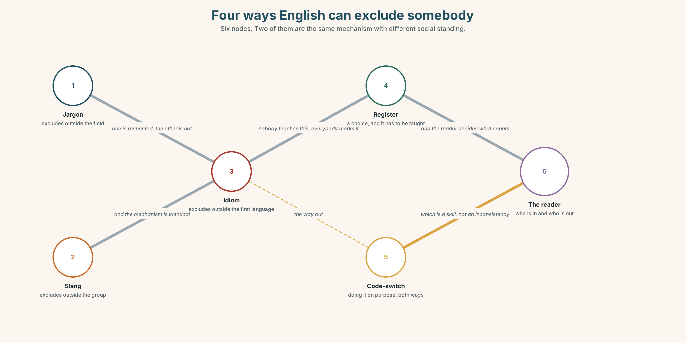
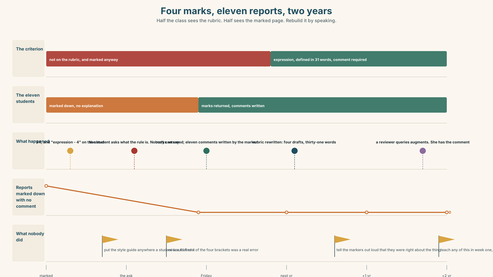
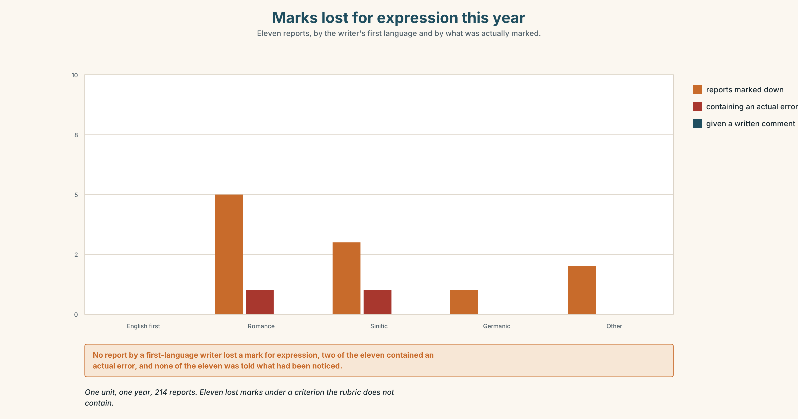

# B1.3 · Unit 9 · Perfectly Clear

> **English Animated** · *Making the Case* · a university campus, Melbourne
> Student's Book pages 182–203 · 22 pp · ~11 hours

---

## Part 0 · The Big Picture ◆ **A · THE WORLD**

{width=6.6in}

*The science building and the canteen, one o'clock — Twelve things to find. Four of them are one register. Four are another.*

# Can you put that another way?

**By the end of this unit you can say the same thing three ways, for three audiences.**

| ◆ **A · THE WORLD** | A lab report that is factually perfect and has lost four marks for its English |
|---|---|
| ◆ **B · THE SYSTEM** | phrasal verbs: separable, inseparable, three-part · 24 words for register and identity · 21 particles and combinations · stress on the particle |
| ◆ **C · THE PERFORMANCE** | One idea, said three ways, with nothing lost in any of them |

---

### 0A · Find it

**Find twelve things in this picture.** Four of them are one register. Four are another.

> a lab bench with a labelled rack · a marked report with four red brackets in the margin ·
> a style guide on a shelf · a whiteboard with a diagram and no words ·
> a poster for a research talk · a canteen table with six people and four languages ·
> a sign saying *Please do not leave glassware in the sink* ·
> a handwritten note saying *don't put glass in here* · a lanyard from a conference ·
> a laptop with a translation tab open · a door with office hours on it ·
> a shelf of dictionaries nobody has opened this year

### 0B · Guess it

**Two of the twelve say exactly the same thing.** Which, and which one works better where it is?

### 0C · Say it ⏺

**Record forty-five seconds.** *Explain something you know well, twice: once to a colleague and
once to a twelve-year-old.* You will record it again at the end of this unit.

---

## Part 1 · Vocabulary Lab 1 ◆ **B · THE SYSTEM**

{width=6.6in}

*Four ways English can exclude somebody — Six nodes. Two of them are the same mechanism with different social standing.*

### 1A · Meet — the words of how we sound

> **register** · **idiom** · **colloquial** · **formal** · **jargon** · **slang** ·
> **accent** · **code-switch**

1. Which two of these are about a group rather than a situation?
2. **What is the difference between *jargon* and *slang*?** Both exclude people. How?
3. *Register* is a choice. **What is it a choice between?**
4. **Why is *code-switch* a skill rather than an inconsistency?**

> ***Formal* is not better.** It is one register of several, and using it where it does not
> belong is exactly the same kind of error as using slang in a thesis — it is just the one
> nobody is marked down for.

### 1B · Sort — the writing, the marking, or the speaker?

> fluency · vocabulary · marking · penalty · mark down · native-like · plain English ·
> in your own words · the house style

**Three columns. Two of them belong in more than one.** Say which and why.

### 1C · Meet — the phrase that does most of the work

> **c** **plain English**

Not simple English. English in which the structure of the sentence matches the structure of the
idea, so the reader does not have to hold anything while they wait.

1. **Rewrite this in plain English:** *It is not unlikely that a reduction in the frequency of
   sampling would not be without consequence for the reliability of the result.*
2. How many negatives did you remove?

### 1D · Collocation Lab

| | |
|---|---|
| **mark down** | ~ for grammar · be ~ed · ~ heavily |
| **get across** | ~ an idea · it did not ~ |
| **come across** | ~ as rude · how you ~ |
| **a turn of phrase** | an unusual ~ · a nice ~ |

**Which two of these are about the writer, and which two about the reader?**

### 1E · The fixed expressions

> **f** **It is perfectly clear.** — a sentence that settles an argument about meaning by
> refusing to have it.
> **f** **Unidiomatic is not a fault.** — the claim this unit is built on. **Do you agree?**

**Which one is a position and which one is a move?**

### 1F · Own it

The four phrasal verbs of making yourself understood.

> **get across** · **put across** · **come across** · **pick up on**

1. Three of them are about the message and one is about the listener. Which?
2. **What is the difference between *get across* and *put across*?**
3. *Come across* has two meanings. Give both.
4. Write one sentence in which somebody **picks up on** something that was not said.

---

## Part 2 · Listening ◆ **A · THE WORLD**

{width=6.6in}

*The marking office, Thursday — One of them took the four marks off. One of them has seen eleven of these.*

### 2A · Four marks 🔊 Track 9.1

**Before you listen.** A lab report has lost four marks out of a hundred. The science is
correct. **Guess: what is the marker's reason?**

**Listen once. One question.** What exactly is the criterion the four marks came off?

**Listen again. Complete the table.**

| | The marker | The student | The unit chair |
|---|---|---|---|
| what the report does well | | | |
| what the four marks are for | | | |
| what should change | | | |

**Listen again. Choose the best answer.**

1. The marker thinks the English is **wrong / unidiomatic / unclear**.
2. The student has **asked for a remark / accepted it / asked what the rule is**.
3. The criterion mentions **grammar / expression / nothing about language**.
4. The unit chair has seen this **for the first time / before / eleven times this year**.

**Noticing.** Four sentences from the recording.

1. *I could not put up with it for another semester.*
2. *Nobody has ever been able to say what we are marking them down for.*
3. *She got the idea across in every single paragraph.*
4. *What I cannot get away with is marking something I cannot name.*

**All four contain a phrasal verb. Which of them could be split by an object?**

### 2B · Decoding clinic 🔊 Track 9.2

Thirty seconds of the unit chair. Four jobs.

1. How many phrasal verbs can you count?
2. In *put up with*, which of the three words is stressed?
3. Catch the two numbers.
4. She uses one phrasal verb and then the formal single word for it. Which pair?

> Transcripts, page 158.

---

## Part 3 · Grammar Lab 1 ◆ **B · THE SYSTEM**

### Phrasal verbs, and where the object can go

### 3A · Notice

Look at the four sentences in Part 2.

1. In sentence 1, can you say *put it up with*?
2. **In sentence 3, can you say *got across the idea*?** Can you say *got it across*?
3. **Put a pronoun object into each of the four.** Which ones force you to split the verb?
4. Sentence 4 has a three-part verb. **How many of the three can move?**
5. Try *"She got across it."* **What is wrong with it?**

### 3B · See

{width=6.6in}

*Where the object is allowed to stand — One rule is absolute. The other three are about which group the verb belongs to.*

### 3C · Know

| Type | Example | Where the object goes |
|---|---|---|
| **separable** | *mark down · bring up · take on* | either side of the particle — **but a pronoun must split it** |
| **inseparable** | *get over · come across · look into* | always after the particle |
| **three-part** | *put up with · look forward to · run out of* | always after both particles |
| **no object at all** | *stand down · die down · look back* | nothing goes anywhere |

> **The pronoun rule is the only rule here that is absolute.** With a separable verb,
> *mark the student down* and *mark down the student* are both English. ***Mark down her* is
> not.** It must be *mark her down*.

> **Three-part verbs never split.** *Put up with it*, never *put it up with*. There are no
> exceptions, which makes them the easiest group of the four.

> **The particle carries the meaning, and often the stress.** *Look up* a word, *look into* a
> claim, *look over* a draft, *look after* a child. The verb is the same. The particle is the
> whole word.

> **Why it matters.** A phrasal verb is not informal English. *Put up with* is not slang; it is
> the ordinary way to say *tolerate*, and refusing them does not make writing more formal — it
> makes it foreign.

### 3D · Use — controlled

> She got the idea (1) __________ in every paragraph, which is what the criterion asks for, and
> she was marked (2) __________ four points for expression. The chair looked (3) __________ it
> and found eleven similar cases this year. "What I cannot get (4) __________ with," she said,
> "is penalising something nobody can name." She is not going to put (5) __________
> __________ it for another semester. She has brought it (6) __________ at three meetings and is
> running (7) __________ of ways to raise it politely.

### 3E · Use — guided

Put a pronoun object into each one. **Two of them must split.**

1. The marker marked down the student.
2. She got across the idea.
3. He could not put up with the criterion.
4. The chair looked into the eleven cases.
5. They brought up the question at a meeting.

### 3F · Use — open

**In pairs.** Describe a rule you think is unfair, in six sentences, four of which must use
phrasal verbs of three different types. **Your partner's job** is to try to split each one.

### 3G · Error autopsy

{width=6.6in}

*Splitting the one that never splits — Splitting the one that never splits*

**Read both versions. Then say which group of verbs the writer has applied the wrong rule to.**

### 3H · Check — eight items

> 1. She got the idea ______ . *(separable, noun object)*
> 2. She got ______ ______ . *(separable, pronoun object)*
> 3. He could not put ______ ______ it. *(three-part)*
> 4. ✗ *He could not put it up with.* → correct it.
> 5. The chair looked ______ it. *(inseparable)*
> 6. They brought ______ ______ at the meeting. *(separable, pronoun)*
> 7. We are running ______ ______ time. *(three-part)*
> 8. He is looking ______ ______ it. *(three-part, positive)*

**0–4 →** Workbook pp. 38–41. **5–6 →** Part 6. **7–8 →** page 195.

---

## Part 4 · Speaking ◆ **C · THE PERFORMANCE**

### 4A · Fluency starter — three registers

One learner says a sentence. The next says it formally. The next says it to a child.
**The chain breaks when something is lost.**

### 4B · The functional core — one idea, three audiences

{width=6.6in}

*The same finding, two registers — Learner A has the technical version. Learner B has the version for a newspaper.*

**Language Bank**

| | |
|---|---|
| **to a specialist** | *The sampling interval was reduced to…* |
| **to a colleague elsewhere** | *We took fewer readings, which means…* |
| **to a non-specialist** | *We checked less often. Here is what that costs.* |
| **the thing that must survive** | *…and the number is the same in all three.* |

**Information gap.** Learner A has the technical version. Learner B has the version for a
newspaper. **Find the one fact that has quietly changed between them.**

### 4C · The performance — three minutes ⏺

Explain **one idea three times**. **Three minutes.** You must include:

> a specialist version · a version for an educated non-specialist · a version for a
> twelve-year-old · and the same number, unchanged, in all three

**Record it.**

### 4D · Observer

One person listens for **one thing**: did anything become false on the way to being simpler?

### 4E · Three criteria

> ☐ Is the key fact identical in all three versions?
> ☐ Did the simplest version avoid becoming inaccurate?
> ☐ Did I change register without changing content?

---

## Part 5 · Reading ◆ **A · THE WORLD**

### 5A · Predict

A feature, titled **"The four marks."**
**What do you expect the marker to say when asked to explain?** Two sentences.

### 5B · Read — two minutes and a quarter

---

**THE FOUR MARKS**
*a feature*

The report is on soil respiration and it is, by the standards of a second-year unit, extremely
good. The method is reproducible. The two graphs are correctly labelled. The discussion
identifies a confound the student was not taught to look for. It was marked 84, and the sheet
says: *expression — 4*.

I asked to see what the four marks came off. There are eleven criteria on the rubric and none
of them mentions language. The marker, who has taught the unit for nine years and is one of the
best teachers in the faculty, said this: "It reads as though it was translated. It is not
wrong. I could not point at a sentence and tell you it was wrong. It just is not how we say it."

I asked for an example. She found one in twenty seconds, which tells you she had noticed it
properly: *The data permits us to affirm that the respiration rate augments with temperature.*

Every word in that sentence is an English word used with its dictionary meaning. *Permits*,
*affirm*, *augments*. A chemist in 1890 would have written something close to it. What makes it
read as foreign is that current scientific English prefers *allow*, *conclude* and *increase* —
a preference, not a rule, which nobody teaches and everybody enforces.

The student is from a Francophone education system in which *augmenter* is the unmarked word.
She has not made an error. She has made a different, defensible choice in a language whose
conventions she was never shown, and she has lost four marks for it in a unit whose rubric does
not mention language at all.

Here is what makes this hard rather than simple. The marker is not wrong that it matters. A
paper written like that will be read differently by reviewers, and pretending otherwise would
not help the student. The question is not whether to tell her. It is whether to tell her in a
comment or in a number, and whether the number is allowed to exist in a rubric that does not
mention it.

Eleven reports this year have lost marks under a criterion that is not on the sheet. Nobody has
been able to name it, and everybody can recognise it in twenty seconds.

---

### 5C · Comprehension — eight questions

1. What is the report about, and what three things does the writer praise?
2. **What was the mark, and what does the sheet say?**
3. How many criteria are on the rubric, and how many mention language?
4. **Quote the marker's explanation. What does she say she cannot do?**
5. What is the example sentence, and what is wrong with it?
6. **Why is the student's choice described as "defensible"?**
7. What does the writer say makes this "hard rather than simple"?
8. What is the final pair of numbers, and what do they show together?

### 5D · Vocabulary in context

Guess from the text. Then check.

> a confound · the unmarked word · a preference, not a rule · read differently by reviewers ·
> in a comment or in a number

### 5E · The counter-text

{width=6.6in}

*The rubric and the marked page — Eleven criteria, none about language, and four brackets in a margin.*

**Read the rubric and the marked page, and answer.**

1. What are the eleven criteria, and what is each worth?
2. **Where on the rubric could four marks for expression legitimately come from?**
3. What do the four margin brackets mark, in each case?
4. What does the faculty style guide say about *augment*?
5. One of the four brackets marks something that *is* an error. Which?

### 5F · Two texts

The rubric has **eleven criteria** and none of them mentions language.
Eleven reports have **lost marks** for language this year.

**Is the marking wrong, or is the rubric?** Three sentences.

---

## Part 6 · Vocabulary Lab 2 ◆ **B · THE SYSTEM**

### What the particle is doing

### 6A · Sort — what does each particle add?

Four columns: **completely · continuing · away from · towards**.

> up · out · off · over · through · down · on · away · back · into · around

### 6B · Chunk completion

1. **put ______ ______** the noise for another year
2. **get ______ ______** saying nothing
3. **look ______ ______** the summer
4. **run ______ ______** time
5. **go ______ ______** the decision
6. **catch ______ ______** the reading

### 6C · Two that do the same job in different registers

**do away with · abolish**

> Identical in meaning. One of them is three words and ordinary; the other is one word and
> formal. **Neither is better.** The choice is about the reader, and in a report for a committee
> the one-word version is usually right — not because it is more correct but because it is
> shorter in a document people skim.

**Write two sentences about the rubric, one with each.**

### 6D · Two that are separable, and one trap

> **p** **take over** · **p** **bring up**

> *She took the unit over.* · *She took it over.* · *She took over the unit.*
> *He brought the question up.* · *He brought it up.* · *He brought up the question.*

**All three positions work with a noun. Only one works with a pronoun. Which, and why is that
the only rule you have to remember?**

### 6E · The fixed expression

> **f** **Say that again in writing.**

Four words that change what a claim costs. It is the move the unit chair makes at the end of
Part 2, and it is also what the student should have been told in week one.

> **Write the exchange around it.**

### 6F · Contrast Clinic

Eight items. **Four are wrong. Correct them and say what the rule is.**

1. He could not put it up with.
2. He could not put up with it.
3. She marked down her.
4. She marked her down.
5. She got across the idea.
6. She got across it.
7. We are looking forward to it.
8. We are looking it forward to.

---

## Part 7 · Pronunciation & Fluency Lab ◆ **B · THE SYSTEM**

### The particle takes the stress

{width=6.6in}

*The particle takes the stress — This is the opposite of what most learners do, and it is the fastest thing to fix.*

### 7A · Hear 🔊 Track 9.3

> *She marked it* **DOWN** *.*
> **In a phrasal verb the particle carries the stress, not the verb. This is the opposite of
> what most learners do.**

Compare with an ordinary verb plus preposition:

> *She* **LOOKED** *at it.* — here the verb is stressed and *at* is weak.

### 7B · Say

Say both. Then say this one three times, faster:

> *I could not put* **UP** *with it, so I brought it* **UP** *.*

### 7C · Make it mean something

Say these two:

> *She* **TOOK** *over.* *(from somebody — and the handover is the point)*
> *She took* **OVER** *.* *(entirely — and nobody else has a say now)*

**One verb, two takeovers.** Which is which?

### 7D · Fluency 30 ⏺

Thirty seconds: **four phrasal verbs, the stress on the particle each time.**
Three times, faster.

---

## Part 8 · Writing ◆ **C · THE PERFORMANCE**

### The same paragraph, three ways · 180 words total

{width=6.6in}

*One idea, three registers, in section — Four layers, and the same number is in all four.*

### 8A · Read the model

> **For the journal.** Respiration rate increased approximately linearly with soil temperature
> across the sampled range (8–24 °C), with a *Q*₁₀ of 2.1. `[the specialist version — and the
> number is here]`
>
> **For a colleague in another field.** Warmer soil breathes out more carbon dioxide, and over
> the range we measured it roughly doubles for every ten degrees. `[same claim, no notation, and
> the number survives as "doubles"]`
>
> **For a twelve-year-old.** Soil is full of things that are alive, and when it gets warmer they
> get busier and give off more gas. Ten degrees warmer, about twice as busy. `[same number, and
> nothing in it has become false]`
>
> **What did not change.** The range. Nothing above 24 °C was measured, and none of the three
> versions claims anything about it. `[the honest limit, which is the hardest thing to keep]`

**Questions about the writer's choices:**

1. The number appears in all three. **What would the third version be worth without it?**
2. The third version says "things that are alive". **Is that less accurate or less precise?**
3. The fourth paragraph states a limit. **Why is that the hardest part to keep simple?**

### 8B · The anti-model

> It is not unlikely that a reduction in the frequency of sampling would not be without
> consequence for the reliability of the result, and it may therefore be considered that a more
> frequent sampling regime might in certain circumstances be preferable.

Correct English, and it takes three readings. **Count the negatives and the hedges**, and say
how many words the sentence actually needs.

### 8C · Plan

> the specialist version, with the number → the educated non-specialist, same number →
> the twelve-year-old, same number → the limit, kept in all three

### 8D · Write — 180 words total
### 8E · Peer review — three criteria

> ☐ Is the key number identical in all three?
> ☐ Has anything become false on the way to being simpler?
> ☐ Does the limit survive into the simplest version?

### 8F · Write it again · 8G · Publish

Read the third version aloud to somebody outside your subject. **Watch where they stop you.**

---

## Part 9 · The File ◆ **A · THE WORLD + C · THE PERFORMANCE**

# CULTURE FILE · English as a Lingua Franca

{width=6.6in}

*Four minutes, six people, four first languages — Where the breakdowns were, and who repaired them.*

### 9A · Six people, four first languages 🔊 Track 9.4

A research meeting in which nobody is a first-language speaker of English. **Listen.**

1. How many misunderstandings are there in four minutes?
2. **Which one is repaired, and who repairs it?**
3. One speaker uses an idiom and it fails. What do they do next?

### 9B · What the research keeps finding

In meetings where English is everybody's second language, **idioms are the main source of
breakdown**, and the speakers who are most easily understood are not the ones closest to a
first-language model. They are the ones who **avoid idiom, signal structure out loud, and check**.

**Does that match your experience?**

### 9C · The uncomfortable part

If *native-like* is not the target, what is? **Intelligibility to the people in the room** is
one answer, and it has a problem: the room changes. A paper is read by people you will never
meet.

**Where do you personally draw the line?**

### 9D · Your turn

In fours. **Twelve minutes.** Discuss anything, with one rule: **no idioms**. Then: what did you
reach for and have to replace, and was the replacement worse?

### 9E · Transfer

**Count the idioms in the next thing you read for your subject.** How many would you have to
explain to somebody three years into English?

---

## Part 10 · Mediation & Interaction ◆ **C · THE PERFORMANCE**

{width=6.6in}

*Four marks, eleven reports, two years — Half the class sees the rubric. Half sees the marked page. Rebuild it by speaking.*

### 10A · Relay

Half the class sees the rubric. Half sees the marked page.
**Rebuild the four marks by speaking.** Twelve minutes.

### 10B · Simplify

Explain to the student what happened and what to do. **Five sentences only.**

> **Plan:** what is good → what the four marks are for → why it is not on the rubric →
> what you would change in the sentence → what to ask for, and from whom

### 10C · Compress

The feature in Part 5B into **forty words**, keeping the last two numbers.

### 10D · Online

Write **one message** to the unit chair. You are not asking for the marks back. You are asking
for the criterion to be written down, one way or the other, before next semester.

### 10E · Your language

Does your language have phrasal verbs? **Say *put up with* and *tolerate* in both languages.**
Which register does each one belong to, and do they line up the way the English pair does?

---

## Part 11 · The Decision ◆ **C · THE PERFORMANCE**

# Four marks, eleven reports, and a criterion that is not on the sheet

The science is correct. The English is unidiomatic and not wrong. Eleven reports have lost marks
this year under a criterion the rubric does not contain. The unit chair has to decide before
marks are released on Friday.

- **Return the marks.** The rubric does not mention language, so marks cannot be taken for it.
  Eleven students go up by between two and five points and nobody is told why.
- **Keep the marks, add the criterion.** Write *expression* into the rubric for next year, with
  a definition, and let this year stand. Honest about the future and not about the past.
- **Return the marks and write the comment.** Give the four back, and give every one of the
  eleven a written note naming exactly what was noticed and why it will matter to a reviewer.

### 11A · The evidence

{width=6.6in}

*Marks lost for expression this year — Eleven reports, by the writer's first language and by what was actually marked.*

1. **The rubric and the marked page** from Part 5E — and the bracket that marks a real error.
2. **The chart** — marks lost for expression this year, by first language of the writer.
3. **The voice.** The student, thirty seconds: *"I would rather have the comment than the four
   marks. I am going to write in English for thirty years. Nobody has ever told me what the
   difference is between a sentence that is right and a sentence that is right and reads like
   somebody else's."*

### 11B · Talk about it

In fours. Everybody speaks twice. Use the frame.

> *She got ______ across. She was marked ______ for ______ , which ______ .*

**Words you can use:** *register · idiom · colloquial · jargon · code-switch · fluency ·
penalty · plain English · native-like · the house style*

### 11C · Decide

Write **three sentences**. Choose, say why, and name what it costs.

> I think the unit chair should ______________________ ,
> because ______________________ .
> What this costs is ______________________ .

### 11D · Model decision

> Return the marks and write the comment. The marks are indefensible — there is no criterion —
> and the observation is correct, which means the only honest move is to separate them: give
> back what cannot be justified and give the student what is actually useful, which was never
> the four points. The cost is that the markers will feel overruled on the one part of this
> where they were right, and the chair has to say so out loud when she tells them.

### 11E · The Reveal

> **What happened.** The marks went back. All eleven students received a comment, written by the
> original marker, naming the specific choices and what a reviewer would do with them. Eight of
> the eleven replied; four asked follow-up questions; one asked for a meeting and came with a
> list of nineteen words she had been using that she now wanted checked.
>
> *Expression* went onto the rubric for the following year, with a definition that took four
> drafts and ended up at thirty-one words. In its first year it was used eleven times, and
> every one of the eleven came with a comment, because the definition requires one.
>
> The sentence about soil respiration appeared, unchanged, in a paper two years later. One
> reviewer queried *augments*. The student had the comment, and changed it, and wrote in the
> response letter that it was a preference rather than an error, which the reviewer accepted.

**The four marks were never the useful thing. What the student wanted was the twenty seconds
it took the marker to find the sentence, written down.**

> **Was it the right decision?** Say why — and say what should happen in week one of next
> semester.

---

## Part 12 · Landing ◆ **all three lines**

### 12A · Recycle — twelve items

> 1. She got the idea ______ .
> 2. She got ______ ______ . *(pronoun)*
> 3. He could not put ______ ______ it.
> 4. The chair looked ______ it.
> 5. They brought ______ ______ at the meeting. *(pronoun)*
> 6. We are running ______ ______ time.
> 7. He is looking ______ ______ it.
> 8. You cannot get ______ ______ saying nothing.
> 9. She went ______ ______ the decision.
> 10. He needs to catch ______ ______ the reading.
> 11. They want to do ______ ______ the criterion.
> 12. She ______ over the unit in March.

### 12B · Consolidate

**Four columns, from memory:** separable · inseparable · three-part · no object.

### 12C · Can-do, with evidence

> ☐ I can say one idea three ways without losing the number. **Evidence:** 4C, 8D
> ☐ I can place an object correctly with all four types of phrasal verb. **Evidence:** 3H, 6F
> ☐ I can stress the particle rather than the verb. **Evidence:** 7D
> ☐ I can keep a limit intact in the simplest version. **Evidence:** 8D

### 12D · Replay ⏺

Record 0C again. **Listen to both.** What have you got that you did not have in week one?

### 12E · Glossary — forty-five items, as a map

> **HOW WE SOUND** · register · slang · idiom · colloquial · formal · jargon · accent · code-switch
> **THE MARKING** · fluency · vocabulary · marking · penalty · mark down · the house style
> **THE TARGET** · native-like · plain English · in your own words · a turn of phrase
> **GETTING IT ACROSS** · get across · put across · come across · pick up on
> **WHAT PEOPLE SAY** · it is perfectly clear · unidiomatic is not a fault · say that again in writing
> **THE PARTICLES** · up · out · off · over · through · down · on · away · back · into · around
> **THE COMBINATIONS** · put up with · get away with · look forward to · run out of · go along with · catch up on · do away with · take over · bring up

### 12F · Next

> **Unit 10 · Never have I been so…**
