# English Animated — B2.1 · Reading Between Lines

*a newsroom, Toronto*

## About this volume

**English Animated B2.1 · *Reading Between Lines*** — a newsroom, Toronto.

This volume contains **10 of 10 units**, written in full: every text, every task, every
figure drawn. Units are 20 pages each at B-level and 22 at A-level, which is the extent specified
in the series plan.

# B2.1 · Unit 1 · Forty Minutes Behind

> **English Animated** · *Reading Between Lines* · a newsroom, Toronto
> Student's Book pages 6–27 · 22 pp · ~11 hours

---

## Part 0 · The Big Picture ◆ **A · THE WORLD**

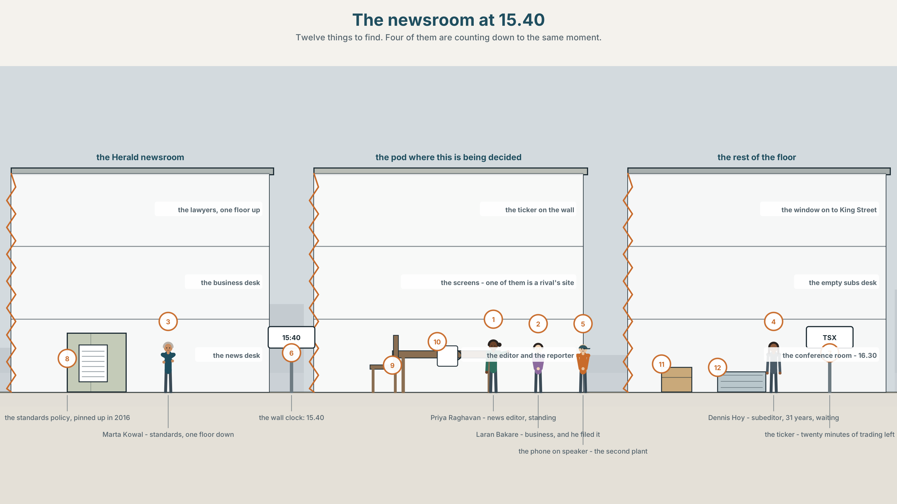{width=6.6in}

*The newsroom at 15.40 — Twelve things to find. Four of them are counting down to the same moment.*

# What is a fact worth?

**By the end of this unit you can choose between the simple and the continuous deliberately, and
say what each one claims. Two hundred words.**

| ◆ **A · THE WORLD** | A newsroom at 15.40, forty minutes before a market closes, holding a story it cannot stand up |
|---|---|
| ◆ **B · THE SYSTEM** | aspect as meaning, across every tense · 28 words for verification and evidence · 22 words that carry aspect in their own right · prominence on the new information |
| ◆ **C · THE PERFORMANCE** | Two hundred words in which every tense choice is defensible |

---

### 0A · Find it

**Find twelve things in this picture.** Four of them are counting down to the same moment.

> a wall clock at 15.40 · a market ticker · a screen with a draft headline · a telephone on
> speaker · a printed email · a desk with nobody at it · a second screen showing a rival's site ·
> a whiteboard with two names on it · a lawyer's number on a note · a cup of cold coffee ·
> a standing editor · a sitting reporter

### 0B · Guess it

**Two of the twelve exist only because of one of the others.** Which, and what is the causal
chain?

### 0C · Say it ⏺

**Record sixty seconds.** *Describe something you believe is true and cannot prove. What would it
take to prove it, and who would have to do the work?* You will record it again at the end of this
unit.

---

## Part 1 · Vocabulary Lab 1 ◆ **B · THE SYSTEM**

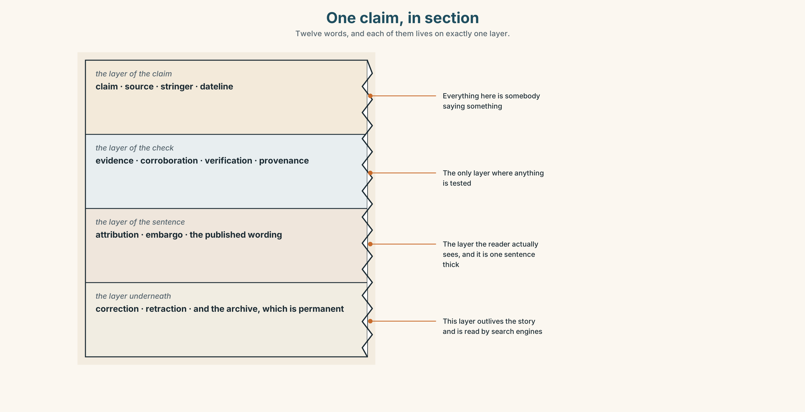{width=6.6in}

*One claim, in section — Twelve words, and each of them lives on exactly one layer.*

### 1A · Meet — the words of a claim

Match each word to one layer of the cutaway.

> **claim** · **source** · **evidence** · **corroboration** · **verification** ·
> **attribution** · **provenance** · **correction** · **retraction** · **embargo** ·
> **stringer** · **dateline**

### 1B · Sort — before publication, after publication, or both?

Three columns.

> correction · source · embargo · corroboration · retraction · claim · provenance ·
> verification · evidence · attribution

### 1C · Meet — the words that describe a story's state

| | |
|---|---|
| **a single source** | One person says it. Nobody else has said it. |
| **a verified account** | More than one independent route to the same fact. |
| **a working assumption** | Believed, acted on, and not yet evidence. |
| **a story with legs** | It will still be a story on Thursday. |
| **the cost of being first** | Measured in corrections, and paid later. |

### 1D · Collocation Lab

Complete each one with a word from the box, and say which of the five is the only one that is
not about publishing.

> **stand a story up** · **run a correction** · **hold the line** · **on the record** ·
> **off the record**

1. We cannot ______ ______ ______ ______ with one caller and a screenshot.
2. If we are wrong on Friday we ______ ______ ______ on Monday, on page two.
3. She would say it ______ ______ ______ and not with her name on it.
4. He said the same thing ______ ______ ______ , twenty minutes later, after we asked twice.
5. Everybody else has gone. We ______ ______ ______ .

### 1E · The phrasal verbs, and the three fixed expressions

> **stand up** · **back up** · **hold off**
>
> **f** *we can't stand it up* · **f** *it checks out* · **f** *who else has it?*

**One of the three fixed expressions is a question that is never really a question.**
Which, and what is it actually doing?

### 1F · Own it

Write one sentence about something you know that you could not currently **stand up**, and one
about something you could.

---

## Part 2 · Listening ◆ **A · THE WORLD**

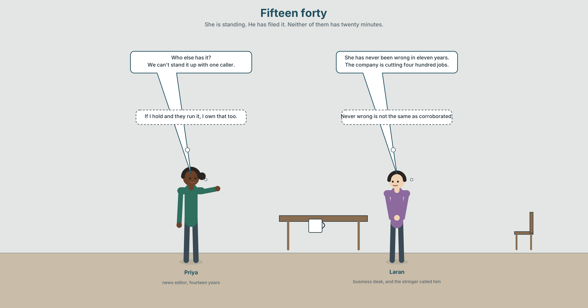{width=6.6in}

*Fifteen forty — She is standing. He has filed it. Neither of them has twenty minutes.*

### 2A · Fifteen forty 🔊 Track 1.1

**Before you listen.** The market closes at 16.00. The paper has one source and a claim that
would move a share price.

**Listen once.** What exactly does the source claim, and what exactly can the paper prove?

**Listen again. Complete the table.**

| | What is claimed | What is corroborated | What is assumed |
|---|---|---|---|
| the job cuts | | | |
| the timing | | | |
| the board meeting | | | |

**Listen again. True or false?**

1. The reporter has one source and a screenshot. ☐ T ☐ F
2. The claim was made on the record. ☐ T ☐ F
3. A rival outlet has the same story. ☐ T ☐ F
4. The editor decides to publish before the close. ☐ T ☐ F

**Noticing.** Four sentences from the recording.

1. *The company is cutting four hundred jobs.*
2. *The company cuts four hundred jobs.*
3. *The company has been cutting jobs since March.*
4. *The company had been going to announce it on Thursday.*

**All four are about the same event. Which of the four makes the strongest factual claim, and
which commits the paper to the least?**

### 2B · Decoding clinic 🔊 Track 1.2

Thirty seconds at speed. Three jobs.

1. In *we can't stand it up*, which syllable carries the main prominence, and why that one?
2. The editor repeats a phrase three times with the prominence in a different place each time.
   Write the three versions.
3. One sentence ends on a word that is not new information. What effect does that have?

---

## Part 3 · Grammar Lab 1 ◆ **B · THE SYSTEM**

### Aspect is not about time

### 3A · Notice

Look at the four sentences in Part 2 again.

1. Which of the four presents the event as a whole, closed and countable?
2. Which presents it as in progress, and therefore incomplete and possibly reversible?
3. What does the perfect in sentence 3 add that sentence 1 does not have?
4. What does sentence 4 claim about something that did not happen?

### 3B · See

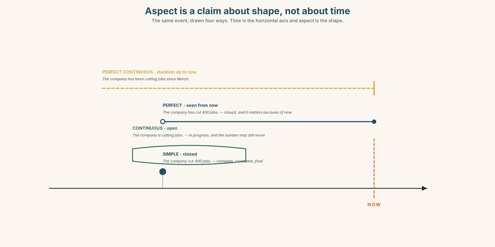{width=6.6in}

*Aspect is a claim about shape, not about time — The same event, drawn four ways. Time is the horizontal axis and aspect is the shape.*

### 3C · Know

| | | |
|---|---|---|
| **simple** | the event as a complete unit | *The company cut four hundred jobs.* |
| **continuous** | the event as in progress, unfinished | *The company is cutting four hundred jobs.* |
| **perfect** | the event seen from a later point | *The company has cut four hundred jobs.* |
| **perfect continuous** | duration up to a later point | *The company has been cutting jobs since March.* |

> **The choice is a claim, not a decoration.** *Is cutting* says the process is live and the
> number may change. *Cut* says it is done and the number is final. A newspaper that writes
> *cuts* when it means *is cutting* has published a fact it does not have.

> **Four tenses, one distinction.** Aspect is independent of time: *was cutting*, *is cutting*,
> *will be cutting* make the same claim about completeness at three different times.

| | |
|---|---|
| **state verbs resist the continuous** | *owns*, *contains*, *consists of* — and when they take it, the meaning shifts |
| **the continuous softens** | *I'm hoping you can help* is less committed than *I hope* |
| **the perfect links** | the event is being presented **because of its consequence now** |
| **the future in the past** | *was going to*, *had been going to* — a plan that did not survive |

> **Why it matters.** Every sentence in a news report is a claim about how finished something is,
> and that is the claim most likely to be wrong.

### 3D · Use — controlled

Complete with the most defensible aspect.

> The company (1) ______ (cut) four hundred jobs — the board minutes exist and we have seen
> them.
> According to one person, the company (2) ______ (consider) cuts, and the number (3) ______
> (move) all week.
> It (4) ______ (lose) money since the third quarter, which nobody disputes.
> On Tuesday the board (5) ______ (go to announce) it on Thursday, and then it did not.

### 3E · Use — guided

Rewrite each one so that it commits the paper to less, changing only the aspect.

1. The company closes the Thunder Bay plant.
2. The regulator rejected the application.
3. The minister has resigned.
4. Three directors sold shares in the week before the announcement.
5. The union accepts the offer.

### 3F · Use — open

**In pairs.** One of you has a claim and a single source. The other is the standards editor.
**Negotiate a sentence that can be published.** The aspect is the negotiation.

### 3G · Error autopsy

> ✗ *The company is owning four hundred patents.*
> ✗ *By Friday the number was changing six times.*
> ✗ *She is knowing the figure since March.*

For each one, say what the writer was trying to claim and what the sentence actually claims.

### 3H · Check — eight items

> 1. The company ______ (cut) 400 jobs. *(confirmed, complete)*
> 2. The company ______ (cut) jobs since March. *(duration up to now)*
> 3. The number ______ (change) all week. *(in progress, unfinished)*
> 4. The board ______ (go to announce) it on Thursday. *(a plan that failed)*
> 5. ✗ *The report is containing three errors.* → correct it.
> 6. ✗ *We are knowing this since Tuesday.* → correct it.
> 7. ✗ *The company was cutting 400 jobs and the figure is final.* → why do these contradict?
> 8. Rewrite *The minister resigns* so that it claims less.

---

## Part 4 · Speaking ◆ **C · THE PERFORMANCE**

### 4A · Fluency starter — the aspect swap

One person makes a statement in the simple. The next repeats it in the continuous and says what
has changed about the claim. **Round the room. Nobody may say *nothing*.**

### 4B · The functional core — saying what you can prove

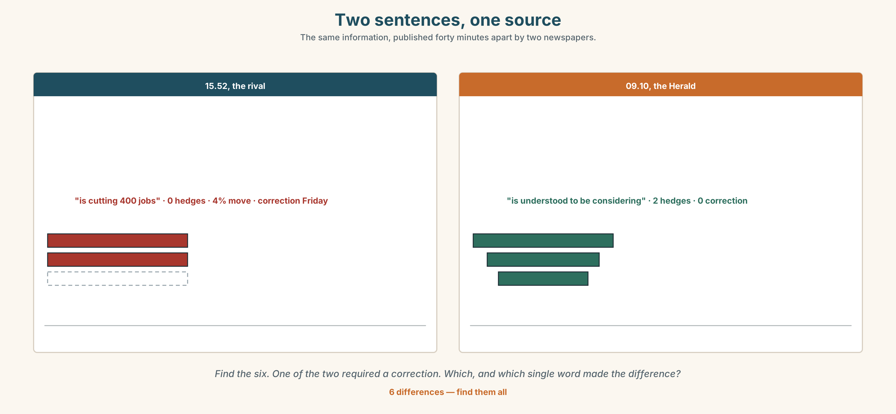{width=6.6in}

*Two sentences, one source — The same information, published forty minutes apart by two newspapers.*

**Language Bank**

| | |
|---|---|
| **the claim** | *We understand that… · It is thought to have… · One source says…* |
| **the hedge** | *as it stands · at the time of writing · is being treated as* |
| **the commitment** | *it checks out · a verified account · on the record* |
| **the refusal** | *we can't stand it up · who else has it?* |

**Information gap.** Learner A has what the source said. Learner B has what the documents show.
**Draft one sentence that both of you would sign.**

### 4C · The performance — three minutes ⏺

You are the reporter. Your partner is the standards editor and will stop you the moment you
claim more than you can prove. **Three minutes.** You must:

> state the claim · say what is corroborated and what is a working assumption · propose a
> publishable sentence · say what would change it

**Record it.**

### 4D · Observer

One person tracks every tense choice and marks the ones that claimed more than the evidence.

### 4E · Three criteria

> ☐ Was every aspect choice defensible against the evidence?
> ☐ Did I separate *corroborated* from *assumed* out loud, in those words?
> ☐ Did I say what would change the sentence?

---

## Part 5 · Reading ◆ **A · THE WORLD**

### 5A · Predict

The title is **"Forty minutes behind."**
**What do you think the paper lost, and what do you think it gained?**

### 5B · Read — two minutes

---

**Forty minutes behind**

At 15.40 on a Tuesday the Herald had a single source, a screenshot and a claim that four hundred
jobs were going at a plant in Thunder Bay. The market closed at 16.00. Everybody in the room knew
what the story was worth before the close and what it was worth after it.

The stringer who filed it has lived in Thunder Bay for eleven years and has never been wrong. That
is not the same as corroboration and everybody in the room knew that too.

At 15.52 a rival outlet published. The share price moved four per cent in the last eight minutes
of trading. The Herald was still asking a second plant for a second account, and did not publish
until 09.10 the next morning.

On Thursday the company confirmed three hundred and ten jobs, not four hundred, and said no
decision had been taken on the timing. The rival ran a correction on Friday, two column
centimetres, on page eleven.

Nobody in the Herald newsroom believes the paper made money on Tuesday. The argument in the room
since has been about a different question: whether being right on Wednesday is a product anybody
is buying.

---

### 5C · Comprehension — eight questions

1. What did the paper have at 15.40?
2. What time did the market close?
3. How long had the stringer lived in Thunder Bay?
4. When did the rival publish?
5. How much did the share price move?
6. What figure did the company confirm, and how does it differ from the published one?
7. **Why does the writer say the stringer's record "is not the same as corroboration"?**
8. **The last paragraph changes the question. What is the new question, and why can nobody in the newsroom answer it?**

### 5D · Vocabulary in context

Infer from the text, then check.

> going at a plant · filed it · a second account · no decision had been taken · two column
> centimetres

### 5E · The counter-text

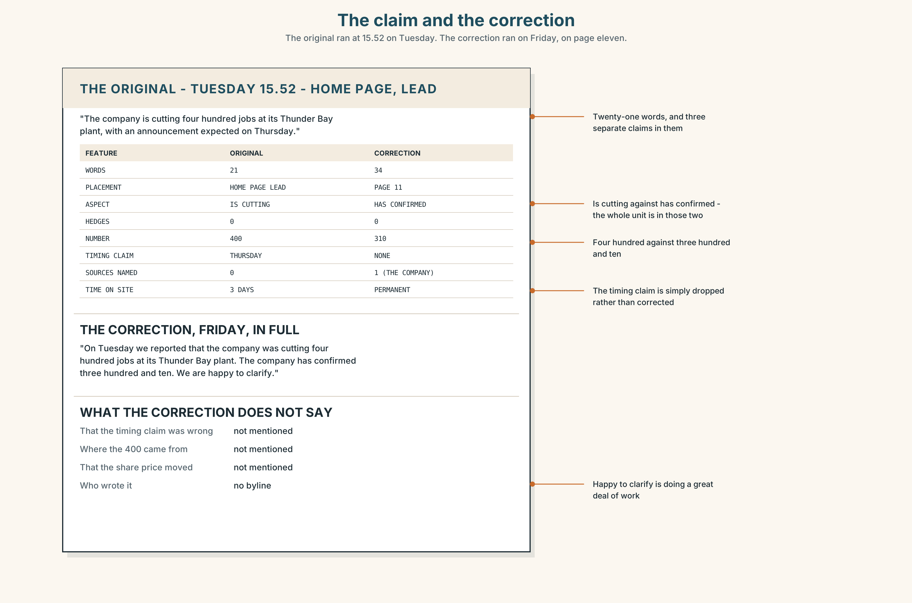{width=6.6in}

*The claim and the correction — The original ran at 15.52 on Tuesday. The correction ran on Friday, on page eleven.*

**Read the rival's correction and the Herald's story, and answer.**

1. What does the correction say, and where is it placed?
2. **The original claim and the correction use different aspects. Identify both and say what each one claims.**
3. How many words are in the original claim and how many in the correction?
4. **What does the correction not say?**

### 5F · Two texts

The Herald's story at 09.10 uses *is understood to be considering*.
The rival's story at 15.52 used *is cutting*.

**Both turned out to be wrong about the number. Were they wrong in the same way?**
Write two sentences.

---

## Part 6 · Vocabulary Lab 2 ◆ **B · THE SYSTEM**

### Words that carry aspect without a verb

### 6A · Sort — closed, running, or unsettled?

Three columns.

> settled · ongoing · emergent · provisional · iterative · habitual · unfolding ·
> momentary

### 6B · Chunk completion

1. **as it ______** — what is true at this moment and may not be later
2. **at the time of ______** — the writer dates the claim to the act of writing
3. **is being ______ as** — somebody else has classified it, and the writer has not
4. **is ______ to** — a claim with the source removed
5. **had been ______** — a plan that was overtaken
6. **is ______ to have** — a past event, attributed to nobody

### 6C · Three that are not interchangeable

> *is understood to* · *is thought to have* · *is being treated as*

**Say which one attributes to an unnamed source, which attributes to nobody at all, and which
attributes to an institution's procedure.**

### 6D · The phrasal verbs and the fixed expressions

> **play out** · **bear out** · **pan out**
>
> **f** *the situation is developing* · **f** *we understand that* · **f** *it now appears that*

**Two of these three fixed expressions can be written before anything is known.** Which two, and
what does the third require?

### 6E · Contrast Clinic

Eight items. For each, write the sentence with the aspect that matches the evidence given.

1. A plan for Thursday that was abandoned on Tuesday. *(announce)*
2. Losses in every quarter since March. *(lose)*
3. Board minutes seen. 400 confirmed. *(cut)*
4. A single event last March, closed. *(close)*
5. A process that began in 2019 and has not finished. *(restructure)*
6. A number that changed three times on Monday. *(change)*
7. A regulator's decision published this morning. *(reject)*
8. One caller, no documents. *(cut)*

---

## Part 7 · Pronunciation & Fluency Lab ◆ **B · THE SYSTEM**

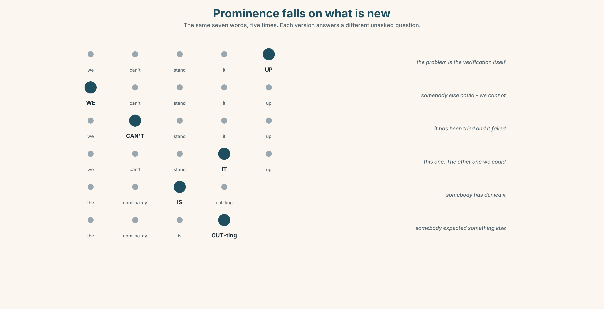{width=6.6in}

*Prominence falls on what is new — The same seven words, five times. Each version answers a different unasked question.*

### Prominence falls on what is new

### 7A · Hear 🔊 Track 1.3

> *We can't stand it UP.* — the problem is the verification
> *WE can't stand it up. (somebody else can)* — the problem is us
> *We can't stand IT up. (we can stand the other one up)* — the problem is this story

### 7B · Say

Say each one three times. Then say this:

> *The company is cutting jobs. It isn't cutting FOUR HUNDRED jobs.* — the second prominence is
> the whole correction.

### 7C · Make it mean something

Say these two:

> *The company IS cutting jobs.* — somebody has denied it
> *The company is CUTTING jobs.* — somebody expected something else

**English puts the main prominence on the information the listener does not already have.**
Moving it is not emphasis for its own sake; it is a claim about what the listener knows.

### 7D · Fluency 30 ⏺

Thirty seconds: **one claim, stated four times with four different aspects**, each followed by
the evidence it would require. Three times, faster.

---

## Part 8 · Writing ◆ **C · THE PERFORMANCE**

### A story you can defend · 200 words

### 8A · Read the model

> **Thunder Bay plant: 400 jobs under review** `[the headline hedges with two words]`
>
> The Herald understands that the company is considering cuts of up to four hundred jobs at its
> Thunder Bay plant. `[*understands* and *is considering* — a claim with a source removed and a
> process presented as unfinished]`
>
> A single source, who was not authorised to speak, described a board paper circulated on Monday.
> The Herald has not seen the paper. `[what is not known, said in the second paragraph, not the
> ninth]`
>
> The company has been losing money at the plant since the third quarter of last year, which is a
> matter of public record. `[the perfect continuous, on the one fact that needs no source]`
>
> The company declined to comment. No decision is understood to have been taken on timing.
> `[the second hedge, and the thing the rival did not write]`

**Questions about the writer's choices:**

1. *is considering* rather than *is cutting*. **What exactly does the change in verb and aspect buy?**
2. *The Herald has not seen the paper.* **Why in paragraph two?**
3. The only perfect continuous in the piece is on the public-record fact. **Why there?**

### 8B · The anti-model

> The company is cutting 400 jobs at its Thunder Bay plant, the Herald can reveal. The cuts will be announced on Thursday. Workers were told nothing. The company refused to comment.

Four sentences, four unhedged claims, and three of them turned out to be wrong.
**Rewrite it so that every claim is defensible against the evidence described in 5B.**

### 8C · Plan

> the hedged headline → the claim with its hedge → what is not known →
> the one fact that needs no source → the refusal

### 8D · Write — 200 words
### 8E · Peer review — three criteria

> ☐ Is every aspect choice defensible against stated evidence?
> ☐ Is what is *not* known in the first half?
> ☐ Is there at least one fact that requires no source, and is it marked as such?

### 8F · Write it again · 8G · Publish

Rewrite after review. **Publish the two versions side by side with the evidence list between
them.**

---

## Part 9 · The File ◆ **A · THE WORLD + C · THE PERFORMANCE**

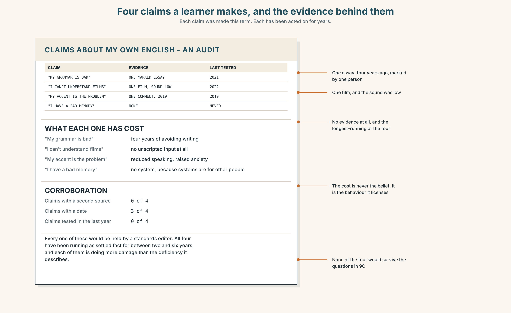{width=6.6in}

*Four claims a learner makes, and the evidence behind them — Each claim was made this term. Each has been acted on for years.*

# STUDY FILE · What you can stand up about your own English

### 9A · A claim nobody has corroborated 🔊 Track 1.4

Learners make claims about their own English constantly — *my grammar is bad*, *I can't
understand films*, *my pronunciation is the problem* — and almost none of them has ever been
checked against evidence.

| | |
|---|---|
| **the claim** | *I can't understand native speakers.* |
| **the evidence** | one film, in 2022, with the sound low |
| **the corroboration** | none |
| **what it costs** | three years of avoiding the thing |

### 9B · Stand one up

Take one claim you make about your own English. **Write the evidence you actually have for it,
with dates.** Most learners find the evidence is a single occasion.

### 9C · Role play — the standards editor

In pairs. One of you states three claims about your own English. The other is the standards
editor and may ask only: *What is your evidence? Who else has said it? When was it last tested?*

### 9D · The working assumption

Some claims cannot be tested cheaply and still have to be acted on. **Mark yours as working
assumptions, in writing.** A working assumption you have labelled is a different thing from a
belief you have forgotten you adopted.

### 9E · Transfer — before next week

**Test one claim.** Watch twenty minutes of something unscripted, with no subtitles, and write
down the percentage you followed. Bring the number.

---

## Part 10 · Mediation & Interaction ◆ **C · THE PERFORMANCE**

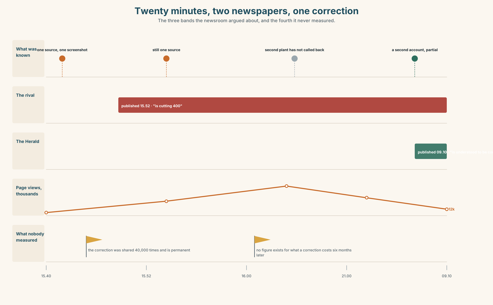{width=6.6in}

*Twenty minutes, two newspapers, one correction — The three bands the newsroom argued about, and the fourth it never measured.*

### 10A · Relay

Half the class has the source's account. Half has the documents.
**Produce one agreed sentence by speaking only.** Ten minutes.

### 10B · Simplify — for one reader

A reader emails: *Why did you publish a day late?*
**Answer in four sentences** without blaming the rival and without claiming virtue.

### 10C · Online

Write **one message** to a colleague explaining why a sentence in their draft claims more than
the evidence. **Three sentences.** Name the aspect.

### 10D · Your language

Does your language mark the difference between *cuts* and *is cutting* grammatically?
**Translate all four sentences from 2A.** Which distinctions survive?

---

## Part 11 · The Decision ◆ **C · THE PERFORMANCE**

# Forty minutes

It is 15.40. One source, a screenshot, a claim that moves a share price, and twenty minutes of
trading left.

**Option one:** publish now with hedges. *Is understood to be considering.* Defensible, fast,
and a hedge in a headline is read by nobody.

**Option two:** hold until a second account. Costs the exclusive and about forty thousand
page views, and is what the paper's own standards policy requires.

**Option three:** publish the fact that you are holding it — a line saying the Herald has heard
the claim and has not been able to corroborate it.

### 11A · The evidence

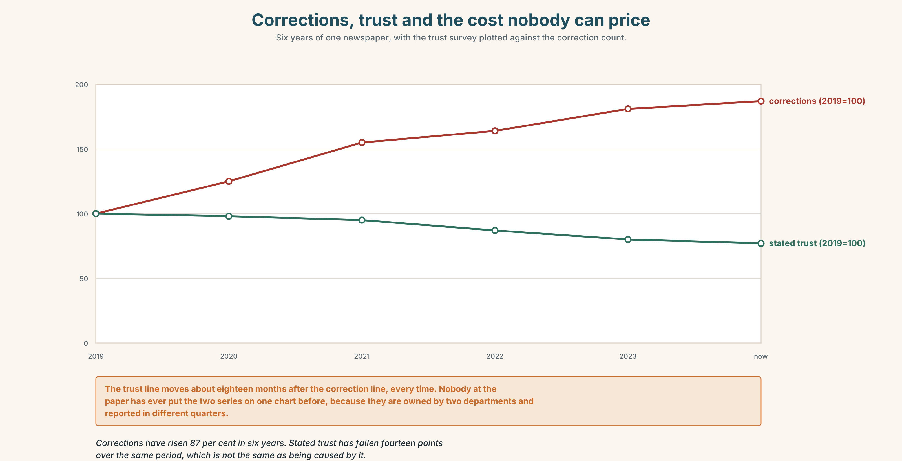{width=6.6in}

*Corrections, trust and the cost nobody can price — Six years of one newspaper, with the trust survey plotted against the correction count.*

🔊 **Track 1.6.** The standards editor, 30 seconds: *"We ran four hundred corrections last year.
Nobody can tell me what one costs, because the cost is not on the day you correct it. It is six
months later, in a different story, when somebody decides on balance not to believe us."*

### 11B · Talk about it

In threes. Use the frame. Everybody takes one position and must state the evidence it rests on.

> *I would ______ , because ______ , and I would be wrong if ______ .*

### 11C · Decide

Write **three sentences**: the decision, the evidence, and the condition under which you would
reverse it.

### 11D · Model decision

> Option three. The first two are a choice between being wrong and being late, and both of those
> have been priced. Nobody has ever priced the third, which is the only one that tells the reader
> what the paper actually knows at 15.40 — and what a reader buys from a newspaper, if they buy
> anything, is the difference between those two states.

### 11E · The Reveal

> **What happened.** The Herald held. It published at 09.10 with *is understood to be
> considering*, and it has never published a line saying what it is holding.
>
> Then something nobody in the room predicted: the rival's correction, two column centimetres on
> page eleven, was screenshotted and shared about forty thousand times. The correction travelled
> further than the story it corrected, and it is still the first result for the company's name.

**One question. You do not have to answer it out loud.**

> The newsroom argued for two days about whether being right on Wednesday is a product. What did
> the forty thousand screenshots suggest about who was buying it?

---

## Part 12 · Landing ◆ **all three lines**

### 12A · Recycle — fifteen items

> 1. The company ______ (cut) 400 jobs. *(confirmed, complete)*
> 2. The company ______ (cut) jobs since March. *(duration up to now)*
> 3. The number ______ (change) all week. *(in progress)*
> 4. The board ______ (go to announce) it on Thursday. *(a plan that failed)*
> 5. ______ it ______ , we have one source. *(two words — what is true at this moment)*
> 6. The claim ______ ______ ______ as unverified. *(three words — somebody else classified it)*
> 7. It ______ ______ ______ have begun in March. *(three words — attributed to nobody)*
> 8. We cannot ______ ______ ______ ______ . *(four words — the refusal)*
> 9. It ______ ______ . *(two words — the opposite of 8)*
> 10. We will have to ______ ______ ______ on Monday. *(three words — page two)*
> 11. The documents ______ ______ what she told us. *(two words)*
> 12. Let us see how it ______ ______ before we publish. *(two words)*
> 13. *(Unit 0)* Everybody else has gone. We ______ ______ ______ . *(three words)*
> 14. She said it ______ ______ ______ , without her name. *(three words)*
> 15. The Herald ______ that a board paper exists. *(the verb that removes the source)*

### 12B · Consolidate — one task, everything in it

**Write a 150-word account of something you witnessed.** Every verb must be defensible: mark in
the margin, for each one, whether you are claiming it is complete, in progress, or inferred.

### 12C · Can-do, with evidence

> ☐ I can choose aspect to match evidence. **Evidence:** 3H, 8D
> ☐ I can hedge a claim without weakening the sentence. **Evidence:** 4C, 6C
> ☐ I can hear and place prominence on new information. **Evidence:** 7C
> ☐ I can say what would change my sentence. **Evidence:** 11C

### 12D · Replay ⏺

Record 0C again. **Compare the two.** How many of your original claims had evidence attached?

### 12E · Glossary — fifty items, as a map

> **THE CLAIM** · claim · source · stringer · dateline · attribution · provenance
> **THE CHECK** · verification · evidence · corroboration · embargo
> **AFTERWARDS** · correction · retraction
> **THE STATES OF A STORY** · a single source · a verified account · a working assumption · a story with legs · the cost of being first
> **ON OR OFF** · on the record · off the record
> **WHAT YOU DO** · stand a story up · run a correction · hold the line · stand up · back up · hold off
> **IN THE ROOM** · we can't stand it up · it checks out · who else has it?
> **ASPECT, IN A WORD** · ongoing · momentary · habitual · iterative · provisional · settled · unfolding · emergent
> **ASPECT, IN A PHRASE** · as it stands · at the time of writing · has been developing · is being treated as · was being described as · is understood to · had been expecting · is thought to have
> **WHAT HAPPENS NEXT** · play out · bear out · pan out
> **WHAT YOU WRITE** · the situation is developing · we understand that · it now appears that

### 12F · Next

> **Unit 2 · Who is "we"?**

# B2.1 · Unit 2 · We Have Always Said

> **English Animated** · *Reading Between Lines* · a newsroom, Toronto
> Student's Book pages 28–49 · 22 pp · ~11 hours

---

## Part 0 · The Big Picture ◆ **A · THE WORLD**

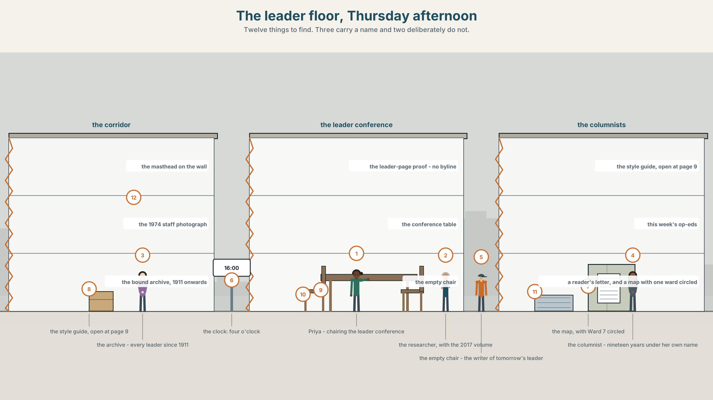{width=6.6in}

*The leader floor, Thursday afternoon — Twelve things to find. Three carry a name and two deliberately do not.*

# Who is "we"?

**By the end of this unit you can place yourself in a text deliberately, and say who you are
claiming to speak for. Two hundred words.**

| ◆ **A · THE WORLD** | An unsigned editorial that says *we have always said*, and an archive that disagrees |
|---|---|
| ◆ **B · THE SYSTEM** | the perfect across every tense, as a discourse move · 28 words for voice and readership · 22 words for inclusive and exclusive reference · stress on a pronoun |
| ◆ **C · THE PERFORMANCE** | Two hundred words in which the reader always knows who is speaking |

---

### 0A · Find it

**Find twelve things in this picture.** Three of them carry somebody's name and two deliberately
do not.

> the masthead on the wall · a leader-page proof with no byline · a photograph of the 1974 staff ·
> a bound archive volume · a columnist's framed first piece · a screen showing a reader comment ·
> an empty chair at the leader conference · a style guide open at page 9 · a list of this week's
> op-eds · a letter from a reader · a map of the city with one ward circled · a clock

### 0B · Guess it

**One thing in this picture is the reason another one is unsigned.** Which two, and in which
direction does the causation run?

### 0C · Say it ⏺

**Record sixty seconds.** *Describe an opinion you hold that a group you belong to also holds.
Say which parts are yours and which parts you inherited.* You will record it again at the end of
this unit.

---

## Part 1 · Vocabulary Lab 1 ◆ **B · THE SYSTEM**

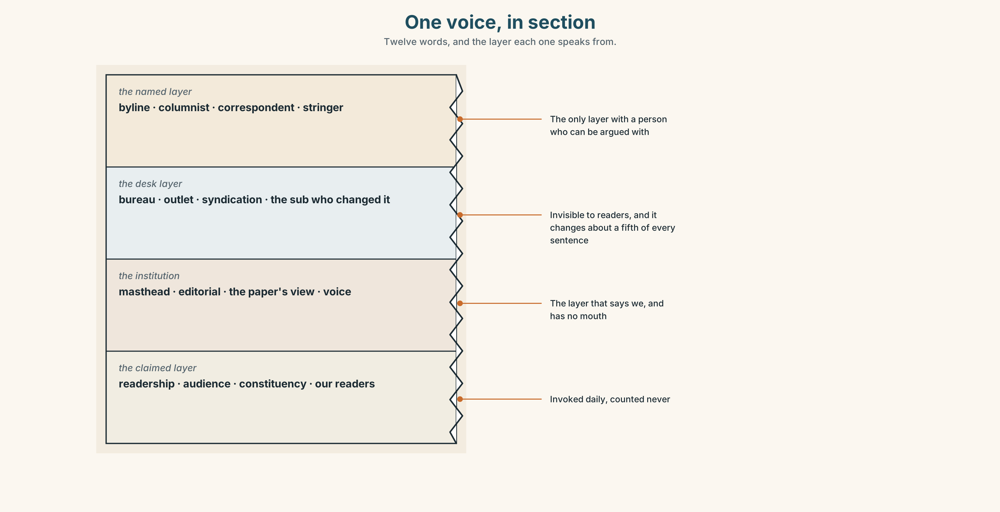{width=6.6in}

*One voice, in section — Twelve words, and the layer each one speaks from.*

### 1A · Meet — the words of a voice

Match each word to one layer of the cutaway.

> **byline** · **masthead** · **readership** · **constituency** · **columnist** ·
> **editorial** · **outlet** · **audience** · **bureau** · **syndication** ·
> **correspondent** · **voice**

### 1B · Sort — a person, an institution, or a group of readers?

Three columns. **Two of the twelve belong in two columns and that is the point of the unit.**

> editorial · outlet · bureau · voice · columnist · constituency · audience · masthead ·
> readership · correspondent

### 1C · Meet — the phrases that claim a mandate

| | |
|---|---|
| **speak for** | A claim about authority that is almost never examined. |
| **on behalf of** | The same claim, in the passive voice of institutions. |
| **our readers** | A set nobody has counted, invoked to settle arguments. |
| **the paper's view** | A view with no person in it. |
| **the community affected** | The group most often written about and least often quoted. |

### 1D · Collocation Lab

Complete each one, and say which of the five is the only one that could be checked.

> **a named writer** · **an unsigned piece** · **local to the story** · **parachute
> journalism** · **whose paper is it**

1. The leader page carries ______ ______ ______ every day and has done since 1911.
2. A reporter flown in for three days produces ______ ______ , whatever the quality.
3. The stringer is ______ ______ ______ ______ and was not asked to write it.
4. Readers can argue with ______ ______ ______ ; nobody can argue with an institution.
5. The question under all of this is ______ ______ ______ ______ .

### 1E · The phrasal verbs, and the three fixed expressions

> **speak up** · **stand in** · **write up**
>
> **f** *we have always said* · **f** *this paper believes* · **f** *who is the we here?*

**Two of these fixed expressions assert and one interrogates.** Which, and what does the third
one do to the other two?

### 1F · Own it

Write one sentence beginning *We have always…* about a group you belong to, and then write down
the earliest date on which you can prove it.

---

## Part 2 · Listening ◆ **A · THE WORLD**

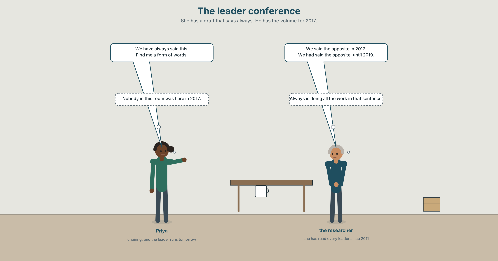{width=6.6in}

*The leader conference — She has a draft that says always. He has the volume for 2017.*

### 2A · The leader conference 🔊 Track 2.1

**Before you listen.** Tomorrow's editorial begins *We have always said*. A researcher has been
through the archive.

**Listen once.** What did the paper actually say in 2017, and what is being claimed now?

**Listen again. Complete the table.**

| | The claim | The archive | Who the *we* includes |
|---|---|---|---|
| 2017 | | | |
| 2021 | | | |
| today | | | |

**Listen again. True or false?**

1. The paper took the same position in 2017 as it takes now. ☐ T ☐ F
2. The editorial will carry a byline. ☐ T ☐ F
3. Nobody in the room was at the paper in 2017. ☐ T ☐ F
4. The researcher is asked to find a form of words. ☐ T ☐ F

**Noticing.** Four sentences from the recording.

1. *We have always said this.*
2. *We said this in 2017.*
3. *We had said the opposite, until 2019.*
4. *By next year we will have said it for a decade.*

**All four are perfects or simples about the same institution. Which one makes a claim about
continuity, and which one makes a claim about a point?**

### 2B · Decoding clinic 🔊 Track 2.2

Thirty seconds at speed. Three jobs.

1. The editor says *we* eleven times and stresses it twice. Write the two stressed instances.
2. What changes when *we* is stressed?
3. One speaker uses *one* where another would use *we*. What does that do to the claim?

---

## Part 3 · Grammar Lab 1 ◆ **B · THE SYSTEM**

### The perfect is a move, not a tense

### 3A · Notice

Look at the four sentences in Part 2 again.

1. Which sentence closes the event at a point in the past?
2. Which one connects a past event to the present moment, and why is that useful here?
3. What does the past perfect in sentence 3 do to the reader's timeline?
4. What does the future perfect in sentence 4 allow the writer to assert?

### 3B · See

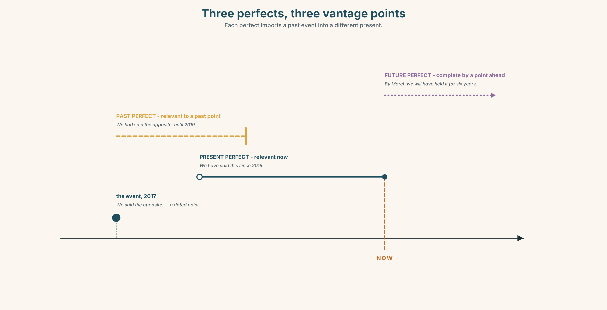{width=6.6in}

*Three perfects, three vantage points — Each perfect imports a past event into a different present.*

### 3C · Know

| | | |
|---|---|---|
| **present perfect** | the event is relevant **now** | *We have always said this.* |
| **past perfect** | the event is relevant to a **past** point | *We had said the opposite, until 2019.* |
| **future perfect** | the event is complete by a **future** point | *By next year we will have said it for a decade.* |
| **the discourse function** | the perfect imports a past event into the present argument | and that is why institutions like it |

> **The perfect hides the date.** *We have always said* contains no year. The simple past
> requires one, which is why an archive is dangerous to a paper that prefers the perfect.

> **Inclusive and exclusive *we*.** English does not mark the difference and most languages that
> do mark it find English maddening here: *we have always said* can mean the institution, the
> editorial board, the staff, or the staff and the readers together, and the sentence does not
> say which.

| | |
|---|---|
| **institutional** | *this paper believes · the paper's view* |
| **impersonal** | *one might say · it is widely held · the general view* |
| **personal** | *speaking personally · the present writer · as a reader* |
| **generic** | *we all know* — the most expansive and least checkable |

> **Why it matters.** Every piece of persuasive writing places the writer somewhere relative to
> the reader, and the placement is done almost entirely by pronouns and perfects.

### 3D · Use — controlled

Complete with the most defensible form.

> The paper (1) ______ (say) this since 2019, and we (2) ______ (say) the opposite before that.
> By March we (3) ______ (hold) the position for six years.
> At the time of the 2017 piece the board (4) ______ (not yet discuss) it.
> One (5) ______ (might say) that nothing has changed, but the archive disagrees.

### 3E · Use — guided

Rewrite each one so that the claim is about continuity rather than a point, or the reverse.

1. We took this position in 2019.
2. We have always opposed the plan.
3. The paper had supported it until the inquiry.
4. We will hold this view for a decade by next spring.
5. The board decided in March.

### 3F · Use — open

**In pairs.** One of you writes an editorial sentence using *we*. The other asks, four times,
*who is the we here?* **Each answer must narrow the set.**

### 3G · Error autopsy

> ✗ *We have said this in 2017.*
> ✗ *The paper has been believing this since 1911.*
> ✗ *By the time we published, we have already corrected it.*

For each, name the rule and say what the writer was reaching for.

### 3H · Check — eight items

> 1. We ______ (say) this since 2019. *(continuity to now)*
> 2. We ______ (say) the opposite in 2017. *(a point, dated)*
> 3. The board ______ (not discuss) it before the piece ran. *(earlier than a past point)*
> 4. By March we ______ (hold) it for six years. *(complete by a future point)*
> 5. ✗ *We have said this in 2017.* → correct it.
> 6. ✗ *The paper has been believing this since 1911.* → correct it.
> 7. Rewrite *We have always said this* so that it can be checked.
> 8. Rewrite *This paper believes* so that a named person is responsible.

---

## Part 4 · Speaking ◆ **C · THE PERFORMANCE**

### 4A · Fluency starter — narrow the *we*

One person makes a claim with *we*. Everybody else asks *who is the we here?* until the speaker
names a number of people. **Nobody may answer with another pronoun.**

### 4B · The functional core — positioning yourself in a text

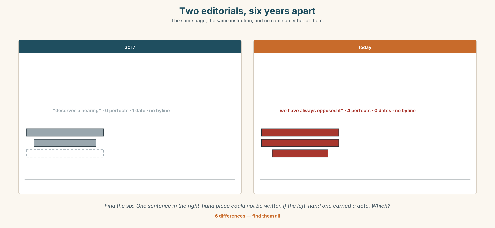{width=6.6in}

*Two editorials, six years apart — The same page, the same institution, and no name on either of them.*

**Language Bank**

| | |
|---|---|
| **the institution** | *this paper believes · the paper's view · on behalf of* |
| **the hedge** | *it is widely held · the general view · one might say* |
| **the person** | *speaking personally · the present writer · as a reader* |
| **the challenge** | *who is the we here? · speak for* |

**Information gap.** Learner A has the 2017 editorial. Learner B has today's draft.
**Agree on a sentence that both archives can live with.**

### 4C · The performance — three minutes ⏺

Argue a position you hold, in three minutes, **changing your position in the text three times**:
once as an institution, once impersonally, and once as yourself. Your partner names each shift as
it happens.

**Record it.**

### 4D · Observer

One person marks every *we* and writes, beside each, the number of people it includes.

### 4E · Three criteria

> ☐ Did I make all three positions, and were they audible?
> ☐ Did every perfect carry a claim about relevance now, not just about the past?
> ☐ Could my partner name the set behind each *we*?

---

## Part 5 · Reading ◆ **A · THE WORLD**

### 5A · Predict

The title is **"The ward that is always in the paper."**
**Who do you expect to be quoted in a story about a neighbourhood, and who usually is?**

### 5B · Read — two minutes

---

**The ward that is always in the paper**

Ward 7 has appeared in the Herald eighty-one times in two years. The paper has a bureau four
kilometres away and has never had a correspondent who lives there.

Of the eighty-one pieces, sixty-two quote a police source, forty-one quote a city councillor,
and nine quote somebody who lives in the ward and is not an official. Two of those nine are the
same person, who runs a shop on the main street and has now been quoted in four pieces, in each
of which he is described as a local resident.

The paper's editorials have said, four times in those two years, that the ward has been
neglected. They have not said by whom.

Last month a reporter spent six days in Ward 7 and filed nine hundred words. The readership
figures for that piece were the lowest of the month. The eighty other pieces, filed from the
bureau in an afternoon, did better.

Nobody at the paper thinks that is an argument. Everybody at the paper knows what it will be
used as.

---

### 5C · Comprehension — eight questions

1. How many times has Ward 7 appeared?
2. How far away is the bureau?
3. How many pieces quote a resident who is not an official?
4. How many of those nine quote the same person?
5. What have the editorials said four times?
6. **Why does the writer point out that the editorials "have not said by whom"?**
7. **What is the function of the perfect in "has now been quoted in four pieces"?**
8. **The last two sentences separate what people think from what will happen. Why end there?**

### 5D · Vocabulary in context

Infer from the text, then check.

> a bureau four kilometres away · described as a local resident · neglected · filed from the
> bureau · what it will be used as

### 5E · The counter-text

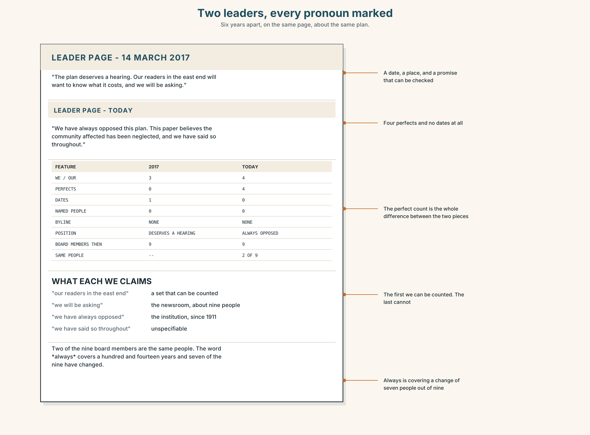{width=6.6in}

*Two leaders, every pronoun marked — Six years apart, on the same page, about the same plan.*

**Read the two editorials — 2017 and today — and answer.**

1. What position does each take?
2. **Find every *we* in both and say what set each one includes.**
3. How many perfects are in each, and what does each perfect import?
4. **Neither editorial has a byline. What would change if one did?**

### 5F · Two texts

The 2017 editorial says *the plan deserves a hearing*.
Today's says *we have always opposed it*.

**Is the second sentence false?** Write two sentences, and use the word *continuity* in one of
them.

---

## Part 6 · Vocabulary Lab 2 ◆ **B · THE SYSTEM**

### Who is included, and who is being spoken about

### 6A · Sort — includes the reader, excludes the reader, or avoids the question?

Three columns.

> institutional · exclusive · collective · inclusive · generic · anonymous · impersonal ·
> corporate

### 6B · Chunk completion

1. **the ______ we** — the plural used by a single person with authority
2. **one ______ say** — the most distancing construction in formal English
3. **it is widely ______** — a claim with the holders removed
4. **the present ______** — the writer, referring to the writer, in the third person
5. **speaking ______** — the writer stepping out from behind the institution
6. **the general ______** — a consensus nobody has measured

### 6C · Three that are not interchangeable

> *in this paper* · *as a reader* · *the general view*

**Say which one claims institutional authority, which claims none, and which claims a consensus.**

### 6D · The phrasal verbs and the fixed expressions

> **own up** · **take over** · **sign off**
>
> **f** *speaking for myself* · **f** *we take the view that* · **f** *that is not our position*

**One of these fixed expressions can only be said by somebody with authority.** Which, and how do
you know?

### 6E · Contrast Clinic

Eight items. Rewrite each sentence so that responsibility moves to the place in brackets.

1. The paper regrets the error. *(to the desk that made it)*
2. One might say the figures are unreliable. *(to a named analyst)*
3. The community affected was consulted. *(to the three people who were asked)*
4. It is widely held that the plan will fail. *(to the writer)*
5. Mistakes were made. *(to a named person)*
6. We have always opposed it. *(to a dated decision)*
7. This paper believes in transparency. *(to an editorial board, with a date)*
8. Our readers expect better. *(to a survey, with a number)*

---

## Part 7 · Pronunciation & Fluency Lab ◆ **B · THE SYSTEM**

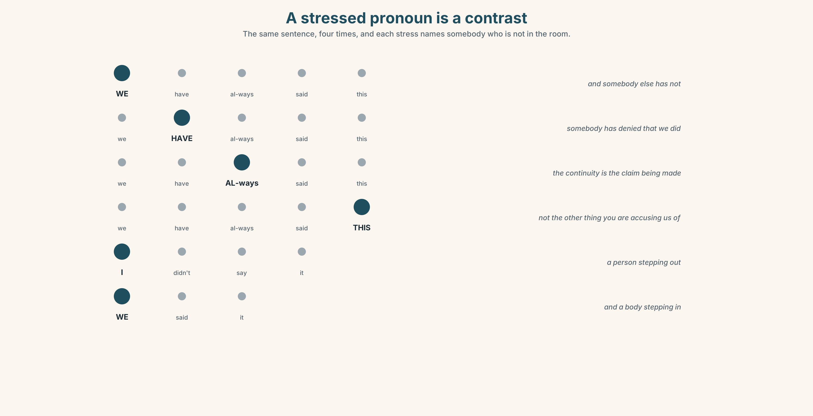{width=6.6in}

*A stressed pronoun is a contrast — The same sentence, four times, and each stress names somebody who is not in the room.*

### A stressed pronoun is a contrast

### 7A · Hear 🔊 Track 2.3

> *WE have always said this.* — somebody else has not
> *We have ALWAYS said this.* — the continuity is the claim
> *We have always said THIS.* — not the other thing

### 7B · Say

Say each one three times. Then say this:

> *I didn't say it. WE said it.* — the stress moves responsibility from a person to a body, and
> that is the whole function of the editorial *we*.

### 7C · Make it mean something

Say these two:

> *We take the view that…* — unstressed *we*: the institution, routinely
> *WE take the view that…* — stressed: and somebody else takes a different one

**An unstressed pronoun is a reference. A stressed one is a contrast,** and the contrast always
implies a party who is not in the room.

### 7D · Fluency 30 ⏺

Thirty seconds: **one position, stated four times — as the institution, impersonally, as
yourself, and as a reader.** Three times, faster.

---

## Part 8 · Writing ◆ **C · THE PERFORMANCE**

### A position, with its holders named · 200 words

### 8A · Read the model

> This paper opposed the Ward 7 plan in a leader on 14 March 2019. `[the institution, with a
> date — the perfect would have hidden it]`
>
> We had supported an earlier version of it in 2017, and we were wrong about the costs.
> `[the past perfect places the earlier position, and the admission is in the same sentence]`
>
> The present writer was not on the board in 2017 and has read the file. `[the person,
> distinguished from the institution, and a perfect doing proper work]`
>
> It is widely held in this building that the ward has been neglected. By whom is a question we
> have not answered, and by March we will have been asking it for six years. `[the impersonal,
> the challenge to it, and a future perfect that dates the failure]`

**Questions about the writer's choices:**

1. The first sentence uses a simple past with a date. **What would *we have always opposed* have cost?**
2. *The present writer* appears once. **Why not *I*?**
3. The last sentence turns the paper's own phrase against it. **Which word does the work?**

### 8B · The anti-model

> We have always believed that Ward 7 deserves better. Our readers expect this paper to speak for the communities it serves. Mistakes were made in the past but we have learnt from them. This paper believes in accountability.

Four sentences, four unexaminable claims, and not one date or person in any of them.
**Rewrite it so that every claim has either a date or a name attached.**

### 8C · Plan

> the institution, with a date → the earlier position, placed → the person, separated →
> the impersonal claim, and the challenge to it

### 8D · Write — 200 words
### 8E · Peer review — three criteria

> ☐ Does every *we* have a number behind it that the writer could state?
> ☐ Does every perfect import something into the present argument, or is it hiding a date?
> ☐ Is there at least one sentence where the writer appears as a person?

### 8F · Write it again · 8G · Publish

Rewrite after review. **Publish both, and mark every pronoun in both.**

---

## Part 9 · The File ◆ **A · THE WORLD + C · THE PERFORMANCE**

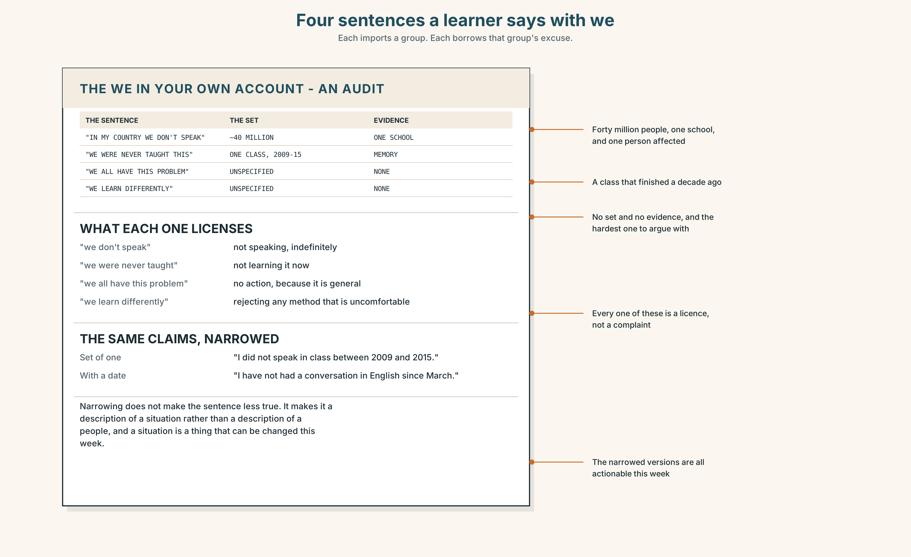{width=6.6in}

*Four sentences a learner says with we — Each imports a group. Each borrows that group's excuse.*

# STUDY FILE · Whose standard are you measuring against?

### 9A · The *we* in your own account 🔊 Track 2.4

Learners describe their English in the first person plural more often than they notice: *in my
country we don't study speaking*, *we were never taught this*, *we all have this problem*. Each
one imports a group and borrows its excuse.

| | |
|---|---|
| **the claim** | *we were never taught to speak* |
| **the set** | about forty million people |
| **the evidence** | one school, 2009 to 2015 |
| **what it licenses** | not speaking, indefinitely |

### 9B · Narrow it

Take three sentences you have said about your English that begin with *we* or *in my country*.
**Rewrite each with the smallest honest set and a date.**

### 9C · Role play — who is the we here?

In pairs. One of you describes a difficulty using *we*. The other may only ask *who is the we
here?* and *since when?* **Four rounds each.**

### 9D · The inherited position

Everybody has at least one belief about language learning they did not arrive at themselves.
**Name yours and name who gave it to you.** Then decide whether you still hold it.

### 9E · Transfer — before next week

**Write the sentence *I have always…* about your English, and then find the earliest evidence.**
Bring both. Most people find the *always* is about four years old.

---

## Part 10 · Mediation & Interaction ◆ **C · THE PERFORMANCE**

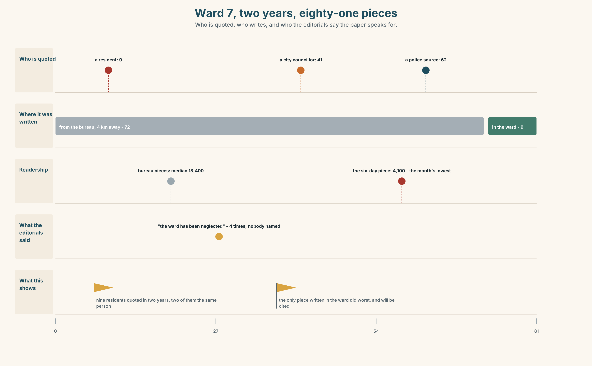{width=6.6in}

*Ward 7, two years, eighty-one pieces — Who is quoted, who writes, and who the editorials say the paper speaks for.*

### 10A · Relay

Half the class has the archive. Half has the draft.
**Produce one sentence both can sign, by speaking only.** Ten minutes.

### 10B · Simplify — for one reader

A reader writes: *You say you have always opposed this. I have the 2017 paper in front of me.*
**Reply in four sentences.** Do not use the perfect.

### 10C · Online

Write **one message** to a colleague about a *we* in their draft that is doing too much work.
**Three sentences.** Name the set it is claiming.

### 10D · Your language

Does your language distinguish an inclusive *we* from an exclusive one?
**Translate *we have always said this* both ways.** Which does the English sentence mean?

---

## Part 11 · The Decision ◆ **C · THE PERFORMANCE**

# The byline on the leader page

The Herald's editorials have been unsigned since 1911.

**Option one:** keep it. An unsigned leader is the paper speaking, which is the point of a leader
page, and a byline makes it a column.

**Option two:** sign them. The person who wrote it is named, as everywhere else in the paper, and
*we have always said* becomes harder to write.

**Option three:** keep them unsigned and publish, once a year, the names of everybody who sat on
the board and the dates of every position change.

### 11A · The evidence

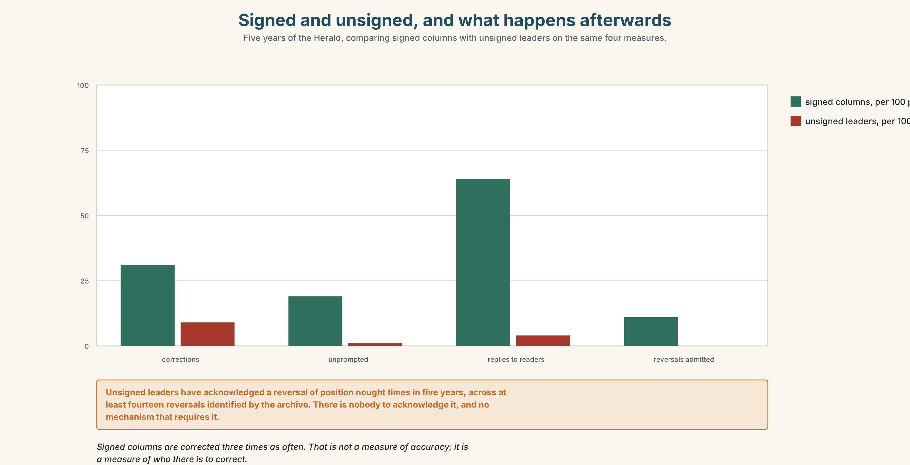{width=6.6in}

*Signed and unsigned, and what happens afterwards — Five years of the Herald, comparing signed columns with unsigned leaders on the same four measures.*

🔊 **Track 2.6.** The columnist, 30 seconds: *"I have written under my own name for nineteen
years and I have been wrong in public about four things. The leader page has been wrong about
rather more and has never apologised, because there is nobody there to apologise. That is not a
bug in the system. It is the system."*

### 11B · Talk about it

In threes. Use the frame, and state the set behind every *we* you use.

> *I would ______ , because ______ , and the people affected are ______ .*

### 11C · Decide

Write **three sentences**: the decision, the evidence, and who would be accountable under it.

### 11D · Model decision

> Option three. Signing the leader turns it into a column and loses the one thing a leader page
> can do, which is commit an institution. Publishing the board and the dates keeps the
> institutional voice and makes *we have always said* checkable — which is the only part of the
> current arrangement that is doing damage.

### 11E · The Reveal

> **What happened.** The Herald published the board list and the position changes. The leader page
> stayed unsigned.
>
> Then something nobody predicted: the phrase *we have always said* disappeared from the leader
> page within four months, without any instruction. Writers who knew a reader could check the
> date simply stopped reaching for the construction.

**One question. You do not have to answer it out loud.**

> Nobody banned the phrase. What did the list of dates actually change?

---

## Part 12 · Landing ◆ **all three lines**

### 12A · Recycle — fifteen items

> 1. We ______ (say) this since 2019. *(continuity to now)*
> 2. We ______ (say) the opposite in 2017. *(a dated point)*
> 3. The board ______ (not discuss) it before the piece ran.
> 4. By March we ______ (hold) it for six years.
> 5. The ______ we — a single person using a plural with authority
> 6. ______ might say that nothing has changed.
> 7. It is widely ______ that the ward has been neglected.
> 8. The present ______ was not on the board in 2017.
> 9. ______ personally, I disagree.
> 10. This paper ______ in accountability.
> 11. ______ ______ ______ ? *(four words — the challenge)*
> 12. That is not ______ ______ . *(two words — the institutional refusal)*
> 13. She was asked to ______ ______ for the editor on Friday. *(two words)*
> 14. Somebody has to ______ ______ to the error. *(two words)*
> 15. The piece was ______ ______ overnight by a stringer. *(two words)*

### 12B · Consolidate — one task, everything in it

**Write 150 words taking a position**, in which you appear once as an institution, once
impersonally and once as yourself. Mark the three in the margin.

### 12C · Can-do, with evidence

> ☐ I can use the perfect to import a past event into a present argument. **Evidence:** 3H, 8D
> ☐ I can place myself in a text at three distances. **Evidence:** 4C
> ☐ I can say what set a *we* includes. **Evidence:** 6E, 9C
> ☐ I can hear and use contrastive pronoun stress. **Evidence:** 7C

### 12D · Replay ⏺

Record 0C again. **Compare.** How many of your inherited opinions did you name the first time?

### 12E · Glossary — fifty items, as a map

> **THE PEOPLE** · columnist · correspondent · stringer · voice
> **THE INSTITUTION** · byline · masthead · editorial · outlet · bureau · syndication
> **THE READERS** · readership · audience · constituency
> **THE CLAIMS** · speak for · on behalf of · our readers · the paper's view · the community affected
> **THE DESCRIPTIONS** · a named writer · an unsigned piece · local to the story · parachute journalism · whose paper is it
> **WHAT PEOPLE DO** · speak up · stand in · write up · own up · take over · sign off
> **IN THE ROOM** · we have always said · this paper believes · who is the we here?
> **THE REFERENCE** · inclusive · exclusive · collective · impersonal · generic · institutional · corporate · anonymous
> **THE FORMULAE** · the royal we · one might say · it is widely held · the present writer · in this paper · speaking personally · as a reader · the general view
> **POSITIONING YOURSELF** · speaking for myself · we take the view that · that is not our position

### 12F · Next

> **Unit 3 · How sure are you?**

# B2.1 · Unit 3 · A Doubling of Risk

> **English Animated** · *Reading Between Lines* · a newsroom, Toronto
> Student's Book pages 50–71 · 22 pp · ~11 hours

---

## Part 0 · The Big Picture ◆ **A · THE WORLD**

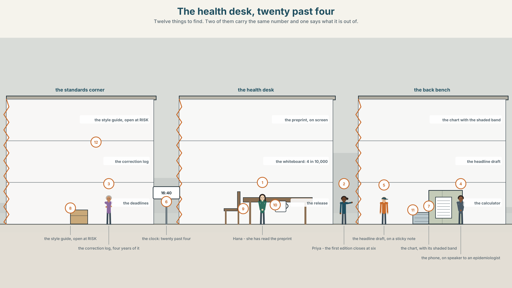{width=6.6in}

*The health desk, twenty past four — Twelve things to find. Two of them carry the same number and one says what it is out of.*

# How sure are you?

**By the end of this unit you can set your certainty exactly where the evidence puts it, and
defend the setting. Two hundred words.**

| ◆ **A · THE WORLD** | A press release that says *doubles*, a preprint that says *four in ten thousand*, and a headline due at six |
|---|---|
| ◆ **B · THE SYSTEM** | the full epistemic range of modals · 28 words for risk and evidence · 22 words and phrases for calibrating certainty · stress on a modal |
| ◆ **C · THE PERFORMANCE** | Two hundred words in which every claim is pitched at its evidence |

---

### 0A · Find it

**Find twelve things in this picture.** Two of them contain the same number and only one of them
says what it is out of.

> the printed press release · the preprint on the screen · the whiteboard with the base rate on it ·
> the phone on speaker to an epidemiologist · the headline draft on a sticky note ·
> the health desk's correction log · a calculator · a chart with a shaded band on it ·
> the style guide open at RISK · the clock showing 16:40 · the first edition deadline on the wall ·
> a mug with a university logo

### 0B · Guess it

**One object in this picture would change the headline if anybody read it.** Which one, and why
has nobody opened it?

### 0C · Say it ⏺

**Record sixty seconds.** *Describe something about your own future that you are sure of, and
something you are only fairly sure of. Make the difference audible.* You will record it again at
the end of this unit.

---

## Part 1 · Vocabulary Lab 1 ◆ **B · THE SYSTEM**

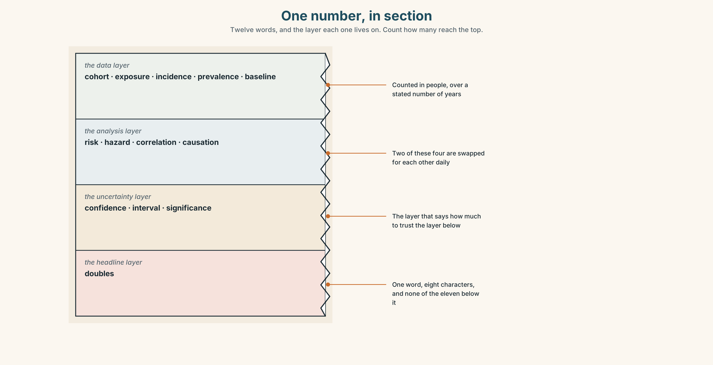{width=6.6in}

*One number, in section — Twelve words, and the layer each one lives on. Count how many reach the top.*

### 1A · Meet — the words under a number

Match each word to one layer of the cutaway.

> **risk** · **hazard** · **exposure** · **incidence** · **prevalence** · **baseline** ·
> **confidence** · **interval** · **significance** · **correlation** · **causation** · **cohort**

### 1B · Sort — counted in people, a relation between numbers, or a measure of doubt?

Three columns. **Two of the twelve are swapped for one another in print almost daily, and that
swap is the subject of this unit.**

> confidence · risk · hazard · incidence · prevalence · significance · baseline ·
> exposure · correlation · interval · causation · cohort

### 1C · Meet — the five phrases a risk story turns on

| | |
|---|---|
| **absolute risk** | How many people out of how many. The only figure a reader can act on. |
| **relative risk** | One risk divided by another. Large, dramatic, and meaningless alone. |
| **a doubling of risk** | Two in a million, or four in ten. The phrase does not distinguish them. |
| **the base rate** | What the risk was before anything happened. Almost never printed. |
| **statistically significant** | Unlikely to be chance. Not a synonym for large, important or true. |

### 1D · Collocation Lab

Complete each one, and say which of the five has been checked by somebody with no stake in it.

> **a causal link** · **the margin of error** · **peer reviewed** · **a preprint** · **a press release**

1. The university's communications office sent ______ ______ ______ at nine this morning.
2. The study itself is ______ ______ , posted online and not yet assessed by anybody.
3. Nothing in it has been ______ ______ , which the release mentions in the last line.
4. The authors are careful never to claim ______ ______ ______ ; the release is not.
5. The estimate carries ______ ______ ______ ______ wide enough to include almost no effect at all.

### 1E · The phrasal verbs, and the three fixed expressions

> **scale up** · **rule out** · **bear in mind**
>
> **f** *the evidence does not support that* · **f** *it may well be* · **f** *we cannot rule it out*

**Two of these fixed expressions leave a door open and one closes it.** Which closes it, and which
of the two open doors is doing the more honest work?

### 1F · Own it

Write one sentence about your own health, work or study that contains a number, and then write
underneath it what that number is out of.

---

## Part 2 · Listening ◆ **A · THE WORLD**

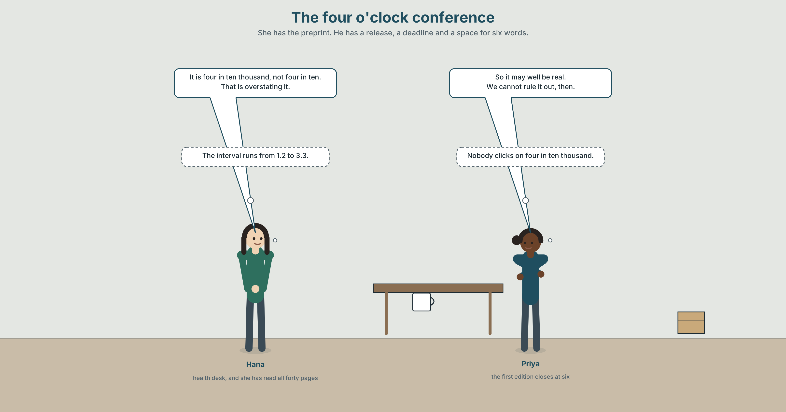{width=6.6in}

*The four o'clock conference — She has the preprint. He has a release, a deadline and a space for six words.*

### 2A · The four o'clock conference 🔊 Track 3.1

**Before you listen.** A press release says night shifts double the risk of a rare heart-rhythm
condition. The health reporter has read the preprint. The news editor has forty minutes.

**Listen once.** What does the study show, and what does the release say it shows?

**Listen again. Complete the table.**

| | The number | What it is out of | How sure the authors are |
|---|---|---|---|
| the release | | | |
| the preprint | | | |
| the epidemiologist | | | |

**Listen again. True or false?**

1. The reporter has spoken to one of the authors. ☐ T ☐ F
2. The release gives the base rate. ☐ T ☐ F
3. The confidence interval runs from 1.2 to 3.3. ☐ T ☐ F
4. The editor wants the word *doubles* kept. ☐ T ☐ F

**Noticing.** Five sentences from the recording.

1. *It must be a real effect.*
2. *It is likely to be a real effect.*
3. *It may well be a real effect.*
4. *It could hardly have been chance, at that interval.*
5. *We cannot rule it out.*

**Five settings on one scale, about one finding. Which of the five could the paper defend in
court, and which could it defend only in the bar afterwards?**

### 2B · Decoding clinic 🔊 Track 3.2

Thirty seconds at speed. Three jobs.

1. The epidemiologist says *must have* four times. Write what you hear, not what is written.
2. One modal is stressed. Which, and what is the speaker contrasting it with?
3. The reporter says *that is overstating it* once. What exactly is she rejecting?

---

## Part 3 · Grammar Lab 1 ◆ **B · THE SYSTEM**

### A modal is a promise about how sure you are

### 3A · Notice

Look at the five sentences in Part 2 again.

1. Which one commits the speaker most, and what evidence would it need?
2. Which one commits the speaker least while still asserting something?
3. Sentence 4 is about the past. How does the form show it?
4. Sentence 5 says nothing about how probable the effect is. **What does it say instead?**

### 3B · See

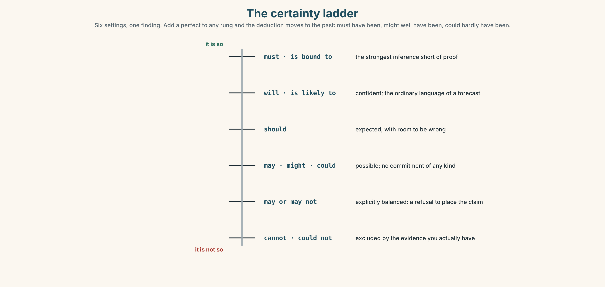{width=6.6in}

*The certainty ladder — Six settings, one finding. Add a perfect to any rung and the deduction moves to the past: must have been, might well have been, could hardly have been.*

### 3C · Know

| | | |
|---|---|---|
| **must · is bound to** | the strongest inference short of proof | *It must be a real effect.* |
| **will · is likely to** | confident, and routine in forecasting | *That is likely to be the explanation.* |
| **should** | expected, with room to be wrong | *The replication should settle it.* |
| **may · might · could** | possible; no commitment at all | *It may well be chance.* |
| **can't · could hardly have** | excluded by the evidence | *It could hardly have been chance.* |

> **The epistemic modals are a scale, and the scale is public.** A reader who sees *must* and
> later learns the interval ran from 1.2 to 3.3 has caught the writer overclaiming, and will not
> forget it.

> **Deduction about the past takes the perfect.** *must have been*, *might well have been*,
> *could hardly have been*. The modal sets the certainty; the perfect sets the time. The two
> choices are independent, which is why every combination exists.

| | |
|---|---|
| **adverbs run the same scale** | *conceivably · arguably · presumably · demonstrably · unequivocally* |
| **and some of them do not** | *ostensibly · allegedly · reportedly* — these report somebody else's certainty, not yours |
| **the passive reporting frame** | *is said to · is reported to · has yet to be confirmed* |
| **the balanced statement** | *may or may not* — which is a refusal to place the claim at all |

> **Why it matters.** Every sentence about the future, about a cause, or about somebody else's
> data is a bet, and the modal is the size of the bet. Writers who always bet large are read once.

### 3D · Use — controlled

Complete with the modal that the evidence in brackets will support.

> The finding (1) ______ be chance, given the interval. *(it cannot be excluded)*
> At that cohort size the effect (2) ______ be real. *(as sure as the data allows)*
> The authors (3) ______ have seen the release before it went out. *(the evidence suggests not)*
> A replication (4) ______ settle it within two years. *(expected, with room)*
> Whether it applies to day workers (5) ______ or ______ ______ be the same question. *(explicitly balanced)*

### 3E · Use — guided

Rewrite each one so that the certainty matches the evidence in brackets.

1. Night shifts cause the condition. *(one cohort, not peer reviewed)*
2. The release was written by somebody who had not read the paper. *(a guess, past)*
3. The effect is chance. *(excluded by the interval)*
4. The paper will replicate. *(a hope, not a forecast)*
5. The authors disagree with the release. *(you have not asked them)*

### 3F · Use — open

**In pairs.** One of you states a claim at the top of the scale. The other asks *what would you
need to have seen?* **Keep going until the claim comes down to where the evidence actually is.**

### 3G · Error autopsy

> ✗ *It must to be a real effect.*
> ✗ *It might be chance last year, we cannot say.*
> ✗ *The evidence doesn't support that it is demonstrably possible.*

For each, name the rule and say what the writer was reaching for.

### 3H · Check — eight items

> 1. It ______ be chance; the interval includes 1.2. *(possible, uncommitted)*
> 2. At that cohort size it ______ be real. *(strongest inference)*
> 3. They ______ ______ seen the release first. *(past, strong inference, negative evidence)*
> 4. It ______ ______ ______ been chance at that interval. *(past, all but excluded)*
> 5. It ______ ______ ______ be the same in day workers. *(explicitly balanced, five words)*
> 6. ✗ *It must to be a real effect.* → correct it.
> 7. Rewrite *Night shifts cause it* so that it survives peer review.
> 8. Rewrite *We cannot rule it out* so that a reader can tell how likely it is.

---

## Part 4 · Speaking ◆ **C · THE PERFORMANCE**

### 4A · Fluency starter — move one notch

One person makes a claim. The next person repeats it **one notch weaker**, the next one notch
weaker again, until nothing is left. Then climb back up. **No notch may be skipped.**

### 4B · The functional core — calibrating certainty

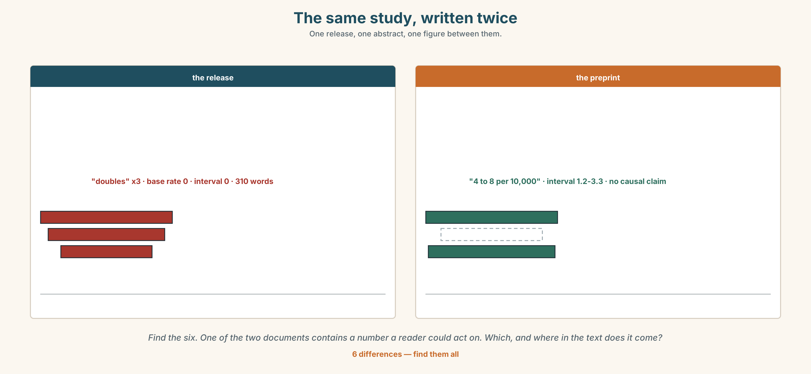{width=6.6in}

*The same study, written twice — One release, one abstract, one figure between them.*

**Language Bank**

| | |
|---|---|
| **committing** | *demonstrably · unequivocally · is bound to · must surely be* |
| **hedging** | *conceivably · arguably · presumably · may or may not* |
| **sourcing it elsewhere** | *ostensibly · allegedly · reportedly · is said to · has yet to be* |
| **refusing the frame** | *that is overstating it · the evidence does not support that* |

**Information gap.** Learner A has the press release. Learner B has the preprint's own abstract.
**Agree on one sentence that both documents can support.**

### 4C · The performance — three minutes ⏺

Present the finding to a room, in three minutes, **stating your certainty three times at three
different settings**: once at the top of the scale about something you can prove, once in the
middle, and once at the bottom. Your partner writes down the evidence each setting would need.

**Record it.**

### 4D · Observer

One person marks every modal and every adverb of certainty, and writes beside each one the
evidence it is claiming.

### 4E · Three criteria

> ☐ Was every claim pitched where its evidence actually is?
> ☐ Did I use at least one past-deduction form, with a perfect?
> ☐ Could my partner tell, by ear, which claims I would defend?

---

## Part 5 · Reading ◆ **A · THE WORLD**

### 5A · Predict

The title is **"Four in ten thousand."**
**What do you expect the headline on this story to have said instead, and why?**

### 5B · Read — two minutes

---

**Four in ten thousand**

The release arrived at nine. Night work, it said, doubles the risk of a rare heart-rhythm
condition, in a cohort of sixty-one thousand Danish adults followed for nine years.

The preprint says something narrower. In the group that worked no night shifts, the incidence was
four cases per ten thousand people per year. In the group working four or more nights a week it
was eight. That is a doubling of risk, and it is also four extra people in ten thousand.

The confidence interval runs from 1.2 to 3.3, which means the study is consistent with an effect
of almost nothing and with an effect three times larger than the one reported. The result is
statistically significant, just. The authors say, twice, that they cannot establish a causal link
and that the cohort was not designed to.

The release says *doubles* three times. It does not give the base rate anywhere in three hundred
and ten words.

By four o'clock the health reporter had the epidemiologist on the phone. "It may well be real,"
she said. "We cannot rule it out, and we cannot scale it up to the whole workforce either. Bear in
mind what it is out of."

The first edition closes at six. The desk has two numbers, both true, and room for one of them in
a headline.

---

### 5C · Comprehension — eight questions

1. How many people were in the cohort, and for how long?
2. What was the incidence in the group that worked no night shifts?
3. What does the confidence interval run from and to?
4. How many times does the release use the word *doubles*?
5. What do the authors say twice?
6. **Why does the writer give the length of the release in words?**
7. **"Both true" — what is the difference between the two numbers, if neither is wrong?**
8. **The last sentence says *room for one of them*. What is the real constraint being described?**

### 5D · Vocabulary in context

Infer from the text, then check.

> consistent with an effect of almost nothing · just · designed to · what it is out of ·
> room for one of them

### 5E · The counter-text

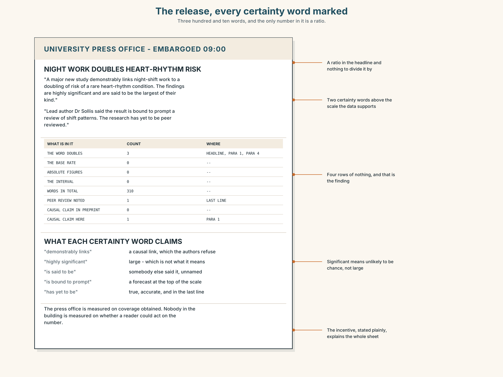{width=6.6in}

*The release, every certainty word marked — Three hundred and ten words, and the only number in it is a ratio.*

**Read the press release and answer.**

1. Where in the release does the base rate appear?
2. **Find every word in it that sets a level of certainty, and say what evidence each one claims.**
3. The release and the preprint use the same figure. **What does each one leave out?**
4. **Who wrote the release, and what were they measured on?**

### 5F · Two texts

The release says *doubles the risk*.
The preprint says *an increase from four to eight cases per ten thousand person-years*.

**Is the release false?** Write two sentences, and use the phrase *the base rate* in one of them.

---

## Part 6 · Vocabulary Lab 2 ◆ **B · THE SYSTEM**

### Saying how sure you are, in one word

### 6A · Sort — the writer is unsure, somebody else said it, or the writer is committed?

Three columns.

> arguably · demonstrably · conceivably · unequivocally · reportedly · allegedly ·
> ostensibly · presumably

### 6B · Chunk completion

1. The replication ______ ______ ______ take two years. *(three words — expected, confident)*
2. At that sample size the result ______ ______ ______ hold. *(three words — as sure as you can be)*
3. They ______ ______ ______ read the preprint before writing the release. *(three words — past, strong)*
4. It ______ ______ ______ been chance at that interval. *(four words — past, all but excluded)*
5. There ______ ______ ______ some effect, on these numbers. *(three words — strong inference)*
6. Day workers ______ ______ ______ ______ show the same pattern. *(five words — balanced)*
7. The release ______ ______ ______ have been approved by the authors. *(three words — reported, unverified)*
8. The finding ______ ______ ______ ______ replicated. *(four words — not yet, and that matters)*

### 6C · Three that are not interchangeable

> *is said to* · *is likely to* · *has yet to be*

**Say which one gives a probability, which one gives a source, and which one gives a date that has
not arrived.**

### 6D · The phrasal verbs and the fixed expressions

> **hedge about** · **come down on** · **hold back**
>
> **f** *on the balance of probability* · **f** *to the best of our knowledge* ·
> **f** *that is overstating it*

**One of these three fixed expressions is a legal standard, one is an institutional limit and one
is a correction.** Match them, and say which one a scientist would use about their own work.

### 6E · Contrast Clinic

Eight items. Rewrite each sentence so that the certainty moves to the level in brackets.

1. Night shifts cause the condition. *(one cohort, no causal claim possible)*
2. Perhaps the release was written by the press office. *(strong inference about the past)*
3. Everybody knows night work is dangerous. *(what you can actually demonstrate)*
4. The effect is chance. *(all but excluded, past form)*
5. The study is wrong. *(you have read the abstract only)*
6. There is no effect. *(the interval includes both almost nothing and a large effect)*
7. It will be replicated next year. *(a hope with no evidence)*
8. The authors approved the release. *(you have been told, by one person)*

---

## Part 7 · Pronunciation & Fluency Lab ◆ **B · THE SYSTEM**

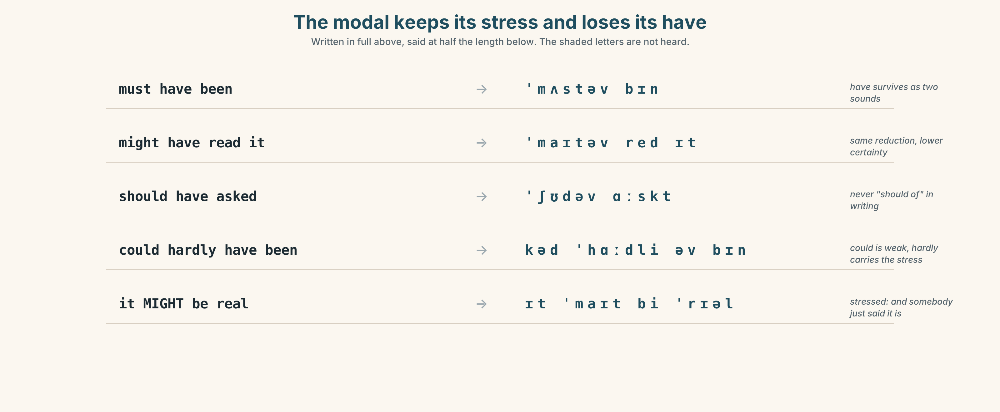{width=6.6in}

*The modal keeps its stress and loses its have — Written in full above, said at half the length below. The shaded letters are not heard.*

### A modal you stress is a modal you are defending

### 7A · Hear 🔊 Track 3.3

> *It must have been chance.* → /ɪt ˈmʌstəv bɪn ˈtʃɑːns/ — *have* has gone entirely
> *They might have read it.* → /ðeɪ ˈmaɪtəv ˈred ɪt/
> *It could hardly have been real.* → /ɪt kəd ˈhɑːdli əv bɪn ˈrɪəl/

### 7B · Say

Say each one three times, fast. Then say this:

> *They might have read it, they should have read it, and they could have asked.* — three
> perfect modals in one breath, and not one full *have* among them.

### 7C · Make it mean something

Say these two:

> *It might be real.* — unstressed modal: the ordinary, uncommitted statement
> *It MIGHT be real.* — stressed: and somebody in the room has just said it definitely is

**An unstressed modal reports your certainty. A stressed one disputes somebody else's,** which is
why a stressed modal in a meeting is never neutral.

### 7D · Fluency 30 ⏺

Thirty seconds: **one finding, described at four settings on the scale, from excluded to certain**,
with the modal reduced every time it carries a perfect. Three times, faster.

---

## Part 8 · Writing ◆ **C · THE PERFORMANCE**

### A risk story, with every claim at its evidence · 200 words

### 8A · Read the model

> A Danish cohort of sixty-one thousand adults, followed for nine years, reports four extra cases
> of a rare heart-rhythm condition per ten thousand night workers per year. `[the absolute figure
> first, with what it is out of]`
>
> That is a doubling of the baseline, which was four in ten thousand. `[the relative figure
> second, and it is now interpretable]`
>
> The result is statistically significant, but the confidence interval runs from 1.2 to 3.3, so
> the effect may well be very small. `[the modal is set at the interval, not at the headline]`
>
> The authors could hardly have been clearer that they cannot show a causal link; the university's
> press release, which has yet to be corrected, says *doubles* three times and gives no base rate.
> `[past deduction with a perfect, then a reporting frame that places the blame precisely]`

**Questions about the writer's choices:**

1. The absolute figure comes first. **What would the reader have done with the relative one alone?**
2. *May well be* appears once. **Why not *is*?**
3. The last sentence does not accuse anybody of lying. **What does it do instead, and how?**

### 8B · The anti-model

> Night work doubles your risk of a serious heart condition, a major new study has found. Experts say the findings are highly significant and could have implications for millions of workers. The research, which has yet to be published, is said to be the largest of its kind.

Three sentences, one real number hidden inside a ratio, and *significant* used in the wrong sense.
**Rewrite it so that a reader could decide what to do on Monday.**

### 8C · Plan

> the absolute figure, with its base rate → the ratio, now interpretable → the uncertainty, with
> the modal set at it → who said what, and what has yet to be done

### 8D · Write — 200 words
### 8E · Peer review — three criteria

> ☐ Does every number say what it is out of?
> ☐ Is each modal set where the interval puts it, not where the story would like it?
> ☐ Is every claim you did not verify attributed to whoever made it?

### 8F · Write it again · 8G · Publish

Rewrite after review. **Publish both, and underline every modal in each.**

---

## Part 9 · The File ◆ **A · THE WORLD + C · THE PERFORMANCE**

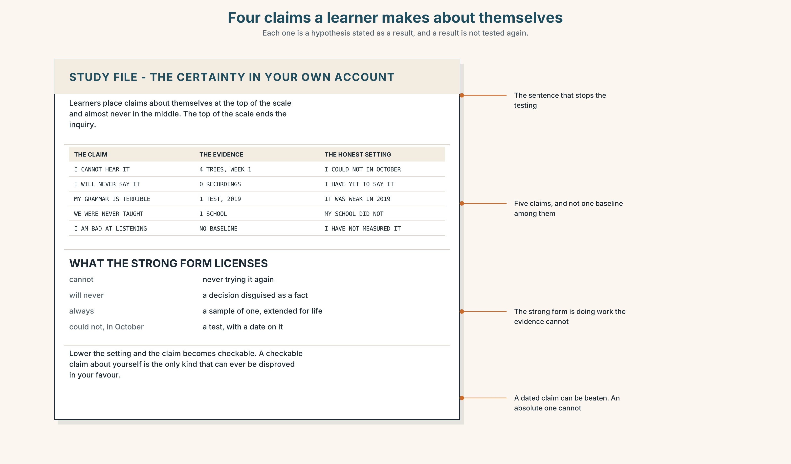{width=6.6in}

*Four claims a learner makes about themselves — Each one is a hypothesis stated as a result, and a result is not tested again.*

# STUDY FILE · The certainty in your own account

### 9A · Claims you make about yourself 🔊 Track 3.4

Learners describe their own ability at the very top of the certainty scale and almost never at the
middle: *I can't hear the difference*, *I will never pronounce this*, *my grammar is terrible*.
Each one is a hypothesis stated as a result, and a hypothesis stated as a result stops being
tested.

| | |
|---|---|
| **the claim** | *I can't hear the difference* |
| **the evidence** | four attempts, all in week one, none recorded |
| **the honest setting** | *I could not hear it in October* |
| **what the strong form licenses** | never trying again |

### 9B · Lower the setting

Take three sentences you have said about your English at the top of the scale.
**Rewrite each at the setting its evidence supports, with a date.**

### 9C · Role play — what would you need to have seen?

In pairs. One of you states a claim about your own English. The other may only ask *what would you
need to have seen to be that sure?* **Four rounds each.**

### 9D · The thing you are genuinely sure of

Everybody has one thing about their English they can demonstrate.
**Name yours and name the evidence.** Then say it at the top of the scale, out loud, once.

### 9E · Transfer — before next week

**Take one claim you made at the top of the scale and test it properly.** Three attempts,
recorded, one week apart. Bring the recordings and the original sentence.

---

## Part 10 · Mediation & Interaction ◆ **C · THE PERFORMANCE**

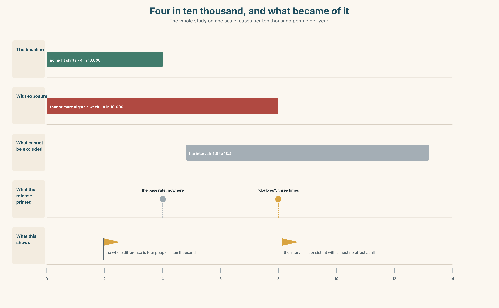{width=6.6in}

*Four in ten thousand, and what became of it — The whole study on one scale: cases per ten thousand people per year.*

### 10A · Relay

Half the class has the release. Half has the preprint.
**Produce one headline both documents support, by speaking only.** Ten minutes.

### 10B · Simplify — for one reader

A reader writes: *I work nights. Should I stop?*
**Reply in four sentences.** Give the absolute figures and set your modals honestly.

### 10C · Online

Write **one message** to the press office about the missing base rate. **Three sentences.** Do not
accuse; describe what a reader cannot do without it.

### 10D · Your language

How does your language mark the difference between *it must be* and *it may be*?
**Translate all five sentences from Part 2.** Which distinctions survive, and which collapse?

---

## Part 11 · The Decision ◆ **C · THE PERFORMANCE**

# The headline at six o'clock

Two numbers, both true, and room for one.

**Option one:** *Night work doubles heart risk, study finds.* True, accurate to the release, and
the number readers will remember.

**Option two:** *Night work linked to four extra cases in ten thousand.* True, accurate to the
preprint, and nobody will click on it.

**Option three:** run option one, and adopt a standing rule that no risk figure appears anywhere
in the paper without its base rate in the same sentence.

### 11A · The evidence

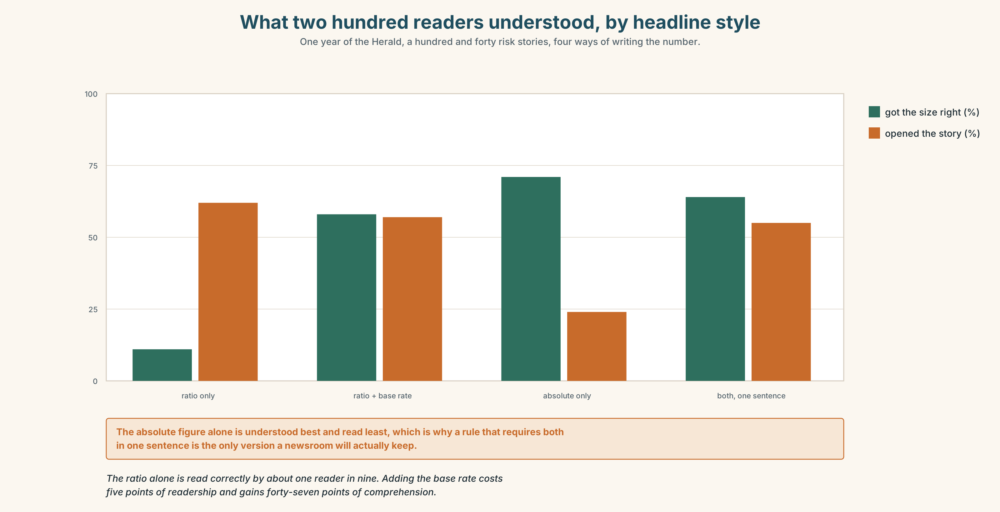{width=6.6in}

*What two hundred readers understood, by headline style — One year of the Herald, a hundred and forty risk stories, four ways of writing the number.*

🔊 **Track 3.6.** The standards editor, 30 seconds: *"We have run a hundred and forty risk stories
in a year. I asked two hundred readers what a doubling meant, and the median answer was fifty per
cent. Not fifty per cent more — fifty per cent of people. We are not informing anybody. We are
producing a number that happens to be correct and a belief that is wildly wrong, and then
defending the number."*

### 11B · Talk about it

In threes. Use the frame, and state your certainty setting every time you use it.

> *I would ______ , because ______ , and the evidence for that is ______ .*

### 11C · Decide

Write **three sentences**: the decision, the evidence, and the thing you would accept as proof you
were wrong.

### 11D · Model decision

> Option three. Option two is honest and unread, which helps nobody, and option one on its own
> produces the fifty-per-cent belief the standards editor measured. The base-rate rule costs nine
> words a story and is the only version where the figure the reader remembers is a figure they can
> use. It also has a cost worth naming: some stories will not survive their own base rate, and
> those are the stories the rule exists for.

### 11E · The Reveal

> **What happened.** The Herald ran the first headline and adopted the rule. Nine months later the
> preprint failed peer review on the exposure definition and was withdrawn.
>
> Then something nobody predicted: the health reporter began returning press releases that gave no
> base rate, with a one-line note. Within a year, three university press offices in the city were
> putting the base rate in the first paragraph — not because anybody asked them to, but because
> the alternative was not being covered.

**One question. You do not have to answer it out loud.**

> The rule was about the Herald's own sentences. Why did it change what other people wrote?

---

## Part 12 · Landing ◆ **all three lines**

### 12A · Recycle — fifteen items

> 1. It ______ be chance; the interval includes 1.2. *(possible, uncommitted)*
> 2. At that size the effect ______ be real. *(strongest inference)*
> 3. It ______ ______ ______ been chance at that interval. *(past, all but excluded)*
> 4. Day workers ______ ______ ______ ______ show the pattern. *(five words, balanced)*
> 5. The finding ______ ______ ______ ______ replicated. *(four words, not yet)*
> 6. ______ , the release was written by somebody who had not read the paper. *(one word — a guess)*
> 7. The effect is not ______ large, only unlikely to be chance. *(one word)*
> 8. ______ ______ ______ was four cases in ten thousand. *(three words)*
> 9. The study is ______ ______ , posted online and not yet assessed. *(two words)*
> 10. ______ ______ ______ ______ ______ ______ , night work is the likelier explanation. *(six words — the legal standard)*
> 11. ______ ______ ______ ______ ______ ______ , no replication exists. *(six words — the institutional limit)*
> 12. ______ ______ ______ ______ ______ . *(five words — the correction you make to an overclaim)*
> 13. You cannot ______ ______ one cohort to a whole workforce. *(two words)*
> 14. Somebody has to ______ ______ ______ one side or the other by six. *(three words)*
> 15. He tends to ______ ______ when the numbers are thin. *(two words)*

### 12B · Consolidate — one task, everything in it

**Write 150 words about a claim in the news this week**, placing every assertion at the setting its
evidence supports. Mark three settings in the margin: one top, one middle, one bottom.

### 12C · Can-do, with evidence

> ☐ I can use the full range of epistemic modals, including past deduction. **Evidence:** 3H, 8D
> ☐ I can calibrate a claim to the evidence behind it. **Evidence:** 4C, 6E
> ☐ I can read a risk figure and say what it is out of. **Evidence:** 5C, 10B
> ☐ I can reduce and stress a modal for effect. **Evidence:** 7C

### 12D · Replay ⏺

Record 0C again. **Compare.** How many settings did you use the first time, and how many now?

### 12E · Glossary — fifty items, as a map

> **THE MEASUREMENTS** · incidence · prevalence · cohort · baseline · exposure
> **THE RELATIONS** · risk · hazard · correlation · causation
> **THE DOUBT** · confidence · interval · significance
> **THE FIVE PHRASES** · absolute risk · relative risk · a doubling of risk · the base rate · statistically significant
> **THE PAPER TRAIL** · a causal link · the margin of error · peer reviewed · a preprint · a press release
> **WHAT PEOPLE DO WITH EVIDENCE** · scale up · rule out · bear in mind · hedge about · come down on · hold back
> **IN THE ROOM** · the evidence does not support that · it may well be · we cannot rule it out
> **THE ADVERBS** · conceivably · arguably · presumably · ostensibly · allegedly · reportedly · demonstrably · unequivocally
> **THE FRAMES** · is likely to · is bound to · might well have · could hardly have · must surely be · may or may not · is said to · has yet to be
> **THE STANDARDS** · on the balance of probability · to the best of our knowledge · that is overstating it

### 12F · Next

> **Unit 4 · What was going to happen?**

# B2.1 · Unit 4 · It Was Going to Open in 2019

> **English Animated** · *Reading Between Lines* · a newsroom, Toronto
> Student's Book pages 72–93 · 22 pp · ~11 hours

---

## Part 0 · The Big Picture ◆ **A · THE WORLD**

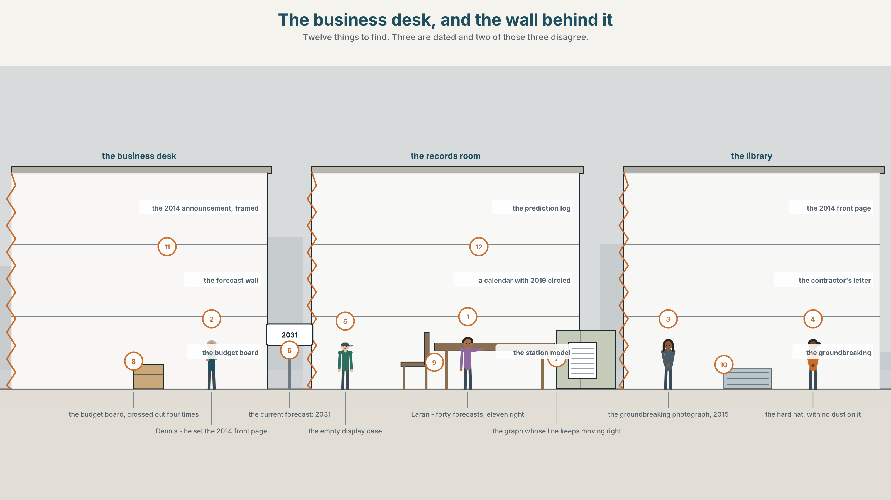{width=6.6in}

*The business desk, and the wall behind it — Twelve things to find. Three are dated and two of those three disagree.*

# What was going to happen?

**By the end of this unit you can narrate a plan that did not happen, from the vantage point of
the people who made it. Two hundred words.**

| ◆ **A · THE WORLD** | A transit line announced in 2014, due in 2019, and a wall of the paper's own forecasts |
|---|---|
| ◆ **B · THE SYSTEM** | future in the past · 28 words for forecasting and failure · 22 words and frames for looking backwards and forwards · *was gonna* |
| ◆ **C · THE PERFORMANCE** | Two hundred words about something that was supposed to happen |

---

### 0A · Find it

**Find twelve things in this picture.** Three of them are dated and two of those three contradict
each other.

> the 2014 announcement, framed · the forecast wall · the budget board, crossed out four times ·
> a model of the station that was never built · the business desk's prediction log ·
> a hard hat with no dust on it · the first-edition page from 2014 · a calendar with 2019 circled ·
> the contractor's letter · a graph with a line that keeps moving right ·
> a photograph of the groundbreaking · an empty display case

### 0B · Guess it

**Two objects in this picture were made on the same day and now disagree.** Which two, and which
of them has been quietly replaced since?

### 0C · Say it ⏺

**Record sixty seconds.** *Describe something you were going to do last year and did not do. Say
what you thought at the time, not what you think now.* You will record it again at the end of this
unit.

---

## Part 1 · Vocabulary Lab 1 ◆ **B · THE SYSTEM**

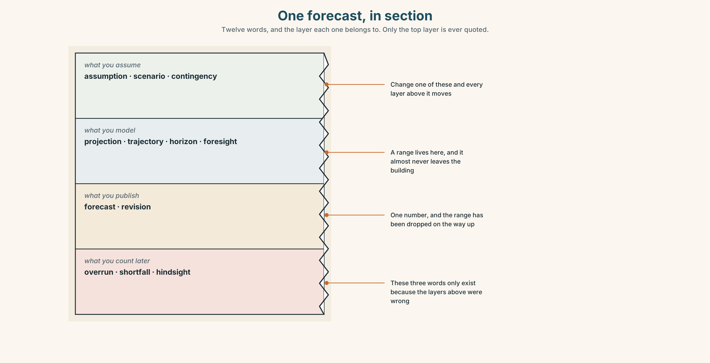{width=6.6in}

*One forecast, in section — Twelve words, and the layer each one belongs to. Only the top layer is ever quoted.*

### 1A · Meet — the words of a prediction

Match each word to one layer of the cutaway.

> **forecast** · **projection** · **scenario** · **trajectory** · **revision** · **hindsight** ·
> **foresight** · **contingency** · **overrun** · **shortfall** · **horizon** · **assumption**

### 1B · Sort — made beforehand, the shape of the thing, or counted afterwards?

Three columns. **Two of the twelve are the same word looking in opposite directions.**

> forecast · trajectory · revision · horizon · foresight · hindsight · scenario ·
> projection · contingency · assumption · overrun · shortfall

### 1C · Meet — the five phrases that carry a forecast

| | |
|---|---|
| **on current trends** | A sentence that presents a straight line as a fact about the future. |
| **a worst case** | The number nobody plans for and everybody later says they published. |
| **the central estimate** | The middle of a range, reported as though the range were not there. |
| **revised downwards** | The passive that removes whoever did the revising. |
| **an optimistic forecast** | A phrase only ever used afterwards, and never by its author. |

### 1D · Collocation Lab

Complete each one, and say which of the five could have been written in 2014.

> **with hindsight** · **as things turned out** · **the plan was to** · **a missed deadline** ·
> **the gap between**

1. ______ ______ ______ ______ open the line in the spring of 2019.
2. ______ ______ ______ ______ , the tunnelling took four years longer than the contract allowed.
3. ______ ______ , the 2014 schedule assumed nothing would be found under the harbour.
4. ______ ______ ______ the announcement and the first train is now seventeen years.
5. ______ ______ ______ is not news until there have been four of them.

### 1E · The phrasal verbs, and the three fixed expressions

> **fall through** · **come off** · **hold up**
>
> **f** *it was supposed to be* · **f** *that never happened* · **f** *nobody saw it coming*

**One of these fixed expressions is almost always false when it is said.** Which, and what is it
usually doing for the speaker?

### 1F · Own it

Write one sentence beginning *The plan was to…* about your own year, and underneath it write the
month in which you stopped believing it.

---

## Part 2 · Listening ◆ **A · THE WORLD**

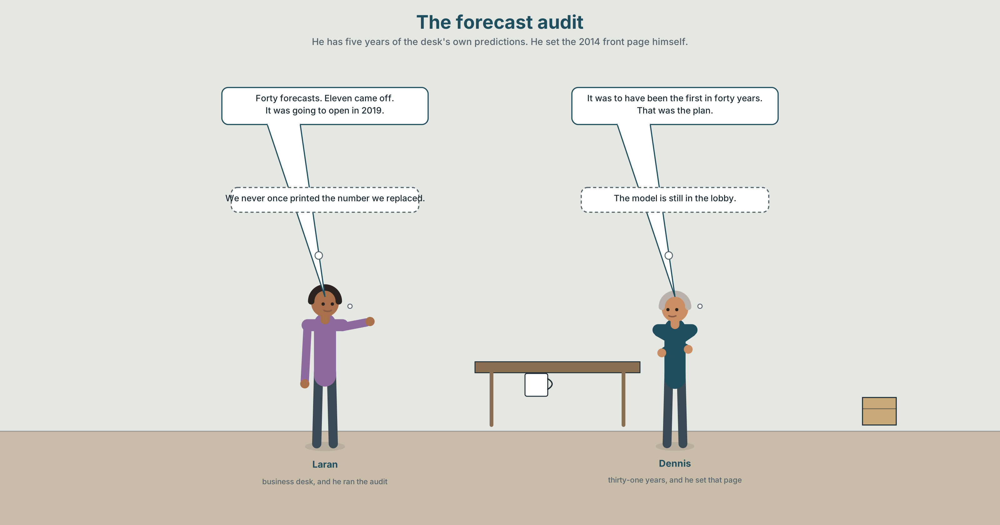{width=6.6in}

*The forecast audit — He has five years of the desk's own predictions. He set the 2014 front page himself.*

### 2A · The forecast audit 🔊 Track 4.1

**Before you listen.** The business desk has gone back through five years of its own predictions.
The subeditor has been at the paper since 1995 and remembers the announcement.

**Listen once.** What were the paper's own forecasts, and how many of them came off?

**Listen again. Complete the table.**

| | What was going to happen | When | What actually happened |
|---|---|---|---|
| the line | | | |
| the budget | | | |
| the paper's forecast | | | |

**Listen again. True or false?**

1. The line was originally due to open in 2019. ☐ T ☐ F
2. The paper predicted the first delay. ☐ T ☐ F
3. The budget has been revised four times. ☐ T ☐ F
4. The subeditor wrote the 2014 front page. ☐ T ☐ F

**Noticing.** Five sentences from the recording.

1. *It was going to open in 2019.*
2. *It was due to open in 2019.*
3. *It would have opened in 2019, but for the harbour.*
4. *It was to have opened in 2019.*
5. *It would later open in 2031, if it opens.*

**All five look back at a future that never arrived. Which one blames something, which one is the
most formal, and which one is a plain report?**

### 2B · Decoding clinic 🔊 Track 4.2

Thirty seconds at speed. Three jobs.

1. The subeditor says *was going to* five times. Write what you hear, not what is written.
2. One speaker says *would have* twice, in two different ways. Transcribe both.
3. Somebody says *that was the plan*. What is the tone, and how do you know?

---

## Part 3 · Grammar Lab 1 ◆ **B · THE SYSTEM**

### Standing in 2014 and looking forward

### 3A · Notice

Look at the five sentences in Part 2 again.

1. Where is the speaker standing in each one — in 2014, or now?
2. Which sentence contains an obstacle, and which word puts it there?
3. Sentence 4 is the most formal of the five. **What register does *was to have* belong to?**
4. Sentence 5 uses *would* about something still ahead. **How is that possible?**

### 3B · See

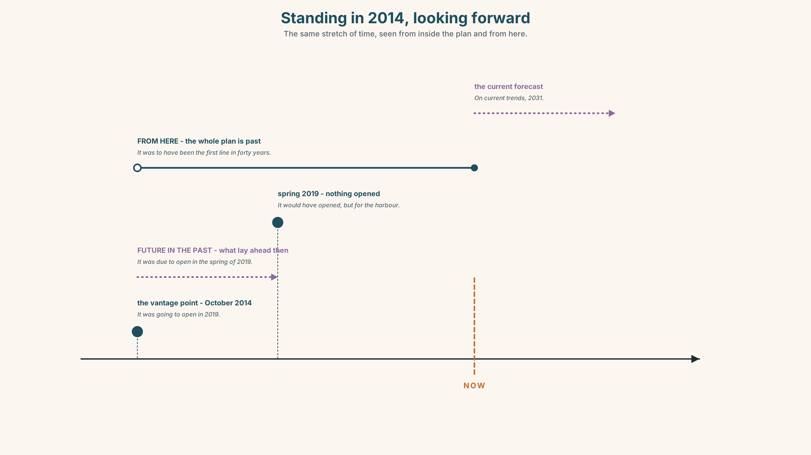{width=6.6in}

*Standing in 2014, looking forward — The same stretch of time, seen from inside the plan and from here.*

### 3C · Know

| | | |
|---|---|---|
| **was going to** | the plan or expectation, neutral | *It was going to open in 2019.* |
| **was due to** | a scheduled commitment, often contractual | *It was due to open in 2019.* |
| **was about to** | on the point of happening, interrupted | *They were about to sign.* |
| **would have** | and something prevented it | *It would have opened, but for the harbour.* |
| **was to have been** | formal, written, and faintly reproachful | *It was to have been the first line in forty years.* |
| **would later** | the narrator, who knows how it ends | *It would later be revised four times.* |

> **Future in the past is a vantage point, not a tense.** You stand at a moment in the past and
> look forward from it, and the reader knows you also know what happened. That double knowledge is
> the whole effect.

> **The narrator's *would* is the most useful form in this unit.** *It would later overrun by nine
> years* is only available to somebody telling the story afterwards, and it tells the reader there
> is more coming.

| | |
|---|---|
| **standing at the start** | *originally · formerly · the plan was to · was due to* |
| **moving through** | *subsequently · latterly · would later · as it would turn out* |
| **arriving at the end** | *eventually · ultimately · in the event · as things turned out* |
| **choosing a direction** | *prospectively · retrospectively · with hindsight* |

> **Why it matters.** Every institution has a record of things that were going to happen. The
> grammar that narrates those honestly is the grammar that stops a newsroom repeating them.

### 3D · Use — controlled

Complete so that each sentence looks forward from 2014.

> The line (1) ______ ______ ______ open in 2019. *(a schedule, contractual)*
> It (2) ______ ______ ______ be the first new line in forty years. *(formal, written)*
> The contractor (3) ______ ______ ______ sign when the survey came back. *(on the point of)*
> It (4) ______ ______ opened on time, but for the harbour. *(and something prevented it)*
> The budget (5) ______ ______ be revised four times. *(the narrator, who knows)*

### 3E · Use — guided

Rewrite each one from the vantage point of 2014, looking forward.

1. The line did not open in 2019.
2. They nearly signed in March.
3. The budget was eventually six point one billion.
4. The paper got one forecast in four right.
5. The station model is still in its case.

### 3F · Use — open

**In pairs.** One of you describes a plan from inside it, in 2014. The other may only reply with a
sentence containing *would later*. **Six turns each, and the second speaker must not reveal the
ending until the last one.**

### 3G · Error autopsy

> ✗ *It was going to opened in 2019.*
> ✗ *It would have open on time if the harbour was not there.*
> ✗ *Eventually, the line was about to open in 2031.*

For each, name the rule and say what the writer was reaching for.

### 3H · Check — eight items

> 1. The line ______ ______ ______ open in 2019. *(a contractual schedule)*
> 2. It ______ ______ ______ ______ the first new line in forty years. *(formal and written)*
> 3. They ______ ______ ______ sign when the survey came back. *(on the point of)*
> 4. It ______ ______ opened on time, but for the harbour. *(prevented)*
> 5. The budget ______ ______ be revised four times. *(the narrator)*
> 6. ✗ *It was going to opened in 2019.* → correct it.
> 7. Rewrite *They did not sign* so that the reader can feel how close it came.
> 8. Rewrite *The line opened in 2031* so that a reader standing in 2014 could have said it.

---

## Part 4 · Speaking ◆ **C · THE PERFORMANCE**

### 4A · Fluency starter — the plan and the ending

One person states a plan in the past. The next adds a sentence with *would later*. The next adds
another. **The fifth person has to supply the ending, and it must follow from all four.**

### 4B · The functional core — narrating a thwarted plan

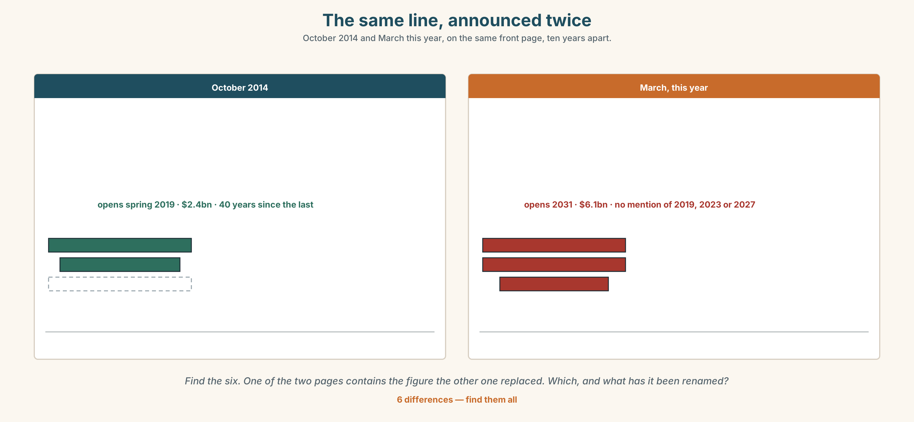{width=6.6in}

*The same line, announced twice — October 2014 and March this year, on the same front page, ten years apart.*

**Language Bank**

| | |
|---|---|
| **standing in the plan** | *was going to · was due to · had intended to · that was the plan* |
| **the near miss** | *was about to · would have been · it would be years before* |
| **the narrator** | *would later · as it would turn out · subsequently · latterly* |
| **the ending** | *eventually · ultimately · in the event · as things turned out* |

**Information gap.** Learner A has the 2014 announcement. Learner B has this year's schedule.
**Agree on a four-sentence account that neither document contradicts.**

### 4C · The performance — three minutes ⏺

Tell the story of something that did not happen, in three minutes, **spending the first minute
entirely inside the plan**. Your partner must not be able to tell how it ends until you say so.

**Record it.**

### 4D · Observer

One person marks every point at which the speaker leaves the plan and speaks as the narrator.

### 4E · Three criteria

> ☐ Did the first minute stay inside the plan, with no hindsight leaking in?
> ☐ Did I use at least three different future-in-the-past forms?
> ☐ Could my partner say, afterwards, what the people at the time believed?

---

## Part 5 · Reading ◆ **A · THE WORLD**

### 5A · Predict

The title is **"The line that was going to open in 2019."**
**How many times do you think a seventeen-year project is re-announced, and by whom?**

### 5B · Read — two minutes

---

**The line that was going to open in 2019**

In October 2014 the city announced a new transit line to the east end. It was to have been the
first new line in forty years. It was due to open in the spring of 2019, at a cost of two point
four billion dollars.

The Herald's front page that morning carried a projection of journey times and a photograph of a
model of the station. The model is still in the lobby of the planning office. The station is not
built.

The opening date has since been revised to 2023, to 2027 and, in March, to 2031. The budget has
been revised downwards once, in 2016, and upwards three times. The central estimate is now six
point one billion.

The paper has published two hundred and forty pieces about the line. Thirty-one of them contain a
forecast date. None of the thirty-one mentions the forecast it replaced.

Nobody saw it coming, the city's transport chair said in 2023, of the second delay. The 2016
contingency documents, released under access law in 2024, model the harbour problem on page
eleven and put a worst case at 2029.

---

### 5C · Comprehension — eight questions

1. When was the line announced, and when was it due to open?
2. What was the original cost, and what is the central estimate now?
3. How many of the paper's pieces contain a forecast date?
4. How many of those mention the forecast they replaced?
5. What is on page eleven of the 2016 documents?
6. **Why does the writer mention the model in the lobby twice as often as the station?**
7. **The last paragraph sets a quotation against a document. What is the writer doing, and why not say it outright?**
8. **"Revised downwards once and upwards three times" — what would be lost by writing "revised four times"?**

### 5D · Vocabulary in context

Infer from the text, then check.

> it was to have been · has since been revised · released under access law · of the second delay ·
> model the harbour problem

### 5E · The counter-text

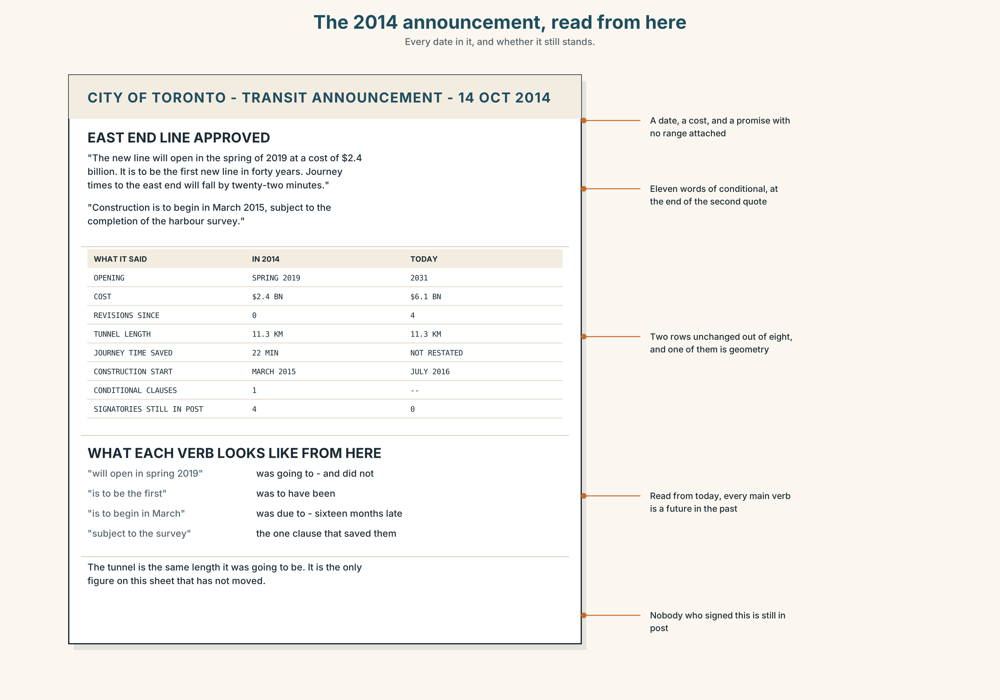{width=6.6in}

*The 2014 announcement, read from here — Every date in it, and whether it still stands.*

**Read the 2014 announcement and answer.**

1. Which verbs in it are future in the past, read from today?
2. **Find every date in it, and say which of them still stands.**
3. The announcement contains one conditional. **What was it protecting?**
4. **Who signed it, and where are they now?**

### 5F · Two texts

The 2014 notice says *the line will open in spring 2019*.
The 2024 documents say *a worst case of 2029 was modelled in 2016*.

**Is "nobody saw it coming" a lie?** Write two sentences, and use *with hindsight* in one of them.

---

## Part 6 · Vocabulary Lab 2 ◆ **B · THE SYSTEM**

### Where you are standing when you say it

### 6A · Sort — at the start, somewhere along the way, or looking from one end?

Three columns.

> retrospectively · eventually · ultimately · latterly · subsequently · prospectively ·
> originally · formerly

### 6B · Chunk completion

1. The line ______ ______ ______ open in 2019. *(three words — the plan)*
2. It ______ ______ ______ open in 2019. *(three words — the schedule)*
3. They ______ ______ ______ sign when the survey came back. *(three words — on the point of)*
4. It ______ ______ ______ the first new line in forty years. *(four words — and it was not)*
5. The city ______ ______ ______ build it in two phases. *(three words — a stated intention)*
6. It ______ ______ ______ ______ ______ opened by now. *(five words — formal, reproachful)*
7. The budget ______ ______ be revised four times. *(two words — the narrator)*
8. ______ ______ ______ ______ ______ , the harbour was the least of it. *(five words — the narrator again)*

### 6C · Three that are not interchangeable

> *was going to* · *was due to* · *was to have been*

**Say which one reports a plan, which one reports a commitment, and which one carries a complaint.**

### 6D · The phrasal verbs and the fixed expressions

> **back out** · **pull out** · **call off**
>
> **f** *it would be years before* · **f** *that was the plan* · **f** *in the event*

**Two of these three phrasal verbs describe leaving an agreement and one describes ending an
event.** Which is which, and what is the difference between the other two?

### 6E · Contrast Clinic

Eight items. Rewrite each sentence so that the vantage point moves to the place in brackets.

1. Nobody expected the second delay. *(and the documents did)*
2. The paper got one forecast in four right. *(looking back deliberately)*
3. It opened in 2031. *(as a prediction made in 2014)*
4. The harbour caused a delay. *(formal, written, reproachful)*
5. The budget rose to six point one billion. *(the narrator, with more to come)*
6. The line did not open in 2019. *(standing in 2014)*
7. The contractor left the project. *(a stated intention that changed)*
8. They did not sign. *(a near miss)*

---

## Part 7 · Pronunciation & Fluency Lab ◆ **B · THE SYSTEM**

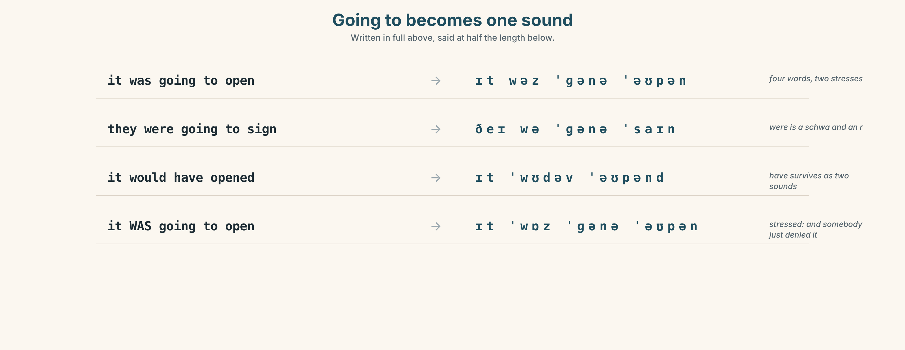{width=6.6in}

*Going to becomes one sound — Written in full above, said at half the length below.*

### Going to becomes one sound and takes the stress with it

### 7A · Hear 🔊 Track 4.3

> *It was going to open.* → /ɪt wəz ˈɡənə ˈəʊpən/
> *They were going to sign.* → /ðeɪ wə ˈɡənə ˈsaɪn/
> *It would have opened.* → /ɪt ˈwʊdəv ˈəʊpənd/

### 7B · Say

Say each one three times, fast. Then say this:

> *It was going to open, they were going to sign, and it would have been finished.* — three
> reduced forms in one breath, and one stress in each.

### 7C · Make it mean something

Say these two:

> *It was going to open in 2019.* — the plain report, the stress on the date
> *It WAS going to open in 2019.* — stressed: and somebody has just denied that it ever was

**A stressed auxiliary is almost always an argument,** which is why the archive matters: you can
only stress *was* if you can produce the document.

### 7D · Fluency 30 ⏺

Thirty seconds: **one plan, told from inside it, with four reduced forms and one stressed
auxiliary.** Three times, faster.

---

## Part 8 · Writing ◆ **C · THE PERFORMANCE**

### A plan that did not happen · 200 words

### 8A · Read the model

> In October 2014 the line was due to open in the spring of 2019, at two point four billion
> dollars. `[the schedule and the number, as they stood, with no hindsight in the sentence]`
>
> It was to have been the first new line in forty years, and the model of the station was
> photographed for the front page. `[the formal form carries the reproach without the writer
> stating one]`
>
> The 2016 contingency documents would later put a worst case at 2029, which the city did not
> publish. `[would later: the narrator steps in, and the reader now knows there is more]`
>
> As things turned out, the opening has been revised three times since, and the model is still in
> the lobby. With hindsight, the only figure in the 2014 announcement that has held is the length
> of the tunnel. `[the ending, and one concrete detail doing the work of an adjective]`

**Questions about the writer's choices:**

1. The first paragraph has no hindsight in it at all. **What does that buy, and what does it cost?**
2. *Would later* appears once. **What would happen if it appeared four times?**
3. The last sentence names the one forecast that held. **Why end on the thing that worked?**

### 8B · The anti-model

> The disastrous transit project has been a catalogue of failures from the start. Experts warned the timeline was unrealistic, but the city pressed ahead anyway. Now, years late and billions over budget, it stands as a monument to incompetence. Nobody saw it coming.

Four sentences, three unnamed sources, no dates, and a final sentence that contradicts the second.
**Rewrite it from inside 2014, with a date in every sentence.**

### 8C · Plan

> the schedule as it stood → the formal expectation → the narrator, once → the ending, with one
> concrete survival

### 8D · Write — 200 words
### 8E · Peer review — three criteria

> ☐ Does the opening stay inside the plan, with no hindsight leaking backwards?
> ☐ Is every date the date somebody actually wrote down?
> ☐ Does the narrator step in deliberately, and not more than twice?

### 8F · Write it again · 8G · Publish

Rewrite after review. **Publish both, and mark the moment the narrator first appears in each.**

---

## Part 9 · The File ◆ **A · THE WORLD + C · THE PERFORMANCE**

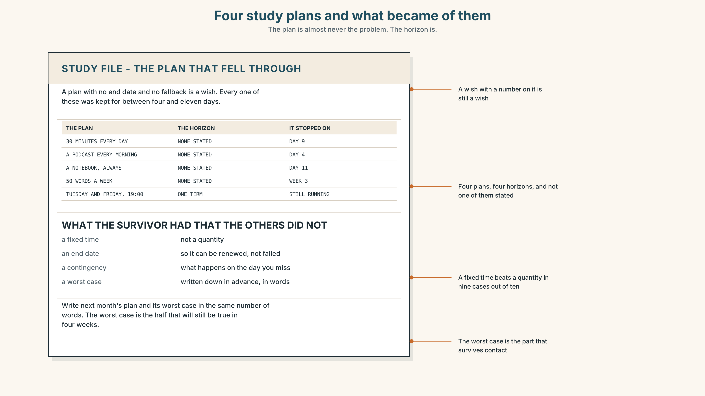{width=6.6in}

*Four study plans and what became of them — The plan is almost never the problem. The horizon is.*

# STUDY FILE · The study plan that fell through

### 9A · What you were going to do 🔊 Track 4.4

Every learner has a plan that did not come off: thirty minutes a day, a podcast every morning, a
notebook. The plan is almost never the problem. The horizon is.

| | |
|---|---|
| **the plan** | *I was going to study thirty minutes every day* |
| **the horizon** | indefinite |
| **the contingency** | none |
| **what actually held** | the two days a week with a fixed time |

### 9B · Rebuild it

Take one plan of yours that fell through.
**Write what it was, what the first missed day was, and what you would need to have had in place.**

### 9C · Role play — the 2014 version of you

In pairs. One of you describes a learning plan as you believed it at the time, with no hindsight.
The other may only ask *and what was the contingency?* **Four rounds each.**

### 9D · The one that held

Everybody has one habit that survived. **Name yours and say what was different about it.** Nine
times in ten the answer is a fixed time, not a quantity.

### 9E · Transfer — before next week

**Write next month's plan with a worst case beside it,** in the same number of words. Bring both.
The worst case is the only part that will still be true in four weeks.

---

## Part 10 · Mediation & Interaction ◆ **C · THE PERFORMANCE**

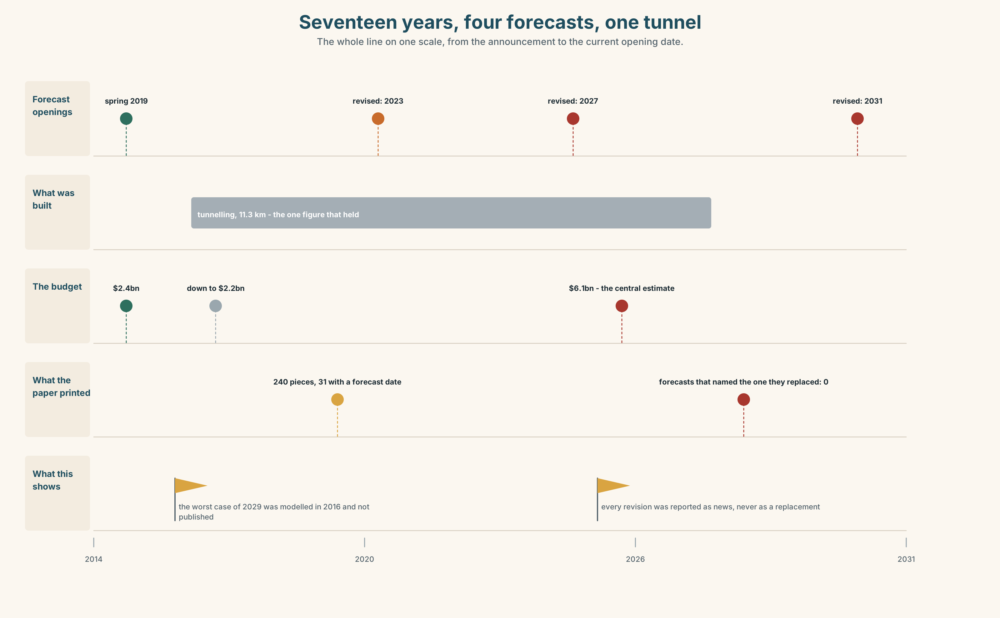{width=6.6in}

*Seventeen years, four forecasts, one tunnel — The whole line on one scale, from the announcement to the current opening date.*

### 10A · Relay

Half the class has the 2014 announcement. Half has the 2024 documents.
**Produce one paragraph both sides accept, by speaking only.** Ten minutes.

### 10B · Simplify — for one reader

A reader writes: *I bought a flat near the station in 2015. What should I have been told?*
**Reply in four sentences,** from inside 2015, and then once from now.

### 10C · Online

Write **one message** to a colleague whose article says *nobody saw it coming*. **Three
sentences.** Cite the page number and leave the judgement to them.

### 10D · Your language

How does your language look forward from a point in the past?
**Translate all five sentences from Part 2.** Which of the five distinctions does your language
keep, and which does it collapse into one form?

---

## Part 11 · The Decision ◆ **C · THE PERFORMANCE**

# The forecast audit

The business desk has proposed that the paper publish, once a year, every forecast it made twelve
months earlier and what became of each one.

**Option one:** do not. A newspaper's job is to report what people say, and a public scoreboard of
its own wrong guesses will be quoted against it for years.

**Option two:** publish it in full, including the names of the writers.

**Option three:** publish it in full, without names, and require that every new forecast in the
paper carry the date and value of the forecast it replaces.

### 11A · The evidence

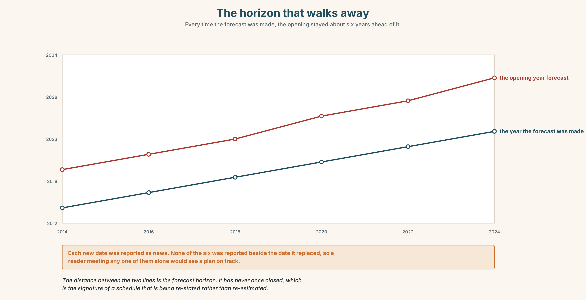{width=6.6in}

*The horizon that walks away — Every time the forecast was made, the opening stayed about six years ahead of it.*

🔊 **Track 4.6.** Laran Bakare, business desk, 30 seconds: *"We ran forty forecasts in five years
and eleven came off. That is worse than a coin, and I am not embarrassed by it, because the ones
we got wrong were the ones everybody got wrong and the chart shows exactly why. What I am
embarrassed by is that we never once printed the number we were replacing."*

### 11B · Talk about it

In threes. Use the frame, and state which vantage point you are speaking from each time.

> *I would ______ , because ______ , and in five years it would ______ .*

### 11C · Decide

Write **three sentences**: the decision, the evidence, and what you would expect to see in the
first audit if you were right.

### 11D · Model decision

> Option three. Names turn an audit into a disciplinary record and the desk will quietly stop
> forecasting, which is the one outcome that helps nobody. The replacement rule is the part that
> does the work: a forecast printed beside the forecast it supersedes cannot be re-announced as
> news, and it is the re-announcement, not the error, that has cost this paper its credibility on
> the line.

### 11E · The Reveal

> **What happened.** The Herald published the audit without names and adopted the replacement rule.
> Eleven of forty was the headline figure, and it was quoted against the paper for a fortnight.
>
> Then something nobody predicted: the city's own press office began including the superseded date
> in its announcements, because the Herald printed it anyway and the office preferred to be the
> one who said it. The number of re-announcements fell by half in a year.

**One question. You do not have to answer it out loud.**

> The rule applied only to the Herald's own pages. Why did it change what the city published?

---

## Part 12 · Landing ◆ **all three lines**

### 12A · Recycle — fifteen items

> 1. The line ______ ______ ______ open in 2019. *(three words — the schedule)*
> 2. It ______ ______ ______ ______ the first in forty years. *(four words — formal)*
> 3. They ______ ______ ______ sign when the survey came back. *(three words)*
> 4. It ______ ______ opened on time, but for the harbour. *(two words)*
> 5. The budget ______ ______ be revised four times. *(two words — the narrator)*
> 6. ______ , the plan was two phases, not three. *(one word — at the start)*
> 7. ______ , it opened in 2031. *(one word — at the end)*
> 8. ______ , the 2016 documents say it all. *(one word — looking back deliberately)*
> 9. ______ ______ ______ ______ , the harbour was the least of it. *(five words)*
> 10. ______ ______ ______ ______ ______ ______ a train ran on it. *(six words — the long wait)*
> 11. ______ ______ ______ ______ . *(four words — the resigned confirmation)*
> 12. ______ ______ ______ , only one of the four forecasts held. *(three words — the outcome)*
> 13. The contractor ______ ______ in March, three weeks before signing. *(two words)*
> 14. The opening event was ______ ______ for the second time. *(two words)*
> 15. The whole financing ______ ______ when the bank withdrew. *(two words)*

### 12B · Consolidate — one task, everything in it

**Write 150 words about a public project in your own city that was going to happen.** Spend the
first half inside the plan and mark in the margin the sentence where you become the narrator.

### 12C · Can-do, with evidence

> ☐ I can narrate a plan from inside it, in the past. **Evidence:** 3H, 8D
> ☐ I can use *would later* and *as it would turn out* to manage what the reader knows. **Evidence:** 4C
> ☐ I can distinguish a plan, a schedule and a reproach. **Evidence:** 6C, 6E
> ☐ I can reduce *going to* and stress an auxiliary for argument. **Evidence:** 7C

### 12D · Replay ⏺

Record 0C again. **Compare.** Did you stay inside the plan this time, and for how long?

### 12E · Glossary — fifty items, as a map

> **WHAT YOU MAKE BEFOREHAND** · forecast · projection · scenario · assumption · contingency
> **THE SHAPE AND THE DISTANCE** · trajectory · horizon · foresight
> **WHAT YOU COUNT AFTERWARDS** · revision · hindsight · overrun · shortfall
> **THE FIVE FORECAST PHRASES** · on current trends · a worst case · the central estimate · revised downwards · an optimistic forecast
> **LOOKING BACK AT IT** · with hindsight · as things turned out · the plan was to · a missed deadline · the gap between
> **WHAT HAPPENS TO PLANS** · fall through · come off · hold up · back out · pull out · call off
> **IN THE ROOM** · it was supposed to be · that never happened · nobody saw it coming
> **THE ADVERBS** · eventually · ultimately · subsequently · originally · formerly · latterly · prospectively · retrospectively
> **THE FRAMES** · was going to · was due to · was about to · would have been · had intended to · was to have been · would later · as it would turn out
> **THE ENDINGS** · it would be years before · that was the plan · in the event

### 12F · Next

> **Unit 5 · On what condition?**

# B2.1 · Unit 5 · Clause Seven

> **English Animated** · *Reading Between Lines* · a newsroom, Toronto
> Student's Book pages 94–115 · 22 pp · ~11 hours

---

## Part 0 · The Big Picture ◆ **A · THE WORLD**

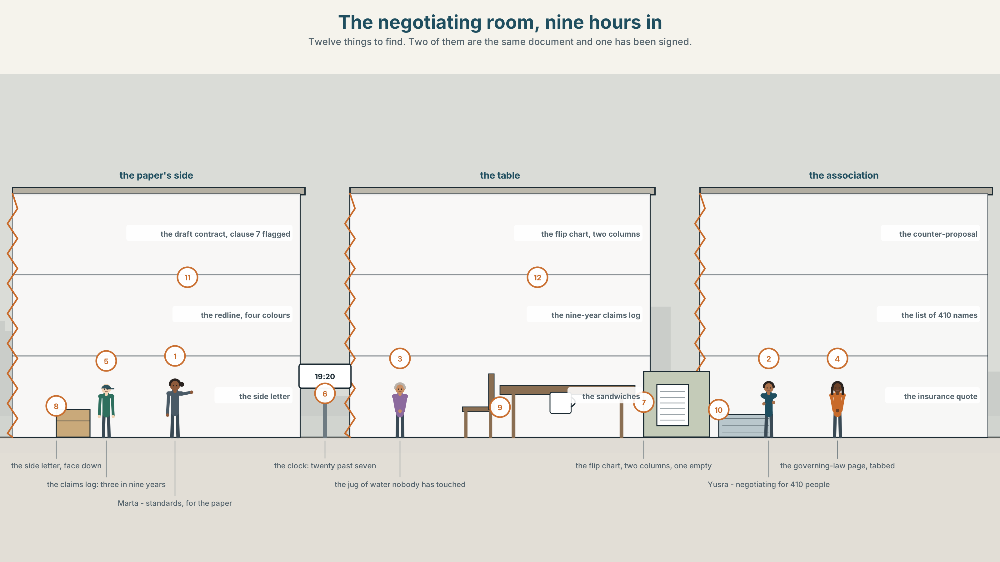{width=6.6in}

*The negotiating room, nine hours in — Twelve things to find. Two of them are the same document and one has been signed.*

# On what condition?

**By the end of this unit you can set a condition precisely, and hear the difference between a
condition and a threat. Two hundred words.**

| ◆ **A · THE WORLD** | A new contributor contract, four hundred and ten freelancers, and one clause nobody will sign |
|---|---|
| ◆ **B · THE SYSTEM** | the full conditional system, including *provided*, *but for* and *supposing* · 28 words for terms and negotiation · 22 connectors and frames · the tune over a long conditional |
| ◆ **C · THE PERFORMANCE** | Two hundred words that make an offer and name its conditions |

---

### 0A · Find it

**Find twelve things in this picture.** Two of them are the same document and only one of them has
been signed.

> the draft contract, clause 7 flagged · the side letter, face down · a redline with four colours ·
> the association's counter-proposal · a list of four hundred and ten names ·
> the insurance quotation · the nine-year claims log · a flip chart with two columns ·
> a jug of water nobody has touched · the governing-law page, tabbed · a clock showing 19:20 ·
> a plate of sandwiches, untouched

### 0B · Guess it

**One document in this picture explains why the negotiation has lasted nine hours.** Which, and
why is it face down?

### 0C · Say it ⏺

**Record sixty seconds.** *Describe something you would agree to do, and state two conditions. Make
one of them a condition you would actually enforce.* You will record it again at the end of this
unit.

---

## Part 1 · Vocabulary Lab 1 ◆ **B · THE SYSTEM**

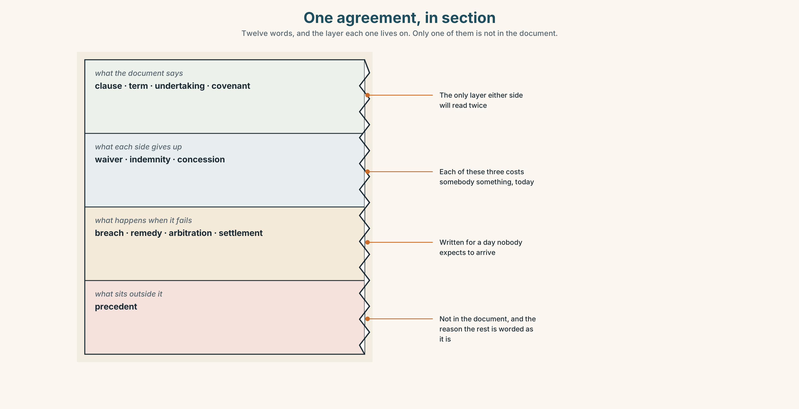{width=6.6in}

*One agreement, in section — Twelve words, and the layer each one lives on. Only one of them is not in the document.*

### 1A · Meet — the words of an agreement

Match each word to one layer of the cutaway.

> **clause** · **term** · **undertaking** · **waiver** · **indemnity** · **precedent** ·
> **covenant** · **breach** · **remedy** · **settlement** · **arbitration** · **concession**

### 1B · Sort — part of the document, something one side gives up, or what happens when it goes wrong?

Three columns. **One of the twelve is not in the document at all, and is the reason the other
eleven are written the way they are.**

> remedy · arbitration · concession · undertaking · covenant · breach · clause ·
> settlement · term · precedent · indemnity · waiver

### 1C · Meet — the five phrases that keep a negotiation alive

| | |
|---|---|
| **subject to contract** | Nothing said before signature binds anybody. The sentence that allows talking. |
| **on the understanding that** | A condition stated in words, not in the document. Dangerous, and everywhere. |
| **without prejudice** | An offer that cannot be quoted against you if it is refused. |
| **in good faith** | Unenforceable, and the only reason most contracts work. |
| **the governing law** | Which country's courts, which nobody reads until they need it. |

### 1D · Collocation Lab

Complete each one, and say which of the five is the only one a court would look at first.

> **a material breach** · **a break clause** · **terms and conditions** · **a side letter** ·
> **to the extent that**

1. Eleven named contributors were offered ______ ______ ______ , face down, at eight o'clock.
2. Nobody reads ______ ______ ______ ______ ; everybody is bound by them.
3. Either side may leave after twelve months under ______ ______ ______ .
4. Only ______ ______ ______ ends the contract; everything smaller is a remedy question.
5. The indemnity applies ______ ______ ______ ______ the contributor knew and did not say.

### 1E · The phrasal verbs, and the three fixed expressions

> **hammer out** · **draw up** · **water down**
>
> **f** *that is not what we agreed* · **f** *we can live with that* · **f** *it depends what you mean by*

**One of these fixed expressions ends a negotiation and one restarts it.** Which is which, and
what does the third one buy?

### 1F · Own it

Write one condition you would put on something you do for other people, and then write what would
happen if somebody broke it.

---

## Part 2 · Listening ◆ **A · THE WORLD**

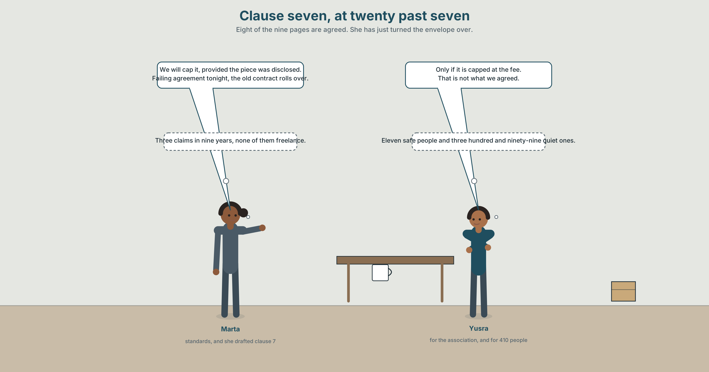{width=6.6in}

*Clause seven, at twenty past seven — Eight of the nine pages are agreed. She has just turned the envelope over.*

### 2A · Clause seven, at seven twenty 🔊 Track 5.1

**Before you listen.** The paper's standards editor and the freelancers' negotiator have been in
the room since ten. Clause 7 makes contributors liable, without limit, for any claim arising from
their work.

**Listen once.** What does each side want, and what is the first thing either of them offers?

**Listen again. Complete the table.**

| | The condition offered | What it costs them | What they want in return |
|---|---|---|---|
| the paper | | | |
| the association | | | |
| the side letter | | | |

**Listen again. True or false?**

1. The paper has had three claims in nine years. ☐ T ☐ F
2. All three were about freelance work. ☐ T ☐ F
3. Insurance costs a freelancer about nineteen hundred dollars. ☐ T ☐ F
4. The association knows about the side letter. ☐ T ☐ F

**Noticing.** Six sentences from the recording.

1. *We will cap it, provided the piece was fully disclosed.*
2. *We will cap it, as long as the piece was fully disclosed.*
3. *We will cap it only if the piece was fully disclosed.*
4. *But for the disclosure rule, we would not cap it at all.*
5. *Supposing nothing was disclosed — what then?*
6. *Failing agreement tonight, the old contract rolls over.*

**Six conditionals, six different jobs. Which one is a threat, which one is a hypothesis, and
which two are almost the same?**

### 2B · Decoding clinic 🔊 Track 5.2

Thirty seconds at speed. Three jobs.

1. One speaker runs a twenty-two-word conditional. Mark where the voice does not fall.
2. Which word tells you the main clause is still coming?
3. Somebody says *it depends what you mean by*. What word are they querying, and why then?

---

## Part 3 · Grammar Lab 1 ◆ **B · THE SYSTEM**

### A condition is a door, and you choose how wide

### 3A · Notice

Look at the six sentences in Part 2 again.

1. Which two could swap places with no change of meaning at all?
2. Which one narrows the door to a single crack, and which word does it?
3. Sentence 4 describes a world that did not happen. **What is it actually telling the other side?**
4. Sentence 6 has no *if* in it. **What is doing the work?**

### 3B · See

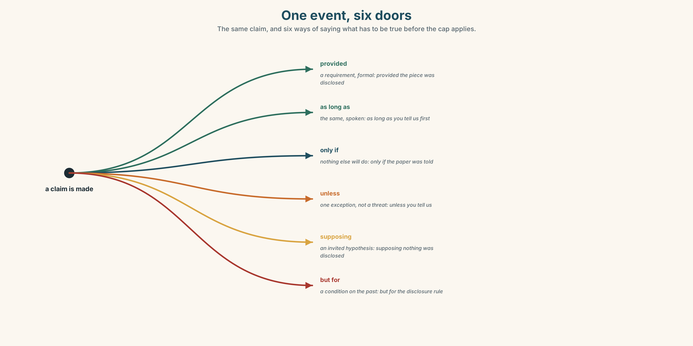{width=6.6in}

*One event, six doors — The same claim, and six ways of saying what has to be true before the cap applies.*

### 3C · Know

| | | |
|---|---|---|
| **provided · provided that** | formal, and the condition is a requirement | *provided the piece was disclosed* |
| **as long as** | the same meaning, spoken register | *as long as you tell us first* |
| **on condition that** | explicit, and usually written into a document | *on condition that the cap applies* |
| **only if** | exclusive — nothing else will do | *only if the paper was told* |
| **unless** | the negative condition, and it is not *if not* | *unless the paper was told* |
| **in the event that** | formal, about something that may happen | *in the event that a claim is made* |
| **supposing · assuming that** | a hypothesis, invited rather than imposed | *supposing nothing was disclosed* |
| **but for · were it not for** | a condition on something that already happened | *but for the disclosure rule* |
| **failing · absent** | formal, in the sense *if there is no* | *failing agreement tonight* |
| **otherwise** | the consequence of the condition not being met | *disclose it; otherwise the cap goes* |

> **The difference between provided and only if is the size of the opening.** *Provided* says: this
> is what I need. *Only if* says: this and nothing else, and I am telling you that on purpose.

> **Unless is not the same as if not.** *Unless you tell us, the cap goes* has one exception.
> *If you don't tell us, the cap goes* is a straight consequence. The first is an invitation; the
> second is a threat, and a negotiator who confuses them loses the room.

| | |
|---|---|
| **the formal connectors** | *notwithstanding · insofar as · to the extent that · given that* |
| **the hypothetical frame** | *supposing · assuming that · were it not for · all other things being equal* |
| **what you do under pressure** | *fall back on · hold out for · give in* |

> **Why it matters.** A condition stated loosely is a condition you will not be able to enforce,
> and one stated too tightly is a condition nobody will accept. The grammar is the negotiation.

### 3D · Use — controlled

Complete with the connector the context requires.

> We will cap the indemnity (1) ______ the piece was fully disclosed. *(a requirement)*
> (2) ______ agreement tonight, the old contract rolls over. *(formal, "if there is no")*
> (3) ______ the disclosure rule, we would not have offered a cap at all. *(a condition on the past)*
> (4) ______ nothing was disclosed — what happens then? *(an invited hypothesis)*
> Disclose it before publication; (5) ______ , the cap does not apply. *(the consequence of not)*

### 3E · Use — guided

Rewrite each one with the connector in brackets, keeping the meaning as close as you can.

1. If you tell us first, we will cap it. *(provided)*
2. If you don't tell us, the cap goes. *(unless)*
3. We will cap it, but only in cases where you told us. *(only if)*
4. If there is no agreement tonight, the old contract continues. *(failing)*
5. We offered a cap because the disclosure rule exists. *(but for)*

### 3F · Use — open

**In pairs.** One of you makes an offer with a condition. The other must restate the condition
more narrowly, then more widely. **Four rounds, and nobody may use *if* at any point.**

### 3G · Error autopsy

> ✗ *We will cap it unless you tell us first.*
> ✗ *Provided that you would tell us, we would have capped it.*
> ✗ *But for you disclose it, there is no cap.*

For each, name the rule and say what the writer was reaching for.

### 3H · Check — eight items

> 1. We will cap it ______ the piece was disclosed. *(a requirement, formal)*
> 2. ______ agreement tonight, the old contract rolls over. *(one word, formal)*
> 3. ______ ______ the disclosure rule, there would be no cap. *(two words, about the past)*
> 4. ______ nothing was disclosed — what then? *(one word, an invited hypothesis)*
> 5. Disclose it; ______ , the cap does not apply. *(one word)*
> 6. ✗ *We will cap it unless you tell us first.* → correct it.
> 7. Rewrite *If you don't tell us, the cap goes* so that it sounds like an invitation.
> 8. Rewrite *We'll cap it if you tell us* so that nothing else will satisfy the condition.

---

## Part 4 · Speaking ◆ **C · THE PERFORMANCE**

### 4A · Fluency starter — widen the door

One person states a condition. The next states it one degree more generously. **Five people, five
degrees, and the fifth one has to be something the first person could still live with.**

### 4B · The functional core — setting conditions

{width=6.6in}

*Clause seven, twice — The paper's draft and the association's counter-proposal, on the same page.*

**Language Bank**

| | |
|---|---|
| **opening** | *subject to contract · without prejudice · assuming that* |
| **conditioning** | *provided · as long as · on condition that · in the event that* |
| **narrowing** | *only if · unless · to the extent that · that is conditional on* |
| **closing** | *we can live with that · but for that · all other things being equal* |

**Information gap.** Learner A has the paper's draft of clause 7. Learner B has the association's
counter-proposal. **Agree on one wording, and write down what each side gave up.**

### 4C · The performance — three minutes ⏺

Negotiate one clause in three minutes. **You must make three offers, each one conditional, and
each condition narrower than the last.** Your partner says, at the end, which one they would have
accepted.

**Record it.**

### 4D · Observer

One person writes down every condition offered and marks whether it was a requirement, an
exclusion or a hypothesis.

### 4E · Three criteria

> ☐ Was every offer conditional, and was the condition audible?
> ☐ Did I distinguish *unless* from *if not* in the way I meant it?
> ☐ Could my partner state, afterwards, exactly what I would accept?

---

## Part 5 · Reading ◆ **A · THE WORLD**

### 5A · Predict

The title is **"Four hundred and ten signatures and one envelope."**
**What do you think is in the envelope, and who was not shown it?**

### 5B · Read — two minutes

---

**Four hundred and ten signatures and one envelope**

Four hundred and ten people write for the Herald without working for it. The new contributor
contract runs to nine pages, and eight of them were agreed by lunchtime.

Clause 7 says that a contributor will indemnify the paper, without limit, against any claim
arising from their work. The association's position is that the clause is unenforceable in
practice and corrosive in principle: nobody with four thousand three hundred dollars of annual
freelance income can meet a claim, so the clause does not transfer risk, it transfers fear.

The paper's position is that the clause is standard, that it has never been invoked, and that the
alternative is to stop commissioning anything difficult.

In nine years there have been three claims. All three arose from work by staff reporters. None
arose from a freelance piece.

At eight o'clock a side letter was placed face down on the table. It had been offered, three
months earlier, to eleven named contributors, capping their liability at five thousand dollars.
The association had not been told. Nobody in the room disputed that the eleven are the eleven who
file the hardest stories.

The negotiator read it twice and said one sentence: *That is not what we agreed.*

---

### 5C · Comprehension — eight questions

1. How many contributors are there, and how long is the contract?
2. What does clause 7 require?
3. How many claims have there been, and from whose work?
4. How much does the side letter cap liability at?
5. How many contributors were offered it?
6. **The association says the clause transfers fear, not risk. What is the argument?**
7. **Why does the writer say "nobody in the room disputed" rather than stating it directly?**
8. **The piece ends on four words of quotation. What would a paragraph of explanation have cost?**

### 5D · Vocabulary in context

Infer from the text, then check.

> without working for it · corrosive in principle · has never been invoked ·
> placed face down on the table · the hardest stories

### 5E · The counter-text

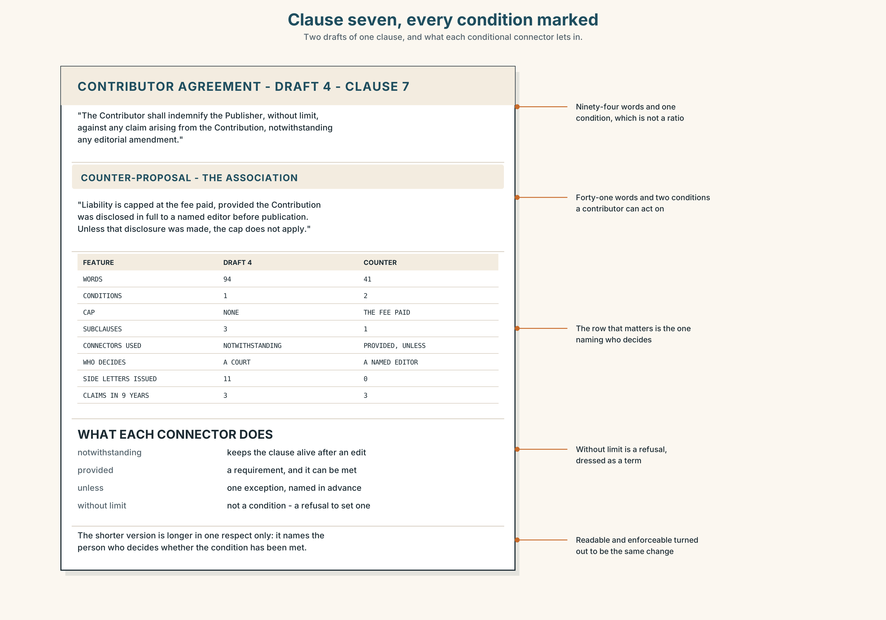{width=6.6in}

*Clause seven, every condition marked — Two drafts of one clause, and what each conditional connector lets in.*

**Read clause 7 and the counter-proposal, and answer.**

1. How many conditions does each version contain?
2. **Find every conditional connector in both and say what each one lets in or keeps out.**
3. The counter-proposal has a cap. **What is the cap conditional on?**
4. **Which of the two versions could a contributor read once and understand?**

### 5F · Two texts

The paper says the clause is *standard*.
The association says it is *unenforceable in practice*.

**Can both be true?** Write two sentences, and use *to the extent that* in one of them.

---

## Part 6 · Vocabulary Lab 2 ◆ **B · THE SYSTEM**

### Connectors that do the work of *if*

### 6A · Sort — a requirement, an exception, or a formal qualifier?

Three columns.

> absent · insofar · notwithstanding · provided · unless · otherwise · supposing ·
> failing

### 6B · Chunk completion

1. We will cap it ______ ______ ______ you tell us first. *(three words, spoken register)*
2. The cap applies ______ ______ ______ the piece was disclosed. *(three words, written)*
3. ______ ______ ______ ______ a claim is made, the cap is the ceiling. *(four words, formal)*
4. ______ ______ the disclosure rule, there would be no cap. *(two words)*
5. ______ ______ ______ ______ ______ the rule, the clause would stand as drafted. *(five words)*
6. ______ ______ the claims log says three, the clause has never been invoked. *(two words)*
7. ______ ______ nothing was disclosed, what is the paper's position? *(two words, a hypothesis)*
8. The cap applies ______ ______ , and not in any other case. *(two words, exclusive)*

### 6C · Three that are not interchangeable

> *unless* · *only if* · *provided*

**Say which one states an exception, which one excludes everything else, and which one states a
requirement you expect to be met.**

### 6D · The phrasal verbs and the fixed expressions

> **fall back on** · **hold out for** · **give in**
>
> **f** *but for that* · **f** *all other things being equal* · **f** *that is conditional on*

**One of these three fixed expressions is almost never true when it is said.** Which, and what is
it protecting the speaker from?

### 6E · Contrast Clinic

Eight items. Rewrite each sentence so that the condition changes in the way the bracket says.

1. If there is no agreement, the old contract continues. *(one formal word)*
2. The cap applies to disclosed pieces. *(make the condition explicit and written)*
3. Tell us first, or there is no cap. *(state the consequence with one adverb)*
4. If you tell us, we will cap it. *(nothing else will do)*
5. The clause stands, although the log says three claims. *(a formal concessive qualifier)*
6. Perhaps nothing was disclosed. *(invite the other side to think it through)*
7. We capped it because the rule exists. *(a condition on the past)*
8. If you don't tell us, the cap goes. *(an exception, not a threat)*

---

## Part 7 · Pronunciation & Fluency Lab ◆ **B · THE SYSTEM**

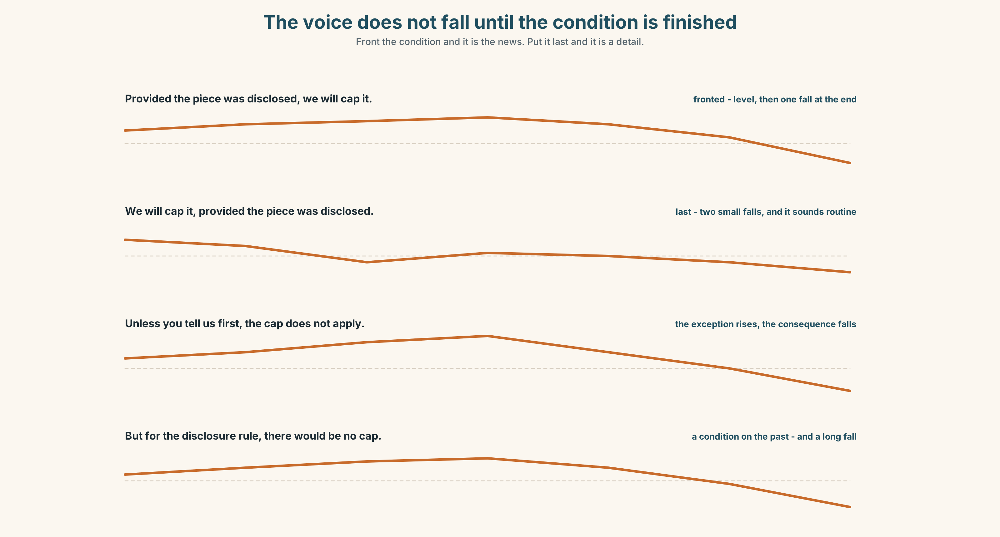{width=6.6in}

*The voice does not fall until the condition is finished — Front the condition and it is the news. Put it last and it is a detail.*

### A long conditional does not fall until the end

### 7A · Hear 🔊 Track 5.3

> *Provided the piece was fully disclosed before publication,* ↗ *we will cap it.* ↘
> *We will cap it,* ↘ *provided the piece was fully disclosed.* ↘
> *Unless you tell us first,* ↗ *the cap does not apply.* ↘

### 7B · Say

Say each one three times. Then say this twenty-two-word sentence without letting your voice fall
until the last three words:

> *Provided the piece was fully disclosed to a named editor before publication, and nothing was
> withheld, the cap applies.*

### 7C · Make it mean something

Say these two:

> *We will cap it, provided you tell us.* — the condition is an afterthought, and sounds routine
> *Provided you tell us, we will cap it.* — the condition is the news, and the room hears it

**Front the condition and it becomes the point; put it last and it becomes a detail.** Negotiators
front conditions they intend to enforce.

### 7D · Fluency 30 ⏺

Thirty seconds: **one offer, three conditions, each fronted, and the voice level until the end of
each.** Three times, faster.

---

## Part 8 · Writing ◆ **C · THE PERFORMANCE**

### An offer with its conditions · 200 words

### 8A · Read the model

> The paper will cap a contributor's liability at the fee paid for the piece, provided the piece
> was disclosed in full to a named editor before publication. `[the offer, then the condition,
> fronted inside the sentence so it cannot be skimmed]`
>
> Unless that disclosure was made, the cap does not apply. `[unless, with one exception — not a
> threat, and the difference is deliberate]`
>
> In the event that a claim is made, the paper will conduct the defence and the contributor will
> cooperate. `[the formal frame for something that may happen, and both obligations in one
> sentence]`
>
> But for the disclosure rule, this cap would not be on the table; all other things being equal,
> the association would have preferred the clause deleted, and has said so. `[a condition on the
> past, and the other side's position stated by us before they state it]`

**Questions about the writer's choices:**

1. The condition is fronted in sentence one. **What would moving it to the end have done?**
2. Sentence two uses *unless*. **What would *if you don't* have sounded like?**
3. The last sentence states the other side's preference. **Why give that away?**

### 8B · The anti-model

> We are pleased to offer a cap on liability. We would of course expect contributors to act responsibly and to keep us informed. Obviously if something goes wrong we will need to look at the circumstances. We hope this is acceptable.

Four sentences, three conditions, and not one of them stated in a form anybody could enforce.
**Rewrite it with every condition explicit and the consequence of each one named.**

### 8C · Plan

> the offer with its condition fronted → the exception → the formal frame for a future event →
> the condition on the past, and the other side's position

### 8D · Write — 200 words
### 8E · Peer review — three criteria

> ☐ Is every condition stated in a form somebody could check?
> ☐ Does each connector do the job you meant — requirement, exception or hypothesis?
> ☐ Is the consequence of each unmet condition stated, not implied?

### 8F · Write it again · 8G · Publish

Rewrite after review. **Publish both, and underline every conditional connector.**

---

## Part 9 · The File ◆ **A · THE WORLD + C · THE PERFORMANCE**

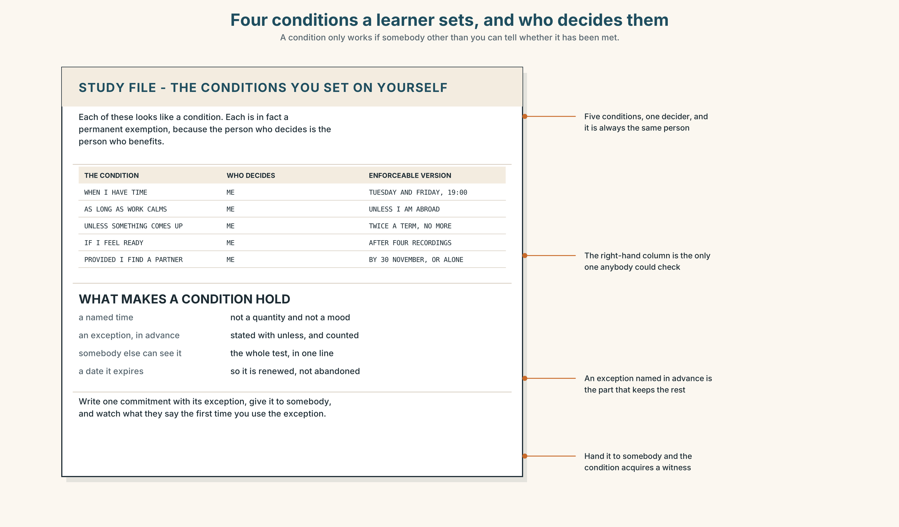{width=6.6in}

*Four conditions a learner sets, and who decides them — A condition only works if somebody other than you can tell whether it has been met.*

# STUDY FILE · The conditions you set on yourself

### 9A · The unenforceable condition 🔊 Track 5.4

Learners set conditions on their own study constantly, and almost never in a form that can be
checked: *I'll do it when I have time*, *as long as work calms down*, *unless something comes up*.
Each one looks like a condition and is in fact a permanent exemption.

| | |
|---|---|
| **the condition** | *as long as work calms down* |
| **who decides it is met** | the person who benefits from it not being met |
| **the enforceable version** | *on Tuesdays and Fridays at seven, unless I am abroad* |
| **the difference** | the second one names the exception in advance |

### 9B · Make one enforceable

Take three conditions you have set on your own study.
**Rewrite each so that somebody else could tell, by looking, whether it had been met.**

### 9C · Role play — the negotiator

In pairs. One of you proposes a study plan with a condition. The other may only ask *and who
decides whether that has happened?* **Four rounds each.**

### 9D · The exception you will actually use

Everybody needs one exception or the plan breaks the first week.
**Name yours in advance, in writing, and put a number on how often it may be used.**

### 9E · Transfer — before next week

**Write one study commitment with its exception stated using *unless*, and give it to somebody.**
Bring back what they said when you tried to use the exception.

---

## Part 10 · Mediation & Interaction ◆ **C · THE PERFORMANCE**

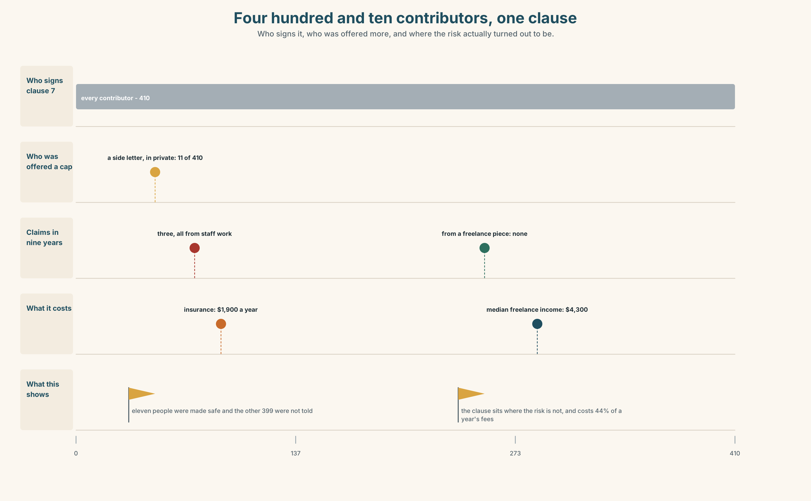{width=6.6in}

*Four hundred and ten contributors, one clause — Who signs it, who was offered more, and where the risk actually turned out to be.*

### 10A · Relay

Half the class has clause 7. Half has the counter-proposal.
**Produce one clause both sides will sign, by speaking only.** Ten minutes.

### 10B · Simplify — for one reader

A contributor writes: *What am I actually agreeing to?*
**Reply in four sentences,** with every condition and its consequence named, and no legal words.

### 10C · Online

Write **one message** to the eleven contributors who were offered the side letter. **Three
sentences.** Say what happened and what happens now.

### 10D · Your language

How does your language distinguish *unless* from *if not*?
**Translate all six sentences from Part 2.** Which of the six collapse into one form?

---

## Part 11 · The Decision ◆ **C · THE PERFORMANCE**

# Clause seven

It is twenty past seven and eight of the nine pages are agreed.

**Option one:** keep clause 7 as drafted. It is standard across the industry, it has never been
invoked, and removing it will be read as an admission.

**Option two:** delete it. The paper commissions the work, the paper carries the risk, and the
claims log says the risk is not where the clause puts it.

**Option three:** cap liability at the fee paid for the piece, conditional on full disclosure to a
named editor before publication — and withdraw every side letter, publishing the fact that they
existed.

### 11A · The evidence

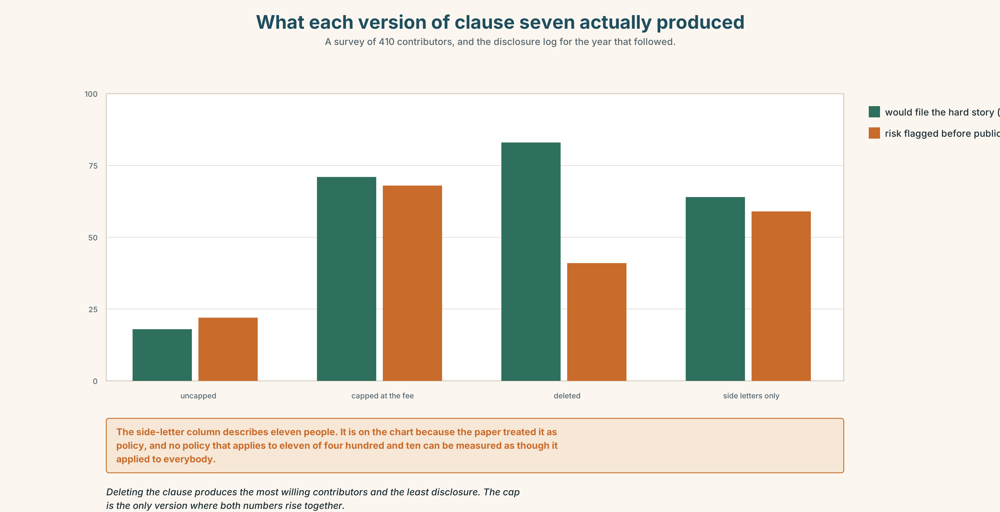{width=6.6in}

*What each version of clause seven actually produced — A survey of 410 contributors, and the disclosure log for the year that followed.*

🔊 **Track 5.6.** The association's negotiator, 30 seconds: *"I have been asked all evening what we
would accept. Here is what we will not accept: a clause that makes eleven people safe and three
hundred and ninety-nine people quiet. Cap it, delete it, I can argue either at a meeting. The side
letter I cannot argue at all, because it is not a term, it is a favour, and a favour can be
withdrawn by the person who gave it."*

### 11B · Talk about it

In threes. Use the frame, and front every condition you state.

> *I would ______ , provided ______ , and unless ______ , I would ______ .*

### 11C · Decide

Write **three sentences**: the decision, the condition it rests on, and what would make you
abandon it.

### 11D · Model decision

> Option three. Deletion is cleaner and I would sign it, but it removes the one thing the clause
> could usefully do, which is make a contributor tell an editor what they know before publication
> rather than after. A cap at the fee is small enough to be survivable and large enough to be felt,
> and it is conditional on the behaviour the paper actually wants. The side letters go in any case:
> whatever they bought, they cost more.

### 11E · The Reveal

> **What happened.** The Herald capped liability at the fee, conditional on disclosure, and
> withdrew the eleven side letters. Two of the eleven resigned from the panel in protest at losing
> them. Nobody else did.
>
> Then something nobody predicted: pre-publication disclosure by freelancers rose from under a
> third to four fifths within a year — not because the cap was generous, but because a condition
> somebody can meet is a condition they think about, and an unlimited liability is one they can
> only try not to think about at all.

**One question. You do not have to answer it out loud.**

> The uncapped clause asked for more and got less. Why?

---

## Part 12 · Landing ◆ **all three lines**

### 12A · Recycle — fifteen items

> 1. We will cap it ______ the piece was disclosed. *(one word, a formal requirement)*
> 2. ______ you tell us first, the cap does not apply. *(one word, an exception)*
> 3. ______ ______ the disclosure rule, there would be no cap. *(two words)*
> 4. ______ agreement tonight, the old contract rolls over. *(one word)*
> 5. ______ nothing was disclosed, what then? *(one word, a hypothesis)*
> 6. Tell us first; ______ , the cap goes. *(one word)*
> 7. The clause stands ______ the claims log. *(one word, formal and concessive)*
> 8. The cap applies ______ ______ ______ ______ the contributor knew. *(four words)*
> 9. The talks are ______ ______ until both boards sign. *(two words)*
> 10. The offer was made ______ ______ , so it cannot be quoted. *(two words)*
> 11. Everything in this room is being done ______ ______ ______ . *(three words)*
> 12. ______ ______ ______ ______ ______ ______ . *(six words — the sentence that ended the evening)*
> 13. It took nine hours to ______ ______ one clause. *(two words)*
> 14. The lawyers will ______ ______ the final text tomorrow. *(two words)*
> 15. The association refused to let them ______ ______ the disclosure rule. *(two words)*

### 12B · Consolidate — one task, everything in it

**Write 150 words offering something with three conditions**, one fronted, one as an exception and
one about the past. Mark the three in the margin.

### 12C · Can-do, with evidence

> ☐ I can use the full conditional system, including *but for* and *failing*. **Evidence:** 3H, 8D
> ☐ I can distinguish a requirement, an exception and an exclusion. **Evidence:** 6C, 6E
> ☐ I can set a condition somebody else could check. **Evidence:** 9B, 10B
> ☐ I can hold the tune across a long conditional. **Evidence:** 7B

### 12D · Replay ⏺

Record 0C again. **Compare.** Is the condition you set the first time one you could enforce?

### 12E · Glossary — fifty items, as a map

> **PARTS OF THE DOCUMENT** · clause · term · undertaking · covenant
> **WHAT ONE SIDE GIVES UP** · waiver · indemnity · concession
> **WHEN IT GOES WRONG** · breach · remedy · arbitration · settlement · precedent
> **THE FIVE PHRASES** · subject to contract · on the understanding that · without prejudice · in good faith · the governing law
> **WHAT IS IN THE PAPERWORK** · a material breach · a break clause · terms and conditions · a side letter · to the extent that
> **WHAT NEGOTIATORS DO** · hammer out · draw up · water down · fall back on · hold out for · give in
> **IN THE ROOM** · that is not what we agreed · we can live with that · it depends what you mean by
> **THE CONNECTORS** · provided · supposing · unless · otherwise · failing · absent · notwithstanding · insofar
> **THE FRAMES** · as long as · on condition that · in the event that · but for · were it not for · given that · assuming that · only if
> **CLOSING IT** · but for that · all other things being equal · that is conditional on

### 12F · Next

> **Unit 6 · Why put it *there*?**

# B2.1 · Unit 6 · What the City Did Was Borrow

> **English Animated** · *Reading Between Lines* · a newsroom, Toronto
> Student's Book pages 116–137 · 22 pp · ~11 hours

---

## Part 0 · The Big Picture ◆ **A · THE WORLD**

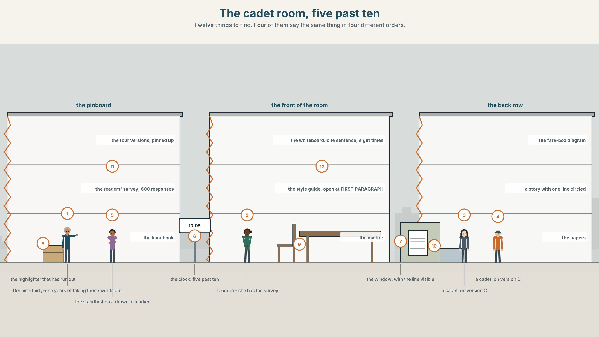{width=6.6in}

*The cadet room, five past ten — Twelve things to find. Four of them say the same thing in four different orders.*

# Why put it *there*?

**By the end of this unit you can decide where in a sentence the point goes, and put it there on
purpose. Two hundred words.**

| ◆ **A · THE WORLD** | A cadet course, one financing story, and six hundred readers who took away the opposite point |
|---|---|
| ◆ **B · THE SYSTEM** | cleft and pseudo-cleft for information structure · 28 words for explaining and teaching · 22 focusing adverbs and frames · nuclear stress and theme |
| ◆ **C · THE PERFORMANCE** | Two hundred words in which the point is where you put it |

---

### 0A · Find it

**Find twelve things in this picture.** Four of them say the same thing in four different orders.

> the four versions of paragraph one, pinned up · the readers' survey, six hundred responses ·
> the whiteboard with one sentence on it eight times · the cadet handbook, open at page 3 ·
> a highlighter that has run out · the style guide, open at FIRST PARAGRAPH ·
> the fare-box diagram · a printed story with one line circled ·
> the standfirst box, drawn in marker · a stack of yesterday's papers ·
> a clock showing 10:05 · a window with the transit line visible

### 0B · Guess it

**One thing on the whiteboard is the version the paper actually printed.** Which, and how can you
tell from the room rather than from the sentence?

### 0C · Say it ⏺

**Record sixty seconds.** *Explain something you understand well to somebody who does not. Notice
where you put the main point.* You will record it again at the end of this unit.

---

## Part 1 · Vocabulary Lab 1 ◆ **B · THE SYSTEM**

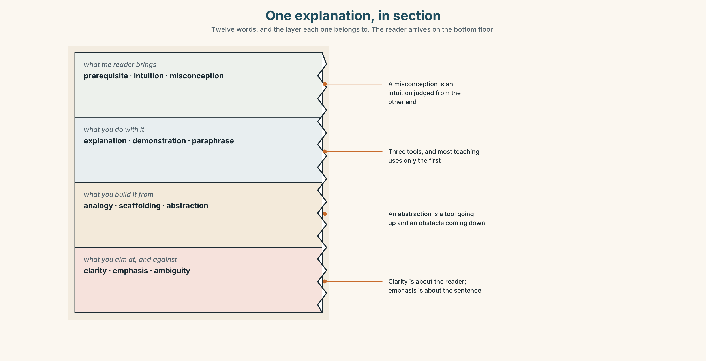{width=6.6in}

*One explanation, in section — Twelve words, and the layer each one belongs to. The reader arrives on the bottom floor.*

### 1A · Meet — the words of an explanation

Match each word to one layer of the cutaway.

> **explanation** · **emphasis** · **clarity** · **ambiguity** · **paraphrase** · **analogy** ·
> **scaffolding** · **misconception** · **demonstration** · **prerequisite** · **intuition** ·
> **abstraction**

### 1B · Sort — what the reader brings, what the teacher does, or what you are aiming at?

Three columns. **Two of the twelve are the same thing, judged from the two ends of the room.**

> explanation · ambiguity · scaffolding · intuition · analogy · clarity · paraphrase ·
> abstraction · misconception · prerequisite · demonstration · emphasis

### 1C · Meet — the five phrases that put a point in focus

| | |
|---|---|
| **the key point is** | A promise. Everything after it has to be worth the build-up. |
| **what matters here** | The pseudo-cleft in ordinary clothes. It puts the point at the end. |
| **a worked example** | The thing learners remember when the explanation has gone. |
| **in other words** | A second attempt, and an admission that the first one failed. |
| **the thing to notice** | Directs attention before the reader has decided where to look. |

### 1D · Collocation Lab

Complete each one, and say which of the five is the only one that makes a claim about the reader.

> **to put it another way** · **a common misconception** · **step by step** · **from first
> principles** · **the short answer**

1. ______ ______ ______ is that the city borrowed against future fares.
2. ______ ______ ______ is that a fare rise pays for the line. It does not.
3. The cadets build the whole model ______ ______ ______ on the first morning.
4. Dennis takes them through it ______ ______ ______ , and it takes ninety minutes.
5. ______ ______ ______ ______ : the city sold the next thirty years of ticket income.

### 1E · The phrasal verbs, and the three fixed expressions

> **go over** · **break down** · **spell out**
>
> **f** *let me put it another way* · **f** *the point I am making is* · **f** *that is the whole idea*

**One of these fixed expressions is usually a sign the speaker has lost the room.** Which, and
what should they do instead?

### 1F · Own it

Write one sentence explaining your work or study to somebody who knows nothing about it, and then
underline the four words that carry the point.

---

## Part 2 · Listening ◆ **A · THE WORLD**

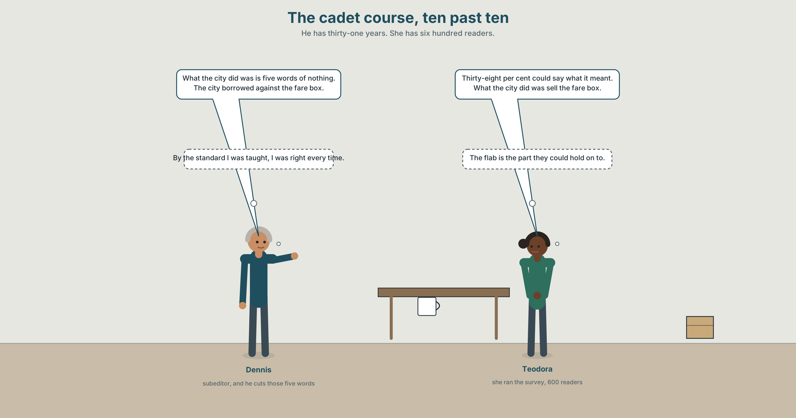{width=6.6in}

*The cadet course, ten past ten — He has thirty-one years. She has six hundred readers.*

### 2A · The cadet course, ten past ten 🔊 Track 6.1

**Before you listen.** Four cadets have written the first paragraph of the same financing story.
The subeditor has thirty-one years. The trainer has the readers' survey.

**Listen once.** What did the city actually do, and which version of the paragraph says so?

**Listen again. Complete the table.**

| | Where the point sits | What the reader meets first | What they remembered |
|---|---|---|---|
| version A | | | |
| version B | | | |
| version C | | | |

**Listen again. True or false?**

1. Six hundred readers were surveyed. ☐ T ☐ F
2. The clearest version was the shortest. ☐ T ☐ F
3. Version A put the point in the first seven words. ☐ T ☐ F
4. The trainer wrote the standfirst herself. ☐ T ☐ F

**Noticing.** Five sentences from the recording.

1. *The city borrowed against the fare box.*
2. *What the city did was borrow against the fare box.*
3. *It was the fare box that the city borrowed against.*
4. *What happened was that the city borrowed against the fare box.*
5. *The thing that nobody mentioned was the fare box.*

**Five sentences, the same facts, five different points. Which one makes *the fare box* the news,
and which one makes *borrowing* the news?**

### 2B · Decoding clinic 🔊 Track 6.2

Thirty seconds at speed. Three jobs.

1. The trainer reads one sentence twice with the stress in different places. Mark both.
2. What changes about the meaning each time?
3. Somebody says *that is the whole idea*. What have they just conceded?

---

## Part 3 · Grammar Lab 1 ◆ **B · THE SYSTEM**

### Moving the point to where the reader is looking

### 3A · Notice

Look at the five sentences in Part 2 again.

1. In sentence 1, which word carries the point, and how do you know?
2. Sentence 2 begins with four words that contain no information at all. **What are they for?**
3. Sentence 3 puts the fare box early. **What happens to everything after *that*?**
4. Sentences 4 and 5 both delay the point. **Which one delays it longer, and why might you want to?**

### 3B · See

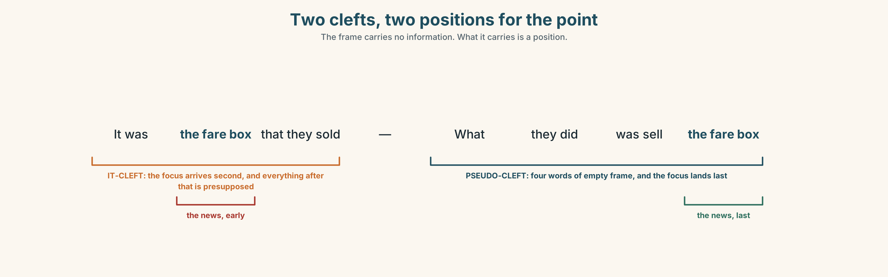{width=6.6in}

*Two clefts, two positions for the point — The frame carries no information. What it carries is a position.*

### 3C · Know

| | | |
|---|---|---|
| **the it-cleft** | *It was X that…* — focus early, the rest presupposed | *It was the fare box that they borrowed against.* |
| **the pseudo-cleft** | *What… was X* — focus at the end, where English wants it | *What they did was borrow against the fare box.* |
| **the reversed pseudo-cleft** | *X is what…* — the focus first, emphatically | *The fare box is what they borrowed against.* |
| **the *what happened was* frame** | an empty opening that buys the reader a second | *What happened was that the city borrowed.* |
| **the *thing that* frame** | the most natural spoken version of all of them | *The thing that nobody mentioned was the fare box.* |

> **English puts new information at the end of a sentence.** Every cleft is a device for getting
> something to the end — or, in the it-cleft, for declaring that everything after it is already
> agreed.

> **The frame carries no information, and that is the point.** *What the city did was* contains
> nothing a reader did not already know. It costs five words and buys one position, and the
> position is worth more than the words.

| | |
|---|---|
| **narrowing to the item** | *namely · specifically · precisely* |
| **ranking it** | *chiefly · notably · crucially* |
| **going to the root** | *essentially · fundamentally* |
| **spoken focus frames** | *all I did was · where it goes wrong is · that is why · it was then that* |

> **Why it matters.** Readers do not read sentences; they read positions. A true sentence with the
> point in the wrong position is read as a different sentence, and the correction column cannot
> fix it, because nothing in it was wrong.

### 3D · Use — controlled

Rewrite each one using the frame in brackets.

> The city borrowed against the fare box. (1) *(what … was)*
> The city borrowed against the fare box. (2) *(it was … that)*
> The fare box was never mentioned. (3) *(the thing that … was)*
> The city sold thirty years of ticket income. (4) *(what happened was)*
> They only moved the debt. (5) *(all … was)*

### 3E · Use — guided

Rewrite each one so that the word in brackets ends up in focus.

1. The city borrowed against the fare box in 2016. *(2016)*
2. The council approved it without a vote. *(without a vote)*
3. Nobody told the transit board. *(the transit board)*
4. The fare rise pays the interest, not the line. *(the interest)*
5. Two of the nine members abstained. *(abstained)*

### 3F · Use — open

**In pairs.** One of you states a fact. The other restates it three times, moving the focus to a
different element each time. **The first speaker says which version they would print.**

### 3G · Error autopsy

> ✗ *What the city did was borrowed against the fare box.*
> ✗ *It was the city who borrowed it was in 2016.*
> ✗ *The thing what nobody mentioned was the fare box.*

For each, name the rule and say what the writer was reaching for.

### 3H · Check — eight items

> 1. ______ the city did ______ borrow against the fare box. *(two gaps — the pseudo-cleft)*
> 2. ______ ______ the fare box ______ they borrowed against. *(three gaps — the it-cleft)*
> 3. ______ ______ ______ nobody mentioned was the fare box. *(three words)*
> 4. ______ ______ ______ that the city sold thirty years of income. *(three words)*
> 5. ______ they did ______ move the debt. *(two gaps — all … was)*
> 6. ✗ *What the city did was borrowed.* → correct it.
> 7. Rewrite *They approved it without a vote* so that *without a vote* is the news.
> 8. Rewrite *It was the fare box that they borrowed against* so that the focus falls at the end.

---

## Part 4 · Speaking ◆ **C · THE PERFORMANCE**

### 4A · Fluency starter — move the point

One person says a plain sentence. Everybody else restates it with the focus on a different word.
**Nobody may repeat a position already used.**

### 4B · The functional core — managing information flow

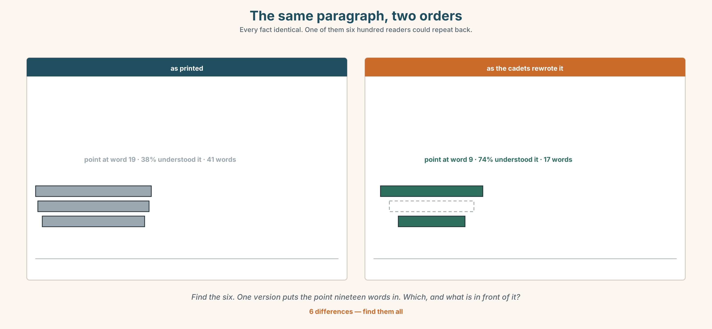{width=6.6in}

*The same paragraph, two orders — Every fact identical. One of them six hundred readers could repeat back.*

**Language Bank**

| | |
|---|---|
| **delaying the point** | *what happened was · the thing that · what matters is · the reason is that* |
| **asserting it early** | *it was X that · the key point is · what matters here* |
| **narrowing** | *namely · specifically · precisely · in other words* |
| **repairing** | *to put it another way · what I mean is · it is not that* |

**Information gap.** Learner A has the city's statement. Learner B has the transit board's minutes.
**Explain the financing to each other in four sentences each, and compare where you put the point.**

### 4C · The performance — three minutes ⏺

Explain something technical from your own field in three minutes **to somebody who will be tested
on it afterwards**. Use at least three focusing frames. Your partner takes the test.

**Record it.**

### 4D · Observer

One person writes down every sentence in which the point arrives at the end, and every one in
which it arrives first.

### 4E · Three criteria

> ☐ Did the point of each sentence land where I meant it to?
> ☐ Did I use a frame when the point needed to be delayed, and not otherwise?
> ☐ Could my partner answer the test without me repeating anything?

---

## Part 5 · Reading ◆ **A · THE WORLD**

### 5A · Predict

The title is **"Six hundred readers, four paragraphs, one story."**
**If readers take the wrong point from a true sentence, whose mistake is it?**

### 5B · Read — two minutes

---

**Six hundred readers, four paragraphs, one story**

In 2016 the city raised money for the east-end line by selling the right to thirty years of ticket
income. The fare box was not the security for a loan. It was the thing that was sold.

The Herald reported this accurately, in a story of nine hundred words, whose first paragraph read:
*The city has finalised a financing package for the east-end line, involving a range of
instruments including a securitisation of future farebox revenue.*

Four years later the readers' editor surveyed six hundred readers who had read the story. Thirty-
eight per cent could state what the city had done. Of the rest, the largest group believed the
line had been paid for by a fare rise.

The cadet course now begins with that paragraph. The cadets rewrite it four ways. The version that
works, every year, is the one that begins *What the city did was*, which the subeditors hate,
because it uses five words to say nothing and is, by any measure they were trained on, worse
writing.

It is also the only version that six hundred readers could repeat back.

---

### 5C · Comprehension — eight questions

1. What did the city sell, and for how long?
2. How long was the original story?
3. How many readers could state what the city had done?
4. What did the largest remaining group believe?
5. How does the cadet course begin?
6. **Why does the writer quote the original first paragraph in full?**
7. **"Worse writing" by whose measure, and what is the writer implying about that measure?**
8. **The last sentence is one line long and stands alone. What is it doing structurally?**

### 5D · Vocabulary in context

Infer from the text, then check.

> the security for a loan · a range of instruments · by any measure they were trained on ·
> repeat back · the version that works

### 5E · The counter-text

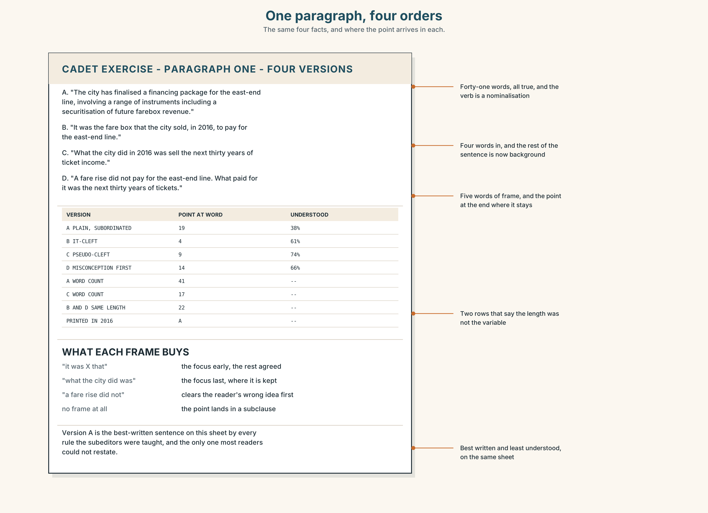{width=6.6in}

*One paragraph, four orders — The same four facts, and where the point arrives in each.*

**Read the four versions of paragraph one and answer.**

1. Where is the point in each one, counted in words from the start?
2. **Which version puts the reader's own likely misconception first, and why might that help?**
3. Two versions are the same length. **What is different about them?**
4. **Which version would you print, and what would you lose?**

### 5F · Two texts

The original says *a securitisation of future farebox revenue*.
Version D says *what the city did was sell the next thirty years of ticket income*.

**Is version D less accurate?** Write two sentences, and use the word *emphasis* in one of them.

---

## Part 6 · Vocabulary Lab 2 ◆ **B · THE SYSTEM**

### Words that point at one part of a sentence

### 6A · Sort — narrowing to the item, ranking it, or going to the root?

Three columns.

> notably · precisely · specifically · essentially · chiefly · namely · crucially ·
> fundamentally

### 6B · Chunk completion

1. ______ ______ ______ the position, not the words. *(three words — the pseudo-cleft frame)*
2. ______ ______ ______ ______ the sentence is true and still misread. *(four words)*
3. ______ ______ ______ ______ move the point. *(four words — all … was)*
4. ______ ______ is the first paragraph. *(two words — the thing that …)*
5. ______ ______ ______ ______ ______ is the second clause. *(five words — where it goes wrong …)*
6. ______ ______ ______ the city sold the income. *(three words — what happened …)*
7. ______ ______ ______ the cadets start with that paragraph. *(three words)*
8. ______ ______ ______ ______ the subeditors stopped arguing. *(four words — it was then …)*

### 6C · Three that are not interchangeable

> *namely* · *notably* · *essentially*

**Say which one lists exactly, which one singles out one case, and which one strips a thing to its
core.**

### 6D · The phrasal verbs and the fixed expressions

> **boil down to** · **come down to** · **point out**
>
> **f** *it is not that* · **f** *what I mean is* · **f** *this is the bit that*

**Two of these three phrasal verbs are nearly interchangeable.** Which two, and what does the
third one do that the others cannot?

### 6E · Contrast Clinic

Eight items. Rewrite each sentence so that the element in brackets is the news.

1. Nobody told the transit board. *(nobody)*
2. The cadets rewrite it four ways. *(four ways)*
3. The subeditors hate the version that works. *(the version that works)*
4. The city borrowed against the fare box in 2016. *(2016)*
5. The council approved it without a vote. *(without a vote)*
6. The city borrowed against the fare box in 2016. *(the fare box)*
7. The fare rise pays the interest. *(the interest)*
8. Six hundred readers could repeat it back. *(repeat it back)*

---

## Part 7 · Pronunciation & Fluency Lab ◆ **B · THE SYSTEM**

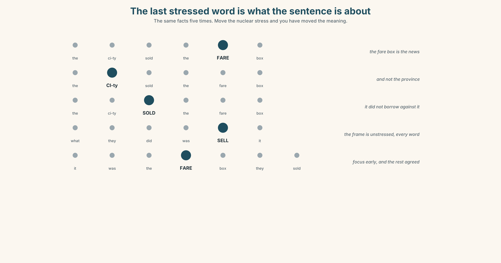{width=6.6in}

*The last stressed word is what the sentence is about — The same facts five times. Move the nuclear stress and you have moved the meaning.*

### The last stressed word is the point

### 7A · Hear 🔊 Track 6.3

> *The city borrowed against the FARE BOX.* — the fare box is the news
> *The CITY borrowed against the fare box.* — and not the province
> *The city BORROWED against the fare box.* — it did not sell it, it borrowed

### 7B · Say

Say each one three times. Then say this:

> *What the city did was SELL it.* — the frame is unstressed, every word of it, and the point
> lands on the last content word, where English wants it.

### 7C · Make it mean something

Say these two:

> *It was the FARE BOX that they sold.* — the focus is early, and everything after is agreed
> *What they sold was the FARE BOX.* — the focus is last, and the reader has been prepared

**A cleft moves the nuclear stress, and the nuclear stress is the sentence's actual meaning.**
Write the stress where you want it and the syntax will follow.

### 7D · Fluency 30 ⏺

Thirty seconds: **one fact, said five ways, with the nuclear stress in a different place each
time.** Three times, faster.

---

## Part 8 · Writing ◆ **C · THE PERFORMANCE**

### An explanation that lands · 200 words

### 8A · Read the model

> What the city did in 2016 was sell the next thirty years of ticket income. `[the pseudo-cleft:
> five words of frame, and the point at the end where it is remembered]`
>
> It was not a loan secured against the fare box; it was the fare box itself. `[an it-cleft
> correcting the misconception the reader almost certainly arrived with]`
>
> The thing that nobody mentioned at the time was what happens in year thirty-one. `[the spoken
> frame, which delays the point for a full clause and is the most readable of all of them]`
>
> Essentially, the line was paid for by passengers who have not travelled yet; specifically, by
> everybody who will buy a ticket between now and 2046. `[root first, then the exact set — the two
> adverbs do different jobs and must come in that order]`

**Questions about the writer's choices:**

1. The first sentence spends five words saying nothing. **What did those five words buy?**
2. The second sentence corrects something the reader was never told. **Why is that allowed here?**
3. *Essentially* then *specifically*. **What happens if you swap them?**

### 8B · The anti-model

> The financing package, which involved a securitisation of future revenue streams in conjunction with conventional instruments, was finalised in 2016 following a procurement process that had commenced the previous year and was subject to the usual approvals.

One sentence, forty-two words, every fact true, and the point buried in the middle of a
subordinate clause.
**Rewrite it as four sentences, each with its point at the end.**

### 8C · Plan

> the pseudo-cleft with the main point → the it-cleft correcting the misconception → the spoken
> frame delaying the hardest idea → the root, then the exact set

### 8D · Write — 200 words
### 8E · Peer review — three criteria

> ☐ Does each sentence end on the word you want remembered?
> ☐ Is every frame earning its words, or is one of them just a throat-clearing?
> ☐ Could a reader state the point back to you after one reading?

### 8F · Write it again · 8G · Publish

Rewrite after review. **Publish both, and mark the last stressed word of every sentence.**

---

## Part 9 · The File ◆ **A · THE WORLD + C · THE PERFORMANCE**

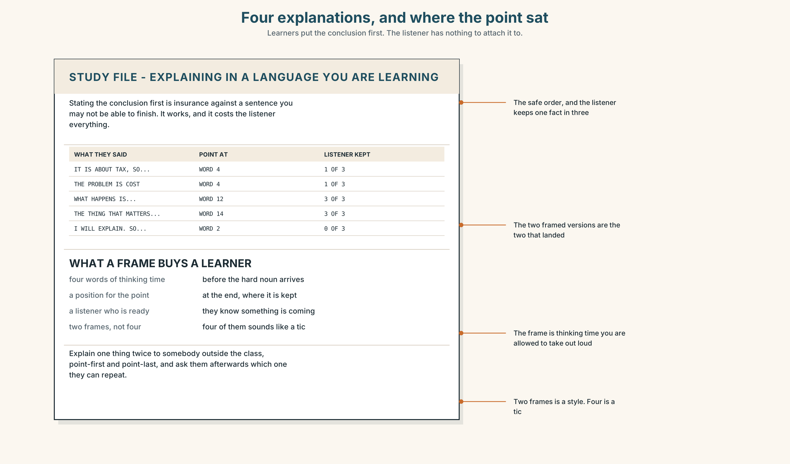{width=6.6in}

*Four explanations, and where the point sat — Learners put the conclusion first. The listener has nothing to attach it to.*

# STUDY FILE · Explaining something in a language you are still learning

### 9A · The point at the wrong end 🔊 Track 6.4

Learners explaining something in English tend to put the point first, because they are not sure
they will be able to finish the sentence. The result is accurate, complete and unmemorable: the
listener meets the hardest idea before they are ready for it.

| | |
|---|---|
| **what you do** | state the conclusion, then the background |
| **why** | insurance, in case the sentence collapses |
| **what it costs** | the listener has nothing to attach the conclusion to |
| **the fix** | one frame — *what happens is…* — which buys you four words of thinking time |

### 9B · Buy yourself the time

Take three things you can already explain in English.
**Rewrite each with a frame at the front, and say the new version out loud.**

### 9C · Role play — the test afterwards

In pairs. One of you explains something for ninety seconds. The other then answers three questions
on it. **Swap, and compare how much each listener kept.**

### 9D · The frame you already have

Every learner has one frame they use constantly, usually *the problem is*.
**Name yours, and learn two more this week.** Two is enough; four sounds like a tic.

### 9E · Transfer — before next week

**Explain one thing to somebody outside the class, twice: once point-first and once point-last.**
Bring back which one they could repeat.

---

## Part 10 · Mediation & Interaction ◆ **C · THE PERFORMANCE**

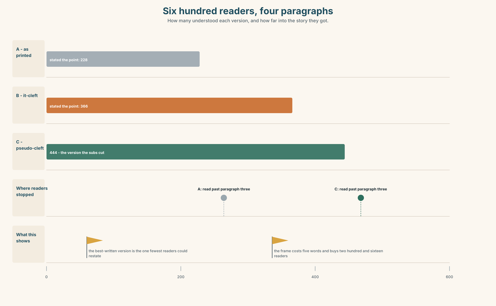{width=6.6in}

*Six hundred readers, four paragraphs — How many understood each version, and how far into the story they got.*

### 10A · Relay

Half the class has the city's statement. Half has the readers' survey.
**Produce one first paragraph, by speaking only.** Ten minutes.

### 10B · Simplify — for one reader

A reader writes: *So did my fare rise pay for the line or not?*
**Reply in four sentences.** Put the answer at the end of the first one.

### 10C · Online

Write **one message** to a colleague whose opening paragraph is accurate and unreadable. **Three
sentences.** Do not rewrite it for them; show them where the point currently is.

### 10D · Your language

Does your language use clefts, or does it move words instead?
**Translate all five sentences from Part 2.** Which of the five come out identical?

---

## Part 11 · The Decision ◆ **C · THE PERFORMANCE**

# The first paragraph

Thirty-eight per cent of readers could state what a correct story said.

**Option one:** change nothing. The story was accurate, the words were right, and a newspaper
cannot write down to its readers without insulting them.

**Option two:** a house rule that the point of any complex story appears in the first seven words.

**Option three:** a one-sentence standfirst above every complex story, written in a focus frame —
*What the city did was…* — and written before the story, not after it.

### 11A · The evidence

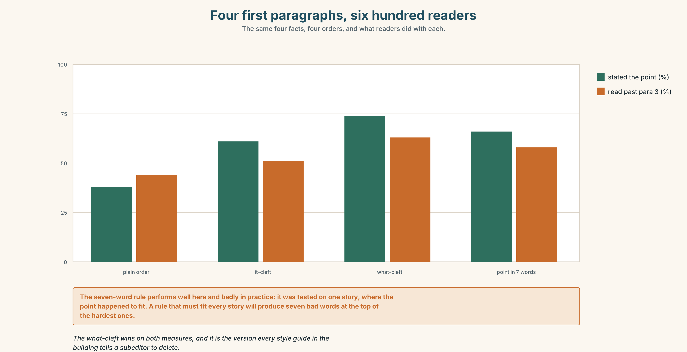{width=6.6in}

*Four first paragraphs, six hundred readers — The same four facts, four orders, and what readers did with each.*

🔊 **Track 6.6.** Dennis Hoy, subeditor, 30 seconds: *"I have spent thirty-one years taking those
five words out of other people's copy. 'What the city did was.' It is flab, it is a throat-clear,
and I was right every time by the standard I was taught. The survey says I was also removing the
only part of the sentence the reader could hold on to. Both of those things are true and I have
not worked out what to do with that yet."*

### 11B · Talk about it

In threes. Use the frame, and put the point of each turn at the end of your sentence.

> *What I would do is ______ , because ______ , and the cost of it is ______ .*

### 11C · Decide

Write **three sentences**: the decision, the evidence, and what you would be giving up.

### 11D · Model decision

> Option three. The seven-word rule is a blunt instrument that will produce seven bad words at the
> top of every difficult story. The standfirst keeps the story itself intact and gives the point
> one position where it cannot be missed. Writing it first is the part that matters: a writer who
> cannot put the point in one framed sentence does not yet know what the story is, and finding that
> out before writing nine hundred words is worth more than the standfirst.

### 11E · The Reveal

> **What happened.** The Herald adopted the standfirst. Readers' comprehension on complex stories
> rose from thirty-eight per cent to seventy-one within a year.
>
> Then something nobody predicted: the standfirsts began to change the stories. Writers drafting
> the framed sentence first found, often, that they could not finish it — and the thing they could
> not finish was usually the thing they had not yet reported. The desk's query rate to reporters
> rose by a third, before the first word of copy was written.

**One question. You do not have to answer it out loud.**

> The rule was about where a sentence puts its point. Why did it change what got reported?

---

## Part 12 · Landing ◆ **all three lines**

### 12A · Recycle — fifteen items

> 1. ______ the city did ______ sell the income. *(two gaps — the pseudo-cleft)*
> 2. ______ ______ the fare box ______ they sold. *(three gaps — the it-cleft)*
> 3. ______ ______ ______ nobody mentioned was year thirty-one. *(three words)*
> 4. ______ ______ ______ the city sold thirty years of income. *(three words)*
> 5. ______ they did ______ move the debt. *(two gaps)*
> 6. ______ , the passengers paid for it. *(one word — to the root)*
> 7. ______ , everybody buying a ticket before 2046. *(one word — the exact set)*
> 8. ______ , the first paragraph. *(one word — ranking it top)*
> 9. ______ ______ ______ : the city sold the next thirty years. *(three words)*
> 10. ______ ______ ______ ______ is that a fare rise paid for it. *(four words)*
> 11. ______ ______ ______ ______ ______ ______ . *(six words — the speaker starting again)*
> 12. ______ ______ ______ ______ . *(four words — the concession when the point lands)*
> 13. Dennis will ______ ______ it with them line by line. *(two words)*
> 14. Somebody has to ______ ______ what the city actually sold. *(two words)*
> 15. The whole thing ______ ______ ______ one position in one sentence. *(three words)*

### 12B · Consolidate — one task, everything in it

**Write 150 words explaining one thing you know well.** Use three different focus frames and mark
the last stressed word of every sentence.

### 12C · Can-do, with evidence

> ☐ I can use it-clefts and pseudo-clefts to move the point of a sentence. **Evidence:** 3H, 8D
> ☐ I can choose where new information lands. **Evidence:** 6E, 4C
> ☐ I can explain something so that a listener can repeat it. **Evidence:** 9C, 10B
> ☐ I can place the nuclear stress deliberately. **Evidence:** 7C

### 12D · Replay ⏺

Record 0C again. **Compare.** Where did the point sit the first time?

### 12E · Glossary — fifty items, as a map

> **WHAT THE READER BRINGS** · prerequisite · intuition
> **WHAT THE TEACHER DOES** · explanation · demonstration · paraphrase · analogy · scaffolding
> **WHAT YOU AIM AT OR AGAINST** · clarity · emphasis · ambiguity · misconception · abstraction
> **THE FIVE FOCUS PHRASES** · the key point is · what matters here · a worked example · in other words · the thing to notice
> **HOW YOU TAKE IT APART** · to put it another way · a common misconception · step by step · from first principles · the short answer
> **WHAT TEACHERS DO WITH IT** · go over · break down · spell out · boil down to · come down to · point out
> **IN THE ROOM** · let me put it another way · the point I am making is · that is the whole idea
> **THE ADVERBS** · namely · specifically · precisely · chiefly · notably · essentially · fundamentally · crucially
> **THE FRAMES** · what matters is · the reason is that · all I did was · the thing that · where it goes wrong is · what happened was · that is why · it was then that
> **STARTING AGAIN** · it is not that · what I mean is · this is the bit that

### 12F · Next

> **Unit 7 · What does the chart not say?**

# B2.1 · Unit 7 · A Reduction in Exceedances

> **English Animated** · *Reading Between Lines* · a newsroom, Toronto
> Student's Book pages 138–159 · 22 pp · ~11 hours

---

## Part 0 · The Big Picture ◆ **A · THE WORLD**

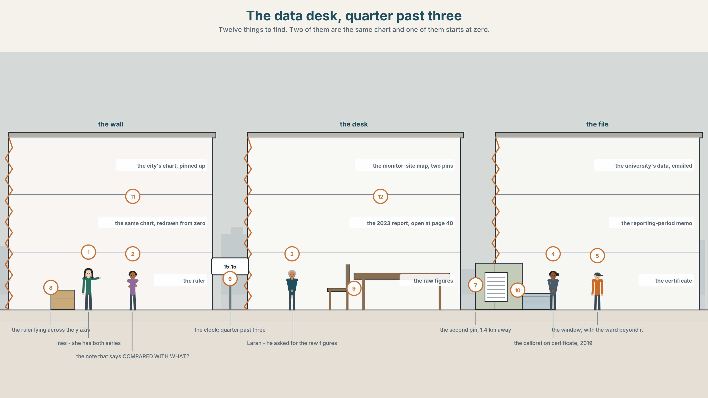{width=6.6in}

*The data desk, quarter past three — Twelve things to find. Two of them are the same chart and one of them starts at zero.*

# What does the chart not say?

**By the end of this unit you can write densely, and take a dense sentence apart to find out who
did what. Two hundred words.**

| ◆ **A · THE WORLD** | An air-quality chart, a monitor that moved, and a forty per cent reduction nobody can find |
|---|---|
| ◆ **B · THE SYSTEM** | nominalisation, and how to undo it · 28 words for measurement and charts · 22 abstract nouns and frames · stress in derived nouns |
| ◆ **C · THE PERFORMANCE** | Two hundred words dense enough to publish and clear enough to argue with |

---

### 0A · Find it

**Find twelve things in this picture.** Two of them are the same chart and one of them starts at
zero.

> the city's chart, pinned up · the same chart redrawn from zero · the monitor site map, two pins ·
> the raw figures, printed out · the 2023 report, open at page 40 ·
> the university's data, emailed · a ruler lying across the y axis ·
> a note that says COMPARED WITH WHAT? · the reporting-period memo ·
> a calibration certificate · a clock showing 15:15 · a window with the ward beyond it

### 0B · Guess it

**Two pins on the map are one point four kilometres apart.** Which document in the room explains
why that matters, and which one does not mention it at all?

### 0C · Say it ⏺

**Record sixty seconds.** *Describe a change you have noticed in your own city, and say how you
would measure it.* You will record it again at the end of this unit.

---

## Part 1 · Vocabulary Lab 1 ◆ **B · THE SYSTEM**

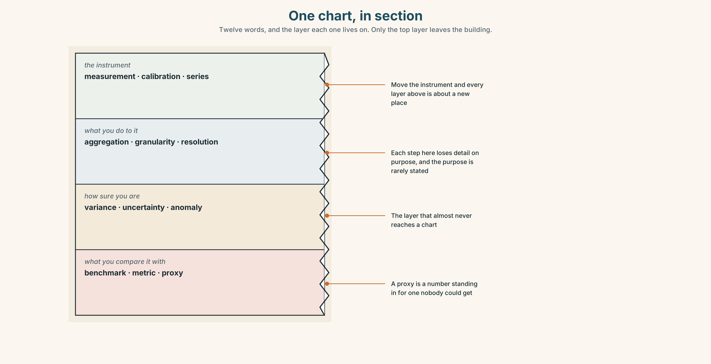{width=6.6in}

*One chart, in section — Twelve words, and the layer each one lives on. Only the top layer leaves the building.*

### 1A · Meet — the words under a chart

Match each word to one layer of the cutaway.

> **measurement** · **calibration** · **anomaly** · **benchmark** · **aggregation** ·
> **granularity** · **resolution** · **variance** · **uncertainty** · **proxy** · **metric** ·
> **series**

### 1B · Sort — what you do to a number, how fine or how sure it is, or what you compare it with?

Three columns. **One of the twelve is a number standing in for a number nobody could get, and it
is the one most often reported as if it were the thing itself.**

> series · granularity · anomaly · benchmark · resolution · uncertainty · aggregation ·
> calibration · measurement · proxy · metric · variance

### 1C · Meet — the five things a chart can do to you

| | |
|---|---|
| **the y axis** | Where it starts decides how big the change looks. It is a choice, not a fact. |
| **a truncated scale** | An axis that does not begin at zero, with no mark to say so. |
| **a cherry-picked window** | The three years in which the line went the right way. |
| **a rolling average** | Smooths noise, and smooths away the month everything changed. |
| **the underlying data** | What is left when the chart is taken away. Usually available, rarely asked for. |

### 1D · Collocation Lab

Complete each one, and say which of the five changed in 2021 without being announced.

> **year on year** · **a data point** · **a reporting period** · **a confidence band** ·
> **the raw figures**

1. The city switched ______ ______ ______ from the calendar year to April–March.
2. ______ ______ ______ , exceedances fell by a tenth; over eight years they did not fall at all.
3. Every ______ ______ on the city's chart after 2021 comes from a different place.
4. ______ ______ ______ were released on request and took four days to arrive.
5. The university's series carries ______ ______ ______ ; the city's carries none.

### 1E · The phrasal verbs, and the three fixed expressions

> **smooth out** · **filter out** · **level off**
>
> **f** *the chart does not show* · **f** *that is a different question* · **f** *compared with what?*

**One of these fixed expressions is a question that cannot be answered without naming a baseline.**
Which, and why is that the most useful thing to ask about any percentage?

### 1F · Own it

Write one sentence containing a percentage from your own life, and underneath it write what it is
a percentage of, and when the counting started.

---

## Part 2 · Listening ◆ **A · THE WORLD**

{width=6.6in}

*Two monitors, one point four kilometres apart — She has the city's chart. He has the university's series and a map.*

### 2A · Two monitors 🔊 Track 7.1

**Before you listen.** The city reports a forty per cent reduction in exceedance days in Ward 7.
The data desk has the raw figures and a map with two pins on it.

**Listen once.** What has changed since 2016, and what has changed about the measuring?

**Listen again. Complete the table.**

| | 2016 | 2023 | What moved |
|---|---|---|---|
| the city's monitor | | | |
| the university's monitor | | | |
| the reporting period | | | |

**Listen again. True or false?**

1. The city's monitor was moved in 2021. ☐ T ☐ F
2. The university's monitor was moved at the same time. ☐ T ☐ F
3. The city's chart begins at zero. ☐ T ☐ F
4. The baseline year was changed in the 2023 report. ☐ T ☐ F

**Noticing.** Five sentences from the recording.

1. *They moved the monitor in 2021.*
2. *The relocation of the monitor took place in 2021.*
3. *A reduction in exceedances of forty per cent has been achieved.*
4. *Exceedances fell by forty per cent at a site that changed.*
5. *The implementation of the new reporting period followed.*

**Two of these say who did it. Three do not. Which, and what has happened to the verb in each?**

### 2B · Decoding clinic 🔊 Track 7.2

Thirty seconds at speed. Three jobs.

1. Where does the stress fall in *calibrate* and in *calibration*? Say both.
2. One speaker turns four verbs into nouns in one sentence. Write the four verbs back in.
3. Somebody says *compared with what?* What had just been said?

---

## Part 3 · Grammar Lab 1 ◆ **B · THE SYSTEM**

### Turning a verb into a noun, and what goes missing when you do

### 3A · Notice

Look at the five sentences in Part 2 again.

1. In sentence 1, who moved the monitor? In sentence 2, who moved it?
2. Sentence 3 contains no person at all. **How many words would you need to add to put one in?**
3. Sentence 4 keeps the verb. **What does it gain, and what does it give up?**
4. Sentence 5 is six words long and contains two events. **Name both.**

### 3B · See

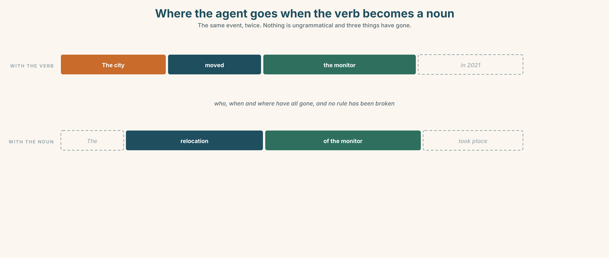{width=6.6in}

*Where the agent goes when the verb becomes a noun — The same event, twice. Nothing is ungrammatical and three things have gone.*

### 3C · Know

| | | |
|---|---|---|
| **verb → noun** | *reduce → reduction · expand → expansion* | the event becomes a thing |
| **the agent disappears** | *they reduced it → a reduction in it* | and no grammar is broken |
| **the tense disappears** | *a reduction* is not dated | which is why reports are full of them |
| **density rises** | one noun can carry a whole clause | which is why the form exists at all |

> **Nominalisation is not a fault.** It is how English packs a clause into a subject so that the
> next clause can say something about it. *The relocation of the monitor was not announced* is a
> sentence you cannot write any other way without repeating yourself.

> **The cost is always the same three things: who, when, and to whom.** *An improvement in air
> quality has been achieved* has no person, no date and no place. Every one of those can be put
> back, and the test is whether the writer could put them back if asked.

| | |
|---|---|
| **the -tion family** | *reduction · implementation · derivation · acknowledgement* |
| **the -ment family** | *improvement · assessment · acknowledgement* |
| **the irregulars** | *expansion · deterioration · analysis · loss* |
| **the frames they live in** | *the reduction of · an increase in · a deterioration in · the question of* |

> **Why it matters.** A reader cannot argue with a noun. Give them back the verb and they can ask
> who, when, and compared with what — which are the only three questions that ever matter about a
> number.

### 3D · Use — controlled

Turn each verb into the noun the frame needs.

> The (1) ______ (reduce) of exceedances is reported as forty per cent.
> The (2) ______ (implement) of the new period followed in 2021.
> A (3) ______ (deteriorate) in the raw figures is visible at the original site.
> The (4) ______ (assess) was subject to revision in the order of ten per cent.
> No (5) ______ (acknowledge) of the move appears anywhere in the report.

### 3E · Use — guided

Put the people, the dates and the places back into each sentence.

1. A reduction in exceedances of forty per cent has been achieved.
2. The relocation of the monitor took place in 2021.
3. The implementation of the new reporting period followed.
4. An improvement in air quality is reported.
5. No acknowledgement of the change was made.

### 3F · Use — open

**In pairs.** One of you reads a nominalised sentence. The other must ask *who did what to whom?*
and keep asking until every participant is named. **Four sentences each.**

### 3G · Error autopsy

> ✗ *The reduce of exceedances was forty per cent.*
> ✗ *The implementation of the period was implemented in 2021.*
> ✗ *An improvement of air quality has been achieved in the ward.*

For each, name the rule and say what the writer was reaching for.

### 3H · Check — eight items

> 1. The ______ (reduce) of exceedances is reported as forty per cent.
> 2. The ______ (implement) of the new period followed.
> 3. A ______ (deteriorate) in the figures is visible at the old site.
> 4. The ______ (assess) is ______ ______ ______ . *(three words — not final)*
> 5. No ______ (acknowledge) of the move appears in the report.
> 6. ✗ *The reduce of exceedances was forty per cent.* → correct it.
> 7. Rewrite *A reduction in exceedances has been achieved* with a person, a date and a place.
> 8. Rewrite *The city moved the monitor and did not announce it* as one dense sentence.

---

## Part 4 · Speaking ◆ **C · THE PERFORMANCE**

### 4A · Fluency starter — pack it and unpack it

One person says a two-clause sentence. The next packs it into one clause with a noun. The next
unpacks it again, with everybody named. **Four rounds.**

### 4B · The functional core — writing densely

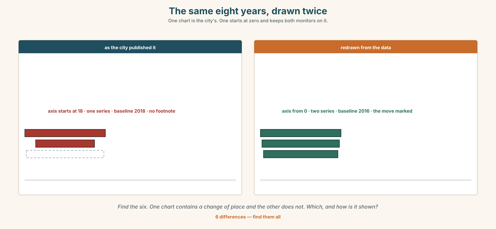{width=6.6in}

*The same eight years, drawn twice — One chart is the city's. One starts at zero and keeps both monitors on it.*

**Language Bank**

| | |
|---|---|
| **packing it** | *the reduction of · an increase in · the implementation of · a deterioration in* |
| **flagging the range** | *subject to revision · in the order of · a matter of · the question of* |
| **unpacking it** | *who did what to whom · the verb has gone missing · that is a nominalisation* |
| **accounting for it** | *account for · allow for · factor in* |

**Information gap.** Learner A has the city's chart. Learner B has the university's series.
**Agree on one sentence that describes both, and count the nouns in it.**

### 4C · The performance — three minutes ⏺

Present a set of figures in three minutes. **Every claim must be dense enough for a report and
every one must survive the question *who did what to whom?*** Your partner asks it twice, without
warning.

**Record it.**

### 4D · Observer

One person writes down every abstract noun used and, beside each, whether the speaker could have
named the agent.

### 4E · Three criteria

> ☐ Was every nominalisation one I could unpack on demand?
> ☐ Did I give a baseline for every percentage?
> ☐ Did the density help the listener, or only me?

---

## Part 5 · Reading ◆ **A · THE WORLD**

### 5A · Predict

The title is **"Forty per cent, measured somewhere else."**
**If a measuring instrument moves, what happens to the series it was producing?**

### 5B · Read — two minutes

---

**Forty per cent, measured somewhere else**

The city's 2023 air-quality report records a forty per cent reduction in exceedance days in Ward 7
since 2016. The relocation of the monitor in 2021 is not mentioned in the body of the report. It
appears in a footnote on page forty.

The original monitor stood at the junction of Lake and Seventh, between a bus layover and a
distribution depot. The new one stands one point four kilometres away, in a park.

A university air-quality group left a second instrument at the original junction. Its series runs
without a break from 2014. In 2016 it recorded forty-one exceedance days. In 2023 it recorded
thirty-nine.

The city's chart begins its y axis at eighteen. Between 2021 and 2022 the reporting period changed
from the calendar year to April–March, so one year in the series is nine months long. The 2023
report moves the baseline from 2016 to 2018, which removes the two highest years from the
comparison without removing them from the data.

Every one of these decisions is defensible on its own. The city has published a defence of each.
There is no document anywhere in which all four appear together.

---

### 5C · Comprehension — eight questions

1. What reduction does the report record, and since when?
2. Where was the original monitor, and where is the new one?
3. What did the university's instrument record in 2016 and in 2023?
4. Where does the y axis begin?
5. What changed between 2021 and 2022?
6. **Why does the writer describe what stood beside the original monitor?**
7. **"Defensible on its own" — what is the argument the writer is making without stating it?**
8. **The last sentence is about an absence. Why is that the strongest fact in the piece?**

### 5D · Vocabulary in context

Infer from the text, then check.

> is not mentioned in the body of the report · runs without a break · one year is nine months
> long · without removing them from the data · defensible on its own

### 5E · The counter-text

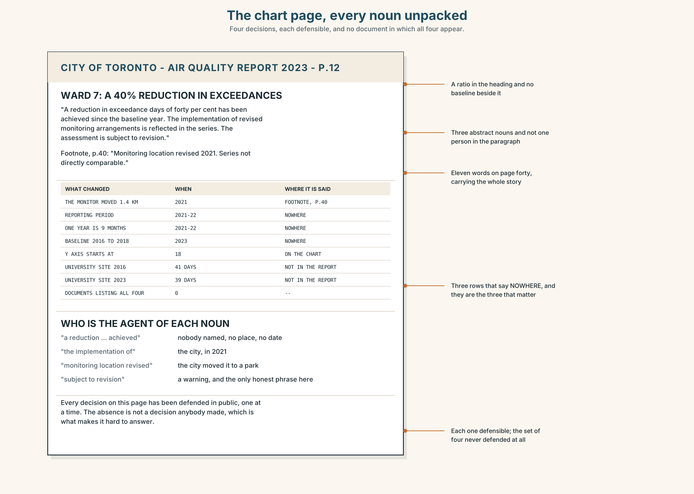{width=6.6in}

*The chart page, every noun unpacked — Four decisions, each defensible, and no document in which all four appear.*

**Read the city's chart page and answer.**

1. Where does the y axis start, and what does that do to the apparent change?
2. **Find every nominalisation on the page and say who the agent would be in each.**
3. The footnote on page forty is eleven words. **Rewrite it as the body text it should have been.**
4. **Which single change, undone, would alter the headline figure most?**

### 5F · Two texts

The city says *a forty per cent reduction in exceedances has been achieved*.
The university's series says *forty-one days in 2016, thirty-nine in 2023*.

**Are these in conflict?** Write two sentences, and use the phrase *compared with what?* in one of
them.

---

## Part 6 · Vocabulary Lab 2 ◆ **B · THE SYSTEM**

### Making a noun out of what happened

### 6A · Sort — bigger or smaller, better or worse, or somebody did something?

Three columns.

> implementation · acknowledgement · assessment · improvement · expansion · reduction ·
> deterioration · derivation

### 6B · Chunk completion

1. ______ ______ ______ exceedances is reported as forty per cent. *(three words)*
2. ______ ______ ______ the raw figures is visible at the old site. *(four words)*
3. ______ ______ ______ the new period followed in 2021. *(four words)*
4. ______ ______ ______ monitor sites is the thing nobody mentions. *(three words)*
5. The assessment is ______ ______ ______ . *(three words — not final)*
6. The error is ______ ______ ______ ______ ten per cent. *(four words — approximately)*
7. It is ______ ______ ______ where you put the instrument. *(three words — it comes down to)*
8. ______ ______ ______ the baseline has never been put to the board. *(three words)*

### 6C · Three that are not interchangeable

> *an increase in* · *the implementation of* · *subject to revision*

**Say which one names a change, which one names an action with a hidden agent, and which one is a
warning about the number itself.**

### 6D · The phrasal verbs and the fixed expressions

> **account for** · **allow for** · **factor in**
>
> **f** *that is a nominalisation* · **f** *who did what to whom* · **f** *the verb has gone missing*

**Two of these phrasal verbs mean roughly "take into account" and one means "explain".** Which is
which, and which of the three can also mean "make up a proportion of"?

### 6E · Contrast Clinic

Eight items. Rewrite each sentence as the bracket says.

1. The air got worse at the junction. *(pack it, formally)*
2. The city moved the monitor in 2021. *(pack it into a noun phrase)*
3. The reporting period was changed. *(name who changed it and when)*
4. The error is roughly ten per cent. *(use a four-word formal frame)*
5. A reduction in exceedances has been achieved. *(unpack it, with a person and a date)*
6. They did not acknowledge the move. *(pack it into a subject)*
7. The baseline was moved from 2016 to 2018. *(pack it, and keep the dates)*
8. The implementation of the period followed. *(say who implemented what)*

---

## Part 7 · Pronunciation & Fluency Lab ◆ **B · THE SYSTEM**

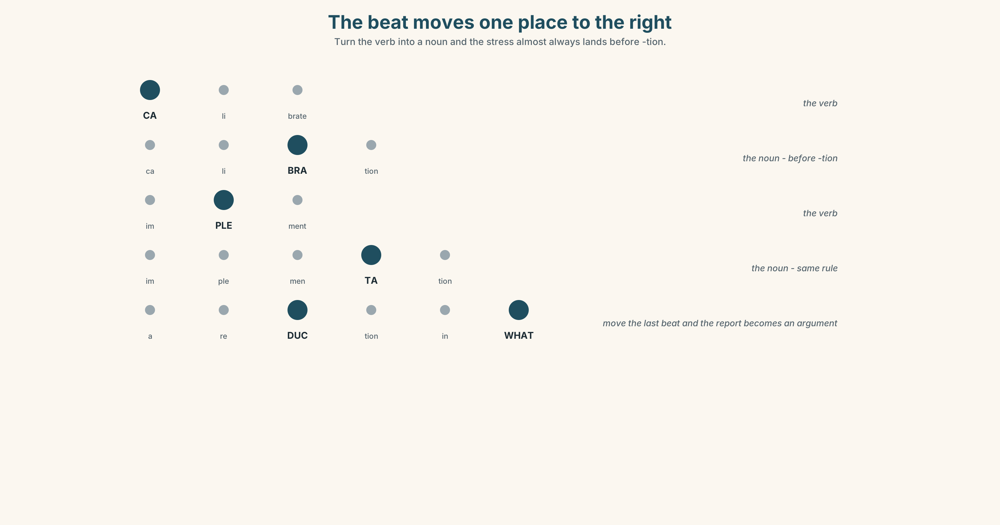{width=6.6in}

*The beat moves one place to the right — Turn the verb into a noun and the stress almost always lands before -tion.*

### The stress moves when the word does

### 7A · Hear 🔊 Track 7.3

> *CA-li-brate* → *ca-li-BRA-tion*
> *im-PLE-ment* → *im-ple-men-TA-tion*
> *de-TE-ri-o-rate* → *de-te-ri-o-RA-tion*

### 7B · Say

Say each pair three times. Then say this:

> *They calibrate it, and the calibration was in April.* — the same four syllables, and the beat
> moves one place to the right.

### 7C · Make it mean something

Say these two:

> *a reDUCtion in exCEEdances* — the ordinary report, two stresses, both inside the nouns
> *a reDUCtion in WHAT?* — the stress moves to the question, and the sentence becomes an argument

**In a derived noun the stress almost always lands on the syllable before *-tion*,** whatever the
verb did, which is why a reader who has only seen these words in print says them wrongly.

### 7D · Fluency 30 ⏺

Thirty seconds: **four verb-and-noun pairs, each said twice, with the beat moving.** Three times,
faster.

---

## Part 8 · Writing ◆ **C · THE PERFORMANCE**

### Four figures, densely · 200 words

### 8A · Read the model

> The relocation of the Ward 7 monitor in 2021 is recorded in a footnote on page forty of a
> two-hundred-page report. `[one noun carries a whole clause, and the sentence can then say
> something about it]`
>
> The city moved it one point four kilometres, from a junction between a bus layover and a depot
> to a park. `[the same event with the verb back in — who, what, where, and it is now arguable]`
>
> A university instrument left at the original site recorded forty-one exceedance days in 2016 and
> thirty-nine in 2023. `[no nominalisation at all, because this is the sentence the reader has to
> be able to check]`
>
> The reduction of exceedances reported by the city is therefore a reduction at a different place,
> over a shortened period, against a moved baseline, measured on an axis beginning at eighteen.
> `[four nominalisations in one sentence, and every one of them unpacked in the three sentences
> above it]`

**Questions about the writer's choices:**

1. Sentence one packs an event into a noun; sentence two unpacks the same event. **Why both?**
2. The third sentence has no abstract noun in it at all. **Why that sentence?**
3. The last sentence is the densest. **What has the writer earned the right to do, and how?**

### 8B · The anti-model

> Following the implementation of revised monitoring arrangements and the subsequent reassessment of the baseline, a significant improvement in air quality outcomes has been achieved across the reporting period, subject to ongoing review.

One sentence, thirty-four words, six abstract nouns, no person, no date, no place.
**Rewrite it with every agent named, and then pack it back down to two sentences.**

### 8C · Plan

> the event as a noun → the same event with the verb back → the checkable figures, plainly →
> the dense summary, which is now readable because you unpacked it first

### 8D · Write — 200 words
### 8E · Peer review — three criteria

> ☐ Could you name the agent behind every abstract noun you used?
> ☐ Does every percentage say what it is of, and over what period?
> ☐ Is there at least one sentence a reader could check without you?

### 8F · Write it again · 8G · Publish

Rewrite after review. **Publish both, and circle every abstract noun in each.**

---

## Part 9 · The File ◆ **A · THE WORLD + C · THE PERFORMANCE**

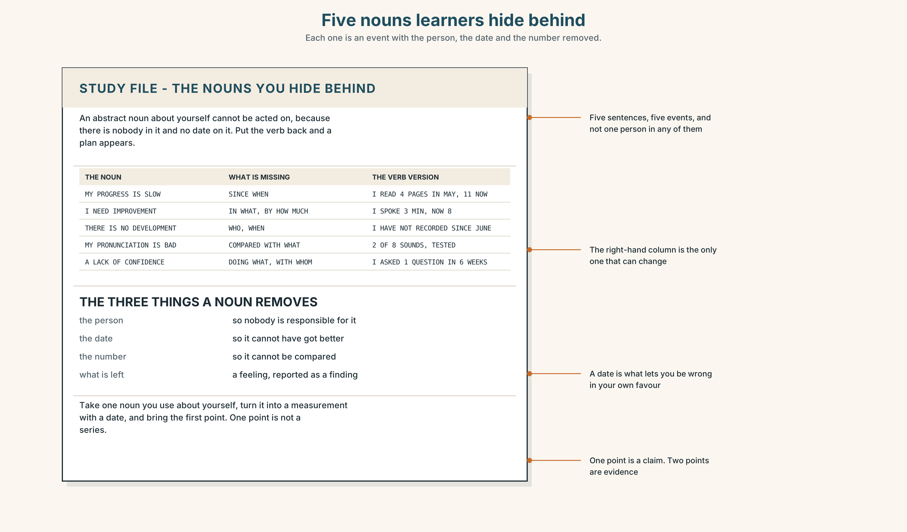{width=6.6in}

*Five nouns learners hide behind — Each one is an event with the person, the date and the number removed.*

# STUDY FILE · The nouns you hide behind

### 9A · Progress, improvement, development 🔊 Track 7.4

Learners describe their own learning almost entirely in abstract nouns: *my progress is slow*, *I
need improvement in speaking*, *there is no development*. None of them has a person, a date or a
measure, and none of them can be acted on.

| | |
|---|---|
| **the noun** | *improvement in speaking* |
| **the missing agent** | you |
| **the missing date** | since when |
| **the verb version** | *I spoke for three minutes in October and for eight in March* |

### 9B · Put the verb back

Take three sentences you have said about your own learning that contain an abstract noun.
**Rewrite each with a person, a date and a number.**

### 9C · Role play — who did what to whom?

In pairs. One of you describes their progress. The other may only ask *who did what to whom, and
when?* **Four rounds each.**

### 9D · The one you can measure

Everybody has one thing they can state as a verb with a number.
**Name yours.** If you cannot find one, that is the finding, and it is this week's work.

### 9E · Transfer — before next week

**Take one abstract noun you use about yourself and turn it into a measurement with a date.** Bring
the first data point. One point is not a series, and that is the following week's work.

---

## Part 10 · Mediation & Interaction ◆ **C · THE PERFORMANCE**

{width=6.6in}

*Eight years, two monitors, four changes — Exceedance days in Ward 7, and everything that changed about the measuring.*

### 10A · Relay

Half the class has the city's chart. Half has the university's series.
**Produce one chart caption both sides accept, by speaking only.** Ten minutes.

### 10B · Simplify — for one reader

A reader writes: *Has the air in Ward 7 got better or not?*
**Reply in four sentences,** with no abstract noun in any of them.

### 10C · Online

Write **one message** to the city's statistician. **Three sentences.** Ask for exactly what you
need, and do not accuse anybody of anything.

### 10D · Your language

Does your language form abstract nouns from verbs as freely as English?
**Translate the five sentences from Part 2.** Which ones force you to name the agent?

---

## Part 11 · The Decision ◆ **C · THE PERFORMANCE**

# What the paper does with other people's charts

**Option one:** reproduce the city's chart as published, with a caption noting the axis and the
move. It is their chart; the reader should see what the city issued.

**Option two:** redraw every chart from the underlying data, from zero, as house style, and say so
in small type.

**Option three:** redraw from zero, and print beside every chart one line headed *What this chart
does not show*.

### 11A · The evidence

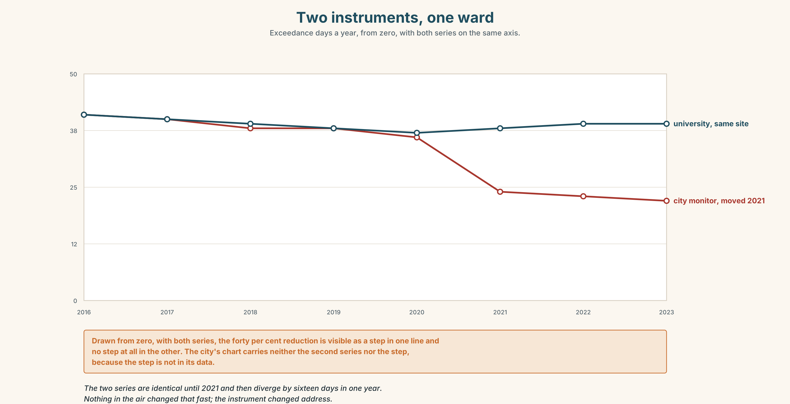{width=6.6in}

*Two instruments, one ward — Exceedance days a year, from zero, with both series on the same axis.*

🔊 **Track 7.6.** Ines Fontaine, data desk, 30 seconds: *"Everyone argues about the axis. The axis
is the least of it. You can see a truncated scale. You cannot see a monitor that moved, a year
that was nine months long, or a baseline that quietly lost the two worst years. Those three are
invisible in any redrawing, because they are not in the chart. They are in the footnotes, and the
footnotes do not get published."*

### 11B · Talk about it

In threes. Use the frame, and give a baseline for every number you say.

> *I would ______ , because the reader cannot ______ , and the cost is ______ .*

### 11C · Decide

Write **three sentences**: the decision, the evidence, and the one thing your decision still fails
to catch.

### 11D · Model decision

> Option three. Redrawing from zero is necessary and nowhere near sufficient, because the three
> changes that move this figure most are not visible in any drawing of it. The one-line note is the
> only part of the proposal that can carry a moved monitor, and it costs one line. Its weakness is
> that it depends on somebody having read the footnotes, and nothing in this decision creates the
> time to do that.

### 11E · The Reveal

> **What happened.** The Herald redrew from zero and ran the note. Readers' complaints about charts
> fell; complaints about the note rose, almost all of them from the organisations whose charts they
> were.
>
> Then something nobody predicted: within eighteen months the city's own charts were being
> published from zero, and its 2025 report carried a page headed *Changes to the series*. Nobody
> asked for it. The press office had grown tired of the note.

**One question. You do not have to answer it out loud.**

> The note was about the Herald's own pages. Why did it change what the city drew?

---

## Part 12 · Landing ◆ **all three lines**

### 12A · Recycle — fifteen items

> 1. The ______ (reduce) of exceedances is reported as forty per cent.
> 2. The ______ (implement) of the new period followed in 2021.
> 3. A ______ (deteriorate) in the raw figures is visible at the old site.
> 4. No ______ (acknowledge) of the move appears in the report.
> 5. The ______ (assess) is subject to revision.
> 6. ______ ______ ______ , exceedances fell by a tenth. *(three words)*
> 7. The chart's ______ ______ begins at eighteen. *(two words)*
> 8. The error is ______ ______ ______ ______ ten per cent. *(four words)*
> 9. ______ ______ ______ ______ were released on request. *(four words)*
> 10. The university's series carries ______ ______ ______ . *(three words)*
> 11. ______ ______ ______ ______ ______ the monitor moved. *(five words — the standing caption)*
> 12. ______ ______ ______ ? *(three words — the question that needs a baseline)*
> 13. A rolling average will ______ ______ the month everything changed. *(two words)*
> 14. You have to ______ ______ the nine-month year. *(two words)*
> 15. The line appears to ______ ______ after 2021. *(two words)*

### 12B · Consolidate — one task, everything in it

**Write 150 words about a set of figures**, with one dense sentence, one unpacked sentence and one
sentence a reader could check alone. Mark the three in the margin.

### 12C · Can-do, with evidence

> ☐ I can form and use abstract nouns from verbs. **Evidence:** 3H, 8D
> ☐ I can unpack a nominalisation and name the agent. **Evidence:** 6E, 3F
> ☐ I can say what a chart does not show. **Evidence:** 5E, 10B
> ☐ I can place the stress in a derived noun. **Evidence:** 7B

### 12D · Replay ⏺

Record 0C again. **Compare.** How many abstract nouns did you use the first time?

### 12E · Glossary — fifty items, as a map

> **WHAT YOU DO TO A NUMBER** · measurement · calibration · aggregation
> **HOW FINE AND HOW SURE** · granularity · resolution · variance · uncertainty
> **WHAT YOU COMPARE IT WITH** · benchmark · proxy · metric · series · anomaly
> **WHAT A CHART CAN DO TO YOU** · the y axis · a truncated scale · a cherry-picked window · a rolling average · the underlying data
> **THE SMALL PRINT** · year on year · a data point · a reporting period · a confidence band · the raw figures
> **WHAT ANALYSTS DO** · smooth out · filter out · level off · account for · allow for · factor in
> **IN THE ROOM** · the chart does not show · that is a different question · compared with what?
> **THE ABSTRACT NOUNS** · reduction · expansion · deterioration · improvement · implementation · acknowledgement · assessment · derivation
> **THE FRAMES** · the reduction of · a deterioration in · the implementation of · an increase in · subject to revision · in the order of · a matter of · the question of
> **TAKING IT APART** · that is a nominalisation · who did what to whom · the verb has gone missing

### 12F · Next

> **Unit 8 · What was left out?**

# B2.1 · Unit 8 · Seventy-Three Words

> **English Animated** · *Reading Between Lines* · a newsroom, Toronto
> Student's Book pages 160–181 · 22 pp · ~11 hours

---

## Part 0 · The Big Picture ◆ **A · THE WORLD**

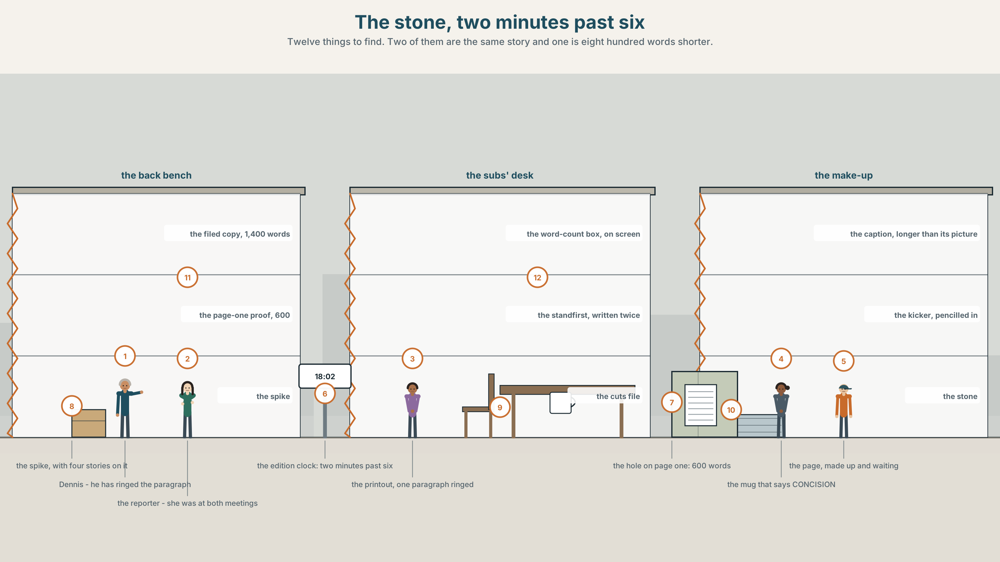{width=6.6in}

*The stone, two minutes past six — Twelve things to find. Two of them are the same story and one is eight hundred words shorter.*

# What was left out?

**By the end of this unit you can leave things out on purpose, and say what a cut has cost. Two
hundred words.**

| ◆ **A · THE WORLD** | A story filed at fourteen hundred words, a hole of six hundred, and one paragraph of seventy-three |
|---|---|
| ◆ **B · THE SYSTEM** | ellipsis and substitution · 28 words for editing and brevity · 22 substitute words and frames · reduced forms and where you pause |
| ◆ **C · THE PERFORMANCE** | Two hundred words that imply as much as they say |

---

### 0A · Find it

**Find twelve things in this picture.** Two of them are the same story and one of them is eight
hundred words shorter.

> the filed copy, fourteen hundred words · the page-one proof, six hundred ·
> the word-count box on the screen · the standfirst, written twice ·
> the spike, with four stories on it · the caption that is longer than its picture ·
> the kicker, pencilled in · a printout with one paragraph ringed ·
> the stone, with the page made up · the edition clock showing 18:02 ·
> the cuts file, open · a mug that says CONCISION

### 0B · Guess it

**One paragraph on this desk is ringed and nobody has cut it yet.** Which two people in the room
disagree about it, and how can you tell from where they are standing?

### 0C · Say it ⏺

**Record sixty seconds.** *Tell a story you know well in sixty seconds, then tell the same story in
twenty. Say what you lost.* You will record it again at the end of this unit.

---

## Part 1 · Vocabulary Lab 1 ◆ **B · THE SYSTEM**

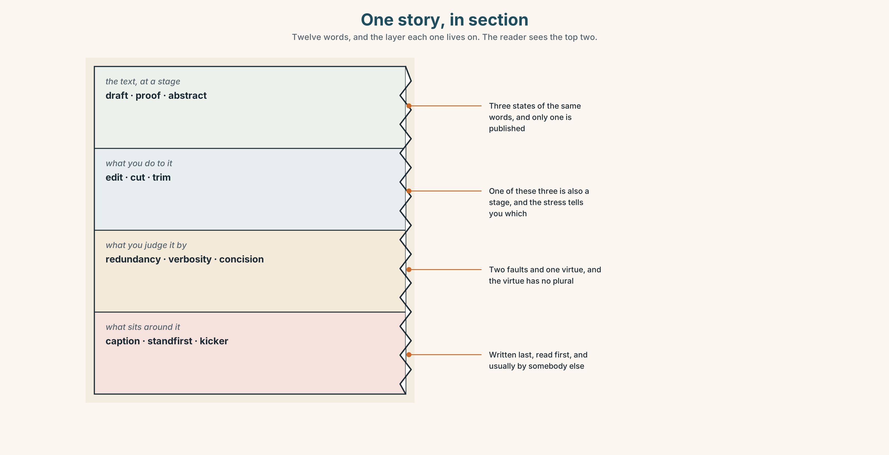{width=6.6in}

*One story, in section — Twelve words, and the layer each one lives on. The reader sees the top two.*

### 1A · Meet — the words of an edit

Match each word to one layer of the cutaway.

> **draft** · **proof** · **abstract** · **edit** · **cut** · **trim** · **redundancy** ·
> **verbosity** · **concision** · **caption** · **standfirst** · **kicker**

### 1B · Sort — a stage, an action, a judgement, or a thing round the edge?

Four columns. **One of the twelve is both a stage and an action, and the stress tells you which.**

> redundancy · draft · verbosity · cut · kicker · proof · edit · trim · concision ·
> abstract · caption · standfirst

### 1C · Meet — the five things that happen at six o'clock

| | |
|---|---|
| **a first pass** | Twenty minutes, and it finds about half of what has to go. |
| **kill a paragraph** | Faster and kinder than shaving words off six of them. |
| **tighten it up** | The instruction every writer has heard and nobody can act on. |
| **the word count** | The only number on the desk that is not negotiable. |
| **down to length** | Not shorter. A specific number, by a specific time. |

### 1D · Collocation Lab

Complete each one, and say which of the five is the only one the reader ever sees.

> **an edited version** · **a working draft** · **the final cut** · **a hard cut** · **what survives**

1. ______ ______ ______ went up at four and was six hundred words over.
2. ______ ______ is a paragraph removed whole, and it is usually the honest kind.
3. ______ ______ ______ is what the reader gets, and nobody tells them it is one.
4. ______ ______ ______ went to the stone at two minutes past six.
5. ______ ______ is not what was best. It is what fitted.

### 1E · The phrasal verbs, and the three fixed expressions

> **cut down** · **chop out** · **pare back**
>
> **f** *it can go* · **f** *we are over by forty* · **f** *nobody will miss it*

**One of these fixed expressions is a prediction and two are decisions.** Which is the prediction,
and who is in a position to check it afterwards?

### 1F · Own it

Write one sentence of twenty words about your week, then write the same thing in eight, and name
the one thing the short version makes the reader guess.

---

## Part 2 · Listening ◆ **A · THE WORLD**

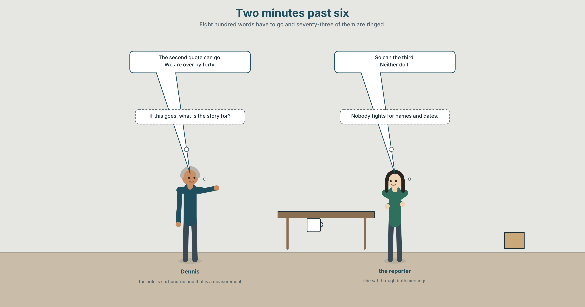{width=6.6in}

*Two minutes past six — Eight hundred words have to go and seventy-three of them are ringed.*

### 2A · Two minutes past six 🔊 Track 8.1

**Before you listen.** The Ward 7 story is filed at fourteen hundred words. The hole on page one is
six hundred. One paragraph of seventy-three words names the two councillors who voted for the
contract.

**Listen once.** What does each of them want cut, and what reason does each give?

**Listen again. Complete the table.**

| | What they would cut | How many words | What they say it costs |
|---|---|---|---|
| the subeditor | | | |
| the reporter | | | |
| the agreed version | | | |

**Listen again. True or false?**

1. The story is eight hundred words over. ☐ T ☐ F
2. The ringed paragraph is thirty-seven words. ☐ T ☐ F
3. The subeditor cuts the ringed paragraph. ☐ T ☐ F
4. The first pass finds three hundred words of repetition. ☐ T ☐ F

**Noticing.** Six exchanges from the recording.

1. *— Who's filed? — Dev has.*
2. *— Have you cut the quotes? — I have, both.*
3. *— Can we lose the colour? — We can, but I'd rather not.*
4. *— The second quote can go. — So can the third.*
5. *— I don't want to cut that one. — Neither do I.*
6. *— Someone has to decide. — I will if you will.*

**Every one of these second turns leaves words out. Write each one in full, and count what the
speaker saved.**

### 2B · Decoding clinic 🔊 Track 8.2

Thirty seconds at speed. Three jobs.

1. One speaker says *we are over by forty* in five syllables. Write what you hear.
2. Where does each speaker pause? Mark the two longest pauses and say what follows each.
3. Somebody says *nobody will miss it*. What is the full sentence, and what has been left out of it?

---

## Part 3 · Grammar Lab 1 ◆ **B · THE SYSTEM**

### Saying less and meaning the same

### 3A · Notice

Look at the six exchanges in Part 2 again.

1. In exchange 1, how many words has the second speaker not said?
2. In exchange 2, *I have, both* — what is *both* doing, and what has gone?
3. In exchange 4, *so can the third* — what does *so* stand for?
4. Exchange 6 contains two ellipses in six words. **Find both.**

### 3B · See

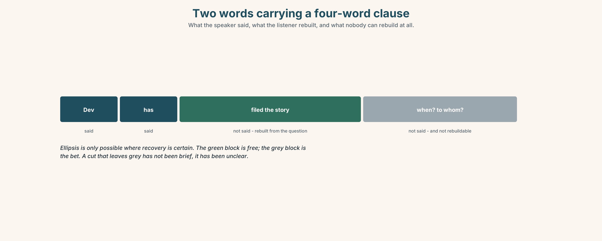{width=6.6in}

*Two words carrying a four-word clause — What the speaker said, what the listener rebuilt, and what nobody can rebuild at all.*

### 3C · Know

| | | |
|---|---|---|
| **ellipsis** | leaving words out where the reader can recover them | *Dev has. → Dev has filed.* |
| **substitution with *one / ones*** | standing in for a countable noun | *the long version and the short one* |
| **substitution with *do so / do it*** | standing in for a whole verb phrase | *She cut it, and I would have done so too.* |
| **substitution with *so***  | standing in for a clause | *— The quote can go. — So can the colour.* |
| **substitution with *such*** | standing in for a kind of thing | *no such paragraph survived* |
| ***neither / either*** | carrying a negative across to a second speaker | *— I wouldn't. — Neither would I.* |

> **Ellipsis is only possible where recovery is certain.** *Dev has* works because the question
> supplied *filed*. Leave out something the listener cannot rebuild and you have not been brief;
> you have been unclear, and the two are confused daily.

> ***Do so* is formal and written; *do it* is neutral; bare *do* is British and spoken.** *She
> asked me to file and I did* is spoken; *and I did so* is a report; *and I did it* is in between.
> Choosing wrongly is one of the clearest register mistakes an advanced learner makes.

| | |
|---|---|
| **pointing back** | *the former · the latter · the same · as such* |
| **carrying a condition** | *if so · if not* |
| **adding a second speaker** | *likewise · so does mine · neither did I* |
| **pointing somewhere else** | *elsewhere* |

> **Why it matters.** Half of spoken English is what was not said, and every edit is a bet about
> what the reader can rebuild. A good cut leaves a hole the reader fills correctly without noticing.

### 3D · Use — controlled

Complete each second turn with the shortest form that works.

> — Who has filed? — Dev (1) ______ .
> — Have you cut both quotes? — I (2) ______ , ______ .
> — The second quote can go. — (3) ______ can the third.
> — I would not cut that paragraph. — (4) ______ would I.
> — Is it down to length? — If (5) ______ , it goes to the stone now.

### 3E · Use — guided

Rewrite each one, leaving out everything the listener can recover.

1. The second quote can go, and the third quote can go too.
2. I have cut both of the quotes.
3. I would not cut that paragraph, and she would not cut that paragraph either.
4. He asked me to file it and I filed it.
5. The long version is better than the short version.

### 3F · Use — open

**In pairs.** One of you makes a statement. The other agrees or disagrees **in four words or
fewer**, using substitution. **Eight rounds, and nobody may repeat a form.**

### 3G · Error autopsy

> ✗ *— Who has filed? — Dev has filed it the story.*
> ✗ *— I would not cut it. — Either would I.*
> ✗ *She asked me to file and I did so it.*

For each, name the rule and say what the writer was reaching for.

### 3H · Check — eight items

> 1. — Who has filed? — Dev ______ .
> 2. — Have you cut both? — I ______ .
> 3. — The second can go. — ______ can the third.
> 4. — I would not cut it. — ______ would I.
> 5. — Is it down to length? — If ______ , it goes now.
> 6. ✗ *— I would not. — Either would I.* → correct it.
> 7. Rewrite *The long version is better than the short version* using *one*.
> 8. Rewrite *She cut it and I cut it too* three ways: spoken, neutral and formal.

---

## Part 4 · Speaking ◆ **C · THE PERFORMANCE**

### 4A · Fluency starter — half as long

One person says a sentence. The next says the same thing in half the words. **Four rounds, and the
fourth version must still be a sentence somebody could act on.**

### 4B · The functional core — compressing and implying

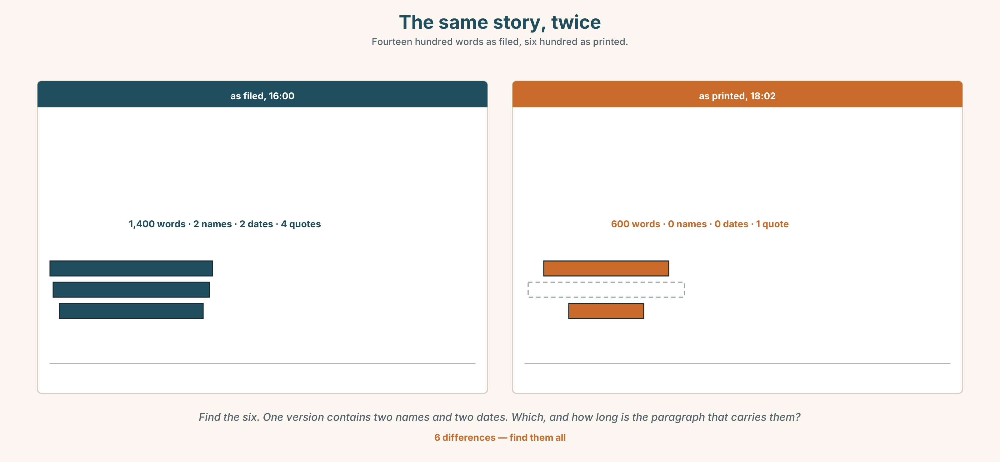{width=6.6in}

*The same story, twice — Fourteen hundred words as filed, six hundred as printed.*

**Language Bank**

| | |
|---|---|
| **agreeing short** | *so does mine · neither did I · likewise · the same* |
| **standing in** | *do so · do it · one · ones · such* |
| **pointing back** | *the former · the latter · as such · elsewhere* |
| **conditional short forms** | *if so · if not* |

**Information gap.** Learner A has the filed copy. Learner B has the page-one proof.
**Find the eight hundred missing words by asking questions only.** Ten minutes.

### 4C · The performance — three minutes ⏺

Tell a story for ninety seconds. Then tell the same story in thirty. **Your partner lists, from
the short version alone, three things they inferred that you did not say** — and you say whether
each is right.

**Record it.**

### 4D · Observer

One person writes down every substitution used and what each one stood for.

### 4E · Three criteria

> ☐ Could my listener rebuild everything I left out?
> ☐ Did I choose *do so*, *do it* or bare *do* to match the register?
> ☐ Did the short version imply the same thing, or a different one?

---

## Part 5 · Reading ◆ **A · THE WORLD**

### 5A · Predict

The title is **"Seventy-three words."**
**If a story has to lose eight hundred words, which paragraph is most likely to go, and why?**

### 5B · Read — two minutes

---

**Seventy-three words**

The story was filed at four o'clock at fourteen hundred words. The hole on page one is six
hundred. That is not a negotiation; it is a measurement.

The first pass takes twenty minutes and finds three hundred words of repetition, two sentences
that say the same thing in different registers, and a quotation that adds nothing the paragraph
above it has not said. Nobody will miss any of it.

That leaves five hundred to go, and five hundred words is four paragraphs.

Three of the four are easy. The description of the junction, which took the reporter an afternoon,
goes first. The second and third quotations go next; the first one carries the argument and the
others agree with it.

The fourth is seventy-three words long and names the two councillors who voted for the contract,
and the dates of the two meetings at which they did so. It is the least readable paragraph in the
story. It is also the only one that could not be written by somebody who had not been there.

At two minutes past six the subeditor rings it, and does not cut it, and says: *If this goes, what
is the story for?*

---

### 5C · Comprehension — eight questions

1. How long was the story as filed, and how big is the hole?
2. What does the first pass find?
3. How many words are left to cut after the first pass?
4. Which three paragraphs go, and in what order?
5. How long is the fourth paragraph?
6. **"That is not a negotiation; it is a measurement." What is the writer establishing early?**
7. **Why does the writer mention that the junction description took an afternoon?**
8. **The piece ends on a question, not a decision. What does that leave the reader to do?**

### 5D · Vocabulary in context

Infer from the text, then check.

> says the same thing in different registers · carries the argument · the least readable
> paragraph · could not be written by somebody who had not been there · rings it

### 5E · The counter-text

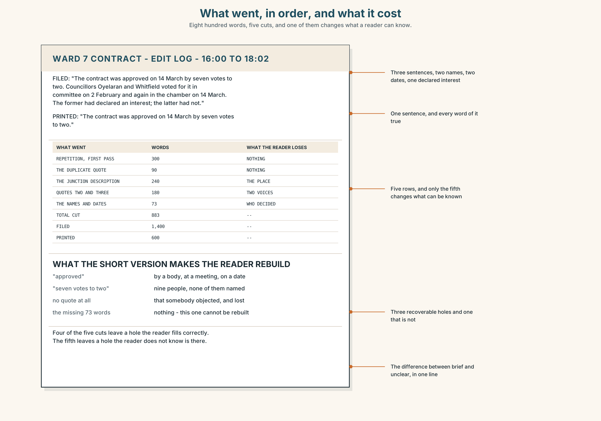{width=6.6in}

*What went, in order, and what it cost — Eight hundred words, five cuts, and one of them changes what a reader can know.*

**Read the two versions and answer.**

1. How many words went, and from where?
2. **Find three places in the short version where something has been left out and the reader
   rebuilds it. What do they rebuild it from?**
3. One cut changes what a reader can know. **Which, and how would you prove that?**
4. **Which version would you publish, and what would you put beside it?**

### 5F · Two texts

The filed version names two councillors and two dates.
The printed version says *the contract was approved*.

**Is the printed version untrue?** Write two sentences, and use the word *concision* in one of
them.

---

## Part 6 · Vocabulary Lab 2 ◆ **B · THE SYSTEM**

### Words that stand in for other words

### 6A · Sort — a noun, a clause, a second speaker, or a place?

Four columns.

> neither · so · elsewhere · likewise · one · such · ones · either

### 6B · Chunk completion

1. She cut it, and I would have ______ ______ in her place. *(two words, formal)*
2. He asked me to file and I ______ ______ . *(two words, neutral)*
3. The two versions are not ______ ______ . *(two words)*
4. Is it down to length? ______ ______ , send it. *(two words)*
5. ______ ______ , we hold it for the second edition. *(two words)*
6. The paragraph is unreadable and, ______ ______ , the first to go. *(two words)*
7. Of the two quotes, ______ ______ carries the argument. *(two words — the first)*
8. ______ ______ merely agrees with it. *(two words — the second)*

### 6C · Three that are not interchangeable

> *do so* · *do it* · *did*

**Say which one belongs in a report, which one in conversation, and which one in between.**

### 6D · The phrasal verbs and the fixed expressions

> **leave out** · **stand in for** · **do without**
>
> **f** *so does mine* · **f** *neither did I* · **f** *I will if you will*

**One of these fixed expressions is an offer disguised as a condition.** Which, and what is the
speaker actually asking for?

### 6E · Contrast Clinic

Eight items. Rewrite each one as short as it can be and still be rebuilt.

1. She would not cut it, and I would not cut it either.
2. The first quotation carries the argument; the second quotation agrees with the first quotation.
3. I have cut both of the two quotations.
4. If it is down to length, send it to the stone.
5. The second quote can go and the third quote can go as well.
6. The paragraph is unreadable and because it is unreadable it goes first.
7. He asked me to file the story and I filed the story.
8. The long version is better than the short version.

---

## Part 7 · Pronunciation & Fluency Lab ◆ **B · THE SYSTEM**

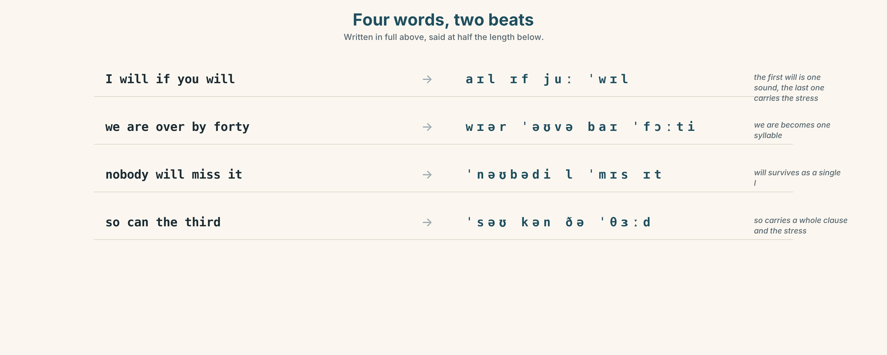{width=6.6in}

*Four words, two beats — Written in full above, said at half the length below.*

### What you leave out, and where you stop

### 7A · Hear 🔊 Track 8.3

> *I will if you will.* → /aɪl ɪf juː ˈwɪl/
> *We are over by forty.* → /wɪər ˈəʊvə baɪ ˈfɔːti/
> *Nobody will miss it.* → /ˈnəʊbədi l ˈmɪs ɪt/

### 7B · Say

Say each one three times, fast. Then say this, pausing only where the slash is:

> *The second can go, / the third can go, / and the fourth stays.* — three clauses, two pauses,
> and the last one is where the meaning is.

### 7C · Make it mean something

Say these two:

> *If this goes — what is the story for?* — the pause before the question does the work
> *If this goes what is the story for?* — no pause, and it is a complaint, not a question

**A pause is a punctuation mark you can hear,** and in an elliptical sentence it is often the only
thing telling the listener that something has been left out.

### 7D · Fluency 30 ⏺

Thirty seconds: **four exchanges, each second turn in four words or fewer, each with one pause.**
Three times, faster.

---

## Part 8 · Writing ◆ **C · THE PERFORMANCE**

### Two versions and one note · 200 words

### 8A · Read the model

> The contract was approved on 14 March by seven votes to two. `[the plain sentence, and nothing
> has been left out that a reader would want]`
>
> Two councillors voted for it twice: once in committee and once in the chamber. The former had
> declared an interest; the latter had not. `[the former and the latter carry two whole noun
> phrases, and the sentence is half the length it would otherwise be]`
>
> The reporter asked both to comment. One did; one did not. `[two clauses of three words each,
> and the reader rebuilds comment from the sentence before]`
>
> The printed version of this story says only that the contract was approved. It is not untrue, and
> nobody will miss the seventy-three words unless they go looking — which, as such, is the whole
> argument. `[as such points back to the entire preceding clause, which is what it is for]`

**Questions about the writer's choices:**

1. The second sentence uses *the former* and *the latter*. **What would repeating the names cost?**
2. *One did; one did not.* **What is the reader rebuilding, and from where?**
3. The last sentence calls its own brevity the argument. **Is that fair? Say why in one sentence.**

### 8B · The anti-model

> The report was published and the report was criticised. The councillors who voted for the contract were the councillors who had attended the committee meeting. The committee meeting took place in March and the chamber vote also took place in March.

Three sentences, every noun phrase repeated in full, and not one substitution anywhere.
**Rewrite it using *one*, *the former*, *the latter*, *do so* and *likewise*, and count the words
you saved.**

### 8C · Plan

> the plain sentence → the two-part sentence held together by *the former* and *the latter* →
> two short clauses the reader completes → the point, pointed back at with *as such*

### 8D · Write — 200 words
### 8E · Peer review — three criteria

> ☐ Can every ellipsis be rebuilt, and from something earlier in your own text?
> ☐ Is each substitution pointing at exactly one thing?
> ☐ Did you cut anything a reader needed, and how would you know?

### 8F · Write it again · 8G · Publish

Rewrite after review. **Publish both, and mark every place where something has been left out.**

---

## Part 9 · The File ◆ **A · THE WORLD + C · THE PERFORMANCE**

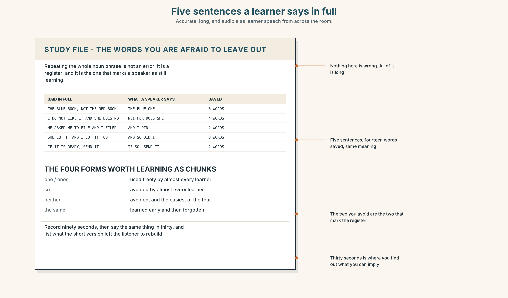{width=6.6in}

*Five sentences a learner says in full — Accurate, long, and audible as learner speech from across the room.*

# STUDY FILE · The words you are afraid to leave out

### 9A · Saying all of it 🔊 Track 8.4

Learners repeat whole noun phrases where a native speaker would substitute, because the full form
feels safer and the short one feels like a gap in their English. The result is accurate, long, and
immediately audible as learner speech.

| | |
|---|---|
| **what you say** | *I like the blue book more than the red book* |
| **what a speaker says** | *I like the blue one better* |
| **what it signals** | not an error — a register |
| **the fix** | four forms, learned as chunks: *one · so · neither · the same* |

### 9B · Halve it

Take three sentences you have said this week with a repeated noun phrase.
**Rewrite each with a substitution, and say both out loud.**

### 9C · Role play — four words or fewer

In pairs. One of you makes a statement. The other agrees or disagrees in **four words or fewer**.
**Twelve rounds, and no form twice.**

### 9D · The one you avoid

Most learners use *one* freely and avoid *so* and *neither* entirely.
**Name the one you avoid, and use it four times today.**

### 9E · Transfer — before next week

**Record ninety seconds of yourself, then say the same thing in thirty.** Bring both, and the list
of what the short one left for the listener to rebuild.

---

## Part 10 · Mediation & Interaction ◆ **C · THE PERFORMANCE**

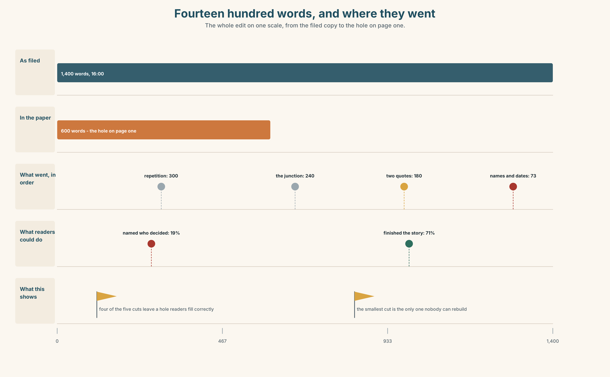{width=6.6in}

*Fourteen hundred words, and where they went — The whole edit on one scale, from the filed copy to the hole on page one.*

### 10A · Relay

Half the class has the filed copy. Half has the printed version.
**Produce a list of what was cut, by speaking only.** Ten minutes.

### 10B · Simplify — for one reader

A reader writes: *Who actually voted for this?*
**Reply in four sentences,** using at least three substitutions.

### 10C · Online

Write **one message** to a reporter whose story is six hundred words over. **Three sentences.** Name
what you would cut and what it would cost.

### 10D · Your language

Does your language leave out the verb in a short answer, as English does in *Dev has*?
**Translate all six exchanges from Part 2.** Which second turns get longer?

---

## Part 11 · The Decision ◆ **C · THE PERFORMANCE**

# What happens to the eight hundred words

**Option one:** nothing. The printed story is the story, every edition since 1911 has been an
edited version, and telling readers what they are not getting is a strange way to sell a newspaper.

**Option two:** publish the full filed version online and link to it from the print story.

**Option three:** publish the full version online **with every cut marked**, and say in the print
story that it is there.

### 11A · The evidence

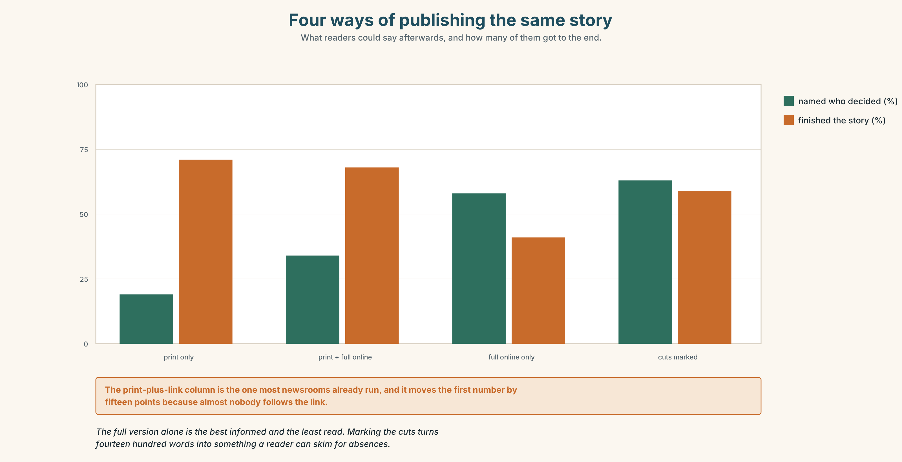{width=6.6in}

*Four ways of publishing the same story — What readers could say afterwards, and how many of them got to the end.*

🔊 **Track 8.6.** Dennis Hoy, subeditor, 30 seconds: *"I have cut about four hundred thousand words
out of other people's stories. Most of them deserved it. The ones that did not were never the
beautiful sentences; writers fight for those. They were always seventy-three words of names and
dates that nobody fights for, because fighting for them sounds like vanity, and because they are
genuinely the dullest thing on the page."*

### 11B · Talk about it

In threes. Use the frame, and keep every turn under fifteen words.

> *I would ______ , because the reader cannot ______ . — So would I. / Neither would I.*

### 11C · Decide

Write **three sentences**: the decision, the evidence, and the cut you would defend hardest.

### 11D · Model decision

> Option three. The full version alone is unread — six hundred words is what people have time for,
> and a link to fourteen hundred is a link nobody follows. Marking the cuts turns the long version
> into something you can skim for what is missing, which is a different and much shorter act of
> reading. The cost is that the desk's judgement becomes public, and the desk is right most of the
> time and will be visibly wrong occasionally.

### 11E · The Reveal

> **What happened.** The Herald published the marked version. Readers of it rose over a year from
> almost nobody to about a fifth of the print readership — far more than the plain full version had
> ever drawn.
>
> Then something nobody predicted: reporters began filing shorter. Seeing, week after week, which
> of their paragraphs survived, they stopped writing the ones that did not. Average filed length
> fell by nineteen per cent in a year, and the number of paragraphs the desk cut for repetition
> fell by half.

**One question. You do not have to answer it out loud.**

> Nobody told the reporters to write less. What did marking the cuts actually show them?

---

## Part 12 · Landing ◆ **all three lines**

### 12A · Recycle — fifteen items

> 1. — Who has filed? — Dev ______ .
> 2. — Have you cut both? — I ______ .
> 3. — The second can go. — ______ can the third.
> 4. — I would not cut it. — ______ would I.
> 5. — Is it down to length? — If ______ , send it.
> 6. She cut it and I would have ______ ______ . *(two words, formal)*
> 7. Of the two, ______ ______ carries the argument. *(two words)*
> 8. ______ ______ merely agrees with it. *(two words)*
> 9. The paragraph is unreadable and, ______ ______ , goes first. *(two words)*
> 10. ______ ______ ______ took twenty minutes. *(three words)*
> 11. ______ ______ ______ ______ . *(four words — the subeditor, at 17:40)*
> 12. ______ ______ ______ ______ ______ . *(five words — the subeditor, at 18:00)*
> 13. It is four hundred words over; we must ______ ______ ______ . *(three words)*
> 14. Two whole paragraphs will have to be ______ ______ . *(two words)*
> 15. The colour can be ______ ______ to a single line. *(two words)*

### 12B · Consolidate — one task, everything in it

**Write 150 words, then cut it to 75 without losing any fact.** Mark every substitution and
ellipsis in the short version.

### 12C · Can-do, with evidence

> ☐ I can leave out what a reader can rebuild. **Evidence:** 3H, 8D
> ☐ I can substitute with *one*, *so*, *such*, *do so* and *neither*. **Evidence:** 6E, 9C
> ☐ I can say what a cut has cost. **Evidence:** 5E, 10C
> ☐ I can pause where the ellipsis is. **Evidence:** 7C

### 12D · Replay ⏺

Record 0C again. **Compare.** What did your twenty-second version leave the listener to rebuild?

### 12E · Glossary — fifty items, as a map

> **THE TEXT, AT A STAGE** · draft · proof · abstract
> **WHAT YOU DO TO IT** · edit · cut · trim
> **WHAT YOU JUDGE IT BY** · redundancy · verbosity · concision
> **WHAT SITS AROUND IT** · caption · standfirst · kicker
> **SIX O'CLOCK** · a first pass · kill a paragraph · tighten it up · the word count · down to length
> **WHAT YOU END UP WITH** · an edited version · a working draft · the final cut · a hard cut · what survives
> **WHAT SUBEDITORS DO** · cut down · chop out · pare back · leave out · stand in for · do without
> **IN THE ROOM** · it can go · we are over by forty · nobody will miss it
> **THE SUBSTITUTES** · one · ones · so · such · neither · either · likewise · elsewhere
> **THE FRAMES** · do so · do it · the same · if so · if not · as such · the former · the latter
> **AGREEING SHORT** · so does mine · neither did I · I will if you will

### 12F · Next

> **Unit 9 · Who is this written for?**

# B2.1 · Unit 9 · Three Readers, One Style Guide

> **English Animated** · *Reading Between Lines* · a newsroom, Toronto
> Student's Book pages 182–203 · 22 pp · ~11 hours

---

## Part 0 · The Big Picture ◆ **A · THE WORLD**

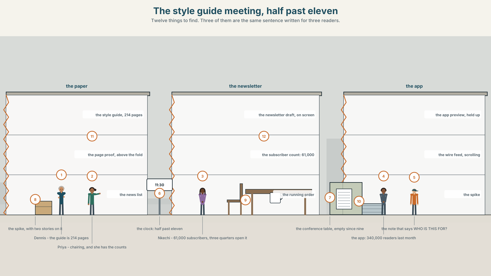{width=6.6in}

*The style guide meeting, half past eleven — Twelve things to find. Three of them are the same sentence written for three readers.*

# Who is this written for?

**By the end of this unit you can guide a reader through a text, and choose the signposts that
match where they are reading it. Two hundred words.**

| ◆ **A · THE WORLD** | One style guide written in 1911, three channels, and an argument about the word *so* |
|---|---|
| ◆ **B · THE SYSTEM** | discourse markers, the whole system · 28 words for desks and deadlines · 22 connectors and frames · what a marker does to the tune |
| ◆ **C · THE PERFORMANCE** | Two hundred words a reader never gets lost in |

---

### 0A · Find it

**Find twelve things in this picture.** Three of them are the same sentence written for three
different readers.

> the style guide, 214 pages · the newsletter draft on a screen · the app preview, held up ·
> the page proof, above the fold · the news list for the day · the running order, pinned ·
> the spike, with two stories on it · the wire feed, scrolling ·
> a note that says WHO IS THIS FOR? · the conference table, empty ·
> a clock showing 11:30 · a subscriber count: 61,000

### 0B · Guess it

**One screen in this room has more readers than the newspaper.** Which, and which document on the
table does not mention it anywhere?

### 0C · Say it ⏺

**Record sixty seconds.** *Explain how you got to work or college today, and signpost it so the
listener always knows where in the story you are.* You will record it again at the end of this
unit.

---

## Part 1 · Vocabulary Lab 1 ◆ **B · THE SYSTEM**

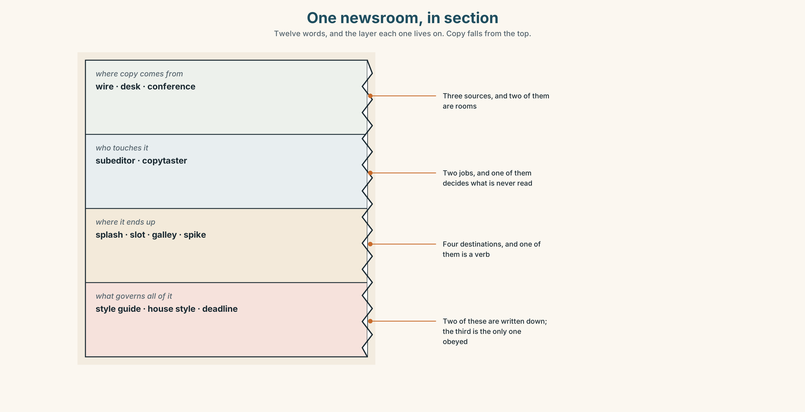{width=6.6in}

*One newsroom, in section — Twelve words, and the layer each one lives on. Copy falls from the top.*

### 1A · Meet — the words of a newsroom

Match each word to one layer of the cutaway.

> **desk** · **deadline** · **spike** · **slot** · **splash** · **subeditor** · **copytaster** ·
> **galley** · **conference** · **style guide** · **house style** · **wire**

### 1B · Sort — a person or a group, a place or a time, or a document?

Three columns. **One of the twelve is also a verb, and it is the verb nobody wants done to their
story.**

> galley · desk · wire · splash · subeditor · copytaster · conference · spike · slot ·
> house style · style guide · deadline

### 1C · Meet — the five places a story can be

| | |
|---|---|
| **above the fold** | The top half of page one. The only part visible on a newsstand. |
| **the back of the book** | The pages nobody turns to, where good writing goes to be unread. |
| **on the stone** | Made up, laid out, and almost impossible to change. |
| **the second edition** | Another chance, four hours later, for a fifth of the readers. |
| **a slow news day** | When a story runs that would not have run on Tuesday. |

### 1D · Collocation Lab

Complete each one, and say which of the five is a measure of a person rather than a story.

> **a late change** · **hold the front page** · **the news list** · **a running order** ·
> **filed on time**

1. ______ ______ ______ goes round at nine and is argued about until eleven thirty.
2. The newsletter has ______ ______ ______ ; the paper has a page.
3. Nobody has said ______ ______ ______ ______ in this building since 1994.
4. ______ ______ ______ after six costs money and is sometimes worth it.
5. She has ______ ______ ______ every day for nine years, which is rarer than it sounds.

### 1E · The phrasal verbs, and the three fixed expressions

> **send through** · **turn around** · **sit on**
>
> **f** *we are going with it* · **f** *that is a splash* · **f** *it will not make the paper*

**Two of these fixed expressions are decisions and one is a judgement.** Which is the judgement,
and who in the room is allowed to make it?

### 1F · Own it

Write three sentences about your week, and put one signpost at the front of each so a listener
knows what kind of sentence is coming.

---

## Part 2 · Listening ◆ **A · THE WORLD**

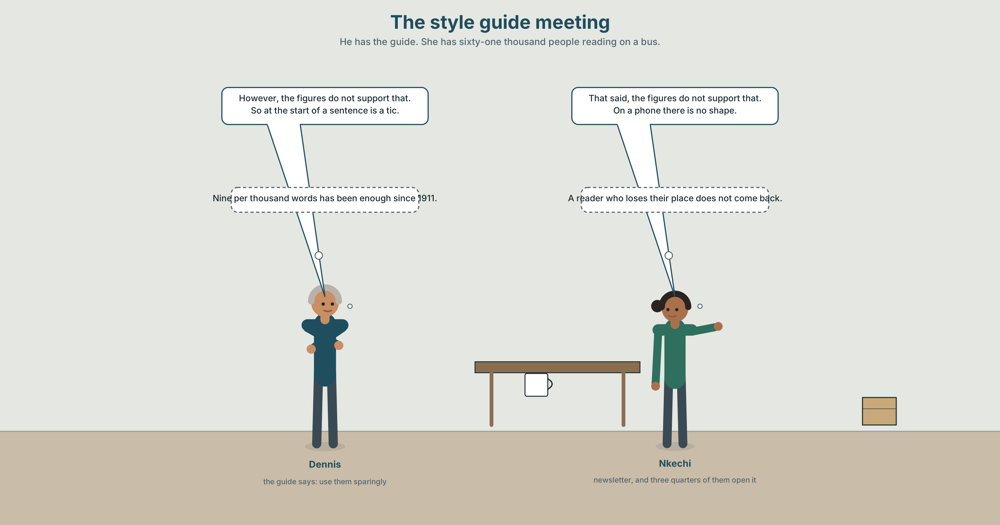{width=6.6in}

*The style guide meeting — He has the guide. She has sixty-one thousand people reading on a bus.*

### 2A · The style guide meeting 🔊 Track 9.1

**Before you listen.** The style guide was written in 1911 and last fully revised in 1998. The
newsletter has sixty-one thousand subscribers. The app has more readers than the paper.

**Listen once.** What does each of them want the guide to say about discourse markers?

**Listen again. Complete the table.**

| | Markers per thousand words | Who the reader is | What they say it costs |
|---|---|---|---|
| the paper | | | |
| the newsletter | | | |
| the app | | | |

**Listen again. True or false?**

1. The guide was last fully revised in 1998. ☐ T ☐ F
2. The newsletter has more subscribers than the paper has readers. ☐ T ☐ F
3. The print desk wants markers banned entirely. ☐ T ☐ F
4. The app version is made by cutting the print version. ☐ T ☐ F

**Noticing.** Six sentences from the recording.

1. *However, the figures do not support that.*
2. *That said, the figures do not support that.*
3. *The figures, as it happens, do not support that.*
4. *Having said that, the figures do not support that.*
5. *By contrast, the figures do not support that.*
6. *In any case, the figures do not support that.*

**Six markers, one sentence. Which two concede something, which one announces a comparison, and
which one says the argument no longer matters?**

### 2B · Decoding clinic 🔊 Track 9.2

Thirty seconds at speed. Three jobs.

1. One speaker puts *however* in three different positions in three sentences. Write all three.
2. What happens to the pauses around it each time?
3. Somebody says *the point being*. What has just been left unsaid, and why does it work?

---

## Part 3 · Grammar Lab 1 ◆ **B · THE SYSTEM**

### Signposts, and what each one promises

### 3A · Notice

Look at the six sentences in Part 2 again.

1. Which two could swap with no change of meaning?
2. Which one implies the speaker has just agreed to something?
3. Sentence 3 puts the marker in the middle. **What does that do to the emphasis?**
4. Sentence 6 dismisses the previous point rather than answering it. **How do you know?**

### 3B · See

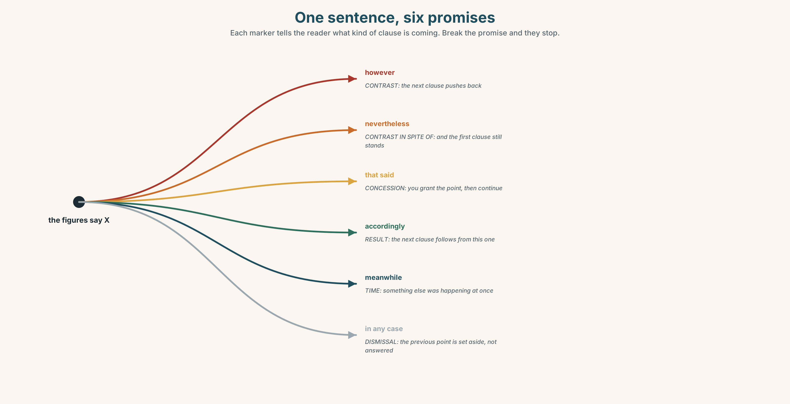{width=6.6in}

*One sentence, six promises — Each marker tells the reader what kind of clause is coming. Break the promise and they stop.*

### 3C · Know

| | | |
|---|---|---|
| **contrast** | *however · nevertheless · by contrast · on the other hand* | the next clause pushes back |
| **concession** | *that said · having said that · in the first place* | you grant something, then continue |
| **result** | *accordingly · hence · thereby · therefore* | the next clause follows from the last |
| **sequence** | *to begin with · thereafter · meanwhile · which brings me to* | position in a list or a timeline |
| **dismissal** | *in any case · for one thing · as it happens* | the previous point is set aside |
| **legal and formal** | *whereby · thereby · thereafter* | written only, and mostly in contracts |

> **A marker is a promise about the next clause.** If you write *however* and the next clause does
> not contrast with anything, the reader has been misdirected, and they will not trust the next
> one either.

> **Position changes force, not meaning.** *However, the figures do not support that* is a formal
> announcement. *The figures, however, do not support that* is quieter and more confident. *The
> figures do not support that, however* sounds like an afterthought, which is sometimes exactly
> what you want.

| | |
|---|---|
| **managing a conversation** | *move on · come back to · go on to* |
| **holding the floor** | *the point being · which brings me to · for one thing* |
| **conceding and continuing** | *having said that · that said · in any case* |

> **Why it matters.** A reader who always knows what kind of sentence is coming next will follow
> you a long way. One who has been promised a contrast and given an example will stop reading, and
> will not be able to tell you why.

### 3D · Use — controlled

Complete with the marker the relationship requires.

> The app has more readers than the paper. (1) ______ , it has no style guide of its own. *(contrast)*
> The guide was revised in 1998. (2) ______ , it says nothing about newsletters. *(result)*
> (3) ______ , the markers were counted. Then the readers were surveyed. *(first in a sequence)*
> The newsletter is informal. (4) ______ , it is the most read thing the paper produces. *(concession)*
> You may disagree with the count. (5) ______ , the survey is independent of it. *(dismissal)*

### 3E · Use — guided

Rewrite each one, moving the marker to the middle and then to the end, and say how the force changes.

1. However, the figures do not support that.
2. Nevertheless, the newsletter is read to the end.
3. Accordingly, the guide will be rewritten.
4. Meanwhile, the app version went out unchanged.
5. By contrast, the print version carries nine markers.

### 3F · Use — open

**In pairs.** One of you makes a claim. The other must respond beginning with a marker that
promises a specific relationship, **and then keep that promise**. **Eight rounds, no marker twice.**

### 3G · Error autopsy

> ✗ *However, the figures do not support that, and also they do not support it.*
> ✗ *The newsletter is informal, hence it is popular, hence people read it, hence it works.*
> ✗ *Whereby the guide was revised in 1998.*

For each, name the rule and say what the writer was reaching for.

### 3H · Check — eight items

> 1. ______ , it has no style guide of its own. *(one word, contrast)*
> 2. ______ , the guide says nothing about newsletters. *(one word, result)*
> 3. ______ ______ ______ , the markers were counted. *(three words, first in a sequence)*
> 4. ______ ______ , it is the most read thing the paper produces. *(two words, concession)*
> 5. ______ ______ ______ , the survey is independent of it. *(three words, dismissal)*
> 6. ✗ *Whereby the guide was revised in 1998.* → correct it.
> 7. Move *however* to all three positions in one sentence and rank them by force.
> 8. Write one sentence in which *nevertheless* would be wrong, and say why.

---

## Part 4 · Speaking ◆ **C · THE PERFORMANCE**

### 4A · Fluency starter — keep the promise

One person says a marker. The next must produce a sentence that the marker correctly introduces.
**Anybody may challenge; the challenge is settled by the rest of the group.**

### 4B · The functional core — guiding a reader

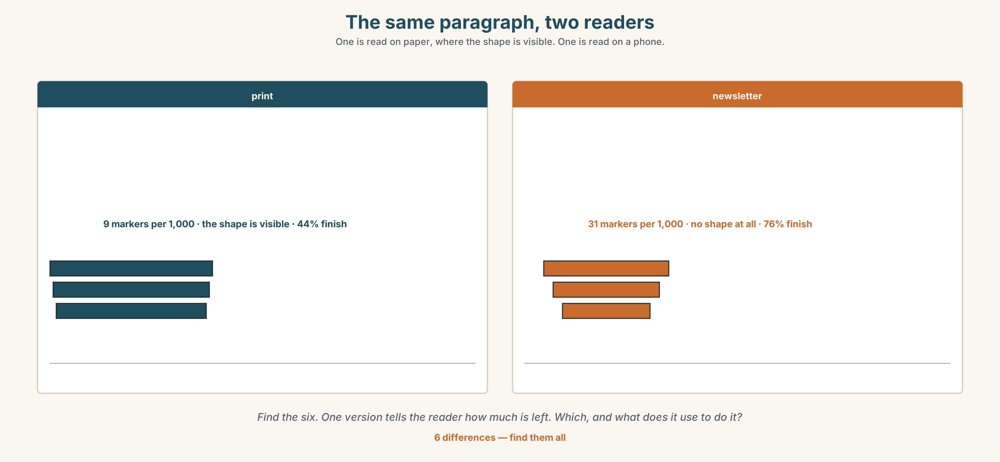{width=6.6in}

*The same paragraph, two readers — One is read on paper, where the shape is visible. One is read on a phone.*

**Language Bank**

| | |
|---|---|
| **opening** | *to begin with · in the first place · for one thing* |
| **turning** | *however · by contrast · on the other hand · that said* |
| **continuing** | *meanwhile · thereafter · which brings me to · go on to* |
| **closing it off** | *in any case · accordingly · the point being* |

**Information gap.** Learner A has the print version. Learner B has the newsletter version.
**Agree on one version for the app, and say which markers you kept and why.** Ten minutes.

### 4C · The performance — three minutes ⏺

Explain an argument with three stages in three minutes. **Every stage must open with a marker, and
every marker must be kept.** Your partner raises a hand the moment a promise is broken.

**Record it.**

### 4D · Observer

One person writes down every marker and ticks it if the next clause did what it promised.

### 4E · Three criteria

> ☐ Did every marker promise something the next clause delivered?
> ☐ Did I vary the position, or put them all at the front?
> ☐ Could my partner say, at any moment, which stage we were in?

---

## Part 5 · Reading ◆ **A · THE WORLD**

### 5A · Predict

The title is **"The word *so*, and who is allowed to use it."**
**Why might a rule written in 1911 have trouble with a newsletter?**

### 5B · Read — two minutes

---

**The word *so*, and who is allowed to use it**

The Herald's style guide runs to two hundred and fourteen pages. It was written in 1911 and last
fully revised in 1998. It contains no entry for *newsletter*, *app*, or *push alert*.

Its entry for discourse markers is four lines long and says that they should be used sparingly.
Counted across a week, the paper averages nine per thousand words. The newsletter averages
thirty-one. The app sits between them at fourteen, not by policy but because the app version is
produced by cutting the print version.

The newsletter has sixty-one thousand subscribers, three quarters of whom open it. The paper
prints a hundred and twelve thousand copies. The app had three hundred and forty thousand readers
last month.

In the meeting the print desk's argument was that *so* at the start of a sentence is a verbal tic.
The newsletter writer's argument was that it is a signpost, that her readers are reading on a
phone between two other things, and that a reader who loses their place in a newsletter does not
come back.

Both are right, and the guide cannot say so, because it has one voice and the paper now has three
readers.

---

### 5C · Comprehension — eight questions

1. How long is the style guide, and when was it last fully revised?
2. What does it say about discourse markers?
3. What are the three marker densities?
4. Why does the app sit between the other two?
5. How many people open the newsletter?
6. **Why does the writer point out that the app density is not a policy?**
7. **"Both are right, and the guide cannot say so." What is the structural problem being described?**
8. **The last sentence has three readers and one voice in it. What is the writer proposing without proposing it?**

### 5D · Vocabulary in context

Infer from the text, then check.

> used sparingly · not by policy but because · reading on a phone between two other things ·
> does not come back · has one voice

### 5E · The counter-text

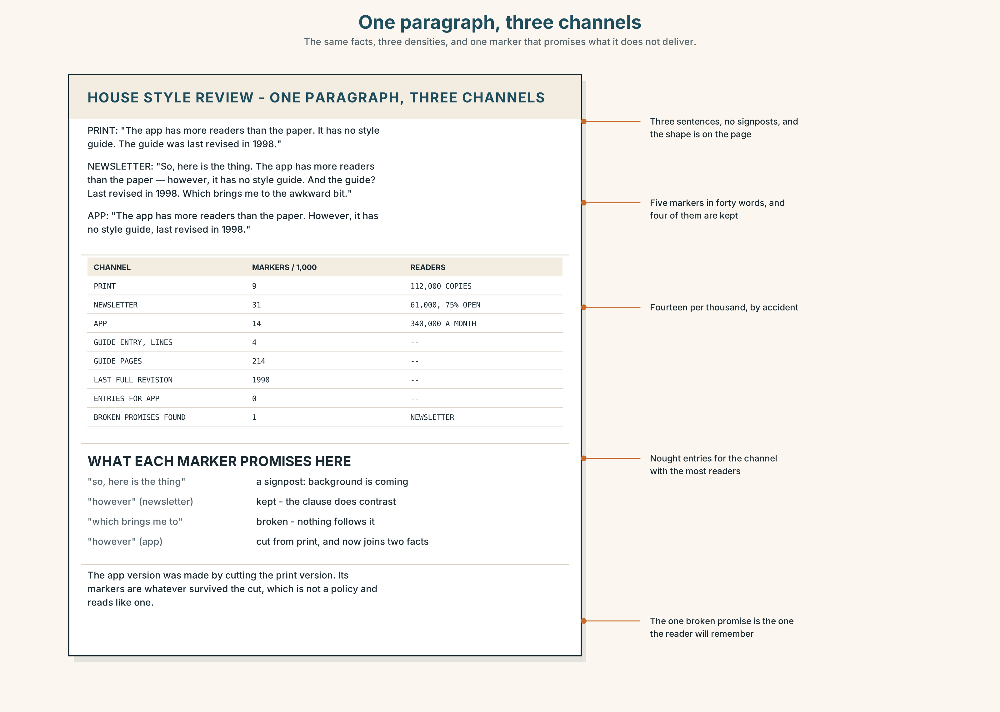{width=6.6in}

*One paragraph, three channels — The same facts, three densities, and one marker that promises what it does not deliver.*

**Read the three versions of the same paragraph and answer.**

1. How many markers are in each, and of which kinds?
2. **Find one marker in the newsletter version that promises something the next clause does not
   deliver.**
3. The app version was made by cutting the print version. **What happened to its signposting?**
4. **Which version would you read on a phone, and which on paper, and are they the same one?**

### 5F · Two texts

The guide says markers should be used *sparingly*.
The newsletter writer says a reader who loses their place *does not come back*.

**Can both be house style?** Write two sentences, and use *house style* in one of them.

---

## Part 6 · Vocabulary Lab 2 ◆ **B · THE SYSTEM**

### The connectors, and what each one promises

### 6A · Sort — contrast, result, time, or formal only?

Four columns.

> however · nevertheless · meanwhile · thereafter · thereby · whereby · accordingly ·
> hence

### 6B · Chunk completion

1. ______ ______ ______ ______ , the guide was written for one reader. *(four words — first)*
2. ______ ______ , it has lasted a hundred and fourteen years. *(two words — concession)*
3. ______ ______ ______ , the newsletter outsells the paper. *(three words — an aside)*
4. ______ ______ ______ ______ , nobody has read all of it. *(four words — one reason among several)*
5. ______ ______ ______ , the app has no guide at all. *(three words — the other side)*
6. ______ ______ , the count was done independently. *(two words — comparison)*
7. ______ ______ ______ , the meeting is on Thursday. *(three words — it does not matter now)*
8. ______ ______ ______ ______ , we have no policy for phones. *(four words — restating the start)*

### 6C · Three that are not interchangeable

> *however* · *nevertheless* · *that said*

**Say which one simply contrasts, which one contrasts in spite of something, and which one grants
the other person a point first.**

### 6D · The phrasal verbs and the fixed expressions

> **move on** · **come back to** · **go on to**
>
> **f** *having said that* · **f** *the point being* · **f** *which brings me to*

**One of these fixed expressions is incomplete on purpose.** Which, and what does leaving it
unfinished let the speaker do?

### 6E · Contrast Clinic

Eight items. Rewrite each pair as one sentence with the marker the relationship requires.

1. You may dispute the count. The survey is separate. *(dismissal)*
2. The guide was revised in 1998. It says nothing about newsletters. *(result)*
3. The rule was agreed. Every channel now states its own density. *(formal result, written)*
4. The print desk objected. The newsletter went out unchanged. *(simultaneous)*
5. The guide has one voice. The paper has three readers. *(formal contrast, written)*
6. The newsletter is informal. It is the most read thing the paper makes. *(concession)*
7. The markers were counted. The readers were surveyed. *(sequence)*
8. The app has more readers. It has no style guide. *(contrast)*

---

## Part 7 · Pronunciation & Fluency Lab ◆ **B · THE SYSTEM**

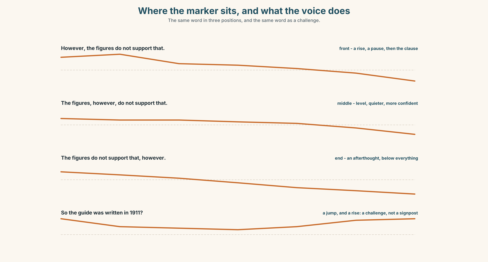{width=6.6in}

*Where the marker sits, and what the voice does — The same word in three positions, and the same word as a challenge.*

### A marker has its own tune

### 7A · Hear 🔊 Track 9.3

> *However,* ↗ *the figures do not support that.* ↘ — the marker rises, then a pause
> *The figures, however,* → *do not support that.* ↘ — level, and almost swallowed
> *The figures do not support that, however.* ↘↘ — tacked on, and lower than everything

### 7B · Say

Say all three. Then say this:

> *That said — and I do take the point — the figures do not support it.* — two markers, three
> pauses, and the voice does not fall until *it*.

### 7C · Make it mean something

Say these two:

> *So, the guide was written in 1911.* — a signpost: here comes the background
> *SO the guide was written in 1911?* — a challenge: you are summarising to object

**An initial marker said on a level tone is a signpost; said with a jump, it is an argument.**
The word is identical; the tune decides which one the listener hears.

### 7D · Fluency 30 ⏺

Thirty seconds: **one argument in three stages, each opened by a marker, each marker in a different
position.** Three times, faster.

---

## Part 8 · Writing ◆ **C · THE PERFORMANCE**

### A guided argument · 200 words

### 8A · Read the model

> To begin with, the guide was written for one reader, who bought a paper on the way to work in
> 1911. `[the opening marker sets up a list, and the reader now expects at least a second item]`
>
> It has been revised eleven times since; nevertheless, it still has one voice. `[nevertheless,
> not however: the contrast holds in spite of the eleven revisions, which is a different claim]`
>
> The newsletter, as it happens, is read by more people than buy the paper — which brings me to
> the question the guide cannot answer. `[an aside in mid-position, then a marker that hands the
> reader forward instead of back]`
>
> Accordingly, the proposal is not a second guide but one rule: each channel states its own marker
> density, and no marker may promise a relationship the text does not have. `[accordingly earns
> its place because what follows really does follow]`

**Questions about the writer's choices:**

1. *Nevertheless* rather than *however*. **What does the extra meaning buy?**
2. *As it happens* sits in the middle of its sentence. **Why not at the front?**
3. The last sentence uses *accordingly*. **Would the paragraph survive without it?**

### 8B · The anti-model

> So, the guide is old. However, it is still used. Moreover, it has been revised. Nevertheless, people ignore it. Furthermore, the newsletter is popular. Therefore, something should be done.

Six sentences, six markers, and not one of them describes the relationship it sits between.
**Rewrite it with three markers, each one true.**

### 8C · Plan

> an opening marker that starts a list → a concession that holds in spite of something → an aside
> in mid-position, then a marker that hands the reader forward → a result that really follows

### 8D · Write — 200 words
### 8E · Peer review — three criteria

> ☐ Does every marker describe the relationship it actually sits between?
> ☐ Is at least one marker somewhere other than the front of its sentence?
> ☐ Could a reader say, at any point, what kind of sentence is coming next?

### 8F · Write it again · 8G · Publish

Rewrite after review. **Publish both, and mark every broken promise in the first version.**

---

## Part 9 · The File ◆ **A · THE WORLD + C · THE PERFORMANCE**

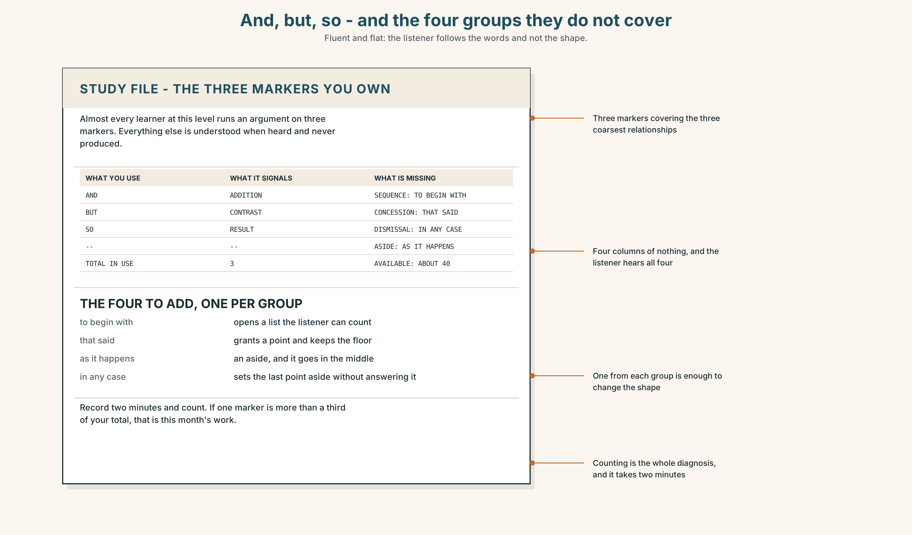{width=6.6in}

*And, but, so - and the four groups they do not cover — Fluent and flat: the listener follows the words and not the shape.*

# STUDY FILE · The three markers you own

### 9A · And, but, so 🔊 Track 9.4

Most learners at this level run a whole argument on three markers, and the three are nearly always
*and*, *but* and *so*. Everything else is understood when heard and never produced. The result is
fluent and flat: the listener can follow the words and not the shape.

| | |
|---|---|
| **what you have** | *and · but · so* |
| **what it signals** | addition, contrast, result — the three coarsest relationships |
| **what is missing** | concession, sequence, aside, dismissal |
| **the smallest useful fix** | one marker from each missing group, used this week |

### 9B · Add four

Choose **one** marker from each of the four missing groups.
**Write one true sentence with each, about your own week, and say them aloud.**

### 9C · Role play — the promise

In pairs. One of you speaks for a minute. The other raises a hand every time a marker promises
something the next clause does not deliver. **Swap.**

### 9D · The one you overuse

Everybody has one. Record yourself for two minutes and count.
**If any single marker is more than a third of your total, that is this month's work.**

### 9E · Transfer — before next week

**Take a paragraph you have written and re-signpost it with four different markers.** Bring both
versions and ask somebody which one they could summarise.

---

## Part 10 · Mediation & Interaction ◆ **C · THE PERFORMANCE**

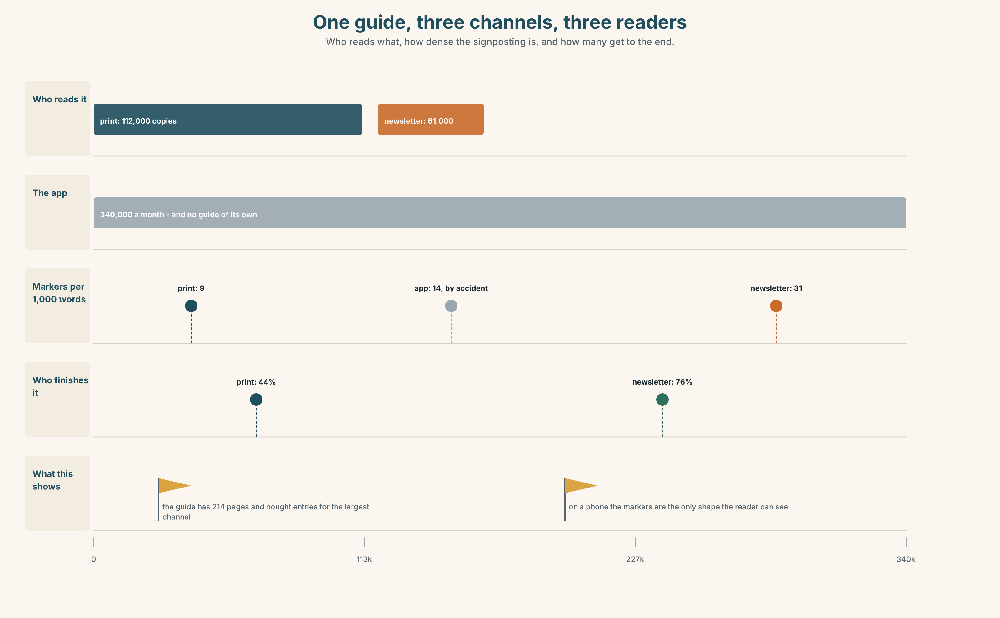{width=6.6in}

*One guide, three channels, three readers — Who reads what, how dense the signposting is, and how many get to the end.*

### 10A · Relay

Half the class has the print version. Half has the newsletter.
**Produce one app version both sides accept, by speaking only.** Ten minutes.

### 10B · Simplify — for one reader

A subscriber writes: *Why does the newsletter sound like a different newspaper?*
**Reply in four sentences,** using one marker from each of the four groups.

### 10C · Online

Write **one message** to a colleague whose draft has eleven markers in three hundred words.
**Three sentences.** Keep two of theirs and say which.

### 10D · Your language

Where do markers sit in your language — front, middle, or end?
**Translate all six sentences from Part 2.** Which positions does your language not allow?

---

## Part 11 · The Decision ◆ **C · THE PERFORMANCE**

# One voice or three

**Option one:** one house style, as now. The paper's voice is the paper's voice, and a reader who
meets it in three places should recognise it in all three.

**Option two:** three style guides, one for each channel, each written by the people who write that
channel.

**Option three:** one guide, with a single new rule: each channel states its own marker density,
and no marker anywhere may promise a relationship the text does not have.

### 11A · The evidence

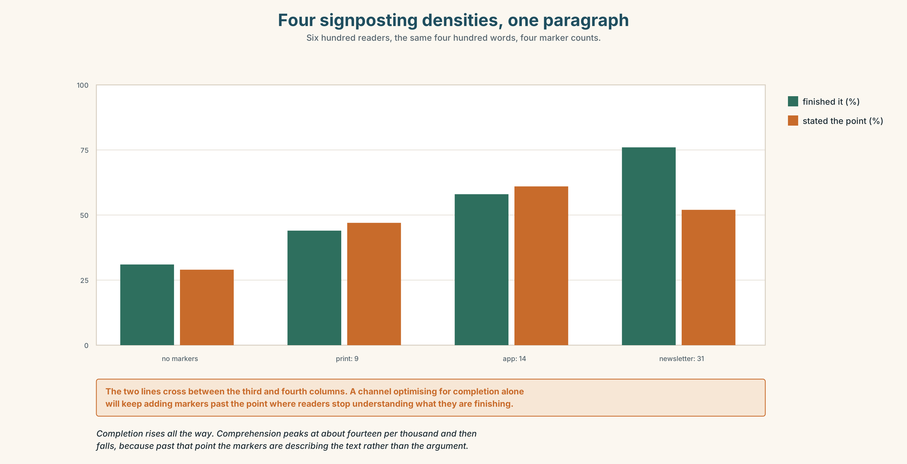{width=6.6in}

*Four signposting densities, one paragraph — Six hundred readers, the same four hundred words, four marker counts.*

🔊 **Track 9.6.** Nkechi Adeyemi, newsletter, 30 seconds: *"I am not asking to write badly. I am
asking for permission to tell sixty-one thousand people, on a phone, on a bus, which bit is
coming next. On paper you can see the shape of the thing — you know there are four more
paragraphs because you can see them. On a phone there is no shape. The markers are the shape."*

### 11B · Talk about it

In threes. Use the frame, and open every turn with a marker you then keep.

> *To begin with, ______ . That said, ______ . Which brings me to ______ .*

### 11C · Decide

Write **three sentences**: the decision, the evidence, and the thing it will not fix.

### 11D · Model decision

> Option three. Three guides is three voices and, within two years, three papers. One guide with
> one voice is already failing, because the voice was designed for a reader who could see how long
> the article was. The density clause is administrative and will be argued about; the second
> clause is the one that matters, and it applies identically on paper and on a phone, because a
> broken promise costs a reader everywhere.

### 11E · The Reveal

> **What happened.** The Herald adopted the single rule. The density bands were set at nine, fourteen
> and thirty-one, and were quietly ignored within six months.
>
> Then something nobody predicted: print marker density rose, from nine to seventeen. Writers who
> had assumed markers were forbidden discovered that what was forbidden was the false ones, and
> print comprehension scores rose with the count — on paper, where everybody had agreed the
> problem did not exist.

**One question. You do not have to answer it out loud.**

> The rule was written to give the newsletter permission. Why did the newspaper change more?

---

## Part 12 · Landing ◆ **all three lines**

### 12A · Recycle — fifteen items

> 1. ______ , it has no style guide of its own. *(one word, contrast)*
> 2. ______ , the guide says nothing about phones. *(one word, result)*
> 3. ______ , the newsletter went out unchanged. *(one word, at the same time)*
> 4. ______ , the count was done independently. *(one word, in spite of that)*
> 5. ______ , the revision took four years. *(one word, after that)*
> 6. ______ ______ ______ ______ , it was written for one reader. *(four words, first)*
> 7. ______ ______ , it has lasted a hundred and fourteen years. *(two words, concession)*
> 8. ______ ______ ______ , the newsletter outsells the paper. *(three words, an aside)*
> 9. ______ ______ ______ , the meeting is on Thursday. *(three words, it no longer matters)*
> 10. ______ ______ ______ ______ ______ . *(five words — handing the reader forward)*
> 11. ______ ______ ______ ______ . *(four words — conceding and continuing)*
> 12. ______ ______ ______ . *(three words — holding the floor, unfinished)*
> 13. Can you ______ ______ the file before six? *(two words)*
> 14. We can ______ ______ two thousand words by Thursday. *(two words)*
> 15. They will ______ ______ it until the second edition. *(two words)*

### 12B · Consolidate — one task, everything in it

**Write 150 words of argument with four markers**, one from each group, one of them in
mid-position. Mark each promise and tick it if you kept it.

### 12C · Can-do, with evidence

> ☐ I can use the full range of discourse markers. **Evidence:** 3H, 8D
> ☐ I can place a marker at the front, in the middle or at the end for effect. **Evidence:** 3E, 7B
> ☐ I can match signposting to where the reader is reading. **Evidence:** 10B, 5E
> ☐ I can hear the difference between a signpost and a challenge. **Evidence:** 7C

### 12D · Replay ⏺

Record 0C again. **Compare.** How many different markers did you use the first time?

### 12E · Glossary — fifty items, as a map

> **PEOPLE AND GROUPS** · subeditor · copytaster · desk · conference
> **PLACES AND TIMES** · slot · splash · spike · galley · deadline
> **DOCUMENTS AND SOURCES** · style guide · house style · wire
> **WHERE A STORY CAN BE** · above the fold · the back of the book · on the stone · the second edition · a slow news day
> **THE DAY'S PAPERWORK** · a late change · hold the front page · the news list · a running order · filed on time
> **WHAT DESKS DO** · send through · turn around · sit on · move on · come back to · go on to
> **IN THE ROOM** · we are going with it · that is a splash · it will not make the paper
> **THE CONNECTORS** · however · nevertheless · meanwhile · accordingly · hence · thereby · whereby · thereafter
> **THE FRAMES** · in the first place · that said · for one thing · as it happens · to begin with · by contrast · in any case · on the other hand
> **HOLDING THE FLOOR** · having said that · the point being · which brings me to

### 12F · Next

> **Unit 10 · Whose city is in the headline?**

# B2.1 · Unit 10 · Never Once in the Culture Pages

> **English Animated** · *Reading Between Lines* · a newsroom, Toronto
> Student's Book pages 204–225 · 22 pp · ~11 hours

---

## Part 0 · The Big Picture ◆ **A · THE WORLD**

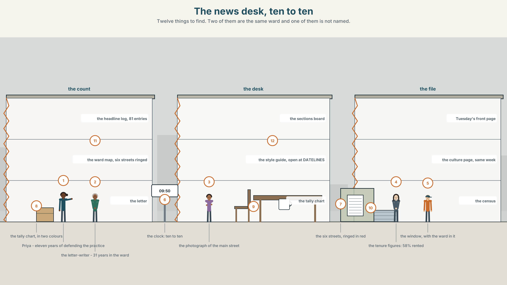{width=6.6in}

*The news desk, ten to ten — Twelve things to find. Two of them are the same ward and one of them is not named.*

# Whose city is in the headline?

**By the end of this unit you can put a sentence in marked order for effect, and say what naming a
place in a headline does to it. Two hundred words.**

| ◆ **A · THE WORLD** | Eighty-one headlines, one ward, and a naming rule nobody ever wrote down |
|---|---|
| ◆ **B · THE SYSTEM** | inversion for emphasis, the full range · 28 words for place, tenure and framing · 22 negative and restrictive adverbs and frames · emphatic contours |
| ◆ **C · THE PERFORMANCE** | Two hundred words in marked order, on purpose |

---

### 0A · Find it

**Find twelve things in this picture.** Two of them are the same ward and one of them is not
named.

> the headline log, eighty-one entries · the ward map, six streets ringed ·
> the letter from a resident · the sections board: crime, planning, culture, business ·
> the style guide, open at DATELINES · the front page from Tuesday ·
> the culture page from the same week · a photograph of the main street ·
> a tally chart in two colours · the tenure figures from the census ·
> a clock showing 09:50 · a window with the ward in it

### 0B · Guess it

**Two pages in this room describe the same six streets in the same week.** Which two, and which one
names them?

### 0C · Say it ⏺

**Record sixty seconds.** *Describe the area you grew up in as a stranger would, and then as you
would. Say what changed.* You will record it again at the end of this unit.

---

## Part 1 · Vocabulary Lab 1 ◆ **B · THE SYSTEM**

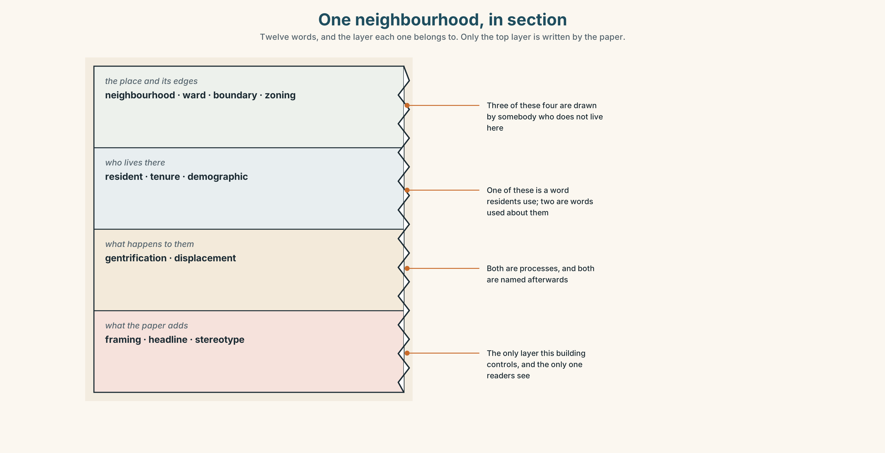{width=6.6in}

*One neighbourhood, in section — Twelve words, and the layer each one belongs to. Only the top layer is written by the paper.*

### 1A · Meet — the words of a place in print

Match each word to one layer of the cutaway.

> **framing** · **headline** · **neighbourhood** · **gentrification** · **displacement** ·
> **zoning** · **tenure** · **boundary** · **ward** · **demographic** · **stereotype** ·
> **resident**

### 1B · Sort — the place and its edges, who lives there, or what the paper adds?

Three columns. **Two of the twelve are words residents almost never use about the place they live,
and both of them are used about it constantly.**

> framing · displacement · neighbourhood · headline · resident · stereotype · zoning ·
> gentrification · boundary · tenure · ward · demographic

### 1C · Meet — the five phrases a place acquires

| | |
|---|---|
| **the north end** | A name used by everybody except the people who live there. |
| **a problem neighbourhood** | A phrase that describes coverage, not a place. |
| **long-term residents** | Used in planning stories; never in crime stories. |
| **the same six streets** | What eighty-one pieces about a ward of forty thousand actually cover. |
| **an outsider's view** | The only kind most readers have, and the only kind most pieces are. |

### 1D · Collocation Lab

Complete each one, and say which of the five decides what a reader remembers.

> **named in the headline** · **a postcode in a headline** · **who is quoted** ·
> **the first paragraph** · **the local paper**

1. The ward is ______ ______ ______ ______ in seven of ten crime stories and one of ten others.
2. ______ ______ ______ ______ is a decision about a place, made in four words.
3. ______ ______ ______ matters less than ______ ______ ______ ______ , and both matter less than
   the headline.
4. ______ ______ ______ ______ repeats the headline, which is why it rarely corrects it.
5. ______ ______ ______ is the only paper that will ever write about these six streets.

### 1E · The phrasal verbs, and the three fixed expressions

> **move in** · **price out** · **build over**
>
> **f** *nobody from there was asked* · **f** *that is not what it is called* ·
> **f** *whose city is this?*

**One of these fixed expressions is a correction and two are accusations.** Which is the
correction, and why is it the hardest one to answer?

### 1F · Own it

Write the name of the area you live in as the authorities write it, and then as you say it to a
friend. **If they are the same, say who decided that.**

---

## Part 2 · Listening ◆ **A · THE WORLD**

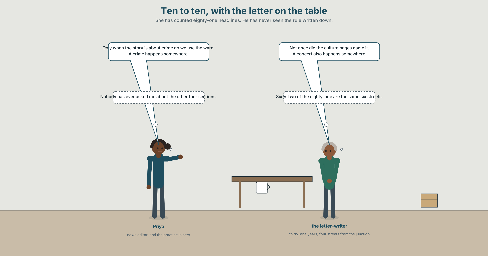{width=6.6in}

*Ten to ten, with the letter on the table — She has counted eighty-one headlines. He has never seen the rule written down.*

### 2A · The naming rule 🔊 Track 10.1

**Before you listen.** A resident has written to the paper. She has counted eighty-one headlines
over two years. The news editor has never seen the rule written down, because it never was.

**Listen once.** What has she counted, and what does the paper say its rule is?

**Listen again. Complete the table.**

| | Ward named in the headline | Resident quoted | What the section is |
|---|---|---|---|
| crime | | | |
| planning | | | |
| culture | | | |

**Listen again. True or false?**

1. She counted eighty-one headlines. ☐ T ☐ F
2. The rule is written in the style guide. ☐ T ☐ F
3. The ward is named in most planning headlines. ☐ T ☐ F
4. The culture pages have never named it. ☐ T ☐ F

**Noticing.** Six sentences from the recording.

1. *Never before had anybody counted them.*
2. *Not once did the culture pages name it.*
3. *Only when the story is about crime do we use the ward.*
4. *No sooner had the letter arrived than the editor asked for the figures.*
5. *So rarely does the ward appear in good news that readers assume there is none.*
6. *Little did we know that the rule had never been written down.*

**Every one of these puts the verb before the subject. Write each one in ordinary order, and say
what is lost.**

### 2B · Decoding clinic 🔊 Track 10.2

Thirty seconds at speed. Three jobs.

1. Two sentences begin with a negative adverb. Mark where the voice jumps in each.
2. What happens to the stress on the fronted word?
3. Somebody says *that is not what it is called*. What was it called, and by whom?

---

## Part 3 · Grammar Lab 1 ◆ **B · THE SYSTEM**

### Putting the verb first, and why you would

### 3A · Notice

Look at the six sentences in Part 2 again.

1. In sentence 1, what comes before the subject, and what has happened to the auxiliary?
2. Sentence 3 inverts the second clause, not the first. **Why that one?**
3. Sentence 4 has two clauses and only one inversion. **Which, and what joins them?**
4. Sentence 6 is a fixed expression. **Could you say *little did they know* about yourself?**

### 3B · See

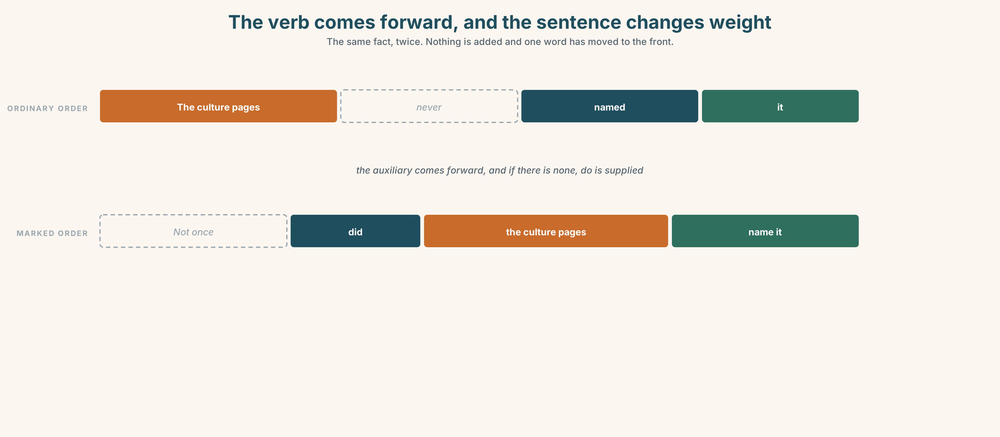{width=6.6in}

*The verb comes forward, and the sentence changes weight — The same fact, twice. Nothing is added and one word has moved to the front.*

### 3C · Know

| | | |
|---|---|---|
| **negative adverb first** | *never · rarely · seldom · nowhere · little* | *Never had she seen it.* |
| **near-negative first** | *hardly · scarcely · no sooner* | *Hardly had it arrived when…* |
| **restrictive first** | *only when · only then · only if · not until* | *Only then did we count them.* |
| **absolute negatives** | *at no point · under no circumstances · not once* | *Not once did they name it.* |
| ***so* + adjective or adverb** | *so rarely does · so great was* | *So rarely does it appear that…* |
| ***such*** | *such was the* | *Such was the reaction that…* |

> **Inversion is the written language's way of shouting.** It costs nothing in words and it cannot
> be used twice in a paragraph without sounding theatrical, which is the whole constraint.

> **The auxiliary does the inverting, and if there isn't one, *do* is supplied.** *They never
> counted them* becomes *Never did they count them*, not *Never counted they them*. This is the
> same machinery as a question, which is why the pattern feels familiar and the register does not.

| | |
|---|---|
| **the fixed frames** | *never before had · not once did · only when* |
| **what writers do with a place** | *set out · single out · point up* |
| **the degree words** | *rarely · seldom · scarcely · hardly · little · only* |

> **Why it matters.** Marked order tells a reader that this sentence is the one to remember. Use it
> where the emphasis is real and it is the strongest device in the language; use it where it is not
> and the reader hears a performance.

### 3D · Use — controlled

Rewrite each one with the bracketed word at the front and the verb inverted.

> Anybody had counted them before. (1) *(never before)*
> The culture pages did not name it. (2) *(not once)*
> We use the ward when the story is about crime. (3) *(only when)*
> The letter arrived and the editor asked for figures. (4) *(no sooner)*
> The ward appears in good news so rarely that readers assume there is none. (5) *(so rarely)*

### 3E · Use — guided

Put each one back into ordinary order and say what is lost.

1. Never before had anybody counted them.
2. Not once did the culture pages name it.
3. Only then did the editor ask for the figures.
4. At no point was a resident consulted.
5. Such was the reaction that the rule was rewritten.

### 3F · Use — open

**In pairs.** One of you states a fact about your own town. The other restates it inverted, **and
then says whether the emphasis is deserved.** **Six rounds each.**

### 3G · Error autopsy

> ✗ *Never before anybody had counted them.*
> ✗ *Not once the culture pages named it.*
> ✗ *Only when the story is about crime we use the ward.*

For each, name the rule and say what the writer was reaching for.

### 3H · Check — eight items

> 1. ______ ______ ______ anybody counted them. *(three words + inversion)*
> 2. ______ ______ ______ the culture pages name it. *(three words + inversion)*
> 3. ______ ______ the story is about crime ______ we use the ward. *(restrictive)*
> 4. ______ ______ ______ the letter arrived than the editor asked. *(three words)*
> 5. ______ ______ ______ it appear in good news that readers assume there is none. *(three words)*
> 6. ✗ *Never before anybody had counted them.* → correct it.
> 7. Rewrite *They never asked a resident* with *at no point*.
> 8. Write one inverted sentence about your own town that you could defend in print.

---

## Part 4 · Speaking ◆ **C · THE PERFORMANCE**

### 4A · Fluency starter — one inversion each

Everybody states one fact. Everybody else may invert it **once**. **The group votes on whether the
emphasis was earned.**

### 4B · The functional core — writing for rhetorical effect

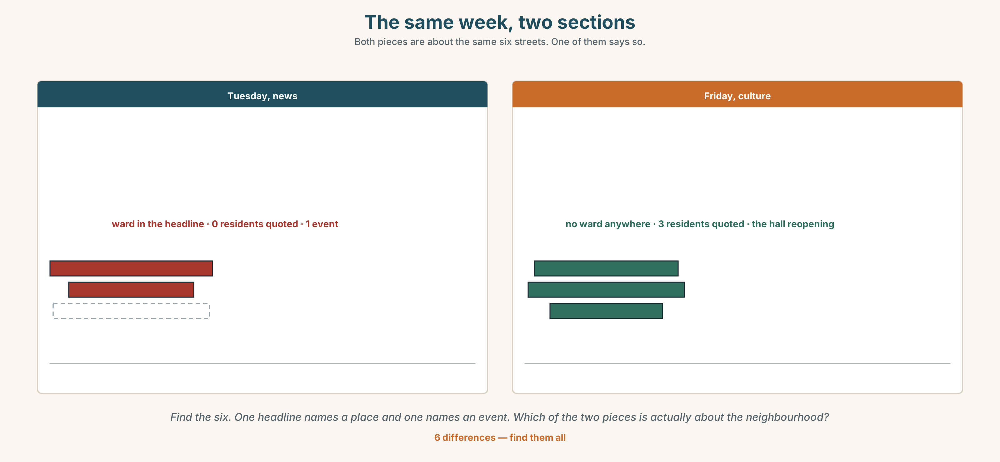{width=6.6in}

*The same week, two sections — Both pieces are about the same six streets. One of them says so.*

**Language Bank**

| | |
|---|---|
| **opening with a negative** | *never before had · not once did · at no point* |
| **restricting** | *only when · only then · under no circumstances* |
| **intensifying** | *so rarely does · such was the · little did* |
| **naming a place** | *the local paper · an outsider's view · that is not what it is called* |

**Information gap.** Learner A has the crime headlines. Learner B has the culture headlines.
**Agree on one sentence describing both, and use exactly one inversion in it.**

### 4C · The performance — three minutes ⏺

Argue a case about your own town in three minutes. **You may use inversion exactly twice.** Your
partner notes where you used it and whether a third would have helped or hurt.

**Record it.**

### 4D · Observer

One person marks each inverted sentence and writes beside it what was being emphasised.

### 4E · Three criteria

> ☐ Did each inversion mark the sentence that mattered most?
> ☐ Did I supply *do* where there was no auxiliary?
> ☐ Did two inversions sound deliberate, or did they sound like a speech?

---

## Part 5 · Reading ◆ **A · THE WORLD**

### 5A · Predict

The title is **"Eighty-one headlines."**
**If a newspaper names a neighbourhood in its crime headlines and not elsewhere, what does a
reader learn about the neighbourhood?**

### 5B · Read — two minutes

---

**Eighty-one headlines**

The letter ran to a page and a half and contained a table. Over two years the Herald published
eighty-one pieces mentioning Ward 7. The writer, a resident of thirty-one years, had sorted them
by section and counted how often the ward appeared in the headline.

In crime stories it appeared in seventy-one per cent of headlines. In planning stories, eighteen.
In business, six. Not once did it appear in a culture headline, although eleven culture pieces
over the two years were about events in the ward, including the reopening of a hall the paper
itself had campaigned to save.

There is no rule in the style guide about naming a ward. Nobody in the building could produce one.
Asked, three editors gave three answers, and all three were about specificity: a crime happens
somewhere, and readers want to know where.

The letter's last paragraph points out that a concert also happens somewhere.

The ward is forty thousand people and eleven thousand households, of which fifty-eight per cent
are rented. The six streets around the Lake and Seventh junction account for sixty-two of the
eighty-one pieces. The writer lives four streets away and has never been quoted in any of them.

---

### 5C · Comprehension — eight questions

1. How many pieces mentioned the ward, and over how long?
2. What were the four percentages?
3. How many culture pieces were about events in the ward?
4. What did three editors give as the reason?
5. How many people live in the ward?
6. **Why does the writer mention the hall the paper campaigned to save?**
7. **"A concert also happens somewhere." What argument is being made in six words?**
8. **The last sentence is about the letter-writer herself. What does ending there do?**

### 5D · Vocabulary in context

Infer from the text, then check.

> sorted them by section · all three were about specificity · account for sixty-two of the
> eighty-one · four streets away · has never been quoted in any of them

### 5E · The counter-text

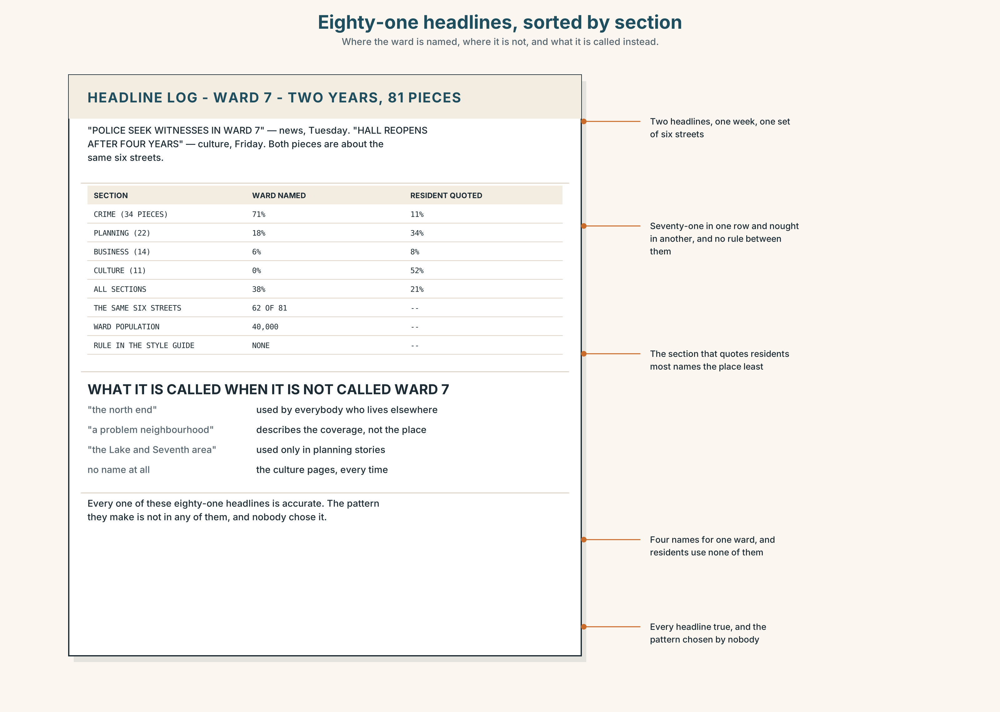{width=6.6in}

*Eighty-one headlines, sorted by section — Where the ward is named, where it is not, and what it is called instead.*

**Read the headline log and answer.**

1. How many headlines name the ward, and in which sections?
2. **Find the two headlines about the same week and say which one names the place.**
3. One headline uses a postcode. **What does that do that a ward name does not?**
4. **Rewrite three headlines so that the naming is consistent across sections.**

### 5F · Two texts

The style guide has no rule about naming a ward.
The log shows seventy-one per cent in crime and nought in culture.

**Is there a rule?** Write two sentences, and use the word *framing* in one of them.

---

## Part 6 · Vocabulary Lab 2 ◆ **B · THE SYSTEM**

### The words that trigger marked order

### 6A · Sort — how often, how nearly not, where, or how restricted?

Four columns.

> only · little · rarely · nowhere · seldom · never · hardly · scarcely

### 6B · Chunk completion

1. ______ ______ had anybody counted them. *(two words + had)*
2. ______ ______ did the culture pages name it. *(two words + did)*
3. ______ ______ the story is about crime do we use the ward. *(two words)*
4. ______ ______ had the letter arrived than the editor called. *(two words)*
5. ______ ______ ______ was a resident consulted. *(three words)*
6. ______ ______ ______ ______ will a postcode be used alone. *(four words)*
7. ______ ______ ______ it appear in good news that readers assume there is none. *(three words)*
8. ______ ______ ______ reaction that the rule was rewritten in a week. *(three words)*

### 6C · Three that are not interchangeable

> *hardly* · *rarely* · *only*

**Say which one is about frequency, which one is about degree, and which one restricts the whole
clause.**

### 6D · The phrasal verbs and the fixed expressions

> **set out** · **single out** · **point up**
>
> **f** *never before had* · **f** *not once did* · **f** *only when*

**One of these three phrasal verbs is what the letter-writer accuses the paper of doing to her
ward.** Which, and what would the paper say it was doing instead?

### 6E · Contrast Clinic

Eight items. Rewrite each one in marked order, beginning with the word in brackets.

1. The culture pages did not name it once. *(not once)*
2. A resident was not consulted at any point. *(at no point)*
3. The letter arrived and the editor called immediately. *(no sooner)*
4. We use the ward only when the story is about crime. *(only when)*
5. We did not know the rule had never been written. *(little)*
6. Nobody had counted them before. *(never before)*
7. The reaction was so great that the rule changed. *(such)*
8. It appears in good news so rarely that readers assume there is none. *(so rarely)*

---

## Part 7 · Pronunciation & Fluency Lab ◆ **B · THE SYSTEM**

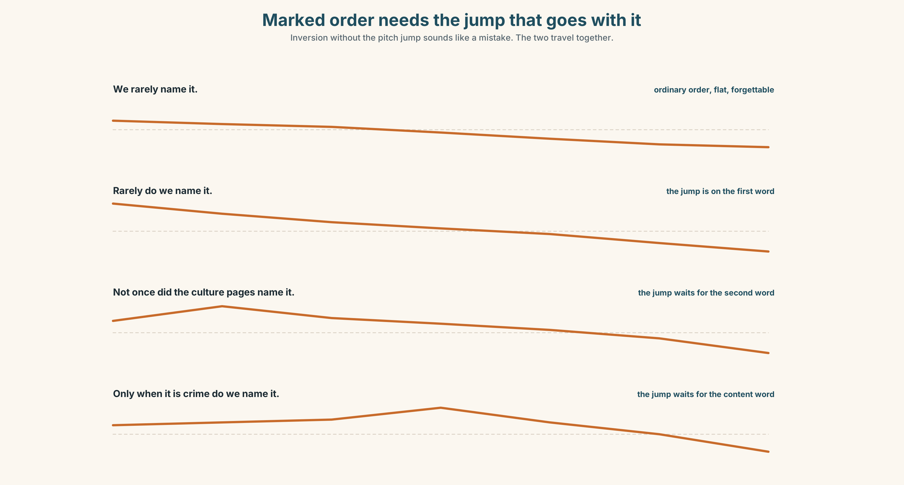{width=6.6in}

*Marked order needs the jump that goes with it — Inversion without the pitch jump sounds like a mistake. The two travel together.*

### Marked order has a marked tune

### 7A · Hear 🔊 Track 10.3

> *NEVer before had anybody counted them.* — the jump is on the first word
> *Not ONCE did the culture pages name it.* — and here on the second
> *Only when it is CRIME do we name it.* — the jump waits for the content word

### 7B · Say

Say each one three times. Then say this:

> *Never before had anybody counted them — and not once did anybody ask why.* — two inversions in
> one breath, two jumps, and the second must be lower than the first or it sounds like a speech.

### 7C · Make it mean something

Say these two:

> *We rarely name it.* — flat, ordinary, and forgettable
> *RARELY do we name it.* — the jump on *rarely*, the verb inverted, and it is now the sentence
> the reader repeats

**Inversion without the pitch jump sounds like a mistake,** and the jump without inversion sounds
like emphasis in the wrong place. The two travel together or not at all.

### 7D · Fluency 30 ⏺

Thirty seconds: **three inverted sentences, each with one jump, each jump lower than the last.**
Three times, faster.

---

## Part 8 · Writing ◆ **C · THE PERFORMANCE**

### A case about a place · 200 words

### 8A · Read the model

> Over two years the Herald published eighty-one pieces mentioning Ward 7, of which sixty-two
> concerned the same six streets. `[ordinary order, and the figures do the work; nothing is marked
> yet]`
>
> Not once did the ward appear in a culture headline. `[the first inversion, on the sentence that
> is the point of the piece]`
>
> Eleven culture pieces over the same period were about events there, including the reopening of a
> hall this paper campaigned to save. `[back to ordinary order immediately; the marked sentence
> only works if it is surrounded by unmarked ones]`
>
> So rarely does a neighbourhood appear in good news that its readers come to believe there is
> none — and such was the response to this letter that the rule, which had never been written down,
> was written down in a week. `[two marked structures in the last sentence, where the piece is
> allowed to raise its voice because it has not done so before]`

**Questions about the writer's choices:**

1. The first sentence is unmarked. **What does that buy the second one?**
2. The third sentence returns to ordinary order. **Why not keep going?**
3. The last sentence uses two marked structures. **Would three have worked?**

### 8B · The anti-model

> Never before has a community been so ignored. Not only is the coverage unfair, but so biased is the framing that no resident can recognise themselves in it. Rarely has a newspaper so comprehensively failed. At no point has anybody listened.

Four sentences, five inversions, and not one number anywhere.
**Rewrite it with one inversion and four facts.**

### 8C · Plan

> the figures, unmarked → one inversion, on the point → back to ordinary order, with the
> concrete example → the close, where you may raise your voice once

### 8D · Write — 200 words
### 8E · Peer review — three criteria

> ☐ Is every inversion on a sentence that deserves the emphasis?
> ☐ Are the marked sentences surrounded by unmarked ones?
> ☐ Does the auxiliary invert correctly, with *do* supplied where needed?

### 8F · Write it again · 8G · Publish

Rewrite after review. **Publish both, and mark every inversion in each.**

---

## Part 9 · The File ◆ **A · THE WORLD + C · THE PERFORMANCE**

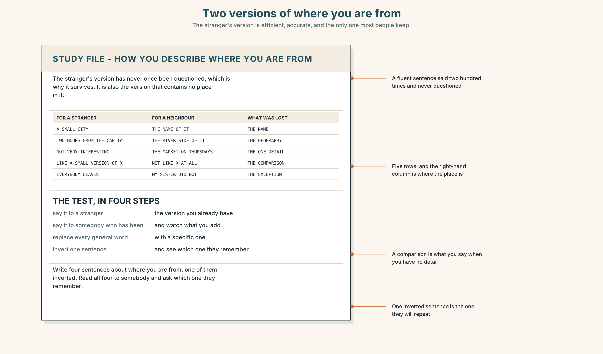{width=6.6in}

*Two versions of where you are from — The stranger's version is efficient, accurate, and the only one most people keep.*

# STUDY FILE · How you describe where you are from

### 9A · The outsider's version 🔊 Track 10.4

Asked where they are from, most learners give the version a stranger needs: the country, the
nearest big city, and a comparison. It is efficient, it is accurate, and after four years abroad it
is often the only version they still have.

| | |
|---|---|
| **the outsider's version** | *a small city, about two hours from the capital* |
| **what it leaves out** | the name, the street, the thing only you would say |
| **why it survives** | it has never once been questioned |
| **the test** | describe it to somebody who has been there |

### 9B · Say it twice

Describe your place twice: **once for a stranger and once for a neighbour.**
Write down three things that appear only in the second.

### 9C · Role play — the follow-up question

In pairs. One describes a place. The other may only ask *what is it actually called?* and *who
lives there?* **Four rounds each.**

### 9D · The sentence you have said two hundred times

Everybody has one fluent, worn sentence about home.
**Say yours, then replace every general word in it with a specific one** and say it again.

### 9E · Transfer — before next week

**Write four sentences about where you are from, one of them inverted.** Read all four to somebody
and ask which one they remember.

---

## Part 10 · Mediation & Interaction ◆ **C · THE PERFORMANCE**

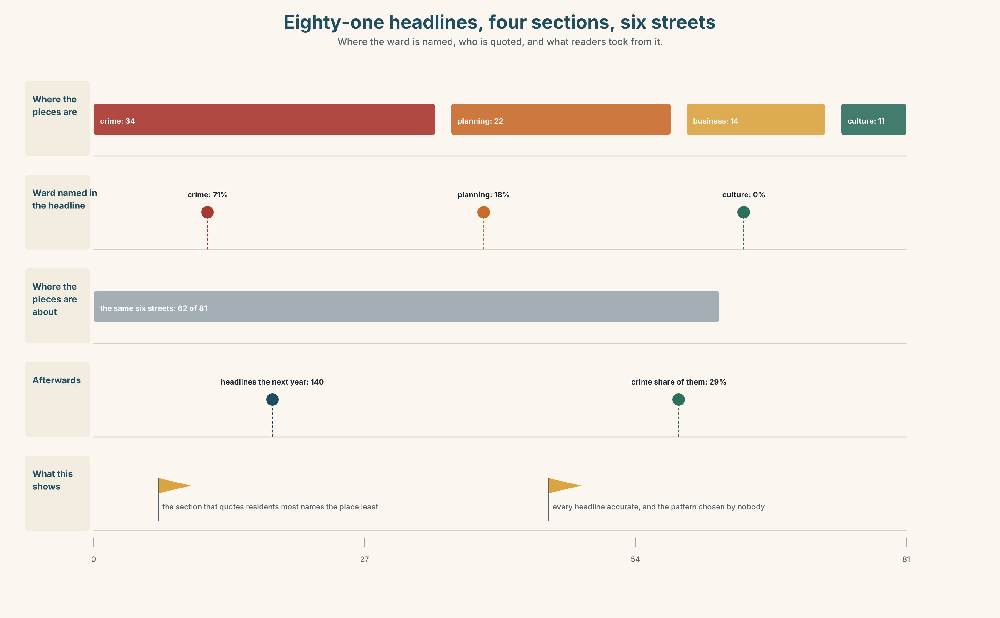{width=6.6in}

*Eighty-one headlines, four sections, six streets — Where the ward is named, who is quoted, and what readers took from it.*

### 10A · Relay

Half the class has the crime headlines. Half has the culture headlines.
**Produce one naming rule both halves accept, by speaking only.** Ten minutes.

### 10B · Simplify — for one reader

The letter-writer asks: *So is there a rule or isn't there?*
**Reply in four sentences,** with one inversion and three numbers.

### 10C · Online

Write **one message** to a colleague whose headline names a ward in a crime story. **Three
sentences.** Ask about the other sections, not about their headline.

### 10D · Your language

Does your language mark emphasis by moving the verb, or by something else?
**Translate all six sentences from Part 2.** What does your language move instead?

---

## Part 11 · The Decision ◆ **C · THE PERFORMANCE**

# The naming rule

There is no rule. There has been a practice since at least 1994.

**Option one:** keep it. A crime happens in a place and readers are entitled to know which place.
Specificity is the job.

**Option two:** name a neighbourhood only when the story is about the neighbourhood, and not when
it is about one event that happened inside it.

**Option three:** name it everywhere — in culture, in business, in planning, in sport — at the same
rate as in crime, and write the rule down.

### 11A · The evidence

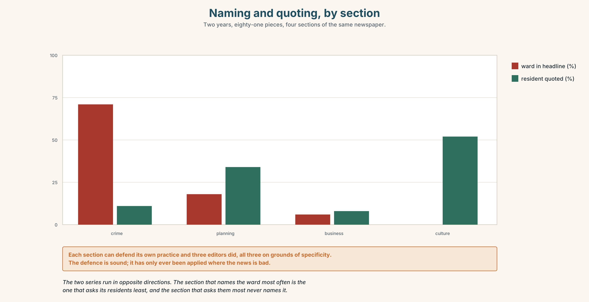{width=6.6in}

*Naming and quoting, by section — Two years, eighty-one pieces, four sections of the same newspaper.*

🔊 **Track 10.6.** Priya Raghavan, news editor, 30 seconds: *"I have defended the crime practice
for eleven years and I would defend it again, because it is right. A crime happens somewhere. What
I cannot defend is the other four sections, and nobody has ever asked me to, because nobody ever
noticed that the defence only works if you apply it everywhere. We applied it in one place. That
is not a rule. That is a habit with a reason attached afterwards."*

### 11B · Talk about it

In threes. Use the frame, and invert exactly once per person.

> *I would ______ , because ______ . Only when ______ would I ______ .*

### 11C · Decide

Write **three sentences**: the decision, the evidence, and one inverted sentence you would stand
behind in print.

### 11D · Model decision

> Option three. Option two is the comfortable answer and it makes the ward disappear, which is what
> the letter is complaining about in the first place. The defence of naming is sound and it has
> only ever been applied where the news was bad. Applying it everywhere costs nothing, writes the
> rule down, and is the only version that can be checked a year from now by counting, which is how
> this started.

### 11E · The Reveal

> **What happened.** The Herald wrote the rule down and applied it to every section. In the
> following year Ward 7 appeared in a hundred and forty headlines instead of eighty-one, and the
> crime share of those headlines fell from seventy-one per cent to twenty-nine.
>
> Then something nobody predicted: readers outside the ward, asked to free-associate on its name,
> produced a list in which crime words fell from first to fourth. Nothing had changed in the ward.
> Six hundred more headlines had changed, and all of them were true.

**One question. You do not have to answer it out loud.**

> Every one of the eighty-one original headlines was accurate. What exactly was wrong?

---

## Part 12 · Landing ◆ **all three lines**

### 12A · Recycle — fifteen items

> 1. ______ ______ had anybody counted them. *(two words + had)*
> 2. ______ ______ did the culture pages name it. *(two words + did)*
> 3. ______ ______ the story is about crime do we name it. *(two words)*
> 4. ______ ______ had the letter arrived than the editor called. *(two words)*
> 5. ______ ______ ______ was a resident consulted. *(three words)*
> 6. ______ ______ ______ ______ will a postcode stand alone. *(four words)*
> 7. ______ ______ ______ it appear in good news. *(three words)*
> 8. ______ ______ ______ reaction that the rule changed in a week. *(three words)*
> 9. ______ ______ ______ we know it had never been written. *(three words)*
> 10. ______ ______ ______ ______ ______ ______ . *(six words — the resident's letter, line one)*
> 11. ______ ______ ______ ______ ______ ______ . *(six words — the correction nobody can answer)*
> 12. ______ ______ ______ ? *(three words — the question in the headline)*
> 13. The piece will ______ ______ three streets as the worst. *(two words)*
> 14. The figures ______ ______ what the headline hides. *(two words)*
> 15. Families have been ______ ______ of the six streets since 2016. *(two words)*

### 12B · Consolidate — one task, everything in it

**Write 150 words about how your own area is written about.** Use exactly two inversions and mark
them. Say, underneath, why those two sentences and not two others.

### 12C · Can-do, with evidence

> ☐ I can use the full range of inversion after negative and restrictive adverbs. **Evidence:** 3H, 8D
> ☐ I can judge when marked order is earned. **Evidence:** 4C, 6E
> ☐ I can say what naming a place does to a reader's picture of it. **Evidence:** 5E, 10B
> ☐ I can produce the pitch jump that marked order requires. **Evidence:** 7C

### 12D · Replay ⏺

Record 0C again. **Compare.** Which version did you give first — the stranger's or your own?

### 12E · Glossary — fifty items, as a map

> **THE PLACE AND ITS EDGES** · neighbourhood · ward · boundary · zoning
> **WHO LIVES THERE** · resident · tenure · demographic
> **WHAT HAPPENS TO THEM** · gentrification · displacement
> **WHAT THE PAPER ADDS** · framing · headline · stereotype
> **WHAT A PLACE GETS CALLED** · the north end · a problem neighbourhood · long-term residents · the same six streets · an outsider's view
> **THE DECISIONS** · named in the headline · a postcode in a headline · who is quoted · the first paragraph · the local paper
> **WHAT HAPPENS TO STREETS** · move in · price out · build over · set out · single out · point up
> **IN THE ROOM** · nobody from there was asked · that is not what it is called · whose city is this?
> **THE TRIGGER WORDS** · rarely · seldom · scarcely · hardly · nowhere · never · little · only
> **THE FRAMES** · not only · no sooner · only then · at no point · under no circumstances · so rarely does · such was the · little did
> **THE FIXED OPENINGS** · never before had · not once did · only when

### 12F · Next

> **B2.2 · *Holding the Floor* — a port and its logistics chain, Rotterdam**

# Answer Key

> Open tasks — speaking, writing, discussion — are not keyed. Their
> success criteria are in the unit, at 4E and 8E.

## B2.1 · Unit 1 · Forty Minutes Behind

**0B** · Guess it
The second screen showing the rival's site and the lawyer's number on the note. Both exist only because of the market ticker: a claim that moves a share price creates a race (somebody else may publish first) and an exposure (if it is wrong, the damage is measurable in money). The chain runs ticker → price-sensitive claim → rival screen and lawyer. Accept the wall clock in place of the ticker if the learner says why the two are the same object here.

**1B** · Sort — before publication, after publication, or both?
> **after publication** — correction · retraction
> **before publication** — source · embargo · corroboration · provenance · verification · evidence
> **both** — claim · attribution
**The two that move:** *claim* and *attribution*. A claim exists before publication and is what a correction is about afterwards; an attribution is decided before and defended after. *Embargo* is arguably both — accept it if the learner can describe a post-publication embargo.

**1D** · Collocation Lab
1 stand a story up · 2 run a correction · 3 off the record · 4 on the record · 5 hold the line  
**Not about publishing:** *stand a story up*. It describes work done on the evidence, and it is done whether or not anything is ever printed. Accept *off the record* with an argument: it describes the terms on which something was said, not what the paper does with it.

**1E** · The phrasal verbs, and the three fixed expressions
***Who else has it?*** It is not a request for information; everybody in the room already knows the answer. It is a request for permission. If a rival has the story, being wrong is shared and being late is not — so the question converts a judgement about evidence into a judgement about competitors, which is a different and much easier question.

**2A** · Fifteen forty 🔊 Track 1.1
**1** T · **2** F · **3** T · **4** F
**Table** — *the job cuts*: claimed, 400; corroborated, a screenshot and one caller; assumed, that the screenshot is of a genuine board paper. *the timing*: claimed, this week; corroborated, nothing; assumed, that a decision taken is a decision announced. *the board meeting*: claimed, Tuesday; corroborated, the date only; assumed, that the cuts were on the agenda.

**Noticing** — Sentence 2, *The company cuts four hundred jobs*, makes the strongest factual claim: the simple aspect presents the event as whole, closed and known. Sentence 3, *has been cutting jobs since March*, commits the paper to least: it asserts a process, not a number, and a process cannot be wrong by four hundred minus three hundred and ten.

**3D** · Use — controlled
1 is cutting · 2 is considering · 3 has been moving · 4 has been losing · 5 was going to announce

**3E** · Use — guided
1 The company is closing the Thunder Bay plant. *(a process under way, not a completed act)* · 2 The regulator is rejecting the application. *(no final decision asserted)* · 3 The minister is resigning. *(the resignation is happening, not finished)* · 4 Three directors were selling shares in the week before the announcement. *(activity, with no total claimed)* · 5 The union is accepting the offer. *(under way, and still reversible)*

**3H** · Check — eight items
1 has cut · 2 has been cutting · 3 has been changing · 4 had been going to announce · 5 *The report contains three errors.* *(contain is stative)* · 6 *We have known this since Tuesday.* *(know is stative; the duration goes on the perfect)* · 7 *Was cutting* presents the number as a process still running, and a running process has no final figure. The sentence asserts both that the number may still move and that it cannot. · 8 *The minister is resigning.* **or** *The minister is understood to be resigning.*

**5C** · Comprehension — eight questions
1 A single source, a screenshot, and a claim that four hundred jobs were going at a plant in Thunder Bay.  
2 16.00.  
3 Eleven years.  
4 15.52 — eight minutes before the close.  
5 Four per cent, in the last eight minutes of trading.  
6 Three hundred and ten, ninety fewer than the four hundred that was published.  
7 Because a record of being right is a fact about a person, and corroboration is a fact about a claim. The stringer's eleven years tell you how likely the claim is; they tell you nothing about this one. Treating the first as the second is the commonest failure in the room.  
8 The new question is whether being right a day late is a product anybody is buying. Nobody can answer it because the paper has never measured it: it knows what Tuesday's traffic was worth and has no figure at all for what its accuracy on Wednesday is worth.

**5D** · Vocabulary in context
**going at a plant** — being cut, in the informal sense of jobs disappearing · **filed it** — sent the story in to the desk · **a second account** — an independent version from somebody with no connection to the first · **no decision had been taken** — the passive with the decider removed, which leaves open that one was about to be · **two column centimetres** — the physical size of the correction, and the real measure of how seriously it was meant

**5E** · The counter-text
1 That the figure of four hundred was incorrect and the company has confirmed three hundred and ten. It is on page eleven, two column centimetres, below the fold.  
2 The original used *is cutting* — a process asserted as under way, with a number attached. The correction uses *had been reported as* — a past perfect passive, which places the error in the reporting rather than in the company, and attributes it to nobody.  
3 The original claim is nineteen words; the correction is thirty-one. The correction is longer and reaches a twentieth of the readers.  
4 It does not say who was wrong, when the paper knew, what the source was, or that the share price moved. It corrects a number and nothing else, which is the only part that cannot be argued with.

**6A** · Sort — closed, running, or unsettled?
> **closed** — settled
> **running** — ongoing · iterative · habitual · unfolding
> **unsettled** — emergent · provisional · momentary
*Habitual* is the awkward one: it describes something that recurs rather than something that runs, and a learner who puts it in a column of its own has seen the point. *Momentary* is unsettled in the sense that matters here — a momentary figure is one you cannot publish.

**6B** · Chunk completion
1 stands · 2 writing · 3 treated · 4 understood · 5 going · 6 thought

**6C** · Three that are not interchangeable
*is understood to* — attributes to an unnamed source the writer has actually spoken to. *is thought to have* — attributes to nobody at all; the thinking has no thinker. *is being treated as* — attributes to an institution's procedure: somebody has classified it and the writer is reporting the classification, not endorsing it.

**6D** · The phrasal verbs and the fixed expressions
***The situation is developing*** and ***we understand that***. The first asserts only that time is passing; the second attributes without naming, and can be written the moment anybody says anything. ***It now appears that*** requires a previous position to have been held and abandoned — it is a claim about the paper, not about the world, and a reader is entitled to ask what it appeared to be before.

**6E** · Contrast Clinic
> **1** The board **had been going to announce** it on Thursday.
> **2** The company **has been losing** money since March.
> **3** The company **has cut** four hundred jobs.
> **4** The plant **closed** last March.
> **5** The company **has been restructuring** since 2019.
> **6** The number **was changing** all day on Monday.
> **7** The regulator **has rejected** the application.
> **8** The company **is understood to be cutting** jobs. *(no aspect alone will carry this one — it needs the attribution frame)*

**12A** · Recycle — fifteen items
1 has cut · 2 has been cutting · 3 was changing · 4 had been going to announce · 5 As … stands · 6 is being treated · 7 is thought to · 8 stand a story up · 9 checks out · 10 run a correction · 11 bear out · 12 plays out · 13 hold the line · 14 off the record · 15 understands

---

## B2.1 · Unit 2 · We Have Always Said

**0B** · Guess it
The style guide, open at page 9, is the reason the leader-page proof carries no byline. The causation runs from the rule to the page, and not the other way: the rule was written first and the page is produced by it daily. The bound archive is what makes the rule expensive, because an unsigned institution can say *always* and an archive can date it.

**1B** · Sort — a person, an institution, or a group of readers?
> **an institution** — editorial · outlet · bureau · voice · masthead
> **a person** — columnist · correspondent
> **a group of readers** — constituency · audience · readership
**The two that sit in two columns:** *voice* — a columnist has one and so does the paper, and the unit is about the second borrowing the first; and *constituency* — a group of readers, and also a group somebody claims to speak for, which is the political sense and the reason the word is in this list at all.

**1D** · Collocation Lab
1 an unsigned piece · 2 parachute journalism · 3 local to the story · 4 a named writer · 5 whose paper is it  
**The one that could be checked:** *local to the story*. Where somebody lives is a fact with an address. The other four are judgements, and two of them are judgements about judgements.

**1E** · The phrasal verbs, and the three fixed expressions
***We have always said*** and ***this paper believes*** assert. ***Who is the we here?*** interrogates. What the third one does to the other two is make them answerable: both assert a position on behalf of a set, and neither states the set. The question does not dispute the position; it asks for the membership list, which is the one thing neither sentence can supply.

**2A** · The leader conference 🔊 Track 2.1
**1** F · **2** F · **3** T · **4** T
**Table** — *2017*: the claim, the plan deserves a hearing; the archive, a leader of 14 March 2017 supporting it; the *we*, an editorial board of nine, two of whom are still in post. *2021*: the claim, no position stated; the archive, silence; the *we*, nobody. *today*: the claim, we have always opposed it; the archive, the opposite in 2017; the *we*, the institution since 1911, unspecifiable.

**Noticing** — Sentence 1, *We have always said this*, makes the claim about continuity: the present perfect with *always* asserts an unbroken state and supplies no date. Sentence 2, *We said this in 2017*, makes a claim about a point: the simple past requires the date, which is exactly why an institution with an archive prefers the first.

**3D** · Use — controlled
1 has said · 2 said · 3 will have held · 4 had not yet discussed · 5 might say

**3E** · Use — guided
1 *We have held this position since 2019.* **(point → continuity)** · 2 *We opposed the plan in a leader on 14 March 2019.* **(continuity → point)** · 3 *The paper supported it in 2018 and changed position at the inquiry.* **(past perfect → two dated points)** · 4 *By next spring we will have held this view for a decade.* **(the future perfect, correctly formed)** · 5 *The board has held that decision since March.* **(point → continuity)**

**3H** · Check — eight items
1 have said · 2 said · 3 had not discussed · 4 will have held · 5 *We said this in 2017.* *(a dated point takes the simple past; a present perfect cannot carry a finished-time adverbial)* · 6 *The paper has believed this since 1911.* *(believe is stative; the duration goes on the simple perfect)* · 7 *We have said this since March 2019* — or, better, *We said this in a leader on 14 March 2019 and have not changed position since.* · 8 *The editorial board decided on 14 March 2019 that…* — a person, or a body with a membership, and a date.

**5C** · Comprehension — eight questions
1 Eighty-one times in two years.  
2 Four kilometres.  
3 Nine.  
4 Two of the nine are the same person.  
5 That the ward has been neglected.  
6 Because *neglected* is a passive with the agent removed, and the paper is one of the candidates for that agent. The sentence is the whole argument of the piece, made by noticing an absence rather than by asserting anything.  
7 *Has now been quoted in four pieces* imports a past series into the present: it is not reporting four events, it is reporting a state the shopkeeper is now in, which is what makes the phrase *a local resident* read as a job description.  
8 Because the gap between what people think and what will happen to the figure is the subject. Ending on it leaves the reader holding the distinction rather than the conclusion, and the piece has no conclusion to offer.

**5D** · Vocabulary in context
**a bureau four kilometres away** — a staffed office near the ward but not in it · **described as a local resident** — labelled that way by the paper, repeatedly, without the label being checked · **neglected** — a passive with no agent, and the agent is the point · **filed from the bureau** — written without going to the place · **what it will be used as** — the readership figure will be cited as an argument against sending anybody again

**5E** · The counter-text
1 2017: the plan deserves a hearing. Today: we have always opposed it.  
2 2017 — *our readers in the east end* (a set that could be counted), *we will be asking* (the newsroom, about nine people). Today — *we have always opposed* (the institution, since 1911), *we have said so throughout* (unspecifiable; no set exists that makes it true).  
3 2017: none. Today: four. Each perfect imports a past position into the present argument without dating it, which is how a change of position becomes a continuity.  
4 A byline would make the sentence *we have always opposed* either false or absurd, because a named person who joined in 2020 cannot have always said anything. The byline does not improve the argument; it makes one sentence unwritable.

**6A** · Sort — includes the reader, excludes the reader, or avoids the question?
> **excludes the reader** — institutional · exclusive · corporate
> **includes the reader** — collective · inclusive · generic
> **avoids the question** — anonymous · impersonal
*Collective* is the arguable one: it says the group acts as one and says nothing about who is in it. Accept it in the third column if the learner makes that argument.

**6B** · Chunk completion
1 royal · 2 might · 3 held · 4 writer · 5 personally · 6 view

**6C** · Three that are not interchangeable
*in this paper* claims institutional authority — the paper is speaking. *as a reader* claims none — it puts the writer on the other side of the page. *the general view* claims a consensus, and is the only one of the three that could be checked and never is.

**6D** · The phrasal verbs and the fixed expressions
***We take the view that***. The plural commits an institution to a position, so only somebody entitled to speak for it can say it. You know because of what happens if the wrong person says it: *that is not our position* is the sentence that follows, and it can only be said by somebody further up.

**6E** · Contrast Clinic
> **1** **The business desk**, which made it, regrets the error.
> **2** **Dr Sollis**, who compiled them, says the figures are unreliable.
> **3** **Three residents** of the six streets were asked, by telephone, on one afternoon.
> **4** **I think** the plan will fail.
> **5** **The news desk** made two errors in the 14 March edition.
> **6** The board **decided on 14 March 2019** to oppose it.
> **7** The **editorial board** adopted a transparency policy on **9 May 2021**.
> **8** **Sixty-one per cent of 480 readers surveyed in March** said they expected better.

**12A** · Recycle — fifteen items
1 have said · 2 said · 3 had not discussed · 4 will have held · 5 royal · 6 One · 7 held · 8 writer · 9 Speaking · 10 believes · 11 Who is the we here · 12 our position · 13 stand in · 14 own up · 15 written up

---

## B2.1 · Unit 3 · A Doubling of Risk

**0B** · Guess it
The whiteboard with the base rate on it — four in ten thousand. It is the one figure that makes the headline decidable, and nobody has opened it because the release arrived at nine with a ratio already in its first line, and a ratio reads like a finding. Accept the preprint on screen if the learner argues that page eleven carries the same number and is forty pages in.

**1B** · Sort — counted in people, a relation between numbers, or a measure of doubt?
> **a measure of doubt** — confidence · significance · interval
> **a relation between numbers** — risk · hazard · correlation · causation
> **counted in people** — incidence · prevalence · baseline · exposure · cohort
**The two that are swapped daily:** *correlation* and *causation*. Both are relations between two numbers; only one of them licenses a sentence with *because* in it. *Baseline* is arguable — it is a count, and it exists only in order to be divided into, which is the second column's business. Accept either with the argument.

**1D** · Collocation Lab
1 a press release · 2 a preprint · 3 peer reviewed · 4 a causal link · 5 the margin of error  
**Checked by somebody with no stake in it:** *peer reviewed* — and the point of item 3 is that nothing here has been. Everything else on the sheet has been produced by people who benefit from it being interesting.

**1E** · The phrasal verbs, and the three fixed expressions
***The evidence does not support that*** closes the door. The two that leave it open are *it may well be* and *we cannot rule it out*. Of those, *it may well be* is the more honest: it places the claim somewhere on the scale, low but real. *We cannot rule it out* says nothing about probability at all — it reports the absence of an exclusion, which is true of almost every claim ever made, and reads as support.

**2A** · The four o'clock conference 🔊 Track 3.1
**1** F · **2** F · **3** T · **4** T
**Table** — *the release*: the number, a doubling; what it is out of, not stated; how sure, highly significant and demonstrably linked. *the preprint*: the number, four to eight per ten thousand per year; what it is out of, ten thousand person-years; how sure, statistically significant, no causal claim, interval 1.2 to 3.3. *the epidemiologist*: the number, the same; what it is out of, the same; how sure, it may well be real and we cannot rule it out.

**Noticing** — The paper could defend sentence 3, *It may well be a real effect*, in court: it asserts possibility and the interval supports it. Sentence 1, *It must be a real effect*, is the bar sentence: it is the strongest inference on the scale and the data at an interval of 1.2 to 3.3 cannot carry it.

**3D** · Use — controlled
1 may / might / could · 2 must · 3 cannot have / could not have · 4 should · 5 may … or may not

**3E** · Use — guided
1 *Night shifts may be associated with the condition; this cohort cannot show that they cause it.* · 2 *The release must have been written by somebody who had not read the paper.* · 3 *It could hardly have been chance, at that interval.* · 4 *A replication could settle it, if anybody funds one.* *(a hope, not a forecast)* · 5 *The authors are said to disagree with the release.* *(sourced elsewhere, because you have not asked them)*

**3H** · Check — eight items
1 may / might / could · 2 must · 3 cannot have / could not have · 4 could hardly have · 5 may or may not · 6 *It must be a real effect.* *(a modal is followed by the bare infinitive)* · 7 *Night shifts are associated with the condition in this cohort; no causal claim is made.* · 8 *About four extra cases per ten thousand people a year, on a baseline of four.*

**5C** · Comprehension — eight questions
1 Sixty-one thousand Danish adults, followed for nine years.  
2 Four cases per ten thousand people per year.  
3 From 1.2 to 3.3.  
4 Three times.  
5 That they cannot establish a causal link, and that the cohort was not designed to.  
6 Because three hundred and ten words is enough room to give the base rate four times over. The length turns an omission into a choice.  
7 Both describe the same data. The ratio says how much the risk changed; the absolute figure says how much risk there was to change. Neither is wrong, and only the second lets a reader decide what to do.  
8 The constraint is not space — a headline can hold either figure. It is that only one of them will be read, and the desk is choosing which fact the reader walks away with.

**5D** · Vocabulary in context
**consistent with an effect of almost nothing** — the lower end of the interval is close to no effect at all · **just** — barely; the result scrapes the threshold · **designed to** — set up in advance to answer that question, which this one was not · **what it is out of** — the denominator; the base rate · **room for one of them** — the headline will carry one figure, and the choice is editorial

**5E** · The counter-text
1 Nowhere. The release contains no base rate and no absolute figure at all.  
2 *demonstrably* — claims a causal link the authors refuse; *highly significant* — uses *significant* in the lay sense of large, which is not what it means; *is said to be* — attributes to an unnamed somebody; *is bound to prompt* — a forecast at the top of the scale; *has yet to be peer reviewed* — true, accurate, and in the last line.  
3 The release leaves out the base rate, the absolute figures and the interval. The preprint leaves out nothing of substance; what it does not supply is a sentence a newsroom can use.  
4 A press office, which is measured on coverage obtained. Nobody in that building is measured on whether a reader could act on the number.

**6A** · Sort — the writer is unsure, somebody else said it, or the writer is committed?
> **the writer is unsure** — arguably · conceivably · presumably
> **the writer is committed** — demonstrably · unequivocally
> **somebody else said it** — reportedly · allegedly · ostensibly
*Ostensibly* is the one worth arguing about: it reports an appearance and quietly disputes it, so it is somebody else's claim plus the writer's doubt. *Presumably* is the other: it is an inference the writer is making, not a hedge about somebody else's.

**6B** · Chunk completion
1 should well / is likely to · 2 must surely be · 3 might well have · 4 could hardly have · 5 must surely be · 6 may or may not · 7 is said to · 8 has yet to be  
*(1 takes* is likely to *; 5 takes* must surely be *— accept* there is bound to be *for 5 if the learner keeps the word count.)*

**6C** · Three that are not interchangeable
*is likely to* gives a probability — it places the claim on the scale. *is said to* gives a source, and no probability at all. *has yet to be* gives a date that has not arrived: it says nothing about whether the thing is true, only that the step which would settle it has not happened.

**6D** · The phrasal verbs and the fixed expressions
*on the balance of probability* is the legal standard — more likely than not, and the civil test. *to the best of our knowledge* is the institutional limit — true as far as this organisation has looked. *that is overstating it* is the correction. A scientist would use the second about their own work, because it is the only one of the three that reports the boundary of what was checked.

**6E** · Contrast Clinic
> **1** Night shifts **are associated with** the condition in this cohort; no causal claim can be made from it.
> **2** The release **must have been written** by the press office.
> **3** Night work **is demonstrably associated** with four extra cases per ten thousand a year in one cohort.
> **4** The effect **could hardly have been** chance, at that interval.
> **5** The study **may be wrong**; I have read only the abstract.
> **6** The effect **may or may not** be real: the interval runs from almost nothing to three times the reported size.
> **7** It **could be replicated** next year, if anybody funds it.
> **8** The authors **are said to have approved** the release.

**12A** · Recycle — fifteen items
1 may / might / could · 2 must · 3 could hardly have · 4 may or may not · 5 has yet to be · 6 Presumably · 7 necessarily *(accept* demonstrably *with an argument)* · 8 The base rate · 9 a preprint · 10 On the balance of probability · 11 To the best of our knowledge · 12 That is overstating it · 13 scale up · 14 come down on · 15 hedge about

---

## B2.1 · Unit 4 · It Was Going to Open in 2019

**0B** · Guess it
The framed 2014 announcement and the budget board. Both were made on the same day in October 2014; the announcement still says $2.4 billion and spring 2019, and the board has been crossed out four times. The board is the one that has been quietly replaced — four times — which is why the two no longer agree and why only one of them is framed.

**1B** · Sort — made beforehand, the shape of the thing, or counted afterwards?
> **made beforehand** — forecast · scenario · projection · contingency · assumption
> **the shape and the distance** — trajectory · horizon · foresight
> **counted afterwards** — revision · hindsight · overrun · shortfall
**The pair looking in opposite directions:** *foresight* and *hindsight*. Same faculty, same person, and only one of them is ever claimed in advance. *Trajectory* is arguable in the first column — accept it if the learner says that a trajectory is drawn before anything has happened.

**1D** · Collocation Lab
1 The plan was to · 2 As things turned out · 3 With hindsight · 4 The gap between · 5 A missed deadline  
**Writable in 2014:** *the plan was to* — and only just, because the past tense already implies the plan has been superseded. The other four all require an ending the writer has already seen.

**1E** · The phrasal verbs, and the three fixed expressions
***Nobody saw it coming.*** It is almost always false when it is said, because somebody usually did and wrote it down — here, on page eleven of the 2016 contingency documents. What it does for the speaker is convert a failure of attention into a property of the world: if the thing was unforeseeable, nobody is answerable for not having foreseen it.

**2A** · The forecast audit 🔊 Track 4.1
**1** T · **2** F · **3** T · **4** F
**Table** — *the line*: it was going to open in spring 2019; it has been revised to 2023, 2027 and 2031; nothing has opened. *the budget*: $2.4 billion; revised downwards once in 2016 and upwards three times; the central estimate is now $6.1 billion. *the paper's forecast*: forty forecasts in five years; eleven came off; none of the thirty-one dated pieces mentioned the forecast it replaced.

**Noticing** — Sentence 3, *It would have opened in 2019, but for the harbour*, blames something: *but for* names the obstacle. Sentence 4, *It was to have opened in 2019*, is the most formal, and carries a reproach the writer never has to state. Sentence 2, *It was due to open in 2019*, is the plain report: a schedule, stated, with nobody blamed.

**3D** · Use — controlled
1 was due to · 2 was to have been · 3 was about to · 4 would have · 5 would later

**3E** · Use — guided
1 *The line was going to open in 2019.* · 2 *They were about to sign in March.* · 3 *The budget would later reach six point one billion.* · 4 *The paper would get one forecast in four right.* · 5 *The station model was to have been moved into the finished concourse.*

**3H** · Check — eight items
1 was due to · 2 was to have been · 3 were about to · 4 would have · 5 would later · 6 *It was going to open in 2019.* *(going to takes the bare infinitive)* · 7 *They were about to sign when the survey came back.* · 8 *The line would not open until 2031.* — or, standing in 2014, *It was to open in 2019 and would in fact open in 2031.*

**5C** · Comprehension — eight questions
1 October 2014; it was due to open in the spring of 2019.  
2 Two point four billion dollars; the central estimate is now six point one billion.  
3 Thirty-one.  
4 None.  
5 The harbour problem is modelled on page eleven, with a worst case of 2029.  
6 Because the model is the only part of the 2014 announcement that was actually delivered. It is a photograph of a thing that exists standing in for a thing that does not, and it is in a lobby where it will be seen daily.  
7 The writer sets a 2023 quotation against a 2016 document and lets the dates do the work. Saying it outright would be a judgement the reader could argue with; the two dates are facts the reader draws the judgement from, which is harder to dispute and impossible to forget.  
8 *Revised four times* is a count of events and sounds like diligence. *Downwards once and upwards three times* is a direction, and the direction is the finding.

**5D** · Vocabulary in context
**it was to have been** — formal future in the past, carrying a reproach the writer never states · **has since been revised** — changed more than once, with the revisers unnamed · **released under access law** — obtained by legal request, not volunteered · **of the second delay** — the quotation is about one delay out of several · **model the harbour problem** — set it out as a scenario, with numbers

**5E** · The counter-text
1 Read from today, every main verb in it is a future in the past: *will open* → was going to open; *is to be* → was to have been; *is to begin* → was due to begin; *will fall* → was going to fall.  
2 Spring 2019, March 2015, forty years, 11.3 km. Only the tunnel length still stands.  
3 *Subject to the completion of the harbour survey.* Eleven words, at the end of the second quotation. It was protecting the construction start date, and it is the one clause that has done its job.  
4 Four signatories. None of them is still in post, which is why the announcement can be quoted against the city and not against anybody in it.

**6A** · Sort — at the start, somewhere along the way, or looking from one end?
> **looking from one end** — retrospectively · prospectively
> **somewhere along the way** — eventually · ultimately · latterly · subsequently
> **at the start** — originally · formerly
*Eventually* and *ultimately* are arguably a column of their own — both name the end rather than a point along the way, and *ultimately* carries a judgement that *eventually* does not. Accept the split if the learner can state the difference.

**6B** · Chunk completion
1 was going to · 2 was due to · 3 were about to · 4 would have been · 5 had intended to · 6 was to have been · 7 would later · 8 As it would turn out

**6C** · Three that are not interchangeable
*was going to* reports a plan — somebody intended it. *was due to* reports a commitment — a schedule existed, often contractual, and somebody can be held to it. *was to have been* carries a complaint: it is formal, written, and says the thing did not happen without ever having to say so.

**6D** · The phrasal verbs and the fixed expressions
*back out* and *pull out* describe leaving an agreement; *call off* describes ending an event. Between the first two: *back out* implies a commitment already made and suggests fault; *pull out* is neutral about fault and is the word a company uses about itself.

**6E** · Contrast Clinic
> **1** Nobody **was expecting** a second delay, although the 2016 documents **had modelled** one.
> **2** **Retrospectively**, the paper got one forecast in four right.
> **3** It **was not going to open** for another seventeen years.
> **4** The line **was to have opened** before the harbour survey was completed.
> **5** The budget **would later reach** six point one billion.
> **6** The line **was due to open** in 2019.
> **7** The contractor **had intended to** stay on the project.
> **8** They **were about to sign**.

**12A** · Recycle — fifteen items
1 was due to · 2 was to have been · 3 were about to · 4 would have · 5 would later · 6 Originally · 7 Eventually · 8 Retrospectively · 9 As it would turn out · 10 It would be years before · 11 That was the plan · 12 In the event · 13 pulled out · 14 called off · 15 fell through

---

## B2.1 · Unit 5 · Clause Seven

**0B** · Guess it
The side letter, face down. It caps eleven named contributors' liability at five thousand dollars and the association was never told, so the clause the room has spent nine hours arguing about has already been suspended for the eleven people who file the hardest stories. It is face down because it was placed on the table by somebody who had just decided to stop defending it.

**1B** · Sort — part of the document, something one side gives up, or what happens when it goes wrong?
> **when it goes wrong** — remedy · arbitration · breach · settlement · precedent
> **something one side gives up** — concession · indemnity · waiver
> **part of the document** — undertaking · covenant · clause · term
**The one that is not in the document:** *precedent*. It sits outside the contract, in what courts have already decided, and it is the reason the other eleven are worded as they are. An *indemnity* is arguably in the first column too — it is a clause as well as a thing given up; accept it with the argument.

**1D** · Collocation Lab
1 a side letter · 2 terms and conditions · 3 a break clause · 4 a material breach · 5 to the extent that  
**What a court looks at first:** *the governing law* — which is not in this list, and that is the point of the question. Of the five, *a material breach* is the one a court reaches first, because it decides whether there is a case at all.

**1E** · The phrasal verbs, and the three fixed expressions
***That is not what we agreed*** ends a negotiation: it accuses the other side of bad faith and leaves nothing to discuss until that is answered. ***We can live with that*** restarts it — it accepts a term without endorsing it, and signals there is more to trade. ***It depends what you mean by*** buys time and a definition: it refuses the word rather than the position, which is the cheapest way of declining something.

**2A** · Clause seven, at seven twenty 🔊 Track 5.1
**1** T · **2** F · **3** T · **4** F
**Table** — *the paper*: offers a cap at the fee, conditional on full disclosure; it costs the paper an uncapped indemnity it has never invoked; it wants disclosure before publication. *the association*: offers acceptance of a disclosure duty; it costs contributors a reporting obligation; it wants the cap and the deletion of the side letters. *the side letter*: offers eleven people a five-thousand-dollar cap; it costs the paper nothing; it bought silence, and has just stopped working.

**Noticing** — Sentence 6, *Failing agreement tonight, the old contract rolls over*, is the threat: it states what happens if the other side does not move, and the roll-over favours the paper. Sentence 5, *Supposing nothing was disclosed — what then?*, is the hypothesis: it invites the other side to think a case through rather than imposing anything. Sentences 1 and 2 are almost the same: *provided* and *as long as* differ in register, not in meaning.

**3D** · Use — controlled
1 provided · 2 Failing · 3 But for · 4 Supposing · 5 otherwise

**3E** · Use — guided
1 *We will cap it provided you tell us first.* · 2 *Unless you tell us, the cap goes.* *(one exception named, not a consequence threatened)* · 3 *We will cap it only if you told us.* · 4 *Failing agreement tonight, the old contract continues.* · 5 *But for the disclosure rule, we would not have offered a cap.*

**3H** · Check — eight items
1 provided · 2 Failing · 3 But for · 4 Supposing · 5 otherwise · 6 *We will cap it provided you tell us first* — or, keeping *unless*: *Unless you tell us first, we will not cap it.* The original says the opposite of what it means. · 7 *Unless you tell us, the cap goes.* *(one exception, named in advance, instead of a consequence aimed at the other side)* · 8 *We will cap it only if you tell us.*

**5C** · Comprehension — eight questions
1 Four hundred and ten; nine pages.  
2 That a contributor will indemnify the paper, without limit, against any claim arising from their work.  
3 Three, all from work by staff reporters.  
4 Five thousand dollars.  
5 Eleven.  
6 That a clause only transfers risk if the person it transfers to could meet the claim. Nobody earning four thousand three hundred dollars a year can meet one, so the clause moves no money; what it moves is the willingness to file a story that might attract a claim.  
7 Because it is a fact about the room rather than about the eleven, and it is the only part of the paragraph nobody present was willing to contradict. Stating it directly would make it the writer's claim; stating it as an absence of dispute makes it everybody's.  
8 A paragraph of explanation would have turned a negotiating position into an argument the paper could answer. Four words of quotation leave the accusation unanswered and end the evening, which is what happened.

**5D** · Vocabulary in context
**without working for it** — as freelances, with no employment relationship · **corrosive in principle** — damaging to something other than the people it applies to · **has never been invoked** — never once used, in nine years · **placed face down on the table** — put into the room without being announced · **the hardest stories** — the ones most likely to attract a claim, and the reason the eleven were chosen

**5E** · The counter-text
1 Draft 4 contains one condition; the counter-proposal contains two.  
2 *notwithstanding* — keeps the clause alive after an editorial amendment, so an edit the paper made cannot be used against it. *provided* — a requirement the contributor can meet. *unless* — one exception, named in advance. *without limit* — not a condition at all; it is a refusal to set one, written as though it were a term.  
3 On full disclosure to a named editor before publication — a behavioural condition, not a financial one.  
4 The counter-proposal. Forty-one words, two conditions, one subclause, and it names the person who decides whether the condition has been met — which is the only part of either draft that tells a contributor what to actually do.

**6A** · Sort — a requirement, an exception, or a formal qualifier?
> **an exception** — absent · unless · otherwise · failing
> **a formal qualifier** — insofar · notwithstanding
> **a requirement** — provided · supposing
*Supposing* is the odd one in the first column: it states a requirement the way a hypothesis does, by inviting the other side to imagine it rather than imposing it. Accept a fourth column for it. *Failing* and *absent* are near-synonyms; *absent* is the more legal.

**6B** · Chunk completion
1 as long as · 2 on condition that · 3 In the event that · 4 But for · 5 Were it not for · 6 Given that · 7 Assuming that · 8 only if

**6C** · Three that are not interchangeable
*unless* states an exception — everything holds except in this one case. *only if* excludes everything else — this case and no other will satisfy it. *provided* states a requirement you expect to be met, which is why it is the connector a negotiator uses when they intend to sign.

**6D** · The phrasal verbs and the fixed expressions
***All other things being equal.*** They almost never are, and the speaker knows it: the phrase is a way of stating a preference while reserving the right to abandon it when the first other thing turns out to be unequal. It protects the speaker from being held to the sentence they have just said.

**6E** · Contrast Clinic
> **1** **Failing** agreement, the old contract continues.
> **2** The cap applies **on condition that** the piece was disclosed in full to a named editor before publication.
> **3** Tell us first; **otherwise** there is no cap.
> **4** We will cap it **only if** you tell us.
> **5** **Notwithstanding** the claims log, the clause stands.
> **6** **Supposing** nothing was disclosed — what is the paper's position then?
> **7** **But for** the disclosure rule, we would not have capped it.
> **8** **Unless** you tell us, the cap goes.

**12A** · Recycle — fifteen items
1 provided · 2 Unless · 3 But for · 4 Failing · 5 Supposing · 6 otherwise · 7 notwithstanding · 8 to the extent that · 9 subject to *(accept* without prejudice *only with an argument)* · 10 without prejudice · 11 in good faith · 12 That is not what we agreed · 13 hammer out · 14 draw up · 15 water down

---

## B2.1 · Unit 6 · What the City Did Was Borrow

**0B** · Guess it
Version A — the one with the point at word nineteen. You can tell from the room rather than from the sentence: it is the version in the bound file of back numbers, and it is the only one of the four on the whiteboard that is not in a cadet's handwriting. Accept any answer that reasons from where a version is rather than from how it reads.

**1B** · Sort — what the reader brings, what the teacher does, or what you are aiming at?
> **what the teacher does** — explanation · scaffolding · analogy · paraphrase · demonstration
> **what you are aiming at** — ambiguity · clarity · abstraction · emphasis
> **what the reader brings** — intuition · misconception · prerequisite
**The two seen from opposite ends of the room:** *intuition* and *misconception*. They are the same object — a belief the learner arrived with — judged by whether it happens to agree with the answer. *Abstraction* is in the last column as something you aim at and against: accept it in the second column if the learner argues it is a tool.

**1D** · Collocation Lab
1 The short answer · 2 A common misconception · 3 from first principles · 4 step by step · 5 To put it another way  
**The one that makes a claim about the reader:** *a common misconception*. It asserts what the reader probably believes before they have said anything, which is useful when it is right and insulting when it is not.

**1E** · The phrasal verbs, and the three fixed expressions
***Let me put it another way.*** It is a second attempt, and by the time it is said the first attempt has already failed in front of everybody. What the speaker should do instead is ask a question — find out which part did not land, rather than restating the whole thing in different words and hoping.

**2A** · The cadet course, ten past ten 🔊 Track 6.1
**1** T · **2** T · **3** F · **4** F
**Table** — *version A*: the point sits at word nineteen, inside a subordinate clause; the reader meets a nominalisation first; thirty-eight per cent could restate it. *version B*: the point sits at word four; the reader meets the fare box first; sixty-one per cent. *version C*: the point sits at word nine; the reader meets five words of empty frame first; seventy-four per cent.

**Noticing** — Sentence 3, *It was the fare box that the city borrowed against*, makes the fare box the news: the it-cleft puts it in focus and makes everything after *that* presupposed. Sentence 2, *What the city did was borrow against the fare box*, makes the borrowing the news, because the pseudo-cleft puts the whole verb phrase at the end.

**3D** · Use — controlled
1 *What the city did was borrow against the fare box.* · 2 *It was the fare box that the city borrowed against.* · 3 *The thing that was never mentioned was the fare box.* · 4 *What happened was that the city sold thirty years of ticket income.* · 5 *All they did was move the debt.*

**3E** · Use — guided
1 *It was in 2016 that the city borrowed against the fare box.* · 2 *It was without a vote that the council approved it.* · 3 *It was the transit board that nobody told.* · 4 *What the fare rise pays is the interest, not the line.* · 5 *What two of the nine members did was abstain.*

**3H** · Check — eight items
1 What … was · 2 It was … that · 3 The thing that · 4 What happened was · 5 All … was · 6 *What the city did was borrow.* *(the pseudo-cleft takes the bare infinitive after* was*)* · 7 *It was without a vote that they approved it.* · 8 *What they borrowed against was the fare box.*

**5C** · Comprehension — eight questions
1 The right to thirty years of ticket income.  
2 Nine hundred words.  
3 Thirty-eight per cent.  
4 That the line had been paid for by a fare rise.  
5 With that paragraph, which the cadets rewrite four ways.  
6 Because the paragraph is the evidence. Summarising it would let the reader assume it was badly written; printing it shows that it is not — every word is accurate and the sentence is properly built, which is the whole problem.  
7 By the standard the subeditors were trained on: no wasted words, no empty frames, no throat-clearing. The writer is implying that the measure is a measure of the sentence and the job is to move something into a reader's head, and that nobody has ever reconciled the two.  
8 It is the verdict, held back until the arguments have all been made and then given one line of its own so that it cannot be read as part of anything else.

**5D** · Vocabulary in context
**the security for a loan** — the asset a lender can seize if the loan is not repaid · **a range of instruments** — several different financial arrangements, unnamed · **by any measure they were trained on** — judged by the rules the subeditors learned · **repeat back** — restate from memory, which is the only test that matters here · **the version that works** — the one readers could restate, not the one that reads best

**5E** · The counter-text
1 A: word nineteen. B: word four. C: word nine. D: word fourteen.  
2 Version D, which opens *A fare rise did not pay for the east-end line*. It helps because most readers arrive holding exactly that belief, and a reader spending the first clause disagreeing with you cannot hear the second.  
3 B and D are both twenty-two words. B puts the focus early with an it-cleft and presupposes the rest; D spends its first clause clearing a misconception and then uses a pseudo-cleft. Same length, opposite strategies.  
4 Open. Version C has the best numbers and the worst reputation on the desk; version D is the one to choose if you believe the misconception is widespread, and it costs you five words and a flat opening sentence.

**6A** · Sort — narrowing to the item, ranking it, or going to the root?
> **ranking it** — notably · chiefly · crucially
> **narrowing to the item** — precisely · specifically · namely
> **going to the root** — essentially · fundamentally
*Notably* is the one to argue about: it singles a case out rather than ranking the whole set, so a learner who gives it a column of its own has seen something real. *Crucially* ranks by importance to the argument, not by size, which is why it can be used about a small thing.

**6B** · Chunk completion
1 What matters is · 2 Where it goes wrong is · 3 All I did was · 4 The thing that · 5 Where it goes wrong is · 6 What happened was · 7 That is why · 8 It was then that  
*(2 and 5 take the same frame at different lengths — accept* the reason is that *for 2 if the learner keeps the word count.)*

**6C** · Three that are not interchangeable
*namely* lists exactly — it names the members of the set it has just referred to. *notably* singles out one case from several, and implies the others exist. *essentially* strips a thing to its core, and always loses something in doing so, which is why it is the one that most often precedes an oversimplification.

**6D** · The phrasal verbs and the fixed expressions
*boil down to* and *come down to* are nearly interchangeable; *boil down to* implies a process of reduction the speaker has carried out, *come down to* implies the thing was always that simple. *point out* does what neither can: it directs somebody's attention to something already present, without reducing anything.

**6E** · Contrast Clinic
> **1** **It was nobody that** told the transit board. *(or, more naturally:* **The one body nobody told was** the transit board.*)*
> **2** **What the cadets do is** rewrite it four ways. *(or:* **It is four ways that** the cadets rewrite it.*)*
> **3** **What the subeditors hate is** the version that works.
> **4** **It was in 2016 that** the city borrowed against the fare box.
> **5** **It was without a vote that** the council approved it.
> **6** **It was the fare box that** the city borrowed against in 2016.
> **7** **What the fare rise pays is** the interest.
> **8** **What six hundred readers could do was** repeat it back.

**12A** · Recycle — fifteen items
1 What … was · 2 It was … that · 3 The thing that · 4 What happened was · 5 All … was · 6 Essentially · 7 Specifically · 8 Chiefly · 9 The short answer · 10 A common misconception · 11 Let me put it another way · 12 That is the whole idea · 13 go over · 14 spell out · 15 comes down to

---

## B2.1 · Unit 7 · A Reduction in Exceedances

**0B** · Guess it
The university's data, emailed. Its series runs without a break from 2014 at the original junction, so it is the only document in the room that can say whether the air changed or the instrument moved. The 2023 report does not mention the move at all in its body; eleven words on page forty are the whole of it.

**1B** · Sort — what you do to a number, how fine or how sure it is, or what you compare it with?
> **what you compare it with** — series · anomaly · benchmark · proxy · metric
> **how fine or how sure** — granularity · resolution · uncertainty · variance
> **what you do to a number** — aggregation · calibration · measurement
**The number standing in for one nobody could get:** *proxy*. Exceedance days are a proxy for what people breathe, and they are reported as though they were it. *Anomaly* is arguable — it is a departure from a comparison, so it lives in the third column only because a comparison is what makes it one.

**1D** · Collocation Lab
1 a reporting period · 2 Year on year · 3 data point · 4 The raw figures · 5 a confidence band  
**What changed in 2021 without being announced:** *a reporting period* — from the calendar year to April–March, which makes one year in the series nine months long.

**1E** · The phrasal verbs, and the three fixed expressions
***Compared with what?*** It cannot be answered without naming a baseline, and a percentage with no baseline is not a fact about the world — it is a fact about two numbers, one of which has been withheld. It is the most useful question because it is the only one that works on every figure, including the honest ones.

**2A** · Two monitors 🔊 Track 7.1
**1** T · **2** F · **3** F · **4** T
**Table** — *the city's monitor*: 41 exceedance days in 2016, 22 in 2023; it moved one point four kilometres in 2021, from a junction between a bus layover and a depot to a park. *the university's monitor*: 41 in 2016, 39 in 2023; it has not moved. *the reporting period*: the calendar year until 2021, April to March thereafter; one year in the series is nine months long.

**Noticing** — Sentences 1 and 4 say who did it: *They moved the monitor* and *Exceedances fell by forty per cent at a site that changed* both keep a verb with a subject. In 2, 3 and 5 the verb has become a noun — *relocation*, *reduction*, *implementation* — and the agent has gone with it, without a single rule being broken.

**3D** · Use — controlled
1 reduction · 2 implementation · 3 deterioration · 4 assessment · 5 acknowledgement

**3E** · Use — guided
1 *The city reports that exceedance days fell by forty per cent in Ward 7 between 2016 and 2023.* · 2 *The city moved the monitor one point four kilometres in 2021.* · 3 *The city changed the reporting period from the calendar year to April–March in 2021.* · 4 *The city reports that the air in Ward 7 improved between 2018 and 2023.* · 5 *The city has not acknowledged, anywhere in the body of the report, that it moved the monitor.*

**3H** · Check — eight items
1 reduction · 2 implementation · 3 deterioration · 4 assessment … subject to revision · 5 acknowledgement · 6 *The reduction of exceedances was forty per cent* — or, better, *Exceedances fell by forty per cent.* *(reduce is a verb; the noun is reduction)* · 7 *The city reports that exceedance days at the Ward 7 monitor fell from 41 a year in 2016 to 22 in 2023.* · 8 *The relocation of the monitor in 2021 was not announced.*

**5C** · Comprehension — eight questions
1 Forty per cent, since 2016.  
2 At the junction of Lake and Seventh, between a bus layover and a distribution depot; the new one is one point four kilometres away, in a park.  
3 Forty-one exceedance days in 2016 and thirty-nine in 2023.  
4 At eighteen.  
5 The reporting period changed from the calendar year to April–March, so one year in the series is nine months long.  
6 Because a bus layover and a distribution depot are the reason the original site read high. Naming them lets the reader work out, without being told, that moving the instrument to a park would lower the number whatever happened to the air.  
7 That four defensible decisions, each argued separately, can produce a result nobody would defend as a set. The writer never says anybody acted in bad faith, and does not have to.  
8 Because it is the one thing nobody chose. Each decision has an author who can be asked about it; the absence of a document listing all four has no author, so there is nobody to answer for the only fact that matters.

**5D** · Vocabulary in context
**is not mentioned in the body of the report** — it appears, but only in a footnote · **runs without a break** — no gaps, no changes of site or method · **one year is nine months long** — the reporting period changed mid-series · **without removing them from the data** — the two worst years are still there and no longer count · **defensible on its own** — each decision survives examination separately, which is the only way any of them has been examined

**5E** · The counter-text
1 At eighteen. The whole visible change is four units tall on a chart whose range is four units wide, so a fall of eighteen days reads as a collapse.  
2 *a reduction … has been achieved* — agent: nobody named, no place, no date. *the implementation of revised monitoring arrangements* — agent: the city, in 2021. *monitoring location revised* — agent: the city, which moved it to a park. *the assessment is subject to revision* — agent: whoever will revise it, unnamed, and the only honest phrase on the page.  
3 Suggested: *In 2021 the city moved the Ward 7 monitor one point four kilometres, from a junction between a bus layover and a depot to a park. Figures before and after that date are not comparable.*  
4 The relocation. The university's instrument at the original junction recorded thirty-nine days in 2023 against forty-one in 2016 — a fall of two, not eighteen.

**6A** · Sort — bigger or smaller, better or worse, or somebody did something?
> **somebody did something** — implementation · acknowledgement · assessment · derivation
> **better or worse** — improvement · deterioration
> **bigger or smaller** — expansion · reduction
The first two columns are measurements and the third is an action with the actor removed — which is why the third column is the one that appears in official reports and the first two appear in charts. *Improvement* is arguable in the first column: accept it if the learner says that better and bigger are the same word in a report about emissions.

**6B** · Chunk completion
1 The reduction of · 2 A deterioration in · 3 The implementation of · 4 An increase in · 5 subject to revision · 6 in the order of · 7 a matter of · 8 The question of

**6C** · Three that are not interchangeable
*an increase in* names a change — something got bigger, and the sentence can say by how much. *the implementation of* names an action with a hidden agent — somebody implemented something and the noun does not say who. *subject to revision* is a warning about the number itself: it says the figure may move, and it is the only one of the three that tells a reader how much to trust what follows.

**6D** · The phrasal verbs and the fixed expressions
*allow for* and *factor in* both mean "take into account"; *account for* means "explain". *Account for* is also the one that can mean "make up a proportion of" — *night workers account for one in eight of the workforce* — which is why it is the most ambiguous of the three in a sentence about data.

**6E** · Contrast Clinic
> **1** **A deterioration in air quality at the junction**
> **2** **The relocation of the monitor in 2021**
> **3** **The city changed the reporting period in 2021.**
> **4** The error is **in the order of** ten per cent.
> **5** **The city reports that exceedance days at the Ward 7 monitor fell by forty per cent between 2016 and 2023.**
> **6** **No acknowledgement of the move** appears in the report.
> **7** **The movement of the baseline from 2016 to 2018**
> **8** **The city implemented the new reporting period in 2021.**

**12A** · Recycle — fifteen items
1 reduction · 2 implementation · 3 deterioration · 4 acknowledgement · 5 assessment · 6 Year on year · 7 y axis · 8 in the order of · 9 The raw figures · 10 a confidence band · 11 The chart does not show · 12 Compared with what · 13 smooth out · 14 allow for *(accept* factor in*)* · 15 level off

---

## B2.1 · Unit 8 · Seventy-Three Words

**0B** · Guess it
The subeditor and the reporter. He is standing over the printout with the pencil; she is beside the spike rather than at her own desk, which is where a reporter stands when she has no intention of leaving until the paragraph is settled. The paragraph is ringed and uncut because ringing it is what you do when you have decided not to cut something and cannot yet say why.

**1B** · Sort — a stage, an action, a judgement, or a thing round the edge?
> **a judgement** — redundancy · verbosity · concision
> **a stage** — draft · proof · abstract
> **an action** — cut · edit · trim
> **round the edge** — kicker · caption · standfirst
**Both a stage and an action:** *edit* — and *cut* and *abstract* behave the same way. The stress tells you which in two of the three: *an ABstract* and *to abSTRACT*. *Edit* and *cut* do not move their stress, which is why the noun senses are the ones learners meet last.

**1D** · Collocation Lab
1 A working draft · 2 A hard cut · 3 An edited version · 4 The final cut · 5 What survives  
**The one the reader sees:** *an edited version* — and the point of the item is that nothing in the paper tells them it is one.

**1E** · The phrasal verbs, and the three fixed expressions
***Nobody will miss it*** is the prediction; the other two are decisions. Nobody in the room is in a position to check it, which is the whole problem: the readers who would have missed it are, by definition, the ones who never find out it was there. A paper that marks its cuts is the only kind that can ever test the sentence.

**2A** · Two minutes past six 🔊 Track 8.1
**1** T · **2** F · **3** F · **4** T
**Table** — *the subeditor*: would cut the second and third quotations and the junction description, five hundred and ten words, at the cost of two voices and the place. *the reporter*: would cut the junction description and one quotation, three hundred and thirty words, at the cost of the afternoon she spent there. *the agreed version*: three hundred of repetition, ninety of duplicate quotation, two hundred and forty of description and one hundred and eighty of quotation — eight hundred and ten words, and the ringed paragraph stays.

**Noticing** — 1 *Dev has filed.* 2 *I have cut both of the quotes.* 3 *We can lose the colour, but I would rather not lose the colour.* 4 *The third quote can go too.* 5 *I do not want to cut that one either.* 6 *I will decide if you will decide.* Words saved: one, three, six, three, five and two.

**3D** · Use — controlled
1 has · 2 have, both · 3 So · 4 Neither · 5 so

**3E** · Use — guided
1 *The second quote can go, and so can the third.* · 2 *I have cut both.* · 3 *I would not cut that paragraph, and neither would she.* · 4 *He asked me to file it and I did.* · 5 *The long version is better than the short one.*

**3H** · Check — eight items
1 has · 2 have · 3 So · 4 Neither · 5 so · 6 *— I would not. — Neither would I.* *(either is used after a negative clause, not instead of one:* I would not either *is the alternative)* · 7 *The long version is better than the short one.* · 8 spoken *and I did* · neutral *and I did it* · formal *and I did so*

**5C** · Comprehension — eight questions
1 Fourteen hundred words; the hole is six hundred.  
2 Three hundred words of repetition, two sentences saying the same thing in different registers, and a quotation that adds nothing the paragraph above has not said.  
3 Five hundred.  
4 The description of the junction, then the second quotation, then the third.  
5 Seventy-three words.  
6 Because the hole is a physical fact about a page and the story is a judgement. Establishing that one of the two is not negotiable makes every sentence that follows a choice rather than a complaint.  
7 Because the cost of cutting it is otherwise invisible. Every reader can see that a description is replaceable; only somebody who knows an afternoon went into it can price it, and the writer is putting that price on the page.  
8 It leaves the reader to make the cut. The piece has given the hole, the arithmetic and the five candidates, and the question is the one the subeditor has not answered either.

**5D** · Vocabulary in context
**says the same thing in different registers** — the same content written twice at different levels of formality · **carries the argument** — contains the point the piece is making, so the others only agree with it · **the least readable paragraph** — the driest, and here that is a description rather than a criticism · **could not be written by somebody who had not been there** — it contains names and dates that required attendance · **rings it** — draws a circle round it in pencil, which marks it as a decision not yet made

**5E** · The counter-text
1 Eight hundred and eighty-three words: three hundred of repetition, ninety of duplicate quotation, two hundred and forty of description, one hundred and eighty of quotation and seventy-three of names and dates.  
2 *approved* — the reader rebuilds a body, a meeting and a date from general knowledge of how votes happen. *seven votes to two* — the reader rebuilds nine people, from the arithmetic. *the contract* — the reader rebuilds which contract, from the headline. In each case the rebuilding material is already on the page or in the reader's head.  
3 The seventy-three words. A reader cannot rebuild two names and two dates from anything, and the proof is that no reader of the printed version could supply them when asked: nineteen per cent against sixty-three for the marked version.  
4 Open. The defensible answer is the short version with a link to the marked long one, because six hundred words is what most readers have time for and the names are then retrievable by anybody who wants them.

**6A** · Sort — a noun, a clause, a second speaker, or a place?
> **a second speaker** — neither · either
> **a clause** — so · likewise
> **a place** — elsewhere
> **a noun** — one · such · ones
*Likewise* is the arguable one: it stands in for a whole clause and it also marks a second speaker agreeing, so accept it in either of those two columns. *Such* stands in for a kind of thing rather than a thing, which is why *no such paragraph* works and *no such it* does not.

**6B** · Chunk completion
1 done so · 2 did it · 3 the same · 4 If so · 5 If not · 6 as such · 7 the former · 8 The latter

**6C** · Three that are not interchangeable
*do so* belongs in a report — formal, written, and it points at a verb phrase with no ambiguity. *do it* belongs in conversation, and in between in print: it is neutral and slightly more concrete. Bare *did* is the spoken British form — *he asked me to file and I did* — and is the one advanced learners avoid, which is what marks their register.

**6D** · The phrasal verbs and the fixed expressions
***I will if you will.*** It looks like a condition and is an offer: the speaker has already decided and is asking for cover. What they want is not the other person's action but their co-signature, so that the decision has two names on it.

**6E** · Contrast Clinic
> **1** She would not cut it, **and neither would I**.
> **2** **The former** carries the argument; **the latter** merely agrees with it.
> **3** I have cut **both**.
> **4** **If so**, send it to the stone.
> **5** The second quote can go, **and so can the third**.
> **6** The paragraph is unreadable and, **as such**, goes first.
> **7** He asked me to file the story **and I did**.
> **8** The long version is better than **the short one**.

**12A** · Recycle — fifteen items
1 has · 2 have · 3 So · 4 Neither · 5 so · 6 done so · 7 the former · 8 The latter · 9 as such · 10 The first pass · 11 It can go · 12 We are over by forty · 13 cut it down · 14 chopped out · 15 pared back

---

## B2.1 · Unit 9 · Three Readers, One Style Guide

**0B** · Guess it
The app preview, held up. The app had three hundred and forty thousand readers last month against a print run of a hundred and twelve thousand. The style guide on the table — two hundred and fourteen pages — has no entry for *app*, *newsletter* or *push alert*, so the channel with the most readers is the one with no written rules at all.

**1B** · Sort — a person or a group, a place or a time, or a document?
> **a place or a time** — galley · splash · spike · slot · deadline
> **a person or a group** — desk · subeditor · copytaster · conference
> **a document** — wire · house style · style guide
**The one that is also a verb:** *spike* — to spike a story is to kill it, and the object on the desk is where killed stories used to go. *Desk* and *conference* are in the first column because in a newsroom both are groups of people before they are furniture; accept either in the second with that argument. *Wire* is a source rather than a document in the strict sense — accept a fourth column.

**1D** · Collocation Lab
1 The news list · 2 a running order · 3 hold the front page · 4 A late change · 5 filed on time  
**A measure of a person:** *filed on time* — every day for nine years. The other four are properties of the day's paper.

**1E** · The phrasal verbs, and the three fixed expressions
***That is a splash*** is the judgement; the other two are decisions. The news editor makes it, and only the news editor: it says a story is strong enough for page one before anybody has decided to run it there, and it commits nothing. The decisions — *we are going with it* and *it will not make the paper* — can be reversed; the judgement is quoted back at you for a fortnight.

**2A** · The style guide meeting 🔊 Track 9.1
**1** T · **2** F · **3** F · **4** T
**Table** — *the paper*: nine markers per thousand words; the reader is somebody holding a page and able to see how long the article is; the desk says more markers cost precision. *the newsletter*: thirty-one; the reader is on a phone between two other things; the writer says fewer markers cost the reader their place. *the app*: fourteen; the reader is the same as the newsletter's; nobody has decided anything, because the app version is made by cutting the print version.

**Noticing** — Sentences 2 and 4, *that said* and *having said that*, concede: both grant the previous point before continuing. Sentence 5, *by contrast*, announces a comparison. Sentence 6, *in any case*, says the argument no longer matters — it sets the previous point aside rather than answering it.

**3D** · Use — controlled
1 However · 2 Accordingly · 3 To begin with · 4 That said · 5 In any case

**3E** · Use — guided
1 *The figures, however, do not support that* — quieter, more confident. *The figures do not support that, however* — an afterthought. · 2 *The newsletter is, nevertheless, read to the end* / *… read to the end, nevertheless.* · 3 *The guide will, accordingly, be rewritten* / *… be rewritten accordingly.* *(at the end,* accordingly *stops being a marker and becomes a manner adverb)* · 4 *The app version, meanwhile, went out unchanged* / *… went out unchanged meanwhile.* *(the end position is barely possible, which tells you something about* meanwhile*)* · 5 *The print version, by contrast, carries nine markers* / *… carries nine markers, by contrast.* Force falls from front to middle to end in every case.

**3H** · Check — eight items
1 However · 2 Accordingly · 3 To begin with · 4 That said · 5 In any case · 6 *The guide was revised in 1998, whereby the newsletter entry was added* — or simply *The guide was revised in 1998.* *Whereby* cannot open a sentence; it joins a clause to a noun phrase before it. · 7 Front: *However, the figures do not support that* — most force, a formal announcement. Middle: *The figures, however, do not support that* — less force, more confidence. End: *The figures do not support that, however* — least force, an afterthought. · 8 Any sentence where the second clause does not hold in spite of the first — e.g. *The guide is long; nevertheless, it is detailed.* Length and detail do not oppose each other, so *nevertheless* promises a contrast that never arrives.

**5C** · Comprehension — eight questions
1 Two hundred and fourteen pages; last fully revised in 1998.  
2 Four lines, saying that discourse markers should be used sparingly.  
3 Nine per thousand words in print, thirty-one in the newsletter, fourteen in the app.  
4 Because the app version is produced by cutting the print version, so its density is whatever survived the cut.  
5 Three quarters of sixty-one thousand — about forty-six thousand.  
6 Because a number that looks like a decision and is not is the most misleading thing on the page. Fourteen reads as a compromise between nine and thirty-one; it is an accident, and the paper has been citing it as evidence of a middle way.  
7 One document with one voice cannot hold two true statements that contradict each other about different readers. The guide is not wrong; it is a single-valued answer to a question that has three values.  
8 That the guide should state one rule and let each channel set its own figure under it — which is option three, proposed by the structure of the sentence rather than by the writer.

**5D** · Vocabulary in context
**used sparingly** — rarely, with no figure attached, which is why the entry has lasted · **not by policy but because** — the result of a process, not a decision · **reading on a phone between two other things** — interrupted, with no sense of how much is left · **does not come back** — a reader who loses the thread abandons the piece permanently · **has one voice** — the guide describes a single register, for a single reader

**5E** · The counter-text
1 Print: none. Newsletter: five — *so*, *here is the thing*, *however*, *and the guide?*, *which brings me to*. App: one — *however*.  
2 *Which brings me to the awkward bit*, which promises a next item and is followed by nothing. The paragraph ends there.  
3 It kept whichever markers happened to survive the cut, which is why *however* is doing work in the app version that it was not doing in print: it now joins two facts that were separate sentences.  
4 Open. Most readers choose the newsletter version on a phone and the print version on paper — which is the finding, because they are not the same version and the guide says they should be.

**6A** · Sort — contrast, result, time, or formal only?
> **contrast** — however · nevertheless
> **time** — meanwhile · thereafter
> **result** — thereby · accordingly · hence
> **formal only** — whereby
*Thereby* is the one to argue about: it marks a result and it is also formal-only, so accept it in either column with the argument. *Hence* is formal but not formal-only — it survives in speech, where *whereby* does not.

**6B** · Chunk completion
1 In the first place · 2 That said · 3 As it happens · 4 For one thing · 5 On the other hand · 6 By contrast · 7 In any case · 8 To begin with

**6C** · Three that are not interchangeable
*however* simply contrasts: the next clause pushes back. *nevertheless* contrasts in spite of something: it concedes the first clause and holds the second anyway. *that said* grants the other person a point first, which is why it is the one that keeps a negotiation open.

**6D** · The phrasal verbs and the fixed expressions
***The point being.*** It is left unfinished on purpose: the speaker states the relationship and lets the listener supply the clause, which keeps the floor without committing to a form of words. Finish it and you have made a claim somebody can answer; leave it and you have made one they have to complete for you.

**6E** · Contrast Clinic
> **1** You may dispute the count. **In any case**, the survey is separate.
> **2** The guide was revised in 1998; **accordingly**, it says nothing about newsletters. *(or* hence*)*
> **3** The rule was agreed, **thereby** requiring every channel to state its own density.
> **4** The print desk objected; **meanwhile**, the newsletter went out unchanged.
> **5** The guide has one voice, **whereas** the paper has three readers. *(formal written contrast; accept* by contrast *at the front of the second clause)*
> **6** The newsletter is informal. **That said**, it is the most read thing the paper makes.
> **7** **To begin with**, the markers were counted; **thereafter**, the readers were surveyed.
> **8** The app has more readers; **however**, it has no style guide.

**12A** · Recycle — fifteen items
1 However · 2 Accordingly *(accept* hence*)* · 3 Meanwhile · 4 Nevertheless · 5 Thereafter · 6 In the first place · 7 That said · 8 As it happens · 9 In any case · 10 Which brings me to the point · 11 Having said that · 12 The point being · 13 send through · 14 turn around · 15 sit on

---

## B2.1 · Unit 10 · Never Once in the Culture Pages

**0B** · Guess it
Tuesday's front page and the culture page from the same week. Both are about the six streets around the Lake and Seventh junction; only the front page names the ward, because the Tuesday story is about a crime and the Friday one is about a hall reopening. Nothing in the style guide requires that, and the difference has been consistent since at least 1994.

**1B** · Sort — the place and its edges, who lives there, or what the paper adds?
> **what the paper adds** — framing · displacement · headline · stereotype · gentrification
> **the place and its edges** — neighbourhood · zoning · boundary · ward
> **who lives there** — resident · tenure · demographic
**The two residents never use about themselves:** *demographic* and *gentrification*. Both are words for a place said from outside it. *Gentrification* and *displacement* are processes happening in the ward rather than things the paper adds — accept them in a column of their own, which is how the cutaway in 1A sets them out.

**1D** · Collocation Lab
1 named in the headline · 2 A postcode in a headline · 3 who is quoted / the first paragraph · 4 The first paragraph · 5 The local paper  
**What decides what a reader remembers:** the headline — and that is the point of item 4. The first paragraph repeats it, which is why it so rarely corrects it.

**1E** · The phrasal verbs, and the three fixed expressions
***That is not what it is called*** is the correction; the other two are accusations. It is the hardest to answer because it is a fact rather than a judgement: there is a name residents use and a name the paper uses, and the paper cannot defend its own name without arguing that it knows the place better than the people in it.

**2A** · The naming rule 🔊 Track 10.1
**1** T · **2** F · **3** F · **4** T
**Table** — *crime*: the ward is named in seventy-one per cent of headlines; a resident is quoted in eleven per cent; thirty-four pieces. *planning*: eighteen per cent named, thirty-four per cent quoting a resident; twenty-two pieces. *culture*: nought per cent named, fifty-two per cent quoting a resident; eleven pieces.

**Ordinary order** — 1 *Nobody had ever counted them before.* 2 *The culture pages did not name it once.* 3 *We only use the ward when the story is about crime.* 4 *As soon as the letter arrived, the editor asked for the figures.* 5 *The ward appears in good news so rarely that readers assume there is none.* 6 *We did not know the rule had never been written down.* What is lost each time is the emphasis: the fronted word is the one the reader repeats, and in ordinary order nothing is.

**3D** · Use — controlled
1 *Never before had anybody counted them.* · 2 *Not once did the culture pages name it.* · 3 *Only when the story is about crime do we use the ward.* · 4 *No sooner had the letter arrived than the editor asked for the figures.* · 5 *So rarely does the ward appear in good news that readers assume there is none.*

**3E** · Use — guided
1 *Nobody had counted them before.* — the count becomes background. · 2 *The culture pages did not name it once.* — *once* now reads as a quantity, not as a refusal. · 3 *The editor only then asked for the figures.* — the sequence survives and the turning point is gone. · 4 *A resident was not consulted at any point.* — the absolute becomes an ordinary negative. · 5 *The reaction was so great that the rule was rewritten.* — the sentence is now about the rule rather than about the reaction. In every case the information is identical and the sentence is no longer the one the reader repeats.

**3H** · Check — eight items
1 Never before had · 2 Not once did · 3 Only when … do · 4 No sooner had · 5 So rarely does · 6 *Never before had anybody counted them.* *(the auxiliary must come before the subject)* · 7 *At no point was a resident asked.* · 8 Open. A defensible example: *Not once in two years was my street named in anything but a crime report.*

**5C** · Comprehension — eight questions
1 Eighty-one, over two years.  
2 Crime seventy-one per cent, planning eighteen, business six, culture nought.  
3 Eleven.  
4 Specificity — a crime happens somewhere and readers want to know where.  
5 Forty thousand.  
6 Because it removes the defence that the paper has no interest in the ward. The paper campaigned for the hall, won, and then reported the reopening without saying where it was.  
7 That the specificity argument, if it is sound, applies to every event; a concert has a location in exactly the way a crime does. Six words are enough because the reader supplies the rest.  
8 It converts a table into a person. Everything before it is a pattern; the last sentence is somebody who lives four streets from the junction and has been written about eighty-one times without once being asked anything.

**5D** · Vocabulary in context
**sorted them by section** — grouped the eighty-one pieces by which part of the paper they appeared in · **all three were about specificity** — all three reasons were versions of the same argument · **account for sixty-two of the eighty-one** — make up that many of the total · **four streets away** — close enough to be inside every one of the stories and outside all of them · **has never been quoted in any of them** — the paper has written about her street eighty-one times and never asked her anything

**5E** · The counter-text
1 Thirty-one of the eighty-one: twenty-four of thirty-four crime pieces, four of twenty-two planning, one of fourteen business, and none of eleven culture.  
2 *POLICE SEEK WITNESSES IN WARD 7* (news, Tuesday) and *HALL REOPENS AFTER FOUR YEARS* (culture, Friday). The first names the place.  
3 A postcode names a smaller area than a ward and sounds administrative rather than communal. It locates a reader's own address inside the story, which a ward name does not, and it is the one form residents object to most.  
4 Open. A consistent set: *HALL REOPENS IN WARD 7 AFTER FOUR YEARS*; *WARD 7 FIRM WINS CONTRACT*; *POLICE SEEK WITNESSES AFTER WARD 7 ASSAULT*. The test is that no section can be identified from the naming alone.

**6A** · Sort — how often, how nearly not, where, or how restricted?
> **how restricted** — only
> **how nearly not** — little · hardly · scarcely
> **how often** — rarely · seldom · never
> **where** — nowhere
*Little* is the one to argue about: in *little did we know* it is a degree word doing the work of a negative, and it survives almost nowhere else. *Never* is a frequency word that behaves as an absolute — accept a fourth column for it with that argument.

**6B** · Chunk completion
1 Never before · 2 Not once · 3 Only when · 4 No sooner · 5 At no point · 6 Under no circumstances · 7 So rarely does · 8 Such was the

**6C** · Three that are not interchangeable
*rarely* is about frequency — how many times out of how many. *hardly* is about degree — how nearly something did not happen at all, and it says nothing about how often. *only* restricts the whole clause: it does not describe the event, it rules out every case except the one named.

**6D** · The phrasal verbs and the fixed expressions
***Single out.*** The letter accuses the paper of singling the ward out — naming it when the news is bad and not otherwise. The paper would say it was *setting out* the facts: giving the location because a location is a fact. The disagreement is not about any one headline; it is about whether a practice applied in one section only is specificity or selection.

**6E** · Contrast Clinic
> **1** **Not once did** the culture pages name it.
> **2** **At no point was** a resident consulted.
> **3** **No sooner had** the letter arrived **than** the editor called.
> **4** **Only when** the story is about crime **do we** use the ward.
> **5** **Little did we know** that the rule had never been written down.
> **6** **Never before had** anybody counted them.
> **7** **Such was the** reaction **that** the rule changed.
> **8** **So rarely does** it appear in good news **that** readers assume there is none.

**12A** · Recycle — fifteen items
1 Never before · 2 Not once · 3 Only when · 4 No sooner · 5 At no point · 6 Under no circumstances · 7 So rarely does · 8 Such was the · 9 Little did · 10 Nobody from there was asked · 11 That is not what it is called · 12 Whose city is this · 13 single out · 14 point up · 15 priced out

