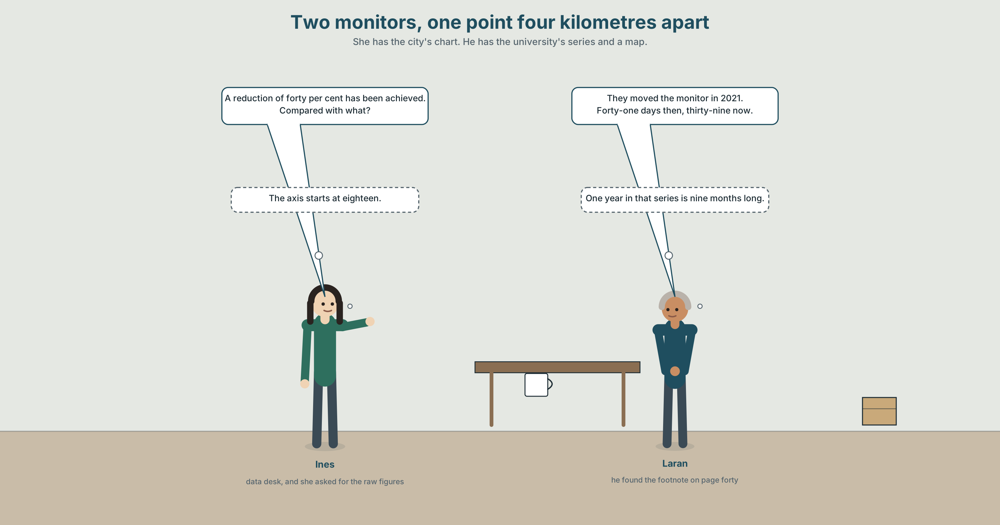
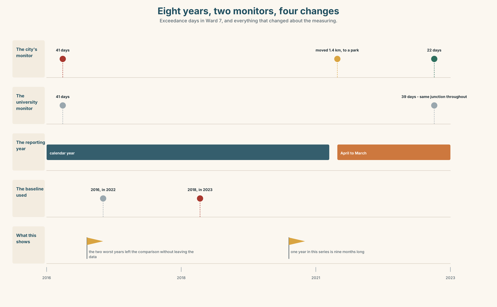

# B2.1 · Unit 7 · A Reduction in Exceedances

> **English Animated** · *Reading Between Lines* · a newsroom, Toronto
> Student's Book pages 138–159 · 22 pp · ~11 hours

---

## Part 0 · The Big Picture ◆ **A · THE WORLD**

{width=6.6in}

*The data desk, quarter past three — Twelve things to find. Two of them are the same chart and one of them starts at zero.*

# What does the chart not say?

**By the end of this unit you can write densely, and take a dense sentence apart to find out who
did what. Two hundred words.**

| ◆ **A · THE WORLD** | An air-quality chart, a monitor that moved, and a forty per cent reduction nobody can find |
|---|---|
| ◆ **B · THE SYSTEM** | nominalisation, and how to undo it · 28 words for measurement and charts · 22 abstract nouns and frames · stress in derived nouns |
| ◆ **C · THE PERFORMANCE** | Two hundred words dense enough to publish and clear enough to argue with |

---

### 0A · Find it

**Find twelve things in this picture.** Two of them are the same chart and one of them starts at
zero.

> the city's chart, pinned up · the same chart redrawn from zero · the monitor site map, two pins ·
> the raw figures, printed out · the 2023 report, open at page 40 ·
> the university's data, emailed · a ruler lying across the y axis ·
> a note that says COMPARED WITH WHAT? · the reporting-period memo ·
> a calibration certificate · a clock showing 15:15 · a window with the ward beyond it

### 0B · Guess it

**Two pins on the map are one point four kilometres apart.** Which document in the room explains
why that matters, and which one does not mention it at all?

### 0C · Say it ⏺

**Record sixty seconds.** *Describe a change you have noticed in your own city, and say how you
would measure it.* You will record it again at the end of this unit.

---

## Part 1 · Vocabulary Lab 1 ◆ **B · THE SYSTEM**

{width=6.6in}

*One chart, in section — Twelve words, and the layer each one lives on. Only the top layer leaves the building.*

### 1A · Meet — the words under a chart

Match each word to one layer of the cutaway.

> **measurement** · **calibration** · **anomaly** · **benchmark** · **aggregation** ·
> **granularity** · **resolution** · **variance** · **uncertainty** · **proxy** · **metric** ·
> **series**

### 1B · Sort — what you do to a number, how fine or how sure it is, or what you compare it with?

Three columns. **One of the twelve is a number standing in for a number nobody could get, and it
is the one most often reported as if it were the thing itself.**

> measurement · granularity · benchmark · calibration · variance · proxy · aggregation ·
> resolution · metric · uncertainty · series · anomaly

### 1C · Meet — the five things a chart can do to you

| | |
|---|---|
| **the y axis** | Where it starts decides how big the change looks. It is a choice, not a fact. |
| **a truncated scale** | An axis that does not begin at zero, with no mark to say so. |
| **a cherry-picked window** | The three years in which the line went the right way. |
| **a rolling average** | Smooths noise, and smooths away the month everything changed. |
| **the underlying data** | What is left when the chart is taken away. Usually available, rarely asked for. |

### 1D · Collocation Lab

Complete each one, and say which of the five changed in 2021 without being announced.

> **year on year** · **a data point** · **a reporting period** · **a confidence band** ·
> **the raw figures**

1. The city switched ______ ______ ______ from the calendar year to April–March.
2. ______ ______ ______ , exceedances fell by a tenth; over eight years they did not fall at all.
3. Every ______ ______ on the city's chart after 2021 comes from a different place.
4. ______ ______ ______ were released on request and took four days to arrive.
5. The university's series carries ______ ______ ______ ; the city's carries none.

### 1E · The phrasal verbs, and the three fixed expressions

> **smooth out** · **filter out** · **level off**
>
> **f** *the chart does not show* · **f** *that is a different question* · **f** *compared with what?*

**One of these fixed expressions is a question that cannot be answered without naming a baseline.**
Which, and why is that the most useful thing to ask about any percentage?

### 1F · Own it

Write one sentence containing a percentage from your own life, and underneath it write what it is
a percentage of, and when the counting started.

---

## Part 2 · Listening ◆ **A · THE WORLD**

{width=6.6in}

*Two monitors, one point four kilometres apart — She has the city's chart. He has the university's series and a map.*

### 2A · Two monitors 🔊 Track 7.1

**Before you listen.** The city reports a forty per cent reduction in exceedance days in Ward 7.
The data desk has the raw figures and a map with two pins on it.

**Listen once.** What has changed since 2016, and what has changed about the measuring?

**Listen again. Complete the table.**

| | 2016 | 2023 | What moved |
|---|---|---|---|
| the city's monitor | | | |
| the university's monitor | | | |
| the reporting period | | | |

**Listen again. True or false?**

1. The city's monitor was moved in 2021. ☐ T ☐ F
2. The university's monitor is on the original site. ☐ T ☐ F
3. The city's chart begins at zero. ☐ T ☐ F
4. The baseline year was changed in the 2023 report. ☐ T ☐ F

**Noticing.** Five sentences from the recording.

1. *They moved the monitor in 2021.*
2. *The relocation of the monitor took place in 2021.*
3. *A reduction in exceedances of forty per cent has been achieved.*
4. *Exceedances fell by forty per cent at a site that changed.*
5. *The implementation of the new reporting period followed.*

**Two of these say who did it. Three do not. Which, and what has happened to the verb in each?**

### 2B · Decoding clinic 🔊 Track 7.2

Thirty seconds at speed. Three jobs.

1. Where does the stress fall in *calibrate* and in *calibration*? Say both.
2. One speaker turns four verbs into nouns in one sentence. Write the four verbs back in.
3. Somebody says *compared with what?* What had just been said?

---

## Part 3 · Grammar Lab 1 ◆ **B · THE SYSTEM**

### Turning a verb into a noun, and what goes missing when you do

### 3A · Notice

Look at the five sentences in Part 2 again.

1. In sentence 1, who moved the monitor? In sentence 2, who moved it?
2. Sentence 3 contains no person at all. **How many words would you need to add to put one in?**
3. Sentence 4 keeps the verb. **What does it gain, and what does it give up?**
4. Sentence 5 is six words long and contains two events. **Name both.**

### 3B · See

{width=6.6in}

*Where the agent goes when the verb becomes a noun — The same event, twice. Nothing is ungrammatical and three things have gone.*

### 3C · Know

| | | |
|---|---|---|
| **verb → noun** | *reduce → reduction · expand → expansion* | the event becomes a thing |
| **the agent disappears** | *they reduced it → a reduction in it* | and no grammar is broken |
| **the tense disappears** | *a reduction* is not dated | which is why reports are full of them |
| **density rises** | one noun can carry a whole clause | which is why the form exists at all |

> **Nominalisation is not a fault.** It is how English packs a clause into a subject so that the
> next clause can say something about it. *The relocation of the monitor was not announced* is a
> sentence you cannot write any other way without repeating yourself.

> **The cost is always the same three things: who, when, and to whom.** *An improvement in air
> quality has been achieved* has no person, no date and no place. Every one of those can be put
> back, and the test is whether the writer could put them back if asked.

| | |
|---|---|
| **the -tion family** | *reduction · implementation · derivation · acknowledgement* |
| **the -ment family** | *improvement · assessment · acknowledgement* |
| **the irregulars** | *expansion · deterioration · analysis · loss* |
| **the frames they live in** | *the reduction of · an increase in · a deterioration in · the question of* |

> **Why it matters.** A reader cannot argue with a noun. Give them back the verb and they can ask
> who, when, and compared with what — which are the only three questions that ever matter about a
> number.

### 3D · Use — controlled

Turn each verb into the noun the frame needs.

> The (1) ______ (reduce) of exceedances is reported as forty per cent.
> The (2) ______ (implement) of the new period followed in 2021.
> A (3) ______ (deteriorate) in the raw figures is visible at the original site.
> The (4) ______ (assess) was subject to revision in the order of ten per cent.
> No (5) ______ (acknowledge) of the move appears anywhere in the report.

### 3E · Use — guided

Put the people, the dates and the places back into each sentence.

1. A reduction in exceedances of forty per cent has been achieved.
2. The relocation of the monitor took place in 2021.
3. The implementation of the new reporting period followed.
4. An improvement in air quality is reported.
5. No acknowledgement of the change was made.

### 3F · Use — open

**In pairs.** One of you reads a nominalised sentence. The other must ask *who did what to whom?*
and keep asking until every participant is named. **Four sentences each.**

### 3G · Error autopsy

> ✗ *The reduce of exceedances was forty per cent.*
> ✗ *The implementation of the period was implemented in 2021.*
> ✗ *An improvement of air quality has been achieved in the ward.*

For each, name the rule and say what the writer was reaching for.

### 3H · Check — eight items

> 1. The ______ (reduce) of exceedances is reported as forty per cent.
> 2. The ______ (implement) of the new period followed.
> 3. A ______ (deteriorate) in the figures is visible at the old site.
> 4. The ______ (assess) is ______ ______ ______ . *(three words — not final)*
> 5. No ______ (acknowledge) of the move appears in the report.
> 6. ✗ *The reduce of exceedances was forty per cent.* → correct it.
> 7. Rewrite *A reduction in exceedances has been achieved* with a person, a date and a place.
> 8. Rewrite *The city moved the monitor and did not announce it* as one dense sentence.

---

## Part 4 · Speaking ◆ **C · THE PERFORMANCE**

### 4A · Fluency starter — pack it and unpack it

One person says a two-clause sentence. The next packs it into one clause with a noun. The next
unpacks it again, with everybody named. **Four rounds.**

### 4B · The functional core — writing densely

{width=6.6in}

*The same eight years, drawn twice — One chart is the city's. One starts at zero and keeps both monitors on it.*

**Language Bank**

| | |
|---|---|
| **packing it** | *the reduction of · an increase in · the implementation of · a deterioration in* |
| **flagging the range** | *subject to revision · in the order of · a matter of · the question of* |
| **unpacking it** | *who did what to whom · the verb has gone missing · that is a nominalisation* |
| **accounting for it** | *account for · allow for · factor in* |

**Information gap.** Learner A has the city's chart. Learner B has the university's series.
**Agree on one sentence that describes both, and count the nouns in it.**

### 4C · The performance — three minutes ⏺

Present a set of figures in three minutes. **Every claim must be dense enough for a report and
every one must survive the question *who did what to whom?*** Your partner asks it twice, without
warning.

**Record it.**

### 4D · Observer

One person writes down every abstract noun used and, beside each, whether the speaker could have
named the agent.

### 4E · Three criteria

> ☐ Was every nominalisation one I could unpack on demand?
> ☐ Did I give a baseline for every percentage?
> ☐ Did the density help the listener, or only me?

---

## Part 5 · Reading ◆ **A · THE WORLD**

### 5A · Predict

The title is **"Forty per cent, measured somewhere else."**
**If a measuring instrument moves, what happens to the series it was producing?**

### 5B · Read — two minutes

---

**Forty per cent, measured somewhere else**

The city's 2023 air-quality report records a forty per cent reduction in exceedance days in Ward 7
since 2016. The relocation of the monitor in 2021 is not mentioned in the body of the report. It
appears in a footnote on page forty.

The original monitor stood at the junction of Lake and Seventh, between a bus layover and a
distribution depot. The new one stands one point four kilometres away, in a park.

A university air-quality group left a second instrument at the original junction. Its series runs
without a break from 2014. In 2016 it recorded forty-one exceedance days. In 2023 it recorded
thirty-nine.

The city's chart begins its y axis at eighteen. Between 2021 and 2022 the reporting period changed
from the calendar year to April–March, so one year in the series is nine months long. The 2023
report moves the baseline from 2016 to 2018, which removes the two highest years from the
comparison without removing them from the data.

Every one of these decisions is defensible on its own. The city has published a defence of each.
There is no document anywhere in which all four appear together.

---

### 5C · Comprehension — eight questions

1. What reduction does the report record, and since when?
2. Where was the original monitor, and where is the new one?
3. What did the university's instrument record in 2016 and in 2023?
4. Where does the y axis begin?
5. What changed between 2021 and 2022?
6. **Why does the writer describe what stood beside the original monitor?**
7. **"Defensible on its own" — what is the argument the writer is making without stating it?**
8. **The last sentence is about an absence. Why is that the strongest fact in the piece?**

### 5D · Vocabulary in context

Infer from the text, then check.

> is not mentioned in the body of the report · runs without a break · one year is nine months
> long · without removing them from the data · defensible on its own

### 5E · The counter-text

{width=6.6in}

*The chart page, every noun unpacked — Four decisions, each defensible, and no document in which all four appear.*

**Read the city's chart page and answer.**

1. Where does the y axis start, and what does that do to the apparent change?
2. **Find every nominalisation on the page and say who the agent would be in each.**
3. The footnote on page forty is eleven words. **Rewrite it as the body text it should have been.**
4. **Which single change, undone, would alter the headline figure most?**

### 5F · Two texts

The city says *a forty per cent reduction in exceedances has been achieved*.
The university's series says *forty-one days in 2016, thirty-nine in 2023*.

**Are these in conflict?** Write two sentences, and use the phrase *compared with what?* in one of
them.

---

## Part 6 · Vocabulary Lab 2 ◆ **B · THE SYSTEM**

### Making a noun out of what happened

### 6A · Sort — bigger or smaller, better or worse, or somebody did something?

Three columns.

> reduction · improvement · implementation · expansion · deterioration · assessment ·
> acknowledgement · derivation

### 6B · Chunk completion

1. ______ ______ ______ exceedances is reported as forty per cent. *(three words)*
2. ______ ______ ______ the raw figures is visible at the old site. *(four words)*
3. ______ ______ ______ the new period followed in 2021. *(four words)*
4. ______ ______ ______ monitor sites is the thing nobody mentions. *(three words)*
5. The assessment is ______ ______ ______ . *(three words — not final)*
6. The error is ______ ______ ______ ______ ten per cent. *(four words — approximately)*
7. It is ______ ______ ______ where you put the instrument. *(three words — it comes down to)*
8. ______ ______ ______ the baseline has never been put to the board. *(three words)*

### 6C · Three that are not interchangeable

> *an increase in* · *the implementation of* · *subject to revision*

**Say which one names a change, which one names an action with a hidden agent, and which one is a
warning about the number itself.**

### 6D · The phrasal verbs and the fixed expressions

> **account for** · **allow for** · **factor in**
>
> **f** *that is a nominalisation* · **f** *who did what to whom* · **f** *the verb has gone missing*

**Two of these phrasal verbs mean roughly "take into account" and one means "explain".** Which is
which, and which of the three can also mean "make up a proportion of"?

### 6E · Contrast Clinic

Eight items. Rewrite each sentence as the bracket says.

1. The city moved the monitor in 2021. *(pack it into a noun phrase)*
2. A reduction in exceedances has been achieved. *(unpack it, with a person and a date)*
3. The reporting period was changed. *(name who changed it and when)*
4. The air got worse at the junction. *(pack it, formally)*
5. The implementation of the period followed. *(say who implemented what)*
6. The baseline was moved from 2016 to 2018. *(pack it, and keep the dates)*
7. They did not acknowledge the move. *(pack it into a subject)*
8. The error is roughly ten per cent. *(use a four-word formal frame)*

---

## Part 7 · Pronunciation & Fluency Lab ◆ **B · THE SYSTEM**

{width=6.6in}

*The beat moves one place to the right — Turn the verb into a noun and the stress almost always lands before -tion.*

### The stress moves when the word does

### 7A · Hear 🔊 Track 7.3

> *CA-li-brate* → *ca-li-BRA-tion*
> *im-PLE-ment* → *im-ple-men-TA-tion*
> *de-TE-ri-o-rate* → *de-te-ri-o-RA-tion*

### 7B · Say

Say each pair three times. Then say this:

> *They calibrate it, and the calibration was in April.* — the same four syllables, and the beat
> moves one place to the right.

### 7C · Make it mean something

Say these two:

> *a reDUCtion in exCEEdances* — the ordinary report, two stresses, both inside the nouns
> *a reDUCtion in WHAT?* — the stress moves to the question, and the sentence becomes an argument

**In a derived noun the stress almost always lands on the syllable before *-tion*,** whatever the
verb did, which is why a reader who has only seen these words in print says them wrongly.

### 7D · Fluency 30 ⏺

Thirty seconds: **four verb-and-noun pairs, each said twice, with the beat moving.** Three times,
faster.

---

## Part 8 · Writing ◆ **C · THE PERFORMANCE**

### Four figures, densely · 200 words

### 8A · Read the model

> The relocation of the Ward 7 monitor in 2021 is recorded in a footnote on page forty of a
> two-hundred-page report. `[one noun carries a whole clause, and the sentence can then say
> something about it]`
>
> The city moved it one point four kilometres, from a junction between a bus layover and a depot
> to a park. `[the same event with the verb back in — who, what, where, and it is now arguable]`
>
> A university instrument left at the original site recorded forty-one exceedance days in 2016 and
> thirty-nine in 2023. `[no nominalisation at all, because this is the sentence the reader has to
> be able to check]`
>
> The reduction of exceedances reported by the city is therefore a reduction at a different place,
> over a shortened period, against a moved baseline, measured on an axis beginning at eighteen.
> `[four nominalisations in one sentence, and every one of them unpacked in the three sentences
> above it]`

**Questions about the writer's choices:**

1. Sentence one packs an event into a noun; sentence two unpacks the same event. **Why both?**
2. The third sentence has no abstract noun in it at all. **Why that sentence?**
3. The last sentence is the densest. **What has the writer earned the right to do, and how?**

### 8B · The anti-model

> Following the implementation of revised monitoring arrangements and the subsequent reassessment of the baseline, a significant improvement in air quality outcomes has been achieved across the reporting period, subject to ongoing review.

One sentence, thirty-four words, six abstract nouns, no person, no date, no place.
**Rewrite it with every agent named, and then pack it back down to two sentences.**

### 8C · Plan

> the event as a noun → the same event with the verb back → the checkable figures, plainly →
> the dense summary, which is now readable because you unpacked it first

### 8D · Write — 200 words
### 8E · Peer review — three criteria

> ☐ Could you name the agent behind every abstract noun you used?
> ☐ Does every percentage say what it is of, and over what period?
> ☐ Is there at least one sentence a reader could check without you?

### 8F · Write it again · 8G · Publish

Rewrite after review. **Publish both, and circle every abstract noun in each.**

---

## Part 9 · The File ◆ **A · THE WORLD + C · THE PERFORMANCE**

{width=6.6in}

*Five nouns learners hide behind — Each one is an event with the person, the date and the number removed.*

# STUDY FILE · The nouns you hide behind

### 9A · Progress, improvement, development 🔊 Track 7.4

Learners describe their own learning almost entirely in abstract nouns: *my progress is slow*, *I
need improvement in speaking*, *there is no development*. None of them has a person, a date or a
measure, and none of them can be acted on.

| | |
|---|---|
| **the noun** | *improvement in speaking* |
| **the missing agent** | you |
| **the missing date** | since when |
| **the verb version** | *I spoke for three minutes in October and for eight in March* |

### 9B · Put the verb back

Take three sentences you have said about your own learning that contain an abstract noun.
**Rewrite each with a person, a date and a number.**

### 9C · Role play — who did what to whom?

In pairs. One of you describes their progress. The other may only ask *who did what to whom, and
when?* **Four rounds each.**

### 9D · The one you can measure

Everybody has one thing they can state as a verb with a number.
**Name yours.** If you cannot find one, that is the finding, and it is this week's work.

### 9E · Transfer — before next week

**Take one abstract noun you use about yourself and turn it into a measurement with a date.** Bring
the first data point. One point is not a series, and that is the following week's work.

---

## Part 10 · Mediation & Interaction ◆ **C · THE PERFORMANCE**

{width=6.6in}

*Eight years, two monitors, four changes — Exceedance days in Ward 7, and everything that changed about the measuring.*

### 10A · Relay

Half the class has the city's chart. Half has the university's series.
**Produce one chart caption both sides accept, by speaking only.** Ten minutes.

### 10B · Simplify — for one reader

A reader writes: *Has the air in Ward 7 got better or not?*
**Reply in four sentences,** with no abstract noun in any of them.

### 10C · Online

Write **one message** to the city's statistician. **Three sentences.** Ask for exactly what you
need, and do not accuse anybody of anything.

### 10D · Your language

Does your language form abstract nouns from verbs as freely as English?
**Translate the five sentences from Part 2.** Which ones force you to name the agent?

---

## Part 11 · The Decision ◆ **C · THE PERFORMANCE**

# What the paper does with other people's charts

**Option one:** reproduce the city's chart as published, with a caption noting the axis and the
move. It is their chart; the reader should see what the city issued.

**Option two:** redraw every chart from the underlying data, from zero, as house style, and say so
in small type.

**Option three:** redraw from zero, and print beside every chart one line headed *What this chart
does not show*.

### 11A · The evidence

{width=6.6in}

*Two instruments, one ward — Exceedance days a year, from zero, with both series on the same axis.*

🔊 **Track 7.6.** Ines Fontaine, data desk, 30 seconds: *"Everyone argues about the axis. The axis
is the least of it. You can see a truncated scale. You cannot see a monitor that moved, a year
that was nine months long, or a baseline that quietly lost the two worst years. Those three are
invisible in any redrawing, because they are not in the chart. They are in the footnotes, and the
footnotes do not get published."*

### 11B · Talk about it

In threes. Use the frame, and give a baseline for every number you say.

> *I would ______ , because the reader cannot ______ , and the cost is ______ .*

### 11C · Decide

Write **three sentences**: the decision, the evidence, and the one thing your decision still fails
to catch.

### 11D · Model decision

> Option three. Redrawing from zero is necessary and nowhere near sufficient, because the three
> changes that move this figure most are not visible in any drawing of it. The one-line note is the
> only part of the proposal that can carry a moved monitor, and it costs one line. Its weakness is
> that it depends on somebody having read the footnotes, and nothing in this decision creates the
> time to do that.

### 11E · The Reveal

> **What happened.** The Herald redrew from zero and ran the note. Readers' complaints about charts
> fell; complaints about the note rose, almost all of them from the organisations whose charts they
> were.
>
> Then something nobody predicted: within eighteen months the city's own charts were being
> published from zero, and its 2025 report carried a page headed *Changes to the series*. Nobody
> asked for it. The press office had grown tired of the note.

**One question. You do not have to answer it out loud.**

> The note was about the Herald's own pages. Why did it change what the city drew?

---

## Part 12 · Landing ◆ **all three lines**

### 12A · Recycle — fifteen items

> 1. The ______ (reduce) of exceedances is reported as forty per cent.
> 2. The ______ (implement) of the new period followed in 2021.
> 3. A ______ (deteriorate) in the raw figures is visible at the old site.
> 4. No ______ (acknowledge) of the move appears in the report.
> 5. The ______ (assess) is subject to revision.
> 6. ______ ______ ______ , exceedances fell by a tenth. *(three words)*
> 7. The chart's ______ ______ begins at eighteen. *(two words)*
> 8. The error is ______ ______ ______ ______ ten per cent. *(four words)*
> 9. ______ ______ ______ ______ were released on request. *(four words)*
> 10. The university's series carries ______ ______ ______ . *(three words)*
> 11. ______ ______ ______ ______ ______ the monitor moved. *(five words — the standing caption)*
> 12. ______ ______ ______ ? *(three words — the question that needs a baseline)*
> 13. A rolling average will ______ ______ the month everything changed. *(two words)*
> 14. You have to ______ ______ the nine-month year. *(two words)*
> 15. The line appears to ______ ______ after 2021. *(two words)*

### 12B · Consolidate — one task, everything in it

**Write 150 words about a set of figures**, with one dense sentence, one unpacked sentence and one
sentence a reader could check alone. Mark the three in the margin.

### 12C · Can-do, with evidence

> ☐ I can form and use abstract nouns from verbs. **Evidence:** 3H, 8D
> ☐ I can unpack a nominalisation and name the agent. **Evidence:** 6E, 3F
> ☐ I can say what a chart does not show. **Evidence:** 5E, 10B
> ☐ I can place the stress in a derived noun. **Evidence:** 7B

### 12D · Replay ⏺

Record 0C again. **Compare.** How many abstract nouns did you use the first time?

### 12E · Glossary — fifty items, as a map

> **WHAT YOU DO TO A NUMBER** · measurement · calibration · aggregation
> **HOW FINE AND HOW SURE** · granularity · resolution · variance · uncertainty
> **WHAT YOU COMPARE IT WITH** · benchmark · proxy · metric · series · anomaly
> **WHAT A CHART CAN DO TO YOU** · the y axis · a truncated scale · a cherry-picked window · a rolling average · the underlying data
> **THE SMALL PRINT** · year on year · a data point · a reporting period · a confidence band · the raw figures
> **WHAT ANALYSTS DO** · smooth out · filter out · level off · account for · allow for · factor in
> **IN THE ROOM** · the chart does not show · that is a different question · compared with what?
> **THE ABSTRACT NOUNS** · reduction · expansion · deterioration · improvement · implementation · acknowledgement · assessment · derivation
> **THE FRAMES** · the reduction of · a deterioration in · the implementation of · an increase in · subject to revision · in the order of · a matter of · the question of
> **TAKING IT APART** · that is a nominalisation · who did what to whom · the verb has gone missing

### 12F · Next

> **Unit 8 · What was left out?**
