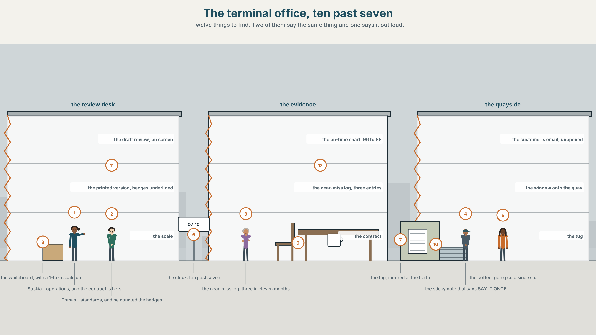
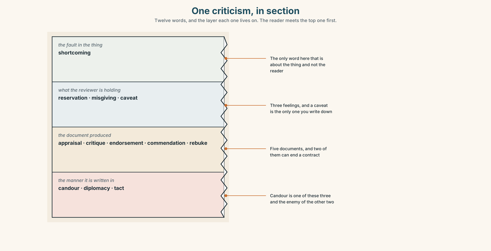
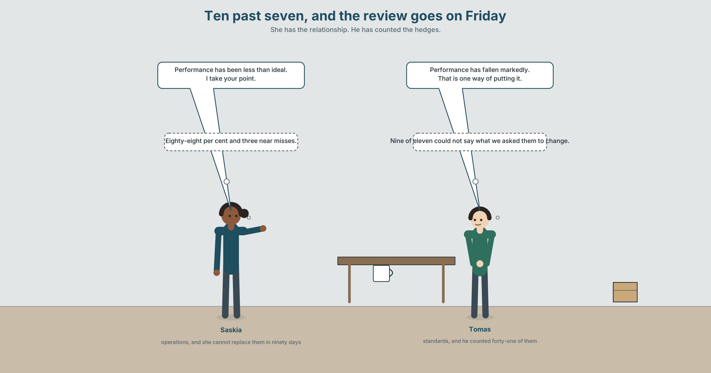
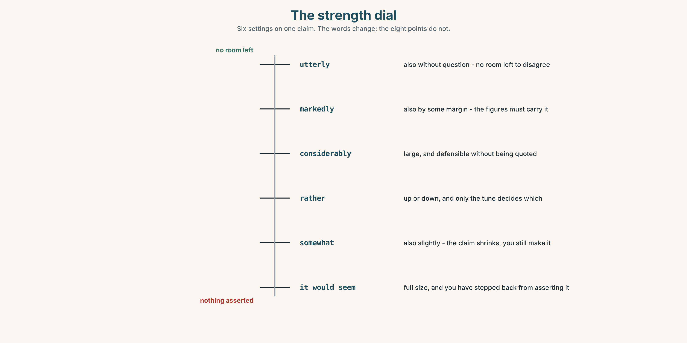
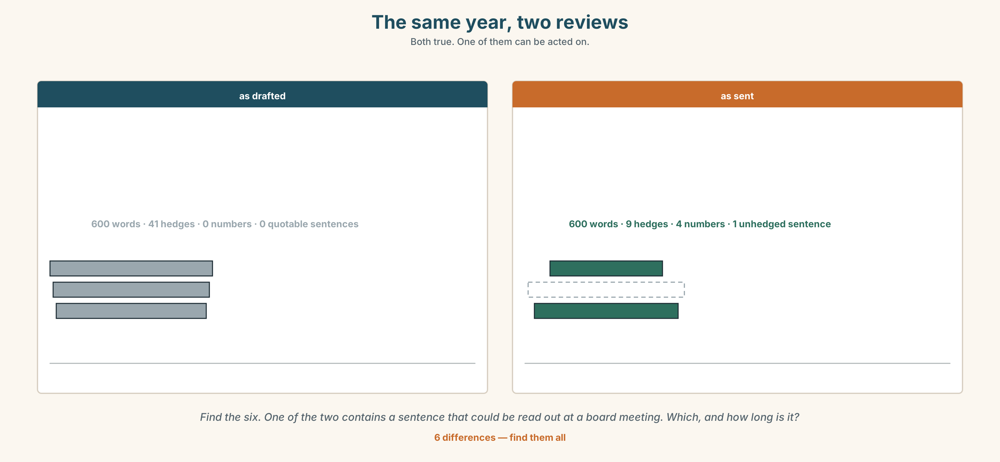
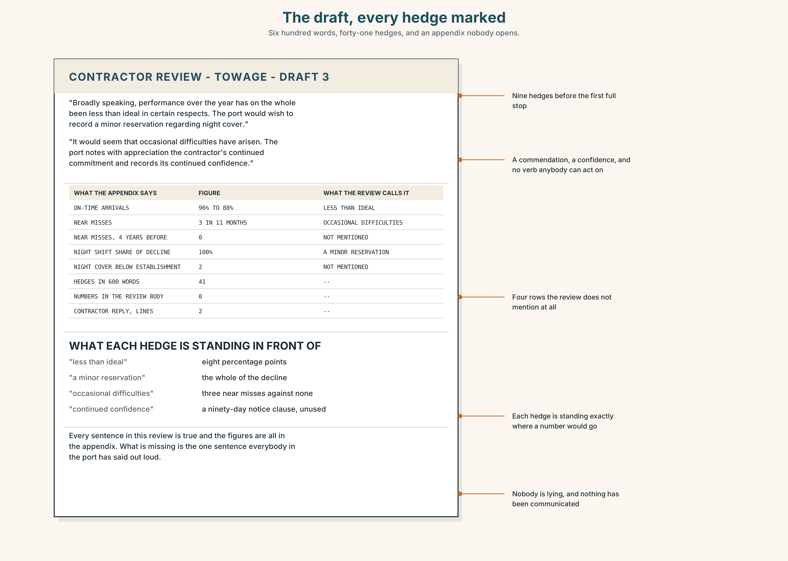
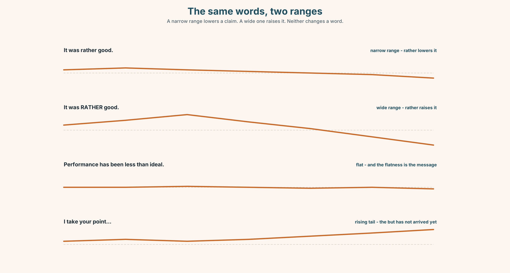
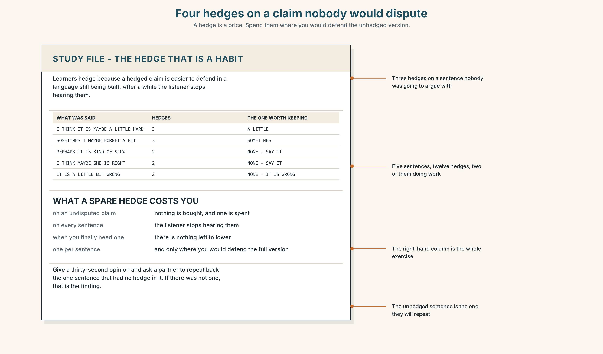
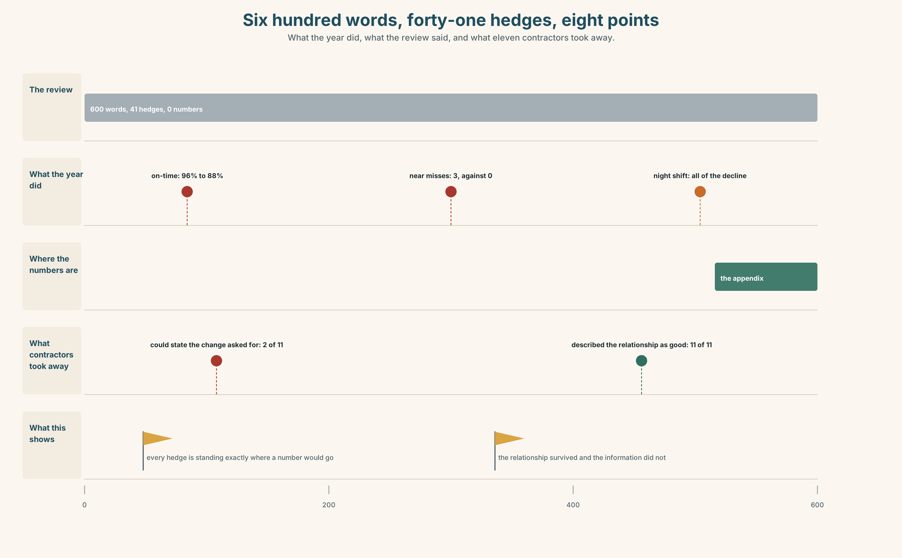
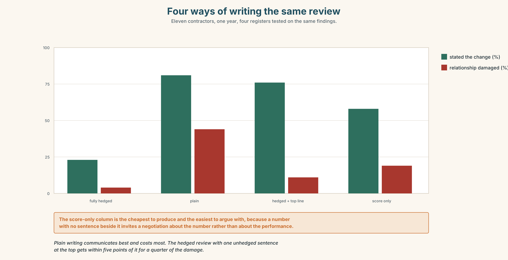

# B2.2 · Unit 1 · Less Than Ideal

> **English Animated** · *Holding the Floor* · a port and its logistics chain, Rotterdam
> Student's Book pages 6–27 · 22 pp · ~11 hours

---

## Part 0 · The Big Picture ◆ **A · THE WORLD**

{width=6.6in}

*The terminal office, ten past seven — Twelve things to find. Two of them say the same thing and one says it out loud.*

# How do you say it without saying it?

**By the end of this unit you can soften a criticism without losing it, and strengthen one
without losing the room. Two hundred words.**

| ◆ **A · THE WORLD** | A towage contract, three near misses, and a six-hundred-word review with forty-one hedges in it |
|---|---|
| ◆ **B · THE SYSTEM** | hedging and boosting · 28 words for criticism and diplomacy · 22 degree adverbs and frames · pitch range and how much you are committing |
| ◆ **C · THE PERFORMANCE** | Two hundred words that can be read by the person they are about |

---

### 0A · Find it

**Find twelve things in this picture.** Two of them say the same thing and only one of them says
it out loud.

> the draft review on a screen · the printed version, hedges underlined ·
> the on-time chart, 96 to 88 · the near-miss log, three entries ·
> the contract folder, ninety days' notice · the tug moored at the berth ·
> a whiteboard with a 1-to-5 scale drawn on it · the customer's email, unopened ·
> a window onto the quay · a wall clock at 07.10 ·
> a cup of coffee going cold · a sticky note that says SAY IT ONCE

### 0B · Guess it

**One thing in this picture would make another one unnecessary.** Which two, and what is stopping
anybody from doing it?

### 0C · Say it ⏺

**Record sixty seconds.** *Describe something somebody you work or study with does badly, as if
they were going to hear the recording.* You will record it again at the end of this unit.

---

## Part 1 · Vocabulary Lab 1 ◆ **B · THE SYSTEM**

{width=6.6in}

*One criticism, in section — Twelve words, and the layer each one lives on. The reader meets the top one first.*

### 1A · Meet — the words of a review

Match each word to one layer of the cutaway.

> **appraisal** · **critique** · **reservation** · **caveat** · **commendation** ·
> **shortcoming** · **candour** · **diplomacy** · **tact** · **rebuke** · **endorsement** ·
> **misgiving**

### 1B · Sort — what you produce, what you are holding back, or how you say it?

Three columns. **One of the twelve names a fault in the thing; the other three in its column name
a feeling in the person reviewing it.**

> appraisal · reservation · candour · critique · misgiving · diplomacy · endorsement ·
> caveat · tact · commendation · shortcoming · rebuke

### 1C · Meet — the five phrases that do the softening

| | |
|---|---|
| **broadly speaking** | True in outline, and the exceptions are where the problem is. |
| **on the whole** | A verdict that counts the good and does not say what was weighed. |
| **a minor reservation** | The adjective is doing all the work, and it is almost never minor. |
| **less than ideal** | Four words standing in for one, and the one is usually *bad*. |
| **a fair point** | Agreement with the smallest possible unit of what was said. |

### 1D · Collocation Lab

Complete each one, and say which of the five is the only one that cannot be said to somebody's
face.

> **a frank exchange** · **with respect** · **not entirely convinced** · **a significant
> concern** · **the general feeling**

1. The meeting is minuted as ______ ______ ______ , which means somebody raised their voice.
2. ______ ______ , that is not what the contract says.
3. The board is ______ ______ ______ by the explanation offered in March.
4. Three near misses in eleven months is ______ ______ ______ , and the review does not use the word.
5. ______ ______ ______ on the quay is that the night crews are short, and nobody has written it down.

### 1E · The phrasal verbs, and the three fixed expressions

> **tone down** · **build up** · **gloss over**
>
> **f** *if I may say so* · **f** *I would go further than that* · **f** *that is one way of putting it*

**Two of these fixed expressions escalate and one de-escalates.** Which de-escalates, and what is
it conceding?

### 1F · Own it

Write one true criticism of something you use every day, in a form you would be willing to sign.

---

## Part 2 · Listening ◆ **A · THE WORLD**

{width=6.6in}

*Ten past seven, and the review goes on Friday — She has the relationship. He has counted the hedges.*

### 2A · Ten past seven 🔊 Track 1.1

**Before you listen.** The towage contractor moves two thousand four hundred vessels a year. The
on-time rate has fallen from ninety-six per cent to eighty-eight. There have been three near
misses in eleven months. The review goes out on Friday.

**Listen once.** What do they agree about, and what do they disagree about?

**Listen again. Complete the table.**

| | What they want the review to say | How strongly | What they are afraid of |
|---|---|---|---|
| operations | | | |
| standards | | | |
| the draft | | | |

**Listen again. True or false?**

1. The on-time rate has fallen eight points. ☐ T ☐ F
2. The review uses the phrase *a significant concern*. ☐ T ☐ F
3. The contract can be ended at ninety days' notice. ☐ T ☐ F
4. The contractor has seen an earlier draft. ☐ T ☐ F

**Noticing.** Six sentences from the recording.

1. *Performance has been less than ideal.*
2. *Performance has been somewhat disappointing.*
3. *Performance has fallen markedly.*
4. *Performance is, frankly, unacceptable.*
5. *There is a case for saying performance has slipped.*
6. *Performance tends to be weaker on night shifts.*

**Six sentences about the same eight points. Put them in order from the least committed to the
most, and say which two you could not separate.**

### 2B · Decoding clinic 🔊 Track 1.2

Thirty seconds at speed. Three jobs.

1. One speaker says *rather* twice, meaning two different things. Write both sentences.
2. Where does each speaker's voice go up at the end, and what is that doing?
3. Somebody says *that is one way of putting it*. What had just been said, and what has now happened to it?

---

## Part 3 · Grammar Lab 1 ◆ **B · THE SYSTEM**

### Turning a claim up and turning it down

### 3A · Notice

Look at the six sentences in Part 2 again.

1. Which one commits the speaker least, and which word does the committing?
2. Sentence 1 is four words long and says nothing. **What does it let the reader supply?**
3. Sentence 4 contains one word that is not about performance at all. **Which, and what is it for?**
4. Sentence 6 makes a narrower claim than the others. **Is a narrower claim weaker?**

### 3B · See

{width=6.6in}

*The strength dial — Six settings on one claim. The words change; the eight points do not.*

### 3C · Know

| | | |
|---|---|---|
| **hedging with a degree word** | *somewhat · slightly · fairly · rather* | lowers the claim |
| **hedging with a frame** | *it would seem that · there is a case for · to a degree* | distances the claimer |
| **hedging with a tendency** | *tends to be · has a tendency to · is inclined to* | makes it a pattern, not an event |
| **boosting with a degree word** | *considerably · markedly · decidedly · utterly* | raises the claim |
| **boosting with a frame** | *without question · by some margin* | removes the room to disagree |
| **the adverb that does both** | *rather* | and only the tune tells you which |

> **A hedge is not weakness; it is a price.** Every hedge buys you the right to be wrong without
> having lied, and every boost spends that credit. A review with forty-one hedges in six hundred
> words has bought so much insurance that it has no claim left to insure.

> **Hedging the verb and hedging the degree are different moves.** *Performance has somewhat
> fallen* lowers how far it fell. *It would seem that performance has fallen* leaves the fall at
> full size and steps back from asserting it. The first is about the world; the second is about
> you, and the reader can tell.

| | |
|---|---|
| **conceding** | *I take your point · that may be so · a fair point* |
| **declining to judge** | *it is not for me to say · to a degree* |
| **what people do to claims** | *play down · talk up · brush aside · tone down · build up · gloss over* |

> **Why it matters.** Criticism that cannot be heard is not criticism, and criticism that cannot
> be survived is not heard twice. The whole skill is finding the one sentence that is both.

### 3D · Use — controlled

Complete with the word the strength in brackets requires.

> Performance has fallen (1) ______ since March. *(a large, defensible fall)*
> The explanation offered is (2) ______ unconvincing. *(as strong as you can be)*
> The night crews are (3) ______ short-handed. *(a small, hedged claim)*
> Performance (4) ______ ______ ______ weaker on nights. *(a pattern, three words)*
> (5) ______ ______ ______ ______ saying the contract is at risk. *(a frame, four words)*

### 3E · Use — guided

Rewrite each one twice: once hedged, once boosted.

1. The contractor is late.
2. The night shift is short-handed.
3. The explanation is wrong.
4. The review is too soft.
5. The relationship is over.

### 3F · Use — open

**In pairs.** One of you states a criticism at full strength. The other lowers it one step at a
time. **Stop at the last version that still contains the criticism** — and say which step cost
the most.

### 3G · Error autopsy

> ✗ *Performance has been utterly less than ideal.*
> ✗ *It would seem that performance has markedly and considerably fallen.*
> ✗ *I take your point, but I am not entirely convinced that there is somewhat a case for it.*

For each, name the rule and say what the writer was reaching for.

### 3H · Check — eight items

> 1. Performance has fallen ______ since March. *(a large, defensible fall)*
> 2. The explanation is ______ unconvincing. *(as strong as you can be)*
> 3. The night crews are ______ short-handed. *(small, hedged)*
> 4. Performance ______ ______ ______ weaker on nights. *(three words, a pattern)*
> 5. ______ ______ ______ ______ saying the contract is at risk. *(four words, a frame)*
> 6. ✗ *Performance has been utterly less than ideal.* → correct it.
> 7. Rewrite *The contractor is bad* so that a board would act on it.
> 8. Rewrite *The contract is at risk* so that it could be said in a room with the contractor in it.

---

## Part 4 · Speaking ◆ **C · THE PERFORMANCE**

### 4A · Fluency starter — one step down

One person states a criticism. Everybody else lowers it one step, in turn. **The last person to
produce a version that still criticises anything wins the round.**

### 4B · The functional core — softening and strengthening

{width=6.6in}

*The same year, two reviews — Both true. One of them can be acted on.*

**Language Bank**

| | |
|---|---|
| **softening** | *somewhat · slightly · fairly · broadly speaking · on the whole · a minor reservation* |
| **distancing** | *it would seem that · there is a case for · it is not for me to say* |
| **strengthening** | *considerably · markedly · decidedly · utterly · without question · by some margin* |
| **conceding and continuing** | *a fair point · I take your point · that may be so* |

**Information gap.** Learner A is the terminal. Learner B is the contractor.
**Agree on one sentence about the night shifts that both would sign.** Ten minutes.

### 4C · The performance — three minutes ⏺

Give a three-minute review of something real, **with the person it is about in the room**. You must
include one unhedged sentence and one commendation that is not a consolation prize.

**Record it.**

### 4D · Observer

One person writes down every hedge and every boost, and marks which ones were load-bearing.

### 4E · Three criteria

> ☐ Was there one sentence nobody could misread?
> ☐ Did the hedges buy anything, or were they habit?
> ☐ Could the person it was about repeat the criticism back correctly?

---

## Part 5 · Reading ◆ **A · THE WORLD**

### 5A · Predict

The title is **"Forty-one hedges."**
**If a review is written so that nobody can take offence, what else can nobody do?**

### 5B · Read — two minutes

---

**Forty-one hedges**

The towage contract is worth four point one million euros a year and moves two thousand four
hundred vessels. Either side may end it at ninety days' notice. Neither ever has.

The draft annual review runs to six hundred words. A standards officer counted the hedges in it:
forty-one. *Broadly speaking*, *on the whole*, *somewhat*, *a minor reservation*, *less than
ideal*, *it would seem that*, three times each or more.

The underlying figures are not ambiguous. On-time arrivals have fallen from ninety-six per cent to
eighty-eight. There have been three near misses in eleven months, against none in the previous
four years. The night-shift figures account for the whole of the decline.

The review says none of this in a sentence that could be quoted. It says performance has been
*less than ideal* and that the port has *a minor reservation* about night cover, and it ends by
recording the port's *continued confidence*.

The contractor's operations director read it in four minutes and wrote back in two lines, thanking
the port and noting with pleasure the continued confidence.

Nobody is lying. Every sentence in the review is true, the figures are in an appendix, and the
only thing the document does not contain is the sentence everybody in the port has said out loud
at some point this year.

---

### 5C · Comprehension — eight questions

1. What is the contract worth, and how many vessels does it cover?
2. What is the notice period, and how often has it been used?
3. How many hedges are there, and in how many words?
4. What has happened to on-time arrivals?
5. Which shift accounts for the decline?
6. **Why does the writer say "could be quoted" rather than "is clear"?**
7. **The contractor's reply is two lines long. What does the writer want you to notice about it?**
8. **"Nobody is lying." What is the piece accusing the review of, if not of lying?**

### 5D · Vocabulary in context

Infer from the text, then check.

> account for the whole of the decline · in a sentence that could be quoted · continued
> confidence · noting with pleasure · said out loud at some point this year

### 5E · The counter-text

{width=6.6in}

*The draft, every hedge marked — Six hundred words, forty-one hedges, and an appendix nobody opens.*

**Read the draft review and answer.**

1. How many hedges are there in the first paragraph alone?
2. **Find every claim in the review that has a number behind it in the appendix, and say what the
   review calls it instead.**
3. One paragraph contains a commendation. **Is it earned, and how would you check?**
4. **Rewrite the review's first sentence so that the board would act on it.**

### 5F · Two texts

The review says *performance has been less than ideal*.
The appendix says *96 per cent to 88 per cent, and three near misses*.

**Are these the same statement?** Write two sentences, and use the word *candour* in one of them.

---

## Part 6 · Vocabulary Lab 2 ◆ **B · THE SYSTEM**

### Turning the dial, one word at a time

### 6A · Sort — softens, strengthens, or depends on the tune?

Three columns.

> somewhat · considerably · rather · slightly · markedly · fairly · utterly · decidedly

### 6B · Chunk completion

1. Night performance ______ ______ ______ weaker. *(three words — a pattern)*
2. The contractor ______ ______ ______ ______ run short on nights. *(four words)*
3. The crews ______ ______ ______ take the shorter route. *(three words)*
4. ______ ______ ______ ______ the figures are not in dispute. *(four words — distancing)*
5. ______ ______ ______ ______ ______ ending the contract. *(five words — a frame)*
6. The night figures are worse ______ ______ ______ . *(three words — and by a lot)*
7. The explanation holds ______ ______ ______ , and no further. *(three words)*
8. The decline is real, ______ ______ . *(two words — no room to disagree)*

### 6C · Three that are not interchangeable

> *somewhat* · *rather* · *markedly*

**Say which one always lowers, which one always raises, and which one does whichever the voice
tells it to.**

### 6D · The phrasal verbs and the fixed expressions

> **play down** · **talk up** · **brush aside**
>
> **f** *I take your point* · **f** *that may be so* · **f** *it is not for me to say*

**One of these fixed expressions concedes nothing while sounding as though it concedes
everything.** Which, and what usually follows it?

### 6E · Contrast Clinic

Eight items. Rewrite each sentence at the strength the bracket asks for.

1. The contractor is late. *(as strong as the figures allow)*
2. The night crews are short-handed. *(hedged, as a tendency)*
3. The explanation is wrong. *(distanced — you are reporting, not asserting)*
4. Performance has fallen eight points. *(softened, but still quotable)*
5. The review is too soft. *(conceding first, then saying it)*
6. The contract should end. *(a frame, so the board can disagree without a fight)*
7. The commendation is undeserved. *(as tactfully as it can be said and still be said)*
8. Three near misses is serious. *(boosted, with no room to disagree)*

---

## Part 7 · Pronunciation & Fluency Lab ◆ **B · THE SYSTEM**

{width=6.6in}

*The same words, two ranges — A narrow range lowers a claim. A wide one raises it. Neither changes a word.*

### How much of your voice you spend

### 7A · Hear 🔊 Track 1.3

> *It was rather good.* ↗ — a narrow range, and *rather* lowers it
> *It was RATHER good.* ↘ — a wide range, and *rather* raises it
> *Performance has been less than ideal.* → — flat, and the flatness is the message

### 7B · Say

Say all three. Then say this twice, once with a narrow range and once with a wide one:

> *There is a case for saying the contract is at risk.* — the words do not change and the room
> hears two different meetings.

### 7C · Make it mean something

Say these two:

> *I take your point.* ↘ — accepted, and we move on
> *I take your point.* ↗ — accepted, and I have not finished

**A rising tail on a concession means the concession is a clause, not a sentence.** English
speakers hear the second as a *but* that has not arrived yet, and they will wait for it.

### 7D · Fluency 30 ⏺

Thirty seconds: **one criticism said four times, from the narrowest range to the widest**, with the
words unchanged. Three times, faster.

---

## Part 8 · Writing ◆ **C · THE PERFORMANCE**

### A review the subject can read · 200 words

### 8A · Read the model

> On-time arrivals fell from ninety-six per cent to eighty-eight between January and November,
> and there were three near misses against none in the previous four years. `[no hedge, no
> adjective, and nothing here can be disputed]`
>
> The night-shift figures account for the whole of the decline; day performance is unchanged and,
> on the whole, remains strong. `[a boost by implication — naming the cause narrows the criticism
> and makes the commendation credible]`
>
> It would seem from the November handover logs that night cover has been running two below
> establishment since the summer, although we have not been told this. `[distancing, not
> softening: the claim is at full size and we are reporting rather than asserting it]`
>
> This is a significant concern and it is the only one in this review. Everything else in the
> year has been, by some margin, better than the previous contract. `[one unhedged sentence, one
> boost, and the boost is spent on praise]`

**Questions about the writer's choices:**

1. The first paragraph has no adjective in it at all. **What is that buying?**
2. *It would seem* in paragraph three. **Why not *we understand* or *we believe*?**
3. The last paragraph puts the boost on the praise rather than the criticism. **What does that do
   to how the criticism is read?**

### 8B · The anti-model

> Broadly speaking, performance over the year has on the whole been less than ideal in certain respects, and the port would wish to record a minor reservation regarding night cover, while noting with appreciation the contractor's continued commitment and expressing its continued confidence going forward.

One sentence, fifty-one words, nine hedges, no number and no verb anybody could act on.
**Rewrite it in three sentences, one of them unhedged, keeping the relationship.**

### 8C · Plan

> the figures, unhedged → the cause, which narrows the criticism → the distanced claim about what
> you have not been told → the one sentence, and the praise boosted

### 8D · Write — 200 words
### 8E · Peer review — three criteria

> ☐ Is there exactly one sentence that cannot be misread?
> ☐ Does every hedge buy something you could name?
> ☐ Would the subject of the review be able to repeat the criticism back correctly?

### 8F · Write it again · 8G · Publish

Rewrite after review. **Publish both, and underline every hedge and every boost.**

---

## Part 9 · The File ◆ **A · THE WORLD + C · THE PERFORMANCE**

{width=6.6in}

*Four hedges on a claim nobody would dispute — A hedge is a price. Spend them where you would defend the unhedged version.*

# STUDY FILE · The hedge that is a habit

### 9A · Maybe, a little, I think 🔊 Track 1.4

Learners hedge for a reason that has nothing to do with politeness: a hedged claim is easier to
defend in a language you are still building. *Maybe*, *a little*, *I think* and *sometimes* attach
to everything, and after a while a listener stops hearing them, which means the one claim you
wanted to hedge arrives at full strength.

| | |
|---|---|
| **what you say** | *I think it is maybe a little difficult* |
| **what it costs** | three hedges on a claim nobody was going to dispute |
| **what it leaves** | nothing to lower when you need to |
| **the fix** | one hedge per sentence, and only where you would defend the unhedged version |

### 9B · Spend them properly

Take three sentences you have said this week with a hedge in them.
**Remove every hedge, then put back the one you would actually defend.**

### 9C · Role play — the unhedged sentence

In pairs. One of you gives a thirty-second opinion. The other repeats back the one sentence that
had no hedge in it. **If there was not one, say so.** Four rounds each.

### 9D · The word you overuse

Everybody has one: *maybe*, *a little*, *I think*, *sometimes*.
**Name yours and go a whole lesson without it.** Most people find the first ten minutes hard and
the rest easy.

### 9E · Transfer — before next week

**Write four sentences of criticism about something you use, with exactly one hedge in the set.**
Bring them, and say which sentence you put it in.

---

## Part 10 · Mediation & Interaction ◆ **C · THE PERFORMANCE**

{width=6.6in}

*Six hundred words, forty-one hedges, eight points — What the year did, what the review said, and what eleven contractors took away.*

### 10A · Relay

Half the class has the review. Half has the appendix.
**Produce one sentence that carries both, by speaking only.** Ten minutes.

### 10B · Simplify — for one reader

The contractor's night supervisor writes: *What exactly are you saying about us?*
**Reply in four sentences,** with one number in each and no more than one hedge in total.

### 10C · Online

Write **one message** to a colleague whose draft has nine hedges in one sentence. **Three
sentences.** Keep one of the nine and say which.

### 10D · Your language

How does your language soften a criticism — with words, with grammar, or with the voice?
**Translate all six sentences from Part 2.** Which two become identical?

---

## Part 11 · The Decision ◆ **C · THE PERFORMANCE**

# How the port writes a review

**Option one:** keep the register. It has worked for thirty years, nobody has ever misunderstood
it, and a plainly worded review of a contractor you cannot replace is a letter you will regret.

**Option two:** write plainly. *Performance is unacceptable and the contract is at risk*, in the
first line, in every review that needs it.

**Option three:** keep the register, and add at the top of every review one unhedged sentence and
a score from one to five with published definitions.

### 11A · The evidence

{width=6.6in}

*Four ways of writing the same review — Eleven contractors, one year, four registers tested on the same findings.*

🔊 **Track 1.6.** Tomas Brink, standards, 30 seconds: *"I asked eleven contractors what last
year's review had told them to change. Nine could not say. Two were wrong. All eleven described
the relationship as good, which it was, and nine of them described their performance as
satisfactory, which for four of them it was not. We are not being kind to them. We are being kind
to the meeting."*

### 11B · Talk about it

In threes. Use the frame, and hedge exactly once each.

> *I would ______ , because ______ . I take your point about ______ , but ______ .*

### 11C · Decide

Write **three sentences**: the decision, the evidence, and the sentence you would put at the top
of the next review.

### 11D · Model decision

> Option three. Plain writing is the right answer to the wrong question: the problem is not that
> the register is polite, it is that nothing in the document is load-bearing, and a plain review
> would simply become a politely plain one within two years. A number with a published definition
> cannot be softened by anybody, and the single sentence gives the softening somewhere to go. The
> cost is that the score will be negotiated before it is written, which is a problem worth having.

### 11E · The Reveal

> **What happened.** The port added the sentence and the score. Within a year, nine of eleven
> contractors could state what they had been asked to change, against two the year before.
>
> Then something nobody predicted: contractors began asking for their score three weeks before the
> meeting. The meeting stopped being the place where the verdict was delivered and became the
> place where the evidence for it was argued — which is what everybody had always said the meeting
> was for, and what it had never once been.

**One question. You do not have to answer it out loud.**

> The register did not change. What did?

---

## Part 12 · Landing ◆ **all three lines**

### 12A · Recycle — fifteen items

> 1. Performance has fallen ______ since March. *(one word, large)*
> 2. The explanation is ______ unconvincing. *(one word, strongest)*
> 3. The crews are ______ short-handed. *(one word, small)*
> 4. Night performance ______ ______ ______ weaker. *(three words, a pattern)*
> 5. ______ ______ ______ ______ ending the contract. *(five words, a frame)*
> 6. The night figures are worse ______ ______ ______ . *(three words)*
> 7. The decline is real, ______ ______ . *(two words)*
> 8. Three near misses is ______ ______ ______ . *(three words)*
> 9. The review calls it ______ ______ ______ . *(three words)*
> 10. The minute records ______ ______ ______ . *(three words — somebody raised their voice)*
> 11. ______ ______ ______ ______ , the year has been good. *(four words — in outline)*
> 12. ______ ______ ______ ______ ______ ______ . *(six words — the speaker going up a level)*
> 13. Legal will ask us to ______ ______ the third paragraph. *(two words)*
> 14. The draft ______ ______ the near misses entirely. *(two words)*
> 15. Nobody is going to ______ ______ a hundred-page appendix. *(two words — read with attention)*

### 12B · Consolidate — one task, everything in it

**Write 150 words reviewing something you use**, with exactly one unhedged sentence, two hedges
and one boost. Mark all four in the margin.

### 12C · Can-do, with evidence

> ☐ I can hedge and boost a claim deliberately. **Evidence:** 3H, 8D
> ☐ I can say something critical that the subject can hear. **Evidence:** 4C, 10B
> ☐ I can tell a hedge of the claim from a hedge of the claiming. **Evidence:** 6C, 6E
> ☐ I can widen and narrow my pitch range on purpose. **Evidence:** 7B

### 12D · Replay ⏺

Record 0C again. **Compare.** How many hedges did you use the first time, and how many were doing
work?

### 12E · Glossary — fifty items, as a map

> **WHAT YOU PRODUCE** · appraisal · critique · endorsement · commendation · rebuke
> **WHAT YOU ARE HOLDING BACK** · reservation · misgiving · caveat · shortcoming
> **HOW YOU SAY IT** · candour · diplomacy · tact
> **THE SOFTENERS** · broadly speaking · on the whole · a minor reservation · less than ideal · a fair point
> **THE ROOM** · a frank exchange · with respect · not entirely convinced · a significant concern · the general feeling
> **WHAT PEOPLE DO TO CLAIMS** · tone down · build up · gloss over · play down · talk up · brush aside
> **IN THE MEETING** · if I may say so · I would go further than that · that is one way of putting it
> **THE DEGREE WORDS** · somewhat · slightly · fairly · rather · considerably · markedly · decidedly · utterly
> **THE FRAMES** · tends to be · has a tendency to · is inclined to · it would seem that · there is a case for · by some margin · to a degree · without question
> **CONCEDING** · I take your point · that may be so · it is not for me to say

### 12F · Next

> **Unit 2 · Who did this, and who wants you to know?**
