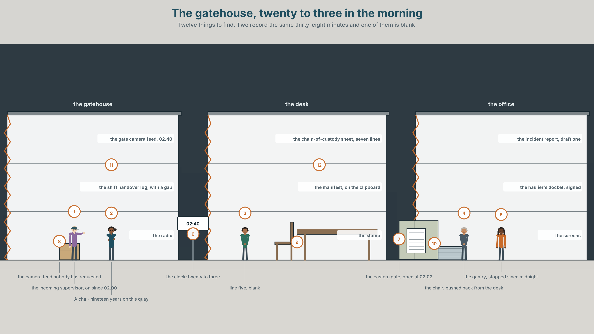
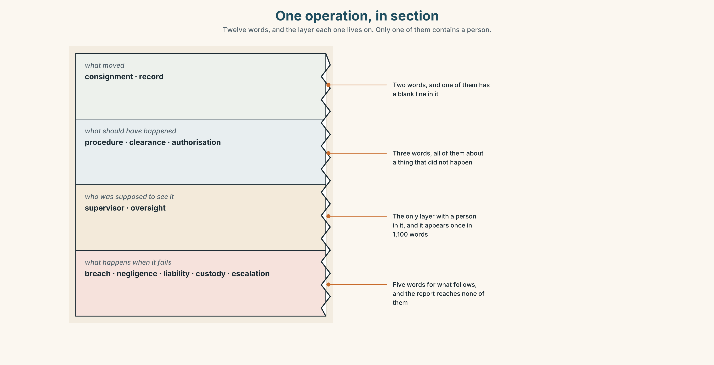
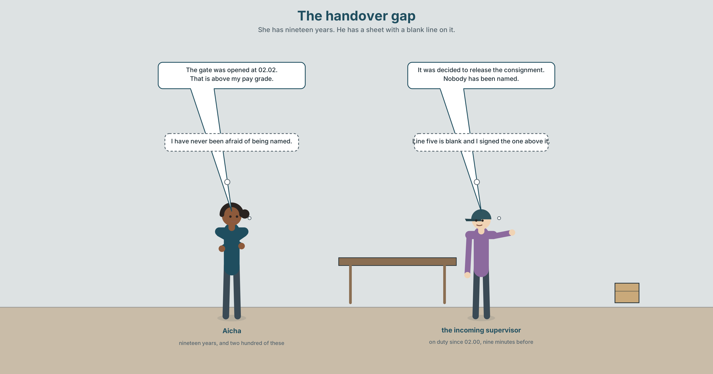
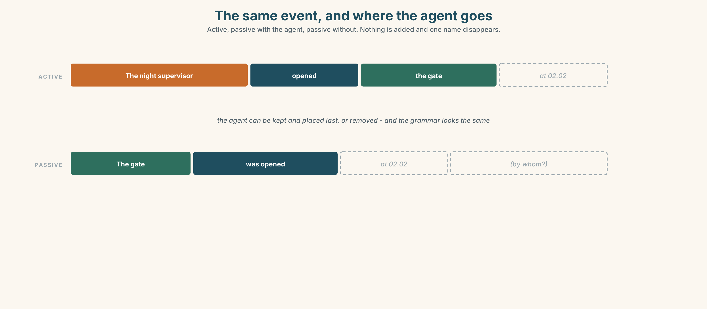
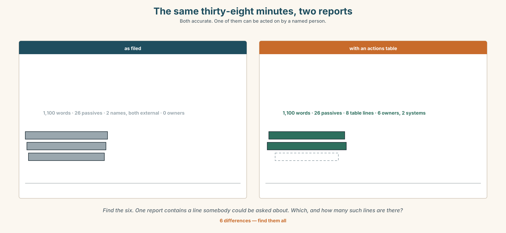
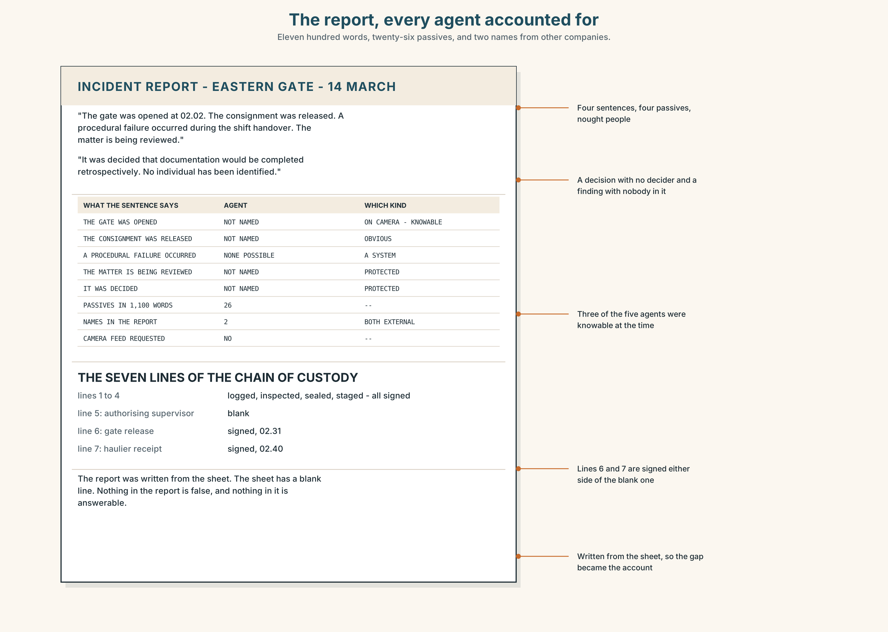
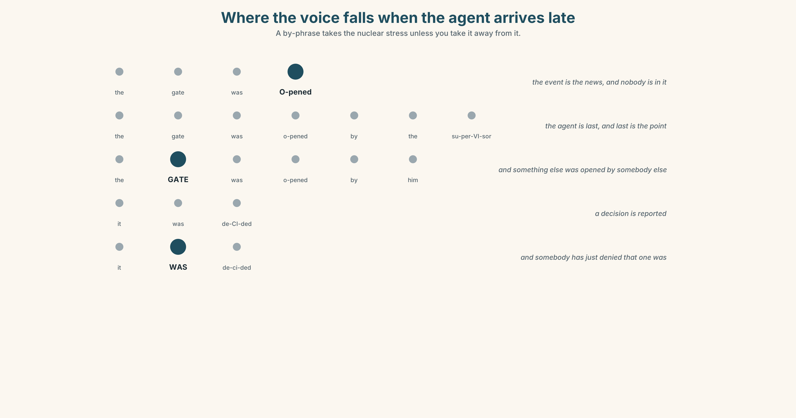
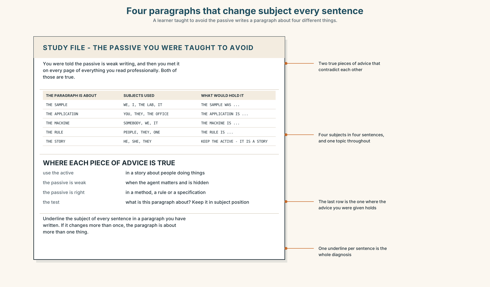
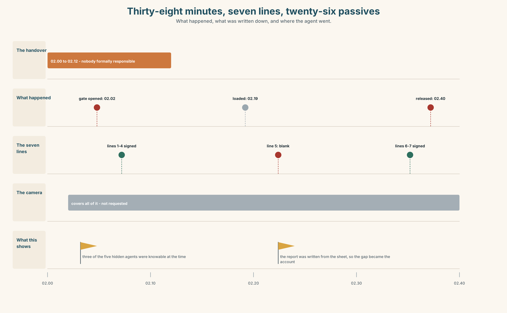
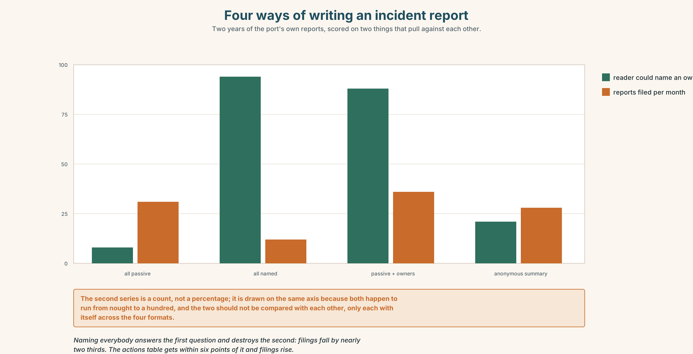

# B2.2 · Unit 2 · The Goods Were Released

> **English Animated** · *Holding the Floor* · a port and its logistics chain, Rotterdam
> Student's Book pages 28–49 · 22 pp · ~11 hours

---

## Part 0 · The Big Picture ◆ **A · THE WORLD**

{width=6.6in}

*The gatehouse, twenty to three in the morning — Twelve things to find. Two record the same thirty-eight minutes and one of them is blank.*

# Who did this, and who wants you to know?

**By the end of this unit you can choose the voice of a sentence on purpose, and say what each
choice hides. Two hundred words.**

| ◆ **A · THE WORLD** | A container released at two forty in the morning, and a report with twenty-six passives and no names in it |
|---|---|
| ◆ **B · THE SYSTEM** | the passive as an information-structure choice · 28 words for operations and responsibility · 22 words and frames for suppressing an agent · de-stressing the agent |
| ◆ **C · THE PERFORMANCE** | Two hundred words in which every voice was chosen |

---

### 0A · Find it

**Find twelve things in this picture.** Two of them record the same thirty-eight minutes and one
of them is blank.

> the gate camera feed, 02.40 · the shift handover log, with a gap in it ·
> the manifest on the clipboard · the release stamp · the gantry, stopped ·
> the chain-of-custody sheet, seven lines · the incident report, draft one ·
> the haulier's docket, signed · a radio on the desk · a bank of screens showing the quay ·
> a clock at 02.40 · a chair pushed back from the desk

### 0B · Guess it

**One document in this picture would answer the whole question, and it has nothing on it.** Which,
and what does an empty line in it actually mean?

### 0C · Say it ⏺

**Record sixty seconds.** *Describe something that went wrong where you work or study, twice: once
naming everybody and once naming nobody.* You will record it again at the end of this unit.

---

## Part 1 · Vocabulary Lab 1 ◆ **B · THE SYSTEM**

{width=6.6in}

*One operation, in section — Twelve words, and the layer each one lives on. Only one of them contains a person.*

### 1A · Meet — the words of an operation

Match each word to one layer of the cutaway.

> **consignment** · **procedure** · **authorisation** · **supervisor** · **record** · **negligence** ·
> **clearance** · **custody** · **liability** · **oversight** · **escalation** · **breach**

### 1B · Sort — what moved, who was supposed to see it, or what happens when it goes wrong?

Three columns. **One of the twelve names a person and eleven name things, which is the shape of
the report in Part 5. Count how often that one appears in it.**

> consignment · supervisor · clearance · breach · liability · procedure · negligence · oversight ·
> authorisation · custody · record · escalation

### 1C · Meet — the five phrases an incident report lives on

| | |
|---|---|
| **chain of custody** | Seven lines, each with a name and a time. One of them is blank. |
| **standard operating procedure** | What should have happened. Never what did. |
| **the shift handover** | Twelve minutes in which nobody is formally responsible for anything. |
| **a near miss** | Something that did not happen, reported as though it had. |
| **root cause** | The point at which the investigation decides to stop. |

### 1D · Collocation Lab

Complete each one, and say which of the five is the only one that names a person.

> **at some point** · **the goods were released** · **a procedural failure** ·
> **on whose authority** · **signed off by**

1. ______ ______ ______ ______ at 02.40, and the report says no more than that.
2. ______ ______ ______ between 02.02 and 02.40 the gate was opened.
3. The release was ______ ______ ______ a supervisor whose name is not in the document.
4. The question the board asked twice was ______ ______ ______ .
5. The finding is ______ ______ ______ , which is a conclusion about a document and not about anybody.

### 1E · The phrasal verbs, and the three fixed expressions

> **sign off** · **hand over** · **flag up**
>
> **f** *it was authorised* · **f** *nobody has been named* · **f** *that is above my pay grade*

**One of these fixed expressions is a refusal and two are statements.** Which is the refusal, and
what is the speaker actually declining to do?

### 1F · Own it

Write one sentence about something that went wrong recently, in the passive, and underneath it
write the name the passive is standing in front of.

---

## Part 2 · Listening ◆ **A · THE WORLD**

{width=6.6in}

*The handover gap — She has nineteen years. He has a sheet with a blank line on it.*

### 2A · The handover gap 🔊 Track 2.1

**Before you listen.** A container left the terminal at 02.40 without customs clearance. The
chain-of-custody sheet has seven lines. Line five is blank. The shift supervisor has been on the
quay for nineteen years.

**Listen once.** What is agreed, and what is the one fact nobody in the room has?

**Listen again. Complete the table.**

| | What happened | Who did it | How the report says it |
|---|---|---|---|
| the gate | | | |
| line five | | | |
| the release | | | |

**Listen again. True or false?**

1. The container left at two forty. ☐ T ☐ F
2. Line five of the sheet is blank. ☐ T ☐ F
3. The supervisor authorised the release. ☐ T ☐ F
4. The handover gap is thirty-eight minutes. ☐ T ☐ F

**Noticing.** Six sentences from the recording.

1. *Somebody opened the gate at 02.02.*
2. *The gate was opened at 02.02.*
3. *The gate was opened by the night supervisor at 02.02.*
4. *At 02.02 the gate was opened.*
5. *It was decided to release the consignment.*
6. *The consignment was released, the gate having been opened at 02.02.*

**All six are about one event. Which of them contain an agent, which put the time first, and which
one could not be written at all without the passive?**

### 2B · Decoding clinic 🔊 Track 2.2

Thirty seconds at speed. Three jobs.

1. One speaker says *it was decided* twice. Mark the stress in both.
2. Where does the voice fall in *the gate was opened by the night supervisor*?
3. Somebody says *that is above my pay grade*. What had just been asked?

---

## Part 3 · Grammar Lab 1 ◆ **B · THE SYSTEM**

### Choosing which end of the sentence the subject goes

### 3A · Notice

Look at the six sentences in Part 2 again.

1. Which sentences name the person, and which merely allow one?
2. Sentence 4 and sentence 2 contain the same words. **What is different, and what does it change?**
3. Sentence 5 has a subject that is not a thing. **What is *it* doing there?**
4. Sentence 6 is a participle clause. **What has happened to the gate-opening, and why?**

### 3B · See

{width=6.6in}

*The same event, and where the agent goes — Active, passive with the agent, passive without. Nothing is added and one name disappears.*

### 3C · Know

| | | |
|---|---|---|
| **the passive without an agent** | *The gate was opened.* | the actor is removed and no rule is broken |
| **the passive with an agent** | *The gate was opened by the supervisor.* | the actor is named, and placed last |
| **the passive to keep a topic** | *The consignment was logged, inspected and released.* | one subject, three verbs, no repetition |
| **the passive to put the new fact last** | *At 02.02 the gate was opened.* | time first, event last, which is where English wants it |
| **the impersonal *it*** | *It was decided to release it.* | the deciding has no decider and no date |
| **agent suppression by nominalisation** | *The release of the consignment followed.* | even the verb has gone |

> **The passive is not a way of being vague.** It is a way of deciding what the sentence is about.
> *The gate was opened by the supervisor* is a sentence about the gate; *The supervisor opened the
> gate* is a sentence about the supervisor. Both name him, and they belong in different paragraphs.

> **An agentless passive is a choice, and the reader cannot tell which kind.** Sometimes the agent
> is unknown, sometimes it is obvious, sometimes it is being protected, and the grammar looks
> identical in all three cases. That is the whole of this unit.

| | |
|---|---|
| **the institutional set** | *it was decided · a decision was taken · action has been taken* |
| **the review set** | *the matter is being reviewed · steps are being taken · it is understood* |
| **the closing set** | *lessons have been learned · an error occurred · no individual has been identified* |
| **what organisations do** | *look into · follow up · put down to* |

> **Why it matters.** Every incident report in the world is written in this grammar, and it is the
> grammar of safety as well as of evasion. Telling the two apart is a professional skill, and it
> starts with being able to produce both.

### 3D · Use — controlled

Rewrite each one in the voice the purpose in brackets requires.

> The night supervisor opened the gate at 02.02. (1) *(the paragraph is about the gate)*
> Somebody released the consignment. (2) *(the agent is genuinely unknown)*
> We decided to release it. (3) *(an institutional decision with no date)*
> The gate was opened at 02.02. (4) *(put the time first, keep the passive)*
> The gate was opened and then the consignment was released. (5) *(one participle clause)*

### 3E · Use — guided

Put the agent back into each one, and say what the sentence is now about.

1. The gate was opened at 02.02.
2. It was decided to release the consignment.
3. Line five was left blank.
4. The matter is being reviewed.
5. The release of the consignment followed.

### 3F · Use — open

**In pairs.** One of you reads a passive sentence from a real document. The other asks *by whom?*
until either a name appears or the first speaker can say why there is not one. **Four each.**

### 3G · Error autopsy

> ✗ *The gate was opened by at 02.02.*
> ✗ *It was decided by the decision to release it.*
> ✗ *Having opened the gate, the consignment was released.*

For each, name the rule and say what the writer was reaching for.

### 3H · Check — eight items

> 1. The night supervisor opened the gate. → *(make it about the gate, and keep him in it)*
> 2. Somebody released the consignment. → *(agent genuinely unknown)*
> 3. We decided to release it. → *(institutional, no date)*
> 4. The gate was opened at 02.02. → *(time first)*
> 5. The gate was opened and the consignment was released. → *(one participle clause)*
> 6. ✗ *Having opened the gate, the consignment was released.* → correct it.
> 7. Rewrite *The matter is being reviewed* so that somebody is doing the reviewing.
> 8. Rewrite *An error occurred* twice: once where the agent is unknown and once where it is not.

---

## Part 4 · Speaking ◆ **C · THE PERFORMANCE**

### 4A · Fluency starter — by whom?

One person reads a passive sentence aloud. Everybody else asks *by whom?* **The sentence is not
finished until either a name arrives or the reader can say why none exists.**

### 4B · The functional core — choosing voice deliberately

{width=6.6in}

*The same thirty-eight minutes, two reports — Both accurate. One of them can be acted on by a named person.*

**Language Bank**

| | |
|---|---|
| **keeping the topic** | *the consignment was logged, inspected and released* |
| **removing the agent** | *it was decided · a decision was taken · an error occurred* |
| **promising movement** | *steps are being taken · the matter is being reviewed · action has been taken* |
| **naming without blaming** | *the gate was opened by the night supervisor, who had not been briefed* |

**Information gap.** Learner A has the camera log. Learner B has the chain-of-custody sheet.
**Reconstruct the thirty-eight minutes by speaking only, and write one sentence about each.**

### 4C · The performance — three minutes ⏺

Present an incident in three minutes. **Every sentence must have its voice chosen, and you must be
able to say why for any three your partner picks.**

**Record it.**

### 4D · Observer

One person marks every passive and writes beside it whether the agent is unknown, obvious or
protected.

### 4E · Three criteria

> ☐ Could I justify the voice of every sentence?
> ☐ Did any agentless passive hide something I actually knew?
> ☐ Did the topic of each paragraph stay in subject position?

---

## Part 5 · Reading ◆ **A · THE WORLD**

### 5A · Predict

The title is **"Line five."**
**What does a blank line on a signed form prove, and what does it only suggest?**

### 5B · Read — two minutes

---

**Line five**

At 02.40 on 14 March a forty-foot consignment left the terminal by the eastern gate. It had not
been cleared. The haulier's docket was signed. The chain-of-custody sheet has seven lines; line
five, which records the authorising supervisor, is blank.

The incident report runs to eleven hundred words. A standards officer counted the passive
constructions in it: twenty-six. It contains two names, both of them employees of other
companies.

The report says the gate was opened at 02.02, that the consignment was released, that a
procedural failure occurred during the shift handover, and that the matter is being reviewed. All
four sentences are true. Not one of them has a person in it.

The handover runs from 02.00 to 02.12. For those twelve minutes the outgoing supervisor has
handed over and the incoming one has not yet taken responsibility. The gap between the gate
opening and the departure is thirty-eight minutes, and the camera feed covers all of it.

Nobody has watched the camera feed. It was not requested, because the report was already written,
and the report was written from the chain-of-custody sheet, on which line five is blank.

---

### 5C · Comprehension — eight questions

1. When did the consignment leave, and by which gate?
2. How many lines does the chain-of-custody sheet have, and which one is blank?
3. How long is the report, and how many passives does it contain?
4. How many names are in it, and who are they?
5. How long is the handover, and how long is the gap?
6. **Why does the writer point out that both named people work for other companies?**
7. **"All four sentences are true." What is the writer establishing before making the next point?**
8. **The last paragraph is a loop. Describe the loop, and say which step a reader would break first.**

### 5D · Vocabulary in context

Infer from the text, then check.

> had not been cleared · records the authorising supervisor · has handed over · the camera feed
> covers all of it · it was not requested

### 5E · The counter-text

{width=6.6in}

*The report, every agent accounted for — Eleven hundred words, twenty-six passives, and two names from other companies.*

**Read the incident report and answer.**

1. How many passive constructions are in the first paragraph?
2. **Find every sentence in which an agent could have been named and was not, and say in each
   case whether it is unknown, obvious or protected.**
3. The report names two people. **Why those two?**
4. **Rewrite the four main findings so that each has an owner and a date.**

### 5F · Two texts

The report says *a procedural failure occurred during the shift handover*.
The sheet says *line five: blank*.

**Which of these is a finding?** Write two sentences, and use the word *oversight* in one of them.

---

## Part 6 · Vocabulary Lab 2 ◆ **B · THE SYSTEM**

### Saying that something happened without saying who

### 6A · Sort — how it happened, when it was done, or by whom?

Three columns.

> inadvertently · belatedly · independently · routinely · provisionally · systematically ·
> formally · unaccountably

### 6B · Chunk completion

1. ______ ______ ______ to release the consignment. *(three words)*
2. ______ ______ ______ at a meeting nobody has minuted. *(four words)*
3. ______ ______ ______ ______ since the incident. *(four words — movement promised)*
4. ______ ______ ______ ______ by the compliance team. *(four words — more movement)*
5. ______ ______ ______ ______ , and the report says no more. *(four words — faults, no owner)*
6. ______ ______ ______ ______ that the gate was already open. *(three words — attributed to nobody)*
7. ______ ______ ______ ______ . *(four words — the review that has no end date)*
8. ______ ______ ______ ______ ______ . *(five words — the sentence that closes the file)*

### 6C · Three that are not interchangeable

> *it was decided* · *a decision was taken* · *action has been taken*

**Say which one hides a person, which one hides a meeting, and which one hides whether anything
has changed.**

### 6D · The phrasal verbs and the fixed expressions

> **look into** · **follow up** · **put down to**
>
> **f** *lessons have been learned* · **f** *an error occurred* · **f** *we are unable to comment*

**One of these fixed expressions has a subject that cannot be identified even in principle.**
Which, and who exactly would have learned them?

### 6E · Contrast Clinic

Eight items. Rewrite each sentence as the bracket asks.

1. The night supervisor opened the gate. *(make it about the gate, keep him in it)*
2. Somebody released the consignment. *(agent genuinely unknown)*
3. We decided to release it. *(institutional, undated)*
4. The gate was opened at 02.02. *(time first)*
5. An error occurred. *(name the error and its owner)*
6. The matter is being reviewed. *(say who is reviewing it and by when)*
7. Lessons have been learned. *(say who learned what, and what changed)*
8. Line five was left blank. *(name the person and the moment)*

---

## Part 7 · Pronunciation & Fluency Lab ◆ **B · THE SYSTEM**

{width=6.6in}

*Where the voice falls when the agent arrives late — A by-phrase takes the nuclear stress unless you take it away from it.*

### Where the voice falls when an agent arrives late

### 7A · Hear 🔊 Track 2.3

> *The gate was OPENED.* — the event is the news, and there is nobody in it
> *The gate was opened by the SUPERVISOR.* — the agent is last, and the last word is the point
> *The gate was opened by the supervisor, who had not been BRIEFED.* — the agent is swallowed

### 7B · Say

Say all three. Then say this:

> *It was DECIDED.* — and then: *It WAS decided.* The first reports a decision. The second says
> somebody has just denied that one was made.

### 7C · Make it mean something

Say these two:

> *The gate was opened by the night supervisor.* — the stress on *supervisor*: that is the news
> *The gate was opened by the night supervisor.* — the stress on *gate*: and something else was
> opened by somebody else

**A *by*-phrase at the end of a passive takes the nuclear stress unless you take it away,** and
taking it away is how a writer names somebody without pointing at them.

### 7D · Fluency 30 ⏺

Thirty seconds: **one event, four sentences, the agent arriving in a different place each time.**
Three times, faster.

---

## Part 8 · Writing ◆ **C · THE PERFORMANCE**

### An incident account with every voice chosen · 200 words

### 8A · Read the model

> At 02.02 the eastern gate was opened. `[time first, event last: the passive is doing information
> structure, not hiding anybody]`
>
> The consignment was logged at 01.48, loaded at 02.19 and released at 02.40 without customs
> clearance. `[one subject, four verbs, no repetition — the passive is the only way to write this
> sentence once]`
>
> Line five of the chain-of-custody sheet, which records the authorising supervisor, was left
> blank by the incoming night supervisor, who had taken responsibility nine minutes earlier.
> `[the agent is named and placed last, and the relative clause after it carries the mitigation]`
>
> The camera feed covering the thirty-eight minutes has not been requested. It will be reviewed by
> the standards officer by 28 March. `[one agentless passive, deliberately: nobody requested it,
> and that is the finding — followed immediately by a passive with an owner and a date]`

**Questions about the writer's choices:**

1. The first sentence has no agent. **Is anybody being protected? How do you know?**
2. The third sentence names somebody and then immediately adds a clause. **What is that clause
   doing, and is it fair?**
3. The last paragraph has two passives doing opposite jobs. **Name both.**

### 8B · The anti-model

> A procedural failure occurred during the shift handover. It was decided that the consignment should be released. An error was made in the completion of documentation. The matter is being reviewed and steps are being taken to ensure that lessons are learned going forward.

Four sentences, six agentless passives, and not one person, date or document in any of them.
**Rewrite it with an owner and a date on every finding.**

### 8C · Plan

> time first, event last → one subject carrying four verbs → the agent named and placed last,
> with its mitigation → one deliberate agentless passive, then one with an owner and a date

### 8D · Write — 200 words
### 8E · Peer review — three criteria

> ☐ Can you justify the voice of every sentence?
> ☐ Does any agentless passive conceal something you know?
> ☐ Does each finding have somebody who could be asked about it?

### 8F · Write it again · 8G · Publish

Rewrite after review. **Publish both, and mark each passive as unknown, obvious or protected.**

---

## Part 9 · The File ◆ **A · THE WORLD + C · THE PERFORMANCE**

{width=6.6in}

*Four paragraphs that change subject every sentence — A learner taught to avoid the passive writes a paragraph about four different things.*

# STUDY FILE · The passive you were taught to avoid

### 9A · It was done by me 🔊 Track 2.4

Learners are taught that the passive is weak writing and then meet it on every page of everything
they read professionally. The result is a learner who can form it and will not use it, and whose
paragraphs change subject in every sentence.

| | |
|---|---|
| **what you were told** | use the active; the passive is weak |
| **where it is true** | in a story about people doing things |
| **where it is false** | in a report, a method, a specification or a procedure |
| **the test** | what is this paragraph about? Keep that in subject position |

### 9B · Keep the topic

Take a paragraph you have written in English.
**Underline the subject of every sentence.** If it changes more than once, rewrite so that it does
not.

### 9C · Role play — by whom?

In pairs. One of you describes a process. The other asks *by whom?* after every sentence.
**Four rounds each**, and count how often the answer is *it does not matter*.

### 9D · The sentence you cannot write actively

Everybody has one: a method, a rule, a thing done to you.
**Find yours and write it both ways.** The active version is usually longer and names somebody
irrelevant.

### 9E · Transfer — before next week

**Find one real document in your field and count its passives.** Bring the count, and mark three
as unknown, obvious or protected.

---

## Part 10 · Mediation & Interaction ◆ **C · THE PERFORMANCE**

{width=6.6in}

*Thirty-eight minutes, seven lines, twenty-six passives — What happened, what was written down, and where the agent went.*

### 10A · Relay

Half the class has the report. Half has the chain-of-custody sheet and the camera times.
**Reconstruct the thirty-eight minutes by speaking only.** Ten minutes.

### 10B · Simplify — for one reader

The customer writes: *Who let my container leave uncleared?*
**Reply in four sentences,** two active and two passive, and say in each case why.

### 10C · Online

Write **one message** asking for the camera feed. **Three sentences.** Do not accuse anybody of
not having requested it.

### 10D · Your language

Does your language have a passive, and if not, what does it use instead?
**Translate all six sentences from Part 2.** Which ones force you to supply an agent?

---

## Part 11 · The Decision ◆ **C · THE PERFORMANCE**

# How the port writes incident reports

**Option one:** keep the convention. Agentless reporting is what makes people report at all; name
individuals and the next near miss will not be filed.

**Option two:** name everybody involved, every time. A report that cannot say who did what is not
a report.

**Option three:** keep the narrative in the passive, and require an actions table in which every
line has an owner, a date and a verb.

### 11A · The evidence

{width=6.6in}

*Four ways of writing an incident report — Two years of the port's own reports, scored on two things that pull against each other.*

🔊 **Track 2.6.** Aïcha Benali, shift supervisor, 30 seconds: *"Nineteen years and I have filed
about two hundred of these. I have never once been afraid of being named. What I am afraid of is
being named for something the system made inevitable, which is a different thing, and the report
form has no box for it. Give me a box for it and I will put my name in the one above."*

### 11B · Talk about it

In threes. Use the frame, and choose the voice of every sentence on purpose.

> *I would ______ , because ______ . The agent here is ______ , and that is ______ .*

### 11C · Decide

Write **three sentences**: the decision, the evidence, and the one passive you would refuse to
allow.

### 11D · Model decision

> Option three. Naming everybody is the right instinct and the wrong mechanism: it names the hand
> and not the system, and the hand is almost never where the finding is. The narrative stays in
> the passive because a narrative about a consignment should be about the consignment. The table
> is what makes the report answerable, and it costs eight lines. If a line in it has no owner, the
> finding is a system finding, and that is information rather than a gap.

### 11E · The Reveal

> **What happened.** The port kept the passive narrative and added the actions table. Reports
> filed per month rose from thirty-one to thirty-six.
>
> Then something nobody predicted: the proportion of reports whose findings named a system rather
> than a person rose from a fifth to more than half. The table had not made people easier to
> blame; it had made it obvious, line by line, when there was nobody to write down — and that
> blank had become a finding instead of a silence.

**One question. You do not have to answer it out loud.**

> Nothing in the narrative changed. Why did the findings?

---

## Part 12 · Landing ◆ **all three lines**

### 12A · Recycle — fifteen items

> 1. The gate ______ ______ at 02.02. *(two words, passive)*
> 2. ______ ______ ______ to release the consignment. *(three words)*
> 3. ______ ______ ______ at a meeting nobody minuted. *(four words)*
> 4. ______ ______ ______ ______ since the incident. *(four words)*
> 5. ______ ______ ______ ______ by the compliance team. *(four words)*
> 6. ______ ______ ______ ______ that the gate was already open. *(three words)*
> 7. The container left ______ ______ ______ between 02.02 and 02.40. *(three words)*
> 8. The release was ______ ______ ______ a supervisor. *(three words)*
> 9. The board asked twice: ______ ______ ______ ? *(three words)*
> 10. The finding is ______ ______ ______ . *(three words)*
> 11. ______ ______ ______ ______ . *(four words — the sentence that closes the file)*
> 12. ______ ______ ______ ______ ______ . *(five words — the refusal to be drawn)*
> 13. Somebody has to ______ ______ the line-five gap. *(two words)*
> 14. The shift will ______ ______ at 02.00 as usual. *(two words)*
> 15. The outgoing crew should have ______ ______ the open gate. *(two words)*

### 12B · Consolidate — one task, everything in it

**Write 150 words describing something that went wrong**, with the voice of every sentence chosen
and three of them annotated in the margin: unknown, obvious, protected.

### 12C · Can-do, with evidence

> ☐ I can choose the voice of a sentence for information structure. **Evidence:** 3H, 8D
> ☐ I can tell an unknown agent from a protected one. **Evidence:** 5E, 4D
> ☐ I can write a finding that has an owner. **Evidence:** 6E, 10B
> ☐ I can de-stress an agent that arrives at the end. **Evidence:** 7C

### 12D · Replay ⏺

Record 0C again. **Compare.** Which of your two versions was easier, and what does that tell you?

### 12E · Glossary — fifty items, as a map

> **WHAT MOVED, AND WHAT WAS WRITTEN DOWN** · consignment · record · procedure · clearance
> **WHO WAS SUPPOSED TO SEE IT** · supervisor · authorisation · oversight
> **WHAT HAPPENS WHEN IT GOES WRONG** · breach · negligence · liability · custody · escalation
> **THE REPORT'S FURNITURE** · chain of custody · standard operating procedure · the shift handover · a near miss · root cause
> **THE SENTENCES IT USES** · at some point · the goods were released · a procedural failure · on whose authority · signed off by
> **WHAT THE SHIFT DOES** · sign off · hand over · flag up · look into · follow up · put down to
> **IN THE ROOM** · it was authorised · nobody has been named · that is above my pay grade
> **THE ADVERBS** · inadvertently · routinely · systematically · unaccountably · belatedly · independently · formally · provisionally
> **THE FRAMES** · it was decided · mistakes have been identified · action has been taken · a decision was taken · it is understood · steps are being taken · the matter is being reviewed · no individual has been identified
> **CLOSING THE FILE** · lessons have been learned · an error occurred · we are unable to comment

### 12F · Next

> **Unit 3 · How much can one noun carry?**
