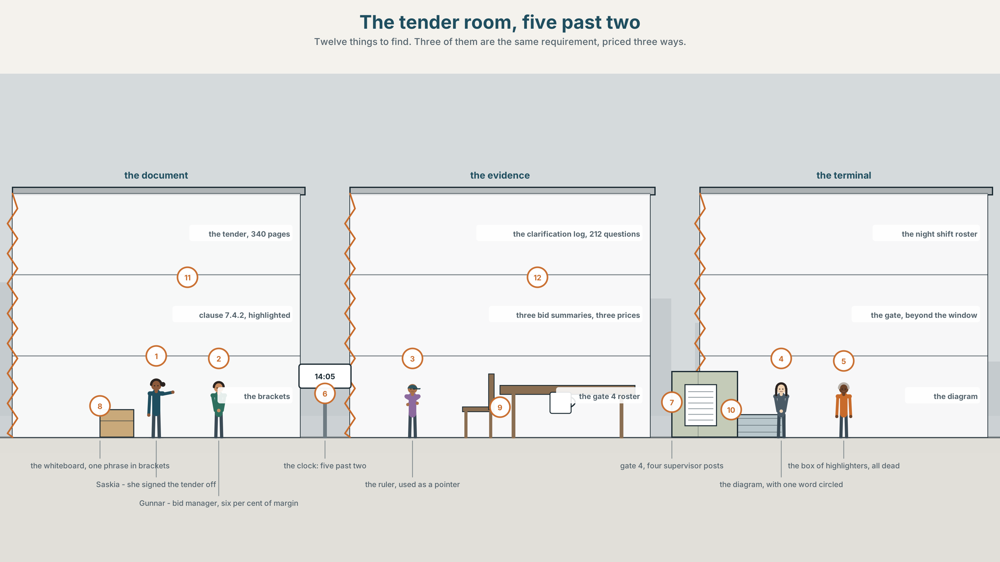
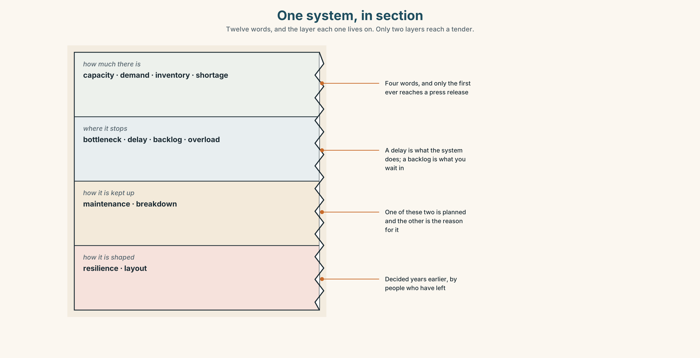
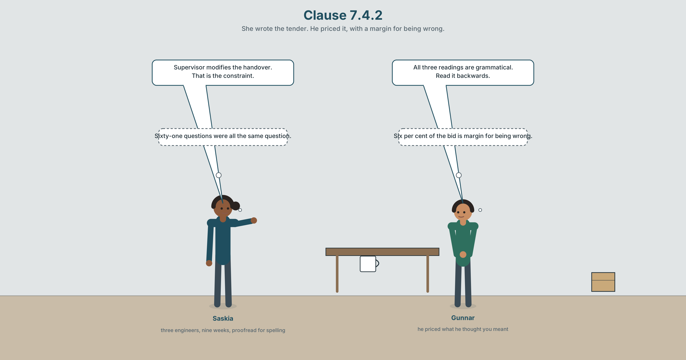
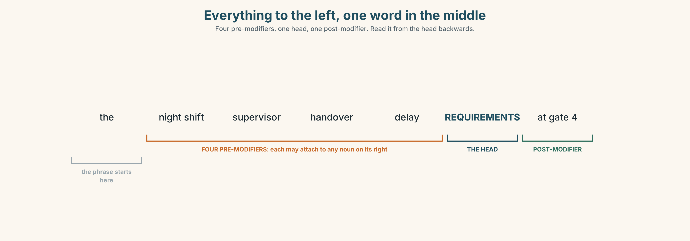
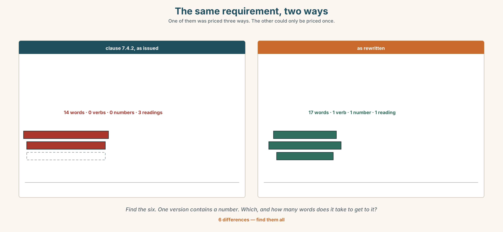
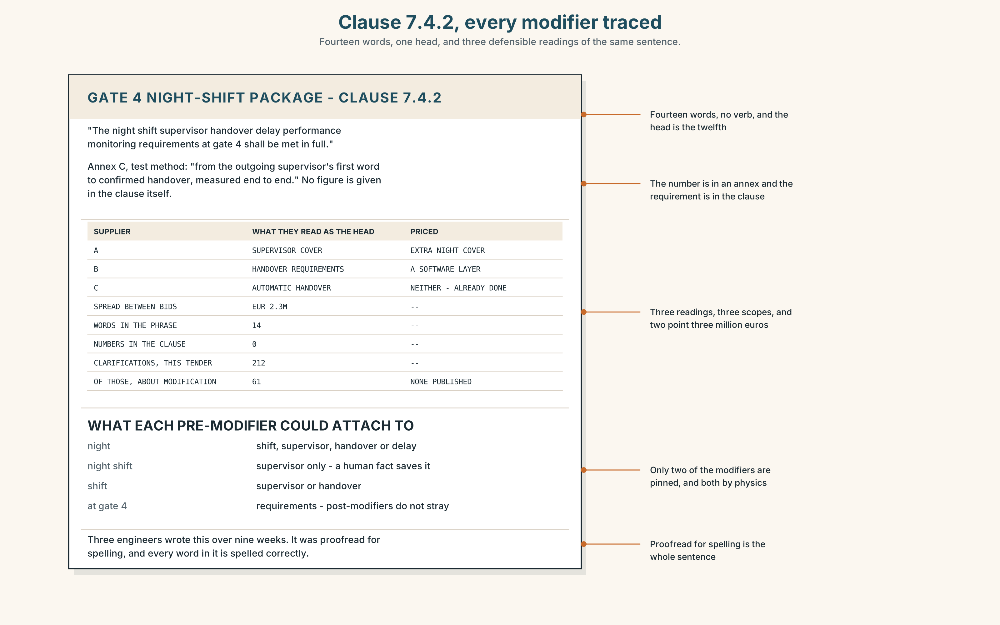
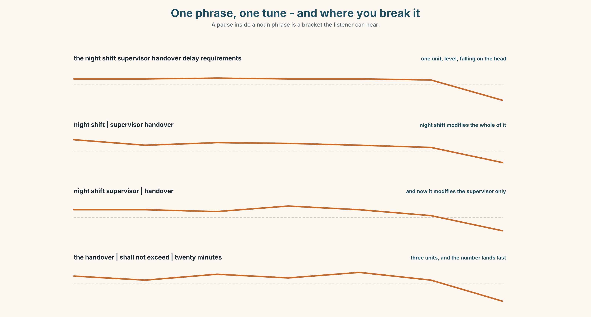
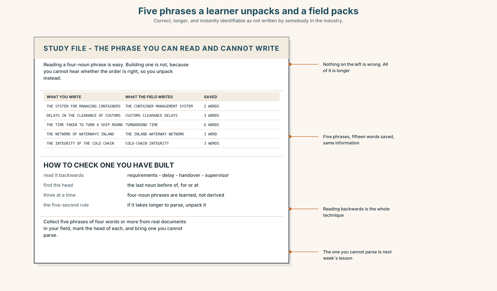
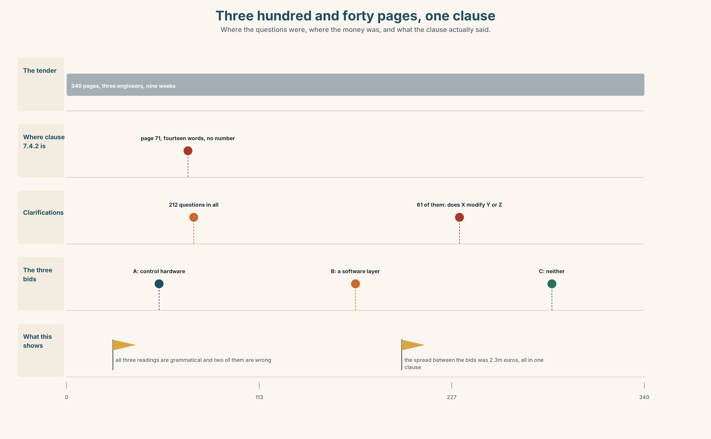
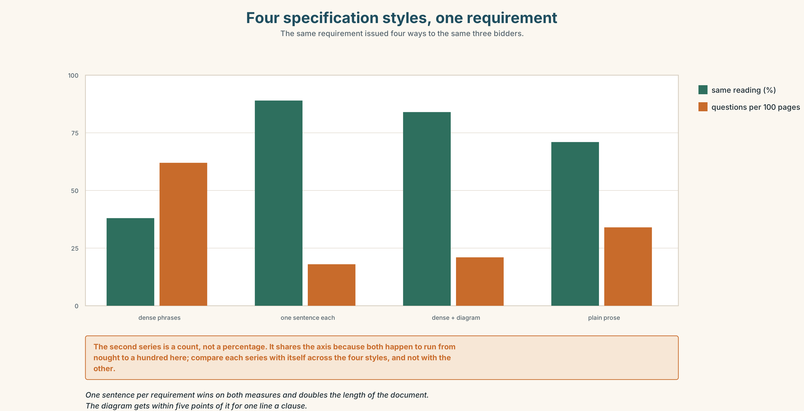

# B2.2 · Unit 3 · Fourteen Words, One Noun

> **English Animated** · *Holding the Floor* · a port and its logistics chain, Rotterdam
> Student's Book pages 50–71 · 22 pp · ~11 hours

---

## Part 0 · The Big Picture ◆ **A · THE WORLD**

{width=6.6in}

*The tender room, five past two — Twelve things to find. Three of them are the same requirement, priced three ways.*

# How much can one noun carry?

**By the end of this unit you can pack a clause into a noun phrase and take somebody else's apart.
Two hundred words.**

| ◆ **A · THE WORLD** | A three-hundred-and-forty-page tender, one fourteen-word noun phrase, and three suppliers who read it three ways |
|---|---|
| ◆ **B · THE SYSTEM** | complex noun phrases, before and after the head · 28 words for systems and capacity · 22 words and phrases that stack · chunking a heavy noun phrase |
| ◆ **C · THE PERFORMANCE** | Two hundred words dense enough for a specification and read the same way twice |

---

### 0A · Find it

**Find twelve things in this picture.** Three of them are the same requirement, priced three
different ways.

> the tender document, 340 pages · clause 7.4.2, highlighted ·
> the clarification log, 212 questions · three bid summaries, three prices ·
> a whiteboard with one noun phrase broken into brackets ·
> the gate beyond the window · the night shift roster ·
> the gate 4 drawing · a ruler used as a pointer · a diagram with one word circled ·
> a clock at 14.05 · a box of highlighters, all dead

### 0B · Guess it

**Three documents in this picture disagree by two point three million euros.** Which three, and
where exactly does the disagreement live?

### 0C · Say it ⏺

**Record sixty seconds.** *Describe a system you use — at work, at college, anywhere — in as much
detail as you can manage.* You will record it again at the end of this unit.

---

## Part 1 · Vocabulary Lab 1 ◆ **B · THE SYSTEM**

{width=6.6in}

*One system, in section — Twelve words, and the layer each one lives on. Only two layers reach a tender.*

### 1A · Meet — the words of a system

Match each word to one layer of the cutaway.

> **delay** · **bottleneck** · **capacity** · **resilience** · **demand** ·
> **backlog** · **breakdown** · **maintenance** · **inventory** · **layout** · **shortage** ·
> **overload**

### 1B · Sort — how much there is, where it stops, or how the whole thing is built?

Three columns. **Two of the twelve are the same event from opposite ends: one is what the system
does and the other is what you wait for.**

> backlog · bottleneck · resilience · capacity · delay · demand · breakdown ·
> layout · maintenance · inventory · shortage · overload

### 1C · Meet — the five phrases a specification turns on

| | |
|---|---|
| **a single point of failure** | One thing whose loss stops everything. Every system has one. |
| **the critical path** | The chain of tasks that decides the finish date, and only that chain. |
| **spare capacity** | What you are paying for and not using, which is what resilience is. |
| **lead time** | The gap between asking and getting, and the hardest number to shorten. |
| **a service level** | A promise with a number in it. Without the number it is a hope. |

### 1D · Collocation Lab

Complete each one, and say which of the five is the only one with a time in it.

> **peak demand** · **end to end** · **scheduled maintenance** · **turnaround time** ·
> **design margin**

1. The terminal is sized for ______ ______ , which occurs on about nine days a year.
2. ______ ______ ______ is twenty-two hours for a feeder and four days for a deep-sea call.
3. ______ ______ ______ takes two gates out for six weeks every second year.
4. The clause specifies the handover ______ ______ ______ , from outgoing shift to incoming.
5. The specification carries a twenty per cent ______ ______ , which three suppliers priced three ways.

### 1E · The phrasal verbs, and the three fixed expressions

> **scale back** · **build in** · **roll out**
>
> **f** *it depends on the volume* · **f** *that is the constraint* · **f** *there is no slack*

**One of these fixed expressions ends an argument and two continue it.** Which ends it, and what
must be true for it to be fair?

### 1F · Own it

Write one noun phrase of at least six words describing something in your own field, and then
circle the head.

---

## Part 2 · Listening ◆ **A · THE WORLD**

{width=6.6in}

*Clause 7.4.2 — She wrote the tender. He priced it, with a margin for being wrong.*

### 2A · Clause 7.4.2 🔊 Track 3.1

**Before you listen.** The tender runs to three hundred and forty pages. Clause 7.4.2 contains a
fourteen-word noun phrase. Three suppliers have priced it, and the prices differ by two point
three million euros.

**Listen once.** What do the three suppliers each think the clause is asking for?

**Listen again. Complete the table.**

| | What they think the head noun is | What they priced | The difference |
|---|---|---|---|
| supplier A | | | |
| supplier B | | | |
| supplier C | | | |

**Listen again. True or false?**

1. The tender is three hundred and forty pages. ☐ T ☐ F
2. All three suppliers priced the same scope. ☐ T ☐ F
3. The clarification log has two hundred and twelve questions. ☐ T ☐ F
4. The phrase has a post-modifier at the end. ☐ T ☐ F

**Noticing.** Four versions of the same requirement.

1. *the night shift supervisor handover delay requirements at gate 4*
2. *the delay requirements for handover by the night shift supervisors at gate 4*
3. *the requirements for handover delay by night shift supervisors at gate 4*
4. *at gate 4, handover by the night shift supervisor shall not exceed twenty minutes*

**All four describe one thing. Find the head noun in each of the first three, and say which of the
four could be priced without a question.**

### 2B · Decoding clinic 🔊 Track 3.2

Thirty seconds at speed. Three jobs.

1. One speaker reads a fourteen-word noun phrase aloud. Mark where they pause.
2. Which word carries the main stress, and why that one?
3. Somebody says *read it backwards*. Do it, and say what it is for.

---

## Part 3 · Grammar Lab 1 ◆ **B · THE SYSTEM**

### Everything to the left, and everything to the right

### 3A · Notice

Look at the four versions in Part 2 again.

1. In version 1, which word is the head? **How did you find it?**
2. Version 2 and version 3 have different heads. **Which, and what changes?**
3. Version 4 has no long noun phrase at all. **What has it got instead?**
4. **Why can version 1 be read three ways and version 4 only one?**

### 3B · See

{width=6.6in}

*Everything to the left, one word in the middle — Four pre-modifiers, one head, one post-modifier. Read it from the head backwards.*

### 3C · Know

| | | |
|---|---|---|
| **the head** | the last noun before any *of*, *for*, *at* or relative clause | *…delay **requirements** at gate 4* |
| **pre-modifiers** | adjectives and nouns stacked to the left, no limit | *night shift supervisor handover delay* |
| **post-modifiers** | prepositional phrases, relatives, participles, to the right | *…at gate 4, which runs all night* |
| **the reading rule** | work right to left from the head | *requirements ← delay ← handover ← supervisor* |
| **the ambiguity** | each pre-modifier may attach to any noun on its right | *supervisor* — the handover, or the delay? |
| **the cure** | one post-modifier, or one verb | *handover shall not exceed twenty minutes* |

> **A noun phrase is a clause with the verb taken out.** *The automation of the gates was
> deployed* becomes *gate automation deployment*, and three words have replaced nine. The density
> is the point; the cost is that nobody can tell what did what to what.

> **English stacks nouns to the left and English readers parse from the head.** That is why a long
> pre-modified phrase is read backwards, and why the sixth word of a fourteen-word phrase is the
> one that nobody can place. Post-modification is longer and never ambiguous, which is the whole
> trade.

| | |
|---|---|
| **the stackable set** | *container · handling · terminal · automation · deployment · integration · allocation · scheduling* |
| **phrases they build** | *a container handling terminal · a terminal operating system · a customs clearance delay* |
| **what systems people do** | *stack up · take up · set up* |
| **how you take one apart** | *three nouns in a row · what modifies what · read it backwards* |

> **Why it matters.** A specification is a document people price. A noun phrase that can be read
> two ways is not a style problem; it is two point three million euros, and the people who find it
> are the ones who read backwards.

### 3D · Use — controlled

Turn each clause into a noun phrase.

> They deploy automation at the gates. → (1) ______
> The system schedules the allocation of shifts. → (2) ______
> Customs clearance was delayed. → (3) ______
> They integrated the terminal operating system. → (4) ______
> The waterway network inland was extended. → (5) ______

### 3E · Use — guided

Unpack each noun phrase into a sentence with a verb and name every participant.

1. gate automation deployment delays
2. container handling terminal capacity constraints
3. terminal operating system integration requirements
4. shift allocation scheduling problems
5. staff training programme delivery targets

### 3F · Use — open

**In pairs.** One of you says a four-noun phrase from your own field. The other reads it backwards
aloud and then asks *what modifies what?* **Six rounds each.**

### 3G · Error autopsy

> ✗ *the night of the shift supervisor handover delay*
> ✗ *the handover delay requirements which at gate 4*
> ✗ *the gate 4 at handover delay requirements*

For each, name the rule and say what the writer was reaching for.

### 3H · Check — eight items

> 1. They deploy automation at the gates. → ______ *(three words)*
> 2. The system schedules shift allocation. → ______ *(three words)*
> 3. Customs clearance was delayed. → ______ *(three words)*
> 4. They integrated the terminal operating system. → ______ *(five words)*
> 5. In *night shift supervisor handover delay requirements*, name the head.
> 6. ✗ *the gate 4 at handover delay requirements* → correct it.
> 7. Rewrite *gate automation deployment delays* as a sentence with two participants.
> 8. Rewrite item 5 so that it can only be read one way.

---

## Part 4 · Speaking ◆ **C · THE PERFORMANCE**

### 4A · Fluency starter — add one to the left

One person says a two-word noun phrase. Each person adds one modifier to the left. **The round
ends when somebody cannot say what the head is** — and everybody counts the words.

### 4B · The functional core — packing information

{width=6.6in}

*The same requirement, two ways — One of them was priced three ways. The other could only be priced once.*

**Language Bank**

| | |
|---|---|
| **packing** | *customer service · staff training · food safety · waste collection* |
| **anchoring the head** | *requirements for · capacity at · access to · integrity of* |
| **unpacking** | *what modifies what · read it backwards · three nouns in a row* |
| **pricing it** | *it depends on the volume · that is the constraint · there is no slack* |

**Information gap.** Learner A has clause 7.4.2. Learner B has the gate 4 shift roster.
**Agree on one sentence that a supplier could price.** Ten minutes.

### 4C · The performance — three minutes ⏺

Specify something in three minutes — a process, a device, a service. **Every requirement must be
one sentence with one number in it,** and your partner must be able to repeat any of them back.

**Record it.**

### 4D · Observer

One person writes down every noun phrase of four words or more and marks the head in each.

### 4E · Three criteria

> ☐ Could my partner find the head of every phrase I used?
> ☐ Did each requirement have a number?
> ☐ Did I pack where packing helped, and unpack where it did not?

---

## Part 5 · Reading ◆ **A · THE WORLD**

### 5A · Predict

The title is **"Two point three million euros."**
**How can three companies reading one sentence arrive at three prices?**

### 5B · Read — two minutes

---

**Two point three million euros**

The tender for the gate 4 night-shift package runs to three hundred and forty pages. Clause 7.4.2
specifies, in a single noun phrase of fourteen words, the maximum handover delay between
the outgoing and the incoming night supervisor.

Three suppliers bid. Their prices differ by two point three million euros, and the whole of the
difference sits in that clause.

Supplier A read the phrase as a requirement about supervisors, and priced extra night cover.
Supplier B read it as a requirement about the handover, and priced a software layer. Supplier C
read *supervisor* as modifying *delay* rather than *handover*, and priced neither, on the grounds
that the handover is already automated.

All three readings are grammatical. Two of them are wrong, and the tender does not contain a
sentence that says which.

The clarification log for this tender holds two hundred and twelve questions. Sixty-one of them
are of the form *does X modify Y or Z*. The port answered all sixty-one individually, by email,
to the supplier who asked, and published none of the answers.

The specification was written by three engineers over nine weeks. It was proofread for spelling.

---

### 5C · Comprehension — eight questions

1. How long is the tender, and what does clause 7.4.2 specify?
2. How much do the prices differ by?
3. What did each supplier price?
4. How many questions are in the clarification log, and how many are about modification?
5. How were the sixty-one answered?
6. **Why does the writer say "all three readings are grammatical"?**
7. **The answers were sent individually and not published. What does that do to a tender?**
8. **The last sentence is seven words long. What is it doing, and why does it come last?**

### 5D · Vocabulary in context

Infer from the text, then check.

> sits in that clause · on the grounds that · of the form · individually, by email · proofread for
> spelling

### 5E · The counter-text

{width=6.6in}

*Clause 7.4.2, every modifier traced — Fourteen words, one head, and three defensible readings of the same sentence.*

**Read clause 7.4.2 and answer.**

1. Where is the head noun, counted in words from the start?
2. **Mark every pre-modifier and say which nouns to its right it could attach to.**
3. The clause has one post-modifier. **What does it attach to, and could it attach to anything else?**
4. **Rewrite the clause as three sentences, each with one number.**

### 5F · Two texts

The clause says *night shift supervisor handover delay requirements at gate 4*.
The roster says *outgoing to incoming, twenty minutes, gate 4 only*.

**Which is the specification?** Write two sentences, and use the word *interoperability* in one of
them.

---

## Part 6 · Vocabulary Lab 2 ◆ **B · THE SYSTEM**

### Nouns that stand in front of other nouns

### 6A · Sort — a thing, an activity, or something being put in place?

Three columns.

> service · handling · deployment · network · scheduling · integration · automation ·
> allocation

### 6B · Chunk completion

1. Complaints are answered by ______ ______ ______ ______ . *(four words)*
2. The gates are reached over ______ ______ ______ ______ . *(four words)*
3. Every new supervisor completes ______ ______ ______ ______ . *(four words)*
4. The canteen passed ______ ______ ______ ______ last March. *(four words)*
5. Each gate must display ______ ______ ______ ______ . *(four words)*
6. Staff records are held under ______ ______ ______ ______ . *(four words)*
7. The upper yard is served by ______ ______ ______ ______ . *(four words)*
8. Bins are emptied by ______ ______ ______ ______ . *(four words)*

### 6C · Three that are not interchangeable

> *a customer service department* · *a food safety inspection* · *a water supply system*

**Say which one names a group of people, which one names an event, and which one names a thing —
and in each case find the head.**

### 6D · The phrasal verbs and the fixed expressions

> **stack up** · **take up** · **set up**
>
> **f** *three nouns in a row* · **f** *what modifies what* · **f** *read it backwards*

**One of these three fixed expressions is an instruction, one is a warning and one is a question.**
Match them, and say which you would use first on a strange clause.

### 6E · Contrast Clinic

Eight items. Pack or unpack each one as the bracket says.

1. They deploy automation at the gates. *(pack to three words)*
2. gate automation deployment delays *(unpack, naming two participants)*
3. The system schedules the allocation of shifts. *(pack to three words)*
4. container handling terminal capacity constraints *(unpack into a sentence with a number)*
5. Customs clearance was delayed. *(pack to three words)*
6. terminal operating system integration requirements *(unpack, naming who integrates what)*
7. The inland waterway network was extended. *(pack to four words)*
8. inland waterway network provisioning headroom *(unpack into two sentences)*

---

## Part 7 · Pronunciation & Fluency Lab ◆ **B · THE SYSTEM**

{width=6.6in}

*One phrase, one tune - and where you break it — A pause inside a noun phrase is a bracket the listener can hear.*

### A long noun phrase is one tune, not eight

### 7A · Hear 🔊 Track 3.3

> *the night shift supervisor handover delay REQUIREMENTS* — one unit, level, falling on the head
> *the requirements | for handover delay | on night shifts* — three units, three small falls
> *the handover | shall not exceed | twenty minutes* — a sentence, and the number lands

### 7B · Say

Say all three. Then say this without pausing anywhere:

> *the night shift supervisor handover delay requirements* — seven words, one breath, one fall,
> and if you pause in the middle your listener will attach the next word to the wrong noun.

### 7C · Make it mean something

Say these two:

> *night shift | supervisor handover* — the pause makes *night shift* modify the whole thing
> *night shift supervisor | handover* — and now it modifies the supervisor only

**A pause inside a noun phrase is a bracket you can hear,** and in a specification read aloud it is
often the only thing telling a supplier which reading you meant.

### 7D · Fluency 30 ⏺

Thirty seconds: **one eight-word noun phrase said three times, with the break in a different place
each time.** Three times, faster.

---

## Part 8 · Writing ◆ **C · THE PERFORMANCE**

### A requirement that can only be read one way · 200 words

### 8A · Read the model

> At gate 4, handover between the outgoing and the incoming supervisor shall not exceed twenty
> minutes. `[one sentence, one verb, one number: nothing here can be read two ways]`
>
> This applies to all four night shift supervisor posts, and to no other staff.
> `[a four-word pre-modified phrase, which is safe because the head is the last word and the scope
> is stated]`
>
> Measurement shall be end to end, from the outgoing supervisor's first word to confirmed handover, in
> accordance with the test method at annex C. `[two post-modifiers doing what six pre-modifiers
> were doing before, and twice as long]`
>
> The twenty per cent design margin specified in clause 3.1 does not apply to this requirement.
> `[a packed noun phrase with a relative post-modifier that anchors it to a clause number — dense,
> and only one reading survives]`

**Questions about the writer's choices:**

1. The first sentence has a verb and a number. **What would the noun-phrase version have cost?**
2. Paragraph three is longer than the phrase it replaces. **Is that a loss?**
3. The last sentence packs again. **Why is it safe here?**

### 8B · The anti-model

> Night shift supervisor handover delay performance monitoring requirements for gate 4 staff scheduling allocation purposes shall be in accordance with applicable service integration deployment standards.

One sentence, twenty-six words, fourteen of them nouns, no number, and three defensible readings.
**Rewrite it as four sentences, each with one number or one reference.**

### 8C · Plan

> the requirement as a sentence with a number → the scope, packed but anchored → the method, in
> post-modifiers → one packed phrase that is safe because it points at a clause

### 8D · Write — 200 words
### 8E · Peer review — three criteria

> ☐ Can a reader find the head of every phrase in one pass?
> ☐ Does every requirement carry a number or a reference?
> ☐ Is there any pre-modifier that could attach to two different nouns?

### 8F · Write it again · 8G · Publish

Rewrite after review. **Publish both, and bracket the head of every phrase over four words.**

---

## Part 9 · The File ◆ **A · THE WORLD + C · THE PERFORMANCE**

{width=6.6in}

*Five phrases a learner unpacks and a field packs — Correct, longer, and instantly identifiable as not written by somebody in the industry.*

# STUDY FILE · The noun phrase you can read and cannot write

### 9A · Reading it and building it 🔊 Track 3.4

Most learners at this level can read a four-noun phrase and almost none will produce one. They
unpack instead — *the system for the management of the containers* — which is correct, longer, and
instantly identifiable as not written by somebody in the industry.

| | |
|---|---|
| **what you write** | *the system for the management of the containers* |
| **what the field writes** | *the container management system* |
| **why you avoid it** | you cannot hear whether the order is right |
| **the fix** | learn the phrase, not the rule: three nouns at a time |

### 9B · Pack three

Take three *of*-phrases you have written in English.
**Pack each into a pre-modified noun phrase**, and then read each one backwards to check it.

### 9C · Role play — what modifies what?

In pairs. One of you reads a four-noun phrase from your own field. The other asks *what modifies
what?* **Four rounds each**, and write down any phrase that takes more than five seconds.

### 9D · The three you already own

Everybody has three in their own field that they use without thinking.
**Name yours.** They are the model for every one you will build.

### 9E · Transfer — before next week

**Collect five noun phrases of four words or more from real documents in your field.** Bring them
with the head of each one marked, and one you cannot parse.

---

## Part 10 · Mediation & Interaction ◆ **C · THE PERFORMANCE**

{width=6.6in}

*Three hundred and forty pages, one clause — Where the questions were, where the money was, and what the clause actually said.*

### 10A · Relay

Half the class has clause 7.4.2. Half has the three bid summaries.
**Work out where the two point three million euros is, by speaking only.** Ten minutes.

### 10B · Simplify — for one reader

A supplier writes: *Does "supervisor" apply to the handover or to the delay?*
**Reply in four sentences,** and publish the answer rather than sending it.

### 10C · Online

Write **one message** proposing that every clarification answer be published to all bidders.
**Three sentences.** Say what it costs and what it buys.

### 10D · Your language

Does your language stack nouns to the left, as English does, or only to the right?
**Translate all four versions from Part 2.** Which ones become the same sentence?

---

## Part 11 · The Decision ◆ **C · THE PERFORMANCE**

# How the port writes a specification

**Option one:** keep the style. It is dense, it is what the industry writes, and every supplier
in this market has read a thousand pages of it.

**Option two:** every requirement becomes one sentence with a verb and a number. The document
doubles in length.

**Option three:** keep the dense phrases, and require that any noun phrase over six words appear
beside a bracket diagram of its head and modifiers, with one requirement, one sentence and one
number in the clause itself.

### 11A · The evidence

{width=6.6in}

*Four specification styles, one requirement — The same requirement issued four ways to the same three bidders.*

🔊 **Track 3.6.** Gunnar Holt, bid manager, 30 seconds: *"We do not price what you wrote. We price
what we think you meant, with a margin for being wrong. On this tender my margin for being wrong
was six per cent of the bid, and I will tell you exactly which clause bought it. Make the clause
unambiguous and you do not save six per cent — you save it three times, because all three of us
stop carrying it."*

### 11B · Talk about it

In threes. Use the frame, and build one noun phrase of five words or more per turn.

> *I would ______ , because ______ . The head of that phrase is ______ .*

### 11C · Decide

Write **three sentences**: the decision, the evidence, and the clause you would rewrite first.

### 11D · Model decision

> Option three. Option two is right about every individual clause and wrong about the document:
> a tender that doubles in length is a tender fewer people read to the end, and the clause that
> loses the argument is then the one nobody reached. The bracket diagram costs a line and does
> what a pause does in speech. The one-requirement rule is the part that would survive on its own,
> and the diagram is what makes it checkable before the tender goes out.

### 11E · The Reveal

> **What happened.** The port adopted the rule. Clarification questions on the next tender fell
> from two hundred and twelve to seventy-nine, and the proportion about modification fell from
> twenty-nine per cent to four.
>
> Then something nobody predicted: the spread between the bids narrowed from two point three
> million euros to three hundred thousand. Nobody had bid differently; they had stopped pricing
> three different scopes, and the margin each of them had been carrying for being wrong came out
> of all three bids at once.

**One question. You do not have to answer it out loud.**

> The port did not negotiate anything. Why did the price fall?

---

## Part 12 · Landing ◆ **all three lines**

### 12A · Recycle — fifteen items

> 1. They deploy automation at the gates. → ______ *(three words)*
> 2. The system schedules shift allocation. → ______ *(three words)*
> 3. Customs clearance was delayed. → ______ *(three words)*
> 4. Rotterdam is Europe's largest ______ ______ ______ . *(three words)*
> 5. Every movement is booked through ______ ______ ______ ______ . *(four words)*
> 6. Barges reach the hinterland over ______ ______ ______ ______ . *(four words)*
> 7. Only two gates have ______ ______ . *(two words)*
> 8. Reefer boxes are audited for ______ ______ . *(two words)*
> 9. The terminal is sized for ______ ______ . *(two words)*
> 10. Latency is measured ______ ______ ______ . *(three words)*
> 11. ______ ______ ______ ______ ______ ______ . *(six words — the test to run on a strange clause)*
> 12. ______ ______ ______ ______ . *(four words — the end of the argument)*
> 13. The queue will ______ ______ if one gate stops. *(two words)*
> 14. Spare capacity is what you ______ ______ in advance. *(two words)*
> 15. The new system will ______ ______ in April. *(two words)*

### 12B · Consolidate — one task, everything in it

**Write 150 words specifying something**, with three requirements, each one sentence with one
number, and one packed phrase of five words or more with its head marked.

### 12C · Can-do, with evidence

> ☐ I can build and parse a complex noun phrase. **Evidence:** 3H, 8D
> ☐ I can find a head and say what modifies what. **Evidence:** 5E, 6C
> ☐ I can write a requirement that has one reading. **Evidence:** 10B, 8D
> ☐ I can chunk a heavy phrase when I say it. **Evidence:** 7B

### 12D · Replay ⏺

Record 0C again. **Compare.** How many *of*-phrases did you use the first time?

### 12E · Glossary — fifty items, as a map

> **HOW MUCH THERE IS** · capacity · demand · inventory · shortage
> **WHERE IT STOPS** · bottleneck · delay · backlog · overload
> **HOW IT IS BUILT AND KEPT UP** · resilience · layout · maintenance · breakdown
> **THE FIVE SPECIFICATION PHRASES** · a single point of failure · the critical path · spare capacity · lead time · a service level
> **THE NUMBERS IN IT** · peak demand · end to end · scheduled maintenance · turnaround time · design margin
> **WHAT ENGINEERS DO** · scale back · build in · roll out · stack up · take up · set up
> **IN THE ROOM** · it depends on the volume · that is the constraint · there is no slack
> **THE STACKABLE NOUNS** · service · handling · network · automation · deployment · integration · allocation · scheduling
> **THE PHRASES THEY BUILD** · a customer service department · a city transport network · a staff training programme · a food safety inspection · an emergency response plan · a data protection policy · a water supply system · a waste collection service
> **TAKING ONE APART** · three nouns in a row · what modifies what · read it backwards

### 12F · Next

> **Unit 4 · How does academic English sound?**
