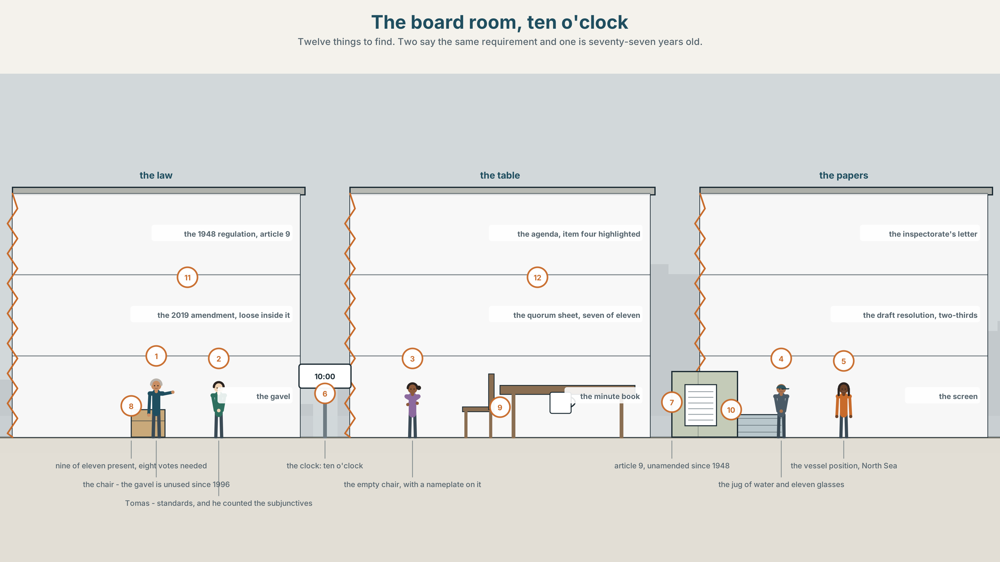
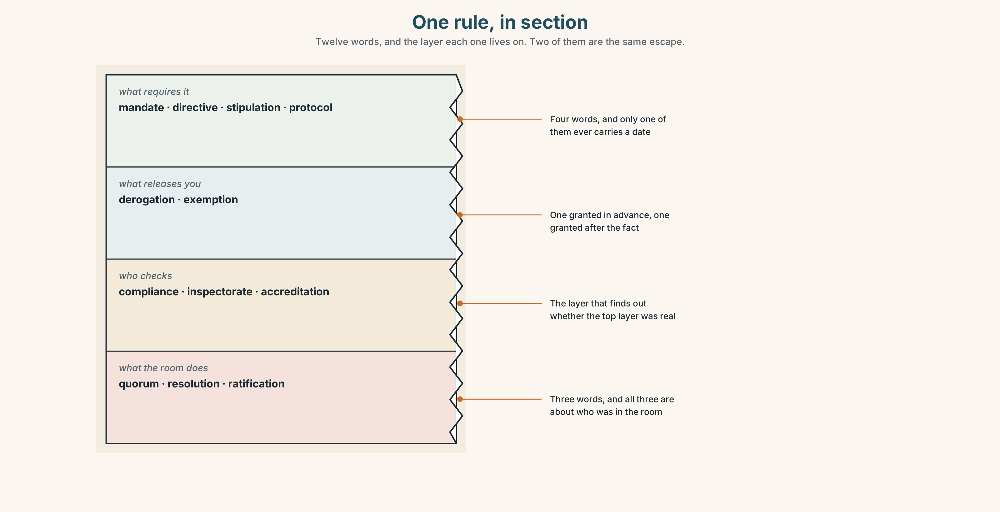
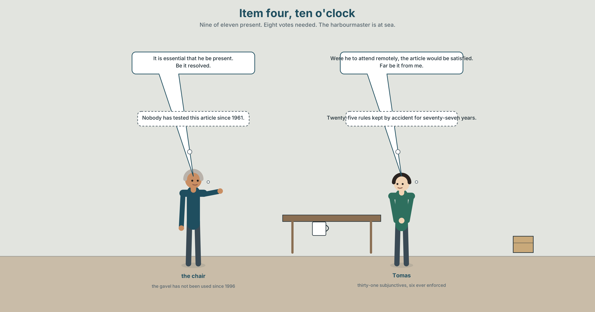
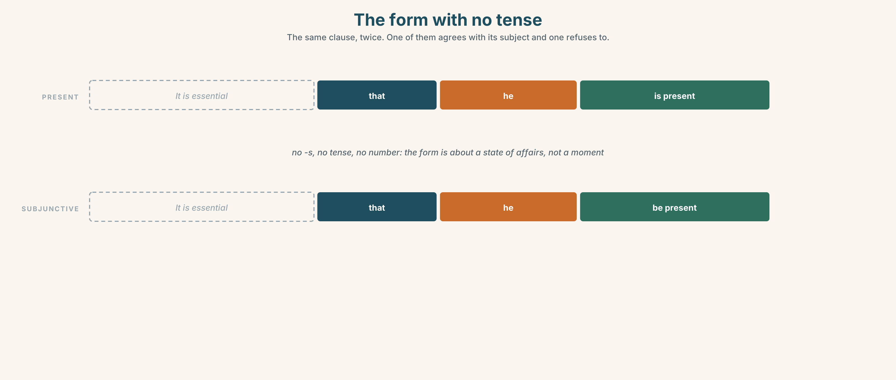
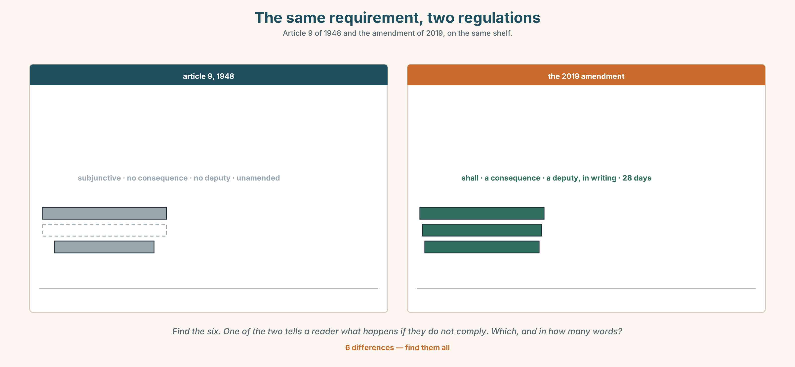
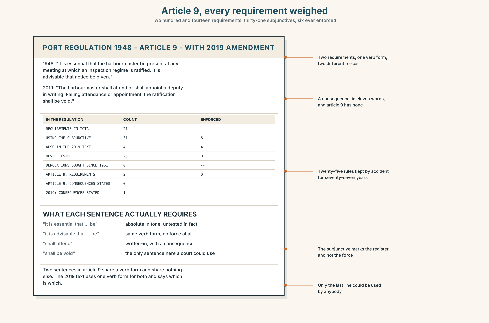
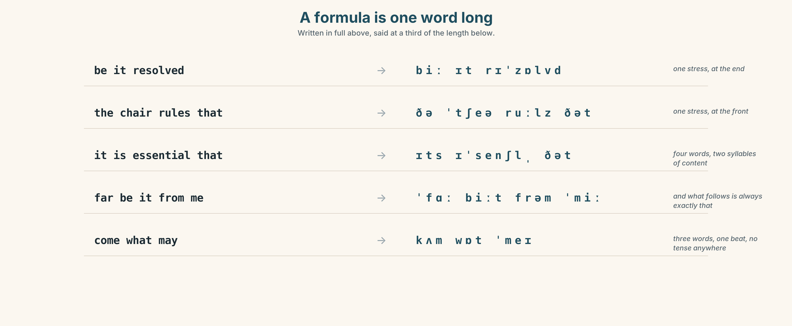
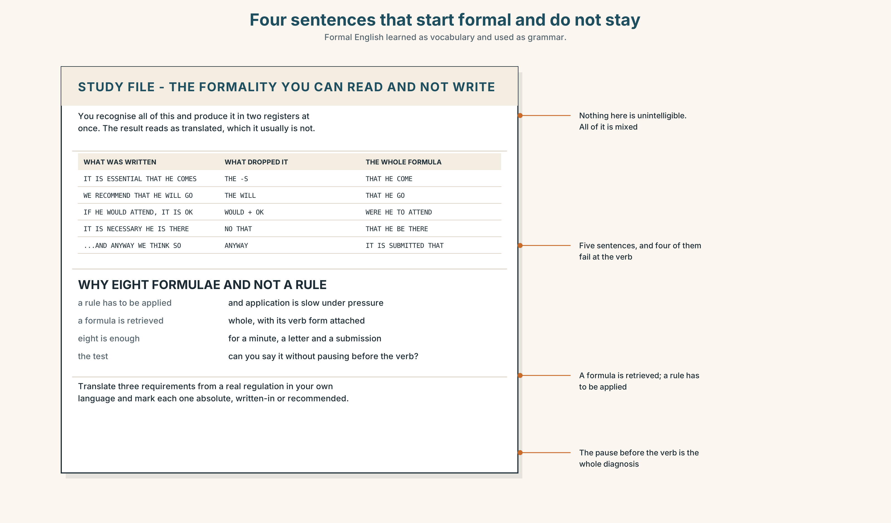
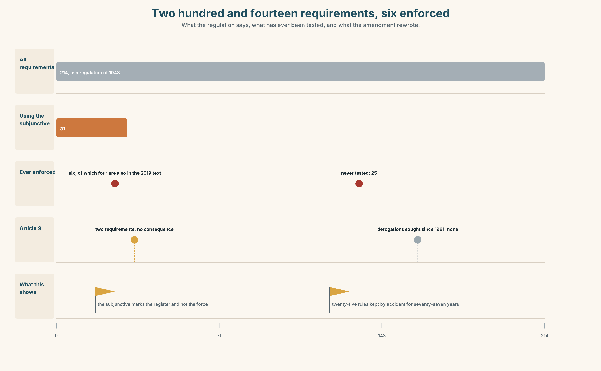
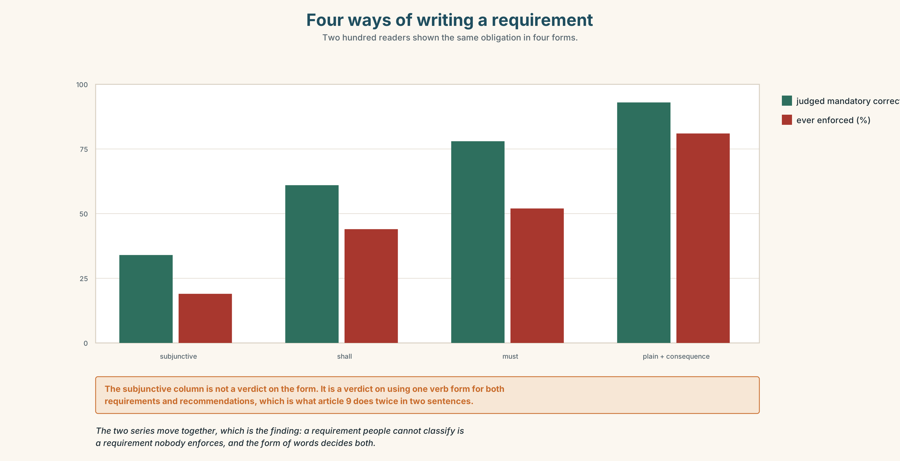

# B2.2 · Unit 5 · That He Be Present

> **English Animated** · *Holding the Floor* · a port and its logistics chain, Rotterdam
> Student's Book pages 94–115 · 22 pp · ~11 hours

---

## Part 0 · The Big Picture ◆ **A · THE WORLD**

{width=6.6in}

*The board room, ten o'clock — Twelve things to find. Two say the same requirement and one is seventy-seven years old.*

# Is it essential that he *be* here?

**By the end of this unit you can write and recognise high formality, and say which of its
requirements are real. Two hundred words.**

| ◆ **A · THE WORLD** | A regulation from 1948, a harbourmaster at sea, and eleven people deciding whether *be present* is a rule |
|---|---|
| ◆ **B · THE SYSTEM** | the subjunctive and the formal structures around it · 28 words for protocol and compliance · 22 formulaic adjectives and frames · the stress inside a formula |
| ◆ **C · THE PERFORMANCE** | Two hundred words at a level of formality you chose |

---

### 0A · Find it

**Find twelve things in this picture.** Two of them say the same requirement and one of them is
seventy-seven years old.

> the 1948 regulation, open at article 9 · the 2019 amendment, loose inside it ·
> the agenda, item four highlighted · the quorum sheet, seven of eleven ·
> the chair's gavel, unused since 1996 · an empty chair with a nameplate ·
> the inspectorate's letter · the draft resolution, two-thirds required ·
> a jug of water and eleven glasses · a clock at 10.00 ·
> a screen showing a vessel position, North Sea · a minute book, handwritten

### 0B · Guess it

**One object in this room makes another one unnecessary, and nobody in the room agrees which way
round.** Which two?

### 0C · Say it ⏺

**Record sixty seconds.** *State a rule from your own workplace or college as formally as you can,
and then say whether anybody has ever enforced it.* You will record it again at the end of this
unit.

---

## Part 1 · Vocabulary Lab 1 ◆ **B · THE SYSTEM**

{width=6.6in}

*One rule, in section — Twelve words, and the layer each one lives on. Two of them are the same escape.*

### 1A · Meet — the words of a rule

Match each word to one layer of the cutaway.

> **mandate** · **directive** · **stipulation** · **protocol** · **compliance** ·
> **derogation** · **exemption** · **inspectorate** · **ratification** · **accreditation** ·
> **quorum** · **resolution**

### 1B · Sort — the rule, the escape, the checking, or the meeting?

Four columns. **Two of the twelve are the same escape: one granted in advance, one granted after
the fact.**

> mandate · derogation · compliance · quorum · directive · exemption · inspectorate ·
> resolution · stipulation · accreditation · protocol · ratification

### 1C · Meet — the five phrases a board runs on

| | |
|---|---|
| **due process** | Not that the right answer was reached, but that the right steps were taken. |
| **the chair's ruling** | A decision about the meeting itself, which cannot be appealed in the room. |
| **a point of order** | An objection about procedure, which outranks whatever was being said. |
| **a binding undertaking** | A promise with a remedy attached. Without the remedy it is a letter. |
| **the minimum standard** | The floor. Everybody treats it as the target, which is the known failure. |

### 1D · Collocation Lab

Complete each one, and say which of the five has a date in it.

> **a formal requirement** · **with immediate effect** · **subject to approval** ·
> **in accordance with** · **an inspection regime**

1. Article 9 states ______ ______ ______ that the harbourmaster be present.
2. The new regime takes effect ______ ______ ______ , which means before the minute is signed.
3. Everything agreed this morning is ______ ______ ______ by the inspectorate.
4. The vessel was cleared ______ ______ ______ the 2019 amendment, not the 1948 text.
5. ______ ______ ______ covering three hundred and forty calls a month begins in April.

### 1E · The phrasal verbs, and the three fixed expressions

> **put forward** · **carry out** · **abide by**
>
> **f** *the chair rules that* · **f** *I move that* · **f** *be it resolved*

**One of these fixed expressions can be said by anybody in the room and two cannot.** Which, and
what does that tell you about who owns a meeting?

### 1F · Own it

Write one rule you follow at work or college, once as a requirement and once as a recommendation,
and say which one it actually is.

---

## Part 2 · Listening ◆ **A · THE WORLD**

{width=6.6in}

*Item four, ten o'clock — Nine of eleven present. Eight votes needed. The harbourmaster is at sea.*

### 2A · Ten o'clock, item four 🔊 Track 5.1

**Before you listen.** Article 9 of the 1948 regulation says *it is essential that the
harbourmaster be present*. The harbourmaster is on a vessel in the North Sea. Eight of eleven
members are needed to pass the resolution, and nine are in the room.

**Listen once.** What is the question before the board, and what does each side say the regulation
means?

**Listen again. Complete the table.**

| | What they say article 9 requires | What they propose | What it costs |
|---|---|---|---|
| the chair | | | |
| the standards officer | | | |
| the inspectorate's letter | | | |

**Listen again. True or false?**

1. Nine members are in the room. ☐ T ☐ F
2. The resolution needs eight votes. ☐ T ☐ F
3. The regulation was amended in 2019. ☐ T ☐ F
4. The amendment mentions remote attendance. ☐ T ☐ F

**Noticing.** Six sentences from the recording.

1. *It is essential that he be present.*
2. *It is essential that he is present.*
3. *It is essential for him to be present.*
4. *The regulation requires that he be present.*
5. *We recommend that he be present.*
6. *Were he to attend remotely, the article would be satisfied.*

**Six sentences, one verb form shared by three of them. Find the three, and say which two of the
six are not requirements at all.**

### 2B · Decoding clinic 🔊 Track 5.2

Thirty seconds at speed. Three jobs.

1. The chair says *be it resolved* twice. Write what you hear.
2. Which syllable carries the stress in *it is essential that*, said at speed?
3. Somebody says *far be it from me*. What follows it, every time?

---

## Part 3 · Grammar Lab 1 ◆ **B · THE SYSTEM**

### The form that has no tense

### 3A · Notice

Look at the six sentences in Part 2 again.

1. In sentence 1, what is unusual about the verb after *that*?
2. Sentence 2 uses an ordinary present. **Does it mean the same thing?**
3. Sentence 5 has the same structure as sentence 4. **Does it have the same force?**
4. Sentence 6 begins with a verb. **What has been removed from the front of it?**

### 3B · See

{width=6.6in}

*The form with no tense — The same clause, twice. One of them agrees with its subject and one refuses to.*

### 3C · Know

| | | |
|---|---|---|
| **the mandative subjunctive** | base form after *that*, no *-s*, no tense | *…that he **be** present* |
| **the adjectives that take it** | *essential · imperative · vital · requisite* | *It is essential that he be…* |
| **the verbs that take it** | *require · recommend · propose · insist · demand* | *The regulation requires that he be…* |
| **the negative** | *not* goes before the verb, with no *do* | *…that he **not be** present* |
| **the *lest* clause** | formal, and subjunctive by definition | *lest it be thought that…* |
| **inversion for the conditional** | *were*, *should* and *had* replace *if* | *Were he to attend · Should it prove* |

> **The subjunctive carries no tense and no number, and that is the point.** *That he be present*
> is about a state of affairs, not about a moment. It is why the form survives in regulations and
> has almost vanished from speech, and why a reader who meets it has to work out from context
> whether anybody is required to do anything.

> **Formality is not the same as force.** *We recommend that he be present* and *The regulation
> requires that he be present* share a verb form and share nothing else. The subjunctive tells you
> the register; the matrix verb tells you whether you have to.

| | |
|---|---|
| **the adjectives, by force** | *essential · imperative · vital* — absolute · *mandatory · obligatory · requisite* — written into a rule · *advisable · desirable* — recommended |
| **the frames** | *it is essential that · it is imperative that · we recommend that · it is proposed that · the regulation requires that* |
| **the inverted conditionals** | *were it to · should it prove · had it been* |
| **what people do with rules** | *insist on · call for · see to it · abide by · carry out* |

> **Why it matters.** Half the requirements in any regulation are not requirements. Telling the
> two apart is the difference between a document that governs anything and a document nobody can
> comply with, and the signal is in three words at the front of each sentence.

### 3D · Use — controlled

Complete each one in the subjunctive.

> It is essential that the harbourmaster (1) ______ (be) present.
> The regulation requires that the vessel (2) ______ (not depart) before clearance.
> We recommend that the board (3) ______ (seek) a derogation.
> It is proposed that article 9 (4) ______ (be) amended.
> (5) ______ he to attend remotely, the article would be satisfied. *(inversion)*

### 3E · Use — guided

Rewrite each one at the formality in brackets, keeping the force.

1. He has to be there. *(highest formality)*
2. The vessel must not leave before clearance. *(a regulation's wording)*
3. We think the board should ask for a derogation. *(a recommendation, formal)*
4. If he attends remotely, the article is satisfied. *(inverted conditional)*
5. Somebody should check that this is done. *(a formal fixed expression)*

### 3F · Use — open

**In pairs.** One of you states a workplace rule informally. The other restates it in the highest
formality they can manage, **and then says whether the force changed**. Six rounds each.

### 3G · Error autopsy

> ✗ *It is essential that he is be present.*
> ✗ *The regulation requires that he doesn't be present.*
> ✗ *Were he attends remotely, the article would be satisfied.*

For each, name the rule and say what the writer was reaching for.

### 3H · Check — eight items

> 1. It is essential that he ______ present. *(one word)*
> 2. The regulation requires that the vessel ______ ______ before clearance. *(two words)*
> 3. We recommend that the board ______ a derogation. *(one word)*
> 4. It is proposed that article 9 ______ amended. *(one word)*
> 5. ______ he to attend remotely, the article would be satisfied. *(one word)*
> 6. ✗ *The regulation requires that he doesn't be present.* → correct it.
> 7. Rewrite *He has to be there* at the highest formality you can.
> 8. Write one sentence in which the subjunctive appears and nothing is required.

---

## Part 4 · Speaking ◆ **C · THE PERFORMANCE**

### 4A · Fluency starter — raise it one level

One person states a rule in plain English. Each person in turn raises the formality by one step.
**The round ends when somebody produces a sentence nobody in the room would say out loud.**

### 4B · The functional core — using high formality

{width=6.6in}

*The same requirement, two regulations — Article 9 of 1948 and the amendment of 2019, on the same shelf.*

**Language Bank**

| | |
|---|---|
| **requiring** | *it is essential that · it is imperative that · the regulation requires that* |
| **recommending** | *we recommend that · it is proposed that · it is advisable that* |
| **conditioning** | *were it to · should it prove · lest it be* |
| **running the room** | *I move that · the chair rules that · a point of order · be it resolved* |

**Information gap.** Learner A has the 1948 article. Learner B has the 2019 amendment.
**Decide together whether the board may proceed, and draft the minute.** Ten minutes.

### 4C · The performance — three minutes ⏺

Chair a three-minute item. **You must use one subjunctive, one inverted conditional and one
procedural formula**, and your partner must be able to say afterwards what was required and what
was advised.

**Record it.**

### 4D · Observer

One person writes down every requirement stated and marks it absolute, written-in or recommended.

### 4E · Three criteria

> ☐ Did the register stay high for the whole item?
> ☐ Could anybody tell, from my words alone, what was mandatory?
> ☐ Did I use the subjunctive where it belonged and nowhere else?

---

## Part 5 · Reading ◆ **A · THE WORLD**

### 5A · Predict

The title is **"Thirty-one requirements, six enforced."**
**If a rule has never been enforced, is it a rule?**

### 5B · Read — two minutes

---

**Thirty-one requirements, six enforced**

Article 9 of the port regulation of 1948 provides that it is essential that the harbourmaster be
present at any meeting at which an inspection regime is ratified. The article was not amended in
2019, when the rest of the regulation was. The harbourmaster is at sea.

Nine of eleven board members are present. Eight votes are required. On the face of it the
resolution can pass and the article cannot be satisfied.

A review commissioned afterwards found that the regulation contains two hundred and fourteen
requirements. Thirty-one of them use the subjunctive. Of those thirty-one, six have ever been
enforced, and four of the six are the ones that also appear in the 2019 amendment, where they are
written with *shall*.

The remaining twenty-five have been complied with by accident, in most cases, for seventy-seven
years. Nobody has ever sought a derogation from any of them, because nobody was certain they were
requirements, and asking would have settled the question.

The review's own recommendation is written as *it is recommended that article 9 be amended*. The
board has not yet decided whether that sentence requires anything.

---

### 5C · Comprehension — eight questions

1. What does article 9 provide, and when was it written?
2. How many members are present, and how many votes are needed?
3. How many requirements does the regulation contain, and how many use the subjunctive?
4. How many of those have been enforced?
5. What is written with *shall* in the 2019 amendment?
6. **"Complied with by accident." What does the writer mean, and why is that worse than being broken?**
7. **Why would asking for a derogation have settled the question?**
8. **The last sentence is a joke that is also the point. Explain both.**

### 5D · Vocabulary in context

Infer from the text, then check.

> provides that · on the face of it · complied with by accident · sought a derogation ·
> settled the question

### 5E · The counter-text

{width=6.6in}

*Article 9, every requirement weighed — Two hundred and fourteen requirements, thirty-one subjunctives, six ever enforced.*

**Read article 9 and the 2019 amendment, and answer.**

1. How many requirements are in article 9, and which verb form does each use?
2. **Find every sentence in the amendment that uses *shall*, and say whether it replaces a
   subjunctive.**
3. One sentence in article 9 looks mandatory and is not. **Which, and what gives it away?**
4. **Rewrite article 9 so that a reader can tell, in each sentence, whether they must or should.**

### 5F · Two texts

Article 9 says *it is essential that the harbourmaster be present*.
The 2019 amendment says *the harbourmaster shall attend or appoint a deputy in writing*.

**Do these say the same thing?** Write two sentences, and use the word *derogation* in one of them.

---

## Part 6 · Vocabulary Lab 2 ◆ **B · THE SYSTEM**

### Words that say how much you have to

### 6A · Sort — absolute, written into a rule, or recommended?

Three columns.

> essential · mandatory · advisable · imperative · obligatory · desirable · vital · requisite

### 6B · Chunk completion

1. ______ ______ ______ ______ he be present. *(four words)*
2. ______ ______ ______ ______ the vessel not depart. *(four words — stronger still)*
3. ______ ______ ______ the board seek a derogation. *(three words)*
4. ______ ______ ______ ______ ______ the deputy be appointed in writing. *(four words)*
5. ______ ______ thought that the article is a formality. *(two words)*
6. ______ ______ ______ attend remotely, the article would be satisfied. *(three words)*
7. ______ ______ ______ impossible, the meeting shall be adjourned. *(three words)*
8. ______ ______ ______ ______ article 9 be amended. *(four words)*

### 6C · Three that are not interchangeable

> *essential* · *mandatory* · *advisable*

**Say which one is a judgement, which one is a fact about a document, and which one commits nobody
to anything.**

### 6D · The phrasal verbs and the fixed expressions

> **insist on** · **call for** · **see to it**
>
> **f** *be that as it may* · **f** *far be it from me* · **f** *come what may*

**One of these fixed expressions is always followed by exactly the thing it disclaims.** Which,
and why does everybody in the room know it?

### 6E · Contrast Clinic

Eight items. Rewrite each one as the bracket asks.

1. He has to be there. *(highest formality)*
2. The vessel must not leave before clearance. *(a regulation's wording)*
3. We think the board should ask for a derogation. *(formal recommendation)*
4. If he attends remotely, the article is satisfied. *(inverted conditional)*
5. Somebody should make sure this happens. *(a three-word phrasal verb)*
6. In case anybody thinks this is a formality. *(a formal two-word opener)*
7. If it turns out to be impossible, adjourn. *(inverted, formal)*
8. We suggest changing article 9. *(formal, with the subjunctive)*

---

## Part 7 · Pronunciation & Fluency Lab ◆ **B · THE SYSTEM**

{width=6.6in}

*A formula is one word long — Written in full above, said at a third of the length below.*

### A formula is one word long

### 7A · Hear 🔊 Track 5.3

> *Be it resolved* → /biː ɪt rɪˈzɒlvd/ — one stress, at the end
> *The chair rules that* → /ðə ˈtʃeə ruːlz ðət/ — one stress, at the front
> *It is essential that* → /ɪts ɪˈsenʃl̩ ðət/ — four words, two syllables of content

### 7B · Say

Say each three times, fast. Then say this:

> *It is essential that he be present — far be it from me to suggest otherwise.* — two formulae
> and one real claim, and the formulae take less time than the claim.

### 7C · Make it mean something

Say these two:

> *It is esSENtial that he be present.* — the formula, said at speed: a requirement is being quoted
> *It is ESSENTIAL that he be present.* — the stress moved onto the adjective: and somebody has
> just said it is not

**A formula said with its ordinary stress is a citation; stress any word inside it and you have
started an argument.** This is why procedural language sounds flat: flatness is how you signal
that you are quoting the rule rather than making it.

### 7D · Fluency 30 ⏺

Thirty seconds: **four formulae at speed, then the same four with one word stressed in each.**
Three times, faster.

---

## Part 8 · Writing ◆ **C · THE PERFORMANCE**

### A minute, at the formality it needs · 200 words

### 8A · Read the model

> The chair ruled that item four be taken in the absence of the harbourmaster. `[the subjunctive
> after a ruling verb: this is the register the minute book has used since 1948]`
>
> It was noted that article 9 of the regulation of 1948 provides that it is essential that the
> harbourmaster be present, and that the article was not amended in 2019. `[two subjunctives in
> one sentence, one quoted and one reported, and the date of the amendment doing the work of an
> argument]`
>
> Were a derogation to be sought, the inspectorate would require the request in writing within
> twenty-eight days; should it be refused, the ratification would fall. `[two inverted
> conditionals, which is the formal register's way of saying "if" without saying it twice]`
>
> It was resolved, nine members being present and eight votes required, that the regulation be
> ratified, that the absence be recorded, and that a derogation be sought with immediate effect.
> `[three subjunctives in parallel after one matrix verb, which is the shape of every resolution
> ever written]`

**Questions about the writer's choices:**

1. The second sentence quotes a subjunctive inside a reported one. **Why not paraphrase it?**
2. Two inverted conditionals in one sentence. **What would *if* twice have sounded like?**
3. The last sentence has three parallel subjunctives. **What does the parallelism buy a reader?**

### 8B · The anti-model

> The chair said we should probably just go ahead since the harbourmaster isn't here and it's essential he's here but he can't be, so if the inspectorate says no we'll have to look at it again, and anyway it's never been enforced.

One sentence, forty-four words, two contractions, one *anyway*, and a requirement reported as an
opinion.
**Rewrite it as a minute, with the force of each requirement visible.**

### 8C · Plan

> the ruling, in the subjunctive → the article quoted, with its date → the conditionals, inverted
> → the resolution, three parallel subjunctives

### 8D · Write — 200 words
### 8E · Peer review — three criteria

> ☐ Is every requirement marked as absolute, written-in or recommended?
> ☐ Does the register stay level, or does it drop in the middle?
> ☐ Is every subjunctive after a verb or adjective that licenses one?

### 8F · Write it again · 8G · Publish

Rewrite after review. **Publish both, and mark every subjunctive and what licenses it.**

---

## Part 9 · The File ◆ **A · THE WORLD + C · THE PERFORMANCE**

{width=6.6in}

*Four sentences that start formal and do not stay — Formal English learned as vocabulary and used as grammar.*

# STUDY FILE · The formality you can recognise and not produce

### 9A · Reading it and writing it 🔊 Track 5.4

Most learners at this level read formal English comfortably and produce it in two registers at
once: a formal opening, a neutral middle, and a phrase from a textbook dropped in at the end. The
result reads as translated, which it usually is not.

| | |
|---|---|
| **what you produce** | *It is essential that he comes. Anyway, we think…* |
| **what gives it away** | the ordinary present, and *anyway* |
| **why** | formal English is learned as vocabulary and used as grammar |
| **the fix** | eight formulae, learned whole, with their verb forms attached |

### 9B · Learn eight whole

Choose **eight** formulae from this unit.
**Write one true sentence with each, about your own field**, and keep the verb form that belongs
to it.

### 9C · Role play — raise it one level

In pairs. One of you says a sentence in neutral English. The other raises it one level of
formality, **changing exactly one thing**. **Eight rounds each.**

### 9D · The one you drop in

Everybody has one formal phrase they use in the wrong place.
**Find yours.** It is usually *moreover*, *hence*, or *in my humble opinion*.

### 9E · Transfer — before next week

**Find a real regulation or policy in your own language and translate three requirements into
English**, marking each one absolute, written-in or recommended. Bring both versions.

---

## Part 10 · Mediation & Interaction ◆ **C · THE PERFORMANCE**

{width=6.6in}

*Two hundred and fourteen requirements, six enforced — What the regulation says, what has ever been tested, and what the amendment rewrote.*

### 10A · Relay

Half the class has article 9. Half has the 2019 amendment and the inspectorate's letter.
**Decide whether the board may proceed, by speaking only.** Ten minutes.

### 10B · Simplify — for one reader

A new board member writes: *Which of these do I actually have to do?*
**Reply in four sentences,** sorting the requirements into must, should and never-enforced.

### 10C · Online

Write **one message** to the inspectorate requesting a derogation. **Three sentences**, in the
register of the document you are asking about.

### 10D · Your language

Does your language have a subjunctive, and is it alive?
**Translate all six sentences from Part 2.** Which two become identical, and what is lost?

---

## Part 11 · The Decision ◆ **C · THE PERFORMANCE**

# Item four

**Option one:** adjourn. *Be present* is a subjunctive in a regulation, not a preference, and a
ratification taken in breach of article 9 can be challenged for as long as the regime lasts.

**Option two:** proceed. The article has never been enforced, the harbourmaster can ratify in
writing afterwards, and the regime starts in April either way.

**Option three:** proceed, record the absence in the minute, and seek a formal derogation covering
remote attendance, with a sunset date and a review.

### 11A · The evidence

{width=6.6in}

*Four ways of writing a requirement — Two hundred readers shown the same obligation in four forms.*

🔊 **Track 5.6.** Tomas Brink, standards, 30 seconds: *"Twenty-five requirements that nobody has
ever tested. That is not a compliance record, it is a coin that has not been flipped. The
dangerous ones are not the rules we break; they are the rules we keep by accident, because the day
we cannot keep one, we will discover whether it was a rule at the same moment as everybody else."*

### 11B · Talk about it

In threes. Use the frame, and use one subjunctive per turn.

> *I move that ______ , on the ground that ______ . Were it to ______ , I would ______ .*

### 11C · Decide

Write **three sentences**: the decision, the evidence, and the resolution as you would minute it.

### 11D · Model decision

> Option three. Adjourning treats a seventy-seven-year-old sentence as settled law when nobody in
> the building knows whether it is, and proceeding quietly leaves the same question open for
> another seventy-seven years. The derogation request is the only option that produces an answer:
> the inspectorate must either grant it, which makes article 9 a requirement with a known escape,
> or refuse it, which tells us it is one. Either reply is worth more than the regime.

### 11E · The Reveal

> **What happened.** The board proceeded, recorded the absence, and applied. The derogation was
> granted in nine days, with a sunset of three years and a requirement that any deputy be
> appointed in writing.
>
> Then something nobody predicted: the inspectorate's reply quoted article 9 and noted, in a
> footnote, that it had received no application under that article since 1961. Four other port
> authorities wrote within a month asking for the same derogation. None of them had known they
> might need one, and all four had been holding meetings in breach of it for decades.

**One question. You do not have to answer it out loud.**

> The board asked a question about one meeting. Why did four other ports change?

---

## Part 12 · Landing ◆ **all three lines**

### 12A · Recycle — fifteen items

> 1. It is essential that he ______ present. *(one word)*
> 2. The regulation requires that the vessel ______ ______ . *(two words)*
> 3. We recommend that the board ______ a derogation. *(one word)*
> 4. It is proposed that article 9 ______ amended. *(one word)*
> 5. ______ he to attend remotely, the article would be satisfied. *(one word)*
> 6. ______ ______ ______ impossible, the meeting shall be adjourned. *(three words)*
> 7. ______ ______ thought that this is a formality. *(two words)*
> 8. Attendance is ______ under the amendment and ______ under article 9. *(two words — one each)*
> 9. A deputy is ______ , though not required. *(one word)*
> 10. The regime begins ______ ______ ______ . *(three words)*
> 11. ______ ______ ______ ______ . *(four words — the opening of a resolution)*
> 12. ______ ______ ______ ______ ______ ______ . *(six words — the disclaimer nobody believes)*
> 13. The inspectorate will ______ ______ a written application. *(two words)*
> 14. Somebody must ______ ______ ______ that the minute is signed. *(three words)*
> 15. All parties agreed to ______ ______ the sunset date. *(two words)*

### 12B · Consolidate — one task, everything in it

**Write 150 words of minute**, containing two subjunctives, one inverted conditional and one
procedural formula. Mark what licenses each subjunctive.

### 12C · Can-do, with evidence

> ☐ I can form and use the mandative subjunctive. **Evidence:** 3H, 8D
> ☐ I can tell a requirement from a recommendation in formal text. **Evidence:** 5E, 10B
> ☐ I can hold a high register across a paragraph. **Evidence:** 9B, 8D
> ☐ I can say a formula flat and know what stressing it does. **Evidence:** 7C

### 12D · Replay ⏺

Record 0C again. **Compare.** Was the rule you stated the first time actually a rule?

### 12E · Glossary — fifty items, as a map

> **THE RULE** · mandate · directive · stipulation · protocol
> **THE ESCAPE** · derogation · exemption
> **THE CHECKING** · compliance · inspectorate · accreditation
> **THE MEETING** · quorum · resolution · ratification
> **WHAT A BOARD RUNS ON** · due process · the chair's ruling · a point of order · a binding undertaking · the minimum standard
> **THE PAPERWORK** · a formal requirement · with immediate effect · subject to approval · in accordance with · an inspection regime
> **WHAT PEOPLE DO WITH RULES** · put forward · carry out · abide by · insist on · call for · see to it
> **RUNNING THE ROOM** · the chair rules that · I move that · be it resolved
> **THE ADJECTIVES** · essential · imperative · vital · requisite · mandatory · obligatory · advisable · desirable
> **THE FRAMES** · it is essential that · it is imperative that · we recommend that · the regulation requires that · lest it be · were it to · should it prove · it is proposed that
> **THE DISCLAIMERS** · be that as it may · far be it from me · come what may

### 12F · Next

> **Unit 6 · Can you agree and disagree at once?**
